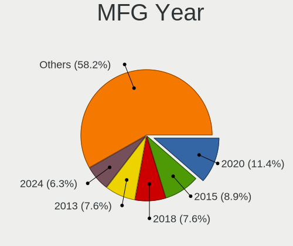
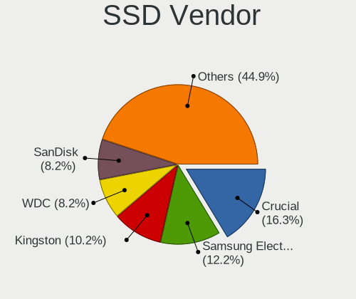
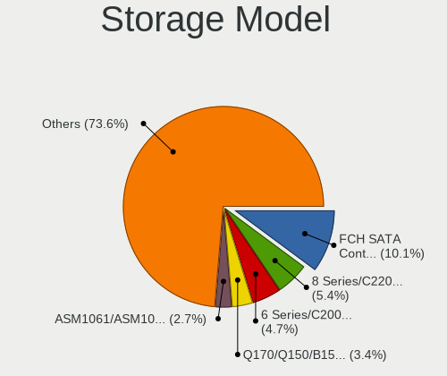
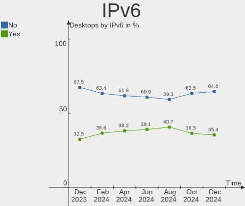
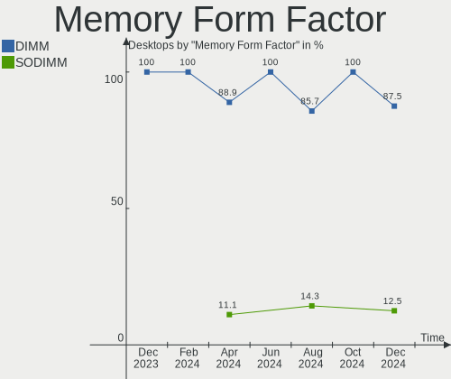

Zorin Hardware Trends (Desktop)
-------------------------------

A project to identify most popular hardware characteristics and track their change
over time based on data collected by Zorin users at https://Linux-Hardware.org.

Anyone can contribute to the study by uploading probes of their computers by
the [hw-probe](https://github.com/linuxhw/hw-probe) tool:

    sudo -E hw-probe -all -upload

Full-feature report is available here: https://linux-hardware.org/?view=trends&formfactor=desktop

Period: Apr, 2021.

Contents
--------

- [ OS                       ](#os)
- [ OS Family                ](#os-family)
- [ Kernel                   ](#kernel)
- [ Kernel Family            ](#kernel-family)
- [ Kernel Major Ver.        ](#kernel-major-ver)
- [ Arch                     ](#arch)
- [ DE                       ](#de)
- [ Display Server           ](#display-server)
- [ Display Manager          ](#display-manager)
- [ OS Lang                  ](#os-lang)
- [ Boot Mode                ](#boot-mode)
- [ Filesystem               ](#filesystem)
- [ Part. scheme             ](#part-scheme)
- [ Dual Boot with Linux/BSD ](#dual-boot-with-linux/bsd)
- [ Dual Boot (Win)          ](#dual-boot-win)
- [ Country                  ](#country)
- [ City                     ](#city)
- [ Vendor                   ](#vendor)
- [ Model                    ](#model)
- [ Model Family             ](#model-family)
- [ MFG Year                 ](#mfg-year)
- [ Form Factor              ](#form-factor)
- [ Secure Boot              ](#secure-boot)
- [ Coreboot                 ](#coreboot)
- [ RAM Size                 ](#ram-size)
- [ RAM Used                 ](#ram-used)
- [ Has CD-ROM               ](#has-cd-rom)
- [ Total Drives             ](#total-drives)
- [ Has Ethernet             ](#has-ethernet)
- [ Has WiFi                 ](#has-wifi)
- [ Has Bluetooth            ](#has-bluetooth)
- [ Drive Vendor             ](#drive-vendor)
- [ Drive Model              ](#drive-model)
- [ HDD Vendor               ](#hdd-vendor)
- [ SSD Vendor               ](#ssd-vendor)
- [ Drive Kind               ](#drive-kind)
- [ Drive Connector          ](#drive-connector)
- [ Drive Size               ](#drive-size)
- [ Space Total              ](#space-total)
- [ Space Used               ](#space-used)
- [ Malfunc. Drives          ](#malfunc-drives)
- [ Malfunc. Drive Vendor    ](#malfunc-drive-vendor)
- [ Malfunc. HDD Vendor      ](#malfunc-hdd-vendor)
- [ Malfunc. Drive Kind      ](#malfunc-drive-kind)
- [ Failed Drives            ](#failed-drives)
- [ Failed Drive Vendor      ](#failed-drive-vendor)
- [ Drive Status             ](#drive-status)
- [ Storage Vendor           ](#storage-vendor)
- [ Storage Model            ](#storage-model)
- [ Storage Kind             ](#storage-kind)
- [ CPU Vendor               ](#cpu-vendor)
- [ CPU Model                ](#cpu-model)
- [ CPU Model Family         ](#cpu-model-family)
- [ CPU Cores                ](#cpu-cores)
- [ CPU Sockets              ](#cpu-sockets)
- [ CPU Threads              ](#cpu-threads)
- [ CPU Op-Modes             ](#cpu-op-modes)
- [ CPU Microcode            ](#cpu-microcode)
- [ CPU Microarch            ](#cpu-microarch)
- [ GPU Vendor               ](#gpu-vendor)
- [ GPU Model                ](#gpu-model)
- [ GPU Combo                ](#gpu-combo)
- [ GPU Driver               ](#gpu-driver)
- [ GPU Memory               ](#gpu-memory)
- [ Monitor Vendor           ](#monitor-vendor)
- [ Monitor Model            ](#monitor-model)
- [ Monitor Resolution       ](#monitor-resolution)
- [ Monitor Diagonal         ](#monitor-diagonal)
- [ Monitor Width            ](#monitor-width)
- [ Aspect Ratio             ](#aspect-ratio)
- [ Monitor Area             ](#monitor-area)
- [ Pixel Density            ](#pixel-density)
- [ Multiple Monitors        ](#multiple-monitors)
- [ Net Controller Vendor    ](#net-controller-vendor)
- [ Net Controller Model     ](#net-controller-model)
- [ Wireless Vendor          ](#wireless-vendor)
- [ Wireless Model           ](#wireless-model)
- [ Ethernet Vendor          ](#ethernet-vendor)
- [ Ethernet Model           ](#ethernet-model)
- [ Net Controller Kind      ](#net-controller-kind)
- [ Used Controller          ](#used-controller)
- [ NICs                     ](#nics)
- [ IPv6                     ](#ipv6)
- [ Memory Vendor            ](#memory-vendor)
- [ Memory Model             ](#memory-model)
- [ Memory Kind              ](#memory-kind)
- [ Memory Form Factor       ](#memory-form-factor)
- [ Memory Size              ](#memory-size)
- [ Memory Speed             ](#memory-speed)
- [ Sound Vendor             ](#sound-vendor)
- [ Sound Model              ](#sound-model)
- [ Camera Vendor            ](#camera-vendor)
- [ Camera Model             ](#camera-model)
- [ Fingerprint Vendor       ](#fingerprint-vendor)
- [ Fingerprint Model        ](#fingerprint-model)
- [ Chipcard Vendor          ](#chipcard-vendor)
- [ Chipcard Model           ](#chipcard-model)
- [ Printer Vendor           ](#printer-vendor)
- [ Printer Model            ](#printer-model)
- [ Scanner Vendor           ](#scanner-vendor)
- [ Scanner Model            ](#scanner-model)
- [ Bluetooth Vendor         ](#bluetooth-vendor)
- [ Bluetooth Model          ](#bluetooth-model)
- [ Unsupported Devices      ](#unsupported-devices)
- [ Unsupported Device Types ](#unsupported-device-types)

OS
--

Installed operating systems

| Name     | Desktops | Percent |
|----------|----------|---------|
| Zorin 15 | 21       | 77.78%  |
| Zorin 16 | 5        | 18.52%  |
| Zorin 12 | 1        | 3.7%    |

OS Family
---------

OS without a version

| Name  | Desktops | Percent |
|-------|----------|---------|
| Zorin | 27       | 100%    |

Kernel
------

Version of the Linux kernel

| Version            | Desktops | Percent |
|--------------------|----------|---------|
| 5.4.0-72-generic   | 11       | 40.74%  |
| 5.4.0-70-generic   | 5        | 18.52%  |
| 5.8.0-50-generic   | 4        | 14.81%  |
| 5.8.0-49-generic   | 1        | 3.7%    |
| 5.4.0-66-generic   | 1        | 3.7%    |
| 5.4.0-65-generic   | 1        | 3.7%    |
| 5.4.0-47-generic   | 1        | 3.7%    |
| 5.4.0-45-generic   | 1        | 3.7%    |
| 5.3.0-28-generic   | 1        | 3.7%    |
| 4.15.0-140-generic | 1        | 3.7%    |

Kernel Family
-------------

Linux kernel without a distro release

| Version | Desktops | Percent |
|---------|----------|---------|
| 5.4.0   | 20       | 74.07%  |
| 5.8.0   | 5        | 18.52%  |
| 5.3.0   | 1        | 3.7%    |
| 4.15.0  | 1        | 3.7%    |

Kernel Major Ver.
-----------------

Linux kernel major version

| Version | Desktops | Percent |
|---------|----------|---------|
| 5.4     | 20       | 74.07%  |
| 5.8     | 5        | 18.52%  |
| 5.3     | 1        | 3.7%    |
| 4.15    | 1        | 3.7%    |

Arch
----

OS architecture (x86_64, i586, etc.)

| Name   | Desktops | Percent |
|--------|----------|---------|
| x86_64 | 26       | 96.3%   |
| i686   | 1        | 3.7%    |

DE
--

Desktop Environment

| Name  | Desktops | Percent |
|-------|----------|---------|
| GNOME | 23       | 85.19%  |
| XFCE  | 4        | 14.81%  |

Display Server
--------------

X11 or Wayland

| Name | Desktops | Percent |
|------|----------|---------|
| X11  | 27       | 100%    |

Display Manager
---------------

SDDM, LightDM, etc.

| Name    | Desktops | Percent |
|---------|----------|---------|
| Unknown | 27       | 100%    |

OS Lang
-------

Language

| Lang  | Desktops | Percent |
|-------|----------|---------|
| en_US | 13       | 48.15%  |
| en_GB | 3        | 11.11%  |
| en_CA | 2        | 7.41%   |
| de_DE | 2        | 7.41%   |
| sv_SE | 1        | 3.7%    |
| pt_BR | 1        | 3.7%    |
| pl_PL | 1        | 3.7%    |
| nl_NL | 1        | 3.7%    |
| nb_NO | 1        | 3.7%    |
| es_CO | 1        | 3.7%    |
| de_CH | 1        | 3.7%    |

Boot Mode
---------

EFI or BIOS

| Mode | Desktops | Percent |
|------|----------|---------|
| BIOS | 19       | 70.37%  |
| EFI  | 8        | 29.63%  |

Filesystem
----------

Type of filesystem

| Type    | Desktops | Percent |
|---------|----------|---------|
| Ext4    | 26       | 96.3%   |
| Overlay | 1        | 3.7%    |

Part. scheme
------------

Scheme of partitioning

| Type    | Desktops | Percent |
|---------|----------|---------|
| Unknown | 27       | 100%    |

Dual Boot with Linux/BSD
------------------------

Hosting more than one Linux/BSD

| Dual boot | Desktops | Percent |
|-----------|----------|---------|
| No        | 26       | 96.3%   |
| Yes       | 1        | 3.7%    |

Dual Boot (Win)
---------------

Hosting Linux and Windows

| Dual boot | Desktops | Percent |
|-----------|----------|---------|
| No        | 18       | 66.67%  |
| Yes       | 9        | 33.33%  |

Country
-------

Geographic location (country)

| Country     | Desktops | Percent |
|-------------|----------|---------|
| USA         | 10       | 37.04%  |
| UK          | 3        | 11.11%  |
| Canada      | 3        | 11.11%  |
| Germany     | 2        | 7.41%   |
| Vietnam     | 1        | 3.7%    |
| Switzerland | 1        | 3.7%    |
| Sweden      | 1        | 3.7%    |
| Poland      | 1        | 3.7%    |
| Norway      | 1        | 3.7%    |
| Netherlands | 1        | 3.7%    |
| Colombia    | 1        | 3.7%    |
| Brazil      | 1        | 3.7%    |
| Australia   | 1        | 3.7%    |

City
----

Geographic location (city)

| City               | Desktops | Percent |
|--------------------|----------|---------|
| Zurich             | 1        | 3.7%    |
| Wigan              | 1        | 3.7%    |
| Westbank           | 1        | 3.7%    |
| Welwyn Garden City | 1        | 3.7%    |
| Waterloo           | 1        | 3.7%    |
| Warsaw             | 1        | 3.7%    |
| Valla              | 1        | 3.7%    |
| Sorreisa           | 1        | 3.7%    |
| Santa Barbara      | 1        | 3.7%    |
| Palm Coast         | 1        | 3.7%    |
| Oscoda             | 1        | 3.7%    |
| Mentor             | 1        | 3.7%    |
| Melbourne          | 1        | 3.7%    |
| Las Vegas          | 1        | 3.7%    |
| Indianapolis       | 1        | 3.7%    |
| Hanoi              | 1        | 3.7%    |
| Fort Worth         | 1        | 3.7%    |
| Elk Grove Village  | 1        | 3.7%    |
| Dortmund           | 1        | 3.7%    |
| Dorchester         | 1        | 3.7%    |
| Dallas             | 1        | 3.7%    |
| Ceilandia          | 1        | 3.7%    |
| Breda              | 1        | 3.7%    |
| Brampton           | 1        | 3.7%    |
| Bogotá            | 1        | 3.7%    |
| Bamberg            | 1        | 3.7%    |
| Altamonte Springs  | 1        | 3.7%    |

Vendor
------

Motherboard manufacturer

| Name                | Desktops | Percent |
|---------------------|----------|---------|
| ASUSTek Computer    | 6        | 22.22%  |
| Lenovo              | 3        | 11.11%  |
| Gigabyte Technology | 3        | 11.11%  |
| Dell                | 3        | 11.11%  |
| Pegatron            | 2        | 7.41%   |
| MSI                 | 2        | 7.41%   |
| ASRock              | 2        | 7.41%   |
| Unknown             | 2        | 7.41%   |
| Intel               | 1        | 3.7%    |
| Hewlett-Packard     | 1        | 3.7%    |
| AMD                 | 1        | 3.7%    |
| Acer                | 1        | 3.7%    |

Model
-----

Motherboard model

| Name                               | Desktops | Percent |
|------------------------------------|----------|---------|
| Unknown                            | 2        | 7.41%   |
| Pegatron NE502AV-ABA a6750t        | 1        | 3.7%    |
| Pegatron CQ2014                    | 1        | 3.7%    |
| MSI MS-7B09                        | 1        | 3.7%    |
| MSI MS-7695                        | 1        | 3.7%    |
| Lenovo ThinkCentre M900 10FM001GUS | 1        | 3.7%    |
| Lenovo K450e 10181                 | 1        | 3.7%    |
| Lenovo IdeaCentre K330             | 1        | 3.7%    |
| Intel DG41MJ AAE54659-206          | 1        | 3.7%    |
| HP Compaq dc7800 Small Form Factor | 1        | 3.7%    |
| Gigabyte B75M-D3V                  | 1        | 3.7%    |
| Gigabyte B450 AORUS ELITE          | 1        | 3.7%    |
| Gigabyte A320M-S2H                 | 1        | 3.7%    |
| Dell OptiPlex 990                  | 1        | 3.7%    |
| Dell OptiPlex 7040                 | 1        | 3.7%    |
| Dell OptiPlex 7020                 | 1        | 3.7%    |
| ASUS Z170-A                        | 1        | 3.7%    |
| ASUS PRIME B250M-A                 | 1        | 3.7%    |
| ASUS P5K                           | 1        | 3.7%    |
| ASUS M4A88TD-V EVO/USB3            | 1        | 3.7%    |
| ASUS B150 PRO GAMING D3            | 1        | 3.7%    |
| ASUS All Series                    | 1        | 3.7%    |
| ASRock G41M-VS3                    | 1        | 3.7%    |
| ASRock B550M Steel Legend          | 1        | 3.7%    |
| AMD Inagua CRB                     | 1        | 3.7%    |
| Acer Predator G3610                | 1        | 3.7%    |

Model Family
------------

Motherboard model prefix

| Name                 | Desktops | Percent |
|----------------------|----------|---------|
| Dell OptiPlex        | 3        | 11.11%  |
| Unknown              | 2        | 7.41%   |
| Pegatron NE502AV-ABA | 1        | 3.7%    |
| Pegatron CQ2014      | 1        | 3.7%    |
| MSI MS-7B09          | 1        | 3.7%    |
| MSI MS-7695          | 1        | 3.7%    |
| Lenovo ThinkCentre   | 1        | 3.7%    |
| Lenovo K450e         | 1        | 3.7%    |
| Lenovo IdeaCentre    | 1        | 3.7%    |
| Intel DG41MJ         | 1        | 3.7%    |
| HP Compaq            | 1        | 3.7%    |
| Gigabyte B75M-D3V    | 1        | 3.7%    |
| Gigabyte B450        | 1        | 3.7%    |
| Gigabyte A320M-S2H   | 1        | 3.7%    |
| ASUS Z170-A          | 1        | 3.7%    |
| ASUS PRIME           | 1        | 3.7%    |
| ASUS P5K             | 1        | 3.7%    |
| ASUS M4A88TD-V       | 1        | 3.7%    |
| ASUS B150            | 1        | 3.7%    |
| ASUS All             | 1        | 3.7%    |
| ASRock G41M-VS3      | 1        | 3.7%    |
| ASRock B550M         | 1        | 3.7%    |
| AMD Inagua           | 1        | 3.7%    |
| Acer Predator        | 1        | 3.7%    |

MFG Year
--------

Motherboard manufacture year

| Year | Desktops | Percent |
|------|----------|---------|
| 2011 | 6        | 22.22%  |
| 2018 | 5        | 18.52%  |
| 2021 | 2        | 7.41%   |
| 2014 | 2        | 7.41%   |
| 2013 | 2        | 7.41%   |
| 2010 | 2        | 7.41%   |
| 2007 | 2        | 7.41%   |
| 2020 | 1        | 3.7%    |
| 2019 | 1        | 3.7%    |
| 2016 | 1        | 3.7%    |
| 2015 | 1        | 3.7%    |
| 2009 | 1        | 3.7%    |
| 2008 | 1        | 3.7%    |

Form Factor
-----------

Physical design of the computer

| Name    | Desktops | Percent |
|---------|----------|---------|
| Desktop | 27       | 100%    |

Secure Boot
-----------

Enabled or disabled

| State    | Desktops | Percent |
|----------|----------|---------|
| Disabled | 25       | 92.59%  |
| Enabled  | 2        | 7.41%   |

Coreboot
--------

Have coreboot on board

| Used | Desktops | Percent |
|------|----------|---------|
| No   | 27       | 100%    |

RAM Size
--------

Total RAM memory

| Size in GB  | Desktops | Percent |
|-------------|----------|---------|
| 4.01-8.0    | 8        | 29.63%  |
| 16.01-24.0  | 6        | 22.22%  |
| 32.01-64.0  | 3        | 11.11%  |
| 3.01-4.0    | 3        | 11.11%  |
| 8.01-16.0   | 3        | 11.11%  |
| 1.01-2.0    | 2        | 7.41%   |
| 2.01-3.0    | 1        | 3.7%    |
| 64.01-256.0 | 1        | 3.7%    |

RAM Used
--------

Used RAM memory

| Used GB   | Desktops | Percent |
|-----------|----------|---------|
| 1.01-2.0  | 12       | 44.44%  |
| 3.01-4.0  | 6        | 22.22%  |
| 2.01-3.0  | 6        | 22.22%  |
| 4.01-8.0  | 1        | 3.7%    |
| 8.01-16.0 | 1        | 3.7%    |
| 0.51-1.0  | 1        | 3.7%    |

Has CD-ROM
----------

Has CD-ROM on board

| Presented | Desktops | Percent |
|-----------|----------|---------|
| Yes       | 15       | 55.56%  |
| No        | 12       | 44.44%  |

Total Drives
------------

Number of drives on board

| Drives | Desktops | Percent |
|--------|----------|---------|
| 1      | 16       | 59.26%  |
| 2      | 7        | 25.93%  |
| 4      | 2        | 7.41%   |
| 5      | 1        | 3.7%    |
| 3      | 1        | 3.7%    |

Has Ethernet
------------

Has Ethernet on board

| Presented | Desktops | Percent |
|-----------|----------|---------|
| Yes       | 27       | 100%    |

Has WiFi
--------

Has WiFi module

| Presented | Desktops | Percent |
|-----------|----------|---------|
| No        | 15       | 55.56%  |
| Yes       | 12       | 44.44%  |

Has Bluetooth
-------------

Has Bluetooth module

| Presented | Desktops | Percent |
|-----------|----------|---------|
| No        | 22       | 81.48%  |
| Yes       | 5        | 18.52%  |

Drive Vendor
------------

Hard drive vendors

| Vendor              | Desktops | Drives | Percent |
|---------------------|----------|--------|---------|
| WDC                 | 7        | 9      | 18.42%  |
| Seagate             | 7        | 7      | 18.42%  |
| Samsung Electronics | 7        | 9      | 18.42%  |
| Hitachi             | 4        | 4      | 10.53%  |
| PNY                 | 2        | 2      | 5.26%   |
| Kingston            | 2        | 2      | 5.26%   |
| SPCC                | 1        | 2      | 2.63%   |
| Phison              | 1        | 2      | 2.63%   |
| Micron Technology   | 1        | 1      | 2.63%   |
| Maxtor              | 1        | 1      | 2.63%   |
| LITEON              | 1        | 1      | 2.63%   |
| JMicron             | 1        | 1      | 2.63%   |
| Intel               | 1        | 1      | 2.63%   |
| Crucial             | 1        | 1      | 2.63%   |
| A-DATA Technology   | 1        | 1      | 2.63%   |

Drive Model
-----------

Hard drive models

| Model                               | Desktops | Percent |
|-------------------------------------|----------|---------|
| Samsung NVMe SSD Drive 500GB        | 2        | 4.88%   |
| WDC WD6400AAKS-22A7B2 640GB         | 1        | 2.44%   |
| WDC WD5000AAKS-00YGA0 500GB         | 1        | 2.44%   |
| WDC WD40EZRZ-00GXCB0 4TB            | 1        | 2.44%   |
| WDC WD2500AAKS-00VSA0 250GB         | 1        | 2.44%   |
| WDC WD20EARX-22PASB0 2TB            | 1        | 2.44%   |
| WDC WD10EZEX-08WN4A0 1TB            | 1        | 2.44%   |
| WDC WD10EURX-63FH1Y0 1TB            | 1        | 2.44%   |
| SPCC Solid State Disk 512GB         | 1        | 2.44%   |
| SPCC Solid State Disk 1024GB        | 1        | 2.44%   |
| Seagate ST3500630AS 500GB           | 1        | 2.44%   |
| Seagate ST3500418AS 500GB           | 1        | 2.44%   |
| Seagate ST3320820AS 320GB           | 1        | 2.44%   |
| Seagate ST3250312AS 250GB           | 1        | 2.44%   |
| Seagate ST1000DM010-2EP102 1TB      | 1        | 2.44%   |
| Seagate ST1000DM003-1ER162 1TB      | 1        | 2.44%   |
| Seagate BUP Slim BK 1TB             | 1        | 2.44%   |
| Samsung SSD 850 EVO 500GB           | 1        | 2.44%   |
| Samsung PSSD T7 2TB                 | 1        | 2.44%   |
| Samsung NVMe SSD Drive 512GB        | 1        | 2.44%   |
| Samsung NVMe SSD Drive 2TB          | 1        | 2.44%   |
| Samsung NVMe SSD Drive 250GB        | 1        | 2.44%   |
| Samsung HD103SJ 1TB                 | 1        | 2.44%   |
| PNY SSD2SC120G1SA754D117-820 120GB  | 1        | 2.44%   |
| PNY CS900 480GB SSD                 | 1        | 2.44%   |
| Phison NVMe SSD Drive 500GB         | 1        | 2.44%   |
| Phison NVMe SSD Drive 2TB           | 1        | 2.44%   |
| Micron C400-MTFDDAK128MAM 128GB SSD | 1        | 2.44%   |
| Maxtor 6L250R0 256GB                | 1        | 2.44%   |
| LITEON IT LCS-128L9S-HP 128GB SSD   | 1        | 2.44%   |
| Kingston SV300S37A120G 120GB SSD    | 1        | 2.44%   |
| Kingston SA400S37480G 480GB SSD     | 1        | 2.44%   |
| JMicron Corp. 250GB                 | 1        | 2.44%   |
| Intel SSDSC2BW120A4 120GB           | 1        | 2.44%   |
| Hitachi HTS545016B9SA02 160GB       | 1        | 2.44%   |
| Hitachi HDS721680PLA380 80GB        | 1        | 2.44%   |
| Hitachi HDS721616PLA380 164GB       | 1        | 2.44%   |
| Hitachi HDS721010CLA332 1TB         | 1        | 2.44%   |
| Crucial CT500MX500SSD1 500GB        | 1        | 2.44%   |
| A-DATA SU750 256GB SSD              | 1        | 2.44%   |

HDD Vendor
----------

Hard disk drive vendors

| Vendor              | Desktops | Drives | Percent |
|---------------------|----------|--------|---------|
| WDC                 | 7        | 9      | 35%     |
| Seagate             | 7        | 7      | 35%     |
| Hitachi             | 4        | 4      | 20%     |
| Samsung Electronics | 1        | 1      | 5%      |
| Maxtor              | 1        | 1      | 5%      |

SSD Vendor
----------

Solid state drive vendors

| Vendor              | Desktops | Drives | Percent |
|---------------------|----------|--------|---------|
| Samsung Electronics | 2        | 2      | 16.67%  |
| PNY                 | 2        | 2      | 16.67%  |
| Kingston            | 2        | 2      | 16.67%  |
| SPCC                | 1        | 2      | 8.33%   |
| Micron Technology   | 1        | 1      | 8.33%   |
| LITEON              | 1        | 1      | 8.33%   |
| Intel               | 1        | 1      | 8.33%   |
| Crucial             | 1        | 1      | 8.33%   |
| A-DATA Technology   | 1        | 1      | 8.33%   |

Drive Kind
----------

HDD or SSD

| Kind    | Desktops | Drives | Percent |
|---------|----------|--------|---------|
| HDD     | 16       | 22     | 50%     |
| SSD     | 10       | 13     | 31.25%  |
| NVMe    | 5        | 8      | 15.63%  |
| Unknown | 1        | 1      | 3.13%   |

Drive Connector
---------------

SATA, SAS, NVMe, etc.

| Type | Desktops | Drives | Percent |
|------|----------|--------|---------|
| SATA | 23       | 34     | 76.67%  |
| NVMe | 5        | 8      | 16.67%  |
| SAS  | 2        | 2      | 6.67%   |

Drive Size
----------

Size of hard drive

| Size in TB | Desktops | Drives | Percent |
|------------|----------|--------|---------|
| 0.01-0.5   | 17       | 20     | 56.67%  |
| 0.51-1.0   | 9        | 10     | 30%     |
| 1.01-2.0   | 3        | 3      | 10%     |
| 3.01-4.0   | 1        | 2      | 3.33%   |

Space Total
-----------

Amount of disk space available on the file system

| Size in GB     | Desktops | Percent |
|----------------|----------|---------|
| 101-250        | 9        | 33.33%  |
| 251-500        | 5        | 18.52%  |
| 501-1000       | 4        | 14.81%  |
| 2001-3000      | 3        | 11.11%  |
| More than 3000 | 2        | 7.41%   |
| 1-20           | 2        | 7.41%   |
| 1001-2000      | 1        | 3.7%    |
| 51-100         | 1        | 3.7%    |

Space Used
----------

Amount of used disk space

| Used GB   | Desktops | Percent |
|-----------|----------|---------|
| 1-20      | 12       | 44.44%  |
| 21-50     | 4        | 14.81%  |
| 51-100    | 4        | 14.81%  |
| 1001-2000 | 3        | 11.11%  |
| 101-250   | 2        | 7.41%   |
| 501-1000  | 2        | 7.41%   |

Malfunc. Drives
---------------

Drive models with a malfunction

Zero info for selected period =(

Malfunc. Drive Vendor
---------------------

Vendors of faulty drives

Zero info for selected period =(

Malfunc. HDD Vendor
-------------------

Vendors of faulty HDD drives

Zero info for selected period =(

Malfunc. Drive Kind
-------------------

Kinds of faulty drives

Zero info for selected period =(

Failed Drives
-------------

Failed drive models

Zero info for selected period =(

Failed Drive Vendor
-------------------

Failed drive vendors

Zero info for selected period =(

Drive Status
------------

Number of failed and malfunc. drives

| Status   | Desktops | Drives | Percent |
|----------|----------|--------|---------|
| Detected | 27       | 44     | 100%    |

Storage Vendor
--------------

Storage controller vendors

| Vendor              | Desktops | Percent |
|---------------------|----------|---------|
| Intel               | 18       | 51.43%  |
| AMD                 | 8        | 22.86%  |
| Samsung Electronics | 5        | 14.29%  |
| VIA Technologies    | 2        | 5.71%   |
| Phison Electronics  | 1        | 2.86%   |
| JMicron Technology  | 1        | 2.86%   |

Storage Model
-------------

Storage controller models

| Model                                                                          | Desktops | Percent |
|--------------------------------------------------------------------------------|----------|---------|
| Intel Q170/Q150/B150/H170/H110/Z170/CM236 Chipset SATA Controller [AHCI Mode]  | 4        | 8.51%   |
| AMD FCH SATA Controller [AHCI mode]                                            | 4        | 8.51%   |
| Samsung NVMe SSD Controller SM981/PM981/PM983                                  | 3        | 6.38%   |
| Samsung NVMe SSD Controller SM961/PM961/SM963                                  | 2        | 4.26%   |
| Intel SATA Controller [RAID mode]                                              | 2        | 4.26%   |
| Intel NM10/ICH7 Family SATA Controller [IDE mode]                              | 2        | 4.26%   |
| Intel 82801I (ICH9 Family) 2 port SATA Controller [IDE mode]                   | 2        | 4.26%   |
| Intel 82801G (ICH7 Family) IDE Controller                                      | 2        | 4.26%   |
| Intel 8 Series/C220 Series Chipset Family 6-port SATA Controller 1 [AHCI mode] | 2        | 4.26%   |
| Intel 6 Series/C200 Series Chipset Family 6 port Desktop SATA AHCI Controller  | 2        | 4.26%   |
| AMD SB7x0/SB8x0/SB9x0 SATA Controller [AHCI mode]                              | 2        | 4.26%   |
| AMD SB7x0/SB8x0/SB9x0 IDE Controller                                           | 2        | 4.26%   |
| VIA VT82C586A/B/VT82C686/A/B/VT823x/A/C PIPC Bus Master IDE                    | 1        | 2.13%   |
| VIA VT8237A SATA 2-Port Controller                                             | 1        | 2.13%   |
| VIA VT6415 PATA IDE Host Controller                                            | 1        | 2.13%   |
| Phison E16 PCIe4 NVMe Controller                                               | 1        | 2.13%   |
| JMicron JMB363 SATA/IDE Controller                                             | 1        | 2.13%   |
| Intel 9 Series Chipset Family SATA Controller [AHCI Mode]                      | 1        | 2.13%   |
| Intel 82Q35 Express PT IDER Controller                                         | 1        | 2.13%   |
| Intel 82801IR/IO/IH (ICH9R/DO/DH) 6 port SATA Controller [AHCI mode]           | 1        | 2.13%   |
| Intel 82801IR/IO/IH (ICH9R/DO/DH) 4 port SATA Controller [IDE mode]            | 1        | 2.13%   |
| Intel 82801IB (ICH9) 2 port SATA Controller [IDE mode]                         | 1        | 2.13%   |
| Intel 7 Series/C210 Series Chipset Family 4-port SATA Controller [IDE mode]    | 1        | 2.13%   |
| Intel 7 Series/C210 Series Chipset Family 2-port SATA Controller [IDE mode]    | 1        | 2.13%   |
| Intel 200 Series PCH SATA controller [AHCI mode]                               | 1        | 2.13%   |
| AMD X399 Series Chipset SATA Controller                                        | 1        | 2.13%   |
| AMD Starship/Matisse Chipset SATA Controller [AHCI mode]                       | 1        | 2.13%   |
| AMD SB7x0/SB8x0/SB9x0 SATA Controller [IDE mode]                               | 1        | 2.13%   |
| AMD FCH SATA Controller D                                                      | 1        | 2.13%   |
| AMD 400 Series Chipset SATA Controller                                         | 1        | 2.13%   |

Storage Kind
------------

Kind of storage controller (IDE, SATA, NVMe, SAS, ...)

| Kind | Desktops | Percent |
|------|----------|---------|
| SATA | 19       | 55.88%  |
| IDE  | 8        | 23.53%  |
| NVMe | 5        | 14.71%  |
| RAID | 2        | 5.88%   |

CPU Vendor
----------

Processor vendors

| Vendor | Desktops | Percent |
|--------|----------|---------|
| Intel  | 19       | 70.37%  |
| AMD    | 8        | 29.63%  |

CPU Model
---------

Processor models

| Model                                          | Desktops | Percent |
|------------------------------------------------|----------|---------|
| Intel Core i7-6700K CPU @ 4.00GHz              | 2        | 7.41%   |
| Intel Core i7-2600 CPU @ 3.40GHz               | 2        | 7.41%   |
| Intel Pentium Dual-Core CPU E5700 @ 3.00GHz    | 1        | 3.7%    |
| Intel Pentium Dual-Core CPU E5400 @ 2.70GHz    | 1        | 3.7%    |
| Intel Pentium Dual-Core CPU E5300 @ 2.60GHz    | 1        | 3.7%    |
| Intel Pentium Dual CPU E2180 @ 2.00GHz         | 1        | 3.7%    |
| Intel Pentium CPU G2030 @ 3.00GHz              | 1        | 3.7%    |
| Intel Core i7-6700T CPU @ 2.80GHz              | 1        | 3.7%    |
| Intel Core i7-6700 CPU @ 3.40GHz               | 1        | 3.7%    |
| Intel Core i7-4790K CPU @ 4.00GHz              | 1        | 3.7%    |
| Intel Core i5-7600K CPU @ 3.80GHz              | 1        | 3.7%    |
| Intel Core i5-4590 CPU @ 3.30GHz               | 1        | 3.7%    |
| Intel Core i5-4460 CPU @ 3.20GHz               | 1        | 3.7%    |
| Intel Core i5-2500S CPU @ 2.70GHz              | 1        | 3.7%    |
| Intel Core i3-2120 CPU @ 3.30GHz               | 1        | 3.7%    |
| Intel Core 2 Quad CPU Q6600 @ 2.40GHz          | 1        | 3.7%    |
| Intel Celeron D CPU 3.33GHz                    | 1        | 3.7%    |
| AMD Ryzen Threadripper 1950X 16-Core Processor | 1        | 3.7%    |
| AMD Ryzen 7 5800X 8-Core Processor             | 1        | 3.7%    |
| AMD Ryzen 7 2700X Eight-Core Processor         | 1        | 3.7%    |
| AMD Ryzen 5 3600 6-Core Processor              | 1        | 3.7%    |
| AMD Phenom II X4 965 Processor                 | 1        | 3.7%    |
| AMD E-350 Processor                            | 1        | 3.7%    |
| AMD E-300 APU with Radeon HD Graphics          | 1        | 3.7%    |
| AMD A8-3850 APU with Radeon HD Graphics        | 1        | 3.7%    |

CPU Model Family
----------------

Processor model prefix

| Model                   | Desktops | Percent |
|-------------------------|----------|---------|
| Intel Core i7           | 7        | 25.93%  |
| Intel Core i5           | 4        | 14.81%  |
| Intel Pentium Dual-Core | 3        | 11.11%  |
| AMD Ryzen 7             | 2        | 7.41%   |
| AMD E                   | 2        | 7.41%   |
| Intel Pentium Dual      | 1        | 3.7%    |
| Intel Pentium           | 1        | 3.7%    |
| Intel Core i3           | 1        | 3.7%    |
| Intel Core 2 Quad       | 1        | 3.7%    |
| Intel Celeron D         | 1        | 3.7%    |
| AMD Ryzen Threadripper  | 1        | 3.7%    |
| AMD Ryzen 5             | 1        | 3.7%    |
| AMD Phenom II X4        | 1        | 3.7%    |
| AMD A8                  | 1        | 3.7%    |

CPU Cores
---------

Number of processor cores

| Number | Desktops | Percent |
|--------|----------|---------|
| 4      | 14       | 51.85%  |
| 2      | 8        | 29.63%  |
| 8      | 2        | 7.41%   |
| 16     | 1        | 3.7%    |
| 6      | 1        | 3.7%    |
| 1      | 1        | 3.7%    |

CPU Sockets
-----------

Number of sockets

| Number | Desktops | Percent |
|--------|----------|---------|
| 1      | 27       | 100%    |

CPU Threads
-----------

Threads per core (Hyper-Threading)

| Number | Desktops | Percent |
|--------|----------|---------|
| 1      | 15       | 55.56%  |
| 2      | 12       | 44.44%  |

CPU Op-Modes
------------

CPU Operation Modes (32-bit, 64-bit)

| Op mode        | Desktops | Percent |
|----------------|----------|---------|
| 32-bit, 64-bit | 27       | 100%    |

CPU Microcode
-------------

Microcode number

| Number     | Desktops | Percent |
|------------|----------|---------|
| 0x506e3    | 4        | 14.81%  |
| 0x206a7    | 4        | 14.81%  |
| 0x306c3    | 3        | 11.11%  |
| 0x1067a    | 3        | 11.11%  |
| 0xf65      | 1        | 3.7%    |
| 0x906e9    | 1        | 3.7%    |
| 0x6fd      | 1        | 3.7%    |
| 0x6fb      | 1        | 3.7%    |
| 0x306a9    | 1        | 3.7%    |
| 0x0a201009 | 1        | 3.7%    |
| 0x0800820d | 1        | 3.7%    |
| 0x08001137 | 1        | 3.7%    |
| 0x05000119 | 1        | 3.7%    |
| 0x05000029 | 1        | 3.7%    |
| 0x03000027 | 1        | 3.7%    |
| 0x010000c8 | 1        | 3.7%    |
| Unknown    | 1        | 3.7%    |

CPU Microarch
-------------

Microarchitecture

| Name        | Desktops | Percent |
|-------------|----------|---------|
| Skylake     | 4        | 14.81%  |
| SandyBridge | 4        | 14.81%  |
| Penryn      | 3        | 11.11%  |
| Haswell     | 3        | 11.11%  |
| Core        | 2        | 7.41%   |
| Bobcat      | 2        | 7.41%   |
| Zen+        | 1        | 3.7%    |
| Zen 3       | 1        | 3.7%    |
| Zen 2       | 1        | 3.7%    |
| Zen         | 1        | 3.7%    |
| NetBurst    | 1        | 3.7%    |
| KabyLake    | 1        | 3.7%    |
| K10 Llano   | 1        | 3.7%    |
| K10         | 1        | 3.7%    |
| IvyBridge   | 1        | 3.7%    |

GPU Vendor
----------

Vendors of graphics cards

| Vendor           | Desktops | Percent |
|------------------|----------|---------|
| Nvidia           | 10       | 37.04%  |
| Intel            | 9        | 33.33%  |
| AMD              | 7        | 25.93%  |
| VIA Technologies | 1        | 3.7%    |

GPU Model
---------

Graphics card models

| Model                                                                       | Desktops | Percent |
|-----------------------------------------------------------------------------|----------|---------|
| Intel HD Graphics 530                                                       | 3        | 11.11%  |
| Intel 2nd Generation Core Processor Family Integrated Graphics Controller   | 2        | 7.41%   |
| AMD Wrestler [Radeon HD 6310]                                               | 2        | 7.41%   |
| VIA Technologies CN896/VN896/P4M900 [Chrome 9 HC]                           | 1        | 3.7%    |
| Nvidia TU116 [GeForce GTX 1650 SUPER]                                       | 1        | 3.7%    |
| Nvidia TU104 [GeForce RTX 2070 SUPER]                                       | 1        | 3.7%    |
| Nvidia GT216 [GeForce 210]                                                  | 1        | 3.7%    |
| Nvidia GP106 [GeForce GTX 1060 3GB]                                         | 1        | 3.7%    |
| Nvidia GM206 [GeForce GTX 960]                                              | 1        | 3.7%    |
| Nvidia GM204 [GeForce GTX 970]                                              | 1        | 3.7%    |
| Nvidia GK208B [GeForce GT 730]                                              | 1        | 3.7%    |
| Nvidia GK208B [GeForce GT 710]                                              | 1        | 3.7%    |
| Nvidia GK208 [GeForce GT 720]                                               | 1        | 3.7%    |
| Nvidia GF108 [GeForce GT 630]                                               | 1        | 3.7%    |
| Intel Xeon E3-1200 v3/4th Gen Core Processor Integrated Graphics Controller | 1        | 3.7%    |
| Intel HD Graphics 630                                                       | 1        | 3.7%    |
| Intel 82Q35 Express Integrated Graphics Controller                          | 1        | 3.7%    |
| Intel 4 Series Chipset Integrated Graphics Controller                       | 1        | 3.7%    |
| AMD Vega 10 XL/XT [Radeon RX Vega 56/64]                                    | 1        | 3.7%    |
| AMD Sumo [Radeon HD 6550D]                                                  | 1        | 3.7%    |
| AMD RS880 [Radeon HD 4250]                                                  | 1        | 3.7%    |
| AMD Ellesmere [Radeon RX 470/480/570/570X/580/580X/590]                     | 1        | 3.7%    |
| AMD Cedar [Radeon HD 5000/6000/7350/8350 Series]                            | 1        | 3.7%    |

GPU Combo
---------

Combinations of graphics cards

| Name       | Desktops | Percent |
|------------|----------|---------|
| 1 x Nvidia | 10       | 37.04%  |
| 1 x Intel  | 9        | 33.33%  |
| 1 x AMD    | 6        | 22.22%  |
| 2 x AMD    | 1        | 3.7%    |
| 1 x VIA    | 1        | 3.7%    |

GPU Driver
----------

Free vs proprietary

| Driver      | Desktops | Percent |
|-------------|----------|---------|
| Free        | 18       | 66.67%  |
| Proprietary | 6        | 22.22%  |
| Unknown     | 3        | 11.11%  |

GPU Memory
----------

Total video memory

| Size in GB | Desktops | Percent |
|------------|----------|---------|
| Unknown    | 11       | 40.74%  |
| 0.01-0.5   | 4        | 14.81%  |
| 7.01-8.0   | 3        | 11.11%  |
| 3.01-4.0   | 3        | 11.11%  |
| 0.51-1.0   | 3        | 11.11%  |
| 1.01-2.0   | 2        | 7.41%   |
| 2.01-3.0   | 1        | 3.7%    |

Monitor Vendor
--------------

Monitor vendors

| Vendor               | Desktops | Percent |
|----------------------|----------|---------|
| Dell                 | 3        | 11.11%  |
| Philips              | 2        | 7.41%   |
| Hewlett-Packard      | 2        | 7.41%   |
| Goldstar             | 2        | 7.41%   |
| AUS                  | 2        | 7.41%   |
| AOC                  | 2        | 7.41%   |
| Ancor Communications | 2        | 7.41%   |
| Vizio                | 1        | 3.7%    |
| Unknown              | 1        | 3.7%    |
| UMC                  | 1        | 3.7%    |
| Sony                 | 1        | 3.7%    |
| Sceptre Tech         | 1        | 3.7%    |
| Samsung Electronics  | 1        | 3.7%    |
| Lenovo               | 1        | 3.7%    |
| eMachines            | 1        | 3.7%    |
| Eizo                 | 1        | 3.7%    |
| CVT                  | 1        | 3.7%    |
| BenQ                 | 1        | 3.7%    |
| Acer                 | 1        | 3.7%    |

Monitor Model
-------------

Monitor models

| Model                                                                 | Desktops | Percent |
|-----------------------------------------------------------------------|----------|---------|
| Vizio VO37LFHDTV10A VIZ0043 1920x1080 820x460mm 37.0-inch             | 1        | 3.57%   |
| Unknown LCD Monitor PNS Pixio PX277P 4480x1440                        | 1        | 3.57%   |
| UMC LCD Monitor SHARP 1920x1080                                       | 1        | 3.57%   |
| Sony TV SNY0801 1360x768 1600x900mm 72.3-inch                         | 1        | 3.57%   |
| Sceptre Tech H32 SPT0CB8 1920x1080 575x323mm 26.0-inch                | 1        | 3.57%   |
| Samsung Electronics LCD Monitor SyncMaster 1680x1050                  | 1        | 3.57%   |
| Philips PHL 328E8Q PHLC164 1920x1080 698x393mm 31.5-inch              | 1        | 3.57%   |
| Philips PHL 243V7 PHLC155 1920x1080 530x300mm 24.0-inch               | 1        | 3.57%   |
| Lenovo LEN T2424pA LEN60C8 1920x1080 527x296mm 23.8-inch              | 1        | 3.57%   |
| Hewlett-Packard LCD Monitor w2408 1920x1200                           | 1        | 3.57%   |
| Hewlett-Packard LA1905 HWP2845 1440x900 408x255mm 18.9-inch           | 1        | 3.57%   |
| Goldstar W1953 GSM4BA6 1360x768 406x229mm 18.4-inch                   | 1        | 3.57%   |
| Goldstar 24EA53 GSM59AC 1920x1080 510x290mm 23.1-inch                 | 1        | 3.57%   |
| eMachines E180HV EMA0211 1366x768 409x230mm 18.5-inch                 | 1        | 3.57%   |
| Eizo S1921 ENC1832 1280x1024 376x301mm 19.0-inch                      | 1        | 3.57%   |
| Dell U4919DW DELA10D 3840x1080 1198x337mm 49.0-inch                   | 1        | 3.57%   |
| Dell ST2010 DELF019 1600x900 443x249mm 20.0-inch                      | 1        | 3.57%   |
| Dell S2715H DEL40BA 1920x1080 598x336mm 27.0-inch                     | 1        | 3.57%   |
| CVT LCD TV CVT0001 1920x1080 880x490mm 39.7-inch                      | 1        | 3.57%   |
| BenQ LCD Monitor GW2480 1920x1080                                     | 1        | 3.57%   |
| AUS LCD Monitor VG279                                                 | 1        | 3.57%   |
| AUS LCD Monitor ASUS VP247 1920x1080                                  | 1        | 3.57%   |
| AOC D2769 AOC2769 1920x1080 598x336mm 27.0-inch                       | 1        | 3.57%   |
| AOC AG322FWG4 AOC3220 1920x1080 698x393mm 31.5-inch                   | 1        | 3.57%   |
| Ancor Communications VS248 ACI2498 1920x1080 531x299mm 24.0-inch      | 1        | 3.57%   |
| Ancor Communications VE247 ACI2493 1920x1080 531x299mm 24.0-inch      | 1        | 3.57%   |
| Ancor Communications ASUS VS247 ACI249A 1920x1080 521x293mm 23.5-inch | 1        | 3.57%   |
| Acer H243H ACR0074 1920x1080 530x290mm 23.8-inch                      | 1        | 3.57%   |

Monitor Resolution
------------------

Monitor screen resolution

| Resolution         | Desktops | Percent |
|--------------------|----------|---------|
| 1920x1080 (FHD)    | 15       | 55.56%  |
| 1360x768           | 2        | 7.41%   |
| 4480x1440          | 1        | 3.7%    |
| 3840x1080          | 1        | 3.7%    |
| 2560x1440 (QHD)    | 1        | 3.7%    |
| 1920x1200 (WUXGA)  | 1        | 3.7%    |
| 1680x1050 (WSXGA+) | 1        | 3.7%    |
| 1600x900 (HD+)     | 1        | 3.7%    |
| 1440x900 (WXGA+)   | 1        | 3.7%    |
| 1366x768 (WXGA)    | 1        | 3.7%    |
| 1280x1024 (SXGA)   | 1        | 3.7%    |
| Unknown            | 1        | 3.7%    |

Monitor Diagonal
----------------

Diagonal size in inches

| Inches  | Desktops | Percent |
|---------|----------|---------|
| Unknown | 6        | 23.08%  |
| 31      | 3        | 11.54%  |
| 24      | 3        | 11.54%  |
| 23      | 3        | 11.54%  |
| 18      | 3        | 11.54%  |
| 27      | 2        | 7.69%   |
| 72      | 1        | 3.85%   |
| 49      | 1        | 3.85%   |
| 41      | 1        | 3.85%   |
| 39      | 1        | 3.85%   |
| 20      | 1        | 3.85%   |
| 19      | 1        | 3.85%   |

Monitor Width
-------------

Physical width

| Width in mm | Desktops | Percent |
|-------------|----------|---------|
| 501-600     | 8        | 32%     |
| Unknown     | 6        | 24%     |
| 601-700     | 3        | 12%     |
| 401-500     | 3        | 12%     |
| 801-900     | 1        | 4%      |
| 351-400     | 1        | 4%      |
| 1501-2000   | 1        | 4%      |
| 1001-1500   | 1        | 4%      |
| 901-1000    | 1        | 4%      |

Aspect Ratio
------------

Proportional relationship between the width and the height

| Ratio   | Desktops | Percent |
|---------|----------|---------|
| 16/9    | 16       | 64%     |
| Unknown | 6        | 24%     |
| 5/4     | 1        | 4%      |
| 32/9    | 1        | 4%      |
| 16/10   | 1        | 4%      |

Monitor Area
------------

Area in inch²

| Area in inch² | Desktops | Percent |
|----------------|----------|---------|
| 201-250        | 6        | 24%     |
| Unknown        | 6        | 24%     |
| 351-500        | 3        | 12%     |
| 501-1000       | 3        | 12%     |
| 301-350        | 2        | 8%      |
| 151-200        | 2        | 8%      |
| 141-150        | 2        | 8%      |
| More than 1000 | 1        | 4%      |

Pixel Density
-------------

Pixels per inch

| Density | Desktops | Percent |
|---------|----------|---------|
| 51-100  | 17       | 70.83%  |
| Unknown | 6        | 25%     |
| 1-50    | 1        | 4.17%   |

Multiple Monitors
-----------------

Total monitors connected

| Total | Desktops | Percent |
|-------|----------|---------|
| 1     | 21       | 77.78%  |
| 0     | 3        | 11.11%  |
| 2     | 2        | 7.41%   |
| 3     | 1        | 3.7%    |

Net Controller Vendor
---------------------

Controller vendors

| Vendor                                | Desktops | Percent |
|---------------------------------------|----------|---------|
| Realtek Semiconductor                 | 15       | 38.46%  |
| Intel                                 | 11       | 28.21%  |
| Qualcomm Atheros                      | 3        | 7.69%   |
| Ralink Technology                     | 2        | 5.13%   |
| Xiaomi                                | 1        | 2.56%   |
| VIA Technologies                      | 1        | 2.56%   |
| Samsung Electronics                   | 1        | 2.56%   |
| D-Link System                         | 1        | 2.56%   |
| D-Link                                | 1        | 2.56%   |
| ASUSTek Computer                      | 1        | 2.56%   |
| ASIX Electronics                      | 1        | 2.56%   |
| 802.11g Adapter [Linksys WUSB54GC v3] | 1        | 2.56%   |

Net Controller Model
--------------------

Controller models

| Model                                                                                               | Desktops | Percent |
|-----------------------------------------------------------------------------------------------------|----------|---------|
| Realtek RTL8111/8168/8411 PCI Express Gigabit Ethernet Controller                                   | 11       | 23.91%  |
| Qualcomm Atheros AR8152 v2.0 Fast Ethernet                                                          | 2        | 4.35%   |
| Intel Ethernet Connection (2) I219-V                                                                | 2        | 4.35%   |
| Intel Ethernet Connection (2) I219-LM                                                               | 2        | 4.35%   |
| Intel 82579V Gigabit Network Connection                                                             | 2        | 4.35%   |
| Xiaomi Mi/Redmi series (RNDIS)                                                                      | 1        | 2.17%   |
| VIA VT6102/VT6103 [Rhine-II]                                                                        | 1        | 2.17%   |
| Samsung Galaxy series, misc. (tethering mode)                                                       | 1        | 2.17%   |
| Realtek RTL8821AE 802.11ac PCIe Wireless Network Adapter                                            | 1        | 2.17%   |
| Realtek RTL8811AU 802.11a/b/g/n/ac WLAN Adapter                                                     | 1        | 2.17%   |
| Realtek RTL8192CU 802.11n WLAN Adapter                                                              | 1        | 2.17%   |
| Realtek RTL8188GU 802.11n WLAN Adapter (After Modeswitch)                                           | 1        | 2.17%   |
| Realtek RTL8169 PCI Gigabit Ethernet Controller                                                     | 1        | 2.17%   |
| Realtek RTL8125 2.5GbE Controller                                                                   | 1        | 2.17%   |
| Realtek RTL-8100/8101L/8139 PCI Fast Ethernet Adapter                                               | 1        | 2.17%   |
| Realtek 802.11ac NIC                                                                                | 1        | 2.17%   |
| Ralink RT3572 Wireless Adapter                                                                      | 1        | 2.17%   |
| Ralink MT7601U Wireless Adapter                                                                     | 1        | 2.17%   |
| Qualcomm Atheros AR9285 Wireless Network Adapter (PCI-Express)                                      | 1        | 2.17%   |
| Intel Wireless 8260                                                                                 | 1        | 2.17%   |
| Intel Wi-Fi 6 AX200                                                                                 | 1        | 2.17%   |
| Intel Ultimate N WiFi Link 5300                                                                     | 1        | 2.17%   |
| Intel I211 Gigabit Network Connection                                                               | 1        | 2.17%   |
| Intel Ethernet Controller X710 for 10GbE SFP+                                                       | 1        | 2.17%   |
| Intel Ethernet Connection I217-LM                                                                   | 1        | 2.17%   |
| Intel Ethernet Connection (2) I218-V                                                                | 1        | 2.17%   |
| Intel 82579LM Gigabit Network Connection (Lewisville)                                               | 1        | 2.17%   |
| D-Link System DGE-528T Gigabit Ethernet Adapter                                                     | 1        | 2.17%   |
| D-Link DWA-123 Wireless N 150 Adapter (rev.D1)                                                      | 1        | 2.17%   |
| ASUS WL-167G v2 802.11g Adapter [Ralink RT2571W]                                                    | 1        | 2.17%   |
| ASIX AX88772                                                                                        | 1        | 2.17%   |
| 802.11g Adapter [Linksys WUSB54GC v3] WUSB100 v2 RangePlus Wireless Network Adapter [Ralink RT3070] | 1        | 2.17%   |

Wireless Vendor
---------------

Wireless vendors

| Vendor                                | Desktops | Percent |
|---------------------------------------|----------|---------|
| Realtek Semiconductor                 | 5        | 35.71%  |
| Intel                                 | 3        | 21.43%  |
| Ralink Technology                     | 2        | 14.29%  |
| Qualcomm Atheros                      | 1        | 7.14%   |
| D-Link                                | 1        | 7.14%   |
| ASUSTek Computer                      | 1        | 7.14%   |
| 802.11g Adapter [Linksys WUSB54GC v3] | 1        | 7.14%   |

Wireless Model
--------------

Wireless models

| Model                                                                                               | Desktops | Percent |
|-----------------------------------------------------------------------------------------------------|----------|---------|
| Realtek RTL8821AE 802.11ac PCIe Wireless Network Adapter                                            | 1        | 7.14%   |
| Realtek RTL8811AU 802.11a/b/g/n/ac WLAN Adapter                                                     | 1        | 7.14%   |
| Realtek RTL8192CU 802.11n WLAN Adapter                                                              | 1        | 7.14%   |
| Realtek RTL8188GU 802.11n WLAN Adapter (After Modeswitch)                                           | 1        | 7.14%   |
| Realtek 802.11ac NIC                                                                                | 1        | 7.14%   |
| Ralink RT3572 Wireless Adapter                                                                      | 1        | 7.14%   |
| Ralink MT7601U Wireless Adapter                                                                     | 1        | 7.14%   |
| Qualcomm Atheros AR9285 Wireless Network Adapter (PCI-Express)                                      | 1        | 7.14%   |
| Intel Wireless 8260                                                                                 | 1        | 7.14%   |
| Intel Wi-Fi 6 AX200                                                                                 | 1        | 7.14%   |
| Intel Ultimate N WiFi Link 5300                                                                     | 1        | 7.14%   |
| D-Link DWA-123 Wireless N 150 Adapter (rev.D1)                                                      | 1        | 7.14%   |
| ASUS WL-167G v2 802.11g Adapter [Ralink RT2571W]                                                    | 1        | 7.14%   |
| 802.11g Adapter [Linksys WUSB54GC v3] WUSB100 v2 RangePlus Wireless Network Adapter [Ralink RT3070] | 1        | 7.14%   |

Ethernet Vendor
---------------

Ethernet vendors

| Vendor                | Desktops | Percent |
|-----------------------|----------|---------|
| Realtek Semiconductor | 14       | 45.16%  |
| Intel                 | 10       | 32.26%  |
| Qualcomm Atheros      | 2        | 6.45%   |
| Xiaomi                | 1        | 3.23%   |
| VIA Technologies      | 1        | 3.23%   |
| Samsung Electronics   | 1        | 3.23%   |
| D-Link System         | 1        | 3.23%   |
| ASIX Electronics      | 1        | 3.23%   |

Ethernet Model
--------------

Ethernet models

| Model                                                             | Desktops | Percent |
|-------------------------------------------------------------------|----------|---------|
| Realtek RTL8111/8168/8411 PCI Express Gigabit Ethernet Controller | 11       | 34.38%  |
| Qualcomm Atheros AR8152 v2.0 Fast Ethernet                        | 2        | 6.25%   |
| Intel Ethernet Connection (2) I219-V                              | 2        | 6.25%   |
| Intel Ethernet Connection (2) I219-LM                             | 2        | 6.25%   |
| Intel 82579V Gigabit Network Connection                           | 2        | 6.25%   |
| Xiaomi Mi/Redmi series (RNDIS)                                    | 1        | 3.13%   |
| VIA VT6102/VT6103 [Rhine-II]                                      | 1        | 3.13%   |
| Samsung Galaxy series, misc. (tethering mode)                     | 1        | 3.13%   |
| Realtek RTL8169 PCI Gigabit Ethernet Controller                   | 1        | 3.13%   |
| Realtek RTL8125 2.5GbE Controller                                 | 1        | 3.13%   |
| Realtek RTL-8100/8101L/8139 PCI Fast Ethernet Adapter             | 1        | 3.13%   |
| Intel I211 Gigabit Network Connection                             | 1        | 3.13%   |
| Intel Ethernet Controller X710 for 10GbE SFP+                     | 1        | 3.13%   |
| Intel Ethernet Connection I217-LM                                 | 1        | 3.13%   |
| Intel Ethernet Connection (2) I218-V                              | 1        | 3.13%   |
| Intel 82579LM Gigabit Network Connection (Lewisville)             | 1        | 3.13%   |
| D-Link System DGE-528T Gigabit Ethernet Adapter                   | 1        | 3.13%   |
| ASIX AX88772                                                      | 1        | 3.13%   |

Net Controller Kind
-------------------

Ethernet, WiFi or modem

| Kind     | Desktops | Percent |
|----------|----------|---------|
| Ethernet | 27       | 69.23%  |
| WiFi     | 12       | 30.77%  |

Used Controller
---------------

Currently used network controller

| Kind     | Desktops | Percent |
|----------|----------|---------|
| Ethernet | 20       | 68.97%  |
| WiFi     | 9        | 31.03%  |

NICs
----

Total network controllers on board

| Total | Desktops | Percent |
|-------|----------|---------|
| 1     | 20       | 74.07%  |
| 2     | 6        | 22.22%  |
| 3     | 1        | 3.7%    |

IPv6
----

IPv6 vs IPv4

| Used | Desktops | Percent |
|------|----------|---------|
| No   | 17       | 62.96%  |
| Yes  | 10       | 37.04%  |

Memory Vendor
-------------

Memory module vendors

| Vendor              | Desktops | Percent |
|---------------------|----------|---------|
| Samsung Electronics | 1        | 25%     |
| Ramaxel Technology  | 1        | 25%     |
| Kingston            | 1        | 25%     |
| Elpida              | 1        | 25%     |

Memory Model
------------

Memory module models

| Model                                                 | Desktops | Percent |
|-------------------------------------------------------|----------|---------|
| Samsung RAM M378B2873FH0-CH9 1GB DIMM DDR3 1333MT/s   | 1        | 25%     |
| Ramaxel RAM RMR1870EF48E8L1333 2GB DIMM DDR3 1333MT/s | 1        | 25%     |
| Kingston RAM 9965745-002.A00G 16GB DIMM DDR4 3600MT/s | 1        | 25%     |
| Elpida RAM EBJ20UF8BCF0-DJ-F 2GB DIMM DDR3 1333MT/s   | 1        | 25%     |

Memory Kind
-----------

Memory module kinds

| Kind | Desktops | Percent |
|------|----------|---------|
| DDR3 | 2        | 66.67%  |
| DDR4 | 1        | 33.33%  |

Memory Form Factor
------------------

Physical design of the memory module

| Name | Desktops | Percent |
|------|----------|---------|
| DIMM | 3        | 100%    |

Memory Size
-----------

Memory module size

| Size  | Desktops | Percent |
|-------|----------|---------|
| 2048  | 2        | 50%     |
| 16384 | 1        | 25%     |
| 1024  | 1        | 25%     |

Memory Speed
------------

Memory module speed

| Speed | Desktops | Percent |
|-------|----------|---------|
| 1333  | 2        | 66.67%  |
| 3600  | 1        | 33.33%  |

Sound Vendor
------------

Sound card vendors

| Vendor                 | Desktops | Percent |
|------------------------|----------|---------|
| Intel                  | 18       | 43.9%   |
| Nvidia                 | 10       | 24.39%  |
| AMD                    | 10       | 24.39%  |
| VIA Technologies       | 1        | 2.44%   |
| Generalplus Technology | 1        | 2.44%   |
| Creative Labs          | 1        | 2.44%   |

Sound Model
-----------

Sound card models

| Model                                                                      | Desktops | Percent |
|----------------------------------------------------------------------------|----------|---------|
| Intel 6 Series/C200 Series Chipset Family High Definition Audio Controller | 4        | 8.51%   |
| Intel 100 Series/C230 Series Chipset Family HD Audio Controller            | 4        | 8.51%   |
| Nvidia GK208 HDMI/DP Audio Controller                                      | 3        | 6.38%   |
| Intel 82801I (ICH9 Family) HD Audio Controller                             | 3        | 6.38%   |
| AMD SBx00 Azalia (Intel HDA)                                               | 3        | 6.38%   |
| Intel NM10/ICH7 Family High Definition Audio Controller                    | 2        | 4.26%   |
| Intel 8 Series/C220 Series Chipset High Definition Audio Controller        | 2        | 4.26%   |
| AMD Starship/Matisse HD Audio Controller                                   | 2        | 4.26%   |
| AMD Family 17h (Models 00h-0fh) HD Audio Controller                        | 2        | 4.26%   |
| VIA Technologies VX900/VT8xxx High Definition Audio Controller             | 1        | 2.13%   |
| Nvidia TU116 High Definition Audio Controller                              | 1        | 2.13%   |
| Nvidia TU104 HD Audio Controller                                           | 1        | 2.13%   |
| Nvidia GT216 HDMI Audio Controller                                         | 1        | 2.13%   |
| Nvidia GP106 High Definition Audio Controller                              | 1        | 2.13%   |
| Nvidia GM206 High Definition Audio Controller                              | 1        | 2.13%   |
| Nvidia GM204 High Definition Audio Controller                              | 1        | 2.13%   |
| Nvidia GF108 High Definition Audio Controller                              | 1        | 2.13%   |
| Intel Xeon E3-1200 v3/4th Gen Core Processor HD Audio Controller           | 1        | 2.13%   |
| Intel USB PnP Sound Device                                                 | 1        | 2.13%   |
| Intel 9 Series Chipset Family HD Audio Controller                          | 1        | 2.13%   |
| Intel 7 Series/C216 Chipset Family High Definition Audio Controller        | 1        | 2.13%   |
| Intel 200 Series PCH HD Audio                                              | 1        | 2.13%   |
| Generalplus Technology USB Audio Device                                    | 1        | 2.13%   |
| Creative Labs Sound Core3D [Sound Blaster Recon3D / Z-Series]              | 1        | 2.13%   |
| AMD Wrestler HDMI Audio                                                    | 1        | 2.13%   |
| AMD Vega 10 HDMI Audio [Radeon Vega 56/64]                                 | 1        | 2.13%   |
| AMD RS880 HDMI Audio [Radeon HD 4200 Series]                               | 1        | 2.13%   |
| AMD FCH Azalia Controller                                                  | 1        | 2.13%   |
| AMD Ellesmere HDMI Audio [Radeon RX 470/480 / 570/580/590]                 | 1        | 2.13%   |
| AMD Cedar HDMI Audio [Radeon HD 5400/6300/7300 Series]                     | 1        | 2.13%   |
| AMD BeaverCreek HDMI Audio [Radeon HD 6500D and 6400G-6600G series]        | 1        | 2.13%   |

Camera Vendor
-------------

Camera device vendors

| Vendor              | Desktops | Percent |
|---------------------|----------|---------|
| Logitech            | 3        | 50%     |
| Samsung Electronics | 1        | 16.67%  |
| Microsoft           | 1        | 16.67%  |
| Microdia            | 1        | 16.67%  |

Camera Model
------------

Camera device models

| Model                                | Desktops | Percent |
|--------------------------------------|----------|---------|
| Samsung Galaxy A5 (MTP)              | 1        | 16.67%  |
| Microsoft Microsoft LifeCam Cinema | 1        | 16.67%  |
| Microdia Sonix USB 2.0 Camera        | 1        | 16.67%  |
| Logitech Webcam C250                 | 1        | 16.67%  |
| Logitech QuickCam Communicate Deluxe | 1        | 16.67%  |
| Logitech C922 Pro Stream Webcam      | 1        | 16.67%  |

Fingerprint Vendor
------------------

Fingerprint sensor vendors

Zero info for selected period =(

Fingerprint Model
-----------------

Fingerprint sensor models

Zero info for selected period =(

Chipcard Vendor
---------------

Chipcard module vendors

| Vendor      | Desktops | Percent |
|-------------|----------|---------|
| Alcor Micro | 1        | 100%    |

Chipcard Model
--------------

Chipcard module models

| Model                               | Desktops | Percent |
|-------------------------------------|----------|---------|
| Alcor Micro AU9540 Smartcard Reader | 1        | 100%    |

Printer Vendor
--------------

Printer device vendors

| Vendor          | Desktops | Percent |
|-----------------|----------|---------|
| Pantum          | 1        | 33.33%  |
| Hewlett-Packard | 1        | 33.33%  |
| Canon           | 1        | 33.33%  |

Printer Model
-------------

Printer device models

| Model                | Desktops | Percent |
|----------------------|----------|---------|
| Pantum P2500W series | 1        | 33.33%  |
| HP LaserJet 3050     | 1        | 33.33%  |
| Canon iP7200 series  | 1        | 33.33%  |

Scanner Vendor
--------------

Scanner device vendors

| Vendor | Desktops | Percent |
|--------|----------|---------|
| Canon  | 1        | 100%    |

Scanner Model
-------------

Scanner device models

| Model                              | Desktops | Percent |
|------------------------------------|----------|---------|
| Canon CanoScan N670U/N676U/LiDE 20 | 1        | 100%    |

Bluetooth Vendor
----------------

Controller vendors

| Vendor                  | Desktops | Percent |
|-------------------------|----------|---------|
| Cambridge Silicon Radio | 3        | 60%     |
| Realtek Semiconductor   | 1        | 20%     |
| Intel                   | 1        | 20%     |

Bluetooth Model
---------------

Controller models

| Model                                               | Desktops | Percent |
|-----------------------------------------------------|----------|---------|
| Cambridge Silicon Radio Bluetooth Dongle (HCI mode) | 3        | 60%     |
| Realtek RTL8821A Bluetooth                          | 1        | 20%     |
| Intel Bluetooth Device                              | 1        | 20%     |

Unsupported Devices
-------------------

Total unsupported devices on board

| Total | Desktops | Percent |
|-------|----------|---------|
| 0     | 20       | 74.07%  |
| 1     | 7        | 25.93%  |

Unsupported Device Types
------------------------

Types of unsupported devices

| Type          | Desktops | Percent |
|---------------|----------|---------|
| Net/wireless  | 3        | 42.86%  |
| Graphics card | 3        | 42.86%  |
| Chipcard      | 1        | 14.29%  |

