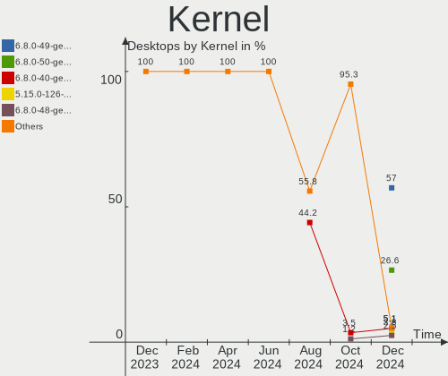
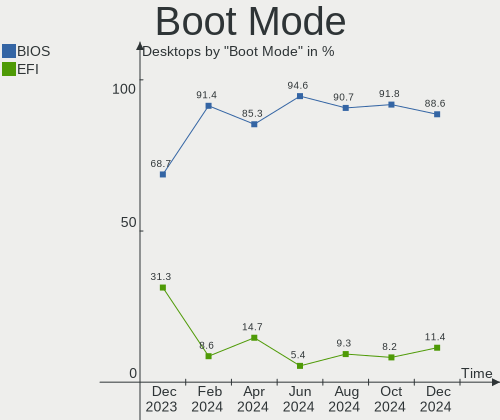
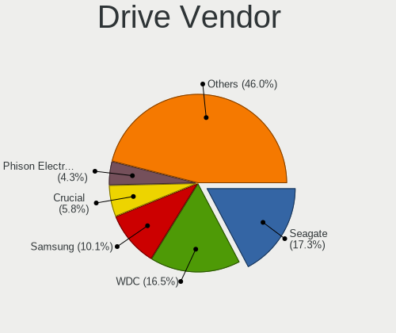
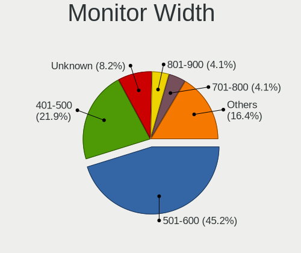

Zorin - Hardware Trends (Desktops)
----------------------------------

A project to identify most popular hardware characteristics and track their change
over time based on data collected by Linux users at https://Linux-Hardware.org.

Anyone can contribute to this report by the [hw-probe](https://github.com/linuxhw/hw-probe) tool:

    sudo -E hw-probe -all -upload

This report is for one last month. Overall report since the beginning of time: [TestCoverage](https://github.com/linuxhw/TestCoverage)

Period: Jun, 2022.

Contents
--------

* [ System ](#system)
  - [ OS                       ](#os)
  - [ OS Family                ](#os-family)
  - [ Kernel                   ](#kernel)
  - [ Kernel Family            ](#kernel-family)
  - [ Kernel Major Ver.        ](#kernel-major-ver)
  - [ Arch                     ](#arch)
  - [ DE                       ](#de)
  - [ Display Server           ](#display-server)
  - [ Display Manager          ](#display-manager)
  - [ OS Lang                  ](#os-lang)
  - [ Boot Mode                ](#boot-mode)
  - [ Filesystem               ](#filesystem)
  - [ Part. scheme             ](#part-scheme)
  - [ Dual Boot with Linux/BSD ](#dual-boot-with-linuxbsd)
  - [ Dual Boot (Win)          ](#dual-boot-win)

* [ Board ](#board)
  - [ Vendor                   ](#vendor)
  - [ Model                    ](#model)
  - [ Model Family             ](#model-family)
  - [ MFG Year                 ](#mfg-year)
  - [ Form Factor              ](#form-factor)
  - [ Secure Boot              ](#secure-boot)
  - [ Coreboot                 ](#coreboot)
  - [ RAM Size                 ](#ram-size)
  - [ RAM Used                 ](#ram-used)
  - [ Total Drives             ](#total-drives)
  - [ Has CD-ROM               ](#has-cd-rom)
  - [ Has Ethernet             ](#has-ethernet)
  - [ Has WiFi                 ](#has-wifi)
  - [ Has Bluetooth            ](#has-bluetooth)

* [ Location ](#location)
  - [ Country                  ](#country)
  - [ City                     ](#city)

* [ Drives ](#drives)
  - [ Drive Vendor             ](#drive-vendor)
  - [ Drive Model              ](#drive-model)
  - [ HDD Vendor               ](#hdd-vendor)
  - [ SSD Vendor               ](#ssd-vendor)
  - [ Drive Kind               ](#drive-kind)
  - [ Drive Connector          ](#drive-connector)
  - [ Drive Size               ](#drive-size)
  - [ Space Total              ](#space-total)
  - [ Space Used               ](#space-used)
  - [ Malfunc. Drives          ](#malfunc-drives)
  - [ Malfunc. Drive Vendor    ](#malfunc-drive-vendor)
  - [ Malfunc. HDD Vendor      ](#malfunc-hdd-vendor)
  - [ Malfunc. Drive Kind      ](#malfunc-drive-kind)
  - [ Failed Drives            ](#failed-drives)
  - [ Failed Drive Vendor      ](#failed-drive-vendor)
  - [ Drive Status             ](#drive-status)

* [ Storage controller ](#storage-controller)
  - [ Storage Vendor           ](#storage-vendor)
  - [ Storage Model            ](#storage-model)
  - [ Storage Kind             ](#storage-kind)

* [ Processor ](#processor)
  - [ CPU Vendor               ](#cpu-vendor)
  - [ CPU Model                ](#cpu-model)
  - [ CPU Model Family         ](#cpu-model-family)
  - [ CPU Cores                ](#cpu-cores)
  - [ CPU Sockets              ](#cpu-sockets)
  - [ CPU Threads              ](#cpu-threads)
  - [ CPU Op-Modes             ](#cpu-op-modes)
  - [ CPU Microcode            ](#cpu-microcode)
  - [ CPU Microarch            ](#cpu-microarch)

* [ Graphics ](#graphics)
  - [ GPU Vendor               ](#gpu-vendor)
  - [ GPU Model                ](#gpu-model)
  - [ GPU Combo                ](#gpu-combo)
  - [ GPU Driver               ](#gpu-driver)
  - [ GPU Memory               ](#gpu-memory)

* [ Monitor ](#monitor)
  - [ Monitor Vendor           ](#monitor-vendor)
  - [ Monitor Model            ](#monitor-model)
  - [ Monitor Resolution       ](#monitor-resolution)
  - [ Monitor Diagonal         ](#monitor-diagonal)
  - [ Monitor Width            ](#monitor-width)
  - [ Aspect Ratio             ](#aspect-ratio)
  - [ Monitor Area             ](#monitor-area)
  - [ Pixel Density            ](#pixel-density)
  - [ Multiple Monitors        ](#multiple-monitors)

* [ Network ](#network)
  - [ Net Controller Vendor    ](#net-controller-vendor)
  - [ Net Controller Model     ](#net-controller-model)
  - [ Wireless Vendor          ](#wireless-vendor)
  - [ Wireless Model           ](#wireless-model)
  - [ Ethernet Vendor          ](#ethernet-vendor)
  - [ Ethernet Model           ](#ethernet-model)
  - [ Net Controller Kind      ](#net-controller-kind)
  - [ Used Controller          ](#used-controller)
  - [ NICs                     ](#nics)
  - [ IPv6                     ](#ipv6)

* [ Bluetooth ](#bluetooth)
  - [ Bluetooth Vendor         ](#bluetooth-vendor)
  - [ Bluetooth Model          ](#bluetooth-model)

* [ Sound ](#sound)
  - [ Sound Vendor             ](#sound-vendor)
  - [ Sound Model              ](#sound-model)

* [ Memory ](#memory)
  - [ Memory Vendor            ](#memory-vendor)
  - [ Memory Model             ](#memory-model)
  - [ Memory Kind              ](#memory-kind)
  - [ Memory Form Factor       ](#memory-form-factor)
  - [ Memory Size              ](#memory-size)
  - [ Memory Speed             ](#memory-speed)

* [ Printers & scanners ](#printers--scanners)
  - [ Printer Vendor           ](#printer-vendor)
  - [ Printer Model            ](#printer-model)
  - [ Scanner Vendor           ](#scanner-vendor)
  - [ Scanner Model            ](#scanner-model)

* [ Camera ](#camera)
  - [ Camera Vendor            ](#camera-vendor)
  - [ Camera Model             ](#camera-model)

* [ Security ](#security)
  - [ Fingerprint Vendor       ](#fingerprint-vendor)
  - [ Fingerprint Model        ](#fingerprint-model)
  - [ Chipcard Vendor          ](#chipcard-vendor)
  - [ Chipcard Model           ](#chipcard-model)

* [ Unsupported ](#unsupported)
  - [ Unsupported Devices      ](#unsupported-devices)
  - [ Unsupported Device Types ](#unsupported-device-types)

System
------

OS
--

Installed operating systems

| Name     | Desktops | Percent |
|----------|----------|---------|
| Zorin 16 | 38       | 92.68%  |
| Zorin 15 | 3        | 7.32%   |

OS Family
---------

OS without a version

| Name  | Desktops | Percent |
|-------|----------|---------|
| Zorin | 41       | 100%    |

Kernel
------

Version of the Linux kernel

| Version           | Desktops | Percent |
|-------------------|----------|---------|
| 5.13.0-51-generic | 13       | 31.71%  |
| 5.13.0-44-generic | 12       | 29.27%  |
| 5.13.0-48-generic | 7        | 17.07%  |
| 5.4.0-120-generic | 2        | 4.88%   |
| 5.13.0-41-generic | 2        | 4.88%   |
| 5.13.0-30-generic | 2        | 4.88%   |
| 5.4.0-58-generic  | 1        | 2.44%   |
| 5.4.0-117-generic | 1        | 2.44%   |
| 5.13.0-40-generic | 1        | 2.44%   |

Kernel Family
-------------

Linux kernel without a distro release

| Version | Desktops | Percent |
|---------|----------|---------|
| 5.13.0  | 37       | 90.24%  |
| 5.4.0   | 4        | 9.76%   |

Kernel Major Ver.
-----------------

Linux kernel major version

| Version | Desktops | Percent |
|---------|----------|---------|
| 5.13    | 37       | 90.24%  |
| 5.4     | 4        | 9.76%   |

Arch
----

OS architecture (x86_64, i586, etc.)

| Name   | Desktops | Percent |
|--------|----------|---------|
| x86_64 | 39       | 95.12%  |
| i686   | 2        | 4.88%   |

DE
--

Desktop Environment

| Name  | Desktops | Percent |
|-------|----------|---------|
| GNOME | 36       | 87.8%   |
| XFCE  | 5        | 12.2%   |

Display Server
--------------

X11 or Wayland

| Name    | Desktops | Percent |
|---------|----------|---------|
| X11     | 40       | 97.56%  |
| Wayland | 1        | 2.44%   |

Display Manager
---------------

SDDM, LightDM, etc.

| Name    | Desktops | Percent |
|---------|----------|---------|
| Unknown | 34       | 82.93%  |
| GDM3    | 3        | 7.32%   |
| LightDM | 2        | 4.88%   |
| GDM     | 2        | 4.88%   |

OS Lang
-------

Language

| Lang  | Desktops | Percent |
|-------|----------|---------|
| en_US | 17       | 41.46%  |
| de_DE | 5        | 12.2%   |
| en_GB | 4        | 9.76%   |
| pt_BR | 2        | 4.88%   |
| it_IT | 2        | 4.88%   |
| en_CA | 2        | 4.88%   |
| cs_CZ | 2        | 4.88%   |
| pt_PT | 1        | 2.44%   |
| fr_FR | 1        | 2.44%   |
| es_VE | 1        | 2.44%   |
| es_ES | 1        | 2.44%   |
| en_IN | 1        | 2.44%   |
| da_DK | 1        | 2.44%   |
| ar_EG | 1        | 2.44%   |

Boot Mode
---------

EFI or BIOS

| Mode | Desktops | Percent |
|------|----------|---------|
| BIOS | 25       | 60.98%  |
| EFI  | 16       | 39.02%  |

Filesystem
----------

Type of filesystem

| Type | Desktops | Percent |
|------|----------|---------|
| Ext4 | 40       | 97.56%  |
| Xfs  | 1        | 2.44%   |

Part. scheme
------------

Scheme of partitioning

| Type    | Desktops | Percent |
|---------|----------|---------|
| Unknown | 39       | 95.12%  |
| GPT     | 2        | 4.88%   |

Dual Boot with Linux/BSD
------------------------

Hosting more than one Linux/BSD

| Dual boot | Desktops | Percent |
|-----------|----------|---------|
| No        | 40       | 97.56%  |
| Yes       | 1        | 2.44%   |

Dual Boot (Win)
---------------

Hosting Linux and Windows

| Dual boot | Desktops | Percent |
|-----------|----------|---------|
| No        | 39       | 95.12%  |
| Yes       | 2        | 4.88%   |

Board
-----

Vendor
------

Motherboard manufacturer

| Name                | Desktops | Percent |
|---------------------|----------|---------|
| ASUSTek Computer    | 13       | 31.71%  |
| Gigabyte Technology | 6        | 14.63%  |
| Dell                | 6        | 14.63%  |
| MSI                 | 3        | 7.32%   |
| Lenovo              | 3        | 7.32%   |
| Hewlett-Packard     | 2        | 4.88%   |
| Biostar             | 2        | 4.88%   |
| Pegatron            | 1        | 2.44%   |
| Fujitsu             | 1        | 2.44%   |
| Foxconn             | 1        | 2.44%   |
| BESSTAR Tech        | 1        | 2.44%   |
| ASRock              | 1        | 2.44%   |
| Acer                | 1        | 2.44%   |

Model
-----

Motherboard model

| Name                                | Desktops | Percent |
|-------------------------------------|----------|---------|
| Pegatron PEGATRON                   | 1        | 2.44%   |
| MSI MS-7823                         | 1        | 2.44%   |
| MSI MS-7817                         | 1        | 2.44%   |
| MSI MS-7695                         | 1        | 2.44%   |
| Lenovo ThinkCentre M73 10B00005US   | 1        | 2.44%   |
| Lenovo Legion T5 28IMB05 90NC00R5US | 1        | 2.44%   |
| Lenovo H30-05 90BJ00CNMT            | 1        | 2.44%   |
| HP Compaq dc5850 Small Form Factor  | 1        | 2.44%   |
| HP 290 G1 MT                        | 1        | 2.44%   |
| Gigabyte Z77-DS3H                   | 1        | 2.44%   |
| Gigabyte X570 AORUS ELITE           | 1        | 2.44%   |
| Gigabyte EX58-UD3R                  | 1        | 2.44%   |
| Gigabyte EP45-UD3P                  | 1        | 2.44%   |
| Gigabyte B450 AORUS M               | 1        | 2.44%   |
| Gigabyte B360M-HD3                  | 1        | 2.44%   |
| Fujitsu ESPRIMO E720                | 1        | 2.44%   |
| Foxconn NQ824AA-ABZ s3821it         | 1        | 2.44%   |
| Dell Vostro 270s                    | 1        | 2.44%   |
| Dell Studio XPS 435T/9000           | 1        | 2.44%   |
| Dell OptiPlex 7010                  | 1        | 2.44%   |
| Dell OptiPlex 3050                  | 1        | 2.44%   |
| Dell Inspiron 537                   | 1        | 2.44%   |
| Dell DM051                          | 1        | 2.44%   |
| Biostar A78MD                       | 1        | 2.44%   |
| Biostar A68N-2100K                  | 1        | 2.44%   |
| BESSTAR Tech TL50                   | 1        | 2.44%   |
| ASUS TUF Z390-PLUS GAMING           | 1        | 2.44%   |
| ASUS TUF Z270 MARK 2                | 1        | 2.44%   |
| ASUS TUF Gaming X570-PRO WIFI II    | 1        | 2.44%   |
| ASUS TUF Gaming X570-PLUS_BR        | 1        | 2.44%   |
| ASUS TRILINE PROFI                  | 1        | 2.44%   |
| ASUS ROG CROSSHAIR VIII HERO        | 1        | 2.44%   |
| ASUS ROG CROSSHAIR VIII DARK HERO   | 1        | 2.44%   |
| ASUS PRIME X570-PRO                 | 1        | 2.44%   |
| ASUS PRIME B550M-A                  | 1        | 2.44%   |
| ASUS P5QL-ASUS-SE                   | 1        | 2.44%   |
| ASUS P5GC-MX/1333                   | 1        | 2.44%   |
| ASUS K30AD_M31AD_M51AD              | 1        | 2.44%   |
| ASUS GX624AA-ABA a6303w             | 1        | 2.44%   |
| ASRock 970 Extreme3                 | 1        | 2.44%   |
| Acer Aspire M3970                   | 1        | 2.44%   |

Model Family
------------

Motherboard model prefix

| Name                | Desktops | Percent |
|---------------------|----------|---------|
| ASUS TUF            | 4        | 9.76%   |
| Dell OptiPlex       | 2        | 4.88%   |
| ASUS ROG            | 2        | 4.88%   |
| ASUS PRIME          | 2        | 4.88%   |
| Pegatron PEGATRON   | 1        | 2.44%   |
| MSI MS-7823         | 1        | 2.44%   |
| MSI MS-7817         | 1        | 2.44%   |
| MSI MS-7695         | 1        | 2.44%   |
| Lenovo ThinkCentre  | 1        | 2.44%   |
| Lenovo Legion       | 1        | 2.44%   |
| Lenovo H30-05       | 1        | 2.44%   |
| HP Compaq           | 1        | 2.44%   |
| HP 290              | 1        | 2.44%   |
| Gigabyte Z77-DS3H   | 1        | 2.44%   |
| Gigabyte X570       | 1        | 2.44%   |
| Gigabyte EX58-UD3R  | 1        | 2.44%   |
| Gigabyte EP45-UD3P  | 1        | 2.44%   |
| Gigabyte B450       | 1        | 2.44%   |
| Gigabyte B360M-HD3  | 1        | 2.44%   |
| Fujitsu ESPRIMO     | 1        | 2.44%   |
| Foxconn NQ824AA-ABZ | 1        | 2.44%   |
| Dell Vostro         | 1        | 2.44%   |
| Dell Studio         | 1        | 2.44%   |
| Dell Inspiron       | 1        | 2.44%   |
| Dell DM051          | 1        | 2.44%   |
| Biostar A78MD       | 1        | 2.44%   |
| Biostar A68N-2100K  | 1        | 2.44%   |
| BESSTAR Tech TL50   | 1        | 2.44%   |
| ASUS TRILINE        | 1        | 2.44%   |
| ASUS P5QL-ASUS-SE   | 1        | 2.44%   |
| ASUS P5GC-MX        | 1        | 2.44%   |
| ASUS K30AD          | 1        | 2.44%   |
| ASUS GX624AA-ABA    | 1        | 2.44%   |
| ASRock 970          | 1        | 2.44%   |
| Acer Aspire         | 1        | 2.44%   |

MFG Year
--------

Motherboard manufacture year

| Year | Desktops | Percent |
|------|----------|---------|
| 2020 | 5        | 12.2%   |
| 2013 | 5        | 12.2%   |
| 2018 | 4        | 9.76%   |
| 2009 | 4        | 9.76%   |
| 2019 | 3        | 7.32%   |
| 2012 | 3        | 7.32%   |
| 2008 | 3        | 7.32%   |
| 2021 | 2        | 4.88%   |
| 2017 | 2        | 4.88%   |
| 2014 | 2        | 4.88%   |
| 2011 | 2        | 4.88%   |
| 2007 | 2        | 4.88%   |
| 2022 | 1        | 2.44%   |
| 2016 | 1        | 2.44%   |
| 2010 | 1        | 2.44%   |
| 2006 | 1        | 2.44%   |

Form Factor
-----------

Physical design of the computer

| Name    | Desktops | Percent |
|---------|----------|---------|
| Desktop | 41       | 100%    |

Secure Boot
-----------

Enabled or disabled

| State    | Desktops | Percent |
|----------|----------|---------|
| Disabled | 40       | 97.56%  |
| Enabled  | 1        | 2.44%   |

Coreboot
--------

Have coreboot on board

| Used | Desktops | Percent |
|------|----------|---------|
| No   | 41       | 100%    |

RAM Size
--------

Total RAM memory

| Size in GB  | Desktops | Percent |
|-------------|----------|---------|
| 8.01-16.0   | 10       | 24.39%  |
| 3.01-4.0    | 9        | 21.95%  |
| 16.01-24.0  | 9        | 21.95%  |
| 32.01-64.0  | 4        | 9.76%   |
| 4.01-8.0    | 3        | 7.32%   |
| 64.01-256.0 | 3        | 7.32%   |
| 2.01-3.0    | 2        | 4.88%   |
| 1.01-2.0    | 1        | 2.44%   |

RAM Used
--------

Used RAM memory

| Used GB   | Desktops | Percent |
|-----------|----------|---------|
| 2.01-3.0  | 16       | 39.02%  |
| 1.01-2.0  | 15       | 36.59%  |
| 4.01-8.0  | 4        | 9.76%   |
| 3.01-4.0  | 4        | 9.76%   |
| 8.01-16.0 | 1        | 2.44%   |
| 0.51-1.0  | 1        | 2.44%   |

Total Drives
------------

Number of drives on board

| Drives | Desktops | Percent |
|--------|----------|---------|
| 2      | 15       | 36.59%  |
| 1      | 12       | 29.27%  |
| 3      | 5        | 12.2%   |
| 4      | 3        | 7.32%   |
| 7      | 2        | 4.88%   |
| 6      | 2        | 4.88%   |
| 5      | 2        | 4.88%   |

Has CD-ROM
----------

Has CD-ROM on board

| Presented | Desktops | Percent |
|-----------|----------|---------|
| No        | 21       | 51.22%  |
| Yes       | 20       | 48.78%  |

Has Ethernet
------------

Has Ethernet on board

| Presented | Desktops | Percent |
|-----------|----------|---------|
| Yes       | 40       | 97.56%  |
| No        | 1        | 2.44%   |

Has WiFi
--------

Has WiFi module

| Presented | Desktops | Percent |
|-----------|----------|---------|
| Yes       | 26       | 63.41%  |
| No        | 15       | 36.59%  |

Has Bluetooth
-------------

Has Bluetooth module

| Presented | Desktops | Percent |
|-----------|----------|---------|
| No        | 23       | 56.1%   |
| Yes       | 18       | 43.9%   |

Location
--------

Country
-------

Geographic location (country)

| Country             | Desktops | Percent |
|---------------------|----------|---------|
| USA                 | 12       | 29.27%  |
| Germany             | 6        | 14.63%  |
| UK                  | 3        | 7.32%   |
| Canada              | 3        | 7.32%   |
| Italy               | 2        | 4.88%   |
| Czechia             | 2        | 4.88%   |
| Brazil              | 2        | 4.88%   |
| Venezuela           | 1        | 2.44%   |
| Trinidad and Tobago | 1        | 2.44%   |
| Spain               | 1        | 2.44%   |
| Portugal            | 1        | 2.44%   |
| Lebanon             | 1        | 2.44%   |
| India               | 1        | 2.44%   |
| Ghana               | 1        | 2.44%   |
| Egypt               | 1        | 2.44%   |
| Denmark             | 1        | 2.44%   |
| Burkina Faso        | 1        | 2.44%   |
| Bangladesh          | 1        | 2.44%   |

City
----

Geographic location (city)

| City                  | Desktops | Percent |
|-----------------------|----------|---------|
| Prague                | 2        | 4.88%   |
| Kiel                  | 2        | 4.88%   |
| Willingboro           | 1        | 2.44%   |
| Waldbroel             | 1        | 2.44%   |
| Vitória da Conquista | 1        | 2.44%   |
| Toronto               | 1        | 2.44%   |
| The Bronx             | 1        | 2.44%   |
| Sterling              | 1        | 2.44%   |
| Springfield           | 1        | 2.44%   |
| Sharm el Sheikh       | 1        | 2.44%   |
| Portishead            | 1        | 2.44%   |
| Port of Spain         | 1        | 2.44%   |
| Ouagadougou           | 1        | 2.44%   |
| Narsingdi             | 1        | 2.44%   |
| Mount Olive           | 1        | 2.44%   |
| Montijo               | 1        | 2.44%   |
| Marquette             | 1        | 2.44%   |
| Maracaibo             | 1        | 2.44%   |
| Latiano               | 1        | 2.44%   |
| Laguna de Duero       | 1        | 2.44%   |
| Kingston              | 1        | 2.44%   |
| Juiz de Fora          | 1        | 2.44%   |
| Independence          | 1        | 2.44%   |
| Halifax               | 1        | 2.44%   |
| Haines City           | 1        | 2.44%   |
| Gillingham            | 1        | 2.44%   |
| Fürstenfeldbruck     | 1        | 2.44%   |
| Fort Smith            | 1        | 2.44%   |
| Dallas                | 1        | 2.44%   |
| Copenhagen            | 1        | 2.44%   |
| Cardiff               | 1        | 2.44%   |
| Berlin                | 1        | 2.44%   |
| Beirut                | 1        | 2.44%   |
| Bad Durrheim          | 1        | 2.44%   |
| Arlington             | 1        | 2.44%   |
| Ancona                | 1        | 2.44%   |
| Alexandria            | 1        | 2.44%   |
| Ahmedabad             | 1        | 2.44%   |
| Accra                 | 1        | 2.44%   |

Drives
------

Drive Vendor
------------

Hard drive vendors

| Vendor                | Desktops | Drives | Percent |
|-----------------------|----------|--------|---------|
| Seagate               | 17       | 22     | 21.79%  |
| WDC                   | 13       | 17     | 16.67%  |
| Samsung Electronics   | 11       | 16     | 14.1%   |
| Kingston              | 6        | 10     | 7.69%   |
| Hitachi               | 5        | 5      | 6.41%   |
| Toshiba               | 4        | 5      | 5.13%   |
| SanDisk               | 3        | 3      | 3.85%   |
| Patriot               | 2        | 2      | 2.56%   |
| Intenso               | 2        | 2      | 2.56%   |
| XrayDisk              | 1        | 2      | 1.28%   |
| XPG                   | 1        | 1      | 1.28%   |
| WD MediaMax           | 1        | 1      | 1.28%   |
| USB3.0                | 1        | 1      | 1.28%   |
| Unknown               | 1        | 3      | 1.28%   |
| Team                  | 1        | 1      | 1.28%   |
| SPCC                  | 1        | 1      | 1.28%   |
| SABRENT               | 1        | 1      | 1.28%   |
| Realtek Semiconductor | 1        | 1      | 1.28%   |
| Phison                | 1        | 1      | 1.28%   |
| Lexar                 | 1        | 1      | 1.28%   |
| Hewlett-Packard       | 1        | 1      | 1.28%   |
| Gigabyte Technology   | 1        | 2      | 1.28%   |
| Crucial               | 1        | 1      | 1.28%   |
| China                 | 1        | 1      | 1.28%   |

Drive Model
-----------

Hard drive models

| Model                              | Desktops | Percent |
|------------------------------------|----------|---------|
| Samsung NVMe SSD Drive 1TB         | 4        | 4.17%   |
| Kingston SA400S37240G 240GB SSD    | 3        | 3.13%   |
| Seagate ST500DM002-1BD142 500GB    | 2        | 2.08%   |
| Seagate ST4000DM004-2CV104 4TB     | 2        | 2.08%   |
| Seagate ST3500418AS 500GB          | 2        | 2.08%   |
| Seagate ST3500312CS 500GB          | 2        | 2.08%   |
| XrayDisk 480GB                     | 1        | 1.04%   |
| XrayDisk 1TB                       | 1        | 1.04%   |
| XPG NVMe SSD Drive 512GB           | 1        | 1.04%   |
| WDC WDS250G2B0A-00SM50 250GB SSD   | 1        | 1.04%   |
| WDC WDS120G2G0A-00JH30 120GB SSD   | 1        | 1.04%   |
| WDC WD7500AADS-00M2B0 752GB        | 1        | 1.04%   |
| WDC WD5000LPCX-24C6HT0 500GB       | 1        | 1.04%   |
| WDC WD5000AVDS-63U7B1 500GB        | 1        | 1.04%   |
| WDC WD5000AAKX-60U6AA0 500GB       | 1        | 1.04%   |
| WDC WD5000AAKX-001CA0 500GB        | 1        | 1.04%   |
| WDC WD3200AAKS-75L9A0 320GB        | 1        | 1.04%   |
| WDC WD3200AAJS-65M0A0 320GB        | 1        | 1.04%   |
| WDC WD2500KS-00MJB0 250GB          | 1        | 1.04%   |
| WDC WD2000FYYZ-01UL1B2 2TB         | 1        | 1.04%   |
| WDC WD1600BB-55RDA0 160GB          | 1        | 1.04%   |
| WDC WD15EARS-00MVWB0 1TB           | 1        | 1.04%   |
| WDC WD10SPZX-00Z10T0 1TB           | 1        | 1.04%   |
| WDC WD10EZEX-08WN4A0 1TB           | 1        | 1.04%   |
| WDC WD10EFRX-68JCSN0 1TB           | 1        | 1.04%   |
| WDC WD10EARS-00Y5B1 1TB            | 1        | 1.04%   |
| WD MediaMax WL1000GSA6472 1TB      | 1        | 1.04%   |
| USB3.0 Disk 240GB                  | 1        | 1.04%   |
| Unknown SD/MMC/M.S.PRO 32GB        | 1        | 1.04%   |
| Unknown SD/MMC 16GB                | 1        | 1.04%   |
| Unknown M.S./M.S.Pro/HG 16GB       | 1        | 1.04%   |
| Toshiba MQ04ABF100 1TB             | 1        | 1.04%   |
| Toshiba MK5055GSX 500GB            | 1        | 1.04%   |
| Toshiba DT01ACA200 2TB             | 1        | 1.04%   |
| Toshiba DT01ACA100 1TB             | 1        | 1.04%   |
| Team T253X2256G 256GB SSD          | 1        | 1.04%   |
| SPCC Solid State Disk 512GB        | 1        | 1.04%   |
| Seagate ST9500420AS 500GB          | 1        | 1.04%   |
| Seagate ST500VT000-1DK142 500GB    | 1        | 1.04%   |
| Seagate ST4000DM004-2U9104 4TB     | 1        | 1.04%   |
| Seagate ST380211AS 80GB            | 1        | 1.04%   |
| Seagate ST3500413AS 500GB          | 1        | 1.04%   |
| Seagate ST3250410AS 250GB          | 1        | 1.04%   |
| Seagate ST3250310AS 250GB          | 1        | 1.04%   |
| Seagate ST31000524AS 1TB           | 1        | 1.04%   |
| Seagate ST3000DM003-2AE16L 3TB     | 1        | 1.04%   |
| Seagate ST1000LM024 HN-M101MBB 1TB | 1        | 1.04%   |
| Seagate ST1000DM003-1SB102 1TB     | 1        | 1.04%   |
| Seagate ST1000DM003-1CH162 1TB     | 1        | 1.04%   |
| Seagate Expansion+ Desk 4TB        | 1        | 1.04%   |
| Seagate BUP Ultra Touch 2TB        | 1        | 1.04%   |
| SanDisk SSD PLUS 240GB             | 1        | 1.04%   |
| SanDisk NVMe SSD Drive 500GB       | 1        | 1.04%   |
| SanDisk NVMe SSD Drive 1TB         | 1        | 1.04%   |
| Samsung SSD 860 EVO 500GB          | 1        | 1.04%   |
| Samsung SSD 850 PRO 256GB          | 1        | 1.04%   |
| Samsung SSD 850 EVO 500GB          | 1        | 1.04%   |
| Samsung SSD 850 EVO 250GB          | 1        | 1.04%   |
| Samsung SSD 850 EVO 1TB            | 1        | 1.04%   |
| Samsung SSD 840 EVO 120GB          | 1        | 1.04%   |

HDD Vendor
----------

Hard disk drive vendors

| Vendor              | Desktops | Drives | Percent |
|---------------------|----------|--------|---------|
| Seagate             | 17       | 22     | 41.46%  |
| WDC                 | 12       | 15     | 29.27%  |
| Hitachi             | 5        | 5      | 12.2%   |
| Toshiba             | 4        | 5      | 9.76%   |
| USB3.0              | 1        | 1      | 2.44%   |
| Samsung Electronics | 1        | 1      | 2.44%   |
| Hewlett-Packard     | 1        | 1      | 2.44%   |

SSD Vendor
----------

Solid state drive vendors

| Vendor              | Desktops | Drives | Percent |
|---------------------|----------|--------|---------|
| Samsung Electronics | 5        | 7      | 22.73%  |
| Kingston            | 5        | 9      | 22.73%  |
| WDC                 | 2        | 2      | 9.09%   |
| Patriot             | 2        | 2      | 9.09%   |
| Intenso             | 2        | 2      | 9.09%   |
| Team                | 1        | 1      | 4.55%   |
| SPCC                | 1        | 1      | 4.55%   |
| SanDisk             | 1        | 1      | 4.55%   |
| Lexar               | 1        | 1      | 4.55%   |
| Crucial             | 1        | 1      | 4.55%   |
| China               | 1        | 1      | 4.55%   |

Drive Kind
----------

HDD or SSD

| Kind    | Desktops | Drives | Percent |
|---------|----------|--------|---------|
| HDD     | 29       | 50     | 43.94%  |
| SSD     | 20       | 28     | 30.3%   |
| NVMe    | 14       | 17     | 21.21%  |
| Unknown | 3        | 6      | 4.55%   |

Drive Connector
---------------

SATA, SAS, NVMe, etc.

| Type | Desktops | Drives | Percent |
|------|----------|--------|---------|
| SATA | 38       | 78     | 67.86%  |
| NVMe | 13       | 16     | 23.21%  |
| SAS  | 5        | 7      | 8.93%   |

Drive Size
----------

Size of hard drive

| Size in TB | Desktops | Drives | Percent |
|------------|----------|--------|---------|
| 0.01-0.5   | 29       | 46     | 54.72%  |
| 0.51-1.0   | 13       | 16     | 24.53%  |
| 1.01-2.0   | 5        | 9      | 9.43%   |
| 3.01-4.0   | 3        | 4      | 5.66%   |
| 2.01-3.0   | 3        | 3      | 5.66%   |

Space Total
-----------

Amount of disk space available on the file system

| Size in GB     | Desktops | Percent |
|----------------|----------|---------|
| 101-250        | 13       | 31.71%  |
| 251-500        | 10       | 24.39%  |
| 501-1000       | 10       | 24.39%  |
| More than 3000 | 4        | 9.76%   |
| 51-100         | 2        | 4.88%   |
| 2001-3000      | 1        | 2.44%   |
| 1001-2000      | 1        | 2.44%   |

Space Used
----------

Amount of used disk space

| Used GB        | Desktops | Percent |
|----------------|----------|---------|
| 21-50          | 13       | 31.71%  |
| 1-20           | 8        | 19.51%  |
| 51-100         | 6        | 14.63%  |
| 251-500        | 4        | 9.76%   |
| 101-250        | 4        | 9.76%   |
| 501-1000       | 3        | 7.32%   |
| More than 3000 | 2        | 4.88%   |
| 2001-3000      | 1        | 2.44%   |

Malfunc. Drives
---------------

Drive models with a malfunction

Zero info for selected period =(

Malfunc. Drive Vendor
---------------------

Vendors of faulty drives

Zero info for selected period =(

Malfunc. HDD Vendor
-------------------

Vendors of faulty HDD drives

Zero info for selected period =(

Malfunc. Drive Kind
-------------------

Kinds of faulty drives

Zero info for selected period =(

Failed Drives
-------------

Failed drive models

Zero info for selected period =(

Failed Drive Vendor
-------------------

Failed drive vendors

Zero info for selected period =(

Drive Status
------------

Number of failed and malfunc. drives

| Status   | Desktops | Drives | Percent |
|----------|----------|--------|---------|
| Detected | 40       | 93     | 95.24%  |
| Works    | 2        | 8      | 4.76%   |

Storage controller
------------------

Storage Vendor
--------------

Storage controller vendors

| Vendor                      | Desktops | Percent |
|-----------------------------|----------|---------|
| Intel                       | 26       | 44.83%  |
| AMD                         | 14       | 24.14%  |
| Samsung Electronics         | 6        | 10.34%  |
| JMicron Technology          | 4        | 6.9%    |
| SanDisk                     | 2        | 3.45%   |
| Phison Electronics          | 2        | 3.45%   |
| Realtek Semiconductor       | 1        | 1.72%   |
| Nvidia                      | 1        | 1.72%   |
| Kingston Technology Company | 1        | 1.72%   |
| ADATA Technology            | 1        | 1.72%   |

Storage Model
-------------

Storage controller models

| Model                                                                          | Desktops | Percent |
|--------------------------------------------------------------------------------|----------|---------|
| AMD FCH SATA Controller [AHCI mode]                                            | 9        | 13.24%  |
| Intel 8 Series/C220 Series Chipset Family 6-port SATA Controller 1 [AHCI mode] | 5        | 7.35%   |
| Samsung NVMe SSD Controller SM981/PM981/PM983                                  | 3        | 4.41%   |
| JMicron JMB363 SATA/IDE Controller                                             | 3        | 4.41%   |
| Intel SATA Controller [RAID mode]                                              | 3        | 4.41%   |
| Intel NM10/ICH7 Family SATA Controller [IDE mode]                              | 3        | 4.41%   |
| Intel 7 Series/C210 Series Chipset Family 6-port SATA Controller [AHCI mode]   | 3        | 4.41%   |
| Samsung NVMe SSD Controller SM961/PM961/SM963                                  | 2        | 2.94%   |
| Phison E16 PCIe4 NVMe Controller                                               | 2        | 2.94%   |
| Intel 82801JI (ICH10 Family) SATA AHCI Controller                              | 2        | 2.94%   |
| Intel 82801JI (ICH10 Family) 4 port SATA IDE Controller #1                     | 2        | 2.94%   |
| Intel 82801JI (ICH10 Family) 2 port SATA IDE Controller #2                     | 2        | 2.94%   |
| Intel 82801G (ICH7 Family) IDE Controller                                      | 2        | 2.94%   |
| Intel 200 Series PCH SATA controller [AHCI mode]                               | 2        | 2.94%   |
| AMD FCH SATA Controller [IDE mode]                                             | 2        | 2.94%   |
| SanDisk WD PC SN810 / Black SN850 NVMe SSD                                     | 1        | 1.47%   |
| SanDisk WD Black 2018/SN750 / PC SN720 NVMe SSD                                | 1        | 1.47%   |
| Samsung NVMe SSD Controller PM9A1/PM9A3/980PRO                                 | 1        | 1.47%   |
| Samsung NVMe SSD Controller 980                                                | 1        | 1.47%   |
| Realtek RTS5763DL NVMe SSD Controller                                          | 1        | 1.47%   |
| Nvidia MCP73 SATA Controller (IDE mode)                                        | 1        | 1.47%   |
| Nvidia MCP73 IDE Controller                                                    | 1        | 1.47%   |
| Kingston Company OM3PDP3 NVMe SSD                                              | 1        | 1.47%   |
| JMicron JMB368 IDE controller                                                  | 1        | 1.47%   |
| Intel Tiger Lake-LP SATA Controller [AHCI mode]                                | 1        | 1.47%   |
| Intel Q170/Q150/B150/H170/H110/Z170/CM236 Chipset SATA Controller [AHCI Mode]  | 1        | 1.47%   |
| Intel Cannon Lake PCH SATA AHCI Controller                                     | 1        | 1.47%   |
| Intel 82Q35 Express PT IDER Controller                                         | 1        | 1.47%   |
| Intel 82801IR/IO/IH (ICH9R/DO/DH) 6 port SATA Controller [AHCI mode]           | 1        | 1.47%   |
| Intel 6 Series/C200 Series Chipset Family 6 port Desktop SATA AHCI Controller  | 1        | 1.47%   |
| Intel 400 Series Chipset Family SATA AHCI Controller                           | 1        | 1.47%   |
| AMD SB7x0/SB8x0/SB9x0 SATA Controller [IDE mode]                               | 1        | 1.47%   |
| AMD SB7x0/SB8x0/SB9x0 SATA Controller [AHCI mode]                              | 1        | 1.47%   |
| AMD SB7x0/SB8x0/SB9x0 IDE Controller                                           | 1        | 1.47%   |
| AMD FCH IDE Controller                                                         | 1        | 1.47%   |
| AMD 500 Series Chipset SATA Controller                                         | 1        | 1.47%   |
| AMD 400 Series Chipset SATA Controller                                         | 1        | 1.47%   |
| ADATA XPG SX8200 Pro PCIe Gen3x4 M.2 2280 Solid State Drive                    | 1        | 1.47%   |

Storage Kind
------------

Kind of storage controller (IDE, SATA, NVMe, SAS, ...)

| Kind | Desktops | Percent |
|------|----------|---------|
| SATA | 32       | 55.17%  |
| NVMe | 12       | 20.69%  |
| IDE  | 11       | 18.97%  |
| RAID | 3        | 5.17%   |

Processor
---------

CPU Vendor
----------

Processor vendors

| Vendor | Desktops | Percent |
|--------|----------|---------|
| Intel  | 27       | 65.85%  |
| AMD    | 14       | 34.15%  |

CPU Model
---------

Processor models

| Model                                       | Desktops | Percent |
|---------------------------------------------|----------|---------|
| Intel Core i7 CPU 920 @ 2.67GHz             | 2        | 4.88%   |
| Intel Core 2 Duo CPU E8400 @ 3.00GHz        | 2        | 4.88%   |
| AMD Ryzen 9 5900X 12-Core Processor         | 2        | 4.88%   |
| Intel Xeon CPU E3110 @ 3.00GHz              | 1        | 2.44%   |
| Intel Pentium Dual-Core CPU E5400 @ 2.70GHz | 1        | 2.44%   |
| Intel Pentium Dual-Core CPU E5200 @ 2.50GHz | 1        | 2.44%   |
| Intel Pentium Dual CPU E2140 @ 1.60GHz      | 1        | 2.44%   |
| Intel Pentium D CPU 2.80GHz                 | 1        | 2.44%   |
| Intel Core i7-7700K CPU @ 4.20GHz           | 1        | 2.44%   |
| Intel Core i7-4790S CPU @ 3.20GHz           | 1        | 2.44%   |
| Intel Core i5-9600K CPU @ 3.70GHz           | 1        | 2.44%   |
| Intel Core i5-6500 CPU @ 3.20GHz            | 1        | 2.44%   |
| Intel Core i5-4690K CPU @ 3.50GHz           | 1        | 2.44%   |
| Intel Core i5-4590 CPU @ 3.30GHz            | 1        | 2.44%   |
| Intel Core i5-4570 CPU @ 3.20GHz            | 1        | 2.44%   |
| Intel Core i5-4460 CPU @ 3.20GHz            | 1        | 2.44%   |
| Intel Core i5-3470 CPU @ 3.20GHz            | 1        | 2.44%   |
| Intel Core i5-2300 CPU @ 2.80GHz            | 1        | 2.44%   |
| Intel Core i5-10400F CPU @ 2.90GHz          | 1        | 2.44%   |
| Intel Core i3-8100 CPU @ 3.60GHz            | 1        | 2.44%   |
| Intel Core i3-7100 CPU @ 3.90GHz            | 1        | 2.44%   |
| Intel Core i3-3240 CPU @ 3.40GHz            | 1        | 2.44%   |
| Intel Core i3-3220 CPU @ 3.30GHz            | 1        | 2.44%   |
| Intel Core i3-2100 CPU @ 3.10GHz            | 1        | 2.44%   |
| Intel Celeron D CPU 3.06GHz                 | 1        | 2.44%   |
| Intel 11th Gen Core i5-1135G7 @ 2.40GHz     | 1        | 2.44%   |
| AMD Ryzen 9 5950X 16-Core Processor         | 1        | 2.44%   |
| AMD Ryzen 9 3950X 16-Core Processor         | 1        | 2.44%   |
| AMD Ryzen 7 5800X 8-Core Processor          | 1        | 2.44%   |
| AMD Ryzen 7 5700G with Radeon Graphics      | 1        | 2.44%   |
| AMD Ryzen 5 5600X 6-Core Processor          | 1        | 2.44%   |
| AMD Ryzen 5 5600G with Radeon Graphics      | 1        | 2.44%   |
| AMD Phenom II X6 1090T Processor            | 1        | 2.44%   |
| AMD E1-6010 APU with AMD Radeon R2 Graphics | 1        | 2.44%   |
| AMD Athlon Dual Core Processor 4450B        | 1        | 2.44%   |
| AMD A6-7310 APU with AMD Radeon R4 Graphics | 1        | 2.44%   |
| AMD A6-3670 APU with Radeon HD Graphics     | 1        | 2.44%   |
| AMD A10-6790K APU with Radeon HD Graphics   | 1        | 2.44%   |

CPU Model Family
----------------

Processor model prefix

| Model                   | Desktops | Percent |
|-------------------------|----------|---------|
| Intel Core i5           | 9        | 21.95%  |
| Intel Core i3           | 5        | 12.2%   |
| Intel Core i7           | 4        | 9.76%   |
| AMD Ryzen 9             | 4        | 9.76%   |
| Intel Pentium Dual-Core | 2        | 4.88%   |
| Intel Core 2 Duo        | 2        | 4.88%   |
| AMD Ryzen 7             | 2        | 4.88%   |
| AMD Ryzen 5             | 2        | 4.88%   |
| AMD A6                  | 2        | 4.88%   |
| Other                   | 1        | 2.44%   |
| Intel Xeon              | 1        | 2.44%   |
| Intel Pentium Dual      | 1        | 2.44%   |
| Intel Pentium D         | 1        | 2.44%   |
| Intel Celeron D         | 1        | 2.44%   |
| AMD Phenom II X6        | 1        | 2.44%   |
| AMD E1                  | 1        | 2.44%   |
| AMD Athlon Dual Core    | 1        | 2.44%   |
| AMD A10                 | 1        | 2.44%   |

CPU Cores
---------

Number of processor cores

| Number | Desktops | Percent |
|--------|----------|---------|
| 4      | 15       | 36.59%  |
| 2      | 14       | 34.15%  |
| 6      | 5        | 12.2%   |
| 16     | 2        | 4.88%   |
| 12     | 2        | 4.88%   |
| 8      | 2        | 4.88%   |
| 1      | 1        | 2.44%   |

CPU Sockets
-----------

Number of sockets

| Number | Desktops | Percent |
|--------|----------|---------|
| 1      | 41       | 100%    |

CPU Threads
-----------

Threads per core (Hyper-Threading)

| Number | Desktops | Percent |
|--------|----------|---------|
| 1      | 22       | 53.66%  |
| 2      | 19       | 46.34%  |

CPU Op-Modes
------------

CPU Operation Modes (32-bit, 64-bit)

| Op mode        | Desktops | Percent |
|----------------|----------|---------|
| 32-bit, 64-bit | 41       | 100%    |

CPU Microcode
-------------

Microcode number

| Number     | Desktops | Percent |
|------------|----------|---------|
| 0x306c3    | 5        | 12.2%   |
| Unknown    | 4        | 9.76%   |
| 0x306a9    | 3        | 7.32%   |
| 0x1067a    | 3        | 7.32%   |
| 0x906e9    | 2        | 4.88%   |
| 0x0a201016 | 2        | 4.88%   |
| 0xf65      | 1        | 2.44%   |
| 0xf47      | 1        | 2.44%   |
| 0xa0653    | 1        | 2.44%   |
| 0x906ed    | 1        | 2.44%   |
| 0x906eb    | 1        | 2.44%   |
| 0x806c1    | 1        | 2.44%   |
| 0x6fd      | 1        | 2.44%   |
| 0x506e3    | 1        | 2.44%   |
| 0x206a7    | 1        | 2.44%   |
| 0x106a5    | 1        | 2.44%   |
| 0x10676    | 1        | 2.44%   |
| 0x0a50000c | 1        | 2.44%   |
| 0x0a50000b | 1        | 2.44%   |
| 0x0a201204 | 1        | 2.44%   |
| 0x0a201006 | 1        | 2.44%   |
| 0x08701021 | 1        | 2.44%   |
| 0x07030106 | 1        | 2.44%   |
| 0x07030105 | 1        | 2.44%   |
| 0x06001119 | 1        | 2.44%   |
| 0x03000027 | 1        | 2.44%   |
| 0x010000dc | 1        | 2.44%   |
| 0x00000000 | 1        | 2.44%   |

CPU Microarch
-------------

Microarchitecture

| Name        | Desktops | Percent |
|-------------|----------|---------|
| Zen 3       | 7        | 17.07%  |
| Penryn      | 5        | 12.2%   |
| Haswell     | 5        | 12.2%   |
| KabyLake    | 4        | 9.76%   |
| IvyBridge   | 3        | 7.32%   |
| SandyBridge | 2        | 4.88%   |
| Puma        | 2        | 4.88%   |
| NetBurst    | 2        | 4.88%   |
| Nehalem     | 2        | 4.88%   |
| Zen 2       | 1        | 2.44%   |
| TigerLake   | 1        | 2.44%   |
| Skylake     | 1        | 2.44%   |
| Piledriver  | 1        | 2.44%   |
| K8 Hammer   | 1        | 2.44%   |
| K10 Llano   | 1        | 2.44%   |
| K10         | 1        | 2.44%   |
| Core        | 1        | 2.44%   |
| CometLake   | 1        | 2.44%   |

Graphics
--------

GPU Vendor
----------

Vendors of graphics cards

| Vendor | Desktops | Percent |
|--------|----------|---------|
| AMD    | 18       | 41.86%  |
| Nvidia | 15       | 34.88%  |
| Intel  | 10       | 23.26%  |

GPU Model
---------

Graphics card models

| Model                                                                       | Desktops | Percent |
|-----------------------------------------------------------------------------|----------|---------|
| Nvidia GF119 [GeForce GT 610]                                               | 2        | 4.35%   |
| Intel Xeon E3-1200 v2/3rd Gen Core processor Graphics Controller            | 2        | 4.35%   |
| Intel 2nd Generation Core Processor Family Integrated Graphics Controller   | 2        | 4.35%   |
| AMD Cezanne                                                                 | 2        | 4.35%   |
| Nvidia TU116 [GeForce GTX 1660]                                             | 1        | 2.17%   |
| Nvidia TU116 [GeForce GTX 1650 SUPER]                                       | 1        | 2.17%   |
| Nvidia NV43 [GeForce 6600 GT]                                               | 1        | 2.17%   |
| Nvidia GP108 [GeForce GT 1030]                                              | 1        | 2.17%   |
| Nvidia GP104 [GeForce GTX 1070]                                             | 1        | 2.17%   |
| Nvidia GP104 [GeForce GTX 1070 Ti]                                          | 1        | 2.17%   |
| Nvidia GM107 [GeForce GTX 750]                                              | 1        | 2.17%   |
| Nvidia GM107 [GeForce GTX 750 Ti]                                           | 1        | 2.17%   |
| Nvidia GK208B [GeForce GT 710]                                              | 1        | 2.17%   |
| Nvidia GK107 [GeForce GT 740]                                               | 1        | 2.17%   |
| Nvidia GA102 [GeForce RTX 3090]                                             | 1        | 2.17%   |
| Nvidia GA102 [GeForce RTX 3080]                                             | 1        | 2.17%   |
| Nvidia G94 [GeForce 9600 GT]                                                | 1        | 2.17%   |
| Nvidia C73 [GeForce 7100 / nForce 630i]                                     | 1        | 2.17%   |
| Intel Xeon E3-1200 v3/4th Gen Core Processor Integrated Graphics Controller | 1        | 2.17%   |
| Intel TigerLake-LP GT2 [Iris Xe Graphics]                                   | 1        | 2.17%   |
| Intel HD Graphics 630                                                       | 1        | 2.17%   |
| Intel HD Graphics 530                                                       | 1        | 2.17%   |
| Intel 82945G/GZ Integrated Graphics Controller                              | 1        | 2.17%   |
| Intel 4 Series Chipset Integrated Graphics Controller                       | 1        | 2.17%   |
| AMD Turks XT [Radeon HD 6670/7670]                                          | 1        | 2.17%   |
| AMD Sumo [Radeon HD 6530D]                                                  | 1        | 2.17%   |
| AMD RV380 [Radeon X300/X550/X1050 Series] (Secondary)                       | 1        | 2.17%   |
| AMD RV370 [Radeon X600/X600 SE]                                             | 1        | 2.17%   |
| AMD Richland [Radeon HD 8670D]                                              | 1        | 2.17%   |
| AMD R423 [Radeon X800 GT] (Secondary)                                       | 1        | 2.17%   |
| AMD R423 [Radeon X800 GT/SE]                                                | 1        | 2.17%   |
| AMD Park [Mobility Radeon HD 5430]                                          | 1        | 2.17%   |
| AMD Navi 23 [Radeon RX 6600/6600 XT/6600M]                                  | 1        | 2.17%   |
| AMD Navi 22 [Radeon RX 6700/6700 XT/6750 XT / 6800M]                        | 1        | 2.17%   |
| AMD Navi 21 [Radeon RX 6800/6800 XT / 6900 XT]                              | 1        | 2.17%   |
| AMD Navi 10 [Radeon RX 5600 OEM/5600 XT / 5700/5700 XT]                     | 1        | 2.17%   |
| AMD Mullins [Radeon R4/R5 Graphics]                                         | 1        | 2.17%   |
| AMD Mullins [Radeon R2 Graphics]                                            | 1        | 2.17%   |
| AMD Hawaii XT / Grenada XT [Radeon R9 290X/390X]                            | 1        | 2.17%   |
| AMD Ellesmere [Radeon RX 470/480/570/570X/580/580X/590]                     | 1        | 2.17%   |
| AMD Cape Verde XT [Radeon HD 7770/8760 / R7 250X]                           | 1        | 2.17%   |
| AMD Bonaire XTX [Radeon R7 260X/360]                                        | 1        | 2.17%   |

GPU Combo
---------

Combinations of graphics cards

| Name       | Desktops | Percent |
|------------|----------|---------|
| 1 x AMD    | 16       | 39.02%  |
| 1 x Nvidia | 13       | 31.71%  |
| 1 x Intel  | 9        | 21.95%  |
| 2 x AMD    | 2        | 4.88%   |
| 2 x Nvidia | 1        | 2.44%   |

GPU Driver
----------

Free vs proprietary

| Driver      | Desktops | Percent |
|-------------|----------|---------|
| Free        | 30       | 73.17%  |
| Proprietary | 7        | 17.07%  |
| Unknown     | 4        | 9.76%   |

GPU Memory
----------

Total video memory

| Size in GB | Desktops | Percent |
|------------|----------|---------|
| Unknown    | 15       | 36.59%  |
| 0.01-0.5   | 9        | 21.95%  |
| 7.01-8.0   | 5        | 12.2%   |
| 0.51-1.0   | 4        | 9.76%   |
| 3.01-4.0   | 3        | 7.32%   |
| 8.01-16.0  | 3        | 7.32%   |
| 16.01-24.0 | 1        | 2.44%   |
| 1.01-2.0   | 1        | 2.44%   |

Monitor
-------

Monitor Vendor
--------------

Monitor vendors

| Vendor               | Desktops | Percent |
|----------------------|----------|---------|
| Dell                 | 6        | 14.63%  |
| Hewlett-Packard      | 5        | 12.2%   |
| Samsung Electronics  | 4        | 9.76%   |
| ASUSTek Computer     | 3        | 7.32%   |
| Acer                 | 3        | 7.32%   |
| Philips              | 2        | 4.88%   |
| Eizo                 | 2        | 4.88%   |
| BenQ                 | 2        | 4.88%   |
| Ancor Communications | 2        | 4.88%   |
| Vita                 | 1        | 2.44%   |
| Sceptre Tech         | 1        | 2.44%   |
| NEC Computers        | 1        | 2.44%   |
| Medion               | 1        | 2.44%   |
| LSC                  | 1        | 2.44%   |
| LG Electronics       | 1        | 2.44%   |
| HPN                  | 1        | 2.44%   |
| Haier                | 1        | 2.44%   |
| Goldstar             | 1        | 2.44%   |
| GDH                  | 1        | 2.44%   |
| Envision             | 1        | 2.44%   |
| AOC                  | 1        | 2.44%   |

Monitor Model
-------------

Monitor models

| Model                                                                  | Desktops | Percent |
|------------------------------------------------------------------------|----------|---------|
| Vita VT988 VIT03DC 1280x1024 376x301mm 19.0-inch                       | 1        | 2.38%   |
| Sceptre Tech X505BV-FMQC SPT13C0 1920x1080                             | 1        | 2.38%   |
| Samsung Electronics S24E450 SAM0CA0 1920x1080 531x299mm 24.0-inch      | 1        | 2.38%   |
| Samsung Electronics LCD Monitor SAM5448 1920x1080                      | 1        | 2.38%   |
| Samsung Electronics LCD Monitor SAM0D4F 1920x1080 1210x680mm 54.6-inch | 1        | 2.38%   |
| Samsung Electronics LCD Monitor SAM0504 1360x768 410x256mm 19.0-inch   | 1        | 2.38%   |
| Samsung Electronics C27F398 SAM0D45 1920x1080 598x336mm 27.0-inch      | 1        | 2.38%   |
| Philips 200WB PHL0842 1680x1050 433x271mm 20.1-inch                    | 1        | 2.38%   |
| Philips 107S PHL770C 1280x960 306x230mm 15.1-inch                      | 1        | 2.38%   |
| NEC Computers EA244WMi NEC68D5 1920x1200 519x324mm 24.1-inch           | 1        | 2.38%   |
| Medion MD30422PV MED86F7 1680x1050 474x296mm 22.0-inch                 | 1        | 2.38%   |
| LSC IPPSB-DB LSC282B 1920x1080 479x269mm 21.6-inch                     | 1        | 2.38%   |
| LG Electronics LCD Monitor L194W                                       | 1        | 2.38%   |
| HPN LCD Monitor HP P224 3360x1080                                      | 1        | 2.38%   |
| Hewlett-Packard S2031 HWP2904 1600x900 443x249mm 20.0-inch             | 1        | 2.38%   |
| Hewlett-Packard LP2475w HWP26F6 1920x1200 546x352mm 25.6-inch          | 1        | 2.38%   |
| Hewlett-Packard L1740 HWP2649 1280x1024 338x270mm 17.0-inch            | 1        | 2.38%   |
| Hewlett-Packard E232 HWP327A 1920x1080 509x286mm 23.0-inch             | 1        | 2.38%   |
| Hewlett-Packard 22fw HPN3541 1920x1080 476x268mm 21.5-inch             | 1        | 2.38%   |
| Haier HL22XLE2 HAR2210 1920x1080 476x268mm 21.5-inch                   | 1        | 2.38%   |
| Goldstar Ultra HD GSM5B08 3840x2160 600x340mm 27.2-inch                | 1        | 2.38%   |
| GDH PHILCO GDH0030 1920x540 708x398mm 32.0-inch                        | 1        | 2.38%   |
| Envision LE40F1465/25 EPI4044 1920x1080 885x498mm 40.0-inch            | 1        | 2.38%   |
| Eizo S1931 ENC1834 1280x1024 380x300mm 19.1-inch                       | 1        | 2.38%   |
| Eizo LCD Monitor S1931 1280x1024                                       | 1        | 2.38%   |
| Dell SE2219HX DELF10F 1920x1080 476x268mm 21.5-inch                    | 1        | 2.38%   |
| Dell P2419H DELD0DA 1920x1080 530x300mm 24.0-inch                      | 1        | 2.38%   |
| Dell P2415Q DELA0BE 3840x2160 530x300mm 24.0-inch                      | 1        | 2.38%   |
| Dell P2414H DELA09A 1920x1080 527x297mm 23.8-inch                      | 1        | 2.38%   |
| Dell P2411H DELA06D 1920x1080 531x299mm 24.0-inch                      | 1        | 2.38%   |
| Dell E2219HN DEL2009 1920x1080 476x268mm 21.5-inch                     | 1        | 2.38%   |
| BenQ LCD Monitor GL2460                                                | 1        | 2.38%   |
| BenQ GL2580 BNQ78E5 1920x1080 544x303mm 24.5-inch                      | 1        | 2.38%   |
| ASUSTek Computer VG278 AUS27AD 1920x1080 598x336mm 27.0-inch           | 1        | 2.38%   |
| ASUSTek Computer VG249 AUS2421 1920x1080 527x296mm 23.8-inch           | 1        | 2.38%   |
| ASUSTek Computer ROG PG32UQX AUS32B4 3840x2160 710x400mm 32.1-inch     | 1        | 2.38%   |
| AOC LCD Monitor 24G1WG3-                                               | 1        | 2.38%   |
| Ancor Communications LCD Monitor VE228 1920x1080                       | 1        | 2.38%   |
| Ancor Communications ASUS VK266H ACI26A3 1920x1200 550x340mm 25.5-inch | 1        | 2.38%   |
| Acer LCD Monitor XF240H 1920x1080                                      | 1        | 2.38%   |
| Acer LCD Monitor VG270 1920x1080                                       | 1        | 2.38%   |
| Acer G246HL ACR02FF 1920x1080 531x299mm 24.0-inch                      | 1        | 2.38%   |

Monitor Resolution
------------------

Monitor screen resolution

| Resolution         | Desktops | Percent |
|--------------------|----------|---------|
| 1920x1080 (FHD)    | 17       | 45.95%  |
| 3840x2160 (4K)     | 5        | 13.51%  |
| 1280x1024 (SXGA)   | 5        | 13.51%  |
| Unknown            | 3        | 8.11%   |
| 1920x1200 (WUXGA)  | 2        | 5.41%   |
| 1680x1050 (WSXGA+) | 2        | 5.41%   |
| 3360x1080          | 1        | 2.7%    |
| 1600x900 (HD+)     | 1        | 2.7%    |
| 1360x768           | 1        | 2.7%    |

Monitor Diagonal
----------------

Diagonal size in inches

| Inches  | Desktops | Percent |
|---------|----------|---------|
| 24      | 8        | 20.51%  |
| Unknown | 7        | 17.95%  |
| 21      | 4        | 10.26%  |
| 27      | 3        | 7.69%   |
| 19      | 3        | 7.69%   |
| 25      | 2        | 5.13%   |
| 23      | 2        | 5.13%   |
| 20      | 2        | 5.13%   |
| 54      | 1        | 2.56%   |
| 52      | 1        | 2.56%   |
| 40      | 1        | 2.56%   |
| 32      | 1        | 2.56%   |
| 26      | 1        | 2.56%   |
| 22      | 1        | 2.56%   |
| 17      | 1        | 2.56%   |
| 15      | 1        | 2.56%   |

Monitor Width
-------------

Physical width

| Width in mm | Desktops | Percent |
|-------------|----------|---------|
| 501-600     | 13       | 36.11%  |
| 401-500     | 8        | 22.22%  |
| Unknown     | 7        | 19.44%  |
| 351-400     | 2        | 5.56%   |
| 301-350     | 2        | 5.56%   |
| 1001-1500   | 2        | 5.56%   |
| 801-900     | 1        | 2.78%   |
| 701-800     | 1        | 2.78%   |

Aspect Ratio
------------

Proportional relationship between the width and the height

| Ratio   | Desktops | Percent |
|---------|----------|---------|
| 16/9    | 20       | 58.82%  |
| Unknown | 6        | 17.65%  |
| 16/10   | 4        | 11.76%  |
| 5/4     | 3        | 8.82%   |
| 4/3     | 1        | 2.94%   |

Monitor Area
------------

Area in inch²

| Area in inch² | Desktops | Percent |
|----------------|----------|---------|
| 201-250        | 9        | 24.32%  |
| 151-200        | 8        | 21.62%  |
| Unknown        | 7        | 18.92%  |
| 251-300        | 4        | 10.81%  |
| 301-350        | 3        | 8.11%   |
| More than 1000 | 2        | 5.41%   |
| 351-500        | 1        | 2.7%    |
| 141-150        | 1        | 2.7%    |
| 101-110        | 1        | 2.7%    |
| 501-1000       | 1        | 2.7%    |

Pixel Density
-------------

Pixels per inch

| Density | Desktops | Percent |
|---------|----------|---------|
| 51-100  | 18       | 51.43%  |
| Unknown | 7        | 20%     |
| 101-120 | 5        | 14.29%  |
| 1-50    | 2        | 5.71%   |
| 161-240 | 2        | 5.71%   |
| 121-160 | 1        | 2.86%   |

Multiple Monitors
-----------------

Total monitors connected

| Total | Desktops | Percent |
|-------|----------|---------|
| 1     | 30       | 73.17%  |
| 2     | 7        | 17.07%  |
| 0     | 3        | 7.32%   |
| 3     | 1        | 2.44%   |

Network
-------

Net Controller Vendor
---------------------

Controller vendors

| Vendor                | Desktops | Percent |
|-----------------------|----------|---------|
| Realtek Semiconductor | 28       | 40.58%  |
| Intel                 | 17       | 24.64%  |
| Qualcomm Atheros      | 5        | 7.25%   |
| MediaTek              | 2        | 2.9%    |
| D-Link                | 2        | 2.9%    |
| Broadcom Limited      | 2        | 2.9%    |
| Broadcom              | 2        | 2.9%    |
| Xiaomi                | 1        | 1.45%   |
| TRENDnet              | 1        | 1.45%   |
| TP-Link               | 1        | 1.45%   |
| T & A Mobile Phones   | 1        | 1.45%   |
| Ralink Technology     | 1        | 1.45%   |
| Ralink                | 1        | 1.45%   |
| QinHeng Electronics   | 1        | 1.45%   |
| Nvidia                | 1        | 1.45%   |
| NetGear               | 1        | 1.45%   |
| Gemtek                | 1        | 1.45%   |
| D-Link System         | 1        | 1.45%   |

Net Controller Model
--------------------

Controller models

| Model                                                                | Desktops | Percent |
|----------------------------------------------------------------------|----------|---------|
| Realtek RTL8111/8168/8411 PCI Express Gigabit Ethernet Controller    | 21       | 28%     |
| Intel Wi-Fi 6 AX200                                                  | 4        | 5.33%   |
| Intel I211 Gigabit Network Connection                                | 4        | 5.33%   |
| Realtek RTL88x2bu [AC1200 Techkey]                                   | 2        | 2.67%   |
| Realtek RTL8125 2.5GbE Controller                                    | 2        | 2.67%   |
| Realtek RTL810xE PCI Express Fast Ethernet controller                | 2        | 2.67%   |
| Intel Wireless 7265                                                  | 2        | 2.67%   |
| Intel Ethernet Controller I225-V                                     | 2        | 2.67%   |
| Intel Ethernet Connection I217-V                                     | 2        | 2.67%   |
| Xiaomi MediaTek MT7601U [MI WiFi]                                    | 1        | 1.33%   |
| TRENDnet 802.11ac NIC                                                | 1        | 1.33%   |
| TP-Link UE300 10/100/1000 LAN (ethernet mode) [Realtek RTL8153]      | 1        | 1.33%   |
| T & A Mobile Phones Mobilebroadband                                  | 1        | 1.33%   |
| Realtek RTL8821AE 802.11ac PCIe Wireless Network Adapter             | 1        | 1.33%   |
| Realtek RTL8812AE 802.11ac PCIe Wireless Network Adapter             | 1        | 1.33%   |
| Realtek RTL8192CU 802.11n WLAN Adapter                               | 1        | 1.33%   |
| Ralink MT7601U Wireless Adapter                                      | 1        | 1.33%   |
| Ralink RT2561/RT61 802.11g PCI                                       | 1        | 1.33%   |
| Qualcomm Atheros QCA9565 / AR9565 Wireless Network Adapter           | 1        | 1.33%   |
| Qualcomm Atheros Attansic L2 Fast Ethernet                           | 1        | 1.33%   |
| Qualcomm Atheros AR9485 Wireless Network Adapter                     | 1        | 1.33%   |
| Qualcomm Atheros AR9285 Wireless Network Adapter (PCI-Express)       | 1        | 1.33%   |
| Qualcomm Atheros AR8151 v2.0 Gigabit Ethernet                        | 1        | 1.33%   |
| QinHeng USB Single Serial                                            | 1        | 1.33%   |
| Nvidia MCP73 Ethernet                                                | 1        | 1.33%   |
| NetGear A6210                                                        | 1        | 1.33%   |
| MediaTek WiFi                                                        | 1        | 1.33%   |
| MediaTek MT7921K (RZ608) Wi-Fi 6E 80MHz                              | 1        | 1.33%   |
| Intel Wireless-AC 9260                                               | 1        | 1.33%   |
| Intel NM10/ICH7 Family LAN Controller                                | 1        | 1.33%   |
| Intel Ethernet Connection (7) I219-V                                 | 1        | 1.33%   |
| Intel Ethernet Connection (2) I219-V                                 | 1        | 1.33%   |
| Intel 82579LM Gigabit Network Connection (Lewisville)                | 1        | 1.33%   |
| Intel 82576 Gigabit Network Connection                               | 1        | 1.33%   |
| Intel 82566DM-2 Gigabit Network Connection                           | 1        | 1.33%   |
| Gemtek WUBR-177G [Ralink RT2571W]                                    | 1        | 1.33%   |
| D-Link System DWA-140 RangeBooster N Adapter(rev.B2) [Ralink RT3072] | 1        | 1.33%   |
| D-Link DWA-140 RangeBooster N Adapter(rev.B3) [Ralink RT5372]        | 1        | 1.33%   |
| D-Link DWA-131 Wireless N Nano Adapter (Rev. E1) [Realtek RTL8192EU] | 1        | 1.33%   |
| Broadcom Limited NetXtreme BCM5754 Gigabit Ethernet PCI Express      | 1        | 1.33%   |
| Broadcom Limited BCM4321 802.11a/b/g/n                               | 1        | 1.33%   |
| Broadcom BCM43602 802.11ac Wireless LAN SoC                          | 1        | 1.33%   |
| Broadcom BCM43225 802.11b/g/n                                        | 1        | 1.33%   |

Wireless Vendor
---------------

Wireless vendors

| Vendor                | Desktops | Percent |
|-----------------------|----------|---------|
| Intel                 | 7        | 24.14%  |
| Realtek Semiconductor | 5        | 17.24%  |
| Qualcomm Atheros      | 3        | 10.34%  |
| MediaTek              | 2        | 6.9%    |
| D-Link                | 2        | 6.9%    |
| Broadcom              | 2        | 6.9%    |
| Xiaomi                | 1        | 3.45%   |
| TRENDnet              | 1        | 3.45%   |
| Ralink Technology     | 1        | 3.45%   |
| Ralink                | 1        | 3.45%   |
| NetGear               | 1        | 3.45%   |
| Gemtek                | 1        | 3.45%   |
| D-Link System         | 1        | 3.45%   |
| Broadcom Limited      | 1        | 3.45%   |

Wireless Model
--------------

Wireless models

| Model                                                                | Desktops | Percent |
|----------------------------------------------------------------------|----------|---------|
| Intel Wi-Fi 6 AX200                                                  | 4        | 13.79%  |
| Realtek RTL88x2bu [AC1200 Techkey]                                   | 2        | 6.9%    |
| Intel Wireless 7265                                                  | 2        | 6.9%    |
| Xiaomi MediaTek MT7601U [MI WiFi]                                    | 1        | 3.45%   |
| TRENDnet 802.11ac NIC                                                | 1        | 3.45%   |
| Realtek RTL8821AE 802.11ac PCIe Wireless Network Adapter             | 1        | 3.45%   |
| Realtek RTL8812AE 802.11ac PCIe Wireless Network Adapter             | 1        | 3.45%   |
| Realtek RTL8192CU 802.11n WLAN Adapter                               | 1        | 3.45%   |
| Ralink MT7601U Wireless Adapter                                      | 1        | 3.45%   |
| Ralink RT2561/RT61 802.11g PCI                                       | 1        | 3.45%   |
| Qualcomm Atheros QCA9565 / AR9565 Wireless Network Adapter           | 1        | 3.45%   |
| Qualcomm Atheros AR9485 Wireless Network Adapter                     | 1        | 3.45%   |
| Qualcomm Atheros AR9285 Wireless Network Adapter (PCI-Express)       | 1        | 3.45%   |
| NetGear A6210                                                        | 1        | 3.45%   |
| MediaTek WiFi                                                        | 1        | 3.45%   |
| MediaTek MT7921K (RZ608) Wi-Fi 6E 80MHz                              | 1        | 3.45%   |
| Intel Wireless-AC 9260                                               | 1        | 3.45%   |
| Gemtek WUBR-177G [Ralink RT2571W]                                    | 1        | 3.45%   |
| D-Link System DWA-140 RangeBooster N Adapter(rev.B2) [Ralink RT3072] | 1        | 3.45%   |
| D-Link DWA-140 RangeBooster N Adapter(rev.B3) [Ralink RT5372]        | 1        | 3.45%   |
| D-Link DWA-131 Wireless N Nano Adapter (Rev. E1) [Realtek RTL8192EU] | 1        | 3.45%   |
| Broadcom Limited BCM4321 802.11a/b/g/n                               | 1        | 3.45%   |
| Broadcom BCM43602 802.11ac Wireless LAN SoC                          | 1        | 3.45%   |
| Broadcom BCM43225 802.11b/g/n                                        | 1        | 3.45%   |

Ethernet Vendor
---------------

Ethernet vendors

| Vendor                | Desktops | Percent |
|-----------------------|----------|---------|
| Realtek Semiconductor | 25       | 58.14%  |
| Intel                 | 13       | 30.23%  |
| Qualcomm Atheros      | 2        | 4.65%   |
| TP-Link               | 1        | 2.33%   |
| Nvidia                | 1        | 2.33%   |
| Broadcom Limited      | 1        | 2.33%   |

Ethernet Model
--------------

Ethernet models

| Model                                                             | Desktops | Percent |
|-------------------------------------------------------------------|----------|---------|
| Realtek RTL8111/8168/8411 PCI Express Gigabit Ethernet Controller | 21       | 47.73%  |
| Intel I211 Gigabit Network Connection                             | 4        | 9.09%   |
| Realtek RTL8125 2.5GbE Controller                                 | 2        | 4.55%   |
| Realtek RTL810xE PCI Express Fast Ethernet controller             | 2        | 4.55%   |
| Intel Ethernet Controller I225-V                                  | 2        | 4.55%   |
| Intel Ethernet Connection I217-V                                  | 2        | 4.55%   |
| TP-Link UE300 10/100/1000 LAN (ethernet mode) [Realtek RTL8153]   | 1        | 2.27%   |
| Qualcomm Atheros Attansic L2 Fast Ethernet                        | 1        | 2.27%   |
| Qualcomm Atheros AR8151 v2.0 Gigabit Ethernet                     | 1        | 2.27%   |
| Nvidia MCP73 Ethernet                                             | 1        | 2.27%   |
| Intel NM10/ICH7 Family LAN Controller                             | 1        | 2.27%   |
| Intel Ethernet Connection (7) I219-V                              | 1        | 2.27%   |
| Intel Ethernet Connection (2) I219-V                              | 1        | 2.27%   |
| Intel 82579LM Gigabit Network Connection (Lewisville)             | 1        | 2.27%   |
| Intel 82576 Gigabit Network Connection                            | 1        | 2.27%   |
| Intel 82566DM-2 Gigabit Network Connection                        | 1        | 2.27%   |
| Broadcom Limited NetXtreme BCM5754 Gigabit Ethernet PCI Express   | 1        | 2.27%   |

Net Controller Kind
-------------------

Ethernet, WiFi or modem

| Kind     | Desktops | Percent |
|----------|----------|---------|
| Ethernet | 40       | 58.82%  |
| WiFi     | 26       | 38.24%  |
| Modem    | 2        | 2.94%   |

Used Controller
---------------

Currently used network controller

| Kind     | Desktops | Percent |
|----------|----------|---------|
| Ethernet | 26       | 60.47%  |
| WiFi     | 16       | 37.21%  |
| Modem    | 1        | 2.33%   |

NICs
----

Total network controllers on board

| Total | Desktops | Percent |
|-------|----------|---------|
| 1     | 22       | 53.66%  |
| 2     | 15       | 36.59%  |
| 3     | 2        | 4.88%   |
| 7     | 1        | 2.44%   |
| 0     | 1        | 2.44%   |

IPv6
----

IPv6 vs IPv4

| Used | Desktops | Percent |
|------|----------|---------|
| No   | 29       | 70.73%  |
| Yes  | 12       | 29.27%  |

Bluetooth
---------

Bluetooth Vendor
----------------

Controller vendors

| Vendor                          | Desktops | Percent |
|---------------------------------|----------|---------|
| Cambridge Silicon Radio         | 6        | 31.58%  |
| Intel                           | 5        | 26.32%  |
| MediaTek                        | 2        | 10.53%  |
| IMC Networks                    | 2        | 10.53%  |
| Realtek Semiconductor           | 1        | 5.26%   |
| Qualcomm Atheros Communications | 1        | 5.26%   |
| ASUSTek Computer                | 1        | 5.26%   |
| Apple                           | 1        | 5.26%   |

Bluetooth Model
---------------

Controller models

| Model                                               | Desktops | Percent |
|-----------------------------------------------------|----------|---------|
| Cambridge Silicon Radio Bluetooth Dongle (HCI mode) | 6        | 31.58%  |
| Intel AX200 Bluetooth                               | 3        | 15.79%  |
| MediaTek Wireless_Device                            | 2        | 10.53%  |
| Realtek Bluetooth Radio                             | 1        | 5.26%   |
| Qualcomm Atheros AR3012 Bluetooth 4.0               | 1        | 5.26%   |
| Intel Wireless-AC 9260 Bluetooth Adapter            | 1        | 5.26%   |
| Intel Bluetooth wireless interface                  | 1        | 5.26%   |
| IMC Networks Bluetooth Radio                        | 1        | 5.26%   |
| IMC Networks Bluetooth Module                       | 1        | 5.26%   |
| ASUS Broadcom BCM20702A0 Bluetooth                  | 1        | 5.26%   |
| Apple Bluetooth Host Controller                     | 1        | 5.26%   |

Sound
-----

Sound Vendor
------------

Sound card vendors

| Vendor              | Desktops | Percent |
|---------------------|----------|---------|
| Intel               | 26       | 38.24%  |
| AMD                 | 19       | 27.94%  |
| Nvidia              | 13       | 19.12%  |
| Kingston Technology | 3        | 4.41%   |
| Creative Labs       | 2        | 2.94%   |
| C-Media Electronics | 2        | 2.94%   |
| Texas Instruments   | 1        | 1.47%   |
| AudioQuest          | 1        | 1.47%   |
| Audio-Technica      | 1        | 1.47%   |

Sound Model
-----------

Sound card models

| Model                                                                      | Desktops | Percent |
|----------------------------------------------------------------------------|----------|---------|
| AMD Starship/Matisse HD Audio Controller                                   | 6        | 7.5%    |
| Intel 8 Series/C220 Series Chipset High Definition Audio Controller        | 5        | 6.25%   |
| Intel 82801JI (ICH10 Family) HD Audio Controller                           | 4        | 5%      |
| AMD FCH Azalia Controller                                                  | 4        | 5%      |
| Intel NM10/ICH7 Family High Definition Audio Controller                    | 3        | 3.75%   |
| Intel 7 Series/C216 Chipset Family High Definition Audio Controller        | 3        | 3.75%   |
| AMD Navi 21/23 HDMI/DP Audio Controller                                    | 3        | 3.75%   |
| Nvidia TU116 High Definition Audio Controller                              | 2        | 2.5%    |
| Nvidia GP104 High Definition Audio Controller                              | 2        | 2.5%    |
| Nvidia GM107 High Definition Audio Controller [GeForce 940MX]              | 2        | 2.5%    |
| Nvidia GF119 HDMI Audio Controller                                         | 2        | 2.5%    |
| Nvidia GA102 High Definition Audio Controller                              | 2        | 2.5%    |
| Intel Cannon Lake PCH cAVS                                                 | 2        | 2.5%    |
| Intel 82801I (ICH9 Family) HD Audio Controller                             | 2        | 2.5%    |
| Intel 6 Series/C200 Series Chipset Family High Definition Audio Controller | 2        | 2.5%    |
| Intel 200 Series PCH HD Audio                                              | 2        | 2.5%    |
| AMD Renoir Radeon High Definition Audio Controller                         | 2        | 2.5%    |
| AMD Kabini HDMI/DP Audio                                                   | 2        | 2.5%    |
| AMD Family 17h/19h HD Audio Controller                                     | 2        | 2.5%    |
| Texas Instruments SMSL M-3 Desktop DAC                                     | 1        | 1.25%   |
| Nvidia MCP73 High Definition Audio                                         | 1        | 1.25%   |
| Nvidia GP108 High Definition Audio Controller                              | 1        | 1.25%   |
| Nvidia GK208 HDMI/DP Audio Controller                                      | 1        | 1.25%   |
| Nvidia GK107 HDMI Audio Controller                                         | 1        | 1.25%   |
| Kingston Technology HyperX QuadCast S                                      | 1        | 1.25%   |
| Kingston Technology HyperX Quadcast                                        | 1        | 1.25%   |
| Kingston Technology HyperX Cloud Flight S                                  | 1        | 1.25%   |
| Intel Xeon E3-1200 v3/4th Gen Core Processor HD Audio Controller           | 1        | 1.25%   |
| Intel Tiger Lake-LP Smart Sound Technology Audio Controller                | 1        | 1.25%   |
| Intel Comet Lake PCH-V cAVS                                                | 1        | 1.25%   |
| Intel 100 Series/C230 Series Chipset Family HD Audio Controller            | 1        | 1.25%   |
| Creative Labs Sound Core3D [Sound Blaster Recon3D / Z-Series]              | 1        | 1.25%   |
| Creative Labs CA0106/CA0111 [SB Live!/Audigy/X-Fi Series]                  | 1        | 1.25%   |
| C-Media Electronics CMI8788 [Oxygen HD Audio]                              | 1        | 1.25%   |
| C-Media Electronics CMI8738/CMI8768 PCI Audio                              | 1        | 1.25%   |
| AudioQuest DragonFly                                                       | 1        | 1.25%   |
| Audio-Technica AT2020USB+                                                  | 1        | 1.25%   |
| AMD Turks HDMI Audio [Radeon HD 6500/6600 / 6700M Series]                  | 1        | 1.25%   |
| AMD Trinity HDMI Audio Controller                                          | 1        | 1.25%   |
| AMD Tobago HDMI Audio [Radeon R7 360 / R9 360 OEM]                         | 1        | 1.25%   |
| AMD SBx00 Azalia (Intel HDA)                                               | 1        | 1.25%   |
| AMD Oland/Hainan/Cape Verde/Pitcairn HDMI Audio [Radeon HD 7000 Series]    | 1        | 1.25%   |
| AMD Navi 10 HDMI Audio                                                     | 1        | 1.25%   |
| AMD Hawaii HDMI Audio [Radeon R9 290/290X / 390/390X]                      | 1        | 1.25%   |
| AMD Ellesmere HDMI Audio [Radeon RX 470/480 / 570/580/590]                 | 1        | 1.25%   |
| AMD Cedar HDMI Audio [Radeon HD 5400/6300/7300 Series]                     | 1        | 1.25%   |
| AMD BeaverCreek HDMI Audio [Radeon HD 6500D and 6400G-6600G series]        | 1        | 1.25%   |

Memory
------

Memory Vendor
-------------

Memory module vendors

| Vendor   | Desktops | Percent |
|----------|----------|---------|
| Kingston | 2        | 66.67%  |
| SK hynix | 1        | 33.33%  |

Memory Model
------------

Memory module models

| Model                                                             | Desktops | Percent |
|-------------------------------------------------------------------|----------|---------|
| SK hynix RAM HKNNNFBMAVAR-NEH 2048MB Row Of Chips LPDDR4 3200MT/s | 1        | 33.33%  |
| Kingston RAM KF3200C16D4/32GX 32GB DIMM DDR4 3200MT/s             | 1        | 33.33%  |
| Kingston RAM 99U5471-056.A00LF 8GB DIMM DDR3 1600MT/s             | 1        | 33.33%  |

Memory Kind
-----------

Memory module kinds

| Kind   | Desktops | Percent |
|--------|----------|---------|
| LPDDR4 | 1        | 33.33%  |
| DDR4   | 1        | 33.33%  |
| DDR3   | 1        | 33.33%  |

Memory Form Factor
------------------

Physical design of the memory module

| Name         | Desktops | Percent |
|--------------|----------|---------|
| DIMM         | 2        | 66.67%  |
| Row Of Chips | 1        | 33.33%  |

Memory Size
-----------

Memory module size

| Size  | Desktops | Percent |
|-------|----------|---------|
| 32768 | 1        | 33.33%  |
| 8192  | 1        | 33.33%  |
| 2048  | 1        | 33.33%  |

Memory Speed
------------

Memory module speed

| Speed | Desktops | Percent |
|-------|----------|---------|
| 3200  | 2        | 66.67%  |
| 1600  | 1        | 33.33%  |

Printers & scanners
-------------------

Printer Vendor
--------------

Printer device vendors

| Vendor             | Desktops | Percent |
|--------------------|----------|---------|
| Toshiba TEC        | 1        | 33.33%  |
| Seiko Epson        | 1        | 33.33%  |
| Brother Industries | 1        | 33.33%  |

Printer Model
-------------

Printer device models

| Model                      | Desktops | Percent |
|----------------------------|----------|---------|
| Toshiba TEC e-STD120 USB   | 1        | 33.33%  |
| Seiko Epson XP-7100 Series | 1        | 33.33%  |
| Brother HL-2140 series     | 1        | 33.33%  |

Scanner Vendor
--------------

Scanner device vendors

| Vendor | Desktops | Percent |
|--------|----------|---------|
| Canon  | 1        | 100%    |

Scanner Model
-------------

Scanner device models

| Model                   | Desktops | Percent |
|-------------------------|----------|---------|
| Canon CanoScan LiDE 110 | 1        | 100%    |

Camera
------

Camera Vendor
-------------

Camera device vendors

| Vendor          | Desktops | Percent |
|-----------------|----------|---------|
| Logitech        | 4        | 44.44%  |
| Microdia        | 3        | 33.33%  |
| IMC Networks    | 1        | 11.11%  |
| Hewlett-Packard | 1        | 11.11%  |

Camera Model
------------

Camera device models

| Model                               | Desktops | Percent |
|-------------------------------------|----------|---------|
| Logitech Webcam C270                | 2        | 22.22%  |
| Microdia Webcam Vitade AF           | 1        | 11.11%  |
| Microdia USB 2.0 Camera             | 1        | 11.11%  |
| Microdia NEXIGO HD Webcam           | 1        | 11.11%  |
| Logitech Webcam Pro 9000            | 1        | 11.11%  |
| Logitech Webcam C250                | 1        | 11.11%  |
| IMC Networks USB2.0 UVC 1.3M WebCam | 1        | 11.11%  |
| HP Webcam HD 2300                   | 1        | 11.11%  |

Security
--------

Fingerprint Vendor
------------------

Fingerprint sensor vendors

Zero info for selected period =(

Fingerprint Model
-----------------

Fingerprint sensor models

Zero info for selected period =(

Chipcard Vendor
---------------

Chipcard module vendors

Zero info for selected period =(

Chipcard Model
--------------

Chipcard module models

Zero info for selected period =(

Unsupported
-----------

Unsupported Devices
-------------------

Total unsupported devices on board

| Total | Desktops | Percent |
|-------|----------|---------|
| 0     | 34       | 82.93%  |
| 1     | 6        | 14.63%  |
| 2     | 1        | 2.44%   |

Unsupported Device Types
------------------------

Types of unsupported devices

| Type                     | Desktops | Percent |
|--------------------------|----------|---------|
| Graphics card            | 4        | 50%     |
| Net/wireless             | 3        | 37.5%   |
| Communication controller | 1        | 12.5%   |

