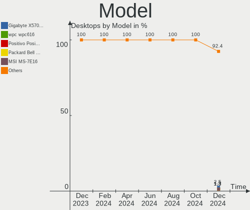
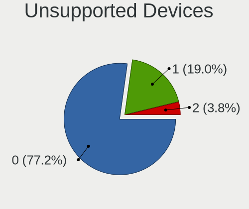

Zorin - Hardware Trends (Desktops)
----------------------------------

A project to identify most popular hardware characteristics and track their change
over time based on data collected by Linux users at https://Linux-Hardware.org.

Anyone can contribute to this report by the [hw-probe](https://github.com/linuxhw/hw-probe) tool:

    sudo -E hw-probe -all -upload

This report is for one last month. Overall report since the beginning of time: [TestCoverage](https://github.com/linuxhw/TestCoverage)

Period: Dec, 2022.

Contents
--------

* [ System ](#system)
  - [ OS                       ](#os)
  - [ OS Family                ](#os-family)
  - [ Kernel                   ](#kernel)
  - [ Kernel Family            ](#kernel-family)
  - [ Kernel Major Ver.        ](#kernel-major-ver)
  - [ Arch                     ](#arch)
  - [ DE                       ](#de)
  - [ Display Server           ](#display-server)
  - [ Display Manager          ](#display-manager)
  - [ OS Lang                  ](#os-lang)
  - [ Boot Mode                ](#boot-mode)
  - [ Filesystem               ](#filesystem)
  - [ Part. scheme             ](#part-scheme)
  - [ Dual Boot with Linux/BSD ](#dual-boot-with-linuxbsd)
  - [ Dual Boot (Win)          ](#dual-boot-win)

* [ Board ](#board)
  - [ Vendor                   ](#vendor)
  - [ Model                    ](#model)
  - [ Model Family             ](#model-family)
  - [ MFG Year                 ](#mfg-year)
  - [ Form Factor              ](#form-factor)
  - [ Secure Boot              ](#secure-boot)
  - [ Coreboot                 ](#coreboot)
  - [ RAM Size                 ](#ram-size)
  - [ RAM Used                 ](#ram-used)
  - [ Total Drives             ](#total-drives)
  - [ Has CD-ROM               ](#has-cd-rom)
  - [ Has Ethernet             ](#has-ethernet)
  - [ Has WiFi                 ](#has-wifi)
  - [ Has Bluetooth            ](#has-bluetooth)

* [ Location ](#location)
  - [ Country                  ](#country)
  - [ City                     ](#city)

* [ Drives ](#drives)
  - [ Drive Vendor             ](#drive-vendor)
  - [ Drive Model              ](#drive-model)
  - [ HDD Vendor               ](#hdd-vendor)
  - [ SSD Vendor               ](#ssd-vendor)
  - [ Drive Kind               ](#drive-kind)
  - [ Drive Connector          ](#drive-connector)
  - [ Drive Size               ](#drive-size)
  - [ Space Total              ](#space-total)
  - [ Space Used               ](#space-used)
  - [ Malfunc. Drives          ](#malfunc-drives)
  - [ Malfunc. Drive Vendor    ](#malfunc-drive-vendor)
  - [ Malfunc. HDD Vendor      ](#malfunc-hdd-vendor)
  - [ Malfunc. Drive Kind      ](#malfunc-drive-kind)
  - [ Failed Drives            ](#failed-drives)
  - [ Failed Drive Vendor      ](#failed-drive-vendor)
  - [ Drive Status             ](#drive-status)

* [ Storage controller ](#storage-controller)
  - [ Storage Vendor           ](#storage-vendor)
  - [ Storage Model            ](#storage-model)
  - [ Storage Kind             ](#storage-kind)

* [ Processor ](#processor)
  - [ CPU Vendor               ](#cpu-vendor)
  - [ CPU Model                ](#cpu-model)
  - [ CPU Model Family         ](#cpu-model-family)
  - [ CPU Cores                ](#cpu-cores)
  - [ CPU Sockets              ](#cpu-sockets)
  - [ CPU Threads              ](#cpu-threads)
  - [ CPU Op-Modes             ](#cpu-op-modes)
  - [ CPU Microcode            ](#cpu-microcode)
  - [ CPU Microarch            ](#cpu-microarch)

* [ Graphics ](#graphics)
  - [ GPU Vendor               ](#gpu-vendor)
  - [ GPU Model                ](#gpu-model)
  - [ GPU Combo                ](#gpu-combo)
  - [ GPU Driver               ](#gpu-driver)
  - [ GPU Memory               ](#gpu-memory)

* [ Monitor ](#monitor)
  - [ Monitor Vendor           ](#monitor-vendor)
  - [ Monitor Model            ](#monitor-model)
  - [ Monitor Resolution       ](#monitor-resolution)
  - [ Monitor Diagonal         ](#monitor-diagonal)
  - [ Monitor Width            ](#monitor-width)
  - [ Aspect Ratio             ](#aspect-ratio)
  - [ Monitor Area             ](#monitor-area)
  - [ Pixel Density            ](#pixel-density)
  - [ Multiple Monitors        ](#multiple-monitors)

* [ Network ](#network)
  - [ Net Controller Vendor    ](#net-controller-vendor)
  - [ Net Controller Model     ](#net-controller-model)
  - [ Wireless Vendor          ](#wireless-vendor)
  - [ Wireless Model           ](#wireless-model)
  - [ Ethernet Vendor          ](#ethernet-vendor)
  - [ Ethernet Model           ](#ethernet-model)
  - [ Net Controller Kind      ](#net-controller-kind)
  - [ Used Controller          ](#used-controller)
  - [ NICs                     ](#nics)
  - [ IPv6                     ](#ipv6)

* [ Bluetooth ](#bluetooth)
  - [ Bluetooth Vendor         ](#bluetooth-vendor)
  - [ Bluetooth Model          ](#bluetooth-model)

* [ Sound ](#sound)
  - [ Sound Vendor             ](#sound-vendor)
  - [ Sound Model              ](#sound-model)

* [ Memory ](#memory)
  - [ Memory Vendor            ](#memory-vendor)
  - [ Memory Model             ](#memory-model)
  - [ Memory Kind              ](#memory-kind)
  - [ Memory Form Factor       ](#memory-form-factor)
  - [ Memory Size              ](#memory-size)
  - [ Memory Speed             ](#memory-speed)

* [ Printers & scanners ](#printers--scanners)
  - [ Printer Vendor           ](#printer-vendor)
  - [ Printer Model            ](#printer-model)
  - [ Scanner Vendor           ](#scanner-vendor)
  - [ Scanner Model            ](#scanner-model)

* [ Camera ](#camera)
  - [ Camera Vendor            ](#camera-vendor)
  - [ Camera Model             ](#camera-model)

* [ Security ](#security)
  - [ Fingerprint Vendor       ](#fingerprint-vendor)
  - [ Fingerprint Model        ](#fingerprint-model)
  - [ Chipcard Vendor          ](#chipcard-vendor)
  - [ Chipcard Model           ](#chipcard-model)

* [ Unsupported ](#unsupported)
  - [ Unsupported Devices      ](#unsupported-devices)
  - [ Unsupported Device Types ](#unsupported-device-types)

System
------

OS
--

Installed operating systems

| Name     | Desktops | Percent |
|----------|----------|---------|
| Zorin 16 | 71       | 95.95%  |
| Zorin 15 | 3        | 4.05%   |

OS Family
---------

OS without a version

| Name  | Desktops | Percent |
|-------|----------|---------|
| Zorin | 74       | 100%    |

Kernel
------

Version of the Linux kernel

| Version                | Desktops | Percent |
|------------------------|----------|---------|
| 5.15.0-56-generic      | 58       | 78.38%  |
| 5.15.0-53-generic      | 7        | 9.46%   |
| 5.4.0-135-generic      | 3        | 4.05%   |
| 5.15.0-52-generic      | 2        | 2.7%    |
| 5.19.12-051912-generic | 1        | 1.35%   |
| 5.15.0-43-generic      | 1        | 1.35%   |
| 5.15.0-41-generic      | 1        | 1.35%   |
| 5.13.0-35-generic      | 1        | 1.35%   |

Kernel Family
-------------

Linux kernel without a distro release

| Version | Desktops | Percent |
|---------|----------|---------|
| 5.15.0  | 69       | 93.24%  |
| 5.4.0   | 3        | 4.05%   |
| 5.19.12 | 1        | 1.35%   |
| 5.13.0  | 1        | 1.35%   |

Kernel Major Ver.
-----------------

Linux kernel major version

| Version | Desktops | Percent |
|---------|----------|---------|
| 5.15    | 69       | 93.24%  |
| 5.4     | 3        | 4.05%   |
| 5.19    | 1        | 1.35%   |
| 5.13    | 1        | 1.35%   |

Arch
----

OS architecture (x86_64, i586, etc.)

| Name   | Desktops | Percent |
|--------|----------|---------|
| x86_64 | 73       | 98.65%  |
| i686   | 1        | 1.35%   |

DE
--

Desktop Environment

| Name  | Desktops | Percent |
|-------|----------|---------|
| GNOME | 62       | 83.78%  |
| XFCE  | 12       | 16.22%  |

Display Server
--------------

X11 or Wayland

| Name | Desktops | Percent |
|------|----------|---------|
| X11  | 74       | 100%    |

Display Manager
---------------

SDDM, LightDM, etc.

| Name    | Desktops | Percent |
|---------|----------|---------|
| Unknown | 60       | 81.08%  |
| GDM     | 6        | 8.11%   |
| GDM3    | 5        | 6.76%   |
| LightDM | 3        | 4.05%   |

OS Lang
-------

Language

| Lang  | Desktops | Percent |
|-------|----------|---------|
| en_US | 32       | 43.24%  |
| de_DE | 6        | 8.11%   |
| ru_RU | 5        | 6.76%   |
| pt_BR | 5        | 6.76%   |
| fr_FR | 3        | 4.05%   |
| en_GB | 3        | 4.05%   |
| ja_JP | 2        | 2.7%    |
| hu_HU | 2        | 2.7%    |
| en_CA | 2        | 2.7%    |
| en_AU | 2        | 2.7%    |
| sk_SK | 1        | 1.35%   |
| ro_RO | 1        | 1.35%   |
| pl_PL | 1        | 1.35%   |
| nl_NL | 1        | 1.35%   |
| nb_NO | 1        | 1.35%   |
| it_IT | 1        | 1.35%   |
| es_ES | 1        | 1.35%   |
| es_CO | 1        | 1.35%   |
| en_ZA | 1        | 1.35%   |
| en_IN | 1        | 1.35%   |
| da_DK | 1        | 1.35%   |
| cs_CZ | 1        | 1.35%   |

Boot Mode
---------

EFI or BIOS

| Mode | Desktops | Percent |
|------|----------|---------|
| BIOS | 40       | 54.05%  |
| EFI  | 34       | 45.95%  |

Filesystem
----------

Type of filesystem

| Type    | Desktops | Percent |
|---------|----------|---------|
| Ext4    | 68       | 91.89%  |
| Overlay | 3        | 4.05%   |
| Zfs     | 2        | 2.7%    |
| Ext2    | 1        | 1.35%   |

Part. scheme
------------

Scheme of partitioning

| Type    | Desktops | Percent |
|---------|----------|---------|
| Unknown | 61       | 82.43%  |
| GPT     | 7        | 9.46%   |
| MBR     | 6        | 8.11%   |

Dual Boot with Linux/BSD
------------------------

Hosting more than one Linux/BSD

| Dual boot | Desktops | Percent |
|-----------|----------|---------|
| No        | 71       | 95.95%  |
| Yes       | 3        | 4.05%   |

Dual Boot (Win)
---------------

Hosting Linux and Windows

| Dual boot | Desktops | Percent |
|-----------|----------|---------|
| No        | 64       | 86.49%  |
| Yes       | 10       | 13.51%  |

Board
-----

Vendor
------

Motherboard manufacturer

| Name                | Desktops | Percent |
|---------------------|----------|---------|
| ASUSTek Computer    | 12       | 16.22%  |
| MSI                 | 9        | 12.16%  |
| Gigabyte Technology | 9        | 12.16%  |
| Hewlett-Packard     | 8        | 10.81%  |
| Dell                | 8        | 10.81%  |
| ASRock              | 6        | 8.11%   |
| Lenovo              | 5        | 6.76%   |
| Biostar             | 3        | 4.05%   |
| PCWare              | 2        | 2.7%    |
| Fujitsu             | 2        | 2.7%    |
| NZXT                | 1        | 1.35%   |
| MACHINIST           | 1        | 1.35%   |
| Intel               | 1        | 1.35%   |
| HOUTER              | 1        | 1.35%   |
| Foxconn             | 1        | 1.35%   |
| ECS                 | 1        | 1.35%   |
| AZW                 | 1        | 1.35%   |
| Apple               | 1        | 1.35%   |
| Acer                | 1        | 1.35%   |
| Unknown             | 1        | 1.35%   |

Model
-----

Motherboard model

| Name                                     | Desktops | Percent |
|------------------------------------------|----------|---------|
| Dell OptiPlex 3010                       | 2        | 2.7%    |
| PCWare IPMH61R1                          | 1        | 1.35%   |
| PCWare IPMH310 PRO 2.0                   | 1        | 1.35%   |
| NZXT N7 Z590                             | 1        | 1.35%   |
| MSI Vig625M                              | 1        | 1.35%   |
| MSI MS-7C75                              | 1        | 1.35%   |
| MSI MS-7C37                              | 1        | 1.35%   |
| MSI MS-7B89                              | 1        | 1.35%   |
| MSI MS-7885                              | 1        | 1.35%   |
| MSI MS-7758                              | 1        | 1.35%   |
| MSI MS-7680                              | 1        | 1.35%   |
| MSI MS-7376                              | 1        | 1.35%   |
| MSI B250 Gaming Nightblade MIB (MS-B090) | 1        | 1.35%   |
| MACHINIST E5-MR9A PRO V1.0               | 1        | 1.35%   |
| Lenovo ThinkCentre M92z 3314D9U          | 1        | 1.35%   |
| Lenovo ThinkCentre M91p 4524WAP          | 1        | 1.35%   |
| Lenovo ThinkCentre M910t 10MNS1Y900      | 1        | 1.35%   |
| Lenovo ThinkCentre M83 10E8CTO1WW        | 1        | 1.35%   |
| Lenovo ThinkCentre M700 10J0S2QU00       | 1        | 1.35%   |
| Intel H61                                | 1        | 1.35%   |
| HOUTER IPMIP-GS                          | 1        | 1.35%   |
| HP Z230 Tower Workstation                | 1        | 1.35%   |
| HP Z2 Tower G5 Workstation               | 1        | 1.35%   |
| HP Pavilion Desktop PC 570-p0xx          | 1        | 1.35%   |
| HP Pavilion Desktop 590-p0xxx            | 1        | 1.35%   |
| HP CQ2962ESm                             | 1        | 1.35%   |
| HP Compaq dx6120 MT(PW287ES)             | 1        | 1.35%   |
| HP 500-420qe                             | 1        | 1.35%   |
| HP 290 G1 MT                             | 1        | 1.35%   |
| Gigabyte X570 AORUS ELITE                | 1        | 1.35%   |
| Gigabyte H77N-WIFI                       | 1        | 1.35%   |
| Gigabyte H61M-S1                         | 1        | 1.35%   |
| Gigabyte H57M-USB3                       | 1        | 1.35%   |
| Gigabyte GA-770T-USB3                    | 1        | 1.35%   |
| Gigabyte G31M-ES2C                       | 1        | 1.35%   |
| Gigabyte B550 AORUS PRO                  | 1        | 1.35%   |
| Gigabyte AB350-Gaming 3                  | 1        | 1.35%   |
| Gigabyte 970A-DS3P                       | 1        | 1.35%   |
| Fujitsu ESPRIMO Q520                     | 1        | 1.35%   |
| Fujitsu ESPRIMO P5635                    | 1        | 1.35%   |

Model Family
------------

Motherboard model prefix

| Name                  | Desktops | Percent |
|-----------------------|----------|---------|
| Lenovo ThinkCentre    | 5        | 6.76%   |
| Dell OptiPlex         | 4        | 5.41%   |
| Dell Inspiron         | 3        | 4.05%   |
| ASUS ROG              | 3        | 4.05%   |
| HP Pavilion           | 2        | 2.7%    |
| Fujitsu ESPRIMO       | 2        | 2.7%    |
| ASUS TUF              | 2        | 2.7%    |
| ASUS PRIME            | 2        | 2.7%    |
| PCWare IPMH61R1       | 1        | 1.35%   |
| PCWare IPMH310        | 1        | 1.35%   |
| NZXT N7               | 1        | 1.35%   |
| MSI Vig625M           | 1        | 1.35%   |
| MSI MS-7C75           | 1        | 1.35%   |
| MSI MS-7C37           | 1        | 1.35%   |
| MSI MS-7B89           | 1        | 1.35%   |
| MSI MS-7885           | 1        | 1.35%   |
| MSI MS-7758           | 1        | 1.35%   |
| MSI MS-7680           | 1        | 1.35%   |
| MSI MS-7376           | 1        | 1.35%   |
| MSI B250              | 1        | 1.35%   |
| MACHINIST E5-MR9A     | 1        | 1.35%   |
| Intel H61             | 1        | 1.35%   |
| HOUTER IPMIP-GS       | 1        | 1.35%   |
| HP Z230               | 1        | 1.35%   |
| HP Z2                 | 1        | 1.35%   |
| HP CQ2962ESm          | 1        | 1.35%   |
| HP Compaq             | 1        | 1.35%   |
| HP 500-420qe          | 1        | 1.35%   |
| HP 290                | 1        | 1.35%   |
| Gigabyte X570         | 1        | 1.35%   |
| Gigabyte H77N-WIFI    | 1        | 1.35%   |
| Gigabyte H61M-S1      | 1        | 1.35%   |
| Gigabyte H57M-USB3    | 1        | 1.35%   |
| Gigabyte GA-770T-USB3 | 1        | 1.35%   |
| Gigabyte G31M-ES2C    | 1        | 1.35%   |
| Gigabyte B550         | 1        | 1.35%   |
| Gigabyte AB350-Gaming | 1        | 1.35%   |
| Gigabyte 970A-DS3P    | 1        | 1.35%   |
| Foxconn H55MXV-LE     | 1        | 1.35%   |
| ECS H110M4-C2H        | 1        | 1.35%   |

MFG Year
--------

Motherboard manufacture year

| Year | Desktops | Percent |
|------|----------|---------|
| 2010 | 10       | 13.51%  |
| 2021 | 8        | 10.81%  |
| 2018 | 7        | 9.46%   |
| 2012 | 7        | 9.46%   |
| 2017 | 6        | 8.11%   |
| 2011 | 6        | 8.11%   |
| 2008 | 6        | 8.11%   |
| 2020 | 4        | 5.41%   |
| 2019 | 4        | 5.41%   |
| 2013 | 4        | 5.41%   |
| 2016 | 3        | 4.05%   |
| 2022 | 2        | 2.7%    |
| 2015 | 2        | 2.7%    |
| 2014 | 2        | 2.7%    |
| 2009 | 1        | 1.35%   |
| 2006 | 1        | 1.35%   |
| 2005 | 1        | 1.35%   |

Form Factor
-----------

Physical design of the computer

| Name    | Desktops | Percent |
|---------|----------|---------|
| Desktop | 74       | 100%    |

Secure Boot
-----------

Enabled or disabled

| State    | Desktops | Percent |
|----------|----------|---------|
| Disabled | 69       | 93.24%  |
| Enabled  | 5        | 6.76%   |

Coreboot
--------

Have coreboot on board

| Used | Desktops | Percent |
|------|----------|---------|
| No   | 74       | 100%    |

RAM Size
--------

Total RAM memory

| Size in GB  | Desktops | Percent |
|-------------|----------|---------|
| 16.01-24.0  | 18       | 24.32%  |
| 4.01-8.0    | 17       | 22.97%  |
| 8.01-16.0   | 13       | 17.57%  |
| 3.01-4.0    | 12       | 16.22%  |
| 32.01-64.0  | 9        | 12.16%  |
| 64.01-256.0 | 4        | 5.41%   |
| 2.01-3.0    | 1        | 1.35%   |

RAM Used
--------

Used RAM memory

| Used GB    | Desktops | Percent |
|------------|----------|---------|
| 2.01-3.0   | 21       | 28.38%  |
| 1.01-2.0   | 21       | 28.38%  |
| 3.01-4.0   | 16       | 21.62%  |
| 4.01-8.0   | 10       | 13.51%  |
| 0.51-1.0   | 3        | 4.05%   |
| 32.01-64.0 | 1        | 1.35%   |
| 16.01-24.0 | 1        | 1.35%   |
| 8.01-16.0  | 1        | 1.35%   |

Total Drives
------------

Number of drives on board

| Drives | Desktops | Percent |
|--------|----------|---------|
| 1      | 32       | 43.24%  |
| 2      | 23       | 31.08%  |
| 3      | 7        | 9.46%   |
| 4      | 6        | 8.11%   |
| 6      | 3        | 4.05%   |
| 5      | 2        | 2.7%    |
| 8      | 1        | 1.35%   |

Has CD-ROM
----------

Has CD-ROM on board

| Presented | Desktops | Percent |
|-----------|----------|---------|
| No        | 42       | 56.76%  |
| Yes       | 32       | 43.24%  |

Has Ethernet
------------

Has Ethernet on board

| Presented | Desktops | Percent |
|-----------|----------|---------|
| Yes       | 72       | 97.3%   |
| No        | 2        | 2.7%    |

Has WiFi
--------

Has WiFi module

| Presented | Desktops | Percent |
|-----------|----------|---------|
| No        | 41       | 55.41%  |
| Yes       | 33       | 44.59%  |

Has Bluetooth
-------------

Has Bluetooth module

| Presented | Desktops | Percent |
|-----------|----------|---------|
| No        | 49       | 66.22%  |
| Yes       | 25       | 33.78%  |

Location
--------

Country
-------

Geographic location (country)

| Country      | Desktops | Percent |
|--------------|----------|---------|
| USA          | 19       | 25.68%  |
| Germany      | 7        | 9.46%   |
| Brazil       | 7        | 9.46%   |
| Russia       | 4        | 5.41%   |
| UK           | 3        | 4.05%   |
| Slovakia     | 2        | 2.7%    |
| Netherlands  | 2        | 2.7%    |
| Japan        | 2        | 2.7%    |
| Italy        | 2        | 2.7%    |
| Hungary      | 2        | 2.7%    |
| France       | 2        | 2.7%    |
| Australia    | 2        | 2.7%    |
| Venezuela    | 1        | 1.35%   |
| Spain        | 1        | 1.35%   |
| South Africa | 1        | 1.35%   |
| Saudi Arabia | 1        | 1.35%   |
| Romania      | 1        | 1.35%   |
| Portugal     | 1        | 1.35%   |
| Poland       | 1        | 1.35%   |
| Norway       | 1        | 1.35%   |
| Monaco       | 1        | 1.35%   |
| Indonesia    | 1        | 1.35%   |
| India        | 1        | 1.35%   |
| Greece       | 1        | 1.35%   |
| Denmark      | 1        | 1.35%   |
| Czechia      | 1        | 1.35%   |
| Colombia     | 1        | 1.35%   |
| Canada       | 1        | 1.35%   |
| Bulgaria     | 1        | 1.35%   |
| Belgium      | 1        | 1.35%   |
| Belarus      | 1        | 1.35%   |
| Bangladesh   | 1        | 1.35%   |

City
----

Geographic location (city)

| City                 | Desktops | Percent |
|----------------------|----------|---------|
| Shibata              | 2        | 2.7%    |
| Perth                | 2        | 2.7%    |
| Munich               | 2        | 2.7%    |
| Zvolen               | 1        | 1.35%   |
| West Valley          | 1        | 1.35%   |
| Warwick              | 1        | 1.35%   |
| Wake Forest          | 1        | 1.35%   |
| Waalwijk             | 1        | 1.35%   |
| Vincentown           | 1        | 1.35%   |
| Vejle                | 1        | 1.35%   |
| Uelzen               | 1        | 1.35%   |
| Tyumen               | 1        | 1.35%   |
| Tucson               | 1        | 1.35%   |
| Trostberg an der Alz | 1        | 1.35%   |
| Surabaya             | 1        | 1.35%   |
| Sofia                | 1        | 1.35%   |
| Smizany              | 1        | 1.35%   |
| Senbag               | 1        | 1.35%   |
| Seattle              | 1        | 1.35%   |
| Schenectady          | 1        | 1.35%   |
| Sacramento           | 1        | 1.35%   |
| Royalston            | 1        | 1.35%   |
| Rochester            | 1        | 1.35%   |
| Rechytsa             | 1        | 1.35%   |
| Ravnasen             | 1        | 1.35%   |
| Pavia                | 1        | 1.35%   |
| Oltenita             | 1        | 1.35%   |
| Olomouc              | 1        | 1.35%   |
| Oberhausen           | 1        | 1.35%   |
| Nurtingen            | 1        | 1.35%   |
| Moscow               | 1        | 1.35%   |
| Monaco               | 1        | 1.35%   |
| Mislata              | 1        | 1.35%   |
| Milan                | 1        | 1.35%   |
| Medellín            | 1        | 1.35%   |
| Makkah               | 1        | 1.35%   |
| Madison Heights      | 1        | 1.35%   |
| Lyon                 | 1        | 1.35%   |
| Lorena               | 1        | 1.35%   |
| Londrina             | 1        | 1.35%   |

Drives
------

Drive Vendor
------------

Hard drive vendors

| Vendor                       | Desktops | Drives | Percent |
|------------------------------|----------|--------|---------|
| WDC                          | 24       | 27     | 17.91%  |
| Seagate                      | 22       | 32     | 16.42%  |
| Samsung Electronics          | 22       | 24     | 16.42%  |
| Toshiba                      | 9        | 9      | 6.72%   |
| Kingston                     | 9        | 14     | 6.72%   |
| Crucial                      | 5        | 6      | 3.73%   |
| SanDisk                      | 4        | 4      | 2.99%   |
| Hitachi                      | 4        | 5      | 2.99%   |
| Unknown                      | 3        | 3      | 2.24%   |
| Phison Electronics           | 3        | 3      | 2.24%   |
| SK hynix                     | 2        | 2      | 1.49%   |
| Maxtor                       | 2        | 2      | 1.49%   |
| KingSpec                     | 2        | 2      | 1.49%   |
| Intel                        | 2        | 2      | 1.49%   |
| China                        | 2        | 2      | 1.49%   |
| A-DATA Technology            | 2        | 2      | 1.49%   |
| Transcend                    | 1        | 1      | 0.75%   |
| Silicon Motion               | 1        | 1      | 0.75%   |
| PNY                          | 1        | 1      | 0.75%   |
| Patriot                      | 1        | 1      | 0.75%   |
| OCZ-VERTEX3                  | 1        | 1      | 0.75%   |
| NGFF                         | 1        | 1      | 0.75%   |
| Netac                        | 1        | 2      | 0.75%   |
| Mercury                      | 1        | 1      | 0.75%   |
| LITEON                       | 1        | 1      | 0.75%   |
| LDLC                         | 1        | 1      | 0.75%   |
| Kingston Technology Company  | 1        | 1      | 0.75%   |
| KingFast                     | 1        | 1      | 0.75%   |
| HS-SSD-C100                  | 1        | 1      | 0.75%   |
| Gigabyte Technology          | 1        | 1      | 0.75%   |
| External                     | 1        | 1      | 0.75%   |
| Beijing Starblaze Technology | 1        | 1      | 0.75%   |
| Apacer                       | 1        | 1      | 0.75%   |

Drive Model
-----------

Hard drive models

| Model                                              | Desktops | Percent |
|----------------------------------------------------|----------|---------|
| Toshiba HDWD110 1TB                                | 3        | 2.04%   |
| Seagate ST500DM002-1BD142 500GB                    | 3        | 2.04%   |
| Kingston SA400S37240G 240GB SSD                    | 3        | 2.04%   |
| Crucial CT250MX500SSD1 250GB                       | 3        | 2.04%   |
| WDC WD400JD-19MSA1 40GB                            | 2        | 1.36%   |
| WDC WD10EZEX-22MFCA0 1TB                           | 2        | 1.36%   |
| Unknown SD/MMC/MS PRO 64GB                         | 2        | 1.36%   |
| Toshiba MQ01ABD100 1TB                             | 2        | 1.36%   |
| Seagate ST4000DM000-2AE166 4TB                     | 2        | 1.36%   |
| Seagate ST2000DM001-1ER164 2TB                     | 2        | 1.36%   |
| Seagate ST1000DM010-2EP102 1TB                     | 2        | 1.36%   |
| Seagate ST1000DM003-1SB102 1TB                     | 2        | 1.36%   |
| Samsung NVMe SSD Controller PM9A1/PM9A3/980PRO 2TB | 2        | 1.36%   |
| Phison E12 NVMe Controller 1TB                     | 2        | 1.36%   |
| Kingston SUV400S37120G 120GB SSD                   | 2        | 1.36%   |
| Kingston SA400S37480G 480GB SSD                    | 2        | 1.36%   |
| WDC WDS120G2G0A-00JH30 120GB SSD                   | 1        | 0.68%   |
| WDC WD6401AALS-00L3B2 640GB                        | 1        | 0.68%   |
| WDC WD5003ABYX-01WERA1 500GB                       | 1        | 0.68%   |
| WDC WD5000LPLX-00ZNTT0 500GB                       | 1        | 0.68%   |
| WDC WD5000AAKS-22YGA0 500GB                        | 1        | 0.68%   |
| WDC WD3200BEVT-08A23T1 320GB                       | 1        | 0.68%   |
| WDC WD3200AVVS-63L2B0 320GB                        | 1        | 0.68%   |
| WDC WD3200AVVS-56L2B0 320GB                        | 1        | 0.68%   |
| WDC WD30EZRZ-22Z5HB0 3TB                           | 1        | 0.68%   |
| WDC WD30EZRX-00D8PB0 3TB                           | 1        | 0.68%   |
| WDC WD2500AVVS-62L2B0 250GB                        | 1        | 0.68%   |
| WDC WD20EARS-00MVWB0 2TB                           | 1        | 0.68%   |
| WDC WD2003FZEX-00SRLA0 2TB                         | 1        | 0.68%   |
| WDC WD10TPVT-00U4RT1 1TB                           | 1        | 0.68%   |
| WDC WD10SPZX-21Z10T0 1TB                           | 1        | 0.68%   |
| WDC WD10EZRX-00L4HB0 1TB                           | 1        | 0.68%   |
| WDC WD10EZEX-60WN4A0 1TB                           | 1        | 0.68%   |
| WDC WD10EZEX-00BN5A0 1TB                           | 1        | 0.68%   |
| WDC WD10EARX-00PASB0 1TB                           | 1        | 0.68%   |
| WDC WD10EADS-00L5B1 1TB                            | 1        | 0.68%   |
| WDC WD1003FZEX-00MK2A0 1TB                         | 1        | 0.68%   |
| Unknown MMC Card  128GB                            | 1        | 0.68%   |
| Transcend TS256GMTS950T 256GB SSD                  | 1        | 0.68%   |
| Toshiba MK6465GSXN 640GB                           | 1        | 0.68%   |

HDD Vendor
----------

Hard disk drive vendors

| Vendor              | Desktops | Drives | Percent |
|---------------------|----------|--------|---------|
| WDC                 | 23       | 26     | 32.39%  |
| Seagate             | 22       | 32     | 30.99%  |
| Toshiba             | 9        | 9      | 12.68%  |
| Samsung Electronics | 9        | 9      | 12.68%  |
| Hitachi             | 4        | 5      | 5.63%   |
| Unknown             | 2        | 2      | 2.82%   |
| Maxtor              | 2        | 2      | 2.82%   |

SSD Vendor
----------

Solid state drive vendors

| Vendor              | Desktops | Drives | Percent |
|---------------------|----------|--------|---------|
| Samsung Electronics | 8        | 9      | 19.51%  |
| Kingston            | 7        | 10     | 17.07%  |
| SanDisk             | 4        | 4      | 9.76%   |
| Crucial             | 4        | 5      | 9.76%   |
| China               | 2        | 2      | 4.88%   |
| A-DATA Technology   | 2        | 2      | 4.88%   |
| WDC                 | 1        | 1      | 2.44%   |
| Transcend           | 1        | 1      | 2.44%   |
| PNY                 | 1        | 1      | 2.44%   |
| Patriot             | 1        | 1      | 2.44%   |
| OCZ-VERTEX3         | 1        | 1      | 2.44%   |
| NGFF                | 1        | 1      | 2.44%   |
| Netac               | 1        | 1      | 2.44%   |
| Mercury             | 1        | 1      | 2.44%   |
| LITEON              | 1        | 1      | 2.44%   |
| LDLC                | 1        | 1      | 2.44%   |
| KingSpec            | 1        | 1      | 2.44%   |
| Intel               | 1        | 1      | 2.44%   |
| HS-SSD-C100         | 1        | 1      | 2.44%   |
| Apacer              | 1        | 1      | 2.44%   |

Drive Kind
----------

HDD or SSD

| Kind    | Desktops | Drives | Percent |
|---------|----------|--------|---------|
| HDD     | 54       | 85     | 48.21%  |
| SSD     | 36       | 46     | 32.14%  |
| NVMe    | 17       | 21     | 15.18%  |
| Unknown | 4        | 4      | 3.57%   |
| MMC     | 1        | 1      | 0.89%   |

Drive Connector
---------------

SATA, SAS, NVMe, etc.

| Type | Desktops | Drives | Percent |
|------|----------|--------|---------|
| SATA | 68       | 129    | 74.73%  |
| NVMe | 17       | 21     | 18.68%  |
| SAS  | 5        | 6      | 5.49%   |
| MMC  | 1        | 1      | 1.1%    |

Drive Size
----------

Size of hard drive

| Size in TB | Desktops | Drives | Percent |
|------------|----------|--------|---------|
| 0.01-0.5   | 53       | 74     | 55.79%  |
| 0.51-1.0   | 25       | 36     | 26.32%  |
| 1.01-2.0   | 9        | 9      | 9.47%   |
| 3.01-4.0   | 3        | 3      | 3.16%   |
| 2.01-3.0   | 2        | 2      | 2.11%   |
| 4.01-10.0  | 2        | 3      | 2.11%   |
| 10.01-20.0 | 1        | 4      | 1.05%   |

Space Total
-----------

Amount of disk space available on the file system

| Size in GB     | Desktops | Percent |
|----------------|----------|---------|
| 251-500        | 22       | 29.73%  |
| 101-250        | 21       | 28.38%  |
| 501-1000       | 9        | 12.16%  |
| 1001-2000      | 7        | 9.46%   |
| More than 3000 | 6        | 8.11%   |
| 51-100         | 3        | 4.05%   |
| 21-50          | 2        | 2.7%    |
| 1-20           | 2        | 2.7%    |
| 2001-3000      | 1        | 1.35%   |
| Unknown        | 1        | 1.35%   |

Space Used
----------

Amount of used disk space

| Used GB        | Desktops | Percent |
|----------------|----------|---------|
| 21-50          | 26       | 35.14%  |
| 1-20           | 16       | 21.62%  |
| 101-250        | 15       | 20.27%  |
| 51-100         | 7        | 9.46%   |
| More than 3000 | 4        | 5.41%   |
| 251-500        | 2        | 2.7%    |
| 501-1000       | 2        | 2.7%    |
| 1001-2000      | 1        | 1.35%   |
| Unknown        | 1        | 1.35%   |

Malfunc. Drives
---------------

Drive models with a malfunction

| Model                             | Desktops | Drives | Percent |
|-----------------------------------|----------|--------|---------|
| Seagate ST8000DM004-2CX188 8TB    | 1        | 1      | 33.33%  |
| Samsung Electronics HD154UI 1TB   | 1        | 1      | 33.33%  |
| A-DATA Technology SU630 240GB SSD | 1        | 1      | 33.33%  |

Malfunc. Drive Vendor
---------------------

Vendors of faulty drives

| Vendor              | Desktops | Drives | Percent |
|---------------------|----------|--------|---------|
| Seagate             | 1        | 1      | 33.33%  |
| Samsung Electronics | 1        | 1      | 33.33%  |
| A-DATA Technology   | 1        | 1      | 33.33%  |

Malfunc. HDD Vendor
-------------------

Vendors of faulty HDD drives

| Vendor              | Desktops | Drives | Percent |
|---------------------|----------|--------|---------|
| Seagate             | 1        | 1      | 50%     |
| Samsung Electronics | 1        | 1      | 50%     |

Malfunc. Drive Kind
-------------------

Kinds of faulty drives

| Kind | Desktops | Drives | Percent |
|------|----------|--------|---------|
| SSD  | 1        | 1      | 50%     |
| HDD  | 1        | 2      | 50%     |

Failed Drives
-------------

Failed drive models

Zero info for selected period =(

Failed Drive Vendor
-------------------

Failed drive vendors

Zero info for selected period =(

Drive Status
------------

Number of failed and malfunc. drives

| Status   | Desktops | Drives | Percent |
|----------|----------|--------|---------|
| Detected | 69       | 137    | 87.34%  |
| Works    | 8        | 17     | 10.13%  |
| Malfunc  | 2        | 3      | 2.53%   |

Storage controller
------------------

Storage Vendor
--------------

Storage controller vendors

| Vendor                       | Desktops | Percent |
|------------------------------|----------|---------|
| Intel                        | 51       | 54.84%  |
| AMD                          | 19       | 20.43%  |
| Samsung Electronics          | 6        | 6.45%   |
| Phison Electronics           | 4        | 4.3%    |
| Nvidia                       | 3        | 3.23%   |
| Kingston Technology Company  | 2        | 2.15%   |
| SK hynix                     | 1        | 1.08%   |
| Silicon Motion               | 1        | 1.08%   |
| Netac Technology             | 1        | 1.08%   |
| Micron/Crucial Technology    | 1        | 1.08%   |
| Marvell Technology Group     | 1        | 1.08%   |
| JMicron Technology           | 1        | 1.08%   |
| Beijing Starblaze Technology | 1        | 1.08%   |
| ASMedia Technology           | 1        | 1.08%   |

Storage Model
-------------

Storage controller models

| Model                                                                                   | Desktops | Percent |
|-----------------------------------------------------------------------------------------|----------|---------|
| AMD FCH SATA Controller [AHCI mode]                                                     | 9        | 7.63%   |
| Intel 6 Series/C200 Series Chipset Family 6 port Desktop SATA AHCI Controller           | 7        | 5.93%   |
| Intel Q170/Q150/B150/H170/H110/Z170/CM236 Chipset SATA Controller [AHCI Mode]           | 5        | 4.24%   |
| Intel NM10/ICH7 Family SATA Controller [IDE mode]                                       | 4        | 3.39%   |
| Intel 7 Series/C210 Series Chipset Family 6-port SATA Controller [AHCI mode]            | 4        | 3.39%   |
| Intel 200 Series PCH SATA controller [AHCI mode]                                        | 4        | 3.39%   |
| AMD SB7x0/SB8x0/SB9x0 IDE Controller                                                    | 4        | 3.39%   |
| AMD 400 Series Chipset SATA Controller                                                  | 4        | 3.39%   |
| Intel SATA Controller [RAID mode]                                                       | 3        | 2.54%   |
| Intel 82801JI (ICH10 Family) SATA AHCI Controller                                       | 3        | 2.54%   |
| Intel 82801G (ICH7 Family) IDE Controller                                               | 3        | 2.54%   |
| Intel 8 Series/C220 Series Chipset Family 6-port SATA Controller 1 [AHCI mode]          | 3        | 2.54%   |
| Intel 5 Series/3400 Series Chipset 6 port SATA AHCI Controller                          | 3        | 2.54%   |
| AMD SB7x0/SB8x0/SB9x0 SATA Controller [IDE mode]                                        | 3        | 2.54%   |
| AMD 500 Series Chipset SATA Controller                                                  | 3        | 2.54%   |
| AMD 300 Series Chipset SATA Controller                                                  | 3        | 2.54%   |
| Samsung NVMe SSD Controller PM9A1/PM9A3/980PRO                                          | 2        | 1.69%   |
| Phison E12 NVMe Controller                                                              | 2        | 1.69%   |
| Kingston Company Company Non-Volatile memory controller                                 | 2        | 1.69%   |
| Intel Comet Lake SATA AHCI Controller                                                   | 2        | 1.69%   |
| Intel 8 Series/C220 Series Chipset Family 4-port SATA Controller 1 [IDE mode]           | 2        | 1.69%   |
| Intel 8 Series/C220 Series Chipset Family 2-port SATA Controller 2 [IDE mode]           | 2        | 1.69%   |
| Intel 6 Series/C200 Series Chipset Family Desktop SATA Controller (IDE mode, ports 4-5) | 2        | 1.69%   |
| Intel 6 Series/C200 Series Chipset Family Desktop SATA Controller (IDE mode, ports 0-3) | 2        | 1.69%   |
| AMD SB7x0/SB8x0/SB9x0 SATA Controller [AHCI mode]                                       | 2        | 1.69%   |
| SK hynix Gold P31/PC711 NVMe Solid State Drive                                          | 1        | 0.85%   |
| Silicon Motion SM2263EN/SM2263XT SSD Controller                                         | 1        | 0.85%   |
| Samsung NVMe SSD Controller SM981/PM981/PM983                                           | 1        | 0.85%   |
| Samsung NVMe SSD Controller SM961/PM961/SM963                                           | 1        | 0.85%   |
| Samsung NVMe SSD Controller SM951/PM951                                                 | 1        | 0.85%   |
| Samsung NVMe SSD Controller 980                                                         | 1        | 0.85%   |
| Phison PS5013 E13 NVMe Controller                                                       | 1        | 0.85%   |
| Phison E16 PCIe4 NVMe Controller                                                        | 1        | 0.85%   |
| Nvidia MCP78S [GeForce 8200] SATA Controller (non-AHCI mode)                            | 1        | 0.85%   |
| Nvidia MCP78S [GeForce 8200] IDE                                                        | 1        | 0.85%   |
| Nvidia MCP78S [GeForce 8200] AHCI Controller                                            | 1        | 0.85%   |
| Nvidia MCP61 SATA Controller                                                            | 1        | 0.85%   |
| Nvidia MCP61 IDE                                                                        | 1        | 0.85%   |
| Netac Non-Volatile memory controller                                                    | 1        | 0.85%   |
| Micron/Crucial P1 NVMe PCIe SSD                                                         | 1        | 0.85%   |

Storage Kind
------------

Kind of storage controller (IDE, SATA, NVMe, SAS, ...)

| Kind | Desktops | Percent |
|------|----------|---------|
| SATA | 57       | 57.58%  |
| IDE  | 21       | 21.21%  |
| NVMe | 17       | 17.17%  |
| RAID | 4        | 4.04%   |

Processor
---------

CPU Vendor
----------

Processor vendors

| Vendor | Desktops | Percent |
|--------|----------|---------|
| Intel  | 52       | 70.27%  |
| AMD    | 22       | 29.73%  |

CPU Model
---------

Processor models

| Model                                       | Desktops | Percent |
|---------------------------------------------|----------|---------|
| AMD Ryzen 9 5900X 12-Core Processor         | 4        | 5.41%   |
| Intel Core i7-2600 CPU @ 3.40GHz            | 2        | 2.7%    |
| Intel Core i5-7400 CPU @ 3.00GHz            | 2        | 2.7%    |
| Intel Core i5-6500T CPU @ 2.50GHz           | 2        | 2.7%    |
| Intel Core i5-2400 CPU @ 3.10GHz            | 2        | 2.7%    |
| Intel Core i3-7100 CPU @ 3.90GHz            | 2        | 2.7%    |
| Intel Core 2 Duo CPU E8400 @ 3.00GHz        | 2        | 2.7%    |
| Intel Xeon CPU X5690 @ 3.47GHz              | 1        | 1.35%   |
| Intel Xeon CPU E5649 @ 2.53GHz              | 1        | 1.35%   |
| Intel Xeon CPU E5-2666 v3 @ 2.90GHz         | 1        | 1.35%   |
| Intel Xeon CPU E3-1231 v3 @ 3.40GHz         | 1        | 1.35%   |
| Intel Pentium Gold G5400 CPU @ 3.70GHz      | 1        | 1.35%   |
| Intel Pentium Dual-Core CPU E5800 @ 3.20GHz | 1        | 1.35%   |
| Intel Pentium Dual-Core CPU E5700 @ 3.00GHz | 1        | 1.35%   |
| Intel Pentium CPU G630 @ 2.70GHz            | 1        | 1.35%   |
| Intel Pentium CPU G2020 @ 2.90GHz           | 1        | 1.35%   |
| Intel Pentium 4 CPU 3.00GHz                 | 1        | 1.35%   |
| Intel Core i9-10900K CPU @ 3.70GHz          | 1        | 1.35%   |
| Intel Core i7-6700 CPU @ 3.40GHz            | 1        | 1.35%   |
| Intel Core i7-5820K CPU @ 3.30GHz           | 1        | 1.35%   |
| Intel Core i7-3770 CPU @ 3.40GHz            | 1        | 1.35%   |
| Intel Core i7-10700K CPU @ 3.80GHz          | 1        | 1.35%   |
| Intel Core i7 CPU 920 @ 2.67GHz             | 1        | 1.35%   |
| Intel Core i7 CPU 870 @ 2.93GHz             | 1        | 1.35%   |
| Intel Core i7 CPU 860 @ 2.80GHz             | 1        | 1.35%   |
| Intel Core i5-9400 CPU @ 2.90GHz            | 1        | 1.35%   |
| Intel Core i5-6600 CPU @ 3.30GHz            | 1        | 1.35%   |
| Intel Core i5-4590T CPU @ 2.00GHz           | 1        | 1.35%   |
| Intel Core i5-4590 CPU @ 3.30GHz            | 1        | 1.35%   |
| Intel Core i5-4570T CPU @ 2.90GHz           | 1        | 1.35%   |
| Intel Core i5-3570K CPU @ 3.40GHz           | 1        | 1.35%   |
| Intel Core i5-3470T CPU @ 2.90GHz           | 1        | 1.35%   |
| Intel Core i5-3450 CPU @ 3.10GHz            | 1        | 1.35%   |
| Intel Core i5-2500 CPU @ 3.30GHz            | 1        | 1.35%   |
| Intel Core i5 CPU 661 @ 3.33GHz             | 1        | 1.35%   |
| Intel Core i3-8100T CPU @ 3.10GHz           | 1        | 1.35%   |
| Intel Core i3-3220T CPU @ 2.80GHz           | 1        | 1.35%   |
| Intel Core i3-3220 CPU @ 3.30GHz            | 1        | 1.35%   |
| Intel Core i3 CPU 540 @ 3.07GHz             | 1        | 1.35%   |
| Intel Core 2 Duo CPU E7400 @ 2.80GHz        | 1        | 1.35%   |

CPU Model Family
----------------

Processor model prefix

| Model                   | Desktops | Percent |
|-------------------------|----------|---------|
| Intel Core i5           | 16       | 21.62%  |
| Intel Core i7           | 9        | 12.16%  |
| Intel Core i3           | 6        | 8.11%   |
| AMD Ryzen 9             | 5        | 6.76%   |
| AMD Ryzen 5             | 5        | 6.76%   |
| Intel Xeon              | 4        | 5.41%   |
| Intel Core 2 Duo        | 3        | 4.05%   |
| Intel Celeron           | 3        | 4.05%   |
| AMD FX                  | 3        | 4.05%   |
| Other                   | 2        | 2.7%    |
| Intel Pentium Dual-Core | 2        | 2.7%    |
| Intel Pentium           | 2        | 2.7%    |
| AMD Ryzen 7             | 2        | 2.7%    |
| Intel Pentium Gold      | 1        | 1.35%   |
| Intel Pentium 4         | 1        | 1.35%   |
| Intel Core i9           | 1        | 1.35%   |
| Intel Core 2            | 1        | 1.35%   |
| Intel Atom              | 1        | 1.35%   |
| AMD Sempron             | 1        | 1.35%   |
| AMD Phenom II X6        | 1        | 1.35%   |
| AMD Phenom II X4        | 1        | 1.35%   |
| AMD Phenom              | 1        | 1.35%   |
| AMD Athlon II X3        | 1        | 1.35%   |
| AMD Athlon II X2        | 1        | 1.35%   |
| AMD A10                 | 1        | 1.35%   |

CPU Cores
---------

Number of processor cores

| Number | Desktops | Percent |
|--------|----------|---------|
| 4      | 29       | 39.19%  |
| 2      | 21       | 28.38%  |
| 6      | 7        | 9.46%   |
| 12     | 6        | 8.11%   |
| 8      | 4        | 5.41%   |
| 10     | 2        | 2.7%    |
| 3      | 2        | 2.7%    |
| 1      | 2        | 2.7%    |
| 16     | 1        | 1.35%   |

CPU Sockets
-----------

Number of sockets

| Number | Desktops | Percent |
|--------|----------|---------|
| 1      | 73       | 98.65%  |
| 2      | 1        | 1.35%   |

CPU Threads
-----------

Threads per core (Hyper-Threading)

| Number | Desktops | Percent |
|--------|----------|---------|
| 2      | 41       | 55.41%  |
| 1      | 33       | 44.59%  |

CPU Op-Modes
------------

CPU Operation Modes (32-bit, 64-bit)

| Op mode        | Desktops | Percent |
|----------------|----------|---------|
| 32-bit, 64-bit | 74       | 100%    |

CPU Microcode
-------------

Microcode number

| Number     | Desktops | Percent |
|------------|----------|---------|
| 0x306a9    | 7        | 9.46%   |
| 0x206a7    | 6        | 8.11%   |
| Unknown    | 5        | 6.76%   |
| 0x506e3    | 4        | 5.41%   |
| 0x306c3    | 4        | 5.41%   |
| 0x1067a    | 4        | 5.41%   |
| 0x08701021 | 4        | 5.41%   |
| 0x906e9    | 3        | 4.05%   |
| 0xa0655    | 2        | 2.7%    |
| 0x906eb    | 2        | 2.7%    |
| 0x906ea    | 2        | 2.7%    |
| 0x306f2    | 2        | 2.7%    |
| 0x206c2    | 2        | 2.7%    |
| 0x106e5    | 2        | 2.7%    |
| 0x0a20120a | 2        | 2.7%    |
| 0x0a201009 | 2        | 2.7%    |
| 0x06000852 | 2        | 2.7%    |
| 0xf41      | 1        | 1.35%   |
| 0xa0671    | 1        | 1.35%   |
| 0x6f2      | 1        | 1.35%   |
| 0x406c4    | 1        | 1.35%   |
| 0x406c3    | 1        | 1.35%   |
| 0x20655    | 1        | 1.35%   |
| 0x20652    | 1        | 1.35%   |
| 0x106a4    | 1        | 1.35%   |
| 0x10676    | 1        | 1.35%   |
| 0x0a201205 | 1        | 1.35%   |
| 0x08101016 | 1        | 1.35%   |
| 0x0800820d | 1        | 1.35%   |
| 0x0800111c | 1        | 1.35%   |
| 0x06006118 | 1        | 1.35%   |
| 0x0600063e | 1        | 1.35%   |
| 0x010000dc | 1        | 1.35%   |
| 0x010000db | 1        | 1.35%   |
| 0x010000c7 | 1        | 1.35%   |
| 0x01000095 | 1        | 1.35%   |

CPU Microarch
-------------

Microarchitecture

| Name        | Desktops | Percent |
|-------------|----------|---------|
| KabyLake    | 8        | 10.81%  |
| IvyBridge   | 7        | 9.46%   |
| SandyBridge | 6        | 8.11%   |
| K10         | 6        | 8.11%   |
| Haswell     | 6        | 8.11%   |
| Zen 3       | 5        | 6.76%   |
| Penryn      | 5        | 6.76%   |
| Zen 2       | 4        | 5.41%   |
| Westmere    | 4        | 5.41%   |
| Skylake     | 4        | 5.41%   |
| Nehalem     | 3        | 4.05%   |
| Zen         | 2        | 2.7%    |
| Silvermont  | 2        | 2.7%    |
| Piledriver  | 2        | 2.7%    |
| CometLake   | 2        | 2.7%    |
| Unknown     | 2        | 2.7%    |
| Zen+        | 1        | 1.35%   |
| NetBurst    | 1        | 1.35%   |
| Icelake     | 1        | 1.35%   |
| Excavator   | 1        | 1.35%   |
| Core        | 1        | 1.35%   |
| Bulldozer   | 1        | 1.35%   |

Graphics
--------

GPU Vendor
----------

Vendors of graphics cards

| Vendor | Desktops | Percent |
|--------|----------|---------|
| Intel  | 32       | 41.56%  |
| Nvidia | 29       | 37.66%  |
| AMD    | 16       | 20.78%  |

GPU Model
---------

Graphics card models

| Model                                                                                    | Desktops | Percent |
|------------------------------------------------------------------------------------------|----------|---------|
| Intel Xeon E3-1200 v2/3rd Gen Core processor Graphics Controller                         | 5        | 6.49%   |
| Intel HD Graphics 530                                                                    | 4        | 5.19%   |
| AMD Ellesmere [Radeon RX 470/480/570/570X/580/580X/590]                                  | 4        | 5.19%   |
| Nvidia GP106 [GeForce GTX 1060 6GB]                                                      | 3        | 3.9%    |
| Intel Xeon E3-1200 v3/4th Gen Core Processor Integrated Graphics Controller              | 3        | 3.9%    |
| Intel 2nd Generation Core Processor Family Integrated Graphics Controller                | 3        | 3.9%    |
| Nvidia TU106 [GeForce RTX 2060 SUPER]                                                    | 2        | 2.6%    |
| Nvidia GP108 [GeForce GT 1030]                                                           | 2        | 2.6%    |
| Nvidia GP107 [GeForce GTX 1050 Ti]                                                       | 2        | 2.6%    |
| Nvidia GK208B [GeForce GT 710]                                                           | 2        | 2.6%    |
| Intel HD Graphics 630                                                                    | 2        | 2.6%    |
| Intel Core Processor Integrated Graphics Controller                                      | 2        | 2.6%    |
| Intel CometLake-S GT2 [UHD Graphics 630]                                                 | 2        | 2.6%    |
| Intel CoffeeLake-S GT1 [UHD Graphics 610]                                                | 2        | 2.6%    |
| Intel Atom/Celeron/Pentium Processor x5-E8000/J3xxx/N3xxx Integrated Graphics Controller | 2        | 2.6%    |
| Intel 4 Series Chipset Integrated Graphics Controller                                    | 2        | 2.6%    |
| AMD Tonga PRO [Radeon R9 285/380]                                                        | 2        | 2.6%    |
| Nvidia TU117 [GeForce GTX 1650]                                                          | 1        | 1.3%    |
| Nvidia TU116 [GeForce GTX 1660 Ti]                                                       | 1        | 1.3%    |
| Nvidia TU116 [GeForce GTX 1650 SUPER]                                                    | 1        | 1.3%    |
| Nvidia TU104 [GeForce RTX 2080 SUPER]                                                    | 1        | 1.3%    |
| Nvidia TU104 [GeForce RTX 2080 Rev. A]                                                   | 1        | 1.3%    |
| Nvidia GP104 [GeForce GTX 1070]                                                          | 1        | 1.3%    |
| Nvidia GK208B [GeForce GT 730]                                                           | 1        | 1.3%    |
| Nvidia GK107 [GeForce GT 740]                                                            | 1        | 1.3%    |
| Nvidia GF116 [GeForce GTX 550 Ti]                                                        | 1        | 1.3%    |
| Nvidia GF108GL [Quadro 600]                                                              | 1        | 1.3%    |
| Nvidia GF108 [GeForce GT 730]                                                            | 1        | 1.3%    |
| Nvidia GF108 [GeForce GT 630]                                                            | 1        | 1.3%    |
| Nvidia GF108 [GeForce GT 620]                                                            | 1        | 1.3%    |
| Nvidia GA104 [GeForce RTX 3070 Ti]                                                       | 1        | 1.3%    |
| Nvidia GA104 [GeForce RTX 3060 Ti Lite Hash Rate]                                        | 1        | 1.3%    |
| Nvidia G96C [GeForce 9400 GT]                                                            | 1        | 1.3%    |
| Nvidia G72 [GeForce 7200 GS / 7300 SE]                                                   | 1        | 1.3%    |
| Nvidia C61 [GeForce 7025 / nForce 630a]                                                  | 1        | 1.3%    |
| Intel JasperLake [UHD Graphics]                                                          | 1        | 1.3%    |
| Intel IvyBridge GT2 [HD Graphics 4000]                                                   | 1        | 1.3%    |
| Intel CoffeeLake-S GT2 [UHD Graphics 630]                                                | 1        | 1.3%    |
| Intel AlderLake-S GT1                                                                    | 1        | 1.3%    |
| Intel 82915G/GV/910GL Integrated Graphics Controller                                     | 1        | 1.3%    |

GPU Combo
---------

Combinations of graphics cards

| Name         | Desktops | Percent |
|--------------|----------|---------|
| 1 x Intel    | 31       | 41.89%  |
| 1 x Nvidia   | 27       | 36.49%  |
| 1 x AMD      | 15       | 20.27%  |
| AMD + Nvidia | 1        | 1.35%   |

GPU Driver
----------

Free vs proprietary

| Driver      | Desktops | Percent |
|-------------|----------|---------|
| Free        | 56       | 75.68%  |
| Proprietary | 17       | 22.97%  |
| Unknown     | 1        | 1.35%   |

GPU Memory
----------

Total video memory

| Size in GB | Desktops | Percent |
|------------|----------|---------|
| Unknown    | 35       | 47.3%   |
| 1.01-2.0   | 9        | 12.16%  |
| 7.01-8.0   | 8        | 10.81%  |
| 0.51-1.0   | 8        | 10.81%  |
| 3.01-4.0   | 5        | 6.76%   |
| 0.01-0.5   | 5        | 6.76%   |
| 5.01-6.0   | 3        | 4.05%   |
| 8.01-16.0  | 1        | 1.35%   |

Monitor
-------

Monitor Vendor
--------------

Monitor vendors

| Vendor               | Desktops | Percent |
|----------------------|----------|---------|
| Hewlett-Packard      | 9        | 11.39%  |
| Dell                 | 8        | 10.13%  |
| Acer                 | 8        | 10.13%  |
| Samsung Electronics  | 6        | 7.59%   |
| Goldstar             | 6        | 7.59%   |
| Philips              | 4        | 5.06%   |
| LG Electronics       | 4        | 5.06%   |
| ASUSTek Computer     | 4        | 5.06%   |
| Unknown              | 3        | 3.8%    |
| BenQ                 | 3        | 3.8%    |
| ViewSonic            | 2        | 2.53%   |
| Onkyo                | 2        | 2.53%   |
| Lenovo               | 2        | 2.53%   |
| Eizo                 | 2        | 2.53%   |
| Ancor Communications | 2        | 2.53%   |
| ___                  | 1        | 1.27%   |
| Viotek               | 1        | 1.27%   |
| Toshiba              | 1        | 1.27%   |
| TCL                  | 1        | 1.27%   |
| Sony                 | 1        | 1.27%   |
| Skyworth             | 1        | 1.27%   |
| Sceptre Tech         | 1        | 1.27%   |
| RTK                  | 1        | 1.27%   |
| Medion               | 1        | 1.27%   |
| LLL                  | 1        | 1.27%   |
| ITE                  | 1        | 1.27%   |
| FUS                  | 1        | 1.27%   |
| Envision             | 1        | 1.27%   |
| AOC                  | 1        | 1.27%   |

Monitor Model
-------------

Monitor models

| Model                                                                  | Desktops | Percent |
|------------------------------------------------------------------------|----------|---------|
| Samsung Electronics SyncMaster SAM011E 1280x1024 338x270mm 17.0-inch   | 2        | 2.41%   |
| Onkyo LA21TW ONK5060 1920x1080 478x269mm 21.6-inch                     | 2        | 2.41%   |
| ___ LCDTV16 ___9000 1360x768                                           | 1        | 1.2%    |
| Viotek GN27DB VTK0270 2560x1440 597x336mm 27.0-inch                    | 1        | 1.2%    |
| ViewSonic VX2257 VSCB731 1920x1080 477x268mm 21.5-inch                 | 1        | 1.2%    |
| ViewSonic VA2246 SERIES VSC6F2E 1920x1080 477x268mm 21.5-inch          | 1        | 1.2%    |
| Unknown LCDTV16 9000 1360x768 1600x900mm 72.3-inch                     | 1        | 1.2%    |
| Unknown LCD Monitor XXX Union TV 1920x1080                             | 1        | 1.2%    |
| Unknown LCD Monitor SAMSUNG                                            | 1        | 1.2%    |
| Toshiba LCD-MONITOR LCDE980 1440x900 408x255mm 18.9-inch               | 1        | 1.2%    |
| TCL SMART TV TCL6586 3840x2160 1209x680mm 54.6-inch                    | 1        | 1.2%    |
| Sony TV SNY4602 1360x768                                               | 1        | 1.2%    |
| Skyworth SII SPRT RPT SII9575 1920x1080 698x392mm 31.5-inch            | 1        | 1.2%    |
| Sceptre Tech Sceptre C27 SPT0AD7 1920x1080 598x336mm 27.0-inch         | 1        | 1.2%    |
| Samsung Electronics SMT-1934 SAM04FC 1280x1024 376x301mm 19.0-inch     | 1        | 1.2%    |
| Samsung Electronics S24D300 SAM0B43 1920x1080 531x299mm 24.0-inch      | 1        | 1.2%    |
| Samsung Electronics LCD Monitor SAM0C26 1920x1080 1209x680mm 54.6-inch | 1        | 1.2%    |
| Samsung Electronics LCD Monitor SAM0902 1920x1080 410x230mm 18.5-inch  | 1        | 1.2%    |
| RTK WCS Display RTK1A1B 3840x2160 609x355mm 27.8-inch                  | 1        | 1.2%    |
| Philips PHL 240V5 PHLC10A 1920x1080 527x296mm 23.8-inch                | 1        | 1.2%    |
| Philips LCD Monitor PHL0001 1920x1080 886x498mm 40.0-inch              | 1        | 1.2%    |
| Philips LCD Monitor FTV 3840x2160                                      | 1        | 1.2%    |
| Philips 220SW PHL086F 1680x1050 474x296mm 22.0-inch                    | 1        | 1.2%    |
| Philips 196VL PHLC07F 1366x768 409x230mm 18.5-inch                     | 1        | 1.2%    |
| Medion MD6155AH MED471A 1280x1024 338x270mm 17.0-inch                  | 1        | 1.2%    |
| LLL LCD LLL0001 1280x1024 320x206mm 15.0-inch                          | 1        | 1.2%    |
| LG Electronics LCD Monitor W2240 3840x1080                             | 1        | 1.2%    |
| LG Electronics LCD Monitor LG HDR WFHD 4480x1080                       | 1        | 1.2%    |
| LG Electronics LCD Monitor LG FULL HD                                  | 1        | 1.2%    |
| LG Electronics LCD Monitor E2050 3520x1080                             | 1        | 1.2%    |
| LG Electronics LCD Monitor 22MP65 1920x1080                            | 1        | 1.2%    |
| Lenovo TinyinOne23 LEN10DF 1920x1080 509x286mm 23.0-inch               | 1        | 1.2%    |
| Lenovo LEN-M92z-B LEN0092 1920x1080 509x286mm 23.0-inch                | 1        | 1.2%    |
| ITE DP2VGA V235 ITE6516 1920x1080 600x340mm 27.2-inch                  | 1        | 1.2%    |
| Hewlett-Packard Z24i HWP309F 1920x1200 518x324mm 24.1-inch             | 1        | 1.2%    |
| Hewlett-Packard N223 HPN3569 1920x1080 477x268mm 21.5-inch             | 1        | 1.2%    |
| Hewlett-Packard LP2065 HWP0A72 1600x1200 408x306mm 20.1-inch           | 1        | 1.2%    |
| Hewlett-Packard LA2006 HWP2945 1600x900 443x249mm 20.0-inch            | 1        | 1.2%    |
| Hewlett-Packard E233 HPN3461 1920x1080 509x286mm 23.0-inch             | 1        | 1.2%    |
| Hewlett-Packard E232 HWP327B 1920x1080 509x286mm 23.0-inch             | 1        | 1.2%    |

Monitor Resolution
------------------

Monitor screen resolution

| Resolution         | Desktops | Percent |
|--------------------|----------|---------|
| 1920x1080 (FHD)    | 36       | 45.57%  |
| 2560x1440 (QHD)    | 8        | 10.13%  |
| 3840x2160 (4K)     | 4        | 5.06%   |
| 1360x768           | 4        | 5.06%   |
| Unknown            | 4        | 5.06%   |
| 1680x1050 (WSXGA+) | 3        | 3.8%    |
| 1600x900 (HD+)     | 3        | 3.8%    |
| 1440x900 (WXGA+)   | 3        | 3.8%    |
| 1280x1024 (SXGA)   | 3        | 3.8%    |
| 3840x1080          | 2        | 2.53%   |
| 1920x1200 (WUXGA)  | 2        | 2.53%   |
| 4480x1080          | 1        | 1.27%   |
| 3600x1080          | 1        | 1.27%   |
| 3520x1080          | 1        | 1.27%   |
| 1920x540           | 1        | 1.27%   |
| 1600x1200          | 1        | 1.27%   |
| 1366x768 (WXGA)    | 1        | 1.27%   |
| 1024x768 (XGA)     | 1        | 1.27%   |

Monitor Diagonal
----------------

Diagonal size in inches

| Inches  | Desktops | Percent |
|---------|----------|---------|
| Unknown | 12       | 15.58%  |
| 27      | 10       | 12.99%  |
| 23      | 9        | 11.69%  |
| 24      | 8        | 10.39%  |
| 21      | 8        | 10.39%  |
| 20      | 4        | 5.19%   |
| 31      | 3        | 3.9%    |
| 19      | 3        | 3.9%    |
| 18      | 3        | 3.9%    |
| 17      | 3        | 3.9%    |
| 72      | 2        | 2.6%    |
| 54      | 2        | 2.6%    |
| 22      | 2        | 2.6%    |
| 60      | 1        | 1.3%    |
| 57      | 1        | 1.3%    |
| 49      | 1        | 1.3%    |
| 40      | 1        | 1.3%    |
| 39      | 1        | 1.3%    |
| 32      | 1        | 1.3%    |
| 25      | 1        | 1.3%    |
| 15      | 1        | 1.3%    |

Monitor Width
-------------

Physical width

| Width in mm | Desktops | Percent |
|-------------|----------|---------|
| 501-600     | 25       | 34.25%  |
| 401-500     | 17       | 23.29%  |
| Unknown     | 12       | 16.44%  |
| 1001-1500   | 5        | 6.85%   |
| 601-700     | 4        | 5.48%   |
| 301-350     | 4        | 5.48%   |
| 801-900     | 2        | 2.74%   |
| 1501-2000   | 2        | 2.74%   |
| 701-800     | 1        | 1.37%   |
| 351-400     | 1        | 1.37%   |

Aspect Ratio
------------

Proportional relationship between the width and the height

| Ratio   | Desktops | Percent |
|---------|----------|---------|
| 16/9    | 44       | 65.67%  |
| Unknown | 10       | 14.93%  |
| 16/10   | 6        | 8.96%   |
| 5/4     | 3        | 4.48%   |
| 4/3     | 2        | 2.99%   |
| 32/9    | 2        | 2.99%   |

Monitor Area
------------

Area in inch²

| Area in inch² | Desktops | Percent |
|----------------|----------|---------|
| 201-250        | 17       | 22.97%  |
| 151-200        | 13       | 17.57%  |
| Unknown        | 12       | 16.22%  |
| 301-350        | 10       | 13.51%  |
| More than 1000 | 5        | 6.76%   |
| 141-150        | 5        | 6.76%   |
| 351-500        | 4        | 5.41%   |
| 251-300        | 4        | 5.41%   |
| 501-1000       | 3        | 4.05%   |
| 101-110        | 1        | 1.35%   |

Pixel Density
-------------

Pixels per inch

| Density | Desktops | Percent |
|---------|----------|---------|
| 51-100  | 43       | 59.72%  |
| 101-120 | 12       | 16.67%  |
| Unknown | 12       | 16.67%  |
| 1-50    | 4        | 5.56%   |
| 121-160 | 1        | 1.39%   |

Multiple Monitors
-----------------

Total monitors connected

| Total | Desktops | Percent |
|-------|----------|---------|
| 1     | 55       | 74.32%  |
| 2     | 16       | 21.62%  |
| 0     | 2        | 2.7%    |
| 3     | 1        | 1.35%   |

Network
-------

Net Controller Vendor
---------------------

Controller vendors

| Vendor                   | Desktops | Percent |
|--------------------------|----------|---------|
| Realtek Semiconductor    | 50       | 48.08%  |
| Intel                    | 26       | 25%     |
| Qualcomm Atheros         | 8        | 7.69%   |
| Ralink Technology        | 5        | 4.81%   |
| Broadcom                 | 4        | 3.85%   |
| TP-Link                  | 2        | 1.92%   |
| Nvidia                   | 2        | 1.92%   |
| Broadcom Limited         | 2        | 1.92%   |
| Qualcomm                 | 1        | 0.96%   |
| MediaTek                 | 1        | 0.96%   |
| Marvell Technology Group | 1        | 0.96%   |
| Linksys                  | 1        | 0.96%   |
| ASIX Electronics         | 1        | 0.96%   |

Net Controller Model
--------------------

Controller models

| Model                                                             | Desktops | Percent |
|-------------------------------------------------------------------|----------|---------|
| Realtek RTL8111/8168/8411 PCI Express Gigabit Ethernet Controller | 42       | 36.84%  |
| Realtek RTL8125 2.5GbE Controller                                 | 5        | 4.39%   |
| Intel Dual Band Wireless-AC 3168NGW [Stone Peak]                  | 4        | 3.51%   |
| Intel I211 Gigabit Network Connection                             | 3        | 2.63%   |
| Realtek RTL810xE PCI Express Fast Ethernet controller             | 2        | 1.75%   |
| Ralink RT5370 Wireless Adapter                                    | 2        | 1.75%   |
| Ralink MT7601U Wireless Adapter                                   | 2        | 1.75%   |
| Intel Wireless 7265                                               | 2        | 1.75%   |
| Intel Wi-Fi 6 AX210/AX211/AX411 160MHz                            | 2        | 1.75%   |
| Intel Ethernet Connection I217-LM                                 | 2        | 1.75%   |
| Intel Ethernet Connection (2) I219-V                              | 2        | 1.75%   |
| Intel Centrino Wireless-N 2230                                    | 2        | 1.75%   |
| Intel 82579LM Gigabit Network Connection (Lewisville)             | 2        | 1.75%   |
| TP-Link TL-WN823N v2/v3 [Realtek RTL8192EU]                       | 1        | 0.88%   |
| TP-Link TL-WN821N v5/v6 [RTL8192EU]                               | 1        | 0.88%   |
| Realtek RTL8821CE 802.11ac PCIe Wireless Network Adapter          | 1        | 0.88%   |
| Realtek RTL8821AE 802.11ac PCIe Wireless Network Adapter          | 1        | 0.88%   |
| Realtek RTL8812AU 802.11a/b/g/n/ac 2T2R DB WLAN Adapter           | 1        | 0.88%   |
| Realtek RTL8192EE PCIe Wireless Network Adapter                   | 1        | 0.88%   |
| Realtek RTL8192CE PCIe Wireless Network Adapter                   | 1        | 0.88%   |
| Realtek RTL8188EE Wireless Network Adapter                        | 1        | 0.88%   |
| Realtek RTL-8100/8101L/8139 PCI Fast Ethernet Adapter             | 1        | 0.88%   |
| Realtek 802.11n WLAN Adapter                                      | 1        | 0.88%   |
| Realtek 802.11ac NIC                                              | 1        | 0.88%   |
| Ralink MT7610U ("Archer T2U" 2.4G+5G WLAN Adapter                 | 1        | 0.88%   |
| Qualcomm MegaFon M150-4                                           | 1        | 0.88%   |
| Qualcomm Atheros QCA8171 Gigabit Ethernet                         | 1        | 0.88%   |
| Qualcomm Atheros AR9485 Wireless Network Adapter                  | 1        | 0.88%   |
| Qualcomm Atheros AR93xx Wireless Network Adapter                  | 1        | 0.88%   |
| Qualcomm Atheros AR9285 Wireless Network Adapter (PCI-Express)    | 1        | 0.88%   |
| Qualcomm Atheros AR9227 Wireless Network Adapter                  | 1        | 0.88%   |
| Qualcomm Atheros AR8152 v2.0 Fast Ethernet                        | 1        | 0.88%   |
| Qualcomm Atheros AR8121/AR8113/AR8114 Gigabit or Fast Ethernet    | 1        | 0.88%   |
| Qualcomm Atheros AR5212/5213/2414 Wireless Network Adapter        | 1        | 0.88%   |
| Nvidia MCP77 Ethernet                                             | 1        | 0.88%   |
| Nvidia MCP61 Ethernet                                             | 1        | 0.88%   |
| MediaTek MT7921K (RZ608) Wi-Fi 6E 80MHz                           | 1        | 0.88%   |
| Marvell Group 88E8056 PCI-E Gigabit Ethernet Controller           | 1        | 0.88%   |
| Linksys AE1200 802.11bgn Wireless Adapter [Broadcom BCM43235]     | 1        | 0.88%   |
| Intel Wireless 3165                                               | 1        | 0.88%   |

Wireless Vendor
---------------

Wireless vendors

| Vendor                | Desktops | Percent |
|-----------------------|----------|---------|
| Intel                 | 12       | 33.33%  |
| Realtek Semiconductor | 7        | 19.44%  |
| Ralink Technology     | 5        | 13.89%  |
| Qualcomm Atheros      | 5        | 13.89%  |
| TP-Link               | 2        | 5.56%   |
| Broadcom              | 2        | 5.56%   |
| MediaTek              | 1        | 2.78%   |
| Linksys               | 1        | 2.78%   |
| Broadcom Limited      | 1        | 2.78%   |

Wireless Model
--------------

Wireless models

| Model                                                          | Desktops | Percent |
|----------------------------------------------------------------|----------|---------|
| Intel Dual Band Wireless-AC 3168NGW [Stone Peak]               | 4        | 10.81%  |
| Ralink RT5370 Wireless Adapter                                 | 2        | 5.41%   |
| Ralink MT7601U Wireless Adapter                                | 2        | 5.41%   |
| Intel Wireless 7265                                            | 2        | 5.41%   |
| Intel Wi-Fi 6 AX210/AX211/AX411 160MHz                         | 2        | 5.41%   |
| Intel Centrino Wireless-N 2230                                 | 2        | 5.41%   |
| TP-Link TL-WN823N v2/v3 [Realtek RTL8192EU]                    | 1        | 2.7%    |
| TP-Link TL-WN821N v5/v6 [RTL8192EU]                            | 1        | 2.7%    |
| Realtek RTL8821CE 802.11ac PCIe Wireless Network Adapter       | 1        | 2.7%    |
| Realtek RTL8821AE 802.11ac PCIe Wireless Network Adapter       | 1        | 2.7%    |
| Realtek RTL8812AU 802.11a/b/g/n/ac 2T2R DB WLAN Adapter        | 1        | 2.7%    |
| Realtek RTL8192EE PCIe Wireless Network Adapter                | 1        | 2.7%    |
| Realtek RTL8192CE PCIe Wireless Network Adapter                | 1        | 2.7%    |
| Realtek RTL8188EE Wireless Network Adapter                     | 1        | 2.7%    |
| Realtek 802.11n WLAN Adapter                                   | 1        | 2.7%    |
| Realtek 802.11ac NIC                                           | 1        | 2.7%    |
| Ralink MT7610U ("Archer T2U" 2.4G+5G WLAN Adapter              | 1        | 2.7%    |
| Qualcomm Atheros AR9485 Wireless Network Adapter               | 1        | 2.7%    |
| Qualcomm Atheros AR93xx Wireless Network Adapter               | 1        | 2.7%    |
| Qualcomm Atheros AR9285 Wireless Network Adapter (PCI-Express) | 1        | 2.7%    |
| Qualcomm Atheros AR9227 Wireless Network Adapter               | 1        | 2.7%    |
| Qualcomm Atheros AR5212/5213/2414 Wireless Network Adapter     | 1        | 2.7%    |
| MediaTek MT7921K (RZ608) Wi-Fi 6E 80MHz                        | 1        | 2.7%    |
| Linksys AE1200 802.11bgn Wireless Adapter [Broadcom BCM43235]  | 1        | 2.7%    |
| Intel Wireless 3165                                            | 1        | 2.7%    |
| Intel Wi-Fi 6 AX200                                            | 1        | 2.7%    |
| Broadcom Network controller                                    | 1        | 2.7%    |
| Broadcom Limited BCM4360 802.11ac Wireless Network Adapter     | 1        | 2.7%    |
| Broadcom BCM4360 802.11ac Wireless Network Adapter             | 1        | 2.7%    |

Ethernet Vendor
---------------

Ethernet vendors

| Vendor                   | Desktops | Percent |
|--------------------------|----------|---------|
| Realtek Semiconductor    | 49       | 64.47%  |
| Intel                    | 16       | 21.05%  |
| Qualcomm Atheros         | 3        | 3.95%   |
| Nvidia                   | 2        | 2.63%   |
| Broadcom                 | 2        | 2.63%   |
| Qualcomm                 | 1        | 1.32%   |
| Marvell Technology Group | 1        | 1.32%   |
| Broadcom Limited         | 1        | 1.32%   |
| ASIX Electronics         | 1        | 1.32%   |

Ethernet Model
--------------

Ethernet models

| Model                                                             | Desktops | Percent |
|-------------------------------------------------------------------|----------|---------|
| Realtek RTL8111/8168/8411 PCI Express Gigabit Ethernet Controller | 42       | 54.55%  |
| Realtek RTL8125 2.5GbE Controller                                 | 5        | 6.49%   |
| Intel I211 Gigabit Network Connection                             | 3        | 3.9%    |
| Realtek RTL810xE PCI Express Fast Ethernet controller             | 2        | 2.6%    |
| Intel Ethernet Connection I217-LM                                 | 2        | 2.6%    |
| Intel Ethernet Connection (2) I219-V                              | 2        | 2.6%    |
| Intel 82579LM Gigabit Network Connection (Lewisville)             | 2        | 2.6%    |
| Realtek RTL-8100/8101L/8139 PCI Fast Ethernet Adapter             | 1        | 1.3%    |
| Qualcomm MegaFon M150-4                                           | 1        | 1.3%    |
| Qualcomm Atheros QCA8171 Gigabit Ethernet                         | 1        | 1.3%    |
| Qualcomm Atheros AR8152 v2.0 Fast Ethernet                        | 1        | 1.3%    |
| Qualcomm Atheros AR8121/AR8113/AR8114 Gigabit or Fast Ethernet    | 1        | 1.3%    |
| Nvidia MCP77 Ethernet                                             | 1        | 1.3%    |
| Nvidia MCP61 Ethernet                                             | 1        | 1.3%    |
| Marvell Group 88E8056 PCI-E Gigabit Ethernet Controller           | 1        | 1.3%    |
| Intel Ethernet Controller I225-V                                  | 1        | 1.3%    |
| Intel Ethernet Connection I217-V                                  | 1        | 1.3%    |
| Intel Ethernet Connection (2) I219-LM                             | 1        | 1.3%    |
| Intel Ethernet Connection (2) I218-V                              | 1        | 1.3%    |
| Intel Ethernet Connection (11) I219-LM                            | 1        | 1.3%    |
| Intel 82578DC Gigabit Network Connection                          | 1        | 1.3%    |
| Intel 82574L Gigabit Network Connection                           | 1        | 1.3%    |
| Broadcom NetLink BCM5787 Gigabit Ethernet PCI Express             | 1        | 1.3%    |
| Broadcom NetLink BCM57788 Gigabit Ethernet PCIe                   | 1        | 1.3%    |
| Broadcom Limited NetXtreme BCM5751 Gigabit Ethernet PCI Express   | 1        | 1.3%    |
| ASIX AX88772B                                                     | 1        | 1.3%    |

Net Controller Kind
-------------------

Ethernet, WiFi or modem

| Kind     | Desktops | Percent |
|----------|----------|---------|
| Ethernet | 72       | 67.92%  |
| WiFi     | 34       | 32.08%  |

Used Controller
---------------

Currently used network controller

| Kind     | Desktops | Percent |
|----------|----------|---------|
| Ethernet | 59       | 74.68%  |
| WiFi     | 20       | 25.32%  |

NICs
----

Total network controllers on board

| Total | Desktops | Percent |
|-------|----------|---------|
| 1     | 47       | 63.51%  |
| 2     | 21       | 28.38%  |
| 3     | 5        | 6.76%   |
| 0     | 1        | 1.35%   |

IPv6
----

IPv6 vs IPv4

| Used | Desktops | Percent |
|------|----------|---------|
| No   | 47       | 63.51%  |
| Yes  | 27       | 36.49%  |

Bluetooth
---------

Bluetooth Vendor
----------------

Controller vendors

| Vendor                          | Desktops | Percent |
|---------------------------------|----------|---------|
| Intel                           | 11       | 44%     |
| Realtek Semiconductor           | 4        | 16%     |
| Cambridge Silicon Radio         | 3        | 12%     |
| Broadcom                        | 2        | 8%      |
| TP-Link                         | 1        | 4%      |
| Qualcomm Atheros Communications | 1        | 4%      |
| MediaTek                        | 1        | 4%      |
| Apple                           | 1        | 4%      |
| Actions                         | 1        | 4%      |

Bluetooth Model
---------------

Controller models

| Model                                               | Desktops | Percent |
|-----------------------------------------------------|----------|---------|
| Intel Wireless-AC 3168 Bluetooth                    | 4        | 16%     |
| Cambridge Silicon Radio Bluetooth Dongle (HCI mode) | 3        | 12%     |
| Realtek Bluetooth Radio                             | 2        | 8%      |
| Intel Centrino Bluetooth Wireless Transceiver       | 2        | 8%      |
| Intel Bluetooth wireless interface                  | 2        | 8%      |
| Intel AX210 Bluetooth                               | 2        | 8%      |
| TP-Link UB500 Adapter                               | 1        | 4%      |
| Realtek RTL8821A Bluetooth                          | 1        | 4%      |
| Realtek  Bluetooth 4.2 Adapter                      | 1        | 4%      |
| Qualcomm Atheros AR3011 Bluetooth                   | 1        | 4%      |
| MediaTek Wireless_Device                            | 1        | 4%      |
| Intel AX200 Bluetooth                               | 1        | 4%      |
| Broadcom Bluetooth 2.0+eDR dongle                   | 1        | 4%      |
| Broadcom BCM92046DG-CL1ROM Bluetooth 2.1 Adapter    | 1        | 4%      |
| Apple Built-in Bluetooth 2.0+EDR HCI                | 1        | 4%      |
| Actions general adapter                             | 1        | 4%      |

Sound
-----

Sound Vendor
------------

Sound card vendors

| Vendor                  | Desktops | Percent |
|-------------------------|----------|---------|
| Intel                   | 50       | 40.65%  |
| Nvidia                  | 27       | 21.95%  |
| AMD                     | 26       | 21.14%  |
| Kingston Technology     | 3        | 2.44%   |
| C-Media Electronics     | 3        | 2.44%   |
| KTMicro                 | 2        | 1.63%   |
| BEHRINGER International | 2        | 1.63%   |
| ASUSTek Computer        | 2        | 1.63%   |
| RODE Microphones        | 1        | 0.81%   |
| Razer USA               | 1        | 0.81%   |
| Native Instruments      | 1        | 0.81%   |
| Midiplus                | 1        | 0.81%   |
| Lenovo                  | 1        | 0.81%   |
| Creative Labs           | 1        | 0.81%   |
| B & W Group             | 1        | 0.81%   |
| Audio-Technica          | 1        | 0.81%   |

Sound Model
-----------

Sound card models

| Model                                                                      | Desktops | Percent |
|----------------------------------------------------------------------------|----------|---------|
| AMD Starship/Matisse HD Audio Controller                                   | 9        | 6.62%   |
| Intel 6 Series/C200 Series Chipset Family High Definition Audio Controller | 8        | 5.88%   |
| Intel 100 Series/C230 Series Chipset Family HD Audio Controller            | 6        | 4.41%   |
| AMD SBx00 Azalia (Intel HDA)                                               | 6        | 4.41%   |
| Intel 82801JI (ICH10 Family) HD Audio Controller                           | 5        | 3.68%   |
| Intel 8 Series/C220 Series Chipset High Definition Audio Controller        | 5        | 3.68%   |
| AMD Ellesmere HDMI Audio [Radeon RX 470/480 / 570/580/590]                 | 5        | 3.68%   |
| Nvidia GF108 High Definition Audio Controller                              | 4        | 2.94%   |
| Intel NM10/ICH7 Family High Definition Audio Controller                    | 4        | 2.94%   |
| Intel 7 Series/C216 Chipset Family High Definition Audio Controller        | 4        | 2.94%   |
| Intel 5 Series/3400 Series Chipset High Definition Audio                   | 4        | 2.94%   |
| Intel 200 Series PCH HD Audio                                              | 4        | 2.94%   |
| Nvidia GP106 High Definition Audio Controller                              | 3        | 2.21%   |
| Nvidia GK208 HDMI/DP Audio Controller                                      | 3        | 2.21%   |
| Nvidia TU116 High Definition Audio Controller                              | 2        | 1.47%   |
| Nvidia TU106 High Definition Audio Controller                              | 2        | 1.47%   |
| Nvidia TU104 HD Audio Controller                                           | 2        | 1.47%   |
| Nvidia MCP72XE/MCP72P/MCP78U/MCP78S High Definition Audio                  | 2        | 1.47%   |
| Nvidia GP108 High Definition Audio Controller                              | 2        | 1.47%   |
| Nvidia GP107GL High Definition Audio Controller                            | 2        | 1.47%   |
| Nvidia GA104 High Definition Audio Controller                              | 2        | 1.47%   |
| Kingston Technology HyperX 7.1 Audio                                       | 2        | 1.47%   |
| Intel Xeon E3-1200 v3/4th Gen Core Processor HD Audio Controller           | 2        | 1.47%   |
| Intel Comet Lake PCH cAVS                                                  | 2        | 1.47%   |
| Intel Cannon Lake PCH cAVS                                                 | 2        | 1.47%   |
| C-Media Electronics CMI8738/CMI8768 PCI Audio                              | 2        | 1.47%   |
| AMD Tonga HDMI Audio [Radeon R9 285/380]                                   | 2        | 1.47%   |
| AMD Family 17h (Models 00h-0fh) HD Audio Controller                        | 2        | 1.47%   |
| RODE Microphones RODE NT-USB Mini                                          | 1        | 0.74%   |
| Razer USA RZ04-0318 Gaming Headset [Kraken Ultimate]                       | 1        | 0.74%   |
| Nvidia TU107 GeForce GTX 1650 High Definition Audio Controller             | 1        | 0.74%   |
| Nvidia MCP61 High Definition Audio                                         | 1        | 0.74%   |
| Nvidia GP104 High Definition Audio Controller                              | 1        | 0.74%   |
| Nvidia GK107 HDMI Audio Controller                                         | 1        | 0.74%   |
| Nvidia GF116 High Definition Audio Controller                              | 1        | 0.74%   |
| Native Instruments Komplete Audio 2                                        | 1        | 0.74%   |
| Midiplus AKM320                                                            | 1        | 0.74%   |
| Lenovo Tiny-in-One 23                                                      | 1        | 0.74%   |
| KTMicro TX 96Khz USB Audio                                                 | 1        | 0.74%   |
| KTMicro JX USB Mic                                                         | 1        | 0.74%   |

Memory
------

Memory Vendor
-------------

Memory module vendors

| Vendor              | Desktops | Percent |
|---------------------|----------|---------|
| Unknown             | 4        | 36.36%  |
| Kingston            | 2        | 18.18%  |
| Samsung Electronics | 1        | 9.09%   |
| Patriot             | 1        | 9.09%   |
| Crucial             | 1        | 9.09%   |
| Corsair             | 1        | 9.09%   |
| AMD                 | 1        | 9.09%   |

Memory Model
------------

Memory module models

| Model                                                     | Desktops | Percent |
|-----------------------------------------------------------|----------|---------|
| Unknown RAM Module 8GB DIMM DDR3 1066MT/s                 | 1        | 7.69%   |
| Unknown RAM Module 2048MB DIMM SDRAM                      | 1        | 7.69%   |
| Unknown RAM Module 2048MB DIMM DDR2 667MT/s               | 1        | 7.69%   |
| Unknown RAM Module 16384MB DIMM DDR4 3200MT/s             | 1        | 7.69%   |
| Unknown RAM Module 1024MB DIMM SDRAM                      | 1        | 7.69%   |
| Samsung RAM M471B5173QH0-YK0 4GB SODIMM DDR3 1600MT/s     | 1        | 7.69%   |
| Samsung RAM M471B5173DB0-YK0 4GB SODIMM DDR3 1600MT/s     | 1        | 7.69%   |
| Patriot RAM PSD48G213381 8192MB DIMM DDR4 2133MT/s        | 1        | 7.69%   |
| Kingston RAM KHX3200C16D4/8GX 8GB DIMM DDR4 3600MT/s      | 1        | 7.69%   |
| Kingston RAM KHX2400C15/8G 8192MB DIMM DDR4 3400MT/s      | 1        | 7.69%   |
| Crucial RAM CT4G4DFS824A.C8FADP 4096MB DIMM DDR4 2400MT/s | 1        | 7.69%   |
| Corsair RAM CMK16GX4M2B3200C16 8GB DIMM DDR4 3600MT/s     | 1        | 7.69%   |
| AMD RAM R744G2133U1S 4GB DIMM DDR4 2133MT/s               | 1        | 7.69%   |

Memory Kind
-----------

Memory module kinds

| Kind  | Desktops | Percent |
|-------|----------|---------|
| DDR4  | 5        | 55.56%  |
| DDR3  | 2        | 22.22%  |
| SDRAM | 1        | 11.11%  |
| DDR2  | 1        | 11.11%  |

Memory Form Factor
------------------

Physical design of the memory module

| Name   | Desktops | Percent |
|--------|----------|---------|
| DIMM   | 8        | 88.89%  |
| SODIMM | 1        | 11.11%  |

Memory Size
-----------

Memory module size

| Size  | Desktops | Percent |
|-------|----------|---------|
| 8192  | 4        | 36.36%  |
| 4096  | 3        | 27.27%  |
| 2048  | 2        | 18.18%  |
| 16384 | 1        | 9.09%   |
| 1024  | 1        | 9.09%   |

Memory Speed
------------

Memory module speed

| Speed   | Desktops | Percent |
|---------|----------|---------|
| 3600    | 1        | 11.11%  |
| 3400    | 1        | 11.11%  |
| 3200    | 1        | 11.11%  |
| 2400    | 1        | 11.11%  |
| 2133    | 1        | 11.11%  |
| 1600    | 1        | 11.11%  |
| 1066    | 1        | 11.11%  |
| 667     | 1        | 11.11%  |
| Unknown | 1        | 11.11%  |

Printers & scanners
-------------------

Printer Vendor
--------------

Printer device vendors

| Vendor          | Desktops | Percent |
|-----------------|----------|---------|
| Seiko Epson     | 2        | 66.67%  |
| Hewlett-Packard | 1        | 33.33%  |

Printer Model
-------------

Printer device models

| Model                   | Desktops | Percent |
|-------------------------|----------|---------|
| Seiko Epson L365 Series | 1        | 33.33%  |
| Seiko Epson L355 Series | 1        | 33.33%  |
| HP Deskjet 4610 series  | 1        | 33.33%  |

Scanner Vendor
--------------

Scanner device vendors

Zero info for selected period =(

Scanner Model
-------------

Scanner device models

Zero info for selected period =(

Camera
------

Camera Vendor
-------------

Camera device vendors

| Vendor                        | Desktops | Percent |
|-------------------------------|----------|---------|
| Logitech                      | 3        | 18.75%  |
| Sunplus Innovation Technology | 2        | 12.5%   |
| Microsoft                     | 2        | 12.5%   |
| Generalplus Technology        | 2        | 12.5%   |
| Z-Star Microelectronics       | 1        | 6.25%   |
| Trust                         | 1        | 6.25%   |
| Ruision                       | 1        | 6.25%   |
| Razer USA                     | 1        | 6.25%   |
| Lenovo                        | 1        | 6.25%   |
| Aveo Technology               | 1        | 6.25%   |
| Apple                         | 1        | 6.25%   |

Camera Model
------------

Camera device models

| Model                                    | Desktops | Percent |
|------------------------------------------|----------|---------|
| Generalplus 808 Camera #9 (web-cam mode) | 2        | 12.5%   |
| Z-Star Integrated Camera                 | 1        | 6.25%   |
| Trust Webcam                             | 1        | 6.25%   |
| Sunplus SPCA2650 AV Camera               | 1        | 6.25%   |
| Sunplus HD 720P webcam                   | 1        | 6.25%   |
| Ruision UVC Camera                       | 1        | 6.25%   |
| Razer USA Gaming Webcam [Kiyo]           | 1        | 6.25%   |
| Microsoft LifeCam HD-5000                | 1        | 6.25%   |
| Microsoft LifeCam HD-3000                | 1        | 6.25%   |
| Logitech StreamCam                       | 1        | 6.25%   |
| Logitech HD Webcam C615                  | 1        | 6.25%   |
| Logitech HD Pro Webcam C920              | 1        | 6.25%   |
| Lenovo FHD Webcam Audio                  | 1        | 6.25%   |
| Aveo USB2.0 Camera                       | 1        | 6.25%   |
| Apple iPhone5/5C/5S/6                    | 1        | 6.25%   |

Security
--------

Fingerprint Vendor
------------------

Fingerprint sensor vendors

Zero info for selected period =(

Fingerprint Model
-----------------

Fingerprint sensor models

Zero info for selected period =(

Chipcard Vendor
---------------

Chipcard module vendors

Zero info for selected period =(

Chipcard Model
--------------

Chipcard module models

Zero info for selected period =(

Unsupported
-----------

Unsupported Devices
-------------------

Total unsupported devices on board

| Total | Desktops | Percent |
|-------|----------|---------|
| 0     | 72       | 97.3%   |
| 1     | 2        | 2.7%    |

Unsupported Device Types
------------------------

Types of unsupported devices

| Type             | Desktops | Percent |
|------------------|----------|---------|
| Unassigned class | 1        | 33.33%  |
| Net/wireless     | 1        | 33.33%  |
| Graphics card    | 1        | 33.33%  |

