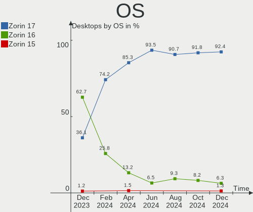
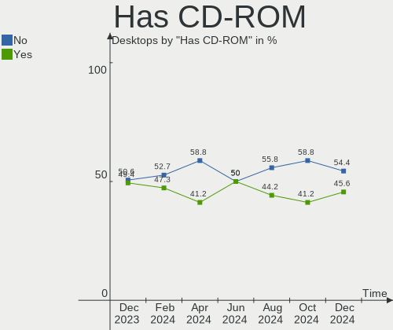
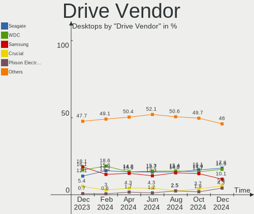
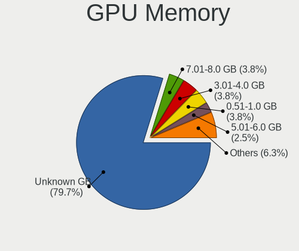

Zorin Hardware Trends (Desktop)
-------------------------------

A project to identify most popular hardware characteristics and track their change
over time based on data collected by Zorin users at https://Linux-Hardware.org.

Anyone can contribute to the study by uploading probes of their computers by
the [hw-probe](https://github.com/linuxhw/hw-probe) tool:

    sudo -E hw-probe -all -upload

Full-feature report is available here: https://linux-hardware.org/?view=trends&formfactor=desktop

Period: May, 2021.

Contents
--------

- [ OS                       ](#os)
- [ OS Family                ](#os-family)
- [ Kernel                   ](#kernel)
- [ Kernel Family            ](#kernel-family)
- [ Kernel Major Ver.        ](#kernel-major-ver)
- [ Arch                     ](#arch)
- [ DE                       ](#de)
- [ Display Server           ](#display-server)
- [ Display Manager          ](#display-manager)
- [ OS Lang                  ](#os-lang)
- [ Boot Mode                ](#boot-mode)
- [ Filesystem               ](#filesystem)
- [ Part. scheme             ](#part-scheme)
- [ Dual Boot with Linux/BSD ](#dual-boot-with-linux/bsd)
- [ Dual Boot (Win)          ](#dual-boot-win)
- [ Country                  ](#country)
- [ City                     ](#city)
- [ Vendor                   ](#vendor)
- [ Model                    ](#model)
- [ Model Family             ](#model-family)
- [ MFG Year                 ](#mfg-year)
- [ Form Factor              ](#form-factor)
- [ Secure Boot              ](#secure-boot)
- [ Coreboot                 ](#coreboot)
- [ RAM Size                 ](#ram-size)
- [ RAM Used                 ](#ram-used)
- [ Has CD-ROM               ](#has-cd-rom)
- [ Total Drives             ](#total-drives)
- [ Has Ethernet             ](#has-ethernet)
- [ Has WiFi                 ](#has-wifi)
- [ Has Bluetooth            ](#has-bluetooth)
- [ Drive Vendor             ](#drive-vendor)
- [ Drive Model              ](#drive-model)
- [ HDD Vendor               ](#hdd-vendor)
- [ SSD Vendor               ](#ssd-vendor)
- [ Drive Kind               ](#drive-kind)
- [ Drive Connector          ](#drive-connector)
- [ Drive Size               ](#drive-size)
- [ Space Total              ](#space-total)
- [ Space Used               ](#space-used)
- [ Malfunc. Drives          ](#malfunc-drives)
- [ Malfunc. Drive Vendor    ](#malfunc-drive-vendor)
- [ Malfunc. HDD Vendor      ](#malfunc-hdd-vendor)
- [ Malfunc. Drive Kind      ](#malfunc-drive-kind)
- [ Failed Drives            ](#failed-drives)
- [ Failed Drive Vendor      ](#failed-drive-vendor)
- [ Drive Status             ](#drive-status)
- [ Storage Vendor           ](#storage-vendor)
- [ Storage Model            ](#storage-model)
- [ Storage Kind             ](#storage-kind)
- [ CPU Vendor               ](#cpu-vendor)
- [ CPU Model                ](#cpu-model)
- [ CPU Model Family         ](#cpu-model-family)
- [ CPU Cores                ](#cpu-cores)
- [ CPU Sockets              ](#cpu-sockets)
- [ CPU Threads              ](#cpu-threads)
- [ CPU Op-Modes             ](#cpu-op-modes)
- [ CPU Microcode            ](#cpu-microcode)
- [ CPU Microarch            ](#cpu-microarch)
- [ GPU Vendor               ](#gpu-vendor)
- [ GPU Model                ](#gpu-model)
- [ GPU Combo                ](#gpu-combo)
- [ GPU Driver               ](#gpu-driver)
- [ GPU Memory               ](#gpu-memory)
- [ Monitor Vendor           ](#monitor-vendor)
- [ Monitor Model            ](#monitor-model)
- [ Monitor Resolution       ](#monitor-resolution)
- [ Monitor Diagonal         ](#monitor-diagonal)
- [ Monitor Width            ](#monitor-width)
- [ Aspect Ratio             ](#aspect-ratio)
- [ Monitor Area             ](#monitor-area)
- [ Pixel Density            ](#pixel-density)
- [ Multiple Monitors        ](#multiple-monitors)
- [ Net Controller Vendor    ](#net-controller-vendor)
- [ Net Controller Model     ](#net-controller-model)
- [ Wireless Vendor          ](#wireless-vendor)
- [ Wireless Model           ](#wireless-model)
- [ Ethernet Vendor          ](#ethernet-vendor)
- [ Ethernet Model           ](#ethernet-model)
- [ Net Controller Kind      ](#net-controller-kind)
- [ Used Controller          ](#used-controller)
- [ NICs                     ](#nics)
- [ IPv6                     ](#ipv6)
- [ Memory Vendor            ](#memory-vendor)
- [ Memory Model             ](#memory-model)
- [ Memory Kind              ](#memory-kind)
- [ Memory Form Factor       ](#memory-form-factor)
- [ Memory Size              ](#memory-size)
- [ Memory Speed             ](#memory-speed)
- [ Sound Vendor             ](#sound-vendor)
- [ Sound Model              ](#sound-model)
- [ Camera Vendor            ](#camera-vendor)
- [ Camera Model             ](#camera-model)
- [ Fingerprint Vendor       ](#fingerprint-vendor)
- [ Fingerprint Model        ](#fingerprint-model)
- [ Chipcard Vendor          ](#chipcard-vendor)
- [ Chipcard Model           ](#chipcard-model)
- [ Printer Vendor           ](#printer-vendor)
- [ Printer Model            ](#printer-model)
- [ Scanner Vendor           ](#scanner-vendor)
- [ Scanner Model            ](#scanner-model)
- [ Bluetooth Vendor         ](#bluetooth-vendor)
- [ Bluetooth Model          ](#bluetooth-model)
- [ Unsupported Devices      ](#unsupported-devices)
- [ Unsupported Device Types ](#unsupported-device-types)

OS
--

Installed operating systems

| Name     | Desktops | Percent |
|----------|----------|---------|
| Zorin 15 | 18       | 66.67%  |
| Zorin 16 | 8        | 29.63%  |
| Zorin 12 | 1        | 3.7%    |

OS Family
---------

OS without a version

| Name  | Desktops | Percent |
|-------|----------|---------|
| Zorin | 27       | 100%    |

Kernel
------

Version of the Linux kernel

| Version            | Desktops | Percent |
|--------------------|----------|---------|
| 5.4.0-73-generic   | 7        | 25.93%  |
| 5.8.0-53-generic   | 6        | 22.22%  |
| 5.4.0-72-generic   | 6        | 22.22%  |
| 5.8.0-50-generic   | 1        | 3.7%    |
| 5.8.0-49-generic   | 1        | 3.7%    |
| 5.4.0-70-generic   | 1        | 3.7%    |
| 5.4.0-67-generic   | 1        | 3.7%    |
| 5.4.0-60-generic   | 1        | 3.7%    |
| 5.4.0-51-generic   | 1        | 3.7%    |
| 5.4.0-47-generic   | 1        | 3.7%    |
| 4.15.0-133-generic | 1        | 3.7%    |

Kernel Family
-------------

Linux kernel without a distro release

| Version | Desktops | Percent |
|---------|----------|---------|
| 5.4.0   | 18       | 66.67%  |
| 5.8.0   | 8        | 29.63%  |
| 4.15.0  | 1        | 3.7%    |

Kernel Major Ver.
-----------------

Linux kernel major version

| Version | Desktops | Percent |
|---------|----------|---------|
| 5.4     | 18       | 66.67%  |
| 5.8     | 8        | 29.63%  |
| 4.15    | 1        | 3.7%    |

Arch
----

OS architecture (x86_64, i586, etc.)

| Name   | Desktops | Percent |
|--------|----------|---------|
| x86_64 | 23       | 85.19%  |
| i686   | 4        | 14.81%  |

DE
--

Desktop Environment

| Name  | Desktops | Percent |
|-------|----------|---------|
| GNOME | 20       | 74.07%  |
| XFCE  | 7        | 25.93%  |

Display Server
--------------

X11 or Wayland

| Name | Desktops | Percent |
|------|----------|---------|
| X11  | 27       | 100%    |

Display Manager
---------------

SDDM, LightDM, etc.

| Name    | Desktops | Percent |
|---------|----------|---------|
| Unknown | 26       | 96.3%   |
| GDM     | 1        | 3.7%    |

OS Lang
-------

Language

| Lang  | Desktops | Percent |
|-------|----------|---------|
| en_US | 7        | 25.93%  |
| pt_BR | 4        | 14.81%  |
| en_CA | 3        | 11.11%  |
| nl_NL | 2        | 7.41%   |
| es_AR | 2        | 7.41%   |
| en_GB | 2        | 7.41%   |
| tr_TR | 1        | 3.7%    |
| pl_PL | 1        | 3.7%    |
| nl_BE | 1        | 3.7%    |
| fr_FR | 1        | 3.7%    |
| es_MX | 1        | 3.7%    |
| en_ZA | 1        | 3.7%    |
| de_DE | 1        | 3.7%    |

Boot Mode
---------

EFI or BIOS

| Mode | Desktops | Percent |
|------|----------|---------|
| BIOS | 17       | 62.96%  |
| EFI  | 10       | 37.04%  |

Filesystem
----------

Type of filesystem

| Type    | Desktops | Percent |
|---------|----------|---------|
| Ext4    | 24       | 88.89%  |
| Overlay | 2        | 7.41%   |
| Ext2    | 1        | 3.7%    |

Part. scheme
------------

Scheme of partitioning

| Type    | Desktops | Percent |
|---------|----------|---------|
| Unknown | 26       | 96.3%   |
| GPT     | 1        | 3.7%    |

Dual Boot with Linux/BSD
------------------------

Hosting more than one Linux/BSD

| Dual boot | Desktops | Percent |
|-----------|----------|---------|
| No        | 23       | 85.19%  |
| Yes       | 4        | 14.81%  |

Dual Boot (Win)
---------------

Hosting Linux and Windows

| Dual boot | Desktops | Percent |
|-----------|----------|---------|
| No        | 17       | 62.96%  |
| Yes       | 10       | 37.04%  |

Country
-------

Geographic location (country)

| Country      | Desktops | Percent |
|--------------|----------|---------|
| Canada       | 4        | 14.81%  |
| Brazil       | 4        | 14.81%  |
| USA          | 3        | 11.11%  |
| UK           | 2        | 7.41%   |
| Netherlands  | 2        | 7.41%   |
| Argentina    | 2        | 7.41%   |
| Turkey       | 1        | 3.7%    |
| Switzerland  | 1        | 3.7%    |
| Spain        | 1        | 3.7%    |
| South Africa | 1        | 3.7%    |
| Poland       | 1        | 3.7%    |
| Morocco      | 1        | 3.7%    |
| Mexico       | 1        | 3.7%    |
| India        | 1        | 3.7%    |
| Germany      | 1        | 3.7%    |
| Belgium      | 1        | 3.7%    |

City
----

Geographic location (city)

| City                   | Desktops | Percent |
|------------------------|----------|---------|
| Calgary                | 2        | 7.41%   |
| Xalapa                 | 1        | 3.7%    |
| Wigan                  | 1        | 3.7%    |
| São Bernardo do Campo | 1        | 3.7%    |
| Steenwijk              | 1        | 3.7%    |
| San Antonio Oeste      | 1        | 3.7%    |
| Ronda                  | 1        | 3.7%    |
| Rio de Janeiro         | 1        | 3.7%    |
| Pune                   | 1        | 3.7%    |
| Pascoag                | 1        | 3.7%    |
| North Newbald          | 1        | 3.7%    |
| Mississauga            | 1        | 3.7%    |
| Mar del Plata          | 1        | 3.7%    |
| Kradolf                | 1        | 3.7%    |
| Kissimmee              | 1        | 3.7%    |
| Itajaí                | 1        | 3.7%    |
| Ghent                  | 1        | 3.7%    |
| Gdynia                 | 1        | 3.7%    |
| Fes                    | 1        | 3.7%    |
| Ferraz de Vasconcelos  | 1        | 3.7%    |
| Cologne                | 1        | 3.7%    |
| Cochrane               | 1        | 3.7%    |
| Benoni                 | 1        | 3.7%    |
| Bedum                  | 1        | 3.7%    |
| Beacon                 | 1        | 3.7%    |
| Antalya                | 1        | 3.7%    |

Vendor
------

Motherboard manufacturer

| Name                | Desktops | Percent |
|---------------------|----------|---------|
| ASUSTek Computer    | 6        | 22.22%  |
| Gigabyte Technology | 4        | 14.81%  |
| ASRock              | 4        | 14.81%  |
| MSI                 | 3        | 11.11%  |
| Lenovo              | 3        | 11.11%  |
| Hewlett-Packard     | 2        | 7.41%   |
| Dell                | 2        | 7.41%   |
| Shuttle             | 1        | 3.7%    |
| Samsung Electronics | 1        | 3.7%    |
| Biostar             | 1        | 3.7%    |

Model
-----

Motherboard model

| Name                                    | Desktops | Percent |
|-----------------------------------------|----------|---------|
| Shuttle SH55J                           | 1        | 3.7%    |
| Samsung Samsung DeskTop System          | 1        | 3.7%    |
| MSI PPPPP-CCC#MMMMMMMM                  | 1        | 3.7%    |
| MSI MS-7A70                             | 1        | 3.7%    |
| MSI MS-7721                             | 1        | 3.7%    |
| Lenovo ThinkCentre M83 MT-M 10AJ-0003MB | 1        | 3.7%    |
| Lenovo ThinkCentre M78 10BTA00ELM       | 1        | 3.7%    |
| Lenovo Board                            | 1        | 3.7%    |
| HP Z240 Tower Workstation               | 1        | 3.7%    |
| HP Compaq dc7800 Small Form Factor      | 1        | 3.7%    |
| Gigabyte Komputer OPTIMUS               | 1        | 3.7%    |
| Gigabyte H81M-S2V                       | 1        | 3.7%    |
| Gigabyte H110-D3A                       | 1        | 3.7%    |
| Gigabyte GA-MA74GM-S2                   | 1        | 3.7%    |
| Dell OptiPlex 990                       | 1        | 3.7%    |
| Dell OptiPlex 755                       | 1        | 3.7%    |
| Biostar A320MH                          | 1        | 3.7%    |
| ASUS UNLOCK INSTALL                     | 1        | 3.7%    |
| ASUS TUF GAMING Z490-PLUS               | 1        | 3.7%    |
| ASUS PRIME B450M-GAMING/BR              | 1        | 3.7%    |
| ASUS PRIME B250M-A                      | 1        | 3.7%    |
| ASUS P5W DH Deluxe                      | 1        | 3.7%    |
| ASUS M2N-MX SE Plus                     | 1        | 3.7%    |
| ASRock N68-S                            | 1        | 3.7%    |
| ASRock B450M-HDV R4.0                   | 1        | 3.7%    |
| ASRock A320M-HD                         | 1        | 3.7%    |
| ASRock 990FX Extreme6                   | 1        | 3.7%    |

Model Family
------------

Motherboard model prefix

| Name                   | Desktops | Percent |
|------------------------|----------|---------|
| Lenovo ThinkCentre     | 2        | 7.41%   |
| Dell OptiPlex          | 2        | 7.41%   |
| ASUS PRIME             | 2        | 7.41%   |
| Shuttle SH55J          | 1        | 3.7%    |
| Samsung Samsung        | 1        | 3.7%    |
| MSI PPPPP-CCC#MMMMMMMM | 1        | 3.7%    |
| MSI MS-7A70            | 1        | 3.7%    |
| MSI MS-7721            | 1        | 3.7%    |
| Lenovo Board           | 1        | 3.7%    |
| HP Z240                | 1        | 3.7%    |
| HP Compaq              | 1        | 3.7%    |
| Gigabyte Komputer      | 1        | 3.7%    |
| Gigabyte H81M-S2V      | 1        | 3.7%    |
| Gigabyte H110-D3A      | 1        | 3.7%    |
| Gigabyte GA-MA74GM-S2  | 1        | 3.7%    |
| Biostar A320MH         | 1        | 3.7%    |
| ASUS UNLOCK            | 1        | 3.7%    |
| ASUS TUF               | 1        | 3.7%    |
| ASUS P5W               | 1        | 3.7%    |
| ASUS M2N-MX            | 1        | 3.7%    |
| ASRock N68-S           | 1        | 3.7%    |
| ASRock B450M-HDV       | 1        | 3.7%    |
| ASRock A320M-HD        | 1        | 3.7%    |
| ASRock 990FX           | 1        | 3.7%    |

MFG Year
--------

Motherboard manufacture year

| Year | Desktops | Percent |
|------|----------|---------|
| 2018 | 4        | 14.81%  |
| 2007 | 4        | 14.81%  |
| 2020 | 3        | 11.11%  |
| 2016 | 3        | 11.11%  |
| 2010 | 3        | 11.11%  |
| 2021 | 2        | 7.41%   |
| 2014 | 2        | 7.41%   |
| 2008 | 2        | 7.41%   |
| 2017 | 1        | 3.7%    |
| 2015 | 1        | 3.7%    |
| 2012 | 1        | 3.7%    |
| 2011 | 1        | 3.7%    |

Form Factor
-----------

Physical design of the computer

| Name    | Desktops | Percent |
|---------|----------|---------|
| Desktop | 27       | 100%    |

Secure Boot
-----------

Enabled or disabled

| State    | Desktops | Percent |
|----------|----------|---------|
| Disabled | 27       | 100%    |

Coreboot
--------

Have coreboot on board

| Used | Desktops | Percent |
|------|----------|---------|
| No   | 27       | 100%    |

RAM Size
--------

Total RAM memory

| Size in GB | Desktops | Percent |
|------------|----------|---------|
| 8.01-16.0  | 9        | 33.33%  |
| 3.01-4.0   | 6        | 22.22%  |
| 4.01-8.0   | 4        | 14.81%  |
| 24.01-32.0 | 2        | 7.41%   |
| 16.01-24.0 | 2        | 7.41%   |
| 1.01-2.0   | 2        | 7.41%   |
| 2.01-3.0   | 1        | 3.7%    |
| 0.51-1.0   | 1        | 3.7%    |

RAM Used
--------

Used RAM memory

| Used GB   | Desktops | Percent |
|-----------|----------|---------|
| 1.01-2.0  | 10       | 37.04%  |
| 2.01-3.0  | 9        | 33.33%  |
| 0.51-1.0  | 4        | 14.81%  |
| 4.01-8.0  | 2        | 7.41%   |
| 3.01-4.0  | 1        | 3.7%    |
| 8.01-16.0 | 1        | 3.7%    |

Has CD-ROM
----------

Has CD-ROM on board

| Presented | Desktops | Percent |
|-----------|----------|---------|
| Yes       | 16       | 59.26%  |
| No        | 11       | 40.74%  |

Total Drives
------------

Number of drives on board

| Drives | Desktops | Percent |
|--------|----------|---------|
| 1      | 12       | 44.44%  |
| 2      | 7        | 25.93%  |
| 3      | 5        | 18.52%  |
| 4      | 3        | 11.11%  |

Has Ethernet
------------

Has Ethernet on board

| Presented | Desktops | Percent |
|-----------|----------|---------|
| Yes       | 27       | 100%    |

Has WiFi
--------

Has WiFi module

| Presented | Desktops | Percent |
|-----------|----------|---------|
| No        | 15       | 55.56%  |
| Yes       | 12       | 44.44%  |

Has Bluetooth
-------------

Has Bluetooth module

| Presented | Desktops | Percent |
|-----------|----------|---------|
| No        | 23       | 85.19%  |
| Yes       | 4        | 14.81%  |

Drive Vendor
------------

Hard drive vendors

| Vendor              | Desktops | Drives | Percent |
|---------------------|----------|--------|---------|
| WDC                 | 10       | 13     | 22.22%  |
| Samsung Electronics | 10       | 11     | 22.22%  |
| Seagate             | 9        | 12     | 20%     |
| Hitachi             | 4        | 4      | 8.89%   |
| SanDisk             | 3        | 3      | 6.67%   |
| Toshiba             | 2        | 2      | 4.44%   |
| XrayDisk            | 1        | 1      | 2.22%   |
| TSA                 | 1        | 1      | 2.22%   |
| Silicon Motion      | 1        | 1      | 2.22%   |
| Phison              | 1        | 1      | 2.22%   |
| Kingston            | 1        | 1      | 2.22%   |
| KingFast            | 1        | 1      | 2.22%   |
| China               | 1        | 1      | 2.22%   |

Drive Model
-----------

Hard drive models

| Model                               | Desktops | Percent |
|-------------------------------------|----------|---------|
| Seagate ST1000DM010-2EP102 1TB      | 2        | 3.92%   |
| XrayDisk 128GB                      | 1        | 1.96%   |
| WDC WDS250G2B0A-00SM50 250GB SSD    | 1        | 1.96%   |
| WDC WD800BD-22MRA1 80GB             | 1        | 1.96%   |
| WDC WD5000AVVS-63ZWB0 500GB         | 1        | 1.96%   |
| WDC WD5000AAKX-08U6AA0 500GB        | 1        | 1.96%   |
| WDC WD3200BUCT-63TWBY0 320GB        | 1        | 1.96%   |
| WDC WD3200AAKS-00L9A0 320GB         | 1        | 1.96%   |
| WDC WD3200AAJS-60M0A0 320GB         | 1        | 1.96%   |
| WDC WD30EZRX-00MMMB0 3TB            | 1        | 1.96%   |
| WDC WD30EZRX-00D8PB0 3TB            | 1        | 1.96%   |
| WDC WD2500AAKX-001CA0 250GB         | 1        | 1.96%   |
| WDC WD20EURX-61T0FY0 2TB            | 1        | 1.96%   |
| WDC WD1600AAJS-75WAA0 160GB         | 1        | 1.96%   |
| WDC WD10EURX-63FH1Y0 1TB            | 1        | 1.96%   |
| TSA SSD 480GB                       | 1        | 1.96%   |
| Toshiba HDWD110 1TB                 | 1        | 1.96%   |
| Toshiba DT01ACA300 3TB              | 1        | 1.96%   |
| Silicon Motion NVMe SSD Drive 128GB | 1        | 1.96%   |
| Seagate ST9160310AS 160GB           | 1        | 1.96%   |
| Seagate ST500DM002-1BD142 500GB     | 1        | 1.96%   |
| Seagate ST380811AS 80GB             | 1        | 1.96%   |
| Seagate ST3750528AS 752GB           | 1        | 1.96%   |
| Seagate ST3500820AS 500GB           | 1        | 1.96%   |
| Seagate ST3500630AS 500GB           | 1        | 1.96%   |
| Seagate ST3160023AS 160GB           | 1        | 1.96%   |
| Seagate ST2000DM008-2FR102 2TB      | 1        | 1.96%   |
| Seagate ST2000DL003-9VT166 2TB      | 1        | 1.96%   |
| Seagate ST1000DM003-1ER162 1TB      | 1        | 1.96%   |
| SanDisk SDSSDA120G 120GB            | 1        | 1.96%   |
| Sandisk NVMe SSD Drive 500GB        | 1        | 1.96%   |
| Sandisk NVMe SSD Drive 250GB        | 1        | 1.96%   |
| Samsung SSD 870 QVO 1TB             | 1        | 1.96%   |
| Samsung SSD 860 EVO 500GB           | 1        | 1.96%   |
| Samsung SSD 840 EVO 250GB           | 1        | 1.96%   |
| Samsung NVMe SSD Drive 500GB        | 1        | 1.96%   |
| Samsung NVMe SSD Drive 250GB        | 1        | 1.96%   |
| Samsung HD502HJ 500GB               | 1        | 1.96%   |
| Samsung HD502HI 500GB               | 1        | 1.96%   |
| Samsung HD322HJ 320GB               | 1        | 1.96%   |
| Samsung HD161HJ 160GB               | 1        | 1.96%   |
| Samsung HD103SI 1TB                 | 1        | 1.96%   |
| Phison NVMe SSD Drive 120GB         | 1        | 1.96%   |
| Kingston SA400S37120G 120GB SSD     | 1        | 1.96%   |
| KingFast 240GB                      | 1        | 1.96%   |
| Hitachi HDT722516DLA380 164GB       | 1        | 1.96%   |
| Hitachi HDS728080PLA380 80GB        | 1        | 1.96%   |
| Hitachi HDS721680PLA380 80GB        | 1        | 1.96%   |
| Hitachi HDS721616PLA380 160GB       | 1        | 1.96%   |
| China SATA3 1TB SSD                 | 1        | 1.96%   |

HDD Vendor
----------

Hard disk drive vendors

| Vendor              | Desktops | Drives | Percent |
|---------------------|----------|--------|---------|
| WDC                 | 10       | 12     | 33.33%  |
| Seagate             | 9        | 12     | 30%     |
| Samsung Electronics | 5        | 5      | 16.67%  |
| Hitachi             | 4        | 4      | 13.33%  |
| Toshiba             | 2        | 2      | 6.67%   |

SSD Vendor
----------

Solid state drive vendors

| Vendor              | Desktops | Drives | Percent |
|---------------------|----------|--------|---------|
| Samsung Electronics | 3        | 3      | 37.5%   |
| WDC                 | 1        | 1      | 12.5%   |
| TSA                 | 1        | 1      | 12.5%   |
| SanDisk             | 1        | 1      | 12.5%   |
| Kingston            | 1        | 1      | 12.5%   |
| China               | 1        | 1      | 12.5%   |

Drive Kind
----------

HDD or SSD

| Kind    | Desktops | Drives | Percent |
|---------|----------|--------|---------|
| HDD     | 24       | 35     | 63.16%  |
| NVMe    | 6        | 7      | 15.79%  |
| SSD     | 6        | 8      | 15.79%  |
| Unknown | 2        | 2      | 5.26%   |

Drive Connector
---------------

SATA, SAS, NVMe, etc.

| Type | Desktops | Drives | Percent |
|------|----------|--------|---------|
| SATA | 26       | 45     | 81.25%  |
| NVMe | 6        | 7      | 18.75%  |

Drive Size
----------

Size of hard drive

| Size in TB | Desktops | Drives | Percent |
|------------|----------|--------|---------|
| 0.01-0.5   | 21       | 28     | 60%     |
| 0.51-1.0   | 9        | 9      | 25.71%  |
| 1.01-2.0   | 3        | 3      | 8.57%   |
| 2.01-3.0   | 2        | 3      | 5.71%   |

Space Total
-----------

Amount of disk space available on the file system

| Size in GB     | Desktops | Percent |
|----------------|----------|---------|
| 251-500        | 6        | 22.22%  |
| 101-250        | 6        | 22.22%  |
| 51-100         | 4        | 14.81%  |
| 2001-3000      | 3        | 11.11%  |
| 1-20           | 3        | 11.11%  |
| 501-1000       | 2        | 7.41%   |
| More than 3000 | 1        | 3.7%    |
| 21-50          | 1        | 3.7%    |
| 1001-2000      | 1        | 3.7%    |

Space Used
----------

Amount of used disk space

| Used GB        | Desktops | Percent |
|----------------|----------|---------|
| 1-20           | 14       | 51.85%  |
| 51-100         | 5        | 18.52%  |
| 101-250        | 4        | 14.81%  |
| 21-50          | 2        | 7.41%   |
| More than 3000 | 1        | 3.7%    |
| 251-500        | 1        | 3.7%    |

Malfunc. Drives
---------------

Drive models with a malfunction

Zero info for selected period =(

Malfunc. Drive Vendor
---------------------

Vendors of faulty drives

Zero info for selected period =(

Malfunc. HDD Vendor
-------------------

Vendors of faulty HDD drives

Zero info for selected period =(

Malfunc. Drive Kind
-------------------

Kinds of faulty drives

Zero info for selected period =(

Failed Drives
-------------

Failed drive models

Zero info for selected period =(

Failed Drive Vendor
-------------------

Failed drive vendors

Zero info for selected period =(

Drive Status
------------

Number of failed and malfunc. drives

| Status   | Desktops | Drives | Percent |
|----------|----------|--------|---------|
| Detected | 26       | 51     | 96.3%   |
| Works    | 1        | 1      | 3.7%    |

Storage Vendor
--------------

Storage controller vendors

| Vendor                           | Desktops | Percent |
|----------------------------------|----------|---------|
| Intel                            | 16       | 47.06%  |
| AMD                              | 8        | 23.53%  |
| Sandisk                          | 2        | 5.88%   |
| Samsung Electronics              | 2        | 5.88%   |
| Nvidia                           | 2        | 5.88%   |
| Silicon Motion                   | 1        | 2.94%   |
| Silicon Integrated Systems [SiS] | 1        | 2.94%   |
| Phison Electronics               | 1        | 2.94%   |
| JMicron Technology               | 1        | 2.94%   |

Storage Model
-------------

Storage controller models

| Model                                                                                   | Desktops | Percent |
|-----------------------------------------------------------------------------------------|----------|---------|
| AMD FCH SATA Controller [AHCI mode]                                                     | 5        | 10.2%   |
| Intel SATA Controller [RAID mode]                                                       | 4        | 8.16%   |
| Intel 82Q35 Express PT IDER Controller                                                  | 3        | 6.12%   |
| Sandisk WD Black 2018/SN750 / PC SN720 NVMe SSD                                         | 2        | 4.08%   |
| Samsung NVMe SSD Controller SM981/PM981/PM983                                           | 2        | 4.08%   |
| Nvidia MCP61 SATA Controller                                                            | 2        | 4.08%   |
| Nvidia MCP61 IDE                                                                        | 2        | 4.08%   |
| Intel NM10/ICH7 Family SATA Controller [IDE mode]                                       | 2        | 4.08%   |
| Intel 82801IR/IO/IH (ICH9R/DO/DH) 6 port SATA Controller [AHCI mode]                    | 2        | 4.08%   |
| Intel 8 Series/C220 Series Chipset Family 6-port SATA Controller 1 [AHCI mode]          | 2        | 4.08%   |
| AMD SB7x0/SB8x0/SB9x0 IDE Controller                                                    | 2        | 4.08%   |
| AMD FCH SATA Controller D                                                               | 2        | 4.08%   |
| AMD 400 Series Chipset SATA Controller                                                  | 2        | 4.08%   |
| Silicon Motion SM2263EN/SM2263XT SSD Controller                                         | 1        | 2.04%   |
| Silicon Integrated Systems [SiS] SATA Controller / IDE mode                             | 1        | 2.04%   |
| Silicon Integrated Systems [SiS] 5513 IDE Controller                                    | 1        | 2.04%   |
| Phison E7 NVMe Controller                                                               | 1        | 2.04%   |
| JMicron JMB363 SATA/IDE Controller                                                      | 1        | 2.04%   |
| Intel Q170/Q150/B150/H170/H110/Z170/CM236 Chipset SATA Controller [AHCI Mode]           | 1        | 2.04%   |
| Intel Comet Lake SATA AHCI Controller                                                   | 1        | 2.04%   |
| Intel 82801IR/IO/IH (ICH9R/DO/DH) 4 port SATA Controller [IDE mode]                     | 1        | 2.04%   |
| Intel 82801I (ICH9 Family) 2 port SATA Controller [IDE mode]                            | 1        | 2.04%   |
| Intel 82801G (ICH7 Family) IDE Controller                                               | 1        | 2.04%   |
| Intel 6 Series/C200 Series Chipset Family Desktop SATA Controller (IDE mode, ports 4-5) | 1        | 2.04%   |
| Intel 6 Series/C200 Series Chipset Family Desktop SATA Controller (IDE mode, ports 0-3) | 1        | 2.04%   |
| Intel 5 Series/3400 Series Chipset 4 port SATA IDE Controller                           | 1        | 2.04%   |
| Intel 5 Series/3400 Series Chipset 2 port SATA IDE Controller                           | 1        | 2.04%   |
| Intel 200 Series PCH SATA controller [AHCI mode]                                        | 1        | 2.04%   |
| AMD SB7x0/SB8x0/SB9x0 SATA Controller [IDE mode]                                        | 1        | 2.04%   |
| AMD SB7x0/SB8x0/SB9x0 SATA Controller [AHCI mode]                                       | 1        | 2.04%   |

Storage Kind
------------

Kind of storage controller (IDE, SATA, NVMe, SAS, ...)

| Kind | Desktops | Percent |
|------|----------|---------|
| SATA | 15       | 40.54%  |
| IDE  | 12       | 32.43%  |
| NVMe | 6        | 16.22%  |
| RAID | 4        | 10.81%  |

CPU Vendor
----------

Processor vendors

| Vendor | Desktops | Percent |
|--------|----------|---------|
| Intel  | 17       | 62.96%  |
| AMD    | 10       | 37.04%  |

CPU Model
---------

Processor models

| Model                                         | Desktops | Percent |
|-----------------------------------------------|----------|---------|
| AMD Ryzen 3 2200G with Radeon Vega Graphics   | 2        | 7.41%   |
| Intel Xeon CPU E3-1230 v5 @ 3.40GHz           | 1        | 3.7%    |
| Intel Pentium Dual CPU E2200 @ 2.20GHz        | 1        | 3.7%    |
| Intel Pentium Dual CPU E2160 @ 1.80GHz        | 1        | 3.7%    |
| Intel Genuine CPU 2140 @ 1.60GHz              | 1        | 3.7%    |
| Intel Core i9-10850K CPU @ 3.60GHz            | 1        | 3.7%    |
| Intel Core i5-7600K CPU @ 3.80GHz             | 1        | 3.7%    |
| Intel Core i5-6400 CPU @ 2.70GHz              | 1        | 3.7%    |
| Intel Core i5-4430 CPU @ 3.00GHz              | 1        | 3.7%    |
| Intel Core i5-2500 CPU @ 3.30GHz              | 1        | 3.7%    |
| Intel Core i5-2400 CPU @ 3.10GHz              | 1        | 3.7%    |
| Intel Core i5 CPU 750 @ 2.67GHz               | 1        | 3.7%    |
| Intel Core i3-7100 CPU @ 3.90GHz              | 1        | 3.7%    |
| Intel Core i3-4160 CPU @ 3.60GHz              | 1        | 3.7%    |
| Intel Core i3 CPU 540 @ 3.07GHz               | 1        | 3.7%    |
| Intel Core 2 Quad CPU Q9400 @ 2.66GHz         | 1        | 3.7%    |
| Intel Core 2 Quad CPU Q8300 @ 2.50GHz         | 1        | 3.7%    |
| Intel Core 2 Duo CPU E6550 @ 2.33GHz          | 1        | 3.7%    |
| AMD Sempron 140 Processor                     | 1        | 3.7%    |
| AMD Ryzen 7 2700 Eight-Core Processor         | 1        | 3.7%    |
| AMD Ryzen 3 3200G with Radeon Vega Graphics   | 1        | 3.7%    |
| AMD Processor model unknown                   | 1        | 3.7%    |
| AMD FX-9590 Eight-Core Processor              | 1        | 3.7%    |
| AMD Athlon 64 X2 Dual Core Processor 4800+    | 1        | 3.7%    |
| AMD A6-7400K Radeon R5, 6 Compute Cores 2C+4G | 1        | 3.7%    |
| AMD A6-5400B APU with Radeon HD Graphics      | 1        | 3.7%    |

CPU Model Family
----------------

Processor model prefix

| Model              | Desktops | Percent |
|--------------------|----------|---------|
| Intel Core i5      | 6        | 22.22%  |
| Intel Core i3      | 3        | 11.11%  |
| AMD Ryzen 3        | 3        | 11.11%  |
| Intel Pentium Dual | 2        | 7.41%   |
| Intel Core 2 Quad  | 2        | 7.41%   |
| AMD A6             | 2        | 7.41%   |
| Other              | 1        | 3.7%    |
| Intel Xeon         | 1        | 3.7%    |
| Intel Genuine      | 1        | 3.7%    |
| Intel Core i9      | 1        | 3.7%    |
| Intel Core 2 Duo   | 1        | 3.7%    |
| AMD Sempron        | 1        | 3.7%    |
| AMD Ryzen 7        | 1        | 3.7%    |
| AMD FX             | 1        | 3.7%    |
| AMD Athlon 64 X2   | 1        | 3.7%    |

CPU Cores
---------

Number of processor cores

| Number | Desktops | Percent |
|--------|----------|---------|
| 4      | 13       | 48.15%  |
| 2      | 7        | 25.93%  |
| 1      | 5        | 18.52%  |
| 10     | 1        | 3.7%    |
| 8      | 1        | 3.7%    |

CPU Sockets
-----------

Number of sockets

| Number | Desktops | Percent |
|--------|----------|---------|
| 1      | 27       | 100%    |

CPU Threads
-----------

Threads per core (Hyper-Threading)

| Number | Desktops | Percent |
|--------|----------|---------|
| 1      | 18       | 66.67%  |
| 2      | 9        | 33.33%  |

CPU Op-Modes
------------

CPU Operation Modes (32-bit, 64-bit)

| Op mode        | Desktops | Percent |
|----------------|----------|---------|
| 32-bit, 64-bit | 27       | 100%    |

CPU Microcode
-------------

Microcode number

| Number     | Desktops | Percent |
|------------|----------|---------|
| Unknown    | 4        | 14.81%  |
| 0x906e9    | 2        | 7.41%   |
| 0x6fd      | 2        | 7.41%   |
| 0x306c3    | 2        | 7.41%   |
| 0x1067a    | 2        | 7.41%   |
| 0x010000c7 | 2        | 7.41%   |
| 0xa0655    | 1        | 3.7%    |
| 0x6fb      | 1        | 3.7%    |
| 0x506e3    | 1        | 3.7%    |
| 0x206a7    | 1        | 3.7%    |
| 0x20655    | 1        | 3.7%    |
| 0x106e5    | 1        | 3.7%    |
| 0x08108109 | 1        | 3.7%    |
| 0x08101016 | 1        | 3.7%    |
| 0x0810100b | 1        | 3.7%    |
| 0x0800820d | 1        | 3.7%    |
| 0x06003106 | 1        | 3.7%    |
| 0x06001119 | 1        | 3.7%    |
| 0x06000852 | 1        | 3.7%    |

CPU Microarch
-------------

Microarchitecture

| Name        | Desktops | Percent |
|-------------|----------|---------|
| Core        | 4        | 14.81%  |
| Zen+        | 2        | 7.41%   |
| Zen         | 2        | 7.41%   |
| Skylake     | 2        | 7.41%   |
| SandyBridge | 2        | 7.41%   |
| Piledriver  | 2        | 7.41%   |
| Penryn      | 2        | 7.41%   |
| KabyLake    | 2        | 7.41%   |
| K10         | 2        | 7.41%   |
| Haswell     | 2        | 7.41%   |
| Westmere    | 1        | 3.7%    |
| Steamroller | 1        | 3.7%    |
| Nehalem     | 1        | 3.7%    |
| K8 Hammer   | 1        | 3.7%    |
| CometLake   | 1        | 3.7%    |

GPU Vendor
----------

Vendors of graphics cards

| Vendor                           | Desktops | Percent |
|----------------------------------|----------|---------|
| AMD                              | 10       | 34.48%  |
| Nvidia                           | 9        | 31.03%  |
| Intel                            | 9        | 31.03%  |
| Silicon Integrated Systems [SiS] | 1        | 3.45%   |

GPU Model
---------

Graphics card models

| Model                                                                       | Desktops | Percent |
|-----------------------------------------------------------------------------|----------|---------|
| Nvidia GT218 [GeForce 210]                                                  | 2        | 6.67%   |
| Intel HD Graphics 630                                                       | 2        | 6.67%   |
| AMD Raven Ridge [Radeon Vega Series / Radeon Vega Mobile Series]            | 2        | 6.67%   |
| AMD Baffin [Radeon RX 550 640SP / RX 560/560X]                              | 2        | 6.67%   |
| Silicon Integrated Systems [SiS] 771/671 PCIE VGA Display Adapter           | 1        | 3.33%   |
| Nvidia TU117 [GeForce GTX 1650]                                             | 1        | 3.33%   |
| Nvidia GP107 [GeForce GTX 1050 Ti]                                          | 1        | 3.33%   |
| Nvidia GK208B [GeForce GT 730]                                              | 1        | 3.33%   |
| Nvidia GK107GL [Quadro K420]                                                | 1        | 3.33%   |
| Nvidia GF119 [GeForce GT 610]                                               | 1        | 3.33%   |
| Nvidia GF108 [GeForce GT 730]                                               | 1        | 3.33%   |
| Nvidia C61 [GeForce 7025 / nForce 630a]                                     | 1        | 3.33%   |
| Intel Xeon E3-1200 v3/4th Gen Core Processor Integrated Graphics Controller | 1        | 3.33%   |
| Intel Core Processor Integrated Graphics Controller                         | 1        | 3.33%   |
| Intel CometLake-S GT2 [UHD Graphics 630]                                    | 1        | 3.33%   |
| Intel 82Q35 Express Integrated Graphics Controller                          | 1        | 3.33%   |
| Intel 82945G/GZ Integrated Graphics Controller                              | 1        | 3.33%   |
| Intel 4th Generation Core Processor Family Integrated Graphics Controller   | 1        | 3.33%   |
| Intel 2nd Generation Core Processor Family Integrated Graphics Controller   | 1        | 3.33%   |
| AMD Trinity 2 [Radeon HD 7540D]                                             | 1        | 3.33%   |
| AMD RS740 [Radeon 2100]                                                     | 1        | 3.33%   |
| AMD Picasso                                                                 | 1        | 3.33%   |
| AMD Kaveri [Radeon R5 Graphics]                                             | 1        | 3.33%   |
| AMD Curacao PRO [Radeon R7 370 / R9 270/370 OEM]                            | 1        | 3.33%   |
| AMD Cedar [Radeon HD 5000/6000/7350/8350 Series]                            | 1        | 3.33%   |
| AMD Cayman XT [Radeon HD 6970]                                              | 1        | 3.33%   |

GPU Combo
---------

Combinations of graphics cards

| Name        | Desktops | Percent |
|-------------|----------|---------|
| 1 x Nvidia  | 9        | 33.33%  |
| 1 x AMD     | 9        | 33.33%  |
| 1 x Intel   | 7        | 25.93%  |
| 1 x SiS     | 1        | 3.7%    |
| Intel + AMD | 1        | 3.7%    |

GPU Driver
----------

Free vs proprietary

| Driver      | Desktops | Percent |
|-------------|----------|---------|
| Free        | 19       | 70.37%  |
| Proprietary | 6        | 22.22%  |
| Unknown     | 2        | 7.41%   |

GPU Memory
----------

Total video memory

| Size in GB | Desktops | Percent |
|------------|----------|---------|
| Unknown    | 9        | 33.33%  |
| 1.01-2.0   | 8        | 29.63%  |
| 0.51-1.0   | 6        | 22.22%  |
| 3.01-4.0   | 2        | 7.41%   |
| 0.01-0.5   | 2        | 7.41%   |

Monitor Vendor
--------------

Monitor vendors

| Vendor               | Desktops | Percent |
|----------------------|----------|---------|
| Samsung Electronics  | 6        | 24%     |
| Acer                 | 3        | 12%     |
| Toshiba              | 2        | 8%      |
| Hewlett-Packard      | 2        | 8%      |
| ViewSonic            | 1        | 4%      |
| Targa                | 1        | 4%      |
| Sharp                | 1        | 4%      |
| Philips              | 1        | 4%      |
| OEM                  | 1        | 4%      |
| Idek Iiyama          | 1        | 4%      |
| Goldstar             | 1        | 4%      |
| Gateway              | 1        | 4%      |
| Fujitsu Siemens      | 1        | 4%      |
| eMachines            | 1        | 4%      |
| Dell                 | 1        | 4%      |
| Ancor Communications | 1        | 4%      |

Monitor Model
-------------

Monitor models

| Model                                                                  | Desktops | Percent |
|------------------------------------------------------------------------|----------|---------|
| ViewSonic LCD Monitor VA2256 Series 1920x1080                          | 1        | 4%      |
| Toshiba TV TSB0205 1360x768 930x523mm 42.0-inch                        | 1        | 4%      |
| Toshiba TV TSB0100 1360x768 580x320mm 26.1-inch                        | 1        | 4%      |
| Targa LCD Monitor LCDTV16 3200x1204                                    | 1        | 4%      |
| Sharp HDMI SHP1022 1920x1080 820x460mm 37.0-inch                       | 1        | 4%      |
| Samsung Electronics U32R59x SAM0F96 3840x2160 697x392mm 31.5-inch      | 1        | 4%      |
| Samsung Electronics SMB2430H SAM064E 1920x1080                         | 1        | 4%      |
| Samsung Electronics LCD Monitor SMB1930N 1366x768                      | 1        | 4%      |
| Samsung Electronics LCD Monitor SAM0C3C 1920x1080 700x390mm 31.5-inch  | 1        | 4%      |
| Samsung Electronics LCD Monitor SAM0A7A 1920x1080 1060x626mm 48.5-inch | 1        | 4%      |
| Samsung Electronics LCD Monitor SAM0902 1920x1080 1020x570mm 46.0-inch | 1        | 4%      |
| Philips LCD Monitor 240B 1920x1200                                     | 1        | 4%      |
| OEM 32W_LCD_TV OEM3700 1920x1080                                       | 1        | 4%      |
| Idek Iiyama LCD Monitor PLE2208HDS 1920x1080                           | 1        | 4%      |
| Hewlett-Packard ZR22w HWP2867 1920x1080 475x267mm 21.5-inch            | 1        | 4%      |
| Hewlett-Packard LA1905 HWP2845 1440x900 408x255mm 18.9-inch            | 1        | 4%      |
| Goldstar HD GSM5ACB 1366x768 410x230mm 18.5-inch                       | 1        | 4%      |
| Gateway VX930 GWY232D 1600x1200 350x262mm 17.2-inch                    | 1        | 4%      |
| Fujitsu Siemens B24W-5 ECO FUS07D4 1920x1200 518x324mm 24.1-inch       | 1        | 4%      |
| eMachines E180HV EMA0211 1366x768 409x230mm 18.5-inch                  | 1        | 4%      |
| Dell ST2010 DELF019 1600x900 443x249mm 20.0-inch                       | 1        | 4%      |
| Ancor Communications ASUS VS247 ACI249A 1920x1080 521x293mm 23.5-inch  | 1        | 4%      |
| Acer V246HL ACR032E 1920x1080 531x299mm 24.0-inch                      | 1        | 4%      |
| Acer LCD Monitor S271HL 1920x1080                                      | 1        | 4%      |
| Acer K202HQL ACR03E0 1600x900 432x240mm 19.5-inch                      | 1        | 4%      |

Monitor Resolution
------------------

Monitor screen resolution

| Resolution        | Desktops | Percent |
|-------------------|----------|---------|
| 1920x1080 (FHD)   | 11       | 45.83%  |
| 1366x768 (WXGA)   | 4        | 16.67%  |
| 1920x1200 (WUXGA) | 2        | 8.33%   |
| 1600x900 (HD+)    | 2        | 8.33%   |
| 3840x2160 (4K)    | 1        | 4.17%   |
| 3200x1204         | 1        | 4.17%   |
| 1920x540          | 1        | 4.17%   |
| 1600x1200         | 1        | 4.17%   |
| 1440x900 (WXGA+)  | 1        | 4.17%   |

Monitor Diagonal
----------------

Diagonal size in inches

| Inches  | Desktops | Percent |
|---------|----------|---------|
| Unknown | 7        | 28%     |
| 24      | 3        | 12%     |
| 18      | 3        | 12%     |
| 31      | 2        | 8%      |
| 72      | 1        | 4%      |
| 48      | 1        | 4%      |
| 46      | 1        | 4%      |
| 37      | 1        | 4%      |
| 26      | 1        | 4%      |
| 23      | 1        | 4%      |
| 21      | 1        | 4%      |
| 20      | 1        | 4%      |
| 19      | 1        | 4%      |
| 17      | 1        | 4%      |

Monitor Width
-------------

Physical width

| Width in mm | Desktops | Percent |
|-------------|----------|---------|
| Unknown     | 7        | 29.17%  |
| 501-600     | 5        | 20.83%  |
| 401-500     | 5        | 20.83%  |
| 601-700     | 2        | 8.33%   |
| 1001-1500   | 2        | 8.33%   |
| 801-900     | 1        | 4.17%   |
| 301-350     | 1        | 4.17%   |
| 1501-2000   | 1        | 4.17%   |

Aspect Ratio
------------

Proportional relationship between the width and the height

| Ratio   | Desktops | Percent |
|---------|----------|---------|
| 16/9    | 13       | 59.09%  |
| Unknown | 6        | 27.27%  |
| 16/10   | 2        | 9.09%   |
| 4/3     | 1        | 4.55%   |

Monitor Area
------------

Area in inch²

| Area in inch² | Desktops | Percent |
|----------------|----------|---------|
| Unknown        | 7        | 29.17%  |
| 201-250        | 4        | 16.67%  |
| 141-150        | 3        | 12.5%   |
| More than 1000 | 2        | 8.33%   |
| 351-500        | 2        | 8.33%   |
| 251-300        | 2        | 8.33%   |
| 151-200        | 2        | 8.33%   |
| 501-1000       | 2        | 8.33%   |

Pixel Density
-------------

Pixels per inch

| Density | Desktops | Percent |
|---------|----------|---------|
| 51-100  | 7        | 33.33%  |
| Unknown | 7        | 33.33%  |
| 1-50    | 4        | 19.05%  |
| 101-120 | 2        | 9.52%   |
| 121-160 | 1        | 4.76%   |

Multiple Monitors
-----------------

Total monitors connected

| Total | Desktops | Percent |
|-------|----------|---------|
| 1     | 21       | 77.78%  |
| 2     | 3        | 11.11%  |
| 0     | 2        | 7.41%   |
| 3     | 1        | 3.7%    |

Net Controller Vendor
---------------------

Controller vendors

| Vendor                   | Desktops | Percent |
|--------------------------|----------|---------|
| Realtek Semiconductor    | 19       | 50%     |
| Intel                    | 7        | 18.42%  |
| Qualcomm Atheros         | 3        | 7.89%   |
| Ralink                   | 2        | 5.26%   |
| Nvidia                   | 2        | 5.26%   |
| TP-Link                  | 1        | 2.63%   |
| Ralink Technology        | 1        | 2.63%   |
| NetGear                  | 1        | 2.63%   |
| Marvell Technology Group | 1        | 2.63%   |
| D-Link                   | 1        | 2.63%   |

Net Controller Model
--------------------

Controller models

| Model                                                             | Desktops | Percent |
|-------------------------------------------------------------------|----------|---------|
| Realtek RTL8111/8168/8411 PCI Express Gigabit Ethernet Controller | 15       | 36.59%  |
| Nvidia MCP61 Ethernet                                             | 2        | 4.88%   |
| Intel 82566DM-2 Gigabit Network Connection                        | 2        | 4.88%   |
| TP-Link Archer T3U [Realtek RTL8812BU]                            | 1        | 2.44%   |
| Realtek RTL88x2bu [AC1200 Techkey]                                | 1        | 2.44%   |
| Realtek RTL8188EUS 802.11n Wireless Network Adapter               | 1        | 2.44%   |
| Realtek RTL8187 Wireless Adapter                                  | 1        | 2.44%   |
| Realtek RTL8169 PCI Gigabit Ethernet Controller                   | 1        | 2.44%   |
| Realtek RTL810xE PCI Express Fast Ethernet controller             | 1        | 2.44%   |
| Realtek 802.11n                                                   | 1        | 2.44%   |
| Ralink RT2501/RT2573 Wireless Adapter                             | 1        | 2.44%   |
| Ralink RT3090 Wireless 802.11n 1T/1R PCIe                         | 1        | 2.44%   |
| Ralink RT3060 Wireless 802.11n 1T/1R                              | 1        | 2.44%   |
| Qualcomm Atheros QCA8171 Gigabit Ethernet                         | 1        | 2.44%   |
| Qualcomm Atheros AR9485 Wireless Network Adapter                  | 1        | 2.44%   |
| Qualcomm Atheros AR9227 Wireless Network Adapter                  | 1        | 2.44%   |
| NetGear A6100 AC600 DB Wireless Adapter [Realtek RTL8811AU]       | 1        | 2.44%   |
| Marvell Group 88E8053 PCI-E Gigabit Ethernet Controller           | 1        | 2.44%   |
| Intel Wi-Fi 6 AX200                                               | 1        | 2.44%   |
| Intel Ethernet Connection I217-LM                                 | 1        | 2.44%   |
| Intel Ethernet Connection (2) I219-LM                             | 1        | 2.44%   |
| Intel Ethernet Connection (11) I219-V                             | 1        | 2.44%   |
| Intel Comet Lake PCH CNVi WiFi                                    | 1        | 2.44%   |
| Intel 82579LM Gigabit Network Connection (Lewisville)             | 1        | 2.44%   |
| D-Link 802.11ac NIC                                               | 1        | 2.44%   |

Wireless Vendor
---------------

Wireless vendors

| Vendor                | Desktops | Percent |
|-----------------------|----------|---------|
| Realtek Semiconductor | 3        | 23.08%  |
| Ralink                | 2        | 15.38%  |
| Qualcomm Atheros      | 2        | 15.38%  |
| Intel                 | 2        | 15.38%  |
| TP-Link               | 1        | 7.69%   |
| Ralink Technology     | 1        | 7.69%   |
| NetGear               | 1        | 7.69%   |
| D-Link                | 1        | 7.69%   |

Wireless Model
--------------

Wireless models

| Model                                                       | Desktops | Percent |
|-------------------------------------------------------------|----------|---------|
| TP-Link Archer T3U [Realtek RTL8812BU]                      | 1        | 7.14%   |
| Realtek RTL88x2bu [AC1200 Techkey]                          | 1        | 7.14%   |
| Realtek RTL8188EUS 802.11n Wireless Network Adapter         | 1        | 7.14%   |
| Realtek RTL8187 Wireless Adapter                            | 1        | 7.14%   |
| Realtek 802.11n                                             | 1        | 7.14%   |
| Ralink RT2501/RT2573 Wireless Adapter                       | 1        | 7.14%   |
| Ralink RT3090 Wireless 802.11n 1T/1R PCIe                   | 1        | 7.14%   |
| Ralink RT3060 Wireless 802.11n 1T/1R                        | 1        | 7.14%   |
| Qualcomm Atheros AR9485 Wireless Network Adapter            | 1        | 7.14%   |
| Qualcomm Atheros AR9227 Wireless Network Adapter            | 1        | 7.14%   |
| NetGear A6100 AC600 DB Wireless Adapter [Realtek RTL8811AU] | 1        | 7.14%   |
| Intel Wi-Fi 6 AX200                                         | 1        | 7.14%   |
| Intel Comet Lake PCH CNVi WiFi                              | 1        | 7.14%   |
| D-Link 802.11ac NIC                                         | 1        | 7.14%   |

Ethernet Vendor
---------------

Ethernet vendors

| Vendor                   | Desktops | Percent |
|--------------------------|----------|---------|
| Realtek Semiconductor    | 17       | 62.96%  |
| Intel                    | 6        | 22.22%  |
| Nvidia                   | 2        | 7.41%   |
| Qualcomm Atheros         | 1        | 3.7%    |
| Marvell Technology Group | 1        | 3.7%    |

Ethernet Model
--------------

Ethernet models

| Model                                                             | Desktops | Percent |
|-------------------------------------------------------------------|----------|---------|
| Realtek RTL8111/8168/8411 PCI Express Gigabit Ethernet Controller | 15       | 55.56%  |
| Nvidia MCP61 Ethernet                                             | 2        | 7.41%   |
| Intel 82566DM-2 Gigabit Network Connection                        | 2        | 7.41%   |
| Realtek RTL8169 PCI Gigabit Ethernet Controller                   | 1        | 3.7%    |
| Realtek RTL810xE PCI Express Fast Ethernet controller             | 1        | 3.7%    |
| Qualcomm Atheros QCA8171 Gigabit Ethernet                         | 1        | 3.7%    |
| Marvell Group 88E8053 PCI-E Gigabit Ethernet Controller           | 1        | 3.7%    |
| Intel Ethernet Connection I217-LM                                 | 1        | 3.7%    |
| Intel Ethernet Connection (2) I219-LM                             | 1        | 3.7%    |
| Intel Ethernet Connection (11) I219-V                             | 1        | 3.7%    |
| Intel 82579LM Gigabit Network Connection (Lewisville)             | 1        | 3.7%    |

Net Controller Kind
-------------------

Ethernet, WiFi or modem

| Kind     | Desktops | Percent |
|----------|----------|---------|
| Ethernet | 27       | 69.23%  |
| WiFi     | 12       | 30.77%  |

Used Controller
---------------

Currently used network controller

| Kind     | Desktops | Percent |
|----------|----------|---------|
| Ethernet | 22       | 73.33%  |
| WiFi     | 8        | 26.67%  |

NICs
----

Total network controllers on board

| Total | Desktops | Percent |
|-------|----------|---------|
| 1     | 20       | 74.07%  |
| 2     | 7        | 25.93%  |

IPv6
----

IPv6 vs IPv4

| Used | Desktops | Percent |
|------|----------|---------|
| No   | 19       | 70.37%  |
| Yes  | 8        | 29.63%  |

Memory Vendor
-------------

Memory module vendors

| Vendor   | Desktops | Percent |
|----------|----------|---------|
| Unknown  | 2        | 40%     |
| Team     | 1        | 20%     |
| SK Hynix | 1        | 20%     |
| Crucial  | 1        | 20%     |

Memory Model
------------

Memory module models

| Model                                                   | Desktops | Percent |
|---------------------------------------------------------|----------|---------|
| Unknown RAM TM44D18UD04MU-NUK 4096MB DIMM DDR4 2400MT/s | 1        | 16.67%  |
| Unknown RAM Module 1GB DIMM SDRAM                       | 1        | 16.67%  |
| Unknown RAM 04S2400CL17A 4096MB DIMM DDR4 2400MT/s      | 1        | 16.67%  |
| Team RAM TEAMGROUP-UD4-2666 8192MB DIMM DDR4 2667MT/s   | 1        | 16.67%  |
| SK Hynix RAM HMT351U6BFR8C-H9 4GB DIMM DDR3 1333MT/s    | 1        | 16.67%  |
| Crucial RAM CT4G4DFS824A.C8FHP 4GB DIMM DDR4 2400MT/s   | 1        | 16.67%  |

Memory Kind
-----------

Memory module kinds

| Kind  | Desktops | Percent |
|-------|----------|---------|
| DDR4  | 3        | 60%     |
| SDRAM | 1        | 20%     |
| DDR3  | 1        | 20%     |

Memory Form Factor
------------------

Physical design of the memory module

| Name | Desktops | Percent |
|------|----------|---------|
| DIMM | 5        | 100%    |

Memory Size
-----------

Memory module size

| Size | Desktops | Percent |
|------|----------|---------|
| 4096 | 3        | 60%     |
| 8192 | 1        | 20%     |
| 1024 | 1        | 20%     |

Memory Speed
------------

Memory module speed

| Speed   | Desktops | Percent |
|---------|----------|---------|
| 2400    | 2        | 40%     |
| 2667    | 1        | 20%     |
| 1333    | 1        | 20%     |
| Unknown | 1        | 20%     |

Sound Vendor
------------

Sound card vendors

| Vendor                           | Desktops | Percent |
|----------------------------------|----------|---------|
| Intel                            | 16       | 41.03%  |
| AMD                              | 11       | 28.21%  |
| Nvidia                           | 9        | 23.08%  |
| Silicon Integrated Systems [SiS] | 1        | 2.56%   |
| Numark                           | 1        | 2.56%   |
| C-Media Electronics              | 1        | 2.56%   |

Sound Model
-----------

Sound card models

| Model                                                                      | Desktops | Percent |
|----------------------------------------------------------------------------|----------|---------|
| Intel 82801I (ICH9 Family) HD Audio Controller                             | 3        | 6.12%   |
| AMD Raven/Raven2/Fenghuang HDMI/DP Audio Controller                        | 3        | 6.12%   |
| AMD Family 17h (Models 10h-1fh) HD Audio Controller                        | 3        | 6.12%   |
| Nvidia MCP61 High Definition Audio                                         | 2        | 4.08%   |
| Nvidia High Definition Audio Controller                                    | 2        | 4.08%   |
| Intel Xeon E3-1200 v3/4th Gen Core Processor HD Audio Controller           | 2        | 4.08%   |
| Intel NM10/ICH7 Family High Definition Audio Controller                    | 2        | 4.08%   |
| Intel 8 Series/C220 Series Chipset High Definition Audio Controller        | 2        | 4.08%   |
| Intel 6 Series/C200 Series Chipset Family High Definition Audio Controller | 2        | 4.08%   |
| Intel 5 Series/3400 Series Chipset High Definition Audio                   | 2        | 4.08%   |
| Intel 200 Series PCH HD Audio                                              | 2        | 4.08%   |
| Intel 100 Series/C230 Series Chipset Family HD Audio Controller            | 2        | 4.08%   |
| AMD SBx00 Azalia (Intel HDA)                                               | 2        | 4.08%   |
| AMD FCH Azalia Controller                                                  | 2        | 4.08%   |
| AMD Baffin HDMI/DP Audio [Radeon RX 550 640SP / RX 560/560X]               | 2        | 4.08%   |
| Silicon Integrated Systems [SiS] Azalia Audio Controller                   | 1        | 2.04%   |
| Nvidia TU107 GeForce GTX 1650 High Definition Audio Controller             | 1        | 2.04%   |
| Nvidia GP107GL High Definition Audio Controller                            | 1        | 2.04%   |
| Nvidia GK208 HDMI/DP Audio Controller                                      | 1        | 2.04%   |
| Nvidia GK107 HDMI Audio Controller                                         | 1        | 2.04%   |
| Nvidia GF119 HDMI Audio Controller                                         | 1        | 2.04%   |
| Nvidia GF108 High Definition Audio Controller                              | 1        | 2.04%   |
| Numark MixTrack Pro                                                        | 1        | 2.04%   |
| Intel Comet Lake PCH cAVS                                                  | 1        | 2.04%   |
| C-Media Electronics USB Audio Device                                       | 1        | 2.04%   |
| AMD Trinity HDMI Audio Controller                                          | 1        | 2.04%   |
| AMD Oland/Hainan/Cape Verde/Pitcairn HDMI Audio [Radeon HD 7000 Series]    | 1        | 2.04%   |
| AMD Kaveri HDMI/DP Audio Controller                                        | 1        | 2.04%   |
| AMD Family 17h (Models 00h-0fh) HD Audio Controller                        | 1        | 2.04%   |
| AMD Cedar HDMI Audio [Radeon HD 5400/6300/7300 Series]                     | 1        | 2.04%   |
| AMD Cayman/Antilles HDMI Audio [Radeon HD 6930/6950/6970/6990]             | 1        | 2.04%   |

Camera Vendor
-------------

Camera device vendors

| Vendor                 | Desktops | Percent |
|------------------------|----------|---------|
| Logitech               | 1        | 50%     |
| AVerMedia Technologies | 1        | 50%     |

Camera Model
------------

Camera device models

| Model                                | Desktops | Percent |
|--------------------------------------|----------|---------|
| Logitech QuickCam Communicate Deluxe | 1        | 50%     |
| AVerMedia Live Streamer CAM 313      | 1        | 50%     |

Fingerprint Vendor
------------------

Fingerprint sensor vendors

Zero info for selected period =(

Fingerprint Model
-----------------

Fingerprint sensor models

Zero info for selected period =(

Chipcard Vendor
---------------

Chipcard module vendors

Zero info for selected period =(

Chipcard Model
--------------

Chipcard module models

Zero info for selected period =(

Printer Vendor
--------------

Printer device vendors

| Vendor          | Desktops | Percent |
|-----------------|----------|---------|
| Hewlett-Packard | 1        | 100%    |

Printer Model
-------------

Printer device models

| Model                  | Desktops | Percent |
|------------------------|----------|---------|
| HP Deskjet 4620 series | 1        | 100%    |

Scanner Vendor
--------------

Scanner device vendors

Zero info for selected period =(

Scanner Model
-------------

Scanner device models

Zero info for selected period =(

Bluetooth Vendor
----------------

Controller vendors

| Vendor                          | Desktops | Percent |
|---------------------------------|----------|---------|
| Qualcomm Atheros Communications | 1        | 25%     |
| Intel                           | 1        | 25%     |
| Integrated System Solution      | 1        | 25%     |
| Cambridge Silicon Radio         | 1        | 25%     |

Bluetooth Model
---------------

Controller models

| Model                                                 | Desktops | Percent |
|-------------------------------------------------------|----------|---------|
| Qualcomm Atheros Bluetooth                            | 1        | 25%     |
| Intel Bluetooth Device                                | 1        | 25%     |
| Integrated System Solution KY-BT100 Bluetooth Adapter | 1        | 25%     |
| Cambridge Silicon Radio Bluetooth Dongle (HCI mode)   | 1        | 25%     |

Unsupported Devices
-------------------

Total unsupported devices on board

| Total | Desktops | Percent |
|-------|----------|---------|
| 0     | 22       | 81.48%  |
| 1     | 5        | 18.52%  |

Unsupported Device Types
------------------------

Types of unsupported devices

| Type          | Desktops | Percent |
|---------------|----------|---------|
| Net/wireless  | 3        | 60%     |
| Graphics card | 2        | 40%     |

