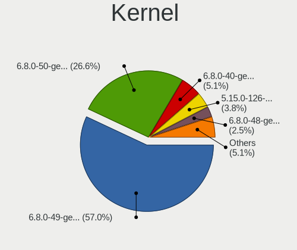
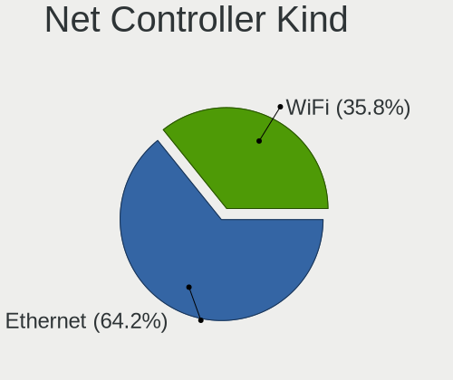
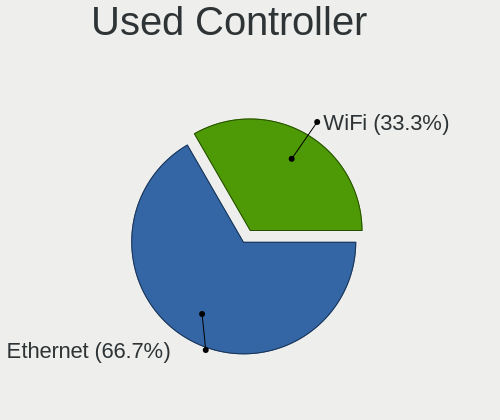
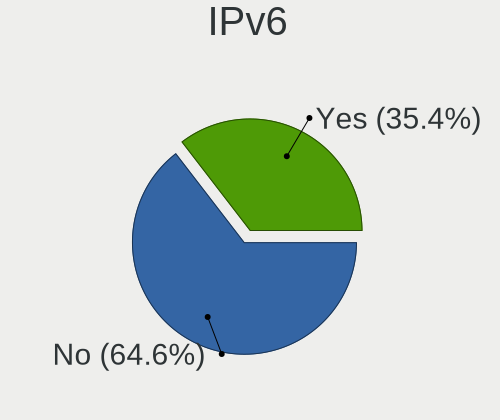

Zorin - Hardware Trends (Desktops)
----------------------------------

A project to identify most popular hardware characteristics and track their change
over time based on data collected by Linux users at https://Linux-Hardware.org.

Anyone can contribute to this report by the [hw-probe](https://github.com/linuxhw/hw-probe) tool:

    sudo -E hw-probe -all -upload

This report is for one last month. Overall report since the beginning of time: [TestDays](https://github.com/linuxhw/TestDays)

Period: Jan, 2024.

Contents
--------

* [ System ](#system)
  - [ OS                       ](#os)
  - [ OS Family                ](#os-family)
  - [ Kernel                   ](#kernel)
  - [ Kernel Family            ](#kernel-family)
  - [ Kernel Major Ver.        ](#kernel-major-ver)
  - [ Arch                     ](#arch)
  - [ DE                       ](#de)
  - [ Display Server           ](#display-server)
  - [ Display Manager          ](#display-manager)
  - [ OS Lang                  ](#os-lang)
  - [ Boot Mode                ](#boot-mode)
  - [ Filesystem               ](#filesystem)
  - [ Part. scheme             ](#part-scheme)
  - [ Dual Boot with Linux/BSD ](#dual-boot-with-linuxbsd)
  - [ Dual Boot (Win)          ](#dual-boot-win)

* [ Board ](#board)
  - [ Vendor                   ](#vendor)
  - [ Model                    ](#model)
  - [ Model Family             ](#model-family)
  - [ MFG Year                 ](#mfg-year)
  - [ Form Factor              ](#form-factor)
  - [ Secure Boot              ](#secure-boot)
  - [ Coreboot                 ](#coreboot)
  - [ RAM Size                 ](#ram-size)
  - [ RAM Used                 ](#ram-used)
  - [ Total Drives             ](#total-drives)
  - [ Has CD-ROM               ](#has-cd-rom)
  - [ Has Ethernet             ](#has-ethernet)
  - [ Has WiFi                 ](#has-wifi)
  - [ Has Bluetooth            ](#has-bluetooth)

* [ Location ](#location)
  - [ Country                  ](#country)
  - [ City                     ](#city)

* [ Drives ](#drives)
  - [ Drive Vendor             ](#drive-vendor)
  - [ Drive Model              ](#drive-model)
  - [ HDD Vendor               ](#hdd-vendor)
  - [ SSD Vendor               ](#ssd-vendor)
  - [ Drive Kind               ](#drive-kind)
  - [ Drive Connector          ](#drive-connector)
  - [ Drive Size               ](#drive-size)
  - [ Space Total              ](#space-total)
  - [ Space Used               ](#space-used)
  - [ Malfunc. Drives          ](#malfunc-drives)
  - [ Malfunc. Drive Vendor    ](#malfunc-drive-vendor)
  - [ Malfunc. HDD Vendor      ](#malfunc-hdd-vendor)
  - [ Malfunc. Drive Kind      ](#malfunc-drive-kind)
  - [ Failed Drives            ](#failed-drives)
  - [ Failed Drive Vendor      ](#failed-drive-vendor)
  - [ Drive Status             ](#drive-status)

* [ Storage controller ](#storage-controller)
  - [ Storage Vendor           ](#storage-vendor)
  - [ Storage Model            ](#storage-model)
  - [ Storage Kind             ](#storage-kind)

* [ Processor ](#processor)
  - [ CPU Vendor               ](#cpu-vendor)
  - [ CPU Model                ](#cpu-model)
  - [ CPU Model Family         ](#cpu-model-family)
  - [ CPU Cores                ](#cpu-cores)
  - [ CPU Sockets              ](#cpu-sockets)
  - [ CPU Threads              ](#cpu-threads)
  - [ CPU Op-Modes             ](#cpu-op-modes)
  - [ CPU Microcode            ](#cpu-microcode)
  - [ CPU Microarch            ](#cpu-microarch)

* [ Graphics ](#graphics)
  - [ GPU Vendor               ](#gpu-vendor)
  - [ GPU Model                ](#gpu-model)
  - [ GPU Combo                ](#gpu-combo)
  - [ GPU Driver               ](#gpu-driver)
  - [ GPU Memory               ](#gpu-memory)

* [ Monitor ](#monitor)
  - [ Monitor Vendor           ](#monitor-vendor)
  - [ Monitor Model            ](#monitor-model)
  - [ Monitor Resolution       ](#monitor-resolution)
  - [ Monitor Diagonal         ](#monitor-diagonal)
  - [ Monitor Width            ](#monitor-width)
  - [ Aspect Ratio             ](#aspect-ratio)
  - [ Monitor Area             ](#monitor-area)
  - [ Pixel Density            ](#pixel-density)
  - [ Multiple Monitors        ](#multiple-monitors)

* [ Network ](#network)
  - [ Net Controller Vendor    ](#net-controller-vendor)
  - [ Net Controller Model     ](#net-controller-model)
  - [ Wireless Vendor          ](#wireless-vendor)
  - [ Wireless Model           ](#wireless-model)
  - [ Ethernet Vendor          ](#ethernet-vendor)
  - [ Ethernet Model           ](#ethernet-model)
  - [ Net Controller Kind      ](#net-controller-kind)
  - [ Used Controller          ](#used-controller)
  - [ NICs                     ](#nics)
  - [ IPv6                     ](#ipv6)

* [ Bluetooth ](#bluetooth)
  - [ Bluetooth Vendor         ](#bluetooth-vendor)
  - [ Bluetooth Model          ](#bluetooth-model)

* [ Sound ](#sound)
  - [ Sound Vendor             ](#sound-vendor)
  - [ Sound Model              ](#sound-model)

* [ Memory ](#memory)
  - [ Memory Vendor            ](#memory-vendor)
  - [ Memory Model             ](#memory-model)
  - [ Memory Kind              ](#memory-kind)
  - [ Memory Form Factor       ](#memory-form-factor)
  - [ Memory Size              ](#memory-size)
  - [ Memory Speed             ](#memory-speed)

* [ Printers & scanners ](#printers--scanners)
  - [ Printer Vendor           ](#printer-vendor)
  - [ Printer Model            ](#printer-model)
  - [ Scanner Vendor           ](#scanner-vendor)
  - [ Scanner Model            ](#scanner-model)

* [ Camera ](#camera)
  - [ Camera Vendor            ](#camera-vendor)
  - [ Camera Model             ](#camera-model)

* [ Security ](#security)
  - [ Fingerprint Vendor       ](#fingerprint-vendor)
  - [ Fingerprint Model        ](#fingerprint-model)
  - [ Chipcard Vendor          ](#chipcard-vendor)
  - [ Chipcard Model           ](#chipcard-model)

* [ Unsupported ](#unsupported)
  - [ Unsupported Devices      ](#unsupported-devices)
  - [ Unsupported Device Types ](#unsupported-device-types)

System
------

OS
--

Installed operating systems

| Name     | Desktops | Percent |
|----------|----------|---------|
| Zorin 17 | 90       | 68.7%   |
| Zorin 16 | 41       | 31.3%   |

OS Family
---------

OS without a version

| Name  | Desktops | Percent |
|-------|----------|---------|
| Zorin | 131      | 100%    |

Kernel
------

Version of the Linux kernel

| Version              | Desktops | Percent |
|----------------------|----------|---------|
| 6.5.0-14-generic     | 44       | 33.59%  |
| 6.2.0-39-generic     | 33       | 25.19%  |
| 5.15.0-91-generic    | 28       | 21.37%  |
| 6.5.0-15-generic     | 13       | 9.92%   |
| 5.15.0-92-generic    | 8        | 6.11%   |
| 5.15.0-78-generic    | 2        | 1.53%   |
| 6.0.9-060009-generic | 1        | 0.76%   |
| 5.15.0-86-generic    | 1        | 0.76%   |
| 5.15.0-72-generic    | 1        | 0.76%   |

Kernel Family
-------------

Linux kernel without a distro release

| Version | Desktops | Percent |
|---------|----------|---------|
| 6.5.0   | 57       | 43.51%  |
| 5.15.0  | 40       | 30.53%  |
| 6.2.0   | 33       | 25.19%  |
| 6.0.9   | 1        | 0.76%   |

Kernel Major Ver.
-----------------

Linux kernel major version

| Version | Desktops | Percent |
|---------|----------|---------|
| 6.5     | 57       | 43.51%  |
| 5.15    | 40       | 30.53%  |
| 6.2     | 33       | 25.19%  |
| 6.0     | 1        | 0.76%   |

Arch
----

OS architecture (x86_64, i586, etc.)

| Name   | Desktops | Percent |
|--------|----------|---------|
| x86_64 | 131      | 100%    |

DE
--

Desktop Environment

| Name       | Desktops | Percent |
|------------|----------|---------|
| GNOME      | 119      | 90.84%  |
| XFCE       | 11       | 8.4%    |
| X-Cinnamon | 1        | 0.76%   |

Display Server
--------------

X11 or Wayland

| Name    | Desktops | Percent |
|---------|----------|---------|
| X11     | 79       | 60.31%  |
| Wayland | 52       | 39.69%  |

Display Manager
---------------

SDDM, LightDM, etc.

| Name    | Desktops | Percent |
|---------|----------|---------|
| Unknown | 116      | 88.55%  |
| GDM3    | 14       | 10.69%  |
| GDM     | 1        | 0.76%   |

OS Lang
-------

Language

| Lang        | Desktops | Percent |
|-------------|----------|---------|
| en_US       | 55       | 41.98%  |
| de_DE       | 12       | 9.16%   |
| pt_BR       | 10       | 7.63%   |
| en_GB       | 7        | 5.34%   |
| en_CA       | 7        | 5.34%   |
| es_ES       | 5        | 3.82%   |
| nl_NL       | 4        | 3.05%   |
| it_IT       | 3        | 2.29%   |
| fr_FR       | 3        | 2.29%   |
| en_NZ       | 3        | 2.29%   |
| en_IN       | 3        | 2.29%   |
| en_AU       | 3        | 2.29%   |
| tr_TR       | 2        | 1.53%   |
| sr_RS@latin | 1        | 0.76%   |
| sq_AL       | 1        | 0.76%   |
| ro_RO       | 1        | 0.76%   |
| pt_PT       | 1        | 0.76%   |
| pl_PL       | 1        | 0.76%   |
| hu_HU       | 1        | 0.76%   |
| fr_BE       | 1        | 0.76%   |
| es_PY       | 1        | 0.76%   |
| es_PE       | 1        | 0.76%   |
| es_MX       | 1        | 0.76%   |
| es_CR       | 1        | 0.76%   |
| en_SG       | 1        | 0.76%   |
| de_IT       | 1        | 0.76%   |
| ar_EG       | 1        | 0.76%   |

Boot Mode
---------

EFI or BIOS

| Mode | Desktops | Percent |
|------|----------|---------|
| BIOS | 118      | 90.08%  |
| EFI  | 13       | 9.92%   |

Filesystem
----------

Type of filesystem

| Type    | Desktops | Percent |
|---------|----------|---------|
| Ext4    | 112      | 85.5%   |
| Tmpfs   | 12       | 9.16%   |
| Overlay | 3        | 2.29%   |
| Btrfs   | 2        | 1.53%   |
| Zfs     | 1        | 0.76%   |
| Ext2    | 1        | 0.76%   |

Part. scheme
------------

Scheme of partitioning

| Type    | Desktops | Percent |
|---------|----------|---------|
| Unknown | 116      | 88.55%  |
| GPT     | 11       | 8.4%    |
| MBR     | 4        | 3.05%   |

Dual Boot with Linux/BSD
------------------------

Hosting more than one Linux/BSD

| Dual boot | Desktops | Percent |
|-----------|----------|---------|
| No        | 127      | 96.95%  |
| Yes       | 4        | 3.05%   |

Dual Boot (Win)
---------------

Hosting Linux and Windows

| Dual boot | Desktops | Percent |
|-----------|----------|---------|
| No        | 123      | 93.89%  |
| Yes       | 8        | 6.11%   |

Board
-----

Vendor
------

Motherboard manufacturer

| Name                | Desktops | Percent |
|---------------------|----------|---------|
| ASUSTek Computer    | 36       | 27.48%  |
| Dell                | 17       | 12.98%  |
| Gigabyte Technology | 15       | 11.45%  |
| MSI                 | 13       | 9.92%   |
| Intel               | 9        | 6.87%   |
| Lenovo              | 8        | 6.11%   |
| Hewlett-Packard     | 6        | 4.58%   |
| ASRock              | 5        | 3.82%   |
| Acer                | 4        | 3.05%   |
| Unknown             | 3        | 2.29%   |
| Shuttle             | 2        | 1.53%   |
| Supermicro          | 1        | 0.76%   |
| Samsung Electronics | 1        | 0.76%   |
| Packard Bell        | 1        | 0.76%   |
| MACHINIST           | 1        | 0.76%   |
| Huanan              | 1        | 0.76%   |
| Google              | 1        | 0.76%   |
| Gateway             | 1        | 0.76%   |
| Fujitsu             | 1        | 0.76%   |
| Foxconn             | 1        | 0.76%   |
| ECS                 | 1        | 0.76%   |
| Colorful Technology | 1        | 0.76%   |
| Biostar             | 1        | 0.76%   |
| Alienware           | 1        | 0.76%   |

Model
-----

Motherboard model

| Name                                     | Desktops | Percent |
|------------------------------------------|----------|---------|
| ASUS All Series                          | 4        | 3.05%   |
| Unknown                                  | 4        | 3.05%   |
| ASUS A0000001                            | 3        | 2.29%   |
| MSI MS-7850                              | 2        | 1.53%   |
| HP Compaq 8000 Elite CMT PC              | 2        | 1.53%   |
| Gigabyte H110M-H                         | 2        | 1.53%   |
| Dell OptiPlex 790                        | 2        | 1.53%   |
| Dell OptiPlex 7050                       | 2        | 1.53%   |
| ASUS ROG STRIX X570-E GAMING             | 2        | 1.53%   |
| ASUS P5G41T-M LX                         | 2        | 1.53%   |
| ASRock G31M-S                            | 2        | 1.53%   |
| Supermicro C2SBC-Q                       | 1        | 0.76%   |
| Shuttle SZ87R                            | 1        | 0.76%   |
| Shuttle SG31                             | 1        | 0.76%   |
| Samsung DeskTop System                   | 1        | 0.76%   |
| Packard Bell IMEDIA S3810                | 1        | 0.76%   |
| MSI Z1-7641                              | 1        | 0.76%   |
| MSI MS-7D46                              | 1        | 0.76%   |
| MSI MS-7D43                              | 1        | 0.76%   |
| MSI MS-7C75                              | 1        | 0.76%   |
| MSI MS-7C08                              | 1        | 0.76%   |
| MSI MS-7B79                              | 1        | 0.76%   |
| MSI MS-7B07                              | 1        | 0.76%   |
| MSI MS-7A38                              | 1        | 0.76%   |
| MSI MS-7994                              | 1        | 0.76%   |
| MSI MS-7846                              | 1        | 0.76%   |
| MSI MS-7817                              | 1        | 0.76%   |
| MACHINIST X79 Z9-D7 PRO V1.0             | 1        | 0.76%   |
| Lenovo ThinkStation P620 30E0003EGE      | 1        | 0.76%   |
| Lenovo ThinkCentre M93 10A4A03400        | 1        | 0.76%   |
| Lenovo ThinkCentre M900 10FGS0MX08       | 1        | 0.76%   |
| Lenovo ThinkCentre M72e 4004H1U          | 1        | 0.76%   |
| Lenovo ThinkCentre M71e 3156PT5          | 1        | 0.76%   |
| Lenovo ThinkCentre M70t Gen 3 11T6001YUS | 1        | 0.76%   |
| Lenovo ThinkCentre M70E 0830W36          | 1        | 0.76%   |
| Lenovo ThinkCentre Edge72 3493G6G        | 1        | 0.76%   |
| Intel X99-P4 V5.0                        | 1        | 0.76%   |
| Intel X99                                | 1        | 0.76%   |
| Intel UNLOCK INSTALL                     | 1        | 0.76%   |
| Intel H61                                | 1        | 0.76%   |

Model Family
------------

Motherboard model prefix

| Name                | Desktops | Percent |
|---------------------|----------|---------|
| Dell OptiPlex       | 10       | 7.63%   |
| ASUS PRIME          | 9        | 6.87%   |
| ASUS ROG            | 8        | 6.11%   |
| Lenovo ThinkCentre  | 7        | 5.34%   |
| ASUS All            | 4        | 3.05%   |
| Unknown             | 4        | 3.05%   |
| HP Compaq           | 3        | 2.29%   |
| Dell Inspiron       | 3        | 2.29%   |
| ASUS A0000001       | 3        | 2.29%   |
| Acer Aspire         | 3        | 2.29%   |
| MSI MS-7850         | 2        | 1.53%   |
| HP EliteDesk        | 2        | 1.53%   |
| Gigabyte H110M-H    | 2        | 1.53%   |
| ASUS P5G41T-M       | 2        | 1.53%   |
| ASRock G31M-S       | 2        | 1.53%   |
| Supermicro C2SBC-Q  | 1        | 0.76%   |
| Shuttle SZ87R       | 1        | 0.76%   |
| Shuttle SG31        | 1        | 0.76%   |
| Samsung DeskTop     | 1        | 0.76%   |
| Packard Bell IMEDIA | 1        | 0.76%   |
| MSI Z1-7641         | 1        | 0.76%   |
| MSI MS-7D46         | 1        | 0.76%   |
| MSI MS-7D43         | 1        | 0.76%   |
| MSI MS-7C75         | 1        | 0.76%   |
| MSI MS-7C08         | 1        | 0.76%   |
| MSI MS-7B79         | 1        | 0.76%   |
| MSI MS-7B07         | 1        | 0.76%   |
| MSI MS-7A38         | 1        | 0.76%   |
| MSI MS-7994         | 1        | 0.76%   |
| MSI MS-7846         | 1        | 0.76%   |
| MSI MS-7817         | 1        | 0.76%   |
| MACHINIST X79       | 1        | 0.76%   |
| Lenovo ThinkStation | 1        | 0.76%   |
| Intel X99-P4        | 1        | 0.76%   |
| Intel X99           | 1        | 0.76%   |
| Intel UNLOCK        | 1        | 0.76%   |
| Intel H61           | 1        | 0.76%   |
| Intel H110          | 1        | 0.76%   |
| Intel D54250WYK     | 1        | 0.76%   |
| Intel B75           | 1        | 0.76%   |

MFG Year
--------

Motherboard manufacture year

| Year | Desktops | Percent |
|------|----------|---------|
| 2013 | 13       | 9.92%   |
| 2020 | 10       | 7.63%   |
| 2017 | 10       | 7.63%   |
| 2014 | 10       | 7.63%   |
| 2018 | 9        | 6.87%   |
| 2010 | 9        | 6.87%   |
| 2022 | 8        | 6.11%   |
| 2021 | 8        | 6.11%   |
| 2012 | 8        | 6.11%   |
| 2011 | 8        | 6.11%   |
| 2019 | 7        | 5.34%   |
| 2015 | 7        | 5.34%   |
| 2009 | 6        | 4.58%   |
| 2023 | 5        | 3.82%   |
| 2016 | 5        | 3.82%   |
| 2008 | 5        | 3.82%   |
| 2007 | 2        | 1.53%   |
| 2006 | 1        | 0.76%   |

Form Factor
-----------

Physical design of the computer

| Name    | Desktops | Percent |
|---------|----------|---------|
| Desktop | 131      | 100%    |

Secure Boot
-----------

Enabled or disabled

| State    | Desktops | Percent |
|----------|----------|---------|
| Disabled | 127      | 96.95%  |
| Enabled  | 4        | 3.05%   |

Coreboot
--------

Have coreboot on board

| Used | Desktops | Percent |
|------|----------|---------|
| No   | 130      | 99.24%  |
| Yes  | 1        | 0.76%   |

RAM Size
--------

Total RAM memory

| Size in GB      | Desktops | Percent |
|-----------------|----------|---------|
| 16.01-24.0      | 31       | 23.66%  |
| 32.01-64.0      | 24       | 18.32%  |
| 4.01-8.0        | 23       | 17.56%  |
| 8.01-16.0       | 21       | 16.03%  |
| 3.01-4.0        | 13       | 9.92%   |
| 64.01-256.0     | 11       | 8.4%    |
| 24.01-32.0      | 3        | 2.29%   |
| 2.01-3.0        | 2        | 1.53%   |
| 1.01-2.0        | 2        | 1.53%   |
| More than 256.0 | 1        | 0.76%   |

RAM Used
--------

Used RAM memory

| Used GB   | Desktops | Percent |
|-----------|----------|---------|
| 2.01-3.0  | 52       | 39.69%  |
| 1.01-2.0  | 30       | 22.9%   |
| 4.01-8.0  | 27       | 20.61%  |
| 3.01-4.0  | 18       | 13.74%  |
| 8.01-16.0 | 2        | 1.53%   |
| 0.51-1.0  | 2        | 1.53%   |

Total Drives
------------

Number of drives on board

| Drives | Desktops | Percent |
|--------|----------|---------|
| 1      | 55       | 41.98%  |
| 2      | 35       | 26.72%  |
| 3      | 20       | 15.27%  |
| 4      | 11       | 8.4%    |
| 5      | 4        | 3.05%   |
| 6      | 3        | 2.29%   |
| 8      | 2        | 1.53%   |
| 9      | 1        | 0.76%   |

Has CD-ROM
----------

Has CD-ROM on board

| Presented | Desktops | Percent |
|-----------|----------|---------|
| No        | 66       | 50.38%  |
| Yes       | 65       | 49.62%  |

Has Ethernet
------------

Has Ethernet on board

| Presented | Desktops | Percent |
|-----------|----------|---------|
| Yes       | 131      | 100%    |

Has WiFi
--------

Has WiFi module

| Presented | Desktops | Percent |
|-----------|----------|---------|
| No        | 69       | 52.67%  |
| Yes       | 62       | 47.33%  |

Has Bluetooth
-------------

Has Bluetooth module

| Presented | Desktops | Percent |
|-----------|----------|---------|
| No        | 81       | 61.83%  |
| Yes       | 50       | 38.17%  |

Location
--------

Country
-------

Geographic location (country)

| Country                | Desktops | Percent |
|------------------------|----------|---------|
| USA                    | 30       | 22.9%   |
| Germany                | 14       | 10.69%  |
| Brazil                 | 12       | 9.16%   |
| Canada                 | 8        | 6.11%   |
| UK                     | 7        | 5.34%   |
| Netherlands            | 7        | 5.34%   |
| Spain                  | 4        | 3.05%   |
| Romania                | 3        | 2.29%   |
| New Zealand            | 3        | 2.29%   |
| Italy                  | 3        | 2.29%   |
| India                  | 3        | 2.29%   |
| Greece                 | 3        | 2.29%   |
| France                 | 3        | 2.29%   |
| Egypt                  | 3        | 2.29%   |
| Australia              | 3        | 2.29%   |
| Turkey                 | 2        | 1.53%   |
| Portugal               | 2        | 1.53%   |
| Peru                   | 2        | 1.53%   |
| Belgium                | 2        | 1.53%   |
| Thailand               | 1        | 0.76%   |
| Switzerland            | 1        | 0.76%   |
| Sweden                 | 1        | 0.76%   |
| Singapore              | 1        | 0.76%   |
| Serbia                 | 1        | 0.76%   |
| Saudi Arabia           | 1        | 0.76%   |
| Poland                 | 1        | 0.76%   |
| Paraguay               | 1        | 0.76%   |
| Nepal                  | 1        | 0.76%   |
| Mexico                 | 1        | 0.76%   |
| Malaysia               | 1        | 0.76%   |
| Jamaica                | 1        | 0.76%   |
| Iraq                   | 1        | 0.76%   |
| Indonesia              | 1        | 0.76%   |
| Costa Rica             | 1        | 0.76%   |
| Bosnia and Herzegovina | 1        | 0.76%   |
| Albania                | 1        | 0.76%   |

City
----

Geographic location (city)

| City                      | Desktops | Percent |
|---------------------------|----------|---------|
| Minneapolis               | 3        | 2.29%   |
| Calgary                   | 3        | 2.29%   |
| Wauwatosa                 | 2        | 1.53%   |
| Wakefield                 | 2        | 1.53%   |
| Sao Paulo                 | 2        | 1.53%   |
| Saint-Germain-les-Arpajon | 2        | 1.53%   |
| Lima                      | 2        | 1.53%   |
| Berlin                    | 2        | 1.53%   |
| Atlanta                   | 2        | 1.53%   |
| Athens                    | 2        | 1.53%   |
| Adelaide                  | 2        | 1.53%   |
| Würzburg                 | 1        | 0.76%   |
| Woudrichem                | 1        | 0.76%   |
| Woodland                  | 1        | 0.76%   |
| Winterswijk               | 1        | 0.76%   |
| Whitby                    | 1        | 0.76%   |
| Wetter                    | 1        | 0.76%   |
| Warren                    | 1        | 0.76%   |
| Visalia                   | 1        | 0.76%   |
| Utrecht                   | 1        | 0.76%   |
| Utica                     | 1        | 0.76%   |
| Toledo                    | 1        | 0.76%   |
| Tlalnepantla              | 1        | 0.76%   |
| Tirana                    | 1        | 0.76%   |
| Tanta                     | 1        | 0.76%   |
| Sydney                    | 1        | 0.76%   |
| Surabaya                  | 1        | 0.76%   |
| Summerland                | 1        | 0.76%   |
| Subotica                  | 1        | 0.76%   |
| Stockton                  | 1        | 0.76%   |
| Stockholm                 | 1        | 0.76%   |
| Statesboro                | 1        | 0.76%   |
| Sprimont                  | 1        | 0.76%   |
| Spinea                    | 1        | 0.76%   |
| Southampton               | 1        | 0.76%   |
| Smyrna                    | 1        | 0.76%   |
| Sluis                     | 1        | 0.76%   |
| Singapore                 | 1        | 0.76%   |
| Seattle                   | 1        | 0.76%   |
| Sarajevo                  | 1        | 0.76%   |

Drives
------

Drive Vendor
------------

Hard drive vendors

| Vendor                       | Desktops | Drives | Percent |
|------------------------------|----------|--------|---------|
| WDC                          | 39       | 47     | 16.12%  |
| Seagate                      | 37       | 44     | 15.29%  |
| Samsung Electronics          | 37       | 51     | 15.29%  |
| Kingston                     | 19       | 23     | 7.85%   |
| Sandisk                      | 15       | 26     | 6.2%    |
| Crucial                      | 11       | 12     | 4.55%   |
| Toshiba                      | 8        | 8      | 3.31%   |
| Micron/Crucial Technology    | 7        | 8      | 2.89%   |
| Phison Electronics           | 5        | 6      | 2.07%   |
| Hitachi                      | 5        | 5      | 2.07%   |
| China                        | 5        | 5      | 2.07%   |
| Transcend                    | 4        | 5      | 1.65%   |
| SK hynix                     | 4        | 4      | 1.65%   |
| Silicon Motion               | 4        | 4      | 1.65%   |
| PNY                          | 4        | 4      | 1.65%   |
| Kingston Technology Company  | 4        | 4      | 1.65%   |
| Unknown                      | 3        | 5      | 1.24%   |
| A-DATA Technology            | 3        | 3      | 1.24%   |
| Micron Technology            | 2        | 2      | 0.83%   |
| MAXIO Technology (Hangzhou)  | 2        | 2      | 0.83%   |
| Intenso                      | 2        | 2      | 0.83%   |
| ADATA Technology             | 2        | 2      | 0.83%   |
| Verbatim                     | 1        | 2      | 0.41%   |
| Timetec                      | 1        | 1      | 0.41%   |
| TEAM T25                     | 1        | 1      | 0.41%   |
| SPCC                         | 1        | 1      | 0.41%   |
| Shenzhen Longsys Electronics | 1        | 1      | 0.41%   |
| Seagate Technology           | 1        | 1      | 0.41%   |
| SABRENT                      | 1        | 1      | 0.41%   |
| ROG                          | 1        | 1      | 0.41%   |
| Realtek Semiconductor        | 1        | 1      | 0.41%   |
| Patriot                      | 1        | 1      | 0.41%   |
| Netac                        | 1        | 1      | 0.41%   |
| MOVESPEED                    | 1        | 1      | 0.41%   |
| LITEONIT                     | 1        | 1      | 0.41%   |
| Lexar                        | 1        | 1      | 0.41%   |
| HS-SSD-C100                  | 1        | 1      | 0.41%   |
| HPE                          | 1        | 1      | 0.41%   |
| HGST                         | 1        | 1      | 0.41%   |
| GOODRAM                      | 1        | 2      | 0.41%   |

Drive Model
-----------

Hard drive models

| Model                                                 | Desktops | Percent |
|-------------------------------------------------------|----------|---------|
| Micron/Crucial P2 NVMe PCIe SSD 1TB                   | 6        | 2.18%   |
| Samsung NVMe SSD Controller SM981/PM981/PM983 1TB     | 5        | 1.82%   |
| Silicon Motion SM2263EN/SM2263XT SSD Controller 128GB | 4        | 1.45%   |
| Seagate ST500DM002-1BD142 500GB                       | 4        | 1.45%   |
| Seagate ST1000DM010-2EP102 1TB                        | 4        | 1.45%   |
| Samsung SSD 860 EVO 500GB                             | 4        | 1.45%   |
| Kingston SA400S37240G 240GB SSD                       | 4        | 1.45%   |
| Samsung SSD 850 EVO 500GB                             | 3        | 1.09%   |
| Kingston SV300S37A240G 240GB SSD                      | 3        | 1.09%   |
| Kingston SA400S37120G 120GB SSD                       | 3        | 1.09%   |
| WDC WD20EARX-00PASB0 2TB                              | 2        | 0.73%   |
| WDC WD10JPVX-22JC3T0 1TB                              | 2        | 0.73%   |
| WDC WD1003FZEX-00MK2A0 1TB                            | 2        | 0.73%   |
| Toshiba HDWD110 1TB                                   | 2        | 0.73%   |
| Toshiba DT01ACA200 2TB                                | 2        | 0.73%   |
| Toshiba DT01ACA100 1TB                                | 2        | 0.73%   |
| Seagate ST4000DM004-2CV104 4TB                        | 2        | 0.73%   |
| Seagate ST3500312CS 500GB                             | 2        | 0.73%   |
| Seagate ST31000524AS 1TB                              | 2        | 0.73%   |
| Sandisk WD Black SN850 1024GB                         | 2        | 0.73%   |
| Samsung SSD 980 1TB                                   | 2        | 0.73%   |
| Samsung SSD 860 PRO 256GB                             | 2        | 0.73%   |
| Samsung SSD 860 EVO 1TB                               | 2        | 0.73%   |
| Samsung SSD 840 Series 120GB                          | 2        | 0.73%   |
| Samsung NVMe SSD Controller SM961/PM961/SM963 256GB   | 2        | 0.73%   |
| Samsung NVMe SSD Controller PM9A1/PM9A3/980PRO 2TB    | 2        | 0.73%   |
| PNY CS900 120GB SSD                                   | 2        | 0.73%   |
| Phison E12 NVMe Controller 1TB                        | 2        | 0.73%   |
| Kingston Company A2000 NVMe SSD 500GB                 | 2        | 0.73%   |
| Kingston SNVS1000G 1TB                                | 2        | 0.73%   |
| Kingston SA400S37480G 480GB SSD                       | 2        | 0.73%   |
| Crucial CT500MX500SSD1 500GB                          | 2        | 0.73%   |
| Crucial CT500BX500SSD1 500GB                          | 2        | 0.73%   |
| WDC WUH721816ALE6L4 16TB                              | 1        | 0.36%   |
| WDC WDS250G2B0C-00PXH0 250GB                          | 1        | 0.36%   |
| WDC WDS200T2G0A-00JH30 2TB SSD                        | 1        | 0.36%   |
| WDC WDS100T2B0A-00SM50 1TB SSD                        | 1        | 0.36%   |
| WDC WDBNCE5000PNC 500GB SSD                           | 1        | 0.36%   |
| WDC WD80EDAZ-11TA3A0 8TB                              | 1        | 0.36%   |
| WDC WD800BD-00MRA1 80GB                               | 1        | 0.36%   |

HDD Vendor
----------

Hard disk drive vendors

| Vendor              | Desktops | Drives | Percent |
|---------------------|----------|--------|---------|
| Seagate             | 36       | 42     | 40%     |
| WDC                 | 35       | 42     | 38.89%  |
| Toshiba             | 8        | 8      | 8.89%   |
| Hitachi             | 5        | 5      | 5.56%   |
| Samsung Electronics | 3        | 3      | 3.33%   |
| Unknown             | 1        | 1      | 1.11%   |
| Intenso             | 1        | 1      | 1.11%   |
| HGST                | 1        | 1      | 1.11%   |

SSD Vendor
----------

Solid state drive vendors

| Vendor              | Desktops | Drives | Percent |
|---------------------|----------|--------|---------|
| Samsung Electronics | 24       | 32     | 25.26%  |
| Kingston            | 15       | 18     | 15.79%  |
| Crucial             | 11       | 12     | 11.58%  |
| SanDisk             | 8        | 10     | 8.42%   |
| China               | 5        | 5      | 5.26%   |
| Transcend           | 4        | 5      | 4.21%   |
| PNY                 | 4        | 4      | 4.21%   |
| WDC                 | 3        | 4      | 3.16%   |
| A-DATA Technology   | 3        | 3      | 3.16%   |
| SK hynix            | 2        | 2      | 2.11%   |
| Verbatim            | 1        | 2      | 1.05%   |
| Timetec             | 1        | 1      | 1.05%   |
| TEAM T25            | 1        | 1      | 1.05%   |
| SPCC                | 1        | 1      | 1.05%   |
| Seagate             | 1        | 2      | 1.05%   |
| SABRENT             | 1        | 1      | 1.05%   |
| ROG                 | 1        | 1      | 1.05%   |
| Patriot             | 1        | 1      | 1.05%   |
| Netac               | 1        | 1      | 1.05%   |
| MOVESPEED           | 1        | 1      | 1.05%   |
| Micron Technology   | 1        | 1      | 1.05%   |
| LITEONIT            | 1        | 1      | 1.05%   |
| Lexar               | 1        | 1      | 1.05%   |
| GOODRAM             | 1        | 2      | 1.05%   |
| BlueRay             | 1        | 1      | 1.05%   |
| Apacer              | 1        | 1      | 1.05%   |

Drive Kind
----------

HDD or SSD

| Kind    | Desktops | Drives | Percent |
|---------|----------|--------|---------|
| SSD     | 79       | 114    | 39.11%  |
| HDD     | 72       | 103    | 35.64%  |
| NVMe    | 46       | 70     | 22.77%  |
| Unknown | 4        | 6      | 1.98%   |
| MMC     | 1        | 1      | 0.5%    |

Drive Connector
---------------

SATA, SAS, NVMe, etc.

| Type | Desktops | Drives | Percent |
|------|----------|--------|---------|
| SATA | 111      | 213    | 67.27%  |
| NVMe | 46       | 70     | 27.88%  |
| SAS  | 7        | 10     | 4.24%   |
| MMC  | 1        | 1      | 0.61%   |

Drive Size
----------

Size of hard drive

| Size in TB | Desktops | Drives | Percent |
|------------|----------|--------|---------|
| 0.01-0.5   | 81       | 119    | 52.26%  |
| 0.51-1.0   | 41       | 56     | 26.45%  |
| 1.01-2.0   | 17       | 22     | 10.97%  |
| 3.01-4.0   | 6        | 9      | 3.87%   |
| 2.01-3.0   | 5        | 5      | 3.23%   |
| 4.01-10.0  | 4        | 5      | 2.58%   |
| 10.01-20.0 | 1        | 1      | 0.65%   |

Space Total
-----------

Amount of disk space available on the file system

| Size in GB     | Desktops | Percent |
|----------------|----------|---------|
| 101-250        | 40       | 30.53%  |
| 251-500        | 20       | 15.27%  |
| 501-1000       | 19       | 14.5%   |
| 1001-2000      | 18       | 13.74%  |
| More than 3000 | 17       | 12.98%  |
| 51-100         | 11       | 8.4%    |
| 21-50          | 3        | 2.29%   |
| 1-20           | 2        | 1.53%   |
| Unknown        | 1        | 0.76%   |

Space Used
----------

Amount of used disk space

| Used GB        | Desktops | Percent |
|----------------|----------|---------|
| 21-50          | 36       | 27.48%  |
| 1-20           | 35       | 26.72%  |
| 51-100         | 14       | 10.69%  |
| 251-500        | 12       | 9.16%   |
| 101-250        | 12       | 9.16%   |
| 501-1000       | 8        | 6.11%   |
| 2001-3000      | 5        | 3.82%   |
| More than 3000 | 4        | 3.05%   |
| 1001-2000      | 4        | 3.05%   |
| Unknown        | 1        | 0.76%   |

Malfunc. Drives
---------------

Drive models with a malfunction

| Model                    | Desktops | Drives | Percent |
|--------------------------|----------|--------|---------|
| WDC WD10JPVX-60JC3T0 1TB | 1        | 1      | 100%    |

Malfunc. Drive Vendor
---------------------

Vendors of faulty drives

| Vendor | Desktops | Drives | Percent |
|--------|----------|--------|---------|
| WDC    | 1        | 1      | 100%    |

Malfunc. HDD Vendor
-------------------

Vendors of faulty HDD drives

| Vendor | Desktops | Drives | Percent |
|--------|----------|--------|---------|
| WDC    | 1        | 1      | 100%    |

Malfunc. Drive Kind
-------------------

Kinds of faulty drives

| Kind | Desktops | Drives | Percent |
|------|----------|--------|---------|
| HDD  | 1        | 1      | 100%    |

Failed Drives
-------------

Failed drive models

Zero info for selected period =(

Failed Drive Vendor
-------------------

Failed drive vendors

Zero info for selected period =(

Drive Status
------------

Number of failed and malfunc. drives

| Status   | Desktops | Drives | Percent |
|----------|----------|--------|---------|
| Detected | 128      | 286    | 96.24%  |
| Works    | 4        | 7      | 3.01%   |
| Malfunc  | 1        | 1      | 0.75%   |

Storage controller
------------------

Storage Vendor
--------------

Storage controller vendors

| Vendor                        | Desktops | Percent |
|-------------------------------|----------|---------|
| Intel                         | 104      | 50.49%  |
| AMD                           | 25       | 12.14%  |
| Samsung Electronics           | 14       | 6.8%    |
| SanDisk                       | 8        | 3.88%   |
| Micron/Crucial Technology     | 7        | 3.4%    |
| Marvell Technology Group      | 7        | 3.4%    |
| Kingston Technology Company   | 7        | 3.4%    |
| ASMedia Technology            | 7        | 3.4%    |
| Phison Electronics            | 5        | 2.43%   |
| JMicron Technology            | 5        | 2.43%   |
| Silicon Motion                | 4        | 1.94%   |
| SK hynix                      | 2        | 0.97%   |
| MAXIO Technology (Hangzhou)   | 2        | 0.97%   |
| Integrated Technology Express | 2        | 0.97%   |
| ADATA Technology              | 2        | 0.97%   |
| Shenzhen Longsys Electronics  | 1        | 0.49%   |
| Seagate Technology            | 1        | 0.49%   |
| Realtek Semiconductor         | 1        | 0.49%   |
| Micron Technology             | 1        | 0.49%   |
| Adaptec                       | 1        | 0.49%   |

Storage Model
-------------

Storage controller models

| Model                                                                                   | Desktops | Percent |
|-----------------------------------------------------------------------------------------|----------|---------|
| Intel 8 Series/C220 Series Chipset Family 6-port SATA Controller 1 [AHCI mode]          | 15       | 6.05%   |
| AMD FCH SATA Controller [AHCI mode]                                                     | 15       | 6.05%   |
| Intel Q170/Q150/B150/H170/H110/Z170/CM236 Chipset SATA Controller [AHCI Mode]           | 11       | 4.44%   |
| Intel 6 Series/C200 Series Chipset Family 6 port Desktop SATA AHCI Controller           | 11       | 4.44%   |
| Intel NM10/ICH7 Family SATA Controller [IDE mode]                                       | 8        | 3.23%   |
| Intel 82801G (ICH7 Family) IDE Controller                                               | 8        | 3.23%   |
| ASMedia ASM1061/ASM1062 Serial ATA Controller                                           | 7        | 2.82%   |
| Samsung NVMe SSD Controller SM981/PM981/PM983                                           | 6        | 2.42%   |
| Micron/Crucial P2 [Nick P2] / P3 / P3 Plus NVMe PCIe SSD (DRAM-less)                    | 6        | 2.42%   |
| Intel Alder Lake-S PCH SATA Controller [AHCI Mode]                                      | 6        | 2.42%   |
| Intel 200 Series PCH SATA controller [AHCI mode]                                        | 5        | 2.02%   |
| AMD 400 Series Chipset SATA Controller                                                  | 5        | 2.02%   |
| Silicon Motion SM2263EN/SM2263XT (DRAM-less) NVMe SSD Controllers                       | 4        | 1.61%   |
| Intel SATA Controller [RAID mode]                                                       | 4        | 1.61%   |
| Intel Comet Lake SATA AHCI Controller                                                   | 4        | 1.61%   |
| Intel 7 Series/C210 Series Chipset Family 6-port SATA Controller [AHCI mode]            | 4        | 1.61%   |
| Intel 5 Series/3400 Series Chipset 6 port SATA AHCI Controller                          | 4        | 1.61%   |
| AMD FCH SATA Controller D                                                               | 4        | 1.61%   |
| JMicron JMB363 SATA/IDE Controller                                                      | 3        | 1.21%   |
| Intel Volume Management Device NVMe RAID Controller                                     | 3        | 1.21%   |
| Intel Raptor Lake SATA AHCI Controller                                                  | 3        | 1.21%   |
| Intel Cannon Lake PCH SATA AHCI Controller                                              | 3        | 1.21%   |
| Intel 6 Series/C200 Series Chipset Family Desktop SATA Controller (IDE mode, ports 4-5) | 3        | 1.21%   |
| Intel 6 Series/C200 Series Chipset Family Desktop SATA Controller (IDE mode, ports 0-3) | 3        | 1.21%   |
| AMD SB7x0/SB8x0/SB9x0 SATA Controller [IDE mode]                                        | 3        | 1.21%   |
| AMD SB7x0/SB8x0/SB9x0 IDE Controller                                                    | 3        | 1.21%   |
| SanDisk WD PC SN810 / Black SN850 NVMe SSD                                              | 2        | 0.81%   |
| SanDisk Ultra 3D / WD Blue SN570 NVMe SSD (DRAM-less)                                   | 2        | 0.81%   |
| Samsung NVMe SSD Controller SM961/PM961/SM963                                           | 2        | 0.81%   |
| Samsung NVMe SSD Controller PM9A1/PM9A3/980PRO                                          | 2        | 0.81%   |
| Samsung NVMe SSD Controller 980 (DRAM-less)                                             | 2        | 0.81%   |
| Phison E12 NVMe Controller                                                              | 2        | 0.81%   |
| Marvell Group 88SE9230 PCIe 2.0 x2 4-port SATA 6 Gb/s RAID Controller                   | 2        | 0.81%   |
| Marvell Group 88SE9172 SATA 6Gb/s Controller                                            | 2        | 0.81%   |
| Kingston Company NV2 NVMe SSD SM2267XT (DRAM-less)                                      | 2        | 0.81%   |
| Kingston Company NV1 NVMe SSD SM2263XT (DRAM-less)                                      | 2        | 0.81%   |
| Kingston Company KC3000/FURY Renegade NVMe SSD E18                                      | 2        | 0.81%   |
| Kingston Company A2000 NVMe SSD SM2263EN                                                | 2        | 0.81%   |
| JMicron JMB368 IDE controller                                                           | 2        | 0.81%   |
| Intel Volume Management Device NVMe RAID Controller Intel Corporation                   | 2        | 0.81%   |

Storage Kind
------------

Kind of storage controller (IDE, SATA, NVMe, SAS, ...)

| Kind | Desktops | Percent |
|------|----------|---------|
| SATA | 106      | 55.79%  |
| NVMe | 46       | 24.21%  |
| IDE  | 26       | 13.68%  |
| RAID | 12       | 6.32%   |

Processor
---------

CPU Vendor
----------

Processor vendors

| Vendor | Desktops | Percent |
|--------|----------|---------|
| Intel  | 106      | 80.92%  |
| AMD    | 25       | 19.08%  |

CPU Model
---------

Processor models

| Model                                       | Desktops | Percent |
|---------------------------------------------|----------|---------|
| Intel Core i5-4460 CPU @ 3.20GHz            | 5        | 3.82%   |
| Intel Core i3-2120 CPU @ 3.30GHz            | 4        | 3.05%   |
| Intel Core i7-4790K CPU @ 4.00GHz           | 3        | 2.29%   |
| Intel Core i5-7400 CPU @ 3.00GHz            | 3        | 2.29%   |
| Intel Core i5-2400 CPU @ 3.10GHz            | 3        | 2.29%   |
| Intel Core i7-6700K CPU @ 4.00GHz           | 2        | 1.53%   |
| Intel Core i7-3770 CPU @ 3.40GHz            | 2        | 1.53%   |
| Intel Core i7-10700K CPU @ 3.80GHz          | 2        | 1.53%   |
| Intel Core i5 CPU 750 @ 2.67GHz             | 2        | 1.53%   |
| Intel Core i3-4160 CPU @ 3.60GHz            | 2        | 1.53%   |
| Intel Core i3 CPU 550 @ 3.20GHz             | 2        | 1.53%   |
| Intel Core 2 Duo CPU E7500 @ 2.93GHz        | 2        | 1.53%   |
| Intel Core 2 Duo CPU E4400 @ 2.00GHz        | 2        | 1.53%   |
| Intel 11th Gen Core i7-11700F @ 2.50GHz     | 2        | 1.53%   |
| AMD Ryzen 5 5600G with Radeon Graphics      | 2        | 1.53%   |
| AMD FX-6300 Six-Core Processor              | 2        | 1.53%   |
| Intel Xeon E-2224G CPU @ 3.50GHz            | 1        | 0.76%   |
| Intel Xeon CPU E5-2678 v3 @ 2.50GHz         | 1        | 0.76%   |
| Intel Xeon CPU E5-2650 v3 @ 2.30GHz         | 1        | 0.76%   |
| Intel Xeon CPU E5-2650 v2 @ 2.60GHz         | 1        | 0.76%   |
| Intel Xeon CPU E5-2640 v4 @ 2.40GHz         | 1        | 0.76%   |
| Intel Xeon CPU E3-1226 v3 @ 3.30GHz         | 1        | 0.76%   |
| Intel Pentium Dual-Core CPU E5500 @ 2.80GHz | 1        | 0.76%   |
| Intel Pentium Dual CPU E2220 @ 2.40GHz      | 1        | 0.76%   |
| Intel Pentium Dual CPU E2180 @ 2.00GHz      | 1        | 0.76%   |
| Intel Pentium CPU G840 @ 2.80GHz            | 1        | 0.76%   |
| Intel Pentium CPU G3258 @ 3.20GHz           | 1        | 0.76%   |
| Intel Pentium CPU G3220 @ 3.00GHz           | 1        | 0.76%   |
| Intel N100                                  | 1        | 0.76%   |
| Intel Core i9-9900KF CPU @ 3.60GHz          | 1        | 0.76%   |
| Intel Core i9-10900 CPU @ 2.80GHz           | 1        | 0.76%   |
| Intel Core i7-9800X CPU @ 3.80GHz           | 1        | 0.76%   |
| Intel Core i7-8700K CPU @ 3.70GHz           | 1        | 0.76%   |
| Intel Core i7-7700 CPU @ 3.60GHz            | 1        | 0.76%   |
| Intel Core i7-6700 CPU @ 3.40GHz            | 1        | 0.76%   |
| Intel Core i7-4790 CPU @ 3.60GHz            | 1        | 0.76%   |
| Intel Core i7-3820 CPU @ 3.60GHz            | 1        | 0.76%   |
| Intel Core i7-2620M CPU @ 2.70GHz           | 1        | 0.76%   |
| Intel Core i7-2600K CPU @ 3.40GHz           | 1        | 0.76%   |
| Intel Core i7-10700F CPU @ 2.90GHz          | 1        | 0.76%   |

CPU Model Family
----------------

Processor model prefix

| Model                   | Desktops | Percent |
|-------------------------|----------|---------|
| Intel Core i5           | 28       | 21.37%  |
| Intel Core i7           | 20       | 15.27%  |
| Intel Core i3           | 15       | 11.45%  |
| Other                   | 13       | 9.92%   |
| AMD Ryzen 5             | 8        | 6.11%   |
| Intel Xeon              | 6        | 4.58%   |
| Intel Core 2 Quad       | 6        | 4.58%   |
| Intel Core 2 Duo        | 5        | 3.82%   |
| Intel Celeron           | 5        | 3.82%   |
| AMD FX                  | 4        | 3.05%   |
| Intel Pentium           | 3        | 2.29%   |
| Intel Pentium Dual      | 2        | 1.53%   |
| Intel Core i9           | 2        | 1.53%   |
| AMD Ryzen Threadripper  | 2        | 1.53%   |
| AMD Ryzen 9             | 2        | 1.53%   |
| AMD Ryzen 7             | 2        | 1.53%   |
| Intel Pentium Dual-Core | 1        | 0.76%   |
| AMD Ryzen 5 PRO         | 1        | 0.76%   |
| AMD Phenom II X4        | 1        | 0.76%   |
| AMD Athlon              | 1        | 0.76%   |
| AMD A8                  | 1        | 0.76%   |
| AMD A6                  | 1        | 0.76%   |
| AMD A4                  | 1        | 0.76%   |
| AMD A10                 | 1        | 0.76%   |

CPU Cores
---------

Number of processor cores

| Number | Desktops | Percent |
|--------|----------|---------|
| 4      | 54       | 41.22%  |
| 2      | 33       | 25.19%  |
| 6      | 13       | 9.92%   |
| 8      | 12       | 9.16%   |
| 12     | 4        | 3.05%   |
| 16     | 3        | 2.29%   |
| 10     | 3        | 2.29%   |
| 1      | 3        | 2.29%   |
| 14     | 2        | 1.53%   |
| 3      | 2        | 1.53%   |
| 32     | 1        | 0.76%   |
| 24     | 1        | 0.76%   |

CPU Sockets
-----------

Number of sockets

| Number | Desktops | Percent |
|--------|----------|---------|
| 1      | 131      | 100%    |

CPU Threads
-----------

Threads per core (Hyper-Threading)

| Number | Desktops | Percent |
|--------|----------|---------|
| 2      | 77       | 58.78%  |
| 1      | 54       | 41.22%  |

CPU Op-Modes
------------

CPU Operation Modes (32-bit, 64-bit)

| Op mode        | Desktops | Percent |
|----------------|----------|---------|
| 32-bit, 64-bit | 131      | 100%    |

CPU Microcode
-------------

Microcode number

| Number     | Desktops | Percent |
|------------|----------|---------|
| Unknown    | 95       | 72.52%  |
| 0x306c3    | 5        | 3.82%   |
| 0x206a7    | 5        | 3.82%   |
| 0x1067a    | 4        | 3.05%   |
| 0x306a9    | 3        | 2.29%   |
| 0xa0655    | 2        | 1.53%   |
| 0x906e9    | 2        | 1.53%   |
| 0x6fd      | 2        | 1.53%   |
| 0x506e3    | 2        | 1.53%   |
| 0xb0671    | 1        | 0.76%   |
| 0xa0671    | 1        | 0.76%   |
| 0x506c9    | 1        | 0.76%   |
| 0x306f2    | 1        | 0.76%   |
| 0x20655    | 1        | 0.76%   |
| 0x10661    | 1        | 0.76%   |
| 0x0a50000d | 1        | 0.76%   |
| 0x08101016 | 1        | 0.76%   |
| 0x0800820d | 1        | 0.76%   |
| 0x08001138 | 1        | 0.76%   |
| 0x06000852 | 1        | 0.76%   |

CPU Microarch
-------------

Microarchitecture

| Name             | Desktops | Percent |
|------------------|----------|---------|
| Haswell          | 23       | 17.56%  |
| SandyBridge      | 12       | 9.16%   |
| Unknown          | 11       | 8.4%    |
| KabyLake         | 10       | 7.63%   |
| Skylake          | 9        | 6.87%   |
| Penryn           | 9        | 6.87%   |
| IvyBridge        | 9        | 6.87%   |
| Zen 3            | 7        | 5.34%   |
| Core             | 6        | 4.58%   |
| Zen 2            | 5        | 3.82%   |
| Piledriver       | 5        | 3.82%   |
| CometLake        | 5        | 3.82%   |
| Zen              | 3        | 2.29%   |
| Westmere         | 3        | 2.29%   |
| Nehalem          | 3        | 2.29%   |
| Goldmont plus    | 2        | 1.53%   |
| Excavator        | 2        | 1.53%   |
| Zen+             | 1        | 0.76%   |
| K10              | 1        | 0.76%   |
| Icelake          | 1        | 0.76%   |
| Goldmont         | 1        | 0.76%   |
| Bulldozer        | 1        | 0.76%   |
| Broadwell        | 1        | 0.76%   |
| Alderlake Hybrid | 1        | 0.76%   |

Graphics
--------

GPU Vendor
----------

Vendors of graphics cards

| Vendor | Desktops | Percent |
|--------|----------|---------|
| Intel  | 55       | 39.29%  |
| Nvidia | 51       | 36.43%  |
| AMD    | 34       | 24.29%  |

GPU Model
---------

Graphics card models

| Model                                                                       | Desktops | Percent |
|-----------------------------------------------------------------------------|----------|---------|
| Intel Xeon E3-1200 v3/4th Gen Core Processor Integrated Graphics Controller | 8        | 5.71%   |
| Intel 2nd Generation Core Processor Family Integrated Graphics Controller   | 6        | 4.29%   |
| Intel Xeon E3-1200 v2/3rd Gen Core processor Graphics Controller            | 5        | 3.57%   |
| Intel HD Graphics 530                                                       | 5        | 3.57%   |
| Nvidia GK208B [GeForce GT 710]                                              | 4        | 2.86%   |
| Nvidia GA104 [GeForce RTX 3060 Ti Lite Hash Rate]                           | 4        | 2.86%   |
| AMD Ellesmere [Radeon RX 470/480/570/570X/580/580X/590]                     | 4        | 2.86%   |
| Nvidia GT218 [GeForce 210]                                                  | 3        | 2.14%   |
| Nvidia GM206 [GeForce GTX 960]                                              | 3        | 2.14%   |
| Nvidia GF119 [GeForce GT 610]                                               | 3        | 2.14%   |
| Intel HD Graphics 630                                                       | 3        | 2.14%   |
| Intel Core Processor Integrated Graphics Controller                         | 3        | 2.14%   |
| Intel CometLake-S GT2 [UHD Graphics 630]                                    | 3        | 2.14%   |
| Intel 4 Series Chipset Integrated Graphics Controller                       | 3        | 2.14%   |
| AMD Cezanne [Radeon Vega Series / Radeon Vega Mobile Series]                | 3        | 2.14%   |
| Nvidia TU116 [GeForce GTX 1660 SUPER]                                       | 2        | 1.43%   |
| Nvidia TU106 [GeForce RTX 2060 SUPER]                                       | 2        | 1.43%   |
| Nvidia TU104 [GeForce RTX 2060]                                             | 2        | 1.43%   |
| Nvidia GP107 [GeForce GTX 1050 Ti]                                          | 2        | 1.43%   |
| Nvidia GK106 [GeForce GTX 660]                                              | 2        | 1.43%   |
| Nvidia GF119 [GeForce GT 520]                                               | 2        | 1.43%   |
| Nvidia GA106 [Geforce RTX 3050]                                             | 2        | 1.43%   |
| Intel Haswell-ULT Integrated Graphics Controller                            | 2        | 1.43%   |
| Intel GeminiLake [UHD Graphics 600]                                         | 2        | 1.43%   |
| Intel CoffeeLake-S GT2 [UHD Graphics 630]                                   | 2        | 1.43%   |
| Intel AlderLake-S GT1                                                       | 2        | 1.43%   |
| Intel Alder Lake-S GT1 [UHD Graphics 730]                                   | 2        | 1.43%   |
| Intel 82G33/G31 Express Integrated Graphics Controller                      | 2        | 1.43%   |
| Intel 4th Generation Core Processor Family Integrated Graphics Controller   | 2        | 1.43%   |
| AMD Polaris 20 XL [Radeon RX 580 2048SP]                                    | 2        | 1.43%   |
| AMD Navi 22 [Radeon RX 6700/6700 XT/6750 XT / 6800M/6850M XT]               | 2        | 1.43%   |
| AMD Cypress PRO [Radeon HD 5850]                                            | 2        | 1.43%   |
| AMD Caicos [Radeon HD 6450/7450/8450 / R5 230 OEM]                          | 2        | 1.43%   |
| AMD Baffin [Radeon RX 550 640SP / RX 560/560X]                              | 2        | 1.43%   |
| Nvidia TU117 [GeForce GTX 1650]                                             | 1        | 0.71%   |
| Nvidia TU116 [GeForce GTX 1660]                                             | 1        | 0.71%   |
| Nvidia TU116 [GeForce GTX 1660 Ti]                                          | 1        | 0.71%   |
| Nvidia TU106 [GeForce RTX 2070]                                             | 1        | 0.71%   |
| Nvidia GT218 [GeForce 405]                                                  | 1        | 0.71%   |
| Nvidia GP108 [GeForce GT 1030]                                              | 1        | 0.71%   |

GPU Combo
---------

Combinations of graphics cards

| Name           | Desktops | Percent |
|----------------|----------|---------|
| 1 x Intel      | 48       | 36.64%  |
| 1 x Nvidia     | 46       | 35.11%  |
| 1 x AMD        | 32       | 24.43%  |
| Intel + Nvidia | 3        | 2.29%   |
| Intel + AMD    | 1        | 0.76%   |
| AMD + Nvidia   | 1        | 0.76%   |

GPU Driver
----------

Free vs proprietary

| Driver      | Desktops | Percent |
|-------------|----------|---------|
| Free        | 87       | 66.41%  |
| Proprietary | 32       | 24.43%  |
| Unknown     | 12       | 9.16%   |

GPU Memory
----------

Total video memory

| Size in GB | Desktops | Percent |
|------------|----------|---------|
| Unknown    | 100      | 76.34%  |
| 7.01-8.0   | 9        | 6.87%   |
| 0.51-1.0   | 7        | 5.34%   |
| 5.01-6.0   | 4        | 3.05%   |
| 1.01-2.0   | 4        | 3.05%   |
| 8.01-16.0  | 4        | 3.05%   |
| 3.01-4.0   | 3        | 2.29%   |

Monitor
-------

Monitor Vendor
--------------

Monitor vendors

| Vendor               | Desktops | Percent |
|----------------------|----------|---------|
| Samsung Electronics  | 31       | 24.03%  |
| Goldstar             | 15       | 11.63%  |
| Dell                 | 10       | 7.75%   |
| Hewlett-Packard      | 8        | 6.2%    |
| ViewSonic            | 7        | 5.43%   |
| BenQ                 | 7        | 5.43%   |
| Acer                 | 7        | 5.43%   |
| Philips              | 5        | 3.88%   |
| AOC                  | 5        | 3.88%   |
| Lenovo               | 4        | 3.1%    |
| ASUSTek Computer     | 4        | 3.1%    |
| Ancor Communications | 4        | 3.1%    |
| Sony                 | 3        | 2.33%   |
| NEC Computers        | 2        | 1.55%   |
| Hitachi              | 2        | 1.55%   |
| Vestel Elektronik    | 1        | 0.78%   |
| Toshiba              | 1        | 0.78%   |
| STD                  | 1        | 0.78%   |
| Sceptre Tech         | 1        | 0.78%   |
| Packard Bell         | 1        | 0.78%   |
| MSI                  | 1        | 0.78%   |
| Medion               | 1        | 0.78%   |
| HUAWEI               | 1        | 0.78%   |
| HannStar             | 1        | 0.78%   |
| Gigabyte Technology  | 1        | 0.78%   |
| Fujitsu Siemens      | 1        | 0.78%   |
| Denver               | 1        | 0.78%   |
| CVT                  | 1        | 0.78%   |
| CHR                  | 1        | 0.78%   |
| Casper               | 1        | 0.78%   |

Monitor Model
-------------

Monitor models

| Model                                                                   | Desktops | Percent |
|-------------------------------------------------------------------------|----------|---------|
| Samsung Electronics LU28R55 SAM1017 3840x2160 632x360mm 28.6-inch       | 3        | 2.19%   |
| Samsung Electronics U28E590 SAM0C4D 3840x2160 607x345mm 27.5-inch       | 2        | 1.46%   |
| Samsung Electronics C27F390 SAM0D32 1920x1080 598x336mm 27.0-inch       | 2        | 1.46%   |
| Hitachi HISENSE HEC002F 3840x2160 1872x1053mm 84.6-inch                 | 2        | 1.46%   |
| Goldstar HDR WFHD GSM7714 2560x1080 798x334mm 34.1-inch                 | 2        | 1.46%   |
| Dell IN1910N DELA04C 1366x768 410x230mm 18.5-inch                       | 2        | 1.46%   |
| ViewSonic XG3220 SERIES VSC1D35 3840x2160 698x393mm 31.5-inch           | 1        | 0.73%   |
| ViewSonic VX2457 VSCB931 1920x1080 521x293mm 23.5-inch                  | 1        | 0.73%   |
| ViewSonic VX2370 SERIES VSC342C 1920x1080 509x286mm 23.0-inch           | 1        | 0.73%   |
| ViewSonic VX2025wm VSCE51D 1680x1050 433x271mm 20.1-inch                | 1        | 0.73%   |
| ViewSonic LCD Monitor XG3220 SERIES 3840x2160                           | 1        | 0.73%   |
| ViewSonic LCD Monitor VX922 1280x1024                                   | 1        | 0.73%   |
| ViewSonic LCD Monitor VX2457                                            | 1        | 0.73%   |
| Vestel Elektronik 32FHD_LCD_TV VES3700 1920x1080 700x400mm 31.7-inch    | 1        | 0.73%   |
| Toshiba  32FPDEU-DA20 TOS2237 1280x720                                  | 1        | 0.73%   |
| STD HDMI TV STD00C7 1440x900 698x392mm 31.5-inch                        | 1        | 0.73%   |
| Sony TV SNY6604 1920x1080                                               | 1        | 0.73%   |
| Sony TV *00 SNY7E04 3840x2160 1660x934mm 75.0-inch                      | 1        | 0.73%   |
| Sony TV *00 SNY4904 3840x2160                                           | 1        | 0.73%   |
| Sceptre Tech X409BV-FHDR SPT0F70 1920x1080 698x392mm 31.5-inch          | 1        | 0.73%   |
| Samsung Electronics U32R59x SAM0F94 3840x2160 697x392mm 31.5-inch       | 1        | 0.73%   |
| Samsung Electronics T22D390 SAM0B6B 1920x1080 477x268mm 21.5-inch       | 1        | 0.73%   |
| Samsung Electronics SyncMaster SAM04D4 1920x1080 531x298mm 24.0-inch    | 1        | 0.73%   |
| Samsung Electronics SyncMaster SAM043F 1920x1200 518x324mm 24.1-inch    | 1        | 0.73%   |
| Samsung Electronics SyncMaster SAM0354 1920x1200 291x364mm 18.3-inch    | 1        | 0.73%   |
| Samsung Electronics SyncMaster SAM0304 1680x1050 494x320mm 23.2-inch    | 1        | 0.73%   |
| Samsung Electronics SMT27A550 SAM07B8 1920x1080 598x336mm 27.0-inch     | 1        | 0.73%   |
| Samsung Electronics S34J55x SAM0F70 3440x1440 797x333mm 34.0-inch       | 1        | 0.73%   |
| Samsung Electronics S24F350 SAM0D20 1920x1080 521x293mm 23.5-inch       | 1        | 0.73%   |
| Samsung Electronics S22F350 SAM0D1A 1920x1080 477x268mm 21.5-inch       | 1        | 0.73%   |
| Samsung Electronics S22E310 SAM0C2C 1920x1080 477x268mm 21.5-inch       | 1        | 0.73%   |
| Samsung Electronics S19D300 SAM0B35 1366x768 410x230mm 18.5-inch        | 1        | 0.73%   |
| Samsung Electronics S19D300 SAM0B34 1366x768 410x230mm 18.5-inch        | 1        | 0.73%   |
| Samsung Electronics Odyssey G7 SAM7232 3840x2160 698x392mm 31.5-inch    | 1        | 0.73%   |
| Samsung Electronics LU28R55 SAM1015 3840x2160 632x360mm 28.6-inch       | 1        | 0.73%   |
| Samsung Electronics LS27CG51x SAM72FC 2560x1440 597x336mm 27.0-inch     | 1        | 0.73%   |
| Samsung Electronics LS24AG32x SAM71DA 1920x1080 527x296mm 23.8-inch     | 1        | 0.73%   |
| Samsung Electronics LCD Monitor SAM735A 3840x2160 1872x1053mm 84.6-inch | 1        | 0.73%   |
| Samsung Electronics LCD Monitor SAM71B4 3840x2160 1210x680mm 54.6-inch  | 1        | 0.73%   |
| Samsung Electronics LCD Monitor SAM0FF8 3840x2160 1872x1053mm 84.6-inch | 1        | 0.73%   |

Monitor Resolution
------------------

Monitor screen resolution

| Resolution         | Desktops | Percent |
|--------------------|----------|---------|
| 1920x1080 (FHD)    | 55       | 42.64%  |
| 3840x2160 (4K)     | 26       | 20.16%  |
| 1366x768 (WXGA)    | 9        | 6.98%   |
| 2560x1440 (QHD)    | 6        | 4.65%   |
| 1440x900 (WXGA+)   | 6        | 4.65%   |
| 1680x1050 (WSXGA+) | 5        | 3.88%   |
| 3840x1080          | 3        | 2.33%   |
| 3440x1440          | 3        | 2.33%   |
| 2560x1080          | 3        | 2.33%   |
| 1920x1200 (WUXGA)  | 3        | 2.33%   |
| 1600x900 (HD+)     | 2        | 1.55%   |
| 1360x768           | 2        | 1.55%   |
| 1280x1024 (SXGA)   | 2        | 1.55%   |
| Unknown            | 2        | 1.55%   |
| 2880x1440          | 1        | 0.78%   |
| 1920x540           | 1        | 0.78%   |

Monitor Diagonal
----------------

Diagonal size in inches

| Inches  | Desktops | Percent |
|---------|----------|---------|
| 27      | 18       | 13.74%  |
| 23      | 16       | 12.21%  |
| Unknown | 14       | 10.69%  |
| 24      | 13       | 9.92%   |
| 18      | 13       | 9.92%   |
| 31      | 10       | 7.63%   |
| 21      | 10       | 7.63%   |
| 84      | 6        | 4.58%   |
| 34      | 6        | 4.58%   |
| 40      | 5        | 3.82%   |
| 19      | 5        | 3.82%   |
| 28      | 3        | 2.29%   |
| 22      | 3        | 2.29%   |
| 72      | 2        | 1.53%   |
| 20      | 2        | 1.53%   |
| 75      | 1        | 0.76%   |
| 49      | 1        | 0.76%   |
| 39      | 1        | 0.76%   |
| 26      | 1        | 0.76%   |
| 15      | 1        | 0.76%   |

Monitor Width
-------------

Physical width

| Width in mm | Desktops | Percent |
|-------------|----------|---------|
| 501-600     | 40       | 32%     |
| 401-500     | 28       | 22.4%   |
| 601-700     | 16       | 12.8%   |
| Unknown     | 14       | 11.2%   |
| 1501-2000   | 9        | 7.2%    |
| 701-800     | 6        | 4.8%    |
| 801-900     | 5        | 4%      |
| 351-400     | 3        | 2.4%    |
| 301-350     | 1        | 0.8%    |
| 201-300     | 1        | 0.8%    |
| 1001-1500   | 1        | 0.8%    |
| 901-1000    | 1        | 0.8%    |

Aspect Ratio
------------

Proportional relationship between the width and the height

| Ratio   | Desktops | Percent |
|---------|----------|---------|
| 16/9    | 84       | 68.85%  |
| 16/10   | 13       | 10.66%  |
| Unknown | 10       | 8.2%    |
| 21/9    | 7        | 5.74%   |
| 6/5     | 2        | 1.64%   |
| 32/9    | 2        | 1.64%   |
| 5/4     | 1        | 0.82%   |
| 3/2     | 1        | 0.82%   |
| 2.00    | 1        | 0.82%   |
| 0.80    | 1        | 0.82%   |

Monitor Area
------------

Area in inch²

| Area in inch² | Desktops | Percent |
|----------------|----------|---------|
| 201-250        | 33       | 25.38%  |
| 351-500        | 19       | 14.62%  |
| 301-350        | 18       | 13.85%  |
| 151-200        | 15       | 11.54%  |
| Unknown        | 14       | 10.77%  |
| More than 1000 | 9        | 6.92%   |
| 141-150        | 8        | 6.15%   |
| 501-1000       | 7        | 5.38%   |
| 251-300        | 6        | 4.62%   |
| 101-110        | 1        | 0.77%   |

Pixel Density
-------------

Pixels per inch

| Density | Desktops | Percent |
|---------|----------|---------|
| 51-100  | 73       | 60.33%  |
| 101-120 | 18       | 14.88%  |
| Unknown | 14       | 11.57%  |
| 121-160 | 11       | 9.09%   |
| 161-240 | 3        | 2.48%   |
| 1-50    | 2        | 1.65%   |

Multiple Monitors
-----------------

Total monitors connected

| Total | Desktops | Percent |
|-------|----------|---------|
| 1     | 104      | 79.39%  |
| 2     | 12       | 9.16%   |
| 0     | 11       | 8.4%    |
| 3     | 3        | 2.29%   |
| 4     | 1        | 0.76%   |

Network
-------

Net Controller Vendor
---------------------

Controller vendors

| Vendor                          | Desktops | Percent |
|---------------------------------|----------|---------|
| Realtek Semiconductor           | 85       | 44.5%   |
| Intel                           | 60       | 31.41%  |
| Qualcomm Atheros                | 14       | 7.33%   |
| Broadcom                        | 6        | 3.14%   |
| TP-Link                         | 5        | 2.62%   |
| Ralink Technology               | 4        | 2.09%   |
| Ralink                          | 4        | 2.09%   |
| Marvell Technology Group        | 3        | 1.57%   |
| Aquantia                        | 3        | 1.57%   |
| ZyXEL Communications            | 1        | 0.52%   |
| Wilocity                        | 1        | 0.52%   |
| Samsung Electronics             | 1        | 0.52%   |
| Qualcomm Atheros Communications | 1        | 0.52%   |
| Microsoft                       | 1        | 0.52%   |
| Edimax Technology               | 1        | 0.52%   |
| Broadcom Limited                | 1        | 0.52%   |

Net Controller Model
--------------------

Controller models

| Model                                                                          | Desktops | Percent |
|--------------------------------------------------------------------------------|----------|---------|
| Realtek RTL8111/8168/8211/8411 PCI Express Gigabit Ethernet Controller         | 60       | 28.04%  |
| Realtek RTL8125 2.5GbE Controller                                              | 9        | 4.21%   |
| Intel I211 Gigabit Network Connection                                          | 8        | 3.74%   |
| Intel 82579LM Gigabit Network Connection (Lewisville)                          | 7        | 3.27%   |
| Intel Wi-Fi 6 AX200                                                            | 6        | 2.8%    |
| Intel Ethernet Connection (2) I219-V                                           | 6        | 2.8%    |
| Intel Ethernet Controller I225-V                                               | 5        | 2.34%   |
| Realtek RTL810xE PCI Express Fast Ethernet controller                          | 4        | 1.87%   |
| Realtek RTL88x2bu [AC1200 Techkey]                                             | 3        | 1.4%    |
| Realtek RTL8192EU 802.11b/g/n WLAN Adapter                                     | 3        | 1.4%    |
| Realtek 802.11ac NIC                                                           | 3        | 1.4%    |
| Ralink MT7601U Wireless Adapter                                                | 3        | 1.4%    |
| Intel Ethernet Connection I217-V                                               | 3        | 1.4%    |
| Intel Ethernet Connection I217-LM                                              | 3        | 1.4%    |
| Intel Ethernet Connection (2) I219-LM                                          | 3        | 1.4%    |
| Intel Alder Lake-S PCH CNVi WiFi                                               | 3        | 1.4%    |
| Realtek RTL8821CE 802.11ac PCIe Wireless Network Adapter                       | 2        | 0.93%   |
| Qualcomm Atheros AR9462 Wireless Network Adapter                               | 2        | 0.93%   |
| Qualcomm Atheros AR8151 v2.0 Gigabit Ethernet                                  | 2        | 0.93%   |
| Marvell Group 88E8057 PCI-E Gigabit Ethernet Controller                        | 2        | 0.93%   |
| Intel Wi-Fi 6E(802.11ax) AX210/AX1675* 2x2 [Typhoon Peak]                      | 2        | 0.93%   |
| Intel Ethernet Controller I226-V                                               | 2        | 0.93%   |
| Intel Ethernet Connection (5) I219-LM                                          | 2        | 0.93%   |
| Intel 82579V Gigabit Network Connection                                        | 2        | 0.93%   |
| Intel 82567LM-3 Gigabit Network Connection                                     | 2        | 0.93%   |
| Aquantia AQtion AQC107 NBase-T/IEEE 802.3an Ethernet Controller [Atlantic 10G] | 2        | 0.93%   |
| ZyXEL 802.11ax WLAN Adapter                                                    | 1        | 0.47%   |
| Wilocity Wil6200 802.11ad Wireless Network Adapter                             | 1        | 0.47%   |
| TP-Link TL-WN821N v5/v6 [RTL8192EU]                                            | 1        | 0.47%   |
| TP-Link Archer T4U ver.3                                                       | 1        | 0.47%   |
| TP-Link Archer T3U [Realtek RTL8812BU]                                         | 1        | 0.47%   |
| TP-Link AC600 wireless Realtek RTL8811AU [Archer T2U Nano]                     | 1        | 0.47%   |
| TP-Link 802.11n NIC                                                            | 1        | 0.47%   |
| Samsung GT-I9070 (network tethering, USB debugging enabled)                    | 1        | 0.47%   |
| Realtek RTL8852CE PCIe 802.11ax Wireless Network Controller                    | 1        | 0.47%   |
| Realtek RTL8821AE 802.11ac PCIe Wireless Network Adapter                       | 1        | 0.47%   |
| Realtek RTL8723BU 802.11b/g/n WLAN Adapter                                     | 1        | 0.47%   |
| Realtek RTL8192CU 802.11n WLAN Adapter                                         | 1        | 0.47%   |
| Realtek RTL8192CE PCIe Wireless Network Adapter                                | 1        | 0.47%   |
| Realtek RTL8188FTV 802.11b/g/n 1T1R 2.4G WLAN Adapter                          | 1        | 0.47%   |

Wireless Vendor
---------------

Wireless vendors

| Vendor                          | Desktops | Percent |
|---------------------------------|----------|---------|
| Intel                           | 19       | 27.54%  |
| Realtek Semiconductor           | 18       | 26.09%  |
| Qualcomm Atheros                | 10       | 14.49%  |
| TP-Link                         | 5        | 7.25%   |
| Ralink Technology               | 4        | 5.8%    |
| Ralink                          | 4        | 5.8%    |
| Broadcom                        | 4        | 5.8%    |
| ZyXEL Communications            | 1        | 1.45%   |
| Wilocity                        | 1        | 1.45%   |
| Qualcomm Atheros Communications | 1        | 1.45%   |
| Microsoft                       | 1        | 1.45%   |
| Edimax Technology               | 1        | 1.45%   |

Wireless Model
--------------

Wireless models

| Model                                                                  | Desktops | Percent |
|------------------------------------------------------------------------|----------|---------|
| Intel Wi-Fi 6 AX200                                                    | 6        | 8.7%    |
| Realtek RTL88x2bu [AC1200 Techkey]                                     | 3        | 4.35%   |
| Realtek RTL8192EU 802.11b/g/n WLAN Adapter                             | 3        | 4.35%   |
| Realtek 802.11ac NIC                                                   | 3        | 4.35%   |
| Ralink MT7601U Wireless Adapter                                        | 3        | 4.35%   |
| Intel Alder Lake-S PCH CNVi WiFi                                       | 3        | 4.35%   |
| Realtek RTL8821CE 802.11ac PCIe Wireless Network Adapter               | 2        | 2.9%    |
| Qualcomm Atheros AR9462 Wireless Network Adapter                       | 2        | 2.9%    |
| Intel Wi-Fi 6E(802.11ax) AX210/AX1675* 2x2 [Typhoon Peak]              | 2        | 2.9%    |
| ZyXEL 802.11ax WLAN Adapter                                            | 1        | 1.45%   |
| Wilocity Wil6200 802.11ad Wireless Network Adapter                     | 1        | 1.45%   |
| TP-Link TL-WN821N v5/v6 [RTL8192EU]                                    | 1        | 1.45%   |
| TP-Link Archer T4U ver.3                                               | 1        | 1.45%   |
| TP-Link Archer T3U [Realtek RTL8812BU]                                 | 1        | 1.45%   |
| TP-Link AC600 wireless Realtek RTL8811AU [Archer T2U Nano]             | 1        | 1.45%   |
| TP-Link 802.11n NIC                                                    | 1        | 1.45%   |
| Realtek RTL8852CE PCIe 802.11ax Wireless Network Controller            | 1        | 1.45%   |
| Realtek RTL8821AE 802.11ac PCIe Wireless Network Adapter               | 1        | 1.45%   |
| Realtek RTL8723BU 802.11b/g/n WLAN Adapter                             | 1        | 1.45%   |
| Realtek RTL8192CU 802.11n WLAN Adapter                                 | 1        | 1.45%   |
| Realtek RTL8192CE PCIe Wireless Network Adapter                        | 1        | 1.45%   |
| Realtek RTL8188FTV 802.11b/g/n 1T1R 2.4G WLAN Adapter                  | 1        | 1.45%   |
| Realtek RTL8188EUS 802.11n Wireless Network Adapter                    | 1        | 1.45%   |
| Ralink RT2870/RT3070 Wireless Adapter                                  | 1        | 1.45%   |
| Ralink RT3090 Wireless 802.11n 1T/1R PCIe                              | 1        | 1.45%   |
| Ralink RT2800 802.11n PCI                                              | 1        | 1.45%   |
| Ralink RT2790 Wireless 802.11n 1T/2R PCIe                              | 1        | 1.45%   |
| Ralink RT2561/RT61 802.11g PCI                                         | 1        | 1.45%   |
| Qualcomm Atheros QCA9565 / AR9565 Wireless Network Adapter             | 1        | 1.45%   |
| Qualcomm Atheros QCA9377 802.11ac Wireless Network Adapter             | 1        | 1.45%   |
| Qualcomm Atheros QCA6174 802.11ac Wireless Network Adapter             | 1        | 1.45%   |
| Qualcomm Atheros AR9271 802.11n                                        | 1        | 1.45%   |
| Qualcomm Atheros AR93xx Wireless Network Adapter                       | 1        | 1.45%   |
| Qualcomm Atheros AR9285 Wireless Network Adapter (PCI-Express)         | 1        | 1.45%   |
| Qualcomm Atheros AR9227 Wireless Network Adapter                       | 1        | 1.45%   |
| Qualcomm Atheros AR5416 Wireless Network Adapter [AR5008 802.11(a)bgn] | 1        | 1.45%   |
| Qualcomm Atheros AR5212/5213/2414 Wireless Network Adapter             | 1        | 1.45%   |
| Microsoft Xbox Wireless Adapter for Windows                            | 1        | 1.45%   |
| Intel Wireless 8265 / 8275                                             | 1        | 1.45%   |
| Intel Wireless 8260                                                    | 1        | 1.45%   |

Ethernet Vendor
---------------

Ethernet vendors

| Vendor                   | Desktops | Percent |
|--------------------------|----------|---------|
| Realtek Semiconductor    | 76       | 53.52%  |
| Intel                    | 52       | 36.62%  |
| Qualcomm Atheros         | 4        | 2.82%   |
| Marvell Technology Group | 3        | 2.11%   |
| Aquantia                 | 3        | 2.11%   |
| Broadcom                 | 2        | 1.41%   |
| Samsung Electronics      | 1        | 0.7%    |
| Broadcom Limited         | 1        | 0.7%    |

Ethernet Model
--------------

Ethernet models

| Model                                                                           | Desktops | Percent |
|---------------------------------------------------------------------------------|----------|---------|
| Realtek RTL8111/8168/8211/8411 PCI Express Gigabit Ethernet Controller          | 60       | 41.38%  |
| Realtek RTL8125 2.5GbE Controller                                               | 9        | 6.21%   |
| Intel I211 Gigabit Network Connection                                           | 8        | 5.52%   |
| Intel 82579LM Gigabit Network Connection (Lewisville)                           | 7        | 4.83%   |
| Intel Ethernet Connection (2) I219-V                                            | 6        | 4.14%   |
| Intel Ethernet Controller I225-V                                                | 5        | 3.45%   |
| Realtek RTL810xE PCI Express Fast Ethernet controller                           | 4        | 2.76%   |
| Intel Ethernet Connection I217-V                                                | 3        | 2.07%   |
| Intel Ethernet Connection I217-LM                                               | 3        | 2.07%   |
| Intel Ethernet Connection (2) I219-LM                                           | 3        | 2.07%   |
| Qualcomm Atheros AR8151 v2.0 Gigabit Ethernet                                   | 2        | 1.38%   |
| Marvell Group 88E8057 PCI-E Gigabit Ethernet Controller                         | 2        | 1.38%   |
| Intel Ethernet Controller I226-V                                                | 2        | 1.38%   |
| Intel Ethernet Connection (5) I219-LM                                           | 2        | 1.38%   |
| Intel 82579V Gigabit Network Connection                                         | 2        | 1.38%   |
| Intel 82567LM-3 Gigabit Network Connection                                      | 2        | 1.38%   |
| Aquantia AQtion AQC107 NBase-T/IEEE 802.3an Ethernet Controller [Atlantic 10G]  | 2        | 1.38%   |
| Samsung GT-I9070 (network tethering, USB debugging enabled)                     | 1        | 0.69%   |
| Realtek RTL8153 Gigabit Ethernet Adapter                                        | 1        | 0.69%   |
| Realtek Realtek Ethernet controller                                             | 1        | 0.69%   |
| Realtek Killer E3000 2.5GbE Controller                                          | 1        | 0.69%   |
| Realtek Killer E2600 GbE Controller                                             | 1        | 0.69%   |
| Qualcomm Atheros Killer E220x Gigabit Ethernet Controller                       | 1        | 0.69%   |
| Qualcomm Atheros AR8131 Gigabit Ethernet                                        | 1        | 0.69%   |
| Marvell Group 88E8001 Gigabit Ethernet Controller                               | 1        | 0.69%   |
| Intel Ethernet Connection I218-V                                                | 1        | 0.69%   |
| Intel Ethernet Connection (7) I219-LM                                           | 1        | 0.69%   |
| Intel Ethernet Connection (2) I218-V                                            | 1        | 0.69%   |
| Intel Ethernet Connection (17) I219-V                                           | 1        | 0.69%   |
| Intel Ethernet Connection (17) I219-LM                                          | 1        | 0.69%   |
| Intel 82578DC Gigabit Network Connection                                        | 1        | 0.69%   |
| Intel 82574L Gigabit Network Connection                                         | 1        | 0.69%   |
| Intel 82573L Gigabit Ethernet Controller                                        | 1        | 0.69%   |
| Intel 82566DM-2 Gigabit Network Connection                                      | 1        | 0.69%   |
| Intel 82566DC Gigabit Network Connection                                        | 1        | 0.69%   |
| Intel 82562V-2 10/100 Network Connection                                        | 1        | 0.69%   |
| Broadcom NetXtreme BCM5762 Gigabit Ethernet PCIe                                | 1        | 0.69%   |
| Broadcom NetLink BCM57780 Gigabit Ethernet PCIe                                 | 1        | 0.69%   |
| Broadcom Limited NetXtreme BCM5761 Gigabit Ethernet PCIe                        | 1        | 0.69%   |
| Aquantia AQtion AQC113CS NBase-T/IEEE 802.3an Ethernet Controller [Antigua 10G] | 1        | 0.69%   |

Net Controller Kind
-------------------

Ethernet, WiFi or modem

| Kind     | Desktops | Percent |
|----------|----------|---------|
| Ethernet | 131      | 67.88%  |
| WiFi     | 62       | 32.12%  |

Used Controller
---------------

Currently used network controller

| Kind     | Desktops | Percent |
|----------|----------|---------|
| Ethernet | 101      | 73.72%  |
| WiFi     | 36       | 26.28%  |

NICs
----

Total network controllers on board

| Total | Desktops | Percent |
|-------|----------|---------|
| 1     | 82       | 62.6%   |
| 2     | 44       | 33.59%  |
| 3     | 4        | 3.05%   |
| 4     | 1        | 0.76%   |

IPv6
----

IPv6 vs IPv4

| Used | Desktops | Percent |
|------|----------|---------|
| No   | 79       | 60.31%  |
| Yes  | 52       | 39.69%  |

Bluetooth
---------

Bluetooth Vendor
----------------

Controller vendors

| Vendor                          | Desktops | Percent |
|---------------------------------|----------|---------|
| Cambridge Silicon Radio         | 18       | 36%     |
| Intel                           | 17       | 34%     |
| Realtek Semiconductor           | 4        | 8%      |
| Qualcomm Atheros Communications | 4        | 8%      |
| ASUSTek Computer                | 3        | 6%      |
| Integrated System Solution      | 2        | 4%      |
| Broadcom                        | 1        | 2%      |
| Actions                         | 1        | 2%      |

Bluetooth Model
---------------

Controller models

| Model                                                 | Desktops | Percent |
|-------------------------------------------------------|----------|---------|
| Cambridge Silicon Radio Bluetooth Dongle (HCI mode)   | 18       | 36%     |
| Intel AX200 Bluetooth                                 | 5        | 10%     |
| Intel AX201 Bluetooth                                 | 4        | 8%      |
| Realtek Bluetooth Radio                               | 3        | 6%      |
| Qualcomm Atheros  Bluetooth Device                    | 3        | 6%      |
| Intel Bluetooth wireless interface                    | 3        | 6%      |
| Intel AX210 Bluetooth                                 | 2        | 4%      |
| Integrated System Solution KY-BT100 Bluetooth Adapter | 2        | 4%      |
| ASUS ASUS USB-BT500                                   | 2        | 4%      |
| Realtek  Bluetooth 4.2 Adapter                        | 1        | 2%      |
| Qualcomm Atheros AR9462 Bluetooth                     | 1        | 2%      |
| Intel Wireless-AC 3168 Bluetooth                      | 1        | 2%      |
| Intel Bluetooth Device                                | 1        | 2%      |
| Intel Bluetooth 9460/9560 Jefferson Peak (JfP)        | 1        | 2%      |
| Broadcom BCM20702A0 Bluetooth 4.0                     | 1        | 2%      |
| ASUS Bluetooth Device                                 | 1        | 2%      |
| Actions general adapter                               | 1        | 2%      |

Sound
-----

Sound Vendor
------------

Sound card vendors

| Vendor                               | Desktops | Percent |
|--------------------------------------|----------|---------|
| Intel                                | 104      | 46.22%  |
| Nvidia                               | 49       | 21.78%  |
| AMD                                  | 40       | 17.78%  |
| ASUSTek Computer                     | 5        | 2.22%   |
| JMTek                                | 4        | 1.78%   |
| Creative Labs                        | 4        | 1.78%   |
| C-Media Electronics                  | 4        | 1.78%   |
| Realtek Semiconductor                | 2        | 0.89%   |
| USB Audio                            | 1        | 0.44%   |
| Trust                                | 1        | 0.44%   |
| Thesycon Systemsoftware & Consulting | 1        | 0.44%   |
| Texas Instruments                    | 1        | 0.44%   |
| Tenx Technology                      | 1        | 0.44%   |
| Setek Elektronik                     | 1        | 0.44%   |
| Razer USA                            | 1        | 0.44%   |
| Logitech                             | 1        | 0.44%   |
| Lautsprecher Teufel                  | 1        | 0.44%   |
| Jieli Technology                     | 1        | 0.44%   |
| Hewlett-Packard                      | 1        | 0.44%   |
| Creative Technology                  | 1        | 0.44%   |
| BEHRINGER International              | 1        | 0.44%   |

Sound Model
-----------

Sound card models

| Model                                                                      | Desktops | Percent |
|----------------------------------------------------------------------------|----------|---------|
| Intel 8 Series/C220 Series Chipset High Definition Audio Controller        | 19       | 7.39%   |
| Intel 6 Series/C200 Series Chipset Family High Definition Audio Controller | 13       | 5.06%   |
| Intel 100 Series/C230 Series Chipset Family HD Audio Controller            | 11       | 4.28%   |
| Intel Xeon E3-1200 v3/4th Gen Core Processor HD Audio Controller           | 10       | 3.89%   |
| Intel NM10/ICH7 Family High Definition Audio Controller                    | 8        | 3.11%   |
| Nvidia GA104 High Definition Audio Controller                              | 6        | 2.33%   |
| Intel Alder Lake-S HD Audio Controller                                     | 6        | 2.33%   |
| AMD Starship/Matisse HD Audio Controller                                   | 6        | 2.33%   |
| AMD Family 17h/19h HD Audio Controller                                     | 6        | 2.33%   |
| AMD Ellesmere HDMI Audio [Radeon RX 470/480 / 570/580/590]                 | 6        | 2.33%   |
| Nvidia GF119 HDMI Audio Controller                                         | 5        | 1.95%   |
| Intel 7 Series/C216 Chipset Family High Definition Audio Controller        | 5        | 1.95%   |
| Intel 5 Series/3400 Series Chipset High Definition Audio                   | 5        | 1.95%   |
| AMD SBx00 Azalia (Intel HDA)                                               | 5        | 1.95%   |
| AMD Renoir Radeon High Definition Audio Controller                         | 5        | 1.95%   |
| Nvidia TU116 High Definition Audio Controller                              | 4        | 1.56%   |
| Nvidia High Definition Audio Controller                                    | 4        | 1.56%   |
| Nvidia GK208 HDMI/DP Audio Controller                                      | 4        | 1.56%   |
| Intel 200 Series PCH HD Audio                                              | 4        | 1.56%   |
| Nvidia TU106 High Definition Audio Controller                              | 3        | 1.17%   |
| Nvidia GP107GL High Definition Audio Controller                            | 3        | 1.17%   |
| Nvidia GM206 High Definition Audio Controller                              | 3        | 1.17%   |
| Nvidia GA106 High Definition Audio Controller                              | 3        | 1.17%   |
| Nvidia GA102 High Definition Audio Controller                              | 3        | 1.17%   |
| Nvidia Audio device                                                        | 3        | 1.17%   |
| Intel Raptor Lake High Definition Audio Controller                         | 3        | 1.17%   |
| Intel Cannon Lake PCH cAVS                                                 | 3        | 1.17%   |
| ASUSTek Computer USB Audio                                                 | 3        | 1.17%   |
| AMD Navi 21/23 HDMI/DP Audio Controller                                    | 3        | 1.17%   |
| AMD Family 17h (Models 00h-0fh) HD Audio Controller                        | 3        | 1.17%   |
| AMD Baffin HDMI/DP Audio [Radeon RX 550 640SP / RX 560/560X]               | 3        | 1.17%   |
| Nvidia TU104 HD Audio Controller                                           | 2        | 0.78%   |
| Nvidia GK106 HDMI Audio Controller                                         | 2        | 0.78%   |
| JMTek USB PnP Audio Device                                                 | 2        | 0.78%   |
| Intel HD Graphics SGPC                                                     | 2        | 0.78%   |
| Intel Haswell-ULT HD Audio Controller                                      | 2        | 0.78%   |
| Intel Comet Lake PCH-V cAVS                                                | 2        | 0.78%   |
| Intel Comet Lake PCH cAVS                                                  | 2        | 0.78%   |
| Intel Celeron/Pentium Silver Processor High Definition Audio               | 2        | 0.78%   |
| Intel C600/X79 series chipset High Definition Audio Controller             | 2        | 0.78%   |

Memory
------

Memory Vendor
-------------

Memory module vendors

| Vendor   | Desktops | Percent |
|----------|----------|---------|
| Kingston | 2        | 33.33%  |
| Unknown  | 1        | 16.67%  |
| Team     | 1        | 16.67%  |
| SK hynix | 1        | 16.67%  |
| Corsair  | 1        | 16.67%  |

Memory Model
------------

Memory module models

| Model                                                    | Desktops | Percent |
|----------------------------------------------------------|----------|---------|
| Unknown RAM Module 4GB DIMM                              | 1        | 14.29%  |
| Team RAM TEAMGROUP-UD4-3200 16GB DIMM DDR4 3733MT/s      | 1        | 14.29%  |
| SK hynix RAM HMT41GU6BFR8A-PBT 8192MB DIMM DDR3 1333MT/s | 1        | 14.29%  |
| SK hynix RAM HMT41GU6AFR8A-PB 8192MB DIMM DDR3 1333MT/s  | 1        | 14.29%  |
| Kingston RAM Module 16GB DIMM DDR4 3200MT/s              | 1        | 14.29%  |
| Kingston RAM KHX2400C15/8G 8GB DIMM DDR4 3400MT/s        | 1        | 14.29%  |
| Corsair RAM CMW32GX4M2E3200C16 16GB DIMM DDR4 3200MT/s   | 1        | 14.29%  |

Memory Kind
-----------

Memory module kinds

| Kind    | Desktops | Percent |
|---------|----------|---------|
| DDR4    | 4        | 66.67%  |
| DDR3    | 1        | 16.67%  |
| Unknown | 1        | 16.67%  |

Memory Form Factor
------------------

Physical design of the memory module

| Name | Desktops | Percent |
|------|----------|---------|
| DIMM | 6        | 100%    |

Memory Size
-----------

Memory module size

| Size  | Desktops | Percent |
|-------|----------|---------|
| 16384 | 2        | 33.33%  |
| 8192  | 2        | 33.33%  |
| 32768 | 1        | 16.67%  |
| 4096  | 1        | 16.67%  |

Memory Speed
------------

Memory module speed

| Speed   | Desktops | Percent |
|---------|----------|---------|
| 3200    | 2        | 33.33%  |
| 3733    | 1        | 16.67%  |
| 3400    | 1        | 16.67%  |
| 1333    | 1        | 16.67%  |
| Unknown | 1        | 16.67%  |

Printers & scanners
-------------------

Printer Vendor
--------------

Printer device vendors

| Vendor             | Desktops | Percent |
|--------------------|----------|---------|
| Hewlett-Packard    | 4        | 44.44%  |
| Brother Industries | 4        | 44.44%  |
| Seiko Epson        | 1        | 11.11%  |

Printer Model
-------------

Printer device models

| Model                      | Desktops | Percent |
|----------------------------|----------|---------|
| Seiko Epson ET-4850 Series | 1        | 11.11%  |
| HP LaserJet 400 M401dn     | 1        | 11.11%  |
| HP ENVY 5000 series        | 1        | 11.11%  |
| HP ENVY 4520 series        | 1        | 11.11%  |
| HP Color LaserJet CP1215   | 1        | 11.11%  |
| Brother Printer            | 1        | 11.11%  |
| Brother MFC-1910W          | 1        | 11.11%  |
| Brother HL-L2350DW series  | 1        | 11.11%  |
| Brother DCP-T300           | 1        | 11.11%  |

Scanner Vendor
--------------

Scanner device vendors

| Vendor | Desktops | Percent |
|--------|----------|---------|
| Canon  | 3        | 100%    |

Scanner Model
-------------

Scanner device models

| Model                   | Desktops | Percent |
|-------------------------|----------|---------|
| Canon CanoScan LiDE 90  | 1        | 33.33%  |
| Canon CanoScan LiDE 220 | 1        | 33.33%  |
| Canon CanoScan LiDE 200 | 1        | 33.33%  |

Camera
------

Camera Vendor
-------------

Camera device vendors

| Vendor                        | Desktops | Percent |
|-------------------------------|----------|---------|
| Logitech                      | 10       | 47.62%  |
| Microsoft                     | 2        | 9.52%   |
| Microdia                      | 2        | 9.52%   |
| Sunplus Innovation Technology | 1        | 4.76%   |
| SJ-180517-N                   | 1        | 4.76%   |
| MacroSilicon                  | 1        | 4.76%   |
| Genesys Logic                 | 1        | 4.76%   |
| Generalplus Technology        | 1        | 4.76%   |
| eMeet                         | 1        | 4.76%   |
| Aveo Technology               | 1        | 4.76%   |

Camera Model
------------

Camera device models

| Model                              | Desktops | Percent |
|------------------------------------|----------|---------|
| Logitech Webcam C270               | 5        | 22.73%  |
| Logitech HD Pro Webcam C920        | 2        | 9.09%   |
| Sunplus Full HD webcam             | 1        | 4.55%   |
| SJ-180517-N 1080P Webcam           | 1        | 4.55%   |
| Microsoft LifeCam HD-3000          | 1        | 4.55%   |
| Microsoft LifeCam Cinema           | 1        | 4.55%   |
| Microdia Webcam Vitade AF          | 1        | 4.55%   |
| Microdia AUKEY-W1                  | 1        | 4.55%   |
| MacroSilicon USB3. 0 capture       | 1        | 4.55%   |
| Logitech Webcam C925e              | 1        | 4.55%   |
| Logitech Webcam C200               | 1        | 4.55%   |
| Logitech StreamCam                 | 1        | 4.55%   |
| Logitech C922 Pro Stream Webcam    | 1        | 4.55%   |
| Genesys Logic USB2.0 UVC PC Camera | 1        | 4.55%   |
| Generalplus GENERAL WEBCAM         | 1        | 4.55%   |
| eMeet HD Webcam C960               | 1        | 4.55%   |
| Aveo USB2.0 Camera                 | 1        | 4.55%   |

Security
--------

Fingerprint Vendor
------------------

Fingerprint sensor vendors

| Vendor    | Desktops | Percent |
|-----------|----------|---------|
| AuthenTec | 1        | 100%    |

Fingerprint Model
-----------------

Fingerprint sensor models

| Model             | Desktops | Percent |
|-------------------|----------|---------|
| AuthenTec AES2810 | 1        | 100%    |

Chipcard Vendor
---------------

Chipcard module vendors

Zero info for selected period =(

Chipcard Model
--------------

Chipcard module models

Zero info for selected period =(

Unsupported
-----------

Unsupported Devices
-------------------

Total unsupported devices on board

| Total | Desktops | Percent |
|-------|----------|---------|
| 0     | 105      | 80.15%  |
| 1     | 25       | 19.08%  |
| 2     | 1        | 0.76%   |

Unsupported Device Types
------------------------

Types of unsupported devices

| Type                  | Desktops | Percent |
|-----------------------|----------|---------|
| Graphics card         | 12       | 46.15%  |
| Net/wireless          | 6        | 23.08%  |
| Net/ethernet          | 2        | 7.69%   |
| Unassigned class      | 1        | 3.85%   |
| Storage/raid          | 1        | 3.85%   |
| Storage/ide           | 1        | 3.85%   |
| Multimedia controller | 1        | 3.85%   |
| Fingerprint reader    | 1        | 3.85%   |
| Card reader           | 1        | 3.85%   |

