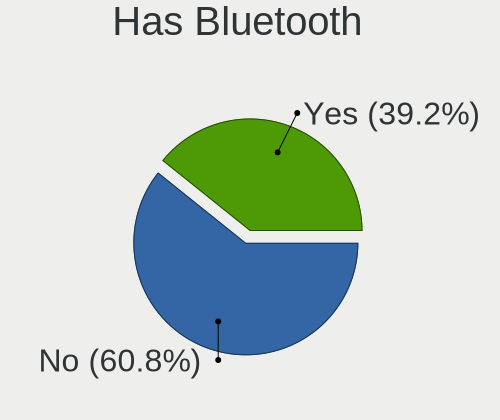
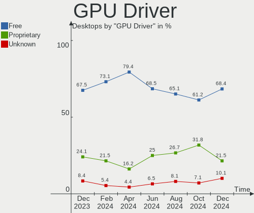
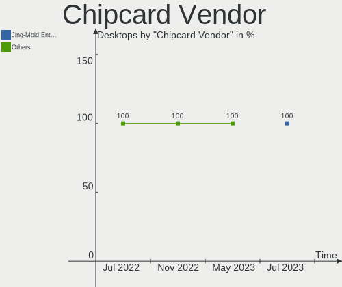

Zorin Hardware Trends (Desktops)
--------------------------------

A project to identify most popular hardware characteristics and track their change
over time based on data collected by Zorin users at https://Linux-Hardware.org.

Anyone can contribute to this report by the [hw-probe](https://github.com/linuxhw/hw-probe) tool:

    sudo -E hw-probe -all -upload

Full-feature report is available here: https://linux-hardware.org/?view=trends

Period: Nov, 2021.

Contents
--------

* [ System ](#system)
  - [ OS                       ](#os)
  - [ OS Family                ](#os-family)
  - [ Kernel                   ](#kernel)
  - [ Kernel Family            ](#kernel-family)
  - [ Kernel Major Ver.        ](#kernel-major-ver)
  - [ Arch                     ](#arch)
  - [ DE                       ](#de)
  - [ Display Server           ](#display-server)
  - [ Display Manager          ](#display-manager)
  - [ OS Lang                  ](#os-lang)
  - [ Boot Mode                ](#boot-mode)
  - [ Filesystem               ](#filesystem)
  - [ Part. scheme             ](#part-scheme)
  - [ Dual Boot with Linux/BSD ](#dual-boot-with-linuxbsd)
  - [ Dual Boot (Win)          ](#dual-boot-win)

* [ Board ](#board)
  - [ Vendor                   ](#vendor)
  - [ Model                    ](#model)
  - [ Model Family             ](#model-family)
  - [ MFG Year                 ](#mfg-year)
  - [ Form Factor              ](#form-factor)
  - [ Secure Boot              ](#secure-boot)
  - [ Coreboot                 ](#coreboot)
  - [ RAM Size                 ](#ram-size)
  - [ RAM Used                 ](#ram-used)
  - [ Total Drives             ](#total-drives)
  - [ Has CD-ROM               ](#has-cd-rom)
  - [ Has Ethernet             ](#has-ethernet)
  - [ Has WiFi                 ](#has-wifi)
  - [ Has Bluetooth            ](#has-bluetooth)

* [ Location ](#location)
  - [ Country                  ](#country)
  - [ City                     ](#city)

* [ Drives ](#drives)
  - [ Drive Vendor             ](#drive-vendor)
  - [ Drive Model              ](#drive-model)
  - [ HDD Vendor               ](#hdd-vendor)
  - [ SSD Vendor               ](#ssd-vendor)
  - [ Drive Kind               ](#drive-kind)
  - [ Drive Connector          ](#drive-connector)
  - [ Drive Size               ](#drive-size)
  - [ Space Total              ](#space-total)
  - [ Space Used               ](#space-used)
  - [ Malfunc. Drives          ](#malfunc-drives)
  - [ Malfunc. Drive Vendor    ](#malfunc-drive-vendor)
  - [ Malfunc. HDD Vendor      ](#malfunc-hdd-vendor)
  - [ Malfunc. Drive Kind      ](#malfunc-drive-kind)
  - [ Failed Drives            ](#failed-drives)
  - [ Failed Drive Vendor      ](#failed-drive-vendor)
  - [ Drive Status             ](#drive-status)

* [ Storage controller ](#storage-controller)
  - [ Storage Vendor           ](#storage-vendor)
  - [ Storage Model            ](#storage-model)
  - [ Storage Kind             ](#storage-kind)

* [ Processor ](#processor)
  - [ CPU Vendor               ](#cpu-vendor)
  - [ CPU Model                ](#cpu-model)
  - [ CPU Model Family         ](#cpu-model-family)
  - [ CPU Cores                ](#cpu-cores)
  - [ CPU Sockets              ](#cpu-sockets)
  - [ CPU Threads              ](#cpu-threads)
  - [ CPU Op-Modes             ](#cpu-op-modes)
  - [ CPU Microcode            ](#cpu-microcode)
  - [ CPU Microarch            ](#cpu-microarch)

* [ Graphics ](#graphics)
  - [ GPU Vendor               ](#gpu-vendor)
  - [ GPU Model                ](#gpu-model)
  - [ GPU Combo                ](#gpu-combo)
  - [ GPU Driver               ](#gpu-driver)
  - [ GPU Memory               ](#gpu-memory)

* [ Monitor ](#monitor)
  - [ Monitor Vendor           ](#monitor-vendor)
  - [ Monitor Model            ](#monitor-model)
  - [ Monitor Resolution       ](#monitor-resolution)
  - [ Monitor Diagonal         ](#monitor-diagonal)
  - [ Monitor Width            ](#monitor-width)
  - [ Aspect Ratio             ](#aspect-ratio)
  - [ Monitor Area             ](#monitor-area)
  - [ Pixel Density            ](#pixel-density)
  - [ Multiple Monitors        ](#multiple-monitors)

* [ Network ](#network)
  - [ Net Controller Vendor    ](#net-controller-vendor)
  - [ Net Controller Model     ](#net-controller-model)
  - [ Wireless Vendor          ](#wireless-vendor)
  - [ Wireless Model           ](#wireless-model)
  - [ Ethernet Vendor          ](#ethernet-vendor)
  - [ Ethernet Model           ](#ethernet-model)
  - [ Net Controller Kind      ](#net-controller-kind)
  - [ Used Controller          ](#used-controller)
  - [ NICs                     ](#nics)
  - [ IPv6                     ](#ipv6)

* [ Bluetooth ](#bluetooth)
  - [ Bluetooth Vendor         ](#bluetooth-vendor)
  - [ Bluetooth Model          ](#bluetooth-model)

* [ Sound ](#sound)
  - [ Sound Vendor             ](#sound-vendor)
  - [ Sound Model              ](#sound-model)

* [ Memory ](#memory)
  - [ Memory Vendor            ](#memory-vendor)
  - [ Memory Model             ](#memory-model)
  - [ Memory Kind              ](#memory-kind)
  - [ Memory Form Factor       ](#memory-form-factor)
  - [ Memory Size              ](#memory-size)
  - [ Memory Speed             ](#memory-speed)

* [ Printers & scanners ](#printers--scanners)
  - [ Printer Vendor           ](#printer-vendor)
  - [ Printer Model            ](#printer-model)
  - [ Scanner Vendor           ](#scanner-vendor)
  - [ Scanner Model            ](#scanner-model)

* [ Camera ](#camera)
  - [ Camera Vendor            ](#camera-vendor)
  - [ Camera Model             ](#camera-model)

* [ Security ](#security)
  - [ Fingerprint Vendor       ](#fingerprint-vendor)
  - [ Fingerprint Model        ](#fingerprint-model)
  - [ Chipcard Vendor          ](#chipcard-vendor)
  - [ Chipcard Model           ](#chipcard-model)

* [ Unsupported ](#unsupported)
  - [ Unsupported Devices      ](#unsupported-devices)
  - [ Unsupported Device Types ](#unsupported-device-types)

System
------

OS
--

Installed operating systems

| Name     | Desktops | Percent |
|----------|----------|---------|
| Zorin 16 | 77       | 90.59%  |
| Zorin 15 | 8        | 9.41%   |

OS Family
---------

OS without a version

| Name  | Desktops | Percent |
|-------|----------|---------|
| Zorin | 85       | 100%    |

Kernel
------

Version of the Linux kernel

| Version                   | Desktops | Percent |
|---------------------------|----------|---------|
| 5.11.0-40-generic         | 45       | 52.94%  |
| 5.11.0-38-generic         | 28       | 32.94%  |
| 5.4.0-90-generic          | 4        | 4.71%   |
| 5.4.0-89-generic          | 2        | 2.35%   |
| 5.11.0-41-generic         | 2        | 2.35%   |
| 5.4.0-74-generic          | 1        | 1.18%   |
| 5.15.0-3.2-liquorix-amd64 | 1        | 1.18%   |
| 5.11.0-37-generic         | 1        | 1.18%   |
| 5.11.0-27-generic         | 1        | 1.18%   |

Kernel Family
-------------

Linux kernel without a distro release

| Version | Desktops | Percent |
|---------|----------|---------|
| 5.11.0  | 77       | 90.59%  |
| 5.4.0   | 7        | 8.24%   |
| 5.15.0  | 1        | 1.18%   |

Kernel Major Ver.
-----------------

Linux kernel major version

| Version | Desktops | Percent |
|---------|----------|---------|
| 5.11    | 77       | 90.59%  |
| 5.4     | 7        | 8.24%   |
| 5.15    | 1        | 1.18%   |

Arch
----

OS architecture (x86_64, i586, etc.)

| Name   | Desktops | Percent |
|--------|----------|---------|
| x86_64 | 85       | 100%    |

DE
--

Desktop Environment

| Name  | Desktops | Percent |
|-------|----------|---------|
| GNOME | 81       | 95.29%  |
| XFCE  | 4        | 4.71%   |

Display Server
--------------

X11 or Wayland

| Name | Desktops | Percent |
|------|----------|---------|
| X11  | 85       | 100%    |

Display Manager
---------------

SDDM, LightDM, etc.

| Name    | Desktops | Percent |
|---------|----------|---------|
| Unknown | 68       | 80%     |
| GDM3    | 9        | 10.59%  |
| GDM     | 5        | 5.88%   |
| LightDM | 3        | 3.53%   |

OS Lang
-------

Language

| Lang  | Desktops | Percent |
|-------|----------|---------|
| en_US | 30       | 35.29%  |
| en_GB | 10       | 11.76%  |
| pt_BR | 7        | 8.24%   |
| de_DE | 7        | 8.24%   |
| en_CA | 5        | 5.88%   |
| it_IT | 3        | 3.53%   |
| fr_FR | 3        | 3.53%   |
| sl_SI | 2        | 2.35%   |
| ru_RU | 2        | 2.35%   |
| nl_NL | 2        | 2.35%   |
| hu_HU | 2        | 2.35%   |
| en_IN | 2        | 2.35%   |
| tr_TR | 1        | 1.18%   |
| sr_RS | 1        | 1.18%   |
| pl_PL | 1        | 1.18%   |
| nb_NO | 1        | 1.18%   |
| he_IL | 1        | 1.18%   |
| es_MX | 1        | 1.18%   |
| es_ES | 1        | 1.18%   |
| es_AR | 1        | 1.18%   |
| en_ZA | 1        | 1.18%   |
| el_GR | 1        | 1.18%   |

Boot Mode
---------

EFI or BIOS

| Mode | Desktops | Percent |
|------|----------|---------|
| BIOS | 53       | 62.35%  |
| EFI  | 32       | 37.65%  |

Filesystem
----------

Type of filesystem

| Type    | Desktops | Percent |
|---------|----------|---------|
| Ext4    | 82       | 96.47%  |
| Zfs     | 2        | 2.35%   |
| Overlay | 1        | 1.18%   |

Part. scheme
------------

Scheme of partitioning

| Type    | Desktops | Percent |
|---------|----------|---------|
| Unknown | 80       | 94.12%  |
| GPT     | 3        | 3.53%   |
| MBR     | 2        | 2.35%   |

Dual Boot with Linux/BSD
------------------------

Hosting more than one Linux/BSD

| Dual boot | Desktops | Percent |
|-----------|----------|---------|
| No        | 80       | 94.12%  |
| Yes       | 5        | 5.88%   |

Dual Boot (Win)
---------------

Hosting Linux and Windows

| Dual boot | Desktops | Percent |
|-----------|----------|---------|
| No        | 75       | 88.24%  |
| Yes       | 10       | 11.76%  |

Board
-----

Vendor
------

Motherboard manufacturer

| Name                | Desktops | Percent |
|---------------------|----------|---------|
| ASUSTek Computer    | 17       | 20%     |
| Gigabyte Technology | 16       | 18.82%  |
| Dell                | 13       | 15.29%  |
| Hewlett-Packard     | 10       | 11.76%  |
| ASRock              | 10       | 11.76%  |
| MSI                 | 9        | 10.59%  |
| Lenovo              | 2        | 2.35%   |
| Fujitsu             | 2        | 2.35%   |
| Pegatron            | 1        | 1.18%   |
| Medion              | 1        | 1.18%   |
| LattePanda          | 1        | 1.18%   |
| Intel               | 1        | 1.18%   |
| Foxconn             | 1        | 1.18%   |
| ECS                 | 1        | 1.18%   |

Model
-----

Motherboard model

| Name                                    | Desktops | Percent |
|-----------------------------------------|----------|---------|
| Dell OptiPlex 7010                      | 3        | 3.53%   |
| MSI MS-7C02                             | 2        | 2.35%   |
| Dell OptiPlex 990                       | 2        | 2.35%   |
| Dell OptiPlex 790                       | 2        | 2.35%   |
| ASUS P8Z77-V LX                         | 2        | 2.35%   |
| ASUS M5A78L-M/USB3                      | 2        | 2.35%   |
| ASUS A68HM-PLUS                         | 2        | 2.35%   |
| Pegatron SAISHIAT2                      | 1        | 1.18%   |
| MSI p6745nl                             | 1        | 1.18%   |
| MSI MS-7B89                             | 1        | 1.18%   |
| MSI MS-7B85                             | 1        | 1.18%   |
| MSI MS-7B53                             | 1        | 1.18%   |
| MSI MS-7A33                             | 1        | 1.18%   |
| MSI MS-7693                             | 1        | 1.18%   |
| MSI MS-7592                             | 1        | 1.18%   |
| Medion MS-7707                          | 1        | 1.18%   |
| Lenovo Legion C530-19ICB 90JX0040GE     | 1        | 1.18%   |
| Lenovo IdeaCentre 310S-08ASR 90G9002VUK | 1        | 1.18%   |
| LattePanda Alpha                        | 1        | 1.18%   |
| Intel DB65AL AAG12530-309               | 1        | 1.18%   |
| HP Z220 CMT Workstation                 | 1        | 1.18%   |
| HP xw8600 Workstation                   | 1        | 1.18%   |
| HP ProDesk 600 G1 SFF                   | 1        | 1.18%   |
| HP Pavilion Gaming Desktop TG01-0xxx    | 1        | 1.18%   |
| HP EliteDesk 800 G3 SFF                 | 1        | 1.18%   |
| HP EliteDesk 800 G1 TWR                 | 1        | 1.18%   |
| HP EliteDesk 800 G1 DM                  | 1        | 1.18%   |
| HP Compaq Pro 6300 SFF                  | 1        | 1.18%   |
| HP Compaq dc7800p Ultra-slim Desktop    | 1        | 1.18%   |
| HP Compaq 6000 Pro MT PC                | 1        | 1.18%   |
| Gigabyte Z97X-UD7 TH                    | 1        | 1.18%   |
| Gigabyte X470 AORUS GAMING 7 WIFI       | 1        | 1.18%   |
| Gigabyte H61N-USB3                      | 1        | 1.18%   |
| Gigabyte H57M-USB3                      | 1        | 1.18%   |
| Gigabyte H55M-UD2H                      | 1        | 1.18%   |
| Gigabyte H170-D3HP                      | 1        | 1.18%   |
| Gigabyte GA-VM900M                      | 1        | 1.18%   |
| Gigabyte GA-E6010N                      | 1        | 1.18%   |
| Gigabyte G41MT-S2                       | 1        | 1.18%   |
| Gigabyte G31M-ES2L                      | 1        | 1.18%   |
| Gigabyte F2A78M-D3H                     | 1        | 1.18%   |
| Gigabyte B75M-D3H                       | 1        | 1.18%   |
| Gigabyte B450M GAMING                   | 1        | 1.18%   |
| Gigabyte B450 AORUS PRO                 | 1        | 1.18%   |
| Gigabyte B450 AORUS M                   | 1        | 1.18%   |
| Gigabyte 327-396                        | 1        | 1.18%   |
| Fujitsu ESPRIMO P720                    | 1        | 1.18%   |
| Fujitsu D2950-A1                        | 1        | 1.18%   |
| Foxconn H61M/H61M-S                     | 1        | 1.18%   |
| ECS GeForce6100PM-M2                    | 1        | 1.18%   |
| Dell XPS710                             | 1        | 1.18%   |
| Dell XPS 8700                           | 1        | 1.18%   |
| Dell OptiPlex 780                       | 1        | 1.18%   |
| Dell OptiPlex 755                       | 1        | 1.18%   |
| Dell OptiPlex 7040                      | 1        | 1.18%   |
| Dell OptiPlex 3020                      | 1        | 1.18%   |
| ASUS ROG STRIX B450-F GAMING II         | 1        | 1.18%   |
| ASUS PRIME Z590M-PLUS                   | 1        | 1.18%   |
| ASUS PRIME H410M-A                      | 1        | 1.18%   |
| ASUS P5PL2-E                            | 1        | 1.18%   |

Model Family
------------

Motherboard model prefix

| Name                 | Desktops | Percent |
|----------------------|----------|---------|
| Dell OptiPlex        | 11       | 12.94%  |
| HP EliteDesk         | 3        | 3.53%   |
| HP Compaq            | 3        | 3.53%   |
| ASUS M5A78L-M        | 3        | 3.53%   |
| MSI MS-7C02          | 2        | 2.35%   |
| Gigabyte B450        | 2        | 2.35%   |
| ASUS PRIME           | 2        | 2.35%   |
| ASUS P8Z77-V         | 2        | 2.35%   |
| ASUS A68HM-PLUS      | 2        | 2.35%   |
| ASRock B450M         | 2        | 2.35%   |
| Pegatron SAISHIAT2   | 1        | 1.18%   |
| MSI p6745nl          | 1        | 1.18%   |
| MSI MS-7B89          | 1        | 1.18%   |
| MSI MS-7B85          | 1        | 1.18%   |
| MSI MS-7B53          | 1        | 1.18%   |
| MSI MS-7A33          | 1        | 1.18%   |
| MSI MS-7693          | 1        | 1.18%   |
| MSI MS-7592          | 1        | 1.18%   |
| Medion MS-7707       | 1        | 1.18%   |
| Lenovo Legion        | 1        | 1.18%   |
| Lenovo IdeaCentre    | 1        | 1.18%   |
| LattePanda Alpha     | 1        | 1.18%   |
| Intel DB65AL         | 1        | 1.18%   |
| HP Z220              | 1        | 1.18%   |
| HP xw8600            | 1        | 1.18%   |
| HP ProDesk           | 1        | 1.18%   |
| HP Pavilion          | 1        | 1.18%   |
| Gigabyte Z97X-UD7    | 1        | 1.18%   |
| Gigabyte X470        | 1        | 1.18%   |
| Gigabyte H61N-USB3   | 1        | 1.18%   |
| Gigabyte H57M-USB3   | 1        | 1.18%   |
| Gigabyte H55M-UD2H   | 1        | 1.18%   |
| Gigabyte H170-D3HP   | 1        | 1.18%   |
| Gigabyte GA-VM900M   | 1        | 1.18%   |
| Gigabyte GA-E6010N   | 1        | 1.18%   |
| Gigabyte G41MT-S2    | 1        | 1.18%   |
| Gigabyte G31M-ES2L   | 1        | 1.18%   |
| Gigabyte F2A78M-D3H  | 1        | 1.18%   |
| Gigabyte B75M-D3H    | 1        | 1.18%   |
| Gigabyte B450M       | 1        | 1.18%   |
| Gigabyte 327-396     | 1        | 1.18%   |
| Fujitsu ESPRIMO      | 1        | 1.18%   |
| Fujitsu D2950-A1     | 1        | 1.18%   |
| Foxconn H61M         | 1        | 1.18%   |
| ECS GeForce6100PM-M2 | 1        | 1.18%   |
| Dell XPS710          | 1        | 1.18%   |
| Dell XPS             | 1        | 1.18%   |
| ASUS ROG             | 1        | 1.18%   |
| ASUS P5PL2-E         | 1        | 1.18%   |
| ASUS P5KPL-AM        | 1        | 1.18%   |
| ASUS P5G41T-M        | 1        | 1.18%   |
| ASUS M5A78L          | 1        | 1.18%   |
| ASUS M4A78T-E        | 1        | 1.18%   |
| ASUS M11AD           | 1        | 1.18%   |
| ASUS All             | 1        | 1.18%   |
| ASRock X370M-HDV     | 1        | 1.18%   |
| ASRock P67           | 1        | 1.18%   |
| ASRock H67DE3        | 1        | 1.18%   |
| ASRock G31M-VS2      | 1        | 1.18%   |
| ASRock FM2A55M-HD+   | 1        | 1.18%   |

MFG Year
--------

Motherboard manufacture year

| Year | Desktops | Percent |
|------|----------|---------|
| 2018 | 11       | 12.94%  |
| 2021 | 9        | 10.59%  |
| 2012 | 9        | 10.59%  |
| 2010 | 9        | 10.59%  |
| 2014 | 7        | 8.24%   |
| 2011 | 7        | 8.24%   |
| 2019 | 6        | 7.06%   |
| 2015 | 6        | 7.06%   |
| 2013 | 6        | 7.06%   |
| 2020 | 5        | 5.88%   |
| 2007 | 3        | 3.53%   |
| 2016 | 2        | 2.35%   |
| 2009 | 2        | 2.35%   |
| 2006 | 2        | 2.35%   |
| 2008 | 1        | 1.18%   |

Form Factor
-----------

Physical design of the computer

| Name    | Desktops | Percent |
|---------|----------|---------|
| Desktop | 85       | 100%    |

Secure Boot
-----------

Enabled or disabled

| State    | Desktops | Percent |
|----------|----------|---------|
| Disabled | 80       | 94.12%  |
| Enabled  | 5        | 5.88%   |

Coreboot
--------

Have coreboot on board

| Used | Desktops | Percent |
|------|----------|---------|
| No   | 85       | 100%    |

RAM Size
--------

Total RAM memory

| Size in GB  | Desktops | Percent |
|-------------|----------|---------|
| 16.01-24.0  | 24       | 28.24%  |
| 8.01-16.0   | 20       | 23.53%  |
| 3.01-4.0    | 14       | 16.47%  |
| 4.01-8.0    | 10       | 11.76%  |
| 32.01-64.0  | 8        | 9.41%   |
| 1.01-2.0    | 5        | 5.88%   |
| 24.01-32.0  | 2        | 2.35%   |
| 2.01-3.0    | 1        | 1.18%   |
| 64.01-256.0 | 1        | 1.18%   |

RAM Used
--------

Used RAM memory

| Used GB  | Desktops | Percent |
|----------|----------|---------|
| 1.01-2.0 | 42       | 49.41%  |
| 2.01-3.0 | 20       | 23.53%  |
| 4.01-8.0 | 13       | 15.29%  |
| 3.01-4.0 | 9        | 10.59%  |
| 0.51-1.0 | 1        | 1.18%   |

Total Drives
------------

Number of drives on board

| Drives | Desktops | Percent |
|--------|----------|---------|
| 1      | 39       | 45.88%  |
| 2      | 23       | 27.06%  |
| 3      | 9        | 10.59%  |
| 6      | 6        | 7.06%   |
| 4      | 5        | 5.88%   |
| 7      | 1        | 1.18%   |
| 5      | 1        | 1.18%   |
| 0      | 1        | 1.18%   |

Has CD-ROM
----------

Has CD-ROM on board

| Presented | Desktops | Percent |
|-----------|----------|---------|
| No        | 44       | 51.76%  |
| Yes       | 41       | 48.24%  |

Has Ethernet
------------

Has Ethernet on board

| Presented | Desktops | Percent |
|-----------|----------|---------|
| Yes       | 85       | 100%    |

Has WiFi
--------

Has WiFi module

| Presented | Desktops | Percent |
|-----------|----------|---------|
| No        | 45       | 52.94%  |
| Yes       | 40       | 47.06%  |

Has Bluetooth
-------------

Has Bluetooth module

| Presented | Desktops | Percent |
|-----------|----------|---------|
| No        | 64       | 75.29%  |
| Yes       | 21       | 24.71%  |

Location
--------

Country
-------

Geographic location (country)

| Country      | Desktops | Percent |
|--------------|----------|---------|
| USA          | 22       | 25.88%  |
| UK           | 11       | 12.94%  |
| Germany      | 8        | 9.41%   |
| Brazil       | 7        | 8.24%   |
| Canada       | 5        | 5.88%   |
| Netherlands  | 3        | 3.53%   |
| Italy        | 3        | 3.53%   |
| Slovenia     | 2        | 2.35%   |
| Russia       | 2        | 2.35%   |
| Norway       | 2        | 2.35%   |
| India        | 2        | 2.35%   |
| Hungary      | 2        | 2.35%   |
| France       | 2        | 2.35%   |
| Vietnam      | 1        | 1.18%   |
| Ukraine      | 1        | 1.18%   |
| Turkey       | 1        | 1.18%   |
| Spain        | 1        | 1.18%   |
| South Africa | 1        | 1.18%   |
| Serbia       | 1        | 1.18%   |
| Portugal     | 1        | 1.18%   |
| Poland       | 1        | 1.18%   |
| Mexico       | 1        | 1.18%   |
| Israel       | 1        | 1.18%   |
| Denmark      | 1        | 1.18%   |
| Croatia      | 1        | 1.18%   |
| Argentina    | 1        | 1.18%   |
| Algeria      | 1        | 1.18%   |

City
----

Geographic location (city)

| City                | Desktops | Percent |
|---------------------|----------|---------|
| Stoke-on-Trent      | 2        | 2.35%   |
| Munich              | 2        | 2.35%   |
| Bryan               | 2        | 2.35%   |
| Zagreb              | 1        | 1.18%   |
| Yenakiieve          | 1        | 1.18%   |
| Wysoka Glogowska    | 1        | 1.18%   |
| Winnipeg            | 1        | 1.18%   |
| Wigan               | 1        | 1.18%   |
| Warner Robins       | 1        | 1.18%   |
| Victoria            | 1        | 1.18%   |
| Vechelde            | 1        | 1.18%   |
| Twickenham          | 1        | 1.18%   |
| Tel Aviv            | 1        | 1.18%   |
| Suldalsosen         | 1        | 1.18%   |
| St Petersburg       | 1        | 1.18%   |
| Spring Hill         | 1        | 1.18%   |
| Southend-on-Sea     | 1        | 1.18%   |
| Skien               | 1        | 1.18%   |
| Sherbrooke          | 1        | 1.18%   |
| Sertaozinho         | 1        | 1.18%   |
| S??o Paulo          | 1        | 1.18%   |
| Savannah            | 1        | 1.18%   |
| Santa Clara         | 1        | 1.18%   |
| San Jose            | 1        | 1.18%   |
| Roteglia            | 1        | 1.18%   |
| Riverview           | 1        | 1.18%   |
| Pragersko           | 1        | 1.18%   |
| Porto               | 1        | 1.18%   |
| Portland            | 1        | 1.18%   |
| Phoenix             | 1        | 1.18%   |
| Peoria              | 1        | 1.18%   |
| Pedro Leopoldo      | 1        | 1.18%   |
| Padova              | 1        | 1.18%   |
| Oxford              | 1        | 1.18%   |
| Orlando             | 1        | 1.18%   |
| Novi Sad            | 1        | 1.18%   |
| Nijmegen            | 1        | 1.18%   |
| New Bedford         | 1        | 1.18%   |
| Moscow              | 1        | 1.18%   |
| Montreuil           | 1        | 1.18%   |
| Montreal            | 1        | 1.18%   |
| Martinsburg         | 1        | 1.18%   |
| Limburg an der Lahn | 1        | 1.18%   |
| Leeds               | 1        | 1.18%   |
| Leatherhead         | 1        | 1.18%   |
| League City         | 1        | 1.18%   |
| Laval               | 1        | 1.18%   |
| Kranjska Gora       | 1        | 1.18%   |
| K??ge               | 1        | 1.18%   |
| Kanpur              | 1        | 1.18%   |
| Jericho             | 1        | 1.18%   |
| Jaguariuna          | 1        | 1.18%   |
| Inverness           | 1        | 1.18%   |
| Ilhota              | 1        | 1.18%   |
| Huelva              | 1        | 1.18%   |
| Ho Chi Minh City    | 1        | 1.18%   |
| Herriman            | 1        | 1.18%   |
| Gurgaon             | 1        | 1.18%   |
| Groningen           | 1        | 1.18%   |
| Gladenbach          | 1        | 1.18%   |

Drives
------

Drive Vendor
------------

Hard drive vendors

| Vendor                    | Desktops | Drives | Percent |
|---------------------------|----------|--------|---------|
| Seagate                   | 33       | 42     | 21.57%  |
| WDC                       | 32       | 42     | 20.92%  |
| Samsung Electronics       | 19       | 22     | 12.42%  |
| SanDisk                   | 12       | 12     | 7.84%   |
| Kingston                  | 9        | 11     | 5.88%   |
| Hitachi                   | 9        | 10     | 5.88%   |
| Toshiba                   | 7        | 8      | 4.58%   |
| Silicon Motion            | 3        | 3      | 1.96%   |
| Crucial                   | 3        | 3      | 1.96%   |
| China                     | 3        | 3      | 1.96%   |
| SK Hynix                  | 2        | 3      | 1.31%   |
| PNY                       | 2        | 2      | 1.31%   |
| Intel                     | 2        | 2      | 1.31%   |
| XrayDisk                  | 1        | 1      | 0.65%   |
| Unknown                   | 1        | 2      | 0.65%   |
| SuperSSpeed               | 1        | 1      | 0.65%   |
| SPCC                      | 1        | 1      | 0.65%   |
| ORTIAL                    | 1        | 1      | 0.65%   |
| Micron/Crucial Technology | 1        | 1      | 0.65%   |
| Micron Technology         | 1        | 1      | 0.65%   |
| MAXTOR                    | 1        | 1      | 0.65%   |
| Lexar                     | 1        | 1      | 0.65%   |
| JMicron                   | 1        | 1      | 0.65%   |
| HS-SSD-C100               | 1        | 1      | 0.65%   |
| HGST                      | 1        | 1      | 0.65%   |
| Hewlett-Packard           | 1        | 1      | 0.65%   |
| Gigabyte Technology       | 1        | 1      | 0.65%   |
| Dogfish                   | 1        | 1      | 0.65%   |
| Corsair                   | 1        | 1      | 0.65%   |
| A-DATA Technology         | 1        | 1      | 0.65%   |

Drive Model
-----------

Hard drive models

| Model                            | Desktops | Percent |
|----------------------------------|----------|---------|
| Kingston SA400S37240G 240GB SSD  | 5        | 2.81%   |
| Seagate ST500DM002-1BD142 500GB  | 4        | 2.25%   |
| Seagate ST3500418AS 500GB        | 4        | 2.25%   |
| Seagate ST3500413AS 500GB        | 3        | 1.69%   |
| Seagate ST2000DM008-2FR102 2TB   | 3        | 1.69%   |
| WDC WD10EZEX-08WN4A0 1TB         | 2        | 1.12%   |
| WDC WD10EZEX-00BN5A0 1TB         | 2        | 1.12%   |
| WDC WD10EARS-00Y5B1 1TB          | 2        | 1.12%   |
| Seagate ST1000DM003-1CH162 1TB   | 2        | 1.12%   |
| Seagate Expansion 1TB            | 2        | 1.12%   |
| SanDisk SDSSDXPS240G 240GB       | 2        | 1.12%   |
| Sandisk NVMe SSD Drive 500GB     | 2        | 1.12%   |
| Samsung SSD 860 EVO 500GB        | 2        | 1.12%   |
| Samsung NVMe SSD Drive 500GB     | 2        | 1.12%   |
| Samsung NVMe SSD Drive 1TB       | 2        | 1.12%   |
| Samsung HD103UJ 1TB              | 2        | 1.12%   |
| PNY CS900 240GB SSD              | 2        | 1.12%   |
| Crucial CT500MX500SSD1 500GB     | 2        | 1.12%   |
| XrayDisk 256GB                   | 1        | 0.56%   |
| WDC WDS250G2B0A-00SM50 250GB SSD | 1        | 0.56%   |
| WDC WDS240G2G0A-00JH30 240GB SSD | 1        | 0.56%   |
| WDC WD800AAJS-60WAA0 80GB        | 1        | 0.56%   |
| WDC WD6400AARS-00Y5B1 640GB      | 1        | 0.56%   |
| WDC WD6400AAKS-22A7B2 640GB      | 1        | 0.56%   |
| WDC WD6400AAKS-00A7B2 640GB      | 1        | 0.56%   |
| WDC WD5003AZEX-00K1GA0 500GB     | 1        | 0.56%   |
| WDC WD5000AZLX-08K2TA0 500GB     | 1        | 0.56%   |
| WDC WD5000AAKX-001CA0 500GB      | 1        | 0.56%   |
| WDC WD5000AAKS-00V1A0 500GB      | 1        | 0.56%   |
| WDC WD4005FZBX-00K5WB0 4TB       | 1        | 0.56%   |
| WDC WD4003FFBX-68MU3N0 4TB       | 1        | 0.56%   |
| WDC WD3200BEVT-63ZCT0 320GB      | 1        | 0.56%   |
| WDC WD3200AAKS-22B3A0 320GB      | 1        | 0.56%   |
| WDC WD3200AAJS-08B4A0 320GB      | 1        | 0.56%   |
| WDC WD30PURX-64P6ZY0 3TB         | 1        | 0.56%   |
| WDC WD30EURS-63SPKY0 3TB         | 1        | 0.56%   |
| WDC WD2500AAJS-40RYA0 250GB      | 1        | 0.56%   |
| WDC WD20EZAZ-00GGJB0 2TB         | 1        | 0.56%   |
| WDC WD1600BEVT-22ZCT0 160GB      | 1        | 0.56%   |
| WDC WD1600AAJS-60Z0A0 160GB      | 1        | 0.56%   |
| WDC WD1600AABS-56PRA0 160GB      | 1        | 0.56%   |
| WDC WD1600AABS-00PRA0 160GB      | 1        | 0.56%   |
| WDC WD15EARS-00MVWB0 1TB         | 1        | 0.56%   |
| WDC WD1200BEVS-22UST0 120GB      | 1        | 0.56%   |
| WDC WD10JPVX-80JC3T0 1TB         | 1        | 0.56%   |
| WDC WD10JPVX-00JC3T0 1TB         | 1        | 0.56%   |
| WDC WD10EZEX-08M2NA0 1TB         | 1        | 0.56%   |
| WDC WD10EZEX-00WN4A0 1TB         | 1        | 0.56%   |
| WDC WD10EAVS-00D7B1 1TB          | 1        | 0.56%   |
| WDC WD10EARS-00MVWB0 1TB         | 1        | 0.56%   |
| WDC WD10EALX-009BA0 1TB          | 1        | 0.56%   |
| WDC WD10EADX-22TDHB0 1TB         | 1        | 0.56%   |
| WDC WD10EADS-11M2B2 1TB          | 1        | 0.56%   |
| WDC WD1003FZEX-00MK2A0 1TB       | 1        | 0.56%   |
| Unknown SD/MMC 16GB              | 1        | 0.56%   |
| Unknown M.S./M.S.Pro/HG 16GB     | 1        | 0.56%   |
| Toshiba TR200 240GB SSD          | 1        | 0.56%   |
| Toshiba MQ01ABF050 500GB         | 1        | 0.56%   |
| Toshiba MK7559GSXF 752GB         | 1        | 0.56%   |
| Toshiba MK4055GSX 400GB          | 1        | 0.56%   |

HDD Vendor
----------

Hard disk drive vendors

| Vendor              | Desktops | Drives | Percent |
|---------------------|----------|--------|---------|
| Seagate             | 33       | 39     | 37.93%  |
| WDC                 | 31       | 40     | 35.63%  |
| Hitachi             | 9        | 10     | 10.34%  |
| Toshiba             | 6        | 7      | 6.9%    |
| Samsung Electronics | 6        | 9      | 6.9%    |
| MAXTOR              | 1        | 1      | 1.15%   |
| HGST                | 1        | 1      | 1.15%   |

SSD Vendor
----------

Solid state drive vendors

| Vendor              | Desktops | Drives | Percent |
|---------------------|----------|--------|---------|
| SanDisk             | 9        | 9      | 17.31%  |
| Samsung Electronics | 9        | 9      | 17.31%  |
| Kingston            | 9        | 11     | 17.31%  |
| Crucial             | 3        | 3      | 5.77%   |
| China               | 3        | 3      | 5.77%   |
| WDC                 | 2        | 2      | 3.85%   |
| PNY                 | 2        | 2      | 3.85%   |
| Intel               | 2        | 2      | 3.85%   |
| Toshiba             | 1        | 1      | 1.92%   |
| SuperSSpeed         | 1        | 1      | 1.92%   |
| SPCC                | 1        | 1      | 1.92%   |
| Seagate             | 1        | 1      | 1.92%   |
| ORTIAL              | 1        | 1      | 1.92%   |
| Micron Technology   | 1        | 1      | 1.92%   |
| Lexar               | 1        | 1      | 1.92%   |
| JMicron             | 1        | 1      | 1.92%   |
| Hewlett-Packard     | 1        | 1      | 1.92%   |
| Gigabyte Technology | 1        | 1      | 1.92%   |
| Dogfish             | 1        | 1      | 1.92%   |
| Corsair             | 1        | 1      | 1.92%   |
| A-DATA Technology   | 1        | 1      | 1.92%   |

Drive Kind
----------

HDD or SSD

| Kind    | Desktops | Drives | Percent |
|---------|----------|--------|---------|
| HDD     | 65       | 107    | 52.85%  |
| SSD     | 42       | 54     | 34.15%  |
| NVMe    | 12       | 14     | 9.76%   |
| Unknown | 4        | 6      | 3.25%   |

Drive Connector
---------------

SATA, SAS, NVMe, etc.

| Type | Desktops | Drives | Percent |
|------|----------|--------|---------|
| SATA | 82       | 158    | 82.83%  |
| NVMe | 12       | 14     | 12.12%  |
| SAS  | 5        | 9      | 5.05%   |

Drive Size
----------

Size of hard drive

| Size in TB | Desktops | Drives | Percent |
|------------|----------|--------|---------|
| 0.01-0.5   | 60       | 88     | 53.1%   |
| 0.51-1.0   | 37       | 53     | 32.74%  |
| 1.01-2.0   | 7        | 9      | 6.19%   |
| 3.01-4.0   | 5        | 6      | 4.42%   |
| 2.01-3.0   | 2        | 3      | 1.77%   |
| 4.01-10.0  | 2        | 2      | 1.77%   |

Space Total
-----------

Amount of disk space available on the file system

| Size in GB     | Desktops | Percent |
|----------------|----------|---------|
| 251-500        | 19       | 22.35%  |
| 101-250        | 19       | 22.35%  |
| 501-1000       | 14       | 16.47%  |
| 1001-2000      | 9        | 10.59%  |
| 51-100         | 9        | 10.59%  |
| More than 3000 | 8        | 9.41%   |
| 21-50          | 3        | 3.53%   |
| 2001-3000      | 2        | 2.35%   |
| 1-20           | 1        | 1.18%   |
| Unknown        | 1        | 1.18%   |

Space Used
----------

Amount of used disk space

| Used GB        | Desktops | Percent |
|----------------|----------|---------|
| 1-20           | 26       | 30.59%  |
| 21-50          | 20       | 23.53%  |
| 51-100         | 13       | 15.29%  |
| 101-250        | 6        | 7.06%   |
| 501-1000       | 6        | 7.06%   |
| 1001-2000      | 5        | 5.88%   |
| More than 3000 | 4        | 4.71%   |
| 251-500        | 3        | 3.53%   |
| 2001-3000      | 1        | 1.18%   |
| Unknown        | 1        | 1.18%   |

Malfunc. Drives
---------------

Drive models with a malfunction

| Model                       | Desktops | Drives | Percent |
|-----------------------------|----------|--------|---------|
| WDC WD3200AAKS-22B3A0 320GB | 1        | 1      | 33.33%  |
| Seagate ST3500514NS 500GB   | 1        | 1      | 33.33%  |
| Seagate ST3320620AS 320GB   | 1        | 1      | 33.33%  |

Malfunc. Drive Vendor
---------------------

Vendors of faulty drives

| Vendor  | Desktops | Drives | Percent |
|---------|----------|--------|---------|
| WDC     | 1        | 1      | 50%     |
| Seagate | 1        | 2      | 50%     |

Malfunc. HDD Vendor
-------------------

Vendors of faulty HDD drives

| Vendor  | Desktops | Drives | Percent |
|---------|----------|--------|---------|
| WDC     | 1        | 1      | 50%     |
| Seagate | 1        | 2      | 50%     |

Malfunc. Drive Kind
-------------------

Kinds of faulty drives

| Kind | Desktops | Drives | Percent |
|------|----------|--------|---------|
| HDD  | 1        | 3      | 100%    |

Failed Drives
-------------

Failed drive models

Zero info for selected period =(

Failed Drive Vendor
-------------------

Failed drive vendors

Zero info for selected period =(

Drive Status
------------

Number of failed and malfunc. drives

| Status   | Desktops | Drives | Percent |
|----------|----------|--------|---------|
| Detected | 79       | 165    | 90.8%   |
| Works    | 7        | 13     | 8.05%   |
| Malfunc  | 1        | 3      | 1.15%   |

Storage controller
------------------

Storage Vendor
--------------

Storage controller vendors

| Vendor                    | Desktops | Percent |
|---------------------------|----------|---------|
| Intel                     | 52       | 49.06%  |
| AMD                       | 27       | 25.47%  |
| Samsung Electronics       | 4        | 3.77%   |
| Nvidia                    | 4        | 3.77%   |
| Silicon Motion            | 3        | 2.83%   |
| Sandisk                   | 3        | 2.83%   |
| Marvell Technology Group  | 3        | 2.83%   |
| VIA Technologies          | 2        | 1.89%   |
| SK Hynix                  | 2        | 1.89%   |
| JMicron Technology        | 2        | 1.89%   |
| ASMedia Technology        | 2        | 1.89%   |
| Micron/Crucial Technology | 1        | 0.94%   |
| Broadcom / LSI            | 1        | 0.94%   |

Storage Model
-------------

Storage controller models

| Model                                                                                   | Desktops | Percent |
|-----------------------------------------------------------------------------------------|----------|---------|
| AMD FCH SATA Controller [AHCI mode]                                                     | 15       | 10.34%  |
| AMD 400 Series Chipset SATA Controller                                                  | 11       | 7.59%   |
| Intel NM10/ICH7 Family SATA Controller [IDE mode]                                       | 8        | 5.52%   |
| Intel 8 Series/C220 Series Chipset Family 6-port SATA Controller 1 [AHCI mode]          | 8        | 5.52%   |
| Intel 7 Series/C210 Series Chipset Family 6-port SATA Controller [AHCI mode]            | 8        | 5.52%   |
| Intel 82801G (ICH7 Family) IDE Controller                                               | 6        | 4.14%   |
| Intel 6 Series/C200 Series Chipset Family 6 port Desktop SATA AHCI Controller           | 6        | 4.14%   |
| AMD SB7x0/SB8x0/SB9x0 IDE Controller                                                    | 6        | 4.14%   |
| Samsung NVMe SSD Controller SM981/PM981/PM983                                           | 4        | 2.76%   |
| Intel SATA Controller [RAID mode]                                                       | 4        | 2.76%   |
| AMD SB7x0/SB8x0/SB9x0 SATA Controller [AHCI mode]                                       | 4        | 2.76%   |
| AMD SB7x0/SB8x0/SB9x0 SATA Controller [IDE mode]                                        | 3        | 2.07%   |
| SK Hynix BC501 NVMe Solid State Drive                                                   | 2        | 1.38%   |
| Silicon Motion Non-Volatile memory controller                                           | 2        | 1.38%   |
| Sandisk Non-Volatile memory controller                                                  | 2        | 1.38%   |
| Nvidia MCP61 SATA Controller                                                            | 2        | 1.38%   |
| Nvidia MCP61 IDE                                                                        | 2        | 1.38%   |
| Marvell Group 88SE9215 PCIe 2.0 x1 4-port SATA 6 Gb/s Controller                        | 2        | 1.38%   |
| Marvell Group 88SE9120 SATA 6Gb/s Controller                                            | 2        | 1.38%   |
| Intel Q170/Q150/B150/H170/H110/Z170/CM236 Chipset SATA Controller [AHCI Mode]           | 2        | 1.38%   |
| Intel Cannon Lake PCH SATA AHCI Controller                                              | 2        | 1.38%   |
| Intel 82Q35 Express PT IDER Controller                                                  | 2        | 1.38%   |
| Intel 6 Series/C200 Series Chipset Family Desktop SATA Controller (IDE mode, ports 4-5) | 2        | 1.38%   |
| Intel 6 Series/C200 Series Chipset Family Desktop SATA Controller (IDE mode, ports 0-3) | 2        | 1.38%   |
| Intel 5 Series/3400 Series Chipset 4 port SATA IDE Controller                           | 2        | 1.38%   |
| Intel 5 Series/3400 Series Chipset 2 port SATA IDE Controller                           | 2        | 1.38%   |
| AMD X370 Series Chipset SATA Controller                                                 | 2        | 1.38%   |
| VIA VT82C586A/B/VT82C686/A/B/VT823x/A/C PIPC Bus Master IDE                             | 1        | 0.69%   |
| VIA VT8237/8251 Serial ATA Controller                                                   | 1        | 0.69%   |
| VIA VT6421 IDE/SATA Controller                                                          | 1        | 0.69%   |
| Silicon Motion SM2262/SM2262EN SSD Controller                                           | 1        | 0.69%   |
| Sandisk WD Blue SN550 NVMe SSD                                                          | 1        | 0.69%   |
| Nvidia MCP55 SATA Controller                                                            | 1        | 0.69%   |
| Nvidia MCP55 IDE                                                                        | 1        | 0.69%   |
| Nvidia GeForce 7100/nForce 630i SATA                                                    | 1        | 0.69%   |
| Micron/Crucial NVMe Controller                                                          | 1        | 0.69%   |
| Marvell Group 88SE9172 SATA 6Gb/s Controller                                            | 1        | 0.69%   |
| Marvell Group 88SE912x IDE Controller                                                   | 1        | 0.69%   |
| JMicron JMB368 IDE controller                                                           | 1        | 0.69%   |
| JMicron JMB363 SATA/IDE Controller                                                      | 1        | 0.69%   |
| Intel 9 Series Chipset Family SATA Controller [AHCI Mode]                               | 1        | 0.69%   |
| Intel 82801JD/DO (ICH10 Family) SATA AHCI Controller                                    | 1        | 0.69%   |
| Intel 82801IR/IO/IH (ICH9R/DO/DH) 6 port SATA Controller [AHCI mode]                    | 1        | 0.69%   |
| Intel 82801IR/IO/IH (ICH9R/DO/DH) 4 port SATA Controller [IDE mode]                     | 1        | 0.69%   |
| Intel 82801I (ICH9 Family) 2 port SATA Controller [IDE mode]                            | 1        | 0.69%   |
| Intel 7 Series Chipset Family 6-port SATA Controller [AHCI mode]                        | 1        | 0.69%   |
| Intel 631xESB/632xESB SATA RAID Controller                                              | 1        | 0.69%   |
| Intel 631xESB/632xESB IDE Controller                                                    | 1        | 0.69%   |
| Intel 500 Series Chipset Family SATA RAID Controller                                    | 1        | 0.69%   |
| Intel 500 Series Chipset Family SATA AHCI Controller                                    | 1        | 0.69%   |
| Intel 5 Series/3400 Series Chipset 6 port SATA AHCI Controller                          | 1        | 0.69%   |
| Intel 400 Series Chipset Family SATA AHCI Controller                                    | 1        | 0.69%   |
| Intel 4 Series Chipset PT IDER Controller                                               | 1        | 0.69%   |
| Intel 200 Series PCH SATA controller [AHCI mode]                                        | 1        | 0.69%   |
| Broadcom / LSI SAS1068 PCI-X Fusion-MPT SAS                                             | 1        | 0.69%   |
| ASMedia ASM1062 Serial ATA Controller                                                   | 1        | 0.69%   |
| ASMedia ASM1061 SATA IDE Controller                                                     | 1        | 0.69%   |
| AMD FCH IDE Controller                                                                  | 1        | 0.69%   |
| AMD 300 Series Chipset SATA Controller                                                  | 1        | 0.69%   |

Storage Kind
------------

Kind of storage controller (IDE, SATA, NVMe, SAS, ...)

| Kind | Desktops | Percent |
|------|----------|---------|
| SATA | 62       | 55.86%  |
| IDE  | 28       | 25.23%  |
| NVMe | 12       | 10.81%  |
| RAID | 8        | 7.21%   |
| SCSI | 1        | 0.9%    |

Processor
---------

CPU Vendor
----------

Processor vendors

| Vendor | Desktops | Percent |
|--------|----------|---------|
| Intel  | 56       | 65.88%  |
| AMD    | 29       | 34.12%  |

CPU Model
---------

Processor models

| Model                                       | Desktops | Percent |
|---------------------------------------------|----------|---------|
| Intel Core i5-2400 CPU @ 3.10GHz            | 4        | 4.71%   |
| AMD Ryzen 5 3600 6-Core Processor           | 4        | 4.71%   |
| Intel Pentium Dual-Core CPU E5700 @ 3.00GHz | 3        | 3.53%   |
| Intel Core i5-3470 CPU @ 3.20GHz            | 3        | 3.53%   |
| Intel Core i3-3220 CPU @ 3.30GHz            | 3        | 3.53%   |
| Intel Core i7-6700 CPU @ 3.40GHz            | 2        | 2.35%   |
| Intel Core i7-4770 CPU @ 3.40GHz            | 2        | 2.35%   |
| Intel Core i7-2600 CPU @ 3.40GHz            | 2        | 2.35%   |
| Intel Core i5-8400 CPU @ 2.80GHz            | 2        | 2.35%   |
| Intel Core i5-4690K CPU @ 3.50GHz           | 2        | 2.35%   |
| AMD Ryzen 7 2700X Eight-Core Processor      | 2        | 2.35%   |
| AMD Ryzen 5 2600 Six-Core Processor         | 2        | 2.35%   |
| Intel Xeon CPU E5430 @ 2.66GHz              | 1        | 1.18%   |
| Intel Pentium Gold G6405 CPU @ 4.10GHz      | 1        | 1.18%   |
| Intel Pentium Dual-Core CPU E5300 @ 2.60GHz | 1        | 1.18%   |
| Intel Pentium Dual-Core CPU E5200 @ 2.50GHz | 1        | 1.18%   |
| Intel Pentium Dual CPU E2160 @ 1.80GHz      | 1        | 1.18%   |
| Intel Pentium D CPU 2.80GHz                 | 1        | 1.18%   |
| Intel Core m3-8100Y CPU @ 1.10GHz           | 1        | 1.18%   |
| Intel Core i7-4790 CPU @ 3.60GHz            | 1        | 1.18%   |
| Intel Core i7-4770S CPU @ 3.10GHz           | 1        | 1.18%   |
| Intel Core i7-3770K CPU @ 3.50GHz           | 1        | 1.18%   |
| Intel Core i7 CPU 870 @ 2.93GHz             | 1        | 1.18%   |
| Intel Core i5-9400 CPU @ 2.90GHz            | 1        | 1.18%   |
| Intel Core i5-6600K CPU @ 3.50GHz           | 1        | 1.18%   |
| Intel Core i5-4590T CPU @ 2.00GHz           | 1        | 1.18%   |
| Intel Core i5-4570 CPU @ 3.20GHz            | 1        | 1.18%   |
| Intel Core i5-4460 CPU @ 3.20GHz            | 1        | 1.18%   |
| Intel Core i5-3570 CPU @ 3.40GHz            | 1        | 1.18%   |
| Intel Core i5-2500K CPU @ 3.30GHz           | 1        | 1.18%   |
| Intel Core i5-2500 CPU @ 3.30GHz            | 1        | 1.18%   |
| Intel Core i5-2300 CPU @ 2.80GHz            | 1        | 1.18%   |
| Intel Core i5 CPU 750 @ 2.67GHz             | 1        | 1.18%   |
| Intel Core i3-2120 CPU @ 3.30GHz            | 1        | 1.18%   |
| Intel Core i3 CPU 540 @ 3.07GHz             | 1        | 1.18%   |
| Intel Core 2 Quad CPU Q9550 @ 2.83GHz       | 1        | 1.18%   |
| Intel Core 2 Quad CPU Q8400 @ 2.66GHz       | 1        | 1.18%   |
| Intel Core 2 Quad CPU Q8300 @ 2.50GHz       | 1        | 1.18%   |
| Intel Core 2 Quad CPU Q6600 @ 2.40GHz       | 1        | 1.18%   |
| Intel Core 2 Duo CPU E8500 @ 3.16GHz        | 1        | 1.18%   |
| Intel Core 2 Duo CPU E6750 @ 2.66GHz        | 1        | 1.18%   |
| Intel Core 2 CPU 6700 @ 2.66GHz             | 1        | 1.18%   |
| Intel Core 2 CPU 4400 @ 2.00GHz             | 1        | 1.18%   |
| Intel Celeron CPU 847 @ 1.10GHz             | 1        | 1.18%   |
| Intel 11th Gen Core i5-11600K @ 3.90GHz     | 1        | 1.18%   |
| AMD Ryzen 5 5600X 6-Core Processor          | 1        | 1.18%   |
| AMD Ryzen 5 3600X 6-Core Processor          | 1        | 1.18%   |
| AMD Ryzen 5 1600X Six-Core Processor        | 1        | 1.18%   |
| AMD Ryzen 5 1400 Quad-Core Processor        | 1        | 1.18%   |
| AMD Ryzen 3 3200G with Radeon Vega Graphics | 1        | 1.18%   |
| AMD Ryzen 3 2200G with Radeon Vega Graphics | 1        | 1.18%   |
| AMD Phenom II X4 960T Processor             | 1        | 1.18%   |
| AMD FX-8320E Eight-Core Processor           | 1        | 1.18%   |
| AMD FX-8300 Eight-Core Processor            | 1        | 1.18%   |
| AMD FX-6300 Six-Core Processor              | 1        | 1.18%   |
| AMD FX-6100 Six-Core Processor              | 1        | 1.18%   |
| AMD FX-4100 Quad-Core Processor             | 1        | 1.18%   |
| AMD E1-6010 APU with AMD Radeon R2 Graphics | 1        | 1.18%   |
| AMD Athlon X4 760K Quad Core Processor      | 1        | 1.18%   |
| AMD Athlon II X4 620 Processor              | 1        | 1.18%   |

CPU Model Family
----------------

Processor model prefix

| Model                   | Desktops | Percent |
|-------------------------|----------|---------|
| Intel Core i5           | 21       | 24.71%  |
| Intel Core i7           | 10       | 11.76%  |
| AMD Ryzen 5             | 10       | 11.76%  |
| Intel Pentium Dual-Core | 5        | 5.88%   |
| Intel Core i3           | 5        | 5.88%   |
| AMD FX                  | 5        | 5.88%   |
| Intel Core 2 Quad       | 4        | 4.71%   |
| Intel Core 2 Duo        | 2        | 2.35%   |
| Intel Core 2            | 2        | 2.35%   |
| AMD Ryzen 7             | 2        | 2.35%   |
| AMD Ryzen 3             | 2        | 2.35%   |
| AMD A8                  | 2        | 2.35%   |
| Other                   | 1        | 1.18%   |
| Intel Xeon              | 1        | 1.18%   |
| Intel Pentium Gold      | 1        | 1.18%   |
| Intel Pentium Dual      | 1        | 1.18%   |
| Intel Pentium D         | 1        | 1.18%   |
| Intel Core m3           | 1        | 1.18%   |
| Intel Celeron           | 1        | 1.18%   |
| AMD Phenom II X4        | 1        | 1.18%   |
| AMD E1                  | 1        | 1.18%   |
| AMD Athlon X4           | 1        | 1.18%   |
| AMD Athlon II X4        | 1        | 1.18%   |
| AMD Athlon II X2        | 1        | 1.18%   |
| AMD Athlon 64           | 1        | 1.18%   |
| AMD A6                  | 1        | 1.18%   |
| AMD A10                 | 1        | 1.18%   |

CPU Cores
---------

Number of processor cores

| Number | Desktops | Percent |
|--------|----------|---------|
| 4      | 39       | 45.88%  |
| 2      | 27       | 31.76%  |
| 6      | 13       | 15.29%  |
| 8      | 2        | 2.35%   |
| 3      | 2        | 2.35%   |
| 1      | 2        | 2.35%   |

CPU Sockets
-----------

Number of sockets

| Number | Desktops | Percent |
|--------|----------|---------|
| 1      | 85       | 100%    |

CPU Threads
-----------

Threads per core (Hyper-Threading)

| Number | Desktops | Percent |
|--------|----------|---------|
| 1      | 46       | 54.12%  |
| 2      | 39       | 45.88%  |

CPU Op-Modes
------------

CPU Operation Modes (32-bit, 64-bit)

| Op mode        | Desktops | Percent |
|----------------|----------|---------|
| 32-bit, 64-bit | 85       | 100%    |

CPU Microcode
-------------

Microcode number

| Number     | Desktops | Percent |
|------------|----------|---------|
| 0x206a7    | 11       | 12.94%  |
| 0x306c3    | 8        | 9.41%   |
| 0x306a9    | 8        | 9.41%   |
| 0x1067a    | 8        | 9.41%   |
| 0x08701021 | 4        | 4.71%   |
| 0x906ea    | 3        | 3.53%   |
| 0x506e3    | 3        | 3.53%   |
| 0x0800820d | 3        | 3.53%   |
| 0x06001119 | 3        | 3.53%   |
| 0x06000852 | 3        | 3.53%   |
| Unknown    | 3        | 3.53%   |
| 0x6fb      | 2        | 2.35%   |
| 0x106e5    | 2        | 2.35%   |
| 0x10676    | 2        | 2.35%   |
| 0x08001137 | 2        | 2.35%   |
| 0x0600063e | 2        | 2.35%   |
| 0xf47      | 1        | 1.18%   |
| 0xa0671    | 1        | 1.18%   |
| 0xa0653    | 1        | 1.18%   |
| 0x806e9    | 1        | 1.18%   |
| 0x6fd      | 1        | 1.18%   |
| 0x6f6      | 1        | 1.18%   |
| 0x6f2      | 1        | 1.18%   |
| 0x20655    | 1        | 1.18%   |
| 0x0a201009 | 1        | 1.18%   |
| 0x08701013 | 1        | 1.18%   |
| 0x08108109 | 1        | 1.18%   |
| 0x0810100b | 1        | 1.18%   |
| 0x07030106 | 1        | 1.18%   |
| 0x06006705 | 1        | 1.18%   |
| 0x06003106 | 1        | 1.18%   |
| 0x010000dc | 1        | 1.18%   |
| 0x010000db | 1        | 1.18%   |
| 0x010000c7 | 1        | 1.18%   |

CPU Microarch
-------------

Microarchitecture

| Name        | Desktops | Percent |
|-------------|----------|---------|
| SandyBridge | 11       | 12.94%  |
| Penryn      | 10       | 11.76%  |
| Haswell     | 9        | 10.59%  |
| IvyBridge   | 8        | 9.41%   |
| Piledriver  | 6        | 7.06%   |
| Zen+        | 5        | 5.88%   |
| Zen 2       | 5        | 5.88%   |
| Core        | 5        | 5.88%   |
| KabyLake    | 4        | 4.71%   |
| Zen         | 3        | 3.53%   |
| Skylake     | 3        | 3.53%   |
| K10         | 3        | 3.53%   |
| Nehalem     | 2        | 2.35%   |
| Bulldozer   | 2        | 2.35%   |
| Zen 3       | 1        | 1.18%   |
| Westmere    | 1        | 1.18%   |
| Steamroller | 1        | 1.18%   |
| Puma        | 1        | 1.18%   |
| NetBurst    | 1        | 1.18%   |
| K8 Hammer   | 1        | 1.18%   |
| Icelake     | 1        | 1.18%   |
| Excavator   | 1        | 1.18%   |
| CometLake   | 1        | 1.18%   |

Graphics
--------

GPU Vendor
----------

Vendors of graphics cards

| Vendor | Desktops | Percent |
|--------|----------|---------|
| Nvidia | 35       | 37.63%  |
| AMD    | 30       | 32.26%  |
| Intel  | 28       | 30.11%  |

GPU Model
---------

Graphics card models

| Model                                                                       | Desktops | Percent |
|-----------------------------------------------------------------------------|----------|---------|
| Intel 2nd Generation Core Processor Family Integrated Graphics Controller   | 8        | 8.6%    |
| Intel Xeon E3-1200 v3/4th Gen Core Processor Integrated Graphics Controller | 6        | 6.45%   |
| Nvidia GK208B [GeForce GT 710]                                              | 4        | 4.3%    |
| Intel Xeon E3-1200 v2/3rd Gen Core processor Graphics Controller            | 4        | 4.3%    |
| AMD Ellesmere [Radeon RX 470/480/570/570X/580/580X/590]                     | 4        | 4.3%    |
| Nvidia GM107 [GeForce GTX 750 Ti]                                           | 3        | 3.23%   |
| Nvidia GP107 [GeForce GTX 1050]                                             | 2        | 2.15%   |
| Nvidia GP106 [GeForce GTX 1060 6GB]                                         | 2        | 2.15%   |
| Nvidia GP102 [GeForce GTX 1080 Ti]                                          | 2        | 2.15%   |
| Intel HD Graphics 530                                                       | 2        | 2.15%   |
| Intel 82Q35 Express Integrated Graphics Controller                          | 2        | 2.15%   |
| Intel 4 Series Chipset Integrated Graphics Controller                       | 2        | 2.15%   |
| AMD Turks XT [Radeon HD 6670/7670]                                          | 2        | 2.15%   |
| AMD RS780L [Radeon 3000]                                                    | 2        | 2.15%   |
| AMD Navi 10 [Radeon RX 5600 OEM/5600 XT / 5700/5700 XT]                     | 2        | 2.15%   |
| AMD Cedar [Radeon HD 5000/6000/7350/8350 Series]                            | 2        | 2.15%   |
| AMD Caicos [Radeon HD 6450/7450/8450 / R5 230 OEM]                          | 2        | 2.15%   |
| Nvidia TU117 [GeForce GTX 1650]                                             | 1        | 1.08%   |
| Nvidia TU116 [GeForce GTX 1660 SUPER]                                       | 1        | 1.08%   |
| Nvidia TU106 [GeForce RTX 2070]                                             | 1        | 1.08%   |
| Nvidia TU106 [GeForce RTX 2070 Rev. A]                                      | 1        | 1.08%   |
| Nvidia TU104 [GeForce RTX 2060]                                             | 1        | 1.08%   |
| Nvidia GT218 [GeForce 210]                                                  | 1        | 1.08%   |
| Nvidia GT215 [GeForce GT 320]                                               | 1        | 1.08%   |
| Nvidia GT215 [GeForce GT 240]                                               | 1        | 1.08%   |
| Nvidia GP108 [GeForce GT 1030]                                              | 1        | 1.08%   |
| Nvidia GP107GL [Quadro P400]                                                | 1        | 1.08%   |
| Nvidia GM204 [GeForce GTX 970]                                              | 1        | 1.08%   |
| Nvidia GK208B [GeForce GT 730]                                              | 1        | 1.08%   |
| Nvidia GK104 [GeForce GTX 760]                                              | 1        | 1.08%   |
| Nvidia GF119 [GeForce GT 610]                                               | 1        | 1.08%   |
| Nvidia GF108 [GeForce GT 730]                                               | 1        | 1.08%   |
| Nvidia GF108 [GeForce GT 420]                                               | 1        | 1.08%   |
| Nvidia GF106 [GeForce GTS 450 OEM]                                          | 1        | 1.08%   |
| Nvidia G96C [GeForce GT 120]                                                | 1        | 1.08%   |
| Nvidia G96C [GeForce 9500 GT]                                               | 1        | 1.08%   |
| Nvidia G94 [GeForce 9600 GT]                                                | 1        | 1.08%   |
| Nvidia G92 [GeForce 9800 GT]                                                | 1        | 1.08%   |
| Nvidia C61 [GeForce 6150SE nForce 430]                                      | 1        | 1.08%   |
| Intel UHD Graphics 615                                                      | 1        | 1.08%   |
| Intel RocketLake-S GT1 [UHD Graphics 750]                                   | 1        | 1.08%   |
| Intel Core Processor Integrated Graphics Controller                         | 1        | 1.08%   |
| Intel 82G33/G31 Express Integrated Graphics Controller                      | 1        | 1.08%   |
| AMD Stoney [Radeon R2/R3/R4/R5 Graphics]                                    | 1        | 1.08%   |
| AMD RV770 [Radeon HD 4870]                                                  | 1        | 1.08%   |
| AMD RV770 [Radeon HD 4850]                                                  | 1        | 1.08%   |
| AMD RV710 [Radeon HD 4350/4550]                                             | 1        | 1.08%   |
| AMD RS780D [Radeon HD 3300]                                                 | 1        | 1.08%   |
| AMD Richland [Radeon HD 8670D]                                              | 1        | 1.08%   |
| AMD Richland [Radeon HD 8570D]                                              | 1        | 1.08%   |
| AMD Raven Ridge [Radeon Vega Series / Radeon Vega Mobile Series]            | 1        | 1.08%   |
| AMD Picasso/Raven 2 [Radeon Vega Series / Radeon Vega Mobile Series]        | 1        | 1.08%   |
| AMD Park [Mobility Radeon HD 5430]                                          | 1        | 1.08%   |
| AMD Oland PRO [Radeon R7 240/340]                                           | 1        | 1.08%   |
| AMD Mullins [Radeon R2 Graphics]                                            | 1        | 1.08%   |
| AMD Kaveri [Radeon R7 Graphics]                                             | 1        | 1.08%   |
| AMD Juniper XT [Radeon HD 5770]                                             | 1        | 1.08%   |
| AMD Curacao PRO [Radeon R7 370 / R9 270/370 OEM]                            | 1        | 1.08%   |
| AMD Caicos XTX [Radeon HD 8490 / R5 235X OEM]                               | 1        | 1.08%   |

GPU Combo
---------

Combinations of graphics cards

| Name           | Desktops | Percent |
|----------------|----------|---------|
| 1 x Nvidia     | 31       | 36.47%  |
| 1 x AMD        | 27       | 31.76%  |
| 1 x Intel      | 24       | 28.24%  |
| Intel + Nvidia | 2        | 2.35%   |
| AMD + Nvidia   | 1        | 1.18%   |

GPU Driver
----------

Free vs proprietary

| Driver      | Desktops | Percent |
|-------------|----------|---------|
| Free        | 60       | 70.59%  |
| Proprietary | 22       | 25.88%  |
| Unknown     | 3        | 3.53%   |

GPU Memory
----------

Total video memory

| Size in GB | Desktops | Percent |
|------------|----------|---------|
| Unknown    | 31       | 36.47%  |
| 1.01-2.0   | 20       | 23.53%  |
| 0.51-1.0   | 12       | 14.12%  |
| 0.01-0.5   | 10       | 11.76%  |
| 3.01-4.0   | 5        | 5.88%   |
| 7.01-8.0   | 3        | 3.53%   |
| 5.01-6.0   | 2        | 2.35%   |
| 8.01-16.0  | 2        | 2.35%   |

Monitor
-------

Monitor Vendor
--------------

Monitor vendors

| Vendor               | Desktops | Percent |
|----------------------|----------|---------|
| Samsung Electronics  | 19       | 21.11%  |
| Goldstar             | 11       | 12.22%  |
| Hewlett-Packard      | 9        | 10%     |
| Acer                 | 8        | 8.89%   |
| Dell                 | 5        | 5.56%   |
| AOC                  | 5        | 5.56%   |
| BenQ                 | 4        | 4.44%   |
| Ancor Communications | 4        | 4.44%   |
| Philips              | 3        | 3.33%   |
| Iiyama               | 3        | 3.33%   |
| Unknown              | 3        | 3.33%   |
| ViewSonic            | 2        | 2.22%   |
| LG Electronics       | 2        | 2.22%   |
| Vestel               | 1        | 1.11%   |
| Toshiba              | 1        | 1.11%   |
| Sony                 | 1        | 1.11%   |
| Sharp                | 1        | 1.11%   |
| Sceptre Tech         | 1        | 1.11%   |
| Panasonic            | 1        | 1.11%   |
| Microstep            | 1        | 1.11%   |
| Lenovo               | 1        | 1.11%   |
| KTC                  | 1        | 1.11%   |
| CVT                  | 1        | 1.11%   |
| Belinea              | 1        | 1.11%   |
| Arnos Instruments    | 1        | 1.11%   |

Monitor Model
-------------

Monitor models

| Model                                                                   | Desktops | Percent |
|-------------------------------------------------------------------------|----------|---------|
| Unknown                                                                 | 3        | 3.16%   |
| Goldstar W1942 GSM4B6F 1440x900 408x255mm 18.9-inch                     | 2        | 2.11%   |
| Ancor Communications ASUS VP228 ACI22C3 1920x1080 480x270mm 21.7-inch   | 2        | 2.11%   |
| ViewSonic VG510s VSCCA18 1024x768 304x228mm 15.0-inch                   | 1        | 1.05%   |
| ViewSonic LCD Monitor VP3268-4K 1920x1080                               | 1        | 1.05%   |
| Vestel LCD Monitor 48UHD_LCD_TV 3840x2160                               | 1        | 1.05%   |
| Toshiba LCD Monitor TV                                                  | 1        | 1.05%   |
| Sony TV SNYEE01 1920x1080 1600x900mm 72.3-inch                          | 1        | 1.05%   |
| Sony LCD Monitor TV 3840x1080                                           | 1        | 1.05%   |
| Sharp HDMI SHP0FE8 1920x1080 1152x648mm 52.0-inch                       | 1        | 1.05%   |
| Sceptre Tech Sceptre M25 SPT09FB 1920x1080 540x300mm 24.3-inch          | 1        | 1.05%   |
| Samsung Electronics U28E590 SAM0C4E 3840x2160 608x345mm 27.5-inch       | 1        | 1.05%   |
| Samsung Electronics SyncMaster SAM0626 1920x1080                        | 1        | 1.05%   |
| Samsung Electronics SyncMaster SAM05EB 1920x1080 597x336mm 27.0-inch    | 1        | 1.05%   |
| Samsung Electronics SyncMaster SAM0467 1920x1200 518x324mm 24.1-inch    | 1        | 1.05%   |
| Samsung Electronics SyncMaster SAM03E5 1680x1050 470x300mm 22.0-inch    | 1        | 1.05%   |
| Samsung Electronics SyncMaster SAM0373 1680x1050 459x296mm 21.5-inch    | 1        | 1.05%   |
| Samsung Electronics SyncMaster SAM0350 1440x900 428x255mm 19.6-inch     | 1        | 1.05%   |
| Samsung Electronics SyncMaster SAM022B 1280x1024 338x270mm 17.0-inch    | 1        | 1.05%   |
| Samsung Electronics SMS22A200/460 SAM0832 1920x1080 477x268mm 21.5-inch | 1        | 1.05%   |
| Samsung Electronics SMB1930N SAM0632 1366x768 410x230mm 18.5-inch       | 1        | 1.05%   |
| Samsung Electronics S24F350 SAM0D20 1920x1080 521x293mm 23.5-inch       | 1        | 1.05%   |
| Samsung Electronics S24D332 SAM0F5E 1920x1080 531x299mm 24.0-inch       | 1        | 1.05%   |
| Samsung Electronics S22B300 SAM08AB 1920x1080 477x268mm 21.5-inch       | 1        | 1.05%   |
| Samsung Electronics S19C300 SAM0A13 1366x768 410x230mm 18.5-inch        | 1        | 1.05%   |
| Samsung Electronics LCD Monitor SyncMaster 1280x1024                    | 1        | 1.05%   |
| Samsung Electronics LCD Monitor SMS22A200/460 1920x1080                 | 1        | 1.05%   |
| Samsung Electronics LCD Monitor SAM0DEF 3840x2160 1872x1053mm 84.6-inch | 1        | 1.05%   |
| Samsung Electronics LCD Monitor SAM07D0 1920x1080 700x390mm 31.5-inch   | 1        | 1.05%   |
| Samsung Electronics LCD Monitor LC34G55T                                | 1        | 1.05%   |
| Samsung Electronics LCD Monitor LC27RG50 1920x1080                      | 1        | 1.05%   |
| Samsung Electronics C27F390 SAM0D32 1920x1080 600x340mm 27.2-inch       | 1        | 1.05%   |
| Philips LCD Monitor 225B1 3600x1080                                     | 1        | 1.05%   |
| Philips 220SW PHL086F 1680x1050 474x296mm 22.0-inch                     | 1        | 1.05%   |
| Philips 170S PHL081E 1280x1024 338x270mm 17.0-inch                      | 1        | 1.05%   |
| Panasonic TV MEIC311 1920x1080 698x392mm 31.5-inch                      | 1        | 1.05%   |
| Microstep LCD Monitor Optix MAG271R 3840x1080                           | 1        | 1.05%   |
| LG Electronics LCD Monitor LG Ultra HD 3780x2160                        | 1        | 1.05%   |
| LG Electronics LCD Monitor LG TV                                        | 1        | 1.05%   |
| Lenovo LEN LI2264d LEN65C5 1920x1080 476x268mm 21.5-inch                | 1        | 1.05%   |
| KTC W7010S KTC1732 1600x900 380x210mm 17.1-inch                         | 1        | 1.05%   |
| Iiyama X2483_2481 IVM6128 1920x1080 527x296mm 23.8-inch                 | 1        | 1.05%   |
| Iiyama PLE2472HD IVM6103 1920x1080 531x299mm 24.0-inch                  | 1        | 1.05%   |
| Iiyama PL2760Q IVM663D 2560x1440 597x336mm 27.0-inch                    | 1        | 1.05%   |
| Iiyama PL2474H IVM6146 1920x1080 521x293mm 23.5-inch                    | 1        | 1.05%   |
| Hewlett-Packard W2072a HWP3000 1600x900 443x249mm 20.0-inch             | 1        | 1.05%   |
| Hewlett-Packard P24h G4 HPN3661 1920x1080 527x296mm 23.8-inch           | 1        | 1.05%   |
| Hewlett-Packard P202 HWP322A 1600x900 443x249mm 20.0-inch               | 1        | 1.05%   |
| Hewlett-Packard LCD Monitor 2311 1920x1080                              | 1        | 1.05%   |
| Hewlett-Packard E221c HWP3092 1920x1080 497x292mm 22.7-inch             | 1        | 1.05%   |
| Hewlett-Packard Compaq WF1907 HWP26A4 1440x900 408x255mm 18.9-inch      | 1        | 1.05%   |
| Hewlett-Packard 27es HWP3325 1920x1080 600x340mm 27.2-inch              | 1        | 1.05%   |
| Hewlett-Packard 25es HWP3322 1920x1080 553x309mm 24.9-inch              | 1        | 1.05%   |
| Hewlett-Packard 23cw HWP3188 1920x1080 509x286mm 23.0-inch              | 1        | 1.05%   |
| Goldstar W2443 GSM571B 1920x1080 474x296mm 22.0-inch                    | 1        | 1.05%   |
| Goldstar T530S GSM3BA9 1024x768 280x210mm 13.8-inch                     | 1        | 1.05%   |
| Goldstar M2280D GSM57B9 1920x1080 480x270mm 21.7-inch                   | 1        | 1.05%   |
| Goldstar IPS FULLHD GSM5AB7 1920x1080 480x270mm 21.7-inch               | 1        | 1.05%   |
| Goldstar IPS FULLHD GSM5AB6 1920x1080 480x270mm 21.7-inch               | 1        | 1.05%   |
| Goldstar HD GSM5ACB 1366x768 410x230mm 18.5-inch                        | 1        | 1.05%   |

Monitor Resolution
------------------

Monitor screen resolution

| Resolution         | Desktops | Percent |
|--------------------|----------|---------|
| 1920x1080 (FHD)    | 38       | 43.18%  |
| 1680x1050 (WSXGA+) | 9        | 10.23%  |
| 1280x1024 (SXGA)   | 6        | 6.82%   |
| 3840x2160 (4K)     | 5        | 5.68%   |
| 1600x900 (HD+)     | 5        | 5.68%   |
| 2560x1440 (QHD)    | 4        | 4.55%   |
| 1366x768 (WXGA)    | 4        | 4.55%   |
| Unknown            | 4        | 4.55%   |
| 3840x1080          | 3        | 3.41%   |
| 1440x900 (WXGA+)   | 3        | 3.41%   |
| 1920x1200 (WUXGA)  | 2        | 2.27%   |
| 1024x768 (XGA)     | 2        | 2.27%   |
| 3780x2160          | 1        | 1.14%   |
| 3600x1080          | 1        | 1.14%   |
| 1360x768           | 1        | 1.14%   |

Monitor Diagonal
----------------

Diagonal size in inches

| Inches  | Desktops | Percent |
|---------|----------|---------|
| Unknown | 19       | 21.11%  |
| 24      | 12       | 13.33%  |
| 21      | 10       | 11.11%  |
| 27      | 8        | 8.89%   |
| 22      | 8        | 8.89%   |
| 23      | 6        | 6.67%   |
| 20      | 5        | 5.56%   |
| 17      | 5        | 5.56%   |
| 19      | 4        | 4.44%   |
| 18      | 4        | 4.44%   |
| 31      | 3        | 3.33%   |
| 84      | 1        | 1.11%   |
| 72      | 1        | 1.11%   |
| 52      | 1        | 1.11%   |
| 33      | 1        | 1.11%   |
| 15      | 1        | 1.11%   |
| 13      | 1        | 1.11%   |

Monitor Width
-------------

Physical width

| Width in mm | Desktops | Percent |
|-------------|----------|---------|
| 401-500     | 28       | 32.94%  |
| 501-600     | 23       | 27.06%  |
| Unknown     | 19       | 22.35%  |
| 601-700     | 4        | 4.71%   |
| 301-350     | 4        | 4.71%   |
| 351-400     | 2        | 2.35%   |
| 1501-2000   | 2        | 2.35%   |
| 701-800     | 1        | 1.18%   |
| 201-300     | 1        | 1.18%   |
| 1001-1500   | 1        | 1.18%   |

Aspect Ratio
------------

Proportional relationship between the width and the height

| Ratio   | Desktops | Percent |
|---------|----------|---------|
| 16/9    | 46       | 55.42%  |
| Unknown | 18       | 21.69%  |
| 16/10   | 12       | 14.46%  |
| 5/4     | 5        | 6.02%   |
| 4/3     | 2        | 2.41%   |

Monitor Area
------------

Area in inch

| Area in inch | Desktops | Percent |
|----------------|----------|---------|
| 201-250        | 29       | 32.58%  |
| Unknown        | 19       | 21.35%  |
| 151-200        | 10       | 11.24%  |
| 301-350        | 8        | 8.99%   |
| 141-150        | 8        | 8.99%   |
| 251-300        | 5        | 5.62%   |
| 351-500        | 4        | 4.49%   |
| More than 1000 | 3        | 3.37%   |
| 121-130        | 1        | 1.12%   |
| 101-110        | 1        | 1.12%   |
| 91-100         | 1        | 1.12%   |

Pixel Density
-------------

Pixels per inch

| Density | Desktops | Percent |
|---------|----------|---------|
| 51-100  | 46       | 55.42%  |
| Unknown | 19       | 22.89%  |
| 101-120 | 13       | 15.66%  |
| 1-50    | 3        | 3.61%   |
| 121-160 | 2        | 2.41%   |

Multiple Monitors
-----------------

Total monitors connected

| Total | Desktops | Percent |
|-------|----------|---------|
| 1     | 68       | 80%     |
| 2     | 12       | 14.12%  |
| 0     | 4        | 4.71%   |
| 3     | 1        | 1.18%   |

Network
-------

Net Controller Vendor
---------------------

Controller vendors

| Vendor                          | Desktops | Percent |
|---------------------------------|----------|---------|
| Realtek Semiconductor           | 48       | 40%     |
| Intel                           | 33       | 27.5%   |
| Qualcomm Atheros                | 12       | 10%     |
| Ralink Technology               | 5        | 4.17%   |
| Ralink                          | 3        | 2.5%    |
| Nvidia                          | 3        | 2.5%    |
| Broadcom                        | 3        | 2.5%    |
| TP-Link                         | 2        | 1.67%   |
| Qualcomm Atheros Communications | 2        | 1.67%   |
| VIA Technologies                | 1        | 0.83%   |
| Senao                           | 1        | 0.83%   |
| NetGear                         | 1        | 0.83%   |
| Motorola PCS                    | 1        | 0.83%   |
| Microsoft                       | 1        | 0.83%   |
| Exar                            | 1        | 0.83%   |
| Edimax Technology               | 1        | 0.83%   |
| Broadcom Limited                | 1        | 0.83%   |
| Arduino SA                      | 1        | 0.83%   |

Net Controller Model
--------------------

Controller models

| Model                                                             | Desktops | Percent |
|-------------------------------------------------------------------|----------|---------|
| Realtek RTL8111/8168/8411 PCI Express Gigabit Ethernet Controller | 41       | 30.6%   |
| Intel 82579LM Gigabit Network Connection (Lewisville)             | 9        | 6.72%   |
| Intel I211 Gigabit Network Connection                             | 4        | 2.99%   |
| Realtek RTL-8100/8101L/8139 PCI Fast Ethernet Adapter             | 3        | 2.24%   |
| Ralink MT7601U Wireless Adapter                                   | 3        | 2.24%   |
| Intel Ethernet Connection I217-LM                                 | 3        | 2.24%   |
| Realtek RTL8188CE 802.11b/g/n WiFi Adapter                        | 2        | 1.49%   |
| Realtek RTL810xE PCI Express Fast Ethernet controller             | 2        | 1.49%   |
| Qualcomm Atheros AR9271 802.11n                                   | 2        | 1.49%   |
| Qualcomm Atheros AR9485 Wireless Network Adapter                  | 2        | 1.49%   |
| Qualcomm Atheros AR93xx Wireless Network Adapter                  | 2        | 1.49%   |
| Qualcomm Atheros AR9227 Wireless Network Adapter                  | 2        | 1.49%   |
| Nvidia MCP61 Ethernet                                             | 2        | 1.49%   |
| Intel Wireless-AC 9260                                            | 2        | 1.49%   |
| Intel Wi-Fi 6 AX200                                               | 2        | 1.49%   |
| Intel Ethernet Connection I217-V                                  | 2        | 1.49%   |
| Intel 82579V Gigabit Network Connection                           | 2        | 1.49%   |
| Intel 82567LM-3 Gigabit Network Connection                        | 2        | 1.49%   |
| Intel 82566DM-2 Gigabit Network Connection                        | 2        | 1.49%   |
| VIA VT6102/VT6103 [Rhine-II]                                      | 1        | 0.75%   |
| TP-Link TL-WN722N v2/v3 [Realtek RTL8188EUS]                      | 1        | 0.75%   |
| TP-Link TL WN823N RTL8192EU                                       | 1        | 0.75%   |
| Senao EUB9706 802.11n Wireless Adapter [Ralink RT3072]            | 1        | 0.75%   |
| Realtek RTL88x2bu [AC1200 Techkey]                                | 1        | 0.75%   |
| Realtek RTL8822CE 802.11ac PCIe Wireless Network Adapter          | 1        | 0.75%   |
| Realtek RTL8821AE 802.11ac PCIe Wireless Network Adapter          | 1        | 0.75%   |
| Realtek RTL8814AU 802.11a/b/g/n/ac Wireless Adapter               | 1        | 0.75%   |
| Realtek RTL8192EE PCIe Wireless Network Adapter                   | 1        | 0.75%   |
| Realtek RTL8191SU 802.11n WLAN Adapter                            | 1        | 0.75%   |
| Realtek RTL8187 Wireless Adapter                                  | 1        | 0.75%   |
| Realtek RTL8153 Gigabit Ethernet Adapter                          | 1        | 0.75%   |
| Realtek RTL-8185 IEEE 802.11a/b/g Wireless LAN Controller         | 1        | 0.75%   |
| Realtek 802.11ac NIC                                              | 1        | 0.75%   |
| Ralink RT5372 Wireless Adapter                                    | 1        | 0.75%   |
| Ralink RT5370 Wireless Adapter                                    | 1        | 0.75%   |
| Ralink RT3092 Wireless 802.11n 2T/2R PCIe                         | 1        | 0.75%   |
| Ralink RT3060 Wireless 802.11n 1T/1R                              | 1        | 0.75%   |
| Ralink RT2790 Wireless 802.11n 1T/2R PCIe                         | 1        | 0.75%   |
| Qualcomm Atheros Killer E220x Gigabit Ethernet Controller         | 1        | 0.75%   |
| Qualcomm Atheros AR9462 Wireless Network Adapter                  | 1        | 0.75%   |
| Qualcomm Atheros AR8151 v2.0 Gigabit Ethernet                     | 1        | 0.75%   |
| Qualcomm Atheros AR8151 v1.0 Gigabit Ethernet                     | 1        | 0.75%   |
| Qualcomm Atheros AR8131 Gigabit Ethernet                          | 1        | 0.75%   |
| Qualcomm Atheros AR8121/AR8113/AR8114 Gigabit or Fast Ethernet    | 1        | 0.75%   |
| Nvidia MCP73 Ethernet                                             | 1        | 0.75%   |
| NetGear WNDA3100v2 802.11abgn [Broadcom BCM4323]                  | 1        | 0.75%   |
| Motorola PCS moto g power                                         | 1        | 0.75%   |
| Microsoft XBOX ACC                                                | 1        | 0.75%   |
| Intel Wireless 7265                                               | 1        | 0.75%   |
| Intel Wireless 7260                                               | 1        | 0.75%   |
| Intel I350 Gigabit Network Connection                             | 1        | 0.75%   |
| Intel Ethernet Connection (5) I219-LM                             | 1        | 0.75%   |
| Intel Ethernet Connection (2) I219-V                              | 1        | 0.75%   |
| Intel Ethernet Connection (2) I219-LM                             | 1        | 0.75%   |
| Intel Ethernet Connection (2) I218-V                              | 1        | 0.75%   |
| Intel Ethernet Connection (14) I219-V                             | 1        | 0.75%   |
| Intel Dual Band Wireless-AC 3165 Plus Bluetooth                   | 1        | 0.75%   |
| Exar XR21V1410 USB-UART IC                                        | 1        | 0.75%   |
| Edimax EW-7711UTn nLite Wireless Adapter [Ralink RT2870]          | 1        | 0.75%   |
| Broadcom NetXtreme BCM5755 Gigabit Ethernet PCI Express           | 1        | 0.75%   |

Wireless Vendor
---------------

Wireless vendors

| Vendor                          | Desktops | Percent |
|---------------------------------|----------|---------|
| Realtek Semiconductor           | 10       | 23.81%  |
| Qualcomm Atheros                | 7        | 16.67%  |
| Intel                           | 7        | 16.67%  |
| Ralink Technology               | 5        | 11.9%   |
| Ralink                          | 3        | 7.14%   |
| TP-Link                         | 2        | 4.76%   |
| Qualcomm Atheros Communications | 2        | 4.76%   |
| Senao                           | 1        | 2.38%   |
| NetGear                         | 1        | 2.38%   |
| Microsoft                       | 1        | 2.38%   |
| Edimax Technology               | 1        | 2.38%   |
| Broadcom Limited                | 1        | 2.38%   |
| Broadcom                        | 1        | 2.38%   |

Wireless Model
--------------

Wireless models

| Model                                                                       | Desktops | Percent |
|-----------------------------------------------------------------------------|----------|---------|
| Ralink MT7601U Wireless Adapter                                             | 3        | 6.98%   |
| Realtek RTL8188CE 802.11b/g/n WiFi Adapter                                  | 2        | 4.65%   |
| Qualcomm Atheros AR9271 802.11n                                             | 2        | 4.65%   |
| Qualcomm Atheros AR9485 Wireless Network Adapter                            | 2        | 4.65%   |
| Qualcomm Atheros AR93xx Wireless Network Adapter                            | 2        | 4.65%   |
| Qualcomm Atheros AR9227 Wireless Network Adapter                            | 2        | 4.65%   |
| Intel Wireless-AC 9260                                                      | 2        | 4.65%   |
| Intel Wi-Fi 6 AX200                                                         | 2        | 4.65%   |
| TP-Link TL-WN722N v2/v3 [Realtek RTL8188EUS]                                | 1        | 2.33%   |
| TP-Link TL WN823N RTL8192EU                                                 | 1        | 2.33%   |
| Senao EUB9706 802.11n Wireless Adapter [Ralink RT3072]                      | 1        | 2.33%   |
| Realtek RTL88x2bu [AC1200 Techkey]                                          | 1        | 2.33%   |
| Realtek RTL8822CE 802.11ac PCIe Wireless Network Adapter                    | 1        | 2.33%   |
| Realtek RTL8821AE 802.11ac PCIe Wireless Network Adapter                    | 1        | 2.33%   |
| Realtek RTL8814AU 802.11a/b/g/n/ac Wireless Adapter                         | 1        | 2.33%   |
| Realtek RTL8192EE PCIe Wireless Network Adapter                             | 1        | 2.33%   |
| Realtek RTL8191SU 802.11n WLAN Adapter                                      | 1        | 2.33%   |
| Realtek RTL8187 Wireless Adapter                                            | 1        | 2.33%   |
| Realtek RTL-8185 IEEE 802.11a/b/g Wireless LAN Controller                   | 1        | 2.33%   |
| Realtek 802.11ac NIC                                                        | 1        | 2.33%   |
| Ralink RT5372 Wireless Adapter                                              | 1        | 2.33%   |
| Ralink RT5370 Wireless Adapter                                              | 1        | 2.33%   |
| Ralink RT3092 Wireless 802.11n 2T/2R PCIe                                   | 1        | 2.33%   |
| Ralink RT3060 Wireless 802.11n 1T/1R                                        | 1        | 2.33%   |
| Ralink RT2790 Wireless 802.11n 1T/2R PCIe                                   | 1        | 2.33%   |
| Qualcomm Atheros AR9462 Wireless Network Adapter                            | 1        | 2.33%   |
| NetGear WNDA3100v2 802.11abgn [Broadcom BCM4323]                            | 1        | 2.33%   |
| Microsoft XBOX ACC                                                          | 1        | 2.33%   |
| Intel Wireless 7265                                                         | 1        | 2.33%   |
| Intel Wireless 7260                                                         | 1        | 2.33%   |
| Intel Dual Band Wireless-AC 3165 Plus Bluetooth                             | 1        | 2.33%   |
| Edimax EW-7711UTn nLite Wireless Adapter [Ralink RT2870]                    | 1        | 2.33%   |
| Broadcom Limited BCM4318 [AirForce One 54g] 802.11g Wireless LAN Controller | 1        | 2.33%   |
| Broadcom BCM4360 802.11ac Wireless Network Adapter                          | 1        | 2.33%   |

Ethernet Vendor
---------------

Ethernet vendors

| Vendor                | Desktops | Percent |
|-----------------------|----------|---------|
| Realtek Semiconductor | 46       | 53.49%  |
| Intel                 | 29       | 33.72%  |
| Qualcomm Atheros      | 5        | 5.81%   |
| Nvidia                | 3        | 3.49%   |
| Broadcom              | 2        | 2.33%   |
| VIA Technologies      | 1        | 1.16%   |

Ethernet Model
--------------

Ethernet models

| Model                                                             | Desktops | Percent |
|-------------------------------------------------------------------|----------|---------|
| Realtek RTL8111/8168/8411 PCI Express Gigabit Ethernet Controller | 41       | 46.59%  |
| Intel 82579LM Gigabit Network Connection (Lewisville)             | 9        | 10.23%  |
| Intel I211 Gigabit Network Connection                             | 4        | 4.55%   |
| Realtek RTL-8100/8101L/8139 PCI Fast Ethernet Adapter             | 3        | 3.41%   |
| Intel Ethernet Connection I217-LM                                 | 3        | 3.41%   |
| Realtek RTL810xE PCI Express Fast Ethernet controller             | 2        | 2.27%   |
| Nvidia MCP61 Ethernet                                             | 2        | 2.27%   |
| Intel Ethernet Connection I217-V                                  | 2        | 2.27%   |
| Intel 82579V Gigabit Network Connection                           | 2        | 2.27%   |
| Intel 82567LM-3 Gigabit Network Connection                        | 2        | 2.27%   |
| Intel 82566DM-2 Gigabit Network Connection                        | 2        | 2.27%   |
| VIA VT6102/VT6103 [Rhine-II]                                      | 1        | 1.14%   |
| Realtek RTL8153 Gigabit Ethernet Adapter                          | 1        | 1.14%   |
| Qualcomm Atheros Killer E220x Gigabit Ethernet Controller         | 1        | 1.14%   |
| Qualcomm Atheros AR8151 v2.0 Gigabit Ethernet                     | 1        | 1.14%   |
| Qualcomm Atheros AR8151 v1.0 Gigabit Ethernet                     | 1        | 1.14%   |
| Qualcomm Atheros AR8131 Gigabit Ethernet                          | 1        | 1.14%   |
| Qualcomm Atheros AR8121/AR8113/AR8114 Gigabit or Fast Ethernet    | 1        | 1.14%   |
| Nvidia MCP73 Ethernet                                             | 1        | 1.14%   |
| Intel I350 Gigabit Network Connection                             | 1        | 1.14%   |
| Intel Ethernet Connection (5) I219-LM                             | 1        | 1.14%   |
| Intel Ethernet Connection (2) I219-V                              | 1        | 1.14%   |
| Intel Ethernet Connection (2) I219-LM                             | 1        | 1.14%   |
| Intel Ethernet Connection (2) I218-V                              | 1        | 1.14%   |
| Intel Ethernet Connection (14) I219-V                             | 1        | 1.14%   |
| Broadcom NetXtreme BCM5755 Gigabit Ethernet PCI Express           | 1        | 1.14%   |
| Broadcom NetXtreme BCM5751 Gigabit Ethernet PCI Express           | 1        | 1.14%   |

Net Controller Kind
-------------------

Ethernet, WiFi or modem

| Kind     | Desktops | Percent |
|----------|----------|---------|
| Ethernet | 85       | 66.41%  |
| WiFi     | 40       | 31.25%  |
| Modem    | 2        | 1.56%   |
| Unknown  | 1        | 0.78%   |

Used Controller
---------------

Currently used network controller

| Kind     | Desktops | Percent |
|----------|----------|---------|
| Ethernet | 81       | 69.83%  |
| WiFi     | 35       | 30.17%  |

NICs
----

Total network controllers on board

| Total | Desktops | Percent |
|-------|----------|---------|
| 1     | 57       | 67.06%  |
| 2     | 27       | 31.76%  |
| 5     | 1        | 1.18%   |

IPv6
----

IPv6 vs IPv4

| Used | Desktops | Percent |
|------|----------|---------|
| No   | 61       | 71.76%  |
| Yes  | 24       | 28.24%  |

Bluetooth
---------

Bluetooth Vendor
----------------

Controller vendors

| Vendor                          | Desktops | Percent |
|---------------------------------|----------|---------|
| Intel                           | 6        | 28.57%  |
| Cambridge Silicon Radio         | 6        | 28.57%  |
| Realtek Semiconductor           | 5        | 23.81%  |
| Qualcomm Atheros Communications | 1        | 4.76%   |
| National Semiconductor          | 1        | 4.76%   |
| Foxconn / Hon Hai               | 1        | 4.76%   |
| Broadcom                        | 1        | 4.76%   |

Bluetooth Model
---------------

Controller models

| Model                                               | Desktops | Percent |
|-----------------------------------------------------|----------|---------|
| Cambridge Silicon Radio Bluetooth Dongle (HCI mode) | 6        | 28.57%  |
| Realtek Bluetooth Radio                             | 4        | 19.05%  |
| Intel Wireless-AC 9260 Bluetooth Adapter            | 2        | 9.52%   |
| Intel Bluetooth wireless interface                  | 2        | 9.52%   |
| Intel AX200 Bluetooth                               | 2        | 9.52%   |
| Realtek RTL8821A Bluetooth                          | 1        | 4.76%   |
| Qualcomm Atheros Bluetooth USB Host Controller      | 1        | 4.76%   |
| National Bluetooth Dongle                           | 1        | 4.76%   |
| Foxconn / Hon Hai Bluetooth Device                  | 1        | 4.76%   |
| Broadcom BCM20702A0 Bluetooth 4.0                   | 1        | 4.76%   |

Sound
-----

Sound Vendor
------------

Sound card vendors

| Vendor                               | Desktops | Percent |
|--------------------------------------|----------|---------|
| Intel                                | 52       | 37.14%  |
| AMD                                  | 40       | 28.57%  |
| Nvidia                               | 34       | 24.29%  |
| Razer USA                            | 2        | 1.43%   |
| Plantronics                          | 2        | 1.43%   |
| JMTek                                | 2        | 1.43%   |
| C-Media Electronics                  | 2        | 1.43%   |
| VIA Technologies                     | 1        | 0.71%   |
| Thesycon Systemsoftware & Consulting | 1        | 0.71%   |
| Tenx Technology                      | 1        | 0.71%   |
| LucidSound                           | 1        | 0.71%   |
| Logitech                             | 1        | 0.71%   |
| Creative Labs                        | 1        | 0.71%   |

Sound Model
-----------

Sound card models

| Model                                                                             | Desktops | Percent |
|-----------------------------------------------------------------------------------|----------|---------|
| Intel 6 Series/C200 Series Chipset Family High Definition Audio Controller        | 10       | 6.17%   |
| Intel 7 Series/C216 Chipset Family High Definition Audio Controller               | 9        | 5.56%   |
| Intel 8 Series/C220 Series Chipset High Definition Audio Controller               | 8        | 4.94%   |
| Intel NM10/ICH7 Family High Definition Audio Controller                           | 7        | 4.32%   |
| AMD SBx00 Azalia (Intel HDA)                                                      | 7        | 4.32%   |
| Intel Xeon E3-1200 v3/4th Gen Core Processor HD Audio Controller                  | 6        | 3.7%    |
| AMD Starship/Matisse HD Audio Controller                                          | 6        | 3.7%    |
| AMD Family 17h (Models 00h-0fh) HD Audio Controller                               | 6        | 3.7%    |
| Nvidia GK208 HDMI/DP Audio Controller                                             | 5        | 3.09%   |
| AMD FCH Azalia Controller                                                         | 5        | 3.09%   |
| AMD Ellesmere HDMI Audio [Radeon RX 470/480 / 570/580/590]                        | 4        | 2.47%   |
| Nvidia High Definition Audio Controller                                           | 3        | 1.85%   |
| Nvidia GP107GL High Definition Audio Controller                                   | 3        | 1.85%   |
| Nvidia GM107 High Definition Audio Controller [GeForce 940MX]                     | 3        | 1.85%   |
| Nvidia GF108 High Definition Audio Controller                                     | 3        | 1.85%   |
| Intel Cannon Lake PCH cAVS                                                        | 3        | 1.85%   |
| Intel 5 Series/3400 Series Chipset High Definition Audio                          | 3        | 1.85%   |
| AMD Cedar HDMI Audio [Radeon HD 5400/6300/7300 Series]                            | 3        | 1.85%   |
| AMD Caicos HDMI Audio [Radeon HD 6450 / 7450/8450/8490 OEM / R5 230/235/235X OEM] | 3        | 1.85%   |
| Nvidia TU106 High Definition Audio Controller                                     | 2        | 1.23%   |
| Nvidia MCP61 High Definition Audio                                                | 2        | 1.23%   |
| Nvidia GP106 High Definition Audio Controller                                     | 2        | 1.23%   |
| Nvidia GP102 HDMI Audio Controller                                                | 2        | 1.23%   |
| JMTek USB PnP Audio Device                                                        | 2        | 1.23%   |
| Intel 82801JD/DO (ICH10 Family) HD Audio Controller                               | 2        | 1.23%   |
| Intel 82801I (ICH9 Family) HD Audio Controller                                    | 2        | 1.23%   |
| Intel 100 Series/C230 Series Chipset Family HD Audio Controller                   | 2        | 1.23%   |
| AMD Turks HDMI Audio [Radeon HD 6500/6600 / 6700M Series]                         | 2        | 1.23%   |
| AMD Trinity HDMI Audio Controller                                                 | 2        | 1.23%   |
| AMD RV770 HDMI Audio [Radeon HD 4850/4870]                                        | 2        | 1.23%   |
| AMD RS780 HDMI Audio [Radeon 3000/3100 / HD 3200/3300]                            | 2        | 1.23%   |
| AMD Raven/Raven2/Fenghuang HDMI/DP Audio Controller                               | 2        | 1.23%   |
| AMD Oland/Hainan/Cape Verde/Pitcairn HDMI Audio [Radeon HD 7000 Series]           | 2        | 1.23%   |
| AMD Navi 10 HDMI Audio                                                            | 2        | 1.23%   |
| AMD Family 17h (Models 10h-1fh) HD Audio Controller                               | 2        | 1.23%   |
| VIA Technologies VX900/VT8xxx High Definition Audio Controller                    | 1        | 0.62%   |
| Thesycon Systemsoftware & Consulting USB HiRes Audio                              | 1        | 0.62%   |
| Tenx Technology USB AUDIO                                                         | 1        | 0.62%   |
| Razer USA Razer BlackShark V2 Pro                                                 | 1        | 0.62%   |
| Razer USA Kraken Tournament Edition                                               | 1        | 0.62%   |
| Plantronics BT600                                                                 | 1        | 0.62%   |
| Plantronics Blackwire 5220 Series                                                 | 1        | 0.62%   |
| Nvidia TU116 High Definition Audio Controller                                     | 1        | 0.62%   |
| Nvidia TU107 GeForce GTX 1650 High Definition Audio Controller                    | 1        | 0.62%   |
| Nvidia TU104 HD Audio Controller                                                  | 1        | 0.62%   |
| Nvidia MCP73 High Definition Audio                                                | 1        | 0.62%   |
| Nvidia MCP55 High Definition Audio                                                | 1        | 0.62%   |
| Nvidia GP108 High Definition Audio Controller                                     | 1        | 0.62%   |
| Nvidia GM204 High Definition Audio Controller                                     | 1        | 0.62%   |
| Nvidia GK104 HDMI Audio Controller                                                | 1        | 0.62%   |
| Nvidia GF106 High Definition Audio Controller                                     | 1        | 0.62%   |
| LucidSound L/R Game + Chat Headset                                                | 1        | 0.62%   |
| Logitech Headset H390                                                             | 1        | 0.62%   |
| Intel Tiger Lake-H HD Audio Controller                                            | 1        | 0.62%   |
| Intel Sunrise Point-LP HD Audio                                                   | 1        | 0.62%   |
| Intel Comet Lake PCH-V cAVS                                                       | 1        | 0.62%   |
| Intel 9 Series Chipset Family HD Audio Controller                                 | 1        | 0.62%   |
| Intel 631xESB/632xESB High Definition Audio Controller                            | 1        | 0.62%   |
| Intel 200 Series PCH HD Audio                                                     | 1        | 0.62%   |
| Creative Labs CA0106/CA0111 [SB Live!/Audigy/X-Fi Series]                         | 1        | 0.62%   |

Memory
------

Memory Vendor
-------------

Memory module vendors

| Vendor              | Desktops | Percent |
|---------------------|----------|---------|
| Corsair             | 3        | 27.27%  |
| Unknown             | 2        | 18.18%  |
| Samsung Electronics | 1        | 9.09%   |
| Ramaxel Technology  | 1        | 9.09%   |
| Kingston            | 1        | 9.09%   |
| G.Skill             | 1        | 9.09%   |
| F7852C80            | 1        | 9.09%   |
| Crucial             | 1        | 9.09%   |

Memory Model
------------

Memory module models

| Model                                                      | Desktops | Percent |
|------------------------------------------------------------|----------|---------|
| Corsair RAM CMK8GX4M1D3000C16 8GB DIMM DDR4 3200MT/s       | 2        | 18.18%  |
| Unknown RAM Module 4096MB DIMM DDR3 1600MT/s               | 1        | 9.09%   |
| Unknown RAM Module 4096MB DIMM DDR 1600MT/s                | 1        | 9.09%   |
| Samsung RAM Module 8192MB DIMM DDR4 2133MT/s               | 1        | 9.09%   |
| Ramaxel RAM RMUA5110ME78HAF-2666 8192MB DIMM DDR4 2667MT/s | 1        | 9.09%   |
| Kingston RAM KHX1600C10D3/8G 8192MB DIMM DDR3 1867MT/s     | 1        | 9.09%   |
| G.Skill RAM F4-3200C16-8GFX 8GB DIMM DDR4 3200MT/s         | 1        | 9.09%   |
| F7852C80 RAM F641GU67F1600G0000 8GB DIMM DDR3 1333MT/s     | 1        | 9.09%   |
| Crucial RAM BL8G32C16U4B.M8FE1 8192MB DIMM DDR4 3200MT/s   | 1        | 9.09%   |
| Corsair RAM CMD16GX3M2A18 8192MB DIMM DDR3 1333MT/s        | 1        | 9.09%   |

Memory Kind
-----------

Memory module kinds

| Kind | Desktops | Percent |
|------|----------|---------|
| DDR4 | 5        | 50%     |
| DDR3 | 4        | 40%     |
| DDR  | 1        | 10%     |

Memory Form Factor
------------------

Physical design of the memory module

| Name | Desktops | Percent |
|------|----------|---------|
| DIMM | 10       | 100%    |

Memory Size
-----------

Memory module size

| Size | Desktops | Percent |
|------|----------|---------|
| 8192 | 8        | 80%     |
| 4096 | 2        | 20%     |

Memory Speed
------------

Memory module speed

| Speed | Desktops | Percent |
|-------|----------|---------|
| 3200  | 3        | 30%     |
| 1600  | 2        | 20%     |
| 1333  | 2        | 20%     |
| 2667  | 1        | 10%     |
| 2133  | 1        | 10%     |
| 1867  | 1        | 10%     |

Printers & scanners
-------------------

Printer Vendor
--------------

Printer device vendors

| Vendor              | Desktops | Percent |
|---------------------|----------|---------|
| Samsung Electronics | 1        | 50%     |
| Canon               | 1        | 50%     |

Printer Model
-------------

Printer device models

| Model                        | Desktops | Percent |
|------------------------------|----------|---------|
| Samsung SCX-483x 5x3x Series | 1        | 50%     |
| Canon TS3100 series          | 1        | 50%     |

Scanner Vendor
--------------

Scanner device vendors

| Vendor          | Desktops | Percent |
|-----------------|----------|---------|
| Hewlett-Packard | 1        | 100%    |

Scanner Model
-------------

Scanner device models

| Model            | Desktops | Percent |
|------------------|----------|---------|
| HP ScanJet 2400c | 1        | 100%    |

Camera
------

Camera Vendor
-------------

Camera device vendors

| Vendor                | Desktops | Percent |
|-----------------------|----------|---------|
| Logitech              | 5        | 29.41%  |
| Samsung Electronics   | 2        | 11.76%  |
| Microsoft             | 2        | 11.76%  |
| ARC International     | 2        | 11.76%  |
| Realtek Semiconductor | 1        | 5.88%   |
| Microdia              | 1        | 5.88%   |
| Guillemot             | 1        | 5.88%   |
| Genesys Logic         | 1        | 5.88%   |
| Creative Technology   | 1        | 5.88%   |
| Arkmicro Technologies | 1        | 5.88%   |

Camera Model
------------

Camera device models

| Model                               | Desktops | Percent |
|-------------------------------------|----------|---------|
| Logitech Webcam C270                | 3        | 17.65%  |
| Samsung Galaxy A5 (MTP)             | 2        | 11.76%  |
| Microsoft LifeCam HD-3000           | 2        | 11.76%  |
| ARC International Camera            | 2        | 11.76%  |
| Realtek WEB CAMERA M9 Pro           | 1        | 5.88%   |
| Microdia Integrated Camera          | 1        | 5.88%   |
| Logitech Portable Webcam C905       | 1        | 5.88%   |
| Logitech HD Webcam C615             | 1        | 5.88%   |
| Guillemot Hercules HD Sunset        | 1        | 5.88%   |
| Genesys Logic USB2.0 UVC PC Camera  | 1        | 5.88%   |
| Creative Live! Cam Chat HD [VF0700] | 1        | 5.88%   |
| Arkmicro USB2.0 PC CAMERA           | 1        | 5.88%   |

Security
--------

Fingerprint Vendor
------------------

Fingerprint sensor vendors

Zero info for selected period =(

Fingerprint Model
-----------------

Fingerprint sensor models

Zero info for selected period =(

Chipcard Vendor
---------------

Chipcard module vendors

| Vendor                   | Desktops | Percent |
|--------------------------|----------|---------|
| Reiner SCT Kartensysteme | 1        | 100%    |

Chipcard Model
--------------

Chipcard module models

| Model                                           | Desktops | Percent |
|-------------------------------------------------|----------|---------|
| Reiner SCT Kartensysteme cyberJack e-com/pinpad | 1        | 100%    |

Unsupported
-----------

Unsupported Devices
-------------------

Total unsupported devices on board

| Total | Desktops | Percent |
|-------|----------|---------|
| 0     | 78       | 91.76%  |
| 1     | 6        | 7.06%   |
| 2     | 1        | 1.18%   |

Unsupported Device Types
------------------------

Types of unsupported devices

| Type          | Desktops | Percent |
|---------------|----------|---------|
| Graphics card | 5        | 55.56%  |
| Net/wireless  | 4        | 44.44%  |

