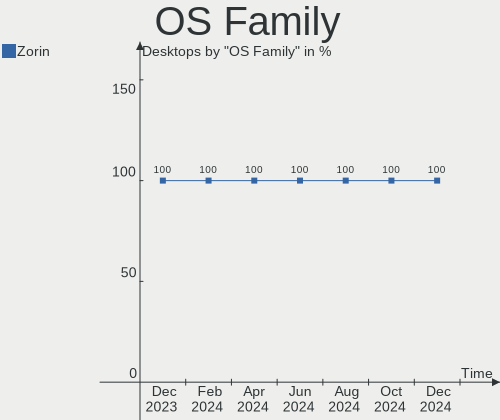
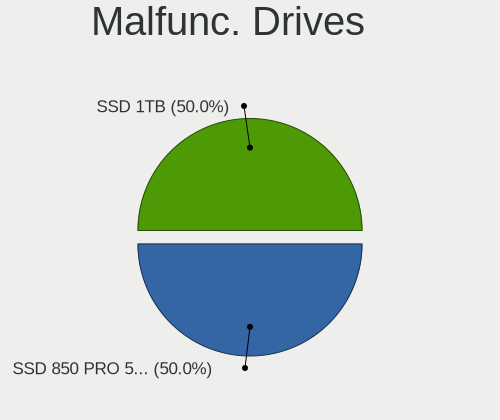
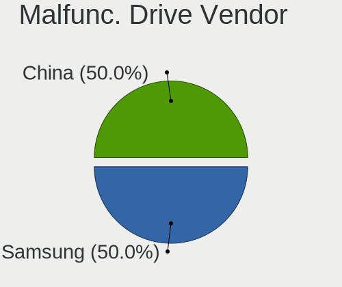
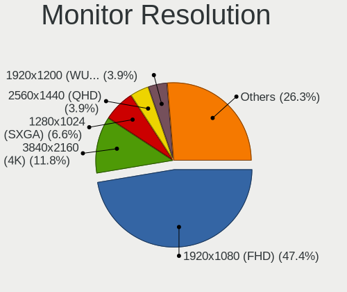

Zorin Hardware Trends (Desktop)
-------------------------------

A project to identify most popular hardware characteristics and track their change
over time based on data collected by Zorin users at https://Linux-Hardware.org.

Anyone can contribute to the study by uploading probes of their computers by
the [hw-probe](https://github.com/linuxhw/hw-probe) tool:

    sudo -E hw-probe -all -upload

Full-feature report is available here: https://linux-hardware.org/?view=trends&formfactor=desktop

Period: Jan, 2021.

Contents
--------

- [ OS                       ](#os)
- [ OS Family                ](#os-family)
- [ Kernel                   ](#kernel)
- [ Kernel Family            ](#kernel-family)
- [ Kernel Major Ver.        ](#kernel-major-ver)
- [ Arch                     ](#arch)
- [ DE                       ](#de)
- [ Display Server           ](#display-server)
- [ Display Manager          ](#display-manager)
- [ OS Lang                  ](#os-lang)
- [ Boot Mode                ](#boot-mode)
- [ Filesystem               ](#filesystem)
- [ Part. scheme             ](#part-scheme)
- [ Dual Boot with Linux/BSD ](#dual-boot-with-linux/bsd)
- [ Dual Boot (Win)          ](#dual-boot-win)
- [ Country                  ](#country)
- [ City                     ](#city)
- [ Vendor                   ](#vendor)
- [ Model                    ](#model)
- [ Model Family             ](#model-family)
- [ MFG Year                 ](#mfg-year)
- [ Form Factor              ](#form-factor)
- [ Secure Boot              ](#secure-boot)
- [ Coreboot                 ](#coreboot)
- [ RAM Size                 ](#ram-size)
- [ RAM Used                 ](#ram-used)
- [ Has CD-ROM               ](#has-cd-rom)
- [ Total Drives             ](#total-drives)
- [ Has Ethernet             ](#has-ethernet)
- [ Drive Vendor             ](#drive-vendor)
- [ Drive Model              ](#drive-model)
- [ HDD Vendor               ](#hdd-vendor)
- [ SSD Vendor               ](#ssd-vendor)
- [ Drive Kind               ](#drive-kind)
- [ Drive Connector          ](#drive-connector)
- [ Drive Size               ](#drive-size)
- [ Space Total              ](#space-total)
- [ Space Used               ](#space-used)
- [ Malfunc. Drives          ](#malfunc-drives)
- [ Malfunc. Drive Vendor    ](#malfunc-drive-vendor)
- [ Malfunc. HDD Vendor      ](#malfunc-hdd-vendor)
- [ Malfunc. Drive Kind      ](#malfunc-drive-kind)
- [ Failed Drives            ](#failed-drives)
- [ Failed Drive Vendor      ](#failed-drive-vendor)
- [ Drive Status             ](#drive-status)
- [ Storage Vendor           ](#storage-vendor)
- [ Storage Model            ](#storage-model)
- [ Storage Kind             ](#storage-kind)
- [ CPU Vendor               ](#cpu-vendor)
- [ CPU Model                ](#cpu-model)
- [ CPU Model Family         ](#cpu-model-family)
- [ CPU Cores                ](#cpu-cores)
- [ CPU Sockets              ](#cpu-sockets)
- [ CPU Threads              ](#cpu-threads)
- [ CPU Op-Modes             ](#cpu-op-modes)
- [ CPU Microcode            ](#cpu-microcode)
- [ CPU Microarch            ](#cpu-microarch)
- [ GPU Vendor               ](#gpu-vendor)
- [ GPU Model                ](#gpu-model)
- [ GPU Combo                ](#gpu-combo)
- [ GPU Driver               ](#gpu-driver)
- [ GPU Memory               ](#gpu-memory)
- [ Monitor Vendor           ](#monitor-vendor)
- [ Monitor Model            ](#monitor-model)
- [ Monitor Resolution       ](#monitor-resolution)
- [ Monitor Diagonal         ](#monitor-diagonal)
- [ Monitor Width            ](#monitor-width)
- [ Aspect Ratio             ](#aspect-ratio)
- [ Monitor Area             ](#monitor-area)
- [ Pixel Density            ](#pixel-density)
- [ Multiple Monitors        ](#multiple-monitors)
- [ Net Controller Vendor    ](#net-controller-vendor)
- [ Net Controller Model     ](#net-controller-model)
- [ Wireless Vendor          ](#wireless-vendor)
- [ Wireless Model           ](#wireless-model)
- [ Ethernet Vendor          ](#ethernet-vendor)
- [ Ethernet Model           ](#ethernet-model)
- [ Net Controller Kind      ](#net-controller-kind)
- [ Used Controller          ](#used-controller)
- [ NICs                     ](#nics)
- [ Memory Vendor            ](#memory-vendor)
- [ Memory Model             ](#memory-model)
- [ Memory Kind              ](#memory-kind)
- [ Memory Form Factor       ](#memory-form-factor)
- [ Memory Size              ](#memory-size)
- [ Memory Speed             ](#memory-speed)
- [ Sound Vendor             ](#sound-vendor)
- [ Sound Model              ](#sound-model)
- [ Camera Vendor            ](#camera-vendor)
- [ Camera Model             ](#camera-model)
- [ Fingerprint Vendor       ](#fingerprint-vendor)
- [ Fingerprint Model        ](#fingerprint-model)
- [ Chipcard Vendor          ](#chipcard-vendor)
- [ Chipcard Model           ](#chipcard-model)
- [ Printer Vendor           ](#printer-vendor)
- [ Printer Model            ](#printer-model)
- [ Scanner Vendor           ](#scanner-vendor)
- [ Scanner Model            ](#scanner-model)
- [ Bluetooth Vendor         ](#bluetooth-vendor)
- [ Bluetooth Model          ](#bluetooth-model)
- [ Unsupported Devices      ](#unsupported-devices)
- [ Unsupported Device Types ](#unsupported-device-types)

OS
--

Installed operating systems

| Name     | Desktops | Percent |
|----------|----------|---------|
| Zorin 15 | 27       | 93.1%   |
| Zorin 12 | 2        | 6.9%    |

OS Family
---------

OS without a version

| Name  | Desktops | Percent |
|-------|----------|---------|
| Zorin | 29       | 100%    |

Kernel
------

Version of the Linux kernel

| Version            | Desktops | Percent |
|--------------------|----------|---------|
| 5.4.0-58-generic   | 7        | 24.14%  |
| 5.4.0-60-generic   | 6        | 20.69%  |
| 5.4.0-62-generic   | 4        | 13.79%  |
| 5.4.0-65-generic   | 2        | 6.9%    |
| 5.4.0-47-generic   | 2        | 6.9%    |
| 4.15.0-132-generic | 2        | 6.9%    |
| 5.8.0-33-generic   | 1        | 3.45%   |
| 5.4.0-64-generic   | 1        | 3.45%   |
| 5.4.0-59-generic   | 1        | 3.45%   |
| 5.3.0-28-generic   | 1        | 3.45%   |
| 4.18.0-22-generic  | 1        | 3.45%   |
| 4.18.0-21-generic  | 1        | 3.45%   |

Kernel Family
-------------

Linux kernel without a distro release

| Version | Desktops | Percent |
|---------|----------|---------|
| 5.4.0   | 23       | 79.31%  |
| 4.18.0  | 2        | 6.9%    |
| 4.15.0  | 2        | 6.9%    |
| 5.8.0   | 1        | 3.45%   |
| 5.3.0   | 1        | 3.45%   |

Kernel Major Ver.
-----------------

Linux kernel major version

| Version | Desktops | Percent |
|---------|----------|---------|
| 5.4     | 23       | 79.31%  |
| 4.18    | 2        | 6.9%    |
| 4.15    | 2        | 6.9%    |
| 5.8     | 1        | 3.45%   |
| 5.3     | 1        | 3.45%   |

Arch
----

OS architecture (x86_64, i586, etc.)

| Name   | Desktops | Percent |
|--------|----------|---------|
| x86_64 | 26       | 89.66%  |
| i686   | 3        | 10.34%  |

DE
--

Desktop Environment

| Name    | Desktops | Percent |
|---------|----------|---------|
| GNOME   | 17       | 58.62%  |
| XFCE    | 11       | 37.93%  |
| Unknown | 1        | 3.45%   |

Display Server
--------------

X11 or Wayland

| Name    | Desktops | Percent |
|---------|----------|---------|
| X11     | 28       | 96.55%  |
| Unknown | 1        | 3.45%   |

Display Manager
---------------

SDDM, LightDM, etc.

| Name    | Desktops | Percent |
|---------|----------|---------|
| Unknown | 27       | 93.1%   |
| TDM     | 2        | 6.9%    |

OS Lang
-------

Language

| Lang  | Desktops | Percent |
|-------|----------|---------|
| en_US | 12       | 41.38%  |
| de_DE | 4        | 13.79%  |
| pt_BR | 3        | 10.34%  |
| es_MX | 2        | 6.9%    |
| en_CA | 2        | 6.9%    |
| pl_PL | 1        | 3.45%   |
| nl_NL | 1        | 3.45%   |
| fr_FR | 1        | 3.45%   |
| el_GR | 1        | 3.45%   |
| C     | 1        | 3.45%   |
| bg_BG | 1        | 3.45%   |

Boot Mode
---------

EFI or BIOS

| Mode | Desktops | Percent |
|------|----------|---------|
| BIOS | 23       | 79.31%  |
| EFI  | 6        | 20.69%  |

Filesystem
----------

Type of filesystem

| Type    | Desktops | Percent |
|---------|----------|---------|
| Ext4    | 28       | 96.55%  |
| Overlay | 1        | 3.45%   |

Part. scheme
------------

Scheme of partitioning

| Type    | Desktops | Percent |
|---------|----------|---------|
| Unknown | 27       | 93.1%   |
| MBR     | 2        | 6.9%    |

Dual Boot with Linux/BSD
------------------------

Hosting more than one Linux/BSD

| Dual boot | Desktops | Percent |
|-----------|----------|---------|
| No        | 22       | 75.86%  |
| Yes       | 7        | 24.14%  |

Dual Boot (Win)
---------------

Hosting Linux and Windows

| Dual boot | Desktops | Percent |
|-----------|----------|---------|
| No        | 15       | 51.72%  |
| Yes       | 14       | 48.28%  |

Country
-------

Geographic location (country)

| Country     | Desktops | Percent |
|-------------|----------|---------|
| USA         | 9        | 31.03%  |
| Germany     | 4        | 13.79%  |
| Brazil      | 3        | 10.34%  |
| Netherlands | 2        | 6.9%    |
| Greece      | 2        | 6.9%    |
| Canada      | 2        | 6.9%    |
| Portugal    | 1        | 3.45%   |
| Peru        | 1        | 3.45%   |
| Mexico      | 1        | 3.45%   |
| Iran        | 1        | 3.45%   |
| Indonesia   | 1        | 3.45%   |
| France      | 1        | 3.45%   |
| Bulgaria    | 1        | 3.45%   |

City
----

Geographic location (city)

| City              | Desktops | Percent |
|-------------------|----------|---------|
| Richmond          | 2        | 6.9%    |
| Vila Nova de Gaia | 1        | 3.45%   |
| Varna             | 1        | 3.45%   |
| Thessaloniki      | 1        | 3.45%   |
| São Paulo        | 1        | 3.45%   |
| Someren           | 1        | 3.45%   |
| Roswell           | 1        | 3.45%   |
| Olympia           | 1        | 3.45%   |
| Niterói          | 1        | 3.45%   |
| Naumburg          | 1        | 3.45%   |
| Munich            | 1        | 3.45%   |
| Muggensturm       | 1        | 3.45%   |
| Monterrey         | 1        | 3.45%   |
| Marietta          | 1        | 3.45%   |
| Manaus            | 1        | 3.45%   |
| Longwood          | 1        | 3.45%   |
| Lima              | 1        | 3.45%   |
| Kennesaw          | 1        | 3.45%   |
| Jakarta           | 1        | 3.45%   |
| Istres            | 1        | 3.45%   |
| Halsteren         | 1        | 3.45%   |
| Gruenstadt        | 1        | 3.45%   |
| Greenville        | 1        | 3.45%   |
| Greenacres        | 1        | 3.45%   |
| Denver            | 1        | 3.45%   |
| Burnaby           | 1        | 3.45%   |
| Bastak            | 1        | 3.45%   |
| Athens            | 1        | 3.45%   |

Vendor
------

Motherboard manufacturer

| Name                | Desktops | Percent |
|---------------------|----------|---------|
| ASUSTek Computer    | 11       | 37.93%  |
| Gigabyte Technology | 4        | 13.79%  |
| Lenovo              | 3        | 10.34%  |
| Hewlett-Packard     | 3        | 10.34%  |
| Shuttle             | 1        | 3.45%   |
| MSI                 | 1        | 3.45%   |
| MiTAC               | 1        | 3.45%   |
| Intel               | 1        | 3.45%   |
| Foxconn             | 1        | 3.45%   |
| Dell                | 1        | 3.45%   |
| ASRock              | 1        | 3.45%   |
| Unknown             | 1        | 3.45%   |

Model
-----

Motherboard model

| Name                               | Desktops | Percent |
|------------------------------------|----------|---------|
| Shuttle SG45                       | 1        | 3.45%   |
| MSI MS-7592                        | 1        | 3.45%   |
| MiTAC E220 6A7                     | 1        | 3.45%   |
| Lenovo ThinkCentre M93p 10AAS2JM00 | 1        | 3.45%   |
| Lenovo ThinkCentre M90 5485W2H     | 1        | 3.45%   |
| Lenovo H430 10091                  | 1        | 3.45%   |
| Intel DP965LT AAD41694-209         | 1        | 3.45%   |
| HP ProDesk 405 G1 MT               | 1        | 3.45%   |
| HP Compaq 6200 Pro MT PC           | 1        | 3.45%   |
| HP 280 G3 MT                       | 1        | 3.45%   |
| Gigabyte G41M-Combo                | 1        | 3.45%   |
| Gigabyte B75M-D3V                  | 1        | 3.45%   |
| Gigabyte B450M DS3H                | 1        | 3.45%   |
| Gigabyte B450 I AORUS PRO WIFI     | 1        | 3.45%   |
| Foxconn ELVAS                      | 1        | 3.45%   |
| Dell OptiPlex 780                  | 1        | 3.45%   |
| ASUS VGC-V2S                       | 1        | 3.45%   |
| ASUS TUF B360M-PLUS GAMING/BR      | 1        | 3.45%   |
| ASUS PRIME B250M-A                 | 1        | 3.45%   |
| ASUS P7P55D-E LX                   | 1        | 3.45%   |
| ASUS P5KPL-AM SE                   | 1        | 3.45%   |
| ASUS P5K SE                        | 1        | 3.45%   |
| ASUS P5G41T-M LX                   | 1        | 3.45%   |
| ASUS M4N68T-M LE                   | 1        | 3.45%   |
| ASUS M2N-MX SE Plus                | 1        | 3.45%   |
| ASUS GN566AA-ABA s3200n            | 1        | 3.45%   |
| ASUS All Series                    | 1        | 3.45%   |
| ASRock Z97 Extreme4                | 1        | 3.45%   |
| Unknown                            | 1        | 3.45%   |

Model Family
------------

Motherboard model prefix

| Name                | Desktops | Percent |
|---------------------|----------|---------|
| Lenovo ThinkCentre  | 2        | 6.9%    |
| Shuttle SG45        | 1        | 3.45%   |
| MSI MS-7592         | 1        | 3.45%   |
| MiTAC E220          | 1        | 3.45%   |
| Lenovo H430         | 1        | 3.45%   |
| Intel DP965LT       | 1        | 3.45%   |
| HP ProDesk          | 1        | 3.45%   |
| HP Compaq           | 1        | 3.45%   |
| HP 280              | 1        | 3.45%   |
| Gigabyte G41M-Combo | 1        | 3.45%   |
| Gigabyte B75M-D3V   | 1        | 3.45%   |
| Gigabyte B450M      | 1        | 3.45%   |
| Gigabyte B450       | 1        | 3.45%   |
| Foxconn ELVAS       | 1        | 3.45%   |
| Dell OptiPlex       | 1        | 3.45%   |
| ASUS VGC-V2S        | 1        | 3.45%   |
| ASUS TUF            | 1        | 3.45%   |
| ASUS PRIME          | 1        | 3.45%   |
| ASUS P7P55D-E       | 1        | 3.45%   |
| ASUS P5KPL-AM       | 1        | 3.45%   |
| ASUS P5K            | 1        | 3.45%   |
| ASUS P5G41T-M       | 1        | 3.45%   |
| ASUS M4N68T-M       | 1        | 3.45%   |
| ASUS M2N-MX         | 1        | 3.45%   |
| ASUS GN566AA-ABA    | 1        | 3.45%   |
| ASUS All            | 1        | 3.45%   |
| ASRock Z97          | 1        | 3.45%   |
| Unknown             | 1        | 3.45%   |

MFG Year
--------

Motherboard manufacture year

| Year | Desktops | Percent |
|------|----------|---------|
| 2009 | 4        | 13.79%  |
| 2018 | 3        | 10.34%  |
| 2013 | 3        | 10.34%  |
| 2012 | 3        | 10.34%  |
| 2010 | 3        | 10.34%  |
| 2017 | 2        | 6.9%    |
| 2014 | 2        | 6.9%    |
| 2011 | 2        | 6.9%    |
| 2007 | 2        | 6.9%    |
| 2020 | 1        | 3.45%   |
| 2019 | 1        | 3.45%   |
| 2015 | 1        | 3.45%   |
| 2008 | 1        | 3.45%   |
| 2004 | 1        | 3.45%   |

Form Factor
-----------

Physical design of the computer

| Name    | Desktops | Percent |
|---------|----------|---------|
| Desktop | 29       | 100%    |

Secure Boot
-----------

Enabled or disabled

| State    | Desktops | Percent |
|----------|----------|---------|
| Disabled | 27       | 93.1%   |
| Enabled  | 2        | 6.9%    |

Coreboot
--------

Have coreboot on board

| Used | Desktops | Percent |
|------|----------|---------|
| No   | 29       | 100%    |

RAM Size
--------

Total RAM memory

| Size in GB | Desktops | Percent |
|------------|----------|---------|
| 8.01-16.0  | 7        | 24.14%  |
| 4.01-8.0   | 6        | 20.69%  |
| 3.01-4.0   | 5        | 17.24%  |
| 16.01-24.0 | 5        | 17.24%  |
| 1.01-2.0   | 3        | 10.34%  |
| 0.51-1.0   | 2        | 6.9%    |
| 2.01-3.0   | 1        | 3.45%   |

RAM Used
--------

Used RAM memory

| Used GB   | Desktops | Percent |
|-----------|----------|---------|
| 1.01-2.0  | 14       | 48.28%  |
| 2.01-3.0  | 5        | 17.24%  |
| 4.01-8.0  | 3        | 10.34%  |
| 0.51-1.0  | 3        | 10.34%  |
| 3.01-4.0  | 2        | 6.9%    |
| 8.01-16.0 | 1        | 3.45%   |
| 0.01-0.5  | 1        | 3.45%   |

Has CD-ROM
----------

Has CD-ROM on board

| Presented | Desktops | Percent |
|-----------|----------|---------|
| Yes       | 18       | 62.07%  |
| No        | 11       | 37.93%  |

Total Drives
------------

Number of drives on board

| Drives | Desktops | Percent |
|--------|----------|---------|
| 1      | 15       | 51.72%  |
| 2      | 8        | 27.59%  |
| 3      | 4        | 13.79%  |
| 5      | 1        | 3.45%   |
| 4      | 1        | 3.45%   |

Has Ethernet
------------

Has Ethernet on board

| Presented | Desktops | Percent |
|-----------|----------|---------|
| Yes       | 29       | 100%    |

Drive Vendor
------------

Hard drive vendors

| Vendor              | Desktops | Drives | Percent |
|---------------------|----------|--------|---------|
| WDC                 | 13       | 14     | 27.08%  |
| Seagate             | 9        | 9      | 18.75%  |
| Samsung Electronics | 5        | 5      | 10.42%  |
| Kingston            | 4        | 4      | 8.33%   |
| Hitachi             | 4        | 4      | 8.33%   |
| MAXTOR              | 2        | 2      | 4.17%   |
| WD MediaMax         | 1        | 1      | 2.08%   |
| Unknown             | 1        | 1      | 2.08%   |
| Toshiba             | 1        | 1      | 2.08%   |
| Sandisk             | 1        | 1      | 2.08%   |
| PNY                 | 1        | 1      | 2.08%   |
| Phison              | 1        | 1      | 2.08%   |
| Patriot             | 1        | 1      | 2.08%   |
| Micron Technology   | 1        | 1      | 2.08%   |
| Intenso             | 1        | 1      | 2.08%   |
| Crucial             | 1        | 1      | 2.08%   |
| China               | 1        | 1      | 2.08%   |

Drive Model
-----------

Hard drive models

| Model                                    | Desktops | Percent |
|------------------------------------------|----------|---------|
| WDC WD5000AAKS-00V1A0 500GB              | 2        | 4.08%   |
| Kingston SV300S37A120G 120GB SSD         | 2        | 4.08%   |
| WDC WDS480G2G0B-00EPW0 480GB SSD         | 1        | 2.04%   |
| WDC WD5000AAKX-001CA0 500GB              | 1        | 2.04%   |
| WDC WD3200AAJS-56M0A0 320GB              | 1        | 2.04%   |
| WDC WD2500KS-00MJB0 250GB                | 1        | 2.04%   |
| WDC WD2500JS-23MHB0 250GB                | 1        | 2.04%   |
| WDC WD2500BEVT-22A23T0 250GB             | 1        | 2.04%   |
| WDC WD2500BB-98GUA0 250GB                | 1        | 2.04%   |
| WDC WD2500AAJS-08L7A0 250GB              | 1        | 2.04%   |
| WDC WD20EZRZ-00Z5HB0 2TB                 | 1        | 2.04%   |
| WDC WD10EZEX-60WN4A0 1TB                 | 1        | 2.04%   |
| WDC WD10EZEX-08RKKA0 1TB                 | 1        | 2.04%   |
| WDC WD10EZEX-00BN5A0 1TB                 | 1        | 2.04%   |
| WD MediaMax WL3000GSA6454 0 3TB          | 1        | 2.04%   |
| Unknown SD/MMC/MS PRO 32GB               | 1        | 2.04%   |
| Toshiba DT01ACA100 1TB                   | 1        | 2.04%   |
| Seagate ST500LM000-1EJ162 500GB          | 1        | 2.04%   |
| Seagate ST3750528AS 752GB                | 1        | 2.04%   |
| Seagate ST3500630AS 500GB                | 1        | 2.04%   |
| Seagate ST3500418AS 500GB                | 1        | 2.04%   |
| Seagate ST3500413AS 500GB                | 1        | 2.04%   |
| Seagate ST3400620AS 400GB                | 1        | 2.04%   |
| Seagate ST3320418AS 320GB                | 1        | 2.04%   |
| Seagate ST3250410AS 250GB                | 1        | 2.04%   |
| Seagate ST1000DM003-1ER162 1TB           | 1        | 2.04%   |
| Sandisk NVMe SSD Drive 500GB             | 1        | 2.04%   |
| Samsung SSD 850 EVO 500GB                | 1        | 2.04%   |
| Samsung NVMe SSD Drive 250GB             | 1        | 2.04%   |
| Samsung HD642JJ 640GB                    | 1        | 2.04%   |
| Samsung HD161HJ 160GB                    | 1        | 2.04%   |
| Samsung HD103SJ 1TB                      | 1        | 2.04%   |
| PNY CS900 480GB SSD                      | 1        | 2.04%   |
| Phison NVMe SSD Drive 256GB              | 1        | 2.04%   |
| Patriot Spark 256GB SSD                  | 1        | 2.04%   |
| Micron MTFDDAK128MAY-1AH1ZABHA 128GB SSD | 1        | 2.04%   |
| MAXTOR STM3500630AS 500GB                | 1        | 2.04%   |
| MAXTOR STM3250310AS 250GB                | 1        | 2.04%   |
| Kingston SA400S37240G 240GB SSD          | 1        | 2.04%   |
| Kingston SA400S37120G 120GB SSD          | 1        | 2.04%   |
| Intenso SSD SATAIII 960GB                | 1        | 2.04%   |
| Hitachi HTS545025B9A300 250GB            | 1        | 2.04%   |
| Hitachi HDT721025SLA380 250GB            | 1        | 2.04%   |
| Hitachi HDS721032CLA362 320GB            | 1        | 2.04%   |
| Hitachi HDS721010CLA332 1TB              | 1        | 2.04%   |
| Crucial CT240BX500SSD1 240GB             | 1        | 2.04%   |
| China SATA3 120GB SSD                    | 1        | 2.04%   |

HDD Vendor
----------

Hard disk drive vendors

| Vendor              | Desktops | Drives | Percent |
|---------------------|----------|--------|---------|
| WDC                 | 12       | 13     | 38.71%  |
| Seagate             | 9        | 9      | 29.03%  |
| Hitachi             | 4        | 4      | 12.9%   |
| Samsung Electronics | 3        | 3      | 9.68%   |
| MAXTOR              | 2        | 2      | 6.45%   |
| Toshiba             | 1        | 1      | 3.23%   |

SSD Vendor
----------

Solid state drive vendors

| Vendor              | Desktops | Drives | Percent |
|---------------------|----------|--------|---------|
| Kingston            | 4        | 4      | 33.33%  |
| WDC                 | 1        | 1      | 8.33%   |
| Samsung Electronics | 1        | 1      | 8.33%   |
| PNY                 | 1        | 1      | 8.33%   |
| Patriot             | 1        | 1      | 8.33%   |
| Micron Technology   | 1        | 1      | 8.33%   |
| Intenso             | 1        | 1      | 8.33%   |
| Crucial             | 1        | 1      | 8.33%   |
| China               | 1        | 1      | 8.33%   |

Drive Kind
----------

HDD or SSD

| Kind    | Desktops | Drives | Percent |
|---------|----------|--------|---------|
| HDD     | 24       | 32     | 61.54%  |
| SSD     | 10       | 12     | 25.64%  |
| NVMe    | 3        | 3      | 7.69%   |
| Unknown | 2        | 2      | 5.13%   |

Drive Connector
---------------

SATA, SAS, NVMe, etc.

| Type | Desktops | Drives | Percent |
|------|----------|--------|---------|
| SATA | 29       | 45     | 87.88%  |
| NVMe | 3        | 3      | 9.09%   |
| SAS  | 1        | 1      | 3.03%   |

Drive Size
----------

Size of hard drive

| Size in TB | Desktops | Drives | Percent |
|------------|----------|--------|---------|
| 0.01-0.5   | 24       | 33     | 68.57%  |
| 0.51-1.0   | 10       | 10     | 28.57%  |
| 1.01-2.0   | 1        | 1      | 2.86%   |

Space Total
-----------

Amount of disk space available on the file system

| Size in GB     | Desktops | Percent |
|----------------|----------|---------|
| 101-250        | 12       | 41.38%  |
| 501-1000       | 6        | 20.69%  |
| 251-500        | 4        | 13.79%  |
| 21-50          | 2        | 6.9%    |
| More than 3000 | 1        | 3.45%   |
| 2001-3000      | 1        | 3.45%   |
| 1001-2000      | 1        | 3.45%   |
| 1-20           | 1        | 3.45%   |
| 51-100         | 1        | 3.45%   |

Space Used
----------

Amount of used disk space

| Used GB   | Desktops | Percent |
|-----------|----------|---------|
| 1-20      | 17       | 58.62%  |
| 251-500   | 3        | 10.34%  |
| 21-50     | 3        | 10.34%  |
| 101-250   | 2        | 6.9%    |
| 51-100    | 2        | 6.9%    |
| 1001-2000 | 1        | 3.45%   |
| 501-1000  | 1        | 3.45%   |

Malfunc. Drives
---------------

Drive models with a malfunction

| Model                       | Desktops | Drives | Percent |
|-----------------------------|----------|--------|---------|
| WDC WD5000AAKS-00V1A0 500GB | 1        | 1      | 100%    |

Malfunc. Drive Vendor
---------------------

Vendors of faulty drives

| Vendor | Desktops | Drives | Percent |
|--------|----------|--------|---------|
| WDC    | 1        | 1      | 100%    |

Malfunc. HDD Vendor
-------------------

Vendors of faulty HDD drives

| Vendor | Desktops | Drives | Percent |
|--------|----------|--------|---------|
| WDC    | 1        | 1      | 100%    |

Malfunc. Drive Kind
-------------------

Kinds of faulty drives

| Kind | Desktops | Drives | Percent |
|------|----------|--------|---------|
| HDD  | 1        | 1      | 100%    |

Failed Drives
-------------

Failed drive models

Zero info for selected period =(

Failed Drive Vendor
-------------------

Failed drive vendors

Zero info for selected period =(

Drive Status
------------

Number of failed and malfunc. drives

| Status   | Desktops | Drives | Percent |
|----------|----------|--------|---------|
| Detected | 27       | 46     | 90%     |
| Works    | 2        | 2      | 6.67%   |
| Malfunc  | 1        | 1      | 3.33%   |

Storage Vendor
--------------

Storage controller vendors

| Vendor                   | Desktops | Percent |
|--------------------------|----------|---------|
| Intel                    | 22       | 57.89%  |
| AMD                      | 4        | 10.53%  |
| Nvidia                   | 3        | 7.89%   |
| Marvell Technology Group | 3        | 7.89%   |
| JMicron Technology       | 2        | 5.26%   |
| Sandisk                  | 1        | 2.63%   |
| Samsung Electronics      | 1        | 2.63%   |
| Phison Electronics       | 1        | 2.63%   |
| ASMedia Technology       | 1        | 2.63%   |

Storage Model
-------------

Storage controller models

| Model                                                                          | Desktops | Percent |
|--------------------------------------------------------------------------------|----------|---------|
| Intel NM10/ICH7 Family SATA Controller [IDE mode]                              | 5        | 9.8%    |
| Nvidia MCP61 SATA Controller                                                   | 3        | 5.88%   |
| Nvidia MCP61 IDE                                                               | 3        | 5.88%   |
| Intel 82801G (ICH7 Family) IDE Controller                                      | 3        | 5.88%   |
| AMD FCH SATA Controller [AHCI mode]                                            | 3        | 5.88%   |
| Intel 8 Series/C220 Series Chipset Family 6-port SATA Controller 1 [AHCI mode] | 2        | 3.92%   |
| Intel 6 Series/C200 Series Chipset Family 6 port Desktop SATA AHCI Controller  | 2        | 3.92%   |
| AMD 400 Series Chipset SATA Controller                                         | 2        | 3.92%   |
| Sandisk WD Blue SN550 NVMe SSD                                                 | 1        | 1.96%   |
| Samsung NVMe SSD Controller SM981/PM981/PM983                                  | 1        | 1.96%   |
| Phison E12 NVMe Controller                                                     | 1        | 1.96%   |
| Marvell Group 88SE914D SATA-600 Controller                                     | 1        | 1.96%   |
| Marvell Group 88SE6111/6121 SATA II / PATA Controller                          | 1        | 1.96%   |
| Marvell Group 88SE6101/6102 single-port PATA133 interface                      | 1        | 1.96%   |
| JMicron JMB368 IDE controller                                                  | 1        | 1.96%   |
| JMicron JMB361 AHCI/IDE                                                        | 1        | 1.96%   |
| Intel SATA Controller [RAID mode]                                              | 1        | 1.96%   |
| Intel Q170/Q150/B150/H170/H110/Z170/CM236 Chipset SATA Controller [AHCI Mode]  | 1        | 1.96%   |
| Intel Cannon Lake PCH SATA AHCI Controller                                     | 1        | 1.96%   |
| Intel Atom Processor E3800 Series SATA AHCI Controller                         | 1        | 1.96%   |
| Intel 9 Series Chipset Family SATA Controller [AHCI Mode]                      | 1        | 1.96%   |
| Intel 82801JI (ICH10 Family) 4 port SATA IDE Controller #1                     | 1        | 1.96%   |
| Intel 82801JI (ICH10 Family) 2 port SATA IDE Controller #2                     | 1        | 1.96%   |
| Intel 82801IB (ICH9) 2 port SATA Controller [IDE mode]                         | 1        | 1.96%   |
| Intel 82801I (ICH9 Family) 2 port SATA Controller [IDE mode]                   | 1        | 1.96%   |
| Intel 82801HB (ICH8) 4 port SATA Controller [AHCI mode]                        | 1        | 1.96%   |
| Intel 82801EB/ER (ICH5/ICH5R) IDE Controller                                   | 1        | 1.96%   |
| Intel 7 Series/C210 Series Chipset Family 4-port SATA Controller [IDE mode]    | 1        | 1.96%   |
| Intel 7 Series/C210 Series Chipset Family 2-port SATA Controller [IDE mode]    | 1        | 1.96%   |
| Intel 5 Series/3400 Series Chipset 6 port SATA AHCI Controller                 | 1        | 1.96%   |
| Intel 5 Series/3400 Series Chipset 4 port SATA IDE Controller                  | 1        | 1.96%   |
| Intel 5 Series/3400 Series Chipset 2 port SATA IDE Controller                  | 1        | 1.96%   |
| Intel 4 Series Chipset PT IDER Controller                                      | 1        | 1.96%   |
| Intel 200 Series PCH SATA controller [AHCI mode]                               | 1        | 1.96%   |
| ASMedia ASM1062 Serial ATA Controller                                          | 1        | 1.96%   |
| AMD SB7x0/SB8x0/SB9x0 SATA Controller [IDE mode]                               | 1        | 1.96%   |

Storage Kind
------------

Kind of storage controller (IDE, SATA, NVMe, SAS, ...)

| Kind | Desktops | Percent |
|------|----------|---------|
| IDE  | 15       | 44.12%  |
| SATA | 15       | 44.12%  |
| NVMe | 3        | 8.82%   |
| RAID | 1        | 2.94%   |

CPU Vendor
----------

Processor vendors

| Vendor | Desktops | Percent |
|--------|----------|---------|
| Intel  | 22       | 75.86%  |
| AMD    | 7        | 24.14%  |

CPU Model
---------

Processor models

| Model                                       | Desktops | Percent |
|---------------------------------------------|----------|---------|
| Intel Pentium 4 CPU 3.20GHz                 | 2        | 6.9%    |
| Intel Core 2 Quad CPU Q6600 @ 2.40GHz       | 2        | 6.9%    |
| Intel Xeon CPU X5450 @ 3.00GHz              | 1        | 3.45%   |
| Intel Pentium Dual-Core CPU E5700 @ 3.00GHz | 1        | 3.45%   |
| Intel Pentium CPU G2030 @ 3.00GHz           | 1        | 3.45%   |
| Intel Core i7-4790K CPU @ 4.00GHz           | 1        | 3.45%   |
| Intel Core i5-8400 CPU @ 2.80GHz            | 1        | 3.45%   |
| Intel Core i5-7600K CPU @ 3.80GHz           | 1        | 3.45%   |
| Intel Core i5-7500 CPU @ 3.40GHz            | 1        | 3.45%   |
| Intel Core i5-4570T CPU @ 2.90GHz           | 1        | 3.45%   |
| Intel Core i5-2400 CPU @ 3.10GHz            | 1        | 3.45%   |
| Intel Core i5 CPU 760 @ 2.80GHz             | 1        | 3.45%   |
| Intel Core i5 CPU 750 @ 2.67GHz             | 1        | 3.45%   |
| Intel Core i3-4150 CPU @ 3.50GHz            | 1        | 3.45%   |
| Intel Core i3-2130 CPU @ 3.40GHz            | 1        | 3.45%   |
| Intel Core 2 Quad CPU Q9400 @ 2.66GHz       | 1        | 3.45%   |
| Intel Core 2 Quad CPU Q6700 @ 2.66GHz       | 1        | 3.45%   |
| Intel Core 2 Duo CPU E8400 @ 3.00GHz        | 1        | 3.45%   |
| Intel Core 2 Duo CPU E7500 @ 2.93GHz        | 1        | 3.45%   |
| Intel Celeron CPU J1900 @ 1.99GHz           | 1        | 3.45%   |
| AMD Ryzen 7 2700X Eight-Core Processor      | 1        | 3.45%   |
| AMD Ryzen 7 2700 Eight-Core Processor       | 1        | 3.45%   |
| AMD Phenom II X4 810 Processor              | 1        | 3.45%   |
| AMD Athlon Processor LE-1620                | 1        | 3.45%   |
| AMD Athlon Processor 2850e                  | 1        | 3.45%   |
| AMD Athlon 64 X2 Dual Core Processor 4800+  | 1        | 3.45%   |
| AMD A4-5000 APU with Radeon HD Graphics     | 1        | 3.45%   |

CPU Model Family
----------------

Processor model prefix

| Model                   | Desktops | Percent |
|-------------------------|----------|---------|
| Intel Core i5           | 7        | 24.14%  |
| Intel Core 2 Quad       | 4        | 13.79%  |
| Intel Pentium 4         | 2        | 6.9%    |
| Intel Core i3           | 2        | 6.9%    |
| Intel Core 2 Duo        | 2        | 6.9%    |
| AMD Ryzen 7             | 2        | 6.9%    |
| AMD Athlon              | 2        | 6.9%    |
| Intel Xeon              | 1        | 3.45%   |
| Intel Pentium Dual-Core | 1        | 3.45%   |
| Intel Pentium           | 1        | 3.45%   |
| Intel Core i7           | 1        | 3.45%   |
| Intel Celeron           | 1        | 3.45%   |
| AMD Phenom II X4        | 1        | 3.45%   |
| AMD Athlon 64 X2        | 1        | 3.45%   |
| AMD A4                  | 1        | 3.45%   |

CPU Cores
---------

Number of processor cores

| Number | Desktops | Percent |
|--------|----------|---------|
| 4      | 14       | 48.28%  |
| 2      | 8        | 27.59%  |
| 1      | 4        | 13.79%  |
| 8      | 2        | 6.9%    |
| 6      | 1        | 3.45%   |

CPU Sockets
-----------

Number of sockets

| Number | Desktops | Percent |
|--------|----------|---------|
| 1      | 29       | 100%    |

CPU Threads
-----------

Threads per core (Hyper-Threading)

| Number | Desktops | Percent |
|--------|----------|---------|
| 1      | 21       | 72.41%  |
| 2      | 8        | 27.59%  |

CPU Op-Modes
------------

CPU Operation Modes (32-bit, 64-bit)

| Op mode        | Desktops | Percent |
|----------------|----------|---------|
| 32-bit, 64-bit | 28       | 96.55%  |
| 32-bit         | 1        | 3.45%   |

CPU Microcode
-------------

Microcode number

| Number     | Desktops | Percent |
|------------|----------|---------|
| Unknown    | 4        | 13.79%  |
| 0x6fb      | 3        | 10.34%  |
| 0x306c3    | 3        | 10.34%  |
| 0x1067a    | 3        | 10.34%  |
| 0x906e9    | 2        | 6.9%    |
| 0x206a7    | 2        | 6.9%    |
| 0x106e5    | 2        | 6.9%    |
| 0x0800820d | 2        | 6.9%    |
| 0xf43      | 1        | 3.45%   |
| 0xf34      | 1        | 3.45%   |
| 0x906ea    | 1        | 3.45%   |
| 0x306a9    | 1        | 3.45%   |
| 0x30678    | 1        | 3.45%   |
| 0x10676    | 1        | 3.45%   |
| 0x0700010f | 1        | 3.45%   |
| 0x010000db | 1        | 3.45%   |

CPU Microarch
-------------

Microarchitecture

| Name        | Desktops | Percent |
|-------------|----------|---------|
| Penryn      | 5        | 17.24%  |
| KabyLake    | 3        | 10.34%  |
| K8 Hammer   | 3        | 10.34%  |
| Haswell     | 3        | 10.34%  |
| Core        | 3        | 10.34%  |
| Zen+        | 2        | 6.9%    |
| SandyBridge | 2        | 6.9%    |
| NetBurst    | 2        | 6.9%    |
| Nehalem     | 2        | 6.9%    |
| Silvermont  | 1        | 3.45%   |
| K10         | 1        | 3.45%   |
| Jaguar      | 1        | 3.45%   |
| IvyBridge   | 1        | 3.45%   |

GPU Vendor
----------

Vendors of graphics cards

| Vendor | Desktops | Percent |
|--------|----------|---------|
| Nvidia | 14       | 46.67%  |
| Intel  | 8        | 26.67%  |
| AMD    | 8        | 26.67%  |

GPU Model
---------

Graphics card models

| Model                                                                       | Desktops | Percent |
|-----------------------------------------------------------------------------|----------|---------|
| Nvidia GP107 [GeForce GTX 1050 Ti]                                          | 2        | 6.67%   |
| Intel HD Graphics 630                                                       | 2        | 6.67%   |
| Intel 4 Series Chipset Integrated Graphics Controller                       | 2        | 6.67%   |
| Nvidia NV43 [GeForce 6200]                                                  | 1        | 3.33%   |
| Nvidia NV36M [GeForce FX Go5700]                                            | 1        | 3.33%   |
| Nvidia GT216 [GeForce GT 220]                                               | 1        | 3.33%   |
| Nvidia GT216 [GeForce 210]                                                  | 1        | 3.33%   |
| Nvidia GP108 [GeForce GT 1030]                                              | 1        | 3.33%   |
| Nvidia GM107 [GeForce GTX 750 Ti]                                           | 1        | 3.33%   |
| Nvidia GF104 [GeForce GTX 460]                                              | 1        | 3.33%   |
| Nvidia GF100 [GeForce GTX 470]                                              | 1        | 3.33%   |
| Nvidia G96C [GeForce 9500 GT]                                               | 1        | 3.33%   |
| Nvidia G94 [GeForce 9600 GT]                                                | 1        | 3.33%   |
| Nvidia G72 [GeForce 7200 GS / 7300 SE]                                      | 1        | 3.33%   |
| Nvidia C61 [GeForce 6150SE nForce 430]                                      | 1        | 3.33%   |
| Intel Xeon E3-1200 v3/4th Gen Core Processor Integrated Graphics Controller | 1        | 3.33%   |
| Intel UHD Graphics 630 (Desktop)                                            | 1        | 3.33%   |
| Intel Atom Processor Z36xxx/Z37xxx Series Graphics & Display                | 1        | 3.33%   |
| Intel 2nd Generation Core Processor Family Integrated Graphics Controller   | 1        | 3.33%   |
| AMD RV710 [Radeon HD 4350/4550]                                             | 1        | 3.33%   |
| AMD RS740 [Radeon 2100]                                                     | 1        | 3.33%   |
| AMD Oland PRO [Radeon R7 240/340]                                           | 1        | 3.33%   |
| AMD Kabini [Radeon HD 8330]                                                 | 1        | 3.33%   |
| AMD Curacao XT / Trinidad XT [Radeon R7 370 / R9 270X/370X]                 | 1        | 3.33%   |
| AMD Cedar [Radeon HD 5000/6000/7350/8350 Series]                            | 1        | 3.33%   |
| AMD Caicos XT [Radeon HD 7470/8470 / R5 235/310 OEM]                        | 1        | 3.33%   |
| AMD Barts PRO [Radeon HD 6850]                                              | 1        | 3.33%   |

GPU Combo
---------

Combinations of graphics cards

| Name        | Desktops | Percent |
|-------------|----------|---------|
| 1 x Nvidia  | 14       | 48.28%  |
| 1 x Intel   | 7        | 24.14%  |
| 1 x AMD     | 7        | 24.14%  |
| Intel + AMD | 1        | 3.45%   |

GPU Driver
----------

Free vs proprietary

| Driver      | Desktops | Percent |
|-------------|----------|---------|
| Free        | 19       | 65.52%  |
| Proprietary | 9        | 31.03%  |
| Unknown     | 1        | 3.45%   |

GPU Memory
----------

Total video memory

| Size in GB | Desktops | Percent |
|------------|----------|---------|
| Unknown    | 9        | 31.03%  |
| 0.01-0.5   | 8        | 27.59%  |
| 3.01-4.0   | 4        | 13.79%  |
| 1.01-2.0   | 4        | 13.79%  |
| 0.51-1.0   | 4        | 13.79%  |

Monitor Vendor
--------------

Monitor vendors

| Vendor               | Desktops | Percent |
|----------------------|----------|---------|
| Samsung Electronics  | 5        | 19.23%  |
| Hewlett-Packard      | 5        | 19.23%  |
| Dell                 | 4        | 15.38%  |
| LG Electronics       | 2        | 7.69%   |
| BenQ                 | 2        | 7.69%   |
| Ancor Communications | 2        | 7.69%   |
| ViewSonic            | 1        | 3.85%   |
| RKU                  | 1        | 3.85%   |
| Medion               | 1        | 3.85%   |
| HannStar             | 1        | 3.85%   |
| Goldstar             | 1        | 3.85%   |
| Acer                 | 1        | 3.85%   |

Monitor Model
-------------

Monitor models

| Model                                                                 | Desktops | Percent |
|-----------------------------------------------------------------------|----------|---------|
| ViewSonic VA2231 Series VSCBB25 1920x1080 477x268mm 21.5-inch         | 1        | 3.7%    |
| Samsung Electronics S27B550 SAM091B 1920x1080 598x336mm 27.0-inch     | 1        | 3.7%    |
| Samsung Electronics S23C350 SAM0A36 1920x1080 510x287mm 23.0-inch     | 1        | 3.7%    |
| Samsung Electronics S19B150 SAM08A2 1366x768 410x230mm 18.5-inch      | 1        | 3.7%    |
| Samsung Electronics LCD Monitor SAM0B30 1920x1080 890x500mm 40.2-inch | 1        | 3.7%    |
| Samsung Electronics LCD Monitor S23C570 1920x1080                     | 1        | 3.7%    |
| RKU Roku TV RKU7813 3840x2160 800x450mm 36.1-inch                     | 1        | 3.7%    |
| Medion MD32117PQ MED87C0 1280x1024 337x270mm 17.0-inch                | 1        | 3.7%    |
| LG Electronics LCD Monitor E2341 1920x1080                            | 1        | 3.7%    |
| LG Electronics LCD Monitor E2050 1600x900                             | 1        | 3.7%    |
| Hewlett-Packard V194 HWP3346 1366x768 410x230mm 18.5-inch             | 1        | 3.7%    |
| Hewlett-Packard LA1905 HWP2845 1440x900 408x255mm 18.9-inch           | 1        | 3.7%    |
| Hewlett-Packard L1710 HWP26EB 1280x1024 340x270mm 17.1-inch           | 1        | 3.7%    |
| Hewlett-Packard Compaq CQ1569 HWP2836 1366x768 344x194mm 15.5-inch    | 1        | 3.7%    |
| Hewlett-Packard 2009 HWP2828 1600x900 443x250mm 20.0-inch             | 1        | 3.7%    |
| Hewlett-Packard 2009 HWP2827 1600x900 442x249mm 20.0-inch             | 1        | 3.7%    |
| HannStar Hanns.G HH231 HSD227F 1920x1080 509x286mm 23.0-inch          | 1        | 3.7%    |
| Goldstar L1915S GSM4A90 1280x1024 380x300mm 19.1-inch                 | 1        | 3.7%    |
| Dell ST2010 DELF019 1600x900 443x249mm 20.0-inch                      | 1        | 3.7%    |
| Dell P2314H DEL4099 1920x1080 510x290mm 23.1-inch                     | 1        | 3.7%    |
| Dell E1916He DELF066 1366x768 410x230mm 18.5-inch                     | 1        | 3.7%    |
| Dell 1907FP DEL4014 1280x1024 376x301mm 19.0-inch                     | 1        | 3.7%    |
| BenQ LCD Monitor GW2480 1920x1080                                     | 1        | 3.7%    |
| BenQ GW2780 BNQ78E6 1920x1080 598x336mm 27.0-inch                     | 1        | 3.7%    |
| Ancor Communications LCD Monitor VE247 1920x1080                      | 1        | 3.7%    |
| Ancor Communications ASUS VS247 ACI249A 1920x1080 521x293mm 23.5-inch | 1        | 3.7%    |
| Acer G206HQL ACR035A 1600x900 434x236mm 19.4-inch                     | 1        | 3.7%    |

Monitor Resolution
------------------

Monitor screen resolution

| Resolution       | Desktops | Percent |
|------------------|----------|---------|
| 1920x1080 (FHD)  | 12       | 46.15%  |
| 1600x900 (HD+)   | 4        | 15.38%  |
| 1366x768 (WXGA)  | 4        | 15.38%  |
| 1280x1024 (SXGA) | 4        | 15.38%  |
| 3840x2160 (4K)   | 1        | 3.85%   |
| 1440x900 (WXGA+) | 1        | 3.85%   |

Monitor Diagonal
----------------

Diagonal size in inches

| Inches  | Desktops | Percent |
|---------|----------|---------|
| Unknown | 5        | 19.23%  |
| 23      | 4        | 15.38%  |
| 18      | 4        | 15.38%  |
| 19      | 3        | 11.54%  |
| 27      | 2        | 7.69%   |
| 20      | 2        | 7.69%   |
| 17      | 2        | 7.69%   |
| 40      | 1        | 3.85%   |
| 36      | 1        | 3.85%   |
| 21      | 1        | 3.85%   |
| 15      | 1        | 3.85%   |

Monitor Width
-------------

Physical width

| Width in mm | Desktops | Percent |
|-------------|----------|---------|
| 401-500     | 7        | 28%     |
| 501-600     | 6        | 24%     |
| Unknown     | 5        | 20%     |
| 301-350     | 3        | 12%     |
| 351-400     | 2        | 8%      |
| 801-900     | 1        | 4%      |
| 701-800     | 1        | 4%      |

Aspect Ratio
------------

Proportional relationship between the width and the height

| Ratio   | Desktops | Percent |
|---------|----------|---------|
| 16/9    | 14       | 58.33%  |
| Unknown | 5        | 20.83%  |
| 5/4     | 4        | 16.67%  |
| 16/10   | 1        | 4.17%   |

Monitor Area
------------

Area in inch²

| Area in inch² | Desktops | Percent |
|----------------|----------|---------|
| 201-250        | 5        | 20%     |
| 151-200        | 5        | 20%     |
| 141-150        | 5        | 20%     |
| Unknown        | 5        | 20%     |
| 301-350        | 2        | 8%      |
| 501-1000       | 2        | 8%      |
| 101-110        | 1        | 4%      |

Pixel Density
-------------

Pixels per inch

| Density | Desktops | Percent |
|---------|----------|---------|
| 51-100  | 16       | 66.67%  |
| Unknown | 5        | 20.83%  |
| 101-120 | 2        | 8.33%   |
| 121-160 | 1        | 4.17%   |

Multiple Monitors
-----------------

Total monitors connected

| Total | Desktops | Percent |
|-------|----------|---------|
| 1     | 24       | 82.76%  |
| 2     | 2        | 6.9%    |
| 0     | 2        | 6.9%    |
| 3     | 1        | 3.45%   |

Net Controller Vendor
---------------------

Controller vendors

| Vendor                         | Desktops | Percent |
|--------------------------------|----------|---------|
| Realtek Semiconductor          | 17       | 34%     |
| Intel                          | 11       | 22%     |
| Qualcomm Atheros               | 5        | 10%     |
| Ralink Technology              | 4        | 8%      |
| Nvidia                         | 3        | 6%      |
| TP-Link                        | 2        | 4%      |
| Broadcom Inc. and subsidiaries | 2        | 4%      |
| Ralink                         | 1        | 2%      |
| Marvell Technology Group       | 1        | 2%      |
| Linksys                        | 1        | 2%      |
| Huawei Technologies            | 1        | 2%      |
| Gemtek                         | 1        | 2%      |
| D-Link                         | 1        | 2%      |

Net Controller Model
--------------------

Controller models

| Model                                                                    | Desktops | Percent |
|--------------------------------------------------------------------------|----------|---------|
| Realtek RTL8111/8168/8411 PCI Express Gigabit Ethernet Controller        | 10       | 18.18%  |
| Realtek RTL810xE PCI Express Fast Ethernet controller                    | 3        | 5.45%   |
| Nvidia MCP61 Ethernet                                                    | 3        | 5.45%   |
| TP-Link TL WN823N RTL8192EU                                              | 2        | 3.64%   |
| Ralink RT5370 Wireless Adapter                                           | 2        | 3.64%   |
| Qualcomm Atheros AR8131 Gigabit Ethernet                                 | 2        | 3.64%   |
| Realtek RTL88x2bu [AC1200 Techkey]                                       | 1        | 1.82%   |
| Realtek RTL8822BE 802.11a/b/g/n/ac WiFi adapter                          | 1        | 1.82%   |
| Realtek RTL8811AU 802.11a/b/g/n/ac WLAN Adapter                          | 1        | 1.82%   |
| Realtek RTL8192CU 802.11n WLAN Adapter                                   | 1        | 1.82%   |
| Realtek RTL8192CE PCIe Wireless Network Adapter                          | 1        | 1.82%   |
| Realtek RTL8188EUS 802.11n Wireless Network Adapter                      | 1        | 1.82%   |
| Realtek RTL-8100/8101L/8139 PCI Fast Ethernet Adapter                    | 1        | 1.82%   |
| Realtek 802.11ac NIC                                                     | 1        | 1.82%   |
| Ralink RT3572 Wireless Adapter                                           | 1        | 1.82%   |
| Ralink MT7601U Wireless Adapter                                          | 1        | 1.82%   |
| Ralink RT2561/RT61 802.11g PCI                                           | 1        | 1.82%   |
| Qualcomm Atheros Attansic L1 Gigabit Ethernet                            | 1        | 1.82%   |
| Qualcomm Atheros AR8151 v2.0 Gigabit Ethernet                            | 1        | 1.82%   |
| Qualcomm Atheros AR5212/5213/2414 Wireless Network Adapter               | 1        | 1.82%   |
| Marvell Group 88E8056 PCI-E Gigabit Ethernet Controller                  | 1        | 1.82%   |
| Linksys WUSB600N v2 Dual-Band Wireless-N Network Adapter [Ralink RT3572] | 1        | 1.82%   |
| Intel Wireless-AC 9260                                                   | 1        | 1.82%   |
| Intel Wireless 7260                                                      | 1        | 1.82%   |
| Intel I211 Gigabit Network Connection                                    | 1        | 1.82%   |
| Intel Ethernet Connection I217-LM                                        | 1        | 1.82%   |
| Intel Ethernet Connection (7) I219-V                                     | 1        | 1.82%   |
| Intel Ethernet Connection (2) I218-V                                     | 1        | 1.82%   |
| Intel Dual Band Wireless-AC 3168NGW [Stone Peak]                         | 1        | 1.82%   |
| Intel 82801EB/ER (ICH5/ICH5R) AC'97 Modem Controller                     | 1        | 1.82%   |
| Intel 82579LM Gigabit Network Connection (Lewisville)                    | 1        | 1.82%   |
| Intel 82578DM Gigabit Network Connection                                 | 1        | 1.82%   |
| Intel 82567LM-3 Gigabit Network Connection                               | 1        | 1.82%   |
| Intel 82566DC Gigabit Network Connection                                 | 1        | 1.82%   |
| Huawei E353/E3131                                                        | 1        | 1.82%   |
| Gemtek WUBR-177G [Ralink RT2571W]                                        | 1        | 1.82%   |
| D-Link DWA-127 Wireless N 150 High-Gain Adapter(rev.A1) [Ralink RT3070]  | 1        | 1.82%   |
| Broadcom Inc. and subsidiaries BCM4360 802.11ac Wireless Network Adapter | 1        | 1.82%   |
| Broadcom Inc. and subsidiaries BCM43228 802.11a/b/g/n                    | 1        | 1.82%   |

Wireless Vendor
---------------

Wireless vendors

| Vendor                         | Desktops | Percent |
|--------------------------------|----------|---------|
| Realtek Semiconductor          | 5        | 23.81%  |
| Ralink Technology              | 4        | 19.05%  |
| Intel                          | 3        | 14.29%  |
| TP-Link                        | 2        | 9.52%   |
| Broadcom Inc. and subsidiaries | 2        | 9.52%   |
| Ralink                         | 1        | 4.76%   |
| Qualcomm Atheros               | 1        | 4.76%   |
| Linksys                        | 1        | 4.76%   |
| Gemtek                         | 1        | 4.76%   |
| D-Link                         | 1        | 4.76%   |

Wireless Model
--------------

Wireless models

| Model                                                                    | Desktops | Percent |
|--------------------------------------------------------------------------|----------|---------|
| TP-Link TL WN823N RTL8192EU                                              | 2        | 8.7%    |
| Ralink RT5370 Wireless Adapter                                           | 2        | 8.7%    |
| Realtek RTL88x2bu [AC1200 Techkey]                                       | 1        | 4.35%   |
| Realtek RTL8822BE 802.11a/b/g/n/ac WiFi adapter                          | 1        | 4.35%   |
| Realtek RTL8811AU 802.11a/b/g/n/ac WLAN Adapter                          | 1        | 4.35%   |
| Realtek RTL8192CU 802.11n WLAN Adapter                                   | 1        | 4.35%   |
| Realtek RTL8192CE PCIe Wireless Network Adapter                          | 1        | 4.35%   |
| Realtek RTL8188EUS 802.11n Wireless Network Adapter                      | 1        | 4.35%   |
| Realtek 802.11ac NIC                                                     | 1        | 4.35%   |
| Ralink RT3572 Wireless Adapter                                           | 1        | 4.35%   |
| Ralink MT7601U Wireless Adapter                                          | 1        | 4.35%   |
| Ralink RT2561/RT61 802.11g PCI                                           | 1        | 4.35%   |
| Qualcomm Atheros AR5212/5213/2414 Wireless Network Adapter               | 1        | 4.35%   |
| Linksys WUSB600N v2 Dual-Band Wireless-N Network Adapter [Ralink RT3572] | 1        | 4.35%   |
| Intel Wireless-AC 9260                                                   | 1        | 4.35%   |
| Intel Wireless 7260                                                      | 1        | 4.35%   |
| Intel Dual Band Wireless-AC 3168NGW [Stone Peak]                         | 1        | 4.35%   |
| Gemtek WUBR-177G [Ralink RT2571W]                                        | 1        | 4.35%   |
| D-Link DWA-127 Wireless N 150 High-Gain Adapter(rev.A1) [Ralink RT3070]  | 1        | 4.35%   |
| Broadcom Inc. and subsidiaries BCM4360 802.11ac Wireless Network Adapter | 1        | 4.35%   |
| Broadcom Inc. and subsidiaries BCM43228 802.11a/b/g/n                    | 1        | 4.35%   |

Ethernet Vendor
---------------

Ethernet vendors

| Vendor                   | Desktops | Percent |
|--------------------------|----------|---------|
| Realtek Semiconductor    | 14       | 45.16%  |
| Intel                    | 8        | 25.81%  |
| Qualcomm Atheros         | 4        | 12.9%   |
| Nvidia                   | 3        | 9.68%   |
| Marvell Technology Group | 1        | 3.23%   |
| Huawei Technologies      | 1        | 3.23%   |

Ethernet Model
--------------

Ethernet models

| Model                                                             | Desktops | Percent |
|-------------------------------------------------------------------|----------|---------|
| Realtek RTL8111/8168/8411 PCI Express Gigabit Ethernet Controller | 10       | 32.26%  |
| Realtek RTL810xE PCI Express Fast Ethernet controller             | 3        | 9.68%   |
| Nvidia MCP61 Ethernet                                             | 3        | 9.68%   |
| Qualcomm Atheros AR8131 Gigabit Ethernet                          | 2        | 6.45%   |
| Realtek RTL-8100/8101L/8139 PCI Fast Ethernet Adapter             | 1        | 3.23%   |
| Qualcomm Atheros Attansic L1 Gigabit Ethernet                     | 1        | 3.23%   |
| Qualcomm Atheros AR8151 v2.0 Gigabit Ethernet                     | 1        | 3.23%   |
| Marvell Group 88E8056 PCI-E Gigabit Ethernet Controller           | 1        | 3.23%   |
| Intel I211 Gigabit Network Connection                             | 1        | 3.23%   |
| Intel Ethernet Connection I217-LM                                 | 1        | 3.23%   |
| Intel Ethernet Connection (7) I219-V                              | 1        | 3.23%   |
| Intel Ethernet Connection (2) I218-V                              | 1        | 3.23%   |
| Intel 82579LM Gigabit Network Connection (Lewisville)             | 1        | 3.23%   |
| Intel 82578DM Gigabit Network Connection                          | 1        | 3.23%   |
| Intel 82567LM-3 Gigabit Network Connection                        | 1        | 3.23%   |
| Intel 82566DC Gigabit Network Connection                          | 1        | 3.23%   |
| Huawei E353/E3131                                                 | 1        | 3.23%   |

Net Controller Kind
-------------------

Ethernet, WiFi or modem

| Kind     | Desktops | Percent |
|----------|----------|---------|
| Ethernet | 29       | 58%     |
| WiFi     | 20       | 40%     |
| Modem    | 1        | 2%      |

Used Controller
---------------

Currently used network controller

| Kind     | Desktops | Percent |
|----------|----------|---------|
| Ethernet | 22       | 64.71%  |
| WiFi     | 12       | 35.29%  |

NICs
----

Total network controllers on board

| Total | Desktops | Percent |
|-------|----------|---------|
| 1     | 20       | 68.97%  |
| 2     | 8        | 27.59%  |
| 3     | 1        | 3.45%   |

Memory Vendor
-------------

Memory module vendors

| Vendor            | Desktops | Percent |
|-------------------|----------|---------|
| Unknown           | 3        | 50%     |
| SK Hynix          | 1        | 16.67%  |
| Ramos Technology  | 1        | 16.67%  |
| Micron Technology | 1        | 16.67%  |

Memory Model
------------

Memory module models

| Model                                                     | Desktops | Percent |
|-----------------------------------------------------------|----------|---------|
| Unknown RAM Module 4096MB DIMM                            | 1        | 14.29%  |
| Unknown RAM Module 2GB DIMM DDR2 800MT/s                  | 1        | 14.29%  |
| Unknown RAM Module 2048MB DIMM                            | 1        | 14.29%  |
| Unknown RAM Module 1024MB DIMM DDR2 533MT/s               | 1        | 14.29%  |
| SK Hynix RAM HMT41GS6AFR8A-PB 8192MB SODIMM DDR3 1600MT/s | 1        | 14.29%  |
| Ramos RAM EWB4GB681CA3-16IC 4GB DIMM DDR3 1600MT/s        | 1        | 14.29%  |
| Micron RAM 16JTF1G64AZ-1G6E1 8GB DIMM DDR3 1600MT/s       | 1        | 14.29%  |

Memory Kind
-----------

Memory module kinds

| Kind    | Desktops | Percent |
|---------|----------|---------|
| DDR3    | 2        | 40%     |
| DDR2    | 2        | 40%     |
| Unknown | 1        | 20%     |

Memory Form Factor
------------------

Physical design of the memory module

| Name   | Desktops | Percent |
|--------|----------|---------|
| DIMM   | 4        | 80%     |
| SODIMM | 1        | 20%     |

Memory Size
-----------

Memory module size

| Size | Desktops | Percent |
|------|----------|---------|
| 8192 | 2        | 28.57%  |
| 4096 | 2        | 28.57%  |
| 2048 | 2        | 28.57%  |
| 1024 | 1        | 14.29%  |

Memory Speed
------------

Memory module speed

| Speed   | Desktops | Percent |
|---------|----------|---------|
| 1600    | 2        | 40%     |
| 800     | 1        | 20%     |
| 533     | 1        | 20%     |
| Unknown | 1        | 20%     |

Sound Vendor
------------

Sound card vendors

| Vendor              | Desktops | Percent |
|---------------------|----------|---------|
| Intel               | 21       | 46.67%  |
| Nvidia              | 11       | 24.44%  |
| AMD                 | 9        | 20%     |
| Tenx Technology     | 1        | 2.22%   |
| JMTek               | 1        | 2.22%   |
| Creative Labs       | 1        | 2.22%   |
| C-Media Electronics | 1        | 2.22%   |

Sound Model
-----------

Sound card models

| Model                                                                             | Desktops | Percent |
|-----------------------------------------------------------------------------------|----------|---------|
| Intel NM10/ICH7 Family High Definition Audio Controller                           | 5        | 10.64%  |
| Nvidia MCP61 High Definition Audio                                                | 3        | 6.38%   |
| Nvidia GT216 HDMI Audio Controller                                                | 2        | 4.26%   |
| Nvidia GP107GL High Definition Audio Controller                                   | 2        | 4.26%   |
| Intel 8 Series/C220 Series Chipset High Definition Audio Controller               | 2        | 4.26%   |
| Intel 6 Series/C200 Series Chipset Family High Definition Audio Controller        | 2        | 4.26%   |
| Intel 5 Series/3400 Series Chipset High Definition Audio                          | 2        | 4.26%   |
| AMD Oland/Hainan/Cape Verde/Pitcairn HDMI Audio [Radeon HD 7000 Series]           | 2        | 4.26%   |
| AMD Family 17h (Models 00h-0fh) HD Audio Controller                               | 2        | 4.26%   |
| Tenx Technology USB AUDIO                                                         | 1        | 2.13%   |
| Nvidia GP108 High Definition Audio Controller                                     | 1        | 2.13%   |
| Nvidia GM107 High Definition Audio Controller [GeForce 940MX]                     | 1        | 2.13%   |
| Nvidia GF104 High Definition Audio Controller                                     | 1        | 2.13%   |
| Nvidia GF100 High Definition Audio Controller                                     | 1        | 2.13%   |
| JMTek USB PnP Audio Device                                                        | 1        | 2.13%   |
| Intel Xeon E3-1200 v3/4th Gen Core Processor HD Audio Controller                  | 1        | 2.13%   |
| Intel Cannon Lake PCH cAVS                                                        | 1        | 2.13%   |
| Intel Atom Processor Z36xxx/Z37xxx Series High Definition Audio Controller        | 1        | 2.13%   |
| Intel 9 Series Chipset Family HD Audio Controller                                 | 1        | 2.13%   |
| Intel 82801JI (ICH10 Family) HD Audio Controller                                  | 1        | 2.13%   |
| Intel 82801JD/DO (ICH10 Family) HD Audio Controller                               | 1        | 2.13%   |
| Intel 82801I (ICH9 Family) HD Audio Controller                                    | 1        | 2.13%   |
| Intel 82801EB/ER (ICH5/ICH5R) AC'97 Audio Controller                              | 1        | 2.13%   |
| Intel 7 Series/C216 Chipset Family High Definition Audio Controller               | 1        | 2.13%   |
| Intel 200 Series PCH HD Audio                                                     | 1        | 2.13%   |
| Intel 100 Series/C230 Series Chipset Family HD Audio Controller                   | 1        | 2.13%   |
| Creative Labs CA0110 [Sound Blaster X-Fi Xtreme Audio]                            | 1        | 2.13%   |
| C-Media Electronics CMI8738/CMI8768 PCI Audio                                     | 1        | 2.13%   |
| AMD SBx00 Azalia (Intel HDA)                                                      | 1        | 2.13%   |
| AMD RV710/730 HDMI Audio [Radeon HD 4000 series]                                  | 1        | 2.13%   |
| AMD FCH Azalia Controller                                                         | 1        | 2.13%   |
| AMD Cedar HDMI Audio [Radeon HD 5400/6300/7300 Series]                            | 1        | 2.13%   |
| AMD Caicos HDMI Audio [Radeon HD 6450 / 7450/8450/8490 OEM / R5 230/235/235X OEM] | 1        | 2.13%   |
| AMD Barts HDMI Audio [Radeon HD 6790/6850/6870 / 7720 OEM]                        | 1        | 2.13%   |

Camera Vendor
-------------

Camera device vendors

| Vendor                  | Desktops | Percent |
|-------------------------|----------|---------|
| Z-Star Microelectronics | 1        | 33.33%  |
| Microdia                | 1        | 33.33%  |
| Logitech                | 1        | 33.33%  |

Camera Model
------------

Camera device models

| Model                                | Desktops | Percent |
|--------------------------------------|----------|---------|
| Z-Star Venus USB2.0 Camera           | 1        | 33.33%  |
| Microdia Sonix USB 2.0 Camera        | 1        | 33.33%  |
| Logitech QuickCam Communicate Deluxe | 1        | 33.33%  |

Fingerprint Vendor
------------------

Fingerprint sensor vendors

Zero info for selected period =(

Fingerprint Model
-----------------

Fingerprint sensor models

Zero info for selected period =(

Chipcard Vendor
---------------

Chipcard module vendors

Zero info for selected period =(

Chipcard Model
--------------

Chipcard module models

Zero info for selected period =(

Printer Vendor
--------------

Printer device vendors

| Vendor      | Desktops | Percent |
|-------------|----------|---------|
| Canon       | 2        | 66.67%  |
| Seiko Epson | 1        | 33.33%  |

Printer Model
-------------

Printer device models

| Model                     | Desktops | Percent |
|---------------------------|----------|---------|
| Seiko Epson L120 Series   | 1        | 33.33%  |
| Canon PIXMA MG2500 Series | 1        | 33.33%  |
| Canon iP7200 series       | 1        | 33.33%  |

Scanner Vendor
--------------

Scanner device vendors

| Vendor | Desktops | Percent |
|--------|----------|---------|
| Canon  | 1        | 100%    |

Scanner Model
-------------

Scanner device models

| Model                              | Desktops | Percent |
|------------------------------------|----------|---------|
| Canon CanoScan N670U/N676U/LiDE 20 | 1        | 100%    |

Bluetooth Vendor
----------------

Controller vendors

| Vendor                  | Desktops | Percent |
|-------------------------|----------|---------|
| Intel                   | 3        | 60%     |
| Cambridge Silicon Radio | 1        | 20%     |
| ASUSTek Computer        | 1        | 20%     |

Bluetooth Model
---------------

Controller models

| Model                                               | Desktops | Percent |
|-----------------------------------------------------|----------|---------|
| Intel Wireless-AC 9260 Bluetooth Adapter            | 1        | 20%     |
| Intel Wireless-AC 3168 Bluetooth                    | 1        | 20%     |
| Intel AX200 Bluetooth                               | 1        | 20%     |
| Cambridge Silicon Radio Bluetooth Dongle (HCI mode) | 1        | 20%     |
| ASUS Bluetooth Radio                                | 1        | 20%     |

Unsupported Devices
-------------------

Total unsupported devices on board

| Total | Desktops | Percent |
|-------|----------|---------|
| 0     | 25       | 86.21%  |
| 1     | 3        | 10.34%  |
| 4     | 1        | 3.45%   |

Unsupported Device Types
------------------------

Types of unsupported devices

| Type          | Desktops | Percent |
|---------------|----------|---------|
| Net/wireless  | 3        | 50%     |
| Sound         | 1        | 16.67%  |
| Modem         | 1        | 16.67%  |
| Graphics card | 1        | 16.67%  |

