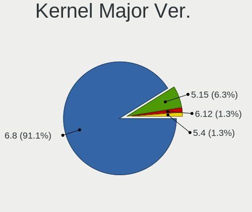
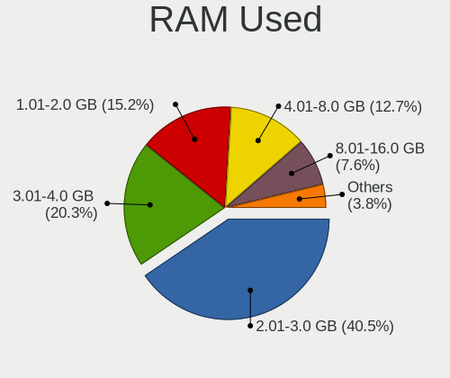
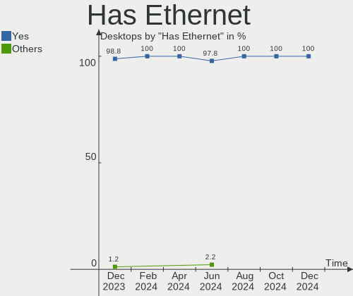
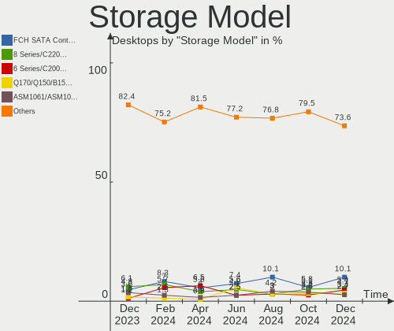

Zorin - Hardware Trends (Desktops)
----------------------------------

A project to identify most popular hardware characteristics and track their change
over time based on data collected by Linux users at https://Linux-Hardware.org.

Anyone can contribute to this report by the [hw-probe](https://github.com/linuxhw/hw-probe) tool:

    sudo -E hw-probe -all -upload

This report is for one last month. Overall report since the beginning of time: [TestCoverage](https://github.com/linuxhw/TestCoverage)

Period: Oct, 2022.

Contents
--------

* [ System ](#system)
  - [ OS                       ](#os)
  - [ OS Family                ](#os-family)
  - [ Kernel                   ](#kernel)
  - [ Kernel Family            ](#kernel-family)
  - [ Kernel Major Ver.        ](#kernel-major-ver)
  - [ Arch                     ](#arch)
  - [ DE                       ](#de)
  - [ Display Server           ](#display-server)
  - [ Display Manager          ](#display-manager)
  - [ OS Lang                  ](#os-lang)
  - [ Boot Mode                ](#boot-mode)
  - [ Filesystem               ](#filesystem)
  - [ Part. scheme             ](#part-scheme)
  - [ Dual Boot with Linux/BSD ](#dual-boot-with-linuxbsd)
  - [ Dual Boot (Win)          ](#dual-boot-win)

* [ Board ](#board)
  - [ Vendor                   ](#vendor)
  - [ Model                    ](#model)
  - [ Model Family             ](#model-family)
  - [ MFG Year                 ](#mfg-year)
  - [ Form Factor              ](#form-factor)
  - [ Secure Boot              ](#secure-boot)
  - [ Coreboot                 ](#coreboot)
  - [ RAM Size                 ](#ram-size)
  - [ RAM Used                 ](#ram-used)
  - [ Total Drives             ](#total-drives)
  - [ Has CD-ROM               ](#has-cd-rom)
  - [ Has Ethernet             ](#has-ethernet)
  - [ Has WiFi                 ](#has-wifi)
  - [ Has Bluetooth            ](#has-bluetooth)

* [ Location ](#location)
  - [ Country                  ](#country)
  - [ City                     ](#city)

* [ Drives ](#drives)
  - [ Drive Vendor             ](#drive-vendor)
  - [ Drive Model              ](#drive-model)
  - [ HDD Vendor               ](#hdd-vendor)
  - [ SSD Vendor               ](#ssd-vendor)
  - [ Drive Kind               ](#drive-kind)
  - [ Drive Connector          ](#drive-connector)
  - [ Drive Size               ](#drive-size)
  - [ Space Total              ](#space-total)
  - [ Space Used               ](#space-used)
  - [ Malfunc. Drives          ](#malfunc-drives)
  - [ Malfunc. Drive Vendor    ](#malfunc-drive-vendor)
  - [ Malfunc. HDD Vendor      ](#malfunc-hdd-vendor)
  - [ Malfunc. Drive Kind      ](#malfunc-drive-kind)
  - [ Failed Drives            ](#failed-drives)
  - [ Failed Drive Vendor      ](#failed-drive-vendor)
  - [ Drive Status             ](#drive-status)

* [ Storage controller ](#storage-controller)
  - [ Storage Vendor           ](#storage-vendor)
  - [ Storage Model            ](#storage-model)
  - [ Storage Kind             ](#storage-kind)

* [ Processor ](#processor)
  - [ CPU Vendor               ](#cpu-vendor)
  - [ CPU Model                ](#cpu-model)
  - [ CPU Model Family         ](#cpu-model-family)
  - [ CPU Cores                ](#cpu-cores)
  - [ CPU Sockets              ](#cpu-sockets)
  - [ CPU Threads              ](#cpu-threads)
  - [ CPU Op-Modes             ](#cpu-op-modes)
  - [ CPU Microcode            ](#cpu-microcode)
  - [ CPU Microarch            ](#cpu-microarch)

* [ Graphics ](#graphics)
  - [ GPU Vendor               ](#gpu-vendor)
  - [ GPU Model                ](#gpu-model)
  - [ GPU Combo                ](#gpu-combo)
  - [ GPU Driver               ](#gpu-driver)
  - [ GPU Memory               ](#gpu-memory)

* [ Monitor ](#monitor)
  - [ Monitor Vendor           ](#monitor-vendor)
  - [ Monitor Model            ](#monitor-model)
  - [ Monitor Resolution       ](#monitor-resolution)
  - [ Monitor Diagonal         ](#monitor-diagonal)
  - [ Monitor Width            ](#monitor-width)
  - [ Aspect Ratio             ](#aspect-ratio)
  - [ Monitor Area             ](#monitor-area)
  - [ Pixel Density            ](#pixel-density)
  - [ Multiple Monitors        ](#multiple-monitors)

* [ Network ](#network)
  - [ Net Controller Vendor    ](#net-controller-vendor)
  - [ Net Controller Model     ](#net-controller-model)
  - [ Wireless Vendor          ](#wireless-vendor)
  - [ Wireless Model           ](#wireless-model)
  - [ Ethernet Vendor          ](#ethernet-vendor)
  - [ Ethernet Model           ](#ethernet-model)
  - [ Net Controller Kind      ](#net-controller-kind)
  - [ Used Controller          ](#used-controller)
  - [ NICs                     ](#nics)
  - [ IPv6                     ](#ipv6)

* [ Bluetooth ](#bluetooth)
  - [ Bluetooth Vendor         ](#bluetooth-vendor)
  - [ Bluetooth Model          ](#bluetooth-model)

* [ Sound ](#sound)
  - [ Sound Vendor             ](#sound-vendor)
  - [ Sound Model              ](#sound-model)

* [ Memory ](#memory)
  - [ Memory Vendor            ](#memory-vendor)
  - [ Memory Model             ](#memory-model)
  - [ Memory Kind              ](#memory-kind)
  - [ Memory Form Factor       ](#memory-form-factor)
  - [ Memory Size              ](#memory-size)
  - [ Memory Speed             ](#memory-speed)

* [ Printers & scanners ](#printers--scanners)
  - [ Printer Vendor           ](#printer-vendor)
  - [ Printer Model            ](#printer-model)
  - [ Scanner Vendor           ](#scanner-vendor)
  - [ Scanner Model            ](#scanner-model)

* [ Camera ](#camera)
  - [ Camera Vendor            ](#camera-vendor)
  - [ Camera Model             ](#camera-model)

* [ Security ](#security)
  - [ Fingerprint Vendor       ](#fingerprint-vendor)
  - [ Fingerprint Model        ](#fingerprint-model)
  - [ Chipcard Vendor          ](#chipcard-vendor)
  - [ Chipcard Model           ](#chipcard-model)

* [ Unsupported ](#unsupported)
  - [ Unsupported Devices      ](#unsupported-devices)
  - [ Unsupported Device Types ](#unsupported-device-types)

System
------

OS
--

Installed operating systems

| Name     | Desktops | Percent |
|----------|----------|---------|
| Zorin 16 | 55       | 96.49%  |
| Zorin 15 | 2        | 3.51%   |

OS Family
---------

OS without a version

| Name  | Desktops | Percent |
|-------|----------|---------|
| Zorin | 57       | 100%    |

Kernel
------

Version of the Linux kernel

| Version           | Desktops | Percent |
|-------------------|----------|---------|
| 5.15.0-48-generic | 23       | 40.35%  |
| 5.15.0-52-generic | 19       | 33.33%  |
| 5.15.0-50-generic | 7        | 12.28%  |
| 5.13.0-30-generic | 3        | 5.26%   |
| 5.13.0-52-generic | 2        | 3.51%   |
| 5.4.0-128-generic | 1        | 1.75%   |
| 5.4.0-126-generic | 1        | 1.75%   |
| 5.15.0-46-generic | 1        | 1.75%   |

Kernel Family
-------------

Linux kernel without a distro release

| Version | Desktops | Percent |
|---------|----------|---------|
| 5.15.0  | 50       | 87.72%  |
| 5.13.0  | 5        | 8.77%   |
| 5.4.0   | 2        | 3.51%   |

Kernel Major Ver.
-----------------

Linux kernel major version

| Version | Desktops | Percent |
|---------|----------|---------|
| 5.15    | 50       | 87.72%  |
| 5.13    | 5        | 8.77%   |
| 5.4     | 2        | 3.51%   |

Arch
----

OS architecture (x86_64, i586, etc.)

| Name   | Desktops | Percent |
|--------|----------|---------|
| x86_64 | 56       | 98.25%  |
| i686   | 1        | 1.75%   |

DE
--

Desktop Environment

| Name  | Desktops | Percent |
|-------|----------|---------|
| GNOME | 47       | 82.46%  |
| XFCE  | 10       | 17.54%  |

Display Server
--------------

X11 or Wayland

| Name    | Desktops | Percent |
|---------|----------|---------|
| X11     | 56       | 98.25%  |
| Wayland | 1        | 1.75%   |

Display Manager
---------------

SDDM, LightDM, etc.

| Name    | Desktops | Percent |
|---------|----------|---------|
| Unknown | 43       | 75.44%  |
| GDM3    | 8        | 14.04%  |
| LightDM | 4        | 7.02%   |
| GDM     | 2        | 3.51%   |

OS Lang
-------

Language

| Lang  | Desktops | Percent |
|-------|----------|---------|
| en_US | 24       | 42.11%  |
| pt_BR | 6        | 10.53%  |
| en_GB | 5        | 8.77%   |
| nl_NL | 3        | 5.26%   |
| en_CA | 3        | 5.26%   |
| de_DE | 3        | 5.26%   |
| pl_PL | 2        | 3.51%   |
| fr_FR | 2        | 3.51%   |
| ru_RU | 1        | 1.75%   |
| nl_BE | 1        | 1.75%   |
| it_IT | 1        | 1.75%   |
| fr_CA | 1        | 1.75%   |
| es_ES | 1        | 1.75%   |
| es_AR | 1        | 1.75%   |
| en_IN | 1        | 1.75%   |
| en_AU | 1        | 1.75%   |
| cs_CZ | 1        | 1.75%   |

Boot Mode
---------

EFI or BIOS

| Mode | Desktops | Percent |
|------|----------|---------|
| BIOS | 30       | 52.63%  |
| EFI  | 27       | 47.37%  |

Filesystem
----------

Type of filesystem

| Type | Desktops | Percent |
|------|----------|---------|
| Ext4 | 55       | 96.49%  |
| Zfs  | 2        | 3.51%   |

Part. scheme
------------

Scheme of partitioning

| Type    | Desktops | Percent |
|---------|----------|---------|
| Unknown | 44       | 77.19%  |
| MBR     | 7        | 12.28%  |
| GPT     | 6        | 10.53%  |

Dual Boot with Linux/BSD
------------------------

Hosting more than one Linux/BSD

| Dual boot | Desktops | Percent |
|-----------|----------|---------|
| No        | 54       | 94.74%  |
| Yes       | 3        | 5.26%   |

Dual Boot (Win)
---------------

Hosting Linux and Windows

| Dual boot | Desktops | Percent |
|-----------|----------|---------|
| No        | 51       | 89.47%  |
| Yes       | 6        | 10.53%  |

Board
-----

Vendor
------

Motherboard manufacturer

| Name                | Desktops | Percent |
|---------------------|----------|---------|
| ASUSTek Computer    | 12       | 21.05%  |
| Hewlett-Packard     | 11       | 19.3%   |
| Gigabyte Technology | 8        | 14.04%  |
| Dell                | 7        | 12.28%  |
| MSI                 | 3        | 5.26%   |
| Fujitsu             | 3        | 5.26%   |
| OEM                 | 2        | 3.51%   |
| ASRock              | 2        | 3.51%   |
| Unknown             | 2        | 3.51%   |
| Standard            | 1        | 1.75%   |
| Seco                | 1        | 1.75%   |
| Lenovo              | 1        | 1.75%   |
| Intel               | 1        | 1.75%   |
| Gateway             | 1        | 1.75%   |
| Biostar             | 1        | 1.75%   |
| Alienware           | 1        | 1.75%   |

Model
-----

Motherboard model

| Name                            | Desktops | Percent |
|---------------------------------|----------|---------|
| OEM G41 775 ICH7 8712           | 2        | 3.51%   |
| Gigabyte GA-78LMT-S2            | 2        | 3.51%   |
| ASUS All Series                 | 2        | 3.51%   |
| Unknown                         | 2        | 3.51%   |
| Standard X50-V2                 | 1        | 1.75%   |
| Seco C40                        | 1        | 1.75%   |
| MSI MS-7D20                     | 1        | 1.75%   |
| MSI MS-7C56                     | 1        | 1.75%   |
| MSI MS-7B86                     | 1        | 1.75%   |
| Lenovo ThinkCentre M92p 3237A1Q | 1        | 1.75%   |
| Intel H55                       | 1        | 1.75%   |
| HP Z220 CMT Workstation         | 1        | 1.75%   |
| HP xw4600 Workstation           | 1        | 1.75%   |
| HP rp5800                       | 1        | 1.75%   |
| HP ProDesk 600 G1 TWR           | 1        | 1.75%   |
| HP Pavilion Desktop 595-p0xxx   | 1        | 1.75%   |
| HP EliteDesk 705 G3 MT          | 1        | 1.75%   |
| HP Compaq Elite 8300 SFF        | 1        | 1.75%   |
| HP Compaq 8100 Elite SFF PC     | 1        | 1.75%   |
| HP 510-p189na                   | 1        | 1.75%   |
| HP 2AF3                         | 1        | 1.75%   |
| HP 285 G2 MT                    | 1        | 1.75%   |
| Gigabyte Z77-DS3H               | 1        | 1.75%   |
| Gigabyte Z390 UD                | 1        | 1.75%   |
| Gigabyte B450M DS3H V2          | 1        | 1.75%   |
| Gigabyte B250M-D3H              | 1        | 1.75%   |
| Gigabyte B150N Phoenix-WIFI     | 1        | 1.75%   |
| Gigabyte A320M-S2H              | 1        | 1.75%   |
| Gateway SX2851                  | 1        | 1.75%   |
| Fujitsu ESPRIMO P910            | 1        | 1.75%   |
| Fujitsu ESPRIMO P710            | 1        | 1.75%   |
| Fujitsu ESPRIMO E720            | 1        | 1.75%   |
| Dell XPS 8930                   | 1        | 1.75%   |
| Dell Precision T1650            | 1        | 1.75%   |
| Dell PowerEdge T40              | 1        | 1.75%   |
| Dell OptiPlex 780               | 1        | 1.75%   |
| Dell OptiPlex 740 Enhanced      | 1        | 1.75%   |
| Dell OptiPlex 380               | 1        | 1.75%   |
| Dell OptiPlex 3050              | 1        | 1.75%   |
| Biostar B350ET2                 | 1        | 1.75%   |

Model Family
------------

Motherboard model prefix

| Name                 | Desktops | Percent |
|----------------------|----------|---------|
| Dell OptiPlex        | 4        | 7.02%   |
| Fujitsu ESPRIMO      | 3        | 5.26%   |
| ASUS PRIME           | 3        | 5.26%   |
| OEM G41              | 2        | 3.51%   |
| HP Compaq            | 2        | 3.51%   |
| Gigabyte GA-78LMT-S2 | 2        | 3.51%   |
| ASUS All             | 2        | 3.51%   |
| ASRock 970           | 2        | 3.51%   |
| Unknown              | 2        | 3.51%   |
| Standard X50-V2      | 1        | 1.75%   |
| Seco C40             | 1        | 1.75%   |
| MSI MS-7D20          | 1        | 1.75%   |
| MSI MS-7C56          | 1        | 1.75%   |
| MSI MS-7B86          | 1        | 1.75%   |
| Lenovo ThinkCentre   | 1        | 1.75%   |
| Intel H55            | 1        | 1.75%   |
| HP Z220              | 1        | 1.75%   |
| HP xw4600            | 1        | 1.75%   |
| HP rp5800            | 1        | 1.75%   |
| HP ProDesk           | 1        | 1.75%   |
| HP Pavilion          | 1        | 1.75%   |
| HP EliteDesk         | 1        | 1.75%   |
| HP 510-p189na        | 1        | 1.75%   |
| HP 2AF3              | 1        | 1.75%   |
| HP 285               | 1        | 1.75%   |
| Gigabyte Z77-DS3H    | 1        | 1.75%   |
| Gigabyte Z390        | 1        | 1.75%   |
| Gigabyte B450M       | 1        | 1.75%   |
| Gigabyte B250M-D3H   | 1        | 1.75%   |
| Gigabyte B150N       | 1        | 1.75%   |
| Gigabyte A320M-S2H   | 1        | 1.75%   |
| Gateway SX2851       | 1        | 1.75%   |
| Dell XPS             | 1        | 1.75%   |
| Dell Precision       | 1        | 1.75%   |
| Dell PowerEdge       | 1        | 1.75%   |
| Biostar B350ET2      | 1        | 1.75%   |
| ASUS P8H61           | 1        | 1.75%   |
| ASUS P7H55-USB3      | 1        | 1.75%   |
| ASUS M5A99FX         | 1        | 1.75%   |
| ASUS M3A78-EM        | 1        | 1.75%   |

MFG Year
--------

Motherboard manufacture year

| Year    | Desktops | Percent |
|---------|----------|---------|
| 2012    | 9        | 15.79%  |
| 2019    | 8        | 14.04%  |
| 2016    | 5        | 8.77%   |
| 2010    | 5        | 8.77%   |
| 2021    | 4        | 7.02%   |
| 2020    | 4        | 7.02%   |
| 2017    | 4        | 7.02%   |
| 2013    | 4        | 7.02%   |
| 2011    | 4        | 7.02%   |
| 2014    | 3        | 5.26%   |
| 2018    | 2        | 3.51%   |
| 2008    | 2        | 3.51%   |
| 2015    | 1        | 1.75%   |
| 2009    | 1        | 1.75%   |
| Unknown | 1        | 1.75%   |

Form Factor
-----------

Physical design of the computer

| Name    | Desktops | Percent |
|---------|----------|---------|
| Desktop | 57       | 100%    |

Secure Boot
-----------

Enabled or disabled

| State    | Desktops | Percent |
|----------|----------|---------|
| Disabled | 53       | 92.98%  |
| Enabled  | 4        | 7.02%   |

Coreboot
--------

Have coreboot on board

| Used | Desktops | Percent |
|------|----------|---------|
| No   | 57       | 100%    |

RAM Size
--------

Total RAM memory

| Size in GB  | Desktops | Percent |
|-------------|----------|---------|
| 4.01-8.0    | 13       | 22.81%  |
| 16.01-24.0  | 12       | 21.05%  |
| 8.01-16.0   | 12       | 21.05%  |
| 3.01-4.0    | 11       | 19.3%   |
| 32.01-64.0  | 7        | 12.28%  |
| 24.01-32.0  | 1        | 1.75%   |
| 64.01-256.0 | 1        | 1.75%   |

RAM Used
--------

Used RAM memory

| Used GB   | Desktops | Percent |
|-----------|----------|---------|
| 1.01-2.0  | 21       | 36.84%  |
| 2.01-3.0  | 19       | 33.33%  |
| 4.01-8.0  | 11       | 19.3%   |
| 3.01-4.0  | 4        | 7.02%   |
| 8.01-16.0 | 1        | 1.75%   |
| 0.51-1.0  | 1        | 1.75%   |

Total Drives
------------

Number of drives on board

| Drives | Desktops | Percent |
|--------|----------|---------|
| 1      | 24       | 42.11%  |
| 2      | 16       | 28.07%  |
| 3      | 8        | 14.04%  |
| 4      | 4        | 7.02%   |
| 5      | 3        | 5.26%   |
| 51     | 1        | 1.75%   |
| 6      | 1        | 1.75%   |

Has CD-ROM
----------

Has CD-ROM on board

| Presented | Desktops | Percent |
|-----------|----------|---------|
| No        | 30       | 52.63%  |
| Yes       | 27       | 47.37%  |

Has Ethernet
------------

Has Ethernet on board

| Presented | Desktops | Percent |
|-----------|----------|---------|
| Yes       | 57       | 100%    |

Has WiFi
--------

Has WiFi module

| Presented | Desktops | Percent |
|-----------|----------|---------|
| Yes       | 30       | 52.63%  |
| No        | 27       | 47.37%  |

Has Bluetooth
-------------

Has Bluetooth module

| Presented | Desktops | Percent |
|-----------|----------|---------|
| No        | 39       | 68.42%  |
| Yes       | 18       | 31.58%  |

Location
--------

Country
-------

Geographic location (country)

| Country     | Desktops | Percent |
|-------------|----------|---------|
| USA         | 12       | 21.05%  |
| Brazil      | 7        | 12.28%  |
| UK          | 4        | 7.02%   |
| Netherlands | 4        | 7.02%   |
| Germany     | 4        | 7.02%   |
| Canada      | 4        | 7.02%   |
| Poland      | 3        | 5.26%   |
| France      | 3        | 5.26%   |
| Italy       | 2        | 3.51%   |
| Egypt       | 2        | 3.51%   |
| Venezuela   | 1        | 1.75%   |
| Thailand    | 1        | 1.75%   |
| Sri Lanka   | 1        | 1.75%   |
| Spain       | 1        | 1.75%   |
| Russia      | 1        | 1.75%   |
| Norway      | 1        | 1.75%   |
| Malaysia    | 1        | 1.75%   |
| India       | 1        | 1.75%   |
| Czechia     | 1        | 1.75%   |
| Belgium     | 1        | 1.75%   |
| Australia   | 1        | 1.75%   |
| Argentina   | 1        | 1.75%   |

City
----

Geographic location (city)

| City                       | Desktops | Percent |
|----------------------------|----------|---------|
| Port Said                  | 2        | 3.51%   |
| Winkel                     | 1        | 1.75%   |
| Vancouver                  | 1        | 1.75%   |
| Valencia                   | 1        | 1.75%   |
| Teresopolis                | 1        | 1.75%   |
| Surrey                     | 1        | 1.75%   |
| Subang Jaya                | 1        | 1.75%   |
| Stellendam                 | 1        | 1.75%   |
| Saint-Martin-de-la-Brasque | 1        | 1.75%   |
| Rio de Janeiro             | 1        | 1.75%   |
| Regina                     | 1        | 1.75%   |
| Redruth                    | 1        | 1.75%   |
| Recife                     | 1        | 1.75%   |
| Rainsville                 | 1        | 1.75%   |
| Queen Creek                | 1        | 1.75%   |
| Powder Springs             | 1        | 1.75%   |
| Portland                   | 1        | 1.75%   |
| Pontypool                  | 1        | 1.75%   |
| Paris                      | 1        | 1.75%   |
| Otur                       | 1        | 1.75%   |
| Orpington                  | 1        | 1.75%   |
| Nugegoda                   | 1        | 1.75%   |
| Novosibirsk                | 1        | 1.75%   |
| Nova Milanese              | 1        | 1.75%   |
| Norwich                    | 1        | 1.75%   |
| Niepolomice                | 1        | 1.75%   |
| New Baltimore              | 1        | 1.75%   |
| Montreal                   | 1        | 1.75%   |
| Mogilno                    | 1        | 1.75%   |
| Maceió                    | 1        | 1.75%   |
| Los Angeles                | 1        | 1.75%   |
| Kiel                       | 1        | 1.75%   |
| Katowice                   | 1        | 1.75%   |
| Jewett City                | 1        | 1.75%   |
| Ituberá                   | 1        | 1.75%   |
| Henderson                  | 1        | 1.75%   |
| Hattingen                  | 1        | 1.75%   |
| Haarlem                    | 1        | 1.75%   |
| Greensburg                 | 1        | 1.75%   |
| Florence                   | 1        | 1.75%   |

Drives
------

Drive Vendor
------------

Hard drive vendors

| Vendor                      | Desktops | Drives | Percent |
|-----------------------------|----------|--------|---------|
| Seagate                     | 23       | 26     | 23%     |
| WDC                         | 21       | 32     | 21%     |
| Samsung Electronics         | 13       | 17     | 13%     |
| Toshiba                     | 8        | 48     | 8%      |
| Kingston                    | 5        | 5      | 5%      |
| Crucial                     | 4        | 4      | 4%      |
| Unknown                     | 3        | 3      | 3%      |
| SanDisk                     | 2        | 2      | 2%      |
| PNY                         | 2        | 3      | 2%      |
| Hitachi                     | 2        | 2      | 2%      |
| HGST                        | 2        | 7      | 2%      |
| GOODRAM                     | 2        | 2      | 2%      |
| XPG                         | 1        | 2      | 1%      |
| Silicon Motion              | 1        | 1      | 1%      |
| RENICE                      | 1        | 1      | 1%      |
| OCZ                         | 1        | 2      | 1%      |
| Micron Technology           | 1        | 1      | 1%      |
| Lexar                       | 1        | 1      | 1%      |
| Kingston Technology Company | 1        | 1      | 1%      |
| JMicron Technology          | 1        | 1      | 1%      |
| Intel                       | 1        | 1      | 1%      |
| Drevo                       | 1        | 1      | 1%      |
| China                       | 1        | 1      | 1%      |
| ADATA Technology            | 1        | 1      | 1%      |
| A-DATA Technology           | 1        | 1      | 1%      |

Drive Model
-----------

Hard drive models

| Model                                         | Desktops | Percent |
|-----------------------------------------------|----------|---------|
| Seagate ST500DM002-1BD142 500GB               | 3        | 2.56%   |
| Seagate ST1000DM010-2EP102 1TB                | 3        | 2.56%   |
| Kingston SA400S37240G 240GB SSD               | 3        | 2.56%   |
| Seagate ST3500414CS 500GB                     | 2        | 1.71%   |
| Seagate ST2000DM008-2FR102 2TB                | 2        | 1.71%   |
| Seagate ST2000DM001-1ER164 2TB                | 2        | 1.71%   |
| Samsung SSD 860 QVO 2TB                       | 2        | 1.71%   |
| Samsung NVMe SSD Controller SM951/PM951 512GB | 2        | 1.71%   |
| GOODRAM SSDPR-CX400-128 128GB                 | 2        | 1.71%   |
| XPG SX950U 240GB                              | 1        | 0.85%   |
| XPG NVMe SSD Drive 1024GB                     | 1        | 0.85%   |
| WDC WUH721414ALE6L4 14TB                      | 1        | 0.85%   |
| WDC WDS120G1G0A-00SS50 120GB SSD              | 1        | 0.85%   |
| WDC WDS100T2B0C-00PXH0 1TB                    | 1        | 0.85%   |
| WDC WDBNCE0010PNC 1TB SSD                     | 1        | 0.85%   |
| WDC WD7500BPVT-24HXZT1 752GB                  | 1        | 0.85%   |
| WDC WD7500AAKS-00RBA0 752GB                   | 1        | 0.85%   |
| WDC WD60EZAZ-00SF3B0 6TB                      | 1        | 0.85%   |
| WDC WD5000LPVX-75V0TT0 500GB                  | 1        | 0.85%   |
| WDC WD5000AZLX-60K2TA0 500GB                  | 1        | 0.85%   |
| WDC WD5000AVCS-632DY1 500GB                   | 1        | 0.85%   |
| WDC WD5000AAKX-08U6AA0 500GB                  | 1        | 0.85%   |
| WDC WD5000AAKS-00WWPA0 500GB                  | 1        | 0.85%   |
| WDC WD5000AADS-00S9B0 500GB                   | 1        | 0.85%   |
| WDC WD3200BPVT-22JJ5T0 320GB                  | 1        | 0.85%   |
| WDC WD30EZRZ-00GXCB0 3TB                      | 1        | 0.85%   |
| WDC WD2500AAKX-603CA0 250GB                   | 1        | 0.85%   |
| WDC WD20EZRZ-00Z5HB0 2TB                      | 1        | 0.85%   |
| WDC WD2002FYPS-02W3B0 2TB                     | 1        | 0.85%   |
| WDC WD10EZRX-00L4HB0 1TB                      | 1        | 0.85%   |
| WDC WD10EZRX-00A3KB0 1TB                      | 1        | 0.85%   |
| WDC WD10EZEX-60ZF5A0 1TB                      | 1        | 0.85%   |
| WDC WD10EZEX-22MFCA0 1TB                      | 1        | 0.85%   |
| WDC WD10EZEX-08WN4A0 1TB                      | 1        | 0.85%   |
| WDC WD10EURX-62FH1Y0 1TB                      | 1        | 0.85%   |
| WDC WD10EADS-00M2B0 1TB                       | 1        | 0.85%   |
| WDC WD10EACS-00D6B0 1TB                       | 1        | 0.85%   |
| WDC WD1002FAEX-00Z3A0 1TB                     | 1        | 0.85%   |
| Unknown SD/MMC/MS PRO 1TB                     | 1        | 0.85%   |
| Unknown MMC Card  32GB                        | 1        | 0.85%   |

HDD Vendor
----------

Hard disk drive vendors

| Vendor              | Desktops | Drives | Percent |
|---------------------|----------|--------|---------|
| Seagate             | 23       | 26     | 39.66%  |
| WDC                 | 19       | 28     | 32.76%  |
| Toshiba             | 7        | 47     | 12.07%  |
| Samsung Electronics | 4        | 5      | 6.9%    |
| Hitachi             | 2        | 2      | 3.45%   |
| HGST                | 2        | 7      | 3.45%   |
| Unknown             | 1        | 1      | 1.72%   |

SSD Vendor
----------

Solid state drive vendors

| Vendor              | Desktops | Drives | Percent |
|---------------------|----------|--------|---------|
| Samsung Electronics | 7        | 8      | 24.14%  |
| Kingston            | 5        | 5      | 17.24%  |
| Crucial             | 4        | 4      | 13.79%  |
| WDC                 | 2        | 2      | 6.9%    |
| PNY                 | 2        | 3      | 6.9%    |
| GOODRAM             | 2        | 2      | 6.9%    |
| XPG                 | 1        | 1      | 3.45%   |
| SanDisk             | 1        | 1      | 3.45%   |
| OCZ                 | 1        | 2      | 3.45%   |
| Lexar               | 1        | 1      | 3.45%   |
| Drevo               | 1        | 1      | 3.45%   |
| China               | 1        | 1      | 3.45%   |
| A-DATA Technology   | 1        | 1      | 3.45%   |

Drive Kind
----------

HDD or SSD

| Kind    | Desktops | Drives | Percent |
|---------|----------|--------|---------|
| HDD     | 45       | 116    | 52.33%  |
| SSD     | 26       | 32     | 30.23%  |
| NVMe    | 12       | 15     | 13.95%  |
| MMC     | 2        | 2      | 2.33%   |
| Unknown | 1        | 1      | 1.16%   |

Drive Connector
---------------

SATA, SAS, NVMe, etc.

| Type | Desktops | Drives | Percent |
|------|----------|--------|---------|
| SATA | 54       | 146    | 77.14%  |
| NVMe | 11       | 14     | 15.71%  |
| SAS  | 3        | 4      | 4.29%   |
| MMC  | 2        | 2      | 2.86%   |

Drive Size
----------

Size of hard drive

| Size in TB | Desktops | Drives | Percent |
|------------|----------|--------|---------|
| 0.01-0.5   | 36       | 53     | 46.15%  |
| 0.51-1.0   | 27       | 30     | 34.62%  |
| 1.01-2.0   | 9        | 11     | 11.54%  |
| 3.01-4.0   | 2        | 41     | 2.56%   |
| 4.01-10.0  | 2        | 6      | 2.56%   |
| 2.01-3.0   | 1        | 2      | 1.28%   |
| 10.01-20.0 | 1        | 5      | 1.28%   |

Space Total
-----------

Amount of disk space available on the file system

| Size in GB     | Desktops | Percent |
|----------------|----------|---------|
| 501-1000       | 16       | 28.07%  |
| 251-500        | 15       | 26.32%  |
| 101-250        | 14       | 24.56%  |
| 1001-2000      | 5        | 8.77%   |
| More than 3000 | 4        | 7.02%   |
| 2001-3000      | 1        | 1.75%   |
| 51-100         | 1        | 1.75%   |
| Unknown        | 1        | 1.75%   |

Space Used
----------

Amount of used disk space

| Used GB        | Desktops | Percent |
|----------------|----------|---------|
| 1-20           | 24       | 42.11%  |
| 21-50          | 9        | 15.79%  |
| 51-100         | 8        | 14.04%  |
| 101-250        | 7        | 12.28%  |
| More than 3000 | 4        | 7.02%   |
| 501-1000       | 3        | 5.26%   |
| 1001-2000      | 1        | 1.75%   |
| Unknown        | 1        | 1.75%   |

Malfunc. Drives
---------------

Drive models with a malfunction

Zero info for selected period =(

Malfunc. Drive Vendor
---------------------

Vendors of faulty drives

Zero info for selected period =(

Malfunc. HDD Vendor
-------------------

Vendors of faulty HDD drives

Zero info for selected period =(

Malfunc. Drive Kind
-------------------

Kinds of faulty drives

Zero info for selected period =(

Failed Drives
-------------

Failed drive models

Zero info for selected period =(

Failed Drive Vendor
-------------------

Failed drive vendors

Zero info for selected period =(

Drive Status
------------

Number of failed and malfunc. drives

| Status   | Desktops | Drives | Percent |
|----------|----------|--------|---------|
| Detected | 52       | 106    | 91.23%  |
| Works    | 5        | 60     | 8.77%   |

Storage controller
------------------

Storage Vendor
--------------

Storage controller vendors

| Vendor                       | Desktops | Percent |
|------------------------------|----------|---------|
| Intel                        | 37       | 50.68%  |
| AMD                          | 19       | 26.03%  |
| Samsung Electronics          | 4        | 5.48%   |
| SanDisk                      | 2        | 2.74%   |
| ASMedia Technology           | 2        | 2.74%   |
| Unknown                      | 1        | 1.37%   |
| Toshiba America Info Systems | 1        | 1.37%   |
| Silicon Motion               | 1        | 1.37%   |
| OCZ Technology Group         | 1        | 1.37%   |
| Nvidia                       | 1        | 1.37%   |
| Micron Technology            | 1        | 1.37%   |
| Marvell Technology Group     | 1        | 1.37%   |
| Kingston Technology Company  | 1        | 1.37%   |
| ADATA Technology             | 1        | 1.37%   |

Storage Model
-------------

Storage controller models

| Model                                                                                  | Desktops | Percent |
|----------------------------------------------------------------------------------------|----------|---------|
| AMD FCH SATA Controller [AHCI mode]                                                    | 10       | 10.42%  |
| Intel 7 Series/C210 Series Chipset Family 6-port SATA Controller [AHCI mode]           | 6        | 6.25%   |
| AMD SB7x0/SB8x0/SB9x0 IDE Controller                                                   | 6        | 6.25%   |
| AMD SB7x0/SB8x0/SB9x0 SATA Controller [IDE mode]                                       | 5        | 5.21%   |
| Intel SATA Controller [RAID mode]                                                      | 4        | 4.17%   |
| Intel NM10/ICH7 Family SATA Controller [IDE mode]                                      | 4        | 4.17%   |
| Intel 8 Series/C220 Series Chipset Family 6-port SATA Controller 1 [AHCI mode]         | 4        | 4.17%   |
| Intel 82801G (ICH7 Family) IDE Controller                                              | 3        | 3.13%   |
| AMD SB7x0/SB8x0/SB9x0 SATA Controller [AHCI mode]                                      | 3        | 3.13%   |
| AMD 400 Series Chipset SATA Controller                                                 | 3        | 3.13%   |
| AMD 300 Series Chipset SATA Controller                                                 | 3        | 3.13%   |
| SanDisk WD Blue SN550 NVMe SSD                                                         | 2        | 2.08%   |
| Samsung NVMe SSD Controller SM951/PM951                                                | 2        | 2.08%   |
| Intel Cannon Lake PCH SATA AHCI Controller                                             | 2        | 2.08%   |
| Intel 6 Series/C200 Series Chipset Family 6 port Desktop SATA AHCI Controller          | 2        | 2.08%   |
| Intel 5 Series/3400 Series Chipset 6 port SATA AHCI Controller                         | 2        | 2.08%   |
| Intel 200 Series PCH SATA controller [AHCI mode]                                       | 2        | 2.08%   |
| Unknown Non-Volatile memory controller                                                 | 1        | 1.04%   |
| Toshiba America Info Systems XG6 NVMe SSD Controller                                   | 1        | 1.04%   |
| Silicon Motion SM2263EN/SM2263XT SSD Controller                                        | 1        | 1.04%   |
| Samsung NVMe SSD Controller SM981/PM981/PM983                                          | 1        | 1.04%   |
| Samsung NVMe SSD Controller 980                                                        | 1        | 1.04%   |
| OCZ Group OCZ SCSI storage controller                                                  | 1        | 1.04%   |
| Nvidia MCP51 Serial ATA Controller                                                     | 1        | 1.04%   |
| Micron Non-Volatile memory controller                                                  | 1        | 1.04%   |
| Marvell Group 88SE9215 PCIe 2.0 x1 4-port SATA 6 Gb/s Controller                       | 1        | 1.04%   |
| Kingston Company U-SNS8154P3 NVMe SSD                                                  | 1        | 1.04%   |
| Intel Volume Management Device NVMe RAID Controller                                    | 1        | 1.04%   |
| Intel SSD 660P Series                                                                  | 1        | 1.04%   |
| Intel Q170/Q150/B150/H170/H110/Z170/CM236 Chipset SATA Controller [AHCI Mode]          | 1        | 1.04%   |
| Intel Celeron/Pentium Silver Processor SATA Controller                                 | 1        | 1.04%   |
| Intel C610/X99 series chipset sSATA Controller [AHCI mode]                             | 1        | 1.04%   |
| Intel C610/X99 series chipset 6-Port SATA Controller [AHCI mode]                       | 1        | 1.04%   |
| Intel Alder Lake-S PCH SATA Controller [AHCI Mode]                                     | 1        | 1.04%   |
| Intel 9 Series Chipset Family SATA Controller [AHCI Mode]                              | 1        | 1.04%   |
| Intel 82801JD/DO (ICH10 Family) SATA AHCI Controller                                   | 1        | 1.04%   |
| Intel 82801IR/IO/IH (ICH9R/DO/DH) 6 port SATA Controller [AHCI mode]                   | 1        | 1.04%   |
| Intel 6 Series/C200 Series Chipset Family Mobile SATA Controller (IDE mode, ports 4-5) | 1        | 1.04%   |
| Intel 6 Series/C200 Series Chipset Family Mobile SATA Controller (IDE mode, ports 0-3) | 1        | 1.04%   |
| Intel 500 Series Chipset Family SATA AHCI Controller                                   | 1        | 1.04%   |

Storage Kind
------------

Kind of storage controller (IDE, SATA, NVMe, SAS, ...)

| Kind | Desktops | Percent |
|------|----------|---------|
| SATA | 46       | 58.97%  |
| IDE  | 15       | 19.23%  |
| NVMe | 11       | 14.1%   |
| RAID | 5        | 6.41%   |
| SCSI | 1        | 1.28%   |

Processor
---------

CPU Vendor
----------

Processor vendors

| Vendor | Desktops | Percent |
|--------|----------|---------|
| Intel  | 37       | 64.91%  |
| AMD    | 20       | 35.09%  |

CPU Model
---------

Processor models

| Model                                          | Desktops | Percent |
|------------------------------------------------|----------|---------|
| Intel Core i7-9700F CPU @ 3.00GHz              | 2        | 3.51%   |
| Intel Core i5-3470 CPU @ 3.20GHz               | 2        | 3.51%   |
| Intel Core 2 Duo CPU E7500 @ 2.93GHz           | 2        | 3.51%   |
| Intel Xeon E-2224G CPU @ 3.50GHz               | 1        | 1.75%   |
| Intel Xeon CPU E5-2630 v4 @ 2.20GHz            | 1        | 1.75%   |
| Intel Xeon CPU E3-1270 V2 @ 3.50GHz            | 1        | 1.75%   |
| Intel Core i9-9900 CPU @ 3.10GHz               | 1        | 1.75%   |
| Intel Core i7-6700K CPU @ 4.00GHz              | 1        | 1.75%   |
| Intel Core i7-4770 CPU @ 3.40GHz               | 1        | 1.75%   |
| Intel Core i7-3770 CPU @ 3.40GHz               | 1        | 1.75%   |
| Intel Core i5-9400 CPU @ 2.90GHz               | 1        | 1.75%   |
| Intel Core i5-7600 CPU @ 3.50GHz               | 1        | 1.75%   |
| Intel Core i5-4670 CPU @ 3.40GHz               | 1        | 1.75%   |
| Intel Core i5-4590 CPU @ 3.30GHz               | 1        | 1.75%   |
| Intel Core i5-4570 CPU @ 3.20GHz               | 1        | 1.75%   |
| Intel Core i5-4440 CPU @ 3.10GHz               | 1        | 1.75%   |
| Intel Core i5-3570 CPU @ 3.40GHz               | 1        | 1.75%   |
| Intel Core i5-3470T CPU @ 2.90GHz              | 1        | 1.75%   |
| Intel Core i5-2430M CPU @ 2.40GHz              | 1        | 1.75%   |
| Intel Core i5-2400 CPU @ 3.10GHz               | 1        | 1.75%   |
| Intel Core i5 CPU 670 @ 3.47GHz                | 1        | 1.75%   |
| Intel Core i5 CPU 650 @ 3.20GHz                | 1        | 1.75%   |
| Intel Core i3-7100T CPU @ 3.40GHz              | 1        | 1.75%   |
| Intel Core i3-3240 CPU @ 3.40GHz               | 1        | 1.75%   |
| Intel Core i3-2100 CPU @ 3.10GHz               | 1        | 1.75%   |
| Intel Core i3-10100F CPU @ 3.60GHz             | 1        | 1.75%   |
| Intel Core i3 CPU 550 @ 3.20GHz                | 1        | 1.75%   |
| Intel Core i3 CPU 530 @ 2.93GHz                | 1        | 1.75%   |
| Intel Core 2 Quad CPU Q9505 @ 2.83GHz          | 1        | 1.75%   |
| Intel Core 2 Quad CPU Q8400 @ 2.66GHz          | 1        | 1.75%   |
| Intel Core 2 Quad CPU Q6600 @ 2.40GHz          | 1        | 1.75%   |
| Intel Celeron J4125 CPU @ 2.00GHz              | 1        | 1.75%   |
| Intel Atom CPU D525 @ 1.80GHz                  | 1        | 1.75%   |
| Intel 12th Gen Core i5-12400F                  | 1        | 1.75%   |
| AMD Ryzen Embedded V1605B with Radeon Vega Gfx | 1        | 1.75%   |
| AMD Ryzen 9 3950X 16-Core Processor            | 1        | 1.75%   |
| AMD Ryzen 7 3700X 8-Core Processor             | 1        | 1.75%   |
| AMD Ryzen 7 2700 Eight-Core Processor          | 1        | 1.75%   |
| AMD Ryzen 5 5600X 6-Core Processor             | 1        | 1.75%   |
| AMD Ryzen 5 1600 Six-Core Processor            | 1        | 1.75%   |

CPU Model Family
----------------

Processor model prefix

| Model              | Desktops | Percent |
|--------------------|----------|---------|
| Intel Core i5      | 14       | 24.56%  |
| Intel Core i3      | 6        | 10.53%  |
| Intel Core i7      | 5        | 8.77%   |
| AMD FX             | 4        | 7.02%   |
| Intel Xeon         | 3        | 5.26%   |
| Intel Core 2 Quad  | 3        | 5.26%   |
| Intel Core 2 Duo   | 2        | 3.51%   |
| AMD Ryzen 7        | 2        | 3.51%   |
| AMD Ryzen 5        | 2        | 3.51%   |
| AMD Phenom II X6   | 2        | 3.51%   |
| AMD A8             | 2        | 3.51%   |
| Other              | 1        | 1.75%   |
| Intel Core i9      | 1        | 1.75%   |
| Intel Celeron      | 1        | 1.75%   |
| Intel Atom         | 1        | 1.75%   |
| AMD Ryzen Embedded | 1        | 1.75%   |
| AMD Ryzen 9        | 1        | 1.75%   |
| AMD Ryzen 3        | 1        | 1.75%   |
| AMD PRO A10        | 1        | 1.75%   |
| AMD Phenom II X4   | 1        | 1.75%   |
| AMD Athlon II X2   | 1        | 1.75%   |
| AMD Athlon 64 X2   | 1        | 1.75%   |
| AMD Athlon         | 1        | 1.75%   |

CPU Cores
---------

Number of processor cores

| Number | Desktops | Percent |
|--------|----------|---------|
| 4      | 26       | 45.61%  |
| 2      | 17       | 29.82%  |
| 6      | 6        | 10.53%  |
| 8      | 5        | 8.77%   |
| 16     | 1        | 1.75%   |
| 10     | 1        | 1.75%   |
| 1      | 1        | 1.75%   |

CPU Sockets
-----------

Number of sockets

| Number | Desktops | Percent |
|--------|----------|---------|
| 1      | 57       | 100%    |

CPU Threads
-----------

Threads per core (Hyper-Threading)

| Number | Desktops | Percent |
|--------|----------|---------|
| 2      | 32       | 56.14%  |
| 1      | 25       | 43.86%  |

CPU Op-Modes
------------

CPU Operation Modes (32-bit, 64-bit)

| Op mode        | Desktops | Percent |
|----------------|----------|---------|
| 32-bit, 64-bit | 57       | 100%    |

CPU Microcode
-------------

Microcode number

| Number     | Desktops | Percent |
|------------|----------|---------|
| 0x306a9    | 7        | 12.28%  |
| 0x306c3    | 5        | 8.77%   |
| 0x1067a    | 4        | 7.02%   |
| 0x906ed    | 3        | 5.26%   |
| 0x206a7    | 3        | 5.26%   |
| 0x06000852 | 3        | 5.26%   |
| Unknown    | 3        | 5.26%   |
| 0x906ea    | 2        | 3.51%   |
| 0x906e9    | 2        | 3.51%   |
| 0x20655    | 2        | 3.51%   |
| 0x20652    | 2        | 3.51%   |
| 0x08701021 | 2        | 3.51%   |
| 0x0810100b | 2        | 3.51%   |
| 0x0800820d | 2        | 3.51%   |
| 0x010000c8 | 2        | 3.51%   |
| 0xa0653    | 1        | 1.75%   |
| 0x90672    | 1        | 1.75%   |
| 0x706a8    | 1        | 1.75%   |
| 0x6fb      | 1        | 1.75%   |
| 0x506e3    | 1        | 1.75%   |
| 0x406f1    | 1        | 1.75%   |
| 0x106ca    | 1        | 1.75%   |
| 0x0a201016 | 1        | 1.75%   |
| 0x08701013 | 1        | 1.75%   |
| 0x0600611a | 1        | 1.75%   |
| 0x06006118 | 1        | 1.75%   |
| 0x06003106 | 1        | 1.75%   |
| 0x010000dc | 1        | 1.75%   |

CPU Microarch
-------------

Microarchitecture

| Name             | Desktops | Percent |
|------------------|----------|---------|
| KabyLake         | 7        | 12.28%  |
| IvyBridge        | 7        | 12.28%  |
| Haswell          | 5        | 8.77%   |
| Westmere         | 4        | 7.02%   |
| Piledriver       | 4        | 7.02%   |
| Penryn           | 4        | 7.02%   |
| K10              | 4        | 7.02%   |
| Zen 2            | 3        | 5.26%   |
| SandyBridge      | 3        | 5.26%   |
| Zen+             | 2        | 3.51%   |
| Zen              | 2        | 3.51%   |
| Excavator        | 2        | 3.51%   |
| Zen 3            | 1        | 1.75%   |
| Steamroller      | 1        | 1.75%   |
| Skylake          | 1        | 1.75%   |
| K8 Hammer        | 1        | 1.75%   |
| Goldmont plus    | 1        | 1.75%   |
| Core             | 1        | 1.75%   |
| CometLake        | 1        | 1.75%   |
| Broadwell        | 1        | 1.75%   |
| Bonnell          | 1        | 1.75%   |
| Alderlake Hybrid | 1        | 1.75%   |

Graphics
--------

GPU Vendor
----------

Vendors of graphics cards

| Vendor | Desktops | Percent |
|--------|----------|---------|
| Nvidia | 23       | 38.98%  |
| Intel  | 18       | 30.51%  |
| AMD    | 18       | 30.51%  |

GPU Model
---------

Graphics card models

| Model                                                                       | Desktops | Percent |
|-----------------------------------------------------------------------------|----------|---------|
| Intel Xeon E3-1200 v3/4th Gen Core Processor Integrated Graphics Controller | 4        | 6.67%   |
| Nvidia GP107 [GeForce GTX 1050 Ti]                                          | 3        | 5%      |
| Nvidia GK208B [GeForce GT 710]                                              | 3        | 5%      |
| Intel Xeon E3-1200 v2/3rd Gen Core processor Graphics Controller            | 3        | 5%      |
| Intel Core Processor Integrated Graphics Controller                         | 3        | 5%      |
| AMD RS780L [Radeon 3000]                                                    | 3        | 5%      |
| Nvidia TU116 [GeForce GTX 1660 SUPER]                                       | 2        | 3.33%   |
| Nvidia GK208B [GeForce GT 730]                                              | 2        | 3.33%   |
| Intel 4 Series Chipset Integrated Graphics Controller                       | 2        | 3.33%   |
| AMD Wani [Radeon R5/R6/R7 Graphics]                                         | 2        | 3.33%   |
| AMD Raven Ridge [Radeon Vega Series / Radeon Vega Mobile Series]            | 2        | 3.33%   |
| AMD Navi 23 [Radeon RX 6600/6600 XT/6600M]                                  | 2        | 3.33%   |
| Nvidia TU116 [GeForce GTX 1660 Ti]                                          | 1        | 1.67%   |
| Nvidia TU106 [GeForce RTX 2060 Rev. A]                                      | 1        | 1.67%   |
| Nvidia GP107 [GeForce GTX 1050 3GB]                                         | 1        | 1.67%   |
| Nvidia GP104 [GeForce GTX 1070]                                             | 1        | 1.67%   |
| Nvidia GM206 [GeForce GTX 960]                                              | 1        | 1.67%   |
| Nvidia GM107 [GeForce GTX 750]                                              | 1        | 1.67%   |
| Nvidia GK110B [GeForce GTX TITAN Black]                                     | 1        | 1.67%   |
| Nvidia GK107 [GeForce GT 740]                                               | 1        | 1.67%   |
| Nvidia GK106 [GeForce GTX 660]                                              | 1        | 1.67%   |
| Nvidia GF119 [NVS 315]                                                      | 1        | 1.67%   |
| Nvidia GF119 [GeForce GT 620 OEM]                                           | 1        | 1.67%   |
| Nvidia GF108GL [Quadro 600]                                                 | 1        | 1.67%   |
| Nvidia GF108 [GeForce GT 630]                                               | 1        | 1.67%   |
| Intel HD Graphics 630                                                       | 1        | 1.67%   |
| Intel GeminiLake [UHD Graphics 600]                                         | 1        | 1.67%   |
| Intel CoffeeLake-S GT2 [UHD Graphics P630]                                  | 1        | 1.67%   |
| Intel CoffeeLake-S GT2 [UHD Graphics 630]                                   | 1        | 1.67%   |
| Intel Atom Processor D4xx/D5xx/N4xx/N5xx Integrated Graphics Controller     | 1        | 1.67%   |
| Intel 2nd Generation Core Processor Family Integrated Graphics Controller   | 1        | 1.67%   |
| AMD Turks XT [Radeon HD 6670/7670]                                          | 1        | 1.67%   |
| AMD RV620 PRO [Radeon HD 3470]                                              | 1        | 1.67%   |
| AMD RV610 [Radeon HD 2400 PRO/XT]                                           | 1        | 1.67%   |
| AMD RV516 [Radeon X1300/X1550 Series] (Secondary)                           | 1        | 1.67%   |
| AMD RV516 [Radeon X1300/X1550 Series]                                       | 1        | 1.67%   |
| AMD RS780 [Radeon HD 3200]                                                  | 1        | 1.67%   |
| AMD Navi 22 [Radeon RX 6700/6700 XT/6750 XT / 6800M]                        | 1        | 1.67%   |
| AMD Navi 10 [Radeon RX 5600 OEM/5600 XT / 5700/5700 XT]                     | 1        | 1.67%   |
| AMD Ellesmere [Radeon RX 470/480/570/570X/580/580X/590]                     | 1        | 1.67%   |

GPU Combo
---------

Combinations of graphics cards

| Name           | Desktops | Percent |
|----------------|----------|---------|
| 1 x Nvidia     | 22       | 38.6%   |
| 1 x AMD        | 17       | 29.82%  |
| 1 x Intel      | 16       | 28.07%  |
| 2 x AMD        | 1        | 1.75%   |
| Intel + Nvidia | 1        | 1.75%   |

GPU Driver
----------

Free vs proprietary

| Driver      | Desktops | Percent |
|-------------|----------|---------|
| Free        | 40       | 70.18%  |
| Proprietary | 12       | 21.05%  |
| Unknown     | 5        | 8.77%   |

GPU Memory
----------

Total video memory

| Size in GB | Desktops | Percent |
|------------|----------|---------|
| Unknown    | 27       | 47.37%  |
| 0.01-0.5   | 9        | 15.79%  |
| 3.01-4.0   | 5        | 8.77%   |
| 1.01-2.0   | 5        | 8.77%   |
| 7.01-8.0   | 4        | 7.02%   |
| 0.51-1.0   | 3        | 5.26%   |
| 5.01-6.0   | 2        | 3.51%   |
| 2.01-3.0   | 1        | 1.75%   |
| 8.01-16.0  | 1        | 1.75%   |

Monitor
-------

Monitor Vendor
--------------

Monitor vendors

| Vendor               | Desktops | Percent |
|----------------------|----------|---------|
| Dell                 | 7        | 12.28%  |
| AOC                  | 6        | 10.53%  |
| Samsung Electronics  | 5        | 8.77%   |
| Hewlett-Packard      | 5        | 8.77%   |
| Ancor Communications | 5        | 8.77%   |
| Goldstar             | 4        | 7.02%   |
| BenQ                 | 4        | 7.02%   |
| Acer                 | 4        | 7.02%   |
| Unknown              | 2        | 3.51%   |
| Xiaomi               | 1        | 1.75%   |
| WYT                  | 1        | 1.75%   |
| Unknown (XXX)        | 1        | 1.75%   |
| STD                  | 1        | 1.75%   |
| Sony                 | 1        | 1.75%   |
| MSI                  | 1        | 1.75%   |
| Medion               | 1        | 1.75%   |
| LKM                  | 1        | 1.75%   |
| LG Electronics       | 1        | 1.75%   |
| InfoVision           | 1        | 1.75%   |
| Iiyama               | 1        | 1.75%   |
| Fujitsu Siemens      | 1        | 1.75%   |
| Eizo                 | 1        | 1.75%   |
| CTL                  | 1        | 1.75%   |
| AUS                  | 1        | 1.75%   |

Monitor Model
-------------

Monitor models

| Model                                                                 | Desktops | Percent |
|-----------------------------------------------------------------------|----------|---------|
| Xiaomi Mi TV XMD00E2 3840x2160 800x450mm 36.1-inch                    | 1        | 1.75%   |
| WYT MNT-ANALOG19W WYT1113 1440x900 410x256mm 19.0-inch                | 1        | 1.75%   |
| Unknown LCD Monitor SAMSUNG 3840x2160                                 | 1        | 1.75%   |
| Unknown LCD Monitor DellSP2008WFP 1680x1050                           | 1        | 1.75%   |
| Unknown (XXX) Beyond TV XXX2851 1920x1080 1209x680mm 54.6-inch        | 1        | 1.75%   |
| STD LED STD0110 1280x800 360x290mm 18.2-inch                          | 1        | 1.75%   |
| Sony LCD Monitor TV XV                                                | 1        | 1.75%   |
| Samsung Electronics LF27T35 SAM7080 1920x1080 598x337mm 27.0-inch     | 1        | 1.75%   |
| Samsung Electronics LCD Monitor SAM0FEE 3840x2160 950x540mm 43.0-inch | 1        | 1.75%   |
| Samsung Electronics LCD Monitor SAM0512 1920x540                      | 1        | 1.75%   |
| Samsung Electronics LCD Monitor SAM04FB 1920x1080                     | 1        | 1.75%   |
| Samsung Electronics LCD Monitor SAM0344 1440x900 410x256mm 19.0-inch  | 1        | 1.75%   |
| MSI MAG241C MSI3EA2 1920x1080 521x293mm 23.5-inch                     | 1        | 1.75%   |
| Medion MD30422PV MED86F7 1680x1050 474x296mm 22.0-inch                | 1        | 1.75%   |
| LKM LNKG V2HA01 LKM18FB 1920x1440 531x299mm 24.0-inch                 | 1        | 1.75%   |
| LG Electronics LCD Monitor 47LV4400                                   | 1        | 1.75%   |
| InfoVision LCD Monitor IVO061A 1366x768 344x193mm 15.5-inch           | 1        | 1.75%   |
| Iiyama PL2493H IVM6145 1920x1080 527x296mm 23.8-inch                  | 1        | 1.75%   |
| Hewlett-Packard Z24i HWP309F 1920x1200 518x324mm 24.1-inch            | 1        | 1.75%   |
| Hewlett-Packard w2207 HWP26A8 1680x1050 473x296mm 22.0-inch           | 1        | 1.75%   |
| Hewlett-Packard E190i HWP3118 1280x1024 380x300mm 19.1-inch           | 1        | 1.75%   |
| Hewlett-Packard 24f HPN3545 1920x1080 527x296mm 23.8-inch             | 1        | 1.75%   |
| Hewlett-Packard 23xi HWP3031 1920x1080 509x286mm 23.0-inch            | 1        | 1.75%   |
| Goldstar M227WAP GSM579C 1920x1080 476x268mm 21.5-inch                | 1        | 1.75%   |
| Goldstar L1919S GSM4AF2 1280x1024 376x301mm 19.0-inch                 | 1        | 1.75%   |
| Goldstar HDR QHD GSM5B95 2560x1440 698x392mm 31.5-inch                | 1        | 1.75%   |
| Goldstar E2742 GSM58C9 1920x1080 598x337mm 27.0-inch                  | 1        | 1.75%   |
| Fujitsu Siemens B24W-6 LED FUS0813 1920x1200 520x320mm 24.0-inch      | 1        | 1.75%   |
| Eizo S1921 ENC1831 1280x1024 376x301mm 19.0-inch                      | 1        | 1.75%   |
| Dell U2723QE DEL426D 3840x2160 597x336mm 27.0-inch                    | 1        | 1.75%   |
| Dell SE2717H/HX DELD0A0 1920x1080 598x336mm 27.0-inch                 | 1        | 1.75%   |
| Dell P2419H DELD0D9 1920x1080 527x296mm 23.8-inch                     | 1        | 1.75%   |
| Dell P2214H DELA099 1920x1080 477x268mm 21.5-inch                     | 1        | 1.75%   |
| Dell P2214H DELA097 1920x1080 477x268mm 21.5-inch                     | 1        | 1.75%   |
| Dell P1917S DELD092 1280x1024 375x300mm 18.9-inch                     | 1        | 1.75%   |
| Dell E2310H DELD033 1920x1080 510x287mm 23.0-inch                     | 1        | 1.75%   |
| CTL 220UW CTL322B 1680x1050 474x296mm 22.0-inch                       | 1        | 1.75%   |
| BenQ M2400HD BNQ7C02 1920x1080 480x270mm 21.7-inch                    | 1        | 1.75%   |
| BenQ LCD Monitor VW2245Z 1920x1080                                    | 1        | 1.75%   |
| BenQ GW2270 BNQ78DB 1920x1080 480x270mm 21.7-inch                     | 1        | 1.75%   |

Monitor Resolution
------------------

Monitor screen resolution

| Resolution         | Desktops | Percent |
|--------------------|----------|---------|
| 1920x1080 (FHD)    | 25       | 46.3%   |
| 3840x2160 (4K)     | 6        | 11.11%  |
| 1680x1050 (WSXGA+) | 5        | 9.26%   |
| 2560x1440 (QHD)    | 4        | 7.41%   |
| 1920x1200 (WUXGA)  | 3        | 5.56%   |
| 1366x768 (WXGA)    | 3        | 5.56%   |
| 1280x1024 (SXGA)   | 3        | 5.56%   |
| 1440x900 (WXGA+)   | 2        | 3.7%    |
| 5760x1080          | 1        | 1.85%   |
| 1920x540           | 1        | 1.85%   |
| Unknown            | 1        | 1.85%   |

Monitor Diagonal
----------------

Diagonal size in inches

| Inches  | Desktops | Percent |
|---------|----------|---------|
| 21      | 9        | 16.98%  |
| Unknown | 8        | 15.09%  |
| 24      | 7        | 13.21%  |
| 23      | 6        | 11.32%  |
| 19      | 5        | 9.43%   |
| 27      | 4        | 7.55%   |
| 22      | 3        | 5.66%   |
| 31      | 2        | 3.77%   |
| 18      | 2        | 3.77%   |
| 84      | 1        | 1.89%   |
| 54      | 1        | 1.89%   |
| 36      | 1        | 1.89%   |
| 33      | 1        | 1.89%   |
| 25      | 1        | 1.89%   |
| 20      | 1        | 1.89%   |
| 15      | 1        | 1.89%   |

Monitor Width
-------------

Physical width

| Width in mm | Desktops | Percent |
|-------------|----------|---------|
| 501-600     | 17       | 33.33%  |
| 401-500     | 16       | 31.37%  |
| Unknown     | 8        | 15.69%  |
| 351-400     | 3        | 5.88%   |
| 701-800     | 2        | 3.92%   |
| 601-700     | 2        | 3.92%   |
| 301-350     | 1        | 1.96%   |
| 1501-2000   | 1        | 1.96%   |
| 1001-1500   | 1        | 1.96%   |

Aspect Ratio
------------

Proportional relationship between the width and the height

| Ratio   | Desktops | Percent |
|---------|----------|---------|
| 16/9    | 33       | 63.46%  |
| 16/10   | 9        | 17.31%  |
| Unknown | 6        | 11.54%  |
| 5/4     | 3        | 5.77%   |
| 32/9    | 1        | 1.92%   |

Monitor Area
------------

Area in inch²

| Area in inch² | Desktops | Percent |
|----------------|----------|---------|
| 201-250        | 18       | 33.33%  |
| 151-200        | 10       | 18.52%  |
| Unknown        | 8        | 14.81%  |
| 251-300        | 5        | 9.26%   |
| 301-350        | 4        | 7.41%   |
| 351-500        | 3        | 5.56%   |
| More than 1000 | 2        | 3.7%    |
| 141-150        | 2        | 3.7%    |
| 101-110        | 1        | 1.85%   |
| 501-1000       | 1        | 1.85%   |

Pixel Density
-------------

Pixels per inch

| Density | Desktops | Percent |
|---------|----------|---------|
| 51-100  | 31       | 59.62%  |
| 101-120 | 10       | 19.23%  |
| Unknown | 8        | 15.38%  |
| 161-240 | 2        | 3.85%   |
| 121-160 | 1        | 1.92%   |

Multiple Monitors
-----------------

Total monitors connected

| Total | Desktops | Percent |
|-------|----------|---------|
| 1     | 44       | 77.19%  |
| 2     | 6        | 10.53%  |
| 0     | 6        | 10.53%  |
| 3     | 1        | 1.75%   |

Network
-------

Net Controller Vendor
---------------------

Controller vendors

| Vendor                          | Desktops | Percent |
|---------------------------------|----------|---------|
| Realtek Semiconductor           | 38       | 41.3%   |
| Intel                           | 26       | 28.26%  |
| Qualcomm Atheros                | 5        | 5.43%   |
| TP-Link                         | 4        | 4.35%   |
| Broadcom                        | 4        | 4.35%   |
| D-Link                          | 2        | 2.17%   |
| Aquantia                        | 2        | 2.17%   |
| U-Blox                          | 1        | 1.09%   |
| Sigma Sport                     | 1        | 1.09%   |
| Ralink Technology               | 1        | 1.09%   |
| Qualcomm Atheros Communications | 1        | 1.09%   |
| NetGear                         | 1        | 1.09%   |
| MediaTek                        | 1        | 1.09%   |
| JMicron Technology              | 1        | 1.09%   |
| Edimax Technology               | 1        | 1.09%   |
| D-Link System                   | 1        | 1.09%   |
| Broadcom Limited                | 1        | 1.09%   |
| Bluegiga Technologies           | 1        | 1.09%   |

Net Controller Model
--------------------

Controller models

| Model                                                                         | Desktops | Percent |
|-------------------------------------------------------------------------------|----------|---------|
| Realtek RTL8111/8168/8411 PCI Express Gigabit Ethernet Controller             | 27       | 27.27%  |
| Intel 82579LM Gigabit Network Connection (Lewisville)                         | 6        | 6.06%   |
| Intel Wi-Fi 6 AX200                                                           | 5        | 5.05%   |
| Realtek RTL810xE PCI Express Fast Ethernet controller                         | 3        | 3.03%   |
| Realtek RTL88x2bu [AC1200 Techkey]                                            | 2        | 2.02%   |
| Realtek RTL8125 2.5GbE Controller                                             | 2        | 2.02%   |
| Intel I211 Gigabit Network Connection                                         | 2        | 2.02%   |
| Intel Ethernet Connection (2) I219-V                                          | 2        | 2.02%   |
| U-Blox [u-blox 8]                                                             | 1        | 1.01%   |
| TP-Link UE300 10/100/1000 LAN (ethernet mode) [Realtek RTL8153]               | 1        | 1.01%   |
| TP-Link TL-WN823N v2/v3 [Realtek RTL8192EU]                                   | 1        | 1.01%   |
| TP-Link TL-WN822N Version 4 RTL8192EU                                         | 1        | 1.01%   |
| TP-Link AC600 wireless Realtek RTL8811AU [Archer T2U Nano]                    | 1        | 1.01%   |
| Sigma Sport Docking Station Topline 2009                                      | 1        | 1.01%   |
| Realtek RTL8822BE 802.11a/b/g/n/ac WiFi adapter                               | 1        | 1.01%   |
| Realtek RTL8812AE 802.11ac PCIe Wireless Network Adapter                      | 1        | 1.01%   |
| Realtek RTL8811AU 802.11a/b/g/n/ac WLAN Adapter                               | 1        | 1.01%   |
| Realtek RTL8192EU 802.11b/g/n WLAN Adapter                                    | 1        | 1.01%   |
| Realtek RTL8192EE PCIe Wireless Network Adapter                               | 1        | 1.01%   |
| Realtek RTL8188CE 802.11b/g/n WiFi Adapter                                    | 1        | 1.01%   |
| Realtek RTL8153 Gigabit Ethernet Adapter                                      | 1        | 1.01%   |
| Realtek Killer E2600 Gigabit Ethernet Controller                              | 1        | 1.01%   |
| Realtek 802.11ac NIC                                                          | 1        | 1.01%   |
| Ralink RT5370 Wireless Adapter                                                | 1        | 1.01%   |
| Qualcomm Atheros QCA6174 802.11ac Wireless Network Adapter                    | 1        | 1.01%   |
| Qualcomm Atheros Killer E2400 Gigabit Ethernet Controller                     | 1        | 1.01%   |
| Qualcomm Atheros AR9271 802.11n                                               | 1        | 1.01%   |
| Qualcomm Atheros AR8151 v2.0 Gigabit Ethernet                                 | 1        | 1.01%   |
| Qualcomm Atheros AR5416 Wireless Network Adapter [AR5008 802.11(a)bgn]        | 1        | 1.01%   |
| Qualcomm Atheros AR2413/AR2414 Wireless Network Adapter [AR5005G(S) 802.11bg] | 1        | 1.01%   |
| NetGear WNDA4100 802.11abgn 3x3:3 [Ralink RT3573]                             | 1        | 1.01%   |
| NetGear A6100 AC600 DB Wireless Adapter [Realtek RTL8811AU]                   | 1        | 1.01%   |
| MediaTek moto e(7) power                                                      | 1        | 1.01%   |
| JMicron JMC260 PCI Express Fast Ethernet Controller                           | 1        | 1.01%   |
| Intel Wireless 8260                                                           | 1        | 1.01%   |
| Intel Wireless 7265                                                           | 1        | 1.01%   |
| Intel Ethernet Connection I217-V                                              | 1        | 1.01%   |
| Intel Ethernet Connection I217-LM                                             | 1        | 1.01%   |
| Intel Ethernet Connection (7) I219-LM                                         | 1        | 1.01%   |
| Intel Ethernet Connection (2) I218-V                                          | 1        | 1.01%   |

Wireless Vendor
---------------

Wireless vendors

| Vendor                          | Desktops | Percent |
|---------------------------------|----------|---------|
| Realtek Semiconductor           | 9        | 29.03%  |
| Intel                           | 9        | 29.03%  |
| TP-Link                         | 3        | 9.68%   |
| Qualcomm Atheros                | 3        | 9.68%   |
| D-Link                          | 2        | 6.45%   |
| Ralink Technology               | 1        | 3.23%   |
| Qualcomm Atheros Communications | 1        | 3.23%   |
| NetGear                         | 1        | 3.23%   |
| Edimax Technology               | 1        | 3.23%   |
| Broadcom                        | 1        | 3.23%   |

Wireless Model
--------------

Wireless models

| Model                                                                         | Desktops | Percent |
|-------------------------------------------------------------------------------|----------|---------|
| Intel Wi-Fi 6 AX200                                                           | 5        | 15.63%  |
| Realtek RTL88x2bu [AC1200 Techkey]                                            | 2        | 6.25%   |
| TP-Link TL-WN823N v2/v3 [Realtek RTL8192EU]                                   | 1        | 3.13%   |
| TP-Link TL-WN822N Version 4 RTL8192EU                                         | 1        | 3.13%   |
| TP-Link AC600 wireless Realtek RTL8811AU [Archer T2U Nano]                    | 1        | 3.13%   |
| Realtek RTL8822BE 802.11a/b/g/n/ac WiFi adapter                               | 1        | 3.13%   |
| Realtek RTL8812AE 802.11ac PCIe Wireless Network Adapter                      | 1        | 3.13%   |
| Realtek RTL8811AU 802.11a/b/g/n/ac WLAN Adapter                               | 1        | 3.13%   |
| Realtek RTL8192EU 802.11b/g/n WLAN Adapter                                    | 1        | 3.13%   |
| Realtek RTL8192EE PCIe Wireless Network Adapter                               | 1        | 3.13%   |
| Realtek RTL8188CE 802.11b/g/n WiFi Adapter                                    | 1        | 3.13%   |
| Realtek 802.11ac NIC                                                          | 1        | 3.13%   |
| Ralink RT5370 Wireless Adapter                                                | 1        | 3.13%   |
| Qualcomm Atheros QCA6174 802.11ac Wireless Network Adapter                    | 1        | 3.13%   |
| Qualcomm Atheros AR9271 802.11n                                               | 1        | 3.13%   |
| Qualcomm Atheros AR5416 Wireless Network Adapter [AR5008 802.11(a)bgn]        | 1        | 3.13%   |
| Qualcomm Atheros AR2413/AR2414 Wireless Network Adapter [AR5005G(S) 802.11bg] | 1        | 3.13%   |
| NetGear WNDA4100 802.11abgn 3x3:3 [Ralink RT3573]                             | 1        | 3.13%   |
| NetGear A6100 AC600 DB Wireless Adapter [Realtek RTL8811AU]                   | 1        | 3.13%   |
| Intel Wireless 8260                                                           | 1        | 3.13%   |
| Intel Wireless 7265                                                           | 1        | 3.13%   |
| Intel Dual Band Wireless-AC 3168NGW [Stone Peak]                              | 1        | 3.13%   |
| Intel Dual Band Wireless-AC 3165 Plus Bluetooth                               | 1        | 3.13%   |
| Edimax AC600 USB                                                              | 1        | 3.13%   |
| D-Link DWA-140 RangeBooster N Adapter(rev.B3) [Ralink RT5372]                 | 1        | 3.13%   |
| D-Link DWA-131 Wireless N Nano Adapter (Rev. E1) [Realtek RTL8192EU]          | 1        | 3.13%   |
| Broadcom BCM43228 802.11a/b/g/n                                               | 1        | 3.13%   |

Ethernet Vendor
---------------

Ethernet vendors

| Vendor                | Desktops | Percent |
|-----------------------|----------|---------|
| Realtek Semiconductor | 33       | 52.38%  |
| Intel                 | 18       | 28.57%  |
| Broadcom              | 3        | 4.76%   |
| Qualcomm Atheros      | 2        | 3.17%   |
| Aquantia              | 2        | 3.17%   |
| TP-Link               | 1        | 1.59%   |
| MediaTek              | 1        | 1.59%   |
| JMicron Technology    | 1        | 1.59%   |
| D-Link System         | 1        | 1.59%   |
| Broadcom Limited      | 1        | 1.59%   |

Ethernet Model
--------------

Ethernet models

| Model                                                               | Desktops | Percent |
|---------------------------------------------------------------------|----------|---------|
| Realtek RTL8111/8168/8411 PCI Express Gigabit Ethernet Controller   | 27       | 42.19%  |
| Intel 82579LM Gigabit Network Connection (Lewisville)               | 6        | 9.38%   |
| Realtek RTL810xE PCI Express Fast Ethernet controller               | 3        | 4.69%   |
| Realtek RTL8125 2.5GbE Controller                                   | 2        | 3.13%   |
| Intel I211 Gigabit Network Connection                               | 2        | 3.13%   |
| Intel Ethernet Connection (2) I219-V                                | 2        | 3.13%   |
| TP-Link UE300 10/100/1000 LAN (ethernet mode) [Realtek RTL8153]     | 1        | 1.56%   |
| Realtek RTL8153 Gigabit Ethernet Adapter                            | 1        | 1.56%   |
| Realtek Killer E2600 Gigabit Ethernet Controller                    | 1        | 1.56%   |
| Qualcomm Atheros Killer E2400 Gigabit Ethernet Controller           | 1        | 1.56%   |
| Qualcomm Atheros AR8151 v2.0 Gigabit Ethernet                       | 1        | 1.56%   |
| MediaTek moto e(7) power                                            | 1        | 1.56%   |
| JMicron JMC260 PCI Express Fast Ethernet Controller                 | 1        | 1.56%   |
| Intel Ethernet Connection I217-V                                    | 1        | 1.56%   |
| Intel Ethernet Connection I217-LM                                   | 1        | 1.56%   |
| Intel Ethernet Connection (7) I219-LM                               | 1        | 1.56%   |
| Intel Ethernet Connection (2) I218-V                                | 1        | 1.56%   |
| Intel 82579V Gigabit Network Connection                             | 1        | 1.56%   |
| Intel 82578DM Gigabit Network Connection                            | 1        | 1.56%   |
| Intel 82571EB Gigabit Ethernet Controller                           | 1        | 1.56%   |
| Intel 82567LM-3 Gigabit Network Connection                          | 1        | 1.56%   |
| D-Link System DGE-528T Gigabit Ethernet Adapter                     | 1        | 1.56%   |
| Broadcom NetXtreme BCM5762 Gigabit Ethernet PCIe                    | 1        | 1.56%   |
| Broadcom NetXtreme BCM5754 Gigabit Ethernet PCI Express             | 1        | 1.56%   |
| Broadcom NetLink BCM57780 Gigabit Ethernet PCIe                     | 1        | 1.56%   |
| Broadcom Limited NetXtreme BCM5755 Gigabit Ethernet PCI Express     | 1        | 1.56%   |
| Aquantia AQC113CS NBase-T/IEEE 802.3bz Ethernet Controller [AQtion] | 1        | 1.56%   |
| Aquantia AQC107 NBase-T/IEEE 802.3bz Ethernet Controller [AQtion]   | 1        | 1.56%   |

Net Controller Kind
-------------------

Ethernet, WiFi or modem

| Kind     | Desktops | Percent |
|----------|----------|---------|
| Ethernet | 57       | 64.04%  |
| WiFi     | 30       | 33.71%  |
| Modem    | 2        | 2.25%   |

Used Controller
---------------

Currently used network controller

| Kind     | Desktops | Percent |
|----------|----------|---------|
| Ethernet | 41       | 71.93%  |
| WiFi     | 16       | 28.07%  |

NICs
----

Total network controllers on board

| Total | Desktops | Percent |
|-------|----------|---------|
| 1     | 36       | 63.16%  |
| 2     | 20       | 35.09%  |
| 5     | 1        | 1.75%   |

IPv6
----

IPv6 vs IPv4

| Used | Desktops | Percent |
|------|----------|---------|
| No   | 35       | 61.4%   |
| Yes  | 22       | 38.6%   |

Bluetooth
---------

Bluetooth Vendor
----------------

Controller vendors

| Vendor                  | Desktops | Percent |
|-------------------------|----------|---------|
| Intel                   | 7        | 38.89%  |
| Cambridge Silicon Radio | 4        | 22.22%  |
| ASUSTek Computer        | 3        | 16.67%  |
| Realtek Semiconductor   | 2        | 11.11%  |
| Sitecom Europe          | 1        | 5.56%   |
| Broadcom                | 1        | 5.56%   |

Bluetooth Model
---------------

Controller models

| Model                                                     | Desktops | Percent |
|-----------------------------------------------------------|----------|---------|
| Intel AX200 Bluetooth                                     | 4        | 22.22%  |
| Cambridge Silicon Radio Bluetooth Dongle (HCI mode)       | 4        | 22.22%  |
| Intel Bluetooth wireless interface                        | 2        | 11.11%  |
| Sitecom Europe Sitecom bluetooth2.0 class 2 dongle CN-512 | 1        | 5.56%   |
| Realtek  Bluetooth 4.2 Adapter                            | 1        | 5.56%   |
| Realtek Bluetooth Radio                                   | 1        | 5.56%   |
| Intel Wireless-AC 3168 Bluetooth                          | 1        | 5.56%   |
| Broadcom HP Portable Bumble Bee                           | 1        | 5.56%   |
| ASUS Qualcomm Bluetooth 4.1                               | 1        | 5.56%   |
| ASUS Broadcom BCM20702A0 Bluetooth                        | 1        | 5.56%   |
| ASUS ASUS USB-BT500                                       | 1        | 5.56%   |

Sound
-----

Sound Vendor
------------

Sound card vendors

| Vendor              | Desktops | Percent |
|---------------------|----------|---------|
| Intel               | 36       | 40%     |
| Nvidia              | 24       | 26.67%  |
| AMD                 | 21       | 23.33%  |
| RODE Microphones    | 1        | 1.11%   |
| Razer USA           | 1        | 1.11%   |
| Plantronics         | 1        | 1.11%   |
| Logitech            | 1        | 1.11%   |
| GN Netcom           | 1        | 1.11%   |
| Creative Technology | 1        | 1.11%   |
| Creative Labs       | 1        | 1.11%   |
| C-Media Electronics | 1        | 1.11%   |
| Astro Gaming        | 1        | 1.11%   |

Sound Model
-----------

Sound card models

| Model                                                                      | Desktops | Percent |
|----------------------------------------------------------------------------|----------|---------|
| Intel 7 Series/C216 Chipset Family High Definition Audio Controller        | 7        | 6.93%   |
| AMD SBx00 Azalia (Intel HDA)                                               | 7        | 6.93%   |
| Nvidia GK208 HDMI/DP Audio Controller                                      | 5        | 4.95%   |
| Nvidia GP107GL High Definition Audio Controller                            | 4        | 3.96%   |
| Intel NM10/ICH7 Family High Definition Audio Controller                    | 4        | 3.96%   |
| Intel Cannon Lake PCH cAVS                                                 | 4        | 3.96%   |
| Intel 5 Series/3400 Series Chipset High Definition Audio                   | 4        | 3.96%   |
| Nvidia TU116 High Definition Audio Controller                              | 3        | 2.97%   |
| Intel 8 Series/C220 Series Chipset High Definition Audio Controller        | 3        | 2.97%   |
| Intel 6 Series/C200 Series Chipset Family High Definition Audio Controller | 3        | 2.97%   |
| Intel 200 Series PCH HD Audio                                              | 3        | 2.97%   |
| AMD Starship/Matisse HD Audio Controller                                   | 3        | 2.97%   |
| AMD Navi 21/23 HDMI/DP Audio Controller                                    | 3        | 2.97%   |
| Nvidia GF119 HDMI Audio Controller                                         | 2        | 1.98%   |
| Nvidia GF108 High Definition Audio Controller                              | 2        | 1.98%   |
| Intel Xeon E3-1200 v3/4th Gen Core Processor HD Audio Controller           | 2        | 1.98%   |
| AMD RS780 HDMI Audio [Radeon 3000/3100 / HD 3200/3300]                     | 2        | 1.98%   |
| AMD Raven/Raven2/Fenghuang HDMI/DP Audio Controller                        | 2        | 1.98%   |
| AMD Kabini HDMI/DP Audio                                                   | 2        | 1.98%   |
| AMD Family 17h/19h HD Audio Controller                                     | 2        | 1.98%   |
| AMD Family 17h (Models 00h-0fh) HD Audio Controller                        | 2        | 1.98%   |
| AMD Family 15h (Models 60h-6fh) Audio Controller                           | 2        | 1.98%   |
| RODE Microphones RODE NT-USB Mini                                          | 1        | 0.99%   |
| Razer USA Razer Barracuda X                                                | 1        | 0.99%   |
| Plantronics Savi 8200 Office Series                                        | 1        | 0.99%   |
| Nvidia TU106 High Definition Audio Controller                              | 1        | 0.99%   |
| Nvidia MCP51 High Definition Audio                                         | 1        | 0.99%   |
| Nvidia GP104 High Definition Audio Controller                              | 1        | 0.99%   |
| Nvidia GM206 High Definition Audio Controller                              | 1        | 0.99%   |
| Nvidia GM107 High Definition Audio Controller [GeForce 940MX]              | 1        | 0.99%   |
| Nvidia GK110 High Definition Audio Controller                              | 1        | 0.99%   |
| Nvidia GK107 HDMI Audio Controller                                         | 1        | 0.99%   |
| Nvidia GK106 HDMI Audio Controller                                         | 1        | 0.99%   |
| Logitech H390 headset with microphone                                      | 1        | 0.99%   |
| Intel Celeron/Pentium Silver Processor High Definition Audio               | 1        | 0.99%   |
| Intel C610/X99 series chipset HD Audio Controller                          | 1        | 0.99%   |
| Intel Audio device                                                         | 1        | 0.99%   |
| Intel Alder Lake-S HD Audio Controller                                     | 1        | 0.99%   |
| Intel 9 Series Chipset Family HD Audio Controller                          | 1        | 0.99%   |
| Intel 82801JD/DO (ICH10 Family) HD Audio Controller                        | 1        | 0.99%   |

Memory
------

Memory Vendor
-------------

Memory module vendors

| Vendor              | Desktops | Percent |
|---------------------|----------|---------|
| Unknown             | 2        | 25%     |
| Wilk                | 1        | 12.5%   |
| Team                | 1        | 12.5%   |
| SK hynix            | 1        | 12.5%   |
| Samsung Electronics | 1        | 12.5%   |
| Corsair             | 1        | 12.5%   |
| Avant               | 1        | 12.5%   |

Memory Model
------------

Memory module models

| Model                                                   | Desktops | Percent |
|---------------------------------------------------------|----------|---------|
| Wilk RAM IRX3200D464L16A/16G 16GB DIMM DDR4 3200MT/s    | 1        | 12.5%   |
| Unknown RAM Module 8192MB DIMM DDR3 1600MT/s            | 1        | 12.5%   |
| Unknown RAM Module 4GB DIMM SDRAM 1066MT/s              | 1        | 12.5%   |
| Team RAM TEAMGROUP-UD4-2666 16384MB DIMM DDR4 3000MT/s  | 1        | 12.5%   |
| SK hynix RAM HMT351U6CFR8C-H9 4096MB DIMM DDR3 1600MT/s | 1        | 12.5%   |
| Samsung RAM M378B5773DH0-CH9 2GB DIMM DDR3 1333MT/s     | 1        | 12.5%   |
| Corsair RAM CMZ8GX3M1A1600C10 8GB DIMM DDR3 1600MT/s    | 1        | 12.5%   |
| Avant RAM W641GU42J9266NC 8GB DIMM DDR4 2666MT/s        | 1        | 12.5%   |

Memory Kind
-----------

Memory module kinds

| Kind  | Desktops | Percent |
|-------|----------|---------|
| DDR4  | 3        | 37.5%   |
| DDR3  | 3        | 37.5%   |
| SDRAM | 2        | 25%     |

Memory Form Factor
------------------

Physical design of the memory module

| Name | Desktops | Percent |
|------|----------|---------|
| DIMM | 7        | 100%    |

Memory Size
-----------

Memory module size

| Size  | Desktops | Percent |
|-------|----------|---------|
| 8192  | 3        | 37.5%   |
| 16384 | 2        | 25%     |
| 4096  | 2        | 25%     |
| 2048  | 1        | 12.5%   |

Memory Speed
------------

Memory module speed

| Speed | Desktops | Percent |
|-------|----------|---------|
| 1600  | 3        | 37.5%   |
| 3200  | 1        | 12.5%   |
| 3000  | 1        | 12.5%   |
| 2666  | 1        | 12.5%   |
| 1333  | 1        | 12.5%   |
| 1066  | 1        | 12.5%   |

Printers & scanners
-------------------

Printer Vendor
--------------

Printer device vendors

| Vendor             | Desktops | Percent |
|--------------------|----------|---------|
| Hewlett-Packard    | 2        | 50%     |
| Seiko Epson        | 1        | 25%     |
| Brother Industries | 1        | 25%     |

Printer Model
-------------

Printer device models

| Model                        | Desktops | Percent |
|------------------------------|----------|---------|
| Seiko Epson XP-7100 Series   | 1        | 25%     |
| HP PSC 1100 series           | 1        | 25%     |
| HP Officejet 6600            | 1        | 25%     |
| Brother QL-500 label printer | 1        | 25%     |

Scanner Vendor
--------------

Scanner device vendors

| Vendor | Desktops | Percent |
|--------|----------|---------|
| Canon  | 1        | 100%    |

Scanner Model
-------------

Scanner device models

| Model                   | Desktops | Percent |
|-------------------------|----------|---------|
| Canon CanoScan LiDE 110 | 1        | 100%    |

Camera
------

Camera Vendor
-------------

Camera device vendors

| Vendor                        | Desktops | Percent |
|-------------------------------|----------|---------|
| Logitech                      | 3        | 33.33%  |
| Apple                         | 3        | 33.33%  |
| Sunplus Innovation Technology | 1        | 11.11%  |
| Razer USA                     | 1        | 11.11%  |
| Pixart Imaging                | 1        | 11.11%  |

Camera Model
------------

Camera device models

| Model                                | Desktops | Percent |
|--------------------------------------|----------|---------|
| Apple iPhone 5/5C/5S/6/SE            | 2        | 22.22%  |
| Sunplus FHD Camera Microphone        | 1        | 11.11%  |
| Razer USA Gaming Webcam [Kiyo]       | 1        | 11.11%  |
| Pixart Imaging GE 1.3 MP MiniCam Pro | 1        | 11.11%  |
| Logitech HD Webcam C615              | 1        | 11.11%  |
| Logitech HD Pro Webcam C920          | 1        | 11.11%  |
| Logitech C920 PRO HD Webcam          | 1        | 11.11%  |
| Apple iPhone 4S                      | 1        | 11.11%  |

Security
--------

Fingerprint Vendor
------------------

Fingerprint sensor vendors

Zero info for selected period =(

Fingerprint Model
-----------------

Fingerprint sensor models

Zero info for selected period =(

Chipcard Vendor
---------------

Chipcard module vendors

| Vendor                | Desktops | Percent |
|-----------------------|----------|---------|
| Realtek Semiconductor | 1        | 50%     |
| Advanced Card Systems | 1        | 50%     |

Chipcard Model
--------------

Chipcard module models

| Model                                             | Desktops | Percent |
|---------------------------------------------------|----------|---------|
| Realtek Semiconductor Smart Card Reader Interface | 1        | 50%     |
| Advanced Card Systems ACR1281 1S Dual Reader      | 1        | 50%     |

Unsupported
-----------

Unsupported Devices
-------------------

Total unsupported devices on board

| Total | Desktops | Percent |
|-------|----------|---------|
| 0     | 44       | 77.19%  |
| 1     | 13       | 22.81%  |

Unsupported Device Types
------------------------

Types of unsupported devices

| Type             | Desktops | Percent |
|------------------|----------|---------|
| Net/wireless     | 6        | 46.15%  |
| Graphics card    | 5        | 38.46%  |
| Unassigned class | 1        | 7.69%   |
| Chipcard         | 1        | 7.69%   |

