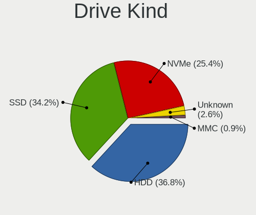
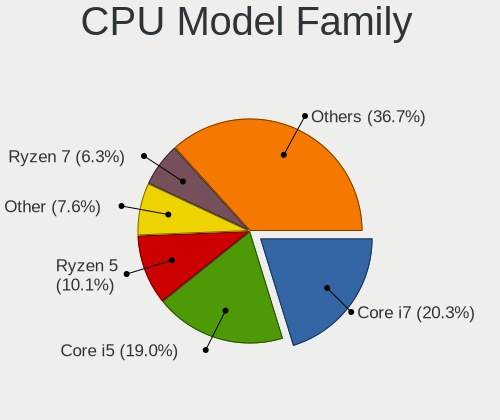
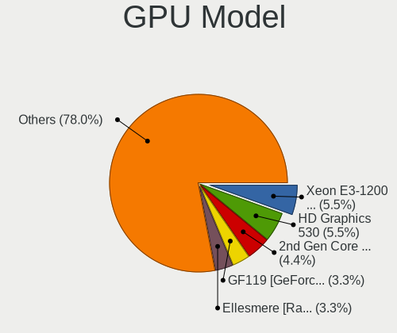
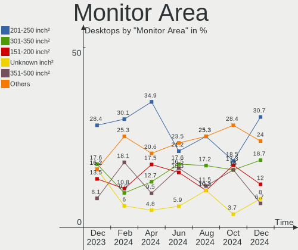

Zorin Hardware Trends (Desktop)
-------------------------------

A project to identify most popular hardware characteristics and track their change
over time based on data collected by Zorin users at https://Linux-Hardware.org.

Anyone can contribute to the study by uploading probes of their computers by
the [hw-probe](https://github.com/linuxhw/hw-probe) tool:

    sudo hw-probe -all -upload

Full-feature report is available here: https://linux-hardware.org/?view=trends&formfactor=desktop

Period: Jan, 2020.

Contents
--------

- [ OS                       ](#os)
- [ OS Family                ](#os-family)
- [ Kernel                   ](#kernel)
- [ Kernel Family            ](#kernel-family)
- [ Kernel Major Ver.        ](#kernel-major-ver)
- [ Arch                     ](#arch)
- [ DE                       ](#de)
- [ Display Server           ](#display-server)
- [ OS Lang                  ](#os-lang)
- [ Boot Mode                ](#boot-mode)
- [ Filesystem               ](#filesystem)
- [ Dual Boot with Linux     ](#dual-boot-with-linux)
- [ Dual Boot (Win)          ](#dual-boot-win)
- [ Country                  ](#country)
- [ City                     ](#city)
- [ Vendor                   ](#vendor)
- [ Model                    ](#model)
- [ Model Family             ](#model-family)
- [ MFG Year                 ](#mfg-year)
- [ Form Factor              ](#form-factor)
- [ Secure Boot              ](#secure-boot)
- [ Coreboot                 ](#coreboot)
- [ RAM Size                 ](#ram-size)
- [ RAM Used                 ](#ram-used)
- [ Drive Vendor             ](#drive-vendor)
- [ Drive Model              ](#drive-model)
- [ Drive Kind               ](#drive-kind)
- [ Drive Connector          ](#drive-connector)
- [ Drive Size               ](#drive-size)
- [ Space Total              ](#space-total)
- [ Space Used               ](#space-used)
- [ Malfunc. Drives          ](#malfunc-drives)
- [ Malfunc. Drive Vendor    ](#malfunc-drive-vendor)
- [ Malfunc. Drive Kind      ](#malfunc-drive-kind)
- [ Failed Drives            ](#failed-drives)
- [ Failed Drive Vendor      ](#failed-drive-vendor)
- [ Drive Status             ](#drive-status)
- [ Storage Vendor           ](#storage-vendor)
- [ Storage Model            ](#storage-model)
- [ Storage Kind             ](#storage-kind)
- [ CPU Vendor               ](#cpu-vendor)
- [ CPU Model                ](#cpu-model)
- [ CPU Model Family         ](#cpu-model-family)
- [ CPU Cores                ](#cpu-cores)
- [ CPU Sockets              ](#cpu-sockets)
- [ CPU Threads              ](#cpu-threads)
- [ CPU Op-Modes             ](#cpu-op-modes)
- [ CPU Microarch            ](#cpu-microarch)
- [ CPU Microcode            ](#cpu-microcode)
- [ GPU Vendor               ](#gpu-vendor)
- [ GPU Model                ](#gpu-model)
- [ GPU Combo                ](#gpu-combo)
- [ GPU Driver               ](#gpu-driver)
- [ GPU Memory               ](#gpu-memory)
- [ Monitor Vendor           ](#monitor-vendor)
- [ Monitor Model            ](#monitor-model)
- [ Monitor Resolution       ](#monitor-resolution)
- [ Monitor Diagonal         ](#monitor-diagonal)
- [ Monitor Width            ](#monitor-width)
- [ Aspect Ratio             ](#aspect-ratio)
- [ Monitor Area             ](#monitor-area)
- [ Pixel Density            ](#pixel-density)
- [ Multiple Monitors        ](#multiple-monitors)
- [ Net Controller Vendor    ](#net-controller-vendor)
- [ Net Controller Model     ](#net-controller-model)
- [ Net Controller Kind      ](#net-controller-kind)
- [ Used Controller          ](#used-controller)
- [ NICs                     ](#nics)
- [ Unsupported Devices      ](#unsupported-devices)
- [ Unsupported Device Types ](#unsupported-device-types)

OS
--

Installed operating systems

| Name     | Computers | Percent |
|----------|-----------|---------|
| Zorin 15 | 22        | 91.67%  |
| Zorin 12 | 2         | 8.33%   |

OS Family
---------

OS without a version

| Name  | Computers | Percent |
|-------|-----------|---------|
| Zorin | 24        | 100%    |

Kernel
------

Version of the Linux kernel

| Version              | Computers | Percent |
|----------------------|-----------|---------|
| 5.0.0-37-generic     | 15        | 62.5%   |
| 5.3.0-26-generic     | 3         | 12.5%   |
| 5.3.0-28-generic     | 2         | 8.33%   |
| 5.4.0-050400-generic | 1         | 4.17%   |
| 4.18.0-21-generic    | 1         | 4.17%   |
| 4.15.0-74-generic    | 1         | 4.17%   |
| 4.15.0-72-generic    | 1         | 4.17%   |

Kernel Family
-------------

Linux kernel without a distro release

| Version | Computers | Percent |
|---------|-----------|---------|
| 5.0.0   | 15        | 62.5%   |
| 5.3.0   | 5         | 20.83%  |
| 4.15.0  | 2         | 8.33%   |
| 5.4.0   | 1         | 4.17%   |
| 4.18.0  | 1         | 4.17%   |

Kernel Major Ver.
-----------------

Linux kernel major version

| Version | Computers | Percent |
|---------|-----------|---------|
| 5.0     | 15        | 62.5%   |
| 5.3     | 5         | 20.83%  |
| 4.15    | 2         | 8.33%   |
| 5.4     | 1         | 4.17%   |
| 4.18    | 1         | 4.17%   |

Arch
----

OS architecture (x86_64, i586, etc.)

| Name   | Computers | Percent |
|--------|-----------|---------|
| x86_64 | 17        | 70.83%  |
| i686   | 7         | 29.17%  |

DE
--

Desktop Environment

| Name    | Computers | Percent |
|---------|-----------|---------|
| GNOME   | 14        | 58.33%  |
| XFCE    | 9         | 37.5%   |
| Unknown | 1         | 4.17%   |

Display Server
--------------

X11 or Wayland

| Name | Computers | Percent |
|------|-----------|---------|
| X11  | 24        | 100%    |

OS Lang
-------

Language

| Lang  | Computers | Percent |
|-------|-----------|---------|
| en_US | 12        | 50%     |
| de_DE | 4         | 16.67%  |
| sr_RS | 1         | 4.17%   |
| ru_RU | 1         | 4.17%   |
| it_IT | 1         | 4.17%   |
| fr_FR | 1         | 4.17%   |
| es_CR | 1         | 4.17%   |
| en_HK | 1         | 4.17%   |
| en_GB | 1         | 4.17%   |
| en_AU | 1         | 4.17%   |

Boot Mode
---------

EFI or BIOS

| Mode | Computers | Percent |
|------|-----------|---------|
| BIOS | 17        | 70.83%  |
| EFI  | 7         | 29.17%  |

Filesystem
----------

Type of filesystem

| Type    | Computers | Percent |
|---------|-----------|---------|
| Ext4    | 21        | 87.5%   |
| Overlay | 3         | 12.5%   |

Dual Boot with Linux
--------------------

Hosting more than one Linux

| Dual boot | Computers | Percent |
|-----------|-----------|---------|
| No        | 20        | 83.33%  |
| Yes       | 4         | 16.67%  |

Dual Boot (Win)
---------------

Hosting Linux and Windows

| Dual boot | Computers | Percent |
|-----------|-----------|---------|
| No        | 14        | 58.33%  |
| Yes       | 10        | 41.67%  |

Country
-------

Geographic location (country)

| Country    | Computers | Percent |
|------------|-----------|---------|
| USA        | 8         | 33.33%  |
| Germany    | 3         | 12.5%   |
| UK         | 1         | 4.17%   |
| Serbia     | 1         | 4.17%   |
| Russia     | 1         | 4.17%   |
| Pakistan   | 1         | 4.17%   |
| Kenya      | 1         | 4.17%   |
| Italy      | 1         | 4.17%   |
| Hong Kong  | 1         | 4.17%   |
| France     | 1         | 4.17%   |
| Croatia    | 1         | 4.17%   |
| Costa Rica | 1         | 4.17%   |
| Brazil     | 1         | 4.17%   |
| Austria    | 1         | 4.17%   |
| Australia  | 1         | 4.17%   |

City
----

Geographic location (city)

| City          | Computers | Percent |
|---------------|-----------|---------|
| Virovitica    | 1         | 4.17%   |
| Vienna        | 1         | 4.17%   |
| Springfield   | 1         | 4.17%   |
| San José     | 1         | 4.17%   |
| Salvador      | 1         | 4.17%   |
| Paucourt      | 1         | 4.17%   |
| Paracin       | 1         | 4.17%   |
| Overland Park | 1         | 4.17%   |
| Orlando       | 1         | 4.17%   |
| Nairobi       | 1         | 4.17%   |
| Moscow        | 1         | 4.17%   |
| Meredith      | 1         | 4.17%   |
| Lahore        | 1         | 4.17%   |
| Kenosha       | 1         | 4.17%   |
| Glandore      | 1         | 4.17%   |
| Genoa         | 1         | 4.17%   |
| Gaylord       | 1         | 4.17%   |
| Frome         | 1         | 4.17%   |
| Engelskirchen | 1         | 4.17%   |
| Elgin         | 1         | 4.17%   |
| Chemnitz      | 1         | 4.17%   |
| Central       | 1         | 4.17%   |
| Burleson      | 1         | 4.17%   |
| Berlin        | 1         | 4.17%   |

Vendor
------

Motherboard manufacturer

| Name                | Computers | Percent |
|---------------------|-----------|---------|
| Gigabyte Technology | 6         | 25%     |
| Hewlett-Packard     | 3         | 12.5%   |
| WinFast             | 2         | 8.33%   |
| Lenovo              | 2         | 8.33%   |
| Dell                | 2         | 8.33%   |
| ASUSTek Computer    | 2         | 8.33%   |
| ASRock              | 2         | 8.33%   |
| Pegatron            | 1         | 4.17%   |
| NF531M              | 1         | 4.17%   |
| Fujitsu             | 1         | 4.17%   |
| ECS                 | 1         | 4.17%   |
| AMI                 | 1         | 4.17%   |

Model
-----

Motherboard model

| Name                                   | Computers | Percent |
|----------------------------------------|-----------|---------|
| Gigabyte H97M-D3H                      | 2         | 8.33%   |
| WinFast NF4UK8AA                       | 1         | 4.17%   |
| WinFast 761GXK8MC                      | 1         | 4.17%   |
| Pegatron FZ116AA-ACP a6551.at          | 1         | 4.17%   |
| NF531M 1.0                             | 1         | 4.17%   |
| Lenovo ThinkCentre M93p 10AAS0GQ00     | 1         | 4.17%   |
| Lenovo ThinkCentre M71z 1761E3U        | 1         | 4.17%   |
| HP ProDesk 600 G1 SFF                  | 1         | 4.17%   |
| HP Compaq dc7600 Convertible Minitower | 1         | 4.17%   |
| HP Compaq 8200 Elite SFF PC            | 1         | 4.17%   |
| Gigabyte Z170X-Gaming 7                | 1         | 4.17%   |
| Gigabyte PERSONAL COMPUTER             | 1         | 4.17%   |
| Gigabyte P55A-UD3                      | 1         | 4.17%   |
| Gigabyte AB350M-DS3H V2                | 1         | 4.17%   |
| Fujitsu ESPRIMO P2560                  | 1         | 4.17%   |
| ECS P4M800-M                           | 1         | 4.17%   |
| Dell Vostro 430                        | 1         | 4.17%   |
| Dell OptiPlex 790                      | 1         | 4.17%   |
| ASUS P5B                               | 1         | 4.17%   |
| ASUS P-P5N9300                         | 1         | 4.17%   |
| ASRock H110M-DGS                       | 1         | 4.17%   |
| ASRock 775i65GV                        | 1         | 4.17%   |
| AMI HiBox-hero                         | 1         | 4.17%   |

Model Family
------------

Motherboard model prefix

| Name                  | Computers | Percent |
|-----------------------|-----------|---------|
| Lenovo ThinkCentre    | 2         | 8.33%   |
| HP Compaq             | 2         | 8.33%   |
| Gigabyte H97M-D3H     | 2         | 8.33%   |
| WinFast NF4UK8AA      | 1         | 4.17%   |
| WinFast 761GXK8MC     | 1         | 4.17%   |
| Pegatron FZ116AA-ACP  | 1         | 4.17%   |
| NF531M 1.0            | 1         | 4.17%   |
| HP ProDesk            | 1         | 4.17%   |
| Gigabyte Z170X-Gaming | 1         | 4.17%   |
| Gigabyte PERSONAL     | 1         | 4.17%   |
| Gigabyte P55A-UD3     | 1         | 4.17%   |
| Gigabyte AB350M-DS3H  | 1         | 4.17%   |
| Fujitsu ESPRIMO       | 1         | 4.17%   |
| ECS P4M800-M          | 1         | 4.17%   |
| Dell Vostro           | 1         | 4.17%   |
| Dell OptiPlex         | 1         | 4.17%   |
| ASUS P5B              | 1         | 4.17%   |
| ASUS P-P5N9300        | 1         | 4.17%   |
| ASRock H110M-DGS      | 1         | 4.17%   |
| ASRock 775i65GV       | 1         | 4.17%   |
| AMI HiBox-hero        | 1         | 4.17%   |

MFG Year
--------

Motherboard manufacture year

| Year | Computers | Percent |
|------|-----------|---------|
| 2018 | 3         | 12.5%   |
| 2008 | 3         | 12.5%   |
| 2005 | 3         | 12.5%   |
| 2019 | 2         | 8.33%   |
| 2016 | 2         | 8.33%   |
| 2015 | 2         | 8.33%   |
| 2011 | 2         | 8.33%   |
| 2010 | 2         | 8.33%   |
| 2017 | 1         | 4.17%   |
| 2014 | 1         | 4.17%   |
| 2012 | 1         | 4.17%   |
| 2009 | 1         | 4.17%   |
| 2006 | 1         | 4.17%   |

Form Factor
-----------

Physical design of the computer

| Name    | Computers | Percent |
|---------|-----------|---------|
| Desktop | 24        | 100%    |

Secure Boot
-----------

Enabled or disabled

| State    | Computers | Percent |
|----------|-----------|---------|
| Disabled | 24        | 100%    |

Coreboot
--------

Have coreboot on board

| Used | Computers | Percent |
|------|-----------|---------|
| No   | 24        | 100%    |

RAM Size
--------

Total RAM memory

| Size in GB | Computers | Percent |
|------------|-----------|---------|
| 1.01-2.0   | 8         | 33.33%  |
| 3.01-4.0   | 5         | 20.83%  |
| 16.01-24.0 | 4         | 16.67%  |
| 8.01-16.0  | 4         | 16.67%  |
| 4.01-8.0   | 3         | 12.5%   |

RAM Used
--------

Used RAM memory

| Used GB  | Computers | Percent |
|----------|-----------|---------|
| 1.01-2.0 | 10        | 41.67%  |
| 0.01-1.0 | 7         | 29.17%  |
| 4.01-8.0 | 3         | 12.5%   |
| 2.01-3.0 | 3         | 12.5%   |
| 3.01-4.0 | 1         | 4.17%   |

Drive Vendor
------------

Hard drive vendors

| Vendor              | Computers | Drives | Percent |
|---------------------|-----------|--------|---------|
| WDC                 | 8         | 8      | 22.22%  |
| Seagate             | 6         | 8      | 16.67%  |
| Hitachi             | 4         | 4      | 11.11%  |
| SanDisk             | 3         | 4      | 8.33%   |
| Samsung Electronics | 3         | 4      | 8.33%   |
| Unknown             | 2         | 2      | 5.56%   |
| Toshiba             | 2         | 2      | 5.56%   |
| Crucial             | 2         | 2      | 5.56%   |
| Kingston            | 1         | 1      | 2.78%   |
| JMicron             | 1         | 2      | 2.78%   |
| Intenso             | 1         | 1      | 2.78%   |
| Intel               | 1         | 1      | 2.78%   |
| Hikvision           | 1         | 1      | 2.78%   |
| Fujitsu             | 1         | 1      | 2.78%   |

Drive Model
-----------

Hard drive models

| Model                    | Computers | Percent |
|--------------------------|-----------|---------|
| ST3500418AS 500GB        | 2         | 5%      |
| ST1000DM003-1CH162 1TB   | 2         | 5%      |
| WD6400AAKS-65A7B0 640GB  | 1         | 2.5%    |
| WD5000AZRX-00A8LB0 500GB | 1         | 2.5%    |
| WD400BD-60LRA0 40GB      | 1         | 2.5%    |
| WD30EZRZ-00Z5HB0 3TB     | 1         | 2.5%    |
| WD2500AAKX-083CA1 250GB  | 1         | 2.5%    |
| WD2500AAJS-75M0A0 250GB  | 1         | 2.5%    |
| WD1600BB-00GUC0 160GB    | 1         | 2.5%    |
| WD10EZEX-08WN4A0 1TB     | 1         | 2.5%    |
| Ultra II 960GB SSD       | 1         | 2.5%    |
| ST380817AS 80GB          | 1         | 2.5%    |
| ST3500414CS 500GB        | 1         | 2.5%    |
| ST3500320AS 500GB        | 1         | 2.5%    |
| ST2000DM001-1ER164 2TB   | 1         | 2.5%    |
| SSDMCEAW120A4 120GB      | 1         | 2.5%    |
| SSD SATAIII 240GB        | 1         | 2.5%    |
| SSD PM841 2.5 7mm 256GB  | 1         | 2.5%    |
| SSD 860 EVO 500GB        | 1         | 2.5%    |
| SSD 860 EVO 1TB          | 1         | 2.5%    |
| SSD 830 Series 256GB     | 1         | 2.5%    |
| SDSSDH3512G 512GB        | 1         | 2.5%    |
| SDSSDH3 1T02 1024GB      | 1         | 2.5%    |
| SDSSDA120G 120GB         | 1         | 2.5%    |
| SA400S37480G 480GB SSD   | 1         | 2.5%    |
| MHY2120BH 120GB          | 1         | 2.5%    |
| HUA723020ALA640 2TB      | 1         | 2.5%    |
| HTS547550A9E384 500GB    | 1         | 2.5%    |
| HTS545032B9SA02 320GB    | 1         | 2.5%    |
| HS-SSD-E100 256GB        | 1         | 2.5%    |
| HCP725016GLAT80 160GB    | 1         | 2.5%    |
| Generic 1TB              | 1         | 2.5%    |
| DT01ACA300 3TB           | 1         | 2.5%    |
| DT01ACA100 1TB           | 1         | 2.5%    |
| CT480M500SSD1 480GB      | 1         | 2.5%    |
| CT240BX500SSD1 240GB     | 1         | 2.5%    |
| AMPW3T128-NM00AC 120GB   | 1         | 2.5%    |
| 064G93  64GB             | 1         | 2.5%    |

Drive Kind
----------

HDD or SSD

| Kind    | Computers | Drives | Percent |
|---------|-----------|--------|---------|
| HDD     | 16        | 23     | 57.14%  |
| SSD     | 9         | 14     | 32.14%  |
| Unknown | 2         | 3      | 7.14%   |
| MMC     | 1         | 1      | 3.57%   |

Drive Connector
---------------

SATA, SAS, NVMe, etc.

| Type | Computers | Drives | Percent |
|------|-----------|--------|---------|
| SATA | 22        | 38     | 91.67%  |
| SAS  | 1         | 2      | 4.17%   |
| MMC  | 1         | 1      | 4.17%   |

Drive Size
----------

Size of hard drive

| Size in TB | Computers | Drives | Percent |
|------------|-----------|--------|---------|
| 0.01-0.5   | 20        | 26     | 64.52%  |
| 0.51-1.0   | 6         | 10     | 19.35%  |
| 1.01-2.0   | 3         | 3      | 9.68%   |
| 2.01-3.0   | 2         | 2      | 6.45%   |

Space Total
-----------

Amount of disk space available on the file system

| Size in GB     | Computers | Percent |
|----------------|-----------|---------|
| 101-250        | 8         | 33.33%  |
| 251-500        | 4         | 16.67%  |
| 1-20           | 4         | 16.67%  |
| 21-50          | 3         | 12.5%   |
| 51-100         | 2         | 8.33%   |
| More than 3000 | 1         | 4.17%   |
| 1001-2000      | 1         | 4.17%   |
| 501-1000       | 1         | 4.17%   |

Space Used
----------

Amount of used disk space

| Used GB | Computers | Percent |
|---------|-----------|---------|
| 1-20    | 21        | 87.5%   |
| 21-50   | 2         | 8.33%   |
| 51-100  | 1         | 4.17%   |

Malfunc. Drives
---------------

Drive models with a malfunction

Zero info for selected period =(

Malfunc. Drive Vendor
---------------------

Vendors of faulty drives

Zero info for selected period =(

Malfunc. Drive Kind
-------------------

Kinds of faulty drives

Zero info for selected period =(

Failed Drives
-------------

Failed drive models

Zero info for selected period =(

Failed Drive Vendor
-------------------

Failed drive vendors

Zero info for selected period =(

Drive Status
------------

Number of failed and malfunc. drives

| Status   | Computers | Drives | Percent |
|----------|-----------|--------|---------|
| Detected | 23        | 41     | 100%    |

Storage Vendor
--------------

Storage controller vendors

| Vendor                           | Computers | Percent |
|----------------------------------|-----------|---------|
| Intel                            | 18        | 64.29%  |
| Nvidia                           | 2         | 7.14%   |
| VIA Technologies                 | 1         | 3.57%   |
| Silicon Motion                   | 1         | 3.57%   |
| Silicon Integrated Systems [SiS] | 1         | 3.57%   |
| Samsung Electronics              | 1         | 3.57%   |
| Marvell Technology Group         | 1         | 3.57%   |
| JMicron Technology               | 1         | 3.57%   |
| ASMedia Technology               | 1         | 3.57%   |
| AMD                              | 1         | 3.57%   |

Storage Model
-------------

Storage controller models

| Model                                                                      | Computers | Percent |
|----------------------------------------------------------------------------|-----------|---------|
| 8 Series/C220 Series Chipset Family 6-port SATA Controller 1 [AHCI mode]   | 3         | 8.82%   |
| 6 Series/C200 Series Chipset Family 6 port Desktop SATA AHCI Controller    | 3         | 8.82%   |
| Q170/Q150/B150/H170/H110/Z170/CM236 Chipset SATA Controller [AHCI Mode]    | 2         | 5.88%   |
| NM10/ICH7 Family SATA Controller [IDE mode]                                | 2         | 5.88%   |
| 9 Series Chipset Family SATA Controller [AHCI Mode]                        | 2         | 5.88%   |
| 5 Series/3400 Series Chipset 6 port SATA AHCI Controller                   | 2         | 5.88%   |
| VT82C586A/B/VT82C686/A/B/VT823x/A/C PIPC Bus Master IDE                    | 1         | 2.94%   |
| VIA VT6420 SATA RAID Controller                                            | 1         | 2.94%   |
| RAID bus controller 180 SATA/PATA  [SiS]                                   | 1         | 2.94%   |
| NVMe SSD Controller SM981/PM981/PM983                                      | 1         | 2.94%   |
| Non-Volatile memory controller                                             | 1         | 2.94%   |
| MCP79 AHCI Controller                                                      | 1         | 2.94%   |
| JMB363 SATA/IDE Controller                                                 | 1         | 2.94%   |
| FCH SATA Controller [AHCI mode]                                            | 1         | 2.94%   |
| CK804 Serial ATA Controller                                                | 1         | 2.94%   |
| CK804 IDE                                                                  | 1         | 2.94%   |
| Atom/Celeron/Pentium Processor x5-E8000/J3xxx/N3xxx Series SATA Controller | 1         | 2.94%   |
| ASM1062 Serial ATA Controller                                              | 1         | 2.94%   |
| 88SE9128 PCIe SATA 6 Gb/s RAID controller                                  | 1         | 2.94%   |
| 82801IR/IO/IH (ICH9R/DO/DH) 6 port SATA Controller [AHCI mode]             | 1         | 2.94%   |
| 82801HR/HO/HH (ICH8R/DO/DH) 2 port SATA Controller [IDE mode]              | 1         | 2.94%   |
| 82801G (ICH7 Family) IDE Controller                                        | 1         | 2.94%   |
| 82801EB/ER (ICH5/ICH5R) IDE Controller                                     | 1         | 2.94%   |
| 82801EB (ICH5) SATA Controller                                             | 1         | 2.94%   |
| 5513 IDE Controller                                                        | 1         | 2.94%   |
| 300 Series Chipset SATA Controller                                         | 1         | 2.94%   |

Storage Kind
------------

Kind of storage controller (IDE, SATA, NVMe, SAS, ...)

| Kind | Computers | Percent |
|------|-----------|---------|
| SATA | 16        | 64%     |
| IDE  | 7         | 28%     |
| RAID | 1         | 4%      |
| NVMe | 1         | 4%      |

CPU Vendor
----------

Processor vendors

| Vendor | Computers | Percent |
|--------|-----------|---------|
| Intel  | 21        | 87.5%   |
| AMD    | 3         | 12.5%   |

CPU Model
---------

Processor models

| Model                                       | Computers | Percent |
|---------------------------------------------|-----------|---------|
| Intel Core i5-2400 CPU @ 3.10GHz            | 2         | 8.33%   |
| Intel Pentium Dual-Core CPU E6700 @ 3.20GHz | 1         | 4.17%   |
| Intel Pentium CPU G630 @ 2.70GHz            | 1         | 4.17%   |
| Intel Pentium 4 CPU 3.20GHz                 | 1         | 4.17%   |
| Intel Pentium 4 CPU 3.00GHz                 | 1         | 4.17%   |
| Intel Core i7-4770 CPU @ 3.40GHz            | 1         | 4.17%   |
| Intel Core i7 CPU 860 @ 2.80GHz             | 1         | 4.17%   |
| Intel Core i5-6600K CPU @ 3.50GHz           | 1         | 4.17%   |
| Intel Core i5-6400T CPU @ 2.20GHz           | 1         | 4.17%   |
| Intel Core i5-4590 CPU @ 3.30GHz            | 1         | 4.17%   |
| Intel Core i5-4570T CPU @ 2.90GHz           | 1         | 4.17%   |
| Intel Core i5-4460 CPU @ 3.20GHz            | 1         | 4.17%   |
| Intel Core i3-4130 CPU @ 3.40GHz            | 1         | 4.17%   |
| Intel Core i3 CPU 550 @ 3.20GHz             | 1         | 4.17%   |
| Intel Core 2 Quad CPU Q9400 @ 2.66GHz       | 1         | 4.17%   |
| Intel Core 2 Quad CPU Q6600 @ 2.40GHz       | 1         | 4.17%   |
| Intel Core 2 CPU 6300 @ 1.86GHz             | 1         | 4.17%   |
| Intel Celeron CPU N3160 @ 1.60GHz           | 1         | 4.17%   |
| Intel Celeron CPU 2.66GHz                   | 1         | 4.17%   |
| Intel Atom x5-Z8350 CPU @ 1.44GHz           | 1         | 4.17%   |
| AMD Sempron Processor 2600+                 | 1         | 4.17%   |
| AMD Ryzen 3 2200G with Radeon Vega Graphics | 1         | 4.17%   |
| AMD Athlon 64 X2 Dual Core Processor 4400+  | 1         | 4.17%   |

CPU Model Family
----------------

Processor model prefix

| Model                   | Computers | Percent |
|-------------------------|-----------|---------|
| Intel Core i5           | 7         | 29.17%  |
| Intel Pentium 4         | 2         | 8.33%   |
| Intel Core i7           | 2         | 8.33%   |
| Intel Core i3           | 2         | 8.33%   |
| Intel Core 2 Quad       | 2         | 8.33%   |
| Intel Celeron           | 2         | 8.33%   |
| Intel Pentium Dual-Core | 1         | 4.17%   |
| Intel Pentium           | 1         | 4.17%   |
| Intel Core 2            | 1         | 4.17%   |
| Intel Atom              | 1         | 4.17%   |
| AMD Sempron             | 1         | 4.17%   |
| AMD Ryzen 3             | 1         | 4.17%   |
| AMD Athlon 64 X2        | 1         | 4.17%   |

CPU Cores
---------

Number of processor cores

| Number | Computers | Percent |
|--------|-----------|---------|
| 4      | 13        | 54.17%  |
| 2      | 7         | 29.17%  |
| 1      | 4         | 16.67%  |

CPU Sockets
-----------

Number of sockets

| Number | Computers | Percent |
|--------|-----------|---------|
| 1      | 24        | 100%    |

CPU Threads
-----------

Threads per core (Hyper-Threading)

| Number | Computers | Percent |
|--------|-----------|---------|
| 1      | 17        | 70.83%  |
| 2      | 7         | 29.17%  |

CPU Op-Modes
------------

CPU Operation Modes (32-bit, 64-bit)

| Op mode        | Computers | Percent |
|----------------|-----------|---------|
| 32-bit, 64-bit | 22        | 91.67%  |
| 32-bit         | 2         | 8.33%   |

CPU Microarch
-------------

Microarchitecture

| Name        | Computers | Percent |
|-------------|-----------|---------|
| Haswell     | 5         | 20.83%  |
| Core        | 4         | 16.67%  |
| SandyBridge | 3         | 12.5%   |
| NetBurst    | 3         | 12.5%   |
| Skylake     | 2         | 8.33%   |
| Silvermont  | 2         | 8.33%   |
| K8 Hammer   | 2         | 8.33%   |
| Zen         | 1         | 4.17%   |
| Westmere    | 1         | 4.17%   |
| Nehalem     | 1         | 4.17%   |

CPU Microcode
-------------

Microcode number

| Number     | Computers | Percent |
|------------|-----------|---------|
| 0x306c3    | 5         | 20.83%  |
| 0x206a7    | 3         | 12.5%   |
| Unknown    | 3         | 12.5%   |
| 0x506e3    | 2         | 8.33%   |
| 0x1067a    | 2         | 8.33%   |
| 0xf49      | 1         | 4.17%   |
| 0xf43      | 1         | 4.17%   |
| 0xf41      | 1         | 4.17%   |
| 0x6fb      | 1         | 4.17%   |
| 0x6f6      | 1         | 4.17%   |
| 0x406c4    | 1         | 4.17%   |
| 0x20655    | 1         | 4.17%   |
| 0x106e5    | 1         | 4.17%   |
| 0x08101016 | 1         | 4.17%   |

GPU Vendor
----------

Vendors of graphics cards

| Vendor | Computers | Percent |
|--------|-----------|---------|
| Intel  | 12        | 44.44%  |
| Nvidia | 9         | 33.33%  |
| AMD    | 6         | 22.22%  |

GPU Model
---------

Graphics card models

| Model                                                                              | Computers | Percent |
|------------------------------------------------------------------------------------|-----------|---------|
| Xeon E3-1200 v3/4th Gen Core Processor Integrated Graphics Controller              | 4         | 13.79%  |
| GK208B [GeForce GT 710]                                                            | 2         | 6.9%    |
| Atom/Celeron/Pentium Processor x5-E8000/J3xxx/N3xxx Integrated Graphics Controller | 2         | 6.9%    |
| Vega 10 XL/XT [Radeon RX Vega 56/64]                                               | 1         | 3.45%   |
| Tobago PRO [Radeon R7 360 / R9 360 OEM]                                            | 1         | 3.45%   |
| RV505 CE [Radeon X1550 64-bit]                                                     | 1         | 3.45%   |
| RV350 [Radeon 9600]                                                                | 1         | 3.45%   |
| Raven Ridge [Radeon Vega Series / Radeon Vega Mobile Series]                       | 1         | 3.45%   |
| Radeon X1300 Series Secondary                                                      | 1         | 3.45%   |
| Radeon 9600 Series Secondary                                                       | 1         | 3.45%   |
| NV18 [GeForce4 MX 440 AGP 8x]                                                      | 1         | 3.45%   |
| HD Graphics 530                                                                    | 1         | 3.45%   |
| GK208B [GeForce GT 730]                                                            | 1         | 3.45%   |
| GK208B [GeForce GT 720]                                                            | 1         | 3.45%   |
| GF108 [GeForce GT 730]                                                             | 1         | 3.45%   |
| GF108 [GeForce GT 520]                                                             | 1         | 3.45%   |
| G94 [GeForce 9600 GT]                                                              | 1         | 3.45%   |
| Core Processor Integrated Graphics Controller                                      | 1         | 3.45%   |
| Cedar [Radeon HD 5000/6000/7350/8350 Series]                                       | 1         | 3.45%   |
| C79 [GeForce 9300 / nForce 730i]                                                   | 1         | 3.45%   |
| 82945G/GZ Integrated Graphics Controller                                           | 1         | 3.45%   |
| 82865G Integrated Graphics Controller                                              | 1         | 3.45%   |
| 4th Generation Core Processor Family Integrated Graphics Controller                | 1         | 3.45%   |
| 2nd Generation Core Processor Family Integrated Graphics Controller                | 1         | 3.45%   |

GPU Combo
---------

Combinations of graphics cards

| Name           | Computers | Percent |
|----------------|-----------|---------|
| 1 x Intel      | 9         | 37.5%   |
| 1 x Nvidia     | 8         | 33.33%  |
| 2 x AMD        | 2         | 8.33%   |
| Intel + AMD    | 2         | 8.33%   |
| 1 x AMD        | 2         | 8.33%   |
| Intel + Nvidia | 1         | 4.17%   |

GPU Driver
----------

Free vs proprietary

| Driver      | Computers | Percent |
|-------------|-----------|---------|
| Free        | 21        | 87.5%   |
| Proprietary | 2         | 8.33%   |
| Unknown     | 1         | 4.17%   |

GPU Memory
----------

Total video memory

| Size in GB | Computers | Percent |
|------------|-----------|---------|
| Unknown    | 9         | 37.5%   |
| 1.01-2.0   | 6         | 25%     |
| 0.01-0.5   | 5         | 20.83%  |
| 0.51-1.0   | 3         | 12.5%   |
| 7.01-8.0   | 1         | 4.17%   |

Monitor Vendor
--------------

Monitor vendors

| Vendor               | Computers | Percent |
|----------------------|-----------|---------|
| Samsung Electronics  | 3         | 13.04%  |
| Dell                 | 3         | 13.04%  |
| Acer                 | 3         | 13.04%  |
| Goldstar             | 2         | 8.7%    |
| Ancor Communications | 2         | 8.7%    |
| TRL/RIC              | 1         | 4.35%   |
| Sony                 | 1         | 4.35%   |
| Philips              | 1         | 4.35%   |
| NRC                  | 1         | 4.35%   |
| NIK                  | 1         | 4.35%   |
| MStar                | 1         | 4.35%   |
| Lenovo               | 1         | 4.35%   |
| Insignia             | 1         | 4.35%   |
| Hewlett-Packard      | 1         | 4.35%   |
| Belinea              | 1         | 4.35%   |

Monitor Model
-------------

Monitor models

| Model                                               | Computers | Percent |
|-----------------------------------------------------|-----------|---------|
| TV_MONITOR MST0030 1440x900 1150x650mm 52.0-inch    | 1         | 4.35%   |
| TV SNY2A03 1920x1080 1600x900mm 72.3-inch           | 1         | 4.35%   |
| SyncMaster SAM03E5 1680x1050 470x300mm 22.0-inch    | 1         | 4.35%   |
| S22C650 SAM09DB 1920x1080 477x268mm 21.5-inch       | 1         | 4.35%   |
| P226HQV ACR01C7 1920x1080 477x268mm 21.5-inch       | 1         | 4.35%   |
| NS19D220NA16A BBY0019 1680x1050 640x384mm 29.4-inch | 1         | 4.35%   |
| NIKO-1920R NIK03C6 1280x1024 376x301mm 19.0-inch    | 1         | 4.35%   |
| Monitor TRL1012 1280x1024 320x240mm 15.7-inch       | 1         | 4.35%   |
| LM560 NRC1500 1024x768 304x228mm 15.0-inch          | 1         | 4.35%   |
| LCD Monitor SyncMaster 1920x1080                    | 1         | 4.35%   |
| LCD Monitor K242HL 1920x1080                        | 1         | 4.35%   |
| L1752S GSM4432 1280x1024 338x270mm 17.0-inch        | 1         | 4.35%   |
| K272HUL ACR0524 2560x1440 598x336mm 27.0-inch       | 1         | 4.35%   |
| H61 LEN520B 1600x900 410x230mm 18.5-inch            | 1         | 4.35%   |
| B101902 MAX0783 1280x1024 376x301mm 19.0-inch       | 1         | 4.35%   |
| ASUS VW193S ACI19D4 1440x900 408x255mm 18.9-inch    | 1         | 4.35%   |
| ASUS PA238QR ACI23A1 1920x1080 509x286mm 23.0-inch  | 1         | 4.35%   |
| 27q HPN3565 2560x1440 597x336mm 27.0-inch           | 1         | 4.35%   |
| 27EA53 GSM59AF 1920x1080 600x340mm 27.2-inch        | 1         | 4.35%   |
| 2407WFP DELA016 1920x1200 519x324mm 24.1-inch       | 1         | 4.35%   |
| 2405FPW DELA010 1920x1200 519x324mm 24.1-inch       | 1         | 4.35%   |
| 190E PHLC031 1440x900 408x255mm 18.9-inch           | 1         | 4.35%   |
| 1704FPT DEL4004 1280x1024 338x270mm 17.0-inch       | 1         | 4.35%   |

Monitor Resolution
------------------

Monitor screen resolution

| Resolution         | Computers | Percent |
|--------------------|-----------|---------|
| 1920x1080 (FHD)    | 8         | 36.36%  |
| 1280x1024 (SXGA)   | 4         | 18.18%  |
| 2560x1440 (QHD)    | 2         | 9.09%   |
| 1920x1200 (WUXGA)  | 2         | 9.09%   |
| 1440x900 (WXGA+)   | 2         | 9.09%   |
| 1680x1050 (WSXGA+) | 1         | 4.55%   |
| 1600x900 (HD+)     | 1         | 4.55%   |
| 1360x768           | 1         | 4.55%   |
| 1024x768 (XGA)     | 1         | 4.55%   |

Monitor Diagonal
----------------

Diagonal size in inches

| Inches  | Computers | Percent |
|---------|-----------|---------|
| 27      | 3         | 13.04%  |
| 18      | 3         | 13.04%  |
| 24      | 2         | 8.7%    |
| 21      | 2         | 8.7%    |
| 19      | 2         | 8.7%    |
| 17      | 2         | 8.7%    |
| 15      | 2         | 8.7%    |
| Unknown | 2         | 8.7%    |
| 72      | 1         | 4.35%   |
| 32      | 1         | 4.35%   |
| 29      | 1         | 4.35%   |
| 23      | 1         | 4.35%   |
| 22      | 1         | 4.35%   |

Monitor Width
-------------

Physical width

| Width in mm | Computers | Percent |
|-------------|-----------|---------|
| 501-600     | 6         | 27.27%  |
| 401-500     | 5         | 22.73%  |
| 301-350     | 4         | 18.18%  |
| 351-400     | 2         | 9.09%   |
| Unknown     | 2         | 9.09%   |
| 701-800     | 1         | 4.55%   |
| 601-700     | 1         | 4.55%   |
| 1501-2000   | 1         | 4.55%   |

Aspect Ratio
------------

Proportional relationship between the width and the height

| Ratio   | Computers | Percent |
|---------|-----------|---------|
| 16/9    | 10        | 45.45%  |
| 16/10   | 5         | 22.73%  |
| 5/4     | 3         | 13.64%  |
| 4/3     | 2         | 9.09%   |
| Unknown | 2         | 9.09%   |

Monitor Area
------------

Area in inch²

| Area in inch² | Computers | Percent |
|----------------|-----------|---------|
| 151-200        | 5         | 22.73%  |
| 301-350        | 3         | 13.64%  |
| 141-150        | 3         | 13.64%  |
| 351-500        | 2         | 9.09%   |
| 251-300        | 2         | 9.09%   |
| 201-250        | 2         | 9.09%   |
| Unknown        | 2         | 9.09%   |
| More than 1000 | 1         | 4.55%   |
| 111-120        | 1         | 4.55%   |
| 101-110        | 1         | 4.55%   |

Pixel Density
-------------

Pixels per inch

| Density | Computers | Percent |
|---------|-----------|---------|
| 51-100  | 14        | 63.64%  |
| 101-120 | 5         | 22.73%  |
| Unknown | 2         | 9.09%   |
| 1-50    | 1         | 4.55%   |

Multiple Monitors
-----------------

Total monitors connected

| Total | Computers | Percent |
|-------|-----------|---------|
| 1     | 20        | 83.33%  |
| 2     | 2         | 8.33%   |
| 0     | 2         | 8.33%   |

Net Controller Vendor
---------------------

Controller vendors

| Vendor            | Computers | Percent |
|-------------------|-----------|---------|
| Intel             | 3         | 37.5%   |
| VIA Technologies  | 1         | 12.5%   |
| Nvidia            | 1         | 12.5%   |
| MediaTek          | 1         | 12.5%   |
| GCT Semiconductor | 1         | 12.5%   |
| D-Link System     | 1         | 12.5%   |

Net Controller Model
--------------------

Controller models

| Model                                                  | Computers | Percent |
|--------------------------------------------------------|-----------|---------|
| 82579LM Gigabit Network Connection (Lewisville)        | 2         | 25%     |
| Power Ice Evo                                          | 1         | 12.5%   |
| LU150 LTE Modem [Yota LU150]                           | 1         | 12.5%   |
| I211 Gigabit Network Connection                        | 1         | 12.5%   |
| DWA-140 RangeBooster N Adapter(rev.B2) [Ralink RT3072] | 1         | 12.5%   |
| CK804 Ethernet Controller                              | 1         | 12.5%   |
| AC'97 Modem Controller                                 | 1         | 12.5%   |

Net Controller Kind
-------------------

Ethernet, WiFi or modem

| Kind     | Computers | Percent |
|----------|-----------|---------|
| Ethernet | 6         | 75%     |
| Modem    | 1         | 12.5%   |
| WiFi     | 1         | 12.5%   |

Used Controller
---------------

Currently used network controller

| Kind     | Computers | Percent |
|----------|-----------|---------|
| Ethernet | 3         | 75%     |
| WiFi     | 1         | 25%     |

NICs
----

Total network controllers on board

| Total | Computers | Percent |
|-------|-----------|---------|
| 1     | 19        | 79.17%  |
| 2     | 4         | 16.67%  |
| 3     | 1         | 4.17%   |

Unsupported Devices
-------------------

Total unsupported devices on board

| Total | Computers | Percent |
|-------|-----------|---------|
| 0     | 20        | 83.33%  |
| 1     | 3         | 12.5%   |
| 2     | 1         | 4.17%   |

Unsupported Device Types
------------------------

Types of unsupported devices

| Type          | Computers | Percent |
|---------------|-----------|---------|
| Graphics card | 3         | 60%     |
| Storage       | 1         | 20%     |
| Net/wireless  | 1         | 20%     |

