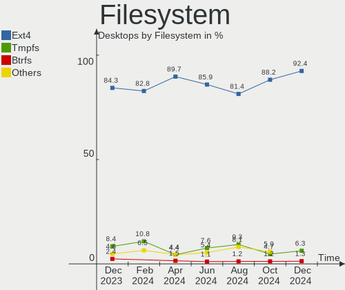
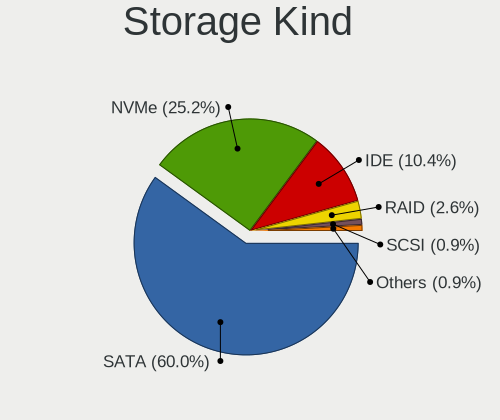
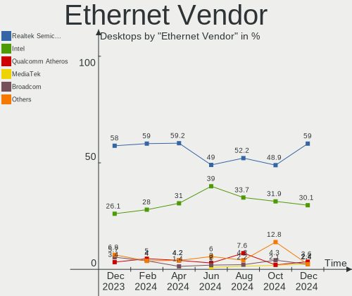
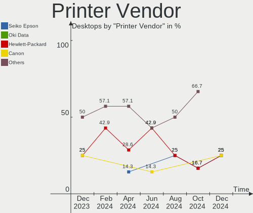

Zorin - Hardware Trends (Desktops)
----------------------------------

A project to identify most popular hardware characteristics and track their change
over time based on data collected by Linux users at https://Linux-Hardware.org.

Anyone can contribute to this report by the [hw-probe](https://github.com/linuxhw/hw-probe) tool:

    sudo -E hw-probe -all -upload

This report is for one last month. Overall report since the beginning of time: [TestCoverage](https://github.com/linuxhw/TestCoverage)

Period: May, 2022.

Contents
--------

* [ System ](#system)
  - [ OS                       ](#os)
  - [ OS Family                ](#os-family)
  - [ Kernel                   ](#kernel)
  - [ Kernel Family            ](#kernel-family)
  - [ Kernel Major Ver.        ](#kernel-major-ver)
  - [ Arch                     ](#arch)
  - [ DE                       ](#de)
  - [ Display Server           ](#display-server)
  - [ Display Manager          ](#display-manager)
  - [ OS Lang                  ](#os-lang)
  - [ Boot Mode                ](#boot-mode)
  - [ Filesystem               ](#filesystem)
  - [ Part. scheme             ](#part-scheme)
  - [ Dual Boot with Linux/BSD ](#dual-boot-with-linuxbsd)
  - [ Dual Boot (Win)          ](#dual-boot-win)

* [ Board ](#board)
  - [ Vendor                   ](#vendor)
  - [ Model                    ](#model)
  - [ Model Family             ](#model-family)
  - [ MFG Year                 ](#mfg-year)
  - [ Form Factor              ](#form-factor)
  - [ Secure Boot              ](#secure-boot)
  - [ Coreboot                 ](#coreboot)
  - [ RAM Size                 ](#ram-size)
  - [ RAM Used                 ](#ram-used)
  - [ Total Drives             ](#total-drives)
  - [ Has CD-ROM               ](#has-cd-rom)
  - [ Has Ethernet             ](#has-ethernet)
  - [ Has WiFi                 ](#has-wifi)
  - [ Has Bluetooth            ](#has-bluetooth)

* [ Location ](#location)
  - [ Country                  ](#country)
  - [ City                     ](#city)

* [ Drives ](#drives)
  - [ Drive Vendor             ](#drive-vendor)
  - [ Drive Model              ](#drive-model)
  - [ HDD Vendor               ](#hdd-vendor)
  - [ SSD Vendor               ](#ssd-vendor)
  - [ Drive Kind               ](#drive-kind)
  - [ Drive Connector          ](#drive-connector)
  - [ Drive Size               ](#drive-size)
  - [ Space Total              ](#space-total)
  - [ Space Used               ](#space-used)
  - [ Malfunc. Drives          ](#malfunc-drives)
  - [ Malfunc. Drive Vendor    ](#malfunc-drive-vendor)
  - [ Malfunc. HDD Vendor      ](#malfunc-hdd-vendor)
  - [ Malfunc. Drive Kind      ](#malfunc-drive-kind)
  - [ Failed Drives            ](#failed-drives)
  - [ Failed Drive Vendor      ](#failed-drive-vendor)
  - [ Drive Status             ](#drive-status)

* [ Storage controller ](#storage-controller)
  - [ Storage Vendor           ](#storage-vendor)
  - [ Storage Model            ](#storage-model)
  - [ Storage Kind             ](#storage-kind)

* [ Processor ](#processor)
  - [ CPU Vendor               ](#cpu-vendor)
  - [ CPU Model                ](#cpu-model)
  - [ CPU Model Family         ](#cpu-model-family)
  - [ CPU Cores                ](#cpu-cores)
  - [ CPU Sockets              ](#cpu-sockets)
  - [ CPU Threads              ](#cpu-threads)
  - [ CPU Op-Modes             ](#cpu-op-modes)
  - [ CPU Microcode            ](#cpu-microcode)
  - [ CPU Microarch            ](#cpu-microarch)

* [ Graphics ](#graphics)
  - [ GPU Vendor               ](#gpu-vendor)
  - [ GPU Model                ](#gpu-model)
  - [ GPU Combo                ](#gpu-combo)
  - [ GPU Driver               ](#gpu-driver)
  - [ GPU Memory               ](#gpu-memory)

* [ Monitor ](#monitor)
  - [ Monitor Vendor           ](#monitor-vendor)
  - [ Monitor Model            ](#monitor-model)
  - [ Monitor Resolution       ](#monitor-resolution)
  - [ Monitor Diagonal         ](#monitor-diagonal)
  - [ Monitor Width            ](#monitor-width)
  - [ Aspect Ratio             ](#aspect-ratio)
  - [ Monitor Area             ](#monitor-area)
  - [ Pixel Density            ](#pixel-density)
  - [ Multiple Monitors        ](#multiple-monitors)

* [ Network ](#network)
  - [ Net Controller Vendor    ](#net-controller-vendor)
  - [ Net Controller Model     ](#net-controller-model)
  - [ Wireless Vendor          ](#wireless-vendor)
  - [ Wireless Model           ](#wireless-model)
  - [ Ethernet Vendor          ](#ethernet-vendor)
  - [ Ethernet Model           ](#ethernet-model)
  - [ Net Controller Kind      ](#net-controller-kind)
  - [ Used Controller          ](#used-controller)
  - [ NICs                     ](#nics)
  - [ IPv6                     ](#ipv6)

* [ Bluetooth ](#bluetooth)
  - [ Bluetooth Vendor         ](#bluetooth-vendor)
  - [ Bluetooth Model          ](#bluetooth-model)

* [ Sound ](#sound)
  - [ Sound Vendor             ](#sound-vendor)
  - [ Sound Model              ](#sound-model)

* [ Memory ](#memory)
  - [ Memory Vendor            ](#memory-vendor)
  - [ Memory Model             ](#memory-model)
  - [ Memory Kind              ](#memory-kind)
  - [ Memory Form Factor       ](#memory-form-factor)
  - [ Memory Size              ](#memory-size)
  - [ Memory Speed             ](#memory-speed)

* [ Printers & scanners ](#printers--scanners)
  - [ Printer Vendor           ](#printer-vendor)
  - [ Printer Model            ](#printer-model)
  - [ Scanner Vendor           ](#scanner-vendor)
  - [ Scanner Model            ](#scanner-model)

* [ Camera ](#camera)
  - [ Camera Vendor            ](#camera-vendor)
  - [ Camera Model             ](#camera-model)

* [ Security ](#security)
  - [ Fingerprint Vendor       ](#fingerprint-vendor)
  - [ Fingerprint Model        ](#fingerprint-model)
  - [ Chipcard Vendor          ](#chipcard-vendor)
  - [ Chipcard Model           ](#chipcard-model)

* [ Unsupported ](#unsupported)
  - [ Unsupported Devices      ](#unsupported-devices)
  - [ Unsupported Device Types ](#unsupported-device-types)

System
------

OS
--

Installed operating systems

| Name     | Desktops | Percent |
|----------|----------|---------|
| Zorin 16 | 65       | 90.28%  |
| Zorin 15 | 6        | 8.33%   |
| Zorin 12 | 1        | 1.39%   |

OS Family
---------

OS without a version

| Name  | Desktops | Percent |
|-------|----------|---------|
| Zorin | 72       | 100%    |

Kernel
------

Version of the Linux kernel

| Version                     | Desktops | Percent |
|-----------------------------|----------|---------|
| 5.13.0-41-generic           | 23       | 31.94%  |
| 5.13.0-40-generic           | 23       | 31.94%  |
| 5.13.0-44-generic           | 11       | 15.28%  |
| 5.13.0-39-generic           | 3        | 4.17%   |
| 5.4.0-110-generic           | 2        | 2.78%   |
| 5.4.0-97-generic            | 1        | 1.39%   |
| 5.4.0-89-generic            | 1        | 1.39%   |
| 5.4.0-113-generic           | 1        | 1.39%   |
| 5.4.0-109-generic           | 1        | 1.39%   |
| 5.17.9-051709-generic       | 1        | 1.39%   |
| 5.13.0-352203222222-generic | 1        | 1.39%   |
| 5.13.0-30-generic           | 1        | 1.39%   |
| 5.13.0-27-generic           | 1        | 1.39%   |
| 5.11.0-40-generic           | 1        | 1.39%   |
| 4.15.0-70-generic           | 1        | 1.39%   |

Kernel Family
-------------

Linux kernel without a distro release

| Version | Desktops | Percent |
|---------|----------|---------|
| 5.13.0  | 63       | 87.5%   |
| 5.4.0   | 6        | 8.33%   |
| 5.17.9  | 1        | 1.39%   |
| 5.11.0  | 1        | 1.39%   |
| 4.15.0  | 1        | 1.39%   |

Kernel Major Ver.
-----------------

Linux kernel major version

| Version | Desktops | Percent |
|---------|----------|---------|
| 5.13    | 63       | 87.5%   |
| 5.4     | 6        | 8.33%   |
| 5.17    | 1        | 1.39%   |
| 5.11    | 1        | 1.39%   |
| 4.15    | 1        | 1.39%   |

Arch
----

OS architecture (x86_64, i586, etc.)

| Name   | Desktops | Percent |
|--------|----------|---------|
| x86_64 | 70       | 97.22%  |
| i686   | 2        | 2.78%   |

DE
--

Desktop Environment

| Name  | Desktops | Percent |
|-------|----------|---------|
| GNOME | 61       | 84.72%  |
| XFCE  | 10       | 13.89%  |
| KDE5  | 1        | 1.39%   |

Display Server
--------------

X11 or Wayland

| Name    | Desktops | Percent |
|---------|----------|---------|
| X11     | 70       | 97.22%  |
| Wayland | 1        | 1.39%   |
| Tty     | 1        | 1.39%   |

Display Manager
---------------

SDDM, LightDM, etc.

| Name    | Desktops | Percent |
|---------|----------|---------|
| Unknown | 52       | 72.22%  |
| GDM3    | 12       | 16.67%  |
| GDM     | 5        | 6.94%   |
| LightDM | 2        | 2.78%   |
| SDDM    | 1        | 1.39%   |

OS Lang
-------

Language

| Lang  | Desktops | Percent |
|-------|----------|---------|
| en_US | 25       | 34.72%  |
| pt_BR | 8        | 11.11%  |
| de_DE | 7        | 9.72%   |
| fr_FR | 4        | 5.56%   |
| en_AU | 4        | 5.56%   |
| es_MX | 3        | 4.17%   |
| es_ES | 3        | 4.17%   |
| en_GB | 3        | 4.17%   |
| nl_NL | 2        | 2.78%   |
| tr_TR | 1        | 1.39%   |
| sv_SE | 1        | 1.39%   |
| ru_RU | 1        | 1.39%   |
| pl_PL | 1        | 1.39%   |
| it_IT | 1        | 1.39%   |
| hu_HU | 1        | 1.39%   |
| es_CL | 1        | 1.39%   |
| en_IN | 1        | 1.39%   |
| en_CA | 1        | 1.39%   |
| el_GR | 1        | 1.39%   |
| da_DK | 1        | 1.39%   |
| cs_CZ | 1        | 1.39%   |
| bg_BG | 1        | 1.39%   |

Boot Mode
---------

EFI or BIOS

| Mode | Desktops | Percent |
|------|----------|---------|
| BIOS | 45       | 62.5%   |
| EFI  | 27       | 37.5%   |

Filesystem
----------

Type of filesystem

| Type  | Desktops | Percent |
|-------|----------|---------|
| Ext4  | 68       | 94.44%  |
| Zfs   | 3        | 4.17%   |
| Btrfs | 1        | 1.39%   |

Part. scheme
------------

Scheme of partitioning

| Type    | Desktops | Percent |
|---------|----------|---------|
| Unknown | 65       | 90.28%  |
| GPT     | 6        | 8.33%   |
| MBR     | 1        | 1.39%   |

Dual Boot with Linux/BSD
------------------------

Hosting more than one Linux/BSD

| Dual boot | Desktops | Percent |
|-----------|----------|---------|
| No        | 68       | 94.44%  |
| Yes       | 4        | 5.56%   |

Dual Boot (Win)
---------------

Hosting Linux and Windows

| Dual boot | Desktops | Percent |
|-----------|----------|---------|
| No        | 60       | 83.33%  |
| Yes       | 12       | 16.67%  |

Board
-----

Vendor
------

Motherboard manufacturer

| Name                | Desktops | Percent |
|---------------------|----------|---------|
| Gigabyte Technology | 18       | 25%     |
| ASUSTek Computer    | 18       | 25%     |
| MSI                 | 9        | 12.5%   |
| Dell                | 8        | 11.11%  |
| ASRock              | 4        | 5.56%   |
| Intel               | 3        | 4.17%   |
| Hewlett-Packard     | 2        | 2.78%   |
| Foxconn             | 2        | 2.78%   |
| Positivo            | 1        | 1.39%   |
| Pegatron            | 1        | 1.39%   |
| Maxtone             | 1        | 1.39%   |
| Lenovo              | 1        | 1.39%   |
| Gateway             | 1        | 1.39%   |
| Fujitsu             | 1        | 1.39%   |
| AOpen               | 1        | 1.39%   |
| Acer                | 1        | 1.39%   |

Model
-----

Motherboard model

| Name                               | Desktops | Percent |
|------------------------------------|----------|---------|
| ASUS All Series                    | 4        | 5.56%   |
| Gigabyte H410M H V3                | 2        | 2.78%   |
| Positivo POS-PIG41BA               | 1        | 1.39%   |
| Pegatron Compaq 505B Microtower PC | 1        | 1.39%   |
| MSI MS-7D19                        | 1        | 1.39%   |
| MSI MS-7D09                        | 1        | 1.39%   |
| MSI MS-7B10                        | 1        | 1.39%   |
| MSI MS-7A32                        | 1        | 1.39%   |
| MSI MS-7984                        | 1        | 1.39%   |
| MSI MS-7914                        | 1        | 1.39%   |
| MSI MS-7823                        | 1        | 1.39%   |
| MSI MS-7641                        | 1        | 1.39%   |
| MSI MS-7260                        | 1        | 1.39%   |
| Maxtone HIS-G41L V1.1              | 1        | 1.39%   |
| Lenovo IdeaCentre K410 10089       | 1        | 1.39%   |
| Intel H55                          | 1        | 1.39%   |
| Intel DH77EB AAG39073-304          | 1        | 1.39%   |
| Intel D946GZIS AAD66165-301        | 1        | 1.39%   |
| HP Z230 SFF Workstation            | 1        | 1.39%   |
| HP Compaq Pro 4300 SFF PC          | 1        | 1.39%   |
| Gigabyte X58A-UD3R                 | 1        | 1.39%   |
| Gigabyte X570 GAMING X             | 1        | 1.39%   |
| Gigabyte M61PME-S2P                | 1        | 1.39%   |
| Gigabyte GA-990X-Gaming SLI-CF     | 1        | 1.39%   |
| Gigabyte GA-78LMT-USB3 6.0         | 1        | 1.39%   |
| Gigabyte GA-78LMT-USB3             | 1        | 1.39%   |
| Gigabyte G41MT-S2                  | 1        | 1.39%   |
| Gigabyte G41M-Combo                | 1        | 1.39%   |
| Gigabyte G1.Sniper Z97             | 1        | 1.39%   |
| Gigabyte G1.Sniper A88X-CF         | 1        | 1.39%   |
| Gigabyte F2A58M-DS2                | 1        | 1.39%   |
| Gigabyte EX58-EXTREME              | 1        | 1.39%   |
| Gigabyte B550 AORUS PRO V2         | 1        | 1.39%   |
| Gigabyte B450 AORUS PRO WIFI       | 1        | 1.39%   |
| Gigabyte B365M GAMING HD           | 1        | 1.39%   |
| Gigabyte A320M-S2H                 | 1        | 1.39%   |
| Gateway SX2185                     | 1        | 1.39%   |
| Fujitsu CELSIUS M720               | 1        | 1.39%   |
| Foxconn SG3-210DE                  | 1        | 1.39%   |
| Foxconn LIMA                       | 1        | 1.39%   |
| Dell Studio Slim 540s              | 1        | 1.39%   |
| Dell Precision T3600               | 1        | 1.39%   |
| Dell PowerEdge T40                 | 1        | 1.39%   |
| Dell OptiPlex 780                  | 1        | 1.39%   |
| Dell OptiPlex 755                  | 1        | 1.39%   |
| Dell OptiPlex 7010                 | 1        | 1.39%   |
| Dell OptiPlex 380                  | 1        | 1.39%   |
| Dell Inspiron 3847                 | 1        | 1.39%   |
| ASUS TUF Gaming X570-PLUS          | 1        | 1.39%   |
| ASUS TUF B365M-PLUS GAMING         | 1        | 1.39%   |
| ASUS ROG STRIX Z370-F GAMING       | 1        | 1.39%   |
| ASUS ROG STRIX G15DK_G15DK         | 1        | 1.39%   |
| ASUS ROG STRIX B560-I GAMING WIFI  | 1        | 1.39%   |
| ASUS ROG STRIX B550-I GAMING       | 1        | 1.39%   |
| ASUS PRIME H310-PLUS               | 1        | 1.39%   |
| ASUS PRIME B550M-A                 | 1        | 1.39%   |
| ASUS PRIME A320M-K                 | 1        | 1.39%   |
| ASUS P8H61-M LX                    | 1        | 1.39%   |
| ASUS P7P55D DELUXE                 | 1        | 1.39%   |
| ASUS P5KPL-AM SE                   | 1        | 1.39%   |

Model Family
------------

Motherboard model prefix

| Name                    | Desktops | Percent |
|-------------------------|----------|---------|
| Dell OptiPlex           | 4        | 5.56%   |
| ASUS ROG                | 4        | 5.56%   |
| ASUS All                | 4        | 5.56%   |
| ASUS PRIME              | 3        | 4.17%   |
| Gigabyte H410M          | 2        | 2.78%   |
| Gigabyte GA-78LMT-USB3  | 2        | 2.78%   |
| Gigabyte G1.Sniper      | 2        | 2.78%   |
| ASUS TUF                | 2        | 2.78%   |
| Positivo POS-PIG41BA    | 1        | 1.39%   |
| Pegatron Compaq         | 1        | 1.39%   |
| MSI MS-7D19             | 1        | 1.39%   |
| MSI MS-7D09             | 1        | 1.39%   |
| MSI MS-7B10             | 1        | 1.39%   |
| MSI MS-7A32             | 1        | 1.39%   |
| MSI MS-7984             | 1        | 1.39%   |
| MSI MS-7914             | 1        | 1.39%   |
| MSI MS-7823             | 1        | 1.39%   |
| MSI MS-7641             | 1        | 1.39%   |
| MSI MS-7260             | 1        | 1.39%   |
| Maxtone HIS-G41L        | 1        | 1.39%   |
| Lenovo IdeaCentre       | 1        | 1.39%   |
| Intel H55               | 1        | 1.39%   |
| Intel DH77EB            | 1        | 1.39%   |
| Intel D946GZIS          | 1        | 1.39%   |
| HP Z230                 | 1        | 1.39%   |
| HP Compaq               | 1        | 1.39%   |
| Gigabyte X58A-UD3R      | 1        | 1.39%   |
| Gigabyte X570           | 1        | 1.39%   |
| Gigabyte M61PME-S2P     | 1        | 1.39%   |
| Gigabyte GA-990X-Gaming | 1        | 1.39%   |
| Gigabyte G41MT-S2       | 1        | 1.39%   |
| Gigabyte G41M-Combo     | 1        | 1.39%   |
| Gigabyte F2A58M-DS2     | 1        | 1.39%   |
| Gigabyte EX58-EXTREME   | 1        | 1.39%   |
| Gigabyte B550           | 1        | 1.39%   |
| Gigabyte B450           | 1        | 1.39%   |
| Gigabyte B365M          | 1        | 1.39%   |
| Gigabyte A320M-S2H      | 1        | 1.39%   |
| Gateway SX2185          | 1        | 1.39%   |
| Fujitsu CELSIUS         | 1        | 1.39%   |
| Foxconn SG3-210DE       | 1        | 1.39%   |
| Foxconn LIMA            | 1        | 1.39%   |
| Dell Studio             | 1        | 1.39%   |
| Dell Precision          | 1        | 1.39%   |
| Dell PowerEdge          | 1        | 1.39%   |
| Dell Inspiron           | 1        | 1.39%   |
| ASUS P8H61-M            | 1        | 1.39%   |
| ASUS P7P55D             | 1        | 1.39%   |
| ASUS P5KPL-AM           | 1        | 1.39%   |
| ASUS K30AD              | 1        | 1.39%   |
| ASUS Compaq             | 1        | 1.39%   |
| ASRock H87M             | 1        | 1.39%   |
| ASRock B450             | 1        | 1.39%   |
| ASRock B365M-HDV        | 1        | 1.39%   |
| ASRock A88M-G           | 1        | 1.39%   |
| AOpen BUSINESSline      | 1        | 1.39%   |
| Acer Aspire             | 1        | 1.39%   |

MFG Year
--------

Motherboard manufacture year

| Year | Desktops | Percent |
|------|----------|---------|
| 2014 | 9        | 12.5%   |
| 2013 | 8        | 11.11%  |
| 2010 | 8        | 11.11%  |
| 2019 | 7        | 9.72%   |
| 2012 | 7        | 9.72%   |
| 2021 | 6        | 8.33%   |
| 2017 | 4        | 5.56%   |
| 2009 | 4        | 5.56%   |
| 2008 | 4        | 5.56%   |
| 2020 | 3        | 4.17%   |
| 2018 | 3        | 4.17%   |
| 2011 | 3        | 4.17%   |
| 2016 | 2        | 2.78%   |
| 2006 | 2        | 2.78%   |
| 2015 | 1        | 1.39%   |
| 2007 | 1        | 1.39%   |

Form Factor
-----------

Physical design of the computer

| Name    | Desktops | Percent |
|---------|----------|---------|
| Desktop | 72       | 100%    |

Secure Boot
-----------

Enabled or disabled

| State    | Desktops | Percent |
|----------|----------|---------|
| Disabled | 69       | 95.83%  |
| Enabled  | 3        | 4.17%   |

Coreboot
--------

Have coreboot on board

| Used | Desktops | Percent |
|------|----------|---------|
| No   | 72       | 100%    |

RAM Size
--------

Total RAM memory

| Size in GB  | Desktops | Percent |
|-------------|----------|---------|
| 16.01-24.0  | 18       | 25%     |
| 8.01-16.0   | 15       | 20.83%  |
| 4.01-8.0    | 11       | 15.28%  |
| 3.01-4.0    | 10       | 13.89%  |
| 32.01-64.0  | 9        | 12.5%   |
| 64.01-256.0 | 4        | 5.56%   |
| 1.01-2.0    | 2        | 2.78%   |
| 24.01-32.0  | 1        | 1.39%   |
| 2.01-3.0    | 1        | 1.39%   |
| 0.51-1.0    | 1        | 1.39%   |

RAM Used
--------

Used RAM memory

| Used GB    | Desktops | Percent |
|------------|----------|---------|
| 1.01-2.0   | 31       | 43.06%  |
| 2.01-3.0   | 22       | 30.56%  |
| 4.01-8.0   | 8        | 11.11%  |
| 3.01-4.0   | 5        | 6.94%   |
| 8.01-16.0  | 3        | 4.17%   |
| 0.51-1.0   | 2        | 2.78%   |
| 16.01-24.0 | 1        | 1.39%   |

Total Drives
------------

Number of drives on board

| Drives | Desktops | Percent |
|--------|----------|---------|
| 1      | 35       | 48.61%  |
| 2      | 17       | 23.61%  |
| 4      | 8        | 11.11%  |
| 3      | 5        | 6.94%   |
| 7      | 2        | 2.78%   |
| 6      | 2        | 2.78%   |
| 5      | 2        | 2.78%   |
| 0      | 1        | 1.39%   |

Has CD-ROM
----------

Has CD-ROM on board

| Presented | Desktops | Percent |
|-----------|----------|---------|
| Yes       | 43       | 59.72%  |
| No        | 29       | 40.28%  |

Has Ethernet
------------

Has Ethernet on board

| Presented | Desktops | Percent |
|-----------|----------|---------|
| Yes       | 70       | 97.22%  |
| No        | 2        | 2.78%   |

Has WiFi
--------

Has WiFi module

| Presented | Desktops | Percent |
|-----------|----------|---------|
| No        | 42       | 58.33%  |
| Yes       | 30       | 41.67%  |

Has Bluetooth
-------------

Has Bluetooth module

| Presented | Desktops | Percent |
|-----------|----------|---------|
| No        | 51       | 70.83%  |
| Yes       | 21       | 29.17%  |

Location
--------

Country
-------

Geographic location (country)

| Country     | Desktops | Percent |
|-------------|----------|---------|
| USA         | 17       | 23.61%  |
| Brazil      | 9        | 12.5%   |
| Germany     | 7        | 9.72%   |
| Australia   | 4        | 5.56%   |
| UK          | 3        | 4.17%   |
| Spain       | 3        | 4.17%   |
| Netherlands | 3        | 4.17%   |
| Mexico      | 3        | 4.17%   |
| France      | 3        | 4.17%   |
| Italy       | 2        | 2.78%   |
| Canada      | 2        | 2.78%   |
| Turkey      | 1        | 1.39%   |
| Sweden      | 1        | 1.39%   |
| Slovenia    | 1        | 1.39%   |
| Russia      | 1        | 1.39%   |
| Poland      | 1        | 1.39%   |
| Philippines | 1        | 1.39%   |
| Norway      | 1        | 1.39%   |
| Indonesia   | 1        | 1.39%   |
| India       | 1        | 1.39%   |
| Hungary     | 1        | 1.39%   |
| Greece      | 1        | 1.39%   |
| Denmark     | 1        | 1.39%   |
| Czechia     | 1        | 1.39%   |
| Chile       | 1        | 1.39%   |
| Bulgaria    | 1        | 1.39%   |
| Argentina   | 1        | 1.39%   |

City
----

Geographic location (city)

| City                     | Desktops | Percent |
|--------------------------|----------|---------|
| Sydney                   | 2        | 2.78%   |
| Burgkunstadt             | 2        | 2.78%   |
| Bucyrus                  | 2        | 2.78%   |
| Wylie                    | 1        | 1.39%   |
| Willingboro              | 1        | 1.39%   |
| Vrhnika                  | 1        | 1.39%   |
| Vanse                    | 1        | 1.39%   |
| Uppsala                  | 1        | 1.39%   |
| Twinsburg                | 1        | 1.39%   |
| Stafford                 | 1        | 1.39%   |
| Sao Paulo                | 1        | 1.39%   |
| Santo André             | 1        | 1.39%   |
| Santa Coloma de Gramenet | 1        | 1.39%   |
| Sandusky                 | 1        | 1.39%   |
| San Luis Río Colorado   | 1        | 1.39%   |
| Salvador                 | 1        | 1.39%   |
| Saint-Nazaire            | 1        | 1.39%   |
| Saint John               | 1        | 1.39%   |
| Rositz                   | 1        | 1.39%   |
| Richmond                 | 1        | 1.39%   |
| Putte                    | 1        | 1.39%   |
| Prague                   | 1        | 1.39%   |
| Porto Alegre             | 1        | 1.39%   |
| Orlando                  | 1        | 1.39%   |
| Noardburgum              | 1        | 1.39%   |
| Niederndodeleben         | 1        | 1.39%   |
| Natal                    | 1        | 1.39%   |
| Nashik                   | 1        | 1.39%   |
| Munich                   | 1        | 1.39%   |
| Muncie                   | 1        | 1.39%   |
| Monclova                 | 1        | 1.39%   |
| Modena                   | 1        | 1.39%   |
| Milwaukee                | 1        | 1.39%   |
| Middleburg               | 1        | 1.39%   |
| Makati City              | 1        | 1.39%   |
| Lure                     | 1        | 1.39%   |
| Laval                    | 1        | 1.39%   |
| La Verriere              | 1        | 1.39%   |
| Jensen Beach             | 1        | 1.39%   |
| Jakarta                  | 1        | 1.39%   |
| Istanbul                 | 1        | 1.39%   |
| Huelva                   | 1        | 1.39%   |
| Halifax                  | 1        | 1.39%   |
| Glasgow                  | 1        | 1.39%   |
| Gaspar                   | 1        | 1.39%   |
| El Bosque                | 1        | 1.39%   |
| DuBois                   | 1        | 1.39%   |
| Den Burg                 | 1        | 1.39%   |
| Concord                  | 1        | 1.39%   |
| Chełmża                | 1        | 1.39%   |
| Cesano Maderno           | 1        | 1.39%   |
| Castrop-Rauxel           | 1        | 1.39%   |
| Carmo                    | 1        | 1.39%   |
| Cambe                    | 1        | 1.39%   |
| Burgas                   | 1        | 1.39%   |
| Buenos Aires             | 1        | 1.39%   |
| Budapest                 | 1        | 1.39%   |
| Brisbane                 | 1        | 1.39%   |
| Brewton                  | 1        | 1.39%   |
| Berlin                   | 1        | 1.39%   |

Drives
------

Drive Vendor
------------

Hard drive vendors

| Vendor                    | Desktops | Drives | Percent |
|---------------------------|----------|--------|---------|
| Seagate                   | 27       | 30     | 22.5%   |
| WDC                       | 19       | 28     | 15.83%  |
| Samsung Electronics       | 14       | 25     | 11.67%  |
| Crucial                   | 9        | 9      | 7.5%    |
| Toshiba                   | 6        | 7      | 5%      |
| Kingston                  | 6        | 6      | 5%      |
| SanDisk                   | 4        | 4      | 3.33%   |
| Hitachi                   | 3        | 3      | 2.5%    |
| PLEXTOR                   | 2        | 2      | 1.67%   |
| Pioneer                   | 2        | 2      | 1.67%   |
| Phison                    | 2        | 2      | 1.67%   |
| Micron Technology         | 2        | 2      | 1.67%   |
| Leven                     | 2        | 2      | 1.67%   |
| HGST                      | 2        | 2      | 1.67%   |
| Gigabyte Technology       | 2        | 3      | 1.67%   |
| A-DATA Technology         | 2        | 3      | 1.67%   |
| XPG                       | 1        | 1      | 0.83%   |
| walram                    | 1        | 1      | 0.83%   |
| USB3.2                    | 1        | 1      | 0.83%   |
| USB3.0                    | 1        | 1      | 0.83%   |
| Unknown                   | 1        | 3      | 0.83%   |
| SK Hynix                  | 1        | 1      | 0.83%   |
| Silicon Motion            | 1        | 1      | 0.83%   |
| Patriot                   | 1        | 1      | 0.83%   |
| OCZ                       | 1        | 2      | 0.83%   |
| Netac                     | 1        | 1      | 0.83%   |
| Micron/Crucial Technology | 1        | 1      | 0.83%   |
| LITEON                    | 1        | 1      | 0.83%   |
| HS-SSD-C100               | 1        | 1      | 0.83%   |
| Dogfish                   | 1        | 1      | 0.83%   |
| Apacer                    | 1        | 1      | 0.83%   |
| Unknown                   | 1        | 1      | 0.83%   |

Drive Model
-----------

Hard drive models

| Model                                | Desktops | Percent |
|--------------------------------------|----------|---------|
| Seagate ST1000DM010-2EP102 1TB       | 5        | 3.52%   |
| Samsung SSD 850 EVO 250GB            | 3        | 2.11%   |
| Seagate ST500DM002-1BD142 500GB      | 2        | 1.41%   |
| Samsung SSD 970 EVO Plus 500GB       | 2        | 1.41%   |
| Samsung HD103SJ 1TB                  | 2        | 1.41%   |
| Pioneer APS-SL3N-120 120GB           | 2        | 1.41%   |
| Leven JAJS600M256C 256GB             | 2        | 1.41%   |
| Kingston SV300S37A120G 120GB SSD     | 2        | 1.41%   |
| Crucial CT240BX500SSD1 240GB         | 2        | 1.41%   |
| Crucial CT1000MX500SSD1 1TB          | 2        | 1.41%   |
| A-DATA SU650 120GB SSD               | 2        | 1.41%   |
| XPG NVMe SSD Drive 1024GB            | 1        | 0.7%    |
| WDC WDS250G2B0A-00SM50 250GB SSD     | 1        | 0.7%    |
| WDC WDS240G2G0A-00JH30 240GB SSD     | 1        | 0.7%    |
| WDC WD800BD-22LRA0 80GB              | 1        | 0.7%    |
| WDC WD6402AAEX-00Z3A0 640GB          | 1        | 0.7%    |
| WDC WD6402AAEX-00Y9A0 640GB          | 1        | 0.7%    |
| WDC WD5000AAKX-60U6AA0 500GB         | 1        | 0.7%    |
| WDC WD5000AAKX-22ERMA0 500GB         | 1        | 0.7%    |
| WDC WD5000AAKX-00U6AA0 500GB         | 1        | 0.7%    |
| WDC WD3200LPVX-22V0TT0 320GB         | 1        | 0.7%    |
| WDC WD20EARX-00PASB0 2TB             | 1        | 0.7%    |
| WDC WD20EARS-00MVWB0 2TB             | 1        | 0.7%    |
| WDC WD2000FYYZ-01UL1B2 2TB           | 1        | 0.7%    |
| WDC WD15EARS-00MVWB0 1TB             | 1        | 0.7%    |
| WDC WD10EZEX-75M2NA0 1TB             | 1        | 0.7%    |
| WDC WD10EZEX-60WN4A1 1TB             | 1        | 0.7%    |
| WDC WD10EZEX-08WN4A0 1TB             | 1        | 0.7%    |
| WDC WD10EZEX-00WN4A0 1TB             | 1        | 0.7%    |
| WDC WD10EZEX-00BN5A0 1TB             | 1        | 0.7%    |
| WDC WD10EARS-22Y5B1 1TB              | 1        | 0.7%    |
| WDC WD10EARS-00Y5B1 1TB              | 1        | 0.7%    |
| WDC WD10EACS-00D6B1 1TB              | 1        | 0.7%    |
| WDC WD1002FBYS-02A6B0 1TB            | 1        | 0.7%    |
| WDC WD1000DHTZ-04N21V0 1TB           | 1        | 0.7%    |
| WDC PC SN530 SDBPNPZ-512G-1002 512GB | 1        | 0.7%    |
| walram 240G                          | 1        | 0.7%    |
| USB3.2 FLASH DRIVE 128GB             | 1        | 0.7%    |
| USB3.0 Disk 240GB                    | 1        | 0.7%    |
| Unknown SD/MMC/M.S.PRO 32GB          | 1        | 0.7%    |
| Unknown SD/MMC 16GB                  | 1        | 0.7%    |
| Unknown M.S./M.S.Pro/HG 16GB         | 1        | 0.7%    |
| Toshiba THNSNF128GCSS 128GB SSD      | 1        | 0.7%    |
| Toshiba Q300. 480GB SSD              | 1        | 0.7%    |
| Toshiba NVMe SSD Drive 1TB           | 1        | 0.7%    |
| Toshiba HDWR160 6TB                  | 1        | 0.7%    |
| Toshiba HDWF180 8TB                  | 1        | 0.7%    |
| Toshiba HDWE140 4TB                  | 1        | 0.7%    |
| Toshiba DT01ACA200 2TB               | 1        | 0.7%    |
| SK Hynix SHGS31-1000GS-2 1TB SSD     | 1        | 0.7%    |
| Silicon Motion NVMe SSD Drive 256GB  | 1        | 0.7%    |
| Seagate ST9500420AS 500GB            | 1        | 0.7%    |
| Seagate ST8000NM0055-1RM112 8TB      | 1        | 0.7%    |
| Seagate ST6000DM003-2CY186 6TB       | 1        | 0.7%    |
| Seagate ST500VM000-1SD101 500GB      | 1        | 0.7%    |
| Seagate ST500LX003-1AC15G 500GB      | 1        | 0.7%    |
| Seagate ST5000LM000-2AN170 5TB       | 1        | 0.7%    |
| Seagate ST4000DM004-2CV104 4TB       | 1        | 0.7%    |
| Seagate ST3500413AS 500GB            | 1        | 0.7%    |
| Seagate ST3500312CS 500GB            | 1        | 0.7%    |

HDD Vendor
----------

Hard disk drive vendors

| Vendor              | Desktops | Drives | Percent |
|---------------------|----------|--------|---------|
| Seagate             | 26       | 29     | 47.27%  |
| WDC                 | 16       | 25     | 29.09%  |
| Samsung Electronics | 4        | 4      | 7.27%   |
| Toshiba             | 3        | 4      | 5.45%   |
| Hitachi             | 3        | 3      | 5.45%   |
| HGST                | 2        | 2      | 3.64%   |
| USB3.0              | 1        | 1      | 1.82%   |

SSD Vendor
----------

Solid state drive vendors

| Vendor              | Desktops | Drives | Percent |
|---------------------|----------|--------|---------|
| Samsung Electronics | 10       | 15     | 21.28%  |
| Crucial             | 8        | 8      | 17.02%  |
| SanDisk             | 3        | 3      | 6.38%   |
| Kingston            | 3        | 3      | 6.38%   |
| WDC                 | 2        | 2      | 4.26%   |
| Toshiba             | 2        | 2      | 4.26%   |
| PLEXTOR             | 2        | 2      | 4.26%   |
| Pioneer             | 2        | 2      | 4.26%   |
| Leven               | 2        | 2      | 4.26%   |
| Gigabyte Technology | 2        | 3      | 4.26%   |
| A-DATA Technology   | 2        | 3      | 4.26%   |
| SK Hynix            | 1        | 1      | 2.13%   |
| Patriot             | 1        | 1      | 2.13%   |
| OCZ                 | 1        | 2      | 2.13%   |
| Netac               | 1        | 1      | 2.13%   |
| Micron Technology   | 1        | 1      | 2.13%   |
| LITEON              | 1        | 1      | 2.13%   |
| Dogfish             | 1        | 1      | 2.13%   |
| Apacer              | 1        | 1      | 2.13%   |
| Unknown             | 1        | 1      | 2.13%   |

Drive Kind
----------

HDD or SSD

| Kind    | Desktops | Drives | Percent |
|---------|----------|--------|---------|
| SSD     | 44       | 55     | 41.12%  |
| HDD     | 44       | 68     | 41.12%  |
| NVMe    | 14       | 19     | 13.08%  |
| Unknown | 5        | 7      | 4.67%   |

Drive Connector
---------------

SATA, SAS, NVMe, etc.

| Type | Desktops | Drives | Percent |
|------|----------|--------|---------|
| SATA | 70       | 121    | 76.92%  |
| NVMe | 14       | 19     | 15.38%  |
| SAS  | 7        | 9      | 7.69%   |

Drive Size
----------

Size of hard drive

| Size in TB | Desktops | Drives | Percent |
|------------|----------|--------|---------|
| 0.01-0.5   | 51       | 68     | 56.04%  |
| 0.51-1.0   | 23       | 32     | 25.27%  |
| 1.01-2.0   | 8        | 13     | 8.79%   |
| 4.01-10.0  | 6        | 7      | 6.59%   |
| 3.01-4.0   | 2        | 2      | 2.2%    |
| 2.01-3.0   | 1        | 1      | 1.1%    |

Space Total
-----------

Amount of disk space available on the file system

| Size in GB     | Desktops | Percent |
|----------------|----------|---------|
| 101-250        | 26       | 36.11%  |
| 251-500        | 19       | 26.39%  |
| 501-1000       | 7        | 9.72%   |
| More than 3000 | 5        | 6.94%   |
| 1001-2000      | 5        | 6.94%   |
| 1-20           | 3        | 4.17%   |
| 51-100         | 3        | 4.17%   |
| 21-50          | 2        | 2.78%   |
| 2001-3000      | 1        | 1.39%   |
| Unknown        | 1        | 1.39%   |

Space Used
----------

Amount of used disk space

| Used GB        | Desktops | Percent |
|----------------|----------|---------|
| 1-20           | 26       | 36.11%  |
| 21-50          | 22       | 30.56%  |
| 51-100         | 8        | 11.11%  |
| 251-500        | 5        | 6.94%   |
| More than 3000 | 4        | 5.56%   |
| 101-250        | 4        | 5.56%   |
| 2001-3000      | 1        | 1.39%   |
| 501-1000       | 1        | 1.39%   |
| Unknown        | 1        | 1.39%   |

Malfunc. Drives
---------------

Drive models with a malfunction

Zero info for selected period =(

Malfunc. Drive Vendor
---------------------

Vendors of faulty drives

Zero info for selected period =(

Malfunc. HDD Vendor
-------------------

Vendors of faulty HDD drives

Zero info for selected period =(

Malfunc. Drive Kind
-------------------

Kinds of faulty drives

Zero info for selected period =(

Failed Drives
-------------

Failed drive models

Zero info for selected period =(

Failed Drive Vendor
-------------------

Failed drive vendors

Zero info for selected period =(

Drive Status
------------

Number of failed and malfunc. drives

| Status   | Desktops | Drives | Percent |
|----------|----------|--------|---------|
| Detected | 66       | 129    | 90.41%  |
| Works    | 7        | 20     | 9.59%   |

Storage controller
------------------

Storage Vendor
--------------

Storage controller vendors

| Vendor                      | Desktops | Percent |
|-----------------------------|----------|---------|
| Intel                       | 49       | 50%     |
| AMD                         | 20       | 20.41%  |
| Samsung Electronics         | 4        | 4.08%   |
| Nvidia                      | 3        | 3.06%   |
| Kingston Technology Company | 3        | 3.06%   |
| JMicron Technology          | 3        | 3.06%   |
| ASMedia Technology          | 3        | 3.06%   |
| Sandisk                     | 2        | 2.04%   |
| Phison Electronics          | 2        | 2.04%   |
| Micron/Crucial Technology   | 2        | 2.04%   |
| Marvell Technology Group    | 2        | 2.04%   |
| Silicon Motion              | 1        | 1.02%   |
| Silicon Image               | 1        | 1.02%   |
| Micron Technology           | 1        | 1.02%   |
| KIOXIA                      | 1        | 1.02%   |
| ADATA Technology            | 1        | 1.02%   |

Storage Model
-------------

Storage controller models

| Model                                                                                   | Desktops | Percent |
|-----------------------------------------------------------------------------------------|----------|---------|
| AMD FCH SATA Controller [AHCI mode]                                                     | 9        | 7.26%   |
| Intel NM10/ICH7 Family SATA Controller [IDE mode]                                       | 8        | 6.45%   |
| Intel 8 Series/C220 Series Chipset Family 6-port SATA Controller 1 [AHCI mode]          | 7        | 5.65%   |
| Intel 82801G (ICH7 Family) IDE Controller                                               | 5        | 4.03%   |
| Intel 500 Series Chipset Family SATA AHCI Controller                                    | 5        | 4.03%   |
| Intel 9 Series Chipset Family SATA Controller [AHCI Mode]                               | 4        | 3.23%   |
| AMD 500 Series Chipset SATA Controller                                                  | 4        | 3.23%   |
| Kingston Company A2000 NVMe SSD                                                         | 3        | 2.42%   |
| JMicron JMB363 SATA/IDE Controller                                                      | 3        | 2.42%   |
| Intel SATA Controller [RAID mode]                                                       | 3        | 2.42%   |
| Intel Cannon Lake PCH SATA AHCI Controller                                              | 3        | 2.42%   |
| ASMedia ASM1062 Serial ATA Controller                                                   | 3        | 2.42%   |
| AMD SB7x0/SB8x0/SB9x0 SATA Controller [IDE mode]                                        | 3        | 2.42%   |
| AMD SB7x0/SB8x0/SB9x0 IDE Controller                                                    | 3        | 2.42%   |
| Samsung NVMe SSD Controller SM981/PM981/PM983                                           | 2        | 1.61%   |
| Samsung NVMe SSD Controller PM9A1/PM9A3/980PRO                                          | 2        | 1.61%   |
| Nvidia MCP61 SATA Controller                                                            | 2        | 1.61%   |
| Micron/Crucial Non-Volatile memory controller                                           | 2        | 1.61%   |
| Intel C600/X79 series chipset 6-Port SATA AHCI Controller                               | 2        | 1.61%   |
| Intel 82801JI (ICH10 Family) 4 port SATA IDE Controller #1                              | 2        | 1.61%   |
| Intel 82801JI (ICH10 Family) 2 port SATA IDE Controller #2                              | 2        | 1.61%   |
| Intel 7 Series/C210 Series Chipset Family 6-port SATA Controller [AHCI mode]            | 2        | 1.61%   |
| Intel 6 Series/C200 Series Chipset Family Desktop SATA Controller (IDE mode, ports 4-5) | 2        | 1.61%   |
| Intel 6 Series/C200 Series Chipset Family Desktop SATA Controller (IDE mode, ports 0-3) | 2        | 1.61%   |
| Intel 6 Series/C200 Series Chipset Family 6 port Desktop SATA AHCI Controller           | 2        | 1.61%   |
| Intel 5 Series/3400 Series Chipset 6 port SATA AHCI Controller                          | 2        | 1.61%   |
| Intel 200 Series PCH SATA controller [AHCI mode]                                        | 2        | 1.61%   |
| AMD SB7x0/SB8x0/SB9x0 SATA Controller [AHCI mode]                                       | 2        | 1.61%   |
| AMD FCH SATA Controller D                                                               | 2        | 1.61%   |
| AMD FCH IDE Controller                                                                  | 2        | 1.61%   |
| AMD 400 Series Chipset SATA Controller                                                  | 2        | 1.61%   |
| Silicon Motion SM2263EN/SM2263XT SSD Controller                                         | 1        | 0.81%   |
| Silicon Image SiI 3124 PCI-X Serial ATA Controller                                      | 1        | 0.81%   |
| Sandisk WD Blue SN550 NVMe SSD                                                          | 1        | 0.81%   |
| Sandisk WD Black 2018/SN750 / PC SN720 NVMe SSD                                         | 1        | 0.81%   |
| Samsung NVMe SSD Controller SM961/PM961/SM963                                           | 1        | 0.81%   |
| Phison E7 NVMe Controller                                                               | 1        | 0.81%   |
| Phison E12 NVMe Controller                                                              | 1        | 0.81%   |
| Nvidia MCP61 IDE                                                                        | 1        | 0.81%   |
| Nvidia MCP55 SATA Controller                                                            | 1        | 0.81%   |
| Nvidia MCP55 IDE                                                                        | 1        | 0.81%   |
| Micron Non-Volatile memory controller                                                   | 1        | 0.81%   |
| Marvell Group 88SE91A3 SATA-600 Controller                                              | 1        | 0.81%   |
| Marvell Group 88SE9120 SATA 6Gb/s Controller                                            | 1        | 0.81%   |
| KIOXIA NVMe SSD                                                                         | 1        | 0.81%   |
| Intel Q170/Q150/B150/H170/H110/Z170/CM236 Chipset SATA Controller [AHCI Mode]           | 1        | 0.81%   |
| Intel C604/X79 series chipset 4-Port SATA/SAS Storage Control Unit                      | 1        | 0.81%   |
| Intel C602 chipset 4-Port SATA Storage Control Unit                                     | 1        | 0.81%   |
| Intel 82Q35 Express PT IDER Controller                                                  | 1        | 0.81%   |
| Intel 82801JI (ICH10 Family) SATA AHCI Controller                                       | 1        | 0.81%   |
| Intel 82801IR/IO/IH (ICH9R/DO/DH) 6 port SATA Controller [AHCI mode]                    | 1        | 0.81%   |
| Intel 82801IR/IO/IH (ICH9R/DO/DH) 4 port SATA Controller [IDE mode]                     | 1        | 0.81%   |
| Intel 82801I (ICH9 Family) 2 port SATA Controller [IDE mode]                            | 1        | 0.81%   |
| Intel 6 Series/C200 Series Chipset Family 6 port Mobile SATA AHCI Controller            | 1        | 0.81%   |
| Intel 4 Series Chipset PT IDER Controller                                               | 1        | 0.81%   |
| AMD X370 Series Chipset SATA Controller                                                 | 1        | 0.81%   |
| AMD FCH SATA Controller [IDE mode]                                                      | 1        | 0.81%   |
| ADATA XPG SX8200 Pro PCIe Gen3x4 M.2 2280 Solid State Drive                             | 1        | 0.81%   |

Storage Kind
------------

Kind of storage controller (IDE, SATA, NVMe, SAS, ...)

| Kind | Desktops | Percent |
|------|----------|---------|
| SATA | 53       | 54.08%  |
| IDE  | 25       | 25.51%  |
| NVMe | 14       | 14.29%  |
| RAID | 4        | 4.08%   |
| SAS  | 2        | 2.04%   |

Processor
---------

CPU Vendor
----------

Processor vendors

| Vendor | Desktops | Percent |
|--------|----------|---------|
| Intel  | 49       | 68.06%  |
| AMD    | 23       | 31.94%  |

CPU Model
---------

Processor models

| Model                                        | Desktops | Percent |
|----------------------------------------------|----------|---------|
| AMD Ryzen 5 5600X 6-Core Processor           | 4        | 5.56%   |
| Intel Core i5-4460 CPU @ 3.20GHz             | 2        | 2.78%   |
| Intel Core i5-10400F CPU @ 2.90GHz           | 2        | 2.78%   |
| Intel Xeon E-2224G CPU @ 3.50GHz             | 1        | 1.39%   |
| Intel Xeon CPU X5570 @ 2.93GHz               | 1        | 1.39%   |
| Intel Xeon CPU E5-2690 0 @ 2.90GHz           | 1        | 1.39%   |
| Intel Xeon CPU E5-1620 0 @ 3.60GHz           | 1        | 1.39%   |
| Intel Xeon CPU E3-1231 v3 @ 3.40GHz          | 1        | 1.39%   |
| Intel Xeon CPU E3-1225 v3 @ 3.20GHz          | 1        | 1.39%   |
| Intel Pentium Gold G6400 CPU @ 4.00GHz       | 1        | 1.39%   |
| Intel Pentium Dual-Core CPU E5400 @ 2.70GHz  | 1        | 1.39%   |
| Intel Pentium Dual CPU E2200 @ 2.20GHz       | 1        | 1.39%   |
| Intel Pentium CPU G860 @ 3.00GHz             | 1        | 1.39%   |
| Intel Pentium CPU G2020 @ 2.90GHz            | 1        | 1.39%   |
| Intel Genuine CPU 2140 @ 1.60GHz             | 1        | 1.39%   |
| Intel Core i9-9900KF CPU @ 3.60GHz           | 1        | 1.39%   |
| Intel Core i9-9900K CPU @ 3.60GHz            | 1        | 1.39%   |
| Intel Core i7-9700F CPU @ 3.00GHz            | 1        | 1.39%   |
| Intel Core i7-8700K CPU @ 3.70GHz            | 1        | 1.39%   |
| Intel Core i7-6700K CPU @ 4.00GHz            | 1        | 1.39%   |
| Intel Core i7-4790S CPU @ 3.20GHz            | 1        | 1.39%   |
| Intel Core i7-4790K CPU @ 4.00GHz            | 1        | 1.39%   |
| Intel Core i7-4790 CPU @ 3.60GHz             | 1        | 1.39%   |
| Intel Core i7-4770K CPU @ 3.50GHz            | 1        | 1.39%   |
| Intel Core i7 CPU 965 @ 3.20GHz              | 1        | 1.39%   |
| Intel Core i7 CPU 870 @ 2.93GHz              | 1        | 1.39%   |
| Intel Core i5-9600K CPU @ 3.70GHz            | 1        | 1.39%   |
| Intel Core i5-4690K CPU @ 3.50GHz            | 1        | 1.39%   |
| Intel Core i5-4670S CPU @ 3.10GHz            | 1        | 1.39%   |
| Intel Core i5-3570 CPU @ 3.40GHz             | 1        | 1.39%   |
| Intel Core i5-3470 CPU @ 3.20GHz             | 1        | 1.39%   |
| Intel Core i5-3230M CPU @ 2.60GHz            | 1        | 1.39%   |
| Intel Core i5-2320 CPU @ 3.00GHz             | 1        | 1.39%   |
| Intel Core i3-9100F CPU @ 3.60GHz            | 1        | 1.39%   |
| Intel Core i3-4130 CPU @ 3.40GHz             | 1        | 1.39%   |
| Intel Core i3-2120 CPU @ 3.30GHz             | 1        | 1.39%   |
| Intel Core i3-10100F CPU @ 3.60GHz           | 1        | 1.39%   |
| Intel Core i3-10100 CPU @ 3.60GHz            | 1        | 1.39%   |
| Intel Core i3 CPU 540 @ 3.07GHz              | 1        | 1.39%   |
| Intel Core 2 Quad CPU Q9400 @ 2.66GHz        | 1        | 1.39%   |
| Intel Core 2 Quad CPU Q8300 @ 2.50GHz        | 1        | 1.39%   |
| Intel Core 2 Quad CPU Q8200 @ 2.33GHz        | 1        | 1.39%   |
| Intel Core 2 Duo CPU E8500 @ 3.16GHz         | 1        | 1.39%   |
| Intel Core 2 Duo CPU E8400 @ 3.00GHz         | 1        | 1.39%   |
| Intel Core 2 Duo CPU E7500 @ 2.93GHz         | 1        | 1.39%   |
| Intel Core 2 CPU 6400 @ 2.13GHz              | 1        | 1.39%   |
| Intel Core 2 CPU 6300 @ 1.86GHz              | 1        | 1.39%   |
| Intel Celeron CPU 220 @ 1.20GHz              | 1        | 1.39%   |
| AMD Ryzen 9 5900X 12-Core Processor          | 1        | 1.39%   |
| AMD Ryzen 9 3900X 12-Core Processor          | 1        | 1.39%   |
| AMD Ryzen 7 1700X Eight-Core Processor       | 1        | 1.39%   |
| AMD Ryzen 5 3600XT 6-Core Processor          | 1        | 1.39%   |
| AMD Ryzen 5 3600 6-Core Processor            | 1        | 1.39%   |
| AMD Ryzen 3 1200 Quad-Core Processor         | 1        | 1.39%   |
| AMD PRO A10-8750B R7, 12 Compute Cores 4C+8G | 1        | 1.39%   |
| AMD Phenom II X6 1045T Processor             | 1        | 1.39%   |
| AMD Phenom II X4 955 Processor               | 1        | 1.39%   |
| AMD FX-8350 Eight-Core Processor             | 1        | 1.39%   |
| AMD FX-6300 Six-Core Processor               | 1        | 1.39%   |
| AMD E1-2500 APU with Radeon HD Graphics      | 1        | 1.39%   |

CPU Model Family
----------------

Processor model prefix

| Model                   | Desktops | Percent |
|-------------------------|----------|---------|
| Intel Core i5           | 11       | 15.28%  |
| Intel Core i7           | 9        | 12.5%   |
| Intel Xeon              | 6        | 8.33%   |
| Intel Core i3           | 6        | 8.33%   |
| AMD Ryzen 5             | 6        | 8.33%   |
| Intel Core 2 Quad       | 3        | 4.17%   |
| Intel Core 2 Duo        | 3        | 4.17%   |
| Intel Pentium           | 2        | 2.78%   |
| Intel Core i9           | 2        | 2.78%   |
| Intel Core 2            | 2        | 2.78%   |
| AMD Ryzen 9             | 2        | 2.78%   |
| AMD FX                  | 2        | 2.78%   |
| AMD Athlon II X4        | 2        | 2.78%   |
| AMD A8                  | 2        | 2.78%   |
| Intel Pentium Gold      | 1        | 1.39%   |
| Intel Pentium Dual-Core | 1        | 1.39%   |
| Intel Pentium Dual      | 1        | 1.39%   |
| Intel Genuine           | 1        | 1.39%   |
| Intel Celeron           | 1        | 1.39%   |
| AMD Ryzen 7             | 1        | 1.39%   |
| AMD Ryzen 3             | 1        | 1.39%   |
| AMD PRO A10             | 1        | 1.39%   |
| AMD Phenom II X6        | 1        | 1.39%   |
| AMD Phenom II X4        | 1        | 1.39%   |
| AMD E1                  | 1        | 1.39%   |
| AMD Athlon II X2        | 1        | 1.39%   |
| AMD Athlon 64 X2        | 1        | 1.39%   |
| AMD Athlon              | 1        | 1.39%   |

CPU Cores
---------

Number of processor cores

| Number | Desktops | Percent |
|--------|----------|---------|
| 4      | 30       | 41.67%  |
| 2      | 21       | 29.17%  |
| 6      | 11       | 15.28%  |
| 8      | 5        | 6.94%   |
| 12     | 2        | 2.78%   |
| 1      | 2        | 2.78%   |
| 3      | 1        | 1.39%   |

CPU Sockets
-----------

Number of sockets

| Number | Desktops | Percent |
|--------|----------|---------|
| 1      | 72       | 100%    |

CPU Threads
-----------

Threads per core (Hyper-Threading)

| Number | Desktops | Percent |
|--------|----------|---------|
| 2      | 37       | 51.39%  |
| 1      | 35       | 48.61%  |

CPU Op-Modes
------------

CPU Operation Modes (32-bit, 64-bit)

| Op mode        | Desktops | Percent |
|----------------|----------|---------|
| 32-bit, 64-bit | 72       | 100%    |

CPU Microcode
-------------

Microcode number

| Number     | Desktops | Percent |
|------------|----------|---------|
| 0x306c3    | 11       | 15.28%  |
| 0x1067a    | 6        | 8.33%   |
| Unknown    | 6        | 8.33%   |
| 0x906ed    | 4        | 5.56%   |
| 0x306a9    | 4        | 5.56%   |
| 0xa0653    | 3        | 4.17%   |
| 0x206a7    | 3        | 4.17%   |
| 0x0a201016 | 3        | 4.17%   |
| 0x08701021 | 3        | 4.17%   |
| 0x906ea    | 2        | 2.78%   |
| 0x6f2      | 2        | 2.78%   |
| 0x206d7    | 2        | 2.78%   |
| 0x06001119 | 2        | 2.78%   |
| 0x06000852 | 2        | 2.78%   |
| 0x010000db | 2        | 2.78%   |
| 0xa0655    | 1        | 1.39%   |
| 0x906eb    | 1        | 1.39%   |
| 0x6f6      | 1        | 1.39%   |
| 0x506e3    | 1        | 1.39%   |
| 0x20655    | 1        | 1.39%   |
| 0x106e5    | 1        | 1.39%   |
| 0x106a5    | 1        | 1.39%   |
| 0x106a4    | 1        | 1.39%   |
| 0x10677    | 1        | 1.39%   |
| 0x10661    | 1        | 1.39%   |
| 0x0a201205 | 1        | 1.39%   |
| 0x0810100b | 1        | 1.39%   |
| 0x0800820c | 1        | 1.39%   |
| 0x0700010f | 1        | 1.39%   |
| 0x06003106 | 1        | 1.39%   |
| 0x010000dc | 1        | 1.39%   |
| 0x010000c8 | 1        | 1.39%   |

CPU Microarch
-------------

Microarchitecture

| Name        | Desktops | Percent |
|-------------|----------|---------|
| Haswell     | 11       | 15.28%  |
| Penryn      | 7        | 9.72%   |
| KabyLake    | 7        | 9.72%   |
| Zen 3       | 5        | 6.94%   |
| SandyBridge | 5        | 6.94%   |
| K10         | 5        | 6.94%   |
| Core        | 5        | 6.94%   |
| CometLake   | 5        | 6.94%   |
| Piledriver  | 4        | 5.56%   |
| IvyBridge   | 4        | 5.56%   |
| Zen 2       | 3        | 4.17%   |
| Nehalem     | 3        | 4.17%   |
| Zen         | 2        | 2.78%   |
| Zen+        | 1        | 1.39%   |
| Westmere    | 1        | 1.39%   |
| Steamroller | 1        | 1.39%   |
| Skylake     | 1        | 1.39%   |
| K8 Hammer   | 1        | 1.39%   |
| Jaguar      | 1        | 1.39%   |

Graphics
--------

GPU Vendor
----------

Vendors of graphics cards

| Vendor | Desktops | Percent |
|--------|----------|---------|
| Nvidia | 38       | 51.35%  |
| Intel  | 21       | 28.38%  |
| AMD    | 15       | 20.27%  |

GPU Model
---------

Graphics card models

| Model                                                                       | Desktops | Percent |
|-----------------------------------------------------------------------------|----------|---------|
| Intel 4 Series Chipset Integrated Graphics Controller                       | 5        | 6.76%   |
| Nvidia GF119 [GeForce GT 610]                                               | 4        | 5.41%   |
| Nvidia GM107 [GeForce GTX 750 Ti]                                           | 3        | 4.05%   |
| Nvidia TU116 [GeForce GTX 1650 SUPER]                                       | 2        | 2.7%    |
| Nvidia GP107 [GeForce GTX 1050 Ti]                                          | 2        | 2.7%    |
| Nvidia GP104 [GeForce GTX 1080]                                             | 2        | 2.7%    |
| Nvidia GK208B [GeForce GT 710]                                              | 2        | 2.7%    |
| Nvidia GA104 [GeForce RTX 3060 Ti Lite Hash Rate]                           | 2        | 2.7%    |
| Intel Xeon E3-1200 v3/4th Gen Core Processor Integrated Graphics Controller | 2        | 2.7%    |
| Intel Xeon E3-1200 v2/3rd Gen Core processor Graphics Controller            | 2        | 2.7%    |
| Intel 2nd Generation Core Processor Family Integrated Graphics Controller   | 2        | 2.7%    |
| Nvidia TU117 [GeForce GTX 1650]                                             | 1        | 1.35%   |
| Nvidia TU106 [GeForce RTX 2060 SUPER]                                       | 1        | 1.35%   |
| Nvidia TU104 [GeForce RTX 2070 SUPER]                                       | 1        | 1.35%   |
| Nvidia TU102 [GeForce RTX 2080 Ti Rev. A]                                   | 1        | 1.35%   |
| Nvidia GT216 [GeForce GT 220]                                               | 1        | 1.35%   |
| Nvidia GT215 [GeForce GT 320]                                               | 1        | 1.35%   |
| Nvidia GT215 [GeForce GT 240]                                               | 1        | 1.35%   |
| Nvidia GP106 [GeForce GTX 1060 6GB]                                         | 1        | 1.35%   |
| Nvidia GM107 [GeForce GTX 750]                                              | 1        | 1.35%   |
| Nvidia GK107GL [Quadro K600]                                                | 1        | 1.35%   |
| Nvidia GK107 [GeForce GT 640]                                               | 1        | 1.35%   |
| Nvidia GK106 [GeForce GTX 660]                                              | 1        | 1.35%   |
| Nvidia GF114 [GeForce GTX 560 Ti]                                           | 1        | 1.35%   |
| Nvidia GF108GL [Quadro 600]                                                 | 1        | 1.35%   |
| Nvidia GF108 [GeForce GT 630]                                               | 1        | 1.35%   |
| Nvidia GF108 [GeForce GT 430]                                               | 1        | 1.35%   |
| Nvidia GA106 [GeForce RTX 3060 Lite Hash Rate]                              | 1        | 1.35%   |
| Nvidia GA106 [Geforce RTX 3050]                                             | 1        | 1.35%   |
| Nvidia GA104 [GeForce RTX 3070]                                             | 1        | 1.35%   |
| Nvidia G84 [GeForce 8600 GT]                                                | 1        | 1.35%   |
| Nvidia C61 [GeForce 6150SE nForce 430]                                      | 1        | 1.35%   |
| Intel Xeon E3-1200 v3 Processor Integrated Graphics Controller              | 1        | 1.35%   |
| Intel Core Processor Integrated Graphics Controller                         | 1        | 1.35%   |
| Intel CometLake-S GT1 [UHD Graphics 610]                                    | 1        | 1.35%   |
| Intel CoffeeLake-S GT2 [UHD Graphics P630]                                  | 1        | 1.35%   |
| Intel CoffeeLake-S GT2 [UHD Graphics 630]                                   | 1        | 1.35%   |
| Intel 82Q35 Express Integrated Graphics Controller                          | 1        | 1.35%   |
| Intel 82946GZ/GL Integrated Graphics Controller                             | 1        | 1.35%   |
| Intel 82945G/GZ Integrated Graphics Controller                              | 1        | 1.35%   |
| Intel 4th Generation Core Processor Family Integrated Graphics Controller   | 1        | 1.35%   |
| Intel 3rd Gen Core processor Graphics Controller                            | 1        | 1.35%   |
| AMD Vega 10 XL/XT [Radeon RX Vega 56/64]                                    | 1        | 1.35%   |
| AMD Trinity [Radeon HD 7560D]                                               | 1        | 1.35%   |
| AMD Tonga PRO [Radeon R9 285/380]                                           | 1        | 1.35%   |
| AMD RS780L [Radeon 3000]                                                    | 1        | 1.35%   |
| AMD Redwood XT GL [FirePro V4800]                                           | 1        | 1.35%   |
| AMD Raven Ridge [Radeon Vega Series / Radeon Vega Mobile Series]            | 1        | 1.35%   |
| AMD Park [Mobility Radeon HD 5430]                                          | 1        | 1.35%   |
| AMD Navi 21 [Radeon RX 6800/6800 XT / 6900 XT]                              | 1        | 1.35%   |
| AMD Navi 10 [Radeon RX 5600 OEM/5600 XT / 5700/5700 XT]                     | 1        | 1.35%   |
| AMD Kaveri [Radeon R7 Graphics]                                             | 1        | 1.35%   |
| AMD Ellesmere [Radeon RX 470/480/570/570X/580/580X/590]                     | 1        | 1.35%   |
| AMD Curacao PRO [Radeon R7 370 / R9 270/370 OEM]                            | 1        | 1.35%   |
| AMD Caicos XT [Radeon HD 7470/8470 / R5 235/310 OEM]                        | 1        | 1.35%   |
| AMD Baffin [Radeon RX 550 640SP / RX 560/560X]                              | 1        | 1.35%   |
| AMD Baffin [Radeon RX 460/560D / Pro 450/455/460/555/555X/560/560X]         | 1        | 1.35%   |

GPU Combo
---------

Combinations of graphics cards

| Name       | Desktops | Percent |
|------------|----------|---------|
| 1 x Nvidia | 37       | 51.39%  |
| 1 x Intel  | 20       | 27.78%  |
| 1 x AMD    | 15       | 20.83%  |

GPU Driver
----------

Free vs proprietary

| Driver      | Desktops | Percent |
|-------------|----------|---------|
| Free        | 42       | 58.33%  |
| Proprietary | 26       | 36.11%  |
| Unknown     | 4        | 5.56%   |

GPU Memory
----------

Total video memory

| Size in GB | Desktops | Percent |
|------------|----------|---------|
| Unknown    | 31       | 43.06%  |
| 0.51-1.0   | 11       | 15.28%  |
| 7.01-8.0   | 9        | 12.5%   |
| 3.01-4.0   | 7        | 9.72%   |
| 1.01-2.0   | 6        | 8.33%   |
| 0.01-0.5   | 4        | 5.56%   |
| 8.01-16.0  | 3        | 4.17%   |
| 5.01-6.0   | 1        | 1.39%   |

Monitor
-------

Monitor Vendor
--------------

Monitor vendors

| Vendor               | Desktops | Percent |
|----------------------|----------|---------|
| Samsung Electronics  | 15       | 21.74%  |
| Dell                 | 8        | 11.59%  |
| Philips              | 5        | 7.25%   |
| Goldstar             | 5        | 7.25%   |
| Hewlett-Packard      | 4        | 5.8%    |
| Ancor Communications | 4        | 5.8%    |
| Acer                 | 4        | 5.8%    |
| Sony                 | 2        | 2.9%    |
| AOC                  | 2        | 2.9%    |
| Unknown              | 2        | 2.9%    |
| ZZZ                  | 1        | 1.45%   |
| VOR                  | 1        | 1.45%   |
| ViewSonic            | 1        | 1.45%   |
| STD                  | 1        | 1.45%   |
| SKY                  | 1        | 1.45%   |
| Plain Tree Systems   | 1        | 1.45%   |
| Pixio                | 1        | 1.45%   |
| MSI                  | 1        | 1.45%   |
| MiTAC                | 1        | 1.45%   |
| LG Electronics       | 1        | 1.45%   |
| Lenovo               | 1        | 1.45%   |
| Iiyama               | 1        | 1.45%   |
| Gigabyte Technology  | 1        | 1.45%   |
| Gateway              | 1        | 1.45%   |
| Eizo                 | 1        | 1.45%   |
| BenQ                 | 1        | 1.45%   |
| AUS                  | 1        | 1.45%   |
| ASUSTek Computer     | 1        | 1.45%   |

Monitor Model
-------------

Monitor models

| Model                                                                  | Desktops | Percent |
|------------------------------------------------------------------------|----------|---------|
| Samsung Electronics U28D590 SAM0B81 3840x2160 608x345mm 27.5-inch      | 2        | 2.78%   |
| Hewlett-Packard 24f HPN3546 1920x1080 527x296mm 23.8-inch              | 2        | 2.78%   |
| Unknown                                                                | 2        | 2.78%   |
| ZZZ HDMI ZZZE435 1600x900 442x240mm 19.8-inch                          | 1        | 1.39%   |
| VOR LED19204 VOR1950 1366x768 410x220mm 18.3-inch                      | 1        | 1.39%   |
| ViewSonic VX3276-QHD VSCE635 2560x1440 698x393mm 31.5-inch             | 1        | 1.39%   |
| STD HDMI TV STD00C7 1680x1050 698x392mm 31.5-inch                      | 1        | 1.39%   |
| Sony TV SNYEB01 1360x768                                               | 1        | 1.39%   |
| Sony LCD Monitor TV 1920x1080                                          | 1        | 1.39%   |
| SKY BenQ G2420HD SKY6400 1920x1080 531x299mm 24.0-inch                 | 1        | 1.39%   |
| Samsung Electronics SyncMaster SAM0522 1600x900 443x249mm 20.0-inch    | 1        | 1.39%   |
| Samsung Electronics SyncMaster SAM044B 1680x1050 474x296mm 22.0-inch   | 1        | 1.39%   |
| Samsung Electronics SyncMaster SAM00D2 1280x1024 338x270mm 17.0-inch   | 1        | 1.39%   |
| Samsung Electronics SMT27A550 SAM07B6 1920x1080 598x336mm 27.0-inch    | 1        | 1.39%   |
| Samsung Electronics SMBX2335 SAM0702 1920x1080 510x287mm 23.0-inch     | 1        | 1.39%   |
| Samsung Electronics SA300/SA350 SAM0789 1366x768 410x230mm 18.5-inch   | 1        | 1.39%   |
| Samsung Electronics LCD Monitor SyncMaster 1280x1024                   | 1        | 1.39%   |
| Samsung Electronics LCD Monitor SAM0F9F 3840x2160 1210x680mm 54.6-inch | 1        | 1.39%   |
| Samsung Electronics LCD Monitor SAM0B32 1366x768 607x345mm 27.5-inch   | 1        | 1.39%   |
| Samsung Electronics LCD Monitor SAM07BF 1920x1080 886x498mm 40.0-inch  | 1        | 1.39%   |
| Samsung Electronics LCD Monitor S23C350 1920x1080                      | 1        | 1.39%   |
| Samsung Electronics LCD Monitor S19B150 1366x768                       | 1        | 1.39%   |
| Samsung Electronics LC32G7xT SAM7058 2560x1440 698x393mm 31.5-inch     | 1        | 1.39%   |
| Plain Tree Systems Monitor PTS0899 1680x1050 474x296mm 22.0-inch       | 1        | 1.39%   |
| Pixio U32I4K WAM3150 3840x2160 700x390mm 31.5-inch                     | 1        | 1.39%   |
| Philips PHL 328E9Q PHLC180 1920x1080 698x393mm 31.5-inch               | 1        | 1.39%   |
| Philips PHL 322E1 PHLC20F 1920x1080 698x393mm 31.5-inch                | 1        | 1.39%   |
| Philips PHL 243V5 PHLC0D1 1920x1080 521x293mm 23.5-inch                | 1        | 1.39%   |
| Philips LCD Monitor FTV 1920x1080                                      | 1        | 1.39%   |
| Philips 196VL PHLC07F 1366x768 409x230mm 18.5-inch                     | 1        | 1.39%   |
| MSI MAG271CR MSI3FA6 1920x1080 598x336mm 27.0-inch                     | 1        | 1.39%   |
| MiTAC MTC26T42 MTC0B01 1920x540 708x398mm 32.0-inch                    | 1        | 1.39%   |
| LG Electronics LCD Monitor LG TV SSCR2 3840x2160                       | 1        | 1.39%   |
| Lenovo G27q-20 LEN66C3 2560x1440 597x336mm 27.0-inch                   | 1        | 1.39%   |
| Iiyama PL2492H IVM612F 1920x1080 527x296mm 23.8-inch                   | 1        | 1.39%   |
| Hewlett-Packard LCD Monitor L1750 1280x1024                            | 1        | 1.39%   |
| Hewlett-Packard 22kd HWP332B 1920x1080 477x268mm 21.5-inch             | 1        | 1.39%   |
| Goldstar W2600 GSM5675 1920x1200 550x340mm 25.5-inch                   | 1        | 1.39%   |
| Goldstar W1943 GSM4BAD 1360x768 406x229mm 18.4-inch                    | 1        | 1.39%   |
| Goldstar M2280D GSM57B9 1920x1080 480x270mm 21.7-inch                  | 1        | 1.39%   |
| Goldstar M2280D GSM57B7 1920x1080 480x270mm 21.7-inch                  | 1        | 1.39%   |
| Goldstar HD GSM5ACB 1366x768 410x230mm 18.5-inch                       | 1        | 1.39%   |
| Goldstar E2442 GSM58C4 1920x1080 531x299mm 24.0-inch                   | 1        | 1.39%   |
| Gigabyte Technology G32QC GBT3200 2560x1440 700x390mm 31.5-inch        | 1        | 1.39%   |
| Gateway GTW KX2303 GTW037D 1920x1080 509x286mm 23.0-inch               | 1        | 1.39%   |
| Eizo S1931 ENC1833 1280x1024 376x301mm 19.0-inch                       | 1        | 1.39%   |
| Eizo LCD Monitor S1931 1280x1024                                       | 1        | 1.39%   |
| Dell ST2010 DELF019 1600x900 443x249mm 20.0-inch                       | 1        | 1.39%   |
| Dell SE198WFP DELF004 1440x900 408x255mm 18.9-inch                     | 1        | 1.39%   |
| Dell S2240M DELD055 1920x1080 476x267mm 21.5-inch                      | 1        | 1.39%   |
| Dell LCD Monitor U2312HM 1920x1080                                     | 1        | 1.39%   |
| Dell LCD Monitor E2414H                                                | 1        | 1.39%   |
| Dell IN1910N DELA04C 1366x768 410x230mm 18.5-inch                      | 1        | 1.39%   |
| Dell E2016H DELA0C8 1600x900 432x236mm 19.4-inch                       | 1        | 1.39%   |
| Dell E177FP DELA023 1280x1024 338x270mm 17.0-inch                      | 1        | 1.39%   |
| Dell 1908WFP DELF008 1440x900 408x255mm 18.9-inch                      | 1        | 1.39%   |
| BenQ LCD Monitor G2420HD 1920x1080                                     | 1        | 1.39%   |
| AUS LCD Monitor ROG PG259QNR 1920x1080                                 | 1        | 1.39%   |
| ASUSTek Computer XG27VQ AUS27A6 1920x1080 595x336mm 26.9-inch          | 1        | 1.39%   |
| AOC LCD Monitor U34G2G4R3 3440x1440                                    | 1        | 1.39%   |

Monitor Resolution
------------------

Monitor screen resolution

| Resolution         | Desktops | Percent |
|--------------------|----------|---------|
| 1920x1080 (FHD)    | 31       | 44.93%  |
| 1366x768 (WXGA)    | 6        | 8.7%    |
| 1280x1024 (SXGA)   | 6        | 8.7%    |
| 3840x2160 (4K)     | 5        | 7.25%   |
| 2560x1440 (QHD)    | 5        | 7.25%   |
| 1600x900 (HD+)     | 5        | 7.25%   |
| 1680x1050 (WSXGA+) | 2        | 2.9%    |
| 1360x768           | 2        | 2.9%    |
| 3840x1080          | 1        | 1.45%   |
| 3440x1440          | 1        | 1.45%   |
| 1920x540           | 1        | 1.45%   |
| 1920x1200 (WUXGA)  | 1        | 1.45%   |
| 1850x1030          | 1        | 1.45%   |
| 1440x900 (WXGA+)   | 1        | 1.45%   |
| Unknown            | 1        | 1.45%   |

Monitor Diagonal
----------------

Diagonal size in inches

| Inches  | Desktops | Percent |
|---------|----------|---------|
| Unknown | 16       | 22.86%  |
| 27      | 8        | 11.43%  |
| 23      | 8        | 11.43%  |
| 31      | 7        | 10%     |
| 18      | 6        | 8.57%   |
| 24      | 5        | 7.14%   |
| 21      | 4        | 5.71%   |
| 19      | 4        | 5.71%   |
| 40      | 2        | 2.86%   |
| 22      | 2        | 2.86%   |
| 20      | 2        | 2.86%   |
| 17      | 2        | 2.86%   |
| 84      | 1        | 1.43%   |
| 72      | 1        | 1.43%   |
| 32      | 1        | 1.43%   |
| 25      | 1        | 1.43%   |

Monitor Width
-------------

Physical width

| Width in mm | Desktops | Percent |
|-------------|----------|---------|
| 501-600     | 19       | 27.54%  |
| 401-500     | 17       | 24.64%  |
| Unknown     | 16       | 23.19%  |
| 601-700     | 9        | 13.04%  |
| 801-900     | 2        | 2.9%    |
| 301-350     | 2        | 2.9%    |
| 1501-2000   | 2        | 2.9%    |
| 701-800     | 1        | 1.45%   |
| 351-400     | 1        | 1.45%   |

Aspect Ratio
------------

Proportional relationship between the width and the height

| Ratio   | Desktops | Percent |
|---------|----------|---------|
| 16/9    | 42       | 64.62%  |
| Unknown | 16       | 24.62%  |
| 16/10   | 4        | 6.15%   |
| 5/4     | 3        | 4.62%   |

Monitor Area
------------

Area in inch²

| Area in inch² | Desktops | Percent |
|----------------|----------|---------|
| 201-250        | 18       | 25.71%  |
| Unknown        | 16       | 22.86%  |
| 351-500        | 8        | 11.43%  |
| 301-350        | 8        | 11.43%  |
| 151-200        | 7        | 10%     |
| 141-150        | 7        | 10%     |
| More than 1000 | 2        | 2.86%   |
| 501-1000       | 2        | 2.86%   |
| 251-300        | 1        | 1.43%   |
| 131-140        | 1        | 1.43%   |

Pixel Density
-------------

Pixels per inch

| Density | Desktops | Percent |
|---------|----------|---------|
| 51-100  | 41       | 61.19%  |
| Unknown | 16       | 23.88%  |
| 101-120 | 5        | 7.46%   |
| 121-160 | 3        | 4.48%   |
| 1-50    | 2        | 2.99%   |

Multiple Monitors
-----------------

Total monitors connected

| Total | Desktops | Percent |
|-------|----------|---------|
| 1     | 62       | 86.11%  |
| 2     | 5        | 6.94%   |
| 0     | 4        | 5.56%   |
| 3     | 1        | 1.39%   |

Network
-------

Net Controller Vendor
---------------------

Controller vendors

| Vendor                            | Desktops | Percent |
|-----------------------------------|----------|---------|
| Realtek Semiconductor             | 43       | 41.75%  |
| Intel                             | 30       | 29.13%  |
| Qualcomm Atheros                  | 7        | 6.8%    |
| Ralink Technology                 | 4        | 3.88%   |
| Nvidia                            | 3        | 2.91%   |
| TP-Link                           | 2        | 1.94%   |
| Ralink                            | 2        | 1.94%   |
| Huawei Technologies               | 2        | 1.94%   |
| Broadcom                          | 2        | 1.94%   |
| VIA Technologies                  | 1        | 0.97%   |
| Sundance Technology Inc / IC Plus | 1        | 0.97%   |
| Samsung Electronics               | 1        | 0.97%   |
| NetGear                           | 1        | 0.97%   |
| Motorola                          | 1        | 0.97%   |
| MediaTek                          | 1        | 0.97%   |
| D-Link                            | 1        | 0.97%   |
| Broadcom Limited                  | 1        | 0.97%   |

Net Controller Model
--------------------

Controller models

| Model                                                                      | Desktops | Percent |
|----------------------------------------------------------------------------|----------|---------|
| Realtek RTL8111/8168/8411 PCI Express Gigabit Ethernet Controller          | 28       | 25%     |
| Realtek RTL810xE PCI Express Fast Ethernet controller                      | 6        | 5.36%   |
| Intel I211 Gigabit Network Connection                                      | 4        | 3.57%   |
| Intel Ethernet Connection (2) I219-V                                       | 4        | 3.57%   |
| Intel 82579LM Gigabit Network Connection (Lewisville)                      | 4        | 3.57%   |
| Realtek RTL8821AE 802.11ac PCIe Wireless Network Adapter                   | 3        | 2.68%   |
| Realtek RTL8125 2.5GbE Controller                                          | 3        | 2.68%   |
| Ralink MT7601U Wireless Adapter                                            | 3        | 2.68%   |
| Intel Ethernet Connection (2) I218-V                                       | 3        | 2.68%   |
| Realtek RTL8188EE Wireless Network Adapter                                 | 2        | 1.79%   |
| Nvidia MCP61 Ethernet                                                      | 2        | 1.79%   |
| Intel Wi-Fi 6 AX210/AX211/AX411 160MHz                                     | 2        | 1.79%   |
| Intel Wi-Fi 6 AX200                                                        | 2        | 1.79%   |
| Intel Ethernet Connection (14) I219-V                                      | 2        | 1.79%   |
| Intel 82579V Gigabit Network Connection                                    | 2        | 1.79%   |
| VIA VT6105/VT6106S [Rhine-III]                                             | 1        | 0.89%   |
| TP-Link TL-WN823N v2/v3 [Realtek RTL8192EU]                                | 1        | 0.89%   |
| TP-Link Archer T3U [Realtek RTL8812BU]                                     | 1        | 0.89%   |
| Sundance Inc / IC Plus IC Plus IP100A Integrated 10/100 Ethernet MAC + PHY | 1        | 0.89%   |
| Samsung Galaxy series, misc. (tethering mode)                              | 1        | 0.89%   |
| Realtek RTL88x2bu [AC1200 Techkey]                                         | 1        | 0.89%   |
| Realtek RTL8821CE 802.11ac PCIe Wireless Network Adapter                   | 1        | 0.89%   |
| Realtek RTL8192EE PCIe Wireless Network Adapter                            | 1        | 0.89%   |
| Realtek RTL8188EUS 802.11n Wireless Network Adapter                        | 1        | 0.89%   |
| Realtek RTL-8110SC/8169SC Gigabit Ethernet                                 | 1        | 0.89%   |
| Ralink RT2870/RT3070 Wireless Adapter                                      | 1        | 0.89%   |
| Ralink RT2790 Wireless 802.11n 1T/2R PCIe                                  | 1        | 0.89%   |
| Ralink RT2500 Wireless 802.11bg                                            | 1        | 0.89%   |
| Qualcomm Atheros QCA9565 / AR9565 Wireless Network Adapter                 | 1        | 0.89%   |
| Qualcomm Atheros QCA8171 Gigabit Ethernet                                  | 1        | 0.89%   |
| Qualcomm Atheros Killer E2500 Gigabit Ethernet Controller                  | 1        | 0.89%   |
| Qualcomm Atheros Killer E220x Gigabit Ethernet Controller                  | 1        | 0.89%   |
| Qualcomm Atheros AR8151 v2.0 Gigabit Ethernet                              | 1        | 0.89%   |
| Qualcomm Atheros AR8151 v1.0 Gigabit Ethernet                              | 1        | 0.89%   |
| Qualcomm Atheros AR5212/5213/2414 Wireless Network Adapter                 | 1        | 0.89%   |
| Nvidia MCP55 Ethernet                                                      | 1        | 0.89%   |
| NetGear A6100 AC600 DB Wireless Adapter [Realtek RTL8811AU]                | 1        | 0.89%   |
| Motorola SM56 Data Fax Modem                                               | 1        | 0.89%   |
| MediaTek WiFi                                                              | 1        | 0.89%   |
| Intel Wireless-AC 9260                                                     | 1        | 0.89%   |
| Intel Wireless 7265                                                        | 1        | 0.89%   |
| Intel Tiger Lake PCH CNVi WiFi                                             | 1        | 0.89%   |
| Intel PRO/100 VE Network Connection                                        | 1        | 0.89%   |
| Intel Ethernet Controller I225-V                                           | 1        | 0.89%   |
| Intel Ethernet Connection I217-V                                           | 1        | 0.89%   |
| Intel Ethernet Connection I217-LM                                          | 1        | 0.89%   |
| Intel Dual Band Wireless-AC 3168NGW [Stone Peak]                           | 1        | 0.89%   |
| Intel 82574L Gigabit Network Connection                                    | 1        | 0.89%   |
| Intel 82567LM-3 Gigabit Network Connection                                 | 1        | 0.89%   |
| Intel 82566DM-2 Gigabit Network Connection                                 | 1        | 0.89%   |
| Intel 82540EM Gigabit Ethernet Controller                                  | 1        | 0.89%   |
| Huawei MAR-LX1A                                                            | 1        | 0.89%   |
| Huawei HUAWEI                                                              | 1        | 0.89%   |
| D-Link DWA-127 Wireless N 150 High-Gain Adapter(rev.A1) [Ralink RT3070]    | 1        | 0.89%   |
| Broadcom NetLink BCM57780 Gigabit Ethernet PCIe                            | 1        | 0.89%   |
| Broadcom Limited NetLink BCM57788 Gigabit Ethernet PCIe                    | 1        | 0.89%   |
| Broadcom BCM4352 802.11ac Wireless Network Adapter                         | 1        | 0.89%   |

Wireless Vendor
---------------

Wireless vendors

| Vendor                | Desktops | Percent |
|-----------------------|----------|---------|
| Realtek Semiconductor | 9        | 29.03%  |
| Intel                 | 8        | 25.81%  |
| Ralink Technology     | 4        | 12.9%   |
| TP-Link               | 2        | 6.45%   |
| Ralink                | 2        | 6.45%   |
| Qualcomm Atheros      | 2        | 6.45%   |
| NetGear               | 1        | 3.23%   |
| MediaTek              | 1        | 3.23%   |
| D-Link                | 1        | 3.23%   |
| Broadcom              | 1        | 3.23%   |

Wireless Model
--------------

Wireless models

| Model                                                                   | Desktops | Percent |
|-------------------------------------------------------------------------|----------|---------|
| Realtek RTL8821AE 802.11ac PCIe Wireless Network Adapter                | 3        | 9.68%   |
| Ralink MT7601U Wireless Adapter                                         | 3        | 9.68%   |
| Realtek RTL8188EE Wireless Network Adapter                              | 2        | 6.45%   |
| Intel Wi-Fi 6 AX210/AX211/AX411 160MHz                                  | 2        | 6.45%   |
| Intel Wi-Fi 6 AX200                                                     | 2        | 6.45%   |
| TP-Link TL-WN823N v2/v3 [Realtek RTL8192EU]                             | 1        | 3.23%   |
| TP-Link Archer T3U [Realtek RTL8812BU]                                  | 1        | 3.23%   |
| Realtek RTL88x2bu [AC1200 Techkey]                                      | 1        | 3.23%   |
| Realtek RTL8821CE 802.11ac PCIe Wireless Network Adapter                | 1        | 3.23%   |
| Realtek RTL8192EE PCIe Wireless Network Adapter                         | 1        | 3.23%   |
| Realtek RTL8188EUS 802.11n Wireless Network Adapter                     | 1        | 3.23%   |
| Ralink RT2870/RT3070 Wireless Adapter                                   | 1        | 3.23%   |
| Ralink RT2790 Wireless 802.11n 1T/2R PCIe                               | 1        | 3.23%   |
| Ralink RT2500 Wireless 802.11bg                                         | 1        | 3.23%   |
| Qualcomm Atheros QCA9565 / AR9565 Wireless Network Adapter              | 1        | 3.23%   |
| Qualcomm Atheros AR5212/5213/2414 Wireless Network Adapter              | 1        | 3.23%   |
| NetGear A6100 AC600 DB Wireless Adapter [Realtek RTL8811AU]             | 1        | 3.23%   |
| MediaTek WiFi                                                           | 1        | 3.23%   |
| Intel Wireless-AC 9260                                                  | 1        | 3.23%   |
| Intel Wireless 7265                                                     | 1        | 3.23%   |
| Intel Tiger Lake PCH CNVi WiFi                                          | 1        | 3.23%   |
| Intel Dual Band Wireless-AC 3168NGW [Stone Peak]                        | 1        | 3.23%   |
| D-Link DWA-127 Wireless N 150 High-Gain Adapter(rev.A1) [Ralink RT3070] | 1        | 3.23%   |
| Broadcom BCM4352 802.11ac Wireless Network Adapter                      | 1        | 3.23%   |

Ethernet Vendor
---------------

Ethernet vendors

| Vendor                            | Desktops | Percent |
|-----------------------------------|----------|---------|
| Realtek Semiconductor             | 37       | 48.68%  |
| Intel                             | 24       | 31.58%  |
| Qualcomm Atheros                  | 5        | 6.58%   |
| Nvidia                            | 3        | 3.95%   |
| Huawei Technologies               | 2        | 2.63%   |
| VIA Technologies                  | 1        | 1.32%   |
| Sundance Technology Inc / IC Plus | 1        | 1.32%   |
| Samsung Electronics               | 1        | 1.32%   |
| Broadcom Limited                  | 1        | 1.32%   |
| Broadcom                          | 1        | 1.32%   |

Ethernet Model
--------------

Ethernet models

| Model                                                                      | Desktops | Percent |
|----------------------------------------------------------------------------|----------|---------|
| Realtek RTL8111/8168/8411 PCI Express Gigabit Ethernet Controller          | 28       | 35%     |
| Realtek RTL810xE PCI Express Fast Ethernet controller                      | 6        | 7.5%    |
| Intel I211 Gigabit Network Connection                                      | 4        | 5%      |
| Intel Ethernet Connection (2) I219-V                                       | 4        | 5%      |
| Intel 82579LM Gigabit Network Connection (Lewisville)                      | 4        | 5%      |
| Realtek RTL8125 2.5GbE Controller                                          | 3        | 3.75%   |
| Intel Ethernet Connection (2) I218-V                                       | 3        | 3.75%   |
| Nvidia MCP61 Ethernet                                                      | 2        | 2.5%    |
| Intel Ethernet Connection (14) I219-V                                      | 2        | 2.5%    |
| Intel 82579V Gigabit Network Connection                                    | 2        | 2.5%    |
| VIA VT6105/VT6106S [Rhine-III]                                             | 1        | 1.25%   |
| Sundance Inc / IC Plus IC Plus IP100A Integrated 10/100 Ethernet MAC + PHY | 1        | 1.25%   |
| Samsung Galaxy series, misc. (tethering mode)                              | 1        | 1.25%   |
| Realtek RTL-8110SC/8169SC Gigabit Ethernet                                 | 1        | 1.25%   |
| Qualcomm Atheros QCA8171 Gigabit Ethernet                                  | 1        | 1.25%   |
| Qualcomm Atheros Killer E2500 Gigabit Ethernet Controller                  | 1        | 1.25%   |
| Qualcomm Atheros Killer E220x Gigabit Ethernet Controller                  | 1        | 1.25%   |
| Qualcomm Atheros AR8151 v2.0 Gigabit Ethernet                              | 1        | 1.25%   |
| Qualcomm Atheros AR8151 v1.0 Gigabit Ethernet                              | 1        | 1.25%   |
| Nvidia MCP55 Ethernet                                                      | 1        | 1.25%   |
| Intel PRO/100 VE Network Connection                                        | 1        | 1.25%   |
| Intel Ethernet Controller I225-V                                           | 1        | 1.25%   |
| Intel Ethernet Connection I217-V                                           | 1        | 1.25%   |
| Intel Ethernet Connection I217-LM                                          | 1        | 1.25%   |
| Intel 82574L Gigabit Network Connection                                    | 1        | 1.25%   |
| Intel 82567LM-3 Gigabit Network Connection                                 | 1        | 1.25%   |
| Intel 82566DM-2 Gigabit Network Connection                                 | 1        | 1.25%   |
| Intel 82540EM Gigabit Ethernet Controller                                  | 1        | 1.25%   |
| Huawei MAR-LX1A                                                            | 1        | 1.25%   |
| Huawei HUAWEI                                                              | 1        | 1.25%   |
| Broadcom NetLink BCM57780 Gigabit Ethernet PCIe                            | 1        | 1.25%   |
| Broadcom Limited NetLink BCM57788 Gigabit Ethernet PCIe                    | 1        | 1.25%   |

Net Controller Kind
-------------------

Ethernet, WiFi or modem

| Kind     | Desktops | Percent |
|----------|----------|---------|
| Ethernet | 70       | 69.31%  |
| WiFi     | 30       | 29.7%   |
| Modem    | 1        | 0.99%   |

Used Controller
---------------

Currently used network controller

| Kind     | Desktops | Percent |
|----------|----------|---------|
| Ethernet | 58       | 76.32%  |
| WiFi     | 18       | 23.68%  |

NICs
----

Total network controllers on board

| Total | Desktops | Percent |
|-------|----------|---------|
| 1     | 47       | 65.28%  |
| 2     | 19       | 26.39%  |
| 3     | 5        | 6.94%   |
| 0     | 1        | 1.39%   |

IPv6
----

IPv6 vs IPv4

| Used | Desktops | Percent |
|------|----------|---------|
| No   | 39       | 54.17%  |
| Yes  | 33       | 45.83%  |

Bluetooth
---------

Bluetooth Vendor
----------------

Controller vendors

| Vendor                          | Desktops | Percent |
|---------------------------------|----------|---------|
| Intel                           | 7        | 31.82%  |
| Cambridge Silicon Radio         | 6        | 27.27%  |
| IMC Networks                    | 2        | 9.09%   |
| ASUSTek Computer                | 2        | 9.09%   |
| TP-Link                         | 1        | 4.55%   |
| Realtek Semiconductor           | 1        | 4.55%   |
| Qualcomm Atheros Communications | 1        | 4.55%   |
| Integrated System Solution      | 1        | 4.55%   |
| Broadcom                        | 1        | 4.55%   |

Bluetooth Model
---------------

Controller models

| Model                                               | Desktops | Percent |
|-----------------------------------------------------|----------|---------|
| Cambridge Silicon Radio Bluetooth Dongle (HCI mode) | 6        | 27.27%  |
| Intel AX210 Bluetooth                               | 2        | 9.09%   |
| Intel AX200 Bluetooth                               | 2        | 9.09%   |
| IMC Networks Bluetooth Radio                        | 2        | 9.09%   |
| TP-Link UB500 Adapter                               | 1        | 4.55%   |
| Realtek Bluetooth Radio                             | 1        | 4.55%   |
| Qualcomm Atheros  Bluetooth Device                  | 1        | 4.55%   |
| Intel Wireless-AC 9260 Bluetooth Adapter            | 1        | 4.55%   |
| Intel Wireless-AC 3168 Bluetooth                    | 1        | 4.55%   |
| Intel AX201 Bluetooth                               | 1        | 4.55%   |
| Integrated System Solution Bluetooth Device         | 1        | 4.55%   |
| Broadcom Bluetooth Device                           | 1        | 4.55%   |
| ASUS Bluetooth Radio                                | 1        | 4.55%   |
| ASUS BCM20702A0                                     | 1        | 4.55%   |

Sound
-----

Sound Vendor
------------

Sound card vendors

| Vendor                 | Desktops | Percent |
|------------------------|----------|---------|
| Intel                  | 50       | 40%     |
| Nvidia                 | 38       | 30.4%   |
| AMD                    | 26       | 20.8%   |
| C-Media Electronics    | 3        | 2.4%    |
| JMTek                  | 2        | 1.6%    |
| Texas Instruments      | 1        | 0.8%    |
| Logitech               | 1        | 0.8%    |
| Generalplus Technology | 1        | 0.8%    |
| Evolution Electronics  | 1        | 0.8%    |
| Creative Technology    | 1        | 0.8%    |
| Blue Microphones       | 1        | 0.8%    |

Sound Model
-----------

Sound card models

| Model                                                                      | Desktops | Percent |
|----------------------------------------------------------------------------|----------|---------|
| Intel NM10/ICH7 Family High Definition Audio Controller                    | 8        | 5.88%   |
| AMD Starship/Matisse HD Audio Controller                                   | 8        | 5.88%   |
| Intel 8 Series/C220 Series Chipset High Definition Audio Controller        | 7        | 5.15%   |
| Intel Audio device                                                         | 5        | 3.68%   |
| Intel 6 Series/C200 Series Chipset Family High Definition Audio Controller | 5        | 3.68%   |
| Nvidia GM107 High Definition Audio Controller [GeForce 940MX]              | 4        | 2.94%   |
| Nvidia GF119 HDMI Audio Controller                                         | 4        | 2.94%   |
| Intel 9 Series Chipset Family HD Audio Controller                          | 4        | 2.94%   |
| Intel 200 Series PCH HD Audio                                              | 4        | 2.94%   |
| AMD SBx00 Azalia (Intel HDA)                                               | 4        | 2.94%   |
| AMD FCH Azalia Controller                                                  | 4        | 2.94%   |
| Nvidia GF108 High Definition Audio Controller                              | 3        | 2.21%   |
| Nvidia GA104 High Definition Audio Controller                              | 3        | 2.21%   |
| Intel Xeon E3-1200 v3/4th Gen Core Processor HD Audio Controller           | 3        | 2.21%   |
| Intel Cannon Lake PCH cAVS                                                 | 3        | 2.21%   |
| Intel 82801JI (ICH10 Family) HD Audio Controller                           | 3        | 2.21%   |
| Nvidia TU116 High Definition Audio Controller                              | 2        | 1.47%   |
| Nvidia MCP61 High Definition Audio                                         | 2        | 1.47%   |
| Nvidia High Definition Audio Controller                                    | 2        | 1.47%   |
| Nvidia GP107GL High Definition Audio Controller                            | 2        | 1.47%   |
| Nvidia GP104 High Definition Audio Controller                              | 2        | 1.47%   |
| Nvidia GK208 HDMI/DP Audio Controller                                      | 2        | 1.47%   |
| Nvidia GK107 HDMI Audio Controller                                         | 2        | 1.47%   |
| Nvidia Audio device                                                        | 2        | 1.47%   |
| Intel C600/X79 series chipset High Definition Audio Controller             | 2        | 1.47%   |
| Intel 82801I (ICH9 Family) HD Audio Controller                             | 2        | 1.47%   |
| Intel 7 Series/C216 Chipset Family High Definition Audio Controller        | 2        | 1.47%   |
| Intel 5 Series/3400 Series Chipset High Definition Audio                   | 2        | 1.47%   |
| AMD Family 17h (Models 00h-0fh) HD Audio Controller                        | 2        | 1.47%   |
| AMD Baffin HDMI/DP Audio [Radeon RX 550 640SP / RX 560/560X]               | 2        | 1.47%   |
| Texas Instruments PCM2902 Audio Codec                                      | 1        | 0.74%   |
| Nvidia TU107 GeForce GTX 1650 High Definition Audio Controller             | 1        | 0.74%   |
| Nvidia TU106 High Definition Audio Controller                              | 1        | 0.74%   |
| Nvidia TU104 HD Audio Controller                                           | 1        | 0.74%   |
| Nvidia TU102 High Definition Audio Controller                              | 1        | 0.74%   |
| Nvidia MCP55 High Definition Audio                                         | 1        | 0.74%   |
| Nvidia GT216 HDMI Audio Controller                                         | 1        | 0.74%   |
| Nvidia GP106 High Definition Audio Controller                              | 1        | 0.74%   |
| Nvidia GK106 HDMI Audio Controller                                         | 1        | 0.74%   |
| Nvidia GF114 HDMI Audio Controller                                         | 1        | 0.74%   |
| Logitech USB Headset H540                                                  | 1        | 0.74%   |
| JMTek USB PnP Audio Device                                                 | 1        | 0.74%   |
| JMTek Sharkoon 7.1 Sound Extension                                         | 1        | 0.74%   |
| Intel USB PnP Sound Device                                                 | 1        | 0.74%   |
| Intel 82801JD/DO (ICH10 Family) HD Audio Controller                        | 1        | 0.74%   |
| Intel 100 Series/C230 Series Chipset Family HD Audio Controller            | 1        | 0.74%   |
| Generalplus Technology Usb Audio Device                                    | 1        | 0.74%   |
| Evolution Electronics Keystation Mini 32                                   | 1        | 0.74%   |
| Creative Technology Sound Blaster Premium HD [SBX]                         | 1        | 0.74%   |
| C-Media Electronics USB Advanced Audio Device                              | 1        | 0.74%   |
| C-Media Electronics CMI8738/CMI8768 PCI Audio                              | 1        | 0.74%   |
| C-Media Electronics CM106 Like Sound Device                                | 1        | 0.74%   |
| Blue Microphones Yeti Nano                                                 | 1        | 0.74%   |
| AMD Vega 10 HDMI Audio [Radeon Vega 56/64]                                 | 1        | 0.74%   |
| AMD Trinity HDMI Audio Controller                                          | 1        | 0.74%   |
| AMD Tonga HDMI Audio [Radeon R9 285/380]                                   | 1        | 0.74%   |
| AMD Redwood HDMI Audio [Radeon HD 5000 Series]                             | 1        | 0.74%   |
| AMD Raven/Raven2/Fenghuang HDMI/DP Audio Controller                        | 1        | 0.74%   |
| AMD Oland/Hainan/Cape Verde/Pitcairn HDMI Audio [Radeon HD 7000 Series]    | 1        | 0.74%   |
| AMD Navi 21/23 HDMI/DP Audio Controller                                    | 1        | 0.74%   |

Memory
------

Memory Vendor
-------------

Memory module vendors

| Vendor              | Desktops | Percent |
|---------------------|----------|---------|
| Samsung Electronics | 3        | 23.08%  |
| Unknown             | 2        | 15.38%  |
| Micron Technology   | 2        | 15.38%  |
| G.Skill             | 2        | 15.38%  |
| Crucial             | 2        | 15.38%  |
| Patriot             | 1        | 7.69%   |
| Nanya Technology    | 1        | 7.69%   |

Memory Model
------------

Memory module models

| Model                                                    | Desktops | Percent |
|----------------------------------------------------------|----------|---------|
| Unknown RAM Module 4GB DIMM 400MT/s                      | 1        | 7.14%   |
| Unknown RAM Module 2GB DIMM DDR2                         | 1        | 7.14%   |
| Unknown RAM Module 1GB DIMM 400MT/s                      | 1        | 7.14%   |
| Samsung RAM M393B2G70BH0 16GB DIMM DDR3 1600MT/s         | 1        | 7.14%   |
| Samsung RAM M378B5773DH0-CH9 2GB DIMM DDR3 1333MT/s      | 1        | 7.14%   |
| Samsung RAM M378B1G73DB0-CK0 8GB DIMM DDR3 2133MT/s      | 1        | 7.14%   |
| Patriot RAM 3200 C16 Series 8GB DIMM DDR4 3200MT/s       | 1        | 7.14%   |
| Nanya RAM Module 4096MB DIMM DDR4 2400MT/s               | 1        | 7.14%   |
| Micron RAM 36JSF2G72PZ-1 16384MB DIMM DDR3 1866MT/s      | 1        | 7.14%   |
| Micron RAM 18KSF51272PDZ1G6M1 4GB DIMM DDR3 1600MT/s     | 1        | 7.14%   |
| G.Skill RAM F4-3200C16-8GVKB 8GB DIMM DDR4 3200MT/s      | 1        | 7.14%   |
| G.Skill RAM F4-3200C16-8GTZR 8192MB DIMM DDR4 3200MT/s   | 1        | 7.14%   |
| Crucial RAM BL8G36C16U4W.M8FE1 8192MB DIMM DDR4 3600MT/s | 1        | 7.14%   |
| Crucial RAM BL16G32C16U4B.16FE 16GB DIMM DDR4 3200MT/s   | 1        | 7.14%   |

Memory Kind
-----------

Memory module kinds

| Kind    | Desktops | Percent |
|---------|----------|---------|
| DDR4    | 5        | 45.45%  |
| DDR3    | 3        | 27.27%  |
| SDRAM   | 1        | 9.09%   |
| DDR2    | 1        | 9.09%   |
| Unknown | 1        | 9.09%   |

Memory Form Factor
------------------

Physical design of the memory module

| Name | Desktops | Percent |
|------|----------|---------|
| DIMM | 11       | 100%    |

Memory Size
-----------

Memory module size

| Size  | Desktops | Percent |
|-------|----------|---------|
| 8192  | 4        | 30.77%  |
| 4096  | 3        | 23.08%  |
| 16384 | 2        | 15.38%  |
| 2048  | 2        | 15.38%  |
| 32768 | 1        | 7.69%   |
| 1024  | 1        | 7.69%   |

Memory Speed
------------

Memory module speed

| Speed   | Desktops | Percent |
|---------|----------|---------|
| 3600    | 2        | 16.67%  |
| 1600    | 2        | 16.67%  |
| 3466    | 1        | 8.33%   |
| 3200    | 1        | 8.33%   |
| 2400    | 1        | 8.33%   |
| 2133    | 1        | 8.33%   |
| 1866    | 1        | 8.33%   |
| 1333    | 1        | 8.33%   |
| 400     | 1        | 8.33%   |
| Unknown | 1        | 8.33%   |

Printers & scanners
-------------------

Printer Vendor
--------------

Printer device vendors

| Vendor             | Desktops | Percent |
|--------------------|----------|---------|
| Brother Industries | 2        | 40%     |
| Seiko Epson        | 1        | 20%     |
| Hewlett-Packard    | 1        | 20%     |
| Canon              | 1        | 20%     |

Printer Model
-------------

Printer device models

| Model                     | Desktops | Percent |
|---------------------------|----------|---------|
| Seiko Epson L3110 Series  | 1        | 20%     |
| HP ENVY 4520 series       | 1        | 20%     |
| Canon PIXMA MG2500 Series | 1        | 20%     |
| Brother HL-3142CW series  | 1        | 20%     |
| Brother HL-2140 series    | 1        | 20%     |

Scanner Vendor
--------------

Scanner device vendors

| Vendor | Desktops | Percent |
|--------|----------|---------|
| Canon  | 1        | 100%    |

Scanner Model
-------------

Scanner device models

| Model                   | Desktops | Percent |
|-------------------------|----------|---------|
| Canon CanoScan LiDE 100 | 1        | 100%    |

Camera
------

Camera Vendor
-------------

Camera device vendors

| Vendor                 | Desktops | Percent |
|------------------------|----------|---------|
| Microdia               | 3        | 27.27%  |
| Samsung Electronics    | 2        | 18.18%  |
| Logitech               | 2        | 18.18%  |
| Generalplus Technology | 2        | 18.18%  |
| Microsoft              | 1        | 9.09%   |
| Jieli Technology       | 1        | 9.09%   |

Camera Model
------------

Camera device models

| Model                       | Desktops | Percent |
|-----------------------------|----------|---------|
| Samsung Galaxy A5 (MTP)     | 2        | 18.18%  |
| Microsoft LifeCam Cinema    | 1        | 9.09%   |
| Microdia USB Live camera    | 1        | 9.09%   |
| Microdia USB Camera         | 1        | 9.09%   |
| Microdia USB 2.0 Camera     | 1        | 9.09%   |
| Logitech HD Webcam C910     | 1        | 9.09%   |
| Logitech HD Pro Webcam C920 | 1        | 9.09%   |
| Jieli USB PHY 2.0           | 1        | 9.09%   |
| Generalplus CAMERA - UVC    | 1        | 9.09%   |
| Generalplus 808 Camera      | 1        | 9.09%   |

Security
--------

Fingerprint Vendor
------------------

Fingerprint sensor vendors

Zero info for selected period =(

Fingerprint Model
-----------------

Fingerprint sensor models

Zero info for selected period =(

Chipcard Vendor
---------------

Chipcard module vendors

Zero info for selected period =(

Chipcard Model
--------------

Chipcard module models

Zero info for selected period =(

Unsupported
-----------

Unsupported Devices
-------------------

Total unsupported devices on board

| Total | Desktops | Percent |
|-------|----------|---------|
| 0     | 61       | 84.72%  |
| 1     | 11       | 15.28%  |

Unsupported Device Types
------------------------

Types of unsupported devices

| Type          | Desktops | Percent |
|---------------|----------|---------|
| Graphics card | 5        | 45.45%  |
| Net/wireless  | 4        | 36.36%  |
| Modem         | 1        | 9.09%   |
| Camera        | 1        | 9.09%   |

