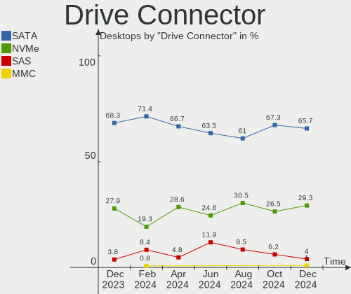

Zorin Hardware Trends (Desktop)
-------------------------------

A project to identify most popular hardware characteristics and track their change
over time based on data collected by Zorin users at https://Linux-Hardware.org.

Anyone can contribute to the study by uploading probes of their computers by
the [hw-probe](https://github.com/linuxhw/hw-probe) tool:

    sudo -E hw-probe -all -upload

Full-feature report is available here: https://linux-hardware.org/?view=trends&formfactor=desktop

Period: Feb, 2021.

Contents
--------

- [ OS                       ](#os)
- [ OS Family                ](#os-family)
- [ Kernel                   ](#kernel)
- [ Kernel Family            ](#kernel-family)
- [ Kernel Major Ver.        ](#kernel-major-ver)
- [ Arch                     ](#arch)
- [ DE                       ](#de)
- [ Display Server           ](#display-server)
- [ Display Manager          ](#display-manager)
- [ OS Lang                  ](#os-lang)
- [ Boot Mode                ](#boot-mode)
- [ Filesystem               ](#filesystem)
- [ Part. scheme             ](#part-scheme)
- [ Dual Boot with Linux/BSD ](#dual-boot-with-linux/bsd)
- [ Dual Boot (Win)          ](#dual-boot-win)
- [ Country                  ](#country)
- [ City                     ](#city)
- [ Vendor                   ](#vendor)
- [ Model                    ](#model)
- [ Model Family             ](#model-family)
- [ MFG Year                 ](#mfg-year)
- [ Form Factor              ](#form-factor)
- [ Secure Boot              ](#secure-boot)
- [ Coreboot                 ](#coreboot)
- [ RAM Size                 ](#ram-size)
- [ RAM Used                 ](#ram-used)
- [ Has CD-ROM               ](#has-cd-rom)
- [ Total Drives             ](#total-drives)
- [ Has Ethernet             ](#has-ethernet)
- [ Drive Vendor             ](#drive-vendor)
- [ Drive Model              ](#drive-model)
- [ HDD Vendor               ](#hdd-vendor)
- [ SSD Vendor               ](#ssd-vendor)
- [ Drive Kind               ](#drive-kind)
- [ Drive Connector          ](#drive-connector)
- [ Drive Size               ](#drive-size)
- [ Space Total              ](#space-total)
- [ Space Used               ](#space-used)
- [ Malfunc. Drives          ](#malfunc-drives)
- [ Malfunc. Drive Vendor    ](#malfunc-drive-vendor)
- [ Malfunc. HDD Vendor      ](#malfunc-hdd-vendor)
- [ Malfunc. Drive Kind      ](#malfunc-drive-kind)
- [ Failed Drives            ](#failed-drives)
- [ Failed Drive Vendor      ](#failed-drive-vendor)
- [ Drive Status             ](#drive-status)
- [ Storage Vendor           ](#storage-vendor)
- [ Storage Model            ](#storage-model)
- [ Storage Kind             ](#storage-kind)
- [ CPU Vendor               ](#cpu-vendor)
- [ CPU Model                ](#cpu-model)
- [ CPU Model Family         ](#cpu-model-family)
- [ CPU Cores                ](#cpu-cores)
- [ CPU Sockets              ](#cpu-sockets)
- [ CPU Threads              ](#cpu-threads)
- [ CPU Op-Modes             ](#cpu-op-modes)
- [ CPU Microcode            ](#cpu-microcode)
- [ CPU Microarch            ](#cpu-microarch)
- [ GPU Vendor               ](#gpu-vendor)
- [ GPU Model                ](#gpu-model)
- [ GPU Combo                ](#gpu-combo)
- [ GPU Driver               ](#gpu-driver)
- [ GPU Memory               ](#gpu-memory)
- [ Monitor Vendor           ](#monitor-vendor)
- [ Monitor Model            ](#monitor-model)
- [ Monitor Resolution       ](#monitor-resolution)
- [ Monitor Diagonal         ](#monitor-diagonal)
- [ Monitor Width            ](#monitor-width)
- [ Aspect Ratio             ](#aspect-ratio)
- [ Monitor Area             ](#monitor-area)
- [ Pixel Density            ](#pixel-density)
- [ Multiple Monitors        ](#multiple-monitors)
- [ Net Controller Vendor    ](#net-controller-vendor)
- [ Net Controller Model     ](#net-controller-model)
- [ Wireless Vendor          ](#wireless-vendor)
- [ Wireless Model           ](#wireless-model)
- [ Ethernet Vendor          ](#ethernet-vendor)
- [ Ethernet Model           ](#ethernet-model)
- [ Net Controller Kind      ](#net-controller-kind)
- [ Used Controller          ](#used-controller)
- [ NICs                     ](#nics)
- [ Memory Vendor            ](#memory-vendor)
- [ Memory Model             ](#memory-model)
- [ Memory Kind              ](#memory-kind)
- [ Memory Form Factor       ](#memory-form-factor)
- [ Memory Size              ](#memory-size)
- [ Memory Speed             ](#memory-speed)
- [ Sound Vendor             ](#sound-vendor)
- [ Sound Model              ](#sound-model)
- [ Camera Vendor            ](#camera-vendor)
- [ Camera Model             ](#camera-model)
- [ Fingerprint Vendor       ](#fingerprint-vendor)
- [ Fingerprint Model        ](#fingerprint-model)
- [ Chipcard Vendor          ](#chipcard-vendor)
- [ Chipcard Model           ](#chipcard-model)
- [ Printer Vendor           ](#printer-vendor)
- [ Printer Model            ](#printer-model)
- [ Scanner Vendor           ](#scanner-vendor)
- [ Scanner Model            ](#scanner-model)
- [ Bluetooth Vendor         ](#bluetooth-vendor)
- [ Bluetooth Model          ](#bluetooth-model)
- [ Unsupported Devices      ](#unsupported-devices)
- [ Unsupported Device Types ](#unsupported-device-types)

OS
--

Installed operating systems

| Name     | Desktops | Percent |
|----------|----------|---------|
| Zorin 15 | 20       | 86.96%  |
| Zorin 12 | 3        | 13.04%  |

OS Family
---------

OS without a version

| Name  | Desktops | Percent |
|-------|----------|---------|
| Zorin | 23       | 100%    |

Kernel
------

Version of the Linux kernel

| Version            | Desktops | Percent |
|--------------------|----------|---------|
| 5.4.0-65-generic   | 13       | 56.52%  |
| 5.4.0-66-generic   | 3        | 13.04%  |
| 5.4.0-47-generic   | 2        | 8.7%    |
| 5.4.0-64-generic   | 1        | 4.35%   |
| 5.4.0-42-generic   | 1        | 4.35%   |
| 4.15.0-133-generic | 1        | 4.35%   |
| 4.15.0-126-generic | 1        | 4.35%   |
| 4.15.0-123-generic | 1        | 4.35%   |

Kernel Family
-------------

Linux kernel without a distro release

| Version | Desktops | Percent |
|---------|----------|---------|
| 5.4.0   | 20       | 86.96%  |
| 4.15.0  | 3        | 13.04%  |

Kernel Major Ver.
-----------------

Linux kernel major version

| Version | Desktops | Percent |
|---------|----------|---------|
| 5.4     | 20       | 86.96%  |
| 4.15    | 3        | 13.04%  |

Arch
----

OS architecture (x86_64, i586, etc.)

| Name   | Desktops | Percent |
|--------|----------|---------|
| x86_64 | 20       | 86.96%  |
| i686   | 3        | 13.04%  |

DE
--

Desktop Environment

| Name    | Desktops | Percent |
|---------|----------|---------|
| GNOME   | 14       | 60.87%  |
| XFCE    | 6        | 26.09%  |
| Unknown | 2        | 8.7%    |
| KDE     | 1        | 4.35%   |

Display Server
--------------

X11 or Wayland

| Name    | Desktops | Percent |
|---------|----------|---------|
| X11     | 22       | 95.65%  |
| Unknown | 1        | 4.35%   |

Display Manager
---------------

SDDM, LightDM, etc.

| Name    | Desktops | Percent |
|---------|----------|---------|
| Unknown | 23       | 100%    |

OS Lang
-------

Language

| Lang  | Desktops | Percent |
|-------|----------|---------|
| en_US | 10       | 43.48%  |
| en_GB | 5        | 21.74%  |
| de_DE | 2        | 8.7%    |
| nl_NL | 1        | 4.35%   |
| it_IT | 1        | 4.35%   |
| es_MX | 1        | 4.35%   |
| es_ES | 1        | 4.35%   |
| es_CL | 1        | 4.35%   |
| en_CA | 1        | 4.35%   |

Boot Mode
---------

EFI or BIOS

| Mode | Desktops | Percent |
|------|----------|---------|
| BIOS | 15       | 65.22%  |
| EFI  | 8        | 34.78%  |

Filesystem
----------

Type of filesystem

| Type | Desktops | Percent |
|------|----------|---------|
| Ext4 | 23       | 100%    |

Part. scheme
------------

Scheme of partitioning

| Type    | Desktops | Percent |
|---------|----------|---------|
| Unknown | 23       | 100%    |

Dual Boot with Linux/BSD
------------------------

Hosting more than one Linux/BSD

| Dual boot | Desktops | Percent |
|-----------|----------|---------|
| No        | 17       | 73.91%  |
| Yes       | 6        | 26.09%  |

Dual Boot (Win)
---------------

Hosting Linux and Windows

| Dual boot | Desktops | Percent |
|-----------|----------|---------|
| No        | 13       | 56.52%  |
| Yes       | 10       | 43.48%  |

Country
-------

Geographic location (country)

| Country     | Desktops | Percent |
|-------------|----------|---------|
| USA         | 6        | 26.09%  |
| UK          | 4        | 17.39%  |
| Germany     | 2        | 8.7%    |
| Switzerland | 1        | 4.35%   |
| Spain       | 1        | 4.35%   |
| Serbia      | 1        | 4.35%   |
| Philippines | 1        | 4.35%   |
| Mexico      | 1        | 4.35%   |
| Italy       | 1        | 4.35%   |
| Indonesia   | 1        | 4.35%   |
| India       | 1        | 4.35%   |
| Chile       | 1        | 4.35%   |
| Canada      | 1        | 4.35%   |
| Belgium     | 1        | 4.35%   |

City
----

Geographic location (city)

| City               | Desktops | Percent |
|--------------------|----------|---------|
| Richmond           | 2        | 8.7%    |
| Weisenheim am Sand | 1        | 4.35%   |
| Vigo               | 1        | 4.35%   |
| Tujunga            | 1        | 4.35%   |
| Sestri Levante     | 1        | 4.35%   |
| San Francisco      | 1        | 4.35%   |
| Probolinggo        | 1        | 4.35%   |
| Oudenaarde         | 1        | 4.35%   |
| Olympia            | 1        | 4.35%   |
| Novi Sad           | 1        | 4.35%   |
| Monterrey          | 1        | 4.35%   |
| Makati City        | 1        | 4.35%   |
| London             | 1        | 4.35%   |
| Indore             | 1        | 4.35%   |
| Fribourg           | 1        | 4.35%   |
| Eugene             | 1        | 4.35%   |
| Enfield Town       | 1        | 4.35%   |
| Elmswell           | 1        | 4.35%   |
| Concepción        | 1        | 4.35%   |
| Clapham            | 1        | 4.35%   |
| Buxtehude          | 1        | 4.35%   |
| Brooklyn           | 1        | 4.35%   |

Vendor
------

Motherboard manufacturer

| Name                | Desktops | Percent |
|---------------------|----------|---------|
| Gigabyte Technology | 5        | 21.74%  |
| ASUSTek Computer    | 4        | 17.39%  |
| MSI                 | 3        | 13.04%  |
| Dell                | 3        | 13.04%  |
| Foxconn             | 2        | 8.7%    |
| ASRock              | 2        | 8.7%    |
| Pegatron            | 1        | 4.35%   |
| Lenovo              | 1        | 4.35%   |
| Intel               | 1        | 4.35%   |
| Hewlett-Packard     | 1        | 4.35%   |

Model
-----

Motherboard model

| Name                           | Desktops | Percent |
|--------------------------------|----------|---------|
| Pegatron NP185AA-ABA CQ5110F   | 1        | 4.35%   |
| MSI MS-7C75                    | 1        | 4.35%   |
| MSI MS-7A38                    | 1        | 4.35%   |
| MSI MS-7914                    | 1        | 4.35%   |
| Lenovo H430 10091              | 1        | 4.35%   |
| Intel DG45ID AAE27729-310      | 1        | 4.35%   |
| HP Compaq Pro 4300 SFF PC      | 1        | 4.35%   |
| Gigabyte Z77X-UD3H             | 1        | 4.35%   |
| Gigabyte G31M-S2C              | 1        | 4.35%   |
| Gigabyte B460MDS3H             | 1        | 4.35%   |
| Gigabyte B450M DS3H            | 1        | 4.35%   |
| Gigabyte B450 I AORUS PRO WIFI | 1        | 4.35%   |
| Foxconn Pavilion P6000 Series  | 1        | 4.35%   |
| Foxconn ELVAS                  | 1        | 4.35%   |
| Dell OptiPlex 780              | 1        | 4.35%   |
| Dell OptiPlex 755              | 1        | 4.35%   |
| Dell Inspiron 530s             | 1        | 4.35%   |
| ASUS PRIME Z370-A              | 1        | 4.35%   |
| ASUS PRIME B360-PLUS           | 1        | 4.35%   |
| ASUS P7P55D-E LX               | 1        | 4.35%   |
| ASUS M2A-MX                    | 1        | 4.35%   |
| ASRock N68C-S                  | 1        | 4.35%   |
| ASRock B450M-HDV R4.0          | 1        | 4.35%   |

Model Family
------------

Motherboard model prefix

| Name                 | Desktops | Percent |
|----------------------|----------|---------|
| Dell OptiPlex        | 2        | 8.7%    |
| ASUS PRIME           | 2        | 8.7%    |
| Pegatron NP185AA-ABA | 1        | 4.35%   |
| MSI MS-7C75          | 1        | 4.35%   |
| MSI MS-7A38          | 1        | 4.35%   |
| MSI MS-7914          | 1        | 4.35%   |
| Lenovo H430          | 1        | 4.35%   |
| Intel DG45ID         | 1        | 4.35%   |
| HP Compaq            | 1        | 4.35%   |
| Gigabyte Z77X-UD3H   | 1        | 4.35%   |
| Gigabyte G31M-S2C    | 1        | 4.35%   |
| Gigabyte B460MDS3H   | 1        | 4.35%   |
| Gigabyte B450M       | 1        | 4.35%   |
| Gigabyte B450        | 1        | 4.35%   |
| Foxconn Pavilion     | 1        | 4.35%   |
| Foxconn ELVAS        | 1        | 4.35%   |
| Dell Inspiron        | 1        | 4.35%   |
| ASUS P7P55D-E        | 1        | 4.35%   |
| ASUS M2A-MX          | 1        | 4.35%   |
| ASRock N68C-S        | 1        | 4.35%   |
| ASRock B450M-HDV     | 1        | 4.35%   |

MFG Year
--------

Motherboard manufacture year

| Year | Desktops | Percent |
|------|----------|---------|
| 2020 | 4        | 17.39%  |
| 2009 | 4        | 17.39%  |
| 2012 | 3        | 13.04%  |
| 2010 | 3        | 13.04%  |
| 2019 | 2        | 8.7%    |
| 2018 | 2        | 8.7%    |
| 2013 | 2        | 8.7%    |
| 2008 | 2        | 8.7%    |
| 2014 | 1        | 4.35%   |

Form Factor
-----------

Physical design of the computer

| Name    | Desktops | Percent |
|---------|----------|---------|
| Desktop | 23       | 100%    |

Secure Boot
-----------

Enabled or disabled

| State    | Desktops | Percent |
|----------|----------|---------|
| Disabled | 23       | 100%    |

Coreboot
--------

Have coreboot on board

| Used | Desktops | Percent |
|------|----------|---------|
| No   | 23       | 100%    |

RAM Size
--------

Total RAM memory

| Size in GB | Desktops | Percent |
|------------|----------|---------|
| 16.01-24.0 | 5        | 21.74%  |
| 4.01-8.0   | 4        | 17.39%  |
| 32.01-64.0 | 4        | 17.39%  |
| 3.01-4.0   | 4        | 17.39%  |
| 8.01-16.0  | 2        | 8.7%    |
| 24.01-32.0 | 1        | 4.35%   |
| 2.01-3.0   | 1        | 4.35%   |
| 1.01-2.0   | 1        | 4.35%   |
| 0.51-1.0   | 1        | 4.35%   |

RAM Used
--------

Used RAM memory

| Used GB   | Desktops | Percent |
|-----------|----------|---------|
| 1.01-2.0  | 10       | 43.48%  |
| 2.01-3.0  | 4        | 17.39%  |
| 3.01-4.0  | 3        | 13.04%  |
| 0.51-1.0  | 3        | 13.04%  |
| 8.01-16.0 | 2        | 8.7%    |
| 0.01-0.5  | 1        | 4.35%   |

Has CD-ROM
----------

Has CD-ROM on board

| Presented | Desktops | Percent |
|-----------|----------|---------|
| Yes       | 12       | 52.17%  |
| No        | 11       | 47.83%  |

Total Drives
------------

Number of drives on board

| Drives | Desktops | Percent |
|--------|----------|---------|
| 1      | 13       | 56.52%  |
| 2      | 6        | 26.09%  |
| 3      | 3        | 13.04%  |
| 4      | 1        | 4.35%   |

Has Ethernet
------------

Has Ethernet on board

| Presented | Desktops | Percent |
|-----------|----------|---------|
| Yes       | 23       | 100%    |

Drive Vendor
------------

Hard drive vendors

| Vendor              | Desktops | Drives | Percent |
|---------------------|----------|--------|---------|
| Seagate             | 12       | 13     | 34.29%  |
| WDC                 | 5        | 5      | 14.29%  |
| Samsung Electronics | 3        | 3      | 8.57%   |
| SanDisk             | 2        | 2      | 5.71%   |
| Phison              | 2        | 2      | 5.71%   |
| Kingston            | 2        | 2      | 5.71%   |
| XPG                 | 1        | 1      | 2.86%   |
| Patriot             | 1        | 1      | 2.86%   |
| MAXTOR              | 1        | 1      | 2.86%   |
| Marvell             | 1        | 1      | 2.86%   |
| Intenso             | 1        | 1      | 2.86%   |
| Hitachi             | 1        | 1      | 2.86%   |
| Crucial             | 1        | 1      | 2.86%   |
| Corsair             | 1        | 1      | 2.86%   |
| Apple               | 1        | 1      | 2.86%   |

Drive Model
-----------

Hard drive models

| Model                             | Desktops | Percent |
|-----------------------------------|----------|---------|
| Seagate ST500DM002-1BD142 500GB   | 2        | 5.56%   |
| Seagate ST1000DM010-2EP102 1TB    | 2        | 5.56%   |
| XPG NVMe SSD Drive 1024GB         | 1        | 2.78%   |
| WDC WD3200BPVT-75ZEST0 320GB      | 1        | 2.78%   |
| WDC WD2500BEVT-22A23T0 250GB      | 1        | 2.78%   |
| WDC WD2500AAKX-75U6AA0 250GB      | 1        | 2.78%   |
| WDC WD1600AAJS-75WAA0 160GB       | 1        | 2.78%   |
| WDC WD10EZRZ-00HTKB0 1TB          | 1        | 2.78%   |
| Seagate ST500LM034-2GH17A 500GB   | 1        | 2.78%   |
| Seagate ST4000DM004-2CV104 4TB    | 1        | 2.78%   |
| Seagate ST3750528AS 752GB         | 1        | 2.78%   |
| Seagate ST3500418AS 500GB         | 1        | 2.78%   |
| Seagate ST3400633AS 400GB         | 1        | 2.78%   |
| Seagate ST3320418AS 320GB         | 1        | 2.78%   |
| Seagate ST3120827AS 120GB         | 1        | 2.78%   |
| Seagate ST31000528AS 1TB          | 1        | 2.78%   |
| Seagate ST2000DM001-1ER164 2TB    | 1        | 2.78%   |
| SanDisk SDSSDHP064G 64GB          | 1        | 2.78%   |
| Sandisk NVMe SSD Drive 500GB      | 1        | 2.78%   |
| Samsung SSD 840 EVO 500GB         | 1        | 2.78%   |
| Samsung NVMe SSD Drive 1TB        | 1        | 2.78%   |
| Samsung HD642JJ 640GB             | 1        | 2.78%   |
| Phison NVMe SSD Drive 256GB       | 1        | 2.78%   |
| Phison NVMe SSD Drive 120GB       | 1        | 2.78%   |
| Patriot Spark 256GB SSD           | 1        | 2.78%   |
| MAXTOR STM3500630AS 500GB         | 1        | 2.78%   |
| Marvell NVMe SSD Drive 256GB      | 1        | 2.78%   |
| Kingston SV300S37A120G 120GB SSD  | 1        | 2.78%   |
| Kingston SA400S37480G 480GB SSD   | 1        | 2.78%   |
| Intenso SSD SATAIII 128GB         | 1        | 2.78%   |
| Hitachi HDP725050GLA360 500GB     | 1        | 2.78%   |
| Crucial CT480M500SSD1 480GB       | 1        | 2.78%   |
| Corsair Force GT 120GB SSD        | 1        | 2.78%   |
| Apple HDD WDC WD10EALX-408EA0 1TB | 1        | 2.78%   |

HDD Vendor
----------

Hard disk drive vendors

| Vendor              | Desktops | Drives | Percent |
|---------------------|----------|--------|---------|
| Seagate             | 12       | 13     | 57.14%  |
| WDC                 | 5        | 5      | 23.81%  |
| Samsung Electronics | 1        | 1      | 4.76%   |
| MAXTOR              | 1        | 1      | 4.76%   |
| Hitachi             | 1        | 1      | 4.76%   |
| Apple               | 1        | 1      | 4.76%   |

SSD Vendor
----------

Solid state drive vendors

| Vendor              | Desktops | Drives | Percent |
|---------------------|----------|--------|---------|
| Kingston            | 2        | 2      | 25%     |
| SanDisk             | 1        | 1      | 12.5%   |
| Samsung Electronics | 1        | 1      | 12.5%   |
| Patriot             | 1        | 1      | 12.5%   |
| Intenso             | 1        | 1      | 12.5%   |
| Crucial             | 1        | 1      | 12.5%   |
| Corsair             | 1        | 1      | 12.5%   |

Drive Kind
----------

HDD or SSD

| Kind | Desktops | Drives | Percent |
|------|----------|--------|---------|
| HDD  | 19       | 22     | 61.29%  |
| NVMe | 6        | 6      | 19.35%  |
| SSD  | 6        | 8      | 19.35%  |

Drive Connector
---------------

SATA, SAS, NVMe, etc.

| Type | Desktops | Drives | Percent |
|------|----------|--------|---------|
| SATA | 21       | 30     | 77.78%  |
| NVMe | 6        | 6      | 22.22%  |

Drive Size
----------

Size of hard drive

| Size in TB | Desktops | Drives | Percent |
|------------|----------|--------|---------|
| 0.01-0.5   | 15       | 21     | 62.5%   |
| 0.51-1.0   | 7        | 7      | 29.17%  |
| 3.01-4.0   | 1        | 1      | 4.17%   |
| 1.01-2.0   | 1        | 1      | 4.17%   |

Space Total
-----------

Amount of disk space available on the file system

| Size in GB     | Desktops | Percent |
|----------------|----------|---------|
| 101-250        | 7        | 30.43%  |
| 251-500        | 6        | 26.09%  |
| 501-1000       | 5        | 21.74%  |
| 21-50          | 2        | 8.7%    |
| 51-100         | 2        | 8.7%    |
| More than 3000 | 1        | 4.35%   |

Space Used
----------

Amount of used disk space

| Used GB  | Desktops | Percent |
|----------|----------|---------|
| 1-20     | 10       | 43.48%  |
| 21-50    | 6        | 26.09%  |
| 51-100   | 4        | 17.39%  |
| 251-500  | 2        | 8.7%    |
| 501-1000 | 1        | 4.35%   |

Malfunc. Drives
---------------

Drive models with a malfunction

Zero info for selected period =(

Malfunc. Drive Vendor
---------------------

Vendors of faulty drives

Zero info for selected period =(

Malfunc. HDD Vendor
-------------------

Vendors of faulty HDD drives

Zero info for selected period =(

Malfunc. Drive Kind
-------------------

Kinds of faulty drives

Zero info for selected period =(

Failed Drives
-------------

Failed drive models

Zero info for selected period =(

Failed Drive Vendor
-------------------

Failed drive vendors

Zero info for selected period =(

Drive Status
------------

Number of failed and malfunc. drives

| Status   | Desktops | Drives | Percent |
|----------|----------|--------|---------|
| Detected | 23       | 36     | 100%    |

Storage Vendor
--------------

Storage controller vendors

| Vendor                   | Desktops | Percent |
|--------------------------|----------|---------|
| Intel                    | 14       | 42.42%  |
| AMD                      | 7        | 21.21%  |
| Marvell Technology Group | 3        | 9.09%   |
| Phison Electronics       | 2        | 6.06%   |
| Nvidia                   | 2        | 6.06%   |
| Sandisk                  | 1        | 3.03%   |
| Samsung Electronics      | 1        | 3.03%   |
| JMicron Technology       | 1        | 3.03%   |
| ASMedia Technology       | 1        | 3.03%   |
| ADATA Technology         | 1        | 3.03%   |

Storage Model
-------------

Storage controller models

| Model                                                                         | Desktops | Percent |
|-------------------------------------------------------------------------------|----------|---------|
| AMD FCH SATA Controller [AHCI mode]                                           | 4        | 9.09%   |
| AMD 400 Series Chipset SATA Controller                                        | 4        | 9.09%   |
| Nvidia MCP61 SATA Controller                                                  | 2        | 4.55%   |
| Intel 6 Series/C200 Series Chipset Family 6 port Desktop SATA AHCI Controller | 2        | 4.55%   |
| Sandisk WD Blue SN550 NVMe SSD                                                | 1        | 2.27%   |
| Samsung NVMe SSD Controller SM981/PM981/PM983                                 | 1        | 2.27%   |
| Phison E7 NVMe Controller                                                     | 1        | 2.27%   |
| Phison E12 NVMe Controller                                                    | 1        | 2.27%   |
| Nvidia MCP61 IDE                                                              | 1        | 2.27%   |
| Marvell Group Marvell Non-Volatile memory controller                          | 1        | 2.27%   |
| Marvell Group 88SE9172 SATA 6Gb/s Controller                                  | 1        | 2.27%   |
| Marvell Group 88SE914D SATA-600 Controller                                    | 1        | 2.27%   |
| JMicron JMB361 AHCI/IDE                                                       | 1        | 2.27%   |
| Intel SATA Controller [RAID mode]                                             | 1        | 2.27%   |
| Intel NM10/ICH7 Family SATA Controller [IDE mode]                             | 1        | 2.27%   |
| Intel Cannon Lake PCH SATA AHCI Controller                                    | 1        | 2.27%   |
| Intel 9 Series Chipset Family SATA Controller [AHCI Mode]                     | 1        | 2.27%   |
| Intel 82Q35 Express PT IDER Controller                                        | 1        | 2.27%   |
| Intel 82801JI (ICH10 Family) 4 port SATA IDE Controller #1                    | 1        | 2.27%   |
| Intel 82801JI (ICH10 Family) 2 port SATA IDE Controller #2                    | 1        | 2.27%   |
| Intel 82801JD/DO (ICH10 Family) 4-port SATA IDE Controller                    | 1        | 2.27%   |
| Intel 82801JD/DO (ICH10 Family) 2-port SATA IDE Controller                    | 1        | 2.27%   |
| Intel 82801IR/IO/IH (ICH9R/DO/DH) 6 port SATA Controller [AHCI mode]          | 1        | 2.27%   |
| Intel 82801IR/IO/IH (ICH9R/DO/DH) 4 port SATA Controller [IDE mode]           | 1        | 2.27%   |
| Intel 82801I (ICH9 Family) 2 port SATA Controller [IDE mode]                  | 1        | 2.27%   |
| Intel 7 Series/C210 Series Chipset Family 6-port SATA Controller [AHCI mode]  | 1        | 2.27%   |
| Intel 5 Series/3400 Series Chipset 6 port SATA AHCI Controller                | 1        | 2.27%   |
| Intel 400 Series Chipset Family SATA AHCI Controller                          | 1        | 2.27%   |
| Intel 4 Series Chipset PT IDER Controller                                     | 1        | 2.27%   |
| Intel 200 Series PCH SATA controller [AHCI mode]                              | 1        | 2.27%   |
| ASMedia ASM1062 Serial ATA Controller                                         | 1        | 2.27%   |
| AMD SB7x0/SB8x0/SB9x0 SATA Controller [IDE mode]                              | 1        | 2.27%   |
| AMD SB7x0/SB8x0/SB9x0 SATA Controller [AHCI mode]                             | 1        | 2.27%   |
| AMD SB600 Non-Raid-5 SATA                                                     | 1        | 2.27%   |
| AMD SB600 IDE                                                                 | 1        | 2.27%   |
| ADATA XPG SX8200 Pro PCIe Gen3x4 M.2 2280 Solid State Drive                   | 1        | 2.27%   |

Storage Kind
------------

Kind of storage controller (IDE, SATA, NVMe, SAS, ...)

| Kind | Desktops | Percent |
|------|----------|---------|
| SATA | 16       | 50%     |
| IDE  | 9        | 28.13%  |
| NVMe | 6        | 18.75%  |
| RAID | 1        | 3.13%   |

CPU Vendor
----------

Processor vendors

| Vendor | Desktops | Percent |
|--------|----------|---------|
| Intel  | 14       | 60.87%  |
| AMD    | 9        | 39.13%  |

CPU Model
---------

Processor models

| Model                                       | Desktops | Percent |
|---------------------------------------------|----------|---------|
| Intel Core i7-10700K CPU @ 3.80GHz          | 2        | 8.7%    |
| Intel Pentium Dual CPU E2160 @ 1.80GHz      | 1        | 4.35%   |
| Intel Pentium CPU G860 @ 3.00GHz            | 1        | 4.35%   |
| Intel Core i7-4790 CPU @ 3.60GHz            | 1        | 4.35%   |
| Intel Core i5-9600K CPU @ 3.70GHz           | 1        | 4.35%   |
| Intel Core i5-3570K CPU @ 3.40GHz           | 1        | 4.35%   |
| Intel Core i5 CPU 760 @ 2.80GHz             | 1        | 4.35%   |
| Intel Core i3-8100 CPU @ 3.60GHz            | 1        | 4.35%   |
| Intel Core i3-2130 CPU @ 3.40GHz            | 1        | 4.35%   |
| Intel Core 2 Quad CPU Q8400 @ 2.66GHz       | 1        | 4.35%   |
| Intel Core 2 Quad CPU Q8200 @ 2.33GHz       | 1        | 4.35%   |
| Intel Core 2 Duo CPU E8400 @ 3.00GHz        | 1        | 4.35%   |
| Intel Celeron CPU E1400 @ 2.00GHz           | 1        | 4.35%   |
| AMD Ryzen 7 2700X Eight-Core Processor      | 1        | 4.35%   |
| AMD Ryzen 7 2700 Eight-Core Processor       | 1        | 4.35%   |
| AMD Ryzen 5 1600X Six-Core Processor        | 1        | 4.35%   |
| AMD Ryzen 3 2200G with Radeon Vega Graphics | 1        | 4.35%   |
| AMD Phenom II X4 830 Processor              | 1        | 4.35%   |
| AMD Phenom 9350e Quad-Core Processor        | 1        | 4.35%   |
| AMD Athlon Processor 2850e                  | 1        | 4.35%   |
| AMD Athlon 7550 Dual-Core Processor         | 1        | 4.35%   |
| AMD Athlon 64 Processor 3500+               | 1        | 4.35%   |

CPU Model Family
----------------

Processor model prefix

| Model              | Desktops | Percent |
|--------------------|----------|---------|
| Intel Core i7      | 3        | 13.04%  |
| Intel Core i5      | 3        | 13.04%  |
| Intel Core i3      | 2        | 8.7%    |
| Intel Core 2 Quad  | 2        | 8.7%    |
| AMD Ryzen 7        | 2        | 8.7%    |
| AMD Athlon         | 2        | 8.7%    |
| Intel Pentium Dual | 1        | 4.35%   |
| Intel Pentium      | 1        | 4.35%   |
| Intel Core 2 Duo   | 1        | 4.35%   |
| Intel Celeron      | 1        | 4.35%   |
| AMD Ryzen 5        | 1        | 4.35%   |
| AMD Ryzen 3        | 1        | 4.35%   |
| AMD Phenom II X4   | 1        | 4.35%   |
| AMD Phenom         | 1        | 4.35%   |
| AMD Athlon 64      | 1        | 4.35%   |

CPU Cores
---------

Number of processor cores

| Number | Desktops | Percent |
|--------|----------|---------|
| 4      | 9        | 39.13%  |
| 2      | 6        | 26.09%  |
| 8      | 4        | 17.39%  |
| 6      | 2        | 8.7%    |
| 1      | 2        | 8.7%    |

CPU Sockets
-----------

Number of sockets

| Number | Desktops | Percent |
|--------|----------|---------|
| 1      | 23       | 100%    |

CPU Threads
-----------

Threads per core (Hyper-Threading)

| Number | Desktops | Percent |
|--------|----------|---------|
| 1      | 16       | 69.57%  |
| 2      | 7        | 30.43%  |

CPU Op-Modes
------------

CPU Operation Modes (32-bit, 64-bit)

| Op mode        | Desktops | Percent |
|----------------|----------|---------|
| 32-bit, 64-bit | 23       | 100%    |

CPU Microcode
-------------

Microcode number

| Number     | Desktops | Percent |
|------------|----------|---------|
| 0x1067a    | 3        | 13.04%  |
| Unknown    | 3        | 13.04%  |
| 0xa0655    | 2        | 8.7%    |
| 0x6fd      | 2        | 8.7%    |
| 0x0800820d | 2        | 8.7%    |
| 0x01000083 | 2        | 8.7%    |
| 0x906ed    | 1        | 4.35%   |
| 0x906eb    | 1        | 4.35%   |
| 0x306c3    | 1        | 4.35%   |
| 0x306a9    | 1        | 4.35%   |
| 0x206a7    | 1        | 4.35%   |
| 0x106e5    | 1        | 4.35%   |
| 0x0810100b | 1        | 4.35%   |
| 0x08001137 | 1        | 4.35%   |
| 0x010000c8 | 1        | 4.35%   |

CPU Microarch
-------------

Microarchitecture

| Name        | Desktops | Percent |
|-------------|----------|---------|
| Penryn      | 3        | 13.04%  |
| K10         | 3        | 13.04%  |
| Zen+        | 2        | 8.7%    |
| Zen         | 2        | 8.7%    |
| SandyBridge | 2        | 8.7%    |
| KabyLake    | 2        | 8.7%    |
| K8 Hammer   | 2        | 8.7%    |
| Core        | 2        | 8.7%    |
| CometLake   | 2        | 8.7%    |
| Nehalem     | 1        | 4.35%   |
| IvyBridge   | 1        | 4.35%   |
| Haswell     | 1        | 4.35%   |

GPU Vendor
----------

Vendors of graphics cards

| Vendor | Desktops | Percent |
|--------|----------|---------|
| AMD    | 9        | 37.5%   |
| Intel  | 8        | 33.33%  |
| Nvidia | 7        | 29.17%  |

GPU Model
---------

Graphics card models

| Model                                                                     | Desktops | Percent |
|---------------------------------------------------------------------------|----------|---------|
| Nvidia GF119 [GeForce GT 610]                                             | 2        | 8%      |
| Intel CometLake-S GT2 [UHD Graphics 630]                                  | 2        | 8%      |
| Intel 4 Series Chipset Integrated Graphics Controller                     | 2        | 8%      |
| Intel 2nd Generation Core Processor Family Integrated Graphics Controller | 2        | 8%      |
| AMD RV620 LE [Radeon HD 3450]                                             | 2        | 8%      |
| Nvidia GT216 [GeForce GT 220]                                             | 1        | 4%      |
| Nvidia GM107 [GeForce GTX 750 Ti]                                         | 1        | 4%      |
| Nvidia G92 [GeForce 9800 GTX+]                                            | 1        | 4%      |
| Nvidia G84 [GeForce 8600 GT]                                              | 1        | 4%      |
| Nvidia C61 [GeForce 6150SE nForce 430]                                    | 1        | 4%      |
| Intel CoffeeLake-S GT2 [UHD Graphics 630]                                 | 1        | 4%      |
| Intel 82G33/G31 Express Integrated Graphics Controller                    | 1        | 4%      |
| AMD RV610 [Radeon HD 2400 PRO]                                            | 1        | 4%      |
| AMD RS780L [Radeon 3000]                                                  | 1        | 4%      |
| AMD RS740 [Radeon 2100]                                                   | 1        | 4%      |
| AMD RS690 [Radeon X1200]                                                  | 1        | 4%      |
| AMD Raven Ridge [Radeon Vega Series / Radeon Vega Mobile Series]          | 1        | 4%      |
| AMD Lexa PRO [Radeon 540/540X/550/550X / RX 540X/550/550X]                | 1        | 4%      |
| AMD Curacao XT / Trinidad XT [Radeon R7 370 / R9 270X/370X]               | 1        | 4%      |
| AMD Baffin [Radeon RX 550 640SP / RX 560/560X]                            | 1        | 4%      |

GPU Combo
---------

Combinations of graphics cards

| Name        | Desktops | Percent |
|-------------|----------|---------|
| 1 x Nvidia  | 7        | 30.43%  |
| 1 x Intel   | 7        | 30.43%  |
| 1 x AMD     | 7        | 30.43%  |
| 2 x AMD     | 1        | 4.35%   |
| Intel + AMD | 1        | 4.35%   |

GPU Driver
----------

Free vs proprietary

| Driver      | Desktops | Percent |
|-------------|----------|---------|
| Free        | 17       | 73.91%  |
| Proprietary | 4        | 17.39%  |
| Unknown     | 2        | 8.7%    |

GPU Memory
----------

Total video memory

| Size in GB | Desktops | Percent |
|------------|----------|---------|
| Unknown    | 10       | 43.48%  |
| 0.01-0.5   | 7        | 30.43%  |
| 3.01-4.0   | 2        | 8.7%    |
| 1.01-2.0   | 2        | 8.7%    |
| 0.51-1.0   | 2        | 8.7%    |

Monitor Vendor
--------------

Monitor vendors

| Vendor              | Desktops | Percent |
|---------------------|----------|---------|
| Hewlett-Packard     | 4        | 18.18%  |
| Dell                | 3        | 13.64%  |
| AOC                 | 3        | 13.64%  |
| Samsung Electronics | 2        | 9.09%   |
| ViewSonic           | 1        | 4.55%   |
| Targa               | 1        | 4.55%   |
| Sharp               | 1        | 4.55%   |
| RKU                 | 1        | 4.55%   |
| Plain Tree Systems  | 1        | 4.55%   |
| Philips             | 1        | 4.55%   |
| Insignia            | 1        | 4.55%   |
| Goldstar            | 1        | 4.55%   |
| BenQ                | 1        | 4.55%   |
| Acer                | 1        | 4.55%   |

Monitor Model
-------------

Monitor models

| Model                                                               | Desktops | Percent |
|---------------------------------------------------------------------|----------|---------|
| ViewSonic VA2231 Series VSCBB25 1920x1080 477x268mm 21.5-inch       | 1        | 4.55%   |
| Targa LCD Monitor LCDTV16 3200x1204                                 | 1        | 4.55%   |
| Sharp HDMI SHP10CE 1920x1080 1330x750mm 60.1-inch                   | 1        | 4.55%   |
| Samsung Electronics SyncMaster SAM0088 1024x768 304x228mm 15.0-inch | 1        | 4.55%   |
| Samsung Electronics LCD Monitor SMB1930N 1366x768                   | 1        | 4.55%   |
| RKU Roku TV RKU7813 3840x2160 800x450mm 36.1-inch                   | 1        | 4.55%   |
| Plain Tree Systems Monitor PTS0899 1680x1050 474x296mm 22.0-inch    | 1        | 4.55%   |
| Philips PHL 243V5 PHLC0D1 1920x1080 521x293mm 23.5-inch             | 1        | 4.55%   |
| Insignia NS28D310NA15 BBY0028 1680x1050 640x384mm 29.4-inch         | 1        | 4.55%   |
| Hewlett-Packard Compaq CQ1569 HWP2836 1366x768 344x194mm 15.5-inch  | 1        | 4.55%   |
| Hewlett-Packard 2310t HWP289C 1920x1080 510x287mm 23.0-inch         | 1        | 4.55%   |
| Hewlett-Packard 2310e HWP288E 1920x1080 510x287mm 23.0-inch         | 1        | 4.55%   |
| Hewlett-Packard 20bw HWP302B 1600x900 440x250mm 19.9-inch           | 1        | 4.55%   |
| Goldstar MP59G GSM5B34 1920x1080 480x270mm 21.7-inch                | 1        | 4.55%   |
| Dell SE2417HG DELD08C 1920x1080 521x293mm 23.5-inch                 | 1        | 4.55%   |
| Dell 1908FP DEL4025 1280x1024 380x300mm 19.1-inch                   | 1        | 4.55%   |
| Dell 1708FP DEL4023 1280x1024 338x270mm 17.0-inch                   | 1        | 4.55%   |
| BenQ GW2780 BNQ78E6 1920x1080 598x336mm 27.0-inch                   | 1        | 4.55%   |
| AOC T2442e AOC2442 1920x1080 477x268mm 21.5-inch                    | 1        | 4.55%   |
| AOC 2369M AOC2369 1920x1080 509x286mm 23.0-inch                     | 1        | 4.55%   |
| AOC 2270W AOC2270 1920x1080 477x268mm 21.5-inch                     | 1        | 4.55%   |
| Acer B326HK ACR0410 3840x2160 708x399mm 32.0-inch                   | 1        | 4.55%   |

Monitor Resolution
------------------

Monitor screen resolution

| Resolution         | Desktops | Percent |
|--------------------|----------|---------|
| 1920x1080 (FHD)    | 10       | 47.62%  |
| 3840x2160 (4K)     | 2        | 9.52%   |
| 1366x768 (WXGA)    | 2        | 9.52%   |
| 1280x1024 (SXGA)   | 2        | 9.52%   |
| 3200x1204          | 1        | 4.76%   |
| 1680x1050 (WSXGA+) | 1        | 4.76%   |
| 1600x900 (HD+)     | 1        | 4.76%   |
| 1360x768           | 1        | 4.76%   |
| 1024x768 (XGA)     | 1        | 4.76%   |

Monitor Diagonal
----------------

Diagonal size in inches

| Inches  | Desktops | Percent |
|---------|----------|---------|
| 23      | 5        | 22.73%  |
| 21      | 4        | 18.18%  |
| 19      | 2        | 9.09%   |
| 15      | 2        | 9.09%   |
| Unknown | 2        | 9.09%   |
| 60      | 1        | 4.55%   |
| 36      | 1        | 4.55%   |
| 32      | 1        | 4.55%   |
| 29      | 1        | 4.55%   |
| 27      | 1        | 4.55%   |
| 22      | 1        | 4.55%   |
| 17      | 1        | 4.55%   |

Monitor Width
-------------

Physical width

| Width in mm | Desktops | Percent |
|-------------|----------|---------|
| 501-600     | 6        | 27.27%  |
| 401-500     | 6        | 27.27%  |
| 301-350     | 3        | 13.64%  |
| 701-800     | 2        | 9.09%   |
| Unknown     | 2        | 9.09%   |
| 601-700     | 1        | 4.55%   |
| 351-400     | 1        | 4.55%   |
| 1001-1500   | 1        | 4.55%   |

Aspect Ratio
------------

Proportional relationship between the width and the height

| Ratio   | Desktops | Percent |
|---------|----------|---------|
| 16/9    | 15       | 71.43%  |
| 5/4     | 2        | 9.52%   |
| Unknown | 2        | 9.52%   |
| 4/3     | 1        | 4.76%   |
| 16/10   | 1        | 4.76%   |

Monitor Area
------------

Area in inch²

| Area in inch² | Desktops | Percent |
|----------------|----------|---------|
| 201-250        | 7        | 33.33%  |
| 151-200        | 4        | 19.05%  |
| 351-500        | 2        | 9.52%   |
| 101-110        | 2        | 9.52%   |
| Unknown        | 2        | 9.52%   |
| More than 1000 | 1        | 4.76%   |
| 301-350        | 1        | 4.76%   |
| 141-150        | 1        | 4.76%   |
| 501-1000       | 1        | 4.76%   |

Pixel Density
-------------

Pixels per inch

| Density | Desktops | Percent |
|---------|----------|---------|
| 51-100  | 12       | 54.55%  |
| 101-120 | 5        | 22.73%  |
| 121-160 | 2        | 9.09%   |
| Unknown | 2        | 9.09%   |
| 1-50    | 1        | 4.55%   |

Multiple Monitors
-----------------

Total monitors connected

| Total | Desktops | Percent |
|-------|----------|---------|
| 1     | 20       | 86.96%  |
| 0     | 2        | 8.7%    |
| 2     | 1        | 4.35%   |

Net Controller Vendor
---------------------

Controller vendors

| Vendor                         | Desktops | Percent |
|--------------------------------|----------|---------|
| Realtek Semiconductor          | 14       | 40%     |
| Intel                          | 7        | 20%     |
| Qualcomm Atheros               | 3        | 8.57%   |
| Nvidia                         | 2        | 5.71%   |
| Broadcom Limited               | 2        | 5.71%   |
| TP-Link                        | 1        | 2.86%   |
| Samsung Electronics            | 1        | 2.86%   |
| Ralink Technology              | 1        | 2.86%   |
| Ralink                         | 1        | 2.86%   |
| D-Link System                  | 1        | 2.86%   |
| D-Link                         | 1        | 2.86%   |
| Broadcom Inc. and subsidiaries | 1        | 2.86%   |

Net Controller Model
--------------------

Controller models

| Model                                                                                     | Desktops | Percent |
|-------------------------------------------------------------------------------------------|----------|---------|
| Realtek RTL8111/8168/8411 PCI Express Gigabit Ethernet Controller                         | 9        | 23.68%  |
| Realtek RTL810xE PCI Express Fast Ethernet controller                                     | 3        | 7.89%   |
| Realtek RTL8192CE PCIe Wireless Network Adapter                                           | 2        | 5.26%   |
| Nvidia MCP61 Ethernet                                                                     | 2        | 5.26%   |
| TP-Link TL-WN823N v2/v3 [Realtek RTL8192EU]                                               | 1        | 2.63%   |
| Samsung GT-I9070 (network tethering, USB debugging enabled)                               | 1        | 2.63%   |
| Realtek RTL8125 2.5GbE Controller                                                         | 1        | 2.63%   |
| Ralink RT2501/RT2573 Wireless Adapter                                                     | 1        | 2.63%   |
| Ralink RT2561/RT61 802.11g PCI                                                            | 1        | 2.63%   |
| Qualcomm Atheros Attansic L1 Gigabit Ethernet                                             | 1        | 2.63%   |
| Qualcomm Atheros AR9227 Wireless Network Adapter                                          | 1        | 2.63%   |
| Qualcomm Atheros AR8151 v2.0 Gigabit Ethernet                                             | 1        | 2.63%   |
| Intel Wireless-AC 9260                                                                    | 1        | 2.63%   |
| Intel I211 Gigabit Network Connection                                                     | 1        | 2.63%   |
| Intel Ethernet Connection (2) I219-V                                                      | 1        | 2.63%   |
| Intel Ethernet Connection (2) I218-V                                                      | 1        | 2.63%   |
| Intel 82574L Gigabit Network Connection                                                   | 1        | 2.63%   |
| Intel 82567LM-3 Gigabit Network Connection                                                | 1        | 2.63%   |
| Intel 82567LF-2 Gigabit Network Connection                                                | 1        | 2.63%   |
| Intel 82566DM-2 Gigabit Network Connection                                                | 1        | 2.63%   |
| Intel 82562V-2 10/100 Network Connection                                                  | 1        | 2.63%   |
| D-Link System DWA-140 RangeBooster N Adapter(rev.B2) [Ralink RT3072]                      | 1        | 2.63%   |
| D-Link DWA-127 Wireless N 150 High-Gain Adapter(rev.A1) [Ralink RT3070]                   | 1        | 2.63%   |
| Broadcom Limited NetLink BCM57788 Gigabit Ethernet PCIe                                   | 1        | 2.63%   |
| Broadcom Limited BCM4360 802.11ac Wireless Network Adapter                                | 1        | 2.63%   |
| Broadcom Inc. and subsidiaries BCM4318 [AirForce One 54g] 802.11g Wireless LAN Controller | 1        | 2.63%   |

Wireless Vendor
---------------

Wireless vendors

| Vendor                         | Desktops | Percent |
|--------------------------------|----------|---------|
| Realtek Semiconductor          | 2        | 18.18%  |
| TP-Link                        | 1        | 9.09%   |
| Ralink Technology              | 1        | 9.09%   |
| Ralink                         | 1        | 9.09%   |
| Qualcomm Atheros               | 1        | 9.09%   |
| Intel                          | 1        | 9.09%   |
| D-Link System                  | 1        | 9.09%   |
| D-Link                         | 1        | 9.09%   |
| Broadcom Limited               | 1        | 9.09%   |
| Broadcom Inc. and subsidiaries | 1        | 9.09%   |

Wireless Model
--------------

Wireless models

| Model                                                                                     | Desktops | Percent |
|-------------------------------------------------------------------------------------------|----------|---------|
| Realtek RTL8192CE PCIe Wireless Network Adapter                                           | 2        | 18.18%  |
| TP-Link TL-WN823N v2/v3 [Realtek RTL8192EU]                                               | 1        | 9.09%   |
| Ralink RT2501/RT2573 Wireless Adapter                                                     | 1        | 9.09%   |
| Ralink RT2561/RT61 802.11g PCI                                                            | 1        | 9.09%   |
| Qualcomm Atheros AR9227 Wireless Network Adapter                                          | 1        | 9.09%   |
| Intel Wireless-AC 9260                                                                    | 1        | 9.09%   |
| D-Link System DWA-140 RangeBooster N Adapter(rev.B2) [Ralink RT3072]                      | 1        | 9.09%   |
| D-Link DWA-127 Wireless N 150 High-Gain Adapter(rev.A1) [Ralink RT3070]                   | 1        | 9.09%   |
| Broadcom Limited BCM4360 802.11ac Wireless Network Adapter                                | 1        | 9.09%   |
| Broadcom Inc. and subsidiaries BCM4318 [AirForce One 54g] 802.11g Wireless LAN Controller | 1        | 9.09%   |

Ethernet Vendor
---------------

Ethernet vendors

| Vendor                | Desktops | Percent |
|-----------------------|----------|---------|
| Realtek Semiconductor | 13       | 50%     |
| Intel                 | 7        | 26.92%  |
| Qualcomm Atheros      | 2        | 7.69%   |
| Nvidia                | 2        | 7.69%   |
| Samsung Electronics   | 1        | 3.85%   |
| Broadcom Limited      | 1        | 3.85%   |

Ethernet Model
--------------

Ethernet models

| Model                                                             | Desktops | Percent |
|-------------------------------------------------------------------|----------|---------|
| Realtek RTL8111/8168/8411 PCI Express Gigabit Ethernet Controller | 9        | 33.33%  |
| Realtek RTL810xE PCI Express Fast Ethernet controller             | 3        | 11.11%  |
| Nvidia MCP61 Ethernet                                             | 2        | 7.41%   |
| Samsung GT-I9070 (network tethering, USB debugging enabled)       | 1        | 3.7%    |
| Realtek RTL8125 2.5GbE Controller                                 | 1        | 3.7%    |
| Qualcomm Atheros Attansic L1 Gigabit Ethernet                     | 1        | 3.7%    |
| Qualcomm Atheros AR8151 v2.0 Gigabit Ethernet                     | 1        | 3.7%    |
| Intel I211 Gigabit Network Connection                             | 1        | 3.7%    |
| Intel Ethernet Connection (2) I219-V                              | 1        | 3.7%    |
| Intel Ethernet Connection (2) I218-V                              | 1        | 3.7%    |
| Intel 82574L Gigabit Network Connection                           | 1        | 3.7%    |
| Intel 82567LM-3 Gigabit Network Connection                        | 1        | 3.7%    |
| Intel 82567LF-2 Gigabit Network Connection                        | 1        | 3.7%    |
| Intel 82566DM-2 Gigabit Network Connection                        | 1        | 3.7%    |
| Intel 82562V-2 10/100 Network Connection                          | 1        | 3.7%    |
| Broadcom Limited NetLink BCM57788 Gigabit Ethernet PCIe           | 1        | 3.7%    |

Net Controller Kind
-------------------

Ethernet, WiFi or modem

| Kind     | Desktops | Percent |
|----------|----------|---------|
| Ethernet | 23       | 69.7%   |
| WiFi     | 10       | 30.3%   |

Used Controller
---------------

Currently used network controller

| Kind     | Desktops | Percent |
|----------|----------|---------|
| Ethernet | 16       | 69.57%  |
| WiFi     | 7        | 30.43%  |

NICs
----

Total network controllers on board

| Total | Desktops | Percent |
|-------|----------|---------|
| 1     | 14       | 60.87%  |
| 2     | 8        | 34.78%  |
| 3     | 1        | 4.35%   |

Memory Vendor
-------------

Memory module vendors

| Vendor              | Desktops | Percent |
|---------------------|----------|---------|
| Samsung Electronics | 2        | 28.57%  |
| Kingston            | 2        | 28.57%  |
| Unknown             | 1        | 14.29%  |
| G.Skill             | 1        | 14.29%  |
| Corsair             | 1        | 14.29%  |

Memory Model
------------

Memory module models

| Model                                                     | Desktops | Percent |
|-----------------------------------------------------------|----------|---------|
| Unknown RAM Module 4GB DIMM DDR3 1333MT/s                 | 1        | 14.29%  |
| Samsung RAM M378B5773DH0-CH9 2048MB DIMM DDR3 1333MT/s    | 1        | 14.29%  |
| Samsung RAM M378B5673FH0-CH9 2048MB DIMM DDR3 1600MT/s    | 1        | 14.29%  |
| Kingston RAM KCM633-ELC 1GB DIMM DDR2 2048MT/s            | 1        | 14.29%  |
| Kingston RAM CL16-18-18 D4-3000 8192MB DIMM DDR4 3000MT/s | 1        | 14.29%  |
| G.Skill RAM F4-3600C16-16GTZRC 16GB DIMM DDR4 4400MT/s    | 1        | 14.29%  |
| Corsair RAM CMK8GX4M1A2400C16 8192MB DIMM DDR4 2800MT/s   | 1        | 14.29%  |

Memory Kind
-----------

Memory module kinds

| Kind | Desktops | Percent |
|------|----------|---------|
| DDR4 | 3        | 50%     |
| DDR3 | 2        | 33.33%  |
| DDR2 | 1        | 16.67%  |

Memory Form Factor
------------------

Physical design of the memory module

| Name | Desktops | Percent |
|------|----------|---------|
| DIMM | 6        | 100%    |

Memory Size
-----------

Memory module size

| Size  | Desktops | Percent |
|-------|----------|---------|
| 16384 | 2        | 28.57%  |
| 2048  | 2        | 28.57%  |
| 8192  | 1        | 14.29%  |
| 4096  | 1        | 14.29%  |
| 1024  | 1        | 14.29%  |

Memory Speed
------------

Memory module speed

| Speed | Desktops | Percent |
|-------|----------|---------|
| 1333  | 2        | 28.57%  |
| 4400  | 1        | 14.29%  |
| 3000  | 1        | 14.29%  |
| 2800  | 1        | 14.29%  |
| 2048  | 1        | 14.29%  |
| 1600  | 1        | 14.29%  |

Sound Vendor
------------

Sound card vendors

| Vendor              | Desktops | Percent |
|---------------------|----------|---------|
| Intel               | 14       | 41.18%  |
| AMD                 | 10       | 29.41%  |
| Nvidia              | 5        | 14.71%  |
| C-Media Electronics | 2        | 5.88%   |
| Samsung Electronics | 1        | 2.94%   |
| Logitech            | 1        | 2.94%   |
| Creative Labs       | 1        | 2.94%   |

Sound Model
-----------

Sound card models

| Model                                                                      | Desktops | Percent |
|----------------------------------------------------------------------------|----------|---------|
| AMD SBx00 Azalia (Intel HDA)                                               | 3        | 7.89%   |
| AMD Family 17h (Models 00h-0fh) HD Audio Controller                        | 3        | 7.89%   |
| Nvidia GF119 HDMI Audio Controller                                         | 2        | 5.26%   |
| Intel 82801I (ICH9 Family) HD Audio Controller                             | 2        | 5.26%   |
| Intel 6 Series/C200 Series Chipset Family High Definition Audio Controller | 2        | 5.26%   |
| AMD RV620 HDMI Audio [Radeon HD 3450/3470/3550/3570]                       | 2        | 5.26%   |
| AMD Baffin HDMI/DP Audio [Radeon RX 550 640SP / RX 560/560X]               | 2        | 5.26%   |
| Samsung Electronics USBC Headset                                           | 1        | 2.63%   |
| Nvidia MCP61 High Definition Audio                                         | 1        | 2.63%   |
| Nvidia GT216 HDMI Audio Controller                                         | 1        | 2.63%   |
| Nvidia GM107 High Definition Audio Controller [GeForce 940MX]              | 1        | 2.63%   |
| Logitech USB Headset H540                                                  | 1        | 2.63%   |
| Intel NM10/ICH7 Family High Definition Audio Controller                    | 1        | 2.63%   |
| Intel Comet Lake PCH cAVS                                                  | 1        | 2.63%   |
| Intel Cannon Lake PCH cAVS                                                 | 1        | 2.63%   |
| Intel Audio device                                                         | 1        | 2.63%   |
| Intel 9 Series Chipset Family HD Audio Controller                          | 1        | 2.63%   |
| Intel 82801JI (ICH10 Family) HD Audio Controller                           | 1        | 2.63%   |
| Intel 82801JD/DO (ICH10 Family) HD Audio Controller                        | 1        | 2.63%   |
| Intel 7 Series/C216 Chipset Family High Definition Audio Controller        | 1        | 2.63%   |
| Intel 5 Series/3400 Series Chipset High Definition Audio                   | 1        | 2.63%   |
| Intel 200 Series PCH HD Audio                                              | 1        | 2.63%   |
| Creative Labs CA0106/CA0111 [SB Live!/Audigy/X-Fi Series]                  | 1        | 2.63%   |
| C-Media Electronics CMI8738/CMI8768 PCI Audio                              | 1        | 2.63%   |
| C-Media Electronics Audio Adapter (Planet UP-100, Genius G-Talk)           | 1        | 2.63%   |
| AMD RV610 HDMI Audio [Radeon HD 2350 PRO / 2400 PRO/XT / HD 3410]          | 1        | 2.63%   |
| AMD Raven/Raven2/Fenghuang HDMI/DP Audio Controller                        | 1        | 2.63%   |
| AMD Oland/Hainan/Cape Verde/Pitcairn HDMI Audio [Radeon HD 7000 Series]    | 1        | 2.63%   |
| AMD Family 17h (Models 10h-1fh) HD Audio Controller                        | 1        | 2.63%   |

Camera Vendor
-------------

Camera device vendors

| Vendor    | Desktops | Percent |
|-----------|----------|---------|
| Microsoft | 1        | 33.33%  |
| Logitech  | 1        | 33.33%  |
| Apple     | 1        | 33.33%  |

Camera Model
------------

Camera device models

| Model                      | Desktops | Percent |
|----------------------------|----------|---------|
| Microsoft LifeCam HD-5000  | 1        | 33.33%  |
| Logitech QuickCam Pro 9000 | 1        | 33.33%  |
| Apple iPhone 5/5C/5S/6/SE  | 1        | 33.33%  |

Fingerprint Vendor
------------------

Fingerprint sensor vendors

Zero info for selected period =(

Fingerprint Model
-----------------

Fingerprint sensor models

Zero info for selected period =(

Chipcard Vendor
---------------

Chipcard module vendors

Zero info for selected period =(

Chipcard Model
--------------

Chipcard module models

Zero info for selected period =(

Printer Vendor
--------------

Printer device vendors

| Vendor | Desktops | Percent |
|--------|----------|---------|
| Canon  | 1        | 100%    |

Printer Model
-------------

Printer device models

| Model              | Desktops | Percent |
|--------------------|----------|---------|
| Canon FAXPHONE L80 | 1        | 100%    |

Scanner Vendor
--------------

Scanner device vendors

Zero info for selected period =(

Scanner Model
-------------

Scanner device models

Zero info for selected period =(

Bluetooth Vendor
----------------

Controller vendors

| Vendor | Desktops | Percent |
|--------|----------|---------|
| Intel  | 1        | 50%     |
| Apple  | 1        | 50%     |

Bluetooth Model
---------------

Controller models

| Model                                    | Desktops | Percent |
|------------------------------------------|----------|---------|
| Intel Wireless-AC 9260 Bluetooth Adapter | 1        | 50%     |
| Apple Bluetooth USB Host Controller      | 1        | 50%     |

Unsupported Devices
-------------------

Total unsupported devices on board

| Total | Desktops | Percent |
|-------|----------|---------|
| 0     | 20       | 86.96%  |
| 1     | 3        | 13.04%  |

Unsupported Device Types
------------------------

Types of unsupported devices

| Type          | Desktops | Percent |
|---------------|----------|---------|
| Graphics card | 2        | 66.67%  |
| Net/wireless  | 1        | 33.33%  |

