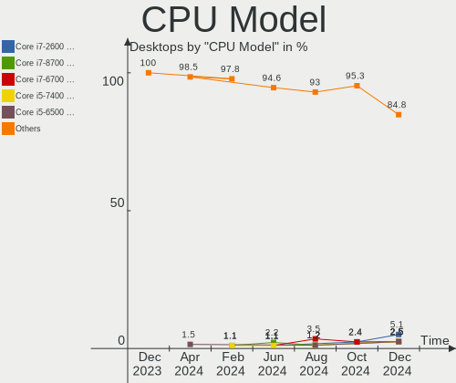
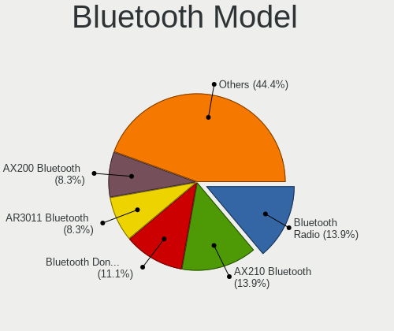
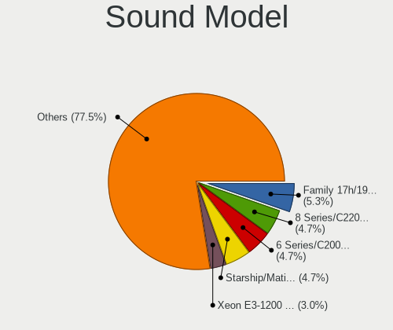

Zorin - Hardware Trends (Desktops)
----------------------------------

A project to identify most popular hardware characteristics and track their change
over time based on data collected by Linux users at https://Linux-Hardware.org.

Anyone can contribute to this report by the [hw-probe](https://github.com/linuxhw/hw-probe) tool:

    sudo -E hw-probe -all -upload

This report is for one last month. Overall report since the beginning of time: [TestDays](https://github.com/linuxhw/TestDays)

Period: Jun, 2023.

Contents
--------

* [ System ](#system)
  - [ OS                       ](#os)
  - [ OS Family                ](#os-family)
  - [ Kernel                   ](#kernel)
  - [ Kernel Family            ](#kernel-family)
  - [ Kernel Major Ver.        ](#kernel-major-ver)
  - [ Arch                     ](#arch)
  - [ DE                       ](#de)
  - [ Display Server           ](#display-server)
  - [ Display Manager          ](#display-manager)
  - [ OS Lang                  ](#os-lang)
  - [ Boot Mode                ](#boot-mode)
  - [ Filesystem               ](#filesystem)
  - [ Part. scheme             ](#part-scheme)
  - [ Dual Boot with Linux/BSD ](#dual-boot-with-linuxbsd)
  - [ Dual Boot (Win)          ](#dual-boot-win)

* [ Board ](#board)
  - [ Vendor                   ](#vendor)
  - [ Model                    ](#model)
  - [ Model Family             ](#model-family)
  - [ MFG Year                 ](#mfg-year)
  - [ Form Factor              ](#form-factor)
  - [ Secure Boot              ](#secure-boot)
  - [ Coreboot                 ](#coreboot)
  - [ RAM Size                 ](#ram-size)
  - [ RAM Used                 ](#ram-used)
  - [ Total Drives             ](#total-drives)
  - [ Has CD-ROM               ](#has-cd-rom)
  - [ Has Ethernet             ](#has-ethernet)
  - [ Has WiFi                 ](#has-wifi)
  - [ Has Bluetooth            ](#has-bluetooth)

* [ Location ](#location)
  - [ Country                  ](#country)
  - [ City                     ](#city)

* [ Drives ](#drives)
  - [ Drive Vendor             ](#drive-vendor)
  - [ Drive Model              ](#drive-model)
  - [ HDD Vendor               ](#hdd-vendor)
  - [ SSD Vendor               ](#ssd-vendor)
  - [ Drive Kind               ](#drive-kind)
  - [ Drive Connector          ](#drive-connector)
  - [ Drive Size               ](#drive-size)
  - [ Space Total              ](#space-total)
  - [ Space Used               ](#space-used)
  - [ Malfunc. Drives          ](#malfunc-drives)
  - [ Malfunc. Drive Vendor    ](#malfunc-drive-vendor)
  - [ Malfunc. HDD Vendor      ](#malfunc-hdd-vendor)
  - [ Malfunc. Drive Kind      ](#malfunc-drive-kind)
  - [ Failed Drives            ](#failed-drives)
  - [ Failed Drive Vendor      ](#failed-drive-vendor)
  - [ Drive Status             ](#drive-status)

* [ Storage controller ](#storage-controller)
  - [ Storage Vendor           ](#storage-vendor)
  - [ Storage Model            ](#storage-model)
  - [ Storage Kind             ](#storage-kind)

* [ Processor ](#processor)
  - [ CPU Vendor               ](#cpu-vendor)
  - [ CPU Model                ](#cpu-model)
  - [ CPU Model Family         ](#cpu-model-family)
  - [ CPU Cores                ](#cpu-cores)
  - [ CPU Sockets              ](#cpu-sockets)
  - [ CPU Threads              ](#cpu-threads)
  - [ CPU Op-Modes             ](#cpu-op-modes)
  - [ CPU Microcode            ](#cpu-microcode)
  - [ CPU Microarch            ](#cpu-microarch)

* [ Graphics ](#graphics)
  - [ GPU Vendor               ](#gpu-vendor)
  - [ GPU Model                ](#gpu-model)
  - [ GPU Combo                ](#gpu-combo)
  - [ GPU Driver               ](#gpu-driver)
  - [ GPU Memory               ](#gpu-memory)

* [ Monitor ](#monitor)
  - [ Monitor Vendor           ](#monitor-vendor)
  - [ Monitor Model            ](#monitor-model)
  - [ Monitor Resolution       ](#monitor-resolution)
  - [ Monitor Diagonal         ](#monitor-diagonal)
  - [ Monitor Width            ](#monitor-width)
  - [ Aspect Ratio             ](#aspect-ratio)
  - [ Monitor Area             ](#monitor-area)
  - [ Pixel Density            ](#pixel-density)
  - [ Multiple Monitors        ](#multiple-monitors)

* [ Network ](#network)
  - [ Net Controller Vendor    ](#net-controller-vendor)
  - [ Net Controller Model     ](#net-controller-model)
  - [ Wireless Vendor          ](#wireless-vendor)
  - [ Wireless Model           ](#wireless-model)
  - [ Ethernet Vendor          ](#ethernet-vendor)
  - [ Ethernet Model           ](#ethernet-model)
  - [ Net Controller Kind      ](#net-controller-kind)
  - [ Used Controller          ](#used-controller)
  - [ NICs                     ](#nics)
  - [ IPv6                     ](#ipv6)

* [ Bluetooth ](#bluetooth)
  - [ Bluetooth Vendor         ](#bluetooth-vendor)
  - [ Bluetooth Model          ](#bluetooth-model)

* [ Sound ](#sound)
  - [ Sound Vendor             ](#sound-vendor)
  - [ Sound Model              ](#sound-model)

* [ Memory ](#memory)
  - [ Memory Vendor            ](#memory-vendor)
  - [ Memory Model             ](#memory-model)
  - [ Memory Kind              ](#memory-kind)
  - [ Memory Form Factor       ](#memory-form-factor)
  - [ Memory Size              ](#memory-size)
  - [ Memory Speed             ](#memory-speed)

* [ Printers & scanners ](#printers--scanners)
  - [ Printer Vendor           ](#printer-vendor)
  - [ Printer Model            ](#printer-model)
  - [ Scanner Vendor           ](#scanner-vendor)
  - [ Scanner Model            ](#scanner-model)

* [ Camera ](#camera)
  - [ Camera Vendor            ](#camera-vendor)
  - [ Camera Model             ](#camera-model)

* [ Security ](#security)
  - [ Fingerprint Vendor       ](#fingerprint-vendor)
  - [ Fingerprint Model        ](#fingerprint-model)
  - [ Chipcard Vendor          ](#chipcard-vendor)
  - [ Chipcard Model           ](#chipcard-model)

* [ Unsupported ](#unsupported)
  - [ Unsupported Devices      ](#unsupported-devices)
  - [ Unsupported Device Types ](#unsupported-device-types)

System
------

OS
--

Installed operating systems

| Name     | Desktops | Percent |
|----------|----------|---------|
| Zorin 16 | 43       | 93.48%  |
| Zorin 15 | 3        | 6.52%   |

OS Family
---------

OS without a version

| Name  | Desktops | Percent |
|-------|----------|---------|
| Zorin | 46       | 100%    |

Kernel
------

Version of the Linux kernel

| Version                | Desktops | Percent |
|------------------------|----------|---------|
| 5.15.0-73-generic      | 24       | 52.17%  |
| 5.15.0-75-generic      | 9        | 19.57%  |
| 5.15.0-72-generic      | 3        | 6.52%   |
| 5.4.0-150-generic      | 2        | 4.35%   |
| 5.4.0-149-generic      | 1        | 2.17%   |
| 5.19.12-051912-generic | 1        | 2.17%   |
| 5.15.0-76-generic      | 1        | 2.17%   |
| 5.15.0-72-lowlatency   | 1        | 2.17%   |
| 5.15.0-71-generic      | 1        | 2.17%   |
| 5.15.0-56-generic      | 1        | 2.17%   |
| 5.13.0-39-generic      | 1        | 2.17%   |
| 5.13.0-30-generic      | 1        | 2.17%   |

Kernel Family
-------------

Linux kernel without a distro release

| Version | Desktops | Percent |
|---------|----------|---------|
| 5.15.0  | 40       | 86.96%  |
| 5.4.0   | 3        | 6.52%   |
| 5.13.0  | 2        | 4.35%   |
| 5.19.12 | 1        | 2.17%   |

Kernel Major Ver.
-----------------

Linux kernel major version

| Version | Desktops | Percent |
|---------|----------|---------|
| 5.15    | 40       | 86.96%  |
| 5.4     | 3        | 6.52%   |
| 5.13    | 2        | 4.35%   |
| 5.19    | 1        | 2.17%   |

Arch
----

OS architecture (x86_64, i586, etc.)

| Name   | Desktops | Percent |
|--------|----------|---------|
| x86_64 | 44       | 95.65%  |
| i686   | 2        | 4.35%   |

DE
--

Desktop Environment

| Name  | Desktops | Percent |
|-------|----------|---------|
| GNOME | 37       | 80.43%  |
| XFCE  | 9        | 19.57%  |

Display Server
--------------

X11 or Wayland

| Name | Desktops | Percent |
|------|----------|---------|
| X11  | 46       | 100%    |

Display Manager
---------------

SDDM, LightDM, etc.

| Name    | Desktops | Percent |
|---------|----------|---------|
| Unknown | 38       | 82.61%  |
| LightDM | 4        | 8.7%    |
| GDM3    | 3        | 6.52%   |
| GDM     | 1        | 2.17%   |

OS Lang
-------

Language

| Lang        | Desktops | Percent |
|-------------|----------|---------|
| en_US       | 21       | 45.65%  |
| pt_BR       | 4        | 8.7%    |
| en_GB       | 4        | 8.7%    |
| de_DE       | 4        | 8.7%    |
| pl_PL       | 2        | 4.35%   |
| sr_RS@latin | 1        | 2.17%   |
| sl_SI       | 1        | 2.17%   |
| ru_RU       | 1        | 2.17%   |
| pt_PT       | 1        | 2.17%   |
| nl_NL       | 1        | 2.17%   |
| nl_BE       | 1        | 2.17%   |
| it_IT       | 1        | 2.17%   |
| fr_FR       | 1        | 2.17%   |
| fr_BE       | 1        | 2.17%   |
| es_ES       | 1        | 2.17%   |
| en_CA       | 1        | 2.17%   |

Boot Mode
---------

EFI or BIOS

| Mode | Desktops | Percent |
|------|----------|---------|
| BIOS | 26       | 56.52%  |
| EFI  | 20       | 43.48%  |

Filesystem
----------

Type of filesystem

| Type  | Desktops | Percent |
|-------|----------|---------|
| Ext4  | 40       | 86.96%  |
| Tmpfs | 6        | 13.04%  |

Part. scheme
------------

Scheme of partitioning

| Type    | Desktops | Percent |
|---------|----------|---------|
| Unknown | 40       | 86.96%  |
| MBR     | 4        | 8.7%    |
| GPT     | 2        | 4.35%   |

Dual Boot with Linux/BSD
------------------------

Hosting more than one Linux/BSD

| Dual boot | Desktops | Percent |
|-----------|----------|---------|
| No        | 45       | 97.83%  |
| Yes       | 1        | 2.17%   |

Dual Boot (Win)
---------------

Hosting Linux and Windows

| Dual boot | Desktops | Percent |
|-----------|----------|---------|
| No        | 45       | 97.83%  |
| Yes       | 1        | 2.17%   |

Board
-----

Vendor
------

Motherboard manufacturer

| Name                                 | Desktops | Percent |
|--------------------------------------|----------|---------|
| ASUSTek Computer                     | 9        | 19.57%  |
| MSI                                  | 6        | 13.04%  |
| Dell                                 | 6        | 13.04%  |
| Gigabyte Technology                  | 4        | 8.7%    |
| Lenovo                               | 3        | 6.52%   |
| Hewlett-Packard                      | 3        | 6.52%   |
| ASRock                               | 3        | 6.52%   |
| Intel                                | 2        | 4.35%   |
| Vorke                                | 1        | 2.17%   |
| Toshiba                              | 1        | 2.17%   |
| Shenzhen Meigao Electronic Equipment | 1        | 2.17%   |
| Positivo                             | 1        | 2.17%   |
| Pegatron                             | 1        | 2.17%   |
| Nvidia                               | 1        | 2.17%   |
| MP                                   | 1        | 2.17%   |
| Gateway                              | 1        | 2.17%   |
| Fujitsu                              | 1        | 2.17%   |
| AZW                                  | 1        | 2.17%   |

Model
-----

Motherboard model

| Name                                            | Desktops | Percent |
|-------------------------------------------------|----------|---------|
| Dell OptiPlex 9020                              | 2        | 4.35%   |
| Vorke V1 Plus                                   | 1        | 2.17%   |
| Toshiba 4900C45                                 | 1        | 2.17%   |
| Shenzhen Meigao Electronic Equipment UM773 Lite | 1        | 2.17%   |
| Positivo POS-AT SERIES F (CAD)                  | 1        | 2.17%   |
| Pegatron Compaq dx2450                          | 1        | 2.17%   |
| Nvidia MCP79                                    | 1        | 2.17%   |
| MSI MS-7C91                                     | 1        | 2.17%   |
| MSI MS-7C02                                     | 1        | 2.17%   |
| MSI MS-7B93                                     | 1        | 2.17%   |
| MSI MS-7817                                     | 1        | 2.17%   |
| MSI MS-7788                                     | 1        | 2.17%   |
| MSI MS-7640                                     | 1        | 2.17%   |
| MP MS-7848                                      | 1        | 2.17%   |
| Lenovo ThinkCentre M91p 4524WAP                 | 1        | 2.17%   |
| Lenovo ThinkCentre M83 10EAS01G00               | 1        | 2.17%   |
| Lenovo ThinkCentre M700 10J0S2QU00              | 1        | 2.17%   |
| Intel ECO 44 G4                                 | 1        | 2.17%   |
| Intel D946GZIS AAD66165-301                     | 1        | 2.17%   |
| HP Pavilion Desktop TP01-2xxx                   | 1        | 2.17%   |
| HP Compaq Pro 6300 SFF                          | 1        | 2.17%   |
| HP 290 G1 MT                                    | 1        | 2.17%   |
| Gigabyte P31-DS3L                               | 1        | 2.17%   |
| Gigabyte G31M-ES2L                              | 1        | 2.17%   |
| Gigabyte B450M DS3H                             | 1        | 2.17%   |
| Gigabyte A320M-S2H                              | 1        | 2.17%   |
| Gateway SX2851                                  | 1        | 2.17%   |
| Fujitsu CELSIUS_W550                            | 1        | 2.17%   |
| Dell Precision WorkStation 380                  | 1        | 2.17%   |
| Dell OptiPlex 7050                              | 1        | 2.17%   |
| Dell OptiPlex 7010                              | 1        | 2.17%   |
| Dell Inspiron 3671                              | 1        | 2.17%   |
| AZW GTR                                         | 1        | 2.17%   |
| ASUS TUF Gaming B550M-PLUS WIFI II              | 1        | 2.17%   |
| ASUS ROG STRIX Z690-I GAMING WIFI               | 1        | 2.17%   |
| ASUS ROG STRIX B650E-E GAMING WIFI              | 1        | 2.17%   |
| ASUS P5Q                                        | 1        | 2.17%   |
| ASUS P5LD2                                      | 1        | 2.17%   |
| ASUS P5B                                        | 1        | 2.17%   |
| ASUS F2A85-V PRO                                | 1        | 2.17%   |

Model Family
------------

Motherboard model prefix

| Name                                       | Desktops | Percent |
|--------------------------------------------|----------|---------|
| Dell OptiPlex                              | 4        | 8.7%    |
| Lenovo ThinkCentre                         | 3        | 6.52%   |
| ASUS ROG                                   | 2        | 4.35%   |
| Vorke V1                                   | 1        | 2.17%   |
| Toshiba 4900C45                            | 1        | 2.17%   |
| Shenzhen Meigao Electronic Equipment UM773 | 1        | 2.17%   |
| Positivo POS-AT                            | 1        | 2.17%   |
| Pegatron Compaq                            | 1        | 2.17%   |
| Nvidia MCP79                               | 1        | 2.17%   |
| MSI MS-7C91                                | 1        | 2.17%   |
| MSI MS-7C02                                | 1        | 2.17%   |
| MSI MS-7B93                                | 1        | 2.17%   |
| MSI MS-7817                                | 1        | 2.17%   |
| MSI MS-7788                                | 1        | 2.17%   |
| MSI MS-7640                                | 1        | 2.17%   |
| MP MS-7848                                 | 1        | 2.17%   |
| Intel ECO                                  | 1        | 2.17%   |
| Intel D946GZIS                             | 1        | 2.17%   |
| HP Pavilion                                | 1        | 2.17%   |
| HP Compaq                                  | 1        | 2.17%   |
| HP 290                                     | 1        | 2.17%   |
| Gigabyte P31-DS3L                          | 1        | 2.17%   |
| Gigabyte G31M-ES2L                         | 1        | 2.17%   |
| Gigabyte B450M                             | 1        | 2.17%   |
| Gigabyte A320M-S2H                         | 1        | 2.17%   |
| Gateway SX2851                             | 1        | 2.17%   |
| Fujitsu CELSIUS                            | 1        | 2.17%   |
| Dell Precision                             | 1        | 2.17%   |
| Dell Inspiron                              | 1        | 2.17%   |
| AZW GTR                                    | 1        | 2.17%   |
| ASUS TUF                                   | 1        | 2.17%   |
| ASUS P5Q                                   | 1        | 2.17%   |
| ASUS P5LD2                                 | 1        | 2.17%   |
| ASUS P5B                                   | 1        | 2.17%   |
| ASUS F2A85-V                               | 1        | 2.17%   |
| ASUS CM1730                                | 1        | 2.17%   |
| ASUS B75M-A                                | 1        | 2.17%   |
| ASRock H81M-HDS                            | 1        | 2.17%   |
| ASRock B85M                                | 1        | 2.17%   |
| ASRock ALiveDual-eSATA2                    | 1        | 2.17%   |

MFG Year
--------

Motherboard manufacture year

| Year | Desktops | Percent |
|------|----------|---------|
| 2013 | 5        | 10.87%  |
| 2014 | 4        | 8.7%    |
| 2022 | 3        | 6.52%   |
| 2021 | 3        | 6.52%   |
| 2017 | 3        | 6.52%   |
| 2011 | 3        | 6.52%   |
| 2010 | 3        | 6.52%   |
| 2007 | 3        | 6.52%   |
| 2023 | 2        | 4.35%   |
| 2020 | 2        | 4.35%   |
| 2019 | 2        | 4.35%   |
| 2018 | 2        | 4.35%   |
| 2015 | 2        | 4.35%   |
| 2012 | 2        | 4.35%   |
| 2009 | 2        | 4.35%   |
| 2008 | 2        | 4.35%   |
| 2006 | 2        | 4.35%   |
| 2005 | 1        | 2.17%   |

Form Factor
-----------

Physical design of the computer

| Name    | Desktops | Percent |
|---------|----------|---------|
| Desktop | 46       | 100%    |

Secure Boot
-----------

Enabled or disabled

| State    | Desktops | Percent |
|----------|----------|---------|
| Disabled | 43       | 93.48%  |
| Enabled  | 3        | 6.52%   |

Coreboot
--------

Have coreboot on board

| Used | Desktops | Percent |
|------|----------|---------|
| No   | 46       | 100%    |

RAM Size
--------

Total RAM memory

| Size in GB | Desktops | Percent |
|------------|----------|---------|
| 3.01-4.0   | 10       | 21.74%  |
| 4.01-8.0   | 8        | 17.39%  |
| 8.01-16.0  | 8        | 17.39%  |
| 32.01-64.0 | 6        | 13.04%  |
| 24.01-32.0 | 5        | 10.87%  |
| 16.01-24.0 | 5        | 10.87%  |
| 2.01-3.0   | 3        | 6.52%   |
| 1.01-2.0   | 1        | 2.17%   |

RAM Used
--------

Used RAM memory

| Used GB  | Desktops | Percent |
|----------|----------|---------|
| 1.01-2.0 | 18       | 39.13%  |
| 2.01-3.0 | 13       | 28.26%  |
| 4.01-8.0 | 10       | 21.74%  |
| 3.01-4.0 | 4        | 8.7%    |
| 0.51-1.0 | 1        | 2.17%   |

Total Drives
------------

Number of drives on board

| Drives | Desktops | Percent |
|--------|----------|---------|
| 1      | 23       | 50%     |
| 2      | 15       | 32.61%  |
| 3      | 5        | 10.87%  |
| 5      | 3        | 6.52%   |

Has CD-ROM
----------

Has CD-ROM on board

| Presented | Desktops | Percent |
|-----------|----------|---------|
| Yes       | 26       | 56.52%  |
| No        | 20       | 43.48%  |

Has Ethernet
------------

Has Ethernet on board

| Presented | Desktops | Percent |
|-----------|----------|---------|
| Yes       | 46       | 100%    |

Has WiFi
--------

Has WiFi module

| Presented | Desktops | Percent |
|-----------|----------|---------|
| Yes       | 24       | 52.17%  |
| No        | 22       | 47.83%  |

Has Bluetooth
-------------

Has Bluetooth module

| Presented | Desktops | Percent |
|-----------|----------|---------|
| No        | 26       | 56.52%  |
| Yes       | 20       | 43.48%  |

Location
--------

Country
-------

Geographic location (country)

| Country     | Desktops | Percent |
|-------------|----------|---------|
| USA         | 16       | 34.78%  |
| UK          | 4        | 8.7%    |
| Germany     | 4        | 8.7%    |
| Brazil      | 4        | 8.7%    |
| Mexico      | 3        | 6.52%   |
| Poland      | 2        | 4.35%   |
| Netherlands | 2        | 4.35%   |
| Belgium     | 2        | 4.35%   |
| Spain       | 1        | 2.17%   |
| Slovenia    | 1        | 2.17%   |
| Slovakia    | 1        | 2.17%   |
| Russia      | 1        | 2.17%   |
| Portugal    | 1        | 2.17%   |
| Italy       | 1        | 2.17%   |
| France      | 1        | 2.17%   |
| Canada      | 1        | 2.17%   |
| Bulgaria    | 1        | 2.17%   |

City
----

Geographic location (city)

| City                 | Desktops | Percent |
|----------------------|----------|---------|
| Tijuana              | 2        | 4.35%   |
| Warsaw               | 1        | 2.17%   |
| Vernon               | 1        | 2.17%   |
| Trenton              | 1        | 2.17%   |
| Trapani              | 1        | 2.17%   |
| Sudbury              | 1        | 2.17%   |
| Sofia                | 1        | 2.17%   |
| Santo André         | 1        | 2.17%   |
| San Francisco        | 1        | 2.17%   |
| San Diego            | 1        | 2.17%   |
| Rockville            | 1        | 2.17%   |
| Rochester            | 1        | 2.17%   |
| Rio de Janeiro       | 1        | 2.17%   |
| Phoenix              | 1        | 2.17%   |
| Oschersleben         | 1        | 2.17%   |
| Nottingham           | 1        | 2.17%   |
| North Richland Hills | 1        | 2.17%   |
| Newham               | 1        | 2.17%   |
| Neuffen              | 1        | 2.17%   |
| Nelas                | 1        | 2.17%   |
| Mortsel              | 1        | 2.17%   |
| Ljubljana            | 1        | 2.17%   |
| Las Vegas            | 1        | 2.17%   |
| La Force             | 1        | 2.17%   |
| Krakow               | 1        | 2.17%   |
| Kirov                | 1        | 2.17%   |
| Jette                | 1        | 2.17%   |
| Hendersonville       | 1        | 2.17%   |
| Haltom City          | 1        | 2.17%   |
| Guadalajara          | 1        | 2.17%   |
| Escondido            | 1        | 2.17%   |
| Dresden              | 1        | 2.17%   |
| Dortmund             | 1        | 2.17%   |
| Denver               | 1        | 2.17%   |
| Cincinnati           | 1        | 2.17%   |
| Charlotte            | 1        | 2.17%   |
| Catanduva            | 1        | 2.17%   |
| Bratislava           | 1        | 2.17%   |
| Bangor               | 1        | 2.17%   |
| Atlanta              | 1        | 2.17%   |

Drives
------

Drive Vendor
------------

Hard drive vendors

| Vendor                      | Desktops | Drives | Percent |
|-----------------------------|----------|--------|---------|
| Seagate                     | 11       | 15     | 15.71%  |
| WDC                         | 10       | 11     | 14.29%  |
| Samsung Electronics         | 8        | 9      | 11.43%  |
| Kingston                    | 5        | 7      | 7.14%   |
| SanDisk                     | 4        | 5      | 5.71%   |
| Toshiba                     | 3        | 3      | 4.29%   |
| Crucial                     | 3        | 4      | 4.29%   |
| Patriot                     | 2        | 2      | 2.86%   |
| Hitachi                     | 2        | 2      | 2.86%   |
| GOODRAM                     | 2        | 2      | 2.86%   |
| Apple                       | 2        | 2      | 2.86%   |
| A-DATA Technology           | 2        | 2      | 2.86%   |
| X12                         | 1        | 1      | 1.43%   |
| TXRUI                       | 1        | 2      | 1.43%   |
| Seagate Technology          | 1        | 1      | 1.43%   |
| Phison Electronics          | 1        | 1      | 1.43%   |
| Micron Technology           | 1        | 1      | 1.43%   |
| Maxtor                      | 1        | 1      | 1.43%   |
| MAXIO Technology (Hangzhou) | 1        | 1      | 1.43%   |
| KIOXIA-EXCERIA              | 1        | 1      | 1.43%   |
| KIOXIA                      | 1        | 1      | 1.43%   |
| Kingston Technology Company | 1        | 1      | 1.43%   |
| Intel                       | 1        | 1      | 1.43%   |
| HS-SSD-E100                 | 1        | 1      | 1.43%   |
| FORESEE                     | 1        | 1      | 1.43%   |
| External                    | 1        | 1      | 1.43%   |
| AMD                         | 1        | 1      | 1.43%   |
| 1TBE                        | 1        | 1      | 1.43%   |

Drive Model
-----------

Hard drive models

| Model                                               | Desktops | Percent |
|-----------------------------------------------------|----------|---------|
| Seagate ST31000528AS 1TB                            | 2        | 2.63%   |
| Seagate ST1000DM003-9YN162 1TB                      | 2        | 2.63%   |
| Samsung SSD 870 EVO 500GB                           | 2        | 2.63%   |
| Kingston SA400S37240G 240GB SSD                     | 2        | 2.63%   |
| Apple HDD ST1000DM003 1TB                           | 2        | 2.63%   |
| X12 SSD 1TB                                         | 1        | 1.32%   |
| WDC WDS240G2G0A-00JH30 240GB SSD                    | 1        | 1.32%   |
| WDC WD800JD-75MSA3 80GB                             | 1        | 1.32%   |
| WDC WD6400BPVT-80HXZT1 640GB                        | 1        | 1.32%   |
| WDC WD5003ABYX-01WERA1 500GB                        | 1        | 1.32%   |
| WDC WD5000AAKS-60A7B0 500GB                         | 1        | 1.32%   |
| WDC WD5000AAKS-00M9A0 500GB                         | 1        | 1.32%   |
| WDC WD400BD-75JMC0 40GB                             | 1        | 1.32%   |
| WDC WD30EZRX-00D8PB0 3TB                            | 1        | 1.32%   |
| WDC WD10JPCX-24UE4T0 1TB                            | 1        | 1.32%   |
| WDC WD10EZEX-00WN4A0 1TB                            | 1        | 1.32%   |
| WDC WD10EADS-00L5B1 1TB                             | 1        | 1.32%   |
| TXRUI X500 120GB                                    | 1        | 1.32%   |
| Toshiba THNSNF128GCSS 128GB SSD                     | 1        | 1.32%   |
| Toshiba HDWD110 1TB                                 | 1        | 1.32%   |
| Toshiba DT01ACA200 2TB                              | 1        | 1.32%   |
| Seagate FireCuda 510 SSD 1TB                        | 1        | 1.32%   |
| Seagate ST3320311CS 320GB                           | 1        | 1.32%   |
| Seagate ST3160812AS Q 160GB                         | 1        | 1.32%   |
| Seagate ST31000524AS 1TB                            | 1        | 1.32%   |
| Seagate ST2000DM008-2FR102 2TB                      | 1        | 1.32%   |
| Seagate ST20000NM007D-3DJ103 20TB                   | 1        | 1.32%   |
| Seagate ST1000VM002-1SD102 1TB                      | 1        | 1.32%   |
| Seagate ST1000DM003-1ER162 1TB                      | 1        | 1.32%   |
| Seagate ST1000DM003-1CH162 1TB                      | 1        | 1.32%   |
| Seagate Expansion 1TB                               | 1        | 1.32%   |
| Sandisk WD_BLACK SN770 1TB                          | 1        | 1.32%   |
| Sandisk WD Blue SN550 NVMe SSD 1TB                  | 1        | 1.32%   |
| SanDisk Ultra II 480GB SSD                          | 1        | 1.32%   |
| SanDisk SDSSDP128G 128GB                            | 1        | 1.32%   |
| SanDisk SDSSDH3 250G                                | 1        | 1.32%   |
| Samsung NVMe SSD Controller SM981/PM981/PM983 250GB | 1        | 1.32%   |
| Samsung MZHPV256HDGL-00000 256GB SSD                | 1        | 1.32%   |
| Samsung MZ7PD256HCGM-000H7 256GB SSD                | 1        | 1.32%   |
| Samsung HD502HJ 500GB                               | 1        | 1.32%   |

HDD Vendor
----------

Hard disk drive vendors

| Vendor              | Desktops | Drives | Percent |
|---------------------|----------|--------|---------|
| Seagate             | 11       | 15     | 35.48%  |
| WDC                 | 9        | 10     | 29.03%  |
| Samsung Electronics | 4        | 4      | 12.9%   |
| Toshiba             | 2        | 2      | 6.45%   |
| Hitachi             | 2        | 2      | 6.45%   |
| Apple               | 2        | 2      | 6.45%   |
| Maxtor              | 1        | 1      | 3.23%   |

SSD Vendor
----------

Solid state drive vendors

| Vendor              | Desktops | Drives | Percent |
|---------------------|----------|--------|---------|
| Samsung Electronics | 4        | 4      | 14.81%  |
| Kingston            | 4        | 5      | 14.81%  |
| SanDisk             | 3        | 3      | 11.11%  |
| Crucial             | 3        | 4      | 11.11%  |
| Patriot             | 2        | 2      | 7.41%   |
| GOODRAM             | 2        | 2      | 7.41%   |
| A-DATA Technology   | 2        | 2      | 7.41%   |
| X12                 | 1        | 1      | 3.7%    |
| WDC                 | 1        | 1      | 3.7%    |
| Toshiba             | 1        | 1      | 3.7%    |
| KIOXIA-EXCERIA      | 1        | 1      | 3.7%    |
| Intel               | 1        | 1      | 3.7%    |
| FORESEE             | 1        | 1      | 3.7%    |
| External            | 1        | 1      | 3.7%    |

Drive Kind
----------

HDD or SSD

| Kind    | Desktops | Drives | Percent |
|---------|----------|--------|---------|
| HDD     | 26       | 36     | 43.33%  |
| SSD     | 21       | 29     | 35%     |
| NVMe    | 10       | 12     | 16.67%  |
| Unknown | 3        | 4      | 5%      |

Drive Connector
---------------

SATA, SAS, NVMe, etc.

| Type | Desktops | Drives | Percent |
|------|----------|--------|---------|
| SATA | 41       | 67     | 77.36%  |
| NVMe | 10       | 12     | 18.87%  |
| SAS  | 2        | 2      | 3.77%   |

Drive Size
----------

Size of hard drive

| Size in TB | Desktops | Drives | Percent |
|------------|----------|--------|---------|
| 0.01-0.5   | 25       | 36     | 53.19%  |
| 0.51-1.0   | 15       | 20     | 31.91%  |
| 1.01-2.0   | 5        | 5      | 10.64%  |
| 2.01-3.0   | 1        | 1      | 2.13%   |
| 10.01-20.0 | 1        | 3      | 2.13%   |

Space Total
-----------

Amount of disk space available on the file system

| Size in GB     | Desktops | Percent |
|----------------|----------|---------|
| 251-500        | 13       | 28.26%  |
| 101-250        | 13       | 28.26%  |
| 501-1000       | 10       | 21.74%  |
| 1001-2000      | 4        | 8.7%    |
| 2001-3000      | 3        | 6.52%   |
| 51-100         | 2        | 4.35%   |
| More than 3000 | 1        | 2.17%   |

Space Used
----------

Amount of used disk space

| Used GB        | Desktops | Percent |
|----------------|----------|---------|
| 21-50          | 14       | 30.43%  |
| 51-100         | 10       | 21.74%  |
| 1-20           | 8        | 17.39%  |
| 101-250        | 6        | 13.04%  |
| 251-500        | 3        | 6.52%   |
| 501-1000       | 2        | 4.35%   |
| More than 3000 | 1        | 2.17%   |
| 2001-3000      | 1        | 2.17%   |
| 1001-2000      | 1        | 2.17%   |

Malfunc. Drives
---------------

Drive models with a malfunction

Zero info for selected period =(

Malfunc. Drive Vendor
---------------------

Vendors of faulty drives

Zero info for selected period =(

Malfunc. HDD Vendor
-------------------

Vendors of faulty HDD drives

Zero info for selected period =(

Malfunc. Drive Kind
-------------------

Kinds of faulty drives

Zero info for selected period =(

Failed Drives
-------------

Failed drive models

Zero info for selected period =(

Failed Drive Vendor
-------------------

Failed drive vendors

Zero info for selected period =(

Drive Status
------------

Number of failed and malfunc. drives

| Status   | Desktops | Drives | Percent |
|----------|----------|--------|---------|
| Detected | 45       | 80     | 97.83%  |
| Works    | 1        | 1      | 2.17%   |

Storage controller
------------------

Storage Vendor
--------------

Storage controller vendors

| Vendor                      | Desktops | Percent |
|-----------------------------|----------|---------|
| Intel                       | 30       | 49.18%  |
| AMD                         | 11       | 18.03%  |
| Nvidia                      | 3        | 4.92%   |
| JMicron Technology          | 3        | 4.92%   |
| SanDisk                     | 2        | 3.28%   |
| Samsung Electronics         | 2        | 3.28%   |
| Kingston Technology Company | 2        | 3.28%   |
| ASMedia Technology          | 2        | 3.28%   |
| Seagate Technology          | 1        | 1.64%   |
| Phison Electronics          | 1        | 1.64%   |
| Micron Technology           | 1        | 1.64%   |
| MAXIO Technology (Hangzhou) | 1        | 1.64%   |
| Marvell Technology Group    | 1        | 1.64%   |
| KIOXIA                      | 1        | 1.64%   |

Storage Model
-------------

Storage controller models

| Model                                                                                   | Desktops | Percent |
|-----------------------------------------------------------------------------------------|----------|---------|
| AMD FCH SATA Controller [AHCI mode]                                                     | 6        | 8%      |
| Intel 8 Series/C220 Series Chipset Family 6-port SATA Controller 1 [AHCI mode]          | 5        | 6.67%   |
| Intel NM10/ICH7 Family SATA Controller [IDE mode]                                       | 4        | 5.33%   |
| Intel 82801G (ICH7 Family) IDE Controller                                               | 4        | 5.33%   |
| JMicron JMB363 SATA/IDE Controller                                                      | 3        | 4%      |
| Intel Q170/Q150/B150/H170/H110/Z170/CM236 Chipset SATA Controller [AHCI Mode]           | 3        | 4%      |
| Intel 7 Series/C210 Series Chipset Family 6-port SATA Controller [AHCI mode]            | 3        | 4%      |
| AMD 400 Series Chipset SATA Controller                                                  | 3        | 4%      |
| Intel SATA Controller [RAID mode]                                                       | 2        | 2.67%   |
| Intel NM10/ICH7 Family SATA Controller [AHCI mode]                                      | 2        | 2.67%   |
| Intel 200 Series PCH SATA controller [AHCI mode]                                        | 2        | 2.67%   |
| ASMedia ASM1062 Serial ATA Controller                                                   | 2        | 2.67%   |
| AMD SB7x0/SB8x0/SB9x0 SATA Controller [IDE mode]                                        | 2        | 2.67%   |
| AMD SB7x0/SB8x0/SB9x0 IDE Controller                                                    | 2        | 2.67%   |
| AMD 500 Series Chipset SATA Controller                                                  | 2        | 2.67%   |
| Seagate FireCuda 510 SSD                                                                | 1        | 1.33%   |
| SanDisk WD Blue SN550 NVMe SSD                                                          | 1        | 1.33%   |
| SanDisk WD Black SN770 NVMe SSD                                                         | 1        | 1.33%   |
| Samsung NVMe SSD Controller SM981/PM981/PM983                                           | 1        | 1.33%   |
| Samsung Electronics SATA controller                                                     | 1        | 1.33%   |
| Phison PS5013 E13 NVMe Controller                                                       | 1        | 1.33%   |
| Nvidia nForce3 Serial ATA Controller                                                    | 1        | 1.33%   |
| Nvidia MCP79 AHCI Controller                                                            | 1        | 1.33%   |
| Nvidia MCP61 SATA Controller                                                            | 1        | 1.33%   |
| Nvidia CK8S Parallel ATA Controller (v2.5)                                              | 1        | 1.33%   |
| Micron NVMe Controller                                                                  | 1        | 1.33%   |
| MAXIO (Hangzhou) NVMe SSD Controller MAP1202                                            | 1        | 1.33%   |
| Marvell Group 88SE6111/6121 SATA II / PATA Controller                                   | 1        | 1.33%   |
| KIOXIA NVMe SSD Controller BG4                                                          | 1        | 1.33%   |
| Kingston Company Company Non-Volatile memory controller                                 | 1        | 1.33%   |
| Kingston Company FURY Renegade NVMe SSD                                                 | 1        | 1.33%   |
| Intel Volume Management Device NVMe RAID Controller                                     | 1        | 1.33%   |
| Intel Celeron N3350/Pentium N4200/Atom E3900 Series SATA AHCI Controller                | 1        | 1.33%   |
| Intel Alder Lake-S PCH SATA Controller [AHCI Mode]                                      | 1        | 1.33%   |
| Intel 82801JI (ICH10 Family) SATA AHCI Controller                                       | 1        | 1.33%   |
| Intel 82801IBM/IEM (ICH9M/ICH9M-E) 4 port SATA Controller [AHCI mode]                   | 1        | 1.33%   |
| Intel 82801HR/HO/HH (ICH8R/DO/DH) 2 port SATA Controller [IDE mode]                     | 1        | 1.33%   |
| Intel 82801H (ICH8 Family) 4 port SATA Controller [IDE mode]                            | 1        | 1.33%   |
| Intel 8 Series SATA Controller 1 [AHCI mode]                                            | 1        | 1.33%   |
| Intel 6 Series/C200 Series Chipset Family Desktop SATA Controller (IDE mode, ports 4-5) | 1        | 1.33%   |

Storage Kind
------------

Kind of storage controller (IDE, SATA, NVMe, SAS, ...)

| Kind | Desktops | Percent |
|------|----------|---------|
| SATA | 34       | 56.67%  |
| IDE  | 13       | 21.67%  |
| NVMe | 10       | 16.67%  |
| RAID | 3        | 5%      |

Processor
---------

CPU Vendor
----------

Processor vendors

| Vendor | Desktops | Percent |
|--------|----------|---------|
| Intel  | 31       | 67.39%  |
| AMD    | 15       | 32.61%  |

CPU Model
---------

Processor models

| Model                                       | Desktops | Percent |
|---------------------------------------------|----------|---------|
| Intel Core i3-4160 CPU @ 3.60GHz            | 3        | 6.52%   |
| Intel Core i7-6700 CPU @ 3.40GHz            | 2        | 4.35%   |
| AMD Ryzen 5 5600X 6-Core Processor          | 2        | 4.35%   |
| Intel Pentium Dual-Core CPU E5500 @ 2.80GHz | 1        | 2.17%   |
| Intel Pentium Dual-Core CPU E5300 @ 2.60GHz | 1        | 2.17%   |
| Intel Pentium CPU G860 @ 3.00GHz            | 1        | 2.17%   |
| Intel Pentium 4 CPU 3.00GHz                 | 1        | 2.17%   |
| Intel Core i7-4790 CPU @ 3.60GHz            | 1        | 2.17%   |
| Intel Core i7-4771 CPU @ 3.50GHz            | 1        | 2.17%   |
| Intel Core i5-9400 CPU @ 2.90GHz            | 1        | 2.17%   |
| Intel Core i5-6500T CPU @ 2.50GHz           | 1        | 2.17%   |
| Intel Core i5-4590S CPU @ 3.00GHz           | 1        | 2.17%   |
| Intel Core i5-4460 CPU @ 3.20GHz            | 1        | 2.17%   |
| Intel Core i5-3570 CPU @ 3.40GHz            | 1        | 2.17%   |
| Intel Core i5-3470 CPU @ 3.20GHz            | 1        | 2.17%   |
| Intel Core i5-2500 CPU @ 3.30GHz            | 1        | 2.17%   |
| Intel Core i3-7100 CPU @ 3.90GHz            | 1        | 2.17%   |
| Intel Core i3-4010U CPU @ 1.70GHz           | 1        | 2.17%   |
| Intel Core i3-2120 CPU @ 3.30GHz            | 1        | 2.17%   |
| Intel Core i3 CPU 550 @ 3.20GHz             | 1        | 2.17%   |
| Intel Core 2 Quad CPU Q6600 @ 2.40GHz       | 1        | 2.17%   |
| Intel Core 2 Quad CPU @ 2.40GHz             | 1        | 2.17%   |
| Intel Core 2 Duo CPU E8400 @ 3.00GHz        | 1        | 2.17%   |
| Intel Core 2 CPU 6600 @ 2.40GHz             | 1        | 2.17%   |
| Intel Core 2 CPU 6400 @ 2.13GHz             | 1        | 2.17%   |
| Intel Celeron Dual-Core CPU T3100 @ 1.90GHz | 1        | 2.17%   |
| Intel Celeron CPU J3455 @ 1.50GHz           | 1        | 2.17%   |
| Intel Atom CPU 230 @ 1.60GHz                | 1        | 2.17%   |
| Intel 12th Gen Core i9-12900                | 1        | 2.17%   |
| AMD Sempron Processor 3800+                 | 1        | 2.17%   |
| AMD Ryzen 9 7900X 12-Core Processor         | 1        | 2.17%   |
| AMD Ryzen 9 6900HX with Radeon Graphics     | 1        | 2.17%   |
| AMD Ryzen 7 7735HS with Radeon Graphics     | 1        | 2.17%   |
| AMD Ryzen 7 5800X 8-Core Processor          | 1        | 2.17%   |
| AMD Ryzen 5 5600G with Radeon Graphics      | 1        | 2.17%   |
| AMD Ryzen 5 3600X 6-Core Processor          | 1        | 2.17%   |
| AMD Ryzen 3 3200G with Radeon Vega Graphics | 1        | 2.17%   |
| AMD Ryzen 3 2200G with Radeon Vega Graphics | 1        | 2.17%   |
| AMD Phenom II X4 965 Processor              | 1        | 2.17%   |
| AMD Athlon II X2 220 Processor              | 1        | 2.17%   |

CPU Model Family
----------------

Processor model prefix

| Model                   | Desktops | Percent |
|-------------------------|----------|---------|
| Intel Core i5           | 7        | 15.22%  |
| Intel Core i3           | 7        | 15.22%  |
| Intel Core i7           | 4        | 8.7%    |
| AMD Ryzen 5             | 4        | 8.7%    |
| Intel Pentium Dual-Core | 2        | 4.35%   |
| Intel Core 2 Quad       | 2        | 4.35%   |
| Intel Core 2            | 2        | 4.35%   |
| AMD Ryzen 9             | 2        | 4.35%   |
| AMD Ryzen 7             | 2        | 4.35%   |
| AMD Ryzen 3             | 2        | 4.35%   |
| Other                   | 1        | 2.17%   |
| Intel Pentium 4         | 1        | 2.17%   |
| Intel Pentium           | 1        | 2.17%   |
| Intel Core 2 Duo        | 1        | 2.17%   |
| Intel Celeron Dual-Core | 1        | 2.17%   |
| Intel Celeron           | 1        | 2.17%   |
| Intel Atom              | 1        | 2.17%   |
| AMD Sempron             | 1        | 2.17%   |
| AMD Phenom II X4        | 1        | 2.17%   |
| AMD Athlon II X2        | 1        | 2.17%   |
| AMD Athlon Dual Core    | 1        | 2.17%   |
| AMD A10                 | 1        | 2.17%   |

CPU Cores
---------

Number of processor cores

| Number | Desktops | Percent |
|--------|----------|---------|
| 2      | 17       | 36.96%  |
| 4      | 16       | 34.78%  |
| 6      | 5        | 10.87%  |
| 8      | 3        | 6.52%   |
| 1      | 3        | 6.52%   |
| 16     | 1        | 2.17%   |
| 12     | 1        | 2.17%   |

CPU Sockets
-----------

Number of sockets

| Number | Desktops | Percent |
|--------|----------|---------|
| 1      | 46       | 100%    |

CPU Threads
-----------

Threads per core (Hyper-Threading)

| Number | Desktops | Percent |
|--------|----------|---------|
| 1      | 24       | 52.17%  |
| 2      | 22       | 47.83%  |

CPU Op-Modes
------------

CPU Operation Modes (32-bit, 64-bit)

| Op mode        | Desktops | Percent |
|----------------|----------|---------|
| 32-bit, 64-bit | 46       | 100%    |

CPU Microcode
-------------

Microcode number

| Number     | Desktops | Percent |
|------------|----------|---------|
| 0x306c3    | 7        | 15.22%  |
| 0x506e3    | 3        | 6.52%   |
| 0x206a7    | 3        | 6.52%   |
| 0x1067a    | 3        | 6.52%   |
| Unknown    | 3        | 6.52%   |
| 0x6f6      | 2        | 4.35%   |
| 0x306a9    | 2        | 4.35%   |
| 0x0a404102 | 2        | 4.35%   |
| 0x010000c8 | 2        | 4.35%   |
| 0xf43      | 1        | 2.17%   |
| 0x906ed    | 1        | 2.17%   |
| 0x906e9    | 1        | 2.17%   |
| 0x6fb      | 1        | 2.17%   |
| 0x6f7      | 1        | 2.17%   |
| 0x506c9    | 1        | 2.17%   |
| 0x40651    | 1        | 2.17%   |
| 0x20655    | 1        | 2.17%   |
| 0x106c2    | 1        | 2.17%   |
| 0x10676    | 1        | 2.17%   |
| 0x0a601203 | 1        | 2.17%   |
| 0x0a50000d | 1        | 2.17%   |
| 0x0a20120a | 1        | 2.17%   |
| 0x0a201025 | 1        | 2.17%   |
| 0x08701013 | 1        | 2.17%   |
| 0x08108109 | 1        | 2.17%   |
| 0x0810100b | 1        | 2.17%   |
| 0x06001119 | 1        | 2.17%   |
| 0x00000000 | 1        | 2.17%   |

CPU Microarch
-------------

Microarchitecture

| Name        | Desktops | Percent |
|-------------|----------|---------|
| Haswell     | 8        | 17.39%  |
| Zen 3       | 4        | 8.7%    |
| Penryn      | 4        | 8.7%    |
| Core        | 4        | 8.7%    |
| Unknown     | 4        | 8.7%    |
| Skylake     | 3        | 6.52%   |
| SandyBridge | 3        | 6.52%   |
| KabyLake    | 2        | 4.35%   |
| K8 Hammer   | 2        | 4.35%   |
| K10         | 2        | 4.35%   |
| IvyBridge   | 2        | 4.35%   |
| Zen+        | 1        | 2.17%   |
| Zen 2       | 1        | 2.17%   |
| Zen         | 1        | 2.17%   |
| Westmere    | 1        | 2.17%   |
| Piledriver  | 1        | 2.17%   |
| NetBurst    | 1        | 2.17%   |
| Goldmont    | 1        | 2.17%   |
| Bonnell     | 1        | 2.17%   |

Graphics
--------

GPU Vendor
----------

Vendors of graphics cards

| Vendor | Desktops | Percent |
|--------|----------|---------|
| Intel  | 22       | 44%     |
| Nvidia | 16       | 32%     |
| AMD    | 12       | 24%     |

GPU Model
---------

Graphics card models

| Model                                                                       | Desktops | Percent |
|-----------------------------------------------------------------------------|----------|---------|
| Intel Xeon E3-1200 v3/4th Gen Core Processor Integrated Graphics Controller | 4        | 7.69%   |
| Nvidia GT218 [GeForce 210]                                                  | 3        | 5.77%   |
| Intel 4th Generation Core Processor Family Integrated Graphics Controller   | 3        | 5.77%   |
| Nvidia GP107 [GeForce GTX 1050 Ti]                                          | 2        | 3.85%   |
| Intel Xeon E3-1200 v2/3rd Gen Core processor Graphics Controller            | 2        | 3.85%   |
| Intel HD Graphics 530                                                       | 2        | 3.85%   |
| Intel 82G33/G31 Express Integrated Graphics Controller                      | 2        | 3.85%   |
| Intel 2nd Generation Core Processor Family Integrated Graphics Controller   | 2        | 3.85%   |
| AMD Rembrandt [Radeon 680M]                                                 | 2        | 3.85%   |
| AMD Cedar [Radeon HD 5000/6000/7350/8350 Series]                            | 2        | 3.85%   |
| Nvidia TU117 [GeForce GTX 1650]                                             | 1        | 1.92%   |
| Nvidia GP104 [GeForce GTX 1070 Ti]                                          | 1        | 1.92%   |
| Nvidia GM107GL [Quadro K2200]                                               | 1        | 1.92%   |
| Nvidia GK208B [GeForce GT 730]                                              | 1        | 1.92%   |
| Nvidia GK208B [GeForce GT 710]                                              | 1        | 1.92%   |
| Nvidia GF119 [GeForce 605]                                                  | 1        | 1.92%   |
| Nvidia GF108 [GeForce GT 630]                                               | 1        | 1.92%   |
| Nvidia GA106 [GeForce RTX 3060 Lite Hash Rate]                              | 1        | 1.92%   |
| Nvidia G92 [GeForce 9800 GT]                                                | 1        | 1.92%   |
| Nvidia C79 [ION]                                                            | 1        | 1.92%   |
| Nvidia C61 [GeForce 6150SE nForce 430]                                      | 1        | 1.92%   |
| Intel Mobile 4 Series Chipset Integrated Graphics Controller                | 1        | 1.92%   |
| Intel HD Graphics 500                                                       | 1        | 1.92%   |
| Intel Haswell-ULT Integrated Graphics Controller                            | 1        | 1.92%   |
| Intel Core Processor Integrated Graphics Controller                         | 1        | 1.92%   |
| Intel CoffeeLake-S GT2 [UHD Graphics 630]                                   | 1        | 1.92%   |
| Intel AlderLake-S GT1                                                       | 1        | 1.92%   |
| Intel 82946GZ/GL Integrated Graphics Controller                             | 1        | 1.92%   |
| AMD RV770 [Radeon HD 4850]                                                  | 1        | 1.92%   |
| AMD RV516 [Radeon X1600/X1650 Series] (Secondary)                           | 1        | 1.92%   |
| AMD RV516 [Radeon X1600/X1650 Series]                                       | 1        | 1.92%   |
| AMD RV410 [Radeon X700 PRO] (Secondary)                                     | 1        | 1.92%   |
| AMD RV410 [Radeon X700 PRO]                                                 | 1        | 1.92%   |
| AMD RS780L [Radeon 3000]                                                    | 1        | 1.92%   |
| AMD Raphael                                                                 | 1        | 1.92%   |
| AMD Picasso/Raven 2 [Radeon Vega Series / Radeon Vega Mobile Series]        | 1        | 1.92%   |
| AMD Navi 23 [Radeon RX 6600/6600 XT/6600M]                                  | 1        | 1.92%   |
| AMD Cezanne [Radeon Vega Series / Radeon Vega Mobile Series]                | 1        | 1.92%   |

GPU Combo
---------

Combinations of graphics cards

| Name                 | Desktops | Percent |
|----------------------|----------|---------|
| 1 x Intel            | 20       | 43.48%  |
| 1 x Nvidia           | 13       | 28.26%  |
| 1 x AMD              | 10       | 21.74%  |
| 2 x AMD + 1 x Nvidia | 1        | 2.17%   |
| 2 x AMD              | 1        | 2.17%   |
| Intel + Nvidia       | 1        | 2.17%   |

GPU Driver
----------

Free vs proprietary

| Driver      | Desktops | Percent |
|-------------|----------|---------|
| Free        | 37       | 80.43%  |
| Proprietary | 8        | 17.39%  |
| Unknown     | 1        | 2.17%   |

GPU Memory
----------

Total video memory

| Size in GB | Desktops | Percent |
|------------|----------|---------|
| Unknown    | 21       | 45.65%  |
| 0.01-0.5   | 8        | 17.39%  |
| 1.01-2.0   | 5        | 10.87%  |
| 3.01-4.0   | 4        | 8.7%    |
| 0.51-1.0   | 4        | 8.7%    |
| 7.01-8.0   | 2        | 4.35%   |
| 2.01-3.0   | 1        | 2.17%   |
| 8.01-16.0  | 1        | 2.17%   |

Monitor
-------

Monitor Vendor
--------------

Monitor vendors

| Vendor               | Desktops | Percent |
|----------------------|----------|---------|
| Samsung Electronics  | 10       | 20.83%  |
| Hewlett-Packard      | 6        | 12.5%   |
| Acer                 | 5        | 10.42%  |
| Dell                 | 4        | 8.33%   |
| AOC                  | 4        | 8.33%   |
| Goldstar             | 3        | 6.25%   |
| BenQ                 | 3        | 6.25%   |
| Philips              | 2        | 4.17%   |
| Fujitsu Siemens      | 2        | 4.17%   |
| Unknown              | 1        | 2.08%   |
| Sceptre Tech         | 1        | 2.08%   |
| RTK                  | 1        | 2.08%   |
| Pixio                | 1        | 2.08%   |
| Panasonic            | 1        | 2.08%   |
| Iiyama               | 1        | 2.08%   |
| Envision             | 1        | 2.08%   |
| CTV                  | 1        | 2.08%   |
| Ancor Communications | 1        | 2.08%   |

Monitor Model
-------------

Monitor models

| Model                                                                 | Desktops | Percent |
|-----------------------------------------------------------------------|----------|---------|
| Samsung Electronics SyncMaster SAM03E4 1680x1050 474x296mm 22.0-inch  | 2        | 3.92%   |
| Hewlett-Packard 2009 HWP2827 1600x900 440x250mm 19.9-inch             | 2        | 3.92%   |
| Unknown LCD Monitor SZM DSGi TV 1280x720                              | 1        | 1.96%   |
| Sceptre Tech Sceptre J20 SPT080D 1600x900 435x237mm 19.5-inch         | 1        | 1.96%   |
| Samsung Electronics SyncMaster SAM0471 1360x768 344x194mm 15.5-inch   | 1        | 1.96%   |
| Samsung Electronics SyncMaster SAM044C 1680x1050 474x296mm 22.0-inch  | 1        | 1.96%   |
| Samsung Electronics SyncMaster SAM03C2 1680x1050 459x296mm 21.5-inch  | 1        | 1.96%   |
| Samsung Electronics SMT24A550 SAM07B5 1920x1080 531x299mm 24.0-inch   | 1        | 1.96%   |
| Samsung Electronics S24F350 SAM0D20 1920x1080 521x293mm 23.5-inch     | 1        | 1.96%   |
| Samsung Electronics S19B150 SAM08A2 1366x768 410x230mm 18.5-inch      | 1        | 1.96%   |
| Samsung Electronics LCD Monitor SAM7103 3840x2160 700x390mm 31.5-inch | 1        | 1.96%   |
| Samsung Electronics C27F390 SAM0D32 1920x1080 598x336mm 27.0-inch     | 1        | 1.96%   |
| RTK WCS Display RTK1A1B 3840x2160 609x355mm 27.8-inch                 | 1        | 1.96%   |
| Pixio U28I4K WAM2800 3840x2160 620x350mm 28.0-inch                    | 1        | 1.96%   |
| Pixio G27P WAM2700 3840x2160 600x330mm 27.0-inch                      | 1        | 1.96%   |
| Philips PHL 221S6L PHL08F9 1920x1080 477x268mm 21.5-inch              | 1        | 1.96%   |
| Philips LCD Monitor FTV 1920x1080                                     | 1        | 1.96%   |
| Panasonic LCD Monitor TV 1920x1080                                    | 1        | 1.96%   |
| Iiyama PLE2283H IVM562E 1920x1080 477x268mm 21.5-inch                 | 1        | 1.96%   |
| Hewlett-Packard P204 HPN3631 1600x900 432x240mm 19.5-inch             | 1        | 1.96%   |
| Hewlett-Packard L1908w HWP26F0 1440x900 410x256mm 19.0-inch           | 1        | 1.96%   |
| Hewlett-Packard E232 HWP327B 1920x1080 509x286mm 23.0-inch            | 1        | 1.96%   |
| Hewlett-Packard E221 HWP3062 1920x1080 496x292mm 22.7-inch            | 1        | 1.96%   |
| Goldstar ULTRAWIDE GSM59F1 2560x1080 673x284mm 28.8-inch              | 1        | 1.96%   |
| Goldstar FULL HD GSM5B55 1920x1080 480x270mm 21.7-inch                | 1        | 1.96%   |
| Goldstar 27EA33 GSM59BD 1920x1080 598x337mm 27.0-inch                 | 1        | 1.96%   |
| Fujitsu Siemens P20W-3 FUS0738 1680x1050 433x271mm 20.1-inch          | 1        | 1.96%   |
| Fujitsu Siemens P20-2 FUS0554 1600x1200 408x306mm 20.1-inch           | 1        | 1.96%   |
| Envision EN7410e EPI1CF2 1280x1024 338x270mm 17.0-inch                | 1        | 1.96%   |
| Dell ST2010 DELF018 1600x900 443x249mm 20.0-inch                      | 1        | 1.96%   |
| Dell SE2717H/HX DELD0A1 1920x1080 598x336mm 27.0-inch                 | 1        | 1.96%   |
| Dell P2011H DEL4069 1600x900 443x249mm 20.0-inch                      | 1        | 1.96%   |
| Dell LCD Monitor E2220H 1920x1080                                     | 1        | 1.96%   |
| CTV CTV CTV0030 1440x900 708x398mm 32.0-inch                          | 1        | 1.96%   |
| BenQ T201W BNQ7719 1680x1050 433x271mm 20.1-inch                      | 1        | 1.96%   |
| BenQ LCD Monitor BL2410 3840x1080                                     | 1        | 1.96%   |
| BenQ LCD Monitor BL2410                                               | 1        | 1.96%   |
| BenQ FP93GW BNQ7711 1440x900 410x256mm 19.0-inch                      | 1        | 1.96%   |
| AOC 2752H AOC2752 1920x1080 600x340mm 27.2-inch                       | 1        | 1.96%   |
| AOC 2752H AOC2752 1920x1080 598x336mm 27.0-inch                       | 1        | 1.96%   |

Monitor Resolution
------------------

Monitor screen resolution

| Resolution         | Desktops | Percent |
|--------------------|----------|---------|
| 1920x1080 (FHD)    | 20       | 42.55%  |
| 1680x1050 (WSXGA+) | 6        | 12.77%  |
| 3840x2160 (4K)     | 5        | 10.64%  |
| 1600x900 (HD+)     | 5        | 10.64%  |
| 1440x900 (WXGA+)   | 3        | 6.38%   |
| 3840x1080          | 1        | 2.13%   |
| 2560x1080          | 1        | 2.13%   |
| 1600x1200          | 1        | 2.13%   |
| 1366x768 (WXGA)    | 1        | 2.13%   |
| 1360x768           | 1        | 2.13%   |
| 1280x720 (HD)      | 1        | 2.13%   |
| 1280x1024 (SXGA)   | 1        | 2.13%   |
| Unknown            | 1        | 2.13%   |

Monitor Diagonal
----------------

Diagonal size in inches

| Inches  | Desktops | Percent |
|---------|----------|---------|
| Unknown | 7        | 14%     |
| 27      | 6        | 12%     |
| 20      | 6        | 12%     |
| 22      | 5        | 10%     |
| 24      | 4        | 8%      |
| 23      | 4        | 8%      |
| 21      | 4        | 8%      |
| 19      | 4        | 8%      |
| 18      | 2        | 4%      |
| 43      | 1        | 2%      |
| 40      | 1        | 2%      |
| 34      | 1        | 2%      |
| 32      | 1        | 2%      |
| 31      | 1        | 2%      |
| 28      | 1        | 2%      |
| 17      | 1        | 2%      |
| 15      | 1        | 2%      |

Monitor Width
-------------

Physical width

| Width in mm | Desktops | Percent |
|-------------|----------|---------|
| 401-500     | 18       | 37.5%   |
| 501-600     | 13       | 27.08%  |
| Unknown     | 7        | 14.58%  |
| 601-700     | 3        | 6.25%   |
| 701-800     | 2        | 4.17%   |
| 301-350     | 2        | 4.17%   |
| 801-900     | 1        | 2.08%   |
| 351-400     | 1        | 2.08%   |
| 901-1000    | 1        | 2.08%   |

Aspect Ratio
------------

Proportional relationship between the width and the height

| Ratio   | Desktops | Percent |
|---------|----------|---------|
| 16/9    | 28       | 59.57%  |
| 16/10   | 8        | 17.02%  |
| Unknown | 7        | 14.89%  |
| 5/4     | 2        | 4.26%   |
| 4/3     | 1        | 2.13%   |
| 21/9    | 1        | 2.13%   |

Monitor Area
------------

Area in inch²

| Area in inch² | Desktops | Percent |
|----------------|----------|---------|
| 201-250        | 15       | 31.91%  |
| 151-200        | 11       | 23.4%   |
| Unknown        | 7        | 14.89%  |
| 301-350        | 6        | 12.77%  |
| 351-500        | 3        | 6.38%   |
| 141-150        | 2        | 4.26%   |
| 501-1000       | 2        | 4.26%   |
| 101-110        | 1        | 2.13%   |

Pixel Density
-------------

Pixels per inch

| Density | Desktops | Percent |
|---------|----------|---------|
| 51-100  | 31       | 68.89%  |
| Unknown | 7        | 15.56%  |
| 101-120 | 5        | 11.11%  |
| 121-160 | 2        | 4.44%   |

Multiple Monitors
-----------------

Total monitors connected

| Total | Desktops | Percent |
|-------|----------|---------|
| 1     | 39       | 84.78%  |
| 2     | 6        | 13.04%  |
| 3     | 1        | 2.17%   |

Network
-------

Net Controller Vendor
---------------------

Controller vendors

| Vendor                   | Desktops | Percent |
|--------------------------|----------|---------|
| Realtek Semiconductor    | 25       | 38.46%  |
| Intel                    | 21       | 32.31%  |
| Qualcomm Atheros         | 4        | 6.15%   |
| MediaTek                 | 4        | 6.15%   |
| Nvidia                   | 2        | 3.08%   |
| Samsung Electronics      | 1        | 1.54%   |
| Ralink Technology        | 1        | 1.54%   |
| Ralink                   | 1        | 1.54%   |
| Microsoft                | 1        | 1.54%   |
| Marvell Technology Group | 1        | 1.54%   |
| Linksys                  | 1        | 1.54%   |
| Broadcom Limited         | 1        | 1.54%   |
| Broadcom                 | 1        | 1.54%   |
| Belkin Components        | 1        | 1.54%   |

Net Controller Model
--------------------

Controller models

| Model                                                                                   | Desktops | Percent |
|-----------------------------------------------------------------------------------------|----------|---------|
| Realtek RTL8111/8168/8411 PCI Express Gigabit Ethernet Controller                       | 19       | 26.39%  |
| Intel Wi-Fi 6 AX200                                                                     | 4        | 5.56%   |
| Intel Ethernet Controller I225-V                                                        | 4        | 5.56%   |
| Intel Wireless 7260                                                                     | 3        | 4.17%   |
| Intel Ethernet Connection I217-LM                                                       | 3        | 4.17%   |
| Intel 82579LM Gigabit Network Connection (Lewisville)                                   | 3        | 4.17%   |
| Realtek RTL8192EU 802.11b/g/n WLAN Adapter                                              | 2        | 2.78%   |
| Realtek RTL8125 2.5GbE Controller                                                       | 2        | 2.78%   |
| Samsung Galaxy series, misc. (tethering mode)                                           | 1        | 1.39%   |
| Realtek RTL8821CE 802.11ac PCIe Wireless Network Adapter                                | 1        | 1.39%   |
| Realtek RTL8188FTV 802.11b/g/n 1T1R 2.4G WLAN Adapter                                   | 1        | 1.39%   |
| Realtek RTL8188EE Wireless Network Adapter                                              | 1        | 1.39%   |
| Realtek RTL8187B Wireless 802.11g 54Mbps Network Adapter                                | 1        | 1.39%   |
| Ralink MT7601U Wireless Adapter                                                         | 1        | 1.39%   |
| Ralink RT2561/RT61 802.11g PCI                                                          | 1        | 1.39%   |
| Qualcomm Atheros QCA8171 Gigabit Ethernet                                               | 1        | 1.39%   |
| Qualcomm Atheros Attansic L1 Gigabit Ethernet                                           | 1        | 1.39%   |
| Qualcomm Atheros AR8131 Gigabit Ethernet                                                | 1        | 1.39%   |
| Qualcomm Atheros AR8121/AR8113/AR8114 Gigabit or Fast Ethernet                          | 1        | 1.39%   |
| Nvidia MCP79 Ethernet                                                                   | 1        | 1.39%   |
| Nvidia MCP61 Ethernet                                                                   | 1        | 1.39%   |
| Microsoft Xbox 360 Wireless Adapter                                                     | 1        | 1.39%   |
| MediaTek WiFi                                                                           | 1        | 1.39%   |
| MediaTek MT7922 802.11ax PCI Express Wireless Network Adapter                           | 1        | 1.39%   |
| MediaTek MT7921K (RZ608) Wi-Fi 6E 80MHz                                                 | 1        | 1.39%   |
| MediaTek MT7921 802.11ax PCI Express Wireless Network Adapter                           | 1        | 1.39%   |
| Marvell Group 88E8053 PCI-E Gigabit Ethernet Controller                                 | 1        | 1.39%   |
| Linksys WUSB6400M                                                                       | 1        | 1.39%   |
| Intel Wireless 3165                                                                     | 1        | 1.39%   |
| Intel Wi-Fi 6 AX210/AX211/AX411 160MHz                                                  | 1        | 1.39%   |
| Intel PRO/100 VE Network Connection                                                     | 1        | 1.39%   |
| Intel I211 Gigabit Network Connection                                                   | 1        | 1.39%   |
| Intel Ethernet Connection I218-V                                                        | 1        | 1.39%   |
| Intel Ethernet Connection (5) I219-LM                                                   | 1        | 1.39%   |
| Intel Ethernet Connection (2) I219-V                                                    | 1        | 1.39%   |
| Intel Ethernet Connection (2) I219-LM                                                   | 1        | 1.39%   |
| Intel 82567LM Gigabit Network Connection                                                | 1        | 1.39%   |
| Broadcom Network controller                                                             | 1        | 1.39%   |
| Broadcom Limited NetXtreme BCM5751 Gigabit Ethernet PCI Express                         | 1        | 1.39%   |
| Belkin Components F7D2102 802.11n N300 Micro Wireless Adapter v3000 [Realtek RTL8192CU] | 1        | 1.39%   |

Wireless Vendor
---------------

Wireless vendors

| Vendor                | Desktops | Percent |
|-----------------------|----------|---------|
| Intel                 | 9        | 36%     |
| Realtek Semiconductor | 6        | 24%     |
| MediaTek              | 4        | 16%     |
| Ralink Technology     | 1        | 4%      |
| Ralink                | 1        | 4%      |
| Microsoft             | 1        | 4%      |
| Linksys               | 1        | 4%      |
| Broadcom              | 1        | 4%      |
| Belkin Components     | 1        | 4%      |

Wireless Model
--------------

Wireless models

| Model                                                                                   | Desktops | Percent |
|-----------------------------------------------------------------------------------------|----------|---------|
| Intel Wi-Fi 6 AX200                                                                     | 4        | 16%     |
| Intel Wireless 7260                                                                     | 3        | 12%     |
| Realtek RTL8192EU 802.11b/g/n WLAN Adapter                                              | 2        | 8%      |
| Realtek RTL8821CE 802.11ac PCIe Wireless Network Adapter                                | 1        | 4%      |
| Realtek RTL8188FTV 802.11b/g/n 1T1R 2.4G WLAN Adapter                                   | 1        | 4%      |
| Realtek RTL8188EE Wireless Network Adapter                                              | 1        | 4%      |
| Realtek RTL8187B Wireless 802.11g 54Mbps Network Adapter                                | 1        | 4%      |
| Ralink MT7601U Wireless Adapter                                                         | 1        | 4%      |
| Ralink RT2561/RT61 802.11g PCI                                                          | 1        | 4%      |
| Microsoft Xbox 360 Wireless Adapter                                                     | 1        | 4%      |
| MediaTek WiFi                                                                           | 1        | 4%      |
| MediaTek MT7922 802.11ax PCI Express Wireless Network Adapter                           | 1        | 4%      |
| MediaTek MT7921K (RZ608) Wi-Fi 6E 80MHz                                                 | 1        | 4%      |
| MediaTek MT7921 802.11ax PCI Express Wireless Network Adapter                           | 1        | 4%      |
| Linksys WUSB6400M                                                                       | 1        | 4%      |
| Intel Wireless 3165                                                                     | 1        | 4%      |
| Intel Wi-Fi 6 AX210/AX211/AX411 160MHz                                                  | 1        | 4%      |
| Broadcom Network controller                                                             | 1        | 4%      |
| Belkin Components F7D2102 802.11n N300 Micro Wireless Adapter v3000 [Realtek RTL8192CU] | 1        | 4%      |

Ethernet Vendor
---------------

Ethernet vendors

| Vendor                   | Desktops | Percent |
|--------------------------|----------|---------|
| Realtek Semiconductor    | 21       | 44.68%  |
| Intel                    | 17       | 36.17%  |
| Qualcomm Atheros         | 4        | 8.51%   |
| Nvidia                   | 2        | 4.26%   |
| Samsung Electronics      | 1        | 2.13%   |
| Marvell Technology Group | 1        | 2.13%   |
| Broadcom Limited         | 1        | 2.13%   |

Ethernet Model
--------------

Ethernet models

| Model                                                             | Desktops | Percent |
|-------------------------------------------------------------------|----------|---------|
| Realtek RTL8111/8168/8411 PCI Express Gigabit Ethernet Controller | 19       | 40.43%  |
| Intel Ethernet Controller I225-V                                  | 4        | 8.51%   |
| Intel Ethernet Connection I217-LM                                 | 3        | 6.38%   |
| Intel 82579LM Gigabit Network Connection (Lewisville)             | 3        | 6.38%   |
| Realtek RTL8125 2.5GbE Controller                                 | 2        | 4.26%   |
| Samsung Galaxy series, misc. (tethering mode)                     | 1        | 2.13%   |
| Qualcomm Atheros QCA8171 Gigabit Ethernet                         | 1        | 2.13%   |
| Qualcomm Atheros Attansic L1 Gigabit Ethernet                     | 1        | 2.13%   |
| Qualcomm Atheros AR8131 Gigabit Ethernet                          | 1        | 2.13%   |
| Qualcomm Atheros AR8121/AR8113/AR8114 Gigabit or Fast Ethernet    | 1        | 2.13%   |
| Nvidia MCP79 Ethernet                                             | 1        | 2.13%   |
| Nvidia MCP61 Ethernet                                             | 1        | 2.13%   |
| Marvell Group 88E8053 PCI-E Gigabit Ethernet Controller           | 1        | 2.13%   |
| Intel PRO/100 VE Network Connection                               | 1        | 2.13%   |
| Intel I211 Gigabit Network Connection                             | 1        | 2.13%   |
| Intel Ethernet Connection I218-V                                  | 1        | 2.13%   |
| Intel Ethernet Connection (5) I219-LM                             | 1        | 2.13%   |
| Intel Ethernet Connection (2) I219-V                              | 1        | 2.13%   |
| Intel Ethernet Connection (2) I219-LM                             | 1        | 2.13%   |
| Intel 82567LM Gigabit Network Connection                          | 1        | 2.13%   |
| Broadcom Limited NetXtreme BCM5751 Gigabit Ethernet PCI Express   | 1        | 2.13%   |

Net Controller Kind
-------------------

Ethernet, WiFi or modem

| Kind     | Desktops | Percent |
|----------|----------|---------|
| Ethernet | 46       | 65.71%  |
| WiFi     | 24       | 34.29%  |

Used Controller
---------------

Currently used network controller

| Kind     | Desktops | Percent |
|----------|----------|---------|
| Ethernet | 31       | 65.96%  |
| WiFi     | 16       | 34.04%  |

NICs
----

Total network controllers on board

| Total | Desktops | Percent |
|-------|----------|---------|
| 1     | 30       | 65.22%  |
| 2     | 16       | 34.78%  |

IPv6
----

IPv6 vs IPv4

| Used | Desktops | Percent |
|------|----------|---------|
| No   | 30       | 65.22%  |
| Yes  | 16       | 34.78%  |

Bluetooth
---------

Bluetooth Vendor
----------------

Controller vendors

| Vendor                  | Desktops | Percent |
|-------------------------|----------|---------|
| Intel                   | 7        | 35%     |
| Cambridge Silicon Radio | 4        | 20%     |
| Realtek Semiconductor   | 1        | 5%      |
| MediaTek                | 1        | 5%      |
| IMC Networks            | 1        | 5%      |
| Foxconn / Hon Hai       | 1        | 5%      |
| Dynex                   | 1        | 5%      |
| Broadcom                | 1        | 5%      |
| Belkin Components       | 1        | 5%      |
| ASUSTek Computer        | 1        | 5%      |
| Unknown                 | 1        | 5%      |

Bluetooth Model
---------------

Controller models

| Model                                                    | Desktops | Percent |
|----------------------------------------------------------|----------|---------|
| Cambridge Silicon Radio Bluetooth Dongle (HCI mode)      | 4        | 20%     |
| Intel Bluetooth wireless interface                       | 3        | 15%     |
| Intel AX200 Bluetooth                                    | 3        | 15%     |
| Realtek Bluetooth Radio                                  | 1        | 5%      |
| MediaTek Wireless_Device                                 | 1        | 5%      |
| Intel AX210 Bluetooth                                    | 1        | 5%      |
| IMC Networks Wireless_Device                             | 1        | 5%      |
| Foxconn / Hon Hai Wireless_Device                        | 1        | 5%      |
| Dynex Bluetooth 4.0 Adapter [Broadcom, 1.12, BCM20702A0] | 1        | 5%      |
| Broadcom BCM20702A0 Bluetooth 4.0                        | 1        | 5%      |
| Belkin Components Bluetooth Mini Dongle                  | 1        | 5%      |
| ASUS Broadcom BCM20702A0 Bluetooth                       | 1        | 5%      |
| Unknown                                                  | 1        | 5%      |

Sound
-----

Sound Vendor
------------

Sound card vendors

| Vendor                 | Desktops | Percent |
|------------------------|----------|---------|
| Intel                  | 30       | 45.45%  |
| Nvidia                 | 15       | 22.73%  |
| AMD                    | 14       | 21.21%  |
| C-Media Electronics    | 3        | 4.55%   |
| ASUSTek Computer       | 2        | 3.03%   |
| Generalplus Technology | 1        | 1.52%   |
| Afatech                | 1        | 1.52%   |

Sound Model
-----------

Sound card models

| Model                                                                      | Desktops | Percent |
|----------------------------------------------------------------------------|----------|---------|
| Intel Xeon E3-1200 v3/4th Gen Core Processor HD Audio Controller           | 7        | 8.75%   |
| Intel 8 Series/C220 Series Chipset High Definition Audio Controller        | 7        | 8.75%   |
| Intel NM10/ICH7 Family High Definition Audio Controller                    | 6        | 7.5%    |
| AMD Family 17h/19h HD Audio Controller                                     | 5        | 6.25%   |
| AMD Starship/Matisse HD Audio Controller                                   | 4        | 5%      |
| Nvidia High Definition Audio Controller                                    | 3        | 3.75%   |
| Intel 7 Series/C216 Chipset Family High Definition Audio Controller        | 3        | 3.75%   |
| Intel 100 Series/C230 Series Chipset Family HD Audio Controller            | 3        | 3.75%   |
| AMD Rembrandt Radeon High Definition Audio Controller                      | 3        | 3.75%   |
| Nvidia GP107GL High Definition Audio Controller                            | 2        | 2.5%    |
| Nvidia GK208 HDMI/DP Audio Controller                                      | 2        | 2.5%    |
| Intel 6 Series/C200 Series Chipset Family High Definition Audio Controller | 2        | 2.5%    |
| Intel 200 Series PCH HD Audio                                              | 2        | 2.5%    |
| ASUSTek Computer USB Audio                                                 | 2        | 2.5%    |
| AMD SBx00 Azalia (Intel HDA)                                               | 2        | 2.5%    |
| Nvidia TU107 GeForce GTX 1650 High Definition Audio Controller             | 1        | 1.25%   |
| Nvidia MCP79 High Definition Audio                                         | 1        | 1.25%   |
| Nvidia MCP61 High Definition Audio                                         | 1        | 1.25%   |
| Nvidia GP104 High Definition Audio Controller                              | 1        | 1.25%   |
| Nvidia GM107 High Definition Audio Controller [GeForce 940MX]              | 1        | 1.25%   |
| Nvidia GF119 HDMI Audio Controller                                         | 1        | 1.25%   |
| Nvidia GF108 High Definition Audio Controller                              | 1        | 1.25%   |
| Nvidia GA106 High Definition Audio Controller                              | 1        | 1.25%   |
| Intel Haswell-ULT HD Audio Controller                                      | 1        | 1.25%   |
| Intel Celeron N3350/Pentium N4200/Atom E3900 Series Audio Cluster          | 1        | 1.25%   |
| Intel Alder Lake-S HD Audio Controller                                     | 1        | 1.25%   |
| Intel 82801JI (ICH10 Family) HD Audio Controller                           | 1        | 1.25%   |
| Intel 82801I (ICH9 Family) HD Audio Controller                             | 1        | 1.25%   |
| Intel 82801H (ICH8 Family) HD Audio Controller                             | 1        | 1.25%   |
| Intel 8 Series HD Audio Controller                                         | 1        | 1.25%   |
| Intel 5 Series/3400 Series Chipset High Definition Audio                   | 1        | 1.25%   |
| Generalplus Technology USB Audio Device                                    | 1        | 1.25%   |
| C-Media Electronics CMI8738/CMI8768 PCI Audio                              | 1        | 1.25%   |
| C-Media Electronics CM102-A+/102S+ Audio Controller                        | 1        | 1.25%   |
| C-Media Electronics Audio Adapter (Unitek Y-247A)                          | 1        | 1.25%   |
| AMD RV770 HDMI Audio [Radeon HD 4850/4870]                                 | 1        | 1.25%   |
| AMD RS780 HDMI Audio [Radeon 3000/3100 / HD 3200/3300]                     | 1        | 1.25%   |
| AMD Renoir Radeon High Definition Audio Controller                         | 1        | 1.25%   |
| AMD Raven/Raven2/Fenghuang HDMI/DP Audio Controller                        | 1        | 1.25%   |
| AMD Navi 21/23 HDMI/DP Audio Controller                                    | 1        | 1.25%   |

Memory
------

Memory Vendor
-------------

Memory module vendors

| Vendor   | Desktops | Percent |
|----------|----------|---------|
| Crucial  | 2        | 40%     |
| Unknown  | 1        | 20%     |
| Team     | 1        | 20%     |
| SK hynix | 1        | 20%     |

Memory Model
------------

Memory module models

| Model                                                   | Desktops | Percent |
|---------------------------------------------------------|----------|---------|
| Crucial RAM CT16G48C40S5.M8A1 16GB SODIMM DDR5 4800MT/s | 2        | 33.33%  |
| Unknown RAM Module 512MB DIMM 667MT/s                   | 1        | 16.67%  |
| Unknown RAM Module 2GB DIMM 800MT/s                     | 1        | 16.67%  |
| Team RAM TEAMGROUP-UD4-2666 16384MB DIMM DDR4 2933MT/s  | 1        | 16.67%  |
| SK hynix RAM HMA851U6CJR6N-VK 4096MB DIMM DDR4 2667MT/s | 1        | 16.67%  |

Memory Kind
-----------

Memory module kinds

| Kind    | Desktops | Percent |
|---------|----------|---------|
| DDR5    | 2        | 40%     |
| DDR4    | 2        | 40%     |
| Unknown | 1        | 20%     |

Memory Form Factor
------------------

Physical design of the memory module

| Name   | Desktops | Percent |
|--------|----------|---------|
| DIMM   | 3        | 60%     |
| SODIMM | 2        | 40%     |

Memory Size
-----------

Memory module size

| Size  | Desktops | Percent |
|-------|----------|---------|
| 16384 | 3        | 50%     |
| 4096  | 1        | 16.67%  |
| 2048  | 1        | 16.67%  |
| 512   | 1        | 16.67%  |

Memory Speed
------------

Memory module speed

| Speed | Desktops | Percent |
|-------|----------|---------|
| 4800  | 2        | 33.33%  |
| 2933  | 1        | 16.67%  |
| 2667  | 1        | 16.67%  |
| 800   | 1        | 16.67%  |
| 667   | 1        | 16.67%  |

Printers & scanners
-------------------

Printer Vendor
--------------

Printer device vendors

| Vendor                | Desktops | Percent |
|-----------------------|----------|---------|
| Lexmark International | 1        | 100%    |

Printer Model
-------------

Printer device models

| Model                                    | Desktops | Percent |
|------------------------------------------|----------|---------|
| Lexmark International Laser Printer E232 | 1        | 100%    |

Scanner Vendor
--------------

Scanner device vendors

| Vendor | Desktops | Percent |
|--------|----------|---------|
| Canon  | 1        | 100%    |

Scanner Model
-------------

Scanner device models

| Model                              | Desktops | Percent |
|------------------------------------|----------|---------|
| Canon CanoScan N670U/N676U/LiDE 20 | 1        | 100%    |

Camera
------

Camera Vendor
-------------

Camera device vendors

| Vendor                   | Desktops | Percent |
|--------------------------|----------|---------|
| WaveRider Communications | 1        | 25%     |
| Microsoft                | 1        | 25%     |
| Logitech                 | 1        | 25%     |
| A4Tech                   | 1        | 25%     |

Camera Model
------------

Camera device models

| Model                               | Desktops | Percent |
|-------------------------------------|----------|---------|
| WaveRider USB 2.0 Camera            | 1        | 25%     |
| Microsoft LifeCam HD-3000           | 1        | 25%     |
| Logitech QuickCam Pro for Notebooks | 1        | 25%     |
| A4Tech REDRAGON Live Camera         | 1        | 25%     |

Security
--------

Fingerprint Vendor
------------------

Fingerprint sensor vendors

| Vendor                | Desktops | Percent |
|-----------------------|----------|---------|
| LighTuning Technology | 1        | 100%    |

Fingerprint Model
-----------------

Fingerprint sensor models

| Model                         | Desktops | Percent |
|-------------------------------|----------|---------|
| LighTuning Fingerprint Sensor | 1        | 100%    |

Chipcard Vendor
---------------

Chipcard module vendors

Zero info for selected period =(

Chipcard Model
--------------

Chipcard module models

Zero info for selected period =(

Unsupported
-----------

Unsupported Devices
-------------------

Total unsupported devices on board

| Total | Desktops | Percent |
|-------|----------|---------|
| 0     | 42       | 91.3%   |
| 1     | 4        | 8.7%    |

Unsupported Device Types
------------------------

Types of unsupported devices

| Type               | Desktops | Percent |
|--------------------|----------|---------|
| Net/wireless       | 2        | 50%     |
| Graphics card      | 1        | 25%     |
| Fingerprint reader | 1        | 25%     |

