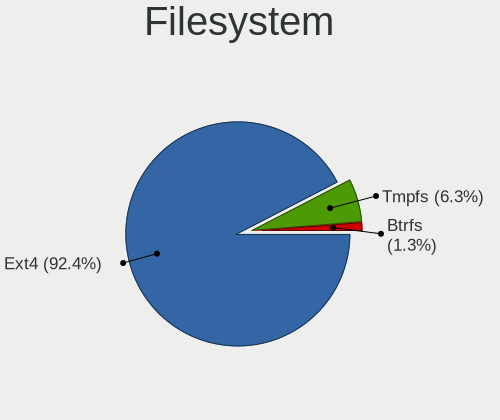
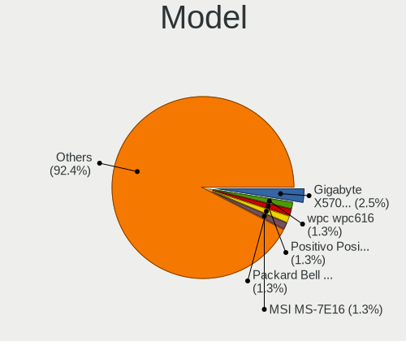
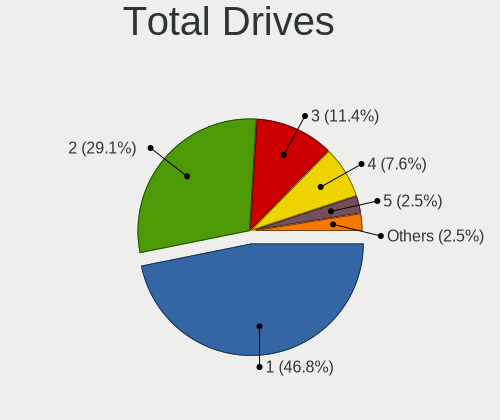
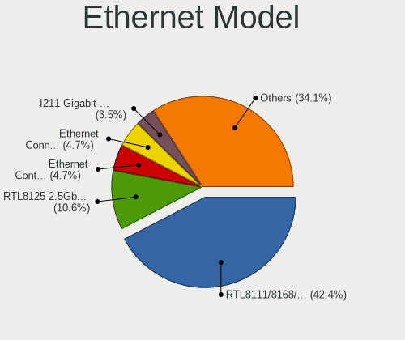
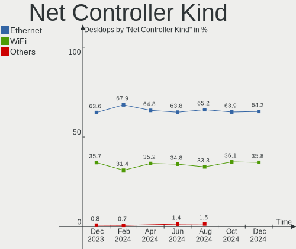
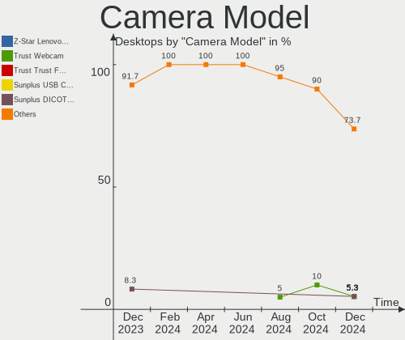

Zorin Hardware Trends (Desktops)
--------------------------------

A project to identify most popular hardware characteristics and track their change
over time based on data collected by Zorin users at https://Linux-Hardware.org.

Anyone can contribute to this report by the [hw-probe](https://github.com/linuxhw/hw-probe) tool:

    sudo -E hw-probe -all -upload

Full-feature report is available here: https://linux-hardware.org/?view=trends&formfactor=desktop

Period: Sep, 2021.

Contents
--------

* [ System ](#system)
  - [ OS                       ](#os)
  - [ OS Family                ](#os-family)
  - [ Kernel                   ](#kernel)
  - [ Kernel Family            ](#kernel-family)
  - [ Kernel Major Ver.        ](#kernel-major-ver)
  - [ Arch                     ](#arch)
  - [ DE                       ](#de)
  - [ Display Server           ](#display-server)
  - [ Display Manager          ](#display-manager)
  - [ OS Lang                  ](#os-lang)
  - [ Boot Mode                ](#boot-mode)
  - [ Filesystem               ](#filesystem)
  - [ Part. scheme             ](#part-scheme)
  - [ Dual Boot with Linux/BSD ](#dual-boot-with-linuxbsd)
  - [ Dual Boot (Win)          ](#dual-boot-win)

* [ Board ](#board)
  - [ Vendor                   ](#vendor)
  - [ Model                    ](#model)
  - [ Model Family             ](#model-family)
  - [ MFG Year                 ](#mfg-year)
  - [ Form Factor              ](#form-factor)
  - [ Secure Boot              ](#secure-boot)
  - [ Coreboot                 ](#coreboot)
  - [ RAM Size                 ](#ram-size)
  - [ RAM Used                 ](#ram-used)
  - [ Total Drives             ](#total-drives)
  - [ Has CD-ROM               ](#has-cd-rom)
  - [ Has Ethernet             ](#has-ethernet)
  - [ Has WiFi                 ](#has-wifi)
  - [ Has Bluetooth            ](#has-bluetooth)

* [ Location ](#location)
  - [ Country                  ](#country)
  - [ City                     ](#city)

* [ Drives ](#drives)
  - [ Drive Vendor             ](#drive-vendor)
  - [ Drive Model              ](#drive-model)
  - [ HDD Vendor               ](#hdd-vendor)
  - [ SSD Vendor               ](#ssd-vendor)
  - [ Drive Kind               ](#drive-kind)
  - [ Drive Connector          ](#drive-connector)
  - [ Drive Size               ](#drive-size)
  - [ Space Total              ](#space-total)
  - [ Space Used               ](#space-used)
  - [ Malfunc. Drives          ](#malfunc-drives)
  - [ Malfunc. Drive Vendor    ](#malfunc-drive-vendor)
  - [ Malfunc. HDD Vendor      ](#malfunc-hdd-vendor)
  - [ Malfunc. Drive Kind      ](#malfunc-drive-kind)
  - [ Failed Drives            ](#failed-drives)
  - [ Failed Drive Vendor      ](#failed-drive-vendor)
  - [ Drive Status             ](#drive-status)

* [ Storage controller ](#storage-controller)
  - [ Storage Vendor           ](#storage-vendor)
  - [ Storage Model            ](#storage-model)
  - [ Storage Kind             ](#storage-kind)

* [ Processor ](#processor)
  - [ CPU Vendor               ](#cpu-vendor)
  - [ CPU Model                ](#cpu-model)
  - [ CPU Model Family         ](#cpu-model-family)
  - [ CPU Cores                ](#cpu-cores)
  - [ CPU Sockets              ](#cpu-sockets)
  - [ CPU Threads              ](#cpu-threads)
  - [ CPU Op-Modes             ](#cpu-op-modes)
  - [ CPU Microcode            ](#cpu-microcode)
  - [ CPU Microarch            ](#cpu-microarch)

* [ Graphics ](#graphics)
  - [ GPU Vendor               ](#gpu-vendor)
  - [ GPU Model                ](#gpu-model)
  - [ GPU Combo                ](#gpu-combo)
  - [ GPU Driver               ](#gpu-driver)
  - [ GPU Memory               ](#gpu-memory)

* [ Monitor ](#monitor)
  - [ Monitor Vendor           ](#monitor-vendor)
  - [ Monitor Model            ](#monitor-model)
  - [ Monitor Resolution       ](#monitor-resolution)
  - [ Monitor Diagonal         ](#monitor-diagonal)
  - [ Monitor Width            ](#monitor-width)
  - [ Aspect Ratio             ](#aspect-ratio)
  - [ Monitor Area             ](#monitor-area)
  - [ Pixel Density            ](#pixel-density)
  - [ Multiple Monitors        ](#multiple-monitors)

* [ Network ](#network)
  - [ Net Controller Vendor    ](#net-controller-vendor)
  - [ Net Controller Model     ](#net-controller-model)
  - [ Wireless Vendor          ](#wireless-vendor)
  - [ Wireless Model           ](#wireless-model)
  - [ Ethernet Vendor          ](#ethernet-vendor)
  - [ Ethernet Model           ](#ethernet-model)
  - [ Net Controller Kind      ](#net-controller-kind)
  - [ Used Controller          ](#used-controller)
  - [ NICs                     ](#nics)
  - [ IPv6                     ](#ipv6)

* [ Bluetooth ](#bluetooth)
  - [ Bluetooth Vendor         ](#bluetooth-vendor)
  - [ Bluetooth Model          ](#bluetooth-model)

* [ Sound ](#sound)
  - [ Sound Vendor             ](#sound-vendor)
  - [ Sound Model              ](#sound-model)

* [ Memory ](#memory)
  - [ Memory Vendor            ](#memory-vendor)
  - [ Memory Model             ](#memory-model)
  - [ Memory Kind              ](#memory-kind)
  - [ Memory Form Factor       ](#memory-form-factor)
  - [ Memory Size              ](#memory-size)
  - [ Memory Speed             ](#memory-speed)

* [ Printers & scanners ](#printers--scanners)
  - [ Printer Vendor           ](#printer-vendor)
  - [ Printer Model            ](#printer-model)
  - [ Scanner Vendor           ](#scanner-vendor)
  - [ Scanner Model            ](#scanner-model)

* [ Camera ](#camera)
  - [ Camera Vendor            ](#camera-vendor)
  - [ Camera Model             ](#camera-model)

* [ Security ](#security)
  - [ Fingerprint Vendor       ](#fingerprint-vendor)
  - [ Fingerprint Model        ](#fingerprint-model)
  - [ Chipcard Vendor          ](#chipcard-vendor)
  - [ Chipcard Model           ](#chipcard-model)

* [ Unsupported ](#unsupported)
  - [ Unsupported Devices      ](#unsupported-devices)
  - [ Unsupported Device Types ](#unsupported-device-types)

System
------

OS
--

Installed operating systems

| Name     | Desktops | Percent |
|----------|----------|---------|
| Zorin 16 | 70       | 85.37%  |
| Zorin 15 | 12       | 14.63%  |

OS Family
---------

OS without a version

| Name  | Desktops | Percent |
|-------|----------|---------|
| Zorin | 82       | 100%    |

Kernel
------

Version of the Linux kernel

| Version           | Desktops | Percent |
|-------------------|----------|---------|
| 5.11.0-34-generic | 31       | 37.8%   |
| 5.11.0-27-generic | 22       | 26.83%  |
| 5.11.0-36-generic | 12       | 14.63%  |
| 5.4.0-81-generic  | 6        | 7.32%   |
| 5.11.0-37-generic | 5        | 6.1%    |
| 5.4.0-86-generic  | 3        | 3.66%   |
| 5.4.0-84-generic  | 1        | 1.22%   |
| 5.4.0-74-generic  | 1        | 1.22%   |
| 5.4.0-47-generic  | 1        | 1.22%   |

Kernel Family
-------------

Linux kernel without a distro release

| Version | Desktops | Percent |
|---------|----------|---------|
| 5.11.0  | 70       | 85.37%  |
| 5.4.0   | 12       | 14.63%  |

Kernel Major Ver.
-----------------

Linux kernel major version

| Version | Desktops | Percent |
|---------|----------|---------|
| 5.11    | 70       | 85.37%  |
| 5.4     | 12       | 14.63%  |

Arch
----

OS architecture (x86_64, i586, etc.)

| Name   | Desktops | Percent |
|--------|----------|---------|
| x86_64 | 80       | 97.56%  |
| i686   | 2        | 2.44%   |

DE
--

Desktop Environment

| Name    | Desktops | Percent |
|---------|----------|---------|
| GNOME   | 72       | 87.8%   |
| XFCE    | 7        | 8.54%   |
| Unknown | 3        | 3.66%   |

Display Server
--------------

X11 or Wayland

| Name | Desktops | Percent |
|------|----------|---------|
| X11  | 82       | 100%    |

Display Manager
---------------

SDDM, LightDM, etc.

| Name    | Desktops | Percent |
|---------|----------|---------|
| Unknown | 73       | 89.02%  |
| GDM     | 5        | 6.1%    |
| GDM3    | 3        | 3.66%   |
| LightDM | 1        | 1.22%   |

OS Lang
-------

Language

| Lang  | Desktops | Percent |
|-------|----------|---------|
| en_US | 32       | 39.02%  |
| en_GB | 8        | 9.76%   |
| pt_BR | 6        | 7.32%   |
| de_DE | 5        | 6.1%    |
| fr_CA | 3        | 3.66%   |
| en_IN | 3        | 3.66%   |
| nl_NL | 2        | 2.44%   |
| it_IT | 2        | 2.44%   |
| es_ES | 2        | 2.44%   |
| es_AR | 2        | 2.44%   |
| en_CA | 2        | 2.44%   |
| en_AU | 2        | 2.44%   |
| zh_CN | 1        | 1.22%   |
| sv_SE | 1        | 1.22%   |
| pt_PT | 1        | 1.22%   |
| pl_PL | 1        | 1.22%   |
| hu_HU | 1        | 1.22%   |
| fr_FR | 1        | 1.22%   |
| es_PA | 1        | 1.22%   |
| es_MX | 1        | 1.22%   |
| es_GT | 1        | 1.22%   |
| en_ZA | 1        | 1.22%   |
| en_PH | 1        | 1.22%   |
| en_NZ | 1        | 1.22%   |
| de_CH | 1        | 1.22%   |

Boot Mode
---------

EFI or BIOS

| Mode | Desktops | Percent |
|------|----------|---------|
| BIOS | 54       | 65.85%  |
| EFI  | 28       | 34.15%  |

Filesystem
----------

Type of filesystem

| Type    | Desktops | Percent |
|---------|----------|---------|
| Ext4    | 75       | 91.46%  |
| Zfs     | 3        | 3.66%   |
| Overlay | 2        | 2.44%   |
| Xfs     | 1        | 1.22%   |
| Btrfs   | 1        | 1.22%   |

Part. scheme
------------

Scheme of partitioning

| Type    | Desktops | Percent |
|---------|----------|---------|
| Unknown | 75       | 91.46%  |
| GPT     | 5        | 6.1%    |
| MBR     | 2        | 2.44%   |

Dual Boot with Linux/BSD
------------------------

Hosting more than one Linux/BSD

| Dual boot | Desktops | Percent |
|-----------|----------|---------|
| No        | 79       | 96.34%  |
| Yes       | 3        | 3.66%   |

Dual Boot (Win)
---------------

Hosting Linux and Windows

| Dual boot | Desktops | Percent |
|-----------|----------|---------|
| No        | 68       | 82.93%  |
| Yes       | 14       | 17.07%  |

Board
-----

Vendor
------

Motherboard manufacturer

| Name                        | Desktops | Percent |
|-----------------------------|----------|---------|
| ASUSTek Computer            | 23       | 28.05%  |
| Gigabyte Technology         | 11       | 13.41%  |
| Hewlett-Packard             | 10       | 12.2%   |
| ASRock                      | 8        | 9.76%   |
| Dell                        | 7        | 8.54%   |
| MSI                         | 6        | 7.32%   |
| Lenovo                      | 5        | 6.1%    |
| Intel                       | 3        | 3.66%   |
| eMachines                   | 2        | 2.44%   |
| Biostar                     | 2        | 2.44%   |
| Sapphire Technology Limited | 1        | 1.22%   |
| NCR                         | 1        | 1.22%   |
| JOOYON                      | 1        | 1.22%   |
| Foxconn                     | 1        | 1.22%   |
| Unknown                     | 1        | 1.22%   |

Model
-----

Motherboard model

| Name                                     | Desktops | Percent |
|------------------------------------------|----------|---------|
| MSI MS-7817                              | 2        | 2.44%   |
| Gigabyte A320M-S2H                       | 2        | 2.44%   |
| ASUS PRIME B450M-GAMING/BR               | 2        | 2.44%   |
| Sapphire Limited PURE PLATINUM 970A-PLUS | 1        | 1.22%   |
| NCR xxxx-xxxx-xxxx                       | 1        | 1.22%   |
| MSI WE136AA-UUZ p6337ch                  | 1        | 1.22%   |
| MSI MS-7D18                              | 1        | 1.22%   |
| MSI MS-7B89                              | 1        | 1.22%   |
| MSI MS-7798                              | 1        | 1.22%   |
| Lenovo ThinkCentre M93p 10A8A04FBR       | 1        | 1.22%   |
| Lenovo ThinkCentre M81 0385AW6           | 1        | 1.22%   |
| Lenovo ThinkCentre M73 10B7S02L00        | 1        | 1.22%   |
| Lenovo ThinkCentre M58 3231W2Y           | 1        | 1.22%   |
| Lenovo IdeaCentre K330                   | 1        | 1.22%   |
| JOOYON IPM41-D3                          | 1        | 1.22%   |
| Intel X99                                | 1        | 1.22%   |
| Intel X79M-S                             | 1        | 1.22%   |
| Intel DQ77MK-R01                         | 1        | 1.22%   |
| HP Z200 Workstation                      | 1        | 1.22%   |
| HP t620 PLUS Quad Core TC                | 1        | 1.22%   |
| HP t620 Dual Core TC                     | 1        | 1.22%   |
| HP rp5700 Business System                | 1        | 1.22%   |
| HP ProDesk 600 G1 SFF                    | 1        | 1.22%   |
| HP Compaq Pro 6300 MT                    | 1        | 1.22%   |
| HP Compaq dc5750 Microtower              | 1        | 1.22%   |
| HP Compaq 6200 Pro SFF PC                | 1        | 1.22%   |
| HP 870-158ng                             | 1        | 1.22%   |
| HP 251-a123w                             | 1        | 1.22%   |
| Gigabyte Z77-D3H                         | 1        | 1.22%   |
| Gigabyte Z490 AORUS ELITE                | 1        | 1.22%   |
| Gigabyte J4005ND2P-CF                    | 1        | 1.22%   |
| Gigabyte H370AORUSGAMING3WIFI            | 1        | 1.22%   |
| Gigabyte GA-78LMT-USB3                   | 1        | 1.22%   |
| Gigabyte G31M-ES2L                       | 1        | 1.22%   |
| Gigabyte B75M-D3H                        | 1        | 1.22%   |
| Gigabyte B450 AORUS PRO WIFI             | 1        | 1.22%   |
| Gigabyte 970A-DS3P                       | 1        | 1.22%   |
| Foxconn Pro 3330 MT                      | 1        | 1.22%   |
| eMachines EL1850G                        | 1        | 1.22%   |
| eMachines EL1352                         | 1        | 1.22%   |
| Dell XPS420                              | 1        | 1.22%   |
| Dell Precision WorkStation T3500         | 1        | 1.22%   |
| Dell OptiPlex XE                         | 1        | 1.22%   |
| Dell OptiPlex 990                        | 1        | 1.22%   |
| Dell OptiPlex 790                        | 1        | 1.22%   |
| Dell OptiPlex 380                        | 1        | 1.22%   |
| Dell Inspiron 620                        | 1        | 1.22%   |
| Biostar X470NH                           | 1        | 1.22%   |
| Biostar P4M89-M7B                        | 1        | 1.22%   |
| ASUS Z170I PRO GAMING                    | 1        | 1.22%   |
| ASUS Z170 PRO GAMING                     | 1        | 1.22%   |
| ASUS TUF GAMING X570-PRO                 | 1        | 1.22%   |
| ASUS ROG STRIX B550-F GAMING             | 1        | 1.22%   |
| ASUS ROG Maximus XIII HERO               | 1        | 1.22%   |
| ASUS ROG Maximus X HERO                  | 1        | 1.22%   |
| ASUS PRIME B450M-A                       | 1        | 1.22%   |
| ASUS PRIME B450-PLUS                     | 1        | 1.22%   |
| ASUS P5Q                                 | 1        | 1.22%   |
| ASUS P5GC-MX/1333                        | 1        | 1.22%   |
| ASUS P5G41T-M LX3                        | 1        | 1.22%   |

Model Family
------------

Motherboard model prefix

| Name                          | Desktops | Percent |
|-------------------------------|----------|---------|
| Lenovo ThinkCentre            | 4        | 4.88%   |
| Dell OptiPlex                 | 4        | 4.88%   |
| ASUS PRIME                    | 4        | 4.88%   |
| HP Compaq                     | 3        | 3.66%   |
| ASUS ROG                      | 3        | 3.66%   |
| MSI MS-7817                   | 2        | 2.44%   |
| HP t620                       | 2        | 2.44%   |
| Gigabyte A320M-S2H            | 2        | 2.44%   |
| ASUS M5A97                    | 2        | 2.44%   |
| Sapphire Limited PURE         | 1        | 1.22%   |
| NCR xxxx-xxxx-xxxx            | 1        | 1.22%   |
| MSI WE136AA-UUZ               | 1        | 1.22%   |
| MSI MS-7D18                   | 1        | 1.22%   |
| MSI MS-7B89                   | 1        | 1.22%   |
| MSI MS-7798                   | 1        | 1.22%   |
| Lenovo IdeaCentre             | 1        | 1.22%   |
| JOOYON IPM41-D3               | 1        | 1.22%   |
| Intel X99                     | 1        | 1.22%   |
| Intel X79M-S                  | 1        | 1.22%   |
| Intel DQ77MK-R01              | 1        | 1.22%   |
| HP Z200                       | 1        | 1.22%   |
| HP rp5700                     | 1        | 1.22%   |
| HP ProDesk                    | 1        | 1.22%   |
| HP 870-158ng                  | 1        | 1.22%   |
| HP 251-a123w                  | 1        | 1.22%   |
| Gigabyte Z77-D3H              | 1        | 1.22%   |
| Gigabyte Z490                 | 1        | 1.22%   |
| Gigabyte J4005ND2P-CF         | 1        | 1.22%   |
| Gigabyte H370AORUSGAMING3WIFI | 1        | 1.22%   |
| Gigabyte GA-78LMT-USB3        | 1        | 1.22%   |
| Gigabyte G31M-ES2L            | 1        | 1.22%   |
| Gigabyte B75M-D3H             | 1        | 1.22%   |
| Gigabyte B450                 | 1        | 1.22%   |
| Gigabyte 970A-DS3P            | 1        | 1.22%   |
| Foxconn Pro                   | 1        | 1.22%   |
| eMachines EL1850G             | 1        | 1.22%   |
| eMachines EL1352              | 1        | 1.22%   |
| Dell XPS420                   | 1        | 1.22%   |
| Dell Precision                | 1        | 1.22%   |
| Dell Inspiron                 | 1        | 1.22%   |
| Biostar X470NH                | 1        | 1.22%   |
| Biostar P4M89-M7B             | 1        | 1.22%   |
| ASUS Z170I                    | 1        | 1.22%   |
| ASUS Z170                     | 1        | 1.22%   |
| ASUS TUF                      | 1        | 1.22%   |
| ASUS P5Q                      | 1        | 1.22%   |
| ASUS P5GC-MX                  | 1        | 1.22%   |
| ASUS P5G41T-M                 | 1        | 1.22%   |
| ASUS Maximus                  | 1        | 1.22%   |
| ASUS M5A78L-M                 | 1        | 1.22%   |
| ASUS M4A88TD-V                | 1        | 1.22%   |
| ASUS M32CD                    | 1        | 1.22%   |
| ASUS M2N-E                    | 1        | 1.22%   |
| ASUS KQ514AA-ABA              | 1        | 1.22%   |
| ASUS KJ382AA-ABA              | 1        | 1.22%   |
| ASUS K8N                      | 1        | 1.22%   |
| ASRock Z490                   | 1        | 1.22%   |
| ASRock Q1900M                 | 1        | 1.22%   |
| ASRock H61M-VG4               | 1        | 1.22%   |
| ASRock FM2A58M-DG3+           | 1        | 1.22%   |

MFG Year
--------

Motherboard manufacture year

| Year | Desktops | Percent |
|------|----------|---------|
| 2020 | 12       | 14.63%  |
| 2010 | 12       | 14.63%  |
| 2013 | 8        | 9.76%   |
| 2021 | 7        | 8.54%   |
| 2011 | 7        | 8.54%   |
| 2018 | 6        | 7.32%   |
| 2015 | 5        | 6.1%    |
| 2019 | 4        | 4.88%   |
| 2016 | 4        | 4.88%   |
| 2014 | 4        | 4.88%   |
| 2012 | 4        | 4.88%   |
| 2009 | 3        | 3.66%   |
| 2008 | 3        | 3.66%   |
| 2006 | 2        | 2.44%   |
| 2007 | 1        | 1.22%   |

Form Factor
-----------

Physical design of the computer

| Name    | Desktops | Percent |
|---------|----------|---------|
| Desktop | 82       | 100%    |

Secure Boot
-----------

Enabled or disabled

| State    | Desktops | Percent |
|----------|----------|---------|
| Disabled | 78       | 95.12%  |
| Enabled  | 4        | 4.88%   |

Coreboot
--------

Have coreboot on board

| Used | Desktops | Percent |
|------|----------|---------|
| No   | 82       | 100%    |

RAM Size
--------

Total RAM memory

| Size in GB  | Desktops | Percent |
|-------------|----------|---------|
| 8.01-16.0   | 18       | 21.95%  |
| 16.01-24.0  | 17       | 20.73%  |
| 32.01-64.0  | 13       | 15.85%  |
| 3.01-4.0    | 13       | 15.85%  |
| 4.01-8.0    | 11       | 13.41%  |
| 1.01-2.0    | 4        | 4.88%   |
| 24.01-32.0  | 2        | 2.44%   |
| 0.51-1.0    | 2        | 2.44%   |
| 2.01-3.0    | 1        | 1.22%   |
| 64.01-256.0 | 1        | 1.22%   |

RAM Used
--------

Used RAM memory

| Used GB    | Desktops | Percent |
|------------|----------|---------|
| 1.01-2.0   | 37       | 45.12%  |
| 2.01-3.0   | 27       | 32.93%  |
| 3.01-4.0   | 8        | 9.76%   |
| 4.01-8.0   | 6        | 7.32%   |
| 0.51-1.0   | 2        | 2.44%   |
| 16.01-24.0 | 1        | 1.22%   |
| 0.01-0.5   | 1        | 1.22%   |

Total Drives
------------

Number of drives on board

| Drives | Desktops | Percent |
|--------|----------|---------|
| 1      | 36       | 43.9%   |
| 2      | 23       | 28.05%  |
| 4      | 9        | 10.98%  |
| 3      | 9        | 10.98%  |
| 5      | 4        | 4.88%   |
| 6      | 1        | 1.22%   |

Has CD-ROM
----------

Has CD-ROM on board

| Presented | Desktops | Percent |
|-----------|----------|---------|
| Yes       | 45       | 54.88%  |
| No        | 37       | 45.12%  |

Has Ethernet
------------

Has Ethernet on board

| Presented | Desktops | Percent |
|-----------|----------|---------|
| Yes       | 81       | 98.78%  |
| No        | 1        | 1.22%   |

Has WiFi
--------

Has WiFi module

| Presented | Desktops | Percent |
|-----------|----------|---------|
| Yes       | 45       | 54.88%  |
| No        | 37       | 45.12%  |

Has Bluetooth
-------------

Has Bluetooth module

| Presented | Desktops | Percent |
|-----------|----------|---------|
| No        | 57       | 69.51%  |
| Yes       | 25       | 30.49%  |

Location
--------

Country
-------

Geographic location (country)

| Country      | Desktops | Percent |
|--------------|----------|---------|
| USA          | 17       | 20.73%  |
| UK           | 8        | 9.76%   |
| Brazil       | 7        | 8.54%   |
| Germany      | 6        | 7.32%   |
| Canada       | 5        | 6.1%    |
| Netherlands  | 4        | 4.88%   |
| India        | 3        | 3.66%   |
| Hungary      | 3        | 3.66%   |
| Argentina    | 3        | 3.66%   |
| Sweden       | 2        | 2.44%   |
| Spain        | 2        | 2.44%   |
| Italy        | 2        | 2.44%   |
| Australia    | 2        | 2.44%   |
| Switzerland  | 1        | 1.22%   |
| South Africa | 1        | 1.22%   |
| Serbia       | 1        | 1.22%   |
| Romania      | 1        | 1.22%   |
| Poland       | 1        | 1.22%   |
| Philippines  | 1        | 1.22%   |
| Panama       | 1        | 1.22%   |
| New Zealand  | 1        | 1.22%   |
| Mozambique   | 1        | 1.22%   |
| Mexico       | 1        | 1.22%   |
| Malaysia     | 1        | 1.22%   |
| Indonesia    | 1        | 1.22%   |
| Guatemala    | 1        | 1.22%   |
| France       | 1        | 1.22%   |
| El Salvador  | 1        | 1.22%   |
| China        | 1        | 1.22%   |
| Chile        | 1        | 1.22%   |
| Austria      | 1        | 1.22%   |

City
----

Geographic location (city)

| City                      | Desktops | Percent |
|---------------------------|----------|---------|
| Vadodara                  | 2        | 2.44%   |
| Mentor                    | 2        | 2.44%   |
| Drummondville             | 2        | 2.44%   |
| Berlin                    | 2        | 2.44%   |
| Zoetermeer                | 1        | 1.22%   |
| Warrenton                 | 1        | 1.22%   |
| Wandsworth                | 1        | 1.22%   |
| Vienna                    | 1        | 1.22%   |
| Valley Stream             | 1        | 1.22%   |
| Utrecht                   | 1        | 1.22%   |
| Tucson                    | 1        | 1.22%   |
| Toronto                   | 1        | 1.22%   |
| Thame                     | 1        | 1.22%   |
| Taby                      | 1        | 1.22%   |
| Stockholm                 | 1        | 1.22%   |
| Spartanburg               | 1        | 1.22%   |
| Solingen                  | 1        | 1.22%   |
| Shenzhen                  | 1        | 1.22%   |
| Sechelt                   | 1        | 1.22%   |
| S??o Paulo                | 1        | 1.22%   |
| S??o Jos?© dos Campos     | 1        | 1.22%   |
| Satu Mare                 | 1        | 1.22%   |
| Santiago                  | 1        | 1.22%   |
| Santander                 | 1        | 1.22%   |
| Santa Tecla               | 1        | 1.22%   |
| San Miguel                | 1        | 1.22%   |
| Salt Lake City            | 1        | 1.22%   |
| Salem                     | 1        | 1.22%   |
| Saalfeld                  | 1        | 1.22%   |
| Rotterdam                 | 1        | 1.22%   |
| Rio de Janeiro            | 1        | 1.22%   |
| Redruth                   | 1        | 1.22%   |
| Plano                     | 1        | 1.22%   |
| Pilar                     | 1        | 1.22%   |
| Panama City               | 1        | 1.22%   |
| Novo Hamburgo             | 1        | 1.22%   |
| New Port Richey           | 1        | 1.22%   |
| New Malden                | 1        | 1.22%   |
| Milan                     | 1        | 1.22%   |
| Melbourne                 | 1        | 1.22%   |
| Marshall                  | 1        | 1.22%   |
| Maputo                    | 1        | 1.22%   |
| Machhagan                 | 1        | 1.22%   |
| Macclesfield              | 1        | 1.22%   |
| Lynchburg                 | 1        | 1.22%   |
| Livingston                | 1        | 1.22%   |
| Kuala Lumpur              | 1        | 1.22%   |
| Jose Leon Suarez          | 1        | 1.22%   |
| Itapecerica               | 1        | 1.22%   |
| Hajdudorog                | 1        | 1.22%   |
| Hagen                     | 1        | 1.22%   |
| Hackney                   | 1        | 1.22%   |
| Guatemala City            | 1        | 1.22%   |
| Granby                    | 1        | 1.22%   |
| Gmina Grab??w nad Prosn?… | 1        | 1.22%   |
| Gloucester                | 1        | 1.22%   |
| Gilmer                    | 1        | 1.22%   |
| Fortaleza                 | 1        | 1.22%   |
| Floral Park               | 1        | 1.22%   |
| Fitzroy North             | 1        | 1.22%   |

Drives
------

Drive Vendor
------------

Hard drive vendors

| Vendor                | Desktops | Drives | Percent |
|-----------------------|----------|--------|---------|
| WDC                   | 27       | 35     | 18.62%  |
| Seagate               | 24       | 28     | 16.55%  |
| Samsung Electronics   | 18       | 24     | 12.41%  |
| Toshiba               | 10       | 10     | 6.9%    |
| Hitachi               | 10       | 11     | 6.9%    |
| SanDisk               | 8        | 9      | 5.52%   |
| Kingston              | 7        | 7      | 4.83%   |
| Unknown               | 5        | 6      | 3.45%   |
| Silicon Motion        | 4        | 5      | 2.76%   |
| HGST                  | 4        | 5      | 2.76%   |
| A-DATA Technology     | 3        | 4      | 2.07%   |
| Phison                | 2        | 3      | 1.38%   |
| MAXTOR                | 2        | 2      | 1.38%   |
| Lexar                 | 2        | 2      | 1.38%   |
| Gigabyte Technology   | 2        | 2      | 1.38%   |
| Crucial               | 2        | 2      | 1.38%   |
| Verbatim              | 1        | 1      | 0.69%   |
| Team                  | 1        | 1      | 0.69%   |
| Super Talent          | 1        | 1      | 0.69%   |
| SABRENT               | 1        | 1      | 0.69%   |
| Realtek Semiconductor | 1        | 1      | 0.69%   |
| PNY                   | 1        | 1      | 0.69%   |
| OWC                   | 1        | 1      | 0.69%   |
| Netac                 | 1        | 1      | 0.69%   |
| KingSpec              | 1        | 2      | 0.69%   |
| JMicron               | 1        | 1      | 0.69%   |
| Intel                 | 1        | 1      | 0.69%   |
| Hewlett-Packard       | 1        | 1      | 0.69%   |
| GOODRAM               | 1        | 1      | 0.69%   |
| Config                | 1        | 1      | 0.69%   |
| ASMT109x              | 1        | 1      | 0.69%   |

Drive Model
-----------

Hard drive models

| Model                                | Desktops | Percent |
|--------------------------------------|----------|---------|
| Seagate ST500DM002-1BD142 500GB      | 3        | 1.79%   |
| Samsung NVMe SSD Drive 1TB           | 3        | 1.79%   |
| Unknown SD/MMC/MS PRO 128GB          | 2        | 1.19%   |
| Toshiba MQ01ABD032 320GB             | 2        | 1.19%   |
| Toshiba DT01ACA200 2TB               | 2        | 1.19%   |
| Toshiba DT01ACA050 500GB             | 2        | 1.19%   |
| Seagate Expansion 1TB                | 2        | 1.19%   |
| SanDisk SDSSDA240G 240GB             | 2        | 1.19%   |
| SanDisk SDSSDA120G 120GB             | 2        | 1.19%   |
| Samsung SSD 860 EVO 250GB            | 2        | 1.19%   |
| Samsung SSD 850 EVO 500GB            | 2        | 1.19%   |
| Samsung SSD 840 EVO 250GB            | 2        | 1.19%   |
| Kingston SA400S37240G 240GB SSD      | 2        | 1.19%   |
| Kingston SA400S37120G 120GB SSD      | 2        | 1.19%   |
| Gigabyte GP-GSTFS31120GNTD 120GB SSD | 2        | 1.19%   |
| WDC WDS100T2B0A-00SM50 1TB SSD       | 1        | 0.6%    |
| WDC WD800JD-75MSA3 80GB              | 1        | 0.6%    |
| WDC WD7500AADS-00M2B0 752GB          | 1        | 0.6%    |
| WDC WD6400BEVT-22A0RT0 640GB         | 1        | 0.6%    |
| WDC WD6400AADS-00M2B0 640GB          | 1        | 0.6%    |
| WDC WD5000BEVT-22ZAT0 500GB          | 1        | 0.6%    |
| WDC WD5000AVDS-63U7B1 500GB          | 1        | 0.6%    |
| WDC WD5000AAKX-60U6AA0 500GB         | 1        | 0.6%    |
| WDC WD5000AAKX-603CA0 500GB          | 1        | 0.6%    |
| WDC WD5000AAKX-08U6AA0 500GB         | 1        | 0.6%    |
| WDC WD5000AAKS-22V1A0 500GB          | 1        | 0.6%    |
| WDC WD40EFRX-68N32N0 4TB             | 1        | 0.6%    |
| WDC WD4000FYYZ-05UL1B0 4TB           | 1        | 0.6%    |
| WDC WD3200AAKS-75L9A0 320GB          | 1        | 0.6%    |
| WDC WD3200AAJS-00L7A0 320GB          | 1        | 0.6%    |
| WDC WD300BB-75DEA0 32GB              | 1        | 0.6%    |
| WDC WD2500JS-60NCB1 250GB            | 1        | 0.6%    |
| WDC WD20EZRX-22D8PB0 2TB             | 1        | 0.6%    |
| WDC WD20EARS-00MVWB0 2TB             | 1        | 0.6%    |
| WDC WD200EB-00BHF0 20GB              | 1        | 0.6%    |
| WDC WD200BB-00AUA1 20GB              | 1        | 0.6%    |
| WDC WD1600AAJS-75M0A0 160GB          | 1        | 0.6%    |
| WDC WD16 00AAJS-00L7A0 160GB         | 1        | 0.6%    |
| WDC WD1200BEVS-22UST0 120GB          | 1        | 0.6%    |
| WDC WD10EZEX-75ZF5A0 1TB             | 1        | 0.6%    |
| WDC WD10EZEX-60WN4A0 1TB             | 1        | 0.6%    |
| WDC WD10EZEX-22BN5A0 1TB             | 1        | 0.6%    |
| WDC WD10EZEX-08WN4A0 1TB             | 1        | 0.6%    |
| WDC WD10EZEX-00WN4A0 1TB             | 1        | 0.6%    |
| WDC WD10EZEX-00MFCA0 1TB             | 1        | 0.6%    |
| WDC WD10EZEX-00BN5A0 1TB             | 1        | 0.6%    |
| WDC WD10EURX-63FH1Y0 1TB             | 1        | 0.6%    |
| WDC WD10EADX-22TDHB0 1TB             | 1        | 0.6%    |
| WDC WD10EACS-32ZJB0 1TB              | 1        | 0.6%    |
| WDC WD1003FBYZ-010FB0 1TB            | 1        | 0.6%    |
| Verbatim Vi500 S3 480GB SSD          | 1        | 0.6%    |
| Unknown SD/MMC 64GB                  | 1        | 0.6%    |
| Unknown M.S./M.S.Pro/HG 16GB         | 1        | 0.6%    |
| Unknown BFDT50S 500GB                | 1        | 0.6%    |
| Unknown Avolusion PRO-5X 8TB         | 1        | 0.6%    |
| Toshiba THNSFB062GMSJ 64GB SSD       | 1        | 0.6%    |
| Toshiba HDWD110 1TB                  | 1        | 0.6%    |
| Toshiba DT01ABA200V 2TB              | 1        | 0.6%    |
| Toshiba DT01ABA200 2TB               | 1        | 0.6%    |
| Team TEAML5Lite3D1T 1TB SSD          | 1        | 0.6%    |

HDD Vendor
----------

Hard disk drive vendors

| Vendor              | Desktops | Drives | Percent |
|---------------------|----------|--------|---------|
| WDC                 | 27       | 34     | 32.14%  |
| Seagate             | 24       | 28     | 28.57%  |
| Hitachi             | 10       | 11     | 11.9%   |
| Toshiba             | 9        | 9      | 10.71%  |
| Samsung Electronics | 4        | 4      | 4.76%   |
| HGST                | 4        | 5      | 4.76%   |
| Unknown             | 2        | 2      | 2.38%   |
| MAXTOR              | 2        | 2      | 2.38%   |
| Hewlett-Packard     | 1        | 1      | 1.19%   |
| ASMT109x            | 1        | 1      | 1.19%   |

SSD Vendor
----------

Solid state drive vendors

| Vendor              | Desktops | Drives | Percent |
|---------------------|----------|--------|---------|
| Samsung Electronics | 11       | 12     | 23.91%  |
| SanDisk             | 8        | 9      | 17.39%  |
| Kingston            | 6        | 6      | 13.04%  |
| A-DATA Technology   | 3        | 4      | 6.52%   |
| Lexar               | 2        | 2      | 4.35%   |
| Gigabyte Technology | 2        | 2      | 4.35%   |
| Crucial             | 2        | 2      | 4.35%   |
| WDC                 | 1        | 1      | 2.17%   |
| Verbatim            | 1        | 1      | 2.17%   |
| Toshiba             | 1        | 1      | 2.17%   |
| Team                | 1        | 1      | 2.17%   |
| Super Talent        | 1        | 1      | 2.17%   |
| SABRENT             | 1        | 1      | 2.17%   |
| PNY                 | 1        | 1      | 2.17%   |
| OWC                 | 1        | 1      | 2.17%   |
| Netac               | 1        | 1      | 2.17%   |
| KingSpec            | 1        | 2      | 2.17%   |
| Intel               | 1        | 1      | 2.17%   |
| GOODRAM             | 1        | 1      | 2.17%   |

Drive Kind
----------

HDD or SSD

| Kind    | Desktops | Drives | Percent |
|---------|----------|--------|---------|
| HDD     | 60       | 97     | 51.28%  |
| SSD     | 38       | 50     | 32.48%  |
| NVMe    | 14       | 18     | 11.97%  |
| Unknown | 5        | 6      | 4.27%   |

Drive Connector
---------------

SATA, SAS, NVMe, etc.

| Type | Desktops | Drives | Percent |
|------|----------|--------|---------|
| SATA | 79       | 142    | 77.45%  |
| NVMe | 14       | 18     | 13.73%  |
| SAS  | 9        | 11     | 8.82%   |

Drive Size
----------

Size of hard drive

| Size in TB | Desktops | Drives | Percent |
|------------|----------|--------|---------|
| 0.01-0.5   | 64       | 89     | 59.26%  |
| 0.51-1.0   | 28       | 38     | 25.93%  |
| 1.01-2.0   | 11       | 13     | 10.19%  |
| 3.01-4.0   | 3        | 5      | 2.78%   |
| 4.01-10.0  | 2        | 2      | 1.85%   |

Space Total
-----------

Amount of disk space available on the file system

| Size in GB     | Desktops | Percent |
|----------------|----------|---------|
| 101-250        | 25       | 30.49%  |
| 251-500        | 18       | 21.95%  |
| 501-1000       | 13       | 15.85%  |
| 51-100         | 9        | 10.98%  |
| 1001-2000      | 5        | 6.1%    |
| More than 3000 | 4        | 4.88%   |
| Unknown        | 3        | 3.66%   |
| 2001-3000      | 2        | 2.44%   |
| 1-20           | 2        | 2.44%   |
| 21-50          | 1        | 1.22%   |

Space Used
----------

Amount of used disk space

| Used GB        | Desktops | Percent |
|----------------|----------|---------|
| 1-20           | 38       | 46.34%  |
| 21-50          | 16       | 19.51%  |
| 101-250        | 10       | 12.2%   |
| 51-100         | 5        | 6.1%    |
| 251-500        | 4        | 4.88%   |
| More than 3000 | 3        | 3.66%   |
| Unknown        | 3        | 3.66%   |
| 501-1000       | 2        | 2.44%   |
| 1001-2000      | 1        | 1.22%   |

Malfunc. Drives
---------------

Drive models with a malfunction

| Model                          | Desktops | Drives | Percent |
|--------------------------------|----------|--------|---------|
| Seagate ST9500420AS 500GB      | 1        | 1      | 50%     |
| Seagate ST4000DM004-2CV104 4TB | 1        | 1      | 50%     |

Malfunc. Drive Vendor
---------------------

Vendors of faulty drives

| Vendor  | Desktops | Drives | Percent |
|---------|----------|--------|---------|
| Seagate | 2        | 2      | 100%    |

Malfunc. HDD Vendor
-------------------

Vendors of faulty HDD drives

| Vendor  | Desktops | Drives | Percent |
|---------|----------|--------|---------|
| Seagate | 2        | 2      | 100%    |

Malfunc. Drive Kind
-------------------

Kinds of faulty drives

| Kind | Desktops | Drives | Percent |
|------|----------|--------|---------|
| HDD  | 2        | 2      | 100%    |

Failed Drives
-------------

Failed drive models

Zero info for selected period =(

Failed Drive Vendor
-------------------

Failed drive vendors

Zero info for selected period =(

Drive Status
------------

Number of failed and malfunc. drives

| Status   | Desktops | Drives | Percent |
|----------|----------|--------|---------|
| Detected | 76       | 153    | 89.41%  |
| Works    | 7        | 16     | 8.24%   |
| Malfunc  | 2        | 2      | 2.35%   |

Storage controller
------------------

Storage Vendor
--------------

Storage controller vendors

| Vendor                      | Desktops | Percent |
|-----------------------------|----------|---------|
| Intel                       | 51       | 50%     |
| AMD                         | 25       | 24.51%  |
| Samsung Electronics         | 7        | 6.86%   |
| Silicon Motion              | 4        | 3.92%   |
| Nvidia                      | 4        | 3.92%   |
| ASMedia Technology          | 3        | 2.94%   |
| VIA Technologies            | 2        | 1.96%   |
| Phison Electronics          | 2        | 1.96%   |
| Realtek Semiconductor       | 1        | 0.98%   |
| Marvell Technology Group    | 1        | 0.98%   |
| Kingston Technology Company | 1        | 0.98%   |
| Broadcom / LSI              | 1        | 0.98%   |

Storage Model
-------------

Storage controller models

| Model                                                                                   | Desktops | Percent |
|-----------------------------------------------------------------------------------------|----------|---------|
| AMD FCH SATA Controller [AHCI mode]                                                     | 10       | 7.52%   |
| AMD 400 Series Chipset SATA Controller                                                  | 8        | 6.02%   |
| Intel NM10/ICH7 Family SATA Controller [IDE mode]                                       | 7        | 5.26%   |
| Intel 82801G (ICH7 Family) IDE Controller                                               | 6        | 4.51%   |
| Intel 6 Series/C200 Series Chipset Family 6 port Desktop SATA AHCI Controller           | 6        | 4.51%   |
| AMD SB7x0/SB8x0/SB9x0 SATA Controller [AHCI mode]                                       | 6        | 4.51%   |
| AMD SB7x0/SB8x0/SB9x0 IDE Controller                                                    | 6        | 4.51%   |
| Intel SATA Controller [RAID mode]                                                       | 5        | 3.76%   |
| Intel Q170/Q150/B150/H170/H110/Z170/CM236 Chipset SATA Controller [AHCI Mode]           | 5        | 3.76%   |
| Silicon Motion SM2263EN/SM2263XT SSD Controller                                         | 4        | 3.01%   |
| Samsung NVMe SSD Controller SM981/PM981/PM983                                           | 4        | 3.01%   |
| Intel 8 Series/C220 Series Chipset Family 6-port SATA Controller 1 [AHCI mode]          | 4        | 3.01%   |
| Intel 7 Series/C210 Series Chipset Family 6-port SATA Controller [AHCI mode]            | 4        | 3.01%   |
| ASMedia ASM1062 Serial ATA Controller                                                   | 3        | 2.26%   |
| VIA VT82C586A/B/VT82C686/A/B/VT823x/A/C PIPC Bus Master IDE                             | 2        | 1.5%    |
| Nvidia MCP61 SATA Controller                                                            | 2        | 1.5%    |
| Nvidia MCP61 IDE                                                                        | 2        | 1.5%    |
| Intel Atom Processor E3800 Series SATA AHCI Controller                                  | 2        | 1.5%    |
| Intel 82801JI (ICH10 Family) SATA AHCI Controller                                       | 2        | 1.5%    |
| Intel 82801H (ICH8 Family) 4 port SATA Controller [IDE mode]                            | 2        | 1.5%    |
| Intel 6 Series/C200 Series Chipset Family Desktop SATA Controller (IDE mode, ports 4-5) | 2        | 1.5%    |
| Intel 6 Series/C200 Series Chipset Family Desktop SATA Controller (IDE mode, ports 0-3) | 2        | 1.5%    |
| Intel 500 Series Chipset Family SATA AHCI Controller                                    | 2        | 1.5%    |
| AMD Starship/Matisse Chipset SATA Controller [AHCI mode]                                | 2        | 1.5%    |
| AMD FCH SATA Controller D                                                               | 2        | 1.5%    |
| VIA VIA VT6420 SATA RAID Controller                                                     | 1        | 0.75%   |
| VIA Serial ATA Controller                                                               | 1        | 0.75%   |
| Samsung NVMe SSD Controller SM961/PM961/SM963                                           | 1        | 0.75%   |
| Samsung NVMe SSD Controller PM9A1/PM9A3/980PRO                                          | 1        | 0.75%   |
| Samsung NVMe SSD Controller 980                                                         | 1        | 0.75%   |
| Realtek Realtek Non-Volatile memory controller                                          | 1        | 0.75%   |
| Phison E16 PCIe4 NVMe Controller                                                        | 1        | 0.75%   |
| Phison E12 NVMe Controller                                                              | 1        | 0.75%   |
| Nvidia nForce3 Serial ATA Controller                                                    | 1        | 0.75%   |
| Nvidia MCP55 IDE                                                                        | 1        | 0.75%   |
| Nvidia CK8S Parallel ATA Controller (v2.5)                                              | 1        | 0.75%   |
| Marvell Group 88SE6111/6121 SATA II / PATA Controller                                   | 1        | 0.75%   |
| Kingston Company A2000 NVMe SSD                                                         | 1        | 0.75%   |
| Intel Comet Lake SATA AHCI Controller                                                   | 1        | 0.75%   |
| Intel Celeron/Pentium Silver Processor SATA Controller                                  | 1        | 0.75%   |
| Intel Cannon Lake PCH SATA AHCI Controller                                              | 1        | 0.75%   |
| Intel C610/X99 series chipset 6-Port SATA Controller [AHCI mode]                        | 1        | 0.75%   |
| Intel 82801JD/DO (ICH10 Family) SATA AHCI Controller                                    | 1        | 0.75%   |
| Intel 82801IR/IO/IH (ICH9R/DO/DH) 4 port SATA Controller [IDE mode]                     | 1        | 0.75%   |
| Intel 82801I (ICH9 Family) 2 port SATA Controller [IDE mode]                            | 1        | 0.75%   |
| Intel 82801HR/HO/HH (ICH8R/DO/DH) 2 port SATA Controller [IDE mode]                     | 1        | 0.75%   |
| Intel 8 Series/C220 Series Chipset Family 4-port SATA Controller 1 [IDE mode]           | 1        | 0.75%   |
| Intel 7 Series/C210 Series Chipset Family 4-port SATA Controller [IDE mode]             | 1        | 0.75%   |
| Intel 7 Series/C210 Series Chipset Family 2-port SATA Controller [IDE mode]             | 1        | 0.75%   |
| Intel 5 Series/3400 Series Chipset 6 port SATA AHCI Controller                          | 1        | 0.75%   |
| Intel 4 Series Chipset PT IDER Controller                                               | 1        | 0.75%   |
| Intel 200 Series PCH SATA controller [AHCI mode]                                        | 1        | 0.75%   |
| Broadcom / LSI SAS1068 PCI-X Fusion-MPT SAS                                             | 1        | 0.75%   |
| AMD SB7x0/SB8x0/SB9x0 SATA Controller [Non-RAID5 mode]                                  | 1        | 0.75%   |
| AMD SB7x0/SB8x0/SB9x0 SATA Controller [IDE mode]                                        | 1        | 0.75%   |
| AMD SB600 Non-Raid-5 SATA                                                               | 1        | 0.75%   |
| AMD SB600 IDE                                                                           | 1        | 0.75%   |
| AMD FCH IDE Controller                                                                  | 1        | 0.75%   |

Storage Kind
------------

Kind of storage controller (IDE, SATA, NVMe, SAS, ...)

| Kind | Desktops | Percent |
|------|----------|---------|
| SATA | 57       | 52.29%  |
| IDE  | 30       | 27.52%  |
| NVMe | 14       | 12.84%  |
| RAID | 7        | 6.42%   |
| SCSI | 1        | 0.92%   |

Processor
---------

CPU Vendor
----------

Processor vendors

| Vendor | Desktops | Percent |
|--------|----------|---------|
| Intel  | 53       | 64.63%  |
| AMD    | 29       | 35.37%  |

CPU Model
---------

Processor models

| Model                                       | Desktops | Percent |
|---------------------------------------------|----------|---------|
| AMD Ryzen 5 3600 6-Core Processor           | 5        | 6.1%    |
| Intel Core i5-2400 CPU @ 3.10GHz            | 4        | 4.88%   |
| Intel Core i5-6600K CPU @ 3.50GHz           | 3        | 3.66%   |
| Intel Core i3-4130 CPU @ 3.40GHz            | 3        | 3.66%   |
| Intel Core i5-3470 CPU @ 3.20GHz            | 2        | 2.44%   |
| Intel Core i5 CPU 650 @ 3.20GHz             | 2        | 2.44%   |
| Intel Core 2 Duo CPU E8400 @ 3.00GHz        | 2        | 2.44%   |
| Intel Core 2 Duo CPU E7400 @ 2.80GHz        | 2        | 2.44%   |
| AMD Ryzen 3 2200G with Radeon Vega Graphics | 2        | 2.44%   |
| Intel Xeon CPU X5650 @ 2.67GHz              | 1        | 1.22%   |
| Intel Xeon CPU E5-2650 v2 @ 2.60GHz         | 1        | 1.22%   |
| Intel Xeon CPU E5-2620 v3 @ 2.40GHz         | 1        | 1.22%   |
| Intel Xeon CPU E3-1240 V2 @ 3.40GHz         | 1        | 1.22%   |
| Intel Pentium Dual-Core CPU E5700 @ 3.00GHz | 1        | 1.22%   |
| Intel Pentium Dual CPU E2220 @ 2.40GHz      | 1        | 1.22%   |
| Intel Pentium Dual CPU E2200 @ 2.20GHz      | 1        | 1.22%   |
| Intel Pentium Dual CPU E2160 @ 1.80GHz      | 1        | 1.22%   |
| Intel Pentium Dual CPU E2140 @ 1.60GHz      | 1        | 1.22%   |
| Intel Pentium CPU J2900 @ 2.41GHz           | 1        | 1.22%   |
| Intel Pentium 4 CPU 3.40GHz                 | 1        | 1.22%   |
| Intel Core i9-10850K CPU @ 3.60GHz          | 1        | 1.22%   |
| Intel Core i7-8700K CPU @ 3.70GHz           | 1        | 1.22%   |
| Intel Core i7-8700 CPU @ 3.20GHz            | 1        | 1.22%   |
| Intel Core i7-6700K CPU @ 4.00GHz           | 1        | 1.22%   |
| Intel Core i7-6700 CPU @ 3.40GHz            | 1        | 1.22%   |
| Intel Core i7-2600 CPU @ 3.40GHz            | 1        | 1.22%   |
| Intel Core i7-10700KF CPU @ 3.80GHz         | 1        | 1.22%   |
| Intel Core i7-10700K CPU @ 3.80GHz          | 1        | 1.22%   |
| Intel Core i5-4570 CPU @ 3.20GHz            | 1        | 1.22%   |
| Intel Core i5-3340 CPU @ 3.10GHz            | 1        | 1.22%   |
| Intel Core i5-3330 CPU @ 3.00GHz            | 1        | 1.22%   |
| Intel Core i5-2500 CPU @ 3.30GHz            | 1        | 1.22%   |
| Intel Core i5-2320 CPU @ 3.00GHz            | 1        | 1.22%   |
| Intel Core i5-10400 CPU @ 2.90GHz           | 1        | 1.22%   |
| Intel Core i3-4130T CPU @ 2.90GHz           | 1        | 1.22%   |
| Intel Core i3-3220 CPU @ 3.30GHz            | 1        | 1.22%   |
| Intel Core 2 Quad CPU Q9505 @ 2.83GHz       | 1        | 1.22%   |
| Intel Core 2 Quad CPU Q6700 @ 2.66GHz       | 1        | 1.22%   |
| Intel Core 2 Quad CPU Q6600 @ 2.40GHz       | 1        | 1.22%   |
| Intel Core 2 Duo CPU E8500 @ 3.16GHz        | 1        | 1.22%   |
| Intel Core 2 Duo CPU E6400 @ 2.13GHz        | 1        | 1.22%   |
| Intel Celeron J4005 CPU @ 2.00GHz           | 1        | 1.22%   |
| Intel Celeron CPU J1900 @ 1.99GHz           | 1        | 1.22%   |
| Intel Celeron CPU E3400 @ 2.60GHz           | 1        | 1.22%   |
| AMD Ryzen 7 5800X 8-Core Processor          | 1        | 1.22%   |
| AMD Ryzen 5 5600X 6-Core Processor          | 1        | 1.22%   |
| AMD Ryzen 5 3600X 6-Core Processor          | 1        | 1.22%   |
| AMD Ryzen 5 3500X 6-Core Processor          | 1        | 1.22%   |
| AMD Ryzen 5 2400G with Radeon Vega Graphics | 1        | 1.22%   |
| AMD Ryzen 3 3200G with Radeon Vega Graphics | 1        | 1.22%   |
| AMD Phenom II X4 965 Processor              | 1        | 1.22%   |
| AMD Phenom II X4 945 Processor              | 1        | 1.22%   |
| AMD Opteron Processor 3365                  | 1        | 1.22%   |
| AMD Mobile Athlon 64 Processor 4000+        | 1        | 1.22%   |
| AMD GX-420CA SOC with Radeon HD Graphics    | 1        | 1.22%   |
| AMD GX-217GA SOC with Radeon HD Graphics    | 1        | 1.22%   |
| AMD FX-8320 Eight-Core Processor            | 1        | 1.22%   |
| AMD FX-6100 Six-Core Processor              | 1        | 1.22%   |
| AMD FX-4300 Quad-Core Processor             | 1        | 1.22%   |
| AMD FX-4100 Quad-Core Processor             | 1        | 1.22%   |

CPU Model Family
----------------

Processor model prefix

| Model                   | Desktops | Percent |
|-------------------------|----------|---------|
| Intel Core i5           | 17       | 20.73%  |
| AMD Ryzen 5             | 9        | 10.98%  |
| Intel Core i7           | 7        | 8.54%   |
| Intel Core 2 Duo        | 6        | 7.32%   |
| Intel Core i3           | 5        | 6.1%    |
| Intel Xeon              | 4        | 4.88%   |
| Intel Pentium Dual      | 4        | 4.88%   |
| AMD FX                  | 4        | 4.88%   |
| Intel Core 2 Quad       | 3        | 3.66%   |
| Intel Celeron           | 3        | 3.66%   |
| AMD Ryzen 3             | 3        | 3.66%   |
| AMD Athlon 64 X2        | 3        | 3.66%   |
| AMD Phenom II X4        | 2        | 2.44%   |
| AMD GX                  | 2        | 2.44%   |
| Intel Pentium Dual-Core | 1        | 1.22%   |
| Intel Pentium 4         | 1        | 1.22%   |
| Intel Pentium           | 1        | 1.22%   |
| Intel Core i9           | 1        | 1.22%   |
| AMD Ryzen 7             | 1        | 1.22%   |
| AMD Opteron             | 1        | 1.22%   |
| AMD Mobile Athlon 64    | 1        | 1.22%   |
| AMD Athlon X4           | 1        | 1.22%   |
| AMD Athlon II X3        | 1        | 1.22%   |
| AMD Athlon II X2        | 1        | 1.22%   |

CPU Cores
---------

Number of processor cores

| Number | Desktops | Percent |
|--------|----------|---------|
| 4      | 32       | 39.02%  |
| 2      | 28       | 34.15%  |
| 6      | 13       | 15.85%  |
| 8      | 4        | 4.88%   |
| 3      | 2        | 2.44%   |
| 1      | 2        | 2.44%   |
| 10     | 1        | 1.22%   |

CPU Sockets
-----------

Number of sockets

| Number | Desktops | Percent |
|--------|----------|---------|
| 1      | 82       | 100%    |

CPU Threads
-----------

Threads per core (Hyper-Threading)

| Number | Desktops | Percent |
|--------|----------|---------|
| 1      | 46       | 56.1%   |
| 2      | 36       | 43.9%   |

CPU Op-Modes
------------

CPU Operation Modes (32-bit, 64-bit)

| Op mode        | Desktops | Percent |
|----------------|----------|---------|
| 32-bit, 64-bit | 82       | 100%    |

CPU Microcode
-------------

Microcode number

| Number     | Desktops | Percent |
|------------|----------|---------|
| Unknown    | 9        | 10.98%  |
| 0x1067a    | 7        | 8.54%   |
| 0x306a9    | 6        | 7.32%   |
| 0x206a7    | 6        | 7.32%   |
| 0x08701021 | 6        | 7.32%   |
| 0x506e3    | 5        | 6.1%    |
| 0x6fd      | 4        | 4.88%   |
| 0x306c3    | 4        | 4.88%   |
| 0x010000c8 | 4        | 4.88%   |
| 0xa0655    | 3        | 3.66%   |
| 0x6fb      | 3        | 3.66%   |
| 0x06000852 | 3        | 3.66%   |
| 0x30678    | 2        | 2.44%   |
| 0x08101016 | 2        | 2.44%   |
| 0x0600063e | 2        | 2.44%   |
| 0xf43      | 1        | 1.22%   |
| 0xa0653    | 1        | 1.22%   |
| 0x906ea    | 1        | 1.22%   |
| 0x706a1    | 1        | 1.22%   |
| 0x306f2    | 1        | 1.22%   |
| 0x306e4    | 1        | 1.22%   |
| 0x206c2    | 1        | 1.22%   |
| 0x20655    | 1        | 1.22%   |
| 0x20652    | 1        | 1.22%   |
| 0x10676    | 1        | 1.22%   |
| 0x0a201016 | 1        | 1.22%   |
| 0x0a201009 | 1        | 1.22%   |
| 0x08701013 | 1        | 1.22%   |
| 0x08108109 | 1        | 1.22%   |
| 0x0700010f | 1        | 1.22%   |
| 0x06001119 | 1        | 1.22%   |

CPU Microarch
-------------

Microarchitecture

| Name          | Desktops | Percent |
|---------------|----------|---------|
| Penryn        | 8        | 9.76%   |
| Zen 2         | 7        | 8.54%   |
| SandyBridge   | 7        | 8.54%   |
| IvyBridge     | 7        | 8.54%   |
| Core          | 7        | 8.54%   |
| Haswell       | 6        | 7.32%   |
| Skylake       | 5        | 6.1%    |
| Piledriver    | 4        | 4.88%   |
| K8 Hammer     | 4        | 4.88%   |
| K10           | 4        | 4.88%   |
| CometLake     | 4        | 4.88%   |
| Zen           | 3        | 3.66%   |
| Westmere      | 3        | 3.66%   |
| Zen 3         | 2        | 2.44%   |
| Silvermont    | 2        | 2.44%   |
| KabyLake      | 2        | 2.44%   |
| Jaguar        | 2        | 2.44%   |
| Bulldozer     | 2        | 2.44%   |
| Zen+          | 1        | 1.22%   |
| NetBurst      | 1        | 1.22%   |
| Goldmont plus | 1        | 1.22%   |

Graphics
--------

GPU Vendor
----------

Vendors of graphics cards

| Vendor           | Desktops | Percent |
|------------------|----------|---------|
| Nvidia           | 36       | 42.86%  |
| AMD              | 25       | 29.76%  |
| Intel            | 21       | 25%     |
| VIA Technologies | 2        | 2.38%   |

GPU Model
---------

Graphics card models

| Model                                                                         | Desktops | Percent |
|-------------------------------------------------------------------------------|----------|---------|
| Nvidia GK208B [GeForce GT 710]                                                | 6        | 7.06%   |
| Intel 4 Series Chipset Integrated Graphics Controller                         | 4        | 4.71%   |
| Nvidia GF119 [GeForce GT 610]                                                 | 3        | 3.53%   |
| Intel 2nd Generation Core Processor Family Integrated Graphics Controller     | 3        | 3.53%   |
| AMD Caicos [Radeon HD 6450/7450/8450 / R5 230 OEM]                            | 3        | 3.53%   |
| Nvidia GM204 [GeForce GTX 970]                                                | 2        | 2.35%   |
| Nvidia GM107 [GeForce GTX 750 Ti]                                             | 2        | 2.35%   |
| Intel Xeon E3-1200 v2/3rd Gen Core processor Graphics Controller              | 2        | 2.35%   |
| Intel CometLake-S GT2 [UHD Graphics 630]                                      | 2        | 2.35%   |
| Intel 82Q963/Q965 Integrated Graphics Controller                              | 2        | 2.35%   |
| Intel 82G33/G31 Express Integrated Graphics Controller                        | 2        | 2.35%   |
| Intel 4th Generation Core Processor Family Integrated Graphics Controller     | 2        | 2.35%   |
| AMD RS880 [Radeon HD 4250]                                                    | 2        | 2.35%   |
| AMD Ellesmere [Radeon RX 470/480/570/570X/580/580X/590]                       | 2        | 2.35%   |
| AMD Cedar [Radeon HD 5000/6000/7350/8350 Series]                              | 2        | 2.35%   |
| AMD Cape Verde PRO [Radeon HD 7750/8740 / R7 250E]                            | 2        | 2.35%   |
| AMD Baffin [Radeon RX 460/560D / Pro 450/455/460/555/555X/560/560X]           | 2        | 2.35%   |
| VIA Technologies P4M890 [S3 UniChrome Pro]                                    | 1        | 1.18%   |
| VIA Technologies CN700/P4M800 Pro/P4M800 CE/VN800 Graphics [S3 UniChrome Pro] | 1        | 1.18%   |
| Nvidia TU117 [GeForce GTX 1650]                                               | 1        | 1.18%   |
| Nvidia TU116 [GeForce GTX 1660]                                               | 1        | 1.18%   |
| Nvidia TU116 [GeForce GTX 1650 SUPER]                                         | 1        | 1.18%   |
| Nvidia TU106 [GeForce RTX 2070]                                               | 1        | 1.18%   |
| Nvidia TU106 [GeForce RTX 2060 SUPER]                                         | 1        | 1.18%   |
| Nvidia TU104 [GeForce RTX 2060]                                               | 1        | 1.18%   |
| Nvidia NV44A [GeForce 6200]                                                   | 1        | 1.18%   |
| Nvidia GP106 [GeForce GTX 1060 3GB]                                           | 1        | 1.18%   |
| Nvidia GP104 [GeForce GTX 1070 Ti]                                            | 1        | 1.18%   |
| Nvidia GM206 [GeForce GTX 960]                                                | 1        | 1.18%   |
| Nvidia GM204 [GeForce GTX 980]                                                | 1        | 1.18%   |
| Nvidia GM107GL [Quadro K620]                                                  | 1        | 1.18%   |
| Nvidia GK208B [GeForce GT 730]                                                | 1        | 1.18%   |
| Nvidia GK106 [GeForce GTX 660]                                                | 1        | 1.18%   |
| Nvidia GF114 [GeForce GTX 560 Ti]                                             | 1        | 1.18%   |
| Nvidia GF110 [GeForce GTX 570 Rev. 2]                                         | 1        | 1.18%   |
| Nvidia GF108 [GeForce GT 430]                                                 | 1        | 1.18%   |
| Nvidia GF106GL [Quadro 2000]                                                  | 1        | 1.18%   |
| Nvidia GF106 [GeForce GTS 450]                                                | 1        | 1.18%   |
| Nvidia GF100GL [Quadro 5000]                                                  | 1        | 1.18%   |
| Nvidia G96C [GeForce 9400 GT]                                                 | 1        | 1.18%   |
| Nvidia G92 [GeForce 9600 GSO]                                                 | 1        | 1.18%   |
| Nvidia C61 [GeForce 6150SE nForce 430]                                        | 1        | 1.18%   |
| Intel Xeon E3-1200 v3/4th Gen Core Processor Integrated Graphics Controller   | 1        | 1.18%   |
| Intel HD Graphics 530                                                         | 1        | 1.18%   |
| Intel GeminiLake [UHD Graphics 600]                                           | 1        | 1.18%   |
| Intel Atom Processor Z36xxx/Z37xxx Series Graphics & Display                  | 1        | 1.18%   |
| AMD Vega 10 XL/XT [Radeon RX Vega 56/64]                                      | 1        | 1.18%   |
| AMD RV730 PRO [Radeon HD 4650]                                                | 1        | 1.18%   |
| AMD RV710 [Radeon HD 4350/4550]                                               | 1        | 1.18%   |
| AMD RS780L [Radeon 3000]                                                      | 1        | 1.18%   |
| AMD RS482/RS485 [Radeon Xpress 1100/1150]                                     | 1        | 1.18%   |
| AMD RS480 [Radeon Xpress 1150] (Secondary)                                    | 1        | 1.18%   |
| AMD Raven Ridge [Radeon Vega Series / Radeon Vega Mobile Series]              | 1        | 1.18%   |
| AMD Rage 3 [Rage XL PCI]                                                      | 1        | 1.18%   |
| AMD Navi 21 [Radeon RX 6800/6800 XT / 6900 XT]                                | 1        | 1.18%   |
| AMD Kabini [Radeon HD 8400E]                                                  | 1        | 1.18%   |
| AMD Kabini [Radeon HD 8280E]                                                  | 1        | 1.18%   |
| AMD Bonaire XTX [Radeon R7 260X/360]                                          | 1        | 1.18%   |
| AMD Baffin [Radeon RX 550 640SP / RX 560/560X]                                | 1        | 1.18%   |

GPU Combo
---------

Combinations of graphics cards

| Name        | Desktops | Percent |
|-------------|----------|---------|
| 1 x Nvidia  | 36       | 43.9%   |
| 1 x AMD     | 23       | 28.05%  |
| 1 x Intel   | 19       | 23.17%  |
| 1 x VIA     | 2        | 2.44%   |
| 2 x AMD     | 1        | 1.22%   |
| Intel + AMD | 1        | 1.22%   |

GPU Driver
----------

Free vs proprietary

| Driver      | Desktops | Percent |
|-------------|----------|---------|
| Free        | 49       | 59.76%  |
| Proprietary | 23       | 28.05%  |
| Unknown     | 10       | 12.2%   |

GPU Memory
----------

Total video memory

| Size in GB | Desktops | Percent |
|------------|----------|---------|
| Unknown    | 34       | 41.46%  |
| 0.51-1.0   | 13       | 15.85%  |
| 1.01-2.0   | 10       | 12.2%   |
| 0.01-0.5   | 10       | 12.2%   |
| 3.01-4.0   | 6        | 7.32%   |
| 7.01-8.0   | 5        | 6.1%    |
| 5.01-6.0   | 2        | 2.44%   |
| 2.01-3.0   | 1        | 1.22%   |
| 8.01-16.0  | 1        | 1.22%   |

Monitor
-------

Monitor Vendor
--------------

Monitor vendors

| Vendor              | Desktops | Percent |
|---------------------|----------|---------|
| Samsung Electronics | 11       | 15.94%  |
| AOC                 | 7        | 10.14%  |
| Goldstar            | 6        | 8.7%    |
| Dell                | 6        | 8.7%    |
| BenQ                | 6        | 8.7%    |
| Acer                | 6        | 8.7%    |
| Unknown             | 4        | 5.8%    |
| LG Electronics      | 4        | 5.8%    |
| Hewlett-Packard     | 3        | 4.35%   |
| Philips             | 2        | 2.9%    |
| HPN                 | 2        | 2.9%    |
| Vizio               | 1        | 1.45%   |
| Vestel Elektronik   | 1        | 1.45%   |
| Vestel              | 1        | 1.45%   |
| PKB                 | 1        | 1.45%   |
| Panasonic           | 1        | 1.45%   |
| ONN                 | 1        | 1.45%   |
| OEM                 | 1        | 1.45%   |
| Lenovo              | 1        | 1.45%   |
| Iiyama              | 1        | 1.45%   |
| GDH                 | 1        | 1.45%   |
| Fujitsu Siemens     | 1        | 1.45%   |
| AUS                 | 1        | 1.45%   |

Monitor Model
-------------

Monitor models

| Model                                                                  | Desktops | Percent |
|------------------------------------------------------------------------|----------|---------|
| BenQ GL2450H BNQ78A7 1920x1080 530x300mm 24.0-inch                     | 2        | 2.78%   |
| Vizio VO37LFHDTV10A VIZ0043 1920x1080 820x460mm 37.0-inch              | 1        | 1.39%   |
| Vestel LCD Monitor 48UHD_LCD_TV 3840x2160                              | 1        | 1.39%   |
| Vestel Elektronik 50UHD_LCD_TV VES3700 3840x2160 1872x1053mm 84.6-inch | 1        | 1.39%   |
| Unknown LCD Monitor SAMSUNG 2464x900                                   | 1        | 1.39%   |
| Unknown LCD Monitor RTK                                                | 1        | 1.39%   |
| Unknown LCD Monitor OPD PX227H-HDMI1 4160x1440                         | 1        | 1.39%   |
| Unknown LCD Monitor Kingston Technology 40'TV 1834x1031                | 1        | 1.39%   |
| Unknown LCD Monitor GKK MONITOR 1920x1080                              | 1        | 1.39%   |
| Samsung Electronics SyncMaster SAM0546 1920x1080 510x287mm 23.0-inch   | 1        | 1.39%   |
| Samsung Electronics SyncMaster SAM03E5 1680x1050 470x300mm 22.0-inch   | 1        | 1.39%   |
| Samsung Electronics SMB2270HD SAM070D 1920x1080 476x268mm 21.5-inch    | 1        | 1.39%   |
| Samsung Electronics S22F350 SAM0D1A 1920x1080 480x270mm 21.7-inch      | 1        | 1.39%   |
| Samsung Electronics S19D300 SAM0B34 1280x720 410x230mm 18.5-inch       | 1        | 1.39%   |
| Samsung Electronics LCD Monitor SyncMaster                             | 1        | 1.39%   |
| Samsung Electronics LCD Monitor SAM0FEE 3840x2160 950x540mm 43.0-inch  | 1        | 1.39%   |
| Samsung Electronics LCD Monitor SAM07BC 1360x768                       | 1        | 1.39%   |
| Samsung Electronics LCD Monitor SA300/SA350 1920x1080                  | 1        | 1.39%   |
| Samsung Electronics LCD Monitor S27F350 1920x1080                      | 1        | 1.39%   |
| Samsung Electronics LCD Monitor C24F390 3840x1080                      | 1        | 1.39%   |
| Samsung Electronics LCD Monitor C24F390                                | 1        | 1.39%   |
| PKB LCD Monitor Viseo 190 W 1366x768                                   | 1        | 1.39%   |
| Philips PHL 245E1 PHLC20B 2560x1440 527x296mm 23.8-inch                | 1        | 1.39%   |
| Philips LCD Monitor PHL 328P6V 5760x2160                               | 1        | 1.39%   |
| Philips LCD Monitor PHL 241S4                                          | 1        | 1.39%   |
| Panasonic TV MEIA07D 1920x1080 698x392mm 31.5-inch                     | 1        | 1.39%   |
| ONN ONA18HO015 ONN0101 1920x1080 698x393mm 31.5-inch                   | 1        | 1.39%   |
| OEM 32W_LCD_TV OEM3700 1920x1080                                       | 1        | 1.39%   |
| LG Electronics LCD Monitor LG FULL HD 3360x1080                        | 1        | 1.39%   |
| LG Electronics LCD Monitor L192WS 1440x900                             | 1        | 1.39%   |
| LG Electronics LCD Monitor IPS235 2944x1080                            | 1        | 1.39%   |
| LG Electronics LCD Monitor 23MP55 1920x1080                            | 1        | 1.39%   |
| Lenovo L2251p Wide LEN0A0C 1680x1050 474x296mm 22.0-inch               | 1        | 1.39%   |
| Iiyama PL3461WQ IVM7615 3440x1440 800x335mm 34.1-inch                  | 1        | 1.39%   |
| HPN LCD Monitor OMEN X 25f                                             | 1        | 1.39%   |
| HPN LCD Monitor HP M24fw FHD 1920x1080                                 | 1        | 1.39%   |
| Hewlett-Packard x2301 HWP2973 1920x1080 509x286mm 23.0-inch            | 1        | 1.39%   |
| Hewlett-Packard E242 HWP326F 1920x1200 518x324mm 24.1-inch             | 1        | 1.39%   |
| Hewlett-Packard E222 HWP3263 1920x1080 476x268mm 21.5-inch             | 1        | 1.39%   |
| Goldstar W2261 GSM56CE 1920x1080 477x268mm 21.5-inch                   | 1        | 1.39%   |
| Goldstar W1642C GSM3E89 1366x768 344x194mm 15.5-inch                   | 1        | 1.39%   |
| Goldstar Ultra HD GSM5B09 3840x2160 600x340mm 27.2-inch                | 1        | 1.39%   |
| Goldstar LG ULTRAWIDE GSM59F1 1920x1080 580x240mm 24.7-inch            | 1        | 1.39%   |
| Goldstar 2D HD LG TV GSM59CA 1920x1080 510x290mm 23.1-inch             | 1        | 1.39%   |
| Goldstar 24GM77 GSM5A92 1920x1080 530x300mm 24.0-inch                  | 1        | 1.39%   |
| GDH Smart TV GDH0030 3840x2160 708x398mm 32.0-inch                     | 1        | 1.39%   |
| Fujitsu Siemens LSL 3260W FUS07AE 1920x1200 550x344mm 25.5-inch        | 1        | 1.39%   |
| Dell U2415 DELA0BA 1920x1080 518x324mm 24.1-inch                       | 1        | 1.39%   |
| Dell SE2216H DELF070 1920x1080 476x268mm 21.5-inch                     | 1        | 1.39%   |
| Dell P2214H DELA099 1920x1080 477x268mm 21.5-inch                      | 1        | 1.39%   |
| Dell P2212H DELA07E 1920x1080 531x299mm 24.0-inch                      | 1        | 1.39%   |
| Dell P2211H DEL4061 1920x1080 477x268mm 21.5-inch                      | 1        | 1.39%   |
| Dell E207WFP DELD010 1680x1050 430x270mm 20.0-inch                     | 1        | 1.39%   |
| BenQ LCD Monitor GW2255                                                | 1        | 1.39%   |
| BenQ GW2255 BNQ78CD 1920x1080 480x270mm 21.7-inch                      | 1        | 1.39%   |
| BenQ G2400W BNQ780A 1920x1200 519x324mm 24.1-inch                      | 1        | 1.39%   |
| BenQ BL2480T BNQ802F 1920x1080 527x296mm 23.8-inch                     | 1        | 1.39%   |
| AUS LCD Monitor ASUS VP247 3840x1080                                   | 1        | 1.39%   |
| AOC U34G2G4R3 AOC3402 3440x1440 797x334mm 34.0-inch                    | 1        | 1.39%   |
| AOC AG323FWG3R3 AOC3230 1920x1080 698x393mm 31.5-inch                  | 1        | 1.39%   |

Monitor Resolution
------------------

Monitor screen resolution

| Resolution         | Desktops | Percent |
|--------------------|----------|---------|
| 1920x1080 (FHD)    | 32       | 44.44%  |
| Unknown            | 7        | 9.72%   |
| 3840x2160 (4K)     | 6        | 8.33%   |
| 1366x768 (WXGA)    | 5        | 6.94%   |
| 1680x1050 (WSXGA+) | 4        | 5.56%   |
| 3840x1080          | 3        | 4.17%   |
| 3440x1440          | 2        | 2.78%   |
| 1440x900 (WXGA+)   | 2        | 2.78%   |
| 5760x2160          | 1        | 1.39%   |
| 4160x1440          | 1        | 1.39%   |
| 3360x1080          | 1        | 1.39%   |
| 2944x1080          | 1        | 1.39%   |
| 2560x1440 (QHD)    | 1        | 1.39%   |
| 2560x1080          | 1        | 1.39%   |
| 2464x900           | 1        | 1.39%   |
| 1920x540           | 1        | 1.39%   |
| 1920x1200 (WUXGA)  | 1        | 1.39%   |
| 1834x1031          | 1        | 1.39%   |
| 1360x768           | 1        | 1.39%   |

Monitor Diagonal
----------------

Diagonal size in inches

| Inches  | Desktops | Percent |
|---------|----------|---------|
| Unknown | 17       | 26.15%  |
| 24      | 10       | 15.38%  |
| 21      | 8        | 12.31%  |
| 23      | 6        | 9.23%   |
| 31      | 4        | 6.15%   |
| 27      | 4        | 6.15%   |
| 34      | 3        | 4.62%   |
| 18      | 3        | 4.62%   |
| 84      | 2        | 3.08%   |
| 22      | 2        | 3.08%   |
| 41      | 1        | 1.54%   |
| 32      | 1        | 1.54%   |
| 25      | 1        | 1.54%   |
| 20      | 1        | 1.54%   |
| 19      | 1        | 1.54%   |
| 15      | 1        | 1.54%   |

Monitor Width
-------------

Physical width

| Width in mm | Desktops | Percent |
|-------------|----------|---------|
| 501-600     | 20       | 30.77%  |
| Unknown     | 17       | 26.15%  |
| 401-500     | 15       | 23.08%  |
| 601-700     | 5        | 7.69%   |
| 701-800     | 4        | 6.15%   |
| 1501-2000   | 2        | 3.08%   |
| 301-350     | 1        | 1.54%   |
| 901-1000    | 1        | 1.54%   |

Aspect Ratio
------------

Proportional relationship between the width and the height

| Ratio   | Desktops | Percent |
|---------|----------|---------|
| 16/9    | 35       | 54.69%  |
| Unknown | 17       | 26.56%  |
| 16/10   | 9        | 14.06%  |
| 21/9    | 3        | 4.69%   |

Monitor Area
------------

Area in inch²

| Area in inch² | Desktops | Percent |
|----------------|----------|---------|
| 201-250        | 19       | 29.23%  |
| Unknown        | 17       | 26.15%  |
| 351-500        | 8        | 12.31%  |
| 251-300        | 5        | 7.69%   |
| 151-200        | 5        | 7.69%   |
| 301-350        | 4        | 6.15%   |
| 141-150        | 3        | 4.62%   |
| More than 1000 | 2        | 3.08%   |
| 101-110        | 1        | 1.54%   |
| 501-1000       | 1        | 1.54%   |

Pixel Density
-------------

Pixels per inch

| Density | Desktops | Percent |
|---------|----------|---------|
| 51-100  | 32       | 50.79%  |
| Unknown | 17       | 26.98%  |
| 101-120 | 9        | 14.29%  |
| 121-160 | 3        | 4.76%   |
| 1-50    | 1        | 1.59%   |
| 161-240 | 1        | 1.59%   |

Multiple Monitors
-----------------

Total monitors connected

| Total | Desktops | Percent |
|-------|----------|---------|
| 1     | 62       | 75.61%  |
| 2     | 10       | 12.2%   |
| 0     | 10       | 12.2%   |

Network
-------

Net Controller Vendor
---------------------

Controller vendors

| Vendor                | Desktops | Percent |
|-----------------------|----------|---------|
| Realtek Semiconductor | 45       | 36.59%  |
| Intel                 | 29       | 23.58%  |
| Qualcomm Atheros      | 10       | 8.13%   |
| Ralink Technology     | 8        | 6.5%    |
| TP-Link               | 3        | 2.44%   |
| Nvidia                | 3        | 2.44%   |
| Broadcom Limited      | 3        | 2.44%   |
| Broadcom              | 3        | 2.44%   |
| Xiaomi                | 2        | 1.63%   |
| VIA Technologies      | 2        | 1.63%   |
| Huawei Technologies   | 2        | 1.63%   |
| Sitecom Europe        | 1        | 0.81%   |
| Samsung Electronics   | 1        | 0.81%   |
| Ralink                | 1        | 0.81%   |
| OPPO                  | 1        | 0.81%   |
| Microsoft             | 1        | 0.81%   |
| MediaTek              | 1        | 0.81%   |
| Linksys               | 1        | 0.81%   |
| Lenovo                | 1        | 0.81%   |
| Google                | 1        | 0.81%   |
| Gemtek                | 1        | 0.81%   |
| Edimax Technology     | 1        | 0.81%   |
| D-Link System         | 1        | 0.81%   |
| D-Link                | 1        | 0.81%   |

Net Controller Model
--------------------

Controller models

| Model                                                                  | Desktops | Percent |
|------------------------------------------------------------------------|----------|---------|
| Realtek RTL8111/8168/8411 PCI Express Gigabit Ethernet Controller      | 38       | 26.03%  |
| Intel 82579LM Gigabit Network Connection (Lewisville)                  | 6        | 4.11%   |
| Intel Wi-Fi 6 AX200                                                    | 5        | 3.42%   |
| Intel Ethernet Connection (2) I219-V                                   | 4        | 2.74%   |
| Realtek RTL8188FTV 802.11b/g/n 1T1R 2.4G WLAN Adapter                  | 3        | 2.05%   |
| Realtek RTL8125 2.5GbE Controller                                      | 3        | 2.05%   |
| Realtek 802.11ac NIC                                                   | 3        | 2.05%   |
| Ralink MT7601U Wireless Adapter                                        | 3        | 2.05%   |
| Qualcomm Atheros AR9485 Wireless Network Adapter                       | 3        | 2.05%   |
| Intel Ethernet Controller I225-V                                       | 3        | 2.05%   |
| Xiaomi Mi/Redmi series (RNDIS)                                         | 2        | 1.37%   |
| TP-Link TL-WN823N v2/v3 [Realtek RTL8192EU]                            | 2        | 1.37%   |
| Realtek RTL88x2bu [AC1200 Techkey]                                     | 2        | 1.37%   |
| Realtek RTL8188CE 802.11b/g/n WiFi Adapter                             | 2        | 1.37%   |
| Realtek RTL8169 PCI Gigabit Ethernet Controller                        | 2        | 1.37%   |
| Ralink RT2870/RT3070 Wireless Adapter                                  | 2        | 1.37%   |
| Ralink RT2501/RT2573 Wireless Adapter                                  | 2        | 1.37%   |
| Qualcomm Atheros Attansic L2 Fast Ethernet                             | 2        | 1.37%   |
| Qualcomm Atheros AR8151 v2.0 Gigabit Ethernet                          | 2        | 1.37%   |
| Nvidia MCP61 Ethernet                                                  | 2        | 1.37%   |
| Intel Wireless 7265                                                    | 2        | 1.37%   |
| Intel Wi-Fi 6 AX210/AX211/AX411 160MHz                                 | 2        | 1.37%   |
| Intel Ethernet Connection I217-LM                                      | 2        | 1.37%   |
| Intel Dual Band Wireless-AC 3168NGW [Stone Peak]                       | 2        | 1.37%   |
| Broadcom NetXtreme BCM5761 Gigabit Ethernet PCIe                       | 2        | 1.37%   |
| VIA VT6105/VT6106S [Rhine-III]                                         | 1        | 0.68%   |
| VIA VT6102/VT6103 [Rhine-II]                                           | 1        | 0.68%   |
| TP-Link 802.11ac NIC                                                   | 1        | 0.68%   |
| Sitecom Europe WL-344 Wireless Adapter 300N X2 [Ralink RT3071]         | 1        | 0.68%   |
| Samsung Galaxy series, misc. (tethering mode)                          | 1        | 0.68%   |
| Realtek RTL8821AE 802.11ac PCIe Wireless Network Adapter               | 1        | 0.68%   |
| Realtek RTL8812AU 802.11a/b/g/n/ac 2T2R DB WLAN Adapter                | 1        | 0.68%   |
| Realtek RTL8192EE PCIe Wireless Network Adapter                        | 1        | 0.68%   |
| Realtek RTL8188EUS 802.11n Wireless Network Adapter                    | 1        | 0.68%   |
| Realtek RTL8188EE Wireless Network Adapter                             | 1        | 0.68%   |
| Realtek RTL810xE PCI Express Fast Ethernet controller                  | 1        | 0.68%   |
| Ralink RT5370 Wireless Adapter                                         | 1        | 0.68%   |
| Ralink RT2500 Wireless 802.11bg                                        | 1        | 0.68%   |
| Qualcomm Atheros AR9227 Wireless Network Adapter                       | 1        | 0.68%   |
| Qualcomm Atheros AR8161 Gigabit Ethernet                               | 1        | 0.68%   |
| Qualcomm Atheros AR8131 Gigabit Ethernet                               | 1        | 0.68%   |
| Qualcomm Atheros AR8121/AR8113/AR8114 Gigabit or Fast Ethernet         | 1        | 0.68%   |
| OPPO SDM665-IDP _SN:6A6C23F9                                           | 1        | 0.68%   |
| Nvidia CK8S Ethernet Controller                                        | 1        | 0.68%   |
| Microsoft Xbox 360 Wireless Adapter                                    | 1        | 0.68%   |
| MediaTek Titan                                                         | 1        | 0.68%   |
| Linksys WUSB6300 802.11a/b/g/n/ac Wireless Adapter [Realtek RTL8812AU] | 1        | 0.68%   |
| Lenovo                                                                 | 1        | 0.68%   |
| Intel I211 Gigabit Network Connection                                  | 1        | 0.68%   |
| Intel Ethernet Connection (7) I219-V                                   | 1        | 0.68%   |
| Intel Cannon Lake PCH CNVi WiFi                                        | 1        | 0.68%   |
| Intel 82579V Gigabit Network Connection                                | 1        | 0.68%   |
| Intel 82578DM Gigabit Network Connection                               | 1        | 0.68%   |
| Intel 82574L Gigabit Network Connection                                | 1        | 0.68%   |
| Intel 82567LM-3 Gigabit Network Connection                             | 1        | 0.68%   |
| Intel 82566DM Gigabit Network Connection                               | 1        | 0.68%   |
| Intel 82566DC-2 Gigabit Network Connection                             | 1        | 0.68%   |
| Intel 82541PI Gigabit Ethernet Controller                              | 1        | 0.68%   |
| Huawei E353/E3131                                                      | 1        | 0.68%   |
| Huawei ANE-LX1                                                         | 1        | 0.68%   |

Wireless Vendor
---------------

Wireless vendors

| Vendor                | Desktops | Percent |
|-----------------------|----------|---------|
| Realtek Semiconductor | 14       | 27.45%  |
| Intel                 | 12       | 23.53%  |
| Ralink Technology     | 8        | 15.69%  |
| Qualcomm Atheros      | 4        | 7.84%   |
| TP-Link               | 3        | 5.88%   |
| Broadcom Limited      | 2        | 3.92%   |
| Sitecom Europe        | 1        | 1.96%   |
| Ralink                | 1        | 1.96%   |
| Microsoft             | 1        | 1.96%   |
| Linksys               | 1        | 1.96%   |
| Gemtek                | 1        | 1.96%   |
| Edimax Technology     | 1        | 1.96%   |
| D-Link System         | 1        | 1.96%   |
| D-Link                | 1        | 1.96%   |

Wireless Model
--------------

Wireless models

| Model                                                                       | Desktops | Percent |
|-----------------------------------------------------------------------------|----------|---------|
| Intel Wi-Fi 6 AX200                                                         | 5        | 9.62%   |
| Realtek RTL8188FTV 802.11b/g/n 1T1R 2.4G WLAN Adapter                       | 3        | 5.77%   |
| Realtek 802.11ac NIC                                                        | 3        | 5.77%   |
| Ralink MT7601U Wireless Adapter                                             | 3        | 5.77%   |
| Qualcomm Atheros AR9485 Wireless Network Adapter                            | 3        | 5.77%   |
| TP-Link TL-WN823N v2/v3 [Realtek RTL8192EU]                                 | 2        | 3.85%   |
| Realtek RTL88x2bu [AC1200 Techkey]                                          | 2        | 3.85%   |
| Realtek RTL8188CE 802.11b/g/n WiFi Adapter                                  | 2        | 3.85%   |
| Ralink RT2870/RT3070 Wireless Adapter                                       | 2        | 3.85%   |
| Ralink RT2501/RT2573 Wireless Adapter                                       | 2        | 3.85%   |
| Intel Wireless 7265                                                         | 2        | 3.85%   |
| Intel Wi-Fi 6 AX210/AX211/AX411 160MHz                                      | 2        | 3.85%   |
| Intel Dual Band Wireless-AC 3168NGW [Stone Peak]                            | 2        | 3.85%   |
| TP-Link 802.11ac NIC                                                        | 1        | 1.92%   |
| Sitecom Europe WL-344 Wireless Adapter 300N X2 [Ralink RT3071]              | 1        | 1.92%   |
| Realtek RTL8821AE 802.11ac PCIe Wireless Network Adapter                    | 1        | 1.92%   |
| Realtek RTL8812AU 802.11a/b/g/n/ac 2T2R DB WLAN Adapter                     | 1        | 1.92%   |
| Realtek RTL8192EE PCIe Wireless Network Adapter                             | 1        | 1.92%   |
| Realtek RTL8188EUS 802.11n Wireless Network Adapter                         | 1        | 1.92%   |
| Realtek RTL8188EE Wireless Network Adapter                                  | 1        | 1.92%   |
| Ralink RT5370 Wireless Adapter                                              | 1        | 1.92%   |
| Ralink RT2500 Wireless 802.11bg                                             | 1        | 1.92%   |
| Qualcomm Atheros AR9227 Wireless Network Adapter                            | 1        | 1.92%   |
| Microsoft Xbox 360 Wireless Adapter                                         | 1        | 1.92%   |
| Linksys WUSB6300 802.11a/b/g/n/ac Wireless Adapter [Realtek RTL8812AU]      | 1        | 1.92%   |
| Intel Cannon Lake PCH CNVi WiFi                                             | 1        | 1.92%   |
| Gemtek WUBR-177G [Ralink RT2571W]                                           | 1        | 1.92%   |
| Edimax EW-7711UTn nLite Wireless Adapter [Ralink RT3070]                    | 1        | 1.92%   |
| D-Link System DWA-125 Wireless N 150 Adapter(rev.A2) [Ralink RT3070]        | 1        | 1.92%   |
| D-Link DWA-171                                                              | 1        | 1.92%   |
| Broadcom Limited BCM4318 [AirForce One 54g] 802.11g Wireless LAN Controller | 1        | 1.92%   |
| Broadcom Limited BCM4312 802.11b/g LP-PHY                                   | 1        | 1.92%   |

Ethernet Vendor
---------------

Ethernet vendors

| Vendor                | Desktops | Percent |
|-----------------------|----------|---------|
| Realtek Semiconductor | 43       | 48.31%  |
| Intel                 | 22       | 24.72%  |
| Qualcomm Atheros      | 7        | 7.87%   |
| Nvidia                | 3        | 3.37%   |
| Broadcom              | 3        | 3.37%   |
| Xiaomi                | 2        | 2.25%   |
| VIA Technologies      | 2        | 2.25%   |
| Huawei Technologies   | 2        | 2.25%   |
| Samsung Electronics   | 1        | 1.12%   |
| OPPO                  | 1        | 1.12%   |
| MediaTek              | 1        | 1.12%   |
| Google                | 1        | 1.12%   |
| Broadcom Limited      | 1        | 1.12%   |

Ethernet Model
--------------

Ethernet models

| Model                                                             | Desktops | Percent |
|-------------------------------------------------------------------|----------|---------|
| Realtek RTL8111/8168/8411 PCI Express Gigabit Ethernet Controller | 38       | 40.86%  |
| Intel 82579LM Gigabit Network Connection (Lewisville)             | 6        | 6.45%   |
| Intel Ethernet Connection (2) I219-V                              | 4        | 4.3%    |
| Realtek RTL8125 2.5GbE Controller                                 | 3        | 3.23%   |
| Intel Ethernet Controller I225-V                                  | 3        | 3.23%   |
| Xiaomi Mi/Redmi series (RNDIS)                                    | 2        | 2.15%   |
| Realtek RTL8169 PCI Gigabit Ethernet Controller                   | 2        | 2.15%   |
| Qualcomm Atheros Attansic L2 Fast Ethernet                        | 2        | 2.15%   |
| Qualcomm Atheros AR8151 v2.0 Gigabit Ethernet                     | 2        | 2.15%   |
| Nvidia MCP61 Ethernet                                             | 2        | 2.15%   |
| Intel Ethernet Connection I217-LM                                 | 2        | 2.15%   |
| Broadcom NetXtreme BCM5761 Gigabit Ethernet PCIe                  | 2        | 2.15%   |
| VIA VT6105/VT6106S [Rhine-III]                                    | 1        | 1.08%   |
| VIA VT6102/VT6103 [Rhine-II]                                      | 1        | 1.08%   |
| Samsung Galaxy series, misc. (tethering mode)                     | 1        | 1.08%   |
| Realtek RTL810xE PCI Express Fast Ethernet controller             | 1        | 1.08%   |
| Qualcomm Atheros AR8161 Gigabit Ethernet                          | 1        | 1.08%   |
| Qualcomm Atheros AR8131 Gigabit Ethernet                          | 1        | 1.08%   |
| Qualcomm Atheros AR8121/AR8113/AR8114 Gigabit or Fast Ethernet    | 1        | 1.08%   |
| OPPO SDM665-IDP _SN:6A6C23F9                                      | 1        | 1.08%   |
| Nvidia CK8S Ethernet Controller                                   | 1        | 1.08%   |
| MediaTek Titan                                                    | 1        | 1.08%   |
| Intel I211 Gigabit Network Connection                             | 1        | 1.08%   |
| Intel Ethernet Connection (7) I219-V                              | 1        | 1.08%   |
| Intel 82579V Gigabit Network Connection                           | 1        | 1.08%   |
| Intel 82578DM Gigabit Network Connection                          | 1        | 1.08%   |
| Intel 82574L Gigabit Network Connection                           | 1        | 1.08%   |
| Intel 82567LM-3 Gigabit Network Connection                        | 1        | 1.08%   |
| Intel 82566DM Gigabit Network Connection                          | 1        | 1.08%   |
| Intel 82566DC-2 Gigabit Network Connection                        | 1        | 1.08%   |
| Intel 82541PI Gigabit Ethernet Controller                         | 1        | 1.08%   |
| Huawei E353/E3131                                                 | 1        | 1.08%   |
| Huawei ANE-LX1                                                    | 1        | 1.08%   |
| Google Nexus/Pixel Device (tether)                                | 1        | 1.08%   |
| Broadcom NetXtreme BCM5755 Gigabit Ethernet PCI Express           | 1        | 1.08%   |
| Broadcom NetLink BCM57780 Gigabit Ethernet PCIe                   | 1        | 1.08%   |
| Broadcom Limited NetXtreme BCM5755 Gigabit Ethernet PCI Express   | 1        | 1.08%   |

Net Controller Kind
-------------------

Ethernet, WiFi or modem

| Kind     | Desktops | Percent |
|----------|----------|---------|
| Ethernet | 81       | 63.78%  |
| WiFi     | 45       | 35.43%  |
| Unknown  | 1        | 0.79%   |

Used Controller
---------------

Currently used network controller

| Kind     | Desktops | Percent |
|----------|----------|---------|
| Ethernet | 72       | 64.86%  |
| WiFi     | 38       | 34.23%  |
| Unknown  | 1        | 0.9%    |

NICs
----

Total network controllers on board

| Total | Desktops | Percent |
|-------|----------|---------|
| 1     | 49       | 59.76%  |
| 2     | 29       | 35.37%  |
| 0     | 3        | 3.66%   |
| 3     | 1        | 1.22%   |

IPv6
----

IPv6 vs IPv4

| Used | Desktops | Percent |
|------|----------|---------|
| No   | 62       | 75.61%  |
| Yes  | 20       | 24.39%  |

Bluetooth
---------

Bluetooth Vendor
----------------

Controller vendors

| Vendor                          | Desktops | Percent |
|---------------------------------|----------|---------|
| Intel                           | 9        | 36%     |
| Cambridge Silicon Radio         | 5        | 20%     |
| Realtek Semiconductor           | 4        | 16%     |
| ASUSTek Computer                | 2        | 8%      |
| Qualcomm Atheros Communications | 1        | 4%      |
| Micro Star International        | 1        | 4%      |
| IMC Networks                    | 1        | 4%      |
| Dell                            | 1        | 4%      |
| Belkin Components               | 1        | 4%      |

Bluetooth Model
---------------

Controller models

| Model                                                 | Desktops | Percent |
|-------------------------------------------------------|----------|---------|
| Cambridge Silicon Radio Bluetooth Dongle (HCI mode)   | 5        | 20%     |
| Realtek Bluetooth Radio                               | 4        | 16%     |
| Intel Bluetooth Device                                | 3        | 12%     |
| Intel AX200 Bluetooth                                 | 3        | 12%     |
| Intel AX210 Bluetooth                                 | 2        | 8%      |
| Qualcomm Atheros Bluetooth USB Host Controller        | 1        | 4%      |
| Micro Star International Bluetooth Device             | 1        | 4%      |
| Intel Bluetooth 9460/9560 Jefferson Peak (JfP)        | 1        | 4%      |
| IMC Networks Bluetooth Radio                          | 1        | 4%      |
| Dell BT Mini-Receiver                                 | 1        | 4%      |
| Belkin Components F8T065BF Mini Bluetooth 4.0 Adapter | 1        | 4%      |
| ASUS Qualcomm Bluetooth 4.1                           | 1        | 4%      |
| ASUS Broadcom BCM20702A0 Bluetooth                    | 1        | 4%      |

Sound
-----

Sound Vendor
------------

Sound card vendors

| Vendor              | Desktops | Percent |
|---------------------|----------|---------|
| Intel               | 50       | 37.31%  |
| AMD                 | 35       | 26.12%  |
| Nvidia              | 34       | 25.37%  |
| C-Media Electronics | 3        | 2.24%   |
| VIA Technologies    | 2        | 1.49%   |
| Valve Software      | 1        | 0.75%   |
| SteelSeries ApS     | 1        | 0.75%   |
| Razer USA           | 1        | 0.75%   |
| GN Netcom           | 1        | 0.75%   |
| GEMBIRD             | 1        | 0.75%   |
| Focusrite-Novation  | 1        | 0.75%   |
| FIFINE Microphones  | 1        | 0.75%   |
| Creative Labs       | 1        | 0.75%   |
| Corsair             | 1        | 0.75%   |
| ASUSTek Computer    | 1        | 0.75%   |

Sound Model
-----------

Sound card models

| Model                                                                             | Desktops | Percent |
|-----------------------------------------------------------------------------------|----------|---------|
| Intel 6 Series/C200 Series Chipset Family High Definition Audio Controller        | 9        | 5.96%   |
| AMD Starship/Matisse HD Audio Controller                                          | 9        | 5.96%   |
| AMD SBx00 Azalia (Intel HDA)                                                      | 9        | 5.96%   |
| Nvidia GK208 HDMI/DP Audio Controller                                             | 7        | 4.64%   |
| Intel NM10/ICH7 Family High Definition Audio Controller                           | 6        | 3.97%   |
| Intel 8 Series/C220 Series Chipset High Definition Audio Controller               | 5        | 3.31%   |
| Intel 7 Series/C216 Chipset Family High Definition Audio Controller               | 5        | 3.31%   |
| Intel 100 Series/C230 Series Chipset Family HD Audio Controller                   | 5        | 3.31%   |
| AMD Family 17h (Models 10h-1fh) HD Audio Controller                               | 4        | 2.65%   |
| Nvidia GM204 High Definition Audio Controller                                     | 3        | 1.99%   |
| Nvidia GM107 High Definition Audio Controller [GeForce 940MX]                     | 3        | 1.99%   |
| Nvidia GF119 HDMI Audio Controller                                                | 3        | 1.99%   |
| Intel Xeon E3-1200 v3/4th Gen Core Processor HD Audio Controller                  | 3        | 1.99%   |
| AMD FCH Azalia Controller                                                         | 3        | 1.99%   |
| AMD Caicos HDMI Audio [Radeon HD 6450 / 7450/8450/8490 OEM / R5 230/235/235X OEM] | 3        | 1.99%   |
| AMD Baffin HDMI/DP Audio [Radeon RX 550 640SP / RX 560/560X]                      | 3        | 1.99%   |
| Nvidia TU116 High Definition Audio Controller                                     | 2        | 1.32%   |
| Nvidia TU106 High Definition Audio Controller                                     | 2        | 1.32%   |
| Nvidia MCP61 High Definition Audio                                                | 2        | 1.32%   |
| Nvidia GF106 High Definition Audio Controller                                     | 2        | 1.32%   |
| Intel Comet Lake PCH cAVS                                                         | 2        | 1.32%   |
| Intel Audio device                                                                | 2        | 1.32%   |
| Intel Atom Processor Z36xxx/Z37xxx Series High Definition Audio Controller        | 2        | 1.32%   |
| Intel 82801JI (ICH10 Family) HD Audio Controller                                  | 2        | 1.32%   |
| Intel 82801JD/DO (ICH10 Family) HD Audio Controller                               | 2        | 1.32%   |
| Intel 82801I (ICH9 Family) HD Audio Controller                                    | 2        | 1.32%   |
| Intel 82801H (ICH8 Family) HD Audio Controller                                    | 2        | 1.32%   |
| Intel 5 Series/3400 Series Chipset High Definition Audio                          | 2        | 1.32%   |
| AMD RV710/730 HDMI Audio [Radeon HD 4000 series]                                  | 2        | 1.32%   |
| AMD RS880 HDMI Audio [Radeon HD 4200 Series]                                      | 2        | 1.32%   |
| AMD Oland/Hainan/Cape Verde/Pitcairn HDMI Audio [Radeon HD 7000 Series]           | 2        | 1.32%   |
| AMD Kabini HDMI/DP Audio                                                          | 2        | 1.32%   |
| AMD Ellesmere HDMI Audio [Radeon RX 470/480 / 570/580/590]                        | 2        | 1.32%   |
| VIA Technologies VX900/VT8xxx High Definition Audio Controller                    | 1        | 0.66%   |
| VIA Technologies VT8233/A/8235/8237 AC97 Audio Controller                         | 1        | 0.66%   |
| Valve Software Valve VR Radio & HMD Mic                                           | 1        | 0.66%   |
| SteelSeries ApS SteelSeries Arctis 1 Wireless                                     | 1        | 0.66%   |
| Razer USA Kraken Tournament Edition                                               | 1        | 0.66%   |
| Nvidia TU107 GeForce GTX 1650 High Definition Audio Controller                    | 1        | 0.66%   |
| Nvidia TU104 HD Audio Controller                                                  | 1        | 0.66%   |
| Nvidia nForce3 250Gb AC'97 Audio Controller                                       | 1        | 0.66%   |
| Nvidia MCP55 High Definition Audio                                                | 1        | 0.66%   |
| Nvidia GP106 High Definition Audio Controller                                     | 1        | 0.66%   |
| Nvidia GP104 High Definition Audio Controller                                     | 1        | 0.66%   |
| Nvidia GM206 High Definition Audio Controller                                     | 1        | 0.66%   |
| Nvidia GK106 HDMI Audio Controller                                                | 1        | 0.66%   |
| Nvidia GF114 HDMI Audio Controller                                                | 1        | 0.66%   |
| Nvidia GF110 High Definition Audio Controller                                     | 1        | 0.66%   |
| Nvidia GF108 High Definition Audio Controller                                     | 1        | 0.66%   |
| Nvidia GF100 High Definition Audio Controller                                     | 1        | 0.66%   |
| Intel Celeron/Pentium Silver Processor High Definition Audio                      | 1        | 0.66%   |
| Intel Cannon Lake PCH cAVS                                                        | 1        | 0.66%   |
| Intel C610/X99 series chipset HD Audio Controller                                 | 1        | 0.66%   |
| Intel 200 Series PCH HD Audio                                                     | 1        | 0.66%   |
| GN Netcom Jabra LINK 230                                                          | 1        | 0.66%   |
| GEMBIRD Multimedia audio controller                                               | 1        | 0.66%   |
| Focusrite-Novation Launchpad Mini                                                 | 1        | 0.66%   |
| FIFINE Microphones FIFINE K678 Microphone                                         | 1        | 0.66%   |
| Creative Labs CA0106/CA0111 [SB Live!/Audigy/X-Fi Series]                         | 1        | 0.66%   |
| Corsair VOID PRO Surround USB Adapter                                             | 1        | 0.66%   |

Memory
------

Memory Vendor
-------------

Memory module vendors

| Vendor              | Desktops | Percent |
|---------------------|----------|---------|
| Unknown             | 6        | 31.58%  |
| G.Skill             | 3        | 15.79%  |
| Corsair             | 3        | 15.79%  |
| Samsung Electronics | 2        | 10.53%  |
| Crucial             | 2        | 10.53%  |
| SK Hynix            | 1        | 5.26%   |
| Ramaxel Technology  | 1        | 5.26%   |
| Kingston            | 1        | 5.26%   |

Memory Model
------------

Memory module models

| Model                                                    | Desktops | Percent |
|----------------------------------------------------------|----------|---------|
| Unknown RAM Module 1GB DIMM DDR2                         | 2        | 9.52%   |
| Unknown RAM TM44D18UD04MU-NUK 4096MB DIMM DDR4 2400MT/s  | 1        | 4.76%   |
| Unknown RAM Module 8192MB DIMM DDR4 2400MT/s             | 1        | 4.76%   |
| Unknown RAM Module 4GB DIMM 1600MT/s                     | 1        | 4.76%   |
| Unknown RAM Module 2GB DIMM DDR 667MT/s                  | 1        | 4.76%   |
| Unknown RAM Module 1GB DIMM SDRAM                        | 1        | 4.76%   |
| Unknown RAM 04S2400CL17A 4096MB DIMM DDR4 2400MT/s       | 1        | 4.76%   |
| SK Hynix RAM HMT325U6EFR8C-PB 2048MB DIMM DDR3 1600MT/s  | 1        | 4.76%   |
| Samsung RAM M378B5273DH0-CH9 4GB DIMM DDR3 2133MT/s      | 1        | 4.76%   |
| Samsung RAM M378B1G73DB0-CK0 8GB DIMM DDR3 2133MT/s      | 1        | 4.76%   |
| Ramaxel RAM RMR5030ED58E8W1600 2048MB DIMM DDR3 1600MT/s | 1        | 4.76%   |
| Kingston RAM 99U5403-065.A00LF 4GB DIMM DDR3 1600MT/s    | 1        | 4.76%   |
| G.Skill RAM F4-3600C19-8GVRB 8192MB DIMM DDR4 2933MT/s   | 1        | 4.76%   |
| G.Skill RAM F4-3000C16-16GISB 16384MB DIMM DDR4 3000MT/s | 1        | 4.76%   |
| G.Skill RAM F4-2666C15-8GVR 8GB DIMM DDR4 2800MT/s       | 1        | 4.76%   |
| Crucial RAM CT51264BA160BJ.C8F 4096MB DIMM DDR3 1600MT/s | 1        | 4.76%   |
| Crucial RAM BL8G32C16U4R.M8FE 8GB DIMM DDR4 2133MT/s     | 1        | 4.76%   |
| Corsair RAM CMK32GX4M4D3600C18 8192MB DIMM DDR4 3600MT/s | 1        | 4.76%   |
| Corsair RAM CMD16GX4M2B3200C16 8GB DIMM DDR4 3200MT/s    | 1        | 4.76%   |
| Corsair RAM CMD16GX4M2A2666C15 8192MB DIMM DDR4 2667MT/s | 1        | 4.76%   |

Memory Kind
-----------

Memory module kinds

| Kind    | Desktops | Percent |
|---------|----------|---------|
| DDR4    | 6        | 40%     |
| DDR3    | 4        | 26.67%  |
| DDR2    | 2        | 13.33%  |
| SDRAM   | 1        | 6.67%   |
| DDR     | 1        | 6.67%   |
| Unknown | 1        | 6.67%   |

Memory Form Factor
------------------

Physical design of the memory module

| Name | Desktops | Percent |
|------|----------|---------|
| DIMM | 15       | 100%    |

Memory Size
-----------

Memory module size

| Size  | Desktops | Percent |
|-------|----------|---------|
| 8192  | 7        | 41.18%  |
| 4096  | 4        | 23.53%  |
| 1024  | 3        | 17.65%  |
| 2048  | 2        | 11.76%  |
| 16384 | 1        | 5.88%   |

Memory Speed
------------

Memory module speed

| Speed   | Desktops | Percent |
|---------|----------|---------|
| 2133    | 3        | 17.65%  |
| 1600    | 3        | 17.65%  |
| Unknown | 3        | 17.65%  |
| 3600    | 1        | 5.88%   |
| 3200    | 1        | 5.88%   |
| 3000    | 1        | 5.88%   |
| 2933    | 1        | 5.88%   |
| 2800    | 1        | 5.88%   |
| 2667    | 1        | 5.88%   |
| 2400    | 1        | 5.88%   |
| 667     | 1        | 5.88%   |

Printers & scanners
-------------------

Printer Vendor
--------------

Printer device vendors

| Vendor          | Desktops | Percent |
|-----------------|----------|---------|
| Hewlett-Packard | 1        | 100%    |

Printer Model
-------------

Printer device models

| Model                  | Desktops | Percent |
|------------------------|----------|---------|
| HP DeskJet 2700 series | 1        | 100%    |

Scanner Vendor
--------------

Scanner device vendors

| Vendor | Desktops | Percent |
|--------|----------|---------|
| Canon  | 1        | 100%    |

Scanner Model
-------------

Scanner device models

| Model                | Desktops | Percent |
|----------------------|----------|---------|
| Canon CanoScan 8800F | 1        | 100%    |

Camera
------

Camera Vendor
-------------

Camera device vendors

| Vendor                        | Desktops | Percent |
|-------------------------------|----------|---------|
| Logitech                      | 4        | 36.36%  |
| Microdia                      | 2        | 18.18%  |
| Sunplus Innovation Technology | 1        | 9.09%   |
| Jieli Technology              | 1        | 9.09%   |
| Generalplus Technology        | 1        | 9.09%   |
| Apple                         | 1        | 9.09%   |
| Alcor Micro                   | 1        | 9.09%   |

Camera Model
------------

Camera device models

| Model                           | Desktops | Percent |
|---------------------------------|----------|---------|
| Sunplus HD 720P webcam          | 1        | 9.09%   |
| Microdia Webcam Vitade AF       | 1        | 9.09%   |
| Microdia Camera                 | 1        | 9.09%   |
| Logitech Webcam C270            | 1        | 9.09%   |
| Logitech HD Webcam C910         | 1        | 9.09%   |
| Logitech HD Pro Webcam C920     | 1        | 9.09%   |
| Logitech C922 Pro Stream Webcam | 1        | 9.09%   |
| Jieli USB PHY 2.0               | 1        | 9.09%   |
| Generalplus GENERAL WEBCAM      | 1        | 9.09%   |
| Apple iPhone5/5C/5S/6           | 1        | 9.09%   |
| Alcor Micro USB 2.0 PC Camera   | 1        | 9.09%   |

Security
--------

Fingerprint Vendor
------------------

Fingerprint sensor vendors

Zero info for selected period =(

Fingerprint Model
-----------------

Fingerprint sensor models

Zero info for selected period =(

Chipcard Vendor
---------------

Chipcard module vendors

| Vendor                | Desktops | Percent |
|-----------------------|----------|---------|
| Advanced Card Systems | 1        | 100%    |

Chipcard Model
--------------

Chipcard module models

| Model                        | Desktops | Percent |
|------------------------------|----------|---------|
| Advanced Card Systems ACR39U | 1        | 100%    |

Unsupported
-----------

Unsupported Devices
-------------------

Total unsupported devices on board

| Total | Desktops | Percent |
|-------|----------|---------|
| 0     | 58       | 70.73%  |
| 1     | 20       | 24.39%  |
| 2     | 4        | 4.88%   |

Unsupported Device Types
------------------------

Types of unsupported devices

| Type                     | Desktops | Percent |
|--------------------------|----------|---------|
| Graphics card            | 11       | 44%     |
| Net/wireless             | 8        | 32%     |
| Communication controller | 2        | 8%      |
| Unassigned class         | 1        | 4%      |
| Storage/ide              | 1        | 4%      |
| Sound                    | 1        | 4%      |
| Chipcard                 | 1        | 4%      |

