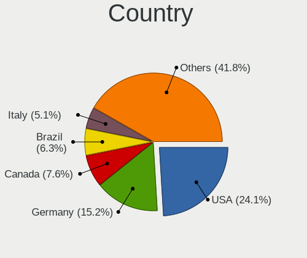
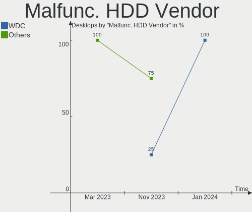
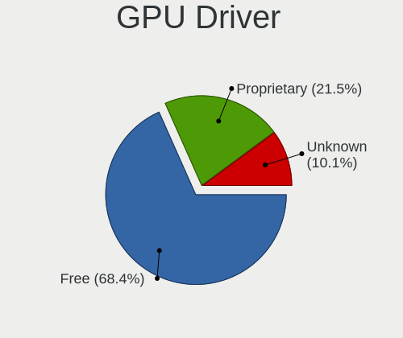
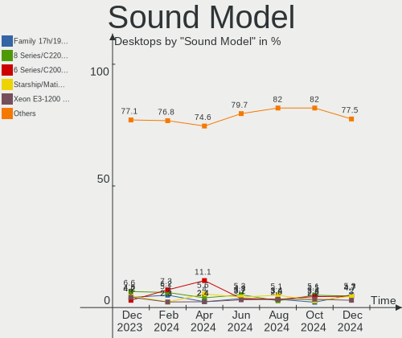

Zorin - Hardware Trends (Desktops)
----------------------------------

A project to identify most popular hardware characteristics and track their change
over time based on data collected by Linux users at https://Linux-Hardware.org.

Anyone can contribute to this report by the [hw-probe](https://github.com/linuxhw/hw-probe) tool:

    sudo -E hw-probe -all -upload

This report is for one last month. Overall report since the beginning of time: [TestCoverage](https://github.com/linuxhw/TestCoverage)

Period: Jul, 2022.

Contents
--------

* [ System ](#system)
  - [ OS                       ](#os)
  - [ OS Family                ](#os-family)
  - [ Kernel                   ](#kernel)
  - [ Kernel Family            ](#kernel-family)
  - [ Kernel Major Ver.        ](#kernel-major-ver)
  - [ Arch                     ](#arch)
  - [ DE                       ](#de)
  - [ Display Server           ](#display-server)
  - [ Display Manager          ](#display-manager)
  - [ OS Lang                  ](#os-lang)
  - [ Boot Mode                ](#boot-mode)
  - [ Filesystem               ](#filesystem)
  - [ Part. scheme             ](#part-scheme)
  - [ Dual Boot with Linux/BSD ](#dual-boot-with-linuxbsd)
  - [ Dual Boot (Win)          ](#dual-boot-win)

* [ Board ](#board)
  - [ Vendor                   ](#vendor)
  - [ Model                    ](#model)
  - [ Model Family             ](#model-family)
  - [ MFG Year                 ](#mfg-year)
  - [ Form Factor              ](#form-factor)
  - [ Secure Boot              ](#secure-boot)
  - [ Coreboot                 ](#coreboot)
  - [ RAM Size                 ](#ram-size)
  - [ RAM Used                 ](#ram-used)
  - [ Total Drives             ](#total-drives)
  - [ Has CD-ROM               ](#has-cd-rom)
  - [ Has Ethernet             ](#has-ethernet)
  - [ Has WiFi                 ](#has-wifi)
  - [ Has Bluetooth            ](#has-bluetooth)

* [ Location ](#location)
  - [ Country                  ](#country)
  - [ City                     ](#city)

* [ Drives ](#drives)
  - [ Drive Vendor             ](#drive-vendor)
  - [ Drive Model              ](#drive-model)
  - [ HDD Vendor               ](#hdd-vendor)
  - [ SSD Vendor               ](#ssd-vendor)
  - [ Drive Kind               ](#drive-kind)
  - [ Drive Connector          ](#drive-connector)
  - [ Drive Size               ](#drive-size)
  - [ Space Total              ](#space-total)
  - [ Space Used               ](#space-used)
  - [ Malfunc. Drives          ](#malfunc-drives)
  - [ Malfunc. Drive Vendor    ](#malfunc-drive-vendor)
  - [ Malfunc. HDD Vendor      ](#malfunc-hdd-vendor)
  - [ Malfunc. Drive Kind      ](#malfunc-drive-kind)
  - [ Failed Drives            ](#failed-drives)
  - [ Failed Drive Vendor      ](#failed-drive-vendor)
  - [ Drive Status             ](#drive-status)

* [ Storage controller ](#storage-controller)
  - [ Storage Vendor           ](#storage-vendor)
  - [ Storage Model            ](#storage-model)
  - [ Storage Kind             ](#storage-kind)

* [ Processor ](#processor)
  - [ CPU Vendor               ](#cpu-vendor)
  - [ CPU Model                ](#cpu-model)
  - [ CPU Model Family         ](#cpu-model-family)
  - [ CPU Cores                ](#cpu-cores)
  - [ CPU Sockets              ](#cpu-sockets)
  - [ CPU Threads              ](#cpu-threads)
  - [ CPU Op-Modes             ](#cpu-op-modes)
  - [ CPU Microcode            ](#cpu-microcode)
  - [ CPU Microarch            ](#cpu-microarch)

* [ Graphics ](#graphics)
  - [ GPU Vendor               ](#gpu-vendor)
  - [ GPU Model                ](#gpu-model)
  - [ GPU Combo                ](#gpu-combo)
  - [ GPU Driver               ](#gpu-driver)
  - [ GPU Memory               ](#gpu-memory)

* [ Monitor ](#monitor)
  - [ Monitor Vendor           ](#monitor-vendor)
  - [ Monitor Model            ](#monitor-model)
  - [ Monitor Resolution       ](#monitor-resolution)
  - [ Monitor Diagonal         ](#monitor-diagonal)
  - [ Monitor Width            ](#monitor-width)
  - [ Aspect Ratio             ](#aspect-ratio)
  - [ Monitor Area             ](#monitor-area)
  - [ Pixel Density            ](#pixel-density)
  - [ Multiple Monitors        ](#multiple-monitors)

* [ Network ](#network)
  - [ Net Controller Vendor    ](#net-controller-vendor)
  - [ Net Controller Model     ](#net-controller-model)
  - [ Wireless Vendor          ](#wireless-vendor)
  - [ Wireless Model           ](#wireless-model)
  - [ Ethernet Vendor          ](#ethernet-vendor)
  - [ Ethernet Model           ](#ethernet-model)
  - [ Net Controller Kind      ](#net-controller-kind)
  - [ Used Controller          ](#used-controller)
  - [ NICs                     ](#nics)
  - [ IPv6                     ](#ipv6)

* [ Bluetooth ](#bluetooth)
  - [ Bluetooth Vendor         ](#bluetooth-vendor)
  - [ Bluetooth Model          ](#bluetooth-model)

* [ Sound ](#sound)
  - [ Sound Vendor             ](#sound-vendor)
  - [ Sound Model              ](#sound-model)

* [ Memory ](#memory)
  - [ Memory Vendor            ](#memory-vendor)
  - [ Memory Model             ](#memory-model)
  - [ Memory Kind              ](#memory-kind)
  - [ Memory Form Factor       ](#memory-form-factor)
  - [ Memory Size              ](#memory-size)
  - [ Memory Speed             ](#memory-speed)

* [ Printers & scanners ](#printers--scanners)
  - [ Printer Vendor           ](#printer-vendor)
  - [ Printer Model            ](#printer-model)
  - [ Scanner Vendor           ](#scanner-vendor)
  - [ Scanner Model            ](#scanner-model)

* [ Camera ](#camera)
  - [ Camera Vendor            ](#camera-vendor)
  - [ Camera Model             ](#camera-model)

* [ Security ](#security)
  - [ Fingerprint Vendor       ](#fingerprint-vendor)
  - [ Fingerprint Model        ](#fingerprint-model)
  - [ Chipcard Vendor          ](#chipcard-vendor)
  - [ Chipcard Model           ](#chipcard-model)

* [ Unsupported ](#unsupported)
  - [ Unsupported Devices      ](#unsupported-devices)
  - [ Unsupported Device Types ](#unsupported-device-types)

System
------

OS
--

Installed operating systems

| Name     | Desktops | Percent |
|----------|----------|---------|
| Zorin 16 | 53       | 94.64%  |
| Zorin 15 | 3        | 5.36%   |

OS Family
---------

OS without a version

| Name  | Desktops | Percent |
|-------|----------|---------|
| Zorin | 56       | 100%    |

Kernel
------

Version of the Linux kernel

| Version           | Desktops | Percent |
|-------------------|----------|---------|
| 5.15.0-41-generic | 25       | 44.64%  |
| 5.13.0-52-generic | 22       | 39.29%  |
| 5.13.0-51-generic | 3        | 5.36%   |
| 5.4.0-121-generic | 2        | 3.57%   |
| 5.4.0-110-generic | 1        | 1.79%   |
| 5.13.0-41-generic | 1        | 1.79%   |
| 5.13.0-35-generic | 1        | 1.79%   |
| 5.13.0-30-generic | 1        | 1.79%   |

Kernel Family
-------------

Linux kernel without a distro release

| Version | Desktops | Percent |
|---------|----------|---------|
| 5.13.0  | 28       | 50%     |
| 5.15.0  | 25       | 44.64%  |
| 5.4.0   | 3        | 5.36%   |

Kernel Major Ver.
-----------------

Linux kernel major version

| Version | Desktops | Percent |
|---------|----------|---------|
| 5.13    | 28       | 50%     |
| 5.15    | 25       | 44.64%  |
| 5.4     | 3        | 5.36%   |

Arch
----

OS architecture (x86_64, i586, etc.)

| Name   | Desktops | Percent |
|--------|----------|---------|
| x86_64 | 55       | 98.21%  |
| i686   | 1        | 1.79%   |

DE
--

Desktop Environment

| Name  | Desktops | Percent |
|-------|----------|---------|
| GNOME | 48       | 85.71%  |
| XFCE  | 8        | 14.29%  |

Display Server
--------------

X11 or Wayland

| Name    | Desktops | Percent |
|---------|----------|---------|
| X11     | 55       | 98.21%  |
| Wayland | 1        | 1.79%   |

Display Manager
---------------

SDDM, LightDM, etc.

| Name    | Desktops | Percent |
|---------|----------|---------|
| Unknown | 44       | 78.57%  |
| GDM3    | 7        | 12.5%   |
| GDM     | 4        | 7.14%   |
| LightDM | 1        | 1.79%   |

OS Lang
-------

Language

| Lang  | Desktops | Percent |
|-------|----------|---------|
| en_US | 18       | 32.14%  |
| en_GB | 7        | 12.5%   |
| de_DE | 5        | 8.93%   |
| en_AU | 3        | 5.36%   |
| pt_BR | 2        | 3.57%   |
| it_IT | 2        | 3.57%   |
| hu_HU | 2        | 3.57%   |
| fr_FR | 2        | 3.57%   |
| es_MX | 2        | 3.57%   |
| tr_TR | 1        | 1.79%   |
| nl_BE | 1        | 1.79%   |
| nb_NO | 1        | 1.79%   |
| fr_CA | 1        | 1.79%   |
| es_VE | 1        | 1.79%   |
| es_ES | 1        | 1.79%   |
| es_AR | 1        | 1.79%   |
| en_ZA | 1        | 1.79%   |
| en_NZ | 1        | 1.79%   |
| en_IN | 1        | 1.79%   |
| da_DK | 1        | 1.79%   |
| cs_CZ | 1        | 1.79%   |
| bg_BG | 1        | 1.79%   |

Boot Mode
---------

EFI or BIOS

| Mode | Desktops | Percent |
|------|----------|---------|
| BIOS | 36       | 64.29%  |
| EFI  | 20       | 35.71%  |

Filesystem
----------

Type of filesystem

| Type | Desktops | Percent |
|------|----------|---------|
| Ext4 | 55       | 98.21%  |
| Xfs  | 1        | 1.79%   |

Part. scheme
------------

Scheme of partitioning

| Type    | Desktops | Percent |
|---------|----------|---------|
| Unknown | 52       | 92.86%  |
| MBR     | 2        | 3.57%   |
| GPT     | 2        | 3.57%   |

Dual Boot with Linux/BSD
------------------------

Hosting more than one Linux/BSD

| Dual boot | Desktops | Percent |
|-----------|----------|---------|
| No        | 54       | 96.43%  |
| Yes       | 2        | 3.57%   |

Dual Boot (Win)
---------------

Hosting Linux and Windows

| Dual boot | Desktops | Percent |
|-----------|----------|---------|
| No        | 53       | 94.64%  |
| Yes       | 3        | 5.36%   |

Board
-----

Vendor
------

Motherboard manufacturer

| Name                | Desktops | Percent |
|---------------------|----------|---------|
| Gigabyte Technology | 16       | 28.57%  |
| ASUSTek Computer    | 9        | 16.07%  |
| Dell                | 6        | 10.71%  |
| Hewlett-Packard     | 4        | 7.14%   |
| MSI                 | 3        | 5.36%   |
| Lenovo              | 3        | 5.36%   |
| Fujitsu             | 2        | 3.57%   |
| Foxconn             | 2        | 3.57%   |
| System76            | 1        | 1.79%   |
| Supermicro          | 1        | 1.79%   |
| Pegatron            | 1        | 1.79%   |
| Packard Bell        | 1        | 1.79%   |
| OEM_MB              | 1        | 1.79%   |
| OEM                 | 1        | 1.79%   |
| Intel               | 1        | 1.79%   |
| Biostar             | 1        | 1.79%   |
| ASRock              | 1        | 1.79%   |
| Acer                | 1        | 1.79%   |
| Unknown             | 1        | 1.79%   |

Model
-----

Motherboard model

| Name                              | Desktops | Percent |
|-----------------------------------|----------|---------|
| Dell OptiPlex 780                 | 2        | 3.57%   |
| System76 Thelio                   | 1        | 1.79%   |
| Supermicro Mediasite Recorder     | 1        | 1.79%   |
| Pegatron NE502AV-ABA a6750t       | 1        | 1.79%   |
| Packard Bell IXTREME M5741        | 1        | 1.79%   |
| OEM_MB KQ496AAR-ABA a6530f        | 1        | 1.79%   |
| OEM G41 775 ICH7 8712             | 1        | 1.79%   |
| MSI MS-7917                       | 1        | 1.79%   |
| MSI MS-7798                       | 1        | 1.79%   |
| MSI FJ452AA-AC4 a6615br           | 1        | 1.79%   |
| Lenovo ThinkCentre M91 7516AD1    | 1        | 1.79%   |
| Lenovo ThinkCentre M73 10B00005US | 1        | 1.79%   |
| Lenovo H30-05 90BJ00CNMT          | 1        | 1.79%   |
| Intel X79 V2.72B                  | 1        | 1.79%   |
| HP Pavilion Desktop PC 570-p0xx   | 1        | 1.79%   |
| HP EliteDesk 800 G1 TWR           | 1        | 1.79%   |
| HP Compaq Elite 8300 USDT         | 1        | 1.79%   |
| HP 290 G1 MT                      | 1        | 1.79%   |
| Gigabyte Z97X-UD3H                | 1        | 1.79%   |
| Gigabyte Z97X-SLI                 | 1        | 1.79%   |
| Gigabyte Z77-D3H                  | 1        | 1.79%   |
| Gigabyte Z390 AORUS PRO WIFI      | 1        | 1.79%   |
| Gigabyte Z270X-Ultra Gaming       | 1        | 1.79%   |
| Gigabyte X570S AORUS PRO AX       | 1        | 1.79%   |
| Gigabyte M68M-S2P                 | 1        | 1.79%   |
| Gigabyte H87M-D3H                 | 1        | 1.79%   |
| Gigabyte H77N-WIFI                | 1        | 1.79%   |
| Gigabyte H110M-A                  | 1        | 1.79%   |
| Gigabyte GA-78LMT-S2P             | 1        | 1.79%   |
| Gigabyte G1.Sniper Z97            | 1        | 1.79%   |
| Gigabyte EP45-UD3P                | 1        | 1.79%   |
| Gigabyte EP45-DS3                 | 1        | 1.79%   |
| Gigabyte B450 AORUS M             | 1        | 1.79%   |
| Gigabyte B150N Phoenix-WIFI       | 1        | 1.79%   |
| Fujitsu ESPRIMO P5635             | 1        | 1.79%   |
| Fujitsu ESPRIMO E910              | 1        | 1.79%   |
| Foxconn SG3-210DE                 | 1        | 1.79%   |
| Foxconn p7-1054                   | 1        | 1.79%   |
| Dell Precision WorkStation T3500  | 1        | 1.79%   |
| Dell OptiPlex 790                 | 1        | 1.79%   |
| Dell OptiPlex 5050                | 1        | 1.79%   |
| Dell OptiPlex 360                 | 1        | 1.79%   |
| Biostar P4M90-M7A                 | 1        | 1.79%   |
| ASUS V-P8H61E                     | 1        | 1.79%   |
| ASUS TUF Gaming B550-PLUS         | 1        | 1.79%   |
| ASUS PRIME Z690-P D4              | 1        | 1.79%   |
| ASUS PRIME B450M-GAMING/BR        | 1        | 1.79%   |
| ASUS PRIME A520M-K                | 1        | 1.79%   |
| ASUS M3A78-EM                     | 1        | 1.79%   |
| ASUS K30AD_M31AD_M51AD            | 1        | 1.79%   |
| ASUS CROSSHAIR II FORMULA         | 1        | 1.79%   |
| ASUS A88X-PRO                     | 1        | 1.79%   |
| ASRock Z170 Pro4                  | 1        | 1.79%   |
| Acer Power FV                     | 1        | 1.79%   |
| Unknown                           | 1        | 1.79%   |

Model Family
------------

Motherboard model prefix

| Name                  | Desktops | Percent |
|-----------------------|----------|---------|
| Dell OptiPlex         | 5        | 8.93%   |
| ASUS PRIME            | 3        | 5.36%   |
| Lenovo ThinkCentre    | 2        | 3.57%   |
| Fujitsu ESPRIMO       | 2        | 3.57%   |
| System76 Thelio       | 1        | 1.79%   |
| Supermicro Mediasite  | 1        | 1.79%   |
| Pegatron NE502AV-ABA  | 1        | 1.79%   |
| Packard Bell IXTREME  | 1        | 1.79%   |
| OEM_MB KQ496AAR-ABA   | 1        | 1.79%   |
| OEM G41               | 1        | 1.79%   |
| MSI MS-7917           | 1        | 1.79%   |
| MSI MS-7798           | 1        | 1.79%   |
| MSI FJ452AA-AC4       | 1        | 1.79%   |
| Lenovo H30-05         | 1        | 1.79%   |
| Intel X79             | 1        | 1.79%   |
| HP Pavilion           | 1        | 1.79%   |
| HP EliteDesk          | 1        | 1.79%   |
| HP Compaq             | 1        | 1.79%   |
| HP 290                | 1        | 1.79%   |
| Gigabyte Z97X-UD3H    | 1        | 1.79%   |
| Gigabyte Z97X-SLI     | 1        | 1.79%   |
| Gigabyte Z77-D3H      | 1        | 1.79%   |
| Gigabyte Z390         | 1        | 1.79%   |
| Gigabyte Z270X-Ultra  | 1        | 1.79%   |
| Gigabyte X570S        | 1        | 1.79%   |
| Gigabyte M68M-S2P     | 1        | 1.79%   |
| Gigabyte H87M-D3H     | 1        | 1.79%   |
| Gigabyte H77N-WIFI    | 1        | 1.79%   |
| Gigabyte H110M-A      | 1        | 1.79%   |
| Gigabyte GA-78LMT-S2P | 1        | 1.79%   |
| Gigabyte G1.Sniper    | 1        | 1.79%   |
| Gigabyte EP45-UD3P    | 1        | 1.79%   |
| Gigabyte EP45-DS3     | 1        | 1.79%   |
| Gigabyte B450         | 1        | 1.79%   |
| Gigabyte B150N        | 1        | 1.79%   |
| Foxconn SG3-210DE     | 1        | 1.79%   |
| Foxconn p7-1054       | 1        | 1.79%   |
| Dell Precision        | 1        | 1.79%   |
| Biostar P4M90-M7A     | 1        | 1.79%   |
| ASUS V-P8H61E         | 1        | 1.79%   |
| ASUS TUF              | 1        | 1.79%   |
| ASUS M3A78-EM         | 1        | 1.79%   |
| ASUS K30AD            | 1        | 1.79%   |
| ASUS CROSSHAIR        | 1        | 1.79%   |
| ASUS A88X-PRO         | 1        | 1.79%   |
| ASRock Z170           | 1        | 1.79%   |
| Acer Power            | 1        | 1.79%   |
| Unknown               | 1        | 1.79%   |

MFG Year
--------

Motherboard manufacture year

| Year | Desktops | Percent |
|------|----------|---------|
| 2020 | 6        | 10.71%  |
| 2010 | 6        | 10.71%  |
| 2008 | 6        | 10.71%  |
| 2018 | 5        | 8.93%   |
| 2014 | 5        | 8.93%   |
| 2012 | 5        | 8.93%   |
| 2011 | 5        | 8.93%   |
| 2016 | 4        | 7.14%   |
| 2013 | 3        | 5.36%   |
| 2009 | 3        | 5.36%   |
| 2021 | 2        | 3.57%   |
| 2015 | 2        | 3.57%   |
| 2019 | 1        | 1.79%   |
| 2017 | 1        | 1.79%   |
| 2007 | 1        | 1.79%   |
| 2005 | 1        | 1.79%   |

Form Factor
-----------

Physical design of the computer

| Name    | Desktops | Percent |
|---------|----------|---------|
| Desktop | 56       | 100%    |

Secure Boot
-----------

Enabled or disabled

| State    | Desktops | Percent |
|----------|----------|---------|
| Disabled | 55       | 98.21%  |
| Enabled  | 1        | 1.79%   |

Coreboot
--------

Have coreboot on board

| Used | Desktops | Percent |
|------|----------|---------|
| No   | 56       | 100%    |

RAM Size
--------

Total RAM memory

| Size in GB | Desktops | Percent |
|------------|----------|---------|
| 16.01-24.0 | 18       | 32.14%  |
| 8.01-16.0  | 12       | 21.43%  |
| 3.01-4.0   | 10       | 17.86%  |
| 4.01-8.0   | 7        | 12.5%   |
| 32.01-64.0 | 5        | 8.93%   |
| 1.01-2.0   | 3        | 5.36%   |
| 2.01-3.0   | 1        | 1.79%   |

RAM Used
--------

Used RAM memory

| Used GB   | Desktops | Percent |
|-----------|----------|---------|
| 1.01-2.0  | 24       | 42.86%  |
| 2.01-3.0  | 13       | 23.21%  |
| 4.01-8.0  | 8        | 14.29%  |
| 3.01-4.0  | 6        | 10.71%  |
| 0.51-1.0  | 3        | 5.36%   |
| 8.01-16.0 | 1        | 1.79%   |
| 0.01-0.5  | 1        | 1.79%   |

Total Drives
------------

Number of drives on board

| Drives | Desktops | Percent |
|--------|----------|---------|
| 1      | 27       | 48.21%  |
| 2      | 14       | 25%     |
| 3      | 7        | 12.5%   |
| 4      | 6        | 10.71%  |
| 6      | 1        | 1.79%   |
| 5      | 1        | 1.79%   |

Has CD-ROM
----------

Has CD-ROM on board

| Presented | Desktops | Percent |
|-----------|----------|---------|
| Yes       | 37       | 66.07%  |
| No        | 19       | 33.93%  |

Has Ethernet
------------

Has Ethernet on board

| Presented | Desktops | Percent |
|-----------|----------|---------|
| Yes       | 55       | 98.21%  |
| No        | 1        | 1.79%   |

Has WiFi
--------

Has WiFi module

| Presented | Desktops | Percent |
|-----------|----------|---------|
| No        | 31       | 55.36%  |
| Yes       | 25       | 44.64%  |

Has Bluetooth
-------------

Has Bluetooth module

| Presented | Desktops | Percent |
|-----------|----------|---------|
| No        | 43       | 76.79%  |
| Yes       | 13       | 23.21%  |

Location
--------

Country
-------

Geographic location (country)

| Country      | Desktops | Percent |
|--------------|----------|---------|
| USA          | 12       | 21.43%  |
| UK           | 7        | 12.5%   |
| Germany      | 5        | 8.93%   |
| Brazil       | 3        | 5.36%   |
| Australia    | 3        | 5.36%   |
| Norway       | 2        | 3.57%   |
| Mexico       | 2        | 3.57%   |
| Italy        | 2        | 3.57%   |
| Hungary      | 2        | 3.57%   |
| France       | 2        | 3.57%   |
| Denmark      | 2        | 3.57%   |
| Argentina    | 2        | 3.57%   |
| Venezuela    | 1        | 1.79%   |
| Turkey       | 1        | 1.79%   |
| Spain        | 1        | 1.79%   |
| South Africa | 1        | 1.79%   |
| Poland       | 1        | 1.79%   |
| New Zealand  | 1        | 1.79%   |
| India        | 1        | 1.79%   |
| Finland      | 1        | 1.79%   |
| Czechia      | 1        | 1.79%   |
| Canada       | 1        | 1.79%   |
| Bulgaria     | 1        | 1.79%   |
| Belgium      | 1        | 1.79%   |

City
----

Geographic location (city)

| City                 | Desktops | Percent |
|----------------------|----------|---------|
| Milwaukee            | 2        | 3.57%   |
| Copenhagen           | 2        | 3.57%   |
| Bathgate             | 2        | 3.57%   |
| Wuppertal            | 1        | 1.79%   |
| Westmoreland         | 1        | 1.79%   |
| Vesilahti            | 1        | 1.79%   |
| Varna                | 1        | 1.79%   |
| Vanse                | 1        | 1.79%   |
| Valencia             | 1        | 1.79%   |
| The Bronx            | 1        | 1.79%   |
| Springfield          | 1        | 1.79%   |
| Shippensburg         | 1        | 1.79%   |
| Riscle               | 1        | 1.79%   |
| Reggio Emilia        | 1        | 1.79%   |
| Quilmes              | 1        | 1.79%   |
| Pune                 | 1        | 1.79%   |
| Pocao                | 1        | 1.79%   |
| Perth                | 1        | 1.79%   |
| Pelotas              | 1        | 1.79%   |
| Parma                | 1        | 1.79%   |
| Oscoda               | 1        | 1.79%   |
| Orlando              | 1        | 1.79%   |
| Niederndodeleben     | 1        | 1.79%   |
| Neuburg an der Donau | 1        | 1.79%   |
| Middleburg           | 1        | 1.79%   |
| Mexico City          | 1        | 1.79%   |
| Mazatlán            | 1        | 1.79%   |
| Matraverebely        | 1        | 1.79%   |
| Malatya              | 1        | 1.79%   |
| Málaga              | 1        | 1.79%   |
| Lyon                 | 1        | 1.79%   |
| Liverpool            | 1        | 1.79%   |
| Krakow               | 1        | 1.79%   |
| Kirkcaldy            | 1        | 1.79%   |
| Kecskemét           | 1        | 1.79%   |
| Kansas City          | 1        | 1.79%   |
| Johannesburg         | 1        | 1.79%   |
| Hudson               | 1        | 1.79%   |
| Hamilton             | 1        | 1.79%   |
| Grand Falls          | 1        | 1.79%   |
| Gillingham           | 1        | 1.79%   |
| Fresno               | 1        | 1.79%   |
| Frankfurt am Main    | 1        | 1.79%   |
| Forest               | 1        | 1.79%   |
| Caslav               | 1        | 1.79%   |
| Cairns               | 1        | 1.79%   |
| Burgkunstadt         | 1        | 1.79%   |
| Buenos Aires         | 1        | 1.79%   |
| Blacktown            | 1        | 1.79%   |
| Beverley             | 1        | 1.79%   |
| Bermondsey           | 1        | 1.79%   |
| Belford Roxo         | 1        | 1.79%   |
| Arendal              | 1        | 1.79%   |

Drives
------

Drive Vendor
------------

Hard drive vendors

| Vendor                    | Desktops | Drives | Percent |
|---------------------------|----------|--------|---------|
| WDC                       | 20       | 20     | 20%     |
| Seagate                   | 20       | 27     | 20%     |
| Samsung Electronics       | 12       | 14     | 12%     |
| Toshiba                   | 7        | 7      | 7%      |
| Kingston                  | 7        | 7      | 7%      |
| Crucial                   | 5        | 5      | 5%      |
| SanDisk                   | 3        | 4      | 3%      |
| Hitachi                   | 3        | 4      | 3%      |
| Unknown                   | 2        | 2      | 2%      |
| SK hynix                  | 2        | 2      | 2%      |
| PNY                       | 2        | 2      | 2%      |
| Leven                     | 2        | 2      | 2%      |
| Intenso                   | 2        | 2      | 2%      |
| Team                      | 1        | 1      | 1%      |
| SPCC                      | 1        | 1      | 1%      |
| Netac                     | 1        | 2      | 1%      |
| Micron/Crucial Technology | 1        | 1      | 1%      |
| LDLC                      | 1        | 1      | 1%      |
| Intel                     | 1        | 1      | 1%      |
| HUAWEI                    | 1        | 1      | 1%      |
| HGST                      | 1        | 1      | 1%      |
| Hewlett-Packard           | 1        | 1      | 1%      |
| GOODRAM                   | 1        | 1      | 1%      |
| China                     | 1        | 1      | 1%      |
| ADATA Technology          | 1        | 1      | 1%      |
| A-DATA Technology         | 1        | 1      | 1%      |

Drive Model
-----------

Hard drive models

| Model                              | Desktops | Percent |
|------------------------------------|----------|---------|
| Crucial CT240BX500SSD1 240GB       | 4        | 3.7%    |
| Seagate ST500DM002-1BD142 500GB    | 3        | 2.78%   |
| Toshiba DT01ACA100 1TB             | 2        | 1.85%   |
| SanDisk NVMe SSD Drive 500GB       | 2        | 1.85%   |
| Samsung SSD 850 EVO 250GB          | 2        | 1.85%   |
| Samsung SP0612N 64GB               | 2        | 1.85%   |
| Samsung HD161GJ 160GB              | 2        | 1.85%   |
| Kingston SA400S37240G 240GB SSD    | 2        | 1.85%   |
| WDC WD800BD-22LRA0 80GB            | 1        | 0.93%   |
| WDC WD5001ABYS-01YNA0 500GB        | 1        | 0.93%   |
| WDC WD5000BPKT-75PK4T0 500GB       | 1        | 0.93%   |
| WDC WD5000AZLX-60K2TA0 500GB       | 1        | 0.93%   |
| WDC WD5000AAKX-08U6AA0 500GB       | 1        | 0.93%   |
| WDC WD5000AAKX-001CA0 500GB        | 1        | 0.93%   |
| WDC WD5000AAKS-00UU3A0 500GB       | 1        | 0.93%   |
| WDC WD5000AADS-56S9B1 500GB        | 1        | 0.93%   |
| WDC WD3200JS-00PDB0 320GB          | 1        | 0.93%   |
| WDC WD3200AVVS-63L2B0 320GB        | 1        | 0.93%   |
| WDC WD30EZRZ-22Z5HB0 3TB           | 1        | 0.93%   |
| WDC WD2500AVVS-62L2B0 250GB        | 1        | 0.93%   |
| WDC WD20EZRZ-60Z5HB0 2TB           | 1        | 0.93%   |
| WDC WD20EZAZ-00L9GB0 2TB           | 1        | 0.93%   |
| WDC WD20EARX-00PASB0 2TB           | 1        | 0.93%   |
| WDC WD1600AAJS-00L7A0 160GB        | 1        | 0.93%   |
| WDC WD10EZRX-00A3KB0 1TB           | 1        | 0.93%   |
| WDC WD10EZEX-00BN5A0 1TB           | 1        | 0.93%   |
| WDC WD10EFRX-68JCSN0 1TB           | 1        | 0.93%   |
| WDC WD10EADS-00M2B0 1TB            | 1        | 0.93%   |
| Unknown SD/MMC/MS PRO 64GB         | 1        | 0.93%   |
| Unknown NCard  16GB                | 1        | 0.93%   |
| Toshiba NVMe SSD Drive 500GB       | 1        | 0.93%   |
| Toshiba MQ01ABD100M 1TB            | 1        | 0.93%   |
| Toshiba MQ01ABD100 1TB             | 1        | 0.93%   |
| Toshiba MK8046GSX 80GB             | 1        | 0.93%   |
| Toshiba DT01ACA200 2TB             | 1        | 0.93%   |
| Team T253X2256G 256GB SSD          | 1        | 0.93%   |
| SPCC M.2 SSD 1024GB                | 1        | 0.93%   |
| SK hynix NVMe SSD Drive 512GB      | 1        | 0.93%   |
| SK hynix C2S3T/120G 120GB          | 1        | 0.93%   |
| Seagate ST9500420AS 500GB          | 1        | 0.93%   |
| Seagate ST9500325AS 500GB          | 1        | 0.93%   |
| Seagate ST500LT012-1DG142 500GB    | 1        | 0.93%   |
| Seagate ST500DM002-1SB10A 500GB    | 1        | 0.93%   |
| Seagate ST4000DM000-2AE166 4TB     | 1        | 0.93%   |
| Seagate ST380811AS 80GB            | 1        | 0.93%   |
| Seagate ST3250824AS 250GB          | 1        | 0.93%   |
| Seagate ST3250823A 250GB           | 1        | 0.93%   |
| Seagate ST3250310AS 250GB          | 1        | 0.93%   |
| Seagate ST320LT012-1DG14C 320GB    | 1        | 0.93%   |
| Seagate ST31000528AS 1TB           | 1        | 0.93%   |
| Seagate ST31000524AS 1TB           | 1        | 0.93%   |
| Seagate ST31000333AS 1TB           | 1        | 0.93%   |
| Seagate ST2000DX001-1CM164 2TB     | 1        | 0.93%   |
| Seagate ST2000DM008-2FR102 2TB     | 1        | 0.93%   |
| Seagate ST2000DM001-1ER164 2TB     | 1        | 0.93%   |
| Seagate ST2000DM001-1CH164 2TB     | 1        | 0.93%   |
| Seagate ST1000LM024 HN-M101MBB 1TB | 1        | 0.93%   |
| Seagate ST1000LM014-1EJ164 1TB     | 1        | 0.93%   |
| Seagate ST1000DM003-1SB102 1TB     | 1        | 0.93%   |
| Seagate NVMe SSD Drive 500GB       | 1        | 0.93%   |

HDD Vendor
----------

Hard disk drive vendors

| Vendor              | Desktops | Drives | Percent |
|---------------------|----------|--------|---------|
| WDC                 | 20       | 20     | 35.09%  |
| Seagate             | 20       | 26     | 35.09%  |
| Toshiba             | 6        | 6      | 10.53%  |
| Samsung Electronics | 6        | 6      | 10.53%  |
| Hitachi             | 3        | 4      | 5.26%   |
| Unknown             | 1        | 1      | 1.75%   |
| HGST                | 1        | 1      | 1.75%   |

SSD Vendor
----------

Solid state drive vendors

| Vendor              | Desktops | Drives | Percent |
|---------------------|----------|--------|---------|
| Samsung Electronics | 6        | 7      | 18.75%  |
| Kingston            | 6        | 6      | 18.75%  |
| Crucial             | 5        | 5      | 15.63%  |
| PNY                 | 2        | 2      | 6.25%   |
| Leven               | 2        | 2      | 6.25%   |
| Team                | 1        | 1      | 3.13%   |
| SPCC                | 1        | 1      | 3.13%   |
| SK hynix            | 1        | 1      | 3.13%   |
| SanDisk             | 1        | 1      | 3.13%   |
| Netac               | 1        | 2      | 3.13%   |
| LDLC                | 1        | 1      | 3.13%   |
| Intenso             | 1        | 1      | 3.13%   |
| Intel               | 1        | 1      | 3.13%   |
| Hewlett-Packard     | 1        | 1      | 3.13%   |
| China               | 1        | 1      | 3.13%   |
| A-DATA Technology   | 1        | 1      | 3.13%   |

Drive Kind
----------

HDD or SSD

| Kind    | Desktops | Drives | Percent |
|---------|----------|--------|---------|
| HDD     | 42       | 64     | 51.85%  |
| SSD     | 27       | 34     | 33.33%  |
| NVMe    | 9        | 11     | 11.11%  |
| Unknown | 2        | 2      | 2.47%   |
| MMC     | 1        | 1      | 1.23%   |

Drive Connector
---------------

SATA, SAS, NVMe, etc.

| Type | Desktops | Drives | Percent |
|------|----------|--------|---------|
| SATA | 54       | 97     | 80.6%   |
| NVMe | 9        | 11     | 13.43%  |
| SAS  | 3        | 3      | 4.48%   |
| MMC  | 1        | 1      | 1.49%   |

Drive Size
----------

Size of hard drive

| Size in TB | Desktops | Drives | Percent |
|------------|----------|--------|---------|
| 0.01-0.5   | 48       | 64     | 64.86%  |
| 0.51-1.0   | 14       | 19     | 18.92%  |
| 1.01-2.0   | 9        | 12     | 12.16%  |
| 2.01-3.0   | 2        | 2      | 2.7%    |
| 3.01-4.0   | 1        | 1      | 1.35%   |

Space Total
-----------

Amount of disk space available on the file system

| Size in GB     | Desktops | Percent |
|----------------|----------|---------|
| 101-250        | 22       | 39.29%  |
| 251-500        | 8        | 14.29%  |
| 501-1000       | 8        | 14.29%  |
| 51-100         | 6        | 10.71%  |
| More than 3000 | 5        | 8.93%   |
| 1001-2000      | 4        | 7.14%   |
| 2001-3000      | 2        | 3.57%   |
| 21-50          | 1        | 1.79%   |

Space Used
----------

Amount of used disk space

| Used GB        | Desktops | Percent |
|----------------|----------|---------|
| 1-20           | 22       | 39.29%  |
| 21-50          | 14       | 25%     |
| 251-500        | 6        | 10.71%  |
| 101-250        | 5        | 8.93%   |
| 501-1000       | 3        | 5.36%   |
| 51-100         | 3        | 5.36%   |
| More than 3000 | 2        | 3.57%   |
| 2001-3000      | 1        | 1.79%   |

Malfunc. Drives
---------------

Drive models with a malfunction

| Model                           | Desktops | Drives | Percent |
|---------------------------------|----------|--------|---------|
| Toshiba MK8046GSX 80GB          | 1        | 1      | 50%     |
| Seagate ST320LT012-1DG14C 320GB | 1        | 1      | 50%     |

Malfunc. Drive Vendor
---------------------

Vendors of faulty drives

| Vendor  | Desktops | Drives | Percent |
|---------|----------|--------|---------|
| Toshiba | 1        | 1      | 50%     |
| Seagate | 1        | 1      | 50%     |

Malfunc. HDD Vendor
-------------------

Vendors of faulty HDD drives

| Vendor  | Desktops | Drives | Percent |
|---------|----------|--------|---------|
| Toshiba | 1        | 1      | 50%     |
| Seagate | 1        | 1      | 50%     |

Malfunc. Drive Kind
-------------------

Kinds of faulty drives

| Kind | Desktops | Drives | Percent |
|------|----------|--------|---------|
| HDD  | 2        | 2      | 100%    |

Failed Drives
-------------

Failed drive models

Zero info for selected period =(

Failed Drive Vendor
-------------------

Failed drive vendors

Zero info for selected period =(

Drive Status
------------

Number of failed and malfunc. drives

| Status   | Desktops | Drives | Percent |
|----------|----------|--------|---------|
| Detected | 52       | 106    | 92.86%  |
| Malfunc  | 2        | 2      | 3.57%   |
| Works    | 2        | 4      | 3.57%   |

Storage controller
------------------

Storage Vendor
--------------

Storage controller vendors

| Vendor                      | Desktops | Percent |
|-----------------------------|----------|---------|
| Intel                       | 39       | 56.52%  |
| AMD                         | 12       | 17.39%  |
| Nvidia                      | 4        | 5.8%    |
| JMicron Technology          | 3        | 4.35%   |
| SanDisk                     | 2        | 2.9%    |
| VIA Technologies            | 1        | 1.45%   |
| SK hynix                    | 1        | 1.45%   |
| Silicon Motion              | 1        | 1.45%   |
| Seagate Technology          | 1        | 1.45%   |
| Samsung Electronics         | 1        | 1.45%   |
| Micron/Crucial Technology   | 1        | 1.45%   |
| KIOXIA                      | 1        | 1.45%   |
| Kingston Technology Company | 1        | 1.45%   |
| ADATA Technology            | 1        | 1.45%   |

Storage Model
-------------

Storage controller models

| Model                                                                                   | Desktops | Percent |
|-----------------------------------------------------------------------------------------|----------|---------|
| AMD FCH SATA Controller [AHCI mode]                                                     | 6        | 6.9%    |
| Intel 9 Series Chipset Family SATA Controller [AHCI Mode]                               | 4        | 4.6%    |
| Intel 8 Series/C220 Series Chipset Family 6-port SATA Controller 1 [AHCI mode]          | 4        | 4.6%    |
| Intel 7 Series/C210 Series Chipset Family 6-port SATA Controller [AHCI mode]            | 4        | 4.6%    |
| Intel SATA Controller [RAID mode]                                                       | 3        | 3.45%   |
| Intel Q170/Q150/B150/H170/H110/Z170/CM236 Chipset SATA Controller [AHCI Mode]           | 3        | 3.45%   |
| Intel NM10/ICH7 Family SATA Controller [IDE mode]                                       | 3        | 3.45%   |
| Intel 6 Series/C200 Series Chipset Family 6 port Desktop SATA AHCI Controller           | 3        | 3.45%   |
| Intel 200 Series PCH SATA controller [AHCI mode]                                        | 3        | 3.45%   |
| Nvidia MCP78S [GeForce 8200] SATA Controller (non-AHCI mode)                            | 2        | 2.3%    |
| Nvidia MCP61 SATA Controller                                                            | 2        | 2.3%    |
| Nvidia MCP61 IDE                                                                        | 2        | 2.3%    |
| JMicron JMB363 SATA/IDE Controller                                                      | 2        | 2.3%    |
| Intel C600/X79 series chipset 6-Port SATA AHCI Controller                               | 2        | 2.3%    |
| Intel 82801JI (ICH10 Family) 4 port SATA IDE Controller #1                              | 2        | 2.3%    |
| Intel 82801JI (ICH10 Family) 2 port SATA IDE Controller #2                              | 2        | 2.3%    |
| Intel 82801G (ICH7 Family) IDE Controller                                               | 2        | 2.3%    |
| Intel 4 Series Chipset PT IDER Controller                                               | 2        | 2.3%    |
| AMD SB7x0/SB8x0/SB9x0 SATA Controller [IDE mode]                                        | 2        | 2.3%    |
| AMD SB7x0/SB8x0/SB9x0 SATA Controller [AHCI mode]                                       | 2        | 2.3%    |
| AMD SB7x0/SB8x0/SB9x0 IDE Controller                                                    | 2        | 2.3%    |
| AMD 500 Series Chipset SATA Controller                                                  | 2        | 2.3%    |
| AMD 400 Series Chipset SATA Controller                                                  | 2        | 2.3%    |
| VIA VT82C586A/B/VT82C686/A/B/VT823x/A/C PIPC Bus Master IDE                             | 1        | 1.15%   |
| VIA Serial ATA Controller                                                               | 1        | 1.15%   |
| SK hynix PC300 NVMe Solid State Drive 512GB                                             | 1        | 1.15%   |
| Silicon Motion SM2263EN/SM2263XT SSD Controller                                         | 1        | 1.15%   |
| Seagate Non-Volatile memory controller                                                  | 1        | 1.15%   |
| SanDisk WD Blue SN570 NVMe SSD                                                          | 1        | 1.15%   |
| SanDisk Non-Volatile memory controller                                                  | 1        | 1.15%   |
| Samsung NVMe SSD Controller SM951/PM951                                                 | 1        | 1.15%   |
| Nvidia MCP78S [GeForce 8200] IDE                                                        | 1        | 1.15%   |
| Micron/Crucial P2 NVMe PCIe SSD                                                         | 1        | 1.15%   |
| KIOXIA NVMe SSD                                                                         | 1        | 1.15%   |
| Kingston Company A2000 NVMe SSD                                                         | 1        | 1.15%   |
| JMicron JMB368 IDE controller                                                           | 1        | 1.15%   |
| Intel Volume Management Device NVMe RAID Controller                                     | 1        | 1.15%   |
| Intel Cannon Lake PCH SATA AHCI Controller                                              | 1        | 1.15%   |
| Intel Alder Lake-S PCH SATA Controller [AHCI Mode]                                      | 1        | 1.15%   |
| Intel 82801JI (ICH10 Family) SATA AHCI Controller                                       | 1        | 1.15%   |
| Intel 82801IR/IO/IH (ICH9R/DO/DH) 6 port SATA Controller [AHCI mode]                    | 1        | 1.15%   |
| Intel 82801FB/FW (ICH6/ICH6W) SATA Controller                                           | 1        | 1.15%   |
| Intel 7 Series/C210 Series Chipset Family 4-port SATA Controller [IDE mode]             | 1        | 1.15%   |
| Intel 7 Series/C210 Series Chipset Family 2-port SATA Controller [IDE mode]             | 1        | 1.15%   |
| Intel 6 Series/C200 Series Chipset Family IDE-r Controller                              | 1        | 1.15%   |
| Intel 6 Series/C200 Series Chipset Family Desktop SATA Controller (IDE mode, ports 4-5) | 1        | 1.15%   |
| Intel 6 Series/C200 Series Chipset Family Desktop SATA Controller (IDE mode, ports 0-3) | 1        | 1.15%   |
| Intel 5 Series/3400 Series Chipset 6 port SATA AHCI Controller                          | 1        | 1.15%   |
| ADATA A Non-Volatile memory controller                                                  | 1        | 1.15%   |

Storage Kind
------------

Kind of storage controller (IDE, SATA, NVMe, SAS, ...)

| Kind | Desktops | Percent |
|------|----------|---------|
| SATA | 40       | 55.56%  |
| IDE  | 19       | 26.39%  |
| NVMe | 9        | 12.5%   |
| RAID | 4        | 5.56%   |

Processor
---------

CPU Vendor
----------

Processor vendors

| Vendor | Desktops | Percent |
|--------|----------|---------|
| Intel  | 40       | 71.43%  |
| AMD    | 16       | 28.57%  |

CPU Model
---------

Processor models

| Model                                           | Desktops | Percent |
|-------------------------------------------------|----------|---------|
| Intel Core i7-3770 CPU @ 3.40GHz                | 3        | 5.36%   |
| Intel Pentium Dual-Core CPU E5300 @ 2.60GHz     | 2        | 3.57%   |
| Intel Core i7-4790K CPU @ 4.00GHz               | 2        | 3.57%   |
| Intel Core i5-6600 CPU @ 3.30GHz                | 2        | 3.57%   |
| Intel Core 2 Quad CPU Q9550 @ 2.83GHz           | 2        | 3.57%   |
| Intel Core 2 Duo CPU E8400 @ 3.00GHz            | 2        | 3.57%   |
| AMD Ryzen 5 3600 6-Core Processor               | 2        | 3.57%   |
| Intel Xeon CPU W3550 @ 3.07GHz                  | 1        | 1.79%   |
| Intel Xeon CPU E5-2640 0 @ 2.50GHz              | 1        | 1.79%   |
| Intel Xeon CPU E5-2630 v2 @ 2.60GHz             | 1        | 1.79%   |
| Intel Xeon CPU E3-1231 v3 @ 3.40GHz             | 1        | 1.79%   |
| Intel Pentium Dual CPU E2200 @ 2.20GHz          | 1        | 1.79%   |
| Intel Pentium Dual CPU E2160 @ 1.80GHz          | 1        | 1.79%   |
| Intel Pentium CPU G860 @ 3.00GHz                | 1        | 1.79%   |
| Intel Pentium CPU G620 @ 2.60GHz                | 1        | 1.79%   |
| Intel Pentium 4 CPU 3.00GHz                     | 1        | 1.79%   |
| Intel Core i9-9900K CPU @ 3.60GHz               | 1        | 1.79%   |
| Intel Core i7-7700 CPU @ 3.60GHz                | 1        | 1.79%   |
| Intel Core i7-6700K CPU @ 4.00GHz               | 1        | 1.79%   |
| Intel Core i7-4770 CPU @ 3.40GHz                | 1        | 1.79%   |
| Intel Core i5-7400 CPU @ 3.00GHz                | 1        | 1.79%   |
| Intel Core i5-6500 CPU @ 3.20GHz                | 1        | 1.79%   |
| Intel Core i5-4690K CPU @ 3.50GHz               | 1        | 1.79%   |
| Intel Core i5-4670 CPU @ 3.40GHz                | 1        | 1.79%   |
| Intel Core i5-4570 CPU @ 3.20GHz                | 1        | 1.79%   |
| Intel Core i5-3570S CPU @ 3.10GHz               | 1        | 1.79%   |
| Intel Core i5-3570 CPU @ 3.40GHz                | 1        | 1.79%   |
| Intel Core i5-2400 CPU @ 3.10GHz                | 1        | 1.79%   |
| Intel Core i5-2300 CPU @ 2.80GHz                | 1        | 1.79%   |
| Intel Core i5 CPU 750 @ 2.67GHz                 | 1        | 1.79%   |
| Intel Core i3-7100 CPU @ 3.90GHz                | 1        | 1.79%   |
| Intel Core i3-4160 CPU @ 3.60GHz                | 1        | 1.79%   |
| Intel Core 2 Duo CPU E7500 @ 2.93GHz            | 1        | 1.79%   |
| Intel 12th Gen Core i5-12400F                   | 1        | 1.79%   |
| AMD Ryzen 9 5900X 12-Core Processor             | 1        | 1.79%   |
| AMD Ryzen 9 3900 12-Core Processor              | 1        | 1.79%   |
| AMD Ryzen 7 5800X 8-Core Processor              | 1        | 1.79%   |
| AMD Ryzen 3 3200G with Radeon Vega Graphics     | 1        | 1.79%   |
| AMD Phenom II X4 940 Processor                  | 1        | 1.79%   |
| AMD Phenom 8450 Triple-Core Processor           | 1        | 1.79%   |
| AMD FX-8320E Eight-Core Processor               | 1        | 1.79%   |
| AMD Athlon II X4 645 Processor                  | 1        | 1.79%   |
| AMD Athlon II X4 630 Processor                  | 1        | 1.79%   |
| AMD Athlon II X2 250 Processor                  | 1        | 1.79%   |
| AMD Athlon II X2 240 Processor                  | 1        | 1.79%   |
| AMD Athlon 64 X2 Dual Core Processor 4600+      | 1        | 1.79%   |
| AMD A6-7310 APU with AMD Radeon R4 Graphics     | 1        | 1.79%   |
| AMD A10-7850K Radeon R7, 12 Compute Cores 4C+8G | 1        | 1.79%   |

CPU Model Family
----------------

Processor model prefix

| Model                   | Desktops | Percent |
|-------------------------|----------|---------|
| Intel Core i5           | 12       | 21.43%  |
| Intel Core i7           | 8        | 14.29%  |
| Intel Xeon              | 4        | 7.14%   |
| Intel Core 2 Duo        | 3        | 5.36%   |
| Intel Pentium Dual-Core | 2        | 3.57%   |
| Intel Pentium Dual      | 2        | 3.57%   |
| Intel Pentium           | 2        | 3.57%   |
| Intel Core i3           | 2        | 3.57%   |
| Intel Core 2 Quad       | 2        | 3.57%   |
| AMD Ryzen 9             | 2        | 3.57%   |
| AMD Ryzen 5             | 2        | 3.57%   |
| AMD Athlon II X4        | 2        | 3.57%   |
| AMD Athlon II X2        | 2        | 3.57%   |
| Other                   | 1        | 1.79%   |
| Intel Pentium 4         | 1        | 1.79%   |
| Intel Core i9           | 1        | 1.79%   |
| AMD Ryzen 7             | 1        | 1.79%   |
| AMD Ryzen 3             | 1        | 1.79%   |
| AMD Phenom II X4        | 1        | 1.79%   |
| AMD Phenom              | 1        | 1.79%   |
| AMD FX                  | 1        | 1.79%   |
| AMD Athlon 64 X2        | 1        | 1.79%   |
| AMD A6                  | 1        | 1.79%   |
| AMD A10                 | 1        | 1.79%   |

CPU Cores
---------

Number of processor cores

| Number | Desktops | Percent |
|--------|----------|---------|
| 4      | 30       | 53.57%  |
| 2      | 15       | 26.79%  |
| 6      | 5        | 8.93%   |
| 12     | 2        | 3.57%   |
| 8      | 2        | 3.57%   |
| 3      | 1        | 1.79%   |
| 1      | 1        | 1.79%   |

CPU Sockets
-----------

Number of sockets

| Number | Desktops | Percent |
|--------|----------|---------|
| 1      | 56       | 100%    |

CPU Threads
-----------

Threads per core (Hyper-Threading)

| Number | Desktops | Percent |
|--------|----------|---------|
| 1      | 32       | 57.14%  |
| 2      | 24       | 42.86%  |

CPU Op-Modes
------------

CPU Operation Modes (32-bit, 64-bit)

| Op mode        | Desktops | Percent |
|----------------|----------|---------|
| 32-bit, 64-bit | 56       | 100%    |

CPU Microcode
-------------

Microcode number

| Number     | Desktops | Percent |
|------------|----------|---------|
| 0x306c3    | 8        | 14.29%  |
| 0x1067a    | 7        | 12.5%   |
| 0x306a9    | 5        | 8.93%   |
| 0x506e3    | 4        | 7.14%   |
| 0x206a7    | 4        | 7.14%   |
| 0x906e9    | 3        | 5.36%   |
| 0x6fd      | 2        | 3.57%   |
| 0x08701021 | 2        | 3.57%   |
| 0x010000db | 2        | 3.57%   |
| 0x010000c8 | 2        | 3.57%   |
| Unknown    | 2        | 3.57%   |
| 0xf43      | 1        | 1.79%   |
| 0x906ec    | 1        | 1.79%   |
| 0x90672    | 1        | 1.79%   |
| 0x306e4    | 1        | 1.79%   |
| 0x206d7    | 1        | 1.79%   |
| 0x106e5    | 1        | 1.79%   |
| 0x106a5    | 1        | 1.79%   |
| 0x0a201016 | 1        | 1.79%   |
| 0x0a201009 | 1        | 1.79%   |
| 0x08701011 | 1        | 1.79%   |
| 0x08108109 | 1        | 1.79%   |
| 0x07030105 | 1        | 1.79%   |
| 0x06003106 | 1        | 1.79%   |
| 0x06000852 | 1        | 1.79%   |
| 0x01000083 | 1        | 1.79%   |

CPU Microarch
-------------

Microarchitecture

| Name             | Desktops | Percent |
|------------------|----------|---------|
| Haswell          | 8        | 14.29%  |
| Penryn           | 7        | 12.5%   |
| K10              | 6        | 10.71%  |
| IvyBridge        | 6        | 10.71%  |
| SandyBridge      | 5        | 8.93%   |
| Skylake          | 4        | 7.14%   |
| KabyLake         | 4        | 7.14%   |
| Zen 2            | 3        | 5.36%   |
| Zen 3            | 2        | 3.57%   |
| Nehalem          | 2        | 3.57%   |
| Core             | 2        | 3.57%   |
| Zen+             | 1        | 1.79%   |
| Steamroller      | 1        | 1.79%   |
| Puma             | 1        | 1.79%   |
| Piledriver       | 1        | 1.79%   |
| NetBurst         | 1        | 1.79%   |
| K8 Hammer        | 1        | 1.79%   |
| Alderlake Hybrid | 1        | 1.79%   |

Graphics
--------

GPU Vendor
----------

Vendors of graphics cards

| Vendor           | Desktops | Percent |
|------------------|----------|---------|
| Nvidia           | 26       | 44.83%  |
| Intel            | 17       | 29.31%  |
| AMD              | 14       | 24.14%  |
| VIA Technologies | 1        | 1.72%   |

GPU Model
---------

Graphics card models

| Model                                                                       | Desktops | Percent |
|-----------------------------------------------------------------------------|----------|---------|
| Nvidia GK208B [GeForce GT 730]                                              | 3        | 5.17%   |
| Intel Xeon E3-1200 v3/4th Gen Core Processor Integrated Graphics Controller | 3        | 5.17%   |
| Intel 4 Series Chipset Integrated Graphics Controller                       | 3        | 5.17%   |
| AMD Ellesmere [Radeon RX 470/480/570/570X/580/580X/590]                     | 3        | 5.17%   |
| Nvidia GP107 [GeForce GTX 1050 Ti]                                          | 2        | 3.45%   |
| Nvidia GM204 [GeForce GTX 970]                                              | 2        | 3.45%   |
| Nvidia GK208B [GeForce GT 710]                                              | 2        | 3.45%   |
| Intel IvyBridge GT2 [HD Graphics 4000]                                      | 2        | 3.45%   |
| Intel HD Graphics 530                                                       | 2        | 3.45%   |
| Intel 2nd Generation Core Processor Family Integrated Graphics Controller   | 2        | 3.45%   |
| VIA Technologies CN896/VN896/P4M900 [Chrome 9 HC]                           | 1        | 1.72%   |
| Nvidia TU117 [GeForce GTX 1650]                                             | 1        | 1.72%   |
| Nvidia GT215 [GeForce GT 320]                                               | 1        | 1.72%   |
| Nvidia GM204 [GeForce GTX 980]                                              | 1        | 1.72%   |
| Nvidia GM107 [GeForce GTX 750 Ti]                                           | 1        | 1.72%   |
| Nvidia GK110B [GeForce GTX TITAN Black]                                     | 1        | 1.72%   |
| Nvidia GK107 [GeForce GT 740]                                               | 1        | 1.72%   |
| Nvidia GK107 [GeForce GT 640 OEM]                                           | 1        | 1.72%   |
| Nvidia GK106 [GeForce GTX 660]                                              | 1        | 1.72%   |
| Nvidia GK104 [GeForce GTX 680]                                              | 1        | 1.72%   |
| Nvidia GF119 [GeForce GT 610]                                               | 1        | 1.72%   |
| Nvidia GF108GL [Quadro 600]                                                 | 1        | 1.72%   |
| Nvidia GA106 [Geforce RTX 3050]                                             | 1        | 1.72%   |
| Nvidia GA104 [GeForce RTX 3060 Ti Lite Hash Rate]                           | 1        | 1.72%   |
| Nvidia G96C [GeForce 9500 GT]                                               | 1        | 1.72%   |
| Nvidia G94 [GeForce 9600 GT]                                                | 1        | 1.72%   |
| Nvidia G84 [GeForce 8400 GS]                                                | 1        | 1.72%   |
| Nvidia C61 [GeForce 7025 / nForce 630a]                                     | 1        | 1.72%   |
| Intel Xeon E3-1200 v2/3rd Gen Core processor Graphics Controller            | 1        | 1.72%   |
| Intel HD Graphics 630                                                       | 1        | 1.72%   |
| Intel 82G33/G31 Express Integrated Graphics Controller                      | 1        | 1.72%   |
| Intel 82915G/GV/910GL Integrated Graphics Controller                        | 1        | 1.72%   |
| Intel 4th Generation Core Processor Family Integrated Graphics Controller   | 1        | 1.72%   |
| AMD Turks GL [FirePro V3900]                                                | 1        | 1.72%   |
| AMD Tonga PRO [Radeon R9 285/380]                                           | 1        | 1.72%   |
| AMD RV770 [Radeon HD 4870]                                                  | 1        | 1.72%   |
| AMD RS880 [Radeon HD 4200]                                                  | 1        | 1.72%   |
| AMD RS780L [Radeon 3000]                                                    | 1        | 1.72%   |
| AMD RS780 [Radeon HD 3200]                                                  | 1        | 1.72%   |
| AMD Pitcairn PRO [Radeon HD 7850 / R7 265 / R9 270 1024SP]                  | 1        | 1.72%   |
| AMD Mullins [Radeon R4/R5 Graphics]                                         | 1        | 1.72%   |
| AMD Kaveri [Radeon R7 Graphics]                                             | 1        | 1.72%   |
| AMD Caicos XT [Radeon HD 7470/8470 / R5 235/310 OEM]                        | 1        | 1.72%   |
| AMD Bonaire XTX [Radeon R7 260X/360]                                        | 1        | 1.72%   |

GPU Combo
---------

Combinations of graphics cards

| Name       | Desktops | Percent |
|------------|----------|---------|
| 1 x Nvidia | 26       | 46.43%  |
| 1 x Intel  | 15       | 26.79%  |
| 1 x AMD    | 14       | 25%     |
| 1 x VIA    | 1        | 1.79%   |

GPU Driver
----------

Free vs proprietary

| Driver      | Desktops | Percent |
|-------------|----------|---------|
| Free        | 38       | 67.86%  |
| Proprietary | 12       | 21.43%  |
| Unknown     | 6        | 10.71%  |

GPU Memory
----------

Total video memory

| Size in GB | Desktops | Percent |
|------------|----------|---------|
| Unknown    | 25       | 44.64%  |
| 3.01-4.0   | 8        | 14.29%  |
| 1.01-2.0   | 8        | 14.29%  |
| 0.01-0.5   | 6        | 10.71%  |
| 0.51-1.0   | 5        | 8.93%   |
| 7.01-8.0   | 3        | 5.36%   |
| 5.01-6.0   | 1        | 1.79%   |

Monitor
-------

Monitor Vendor
--------------

Monitor vendors

| Vendor               | Desktops | Percent |
|----------------------|----------|---------|
| Samsung Electronics  | 14       | 27.45%  |
| Goldstar             | 7        | 13.73%  |
| Hewlett-Packard      | 5        | 9.8%    |
| Dell                 | 5        | 9.8%    |
| Unknown              | 3        | 5.88%   |
| Sony                 | 2        | 3.92%   |
| NEC Computers        | 2        | 3.92%   |
| AOC                  | 2        | 3.92%   |
| Ancor Communications | 2        | 3.92%   |
| ___                  | 1        | 1.96%   |
| Sceptre Tech         | 1        | 1.96%   |
| PKB                  | 1        | 1.96%   |
| ONN                  | 1        | 1.96%   |
| Lenovo               | 1        | 1.96%   |
| HPN                  | 1        | 1.96%   |
| FUS                  | 1        | 1.96%   |
| Fujitsu Siemens      | 1        | 1.96%   |
| BenQ                 | 1        | 1.96%   |

Monitor Model
-------------

Monitor models

| Model                                                                  | Desktops | Percent |
|------------------------------------------------------------------------|----------|---------|
| NEC Computers LCD1715 NEC6618 1280x1024 338x270mm 17.0-inch            | 2        | 3.85%   |
| Goldstar IPS FULLHD GSM5AB8 1920x1080 480x270mm 21.7-inch              | 2        | 3.85%   |
| ___ LCD TV ___0101 1360x768                                            | 1        | 1.92%   |
| Unknown LCD TV 0101 1920x1080 1600x900mm 72.3-inch                     | 1        | 1.92%   |
| Unknown LCD Monitor XMI Mi Monitor 3440x1440                           | 1        | 1.92%   |
| Unknown LCD Monitor SAMSUNG 3840x2160                                  | 1        | 1.92%   |
| Sony TV SNY8002 1920x1080                                              | 1        | 1.92%   |
| Sony TV SNY2601 1360x768 710x400mm 32.1-inch                           | 1        | 1.92%   |
| Sceptre Tech E32 SPT0CB8 1366x768 575x323mm 26.0-inch                  | 1        | 1.92%   |
| Samsung Electronics SyncMaster SAM05EC 1920x1080 597x336mm 27.0-inch   | 1        | 1.92%   |
| Samsung Electronics SyncMaster SAM0597 1440x900 408x255mm 18.9-inch    | 1        | 1.92%   |
| Samsung Electronics SyncMaster SAM0529 1920x1080 510x287mm 23.0-inch   | 1        | 1.92%   |
| Samsung Electronics SyncMaster SAM011F 1280x1024 376x301mm 19.0-inch   | 1        | 1.92%   |
| Samsung Electronics SMT27A550 SAM07B8 1920x1080 598x336mm 27.0-inch    | 1        | 1.92%   |
| Samsung Electronics SMBX2335 SAM0702 1920x1080 510x287mm 23.0-inch     | 1        | 1.92%   |
| Samsung Electronics SMB1930N SAM0632 1366x768 410x230mm 18.5-inch      | 1        | 1.92%   |
| Samsung Electronics SA300/SA350 SAM0849 1920x1080 477x268mm 21.5-inch  | 1        | 1.92%   |
| Samsung Electronics S24D300 SAM0B43 1920x1080 531x299mm 24.0-inch      | 1        | 1.92%   |
| Samsung Electronics S24B350 SAM08DA 1920x1080 531x299mm 24.0-inch      | 1        | 1.92%   |
| Samsung Electronics LCD Monitor SAM0D4F 1920x1080 1210x680mm 54.6-inch | 1        | 1.92%   |
| Samsung Electronics LCD Monitor SAM0902 1920x1080 890x500mm 40.2-inch  | 1        | 1.92%   |
| Samsung Electronics LCD Monitor SAM0659 1920x1080                      | 1        | 1.92%   |
| Samsung Electronics C27F390 SAM0D32 1920x1080 598x336mm 27.0-inch      | 1        | 1.92%   |
| PKB LCD Monitor Viseo 223Ws 1680x1050                                  | 1        | 1.92%   |
| ONN onn. TV ONN0074 3840x2160 800x450mm 36.1-inch                      | 1        | 1.92%   |
| Lenovo LCD Monitor LEN1144 1920x1200 518x324mm 24.1-inch               | 1        | 1.92%   |
| HPN LCD Monitor HP 27f 1920x1080                                       | 1        | 1.92%   |
| Hewlett-Packard S2031 HWP2903 1600x900 443x249mm 20.0-inch             | 1        | 1.92%   |
| Hewlett-Packard LCD Monitor LA2205 1680x1050                           | 1        | 1.92%   |
| Hewlett-Packard LA2205 HWP2847 1680x1050 470x300mm 22.0-inch           | 1        | 1.92%   |
| Hewlett-Packard E232 HWP327A 1920x1080 509x286mm 23.0-inch             | 1        | 1.92%   |
| Hewlett-Packard 24f HPN3546 1920x1080 527x296mm 23.8-inch              | 1        | 1.92%   |
| Goldstar L1720B GSM4372 1280x1024 338x270mm 17.0-inch                  | 1        | 1.92%   |
| Goldstar IPS FULLHD GSM5AB6 1920x1080 480x270mm 21.7-inch              | 1        | 1.92%   |
| Goldstar HDR WFHD GSM5BBA 2560x1080 798x334mm 34.1-inch                | 1        | 1.92%   |
| Goldstar E2342 GSM58C2 1920x1080 510x290mm 23.1-inch                   | 1        | 1.92%   |
| Goldstar E2250 GSM578E 1920x1080 477x268mm 21.5-inch                   | 1        | 1.92%   |
| Goldstar 20M35 GSM4EEE 1600x900 433x236mm 19.4-inch                    | 1        | 1.92%   |
| FUS LCD Monitor B22W-7 LED 1680x1050                                   | 1        | 1.92%   |
| Fujitsu Siemens E22T-7 LED FUS0839 1920x1080 477x268mm 21.5-inch       | 1        | 1.92%   |
| Dell S2421HS DEL41F4 1920x1080 527x296mm 23.8-inch                     | 1        | 1.92%   |
| Dell S2240M DELD055 1920x1080 476x267mm 21.5-inch                      | 1        | 1.92%   |
| Dell P2421DC DELD0F9 2560x1440 527x296mm 23.8-inch                     | 1        | 1.92%   |
| Dell LCD Monitor U2415 1920x1200                                       | 1        | 1.92%   |
| Dell E207WFP DELD010 1680x1050 430x270mm 20.0-inch                     | 1        | 1.92%   |
| BenQ GL2780 BNQ78EC 1920x1080 598x336mm 27.0-inch                      | 1        | 1.92%   |
| AOC 2250W AOC2250 1920x1080 477x268mm 21.5-inch                        | 1        | 1.92%   |
| AOC 1950w AOC1950 1366x768 410x230mm 18.5-inch                         | 1        | 1.92%   |
| Ancor Communications VE228 ACI22FA 1920x1080 477x268mm 21.5-inch       | 1        | 1.92%   |
| Ancor Communications LCD Monitor VE228 1920x1080                       | 1        | 1.92%   |

Monitor Resolution
------------------

Monitor screen resolution

| Resolution         | Desktops | Percent |
|--------------------|----------|---------|
| 1920x1080 (FHD)    | 27       | 56.25%  |
| 1680x1050 (WSXGA+) | 5        | 10.42%  |
| 1280x1024 (SXGA)   | 4        | 8.33%   |
| 3840x2160 (4K)     | 2        | 4.17%   |
| 1600x900 (HD+)     | 2        | 4.17%   |
| 1366x768 (WXGA)    | 2        | 4.17%   |
| 3440x1440          | 1        | 2.08%   |
| 2560x1440 (QHD)    | 1        | 2.08%   |
| 2560x1080          | 1        | 2.08%   |
| 1920x1200 (WUXGA)  | 1        | 2.08%   |
| 1440x900 (WXGA+)   | 1        | 2.08%   |
| 1360x768           | 1        | 2.08%   |

Monitor Diagonal
----------------

Diagonal size in inches

| Inches  | Desktops | Percent |
|---------|----------|---------|
| 21      | 9        | 17.31%  |
| Unknown | 9        | 17.31%  |
| 23      | 6        | 11.54%  |
| 24      | 5        | 9.62%   |
| 27      | 4        | 7.69%   |
| 18      | 3        | 5.77%   |
| 17      | 3        | 5.77%   |
| 72      | 2        | 3.85%   |
| 54      | 2        | 3.85%   |
| 20      | 2        | 3.85%   |
| 19      | 2        | 3.85%   |
| 36      | 1        | 1.92%   |
| 34      | 1        | 1.92%   |
| 32      | 1        | 1.92%   |
| 31      | 1        | 1.92%   |
| 22      | 1        | 1.92%   |

Monitor Width
-------------

Physical width

| Width in mm | Desktops | Percent |
|-------------|----------|---------|
| 401-500     | 15       | 30%     |
| 501-600     | 14       | 28%     |
| Unknown     | 9        | 18%     |
| 701-800     | 3        | 6%      |
| 301-350     | 3        | 6%      |
| 1501-2000   | 2        | 4%      |
| 1001-1500   | 2        | 4%      |
| 601-700     | 1        | 2%      |
| 351-400     | 1        | 2%      |

Aspect Ratio
------------

Proportional relationship between the width and the height

| Ratio   | Desktops | Percent |
|---------|----------|---------|
| 16/9    | 30       | 63.83%  |
| Unknown | 8        | 17.02%  |
| 5/4     | 4        | 8.51%   |
| 16/10   | 4        | 8.51%   |
| 21/9    | 1        | 2.13%   |

Monitor Area
------------

Area in inch²

| Area in inch² | Desktops | Percent |
|----------------|----------|---------|
| 201-250        | 16       | 31.37%  |
| Unknown        | 9        | 17.65%  |
| 151-200        | 8        | 15.69%  |
| 141-150        | 5        | 9.8%    |
| More than 1000 | 4        | 7.84%   |
| 301-350        | 4        | 7.84%   |
| 351-500        | 3        | 5.88%   |
| 251-300        | 1        | 1.96%   |
| 501-1000       | 1        | 1.96%   |

Pixel Density
-------------

Pixels per inch

| Density | Desktops | Percent |
|---------|----------|---------|
| 51-100  | 25       | 50%     |
| 101-120 | 9        | 18%     |
| Unknown | 9        | 18%     |
| 1-50    | 5        | 10%     |
| 121-160 | 2        | 4%      |

Multiple Monitors
-----------------

Total monitors connected

| Total | Desktops | Percent |
|-------|----------|---------|
| 1     | 44       | 78.57%  |
| 0     | 6        | 10.71%  |
| 2     | 5        | 8.93%   |
| 3     | 1        | 1.79%   |

Network
-------

Net Controller Vendor
---------------------

Controller vendors

| Vendor                   | Desktops | Percent |
|--------------------------|----------|---------|
| Realtek Semiconductor    | 32       | 40%     |
| Intel                    | 21       | 26.25%  |
| Qualcomm Atheros         | 5        | 6.25%   |
| Samsung Electronics      | 3        | 3.75%   |
| Nvidia                   | 3        | 3.75%   |
| Broadcom                 | 3        | 3.75%   |
| TP-Link                  | 2        | 2.5%    |
| Ralink                   | 2        | 2.5%    |
| VIA Technologies         | 1        | 1.25%   |
| Ralink Technology        | 1        | 1.25%   |
| Motorola PCS             | 1        | 1.25%   |
| Microsoft                | 1        | 1.25%   |
| MediaTek                 | 1        | 1.25%   |
| Marvell Technology Group | 1        | 1.25%   |
| InterBiometrics          | 1        | 1.25%   |
| Huawei Technologies      | 1        | 1.25%   |
| D-Link System            | 1        | 1.25%   |

Net Controller Model
--------------------

Controller models

| Model                                                             | Desktops | Percent |
|-------------------------------------------------------------------|----------|---------|
| Realtek RTL8111/8168/8411 PCI Express Gigabit Ethernet Controller | 18       | 19.78%  |
| Realtek RTL810xE PCI Express Fast Ethernet controller             | 5        | 5.49%   |
| Intel 82579LM Gigabit Network Connection (Lewisville)             | 5        | 5.49%   |
| Realtek RTL8188EUS 802.11n Wireless Network Adapter               | 3        | 3.3%    |
| Intel Wi-Fi 6 AX200                                               | 3        | 3.3%    |
| Intel Ethernet Connection I217-V                                  | 3        | 3.3%    |
| Intel Ethernet Connection (2) I219-V                              | 3        | 3.3%    |
| Samsung Galaxy series, misc. (tethering mode)                     | 2        | 2.2%    |
| Realtek RTL88x2bu [AC1200 Techkey]                                | 2        | 2.2%    |
| Realtek RTL8125 2.5GbE Controller                                 | 2        | 2.2%    |
| Realtek 802.11ac NIC                                              | 2        | 2.2%    |
| Qualcomm Atheros Killer E220x Gigabit Ethernet Controller         | 2        | 2.2%    |
| Qualcomm Atheros AR8151 v2.0 Gigabit Ethernet                     | 2        | 2.2%    |
| Nvidia MCP61 Ethernet                                             | 2        | 2.2%    |
| Intel 82567LM-3 Gigabit Network Connection                        | 2        | 2.2%    |
| VIA VT6102/VT6103 [Rhine-II]                                      | 1        | 1.1%    |
| TP-Link TL-WN821N v5/v6 [RTL8192EU]                               | 1        | 1.1%    |
| TP-Link 802.11ac WLAN Adapter                                     | 1        | 1.1%    |
| Samsung GT-I9070 (network tethering, USB debugging enabled)       | 1        | 1.1%    |
| Realtek RTL8821CE 802.11ac PCIe Wireless Network Adapter          | 1        | 1.1%    |
| Realtek RTL8814AU 802.11a/b/g/n/ac Wireless Adapter               | 1        | 1.1%    |
| Realtek RTL8812AE 802.11ac PCIe Wireless Network Adapter          | 1        | 1.1%    |
| Realtek RTL8188CUS 802.11n WLAN Adapter                           | 1        | 1.1%    |
| Realtek RTL8153 Gigabit Ethernet Adapter                          | 1        | 1.1%    |
| Realtek RTL-8100/8101L/8139 PCI Fast Ethernet Adapter             | 1        | 1.1%    |
| Ralink RT2870/RT3070 Wireless Adapter                             | 1        | 1.1%    |
| Ralink RT2800 802.11n PCI                                         | 1        | 1.1%    |
| Ralink RT2760 Wireless 802.11n 1T/2R                              | 1        | 1.1%    |
| Qualcomm Atheros QCA9565 / AR9565 Wireless Network Adapter        | 1        | 1.1%    |
| Nvidia MCP77 Ethernet                                             | 1        | 1.1%    |
| Motorola PCS moto g(9) play                                       | 1        | 1.1%    |
| Microsoft Xbox 360 Wireless Adapter                               | 1        | 1.1%    |
| MediaTek WiFi                                                     | 1        | 1.1%    |
| Marvell Group 88E8056 PCI-E Gigabit Ethernet Controller           | 1        | 1.1%    |
| InterBiometrics Io                                                | 1        | 1.1%    |
| Intel Wireless 8260                                               | 1        | 1.1%    |
| Intel I211 Gigabit Network Connection                             | 1        | 1.1%    |
| Intel Ethernet Controller I225-V                                  | 1        | 1.1%    |
| Intel Ethernet Connection I217-LM                                 | 1        | 1.1%    |
| Intel Ethernet Connection (7) I219-V                              | 1        | 1.1%    |
| Intel Ethernet Connection (5) I219-V                              | 1        | 1.1%    |
| Intel Centrino Wireless-N 2230                                    | 1        | 1.1%    |
| Intel Cannon Lake PCH CNVi WiFi                                   | 1        | 1.1%    |
| Intel 82578DC Gigabit Network Connection                          | 1        | 1.1%    |
| Intel 82574L Gigabit Network Connection                           | 1        | 1.1%    |
| Huawei Modem/Networkcard                                          | 1        | 1.1%    |
| D-Link System DGE-530T Gigabit Ethernet Adapter (rev 11)          | 1        | 1.1%    |
| Broadcom NetLink BCM5787 Gigabit Ethernet PCI Express             | 1        | 1.1%    |
| Broadcom NetLink BCM5784M Gigabit Ethernet PCIe                   | 1        | 1.1%    |
| Broadcom BCM4360 802.11ac Wireless Network Adapter                | 1        | 1.1%    |

Wireless Vendor
---------------

Wireless vendors

| Vendor                | Desktops | Percent |
|-----------------------|----------|---------|
| Realtek Semiconductor | 11       | 42.31%  |
| Intel                 | 6        | 23.08%  |
| TP-Link               | 2        | 7.69%   |
| Ralink                | 2        | 7.69%   |
| Ralink Technology     | 1        | 3.85%   |
| Qualcomm Atheros      | 1        | 3.85%   |
| Microsoft             | 1        | 3.85%   |
| MediaTek              | 1        | 3.85%   |
| Broadcom              | 1        | 3.85%   |

Wireless Model
--------------

Wireless models

| Model                                                      | Desktops | Percent |
|------------------------------------------------------------|----------|---------|
| Realtek RTL8188EUS 802.11n Wireless Network Adapter        | 3        | 11.54%  |
| Intel Wi-Fi 6 AX200                                        | 3        | 11.54%  |
| Realtek RTL88x2bu [AC1200 Techkey]                         | 2        | 7.69%   |
| Realtek 802.11ac NIC                                       | 2        | 7.69%   |
| TP-Link TL-WN821N v5/v6 [RTL8192EU]                        | 1        | 3.85%   |
| TP-Link 802.11ac WLAN Adapter                              | 1        | 3.85%   |
| Realtek RTL8821CE 802.11ac PCIe Wireless Network Adapter   | 1        | 3.85%   |
| Realtek RTL8814AU 802.11a/b/g/n/ac Wireless Adapter        | 1        | 3.85%   |
| Realtek RTL8812AE 802.11ac PCIe Wireless Network Adapter   | 1        | 3.85%   |
| Realtek RTL8188CUS 802.11n WLAN Adapter                    | 1        | 3.85%   |
| Ralink RT2870/RT3070 Wireless Adapter                      | 1        | 3.85%   |
| Ralink RT2800 802.11n PCI                                  | 1        | 3.85%   |
| Ralink RT2760 Wireless 802.11n 1T/2R                       | 1        | 3.85%   |
| Qualcomm Atheros QCA9565 / AR9565 Wireless Network Adapter | 1        | 3.85%   |
| Microsoft Xbox 360 Wireless Adapter                        | 1        | 3.85%   |
| MediaTek WiFi                                              | 1        | 3.85%   |
| Intel Wireless 8260                                        | 1        | 3.85%   |
| Intel Centrino Wireless-N 2230                             | 1        | 3.85%   |
| Intel Cannon Lake PCH CNVi WiFi                            | 1        | 3.85%   |
| Broadcom BCM4360 802.11ac Wireless Network Adapter         | 1        | 3.85%   |

Ethernet Vendor
---------------

Ethernet vendors

| Vendor                   | Desktops | Percent |
|--------------------------|----------|---------|
| Realtek Semiconductor    | 26       | 42.62%  |
| Intel                    | 19       | 31.15%  |
| Qualcomm Atheros         | 4        | 6.56%   |
| Samsung Electronics      | 3        | 4.92%   |
| Nvidia                   | 3        | 4.92%   |
| Broadcom                 | 2        | 3.28%   |
| VIA Technologies         | 1        | 1.64%   |
| Motorola PCS             | 1        | 1.64%   |
| Marvell Technology Group | 1        | 1.64%   |
| D-Link System            | 1        | 1.64%   |

Ethernet Model
--------------

Ethernet models

| Model                                                             | Desktops | Percent |
|-------------------------------------------------------------------|----------|---------|
| Realtek RTL8111/8168/8411 PCI Express Gigabit Ethernet Controller | 18       | 28.57%  |
| Realtek RTL810xE PCI Express Fast Ethernet controller             | 5        | 7.94%   |
| Intel 82579LM Gigabit Network Connection (Lewisville)             | 5        | 7.94%   |
| Intel Ethernet Connection I217-V                                  | 3        | 4.76%   |
| Intel Ethernet Connection (2) I219-V                              | 3        | 4.76%   |
| Samsung Galaxy series, misc. (tethering mode)                     | 2        | 3.17%   |
| Realtek RTL8125 2.5GbE Controller                                 | 2        | 3.17%   |
| Qualcomm Atheros Killer E220x Gigabit Ethernet Controller         | 2        | 3.17%   |
| Qualcomm Atheros AR8151 v2.0 Gigabit Ethernet                     | 2        | 3.17%   |
| Nvidia MCP61 Ethernet                                             | 2        | 3.17%   |
| Intel 82567LM-3 Gigabit Network Connection                        | 2        | 3.17%   |
| VIA VT6102/VT6103 [Rhine-II]                                      | 1        | 1.59%   |
| Samsung GT-I9070 (network tethering, USB debugging enabled)       | 1        | 1.59%   |
| Realtek RTL8153 Gigabit Ethernet Adapter                          | 1        | 1.59%   |
| Realtek RTL-8100/8101L/8139 PCI Fast Ethernet Adapter             | 1        | 1.59%   |
| Nvidia MCP77 Ethernet                                             | 1        | 1.59%   |
| Motorola PCS moto g(9) play                                       | 1        | 1.59%   |
| Marvell Group 88E8056 PCI-E Gigabit Ethernet Controller           | 1        | 1.59%   |
| Intel I211 Gigabit Network Connection                             | 1        | 1.59%   |
| Intel Ethernet Controller I225-V                                  | 1        | 1.59%   |
| Intel Ethernet Connection I217-LM                                 | 1        | 1.59%   |
| Intel Ethernet Connection (7) I219-V                              | 1        | 1.59%   |
| Intel Ethernet Connection (5) I219-V                              | 1        | 1.59%   |
| Intel 82578DC Gigabit Network Connection                          | 1        | 1.59%   |
| Intel 82574L Gigabit Network Connection                           | 1        | 1.59%   |
| D-Link System DGE-530T Gigabit Ethernet Adapter (rev 11)          | 1        | 1.59%   |
| Broadcom NetLink BCM5787 Gigabit Ethernet PCI Express             | 1        | 1.59%   |
| Broadcom NetLink BCM5784M Gigabit Ethernet PCIe                   | 1        | 1.59%   |

Net Controller Kind
-------------------

Ethernet, WiFi or modem

| Kind     | Desktops | Percent |
|----------|----------|---------|
| Ethernet | 55       | 67.07%  |
| WiFi     | 25       | 30.49%  |
| Modem    | 2        | 2.44%   |

Used Controller
---------------

Currently used network controller

| Kind     | Desktops | Percent |
|----------|----------|---------|
| Ethernet | 47       | 78.33%  |
| WiFi     | 13       | 21.67%  |

NICs
----

Total network controllers on board

| Total | Desktops | Percent |
|-------|----------|---------|
| 1     | 39       | 69.64%  |
| 2     | 14       | 25%     |
| 3     | 2        | 3.57%   |
| 0     | 1        | 1.79%   |

IPv6
----

IPv6 vs IPv4

| Used | Desktops | Percent |
|------|----------|---------|
| No   | 38       | 67.86%  |
| Yes  | 18       | 32.14%  |

Bluetooth
---------

Bluetooth Vendor
----------------

Controller vendors

| Vendor                          | Desktops | Percent |
|---------------------------------|----------|---------|
| Intel                           | 5        | 38.46%  |
| Cambridge Silicon Radio         | 5        | 38.46%  |
| TP-Link                         | 1        | 7.69%   |
| Realtek Semiconductor           | 1        | 7.69%   |
| Qualcomm Atheros Communications | 1        | 7.69%   |

Bluetooth Model
---------------

Controller models

| Model                                               | Desktops | Percent |
|-----------------------------------------------------|----------|---------|
| Cambridge Silicon Radio Bluetooth Dongle (HCI mode) | 5        | 38.46%  |
| Intel AX200 Bluetooth                               | 2        | 15.38%  |
| TP-Link TP-hink UB500 Adapter                       | 1        | 7.69%   |
| Realtek  Bluetooth 4.2 Adapter                      | 1        | 7.69%   |
| Qualcomm Atheros AR3012 Bluetooth 4.0               | 1        | 7.69%   |
| Intel Centrino Bluetooth Wireless Transceiver       | 1        | 7.69%   |
| Intel Bluetooth wireless interface                  | 1        | 7.69%   |
| Intel Bluetooth 9460/9560 Jefferson Peak (JfP)      | 1        | 7.69%   |

Sound
-----

Sound Vendor
------------

Sound card vendors

| Vendor                 | Desktops | Percent |
|------------------------|----------|---------|
| Intel                  | 38       | 42.7%   |
| Nvidia                 | 24       | 26.97%  |
| AMD                    | 18       | 20.22%  |
| Creative Labs          | 2        | 2.25%   |
| VIA Technologies       | 1        | 1.12%   |
| Texas Instruments      | 1        | 1.12%   |
| Realtek Semiconductor  | 1        | 1.12%   |
| Philips (or NXP)       | 1        | 1.12%   |
| Hangzhou Worlde        | 1        | 1.12%   |
| Generalplus Technology | 1        | 1.12%   |
| C-Media Electronics    | 1        | 1.12%   |

Sound Model
-----------

Sound card models

| Model                                                                             | Desktops | Percent |
|-----------------------------------------------------------------------------------|----------|---------|
| Nvidia GK208 HDMI/DP Audio Controller                                             | 5        | 4.9%    |
| Intel 7 Series/C216 Chipset Family High Definition Audio Controller               | 5        | 4.9%    |
| AMD Starship/Matisse HD Audio Controller                                          | 5        | 4.9%    |
| Intel Xeon E3-1200 v3/4th Gen Core Processor HD Audio Controller                  | 4        | 3.92%   |
| Intel 8 Series/C220 Series Chipset High Definition Audio Controller               | 4        | 3.92%   |
| Intel 6 Series/C200 Series Chipset Family High Definition Audio Controller        | 4        | 3.92%   |
| Intel 100 Series/C230 Series Chipset Family HD Audio Controller                   | 4        | 3.92%   |
| AMD SBx00 Azalia (Intel HDA)                                                      | 4        | 3.92%   |
| Nvidia GM204 High Definition Audio Controller                                     | 3        | 2.94%   |
| Intel NM10/ICH7 Family High Definition Audio Controller                           | 3        | 2.94%   |
| Intel 9 Series Chipset Family HD Audio Controller                                 | 3        | 2.94%   |
| Intel 82801JI (ICH10 Family) HD Audio Controller                                  | 3        | 2.94%   |
| Intel 200 Series PCH HD Audio                                                     | 3        | 2.94%   |
| AMD Ellesmere HDMI Audio [Radeon RX 470/480 / 570/580/590]                        | 3        | 2.94%   |
| Nvidia MCP72XE/MCP72P/MCP78U/MCP78S High Definition Audio                         | 2        | 1.96%   |
| Nvidia MCP61 High Definition Audio                                                | 2        | 1.96%   |
| Nvidia GK107 HDMI Audio Controller                                                | 2        | 1.96%   |
| Intel C600/X79 series chipset High Definition Audio Controller                    | 2        | 1.96%   |
| Intel 82801JD/DO (ICH10 Family) HD Audio Controller                               | 2        | 1.96%   |
| Creative Labs Sound Core3D [Sound Blaster Recon3D / Z-Series]                     | 2        | 1.96%   |
| AMD FCH Azalia Controller                                                         | 2        | 1.96%   |
| VIA Technologies VX900/VT8xxx High Definition Audio Controller                    | 1        | 0.98%   |
| Texas Instruments PCM2902 Audio Codec                                             | 1        | 0.98%   |
| Realtek Semiconductor USB Audio                                                   | 1        | 0.98%   |
| Philips (or NXP) UAC3553B                                                         | 1        | 0.98%   |
| Nvidia TU107 GeForce GTX 1650 High Definition Audio Controller                    | 1        | 0.98%   |
| Nvidia High Definition Audio Controller                                           | 1        | 0.98%   |
| Nvidia GP107GL High Definition Audio Controller                                   | 1        | 0.98%   |
| Nvidia GM107 High Definition Audio Controller [GeForce 940MX]                     | 1        | 0.98%   |
| Nvidia GK110 High Definition Audio Controller                                     | 1        | 0.98%   |
| Nvidia GK106 HDMI Audio Controller                                                | 1        | 0.98%   |
| Nvidia GK104 HDMI Audio Controller                                                | 1        | 0.98%   |
| Nvidia GF119 HDMI Audio Controller                                                | 1        | 0.98%   |
| Nvidia GF116 High Definition Audio Controller                                     | 1        | 0.98%   |
| Nvidia GF108 High Definition Audio Controller                                     | 1        | 0.98%   |
| Nvidia GA106 High Definition Audio Controller                                     | 1        | 0.98%   |
| Nvidia GA104 High Definition Audio Controller                                     | 1        | 0.98%   |
| Intel Cannon Lake PCH cAVS                                                        | 1        | 0.98%   |
| Intel Alder Lake-S HD Audio Controller                                            | 1        | 0.98%   |
| Intel 82801I (ICH9 Family) HD Audio Controller                                    | 1        | 0.98%   |
| Intel 82801FB/FBM/FR/FW/FRW (ICH6 Family) High Definition Audio Controller        | 1        | 0.98%   |
| Intel 5 Series/3400 Series Chipset High Definition Audio                          | 1        | 0.98%   |
| Hangzhou Worlde WORLDE CONTROLLER                                                 | 1        | 0.98%   |
| Generalplus Technology USB Audio Device                                           | 1        | 0.98%   |
| C-Media Electronics CMI8738/CMI8768 PCI Audio                                     | 1        | 0.98%   |
| AMD Turks HDMI Audio [Radeon HD 6500/6600 / 6700M Series]                         | 1        | 0.98%   |
| AMD Tonga HDMI Audio [Radeon R9 285/380]                                          | 1        | 0.98%   |
| AMD Tobago HDMI Audio [Radeon R7 360 / R9 360 OEM]                                | 1        | 0.98%   |
| AMD RV770 HDMI Audio [Radeon HD 4850/4870]                                        | 1        | 0.98%   |
| AMD RS880 HDMI Audio [Radeon HD 4200 Series]                                      | 1        | 0.98%   |
| AMD RS780 HDMI Audio [Radeon 3000/3100 / HD 3200/3300]                            | 1        | 0.98%   |
| AMD Oland/Hainan/Cape Verde/Pitcairn HDMI Audio [Radeon HD 7000 Series]           | 1        | 0.98%   |
| AMD Kaveri HDMI/DP Audio Controller                                               | 1        | 0.98%   |
| AMD Kabini HDMI/DP Audio                                                          | 1        | 0.98%   |
| AMD Family 17h/19h HD Audio Controller                                            | 1        | 0.98%   |
| AMD Caicos HDMI Audio [Radeon HD 6450 / 7450/8450/8490 OEM / R5 230/235/235X OEM] | 1        | 0.98%   |

Memory
------

Memory Vendor
-------------

Memory module vendors

| Vendor              | Desktops | Percent |
|---------------------|----------|---------|
| Samsung Electronics | 4        | 44.44%  |
| Kingston            | 2        | 22.22%  |
| Unifosa             | 1        | 11.11%  |
| SK hynix            | 1        | 11.11%  |
| G.Skill             | 1        | 11.11%  |

Memory Model
------------

Memory module models

| Model                                                   | Desktops | Percent |
|---------------------------------------------------------|----------|---------|
| Unifosa RAM GU512303EP0202 2GB DIMM DDR3 1333MT/s       | 1        | 10%     |
| SK hynix RAM HMA451U6AFR8N-TF 4096MB DIMM DDR4 2133MT/s | 1        | 10%     |
| Samsung RAM M471B5773DH0-CH9 2048MB DIMM DDR3 1333MT/s  | 1        | 10%     |
| Samsung RAM M471B5273CH0-CH9 4096MB DIMM DDR3 1333MT/s  | 1        | 10%     |
| Samsung RAM M393B1K70DH0 8192MB DIMM DDR3 1866MT/s      | 1        | 10%     |
| Samsung RAM M393B1K70BH1 8192MB DIMM DDR3 1333MT/s      | 1        | 10%     |
| Samsung RAM M378B5173QH0-YK0 4096MB DIMM DDR3 1600MT/s  | 1        | 10%     |
| Kingston RAM KP223C-ELD 2048MB DIMM DDR3 1600MT/s       | 1        | 10%     |
| Kingston RAM KHX1600C10D3/8G 4096MB DIMM DDR3 1600MT/s  | 1        | 10%     |
| G.Skill RAM F3-12800CL9-4GBRL 4GB DIMM DDR3 1866MT/s    | 1        | 10%     |

Memory Kind
-----------

Memory module kinds

| Kind | Desktops | Percent |
|------|----------|---------|
| DDR3 | 7        | 87.5%   |
| DDR4 | 1        | 12.5%   |

Memory Form Factor
------------------

Physical design of the memory module

| Name | Desktops | Percent |
|------|----------|---------|
| DIMM | 8        | 100%    |

Memory Size
-----------

Memory module size

| Size | Desktops | Percent |
|------|----------|---------|
| 4096 | 4        | 40%     |
| 8192 | 3        | 30%     |
| 2048 | 3        | 30%     |

Memory Speed
------------

Memory module speed

| Speed | Desktops | Percent |
|-------|----------|---------|
| 1333  | 3        | 33.33%  |
| 1866  | 2        | 22.22%  |
| 1600  | 2        | 22.22%  |
| 2133  | 1        | 11.11%  |
| 1867  | 1        | 11.11%  |

Printers & scanners
-------------------

Printer Vendor
--------------

Printer device vendors

| Vendor              | Desktops | Percent |
|---------------------|----------|---------|
| Samsung Electronics | 1        | 100%    |

Printer Model
-------------

Printer device models

| Model                  | Desktops | Percent |
|------------------------|----------|---------|
| Samsung ML-2950 Series | 1        | 100%    |

Scanner Vendor
--------------

Scanner device vendors

| Vendor | Desktops | Percent |
|--------|----------|---------|
| Canon  | 2        | 100%    |

Scanner Model
-------------

Scanner device models

| Model                   | Desktops | Percent |
|-------------------------|----------|---------|
| Canon CanoScan LiDE 100 | 1        | 50%     |
| Canon CanoScan D660U    | 1        | 50%     |

Camera
------

Camera Vendor
-------------

Camera device vendors

| Vendor    | Desktops | Percent |
|-----------|----------|---------|
| Microdia  | 4        | 57.14%  |
| Xiongmai  | 1        | 14.29%  |
| Microsoft | 1        | 14.29%  |
| Logitech  | 1        | 14.29%  |

Camera Model
------------

Camera device models

| Model                               | Desktops | Percent |
|-------------------------------------|----------|---------|
| Xiongmai web camera                 | 1        | 14.29%  |
| Microsoft LifeCam HD-3000           | 1        | 14.29%  |
| Microdia USB 2.0 Camera             | 1        | 14.29%  |
| Microdia Integrated Camera          | 1        | 14.29%  |
| Microdia HDP Webcam USB             | 1        | 14.29%  |
| Microdia Amcrest AWC2198 USB Webcam | 1        | 14.29%  |
| Logitech Webcam C925e               | 1        | 14.29%  |

Security
--------

Fingerprint Vendor
------------------

Fingerprint sensor vendors

Zero info for selected period =(

Fingerprint Model
-----------------

Fingerprint sensor models

Zero info for selected period =(

Chipcard Vendor
---------------

Chipcard module vendors

| Vendor                    | Desktops | Percent |
|---------------------------|----------|---------|
| Fujitsu Siemens Computers | 1        | 100%    |

Chipcard Model
--------------

Chipcard module models

| Model                                         | Desktops | Percent |
|-----------------------------------------------|----------|---------|
| Fujitsu Siemens Computers SmartCard Reader 2A | 1        | 100%    |

Unsupported
-----------

Unsupported Devices
-------------------

Total unsupported devices on board

| Total | Desktops | Percent |
|-------|----------|---------|
| 0     | 38       | 67.86%  |
| 1     | 16       | 28.57%  |
| 2     | 2        | 3.57%   |

Unsupported Device Types
------------------------

Types of unsupported devices

| Type                     | Desktops | Percent |
|--------------------------|----------|---------|
| Graphics card            | 8        | 40%     |
| Net/wireless             | 6        | 30%     |
| Communication controller | 3        | 15%     |
| Multimedia controller    | 1        | 5%      |
| Modem                    | 1        | 5%      |
| Chipcard                 | 1        | 5%      |

