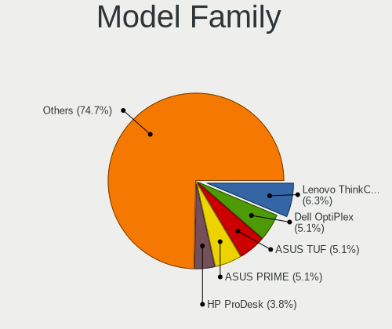
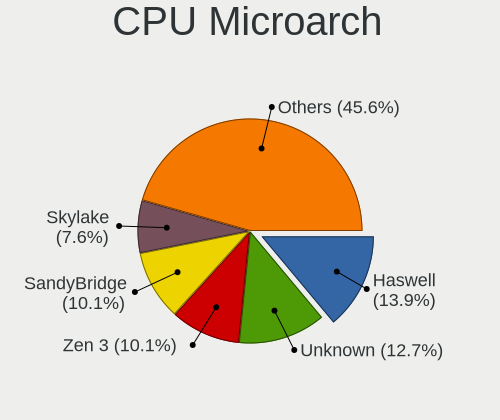

Zorin Hardware Trends (Desktop)
-------------------------------

A project to identify most popular hardware characteristics and track their change
over time based on data collected by Zorin users at https://Linux-Hardware.org.

Anyone can contribute to the study by uploading probes of their computers by
the [hw-probe](https://github.com/linuxhw/hw-probe) tool:

    sudo hw-probe -all -upload

Full-feature report is available here: https://linux-hardware.org/?view=trends&formfactor=desktop

Period: Mar, 2020.

Contents
--------

- [ OS                       ](#os)
- [ OS Family                ](#os-family)
- [ Kernel                   ](#kernel)
- [ Kernel Family            ](#kernel-family)
- [ Kernel Major Ver.        ](#kernel-major-ver)
- [ Arch                     ](#arch)
- [ DE                       ](#de)
- [ Display Server           ](#display-server)
- [ OS Lang                  ](#os-lang)
- [ Boot Mode                ](#boot-mode)
- [ Filesystem               ](#filesystem)
- [ Dual Boot with Linux     ](#dual-boot-with-linux)
- [ Dual Boot (Win)          ](#dual-boot-win)
- [ Country                  ](#country)
- [ City                     ](#city)
- [ Vendor                   ](#vendor)
- [ Model                    ](#model)
- [ Model Family             ](#model-family)
- [ MFG Year                 ](#mfg-year)
- [ Form Factor              ](#form-factor)
- [ Secure Boot              ](#secure-boot)
- [ Coreboot                 ](#coreboot)
- [ RAM Size                 ](#ram-size)
- [ RAM Used                 ](#ram-used)
- [ Drive Vendor             ](#drive-vendor)
- [ Drive Model              ](#drive-model)
- [ Drive Kind               ](#drive-kind)
- [ Drive Connector          ](#drive-connector)
- [ Drive Size               ](#drive-size)
- [ Space Total              ](#space-total)
- [ Space Used               ](#space-used)
- [ Malfunc. Drives          ](#malfunc-drives)
- [ Malfunc. Drive Vendor    ](#malfunc-drive-vendor)
- [ Malfunc. Drive Kind      ](#malfunc-drive-kind)
- [ Failed Drives            ](#failed-drives)
- [ Failed Drive Vendor      ](#failed-drive-vendor)
- [ Drive Status             ](#drive-status)
- [ Storage Vendor           ](#storage-vendor)
- [ Storage Model            ](#storage-model)
- [ Storage Kind             ](#storage-kind)
- [ CPU Vendor               ](#cpu-vendor)
- [ CPU Model                ](#cpu-model)
- [ CPU Model Family         ](#cpu-model-family)
- [ CPU Cores                ](#cpu-cores)
- [ CPU Sockets              ](#cpu-sockets)
- [ CPU Threads              ](#cpu-threads)
- [ CPU Op-Modes             ](#cpu-op-modes)
- [ CPU Microarch            ](#cpu-microarch)
- [ CPU Microcode            ](#cpu-microcode)
- [ GPU Vendor               ](#gpu-vendor)
- [ GPU Model                ](#gpu-model)
- [ GPU Combo                ](#gpu-combo)
- [ GPU Driver               ](#gpu-driver)
- [ GPU Memory               ](#gpu-memory)
- [ Monitor Vendor           ](#monitor-vendor)
- [ Monitor Model            ](#monitor-model)
- [ Monitor Resolution       ](#monitor-resolution)
- [ Monitor Diagonal         ](#monitor-diagonal)
- [ Monitor Width            ](#monitor-width)
- [ Aspect Ratio             ](#aspect-ratio)
- [ Monitor Area             ](#monitor-area)
- [ Pixel Density            ](#pixel-density)
- [ Multiple Monitors        ](#multiple-monitors)
- [ Net Controller Vendor    ](#net-controller-vendor)
- [ Net Controller Model     ](#net-controller-model)
- [ Net Controller Kind      ](#net-controller-kind)
- [ Used Controller          ](#used-controller)
- [ NICs                     ](#nics)
- [ Unsupported Devices      ](#unsupported-devices)
- [ Unsupported Device Types ](#unsupported-device-types)

OS
--

Installed operating systems

| Name     | Computers | Percent |
|----------|-----------|---------|
| Zorin 15 | 34        | 94.44%  |
| Zorin 12 | 2         | 5.56%   |

OS Family
---------

OS without a version

| Name  | Computers | Percent |
|-------|-----------|---------|
| Zorin | 36        | 100%    |

Kernel
------

Version of the Linux kernel

| Version           | Computers | Percent |
|-------------------|-----------|---------|
| 5.3.0-40-generic  | 21        | 58.33%  |
| 5.3.0-42-generic  | 12        | 33.33%  |
| 5.3.0-45-generic  | 1         | 2.78%   |
| 4.15.0-91-generic | 1         | 2.78%   |
| 4.15.0-30-generic | 1         | 2.78%   |

Kernel Family
-------------

Linux kernel without a distro release

| Version | Computers | Percent |
|---------|-----------|---------|
| 5.3.0   | 34        | 94.44%  |
| 4.15.0  | 2         | 5.56%   |

Kernel Major Ver.
-----------------

Linux kernel major version

| Version | Computers | Percent |
|---------|-----------|---------|
| 5.3     | 34        | 94.44%  |
| 4.15    | 2         | 5.56%   |

Arch
----

OS architecture (x86_64, i586, etc.)

| Name   | Computers | Percent |
|--------|-----------|---------|
| x86_64 | 31        | 86.11%  |
| i686   | 5         | 13.89%  |

DE
--

Desktop Environment

| Name  | Computers | Percent |
|-------|-----------|---------|
| GNOME | 25        | 69.44%  |
| XFCE  | 11        | 30.56%  |

Display Server
--------------

X11 or Wayland

| Name | Computers | Percent |
|------|-----------|---------|
| X11  | 36        | 100%    |

OS Lang
-------

Language

| Lang  | Computers | Percent |
|-------|-----------|---------|
| en_US | 7         | 19.44%  |
| de_DE | 5         | 13.89%  |
| it_IT | 3         | 8.33%   |
| es_ES | 3         | 8.33%   |
| sv_SE | 2         | 5.56%   |
| pt_BR | 2         | 5.56%   |
| fr_FR | 2         | 5.56%   |
| en_GB | 2         | 5.56%   |
| uk_UA | 1         | 2.78%   |
| ru_UA | 1         | 2.78%   |
| pl_PL | 1         | 2.78%   |
| nl_NL | 1         | 2.78%   |
| it_CH | 1         | 2.78%   |
| es_PE | 1         | 2.78%   |
| es_MX | 1         | 2.78%   |
| es_AR | 1         | 2.78%   |
| de_CH | 1         | 2.78%   |
| de_AT | 1         | 2.78%   |

Boot Mode
---------

EFI or BIOS

| Mode | Computers | Percent |
|------|-----------|---------|
| BIOS | 27        | 75%     |
| EFI  | 9         | 25%     |

Filesystem
----------

Type of filesystem

| Type | Computers | Percent |
|------|-----------|---------|
| Ext4 | 36        | 100%    |

Dual Boot with Linux
--------------------

Hosting more than one Linux

| Dual boot | Computers | Percent |
|-----------|-----------|---------|
| No        | 29        | 80.56%  |
| Yes       | 7         | 19.44%  |

Dual Boot (Win)
---------------

Hosting Linux and Windows

| Dual boot | Computers | Percent |
|-----------|-----------|---------|
| No        | 23        | 63.89%  |
| Yes       | 13        | 36.11%  |

Country
-------

Geographic location (country)

| Country     | Computers | Percent |
|-------------|-----------|---------|
| USA         | 7         | 19.44%  |
| Germany     | 5         | 13.89%  |
| France      | 3         | 8.33%   |
| Ukraine     | 2         | 5.56%   |
| Switzerland | 2         | 5.56%   |
| Sweden      | 2         | 5.56%   |
| Spain       | 2         | 5.56%   |
| Mexico      | 2         | 5.56%   |
| Italy       | 2         | 5.56%   |
| Brazil      | 2         | 5.56%   |
| UK          | 1         | 2.78%   |
| Poland      | 1         | 2.78%   |
| Peru        | 1         | 2.78%   |
| Netherlands | 1         | 2.78%   |
| Kuwait      | 1         | 2.78%   |
| Austria     | 1         | 2.78%   |
| Argentina   | 1         | 2.78%   |

City
----

Geographic location (city)

| City                | Computers | Percent |
|---------------------|-----------|---------|
| Zurich              | 1         | 2.78%   |
| Wettingen           | 1         | 2.78%   |
| Westerville         | 1         | 2.78%   |
| Werl                | 1         | 2.78%   |
| Vikarbyn            | 1         | 2.78%   |
| Vienna              | 1         | 2.78%   |
| Valladolid          | 1         | 2.78%   |
| Skellefteå         | 1         | 2.78%   |
| San Fernando        | 1         | 2.78%   |
| Roverbella          | 1         | 2.78%   |
| Puebla              | 1         | 2.78%   |
| Pratt               | 1         | 2.78%   |
| Phoenix             | 1         | 2.78%   |
| Oscoda              | 1         | 2.78%   |
| Odesa               | 1         | 2.78%   |
| Mount Juliet        | 1         | 2.78%   |
| Maua                | 1         | 2.78%   |
| Maassluis           | 1         | 2.78%   |
| Langenhagen         | 1         | 2.78%   |
| Kuwait City         | 1         | 2.78%   |
| Kharkiv             | 1         | 2.78%   |
| Jastrzębie Zdrój  | 1         | 2.78%   |
| Houston             | 1         | 2.78%   |
| Guingamp            | 1         | 2.78%   |
| Gignac-la-Nerthe    | 1         | 2.78%   |
| Düsseldorf         | 1         | 2.78%   |
| Durham              | 1         | 2.78%   |
| Denver              | 1         | 2.78%   |
| Córdoba            | 1         | 2.78%   |
| Cuautitlán Izcalli | 1         | 2.78%   |
| Crailsheim          | 1         | 2.78%   |
| Clichy-sous-Bois    | 1         | 2.78%   |
| Chiclayo            | 1         | 2.78%   |
| Bremen              | 1         | 2.78%   |
| Bologna             | 1         | 2.78%   |
| Araraquara          | 1         | 2.78%   |

Vendor
------

Motherboard manufacturer

| Name                | Computers | Percent |
|---------------------|-----------|---------|
| Gigabyte Technology | 6         | 16.67%  |
| ASUSTek Computer    | 6         | 16.67%  |
| ASRock              | 5         | 13.89%  |
| MSI                 | 3         | 8.33%   |
| Pegatron            | 2         | 5.56%   |
| Hewlett-Packard     | 2         | 5.56%   |
| Fujitsu             | 2         | 5.56%   |
| Dell                | 2         | 5.56%   |
| QDI                 | 1         | 2.78%   |
| Positivo            | 1         | 2.78%   |
| PCChips             | 1         | 2.78%   |
| Medion              | 1         | 2.78%   |
| ECS                 | 1         | 2.78%   |
| Biostar             | 1         | 2.78%   |
| Acer                | 1         | 2.78%   |
| ABIT                | 1         | 2.78%   |

Model
-----

Motherboard model

| Name                             | Computers | Percent |
|----------------------------------|-----------|---------|
| Fujitsu ESPRIMO P2560            | 2         | 5.56%   |
| QDI P4I865MA                     | 1         | 2.78%   |
| Positivo POS-EIBTDB              | 1         | 2.78%   |
| Pegatron NE502AV-ABA a6750t      | 1         | 2.78%   |
| Pegatron DB                      | 1         | 2.78%   |
| PCChips P49G                     | 1         | 2.78%   |
| MSI MS-7B84                      | 1         | 2.78%   |
| MSI MS-7B79                      | 1         | 2.78%   |
| MSI MS-7135                      | 1         | 2.78%   |
| Medion MD34185/2592              | 1         | 2.78%   |
| HP Compaq Pro 6300 All-in-One PC | 1         | 2.78%   |
| HP 500-312nsm                    | 1         | 2.78%   |
| Gigabyte Z170N-Gaming 5          | 1         | 2.78%   |
| Gigabyte H61M-DS2                | 1         | 2.78%   |
| Gigabyte H61M-D2H-USB3           | 1         | 2.78%   |
| Gigabyte GA-78LMT-S2P            | 1         | 2.78%   |
| Gigabyte GA-770TA-UD3            | 1         | 2.78%   |
| Gigabyte AB350-Gaming            | 1         | 2.78%   |
| ECS K8M890M-M                    | 1         | 2.78%   |
| Dell OptiPlex 9020               | 1         | 2.78%   |
| Dell OptiPlex 380                | 1         | 2.78%   |
| Biostar N61PC-M2S                | 1         | 2.78%   |
| ASUS TUF X470-PLUS GAMING        | 1         | 2.78%   |
| ASUS P5PE-VM                     | 1         | 2.78%   |
| ASUS M2N-E                       | 1         | 2.78%   |
| ASUS IPN73-BA                    | 1         | 2.78%   |
| ASUS CM6850                      | 1         | 2.78%   |
| ASUS A7N8X2.0                    | 1         | 2.78%   |
| ASRock X570 Taichi               | 1         | 2.78%   |
| ASRock X570 Steel Legend         | 1         | 2.78%   |
| ASRock P43D1600Twins-1394        | 1         | 2.78%   |
| ASRock N68C-S UCC                | 1         | 2.78%   |
| ASRock B85M Pro4                 | 1         | 2.78%   |
| Acer Veriton X275                | 1         | 2.78%   |
| ABIT AV8                         | 1         | 2.78%   |

Model Family
------------

Motherboard model prefix

| Name                      | Computers | Percent |
|---------------------------|-----------|---------|
| Fujitsu ESPRIMO           | 2         | 5.56%   |
| Dell OptiPlex             | 2         | 5.56%   |
| ASRock X570               | 2         | 5.56%   |
| QDI P4I865MA              | 1         | 2.78%   |
| Positivo POS-EIBTDB       | 1         | 2.78%   |
| Pegatron NE502AV-ABA      | 1         | 2.78%   |
| Pegatron DB               | 1         | 2.78%   |
| PCChips P49G              | 1         | 2.78%   |
| MSI MS-7B84               | 1         | 2.78%   |
| MSI MS-7B79               | 1         | 2.78%   |
| MSI MS-7135               | 1         | 2.78%   |
| Medion MD34185            | 1         | 2.78%   |
| HP Compaq                 | 1         | 2.78%   |
| HP 500-312nsm             | 1         | 2.78%   |
| Gigabyte Z170N-Gaming     | 1         | 2.78%   |
| Gigabyte H61M-DS2         | 1         | 2.78%   |
| Gigabyte H61M-D2H-USB3    | 1         | 2.78%   |
| Gigabyte GA-78LMT-S2P     | 1         | 2.78%   |
| Gigabyte GA-770TA-UD3     | 1         | 2.78%   |
| Gigabyte AB350-Gaming     | 1         | 2.78%   |
| ECS K8M890M-M             | 1         | 2.78%   |
| Biostar N61PC-M2S         | 1         | 2.78%   |
| ASUS TUF                  | 1         | 2.78%   |
| ASUS P5PE-VM              | 1         | 2.78%   |
| ASUS M2N-E                | 1         | 2.78%   |
| ASUS IPN73-BA             | 1         | 2.78%   |
| ASUS CM6850               | 1         | 2.78%   |
| ASUS A7N8X2.0             | 1         | 2.78%   |
| ASRock P43D1600Twins-1394 | 1         | 2.78%   |
| ASRock N68C-S             | 1         | 2.78%   |
| ASRock B85M               | 1         | 2.78%   |
| Acer Veriton              | 1         | 2.78%   |
| ABIT AV8                  | 1         | 2.78%   |

MFG Year
--------

Motherboard manufacture year

| Year | Computers | Percent |
|------|-----------|---------|
| 2019 | 6         | 16.67%  |
| 2010 | 6         | 16.67%  |
| 2006 | 5         | 13.89%  |
| 2011 | 4         | 11.11%  |
| 2014 | 3         | 8.33%   |
| 2017 | 2         | 5.56%   |
| 2015 | 2         | 5.56%   |
| 2009 | 2         | 5.56%   |
| 2008 | 2         | 5.56%   |
| 2013 | 1         | 2.78%   |
| 2012 | 1         | 2.78%   |
| 2004 | 1         | 2.78%   |
| 2003 | 1         | 2.78%   |

Form Factor
-----------

Physical design of the computer

| Name    | Computers | Percent |
|---------|-----------|---------|
| Desktop | 36        | 100%    |

Secure Boot
-----------

Enabled or disabled

| State    | Computers | Percent |
|----------|-----------|---------|
| Disabled | 36        | 100%    |

Coreboot
--------

Have coreboot on board

| Used | Computers | Percent |
|------|-----------|---------|
| No   | 36        | 100%    |

RAM Size
--------

Total RAM memory

| Size in GB | Computers | Percent |
|------------|-----------|---------|
| 3.01-4.0   | 13        | 36.11%  |
| 16.01-24.0 | 8         | 22.22%  |
| 1.01-2.0   | 5         | 13.89%  |
| 8.01-16.0  | 5         | 13.89%  |
| 4.01-8.0   | 3         | 8.33%   |
| 32.01-64.0 | 1         | 2.78%   |
| 0.01-1.0   | 1         | 2.78%   |

RAM Used
--------

Used RAM memory

| Used GB  | Computers | Percent |
|----------|-----------|---------|
| 1.01-2.0 | 18        | 50%     |
| 2.01-3.0 | 8         | 22.22%  |
| 0.01-1.0 | 5         | 13.89%  |
| 3.01-4.0 | 3         | 8.33%   |
| 4.01-8.0 | 2         | 5.56%   |

Drive Vendor
------------

Hard drive vendors

| Vendor              | Computers | Drives | Percent |
|---------------------|-----------|--------|---------|
| WDC                 | 11        | 14     | 22.92%  |
| Seagate             | 9         | 9      | 18.75%  |
| MAXTOR              | 6         | 6      | 12.5%   |
| Samsung Electronics | 5         | 6      | 10.42%  |
| Hitachi             | 4         | 4      | 8.33%   |
| Toshiba             | 3         | 3      | 6.25%   |
| Kingston            | 3         | 3      | 6.25%   |
| Unknown             | 1         | 1      | 2.08%   |
| PLEXTOR             | 1         | 1      | 2.08%   |
| Phison              | 1         | 1      | 2.08%   |
| China               | 1         | 1      | 2.08%   |
| Apacer              | 1         | 1      | 2.08%   |
| AMD-RAID            | 1         | 2      | 2.08%   |
| A-DATA Technology   | 1         | 1      | 2.08%   |

Drive Model
-----------

Hard drive models

| Model                     | Computers | Percent |
|---------------------------|-----------|---------|
| WD40EZRX-00SPEB0 4TB      | 2         | 3.85%   |
| ST500LT012-1DG142 500GB   | 2         | 3.85%   |
| SSD 860 EVO 500GB         | 2         | 3.85%   |
| WD800JB-22JJC0 80GB       | 1         | 1.92%   |
| WD40EZRZ-00GXCB0 4TB      | 1         | 1.92%   |
| WD3200BPVT-22JJ5T0 320GB  | 1         | 1.92%   |
| WD3200AAJS-00L7A0 320GB   | 1         | 1.92%   |
| WD3000GLFS-01F8U0 304GB   | 1         | 1.92%   |
| WD2500JS-00SGB0 250GB     | 1         | 1.92%   |
| WD2500AAKX-60U6AA0 250GB  | 1         | 1.92%   |
| WD20EZRZ-00Z5HB0 2TB      | 1         | 1.92%   |
| WD1500HLFS-01G6U0 150GB   | 1         | 1.92%   |
| WD10EZEX-08WN4A0 1TB      | 1         | 1.92%   |
| WD10EALX-229BA0 1TB       | 1         | 1.92%   |
| SV300S37A240G 240GB SSD   | 1         | 1.92%   |
| SV300S37A120G 120GB SSD   | 1         | 1.92%   |
| STM380215AS 80GB          | 1         | 1.92%   |
| STM3750330AS 752GB        | 1         | 1.92%   |
| STM3320820AS 320GB        | 1         | 1.92%   |
| STM3320613AS 320GB        | 1         | 1.92%   |
| STM3160212A 160GB         | 1         | 1.92%   |
| ST500DM002-1BD142 500GB   | 1         | 1.92%   |
| ST360021A 64GB            | 1         | 1.92%   |
| ST3500418AS 500GB         | 1         | 1.92%   |
| ST3400832AS 400GB         | 1         | 1.92%   |
| ST3200827AS 200GB         | 1         | 1.92%   |
| ST3160215SCE 160GB        | 1         | 1.92%   |
| ST250DM000-1BD141 250GB   | 1         | 1.92%   |
| SSD 850 EVO 250GB         | 1         | 1.92%   |
| SSD 840 EVO 250GB         | 1         | 1.92%   |
| SP550 240GB SSD           | 1         | 1.92%   |
| SATA SSD 240GB            | 1         | 1.92%   |
| SA400S37120G 120GB SSD    | 1         | 1.92%   |
| S3SSDA480XEU 480GB        | 1         | 1.92%   |
| PX-G256M6e 256GB SSD      | 1         | 1.92%   |
| MK3252GSX 320GB           | 1         | 1.92%   |
| HUA723020ALA640 2TB       | 1         | 1.92%   |
| HTS545032B9A300 320GB     | 1         | 1.92%   |
| HDT722516DLA380 164GB     | 1         | 1.92%   |
| HDS721616PLA380 164GB     | 1         | 1.92%   |
| HD642JJ 640GB             | 1         | 1.92%   |
| HD251HJ 250GB             | 1         | 1.92%   |
| E12-1TB-PHISON-SSD-B3-BB1 | 1         | 1.92%   |
| DT01ACA300 3TB            | 1         | 1.92%   |
| DT01ACA100 1TB            | 1         | 1.92%   |
| AS350 120GB SSD           | 1         | 1.92%   |
| Array 03 4TB SSD          | 1         | 1.92%   |
| Array 02 4TB SSD          | 1         | 1.92%   |
| 6V080E0 81GB              | 1         | 1.92%   |

Drive Kind
----------

HDD or SSD

| Kind | Computers | Drives | Percent |
|------|-----------|--------|---------|
| HDD  | 29        | 38     | 74.36%  |
| SSD  | 9         | 14     | 23.08%  |
| NVMe | 1         | 1      | 2.56%   |

Drive Connector
---------------

SATA, SAS, NVMe, etc.

| Type | Computers | Drives | Percent |
|------|-----------|--------|---------|
| SATA | 34        | 49     | 94.44%  |
| SAS  | 1         | 3      | 2.78%   |
| NVMe | 1         | 1      | 2.78%   |

Drive Size
----------

Size of hard drive

| Size in TB | Computers | Drives | Percent |
|------------|-----------|--------|---------|
| 0.01-0.5   | 29        | 38     | 70.73%  |
| 0.51-1.0   | 5         | 6      | 12.2%   |
| 3.01-4.0   | 3         | 5      | 7.32%   |
| 1.01-2.0   | 3         | 3      | 7.32%   |
| 2.01-3.0   | 1         | 1      | 2.44%   |

Space Total
-----------

Amount of disk space available on the file system

| Size in GB     | Computers | Percent |
|----------------|-----------|---------|
| 251-500        | 11        | 30.56%  |
| 101-250        | 8         | 22.22%  |
| 501-1000       | 7         | 19.44%  |
| 51-100         | 6         | 16.67%  |
| More than 3000 | 3         | 8.33%   |
| 21-50          | 1         | 2.78%   |

Space Used
----------

Amount of used disk space

| Used GB        | Computers | Percent |
|----------------|-----------|---------|
| 1-20           | 23        | 63.89%  |
| 251-500        | 3         | 8.33%   |
| 21-50          | 3         | 8.33%   |
| 51-100         | 3         | 8.33%   |
| More than 3000 | 2         | 5.56%   |
| 101-250        | 2         | 5.56%   |

Malfunc. Drives
---------------

Drive models with a malfunction

Zero info for selected period =(

Malfunc. Drive Vendor
---------------------

Vendors of faulty drives

Zero info for selected period =(

Malfunc. Drive Kind
-------------------

Kinds of faulty drives

Zero info for selected period =(

Failed Drives
-------------

Failed drive models

Zero info for selected period =(

Failed Drive Vendor
-------------------

Failed drive vendors

Zero info for selected period =(

Drive Status
------------

Number of failed and malfunc. drives

| Status   | Computers | Drives | Percent |
|----------|-----------|--------|---------|
| Detected | 35        | 52     | 97.22%  |
| Works    | 1         | 1      | 2.78%   |

Storage Vendor
--------------

Storage controller vendors

| Vendor                     | Computers | Percent |
|----------------------------|-----------|---------|
| Intel                      | 19        | 43.18%  |
| AMD                        | 9         | 20.45%  |
| Nvidia                     | 6         | 13.64%  |
| Phison Electronics         | 3         | 6.82%   |
| VIA Technologies           | 2         | 4.55%   |
| JMicron Technology         | 2         | 4.55%   |
| Samsung Electronics        | 1         | 2.27%   |
| Marvell Technology Group   | 1         | 2.27%   |
| Lite-On IT Corp. / Plextor | 1         | 2.27%   |

Storage Model
-------------

Storage controller models

| Model                                                                             | Computers | Percent |
|-----------------------------------------------------------------------------------|-----------|---------|
| NM10/ICH7 Family SATA Controller [IDE mode]                                       | 5         | 7.94%   |
| FCH SATA Controller [AHCI mode]                                                   | 5         | 7.94%   |
| E12 NVMe Controller                                                               | 3         | 4.76%   |
| 82801G (ICH7 Family) IDE Controller                                               | 3         | 4.76%   |
| VT82C586A/B/VT82C686/A/B/VT823x/A/C PIPC Bus Master IDE                           | 2         | 3.17%   |
| VIA VT6420 SATA RAID Controller                                                   | 2         | 3.17%   |
| SB7x0/SB8x0/SB9x0 SATA Controller [IDE mode]                                      | 2         | 3.17%   |
| SB7x0/SB8x0/SB9x0 IDE Controller                                                  | 2         | 3.17%   |
| MCP61 SATA Controller                                                             | 2         | 3.17%   |
| 82801EB/ER (ICH5/ICH5R) IDE Controller                                            | 2         | 3.17%   |
| 8 Series/C220 Series Chipset Family 6-port SATA Controller 1 [AHCI mode]          | 2         | 3.17%   |
| 6 Series/C200 Series Chipset Family 6 port Desktop SATA AHCI Controller           | 2         | 3.17%   |
| RS690 PCI to PCI Bridge (PCI Express Port 2)                                      | 1         | 1.59%   |
| Q170/Q150/B150/H170/H110/Z170/CM236 Chipset SATA Controller [AHCI Mode]           | 1         | 1.59%   |
| NVMe SSD Controller SM981/PM981/PM983                                             | 1         | 1.59%   |
| nForce2 IDE                                                                       | 1         | 1.59%   |
| MCP73 SATA Controller (IDE mode)                                                  | 1         | 1.59%   |
| MCP73 IDE Controller                                                              | 1         | 1.59%   |
| MCP61 IDE                                                                         | 1         | 1.59%   |
| MCP55 SATA Controller                                                             | 1         | 1.59%   |
| MCP55 IDE                                                                         | 1         | 1.59%   |
| M6e PCI Express SSD [Marvell 88SS9183]                                            | 1         | 1.59%   |
| JMB368 IDE controller                                                             | 1         | 1.59%   |
| JMB363 SATA/IDE Controller                                                        | 1         | 1.59%   |
| FCH SATA Controller [IDE mode]                                                    | 1         | 1.59%   |
| FCH SATA Controller D                                                             | 1         | 1.59%   |
| FCH RAID Controller                                                               | 1         | 1.59%   |
| CK804 Serial ATA Controller                                                       | 1         | 1.59%   |
| CK804 IDE                                                                         | 1         | 1.59%   |
| Cannon Lake PCH SATA AHCI Controller                                              | 1         | 1.59%   |
| Atom Processor E3800 Series SATA AHCI Controller                                  | 1         | 1.59%   |
| 88SE91A3 SATA-600 Controller                                                      | 1         | 1.59%   |
| 82801JI (ICH10 Family) 4 port SATA IDE Controller #1                              | 1         | 1.59%   |
| 82801JI (ICH10 Family) 2 port SATA IDE Controller #2                              | 1         | 1.59%   |
| 82801IR/IO/IH (ICH9R/DO/DH) 6 port SATA Controller [AHCI mode]                    | 1         | 1.59%   |
| 82801EB (ICH5) SATA Controller                                                    | 1         | 1.59%   |
| 7 Series/C210 Series Chipset Family 6-port SATA Controller [AHCI mode]            | 1         | 1.59%   |
| 6 Series/C200 Series Chipset Family Desktop SATA Controller (IDE mode, ports 4-5) | 1         | 1.59%   |
| 6 Series/C200 Series Chipset Family Desktop SATA Controller (IDE mode, ports 0-3) | 1         | 1.59%   |
| 5 Series/3400 Series Chipset 4 port SATA IDE Controller                           | 1         | 1.59%   |
| 5 Series/3400 Series Chipset 2 port SATA IDE Controller                           | 1         | 1.59%   |
| 400 Series Chipset SATA Controller                                                | 1         | 1.59%   |
| 300 Series Chipset SATA Controller                                                | 1         | 1.59%   |

Storage Kind
------------

Kind of storage controller (IDE, SATA, NVMe, SAS, ...)

| Kind | Computers | Percent |
|------|-----------|---------|
| IDE  | 20        | 46.51%  |
| SATA | 17        | 39.53%  |
| NVMe | 4         | 9.3%    |
| RAID | 2         | 4.65%   |

CPU Vendor
----------

Processor vendors

| Vendor | Computers | Percent |
|--------|-----------|---------|
| Intel  | 20        | 55.56%  |
| AMD    | 16        | 44.44%  |

CPU Model
---------

Processor models

| Model                                       | Computers | Percent |
|---------------------------------------------|-----------|---------|
| Intel Pentium Dual-Core CPU E6700 @ 3.20GHz | 1         | 2.78%   |
| Intel Pentium Dual-Core CPU E5700 @ 3.00GHz | 1         | 2.78%   |
| Intel Pentium Dual-Core CPU E5300 @ 2.60GHz | 1         | 2.78%   |
| Intel Core i7-6700K CPU @ 4.00GHz           | 1         | 2.78%   |
| Intel Core i7-4790 CPU @ 3.60GHz            | 1         | 2.78%   |
| Intel Core i7-2600 CPU @ 3.40GHz            | 1         | 2.78%   |
| Intel Core i5-9400 CPU @ 2.90GHz            | 1         | 2.78%   |
| Intel Core i5-4590 CPU @ 3.30GHz            | 1         | 2.78%   |
| Intel Core i5-3570K CPU @ 3.40GHz           | 1         | 2.78%   |
| Intel Core i5-2320 CPU @ 3.00GHz            | 1         | 2.78%   |
| Intel Core i3-3220 CPU @ 3.30GHz            | 1         | 2.78%   |
| Intel Core i3 CPU 550 @ 3.20GHz             | 1         | 2.78%   |
| Intel Core 2 Quad CPU Q8300 @ 2.50GHz       | 1         | 2.78%   |
| Intel Core 2 Quad CPU Q8200 @ 2.33GHz       | 1         | 2.78%   |
| Intel Core 2 Duo CPU E8500 @ 3.16GHz        | 1         | 2.78%   |
| Intel Core 2 Duo CPU E8400 @ 3.00GHz        | 1         | 2.78%   |
| Intel Core 2 Duo CPU E8200 @ 2.66GHz        | 1         | 2.78%   |
| Intel Core 2 CPU 6600 @ 2.40GHz             | 1         | 2.78%   |
| Intel Celeron CPU J1800 @ 2.41GHz           | 1         | 2.78%   |
| Intel Celeron CPU 2.40GHz                   | 1         | 2.78%   |
| AMD Sempron Dual Core Processor 2200        | 1         | 2.78%   |
| AMD Ryzen 7 3800X 8-Core Processor          | 1         | 2.78%   |
| AMD Ryzen 7 2700X Eight-Core Processor      | 1         | 2.78%   |
| AMD Ryzen 5 3600X 6-Core Processor          | 1         | 2.78%   |
| AMD Ryzen 5 2600X Six-Core Processor        | 1         | 2.78%   |
| AMD Ryzen 5 1600X Six-Core Processor        | 1         | 2.78%   |
| AMD Ryzen 3 2200G with Radeon Vega Graphics | 1         | 2.78%   |
| AMD Phenom II X2 555 Processor              | 1         | 2.78%   |
| AMD FX-4100 Quad-Core Processor             | 1         | 2.78%   |
| AMD Dual Core Opteron Processor 185         | 1         | 2.78%   |
| AMD Athlon XP 2600+                         | 1         | 2.78%   |
| AMD Athlon II X2 220 Processor              | 1         | 2.78%   |
| AMD Athlon 64 X2 Dual Core Processor 5000+  | 1         | 2.78%   |
| AMD Athlon 64 X2 Dual Core Processor 4200+  | 1         | 2.78%   |
| AMD Athlon 64 Processor 3200+               | 1         | 2.78%   |
| AMD A4-6300 APU with Radeon HD Graphics     | 1         | 2.78%   |

CPU Model Family
----------------

Processor model prefix

| Model                   | Computers | Percent |
|-------------------------|-----------|---------|
| Intel Core i5           | 4         | 11.11%  |
| Intel Pentium Dual-Core | 3         | 8.33%   |
| Intel Core i7           | 3         | 8.33%   |
| Intel Core 2 Duo        | 3         | 8.33%   |
| AMD Ryzen 5             | 3         | 8.33%   |
| Intel Core i3           | 2         | 5.56%   |
| Intel Core 2 Quad       | 2         | 5.56%   |
| Intel Celeron           | 2         | 5.56%   |
| AMD Ryzen 7             | 2         | 5.56%   |
| AMD Athlon 64 X2        | 2         | 5.56%   |
| Intel Core 2            | 1         | 2.78%   |
| AMD Sempron             | 1         | 2.78%   |
| AMD Ryzen 3             | 1         | 2.78%   |
| AMD Phenom II X2        | 1         | 2.78%   |
| AMD FX                  | 1         | 2.78%   |
| AMD Dual Core Opteron   | 1         | 2.78%   |
| AMD Athlon XP           | 1         | 2.78%   |
| AMD Athlon II X2        | 1         | 2.78%   |
| AMD Athlon 64           | 1         | 2.78%   |
| AMD A4                  | 1         | 2.78%   |

CPU Cores
---------

Number of processor cores

| Number | Computers | Percent |
|--------|-----------|---------|
| 2      | 17        | 47.22%  |
| 4      | 9         | 25%     |
| 6      | 4         | 11.11%  |
| 1      | 4         | 11.11%  |
| 8      | 2         | 5.56%   |

CPU Sockets
-----------

Number of sockets

| Number | Computers | Percent |
|--------|-----------|---------|
| 1      | 36        | 100%    |

CPU Threads
-----------

Threads per core (Hyper-Threading)

| Number | Computers | Percent |
|--------|-----------|---------|
| 1      | 24        | 66.67%  |
| 2      | 12        | 33.33%  |

CPU Op-Modes
------------

CPU Operation Modes (32-bit, 64-bit)

| Op mode        | Computers | Percent |
|----------------|-----------|---------|
| 32-bit, 64-bit | 34        | 94.44%  |
| 32-bit         | 2         | 5.56%   |

CPU Microarch
-------------

Microarchitecture

| Name        | Computers | Percent |
|-------------|-----------|---------|
| Core        | 7         | 19.44%  |
| K8 Hammer   | 5         | 13.89%  |
| Zen+        | 2         | 5.56%   |
| Zen 2       | 2         | 5.56%   |
| Zen         | 2         | 5.56%   |
| Skylake     | 2         | 5.56%   |
| SandyBridge | 2         | 5.56%   |
| Penryn      | 2         | 5.56%   |
| K10         | 2         | 5.56%   |
| IvyBridge   | 2         | 5.56%   |
| Haswell     | 2         | 5.56%   |
| Westmere    | 1         | 2.78%   |
| Silvermont  | 1         | 2.78%   |
| Piledriver  | 1         | 2.78%   |
| NetBurst    | 1         | 2.78%   |
| K6          | 1         | 2.78%   |
| Bulldozer   | 1         | 2.78%   |

CPU Microcode
-------------

Microcode number

| Number     | Computers | Percent |
|------------|-----------|---------|
| Unknown    | 10        | 27.78%  |
| 0x1067a    | 4         | 11.11%  |
| 0x306a9    | 2         | 5.56%   |
| 0x206a7    | 2         | 5.56%   |
| 0x010000c8 | 2         | 5.56%   |
| 0xf29      | 1         | 2.78%   |
| 0x906ea    | 1         | 2.78%   |
| 0x6f6      | 1         | 2.78%   |
| 0x506e3    | 1         | 2.78%   |
| 0x306c3    | 1         | 2.78%   |
| 0x30673    | 1         | 2.78%   |
| 0x20655    | 1         | 2.78%   |
| 0x10677    | 1         | 2.78%   |
| 0x10676    | 1         | 2.78%   |
| 0x08701013 | 1         | 2.78%   |
| 0x0810100b | 1         | 2.78%   |
| 0x0800820d | 1         | 2.78%   |
| 0x0800820c | 1         | 2.78%   |
| 0x08001126 | 1         | 2.78%   |
| 0x06001119 | 1         | 2.78%   |
| 0x0600063e | 1         | 2.78%   |

GPU Vendor
----------

Vendors of graphics cards

| Vendor | Computers | Percent |
|--------|-----------|---------|
| Nvidia | 17        | 45.95%  |
| AMD    | 12        | 32.43%  |
| Intel  | 8         | 21.62%  |

GPU Model
---------

Graphics card models

| Model                                                                 | Computers | Percent |
|-----------------------------------------------------------------------|-----------|---------|
| Ellesmere [Radeon RX 470/480/570/570X/580/580X/590]                   | 4         | 10.53%  |
| 82865G Integrated Graphics Controller                                 | 2         | 5.26%   |
| 4 Series Chipset Integrated Graphics Controller                       | 2         | 5.26%   |
| Xeon E3-1200 v3/4th Gen Core Processor Integrated Graphics Controller | 1         | 2.63%   |
| Xeon E3-1200 v2/3rd Gen Core processor Graphics Controller            | 1         | 2.63%   |
| TU116 [GeForce GTX 1660]                                              | 1         | 2.63%   |
| RV730 [Radeon HD 4600 AGP Series]                                     | 1         | 2.63%   |
| RV515 PRO [Radeon X1300/X1550 Series] (Secondary)                     | 1         | 2.63%   |
| RV515 PRO [Radeon X1300/X1550 Series]                                 | 1         | 2.63%   |
| Raven Ridge [Radeon Vega Series / Radeon Vega Mobile Series]          | 1         | 2.63%   |
| NV44 [GeForce 7100 GS]                                                | 1         | 2.63%   |
| NV41 [GeForce 6800]                                                   | 1         | 2.63%   |
| NV36 [GeForce FX 5700]                                                | 1         | 2.63%   |
| Navi 10 [Radeon RX 5600 OEM/5600 XT / 5700/5700 XT]                   | 1         | 2.63%   |
| GT218 [GeForce 210]                                                   | 1         | 2.63%   |
| GP107 [GeForce GTX 1050 Ti]                                           | 1         | 2.63%   |
| GM206 [GeForce GTX 960]                                               | 1         | 2.63%   |
| GM200 [GeForce GTX 980 Ti]                                            | 1         | 2.63%   |
| GM107 [GeForce GTX 750]                                               | 1         | 2.63%   |
| GK208B [GeForce GT 720]                                               | 1         | 2.63%   |
| GK208B [GeForce GT 710]                                               | 1         | 2.63%   |
| GF108 [GeForce GT 530]                                                | 1         | 2.63%   |
| G96C [GeForce 9500 GT]                                                | 1         | 2.63%   |
| G96 [GeForce 9500 GS]                                                 | 1         | 2.63%   |
| G73 [GeForce 7600 GS]                                                 | 1         | 2.63%   |
| Core Processor Integrated Graphics Controller                         | 1         | 2.63%   |
| Cedar [Radeon HD 5000/6000/7350/8350 Series]                          | 1         | 2.63%   |
| Cape Verde XT [Radeon HD 7770/8760 / R7 250X]                         | 1         | 2.63%   |
| Caicos [Radeon HD 6450/7450/8450 / R5 230 OEM]                        | 1         | 2.63%   |
| Caicos XT [Radeon HD 7470/8470 / R5 235/310 OEM]                      | 1         | 2.63%   |
| C61 [GeForce 7025 / nForce 630a]                                      | 1         | 2.63%   |
| C61 [GeForce 6150SE nForce 430]                                       | 1         | 2.63%   |
| Atom Processor Z36xxx/Z37xxx Series Graphics & Display                | 1         | 2.63%   |

GPU Combo
---------

Combinations of graphics cards

| Name           | Computers | Percent |
|----------------|-----------|---------|
| 1 x Nvidia     | 16        | 44.44%  |
| 1 x AMD        | 11        | 30.56%  |
| 1 x Intel      | 7         | 19.44%  |
| 2 x AMD        | 1         | 2.78%   |
| Intel + Nvidia | 1         | 2.78%   |

GPU Driver
----------

Free vs proprietary

| Driver      | Computers | Percent |
|-------------|-----------|---------|
| Free        | 22        | 61.11%  |
| Proprietary | 8         | 22.22%  |
| Unknown     | 6         | 16.67%  |

GPU Memory
----------

Total video memory

| Size in GB | Computers | Percent |
|------------|-----------|---------|
| Unknown    | 15        | 41.67%  |
| 0.51-1.0   | 5         | 13.89%  |
| 0.01-0.5   | 5         | 13.89%  |
| 1.01-2.0   | 4         | 11.11%  |
| 7.01-8.0   | 3         | 8.33%   |
| 5.01-6.0   | 2         | 5.56%   |
| 3.01-4.0   | 2         | 5.56%   |

Monitor Vendor
--------------

Monitor vendors

| Vendor               | Computers | Percent |
|----------------------|-----------|---------|
| Samsung Electronics  | 5         | 15.63%  |
| Hewlett-Packard      | 3         | 9.38%   |
| Dell                 | 3         | 9.38%   |
| Ancor Communications | 3         | 9.38%   |
| Goldstar             | 2         | 6.25%   |
| BenQ                 | 2         | 6.25%   |
| Xiaomi               | 1         | 3.13%   |
| VIZ                  | 1         | 3.13%   |
| ViewSonic            | 1         | 3.13%   |
| Unknown              | 1         | 3.13%   |
| Sceptre Tech         | 1         | 3.13%   |
| Sanyo                | 1         | 3.13%   |
| Philips              | 1         | 3.13%   |
| NUL                  | 1         | 3.13%   |
| LSC                  | 1         | 3.13%   |
| KTC                  | 1         | 3.13%   |
| Grundig              | 1         | 3.13%   |
| Eizo                 | 1         | 3.13%   |
| CVT                  | 1         | 3.13%   |
| AOC                  | 1         | 3.13%   |

Monitor Model
-------------

Monitor models

| Model                                                        | Computers | Percent |
|--------------------------------------------------------------|-----------|---------|
| W55 SPT15B9 3840x2160 575x323mm 26.0-inch                    | 1         | 3.13%   |
| W1934 GSM4B7A 1440x900 410x260mm 19.1-inch                   | 1         | 3.13%   |
| vs17 HWP2647 1280x1024 340x270mm 17.1-inch                   | 1         | 3.13%   |
| TV SAN0105 1360x768 886x498mm 40.0-inch                      | 1         | 3.13%   |
| SyncMaster SAM0598 1360x768 410x230mm 18.5-inch              | 1         | 3.13%   |
| O-7005L-D KTC1771 1280x1024 338x270mm 17.0-inch              | 1         | 3.13%   |
| Mi TV XMD00E1 3840x2160 708x398mm 32.0-inch                  | 1         | 3.13%   |
| LCD Monitor VA2259 Series 1920x1080                          | 1         | 3.13%   |
| LCD Monitor U2212HM 3840x1080                                | 1         | 3.13%   |
| LCD Monitor SAMSUNG 3840x2160                                | 1         | 3.13%   |
| LCD Monitor SAM0F14 3840x2160 1872x1053mm 84.6-inch          | 1         | 3.13%   |
| LCD Monitor SAM07BC 1360x768                                 | 1         | 3.13%   |
| LCD Monitor MX279 1920x1080                                  | 1         | 3.13%   |
| LCD Monitor G2410HD 1920x1080                                | 1         | 3.13%   |
| LCD Monitor F22                                              | 1         | 3.13%   |
| LCD Monitor E320VT 1920x1080                                 | 1         | 3.13%   |
| LCD Monitor ASUS VP228 1920x1080                             | 1         | 3.13%   |
| IPPIP-DB LSC282B 1920x1080 480x270mm 21.7-inch               | 1         | 3.13%   |
| HPQ 6300 AiO HWP4215 1920x1080 477x268mm 21.5-inch           | 1         | 3.13%   |
| GL2450H BNQ78A7 1920x1080 530x300mm 24.0-inch                | 1         | 3.13%   |
| G2 1080p dig GRU4448 1920x1080 1600x900mm 72.3-inch          | 1         | 3.13%   |
| FS2333 ENC2420 1920x1080 510x290mm 23.1-inch                 | 1         | 3.13%   |
| EP-HDMI-RX SAM0F18 1680x1050 1420x800mm 64.2-inch            | 1         | 3.13%   |
| E2414H DEL4090 1920x1080 531x299mm 24.0-inch                 | 1         | 3.13%   |
| E201 HWP305E 1600x900 443x249mm 20.0-inch                    | 1         | 3.13%   |
| E198WFP DELF006 1440x900 408x255mm 18.9-inch                 | 1         | 3.13%   |
| CVTE TV CVT0003 1920x1080 575x323mm 26.0-inch                | 1         | 3.13%   |
| Checksum: 0xd6 (valid) NUL0001 1280x1024 338x270mm 17.0-inch | 1         | 3.13%   |
| C24FG7x SAM0E43 1920x1080 532x304mm 24.1-inch                | 1         | 3.13%   |
| ASUS VH198 ACI19E7 1440x900 410x256mm 19.0-inch              | 1         | 3.13%   |
| 23MP55 GSM5A23 1920x1080 510x290mm 23.1-inch                 | 1         | 3.13%   |
| 220BW PHL0866 1680x1050 474x296mm 22.0-inch                  | 1         | 3.13%   |

Monitor Resolution
------------------

Monitor screen resolution

| Resolution         | Computers | Percent |
|--------------------|-----------|---------|
| 1920x1080 (FHD)    | 13        | 40.63%  |
| 3840x2160 (4K)     | 5         | 15.63%  |
| 1440x900 (WXGA+)   | 3         | 9.38%   |
| 1280x1024 (SXGA)   | 3         | 9.38%   |
| 1360x768           | 2         | 6.25%   |
| 3840x1080          | 1         | 3.13%   |
| 1680x1050 (WSXGA+) | 1         | 3.13%   |
| 1600x900 (HD+)     | 1         | 3.13%   |
| 1600x1200          | 1         | 3.13%   |
| 1360x765           | 1         | 3.13%   |
| Unknown            | 1         | 3.13%   |

Monitor Diagonal
----------------

Diagonal size in inches

| Inches  | Computers | Percent |
|---------|-----------|---------|
| Unknown | 8         | 25.81%  |
| 24      | 3         | 9.68%   |
| 17      | 3         | 9.68%   |
| 84      | 2         | 6.45%   |
| 26      | 2         | 6.45%   |
| 23      | 2         | 6.45%   |
| 21      | 2         | 6.45%   |
| 19      | 2         | 6.45%   |
| 18      | 2         | 6.45%   |
| 72      | 1         | 3.23%   |
| 40      | 1         | 3.23%   |
| 32      | 1         | 3.23%   |
| 22      | 1         | 3.23%   |
| 20      | 1         | 3.23%   |

Monitor Width
-------------

Physical width

| Width in mm | Computers | Percent |
|-------------|-----------|---------|
| 401-500     | 8         | 25.81%  |
| Unknown     | 8         | 25.81%  |
| 501-600     | 7         | 22.58%  |
| 301-350     | 3         | 9.68%   |
| 1501-2000   | 3         | 9.68%   |
| 801-900     | 1         | 3.23%   |
| 701-800     | 1         | 3.23%   |

Aspect Ratio
------------

Proportional relationship between the width and the height

| Ratio   | Computers | Percent |
|---------|-----------|---------|
| 16/9    | 14        | 50%     |
| Unknown | 7         | 25%     |
| 16/10   | 4         | 14.29%  |
| 5/4     | 3         | 10.71%  |

Monitor Area
------------

Area in inch²

| Area in inch² | Computers | Percent |
|----------------|-----------|---------|
| Unknown        | 8         | 25.81%  |
| 201-250        | 6         | 19.35%  |
| 151-200        | 5         | 16.13%  |
| 141-150        | 4         | 12.9%   |
| More than 1000 | 3         | 9.68%   |
| 251-300        | 3         | 9.68%   |
| 351-500        | 1         | 3.23%   |
| 501-1000       | 1         | 3.23%   |

Pixel Density
-------------

Pixels per inch

| Density | Computers | Percent |
|---------|-----------|---------|
| 51-100  | 16        | 53.33%  |
| Unknown | 8         | 26.67%  |
| 1-50    | 2         | 6.67%   |
| 101-120 | 2         | 6.67%   |
| 161-240 | 1         | 3.33%   |
| 121-160 | 1         | 3.33%   |

Multiple Monitors
-----------------

Total monitors connected

| Total | Computers | Percent |
|-------|-----------|---------|
| 1     | 28        | 77.78%  |
| 2     | 4         | 11.11%  |
| 0     | 4         | 11.11%  |

Net Controller Vendor
---------------------

Controller vendors

| Vendor               | Computers | Percent |
|----------------------|-----------|---------|
| Nvidia               | 4         | 36.36%  |
| Intel                | 3         | 27.27%  |
| VIA Technologies     | 1         | 9.09%   |
| Samsung Electronics  | 1         | 9.09%   |
| NetGear              | 1         | 9.09%   |
| Microchip Technology | 1         | 9.09%   |

Net Controller Model
--------------------

Controller models

| Model                                                              | Computers | Percent |
|--------------------------------------------------------------------|-----------|---------|
| MCP61 Ethernet                                                     | 2         | 16.67%  |
| I211 Gigabit Network Connection                                    | 2         | 16.67%  |
| Wi-Fi 6 AX200                                                      | 1         | 8.33%   |
| VT6102/VT6103 [Rhine-II]                                           | 1         | 8.33%   |
| MCP55 Ethernet                                                     | 1         | 8.33%   |
| MCP2200 USB Serial Port Emulator                                   | 1         | 8.33%   |
| GT-I9500 [Galaxy S4] / GT-I9250 [Galaxy Nexus] (network tethering) | 1         | 8.33%   |
| CK804 Ethernet Controller                                          | 1         | 8.33%   |
| A6210                                                              | 1         | 8.33%   |
| 82579LM Gigabit Network Connection (Lewisville)                    | 1         | 8.33%   |

Net Controller Kind
-------------------

Ethernet, WiFi or modem

| Kind     | Computers | Percent |
|----------|-----------|---------|
| Ethernet | 9         | 75%     |
| WiFi     | 2         | 16.67%  |
| Modem    | 1         | 8.33%   |

Used Controller
---------------

Currently used network controller

| Kind     | Computers | Percent |
|----------|-----------|---------|
| Ethernet | 7         | 100%    |

NICs
----

Total network controllers on board

| Total | Computers | Percent |
|-------|-----------|---------|
| 1     | 28        | 77.78%  |
| 2     | 8         | 22.22%  |

Unsupported Devices
-------------------

Total unsupported devices on board

| Total | Computers | Percent |
|-------|-----------|---------|
| 0     | 28        | 77.78%  |
| 1     | 7         | 19.44%  |
| 2     | 1         | 2.78%   |

Unsupported Device Types
------------------------

Types of unsupported devices

| Type                  | Computers | Percent |
|-----------------------|-----------|---------|
| Graphics card         | 6         | 66.67%  |
| Multimedia controller | 2         | 22.22%  |
| Net/wireless          | 1         | 11.11%  |

