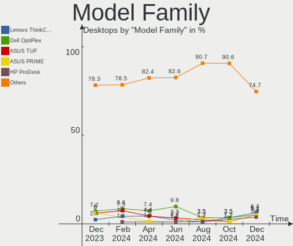
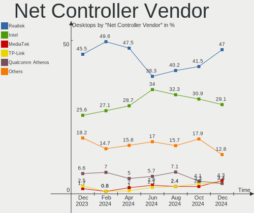

Zorin Hardware Trends (Desktops)
--------------------------------

A project to identify most popular hardware characteristics and track their change
over time based on data collected by Zorin users at https://Linux-Hardware.org.

Anyone can contribute to this report by the [hw-probe](https://github.com/linuxhw/hw-probe) tool:

    sudo -E hw-probe -all -upload

This report is for one last month. Overall report since the beginning of time: [TestCoverage](https://github.com/linuxhw/TestCoverage)

Period: Apr, 2022.

Contents
--------

* [ System ](#system)
  - [ OS                       ](#os)
  - [ OS Family                ](#os-family)
  - [ Kernel                   ](#kernel)
  - [ Kernel Family            ](#kernel-family)
  - [ Kernel Major Ver.        ](#kernel-major-ver)
  - [ Arch                     ](#arch)
  - [ DE                       ](#de)
  - [ Display Server           ](#display-server)
  - [ Display Manager          ](#display-manager)
  - [ OS Lang                  ](#os-lang)
  - [ Boot Mode                ](#boot-mode)
  - [ Filesystem               ](#filesystem)
  - [ Part. scheme             ](#part-scheme)
  - [ Dual Boot with Linux/BSD ](#dual-boot-with-linuxbsd)
  - [ Dual Boot (Win)          ](#dual-boot-win)

* [ Board ](#board)
  - [ Vendor                   ](#vendor)
  - [ Model                    ](#model)
  - [ Model Family             ](#model-family)
  - [ MFG Year                 ](#mfg-year)
  - [ Form Factor              ](#form-factor)
  - [ Secure Boot              ](#secure-boot)
  - [ Coreboot                 ](#coreboot)
  - [ RAM Size                 ](#ram-size)
  - [ RAM Used                 ](#ram-used)
  - [ Total Drives             ](#total-drives)
  - [ Has CD-ROM               ](#has-cd-rom)
  - [ Has Ethernet             ](#has-ethernet)
  - [ Has WiFi                 ](#has-wifi)
  - [ Has Bluetooth            ](#has-bluetooth)

* [ Location ](#location)
  - [ Country                  ](#country)
  - [ City                     ](#city)

* [ Drives ](#drives)
  - [ Drive Vendor             ](#drive-vendor)
  - [ Drive Model              ](#drive-model)
  - [ HDD Vendor               ](#hdd-vendor)
  - [ SSD Vendor               ](#ssd-vendor)
  - [ Drive Kind               ](#drive-kind)
  - [ Drive Connector          ](#drive-connector)
  - [ Drive Size               ](#drive-size)
  - [ Space Total              ](#space-total)
  - [ Space Used               ](#space-used)
  - [ Malfunc. Drives          ](#malfunc-drives)
  - [ Malfunc. Drive Vendor    ](#malfunc-drive-vendor)
  - [ Malfunc. HDD Vendor      ](#malfunc-hdd-vendor)
  - [ Malfunc. Drive Kind      ](#malfunc-drive-kind)
  - [ Failed Drives            ](#failed-drives)
  - [ Failed Drive Vendor      ](#failed-drive-vendor)
  - [ Drive Status             ](#drive-status)

* [ Storage controller ](#storage-controller)
  - [ Storage Vendor           ](#storage-vendor)
  - [ Storage Model            ](#storage-model)
  - [ Storage Kind             ](#storage-kind)

* [ Processor ](#processor)
  - [ CPU Vendor               ](#cpu-vendor)
  - [ CPU Model                ](#cpu-model)
  - [ CPU Model Family         ](#cpu-model-family)
  - [ CPU Cores                ](#cpu-cores)
  - [ CPU Sockets              ](#cpu-sockets)
  - [ CPU Threads              ](#cpu-threads)
  - [ CPU Op-Modes             ](#cpu-op-modes)
  - [ CPU Microcode            ](#cpu-microcode)
  - [ CPU Microarch            ](#cpu-microarch)

* [ Graphics ](#graphics)
  - [ GPU Vendor               ](#gpu-vendor)
  - [ GPU Model                ](#gpu-model)
  - [ GPU Combo                ](#gpu-combo)
  - [ GPU Driver               ](#gpu-driver)
  - [ GPU Memory               ](#gpu-memory)

* [ Monitor ](#monitor)
  - [ Monitor Vendor           ](#monitor-vendor)
  - [ Monitor Model            ](#monitor-model)
  - [ Monitor Resolution       ](#monitor-resolution)
  - [ Monitor Diagonal         ](#monitor-diagonal)
  - [ Monitor Width            ](#monitor-width)
  - [ Aspect Ratio             ](#aspect-ratio)
  - [ Monitor Area             ](#monitor-area)
  - [ Pixel Density            ](#pixel-density)
  - [ Multiple Monitors        ](#multiple-monitors)

* [ Network ](#network)
  - [ Net Controller Vendor    ](#net-controller-vendor)
  - [ Net Controller Model     ](#net-controller-model)
  - [ Wireless Vendor          ](#wireless-vendor)
  - [ Wireless Model           ](#wireless-model)
  - [ Ethernet Vendor          ](#ethernet-vendor)
  - [ Ethernet Model           ](#ethernet-model)
  - [ Net Controller Kind      ](#net-controller-kind)
  - [ Used Controller          ](#used-controller)
  - [ NICs                     ](#nics)
  - [ IPv6                     ](#ipv6)

* [ Bluetooth ](#bluetooth)
  - [ Bluetooth Vendor         ](#bluetooth-vendor)
  - [ Bluetooth Model          ](#bluetooth-model)

* [ Sound ](#sound)
  - [ Sound Vendor             ](#sound-vendor)
  - [ Sound Model              ](#sound-model)

* [ Memory ](#memory)
  - [ Memory Vendor            ](#memory-vendor)
  - [ Memory Model             ](#memory-model)
  - [ Memory Kind              ](#memory-kind)
  - [ Memory Form Factor       ](#memory-form-factor)
  - [ Memory Size              ](#memory-size)
  - [ Memory Speed             ](#memory-speed)

* [ Printers & scanners ](#printers--scanners)
  - [ Printer Vendor           ](#printer-vendor)
  - [ Printer Model            ](#printer-model)
  - [ Scanner Vendor           ](#scanner-vendor)
  - [ Scanner Model            ](#scanner-model)

* [ Camera ](#camera)
  - [ Camera Vendor            ](#camera-vendor)
  - [ Camera Model             ](#camera-model)

* [ Security ](#security)
  - [ Fingerprint Vendor       ](#fingerprint-vendor)
  - [ Fingerprint Model        ](#fingerprint-model)
  - [ Chipcard Vendor          ](#chipcard-vendor)
  - [ Chipcard Model           ](#chipcard-model)

* [ Unsupported ](#unsupported)
  - [ Unsupported Devices      ](#unsupported-devices)
  - [ Unsupported Device Types ](#unsupported-device-types)

System
------

OS
--

Installed operating systems

| Name     | Desktops | Percent |
|----------|----------|---------|
| Zorin 16 | 68       | 91.89%  |
| Zorin 15 | 6        | 8.11%   |

OS Family
---------

OS without a version

| Name  | Desktops | Percent |
|-------|----------|---------|
| Zorin | 74       | 100%    |

Kernel
------

Version of the Linux kernel

| Version               | Desktops | Percent |
|-----------------------|----------|---------|
| 5.13.0-39-generic     | 43       | 58.11%  |
| 5.13.0-40-generic     | 15       | 20.27%  |
| 5.13.0-37-generic     | 4        | 5.41%   |
| 5.4.0-107-generic     | 3        | 4.05%   |
| 5.4.0-109-generic     | 2        | 2.7%    |
| 5.13.0-30-generic     | 2        | 2.7%    |
| 5.4.0-45-generic      | 1        | 1.35%   |
| 5.17.1-051701-generic | 1        | 1.35%   |
| 5.13.0-41-generic     | 1        | 1.35%   |
| 5.13.0-35-generic     | 1        | 1.35%   |
| 5.11.0-40-generic     | 1        | 1.35%   |

Kernel Family
-------------

Linux kernel without a distro release

| Version | Desktops | Percent |
|---------|----------|---------|
| 5.13.0  | 66       | 89.19%  |
| 5.4.0   | 6        | 8.11%   |
| 5.17.1  | 1        | 1.35%   |
| 5.11.0  | 1        | 1.35%   |

Kernel Major Ver.
-----------------

Linux kernel major version

| Version | Desktops | Percent |
|---------|----------|---------|
| 5.13    | 66       | 89.19%  |
| 5.4     | 6        | 8.11%   |
| 5.17    | 1        | 1.35%   |
| 5.11    | 1        | 1.35%   |

Arch
----

OS architecture (x86_64, i586, etc.)

| Name   | Desktops | Percent |
|--------|----------|---------|
| x86_64 | 69       | 93.24%  |
| i686   | 5        | 6.76%   |

DE
--

Desktop Environment

| Name  | Desktops | Percent |
|-------|----------|---------|
| GNOME | 58       | 78.38%  |
| XFCE  | 16       | 21.62%  |

Display Server
--------------

X11 or Wayland

| Name | Desktops | Percent |
|------|----------|---------|
| X11  | 74       | 100%    |

Display Manager
---------------

SDDM, LightDM, etc.

| Name    | Desktops | Percent |
|---------|----------|---------|
| Unknown | 51       | 68.92%  |
| LightDM | 10       | 13.51%  |
| GDM3    | 8        | 10.81%  |
| GDM     | 5        | 6.76%   |

OS Lang
-------

Language

| Lang  | Desktops | Percent |
|-------|----------|---------|
| en_US | 29       | 39.19%  |
| en_GB | 7        | 9.46%   |
| pl_PL | 4        | 5.41%   |
| en_AU | 4        | 5.41%   |
| de_DE | 4        | 5.41%   |
| ru_RU | 3        | 4.05%   |
| nl_NL | 3        | 4.05%   |
| it_IT | 3        | 4.05%   |
| fr_CA | 3        | 4.05%   |
| en_CA | 3        | 4.05%   |
| pt_BR | 2        | 2.7%    |
| hu_HU | 2        | 2.7%    |
| fr_FR | 2        | 2.7%    |
| nl_BE | 1        | 1.35%   |
| hr_HR | 1        | 1.35%   |
| es_MX | 1        | 1.35%   |
| es_ES | 1        | 1.35%   |
| es_EC | 1        | 1.35%   |

Boot Mode
---------

EFI or BIOS

| Mode | Desktops | Percent |
|------|----------|---------|
| BIOS | 45       | 60.81%  |
| EFI  | 29       | 39.19%  |

Filesystem
----------

Type of filesystem

| Type    | Desktops | Percent |
|---------|----------|---------|
| Ext4    | 71       | 95.95%  |
| Zfs     | 2        | 2.7%    |
| Overlay | 1        | 1.35%   |

Part. scheme
------------

Scheme of partitioning

| Type    | Desktops | Percent |
|---------|----------|---------|
| Unknown | 66       | 89.19%  |
| GPT     | 7        | 9.46%   |
| MBR     | 1        | 1.35%   |

Dual Boot with Linux/BSD
------------------------

Hosting more than one Linux/BSD

| Dual boot | Desktops | Percent |
|-----------|----------|---------|
| No        | 72       | 97.3%   |
| Yes       | 2        | 2.7%    |

Dual Boot (Win)
---------------

Hosting Linux and Windows

| Dual boot | Desktops | Percent |
|-----------|----------|---------|
| No        | 61       | 82.43%  |
| Yes       | 13       | 17.57%  |

Board
-----

Vendor
------

Motherboard manufacturer

| Name                | Desktops | Percent |
|---------------------|----------|---------|
| ASUSTek Computer    | 19       | 25.68%  |
| Gigabyte Technology | 11       | 14.86%  |
| MSI                 | 10       | 13.51%  |
| ASRock              | 7        | 9.46%   |
| Dell                | 5        | 6.76%   |
| Lenovo              | 4        | 5.41%   |
| Hewlett-Packard     | 3        | 4.05%   |
| Foxconn             | 2        | 2.7%    |
| Acer                | 2        | 2.7%    |
| Unknown             | 2        | 2.7%    |
| Pegatron            | 1        | 1.35%   |
| Medion              | 1        | 1.35%   |
| Intel               | 1        | 1.35%   |
| Huanan              | 1        | 1.35%   |
| Fujitsu             | 1        | 1.35%   |
| ECS                 | 1        | 1.35%   |
| BESSTAR Tech        | 1        | 1.35%   |
| Apple               | 1        | 1.35%   |
| Alienware           | 1        | 1.35%   |

Model
-----

Motherboard model

| Name                               | Desktops | Percent |
|------------------------------------|----------|---------|
| ASUS All Series                    | 2        | 2.7%    |
| Unknown                            | 2        | 2.7%    |
| Pegatron Compaq 505B Microtower PC | 1        | 1.35%   |
| MSI MS-7C82                        | 1        | 1.35%   |
| MSI MS-7C02                        | 1        | 1.35%   |
| MSI MS-7B85                        | 1        | 1.35%   |
| MSI MS-7A38                        | 1        | 1.35%   |
| MSI MS-7977                        | 1        | 1.35%   |
| MSI MS-7758                        | 1        | 1.35%   |
| MSI MS-7641                        | 1        | 1.35%   |
| MSI MS-7204                        | 1        | 1.35%   |
| MSI MS-6701                        | 1        | 1.35%   |
| MSI 700-056                        | 1        | 1.35%   |
| Medion MS-7366                     | 1        | 1.35%   |
| Lenovo ThinkStation E31 2552CTO    | 1        | 1.35%   |
| Lenovo ThinkCentre M91p 7052A9G    | 1        | 1.35%   |
| Lenovo ThinkCentre A62 7057A77     | 1        | 1.35%   |
| Lenovo H30-50 90B8003BGE           | 1        | 1.35%   |
| Intel DCP847SKE G80890-105         | 1        | 1.35%   |
| Huanan X79 249PC V2.2              | 1        | 1.35%   |
| HP Z220 SFF Workstation            | 1        | 1.35%   |
| HP EliteDesk 800 G4 DM 65W         | 1        | 1.35%   |
| HP EliteDesk 705 G3 SFF            | 1        | 1.35%   |
| Gigabyte Z77-DS3H                  | 1        | 1.35%   |
| Gigabyte Z77-D3H                   | 1        | 1.35%   |
| Gigabyte Z68AP-D3                  | 1        | 1.35%   |
| Gigabyte P31-ES3G                  | 1        | 1.35%   |
| Gigabyte G1.Sniper A88X-CF         | 1        | 1.35%   |
| Gigabyte B450 I AORUS PRO WIFI     | 1        | 1.35%   |
| Gigabyte B365M GAMING HD           | 1        | 1.35%   |
| Gigabyte A520 AORUS ELITE          | 1        | 1.35%   |
| Gigabyte A320M-S2H                 | 1        | 1.35%   |
| Gigabyte A320M-H                   | 1        | 1.35%   |
| Gigabyte 945PL-S3                  | 1        | 1.35%   |
| Fujitsu ESPRIMO_D556               | 1        | 1.35%   |
| Foxconn p6520y                     | 1        | 1.35%   |
| Foxconn 2A92                       | 1        | 1.35%   |
| ECS Livermore                      | 1        | 1.35%   |
| Dell Vostro 260                    | 1        | 1.35%   |
| Dell Precision WorkStation T3500   | 1        | 1.35%   |
| Dell OptiPlex 755                  | 1        | 1.35%   |
| Dell OptiPlex 380                  | 1        | 1.35%   |
| Dell OptiPlex 3050                 | 1        | 1.35%   |
| BESSTAR Tech HM90                  | 1        | 1.35%   |
| ASUS ROG STRIX Z370-F GAMING       | 1        | 1.35%   |
| ASUS ROG STRIX Z370-E GAMING       | 1        | 1.35%   |
| ASUS ROG STRIX B450-F GAMING       | 1        | 1.35%   |
| ASUS ROG Maximus XIII HERO         | 1        | 1.35%   |
| ASUS ROG CROSSHAIR VIII FORMULA    | 1        | 1.35%   |
| ASUS PRIME Z390-A                  | 1        | 1.35%   |
| ASUS PRIME X570-P                  | 1        | 1.35%   |
| ASUS P8B75-V                       | 1        | 1.35%   |
| ASUS P5GD1 PRO                     | 1        | 1.35%   |
| ASUS P5GC-MX                       | 1        | 1.35%   |
| ASUS M5A78L-M/USB3                 | 1        | 1.35%   |
| ASUS M5A78L-M LX V2                | 1        | 1.35%   |
| ASUS KomplettPC                    | 1        | 1.35%   |
| ASUS K30AD_M31AD_M51AD             | 1        | 1.35%   |
| ASUS INTEL                         | 1        | 1.35%   |
| ASUS F2A85-V                       | 1        | 1.35%   |

Model Family
------------

Motherboard model prefix

| Name                | Desktops | Percent |
|---------------------|----------|---------|
| ASUS ROG            | 5        | 6.76%   |
| Dell OptiPlex       | 3        | 4.05%   |
| Lenovo ThinkCentre  | 2        | 2.7%    |
| HP EliteDesk        | 2        | 2.7%    |
| ASUS PRIME          | 2        | 2.7%    |
| ASUS M5A78L-M       | 2        | 2.7%    |
| ASUS All            | 2        | 2.7%    |
| Unknown             | 2        | 2.7%    |
| Pegatron Compaq     | 1        | 1.35%   |
| MSI MS-7C82         | 1        | 1.35%   |
| MSI MS-7C02         | 1        | 1.35%   |
| MSI MS-7B85         | 1        | 1.35%   |
| MSI MS-7A38         | 1        | 1.35%   |
| MSI MS-7977         | 1        | 1.35%   |
| MSI MS-7758         | 1        | 1.35%   |
| MSI MS-7641         | 1        | 1.35%   |
| MSI MS-7204         | 1        | 1.35%   |
| MSI MS-6701         | 1        | 1.35%   |
| MSI 700-056         | 1        | 1.35%   |
| Medion MS-7366      | 1        | 1.35%   |
| Lenovo ThinkStation | 1        | 1.35%   |
| Lenovo H30-50       | 1        | 1.35%   |
| Intel DCP847SKE     | 1        | 1.35%   |
| Huanan X79          | 1        | 1.35%   |
| HP Z220             | 1        | 1.35%   |
| Gigabyte Z77-DS3H   | 1        | 1.35%   |
| Gigabyte Z77-D3H    | 1        | 1.35%   |
| Gigabyte Z68AP-D3   | 1        | 1.35%   |
| Gigabyte P31-ES3G   | 1        | 1.35%   |
| Gigabyte G1.Sniper  | 1        | 1.35%   |
| Gigabyte B450       | 1        | 1.35%   |
| Gigabyte B365M      | 1        | 1.35%   |
| Gigabyte A520       | 1        | 1.35%   |
| Gigabyte A320M-S2H  | 1        | 1.35%   |
| Gigabyte A320M-H    | 1        | 1.35%   |
| Gigabyte 945PL-S3   | 1        | 1.35%   |
| Fujitsu ESPRIMO     | 1        | 1.35%   |
| Foxconn p6520y      | 1        | 1.35%   |
| Foxconn 2A92        | 1        | 1.35%   |
| ECS Livermore       | 1        | 1.35%   |
| Dell Vostro         | 1        | 1.35%   |
| Dell Precision      | 1        | 1.35%   |
| BESSTAR Tech HM90   | 1        | 1.35%   |
| ASUS P8B75-V        | 1        | 1.35%   |
| ASUS P5GD1          | 1        | 1.35%   |
| ASUS P5GC-MX        | 1        | 1.35%   |
| ASUS KomplettPC     | 1        | 1.35%   |
| ASUS K30AD          | 1        | 1.35%   |
| ASUS INTEL          | 1        | 1.35%   |
| ASUS F2A85-V        | 1        | 1.35%   |
| ASUS C51-MCP51      | 1        | 1.35%   |
| ASRock Z87          | 1        | 1.35%   |
| ASRock X570         | 1        | 1.35%   |
| ASRock X399         | 1        | 1.35%   |
| ASRock H61M-DGS     | 1        | 1.35%   |
| ASRock H170M        | 1        | 1.35%   |
| ASRock B460M-ITX    | 1        | 1.35%   |
| ASRock B450         | 1        | 1.35%   |
| Apple MacPro3       | 1        | 1.35%   |
| Alienware Aurora    | 1        | 1.35%   |

MFG Year
--------

Motherboard manufacture year

| Year    | Desktops | Percent |
|---------|----------|---------|
| 2018    | 10       | 13.51%  |
| 2017    | 7        | 9.46%   |
| 2012    | 7        | 9.46%   |
| 2011    | 6        | 8.11%   |
| 2021    | 5        | 6.76%   |
| 2020    | 4        | 5.41%   |
| 2014    | 4        | 5.41%   |
| 2013    | 4        | 5.41%   |
| 2010    | 4        | 5.41%   |
| 2007    | 4        | 5.41%   |
| 2019    | 3        | 4.05%   |
| 2015    | 3        | 4.05%   |
| 2009    | 3        | 4.05%   |
| 2005    | 3        | 4.05%   |
| 2022    | 2        | 2.7%    |
| 2008    | 2        | 2.7%    |
| 2006    | 2        | 2.7%    |
| Unknown | 1        | 1.35%   |

Form Factor
-----------

Physical design of the computer

| Name    | Desktops | Percent |
|---------|----------|---------|
| Desktop | 74       | 100%    |

Secure Boot
-----------

Enabled or disabled

| State    | Desktops | Percent |
|----------|----------|---------|
| Disabled | 72       | 97.3%   |
| Enabled  | 2        | 2.7%    |

Coreboot
--------

Have coreboot on board

| Used | Desktops | Percent |
|------|----------|---------|
| No   | 74       | 100%    |

RAM Size
--------

Total RAM memory

| Size in GB  | Desktops | Percent |
|-------------|----------|---------|
| 16.01-24.0  | 16       | 21.62%  |
| 8.01-16.0   | 16       | 21.62%  |
| 32.01-64.0  | 12       | 16.22%  |
| 4.01-8.0    | 10       | 13.51%  |
| 3.01-4.0    | 6        | 8.11%   |
| 24.01-32.0  | 5        | 6.76%   |
| 0.51-1.0    | 3        | 4.05%   |
| 2.01-3.0    | 2        | 2.7%    |
| 64.01-256.0 | 2        | 2.7%    |
| 1.01-2.0    | 2        | 2.7%    |

RAM Used
--------

Used RAM memory

| Used GB   | Desktops | Percent |
|-----------|----------|---------|
| 1.01-2.0  | 25       | 33.78%  |
| 2.01-3.0  | 19       | 25.68%  |
| 4.01-8.0  | 13       | 17.57%  |
| 3.01-4.0  | 11       | 14.86%  |
| 0.51-1.0  | 4        | 5.41%   |
| 8.01-16.0 | 1        | 1.35%   |
| 0.01-0.5  | 1        | 1.35%   |

Total Drives
------------

Number of drives on board

| Drives | Desktops | Percent |
|--------|----------|---------|
| 1      | 34       | 45.95%  |
| 2      | 24       | 32.43%  |
| 3      | 11       | 14.86%  |
| 4      | 2        | 2.7%    |
| 8      | 1        | 1.35%   |
| 6      | 1        | 1.35%   |
| 5      | 1        | 1.35%   |

Has CD-ROM
----------

Has CD-ROM on board

| Presented | Desktops | Percent |
|-----------|----------|---------|
| Yes       | 43       | 58.11%  |
| No        | 31       | 41.89%  |

Has Ethernet
------------

Has Ethernet on board

| Presented | Desktops | Percent |
|-----------|----------|---------|
| Yes       | 73       | 98.65%  |
| No        | 1        | 1.35%   |

Has WiFi
--------

Has WiFi module

| Presented | Desktops | Percent |
|-----------|----------|---------|
| Yes       | 40       | 54.05%  |
| No        | 34       | 45.95%  |

Has Bluetooth
-------------

Has Bluetooth module

| Presented | Desktops | Percent |
|-----------|----------|---------|
| No        | 46       | 62.16%  |
| Yes       | 28       | 37.84%  |

Location
--------

Country
-------

Geographic location (country)

| Country     | Desktops | Percent |
|-------------|----------|---------|
| USA         | 16       | 21.62%  |
| UK          | 6        | 8.11%   |
| Canada      | 5        | 6.76%   |
| Poland      | 4        | 5.41%   |
| Brazil      | 4        | 5.41%   |
| Australia   | 4        | 5.41%   |
| Serbia      | 3        | 4.05%   |
| Russia      | 3        | 4.05%   |
| Netherlands | 3        | 4.05%   |
| Italy       | 3        | 4.05%   |
| Germany     | 3        | 4.05%   |
| France      | 3        | 4.05%   |
| Slovenia    | 2        | 2.7%    |
| Hungary     | 2        | 2.7%    |
| Thailand    | 1        | 1.35%   |
| Sweden      | 1        | 1.35%   |
| Spain       | 1        | 1.35%   |
| Puerto Rico | 1        | 1.35%   |
| Norway      | 1        | 1.35%   |
| Mexico      | 1        | 1.35%   |
| Malta       | 1        | 1.35%   |
| Latvia      | 1        | 1.35%   |
| Greece      | 1        | 1.35%   |
| Egypt       | 1        | 1.35%   |
| Ecuador     | 1        | 1.35%   |
| Croatia     | 1        | 1.35%   |
| Belgium     | 1        | 1.35%   |

City
----

Geographic location (city)

| City             | Desktops | Percent |
|------------------|----------|---------|
| Rome             | 2        | 2.7%    |
| Milwaukee        | 2        | 2.7%    |
| Laval            | 2        | 2.7%    |
| Zagreb           | 1        | 1.35%   |
| Wołomin         | 1        | 1.35%   |
| West Monroe      | 1        | 1.35%   |
| West Lafayette   | 1        | 1.35%   |
| Walled Lake      | 1        | 1.35%   |
| Vrhnika          | 1        | 1.35%   |
| Volgograd        | 1        | 1.35%   |
| Toulouse         | 1        | 1.35%   |
| The Hague        | 1        | 1.35%   |
| Sturgeon Bay     | 1        | 1.35%   |
| Smederevo        | 1        | 1.35%   |
| Seville          | 1        | 1.35%   |
| Scottsburg       | 1        | 1.35%   |
| Roosendaal       | 1        | 1.35%   |
| Rio de Janeiro   | 1        | 1.35%   |
| Riga             | 1        | 1.35%   |
| Richmond         | 1        | 1.35%   |
| Quito            | 1        | 1.35%   |
| Poznan           | 1        | 1.35%   |
| Portland         | 1        | 1.35%   |
| Perth            | 1        | 1.35%   |
| Oslo             | 1        | 1.35%   |
| Nova Lima        | 1        | 1.35%   |
| Nottingham       | 1        | 1.35%   |
| Norwich          | 1        | 1.35%   |
| Nizhny Tagil     | 1        | 1.35%   |
| Muta             | 1        | 1.35%   |
| Mitchell         | 1        | 1.35%   |
| Milan            | 1        | 1.35%   |
| Merchtem         | 1        | 1.35%   |
| Medford          | 1        | 1.35%   |
| Maunabo          | 1        | 1.35%   |
| Lure             | 1        | 1.35%   |
| Loughborough     | 1        | 1.35%   |
| Langley          | 1        | 1.35%   |
| Kielce           | 1        | 1.35%   |
| Helensburgh      | 1        | 1.35%   |
| Hässleholm      | 1        | 1.35%   |
| Gliwice          | 1        | 1.35%   |
| Giza             | 1        | 1.35%   |
| Gillingham       | 1        | 1.35%   |
| Geelong          | 1        | 1.35%   |
| Gatchina         | 1        | 1.35%   |
| Friedberg        | 1        | 1.35%   |
| Fortaleza        | 1        | 1.35%   |
| Fort Lauderdale  | 1        | 1.35%   |
| Domos            | 1        | 1.35%   |
| Denver           | 1        | 1.35%   |
| Clichy-sous-Bois | 1        | 1.35%   |
| Chardon          | 1        | 1.35%   |
| Chambly          | 1        | 1.35%   |
| Canberra         | 1        | 1.35%   |
| Calgary          | 1        | 1.35%   |
| Budapest         | 1        | 1.35%   |
| Bucyrus          | 1        | 1.35%   |
| Bristol          | 1        | 1.35%   |
| Brisbane         | 1        | 1.35%   |

Drives
------

Drive Vendor
------------

Hard drive vendors

| Vendor                | Desktops | Drives | Percent |
|-----------------------|----------|--------|---------|
| Seagate               | 25       | 31     | 20.16%  |
| WDC                   | 23       | 28     | 18.55%  |
| Samsung Electronics   | 12       | 16     | 9.68%   |
| Kingston              | 10       | 10     | 8.06%   |
| Toshiba               | 9        | 9      | 7.26%   |
| Crucial               | 7        | 8      | 5.65%   |
| SanDisk               | 4        | 4      | 3.23%   |
| Intel                 | 4        | 4      | 3.23%   |
| Hitachi               | 4        | 4      | 3.23%   |
| Silicon Motion        | 3        | 4      | 2.42%   |
| Gigabyte Technology   | 2        | 3      | 1.61%   |
| A-DATA Technology     | 2        | 3      | 1.61%   |
| Unknown               | 1        | 1      | 0.81%   |
| TwinMOS               | 1        | 1      | 0.81%   |
| Transcend             | 1        | 1      | 0.81%   |
| SK Hynix              | 1        | 1      | 0.81%   |
| SABRENT               | 1        | 1      | 0.81%   |
| Realtek Semiconductor | 1        | 1      | 0.81%   |
| PNY                   | 1        | 2      | 0.81%   |
| PLEXTOR               | 1        | 1      | 0.81%   |
| OCZ                   | 1        | 1      | 0.81%   |
| KIOXIA-EXCERIA        | 1        | 1      | 0.81%   |
| HGST                  | 1        | 1      | 0.81%   |
| Hewlett-Packard       | 1        | 1      | 0.81%   |
| GOODRAM               | 1        | 1      | 0.81%   |
| FORESEE               | 1        | 1      | 0.81%   |
| DREVO                 | 1        | 1      | 0.81%   |
| China                 | 1        | 1      | 0.81%   |
| Apple                 | 1        | 1      | 0.81%   |
| AFOX                  | 1        | 1      | 0.81%   |
| Acer                  | 1        | 1      | 0.81%   |

Drive Model
-----------

Hard drive models

| Model                                | Desktops | Percent |
|--------------------------------------|----------|---------|
| WDC WD10EZEX-00WN4A0 1TB             | 3        | 2.13%   |
| Seagate ST1000DM003-1CH162 1TB       | 3        | 2.13%   |
| WDC WDS500G2B0A-00SM50 500GB SSD     | 2        | 1.42%   |
| WDC WD5000AAKX-00ERMA0 500GB         | 2        | 1.42%   |
| Toshiba HDWD110 1TB                  | 2        | 1.42%   |
| Toshiba DT01ACA100 1TB               | 2        | 1.42%   |
| Seagate ST4000DM000-1F2168 4TB       | 2        | 1.42%   |
| Seagate ST1000DM003-1SB102 1TB       | 2        | 1.42%   |
| Samsung SSD 860 EVO 500GB            | 2        | 1.42%   |
| Kingston SV300S37A120G 120GB SSD     | 2        | 1.42%   |
| Kingston NVMe SSD Drive 500GB        | 2        | 1.42%   |
| Crucial CT480BX500SSD1 480GB         | 2        | 1.42%   |
| Crucial CT240BX500SSD1 240GB         | 2        | 1.42%   |
| WDC WDBNCE5000PNC 500GB SSD          | 1        | 0.71%   |
| WDC WD800JD-60LSA5 80GB              | 1        | 0.71%   |
| WDC WD6402AAEX-00Z3A0 640GB          | 1        | 0.71%   |
| WDC WD6402AAEX-00Y9A0 640GB          | 1        | 0.71%   |
| WDC WD5000LPLX-08ZNTT0 500GB         | 1        | 0.71%   |
| WDC WD5000AAKX-22ERMA0 500GB         | 1        | 0.71%   |
| WDC WD5000AAKX-08U6AA0 500GB         | 1        | 0.71%   |
| WDC WD5000AAKS-00UU3A0 500GB         | 1        | 0.71%   |
| WDC WD3200BEVT-08A23T1 320GB         | 1        | 0.71%   |
| WDC WD3200AAKS-00SBA0 320GB          | 1        | 0.71%   |
| WDC WD1600JS-60NCB1 160GB            | 1        | 0.71%   |
| WDC WD1600AAJS-22PSA0 160GB          | 1        | 0.71%   |
| WDC WD1600AAJS-07M0A0 160GB          | 1        | 0.71%   |
| WDC WD10JUCT-63CYNY0 1TB             | 1        | 0.71%   |
| WDC WD10EZEX-75WN4A0 1TB             | 1        | 0.71%   |
| WDC WD10EZEX-08WN4A0 1TB             | 1        | 0.71%   |
| WDC WD10EZEX-00BBHA0 1TB             | 1        | 0.71%   |
| WDC WD10EADS-65M2B1 1TB              | 1        | 0.71%   |
| WDC WD101KRYZ-01JPDB1 10TB           | 1        | 0.71%   |
| WDC WD1005FBYZ-01YCBB2 1TB           | 1        | 0.71%   |
| WDC WD1003FZEX-00MK2A0 1TB           | 1        | 0.71%   |
| Unknown MMC Card  32GB               | 1        | 0.71%   |
| TwinMOS SSD 128GB                    | 1        | 0.71%   |
| Transcend TS120GSSD220S 120GB        | 1        | 0.71%   |
| Toshiba THNSNJ128GMCU 128GB SSD      | 1        | 0.71%   |
| Toshiba NVMe SSD Drive 512GB         | 1        | 0.71%   |
| Toshiba MG03ACA200 2TB               | 1        | 0.71%   |
| Toshiba KBG30ZMS128G 128GB NVMe SSD  | 1        | 0.71%   |
| Toshiba HDWJ110 1TB                  | 1        | 0.71%   |
| SK Hynix NVMe SSD Drive 128GB        | 1        | 0.71%   |
| Silicon Motion NVMe SSD Drive 256GB  | 1        | 0.71%   |
| Silicon Motion NVMe SSD Drive 250GB  | 1        | 0.71%   |
| Silicon Motion NVMe SSD Drive 1024GB | 1        | 0.71%   |
| Silicon Motion Inland NVMe SSD 1TB   | 1        | 0.71%   |
| Seagate ST8000AS0002-1NA17Z 8TB      | 1        | 0.71%   |
| Seagate ST6000DM003-2CY186 6TB       | 1        | 0.71%   |
| Seagate ST500LM021-1KJ152 500GB      | 1        | 0.71%   |
| Seagate ST500DM002-1BD142 500GB      | 1        | 0.71%   |
| Seagate ST4000DM004-2U9104 4TB       | 1        | 0.71%   |
| Seagate ST4000DM004-2CV104 4TB       | 1        | 0.71%   |
| Seagate ST3500630AS 500GB            | 1        | 0.71%   |
| Seagate ST3500414CS 500GB            | 1        | 0.71%   |
| Seagate ST3500413AS 500GB            | 1        | 0.71%   |
| Seagate ST3320820AS 320GB            | 1        | 0.71%   |
| Seagate ST3320620AS 320GB            | 1        | 0.71%   |
| Seagate ST3320310CS 320GB            | 1        | 0.71%   |
| Seagate ST3250824AS 250GB            | 1        | 0.71%   |

HDD Vendor
----------

Hard disk drive vendors

| Vendor              | Desktops | Drives | Percent |
|---------------------|----------|--------|---------|
| Seagate             | 25       | 30     | 41.67%  |
| WDC                 | 21       | 25     | 35%     |
| Toshiba             | 6        | 6      | 10%     |
| Hitachi             | 4        | 4      | 6.67%   |
| Samsung Electronics | 2        | 2      | 3.33%   |
| SABRENT             | 1        | 1      | 1.67%   |
| HGST                | 1        | 1      | 1.67%   |

SSD Vendor
----------

Solid state drive vendors

| Vendor              | Desktops | Drives | Percent |
|---------------------|----------|--------|---------|
| Crucial             | 7        | 8      | 15.22%  |
| Samsung Electronics | 6        | 7      | 13.04%  |
| Kingston            | 5        | 5      | 10.87%  |
| WDC                 | 3        | 3      | 6.52%   |
| Intel               | 3        | 3      | 6.52%   |
| SanDisk             | 2        | 2      | 4.35%   |
| Gigabyte Technology | 2        | 3      | 4.35%   |
| A-DATA Technology   | 2        | 3      | 4.35%   |
| TwinMOS             | 1        | 1      | 2.17%   |
| Transcend           | 1        | 1      | 2.17%   |
| Toshiba             | 1        | 1      | 2.17%   |
| Seagate             | 1        | 1      | 2.17%   |
| PNY                 | 1        | 2      | 2.17%   |
| PLEXTOR             | 1        | 1      | 2.17%   |
| OCZ                 | 1        | 1      | 2.17%   |
| KIOXIA-EXCERIA      | 1        | 1      | 2.17%   |
| Hewlett-Packard     | 1        | 1      | 2.17%   |
| GOODRAM             | 1        | 1      | 2.17%   |
| FORESEE             | 1        | 1      | 2.17%   |
| DREVO               | 1        | 1      | 2.17%   |
| China               | 1        | 1      | 2.17%   |
| Apple               | 1        | 1      | 2.17%   |
| AFOX                | 1        | 1      | 2.17%   |
| Acer                | 1        | 1      | 2.17%   |

Drive Kind
----------

HDD or SSD

| Kind | Desktops | Drives | Percent |
|------|----------|--------|---------|
| HDD  | 49       | 69     | 45.79%  |
| SSD  | 39       | 51     | 36.45%  |
| NVMe | 18       | 23     | 16.82%  |
| MMC  | 1        | 1      | 0.93%   |

Drive Connector
---------------

SATA, SAS, NVMe, etc.

| Type | Desktops | Drives | Percent |
|------|----------|--------|---------|
| SATA | 64       | 117    | 74.42%  |
| NVMe | 18       | 23     | 20.93%  |
| SAS  | 3        | 3      | 3.49%   |
| MMC  | 1        | 1      | 1.16%   |

Drive Size
----------

Size of hard drive

| Size in TB | Desktops | Drives | Percent |
|------------|----------|--------|---------|
| 0.01-0.5   | 51       | 71     | 56.67%  |
| 0.51-1.0   | 26       | 32     | 28.89%  |
| 1.01-2.0   | 5        | 6      | 5.56%   |
| 3.01-4.0   | 4        | 5      | 4.44%   |
| 4.01-10.0  | 3        | 5      | 3.33%   |
| 2.01-3.0   | 1        | 1      | 1.11%   |

Space Total
-----------

Amount of disk space available on the file system

| Size in GB     | Desktops | Percent |
|----------------|----------|---------|
| 251-500        | 21       | 28.38%  |
| 101-250        | 21       | 28.38%  |
| 1001-2000      | 8        | 10.81%  |
| 501-1000       | 8        | 10.81%  |
| 2001-3000      | 6        | 8.11%   |
| 51-100         | 5        | 6.76%   |
| More than 3000 | 3        | 4.05%   |
| 21-50          | 1        | 1.35%   |
| Unknown        | 1        | 1.35%   |

Space Used
----------

Amount of used disk space

| Used GB        | Desktops | Percent |
|----------------|----------|---------|
| 1-20           | 24       | 32.43%  |
| 21-50          | 22       | 29.73%  |
| 51-100         | 8        | 10.81%  |
| 251-500        | 7        | 9.46%   |
| 101-250        | 4        | 5.41%   |
| 1001-2000      | 3        | 4.05%   |
| 501-1000       | 3        | 4.05%   |
| More than 3000 | 1        | 1.35%   |
| 2001-3000      | 1        | 1.35%   |
| Unknown        | 1        | 1.35%   |

Malfunc. Drives
---------------

Drive models with a malfunction

| Model                              | Desktops | Drives | Percent |
|------------------------------------|----------|--------|---------|
| Toshiba MG03ACA200 2TB             | 1        | 1      | 25%     |
| Silicon Motion Inland NVMe SSD 1TB | 1        | 1      | 25%     |
| Seagate ST3500413AS 500GB          | 1        | 1      | 25%     |
| OCZ VERTEX3 120GB SSD              | 1        | 1      | 25%     |

Malfunc. Drive Vendor
---------------------

Vendors of faulty drives

| Vendor         | Desktops | Drives | Percent |
|----------------|----------|--------|---------|
| Toshiba        | 1        | 1      | 25%     |
| Silicon Motion | 1        | 1      | 25%     |
| Seagate        | 1        | 1      | 25%     |
| OCZ            | 1        | 1      | 25%     |

Malfunc. HDD Vendor
-------------------

Vendors of faulty HDD drives

| Vendor  | Desktops | Drives | Percent |
|---------|----------|--------|---------|
| Toshiba | 1        | 1      | 50%     |
| Seagate | 1        | 1      | 50%     |

Malfunc. Drive Kind
-------------------

Kinds of faulty drives

| Kind | Desktops | Drives | Percent |
|------|----------|--------|---------|
| HDD  | 2        | 2      | 50%     |
| NVMe | 1        | 1      | 25%     |
| SSD  | 1        | 1      | 25%     |

Failed Drives
-------------

Failed drive models

Zero info for selected period =(

Failed Drive Vendor
-------------------

Failed drive vendors

Zero info for selected period =(

Drive Status
------------

Number of failed and malfunc. drives

| Status   | Desktops | Drives | Percent |
|----------|----------|--------|---------|
| Detected | 66       | 125    | 84.62%  |
| Works    | 8        | 15     | 10.26%  |
| Malfunc  | 4        | 4      | 5.13%   |

Storage controller
------------------

Storage Vendor
--------------

Storage controller vendors

| Vendor                           | Desktops | Percent |
|----------------------------------|----------|---------|
| Intel                            | 45       | 47.37%  |
| AMD                              | 26       | 27.37%  |
| Samsung Electronics              | 5        | 5.26%   |
| Kingston Technology Company      | 5        | 5.26%   |
| Silicon Motion                   | 3        | 3.16%   |
| Nvidia                           | 3        | 3.16%   |
| Toshiba America Info Systems     | 2        | 2.11%   |
| Sandisk                          | 2        | 2.11%   |
| SK Hynix                         | 1        | 1.05%   |
| Silicon Integrated Systems [SiS] | 1        | 1.05%   |
| Silicon Image                    | 1        | 1.05%   |
| Realtek Semiconductor            | 1        | 1.05%   |

Storage Model
-------------

Storage controller models

| Model                                                                                   | Desktops | Percent |
|-----------------------------------------------------------------------------------------|----------|---------|
| AMD FCH SATA Controller [AHCI mode]                                                     | 17       | 13.71%  |
| Intel SATA Controller [RAID mode]                                                       | 6        | 4.84%   |
| Intel NM10/ICH7 Family SATA Controller [IDE mode]                                       | 6        | 4.84%   |
| AMD 400 Series Chipset SATA Controller                                                  | 5        | 4.03%   |
| Intel 8 Series/C220 Series Chipset Family 6-port SATA Controller 1 [AHCI mode]          | 4        | 3.23%   |
| Intel 7 Series/C210 Series Chipset Family 6-port SATA Controller [AHCI mode]            | 4        | 3.23%   |
| AMD SB7x0/SB8x0/SB9x0 SATA Controller [IDE mode]                                        | 4        | 3.23%   |
| AMD SB7x0/SB8x0/SB9x0 IDE Controller                                                    | 4        | 3.23%   |
| Silicon Motion SM2263EN/SM2263XT SSD Controller                                         | 3        | 2.42%   |
| Kingston Company A2000 NVMe SSD                                                         | 3        | 2.42%   |
| Intel 82801G (ICH7 Family) IDE Controller                                               | 3        | 2.42%   |
| Samsung NVMe SSD Controller SM981/PM981/PM983                                           | 2        | 1.61%   |
| Samsung NVMe SSD Controller PM9A1/PM9A3/980PRO                                          | 2        | 1.61%   |
| Intel Q170/Q150/B150/H170/H110/Z170/CM236 Chipset SATA Controller [AHCI Mode]           | 2        | 1.61%   |
| Intel Cannon Lake PCH SATA AHCI Controller                                              | 2        | 1.61%   |
| Intel 7 Series/C210 Series Chipset Family 4-port SATA Controller [IDE mode]             | 2        | 1.61%   |
| Intel 7 Series/C210 Series Chipset Family 2-port SATA Controller [IDE mode]             | 2        | 1.61%   |
| Intel 6 Series/C200 Series Chipset Family Desktop SATA Controller (IDE mode, ports 4-5) | 2        | 1.61%   |
| Intel 6 Series/C200 Series Chipset Family Desktop SATA Controller (IDE mode, ports 0-3) | 2        | 1.61%   |
| Intel 6 Series/C200 Series Chipset Family 6 port Desktop SATA AHCI Controller           | 2        | 1.61%   |
| Intel 400 Series Chipset Family SATA AHCI Controller                                    | 2        | 1.61%   |
| Intel 200 Series PCH SATA controller [AHCI mode]                                        | 2        | 1.61%   |
| AMD FCH SATA Controller D                                                               | 2        | 1.61%   |
| AMD 500 Series Chipset SATA Controller                                                  | 2        | 1.61%   |
| Toshiba America Info Systems Toshiba America Info Non-Volatile memory controller        | 1        | 0.81%   |
| Toshiba America Info Systems BG3 NVMe SSD Controller                                    | 1        | 0.81%   |
| SK Hynix BC501 NVMe Solid State Drive                                                   | 1        | 0.81%   |
| Silicon Integrated Systems [SiS] 5513 IDE Controller                                    | 1        | 0.81%   |
| Silicon Image SiI 3132 Serial ATA Raid II Controller                                    | 1        | 0.81%   |
| Sandisk WD Blue SN570 NVMe SSD                                                          | 1        | 0.81%   |
| Sandisk WD Black SN750 / PC SN730 NVMe SSD                                              | 1        | 0.81%   |
| Samsung NVMe SSD Controller SM961/PM961/SM963                                           | 1        | 0.81%   |
| Samsung NVMe SSD Controller 980                                                         | 1        | 0.81%   |
| Samsung Apple PCIe SSD                                                                  | 1        | 0.81%   |
| Realtek Realtek Non-Volatile memory controller                                          | 1        | 0.81%   |
| Nvidia MCP73 IDE Controller                                                             | 1        | 0.81%   |
| Nvidia MCP61 SATA Controller                                                            | 1        | 0.81%   |
| Nvidia MCP51 Serial ATA Controller                                                      | 1        | 0.81%   |
| Nvidia MCP51 IDE                                                                        | 1        | 0.81%   |
| Nvidia GeForce 7100/nForce 630i SATA                                                    | 1        | 0.81%   |
| Kingston Company Company Non-Volatile memory controller                                 | 1        | 0.81%   |
| Kingston Company OM3PDP3 NVMe SSD                                                       | 1        | 0.81%   |
| Intel Volume Management Device NVMe RAID Controller                                     | 1        | 0.81%   |
| Intel SSD 660P Series                                                                   | 1        | 0.81%   |
| Intel Celeron N3350/Pentium N4200/Atom E3900 Series SATA AHCI Controller                | 1        | 0.81%   |
| Intel C600/X79 series chipset 6-Port SATA AHCI Controller                               | 1        | 0.81%   |
| Intel Alder Lake-S PCH SATA Controller [AHCI Mode]                                      | 1        | 0.81%   |
| Intel 9 Series Chipset Family SATA Controller [AHCI Mode]                               | 1        | 0.81%   |
| Intel 82Q35 Express PT IDER Controller                                                  | 1        | 0.81%   |
| Intel 82801JI (ICH10 Family) SATA AHCI Controller                                       | 1        | 0.81%   |
| Intel 82801IR/IO/IH (ICH9R/DO/DH) 6 port SATA Controller [AHCI mode]                    | 1        | 0.81%   |
| Intel 82801FR/FRW (ICH6R/ICH6RW) SATA Controller                                        | 1        | 0.81%   |
| Intel 82801FB/FBM/FR/FW/FRW (ICH6 Family) IDE Controller                                | 1        | 0.81%   |
| Intel 7 Series Chipset Family 6-port SATA Controller [AHCI mode]                        | 1        | 0.81%   |
| Intel 631xESB/632xESB SATA AHCI Controller                                              | 1        | 0.81%   |
| Intel 631xESB/632xESB IDE Controller                                                    | 1        | 0.81%   |
| Intel 500 Series Chipset Family SATA AHCI Controller                                    | 1        | 0.81%   |
| AMD X399 Series Chipset SATA Controller                                                 | 1        | 0.81%   |
| AMD SB7x0/SB8x0/SB9x0 SATA Controller [Non-RAID5 mode]                                  | 1        | 0.81%   |
| AMD SB7x0/SB8x0/SB9x0 SATA Controller [AHCI mode]                                       | 1        | 0.81%   |

Storage Kind
------------

Kind of storage controller (IDE, SATA, NVMe, SAS, ...)

| Kind | Desktops | Percent |
|------|----------|---------|
| SATA | 52       | 52%     |
| IDE  | 21       | 21%     |
| NVMe | 18       | 18%     |
| RAID | 9        | 9%      |

Processor
---------

CPU Vendor
----------

Processor vendors

| Vendor | Desktops | Percent |
|--------|----------|---------|
| Intel  | 46       | 62.16%  |
| AMD    | 28       | 37.84%  |

CPU Model
---------

Processor models

| Model                                          | Desktops | Percent |
|------------------------------------------------|----------|---------|
| AMD Ryzen 5 2600 Six-Core Processor            | 3        | 4.05%   |
| Intel Pentium D CPU 3.00GHz                    | 2        | 2.7%    |
| Intel Core i7-8700K CPU @ 3.70GHz              | 2        | 2.7%    |
| Intel Core i7-3770 CPU @ 3.40GHz               | 2        | 2.7%    |
| Intel Core i5-2400 CPU @ 3.10GHz               | 2        | 2.7%    |
| Intel Core i3-4160 CPU @ 3.60GHz               | 2        | 2.7%    |
| AMD Ryzen 5 3600 6-Core Processor              | 2        | 2.7%    |
| Intel Xeon CPU X5472 @ 3.00GHz                 | 1        | 1.35%   |
| Intel Xeon CPU W3503 @ 2.40GHz                 | 1        | 1.35%   |
| Intel Xeon CPU E5-2680 v2 @ 2.80GHz            | 1        | 1.35%   |
| Intel Xeon CPU E3-1270 V2 @ 3.50GHz            | 1        | 1.35%   |
| Intel Pentium Dual-Core CPU E5200 @ 2.50GHz    | 1        | 1.35%   |
| Intel Pentium Dual CPU E2140 @ 1.60GHz         | 1        | 1.35%   |
| Intel Pentium CPU G2030 @ 3.00GHz              | 1        | 1.35%   |
| Intel Pentium 4 CPU 3.00GHz                    | 1        | 1.35%   |
| Intel Pentium 4 CPU 2.66GHz                    | 1        | 1.35%   |
| Intel Core i9-9900KS CPU @ 4.00GHz             | 1        | 1.35%   |
| Intel Core i7-6700 CPU @ 3.40GHz               | 1        | 1.35%   |
| Intel Core i7-4790 CPU @ 3.60GHz               | 1        | 1.35%   |
| Intel Core i7 CPU 920 @ 2.67GHz                | 1        | 1.35%   |
| Intel Core i5-9600K CPU @ 3.70GHz              | 1        | 1.35%   |
| Intel Core i5-8400 CPU @ 2.80GHz               | 1        | 1.35%   |
| Intel Core i5-6400 CPU @ 2.70GHz               | 1        | 1.35%   |
| Intel Core i5-4670S CPU @ 3.10GHz              | 1        | 1.35%   |
| Intel Core i5-4670K CPU @ 3.40GHz              | 1        | 1.35%   |
| Intel Core i5-3570K CPU @ 3.40GHz              | 1        | 1.35%   |
| Intel Core i5-3570 CPU @ 3.40GHz               | 1        | 1.35%   |
| Intel Core i5-3470 CPU @ 3.20GHz               | 1        | 1.35%   |
| Intel Core i5-2500K CPU @ 3.30GHz              | 1        | 1.35%   |
| Intel Core i5-10500 CPU @ 3.10GHz              | 1        | 1.35%   |
| Intel Core i5-10400 CPU @ 2.90GHz              | 1        | 1.35%   |
| Intel Core i3-8100 CPU @ 3.60GHz               | 1        | 1.35%   |
| Intel Core i3-7100T CPU @ 3.40GHz              | 1        | 1.35%   |
| Intel Core i3-3240 CPU @ 3.40GHz               | 1        | 1.35%   |
| Intel Core 2 Duo CPU E8400 @ 3.00GHz           | 1        | 1.35%   |
| Intel Core 2 Duo CPU E7500 @ 2.93GHz           | 1        | 1.35%   |
| Intel Core 2 CPU 6300 @ 1.86GHz                | 1        | 1.35%   |
| Intel Core 2 CPU 4300 @ 1.80GHz                | 1        | 1.35%   |
| Intel Celeron CPU J3455 @ 1.50GHz              | 1        | 1.35%   |
| Intel Celeron CPU G3900 @ 2.80GHz              | 1        | 1.35%   |
| Intel Celeron CPU 847E @ 1.10GHz               | 1        | 1.35%   |
| Intel 12th Gen Core i5-12600KF                 | 1        | 1.35%   |
| Intel 11th Gen Core i9-11900K @ 3.50GHz        | 1        | 1.35%   |
| AMD Sempron Processor LE-1300                  | 1        | 1.35%   |
| AMD Ryzen Threadripper 1950X 16-Core Processor | 1        | 1.35%   |
| AMD Ryzen 9 5900X 12-Core Processor            | 1        | 1.35%   |
| AMD Ryzen 9 4900H with Radeon Graphics         | 1        | 1.35%   |
| AMD Ryzen 7 5700G with Radeon Graphics         | 1        | 1.35%   |
| AMD Ryzen 7 2700X Eight-Core Processor         | 1        | 1.35%   |
| AMD Ryzen 7 1700 Eight-Core Processor          | 1        | 1.35%   |
| AMD Ryzen 5 5600X 6-Core Processor             | 1        | 1.35%   |
| AMD Ryzen 5 3500 6-Core Processor              | 1        | 1.35%   |
| AMD Ryzen 5 2400G with Radeon Vega Graphics    | 1        | 1.35%   |
| AMD Ryzen 3 1200 Quad-Core Processor           | 1        | 1.35%   |
| AMD PRO A10-8770 R7, 10 COMPUTE CORES 4C+6G    | 1        | 1.35%   |
| AMD PRO A10-8750B R7, 12 Compute Cores 4C+8G   | 1        | 1.35%   |
| AMD Phenom II X6 1045T Processor               | 1        | 1.35%   |
| AMD Phenom II X4 830 Processor                 | 1        | 1.35%   |
| AMD FX-8320E Eight-Core Processor              | 1        | 1.35%   |
| AMD FX-4170 Quad-Core Processor                | 1        | 1.35%   |

CPU Model Family
----------------

Processor model prefix

| Model                   | Desktops | Percent |
|-------------------------|----------|---------|
| Intel Core i5           | 13       | 17.57%  |
| AMD Ryzen 5             | 8        | 10.81%  |
| Intel Core i7           | 7        | 9.46%   |
| Intel Core i3           | 5        | 6.76%   |
| Intel Xeon              | 4        | 5.41%   |
| Intel Celeron           | 3        | 4.05%   |
| AMD Ryzen 7             | 3        | 4.05%   |
| Other                   | 2        | 2.7%    |
| Intel Pentium D         | 2        | 2.7%    |
| Intel Pentium 4         | 2        | 2.7%    |
| Intel Core 2 Duo        | 2        | 2.7%    |
| Intel Core 2            | 2        | 2.7%    |
| AMD Ryzen 9             | 2        | 2.7%    |
| AMD PRO A10             | 2        | 2.7%    |
| AMD FX                  | 2        | 2.7%    |
| Intel Pentium Dual-Core | 1        | 1.35%   |
| Intel Pentium Dual      | 1        | 1.35%   |
| Intel Pentium           | 1        | 1.35%   |
| Intel Core i9           | 1        | 1.35%   |
| AMD Sempron             | 1        | 1.35%   |
| AMD Ryzen Threadripper  | 1        | 1.35%   |
| AMD Ryzen 3             | 1        | 1.35%   |
| AMD Phenom II X6        | 1        | 1.35%   |
| AMD Phenom II X4        | 1        | 1.35%   |
| AMD Athlon II X4        | 1        | 1.35%   |
| AMD Athlon II X2        | 1        | 1.35%   |
| AMD Athlon 64 X2        | 1        | 1.35%   |
| AMD A8                  | 1        | 1.35%   |
| AMD A6                  | 1        | 1.35%   |
| AMD A10                 | 1        | 1.35%   |

CPU Cores
---------

Number of processor cores

| Number | Desktops | Percent |
|--------|----------|---------|
| 4      | 23       | 31.08%  |
| 2      | 23       | 31.08%  |
| 6      | 13       | 17.57%  |
| 8      | 7        | 9.46%   |
| 1      | 3        | 4.05%   |
| 10     | 2        | 2.7%    |
| 16     | 1        | 1.35%   |
| 12     | 1        | 1.35%   |
| 3      | 1        | 1.35%   |

CPU Sockets
-----------

Number of sockets

| Number | Desktops | Percent |
|--------|----------|---------|
| 1      | 73       | 98.65%  |
| 2      | 1        | 1.35%   |

CPU Threads
-----------

Threads per core (Hyper-Threading)

| Number | Desktops | Percent |
|--------|----------|---------|
| 2      | 37       | 50%     |
| 1      | 37       | 50%     |

CPU Op-Modes
------------

CPU Operation Modes (32-bit, 64-bit)

| Op mode        | Desktops | Percent |
|----------------|----------|---------|
| 32-bit, 64-bit | 73       | 98.65%  |
| 32-bit         | 1        | 1.35%   |

CPU Microcode
-------------

Microcode number

| Number     | Desktops | Percent |
|------------|----------|---------|
| 0x306a9    | 8        | 10.81%  |
| Unknown    | 8        | 10.81%  |
| 0x306c3    | 5        | 6.76%   |
| 0x206a7    | 4        | 5.41%   |
| 0x906ea    | 3        | 4.05%   |
| 0x506e3    | 3        | 4.05%   |
| 0x0800820d | 3        | 4.05%   |
| 0x906ed    | 2        | 2.7%    |
| 0x6f2      | 2        | 2.7%    |
| 0x106a5    | 2        | 2.7%    |
| 0x1067a    | 2        | 2.7%    |
| 0x10676    | 2        | 2.7%    |
| 0x0a201016 | 2        | 2.7%    |
| 0x08701021 | 2        | 2.7%    |
| 0x08001137 | 2        | 2.7%    |
| 0x06001119 | 2        | 2.7%    |
| 0xf65      | 1        | 1.35%   |
| 0xf47      | 1        | 1.35%   |
| 0xf43      | 1        | 1.35%   |
| 0xf27      | 1        | 1.35%   |
| 0xa0671    | 1        | 1.35%   |
| 0xa0655    | 1        | 1.35%   |
| 0xa0653    | 1        | 1.35%   |
| 0x906eb    | 1        | 1.35%   |
| 0x906e9    | 1        | 1.35%   |
| 0x90672    | 1        | 1.35%   |
| 0x6fd      | 1        | 1.35%   |
| 0x506c9    | 1        | 1.35%   |
| 0x306e4    | 1        | 1.35%   |
| 0x0a50000c | 1        | 1.35%   |
| 0x08101016 | 1        | 1.35%   |
| 0x0800820c | 1        | 1.35%   |
| 0x07030104 | 1        | 1.35%   |
| 0x06003106 | 1        | 1.35%   |
| 0x06000852 | 1        | 1.35%   |
| 0x0600063e | 1        | 1.35%   |
| 0x010000dc | 1        | 1.35%   |
| 0x010000c8 | 1        | 1.35%   |

CPU Microarch
-------------

Microarchitecture

| Name             | Desktops | Percent |
|------------------|----------|---------|
| IvyBridge        | 9        | 12.16%  |
| KabyLake         | 7        | 9.46%   |
| Zen+             | 5        | 6.76%   |
| Haswell          | 5        | 6.76%   |
| Zen 2            | 4        | 5.41%   |
| SandyBridge      | 4        | 5.41%   |
| Penryn           | 4        | 5.41%   |
| NetBurst         | 4        | 5.41%   |
| K10              | 4        | 5.41%   |
| Zen 3            | 3        | 4.05%   |
| Zen              | 3        | 4.05%   |
| Skylake          | 3        | 4.05%   |
| Piledriver       | 3        | 4.05%   |
| Core             | 3        | 4.05%   |
| Nehalem          | 2        | 2.7%    |
| K8 Hammer        | 2        | 2.7%    |
| CometLake        | 2        | 2.7%    |
| Steamroller      | 1        | 1.35%   |
| Puma             | 1        | 1.35%   |
| Icelake          | 1        | 1.35%   |
| Goldmont         | 1        | 1.35%   |
| Excavator        | 1        | 1.35%   |
| Bulldozer        | 1        | 1.35%   |
| Alderlake Hybrid | 1        | 1.35%   |

Graphics
--------

GPU Vendor
----------

Vendors of graphics cards

| Vendor | Desktops | Percent |
|--------|----------|---------|
| Nvidia | 32       | 41.03%  |
| AMD    | 26       | 33.33%  |
| Intel  | 20       | 25.64%  |

GPU Model
---------

Graphics card models

| Model                                                                     | Desktops | Percent |
|---------------------------------------------------------------------------|----------|---------|
| Nvidia GP107 [GeForce GTX 1050 Ti]                                        | 3        | 3.75%   |
| Intel 2nd Generation Core Processor Family Integrated Graphics Controller | 3        | 3.75%   |
| Nvidia GK107GL [Quadro K600]                                              | 2        | 2.5%    |
| Nvidia GK107 [GeForce GT 740]                                             | 2        | 2.5%    |
| Nvidia GF119 [GeForce GT 705]                                             | 2        | 2.5%    |
| Nvidia GF119 [GeForce GT 610]                                             | 2        | 2.5%    |
| Intel Xeon E3-1200 v2/3rd Gen Core processor Graphics Controller          | 2        | 2.5%    |
| Intel HD Graphics 530                                                     | 2        | 2.5%    |
| Intel CoffeeLake-S GT2 [UHD Graphics 630]                                 | 2        | 2.5%    |
| Intel 82945G/GZ Integrated Graphics Controller                            | 2        | 2.5%    |
| AMD RS880 [Radeon HD 4200]                                                | 2        | 2.5%    |
| AMD Ellesmere [Radeon RX 470/480/570/570X/580/580X/590]                   | 2        | 2.5%    |
| Nvidia TU117 [GeForce GTX 1650]                                           | 1        | 1.25%   |
| Nvidia TU116 [GeForce GTX 1650]                                           | 1        | 1.25%   |
| Nvidia TU106 [GeForce RTX 2060 SUPER]                                     | 1        | 1.25%   |
| Nvidia TU104 [GeForce RTX 2080 Rev. A]                                    | 1        | 1.25%   |
| Nvidia NV43 [GeForce 6700 XL]                                             | 1        | 1.25%   |
| Nvidia NV28 [GeForce4 Ti 4200 AGP 8x]                                     | 1        | 1.25%   |
| Nvidia GT218 [GeForce 8400 GS Rev. 3]                                     | 1        | 1.25%   |
| Nvidia GT200 [GeForce GTX 260]                                            | 1        | 1.25%   |
| Nvidia GP104 [GeForce GTX 1070]                                           | 1        | 1.25%   |
| Nvidia GM206 [GeForce GTX 960]                                            | 1        | 1.25%   |
| Nvidia GK208B [GeForce GT 730]                                            | 1        | 1.25%   |
| Nvidia GK208B [GeForce GT 710]                                            | 1        | 1.25%   |
| Nvidia GK107 [GeForce GTX 650]                                            | 1        | 1.25%   |
| Nvidia GK107 [GeForce GT 640]                                             | 1        | 1.25%   |
| Nvidia GK106 [GeForce GTX 660]                                            | 1        | 1.25%   |
| Nvidia GK104 [GeForce GTX 670]                                            | 1        | 1.25%   |
| Nvidia GA106 [GeForce RTX 3060 Lite Hash Rate]                            | 1        | 1.25%   |
| Nvidia GA104 [GeForce RTX 3070]                                           | 1        | 1.25%   |
| Nvidia GA102 [GeForce RTX 3090]                                           | 1        | 1.25%   |
| Nvidia C73 [GeForce 7100 / nForce 630i]                                   | 1        | 1.25%   |
| Nvidia C61 [GeForce 6150SE nForce 430]                                    | 1        | 1.25%   |
| Intel RocketLake-S GT1 [UHD Graphics 750]                                 | 1        | 1.25%   |
| Intel IvyBridge GT2 [HD Graphics 4000]                                    | 1        | 1.25%   |
| Intel HD Graphics 630                                                     | 1        | 1.25%   |
| Intel HD Graphics 510                                                     | 1        | 1.25%   |
| Intel HD Graphics 500                                                     | 1        | 1.25%   |
| Intel CometLake-S GT2 [UHD Graphics 630]                                  | 1        | 1.25%   |
| Intel 82Q35 Express Integrated Graphics Controller                        | 1        | 1.25%   |
| Intel 4th Generation Core Processor Family Integrated Graphics Controller | 1        | 1.25%   |
| Intel 4 Series Chipset Integrated Graphics Controller                     | 1        | 1.25%   |
| AMD Wani [Radeon R5/R6/R7 Graphics]                                       | 1        | 1.25%   |
| AMD Turks XT [Radeon HD 6670/7670]                                        | 1        | 1.25%   |
| AMD Seymour [Radeon HD 6400M/7400M Series]                                | 1        | 1.25%   |
| AMD RV730 PRO [Radeon HD 4650]                                            | 1        | 1.25%   |
| AMD RV710 [Radeon HD 4350/4550]                                           | 1        | 1.25%   |
| AMD RV515 PRO [Radeon X1300/X1550 Series] (Secondary)                     | 1        | 1.25%   |
| AMD RV515 PRO [Radeon X1300/X1550 Series]                                 | 1        | 1.25%   |
| AMD RS780C [Radeon 3100]                                                  | 1        | 1.25%   |
| AMD Richland [Radeon HD 8670D]                                            | 1        | 1.25%   |
| AMD Richland [Radeon HD 8570D]                                            | 1        | 1.25%   |
| AMD Renoir                                                                | 1        | 1.25%   |
| AMD Raven Ridge [Radeon Vega Series / Radeon Vega Mobile Series]          | 1        | 1.25%   |
| AMD Pitcairn XT [Radeon HD 7870 GHz Edition]                              | 1        | 1.25%   |
| AMD Navi 23 [Radeon RX 6600/6600 XT/6600M]                                | 1        | 1.25%   |
| AMD Navi 21 [Radeon RX 6800/6800 XT / 6900 XT]                            | 1        | 1.25%   |
| AMD Navi 14 [Radeon RX 5500/5500M / Pro 5500M]                            | 1        | 1.25%   |
| AMD Kaveri [Radeon R7 Graphics]                                           | 1        | 1.25%   |
| AMD Juniper XT [Radeon HD 5770]                                           | 1        | 1.25%   |

GPU Combo
---------

Combinations of graphics cards

| Name       | Desktops | Percent |
|------------|----------|---------|
| 1 x Nvidia | 32       | 43.24%  |
| 1 x AMD    | 25       | 33.78%  |
| 1 x Intel  | 16       | 21.62%  |
| 2 x AMD    | 1        | 1.35%   |

GPU Driver
----------

Free vs proprietary

| Driver      | Desktops | Percent |
|-------------|----------|---------|
| Free        | 50       | 67.57%  |
| Proprietary | 21       | 28.38%  |
| Unknown     | 3        | 4.05%   |

GPU Memory
----------

Total video memory

| Size in GB | Desktops | Percent |
|------------|----------|---------|
| Unknown    | 26       | 35.14%  |
| 0.51-1.0   | 17       | 22.97%  |
| 1.01-2.0   | 8        | 10.81%  |
| 0.01-0.5   | 8        | 10.81%  |
| 3.01-4.0   | 7        | 9.46%   |
| 7.01-8.0   | 5        | 6.76%   |
| 8.01-16.0  | 2        | 2.7%    |
| 16.01-24.0 | 1        | 1.35%   |

Monitor
-------

Monitor Vendor
--------------

Monitor vendors

| Vendor               | Desktops | Percent |
|----------------------|----------|---------|
| Samsung Electronics  | 17       | 21.52%  |
| Hewlett-Packard      | 9        | 11.39%  |
| Philips              | 7        | 8.86%   |
| Dell                 | 7        | 8.86%   |
| Goldstar             | 5        | 6.33%   |
| Ancor Communications | 5        | 6.33%   |
| Acer                 | 4        | 5.06%   |
| LG Electronics       | 3        | 3.8%    |
| Vizio                | 2        | 2.53%   |
| ViewSonic            | 2        | 2.53%   |
| Sony                 | 2        | 2.53%   |
| Iiyama               | 2        | 2.53%   |
| BenQ                 | 2        | 2.53%   |
| Unknown              | 2        | 2.53%   |
| VIZ                  | 1        | 1.27%   |
| PKB                  | 1        | 1.27%   |
| OEM                  | 1        | 1.27%   |
| NEC Computers        | 1        | 1.27%   |
| Medion               | 1        | 1.27%   |
| Idek Iiyama          | 1        | 1.27%   |
| HPN                  | 1        | 1.27%   |
| Fujitsu Siemens      | 1        | 1.27%   |
| ASUSTek Computer     | 1        | 1.27%   |
| AOC                  | 1        | 1.27%   |

Monitor Model
-------------

Monitor models

| Model                                                                   | Desktops | Percent |
|-------------------------------------------------------------------------|----------|---------|
| Goldstar ULTRAWIDE GSM59F1 2560x1080 677x290mm 29.0-inch                | 2        | 2.5%    |
| Unknown                                                                 | 2        | 2.5%    |
| Vizio E420VO VIZ0070 1920x1080 930x523mm 42.0-inch                      | 1        | 1.25%   |
| Vizio E40-D0 VIZ2001 1920x1080 885x498mm 40.0-inch                      | 1        | 1.25%   |
| VIZ LCD Monitor 320AR 1360x768                                          | 1        | 1.25%   |
| ViewSonic VX2457 VSCB931 1920x1080 521x293mm 23.5-inch                  | 1        | 1.25%   |
| ViewSonic VX2370 SERIES VSC342C 1920x1080 509x286mm 23.0-inch           | 1        | 1.25%   |
| Sony TV *00 SNYF303 1920x1080 952x535mm 43.0-inch                       | 1        | 1.25%   |
| Sony SDM-HS95P SNY2600 1280x1024 376x301mm 19.0-inch                    | 1        | 1.25%   |
| Samsung Electronics U28D590 SAM0B81 3840x2160 610x350mm 27.7-inch       | 1        | 1.25%   |
| Samsung Electronics SyncMaster SAM0599 1600x900 443x249mm 20.0-inch     | 1        | 1.25%   |
| Samsung Electronics SyncMaster SAM044B 1680x1050 474x296mm 22.0-inch    | 1        | 1.25%   |
| Samsung Electronics SyncMaster SAM02B6 1920x1200 518x324mm 24.1-inch    | 1        | 1.25%   |
| Samsung Electronics SyncMaster SAM0288 1680x1050 474x296mm 22.0-inch    | 1        | 1.25%   |
| Samsung Electronics S19D300 SAM0B36 1366x768 410x230mm 18.5-inch        | 1        | 1.25%   |
| Samsung Electronics LS27A70 SAM719F 3840x2160 597x336mm 27.0-inch       | 1        | 1.25%   |
| Samsung Electronics LCD Monitor U28E590 4480x1440                       | 1        | 1.25%   |
| Samsung Electronics LCD Monitor SyncMaster 1280x1024                    | 1        | 1.25%   |
| Samsung Electronics LCD Monitor SyncMaster                              | 1        | 1.25%   |
| Samsung Electronics LCD Monitor SAM71B4 3840x2160 950x540mm 43.0-inch   | 1        | 1.25%   |
| Samsung Electronics LCD Monitor SAM7016 3840x2160 1872x1053mm 84.6-inch | 1        | 1.25%   |
| Samsung Electronics LCD Monitor SAM0F9F 3840x2160 1872x1053mm 84.6-inch | 1        | 1.25%   |
| Samsung Electronics LCD Monitor SAM01D1 1360x768                        | 1        | 1.25%   |
| Samsung Electronics LCD Monitor SA300/SA350 1366x768                    | 1        | 1.25%   |
| Samsung Electronics LC34G55T SAM711A 3440x1440 798x334mm 34.1-inch      | 1        | 1.25%   |
| Samsung Electronics C32F391 SAM0D34 1920x1080 698x393mm 31.5-inch       | 1        | 1.25%   |
| PKB LCD Monitor Viseo 223Ws 1680x1050                                   | 1        | 1.25%   |
| Philips PHL BDM3270 PHL08E7 2560x1440 708x398mm 32.0-inch               | 1        | 1.25%   |
| Philips PHL 243V7 PHLC155 1920x1080 527x296mm 23.8-inch                 | 1        | 1.25%   |
| Philips PHL 221S8L PHL091C 1920x1080 477x268mm 21.5-inch                | 1        | 1.25%   |
| Philips PHL 203V5 PHLC0CE 1600x900 434x236mm 19.4-inch                  | 1        | 1.25%   |
| Philips LCD Monitor PHL 328P6VU 3840x2160                               | 1        | 1.25%   |
| Philips LCD Monitor 226V4 1920x1080                                     | 1        | 1.25%   |
| Philips FTV PHL01EA 1920x1080 640x360mm 28.9-inch                       | 1        | 1.25%   |
| OEM 32W_LCD_TV OEM3700 1920x540                                         | 1        | 1.25%   |
| NEC Computers LCD Monitor EA231WMi 1920x1080                            | 1        | 1.25%   |
| Medion MD30422PV MED86F7 1680x1050 474x296mm 22.0-inch                  | 1        | 1.25%   |
| LG Electronics LCD Monitor W2353 1920x1080                              | 1        | 1.25%   |
| LG Electronics LCD Monitor LG ULTRAWIDE 2560x1080                       | 1        | 1.25%   |
| LG Electronics LCD Monitor L226W 1680x1050                              | 1        | 1.25%   |
| Iiyama PL2730H IVM663A 1920x1080 598x336mm 27.0-inch                    | 1        | 1.25%   |
| Iiyama PL2592H IVM6135 1920x1080 544x303mm 24.5-inch                    | 1        | 1.25%   |
| Idek Iiyama LCD Monitor PLX436S                                         | 1        | 1.25%   |
| HPN LCD Monitor HP V21                                                  | 1        | 1.25%   |
| Hewlett-Packard w2007 HWP26A6 1680x1050 433x271mm 20.1-inch             | 1        | 1.25%   |
| Hewlett-Packard LE1901w HWP2842 1440x900 410x256mm 19.0-inch            | 1        | 1.25%   |
| Hewlett-Packard LCD Monitor w1907 3120x1050                             | 1        | 1.25%   |
| Hewlett-Packard LA2306 HWP294A 1920x1080 510x287mm 23.0-inch            | 1        | 1.25%   |
| Hewlett-Packard L2335 HWP2614 1920x1200 495x310mm 23.0-inch             | 1        | 1.25%   |
| Hewlett-Packard L1955 HWP262D 1280x1024 376x301mm 19.0-inch             | 1        | 1.25%   |
| Hewlett-Packard L1750 HWP26EA 1280x1024 340x270mm 17.1-inch             | 1        | 1.25%   |
| Hewlett-Packard 2011 HWP2934 1600x900 443x249mm 20.0-inch               | 1        | 1.25%   |
| Hewlett-Packard 2010 HWP2889 1600x900 443x249mm 20.0-inch               | 1        | 1.25%   |
| Goldstar M2062D GSME4F0 1600x900 443x249mm 20.0-inch                    | 1        | 1.25%   |
| Goldstar 27MP65 GSM5A5F 1920x1080 600x340mm 27.2-inch                   | 1        | 1.25%   |
| Goldstar 22MP65 GSM5A3A 1920x1080 477x268mm 21.5-inch                   | 1        | 1.25%   |
| Fujitsu Siemens B24W-7 LED FUS0854 1920x1200 518x324mm 24.1-inch        | 1        | 1.25%   |
| Dell U3011 DEL4063 2560x1600 641x401mm 29.8-inch                        | 1        | 1.25%   |
| Dell ST2010 DELF019 1600x900 443x249mm 20.0-inch                        | 1        | 1.25%   |
| Dell P1917S DELD092 1280x1024 375x300mm 18.9-inch                       | 1        | 1.25%   |

Monitor Resolution
------------------

Monitor screen resolution

| Resolution         | Desktops | Percent |
|--------------------|----------|---------|
| 1920x1080 (FHD)    | 24       | 30.77%  |
| 3840x2160 (4K)     | 6        | 7.69%   |
| 1680x1050 (WSXGA+) | 6        | 7.69%   |
| 1600x900 (HD+)     | 6        | 7.69%   |
| 1280x1024 (SXGA)   | 5        | 6.41%   |
| 2560x1440 (QHD)    | 4        | 5.13%   |
| 1440x900 (WXGA+)   | 4        | 5.13%   |
| 1366x768 (WXGA)    | 4        | 5.13%   |
| Unknown            | 4        | 5.13%   |
| 2560x1080          | 3        | 3.85%   |
| 1920x1200 (WUXGA)  | 3        | 3.85%   |
| 1360x768           | 2        | 2.56%   |
| 4480x1440          | 1        | 1.28%   |
| 3440x1440          | 1        | 1.28%   |
| 3200x1200          | 1        | 1.28%   |
| 3120x1050          | 1        | 1.28%   |
| 3040x1050          | 1        | 1.28%   |
| 2560x1600          | 1        | 1.28%   |
| 1920x540           | 1        | 1.28%   |

Monitor Diagonal
----------------

Diagonal size in inches

| Inches  | Desktops | Percent |
|---------|----------|---------|
| Unknown | 16       | 21.33%  |
| 24      | 11       | 14.67%  |
| 19      | 8        | 10.67%  |
| 27      | 6        | 8%      |
| 20      | 6        | 8%      |
| 23      | 4        | 5.33%   |
| 84      | 3        | 4%      |
| 34      | 3        | 4%      |
| 22      | 3        | 4%      |
| 21      | 3        | 4%      |
| 18      | 3        | 4%      |
| 31      | 2        | 2.67%   |
| 75      | 1        | 1.33%   |
| 65      | 1        | 1.33%   |
| 42      | 1        | 1.33%   |
| 40      | 1        | 1.33%   |
| 32      | 1        | 1.33%   |
| 29      | 1        | 1.33%   |
| 17      | 1        | 1.33%   |

Monitor Width
-------------

Physical width

| Width in mm | Desktops | Percent |
|-------------|----------|---------|
| 401-500     | 21       | 28.38%  |
| 501-600     | 18       | 24.32%  |
| Unknown     | 16       | 21.62%  |
| 701-800     | 4        | 5.41%   |
| 601-700     | 4        | 5.41%   |
| 1501-2000   | 4        | 5.41%   |
| 351-400     | 3        | 4.05%   |
| 801-900     | 1        | 1.35%   |
| 301-350     | 1        | 1.35%   |
| 1001-1500   | 1        | 1.35%   |
| 901-1000    | 1        | 1.35%   |

Aspect Ratio
------------

Proportional relationship between the width and the height

| Ratio   | Desktops | Percent |
|---------|----------|---------|
| 16/9    | 39       | 53.42%  |
| Unknown | 15       | 20.55%  |
| 16/10   | 12       | 16.44%  |
| 5/4     | 4        | 5.48%   |
| 21/9    | 3        | 4.11%   |

Monitor Area
------------

Area in inch²

| Area in inch² | Desktops | Percent |
|----------------|----------|---------|
| 201-250        | 17       | 22.67%  |
| Unknown        | 16       | 21.33%  |
| 151-200        | 15       | 20%     |
| 351-500        | 7        | 9.33%   |
| 301-350        | 6        | 8%      |
| More than 1000 | 5        | 6.67%   |
| 141-150        | 4        | 5.33%   |
| 251-300        | 3        | 4%      |
| 501-1000       | 2        | 2.67%   |

Pixel Density
-------------

Pixels per inch

| Density | Desktops | Percent |
|---------|----------|---------|
| 51-100  | 46       | 63.01%  |
| Unknown | 16       | 21.92%  |
| 101-120 | 7        | 9.59%   |
| 1-50    | 2        | 2.74%   |
| 161-240 | 1        | 1.37%   |
| 121-160 | 1        | 1.37%   |

Multiple Monitors
-----------------

Total monitors connected

| Total | Desktops | Percent |
|-------|----------|---------|
| 1     | 64       | 86.49%  |
| 2     | 8        | 10.81%  |
| 0     | 2        | 2.7%    |

Network
-------

Net Controller Vendor
---------------------

Controller vendors

| Vendor                                | Desktops | Percent |
|---------------------------------------|----------|---------|
| Realtek Semiconductor                 | 37       | 32.46%  |
| Intel                                 | 32       | 28.07%  |
| Qualcomm Atheros                      | 9        | 7.89%   |
| Broadcom                              | 7        | 6.14%   |
| Ralink                                | 3        | 2.63%   |
| Nvidia                                | 3        | 2.63%   |
| NetGear                               | 3        | 2.63%   |
| TP-Link                               | 2        | 1.75%   |
| Ralink Technology                     | 2        | 1.75%   |
| Microsoft                             | 2        | 1.75%   |
| Marvell Technology Group              | 2        | 1.75%   |
| Aquantia                              | 2        | 1.75%   |
| Silicon Integrated Systems [SiS]      | 1        | 0.88%   |
| MEDIATEK                              | 1        | 0.88%   |
| LSI                                   | 1        | 0.88%   |
| Huawei Technologies                   | 1        | 0.88%   |
| Gemtek                                | 1        | 0.88%   |
| D-Link System                         | 1        | 0.88%   |
| D-Link                                | 1        | 0.88%   |
| ASUSTek Computer                      | 1        | 0.88%   |
| ASIX Electronics                      | 1        | 0.88%   |
| 802.11g Adapter [Linksys WUSB54GC v3] | 1        | 0.88%   |

Net Controller Model
--------------------

Controller models

| Model                                                                     | Desktops | Percent |
|---------------------------------------------------------------------------|----------|---------|
| Realtek RTL8111/8168/8411 PCI Express Gigabit Ethernet Controller         | 28       | 21.71%  |
| Intel I211 Gigabit Network Connection                                     | 5        | 3.88%   |
| Intel Wi-Fi 6 AX200                                                       | 4        | 3.1%    |
| Intel 82579LM Gigabit Network Connection (Lewisville)                     | 4        | 3.1%    |
| Intel Ethernet Controller I225-V                                          | 3        | 2.33%   |
| Intel Ethernet Connection (2) I219-V                                      | 3        | 2.33%   |
| Broadcom BCM4360 802.11ac Wireless Network Adapter                        | 3        | 2.33%   |
| Realtek RTL8192EE PCIe Wireless Network Adapter                           | 2        | 1.55%   |
| Realtek RTL8125 2.5GbE Controller                                         | 2        | 1.55%   |
| Realtek RTL810xE PCI Express Fast Ethernet controller                     | 2        | 1.55%   |
| Qualcomm Atheros AR8161 Gigabit Ethernet                                  | 2        | 1.55%   |
| Qualcomm Atheros AR8151 v2.0 Gigabit Ethernet                             | 2        | 1.55%   |
| Microsoft XBOX ACC                                                        | 2        | 1.55%   |
| Intel Wireless-AC 9260                                                    | 2        | 1.55%   |
| Intel Ethernet Connection I217-V                                          | 2        | 1.55%   |
| Intel Dual Band Wireless-AC 3168NGW [Stone Peak]                          | 2        | 1.55%   |
| TP-Link Archer T4U ver.3                                                  | 1        | 0.78%   |
| TP-Link 802.11ac WLAN Adapter                                             | 1        | 0.78%   |
| Silicon Integrated Systems [SiS] SiS900 PCI Fast Ethernet                 | 1        | 0.78%   |
| Realtek RTL8821AE 802.11ac PCIe Wireless Network Adapter                  | 1        | 0.78%   |
| Realtek RTL8812AE 802.11ac PCIe Wireless Network Adapter                  | 1        | 0.78%   |
| Realtek RTL8723BE PCIe Wireless Network Adapter                           | 1        | 0.78%   |
| Realtek RTL8188ETV Wireless LAN 802.11n Network Adapter                   | 1        | 0.78%   |
| Realtek RTL8188EE Wireless Network Adapter                                | 1        | 0.78%   |
| Realtek RTL8169 PCI Gigabit Ethernet Controller                           | 1        | 0.78%   |
| Realtek RTL-8100/8101L/8139 PCI Fast Ethernet Adapter                     | 1        | 0.78%   |
| Realtek Killer E3000 2.5GbE Controller                                    | 1        | 0.78%   |
| Ralink MT7610U ("Archer T2U" 2.4G+5G WLAN Adapter                         | 1        | 0.78%   |
| Ralink MT7601U Wireless Adapter                                           | 1        | 0.78%   |
| Ralink RT3090 Wireless 802.11n 1T/1R PCIe                                 | 1        | 0.78%   |
| Ralink RT2790 Wireless 802.11n 1T/2R PCIe                                 | 1        | 0.78%   |
| Ralink RT2561/RT61 802.11g PCI                                            | 1        | 0.78%   |
| Qualcomm Atheros Killer E2400 Gigabit Ethernet Controller                 | 1        | 0.78%   |
| Qualcomm Atheros Attansic L2 Fast Ethernet                                | 1        | 0.78%   |
| Qualcomm Atheros AR9287 Wireless Network Adapter (PCI-Express)            | 1        | 0.78%   |
| Qualcomm Atheros AR9285 Wireless Network Adapter (PCI-Express)            | 1        | 0.78%   |
| Qualcomm Atheros AR9227 Wireless Network Adapter                          | 1        | 0.78%   |
| Qualcomm Atheros AR5212/5213/2414 Wireless Network Adapter                | 1        | 0.78%   |
| Nvidia MCP73 Ethernet                                                     | 1        | 0.78%   |
| Nvidia MCP61 Ethernet                                                     | 1        | 0.78%   |
| Nvidia MCP51 Ethernet Controller                                          | 1        | 0.78%   |
| NetGear Nighthawk A7000 802.11ac Wireless Adapter AC1900 [Realtek 8814AU] | 1        | 0.78%   |
| NetGear A6210                                                             | 1        | 0.78%   |
| NetGear A6100 AC600 DB Wireless Adapter [Realtek RTL8811AU]               | 1        | 0.78%   |
| MEDIATEK RZ608 Wi-Fi 6E 80MHz                                             | 1        | 0.78%   |
| Marvell Group 88E8070 based Ethernet Controller                           | 1        | 0.78%   |
| Marvell Group 88E8053 PCI-E Gigabit Ethernet Controller                   | 1        | 0.78%   |
| LSI LT WinModem                                                           | 1        | 0.78%   |
| Intel Wireless 8260                                                       | 1        | 0.78%   |
| Intel Wireless 7265                                                       | 1        | 0.78%   |
| Intel Wireless 3165                                                       | 1        | 0.78%   |
| Intel Wi-Fi 6 AX210/AX211/AX411 160MHz                                    | 1        | 0.78%   |
| Intel Ultimate N WiFi Link 5300                                           | 1        | 0.78%   |
| Intel Ethernet Connection (7) I219-V                                      | 1        | 0.78%   |
| Intel Ethernet Connection (7) I219-LM                                     | 1        | 0.78%   |
| Intel Ethernet Connection (2) I218-V                                      | 1        | 0.78%   |
| Intel Ethernet Connection (12) I219-V                                     | 1        | 0.78%   |
| Intel Cannon Lake PCH CNVi WiFi                                           | 1        | 0.78%   |
| Intel Alder Lake-S PCH CNVi WiFi                                          | 1        | 0.78%   |
| Intel 82579V Gigabit Network Connection                                   | 1        | 0.78%   |

Wireless Vendor
---------------

Wireless vendors

| Vendor                                | Desktops | Percent |
|---------------------------------------|----------|---------|
| Intel                                 | 15       | 31.91%  |
| Realtek Semiconductor                 | 7        | 14.89%  |
| Qualcomm Atheros                      | 4        | 8.51%   |
| Ralink                                | 3        | 6.38%   |
| NetGear                               | 3        | 6.38%   |
| Broadcom                              | 3        | 6.38%   |
| TP-Link                               | 2        | 4.26%   |
| Ralink Technology                     | 2        | 4.26%   |
| Microsoft                             | 2        | 4.26%   |
| MEDIATEK                              | 1        | 2.13%   |
| Gemtek                                | 1        | 2.13%   |
| D-Link System                         | 1        | 2.13%   |
| D-Link                                | 1        | 2.13%   |
| ASUSTek Computer                      | 1        | 2.13%   |
| 802.11g Adapter [Linksys WUSB54GC v3] | 1        | 2.13%   |

Wireless Model
--------------

Wireless models

| Model                                                                                               | Desktops | Percent |
|-----------------------------------------------------------------------------------------------------|----------|---------|
| Intel Wi-Fi 6 AX200                                                                                 | 4        | 8.51%   |
| Broadcom BCM4360 802.11ac Wireless Network Adapter                                                  | 3        | 6.38%   |
| Realtek RTL8192EE PCIe Wireless Network Adapter                                                     | 2        | 4.26%   |
| Microsoft XBOX ACC                                                                                  | 2        | 4.26%   |
| Intel Wireless-AC 9260                                                                              | 2        | 4.26%   |
| Intel Dual Band Wireless-AC 3168NGW [Stone Peak]                                                    | 2        | 4.26%   |
| TP-Link Archer T4U ver.3                                                                            | 1        | 2.13%   |
| TP-Link 802.11ac WLAN Adapter                                                                       | 1        | 2.13%   |
| Realtek RTL8821AE 802.11ac PCIe Wireless Network Adapter                                            | 1        | 2.13%   |
| Realtek RTL8812AE 802.11ac PCIe Wireless Network Adapter                                            | 1        | 2.13%   |
| Realtek RTL8723BE PCIe Wireless Network Adapter                                                     | 1        | 2.13%   |
| Realtek RTL8188ETV Wireless LAN 802.11n Network Adapter                                             | 1        | 2.13%   |
| Realtek RTL8188EE Wireless Network Adapter                                                          | 1        | 2.13%   |
| Ralink MT7610U ("Archer T2U" 2.4G+5G WLAN Adapter                                                   | 1        | 2.13%   |
| Ralink MT7601U Wireless Adapter                                                                     | 1        | 2.13%   |
| Ralink RT3090 Wireless 802.11n 1T/1R PCIe                                                           | 1        | 2.13%   |
| Ralink RT2790 Wireless 802.11n 1T/2R PCIe                                                           | 1        | 2.13%   |
| Ralink RT2561/RT61 802.11g PCI                                                                      | 1        | 2.13%   |
| Qualcomm Atheros AR9287 Wireless Network Adapter (PCI-Express)                                      | 1        | 2.13%   |
| Qualcomm Atheros AR9285 Wireless Network Adapter (PCI-Express)                                      | 1        | 2.13%   |
| Qualcomm Atheros AR9227 Wireless Network Adapter                                                    | 1        | 2.13%   |
| Qualcomm Atheros AR5212/5213/2414 Wireless Network Adapter                                          | 1        | 2.13%   |
| NetGear Nighthawk A7000 802.11ac Wireless Adapter AC1900 [Realtek 8814AU]                           | 1        | 2.13%   |
| NetGear A6210                                                                                       | 1        | 2.13%   |
| NetGear A6100 AC600 DB Wireless Adapter [Realtek RTL8811AU]                                         | 1        | 2.13%   |
| MEDIATEK RZ608 Wi-Fi 6E 80MHz                                                                       | 1        | 2.13%   |
| Intel Wireless 8260                                                                                 | 1        | 2.13%   |
| Intel Wireless 7265                                                                                 | 1        | 2.13%   |
| Intel Wireless 3165                                                                                 | 1        | 2.13%   |
| Intel Wi-Fi 6 AX210/AX211/AX411 160MHz                                                              | 1        | 2.13%   |
| Intel Ultimate N WiFi Link 5300                                                                     | 1        | 2.13%   |
| Intel Cannon Lake PCH CNVi WiFi                                                                     | 1        | 2.13%   |
| Intel Alder Lake-S PCH CNVi WiFi                                                                    | 1        | 2.13%   |
| Gemtek WUBR-177G [Ralink RT2571W]                                                                   | 1        | 2.13%   |
| D-Link System DWA-140 RangeBooster N Adapter(rev.B1) [Ralink RT2870]                                | 1        | 2.13%   |
| D-Link DWA-131 Wireless N Nano Adapter (Rev. E1) [Realtek RTL8192EU]                                | 1        | 2.13%   |
| ASUS N10 Nano 802.11n Network Adapter [Realtek RTL8192CU]                                           | 1        | 2.13%   |
| 802.11g Adapter [Linksys WUSB54GC v3] WUSB100 v2 RangePlus Wireless Network Adapter [Ralink RT3070] | 1        | 2.13%   |

Ethernet Vendor
---------------

Ethernet vendors

| Vendor                           | Desktops | Percent |
|----------------------------------|----------|---------|
| Realtek Semiconductor            | 35       | 44.3%   |
| Intel                            | 24       | 30.38%  |
| Qualcomm Atheros                 | 6        | 7.59%   |
| Broadcom                         | 4        | 5.06%   |
| Nvidia                           | 3        | 3.8%    |
| Marvell Technology Group         | 2        | 2.53%   |
| Aquantia                         | 2        | 2.53%   |
| Silicon Integrated Systems [SiS] | 1        | 1.27%   |
| Huawei Technologies              | 1        | 1.27%   |
| ASIX Electronics                 | 1        | 1.27%   |

Ethernet Model
--------------

Ethernet models

| Model                                                             | Desktops | Percent |
|-------------------------------------------------------------------|----------|---------|
| Realtek RTL8111/8168/8411 PCI Express Gigabit Ethernet Controller | 28       | 35%     |
| Intel I211 Gigabit Network Connection                             | 5        | 6.25%   |
| Intel 82579LM Gigabit Network Connection (Lewisville)             | 4        | 5%      |
| Intel Ethernet Controller I225-V                                  | 3        | 3.75%   |
| Intel Ethernet Connection (2) I219-V                              | 3        | 3.75%   |
| Realtek RTL8125 2.5GbE Controller                                 | 2        | 2.5%    |
| Realtek RTL810xE PCI Express Fast Ethernet controller             | 2        | 2.5%    |
| Qualcomm Atheros AR8161 Gigabit Ethernet                          | 2        | 2.5%    |
| Qualcomm Atheros AR8151 v2.0 Gigabit Ethernet                     | 2        | 2.5%    |
| Intel Ethernet Connection I217-V                                  | 2        | 2.5%    |
| Silicon Integrated Systems [SiS] SiS900 PCI Fast Ethernet         | 1        | 1.25%   |
| Realtek RTL8169 PCI Gigabit Ethernet Controller                   | 1        | 1.25%   |
| Realtek RTL-8100/8101L/8139 PCI Fast Ethernet Adapter             | 1        | 1.25%   |
| Realtek Killer E3000 2.5GbE Controller                            | 1        | 1.25%   |
| Qualcomm Atheros Killer E2400 Gigabit Ethernet Controller         | 1        | 1.25%   |
| Qualcomm Atheros Attansic L2 Fast Ethernet                        | 1        | 1.25%   |
| Nvidia MCP73 Ethernet                                             | 1        | 1.25%   |
| Nvidia MCP61 Ethernet                                             | 1        | 1.25%   |
| Nvidia MCP51 Ethernet Controller                                  | 1        | 1.25%   |
| Marvell Group 88E8070 based Ethernet Controller                   | 1        | 1.25%   |
| Marvell Group 88E8053 PCI-E Gigabit Ethernet Controller           | 1        | 1.25%   |
| Intel Ethernet Connection (7) I219-V                              | 1        | 1.25%   |
| Intel Ethernet Connection (7) I219-LM                             | 1        | 1.25%   |
| Intel Ethernet Connection (2) I218-V                              | 1        | 1.25%   |
| Intel Ethernet Connection (12) I219-V                             | 1        | 1.25%   |
| Intel 82579V Gigabit Network Connection                           | 1        | 1.25%   |
| Intel 82574L Gigabit Network Connection                           | 1        | 1.25%   |
| Intel 82566DM-2 Gigabit Network Connection                        | 1        | 1.25%   |
| Intel 80003ES2LAN Gigabit Ethernet Controller (Copper)            | 1        | 1.25%   |
| Huawei HUAWEI                                                     | 1        | 1.25%   |
| Broadcom NetXtreme BCM5762 Gigabit Ethernet PCIe                  | 1        | 1.25%   |
| Broadcom NetXtreme BCM5761 Gigabit Ethernet PCIe                  | 1        | 1.25%   |
| Broadcom NetLink BCM5784M Gigabit Ethernet PCIe                   | 1        | 1.25%   |
| Broadcom NetLink BCM57780 Gigabit Ethernet PCIe                   | 1        | 1.25%   |
| ASIX AX88179 Gigabit Ethernet                                     | 1        | 1.25%   |
| Aquantia AQC111 NBase-T/IEEE 802.3bz Ethernet Controller [AQtion] | 1        | 1.25%   |
| Aquantia AQC107 NBase-T/IEEE 802.3bz Ethernet Controller [AQtion] | 1        | 1.25%   |

Net Controller Kind
-------------------

Ethernet, WiFi or modem

| Kind     | Desktops | Percent |
|----------|----------|---------|
| Ethernet | 73       | 63.48%  |
| WiFi     | 40       | 34.78%  |
| Modem    | 2        | 1.74%   |

Used Controller
---------------

Currently used network controller

| Kind     | Desktops | Percent |
|----------|----------|---------|
| Ethernet | 55       | 68.75%  |
| WiFi     | 25       | 31.25%  |

NICs
----

Total network controllers on board

| Total | Desktops | Percent |
|-------|----------|---------|
| 1     | 41       | 55.41%  |
| 2     | 27       | 36.49%  |
| 3     | 5        | 6.76%   |
| 4     | 1        | 1.35%   |

IPv6
----

IPv6 vs IPv4

| Used | Desktops | Percent |
|------|----------|---------|
| No   | 53       | 71.62%  |
| Yes  | 21       | 28.38%  |

Bluetooth
---------

Bluetooth Vendor
----------------

Controller vendors

| Vendor                          | Desktops | Percent |
|---------------------------------|----------|---------|
| Intel                           | 12       | 42.86%  |
| Cambridge Silicon Radio         | 6        | 21.43%  |
| Realtek Semiconductor           | 4        | 14.29%  |
| Apple                           | 2        | 7.14%   |
| Qualcomm Atheros Communications | 1        | 3.57%   |
| MediaTek                        | 1        | 3.57%   |
| Dynex                           | 1        | 3.57%   |
| Broadcom                        | 1        | 3.57%   |

Bluetooth Model
---------------

Controller models

| Model                                                    | Desktops | Percent |
|----------------------------------------------------------|----------|---------|
| Cambridge Silicon Radio Bluetooth Dongle (HCI mode)      | 6        | 21.43%  |
| Intel AX200 Bluetooth                                    | 4        | 14.29%  |
| Realtek Bluetooth Radio                                  | 3        | 10.71%  |
| Intel Wireless-AC 9260 Bluetooth Adapter                 | 2        | 7.14%   |
| Intel Wireless-AC 3168 Bluetooth                         | 2        | 7.14%   |
| Intel Bluetooth wireless interface                       | 2        | 7.14%   |
| Realtek RTL8723B Bluetooth                               | 1        | 3.57%   |
| Qualcomm Atheros AR3011 Bluetooth                        | 1        | 3.57%   |
| MediaTek Wireless_Device                                 | 1        | 3.57%   |
| Intel Bluetooth 9460/9560 Jefferson Peak (JfP)           | 1        | 3.57%   |
| Intel AX210 Bluetooth                                    | 1        | 3.57%   |
| Dynex Bluetooth 4.0 Adapter [Broadcom, 1.12, BCM20702A0] | 1        | 3.57%   |
| Broadcom Bluetooth Device                                | 1        | 3.57%   |
| Apple Bluetooth USB Host Controller                      | 1        | 3.57%   |
| Apple Bluetooth HCI                                      | 1        | 3.57%   |

Sound
-----

Sound Vendor
------------

Sound card vendors

| Vendor                           | Desktops | Percent |
|----------------------------------|----------|---------|
| Intel                            | 44       | 36.97%  |
| AMD                              | 36       | 30.25%  |
| Nvidia                           | 30       | 25.21%  |
| C-Media Electronics              | 3        | 2.52%   |
| Silicon Integrated Systems [SiS] | 1        | 0.84%   |
| Qualcomm                         | 1        | 0.84%   |
| Medeli Electronics               | 1        | 0.84%   |
| Kingston Technology              | 1        | 0.84%   |
| ASUSTek Computer                 | 1        | 0.84%   |
| A4Tech                           | 1        | 0.84%   |

Sound Model
-----------

Sound card models

| Model                                                                             | Desktops | Percent |
|-----------------------------------------------------------------------------------|----------|---------|
| Intel 7 Series/C216 Chipset Family High Definition Audio Controller               | 8        | 6.02%   |
| AMD Family 17h (Models 00h-0fh) HD Audio Controller                               | 7        | 5.26%   |
| Nvidia GK107 HDMI Audio Controller                                                | 6        | 4.51%   |
| Intel NM10/ICH7 Family High Definition Audio Controller                           | 6        | 4.51%   |
| AMD SBx00 Azalia (Intel HDA)                                                      | 6        | 4.51%   |
| AMD Starship/Matisse HD Audio Controller                                          | 5        | 3.76%   |
| Nvidia GF119 HDMI Audio Controller                                                | 4        | 3.01%   |
| Intel 8 Series/C220 Series Chipset High Definition Audio Controller               | 4        | 3.01%   |
| Intel 6 Series/C200 Series Chipset Family High Definition Audio Controller        | 4        | 3.01%   |
| Intel 200 Series PCH HD Audio                                                     | 4        | 3.01%   |
| AMD FCH Azalia Controller                                                         | 4        | 3.01%   |
| Nvidia GP107GL High Definition Audio Controller                                   | 3        | 2.26%   |
| Intel Cannon Lake PCH cAVS                                                        | 3        | 2.26%   |
| Intel 100 Series/C230 Series Chipset Family HD Audio Controller                   | 3        | 2.26%   |
| AMD Family 17h/19h HD Audio Controller                                            | 3        | 2.26%   |
| AMD Caicos HDMI Audio [Radeon HD 6450 / 7450/8450/8490 OEM / R5 230/235/235X OEM] | 3        | 2.26%   |
| Nvidia GK208 HDMI/DP Audio Controller                                             | 2        | 1.5%    |
| Intel Comet Lake PCH-V cAVS                                                       | 2        | 1.5%    |
| Intel 82801JI (ICH10 Family) HD Audio Controller                                  | 2        | 1.5%    |
| C-Media Electronics Audio Adapter (Unitek Y-247A)                                 | 2        | 1.5%    |
| AMD RV710/730 HDMI Audio [Radeon HD 4000 series]                                  | 2        | 1.5%    |
| AMD Renoir Radeon High Definition Audio Controller                                | 2        | 1.5%    |
| AMD Navi 21/23 HDMI/DP Audio Controller                                           | 2        | 1.5%    |
| AMD Ellesmere HDMI Audio [Radeon RX 470/480 / 570/580/590]                        | 2        | 1.5%    |
| Silicon Integrated Systems [SiS] SiS7012 AC'97 Sound Controller                   | 1        | 0.75%   |
| Qualcomm Shure 50                                                                 | 1        | 0.75%   |
| Nvidia TU116 High Definition Audio Controller                                     | 1        | 0.75%   |
| Nvidia TU107 GeForce GTX 1650 High Definition Audio Controller                    | 1        | 0.75%   |
| Nvidia TU106 High Definition Audio Controller                                     | 1        | 0.75%   |
| Nvidia TU104 HD Audio Controller                                                  | 1        | 0.75%   |
| Nvidia MCP73 High Definition Audio                                                | 1        | 0.75%   |
| Nvidia MCP61 High Definition Audio                                                | 1        | 0.75%   |
| Nvidia MCP51 High Definition Audio                                                | 1        | 0.75%   |
| Nvidia High Definition Audio Controller                                           | 1        | 0.75%   |
| Nvidia GP104 High Definition Audio Controller                                     | 1        | 0.75%   |
| Nvidia GM206 High Definition Audio Controller                                     | 1        | 0.75%   |
| Nvidia GK106 HDMI Audio Controller                                                | 1        | 0.75%   |
| Nvidia GK104 HDMI Audio Controller                                                | 1        | 0.75%   |
| Nvidia GA104 High Definition Audio Controller                                     | 1        | 0.75%   |
| Nvidia GA102 High Definition Audio Controller                                     | 1        | 0.75%   |
| Nvidia Audio device                                                               | 1        | 0.75%   |
| Medeli Electronics USB Audio Device                                               | 1        | 0.75%   |
| Kingston Technology HyperX Cloud II Wireless                                      | 1        | 0.75%   |
| Intel Xeon E3-1200 v3/4th Gen Core Processor HD Audio Controller                  | 1        | 0.75%   |
| Intel Tiger Lake-H HD Audio Controller                                            | 1        | 0.75%   |
| Intel Celeron N3350/Pentium N4200/Atom E3900 Series Audio Cluster                 | 1        | 0.75%   |
| Intel C600/X79 series chipset High Definition Audio Controller                    | 1        | 0.75%   |
| Intel Alder Lake-S HD Audio Controller                                            | 1        | 0.75%   |
| Intel 9 Series Chipset Family HD Audio Controller                                 | 1        | 0.75%   |
| Intel 82801I (ICH9 Family) HD Audio Controller                                    | 1        | 0.75%   |
| Intel 82801FB/FBM/FR/FW/FRW (ICH6 Family) High Definition Audio Controller        | 1        | 0.75%   |
| Intel 631xESB/632xESB High Definition Audio Controller                            | 1        | 0.75%   |
| C-Media Electronics USB Advanced Audio Device                                     | 1        | 0.75%   |
| ASUSTek Computer USB Audio                                                        | 1        | 0.75%   |
| AMD Turks HDMI Audio [Radeon HD 6500/6600 / 6700M Series]                         | 1        | 0.75%   |
| AMD Trinity HDMI Audio Controller                                                 | 1        | 0.75%   |
| AMD RS880 HDMI Audio [Radeon HD 4200 Series]                                      | 1        | 0.75%   |
| AMD Raven/Raven2/Fenghuang HDMI/DP Audio Controller                               | 1        | 0.75%   |
| AMD Oland/Hainan/Cape Verde/Pitcairn HDMI Audio [Radeon HD 7000 Series]           | 1        | 0.75%   |
| AMD Navi 10 HDMI Audio                                                            | 1        | 0.75%   |

Memory
------

Memory Vendor
-------------

Memory module vendors

| Vendor              | Desktops | Percent |
|---------------------|----------|---------|
| Kingston            | 3        | 21.43%  |
| Corsair             | 3        | 21.43%  |
| G.Skill             | 2        | 14.29%  |
| Unknown             | 1        | 7.14%   |
| Team                | 1        | 7.14%   |
| SK Hynix            | 1        | 7.14%   |
| Samsung Electronics | 1        | 7.14%   |
| Micron Technology   | 1        | 7.14%   |
| Elpida              | 1        | 7.14%   |

Memory Model
------------

Memory module models

| Model                                                     | Desktops | Percent |
|-----------------------------------------------------------|----------|---------|
| Unknown RAM Module 1GB DIMM DDR2 333MT/s                  | 1        | 7.14%   |
| Team RAM TEAMGROUP-UD4-3600 8192MB DIMM DDR4 3600MT/s     | 1        | 7.14%   |
| SK Hynix RAM HMT41GU6AFR8A-PB 8192MB DIMM DDR3 1600MT/s   | 1        | 7.14%   |
| Samsung RAM M378B5273DH0-CK0 4GB DIMM DDR3 2200MT/s       | 1        | 7.14%   |
| Micron RAM Module 4096MB FB-DIMM DDR2 800MT/s             | 1        | 7.14%   |
| Kingston RAM KHX2133C14D4/8G 8GB DIMM DDR4 2667MT/s       | 1        | 7.14%   |
| Kingston RAM KHX2133C14/8G 8192MB DIMM DDR4 2400MT/s      | 1        | 7.14%   |
| Kingston RAM KF3200C16D4/16GX 16GB DIMM DDR4 3200MT/s     | 1        | 7.14%   |
| G.Skill RAM F4-3200C16-8GVKB 8192MB DIMM DDR4 3200MT/s    | 1        | 7.14%   |
| G.Skill RAM F3-8500CL7-4GBRL00 4096MB DIMM 976MT/s        | 1        | 7.14%   |
| Elpida RAM Module 2048MB FB-DIMM DDR2 800MT/s             | 1        | 7.14%   |
| Corsair RAM CMW32GX4M2D3600C18 16384MB DIMM DDR4 3600MT/s | 1        | 7.14%   |
| Corsair RAM CMK16GX4M2Z4000C16 8192MB DIMM DDR4 4000MT/s  | 1        | 7.14%   |
| Corsair RAM CMK16GX4M2B3200C16 8GB DIMM DDR4 3600MT/s     | 1        | 7.14%   |

Memory Kind
-----------

Memory module kinds

| Kind    | Desktops | Percent |
|---------|----------|---------|
| DDR4    | 8        | 66.67%  |
| DDR2    | 2        | 16.67%  |
| DDR3    | 1        | 8.33%   |
| Unknown | 1        | 8.33%   |

Memory Form Factor
------------------

Physical design of the memory module

| Name    | Desktops | Percent |
|---------|----------|---------|
| DIMM    | 11       | 91.67%  |
| FB-DIMM | 1        | 8.33%   |

Memory Size
-----------

Memory module size

| Size  | Desktops | Percent |
|-------|----------|---------|
| 8192  | 6        | 42.86%  |
| 16384 | 3        | 21.43%  |
| 4096  | 3        | 21.43%  |
| 2048  | 1        | 7.14%   |
| 1024  | 1        | 7.14%   |

Memory Speed
------------

Memory module speed

| Speed | Desktops | Percent |
|-------|----------|---------|
| 3600  | 3        | 23.08%  |
| 4000  | 1        | 7.69%   |
| 3466  | 1        | 7.69%   |
| 3200  | 1        | 7.69%   |
| 2667  | 1        | 7.69%   |
| 2400  | 1        | 7.69%   |
| 2200  | 1        | 7.69%   |
| 1600  | 1        | 7.69%   |
| 976   | 1        | 7.69%   |
| 800   | 1        | 7.69%   |
| 333   | 1        | 7.69%   |

Printers & scanners
-------------------

Printer Vendor
--------------

Printer device vendors

| Vendor              | Desktops | Percent |
|---------------------|----------|---------|
| Seiko Epson         | 2        | 50%     |
| Samsung Electronics | 1        | 25%     |
| Hewlett-Packard     | 1        | 25%     |

Printer Model
-------------

Printer device models

| Model                                | Desktops | Percent |
|--------------------------------------|----------|---------|
| Seiko Epson XP-7100 Series           | 1        | 25%     |
| Seiko Epson ET-2820 Series           | 1        | 25%     |
| Samsung ML-216x Series Laser Printer | 1        | 25%     |
| HP Smart Tank 510 series             | 1        | 25%     |

Scanner Vendor
--------------

Scanner device vendors

Zero info for selected period =(

Scanner Model
-------------

Scanner device models

Zero info for selected period =(

Camera
------

Camera Vendor
-------------

Camera device vendors

| Vendor                        | Desktops | Percent |
|-------------------------------|----------|---------|
| Logitech                      | 3        | 33.33%  |
| Unknown                       | 1        | 11.11%  |
| Sunplus Technology            | 1        | 11.11%  |
| Sunplus Innovation Technology | 1        | 11.11%  |
| Microsoft                     | 1        | 11.11%  |
| Cubeternet                    | 1        | 11.11%  |
| Apple                         | 1        | 11.11%  |

Camera Model
------------

Camera device models

| Model                           | Desktops | Percent |
|---------------------------------|----------|---------|
| Unknown HD camera               | 1        | 10%     |
| Sunplus General Image Device    | 1        | 10%     |
| Sunplus Aukey-PC-LM1E Camera    | 1        | 10%     |
| Microsoft LifeCam HD-3000       | 1        | 10%     |
| Logitech Webcam C310            | 1        | 10%     |
| Logitech Webcam C270            | 1        | 10%     |
| Logitech QuickCam E 3500        | 1        | 10%     |
| Logitech CrystalCam             | 1        | 10%     |
| Cubeternet GL-UPC822 UVC WebCam | 1        | 10%     |
| Apple iPhone 5/5C/5S/6/SE       | 1        | 10%     |

Security
--------

Fingerprint Vendor
------------------

Fingerprint sensor vendors

Zero info for selected period =(

Fingerprint Model
-----------------

Fingerprint sensor models

Zero info for selected period =(

Chipcard Vendor
---------------

Chipcard module vendors

| Vendor                | Desktops | Percent |
|-----------------------|----------|---------|
| Realtek Semiconductor | 1        | 100%    |

Chipcard Model
--------------

Chipcard module models

| Model                                             | Desktops | Percent |
|---------------------------------------------------|----------|---------|
| Realtek Semiconductor Smart Card Reader Interface | 1        | 100%    |

Unsupported
-----------

Unsupported Devices
-------------------

Total unsupported devices on board

| Total | Desktops | Percent |
|-------|----------|---------|
| 0     | 59       | 79.73%  |
| 1     | 14       | 18.92%  |
| 3     | 1        | 1.35%   |

Unsupported Device Types
------------------------

Types of unsupported devices

| Type                     | Desktops | Percent |
|--------------------------|----------|---------|
| Net/wireless             | 5        | 29.41%  |
| Graphics card            | 3        | 17.65%  |
| Communication controller | 3        | 17.65%  |
| Modem                    | 2        | 11.76%  |
| Storage/raid             | 1        | 5.88%   |
| Multimedia controller    | 1        | 5.88%   |
| Chipcard                 | 1        | 5.88%   |
| Card reader              | 1        | 5.88%   |

