Zorin - Hardware Trends (Notebooks)
-----------------------------------

A project to identify most popular hardware characteristics and track their change
over time based on data collected by Linux users at https://Linux-Hardware.org.

Anyone can contribute to this report by the [hw-probe](https://github.com/linuxhw/hw-probe) tool:

    sudo -E hw-probe -all -upload

This report is for one last month. Overall report since the beginning of time: [TestDays](https://github.com/linuxhw/TestDays)

Period: Dec, 2025.

Contents
--------

* [ System ](#system)
  - [ OS                       ](#os)
  - [ OS Family                ](#os-family)
  - [ Kernel                   ](#kernel)
  - [ Kernel Family            ](#kernel-family)
  - [ Kernel Major Ver.        ](#kernel-major-ver)
  - [ Arch                     ](#arch)
  - [ DE                       ](#de)
  - [ Display Server           ](#display-server)
  - [ Display Manager          ](#display-manager)
  - [ OS Lang                  ](#os-lang)
  - [ Boot Mode                ](#boot-mode)
  - [ Filesystem               ](#filesystem)
  - [ Part. scheme             ](#part-scheme)
  - [ Dual Boot with Linux/BSD ](#dual-boot-with-linuxbsd)
  - [ Dual Boot (Win)          ](#dual-boot-win)

* [ Board ](#board)
  - [ Vendor                   ](#vendor)
  - [ Model                    ](#model)
  - [ Model Family             ](#model-family)
  - [ MFG Year                 ](#mfg-year)
  - [ Form Factor              ](#form-factor)
  - [ Secure Boot              ](#secure-boot)
  - [ Coreboot                 ](#coreboot)
  - [ RAM Size                 ](#ram-size)
  - [ RAM Used                 ](#ram-used)
  - [ Total Drives             ](#total-drives)
  - [ Has CD-ROM               ](#has-cd-rom)
  - [ Has Ethernet             ](#has-ethernet)
  - [ Has WiFi                 ](#has-wifi)
  - [ Has Bluetooth            ](#has-bluetooth)

* [ Location ](#location)
  - [ Country                  ](#country)
  - [ City                     ](#city)

* [ Drives ](#drives)
  - [ Drive Vendor             ](#drive-vendor)
  - [ Drive Model              ](#drive-model)
  - [ HDD Vendor               ](#hdd-vendor)
  - [ SSD Vendor               ](#ssd-vendor)
  - [ Drive Kind               ](#drive-kind)
  - [ Drive Connector          ](#drive-connector)
  - [ Drive Size               ](#drive-size)
  - [ Space Total              ](#space-total)
  - [ Space Used               ](#space-used)
  - [ Malfunc. Drives          ](#malfunc-drives)
  - [ Malfunc. Drive Vendor    ](#malfunc-drive-vendor)
  - [ Malfunc. HDD Vendor      ](#malfunc-hdd-vendor)
  - [ Malfunc. Drive Kind      ](#malfunc-drive-kind)
  - [ Failed Drives            ](#failed-drives)
  - [ Failed Drive Vendor      ](#failed-drive-vendor)
  - [ Drive Status             ](#drive-status)

* [ Storage controller ](#storage-controller)
  - [ Storage Vendor           ](#storage-vendor)
  - [ Storage Model            ](#storage-model)
  - [ Storage Kind             ](#storage-kind)

* [ Processor ](#processor)
  - [ CPU Vendor               ](#cpu-vendor)
  - [ CPU Model                ](#cpu-model)
  - [ CPU Model Family         ](#cpu-model-family)
  - [ CPU Cores                ](#cpu-cores)
  - [ CPU Sockets              ](#cpu-sockets)
  - [ CPU Threads              ](#cpu-threads)
  - [ CPU Op-Modes             ](#cpu-op-modes)
  - [ CPU Microcode            ](#cpu-microcode)
  - [ CPU Microarch            ](#cpu-microarch)

* [ Graphics ](#graphics)
  - [ GPU Vendor               ](#gpu-vendor)
  - [ GPU Model                ](#gpu-model)
  - [ GPU Combo                ](#gpu-combo)
  - [ GPU Driver               ](#gpu-driver)
  - [ GPU Memory               ](#gpu-memory)

* [ Monitor ](#monitor)
  - [ Monitor Vendor           ](#monitor-vendor)
  - [ Monitor Model            ](#monitor-model)
  - [ Monitor Resolution       ](#monitor-resolution)
  - [ Monitor Diagonal         ](#monitor-diagonal)
  - [ Monitor Width            ](#monitor-width)
  - [ Aspect Ratio             ](#aspect-ratio)
  - [ Monitor Area             ](#monitor-area)
  - [ Pixel Density            ](#pixel-density)
  - [ Multiple Monitors        ](#multiple-monitors)

* [ Network ](#network)
  - [ Net Controller Vendor    ](#net-controller-vendor)
  - [ Net Controller Model     ](#net-controller-model)
  - [ Wireless Vendor          ](#wireless-vendor)
  - [ Wireless Model           ](#wireless-model)
  - [ Ethernet Vendor          ](#ethernet-vendor)
  - [ Ethernet Model           ](#ethernet-model)
  - [ Net Controller Kind      ](#net-controller-kind)
  - [ Used Controller          ](#used-controller)
  - [ NICs                     ](#nics)
  - [ IPv6                     ](#ipv6)

* [ Bluetooth ](#bluetooth)
  - [ Bluetooth Vendor         ](#bluetooth-vendor)
  - [ Bluetooth Model          ](#bluetooth-model)

* [ Sound ](#sound)
  - [ Sound Vendor             ](#sound-vendor)
  - [ Sound Model              ](#sound-model)

* [ Memory ](#memory)
  - [ Memory Vendor            ](#memory-vendor)
  - [ Memory Model             ](#memory-model)
  - [ Memory Kind              ](#memory-kind)
  - [ Memory Form Factor       ](#memory-form-factor)
  - [ Memory Size              ](#memory-size)
  - [ Memory Speed             ](#memory-speed)

* [ Printers & scanners ](#printers--scanners)
  - [ Printer Vendor           ](#printer-vendor)
  - [ Printer Model            ](#printer-model)
  - [ Scanner Vendor           ](#scanner-vendor)
  - [ Scanner Model            ](#scanner-model)

* [ Camera ](#camera)
  - [ Camera Vendor            ](#camera-vendor)
  - [ Camera Model             ](#camera-model)

* [ Security ](#security)
  - [ Fingerprint Vendor       ](#fingerprint-vendor)
  - [ Fingerprint Model        ](#fingerprint-model)
  - [ Chipcard Vendor          ](#chipcard-vendor)
  - [ Chipcard Model           ](#chipcard-model)

* [ Unsupported ](#unsupported)
  - [ Unsupported Devices      ](#unsupported-devices)
  - [ Unsupported Device Types ](#unsupported-device-types)

System
------

OS
--

Installed operating systems

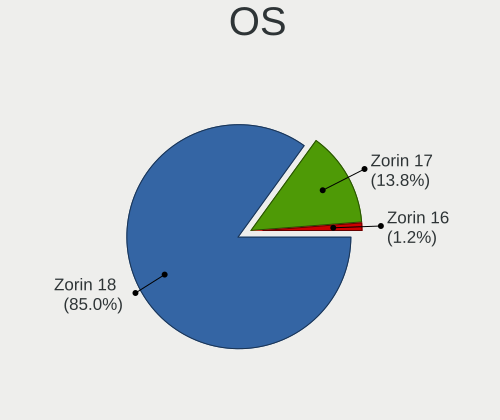

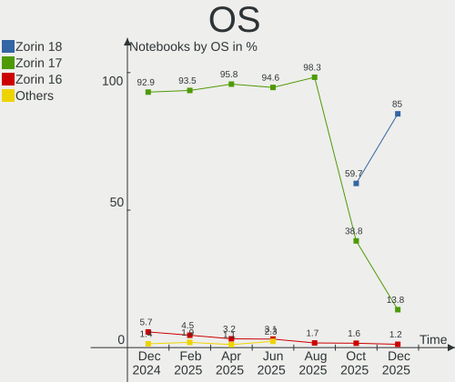

| Name     | Notebooks | Percent |
|----------|-----------|---------|
| Zorin 18 | 277       | 84.97%  |
| Zorin 17 | 45        | 13.8%   |
| Zorin 16 | 4         | 1.23%   |

OS Family
---------

OS without a version

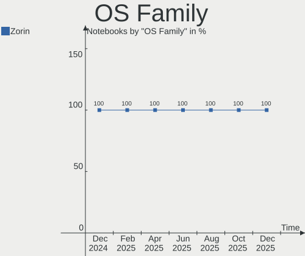

| Name  | Notebooks | Percent |
|-------|-----------|---------|
| Zorin | 326       | 100%    |

Kernel
------

Version of the Linux kernel

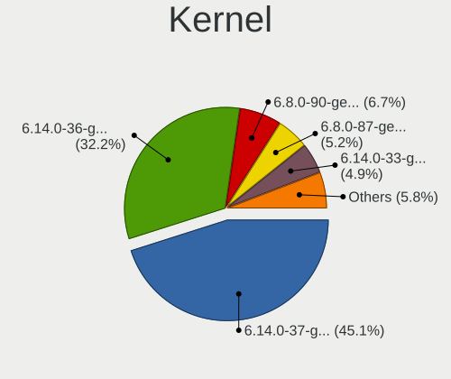

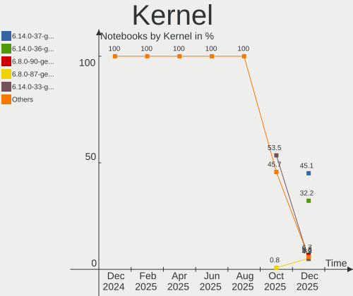

| Version                  | Notebooks | Percent |
|--------------------------|-----------|---------|
| 6.14.0-37-generic        | 147       | 45.09%  |
| 6.14.0-36-generic        | 105       | 32.21%  |
| 6.8.0-90-generic         | 22        | 6.75%   |
| 6.8.0-87-generic         | 17        | 5.21%   |
| 6.14.0-33-generic        | 16        | 4.91%   |
| 6.14.0-35-generic        | 6         | 1.84%   |
| 5.15.0-139-generic       | 3         | 0.92%   |
| 6.8.0-85-generic         | 2         | 0.61%   |
| 6.17.13-1-liquorix-amd64 | 2         | 0.61%   |
| 6.8.0-83-generic         | 1         | 0.31%   |
| 6.8.0-60-generic         | 1         | 0.31%   |
| 6.8.0-52-generic         | 1         | 0.31%   |
| 6.5.0-45-generic         | 1         | 0.31%   |
| 6.14.0-32-generic        | 1         | 0.31%   |
| 5.11.0-27-generic        | 1         | 0.31%   |

Kernel Family
-------------

Linux kernel without a distro release

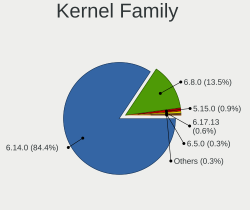

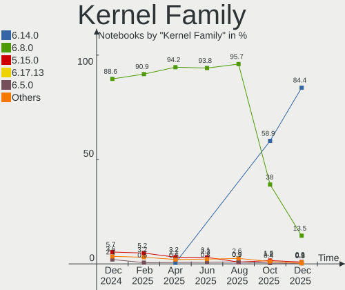

| Version | Notebooks | Percent |
|---------|-----------|---------|
| 6.14.0  | 275       | 84.36%  |
| 6.8.0   | 44        | 13.5%   |
| 5.15.0  | 3         | 0.92%   |
| 6.17.13 | 2         | 0.61%   |
| 6.5.0   | 1         | 0.31%   |
| 5.11.0  | 1         | 0.31%   |

Kernel Major Ver.
-----------------

Linux kernel major version

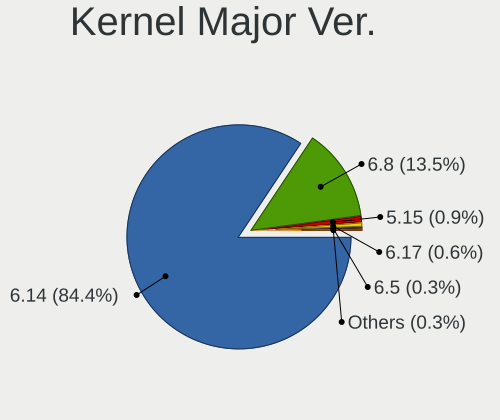

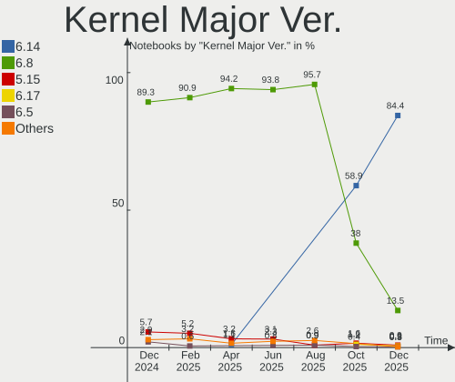

| Version | Notebooks | Percent |
|---------|-----------|---------|
| 6.14    | 275       | 84.36%  |
| 6.8     | 44        | 13.5%   |
| 5.15    | 3         | 0.92%   |
| 6.17    | 2         | 0.61%   |
| 6.5     | 1         | 0.31%   |
| 5.11    | 1         | 0.31%   |

Arch
----

OS architecture (x86_64, i586, etc.)

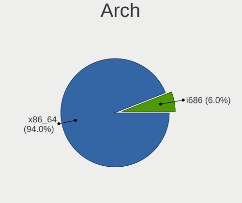

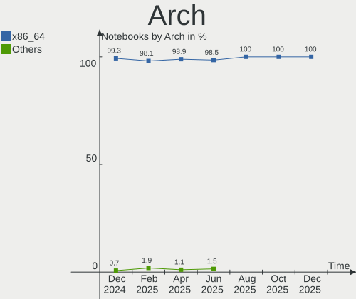

| Name   | Notebooks | Percent |
|--------|-----------|---------|
| x86_64 | 326       | 100%    |

DE
--

Desktop Environment

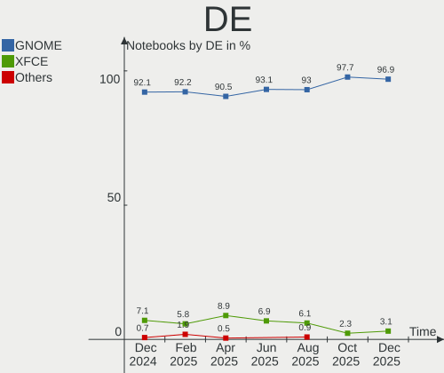

| Name  | Notebooks | Percent |
|-------|-----------|---------|
| GNOME | 316       | 96.93%  |
| XFCE  | 10        | 3.07%   |

Display Server
--------------

X11 or Wayland

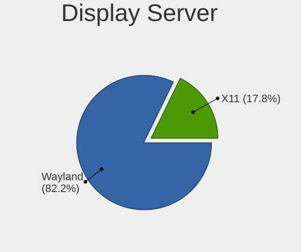

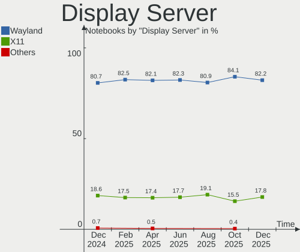

| Name    | Notebooks | Percent |
|---------|-----------|---------|
| Wayland | 268       | 82.21%  |
| X11     | 58        | 17.79%  |

Display Manager
---------------

SDDM, LightDM, etc.

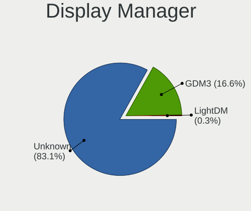

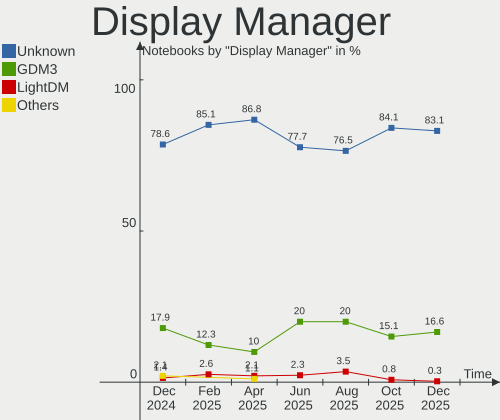

| Name    | Notebooks | Percent |
|---------|-----------|---------|
| Unknown | 271       | 83.13%  |
| GDM3    | 54        | 16.56%  |
| LightDM | 1         | 0.31%   |

OS Lang
-------

Language

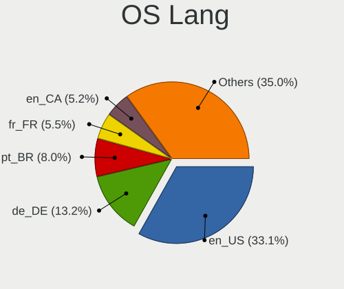

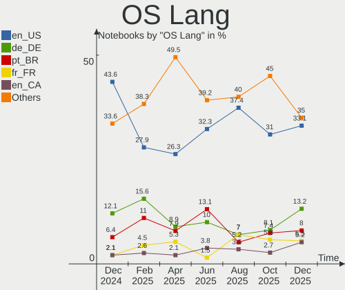

| Lang  | Notebooks | Percent |
|-------|-----------|---------|
| en_US | 108       | 33.13%  |
| de_DE | 43        | 13.19%  |
| pt_BR | 26        | 7.98%   |
| fr_FR | 18        | 5.52%   |
| en_CA | 17        | 5.21%   |
| en_GB | 15        | 4.6%    |
| es_ES | 12        | 3.68%   |
| it_IT | 9         | 2.76%   |
| pl_PL | 8         | 2.45%   |
| pt_PT | 7         | 2.15%   |
| nl_NL | 6         | 1.84%   |
| ru_RU | 4         | 1.23%   |
| es_MX | 4         | 1.23%   |
| es_CL | 4         | 1.23%   |
| en_IN | 4         | 1.23%   |
| en_AU | 4         | 1.23%   |
| tr_TR | 3         | 0.92%   |
| de_AT | 3         | 0.92%   |
| es_SV | 2         | 0.61%   |
| es_EC | 2         | 0.61%   |
| es_CO | 2         | 0.61%   |
| es_AR | 2         | 0.61%   |
| en_ZA | 2         | 0.61%   |
| en_IE | 2         | 0.61%   |
| cs_CZ | 2         | 0.61%   |
| bg_BG | 2         | 0.61%   |
| zh_TW | 1         | 0.31%   |
| sv_SE | 1         | 0.31%   |
| sr_RS | 1         | 0.31%   |
| ro_RO | 1         | 0.31%   |
| nb_NO | 1         | 0.31%   |
| ja_JP | 1         | 0.31%   |
| hu_HU | 1         | 0.31%   |
| fr_CH | 1         | 0.31%   |
| es_PE | 1         | 0.31%   |
| es_GT | 1         | 0.31%   |
| en_PH | 1         | 0.31%   |
| en_NZ | 1         | 0.31%   |
| en_IL | 1         | 0.31%   |
| de_IT | 1         | 0.31%   |

Boot Mode
---------

EFI or BIOS

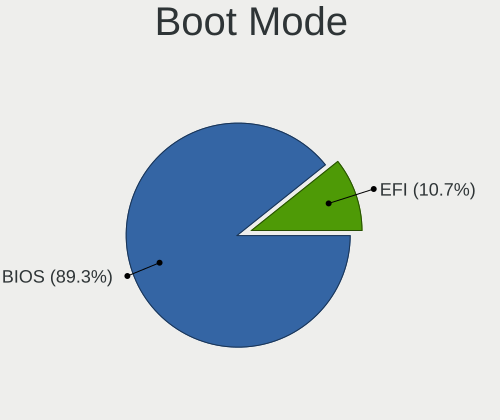

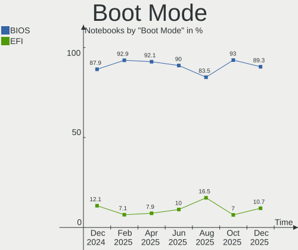

| Mode | Notebooks | Percent |
|------|-----------|---------|
| BIOS | 291       | 89.26%  |
| EFI  | 35        | 10.74%  |

Filesystem
----------

Type of filesystem

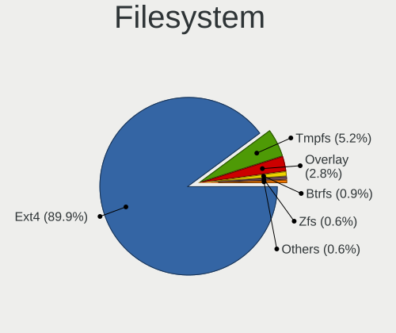

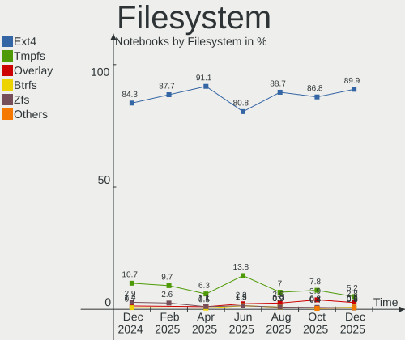

| Type    | Notebooks | Percent |
|---------|-----------|---------|
| Ext4    | 293       | 89.88%  |
| Tmpfs   | 17        | 5.21%   |
| Overlay | 9         | 2.76%   |
| Btrfs   | 3         | 0.92%   |
| Zfs     | 2         | 0.61%   |
| Ext3    | 1         | 0.31%   |
| Ext2    | 1         | 0.31%   |

Part. scheme
------------

Scheme of partitioning

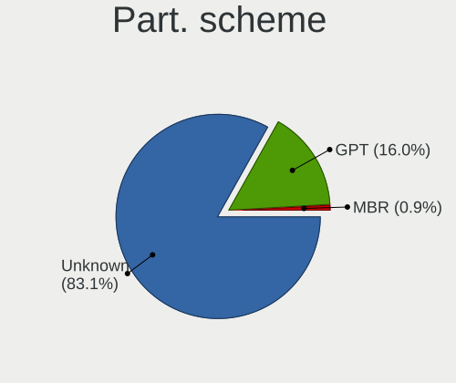

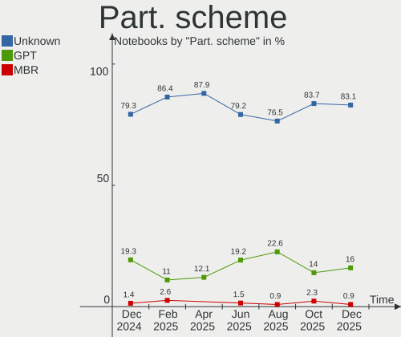

| Type    | Notebooks | Percent |
|---------|-----------|---------|
| Unknown | 271       | 83.13%  |
| GPT     | 52        | 15.95%  |
| MBR     | 3         | 0.92%   |

Dual Boot with Linux/BSD
------------------------

Hosting more than one Linux/BSD

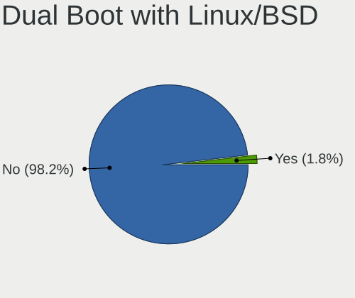

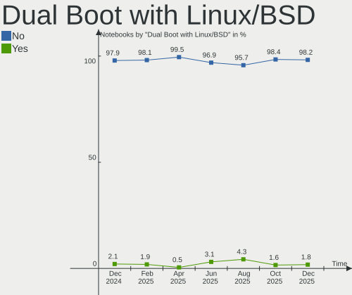

| Dual boot | Notebooks | Percent |
|-----------|-----------|---------|
| No        | 320       | 98.16%  |
| Yes       | 6         | 1.84%   |

Dual Boot (Win)
---------------

Hosting Linux and Windows

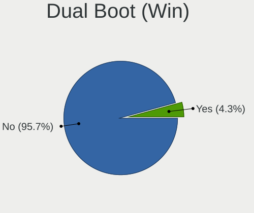

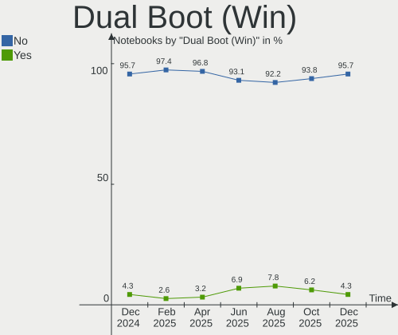

| Dual boot | Notebooks | Percent |
|-----------|-----------|---------|
| No        | 312       | 95.71%  |
| Yes       | 14        | 4.29%   |

Board
-----

Vendor
------

Motherboard manufacturer

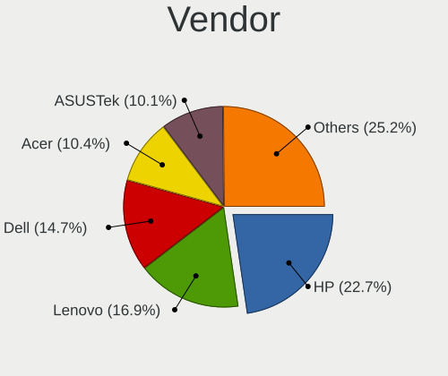

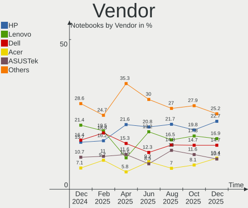

| Name                  | Notebooks | Percent |
|-----------------------|-----------|---------|
| Hewlett-Packard       | 74        | 22.7%   |
| Lenovo                | 55        | 16.87%  |
| Dell                  | 48        | 14.72%  |
| Acer                  | 34        | 10.43%  |
| ASUSTek Computer      | 33        | 10.12%  |
| Apple                 | 19        | 5.83%   |
| Toshiba               | 7         | 2.15%   |
| Samsung Electronics   | 7         | 2.15%   |
| MSI                   | 6         | 1.84%   |
| Sony                  | 5         | 1.53%   |
| HUAWEI                | 4         | 1.23%   |
| Fujitsu               | 4         | 1.23%   |
| Medion                | 3         | 0.92%   |
| Panasonic             | 2         | 0.61%   |
| Multilaser            | 2         | 0.61%   |
| Google                | 2         | 0.61%   |
| Gateway               | 2         | 0.61%   |
| XIAOMI                | 1         | 0.31%   |
| Wortmann AG           | 1         | 0.31%   |
| Standard              | 1         | 0.31%   |
| Semp Toshiba          | 1         | 0.31%   |
| Positivo Bahia - VAIO | 1         | 0.31%   |
| Positivo              | 1         | 0.31%   |
| Packard Bell          | 1         | 0.31%   |
| Novatech              | 1         | 0.31%   |
| MS-16GA               | 1         | 0.31%   |
| JP.ik                 | 1         | 0.31%   |
| Intel                 | 1         | 0.31%   |
| Infinix               | 1         | 0.31%   |
| Gigabyte Technology   | 1         | 0.31%   |
| Digibras              | 1         | 0.31%   |
| CONNEX                | 1         | 0.31%   |
| Casper                | 1         | 0.31%   |
| AMI                   | 1         | 0.31%   |
| American Megatrends   | 1         | 0.31%   |
| Alienware             | 1         | 0.31%   |

Model
-----

Motherboard model

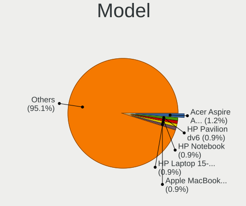

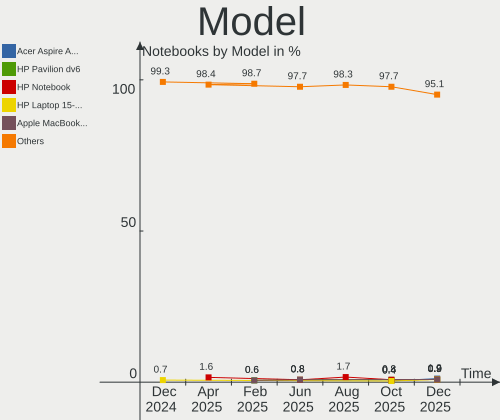

| Name                                | Notebooks | Percent |
|-------------------------------------|-----------|---------|
| Acer Aspire A515-51G                | 4         | 1.23%   |
| HP Pavilion dv6                     | 3         | 0.92%   |
| HP Notebook                         | 3         | 0.92%   |
| HP Laptop 15-fd0xxx                 | 3         | 0.92%   |
| Apple MacBookPro9,2                 | 3         | 0.92%   |
| Apple MacBookPro11,5                | 3         | 0.92%   |
| Lenovo IdeaPad 310-15IKB 80TV       | 2         | 0.61%   |
| HUAWEI FLMH-XX                      | 2         | 0.61%   |
| HP Pavilion dv7                     | 2         | 0.61%   |
| HP Pavilion 17                      | 2         | 0.61%   |
| HP G42                              | 2         | 0.61%   |
| HP EliteBook 840 G6                 | 2         | 0.61%   |
| Dell Latitude E5470                 | 2         | 0.61%   |
| Dell Latitude 3420                  | 2         | 0.61%   |
| Dell Inspiron 7348                  | 2         | 0.61%   |
| ASUS Zenbook UM3402YA_UM3402YA      | 2         | 0.61%   |
| ASUS Vivobook Go E1504FA_E1504FA    | 2         | 0.61%   |
| Apple MacBookPro8,1                 | 2         | 0.61%   |
| Apple MacBookPro5,5                 | 2         | 0.61%   |
| Apple MacBook5,2                    | 2         | 0.61%   |
| XIAOMI REDMI Book Pro 16 2025       | 1         | 0.31%   |
| Wortmann AG TERRA_MOBILE_1749       | 1         | 0.31%   |
| Toshiba TECRA R840-146              | 1         | 0.31%   |
| Toshiba TECRA C50-C                 | 1         | 0.31%   |
| Toshiba Satellite S55t-C            | 1         | 0.31%   |
| Toshiba Satellite L655              | 1         | 0.31%   |
| Toshiba Satellite E45-B             | 1         | 0.31%   |
| Toshiba Satellite C855D             | 1         | 0.31%   |
| Toshiba Satellite A505              | 1         | 0.31%   |
| Standard MB40II                     | 1         | 0.31%   |
| Sony VPCZ115GW                      | 1         | 0.31%   |
| Sony VPCF22SFX                      | 1         | 0.31%   |
| Sony VPCEB37FX                      | 1         | 0.31%   |
| Sony VGN-Z46SD_B                    | 1         | 0.31%   |
| Sony VGN-FW390J                     | 1         | 0.31%   |
| Semp Toshiba IS 1442                | 1         | 0.31%   |
| Samsung RF511/RF411/RF711           | 1         | 0.31%   |
| Samsung R530/R730                   | 1         | 0.31%   |
| Samsung 800G5M/800G5W               | 1         | 0.31%   |
| Samsung 355V4C/356V4C/3445VC/3545VC | 1         | 0.31%   |

Model Family
------------

Motherboard model prefix

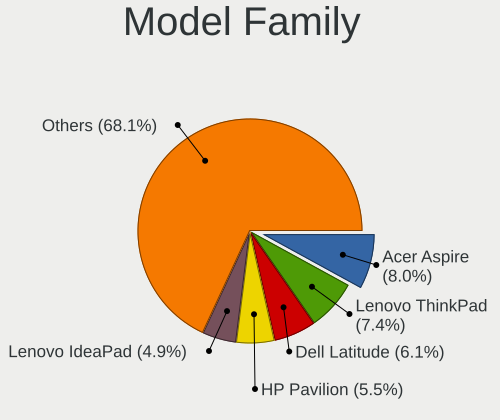

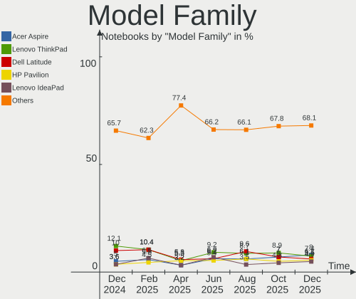

| Name               | Notebooks | Percent |
|--------------------|-----------|---------|
| Acer Aspire        | 26        | 7.98%   |
| Lenovo ThinkPad    | 24        | 7.36%   |
| Dell Latitude      | 20        | 6.13%   |
| HP Pavilion        | 18        | 5.52%   |
| Lenovo IdeaPad     | 16        | 4.91%   |
| Dell Inspiron      | 15        | 4.6%    |
| HP ProBook         | 11        | 3.37%   |
| HP Laptop          | 11        | 3.37%   |
| HP EliteBook       | 9         | 2.76%   |
| ASUS VivoBook      | 7         | 2.15%   |
| Dell Precision     | 6         | 1.84%   |
| Toshiba Satellite  | 5         | 1.53%   |
| ASUS ASUS          | 5         | 1.53%   |
| Apple MacBookPro11 | 5         | 1.53%   |
| Apple MacBookPro9  | 4         | 1.23%   |
| Acer Nitro         | 4         | 1.23%   |
| Lenovo Legion      | 3         | 0.92%   |
| HP Notebook        | 3         | 0.92%   |
| Fujitsu LIFEBOOK   | 3         | 0.92%   |
| ASUS Zenbook       | 3         | 0.92%   |
| Apple MacBookPro5  | 3         | 0.92%   |
| Toshiba TECRA      | 2         | 0.61%   |
| Lenovo Yoga        | 2         | 0.61%   |
| Lenovo ThinkBook   | 2         | 0.61%   |
| HUAWEI FLMH-XX     | 2         | 0.61%   |
| HP OMEN            | 2         | 0.61%   |
| HP G42             | 2         | 0.61%   |
| HP ENVY            | 2         | 0.61%   |
| HP Compaq          | 2         | 0.61%   |
| HP 250             | 2         | 0.61%   |
| Dell Vostro        | 2         | 0.61%   |
| ASUS ROG           | 2         | 0.61%   |
| Apple MacBookPro8  | 2         | 0.61%   |
| Apple MacBook5     | 2         | 0.61%   |
| Acer Extensa       | 2         | 0.61%   |
| XIAOMI REDMI       | 1         | 0.31%   |
| Wortmann AG TERRA  | 1         | 0.31%   |
| Standard MB40II    | 1         | 0.31%   |
| Sony VPCZ115GW     | 1         | 0.31%   |
| Sony VPCF22SFX     | 1         | 0.31%   |

MFG Year
--------

Motherboard manufacture year

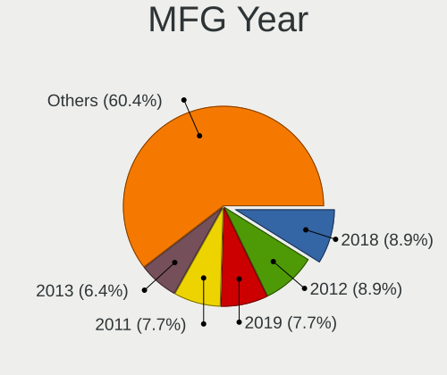

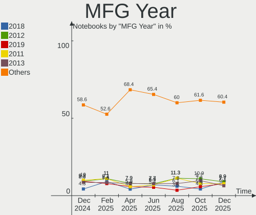

| Year | Notebooks | Percent |
|------|-----------|---------|
| 2018 | 29        | 8.9%    |
| 2012 | 29        | 8.9%    |
| 2019 | 25        | 7.67%   |
| 2011 | 25        | 7.67%   |
| 2013 | 21        | 6.44%   |
| 2017 | 20        | 6.13%   |
| 2016 | 18        | 5.52%   |
| 2015 | 18        | 5.52%   |
| 2014 | 18        | 5.52%   |
| 2020 | 17        | 5.21%   |
| 2009 | 16        | 4.91%   |
| 2025 | 15        | 4.6%    |
| 2022 | 13        | 3.99%   |
| 2010 | 13        | 3.99%   |
| 2021 | 12        | 3.68%   |
| 2024 | 11        | 3.37%   |
| 2008 | 11        | 3.37%   |
| 2023 | 10        | 3.07%   |
| 2006 | 3         | 0.92%   |
| 2007 | 2         | 0.61%   |

Form Factor
-----------

Physical design of the computer

| Name     | Notebooks | Percent |
|----------|-----------|---------|
| Notebook | 326       | 100%    |

Secure Boot
-----------

Enabled or disabled

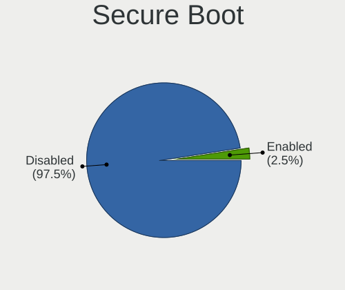

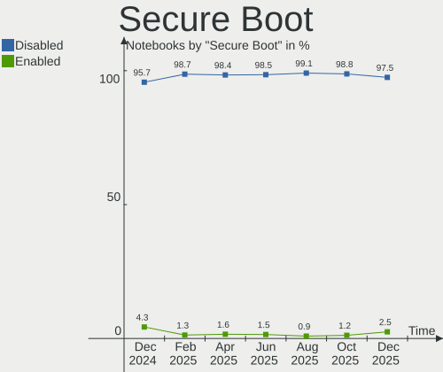

| State    | Notebooks | Percent |
|----------|-----------|---------|
| Disabled | 318       | 97.55%  |
| Enabled  | 8         | 2.45%   |

Coreboot
--------

Have coreboot on board

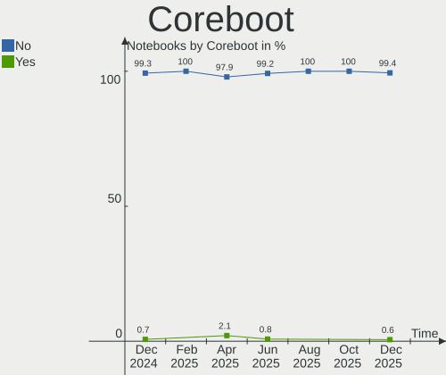

| Used | Notebooks | Percent |
|------|-----------|---------|
| No   | 324       | 99.39%  |
| Yes  | 2         | 0.61%   |

RAM Size
--------

Total RAM memory

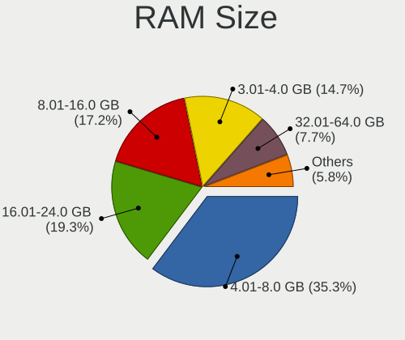

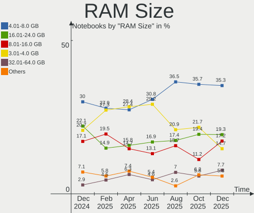

| Size in GB  | Notebooks | Percent |
|-------------|-----------|---------|
| 4.01-8.0    | 115       | 35.28%  |
| 16.01-24.0  | 63        | 19.33%  |
| 8.01-16.0   | 56        | 17.18%  |
| 3.01-4.0    | 48        | 14.72%  |
| 32.01-64.0  | 25        | 7.67%   |
| 2.01-3.0    | 7         | 2.15%   |
| 1.01-2.0    | 6         | 1.84%   |
| 24.01-32.0  | 4         | 1.23%   |
| 64.01-256.0 | 2         | 0.61%   |

RAM Used
--------

Used RAM memory

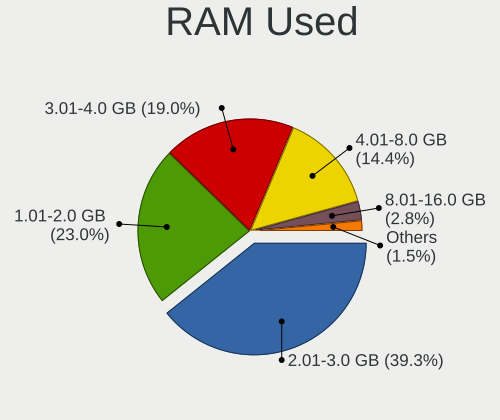

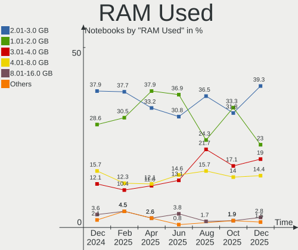

| Used GB    | Notebooks | Percent |
|------------|-----------|---------|
| 2.01-3.0   | 128       | 39.26%  |
| 1.01-2.0   | 75        | 23.01%  |
| 3.01-4.0   | 62        | 19.02%  |
| 4.01-8.0   | 47        | 14.42%  |
| 8.01-16.0  | 9         | 2.76%   |
| 0.51-1.0   | 4         | 1.23%   |
| 16.01-24.0 | 1         | 0.31%   |

Total Drives
------------

Number of drives on board

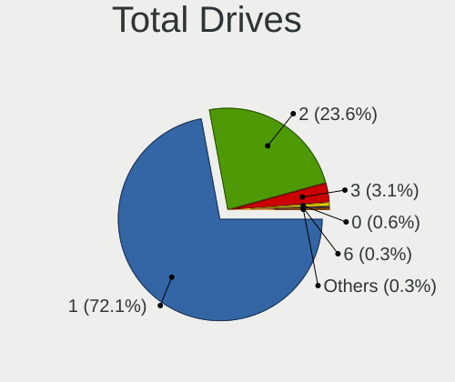

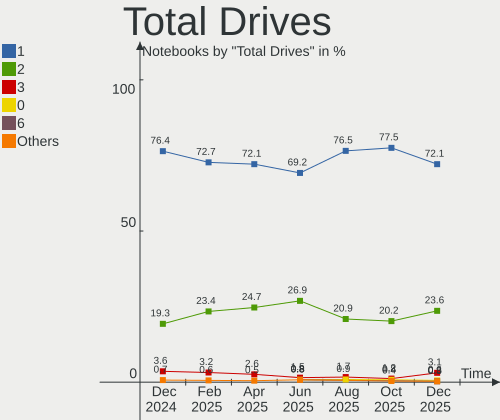

| Drives | Notebooks | Percent |
|--------|-----------|---------|
| 1      | 235       | 72.09%  |
| 2      | 77        | 23.62%  |
| 3      | 10        | 3.07%   |
| 0      | 2         | 0.61%   |
| 6      | 1         | 0.31%   |
| 4      | 1         | 0.31%   |

Has CD-ROM
----------

Has CD-ROM on board

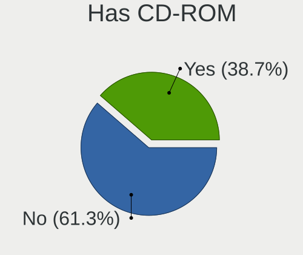

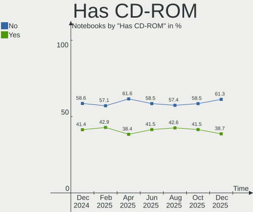

| Presented | Notebooks | Percent |
|-----------|-----------|---------|
| No        | 200       | 61.35%  |
| Yes       | 126       | 38.65%  |

Has Ethernet
------------

Has Ethernet on board

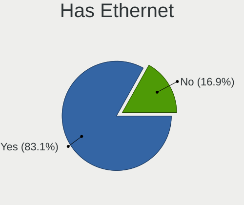

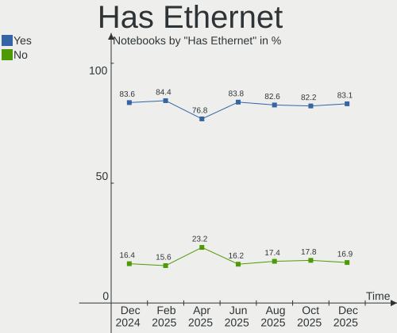

| Presented | Notebooks | Percent |
|-----------|-----------|---------|
| Yes       | 271       | 83.13%  |
| No        | 55        | 16.87%  |

Has WiFi
--------

Has WiFi module

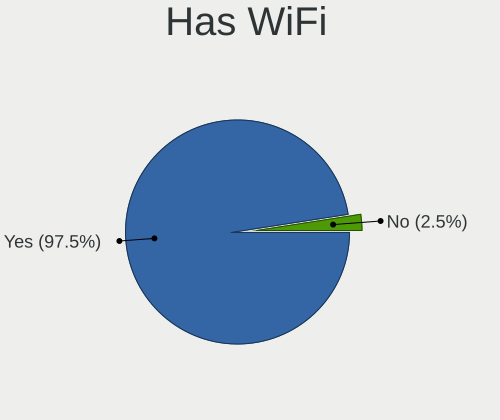

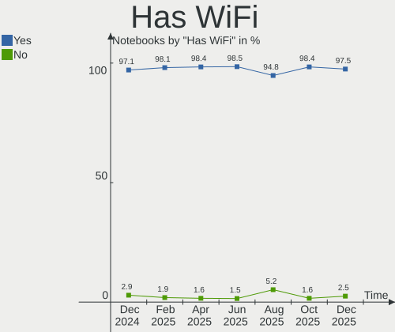

| Presented | Notebooks | Percent |
|-----------|-----------|---------|
| Yes       | 318       | 97.55%  |
| No        | 8         | 2.45%   |

Has Bluetooth
-------------

Has Bluetooth module

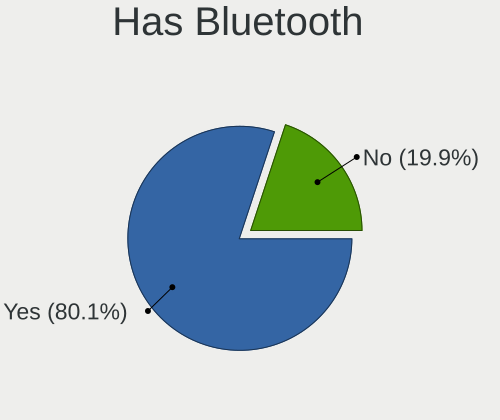

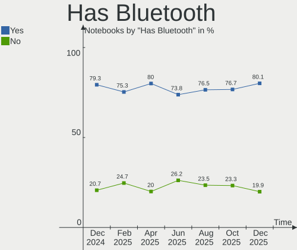

| Presented | Notebooks | Percent |
|-----------|-----------|---------|
| Yes       | 261       | 80.06%  |
| No        | 65        | 19.94%  |

Location
--------

Country
-------

Geographic location (country)

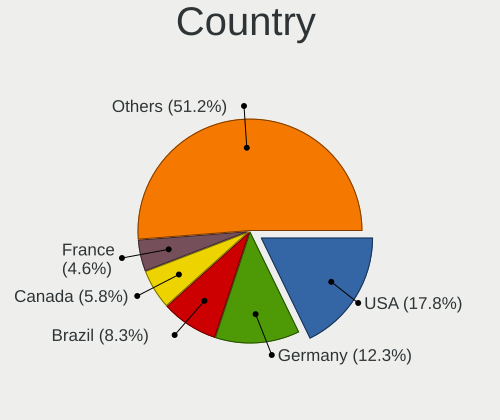

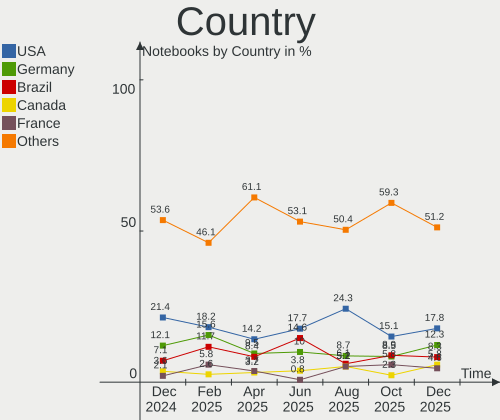

| Country         | Notebooks | Percent |
|-----------------|-----------|---------|
| USA             | 58        | 17.79%  |
| Germany         | 40        | 12.27%  |
| Brazil          | 27        | 8.28%   |
| Canada          | 19        | 5.83%   |
| France          | 15        | 4.6%    |
| UK              | 13        | 3.99%   |
| Spain           | 13        | 3.99%   |
| Netherlands     | 12        | 3.68%   |
| Italy           | 12        | 3.68%   |
| Poland          | 8         | 2.45%   |
| Austria         | 8         | 2.45%   |
| Portugal        | 7         | 2.15%   |
| Mexico          | 6         | 1.84%   |
| India           | 5         | 1.53%   |
| Chile           | 5         | 1.53%   |
| Turkey          | 4         | 1.23%   |
| Romania         | 4         | 1.23%   |
| Australia       | 4         | 1.23%   |
| Switzerland     | 3         | 0.92%   |
| South Africa    | 3         | 0.92%   |
| Russia          | 3         | 0.92%   |
| Iran            | 3         | 0.92%   |
| Czechia         | 3         | 0.92%   |
| Argentina       | 3         | 0.92%   |
| The Netherlands | 2         | 0.61%   |
| Thailand        | 2         | 0.61%   |
| Sweden          | 2         | 0.61%   |
| Serbia          | 2         | 0.61%   |
| Philippines     | 2         | 0.61%   |
| Malaysia        | 2         | 0.61%   |
| Japan           | 2         | 0.61%   |
| Ireland         | 2         | 0.61%   |
| Guatemala       | 2         | 0.61%   |
| El Salvador     | 2         | 0.61%   |
| Ecuador         | 2         | 0.61%   |
| Colombia        | 2         | 0.61%   |
| Türkiye        | 1         | 0.31%   |
| Tunisia         | 1         | 0.31%   |
| Taiwan          | 1         | 0.31%   |
| Slovakia        | 1         | 0.31%   |

City
----

Geographic location (city)

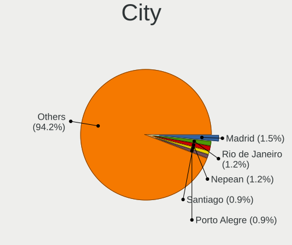

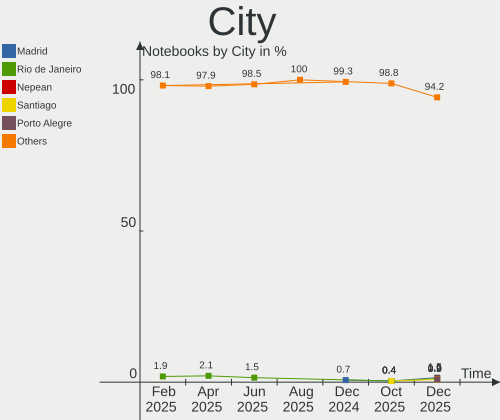

| City           | Notebooks | Percent |
|----------------|-----------|---------|
| Madrid         | 5         | 1.53%   |
| Rio de Janeiro | 4         | 1.23%   |
| Nepean         | 4         | 1.23%   |
| Santiago       | 3         | 0.92%   |
| Porto Alegre   | 3         | 0.92%   |
| Louisville     | 3         | 0.92%   |
| Istanbul       | 3         | 0.92%   |
| Warsaw         | 2         | 0.61%   |
| Vienna         | 2         | 0.61%   |
| Toronto        | 2         | 0.61%   |
| Tehran         | 2         | 0.61%   |
| Slough         | 2         | 0.61%   |
| Sao Paulo      | 2         | 0.61%   |
| San Salvador   | 2         | 0.61%   |
| Rome           | 2         | 0.61%   |
| Perth          | 2         | 0.61%   |
| Milan          | 2         | 0.61%   |
| Lewisville     | 2         | 0.61%   |
| Halifax        | 2         | 0.61%   |
| Guatemala City | 2         | 0.61%   |
| Graz           | 2         | 0.61%   |
| Dos Hermanas   | 2         | 0.61%   |
| Berlin         | 2         | 0.61%   |
| Bayonne        | 2         | 0.61%   |
| Bangkok        | 2         | 0.61%   |
| Amsterdam      | 2         | 0.61%   |
| Zurich         | 1         | 0.31%   |
| Zeeland        | 1         | 0.31%   |
| Yerington      | 1         | 0.31%   |
| Xalapa         | 1         | 0.31%   |
| Winkler        | 1         | 0.31%   |
| Wilmington     | 1         | 0.31%   |
| West Mifflin   | 1         | 0.31%   |
| West Chester   | 1         | 0.31%   |
| Waunakee       | 1         | 0.31%   |
| Watts          | 1         | 0.31%   |
| Warner Robins  | 1         | 0.31%   |
| Warburg        | 1         | 0.31%   |
| Wandsworth     | 1         | 0.31%   |
| Vicenza        | 1         | 0.31%   |

Drives
------

Drive Vendor
------------

Hard drive vendors

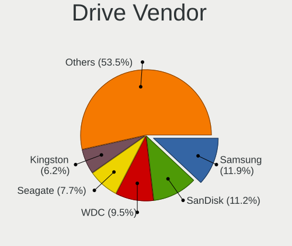

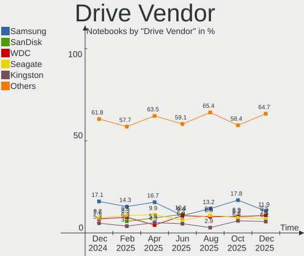

| Vendor                      | Notebooks | Drives | Percent |
|-----------------------------|-----------|--------|---------|
| Samsung Electronics         | 48        | 54     | 11.94%  |
| SanDisk                     | 45        | 47     | 11.19%  |
| WDC                         | 38        | 39     | 9.45%   |
| Seagate                     | 31        | 32     | 7.71%   |
| Kingston                    | 25        | 25     | 6.22%   |
| Toshiba                     | 22        | 23     | 5.47%   |
| Crucial                     | 18        | 18     | 4.48%   |
| SK hynix                    | 17        | 17     | 4.23%   |
| Unknown                     | 16        | 18     | 3.98%   |
| Intel                       | 15        | 16     | 3.73%   |
| Micron Technology           | 9         | 9      | 2.24%   |
| HGST                        | 9         | 9      | 2.24%   |
| Apple                       | 8         | 10     | 1.99%   |
| China                       | 6         | 6      | 1.49%   |
| A-DATA Technology           | 6         | 6      | 1.49%   |
| KIOXIA                      | 4         | 4      | 1%      |
| KingSpec                    | 4         | 4      | 1%      |
| SABRENT                     | 3         | 6      | 0.75%   |
| PNY                         | 3         | 3      | 0.75%   |
| Phison Electronics          | 3         | 3      | 0.75%   |
| Patriot                     | 3         | 3      | 0.75%   |
| Netac                       | 3         | 3      | 0.75%   |
| MAXIO Technology (Hangzhou) | 3         | 3      | 0.75%   |
| Kingston Technology Company | 3         | 3      | 0.75%   |
| Hitachi                     | 3         | 3      | 0.75%   |
| Transcend                   | 2         | 2      | 0.5%    |
| SPCC                        | 2         | 3      | 0.5%    |
| Silicon Motion              | 2         | 2      | 0.5%    |
| Realtek                     | 2         | 2      | 0.5%    |
| Plextor                     | 2         | 2      | 0.5%    |
| Micron/Crucial Technology   | 2         | 2      | 0.5%    |
| LITEON                      | 2         | 2      | 0.5%    |
| JMicron Technology          | 2         | 2      | 0.5%    |
| Unknown                     | 2         | 2      | 0.5%    |
| YMTC                        | 1         | 1      | 0.25%   |
| XrayDisk                    | 1         | 1      | 0.25%   |
| WD Blue                     | 1         | 1      | 0.25%   |
| Verbatim                    | 1         | 1      | 0.25%   |
| TCSUNBOW                    | 1         | 1      | 0.25%   |
| T-FORCE                     | 1         | 1      | 0.25%   |

Drive Model
-----------

Hard drive models

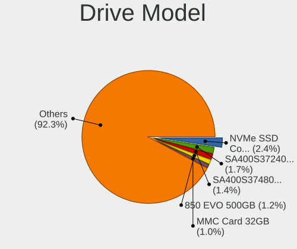

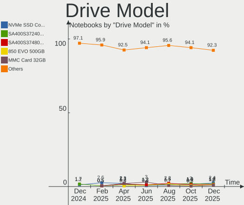

| Model                                             | Notebooks | Percent |
|---------------------------------------------------|-----------|---------|
| Samsung NVMe SSD Controller SM981/PM981/PM983 1TB | 10        | 2.42%   |
| Kingston SA400S37240G 240GB SSD                   | 7         | 1.69%   |
| Kingston SA400S37480G 480GB SSD                   | 6         | 1.45%   |
| Samsung SSD 850 EVO 500GB                         | 5         | 1.21%   |
| Unknown MMC Card  32GB                            | 4         | 0.97%   |
| Toshiba MQ04ABF100 1TB                            | 4         | 0.97%   |
| Intel SSD Pro 7600p/760p/E 6100p Series 256GB     | 4         | 0.97%   |
| Crucial CT240BX500SSD1 240GB                      | 4         | 0.97%   |
| WDC WD10JPVX-22JC3T0 1TB                          | 3         | 0.72%   |
| Unknown SD/MMC/MS PRO 2GB                         | 3         | 0.72%   |
| Unknown MMC Card  64GB                            | 3         | 0.72%   |
| Toshiba MQ01ABD100 1TB                            | 3         | 0.72%   |
| SK hynix BC501 NVMe Solid State Drive 512GB       | 3         | 0.72%   |
| Seagate ST1000LM035-1RK172 1TB                    | 3         | 0.72%   |
| Samsung SSD 860 EVO 500GB                         | 3         | 0.72%   |
| Intel SSDPEKNU512GZ 512GB                         | 3         | 0.72%   |
| HGST HTS725050A7E630 500GB                        | 3         | 0.72%   |
| Crucial CT1000MX500SSD1 1TB                       | 3         | 0.72%   |
| WDC WDS240G2G0A-00JH30 240GB SSD                  | 2         | 0.48%   |
| WDC WD2500BEVT-22A23T0 250GB                      | 2         | 0.48%   |
| WDC WD10SPZX-21Z10T0 1TB                          | 2         | 0.48%   |
| WDC WD Blue SA510 2.5 500GB                       | 2         | 0.48%   |
| Transcend TS512GMTS430S 512GB SSD                 | 2         | 0.48%   |
| Toshiba XG6 NVMe SSD Controller 1024GB            | 2         | 0.48%   |
| Toshiba MQ01ABD075 752GB                          | 2         | 0.48%   |
| Seagate ST9500420AS 500GB                         | 2         | 0.48%   |
| Seagate ST9500325AS 500GB                         | 2         | 0.48%   |
| Seagate ST500LM021-1KJ152 500GB                   | 2         | 0.48%   |
| Seagate ST500LM012 HN-M500MBB 500GB               | 2         | 0.48%   |
| Seagate ST1000LM024 HN-M101MBB 1TB                | 2         | 0.48%   |
| Seagate ST1000LM014-1EJ164 1TB                    | 2         | 0.48%   |
| Sandisk WD PC SN560 SDDPNQE-1T00-1102 1024GB      | 2         | 0.48%   |
| Sandisk WD Black SN850 1TB                        | 2         | 0.48%   |
| Sandisk WD Black SN750 / PC SN730 NVMe SSD 500GB  | 2         | 0.48%   |
| SanDisk SSD PLUS 480GB                            | 2         | 0.48%   |
| Sandisk SSD PLUS 1TB                              | 2         | 0.48%   |
| Sandisk PC SN5000S SDEPNSJ-512G-1006 512GB        | 2         | 0.48%   |
| SanDisk NVMe SSD Drive 512GB                      | 2         | 0.48%   |
| Samsung SSD PM871b M.2 2280 256GB                 | 2         | 0.48%   |
| Samsung MZVL4512HBLU-00BTW 512GB                  | 2         | 0.48%   |

HDD Vendor
----------

Hard disk drive vendors

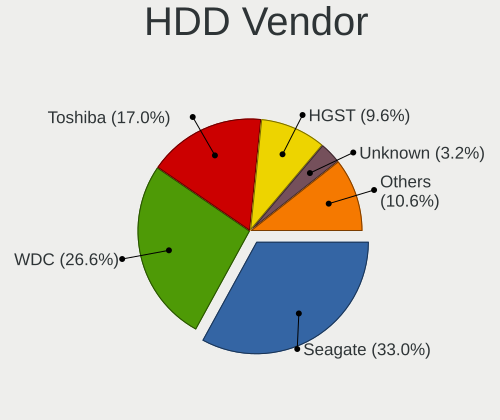

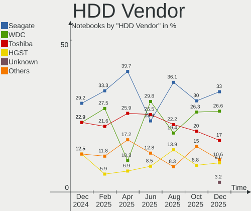

| Vendor              | Notebooks | Drives | Percent |
|---------------------|-----------|--------|---------|
| Seagate             | 31        | 32     | 32.98%  |
| WDC                 | 25        | 26     | 26.6%   |
| Toshiba             | 16        | 16     | 17.02%  |
| HGST                | 9         | 9      | 9.57%   |
| Unknown             | 3         | 3      | 3.19%   |
| Hitachi             | 3         | 3      | 3.19%   |
| Samsung Electronics | 2         | 2      | 2.13%   |
| SABRENT             | 1         | 3      | 1.06%   |
| JMicron Technology  | 1         | 1      | 1.06%   |
| HGST HTS            | 1         | 1      | 1.06%   |
| Fujitsu             | 1         | 1      | 1.06%   |
| Apple               | 1         | 1      | 1.06%   |

SSD Vendor
----------

Solid state drive vendors

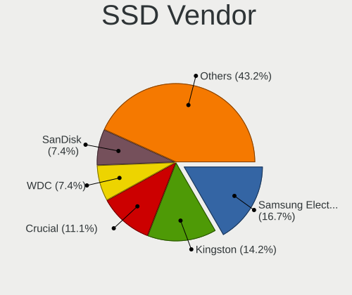

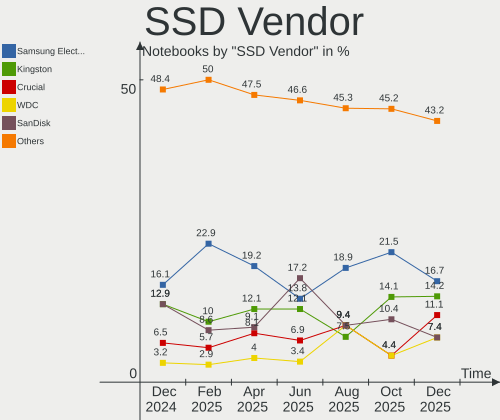

| Vendor              | Notebooks | Drives | Percent |
|---------------------|-----------|--------|---------|
| Samsung Electronics | 27        | 31     | 16.67%  |
| Kingston            | 23        | 23     | 14.2%   |
| Crucial             | 18        | 18     | 11.11%  |
| WDC                 | 12        | 12     | 7.41%   |
| SanDisk             | 12        | 12     | 7.41%   |
| China               | 6         | 6      | 3.7%    |
| Apple               | 5         | 5      | 3.09%   |
| A-DATA Technology   | 5         | 5      | 3.09%   |
| SABRENT             | 3         | 3      | 1.85%   |
| PNY                 | 3         | 3      | 1.85%   |
| Patriot             | 3         | 3      | 1.85%   |
| KingSpec            | 3         | 3      | 1.85%   |
| Intel               | 3         | 3      | 1.85%   |
| Transcend           | 2         | 2      | 1.23%   |
| Toshiba             | 2         | 2      | 1.23%   |
| SPCC                | 2         | 3      | 1.23%   |
| SK hynix            | 2         | 2      | 1.23%   |
| Plextor             | 2         | 2      | 1.23%   |
| Netac               | 2         | 2      | 1.23%   |
| Micron Technology   | 2         | 2      | 1.23%   |
| LITEON              | 2         | 2      | 1.23%   |
| XrayDisk            | 1         | 1      | 0.62%   |
| Verbatim            | 1         | 1      | 0.62%   |
| TCSUNBOW            | 1         | 1      | 0.62%   |
| Rogueware           | 1         | 1      | 0.62%   |
| OWC                 | 1         | 1      | 0.62%   |
| Mercury             | 1         | 1      | 0.62%   |
| LITEONIT            | 1         | 1      | 0.62%   |
| Lexar               | 1         | 1      | 0.62%   |
| KLEVV               | 1         | 1      | 0.62%   |
| KIOXIA-EXCERIA      | 1         | 1      | 0.62%   |
| Kimtigo             | 1         | 1      | 0.62%   |
| GOODRAM             | 1         | 1      | 0.62%   |
| GeIL                | 1         | 1      | 0.62%   |
| FORESEE             | 1         | 1      | 0.62%   |
| Emtec               | 1         | 1      | 0.62%   |
| DST7256-M2          | 1         | 1      | 0.62%   |
| CT240BX5            | 1         | 1      | 0.62%   |
| CT1000MX            | 1         | 1      | 0.62%   |
| BHT                 | 1         | 1      | 0.62%   |

Drive Kind
----------

HDD or SSD

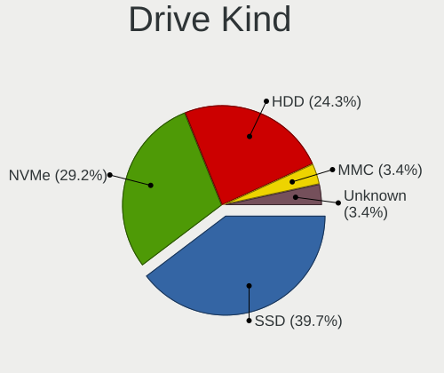

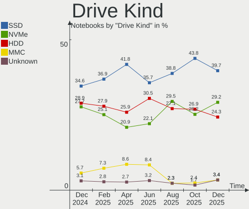

| Kind    | Notebooks | Drives | Percent |
|---------|-----------|--------|---------|
| SSD     | 152       | 167    | 39.69%  |
| NVMe    | 112       | 128    | 29.24%  |
| HDD     | 93        | 98     | 24.28%  |
| MMC     | 13        | 16     | 3.39%   |
| Unknown | 13        | 13     | 3.39%   |

Drive Connector
---------------

SATA, SAS, NVMe, etc.

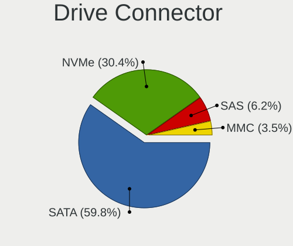

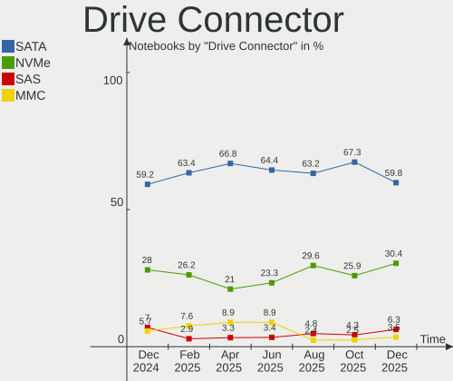

| Type | Notebooks | Drives | Percent |
|------|-----------|--------|---------|
| SATA | 220       | 250    | 59.78%  |
| NVMe | 112       | 127    | 30.43%  |
| SAS  | 23        | 29     | 6.25%   |
| MMC  | 13        | 16     | 3.53%   |

Drive Size
----------

Size of hard drive

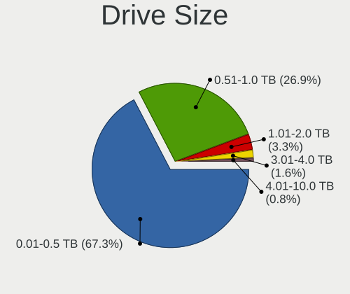

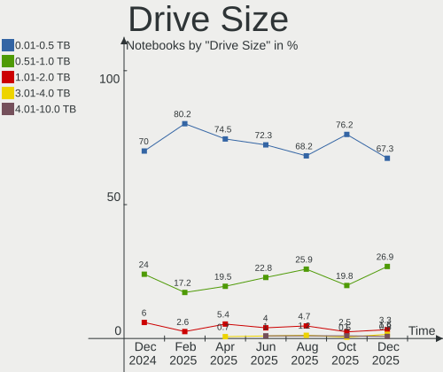

| Size in TB | Notebooks | Drives | Percent |
|------------|-----------|--------|---------|
| 0.01-0.5   | 165       | 180    | 67.35%  |
| 0.51-1.0   | 66        | 69     | 26.94%  |
| 1.01-2.0   | 8         | 9      | 3.27%   |
| 3.01-4.0   | 4         | 5      | 1.63%   |
| 4.01-10.0  | 2         | 2      | 0.82%   |

Space Total
-----------

Amount of disk space available on the file system

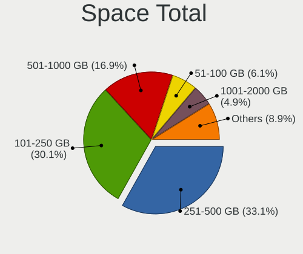

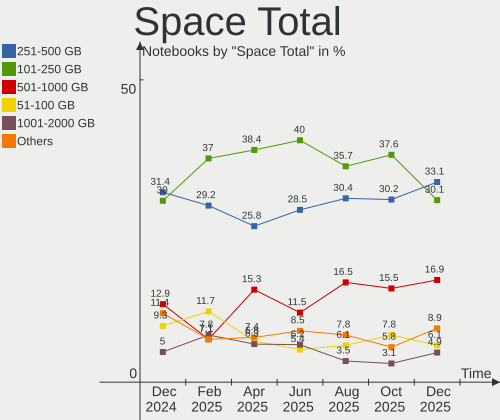

| Size in GB     | Notebooks | Percent |
|----------------|-----------|---------|
| 251-500        | 108       | 33.13%  |
| 101-250        | 98        | 30.06%  |
| 501-1000       | 55        | 16.87%  |
| 51-100         | 20        | 6.13%   |
| 1001-2000      | 16        | 4.91%   |
| 21-50          | 12        | 3.68%   |
| More than 3000 | 7         | 2.15%   |
| 1-20           | 7         | 2.15%   |
| Unknown        | 2         | 0.61%   |
| 2001-3000      | 1         | 0.31%   |

Space Used
----------

Amount of used disk space

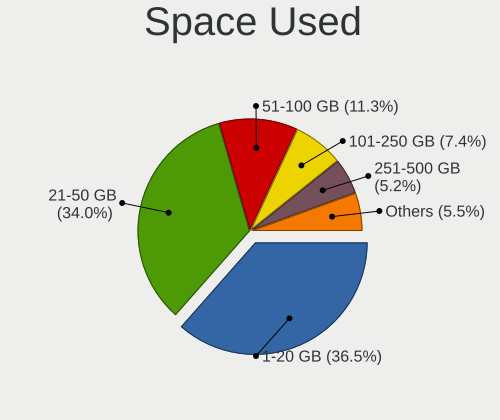

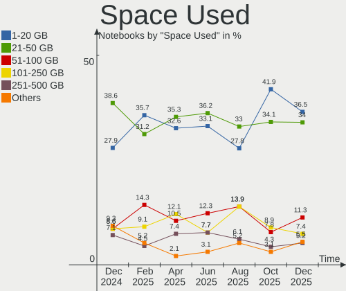

| Used GB        | Notebooks | Percent |
|----------------|-----------|---------|
| 1-20           | 119       | 36.5%   |
| 21-50          | 111       | 34.05%  |
| 51-100         | 37        | 11.35%  |
| 101-250        | 24        | 7.36%   |
| 251-500        | 17        | 5.21%   |
| 501-1000       | 11        | 3.37%   |
| More than 3000 | 3         | 0.92%   |
| 2001-3000      | 2         | 0.61%   |
| Unknown        | 2         | 0.61%   |

Malfunc. Drives
---------------

Drive models with a malfunction

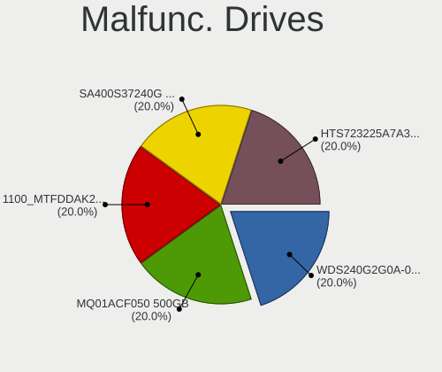

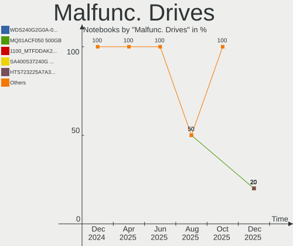

| Model                                          | Notebooks | Drives | Percent |
|------------------------------------------------|-----------|--------|---------|
| WDC WDS240G2G0A-00JH30 240GB SSD               | 1         | 1      | 20%     |
| Toshiba MQ01ACF050 500GB                       | 1         | 1      | 20%     |
| Micron Technology 1100_MTFDDAK256TBN 256GB SSD | 1         | 1      | 20%     |
| Kingston SA400S37240G 240GB SSD                | 1         | 1      | 20%     |
| Hitachi HTS723225A7A364 250GB                  | 1         | 1      | 20%     |

Malfunc. Drive Vendor
---------------------

Vendors of faulty drives

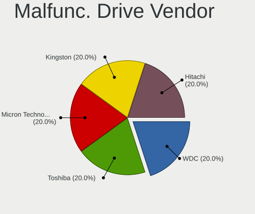

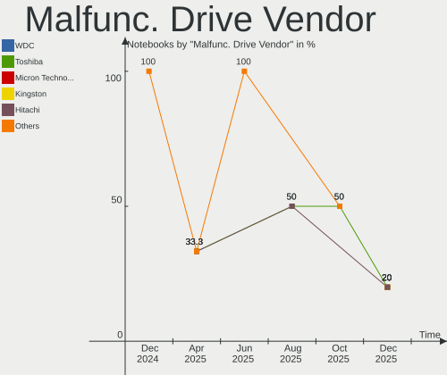

| Vendor            | Notebooks | Drives | Percent |
|-------------------|-----------|--------|---------|
| WDC               | 1         | 1      | 20%     |
| Toshiba           | 1         | 1      | 20%     |
| Micron Technology | 1         | 1      | 20%     |
| Kingston          | 1         | 1      | 20%     |
| Hitachi           | 1         | 1      | 20%     |

Malfunc. HDD Vendor
-------------------

Vendors of faulty HDD drives

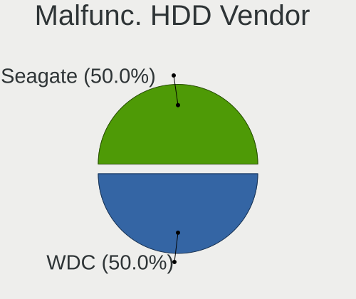

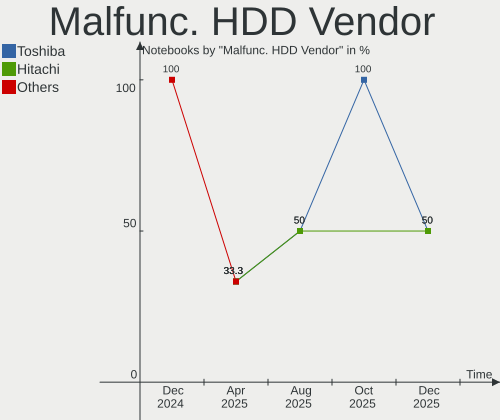

| Vendor  | Notebooks | Drives | Percent |
|---------|-----------|--------|---------|
| Toshiba | 1         | 1      | 50%     |
| Hitachi | 1         | 1      | 50%     |

Malfunc. Drive Kind
-------------------

Kinds of faulty drives

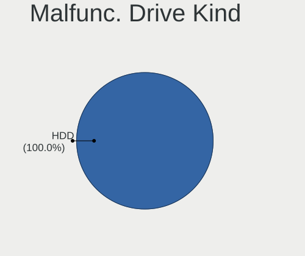

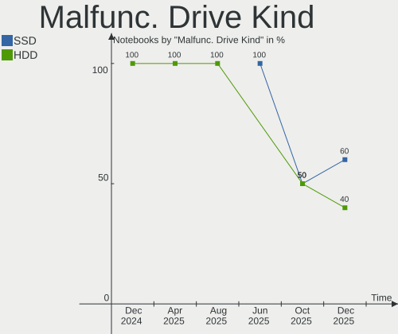

| Kind | Notebooks | Drives | Percent |
|------|-----------|--------|---------|
| SSD  | 3         | 3      | 60%     |
| HDD  | 2         | 2      | 40%     |

Failed Drives
-------------

Failed drive models

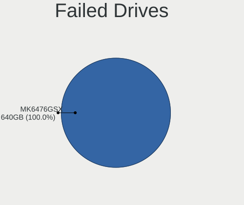

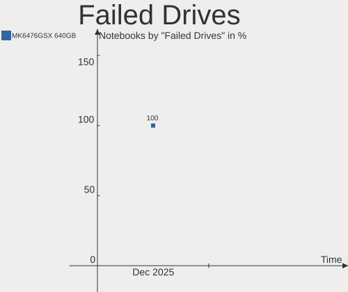

| Model                   | Notebooks | Drives | Percent |
|-------------------------|-----------|--------|---------|
| Toshiba MK6476GSX 640GB | 1         | 1      | 100%    |

Failed Drive Vendor
-------------------

Failed drive vendors

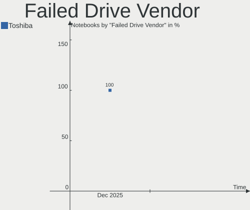

| Vendor  | Notebooks | Drives | Percent |
|---------|-----------|--------|---------|
| Toshiba | 1         | 1      | 100%    |

Drive Status
------------

Number of failed and malfunc. drives

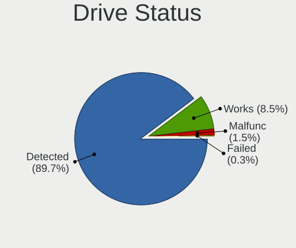

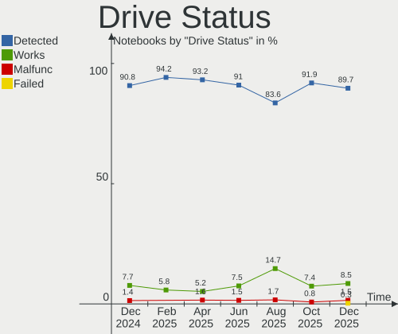

| Status   | Notebooks | Drives | Percent |
|----------|-----------|--------|---------|
| Detected | 296       | 385    | 89.7%   |
| Works    | 28        | 31     | 8.48%   |
| Malfunc  | 5         | 5      | 1.52%   |
| Failed   | 1         | 1      | 0.3%    |

Storage controller
------------------

Storage Vendor
--------------

Storage controller vendors

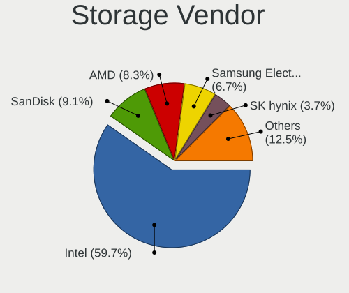

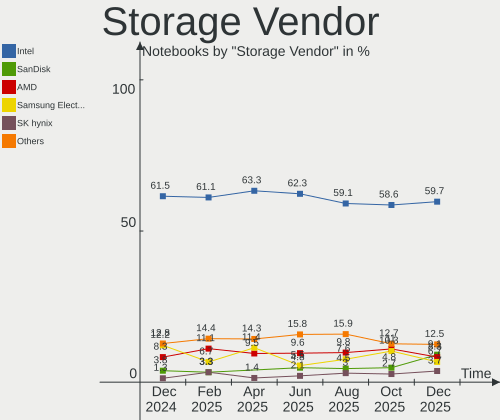

| Vendor                           | Notebooks | Percent |
|----------------------------------|-----------|---------|
| Intel                            | 224       | 59.73%  |
| SanDisk                          | 34        | 9.07%   |
| AMD                              | 31        | 8.27%   |
| Samsung Electronics              | 25        | 6.67%   |
| SK hynix                         | 14        | 3.73%   |
| Micron Technology                | 7         | 1.87%   |
| Toshiba America Info Systems     | 5         | 1.33%   |
| Phison Electronics               | 5         | 1.33%   |
| Nvidia                           | 5         | 1.33%   |
| Kingston Technology Company      | 5         | 1.33%   |
| MAXIO Technology (Hangzhou)      | 4         | 1.07%   |
| KIOXIA                           | 4         | 1.07%   |
| Silicon Motion                   | 2         | 0.53%   |
| Micron/Crucial Technology        | 2         | 0.53%   |
| Apple                            | 2         | 0.53%   |
| ADATA Technology                 | 2         | 0.53%   |
| Yangtze Memory Technologies      | 1         | 0.27%   |
| Solid State Storage Technology   | 1         | 0.27%   |
| Silicon Integrated Systems [SiS] | 1         | 0.27%   |
| Shenzhen Longsys Electronics     | 1         | 0.27%   |

Storage Model
-------------

Storage controller models

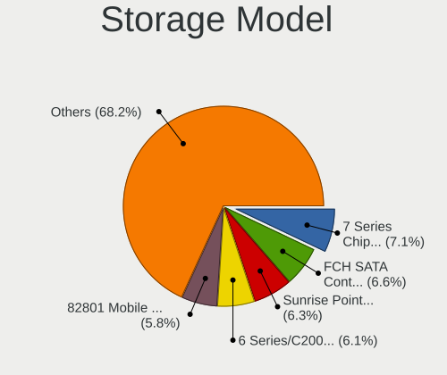

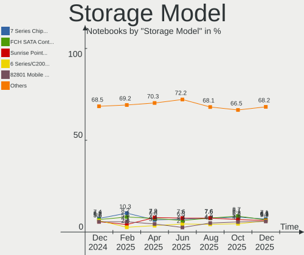

| Model                                                                            | Notebooks | Percent |
|----------------------------------------------------------------------------------|-----------|---------|
| Intel 7 Series Chipset Family 6-port SATA Controller [AHCI mode]                 | 28        | 7.07%   |
| AMD FCH SATA Controller [AHCI mode]                                              | 26        | 6.57%   |
| Intel Sunrise Point-LP SATA Controller [AHCI mode]                               | 25        | 6.31%   |
| Intel 6 Series/C200 Series Chipset Family 6 port Mobile SATA AHCI Controller     | 24        | 6.06%   |
| Intel 82801 Mobile SATA Controller [RAID mode]                                   | 23        | 5.81%   |
| Intel 82801IBM/IEM (ICH9M/ICH9M-E) 4 port SATA Controller [AHCI mode]            | 12        | 3.03%   |
| SanDisk WD SN560/SN740/SN770/SN5000 NVMe SSD                                     | 11        | 2.78%   |
| Samsung NVMe SSD Controller SM981/PM981/PM983                                    | 11        | 2.78%   |
| Intel Wildcat Point-LP SATA Controller [AHCI Mode]                               | 10        | 2.53%   |
| Intel 8 Series/C220 Series Chipset Family 6-port SATA Controller 1 [AHCI mode]   | 10        | 2.53%   |
| Intel 5 Series/3400 Series Chipset 4 port SATA AHCI Controller                   | 10        | 2.53%   |
| Intel Volume Management Device NVMe RAID Controller                              | 9         | 2.27%   |
| Intel 8 Series SATA Controller 1 [AHCI mode]                                     | 9         | 2.27%   |
| Intel SSD 670p Series [Keystone Harbor]                                          | 6         | 1.52%   |
| Intel HM170/QM170 Chipset SATA Controller [AHCI Mode]                            | 6         | 1.52%   |
| Sandisk WD PC SN5000S M.2 2280 NVMe SSD (DRAM-less)                              | 5         | 1.26%   |
| Nvidia MCP79 AHCI Controller                                                     | 5         | 1.26%   |
| SK hynix BC901 NVMe Solid State Drive (DRAM-less)                                | 4         | 1.01%   |
| Samsung NVMe SSD Controller 980 (DRAM-less)                                      | 4         | 1.01%   |
| Intel SSD DC P4101/Pro 7600p/760p/E 6100p Series                                 | 4         | 1.01%   |
| Intel Celeron N3350/Pentium N4200/Atom E3900 Series SATA AHCI Controller         | 4         | 1.01%   |
| Intel Cannon Lake Mobile PCH SATA AHCI Controller                                | 4         | 1.01%   |
| Intel Atom/Celeron/Pentium Processor x5-E8000/J3xxx/N3xxx Series SATA Controller | 4         | 1.01%   |
| Intel Alder Lake-P SATA AHCI Controller                                          | 4         | 1.01%   |
| Intel 82801HM/HEM (ICH8M/ICH8M-E) IDE Controller                                 | 4         | 1.01%   |
| SK hynix BC501 NVMe Solid State Drive                                            | 3         | 0.76%   |
| Sandisk WD PC SN740 NVMe SSD 512GB (DRAM-less)                                   | 3         | 0.76%   |
| Samsung S4LN058A01[SSUBX] AHCI SSD Controller (Apple slot)                       | 3         | 0.76%   |
| Samsung NVMe SSD Controller PM9B1 (DRAM-less)                                    | 3         | 0.76%   |
| MAXIO (Hangzhou) NVMe SSD Controller MAP1202 (DRAM-less)                         | 3         | 0.76%   |
| Intel RST Volume Management Device Controller                                    | 3         | 0.76%   |
| Intel Jasper Lake SATA AHCI Controller                                           | 3         | 0.76%   |
| Intel Celeron/Pentium Silver Processor SATA Controller                           | 3         | 0.76%   |
| Intel Cannon Point-LP SATA Controller [AHCI Mode]                                | 3         | 0.76%   |
| Intel 82801HM/HEM (ICH8M/ICH8M-E) SATA Controller [AHCI mode]                    | 3         | 0.76%   |
| Intel 400 Series Chipset Family SATA AHCI Controller                             | 3         | 0.76%   |
| AMD SB7x0/SB8x0/SB9x0 SATA Controller [AHCI mode]                                | 3         | 0.76%   |
| Toshiba America Info Systems XG6 NVMe SSD Controller                             | 2         | 0.51%   |
| Toshiba America Info Systems BG3 x2 NVMe SSD Controller (DRAM-less)              | 2         | 0.51%   |
| SK hynix PVC10 NVMe Solid State Drive (DRAM-less)                                | 2         | 0.51%   |

Storage Kind
------------

Kind of storage controller (IDE, SATA, NVMe, SAS, ...)

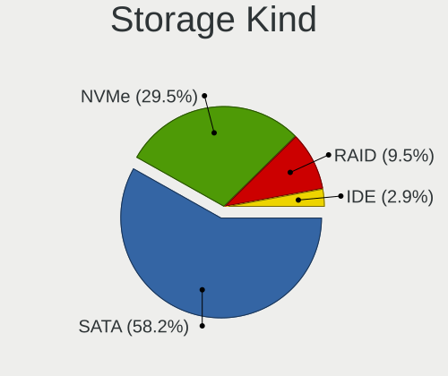

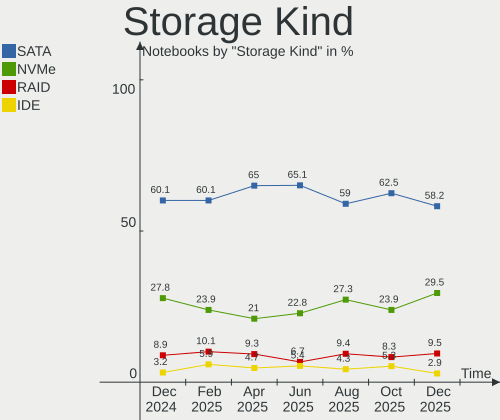

| Kind | Notebooks | Percent |
|------|-----------|---------|
| SATA | 221       | 58.16%  |
| NVMe | 112       | 29.47%  |
| RAID | 36        | 9.47%   |
| IDE  | 11        | 2.89%   |

Processor
---------

CPU Vendor
----------

Processor vendors

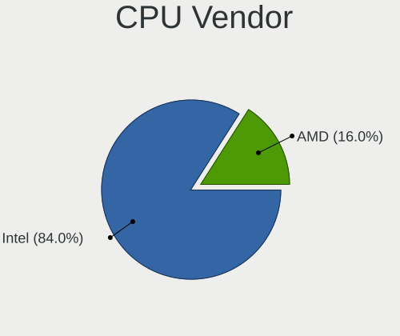

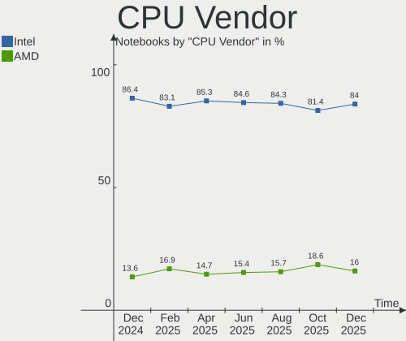

| Vendor | Notebooks | Percent |
|--------|-----------|---------|
| Intel  | 274       | 84.05%  |
| AMD    | 52        | 15.95%  |

CPU Model
---------

Processor models

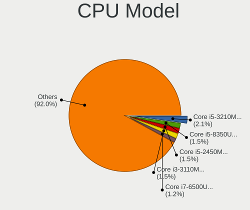

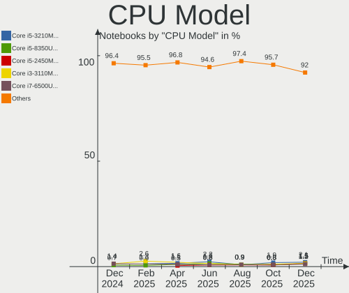

| Model                                         | Notebooks | Percent |
|-----------------------------------------------|-----------|---------|
| Intel Core i5-3210M CPU @ 2.50GHz             | 7         | 2.15%   |
| Intel Core i5-8350U CPU @ 1.70GHz             | 5         | 1.53%   |
| Intel Core i5-2450M CPU @ 2.50GHz             | 5         | 1.53%   |
| Intel Core i3-3110M CPU @ 2.40GHz             | 5         | 1.53%   |
| Intel Core i7-6500U CPU @ 2.50GHz             | 4         | 1.23%   |
| Intel Core i7-3610QM CPU @ 2.30GHz            | 4         | 1.23%   |
| Intel Core i7-2630QM CPU @ 2.00GHz            | 4         | 1.23%   |
| Intel Core i5-7200U CPU @ 2.50GHz             | 4         | 1.23%   |
| Intel Core i5-5200U CPU @ 2.20GHz             | 4         | 1.23%   |
| Intel Core i5-2520M CPU @ 2.50GHz             | 4         | 1.23%   |
| AMD Ryzen 3 7320U with Radeon Graphics        | 4         | 1.23%   |
| Intel Core i7-8550U CPU @ 1.80GHz             | 3         | 0.92%   |
| Intel Core i7-6700HQ CPU @ 2.60GHz            | 3         | 0.92%   |
| Intel Core i7-4870HQ CPU @ 2.50GHz            | 3         | 0.92%   |
| Intel Core i7-4510U CPU @ 2.00GHz             | 3         | 0.92%   |
| Intel Core i7-2670QM CPU @ 2.20GHz            | 3         | 0.92%   |
| Intel Core i5-8250U CPU @ 1.60GHz             | 3         | 0.92%   |
| Intel Core i5-7300HQ CPU @ 2.50GHz            | 3         | 0.92%   |
| Intel Core i5-6300U CPU @ 2.40GHz             | 3         | 0.92%   |
| Intel Core i5-6200U CPU @ 2.30GHz             | 3         | 0.92%   |
| Intel Core i5-5300U CPU @ 2.30GHz             | 3         | 0.92%   |
| Intel Core i5-2430M CPU @ 2.40GHz             | 3         | 0.92%   |
| Intel Core i5-2410M CPU @ 2.30GHz             | 3         | 0.92%   |
| Intel Core i5 CPU M 460 @ 2.53GHz             | 3         | 0.92%   |
| Intel Core i3-8130U CPU @ 2.20GHz             | 3         | 0.92%   |
| Intel Celeron N4020 CPU @ 1.10GHz             | 3         | 0.92%   |
| Intel Celeron CPU N3350 @ 1.10GHz             | 3         | 0.92%   |
| Intel 12th Gen Core i5-1235U                  | 3         | 0.92%   |
| AMD Ryzen 5 2500U with Radeon Vega Mobile Gfx | 3         | 0.92%   |
| AMD A8-7410 APU with AMD Radeon R5 Graphics   | 3         | 0.92%   |
| Intel Pentium Dual-Core CPU T4400 @ 2.20GHz   | 2         | 0.61%   |
| Intel Core Ultra 7 255H                       | 2         | 0.61%   |
| Intel Core Ultra 5 125H                       | 2         | 0.61%   |
| Intel Core m5-6Y54 CPU @ 1.10GHz              | 2         | 0.61%   |
| Intel Core i7-9850H CPU @ 2.60GHz             | 2         | 0.61%   |
| Intel Core i7-9750H CPU @ 2.60GHz             | 2         | 0.61%   |
| Intel Core i7-8850H CPU @ 2.60GHz             | 2         | 0.61%   |
| Intel Core i7-8650U CPU @ 1.90GHz             | 2         | 0.61%   |
| Intel Core i7-6600U CPU @ 2.60GHz             | 2         | 0.61%   |
| Intel Core i7-5500U CPU @ 2.40GHz             | 2         | 0.61%   |

CPU Model Family
----------------

Processor model prefix

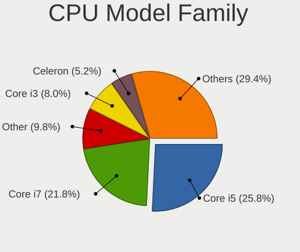

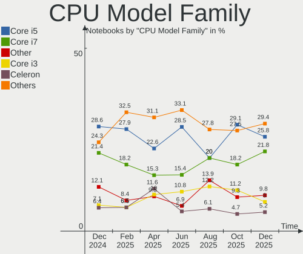

| Model                   | Notebooks | Percent |
|-------------------------|-----------|---------|
| Intel Core i5           | 84        | 25.77%  |
| Intel Core i7           | 71        | 21.78%  |
| Other                   | 32        | 9.82%   |
| Intel Core i3           | 26        | 7.98%   |
| Intel Celeron           | 17        | 5.21%   |
| Intel Core 2 Duo        | 14        | 4.29%   |
| AMD Ryzen 7             | 11        | 3.37%   |
| AMD Ryzen 5             | 9         | 2.76%   |
| Intel Core              | 8         | 2.45%   |
| Intel Pentium           | 6         | 1.84%   |
| AMD A6                  | 6         | 1.84%   |
| AMD Ryzen 3             | 5         | 1.53%   |
| Intel Pentium Dual-Core | 4         | 1.23%   |
| AMD A8                  | 4         | 1.23%   |
| Intel Core m5           | 3         | 0.92%   |
| Intel Xeon              | 2         | 0.61%   |
| Intel Pentium Dual      | 2         | 0.61%   |
| Intel Core i9           | 2         | 0.61%   |
| Intel Core 2            | 2         | 0.61%   |
| AMD E1                  | 2         | 0.61%   |
| AMD E                   | 2         | 0.61%   |
| Intel Pentium Silver    | 1         | 0.31%   |
| Intel Genuine           | 1         | 0.31%   |
| Intel Core m3           | 1         | 0.31%   |
| Intel Core M            | 1         | 0.31%   |
| Intel Atom              | 1         | 0.31%   |
| AMD Turion 64 X2 Mobile | 1         | 0.31%   |
| AMD Ryzen 9             | 1         | 0.31%   |
| AMD Ryzen 5 PRO         | 1         | 0.31%   |
| AMD PRO A10             | 1         | 0.31%   |
| AMD E2                  | 1         | 0.31%   |
| AMD Athlon II Dual-Core | 1         | 0.31%   |
| AMD Athlon II           | 1         | 0.31%   |
| AMD Athlon              | 1         | 0.31%   |
| AMD A10                 | 1         | 0.31%   |

CPU Cores
---------

Number of processor cores

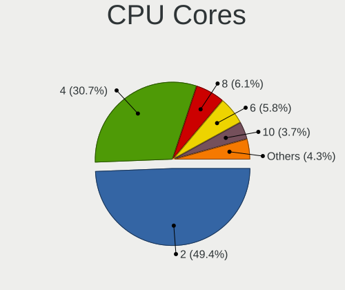

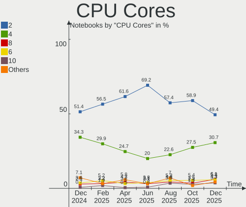

| Number | Notebooks | Percent |
|--------|-----------|---------|
| 2      | 161       | 49.39%  |
| 4      | 100       | 30.67%  |
| 8      | 20        | 6.13%   |
| 6      | 19        | 5.83%   |
| 10     | 12        | 3.68%   |
| 14     | 5         | 1.53%   |
| 16     | 3         | 0.92%   |
| 1      | 3         | 0.92%   |
| 12     | 2         | 0.61%   |
| 24     | 1         | 0.31%   |

CPU Sockets
-----------

Number of sockets

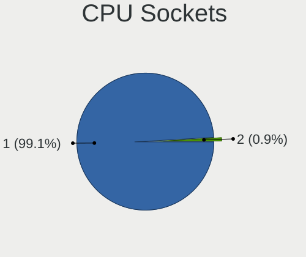

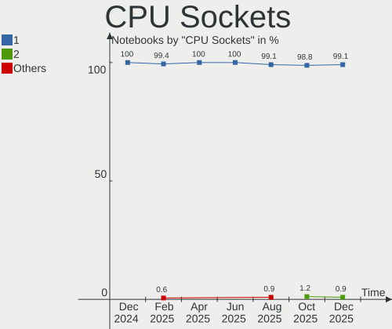

| Number | Notebooks | Percent |
|--------|-----------|---------|
| 1      | 323       | 99.08%  |
| 2      | 3         | 0.92%   |

CPU Threads
-----------

Threads per core (Hyper-Threading)

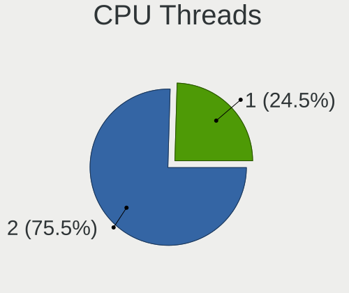

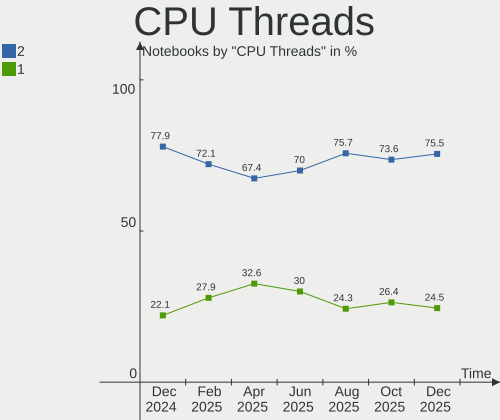

| Number | Notebooks | Percent |
|--------|-----------|---------|
| 2      | 246       | 75.46%  |
| 1      | 80        | 24.54%  |

CPU Op-Modes
------------

CPU Operation Modes (32-bit, 64-bit)

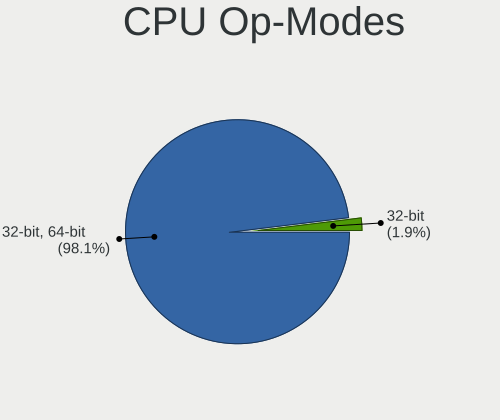

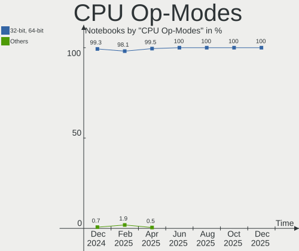

| Op mode        | Notebooks | Percent |
|----------------|-----------|---------|
| 32-bit, 64-bit | 326       | 100%    |

CPU Microcode
-------------

Microcode number

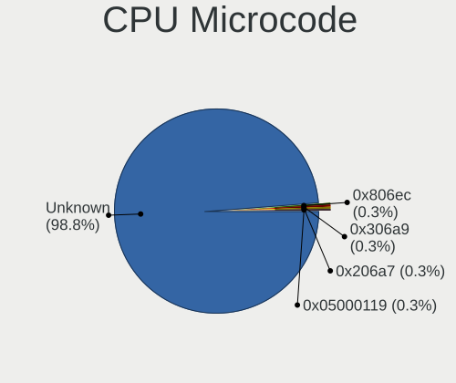

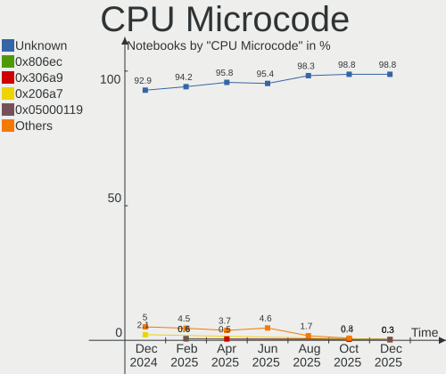

| Number     | Notebooks | Percent |
|------------|-----------|---------|
| Unknown    | 322       | 98.77%  |
| 0x806ec    | 1         | 0.31%   |
| 0x306a9    | 1         | 0.31%   |
| 0x206a7    | 1         | 0.31%   |
| 0x05000119 | 1         | 0.31%   |

CPU Microarch
-------------

Microarchitecture

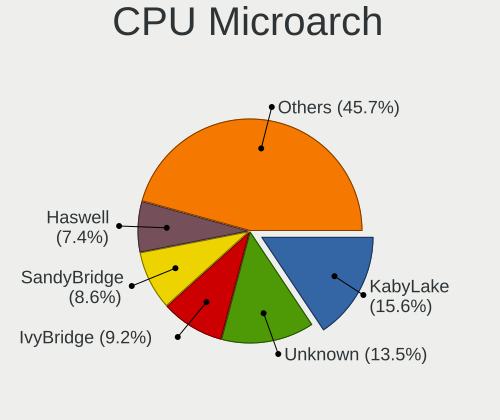

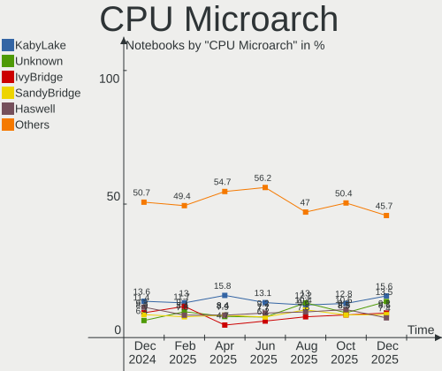

| Name               | Notebooks | Percent |
|--------------------|-----------|---------|
| KabyLake           | 51        | 15.64%  |
| Unknown            | 44        | 13.5%   |
| IvyBridge          | 30        | 9.2%    |
| SandyBridge        | 28        | 8.59%   |
| Haswell            | 24        | 7.36%   |
| Skylake            | 22        | 6.75%   |
| Penryn             | 17        | 5.21%   |
| Westmere           | 12        | 3.68%   |
| Broadwell          | 12        | 3.68%   |
| Core               | 8         | 2.45%   |
| Silvermont         | 7         | 2.15%   |
| Puma               | 7         | 2.15%   |
| TigerLake          | 6         | 1.84%   |
| CometLake          | 6         | 1.84%   |
| Zen+               | 5         | 1.53%   |
| Goldmont plus      | 5         | 1.53%   |
| Goldmont           | 5         | 1.53%   |
| Zen 3              | 4         | 1.23%   |
| Bobcat             | 4         | 1.23%   |
| Alderlake Hybrid   | 4         | 1.23%   |
| Zen 2              | 3         | 0.92%   |
| Zen                | 3         | 0.92%   |
| Piledriver         | 3         | 0.92%   |
| IceLake            | 3         | 0.92%   |
| Excavator          | 3         | 0.92%   |
| Nehalem            | 2         | 0.61%   |
| K10                | 2         | 0.61%   |
| ArrowLake-H Hybrid | 2         | 0.61%   |
| Tremont            | 1         | 0.31%   |
| K8 Hammer          | 1         | 0.31%   |
| K10 Llano          | 1         | 0.31%   |
| Jaguar             | 1         | 0.31%   |

Graphics
--------

GPU Vendor
----------

Vendors of graphics cards

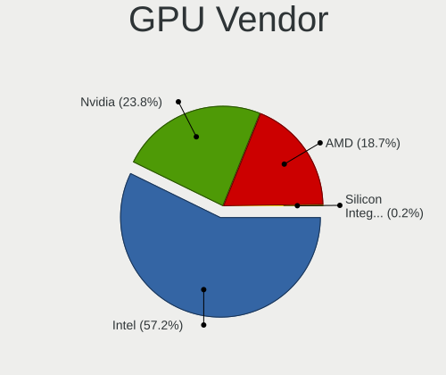

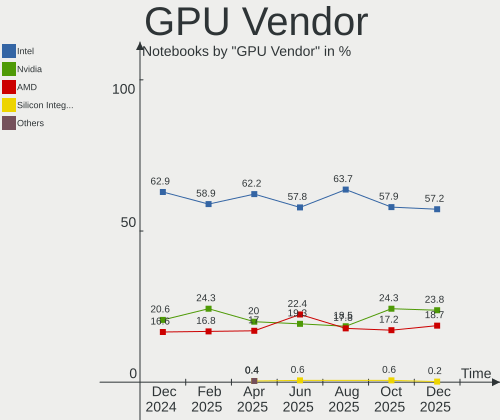

| Vendor                           | Notebooks | Percent |
|----------------------------------|-----------|---------|
| Intel                            | 245       | 57.24%  |
| Nvidia                           | 102       | 23.83%  |
| AMD                              | 80        | 18.69%  |
| Silicon Integrated Systems [SiS] | 1         | 0.23%   |

GPU Model
---------

Graphics card models

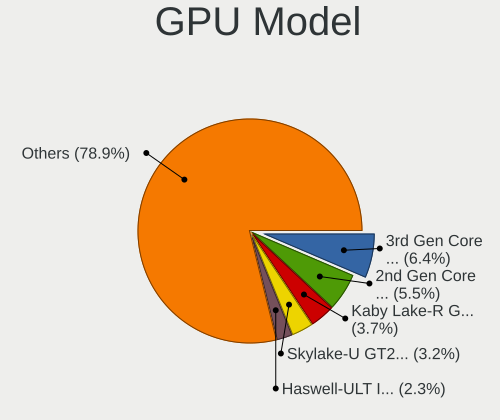

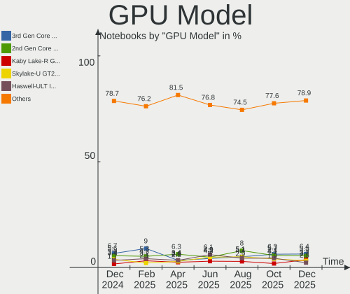

| Model                                                                                    | Notebooks | Percent |
|------------------------------------------------------------------------------------------|-----------|---------|
| Intel 3rd Gen Core processor Graphics Controller                                         | 28        | 6.44%   |
| Intel 2nd Generation Core Processor Family Integrated Graphics Controller                | 24        | 5.52%   |
| Intel Kaby Lake-R GT2 [UHD Graphics 620]                                                 | 16        | 3.68%   |
| Intel Skylake-U GT2 [HD Graphics 520]                                                    | 14        | 3.22%   |
| Intel Haswell-ULT Integrated Graphics Controller                                         | 10        | 2.3%    |
| Intel Broadwell-U GT2 [HD Graphics 5500]                                                 | 10        | 2.3%    |
| Intel 4th Gen Core Processor Integrated Graphics Controller                              | 10        | 2.3%    |
| Intel Core Processor Integrated Graphics Controller                                      | 9         | 2.07%   |
| Intel Mobile 4 Series Chipset Integrated Graphics Controller                             | 8         | 1.84%   |
| Intel Kaby Lake-U GT2 [HD Graphics 620]                                                  | 8         | 1.84%   |
| AMD Seymour [Radeon HD 6400M/7400M Series]                                               | 8         | 1.84%   |
| Intel WhiskeyLake-U GT2 [UHD Graphics 620]                                               | 7         | 1.61%   |
| Intel CoffeeLake-H GT2 [UHD Graphics 630]                                                | 7         | 1.61%   |
| Intel TigerLake-LP GT2 [Iris Xe Graphics]                                                | 6         | 1.38%   |
| Intel Atom/Celeron/Pentium Processor x5-E8000/J3xxx/N3xxx Integrated Graphics Controller | 6         | 1.38%   |
| AMD Mullins [Radeon R4/R5 Graphics]                                                      | 6         | 1.38%   |
| Intel GeminiLake [UHD Graphics 600]                                                      | 5         | 1.15%   |
| Intel CometLake-U GT2 [UHD Graphics]                                                     | 5         | 1.15%   |
| Intel CometLake-H GT2 [UHD Graphics]                                                     | 5         | 1.15%   |
| AMD Picasso/Raven 2 [Radeon Vega Series / Radeon Vega Mobile Series]                     | 5         | 1.15%   |
| AMD Mendocino [Radeon 610M]                                                              | 5         | 1.15%   |
| Nvidia GF117M [GeForce 610M/710M/810M/820M / GT 620M/625M/630M/720M]                     | 4         | 0.92%   |
| Nvidia GF108M [GeForce GT 540M]                                                          | 4         | 0.92%   |
| Intel Raptor Lake-P [Iris Xe Graphics]                                                   | 4         | 0.92%   |
| Intel Kaby Lake-H GT2 [HD Graphics 630]                                                  | 4         | 0.92%   |
| Intel JasperLake [UHD Graphics]                                                          | 4         | 0.92%   |
| Intel Crystal Well Integrated Graphics Controller                                        | 4         | 0.92%   |
| Intel Apollo Lake GT1 [HD Graphics 500]                                                  | 4         | 0.92%   |
| AMD Topaz XT [Radeon R7 M260/M265 / M340/M360 / M440/M445 / 530/535 / 620/625 Mobile]    | 4         | 0.92%   |
| AMD Barcelo                                                                              | 4         | 0.92%   |
| Nvidia GP106M [GeForce GTX 1060 Mobile]                                                  | 3         | 0.69%   |
| Nvidia GM108M [GeForce 840M]                                                             | 3         | 0.69%   |
| Nvidia GK107M [GeForce GT 650M]                                                          | 3         | 0.69%   |
| Nvidia GF108M [GeForce GT 620M/630M/635M/640M LE]                                        | 3         | 0.69%   |
| Nvidia GA107M [GeForce RTX 3050 Mobile]                                                  | 3         | 0.69%   |
| Nvidia C79 [GeForce 9400M]                                                               | 3         | 0.69%   |
| Nvidia AD107M [GeForce RTX 4060 Max-Q / Mobile]                                          | 3         | 0.69%   |
| Intel Skylake-Y GT2 [HD Graphics 515]                                                    | 3         | 0.69%   |
| Intel Skylake-H GT2 [HD Graphics 530]                                                    | 3         | 0.69%   |
| Intel Raptor Lake-S UHD Graphics                                                         | 3         | 0.69%   |

GPU Combo
---------

Combinations of graphics cards

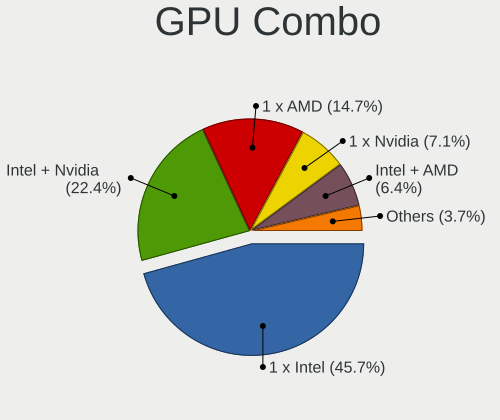

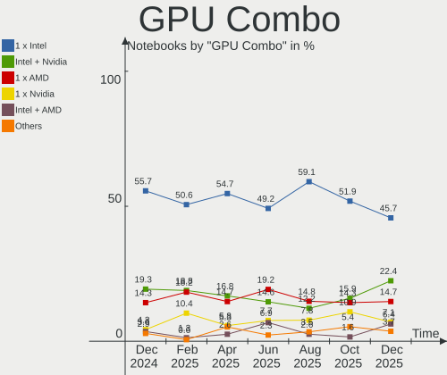

| Name           | Notebooks | Percent |
|----------------|-----------|---------|
| 1 x Intel      | 149       | 45.71%  |
| Intel + Nvidia | 73        | 22.39%  |
| 1 x AMD        | 48        | 14.72%  |
| 1 x Nvidia     | 23        | 7.06%   |
| Intel + AMD    | 21        | 6.44%   |
| 2 x AMD        | 5         | 1.53%   |
| AMD + Nvidia   | 5         | 1.53%   |
| Other          | 1         | 0.31%   |
| 1 x SiS        | 1         | 0.31%   |

GPU Driver
----------

Free vs proprietary

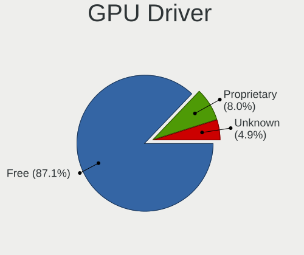

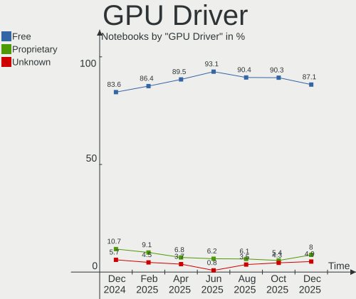

| Driver      | Notebooks | Percent |
|-------------|-----------|---------|
| Free        | 284       | 87.12%  |
| Proprietary | 26        | 7.98%   |
| Unknown     | 16        | 4.91%   |

GPU Memory
----------

Total video memory

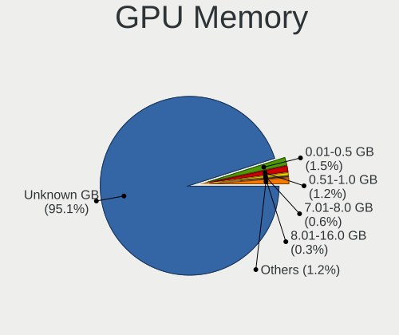

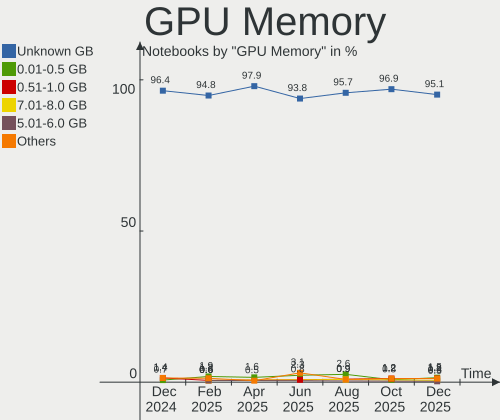

| Size in GB | Notebooks | Percent |
|------------|-----------|---------|
| Unknown    | 310       | 95.09%  |
| 0.01-0.5   | 5         | 1.53%   |
| 0.51-1.0   | 4         | 1.23%   |
| 7.01-8.0   | 2         | 0.61%   |
| 5.01-6.0   | 1         | 0.31%   |
| 3.01-4.0   | 1         | 0.31%   |
| 2.01-3.0   | 1         | 0.31%   |
| 1.01-2.0   | 1         | 0.31%   |
| 8.01-16.0  | 1         | 0.31%   |

Monitor
-------

Monitor Vendor
--------------

Monitor vendors

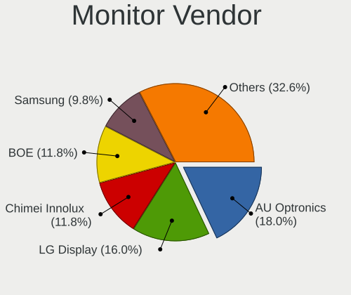

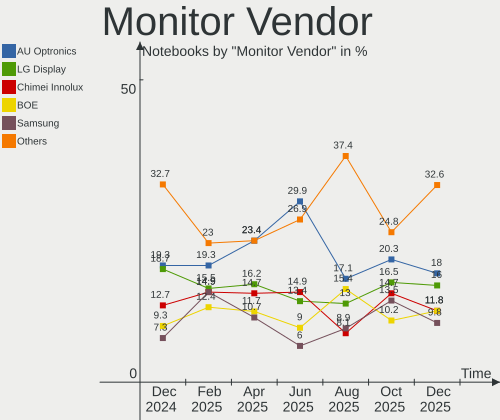

| Vendor                  | Notebooks | Percent |
|-------------------------|-----------|---------|
| AU Optronics            | 64        | 17.98%  |
| LG Display              | 57        | 16.01%  |
| Chimei Innolux          | 42        | 11.8%   |
| BOE                     | 42        | 11.8%   |
| Samsung Electronics     | 35        | 9.83%   |
| Apple                   | 17        | 4.78%   |
| Chi Mei Optoelectronics | 11        | 3.09%   |
| Sharp                   | 8         | 2.25%   |
| Lenovo                  | 8         | 2.25%   |
| Dell                    | 8         | 2.25%   |
| PANDA                   | 6         | 1.69%   |
| InfoVision              | 6         | 1.69%   |
| Goldstar                | 5         | 1.4%    |
| EDO                     | 3         | 0.84%   |
| CSOT                    | 3         | 0.84%   |
| Unknown                 | 2         | 0.56%   |
| Toshiba                 | 2         | 0.56%   |
| SLD                     | 2         | 0.56%   |
| HKC                     | 2         | 0.56%   |
| Hewlett-Packard         | 2         | 0.56%   |
| AOC                     | 2         | 0.56%   |
| Acer                    | 2         | 0.56%   |
| TMA                     | 1         | 0.28%   |
| Tianma XM               | 1         | 0.28%   |
| Sony                    | 1         | 0.28%   |
| SGT                     | 1         | 0.28%   |
| RTK                     | 1         | 0.28%   |
| Pixio                   | 1         | 0.28%   |
| Philips                 | 1         | 0.28%   |
| Panasonic               | 1         | 0.28%   |
| NEC Computers           | 1         | 0.28%   |
| MiTAC                   | 1         | 0.28%   |
| LG Philips              | 1         | 0.28%   |
| LED                     | 1         | 0.28%   |
| KDB                     | 1         | 0.28%   |
| JDZ                     | 1         | 0.28%   |
| INV                     | 1         | 0.28%   |
| Insignia                | 1         | 0.28%   |
| InnoLux Display         | 1         | 0.28%   |
| Iiyama                  | 1         | 0.28%   |

Monitor Model
-------------

Monitor models

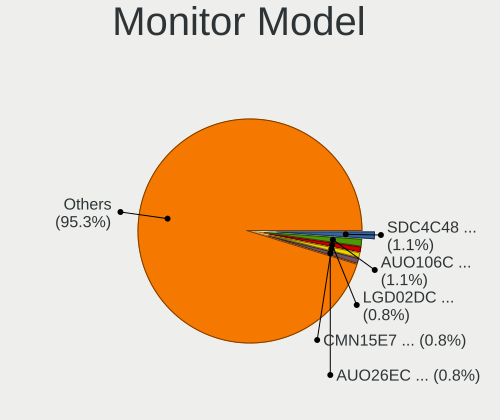

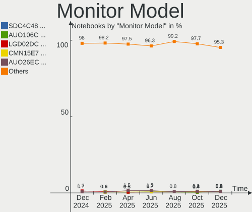

| Model                                                                    | Notebooks | Percent |
|--------------------------------------------------------------------------|-----------|---------|
| Samsung Electronics LCD Monitor SDC4C48 1920x1080 293x165mm 13.2-inch    | 4         | 1.11%   |
| AU Optronics LCD Monitor AUO106C 1366x768 276x155mm 12.5-inch            | 4         | 1.11%   |
| LG Display LCD Monitor LGD02DC 1366x768 344x194mm 15.5-inch              | 3         | 0.84%   |
| Chimei Innolux LCD Monitor CMN15E7 1920x1080 344x193mm 15.5-inch         | 3         | 0.84%   |
| AU Optronics LCD Monitor AUO26EC 1366x768 344x193mm 15.5-inch            | 3         | 0.84%   |
| AU Optronics LCD Monitor AUO139E 1600x900 382x214mm 17.2-inch            | 3         | 0.84%   |
| Unknown LCD Monitor FFFF 2288x1287 2550x2550mm 142.0-inch                | 2         | 0.56%   |
| SLD LCD Monitor SLD003C 1366x768 309x173mm 13.9-inch                     | 2         | 0.56%   |
| Samsung Electronics LCD Monitor SEC5441 1280x800 331x207mm 15.4-inch     | 2         | 0.56%   |
| Samsung Electronics LCD Monitor SEC314C 1920x1080 344x194mm 15.5-inch    | 2         | 0.56%   |
| LG Display LCD Monitor LGD0742 1920x1080 344x194mm 15.5-inch             | 2         | 0.56%   |
| LG Display LCD Monitor LGD046F 1920x1080 344x194mm 15.5-inch             | 2         | 0.56%   |
| LG Display LCD Monitor LGD042C 1920x1080 345x194mm 15.6-inch             | 2         | 0.56%   |
| LG Display LCD Monitor LGD0395 1366x768 344x194mm 15.5-inch              | 2         | 0.56%   |
| LG Display LCD Monitor LGD033A 1366x768 344x194mm 15.5-inch              | 2         | 0.56%   |
| Lenovo Q24i-1L LEN66C0 1920x1080 530x300mm 24.0-inch                     | 2         | 0.56%   |
| InfoVision LCD Monitor IVO0536 1920x1080 294x165mm 13.3-inch             | 2         | 0.56%   |
| EDO EDO142 EDO0142                                                       | 2         | 0.56%   |
| Chimei Innolux LCD Monitor CMN15F5 1920x1080 344x193mm 15.5-inch         | 2         | 0.56%   |
| Chimei Innolux LCD Monitor CMN15DC 1366x768 344x193mm 15.5-inch          | 2         | 0.56%   |
| Chimei Innolux LCD Monitor CMN15DB 1366x768 344x193mm 15.5-inch          | 2         | 0.56%   |
| Chimei Innolux LCD Monitor CMN15CA 1366x768 344x193mm 15.5-inch          | 2         | 0.56%   |
| Chimei Innolux LCD Monitor CMN15C6 1366x768 344x193mm 15.5-inch          | 2         | 0.56%   |
| Chimei Innolux LCD Monitor CMN14C9 1920x1080 309x173mm 13.9-inch         | 2         | 0.56%   |
| Chi Mei Optoelectronics LCD Monitor CMO15A3 1366x768 344x193mm 15.5-inch | 2         | 0.56%   |
| BOE LCD Monitor BOE084E 1920x1080 382x215mm 17.3-inch                    | 2         | 0.56%   |
| BOE LCD Monitor BOE06B9 1920x1080 344x194mm 15.5-inch                    | 2         | 0.56%   |
| BOE LCD Monitor BOE06A5 1366x768 344x194mm 15.5-inch                     | 2         | 0.56%   |
| BOE LCD Monitor BOE0696 1366x768 309x173mm 13.9-inch                     | 2         | 0.56%   |
| AU Optronics LCD Monitor AUO70EC 1366x768 344x193mm 15.5-inch            | 2         | 0.56%   |
| AU Optronics LCD Monitor AUO61ED 1920x1080 344x194mm 15.5-inch           | 2         | 0.56%   |
| AU Optronics LCD Monitor AUO303E 1600x900 309x174mm 14.0-inch            | 2         | 0.56%   |
| AU Optronics LCD Monitor AUO22EC 1366x768 344x193mm 15.5-inch            | 2         | 0.56%   |
| AU Optronics LCD Monitor AUO226D 1920x1080 276x155mm 12.5-inch           | 2         | 0.56%   |
| AU Optronics LCD Monitor AUO21ED 1920x1080 344x193mm 15.5-inch           | 2         | 0.56%   |
| AU Optronics LCD Monitor AUO21EC 1366x768 344x193mm 15.5-inch            | 2         | 0.56%   |
| Apple LCD Monitor APP9CC3 1280x800 286x179mm 13.3-inch                   | 2         | 0.56%   |
| Apple Color LCD APPA02E 2880x1800 331x207mm 15.4-inch                    | 2         | 0.56%   |
| Apple Color LCD APPA027 2304x1440 259x162mm 12.0-inch                    | 2         | 0.56%   |
| Apple Color LCD APP9CA4 1440x900 331x207mm 15.4-inch                     | 2         | 0.56%   |

Monitor Resolution
------------------

Monitor screen resolution

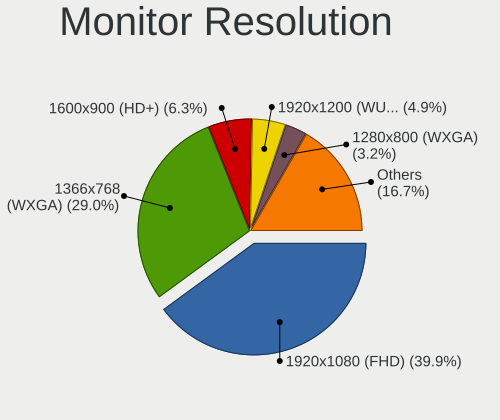

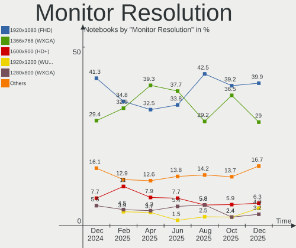

| Resolution         | Notebooks | Percent |
|--------------------|-----------|---------|
| 1920x1080 (FHD)    | 139       | 39.94%  |
| 1366x768 (WXGA)    | 101       | 29.02%  |
| 1600x900 (HD+)     | 22        | 6.32%   |
| 1920x1200 (WUXGA)  | 17        | 4.89%   |
| 1280x800 (WXGA)    | 11        | 3.16%   |
| 3840x2160 (4K)     | 8         | 2.3%    |
| 2560x1600          | 8         | 2.3%    |
| 2560x1440 (QHD)    | 6         | 1.72%   |
| 1440x900 (WXGA+)   | 6         | 1.72%   |
| 2880x1800          | 5         | 1.44%   |
| 1680x1050 (WSXGA+) | 4         | 1.15%   |
| 2560x1080          | 3         | 0.86%   |
| Unknown            | 3         | 0.86%   |
| 3440x1440          | 2         | 0.57%   |
| 2304x1440          | 2         | 0.57%   |
| 2288x1287          | 2         | 0.57%   |
| 1024x768 (XGA)     | 2         | 0.57%   |
| 3840x1600          | 1         | 0.29%   |
| 3072x1920          | 1         | 0.29%   |
| 3000x2000          | 1         | 0.29%   |
| 2240x1400          | 1         | 0.29%   |
| 2160x1440          | 1         | 0.29%   |
| 1920x515           | 1         | 0.29%   |
| 1920x1280          | 1         | 0.29%   |

Monitor Diagonal
----------------

Diagonal size in inches

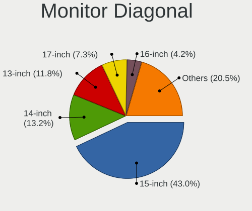

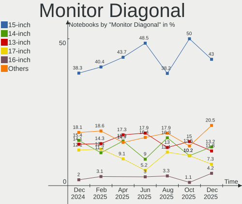

| Inches  | Notebooks | Percent |
|---------|-----------|---------|
| 15      | 153       | 42.98%  |
| 14      | 47        | 13.2%   |
| 13      | 42        | 11.8%   |
| 17      | 26        | 7.3%    |
| 16      | 15        | 4.21%   |
| 12      | 11        | 3.09%   |
| 24      | 10        | 2.81%   |
| 27      | 8         | 2.25%   |
| 18      | 8         | 2.25%   |
| 34      | 4         | 1.12%   |
| Unknown | 4         | 1.12%   |
| 31      | 3         | 0.84%   |
| 23      | 3         | 0.84%   |
| 21      | 3         | 0.84%   |
| 142     | 2         | 0.56%   |
| 63      | 2         | 0.56%   |
| 19      | 2         | 0.56%   |
| 86      | 1         | 0.28%   |
| 84      | 1         | 0.28%   |
| 52      | 1         | 0.28%   |
| 50      | 1         | 0.28%   |
| 42      | 1         | 0.28%   |
| 40      | 1         | 0.28%   |
| 37      | 1         | 0.28%   |
| 32      | 1         | 0.28%   |
| 28      | 1         | 0.28%   |
| 26      | 1         | 0.28%   |
| 22      | 1         | 0.28%   |
| 11      | 1         | 0.28%   |
| 10      | 1         | 0.28%   |

Monitor Width
-------------

Physical width

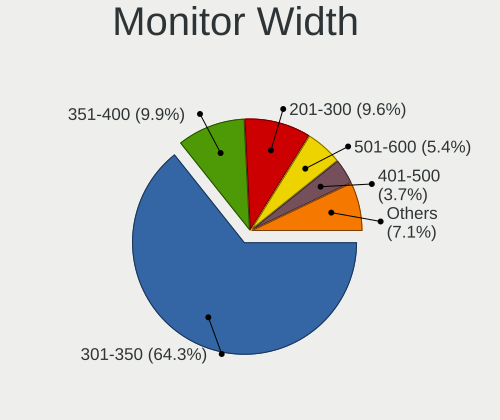

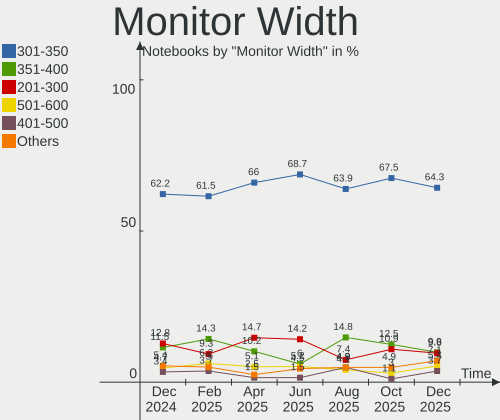

| Width in mm    | Notebooks | Percent |
|----------------|-----------|---------|
| 301-350        | 227       | 64.31%  |
| 351-400        | 35        | 9.92%   |
| 201-300        | 34        | 9.63%   |
| 501-600        | 19        | 5.38%   |
| 401-500        | 13        | 3.68%   |
| 701-800        | 5         | 1.42%   |
| 601-700        | 5         | 1.42%   |
| 1001-1500      | 5         | 1.42%   |
| Unknown        | 4         | 1.13%   |
| More than 2000 | 2         | 0.57%   |
| 801-900        | 2         | 0.57%   |
| 1501-2000      | 1         | 0.28%   |
| 901-1000       | 1         | 0.28%   |

Aspect Ratio
------------

Proportional relationship between the width and the height

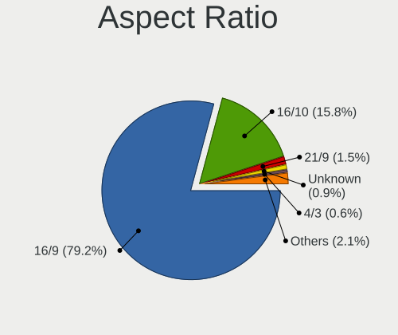

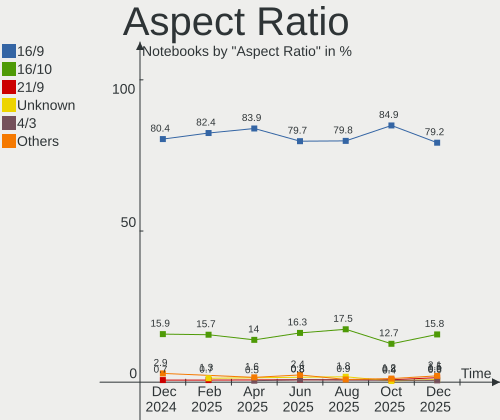

| Ratio   | Notebooks | Percent |
|---------|-----------|---------|
| 16/9    | 266       | 79.17%  |
| 16/10   | 53        | 15.77%  |
| 21/9    | 5         | 1.49%   |
| Unknown | 3         | 0.89%   |
| 4/3     | 2         | 0.6%    |
| 3/2     | 2         | 0.6%    |
| 1.00    | 2         | 0.6%    |
| 3.73    | 1         | 0.3%    |
| 2.00    | 1         | 0.3%    |
| 0.56    | 1         | 0.3%    |

Monitor Area
------------

Area in inch²

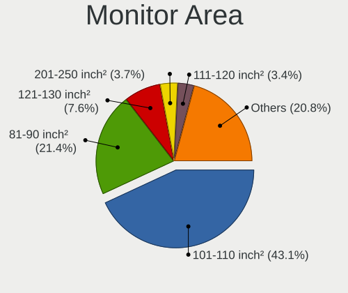

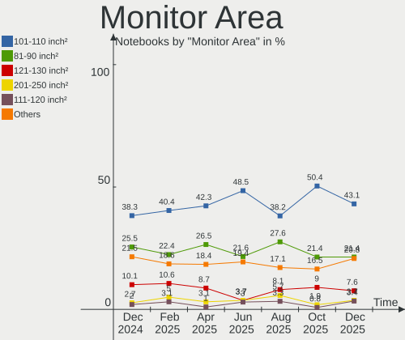

| Area in inch² | Notebooks | Percent |
|----------------|-----------|---------|
| 101-110        | 153       | 43.1%   |
| 81-90          | 76        | 21.41%  |
| 121-130        | 27        | 7.61%   |
| 201-250        | 13        | 3.66%   |
| 111-120        | 12        | 3.38%   |
| 71-80          | 11        | 3.1%    |
| 61-70          | 11        | 3.1%    |
| 351-500        | 9         | 2.54%   |
| More than 1000 | 8         | 2.25%   |
| 301-350        | 8         | 2.25%   |
| 141-150        | 8         | 2.25%   |
| 251-300        | 4         | 1.13%   |
| Unknown        | 4         | 1.13%   |
| 501-1000       | 3         | 0.85%   |
| 151-200        | 2         | 0.56%   |
| 131-140        | 2         | 0.56%   |
| 91-100         | 2         | 0.56%   |
| 51-60          | 1         | 0.28%   |
| 41-50          | 1         | 0.28%   |

Pixel Density
-------------

Pixels per inch

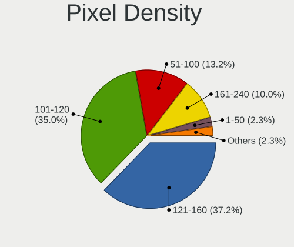

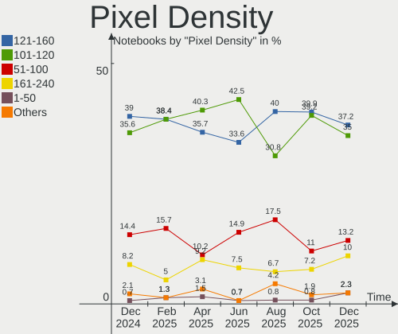

| Density       | Notebooks | Percent |
|---------------|-----------|---------|
| 121-160       | 130       | 37.25%  |
| 101-120       | 122       | 34.96%  |
| 51-100        | 46        | 13.18%  |
| 161-240       | 35        | 10.03%  |
| 1-50          | 8         | 2.29%   |
| More than 240 | 4         | 1.15%   |
| Unknown       | 4         | 1.15%   |

Multiple Monitors
-----------------

Total monitors connected

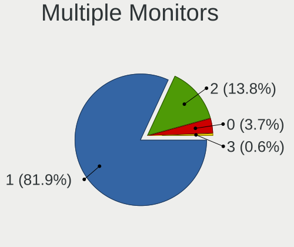

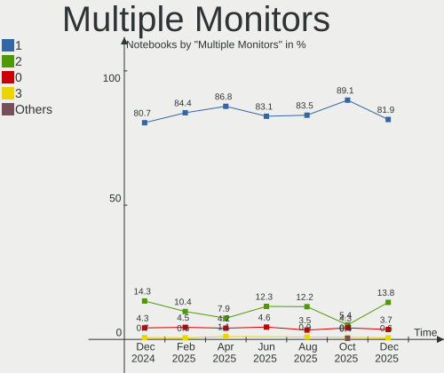

| Total | Notebooks | Percent |
|-------|-----------|---------|
| 1     | 267       | 81.9%   |
| 2     | 45        | 13.8%   |
| 0     | 12        | 3.68%   |
| 3     | 2         | 0.61%   |

Network
-------

Net Controller Vendor
---------------------

Controller vendors

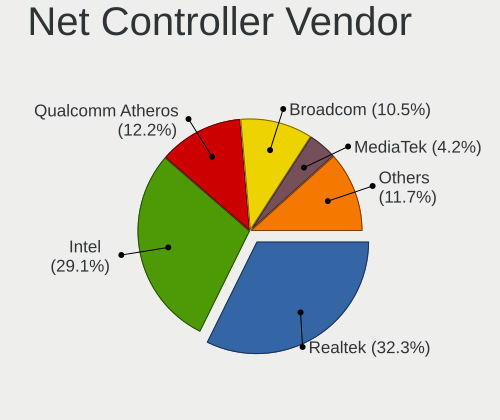

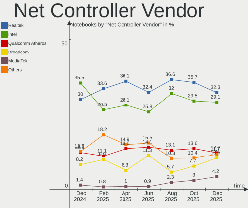

| Vendor                                 | Notebooks | Percent |
|----------------------------------------|-----------|---------|
| Realtek Semiconductor                  | 169       | 32.31%  |
| Intel                                  | 152       | 29.06%  |
| Qualcomm Atheros                       | 64        | 12.24%  |
| Broadcom                               | 55        | 10.52%  |
| MediaTek                               | 22        | 4.21%   |
| Sierra Wireless                        | 7         | 1.34%   |
| Nvidia                                 | 5         | 0.96%   |
| Broadcom Limited                       | 5         | 0.96%   |
| ASIX Electronics                       | 5         | 0.96%   |
| Samsung Electronics                    | 4         | 0.76%   |
| Ralink Technology                      | 4         | 0.76%   |
| Ralink                                 | 4         | 0.76%   |
| Marvell Technology Group               | 4         | 0.76%   |
| DisplayLink                            | 3         | 0.57%   |
| Dell                                   | 3         | 0.57%   |
| Xiaomi                                 | 2         | 0.38%   |
| ASUSTek Computer                       | 2         | 0.38%   |
| TP-Link                                | 1         | 0.19%   |
| Toshiba                                | 1         | 0.19%   |
| Sony Ericsson Mobile Communications AB | 1         | 0.19%   |
| Silicon Integrated Systems [SiS]       | 1         | 0.19%   |
| Realtek                                | 1         | 0.19%   |
| Qualcomm                               | 1         | 0.19%   |
| NetGear                                | 1         | 0.19%   |
| Microsoft                              | 1         | 0.19%   |
| JMicron Technology                     | 1         | 0.19%   |
| Huawei Technologies                    | 1         | 0.19%   |
| Hewlett-Packard                        | 1         | 0.19%   |
| Google                                 | 1         | 0.19%   |
| Fibocom                                | 1         | 0.19%   |

Net Controller Model
--------------------

Controller models

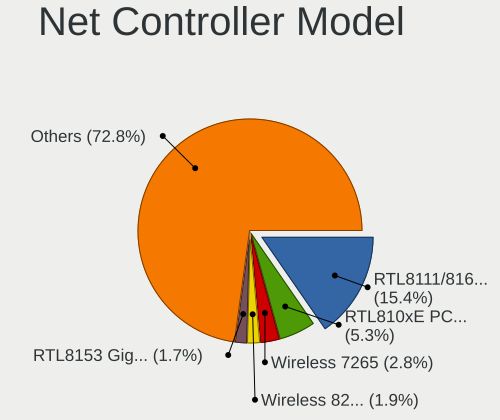

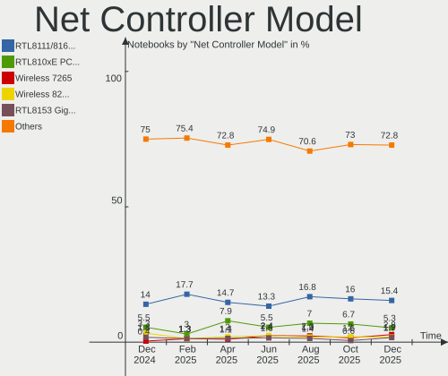

| Model                                                                  | Notebooks | Percent |
|------------------------------------------------------------------------|-----------|---------|
| Realtek RTL8111/8168/8211/8411 PCI Express Gigabit Ethernet Controller | 98        | 15.38%  |
| Realtek RTL810xE PCI Express Fast Ethernet controller                  | 34        | 5.34%   |
| Intel Wireless 7265                                                    | 18        | 2.83%   |
| Intel Wireless 8265 / 8275                                             | 12        | 1.88%   |
| Realtek RTL8153 Gigabit Ethernet Adapter                               | 11        | 1.73%   |
| Qualcomm Atheros QCA9377 802.11ac Wireless Network Adapter             | 11        | 1.73%   |
| Qualcomm Atheros QCA9565 / AR9565 Wireless Network Adapter             | 10        | 1.57%   |
| Intel Ethernet Connection (4) I219-LM                                  | 10        | 1.57%   |
| Intel 82579LM Gigabit Network Connection (Lewisville)                  | 10        | 1.57%   |
| Broadcom BCM4313 802.11bgn Wireless Network Adapter                    | 10        | 1.57%   |
| Realtek RTL8821CE 802.11ac PCIe Wireless Network Adapter               | 9         | 1.41%   |
| Qualcomm Atheros AR9485 Wireless Network Adapter                       | 9         | 1.41%   |
| MediaTek MT7902 802.11ax PCIe Wireless Network Adapter [Filogic 310]   | 9         | 1.41%   |
| Intel Wireless 8260                                                    | 9         | 1.41%   |
| Intel Wi-Fi 6 AX200                                                    | 8         | 1.26%   |
| Qualcomm Atheros AR9285 Wireless Network Adapter (PCI-Express)         | 7         | 1.1%    |
| Broadcom BCM43142 802.11b/g/n                                          | 7         | 1.1%    |
| Realtek RTL8852BE PCIe 802.11ax Wireless Network Controller            | 6         | 0.94%   |
| Realtek RTL8822CE 802.11ac PCIe Wireless Network Adapter               | 6         | 0.94%   |
| Realtek RTL8723DE Wireless Network Adapter                             | 6         | 0.94%   |
| Qualcomm Atheros QCA6174 802.11ac Wireless Network Adapter             | 6         | 0.94%   |
| MediaTek MT7922 802.11ax PCI Express Wireless Network Adapter          | 6         | 0.94%   |
| Intel Wireless 7260                                                    | 6         | 0.94%   |
| Intel Raptor Lake PCH CNVi WiFi                                        | 6         | 0.94%   |
| Intel Ethernet Connection I219-LM                                      | 6         | 0.94%   |
| Intel Ethernet Connection (3) I218-LM                                  | 6         | 0.94%   |
| Intel Comet Lake PCH-LP CNVi WiFi                                      | 6         | 0.94%   |
| Broadcom NetXtreme BCM57765 Gigabit Ethernet PCIe                      | 6         | 0.94%   |
| Broadcom NetLink BCM57780 Gigabit Ethernet PCIe                        | 6         | 0.94%   |
| Broadcom BCM4331 802.11a/b/g/n                                         | 6         | 0.94%   |
| Broadcom BCM4322 802.11a/b/g/n Wireless LAN Controller                 | 6         | 0.94%   |
| Realtek RTL8723BE PCIe Wireless Network Adapter                        | 5         | 0.78%   |
| Realtek 802.11ac NIC                                                   | 5         | 0.78%   |
| Nvidia MCP79 Ethernet                                                  | 5         | 0.78%   |
| Intel Wireless 3165                                                    | 5         | 0.78%   |
| Intel Wi-Fi 6 AX201                                                    | 5         | 0.78%   |
| Intel Centrino Wireless-N 2230                                         | 5         | 0.78%   |
| ASIX AX88179 Gigabit Ethernet                                          | 5         | 0.78%   |
| Realtek RTL8188CE 802.11b/g/n WiFi Adapter                             | 4         | 0.63%   |
| Qualcomm Atheros AR8151 v2.0 Gigabit Ethernet                          | 4         | 0.63%   |

Wireless Vendor
---------------

Wireless vendors

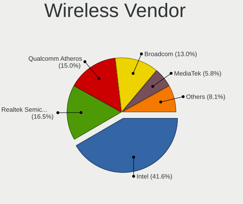

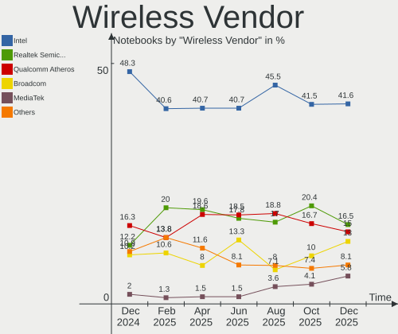

| Vendor                | Notebooks | Percent |
|-----------------------|-----------|---------|
| Intel                 | 144       | 41.62%  |
| Realtek Semiconductor | 57        | 16.47%  |
| Qualcomm Atheros      | 52        | 15.03%  |
| Broadcom              | 45        | 13.01%  |
| MediaTek              | 20        | 5.78%   |
| Sierra Wireless       | 7         | 2.02%   |
| Ralink Technology     | 4         | 1.16%   |
| Ralink                | 4         | 1.16%   |
| Broadcom Limited      | 4         | 1.16%   |
| Dell                  | 2         | 0.58%   |
| ASUSTek Computer      | 2         | 0.58%   |
| TP-Link               | 1         | 0.29%   |
| Realtek               | 1         | 0.29%   |
| NetGear               | 1         | 0.29%   |
| Microsoft             | 1         | 0.29%   |
| Fibocom               | 1         | 0.29%   |

Wireless Model
--------------

Wireless models

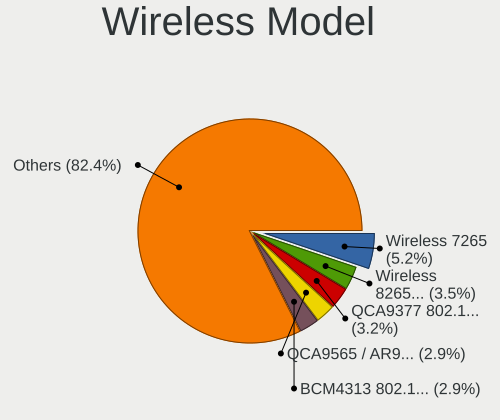

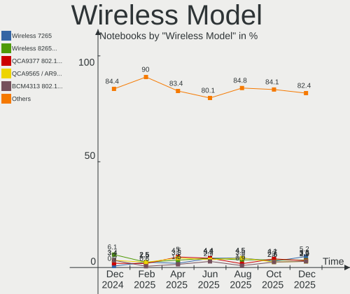

| Model                                                                           | Notebooks | Percent |
|---------------------------------------------------------------------------------|-----------|---------|
| Intel Wireless 7265                                                             | 18        | 5.19%   |
| Intel Wireless 8265 / 8275                                                      | 12        | 3.46%   |
| Qualcomm Atheros QCA9377 802.11ac Wireless Network Adapter                      | 11        | 3.17%   |
| Qualcomm Atheros QCA9565 / AR9565 Wireless Network Adapter                      | 10        | 2.88%   |
| Broadcom BCM4313 802.11bgn Wireless Network Adapter                             | 10        | 2.88%   |
| Realtek RTL8821CE 802.11ac PCIe Wireless Network Adapter                        | 9         | 2.59%   |
| Qualcomm Atheros AR9485 Wireless Network Adapter                                | 9         | 2.59%   |
| MediaTek MT7902 802.11ax PCIe Wireless Network Adapter [Filogic 310]            | 9         | 2.59%   |
| Intel Wireless 8260                                                             | 9         | 2.59%   |
| Intel Wi-Fi 6 AX200                                                             | 8         | 2.31%   |
| Qualcomm Atheros AR9285 Wireless Network Adapter (PCI-Express)                  | 7         | 2.02%   |
| Broadcom BCM43142 802.11b/g/n                                                   | 7         | 2.02%   |
| Realtek RTL8822CE 802.11ac PCIe Wireless Network Adapter                        | 6         | 1.73%   |
| Realtek RTL8723DE Wireless Network Adapter                                      | 6         | 1.73%   |
| Qualcomm Atheros QCA6174 802.11ac Wireless Network Adapter                      | 6         | 1.73%   |
| Intel Wireless 7260                                                             | 6         | 1.73%   |
| Intel Raptor Lake PCH CNVi WiFi                                                 | 6         | 1.73%   |
| Intel Comet Lake PCH-LP CNVi WiFi                                               | 6         | 1.73%   |
| Broadcom BCM4331 802.11a/b/g/n                                                  | 6         | 1.73%   |
| Broadcom BCM4322 802.11a/b/g/n Wireless LAN Controller                          | 6         | 1.73%   |
| Realtek RTL8723BE PCIe Wireless Network Adapter                                 | 5         | 1.44%   |
| Realtek 802.11ac NIC                                                            | 5         | 1.44%   |
| Intel Wireless 3165                                                             | 5         | 1.44%   |
| Intel Wi-Fi 6 AX201                                                             | 5         | 1.44%   |
| Intel Centrino Wireless-N 2230                                                  | 5         | 1.44%   |
| Realtek RTL8852BE PCIe 802.11ax Wireless Network Controller                     | 4         | 1.15%   |
| Realtek RTL8188CE 802.11b/g/n WiFi Adapter                                      | 4         | 1.15%   |
| MediaTek MT7925 802.11be 160MHz 2x2 PCIe Wireless Network Adapter [Filogic 360] | 4         | 1.15%   |
| MediaTek MT7922 802.11ax PCI Express Wireless Network Adapter                   | 4         | 1.15%   |
| Intel Wi-Fi 6E(802.11ax) AX210/AX1675* 2x2 [Typhoon Peak]                       | 4         | 1.15%   |
| Intel Comet Lake PCH CNVi WiFi                                                  | 4         | 1.15%   |
| Intel Centrino Wireless-N 1000 [Condor Peak]                                    | 4         | 1.15%   |
| Broadcom BCM43602 802.11ac Wireless LAN SoC                                     | 4         | 1.15%   |
| Sierra Wireless EM7455                                                          | 3         | 0.86%   |
| Realtek RTL8822BE 802.11a/b/g/n/ac WiFi adapter                                 | 3         | 0.86%   |
| Qualcomm Atheros AR928X Wireless Network Adapter (PCI-Express)                  | 3         | 0.86%   |
| Qualcomm Atheros AR9287 Wireless Network Adapter (PCI-Express)                  | 3         | 0.86%   |
| MediaTek MT7921 802.11ax PCIe Wireless Network Adapter [Filogic 330]            | 3         | 0.86%   |
| Intel Wireless 3160                                                             | 3         | 0.86%   |
| Intel PRO/Wireless 3945ABG [Golan] Network Connection                           | 3         | 0.86%   |

Ethernet Vendor
---------------

Ethernet vendors

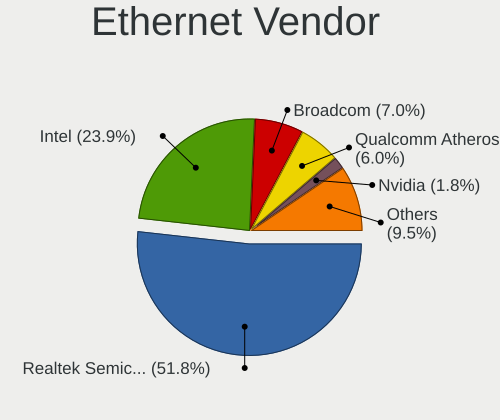

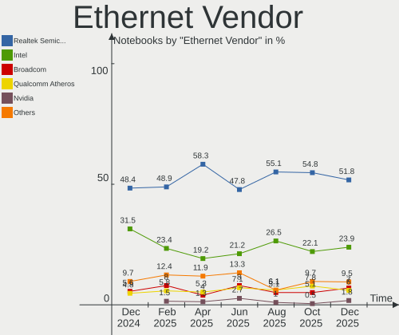

| Vendor                                 | Notebooks | Percent |
|----------------------------------------|-----------|---------|
| Realtek Semiconductor                  | 147       | 51.76%  |
| Intel                                  | 68        | 23.94%  |
| Broadcom                               | 20        | 7.04%   |
| Qualcomm Atheros                       | 17        | 5.99%   |
| Nvidia                                 | 5         | 1.76%   |
| ASIX Electronics                       | 5         | 1.76%   |
| Samsung Electronics                    | 4         | 1.41%   |
| Marvell Technology Group               | 4         | 1.41%   |
| DisplayLink                            | 3         | 1.06%   |
| Xiaomi                                 | 2         | 0.7%    |
| MediaTek                               | 2         | 0.7%    |
| Sony Ericsson Mobile Communications AB | 1         | 0.35%   |
| Silicon Integrated Systems [SiS]       | 1         | 0.35%   |
| Qualcomm                               | 1         | 0.35%   |
| JMicron Technology                     | 1         | 0.35%   |
| Hewlett-Packard                        | 1         | 0.35%   |
| Google                                 | 1         | 0.35%   |
| Broadcom Limited                       | 1         | 0.35%   |

Ethernet Model
--------------

Ethernet models

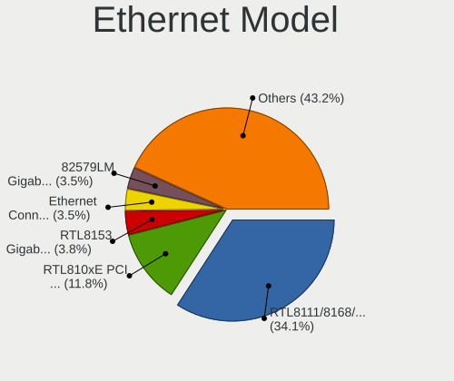

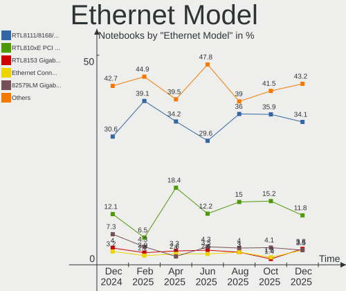

| Model                                                                  | Notebooks | Percent |
|------------------------------------------------------------------------|-----------|---------|
| Realtek RTL8111/8168/8211/8411 PCI Express Gigabit Ethernet Controller | 98        | 34.15%  |
| Realtek RTL810xE PCI Express Fast Ethernet controller                  | 34        | 11.85%  |
| Realtek RTL8153 Gigabit Ethernet Adapter                               | 11        | 3.83%   |
| Intel Ethernet Connection (4) I219-LM                                  | 10        | 3.48%   |
| Intel 82579LM Gigabit Network Connection (Lewisville)                  | 10        | 3.48%   |
| Intel Ethernet Connection I219-LM                                      | 6         | 2.09%   |
| Intel Ethernet Connection (3) I218-LM                                  | 6         | 2.09%   |
| Broadcom NetXtreme BCM57765 Gigabit Ethernet PCIe                      | 6         | 2.09%   |
| Broadcom NetLink BCM57780 Gigabit Ethernet PCIe                        | 6         | 2.09%   |
| Nvidia MCP79 Ethernet                                                  | 5         | 1.74%   |
| ASIX AX88179 Gigabit Ethernet                                          | 5         | 1.74%   |
| Qualcomm Atheros AR8151 v2.0 Gigabit Ethernet                          | 4         | 1.39%   |
| Intel Ethernet Connection I217-LM                                      | 4         | 1.39%   |
| Broadcom NetLink BCM57785 Gigabit Ethernet PCIe                        | 4         | 1.39%   |
| Samsung Galaxy series, misc. (tethering mode)                          | 3         | 1.05%   |
| Realtek Killer E2600 GbE Controller                                    | 3         | 1.05%   |
| Qualcomm Atheros Killer E2400 Gigabit Ethernet Controller              | 3         | 1.05%   |
| Qualcomm Atheros AR8161 Gigabit Ethernet                               | 3         | 1.05%   |
| Intel Ethernet Connection (7) I219-LM                                  | 3         | 1.05%   |
| Intel Ethernet Connection (23) I219-V                                  | 3         | 1.05%   |
| Xiaomi Mi/Redmi series (RNDIS)                                         | 2         | 0.7%    |
| Realtek RTL8852BE PCIe 802.11ax Wireless Network Controller            | 2         | 0.7%    |
| Qualcomm Atheros QCA8172 Fast Ethernet                                 | 2         | 0.7%    |
| Qualcomm Atheros AR8131 Gigabit Ethernet                               | 2         | 0.7%    |
| MediaTek MT7922 802.11ax PCI Express Wireless Network Adapter          | 2         | 0.7%    |
| Intel Ethernet Connection (2) I219-LM                                  | 2         | 0.7%    |
| Intel Ethernet Connection (13) I219-LM                                 | 2         | 0.7%    |
| Intel Ethernet Connection (10) I219-V                                  | 2         | 0.7%    |
| Intel 82579V Gigabit Network Connection                                | 2         | 0.7%    |
| Intel 82577LM Gigabit Network Connection                               | 2         | 0.7%    |
| Intel 82567LM Gigabit Network Connection                               | 2         | 0.7%    |
| Broadcom BCM4401-B0 100Base-TX                                         | 2         | 0.7%    |
| Sony Ericsson Mobile AB XQ-BT52                                        | 1         | 0.35%   |
| Silicon Integrated Systems [SiS] 191 Gigabit Ethernet Adapter          | 1         | 0.35%   |
| Samsung GT-I9070 (network tethering, USB debugging enabled)            | 1         | 0.35%   |
| Realtek RTL8852CE PCIe 802.11ax Wireless Network Controller            | 1         | 0.35%   |
| Qualcomm Nokia X30 5G                                                  | 1         | 0.35%   |
| Qualcomm Atheros Killer E2500 Gigabit Ethernet Controller              | 1         | 0.35%   |
| Qualcomm Atheros AR8162 Fast Ethernet                                  | 1         | 0.35%   |
| Qualcomm Atheros AR8152 v1.1 Fast Ethernet                             | 1         | 0.35%   |

Net Controller Kind
-------------------

Ethernet, WiFi or modem

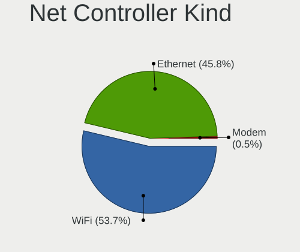

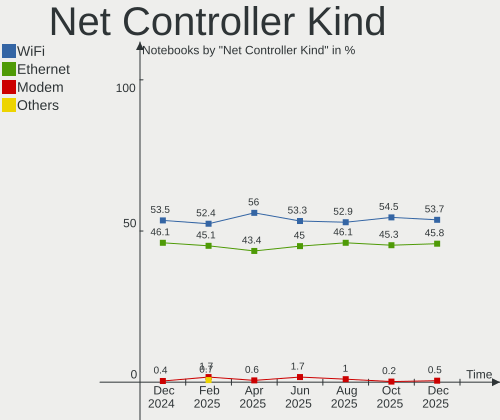

| Kind     | Notebooks | Percent |
|----------|-----------|---------|
| WiFi     | 318       | 53.72%  |
| Ethernet | 271       | 45.78%  |
| Modem    | 3         | 0.51%   |

Used Controller
---------------

Currently used network controller

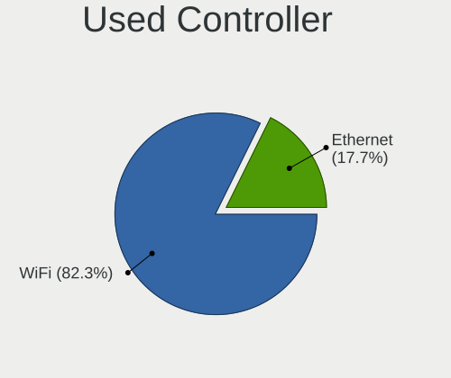

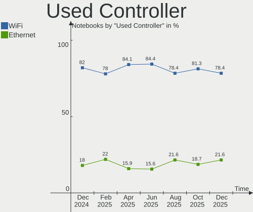

| Kind     | Notebooks | Percent |
|----------|-----------|---------|
| WiFi     | 261       | 78.38%  |
| Ethernet | 72        | 21.62%  |

NICs
----

Total network controllers on board

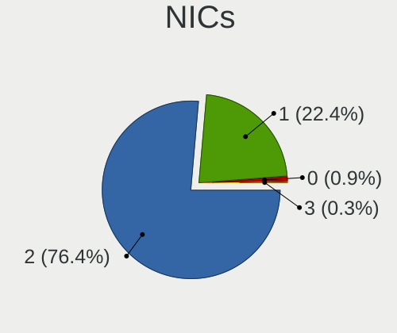

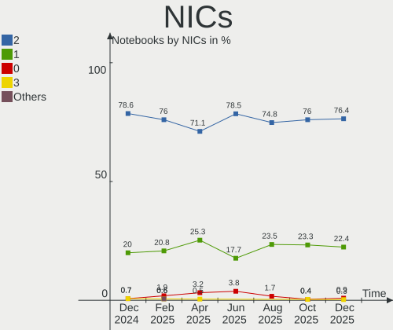

| Total | Notebooks | Percent |
|-------|-----------|---------|
| 2     | 249       | 76.38%  |
| 1     | 73        | 22.39%  |
| 0     | 3         | 0.92%   |
| 3     | 1         | 0.31%   |

IPv6
----

IPv6 vs IPv4

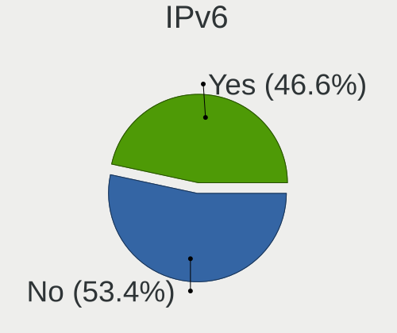

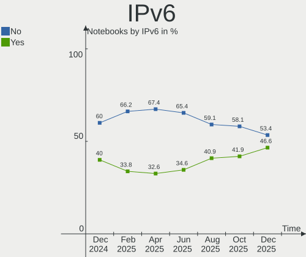

| Used | Notebooks | Percent |
|------|-----------|---------|
| No   | 174       | 53.37%  |
| Yes  | 152       | 46.63%  |

Bluetooth
---------

Bluetooth Vendor
----------------

Controller vendors

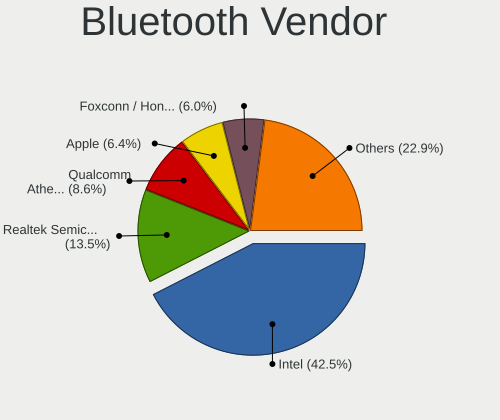

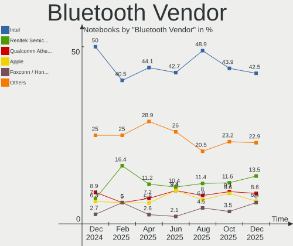

| Vendor                          | Notebooks | Percent |
|---------------------------------|-----------|---------|
| Intel                           | 113       | 42.48%  |
| Realtek Semiconductor           | 36        | 13.53%  |
| Qualcomm Atheros Communications | 23        | 8.65%   |
| Apple                           | 17        | 6.39%   |
| Foxconn / Hon Hai               | 16        | 6.02%   |
| Broadcom                        | 16        | 6.02%   |
| IMC Networks                    | 15        | 5.64%   |
| Lite-On Technology              | 10        | 3.76%   |
| MediaTek                        | 3         | 1.13%   |
| Ralink                          | 2         | 0.75%   |
| Hewlett-Packard                 | 2         | 0.75%   |
| Dell                            | 2         | 0.75%   |
| TP-Link                         | 1         | 0.38%   |
| Toshiba                         | 1         | 0.38%   |
| Ralink Technology               | 1         | 0.38%   |
| Integrated System Solution      | 1         | 0.38%   |
| Fujitsu                         | 1         | 0.38%   |
| Foxconn International           | 1         | 0.38%   |
| Chicony Electronics             | 1         | 0.38%   |
| Cambridge Silicon Radio         | 1         | 0.38%   |
| ASUSTek Computer                | 1         | 0.38%   |
| Actions                         | 1         | 0.38%   |
| Unknown                         | 1         | 0.38%   |

Bluetooth Model
---------------

Controller models

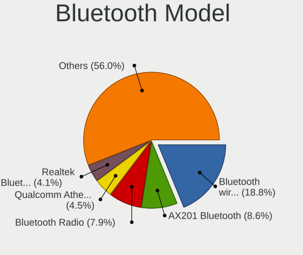

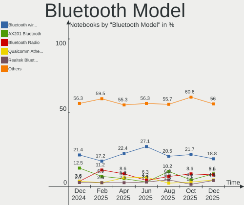

| Model                                                                               | Notebooks | Percent |
|-------------------------------------------------------------------------------------|-----------|---------|
| Intel Bluetooth wireless interface                                                  | 50        | 18.8%   |
| Intel AX201 Bluetooth                                                               | 23        | 8.65%   |
| Realtek Bluetooth Radio                                                             | 21        | 7.89%   |
| Qualcomm Atheros  Bluetooth Device                                                  | 12        | 4.51%   |
| Realtek  Bluetooth 4.2 Adapter                                                      | 11        | 4.14%   |
| IMC Networks Wireless_Device                                                        | 11        | 4.14%   |
| Apple Bluetooth Host Controller                                                     | 11        | 4.14%   |
| Intel Bluetooth 9460/9560 Jefferson Peak (JfP)                                      | 9         | 3.38%   |
| Intel Bluetooth Device                                                              | 8         | 3.01%   |
| Intel AX200 Bluetooth                                                               | 8         | 3.01%   |
| Foxconn / Hon Hai Wireless_Device                                                   | 7         | 2.63%   |
| Qualcomm Atheros AR3012 Bluetooth 4.0                                               | 6         | 2.26%   |
| Intel Centrino Bluetooth Wireless Transceiver                                       | 6         | 2.26%   |
| Lite-On Qualcomm Atheros QCA9377 Bluetooth                                          | 4         | 1.5%    |
| Intel AX210 Bluetooth                                                               | 4         | 1.5%    |
| IMC Networks Bluetooth Radio                                                        | 4         | 1.5%    |
| Apple Bluetooth USB Host Controller                                                 | 4         | 1.5%    |
| MediaTek Wireless_Device                                                            | 3         | 1.13%   |
| Foxconn / Hon Hai Bluetooth Device                                                  | 3         | 1.13%   |
| Broadcom BCM43142A0 Bluetooth 4.0                                                   | 3         | 1.13%   |
| Realtek RTL8821A Bluetooth                                                          | 2         | 0.75%   |
| Ralink RT3290 Bluetooth                                                             | 2         | 0.75%   |
| Qualcomm Atheros AR3011 Bluetooth                                                   | 2         | 0.75%   |
| Lite-On Broadcom BCM43142A0 Bluetooth Device                                        | 2         | 0.75%   |
| Lite-On Atheros AR3012 Bluetooth                                                    | 2         | 0.75%   |
| Intel Wireless-AC 9260 Bluetooth Adapter                                            | 2         | 0.75%   |
| Intel Wireless-AC 3168 Bluetooth                                                    | 2         | 0.75%   |
| HP Broadcom 2070 Bluetooth Combo                                                    | 2         | 0.75%   |
| Foxconn / Hon Hai Foxconn T77H114 BCM2070 [Single-Chip Bluetooth 2.1 + EDR Adapter] | 2         | 0.75%   |
| Foxconn / Hon Hai Acer Bluetooth module                                             | 2         | 0.75%   |
| Broadcom BCM20702A0                                                                 | 2         | 0.75%   |
| Broadcom BCM2070 Bluetooth 2.1 + EDR                                                | 2         | 0.75%   |
| Apple Built-in Bluetooth 2.0+EDR HCI                                                | 2         | 0.75%   |
| TP-Link TP-T@- UB500 Adapter                                                        | 1         | 0.38%   |
| Toshiba Askey Bluetooth Module                                                      | 1         | 0.38%   |
| Realtek Bluetooth 5.4 Radio                                                         | 1         | 0.38%   |
| Realtek 802.11ac WLAN Adapter                                                       | 1         | 0.38%   |
| Ralink Motorola BC4 Bluetooth 3.0+HS Adapter                                        | 1         | 0.38%   |
| Qualcomm Atheros QCA61x4 Bluetooth 4.0                                              | 1         | 0.38%   |
| Qualcomm Atheros Bluetooth                                                          | 1         | 0.38%   |

Sound
-----

Sound Vendor
------------

Sound card vendors

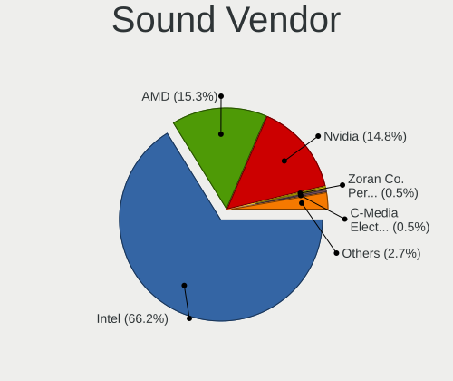

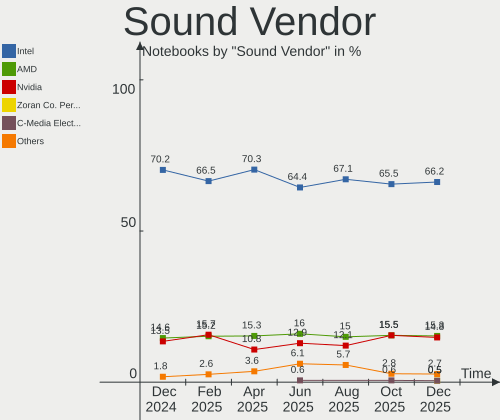

| Vendor                                       | Notebooks | Percent |
|----------------------------------------------|-----------|---------|
| Intel                                        | 268       | 66.17%  |
| AMD                                          | 62        | 15.31%  |
| Nvidia                                       | 60        | 14.81%  |
| Zoran Co. Personal Media Division (Nogatech) | 2         | 0.49%   |
| C-Media Electronics                          | 2         | 0.49%   |
| Turtle Beach                                 | 1         | 0.25%   |
| Silicon Integrated Systems [SiS]             | 1         | 0.25%   |
| Realtek Semiconductor                        | 1         | 0.25%   |
| Plantronics                                  | 1         | 0.25%   |
| OPPO Electronics                             | 1         | 0.25%   |
| Micro Star International                     | 1         | 0.25%   |
| KTMicro                                      | 1         | 0.25%   |
| GN Netcom                                    | 1         | 0.25%   |
| Dell                                         | 1         | 0.25%   |
| Audio-Technica                               | 1         | 0.25%   |
| ASUSTek Computer                             | 1         | 0.25%   |

Sound Model
-----------

Sound card models

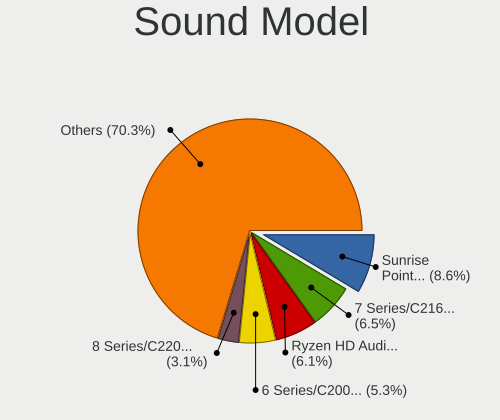

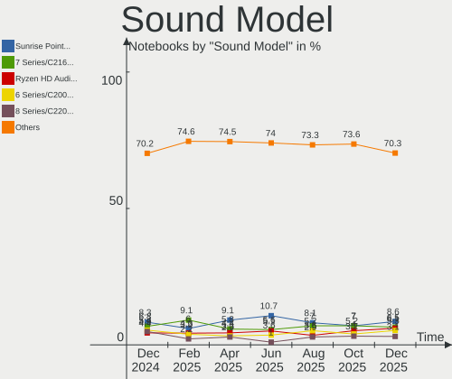

| Model                                                                                             | Notebooks | Percent |
|---------------------------------------------------------------------------------------------------|-----------|---------|
| Intel Sunrise Point-LP HD Audio                                                                   | 42        | 8.59%   |
| Intel 7 Series/C216 Chipset Family High Definition Audio Controller                               | 32        | 6.54%   |
| AMD Ryzen HD Audio Controller                                                                     | 30        | 6.13%   |
| Intel 6 Series/C200 Series Chipset Family High Definition Audio Controller                        | 26        | 5.32%   |
| Intel 8 Series/C220 Series Chipset High Definition Audio Controller                               | 15        | 3.07%   |
| AMD FCH Azalia Controller                                                                         | 15        | 3.07%   |
| Intel 5 Series/3400 Series Chipset High Definition Audio                                          | 14        | 2.86%   |
| Intel 82801I (ICH9 Family) HD Audio Controller                                                    | 13        | 2.66%   |
| Intel Broadwell-U Audio Controller                                                                | 12        | 2.45%   |
| AMD Radeon High Definition Audio Controller                                                       | 12        | 2.45%   |
| Intel Wildcat Point-LP High Definition Audio Controller                                           | 11        | 2.25%   |
| Nvidia GF108 High Definition Audio Controller                                                     | 10        | 2.04%   |
| Intel Xeon E3-1200 v3/4th Gen Core Processor HD Audio Controller                                  | 10        | 2.04%   |
| Intel Haswell-ULT HD Audio Controller                                                             | 10        | 2.04%   |
| Intel 8 Series HD Audio Controller                                                                | 10        | 2.04%   |
| Intel Cannon Lake PCH cAVS                                                                        | 9         | 1.84%   |
| AMD Kabini HDMI/DP Audio                                                                          | 9         | 1.84%   |
| Intel Raptor Lake-P/U/H cAVS                                                                      | 8         | 1.64%   |
| Intel Alder Lake PCH-P High Definition Audio Controller                                           | 8         | 1.64%   |
| AMD Renoir/Cezanne HDMI/DP Audio Controller                                                       | 8         | 1.64%   |
| Nvidia GK107 HDMI Audio Controller                                                                | 7         | 1.43%   |
| Intel Cannon Point-LP High Definition Audio Controller                                            | 7         | 1.43%   |
| AMD Raven/Raven2/Fenghuang HDMI/DP Audio Controller                                               | 7         | 1.43%   |
| Intel Tiger Lake-LP Smart Sound Technology Audio Controller                                       | 6         | 1.23%   |
| Intel Comet Lake PCH-LP cAVS                                                                      | 6         | 1.23%   |
| Nvidia MCP79 High Definition Audio                                                                | 5         | 1.02%   |
| Nvidia GA107 High Definition Audio Controller                                                     | 5         | 1.02%   |
| Intel Raptor Lake High Definition Audio Controller                                                | 5         | 1.02%   |
| Intel Comet Lake PCH cAVS                                                                         | 5         | 1.02%   |
| Intel CM238 HD Audio Controller                                                                   | 5         | 1.02%   |
| Intel Celeron/Pentium Silver Processor High Definition Audio                                      | 5         | 1.02%   |
| Intel Celeron N3350/Pentium N4200/Atom E3900 Series Audio Cluster                                 | 5         | 1.02%   |
| Intel Atom/Celeron/Pentium Processor x5-E8000/J3xxx/N3xxx Series High Definition Audio Controller | 5         | 1.02%   |
| Intel 100 Series/C230 Series Chipset Family HD Audio Controller                                   | 5         | 1.02%   |
| Nvidia TU107 GeForce GTX 1650 High Definition Audio Controller                                    | 4         | 0.82%   |
| Nvidia AD107 High Definition Audio Controller                                                     | 4         | 0.82%   |
| Intel Jasper Lake HD Audio                                                                        | 4         | 0.82%   |
| Intel Crystal Well HD Audio Controller                                                            | 4         | 0.82%   |
| Intel 82801H (ICH8 Family) HD Audio Controller                                                    | 4         | 0.82%   |
| AMD SBx00 Azalia (Intel HDA)                                                                      | 4         | 0.82%   |

Memory
------

Memory Vendor
-------------

Memory module vendors

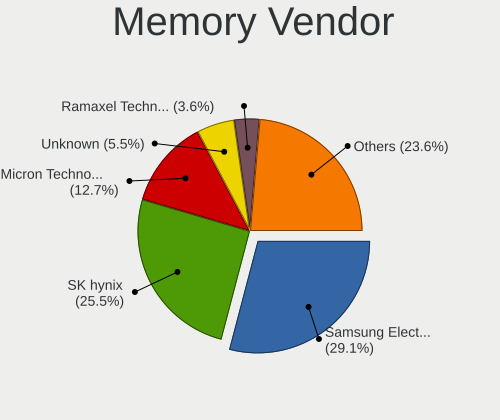

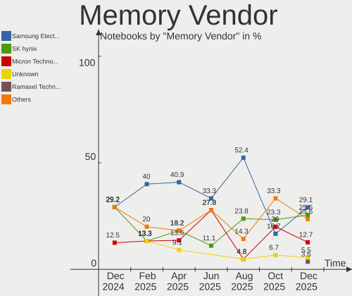

| Vendor              | Notebooks | Percent |
|---------------------|-----------|---------|
| Samsung Electronics | 16        | 29.09%  |
| SK hynix            | 14        | 25.45%  |
| Micron Technology   | 7         | 12.73%  |
| Unknown             | 3         | 5.45%   |
| Ramaxel Technology  | 2         | 3.64%   |
| Nanya Technology    | 2         | 3.64%   |
| Kingston            | 2         | 3.64%   |
| Crucial             | 2         | 3.64%   |
| Unknown             | 2         | 3.64%   |
| Wodposit            | 1         | 1.82%   |
| Unknown (ABCD)      | 1         | 1.82%   |
| Team                | 1         | 1.82%   |
| Micron/Elpida       | 1         | 1.82%   |
| A-DATA Technology   | 1         | 1.82%   |

Memory Model
------------

Memory module models

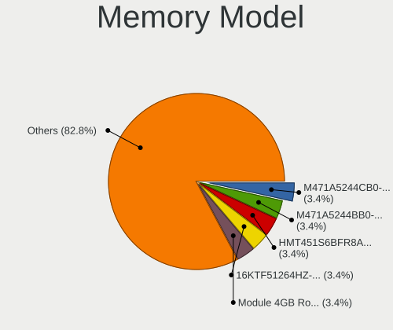

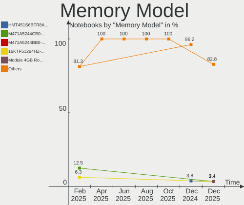

| Model                                                            | Notebooks | Percent |
|------------------------------------------------------------------|-----------|---------|
| SK hynix RAM HMT451S6BFR8A-PB 4GB SODIMM DDR3 1600MT/s           | 2         | 3.45%   |
| Samsung RAM M471A5244CB0-CTD 4GB SODIMM DDR4 3266MT/s            | 2         | 3.45%   |
| Samsung RAM M471A5244BB0-CRC 4GB SODIMM DDR4 2667MT/s            | 2         | 3.45%   |
| Micron RAM 16KTF51264HZ-1G6M1 4GB SODIMM DDR3 1600MT/s           | 2         | 3.45%   |
| Unknown                                                          | 2         | 3.45%   |
| Wodposit RAM WPBH26D408SWA-8G 8GB SODIMM DDR4 2667MT/s           | 1         | 1.72%   |
| Unknown RAM Module 4GB SODIMM DDR4 2400MT/s                      | 1         | 1.72%   |
| Unknown RAM Module 4GB SODIMM DDR3 1600MT/s                      | 1         | 1.72%   |
| Unknown RAM Module 2GB SODIMM DDR3 1600MT/s                      | 1         | 1.72%   |
| Unknown (ABCD) RAM 123456789012345678 2GB SODIMM LPDDR4 2400MT/s | 1         | 1.72%   |
| Team RAM TEAMGROUP-SD4-3200 16GB SODIMM DDR4 3200MT/s            | 1         | 1.72%   |
| SK hynix RAM Module 16GB SODIMM DDR4 2400MT/s                    | 1         | 1.72%   |
| SK hynix RAM HMT451S6AFR8A-PB 4GB SODIMM DDR3 1600MT/s           | 1         | 1.72%   |
| SK hynix RAM HMT351S6EFR8A-PB 4GB SODIMM DDR3 1600MT/s           | 1         | 1.72%   |
| SK hynix RAM HMT351S6BFR8C-H9 4GB SODIMM 1334MT/s                | 1         | 1.72%   |
| SK hynix RAM HMAB2GS6AMR6N-XN 16GB SODIMM DDR4 3200MT/s          | 1         | 1.72%   |
| SK hynix RAM HMAA1GS6CJR6N-XN 8GB SODIMM DDR4 3200MT/s           | 1         | 1.72%   |
| SK hynix RAM HMA851S6AFR6N-UH 4GB SODIMM DDR4 2667MT/s           | 1         | 1.72%   |
| SK hynix RAM HMA82GS6DJR8N-XN 16GB SODIMM DDR4 3200MT/s          | 1         | 1.72%   |
| SK hynix RAM HMA82GS6AFR8N-UH 16GB SODIMM DDR4 2667MT/s          | 1         | 1.72%   |
| SK hynix RAM HMA81GS6CJR8N-VK 8GB SODIMM DDR4 2667MT/s           | 1         | 1.72%   |
| SK hynix RAM HMA81GS6AFR8N-UH 8GB SODIMM DDR4 2667MT/s           | 1         | 1.72%   |
| SK hynix RAM HMA41GS6AFR8N-TF 8GB SODIMM DDR4 2667MT/s           | 1         | 1.72%   |
| SK hynix RAM H58G76BK7HX095 4GiB Row Of Chips LPDDR5 8533MT/s    | 1         | 1.72%   |
| Samsung RAM U6E3S4AA-MGCR 1GB Row Of Chips LPDDR4 4267MT/s       | 1         | 1.72%   |
| Samsung RAM Module 2GB SODIMM DDR3 1333MT/s                      | 1         | 1.72%   |
| Samsung RAM M471B5273DH0-CK0 4GB SODIMM DDR3 2400MT/s            | 1         | 1.72%   |
| Samsung RAM M471B5173BH0-YK0 4GB Chip DDR3 1600MT/s              | 1         | 1.72%   |
| Samsung RAM M471B1G73QH0-YK0 8GB SODIMM DDR3 1600MT/s            | 1         | 1.72%   |
| Samsung RAM M471B1G73EB0-YK0 8192MB SODIMM DDR3 1600MT/s         | 1         | 1.72%   |
| Samsung RAM M471A5244CB0-CRC 4GB SODIMM DDR4 2667MT/s            | 1         | 1.72%   |
| Samsung RAM M471A5244BB0-CPB 4GB SODIMM DDR4 2400MT/s            | 1         | 1.72%   |
| Samsung RAM M471A1G44BB0-CWE 8GB SODIMM DDR4 3200MT/s            | 1         | 1.72%   |
| Samsung RAM M425R1GB4BB0-CQKOL 8GB SODIMM DDR5 4800MT/s          | 1         | 1.72%   |
| Samsung RAM M4 70T5663QZ3-CE6 2GB SODIMM DDR2 667MT/s            | 1         | 1.72%   |
| Samsung RAM M4 70T5267AZ3-CF7 4GB SODIMM DDR2 800MT/s            | 1         | 1.72%   |
| Samsung RAM 53E1G32D4NQ-046WTE 4GB Row Of Chips LPDDR4 3200MT/s  | 1         | 1.72%   |
| Samsung RAM 456789ABCDEFGHIJKL 8GB SODIMM DDR3 1600MT/s          | 1         | 1.72%   |
| Ramaxel RAM RMSA3320KE78HAF-3200 8GB SODIMM DDR4 3200MT/s        | 1         | 1.72%   |
| Ramaxel RAM RMSA3270MB86H9F2400 4GB SODIMM DDR4 2400MT/s         | 1         | 1.72%   |

Memory Kind
-----------

Memory module kinds

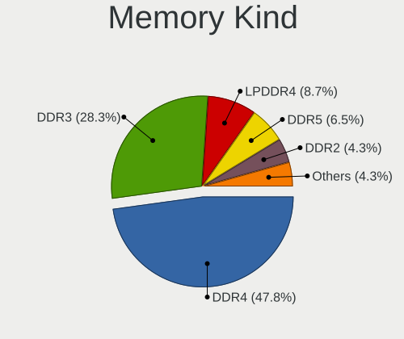

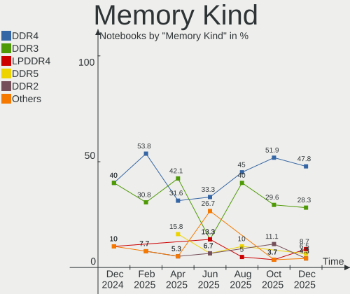

| Kind   | Notebooks | Percent |
|--------|-----------|---------|
| DDR4   | 22        | 47.83%  |
| DDR3   | 13        | 28.26%  |
| LPDDR4 | 4         | 8.7%    |
| DDR5   | 3         | 6.52%   |
| DDR2   | 2         | 4.35%   |
| LPDDR5 | 1         | 2.17%   |
| LPDDR3 | 1         | 2.17%   |

Memory Form Factor
------------------

Physical design of the memory module

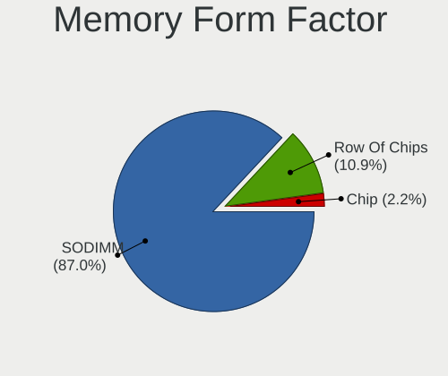

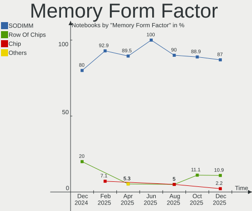

| Name         | Notebooks | Percent |
|--------------|-----------|---------|
| SODIMM       | 40        | 86.96%  |
| Row Of Chips | 5         | 10.87%  |
| Chip         | 1         | 2.17%   |

Memory Size
-----------

Memory module size

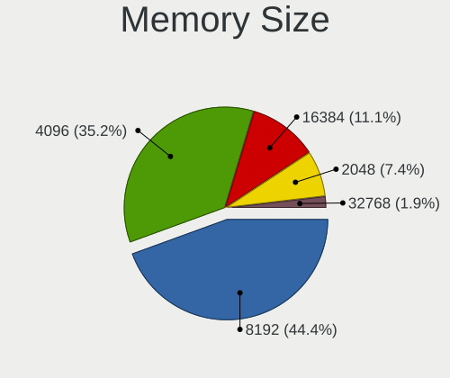

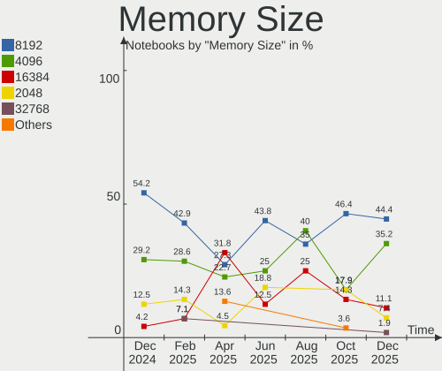

| Size  | Notebooks | Percent |
|-------|-----------|---------|
| 8192  | 24        | 44.44%  |
| 4096  | 19        | 35.19%  |
| 16384 | 6         | 11.11%  |
| 2048  | 4         | 7.41%   |
| 32768 | 1         | 1.85%   |

Memory Speed
------------

Memory module speed

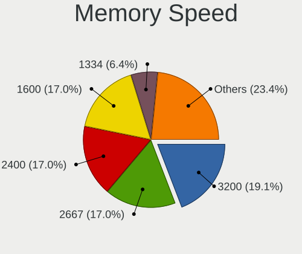

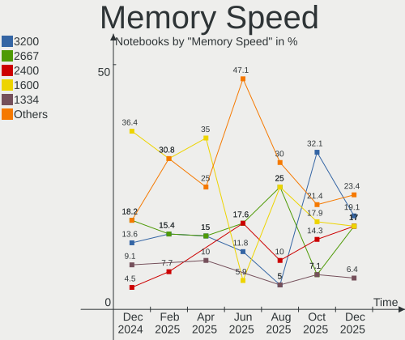

| Speed | Notebooks | Percent |
|-------|-----------|---------|
| 3200  | 9         | 19.15%  |
| 2667  | 8         | 17.02%  |
| 2400  | 8         | 17.02%  |
| 1600  | 8         | 17.02%  |
| 1334  | 3         | 6.38%   |
| 5600  | 2         | 4.26%   |
| 3266  | 2         | 4.26%   |
| 8533  | 1         | 2.13%   |
| 4800  | 1         | 2.13%   |
| 4267  | 1         | 2.13%   |
| 1867  | 1         | 2.13%   |
| 1333  | 1         | 2.13%   |
| 800   | 1         | 2.13%   |
| 667   | 1         | 2.13%   |

Printers & scanners
-------------------

Printer Vendor
--------------

Printer device vendors

Zero info for selected period =(

Printer Model
-------------

Printer device models

Zero info for selected period =(

Scanner Vendor
--------------

Scanner device vendors

Zero info for selected period =(

Scanner Model
-------------

Scanner device models

Zero info for selected period =(

Camera
------

Camera Vendor
-------------

Camera device vendors

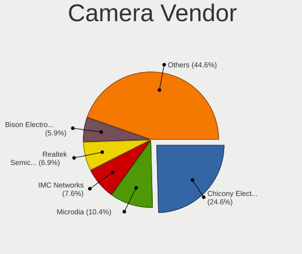

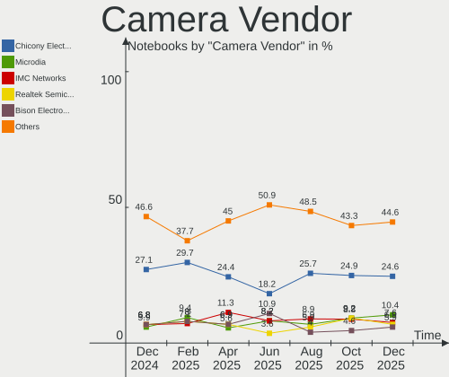

| Vendor                                 | Notebooks | Percent |
|----------------------------------------|-----------|---------|
| Chicony Electronics                    | 71        | 24.57%  |
| Microdia                               | 30        | 10.38%  |
| IMC Networks                           | 22        | 7.61%   |
| Realtek Semiconductor                  | 20        | 6.92%   |
| Bison Electronics                      | 17        | 5.88%   |
| Quanta                                 | 16        | 5.54%   |
| Sunplus Innovation Technology          | 14        | 4.84%   |
| Cheng Uei Precision Industry (Foxlink) | 14        | 4.84%   |
| Suyin                                  | 13        | 4.5%    |
| Apple                                  | 9         | 3.11%   |
| Syntek                                 | 8         | 2.77%   |
| Luxvisions Innotech Limited            | 8         | 2.77%   |
| Lite-On Technology                     | 8         | 2.77%   |
| Alcor Micro                            | 6         | 2.08%   |
| Silicon Motion                         | 5         | 1.73%   |
| ShineTech                              | 5         | 1.73%   |
| Ricoh                                  | 4         | 1.38%   |
| Sonix Technology                       | 3         | 1.04%   |
| Importek                               | 3         | 1.04%   |
| ALi                                    | 3         | 1.04%   |
| SunplusIT                              | 2         | 0.69%   |
| SenseTek                               | 2         | 0.69%   |
| Samsung Electronics                    | 2         | 0.69%   |
| Primax Electronics                     | 2         | 0.69%   |
| DigiTech                               | 1         | 0.35%   |
| Unknown                                | 1         | 0.35%   |

Camera Model
------------

Camera device models

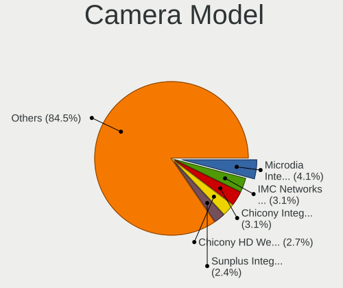

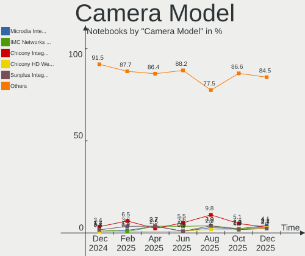

| Model                                         | Notebooks | Percent |
|-----------------------------------------------|-----------|---------|
| Microdia Integrated_Webcam_HD                 | 12        | 4.12%   |
| IMC Networks USB2.0 HD UVC WebCam             | 9         | 3.09%   |
| Chicony Integrated Camera                     | 9         | 3.09%   |
| Chicony HD WebCam                             | 8         | 2.75%   |
| Sunplus Integrated_Webcam_HD                  | 7         | 2.41%   |
| Realtek Integrated_Webcam_HD                  | 6         | 2.06%   |
| Apple FaceTime HD Camera                      | 6         | 2.06%   |
| Suyin HP Truevision HD                        | 5         | 1.72%   |
| IMC Networks Integrated Camera                | 5         | 1.72%   |
| Syntek Integrated Camera                      | 4         | 1.37%   |
| ShineTech USB2.0 HD UVC WebCam                | 4         | 1.37%   |
| Microdia Laptop_Integrated_Webcam_HD          | 4         | 1.37%   |
| Microdia Integrated Webcam                    | 4         | 1.37%   |
| Luxvisions Innotech Limited Integrated Camera | 4         | 1.37%   |
| Chicony HP TrueVision HD                      | 4         | 1.37%   |
| Chicony ACER HD User Facing                   | 4         | 1.37%   |
| Realtek USB Camera                            | 3         | 1.03%   |
| Quanta HP Webcam                              | 3         | 1.03%   |
| Lite-On HP Wide Vision HD Camera              | 3         | 1.03%   |
| Chicony FJ Camera                             | 3         | 1.03%   |
| Bison Integrated Camera                       | 3         | 1.03%   |
| Apple Built-in iSight                         | 3         | 1.03%   |
| ALi Gateway Webcam                            | 3         | 1.03%   |
| Alcor Micro Asus Integrated Webcam            | 3         | 1.03%   |
| Syntek Lenovo EasyCamera                      | 2         | 0.69%   |
| Syntek EasyCamera                             | 2         | 0.69%   |
| Suyin HP Webcam-101                           | 2         | 0.69%   |
| Suyin HD Video WebCam                         | 2         | 0.69%   |
| Sunplus HD WebCam                             | 2         | 0.69%   |
| Sunplus Asus Webcam                           | 2         | 0.69%   |
| Sonix USB2.0 HD UVC WebCam                    | 2         | 0.69%   |
| SenseTek FHD Camera                           | 2         | 0.69%   |
| Samsung Galaxy series, misc. (MTP mode)       | 2         | 0.69%   |
| Ricoh Sony Vaio Integrated Webcam             | 2         | 0.69%   |
| Realtek Lenovo EasyCamera                     | 2         | 0.69%   |
| Quanta Laptop_Integrated_Webcam_2HDM          | 2         | 0.69%   |
| Quanta HP TrueVision HD Camera                | 2         | 0.69%   |
| Quanta HP True Vision HD Camera               | 2         | 0.69%   |
| Primax HP HD Webcam [Fixed]                   | 2         | 0.69%   |
| Microdia USB 2.0 Camera                       | 2         | 0.69%   |

Security
--------

Fingerprint Vendor
------------------

Fingerprint sensor vendors

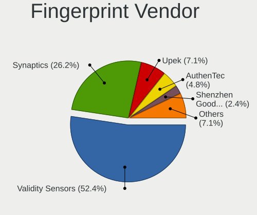

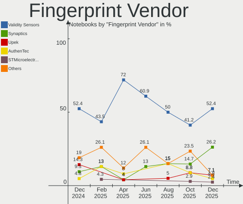

| Vendor                     | Notebooks | Percent |
|----------------------------|-----------|---------|
| Validity Sensors           | 22        | 52.38%  |
| Synaptics                  | 11        | 26.19%  |
| Upek                       | 3         | 7.14%   |
| AuthenTec                  | 2         | 4.76%   |
| STMicroelectronics         | 1         | 2.38%   |
| Shenzhen Goodix Technology | 1         | 2.38%   |
| LighTuning Technology      | 1         | 2.38%   |
| Elan Microelectronics      | 1         | 2.38%   |

Fingerprint Model
-----------------

Fingerprint sensor models

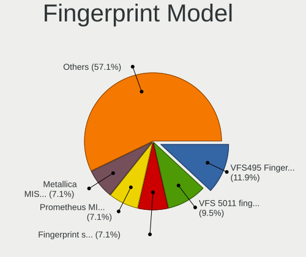

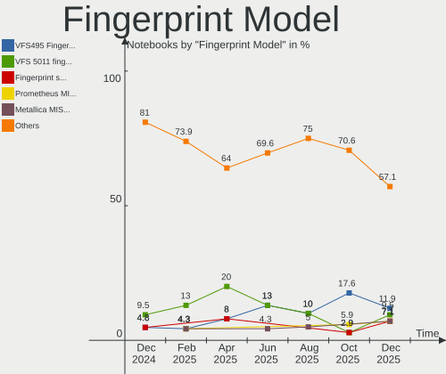

| Model                                                                      | Notebooks | Percent |
|----------------------------------------------------------------------------|-----------|---------|
| Validity Sensors VFS495 Fingerprint Reader                                 | 5         | 11.9%   |
| Validity Sensors VFS 5011 fingerprint sensor                               | 4         | 9.52%   |
| Validity Sensors Fingerprint scanner                                       | 3         | 7.14%   |
| Synaptics Prometheus MIS Touch Fingerprint Reader                          | 3         | 7.14%   |
| Synaptics Metallica MIS Touch Fingerprint Reader                           | 3         | 7.14%   |
| Validity Sensors VFS5011 Fingerprint Reader                                | 2         | 4.76%   |
| Validity Sensors VFS491                                                    | 2         | 4.76%   |
| Validity Sensors Swipe Fingerprint Sensor                                  | 2         | 4.76%   |
| Upek Biometric Touchchip/Touchstrip Fingerprint Sensor                     | 2         | 4.76%   |
| Synaptics Fingerprint reader [HP G6]                                       | 2         | 4.76%   |
| Validity Sensors VFS471 Fingerprint Reader                                 | 1         | 2.38%   |
| Validity Sensors VFS451 Fingerprint Reader                                 | 1         | 2.38%   |
| Validity Sensors Synaptics WBDI                                            | 1         | 2.38%   |
| Validity Sensors Synaptics VFS7552 Touch Fingerprint Sensor with PurePrint | 1         | 2.38%   |
| Upek TCS5B Fingerprint sensor                                              | 1         | 2.38%   |
| Synaptics WBDI                                                             | 1         | 2.38%   |
| Synaptics  FS7604 Touch Fingerprint Sensor with PurePrint                  | 1         | 2.38%   |
| Synaptics Metallica MOH Touch Fingerprint Reader                           | 1         | 2.38%   |
| STMicroelectronics Fingerprint Reader                                      | 1         | 2.38%   |
| Shenzhen Goodix  Fingerprint Device                                        | 1         | 2.38%   |
| LighTuning Fingerprint Reader                                              | 1         | 2.38%   |
| Elan ELAN:Fingerprint                                                      | 1         | 2.38%   |
| AuthenTec Fingerprint Sensor                                               | 1         | 2.38%   |
| AuthenTec AES2810                                                          | 1         | 2.38%   |

Chipcard Vendor
---------------

Chipcard module vendors

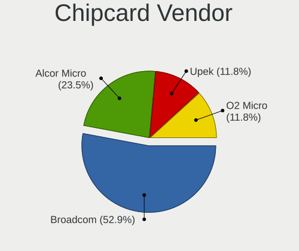

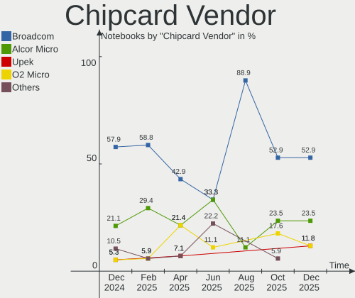

| Vendor      | Notebooks | Percent |
|-------------|-----------|---------|
| Broadcom    | 9         | 52.94%  |
| Alcor Micro | 4         | 23.53%  |
| Upek        | 2         | 11.76%  |
| O2 Micro    | 2         | 11.76%  |

Chipcard Model
--------------

Chipcard module models

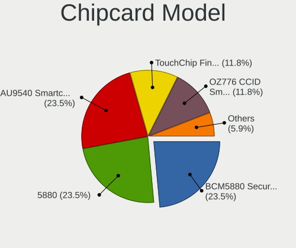

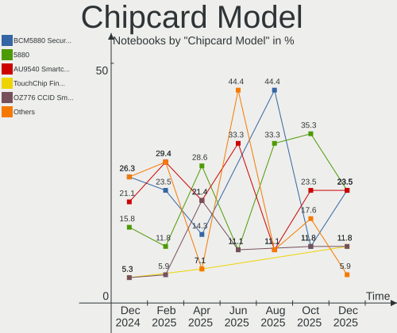

| Model                                                                       | Notebooks | Percent |
|-----------------------------------------------------------------------------|-----------|---------|
| Broadcom BCM5880 Secure Applications Processor                              | 4         | 23.53%  |
| Broadcom 5880                                                               | 4         | 23.53%  |
| Alcor Micro AU9540 Smartcard Reader                                         | 4         | 23.53%  |
| Upek TouchChip Fingerprint Coprocessor (WBF advanced mode)                  | 2         | 11.76%  |
| O2 Micro OZ776 CCID Smartcard Reader                                        | 2         | 11.76%  |
| Broadcom BCM58200 ControlVault 3 (FingerPrint sensor + Contacted SmartCard) | 1         | 5.88%   |

Unsupported
-----------

Unsupported Devices
-------------------

Total unsupported devices on board

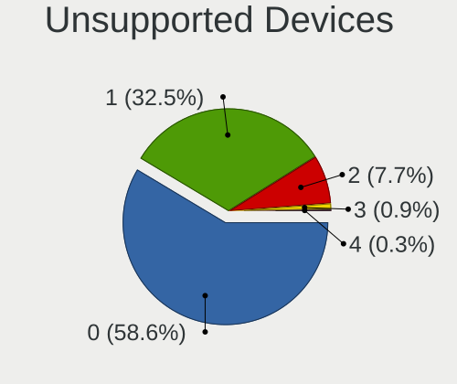

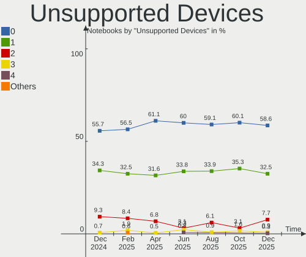

| Total | Notebooks | Percent |
|-------|-----------|---------|
| 0     | 191       | 58.59%  |
| 1     | 106       | 32.52%  |
| 2     | 25        | 7.67%   |
| 3     | 3         | 0.92%   |
| 4     | 1         | 0.31%   |

Unsupported Device Types
------------------------

Types of unsupported devices

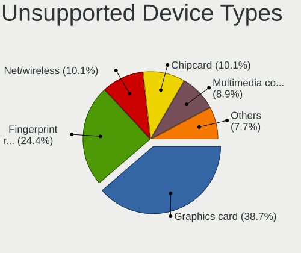

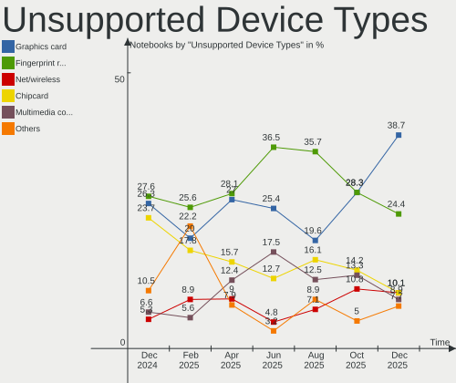

| Type                     | Notebooks | Percent |
|--------------------------|-----------|---------|
| Graphics card            | 65        | 38.69%  |
| Fingerprint reader       | 41        | 24.4%   |
| Net/wireless             | 17        | 10.12%  |
| Chipcard                 | 17        | 10.12%  |
| Multimedia controller    | 15        | 8.93%   |
| Bluetooth                | 6         | 3.57%   |
| Storage                  | 2         | 1.19%   |
| Sound                    | 1         | 0.6%    |
| Net/ethernet             | 1         | 0.6%    |
| Flash memory             | 1         | 0.6%    |
| Dvb card                 | 1         | 0.6%    |
| Communication controller | 1         | 0.6%    |

