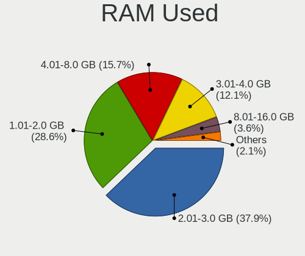
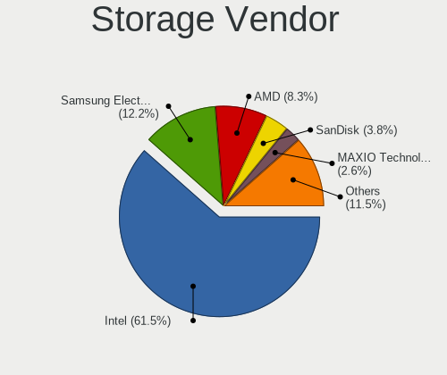
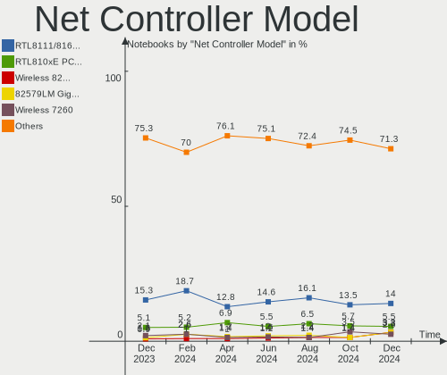
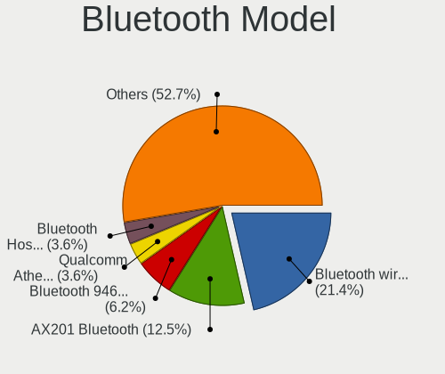

Zorin - Hardware Trends (Notebooks)
-----------------------------------

A project to identify most popular hardware characteristics and track their change
over time based on data collected by Linux users at https://Linux-Hardware.org.

Anyone can contribute to this report by the [hw-probe](https://github.com/linuxhw/hw-probe) tool:

    sudo -E hw-probe -all -upload

This report is for one last month. Overall report since the beginning of time: [TestDays](https://github.com/linuxhw/TestDays)

Period: Mar, 2023.

Contents
--------

* [ System ](#system)
  - [ OS                       ](#os)
  - [ OS Family                ](#os-family)
  - [ Kernel                   ](#kernel)
  - [ Kernel Family            ](#kernel-family)
  - [ Kernel Major Ver.        ](#kernel-major-ver)
  - [ Arch                     ](#arch)
  - [ DE                       ](#de)
  - [ Display Server           ](#display-server)
  - [ Display Manager          ](#display-manager)
  - [ OS Lang                  ](#os-lang)
  - [ Boot Mode                ](#boot-mode)
  - [ Filesystem               ](#filesystem)
  - [ Part. scheme             ](#part-scheme)
  - [ Dual Boot with Linux/BSD ](#dual-boot-with-linuxbsd)
  - [ Dual Boot (Win)          ](#dual-boot-win)

* [ Board ](#board)
  - [ Vendor                   ](#vendor)
  - [ Model                    ](#model)
  - [ Model Family             ](#model-family)
  - [ MFG Year                 ](#mfg-year)
  - [ Form Factor              ](#form-factor)
  - [ Secure Boot              ](#secure-boot)
  - [ Coreboot                 ](#coreboot)
  - [ RAM Size                 ](#ram-size)
  - [ RAM Used                 ](#ram-used)
  - [ Total Drives             ](#total-drives)
  - [ Has CD-ROM               ](#has-cd-rom)
  - [ Has Ethernet             ](#has-ethernet)
  - [ Has WiFi                 ](#has-wifi)
  - [ Has Bluetooth            ](#has-bluetooth)

* [ Location ](#location)
  - [ Country                  ](#country)
  - [ City                     ](#city)

* [ Drives ](#drives)
  - [ Drive Vendor             ](#drive-vendor)
  - [ Drive Model              ](#drive-model)
  - [ HDD Vendor               ](#hdd-vendor)
  - [ SSD Vendor               ](#ssd-vendor)
  - [ Drive Kind               ](#drive-kind)
  - [ Drive Connector          ](#drive-connector)
  - [ Drive Size               ](#drive-size)
  - [ Space Total              ](#space-total)
  - [ Space Used               ](#space-used)
  - [ Malfunc. Drives          ](#malfunc-drives)
  - [ Malfunc. Drive Vendor    ](#malfunc-drive-vendor)
  - [ Malfunc. HDD Vendor      ](#malfunc-hdd-vendor)
  - [ Malfunc. Drive Kind      ](#malfunc-drive-kind)
  - [ Failed Drives            ](#failed-drives)
  - [ Failed Drive Vendor      ](#failed-drive-vendor)
  - [ Drive Status             ](#drive-status)

* [ Storage controller ](#storage-controller)
  - [ Storage Vendor           ](#storage-vendor)
  - [ Storage Model            ](#storage-model)
  - [ Storage Kind             ](#storage-kind)

* [ Processor ](#processor)
  - [ CPU Vendor               ](#cpu-vendor)
  - [ CPU Model                ](#cpu-model)
  - [ CPU Model Family         ](#cpu-model-family)
  - [ CPU Cores                ](#cpu-cores)
  - [ CPU Sockets              ](#cpu-sockets)
  - [ CPU Threads              ](#cpu-threads)
  - [ CPU Op-Modes             ](#cpu-op-modes)
  - [ CPU Microcode            ](#cpu-microcode)
  - [ CPU Microarch            ](#cpu-microarch)

* [ Graphics ](#graphics)
  - [ GPU Vendor               ](#gpu-vendor)
  - [ GPU Model                ](#gpu-model)
  - [ GPU Combo                ](#gpu-combo)
  - [ GPU Driver               ](#gpu-driver)
  - [ GPU Memory               ](#gpu-memory)

* [ Monitor ](#monitor)
  - [ Monitor Vendor           ](#monitor-vendor)
  - [ Monitor Model            ](#monitor-model)
  - [ Monitor Resolution       ](#monitor-resolution)
  - [ Monitor Diagonal         ](#monitor-diagonal)
  - [ Monitor Width            ](#monitor-width)
  - [ Aspect Ratio             ](#aspect-ratio)
  - [ Monitor Area             ](#monitor-area)
  - [ Pixel Density            ](#pixel-density)
  - [ Multiple Monitors        ](#multiple-monitors)

* [ Network ](#network)
  - [ Net Controller Vendor    ](#net-controller-vendor)
  - [ Net Controller Model     ](#net-controller-model)
  - [ Wireless Vendor          ](#wireless-vendor)
  - [ Wireless Model           ](#wireless-model)
  - [ Ethernet Vendor          ](#ethernet-vendor)
  - [ Ethernet Model           ](#ethernet-model)
  - [ Net Controller Kind      ](#net-controller-kind)
  - [ Used Controller          ](#used-controller)
  - [ NICs                     ](#nics)
  - [ IPv6                     ](#ipv6)

* [ Bluetooth ](#bluetooth)
  - [ Bluetooth Vendor         ](#bluetooth-vendor)
  - [ Bluetooth Model          ](#bluetooth-model)

* [ Sound ](#sound)
  - [ Sound Vendor             ](#sound-vendor)
  - [ Sound Model              ](#sound-model)

* [ Memory ](#memory)
  - [ Memory Vendor            ](#memory-vendor)
  - [ Memory Model             ](#memory-model)
  - [ Memory Kind              ](#memory-kind)
  - [ Memory Form Factor       ](#memory-form-factor)
  - [ Memory Size              ](#memory-size)
  - [ Memory Speed             ](#memory-speed)

* [ Printers & scanners ](#printers--scanners)
  - [ Printer Vendor           ](#printer-vendor)
  - [ Printer Model            ](#printer-model)
  - [ Scanner Vendor           ](#scanner-vendor)
  - [ Scanner Model            ](#scanner-model)

* [ Camera ](#camera)
  - [ Camera Vendor            ](#camera-vendor)
  - [ Camera Model             ](#camera-model)

* [ Security ](#security)
  - [ Fingerprint Vendor       ](#fingerprint-vendor)
  - [ Fingerprint Model        ](#fingerprint-model)
  - [ Chipcard Vendor          ](#chipcard-vendor)
  - [ Chipcard Model           ](#chipcard-model)

* [ Unsupported ](#unsupported)
  - [ Unsupported Devices      ](#unsupported-devices)
  - [ Unsupported Device Types ](#unsupported-device-types)

System
------

OS
--

Installed operating systems

| Name     | Notebooks | Percent |
|----------|-----------|---------|
| Zorin 16 | 94        | 94%     |
| Zorin 15 | 6         | 6%      |

OS Family
---------

OS without a version

| Name  | Notebooks | Percent |
|-------|-----------|---------|
| Zorin | 100       | 100%    |

Kernel
------

Version of the Linux kernel

| Version                | Notebooks | Percent |
|------------------------|-----------|---------|
| 5.15.0-67-generic      | 55        | 55%     |
| 5.15.0-69-generic      | 10        | 10%     |
| 5.15.0-60-generic      | 10        | 10%     |
| 5.15.0-56-generic      | 7         | 7%      |
| 5.4.0-144-generic      | 5         | 5%      |
| 5.15.0-58-generic      | 2         | 2%      |
| 5.15.0-53-generic      | 2         | 2%      |
| 5.15.0-52-generic      | 2         | 2%      |
| 6.0.19-060019-generic  | 1         | 1%      |
| 5.8.0-49-generic       | 1         | 1%      |
| 5.18.15-051815-generic | 1         | 1%      |
| 5.15.0-43-generic      | 1         | 1%      |
| 5.15.0-41-generic      | 1         | 1%      |
| 5.11.0-38-generic      | 1         | 1%      |
| 4.18.0-21-generic      | 1         | 1%      |

Kernel Family
-------------

Linux kernel without a distro release

| Version | Notebooks | Percent |
|---------|-----------|---------|
| 5.15.0  | 90        | 90%     |
| 5.4.0   | 5         | 5%      |
| 6.0.19  | 1         | 1%      |
| 5.8.0   | 1         | 1%      |
| 5.18.15 | 1         | 1%      |
| 5.11.0  | 1         | 1%      |
| 4.18.0  | 1         | 1%      |

Kernel Major Ver.
-----------------

Linux kernel major version

| Version | Notebooks | Percent |
|---------|-----------|---------|
| 5.15    | 90        | 90%     |
| 5.4     | 5         | 5%      |
| 6.0     | 1         | 1%      |
| 5.8     | 1         | 1%      |
| 5.18    | 1         | 1%      |
| 5.11    | 1         | 1%      |
| 4.18    | 1         | 1%      |

Arch
----

OS architecture (x86_64, i586, etc.)

| Name   | Notebooks | Percent |
|--------|-----------|---------|
| x86_64 | 98        | 98%     |
| i686   | 2         | 2%      |

DE
--

Desktop Environment

| Name    | Notebooks | Percent |
|---------|-----------|---------|
| GNOME   | 79        | 79%     |
| XFCE    | 18        | 18%     |
| KDE5    | 1         | 1%      |
| Budgie  | 1         | 1%      |
| Unknown | 1         | 1%      |

Display Server
--------------

X11 or Wayland

| Name    | Notebooks | Percent |
|---------|-----------|---------|
| X11     | 99        | 99%     |
| Wayland | 1         | 1%      |

Display Manager
---------------

SDDM, LightDM, etc.

| Name    | Notebooks | Percent |
|---------|-----------|---------|
| Unknown | 74        | 74%     |
| GDM3    | 12        | 12%     |
| GDM     | 8         | 8%      |
| LightDM | 6         | 6%      |

OS Lang
-------

Language

| Lang  | Notebooks | Percent |
|-------|-----------|---------|
| en_US | 35        | 35%     |
| en_GB | 9         | 9%      |
| de_DE | 8         | 8%      |
| es_ES | 7         | 7%      |
| pt_BR | 5         | 5%      |
| it_IT | 5         | 5%      |
| en_IN | 4         | 4%      |
| en_CA | 4         | 4%      |
| pl_PL | 3         | 3%      |
| tr_TR | 2         | 2%      |
| ru_RU | 2         | 2%      |
| pt_PT | 2         | 2%      |
| nl_NL | 2         | 2%      |
| sv_SE | 1         | 1%      |
| nl_BE | 1         | 1%      |
| hu_HU | 1         | 1%      |
| fr_FR | 1         | 1%      |
| fr_BE | 1         | 1%      |
| fi_FI | 1         | 1%      |
| en_PH | 1         | 1%      |
| en_BW | 1         | 1%      |
| el_GR | 1         | 1%      |
| de_CH | 1         | 1%      |
| de_AT | 1         | 1%      |
| cs_CZ | 1         | 1%      |

Boot Mode
---------

EFI or BIOS

| Mode | Notebooks | Percent |
|------|-----------|---------|
| EFI  | 61        | 61%     |
| BIOS | 39        | 39%     |

Filesystem
----------

Type of filesystem

| Type    | Notebooks | Percent |
|---------|-----------|---------|
| Ext4    | 95        | 95%     |
| Zfs     | 2         | 2%      |
| Overlay | 2         | 2%      |
| Ext2    | 1         | 1%      |

Part. scheme
------------

Scheme of partitioning

| Type    | Notebooks | Percent |
|---------|-----------|---------|
| Unknown | 75        | 75%     |
| GPT     | 20        | 20%     |
| MBR     | 5         | 5%      |

Dual Boot with Linux/BSD
------------------------

Hosting more than one Linux/BSD

| Dual boot | Notebooks | Percent |
|-----------|-----------|---------|
| No        | 97        | 97%     |
| Yes       | 3         | 3%      |

Dual Boot (Win)
---------------

Hosting Linux and Windows

| Dual boot | Notebooks | Percent |
|-----------|-----------|---------|
| No        | 93        | 93%     |
| Yes       | 7         | 7%      |

Board
-----

Vendor
------

Motherboard manufacturer

| Name             | Notebooks | Percent |
|------------------|-----------|---------|
| Lenovo           | 18        | 18%     |
| Hewlett-Packard  | 16        | 16%     |
| ASUSTek Computer | 15        | 15%     |
| Dell             | 14        | 14%     |
| Acer             | 7         | 7%      |
| Toshiba          | 5         | 5%      |
| Google           | 5         | 5%      |
| Positivo         | 2         | 2%      |
| Packard Bell     | 2         | 2%      |
| MSI              | 2         | 2%      |
| Apple            | 2         | 2%      |
| YJKC             | 1         | 1%      |
| WEIPAI           | 1         | 1%      |
| Timi             | 1         | 1%      |
| Thomson          | 1         | 1%      |
| Novatech         | 1         | 1%      |
| Multilaser       | 1         | 1%      |
| Microtech        | 1         | 1%      |
| Medion           | 1         | 1%      |
| HUAWEI           | 1         | 1%      |
| Framework        | 1         | 1%      |
| Clevo            | 1         | 1%      |
| Alienware        | 1         | 1%      |

Model
-----

Motherboard model

| Name                               | Notebooks | Percent |
|------------------------------------|-----------|---------|
| HP Pavilion dv6                    | 2         | 2%      |
| HP Pavilion 15                     | 2         | 2%      |
| YJKC vBOOK Plus                    | 1         | 1%      |
| WEIPAI S15                         | 1         | 1%      |
| Toshiba Satellite S55t-B           | 1         | 1%      |
| Toshiba Satellite L855             | 1         | 1%      |
| Toshiba Satellite C55-A-1J8        | 1         | 1%      |
| Toshiba Satellite A100             | 1         | 1%      |
| Toshiba PORTEGE X30-D              | 1         | 1%      |
| Timi TM1701                        | 1         | 1%      |
| Thomson WWNEO14C-4BK32F            | 1         | 1%      |
| Positivo S14SL01                   | 1         | 1%      |
| Positivo Q232A                     | 1         | 1%      |
| Packard Bell EasyNote TM82         | 1         | 1%      |
| Packard Bell EasyNote TE11HC       | 1         | 1%      |
| Novatech 15.6 nSpire Laptop        | 1         | 1%      |
| Multilaser DS133                   | 1         | 1%      |
| MSI Raider GE66 12UHS              | 1         | 1%      |
| MSI GF63 Thin 11UC                 | 1         | 1%      |
| Microtech CoreBook                 | 1         | 1%      |
| Medion Akoya E1318T                | 1         | 1%      |
| Lenovo Yoga 2 13 20344             | 1         | 1%      |
| Lenovo ThinkPad X270 20HMS1KL0C    | 1         | 1%      |
| Lenovo ThinkPad X260 20F600A2MZ    | 1         | 1%      |
| Lenovo ThinkPad X240 20AMA3PVAR    | 1         | 1%      |
| Lenovo ThinkPad X230 2333BR3       | 1         | 1%      |
| Lenovo ThinkPad X201 3680Z38       | 1         | 1%      |
| Lenovo ThinkPad T430 2349HNU       | 1         | 1%      |
| Lenovo ThinkPad T430 23492D1       | 1         | 1%      |
| Lenovo ThinkPad T420 4180RK8       | 1         | 1%      |
| Lenovo ThinkPad L480 20LS001AMX    | 1         | 1%      |
| Lenovo ThinkPad Edge E530c 33663VG | 1         | 1%      |
| Lenovo ThinkPad 11e 20DAS0T500     | 1         | 1%      |
| Lenovo Legion Y540-15IRH-PG0 81SY  | 1         | 1%      |
| Lenovo IdeaPad 5 15ITL05 82FG      | 1         | 1%      |
| Lenovo IdeaPad 3 15ITL05 81X8      | 1         | 1%      |
| Lenovo IdeaPad 100-15IBY 80MJ      | 1         | 1%      |
| Lenovo IdeaPad 1 14IGL05 81VU      | 1         | 1%      |
| Lenovo G50-45 80E3                 | 1         | 1%      |
| HUAWEI NBLK-WAX9X                  | 1         | 1%      |

Model Family
------------

Motherboard model prefix

| Name                    | Notebooks | Percent |
|-------------------------|-----------|---------|
| Lenovo ThinkPad         | 11        | 11%     |
| Dell Latitude           | 7         | 7%      |
| HP Pavilion             | 6         | 6%      |
| Toshiba Satellite       | 4         | 4%      |
| Lenovo IdeaPad          | 4         | 4%      |
| Dell Inspiron           | 4         | 4%      |
| Acer Aspire             | 4         | 4%      |
| Packard Bell EasyNote   | 2         | 2%      |
| HP EliteBook            | 2         | 2%      |
| HP Compaq               | 2         | 2%      |
| Dell Precision          | 2         | 2%      |
| ASUS VivoBook           | 2         | 2%      |
| Acer TravelMate         | 2         | 2%      |
| YJKC vBOOK              | 1         | 1%      |
| WEIPAI S15              | 1         | 1%      |
| Toshiba PORTEGE         | 1         | 1%      |
| Timi TM1701             | 1         | 1%      |
| Thomson WWNEO14C-4BK32F | 1         | 1%      |
| Positivo S14SL01        | 1         | 1%      |
| Positivo Q232A          | 1         | 1%      |
| Novatech 15.6           | 1         | 1%      |
| Multilaser DS133        | 1         | 1%      |
| MSI Raider              | 1         | 1%      |
| MSI GF63                | 1         | 1%      |
| Microtech CoreBook      | 1         | 1%      |
| Medion Akoya            | 1         | 1%      |
| Lenovo Yoga             | 1         | 1%      |
| Lenovo Legion           | 1         | 1%      |
| Lenovo G50-45           | 1         | 1%      |
| HUAWEI NBLK-WAX9X       | 1         | 1%      |
| HP ZBook                | 1         | 1%      |
| HP Stream               | 1         | 1%      |
| HP ProBook              | 1         | 1%      |
| HP Notebook             | 1         | 1%      |
| HP kip                  | 1         | 1%      |
| HP 255                  | 1         | 1%      |
| Google Lillipup         | 1         | 1%      |
| Google Kip              | 1         | 1%      |
| Google Celes            | 1         | 1%      |
| Google Candy            | 1         | 1%      |

MFG Year
--------

Motherboard manufacture year

| Year | Notebooks | Percent |
|------|-----------|---------|
| 2012 | 14        | 14%     |
| 2013 | 11        | 11%     |
| 2021 | 9         | 9%      |
| 2014 | 8         | 8%      |
| 2022 | 6         | 6%      |
| 2019 | 6         | 6%      |
| 2011 | 6         | 6%      |
| 2010 | 6         | 6%      |
| 2018 | 5         | 5%      |
| 2017 | 5         | 5%      |
| 2016 | 5         | 5%      |
| 2020 | 4         | 4%      |
| 2015 | 4         | 4%      |
| 2009 | 3         | 3%      |
| 2008 | 3         | 3%      |
| 2023 | 2         | 2%      |
| 2006 | 2         | 2%      |
| 2005 | 1         | 1%      |

Form Factor
-----------

Physical design of the computer

| Name     | Notebooks | Percent |
|----------|-----------|---------|
| Notebook | 100       | 100%    |

Secure Boot
-----------

Enabled or disabled

| State    | Notebooks | Percent |
|----------|-----------|---------|
| Disabled | 78        | 78%     |
| Enabled  | 22        | 22%     |

Coreboot
--------

Have coreboot on board

| Used | Notebooks | Percent |
|------|-----------|---------|
| No   | 94        | 94%     |
| Yes  | 6         | 6%      |

RAM Size
--------

Total RAM memory

| Size in GB  | Notebooks | Percent |
|-------------|-----------|---------|
| 4.01-8.0    | 34        | 34%     |
| 3.01-4.0    | 32        | 32%     |
| 16.01-24.0  | 16        | 16%     |
| 8.01-16.0   | 7         | 7%      |
| 1.01-2.0    | 6         | 6%      |
| 32.01-64.0  | 2         | 2%      |
| 2.01-3.0    | 1         | 1%      |
| 64.01-256.0 | 1         | 1%      |
| 0.51-1.0    | 1         | 1%      |

RAM Used
--------

Used RAM memory

| Used GB  | Notebooks | Percent |
|----------|-----------|---------|
| 1.01-2.0 | 39        | 39%     |
| 2.01-3.0 | 27        | 27%     |
| 3.01-4.0 | 16        | 16%     |
| 4.01-8.0 | 12        | 12%     |
| 0.51-1.0 | 6         | 6%      |

Total Drives
------------

Number of drives on board

| Drives | Notebooks | Percent |
|--------|-----------|---------|
| 1      | 83        | 83%     |
| 2      | 14        | 14%     |
| 3      | 2         | 2%      |
| 0      | 1         | 1%      |

Has CD-ROM
----------

Has CD-ROM on board

| Presented | Notebooks | Percent |
|-----------|-----------|---------|
| No        | 62        | 62%     |
| Yes       | 38        | 38%     |

Has Ethernet
------------

Has Ethernet on board

| Presented | Notebooks | Percent |
|-----------|-----------|---------|
| Yes       | 72        | 72%     |
| No        | 28        | 28%     |

Has WiFi
--------

Has WiFi module

| Presented | Notebooks | Percent |
|-----------|-----------|---------|
| Yes       | 95        | 95%     |
| No        | 5         | 5%      |

Has Bluetooth
-------------

Has Bluetooth module

| Presented | Notebooks | Percent |
|-----------|-----------|---------|
| Yes       | 73        | 73%     |
| No        | 27        | 27%     |

Location
--------

Country
-------

Geographic location (country)

| Country      | Notebooks | Percent |
|--------------|-----------|---------|
| USA          | 15        | 15%     |
| UK           | 8         | 8%      |
| Germany      | 8         | 8%      |
| Spain        | 6         | 6%      |
| Netherlands  | 5         | 5%      |
| Italy        | 5         | 5%      |
| India        | 5         | 5%      |
| Brazil       | 5         | 5%      |
| Canada       | 4         | 4%      |
| Portugal     | 3         | 3%      |
| Poland       | 3         | 3%      |
| France       | 3         | 3%      |
| Turkey       | 2         | 2%      |
| Switzerland  | 2         | 2%      |
| Russia       | 2         | 2%      |
| Finland      | 2         | 2%      |
| Belgium      | 2         | 2%      |
| Austria      | 2         | 2%      |
| Argentina    | 2         | 2%      |
| Sweden       | 1         | 1%      |
| South Korea  | 1         | 1%      |
| South Africa | 1         | 1%      |
| Singapore    | 1         | 1%      |
| Saint Lucia  | 1         | 1%      |
| Romania      | 1         | 1%      |
| Philippines  | 1         | 1%      |
| Pakistan     | 1         | 1%      |
| Mexico       | 1         | 1%      |
| Latvia       | 1         | 1%      |
| Iran         | 1         | 1%      |
| Hungary      | 1         | 1%      |
| Greece       | 1         | 1%      |
| Ghana        | 1         | 1%      |
| Czechia      | 1         | 1%      |
| Bahrain      | 1         | 1%      |

City
----

Geographic location (city)

| City                      | Notebooks | Percent |
|---------------------------|-----------|---------|
| Rome                      | 2         | 2%      |
| Helsinki                  | 2         | 2%      |
| Échirolles               | 2         | 2%      |
| Bristol                   | 2         | 2%      |
| Amsterdam                 | 2         | 2%      |
| Winston-Salem             | 1         | 1%      |
| Vienna                    | 1         | 1%      |
| Valladolid                | 1         | 1%      |
| Uden                      | 1         | 1%      |
| Turin                     | 1         | 1%      |
| Tübingen                 | 1         | 1%      |
| The Hague                 | 1         | 1%      |
| Świnoujście             | 1         | 1%      |
| Springdale                | 1         | 1%      |
| Sombra                    | 1         | 1%      |
| Singapore                 | 1         | 1%      |
| Seongbuk-gu               | 1         | 1%      |
| Seffner                   | 1         | 1%      |
| Schlieren                 | 1         | 1%      |
| Sao Luís                 | 1         | 1%      |
| Santa Coloma de Cervelló | 1         | 1%      |
| Saint Ives                | 1         | 1%      |
| Rio de Janeiro            | 1         | 1%      |
| Reno                      | 1         | 1%      |
| Qom                       | 1         | 1%      |
| Prague                    | 1         | 1%      |
| Philadelphia              | 1         | 1%      |
| Northampton               | 1         | 1%      |
| Noida                     | 1         | 1%      |
| Neuburg an der Donau      | 1         | 1%      |
| Nashville                 | 1         | 1%      |
| Munich                    | 1         | 1%      |
| Morrisville               | 1         | 1%      |
| Minneapolis               | 1         | 1%      |
| Milan                     | 1         | 1%      |
| Meyerton                  | 1         | 1%      |
| Memphis                   | 1         | 1%      |
| Mem Martins               | 1         | 1%      |
| Marbella                  | 1         | 1%      |
| Manama                    | 1         | 1%      |

Drives
------

Drive Vendor
------------

Hard drive vendors

| Vendor                | Notebooks | Drives | Percent |
|-----------------------|-----------|--------|---------|
| Unknown               | 16        | 18     | 13.91%  |
| Samsung Electronics   | 15        | 16     | 13.04%  |
| WDC                   | 11        | 11     | 9.57%   |
| Seagate               | 9         | 9      | 7.83%   |
| Micron Technology     | 7         | 7      | 6.09%   |
| SanDisk               | 6         | 6      | 5.22%   |
| Toshiba               | 5         | 5      | 4.35%   |
| HGST                  | 5         | 5      | 4.35%   |
| Hitachi               | 4         | 4      | 3.48%   |
| Crucial               | 4         | 4      | 3.48%   |
| Kingston              | 3         | 3      | 2.61%   |
| China                 | 3         | 3      | 2.61%   |
| Unknown               | 3         | 3      | 2.61%   |
| PNY                   | 2         | 2      | 1.74%   |
| Intel                 | 2         | 2      | 1.74%   |
| GOODRAM               | 2         | 2      | 1.74%   |
| A-DATA Technology     | 2         | 2      | 1.74%   |
| SK hynix              | 1         | 1      | 0.87%   |
| Silicon Motion        | 1         | 1      | 0.87%   |
| Saichi D              | 1         | 1      | 0.87%   |
| Realtek Semiconductor | 1         | 1      | 0.87%   |
| Phison Electronics    | 1         | 1      | 0.87%   |
| Patriot               | 1         | 1      | 0.87%   |
| OCZ                   | 1         | 1      | 0.87%   |
| MAGIX                 | 1         | 1      | 0.87%   |
| Intenso               | 1         | 1      | 0.87%   |
| Integral              | 1         | 1      | 0.87%   |
| HS-SSD-E100           | 1         | 1      | 0.87%   |
| GT                    | 1         | 1      | 0.87%   |
| Colorful              | 1         | 1      | 0.87%   |
| BORY                  | 1         | 1      | 0.87%   |
| Apple                 | 1         | 1      | 0.87%   |
| Apacer                | 1         | 1      | 0.87%   |

Drive Model
-----------

Hard drive models

| Model                                                  | Notebooks | Percent |
|--------------------------------------------------------|-----------|---------|
| Unknown MMC Card  32GB                                 | 5         | 4.24%   |
| Unknown MMC Card  64GB                                 | 4         | 3.39%   |
| Samsung NVMe SSD Controller SM981/PM981/PM983 250GB    | 3         | 2.54%   |
| Unknown                                                | 3         | 2.54%   |
| Unknown MMC Card  16GB                                 | 2         | 1.69%   |
| Toshiba MQ01ABD100 1TB                                 | 2         | 1.69%   |
| Seagate ST1000LM024 HN-M101MBB 1TB                     | 2         | 1.69%   |
| Micron 2210_MTFDHBA512QFD 512GB                        | 2         | 1.69%   |
| Kingston SA400S37240G 240GB SSD                        | 2         | 1.69%   |
| Intel SSDPEKNU512GZ 512GB                              | 2         | 1.69%   |
| HGST HTS721010A9E630 1TB                               | 2         | 1.69%   |
| Crucial CT480BX500SSD1 480GB                           | 2         | 1.69%   |
| WDC WDS500G2B0A 500GB SSD                              | 1         | 0.85%   |
| WDC WD5000BEVT-22A0RT0 500GB                           | 1         | 0.85%   |
| WDC WD5000BEVT-00ZAT0 500GB                            | 1         | 0.85%   |
| WDC WD2500BVVT-28A26Y1 250GB                           | 1         | 0.85%   |
| WDC WD2500BEVT-80A23T0 250GB                           | 1         | 0.85%   |
| WDC WD2500BEKT-75A25T0 250GB                           | 1         | 0.85%   |
| WDC WD10JPVX-75JC3T0 1TB                               | 1         | 0.85%   |
| WDC WD10JPVX-60JC3T0 1TB                               | 1         | 0.85%   |
| WDC WD10JPVX-22JC3T0 1TB                               | 1         | 0.85%   |
| WDC WD Blue SA510 M.2 2280 500GB                       | 1         | 0.85%   |
| WDC PC SN730 SDBPNTY-256G-1027 256GB                   | 1         | 0.85%   |
| Unknown SD/MMC/MS PRO 64GB                             | 1         | 0.85%   |
| Unknown MMC Card  4GB                                  | 1         | 0.85%   |
| Unknown MMC Card  30MB                                 | 1         | 0.85%   |
| Unknown MMC Card  128GB                                | 1         | 0.85%   |
| Unknown HAG2e  16GB                                    | 1         | 0.85%   |
| Unknown DA4064  64GB                                   | 1         | 0.85%   |
| Unknown AGND3R  16GB                                   | 1         | 0.85%   |
| Toshiba MQ01ABF050 500GB                               | 1         | 0.85%   |
| Toshiba MQ01ABD075 752GB                               | 1         | 0.85%   |
| Toshiba HDWL120 2TB                                    | 1         | 0.85%   |
| SK hynix BC511 NVMe 256GB                              | 1         | 0.85%   |
| Silicon Motion SM2263EN/SM2263XT SSD Controller 1024GB | 1         | 0.85%   |
| Seagate ST9500423AS 500GB                              | 1         | 0.85%   |
| Seagate ST9250320AS 250GB                              | 1         | 0.85%   |
| Seagate ST9250311CS 250GB                              | 1         | 0.85%   |
| Seagate ST500LX012-SSHD-8GB                            | 1         | 0.85%   |
| Seagate ST500LT012-1DG142 500GB                        | 1         | 0.85%   |

HDD Vendor
----------

Hard disk drive vendors

| Vendor  | Notebooks | Drives | Percent |
|---------|-----------|--------|---------|
| Seagate | 9         | 9      | 28.13%  |
| WDC     | 8         | 8      | 25%     |
| Toshiba | 5         | 5      | 15.63%  |
| HGST    | 5         | 5      | 15.63%  |
| Hitachi | 4         | 4      | 12.5%   |
| Unknown | 1         | 1      | 3.13%   |

SSD Vendor
----------

Solid state drive vendors

| Vendor              | Notebooks | Drives | Percent |
|---------------------|-----------|--------|---------|
| Samsung Electronics | 9         | 10     | 21.95%  |
| Crucial             | 4         | 4      | 9.76%   |
| SanDisk             | 3         | 3      | 7.32%   |
| Micron Technology   | 3         | 3      | 7.32%   |
| Kingston            | 3         | 3      | 7.32%   |
| China               | 3         | 3      | 7.32%   |
| PNY                 | 2         | 2      | 4.88%   |
| GOODRAM             | 2         | 2      | 4.88%   |
| A-DATA Technology   | 2         | 2      | 4.88%   |
| WDC                 | 1         | 1      | 2.44%   |
| Patriot             | 1         | 1      | 2.44%   |
| OCZ                 | 1         | 1      | 2.44%   |
| Intenso             | 1         | 1      | 2.44%   |
| Integral            | 1         | 1      | 2.44%   |
| GT                  | 1         | 1      | 2.44%   |
| Colorful            | 1         | 1      | 2.44%   |
| Apple               | 1         | 1      | 2.44%   |
| Apacer              | 1         | 1      | 2.44%   |
| Unknown             | 1         | 1      | 2.44%   |

Drive Kind
----------

HDD or SSD

| Kind    | Notebooks | Drives | Percent |
|---------|-----------|--------|---------|
| SSD     | 39        | 42     | 35.45%  |
| HDD     | 31        | 32     | 28.18%  |
| NVMe    | 19        | 20     | 17.27%  |
| MMC     | 16        | 19     | 14.55%  |
| Unknown | 5         | 5      | 4.55%   |

Drive Connector
---------------

SATA, SAS, NVMe, etc.

| Type | Notebooks | Drives | Percent |
|------|-----------|--------|---------|
| SATA | 68        | 75     | 64.15%  |
| NVMe | 19        | 20     | 17.92%  |
| MMC  | 16        | 19     | 15.09%  |
| SAS  | 3         | 4      | 2.83%   |

Drive Size
----------

Size of hard drive

| Size in TB | Notebooks | Drives | Percent |
|------------|-----------|--------|---------|
| 0.01-0.5   | 51        | 54     | 71.83%  |
| 0.51-1.0   | 17        | 17     | 23.94%  |
| 1.01-2.0   | 3         | 3      | 4.23%   |

Space Total
-----------

Amount of disk space available on the file system

| Size in GB     | Notebooks | Percent |
|----------------|-----------|---------|
| 101-250        | 38        | 38%     |
| 251-500        | 25        | 25%     |
| 501-1000       | 13        | 13%     |
| 51-100         | 12        | 12%     |
| 21-50          | 5         | 5%      |
| 1-20           | 3         | 3%      |
| Unknown        | 2         | 2%      |
| More than 3000 | 1         | 1%      |
| 1001-2000      | 1         | 1%      |

Space Used
----------

Amount of used disk space

| Used GB  | Notebooks | Percent |
|----------|-----------|---------|
| 1-20     | 35        | 35%     |
| 21-50    | 28        | 28%     |
| 51-100   | 17        | 17%     |
| 101-250  | 12        | 12%     |
| 251-500  | 4         | 4%      |
| 501-1000 | 2         | 2%      |
| Unknown  | 2         | 2%      |

Malfunc. Drives
---------------

Drive models with a malfunction

Zero info for selected period =(

Malfunc. Drive Vendor
---------------------

Vendors of faulty drives

Zero info for selected period =(

Malfunc. HDD Vendor
-------------------

Vendors of faulty HDD drives

Zero info for selected period =(

Malfunc. Drive Kind
-------------------

Kinds of faulty drives

Zero info for selected period =(

Failed Drives
-------------

Failed drive models

Zero info for selected period =(

Failed Drive Vendor
-------------------

Failed drive vendors

Zero info for selected period =(

Drive Status
------------

Number of failed and malfunc. drives

| Status   | Notebooks | Drives | Percent |
|----------|-----------|--------|---------|
| Detected | 89        | 107    | 89.9%   |
| Works    | 10        | 11     | 10.1%   |

Storage controller
------------------

Storage Vendor
--------------

Storage controller vendors

| Vendor                | Notebooks | Percent |
|-----------------------|-----------|---------|
| Intel                 | 70        | 70%     |
| AMD                   | 11        | 11%     |
| Samsung Electronics   | 7         | 7%      |
| SanDisk               | 4         | 4%      |
| Micron Technology     | 4         | 4%      |
| SK hynix              | 1         | 1%      |
| Silicon Motion        | 1         | 1%      |
| Realtek Semiconductor | 1         | 1%      |
| Phison Electronics    | 1         | 1%      |

Storage Model
-------------

Storage controller models

| Model                                                                          | Notebooks | Percent |
|--------------------------------------------------------------------------------|-----------|---------|
| Intel 7 Series Chipset Family 6-port SATA Controller [AHCI mode]               | 17        | 16.04%  |
| AMD FCH SATA Controller [AHCI mode]                                            | 9         | 8.49%   |
| Intel Sunrise Point-LP SATA Controller [AHCI mode]                             | 8         | 7.55%   |
| Intel 6 Series/C200 Series Chipset Family 6 port Mobile SATA AHCI Controller   | 6         | 5.66%   |
| Intel 82801IBM/IEM (ICH9M/ICH9M-E) 4 port SATA Controller [AHCI mode]          | 5         | 4.72%   |
| Intel Volume Management Device NVMe RAID Controller                            | 4         | 3.77%   |
| Intel 82801 Mobile SATA Controller [RAID mode]                                 | 4         | 3.77%   |
| Intel 8 Series SATA Controller 1 [AHCI mode]                                   | 4         | 3.77%   |
| Samsung NVMe SSD Controller SM981/PM981/PM983                                  | 3         | 2.83%   |
| Micron NVMe Storage Controller                                                 | 3         | 2.83%   |
| Intel Tiger Lake-LP SATA Controller                                            | 3         | 2.83%   |
| Intel Atom Processor E3800 Series SATA AHCI Controller                         | 3         | 2.83%   |
| Intel 8 Series/C220 Series Chipset Family 6-port SATA Controller 1 [AHCI mode] | 3         | 2.83%   |
| Intel Non-Volatile memory controller                                           | 2         | 1.89%   |
| Intel Celeron N3350/Pentium N4200/Atom E3900 Series SATA AHCI Controller       | 2         | 1.89%   |
| Intel 5 Series/3400 Series Chipset 4 port SATA AHCI Controller                 | 2         | 1.89%   |
| AMD SB7x0/SB8x0/SB9x0 SATA Controller [AHCI mode]                              | 2         | 1.89%   |
| SK hynix BC511                                                                 | 1         | 0.94%   |
| Silicon Motion SM2263EN/SM2263XT SSD Controller                                | 1         | 0.94%   |
| SanDisk WD PC SN810 / Black SN850 NVMe SSD                                     | 1         | 0.94%   |
| SanDisk WD Blue SN500 / PC SN520 NVMe SSD                                      | 1         | 0.94%   |
| SanDisk WD Black SN750 / PC SN730 NVMe SSD                                     | 1         | 0.94%   |
| SanDisk NVMe Controller                                                        | 1         | 0.94%   |
| Samsung NVMe SSD Controller SM961/PM961/SM963                                  | 1         | 0.94%   |
| Samsung NVMe SSD Controller PM9A1/PM9A3/980PRO                                 | 1         | 0.94%   |
| Samsung NVMe SSD Controller 980                                                | 1         | 0.94%   |
| Samsung Apple PCIe SSD                                                         | 1         | 0.94%   |
| Realtek RTS5763DL NVMe SSD Controller                                          | 1         | 0.94%   |
| Phison PS5013 E13 NVMe Controller                                              | 1         | 0.94%   |
| Micron NVMe Controller                                                         | 1         | 0.94%   |
| Intel Wildcat Point-LP SATA Controller [AHCI Mode]                             | 1         | 0.94%   |
| Intel SATA Controller [RAID mode]                                              | 1         | 0.94%   |
| Intel Cannon Point-LP SATA Controller [AHCI Mode]                              | 1         | 0.94%   |
| Intel Cannon Lake Mobile PCH SATA AHCI Controller                              | 1         | 0.94%   |
| Intel Alder Lake-P SATA AHCI Controller                                        | 1         | 0.94%   |
| Intel 82801GBM/GHM (ICH7-M Family) SATA Controller [IDE mode]                  | 1         | 0.94%   |
| Intel 82801G (ICH7 Family) IDE Controller                                      | 1         | 0.94%   |
| Intel 82801FB/FBM/FR/FW/FRW (ICH6 Family) IDE Controller                       | 1         | 0.94%   |
| Intel 7 Series Chipset Family 4-port SATA Controller [IDE mode]                | 1         | 0.94%   |
| Intel 7 Series Chipset Family 2-port SATA Controller [IDE mode]                | 1         | 0.94%   |

Storage Kind
------------

Kind of storage controller (IDE, SATA, NVMe, SAS, ...)

| Kind | Notebooks | Percent |
|------|-----------|---------|
| SATA | 72        | 69.23%  |
| NVMe | 19        | 18.27%  |
| RAID | 9         | 8.65%   |
| IDE  | 4         | 3.85%   |

Processor
---------

CPU Vendor
----------

Processor vendors

| Vendor | Notebooks | Percent |
|--------|-----------|---------|
| Intel  | 87        | 87%     |
| AMD    | 13        | 13%     |

CPU Model
---------

Processor models

| Model                                       | Notebooks | Percent |
|---------------------------------------------|-----------|---------|
| Intel Core i5-3210M CPU @ 2.50GHz           | 4         | 4%      |
| Intel Celeron CPU N2840 @ 2.16GHz           | 4         | 4%      |
| Intel 11th Gen Core i7-1165G7 @ 2.80GHz     | 4         | 4%      |
| Intel Core i5-7200U CPU @ 2.50GHz           | 3         | 3%      |
| Intel Celeron CPU N3350 @ 1.10GHz           | 3         | 3%      |
| Intel Core i7-8550U CPU @ 1.80GHz           | 2         | 2%      |
| Intel Core i7-4600U CPU @ 2.10GHz           | 2         | 2%      |
| Intel Core i7-2630QM CPU @ 2.00GHz          | 2         | 2%      |
| Intel Core i5-6200U CPU @ 2.30GHz           | 2         | 2%      |
| Intel Core i5-3320M CPU @ 2.60GHz           | 2         | 2%      |
| Intel Core i3-3227U CPU @ 1.90GHz           | 2         | 2%      |
| Intel Celeron CPU N3050 @ 1.60GHz           | 2         | 2%      |
| Intel Atom x5-Z8300 CPU @ 1.44GHz           | 2         | 2%      |
| AMD E2-7110 APU with AMD Radeon R2 Graphics | 2         | 2%      |
| AMD A8-6410 APU with AMD Radeon R5 Graphics | 2         | 2%      |
| Intel Pentium M processor 1.73GHz           | 1         | 1%      |
| Intel Pentium Gold 7505 @ 2.00GHz           | 1         | 1%      |
| Intel Pentium Dual-Core CPU T4500 @ 2.30GHz | 1         | 1%      |
| Intel Pentium Dual-Core CPU T4300 @ 2.10GHz | 1         | 1%      |
| Intel Pentium CPU P6000 @ 1.87GHz           | 1         | 1%      |
| Intel Pentium CPU B960 @ 2.20GHz            | 1         | 1%      |
| Intel Pentium CPU 2117U @ 1.80GHz           | 1         | 1%      |
| Intel Core i7-7500U CPU @ 2.70GHz           | 1         | 1%      |
| Intel Core i7-6700HQ CPU @ 2.60GHz          | 1         | 1%      |
| Intel Core i7-4810MQ CPU @ 2.80GHz          | 1         | 1%      |
| Intel Core i7-4750HQ CPU @ 2.00GHz          | 1         | 1%      |
| Intel Core i7-4710HQ CPU @ 2.50GHz          | 1         | 1%      |
| Intel Core i7-4702MQ CPU @ 2.20GHz          | 1         | 1%      |
| Intel Core i7-4500U CPU @ 1.80GHz           | 1         | 1%      |
| Intel Core i7-3630QM CPU @ 2.40GHz          | 1         | 1%      |
| Intel Core i7-2620M CPU @ 2.70GHz           | 1         | 1%      |
| Intel Core i7 CPU M 640 @ 2.80GHz           | 1         | 1%      |
| Intel Core i5-9300H CPU @ 2.40GHz           | 1         | 1%      |
| Intel Core i5-8250U CPU @ 1.60GHz           | 1         | 1%      |
| Intel Core i5-6300U CPU @ 2.40GHz           | 1         | 1%      |
| Intel Core i5-5300U CPU @ 2.30GHz           | 1         | 1%      |
| Intel Core i5-4300U CPU @ 1.90GHz           | 1         | 1%      |
| Intel Core i5-4210U CPU @ 1.70GHz           | 1         | 1%      |
| Intel Core i5-3360M CPU @ 2.80GHz           | 1         | 1%      |
| Intel Core i5-3340M CPU @ 2.70GHz           | 1         | 1%      |

CPU Model Family
----------------

Processor model prefix

| Model                   | Notebooks | Percent |
|-------------------------|-----------|---------|
| Intel Core i5           | 25        | 25%     |
| Intel Core i7           | 16        | 16%     |
| Intel Celeron           | 13        | 13%     |
| Other                   | 9         | 9%      |
| Intel Core i3           | 8         | 8%      |
| Intel Atom              | 4         | 4%      |
| Intel Pentium           | 3         | 3%      |
| Intel Core 2 Duo        | 3         | 3%      |
| AMD A8                  | 3         | 3%      |
| Intel Pentium Dual-Core | 2         | 2%      |
| AMD Ryzen 5             | 2         | 2%      |
| AMD E2                  | 2         | 2%      |
| AMD A4                  | 2         | 2%      |
| Intel Pentium M         | 1         | 1%      |
| Intel Pentium Gold      | 1         | 1%      |
| Intel Core 2            | 1         | 1%      |
| Intel Celeron M         | 1         | 1%      |
| AMD V120                | 1         | 1%      |
| AMD Ryzen 7             | 1         | 1%      |
| AMD Ryzen 3             | 1         | 1%      |
| AMD Athlon II Neo       | 1         | 1%      |

CPU Cores
---------

Number of processor cores

| Number | Notebooks | Percent |
|--------|-----------|---------|
| 2      | 61        | 61%     |
| 4      | 29        | 29%     |
| 1      | 4         | 4%      |
| 10     | 2         | 2%      |
| 8      | 2         | 2%      |
| 14     | 1         | 1%      |
| 6      | 1         | 1%      |

CPU Sockets
-----------

Number of sockets

| Number | Notebooks | Percent |
|--------|-----------|---------|
| 1      | 100       | 100%    |

CPU Threads
-----------

Threads per core (Hyper-Threading)

| Number | Notebooks | Percent |
|--------|-----------|---------|
| 2      | 61        | 61%     |
| 1      | 39        | 39%     |

CPU Op-Modes
------------

CPU Operation Modes (32-bit, 64-bit)

| Op mode        | Notebooks | Percent |
|----------------|-----------|---------|
| 32-bit, 64-bit | 98        | 98%     |
| 32-bit         | 2         | 2%      |

CPU Microcode
-------------

Microcode number

| Number     | Notebooks | Percent |
|------------|-----------|---------|
| 0x306a9    | 12        | 12%     |
| 0x206a7    | 9         | 9%      |
| 0x806c1    | 6         | 6%      |
| Unknown    | 6         | 6%      |
| 0x406c3    | 5         | 5%      |
| 0x40651    | 5         | 5%      |
| 0x30678    | 5         | 5%      |
| 0x806e9    | 4         | 4%      |
| 0x20655    | 4         | 4%      |
| 0x806ea    | 3         | 3%      |
| 0x506c9    | 3         | 3%      |
| 0x406e3    | 3         | 3%      |
| 0x1067a    | 3         | 3%      |
| 0x906a4    | 2         | 2%      |
| 0x306c3    | 2         | 2%      |
| 0x07030105 | 2         | 2%      |
| 0x0700010f | 2         | 2%      |
| 0x010000c8 | 2         | 2%      |
| 0xa0652    | 1         | 1%      |
| 0x906ea    | 1         | 1%      |
| 0x906a3    | 1         | 1%      |
| 0x806ec    | 1         | 1%      |
| 0x806d1    | 1         | 1%      |
| 0x706a8    | 1         | 1%      |
| 0x6fd      | 1         | 1%      |
| 0x6f6      | 1         | 1%      |
| 0x6e8      | 1         | 1%      |
| 0x6d8      | 1         | 1%      |
| 0x506e3    | 1         | 1%      |
| 0x40661    | 1         | 1%      |
| 0x306d4    | 1         | 1%      |
| 0x30673    | 1         | 1%      |
| 0x20652    | 1         | 1%      |
| 0x10676    | 1         | 1%      |
| 0x08600106 | 1         | 1%      |
| 0x08600104 | 1         | 1%      |
| 0x08108109 | 1         | 1%      |
| 0x08108102 | 1         | 1%      |
| 0x07030106 | 1         | 1%      |
| 0x07030104 | 1         | 1%      |

CPU Microarch
-------------

Microarchitecture

| Name             | Notebooks | Percent |
|------------------|-----------|---------|
| IvyBridge        | 15        | 15%     |
| Silvermont       | 12        | 12%     |
| SandyBridge      | 9         | 9%      |
| KabyLake         | 9         | 9%      |
| Haswell          | 9         | 9%      |
| TigerLake        | 6         | 6%      |
| Westmere         | 5         | 5%      |
| Puma             | 5         | 5%      |
| Skylake          | 4         | 4%      |
| Penryn           | 4         | 4%      |
| Goldmont         | 3         | 3%      |
| Alderlake Hybrid | 3         | 3%      |
| Zen+             | 2         | 2%      |
| Zen 2            | 2         | 2%      |
| P6               | 2         | 2%      |
| K10              | 2         | 2%      |
| Jaguar           | 2         | 2%      |
| Core             | 2         | 2%      |
| Icelake          | 1         | 1%      |
| Goldmont plus    | 1         | 1%      |
| CometLake        | 1         | 1%      |
| Broadwell        | 1         | 1%      |

Graphics
--------

GPU Vendor
----------

Vendors of graphics cards

| Vendor | Notebooks | Percent |
|--------|-----------|---------|
| Intel  | 80        | 67.23%  |
| Nvidia | 23        | 19.33%  |
| AMD    | 16        | 13.45%  |

GPU Model
---------

Graphics card models

| Model                                                                                    | Notebooks | Percent |
|------------------------------------------------------------------------------------------|-----------|---------|
| Intel 3rd Gen Core processor Graphics Controller                                         | 15        | 12.4%   |
| Intel Atom Processor Z36xxx/Z37xxx Series Graphics & Display                             | 7         | 5.79%   |
| Intel 2nd Generation Core Processor Family Integrated Graphics Controller                | 7         | 5.79%   |
| Intel Haswell-ULT Integrated Graphics Controller                                         | 5         | 4.13%   |
| Intel Atom/Celeron/Pentium Processor x5-E8000/J3xxx/N3xxx Integrated Graphics Controller | 5         | 4.13%   |
| Intel TigerLake-LP GT2 [Iris Xe Graphics]                                                | 4         | 3.31%   |
| Intel HD Graphics 620                                                                    | 4         | 3.31%   |
| Intel Core Processor Integrated Graphics Controller                                      | 4         | 3.31%   |
| Nvidia GF117M [GeForce 610M/710M/810M/820M / GT 620M/625M/630M/720M]                     | 3         | 2.48%   |
| Intel UHD Graphics 620                                                                   | 3         | 2.48%   |
| Intel Skylake GT2 [HD Graphics 520]                                                      | 3         | 2.48%   |
| Intel Mobile 4 Series Chipset Integrated Graphics Controller                             | 3         | 2.48%   |
| Intel HD Graphics 500                                                                    | 3         | 2.48%   |
| Intel 4th Gen Core Processor Integrated Graphics Controller                              | 3         | 2.48%   |
| AMD Mullins [Radeon R4/R5 Graphics]                                                      | 3         | 2.48%   |
| Nvidia TU117M [GeForce GTX 1650 Mobile / Max-Q]                                          | 2         | 1.65%   |
| Intel Tiger Lake-LP GT2 [UHD Graphics G4]                                                | 2         | 1.65%   |
| AMD RS880M [Mobility Radeon HD 4225/4250]                                                | 2         | 1.65%   |
| AMD Renoir                                                                               | 2         | 1.65%   |
| AMD Picasso/Raven 2 [Radeon Vega Series / Radeon Vega Mobile Series]                     | 2         | 1.65%   |
| AMD Mullins [Radeon R3 Graphics]                                                         | 2         | 1.65%   |
| Nvidia TU117M [GeForce MX450]                                                            | 1         | 0.83%   |
| Nvidia TU117M                                                                            | 1         | 0.83%   |
| Nvidia GT218M [GeForce 310M]                                                             | 1         | 0.83%   |
| Nvidia GT216GLM [Quadro FX 880M]                                                         | 1         | 0.83%   |
| Nvidia GP108M [GeForce MX150]                                                            | 1         | 0.83%   |
| Nvidia GP106M [GeForce GTX 1060 Mobile]                                                  | 1         | 0.83%   |
| Nvidia GK107M [GeForce GT 750M]                                                          | 1         | 0.83%   |
| Nvidia GK107M [GeForce GT 650M]                                                          | 1         | 0.83%   |
| Nvidia GK107M [GeForce GT 640M]                                                          | 1         | 0.83%   |
| Nvidia GK104GLM [Quadro K4100M]                                                          | 1         | 0.83%   |
| Nvidia GK104GLM [Quadro K3000M]                                                          | 1         | 0.83%   |
| Nvidia GF119M [GeForce GT 520M]                                                          | 1         | 0.83%   |
| Nvidia GF116M [GeForce GT 560M]                                                          | 1         | 0.83%   |
| Nvidia GF108M [GeForce GT 635M]                                                          | 1         | 0.83%   |
| Nvidia GA107M [GeForce RTX 3050 Mobile]                                                  | 1         | 0.83%   |
| Nvidia GA103M [GeForce RTX 3080 Ti Mobile]                                               | 1         | 0.83%   |
| Nvidia G98M [GeForce 9300M GS]                                                           | 1         | 0.83%   |
| Nvidia G72M [Quadro NVS 110M/GeForce Go 7300]                                            | 1         | 0.83%   |
| Intel WhiskeyLake-U GT2 [UHD Graphics 620]                                               | 1         | 0.83%   |

GPU Combo
---------

Combinations of graphics cards

| Name           | Notebooks | Percent |
|----------------|-----------|---------|
| 1 x Intel      | 61        | 61%     |
| Intel + Nvidia | 17        | 17%     |
| 1 x AMD        | 13        | 13%     |
| 1 x Nvidia     | 5         | 5%      |
| Other          | 1         | 1%      |
| 2 x AMD        | 1         | 1%      |
| Intel + AMD    | 1         | 1%      |
| AMD + Nvidia   | 1         | 1%      |

GPU Driver
----------

Free vs proprietary

| Driver      | Notebooks | Percent |
|-------------|-----------|---------|
| Free        | 95        | 95%     |
| Proprietary | 4         | 4%      |
| Unknown     | 1         | 1%      |

GPU Memory
----------

Total video memory

| Size in GB | Notebooks | Percent |
|------------|-----------|---------|
| Unknown    | 72        | 72%     |
| 0.51-1.0   | 10        | 10%     |
| 0.01-0.5   | 10        | 10%     |
| 1.01-2.0   | 5         | 5%      |
| 3.01-4.0   | 3         | 3%      |

Monitor
-------

Monitor Vendor
--------------

Monitor vendors

| Vendor                  | Notebooks | Percent |
|-------------------------|-----------|---------|
| AU Optronics            | 25        | 24.27%  |
| LG Display              | 16        | 15.53%  |
| BOE                     | 13        | 12.62%  |
| Samsung Electronics     | 10        | 9.71%   |
| Chimei Innolux          | 10        | 9.71%   |
| InfoVision              | 4         | 3.88%   |
| Chi Mei Optoelectronics | 4         | 3.88%   |
| PANDA                   | 2         | 1.94%   |
| Lenovo                  | 2         | 1.94%   |
| Goldstar                | 2         | 1.94%   |
| Dell                    | 2         | 1.94%   |
| CPT                     | 2         | 1.94%   |
| Apple                   | 2         | 1.94%   |
| ViewSonic               | 1         | 0.97%   |
| STA                     | 1         | 0.97%   |
| Panasonic               | 1         | 0.97%   |
| MiTAC                   | 1         | 0.97%   |
| LG Philips              | 1         | 0.97%   |
| BenQ                    | 1         | 0.97%   |
| Ancor Communications    | 1         | 0.97%   |
| AGO                     | 1         | 0.97%   |
| Acer                    | 1         | 0.97%   |

Monitor Model
-------------

Monitor models

| Model                                                                 | Notebooks | Percent |
|-----------------------------------------------------------------------|-----------|---------|
| AU Optronics LCD Monitor AUO235C 1366x768 256x144mm 11.6-inch         | 5         | 4.85%   |
| LG Display LCD Monitor LGD0468 1366x768 344x194mm 15.5-inch           | 2         | 1.94%   |
| LG Display LCD Monitor LGD033A 1366x768 344x194mm 15.5-inch           | 2         | 1.94%   |
| AU Optronics LCD Monitor AUO313C 1366x768 309x173mm 13.9-inch         | 2         | 1.94%   |
| ViewSonic VX3276-UHD VSC5138 3840x2160 697x392mm 31.5-inch            | 1         | 0.97%   |
| STA XR140EA1T STA0450 1366x768 310x174mm 14.0-inch                    | 1         | 0.97%   |
| Samsung Electronics LCD Monitor SEC5441 1366x768 344x194mm 15.5-inch  | 1         | 0.97%   |
| Samsung Electronics LCD Monitor SEC4F45 1280x800 331x207mm 15.4-inch  | 1         | 0.97%   |
| Samsung Electronics LCD Monitor SEC4351 1366x768 344x194mm 15.5-inch  | 1         | 0.97%   |
| Samsung Electronics LCD Monitor SEC3649 1366x768 309x174mm 14.0-inch  | 1         | 0.97%   |
| Samsung Electronics LCD Monitor SEC3150 1366x768 344x193mm 15.5-inch  | 1         | 0.97%   |
| Samsung Electronics LCD Monitor SEC314C 1920x1080 344x194mm 15.5-inch | 1         | 0.97%   |
| Samsung Electronics LCD Monitor SEC3046 1366x768 344x193mm 15.5-inch  | 1         | 0.97%   |
| Samsung Electronics LCD Monitor SDC4A42 1366x768 309x174mm 14.0-inch  | 1         | 0.97%   |
| Samsung Electronics LCD Monitor SDC4551 1366x768 344x194mm 15.5-inch  | 1         | 0.97%   |
| Samsung Electronics LCD Monitor SDC4146 1366x768 344x194mm 15.5-inch  | 1         | 0.97%   |
| PANDA LCD Monitor NCP0064 1920x1080 344x194mm 15.5-inch               | 1         | 0.97%   |
| PANDA LCD Monitor NCP004D 1920x1080 344x194mm 15.5-inch               | 1         | 0.97%   |
| Panasonic TV MEIC311 1920x1080 698x392mm 31.5-inch                    | 1         | 0.97%   |
| MiTAC CHHWJT SZM0308 1920x540 708x398mm 32.0-inch                     | 1         | 0.97%   |
| LG Philips LCD Monitor LPLC700 1280x800 331x207mm 15.4-inch           | 1         | 0.97%   |
| LG Display LCD Monitor LGD068A 1920x1080 309x174mm 14.0-inch          | 1         | 0.97%   |
| LG Display LCD Monitor LGD0577 1920x1080 294x165mm 13.3-inch          | 1         | 0.97%   |
| LG Display LCD Monitor LGD049B 1920x1080 344x194mm 15.5-inch          | 1         | 0.97%   |
| LG Display LCD Monitor LGD03CD 1366x768 277x156mm 12.5-inch           | 1         | 0.97%   |
| LG Display LCD Monitor LGD03B8 1366x768 310x174mm 14.0-inch           | 1         | 0.97%   |
| LG Display LCD Monitor LGD039F 1366x768 345x194mm 15.6-inch           | 1         | 0.97%   |
| LG Display LCD Monitor LGD033F 1366x768 310x174mm 14.0-inch           | 1         | 0.97%   |
| LG Display LCD Monitor LGD02DC 1366x768 344x194mm 15.5-inch           | 1         | 0.97%   |
| LG Display LCD Monitor LGD02D8 1366x768 277x156mm 12.5-inch           | 1         | 0.97%   |
| LG Display LCD Monitor LGD0250 1366x768 350x190mm 15.7-inch           | 1         | 0.97%   |
| LG Display LCD Monitor LGD024D 1366x768 294x166mm 13.3-inch           | 1         | 0.97%   |
| LG Display LCD Monitor LGD01E8 1366x768 344x194mm 15.5-inch           | 1         | 0.97%   |
| Lenovo LCD Monitor LEN40B0 1366x768 344x194mm 15.5-inch               | 1         | 0.97%   |
| Lenovo LCD Monitor LEN4011 1280x800 261x163mm 12.1-inch               | 1         | 0.97%   |
| InfoVision LCD Monitor IVO061F 1920x1080 344x194mm 15.5-inch          | 1         | 0.97%   |
| InfoVision LCD Monitor IVO0536 1920x1080 294x165mm 13.3-inch          | 1         | 0.97%   |
| InfoVision LCD Monitor IVO04E3 1366x768 277x156mm 12.5-inch           | 1         | 0.97%   |
| InfoVision LCD Monitor IVO0489 1366x768 256x144mm 11.6-inch           | 1         | 0.97%   |
| Goldstar TV SSCR2 GSM8080 3840x2160                                   | 1         | 0.97%   |

Monitor Resolution
------------------

Monitor screen resolution

| Resolution         | Notebooks | Percent |
|--------------------|-----------|---------|
| 1366x768 (WXGA)    | 53        | 54.64%  |
| 1920x1080 (FHD)    | 27        | 27.84%  |
| 1280x800 (WXGA)    | 5         | 5.15%   |
| 3840x2160 (4K)     | 3         | 3.09%   |
| 1600x900 (HD+)     | 2         | 2.06%   |
| 1440x900 (WXGA+)   | 2         | 2.06%   |
| 2880x1920          | 1         | 1.03%   |
| 2880x1800          | 1         | 1.03%   |
| 2256x1504          | 1         | 1.03%   |
| 1920x540           | 1         | 1.03%   |
| 1680x1050 (WSXGA+) | 1         | 1.03%   |

Monitor Diagonal
----------------

Diagonal size in inches

| Inches | Notebooks | Percent |
|--------|-----------|---------|
| 15     | 46        | 45.1%   |
| 13     | 16        | 15.69%  |
| 14     | 9         | 8.82%   |
| 11     | 8         | 7.84%   |
| 12     | 6         | 5.88%   |
| 17     | 5         | 4.9%    |
| 31     | 2         | 1.96%   |
| 21     | 2         | 1.96%   |
| 72     | 1         | 0.98%   |
| 39     | 1         | 0.98%   |
| 27     | 1         | 0.98%   |
| 24     | 1         | 0.98%   |
| 22     | 1         | 0.98%   |
| 19     | 1         | 0.98%   |
| 18     | 1         | 0.98%   |
| 10     | 1         | 0.98%   |

Monitor Width
-------------

Physical width

| Width in mm | Notebooks | Percent |
|-------------|-----------|---------|
| 301-350     | 62        | 60.78%  |
| 201-300     | 22        | 21.57%  |
| 351-400     | 7         | 6.86%   |
| 401-500     | 5         | 4.9%    |
| 601-700     | 2         | 1.96%   |
| 501-600     | 2         | 1.96%   |
| 801-900     | 1         | 0.98%   |
| 1501-2000   | 1         | 0.98%   |

Aspect Ratio
------------

Proportional relationship between the width and the height

| Ratio | Notebooks | Percent |
|-------|-----------|---------|
| 16/9  | 84        | 88.42%  |
| 16/10 | 8         | 8.42%   |
| 3/2   | 2         | 2.11%   |
| 4/3   | 1         | 1.05%   |

Monitor Area
------------

Area in inch²

| Area in inch² | Notebooks | Percent |
|----------------|-----------|---------|
| 101-110        | 46        | 44.66%  |
| 81-90          | 20        | 19.42%  |
| 51-60          | 8         | 7.77%   |
| 71-80          | 6         | 5.83%   |
| 61-70          | 6         | 5.83%   |
| 121-130        | 5         | 4.85%   |
| 151-200        | 3         | 2.91%   |
| 351-500        | 2         | 1.94%   |
| 201-250        | 2         | 1.94%   |
| More than 1000 | 1         | 0.97%   |
| 41-50          | 1         | 0.97%   |
| 301-350        | 1         | 0.97%   |
| 141-150        | 1         | 0.97%   |
| 501-1000       | 1         | 0.97%   |

Pixel Density
-------------

Pixels per inch

| Density       | Notebooks | Percent |
|---------------|-----------|---------|
| 101-120       | 38        | 38%     |
| 121-160       | 36        | 36%     |
| 51-100        | 17        | 17%     |
| 161-240       | 8         | 8%      |
| More than 240 | 1         | 1%      |

Multiple Monitors
-----------------

Total monitors connected

| Total | Notebooks | Percent |
|-------|-----------|---------|
| 1     | 88        | 88%     |
| 2     | 11        | 11%     |
| 0     | 1         | 1%      |

Network
-------

Net Controller Vendor
---------------------

Controller vendors

| Vendor                     | Notebooks | Percent |
|----------------------------|-----------|---------|
| Intel                      | 49        | 34.75%  |
| Realtek Semiconductor      | 39        | 27.66%  |
| Qualcomm Atheros           | 19        | 13.48%  |
| Broadcom                   | 14        | 9.93%   |
| Broadcom Limited           | 7         | 4.96%   |
| Ralink                     | 3         | 2.13%   |
| MediaTek                   | 3         | 2.13%   |
| ZTE WCDMA Technologies MSM | 1         | 0.71%   |
| Ralink Technology          | 1         | 0.71%   |
| Marvell Technology Group   | 1         | 0.71%   |
| JMicron Technology         | 1         | 0.71%   |
| Hewlett-Packard            | 1         | 0.71%   |
| Dell                       | 1         | 0.71%   |
| ASIX Electronics           | 1         | 0.71%   |

Net Controller Model
--------------------

Controller models

| Model                                                             | Notebooks | Percent |
|-------------------------------------------------------------------|-----------|---------|
| Realtek RTL8111/8168/8411 PCI Express Gigabit Ethernet Controller | 20        | 11.63%  |
| Realtek RTL810xE PCI Express Fast Ethernet controller             | 10        | 5.81%   |
| Intel Wireless 7260                                               | 9         | 5.23%   |
| Qualcomm Atheros AR9485 Wireless Network Adapter                  | 6         | 3.49%   |
| Intel 82579LM Gigabit Network Connection (Lewisville)             | 6         | 3.49%   |
| Intel Wireless 8265 / 8275                                        | 5         | 2.91%   |
| Intel Centrino Advanced-N 6205 [Taylor Peak]                      | 5         | 2.91%   |
| Intel Wi-Fi 6 AX201                                               | 4         | 2.33%   |
| Broadcom Limited NetLink BCM57780 Gigabit Ethernet PCIe           | 4         | 2.33%   |
| Realtek RTL8723BE PCIe Wireless Network Adapter                   | 3         | 1.74%   |
| Qualcomm Atheros QCA6174 802.11ac Wireless Network Adapter        | 3         | 1.74%   |
| Qualcomm Atheros AR9285 Wireless Network Adapter (PCI-Express)    | 3         | 1.74%   |
| MediaTek MT7921 802.11ax PCI Express Wireless Network Adapter     | 3         | 1.74%   |
| Intel Wireless 7265                                               | 3         | 1.74%   |
| Intel Wireless 3160                                               | 3         | 1.74%   |
| Intel Ethernet Connection I218-LM                                 | 3         | 1.74%   |
| Intel Alder Lake-P PCH CNVi WiFi                                  | 3         | 1.74%   |
| Intel 82577LM Gigabit Network Connection                          | 3         | 1.74%   |
| Broadcom BCM43142 802.11b/g/n                                     | 3         | 1.74%   |
| Realtek RTL8822CE 802.11ac PCIe Wireless Network Adapter          | 2         | 1.16%   |
| Realtek RTL8188EE Wireless Network Adapter                        | 2         | 1.16%   |
| Realtek RTL8188CE 802.11b/g/n WiFi Adapter                        | 2         | 1.16%   |
| Realtek RTL8153 Gigabit Ethernet Adapter                          | 2         | 1.16%   |
| Qualcomm Atheros QCA9565 / AR9565 Wireless Network Adapter        | 2         | 1.16%   |
| Qualcomm Atheros AR8151 v2.0 Gigabit Ethernet                     | 2         | 1.16%   |
| Intel Wireless 8260                                               | 2         | 1.16%   |
| Intel Wireless 3165                                               | 2         | 1.16%   |
| Intel Ethernet Connection (4) I219-V                              | 2         | 1.16%   |
| Intel Centrino Ultimate-N 6300                                    | 2         | 1.16%   |
| Broadcom NetLink BCM57785 Gigabit Ethernet PCIe                   | 2         | 1.16%   |
| Broadcom BCM43224 802.11a/b/g/n                                   | 2         | 1.16%   |
| Broadcom BCM4313 802.11bgn Wireless Network Adapter               | 2         | 1.16%   |
| ZTE WCDMA MSM USB SCSI CD-ROM                                     | 1         | 0.58%   |
| Realtek RTL8821CE 802.11ac PCIe Wireless Network Adapter          | 1         | 0.58%   |
| Realtek RTL8723BU 802.11b/g/n WLAN Adapter                        | 1         | 0.58%   |
| Realtek RTL8723AE PCIe Wireless Network Adapter                   | 1         | 0.58%   |
| Realtek Killer E3000 2.5GbE Controller                            | 1         | 0.58%   |
| Ralink MT7601U Wireless Adapter                                   | 1         | 0.58%   |
| Ralink RT5390 [802.11 b/g/n 1T1R G-band PCI Express Single Chip]  | 1         | 0.58%   |
| Ralink RT5390 Wireless 802.11n 1T/1R PCIe                         | 1         | 0.58%   |

Wireless Vendor
---------------

Wireless vendors

| Vendor                | Notebooks | Percent |
|-----------------------|-----------|---------|
| Intel                 | 48        | 50%     |
| Qualcomm Atheros      | 16        | 16.67%  |
| Realtek Semiconductor | 12        | 12.5%   |
| Broadcom              | 11        | 11.46%  |
| Ralink                | 3         | 3.13%   |
| MediaTek              | 3         | 3.13%   |
| Broadcom Limited      | 2         | 2.08%   |
| Ralink Technology     | 1         | 1.04%   |

Wireless Model
--------------

Wireless models

| Model                                                            | Notebooks | Percent |
|------------------------------------------------------------------|-----------|---------|
| Intel Wireless 7260                                              | 9         | 9.38%   |
| Qualcomm Atheros AR9485 Wireless Network Adapter                 | 6         | 6.25%   |
| Intel Wireless 8265 / 8275                                       | 5         | 5.21%   |
| Intel Centrino Advanced-N 6205 [Taylor Peak]                     | 5         | 5.21%   |
| Intel Wi-Fi 6 AX201                                              | 4         | 4.17%   |
| Realtek RTL8723BE PCIe Wireless Network Adapter                  | 3         | 3.13%   |
| Qualcomm Atheros QCA6174 802.11ac Wireless Network Adapter       | 3         | 3.13%   |
| Qualcomm Atheros AR9285 Wireless Network Adapter (PCI-Express)   | 3         | 3.13%   |
| MediaTek MT7921 802.11ax PCI Express Wireless Network Adapter    | 3         | 3.13%   |
| Intel Wireless 7265                                              | 3         | 3.13%   |
| Intel Wireless 3160                                              | 3         | 3.13%   |
| Intel Alder Lake-P PCH CNVi WiFi                                 | 3         | 3.13%   |
| Broadcom BCM43142 802.11b/g/n                                    | 3         | 3.13%   |
| Realtek RTL8822CE 802.11ac PCIe Wireless Network Adapter         | 2         | 2.08%   |
| Realtek RTL8188EE Wireless Network Adapter                       | 2         | 2.08%   |
| Realtek RTL8188CE 802.11b/g/n WiFi Adapter                       | 2         | 2.08%   |
| Qualcomm Atheros QCA9565 / AR9565 Wireless Network Adapter       | 2         | 2.08%   |
| Intel Wireless 8260                                              | 2         | 2.08%   |
| Intel Wireless 3165                                              | 2         | 2.08%   |
| Intel Centrino Ultimate-N 6300                                   | 2         | 2.08%   |
| Broadcom BCM43224 802.11a/b/g/n                                  | 2         | 2.08%   |
| Broadcom BCM4313 802.11bgn Wireless Network Adapter              | 2         | 2.08%   |
| Realtek RTL8821CE 802.11ac PCIe Wireless Network Adapter         | 1         | 1.04%   |
| Realtek RTL8723BU 802.11b/g/n WLAN Adapter                       | 1         | 1.04%   |
| Realtek RTL8723AE PCIe Wireless Network Adapter                  | 1         | 1.04%   |
| Ralink MT7601U Wireless Adapter                                  | 1         | 1.04%   |
| Ralink RT5390 [802.11 b/g/n 1T1R G-band PCI Express Single Chip] | 1         | 1.04%   |
| Ralink RT5390 Wireless 802.11n 1T/1R PCIe                        | 1         | 1.04%   |
| Ralink RT3290 Wireless 802.11n 1T/1R PCIe                        | 1         | 1.04%   |
| Qualcomm Atheros QCA9377 802.11ac Wireless Network Adapter       | 1         | 1.04%   |
| Qualcomm Atheros AR9462 Wireless Network Adapter                 | 1         | 1.04%   |
| Intel Wi-Fi 6 AX210/AX211/AX411 160MHz                           | 1         | 1.04%   |
| Intel Wi-Fi 6 AX200                                              | 1         | 1.04%   |
| Intel Tiger Lake PCH CNVi WiFi                                   | 1         | 1.04%   |
| Intel PRO/Wireless 5100 AGN [Shiloh] Network Connection          | 1         | 1.04%   |
| Intel PRO/Wireless 3945ABG [Golan] Network Connection            | 1         | 1.04%   |
| Intel PRO/Wireless 2200BG [Calexico2] Network Connection         | 1         | 1.04%   |
| Intel Gemini Lake PCH CNVi WiFi                                  | 1         | 1.04%   |
| Intel Centrino Wireless-N 2230                                   | 1         | 1.04%   |
| Intel Cannon Point-LP CNVi [Wireless-AC]                         | 1         | 1.04%   |

Ethernet Vendor
---------------

Ethernet vendors

| Vendor                     | Notebooks | Percent |
|----------------------------|-----------|---------|
| Realtek Semiconductor      | 33        | 45.21%  |
| Intel                      | 18        | 24.66%  |
| Qualcomm Atheros           | 8         | 10.96%  |
| Broadcom Limited           | 5         | 6.85%   |
| Broadcom                   | 5         | 6.85%   |
| ZTE WCDMA Technologies MSM | 1         | 1.37%   |
| Marvell Technology Group   | 1         | 1.37%   |
| JMicron Technology         | 1         | 1.37%   |
| ASIX Electronics           | 1         | 1.37%   |

Ethernet Model
--------------

Ethernet models

| Model                                                             | Notebooks | Percent |
|-------------------------------------------------------------------|-----------|---------|
| Realtek RTL8111/8168/8411 PCI Express Gigabit Ethernet Controller | 20        | 27.4%   |
| Realtek RTL810xE PCI Express Fast Ethernet controller             | 10        | 13.7%   |
| Intel 82579LM Gigabit Network Connection (Lewisville)             | 6         | 8.22%   |
| Broadcom Limited NetLink BCM57780 Gigabit Ethernet PCIe           | 4         | 5.48%   |
| Intel Ethernet Connection I218-LM                                 | 3         | 4.11%   |
| Intel 82577LM Gigabit Network Connection                          | 3         | 4.11%   |
| Realtek RTL8153 Gigabit Ethernet Adapter                          | 2         | 2.74%   |
| Qualcomm Atheros AR8151 v2.0 Gigabit Ethernet                     | 2         | 2.74%   |
| Intel Ethernet Connection (4) I219-V                              | 2         | 2.74%   |
| Broadcom NetLink BCM57785 Gigabit Ethernet PCIe                   | 2         | 2.74%   |
| ZTE WCDMA MSM USB SCSI CD-ROM                                     | 1         | 1.37%   |
| Realtek Killer E3000 2.5GbE Controller                            | 1         | 1.37%   |
| Qualcomm Atheros QCA8172 Fast Ethernet                            | 1         | 1.37%   |
| Qualcomm Atheros QCA8171 Gigabit Ethernet                         | 1         | 1.37%   |
| Qualcomm Atheros Killer E2400 Gigabit Ethernet Controller         | 1         | 1.37%   |
| Qualcomm Atheros AR8162 Fast Ethernet                             | 1         | 1.37%   |
| Qualcomm Atheros AR8161 Gigabit Ethernet                          | 1         | 1.37%   |
| Qualcomm Atheros AR8121/AR8113/AR8114 Gigabit or Fast Ethernet    | 1         | 1.37%   |
| Marvell Group 88E8042 PCI-E Fast Ethernet Controller              | 1         | 1.37%   |
| JMicron JMC250 PCI Express Gigabit Ethernet Controller            | 1         | 1.37%   |
| Intel PRO/100 VE Network Connection                               | 1         | 1.37%   |
| Intel Ethernet Connection I219-V                                  | 1         | 1.37%   |
| Intel Ethernet Connection I219-LM                                 | 1         | 1.37%   |
| Intel Ethernet Connection I217-LM                                 | 1         | 1.37%   |
| Broadcom NetXtreme BCM57765 Gigabit Ethernet PCIe                 | 1         | 1.37%   |
| Broadcom NetXtreme BCM5705M_2 Gigabit Ethernet                    | 1         | 1.37%   |
| Broadcom Limited NetXtreme BCM5761e Gigabit Ethernet PCIe         | 1         | 1.37%   |
| Broadcom BCM4401-B0 100Base-TX                                    | 1         | 1.37%   |
| ASIX AX88772B                                                     | 1         | 1.37%   |

Net Controller Kind
-------------------

Ethernet, WiFi or modem

| Kind     | Notebooks | Percent |
|----------|-----------|---------|
| WiFi     | 95        | 55.88%  |
| Ethernet | 72        | 42.35%  |
| Modem    | 3         | 1.76%   |

Used Controller
---------------

Currently used network controller

| Kind     | Notebooks | Percent |
|----------|-----------|---------|
| WiFi     | 85        | 86.73%  |
| Ethernet | 13        | 13.27%  |

NICs
----

Total network controllers on board

| Total | Notebooks | Percent |
|-------|-----------|---------|
| 2     | 67        | 67%     |
| 1     | 27        | 27%     |
| 0     | 5         | 5%      |
| 3     | 1         | 1%      |

IPv6
----

IPv6 vs IPv4

| Used | Notebooks | Percent |
|------|-----------|---------|
| No   | 71        | 71%     |
| Yes  | 29        | 29%     |

Bluetooth
---------

Bluetooth Vendor
----------------

Controller vendors

| Vendor                          | Notebooks | Percent |
|---------------------------------|-----------|---------|
| Intel                           | 33        | 44%     |
| Qualcomm Atheros Communications | 8         | 10.67%  |
| IMC Networks                    | 7         | 9.33%   |
| Broadcom                        | 7         | 9.33%   |
| Dell                            | 4         | 5.33%   |
| Toshiba                         | 2         | 2.67%   |
| Realtek Semiconductor           | 2         | 2.67%   |
| Hewlett-Packard                 | 2         | 2.67%   |
| Foxconn / Hon Hai               | 2         | 2.67%   |
| Apple                           | 2         | 2.67%   |
| Realtek                         | 1         | 1.33%   |
| Ralink Technology               | 1         | 1.33%   |
| Ralink                          | 1         | 1.33%   |
| Foxconn International           | 1         | 1.33%   |
| Cambridge Silicon Radio         | 1         | 1.33%   |
| ASUSTek Computer                | 1         | 1.33%   |

Bluetooth Model
---------------

Controller models

| Model                                               | Notebooks | Percent |
|-----------------------------------------------------|-----------|---------|
| Intel Bluetooth wireless interface                  | 20        | 26.67%  |
| Intel AX201 Bluetooth                               | 5         | 6.67%   |
| Intel Bluetooth 9460/9560 Jefferson Peak (JfP)      | 4         | 5.33%   |
| IMC Networks Bluetooth Radio                        | 3         | 4%      |
| Qualcomm Atheros QCA61x4 Bluetooth 4.0              | 2         | 2.67%   |
| Intel Bluetooth Device                              | 2         | 2.67%   |
| IMC Networks Wireless_Device                        | 2         | 2.67%   |
| Dell DW375 Bluetooth Module                         | 2         | 2.67%   |
| Broadcom BCM43142A0 Bluetooth 4.0                   | 2         | 2.67%   |
| Toshiba Integrated Bluetooth HCI                    | 1         | 1.33%   |
| Toshiba Bluetooth Device                            | 1         | 1.33%   |
| Realtek RTL8723B Bluetooth                          | 1         | 1.33%   |
| Realtek Bluetooth Radio                             | 1         | 1.33%   |
| Realtek Bluetooth Radio                             | 1         | 1.33%   |
| Ralink CSR BS8510                                   | 1         | 1.33%   |
| Ralink RT3290 Bluetooth                             | 1         | 1.33%   |
| Qualcomm Atheros  Bluetooth Device                  | 1         | 1.33%   |
| Qualcomm Atheros Bluetooth USB Host Controller      | 1         | 1.33%   |
| Qualcomm Atheros Bluetooth (AR3011)                 | 1         | 1.33%   |
| Qualcomm Atheros Bluetooth                          | 1         | 1.33%   |
| Qualcomm Atheros AR9462 Bluetooth                   | 1         | 1.33%   |
| Qualcomm Atheros AR3011 Bluetooth                   | 1         | 1.33%   |
| Intel Centrino Bluetooth Wireless Transceiver       | 1         | 1.33%   |
| Intel AX210 Bluetooth                               | 1         | 1.33%   |
| IMC Networks Bluetooth Device                       | 1         | 1.33%   |
| IMC Networks Atheros AR3012 Bluetooth 4.0 Adapter   | 1         | 1.33%   |
| HP Bluetooth 2.0 Interface [Broadcom BCM2045]       | 1         | 1.33%   |
| HP Bluetooth 1.2 Interface [Broadcom BCM2035]       | 1         | 1.33%   |
| Foxconn International BCM43142A0 Bluetooth module   | 1         | 1.33%   |
| Foxconn / Hon Hai Wireless_Device                   | 1         | 1.33%   |
| Foxconn / Hon Hai Bluetooth Device                  | 1         | 1.33%   |
| Dell Wireless 355 Bluetooth                         | 1         | 1.33%   |
| Dell BCM20702A0 Bluetooth Module                    | 1         | 1.33%   |
| Cambridge Silicon Radio Bluetooth Dongle (HCI mode) | 1         | 1.33%   |
| Broadcom HP Portable SoftSailing                    | 1         | 1.33%   |
| Broadcom BCM20702A0 Bluetooth 4.0                   | 1         | 1.33%   |
| Broadcom BCM20702 Bluetooth 4.0 [ThinkPad]          | 1         | 1.33%   |
| Broadcom BCM2070 Bluetooth 2.1 + EDR                | 1         | 1.33%   |
| Broadcom BCM2045B (BDC-2.1)                         | 1         | 1.33%   |
| ASUS ASUS USB-BT500                                 | 1         | 1.33%   |

Sound
-----

Sound Vendor
------------

Sound card vendors

| Vendor                 | Notebooks | Percent |
|------------------------|-----------|---------|
| Intel                  | 83        | 75.45%  |
| AMD                    | 15        | 13.64%  |
| Nvidia                 | 11        | 10%     |
| Generalplus Technology | 1         | 0.91%   |

Sound Model
-----------

Sound card models

| Model                                                                                             | Notebooks | Percent |
|---------------------------------------------------------------------------------------------------|-----------|---------|
| Intel 7 Series/C216 Chipset Family High Definition Audio Controller                               | 18        | 13.64%  |
| Intel Sunrise Point-LP HD Audio                                                                   | 10        | 7.58%   |
| AMD Kabini HDMI/DP Audio                                                                          | 7         | 5.3%    |
| AMD FCH Azalia Controller                                                                         | 7         | 5.3%    |
| Intel Tiger Lake-LP Smart Sound Technology Audio Controller                                       | 6         | 4.55%   |
| Intel Atom Processor Z36xxx/Z37xxx Series High Definition Audio Controller                        | 6         | 4.55%   |
| Intel 6 Series/C200 Series Chipset Family High Definition Audio Controller                        | 6         | 4.55%   |
| Intel Haswell-ULT HD Audio Controller                                                             | 5         | 3.79%   |
| Intel 82801I (ICH9 Family) HD Audio Controller                                                    | 5         | 3.79%   |
| Intel 8 Series HD Audio Controller                                                                | 5         | 3.79%   |
| Intel 5 Series/3400 Series Chipset High Definition Audio                                          | 5         | 3.79%   |
| Intel 8 Series/C220 Series Chipset High Definition Audio Controller                               | 4         | 3.03%   |
| AMD Family 17h/19h HD Audio Controller                                                            | 4         | 3.03%   |
| Nvidia TU107 GeForce GTX 1650 High Definition Audio Controller                                    | 3         | 2.27%   |
| Intel Celeron N3350/Pentium N4200/Atom E3900 Series Audio Cluster                                 | 3         | 2.27%   |
| Intel Alder Lake PCH-P High Definition Audio Controller                                           | 3         | 2.27%   |
| Nvidia GK104 HDMI Audio Controller                                                                | 2         | 1.52%   |
| Intel Xeon E3-1200 v3/4th Gen Core Processor HD Audio Controller                                  | 2         | 1.52%   |
| Intel NM10/ICH7 Family High Definition Audio Controller                                           | 2         | 1.52%   |
| Intel Atom/Celeron/Pentium Processor x5-E8000/J3xxx/N3xxx Series High Definition Audio Controller | 2         | 1.52%   |
| AMD SBx00 Azalia (Intel HDA)                                                                      | 2         | 1.52%   |
| AMD RS880 HDMI Audio [Radeon HD 4200 Series]                                                      | 2         | 1.52%   |
| AMD Renoir Radeon High Definition Audio Controller                                                | 2         | 1.52%   |
| AMD Raven/Raven2/Fenghuang HDMI/DP Audio Controller                                               | 2         | 1.52%   |
| Nvidia High Definition Audio Controller                                                           | 1         | 0.76%   |
| Nvidia GT216 HDMI Audio Controller                                                                | 1         | 0.76%   |
| Nvidia GP106 High Definition Audio Controller                                                     | 1         | 0.76%   |
| Nvidia GF116 High Definition Audio Controller                                                     | 1         | 0.76%   |
| Nvidia GF108 High Definition Audio Controller                                                     | 1         | 0.76%   |
| Nvidia Audio device                                                                               | 1         | 0.76%   |
| Intel Wildcat Point-LP High Definition Audio Controller                                           | 1         | 0.76%   |
| Intel Tiger Lake-H HD Audio Controller                                                            | 1         | 0.76%   |
| Intel Crystal Well HD Audio Controller                                                            | 1         | 0.76%   |
| Intel Comet Lake PCH cAVS                                                                         | 1         | 0.76%   |
| Intel Celeron/Pentium Silver Processor High Definition Audio                                      | 1         | 0.76%   |
| Intel Cannon Point-LP High Definition Audio Controller                                            | 1         | 0.76%   |
| Intel Cannon Lake PCH cAVS                                                                        | 1         | 0.76%   |
| Intel Broadwell-U Audio Controller                                                                | 1         | 0.76%   |
| Intel 82801FB/FBM/FR/FW/FRW (ICH6 Family) AC'97 Audio Controller                                  | 1         | 0.76%   |
| Intel 100 Series/C230 Series Chipset Family HD Audio Controller                                   | 1         | 0.76%   |

Memory
------

Memory Vendor
-------------

Memory module vendors

| Vendor              | Notebooks | Percent |
|---------------------|-----------|---------|
| SK hynix            | 5         | 23.81%  |
| Samsung Electronics | 4         | 19.05%  |
| Micron Technology   | 4         | 19.05%  |
| Kingston            | 4         | 19.05%  |
| Unknown             | 1         | 4.76%   |
| Ramaxel Technology  | 1         | 4.76%   |
| fef5                | 1         | 4.76%   |
| Crucial             | 1         | 4.76%   |

Memory Model
------------

Memory module models

| Model                                                       | Notebooks | Percent |
|-------------------------------------------------------------|-----------|---------|
| SK hynix RAM HMA81GS6AFR8N-UH 8GB SODIMM DDR4 2667MT/s      | 2         | 9.09%   |
| Micron RAM 8ATF1G64HZ-3G2R1 8GB SODIMM DDR4 3200MT/s        | 2         | 9.09%   |
| Unknown RAM Module 2GB SODIMM DDR3 1600MT/s                 | 1         | 4.55%   |
| SK hynix RAM Module 4GB SODIMM DDR3 1600MT/s                | 1         | 4.55%   |
| SK hynix RAM HMT425S6AFR6A-PB 2GB SODIMM DDR3 3200MT/s      | 1         | 4.55%   |
| SK hynix RAM HMA41GS6AFR8N-TF 8GB SODIMM DDR4 2667MT/s      | 1         | 4.55%   |
| Samsung RAM M471B5674QH0-YK0 2GB SODIMM DDR3 1600MT/s       | 1         | 4.55%   |
| Samsung RAM M471A5244CB0-CTD 4GB Row Of Chips DDR4 2667MT/s | 1         | 4.55%   |
| Samsung RAM M471A1K43BB1-CRC 8GB SODIMM DDR4 2667MT/s       | 1         | 4.55%   |
| Samsung RAM K4E8E324EB-EGCF 2GB LPDDR3 1867MT/s             | 1         | 4.55%   |
| Ramaxel RAM RMT3170NE68F9F1600 4GB SODIMM DDR3 1600MT/s     | 1         | 4.55%   |
| Ramaxel RAM RMT3170ME68F9F1600 4GB SODIMM DDR3 1600MT/s     | 1         | 4.55%   |
| Micron RAM MT53B256M32D1NP 1024MB 2400MT/s                  | 1         | 4.55%   |
| Micron RAM 8ATF1G64HZ-3G2J1 8GB SODIMM DDR4 3200MT/s        | 1         | 4.55%   |
| Kingston RAM KNWMX1-ETB 4GB SODIMM DDR3 1600MT/s            | 1         | 4.55%   |
| Kingston RAM KKRVFX-MIE 8GB SODIMM DDR4 3200MT/s            | 1         | 4.55%   |
| Kingston RAM 99U5469-035.A00LF 4096MB SODIMM DDR3 1333MT/s  | 1         | 4.55%   |
| Kingston RAM 99U5428-018.A00LF 8GB SODIMM DDR3 1600MT/s     | 1         | 4.55%   |
| fef5 RAM MT53B256M32D1NP 1024MB 2400MT/s                    | 1         | 4.55%   |
| Crucial RAM CB8GS2666.C8JT 8GB SODIMM DDR4 2667MT/s         | 1         | 4.55%   |

Memory Kind
-----------

Memory module kinds

| Kind    | Notebooks | Percent |
|---------|-----------|---------|
| DDR4    | 9         | 45%     |
| DDR3    | 8         | 40%     |
| LPDDR4  | 1         | 5%      |
| LPDDR3  | 1         | 5%      |
| Unknown | 1         | 5%      |

Memory Form Factor
------------------

Physical design of the memory module

| Name         | Notebooks | Percent |
|--------------|-----------|---------|
| SODIMM       | 16        | 84.21%  |
| Unknown      | 2         | 10.53%  |
| Row Of Chips | 1         | 5.26%   |

Memory Size
-----------

Memory module size

| Size  | Notebooks | Percent |
|-------|-----------|---------|
| 8192  | 8         | 42.11%  |
| 4096  | 5         | 26.32%  |
| 2048  | 4         | 21.05%  |
| 16384 | 1         | 5.26%   |
| 1024  | 1         | 5.26%   |

Memory Speed
------------

Memory module speed

| Speed | Notebooks | Percent |
|-------|-----------|---------|
| 2667  | 6         | 30%     |
| 1600  | 6         | 30%     |
| 3200  | 5         | 25%     |
| 2400  | 1         | 5%      |
| 1867  | 1         | 5%      |
| 1333  | 1         | 5%      |

Printers & scanners
-------------------

Printer Vendor
--------------

Printer device vendors

Zero info for selected period =(

Printer Model
-------------

Printer device models

Zero info for selected period =(

Scanner Vendor
--------------

Scanner device vendors

Zero info for selected period =(

Scanner Model
-------------

Scanner device models

Zero info for selected period =(

Camera
------

Camera Vendor
-------------

Camera device vendors

| Vendor                                 | Notebooks | Percent |
|----------------------------------------|-----------|---------|
| Chicony Electronics                    | 24        | 28.24%  |
| Realtek Semiconductor                  | 10        | 11.76%  |
| Microdia                               | 8         | 9.41%   |
| Acer                                   | 6         | 7.06%   |
| Suyin                                  | 5         | 5.88%   |
| IMC Networks                           | 5         | 5.88%   |
| Syntek                                 | 3         | 3.53%   |
| Sunplus Innovation Technology          | 3         | 3.53%   |
| Quanta                                 | 3         | 3.53%   |
| Cheng Uei Precision Industry (Foxlink) | 3         | 3.53%   |
| Sonix Technology                       | 2         | 2.35%   |
| Bison Electronics                      | 2         | 2.35%   |
| USB Camera                             | 1         | 1.18%   |
| Silicon Motion                         | 1         | 1.18%   |
| Primax Electronics                     | 1         | 1.18%   |
| Logitech                               | 1         | 1.18%   |
| Lite-On Technology                     | 1         | 1.18%   |
| Lenovo                                 | 1         | 1.18%   |
| Importek                               | 1         | 1.18%   |
| Cubeternet                             | 1         | 1.18%   |
| Apple                                  | 1         | 1.18%   |
| ALi                                    | 1         | 1.18%   |
| Alcor Micro                            | 1         | 1.18%   |

Camera Model
------------

Camera device models

| Model                                                       | Notebooks | Percent |
|-------------------------------------------------------------|-----------|---------|
| Chicony USB2.0 HD UVC WebCam                                | 3         | 3.53%   |
| Chicony TOSHIBA Web Camera - HD                             | 3         | 3.53%   |
| Syntek Integrated Camera                                    | 2         | 2.35%   |
| Suyin Integrated_Webcam_HD                                  | 2         | 2.35%   |
| Sonix USB2.0 HD UVC WebCam                                  | 2         | 2.35%   |
| Realtek Integrated_Webcam_HD                                | 2         | 2.35%   |
| Realtek Integrated Webcam                                   | 2         | 2.35%   |
| Realtek HP Truevision HD                                    | 2         | 2.35%   |
| Quanta HP TrueVision HD Webcam                              | 2         | 2.35%   |
| Microdia Integrated Webcam                                  | 2         | 2.35%   |
| IMC Networks USB2.0 VGA UVC WebCam                          | 2         | 2.35%   |
| Chicony Integrated HP HD Webcam                             | 2         | 2.35%   |
| Chicony Integrated Camera [ThinkPad]                        | 2         | 2.35%   |
| Chicony HP Truevision HD                                    | 2         | 2.35%   |
| Chicony HD WebCam                                           | 2         | 2.35%   |
| Bison Integrated Camera                                     | 2         | 2.35%   |
| USB Camera USB Camera                                       | 1         | 1.18%   |
| Syntek Lenovo EasyCamera                                    | 1         | 1.18%   |
| Suyin HP Webcam-50                                          | 1         | 1.18%   |
| Suyin HP TrueVision HD Integrated Webcam                    | 1         | 1.18%   |
| Suyin 1.3M WebCam (notebook emachines E730, Acer sub-brand) | 1         | 1.18%   |
| Sunplus Integrated Webcam                                   | 1         | 1.18%   |
| Sunplus HD WebCam                                           | 1         | 1.18%   |
| Sunplus ASUS Webcam                                         | 1         | 1.18%   |
| Silicon Motion Real HD WebCam                               | 1         | 1.18%   |
| Realtek USB2.0 HD UVC WebCam                                | 1         | 1.18%   |
| Realtek USB2.0 camera                                       | 1         | 1.18%   |
| Realtek Laptop Camera                                       | 1         | 1.18%   |
| Realtek EasyCamera                                          | 1         | 1.18%   |
| Quanta ACER HD User Facing                                  | 1         | 1.18%   |
| Primax Dell Laptop Integrated Webcam 2Mpix                  | 1         | 1.18%   |
| Microdia Sonix Integrated Webcam                            | 1         | 1.18%   |
| Microdia Laptop_Integrated_Webcam_HD                        | 1         | 1.18%   |
| Microdia Integrated_Webcam_HD                               | 1         | 1.18%   |
| Microdia Integrated_Webcam_FHD                              | 1         | 1.18%   |
| Microdia HP Integrated Webcam                               | 1         | 1.18%   |
| Microdia Camera                                             | 1         | 1.18%   |
| Logitech Webcam Pro 9000                                    | 1         | 1.18%   |
| Lite-On Integrated Camera                                   | 1         | 1.18%   |
| Lenovo Integrated Webcam                                    | 1         | 1.18%   |

Security
--------

Fingerprint Vendor
------------------

Fingerprint sensor vendors

| Vendor                     | Notebooks | Percent |
|----------------------------|-----------|---------|
| Validity Sensors           | 6         | 60%     |
| Shenzhen Goodix Technology | 2         | 20%     |
| Synaptics                  | 1         | 10%     |
| Elan Microelectronics      | 1         | 10%     |

Fingerprint Model
-----------------

Fingerprint sensor models

| Model                                            | Notebooks | Percent |
|--------------------------------------------------|-----------|---------|
| Shenzhen Goodix  Fingerprint Device              | 2         | 20%     |
| Validity Sensors VFS495 Fingerprint Reader       | 1         | 10%     |
| Validity Sensors VFS491                          | 1         | 10%     |
| Validity Sensors VFS471 Fingerprint Reader       | 1         | 10%     |
| Validity Sensors VFS 5011 fingerprint sensor     | 1         | 10%     |
| Validity Sensors Synaptics WBDI                  | 1         | 10%     |
| Validity Sensors Fingerprint scanner             | 1         | 10%     |
| Synaptics Metallica MIS Touch Fingerprint Reader | 1         | 10%     |
| Elan ELAN:Fingerprint                            | 1         | 10%     |

Chipcard Vendor
---------------

Chipcard module vendors

| Vendor      | Notebooks | Percent |
|-------------|-----------|---------|
| Broadcom    | 5         | 83.33%  |
| Alcor Micro | 1         | 16.67%  |

Chipcard Model
--------------

Chipcard module models

| Model                                                                        | Notebooks | Percent |
|------------------------------------------------------------------------------|-----------|---------|
| Broadcom BCM5880 Secure Applications Processor                               | 2         | 33.33%  |
| Broadcom BCM5880 Secure Applications Processor with fingerprint swipe sensor | 1         | 16.67%  |
| Broadcom 5880                                                                | 1         | 16.67%  |
| Broadcom 58200                                                               | 1         | 16.67%  |
| Alcor Micro AU9540 Smartcard Reader                                          | 1         | 16.67%  |

Unsupported
-----------

Unsupported Devices
-------------------

Total unsupported devices on board

| Total | Notebooks | Percent |
|-------|-----------|---------|
| 0     | 72        | 72%     |
| 1     | 22        | 22%     |
| 2     | 6         | 6%      |

Unsupported Device Types
------------------------

Types of unsupported devices

| Type                     | Notebooks | Percent |
|--------------------------|-----------|---------|
| Fingerprint reader       | 9         | 27.27%  |
| Graphics card            | 7         | 21.21%  |
| Chipcard                 | 6         | 18.18%  |
| Multimedia controller    | 4         | 12.12%  |
| Storage                  | 1         | 3.03%   |
| Sound                    | 1         | 3.03%   |
| Net/wireless             | 1         | 3.03%   |
| Modem                    | 1         | 3.03%   |
| Flash memory             | 1         | 3.03%   |
| Communication controller | 1         | 3.03%   |
| Bluetooth                | 1         | 3.03%   |

