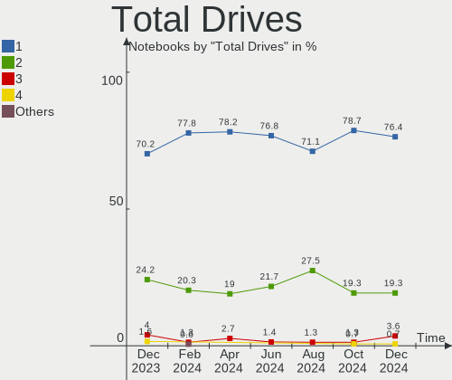
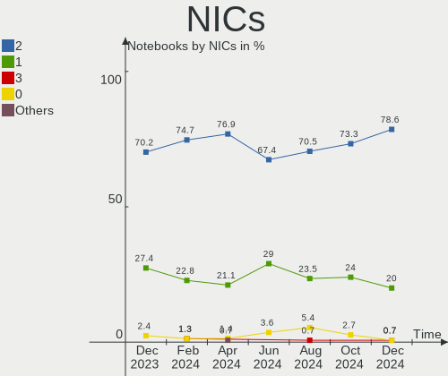

Zorin - Hardware Trends (Notebooks)
-----------------------------------

A project to identify most popular hardware characteristics and track their change
over time based on data collected by Linux users at https://Linux-Hardware.org.

Anyone can contribute to this report by the [hw-probe](https://github.com/linuxhw/hw-probe) tool:

    sudo -E hw-probe -all -upload

This report is for one last month. Overall report since the beginning of time: [TestDays](https://github.com/linuxhw/TestDays)

Period: May, 2023.

Contents
--------

* [ System ](#system)
  - [ OS                       ](#os)
  - [ OS Family                ](#os-family)
  - [ Kernel                   ](#kernel)
  - [ Kernel Family            ](#kernel-family)
  - [ Kernel Major Ver.        ](#kernel-major-ver)
  - [ Arch                     ](#arch)
  - [ DE                       ](#de)
  - [ Display Server           ](#display-server)
  - [ Display Manager          ](#display-manager)
  - [ OS Lang                  ](#os-lang)
  - [ Boot Mode                ](#boot-mode)
  - [ Filesystem               ](#filesystem)
  - [ Part. scheme             ](#part-scheme)
  - [ Dual Boot with Linux/BSD ](#dual-boot-with-linuxbsd)
  - [ Dual Boot (Win)          ](#dual-boot-win)

* [ Board ](#board)
  - [ Vendor                   ](#vendor)
  - [ Model                    ](#model)
  - [ Model Family             ](#model-family)
  - [ MFG Year                 ](#mfg-year)
  - [ Form Factor              ](#form-factor)
  - [ Secure Boot              ](#secure-boot)
  - [ Coreboot                 ](#coreboot)
  - [ RAM Size                 ](#ram-size)
  - [ RAM Used                 ](#ram-used)
  - [ Total Drives             ](#total-drives)
  - [ Has CD-ROM               ](#has-cd-rom)
  - [ Has Ethernet             ](#has-ethernet)
  - [ Has WiFi                 ](#has-wifi)
  - [ Has Bluetooth            ](#has-bluetooth)

* [ Location ](#location)
  - [ Country                  ](#country)
  - [ City                     ](#city)

* [ Drives ](#drives)
  - [ Drive Vendor             ](#drive-vendor)
  - [ Drive Model              ](#drive-model)
  - [ HDD Vendor               ](#hdd-vendor)
  - [ SSD Vendor               ](#ssd-vendor)
  - [ Drive Kind               ](#drive-kind)
  - [ Drive Connector          ](#drive-connector)
  - [ Drive Size               ](#drive-size)
  - [ Space Total              ](#space-total)
  - [ Space Used               ](#space-used)
  - [ Malfunc. Drives          ](#malfunc-drives)
  - [ Malfunc. Drive Vendor    ](#malfunc-drive-vendor)
  - [ Malfunc. HDD Vendor      ](#malfunc-hdd-vendor)
  - [ Malfunc. Drive Kind      ](#malfunc-drive-kind)
  - [ Failed Drives            ](#failed-drives)
  - [ Failed Drive Vendor      ](#failed-drive-vendor)
  - [ Drive Status             ](#drive-status)

* [ Storage controller ](#storage-controller)
  - [ Storage Vendor           ](#storage-vendor)
  - [ Storage Model            ](#storage-model)
  - [ Storage Kind             ](#storage-kind)

* [ Processor ](#processor)
  - [ CPU Vendor               ](#cpu-vendor)
  - [ CPU Model                ](#cpu-model)
  - [ CPU Model Family         ](#cpu-model-family)
  - [ CPU Cores                ](#cpu-cores)
  - [ CPU Sockets              ](#cpu-sockets)
  - [ CPU Threads              ](#cpu-threads)
  - [ CPU Op-Modes             ](#cpu-op-modes)
  - [ CPU Microcode            ](#cpu-microcode)
  - [ CPU Microarch            ](#cpu-microarch)

* [ Graphics ](#graphics)
  - [ GPU Vendor               ](#gpu-vendor)
  - [ GPU Model                ](#gpu-model)
  - [ GPU Combo                ](#gpu-combo)
  - [ GPU Driver               ](#gpu-driver)
  - [ GPU Memory               ](#gpu-memory)

* [ Monitor ](#monitor)
  - [ Monitor Vendor           ](#monitor-vendor)
  - [ Monitor Model            ](#monitor-model)
  - [ Monitor Resolution       ](#monitor-resolution)
  - [ Monitor Diagonal         ](#monitor-diagonal)
  - [ Monitor Width            ](#monitor-width)
  - [ Aspect Ratio             ](#aspect-ratio)
  - [ Monitor Area             ](#monitor-area)
  - [ Pixel Density            ](#pixel-density)
  - [ Multiple Monitors        ](#multiple-monitors)

* [ Network ](#network)
  - [ Net Controller Vendor    ](#net-controller-vendor)
  - [ Net Controller Model     ](#net-controller-model)
  - [ Wireless Vendor          ](#wireless-vendor)
  - [ Wireless Model           ](#wireless-model)
  - [ Ethernet Vendor          ](#ethernet-vendor)
  - [ Ethernet Model           ](#ethernet-model)
  - [ Net Controller Kind      ](#net-controller-kind)
  - [ Used Controller          ](#used-controller)
  - [ NICs                     ](#nics)
  - [ IPv6                     ](#ipv6)

* [ Bluetooth ](#bluetooth)
  - [ Bluetooth Vendor         ](#bluetooth-vendor)
  - [ Bluetooth Model          ](#bluetooth-model)

* [ Sound ](#sound)
  - [ Sound Vendor             ](#sound-vendor)
  - [ Sound Model              ](#sound-model)

* [ Memory ](#memory)
  - [ Memory Vendor            ](#memory-vendor)
  - [ Memory Model             ](#memory-model)
  - [ Memory Kind              ](#memory-kind)
  - [ Memory Form Factor       ](#memory-form-factor)
  - [ Memory Size              ](#memory-size)
  - [ Memory Speed             ](#memory-speed)

* [ Printers & scanners ](#printers--scanners)
  - [ Printer Vendor           ](#printer-vendor)
  - [ Printer Model            ](#printer-model)
  - [ Scanner Vendor           ](#scanner-vendor)
  - [ Scanner Model            ](#scanner-model)

* [ Camera ](#camera)
  - [ Camera Vendor            ](#camera-vendor)
  - [ Camera Model             ](#camera-model)

* [ Security ](#security)
  - [ Fingerprint Vendor       ](#fingerprint-vendor)
  - [ Fingerprint Model        ](#fingerprint-model)
  - [ Chipcard Vendor          ](#chipcard-vendor)
  - [ Chipcard Model           ](#chipcard-model)

* [ Unsupported ](#unsupported)
  - [ Unsupported Devices      ](#unsupported-devices)
  - [ Unsupported Device Types ](#unsupported-device-types)

System
------

OS
--

Installed operating systems

| Name     | Notebooks | Percent |
|----------|-----------|---------|
| Zorin 16 | 88        | 94.62%  |
| Zorin 15 | 5         | 5.38%   |

OS Family
---------

OS without a version

| Name  | Notebooks | Percent |
|-------|-----------|---------|
| Zorin | 93        | 100%    |

Kernel
------

Version of the Linux kernel

| Version               | Notebooks | Percent |
|-----------------------|-----------|---------|
| 5.15.0-71-generic     | 39        | 41.94%  |
| 5.15.0-72-generic     | 30        | 32.26%  |
| 5.15.0-56-generic     | 5         | 5.38%   |
| 5.4.0-148-generic     | 4         | 4.3%    |
| 5.15.0-69-generic     | 3         | 3.23%   |
| 5.15.0-52-generic     | 3         | 3.23%   |
| 6.3.2-060302-generic  | 1         | 1.08%   |
| 6.2.14-060214-generic | 1         | 1.08%   |
| 6.0.9-060009-generic  | 1         | 1.08%   |
| 5.4.0-58-generic      | 1         | 1.08%   |
| 5.15.0-67-generic     | 1         | 1.08%   |
| 5.15.0-53-generic     | 1         | 1.08%   |
| 5.13.0-40-generic     | 1         | 1.08%   |
| 5.11.0-38-generic     | 1         | 1.08%   |
| 5.11.0-27-generic     | 1         | 1.08%   |

Kernel Family
-------------

Linux kernel without a distro release

| Version | Notebooks | Percent |
|---------|-----------|---------|
| 5.15.0  | 82        | 88.17%  |
| 5.4.0   | 5         | 5.38%   |
| 5.11.0  | 2         | 2.15%   |
| 6.3.2   | 1         | 1.08%   |
| 6.2.14  | 1         | 1.08%   |
| 6.0.9   | 1         | 1.08%   |
| 5.13.0  | 1         | 1.08%   |

Kernel Major Ver.
-----------------

Linux kernel major version

| Version | Notebooks | Percent |
|---------|-----------|---------|
| 5.15    | 82        | 88.17%  |
| 5.4     | 5         | 5.38%   |
| 5.11    | 2         | 2.15%   |
| 6.3     | 1         | 1.08%   |
| 6.2     | 1         | 1.08%   |
| 6.0     | 1         | 1.08%   |
| 5.13    | 1         | 1.08%   |

Arch
----

OS architecture (x86_64, i586, etc.)

| Name   | Notebooks | Percent |
|--------|-----------|---------|
| x86_64 | 90        | 96.77%  |
| i686   | 3         | 3.23%   |

DE
--

Desktop Environment

| Name  | Notebooks | Percent |
|-------|-----------|---------|
| GNOME | 69        | 74.19%  |
| XFCE  | 24        | 25.81%  |

Display Server
--------------

X11 or Wayland

| Name    | Notebooks | Percent |
|---------|-----------|---------|
| X11     | 91        | 97.85%  |
| Wayland | 2         | 2.15%   |

Display Manager
---------------

SDDM, LightDM, etc.

| Name    | Notebooks | Percent |
|---------|-----------|---------|
| Unknown | 67        | 72.04%  |
| LightDM | 11        | 11.83%  |
| GDM     | 8         | 8.6%    |
| GDM3    | 7         | 7.53%   |

OS Lang
-------

Language

| Lang  | Notebooks | Percent |
|-------|-----------|---------|
| en_US | 33        | 35.48%  |
| de_DE | 9         | 9.68%   |
| es_ES | 6         | 6.45%   |
| nl_NL | 5         | 5.38%   |
| en_CA | 5         | 5.38%   |
| it_IT | 4         | 4.3%    |
| fr_FR | 4         | 4.3%    |
| pl_PL | 3         | 3.23%   |
| pt_BR | 2         | 2.15%   |
| hr_HR | 2         | 2.15%   |
| en_GB | 2         | 2.15%   |
| en_AU | 2         | 2.15%   |
| cs_CZ | 2         | 2.15%   |
| sl_SI | 1         | 1.08%   |
| ru_RU | 1         | 1.08%   |
| ro_RO | 1         | 1.08%   |
| pt_PT | 1         | 1.08%   |
| hu_HU | 1         | 1.08%   |
| fr_CA | 1         | 1.08%   |
| es_MX | 1         | 1.08%   |
| es_AR | 1         | 1.08%   |
| en_ZA | 1         | 1.08%   |
| en_NZ | 1         | 1.08%   |
| en_IN | 1         | 1.08%   |
| ar_YE | 1         | 1.08%   |
| ar_SA | 1         | 1.08%   |
| ar_EG | 1         | 1.08%   |

Boot Mode
---------

EFI or BIOS

| Mode | Notebooks | Percent |
|------|-----------|---------|
| EFI  | 52        | 55.91%  |
| BIOS | 41        | 44.09%  |

Filesystem
----------

Type of filesystem

| Type    | Notebooks | Percent |
|---------|-----------|---------|
| Ext4    | 81        | 87.1%   |
| Tmpfs   | 9         | 9.68%   |
| Zfs     | 1         | 1.08%   |
| Xfs     | 1         | 1.08%   |
| Overlay | 1         | 1.08%   |

Part. scheme
------------

Scheme of partitioning

| Type    | Notebooks | Percent |
|---------|-----------|---------|
| Unknown | 70        | 75.27%  |
| GPT     | 17        | 18.28%  |
| MBR     | 6         | 6.45%   |

Dual Boot with Linux/BSD
------------------------

Hosting more than one Linux/BSD

| Dual boot | Notebooks | Percent |
|-----------|-----------|---------|
| No        | 91        | 97.85%  |
| Yes       | 2         | 2.15%   |

Dual Boot (Win)
---------------

Hosting Linux and Windows

| Dual boot | Notebooks | Percent |
|-----------|-----------|---------|
| No        | 84        | 90.32%  |
| Yes       | 9         | 9.68%   |

Board
-----

Vendor
------

Motherboard manufacturer

| Name                | Notebooks | Percent |
|---------------------|-----------|---------|
| Hewlett-Packard     | 24        | 25.81%  |
| Lenovo              | 14        | 15.05%  |
| Dell                | 13        | 13.98%  |
| Acer                | 9         | 9.68%   |
| Apple               | 6         | 6.45%   |
| ASUSTek Computer    | 5         | 5.38%   |
| Google              | 3         | 3.23%   |
| Fujitsu Siemens     | 3         | 3.23%   |
| Toshiba             | 2         | 2.15%   |
| Unknown             | 2         | 2.15%   |
| Tactus              | 1         | 1.08%   |
| Sony                | 1         | 1.08%   |
| SKIKK               | 1         | 1.08%   |
| Samsung Electronics | 1         | 1.08%   |
| Positivo            | 1         | 1.08%   |
| Philco              | 1         | 1.08%   |
| Packard Bell        | 1         | 1.08%   |
| Mediacom            | 1         | 1.08%   |
| KUU                 | 1         | 1.08%   |
| Framework           | 1         | 1.08%   |
| eMachines           | 1         | 1.08%   |
| Chuwi               | 1         | 1.08%   |

Model
-----

Motherboard model

| Name                                       | Notebooks | Percent |
|--------------------------------------------|-----------|---------|
| Apple MacBookPro10,1                       | 2         | 2.15%   |
| Apple MacBookAir7,2                        | 2         | 2.15%   |
| Unknown                                    | 2         | 2.15%   |
| Toshiba TECRA M10                          | 1         | 1.08%   |
| Toshiba Satellite M60                      | 1         | 1.08%   |
| Tactus GeoBook 140                         | 1         | 1.08%   |
| Sony SVF14214CXW                           | 1         | 1.08%   |
| SKIKK Niflheim 17 II                       | 1         | 1.08%   |
| Samsung N150/N210/N220                     | 1         | 1.08%   |
| Positivo S14CT01                           | 1         | 1.08%   |
| Philco PHN14C                              | 1         | 1.08%   |
| Packard Bell EasyNote MH35                 | 1         | 1.08%   |
| Mediacom SmartBook 14 FullHD - SB14UC      | 1         | 1.08%   |
| Lenovo V130-15IGM 81HL                     | 1         | 1.08%   |
| Lenovo ThinkPad X1 Carbon Gen 8 20UAS4H800 | 1         | 1.08%   |
| Lenovo ThinkPad T520 4242A25               | 1         | 1.08%   |
| Lenovo ThinkPad T470s W10DG 20JTS0CJ0E     | 1         | 1.08%   |
| Lenovo ThinkPad E490 20N8A01YGI            | 1         | 1.08%   |
| Lenovo ThinkPad E14 Gen 3 20Y70044RT       | 1         | 1.08%   |
| Lenovo Legion 7 16ACHg6 82N6               | 1         | 1.08%   |
| Lenovo IdeaPad Z470                        | 1         | 1.08%   |
| Lenovo IdeaPad Flex-14API 81SS             | 1         | 1.08%   |
| Lenovo IdeaPad 320-17IKB 80XM              | 1         | 1.08%   |
| Lenovo IdeaPad 320-15IAP 80XR              | 1         | 1.08%   |
| Lenovo IdeaPad 3 15ITL05 81X8              | 1         | 1.08%   |
| Lenovo IdeaPad 110-15ISK 80UD              | 1         | 1.08%   |
| Lenovo B50-70 80EU                         | 1         | 1.08%   |
| KUU Andes II                               | 1         | 1.08%   |
| HP Victus by Laptop 16-e0xxx               | 1         | 1.08%   |
| HP Stream Notebook                         | 1         | 1.08%   |
| HP Stream Laptop 14-ax0XX                  | 1         | 1.08%   |
| HP ProBook 6570b                           | 1         | 1.08%   |
| HP ProBook 6440b                           | 1         | 1.08%   |
| HP ProBook 4740s                           | 1         | 1.08%   |
| HP ProBook 4535s                           | 1         | 1.08%   |
| HP Presario CQ61                           | 1         | 1.08%   |
| HP Pavilion Sleekbook 14 PC                | 1         | 1.08%   |
| HP Pavilion Notebook 15-bc5xxx             | 1         | 1.08%   |
| HP Pavilion g6                             | 1         | 1.08%   |
| HP Pavilion dv7                            | 1         | 1.08%   |

Model Family
------------

Motherboard model prefix

| Name                     | Notebooks | Percent |
|--------------------------|-----------|---------|
| Acer Aspire              | 9         | 9.68%   |
| Dell Latitude            | 7         | 7.53%   |
| Lenovo IdeaPad           | 6         | 6.45%   |
| HP Pavilion              | 6         | 6.45%   |
| Lenovo ThinkPad          | 5         | 5.38%   |
| HP EliteBook             | 5         | 5.38%   |
| HP ProBook               | 4         | 4.3%    |
| Dell Inspiron            | 3         | 3.23%   |
| HP Stream                | 2         | 2.15%   |
| HP Laptop                | 2         | 2.15%   |
| Fujitsu Siemens AMILO    | 2         | 2.15%   |
| Dell XPS                 | 2         | 2.15%   |
| Apple MacBookPro10       | 2         | 2.15%   |
| Apple MacBookAir7        | 2         | 2.15%   |
| Unknown                  | 2         | 2.15%   |
| Toshiba TECRA            | 1         | 1.08%   |
| Toshiba Satellite        | 1         | 1.08%   |
| Tactus GeoBook           | 1         | 1.08%   |
| Sony SVF14214CXW         | 1         | 1.08%   |
| SKIKK Niflheim           | 1         | 1.08%   |
| Samsung N150             | 1         | 1.08%   |
| Positivo S14CT01         | 1         | 1.08%   |
| Philco PHN14C            | 1         | 1.08%   |
| Packard Bell EasyNote    | 1         | 1.08%   |
| Mediacom SmartBook       | 1         | 1.08%   |
| Lenovo V130-15IGM        | 1         | 1.08%   |
| Lenovo Legion            | 1         | 1.08%   |
| Lenovo B50-70            | 1         | 1.08%   |
| KUU Andes                | 1         | 1.08%   |
| HP Victus                | 1         | 1.08%   |
| HP Presario              | 1         | 1.08%   |
| HP OMEN                  | 1         | 1.08%   |
| HP 655                   | 1         | 1.08%   |
| HP 255                   | 1         | 1.08%   |
| Google Lars              | 1         | 1.08%   |
| Google Kled              | 1         | 1.08%   |
| Google Bluebird          | 1         | 1.08%   |
| Fujitsu Siemens LIFEBOOK | 1         | 1.08%   |
| Framework Laptop         | 1         | 1.08%   |
| eMachines E620           | 1         | 1.08%   |

MFG Year
--------

Motherboard manufacture year

| Year | Notebooks | Percent |
|------|-----------|---------|
| 2017 | 10        | 10.75%  |
| 2011 | 10        | 10.75%  |
| 2020 | 8         | 8.6%    |
| 2016 | 8         | 8.6%    |
| 2012 | 8         | 8.6%    |
| 2014 | 6         | 6.45%   |
| 2023 | 5         | 5.38%   |
| 2021 | 5         | 5.38%   |
| 2008 | 5         | 5.38%   |
| 2022 | 4         | 4.3%    |
| 2018 | 4         | 4.3%    |
| 2010 | 4         | 4.3%    |
| 2015 | 3         | 3.23%   |
| 2009 | 3         | 3.23%   |
| 2019 | 2         | 2.15%   |
| 2013 | 2         | 2.15%   |
| 2007 | 2         | 2.15%   |
| 2006 | 2         | 2.15%   |
| 2005 | 2         | 2.15%   |

Form Factor
-----------

Physical design of the computer

| Name     | Notebooks | Percent |
|----------|-----------|---------|
| Notebook | 93        | 100%    |

Secure Boot
-----------

Enabled or disabled

| State    | Notebooks | Percent |
|----------|-----------|---------|
| Disabled | 79        | 84.95%  |
| Enabled  | 14        | 15.05%  |

Coreboot
--------

Have coreboot on board

| Used | Notebooks | Percent |
|------|-----------|---------|
| No   | 90        | 96.77%  |
| Yes  | 3         | 3.23%   |

RAM Size
--------

Total RAM memory

| Size in GB  | Notebooks | Percent |
|-------------|-----------|---------|
| 4.01-8.0    | 28        | 30.11%  |
| 3.01-4.0    | 22        | 23.66%  |
| 16.01-24.0  | 17        | 18.28%  |
| 8.01-16.0   | 9         | 9.68%   |
| 1.01-2.0    | 8         | 8.6%    |
| 32.01-64.0  | 4         | 4.3%    |
| 64.01-256.0 | 2         | 2.15%   |
| 0.51-1.0    | 2         | 2.15%   |
| 24.01-32.0  | 1         | 1.08%   |

RAM Used
--------

Used RAM memory

| Used GB  | Notebooks | Percent |
|----------|-----------|---------|
| 1.01-2.0 | 33        | 35.48%  |
| 2.01-3.0 | 31        | 33.33%  |
| 3.01-4.0 | 14        | 15.05%  |
| 4.01-8.0 | 10        | 10.75%  |
| 0.51-1.0 | 5         | 5.38%   |

Total Drives
------------

Number of drives on board

| Drives | Notebooks | Percent |
|--------|-----------|---------|
| 1      | 81        | 87.1%   |
| 2      | 12        | 12.9%   |

Has CD-ROM
----------

Has CD-ROM on board

| Presented | Notebooks | Percent |
|-----------|-----------|---------|
| No        | 58        | 62.37%  |
| Yes       | 35        | 37.63%  |

Has Ethernet
------------

Has Ethernet on board

| Presented | Notebooks | Percent |
|-----------|-----------|---------|
| Yes       | 73        | 78.49%  |
| No        | 20        | 21.51%  |

Has WiFi
--------

Has WiFi module

| Presented | Notebooks | Percent |
|-----------|-----------|---------|
| Yes       | 91        | 97.85%  |
| No        | 2         | 2.15%   |

Has Bluetooth
-------------

Has Bluetooth module

| Presented | Notebooks | Percent |
|-----------|-----------|---------|
| Yes       | 69        | 74.19%  |
| No        | 24        | 25.81%  |

Location
--------

Country
-------

Geographic location (country)

| Country             | Notebooks | Percent |
|---------------------|-----------|---------|
| USA                 | 16        | 17.2%   |
| Germany             | 12        | 12.9%   |
| Canada              | 7         | 7.53%   |
| Spain               | 6         | 6.45%   |
| Netherlands         | 6         | 6.45%   |
| France              | 5         | 5.38%   |
| Italy               | 4         | 4.3%    |
| Romania             | 3         | 3.23%   |
| Poland              | 3         | 3.23%   |
| UK                  | 2         | 2.15%   |
| Russia              | 2         | 2.15%   |
| Czechia             | 2         | 2.15%   |
| Croatia             | 2         | 2.15%   |
| Brazil              | 2         | 2.15%   |
| Australia           | 2         | 2.15%   |
| Yemen               | 1         | 1.08%   |
| Uruguay             | 1         | 1.08%   |
| Turkey              | 1         | 1.08%   |
| Trinidad and Tobago | 1         | 1.08%   |
| Slovenia            | 1         | 1.08%   |
| Saudi Arabia        | 1         | 1.08%   |
| Saint Lucia         | 1         | 1.08%   |
| Portugal            | 1         | 1.08%   |
| Nigeria             | 1         | 1.08%   |
| New Zealand         | 1         | 1.08%   |
| Mexico              | 1         | 1.08%   |
| India               | 1         | 1.08%   |
| Hungary             | 1         | 1.08%   |
| Greece              | 1         | 1.08%   |
| Finland             | 1         | 1.08%   |
| Eswatini            | 1         | 1.08%   |
| Denmark             | 1         | 1.08%   |
| Costa Rica          | 1         | 1.08%   |
| Argentina           | 1         | 1.08%   |

City
----

Geographic location (city)

| City              | Notebooks | Percent |
|-------------------|-----------|---------|
| Zagreb            | 2         | 2.15%   |
| Bucharest         | 2         | 2.15%   |
| Barcelona         | 2         | 2.15%   |
| Zeist             | 1         | 1.08%   |
| Wołomin          | 1         | 1.08%   |
| Vicenza           | 1         | 1.08%   |
| Veszprém         | 1         | 1.08%   |
| Verona            | 1         | 1.08%   |
| Van Nuys          | 1         | 1.08%   |
| Valkenburg        | 1         | 1.08%   |
| Valencia          | 1         | 1.08%   |
| Valasske Mezirici | 1         | 1.08%   |
| Uniondale         | 1         | 1.08%   |
| Tulsa             | 1         | 1.08%   |
| Toronto           | 1         | 1.08%   |
| Thonon-les-Bains  | 1         | 1.08%   |
| The Hague         | 1         | 1.08%   |
| Tampere           | 1         | 1.08%   |
| Tallahassee       | 1         | 1.08%   |
| Svetlyy           | 1         | 1.08%   |
| Stuttgart         | 1         | 1.08%   |
| St. Catharines    | 1         | 1.08%   |
| Southwark         | 1         | 1.08%   |
| Sibiu             | 1         | 1.08%   |
| Sao Paulo         | 1         | 1.08%   |
| Sanaa             | 1         | 1.08%   |
| San José         | 1         | 1.08%   |
| Rome              | 1         | 1.08%   |
| Potter            | 1         | 1.08%   |
| Point Fortin      | 1         | 1.08%   |
| Piaseczno         | 1         | 1.08%   |
| Perth             | 1         | 1.08%   |
| Paris             | 1         | 1.08%   |
| Palmela           | 1         | 1.08%   |
| Palermo           | 1         | 1.08%   |
| Ogden             | 1         | 1.08%   |
| Nyrany            | 1         | 1.08%   |
| New York          | 1         | 1.08%   |
| New Westminster   | 1         | 1.08%   |
| Mytilene          | 1         | 1.08%   |

Drives
------

Drive Vendor
------------

Hard drive vendors

| Vendor                      | Notebooks | Drives | Percent |
|-----------------------------|-----------|--------|---------|
| Samsung Electronics         | 17        | 17     | 16.35%  |
| WDC                         | 10        | 10     | 9.62%   |
| Unknown                     | 9         | 9      | 8.65%   |
| SanDisk                     | 9         | 9      | 8.65%   |
| Seagate                     | 8         | 8      | 7.69%   |
| Kingston                    | 6         | 6      | 5.77%   |
| Toshiba                     | 5         | 5      | 4.81%   |
| Apple                       | 5         | 5      | 4.81%   |
| Micron Technology           | 4         | 4      | 3.85%   |
| Intel                       | 4         | 4      | 3.85%   |
| Hitachi                     | 4         | 4      | 3.85%   |
| HGST                        | 4         | 4      | 3.85%   |
| China                       | 3         | 3      | 2.88%   |
| A-DATA Technology           | 3         | 3      | 2.88%   |
| SK hynix                    | 2         | 3      | 1.92%   |
| Fujitsu                     | 2         | 2      | 1.92%   |
| Verbatim                    | 1         | 1      | 0.96%   |
| Patriot                     | 1         | 1      | 0.96%   |
| NGFF                        | 1         | 1      | 0.96%   |
| Netac                       | 1         | 1      | 0.96%   |
| KIOXIA                      | 1         | 1      | 0.96%   |
| Kingston Technology Company | 1         | 1      | 0.96%   |
| GOODRAM                     | 1         | 1      | 0.96%   |
| Biostar                     | 1         | 1      | 0.96%   |
| ADATA Technology            | 1         | 1      | 0.96%   |

Drive Model
-----------

Hard drive models

| Model                                               | Notebooks | Percent |
|-----------------------------------------------------|-----------|---------|
| Unknown MMC Card  32GB                              | 4         | 3.85%   |
| Seagate ST1000LM035-1RK172 1TB                      | 3         | 2.88%   |
| Toshiba MQ01ABD100 1TB                              | 2         | 1.92%   |
| Samsung SSD 980 1TB                                 | 2         | 1.92%   |
| Samsung NVMe SSD Controller SM981/PM981/PM983 256GB | 2         | 1.92%   |
| Kingston SA400S37480G 480GB SSD                     | 2         | 1.92%   |
| Kingston SA400S37120G 120GB SSD                     | 2         | 1.92%   |
| Intel SSD 660P Series 512GB                         | 2         | 1.92%   |
| Apple SSD SM512E 500GB                              | 2         | 1.92%   |
| Apple SSD SM0128G 121GB                             | 2         | 1.92%   |
| WDC WDS500G2B0A 500GB SSD                           | 1         | 0.96%   |
| WDC WDS240G2G0A-00JH30 240GB SSD                    | 1         | 0.96%   |
| WDC WD7500BPVT-24HXZT1 752GB                        | 1         | 0.96%   |
| WDC WD2500BEVS-08VAT2 250GB                         | 1         | 0.96%   |
| WDC WD2500BEKT-60A25T1 250GB                        | 1         | 0.96%   |
| WDC WD1600BEVT-22ZCT0 160GB                         | 1         | 0.96%   |
| WDC WD1600BEVS-22RST0 160GB                         | 1         | 0.96%   |
| WDC WD10SPZX-08Z10 1TB                              | 1         | 0.96%   |
| WDC WD10JPVX-22JC3T0 1TB                            | 1         | 0.96%   |
| WDC WD10JPCX-24UE4T0 1TB                            | 1         | 0.96%   |
| Verbatim Vi550 S3 2TB                               | 1         | 0.96%   |
| Unknown SD/MMC/MS PRO 64GB                          | 1         | 0.96%   |
| Unknown NCard  32GB                                 | 1         | 0.96%   |
| Unknown MMC Card  128GB                             | 1         | 0.96%   |
| Unknown M52532  32GB                                | 1         | 0.96%   |
| Unknown DA4128  128GB                               | 1         | 0.96%   |
| Toshiba XG6 NVMe SSD Controller 256GB               | 1         | 0.96%   |
| Toshiba MQ04ABF100 1TB                              | 1         | 0.96%   |
| Toshiba MK1237GSX 120GB                             | 1         | 0.96%   |
| SK hynix SKHynix_HFS001TDE9X084N 1024GB             | 1         | 0.96%   |
| SK hynix PC711 HFS512GDE9X073N 512GB                | 1         | 0.96%   |
| Seagate ST9500420AS 500GB                           | 1         | 0.96%   |
| Seagate ST9320325AS 320GB                           | 1         | 0.96%   |
| Seagate ST9160821AS 160GB                           | 1         | 0.96%   |
| Seagate ST500LT012-1DG142 500GB                     | 1         | 0.96%   |
| Seagate ST500LM012 HN-M500MBB 500GB                 | 1         | 0.96%   |
| Sandisk WDC PC SN530 SDBPMPZ-256G-1101 256GB        | 1         | 0.96%   |
| Sandisk WD Black SN850 500GB                        | 1         | 0.96%   |
| Sandisk WD Black SN750 / PC SN730 NVMe SSD 256GB    | 1         | 0.96%   |
| SanDisk SSD PLUS 480GB                              | 1         | 0.96%   |

HDD Vendor
----------

Hard disk drive vendors

| Vendor              | Notebooks | Drives | Percent |
|---------------------|-----------|--------|---------|
| WDC                 | 8         | 8      | 25%     |
| Seagate             | 8         | 8      | 25%     |
| Toshiba             | 4         | 4      | 12.5%   |
| Hitachi             | 4         | 4      | 12.5%   |
| HGST                | 4         | 4      | 12.5%   |
| Fujitsu             | 2         | 2      | 6.25%   |
| Unknown             | 1         | 1      | 3.13%   |
| Samsung Electronics | 1         | 1      | 3.13%   |

SSD Vendor
----------

Solid state drive vendors

| Vendor              | Notebooks | Drives | Percent |
|---------------------|-----------|--------|---------|
| Samsung Electronics | 6         | 6      | 16.22%  |
| Kingston            | 6         | 6      | 16.22%  |
| SanDisk             | 5         | 5      | 13.51%  |
| Apple               | 5         | 5      | 13.51%  |
| China               | 3         | 3      | 8.11%   |
| WDC                 | 2         | 2      | 5.41%   |
| Micron Technology   | 2         | 2      | 5.41%   |
| A-DATA Technology   | 2         | 2      | 5.41%   |
| Verbatim            | 1         | 1      | 2.7%    |
| Patriot             | 1         | 1      | 2.7%    |
| NGFF                | 1         | 1      | 2.7%    |
| Netac               | 1         | 1      | 2.7%    |
| Intel               | 1         | 1      | 2.7%    |
| Biostar             | 1         | 1      | 2.7%    |

Drive Kind
----------

HDD or SSD

| Kind | Notebooks | Drives | Percent |
|------|-----------|--------|---------|
| SSD  | 36        | 37     | 35.64%  |
| HDD  | 32        | 32     | 31.68%  |
| NVMe | 24        | 27     | 23.76%  |
| MMC  | 9         | 9      | 8.91%   |

Drive Connector
---------------

SATA, SAS, NVMe, etc.

| Type | Notebooks | Drives | Percent |
|------|-----------|--------|---------|
| SATA | 66        | 67     | 65.35%  |
| NVMe | 24        | 27     | 23.76%  |
| MMC  | 9         | 9      | 8.91%   |
| SAS  | 2         | 2      | 1.98%   |

Drive Size
----------

Size of hard drive

| Size in TB | Notebooks | Drives | Percent |
|------------|-----------|--------|---------|
| 0.01-0.5   | 49        | 50     | 72.06%  |
| 0.51-1.0   | 18        | 18     | 26.47%  |
| 1.01-2.0   | 1         | 1      | 1.47%   |

Space Total
-----------

Amount of disk space available on the file system

| Size in GB | Notebooks | Percent |
|------------|-----------|---------|
| 101-250    | 40        | 43.01%  |
| 501-1000   | 19        | 20.43%  |
| 251-500    | 17        | 18.28%  |
| 21-50      | 8         | 8.6%    |
| 51-100     | 7         | 7.53%   |
| 1-20       | 1         | 1.08%   |
| Unknown    | 1         | 1.08%   |

Space Used
----------

Amount of used disk space

| Used GB  | Notebooks | Percent |
|----------|-----------|---------|
| 1-20     | 41        | 44.09%  |
| 21-50    | 30        | 32.26%  |
| 101-250  | 9         | 9.68%   |
| 51-100   | 8         | 8.6%    |
| 251-500  | 3         | 3.23%   |
| 501-1000 | 1         | 1.08%   |
| Unknown  | 1         | 1.08%   |

Malfunc. Drives
---------------

Drive models with a malfunction

| Model                      | Notebooks | Drives | Percent |
|----------------------------|-----------|--------|---------|
| HGST HTS545050A7E380 500GB | 1         | 1      | 100%    |

Malfunc. Drive Vendor
---------------------

Vendors of faulty drives

| Vendor | Notebooks | Drives | Percent |
|--------|-----------|--------|---------|
| HGST   | 1         | 1      | 100%    |

Malfunc. HDD Vendor
-------------------

Vendors of faulty HDD drives

| Vendor | Notebooks | Drives | Percent |
|--------|-----------|--------|---------|
| HGST   | 1         | 1      | 100%    |

Malfunc. Drive Kind
-------------------

Kinds of faulty drives

| Kind | Notebooks | Drives | Percent |
|------|-----------|--------|---------|
| HDD  | 1         | 1      | 100%    |

Failed Drives
-------------

Failed drive models

Zero info for selected period =(

Failed Drive Vendor
-------------------

Failed drive vendors

Zero info for selected period =(

Drive Status
------------

Number of failed and malfunc. drives

| Status   | Notebooks | Drives | Percent |
|----------|-----------|--------|---------|
| Detected | 85        | 95     | 90.43%  |
| Works    | 8         | 9      | 8.51%   |
| Malfunc  | 1         | 1      | 1.06%   |

Storage controller
------------------

Storage Vendor
--------------

Storage controller vendors

| Vendor                           | Notebooks | Percent |
|----------------------------------|-----------|---------|
| Intel                            | 57        | 57%     |
| AMD                              | 13        | 13%     |
| Samsung Electronics              | 12        | 12%     |
| SanDisk                          | 3         | 3%      |
| SK hynix                         | 2         | 2%      |
| Silicon Integrated Systems [SiS] | 2         | 2%      |
| Nvidia                           | 2         | 2%      |
| Micron Technology                | 2         | 2%      |
| VIA Technologies                 | 1         | 1%      |
| Toshiba America Info Systems     | 1         | 1%      |
| Silicon Motion                   | 1         | 1%      |
| MAXIO Technology (Hangzhou)      | 1         | 1%      |
| KIOXIA                           | 1         | 1%      |
| Kingston Technology Company      | 1         | 1%      |
| ADATA Technology                 | 1         | 1%      |

Storage Model
-------------

Storage controller models

| Model                                                                        | Notebooks | Percent |
|------------------------------------------------------------------------------|-----------|---------|
| Intel 82801 Mobile SATA Controller [RAID mode]                               | 8         | 7.34%   |
| Intel 7 Series Chipset Family 6-port SATA Controller [AHCI mode]             | 8         | 7.34%   |
| AMD FCH SATA Controller [AHCI mode]                                          | 8         | 7.34%   |
| Intel 6 Series/C200 Series Chipset Family 6 port Mobile SATA AHCI Controller | 7         | 6.42%   |
| Intel Sunrise Point-LP SATA Controller [AHCI mode]                           | 6         | 5.5%    |
| Samsung NVMe SSD Controller 980                                              | 5         | 4.59%   |
| Intel Volume Management Device NVMe RAID Controller                          | 4         | 3.67%   |
| Intel 82801IBM/IEM (ICH9M/ICH9M-E) 4 port SATA Controller [AHCI mode]        | 4         | 3.67%   |
| Samsung NVMe SSD Controller SM981/PM981/PM983                                | 3         | 2.75%   |
| Intel Tiger Lake-LP SATA Controller                                          | 3         | 2.75%   |
| Intel Celeron/Pentium Silver Processor SATA Controller                       | 3         | 2.75%   |
| Intel 8 Series SATA Controller 1 [AHCI mode]                                 | 3         | 2.75%   |
| AMD SB7x0/SB8x0/SB9x0 SATA Controller [AHCI mode]                            | 3         | 2.75%   |
| SK hynix Gold P31/PC711 NVMe Solid State Drive                               | 2         | 1.83%   |
| Silicon Integrated Systems [SiS] 5513 IDE Controller                         | 2         | 1.83%   |
| Samsung Electronics SATA controller                                          | 2         | 1.83%   |
| Micron NVMe Storage Controller                                               | 2         | 1.83%   |
| Intel SSD 660P Series                                                        | 2         | 1.83%   |
| Intel HM170/QM170 Chipset SATA Controller [AHCI Mode]                        | 2         | 1.83%   |
| AMD SB7x0/SB8x0/SB9x0 IDE Controller                                         | 2         | 1.83%   |
| AMD SB600 Non-Raid-5 SATA                                                    | 2         | 1.83%   |
| AMD SB600 IDE                                                                | 2         | 1.83%   |
| VIA VT82C586A/B/VT82C686/A/B/VT823x/A/C PIPC Bus Master IDE                  | 1         | 0.92%   |
| VIA VT8237A SATA 2-Port Controller                                           | 1         | 0.92%   |
| Toshiba America Info Systems XG6 NVMe SSD Controller                         | 1         | 0.92%   |
| Silicon Motion SM2263EN/SM2263XT SSD Controller                              | 1         | 0.92%   |
| Silicon Integrated Systems [SiS] SATA Controller / IDE mode                  | 1         | 0.92%   |
| SanDisk WD PC SN810 / Black SN850 NVMe SSD                                   | 1         | 0.92%   |
| SanDisk WD Black SN750 / PC SN730 NVMe SSD                                   | 1         | 0.92%   |
| SanDisk NVMe Controller                                                      | 1         | 0.92%   |
| Samsung NVMe SSD Controller SM961/PM961/SM963                                | 1         | 0.92%   |
| Samsung NVMe SSD Controller SM951/PM951                                      | 1         | 0.92%   |
| Nvidia MCP89 SATA Controller (AHCI mode)                                     | 1         | 0.92%   |
| Nvidia MCP67 AHCI Controller                                                 | 1         | 0.92%   |
| MAXIO (Hangzhou) NVMe SSD Controller MAP1202                                 | 1         | 0.92%   |
| KIOXIA NVMe SSD Controller BG4                                               | 1         | 0.92%   |
| Kingston Company OM3PDP3 NVMe SSD                                            | 1         | 0.92%   |
| Intel SSD 600P Series                                                        | 1         | 0.92%   |
| Intel SATA controller                                                        | 1         | 0.92%   |
| Intel NM10/ICH7 Family SATA Controller [AHCI mode]                           | 1         | 0.92%   |

Storage Kind
------------

Kind of storage controller (IDE, SATA, NVMe, SAS, ...)

| Kind | Notebooks | Percent |
|------|-----------|---------|
| SATA | 59        | 56.19%  |
| NVMe | 24        | 22.86%  |
| RAID | 12        | 11.43%  |
| IDE  | 10        | 9.52%   |

Processor
---------

CPU Vendor
----------

Processor vendors

| Vendor | Notebooks | Percent |
|--------|-----------|---------|
| Intel  | 74        | 79.57%  |
| AMD    | 19        | 20.43%  |

CPU Model
---------

Processor models

| Model                                         | Notebooks | Percent |
|-----------------------------------------------|-----------|---------|
| Intel 11th Gen Core i7-1165G7 @ 2.80GHz       | 3         | 3.23%   |
| Intel 11th Gen Core i5-1135G7 @ 2.40GHz       | 3         | 3.23%   |
| AMD Ryzen 5 3500U with Radeon Vega Mobile Gfx | 3         | 3.23%   |
| Intel Core i5-5250U CPU @ 1.60GHz             | 2         | 2.15%   |
| Intel Core i5-4210U CPU @ 1.70GHz             | 2         | 2.15%   |
| Intel Core i5-3337U CPU @ 1.80GHz             | 2         | 2.15%   |
| Intel Core i5-2520M CPU @ 2.50GHz             | 2         | 2.15%   |
| Intel Core 2 Duo CPU P8600 @ 2.40GHz          | 2         | 2.15%   |
| Intel Celeron N4020 CPU @ 1.10GHz             | 2         | 2.15%   |
| Intel Atom x5-Z8300 CPU @ 1.44GHz             | 2         | 2.15%   |
| Intel Pentium M processor 1.86GHz             | 1         | 1.08%   |
| Intel Pentium Dual-Core CPU T4300 @ 2.10GHz   | 1         | 1.08%   |
| Intel Pentium Dual CPU T2310 @ 1.46GHz        | 1         | 1.08%   |
| Intel Pentium CPU 967 @ 1.30GHz               | 1         | 1.08%   |
| Intel Pentium 3558U @ 1.70GHz                 | 1         | 1.08%   |
| Intel N100                                    | 1         | 1.08%   |
| Intel Core m5-6Y54 CPU @ 1.10GHz              | 1         | 1.08%   |
| Intel Core i7-8565U CPU @ 1.80GHz             | 1         | 1.08%   |
| Intel Core i7-7700HQ CPU @ 2.80GHz            | 1         | 1.08%   |
| Intel Core i7-7600U CPU @ 2.80GHz             | 1         | 1.08%   |
| Intel Core i7-6700HQ CPU @ 2.60GHz            | 1         | 1.08%   |
| Intel Core i7-5600U CPU @ 2.60GHz             | 1         | 1.08%   |
| Intel Core i7-4800MQ CPU @ 2.70GHz            | 1         | 1.08%   |
| Intel Core i7-4710MQ CPU @ 2.50GHz            | 1         | 1.08%   |
| Intel Core i7-3720QM CPU @ 2.60GHz            | 1         | 1.08%   |
| Intel Core i7-3632QM CPU @ 2.20GHz            | 1         | 1.08%   |
| Intel Core i7-3615QM CPU @ 2.30GHz            | 1         | 1.08%   |
| Intel Core i7-2670QM CPU @ 2.20GHz            | 1         | 1.08%   |
| Intel Core i7-10875H CPU @ 2.30GHz            | 1         | 1.08%   |
| Intel Core i7-10750H CPU @ 2.60GHz            | 1         | 1.08%   |
| Intel Core i7-10610U CPU @ 1.80GHz            | 1         | 1.08%   |
| Intel Core i5-9300H CPU @ 2.40GHz             | 1         | 1.08%   |
| Intel Core i5-7300U CPU @ 2.60GHz             | 1         | 1.08%   |
| Intel Core i5-7300HQ CPU @ 2.50GHz            | 1         | 1.08%   |
| Intel Core i5-6300U CPU @ 2.40GHz             | 1         | 1.08%   |
| Intel Core i5-6200U CPU @ 2.30GHz             | 1         | 1.08%   |
| Intel Core i5-5300U CPU @ 2.30GHz             | 1         | 1.08%   |
| Intel Core i5-3320M CPU @ 2.60GHz             | 1         | 1.08%   |
| Intel Core i5-3317U CPU @ 1.70GHz             | 1         | 1.08%   |
| Intel Core i5-3230M CPU @ 2.60GHz             | 1         | 1.08%   |

CPU Model Family
----------------

Processor model prefix

| Model                          | Notebooks | Percent |
|--------------------------------|-----------|---------|
| Intel Core i5                  | 22        | 23.66%  |
| Intel Core i7                  | 14        | 15.05%  |
| Other                          | 12        | 12.9%   |
| Intel Celeron                  | 10        | 10.75%  |
| Intel Core 2 Duo               | 5         | 5.38%   |
| AMD Ryzen 5                    | 4         | 4.3%    |
| Intel Core i3                  | 3         | 3.23%   |
| Intel Atom                     | 3         | 3.23%   |
| Intel Pentium                  | 2         | 2.15%   |
| AMD Turion 64 X2 Mobile        | 2         | 2.15%   |
| Intel Pentium M                | 1         | 1.08%   |
| Intel Pentium Dual-Core        | 1         | 1.08%   |
| Intel Pentium Dual             | 1         | 1.08%   |
| Intel Core m5                  | 1         | 1.08%   |
| Intel Core 2                   | 1         | 1.08%   |
| AMD Turion X2 Dual-Core Mobile | 1         | 1.08%   |
| AMD Sempron                    | 1         | 1.08%   |
| AMD Ryzen 9                    | 1         | 1.08%   |
| AMD Ryzen 3                    | 1         | 1.08%   |
| AMD PRO A10                    | 1         | 1.08%   |
| AMD Mobile Sempron             | 1         | 1.08%   |
| AMD E2                         | 1         | 1.08%   |
| AMD E                          | 1         | 1.08%   |
| AMD Athlon                     | 1         | 1.08%   |
| AMD A6                         | 1         | 1.08%   |
| AMD A4                         | 1         | 1.08%   |

CPU Cores
---------

Number of processor cores

| Number | Notebooks | Percent |
|--------|-----------|---------|
| 2      | 54        | 58.06%  |
| 4      | 28        | 30.11%  |
| 1      | 5         | 5.38%   |
| 6      | 3         | 3.23%   |
| 8      | 2         | 2.15%   |
| 24     | 1         | 1.08%   |

CPU Sockets
-----------

Number of sockets

| Number | Notebooks | Percent |
|--------|-----------|---------|
| 1      | 93        | 100%    |

CPU Threads
-----------

Threads per core (Hyper-Threading)

| Number | Notebooks | Percent |
|--------|-----------|---------|
| 2      | 54        | 58.06%  |
| 1      | 39        | 41.94%  |

CPU Op-Modes
------------

CPU Operation Modes (32-bit, 64-bit)

| Op mode        | Notebooks | Percent |
|----------------|-----------|---------|
| 32-bit, 64-bit | 91        | 97.85%  |
| 32-bit         | 2         | 2.15%   |

CPU Microcode
-------------

Microcode number

| Number     | Notebooks | Percent |
|------------|-----------|---------|
| 0x306a9    | 8         | 8.6%    |
| 0x206a7    | 8         | 8.6%    |
| 0x806c1    | 7         | 7.53%   |
| Unknown    | 7         | 7.53%   |
| 0x406e3    | 5         | 5.38%   |
| 0x1067a    | 5         | 5.38%   |
| 0x806e9    | 4         | 4.3%    |
| 0x306d4    | 4         | 4.3%    |
| 0x806ec    | 3         | 3.23%   |
| 0x406c3    | 3         | 3.23%   |
| 0x08108109 | 3         | 3.23%   |
| 0xa0652    | 2         | 2.15%   |
| 0x906e9    | 2         | 2.15%   |
| 0x706a8    | 2         | 2.15%   |
| 0x40651    | 2         | 2.15%   |
| 0x306c3    | 2         | 2.15%   |
| 0x0a50000c | 2         | 2.15%   |
| 0x06006705 | 2         | 2.15%   |
| 0xb06e0    | 1         | 1.08%   |
| 0xb0671    | 1         | 1.08%   |
| 0x906ea    | 1         | 1.08%   |
| 0x906a4    | 1         | 1.08%   |
| 0x706a1    | 1         | 1.08%   |
| 0x6fd      | 1         | 1.08%   |
| 0x6f6      | 1         | 1.08%   |
| 0x6d8      | 1         | 1.08%   |
| 0x506e3    | 1         | 1.08%   |
| 0x506c9    | 1         | 1.08%   |
| 0x406c4    | 1         | 1.08%   |
| 0x20655    | 1         | 1.08%   |
| 0x20652    | 1         | 1.08%   |
| 0x106ca    | 1         | 1.08%   |
| 0x10676    | 1         | 1.08%   |
| 0x08608103 | 1         | 1.08%   |
| 0x07030105 | 1         | 1.08%   |
| 0x0600611a | 1         | 1.08%   |
| 0x05000119 | 1         | 1.08%   |
| 0x05000029 | 1         | 1.08%   |
| 0x03000027 | 1         | 1.08%   |
| 0x02000032 | 1         | 1.08%   |

CPU Microarch
-------------

Microarchitecture

| Name             | Notebooks | Percent |
|------------------|-----------|---------|
| KabyLake         | 10        | 10.75%  |
| SandyBridge      | 8         | 8.6%    |
| IvyBridge        | 8         | 8.6%    |
| TigerLake        | 7         | 7.53%   |
| Skylake          | 6         | 6.45%   |
| Penryn           | 6         | 6.45%   |
| Haswell          | 5         | 5.38%   |
| Silvermont       | 4         | 4.3%    |
| K8 Hammer        | 4         | 4.3%    |
| Goldmont plus    | 4         | 4.3%    |
| Broadwell        | 4         | 4.3%    |
| Zen+             | 3         | 3.23%   |
| Excavator        | 3         | 3.23%   |
| Unknown          | 3         | 3.23%   |
| Zen 3            | 2         | 2.15%   |
| Westmere         | 2         | 2.15%   |
| Core             | 2         | 2.15%   |
| CometLake        | 2         | 2.15%   |
| Bobcat           | 2         | 2.15%   |
| Puma             | 1         | 1.08%   |
| P6               | 1         | 1.08%   |
| K8 & K10 hybrid  | 1         | 1.08%   |
| K10 Llano        | 1         | 1.08%   |
| K10              | 1         | 1.08%   |
| Goldmont         | 1         | 1.08%   |
| Bonnell          | 1         | 1.08%   |
| Alderlake Hybrid | 1         | 1.08%   |

Graphics
--------

GPU Vendor
----------

Vendors of graphics cards

| Vendor                           | Notebooks | Percent |
|----------------------------------|-----------|---------|
| Intel                            | 64        | 60.38%  |
| AMD                              | 20        | 18.87%  |
| Nvidia                           | 19        | 17.92%  |
| Silicon Integrated Systems [SiS] | 2         | 1.89%   |
| VIA Technologies                 | 1         | 0.94%   |

GPU Model
---------

Graphics card models

| Model                                                                                      | Notebooks | Percent |
|--------------------------------------------------------------------------------------------|-----------|---------|
| Intel 2nd Generation Core Processor Family Integrated Graphics Controller                  | 8         | 7.48%   |
| Intel 3rd Gen Core processor Graphics Controller                                           | 7         | 6.54%   |
| Intel TigerLake-LP GT2 [Iris Xe Graphics]                                                  | 6         | 5.61%   |
| Intel GeminiLake [UHD Graphics 600]                                                        | 4         | 3.74%   |
| Intel Atom/Celeron/Pentium Processor x5-E8000/J3xxx/N3xxx Integrated Graphics Controller   | 4         | 3.74%   |
| Intel Skylake GT2 [HD Graphics 520]                                                        | 3         | 2.8%    |
| Intel HD Graphics 620                                                                      | 3         | 2.8%    |
| Intel Haswell-ULT Integrated Graphics Controller                                           | 3         | 2.8%    |
| AMD Picasso/Raven 2 [Radeon Vega Series / Radeon Vega Mobile Series]                       | 3         | 2.8%    |
| Nvidia GK107M [GeForce GT 650M Mac Edition]                                                | 2         | 1.87%   |
| Intel Mobile 4 Series Chipset Integrated Graphics Controller                               | 2         | 1.87%   |
| Intel HD Graphics 6000                                                                     | 2         | 1.87%   |
| Intel HD Graphics 5500                                                                     | 2         | 1.87%   |
| Intel Core Processor Integrated Graphics Controller                                        | 2         | 1.87%   |
| Intel CometLake-U GT2 [UHD Graphics]                                                       | 2         | 1.87%   |
| Intel CometLake-H GT2 [UHD Graphics]                                                       | 2         | 1.87%   |
| Intel 4th Gen Core Processor Integrated Graphics Controller                                | 2         | 1.87%   |
| AMD Stoney [Radeon R2/R3/R4/R5 Graphics]                                                   | 2         | 1.87%   |
| AMD Seymour [Radeon HD 6400M/7400M Series]                                                 | 2         | 1.87%   |
| AMD Mars XTX [Radeon HD 8790M]                                                             | 2         | 1.87%   |
| VIA Technologies CN896/VN896/P4M900 [Chrome 9 HC]                                          | 1         | 0.93%   |
| Silicon Integrated Systems [SiS] 771/671 PCIE VGA Display Adapter                          | 1         | 0.93%   |
| Silicon Integrated Systems [SiS] 661/741/760 PCI/AGP or 662/761Gx PCIE VGA Display Adapter | 1         | 0.93%   |
| Nvidia TU106M [GeForce RTX 2070 Mobile / Max-Q Refresh]                                    | 1         | 0.93%   |
| Nvidia TU106M [GeForce RTX 2060 Max-Q]                                                     | 1         | 0.93%   |
| Nvidia NV43M [GeForce Go 6600]                                                             | 1         | 0.93%   |
| Nvidia MCP89 [GeForce 320M]                                                                | 1         | 0.93%   |
| Nvidia GT218M [GeForce 310M]                                                               | 1         | 0.93%   |
| Nvidia GP107M [GeForce GTX 1050 Mobile]                                                    | 1         | 0.93%   |
| Nvidia GP107M [GeForce GTX 1050 3 GB Max-Q]                                                | 1         | 0.93%   |
| Nvidia GP104BM [GeForce GTX 1080 Mobile]                                                   | 1         | 0.93%   |
| Nvidia GM206M [GeForce GTX 965M]                                                           | 1         | 0.93%   |
| Nvidia GF108M [GeForce GT 520M]                                                            | 1         | 0.93%   |
| Nvidia GA106M [GeForce RTX 3060 Mobile / Max-Q]                                            | 1         | 0.93%   |
| Nvidia GA104M [GeForce RTX 3080 Mobile / Max-Q 8GB/16GB]                                   | 1         | 0.93%   |
| Nvidia G98M [Quadro NVS 150M]                                                              | 1         | 0.93%   |
| Nvidia G98M [GeForce 9200M GS]                                                             | 1         | 0.93%   |
| Nvidia G94M [GeForce 9800M GS]                                                             | 1         | 0.93%   |
| Nvidia C67 [GeForce 7150M / nForce 630M]                                                   | 1         | 0.93%   |
| Nvidia AD107M [GeForce RTX 4060 Max-Q / Mobile]                                            | 1         | 0.93%   |

GPU Combo
---------

Combinations of graphics cards

| Name           | Notebooks | Percent |
|----------------|-----------|---------|
| 1 x Intel      | 51        | 54.84%  |
| 1 x AMD        | 14        | 15.05%  |
| 1 x Nvidia     | 10        | 10.75%  |
| Intel + Nvidia | 8         | 8.6%    |
| Intel + AMD    | 4         | 4.3%    |
| 1 x SiS        | 2         | 2.15%   |
| Other          | 1         | 1.08%   |
| 2 x AMD        | 1         | 1.08%   |
| 1 x VIA        | 1         | 1.08%   |
| AMD + Nvidia   | 1         | 1.08%   |

GPU Driver
----------

Free vs proprietary

| Driver      | Notebooks | Percent |
|-------------|-----------|---------|
| Free        | 81        | 87.1%   |
| Proprietary | 7         | 7.53%   |
| Unknown     | 5         | 5.38%   |

GPU Memory
----------

Total video memory

| Size in GB | Notebooks | Percent |
|------------|-----------|---------|
| Unknown    | 65        | 69.89%  |
| 0.01-0.5   | 16        | 17.2%   |
| 1.01-2.0   | 6         | 6.45%   |
| 0.51-1.0   | 6         | 6.45%   |

Monitor
-------

Monitor Vendor
--------------

Monitor vendors

| Vendor                  | Notebooks | Percent |
|-------------------------|-----------|---------|
| AU Optronics            | 23        | 25.27%  |
| BOE                     | 19        | 20.88%  |
| Chimei Innolux          | 12        | 13.19%  |
| Samsung Electronics     | 8         | 8.79%   |
| LG Display              | 8         | 8.79%   |
| Apple                   | 6         | 6.59%   |
| Acer                    | 3         | 3.3%    |
| Sharp                   | 2         | 2.2%    |
| Lenovo                  | 2         | 2.2%    |
| Dell                    | 2         | 2.2%    |
| PANDA                   | 1         | 1.1%    |
| HannStar                | 1         | 1.1%    |
| GDH                     | 1         | 1.1%    |
| CSO                     | 1         | 1.1%    |
| Chi Mei Optoelectronics | 1         | 1.1%    |
| BOE Technology Group    | 1         | 1.1%    |

Monitor Model
-------------

Monitor models

| Model                                                                    | Notebooks | Percent |
|--------------------------------------------------------------------------|-----------|---------|
| LG Display LP156WH1-TLA3 LGD01C2 1366x768 344x194mm 15.5-inch            | 2         | 2.2%    |
| BOE LCD Monitor BOE095F 2256x1504 285x190mm 13.5-inch                    | 2         | 2.2%    |
| BOE LCD Monitor BOE0672 1366x768 344x194mm 15.5-inch                     | 2         | 2.2%    |
| Sharp LCD Monitor SHP14D6 3840x2400 370x230mm 17.2-inch                  | 1         | 1.1%    |
| Sharp LCD Monitor SHP1476 3840x2160 346x194mm 15.6-inch                  | 1         | 1.1%    |
| Samsung Electronics SMBX2431 SAM0771 1920x1080 531x299mm 24.0-inch       | 1         | 1.1%    |
| Samsung Electronics LCD Monitor SEC3659 1600x900 344x194mm 15.5-inch     | 1         | 1.1%    |
| Samsung Electronics LCD Monitor SEC3451 1366x768 344x194mm 15.5-inch     | 1         | 1.1%    |
| Samsung Electronics LCD Monitor SEC3358 1280x800 331x207mm 15.4-inch     | 1         | 1.1%    |
| Samsung Electronics LCD Monitor SEC325A 1366x768 344x194mm 15.5-inch     | 1         | 1.1%    |
| Samsung Electronics LCD Monitor SDC4C48 1920x1080 239x134mm 10.8-inch    | 1         | 1.1%    |
| Samsung Electronics LCD Monitor SDC4742 1366x768 309x174mm 14.0-inch     | 1         | 1.1%    |
| Samsung Electronics LCD Monitor SDC3652 1366x768 344x194mm 15.5-inch     | 1         | 1.1%    |
| PANDA LCD Monitor NCP004D 1920x1080 344x194mm 15.5-inch                  | 1         | 1.1%    |
| LG Display LCD Monitor LGD046D 1920x1080 309x174mm 14.0-inch             | 1         | 1.1%    |
| LG Display LCD Monitor LGD0393 1600x900 382x215mm 17.3-inch              | 1         | 1.1%    |
| LG Display LCD Monitor LGD02F2 1366x768 344x194mm 15.5-inch              | 1         | 1.1%    |
| LG Display LCD Monitor LGD02F1 1366x768 344x194mm 15.5-inch              | 1         | 1.1%    |
| LG Display LCD Monitor LGD02E9 1366x768 309x174mm 14.0-inch              | 1         | 1.1%    |
| LG Display LCD Monitor LGD0214 1600x900 344x194mm 15.5-inch              | 1         | 1.1%    |
| Lenovo LCD Monitor LEN40B1 1600x900 345x194mm 15.6-inch                  | 1         | 1.1%    |
| Lenovo LCD Monitor LEN40A0 1366x768 309x174mm 14.0-inch                  | 1         | 1.1%    |
| HannStar HSD101PFW2 HSD03E9 1024x600 222x125mm 10.0-inch                 | 1         | 1.1%    |
| GDH Digital TV GDH0030 1920x540                                          | 1         | 1.1%    |
| Dell S2721HS DEL41FA 1920x1080 600x340mm 27.2-inch                       | 1         | 1.1%    |
| Dell P2417H DELA0DC 1920x1080 527x296mm 23.8-inch                        | 1         | 1.1%    |
| CSO LCD Monitor CSO1609 2560x1600 340x220mm 15.9-inch                    | 1         | 1.1%    |
| Chimei Innolux LCD Monitor CMN1609 1920x1080 355x199mm 16.0-inch         | 1         | 1.1%    |
| Chimei Innolux LCD Monitor CMN15DB 1366x768 344x193mm 15.5-inch          | 1         | 1.1%    |
| Chimei Innolux LCD Monitor CMN15CA 1366x768 344x193mm 15.5-inch          | 1         | 1.1%    |
| Chimei Innolux LCD Monitor CMN15BA 1920x1080 344x194mm 15.5-inch         | 1         | 1.1%    |
| Chimei Innolux LCD Monitor CMN1526 1920x1080 344x193mm 15.5-inch         | 1         | 1.1%    |
| Chimei Innolux LCD Monitor CMN14D6 1366x768 309x173mm 13.9-inch          | 1         | 1.1%    |
| Chimei Innolux LCD Monitor CMN14C0 1920x1080 308x173mm 13.9-inch         | 1         | 1.1%    |
| Chimei Innolux LCD Monitor CMN1493 1366x768 309x173mm 13.9-inch          | 1         | 1.1%    |
| Chimei Innolux LCD Monitor CMN1242 1920x1080 276x155mm 12.5-inch         | 1         | 1.1%    |
| Chimei Innolux LCD Monitor CMN1139 1366x768 256x144mm 11.6-inch          | 1         | 1.1%    |
| Chimei Innolux LCD Monitor CMN1138 1366x768 256x144mm 11.6-inch          | 1         | 1.1%    |
| Chimei Innolux LCD Monitor CMN1131 1366x768 256x144mm 11.6-inch          | 1         | 1.1%    |
| Chi Mei Optoelectronics LCD Monitor CMO15A7 1366x768 344x193mm 15.5-inch | 1         | 1.1%    |

Monitor Resolution
------------------

Monitor screen resolution

| Resolution       | Notebooks | Percent |
|------------------|-----------|---------|
| 1366x768 (WXGA)  | 36        | 40.91%  |
| 1920x1080 (FHD)  | 26        | 29.55%  |
| 1600x900 (HD+)   | 7         | 7.95%   |
| 3840x2160 (4K)   | 4         | 4.55%   |
| 1280x800 (WXGA)  | 3         | 3.41%   |
| 2880x1800        | 2         | 2.27%   |
| 2560x1600        | 2         | 2.27%   |
| 2256x1504        | 2         | 2.27%   |
| 1440x900 (WXGA+) | 2         | 2.27%   |
| 3840x2400        | 1         | 1.14%   |
| 2160x1440        | 1         | 1.14%   |
| 1280x1024 (SXGA) | 1         | 1.14%   |
| 1024x600         | 1         | 1.14%   |

Monitor Diagonal
----------------

Diagonal size in inches

| Inches  | Notebooks | Percent |
|---------|-----------|---------|
| 15      | 36        | 39.56%  |
| 13      | 20        | 21.98%  |
| 14      | 11        | 12.09%  |
| 17      | 6         | 6.59%   |
| 11      | 5         | 5.49%   |
| 24      | 3         | 3.3%    |
| 12      | 3         | 3.3%    |
| 27      | 2         | 2.2%    |
| 52      | 1         | 1.1%    |
| 18      | 1         | 1.1%    |
| 16      | 1         | 1.1%    |
| 10      | 1         | 1.1%    |
| Unknown | 1         | 1.1%    |

Monitor Width
-------------

Physical width

| Width in mm | Notebooks | Percent |
|-------------|-----------|---------|
| 301-350     | 61        | 67.03%  |
| 201-300     | 16        | 17.58%  |
| 351-400     | 6         | 6.59%   |
| 501-600     | 4         | 4.4%    |
| 601-700     | 1         | 1.1%    |
| 401-500     | 1         | 1.1%    |
| 1001-1500   | 1         | 1.1%    |
| Unknown     | 1         | 1.1%    |

Aspect Ratio
------------

Proportional relationship between the width and the height

| Ratio   | Notebooks | Percent |
|---------|-----------|---------|
| 16/9    | 71        | 83.53%  |
| 16/10   | 8         | 9.41%   |
| 3/2     | 4         | 4.71%   |
| 5/4     | 1         | 1.18%   |
| Unknown | 1         | 1.18%   |

Monitor Area
------------

Area in inch²

| Area in inch² | Notebooks | Percent |
|----------------|-----------|---------|
| 101-110        | 36        | 39.56%  |
| 81-90          | 28        | 30.77%  |
| 51-60          | 5         | 5.49%   |
| 71-80          | 4         | 4.4%    |
| 121-130        | 4         | 4.4%    |
| 201-250        | 3         | 3.3%    |
| 61-70          | 2         | 2.2%    |
| 301-350        | 2         | 2.2%    |
| 141-150        | 2         | 2.2%    |
| More than 1000 | 1         | 1.1%    |
| 41-50          | 1         | 1.1%    |
| 131-140        | 1         | 1.1%    |
| 111-120        | 1         | 1.1%    |
| Unknown        | 1         | 1.1%    |

Pixel Density
-------------

Pixels per inch

| Density       | Notebooks | Percent |
|---------------|-----------|---------|
| 101-120       | 39        | 43.33%  |
| 121-160       | 30        | 33.33%  |
| 161-240       | 8         | 8.89%   |
| 51-100        | 8         | 8.89%   |
| More than 240 | 3         | 3.33%   |
| 1-50          | 1         | 1.11%   |
| Unknown       | 1         | 1.11%   |

Multiple Monitors
-----------------

Total monitors connected

| Total | Notebooks | Percent |
|-------|-----------|---------|
| 1     | 83        | 89.25%  |
| 2     | 6         | 6.45%   |
| 0     | 4         | 4.3%    |

Network
-------

Net Controller Vendor
---------------------

Controller vendors

| Vendor                           | Notebooks | Percent |
|----------------------------------|-----------|---------|
| Realtek Semiconductor            | 49        | 32.45%  |
| Intel                            | 44        | 29.14%  |
| Qualcomm Atheros                 | 21        | 13.91%  |
| Broadcom                         | 13        | 8.61%   |
| Broadcom Limited                 | 5         | 3.31%   |
| Ralink                           | 3         | 1.99%   |
| Marvell Technology Group         | 3         | 1.99%   |
| TP-Link                          | 2         | 1.32%   |
| Silicon Integrated Systems [SiS] | 2         | 1.32%   |
| VIA Technologies                 | 1         | 0.66%   |
| Realtek                          | 1         | 0.66%   |
| Nvidia                           | 1         | 0.66%   |
| NetGear                          | 1         | 0.66%   |
| MediaTek                         | 1         | 0.66%   |
| JMicron Technology               | 1         | 0.66%   |
| Google                           | 1         | 0.66%   |
| ASUSTek Computer                 | 1         | 0.66%   |
| ASIX Electronics                 | 1         | 0.66%   |

Net Controller Model
--------------------

Controller models

| Model                                                                   | Notebooks | Percent |
|-------------------------------------------------------------------------|-----------|---------|
| Realtek RTL8111/8168/8411 PCI Express Gigabit Ethernet Controller       | 30        | 16.85%  |
| Realtek RTL810xE PCI Express Fast Ethernet controller                   | 9         | 5.06%   |
| Intel Wireless 7265                                                     | 7         | 3.93%   |
| Qualcomm Atheros AR9285 Wireless Network Adapter (PCI-Express)          | 5         | 2.81%   |
| Qualcomm Atheros QCA9377 802.11ac Wireless Network Adapter              | 4         | 2.25%   |
| Intel Wi-Fi 6 AX201                                                     | 4         | 2.25%   |
| Realtek RTL88x2bu [AC1200 Techkey]                                      | 3         | 1.69%   |
| Qualcomm Atheros AR242x / AR542x Wireless Network Adapter (PCI-Express) | 3         | 1.69%   |
| Intel Wireless 8260                                                     | 3         | 1.69%   |
| Intel Dual Band Wireless-AC 3165 Plus Bluetooth                         | 3         | 1.69%   |
| Intel Centrino Wireless-N 1000 [Condor Peak]                            | 3         | 1.69%   |
| Intel 82579LM Gigabit Network Connection (Lewisville)                   | 3         | 1.69%   |
| Broadcom NetXtreme BCM57786 Gigabit Ethernet PCIe                       | 3         | 1.69%   |
| Broadcom BCM43142 802.11b/g/n                                           | 3         | 1.69%   |
| Realtek RTL8852BE PCIe 802.11ax Wireless Network Controller             | 2         | 1.12%   |
| Realtek RTL8852AE 802.11ax PCIe Wireless Network Adapter                | 2         | 1.12%   |
| Realtek RTL8822BE 802.11a/b/g/n/ac WiFi adapter                         | 2         | 1.12%   |
| Realtek RTL8821CE 802.11ac PCIe Wireless Network Adapter                | 2         | 1.12%   |
| Realtek RTL8152 Fast Ethernet Adapter                                   | 2         | 1.12%   |
| Ralink RT3290 Wireless 802.11n 1T/1R PCIe                               | 2         | 1.12%   |
| Qualcomm Atheros QCA9565 / AR9565 Wireless Network Adapter              | 2         | 1.12%   |
| Qualcomm Atheros QCA6174 802.11ac Wireless Network Adapter              | 2         | 1.12%   |
| Intel Wireless 8265 / 8275                                              | 2         | 1.12%   |
| Intel Wireless 7260                                                     | 2         | 1.12%   |
| Intel WiFi Link 5100                                                    | 2         | 1.12%   |
| Intel Ethernet Connection I217-LM                                       | 2         | 1.12%   |
| Intel Ethernet Connection (4) I219-LM                                   | 2         | 1.12%   |
| Intel Ethernet Connection (3) I218-LM                                   | 2         | 1.12%   |
| Intel Comet Lake PCH-LP CNVi WiFi                                       | 2         | 1.12%   |
| Intel Comet Lake PCH CNVi WiFi                                          | 2         | 1.12%   |
| Intel Centrino Ultimate-N 6300                                          | 2         | 1.12%   |
| Intel Centrino Advanced-N 6205 [Taylor Peak]                            | 2         | 1.12%   |
| Broadcom Limited BCM4360 802.11ac Wireless Network Adapter              | 2         | 1.12%   |
| Broadcom Limited BCM4331 802.11a/b/g/n                                  | 2         | 1.12%   |
| Broadcom BCM4311 802.11b/g WLAN                                         | 2         | 1.12%   |
| VIA VT6102/VT6103 [Rhine-II]                                            | 1         | 0.56%   |
| TP-Link UE300 10/100/1000 LAN (ethernet mode) [Realtek RTL8153]         | 1         | 0.56%   |
| TP-Link 802.11ac NIC                                                    | 1         | 0.56%   |
| Silicon Integrated Systems [SiS] SiS900 PCI Fast Ethernet               | 1         | 0.56%   |
| Silicon Integrated Systems [SiS] AC'97 Modem Controller                 | 1         | 0.56%   |

Wireless Vendor
---------------

Wireless vendors

| Vendor                | Notebooks | Percent |
|-----------------------|-----------|---------|
| Intel                 | 43        | 43.43%  |
| Qualcomm Atheros      | 20        | 20.2%   |
| Realtek Semiconductor | 13        | 13.13%  |
| Broadcom              | 10        | 10.1%   |
| Broadcom Limited      | 5         | 5.05%   |
| Ralink                | 3         | 3.03%   |
| TP-Link               | 1         | 1.01%   |
| Realtek               | 1         | 1.01%   |
| NetGear               | 1         | 1.01%   |
| MediaTek              | 1         | 1.01%   |
| ASUSTek Computer      | 1         | 1.01%   |

Wireless Model
--------------

Wireless models

| Model                                                                         | Notebooks | Percent |
|-------------------------------------------------------------------------------|-----------|---------|
| Intel Wireless 7265                                                           | 7         | 7%      |
| Qualcomm Atheros AR9285 Wireless Network Adapter (PCI-Express)                | 5         | 5%      |
| Qualcomm Atheros QCA9377 802.11ac Wireless Network Adapter                    | 4         | 4%      |
| Intel Wi-Fi 6 AX201                                                           | 4         | 4%      |
| Realtek RTL88x2bu [AC1200 Techkey]                                            | 3         | 3%      |
| Qualcomm Atheros AR242x / AR542x Wireless Network Adapter (PCI-Express)       | 3         | 3%      |
| Intel Wireless 8260                                                           | 3         | 3%      |
| Intel Dual Band Wireless-AC 3165 Plus Bluetooth                               | 3         | 3%      |
| Intel Centrino Wireless-N 1000 [Condor Peak]                                  | 3         | 3%      |
| Broadcom BCM43142 802.11b/g/n                                                 | 3         | 3%      |
| Realtek RTL8852BE PCIe 802.11ax Wireless Network Controller                   | 2         | 2%      |
| Realtek RTL8852AE 802.11ax PCIe Wireless Network Adapter                      | 2         | 2%      |
| Realtek RTL8822BE 802.11a/b/g/n/ac WiFi adapter                               | 2         | 2%      |
| Realtek RTL8821CE 802.11ac PCIe Wireless Network Adapter                      | 2         | 2%      |
| Ralink RT3290 Wireless 802.11n 1T/1R PCIe                                     | 2         | 2%      |
| Qualcomm Atheros QCA9565 / AR9565 Wireless Network Adapter                    | 2         | 2%      |
| Qualcomm Atheros QCA6174 802.11ac Wireless Network Adapter                    | 2         | 2%      |
| Intel Wireless 8265 / 8275                                                    | 2         | 2%      |
| Intel Wireless 7260                                                           | 2         | 2%      |
| Intel WiFi Link 5100                                                          | 2         | 2%      |
| Intel Comet Lake PCH-LP CNVi WiFi                                             | 2         | 2%      |
| Intel Comet Lake PCH CNVi WiFi                                                | 2         | 2%      |
| Intel Centrino Ultimate-N 6300                                                | 2         | 2%      |
| Intel Centrino Advanced-N 6205 [Taylor Peak]                                  | 2         | 2%      |
| Broadcom Limited BCM4360 802.11ac Wireless Network Adapter                    | 2         | 2%      |
| Broadcom Limited BCM4331 802.11a/b/g/n                                        | 2         | 2%      |
| Broadcom BCM4311 802.11b/g WLAN                                               | 2         | 2%      |
| TP-Link 802.11ac NIC                                                          | 1         | 1%      |
| Realtek RTL8723DE Wireless Network Adapter                                    | 1         | 1%      |
| Realtek RTL8187B Wireless 802.11g 54Mbps Network Adapter                      | 1         | 1%      |
| Realtek RTL8187 Wireless Adapter                                              | 1         | 1%      |
| Realtek 802.11n NIC                                                           | 1         | 1%      |
| Ralink RT3090 Wireless 802.11n 1T/1R PCIe                                     | 1         | 1%      |
| Qualcomm Atheros AR9462 Wireless Network Adapter                              | 1         | 1%      |
| Qualcomm Atheros AR928X Wireless Network Adapter (PCI-Express)                | 1         | 1%      |
| Qualcomm Atheros AR5212/5213/2414 Wireless Network Adapter                    | 1         | 1%      |
| Qualcomm Atheros AR2413/AR2414 Wireless Network Adapter [AR5005G(S) 802.11bg] | 1         | 1%      |
| NetGear WNA3100(v1) Wireless-N 300 [Broadcom BCM43231]                        | 1         | 1%      |
| MediaTek MT7921 802.11ax PCI Express Wireless Network Adapter                 | 1         | 1%      |
| Intel Wireless-AC 9260                                                        | 1         | 1%      |

Ethernet Vendor
---------------

Ethernet vendors

| Vendor                           | Notebooks | Percent |
|----------------------------------|-----------|---------|
| Realtek Semiconductor            | 43        | 56.58%  |
| Intel                            | 15        | 19.74%  |
| Broadcom                         | 5         | 6.58%   |
| Marvell Technology Group         | 3         | 3.95%   |
| Silicon Integrated Systems [SiS] | 2         | 2.63%   |
| Qualcomm Atheros                 | 2         | 2.63%   |
| VIA Technologies                 | 1         | 1.32%   |
| TP-Link                          | 1         | 1.32%   |
| Nvidia                           | 1         | 1.32%   |
| JMicron Technology               | 1         | 1.32%   |
| Google                           | 1         | 1.32%   |
| ASIX Electronics                 | 1         | 1.32%   |

Ethernet Model
--------------

Ethernet models

| Model                                                             | Notebooks | Percent |
|-------------------------------------------------------------------|-----------|---------|
| Realtek RTL8111/8168/8411 PCI Express Gigabit Ethernet Controller | 30        | 39.47%  |
| Realtek RTL810xE PCI Express Fast Ethernet controller             | 9         | 11.84%  |
| Intel 82579LM Gigabit Network Connection (Lewisville)             | 3         | 3.95%   |
| Broadcom NetXtreme BCM57786 Gigabit Ethernet PCIe                 | 3         | 3.95%   |
| Realtek RTL8152 Fast Ethernet Adapter                             | 2         | 2.63%   |
| Intel Ethernet Connection I217-LM                                 | 2         | 2.63%   |
| Intel Ethernet Connection (4) I219-LM                             | 2         | 2.63%   |
| Intel Ethernet Connection (3) I218-LM                             | 2         | 2.63%   |
| VIA VT6102/VT6103 [Rhine-II]                                      | 1         | 1.32%   |
| TP-Link UE300 10/100/1000 LAN (ethernet mode) [Realtek RTL8153]   | 1         | 1.32%   |
| Silicon Integrated Systems [SiS] SiS900 PCI Fast Ethernet         | 1         | 1.32%   |
| Silicon Integrated Systems [SiS] 191 Gigabit Ethernet Adapter     | 1         | 1.32%   |
| Realtek RTL8125 2.5GbE Controller                                 | 1         | 1.32%   |
| Realtek RTL-8100/8101L/8139 PCI Fast Ethernet Adapter             | 1         | 1.32%   |
| Qualcomm Atheros AR8132 Fast Ethernet                             | 1         | 1.32%   |
| Qualcomm Atheros AR8131 Gigabit Ethernet                          | 1         | 1.32%   |
| Nvidia MCP67 Ethernet                                             | 1         | 1.32%   |
| Marvell Group 88E8072 PCI-E Gigabit Ethernet Controller           | 1         | 1.32%   |
| Marvell Group 88E8055 PCI-E Gigabit Ethernet Controller           | 1         | 1.32%   |
| Marvell Group 88E8040 PCI-E Fast Ethernet Controller              | 1         | 1.32%   |
| JMicron JMC250 PCI Express Gigabit Ethernet Controller            | 1         | 1.32%   |
| Intel Ethernet Connection I219-LM                                 | 1         | 1.32%   |
| Intel Ethernet Connection I218-LM                                 | 1         | 1.32%   |
| Intel Ethernet Connection (13) I219-V                             | 1         | 1.32%   |
| Intel Ethernet Connection (10) I219-LM                            | 1         | 1.32%   |
| Intel 82579V Gigabit Network Connection                           | 1         | 1.32%   |
| Intel 82567LM Gigabit Network Connection                          | 1         | 1.32%   |
| Google Pixel 6a                                                   | 1         | 1.32%   |
| Broadcom NetXtreme BCM5764M Gigabit Ethernet PCIe                 | 1         | 1.32%   |
| Broadcom BCM4401-B0 100Base-TX                                    | 1         | 1.32%   |
| ASIX AX88179 Gigabit Ethernet                                     | 1         | 1.32%   |

Net Controller Kind
-------------------

Ethernet, WiFi or modem

| Kind     | Notebooks | Percent |
|----------|-----------|---------|
| WiFi     | 91        | 54.82%  |
| Ethernet | 73        | 43.98%  |
| Modem    | 2         | 1.2%    |

Used Controller
---------------

Currently used network controller

| Kind     | Notebooks | Percent |
|----------|-----------|---------|
| WiFi     | 80        | 82.47%  |
| Ethernet | 17        | 17.53%  |

NICs
----

Total network controllers on board

| Total | Notebooks | Percent |
|-------|-----------|---------|
| 2     | 69        | 74.19%  |
| 1     | 21        | 22.58%  |
| 0     | 2         | 2.15%   |
| 3     | 1         | 1.08%   |

IPv6
----

IPv6 vs IPv4

| Used | Notebooks | Percent |
|------|-----------|---------|
| No   | 64        | 68.82%  |
| Yes  | 29        | 31.18%  |

Bluetooth
---------

Bluetooth Vendor
----------------

Controller vendors

| Vendor                          | Notebooks | Percent |
|---------------------------------|-----------|---------|
| Intel                           | 32        | 45.71%  |
| Realtek Semiconductor           | 8         | 11.43%  |
| Broadcom                        | 7         | 10%     |
| Apple                           | 6         | 8.57%   |
| Qualcomm Atheros Communications | 5         | 7.14%   |
| Lite-On Technology              | 5         | 7.14%   |
| Ralink                          | 2         | 2.86%   |
| IMC Networks                    | 1         | 1.43%   |
| Foxconn / Hon Hai               | 1         | 1.43%   |
| Dell                            | 1         | 1.43%   |
| Cambridge Silicon Radio         | 1         | 1.43%   |
| ASUSTek Computer                | 1         | 1.43%   |

Bluetooth Model
---------------

Controller models

| Model                                               | Notebooks | Percent |
|-----------------------------------------------------|-----------|---------|
| Intel Bluetooth wireless interface                  | 16        | 22.86%  |
| Intel AX201 Bluetooth                               | 8         | 11.43%  |
| Realtek Bluetooth Radio                             | 4         | 5.71%   |
| Realtek  Bluetooth 4.2 Adapter                      | 3         | 4.29%   |
| Qualcomm Atheros  Bluetooth Device                  | 3         | 4.29%   |
| Lite-On Qualcomm Atheros QCA9377 Bluetooth          | 3         | 4.29%   |
| Apple Bluetooth Host Controller                     | 3         | 4.29%   |
| Ralink RT3290 Bluetooth                             | 2         | 2.86%   |
| Intel Bluetooth 9460/9560 Jefferson Peak (JfP)      | 2         | 2.86%   |
| Broadcom HP Portable SoftSailing                    | 2         | 2.86%   |
| Apple Bluetooth USB Host Controller                 | 2         | 2.86%   |
| Realtek RTL8822BE Bluetooth 4.2 Adapter             | 1         | 1.43%   |
| Qualcomm Atheros AR3012 Bluetooth 4.0               | 1         | 1.43%   |
| Qualcomm Atheros AR3011 Bluetooth                   | 1         | 1.43%   |
| Lite-On Wireless_Device                             | 1         | 1.43%   |
| Lite-On Atheros AR3012 Bluetooth                    | 1         | 1.43%   |
| Intel Wireless-AC 9260 Bluetooth Adapter            | 1         | 1.43%   |
| Intel Wireless-AC 3168 Bluetooth                    | 1         | 1.43%   |
| Intel Centrino Bluetooth Wireless Transceiver       | 1         | 1.43%   |
| Intel Bluetooth Device                              | 1         | 1.43%   |
| Intel AX210 Bluetooth                               | 1         | 1.43%   |
| Intel AX200 Bluetooth                               | 1         | 1.43%   |
| IMC Networks Bluetooth Radio                        | 1         | 1.43%   |
| Foxconn / Hon Hai Broadcom Bluetooth 2.1 Device     | 1         | 1.43%   |
| Dell DW375 Bluetooth Module                         | 1         | 1.43%   |
| Cambridge Silicon Radio Bluetooth Dongle (HCI mode) | 1         | 1.43%   |
| Broadcom Bluetooth 2.1 Device                       | 1         | 1.43%   |
| Broadcom BCM43142A0 Bluetooth 4.0                   | 1         | 1.43%   |
| Broadcom BCM43142 Bluetooth 4.0                     | 1         | 1.43%   |
| Broadcom BCM20702A0 Bluetooth 4.0                   | 1         | 1.43%   |
| Broadcom BCM2045B (BDC-2.1)                         | 1         | 1.43%   |
| ASUS BT-250                                         | 1         | 1.43%   |
| Apple Built-in Bluetooth 2.0+EDR HCI                | 1         | 1.43%   |

Sound
-----

Sound Vendor
------------

Sound card vendors

| Vendor                           | Notebooks | Percent |
|----------------------------------|-----------|---------|
| Intel                            | 69        | 66.99%  |
| AMD                              | 17        | 16.5%   |
| Nvidia                           | 13        | 12.62%  |
| Silicon Integrated Systems [SiS] | 2         | 1.94%   |
| VIA Technologies                 | 1         | 0.97%   |
| Corsair                          | 1         | 0.97%   |

Sound Model
-----------

Sound card models

| Model                                                                                             | Notebooks | Percent |
|---------------------------------------------------------------------------------------------------|-----------|---------|
| Intel Sunrise Point-LP HD Audio                                                                   | 9         | 7.2%    |
| Intel 7 Series/C216 Chipset Family High Definition Audio Controller                               | 9         | 7.2%    |
| Intel Tiger Lake-LP Smart Sound Technology Audio Controller                                       | 7         | 5.6%    |
| Intel 6 Series/C200 Series Chipset Family High Definition Audio Controller                        | 7         | 5.6%    |
| AMD Family 17h/19h HD Audio Controller                                                            | 6         | 4.8%    |
| Intel 82801I (ICH9 Family) HD Audio Controller                                                    | 5         | 4%      |
| AMD SBx00 Azalia (Intel HDA)                                                                      | 5         | 4%      |
| Intel Wildcat Point-LP High Definition Audio Controller                                           | 4         | 3.2%    |
| Intel Celeron/Pentium Silver Processor High Definition Audio                                      | 4         | 3.2%    |
| Intel Broadwell-U Audio Controller                                                                | 4         | 3.2%    |
| Intel Haswell-ULT HD Audio Controller                                                             | 3         | 2.4%    |
| Intel 8 Series HD Audio Controller                                                                | 3         | 2.4%    |
| AMD Raven/Raven2/Fenghuang HDMI/DP Audio Controller                                               | 3         | 2.4%    |
| AMD FCH Azalia Controller                                                                         | 3         | 2.4%    |
| AMD Family 15h (Models 60h-6fh) Audio Controller                                                  | 3         | 2.4%    |
| Nvidia TU106 High Definition Audio Controller                                                     | 2         | 1.6%    |
| Nvidia GK107 HDMI Audio Controller                                                                | 2         | 1.6%    |
| Intel Xeon E3-1200 v3/4th Gen Core Processor HD Audio Controller                                  | 2         | 1.6%    |
| Intel Comet Lake PCH-LP cAVS                                                                      | 2         | 1.6%    |
| Intel Comet Lake PCH cAVS                                                                         | 2         | 1.6%    |
| Intel CM238 HD Audio Controller                                                                   | 2         | 1.6%    |
| Intel Atom/Celeron/Pentium Processor x5-E8000/J3xxx/N3xxx Series High Definition Audio Controller | 2         | 1.6%    |
| Intel 8 Series/C220 Series Chipset High Definition Audio Controller                               | 2         | 1.6%    |
| Intel 5 Series/3400 Series Chipset High Definition Audio                                          | 2         | 1.6%    |
| AMD Wrestler HDMI Audio                                                                           | 2         | 1.6%    |
| AMD Kabini HDMI/DP Audio                                                                          | 2         | 1.6%    |
| AMD High Definition Audio Controller                                                              | 2         | 1.6%    |
| VIA Technologies VX900/VT8xxx High Definition Audio Controller                                    | 1         | 0.8%    |
| Silicon Integrated Systems [SiS] SiS7012 AC'97 Sound Controller                                   | 1         | 0.8%    |
| Silicon Integrated Systems [SiS] Azalia Audio Controller                                          | 1         | 0.8%    |
| Nvidia MCP89 High Definition Audio                                                                | 1         | 0.8%    |
| Nvidia High Definition Audio Controller                                                           | 1         | 0.8%    |
| Nvidia GP107GL High Definition Audio Controller                                                   | 1         | 0.8%    |
| Nvidia GP104 High Definition Audio Controller                                                     | 1         | 0.8%    |
| Nvidia GM206 High Definition Audio Controller                                                     | 1         | 0.8%    |
| Nvidia GF108 High Definition Audio Controller                                                     | 1         | 0.8%    |
| Nvidia GA106 High Definition Audio Controller                                                     | 1         | 0.8%    |
| Nvidia GA104 High Definition Audio Controller                                                     | 1         | 0.8%    |
| Nvidia Audio device                                                                               | 1         | 0.8%    |
| Intel NM10/ICH7 Family High Definition Audio Controller                                           | 1         | 0.8%    |

Memory
------

Memory Vendor
-------------

Memory module vendors

| Vendor              | Notebooks | Percent |
|---------------------|-----------|---------|
| Samsung Electronics | 9         | 47.37%  |
| SK hynix            | 6         | 31.58%  |
| Unknown             | 2         | 10.53%  |
| Micron Technology   | 1         | 5.26%   |
| Corsair             | 1         | 5.26%   |

Memory Model
------------

Memory module models

| Model                                                     | Notebooks | Percent |
|-----------------------------------------------------------|-----------|---------|
| Unknown RAM Module 4096MB SODIMM DDR4 2667MT/s            | 1         | 5.26%   |
| Unknown RAM Module 2048MB SODIMM DDR3 1066MT/s            | 1         | 5.26%   |
| SK hynix RAM Module 2048MB SODIMM DDR3 1600MT/s           | 1         | 5.26%   |
| SK hynix RAM Module 2048MB Row Of Chips LPDDR4 4267MT/s   | 1         | 5.26%   |
| SK hynix RAM Module 16GB SODIMM DDR4 2133MT/s             | 1         | 5.26%   |
| SK hynix RAM HYMP125S64CP8-S6 2GB SODIMM DDR2 800MT/s     | 1         | 5.26%   |
| SK hynix RAM HMAA1GS6CJR6N-XN 8192MB SODIMM DDR4 3200MT/s | 1         | 5.26%   |
| SK hynix RAM H9CCNNN8GTALAR-NUD 2048MB LPDDR3 1867MT/s    | 1         | 5.26%   |
| Samsung RAM Module 4GB SODIMM LPDDR3 1867MT/s             | 1         | 5.26%   |
| Samsung RAM Module 2048MB SODIMM DDR3 1600MT/s            | 1         | 5.26%   |
| Samsung RAM M471B5173EB0-YK0 4GB SODIMM DDR3 1600MT/s     | 1         | 5.26%   |
| Samsung RAM M471A2G43AB2-CWE 16GB SODIMM DDR4 3200MT/s    | 1         | 5.26%   |
| Samsung RAM M471A1K43EB1-CWE 8GB SODIMM DDR4 3200MT/s     | 1         | 5.26%   |
| Samsung RAM M471A1K43DB1-CWE 8GB SODIMM DDR4 3200MT/s     | 1         | 5.26%   |
| Samsung RAM M471A1K43CB1-CTD 8GB SODIMM DDR4 2667MT/s     | 1         | 5.26%   |
| Samsung RAM M471A1G43DB0-CPB 8GB SODIMM DDR4 2667MT/s     | 1         | 5.26%   |
| Samsung RAM M4 70T5663EH3-CF7 2GB SODIMM DDR2 975MT/s     | 1         | 5.26%   |
| Micron RAM Module 2048MB Row Of Chips 6400MT/s            | 1         | 5.26%   |
| Corsair RAM CMSX32GX4M2A2400C16 16GB SODIMM DDR4 2400MT/s | 1         | 5.26%   |

Memory Kind
-----------

Memory module kinds

| Kind    | Notebooks | Percent |
|---------|-----------|---------|
| DDR4    | 8         | 44.44%  |
| DDR3    | 4         | 22.22%  |
| LPDDR3  | 2         | 11.11%  |
| SDRAM   | 1         | 5.56%   |
| LPDDR4  | 1         | 5.56%   |
| DDR2    | 1         | 5.56%   |
| Unknown | 1         | 5.56%   |

Memory Form Factor
------------------

Physical design of the memory module

| Name         | Notebooks | Percent |
|--------------|-----------|---------|
| SODIMM       | 15        | 83.33%  |
| Row Of Chips | 2         | 11.11%  |
| Unknown      | 1         | 5.56%   |

Memory Size
-----------

Memory module size

| Size  | Notebooks | Percent |
|-------|-----------|---------|
| 2048  | 8         | 44.44%  |
| 8192  | 4         | 22.22%  |
| 16384 | 3         | 16.67%  |
| 4096  | 3         | 16.67%  |

Memory Speed
------------

Memory module speed

| Speed | Notebooks | Percent |
|-------|-----------|---------|
| 3200  | 3         | 16.67%  |
| 2667  | 3         | 16.67%  |
| 1600  | 3         | 16.67%  |
| 1867  | 2         | 11.11%  |
| 6400  | 1         | 5.56%   |
| 4267  | 1         | 5.56%   |
| 2400  | 1         | 5.56%   |
| 2133  | 1         | 5.56%   |
| 2048  | 1         | 5.56%   |
| 1066  | 1         | 5.56%   |
| 975   | 1         | 5.56%   |

Printers & scanners
-------------------

Printer Vendor
--------------

Printer device vendors

| Vendor      | Notebooks | Percent |
|-------------|-----------|---------|
| Seiko Epson | 1         | 100%    |

Printer Model
-------------

Printer device models

| Model                      | Notebooks | Percent |
|----------------------------|-----------|---------|
| Seiko Epson AcuLaser C1700 | 1         | 100%    |

Scanner Vendor
--------------

Scanner device vendors

Zero info for selected period =(

Scanner Model
-------------

Scanner device models

Zero info for selected period =(

Camera
------

Camera Vendor
-------------

Camera device vendors

| Vendor                                 | Notebooks | Percent |
|----------------------------------------|-----------|---------|
| Chicony Electronics                    | 22        | 27.16%  |
| Realtek Semiconductor                  | 9         | 11.11%  |
| Sunplus Innovation Technology          | 7         | 8.64%   |
| Microdia                               | 6         | 7.41%   |
| Bison Electronics                      | 6         | 7.41%   |
| Quanta                                 | 5         | 6.17%   |
| Apple                                  | 4         | 4.94%   |
| Logitech                               | 3         | 3.7%    |
| IMC Networks                           | 3         | 3.7%    |
| Z-Star Microelectronics                | 2         | 2.47%   |
| Syntek                                 | 2         | 2.47%   |
| Alcor Micro                            | 2         | 2.47%   |
| Tripath Technology                     | 1         | 1.23%   |
| Suyin                                  | 1         | 1.23%   |
| SunplusIT                              | 1         | 1.23%   |
| Silicon Motion                         | 1         | 1.23%   |
| Samsung Electronics                    | 1         | 1.23%   |
| Luxvisions Innotech Limited            | 1         | 1.23%   |
| Lite-On Technology                     | 1         | 1.23%   |
| icSpring                               | 1         | 1.23%   |
| Cheng Uei Precision Industry (Foxlink) | 1         | 1.23%   |
| Acer                                   | 1         | 1.23%   |

Camera Model
------------

Camera device models

| Model                                               | Notebooks | Percent |
|-----------------------------------------------------|-----------|---------|
| Chicony Integrated Camera                           | 4         | 4.82%   |
| Chicony HD WebCam                                   | 4         | 4.82%   |
| Microdia Integrated_Webcam_HD                       | 3         | 3.61%   |
| Chicony HP HD Camera                                | 3         | 3.61%   |
| Syntek EasyCamera                                   | 2         | 2.41%   |
| Sunplus Integrated_Webcam_HD                        | 2         | 2.41%   |
| Realtek HP Truevision HD                            | 2         | 2.41%   |
| Realtek Front Camera                                | 2         | 2.41%   |
| Quanta VGA WebCam                                   | 2         | 2.41%   |
| IMC Networks Integrated Camera                      | 2         | 2.41%   |
| Chicony Integrated HP HD Webcam                     | 2         | 2.41%   |
| Apple FaceTime HD Camera (Built-in)                 | 2         | 2.41%   |
| Z-Star Webcam                                       | 1         | 1.2%    |
| Z-Star Venus USB2.0 Camera                          | 1         | 1.2%    |
| Tripath USB Camera                                  | 1         | 1.2%    |
| Suyin Acer/HP Integrated Webcam [CN0314]            | 1         | 1.2%    |
| SunplusIT MTD camera                                | 1         | 1.2%    |
| Sunplus Laptop_Integrated_Webcam_FHD                | 1         | 1.2%    |
| Sunplus Laptop Integrated Webcam HD                 | 1         | 1.2%    |
| Sunplus HP Wide Vision HD                           | 1         | 1.2%    |
| Sunplus HP HD Webcam [Fixed]                        | 1         | 1.2%    |
| Sunplus 720p HD Camera                              | 1         | 1.2%    |
| Silicon Motion HP Webcam                            | 1         | 1.2%    |
| Samsung Galaxy series, misc. (MTP mode)             | 1         | 1.2%    |
| Realtek USB2.0 HD UVC WebCam                        | 1         | 1.2%    |
| Realtek Rear Camera                                 | 1         | 1.2%    |
| Realtek Laptop Camera                               | 1         | 1.2%    |
| Realtek Integrated_Webcam_HD                        | 1         | 1.2%    |
| Realtek Integrated Webcam                           | 1         | 1.2%    |
| Realtek Acer 640 x 480 laptop camera                | 1         | 1.2%    |
| Quanta HP Wide Vision HD Camera                     | 1         | 1.2%    |
| Quanta HP TrueVision HD Camera                      | 1         | 1.2%    |
| Quanta HD User Facing                               | 1         | 1.2%    |
| Microdia Integrated Webcam                          | 1         | 1.2%    |
| Microdia HP Webcam                                  | 1         | 1.2%    |
| Microdia HP Integrated Webcam                       | 1         | 1.2%    |
| Luxvisions Innotech Limited HP TrueVision HD Camera | 1         | 1.2%    |
| Logitech HD Pro Webcam C920                         | 1         | 1.2%    |
| Logitech Fujitsu Webcam                             | 1         | 1.2%    |
| Logitech C922 Pro Stream Webcam                     | 1         | 1.2%    |

Security
--------

Fingerprint Vendor
------------------

Fingerprint sensor vendors

| Vendor                     | Notebooks | Percent |
|----------------------------|-----------|---------|
| Validity Sensors           | 7         | 46.67%  |
| Synaptics                  | 3         | 20%     |
| Shenzhen Goodix Technology | 3         | 20%     |
| AuthenTec                  | 2         | 13.33%  |

Fingerprint Model
-----------------

Fingerprint sensor models

| Model                                             | Notebooks | Percent |
|---------------------------------------------------|-----------|---------|
| Validity Sensors VFS495 Fingerprint Reader        | 2         | 13.33%  |
| Validity Sensors VFS491                           | 2         | 13.33%  |
| Validity Sensors VFS7552 Touch Fingerprint Sensor | 1         | 6.67%   |
| Validity Sensors VFS471 Fingerprint Reader        | 1         | 6.67%   |
| Validity Sensors Synaptics WBDI                   | 1         | 6.67%   |
| Synaptics  WBDI                                   | 1         | 6.67%   |
| Synaptics Prometheus MIS Touch Fingerprint Reader | 1         | 6.67%   |
| Synaptics Metallica MOH Touch Fingerprint Reader  | 1         | 6.67%   |
| Shenzhen Goodix  FingerPrint Device               | 1         | 6.67%   |
| Shenzhen Goodix Fingerprint Reader                | 1         | 6.67%   |
| Shenzhen Goodix FingerPrint                       | 1         | 6.67%   |
| AuthenTec AES2501 Fingerprint Sensor              | 1         | 6.67%   |
| AuthenTec AES1600                                 | 1         | 6.67%   |

Chipcard Vendor
---------------

Chipcard module vendors

| Vendor   | Notebooks | Percent |
|----------|-----------|---------|
| Broadcom | 5         | 83.33%  |
| O2 Micro | 1         | 16.67%  |

Chipcard Model
--------------

Chipcard module models

| Model                                                                        | Notebooks | Percent |
|------------------------------------------------------------------------------|-----------|---------|
| Broadcom BCM5880 Secure Applications Processor                               | 3         | 50%     |
| O2 Micro OZ776 CCID Smartcard Reader                                         | 1         | 16.67%  |
| Broadcom BCM5880 Secure Applications Processor with fingerprint swipe sensor | 1         | 16.67%  |
| Broadcom 58200                                                               | 1         | 16.67%  |

Unsupported
-----------

Unsupported Devices
-------------------

Total unsupported devices on board

| Total | Notebooks | Percent |
|-------|-----------|---------|
| 0     | 50        | 53.76%  |
| 1     | 30        | 32.26%  |
| 2     | 12        | 12.9%   |
| 3     | 1         | 1.08%   |

Unsupported Device Types
------------------------

Types of unsupported devices

| Type                     | Notebooks | Percent |
|--------------------------|-----------|---------|
| Fingerprint reader       | 15        | 27.78%  |
| Net/wireless             | 9         | 16.67%  |
| Graphics card            | 9         | 16.67%  |
| Chipcard                 | 6         | 11.11%  |
| Multimedia controller    | 3         | 5.56%   |
| Storage                  | 2         | 3.7%    |
| Net/ethernet             | 2         | 3.7%    |
| Modem                    | 2         | 3.7%    |
| Communication controller | 2         | 3.7%    |
| Bluetooth                | 2         | 3.7%    |
| Network                  | 1         | 1.85%   |
| Flash memory             | 1         | 1.85%   |

