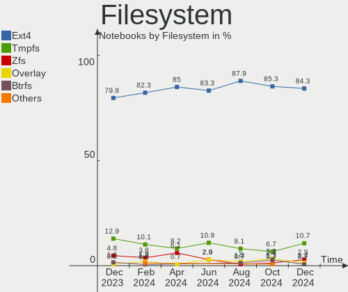
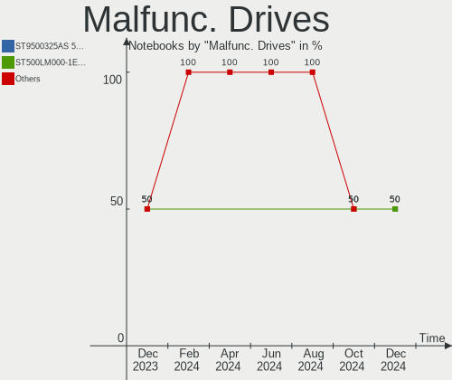
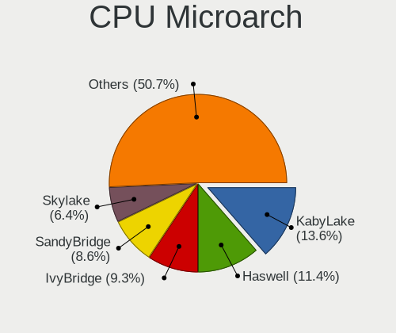
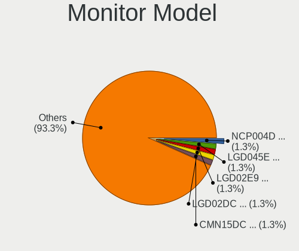

Zorin - Hardware Trends (Notebooks)
-----------------------------------

A project to identify most popular hardware characteristics and track their change
over time based on data collected by Linux users at https://Linux-Hardware.org.

Anyone can contribute to this report by the [hw-probe](https://github.com/linuxhw/hw-probe) tool:

    sudo -E hw-probe -all -upload

This report is for one last month. Overall report since the beginning of time: [TestDays](https://github.com/linuxhw/TestDays)

Period: Oct, 2023.

Contents
--------

* [ System ](#system)
  - [ OS                       ](#os)
  - [ OS Family                ](#os-family)
  - [ Kernel                   ](#kernel)
  - [ Kernel Family            ](#kernel-family)
  - [ Kernel Major Ver.        ](#kernel-major-ver)
  - [ Arch                     ](#arch)
  - [ DE                       ](#de)
  - [ Display Server           ](#display-server)
  - [ Display Manager          ](#display-manager)
  - [ OS Lang                  ](#os-lang)
  - [ Boot Mode                ](#boot-mode)
  - [ Filesystem               ](#filesystem)
  - [ Part. scheme             ](#part-scheme)
  - [ Dual Boot with Linux/BSD ](#dual-boot-with-linuxbsd)
  - [ Dual Boot (Win)          ](#dual-boot-win)

* [ Board ](#board)
  - [ Vendor                   ](#vendor)
  - [ Model                    ](#model)
  - [ Model Family             ](#model-family)
  - [ MFG Year                 ](#mfg-year)
  - [ Form Factor              ](#form-factor)
  - [ Secure Boot              ](#secure-boot)
  - [ Coreboot                 ](#coreboot)
  - [ RAM Size                 ](#ram-size)
  - [ RAM Used                 ](#ram-used)
  - [ Total Drives             ](#total-drives)
  - [ Has CD-ROM               ](#has-cd-rom)
  - [ Has Ethernet             ](#has-ethernet)
  - [ Has WiFi                 ](#has-wifi)
  - [ Has Bluetooth            ](#has-bluetooth)

* [ Location ](#location)
  - [ Country                  ](#country)
  - [ City                     ](#city)

* [ Drives ](#drives)
  - [ Drive Vendor             ](#drive-vendor)
  - [ Drive Model              ](#drive-model)
  - [ HDD Vendor               ](#hdd-vendor)
  - [ SSD Vendor               ](#ssd-vendor)
  - [ Drive Kind               ](#drive-kind)
  - [ Drive Connector          ](#drive-connector)
  - [ Drive Size               ](#drive-size)
  - [ Space Total              ](#space-total)
  - [ Space Used               ](#space-used)
  - [ Malfunc. Drives          ](#malfunc-drives)
  - [ Malfunc. Drive Vendor    ](#malfunc-drive-vendor)
  - [ Malfunc. HDD Vendor      ](#malfunc-hdd-vendor)
  - [ Malfunc. Drive Kind      ](#malfunc-drive-kind)
  - [ Failed Drives            ](#failed-drives)
  - [ Failed Drive Vendor      ](#failed-drive-vendor)
  - [ Drive Status             ](#drive-status)

* [ Storage controller ](#storage-controller)
  - [ Storage Vendor           ](#storage-vendor)
  - [ Storage Model            ](#storage-model)
  - [ Storage Kind             ](#storage-kind)

* [ Processor ](#processor)
  - [ CPU Vendor               ](#cpu-vendor)
  - [ CPU Model                ](#cpu-model)
  - [ CPU Model Family         ](#cpu-model-family)
  - [ CPU Cores                ](#cpu-cores)
  - [ CPU Sockets              ](#cpu-sockets)
  - [ CPU Threads              ](#cpu-threads)
  - [ CPU Op-Modes             ](#cpu-op-modes)
  - [ CPU Microcode            ](#cpu-microcode)
  - [ CPU Microarch            ](#cpu-microarch)

* [ Graphics ](#graphics)
  - [ GPU Vendor               ](#gpu-vendor)
  - [ GPU Model                ](#gpu-model)
  - [ GPU Combo                ](#gpu-combo)
  - [ GPU Driver               ](#gpu-driver)
  - [ GPU Memory               ](#gpu-memory)

* [ Monitor ](#monitor)
  - [ Monitor Vendor           ](#monitor-vendor)
  - [ Monitor Model            ](#monitor-model)
  - [ Monitor Resolution       ](#monitor-resolution)
  - [ Monitor Diagonal         ](#monitor-diagonal)
  - [ Monitor Width            ](#monitor-width)
  - [ Aspect Ratio             ](#aspect-ratio)
  - [ Monitor Area             ](#monitor-area)
  - [ Pixel Density            ](#pixel-density)
  - [ Multiple Monitors        ](#multiple-monitors)

* [ Network ](#network)
  - [ Net Controller Vendor    ](#net-controller-vendor)
  - [ Net Controller Model     ](#net-controller-model)
  - [ Wireless Vendor          ](#wireless-vendor)
  - [ Wireless Model           ](#wireless-model)
  - [ Ethernet Vendor          ](#ethernet-vendor)
  - [ Ethernet Model           ](#ethernet-model)
  - [ Net Controller Kind      ](#net-controller-kind)
  - [ Used Controller          ](#used-controller)
  - [ NICs                     ](#nics)
  - [ IPv6                     ](#ipv6)

* [ Bluetooth ](#bluetooth)
  - [ Bluetooth Vendor         ](#bluetooth-vendor)
  - [ Bluetooth Model          ](#bluetooth-model)

* [ Sound ](#sound)
  - [ Sound Vendor             ](#sound-vendor)
  - [ Sound Model              ](#sound-model)

* [ Memory ](#memory)
  - [ Memory Vendor            ](#memory-vendor)
  - [ Memory Model             ](#memory-model)
  - [ Memory Kind              ](#memory-kind)
  - [ Memory Form Factor       ](#memory-form-factor)
  - [ Memory Size              ](#memory-size)
  - [ Memory Speed             ](#memory-speed)

* [ Printers & scanners ](#printers--scanners)
  - [ Printer Vendor           ](#printer-vendor)
  - [ Printer Model            ](#printer-model)
  - [ Scanner Vendor           ](#scanner-vendor)
  - [ Scanner Model            ](#scanner-model)

* [ Camera ](#camera)
  - [ Camera Vendor            ](#camera-vendor)
  - [ Camera Model             ](#camera-model)

* [ Security ](#security)
  - [ Fingerprint Vendor       ](#fingerprint-vendor)
  - [ Fingerprint Model        ](#fingerprint-model)
  - [ Chipcard Vendor          ](#chipcard-vendor)
  - [ Chipcard Model           ](#chipcard-model)

* [ Unsupported ](#unsupported)
  - [ Unsupported Devices      ](#unsupported-devices)
  - [ Unsupported Device Types ](#unsupported-device-types)

System
------

OS
--

Installed operating systems

| Name     | Notebooks | Percent |
|----------|-----------|---------|
| Zorin 16 | 80        | 100%    |

OS Family
---------

OS without a version

| Name  | Notebooks | Percent |
|-------|-----------|---------|
| Zorin | 80        | 100%    |

Kernel
------

Version of the Linux kernel

| Version               | Notebooks | Percent |
|-----------------------|-----------|---------|
| 5.15.0-86-generic     | 40        | 50%     |
| 5.15.0-87-generic     | 17        | 21.25%  |
| 5.15.0-84-generic     | 13        | 16.25%  |
| 5.15.0-78-generic     | 4         | 5%      |
| 5.15.0-75-generic     | 2         | 2.5%    |
| 6.1.22-060122-generic | 1         | 1.25%   |
| 5.19.0-051900-generic | 1         | 1.25%   |
| 5.15.0-83-generic     | 1         | 1.25%   |
| 5.15.0-71-generic     | 1         | 1.25%   |

Kernel Family
-------------

Linux kernel without a distro release

| Version | Notebooks | Percent |
|---------|-----------|---------|
| 5.15.0  | 78        | 97.5%   |
| 6.1.22  | 1         | 1.25%   |
| 5.19.0  | 1         | 1.25%   |

Kernel Major Ver.
-----------------

Linux kernel major version

| Version | Notebooks | Percent |
|---------|-----------|---------|
| 5.15    | 78        | 97.5%   |
| 6.1     | 1         | 1.25%   |
| 5.19    | 1         | 1.25%   |

Arch
----

OS architecture (x86_64, i586, etc.)

| Name   | Notebooks | Percent |
|--------|-----------|---------|
| x86_64 | 80        | 100%    |

DE
--

Desktop Environment

| Name  | Notebooks | Percent |
|-------|-----------|---------|
| GNOME | 61        | 76.25%  |
| XFCE  | 18        | 22.5%   |
| LXQt  | 1         | 1.25%   |

Display Server
--------------

X11 or Wayland

| Name    | Notebooks | Percent |
|---------|-----------|---------|
| X11     | 77        | 96.25%  |
| Wayland | 3         | 3.75%   |

Display Manager
---------------

SDDM, LightDM, etc.

| Name    | Notebooks | Percent |
|---------|-----------|---------|
| Unknown | 55        | 68.75%  |
| GDM     | 13        | 16.25%  |
| GDM3    | 8         | 10%     |
| LightDM | 3         | 3.75%   |
| SDDM    | 1         | 1.25%   |

OS Lang
-------

Language

| Lang  | Notebooks | Percent |
|-------|-----------|---------|
| en_US | 29        | 36.25%  |
| de_DE | 12        | 15%     |
| fr_FR | 5         | 6.25%   |
| it_IT | 4         | 5%      |
| en_IN | 4         | 5%      |
| en_GB | 4         | 5%      |
| pl_PL | 3         | 3.75%   |
| sv_SE | 2         | 2.5%    |
| pt_BR | 2         | 2.5%    |
| nl_NL | 2         | 2.5%    |
| es_ES | 2         | 2.5%    |
| sr_RS | 1         | 1.25%   |
| ru_RU | 1         | 1.25%   |
| pt_PT | 1         | 1.25%   |
| fr_CH | 1         | 1.25%   |
| es_PE | 1         | 1.25%   |
| en_IE | 1         | 1.25%   |
| en_CA | 1         | 1.25%   |
| en_AU | 1         | 1.25%   |
| de_AT | 1         | 1.25%   |
| cs_CZ | 1         | 1.25%   |
| ca_ES | 1         | 1.25%   |

Boot Mode
---------

EFI or BIOS

| Mode | Notebooks | Percent |
|------|-----------|---------|
| EFI  | 54        | 67.5%   |
| BIOS | 26        | 32.5%   |

Filesystem
----------

Type of filesystem

| Type    | Notebooks | Percent |
|---------|-----------|---------|
| Ext4    | 68        | 85%     |
| Tmpfs   | 8         | 10%     |
| Overlay | 2         | 2.5%    |
| Zfs     | 1         | 1.25%   |
| Ext2    | 1         | 1.25%   |

Part. scheme
------------

Scheme of partitioning

| Type    | Notebooks | Percent |
|---------|-----------|---------|
| Unknown | 55        | 68.75%  |
| GPT     | 20        | 25%     |
| MBR     | 5         | 6.25%   |

Dual Boot with Linux/BSD
------------------------

Hosting more than one Linux/BSD

| Dual boot | Notebooks | Percent |
|-----------|-----------|---------|
| No        | 78        | 97.5%   |
| Yes       | 2         | 2.5%    |

Dual Boot (Win)
---------------

Hosting Linux and Windows

| Dual boot | Notebooks | Percent |
|-----------|-----------|---------|
| No        | 71        | 88.75%  |
| Yes       | 9         | 11.25%  |

Board
-----

Vendor
------

Motherboard manufacturer

| Name                    | Notebooks | Percent |
|-------------------------|-----------|---------|
| Hewlett-Packard         | 19        | 23.75%  |
| Lenovo                  | 15        | 18.75%  |
| Acer                    | 10        | 12.5%   |
| Dell                    | 9         | 11.25%  |
| ASUSTek Computer        | 6         | 7.5%    |
| Apple                   | 5         | 6.25%   |
| Thomson                 | 2         | 2.5%    |
| Sony                    | 2         | 2.5%    |
| MSI                     | 2         | 2.5%    |
| UMAX                    | 1         | 1.25%   |
| TrekStor                | 1         | 1.25%   |
| Toshiba                 | 1         | 1.25%   |
| Schenker                | 1         | 1.25%   |
| Notebook                | 1         | 1.25%   |
| Multilaser              | 1         | 1.25%   |
| Medion                  | 1         | 1.25%   |
| HUAWEI                  | 1         | 1.25%   |
| HCL Infosystems Limited | 1         | 1.25%   |
| Alienware               | 1         | 1.25%   |

Model
-----

Motherboard model

| Name                                     | Notebooks | Percent |
|------------------------------------------|-----------|---------|
| HP Pavilion dv6                          | 2         | 2.5%    |
| UMAX N14R                                | 1         | 1.25%   |
| TrekStor Surfbook W2                     | 1         | 1.25%   |
| Toshiba Satellite Pro R50-B              | 1         | 1.25%   |
| Thomson WWNEO14C-4BK32F                  | 1         | 1.25%   |
| Thomson GEN360-4C128BK                   | 1         | 1.25%   |
| Sony VGN-FZ31Z                           | 1         | 1.25%   |
| Sony SVS15116GAB                         | 1         | 1.25%   |
| Schenker XMG CORE (REN/M20)              | 1         | 1.25%   |
| Notebook PA70Hx                          | 1         | 1.25%   |
| Multilaser MLSH1H LINUX                  | 1         | 1.25%   |
| MSI Delta 15 A5EFK                       | 1         | 1.25%   |
| MSI Bravo 15 A4DDR                       | 1         | 1.25%   |
| Medion E4251 MD61435                     | 1         | 1.25%   |
| Lenovo Yoga Slim 7 Pro 14ACH5 82MS       | 1         | 1.25%   |
| Lenovo V110-15IAP 80TG                   | 1         | 1.25%   |
| Lenovo ThinkPad X270 20HMS1T600          | 1         | 1.25%   |
| Lenovo ThinkPad T460s 20FAS08W00         | 1         | 1.25%   |
| Lenovo ThinkPad T440 20B7S1D200          | 1         | 1.25%   |
| Lenovo ThinkPad T420 4236KU9             | 1         | 1.25%   |
| Lenovo ThinkPad T14 Gen 4 21HDCTO1WW     | 1         | 1.25%   |
| Lenovo ThinkPad P17 Gen 2i 20YU0028FR    | 1         | 1.25%   |
| Lenovo ThinkPad E420 1141BTU             | 1         | 1.25%   |
| Lenovo ThinkPad E14 Gen 4 21E3005DGE     | 1         | 1.25%   |
| Lenovo ThinkPad A485 20MVS0X62X          | 1         | 1.25%   |
| Lenovo ThinkPad 13 2nd Gen 20J2A0C1JP    | 1         | 1.25%   |
| Lenovo IdeaPad Y580 20132                | 1         | 1.25%   |
| Lenovo IdeaPad 3 15ITL6 82H8             | 1         | 1.25%   |
| Lenovo IdeaPad 1 15AMN7 82VG             | 1         | 1.25%   |
| HUAWEI BOHK-WAX9X                        | 1         | 1.25%   |
| HP ProBook 455 15.6 inch G10 Notebook PC | 1         | 1.25%   |
| HP Pavilion g7                           | 1         | 1.25%   |
| HP Pavilion dv4                          | 1         | 1.25%   |
| HP Pavilion 15                           | 1         | 1.25%   |
| HP OMEN by Gaming Laptop 16-wf0xxx       | 1         | 1.25%   |
| HP Notebook                              | 1         | 1.25%   |
| HP Laptop 14s-dq2xxx                     | 1         | 1.25%   |
| HP Laptop 14-cf2xxx                      | 1         | 1.25%   |
| HP G61                                   | 1         | 1.25%   |
| HP ENVY 17                               | 1         | 1.25%   |

Model Family
------------

Motherboard model prefix

| Name                        | Notebooks | Percent |
|-----------------------------|-----------|---------|
| Lenovo ThinkPad             | 10        | 12.5%   |
| Acer Aspire                 | 9         | 11.25%  |
| HP Pavilion                 | 5         | 6.25%   |
| Lenovo IdeaPad              | 3         | 3.75%   |
| HP Laptop                   | 2         | 2.5%    |
| HP EliteBook                | 2         | 2.5%    |
| HP 250                      | 2         | 2.5%    |
| Dell Vostro                 | 2         | 2.5%    |
| Dell Precision              | 2         | 2.5%    |
| Dell Latitude               | 2         | 2.5%    |
| UMAX N14R                   | 1         | 1.25%   |
| TrekStor Surfbook           | 1         | 1.25%   |
| Toshiba Satellite           | 1         | 1.25%   |
| Thomson WWNEO14C-4BK32F     | 1         | 1.25%   |
| Thomson GEN360-4C128BK      | 1         | 1.25%   |
| Sony VGN-FZ31Z              | 1         | 1.25%   |
| Sony SVS15116GAB            | 1         | 1.25%   |
| Schenker XMG                | 1         | 1.25%   |
| Notebook PA70Hx             | 1         | 1.25%   |
| Multilaser MLSH1H           | 1         | 1.25%   |
| MSI Delta                   | 1         | 1.25%   |
| MSI Bravo                   | 1         | 1.25%   |
| Medion E4251                | 1         | 1.25%   |
| Lenovo Yoga                 | 1         | 1.25%   |
| Lenovo V110-15IAP           | 1         | 1.25%   |
| HUAWEI BOHK-WAX9X           | 1         | 1.25%   |
| HP ProBook                  | 1         | 1.25%   |
| HP OMEN                     | 1         | 1.25%   |
| HP Notebook                 | 1         | 1.25%   |
| HP G61                      | 1         | 1.25%   |
| HP ENVY                     | 1         | 1.25%   |
| HP Compaq                   | 1         | 1.25%   |
| HP 470                      | 1         | 1.25%   |
| HP 15                       | 1         | 1.25%   |
| HCL Infosystems Limited HCL | 1         | 1.25%   |
| Dell XPS                    | 1         | 1.25%   |
| Dell Inspiron               | 1         | 1.25%   |
| Dell G3                     | 1         | 1.25%   |
| ASUS ZenBook                | 1         | 1.25%   |
| ASUS X751SA                 | 1         | 1.25%   |

MFG Year
--------

Motherboard manufacture year

| Year | Notebooks | Percent |
|------|-----------|---------|
| 2018 | 11        | 13.75%  |
| 2021 | 8         | 10%     |
| 2023 | 5         | 6.25%   |
| 2022 | 5         | 6.25%   |
| 2014 | 5         | 6.25%   |
| 2013 | 5         | 6.25%   |
| 2012 | 5         | 6.25%   |
| 2011 | 5         | 6.25%   |
| 2008 | 5         | 6.25%   |
| 2020 | 4         | 5%      |
| 2016 | 4         | 5%      |
| 2015 | 4         | 5%      |
| 2019 | 3         | 3.75%   |
| 2017 | 3         | 3.75%   |
| 2010 | 3         | 3.75%   |
| 2009 | 3         | 3.75%   |
| 2007 | 2         | 2.5%    |

Form Factor
-----------

Physical design of the computer

| Name     | Notebooks | Percent |
|----------|-----------|---------|
| Notebook | 80        | 100%    |

Secure Boot
-----------

Enabled or disabled

| State    | Notebooks | Percent |
|----------|-----------|---------|
| Disabled | 67        | 83.75%  |
| Enabled  | 13        | 16.25%  |

Coreboot
--------

Have coreboot on board

| Used | Notebooks | Percent |
|------|-----------|---------|
| No   | 80        | 100%    |

RAM Size
--------

Total RAM memory

| Size in GB | Notebooks | Percent |
|------------|-----------|---------|
| 4.01-8.0   | 26        | 32.5%   |
| 3.01-4.0   | 20        | 25%     |
| 8.01-16.0  | 11        | 13.75%  |
| 16.01-24.0 | 10        | 12.5%   |
| 32.01-64.0 | 8         | 10%     |
| 1.01-2.0   | 3         | 3.75%   |
| 24.01-32.0 | 1         | 1.25%   |
| 2.01-3.0   | 1         | 1.25%   |

RAM Used
--------

Used RAM memory

| Used GB   | Notebooks | Percent |
|-----------|-----------|---------|
| 2.01-3.0  | 28        | 35%     |
| 1.01-2.0  | 21        | 26.25%  |
| 3.01-4.0  | 13        | 16.25%  |
| 4.01-8.0  | 11        | 13.75%  |
| 8.01-16.0 | 5         | 6.25%   |
| 0.51-1.0  | 2         | 2.5%    |

Total Drives
------------

Number of drives on board

| Drives | Notebooks | Percent |
|--------|-----------|---------|
| 1      | 64        | 80%     |
| 2      | 14        | 17.5%   |
| 3      | 1         | 1.25%   |
| 0      | 1         | 1.25%   |

Has CD-ROM
----------

Has CD-ROM on board

| Presented | Notebooks | Percent |
|-----------|-----------|---------|
| No        | 50        | 62.5%   |
| Yes       | 30        | 37.5%   |

Has Ethernet
------------

Has Ethernet on board

| Presented | Notebooks | Percent |
|-----------|-----------|---------|
| Yes       | 64        | 80%     |
| No        | 16        | 20%     |

Has WiFi
--------

Has WiFi module

| Presented | Notebooks | Percent |
|-----------|-----------|---------|
| Yes       | 76        | 95%     |
| No        | 4         | 5%      |

Has Bluetooth
-------------

Has Bluetooth module

| Presented | Notebooks | Percent |
|-----------|-----------|---------|
| Yes       | 61        | 76.25%  |
| No        | 19        | 23.75%  |

Location
--------

Country
-------

Geographic location (country)

| Country     | Notebooks | Percent |
|-------------|-----------|---------|
| Germany     | 16        | 20%     |
| USA         | 11        | 13.75%  |
| Netherlands | 5         | 6.25%   |
| UK          | 4         | 5%      |
| India       | 4         | 5%      |
| Switzerland | 3         | 3.75%   |
| Italy       | 3         | 3.75%   |
| Austria     | 3         | 3.75%   |
| Sweden      | 2         | 2.5%    |
| Spain       | 2         | 2.5%    |
| Serbia      | 2         | 2.5%    |
| Portugal    | 2         | 2.5%    |
| Poland      | 2         | 2.5%    |
| Mexico      | 2         | 2.5%    |
| Brazil      | 2         | 2.5%    |
| Algeria     | 2         | 2.5%    |
| Russia      | 1         | 1.25%   |
| Romania     | 1         | 1.25%   |
| Norway      | 1         | 1.25%   |
| Jordan      | 1         | 1.25%   |
| Jamaica     | 1         | 1.25%   |
| Ireland     | 1         | 1.25%   |
| Guadeloupe  | 1         | 1.25%   |
| Greece      | 1         | 1.25%   |
| France      | 1         | 1.25%   |
| Egypt       | 1         | 1.25%   |
| Ecuador     | 1         | 1.25%   |
| Czechia     | 1         | 1.25%   |
| Canada      | 1         | 1.25%   |
| Barbados    | 1         | 1.25%   |
| Australia   | 1         | 1.25%   |

City
----

Geographic location (city)

| City              | Notebooks | Percent |
|-------------------|-----------|---------|
| Vienna            | 2         | 2.5%    |
| Milan             | 2         | 2.5%    |
| Hamburg           | 2         | 2.5%    |
| Berlin            | 2         | 2.5%    |
| Amsterdam         | 2         | 2.5%    |
| Wernigerode       | 1         | 1.25%   |
| Wendeburg         | 1         | 1.25%   |
| Warsaw            | 1         | 1.25%   |
| Wageningen        | 1         | 1.25%   |
| Verona            | 1         | 1.25%   |
| Vernal            | 1         | 1.25%   |
| Ventura           | 1         | 1.25%   |
| Varanasi          | 1         | 1.25%   |
| Valladolid        | 1         | 1.25%   |
| Trier             | 1         | 1.25%   |
| Traun             | 1         | 1.25%   |
| Tijuana           | 1         | 1.25%   |
| Stavanger         | 1         | 1.25%   |
| Seattle           | 1         | 1.25%   |
| Salvador          | 1         | 1.25%   |
| Rodgau            | 1         | 1.25%   |
| Porto Alegre      | 1         | 1.25%   |
| Porto             | 1         | 1.25%   |
| Peristeri         | 1         | 1.25%   |
| Palma             | 1         | 1.25%   |
| Ozarow Mazowiecki | 1         | 1.25%   |
| Niederwangen      | 1         | 1.25%   |
| Newham            | 1         | 1.25%   |
| New Malden        | 1         | 1.25%   |
| Nashville         | 1         | 1.25%   |
| Naaldwijk         | 1         | 1.25%   |
| Munich            | 1         | 1.25%   |
| Methuen           | 1         | 1.25%   |
| Melbourne         | 1         | 1.25%   |
| Mavelikkara       | 1         | 1.25%   |
| Mannheim          | 1         | 1.25%   |
| Mangalia          | 1         | 1.25%   |
| Macclenny         | 1         | 1.25%   |
| Leeds             | 1         | 1.25%   |
| Krasnogorsk       | 1         | 1.25%   |

Drives
------

Drive Vendor
------------

Hard drive vendors

| Vendor              | Notebooks | Drives | Percent |
|---------------------|-----------|--------|---------|
| SanDisk             | 11        | 11     | 12.09%  |
| Samsung Electronics | 11        | 12     | 12.09%  |
| Toshiba             | 8         | 8      | 8.79%   |
| WDC                 | 7         | 7      | 7.69%   |
| Seagate             | 7         | 7      | 7.69%   |
| Kingston            | 7         | 7      | 7.69%   |
| Micron Technology   | 6         | 6      | 6.59%   |
| Unknown             | 5         | 5      | 5.49%   |
| SK hynix            | 5         | 5      | 5.49%   |
| HGST                | 4         | 4      | 4.4%    |
| Intel               | 3         | 3      | 3.3%    |
| KIOXIA              | 2         | 2      | 2.2%    |
| Hitachi             | 2         | 2      | 2.2%    |
| Crucial             | 2         | 2      | 2.2%    |
| China               | 2         | 2      | 2.2%    |
| Apple               | 2         | 2      | 2.2%    |
| Unknown             | 2         | 2      | 2.2%    |
| Team                | 1         | 1      | 1.1%    |
| SPCC                | 1         | 1      | 1.1%    |
| Phison              | 1         | 1      | 1.1%    |
| LITEON              | 1         | 1      | 1.1%    |
| Hewlett-Packard     | 1         | 1      | 1.1%    |

Drive Model
-----------

Hard drive models

| Model                                           | Notebooks | Percent |
|-------------------------------------------------|-----------|---------|
| Unknown MMC Card  64GB                          | 3         | 3.26%   |
| WDC WD10JPVX-22JC3T0 1TB                        | 2         | 2.17%   |
| Toshiba XG6 NVMe SSD Controller 256GB           | 2         | 2.17%   |
| Toshiba BG3 NVMe SSD Controller 128GB           | 2         | 2.17%   |
| SK hynix BC511 512GB                            | 2         | 2.17%   |
| Seagate ST980811AS 80GB                         | 2         | 2.17%   |
| HGST HTS545050A7E680 500GB                      | 2         | 2.17%   |
| HGST HTS545050A7E380 500GB                      | 2         | 2.17%   |
| Unknown                                         | 2         | 2.17%   |
| WDC WDBNCE5000PNC 500GB SSD                     | 1         | 1.09%   |
| WDC WD5000LPVX-22V0TT0 500GB                    | 1         | 1.09%   |
| WDC WD5000LPCX-60VHAT0 500GB                    | 1         | 1.09%   |
| WDC WD3200BEVT-60A23T0 320GB                    | 1         | 1.09%   |
| WDC PC SN540 SDDPNPF-1T00-1032 1TB              | 1         | 1.09%   |
| Unknown SU16G  16GB                             | 1         | 1.09%   |
| Unknown MMC Card  32GB                          | 1         | 1.09%   |
| Toshiba MQ01ABF050 500GB                        | 1         | 1.09%   |
| Toshiba MQ01ABD100H 1TB                         | 1         | 1.09%   |
| Toshiba MQ01ABD100 1TB                          | 1         | 1.09%   |
| Toshiba KBG30ZMT128G 128GB                      | 1         | 1.09%   |
| Team T253256GB SSD                              | 1         | 1.09%   |
| SPCC Solid State Disk 512GB                     | 1         | 1.09%   |
| SK hynix SC311 SATA 256GB SSD                   | 1         | 1.09%   |
| SK hynix HBG4e  32GB                            | 1         | 1.09%   |
| SK hynix BC501 NVMe Solid State Drive 512GB     | 1         | 1.09%   |
| Seagate ST9500325AS 500GB                       | 1         | 1.09%   |
| Seagate ST500LT012-1DG142 500GB                 | 1         | 1.09%   |
| Seagate ST1000LM048-2E7172 1TB                  | 1         | 1.09%   |
| Seagate ST1000LM035-1RK172 1TB                  | 1         | 1.09%   |
| Seagate Basic 5TB                               | 1         | 1.09%   |
| Sandisk WD_BLACK SN750 SE NVMe 500GB            | 1         | 1.09%   |
| Sandisk WD Blue SN570 1TB                       | 1         | 1.09%   |
| Sandisk WD Blue SN500 / PC SN520 NVMe SSD 512GB | 1         | 1.09%   |
| Sandisk WD Black SN850 1TB                      | 1         | 1.09%   |
| SanDisk SSD PLUS 480GB                          | 1         | 1.09%   |
| SanDisk SDSSDHII480G 480GB                      | 1         | 1.09%   |
| SanDisk SD8SN8U-256G-1006 256GB SSD             | 1         | 1.09%   |
| SanDisk SD8SN8U-128G-1006 128GB SSD             | 1         | 1.09%   |
| SanDisk SD7SN6S-256G-1006 256GB SSD             | 1         | 1.09%   |
| SanDisk SD6SF1M128G 128GB SSD                   | 1         | 1.09%   |

HDD Vendor
----------

Hard disk drive vendors

| Vendor  | Notebooks | Drives | Percent |
|---------|-----------|--------|---------|
| Seagate | 6         | 6      | 30%     |
| WDC     | 5         | 5      | 25%     |
| HGST    | 4         | 4      | 20%     |
| Toshiba | 3         | 3      | 15%     |
| Hitachi | 2         | 2      | 10%     |

SSD Vendor
----------

Solid state drive vendors

| Vendor              | Notebooks | Drives | Percent |
|---------------------|-----------|--------|---------|
| SanDisk             | 6         | 6      | 18.18%  |
| Kingston            | 6         | 6      | 18.18%  |
| Samsung Electronics | 5         | 5      | 15.15%  |
| Micron Technology   | 2         | 2      | 6.06%   |
| Crucial             | 2         | 2      | 6.06%   |
| China               | 2         | 2      | 6.06%   |
| Apple               | 2         | 2      | 6.06%   |
| WDC                 | 1         | 1      | 3.03%   |
| Team                | 1         | 1      | 3.03%   |
| SPCC                | 1         | 1      | 3.03%   |
| SK hynix            | 1         | 1      | 3.03%   |
| Phison              | 1         | 1      | 3.03%   |
| LITEON              | 1         | 1      | 3.03%   |
| Intel               | 1         | 1      | 3.03%   |
| Hewlett-Packard     | 1         | 1      | 3.03%   |

Drive Kind
----------

HDD or SSD

| Kind    | Notebooks | Drives | Percent |
|---------|-----------|--------|---------|
| SSD     | 32        | 33     | 36.36%  |
| NVMe    | 27        | 30     | 30.68%  |
| HDD     | 20        | 20     | 22.73%  |
| MMC     | 8         | 8      | 9.09%   |
| Unknown | 1         | 1      | 1.14%   |

Drive Connector
---------------

SATA, SAS, NVMe, etc.

| Type | Notebooks | Drives | Percent |
|------|-----------|--------|---------|
| SATA | 48        | 53     | 57.14%  |
| NVMe | 27        | 30     | 32.14%  |
| MMC  | 8         | 8      | 9.52%   |
| SAS  | 1         | 1      | 1.19%   |

Drive Size
----------

Size of hard drive

| Size in TB | Notebooks | Drives | Percent |
|------------|-----------|--------|---------|
| 0.01-0.5   | 42        | 45     | 84%     |
| 0.51-1.0   | 8         | 8      | 16%     |

Space Total
-----------

Amount of disk space available on the file system

| Size in GB     | Notebooks | Percent |
|----------------|-----------|---------|
| 101-250        | 29        | 36.25%  |
| 251-500        | 23        | 28.75%  |
| 51-100         | 10        | 12.5%   |
| 501-1000       | 8         | 10%     |
| 21-50          | 4         | 5%      |
| 1001-2000      | 2         | 2.5%    |
| 1-20           | 2         | 2.5%    |
| More than 3000 | 1         | 1.25%   |
| Unknown        | 1         | 1.25%   |

Space Used
----------

Amount of used disk space

| Used GB   | Notebooks | Percent |
|-----------|-----------|---------|
| 21-50     | 32        | 40%     |
| 1-20      | 22        | 27.5%   |
| 51-100    | 15        | 18.75%  |
| 101-250   | 6         | 7.5%    |
| 251-500   | 3         | 3.75%   |
| 1001-2000 | 1         | 1.25%   |
| Unknown   | 1         | 1.25%   |

Malfunc. Drives
---------------

Drive models with a malfunction

| Model                          | Notebooks | Drives | Percent |
|--------------------------------|-----------|--------|---------|
| Seagate ST1000LM048-2E7172 1TB | 1         | 1      | 100%    |

Malfunc. Drive Vendor
---------------------

Vendors of faulty drives

| Vendor  | Notebooks | Drives | Percent |
|---------|-----------|--------|---------|
| Seagate | 1         | 1      | 100%    |

Malfunc. HDD Vendor
-------------------

Vendors of faulty HDD drives

| Vendor  | Notebooks | Drives | Percent |
|---------|-----------|--------|---------|
| Seagate | 1         | 1      | 100%    |

Malfunc. Drive Kind
-------------------

Kinds of faulty drives

| Kind | Notebooks | Drives | Percent |
|------|-----------|--------|---------|
| HDD  | 1         | 1      | 100%    |

Failed Drives
-------------

Failed drive models

Zero info for selected period =(

Failed Drive Vendor
-------------------

Failed drive vendors

Zero info for selected period =(

Drive Status
------------

Number of failed and malfunc. drives

| Status   | Notebooks | Drives | Percent |
|----------|-----------|--------|---------|
| Detected | 67        | 73     | 80.72%  |
| Works    | 15        | 18     | 18.07%  |
| Malfunc  | 1         | 1      | 1.2%    |

Storage controller
------------------

Storage Vendor
--------------

Storage controller vendors

| Vendor                       | Notebooks | Percent |
|------------------------------|-----------|---------|
| Intel                        | 57        | 61.29%  |
| Samsung Electronics          | 9         | 9.68%   |
| SanDisk                      | 6         | 6.45%   |
| AMD                          | 6         | 6.45%   |
| Toshiba America Info Systems | 5         | 5.38%   |
| Micron Technology            | 4         | 4.3%    |
| SK hynix                     | 3         | 3.23%   |
| KIOXIA                       | 2         | 2.15%   |
| Kingston Technology Company  | 1         | 1.08%   |

Storage Model
-------------

Storage controller models

| Model                                                                          | Notebooks | Percent |
|--------------------------------------------------------------------------------|-----------|---------|
| Intel Sunrise Point-LP SATA Controller [AHCI mode]                             | 8         | 7.92%   |
| AMD FCH SATA Controller [AHCI mode]                                            | 6         | 5.94%   |
| Intel 82801IBM/IEM (ICH9M/ICH9M-E) 4 port SATA Controller [AHCI mode]          | 5         | 4.95%   |
| Intel 7 Series Chipset Family 6-port SATA Controller [AHCI mode]               | 5         | 4.95%   |
| Intel Celeron/Pentium Silver Processor SATA Controller                         | 4         | 3.96%   |
| Intel Cannon Lake Mobile PCH SATA AHCI Controller                              | 4         | 3.96%   |
| Toshiba America Info Systems BG3 x2 NVMe SSD Controller (DRAM-less)            | 3         | 2.97%   |
| Intel Volume Management Device NVMe RAID Controller                            | 3         | 2.97%   |
| Intel Atom Processor E3800 Series SATA AHCI Controller                         | 3         | 2.97%   |
| Intel 82801HM/HEM (ICH8M/ICH8M-E) SATA Controller [AHCI mode]                  | 3         | 2.97%   |
| Intel 82801HM/HEM (ICH8M/ICH8M-E) IDE Controller                               | 3         | 2.97%   |
| Intel 6 Series/C200 Series Chipset Family 6 port Mobile SATA AHCI Controller   | 3         | 2.97%   |
| Intel 5 Series/3400 Series Chipset 4 port SATA AHCI Controller                 | 3         | 2.97%   |
| Toshiba America Info Systems XG6 NVMe SSD Controller                           | 2         | 1.98%   |
| SK hynix BC511 NVMe SSD                                                        | 2         | 1.98%   |
| Samsung NVMe SSD Controller SM981/PM981/PM983                                  | 2         | 1.98%   |
| Samsung NVMe SSD Controller PM9A1/PM9A3/980PRO                                 | 2         | 1.98%   |
| Intel Celeron N3350/Pentium N4200/Atom E3900 Series SATA AHCI Controller       | 2         | 1.98%   |
| Intel Alder Lake-P SATA AHCI Controller                                        | 2         | 1.98%   |
| Intel 82801 Mobile SATA Controller [RAID mode]                                 | 2         | 1.98%   |
| Intel 8 Series/C220 Series Chipset Family 6-port SATA Controller 1 [AHCI mode] | 2         | 1.98%   |
| Intel 8 Series SATA Controller 1 [AHCI mode]                                   | 2         | 1.98%   |
| SK hynix BC501 NVMe Solid State Drive                                          | 1         | 0.99%   |
| SanDisk WD PC SN810 / Black SN850 NVMe SSD                                     | 1         | 0.99%   |
| SanDisk WD PC SN540 / Green SN350 NVMe SSD 1 TB (DRAM-less)                    | 1         | 0.99%   |
| SanDisk WD Blue SN500 / PC SN520 x2 M.2 2280 NVMe SSD                          | 1         | 0.99%   |
| SanDisk WD Black SN770 / PC SN740 256GB / PC SN560 (DRAM-less) NVMe SSD        | 1         | 0.99%   |
| SanDisk Ultra 3D / WD Blue SN570 NVMe SSD (DRAM-less)                          | 1         | 0.99%   |
| SanDisk PC SN735 NVMe SSD (DRAM-less)                                          | 1         | 0.99%   |
| Samsung S4LN058A01[SSUBX] AHCI SSD Controller (Apple slot)                     | 1         | 0.99%   |
| Samsung S4LN053X01 AHCI SSD Controller(Apple slot)                             | 1         | 0.99%   |
| Samsung NVMe SSD Controller SM961/PM961/SM963                                  | 1         | 0.99%   |
| Samsung NVMe SSD Controller SM951/PM951                                        | 1         | 0.99%   |
| Samsung NVMe SSD Controller PM9B1 (DRAM-less)                                  | 1         | 0.99%   |
| Micron 3400 NVMe SSD [Hendrix]                                                 | 1         | 0.99%   |
| Micron 2400 NVMe SSD (DRAM-less)                                               | 1         | 0.99%   |
| Micron 2300 NVMe SSD [Santana]                                                 | 1         | 0.99%   |
| Micron 2210 NVMe SSD [Cobain]                                                  | 1         | 0.99%   |
| KIOXIA NVMe SSD Controller XG8                                                 | 1         | 0.99%   |
| KIOXIA NVMe SSD Controller BG5 (DRAM-less)                                     | 1         | 0.99%   |

Storage Kind
------------

Kind of storage controller (IDE, SATA, NVMe, SAS, ...)

| Kind | Notebooks | Percent |
|------|-----------|---------|
| SATA | 59        | 61.46%  |
| NVMe | 27        | 28.13%  |
| RAID | 5         | 5.21%   |
| IDE  | 5         | 5.21%   |

Processor
---------

CPU Vendor
----------

Processor vendors

| Vendor | Notebooks | Percent |
|--------|-----------|---------|
| Intel  | 68        | 85%     |
| AMD    | 12        | 15%     |

CPU Model
---------

Processor models

| Model                                       | Notebooks | Percent |
|---------------------------------------------|-----------|---------|
| Intel Core i7-8750H CPU @ 2.20GHz           | 3         | 3.75%   |
| Intel Core i5-6300U CPU @ 2.40GHz           | 2         | 2.5%    |
| Intel Core i3 CPU M 370 @ 2.40GHz           | 2         | 2.5%    |
| Intel Core i3 CPU M 330 @ 2.13GHz           | 2         | 2.5%    |
| Intel Core 2 Duo CPU T8300 @ 2.40GHz        | 2         | 2.5%    |
| Intel Celeron N4020 CPU @ 1.10GHz           | 2         | 2.5%    |
| Intel Celeron CPU N3350 @ 1.10GHz           | 2         | 2.5%    |
| Intel 11th Gen Core i3-1115G4 @ 3.00GHz     | 2         | 2.5%    |
| AMD Ryzen 7 4800H with Radeon Graphics      | 2         | 2.5%    |
| Intel Pentium Silver N5030 CPU @ 1.10GHz    | 1         | 1.25%   |
| Intel Pentium Dual-Core CPU T4300 @ 2.10GHz | 1         | 1.25%   |
| Intel Pentium Dual CPU T3200 @ 2.00GHz      | 1         | 1.25%   |
| Intel Pentium CPU N3710 @ 1.60GHz           | 1         | 1.25%   |
| Intel Pentium CPU N3540 @ 2.16GHz           | 1         | 1.25%   |
| Intel Core i7-8850H CPU @ 2.60GHz           | 1         | 1.25%   |
| Intel Core i7-7700HQ CPU @ 2.80GHz          | 1         | 1.25%   |
| Intel Core i7-7500U CPU @ 2.70GHz           | 1         | 1.25%   |
| Intel Core i7-6600U CPU @ 2.60GHz           | 1         | 1.25%   |
| Intel Core i7-4710MQ CPU @ 2.50GHz          | 1         | 1.25%   |
| Intel Core i7-4702MQ CPU @ 2.20GHz          | 1         | 1.25%   |
| Intel Core i7-4600U CPU @ 2.10GHz           | 1         | 1.25%   |
| Intel Core i7-4500U CPU @ 1.80GHz           | 1         | 1.25%   |
| Intel Core i7-3630QM CPU @ 2.40GHz          | 1         | 1.25%   |
| Intel Core i7-3612QM CPU @ 2.10GHz          | 1         | 1.25%   |
| Intel Core i7-3610QM CPU @ 2.30GHz          | 1         | 1.25%   |
| Intel Core i7-1065G7 CPU @ 1.30GHz          | 1         | 1.25%   |
| Intel Core i5-8350U CPU @ 1.70GHz           | 1         | 1.25%   |
| Intel Core i5-8250U CPU @ 1.60GHz           | 1         | 1.25%   |
| Intel Core i5-7300U CPU @ 2.60GHz           | 1         | 1.25%   |
| Intel Core i5-5257U CPU @ 2.70GHz           | 1         | 1.25%   |
| Intel Core i5-5200U CPU @ 2.20GHz           | 1         | 1.25%   |
| Intel Core i5-4278U CPU @ 2.60GHz           | 1         | 1.25%   |
| Intel Core i5-3230M CPU @ 2.60GHz           | 1         | 1.25%   |
| Intel Core i5-3210M CPU @ 2.50GHz           | 1         | 1.25%   |
| Intel Core i5-2520M CPU @ 2.50GHz           | 1         | 1.25%   |
| Intel Core i5-2467M CPU @ 1.60GHz           | 1         | 1.25%   |
| Intel Core i5-2430M CPU @ 2.40GHz           | 1         | 1.25%   |
| Intel Core i5-2410M CPU @ 2.30GHz           | 1         | 1.25%   |
| Intel Core i5-10210U CPU @ 1.60GHz          | 1         | 1.25%   |
| Intel Core i3-N305                          | 1         | 1.25%   |

CPU Model Family
----------------

Processor model prefix

| Model                   | Notebooks | Percent |
|-------------------------|-----------|---------|
| Intel Core i7           | 15        | 18.75%  |
| Intel Core i5           | 15        | 18.75%  |
| Other                   | 9         | 11.25%  |
| Intel Celeron           | 9         | 11.25%  |
| Intel Core i3           | 7         | 8.75%   |
| Intel Core 2 Duo        | 5         | 6.25%   |
| AMD Ryzen 7             | 3         | 3.75%   |
| AMD Ryzen 5             | 3         | 3.75%   |
| Intel Pentium           | 2         | 2.5%    |
| Intel Atom              | 2         | 2.5%    |
| Intel Pentium Silver    | 1         | 1.25%   |
| Intel Pentium Dual-Core | 1         | 1.25%   |
| Intel Pentium Dual      | 1         | 1.25%   |
| Intel Celeron Dual-Core | 1         | 1.25%   |
| AMD Ryzen 9             | 1         | 1.25%   |
| AMD Ryzen 7 PRO         | 1         | 1.25%   |
| AMD Ryzen 3             | 1         | 1.25%   |
| AMD E1                  | 1         | 1.25%   |
| AMD A8                  | 1         | 1.25%   |
| AMD A6                  | 1         | 1.25%   |

CPU Cores
---------

Number of processor cores

| Number | Notebooks | Percent |
|--------|-----------|---------|
| 2      | 42        | 52.5%   |
| 4      | 20        | 25%     |
| 8      | 6         | 7.5%    |
| 6      | 6         | 7.5%    |
| 10     | 3         | 3.75%   |
| 12     | 2         | 2.5%    |
| 16     | 1         | 1.25%   |

CPU Sockets
-----------

Number of sockets

| Number | Notebooks | Percent |
|--------|-----------|---------|
| 1      | 80        | 100%    |

CPU Threads
-----------

Threads per core (Hyper-Threading)

| Number | Notebooks | Percent |
|--------|-----------|---------|
| 2      | 49        | 61.25%  |
| 1      | 31        | 38.75%  |

CPU Op-Modes
------------

CPU Operation Modes (32-bit, 64-bit)

| Op mode        | Notebooks | Percent |
|----------------|-----------|---------|
| 32-bit, 64-bit | 80        | 100%    |

CPU Microcode
-------------

Microcode number

| Number     | Notebooks | Percent |
|------------|-----------|---------|
| Unknown    | 8         | 10%     |
| 0x306a9    | 5         | 6.25%   |
| 0x206a7    | 5         | 6.25%   |
| 0x706a8    | 4         | 5%      |
| 0x30678    | 4         | 5%      |
| 0x1067a    | 4         | 5%      |
| 0x906ea    | 3         | 3.75%   |
| 0x806e9    | 3         | 3.75%   |
| 0x40651    | 3         | 3.75%   |
| 0x906a4    | 2         | 2.5%    |
| 0x906a3    | 2         | 2.5%    |
| 0x806ea    | 2         | 2.5%    |
| 0x506c9    | 2         | 2.5%    |
| 0x406e3    | 2         | 2.5%    |
| 0x406c4    | 2         | 2.5%    |
| 0x306d4    | 2         | 2.5%    |
| 0x306c3    | 2         | 2.5%    |
| 0x20655    | 2         | 2.5%    |
| 0x20652    | 2         | 2.5%    |
| 0x10676    | 2         | 2.5%    |
| 0xb06e0    | 1         | 1.25%   |
| 0xb06a3    | 1         | 1.25%   |
| 0x906e9    | 1         | 1.25%   |
| 0x806ec    | 1         | 1.25%   |
| 0x806c1    | 1         | 1.25%   |
| 0x706e5    | 1         | 1.25%   |
| 0x706a1    | 1         | 1.25%   |
| 0x6fd      | 1         | 1.25%   |
| 0x6fa      | 1         | 1.25%   |
| 0x0a50000d | 1         | 1.25%   |
| 0x0a50000c | 1         | 1.25%   |
| 0x0a50000b | 1         | 1.25%   |
| 0x08a00008 | 1         | 1.25%   |
| 0x08600106 | 1         | 1.25%   |
| 0x08600103 | 1         | 1.25%   |
| 0x08600102 | 1         | 1.25%   |
| 0x08108109 | 1         | 1.25%   |
| 0x07030105 | 1         | 1.25%   |
| 0x07000110 | 1         | 1.25%   |

CPU Microarch
-------------

Microarchitecture

| Name             | Notebooks | Percent |
|------------------|-----------|---------|
| KabyLake         | 12        | 15%     |
| Silvermont       | 6         | 7.5%    |
| Penryn           | 6         | 7.5%    |
| SandyBridge      | 5         | 6.25%   |
| IvyBridge        | 5         | 6.25%   |
| Haswell          | 5         | 6.25%   |
| Goldmont plus    | 5         | 6.25%   |
| Unknown          | 5         | 6.25%   |
| Westmere         | 4         | 5%      |
| Alderlake Hybrid | 4         | 5%      |
| Zen 3            | 3         | 3.75%   |
| Zen 2            | 3         | 3.75%   |
| Skylake          | 3         | 3.75%   |
| TigerLake        | 2         | 2.5%    |
| Goldmont         | 2         | 2.5%    |
| Core             | 2         | 2.5%    |
| Broadwell        | 2         | 2.5%    |
| Zen+             | 1         | 1.25%   |
| Zen              | 1         | 1.25%   |
| Puma             | 1         | 1.25%   |
| Piledriver       | 1         | 1.25%   |
| Jaguar           | 1         | 1.25%   |
| IceLake          | 1         | 1.25%   |

Graphics
--------

GPU Vendor
----------

Vendors of graphics cards

| Vendor | Notebooks | Percent |
|--------|-----------|---------|
| Intel  | 63        | 63%     |
| Nvidia | 24        | 24%     |
| AMD    | 13        | 13%     |

GPU Model
---------

Graphics card models

| Model                                                                                    | Notebooks | Percent |
|------------------------------------------------------------------------------------------|-----------|---------|
| Intel 3rd Gen Core processor Graphics Controller                                         | 5         | 4.9%    |
| Intel 2nd Generation Core Processor Family Integrated Graphics Controller                | 5         | 4.9%    |
| Intel GeminiLake [UHD Graphics 600]                                                      | 4         | 3.92%   |
| Intel Core Processor Integrated Graphics Controller                                      | 4         | 3.92%   |
| Intel CoffeeLake-H GT2 [UHD Graphics 630]                                                | 4         | 3.92%   |
| Intel Atom Processor Z36xxx/Z37xxx Series Graphics & Display                             | 4         | 3.92%   |
| Intel Skylake GT2 [HD Graphics 520]                                                      | 3         | 2.94%   |
| Intel Mobile 4 Series Chipset Integrated Graphics Controller                             | 3         | 2.94%   |
| Intel HD Graphics 620                                                                    | 3         | 2.94%   |
| Intel Haswell-ULT Integrated Graphics Controller                                         | 3         | 2.94%   |
| AMD Renoir [Radeon RX Vega 6 (Ryzen 4000/5000 Mobile Series)]                            | 3         | 2.94%   |
| Nvidia GP106M [GeForce GTX 1060 Mobile]                                                  | 2         | 1.96%   |
| Nvidia G84M [GeForce 8600M GT]                                                           | 2         | 1.96%   |
| Intel UHD Graphics 620                                                                   | 2         | 1.96%   |
| Intel Tiger Lake-LP GT2 [UHD Graphics G4]                                                | 2         | 1.96%   |
| Intel HD Graphics 500                                                                    | 2         | 1.96%   |
| Intel Atom/Celeron/Pentium Processor x5-E8000/J3xxx/N3xxx Integrated Graphics Controller | 2         | 1.96%   |
| Intel 4th Gen Core Processor Integrated Graphics Controller                              | 2         | 1.96%   |
| AMD Cezanne [Radeon Vega Series / Radeon Vega Mobile Series]                             | 2         | 1.96%   |
| Nvidia TU117M [GeForce MX550]                                                            | 1         | 0.98%   |
| Nvidia TU117GLM [T1200 Laptop GPU]                                                       | 1         | 0.98%   |
| Nvidia TU106M [GeForce RTX 2060 Mobile]                                                  | 1         | 0.98%   |
| Nvidia GP108M [GeForce MX230]                                                            | 1         | 0.98%   |
| Nvidia GP107M [GeForce MX350]                                                            | 1         | 0.98%   |
| Nvidia GP107M [GeForce GTX 1050 Ti Mobile]                                               | 1         | 0.98%   |
| Nvidia GP107GLM [Quadro P1000 Mobile]                                                    | 1         | 0.98%   |
| Nvidia GM108M [GeForce 940MX]                                                            | 1         | 0.98%   |
| Nvidia GM108M [GeForce 840M]                                                             | 1         | 0.98%   |
| Nvidia GK208M [GeForce GT 740M]                                                          | 1         | 0.98%   |
| Nvidia GK107M [GeForce GTX 660M]                                                         | 1         | 0.98%   |
| Nvidia GK107M [GeForce GT 750M]                                                          | 1         | 0.98%   |
| Nvidia GK107M [GeForce GT 650M]                                                          | 1         | 0.98%   |
| Nvidia GK107M [GeForce GT 640M]                                                          | 1         | 0.98%   |
| Nvidia GK107M [GeForce GT 640M LE]                                                       | 1         | 0.98%   |
| Nvidia GA107M [GeForce RTX 3050 Mobile]                                                  | 1         | 0.98%   |
| Nvidia GA107M [GeForce RTX 2050]                                                         | 1         | 0.98%   |
| Nvidia G98M [GeForce 9200M GS]                                                           | 1         | 0.98%   |
| Nvidia G86M [GeForce 8600M GS]                                                           | 1         | 0.98%   |
| Nvidia AD106M [GeForce RTX 4070 Max-Q / Mobile]                                          | 1         | 0.98%   |
| Intel TigerLake-H GT1 [UHD Graphics]                                                     | 1         | 0.98%   |

GPU Combo
---------

Combinations of graphics cards

| Name           | Notebooks | Percent |
|----------------|-----------|---------|
| 1 x Intel      | 45        | 56.25%  |
| Intel + Nvidia | 18        | 22.5%   |
| 1 x AMD        | 9         | 11.25%  |
| 1 x Nvidia     | 4         | 5%      |
| 2 x AMD        | 2         | 2.5%    |
| AMD + Nvidia   | 2         | 2.5%    |

GPU Driver
----------

Free vs proprietary

| Driver      | Notebooks | Percent |
|-------------|-----------|---------|
| Free        | 65        | 81.25%  |
| Proprietary | 12        | 15%     |
| Unknown     | 3         | 3.75%   |

GPU Memory
----------

Total video memory

| Size in GB | Notebooks | Percent |
|------------|-----------|---------|
| Unknown    | 63        | 78.75%  |
| 0.01-0.5   | 10        | 12.5%   |
| 1.01-2.0   | 3         | 3.75%   |
| 0.51-1.0   | 2         | 2.5%    |
| 3.01-4.0   | 1         | 1.25%   |
| 8.01-16.0  | 1         | 1.25%   |

Monitor
-------

Monitor Vendor
--------------

Monitor vendors

| Vendor              | Notebooks | Percent |
|---------------------|-----------|---------|
| AU Optronics        | 18        | 20.69%  |
| Chimei Innolux      | 13        | 14.94%  |
| BOE                 | 13        | 14.94%  |
| Samsung Electronics | 11        | 12.64%  |
| LG Display          | 10        | 11.49%  |
| Apple               | 5         | 5.75%   |
| Sharp               | 4         | 4.6%    |
| Hewlett-Packard     | 2         | 2.3%    |
| ViewSonic           | 1         | 1.15%   |
| SLD                 | 1         | 1.15%   |
| LG Philips          | 1         | 1.15%   |
| Lenovo              | 1         | 1.15%   |
| InfoVision          | 1         | 1.15%   |
| HGC                 | 1         | 1.15%   |
| GJX                 | 1         | 1.15%   |
| GDH                 | 1         | 1.15%   |
| Dell                | 1         | 1.15%   |
| BenQ                | 1         | 1.15%   |
| ASUSTek Computer    | 1         | 1.15%   |

Monitor Model
-------------

Monitor models

| Model                                                                 | Notebooks | Percent |
|-----------------------------------------------------------------------|-----------|---------|
| Samsung Electronics LCD Monitor SEC304C 1366x768 309x174mm 14.0-inch  | 2         | 2.3%    |
| AU Optronics LCD Monitor AUO183C 1366x768 309x173mm 13.9-inch         | 2         | 2.3%    |
| ViewSonic VG2455 VSC2A37 1920x1080 527x296mm 23.8-inch                | 1         | 1.15%   |
| SLD LCD Monitor SLD003C 1366x768 309x173mm 13.9-inch                  | 1         | 1.15%   |
| Sharp LQ156M1JW03 SHP155D 1920x1080 344x194mm 15.5-inch               | 1         | 1.15%   |
| Sharp LCD Monitor SHP149A 1920x1080 344x194mm 15.5-inch               | 1         | 1.15%   |
| Sharp LCD Monitor SHP148B 3840x2160 294x165mm 13.3-inch               | 1         | 1.15%   |
| Sharp LCD Monitor SHP147B 1920x1080 290x170mm 13.2-inch               | 1         | 1.15%   |
| Samsung Electronics SyncMaster SAM0560 1440x900 408x255mm 18.9-inch   | 1         | 1.15%   |
| Samsung Electronics S24F350 SAM0D20 1920x1080 521x293mm 23.5-inch     | 1         | 1.15%   |
| Samsung Electronics LCD Monitor SEC5441 1366x768 309x174mm 14.0-inch  | 1         | 1.15%   |
| Samsung Electronics LCD Monitor SEC3651 1366x768 344x194mm 15.5-inch  | 1         | 1.15%   |
| Samsung Electronics LCD Monitor SEC364C 1366x768 365x214mm 16.7-inch  | 1         | 1.15%   |
| Samsung Electronics LCD Monitor SEC3046 1366x768 344x193mm 15.5-inch  | 1         | 1.15%   |
| Samsung Electronics LCD Monitor SDC416E 2880x1620 344x194mm 15.5-inch | 1         | 1.15%   |
| Samsung Electronics LCD Monitor SAM0C39 1920x1080 885x498mm 40.0-inch | 1         | 1.15%   |
| Samsung Electronics LCD Monitor SAM0509 1920x1080                     | 1         | 1.15%   |
| LG Philips LCD Monitor LPL0132 1280x800 304x190mm 14.1-inch           | 1         | 1.15%   |
| LG Display LP156WH1-TLA3 LGD01C2 1366x768 344x194mm 15.5-inch         | 1         | 1.15%   |
| LG Display LCD Monitor LGD05D8 1920x1080 344x194mm 15.5-inch          | 1         | 1.15%   |
| LG Display LCD Monitor LGD053B 1920x1080 294x165mm 13.3-inch          | 1         | 1.15%   |
| LG Display LCD Monitor LGD0521 1920x1080 309x174mm 14.0-inch          | 1         | 1.15%   |
| LG Display LCD Monitor LGD045D 1366x768 345x194mm 15.6-inch           | 1         | 1.15%   |
| LG Display LCD Monitor LGD033F 1366x768 310x174mm 14.0-inch           | 1         | 1.15%   |
| LG Display LCD Monitor LGD0323 1920x1080 345x194mm 15.6-inch          | 1         | 1.15%   |
| LG Display LCD Monitor LGD02E3 1366x768 344x194mm 15.5-inch           | 1         | 1.15%   |
| LG Display LCD Monitor LGD02DC 1366x768 344x194mm 15.5-inch           | 1         | 1.15%   |
| LG Display LCD Monitor LGD01E9 1920x1080 345x194mm 15.6-inch          | 1         | 1.15%   |
| Lenovo D22-20 LEN66AD 1920x1080 477x268mm 21.5-inch                   | 1         | 1.15%   |
| InfoVision LCD Monitor IVO8C45 2240x1400 302x188mm 14.0-inch          | 1         | 1.15%   |
| HGC Q320 HGC3200 1920x1080 700x390mm 31.5-inch                        | 1         | 1.15%   |
| Hewlett-Packard X24c HPN3792 1920x1080 521x293mm 23.5-inch            | 1         | 1.15%   |
| Hewlett-Packard 32 Display HPN351B 1920x1080 698x393mm 31.5-inch      | 1         | 1.15%   |
| GJX LCD Monitor GJX0704 1366x768 344x194mm 15.5-inch                  | 1         | 1.15%   |
| GDH TV PHILCO GDH0030 1920x1080 708x398mm 32.0-inch                   | 1         | 1.15%   |
| Dell C2722DE DEL421F 2560x1440 600x340mm 27.2-inch                    | 1         | 1.15%   |
| Chimei Innolux LCD Monitor CMN1735 1920x1080 381x214mm 17.2-inch      | 1         | 1.15%   |
| Chimei Innolux LCD Monitor CMN1733 1600x900 382x215mm 17.3-inch       | 1         | 1.15%   |
| Chimei Innolux LCD Monitor CMN1629 1920x1080 355x199mm 16.0-inch      | 1         | 1.15%   |
| Chimei Innolux LCD Monitor CMN15F5 1920x1080 344x193mm 15.5-inch      | 1         | 1.15%   |

Monitor Resolution
------------------

Monitor screen resolution

| Resolution         | Notebooks | Percent |
|--------------------|-----------|---------|
| 1920x1080 (FHD)    | 39        | 49.37%  |
| 1366x768 (WXGA)    | 22        | 27.85%  |
| 1600x900 (HD+)     | 5         | 6.33%   |
| 3840x2160 (4K)     | 3         | 3.8%    |
| 2560x1600          | 2         | 2.53%   |
| 1440x900 (WXGA+)   | 2         | 2.53%   |
| 1280x800 (WXGA)    | 2         | 2.53%   |
| 2880x1620          | 1         | 1.27%   |
| 2560x1440 (QHD)    | 1         | 1.27%   |
| 2240x1400          | 1         | 1.27%   |
| 1680x1050 (WSXGA+) | 1         | 1.27%   |

Monitor Diagonal
----------------

Diagonal size in inches

| Inches  | Notebooks | Percent |
|---------|-----------|---------|
| 15      | 33        | 37.93%  |
| 13      | 14        | 16.09%  |
| 14      | 12        | 13.79%  |
| 17      | 9         | 10.34%  |
| 31      | 3         | 3.45%   |
| 23      | 3         | 3.45%   |
| 21      | 2         | 2.3%    |
| 16      | 2         | 2.3%    |
| 12      | 2         | 2.3%    |
| 54      | 1         | 1.15%   |
| 52      | 1         | 1.15%   |
| 27      | 1         | 1.15%   |
| 24      | 1         | 1.15%   |
| 19      | 1         | 1.15%   |
| 11      | 1         | 1.15%   |
| Unknown | 1         | 1.15%   |

Monitor Width
-------------

Physical width

| Width in mm | Notebooks | Percent |
|-------------|-----------|---------|
| 301-350     | 50        | 57.47%  |
| 351-400     | 14        | 16.09%  |
| 201-300     | 9         | 10.34%  |
| 501-600     | 5         | 5.75%   |
| 601-700     | 3         | 3.45%   |
| 401-500     | 3         | 3.45%   |
| 1001-1500   | 2         | 2.3%    |
| Unknown     | 1         | 1.15%   |

Aspect Ratio
------------

Proportional relationship between the width and the height

| Ratio | Notebooks | Percent |
|-------|-----------|---------|
| 16/9  | 67        | 89.33%  |
| 16/10 | 8         | 10.67%  |

Monitor Area
------------

Area in inch

| Area in inch | Notebooks | Percent |
|----------------|-----------|---------|
| 101-110        | 34        | 39.08%  |
| 81-90          | 22        | 25.29%  |
| 121-130        | 8         | 9.2%    |
| 201-250        | 5         | 5.75%   |
| 71-80          | 4         | 4.6%    |
| 351-500        | 3         | 3.45%   |
| More than 1000 | 2         | 2.3%    |
| 61-70          | 2         | 2.3%    |
| 151-200        | 2         | 2.3%    |
| 131-140        | 2         | 2.3%    |
| 51-60          | 1         | 1.15%   |
| 301-350        | 1         | 1.15%   |
| Unknown        | 1         | 1.15%   |

Pixel Density
-------------

Pixels per inch

| Density       | Notebooks | Percent |
|---------------|-----------|---------|
| 121-160       | 34        | 39.53%  |
| 101-120       | 27        | 31.4%   |
| 51-100        | 13        | 15.12%  |
| 161-240       | 7         | 8.14%   |
| More than 240 | 2         | 2.33%   |
| 1-50          | 2         | 2.33%   |
| Unknown       | 1         | 1.16%   |

Multiple Monitors
-----------------

Total monitors connected

| Total | Notebooks | Percent |
|-------|-----------|---------|
| 1     | 65        | 81.25%  |
| 2     | 10        | 12.5%   |
| 0     | 3         | 3.75%   |
| 3     | 2         | 2.5%    |

Network
-------

Net Controller Vendor
---------------------

Controller vendors

| Vendor                   | Notebooks | Percent |
|--------------------------|-----------|---------|
| Realtek Semiconductor    | 44        | 34.65%  |
| Intel                    | 35        | 27.56%  |
| Qualcomm Atheros         | 19        | 14.96%  |
| Broadcom                 | 8         | 6.3%    |
| Broadcom Limited         | 4         | 3.15%   |
| MediaTek                 | 3         | 2.36%   |
| Marvell Technology Group | 3         | 2.36%   |
| TP-Link                  | 2         | 1.57%   |
| Ralink                   | 2         | 1.57%   |
| JMicron Technology       | 2         | 1.57%   |
| OPPO Electronics         | 1         | 0.79%   |
| Huawei Technologies      | 1         | 0.79%   |
| Dell                     | 1         | 0.79%   |
| ASIX Electronics         | 1         | 0.79%   |
| Arduino SA               | 1         | 0.79%   |

Net Controller Model
--------------------

Controller models

| Model                                                             | Notebooks | Percent |
|-------------------------------------------------------------------|-----------|---------|
| Realtek RTL8111/8168/8411 PCI Express Gigabit Ethernet Controller | 26        | 17.57%  |
| Realtek RTL810xE PCI Express Fast Ethernet controller             | 9         | 6.08%   |
| Qualcomm Atheros QCA6174 802.11ac Wireless Network Adapter        | 4         | 2.7%    |
| Qualcomm Atheros AR9485 Wireless Network Adapter                  | 4         | 2.7%    |
| Intel Wireless 8265 / 8275                                        | 4         | 2.7%    |
| Realtek RTL8821CE 802.11ac PCIe Wireless Network Adapter          | 3         | 2.03%   |
| Qualcomm Atheros AR9285 Wireless Network Adapter (PCI-Express)    | 3         | 2.03%   |
| Intel Wi-Fi 6 AX210/AX211/AX411 160MHz                            | 3         | 2.03%   |
| Intel Wi-Fi 6 AX200                                               | 3         | 2.03%   |
| Intel Ethernet Connection (4) I219-LM                             | 3         | 2.03%   |
| Realtek RTL8852BE PCIe 802.11ax Wireless Network Controller       | 2         | 1.35%   |
| Realtek RTL8153 Gigabit Ethernet Adapter                          | 2         | 1.35%   |
| Realtek Realtek WLAN controller                                   | 2         | 1.35%   |
| Realtek 802.11n WLAN Adapter                                      | 2         | 1.35%   |
| Qualcomm Atheros AR928X Wireless Network Adapter (PCI-Express)    | 2         | 1.35%   |
| Marvell Group 88E8058 PCI-E Gigabit Ethernet Controller           | 2         | 1.35%   |
| JMicron JMC250 PCI Express Gigabit Ethernet Controller            | 2         | 1.35%   |
| Intel Wireless 8260                                               | 2         | 1.35%   |
| Intel Wireless 7260                                               | 2         | 1.35%   |
| Intel Wi-Fi 6 AX201                                               | 2         | 1.35%   |
| Intel Cannon Lake PCH CNVi WiFi                                   | 2         | 1.35%   |
| Intel Alder Lake-P PCH CNVi WiFi                                  | 2         | 1.35%   |
| Intel 82579LM Gigabit Network Connection (Lewisville)             | 2         | 1.35%   |
| Broadcom Limited NetLink BCM57780 Gigabit Ethernet PCIe           | 2         | 1.35%   |
| TP-Link UE300 10/100/1000 LAN (ethernet mode) [Realtek RTL8153]   | 1         | 0.68%   |
| TP-Link TL-WN722N v2/v3 [Realtek RTL8188EUS]                      | 1         | 0.68%   |
| TP-Link Archer T2U PLUS [RTL8821AU]                               | 1         | 0.68%   |
| Realtek RTL8852AE 802.11ax PCIe Wireless Network Adapter          | 1         | 0.68%   |
| Realtek RTL8822CE 802.11ac PCIe Wireless Network Adapter          | 1         | 0.68%   |
| Realtek RTL8822BE 802.11a/b/g/n/ac WiFi adapter                   | 1         | 0.68%   |
| Realtek RTL8821AE 802.11ac PCIe Wireless Network Adapter          | 1         | 0.68%   |
| Realtek RTL8723BU 802.11b/g/n WLAN Adapter                        | 1         | 0.68%   |
| Realtek RTL8188EUS 802.11n Wireless Network Adapter               | 1         | 0.68%   |
| Realtek RTL8188EE Wireless Network Adapter                        | 1         | 0.68%   |
| Realtek RTL8188CE 802.11b/g/n WiFi Adapter                        | 1         | 0.68%   |
| Ralink RT3290 Wireless 802.11n 1T/1R PCIe                         | 1         | 0.68%   |
| Ralink RT3090 Wireless 802.11n 1T/1R PCIe                         | 1         | 0.68%   |
| Qualcomm Atheros QCA9565 / AR9565 Wireless Network Adapter        | 1         | 0.68%   |
| Qualcomm Atheros QCA9377 802.11ac Wireless Network Adapter        | 1         | 0.68%   |
| Qualcomm Atheros AR9462 Wireless Network Adapter                  | 1         | 0.68%   |

Wireless Vendor
---------------

Wireless vendors

| Vendor                | Notebooks | Percent |
|-----------------------|-----------|---------|
| Intel                 | 32        | 40.51%  |
| Realtek Semiconductor | 17        | 21.52%  |
| Qualcomm Atheros      | 17        | 21.52%  |
| Broadcom              | 6         | 7.59%   |
| Ralink                | 2         | 2.53%   |
| Broadcom Limited      | 2         | 2.53%   |
| TP-Link               | 1         | 1.27%   |
| MediaTek              | 1         | 1.27%   |
| Dell                  | 1         | 1.27%   |

Wireless Model
--------------

Wireless models

| Model                                                                                 | Notebooks | Percent |
|---------------------------------------------------------------------------------------|-----------|---------|
| Qualcomm Atheros QCA6174 802.11ac Wireless Network Adapter                            | 4         | 5%      |
| Qualcomm Atheros AR9485 Wireless Network Adapter                                      | 4         | 5%      |
| Intel Wireless 8265 / 8275                                                            | 4         | 5%      |
| Realtek RTL8821CE 802.11ac PCIe Wireless Network Adapter                              | 3         | 3.75%   |
| Qualcomm Atheros AR9285 Wireless Network Adapter (PCI-Express)                        | 3         | 3.75%   |
| Intel Wi-Fi 6 AX210/AX211/AX411 160MHz                                                | 3         | 3.75%   |
| Intel Wi-Fi 6 AX200                                                                   | 3         | 3.75%   |
| Realtek RTL8852BE PCIe 802.11ax Wireless Network Controller                           | 2         | 2.5%    |
| Realtek Realtek WLAN controller                                                       | 2         | 2.5%    |
| Realtek 802.11n WLAN Adapter                                                          | 2         | 2.5%    |
| Qualcomm Atheros AR928X Wireless Network Adapter (PCI-Express)                        | 2         | 2.5%    |
| Intel Wireless 8260                                                                   | 2         | 2.5%    |
| Intel Wireless 7260                                                                   | 2         | 2.5%    |
| Intel Wi-Fi 6 AX201                                                                   | 2         | 2.5%    |
| Intel Cannon Lake PCH CNVi WiFi                                                       | 2         | 2.5%    |
| Intel Alder Lake-P PCH CNVi WiFi                                                      | 2         | 2.5%    |
| TP-Link TL-WN722N v2/v3 [Realtek RTL8188EUS]                                          | 1         | 1.25%   |
| TP-Link Archer T2U PLUS [RTL8821AU]                                                   | 1         | 1.25%   |
| Realtek RTL8852AE 802.11ax PCIe Wireless Network Adapter                              | 1         | 1.25%   |
| Realtek RTL8822CE 802.11ac PCIe Wireless Network Adapter                              | 1         | 1.25%   |
| Realtek RTL8822BE 802.11a/b/g/n/ac WiFi adapter                                       | 1         | 1.25%   |
| Realtek RTL8821AE 802.11ac PCIe Wireless Network Adapter                              | 1         | 1.25%   |
| Realtek RTL8723BU 802.11b/g/n WLAN Adapter                                            | 1         | 1.25%   |
| Realtek RTL8188EUS 802.11n Wireless Network Adapter                                   | 1         | 1.25%   |
| Realtek RTL8188EE Wireless Network Adapter                                            | 1         | 1.25%   |
| Realtek RTL8188CE 802.11b/g/n WiFi Adapter                                            | 1         | 1.25%   |
| Ralink RT3290 Wireless 802.11n 1T/1R PCIe                                             | 1         | 1.25%   |
| Ralink RT3090 Wireless 802.11n 1T/1R PCIe                                             | 1         | 1.25%   |
| Qualcomm Atheros QCA9565 / AR9565 Wireless Network Adapter                            | 1         | 1.25%   |
| Qualcomm Atheros QCA9377 802.11ac Wireless Network Adapter                            | 1         | 1.25%   |
| Qualcomm Atheros AR9462 Wireless Network Adapter                                      | 1         | 1.25%   |
| Qualcomm Atheros AR5418 Wireless Network Adapter [AR5008E 802.11(a)bgn] (PCI-Express) | 1         | 1.25%   |
| MediaTek MT7922 802.11ax PCI Express Wireless Network Adapter                         | 1         | 1.25%   |
| Intel Wireless 7265                                                                   | 1         | 1.25%   |
| Intel Wireless 3165                                                                   | 1         | 1.25%   |
| Intel WiFi Link 5100                                                                  | 1         | 1.25%   |
| Intel Raptor Lake PCH CNVi WiFi                                                       | 1         | 1.25%   |
| Intel PRO/Wireless 4965 AG or AGN [Kedron] Network Connection                         | 1         | 1.25%   |
| Intel Gemini Lake PCH CNVi WiFi                                                       | 1         | 1.25%   |
| Intel CNVi: Wi-Fi                                                                     | 1         | 1.25%   |

Ethernet Vendor
---------------

Ethernet vendors

| Vendor                   | Notebooks | Percent |
|--------------------------|-----------|---------|
| Realtek Semiconductor    | 37        | 56.06%  |
| Intel                    | 12        | 18.18%  |
| Marvell Technology Group | 3         | 4.55%   |
| Broadcom                 | 3         | 4.55%   |
| Qualcomm Atheros         | 2         | 3.03%   |
| JMicron Technology       | 2         | 3.03%   |
| Broadcom Limited         | 2         | 3.03%   |
| TP-Link                  | 1         | 1.52%   |
| OPPO Electronics         | 1         | 1.52%   |
| MediaTek                 | 1         | 1.52%   |
| Huawei Technologies      | 1         | 1.52%   |
| ASIX Electronics         | 1         | 1.52%   |

Ethernet Model
--------------

Ethernet models

| Model                                                             | Notebooks | Percent |
|-------------------------------------------------------------------|-----------|---------|
| Realtek RTL8111/8168/8411 PCI Express Gigabit Ethernet Controller | 26        | 39.39%  |
| Realtek RTL810xE PCI Express Fast Ethernet controller             | 9         | 13.64%  |
| Intel Ethernet Connection (4) I219-LM                             | 3         | 4.55%   |
| Realtek RTL8153 Gigabit Ethernet Adapter                          | 2         | 3.03%   |
| Marvell Group 88E8058 PCI-E Gigabit Ethernet Controller           | 2         | 3.03%   |
| JMicron JMC250 PCI Express Gigabit Ethernet Controller            | 2         | 3.03%   |
| Intel 82579LM Gigabit Network Connection (Lewisville)             | 2         | 3.03%   |
| Broadcom Limited NetLink BCM57780 Gigabit Ethernet PCIe           | 2         | 3.03%   |
| TP-Link UE300 10/100/1000 LAN (ethernet mode) [Realtek RTL8153]   | 1         | 1.52%   |
| Qualcomm Atheros AR8161 Gigabit Ethernet                          | 1         | 1.52%   |
| Qualcomm Atheros AR8151 v2.0 Gigabit Ethernet                     | 1         | 1.52%   |
| OPPO RMX2027                                                      | 1         | 1.52%   |
| MediaTek Wiko U316AT                                              | 1         | 1.52%   |
| Marvell Group 88E8036 PCI-E Fast Ethernet Controller              | 1         | 1.52%   |
| Intel Ethernet Controller I225-V                                  | 1         | 1.52%   |
| Intel Ethernet Connection I219-LM                                 | 1         | 1.52%   |
| Intel Ethernet Connection I218-LM                                 | 1         | 1.52%   |
| Intel Ethernet Connection (7) I219-LM                             | 1         | 1.52%   |
| Intel Ethernet Connection (4) I219-V                              | 1         | 1.52%   |
| Intel Ethernet Connection (23) I219-LM                            | 1         | 1.52%   |
| Intel Ethernet Connection (16) I219-V                             | 1         | 1.52%   |
| Huawei Ideos (tethering mode)                                     | 1         | 1.52%   |
| Broadcom NetXtreme BCM57765 Gigabit Ethernet PCIe                 | 1         | 1.52%   |
| Broadcom NetXtreme BCM5764M Gigabit Ethernet PCIe                 | 1         | 1.52%   |
| Broadcom NetLink BCM57785 Gigabit Ethernet PCIe                   | 1         | 1.52%   |
| ASIX AX88179 Gigabit Ethernet                                     | 1         | 1.52%   |

Net Controller Kind
-------------------

Ethernet, WiFi or modem

| Kind     | Notebooks | Percent |
|----------|-----------|---------|
| WiFi     | 76        | 53.52%  |
| Ethernet | 64        | 45.07%  |
| Modem    | 2         | 1.41%   |

Used Controller
---------------

Currently used network controller

| Kind     | Notebooks | Percent |
|----------|-----------|---------|
| WiFi     | 66        | 80.49%  |
| Ethernet | 16        | 19.51%  |

NICs
----

Total network controllers on board

| Total | Notebooks | Percent |
|-------|-----------|---------|
| 2     | 55        | 68.75%  |
| 1     | 20        | 25%     |
| 0     | 4         | 5%      |
| 3     | 1         | 1.25%   |

IPv6
----

IPv6 vs IPv4

| Used | Notebooks | Percent |
|------|-----------|---------|
| No   | 56        | 70%     |
| Yes  | 24        | 30%     |

Bluetooth
---------

Bluetooth Vendor
----------------

Controller vendors

| Vendor                          | Notebooks | Percent |
|---------------------------------|-----------|---------|
| Intel                           | 27        | 44.26%  |
| Realtek Semiconductor           | 11        | 18.03%  |
| Qualcomm Atheros Communications | 5         | 8.2%    |
| Apple                           | 5         | 8.2%    |
| Lite-On Technology              | 2         | 3.28%   |
| IMC Networks                    | 2         | 3.28%   |
| Foxconn / Hon Hai               | 2         | 3.28%   |
| Broadcom                        | 2         | 3.28%   |
| Realtek                         | 1         | 1.64%   |
| Ralink Technology               | 1         | 1.64%   |
| Ralink                          | 1         | 1.64%   |
| Conwise Technology              | 1         | 1.64%   |
| Alps Electric                   | 1         | 1.64%   |

Bluetooth Model
---------------

Controller models

| Model                                           | Notebooks | Percent |
|-------------------------------------------------|-----------|---------|
| Intel Bluetooth wireless interface              | 9         | 14.75%  |
| Realtek Bluetooth Radio                         | 7         | 11.48%  |
| Intel Bluetooth 9460/9560 Jefferson Peak (JfP)  | 4         | 6.56%   |
| Intel AX201 Bluetooth                           | 4         | 6.56%   |
| Qualcomm Atheros  Bluetooth Device              | 3         | 4.92%   |
| Intel AX210 Bluetooth                           | 3         | 4.92%   |
| Intel AX200 Bluetooth                           | 3         | 4.92%   |
| Realtek  Bluetooth 4.2 Adapter                  | 2         | 3.28%   |
| Intel Centrino Bluetooth Wireless Transceiver   | 2         | 3.28%   |
| Intel Bluetooth Device                          | 2         | 3.28%   |
| Apple Bluetooth Host Controller                 | 2         | 3.28%   |
| Apple Bluetooth HCI                             | 2         | 3.28%   |
| Realtek RTL8822BE Bluetooth 4.2 Adapter         | 1         | 1.64%   |
| Realtek RTL8821A Bluetooth                      | 1         | 1.64%   |
| Realtek Bluetooth Radio                         | 1         | 1.64%   |
| Ralink Motorola BC4 Bluetooth 3.0+HS Adapter    | 1         | 1.64%   |
| Ralink RT3290 Bluetooth                         | 1         | 1.64%   |
| Qualcomm Atheros QCA61x4 Bluetooth 4.0          | 1         | 1.64%   |
| Qualcomm Atheros AR3011 Bluetooth               | 1         | 1.64%   |
| Lite-On Qualcomm Atheros QCA9377 Bluetooth      | 1         | 1.64%   |
| Lite-On BCM20702A0                              | 1         | 1.64%   |
| IMC Networks Wireless_Device                    | 1         | 1.64%   |
| IMC Networks Bluetooth Device                   | 1         | 1.64%   |
| Foxconn / Hon Hai Bluetooth Device              | 1         | 1.64%   |
| Foxconn / Hon Hai BCM43142A0 broadcom bluetooth | 1         | 1.64%   |
| Conwise CW6622                                  | 1         | 1.64%   |
| Broadcom HP Portable SoftSailing                | 1         | 1.64%   |
| Broadcom BCM20702A0                             | 1         | 1.64%   |
| Apple Bluetooth USB Host Controller             | 1         | 1.64%   |
| Alps Electric Bluetooth Adapter                 | 1         | 1.64%   |

Sound
-----

Sound Vendor
------------

Sound card vendors

| Vendor                     | Notebooks | Percent |
|----------------------------|-----------|---------|
| Intel                      | 66        | 72.53%  |
| AMD                        | 13        | 14.29%  |
| Nvidia                     | 8         | 8.79%   |
| PreSonus Audio Electronics | 1         | 1.1%    |
| M-Audio                    | 1         | 1.1%    |
| Generalplus Technology     | 1         | 1.1%    |
| C-Media Electronics        | 1         | 1.1%    |

Sound Model
-----------

Sound card models

| Model                                                                                             | Notebooks | Percent |
|---------------------------------------------------------------------------------------------------|-----------|---------|
| Intel Sunrise Point-LP HD Audio                                                                   | 9         | 8.18%   |
| AMD Family 17h/19h HD Audio Controller                                                            | 9         | 8.18%   |
| Intel 7 Series/C216 Chipset Family High Definition Audio Controller                               | 6         | 5.45%   |
| Intel Celeron/Pentium Silver Processor High Definition Audio                                      | 5         | 4.55%   |
| Intel 82801I (ICH9 Family) HD Audio Controller                                                    | 5         | 4.55%   |
| Intel Cannon Lake PCH cAVS                                                                        | 4         | 3.64%   |
| Intel Alder Lake PCH-P High Definition Audio Controller                                           | 4         | 3.64%   |
| Intel 6 Series/C200 Series Chipset Family High Definition Audio Controller                        | 4         | 3.64%   |
| Intel 5 Series/3400 Series Chipset High Definition Audio                                          | 4         | 3.64%   |
| AMD Renoir Radeon High Definition Audio Controller                                                | 4         | 3.64%   |
| Intel Haswell-ULT HD Audio Controller                                                             | 3         | 2.73%   |
| Intel Atom Processor Z36xxx/Z37xxx Series High Definition Audio Controller                        | 3         | 2.73%   |
| Intel 82801H (ICH8 Family) HD Audio Controller                                                    | 3         | 2.73%   |
| Intel 8 Series HD Audio Controller                                                                | 3         | 2.73%   |
| AMD FCH Azalia Controller                                                                         | 3         | 2.73%   |
| Nvidia GP106 High Definition Audio Controller                                                     | 2         | 1.82%   |
| Nvidia Audio device                                                                               | 2         | 1.82%   |
| Intel Xeon E3-1200 v3/4th Gen Core Processor HD Audio Controller                                  | 2         | 1.82%   |
| Intel Wildcat Point-LP High Definition Audio Controller                                           | 2         | 1.82%   |
| Intel Tiger Lake-LP Smart Sound Technology Audio Controller                                       | 2         | 1.82%   |
| Intel Celeron N3350/Pentium N4200/Atom E3900 Series Audio Cluster                                 | 2         | 1.82%   |
| Intel Broadwell-U Audio Controller                                                                | 2         | 1.82%   |
| Intel 8 Series/C220 Series Chipset High Definition Audio Controller                               | 2         | 1.82%   |
| AMD Raven/Raven2/Fenghuang HDMI/DP Audio Controller                                               | 2         | 1.82%   |
| AMD Kabini HDMI/DP Audio                                                                          | 2         | 1.82%   |
| PreSonus Audio Electronics AudioBox USB 96                                                        | 1         | 0.91%   |
| Nvidia TU107 GeForce GTX 1650 High Definition Audio Controller                                    | 1         | 0.91%   |
| Nvidia TU106 High Definition Audio Controller                                                     | 1         | 0.91%   |
| Nvidia GP107GL High Definition Audio Controller                                                   | 1         | 0.91%   |
| Nvidia GK107 HDMI Audio Controller                                                                | 1         | 0.91%   |
| M-Audio M-Audio Micro                                                                             | 1         | 0.91%   |
| Intel Tiger Lake-H HD Audio Controller                                                            | 1         | 0.91%   |
| Intel Raptor Lake-P/U/H cAVS                                                                      | 1         | 0.91%   |
| Intel Ice Lake-LP Smart Sound Technology Audio Controller                                         | 1         | 0.91%   |
| Intel Comet Lake PCH-LP cAVS                                                                      | 1         | 0.91%   |
| Intel CM238 HD Audio Controller                                                                   | 1         | 0.91%   |
| Intel Atom/Celeron/Pentium Processor x5-E8000/J3xxx/N3xxx Series High Definition Audio Controller | 1         | 0.91%   |
| Intel Alder Lake-N HD Graphics SGPC                                                               | 1         | 0.91%   |
| Intel 700 Series Chipset Family Precise Touch and Stylus Port #1                                  | 1         | 0.91%   |
| Generalplus Technology USB Audio Device                                                           | 1         | 0.91%   |

Memory
------

Memory Vendor
-------------

Memory module vendors

| Vendor              | Notebooks | Percent |
|---------------------|-----------|---------|
| SK hynix            | 8         | 30.77%  |
| Samsung Electronics | 8         | 30.77%  |
| Crucial             | 3         | 11.54%  |
| Unknown             | 2         | 7.69%   |
| Unknown (ABCD)      | 1         | 3.85%   |
| Micron Technology   | 1         | 3.85%   |
| Kingston            | 1         | 3.85%   |
| Corsair             | 1         | 3.85%   |
| A-DATA Technology   | 1         | 3.85%   |

Memory Model
------------

Memory module models

| Model                                                          | Notebooks | Percent |
|----------------------------------------------------------------|-----------|---------|
| Unknown RAM Module 4096MB Chip DDR4 2133MT/s                   | 1         | 3.85%   |
| Unknown RAM Module 2048MB SODIMM DDR3 1333MT/s                 | 1         | 3.85%   |
| Unknown (ABCD) RAM 123456789012345678 2GB DIMM LPDDR4 2400MT/s | 1         | 3.85%   |
| SK hynix RAM HMCG78AGBSA095N 16GB SODIMM DDR5 5600MT/s         | 1         | 3.85%   |
| SK hynix RAM HMAA2GS6CJR8N-XN 16GB SODIMM DDR4 3200MT/s        | 1         | 3.85%   |
| SK hynix RAM HMAA1GS6CJR6N-XN 8GB SODIMM DDR4 3200MT/s         | 1         | 3.85%   |
| SK hynix RAM HMA851S6CJR6N-VK 4GB SODIMM DDR4 2667MT/s         | 1         | 3.85%   |
| SK hynix RAM HMA851S6CJR6N-VK 4GB Row Of Chips DDR4 2667MT/s   | 1         | 3.85%   |
| SK hynix RAM HMA81GS6MFR8N-UH 8GB SODIMM DDR4 2400MT/s         | 1         | 3.85%   |
| SK hynix RAM HMA81GS6DJR8N-XN 8GB SODIMM DDR4 3200MT/s         | 1         | 3.85%   |
| SK hynix RAM HMA81GS6AFR8N-UH 8GB SODIMM DDR4 2667MT/s         | 1         | 3.85%   |
| Samsung RAM M471A2K43CB1-CTD 16GB SODIMM DDR4 8400MT/s         | 1         | 3.85%   |
| Samsung RAM M471A2G43CB2-CWE 16384MB SODIMM DDR4 3200MT/s      | 1         | 3.85%   |
| Samsung RAM M471A2G43AB2-CWE 16GB SODIMM DDR4 3200MT/s         | 1         | 3.85%   |
| Samsung RAM M471A1K43DB1-CWE 8GB SODIMM DDR4 3200MT/s          | 1         | 3.85%   |
| Samsung RAM M471A1G44BB0-CWE 8GB SODIMM DDR4 3200MT/s          | 1         | 3.85%   |
| Samsung RAM M425R1GB4DB0-CWMOL 16GB SODIMM DDR5 5600MT/s       | 1         | 3.85%   |
| Samsung RAM K4EBE304EB-EGCG 8GB Row Of Chips LPDDR3 2133MT/s   | 1         | 3.85%   |
| Samsung RAM K4B8G1646B-MYK0 4096MB Chip DDR3 1600MT/s          | 1         | 3.85%   |
| Micron RAM 8KTF51264HZ-1G6E1 4096MB SODIMM DDR3 1600MT/s       | 1         | 3.85%   |
| Kingston RAM KHX2666C15S4/16G 16GB SODIMM DDR4 2667MT/s        | 1         | 3.85%   |
| Crucial RAM CT8G4SFS824A.M8FR 8192MB SODIMM DDR4 2400MT/s      | 1         | 3.85%   |
| Crucial RAM CT16G4SFD8266.M16FJ 16GB SODIMM DDR4 2667MT/s      | 1         | 3.85%   |
| Crucial RAM BLS8G4S240FSDK.8FBD 8192MB SODIMM DDR4 2400MT/s    | 1         | 3.85%   |
| Corsair RAM CMSX32GX4M2A3200C22 16384MB SODIMM DDR4 3200MT/s   | 1         | 3.85%   |
| A-DATA RAM AM1U16BC2P1-B1AH 2GB SODIMM DDR3 4199MT/s           | 1         | 3.85%   |

Memory Kind
-----------

Memory module kinds

| Kind   | Notebooks | Percent |
|--------|-----------|---------|
| DDR4   | 14        | 66.67%  |
| DDR3   | 3         | 14.29%  |
| SDRAM  | 1         | 4.76%   |
| LPDDR4 | 1         | 4.76%   |
| LPDDR3 | 1         | 4.76%   |
| DDR5   | 1         | 4.76%   |

Memory Form Factor
------------------

Physical design of the memory module

| Name         | Notebooks | Percent |
|--------------|-----------|---------|
| SODIMM       | 16        | 76.19%  |
| Row Of Chips | 2         | 9.52%   |
| Chip         | 2         | 9.52%   |
| DIMM         | 1         | 4.76%   |

Memory Size
-----------

Memory module size

| Size  | Notebooks | Percent |
|-------|-----------|---------|
| 16384 | 9         | 39.13%  |
| 8192  | 8         | 34.78%  |
| 4096  | 4         | 17.39%  |
| 2048  | 2         | 8.7%    |

Memory Speed
------------

Memory module speed

| Speed | Notebooks | Percent |
|-------|-----------|---------|
| 3200  | 7         | 29.17%  |
| 2667  | 5         | 20.83%  |
| 2400  | 4         | 16.67%  |
| 2133  | 2         | 8.33%   |
| 1600  | 2         | 8.33%   |
| 8400  | 1         | 4.17%   |
| 5600  | 1         | 4.17%   |
| 4199  | 1         | 4.17%   |
| 1333  | 1         | 4.17%   |

Printers & scanners
-------------------

Printer Vendor
--------------

Printer device vendors

| Vendor      | Notebooks | Percent |
|-------------|-----------|---------|
| Seiko Epson | 1         | 100%    |

Printer Model
-------------

Printer device models

| Model                     | Notebooks | Percent |
|---------------------------|-----------|---------|
| Seiko Epson XP-235 Series | 1         | 100%    |

Scanner Vendor
--------------

Scanner device vendors

Zero info for selected period =(

Scanner Model
-------------

Scanner device models

Zero info for selected period =(

Camera
------

Camera Vendor
-------------

Camera device vendors

| Vendor                                 | Notebooks | Percent |
|----------------------------------------|-----------|---------|
| Chicony Electronics                    | 18        | 26.47%  |
| IMC Networks                           | 7         | 10.29%  |
| Quanta                                 | 6         | 8.82%   |
| Bison Electronics                      | 6         | 8.82%   |
| Suyin                                  | 4         | 5.88%   |
| Realtek Semiconductor                  | 3         | 4.41%   |
| Apple                                  | 3         | 4.41%   |
| Alcor Micro                            | 3         | 4.41%   |
| Sunplus Innovation Technology          | 2         | 2.94%   |
| Microdia                               | 2         | 2.94%   |
| Luxvisions Innotech Limited            | 2         | 2.94%   |
| Cheng Uei Precision Industry (Foxlink) | 2         | 2.94%   |
| Acer                                   | 2         | 2.94%   |
| Y Media                                | 1         | 1.47%   |
| Syntek                                 | 1         | 1.47%   |
| Sonix Technology                       | 1         | 1.47%   |
| Silicon Motion                         | 1         | 1.47%   |
| Ricoh                                  | 1         | 1.47%   |
| Microsoft                              | 1         | 1.47%   |
| Foxconn / Hon Hai                      | 1         | 1.47%   |
| Unknown                                | 1         | 1.47%   |

Camera Model
------------

Camera device models

| Model                                               | Notebooks | Percent |
|-----------------------------------------------------|-----------|---------|
| Quanta HP Webcam                                    | 2         | 2.94%   |
| Luxvisions Innotech Limited HP TrueVision HD Camera | 2         | 2.94%   |
| IMC Networks Integrated Camera                      | 2         | 2.94%   |
| Chicony VGA WebCam                                  | 2         | 2.94%   |
| Chicony USB2.0 VGA UVC WebCam                       | 2         | 2.94%   |
| Chicony integrated camera                           | 2         | 2.94%   |
| Chicony HP TrueVision HD Camera                     | 2         | 2.94%   |
| Chicony HD Webcam                                   | 2         | 2.94%   |
| Bison Integrated Camera                             | 2         | 2.94%   |
| Bison HD Webcam                                     | 2         | 2.94%   |
| Apple Built-in iSight                               | 2         | 2.94%   |
| Alcor Micro USB 2.0 Camera                          | 2         | 2.94%   |
| Y Media USB Camera                                  | 1         | 1.47%   |
| Syntek Integrated Camera                            | 1         | 1.47%   |
| Suyin Laptop_Integrated_Webcam_HD                   | 1         | 1.47%   |
| Suyin Laptop_Integrated_Webcam_2HDM                 | 1         | 1.47%   |
| Suyin HP TrueVision HD Integrated Webcam            | 1         | 1.47%   |
| Suyin Acer/HP Integrated Webcam [CN0314]            | 1         | 1.47%   |
| Sunplus Laptop_Integrated_Webcam_FHD                | 1         | 1.47%   |
| Sunplus HD WebCam                                   | 1         | 1.47%   |
| Sonix USB2.0 FHD UVC WebCam                         | 1         | 1.47%   |
| Silicon Motion HP Webcam                            | 1         | 1.47%   |
| Ricoh Visual Communication Camera VGP-VCC8 [R5U870] | 1         | 1.47%   |
| Realtek Integrated_Webcam_HD                        | 1         | 1.47%   |
| Realtek Integrated Webcam HD                        | 1         | 1.47%   |
| Realtek HP "Truevision HD" laptop camera            | 1         | 1.47%   |
| Quanta HP True Vision FHD Camera                    | 1         | 1.47%   |
| Quanta HP HD Camera                                 | 1         | 1.47%   |
| Quanta HD User Facing                               | 1         | 1.47%   |
| Quanta ACER HD User Facing                          | 1         | 1.47%   |
| Microsoft LifeCam HD-3000                           | 1         | 1.47%   |
| Microdia Sonix USB 2.0 Camera                       | 1         | 1.47%   |
| Microdia Integrated_Webcam_HD                       | 1         | 1.47%   |
| IMC Networks USB2.0 HD IR UVC WebCam                | 1         | 1.47%   |
| IMC Networks ov9734_azurewave_camera                | 1         | 1.47%   |
| IMC Networks Lenovo EasyCamera                      | 1         | 1.47%   |
| IMC Networks Integrated Webcam                      | 1         | 1.47%   |
| IMC Networks EasyCamera                             | 1         | 1.47%   |
| Foxconn / Hon Hai USB2.0 Camera                     | 1         | 1.47%   |
| Chicony Webcam                                      | 1         | 1.47%   |

Security
--------

Fingerprint Vendor
------------------

Fingerprint sensor vendors

| Vendor                             | Notebooks | Percent |
|------------------------------------|-----------|---------|
| Validity Sensors                   | 6         | 46.15%  |
| Synaptics                          | 3         | 23.08%  |
| Shenzhen Goodix Technology         | 1         | 7.69%   |
| Realtek USB2.0 Finger Print Bridge | 1         | 7.69%   |
| Elan Microelectronics              | 1         | 7.69%   |
| AuthenTec                          | 1         | 7.69%   |

Fingerprint Model
-----------------

Fingerprint sensor models

| Model                                                           | Notebooks | Percent |
|-----------------------------------------------------------------|-----------|---------|
| Validity Sensors VFS7500 Touch Fingerprint Sensor               | 1         | 7.69%   |
| Validity Sensors VFS5011 Fingerprint Reader                     | 1         | 7.69%   |
| Validity Sensors VFS495 Fingerprint Reader                      | 1         | 7.69%   |
| Validity Sensors VFS491                                         | 1         | 7.69%   |
| Validity Sensors VFS301 Fingerprint Reader                      | 1         | 7.69%   |
| Validity Sensors Swipe Fingerprint Sensor                       | 1         | 7.69%   |
| Synaptics WBDI Device                                           | 1         | 7.69%   |
| Synaptics Prometheus MIS Touch Fingerprint Reader               | 1         | 7.69%   |
| Synaptics Metallica MIS Touch Fingerprint Reader                | 1         | 7.69%   |
| Shenzhen Goodix  Fingerprint Device                             | 1         | 7.69%   |
| Realtek USB2.0 Finger Print Bridge FocalTech Fingerprint Device | 1         | 7.69%   |
| Elan ELAN:ARM-M4                                                | 1         | 7.69%   |
| AuthenTec AES1660 Fingerprint Sensor                            | 1         | 7.69%   |

Chipcard Vendor
---------------

Chipcard module vendors

| Vendor      | Notebooks | Percent |
|-------------|-----------|---------|
| Broadcom    | 3         | 75%     |
| Alcor Micro | 1         | 25%     |

Chipcard Model
--------------

Chipcard module models

| Model                               | Notebooks | Percent |
|-------------------------------------|-----------|---------|
| Broadcom 5880                       | 3         | 75%     |
| Alcor Micro AU9540 Smartcard Reader | 1         | 25%     |

Unsupported
-----------

Unsupported Devices
-------------------

Total unsupported devices on board

| Total | Notebooks | Percent |
|-------|-----------|---------|
| 0     | 47        | 58.75%  |
| 1     | 24        | 30%     |
| 2     | 7         | 8.75%   |
| 3     | 2         | 2.5%    |

Unsupported Device Types
------------------------

Types of unsupported devices

| Type                     | Notebooks | Percent |
|--------------------------|-----------|---------|
| Fingerprint reader       | 13        | 30.95%  |
| Graphics card            | 9         | 21.43%  |
| Multimedia controller    | 8         | 19.05%  |
| Net/wireless             | 4         | 9.52%   |
| Chipcard                 | 4         | 9.52%   |
| Modem                    | 1         | 2.38%   |
| Communication controller | 1         | 2.38%   |
| Camera                   | 1         | 2.38%   |
| Bluetooth                | 1         | 2.38%   |

