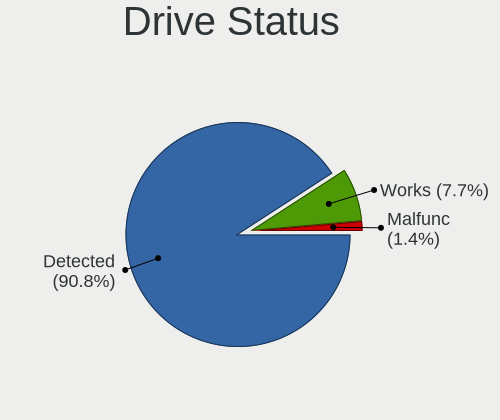
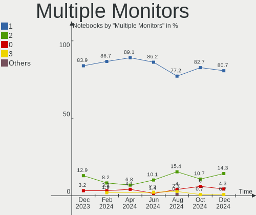
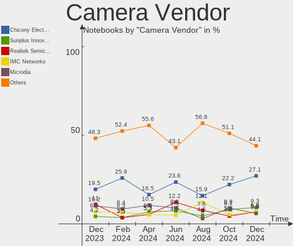

Zorin Hardware Trends (Notebooks)
---------------------------------

A project to identify most popular hardware characteristics and track their change
over time based on data collected by Zorin users at https://Linux-Hardware.org.

Anyone can contribute to this report by the [hw-probe](https://github.com/linuxhw/hw-probe) tool:

    sudo -E hw-probe -all -upload

Full-feature report is available here: https://linux-hardware.org/?view=trends

Period: Dec, 2021.

Contents
--------

* [ System ](#system)
  - [ OS                       ](#os)
  - [ OS Family                ](#os-family)
  - [ Kernel                   ](#kernel)
  - [ Kernel Family            ](#kernel-family)
  - [ Kernel Major Ver.        ](#kernel-major-ver)
  - [ Arch                     ](#arch)
  - [ DE                       ](#de)
  - [ Display Server           ](#display-server)
  - [ Display Manager          ](#display-manager)
  - [ OS Lang                  ](#os-lang)
  - [ Boot Mode                ](#boot-mode)
  - [ Filesystem               ](#filesystem)
  - [ Part. scheme             ](#part-scheme)
  - [ Dual Boot with Linux/BSD ](#dual-boot-with-linuxbsd)
  - [ Dual Boot (Win)          ](#dual-boot-win)

* [ Board ](#board)
  - [ Vendor                   ](#vendor)
  - [ Model                    ](#model)
  - [ Model Family             ](#model-family)
  - [ MFG Year                 ](#mfg-year)
  - [ Form Factor              ](#form-factor)
  - [ Secure Boot              ](#secure-boot)
  - [ Coreboot                 ](#coreboot)
  - [ RAM Size                 ](#ram-size)
  - [ RAM Used                 ](#ram-used)
  - [ Total Drives             ](#total-drives)
  - [ Has CD-ROM               ](#has-cd-rom)
  - [ Has Ethernet             ](#has-ethernet)
  - [ Has WiFi                 ](#has-wifi)
  - [ Has Bluetooth            ](#has-bluetooth)

* [ Location ](#location)
  - [ Country                  ](#country)
  - [ City                     ](#city)

* [ Drives ](#drives)
  - [ Drive Vendor             ](#drive-vendor)
  - [ Drive Model              ](#drive-model)
  - [ HDD Vendor               ](#hdd-vendor)
  - [ SSD Vendor               ](#ssd-vendor)
  - [ Drive Kind               ](#drive-kind)
  - [ Drive Connector          ](#drive-connector)
  - [ Drive Size               ](#drive-size)
  - [ Space Total              ](#space-total)
  - [ Space Used               ](#space-used)
  - [ Malfunc. Drives          ](#malfunc-drives)
  - [ Malfunc. Drive Vendor    ](#malfunc-drive-vendor)
  - [ Malfunc. HDD Vendor      ](#malfunc-hdd-vendor)
  - [ Malfunc. Drive Kind      ](#malfunc-drive-kind)
  - [ Failed Drives            ](#failed-drives)
  - [ Failed Drive Vendor      ](#failed-drive-vendor)
  - [ Drive Status             ](#drive-status)

* [ Storage controller ](#storage-controller)
  - [ Storage Vendor           ](#storage-vendor)
  - [ Storage Model            ](#storage-model)
  - [ Storage Kind             ](#storage-kind)

* [ Processor ](#processor)
  - [ CPU Vendor               ](#cpu-vendor)
  - [ CPU Model                ](#cpu-model)
  - [ CPU Model Family         ](#cpu-model-family)
  - [ CPU Cores                ](#cpu-cores)
  - [ CPU Sockets              ](#cpu-sockets)
  - [ CPU Threads              ](#cpu-threads)
  - [ CPU Op-Modes             ](#cpu-op-modes)
  - [ CPU Microcode            ](#cpu-microcode)
  - [ CPU Microarch            ](#cpu-microarch)

* [ Graphics ](#graphics)
  - [ GPU Vendor               ](#gpu-vendor)
  - [ GPU Model                ](#gpu-model)
  - [ GPU Combo                ](#gpu-combo)
  - [ GPU Driver               ](#gpu-driver)
  - [ GPU Memory               ](#gpu-memory)

* [ Monitor ](#monitor)
  - [ Monitor Vendor           ](#monitor-vendor)
  - [ Monitor Model            ](#monitor-model)
  - [ Monitor Resolution       ](#monitor-resolution)
  - [ Monitor Diagonal         ](#monitor-diagonal)
  - [ Monitor Width            ](#monitor-width)
  - [ Aspect Ratio             ](#aspect-ratio)
  - [ Monitor Area             ](#monitor-area)
  - [ Pixel Density            ](#pixel-density)
  - [ Multiple Monitors        ](#multiple-monitors)

* [ Network ](#network)
  - [ Net Controller Vendor    ](#net-controller-vendor)
  - [ Net Controller Model     ](#net-controller-model)
  - [ Wireless Vendor          ](#wireless-vendor)
  - [ Wireless Model           ](#wireless-model)
  - [ Ethernet Vendor          ](#ethernet-vendor)
  - [ Ethernet Model           ](#ethernet-model)
  - [ Net Controller Kind      ](#net-controller-kind)
  - [ Used Controller          ](#used-controller)
  - [ NICs                     ](#nics)
  - [ IPv6                     ](#ipv6)

* [ Bluetooth ](#bluetooth)
  - [ Bluetooth Vendor         ](#bluetooth-vendor)
  - [ Bluetooth Model          ](#bluetooth-model)

* [ Sound ](#sound)
  - [ Sound Vendor             ](#sound-vendor)
  - [ Sound Model              ](#sound-model)

* [ Memory ](#memory)
  - [ Memory Vendor            ](#memory-vendor)
  - [ Memory Model             ](#memory-model)
  - [ Memory Kind              ](#memory-kind)
  - [ Memory Form Factor       ](#memory-form-factor)
  - [ Memory Size              ](#memory-size)
  - [ Memory Speed             ](#memory-speed)

* [ Printers & scanners ](#printers--scanners)
  - [ Printer Vendor           ](#printer-vendor)
  - [ Printer Model            ](#printer-model)
  - [ Scanner Vendor           ](#scanner-vendor)
  - [ Scanner Model            ](#scanner-model)

* [ Camera ](#camera)
  - [ Camera Vendor            ](#camera-vendor)
  - [ Camera Model             ](#camera-model)

* [ Security ](#security)
  - [ Fingerprint Vendor       ](#fingerprint-vendor)
  - [ Fingerprint Model        ](#fingerprint-model)
  - [ Chipcard Vendor          ](#chipcard-vendor)
  - [ Chipcard Model           ](#chipcard-model)

* [ Unsupported ](#unsupported)
  - [ Unsupported Devices      ](#unsupported-devices)
  - [ Unsupported Device Types ](#unsupported-device-types)

System
------

OS
--

Installed operating systems

| Name     | Notebooks | Percent |
|----------|-----------|---------|
| Zorin 16 | 114       | 90.48%  |
| Zorin 15 | 12        | 9.52%   |

OS Family
---------

OS without a version

| Name  | Notebooks | Percent |
|-------|-----------|---------|
| Zorin | 126       | 100%    |

Kernel
------

Version of the Linux kernel

| Version                   | Notebooks | Percent |
|---------------------------|-----------|---------|
| 5.11.0-41-generic         | 48        | 38.1%   |
| 5.11.0-43-generic         | 42        | 33.33%  |
| 5.4.0-91-generic          | 12        | 9.52%   |
| 5.11.0-40-generic         | 12        | 9.52%   |
| 5.11.0-38-generic         | 6         | 4.76%   |
| 5.16.0-051600rc4-generic  | 1         | 0.79%   |
| 5.15.0-8.1-liquorix-amd64 | 1         | 0.79%   |
| 5.13.0-1020-oem           | 1         | 0.79%   |
| 5.11.0-37-generic         | 1         | 0.79%   |
| 5.11.0-25-generic         | 1         | 0.79%   |
| 5.10.0-1052-oem           | 1         | 0.79%   |

Kernel Family
-------------

Linux kernel without a distro release

| Version | Notebooks | Percent |
|---------|-----------|---------|
| 5.11.0  | 110       | 87.3%   |
| 5.4.0   | 12        | 9.52%   |
| 5.16.0  | 1         | 0.79%   |
| 5.15.0  | 1         | 0.79%   |
| 5.13.0  | 1         | 0.79%   |
| 5.10.0  | 1         | 0.79%   |

Kernel Major Ver.
-----------------

Linux kernel major version

| Version | Notebooks | Percent |
|---------|-----------|---------|
| 5.11    | 110       | 87.3%   |
| 5.4     | 12        | 9.52%   |
| 5.16    | 1         | 0.79%   |
| 5.15    | 1         | 0.79%   |
| 5.13    | 1         | 0.79%   |
| 5.10    | 1         | 0.79%   |

Arch
----

OS architecture (x86_64, i586, etc.)

| Name   | Notebooks | Percent |
|--------|-----------|---------|
| x86_64 | 121       | 96.03%  |
| i686   | 5         | 3.97%   |

DE
--

Desktop Environment

| Name       | Notebooks | Percent |
|------------|-----------|---------|
| GNOME      | 104       | 82.54%  |
| XFCE       | 20        | 15.87%  |
| X-Cinnamon | 1         | 0.79%   |
| KDE        | 1         | 0.79%   |

Display Server
--------------

X11 or Wayland

| Name    | Notebooks | Percent |
|---------|-----------|---------|
| X11     | 124       | 98.41%  |
| Wayland | 2         | 1.59%   |

Display Manager
---------------

SDDM, LightDM, etc.

| Name    | Notebooks | Percent |
|---------|-----------|---------|
| Unknown | 79        | 62.7%   |
| GDM3    | 28        | 22.22%  |
| LightDM | 9         | 7.14%   |
| GDM     | 9         | 7.14%   |
| SDDM    | 1         | 0.79%   |

OS Lang
-------

Language

| Lang  | Notebooks | Percent |
|-------|-----------|---------|
| en_US | 51        | 40.48%  |
| pt_BR | 9         | 7.14%   |
| de_DE | 8         | 6.35%   |
| en_GB | 7         | 5.56%   |
| pl_PL | 5         | 3.97%   |
| fr_BE | 5         | 3.97%   |
| en_CA | 5         | 3.97%   |
| es_ES | 4         | 3.17%   |
| en_IN | 3         | 2.38%   |
| en_AU | 3         | 2.38%   |
| pt_PT | 2         | 1.59%   |
| nl_NL | 2         | 1.59%   |
| it_IT | 2         | 1.59%   |
| fr_FR | 2         | 1.59%   |
| en_ZA | 2         | 1.59%   |
| de_CH | 2         | 1.59%   |
| tr_TR | 1         | 0.79%   |
| sl_SI | 1         | 0.79%   |
| ru_UA | 1         | 0.79%   |
| ro_RO | 1         | 0.79%   |
| nl_BE | 1         | 0.79%   |
| hu_HU | 1         | 0.79%   |
| fi_FI | 1         | 0.79%   |
| es_SV | 1         | 0.79%   |
| es_PA | 1         | 0.79%   |
| es_MX | 1         | 0.79%   |
| es_CL | 1         | 0.79%   |
| en_NZ | 1         | 0.79%   |
| el_GR | 1         | 0.79%   |
| da_DK | 1         | 0.79%   |

Boot Mode
---------

EFI or BIOS

| Mode | Notebooks | Percent |
|------|-----------|---------|
| EFI  | 68        | 53.97%  |
| BIOS | 58        | 46.03%  |

Filesystem
----------

Type of filesystem

| Type    | Notebooks | Percent |
|---------|-----------|---------|
| Ext4    | 121       | 96.03%  |
| Overlay | 2         | 1.59%   |
| Btrfs   | 2         | 1.59%   |
| Xfs     | 1         | 0.79%   |

Part. scheme
------------

Scheme of partitioning

| Type    | Notebooks | Percent |
|---------|-----------|---------|
| Unknown | 115       | 91.27%  |
| GPT     | 8         | 6.35%   |
| MBR     | 3         | 2.38%   |

Dual Boot with Linux/BSD
------------------------

Hosting more than one Linux/BSD

| Dual boot | Notebooks | Percent |
|-----------|-----------|---------|
| No        | 124       | 98.41%  |
| Yes       | 2         | 1.59%   |

Dual Boot (Win)
---------------

Hosting Linux and Windows

| Dual boot | Notebooks | Percent |
|-----------|-----------|---------|
| No        | 112       | 88.89%  |
| Yes       | 14        | 11.11%  |

Board
-----

Vendor
------

Motherboard manufacturer

| Name                   | Notebooks | Percent |
|------------------------|-----------|---------|
| Hewlett-Packard        | 27        | 21.43%  |
| Dell                   | 20        | 15.87%  |
| Lenovo                 | 14        | 11.11%  |
| ASUSTek Computer       | 12        | 9.52%   |
| Acer                   | 11        | 8.73%   |
| Toshiba                | 6         | 4.76%   |
| Samsung Electronics    | 5         | 3.97%   |
| MSI                    | 4         | 3.17%   |
| Sony                   | 3         | 2.38%   |
| Packard Bell           | 3         | 2.38%   |
| Apple                  | 3         | 2.38%   |
| Digibras               | 2         | 1.59%   |
| TUXEDO                 | 1         | 0.79%   |
| TCL Communication      | 1         | 0.79%   |
| RCA                    | 1         | 0.79%   |
| Razer                  | 1         | 0.79%   |
| Quanta                 | 1         | 0.79%   |
| Primux                 | 1         | 0.79%   |
| Positivo               | 1         | 0.79%   |
| mPTech                 | 1         | 0.79%   |
| Login Informatica      | 1         | 0.79%   |
| HUAWEI                 | 1         | 0.79%   |
| Google                 | 1         | 0.79%   |
| Fusion5                | 1         | 0.79%   |
| Compaq                 | 1         | 0.79%   |
| Chuwi                  | 1         | 0.79%   |
| Avell High Performance | 1         | 0.79%   |
| Unknown                | 1         | 0.79%   |

Model
-----

Motherboard model

| Name                                                  | Notebooks | Percent |
|-------------------------------------------------------|-----------|---------|
| HP 15                                                 | 2         | 1.59%   |
| Digibras NH4CU03                                      | 2         | 1.59%   |
| Dell Precision M4600                                  | 2         | 1.59%   |
| Acer Aspire V3-571                                    | 2         | 1.59%   |
| Unknown                                               | 2         | 1.59%   |
| TUXEDO Pulse 14 Gen1                                  | 1         | 0.79%   |
| Toshiba TECRA S11                                     | 1         | 0.79%   |
| Toshiba TECRA A9                                      | 1         | 0.79%   |
| Toshiba Satellite L655                                | 1         | 0.79%   |
| Toshiba Satellite L55-B                               | 1         | 0.79%   |
| Toshiba Satellite L300                                | 1         | 0.79%   |
| Toshiba QOSMIO X770                                   | 1         | 0.79%   |
| TCL Communication 8085                                | 1         | 0.79%   |
| Sony VPCF23M1E                                        | 1         | 0.79%   |
| Sony VGN-FW21E                                        | 1         | 0.79%   |
| Sony SVF1532Z1EB                                      | 1         | 0.79%   |
| Samsung N150P/N210P/N220P                             | 1         | 0.79%   |
| Samsung 700T                                          | 1         | 0.79%   |
| Samsung 355V4C/356V4C/3445VC/3545VC                   | 1         | 0.79%   |
| Samsung 300E5EV/300E4EV/270E5EV/270E4EV/2470EV/2470EE | 1         | 0.79%   |
| Samsung 300E4C/300E5C/300E7C                          | 1         | 0.79%   |
| RCA W1013DK                                           | 1         | 0.79%   |
| Razer Blade 15 Base Model (Early 2020) - RZ09-0328    | 1         | 0.79%   |
| Quanta MW1/HW1                                        | 1         | 0.79%   |
| Primux 15R5A                                          | 1         | 0.79%   |
| Positivo CHT14B                                       | 1         | 0.79%   |
| Packard Bell EasyNote TK85                            | 1         | 0.79%   |
| Packard Bell EasyNote TE11BZ                          | 1         | 0.79%   |
| Packard Bell EasyNote MH35                            | 1         | 0.79%   |
| MSI PS42 Modern 8RC                                   | 1         | 0.79%   |
| MSI GT70 2OC/2OD                                      | 1         | 0.79%   |
| MSI GE-700                                            | 1         | 0.79%   |
| MSI EX705                                             | 1         | 0.79%   |
| mPTech ARC 11.6 128GB HD                              | 1         | 0.79%   |
| Login Informatica LOG-MB47II7                         | 1         | 0.79%   |
| Lenovo Y520-15IKBN 80WK                               | 1         | 0.79%   |
| Lenovo V14-IIL 82C4                                   | 1         | 0.79%   |
| Lenovo ThinkPad X270 20HN0043AD                       | 1         | 0.79%   |
| Lenovo ThinkPad X230 2325SYU                          | 1         | 0.79%   |
| Lenovo ThinkPad X201 Tablet 3113WLL                   | 1         | 0.79%   |
| Lenovo ThinkPad X1 Extreme Gen 4i 20Y5000UUS          | 1         | 0.79%   |
| Lenovo ThinkPad T400 741722U                          | 1         | 0.79%   |
| Lenovo ThinkPad L540 20AV0031MB                       | 1         | 0.79%   |
| Lenovo IdeaPad S340-14API 81NB                        | 1         | 0.79%   |
| Lenovo IdeaPad S145-15API 81V7                        | 1         | 0.79%   |
| Lenovo IdeaPad S130-11IGM 81J1                        | 1         | 0.79%   |
| Lenovo IdeaPad Flex-14API 81SS                        | 1         | 0.79%   |
| Lenovo G700                                           | 1         | 0.79%   |
| Lenovo G580 20150                                     | 1         | 0.79%   |
| HUAWEI KLVL-WXX9                                      | 1         | 0.79%   |
| HP ZBook 17 G5                                        | 1         | 0.79%   |
| HP ZBook 15u G3                                       | 1         | 0.79%   |
| HP Stream Laptop 14-cb1XX                             | 1         | 0.79%   |
| HP ProBook 4730s                                      | 1         | 0.79%   |
| HP ProBook 450 G3                                     | 1         | 0.79%   |
| HP Pavilion Laptop 15z-cw100                          | 1         | 0.79%   |
| HP Pavilion Laptop 15-eh0xxx                          | 1         | 0.79%   |
| HP Pavilion dv7                                       | 1         | 0.79%   |
| HP Pavilion dv6700                                    | 1         | 0.79%   |
| HP Pavilion dv5                                       | 1         | 0.79%   |

Model Family
------------

Motherboard model prefix

| Name                          | Notebooks | Percent |
|-------------------------------|-----------|---------|
| Dell Latitude                 | 13        | 10.32%  |
| Acer Aspire                   | 10        | 7.94%   |
| Lenovo ThinkPad               | 6         | 4.76%   |
| HP Pavilion                   | 6         | 4.76%   |
| HP EliteBook                  | 6         | 4.76%   |
| Lenovo IdeaPad                | 4         | 3.17%   |
| Dell Inspiron                 | 4         | 3.17%   |
| Toshiba Satellite             | 3         | 2.38%   |
| Packard Bell EasyNote         | 3         | 2.38%   |
| HP 15                         | 3         | 2.38%   |
| Toshiba TECRA                 | 2         | 1.59%   |
| HP ZBook                      | 2         | 1.59%   |
| HP ProBook                    | 2         | 1.59%   |
| HP Laptop                     | 2         | 1.59%   |
| Digibras NH4CU03              | 2         | 1.59%   |
| Dell Precision                | 2         | 1.59%   |
| ASUS VivoBook                 | 2         | 1.59%   |
| Unknown                       | 2         | 1.59%   |
| TUXEDO Pulse                  | 1         | 0.79%   |
| Toshiba QOSMIO                | 1         | 0.79%   |
| TCL Communication 8085        | 1         | 0.79%   |
| Sony VPCF23M1E                | 1         | 0.79%   |
| Sony VGN-FW21E                | 1         | 0.79%   |
| Sony SVF1532Z1EB              | 1         | 0.79%   |
| Samsung N150P                 | 1         | 0.79%   |
| Samsung 700T                  | 1         | 0.79%   |
| Samsung 355V4C                | 1         | 0.79%   |
| Samsung 300E5EV               | 1         | 0.79%   |
| Samsung 300E4C                | 1         | 0.79%   |
| RCA W1013DK                   | 1         | 0.79%   |
| Razer Blade                   | 1         | 0.79%   |
| Quanta MW1                    | 1         | 0.79%   |
| Primux 15R5A                  | 1         | 0.79%   |
| Positivo CHT14B               | 1         | 0.79%   |
| MSI PS42                      | 1         | 0.79%   |
| MSI GT70                      | 1         | 0.79%   |
| MSI GE-700                    | 1         | 0.79%   |
| MSI EX705                     | 1         | 0.79%   |
| mPTech ARC                    | 1         | 0.79%   |
| Login Informatica LOG-MB47II7 | 1         | 0.79%   |
| Lenovo Y520-15IKBN            | 1         | 0.79%   |
| Lenovo V14-IIL                | 1         | 0.79%   |
| Lenovo G700                   | 1         | 0.79%   |
| Lenovo G580                   | 1         | 0.79%   |
| HUAWEI KLVL-WXX9              | 1         | 0.79%   |
| HP Stream                     | 1         | 0.79%   |
| HP OMEN                       | 1         | 0.79%   |
| HP Notebook                   | 1         | 0.79%   |
| HP HDX                        | 1         | 0.79%   |
| HP 255                        | 1         | 0.79%   |
| Google Squawks                | 1         | 0.79%   |
| Fusion5 FWIN232               | 1         | 0.79%   |
| Dell XPS                      | 1         | 0.79%   |
| Compaq Presario               | 1         | 0.79%   |
| Chuwi GemiBook                | 1         | 0.79%   |
| Avell High Performance B.ON   | 1         | 0.79%   |
| ASUS ZenBook                  | 1         | 0.79%   |
| ASUS X751LD                   | 1         | 0.79%   |
| ASUS X553MA                   | 1         | 0.79%   |
| ASUS X302LA                   | 1         | 0.79%   |

MFG Year
--------

Motherboard manufacture year

| Year | Notebooks | Percent |
|------|-----------|---------|
| 2021 | 23        | 18.25%  |
| 2013 | 18        | 14.29%  |
| 2019 | 14        | 11.11%  |
| 2020 | 10        | 7.94%   |
| 2012 | 9         | 7.14%   |
| 2010 | 8         | 6.35%   |
| 2009 | 7         | 5.56%   |
| 2015 | 6         | 4.76%   |
| 2018 | 5         | 3.97%   |
| 2016 | 5         | 3.97%   |
| 2008 | 5         | 3.97%   |
| 2014 | 4         | 3.17%   |
| 2011 | 4         | 3.17%   |
| 2017 | 3         | 2.38%   |
| 2006 | 3         | 2.38%   |
| 2007 | 2         | 1.59%   |

Form Factor
-----------

Physical design of the computer

| Name     | Notebooks | Percent |
|----------|-----------|---------|
| Notebook | 126       | 100%    |

Secure Boot
-----------

Enabled or disabled

| State    | Notebooks | Percent |
|----------|-----------|---------|
| Disabled | 113       | 89.68%  |
| Enabled  | 13        | 10.32%  |

Coreboot
--------

Have coreboot on board

| Used | Notebooks | Percent |
|------|-----------|---------|
| No   | 125       | 99.21%  |
| Yes  | 1         | 0.79%   |

RAM Size
--------

Total RAM memory

| Size in GB  | Notebooks | Percent |
|-------------|-----------|---------|
| 4.01-8.0    | 42        | 33.33%  |
| 3.01-4.0    | 37        | 29.37%  |
| 8.01-16.0   | 15        | 11.9%   |
| 16.01-24.0  | 13        | 10.32%  |
| 1.01-2.0    | 9         | 7.14%   |
| 2.01-3.0    | 4         | 3.17%   |
| 32.01-64.0  | 3         | 2.38%   |
| 64.01-256.0 | 2         | 1.59%   |
| 0.51-1.0    | 1         | 0.79%   |

RAM Used
--------

Used RAM memory

| Used GB   | Notebooks | Percent |
|-----------|-----------|---------|
| 1.01-2.0  | 63        | 50%     |
| 2.01-3.0  | 34        | 26.98%  |
| 3.01-4.0  | 14        | 11.11%  |
| 4.01-8.0  | 9         | 7.14%   |
| 0.51-1.0  | 5         | 3.97%   |
| 8.01-16.0 | 1         | 0.79%   |

Total Drives
------------

Number of drives on board

| Drives | Notebooks | Percent |
|--------|-----------|---------|
| 1      | 95        | 75.4%   |
| 2      | 27        | 21.43%  |
| 3      | 3         | 2.38%   |
| 4      | 1         | 0.79%   |

Has CD-ROM
----------

Has CD-ROM on board

| Presented | Notebooks | Percent |
|-----------|-----------|---------|
| Yes       | 63        | 50%     |
| No        | 63        | 50%     |

Has Ethernet
------------

Has Ethernet on board

| Presented | Notebooks | Percent |
|-----------|-----------|---------|
| Yes       | 100       | 79.37%  |
| No        | 26        | 20.63%  |

Has WiFi
--------

Has WiFi module

| Presented | Notebooks | Percent |
|-----------|-----------|---------|
| Yes       | 121       | 96.03%  |
| No        | 5         | 3.97%   |

Has Bluetooth
-------------

Has Bluetooth module

| Presented | Notebooks | Percent |
|-----------|-----------|---------|
| Yes       | 83        | 65.87%  |
| No        | 43        | 34.13%  |

Location
--------

Country
-------

Geographic location (country)

| Country      | Notebooks | Percent |
|--------------|-----------|---------|
| USA          | 34        | 26.98%  |
| Germany      | 10        | 7.94%   |
| Brazil       | 10        | 7.94%   |
| UK           | 6         | 4.76%   |
| Belgium      | 6         | 4.76%   |
| Spain        | 5         | 3.97%   |
| Poland       | 5         | 3.97%   |
| Canada       | 5         | 3.97%   |
| Netherlands  | 3         | 2.38%   |
| India        | 3         | 2.38%   |
| France       | 3         | 2.38%   |
| Switzerland  | 2         | 1.59%   |
| South Africa | 2         | 1.59%   |
| Saudi Arabia | 2         | 1.59%   |
| Portugal     | 2         | 1.59%   |
| Italy        | 2         | 1.59%   |
| Hungary      | 2         | 1.59%   |
| Austria      | 2         | 1.59%   |
| Australia    | 2         | 1.59%   |
| Ukraine      | 1         | 0.79%   |
| Turkey       | 1         | 0.79%   |
| Slovenia     | 1         | 0.79%   |
| Romania      | 1         | 0.79%   |
| Puerto Rico  | 1         | 0.79%   |
| Panama       | 1         | 0.79%   |
| Pakistan     | 1         | 0.79%   |
| New Zealand  | 1         | 0.79%   |
| Moldova      | 1         | 0.79%   |
| Mexico       | 1         | 0.79%   |
| Malaysia     | 1         | 0.79%   |
| Jordan       | 1         | 0.79%   |
| Japan        | 1         | 0.79%   |
| Israel       | 1         | 0.79%   |
| Indonesia    | 1         | 0.79%   |
| Finland      | 1         | 0.79%   |
| El Salvador  | 1         | 0.79%   |
| Denmark      | 1         | 0.79%   |
| Chile        | 1         | 0.79%   |
| Argentina    | 1         | 0.79%   |

City
----

Geographic location (city)

| City                        | Notebooks | Percent |
|-----------------------------|-----------|---------|
| Bernissart                  | 4         | 3.17%   |
| Washington                  | 3         | 2.38%   |
| Warsaw                      | 2         | 1.59%   |
| Cape Town                   | 2         | 1.59%   |
| Zielonka                    | 1         | 0.79%   |
| Zapopan                     | 1         | 0.79%   |
| Yokkaichi                   | 1         | 0.79%   |
| Wylie                       | 1         | 0.79%   |
| Wimbledon                   | 1         | 0.79%   |
| West Fargo                  | 1         | 0.79%   |
| Vinnytsia                   | 1         | 0.79%   |
| Villingen-Schwenningen      | 1         | 0.79%   |
| Villaconejos                | 1         | 0.79%   |
| Vienna                      | 1         | 0.79%   |
| Vegreville                  | 1         | 0.79%   |
| Valpara?­so                 | 1         | 0.79%   |
| Valencia                    | 1         | 0.79%   |
| Unterschleissheim           | 1         | 0.79%   |
| Toms River                  | 1         | 0.79%   |
| Tel Aviv                    | 1         | 0.79%   |
| Sydney                      | 1         | 0.79%   |
| Sutton Coldfield            | 1         | 0.79%   |
| Surabaya                    | 1         | 0.79%   |
| Sleza                       | 1         | 0.79%   |
| Serra                       | 1         | 0.79%   |
| Scarborough                 | 1         | 0.79%   |
| San Salvador                | 1         | 0.79%   |
| San Juan                    | 1         | 0.79%   |
| Salvador                    | 1         | 0.79%   |
| Saint-Eustache              | 1         | 0.79%   |
| Roswell                     | 1         | 0.79%   |
| Riyadh                      | 1         | 0.79%   |
| Rio Tinto                   | 1         | 0.79%   |
| Ribeir??o Preto             | 1         | 0.79%   |
| Ribeirao Pires              | 1         | 0.79%   |
| Resistencia                 | 1         | 0.79%   |
| Red Deer                    | 1         | 0.79%   |
| Rahim Yar Khan              | 1         | 0.79%   |
| Pune                        | 1         | 0.79%   |
| Pucking                     | 1         | 0.79%   |
| Providence                  | 1         | 0.79%   |
| Preddvor                    | 1         | 0.79%   |
| Posto Fiscal Rolim de Moura | 1         | 0.79%   |
| Pirna                       | 1         | 0.79%   |
| Perth                       | 1         | 0.79%   |
| Parkville                   | 1         | 0.79%   |
| Paris                       | 1         | 0.79%   |
| Panama City                 | 1         | 0.79%   |
| Ogden                       | 1         | 0.79%   |
| New Plymouth                | 1         | 0.79%   |
| New Delhi                   | 1         | 0.79%   |
| Neuville-les-Dieppe         | 1         | 0.79%   |
| Munich                      | 1         | 0.79%   |
| Mortsel                     | 1         | 0.79%   |
| Monrovia                    | 1         | 0.79%   |
| Medgyesegyhaza              | 1         | 0.79%   |
| Marktredwitz                | 1         | 0.79%   |
| Lignano Sabbiadoro          | 1         | 0.79%   |
| Lakeland                    | 1         | 0.79%   |
| Kuala Lumpur                | 1         | 0.79%   |

Drives
------

Drive Vendor
------------

Hard drive vendors

| Vendor                    | Notebooks | Drives | Percent |
|---------------------------|-----------|--------|---------|
| Seagate                   | 22        | 24     | 14.86%  |
| Samsung Electronics       | 22        | 25     | 14.86%  |
| WDC                       | 17        | 18     | 11.49%  |
| Unknown                   | 14        | 17     | 9.46%   |
| Toshiba                   | 9         | 9      | 6.08%   |
| SanDisk                   | 8         | 8      | 5.41%   |
| Kingston                  | 7         | 7      | 4.73%   |
| Crucial                   | 6         | 6      | 4.05%   |
| Hitachi                   | 5         | 5      | 3.38%   |
| HGST                      | 4         | 4      | 2.7%    |
| SK Hynix                  | 3         | 3      | 2.03%   |
| Intel                     | 3         | 3      | 2.03%   |
| Transcend                 | 2         | 2      | 1.35%   |
| OCZ                       | 2         | 2      | 1.35%   |
| Micron Technology         | 2         | 2      | 1.35%   |
| KIOXIA                    | 2         | 2      | 1.35%   |
| Fujitsu                   | 2         | 2      | 1.35%   |
| Teclast                   | 1         | 1      | 0.68%   |
| Team                      | 1         | 1      | 0.68%   |
| SABRENT                   | 1         | 1      | 0.68%   |
| Realtek Semiconductor     | 1         | 1      | 0.68%   |
| PLEXTOR                   | 1         | 1      | 0.68%   |
| Phison                    | 1         | 1      | 0.68%   |
| Patriot                   | 1         | 1      | 0.68%   |
| Netac                     | 1         | 1      | 0.68%   |
| Micron/Crucial Technology | 1         | 1      | 0.68%   |
| LITEON                    | 1         | 1      | 0.68%   |
| KIOXIA-EXCERIA            | 1         | 1      | 0.68%   |
| KingSpec                  | 1         | 1      | 0.68%   |
| KESU                      | 1         | 1      | 0.68%   |
| GOODRAM                   | 1         | 1      | 0.68%   |
| FORESEE                   | 1         | 1      | 0.68%   |
| ASMT                      | 1         | 1      | 0.68%   |
| Apple                     | 1         | 1      | 0.68%   |
| A-DATA Technology         | 1         | 1      | 0.68%   |

Drive Model
-----------

Hard drive models

| Model                                | Notebooks | Percent |
|--------------------------------------|-----------|---------|
| Unknown MMC Card  32GB               | 5         | 3.25%   |
| Unknown MMC Card  64GB               | 3         | 1.95%   |
| Unknown MMC Card  128GB              | 3         | 1.95%   |
| Seagate ST500LM012 HN-M500MBB 500GB  | 3         | 1.95%   |
| Seagate ST1000LM035-1RK172 1TB       | 3         | 1.95%   |
| Samsung NVMe SSD Drive 512GB         | 3         | 1.95%   |
| Samsung NVMe SSD Drive 256GB         | 3         | 1.95%   |
| Unknown MMC Card  16GB               | 2         | 1.3%    |
| Toshiba MQ01ABD100 1TB               | 2         | 1.3%    |
| Seagate ST9500325AS 500GB            | 2         | 1.3%    |
| Seagate ST500LT012-9WS142 500GB      | 2         | 1.3%    |
| Seagate Expansion 1TB                | 2         | 1.3%    |
| SanDisk SD9SN8W-128G-1006 128GB SSD  | 2         | 1.3%    |
| Kingston SA400S37120G 120GB SSD      | 2         | 1.3%    |
| HGST HTS721010A9E630 1TB             | 2         | 1.3%    |
| Crucial CT240BX500SSD1 240GB         | 2         | 1.3%    |
| WDC WDS500G2B0A 500GB SSD            | 1         | 0.65%   |
| WDC WDS100T2B0B-00YS70 1TB SSD       | 1         | 0.65%   |
| WDC WDS100T2B0A-00SM50 1TB SSD       | 1         | 0.65%   |
| WDC WDBNCE5000PNC 500GB SSD          | 1         | 0.65%   |
| WDC WD6400BPVT-55HXZT2 640GB         | 1         | 0.65%   |
| WDC WD5000LPLX-75ZNTT0 500GB         | 1         | 0.65%   |
| WDC WD5000LPLX-60ZNTT1 500GB         | 1         | 0.65%   |
| WDC WD5000LPCX-60VHAT0 500GB         | 1         | 0.65%   |
| WDC WD5000BEKT-60KA9T0 500GB         | 1         | 0.65%   |
| WDC WD40 EFRX-68WT0N0 4TB            | 1         | 0.65%   |
| WDC WD2500BEVT-22A23T0 250GB         | 1         | 0.65%   |
| WDC WD1600BEVT-60ZCT1 160GB          | 1         | 0.65%   |
| WDC WD10SPZX-75Z10T3 1TB             | 1         | 0.65%   |
| WDC WD10SPZX-60Z10T0 1TB             | 1         | 0.65%   |
| WDC WD10JPVX-60JC3T1 1TB             | 1         | 0.65%   |
| WDC WD10JPVX-00JC3T0 1TB             | 1         | 0.65%   |
| WDC PC SN530 NVMe 256GB              | 1         | 0.65%   |
| WDC PC SN520 SDAPNUW-256G-1002 256GB | 1         | 0.65%   |
| Unknown SEM16G  16GB                 | 1         | 0.65%   |
| Unknown SD128  128GB                 | 1         | 0.65%   |
| Unknown SD/MMC/MS PRO 7GB            | 1         | 0.65%   |
| Transcend TS480GSSD220S 480GB        | 1         | 0.65%   |
| Transcend TS256GMSA230S 256GB SSD    | 1         | 0.65%   |
| Toshiba THNSNH128GBST SSD            | 1         | 0.65%   |
| Toshiba THNSNF128GMCS 128GB SSD      | 1         | 0.65%   |
| Toshiba MQ01ABD050V 500GB            | 1         | 0.65%   |
| Toshiba MK8052GSX 80GB               | 1         | 0.65%   |
| Toshiba MK6008GAH 64GB               | 1         | 0.65%   |
| Toshiba MK3252GSX 320GB              | 1         | 0.65%   |
| Toshiba MK2552GSX 250GB              | 1         | 0.65%   |
| Teclast BD256GB SHCB-2280 SSD        | 1         | 0.65%   |
| Team T253X2512G 512GB SSD            | 1         | 0.65%   |
| SK Hynix SH920 mSATA 128GB SSD       | 1         | 0.65%   |
| SK Hynix SC401 SATA 512GB SSD        | 1         | 0.65%   |
| SK Hynix NVMe SSD Drive 256GB        | 1         | 0.65%   |
| Seagate ST9750420AS 752GB            | 1         | 0.65%   |
| Seagate ST95005620AS 500GB           | 1         | 0.65%   |
| Seagate ST9500420AS 500GB            | 1         | 0.65%   |
| Seagate ST9160823ASG 160GB           | 1         | 0.65%   |
| Seagate ST9160821AS 160GB            | 1         | 0.65%   |
| Seagate ST500VT000-1DK142 500GB      | 1         | 0.65%   |
| Seagate ST500LT012-1DG142 500GB      | 1         | 0.65%   |
| Seagate ST500LM000-1EJ162 500GB      | 1         | 0.65%   |
| Seagate ST2000LM007-1R8174 2TB       | 1         | 0.65%   |

HDD Vendor
----------

Hard disk drive vendors

| Vendor              | Notebooks | Drives | Percent |
|---------------------|-----------|--------|---------|
| Seagate             | 22        | 24     | 38.6%   |
| WDC                 | 12        | 12     | 21.05%  |
| Toshiba             | 7         | 7      | 12.28%  |
| Hitachi             | 5         | 5      | 8.77%   |
| HGST                | 4         | 4      | 7.02%   |
| Samsung Electronics | 2         | 2      | 3.51%   |
| Fujitsu             | 2         | 2      | 3.51%   |
| Unknown             | 1         | 1      | 1.75%   |
| SABRENT             | 1         | 1      | 1.75%   |
| KESU                | 1         | 1      | 1.75%   |

SSD Vendor
----------

Solid state drive vendors

| Vendor              | Notebooks | Drives | Percent |
|---------------------|-----------|--------|---------|
| Samsung Electronics | 13        | 13     | 22.81%  |
| SanDisk             | 6         | 6      | 10.53%  |
| Crucial             | 6         | 6      | 10.53%  |
| Kingston            | 5         | 5      | 8.77%   |
| WDC                 | 4         | 4      | 7.02%   |
| Transcend           | 2         | 2      | 3.51%   |
| Toshiba             | 2         | 2      | 3.51%   |
| SK Hynix            | 2         | 2      | 3.51%   |
| OCZ                 | 2         | 2      | 3.51%   |
| Micron Technology   | 2         | 2      | 3.51%   |
| Teclast             | 1         | 1      | 1.75%   |
| Team                | 1         | 1      | 1.75%   |
| PLEXTOR             | 1         | 1      | 1.75%   |
| Patriot             | 1         | 1      | 1.75%   |
| Netac               | 1         | 1      | 1.75%   |
| LITEON              | 1         | 1      | 1.75%   |
| KIOXIA-EXCERIA      | 1         | 1      | 1.75%   |
| KingSpec            | 1         | 1      | 1.75%   |
| Intel               | 1         | 1      | 1.75%   |
| GOODRAM             | 1         | 1      | 1.75%   |
| FORESEE             | 1         | 1      | 1.75%   |
| ASMT                | 1         | 1      | 1.75%   |
| Apple               | 1         | 1      | 1.75%   |

Drive Kind
----------

HDD or SSD

| Kind | Notebooks | Drives | Percent |
|------|-----------|--------|---------|
| HDD  | 56        | 59     | 38.62%  |
| SSD  | 54        | 57     | 37.24%  |
| NVMe | 22        | 25     | 15.17%  |
| MMC  | 13        | 16     | 8.97%   |

Drive Connector
---------------

SATA, SAS, NVMe, etc.

| Type | Notebooks | Drives | Percent |
|------|-----------|--------|---------|
| SATA | 99        | 109    | 70.21%  |
| NVMe | 22        | 25     | 15.6%   |
| MMC  | 13        | 16     | 9.22%   |
| SAS  | 7         | 7      | 4.96%   |

Drive Size
----------

Size of hard drive

| Size in TB | Notebooks | Drives | Percent |
|------------|-----------|--------|---------|
| 0.01-0.5   | 78        | 86     | 74.29%  |
| 0.51-1.0   | 25        | 28     | 23.81%  |
| 3.01-4.0   | 1         | 1      | 0.95%   |
| 1.01-2.0   | 1         | 1      | 0.95%   |

Space Total
-----------

Amount of disk space available on the file system

| Size in GB     | Notebooks | Percent |
|----------------|-----------|---------|
| 101-250        | 54        | 42.86%  |
| 251-500        | 35        | 27.78%  |
| 501-1000       | 13        | 10.32%  |
| 21-50          | 8         | 6.35%   |
| 51-100         | 8         | 6.35%   |
| 1001-2000      | 4         | 3.17%   |
| 2001-3000      | 2         | 1.59%   |
| More than 3000 | 1         | 0.79%   |
| 1-20           | 1         | 0.79%   |

Space Used
----------

Amount of used disk space

| Used GB   | Notebooks | Percent |
|-----------|-----------|---------|
| 1-20      | 62        | 49.21%  |
| 21-50     | 33        | 26.19%  |
| 51-100    | 11        | 8.73%   |
| 101-250   | 8         | 6.35%   |
| 251-500   | 6         | 4.76%   |
| 501-1000  | 5         | 3.97%   |
| 2001-3000 | 1         | 0.79%   |

Malfunc. Drives
---------------

Drive models with a malfunction

| Model                     | Notebooks | Drives | Percent |
|---------------------------|-----------|--------|---------|
| Seagate ST9500420AS 500GB | 1         | 1      | 100%    |

Malfunc. Drive Vendor
---------------------

Vendors of faulty drives

| Vendor  | Notebooks | Drives | Percent |
|---------|-----------|--------|---------|
| Seagate | 1         | 1      | 100%    |

Malfunc. HDD Vendor
-------------------

Vendors of faulty HDD drives

| Vendor  | Notebooks | Drives | Percent |
|---------|-----------|--------|---------|
| Seagate | 1         | 1      | 100%    |

Malfunc. Drive Kind
-------------------

Kinds of faulty drives

| Kind | Notebooks | Drives | Percent |
|------|-----------|--------|---------|
| HDD  | 1         | 1      | 100%    |

Failed Drives
-------------

Failed drive models

Zero info for selected period =(

Failed Drive Vendor
-------------------

Failed drive vendors

Zero info for selected period =(

Drive Status
------------

Number of failed and malfunc. drives

| Status   | Notebooks | Drives | Percent |
|----------|-----------|--------|---------|
| Detected | 114       | 143    | 89.76%  |
| Works    | 12        | 13     | 9.45%   |
| Malfunc  | 1         | 1      | 0.79%   |

Storage controller
------------------

Storage Vendor
--------------

Storage controller vendors

| Vendor                           | Notebooks | Percent |
|----------------------------------|-----------|---------|
| Intel                            | 93        | 71.54%  |
| AMD                              | 13        | 10%     |
| Samsung Electronics              | 8         | 6.15%   |
| Sandisk                          | 4         | 3.08%   |
| Marvell Technology Group         | 2         | 1.54%   |
| KIOXIA                           | 2         | 1.54%   |
| Kingston Technology Company      | 2         | 1.54%   |
| SK Hynix                         | 1         | 0.77%   |
| Silicon Integrated Systems [SiS] | 1         | 0.77%   |
| Realtek Semiconductor            | 1         | 0.77%   |
| Phison Electronics               | 1         | 0.77%   |
| Micron/Crucial Technology        | 1         | 0.77%   |
| ADATA Technology                 | 1         | 0.77%   |

Storage Model
-------------

Storage controller models

| Model                                                                            | Notebooks | Percent |
|----------------------------------------------------------------------------------|-----------|---------|
| Intel 7 Series Chipset Family 6-port SATA Controller [AHCI mode]                 | 16        | 11.19%  |
| Intel 82801IBM/IEM (ICH9M/ICH9M-E) 4 port SATA Controller [AHCI mode]            | 10        | 6.99%   |
| Intel 82801 Mobile SATA Controller [RAID mode]                                   | 10        | 6.99%   |
| Intel 6 Series/C200 Series Chipset Family 6 port Mobile SATA AHCI Controller     | 10        | 6.99%   |
| AMD FCH SATA Controller [AHCI mode]                                              | 10        | 6.99%   |
| Intel 8 Series SATA Controller 1 [AHCI mode]                                     | 6         | 4.2%    |
| Samsung NVMe SSD Controller SM981/PM981/PM983                                    | 5         | 3.5%    |
| Intel Wildcat Point-LP SATA Controller [AHCI Mode]                               | 4         | 2.8%    |
| Intel Celeron/Pentium Silver Processor SATA Controller                           | 4         | 2.8%    |
| Intel 82801HM/HEM (ICH8M/ICH8M-E) SATA Controller [AHCI mode]                    | 4         | 2.8%    |
| Intel 82801HM/HEM (ICH8M/ICH8M-E) IDE Controller                                 | 4         | 2.8%    |
| Intel 5 Series/3400 Series Chipset 4 port SATA AHCI Controller                   | 4         | 2.8%    |
| Intel Sunrise Point-LP SATA Controller [AHCI mode]                               | 3         | 2.1%    |
| Intel Atom Processor E3800 Series SATA AHCI Controller                           | 3         | 2.1%    |
| Sandisk WD Blue SN550 NVMe SSD                                                   | 2         | 1.4%    |
| Samsung NVMe SSD Controller 980                                                  | 2         | 1.4%    |
| Marvell Group 88SS9183 PCIe SSD Controller                                       | 2         | 1.4%    |
| KIOXIA Non-Volatile memory controller                                            | 2         | 1.4%    |
| Intel Volume Management Device NVMe RAID Controller                              | 2         | 1.4%    |
| Intel Tiger Lake-LP SATA Controller [AHCI mode]                                  | 2         | 1.4%    |
| Intel Ice Lake-LP SATA Controller [AHCI mode]                                    | 2         | 1.4%    |
| Intel 82801G (ICH7 Family) IDE Controller                                        | 2         | 1.4%    |
| Intel 8 Series/C220 Series Chipset Family 6-port SATA Controller 1 [AHCI mode]   | 2         | 1.4%    |
| Intel 5 Series/3400 Series Chipset 6 port SATA AHCI Controller                   | 2         | 1.4%    |
| AMD SB7x0/SB8x0/SB9x0 SATA Controller [AHCI mode]                                | 2         | 1.4%    |
| SK Hynix BC511                                                                   | 1         | 0.7%    |
| Silicon Integrated Systems [SiS] SATA Controller / IDE mode                      | 1         | 0.7%    |
| Silicon Integrated Systems [SiS] 5513 IDE Controller                             | 1         | 0.7%    |
| Sandisk WD Blue SN500 / PC SN520 NVMe SSD                                        | 1         | 0.7%    |
| Sandisk Non-Volatile memory controller                                           | 1         | 0.7%    |
| Samsung NVMe SSD Controller SM961/PM961/SM963                                    | 1         | 0.7%    |
| Realtek Realtek Non-Volatile memory controller                                   | 1         | 0.7%    |
| Phison E12 NVMe Controller                                                       | 1         | 0.7%    |
| Micron/Crucial NVMe Controller                                                   | 1         | 0.7%    |
| Kingston Company Company Non-Volatile memory controller                          | 1         | 0.7%    |
| Kingston Company KC2000 NVMe SSD                                                 | 1         | 0.7%    |
| Intel SSD Pro 7600p/760p/E 6100p Series                                          | 1         | 0.7%    |
| Intel SSD 660P Series                                                            | 1         | 0.7%    |
| Intel NM10/ICH7 Family SATA Controller [IDE mode]                                | 1         | 0.7%    |
| Intel NM10/ICH7 Family SATA Controller [AHCI mode]                               | 1         | 0.7%    |
| Intel Mobile 4 Series Chipset PT IDER Controller                                 | 1         | 0.7%    |
| Intel HM170/QM170 Chipset SATA Controller [AHCI Mode]                            | 1         | 0.7%    |
| Intel Cannon Point-LP SATA Controller [AHCI Mode]                                | 1         | 0.7%    |
| Intel Cannon Lake Mobile PCH SATA AHCI Controller                                | 1         | 0.7%    |
| Intel Atom/Celeron/Pentium Processor x5-E8000/J3xxx/N3xxx Series SATA Controller | 1         | 0.7%    |
| Intel 82801GBM/GHM (ICH7-M Family) SATA Controller [AHCI mode]                   | 1         | 0.7%    |
| Intel 82801FB/FBM/FR/FW/FRW (ICH6 Family) IDE Controller                         | 1         | 0.7%    |
| Intel 5 Series/3400 Series Chipset 4 port SATA IDE Controller                    | 1         | 0.7%    |
| Intel 5 Series/3400 Series Chipset 2 port SATA IDE Controller                    | 1         | 0.7%    |
| AMD SB7x0/SB8x0/SB9x0 IDE Controller                                             | 1         | 0.7%    |
| AMD FCH SATA Controller [IDE mode]                                               | 1         | 0.7%    |
| AMD FCH IDE Controller                                                           | 1         | 0.7%    |
| ADATA Non-Volatile memory controller                                             | 1         | 0.7%    |

Storage Kind
------------

Kind of storage controller (IDE, SATA, NVMe, SAS, ...)

| Kind | Notebooks | Percent |
|------|-----------|---------|
| SATA | 92        | 66.19%  |
| NVMe | 22        | 15.83%  |
| IDE  | 13        | 9.35%   |
| RAID | 12        | 8.63%   |

Processor
---------

CPU Vendor
----------

Processor vendors

| Vendor | Notebooks | Percent |
|--------|-----------|---------|
| Intel  | 108       | 85.71%  |
| AMD    | 18        | 14.29%  |

CPU Model
---------

Processor models

| Model                                         | Notebooks | Percent |
|-----------------------------------------------|-----------|---------|
| AMD Ryzen 5 3500U with Radeon Vega Mobile Gfx | 5         | 3.97%   |
| Intel Core i7-3632QM CPU @ 2.20GHz            | 4         | 3.17%   |
| Intel Atom x5-Z8350 CPU @ 1.44GHz             | 4         | 3.17%   |
| Intel Pentium CPU N3540 @ 2.16GHz             | 3         | 2.38%   |
| Intel Core i7-8550U CPU @ 1.80GHz             | 3         | 2.38%   |
| Intel Core i5-6200U CPU @ 2.30GHz             | 3         | 2.38%   |
| Intel Core 2 Duo CPU P8400 @ 2.26GHz          | 3         | 2.38%   |
| AMD Ryzen 7 4800H with Radeon Graphics        | 3         | 2.38%   |
| Intel Core i5-5200U CPU @ 2.20GHz             | 2         | 1.59%   |
| Intel Core i5-4210U CPU @ 1.70GHz             | 2         | 1.59%   |
| Intel Core i5-2520M CPU @ 2.50GHz             | 2         | 1.59%   |
| Intel Core i5-2450M CPU @ 2.50GHz             | 2         | 1.59%   |
| Intel Core i5-2430M CPU @ 2.40GHz             | 2         | 1.59%   |
| Intel Core i3-3217U CPU @ 1.80GHz             | 2         | 1.59%   |
| Intel Celeron N4000 CPU @ 1.10GHz             | 2         | 1.59%   |
| Intel Atom CPU N450 @ 1.66GHz                 | 2         | 1.59%   |
| Intel 11th Gen Core i7-1165G7 @ 2.80GHz       | 2         | 1.59%   |
| Intel Xeon E-2186M CPU @ 2.90GHz              | 1         | 0.79%   |
| Intel Pentium M processor 2.13GHz             | 1         | 0.79%   |
| Intel Pentium Dual-Core CPU T4300 @ 2.10GHz   | 1         | 0.79%   |
| Intel Pentium Dual CPU T2410 @ 2.00GHz        | 1         | 0.79%   |
| Intel Pentium Dual CPU T2370 @ 1.73GHz        | 1         | 0.79%   |
| Intel Pentium Dual CPU T2310 @ 1.46GHz        | 1         | 0.79%   |
| Intel Pentium CPU P6200 @ 2.13GHz             | 1         | 0.79%   |
| Intel Pentium CPU N3710 @ 1.60GHz             | 1         | 0.79%   |
| Intel Pentium CPU B960 @ 2.20GHz              | 1         | 0.79%   |
| Intel Pentium CPU 2020M @ 2.40GHz             | 1         | 0.79%   |
| Intel Genuine CPU U4100 @ 1.30GHz             | 1         | 0.79%   |
| Intel Genuine CPU U2500 @ 1.20GHz             | 1         | 0.79%   |
| Intel Genuine CPU T2500 @ 2.00GHz             | 1         | 0.79%   |
| Intel Core M-5Y71 CPU @ 1.20GHz               | 1         | 0.79%   |
| Intel Core i7-8650U CPU @ 1.90GHz             | 1         | 0.79%   |
| Intel Core i7-7700HQ CPU @ 2.80GHz            | 1         | 0.79%   |
| Intel Core i7-7500U CPU @ 2.70GHz             | 1         | 0.79%   |
| Intel Core i7-6700HQ CPU @ 2.60GHz            | 1         | 0.79%   |
| Intel Core i7-4720HQ CPU @ 2.60GHz            | 1         | 0.79%   |
| Intel Core i7-4700MQ CPU @ 2.40GHz            | 1         | 0.79%   |
| Intel Core i7-4600U CPU @ 2.10GHz             | 1         | 0.79%   |
| Intel Core i7-4500U CPU @ 1.80GHz             | 1         | 0.79%   |
| Intel Core i7-3537U CPU @ 2.00GHz             | 1         | 0.79%   |
| Intel Core i7-3520M CPU @ 2.90GHz             | 1         | 0.79%   |
| Intel Core i7-2720QM CPU @ 2.20GHz            | 1         | 0.79%   |
| Intel Core i7-2630QM CPU @ 2.00GHz            | 1         | 0.79%   |
| Intel Core i7-10750H CPU @ 2.60GHz            | 1         | 0.79%   |
| Intel Core i7 CPU M 620 @ 2.67GHz             | 1         | 0.79%   |
| Intel Core i5-8265U CPU @ 1.60GHz             | 1         | 0.79%   |
| Intel Core i5-8250U CPU @ 1.60GHz             | 1         | 0.79%   |
| Intel Core i5-6300U CPU @ 2.40GHz             | 1         | 0.79%   |
| Intel Core i5-4310U CPU @ 2.00GHz             | 1         | 0.79%   |
| Intel Core i5-4258U CPU @ 2.40GHz             | 1         | 0.79%   |
| Intel Core i5-4200M CPU @ 2.50GHz             | 1         | 0.79%   |
| Intel Core i5-3427U CPU @ 1.80GHz             | 1         | 0.79%   |
| Intel Core i5-3320M CPU @ 2.60GHz             | 1         | 0.79%   |
| Intel Core i5-3230M CPU @ 2.60GHz             | 1         | 0.79%   |
| Intel Core i5-3210M CPU @ 2.50GHz             | 1         | 0.79%   |
| Intel Core i5-2467M CPU @ 1.60GHz             | 1         | 0.79%   |
| Intel Core i5-2435M CPU @ 2.40GHz             | 1         | 0.79%   |
| Intel Core i5-1035G1 CPU @ 1.00GHz            | 1         | 0.79%   |
| Intel Core i5 CPU M 560 @ 2.67GHz             | 1         | 0.79%   |
| Intel Core i5 CPU M 520 @ 2.40GHz             | 1         | 0.79%   |

CPU Model Family
----------------

Processor model prefix

| Model                                | Notebooks | Percent |
|--------------------------------------|-----------|---------|
| Intel Core i5                        | 29        | 23.02%  |
| Intel Core i7                        | 21        | 16.67%  |
| Intel Core i3                        | 11        | 8.73%   |
| Intel Core 2 Duo                     | 11        | 8.73%   |
| Intel Celeron                        | 8         | 6.35%   |
| Intel Pentium                        | 7         | 5.56%   |
| Intel Atom                           | 6         | 4.76%   |
| AMD Ryzen 5                          | 6         | 4.76%   |
| Other                                | 5         | 3.97%   |
| Intel Pentium Dual                   | 3         | 2.38%   |
| Intel Genuine                        | 3         | 2.38%   |
| AMD Ryzen 7                          | 3         | 2.38%   |
| AMD A6                               | 3         | 2.38%   |
| AMD Ryzen 3                          | 2         | 1.59%   |
| Intel Xeon                           | 1         | 0.79%   |
| Intel Pentium M                      | 1         | 0.79%   |
| Intel Pentium Dual-Core              | 1         | 0.79%   |
| Intel Core M                         | 1         | 0.79%   |
| AMD Turion X2 Ultra Dual-Core Mobile | 1         | 0.79%   |
| AMD E                                | 1         | 0.79%   |
| AMD C-50                             | 1         | 0.79%   |
| AMD A4                               | 1         | 0.79%   |

CPU Cores
---------

Number of processor cores

| Number | Notebooks | Percent |
|--------|-----------|---------|
| 2      | 78        | 61.9%   |
| 4      | 37        | 29.37%  |
| 8      | 4         | 3.17%   |
| 1      | 4         | 3.17%   |
| 6      | 3         | 2.38%   |

CPU Sockets
-----------

Number of sockets

| Number | Notebooks | Percent |
|--------|-----------|---------|
| 1      | 126       | 100%    |

CPU Threads
-----------

Threads per core (Hyper-Threading)

| Number | Notebooks | Percent |
|--------|-----------|---------|
| 2      | 81        | 64.29%  |
| 1      | 45        | 35.71%  |

CPU Op-Modes
------------

CPU Operation Modes (32-bit, 64-bit)

| Op mode        | Notebooks | Percent |
|----------------|-----------|---------|
| 32-bit, 64-bit | 123       | 97.62%  |
| 32-bit         | 3         | 2.38%   |

CPU Microcode
-------------

Microcode number

| Number     | Notebooks | Percent |
|------------|-----------|---------|
| 0x306a9    | 15        | 11.9%   |
| 0x206a7    | 12        | 9.52%   |
| 0x1067a    | 8         | 6.35%   |
| Unknown    | 7         | 5.56%   |
| 0x40651    | 6         | 4.76%   |
| 0x806ea    | 5         | 3.97%   |
| 0x406c4    | 5         | 3.97%   |
| 0x806c1    | 4         | 3.17%   |
| 0x406e3    | 4         | 3.17%   |
| 0x306d4    | 4         | 3.17%   |
| 0x30678    | 4         | 3.17%   |
| 0x20655    | 4         | 3.17%   |
| 0x10676    | 4         | 3.17%   |
| 0x08108109 | 4         | 3.17%   |
| 0x706a8    | 3         | 2.38%   |
| 0x6fd      | 3         | 2.38%   |
| 0x20652    | 3         | 2.38%   |
| 0x08108102 | 3         | 2.38%   |
| 0x706e5    | 2         | 1.59%   |
| 0x706a1    | 2         | 1.59%   |
| 0x306c3    | 2         | 1.59%   |
| 0x106ca    | 2         | 1.59%   |
| 0x08600106 | 2         | 1.59%   |
| 0x03000027 | 2         | 1.59%   |
| 0x906ea    | 1         | 0.79%   |
| 0x906e9    | 1         | 0.79%   |
| 0x806ec    | 1         | 0.79%   |
| 0x806eb    | 1         | 0.79%   |
| 0x806e9    | 1         | 0.79%   |
| 0x806d1    | 1         | 0.79%   |
| 0x6e8      | 1         | 0.79%   |
| 0x6d8      | 1         | 0.79%   |
| 0x506e3    | 1         | 0.79%   |
| 0x08600104 | 1         | 0.79%   |
| 0x08600103 | 1         | 0.79%   |
| 0x07030105 | 1         | 0.79%   |
| 0x06001119 | 1         | 0.79%   |
| 0x05000119 | 1         | 0.79%   |
| 0x05000029 | 1         | 0.79%   |
| 0x02000057 | 1         | 0.79%   |

CPU Microarch
-------------

Microarchitecture

| Name            | Notebooks | Percent |
|-----------------|-----------|---------|
| IvyBridge       | 15        | 11.9%   |
| SandyBridge     | 13        | 10.32%  |
| Penryn          | 12        | 9.52%   |
| Haswell         | 11        | 8.73%   |
| KabyLake        | 10        | 7.94%   |
| Silvermont      | 9         | 7.14%   |
| Zen+            | 7         | 5.56%   |
| Westmere        | 7         | 5.56%   |
| Skylake         | 5         | 3.97%   |
| Goldmont plus   | 5         | 3.97%   |
| Zen 2           | 4         | 3.17%   |
| TigerLake       | 4         | 3.17%   |
| Core            | 4         | 3.17%   |
| Broadwell       | 4         | 3.17%   |
| P6              | 3         | 2.38%   |
| IceLake         | 3         | 2.38%   |
| K10 Llano       | 2         | 1.59%   |
| Bonnell         | 2         | 1.59%   |
| Bobcat          | 2         | 1.59%   |
| Puma            | 1         | 0.79%   |
| Piledriver      | 1         | 0.79%   |
| K8 & K10 hybrid | 1         | 0.79%   |
| CometLake       | 1         | 0.79%   |

Graphics
--------

GPU Vendor
----------

Vendors of graphics cards

| Vendor                           | Notebooks | Percent |
|----------------------------------|-----------|---------|
| Intel                            | 94        | 64.38%  |
| Nvidia                           | 26        | 17.81%  |
| AMD                              | 25        | 17.12%  |
| Silicon Integrated Systems [SiS] | 1         | 0.68%   |

GPU Model
---------

Graphics card models

| Model                                                                                    | Notebooks | Percent |
|------------------------------------------------------------------------------------------|-----------|---------|
| Intel 3rd Gen Core processor Graphics Controller                                         | 15        | 9.87%   |
| Intel 2nd Generation Core Processor Family Integrated Graphics Controller                | 10        | 6.58%   |
| Intel Haswell-ULT Integrated Graphics Controller                                         | 8         | 5.26%   |
| AMD Picasso/Raven 2 [Radeon Vega Series / Radeon Vega Mobile Series]                     | 7         | 4.61%   |
| Intel Mobile 4 Series Chipset Integrated Graphics Controller                             | 6         | 3.95%   |
| Intel Core Processor Integrated Graphics Controller                                      | 6         | 3.95%   |
| Intel UHD Graphics 620                                                                   | 5         | 3.29%   |
| Intel GeminiLake [UHD Graphics 600]                                                      | 5         | 3.29%   |
| Intel Atom/Celeron/Pentium Processor x5-E8000/J3xxx/N3xxx Integrated Graphics Controller | 5         | 3.29%   |
| Intel Skylake GT2 [HD Graphics 520]                                                      | 4         | 2.63%   |
| Intel Atom Processor Z36xxx/Z37xxx Series Graphics & Display                             | 4         | 2.63%   |
| AMD Renoir                                                                               | 4         | 2.63%   |
| Nvidia GF117M [GeForce 610M/710M/810M/820M / GT 620M/625M/630M/720M]                     | 3         | 1.97%   |
| Intel TigerLake-LP GT2 [Iris Xe Graphics]                                                | 3         | 1.97%   |
| Intel HD Graphics 5500                                                                   | 3         | 1.97%   |
| Intel 4th Gen Core Processor Integrated Graphics Controller                              | 3         | 1.97%   |
| Nvidia GM107M [GeForce GTX 960M]                                                         | 2         | 1.32%   |
| Intel WhiskeyLake-U GT2 [UHD Graphics 620]                                               | 2         | 1.32%   |
| Intel Mobile GM965/GL960 Integrated Graphics Controller (secondary)                      | 2         | 1.32%   |
| Intel Mobile GM965/GL960 Integrated Graphics Controller (primary)                        | 2         | 1.32%   |
| Intel Mobile 945GM/GMS/GME, 943/940GML Express Integrated Graphics Controller            | 2         | 1.32%   |
| Intel Mobile 945GM/GMS, 943/940GML Express Integrated Graphics Controller                | 2         | 1.32%   |
| Intel Iris Plus Graphics G1 (Ice Lake)                                                   | 2         | 1.32%   |
| Intel Atom Processor D4xx/D5xx/N4xx/N5xx Integrated Graphics Controller                  | 2         | 1.32%   |
| AMD Thames [Radeon HD 7500M/7600M Series]                                                | 2         | 1.32%   |
| AMD RV620/M82 [Mobility Radeon HD 3450/3470]                                             | 2         | 1.32%   |
| Silicon Integrated Systems [SiS] 771/671 PCIE VGA Display Adapter                        | 1         | 0.66%   |
| Nvidia TU116M [GeForce GTX 1660 Ti Mobile]                                               | 1         | 0.66%   |
| Nvidia TU106M [GeForce RTX 2070 Mobile / Max-Q Refresh]                                  | 1         | 0.66%   |
| Nvidia NV43M [GeForce Go 6600]                                                           | 1         | 0.66%   |
| Nvidia GT218M [NVS 2100M]                                                                | 1         | 0.66%   |
| Nvidia GP107M [GeForce MX350]                                                            | 1         | 0.66%   |
| Nvidia GP107M [GeForce GTX 1050 Mobile]                                                  | 1         | 0.66%   |
| Nvidia GP104GLM [Quadro P4200 Mobile]                                                    | 1         | 0.66%   |
| Nvidia GM108M [GeForce MX130]                                                            | 1         | 0.66%   |
| Nvidia GK208M [GeForce GT 740M]                                                          | 1         | 0.66%   |
| Nvidia GK104M [GeForce GTX 780M]                                                         | 1         | 0.66%   |
| Nvidia GF119M [GeForce 610M]                                                             | 1         | 0.66%   |
| Nvidia GF116M [GeForce GT 560M]                                                          | 1         | 0.66%   |
| Nvidia GF108M [GeForce GT 540M]                                                          | 1         | 0.66%   |
| Nvidia GF108GLM [Quadro 1000M]                                                           | 1         | 0.66%   |
| Nvidia GF108GLM [NVS 5200M]                                                              | 1         | 0.66%   |
| Nvidia GA106M [GeForce RTX 3060 Mobile / Max-Q]                                          | 1         | 0.66%   |
| Nvidia G98M [Quadro NVS 160M]                                                            | 1         | 0.66%   |
| Nvidia G96CM [GeForce 9600M GT]                                                          | 1         | 0.66%   |
| Nvidia G96CM [GeForce 9600M GS]                                                          | 1         | 0.66%   |
| Nvidia G94GLM [Quadro FX 2700M]                                                          | 1         | 0.66%   |
| Nvidia G86M [GeForce 8400M GS]                                                           | 1         | 0.66%   |
| Intel TigerLake-H GT1 [UHD Graphics]                                                     | 1         | 0.66%   |
| Intel Tiger Lake UHD Graphics                                                            | 1         | 0.66%   |
| Intel HD Graphics 630                                                                    | 1         | 0.66%   |
| Intel HD Graphics 620                                                                    | 1         | 0.66%   |
| Intel HD Graphics 5300                                                                   | 1         | 0.66%   |
| Intel HD Graphics 530                                                                    | 1         | 0.66%   |
| Intel CometLake-H GT2 [UHD Graphics]                                                     | 1         | 0.66%   |
| AMD Wrestler [Radeon HD 6320]                                                            | 1         | 0.66%   |
| AMD Wrestler [Radeon HD 6250]                                                            | 1         | 0.66%   |
| AMD Venus XT [Radeon HD 8870M / R9 M270X/M370X]                                          | 1         | 0.66%   |
| AMD Trinity 2 [Radeon HD 7520G]                                                          | 1         | 0.66%   |
| AMD Topaz XT [Radeon R7 M260/M265 / M340/M360 / M440/M445 / 530/535 / 620/625 Mobile]    | 1         | 0.66%   |

GPU Combo
---------

Combinations of graphics cards

| Name           | Notebooks | Percent |
|----------------|-----------|---------|
| 1 x Intel      | 75        | 59.52%  |
| 1 x AMD        | 18        | 14.29%  |
| Intel + Nvidia | 15        | 11.9%   |
| 1 x Nvidia     | 10        | 7.94%   |
| Intel + AMD    | 4         | 3.17%   |
| 2 x AMD        | 2         | 1.59%   |
| 1 x SiS        | 1         | 0.79%   |
| AMD + Nvidia   | 1         | 0.79%   |

GPU Driver
----------

Free vs proprietary

| Driver      | Notebooks | Percent |
|-------------|-----------|---------|
| Free        | 110       | 87.3%   |
| Proprietary | 12        | 9.52%   |
| Unknown     | 4         | 3.17%   |

GPU Memory
----------

Total video memory

| Size in GB | Notebooks | Percent |
|------------|-----------|---------|
| Unknown    | 86        | 68.25%  |
| 0.01-0.5   | 18        | 14.29%  |
| 1.01-2.0   | 13        | 10.32%  |
| 3.01-4.0   | 3         | 2.38%   |
| 0.51-1.0   | 3         | 2.38%   |
| 7.01-8.0   | 2         | 1.59%   |
| 5.01-6.0   | 1         | 0.79%   |

Monitor
-------

Monitor Vendor
--------------

Monitor vendors

| Vendor                  | Notebooks | Percent |
|-------------------------|-----------|---------|
| AU Optronics            | 24        | 18.6%   |
| LG Display              | 18        | 13.95%  |
| BOE                     | 18        | 13.95%  |
| Samsung Electronics     | 16        | 12.4%   |
| Chimei Innolux          | 15        | 11.63%  |
| Chi Mei Optoelectronics | 7         | 5.43%   |
| LG Philips              | 3         | 2.33%   |
| Apple                   | 3         | 2.33%   |
| Sharp                   | 2         | 1.55%   |
| PANDA                   | 2         | 1.55%   |
| Lenovo                  | 2         | 1.55%   |
| Dell                    | 2         | 1.55%   |
| Toshiba                 | 1         | 0.78%   |
| Seiko/Epson             | 1         | 0.78%   |
| Sceptre Tech            | 1         | 0.78%   |
| Philips                 | 1         | 0.78%   |
| Panasonic               | 1         | 0.78%   |
| LGD                     | 1         | 0.78%   |
| KDC                     | 1         | 0.78%   |
| KDB                     | 1         | 0.78%   |
| InfoVision              | 1         | 0.78%   |
| Hewlett-Packard         | 1         | 0.78%   |
| HannStar                | 1         | 0.78%   |
| Goldstar                | 1         | 0.78%   |
| Fujitsu Siemens         | 1         | 0.78%   |
| ELD                     | 1         | 0.78%   |
| Eizo                    | 1         | 0.78%   |
| CPT                     | 1         | 0.78%   |
| Belinea                 | 1         | 0.78%   |

Monitor Model
-------------

Monitor models

| Model                                                                    | Notebooks | Percent |
|--------------------------------------------------------------------------|-----------|---------|
| AU Optronics LCD Monitor AUO26EC 1366x768 344x193mm 15.5-inch            | 3         | 2.29%   |
| Samsung Electronics LCD Monitor SEC5441 1366x768 344x194mm 15.5-inch     | 2         | 1.53%   |
| Chimei Innolux LCD Monitor CMN14D5 1920x1080 309x173mm 13.9-inch         | 2         | 1.53%   |
| Chi Mei Optoelectronics LCD Monitor CMO15A7 1366x768 350x190mm 15.7-inch | 2         | 1.53%   |
| BOE LCD Monitor BOE0618 1366x768 277x156mm 12.5-inch                     | 2         | 1.53%   |
| AU Optronics LCD Monitor AUO22EC 1366x768 344x193mm 15.5-inch            | 2         | 1.53%   |
| AU Optronics LCD Monitor AUO139E 1600x900 382x214mm 17.2-inch            | 2         | 1.53%   |
| AU Optronics LCD Monitor AUO106C 1366x768 277x156mm 12.5-inch            | 2         | 1.53%   |
| Toshiba LCD Monitor LCD58E2 1280x800 261x163mm 12.1-inch                 | 1         | 0.76%   |
| Sharp LCD Monitor SHP148B 3840x2160 294x165mm 13.3-inch                  | 1         | 0.76%   |
| Sharp LCD Monitor SHP1417 1366x768 260x140mm 11.6-inch                   | 1         | 0.76%   |
| Seiko/Epson LCD Monitor 1280x800                                         | 1         | 0.76%   |
| Sceptre Tech E248W-1920 SPT099D 1920x1080 443x249mm 20.0-inch            | 1         | 0.76%   |
| Samsung Electronics SyncMaster SAM011E 1280x1024 338x270mm 17.0-inch     | 1         | 0.76%   |
| Samsung Electronics SMB1630N SAM0630 1366x768 344x194mm 15.5-inch        | 1         | 0.76%   |
| Samsung Electronics LCD Monitor SEC5442 1440x900 367x230mm 17.1-inch     | 1         | 0.76%   |
| Samsung Electronics LCD Monitor SEC4256 1600x900 382x215mm 17.3-inch     | 1         | 0.76%   |
| Samsung Electronics LCD Monitor SEC4251 1366x768 344x194mm 15.5-inch     | 1         | 0.76%   |
| Samsung Electronics LCD Monitor SEC324A 1366x768 344x194mm 15.5-inch     | 1         | 0.76%   |
| Samsung Electronics LCD Monitor SEC3052 1366x768 256x144mm 11.6-inch     | 1         | 0.76%   |
| Samsung Electronics LCD Monitor SDC5344 1920x1080 344x194mm 15.5-inch    | 1         | 0.76%   |
| Samsung Electronics LCD Monitor SDC4E51 1366x768 340x190mm 15.3-inch     | 1         | 0.76%   |
| Samsung Electronics LCD Monitor SDC4C51 1366x768 344x194mm 15.5-inch     | 1         | 0.76%   |
| Samsung Electronics LCD Monitor SDC4651 1366x768 344x194mm 15.5-inch     | 1         | 0.76%   |
| Samsung Electronics LCD Monitor SAM7106 1920x1080 600x340mm 27.2-inch    | 1         | 0.76%   |
| Samsung Electronics LCD Monitor SAM0C39 1920x1080 1050x590mm 47.4-inch   | 1         | 0.76%   |
| Samsung Electronics LCD Monitor SAM0502 1920x1080 886x498mm 40.0-inch    | 1         | 0.76%   |
| Samsung Electronics Color LCD SDCA029 2160x1440 252x168mm 11.9-inch      | 1         | 0.76%   |
| Philips 200WB PHL0842 1680x1050 433x271mm 20.1-inch                      | 1         | 0.76%   |
| PANDA LCD Monitor NCP0063 1920x1080 344x194mm 15.5-inch                  | 1         | 0.76%   |
| PANDA LCD Monitor NCP0027 1920x1080 344x194mm 15.5-inch                  | 1         | 0.76%   |
| Panasonic TV MEIA0AE 1920x540                                            | 1         | 0.76%   |
| LGD LCD Monitor 1920x1080                                                | 1         | 0.76%   |
| LG Philips LP154WX4-TLC8 LPL0120 1280x800 331x207mm 15.4-inch            | 1         | 0.76%   |
| LG Philips LCD Monitor LPL4101 1680x1050 370x230mm 17.2-inch             | 1         | 0.76%   |
| LG Philips LCD Monitor LPL0140 1440x900 304x190mm 14.1-inch              | 1         | 0.76%   |
| LG Display LCD Monitor LGDD801 1366x768 344x194mm 15.5-inch              | 1         | 0.76%   |
| LG Display LCD Monitor LGD06AA 3840x2400 344x215mm 16.0-inch             | 1         | 0.76%   |
| LG Display LCD Monitor LGD0671 1920x1080 382x215mm 17.3-inch             | 1         | 0.76%   |
| LG Display LCD Monitor LGD05A2 1920x1080 309x174mm 14.0-inch             | 1         | 0.76%   |
| LG Display LCD Monitor LGD0533 1920x1080 344x194mm 15.5-inch             | 1         | 0.76%   |
| LG Display LCD Monitor LGD046F 1920x1080 344x194mm 15.5-inch             | 1         | 0.76%   |
| LG Display LCD Monitor LGD045C 1366x768 350x190mm 15.7-inch              | 1         | 0.76%   |
| LG Display LCD Monitor LGD03D1 1366x768 309x174mm 14.0-inch              | 1         | 0.76%   |
| LG Display LCD Monitor LGD038E 1366x768 340x190mm 15.3-inch              | 1         | 0.76%   |
| LG Display LCD Monitor LGD0385 1366x768 309x174mm 14.0-inch              | 1         | 0.76%   |
| LG Display LCD Monitor LGD0375 1366x768 309x174mm 14.0-inch              | 1         | 0.76%   |
| LG Display LCD Monitor LGD033C 1366x768 309x174mm 14.0-inch              | 1         | 0.76%   |
| LG Display LCD Monitor LGD033B 1366x768 344x194mm 15.5-inch              | 1         | 0.76%   |
| LG Display LCD Monitor LGD02DC 1366x768 344x194mm 15.5-inch              | 1         | 0.76%   |
| LG Display LCD Monitor LGD02D9 1920x1080 350x190mm 15.7-inch             | 1         | 0.76%   |
| LG Display LCD Monitor LGD028D 1366x768 310x174mm 14.0-inch              | 1         | 0.76%   |
| LG Display LCD Monitor LGD027B 1600x900 382x215mm 17.3-inch              | 1         | 0.76%   |
| LG Display LCD Monitor LGD0212 1366x768 309x174mm 14.0-inch              | 1         | 0.76%   |
| Lenovo LCD Monitor LEN4035 1280x800 304x190mm 14.1-inch                  | 1         | 0.76%   |
| Lenovo LCD Monitor LEN4011 1280x800 261x163mm 12.1-inch                  | 1         | 0.76%   |
| KDC LCD Monitor KDC0830 1920x1080 344x193mm 15.5-inch                    | 1         | 0.76%   |
| KDB LCD Monitor KDB1130 1366x768 256x144mm 11.6-inch                     | 1         | 0.76%   |
| InfoVision M140NWR2 R1 IVO057A 1366x768 309x174mm 14.0-inch              | 1         | 0.76%   |
| Hewlett-Packard P223 HPN3391 1920x1080 477x268mm 21.5-inch               | 1         | 0.76%   |

Monitor Resolution
------------------

Monitor screen resolution

| Resolution         | Notebooks | Percent |
|--------------------|-----------|---------|
| 1366x768 (WXGA)    | 54        | 42.52%  |
| 1920x1080 (FHD)    | 36        | 28.35%  |
| 1280x800 (WXGA)    | 9         | 7.09%   |
| 1600x900 (HD+)     | 8         | 6.3%    |
| 1440x900 (WXGA+)   | 4         | 3.15%   |
| 3840x2160 (4K)     | 3         | 2.36%   |
| 1280x1024 (SXGA)   | 3         | 2.36%   |
| 2160x1440          | 2         | 1.57%   |
| 1680x1050 (WSXGA+) | 2         | 1.57%   |
| 1024x600           | 2         | 1.57%   |
| 3840x2400          | 1         | 0.79%   |
| 2560x1600          | 1         | 0.79%   |
| 1920x540           | 1         | 0.79%   |
| 1400x1050          | 1         | 0.79%   |

Monitor Diagonal
----------------

Diagonal size in inches

| Inches  | Notebooks | Percent |
|---------|-----------|---------|
| 15      | 46        | 35.38%  |
| 14      | 19        | 14.62%  |
| 17      | 17        | 13.08%  |
| 13      | 15        | 11.54%  |
| 12      | 9         | 6.92%   |
| 24      | 4         | 3.08%   |
| 11      | 4         | 3.08%   |
| Unknown | 4         | 3.08%   |
| 16      | 2         | 1.54%   |
| 10      | 2         | 1.54%   |
| 54      | 1         | 0.77%   |
| 47      | 1         | 0.77%   |
| 40      | 1         | 0.77%   |
| 32      | 1         | 0.77%   |
| 31      | 1         | 0.77%   |
| 23      | 1         | 0.77%   |
| 21      | 1         | 0.77%   |
| 20      | 1         | 0.77%   |

Monitor Width
-------------

Physical width

| Width in mm | Notebooks | Percent |
|-------------|-----------|---------|
| 301-350     | 73        | 56.59%  |
| 201-300     | 23        | 17.83%  |
| 351-400     | 17        | 13.18%  |
| 501-600     | 5         | 3.88%   |
| Unknown     | 4         | 3.1%    |
| 401-500     | 2         | 1.55%   |
| 1001-1500   | 2         | 1.55%   |
| 801-900     | 1         | 0.78%   |
| 701-800     | 1         | 0.78%   |
| 601-700     | 1         | 0.78%   |

Aspect Ratio
------------

Proportional relationship between the width and the height

| Ratio   | Notebooks | Percent |
|---------|-----------|---------|
| 16/9    | 94        | 78.33%  |
| 16/10   | 15        | 12.5%   |
| Unknown | 4         | 3.33%   |
| 5/4     | 3         | 2.5%    |
| 3/2     | 3         | 2.5%    |
| 4/3     | 1         | 0.83%   |

Monitor Area
------------

Area in inch²

| Area in inch² | Notebooks | Percent |
|----------------|-----------|---------|
| 101-110        | 46        | 35.38%  |
| 81-90          | 29        | 22.31%  |
| 121-130        | 10        | 7.69%   |
| 61-70          | 9         | 6.92%   |
| 201-250        | 5         | 3.85%   |
| 71-80          | 4         | 3.08%   |
| 51-60          | 4         | 3.08%   |
| 131-140        | 4         | 3.08%   |
| Unknown        | 4         | 3.08%   |
| 141-150        | 3         | 2.31%   |
| 351-500        | 2         | 1.54%   |
| 41-50          | 2         | 1.54%   |
| 151-200        | 2         | 1.54%   |
| 111-120        | 2         | 1.54%   |
| 501-1000       | 2         | 1.54%   |
| More than 1000 | 1         | 0.77%   |
| 91-100         | 1         | 0.77%   |

Pixel Density
-------------

Pixels per inch

| Density       | Notebooks | Percent |
|---------------|-----------|---------|
| 101-120       | 55        | 42.31%  |
| 121-160       | 42        | 32.31%  |
| 51-100        | 20        | 15.38%  |
| 161-240       | 4         | 3.08%   |
| Unknown       | 4         | 3.08%   |
| More than 240 | 3         | 2.31%   |
| 1-50          | 2         | 1.54%   |

Multiple Monitors
-----------------

Total monitors connected

| Total | Notebooks | Percent |
|-------|-----------|---------|
| 1     | 108       | 85.71%  |
| 2     | 14        | 11.11%  |
| 0     | 3         | 2.38%   |
| 3     | 1         | 0.79%   |

Network
-------

Net Controller Vendor
---------------------

Controller vendors

| Vendor                           | Notebooks | Percent |
|----------------------------------|-----------|---------|
| Realtek Semiconductor            | 59        | 29.65%  |
| Intel                            | 55        | 27.64%  |
| Qualcomm Atheros                 | 38        | 19.1%   |
| Broadcom                         | 18        | 9.05%   |
| Broadcom Limited                 | 4         | 2.01%   |
| TP-Link                          | 3         | 1.51%   |
| Ralink Technology                | 3         | 1.51%   |
| Ralink                           | 3         | 1.51%   |
| Marvell Technology Group         | 3         | 1.51%   |
| ASIX Electronics                 | 3         | 1.51%   |
| Xiaomi                           | 1         | 0.5%    |
| Silicon Integrated Systems [SiS] | 1         | 0.5%    |
| Samsung Electronics              | 1         | 0.5%    |
| Qualcomm Atheros Communications  | 1         | 0.5%    |
| Qcom                             | 1         | 0.5%    |
| Novatel Wireless                 | 1         | 0.5%    |
| Hewlett-Packard                  | 1         | 0.5%    |
| DisplayLink                      | 1         | 0.5%    |
| Dell                             | 1         | 0.5%    |
| D-Link System                    | 1         | 0.5%    |

Net Controller Model
--------------------

Controller models

| Model                                                                   | Notebooks | Percent |
|-------------------------------------------------------------------------|-----------|---------|
| Realtek RTL8111/8168/8411 PCI Express Gigabit Ethernet Controller       | 31        | 13.14%  |
| Realtek RTL810xE PCI Express Fast Ethernet controller                   | 15        | 6.36%   |
| Qualcomm Atheros AR9485 Wireless Network Adapter                        | 7         | 2.97%   |
| Intel Wireless 7260                                                     | 7         | 2.97%   |
| Intel 82579LM Gigabit Network Connection (Lewisville)                   | 7         | 2.97%   |
| Intel Centrino Advanced-N 6205 [Taylor Peak]                            | 6         | 2.54%   |
| Realtek RTL8821CE 802.11ac PCIe Wireless Network Adapter                | 5         | 2.12%   |
| Broadcom BCM43142 802.11b/g/n                                           | 5         | 2.12%   |
| Qualcomm Atheros QCA9377 802.11ac Wireless Network Adapter              | 4         | 1.69%   |
| Qualcomm Atheros AR8151 v2.0 Gigabit Ethernet                           | 4         | 1.69%   |
| Intel Wireless 8265 / 8275                                              | 4         | 1.69%   |
| Intel Wi-Fi 6 AX201                                                     | 4         | 1.69%   |
| Intel PRO/Wireless 3945ABG [Golan] Network Connection                   | 4         | 1.69%   |
| Broadcom NetLink BCM57785 Gigabit Ethernet PCIe                         | 4         | 1.69%   |
| Realtek RTL8822CE 802.11ac PCIe Wireless Network Adapter                | 3         | 1.27%   |
| Realtek RTL8822BE 802.11a/b/g/n/ac WiFi adapter                         | 3         | 1.27%   |
| Realtek RTL8188EE Wireless Network Adapter                              | 3         | 1.27%   |
| Realtek RTL8188CE 802.11b/g/n WiFi Adapter                              | 3         | 1.27%   |
| Qualcomm Atheros QCA9565 / AR9565 Wireless Network Adapter              | 3         | 1.27%   |
| Qualcomm Atheros AR9462 Wireless Network Adapter                        | 3         | 1.27%   |
| Qualcomm Atheros AR9287 Wireless Network Adapter (PCI-Express)          | 3         | 1.27%   |
| Qualcomm Atheros AR9285 Wireless Network Adapter (PCI-Express)          | 3         | 1.27%   |
| Qualcomm Atheros AR242x / AR542x Wireless Network Adapter (PCI-Express) | 3         | 1.27%   |
| Intel 82577LM Gigabit Network Connection                                | 3         | 1.27%   |
| Intel 82567LM Gigabit Network Connection                                | 3         | 1.27%   |
| Broadcom BCM4313 802.11bgn Wireless Network Adapter                     | 3         | 1.27%   |
| ASIX AX88179 Gigabit Ethernet                                           | 3         | 1.27%   |
| Realtek RTL8723BE PCIe Wireless Network Adapter                         | 2         | 0.85%   |
| Ralink RT5390 Wireless 802.11n 1T/1R PCIe                               | 2         | 0.85%   |
| Qualcomm Atheros QCA6174 802.11ac Wireless Network Adapter              | 2         | 0.85%   |
| Qualcomm Atheros AR8152 v1.1 Fast Ethernet                              | 2         | 0.85%   |
| Intel Wireless 8260                                                     | 2         | 0.85%   |
| Intel Wireless 3165                                                     | 2         | 0.85%   |
| Intel WiFi Link 5100                                                    | 2         | 0.85%   |
| Intel Wi-Fi 6 AX210/AX211/AX411 160MHz                                  | 2         | 0.85%   |
| Intel Wi-Fi 6 AX200                                                     | 2         | 0.85%   |
| Intel Ultimate N WiFi Link 5300                                         | 2         | 0.85%   |
| Intel PRO/Wireless 5100 AGN [Shiloh] Network Connection                 | 2         | 0.85%   |
| Intel Ethernet Connection I218-LM                                       | 2         | 0.85%   |
| Intel Ethernet Connection (4) I219-LM                                   | 2         | 0.85%   |
| Intel Centrino Wireless-N 1000 [Condor Peak]                            | 2         | 0.85%   |
| Intel Centrino Ultimate-N 6300                                          | 2         | 0.85%   |
| Intel Cannon Point-LP CNVi [Wireless-AC]                                | 2         | 0.85%   |
| Xiaomi Mi/Redmi series (RNDIS)                                          | 1         | 0.42%   |
| TP-Link USB 10/100/1000 LAN                                             | 1         | 0.42%   |
| TP-Link TL-WN821N v5/v6 [RTL8192EU]                                     | 1         | 0.42%   |
| TP-Link Archer T4U ver.3                                                | 1         | 0.42%   |
| Silicon Integrated Systems [SiS] 191 Gigabit Ethernet Adapter           | 1         | 0.42%   |
| Samsung Galaxy series, misc. (tethering mode)                           | 1         | 0.42%   |
| Realtek RTL8723DE Wireless Network Adapter                              | 1         | 0.42%   |
| Realtek RTL8191SEvB Wireless LAN Controller                             | 1         | 0.42%   |
| Realtek RTL8188CUS 802.11n WLAN Adapter                                 | 1         | 0.42%   |
| Realtek RTL8153 Gigabit Ethernet Adapter                                | 1         | 0.42%   |
| Realtek 802.11n WLAN Adapter                                            | 1         | 0.42%   |
| Ralink RT5370 Wireless Adapter                                          | 1         | 0.42%   |
| Ralink RT2870/RT3070 Wireless Adapter                                   | 1         | 0.42%   |
| Ralink MT7601U Wireless Adapter                                         | 1         | 0.42%   |
| Ralink RT2561/RT61 802.11g PCI                                          | 1         | 0.42%   |
| Qualcomm Atheros QCA8172 Fast Ethernet                                  | 1         | 0.42%   |
| Qualcomm Atheros Killer E220x Gigabit Ethernet Controller               | 1         | 0.42%   |

Wireless Vendor
---------------

Wireless vendors

| Vendor                          | Notebooks | Percent |
|---------------------------------|-----------|---------|
| Intel                           | 51        | 38.93%  |
| Qualcomm Atheros                | 30        | 22.9%   |
| Realtek Semiconductor           | 23        | 17.56%  |
| Broadcom                        | 13        | 9.92%   |
| Ralink Technology               | 3         | 2.29%   |
| Ralink                          | 3         | 2.29%   |
| TP-Link                         | 2         | 1.53%   |
| Broadcom Limited                | 2         | 1.53%   |
| Qualcomm Atheros Communications | 1         | 0.76%   |
| Qcom                            | 1         | 0.76%   |
| Dell                            | 1         | 0.76%   |
| D-Link System                   | 1         | 0.76%   |

Wireless Model
--------------

Wireless models

| Model                                                                   | Notebooks | Percent |
|-------------------------------------------------------------------------|-----------|---------|
| Qualcomm Atheros AR9485 Wireless Network Adapter                        | 7         | 5.34%   |
| Intel Wireless 7260                                                     | 7         | 5.34%   |
| Intel Centrino Advanced-N 6205 [Taylor Peak]                            | 6         | 4.58%   |
| Realtek RTL8821CE 802.11ac PCIe Wireless Network Adapter                | 5         | 3.82%   |
| Broadcom BCM43142 802.11b/g/n                                           | 5         | 3.82%   |
| Qualcomm Atheros QCA9377 802.11ac Wireless Network Adapter              | 4         | 3.05%   |
| Intel Wireless 8265 / 8275                                              | 4         | 3.05%   |
| Intel Wi-Fi 6 AX201                                                     | 4         | 3.05%   |
| Intel PRO/Wireless 3945ABG [Golan] Network Connection                   | 4         | 3.05%   |
| Realtek RTL8822CE 802.11ac PCIe Wireless Network Adapter                | 3         | 2.29%   |
| Realtek RTL8822BE 802.11a/b/g/n/ac WiFi adapter                         | 3         | 2.29%   |
| Realtek RTL8188EE Wireless Network Adapter                              | 3         | 2.29%   |
| Realtek RTL8188CE 802.11b/g/n WiFi Adapter                              | 3         | 2.29%   |
| Qualcomm Atheros QCA9565 / AR9565 Wireless Network Adapter              | 3         | 2.29%   |
| Qualcomm Atheros AR9462 Wireless Network Adapter                        | 3         | 2.29%   |
| Qualcomm Atheros AR9287 Wireless Network Adapter (PCI-Express)          | 3         | 2.29%   |
| Qualcomm Atheros AR9285 Wireless Network Adapter (PCI-Express)          | 3         | 2.29%   |
| Qualcomm Atheros AR242x / AR542x Wireless Network Adapter (PCI-Express) | 3         | 2.29%   |
| Broadcom BCM4313 802.11bgn Wireless Network Adapter                     | 3         | 2.29%   |
| Realtek RTL8723BE PCIe Wireless Network Adapter                         | 2         | 1.53%   |
| Ralink RT5390 Wireless 802.11n 1T/1R PCIe                               | 2         | 1.53%   |
| Qualcomm Atheros QCA6174 802.11ac Wireless Network Adapter              | 2         | 1.53%   |
| Intel Wireless 8260                                                     | 2         | 1.53%   |
| Intel Wireless 3165                                                     | 2         | 1.53%   |
| Intel WiFi Link 5100                                                    | 2         | 1.53%   |
| Intel Wi-Fi 6 AX210/AX211/AX411 160MHz                                  | 2         | 1.53%   |
| Intel Wi-Fi 6 AX200                                                     | 2         | 1.53%   |
| Intel Ultimate N WiFi Link 5300                                         | 2         | 1.53%   |
| Intel PRO/Wireless 5100 AGN [Shiloh] Network Connection                 | 2         | 1.53%   |
| Intel Centrino Wireless-N 1000 [Condor Peak]                            | 2         | 1.53%   |
| Intel Centrino Ultimate-N 6300                                          | 2         | 1.53%   |
| Intel Cannon Point-LP CNVi [Wireless-AC]                                | 2         | 1.53%   |
| TP-Link TL-WN821N v5/v6 [RTL8192EU]                                     | 1         | 0.76%   |
| TP-Link Archer T4U ver.3                                                | 1         | 0.76%   |
| Realtek RTL8723DE Wireless Network Adapter                              | 1         | 0.76%   |
| Realtek RTL8191SEvB Wireless LAN Controller                             | 1         | 0.76%   |
| Realtek RTL8188CUS 802.11n WLAN Adapter                                 | 1         | 0.76%   |
| Realtek 802.11n WLAN Adapter                                            | 1         | 0.76%   |
| Ralink RT5370 Wireless Adapter                                          | 1         | 0.76%   |
| Ralink RT2870/RT3070 Wireless Adapter                                   | 1         | 0.76%   |
| Ralink MT7601U Wireless Adapter                                         | 1         | 0.76%   |
| Ralink RT2561/RT61 802.11g PCI                                          | 1         | 0.76%   |
| Qualcomm Atheros AR9170 802.11n                                         | 1         | 0.76%   |
| Qualcomm Atheros AR928X Wireless Network Adapter (PCI-Express)          | 1         | 0.76%   |
| Qualcomm Atheros AR5212/5213/2414 Wireless Network Adapter              | 1         | 0.76%   |
| Qcom RT2573                                                             | 1         | 0.76%   |
| Intel Wireless-AC 9260                                                  | 1         | 0.76%   |
| Intel Wireless 7265                                                     | 1         | 0.76%   |
| Intel Ice Lake-LP PCH CNVi WiFi                                         | 1         | 0.76%   |
| Intel Centrino Wireless-N 100                                           | 1         | 0.76%   |
| Intel Centrino Advanced-N 6200                                          | 1         | 0.76%   |
| Intel Cannon Lake PCH CNVi WiFi                                         | 1         | 0.76%   |
| Dell Wireless 5808e Gobi???„?? 4G LTE Mobile Broadband Card             | 1         | 0.76%   |
| D-Link System DWA-140 RangeBooster N Adapter(rev.B2) [Ralink RT3072]    | 1         | 0.76%   |
| Broadcom Limited BCM4360 802.11ac Wireless Network Adapter              | 1         | 0.76%   |
| Broadcom Limited BCM4312 802.11b/g LP-PHY                               | 1         | 0.76%   |
| Broadcom BCM4331 802.11a/b/g/n                                          | 1         | 0.76%   |
| Broadcom BCM43228 802.11a/b/g/n                                         | 1         | 0.76%   |
| Broadcom BCM43224 802.11a/b/g/n                                         | 1         | 0.76%   |
| Broadcom BCM4322 802.11a/b/g/n Wireless LAN Controller                  | 1         | 0.76%   |

Ethernet Vendor
---------------

Ethernet vendors

| Vendor                           | Notebooks | Percent |
|----------------------------------|-----------|---------|
| Realtek Semiconductor            | 47        | 45.19%  |
| Intel                            | 24        | 23.08%  |
| Qualcomm Atheros                 | 11        | 10.58%  |
| Broadcom                         | 8         | 7.69%   |
| Marvell Technology Group         | 3         | 2.88%   |
| ASIX Electronics                 | 3         | 2.88%   |
| Broadcom Limited                 | 2         | 1.92%   |
| Xiaomi                           | 1         | 0.96%   |
| TP-Link                          | 1         | 0.96%   |
| Silicon Integrated Systems [SiS] | 1         | 0.96%   |
| Samsung Electronics              | 1         | 0.96%   |
| Novatel Wireless                 | 1         | 0.96%   |
| DisplayLink                      | 1         | 0.96%   |

Ethernet Model
--------------

Ethernet models

| Model                                                             | Notebooks | Percent |
|-------------------------------------------------------------------|-----------|---------|
| Realtek RTL8111/8168/8411 PCI Express Gigabit Ethernet Controller | 31        | 29.81%  |
| Realtek RTL810xE PCI Express Fast Ethernet controller             | 15        | 14.42%  |
| Intel 82579LM Gigabit Network Connection (Lewisville)             | 7         | 6.73%   |
| Qualcomm Atheros AR8151 v2.0 Gigabit Ethernet                     | 4         | 3.85%   |
| Broadcom NetLink BCM57785 Gigabit Ethernet PCIe                   | 4         | 3.85%   |
| Intel 82577LM Gigabit Network Connection                          | 3         | 2.88%   |
| Intel 82567LM Gigabit Network Connection                          | 3         | 2.88%   |
| ASIX AX88179 Gigabit Ethernet                                     | 3         | 2.88%   |
| Qualcomm Atheros AR8152 v1.1 Fast Ethernet                        | 2         | 1.92%   |
| Intel Ethernet Connection I218-LM                                 | 2         | 1.92%   |
| Intel Ethernet Connection (4) I219-LM                             | 2         | 1.92%   |
| Xiaomi Mi/Redmi series (RNDIS)                                    | 1         | 0.96%   |
| TP-Link USB 10/100/1000 LAN                                       | 1         | 0.96%   |
| Silicon Integrated Systems [SiS] 191 Gigabit Ethernet Adapter     | 1         | 0.96%   |
| Samsung Galaxy series, misc. (tethering mode)                     | 1         | 0.96%   |
| Realtek RTL8153 Gigabit Ethernet Adapter                          | 1         | 0.96%   |
| Qualcomm Atheros QCA8172 Fast Ethernet                            | 1         | 0.96%   |
| Qualcomm Atheros Killer E220x Gigabit Ethernet Controller         | 1         | 0.96%   |
| Qualcomm Atheros AR8162 Fast Ethernet                             | 1         | 0.96%   |
| Qualcomm Atheros AR8152 v2.0 Fast Ethernet                        | 1         | 0.96%   |
| Qualcomm Atheros AR8131 Gigabit Ethernet                          | 1         | 0.96%   |
| Novatel Wireless MiFi 7730L                                       | 1         | 0.96%   |
| Marvell Group 88E8058 PCI-E Gigabit Ethernet Controller           | 1         | 0.96%   |
| Marvell Group 88E8055 PCI-E Gigabit Ethernet Controller           | 1         | 0.96%   |
| Marvell Group 88E8040 PCI-E Fast Ethernet Controller              | 1         | 0.96%   |
| Intel Ethernet Connection I219-V                                  | 1         | 0.96%   |
| Intel Ethernet Connection I219-LM                                 | 1         | 0.96%   |
| Intel Ethernet Connection I217-V                                  | 1         | 0.96%   |
| Intel Ethernet Connection (7) I219-LM                             | 1         | 0.96%   |
| Intel Ethernet Connection (4) I219-V                              | 1         | 0.96%   |
| Intel 82567LF Gigabit Network Connection                          | 1         | 0.96%   |
| Intel 82566MC Gigabit Network Connection                          | 1         | 0.96%   |
| DisplayLink Dell Universal Dock D6000                             | 1         | 0.96%   |
| Broadcom NetXtreme BCM57765 Gigabit Ethernet PCIe                 | 1         | 0.96%   |
| Broadcom NetXtreme BCM5761e Gigabit Ethernet PCIe                 | 1         | 0.96%   |
| Broadcom NetXtreme BCM5752 Gigabit Ethernet PCI Express           | 1         | 0.96%   |
| Broadcom NetLink BCM57780 Gigabit Ethernet PCIe                   | 1         | 0.96%   |
| Broadcom Limited NetXtreme BCM5761e Gigabit Ethernet PCIe         | 1         | 0.96%   |
| Broadcom Limited NetLink BCM57780 Gigabit Ethernet PCIe           | 1         | 0.96%   |

Net Controller Kind
-------------------

Ethernet, WiFi or modem

| Kind     | Notebooks | Percent |
|----------|-----------|---------|
| WiFi     | 121       | 54.5%   |
| Ethernet | 100       | 45.05%  |
| Modem    | 1         | 0.45%   |

Used Controller
---------------

Currently used network controller

| Kind     | Notebooks | Percent |
|----------|-----------|---------|
| WiFi     | 119       | 56.13%  |
| Ethernet | 93        | 43.87%  |

NICs
----

Total network controllers on board

| Total | Notebooks | Percent |
|-------|-----------|---------|
| 2     | 92        | 73.02%  |
| 1     | 28        | 22.22%  |
| 0     | 5         | 3.97%   |
| 3     | 1         | 0.79%   |

IPv6
----

IPv6 vs IPv4

| Used | Notebooks | Percent |
|------|-----------|---------|
| No   | 91        | 72.22%  |
| Yes  | 35        | 27.78%  |

Bluetooth
---------

Bluetooth Vendor
----------------

Controller vendors

| Vendor                          | Notebooks | Percent |
|---------------------------------|-----------|---------|
| Intel                           | 29        | 34.94%  |
| Realtek Semiconductor           | 13        | 15.66%  |
| Qualcomm Atheros Communications | 12        | 14.46%  |
| Foxconn / Hon Hai               | 6         | 7.23%   |
| Dell                            | 6         | 7.23%   |
| Broadcom                        | 5         | 6.02%   |
| Apple                           | 3         | 3.61%   |
| IMC Networks                    | 2         | 2.41%   |
| Foxconn International           | 2         | 2.41%   |
| Toshiba                         | 1         | 1.2%    |
| Realtek                         | 1         | 1.2%    |
| Integrated System Solution      | 1         | 1.2%    |
| ASUSTek Computer                | 1         | 1.2%    |
| Alps Electric                   | 1         | 1.2%    |

Bluetooth Model
---------------

Controller models

| Model                                                 | Notebooks | Percent |
|-------------------------------------------------------|-----------|---------|
| Intel Bluetooth Device                                | 16        | 19.28%  |
| Intel Bluetooth wireless interface                    | 10        | 12.05%  |
| Realtek Bluetooth Radio                               | 7         | 8.43%   |
| Qualcomm Atheros  Bluetooth Device                    | 5         | 6.02%   |
| Realtek  Bluetooth 4.2 Adapter                        | 4         | 4.82%   |
| Qualcomm Atheros AR9462 Bluetooth                     | 3         | 3.61%   |
| Dell DW375 Bluetooth Module                           | 3         | 3.61%   |
| Qualcomm Atheros AR3012 Bluetooth 4.0                 | 2         | 2.41%   |
| Qualcomm Atheros AR3011 Bluetooth                     | 2         | 2.41%   |
| Intel AX200 Bluetooth                                 | 2         | 2.41%   |
| IMC Networks Bluetooth Radio                          | 2         | 2.41%   |
| Foxconn International BCM43142A0 Bluetooth module     | 2         | 2.41%   |
| Foxconn / Hon Hai Bluetooth Device                    | 2         | 2.41%   |
| Dell Wireless 370 Bluetooth Mini-card                 | 2         | 2.41%   |
| Apple Bluetooth Host Controller                       | 2         | 2.41%   |
| Toshiba BCM43142A0                                    | 1         | 1.2%    |
| Realtek RTL8822BE Bluetooth 4.2 Adapter               | 1         | 1.2%    |
| Realtek RTL8723B Bluetooth                            | 1         | 1.2%    |
| Realtek Bluetooth Radio                               | 1         | 1.2%    |
| Intel Wireless-AC 9260 Bluetooth Adapter              | 1         | 1.2%    |
| Integrated System Solution KY-BT100 Bluetooth Adapter | 1         | 1.2%    |
| Foxconn / Hon Hai Bluetooth USB Host Controller       | 1         | 1.2%    |
| Foxconn / Hon Hai BCM43142A0                          | 1         | 1.2%    |
| Foxconn / Hon Hai BCM20702A0                          | 1         | 1.2%    |
| Foxconn / Hon Hai Acer Module                         | 1         | 1.2%    |
| Dell Wireless 350 Bluetooth                           | 1         | 1.2%    |
| Broadcom HP Portable SoftSailing                      | 1         | 1.2%    |
| Broadcom Bluetooth 2.1 Device                         | 1         | 1.2%    |
| Broadcom BCM43142 Bluetooth 4.0                       | 1         | 1.2%    |
| Broadcom BCM20702 Bluetooth 4.0 [ThinkPad]            | 1         | 1.2%    |
| Broadcom BCM2070 Bluetooth Device                     | 1         | 1.2%    |
| ASUS BT-253 Bluetooth Adapter                         | 1         | 1.2%    |
| Apple Bluetooth HCI                                   | 1         | 1.2%    |
| Alps Electric BCM2046 Bluetooth Device                | 1         | 1.2%    |

Sound
-----

Sound Vendor
------------

Sound card vendors

| Vendor                           | Notebooks | Percent |
|----------------------------------|-----------|---------|
| Intel                            | 102       | 75.56%  |
| AMD                              | 22        | 16.3%   |
| Nvidia                           | 10        | 7.41%   |
| Silicon Integrated Systems [SiS] | 1         | 0.74%   |

Sound Model
-----------

Sound card models

| Model                                                                                             | Notebooks | Percent |
|---------------------------------------------------------------------------------------------------|-----------|---------|
| Intel 7 Series/C216 Chipset Family High Definition Audio Controller                               | 17        | 10.43%  |
| Intel 82801I (ICH9 Family) HD Audio Controller                                                    | 11        | 6.75%   |
| Intel 6 Series/C200 Series Chipset Family High Definition Audio Controller                        | 11        | 6.75%   |
| Intel Sunrise Point-LP HD Audio                                                                   | 10        | 6.13%   |
| AMD Family 17h (Models 10h-1fh) HD Audio Controller                                               | 10        | 6.13%   |
| Intel 8 Series HD Audio Controller                                                                | 8         | 4.91%   |
| Intel 5 Series/3400 Series Chipset High Definition Audio                                          | 7         | 4.29%   |
| AMD Raven/Raven2/Fenghuang HDMI/DP Audio Controller                                               | 7         | 4.29%   |
| Intel Haswell-ULT HD Audio Controller                                                             | 6         | 3.68%   |
| Intel Celeron/Pentium Silver Processor High Definition Audio                                      | 5         | 3.07%   |
| AMD FCH Azalia Controller                                                                         | 5         | 3.07%   |
| Intel Wildcat Point-LP High Definition Audio Controller                                           | 4         | 2.45%   |
| Intel Tiger Lake-LP Smart Sound Technology Audio Controller                                       | 4         | 2.45%   |
| Intel NM10/ICH7 Family High Definition Audio Controller                                           | 4         | 2.45%   |
| Intel Broadwell-U Audio Controller                                                                | 4         | 2.45%   |
| Intel Atom Processor Z36xxx/Z37xxx Series High Definition Audio Controller                        | 4         | 2.45%   |
| Intel 82801H (ICH8 Family) HD Audio Controller                                                    | 4         | 2.45%   |
| AMD Renoir Radeon High Definition Audio Controller                                                | 4         | 2.45%   |
| Nvidia GF108 High Definition Audio Controller                                                     | 3         | 1.84%   |
| Intel 8 Series/C220 Series Chipset High Definition Audio Controller                               | 3         | 1.84%   |
| Intel Xeon E3-1200 v3/4th Gen Core Processor HD Audio Controller                                  | 2         | 1.23%   |
| Intel Ice Lake-LP Smart Sound Technology Audio Controller                                         | 2         | 1.23%   |
| Intel Cannon Point-LP High Definition Audio Controller                                            | 2         | 1.23%   |
| AMD SBx00 Azalia (Intel HDA)                                                                      | 2         | 1.23%   |
| AMD RV620 HDMI Audio [Radeon HD 3450/3470/3550/3570]                                              | 2         | 1.23%   |
| AMD BeaverCreek HDMI Audio [Radeon HD 6500D and 6400G-6600G series]                               | 2         | 1.23%   |
| Silicon Integrated Systems [SiS] Azalia Audio Controller                                          | 1         | 0.61%   |
| Nvidia TU116 High Definition Audio Controller                                                     | 1         | 0.61%   |
| Nvidia TU106 High Definition Audio Controller                                                     | 1         | 0.61%   |
| Nvidia High Definition Audio Controller                                                           | 1         | 0.61%   |
| Nvidia GP104 High Definition Audio Controller                                                     | 1         | 0.61%   |
| Nvidia GK104 HDMI Audio Controller                                                                | 1         | 0.61%   |
| Nvidia GF116 High Definition Audio Controller                                                     | 1         | 0.61%   |
| Nvidia Audio device                                                                               | 1         | 0.61%   |
| Intel Tiger Lake-H HD Audio Controller                                                            | 1         | 0.61%   |
| Intel Comet Lake PCH cAVS                                                                         | 1         | 0.61%   |
| Intel CM238 HD Audio Controller                                                                   | 1         | 0.61%   |
| Intel Cannon Lake PCH cAVS                                                                        | 1         | 0.61%   |
| Intel Atom/Celeron/Pentium Processor x5-E8000/J3xxx/N3xxx Series High Definition Audio Controller | 1         | 0.61%   |
| Intel 100 Series/C230 Series Chipset Family HD Audio Controller                                   | 1         | 0.61%   |
| AMD Wrestler HDMI Audio                                                                           | 1         | 0.61%   |
| AMD Trinity HDMI Audio Controller                                                                 | 1         | 0.61%   |
| AMD RS780 HDMI Audio [Radeon 3000/3100 / HD 3200/3300]                                            | 1         | 0.61%   |
| AMD Redwood HDMI Audio [Radeon HD 5000 Series]                                                    | 1         | 0.61%   |
| AMD Oland/Hainan/Cape Verde/Pitcairn HDMI Audio [Radeon HD 7000 Series]                           | 1         | 0.61%   |
| AMD Kabini HDMI/DP Audio                                                                          | 1         | 0.61%   |

Memory
------

Memory Vendor
-------------

Memory module vendors

| Vendor              | Notebooks | Percent |
|---------------------|-----------|---------|
| SK Hynix            | 10        | 34.48%  |
| Samsung Electronics | 5         | 17.24%  |
| Micron Technology   | 3         | 10.34%  |
| Unknown             | 2         | 6.9%    |
| Kingston            | 2         | 6.9%    |
| Unknown (ABCD)      | 1         | 3.45%   |
| TIMETEC             | 1         | 3.45%   |
| Teikon              | 1         | 3.45%   |
| Nanya Technology    | 1         | 3.45%   |
| ELPIDA              | 1         | 3.45%   |
| AXIOM               | 1         | 3.45%   |
| Avant               | 1         | 3.45%   |

Memory Model
------------

Memory module models

| Model                                                            | Notebooks | Percent |
|------------------------------------------------------------------|-----------|---------|
| Unknown RAM Module 4096MB SODIMM DDR3                            | 1         | 3.45%   |
| Unknown RAM Module 1GB DIMM DRAM                                 | 1         | 3.45%   |
| Unknown (ABCD) RAM 123456789012345678 2GB SODIMM LPDDR4 2400MT/s | 1         | 3.45%   |
| TIMETEC RAM SD3-1600 8GB SODIMM DDR3 1600MT/s                    | 1         | 3.45%   |
| Teikon RAM TMT351S6EFR8A-PBHJ 4096MB SODIMM DDR3 1600MT/s        | 1         | 3.45%   |
| SK Hynix RAM HMT451S6BFR8A-PB 4GB SODIMM DDR3 1600MT/s           | 1         | 3.45%   |
| SK Hynix RAM HMT451S6AFR8A-PB 4GB SODIMM DDR3 1600MT/s           | 1         | 3.45%   |
| SK Hynix RAM HMT425S6AFR6A-PB 2GB SODIMM DDR3 1600MT/s           | 1         | 3.45%   |
| SK Hynix RAM HMT351S6EFR8A-PB 4GB SODIMM DDR3 1600MT/s           | 1         | 3.45%   |
| SK Hynix RAM HMT325S6BFR8C-H9 2GB SODIMM DDR3 1334MT/s           | 1         | 3.45%   |
| SK Hynix RAM HMP351S6AFR8C-S6 4096MB SODIMM DDR2 800MT/s         | 1         | 3.45%   |
| SK Hynix RAM HMAA1GS6CJR6N-XN 8GB SODIMM DDR4 3200MT/s           | 1         | 3.45%   |
| SK Hynix RAM HMA851S6CJR6N-VK 4096MB SODIMM DDR4 2667MT/s        | 1         | 3.45%   |
| SK Hynix RAM HMA81GS6AFR8N-UH 8GB SODIMM DDR4 2667MT/s           | 1         | 3.45%   |
| SK Hynix RAM H9CCNNNCLGALAR-NVD 8GB Row Of Chips LPDDR3 2133MT/s | 1         | 3.45%   |
| Samsung RAM Module 8GB SODIMM DDR4 2133MT/s                      | 1         | 3.45%   |
| Samsung RAM M471B5273DH0-CH9 4096MB SODIMM DDR3 1334MT/s         | 1         | 3.45%   |
| Samsung RAM M471B5173DB0-YK0 4096MB SODIMM DDR3 1600MT/s         | 1         | 3.45%   |
| Samsung RAM M471A5244BB0-CRC 4GB SODIMM DDR4 2667MT/s            | 1         | 3.45%   |
| Samsung RAM K4E6E304EC-EGCG 4096MB Row Of Chips LPDDR3 2133MT/s  | 1         | 3.45%   |
| Nanya RAM NT2GT64U8HD0BN-AD 2048MB SODIMM DDR2 2048MT/s          | 1         | 3.45%   |
| Micron RAM 8ATF1G64HZ-2G6H1 8192MB SODIMM DDR4 2667MT/s          | 1         | 3.45%   |
| Micron RAM 53E1G32D4NQ-046 2GB Row Of Chips LPDDR4 4267MT/s      | 1         | 3.45%   |
| Micron RAM 4ATF51264HZ-3G2J1 4096MB SODIMM DDR4 3200MT/s         | 1         | 3.45%   |
| Kingston RAM ACR512X64D3S13C9G 4096MB SODIMM DDR3 1333MT/s       | 1         | 3.45%   |
| Kingston RAM 99U5624-003.A00G 8GB SODIMM DDR4 2667MT/s           | 1         | 3.45%   |
| ELPIDA RAM EBJ21UE8BDS0-DJ-F 2GB SODIMM DDR3 1334MT/s            | 1         | 3.45%   |
| AXIOM RAM MEMORY 4096MB SODIMM DDR3 1600MT/s                     | 1         | 3.45%   |
| Avant RAM J642GU44J2320ND 16384MB SODIMM DDR4 3200MT/s           | 1         | 3.45%   |

Memory Kind
-----------

Memory module kinds

| Kind   | Notebooks | Percent |
|--------|-----------|---------|
| DDR3   | 9         | 39.13%  |
| DDR4   | 7         | 30.43%  |
| LPDDR4 | 2         | 8.7%    |
| LPDDR3 | 2         | 8.7%    |
| SDRAM  | 1         | 4.35%   |
| DRAM   | 1         | 4.35%   |
| DDR2   | 1         | 4.35%   |

Memory Form Factor
------------------

Physical design of the memory module

| Name         | Notebooks | Percent |
|--------------|-----------|---------|
| SODIMM       | 19        | 82.61%  |
| Row Of Chips | 3         | 13.04%  |
| DIMM         | 1         | 4.35%   |

Memory Size
-----------

Memory module size

| Size  | Notebooks | Percent |
|-------|-----------|---------|
| 4096  | 11        | 40.74%  |
| 8192  | 10        | 37.04%  |
| 2048  | 4         | 14.81%  |
| 16384 | 1         | 3.7%    |
| 1024  | 1         | 3.7%    |

Memory Speed
------------

Memory module speed

| Speed   | Notebooks | Percent |
|---------|-----------|---------|
| 1600    | 6         | 23.08%  |
| 2667    | 5         | 19.23%  |
| 3200    | 3         | 11.54%  |
| 2133    | 3         | 11.54%  |
| 1334    | 2         | 7.69%   |
| Unknown | 2         | 7.69%   |
| 4267    | 1         | 3.85%   |
| 2400    | 1         | 3.85%   |
| 2048    | 1         | 3.85%   |
| 1333    | 1         | 3.85%   |
| 800     | 1         | 3.85%   |

Printers & scanners
-------------------

Printer Vendor
--------------

Printer device vendors

| Vendor          | Notebooks | Percent |
|-----------------|-----------|---------|
| Hewlett-Packard | 1         | 100%    |

Printer Model
-------------

Printer device models

| Model            | Notebooks | Percent |
|------------------|-----------|---------|
| HP LaserJet 1200 | 1         | 100%    |

Scanner Vendor
--------------

Scanner device vendors

| Vendor | Notebooks | Percent |
|--------|-----------|---------|
| Canon  | 1         | 100%    |

Scanner Model
-------------

Scanner device models

| Model                  | Notebooks | Percent |
|------------------------|-----------|---------|
| Canon CanoScan LiDE 90 | 1         | 100%    |

Camera
------

Camera Vendor
-------------

Camera device vendors

| Vendor                                 | Notebooks | Percent |
|----------------------------------------|-----------|---------|
| Chicony Electronics                    | 27        | 25.96%  |
| Microdia                               | 12        | 11.54%  |
| Realtek Semiconductor                  | 9         | 8.65%   |
| IMC Networks                           | 7         | 6.73%   |
| Acer                                   | 7         | 6.73%   |
| Sunplus Innovation Technology          | 6         | 5.77%   |
| Cheng Uei Precision Industry (Foxlink) | 6         | 5.77%   |
| Syntek                                 | 5         | 4.81%   |
| Suyin                                  | 5         | 4.81%   |
| Quanta                                 | 5         | 4.81%   |
| Ricoh                                  | 3         | 2.88%   |
| Silicon Motion                         | 2         | 1.92%   |
| Apple                                  | 2         | 1.92%   |
| Z-Star Microelectronics                | 1         | 0.96%   |
| Samsung Electronics                    | 1         | 0.96%   |
| Pixart Imaging                         | 1         | 0.96%   |
| Panasonic (Matsushita)                 | 1         | 0.96%   |
| Luxvisions Innotech Limited            | 1         | 0.96%   |
| Logitech                               | 1         | 0.96%   |
| DigiTech                               | 1         | 0.96%   |
| Alcor Micro                            | 1         | 0.96%   |

Camera Model
------------

Camera device models

| Model                                                          | Notebooks | Percent |
|----------------------------------------------------------------|-----------|---------|
| Sunplus HD WebCam                                              | 4         | 3.81%   |
| Realtek USB Camera                                             | 4         | 3.81%   |
| Chicony HP Webcam                                              | 4         | 3.81%   |
| Acer Integrated Camera                                         | 4         | 3.81%   |
| Microdia Integrated_Webcam_HD                                  | 3         | 2.86%   |
| Microdia Integrated Webcam                                     | 3         | 2.86%   |
| Chicony HP HD Webcam [Fixed]                                   | 3         | 2.86%   |
| Syntek Lenovo EasyCamera                                       | 2         | 1.9%    |
| Suyin Acer/Lenovo Webcam [CN0316]                              | 2         | 1.9%    |
| Realtek Integrated_Webcam_HD                                   | 2         | 1.9%    |
| Quanta HP Webcam                                               | 2         | 1.9%    |
| Quanta HD User Facing                                          | 2         | 1.9%    |
| Microdia Webcam Vitade AF                                      | 2         | 1.9%    |
| IMC Networks USB2.0 HD UVC WebCam                              | 2         | 1.9%    |
| Chicony HD WebCam                                              | 2         | 1.9%    |
| Cheng Uei Precision Industry (Foxlink) HP TrueVision HD Camera | 2         | 1.9%    |
| Z-Star Webcam                                                  | 1         | 0.95%   |
| Syntek Integrated Camera                                       | 1         | 0.95%   |
| Syntek HD WebCam                                               | 1         | 0.95%   |
| Syntek EasyCamera                                              | 1         | 0.95%   |
| Suyin Laptop_Integrated_Webcam_HD                              | 1         | 0.95%   |
| Suyin 1.3M WebCam (notebook emachines E730, Acer sub-brand)    | 1         | 0.95%   |
| Suyin 1.3M HD WebCam                                           | 1         | 0.95%   |
| Sunplus Integrated_Webcam_HD                                   | 1         | 0.95%   |
| Sunplus HP Truevision Full HD                                  | 1         | 0.95%   |
| Silicon Motion WebCam SC-20FHM11347N                           | 1         | 0.95%   |
| Silicon Motion Silicon Motion Camera                           | 1         | 0.95%   |
| Samsung Galaxy A5 (MTP)                                        | 1         | 0.95%   |
| Ricoh USB2.0 Camera                                            | 1         | 0.95%   |
| Ricoh Sony Vaio Integrated Webcam                              | 1         | 0.95%   |
| Ricoh Laptop_Integrated_Webcam_FHD                             | 1         | 0.95%   |
| Realtek Integrated_Webcam_FHD                                  | 1         | 0.95%   |
| Realtek Integrated_Webcam_8M                                   | 1         | 0.95%   |
| Realtek Integrated Webcam HD                                   | 1         | 0.95%   |
| Realtek Integrated Camera                                      | 1         | 0.95%   |
| Quanta HP Wide Vision HD Camera                                | 1         | 0.95%   |
| Pixart Imaging VGA Webcam                                      | 1         | 0.95%   |
| Panasonic (Matsushita) TY-CC20W                                | 1         | 0.95%   |
| Microdia WebCam SC-13HDL12639P                                 | 1         | 0.95%   |
| Microdia Webcam SC-10HDD12636P                                 | 1         | 0.95%   |
| Microdia Sonix USB 2.0 Camera                                  | 1         | 0.95%   |
| Microdia Dell Laptop Integrated Webcam HD                      | 1         | 0.95%   |
| Luxvisions Innotech Limited HP Wide Vision HD Camera           | 1         | 0.95%   |
| Logitech Webcam C170                                           | 1         | 0.95%   |
| IMC Networks UVC VGA Webcam                                    | 1         | 0.95%   |
| IMC Networks USB2.0 VGA UVC WebCam                             | 1         | 0.95%   |
| IMC Networks USB2.0 UVC HD Webcam                              | 1         | 0.95%   |
| IMC Networks USB2.0 HD IR UVC WebCam                           | 1         | 0.95%   |
| IMC Networks USB Camera                                        | 1         | 0.95%   |
| DigiTech WebCam SC-30AFL11449M                                 | 1         | 0.95%   |
| Chicony USB2.0 VGA UVC WebCam                                  | 1         | 0.95%   |
| Chicony USB2.0 UVC WebCam                                      | 1         | 0.95%   |
| Chicony USB2.0 HD UVC WebCam                                   | 1         | 0.95%   |
| Chicony USB2.0 1.3M UVC WebCam                                 | 1         | 0.95%   |
| Chicony USB 2.0 Camera                                         | 1         | 0.95%   |
| Chicony TOSHIBA Web Camera - HD                                | 1         | 0.95%   |
| Chicony Integrated RGB Camera                                  | 1         | 0.95%   |
| Chicony Integrated HP HD Webcam                                | 1         | 0.95%   |
| Chicony Integrated Camera                                      | 1         | 0.95%   |
| Chicony HP Webcam [2 MP Macro]                                 | 1         | 0.95%   |

Security
--------

Fingerprint Vendor
------------------

Fingerprint sensor vendors

| Vendor                     | Notebooks | Percent |
|----------------------------|-----------|---------|
| Validity Sensors           | 12        | 57.14%  |
| AuthenTec                  | 5         | 23.81%  |
| Shenzhen Goodix Technology | 2         | 9.52%   |
| Synaptics                  | 1         | 4.76%   |
| STMicroelectronics         | 1         | 4.76%   |

Fingerprint Model
-----------------

Fingerprint sensor models

| Model                                                                      | Notebooks | Percent |
|----------------------------------------------------------------------------|-----------|---------|
| Validity Sensors VFS491                                                    | 3         | 14.29%  |
| Validity Sensors VFS495 Fingerprint Reader                                 | 2         | 9.52%   |
| Validity Sensors VFS471 Fingerprint Reader                                 | 2         | 9.52%   |
| AuthenTec AES2810                                                          | 2         | 9.52%   |
| Validity Sensors VFS5011 Fingerprint Reader                                | 1         | 4.76%   |
| Validity Sensors VFS101 Fingerprint Reader                                 | 1         | 4.76%   |
| Validity Sensors Synaptics WBDI                                            | 1         | 4.76%   |
| Validity Sensors Synaptics VFS7552 Touch Fingerprint Sensor with PurePrint | 1         | 4.76%   |
| Validity Sensors Fingerprint scanner                                       | 1         | 4.76%   |
| STMicroelectronics Fingerprint Reader                                      | 1         | 4.76%   |
| Shenzhen Goodix  Fingerprint Device                                        | 1         | 4.76%   |
| Shenzhen Goodix Fingerprint Reader                                         | 1         | 4.76%   |
| AuthenTec Fingerprint Sensor                                               | 1         | 4.76%   |
| AuthenTec AES2501 Fingerprint Sensor                                       | 1         | 4.76%   |
| AuthenTec AES1600                                                          | 1         | 4.76%   |
| Unknown                                                                    | 1         | 4.76%   |

Chipcard Vendor
---------------

Chipcard module vendors

| Vendor      | Notebooks | Percent |
|-------------|-----------|---------|
| Broadcom    | 8         | 61.54%  |
| O2 Micro    | 3         | 23.08%  |
| OmniKey     | 1         | 7.69%   |
| Alcor Micro | 1         | 7.69%   |

Chipcard Model
--------------

Chipcard module models

| Model                                                                        | Notebooks | Percent |
|------------------------------------------------------------------------------|-----------|---------|
| Broadcom BCM5880 Secure Applications Processor with fingerprint swipe sensor | 4         | 30.77%  |
| O2 Micro OZ776 CCID Smartcard Reader                                         | 2         | 15.38%  |
| Broadcom BCM5880 Secure Applications Processor                               | 2         | 15.38%  |
| Broadcom 5880                                                                | 2         | 15.38%  |
| OmniKey CardMan 3021 / 3121                                                  | 1         | 7.69%   |
| O2 Micro Oz776 SmartCard Reader                                              | 1         | 7.69%   |
| Alcor Micro AU9540 Smartcard Reader                                          | 1         | 7.69%   |

Unsupported
-----------

Unsupported Devices
-------------------

Total unsupported devices on board

| Total | Notebooks | Percent |
|-------|-----------|---------|
| 0     | 80        | 63.49%  |
| 1     | 32        | 25.4%   |
| 2     | 14        | 11.11%  |

Unsupported Device Types
------------------------

Types of unsupported devices

| Type                     | Notebooks | Percent |
|--------------------------|-----------|---------|
| Fingerprint reader       | 21        | 35%     |
| Chipcard                 | 12        | 20%     |
| Graphics card            | 10        | 16.67%  |
| Multimedia controller    | 8         | 13.33%  |
| Storage                  | 3         | 5%      |
| Net/wireless             | 2         | 3.33%   |
| Communication controller | 2         | 3.33%   |
| Network                  | 1         | 1.67%   |
| Camera                   | 1         | 1.67%   |

