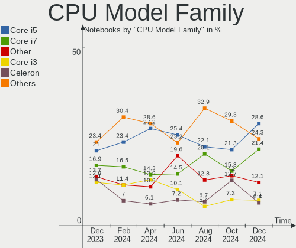
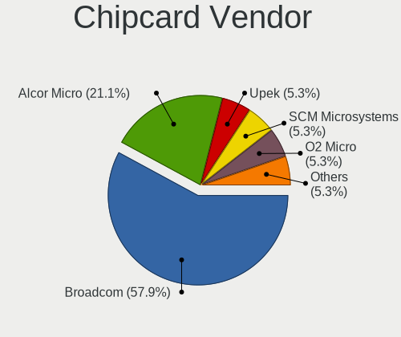

Zorin - Hardware Trends (Notebooks)
-----------------------------------

A project to identify most popular hardware characteristics and track their change
over time based on data collected by Linux users at https://Linux-Hardware.org.

Anyone can contribute to this report by the [hw-probe](https://github.com/linuxhw/hw-probe) tool:

    sudo -E hw-probe -all -upload

This report is for one last month. Overall report since the beginning of time: [TestDays](https://github.com/linuxhw/TestDays)

Period: Sep, 2023.

Contents
--------

* [ System ](#system)
  - [ OS                       ](#os)
  - [ OS Family                ](#os-family)
  - [ Kernel                   ](#kernel)
  - [ Kernel Family            ](#kernel-family)
  - [ Kernel Major Ver.        ](#kernel-major-ver)
  - [ Arch                     ](#arch)
  - [ DE                       ](#de)
  - [ Display Server           ](#display-server)
  - [ Display Manager          ](#display-manager)
  - [ OS Lang                  ](#os-lang)
  - [ Boot Mode                ](#boot-mode)
  - [ Filesystem               ](#filesystem)
  - [ Part. scheme             ](#part-scheme)
  - [ Dual Boot with Linux/BSD ](#dual-boot-with-linuxbsd)
  - [ Dual Boot (Win)          ](#dual-boot-win)

* [ Board ](#board)
  - [ Vendor                   ](#vendor)
  - [ Model                    ](#model)
  - [ Model Family             ](#model-family)
  - [ MFG Year                 ](#mfg-year)
  - [ Form Factor              ](#form-factor)
  - [ Secure Boot              ](#secure-boot)
  - [ Coreboot                 ](#coreboot)
  - [ RAM Size                 ](#ram-size)
  - [ RAM Used                 ](#ram-used)
  - [ Total Drives             ](#total-drives)
  - [ Has CD-ROM               ](#has-cd-rom)
  - [ Has Ethernet             ](#has-ethernet)
  - [ Has WiFi                 ](#has-wifi)
  - [ Has Bluetooth            ](#has-bluetooth)

* [ Location ](#location)
  - [ Country                  ](#country)
  - [ City                     ](#city)

* [ Drives ](#drives)
  - [ Drive Vendor             ](#drive-vendor)
  - [ Drive Model              ](#drive-model)
  - [ HDD Vendor               ](#hdd-vendor)
  - [ SSD Vendor               ](#ssd-vendor)
  - [ Drive Kind               ](#drive-kind)
  - [ Drive Connector          ](#drive-connector)
  - [ Drive Size               ](#drive-size)
  - [ Space Total              ](#space-total)
  - [ Space Used               ](#space-used)
  - [ Malfunc. Drives          ](#malfunc-drives)
  - [ Malfunc. Drive Vendor    ](#malfunc-drive-vendor)
  - [ Malfunc. HDD Vendor      ](#malfunc-hdd-vendor)
  - [ Malfunc. Drive Kind      ](#malfunc-drive-kind)
  - [ Failed Drives            ](#failed-drives)
  - [ Failed Drive Vendor      ](#failed-drive-vendor)
  - [ Drive Status             ](#drive-status)

* [ Storage controller ](#storage-controller)
  - [ Storage Vendor           ](#storage-vendor)
  - [ Storage Model            ](#storage-model)
  - [ Storage Kind             ](#storage-kind)

* [ Processor ](#processor)
  - [ CPU Vendor               ](#cpu-vendor)
  - [ CPU Model                ](#cpu-model)
  - [ CPU Model Family         ](#cpu-model-family)
  - [ CPU Cores                ](#cpu-cores)
  - [ CPU Sockets              ](#cpu-sockets)
  - [ CPU Threads              ](#cpu-threads)
  - [ CPU Op-Modes             ](#cpu-op-modes)
  - [ CPU Microcode            ](#cpu-microcode)
  - [ CPU Microarch            ](#cpu-microarch)

* [ Graphics ](#graphics)
  - [ GPU Vendor               ](#gpu-vendor)
  - [ GPU Model                ](#gpu-model)
  - [ GPU Combo                ](#gpu-combo)
  - [ GPU Driver               ](#gpu-driver)
  - [ GPU Memory               ](#gpu-memory)

* [ Monitor ](#monitor)
  - [ Monitor Vendor           ](#monitor-vendor)
  - [ Monitor Model            ](#monitor-model)
  - [ Monitor Resolution       ](#monitor-resolution)
  - [ Monitor Diagonal         ](#monitor-diagonal)
  - [ Monitor Width            ](#monitor-width)
  - [ Aspect Ratio             ](#aspect-ratio)
  - [ Monitor Area             ](#monitor-area)
  - [ Pixel Density            ](#pixel-density)
  - [ Multiple Monitors        ](#multiple-monitors)

* [ Network ](#network)
  - [ Net Controller Vendor    ](#net-controller-vendor)
  - [ Net Controller Model     ](#net-controller-model)
  - [ Wireless Vendor          ](#wireless-vendor)
  - [ Wireless Model           ](#wireless-model)
  - [ Ethernet Vendor          ](#ethernet-vendor)
  - [ Ethernet Model           ](#ethernet-model)
  - [ Net Controller Kind      ](#net-controller-kind)
  - [ Used Controller          ](#used-controller)
  - [ NICs                     ](#nics)
  - [ IPv6                     ](#ipv6)

* [ Bluetooth ](#bluetooth)
  - [ Bluetooth Vendor         ](#bluetooth-vendor)
  - [ Bluetooth Model          ](#bluetooth-model)

* [ Sound ](#sound)
  - [ Sound Vendor             ](#sound-vendor)
  - [ Sound Model              ](#sound-model)

* [ Memory ](#memory)
  - [ Memory Vendor            ](#memory-vendor)
  - [ Memory Model             ](#memory-model)
  - [ Memory Kind              ](#memory-kind)
  - [ Memory Form Factor       ](#memory-form-factor)
  - [ Memory Size              ](#memory-size)
  - [ Memory Speed             ](#memory-speed)

* [ Printers & scanners ](#printers--scanners)
  - [ Printer Vendor           ](#printer-vendor)
  - [ Printer Model            ](#printer-model)
  - [ Scanner Vendor           ](#scanner-vendor)
  - [ Scanner Model            ](#scanner-model)

* [ Camera ](#camera)
  - [ Camera Vendor            ](#camera-vendor)
  - [ Camera Model             ](#camera-model)

* [ Security ](#security)
  - [ Fingerprint Vendor       ](#fingerprint-vendor)
  - [ Fingerprint Model        ](#fingerprint-model)
  - [ Chipcard Vendor          ](#chipcard-vendor)
  - [ Chipcard Model           ](#chipcard-model)

* [ Unsupported ](#unsupported)
  - [ Unsupported Devices      ](#unsupported-devices)
  - [ Unsupported Device Types ](#unsupported-device-types)

System
------

OS
--

Installed operating systems

| Name     | Notebooks | Percent |
|----------|-----------|---------|
| Zorin 16 | 84        | 100%    |

OS Family
---------

OS without a version

| Name  | Notebooks | Percent |
|-------|-----------|---------|
| Zorin | 84        | 100%    |

Kernel
------

Version of the Linux kernel

| Version                 | Notebooks | Percent |
|-------------------------|-----------|---------|
| 5.15.0-84-generic       | 28        | 33.33%  |
| 5.15.0-83-generic       | 28        | 33.33%  |
| 5.15.0-82-generic       | 10        | 11.9%   |
| 5.15.0-78-generic       | 6         | 7.14%   |
| 5.15.0-79-generic       | 4         | 4.76%   |
| 5.15.0-71-generic       | 2         | 2.38%   |
| 5.15.0-58-generic       | 2         | 2.38%   |
| 6.3.13-1-liquorix-amd64 | 1         | 1.19%   |
| 6.3.13-060313-generic   | 1         | 1.19%   |
| 5.15.0-76-generic       | 1         | 1.19%   |
| 5.13.0-40-generic       | 1         | 1.19%   |

Kernel Family
-------------

Linux kernel without a distro release

| Version | Notebooks | Percent |
|---------|-----------|---------|
| 5.15.0  | 81        | 96.43%  |
| 6.3.13  | 2         | 2.38%   |
| 5.13.0  | 1         | 1.19%   |

Kernel Major Ver.
-----------------

Linux kernel major version

| Version | Notebooks | Percent |
|---------|-----------|---------|
| 5.15    | 81        | 96.43%  |
| 6.3     | 2         | 2.38%   |
| 5.13    | 1         | 1.19%   |

Arch
----

OS architecture (x86_64, i586, etc.)

| Name   | Notebooks | Percent |
|--------|-----------|---------|
| x86_64 | 84        | 100%    |

DE
--

Desktop Environment

| Name  | Notebooks | Percent |
|-------|-----------|---------|
| GNOME | 67        | 79.76%  |
| XFCE  | 16        | 19.05%  |
| Unity | 1         | 1.19%   |

Display Server
--------------

X11 or Wayland

| Name    | Notebooks | Percent |
|---------|-----------|---------|
| X11     | 80        | 95.24%  |
| Wayland | 4         | 4.76%   |

Display Manager
---------------

SDDM, LightDM, etc.

| Name    | Notebooks | Percent |
|---------|-----------|---------|
| Unknown | 59        | 70.24%  |
| GDM     | 13        | 15.48%  |
| LightDM | 6         | 7.14%   |
| GDM3    | 6         | 7.14%   |

OS Lang
-------

Language

| Lang  | Notebooks | Percent |
|-------|-----------|---------|
| en_US | 26        | 30.95%  |
| de_DE | 15        | 17.86%  |
| es_ES | 5         | 5.95%   |
| en_GB | 5         | 5.95%   |
| pl_PL | 4         | 4.76%   |
| pt_BR | 3         | 3.57%   |
| sv_SE | 2         | 2.38%   |
| sk_SK | 2         | 2.38%   |
| nl_NL | 2         | 2.38%   |
| nl_BE | 2         | 2.38%   |
| it_IT | 2         | 2.38%   |
| fr_FR | 2         | 2.38%   |
| en_IN | 2         | 2.38%   |
| en_CA | 2         | 2.38%   |
| tr_TR | 1         | 1.19%   |
| sr_RS | 1         | 1.19%   |
| sl_SI | 1         | 1.19%   |
| ru_RU | 1         | 1.19%   |
| fr_BE | 1         | 1.19%   |
| es_SV | 1         | 1.19%   |
| es_MX | 1         | 1.19%   |
| es_AR | 1         | 1.19%   |
| en_NZ | 1         | 1.19%   |
| cs_CZ | 1         | 1.19%   |

Boot Mode
---------

EFI or BIOS

| Mode | Notebooks | Percent |
|------|-----------|---------|
| EFI  | 51        | 60.71%  |
| BIOS | 33        | 39.29%  |

Filesystem
----------

Type of filesystem

| Type    | Notebooks | Percent |
|---------|-----------|---------|
| Ext4    | 69        | 82.14%  |
| Tmpfs   | 8         | 9.52%   |
| Btrfs   | 3         | 3.57%   |
| Zfs     | 2         | 2.38%   |
| Overlay | 2         | 2.38%   |

Part. scheme
------------

Scheme of partitioning

| Type    | Notebooks | Percent |
|---------|-----------|---------|
| Unknown | 60        | 71.43%  |
| GPT     | 18        | 21.43%  |
| MBR     | 6         | 7.14%   |

Dual Boot with Linux/BSD
------------------------

Hosting more than one Linux/BSD

| Dual boot | Notebooks | Percent |
|-----------|-----------|---------|
| No        | 80        | 95.24%  |
| Yes       | 4         | 4.76%   |

Dual Boot (Win)
---------------

Hosting Linux and Windows

| Dual boot | Notebooks | Percent |
|-----------|-----------|---------|
| No        | 73        | 86.9%   |
| Yes       | 11        | 13.1%   |

Board
-----

Vendor
------

Motherboard manufacturer

| Name                | Notebooks | Percent |
|---------------------|-----------|---------|
| Lenovo              | 17        | 20.24%  |
| Dell                | 15        | 17.86%  |
| Hewlett-Packard     | 13        | 15.48%  |
| Acer                | 8         | 9.52%   |
| Apple               | 7         | 8.33%   |
| ASUSTek Computer    | 6         | 7.14%   |
| Toshiba             | 5         | 5.95%   |
| Sony                | 2         | 2.38%   |
| Samsung Electronics | 1         | 1.19%   |
| Primux Tech         | 1         | 1.19%   |
| MSI                 | 1         | 1.19%   |
| Medion              | 1         | 1.19%   |
| Itautec             | 1         | 1.19%   |
| Intel               | 1         | 1.19%   |
| HUAWEI              | 1         | 1.19%   |
| Hometech            | 1         | 1.19%   |
| Gigabyte Technology | 1         | 1.19%   |
| Framework           | 1         | 1.19%   |
| Alienware           | 1         | 1.19%   |

Model
-----

Motherboard model

| Name                                      | Notebooks | Percent |
|-------------------------------------------|-----------|---------|
| Lenovo ThinkPad T560 20FJS2BX00           | 2         | 2.38%   |
| HP Pavilion dv7                           | 2         | 2.38%   |
| Toshiba Satellite Pro R40-D               | 1         | 1.19%   |
| Toshiba Satellite L50-A-1DL               | 1         | 1.19%   |
| Toshiba Satellite C870-1C2                | 1         | 1.19%   |
| Toshiba Satellite C70D-A                  | 1         | 1.19%   |
| Toshiba Satellite A210                    | 1         | 1.19%   |
| Sony VPCEB1E1E                            | 1         | 1.19%   |
| Sony SVF14A15CXB                          | 1         | 1.19%   |
| Samsung 3570R/370R/470R/450R/510R         | 1         | 1.19%   |
| Primux Tech Primux_1406F_W10              | 1         | 1.19%   |
| MSI Bravo 15 A4DDR                        | 1         | 1.19%   |
| Medion E6431 MD60112                      | 1         | 1.19%   |
| Lenovo V110-14IAP 80TF                    | 1         | 1.19%   |
| Lenovo ThinkPad T570 20HAS1PC00           | 1         | 1.19%   |
| Lenovo ThinkPad T430 2349HNU              | 1         | 1.19%   |
| Lenovo ThinkPad T430 2349H2G              | 1         | 1.19%   |
| Lenovo ThinkPad S5-S540 20B30064MH        | 1         | 1.19%   |
| Lenovo ThinkPad R60 9461DXG               | 1         | 1.19%   |
| Lenovo ThinkPad E575 20H8000HUS           | 1         | 1.19%   |
| Lenovo ThinkPad E14 20RA0050US            | 1         | 1.19%   |
| Lenovo Legion S7 16IAH7 82TF              | 1         | 1.19%   |
| Lenovo IdeaPad Slim 5 16IRL8 82XF         | 1         | 1.19%   |
| Lenovo IdeaPad Slim 3 15IRU8 82X7         | 1         | 1.19%   |
| Lenovo IdeaPad S340-15IIL 81VW            | 1         | 1.19%   |
| Lenovo IdeaPad Gaming 3 15IAH7 82S9       | 1         | 1.19%   |
| Lenovo IdeaPad Gaming 3 15ARH05 82EY      | 1         | 1.19%   |
| Lenovo IdeaPad 3 14IIL05 81WD             | 1         | 1.19%   |
| Itautec Infoway                           | 1         | 1.19%   |
| Intel Infoway                             | 1         | 1.19%   |
| HUAWEI KLVL-WXXW                          | 1         | 1.19%   |
| Hometech Ultra Tab 8W                     | 1         | 1.19%   |
| HP ZBook Fury 16 G9 Mobile Workstation PC | 1         | 1.19%   |
| HP ProBook 650 G5                         | 1         | 1.19%   |
| HP ProBook 4740s                          | 1         | 1.19%   |
| HP Notebook                               | 1         | 1.19%   |
| HP Laptop 15-fc0xxx                       | 1         | 1.19%   |
| HP Laptop 15-ef1xxx                       | 1         | 1.19%   |
| HP Laptop 14-dq1xxx                       | 1         | 1.19%   |
| HP EliteBook 840 G5                       | 1         | 1.19%   |

Model Family
------------

Motherboard model prefix

| Name               | Notebooks | Percent |
|--------------------|-----------|---------|
| Lenovo ThinkPad    | 9         | 10.71%  |
| Dell Inspiron      | 7         | 8.33%   |
| Acer Aspire        | 7         | 8.33%   |
| Lenovo IdeaPad     | 6         | 7.14%   |
| Toshiba Satellite  | 5         | 5.95%   |
| HP Laptop          | 3         | 3.57%   |
| Dell Latitude      | 3         | 3.57%   |
| HP ProBook         | 2         | 2.38%   |
| HP Pavilion        | 2         | 2.38%   |
| HP EliteBook       | 2         | 2.38%   |
| Dell XPS           | 2         | 2.38%   |
| Dell Vostro        | 2         | 2.38%   |
| Sony VPCEB1E1E     | 1         | 1.19%   |
| Sony SVF14A15CXB   | 1         | 1.19%   |
| Samsung 3570R      | 1         | 1.19%   |
| Primux Tech Primux | 1         | 1.19%   |
| MSI Bravo          | 1         | 1.19%   |
| Medion E6431       | 1         | 1.19%   |
| Lenovo V110-14IAP  | 1         | 1.19%   |
| Lenovo Legion      | 1         | 1.19%   |
| Itautec Infoway    | 1         | 1.19%   |
| Intel Infoway      | 1         | 1.19%   |
| HUAWEI KLVL-WXXW   | 1         | 1.19%   |
| Hometech Ultra     | 1         | 1.19%   |
| HP ZBook           | 1         | 1.19%   |
| HP Notebook        | 1         | 1.19%   |
| HP 250             | 1         | 1.19%   |
| HP 240             | 1         | 1.19%   |
| Gigabyte G5        | 1         | 1.19%   |
| Framework Laptop   | 1         | 1.19%   |
| Dell G15           | 1         | 1.19%   |
| ASUS ZenBook       | 1         | 1.19%   |
| ASUS X551MA        | 1         | 1.19%   |
| ASUS X541UA        | 1         | 1.19%   |
| ASUS VivoBook      | 1         | 1.19%   |
| ASUS K54C          | 1         | 1.19%   |
| ASUS K50IJ         | 1         | 1.19%   |
| Apple MacBookPro8  | 1         | 1.19%   |
| Apple MacBookPro5  | 1         | 1.19%   |
| Apple MacBookPro3  | 1         | 1.19%   |

MFG Year
--------

Motherboard manufacture year

| Year    | Notebooks | Percent |
|---------|-----------|---------|
| 2019    | 9         | 10.71%  |
| 2020    | 7         | 8.33%   |
| 2013    | 6         | 7.14%   |
| 2012    | 6         | 7.14%   |
| 2021    | 5         | 5.95%   |
| 2018    | 5         | 5.95%   |
| 2017    | 5         | 5.95%   |
| 2016    | 5         | 5.95%   |
| 2011    | 5         | 5.95%   |
| 2008    | 5         | 5.95%   |
| 2023    | 4         | 4.76%   |
| 2022    | 4         | 4.76%   |
| 2015    | 4         | 4.76%   |
| 2014    | 4         | 4.76%   |
| 2009    | 4         | 4.76%   |
| 2010    | 2         | 2.38%   |
| 2007    | 2         | 2.38%   |
| 2006    | 1         | 1.19%   |
| Unknown | 1         | 1.19%   |

Form Factor
-----------

Physical design of the computer

| Name     | Notebooks | Percent |
|----------|-----------|---------|
| Notebook | 84        | 100%    |

Secure Boot
-----------

Enabled or disabled

| State    | Notebooks | Percent |
|----------|-----------|---------|
| Disabled | 72        | 85.71%  |
| Enabled  | 12        | 14.29%  |

Coreboot
--------

Have coreboot on board

| Used | Notebooks | Percent |
|------|-----------|---------|
| No   | 84        | 100%    |

RAM Size
--------

Total RAM memory

| Size in GB  | Notebooks | Percent |
|-------------|-----------|---------|
| 4.01-8.0    | 37        | 44.05%  |
| 3.01-4.0    | 13        | 15.48%  |
| 16.01-24.0  | 12        | 14.29%  |
| 8.01-16.0   | 11        | 13.1%   |
| 2.01-3.0    | 3         | 3.57%   |
| 1.01-2.0    | 3         | 3.57%   |
| 64.01-256.0 | 2         | 2.38%   |
| 32.01-64.0  | 1         | 1.19%   |
| 24.01-32.0  | 1         | 1.19%   |
| 0.51-1.0    | 1         | 1.19%   |

RAM Used
--------

Used RAM memory

| Used GB    | Notebooks | Percent |
|------------|-----------|---------|
| 2.01-3.0   | 32        | 38.1%   |
| 1.01-2.0   | 30        | 35.71%  |
| 4.01-8.0   | 10        | 11.9%   |
| 3.01-4.0   | 7         | 8.33%   |
| 8.01-16.0  | 2         | 2.38%   |
| 0.51-1.0   | 2         | 2.38%   |
| 24.01-32.0 | 1         | 1.19%   |

Total Drives
------------

Number of drives on board

| Drives | Notebooks | Percent |
|--------|-----------|---------|
| 1      | 66        | 78.57%  |
| 2      | 17        | 20.24%  |
| 3      | 1         | 1.19%   |

Has CD-ROM
----------

Has CD-ROM on board

| Presented | Notebooks | Percent |
|-----------|-----------|---------|
| No        | 46        | 54.76%  |
| Yes       | 38        | 45.24%  |

Has Ethernet
------------

Has Ethernet on board

| Presented | Notebooks | Percent |
|-----------|-----------|---------|
| Yes       | 69        | 82.14%  |
| No        | 15        | 17.86%  |

Has WiFi
--------

Has WiFi module

| Presented | Notebooks | Percent |
|-----------|-----------|---------|
| Yes       | 83        | 98.81%  |
| No        | 1         | 1.19%   |

Has Bluetooth
-------------

Has Bluetooth module

| Presented | Notebooks | Percent |
|-----------|-----------|---------|
| Yes       | 62        | 73.81%  |
| No        | 22        | 26.19%  |

Location
--------

Country
-------

Geographic location (country)

| Country     | Notebooks | Percent |
|-------------|-----------|---------|
| Germany     | 17        | 20.24%  |
| USA         | 15        | 17.86%  |
| Spain       | 5         | 5.95%   |
| Brazil      | 4         | 4.76%   |
| Belgium     | 4         | 4.76%   |
| UK          | 3         | 3.57%   |
| Poland      | 3         | 3.57%   |
| Turkey      | 2         | 2.38%   |
| Sweden      | 2         | 2.38%   |
| Slovakia    | 2         | 2.38%   |
| Russia      | 2         | 2.38%   |
| Netherlands | 2         | 2.38%   |
| Italy       | 2         | 2.38%   |
| Ireland     | 2         | 2.38%   |
| India       | 2         | 2.38%   |
| France      | 2         | 2.38%   |
| Canada      | 2         | 2.38%   |
| Slovenia    | 1         | 1.19%   |
| Serbia      | 1         | 1.19%   |
| New Zealand | 1         | 1.19%   |
| Mexico      | 1         | 1.19%   |
| Iceland     | 1         | 1.19%   |
| Hungary     | 1         | 1.19%   |
| Finland     | 1         | 1.19%   |
| El Salvador | 1         | 1.19%   |
| Czechia     | 1         | 1.19%   |
| Bulgaria    | 1         | 1.19%   |
| Bangladesh  | 1         | 1.19%   |
| Argentina   | 1         | 1.19%   |
| Algeria     | 1         | 1.19%   |

City
----

Geographic location (city)

| City               | Notebooks | Percent |
|--------------------|-----------|---------|
| Hechingen          | 2         | 2.38%   |
| Wuppertal          | 1         | 1.19%   |
| Tullahoma          | 1         | 1.19%   |
| Torrejón de Ardoz | 1         | 1.19%   |
| The Hague          | 1         | 1.19%   |
| Taubate            | 1         | 1.19%   |
| Stuttgart          | 1         | 1.19%   |
| St Petersburg      | 1         | 1.19%   |
| Singen             | 1         | 1.19%   |
| Seattle            | 1         | 1.19%   |
| Santa Tecla        | 1         | 1.19%   |
| Richardson         | 1         | 1.19%   |
| Plovdiv            | 1         | 1.19%   |
| Philadelphia       | 1         | 1.19%   |
| Pflugerville       | 1         | 1.19%   |
| Peterborough       | 1         | 1.19%   |
| Partizánske       | 1         | 1.19%   |
| Paris              | 1         | 1.19%   |
| Pamplona           | 1         | 1.19%   |
| Palmyra            | 1         | 1.19%   |
| Paco do Lumiar     | 1         | 1.19%   |
| Olney              | 1         | 1.19%   |
| Norristown         | 1         | 1.19%   |
| Nevis              | 1         | 1.19%   |
| Neuzina            | 1         | 1.19%   |
| Mymensingh         | 1         | 1.19%   |
| Munich             | 1         | 1.19%   |
| Motril             | 1         | 1.19%   |
| Mold               | 1         | 1.19%   |
| Moguer             | 1         | 1.19%   |
| Milton             | 1         | 1.19%   |
| Milan              | 1         | 1.19%   |
| Mexico City        | 1         | 1.19%   |
| Memmingen          | 1         | 1.19%   |
| Martinengo         | 1         | 1.19%   |
| Madrid             | 1         | 1.19%   |
| Lučenec           | 1         | 1.19%   |
| Liberec            | 1         | 1.19%   |
| Leipzig            | 1         | 1.19%   |
| Lanaken            | 1         | 1.19%   |

Drives
------

Drive Vendor
------------

Hard drive vendors

| Vendor                      | Notebooks | Drives | Percent |
|-----------------------------|-----------|--------|---------|
| Toshiba                     | 12        | 12     | 12.5%   |
| Samsung Electronics         | 12        | 12     | 12.5%   |
| SanDisk                     | 10        | 10     | 10.42%  |
| WDC                         | 7         | 9      | 7.29%   |
| SK hynix                    | 6         | 6      | 6.25%   |
| Seagate                     | 6         | 6      | 6.25%   |
| Unknown                     | 5         | 5      | 5.21%   |
| KIOXIA                      | 5         | 5      | 5.21%   |
| Apple                       | 4         | 4      | 4.17%   |
| Crucial                     | 3         | 3      | 3.13%   |
| A-DATA Technology           | 3         | 3      | 3.13%   |
| Phison                      | 2         | 2      | 2.08%   |
| Patriot                     | 2         | 2      | 2.08%   |
| Kingston                    | 2         | 2      | 2.08%   |
| Intenso                     | 2         | 2      | 2.08%   |
| Intel                       | 2         | 2      | 2.08%   |
| SPCC                        | 1         | 1      | 1.04%   |
| POLION                      | 1         | 1      | 1.04%   |
| Phison Electronics          | 1         | 1      | 1.04%   |
| Netac                       | 1         | 1      | 1.04%   |
| Micron Technology           | 1         | 1      | 1.04%   |
| MAXIO Technology (Hangzhou) | 1         | 1      | 1.04%   |
| KingSpec                    | 1         | 1      | 1.04%   |
| Hitachi                     | 1         | 1      | 1.04%   |
| General                     | 1         | 1      | 1.04%   |
| Fujitsu                     | 1         | 1      | 1.04%   |
| China                       | 1         | 1      | 1.04%   |
| Apacer                      | 1         | 1      | 1.04%   |
| Unknown                     | 1         | 1      | 1.04%   |

Drive Model
-----------

Hard drive models

| Model                                     | Notebooks | Percent |
|-------------------------------------------|-----------|---------|
| Toshiba BG3 NVMe SSD Controller 512GB     | 2         | 2.06%   |
| Seagate ST1000LM035-1RK172 1TB            | 2         | 2.06%   |
| SanDisk SSD PLUS 480GB                    | 2         | 2.06%   |
| Samsung SSD 870 EVO 1TB                   | 2         | 2.06%   |
| Samsung SSD 750 EVO 250GB                 | 2         | 2.06%   |
| KIOXIA KBG40ZNV256G 256GB                 | 2         | 2.06%   |
| WDC WDS480G2G0A-00JH30 480GB SSD          | 1         | 1.03%   |
| WDC WDS240G2G0A-00JH30 240GB SSD          | 1         | 1.03%   |
| WDC WD5000LPVX-22V0TT0 500GB              | 1         | 1.03%   |
| WDC WD3200BJKT-75F4T0 320GB               | 1         | 1.03%   |
| WDC WD2500BEKT-60A25T1 250GB              | 1         | 1.03%   |
| WDC WD10SPZX-75Z10T2 1TB                  | 1         | 1.03%   |
| WDC WD10JPVX-60JC3T0 1TB                  | 1         | 1.03%   |
| WDC PC SN520 NVMe 256GB                   | 1         | 1.03%   |
| Unknown NVMe SSD Drive 512GB              | 1         | 1.03%   |
| Unknown MMC Card  2GB                     | 1         | 1.03%   |
| Unknown MMC Card  256GB                   | 1         | 1.03%   |
| Unknown MMC Card  1072GB                  | 1         | 1.03%   |
| Unknown 016G92  16GB                      | 1         | 1.03%   |
| Toshiba THNSNJ128GCST 128GB SSD           | 1         | 1.03%   |
| Toshiba MQ04ABF100 1TB                    | 1         | 1.03%   |
| Toshiba MQ01ABF050 500GB                  | 1         | 1.03%   |
| Toshiba MQ01ABD100 1TB                    | 1         | 1.03%   |
| Toshiba MQ01ABD075H 752GB                 | 1         | 1.03%   |
| Toshiba MQ01ABD075 752GB                  | 1         | 1.03%   |
| Toshiba MK3265GSX 320GB                   | 1         | 1.03%   |
| Toshiba MK1655GSX 160GB                   | 1         | 1.03%   |
| Toshiba KXG6AZNV256G 256GB                | 1         | 1.03%   |
| Toshiba KXG50ZNV512G NVMe 512GB           | 1         | 1.03%   |
| SPCC Solid State Disk 120GB               | 1         | 1.03%   |
| SK hynix SKHynix_HFS001TEJ9X115N 1TB      | 1         | 1.03%   |
| SK hynix SKHynix_HFM512GDHTNI-87A0B 512GB | 1         | 1.03%   |
| SK hynix SC210 2.5 7MM 128GB SSD          | 1         | 1.03%   |
| SK hynix HFS128G32TNF-N3A0A 128GB SSD     | 1         | 1.03%   |
| SK hynix HFM512GDJTNG-8310A 512GB         | 1         | 1.03%   |
| SK hynix BC711 NVMe 512GB                 | 1         | 1.03%   |
| Seagate ST9500325AS 500GB                 | 1         | 1.03%   |
| Seagate ST500LM021-1KJ152 500GB           | 1         | 1.03%   |
| Seagate ST1500LM006 HN-M151RAD 1TB        | 1         | 1.03%   |
| Seagate ST1000LM024 HN-M101MBB 1TB        | 1         | 1.03%   |

HDD Vendor
----------

Hard disk drive vendors

| Vendor              | Notebooks | Drives | Percent |
|---------------------|-----------|--------|---------|
| Toshiba             | 7         | 7      | 31.82%  |
| Seagate             | 6         | 6      | 27.27%  |
| WDC                 | 5         | 6      | 22.73%  |
| Samsung Electronics | 1         | 1      | 4.55%   |
| Hitachi             | 1         | 1      | 4.55%   |
| Fujitsu             | 1         | 1      | 4.55%   |
| Apple               | 1         | 1      | 4.55%   |

SSD Vendor
----------

Solid state drive vendors

| Vendor              | Notebooks | Drives | Percent |
|---------------------|-----------|--------|---------|
| Samsung Electronics | 9         | 9      | 22.5%   |
| SanDisk             | 6         | 6      | 15%     |
| Crucial             | 3         | 3      | 7.5%    |
| SK hynix            | 2         | 2      | 5%      |
| Patriot             | 2         | 2      | 5%      |
| Kingston            | 2         | 2      | 5%      |
| Intenso             | 2         | 2      | 5%      |
| Apple               | 2         | 2      | 5%      |
| WDC                 | 1         | 2      | 2.5%    |
| Toshiba             | 1         | 1      | 2.5%    |
| SPCC                | 1         | 1      | 2.5%    |
| POLION              | 1         | 1      | 2.5%    |
| Phison              | 1         | 1      | 2.5%    |
| Netac               | 1         | 1      | 2.5%    |
| KingSpec            | 1         | 1      | 2.5%    |
| Intel               | 1         | 1      | 2.5%    |
| China               | 1         | 1      | 2.5%    |
| Apacer              | 1         | 1      | 2.5%    |
| A-DATA Technology   | 1         | 1      | 2.5%    |
| Unknown             | 1         | 1      | 2.5%    |

Drive Kind
----------

HDD or SSD

| Kind    | Notebooks | Drives | Percent |
|---------|-----------|--------|---------|
| SSD     | 39        | 41     | 41.05%  |
| NVMe    | 29        | 29     | 30.53%  |
| HDD     | 22        | 23     | 23.16%  |
| MMC     | 4         | 4      | 4.21%   |
| Unknown | 1         | 1      | 1.05%   |

Drive Connector
---------------

SATA, SAS, NVMe, etc.

| Type | Notebooks | Drives | Percent |
|------|-----------|--------|---------|
| SATA | 56        | 62     | 60.87%  |
| NVMe | 29        | 29     | 31.52%  |
| MMC  | 4         | 4      | 4.35%   |
| SAS  | 3         | 3      | 3.26%   |

Drive Size
----------

Size of hard drive

| Size in TB | Notebooks | Drives | Percent |
|------------|-----------|--------|---------|
| 0.01-0.5   | 41        | 46     | 69.49%  |
| 0.51-1.0   | 17        | 17     | 28.81%  |
| 1.01-2.0   | 1         | 1      | 1.69%   |

Space Total
-----------

Amount of disk space available on the file system

| Size in GB | Notebooks | Percent |
|------------|-----------|---------|
| 101-250    | 29        | 34.52%  |
| 251-500    | 20        | 23.81%  |
| 501-1000   | 18        | 21.43%  |
| 51-100     | 7         | 8.33%   |
| 1001-2000  | 3         | 3.57%   |
| 1-20       | 3         | 3.57%   |
| 21-50      | 2         | 2.38%   |
| Unknown    | 2         | 2.38%   |

Space Used
----------

Amount of used disk space

| Used GB  | Notebooks | Percent |
|----------|-----------|---------|
| 21-50    | 29        | 34.52%  |
| 1-20     | 29        | 34.52%  |
| 101-250  | 11        | 13.1%   |
| 51-100   | 9         | 10.71%  |
| 251-500  | 3         | 3.57%   |
| Unknown  | 2         | 2.38%   |
| 501-1000 | 1         | 1.19%   |

Malfunc. Drives
---------------

Drive models with a malfunction

| Model                          | Notebooks | Drives | Percent |
|--------------------------------|-----------|--------|---------|
| Toshiba MQ01ABD100 1TB         | 1         | 1      | 33.33%  |
| Seagate ST1000LM035-1RK172 1TB | 1         | 1      | 33.33%  |
| POLION SSD 240GB               | 1         | 1      | 33.33%  |

Malfunc. Drive Vendor
---------------------

Vendors of faulty drives

| Vendor  | Notebooks | Drives | Percent |
|---------|-----------|--------|---------|
| Toshiba | 1         | 1      | 33.33%  |
| Seagate | 1         | 1      | 33.33%  |
| POLION  | 1         | 1      | 33.33%  |

Malfunc. HDD Vendor
-------------------

Vendors of faulty HDD drives

| Vendor  | Notebooks | Drives | Percent |
|---------|-----------|--------|---------|
| Toshiba | 1         | 1      | 50%     |
| Seagate | 1         | 1      | 50%     |

Malfunc. Drive Kind
-------------------

Kinds of faulty drives

| Kind | Notebooks | Drives | Percent |
|------|-----------|--------|---------|
| HDD  | 2         | 2      | 66.67%  |
| SSD  | 1         | 1      | 33.33%  |

Failed Drives
-------------

Failed drive models

Zero info for selected period =(

Failed Drive Vendor
-------------------

Failed drive vendors

Zero info for selected period =(

Drive Status
------------

Number of failed and malfunc. drives

| Status   | Notebooks | Drives | Percent |
|----------|-----------|--------|---------|
| Detected | 68        | 81     | 80.95%  |
| Works    | 13        | 14     | 15.48%  |
| Malfunc  | 3         | 3      | 3.57%   |

Storage controller
------------------

Storage Vendor
--------------

Storage controller vendors

| Vendor                       | Notebooks | Percent |
|------------------------------|-----------|---------|
| Intel                        | 57        | 58.16%  |
| AMD                          | 9         | 9.18%   |
| SanDisk                      | 5         | 5.1%    |
| KIOXIA                       | 5         | 5.1%    |
| Toshiba America Info Systems | 4         | 4.08%   |
| SK hynix                     | 4         | 4.08%   |
| Samsung Electronics          | 3         | 3.06%   |
| Phison Electronics           | 2         | 2.04%   |
| Nvidia                       | 2         | 2.04%   |
| ADATA Technology             | 2         | 2.04%   |
| Micron Technology            | 1         | 1.02%   |
| MAXIO Technology (Hangzhou)  | 1         | 1.02%   |
| Marvell Technology Group     | 1         | 1.02%   |
| INNOGRIT                     | 1         | 1.02%   |
| Apple                        | 1         | 1.02%   |

Storage Model
-------------

Storage controller models

| Model                                                                        | Notebooks | Percent |
|------------------------------------------------------------------------------|-----------|---------|
| Intel Sunrise Point-LP SATA Controller [AHCI mode]                           | 12        | 11.21%  |
| AMD FCH SATA Controller [AHCI mode]                                          | 7         | 6.54%   |
| Intel 7 Series Chipset Family 6-port SATA Controller [AHCI mode]             | 6         | 5.61%   |
| Intel 6 Series/C200 Series Chipset Family 6 port Mobile SATA AHCI Controller | 6         | 5.61%   |
| KIOXIA NVMe SSD Controller BG4 (DRAM-less)                                   | 5         | 4.67%   |
| Intel 82801 Mobile SATA Controller [RAID mode]                               | 5         | 4.67%   |
| Intel 82801IBM/IEM (ICH9M/ICH9M-E) 4 port SATA Controller [AHCI mode]        | 4         | 3.74%   |
| Intel Volume Management Device NVMe RAID Controller                          | 3         | 2.8%    |
| Intel 82801HM/HEM (ICH8M/ICH8M-E) SATA Controller [AHCI mode]                | 3         | 2.8%    |
| Intel 82801HM/HEM (ICH8M/ICH8M-E) IDE Controller                             | 3         | 2.8%    |
| Toshiba America Info Systems BG3 NVMe SSD Controller                         | 2         | 1.87%   |
| Intel Wildcat Point-LP SATA Controller [AHCI Mode]                           | 2         | 1.87%   |
| Intel Ice Lake-LP SATA Controller [AHCI mode]                                | 2         | 1.87%   |
| Intel Comet Lake SATA AHCI Controller                                        | 2         | 1.87%   |
| Intel Celeron/Pentium Silver Processor SATA Controller                       | 2         | 1.87%   |
| Intel Cannon Point-LP SATA Controller [AHCI Mode]                            | 2         | 1.87%   |
| Intel 8 Series SATA Controller 1 [AHCI mode]                                 | 2         | 1.87%   |
| Toshiba America Info Systems XG6 NVMe SSD Controller                         | 1         | 0.93%   |
| Toshiba America Info Systems XG5 NVMe SSD Controller                         | 1         | 0.93%   |
| SK hynix Platinum P41/PC801 NVMe Solid State Drive                           | 1         | 0.93%   |
| SK hynix Gold P31/BC711/PC711 NVMe Solid State Drive                         | 1         | 0.93%   |
| SK hynix BC511 NVMe SSD                                                      | 1         | 0.93%   |
| SK hynix BC501 NVMe Solid State Drive                                        | 1         | 0.93%   |
| SanDisk WD PC SN810 / Black SN850 NVMe SSD                                   | 1         | 0.93%   |
| Sandisk WD PC SN740 NVMe SSD 512GB (DRAM-less)                               | 1         | 0.93%   |
| SanDisk WD Black SN770 / PC SN740 256GB / PC SN560 (DRAM-less) NVMe SSD      | 1         | 0.93%   |
| SanDisk WD Black SN750 / PC SN730 NVMe SSD                                   | 1         | 0.93%   |
| SanDisk PC SN520 NVMe SSD                                                    | 1         | 0.93%   |
| Samsung S4LN053X01 AHCI SSD Controller(Apple slot)                           | 1         | 0.93%   |
| Samsung NVMe SSD Controller PM9B1                                            | 1         | 0.93%   |
| Samsung NVMe SSD Controller PM9A1/PM9A3/980PRO                               | 1         | 0.93%   |
| Phison PS5013 E13 NVMe Controller                                            | 1         | 0.93%   |
| Phison E16 PCIe4 NVMe Controller                                             | 1         | 0.93%   |
| Nvidia MCP79 RAID Controller                                                 | 1         | 0.93%   |
| Nvidia MCP79 AHCI Controller                                                 | 1         | 0.93%   |
| Micron 2200S NVMe SSD [Cassandra]                                            | 1         | 0.93%   |
| MAXIO (Hangzhou) NVMe SSD Controller MAP1202                                 | 1         | 0.93%   |
| Marvell Group 88SS9183 PCIe SSD Controller                                   | 1         | 0.93%   |
| Intel Tiger Lake-LP SATA Controller                                          | 1         | 0.93%   |
| Intel Tiger Lake SATA AHCI Controller                                        | 1         | 0.93%   |

Storage Kind
------------

Kind of storage controller (IDE, SATA, NVMe, SAS, ...)

| Kind | Notebooks | Percent |
|------|-----------|---------|
| SATA | 62        | 57.94%  |
| NVMe | 29        | 27.1%   |
| RAID | 9         | 8.41%   |
| IDE  | 7         | 6.54%   |

Processor
---------

CPU Vendor
----------

Processor vendors

| Vendor | Notebooks | Percent |
|--------|-----------|---------|
| Intel  | 72        | 85.71%  |
| AMD    | 12        | 14.29%  |

CPU Model
---------

Processor models

| Model                                       | Notebooks | Percent |
|---------------------------------------------|-----------|---------|
| Intel Core i5-6200U CPU @ 2.30GHz           | 3         | 3.57%   |
| Intel Core i5-1035G1 CPU @ 1.00GHz          | 3         | 3.57%   |
| Intel Core i7-8550U CPU @ 1.80GHz           | 2         | 2.38%   |
| Intel Core i7-3520M CPU @ 2.90GHz           | 2         | 2.38%   |
| Intel Core i7-10510U CPU @ 1.80GHz          | 2         | 2.38%   |
| Intel Core i5-8365U CPU @ 1.60GHz           | 2         | 2.38%   |
| Intel Core i5-6300U CPU @ 2.40GHz           | 2         | 2.38%   |
| Intel Core i5-2430M CPU @ 2.40GHz           | 2         | 2.38%   |
| Intel Core i3-2370M CPU @ 2.40GHz           | 2         | 2.38%   |
| AMD Ryzen 7 4800H with Radeon Graphics      | 2         | 2.38%   |
| Intel Pentium Dual-Core CPU T4500 @ 2.30GHz | 1         | 1.19%   |
| Intel Pentium Dual-Core CPU T4300 @ 2.10GHz | 1         | 1.19%   |
| Intel Pentium Dual CPU T3200 @ 2.00GHz      | 1         | 1.19%   |
| Intel Pentium CPU B960 @ 2.20GHz            | 1         | 1.19%   |
| Intel Core i7-6567U CPU @ 3.30GHz           | 1         | 1.19%   |
| Intel Core i7-6500U CPU @ 2.50GHz           | 1         | 1.19%   |
| Intel Core i7-4700MQ CPU @ 2.40GHz          | 1         | 1.19%   |
| Intel Core i7-4650U CPU @ 1.70GHz           | 1         | 1.19%   |
| Intel Core i7-4558U CPU @ 2.80GHz           | 1         | 1.19%   |
| Intel Core i7-4500U CPU @ 1.80GHz           | 1         | 1.19%   |
| Intel Core i7-3632QM CPU @ 2.20GHz          | 1         | 1.19%   |
| Intel Core i7-3537U CPU @ 2.00GHz           | 1         | 1.19%   |
| Intel Core i7-2860QM CPU @ 2.50GHz          | 1         | 1.19%   |
| Intel Core i5-8350U CPU @ 1.70GHz           | 1         | 1.19%   |
| Intel Core i5-8265U CPU @ 1.60GHz           | 1         | 1.19%   |
| Intel Core i5-8250U CPU @ 1.60GHz           | 1         | 1.19%   |
| Intel Core i5-7300U CPU @ 2.60GHz           | 1         | 1.19%   |
| Intel Core i5-5200U CPU @ 2.20GHz           | 1         | 1.19%   |
| Intel Core i5-4210U CPU @ 1.70GHz           | 1         | 1.19%   |
| Intel Core i5-3337U CPU @ 1.80GHz           | 1         | 1.19%   |
| Intel Core i5-3320M CPU @ 2.60GHz           | 1         | 1.19%   |
| Intel Core i5-3210M CPU @ 2.50GHz           | 1         | 1.19%   |
| Intel Core i5-2410M CPU @ 2.30GHz           | 1         | 1.19%   |
| Intel Core i5-1038NG7 CPU @ 2.00GHz         | 1         | 1.19%   |
| Intel Core i3-7100U CPU @ 2.40GHz           | 1         | 1.19%   |
| Intel Core i3-7020U CPU @ 2.30GHz           | 1         | 1.19%   |
| Intel Core i3-5005U CPU @ 2.00GHz           | 1         | 1.19%   |
| Intel Core i3-1005G1 CPU @ 1.20GHz          | 1         | 1.19%   |
| Intel Core i3 CPU M 330 @ 2.13GHz           | 1         | 1.19%   |
| Intel Core 2 Quad CPU Q9000 @ 2.00GHz       | 1         | 1.19%   |

CPU Model Family
----------------

Processor model prefix

| Model                          | Notebooks | Percent |
|--------------------------------|-----------|---------|
| Intel Core i5                  | 23        | 27.38%  |
| Intel Core i7                  | 15        | 17.86%  |
| Other                          | 11        | 13.1%   |
| Intel Core i3                  | 7         | 8.33%   |
| Intel Celeron                  | 6         | 7.14%   |
| Intel Core 2 Duo               | 4         | 4.76%   |
| AMD Ryzen 5                    | 3         | 3.57%   |
| Intel Pentium Dual-Core        | 2         | 2.38%   |
| AMD Ryzen 7                    | 2         | 2.38%   |
| AMD A4                         | 2         | 2.38%   |
| Intel Pentium Dual             | 1         | 1.19%   |
| Intel Pentium                  | 1         | 1.19%   |
| Intel Core 2 Quad              | 1         | 1.19%   |
| Intel Core 2                   | 1         | 1.19%   |
| Intel Atom                     | 1         | 1.19%   |
| AMD Turion X2 Dual-Core Mobile | 1         | 1.19%   |
| AMD Ryzen 5 PRO                | 1         | 1.19%   |
| AMD Ryzen 3                    | 1         | 1.19%   |
| AMD Athlon 64 X2               | 1         | 1.19%   |

CPU Cores
---------

Number of processor cores

| Number | Notebooks | Percent |
|--------|-----------|---------|
| 2      | 47        | 55.95%  |
| 4      | 25        | 29.76%  |
| 8      | 3         | 3.57%   |
| 6      | 3         | 3.57%   |
| 1      | 2         | 2.38%   |
| 16     | 1         | 1.19%   |
| 14     | 1         | 1.19%   |
| 12     | 1         | 1.19%   |
| 10     | 1         | 1.19%   |

CPU Sockets
-----------

Number of sockets

| Number | Notebooks | Percent |
|--------|-----------|---------|
| 1      | 84        | 100%    |

CPU Threads
-----------

Threads per core (Hyper-Threading)

| Number | Notebooks | Percent |
|--------|-----------|---------|
| 2      | 60        | 71.43%  |
| 1      | 24        | 28.57%  |

CPU Op-Modes
------------

CPU Operation Modes (32-bit, 64-bit)

| Op mode        | Notebooks | Percent |
|----------------|-----------|---------|
| 32-bit, 64-bit | 84        | 100%    |

CPU Microcode
-------------

Microcode number

| Number     | Notebooks | Percent |
|------------|-----------|---------|
| 0x306a9    | 7         | 8.33%   |
| 0x206a7    | 7         | 8.33%   |
| Unknown    | 7         | 8.33%   |
| 0x406e3    | 6         | 7.14%   |
| 0x806ec    | 5         | 5.95%   |
| 0x806ea    | 4         | 4.76%   |
| 0x806e9    | 4         | 4.76%   |
| 0x706e5    | 4         | 4.76%   |
| 0x40651    | 4         | 4.76%   |
| 0x1067a    | 4         | 4.76%   |
| 0x906a3    | 3         | 3.57%   |
| 0x806c1    | 3         | 3.57%   |
| 0x306d4    | 2         | 2.38%   |
| 0x08108109 | 2         | 2.38%   |
| 0xb06a3    | 1         | 1.19%   |
| 0x90672    | 1         | 1.19%   |
| 0x806d1    | 1         | 1.19%   |
| 0x706a8    | 1         | 1.19%   |
| 0x706a1    | 1         | 1.19%   |
| 0x6fd      | 1         | 1.19%   |
| 0x6fa      | 1         | 1.19%   |
| 0x6f6      | 1         | 1.19%   |
| 0x506c9    | 1         | 1.19%   |
| 0x306c3    | 1         | 1.19%   |
| 0x20652    | 1         | 1.19%   |
| 0x10676    | 1         | 1.19%   |
| 0x10661    | 1         | 1.19%   |
| 0x08a00008 | 1         | 1.19%   |
| 0x08608102 | 1         | 1.19%   |
| 0x08600104 | 1         | 1.19%   |
| 0x08600102 | 1         | 1.19%   |
| 0x08101016 | 1         | 1.19%   |
| 0x0700010f | 1         | 1.19%   |
| 0x06006118 | 1         | 1.19%   |
| 0x03000027 | 1         | 1.19%   |
| 0x02000032 | 1         | 1.19%   |

CPU Microarch
-------------

Microarchitecture

| Name             | Notebooks | Percent |
|------------------|-----------|---------|
| KabyLake         | 13        | 15.48%  |
| Skylake          | 7         | 8.33%   |
| SandyBridge      | 7         | 8.33%   |
| IvyBridge        | 7         | 8.33%   |
| Penryn           | 6         | 7.14%   |
| IceLake          | 6         | 7.14%   |
| Haswell          | 5         | 5.95%   |
| Core             | 4         | 4.76%   |
| Alderlake Hybrid | 4         | 4.76%   |
| Unknown          | 4         | 4.76%   |
| TigerLake        | 3         | 3.57%   |
| Zen+             | 2         | 2.38%   |
| Zen 2            | 2         | 2.38%   |
| Silvermont       | 2         | 2.38%   |
| Goldmont plus    | 2         | 2.38%   |
| Broadwell        | 2         | 2.38%   |
| Zen              | 1         | 1.19%   |
| Westmere         | 1         | 1.19%   |
| K8 Hammer        | 1         | 1.19%   |
| K8 & K10 hybrid  | 1         | 1.19%   |
| K10 Llano        | 1         | 1.19%   |
| Jaguar           | 1         | 1.19%   |
| Goldmont         | 1         | 1.19%   |
| Excavator        | 1         | 1.19%   |

Graphics
--------

GPU Vendor
----------

Vendors of graphics cards

| Vendor | Notebooks | Percent |
|--------|-----------|---------|
| Intel  | 67        | 65.05%  |
| AMD    | 20        | 19.42%  |
| Nvidia | 16        | 15.53%  |

GPU Model
---------

Graphics card models

| Model                                                                         | Notebooks | Percent |
|-------------------------------------------------------------------------------|-----------|---------|
| Intel 3rd Gen Core processor Graphics Controller                              | 7         | 6.48%   |
| Intel 2nd Generation Core Processor Family Integrated Graphics Controller     | 7         | 6.48%   |
| Intel Skylake GT2 [HD Graphics 520]                                           | 6         | 5.56%   |
| Intel UHD Graphics 620                                                        | 4         | 3.7%    |
| Intel Mobile 4 Series Chipset Integrated Graphics Controller                  | 4         | 3.7%    |
| Intel Iris Plus Graphics G1 (Ice Lake)                                        | 4         | 3.7%    |
| Intel Haswell-ULT Integrated Graphics Controller                              | 4         | 3.7%    |
| Intel WhiskeyLake-U GT2 [UHD Graphics 620]                                    | 3         | 2.78%   |
| Intel TigerLake-LP GT2 [Iris Xe Graphics]                                     | 3         | 2.78%   |
| Intel HD Graphics 620                                                         | 3         | 2.78%   |
| AMD Sun XT [Radeon HD 8670A/8670M/8690M / R5 M330 / M430 / Radeon 520 Mobile] | 3         | 2.78%   |
| Intel Raptor Lake-P [UHD Graphics]                                            | 2         | 1.85%   |
| Intel Mobile GM965/GL960 Integrated Graphics Controller (secondary)           | 2         | 1.85%   |
| Intel Mobile GM965/GL960 Integrated Graphics Controller (primary)             | 2         | 1.85%   |
| Intel HD Graphics 5500                                                        | 2         | 1.85%   |
| Intel GeminiLake [UHD Graphics 600]                                           | 2         | 1.85%   |
| Intel CometLake-U GT2 [UHD Graphics]                                          | 2         | 1.85%   |
| Intel Atom Processor Z36xxx/Z37xxx Series Graphics & Display                  | 2         | 1.85%   |
| Intel Alder Lake-P Integrated Graphics Controller                             | 2         | 1.85%   |
| AMD Renoir                                                                    | 2         | 1.85%   |
| AMD Picasso/Raven 2 [Radeon Vega Series / Radeon Vega Mobile Series]          | 2         | 1.85%   |
| Nvidia TU117M [GeForce GTX 1650 Ti Mobile]                                    | 1         | 0.93%   |
| Nvidia GP108M [GeForce MX250]                                                 | 1         | 0.93%   |
| Nvidia GM107M [GeForce GTX 950M]                                              | 1         | 0.93%   |
| Nvidia GK208M [GeForce GT 740M]                                               | 1         | 0.93%   |
| Nvidia GF108M [NVS 5400M]                                                     | 1         | 0.93%   |
| Nvidia GF108M [GeForce GT 540M]                                               | 1         | 0.93%   |
| Nvidia GF108M [GeForce 610M]                                                  | 1         | 0.93%   |
| Nvidia GF108GLM [NVS 5200M]                                                   | 1         | 0.93%   |
| Nvidia GA107M [GeForce RTX 3050 Ti Mobile]                                    | 1         | 0.93%   |
| Nvidia GA107M [GeForce RTX 3050 Mobile]                                       | 1         | 0.93%   |
| Nvidia GA107GLM [RTX A1000 Laptop GPU]                                        | 1         | 0.93%   |
| Nvidia GA104M [GeForce RTX 3070 Mobile / Max-Q]                               | 1         | 0.93%   |
| Nvidia G96CM [GeForce 9600M GT]                                               | 1         | 0.93%   |
| Nvidia G84M [GeForce 8600M GT]                                                | 1         | 0.93%   |
| Nvidia C79 [GeForce 9400M]                                                    | 1         | 0.93%   |
| Nvidia C79 [GeForce 9400M G]                                                  | 1         | 0.93%   |
| Nvidia AD107M [GeForce RTX 4060 Max-Q / Mobile]                               | 1         | 0.93%   |
| Intel TigerLake-H GT1 [UHD Graphics]                                          | 1         | 0.93%   |
| Intel Iris Plus Graphics G7                                                   | 1         | 0.93%   |

GPU Combo
---------

Combinations of graphics cards

| Name           | Notebooks | Percent |
|----------------|-----------|---------|
| 1 x Intel      | 49        | 58.33%  |
| Intel + Nvidia | 12        | 14.29%  |
| 1 x AMD        | 11        | 13.1%   |
| Intel + AMD    | 6         | 7.14%   |
| 2 x AMD        | 2         | 2.38%   |
| 1 x Nvidia     | 2         | 2.38%   |
| 2 x Nvidia     | 1         | 1.19%   |
| AMD + Nvidia   | 1         | 1.19%   |

GPU Driver
----------

Free vs proprietary

| Driver      | Notebooks | Percent |
|-------------|-----------|---------|
| Free        | 71        | 84.52%  |
| Proprietary | 8         | 9.52%   |
| Unknown     | 5         | 5.95%   |

GPU Memory
----------

Total video memory

| Size in GB | Notebooks | Percent |
|------------|-----------|---------|
| Unknown    | 60        | 71.43%  |
| 0.01-0.5   | 10        | 11.9%   |
| 1.01-2.0   | 7         | 8.33%   |
| 0.51-1.0   | 5         | 5.95%   |
| 3.01-4.0   | 2         | 2.38%   |

Monitor
-------

Monitor Vendor
--------------

Monitor vendors

| Vendor                  | Notebooks | Percent |
|-------------------------|-----------|---------|
| LG Display              | 21        | 24.42%  |
| BOE                     | 15        | 17.44%  |
| AU Optronics            | 15        | 17.44%  |
| Chimei Innolux          | 10        | 11.63%  |
| Apple                   | 7         | 8.14%   |
| Lenovo                  | 3         | 3.49%   |
| Goldstar                | 3         | 3.49%   |
| Samsung Electronics     | 2         | 2.33%   |
| Sony                    | 1         | 1.16%   |
| Sharp                   | 1         | 1.16%   |
| PANDA                   | 1         | 1.16%   |
| LG Philips              | 1         | 1.16%   |
| InfoVision              | 1         | 1.16%   |
| CSO                     | 1         | 1.16%   |
| CPT                     | 1         | 1.16%   |
| Chi Mei Optoelectronics | 1         | 1.16%   |
| ASUSTek Computer        | 1         | 1.16%   |
| Ancor Communications    | 1         | 1.16%   |

Monitor Model
-------------

Monitor models

| Model                                                                  | Notebooks | Percent |
|------------------------------------------------------------------------|-----------|---------|
| LG Display LCD Monitor LGD02DC 1366x768 344x194mm 15.5-inch            | 4         | 4.65%   |
| LG Display LCD Monitor LGD0565 1920x1080 344x194mm 15.5-inch           | 2         | 2.33%   |
| Sony LCD Monitor SNY05FA 1366x768 340x190mm 15.3-inch                  | 1         | 1.16%   |
| Sharp LCD Monitor SHP1449 1920x1080 294x165mm 13.3-inch                | 1         | 1.16%   |
| Samsung Electronics LCD Monitor SDC280F 1366x768 344x193mm 15.5-inch   | 1         | 1.16%   |
| Samsung Electronics LCD Monitor SAM0A7A 1920x1080 1060x626mm 48.5-inch | 1         | 1.16%   |
| PANDA LCD Monitor NCP0035 1920x1080 344x194mm 15.5-inch                | 1         | 1.16%   |
| LG Philips LCD Monitor LPLDC00 1280x800 331x207mm 15.4-inch            | 1         | 1.16%   |
| LG Display LP156WH1-TLA1 LGD6301 1366x768 344x194mm 15.5-inch          | 1         | 1.16%   |
| LG Display LCD Monitor LGDD801 1366x768 344x194mm 15.5-inch            | 1         | 1.16%   |
| LG Display LCD Monitor LGD063E 1920x1080 309x174mm 14.0-inch           | 1         | 1.16%   |
| LG Display LCD Monitor LGD05F2 1920x1080 344x194mm 15.5-inch           | 1         | 1.16%   |
| LG Display LCD Monitor LGD04A7 1920x1080 344x194mm 15.5-inch           | 1         | 1.16%   |
| LG Display LCD Monitor LGD03E3 1366x768 310x174mm 14.0-inch            | 1         | 1.16%   |
| LG Display LCD Monitor LGD03B8 1366x768 310x174mm 14.0-inch            | 1         | 1.16%   |
| LG Display LCD Monitor LGD039F 1366x768 345x194mm 15.6-inch            | 1         | 1.16%   |
| LG Display LCD Monitor LGD0396 1600x900 382x215mm 17.3-inch            | 1         | 1.16%   |
| LG Display LCD Monitor LGD0393 1600x900 382x215mm 17.3-inch            | 1         | 1.16%   |
| LG Display LCD Monitor LGD0362 1600x900 309x174mm 14.0-inch            | 1         | 1.16%   |
| LG Display LCD Monitor LGD033E 1366x768 309x174mm 14.0-inch            | 1         | 1.16%   |
| LG Display LCD Monitor LGD032C 1920x1080 344x194mm 15.5-inch           | 1         | 1.16%   |
| LG Display LCD Monitor LGD02E3 1366x768 344x194mm 15.5-inch            | 1         | 1.16%   |
| LG Display LCD Monitor LGD01E8 1366x768 344x194mm 15.5-inch            | 1         | 1.16%   |
| Lenovo LEN T2424pA LEN60C8 1920x1080 527x296mm 23.8-inch               | 1         | 1.16%   |
| Lenovo LEN E2003bA LEN60BC 1600x900 432x240mm 19.5-inch                | 1         | 1.16%   |
| Lenovo LCD Monitor LEN4042 1400x1050 304x228mm 15.0-inch               | 1         | 1.16%   |
| InfoVision LCD Monitor IVO057F 1920x1080 309x174mm 14.0-inch           | 1         | 1.16%   |
| Goldstar Ultra HD GSM5B08 3840x2160 600x340mm 27.2-inch                | 1         | 1.16%   |
| Goldstar LG ULTRAGEAR GSM5C02 1920x1080 600x340mm 27.2-inch            | 1         | 1.16%   |
| Goldstar HDR WFHD GSM7714 2560x1080 798x334mm 34.1-inch                | 1         | 1.16%   |
| CSO LCD Monitor CSO1612 2560x1600 345x215mm 16.0-inch                  | 1         | 1.16%   |
| CPT LCD Monitor CPT1401 1280x800 331x207mm 15.4-inch                   | 1         | 1.16%   |
| Chimei Innolux LCD Monitor CMN1728 1600x900 382x215mm 17.3-inch        | 1         | 1.16%   |
| Chimei Innolux LCD Monitor CMN15E7 1920x1080 344x193mm 15.5-inch       | 1         | 1.16%   |
| Chimei Innolux LCD Monitor CMN15DB 1366x768 344x193mm 15.5-inch        | 1         | 1.16%   |
| Chimei Innolux LCD Monitor CMN1521 1920x1080 344x193mm 15.5-inch       | 1         | 1.16%   |
| Chimei Innolux LCD Monitor CMN151B 1920x1080 344x193mm 15.5-inch       | 1         | 1.16%   |
| Chimei Innolux LCD Monitor CMN150D 1920x1080 344x193mm 15.5-inch       | 1         | 1.16%   |
| Chimei Innolux LCD Monitor CMN14FF 1920x1080 309x173mm 13.9-inch       | 1         | 1.16%   |
| Chimei Innolux LCD Monitor CMN14E7 1920x1080 309x173mm 13.9-inch       | 1         | 1.16%   |

Monitor Resolution
------------------

Monitor screen resolution

| Resolution         | Notebooks | Percent |
|--------------------|-----------|---------|
| 1920x1080 (FHD)    | 30        | 35.71%  |
| 1366x768 (WXGA)    | 28        | 33.33%  |
| 1600x900 (HD+)     | 8         | 9.52%   |
| 1280x800 (WXGA)    | 4         | 4.76%   |
| 2560x1600          | 3         | 3.57%   |
| 3840x2160 (4K)     | 2         | 2.38%   |
| 1920x1200 (WUXGA)  | 2         | 2.38%   |
| 1680x1050 (WSXGA+) | 2         | 2.38%   |
| 2560x1080          | 1         | 1.19%   |
| 2256x1504          | 1         | 1.19%   |
| 2160x1440          | 1         | 1.19%   |
| 1440x900 (WXGA+)   | 1         | 1.19%   |
| 1400x1050          | 1         | 1.19%   |

Monitor Diagonal
----------------

Diagonal size in inches

| Inches | Notebooks | Percent |
|--------|-----------|---------|
| 15     | 41        | 47.67%  |
| 13     | 15        | 17.44%  |
| 14     | 12        | 13.95%  |
| 17     | 6         | 6.98%   |
| 27     | 2         | 2.33%   |
| 24     | 2         | 2.33%   |
| 16     | 2         | 2.33%   |
| 48     | 1         | 1.16%   |
| 34     | 1         | 1.16%   |
| 23     | 1         | 1.16%   |
| 19     | 1         | 1.16%   |
| 12     | 1         | 1.16%   |
| 11     | 1         | 1.16%   |

Monitor Width
-------------

Physical width

| Width in mm | Notebooks | Percent |
|-------------|-----------|---------|
| 301-350     | 63        | 73.26%  |
| 201-300     | 9         | 10.47%  |
| 351-400     | 6         | 6.98%   |
| 501-600     | 5         | 5.81%   |
| 701-800     | 1         | 1.16%   |
| 401-500     | 1         | 1.16%   |
| 1001-1500   | 1         | 1.16%   |

Aspect Ratio
------------

Proportional relationship between the width and the height

| Ratio | Notebooks | Percent |
|-------|-----------|---------|
| 16/9  | 65        | 80.25%  |
| 16/10 | 12        | 14.81%  |
| 3/2   | 2         | 2.47%   |
| 4/3   | 1         | 1.23%   |
| 21/9  | 1         | 1.23%   |

Monitor Area
------------

Area in inch²

| Area in inch² | Notebooks | Percent |
|----------------|-----------|---------|
| 101-110        | 40        | 46.51%  |
| 81-90          | 23        | 26.74%  |
| 71-80          | 4         | 4.65%   |
| 121-130        | 4         | 4.65%   |
| 301-350        | 2         | 2.33%   |
| 201-250        | 2         | 2.33%   |
| 131-140        | 2         | 2.33%   |
| 111-120        | 2         | 2.33%   |
| More than 1000 | 1         | 1.16%   |
| 61-70          | 1         | 1.16%   |
| 51-60          | 1         | 1.16%   |
| 351-500        | 1         | 1.16%   |
| 251-300        | 1         | 1.16%   |
| 151-200        | 1         | 1.16%   |
| 91-100         | 1         | 1.16%   |

Pixel Density
-------------

Pixels per inch

| Density       | Notebooks | Percent |
|---------------|-----------|---------|
| 101-120       | 35        | 40.7%   |
| 121-160       | 33        | 38.37%  |
| 51-100        | 9         | 10.47%  |
| 161-240       | 7         | 8.14%   |
| More than 240 | 1         | 1.16%   |
| 1-50          | 1         | 1.16%   |

Multiple Monitors
-----------------

Total monitors connected

| Total | Notebooks | Percent |
|-------|-----------|---------|
| 1     | 71        | 84.52%  |
| 2     | 9         | 10.71%  |
| 0     | 4         | 4.76%   |

Network
-------

Net Controller Vendor
---------------------

Controller vendors

| Vendor                            | Notebooks | Percent |
|-----------------------------------|-----------|---------|
| Realtek Semiconductor             | 47        | 33.57%  |
| Intel                             | 42        | 30%     |
| Qualcomm Atheros                  | 18        | 12.86%  |
| Broadcom                          | 11        | 7.86%   |
| Marvell Technology Group          | 5         | 3.57%   |
| Broadcom Limited                  | 5         | 3.57%   |
| Samsung Electronics               | 2         | 1.43%   |
| Ralink Technology                 | 2         | 1.43%   |
| Qualcomm Atheros Communications   | 2         | 1.43%   |
| Nvidia                            | 2         | 1.43%   |
| TP-Link                           | 1         | 0.71%   |
| Ralink                            | 1         | 0.71%   |
| Ericsson Business Mobile Networks | 1         | 0.71%   |
| ASIX Electronics                  | 1         | 0.71%   |

Net Controller Model
--------------------

Controller models

| Model                                                                   | Notebooks | Percent |
|-------------------------------------------------------------------------|-----------|---------|
| Realtek RTL8111/8168/8411 PCI Express Gigabit Ethernet Controller       | 24        | 14.81%  |
| Realtek RTL810xE PCI Express Fast Ethernet controller                   | 10        | 6.17%   |
| Intel Wireless 8265 / 8275                                              | 5         | 3.09%   |
| Realtek RTL8821CE 802.11ac PCIe Wireless Network Adapter                | 4         | 2.47%   |
| Realtek RTL8153 Gigabit Ethernet Adapter                                | 4         | 2.47%   |
| Intel Wireless 7260                                                     | 4         | 2.47%   |
| Intel Wireless 3165                                                     | 4         | 2.47%   |
| Intel Centrino Advanced-N 6205 [Taylor Peak]                            | 4         | 2.47%   |
| Realtek RTL8852BE PCIe 802.11ax Wireless Network Controller             | 3         | 1.85%   |
| Realtek RTL8822CE 802.11ac PCIe Wireless Network Adapter                | 3         | 1.85%   |
| Qualcomm Atheros QCA9377 802.11ac Wireless Network Adapter              | 3         | 1.85%   |
| Qualcomm Atheros QCA6174 802.11ac Wireless Network Adapter              | 3         | 1.85%   |
| Intel 82579LM Gigabit Network Connection (Lewisville)                   | 3         | 1.85%   |
| Broadcom NetLink BCM57785 Gigabit Ethernet PCIe                         | 3         | 1.85%   |
| Broadcom BCM43142 802.11b/g/n                                           | 3         | 1.85%   |
| Samsung Galaxy series, misc. (tethering mode)                           | 2         | 1.23%   |
| Qualcomm Atheros QCA9565 / AR9565 Wireless Network Adapter              | 2         | 1.23%   |
| Qualcomm Atheros AR9271 802.11n                                         | 2         | 1.23%   |
| Qualcomm Atheros AR9485 Wireless Network Adapter                        | 2         | 1.23%   |
| Qualcomm Atheros AR9285 Wireless Network Adapter (PCI-Express)          | 2         | 1.23%   |
| Qualcomm Atheros AR242x / AR542x Wireless Network Adapter (PCI-Express) | 2         | 1.23%   |
| Nvidia MCP79 Ethernet                                                   | 2         | 1.23%   |
| Marvell Group 88E8058 PCI-E Gigabit Ethernet Controller                 | 2         | 1.23%   |
| Intel Wireless 8260                                                     | 2         | 1.23%   |
| Intel Wireless 3160                                                     | 2         | 1.23%   |
| Intel Wi-Fi 6 AX201                                                     | 2         | 1.23%   |
| Intel Wi-Fi 6 AX200                                                     | 2         | 1.23%   |
| Intel Ice Lake-LP PCH CNVi WiFi                                         | 2         | 1.23%   |
| Intel Ethernet Connection I219-LM                                       | 2         | 1.23%   |
| Intel Ethernet Connection (6) I219-LM                                   | 2         | 1.23%   |
| Intel Ethernet Connection (4) I219-LM                                   | 2         | 1.23%   |
| Intel Alder Lake-P PCH CNVi WiFi                                        | 2         | 1.23%   |
| Broadcom Limited BCM4360 802.11ac Wireless Network Adapter              | 2         | 1.23%   |
| TP-Link AC600 wireless Realtek RTL8811AU [Archer T2U Nano]              | 1         | 0.62%   |
| Realtek USB 10/100/1G/2.5G LAN                                          | 1         | 0.62%   |
| Realtek RTL8723AE PCIe Wireless Network Adapter                         | 1         | 0.62%   |
| Realtek RTL8192EU 802.11b/g/n WLAN Adapter                              | 1         | 0.62%   |
| Realtek RTL8188CE 802.11b/g/n WiFi Adapter                              | 1         | 0.62%   |
| Realtek RTL8187B Wireless 802.11g 54Mbps Network Adapter                | 1         | 0.62%   |
| Realtek 802.11ac NIC                                                    | 1         | 0.62%   |

Wireless Vendor
---------------

Wireless vendors

| Vendor                          | Notebooks | Percent |
|---------------------------------|-----------|---------|
| Intel                           | 42        | 46.67%  |
| Qualcomm Atheros                | 17        | 18.89%  |
| Realtek Semiconductor           | 15        | 16.67%  |
| Broadcom                        | 7         | 7.78%   |
| Broadcom Limited                | 3         | 3.33%   |
| Ralink Technology               | 2         | 2.22%   |
| Qualcomm Atheros Communications | 2         | 2.22%   |
| TP-Link                         | 1         | 1.11%   |
| Ralink                          | 1         | 1.11%   |

Wireless Model
--------------

Wireless models

| Model                                                                                 | Notebooks | Percent |
|---------------------------------------------------------------------------------------|-----------|---------|
| Intel Wireless 8265 / 8275                                                            | 5         | 5.56%   |
| Realtek RTL8821CE 802.11ac PCIe Wireless Network Adapter                              | 4         | 4.44%   |
| Intel Wireless 7260                                                                   | 4         | 4.44%   |
| Intel Wireless 3165                                                                   | 4         | 4.44%   |
| Intel Centrino Advanced-N 6205 [Taylor Peak]                                          | 4         | 4.44%   |
| Realtek RTL8852BE PCIe 802.11ax Wireless Network Controller                           | 3         | 3.33%   |
| Realtek RTL8822CE 802.11ac PCIe Wireless Network Adapter                              | 3         | 3.33%   |
| Qualcomm Atheros QCA9377 802.11ac Wireless Network Adapter                            | 3         | 3.33%   |
| Qualcomm Atheros QCA6174 802.11ac Wireless Network Adapter                            | 3         | 3.33%   |
| Broadcom BCM43142 802.11b/g/n                                                         | 3         | 3.33%   |
| Qualcomm Atheros QCA9565 / AR9565 Wireless Network Adapter                            | 2         | 2.22%   |
| Qualcomm Atheros AR9271 802.11n                                                       | 2         | 2.22%   |
| Qualcomm Atheros AR9485 Wireless Network Adapter                                      | 2         | 2.22%   |
| Qualcomm Atheros AR9285 Wireless Network Adapter (PCI-Express)                        | 2         | 2.22%   |
| Qualcomm Atheros AR242x / AR542x Wireless Network Adapter (PCI-Express)               | 2         | 2.22%   |
| Intel Wireless 8260                                                                   | 2         | 2.22%   |
| Intel Wireless 3160                                                                   | 2         | 2.22%   |
| Intel Wi-Fi 6 AX201                                                                   | 2         | 2.22%   |
| Intel Wi-Fi 6 AX200                                                                   | 2         | 2.22%   |
| Intel Ice Lake-LP PCH CNVi WiFi                                                       | 2         | 2.22%   |
| Intel Alder Lake-P PCH CNVi WiFi                                                      | 2         | 2.22%   |
| Broadcom Limited BCM4360 802.11ac Wireless Network Adapter                            | 2         | 2.22%   |
| TP-Link AC600 wireless Realtek RTL8811AU [Archer T2U Nano]                            | 1         | 1.11%   |
| Realtek RTL8723AE PCIe Wireless Network Adapter                                       | 1         | 1.11%   |
| Realtek RTL8192EU 802.11b/g/n WLAN Adapter                                            | 1         | 1.11%   |
| Realtek RTL8188CE 802.11b/g/n WiFi Adapter                                            | 1         | 1.11%   |
| Realtek RTL8187B Wireless 802.11g 54Mbps Network Adapter                              | 1         | 1.11%   |
| Realtek 802.11ac NIC                                                                  | 1         | 1.11%   |
| Ralink RT5370 Wireless Adapter                                                        | 1         | 1.11%   |
| Ralink MT7610U ("Archer T2U" 2.4G+5G WLAN Adapter                                     | 1         | 1.11%   |
| Ralink RT5390 Wireless 802.11n 1T/1R PCIe                                             | 1         | 1.11%   |
| Qualcomm Atheros AR928X Wireless Network Adapter (PCI-Express)                        | 1         | 1.11%   |
| Qualcomm Atheros AR9287 Wireless Network Adapter (PCI-Express)                        | 1         | 1.11%   |
| Qualcomm Atheros AR5418 Wireless Network Adapter [AR5008E 802.11(a)bgn] (PCI-Express) | 1         | 1.11%   |
| Intel Wireless 7265                                                                   | 1         | 1.11%   |
| Intel WiFi Link 5100                                                                  | 1         | 1.11%   |
| Intel Wi-Fi 6 AX210/AX211/AX411 160MHz                                                | 1         | 1.11%   |
| Intel Tiger Lake PCH CNVi WiFi                                                        | 1         | 1.11%   |
| Intel Raptor Lake PCH CNVi WiFi                                                       | 1         | 1.11%   |
| Intel PRO/Wireless 3945ABG [Golan] Network Connection                                 | 1         | 1.11%   |

Ethernet Vendor
---------------

Ethernet vendors

| Vendor                   | Notebooks | Percent |
|--------------------------|-----------|---------|
| Realtek Semiconductor    | 38        | 54.29%  |
| Intel                    | 11        | 15.71%  |
| Marvell Technology Group | 5         | 7.14%   |
| Broadcom                 | 5         | 7.14%   |
| Qualcomm Atheros         | 4         | 5.71%   |
| Samsung Electronics      | 2         | 2.86%   |
| Nvidia                   | 2         | 2.86%   |
| Broadcom Limited         | 2         | 2.86%   |
| ASIX Electronics         | 1         | 1.43%   |

Ethernet Model
--------------

Ethernet models

| Model                                                                          | Notebooks | Percent |
|--------------------------------------------------------------------------------|-----------|---------|
| Realtek RTL8111/8168/8411 PCI Express Gigabit Ethernet Controller              | 24        | 33.8%   |
| Realtek RTL810xE PCI Express Fast Ethernet controller                          | 10        | 14.08%  |
| Realtek RTL8153 Gigabit Ethernet Adapter                                       | 4         | 5.63%   |
| Intel 82579LM Gigabit Network Connection (Lewisville)                          | 3         | 4.23%   |
| Broadcom NetLink BCM57785 Gigabit Ethernet PCIe                                | 3         | 4.23%   |
| Samsung Galaxy series, misc. (tethering mode)                                  | 2         | 2.82%   |
| Nvidia MCP79 Ethernet                                                          | 2         | 2.82%   |
| Marvell Group 88E8058 PCI-E Gigabit Ethernet Controller                        | 2         | 2.82%   |
| Intel Ethernet Connection I219-LM                                              | 2         | 2.82%   |
| Intel Ethernet Connection (6) I219-LM                                          | 2         | 2.82%   |
| Intel Ethernet Connection (4) I219-LM                                          | 2         | 2.82%   |
| Realtek USB 10/100/1G/2.5G LAN                                                 | 1         | 1.41%   |
| Qualcomm Atheros QCA8171 Gigabit Ethernet                                      | 1         | 1.41%   |
| Qualcomm Atheros AR8162 Fast Ethernet                                          | 1         | 1.41%   |
| Qualcomm Atheros AR8151 v2.0 Gigabit Ethernet                                  | 1         | 1.41%   |
| Qualcomm Atheros AR8121/AR8113/AR8114 Gigabit or Fast Ethernet                 | 1         | 1.41%   |
| Marvell Group Yukon Optima 88E8059 [PCIe Gigabit Ethernet Controller with AVB] | 1         | 1.41%   |
| Marvell Group 88E8071 PCI-E Gigabit Ethernet Controller                        | 1         | 1.41%   |
| Marvell Group 88E8039 PCI-E Fast Ethernet Controller                           | 1         | 1.41%   |
| Intel Ethernet Connection (4) I219-V                                           | 1         | 1.41%   |
| Intel Ethernet Connection (17) I219-LM                                         | 1         | 1.41%   |
| Broadcom NetXtreme BCM57765 Gigabit Ethernet PCIe                              | 1         | 1.41%   |
| Broadcom NetXtreme BCM5761 Gigabit Ethernet PCIe                               | 1         | 1.41%   |
| Broadcom Limited NetXtreme BCM5751M Gigabit Ethernet PCI Express               | 1         | 1.41%   |
| Broadcom Limited NetLink BCM57780 Gigabit Ethernet PCIe                        | 1         | 1.41%   |
| ASIX AX88179 Gigabit Ethernet                                                  | 1         | 1.41%   |

Net Controller Kind
-------------------

Ethernet, WiFi or modem

| Kind     | Notebooks | Percent |
|----------|-----------|---------|
| WiFi     | 83        | 54.25%  |
| Ethernet | 69        | 45.1%   |
| Modem    | 1         | 0.65%   |

Used Controller
---------------

Currently used network controller

| Kind     | Notebooks | Percent |
|----------|-----------|---------|
| WiFi     | 67        | 74.44%  |
| Ethernet | 23        | 25.56%  |

NICs
----

Total network controllers on board

| Total | Notebooks | Percent |
|-------|-----------|---------|
| 2     | 60        | 71.43%  |
| 1     | 22        | 26.19%  |
| 3     | 1         | 1.19%   |
| 0     | 1         | 1.19%   |

IPv6
----

IPv6 vs IPv4

| Used | Notebooks | Percent |
|------|-----------|---------|
| No   | 56        | 66.67%  |
| Yes  | 28        | 33.33%  |

Bluetooth
---------

Bluetooth Vendor
----------------

Controller vendors

| Vendor                          | Notebooks | Percent |
|---------------------------------|-----------|---------|
| Intel                           | 33        | 52.38%  |
| Realtek Semiconductor           | 6         | 9.52%   |
| Apple                           | 6         | 9.52%   |
| Qualcomm Atheros Communications | 5         | 7.94%   |
| Broadcom                        | 5         | 7.94%   |
| Foxconn / Hon Hai               | 3         | 4.76%   |
| Toshiba                         | 2         | 3.17%   |
| Realtek                         | 1         | 1.59%   |
| IMC Networks                    | 1         | 1.59%   |
| Dell                            | 1         | 1.59%   |

Bluetooth Model
---------------

Controller models

| Model                                            | Notebooks | Percent |
|--------------------------------------------------|-----------|---------|
| Intel Bluetooth wireless interface               | 17        | 26.98%  |
| Realtek Bluetooth Radio                          | 5         | 7.94%   |
| Intel AX201 Bluetooth                            | 4         | 6.35%   |
| Qualcomm Atheros  Bluetooth Device               | 3         | 4.76%   |
| Intel Bluetooth Device                           | 3         | 4.76%   |
| Intel Bluetooth 9460/9560 Jefferson Peak (JfP)   | 3         | 4.76%   |
| Qualcomm Atheros QCA61x4 Bluetooth 4.0           | 2         | 3.17%   |
| Intel Centrino Bluetooth Wireless Transceiver    | 2         | 3.17%   |
| Intel AX200 Bluetooth                            | 2         | 3.17%   |
| Apple Bluetooth USB Host Controller              | 2         | 3.17%   |
| Apple Bluetooth Host Controller                  | 2         | 3.17%   |
| Apple Bluetooth HCI                              | 2         | 3.17%   |
| Toshiba RT Bluetooth Radio                       | 1         | 1.59%   |
| Toshiba Bluetooth Device                         | 1         | 1.59%   |
| Realtek  Bluetooth 4.2 Adapter                   | 1         | 1.59%   |
| Realtek Bluetooth Radio                          | 1         | 1.59%   |
| Intel Centrino Advanced-N 6230 Bluetooth adapter | 1         | 1.59%   |
| Intel AX210 Bluetooth                            | 1         | 1.59%   |
| IMC Networks Bluetooth Radio                     | 1         | 1.59%   |
| Foxconn / Hon Hai Bluetooth USB Host Controller  | 1         | 1.59%   |
| Foxconn / Hon Hai Bluetooth Device               | 1         | 1.59%   |
| Foxconn / Hon Hai BCM43142A0                     | 1         | 1.59%   |
| Dell Wireless 370 Bluetooth Mini-card            | 1         | 1.59%   |
| Broadcom Bluetooth Device                        | 1         | 1.59%   |
| Broadcom BCM43142A0 Bluetooth 4.0                | 1         | 1.59%   |
| Broadcom BCM43142 Bluetooth 4.0                  | 1         | 1.59%   |
| Broadcom BCM20702A0 Bluetooth 4.0                | 1         | 1.59%   |
| Broadcom BCM20702 Bluetooth 4.0 [ThinkPad]       | 1         | 1.59%   |

Sound
-----

Sound Vendor
------------

Sound card vendors

| Vendor                      | Notebooks | Percent |
|-----------------------------|-----------|---------|
| Intel                       | 69        | 68.32%  |
| AMD                         | 14        | 13.86%  |
| Nvidia                      | 12        | 11.88%  |
| Texas Instruments           | 1         | 0.99%   |
| Plantronics                 | 1         | 0.99%   |
| Hewlett-Packard             | 1         | 0.99%   |
| FiiO Electronics Technology | 1         | 0.99%   |
| C-Media Electronics         | 1         | 0.99%   |
| Apple                       | 1         | 0.99%   |

Sound Model
-----------

Sound card models

| Model                                                                      | Notebooks | Percent |
|----------------------------------------------------------------------------|-----------|---------|
| Intel Sunrise Point-LP HD Audio                                            | 15        | 12.71%  |
| Intel 7 Series/C216 Chipset Family High Definition Audio Controller        | 8         | 6.78%   |
| Intel 6 Series/C200 Series Chipset Family High Definition Audio Controller | 6         | 5.08%   |
| AMD Family 17h/19h HD Audio Controller                                     | 6         | 5.08%   |
| Nvidia GF108 High Definition Audio Controller                              | 4         | 3.39%   |
| Nvidia Audio device                                                        | 4         | 3.39%   |
| Intel Ice Lake-LP Smart Sound Technology Audio Controller                  | 4         | 3.39%   |
| Intel Haswell-ULT HD Audio Controller                                      | 4         | 3.39%   |
| Intel 82801I (ICH9 Family) HD Audio Controller                             | 4         | 3.39%   |
| Intel 8 Series HD Audio Controller                                         | 4         | 3.39%   |
| Intel Tiger Lake-LP Smart Sound Technology Audio Controller                | 3         | 2.54%   |
| Intel Cannon Point-LP High Definition Audio Controller                     | 3         | 2.54%   |
| Intel Alder Lake PCH-P High Definition Audio Controller                    | 3         | 2.54%   |
| Intel 82801H (ICH8 Family) HD Audio Controller                             | 3         | 2.54%   |
| AMD Raven/Raven2/Fenghuang HDMI/DP Audio Controller                        | 3         | 2.54%   |
| Nvidia MCP79 High Definition Audio                                         | 2         | 1.69%   |
| Intel Wildcat Point-LP High Definition Audio Controller                    | 2         | 1.69%   |
| Intel Raptor Lake-P/U/H cAVS                                               | 2         | 1.69%   |
| Intel Comet Lake PCH-LP cAVS                                               | 2         | 1.69%   |
| Intel Celeron/Pentium Silver Processor High Definition Audio               | 2         | 1.69%   |
| Intel Broadwell-U Audio Controller                                         | 2         | 1.69%   |
| AMD SBx00 Azalia (Intel HDA)                                               | 2         | 1.69%   |
| AMD Kabini HDMI/DP Audio                                                   | 2         | 1.69%   |
| AMD FCH Azalia Controller                                                  | 2         | 1.69%   |
| Texas Instruments PCM2902 Audio Codec                                      | 1         | 0.85%   |
| Plantronics Blackwire 5220 Series                                          | 1         | 0.85%   |
| Nvidia TU107 GeForce GTX 1650 High Definition Audio Controller             | 1         | 0.85%   |
| Nvidia GA104 High Definition Audio Controller                              | 1         | 0.85%   |
| Intel Xeon E3-1200 v3/4th Gen Core Processor HD Audio Controller           | 1         | 0.85%   |
| Intel Tiger Lake-H HD Audio Controller                                     | 1         | 0.85%   |
| Intel Smart Sound Technology Audio Controller                              | 1         | 0.85%   |
| Intel NM10/ICH7 Family High Definition Audio Controller                    | 1         | 0.85%   |
| Intel Celeron N3350/Pentium N4200/Atom E3900 Series Audio Cluster          | 1         | 0.85%   |
| Intel Atom Processor Z36xxx/Z37xxx Series High Definition Audio Controller | 1         | 0.85%   |
| Intel Alder Lake-S HD Audio Controller                                     | 1         | 0.85%   |
| Intel 8 Series/C220 Series Chipset High Definition Audio Controller        | 1         | 0.85%   |
| Intel 5 Series/3400 Series Chipset High Definition Audio                   | 1         | 0.85%   |
| Hewlett-Packard USB Audio                                                  | 1         | 0.85%   |
| FiiO Electronics Technology BTR5                                           | 1         | 0.85%   |
| C-Media Electronics CM108 Audio Controller                                 | 1         | 0.85%   |

Memory
------

Memory Vendor
-------------

Memory module vendors

| Vendor              | Notebooks | Percent |
|---------------------|-----------|---------|
| Samsung Electronics | 8         | 33.33%  |
| SK hynix            | 6         | 25%     |
| Micron Technology   | 3         | 12.5%   |
| Kingston            | 3         | 12.5%   |
| Unknown             | 1         | 4.17%   |
| Team                | 1         | 4.17%   |
| Smart               | 1         | 4.17%   |
| A-DATA Technology   | 1         | 4.17%   |

Memory Model
------------

Memory module models

| Model                                                       | Notebooks | Percent |
|-------------------------------------------------------------|-----------|---------|
| SK hynix RAM HMT451S6BFR8A-PB 4GB SODIMM DDR3 1600MT/s      | 2         | 7.69%   |
| Samsung RAM M471A5244CB0-CTD 4GB Row Of Chips DDR4 2667MT/s | 2         | 7.69%   |
| Samsung RAM K3LKBKB@BM-MGCP 2048MB Row Of Chips 6400MT/s    | 2         | 7.69%   |
| Unknown RAM Module 1024MB SODIMM DDR3 1333MT/s              | 1         | 3.85%   |
| Team RAM TEAMGROUP-SD4-2666 8GB SODIMM DDR4 2667MT/s        | 1         | 3.85%   |
| Smart RAM SF4642G8CK8IEHLSBG 16384MB SODIMM DDR4 2667MT/s   | 1         | 3.85%   |
| SK hynix RAM HMA851S6CJR6N-VK 4096MB SODIMM DDR4 2667MT/s   | 1         | 3.85%   |
| SK hynix RAM HMA851S6AFR6N-UH 4GB SODIMM DDR4 2667MT/s      | 1         | 3.85%   |
| SK hynix RAM HMA81GS6CJR8N-VK 8GB SODIMM DDR4 2667MT/s      | 1         | 3.85%   |
| SK hynix RAM HMA81GS6AFR8N-UH 8GB SODIMM DDR4 2667MT/s      | 1         | 3.85%   |
| Samsung RAM Module 32GB SODIMM 4800MT/s                     | 1         | 3.85%   |
| Samsung RAM M471B5173QH0-YK0 4GB SODIMM DDR3 1600MT/s       | 1         | 3.85%   |
| Samsung RAM M471B1G73EB0-YK0 8192MB Chip DDR3 1600MT/s      | 1         | 3.85%   |
| Samsung RAM M471A1K43CB1-CTD 8GB SODIMM DDR4 2667MT/s       | 1         | 3.85%   |
| Micron RAM Module 8GB SODIMM DDR4 3200MT/s                  | 1         | 3.85%   |
| Micron RAM 8KTF51264HZ-1G6E1 4096MB SODIMM DDR3 1600MT/s    | 1         | 3.85%   |
| Micron RAM 8KTF51264HZ-1G6E1 4096MB Chip DDR3 1600MT/s      | 1         | 3.85%   |
| Micron RAM 4ATF51264HZ-2G6E1 4GB SODIMM DDR4 2667MT/s       | 1         | 3.85%   |
| Kingston RAM KHYXPX-MID 8192MB SODIMM DDR4 2667MT/s         | 1         | 3.85%   |
| Kingston RAM ACR16D3LS1KBGR/8G 8GB SODIMM DDR3 1600MT/s     | 1         | 3.85%   |
| Kingston RAM 9905789-014.A00G 32GB SODIMM 4800MT/s          | 1         | 3.85%   |
| A-DATA RAM AD4S3200J4G22-B 4096MB SODIMM DDR4 3200MT/s      | 1         | 3.85%   |
| A-DATA RAM 4JQA-0622AC 4096MB SODIMM DDR4 3200MT/s          | 1         | 3.85%   |

Memory Kind
-----------

Memory module kinds

| Kind    | Notebooks | Percent |
|---------|-----------|---------|
| DDR4    | 10        | 50%     |
| DDR3    | 6         | 30%     |
| LPDDR5  | 2         | 10%     |
| LPDDR4  | 1         | 5%      |
| Unknown | 1         | 5%      |

Memory Form Factor
------------------

Physical design of the memory module

| Name         | Notebooks | Percent |
|--------------|-----------|---------|
| SODIMM       | 16        | 72.73%  |
| Row Of Chips | 4         | 18.18%  |
| Chip         | 2         | 9.09%   |

Memory Size
-----------

Memory module size

| Size  | Notebooks | Percent |
|-------|-----------|---------|
| 8192  | 10        | 47.62%  |
| 4096  | 7         | 33.33%  |
| 32768 | 2         | 9.52%   |
| 16384 | 1         | 4.76%   |
| 1024  | 1         | 4.76%   |

Memory Speed
------------

Memory module speed

| Speed | Notebooks | Percent |
|-------|-----------|---------|
| 2667  | 9         | 45%     |
| 1600  | 5         | 25%     |
| 6400  | 2         | 10%     |
| 3200  | 2         | 10%     |
| 4800  | 1         | 5%      |
| 1333  | 1         | 5%      |

Printers & scanners
-------------------

Printer Vendor
--------------

Printer device vendors

Zero info for selected period =(

Printer Model
-------------

Printer device models

Zero info for selected period =(

Scanner Vendor
--------------

Scanner device vendors

Zero info for selected period =(

Scanner Model
-------------

Scanner device models

Zero info for selected period =(

Camera
------

Camera Vendor
-------------

Camera device vendors

| Vendor                                 | Notebooks | Percent |
|----------------------------------------|-----------|---------|
| Chicony Electronics                    | 20        | 26.67%  |
| Microdia                               | 10        | 13.33%  |
| Realtek Semiconductor                  | 7         | 9.33%   |
| Bison Electronics                      | 5         | 6.67%   |
| IMC Networks                           | 4         | 5.33%   |
| Suyin                                  | 3         | 4%      |
| Sunplus Innovation Technology          | 3         | 4%      |
| Quanta                                 | 3         | 4%      |
| Cheng Uei Precision Industry (Foxlink) | 3         | 4%      |
| Apple                                  | 3         | 4%      |
| Syntek                                 | 2         | 2.67%   |
| Luxvisions Innotech Limited            | 2         | 2.67%   |
| Logitech                               | 2         | 2.67%   |
| Alcor Micro                            | 2         | 2.67%   |
| Acer                                   | 2         | 2.67%   |
| Silicon Motion                         | 1         | 1.33%   |
| Lite-On Technology                     | 1         | 1.33%   |
| KYE Systems (Mouse Systems)            | 1         | 1.33%   |
| Intel                                  | 1         | 1.33%   |

Camera Model
------------

Camera device models

| Model                                               | Notebooks | Percent |
|-----------------------------------------------------|-----------|---------|
| Realtek Integrated_Webcam_HD                        | 5         | 6.67%   |
| Chicony Integrated Camera                           | 5         | 6.67%   |
| Microdia Integrated_Webcam_HD                       | 3         | 4%      |
| Bison Integrated Camera                             | 3         | 4%      |
| Syntek Integrated Camera                            | 2         | 2.67%   |
| Suyin 1.3M HD WebCam                                | 2         | 2.67%   |
| Quanta HP HD Camera                                 | 2         | 2.67%   |
| Microdia Integrated Webcam HD                       | 2         | 2.67%   |
| Microdia Dell Integrated HD Webcam                  | 2         | 2.67%   |
| Chicony TOSHIBA Web Camera - HD                     | 2         | 2.67%   |
| Chicony HD WebCam                                   | 2         | 2.67%   |
| Apple Built-in iSight                               | 2         | 2.67%   |
| Acer Integrated Camera                              | 2         | 2.67%   |
| Suyin Acer/HP Integrated Webcam [CN0314]            | 1         | 1.33%   |
| Sunplus Laptop_Integrated_Webcam_FHD                | 1         | 1.33%   |
| Sunplus Integrated_Webcam_HD                        | 1         | 1.33%   |
| Sunplus HP HD Webcam [Fixed]                        | 1         | 1.33%   |
| Silicon Motion HP Webcam                            | 1         | 1.33%   |
| Realtek USB2.0 HD UVC WebCam                        | 1         | 1.33%   |
| Realtek USB Camera                                  | 1         | 1.33%   |
| Quanta HP TrueVision HD Camera                      | 1         | 1.33%   |
| Microdia Webcam SC-10HDD12636P                      | 1         | 1.33%   |
| Microdia Webcam                                     | 1         | 1.33%   |
| Microdia Laptop_Integrated_Webcam_2M                | 1         | 1.33%   |
| Luxvisions Innotech Limited Integrated RGB Camera   | 1         | 1.33%   |
| Luxvisions Innotech Limited HP TrueVision HD Camera | 1         | 1.33%   |
| Logitech Webcam C270                                | 1         | 1.33%   |
| Logitech HD Webcam C615                             | 1         | 1.33%   |
| Lite-On TOSHIBA Web Camera - HD                     | 1         | 1.33%   |
| KYE Systems (Mouse Systems) PC-LM1E Camera          | 1         | 1.33%   |
| Intel RealSense 3D Camera (Front F200)              | 1         | 1.33%   |
| IMC Networks UVC VGA Webcam                         | 1         | 1.33%   |
| IMC Networks USB2.0 VGA UVC WebCam                  | 1         | 1.33%   |
| IMC Networks USB2.0 HD UVC WebCam                   | 1         | 1.33%   |
| IMC Networks Integrated Camera                      | 1         | 1.33%   |
| Chicony Web Camera - HD                             | 1         | 1.33%   |
| Chicony USB2.0 VGA UVC WebCam                       | 1         | 1.33%   |
| Chicony USB2.0 Camera                               | 1         | 1.33%   |
| Chicony thinkpad t430s camera                       | 1         | 1.33%   |
| Chicony HP TrueVision HD                            | 1         | 1.33%   |

Security
--------

Fingerprint Vendor
------------------

Fingerprint sensor vendors

| Vendor                     | Notebooks | Percent |
|----------------------------|-----------|---------|
| Validity Sensors           | 6         | 50%     |
| Shenzhen Goodix Technology | 2         | 16.67%  |
| Upek                       | 1         | 8.33%   |
| Synaptics                  | 1         | 8.33%   |
| STMicroelectronics         | 1         | 8.33%   |
| Elan Microelectronics      | 1         | 8.33%   |

Fingerprint Model
-----------------

Fingerprint sensor models

| Model                                                                      | Notebooks | Percent |
|----------------------------------------------------------------------------|-----------|---------|
| Validity Sensors VFS5011 Fingerprint Reader                                | 2         | 16.67%  |
| Validity Sensors VFS491                                                    | 1         | 8.33%   |
| Validity Sensors VFS Fingerprint sensor                                    | 1         | 8.33%   |
| Validity Sensors Synaptics VFS7552 Touch Fingerprint Sensor with PurePrint | 1         | 8.33%   |
| Validity Sensors Fingerprint scanner                                       | 1         | 8.33%   |
| Upek Biometric Touchchip/Touchstrip Fingerprint Sensor                     | 1         | 8.33%   |
| Synaptics Fingerprint reader [HP G6]                                       | 1         | 8.33%   |
| STMicroelectronics Fingerprint Reader                                      | 1         | 8.33%   |
| Shenzhen Goodix  Fingerprint Device                                        | 1         | 8.33%   |
| Shenzhen Goodix Fingerprint Reader                                         | 1         | 8.33%   |
| Elan ELAN:Fingerprint                                                      | 1         | 8.33%   |

Chipcard Vendor
---------------

Chipcard module vendors

| Vendor      | Notebooks | Percent |
|-------------|-----------|---------|
| Broadcom    | 2         | 50%     |
| Upek        | 1         | 25%     |
| Alcor Micro | 1         | 25%     |

Chipcard Model
--------------

Chipcard module models

| Model                                                                        | Notebooks | Percent |
|------------------------------------------------------------------------------|-----------|---------|
| Upek TouchChip Fingerprint Coprocessor (WBF advanced mode)                   | 1         | 25%     |
| Broadcom BCM5880 Secure Applications Processor with fingerprint swipe sensor | 1         | 25%     |
| Broadcom 58200                                                               | 1         | 25%     |
| Alcor Micro AU9540 Smartcard Reader                                          | 1         | 25%     |

Unsupported
-----------

Unsupported Devices
-------------------

Total unsupported devices on board

| Total | Notebooks | Percent |
|-------|-----------|---------|
| 0     | 51        | 60.71%  |
| 1     | 26        | 30.95%  |
| 2     | 4         | 4.76%   |
| 3     | 3         | 3.57%   |

Unsupported Device Types
------------------------

Types of unsupported devices

| Type                     | Notebooks | Percent |
|--------------------------|-----------|---------|
| Fingerprint reader       | 12        | 28.57%  |
| Net/wireless             | 10        | 23.81%  |
| Graphics card            | 8         | 19.05%  |
| Multimedia controller    | 5         | 11.9%   |
| Chipcard                 | 4         | 9.52%   |
| Sound                    | 2         | 4.76%   |
| Communication controller | 1         | 2.38%   |

