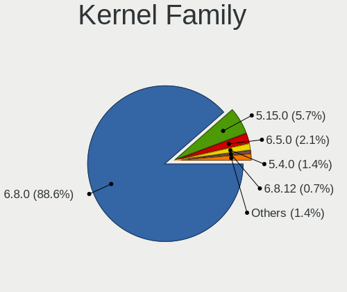
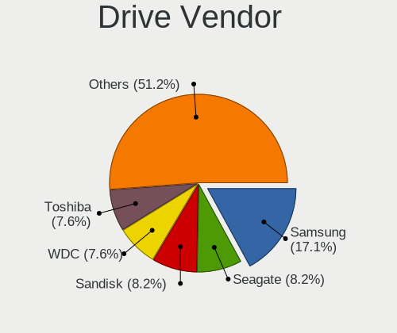
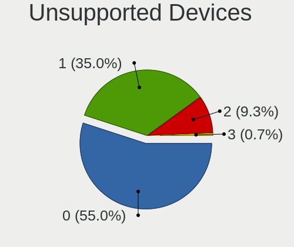

Zorin Hardware Trends (Notebook)
--------------------------------

A project to identify most popular hardware characteristics and track their change
over time based on data collected by Zorin users at https://Linux-Hardware.org.

Anyone can contribute to the study by uploading probes of their computers by
the [hw-probe](https://github.com/linuxhw/hw-probe) tool:

    sudo hw-probe -all -upload

Full-feature report is available here: https://linux-hardware.org/?view=trends&formfactor=notebook

Period: Feb, 2020.

Contents
--------

- [ OS                       ](#os)
- [ OS Family                ](#os-family)
- [ Kernel                   ](#kernel)
- [ Kernel Family            ](#kernel-family)
- [ Kernel Major Ver.        ](#kernel-major-ver)
- [ Arch                     ](#arch)
- [ DE                       ](#de)
- [ Display Server           ](#display-server)
- [ OS Lang                  ](#os-lang)
- [ Boot Mode                ](#boot-mode)
- [ Filesystem               ](#filesystem)
- [ Dual Boot with Linux     ](#dual-boot-with-linux)
- [ Dual Boot (Win)          ](#dual-boot-win)
- [ Country                  ](#country)
- [ City                     ](#city)
- [ Vendor                   ](#vendor)
- [ Model                    ](#model)
- [ Model Family             ](#model-family)
- [ MFG Year                 ](#mfg-year)
- [ Form Factor              ](#form-factor)
- [ Secure Boot              ](#secure-boot)
- [ Coreboot                 ](#coreboot)
- [ RAM Size                 ](#ram-size)
- [ RAM Used                 ](#ram-used)
- [ Drive Vendor             ](#drive-vendor)
- [ Drive Model              ](#drive-model)
- [ Drive Kind               ](#drive-kind)
- [ Drive Connector          ](#drive-connector)
- [ Drive Size               ](#drive-size)
- [ Space Total              ](#space-total)
- [ Space Used               ](#space-used)
- [ Malfunc. Drives          ](#malfunc-drives)
- [ Malfunc. Drive Vendor    ](#malfunc-drive-vendor)
- [ Malfunc. Drive Kind      ](#malfunc-drive-kind)
- [ Failed Drives            ](#failed-drives)
- [ Failed Drive Vendor      ](#failed-drive-vendor)
- [ Drive Status             ](#drive-status)
- [ Storage Vendor           ](#storage-vendor)
- [ Storage Model            ](#storage-model)
- [ Storage Kind             ](#storage-kind)
- [ CPU Vendor               ](#cpu-vendor)
- [ CPU Model                ](#cpu-model)
- [ CPU Model Family         ](#cpu-model-family)
- [ CPU Cores                ](#cpu-cores)
- [ CPU Sockets              ](#cpu-sockets)
- [ CPU Threads              ](#cpu-threads)
- [ CPU Op-Modes             ](#cpu-op-modes)
- [ CPU Microarch            ](#cpu-microarch)
- [ CPU Microcode            ](#cpu-microcode)
- [ GPU Vendor               ](#gpu-vendor)
- [ GPU Model                ](#gpu-model)
- [ GPU Combo                ](#gpu-combo)
- [ GPU Driver               ](#gpu-driver)
- [ GPU Memory               ](#gpu-memory)
- [ Monitor Vendor           ](#monitor-vendor)
- [ Monitor Model            ](#monitor-model)
- [ Monitor Resolution       ](#monitor-resolution)
- [ Monitor Diagonal         ](#monitor-diagonal)
- [ Monitor Width            ](#monitor-width)
- [ Aspect Ratio             ](#aspect-ratio)
- [ Monitor Area             ](#monitor-area)
- [ Pixel Density            ](#pixel-density)
- [ Multiple Monitors        ](#multiple-monitors)
- [ Net Controller Vendor    ](#net-controller-vendor)
- [ Net Controller Model     ](#net-controller-model)
- [ Net Controller Kind      ](#net-controller-kind)
- [ Used Controller          ](#used-controller)
- [ NICs                     ](#nics)
- [ Unsupported Devices      ](#unsupported-devices)
- [ Unsupported Device Types ](#unsupported-device-types)

OS
--

Installed operating systems

| Name     | Computers | Percent |
|----------|-----------|---------|
| Zorin 15 | 27        | 87.1%   |
| Zorin 12 | 4         | 12.9%   |

OS Family
---------

OS without a version

| Name  | Computers | Percent |
|-------|-----------|---------|
| Zorin | 31        | 100%    |

Kernel
------

Version of the Linux kernel

| Version           | Computers | Percent |
|-------------------|-----------|---------|
| 5.3.0-28-generic  | 14        | 45.16%  |
| 5.3.0-40-generic  | 7         | 22.58%  |
| 5.0.0-37-generic  | 4         | 12.9%   |
| 4.15.0-76-generic | 2         | 6.45%   |
| 5.3.0-26-generic  | 1         | 3.23%   |
| 5.0.0-36-generic  | 1         | 3.23%   |
| 4.15.0-88-generic | 1         | 3.23%   |
| 4.15.0-30-generic | 1         | 3.23%   |

Kernel Family
-------------

Linux kernel without a distro release

| Version | Computers | Percent |
|---------|-----------|---------|
| 5.3.0   | 22        | 70.97%  |
| 5.0.0   | 5         | 16.13%  |
| 4.15.0  | 4         | 12.9%   |

Kernel Major Ver.
-----------------

Linux kernel major version

| Version | Computers | Percent |
|---------|-----------|---------|
| 5.3     | 22        | 70.97%  |
| 5.0     | 5         | 16.13%  |
| 4.15    | 4         | 12.9%   |

Arch
----

OS architecture (x86_64, i586, etc.)

| Name   | Computers | Percent |
|--------|-----------|---------|
| x86_64 | 24        | 77.42%  |
| i686   | 7         | 22.58%  |

DE
--

Desktop Environment

| Name       | Computers | Percent |
|------------|-----------|---------|
| GNOME      | 18        | 58.06%  |
| XFCE       | 9         | 29.03%  |
| Unknown    | 3         | 9.68%   |
| X-Cinnamon | 1         | 3.23%   |

Display Server
--------------

X11 or Wayland

| Name    | Computers | Percent |
|---------|-----------|---------|
| X11     | 28        | 90.32%  |
| Unknown | 3         | 9.68%   |

OS Lang
-------

Language

| Lang  | Computers | Percent |
|-------|-----------|---------|
| en_US | 13        | 41.94%  |
| de_DE | 3         | 9.68%   |
| es_ES | 2         | 6.45%   |
| en_GB | 2         | 6.45%   |
| sv_SE | 1         | 3.23%   |
| pl_PL | 1         | 3.23%   |
| ja_JP | 1         | 3.23%   |
| it_IT | 1         | 3.23%   |
| es_PE | 1         | 3.23%   |
| en_ZM | 1         | 3.23%   |
| en_ZA | 1         | 3.23%   |
| en_NZ | 1         | 3.23%   |
| en_IN | 1         | 3.23%   |
| cs_CZ | 1         | 3.23%   |
| C     | 1         | 3.23%   |

Boot Mode
---------

EFI or BIOS

| Mode | Computers | Percent |
|------|-----------|---------|
| EFI  | 16        | 51.61%  |
| BIOS | 15        | 48.39%  |

Filesystem
----------

Type of filesystem

| Type    | Computers | Percent |
|---------|-----------|---------|
| Ext4    | 29        | 93.55%  |
| Overlay | 2         | 6.45%   |

Dual Boot with Linux
--------------------

Hosting more than one Linux

| Dual boot | Computers | Percent |
|-----------|-----------|---------|
| No        | 27        | 87.1%   |
| Yes       | 4         | 12.9%   |

Dual Boot (Win)
---------------

Hosting Linux and Windows

| Dual boot | Computers | Percent |
|-----------|-----------|---------|
| No        | 21        | 67.74%  |
| Yes       | 10        | 32.26%  |

Country
-------

Geographic location (country)

| Country        | Computers | Percent |
|----------------|-----------|---------|
| USA            | 8         | 25.81%  |
| Spain          | 2         | 6.45%   |
| South Africa   | 2         | 6.45%   |
| New Zealand    | 2         | 6.45%   |
| India          | 2         | 6.45%   |
| Germany        | 2         | 6.45%   |
| Zambia         | 1         | 3.23%   |
| UK             | 1         | 3.23%   |
| Sweden         | 1         | 3.23%   |
| Serbia         | 1         | 3.23%   |
| Poland         | 1         | 3.23%   |
| Peru           | 1         | 3.23%   |
| Mexico         | 1         | 3.23%   |
| Japan          | 1         | 3.23%   |
| Italy          | 1         | 3.23%   |
| Indonesia      | 1         | 3.23%   |
| Hungary        | 1         | 3.23%   |
| Czech Republic | 1         | 3.23%   |
| Austria        | 1         | 3.23%   |

City
----

Geographic location (city)

| City              | Computers | Percent |
|-------------------|-----------|---------|
| Madrid            | 2         | 6.45%   |
| Auckland          | 2         | 6.45%   |
| Yokawacho-toyooka | 1         | 3.23%   |
| Wrocław          | 1         | 3.23%   |
| Warangal          | 1         | 3.23%   |
| Vereeniging       | 1         | 3.23%   |
| Södertälje      | 1         | 3.23%   |
| Surprise          | 1         | 3.23%   |
| Salzburg          | 1         | 3.23%   |
| Pardubice         | 1         | 3.23%   |
| Münster          | 1         | 3.23%   |
| Milan             | 1         | 3.23%   |
| Middlesbrough     | 1         | 3.23%   |
| Mexico City       | 1         | 3.23%   |
| Mason             | 1         | 3.23%   |
| Lusaka            | 1         | 3.23%   |
| Lincoln           | 1         | 3.23%   |
| Lima              | 1         | 3.23%   |
| Las Vegas         | 1         | 3.23%   |
| Jakarta           | 1         | 3.23%   |
| Garbsen           | 1         | 3.23%   |
| Durban            | 1         | 3.23%   |
| Delhi             | 1         | 3.23%   |
| Clearwater        | 1         | 3.23%   |
| Chicago           | 1         | 3.23%   |
| Békéscsaba      | 1         | 3.23%   |
| Brookings         | 1         | 3.23%   |
| Belgrade          | 1         | 3.23%   |
| Baton Rouge       | 1         | 3.23%   |

Vendor
------

Motherboard manufacturer

| Name                | Computers | Percent |
|---------------------|-----------|---------|
| Hewlett-Packard     | 6         | 19.35%  |
| Lenovo              | 5         | 16.13%  |
| ASUSTek Computer    | 5         | 16.13%  |
| Toshiba             | 2         | 6.45%   |
| Dell                | 2         | 6.45%   |
| TrekStor            | 1         | 3.23%   |
| Samsung Electronics | 1         | 3.23%   |
| NEC Computers       | 1         | 3.23%   |
| MSI                 | 1         | 3.23%   |
| IBM                 | 1         | 3.23%   |
| HUAWEI              | 1         | 3.23%   |
| Google              | 1         | 3.23%   |
| Fujitsu Siemens     | 1         | 3.23%   |
| AXIOO               | 1         | 3.23%   |
| Apple               | 1         | 3.23%   |
| Acer                | 1         | 3.23%   |

Model
-----

Motherboard model

| Name                                     | Computers | Percent |
|------------------------------------------|-----------|---------|
| TrekStor Notebook Slim S130              | 1         | 3.23%   |
| Toshiba Satellite L55-C                  | 1         | 3.23%   |
| Toshiba PORTEGE Z30-A                    | 1         | 3.23%   |
| Samsung Electronics 305E4A/305E5A/305E7A | 1         | 3.23%   |
| NEC Computers PC-VY25AACZ9               | 1         | 3.23%   |
| MSI GT72 2PC                             | 1         | 3.23%   |
| Lenovo ThinkPad T440p 20ANCTO1WW         | 1         | 3.23%   |
| Lenovo ThinkPad E550 20DF0040US          | 1         | 3.23%   |
| Lenovo IdeaPad 330-15ARR 81D2            | 1         | 3.23%   |
| Lenovo IdeaPad 310-15ISK 80SM            | 1         | 3.23%   |
| Lenovo G505 20240                        | 1         | 3.23%   |
| IBM ThinkPad T43 26688AG                 | 1         | 3.23%   |
| HUAWEI BOHK-WAX9X                        | 1         | 3.23%   |
| HP ProBook 4530s                         | 1         | 3.23%   |
| HP Pavilion dv2000 (RG408UA#ABA)         | 1         | 3.23%   |
| HP Pavilion dm1                          | 1         | 3.23%   |
| HP Laptop 15-da0xxx                      | 1         | 3.23%   |
| HP EliteBook 840 G3                      | 1         | 3.23%   |
| HP EliteBook 840 G1                      | 1         | 3.23%   |
| Google Enguarde                          | 1         | 3.23%   |
| Fujitsu Siemens AMILO M1451G Series      | 1         | 3.23%   |
| Dell Vostro 3750                         | 1         | 3.23%   |
| Dell Vostro 3550                         | 1         | 3.23%   |
| AXIOO NEON MNW                           | 1         | 3.23%   |
| ASUS X555LD                              | 1         | 3.23%   |
| ASUS VivoBook_ASUSLaptop X580GD_N580GD   | 1         | 3.23%   |
| ASUS GX501VIK                            | 1         | 3.23%   |
| ASUS E203NA                              | 1         | 3.23%   |
| ASUS A6Km                                | 1         | 3.23%   |
| Apple MacBook4,1                         | 1         | 3.23%   |
| Acer Nitro AN515-42                      | 1         | 3.23%   |

Model Family
------------

Motherboard model prefix

| Name                       | Computers | Percent |
|----------------------------|-----------|---------|
| Lenovo ThinkPad            | 2         | 6.45%   |
| Lenovo IdeaPad             | 2         | 6.45%   |
| HP Pavilion                | 2         | 6.45%   |
| HP EliteBook               | 2         | 6.45%   |
| Dell Vostro                | 2         | 6.45%   |
| TrekStor Notebook          | 1         | 3.23%   |
| Toshiba Satellite          | 1         | 3.23%   |
| Toshiba PORTEGE            | 1         | 3.23%   |
| Samsung Electronics 305E4A | 1         | 3.23%   |
| NEC Computers PC-VY25AACZ9 | 1         | 3.23%   |
| MSI GT72                   | 1         | 3.23%   |
| Lenovo G505                | 1         | 3.23%   |
| IBM ThinkPad               | 1         | 3.23%   |
| HUAWEI BOHK-WAX9X          | 1         | 3.23%   |
| HP ProBook                 | 1         | 3.23%   |
| HP Laptop                  | 1         | 3.23%   |
| Google Enguarde            | 1         | 3.23%   |
| Fujitsu Siemens AMILO      | 1         | 3.23%   |
| AXIOO NEON                 | 1         | 3.23%   |
| ASUS X555LD                | 1         | 3.23%   |
| ASUS VivoBook              | 1         | 3.23%   |
| ASUS GX501VIK              | 1         | 3.23%   |
| ASUS E203NA                | 1         | 3.23%   |
| ASUS A6Km                  | 1         | 3.23%   |
| Apple MacBook4             | 1         | 3.23%   |
| Acer Nitro                 | 1         | 3.23%   |

MFG Year
--------

Motherboard manufacture year

| Year | Computers | Percent |
|------|-----------|---------|
| 2019 | 9         | 29.03%  |
| 2018 | 4         | 12.9%   |
| 2014 | 3         | 9.68%   |
| 2016 | 2         | 6.45%   |
| 2012 | 2         | 6.45%   |
| 2011 | 2         | 6.45%   |
| 2010 | 2         | 6.45%   |
| 2006 | 2         | 6.45%   |
| 2017 | 1         | 3.23%   |
| 2013 | 1         | 3.23%   |
| 2008 | 1         | 3.23%   |
| 2007 | 1         | 3.23%   |
| 2005 | 1         | 3.23%   |

Form Factor
-----------

Physical design of the computer

| Name     | Computers | Percent |
|----------|-----------|---------|
| Notebook | 31        | 100%    |

Secure Boot
-----------

Enabled or disabled

| State    | Computers | Percent |
|----------|-----------|---------|
| Disabled | 27        | 87.1%   |
| Enabled  | 4         | 12.9%   |

Coreboot
--------

Have coreboot on board

| Used | Computers | Percent |
|------|-----------|---------|
| No   | 30        | 96.77%  |
| Yes  | 1         | 3.23%   |

RAM Size
--------

Total RAM memory

| Size in GB | Computers | Percent |
|------------|-----------|---------|
| 3.01-4.0   | 7         | 22.58%  |
| 8.01-16.0  | 7         | 22.58%  |
| 4.01-8.0   | 6         | 19.35%  |
| 1.01-2.0   | 4         | 12.9%   |
| 16.01-24.0 | 3         | 9.68%   |
| 0.01-1.0   | 3         | 9.68%   |
| 2.01-3.0   | 1         | 3.23%   |

RAM Used
--------

Used RAM memory

| Used GB  | Computers | Percent |
|----------|-----------|---------|
| 2.01-3.0 | 9         | 29.03%  |
| 1.01-2.0 | 9         | 29.03%  |
| 0.01-1.0 | 7         | 22.58%  |
| 3.01-4.0 | 5         | 16.13%  |
| 4.01-8.0 | 1         | 3.23%   |

Drive Vendor
------------

Hard drive vendors

| Vendor              | Computers | Drives | Percent |
|---------------------|-----------|--------|---------|
| WDC                 | 6         | 7      | 17.65%  |
| Unknown             | 4         | 5      | 11.76%  |
| Seagate             | 4         | 4      | 11.76%  |
| Samsung Electronics | 4         | 4      | 11.76%  |
| Toshiba             | 3         | 3      | 8.82%   |
| Kingston            | 2         | 2      | 5.88%   |
| Hitachi             | 2         | 2      | 5.88%   |
| Crucial             | 2         | 2      | 5.88%   |
| Transcend           | 1         | 1      | 2.94%   |
| SanDisk             | 1         | 1      | 2.94%   |
| SABRENT             | 1         | 1      | 2.94%   |
| Micron Technology   | 1         | 1      | 2.94%   |
| HGST                | 1         | 1      | 2.94%   |
| Fujitsu             | 1         | 1      | 2.94%   |
| ASMedia             | 1         | 1      | 2.94%   |

Drive Model
-----------

Hard drive models

| Model                             | Computers | Percent |
|-----------------------------------|-----------|---------|
| MMC Card  32GB                    | 3         | 8.33%   |
| WD10SPZX-22Z10T1 1TB              | 2         | 5.56%   |
| MQ04ABF100 1TB                    | 2         | 5.56%   |
| WDS250G2B0B-00YS70 250GB SSD      | 1         | 2.78%   |
| WD5000LPVX-75V0TT0 500GB          | 1         | 2.78%   |
| WD3200BEKT-60PVMT0 320GB          | 1         | 2.78%   |
| WD10SPZX-21Z10T0 1TB              | 1         | 2.78%   |
| WD10JPCX-24UE4T0 1TB              | 1         | 2.78%   |
| USB 3.1 Storage 500GB             | 1         | 2.78%   |
| TS64GSSD420K 64GB                 | 1         | 2.78%   |
| SV100S2128G 128GB SSD             | 1         | 2.78%   |
| ST500LT012-9WS142 500GB           | 1         | 2.78%   |
| ST1000LM048-2E7172 1TB            | 1         | 2.78%   |
| ST1000LM035-1RK172 1TB            | 1         | 2.78%   |
| SSD 850 PRO 256GB                 | 1         | 2.78%   |
| SSD 850 EVO 500GB                 | 1         | 2.78%   |
| SD8SN8U-256G-1006 256GB SSD       | 1         | 2.78%   |
| SA400S37480G 480GB SSD            | 1         | 2.78%   |
| OOS320G32M 320GB                  | 1         | 2.78%   |
| MZMTE256HMHP-00000 256GB SSD      | 1         | 2.78%   |
| MTFDDAK256MAY-1AH12ABHA 256GB SSD | 1         | 2.78%   |
| MMC Card  16GB                    | 1         | 2.78%   |
| MK8025GAS 80GB                    | 1         | 2.78%   |
| MHV2080BH 80GB                    | 1         | 2.78%   |
| HTS725050A7E630 500GB             | 1         | 2.78%   |
| HTS542516K9SA00 160GB             | 1         | 2.78%   |
| HTS541060G9AT00 64GB              | 1         | 2.78%   |
| HM120JI 120GB                     | 1         | 2.78%   |
| Expansion 1TB                     | 1         | 2.78%   |
| Disk 1TB                          | 1         | 2.78%   |
| CT480M500SSD4 480GB               | 1         | 2.78%   |
| CT275MX300SSD1 275GB              | 1         | 2.78%   |

Drive Kind
----------

HDD or SSD

| Kind    | Computers | Drives | Percent |
|---------|-----------|--------|---------|
| HDD     | 18        | 19     | 52.94%  |
| SSD     | 11        | 11     | 32.35%  |
| MMC     | 3         | 4      | 8.82%   |
| Unknown | 2         | 2      | 5.88%   |

Drive Connector
---------------

SATA, SAS, NVMe, etc.

| Type | Computers | Drives | Percent |
|------|-----------|--------|---------|
| SATA | 27        | 29     | 84.38%  |
| MMC  | 3         | 4      | 9.38%   |
| SAS  | 2         | 3      | 6.25%   |

Drive Size
----------

Size of hard drive

| Size in TB | Computers | Drives | Percent |
|------------|-----------|--------|---------|
| 0.01-0.5   | 23        | 26     | 69.7%   |
| 0.51-1.0   | 10        | 10     | 30.3%   |

Space Total
-----------

Amount of disk space available on the file system

| Size in GB     | Computers | Percent |
|----------------|-----------|---------|
| 251-500        | 8         | 25.81%  |
| 101-250        | 7         | 22.58%  |
| 51-100         | 6         | 19.35%  |
| 1001-2000      | 3         | 9.68%   |
| 501-1000       | 3         | 9.68%   |
| 21-50          | 2         | 6.45%   |
| More than 3000 | 1         | 3.23%   |
| 1-20           | 1         | 3.23%   |

Space Used
----------

Amount of used disk space

| Used GB        | Computers | Percent |
|----------------|-----------|---------|
| 1-20           | 17        | 54.84%  |
| 251-500        | 6         | 19.35%  |
| 21-50          | 2         | 6.45%   |
| 101-250        | 2         | 6.45%   |
| 51-100         | 2         | 6.45%   |
| More than 3000 | 1         | 3.23%   |
| 501-1000       | 1         | 3.23%   |

Malfunc. Drives
---------------

Drive models with a malfunction

Zero info for selected period =(

Malfunc. Drive Vendor
---------------------

Vendors of faulty drives

Zero info for selected period =(

Malfunc. Drive Kind
-------------------

Kinds of faulty drives

Zero info for selected period =(

Failed Drives
-------------

Failed drive models

Zero info for selected period =(

Failed Drive Vendor
-------------------

Failed drive vendors

Zero info for selected period =(

Drive Status
------------

Number of failed and malfunc. drives

| Status   | Computers | Drives | Percent |
|----------|-----------|--------|---------|
| Detected | 29        | 36     | 100%    |

Storage Vendor
--------------

Storage controller vendors

| Vendor                           | Computers | Percent |
|----------------------------------|-----------|---------|
| Intel                            | 20        | 62.5%   |
| AMD                              | 6         | 18.75%  |
| Samsung Electronics              | 3         | 9.38%   |
| Silicon Integrated Systems [SiS] | 2         | 6.25%   |
| Nvidia                           | 1         | 3.13%   |

Storage Model
-------------

Storage controller models

| Model                                                                    | Computers | Percent |
|--------------------------------------------------------------------------|-----------|---------|
| FCH SATA Controller [AHCI mode]                                          | 4         | 11.76%  |
| 8 Series SATA Controller 1 [AHCI mode]                                   | 3         | 8.82%   |
| 6 Series/C200 Series Chipset Family 6 port Mobile SATA AHCI Controller   | 3         | 8.82%   |
| Wildcat Point-LP SATA Controller [AHCI Mode]                             | 2         | 5.88%   |
| Sunrise Point-LP SATA Controller [AHCI mode]                             | 2         | 5.88%   |
| NVMe SSD Controller SM981/PM981/PM983                                    | 2         | 5.88%   |
| Celeron N3350/Pentium N4200/Atom E3900 Series SATA AHCI Controller       | 2         | 5.88%   |
| 82801FBM (ICH6M) SATA Controller                                         | 2         | 5.88%   |
| 8 Series/C220 Series Chipset Family 6-port SATA Controller 1 [AHCI mode] | 2         | 5.88%   |
| SB7x0/SB8x0/SB9x0 SATA Controller [AHCI mode]                            | 1         | 2.94%   |
| NVMe SSD Controller SM961/PM961                                          | 1         | 2.94%   |
| MCP51 Serial ATA Controller                                              | 1         | 2.94%   |
| MCP51 IDE                                                                | 1         | 2.94%   |
| FCH SATA Controller [IDE mode]                                           | 1         | 2.94%   |
| Cannon Lake Mobile PCH SATA AHCI Controller                              | 1         | 2.94%   |
| AHCI IDE Controller (0106)                                               | 1         | 2.94%   |
| 82801IBM/IEM (ICH9M/ICH9M-E) 4 port SATA Controller [AHCI mode]          | 1         | 2.94%   |
| 82801HM/HEM (ICH8M/ICH8M-E) SATA Controller [AHCI mode]                  | 1         | 2.94%   |
| 82801HM/HEM (ICH8M/ICH8M-E) IDE Controller                               | 1         | 2.94%   |
| 82801 Mobile SATA Controller [RAID mode]                                 | 1         | 2.94%   |
| 5513 IDE Controller                                                      | 1         | 2.94%   |

Storage Kind
------------

Kind of storage controller (IDE, SATA, NVMe, SAS, ...)

| Kind | Computers | Percent |
|------|-----------|---------|
| SATA | 24        | 72.73%  |
| IDE  | 5         | 15.15%  |
| NVMe | 3         | 9.09%   |
| RAID | 1         | 3.03%   |

CPU Vendor
----------

Processor vendors

| Vendor | Computers | Percent |
|--------|-----------|---------|
| Intel  | 23        | 74.19%  |
| AMD    | 8         | 25.81%  |

CPU Model
---------

Processor models

| Model                                         | Computers | Percent |
|-----------------------------------------------|-----------|---------|
| Intel Celeron CPU N3350 @ 1.10GHz             | 2         | 6.45%   |
| Intel Pentium M processor 1.86GHz             | 1         | 3.23%   |
| Intel Pentium M processor 1.60GHz             | 1         | 3.23%   |
| Intel Core i7-8750H CPU @ 2.20GHz             | 1         | 3.23%   |
| Intel Core i7-7700HQ CPU @ 2.80GHz            | 1         | 3.23%   |
| Intel Core i7-5500U CPU @ 2.40GHz             | 1         | 3.23%   |
| Intel Core i7-4710HQ CPU @ 2.50GHz            | 1         | 3.23%   |
| Intel Core i7-4600U CPU @ 2.10GHz             | 1         | 3.23%   |
| Intel Core i7-2670QM CPU @ 2.20GHz            | 1         | 3.23%   |
| Intel Core i7-2620M CPU @ 2.70GHz             | 1         | 3.23%   |
| Intel Core i5-6300U CPU @ 2.40GHz             | 1         | 3.23%   |
| Intel Core i5-5200U CPU @ 2.20GHz             | 1         | 3.23%   |
| Intel Core i5-4310U CPU @ 2.00GHz             | 1         | 3.23%   |
| Intel Core i5-4200M CPU @ 2.50GHz             | 1         | 3.23%   |
| Intel Core i5-2430M CPU @ 2.40GHz             | 1         | 3.23%   |
| Intel Core i3-7100U CPU @ 2.40GHz             | 1         | 3.23%   |
| Intel Core i3-6006U CPU @ 2.00GHz             | 1         | 3.23%   |
| Intel Core i3-4030U CPU @ 1.90GHz             | 1         | 3.23%   |
| Intel Core 2 Duo CPU T8300 @ 2.40GHz          | 1         | 3.23%   |
| Intel Core 2 Duo CPU P8700 @ 2.53GHz          | 1         | 3.23%   |
| Intel Core 2 Duo CPU P7370 @ 2.00GHz          | 1         | 3.23%   |
| Intel Celeron CPU N2840 @ 2.16GHz             | 1         | 3.23%   |
| AMD Turion 64 X2                              | 1         | 3.23%   |
| AMD Turion 64 Mobile Technology MT-34         | 1         | 3.23%   |
| AMD Ryzen 5 3500U with Radeon Vega Mobile Gfx | 1         | 3.23%   |
| AMD Ryzen 5 2500U with Radeon Vega Mobile Gfx | 1         | 3.23%   |
| AMD Ryzen 3 2200U with Radeon Vega Mobile Gfx | 1         | 3.23%   |
| AMD E1-2100 APU with Radeon HD Graphics       | 1         | 3.23%   |
| AMD E-350 Processor                           | 1         | 3.23%   |
| AMD A6-3420M APU with Radeon HD Graphics      | 1         | 3.23%   |

CPU Model Family
----------------

Processor model prefix

| Model                | Computers | Percent |
|----------------------|-----------|---------|
| Intel Core i7        | 7         | 22.58%  |
| Intel Core i5        | 5         | 16.13%  |
| Intel Core i3        | 3         | 9.68%   |
| Intel Core 2 Duo     | 3         | 9.68%   |
| Intel Celeron        | 3         | 9.68%   |
| Intel Pentium M      | 2         | 6.45%   |
| AMD Ryzen 5          | 2         | 6.45%   |
| AMD Turion 64 X2     | 1         | 3.23%   |
| AMD Turion 64 Mobile | 1         | 3.23%   |
| AMD Ryzen 3          | 1         | 3.23%   |
| AMD E1               | 1         | 3.23%   |
| AMD E                | 1         | 3.23%   |
| AMD A6               | 1         | 3.23%   |

CPU Cores
---------

Number of processor cores

| Number | Computers | Percent |
|--------|-----------|---------|
| 2      | 21        | 67.74%  |
| 4      | 6         | 19.35%  |
| 1      | 3         | 9.68%   |
| 6      | 1         | 3.23%   |

CPU Sockets
-----------

Number of sockets

| Number | Computers | Percent |
|--------|-----------|---------|
| 1      | 31        | 100%    |

CPU Threads
-----------

Threads per core (Hyper-Threading)

| Number | Computers | Percent |
|--------|-----------|---------|
| 2      | 18        | 58.06%  |
| 1      | 13        | 41.94%  |

CPU Op-Modes
------------

CPU Operation Modes (32-bit, 64-bit)

| Op mode        | Computers | Percent |
|----------------|-----------|---------|
| 32-bit, 64-bit | 29        | 93.55%  |
| 32-bit         | 2         | 6.45%   |

CPU Microarch
-------------

Microarchitecture

| Name        | Computers | Percent |
|-------------|-----------|---------|
| Skylake     | 5         | 16.13%  |
| Haswell     | 5         | 16.13%  |
| SandyBridge | 3         | 9.68%   |
| Core        | 3         | 9.68%   |
| Zen         | 2         | 6.45%   |
| P6          | 2         | 6.45%   |
| K8 Hammer   | 2         | 6.45%   |
| Goldmont    | 2         | 6.45%   |
| Broadwell   | 2         | 6.45%   |
| Zen+        | 1         | 3.23%   |
| Silvermont  | 1         | 3.23%   |
| K10 Llano   | 1         | 3.23%   |
| Jaguar      | 1         | 3.23%   |
| Bobcat      | 1         | 3.23%   |

CPU Microcode
-------------

Microcode number

| Number     | Computers | Percent |
|------------|-----------|---------|
| 0x40651    | 3         | 9.68%   |
| 0x206a7    | 3         | 9.68%   |
| 0x6d8      | 2         | 6.45%   |
| 0x506c9    | 2         | 6.45%   |
| 0x406e3    | 2         | 6.45%   |
| 0x306d4    | 2         | 6.45%   |
| 0x306c3    | 2         | 6.45%   |
| 0x10676    | 2         | 6.45%   |
| 0x0810100b | 2         | 6.45%   |
| Unknown    | 2         | 6.45%   |
| 0x906ea    | 1         | 3.23%   |
| 0x906e9    | 1         | 3.23%   |
| 0x806e9    | 1         | 3.23%   |
| 0x30678    | 1         | 3.23%   |
| 0x1067a    | 1         | 3.23%   |
| 0x08108109 | 1         | 3.23%   |
| 0x0700010f | 1         | 3.23%   |
| 0x05000029 | 1         | 3.23%   |
| 0x03000027 | 1         | 3.23%   |

GPU Vendor
----------

Vendors of graphics cards

| Vendor                           | Computers | Percent |
|----------------------------------|-----------|---------|
| Intel                            | 19        | 51.35%  |
| AMD                              | 11        | 29.73%  |
| Nvidia                           | 6         | 16.22%  |
| Silicon Integrated Systems [SiS] | 1         | 2.7%    |

GPU Model
---------

Graphics card models

| Model                                                               | Computers | Percent |
|---------------------------------------------------------------------|-----------|---------|
| Haswell-ULT Integrated Graphics Controller                          | 3         | 7.69%   |
| 2nd Generation Core Processor Family Integrated Graphics Controller | 3         | 7.69%   |
| RV370/M22 [Mobility Radeon X300]                                    | 2         | 5.13%   |
| Raven Ridge [Radeon Vega Series / Radeon Vega Mobile Series]        | 2         | 5.13%   |
| HD Graphics 5500                                                    | 2         | 5.13%   |
| HD Graphics 500                                                     | 2         | 5.13%   |
| 4th Gen Core Processor Integrated Graphics Controller               | 2         | 5.13%   |
| Wrestler [Radeon HD 6310]                                           | 1         | 2.56%   |
| Whistler [Radeon HD 6630M/6650M/6750M/7670M/7690M]                  | 1         | 2.56%   |
| UHD Graphics 630 (Mobile)                                           | 1         | 2.56%   |
| Sumo [Radeon HD 6520G]                                              | 1         | 2.56%   |
| Skylake GT2 [HD Graphics 520]                                       | 1         | 2.56%   |
| Picasso                                                             | 1         | 2.56%   |
| Opal XT [Radeon R7 M265/M365X/M465]                                 | 1         | 2.56%   |
| Mobile GM965/GL960 Integrated Graphics Controller (secondary)       | 1         | 2.56%   |
| Mobile GM965/GL960 Integrated Graphics Controller (primary)         | 1         | 2.56%   |
| Mobile 4 Series Chipset Integrated Graphics Controller              | 1         | 2.56%   |
| Mars [Radeon HD 8730M]                                              | 1         | 2.56%   |
| Kabini [Radeon HD 8210]                                             | 1         | 2.56%   |
| HD Graphics 620                                                     | 1         | 2.56%   |
| HD Graphics 520                                                     | 1         | 2.56%   |
| GP107M [GeForce GTX 1050 Mobile]                                    | 1         | 2.56%   |
| GP104BM [GeForce GTX 1080 Mobile]                                   | 1         | 2.56%   |
| GF117M [GeForce 610M/710M/810M/820M / GT 620M/625M/630M/720M]       | 1         | 2.56%   |
| GF108M [GeForce GT 525M]                                            | 1         | 2.56%   |
| G72M [Quadro NVS 110M/GeForce Go 7300]                              | 1         | 2.56%   |
| C51 [GeForce Go 6150]                                               | 1         | 2.56%   |
| Baffin [Radeon RX 460/560D / Pro 450/455/460/555/555X/560/560X]     | 1         | 2.56%   |
| Atom Processor Z36xxx/Z37xxx Series Graphics & Display              | 1         | 2.56%   |
| 771/671 PCIE VGA Display Adapter                                    | 1         | 2.56%   |

GPU Combo
---------

Combinations of graphics cards

| Name           | Computers | Percent |
|----------------|-----------|---------|
| 1 x Intel      | 13        | 41.94%  |
| 1 x AMD        | 7         | 22.58%  |
| 1 x Nvidia     | 3         | 9.68%   |
| Intel + Nvidia | 3         | 9.68%   |
| Intel + AMD    | 3         | 9.68%   |
| 2 x AMD        | 1         | 3.23%   |
| 1 x SiS        | 1         | 3.23%   |

GPU Driver
----------

Free vs proprietary

| Driver      | Computers | Percent |
|-------------|-----------|---------|
| Free        | 27        | 87.1%   |
| Proprietary | 3         | 9.68%   |
| Unknown     | 1         | 3.23%   |

GPU Memory
----------

Total video memory

| Size in GB | Computers | Percent |
|------------|-----------|---------|
| Unknown    | 14        | 45.16%  |
| 0.01-0.5   | 8         | 25.81%  |
| 0.51-1.0   | 4         | 12.9%   |
| 3.01-4.0   | 3         | 9.68%   |
| 7.01-8.0   | 1         | 3.23%   |
| 1.01-2.0   | 1         | 3.23%   |

Monitor Vendor
--------------

Monitor vendors

| Vendor                  | Computers | Percent |
|-------------------------|-----------|---------|
| AU Optronics            | 10        | 32.26%  |
| Chimei Innolux          | 5         | 16.13%  |
| LG Display              | 4         | 12.9%   |
| Chi Mei Optoelectronics | 3         | 9.68%   |
| Samsung Electronics     | 2         | 6.45%   |
| BOE                     | 2         | 6.45%   |
| Toshiba                 | 1         | 3.23%   |
| LG Philips              | 1         | 3.23%   |
| Iiyama                  | 1         | 3.23%   |
| Apple                   | 1         | 3.23%   |
| Acer                    | 1         | 3.23%   |

Monitor Model
-------------

Monitor models

| Model                                             | Computers | Percent |
|---------------------------------------------------|-----------|---------|
| LCD Monitor AUO123D 1920x1080 309x173mm 13.9-inch | 2         | 6.45%   |
| PL2776HD IVM6605 1920x1080 598x336mm 27.0-inch    | 1         | 3.23%   |
| LCD-MONITOR LCDEC80 1680x1050 470x300mm 22.0-inch | 1         | 3.23%   |
| LCD Monitor SEC3053 1366x768 256x144mm 11.6-inch  | 1         | 3.23%   |
| LCD Monitor LPLA500 1280x800 304x190mm 14.1-inch  | 1         | 3.23%   |
| LCD Monitor LGD05D8 1920x1080 344x194mm 15.5-inch | 1         | 3.23%   |
| LCD Monitor LGD045C 1366x768 350x190mm 15.7-inch  | 1         | 3.23%   |
| LCD Monitor LGD03D7 1366x768 309x174mm 14.0-inch  | 1         | 3.23%   |
| LCD Monitor LGD0171 1366x768 344x194mm 15.5-inch  | 1         | 3.23%   |
| LCD Monitor CMO15A7 1366x768 350x190mm 15.7-inch  | 1         | 3.23%   |
| LCD Monitor CMO15A3 1366x768 344x193mm 15.5-inch  | 1         | 3.23%   |
| LCD Monitor CMO15A1 1366x768 344x193mm 15.5-inch  | 1         | 3.23%   |
| LCD Monitor CMN1735 1920x1080 382x215mm 17.3-inch | 1         | 3.23%   |
| LCD Monitor CMN1731 1600x900 382x215mm 17.3-inch  | 1         | 3.23%   |
| LCD Monitor CMN15DB 1366x768 344x193mm 15.5-inch  | 1         | 3.23%   |
| LCD Monitor CMN15C6 1366x768 340x190mm 15.3-inch  | 1         | 3.23%   |
| LCD Monitor CMN1355 1366x768 293x165mm 13.2-inch  | 1         | 3.23%   |
| LCD Monitor BOE06F0 1366x768 344x194mm 15.5-inch  | 1         | 3.23%   |
| LCD Monitor BOE0672 1366x768 344x194mm 15.5-inch  | 1         | 3.23%   |
| LCD Monitor AUO71EC 1366x768 340x190mm 15.3-inch  | 1         | 3.23%   |
| LCD Monitor AUO61ED 1920x1080 340x190mm 15.3-inch | 1         | 3.23%   |
| LCD Monitor AUO28ED 1920x1080 344x193mm 15.5-inch | 1         | 3.23%   |
| LCD Monitor AUO235C 1366x768 260x140mm 11.6-inch  | 1         | 3.23%   |
| LCD Monitor AUO225C 1366x768 256x144mm 11.6-inch  | 1         | 3.23%   |
| LCD Monitor AUO21EC 1366x768 340x190mm 15.3-inch  | 1         | 3.23%   |
| LCD Monitor AUO1974 1280x800 331x207mm 15.4-inch  | 1         | 3.23%   |
| LCD Monitor APP9C5F 1280x800 286x179mm 13.3-inch  | 1         | 3.23%   |
| LCD Monitor 1920x1080                             | 1         | 3.23%   |
| K272HL ACR03DC 1920x1080 600x340mm 27.2-inch      | 1         | 3.23%   |
| C32F391 SAM0D34 1920x1080 698x393mm 31.5-inch     | 1         | 3.23%   |

Monitor Resolution
------------------

Monitor screen resolution

| Resolution         | Computers | Percent |
|--------------------|-----------|---------|
| 1366x768 (WXGA)    | 16        | 53.33%  |
| 1920x1080 (FHD)    | 9         | 30%     |
| 1280x800 (WXGA)    | 3         | 10%     |
| 1680x1050 (WSXGA+) | 1         | 3.33%   |
| 1600x900 (HD+)     | 1         | 3.33%   |

Monitor Diagonal
----------------

Diagonal size in inches

| Inches  | Computers | Percent |
|---------|-----------|---------|
| 15      | 15        | 48.39%  |
| 13      | 4         | 12.9%   |
| 11      | 3         | 9.68%   |
| 27      | 2         | 6.45%   |
| 17      | 2         | 6.45%   |
| 14      | 2         | 6.45%   |
| 31      | 1         | 3.23%   |
| 22      | 1         | 3.23%   |
| Unknown | 1         | 3.23%   |

Monitor Width
-------------

Physical width

| Width in mm | Computers | Percent |
|-------------|-----------|---------|
| 301-350     | 19        | 61.29%  |
| 201-300     | 5         | 16.13%  |
| 501-600     | 2         | 6.45%   |
| 351-400     | 2         | 6.45%   |
| 601-700     | 1         | 3.23%   |
| 401-500     | 1         | 3.23%   |
| Unknown     | 1         | 3.23%   |

Aspect Ratio
------------

Proportional relationship between the width and the height

| Ratio   | Computers | Percent |
|---------|-----------|---------|
| 16/9    | 23        | 82.14%  |
| 16/10   | 4         | 14.29%  |
| Unknown | 1         | 3.57%   |

Monitor Area
------------

Area in inch²

| Area in inch² | Computers | Percent |
|----------------|-----------|---------|
| 101-110        | 15        | 48.39%  |
| 81-90          | 4         | 12.9%   |
| 51-60          | 3         | 9.68%   |
| 71-80          | 2         | 6.45%   |
| 301-350        | 2         | 6.45%   |
| 121-130        | 2         | 6.45%   |
| 351-500        | 1         | 3.23%   |
| 201-250        | 1         | 3.23%   |
| Unknown        | 1         | 3.23%   |

Pixel Density
-------------

Pixels per inch

| Density | Computers | Percent |
|---------|-----------|---------|
| 101-120 | 16        | 51.61%  |
| 121-160 | 9         | 29.03%  |
| 51-100  | 5         | 16.13%  |
| Unknown | 1         | 3.23%   |

Multiple Monitors
-----------------

Total monitors connected

| Total | Computers | Percent |
|-------|-----------|---------|
| 1     | 25        | 80.65%  |
| 2     | 4         | 12.9%   |
| 0     | 2         | 6.45%   |

Net Controller Vendor
---------------------

Controller vendors

| Vendor                           | Computers | Percent |
|----------------------------------|-----------|---------|
| TP-Link                          | 1         | 12.5%   |
| Silicon Integrated Systems [SiS] | 1         | 12.5%   |
| Sierra Wireless                  | 1         | 12.5%   |
| Realtek Semiconductor            | 1         | 12.5%   |
| Nvidia                           | 1         | 12.5%   |
| Intel                            | 1         | 12.5%   |
| Hewlett-Packard                  | 1         | 12.5%   |
| Dell                             | 1         | 12.5%   |

Net Controller Model
--------------------

Controller models

| Model                                                      | Computers | Percent |
|------------------------------------------------------------|-----------|---------|
| RTL8192EE PCIe Wireless Network Adapter                    | 1         | 12.5%   |
| RTL8153 TP-Link UE300 USB 10/100/1000 LAN                  | 1         | 12.5%   |
| MCP51 Ethernet Controller                                  | 1         | 12.5%   |
| lt4112 Gobi 4G Module Network Device                       | 1         | 12.5%   |
| F3607gw v2 Mobile Broadband Module                         | 1         | 12.5%   |
| EM7305                                                     | 1         | 12.5%   |
| AC'97 Modem Controller                                     | 1         | 12.5%   |
| 82801FB/FBM/FR/FW/FRW (ICH6 Family) AC'97 Modem Controller | 1         | 12.5%   |

Net Controller Kind
-------------------

Ethernet, WiFi or modem

| Kind     | Computers | Percent |
|----------|-----------|---------|
| Modem    | 3         | 37.5%   |
| WiFi     | 3         | 37.5%   |
| Ethernet | 2         | 25%     |

Used Controller
---------------

Currently used network controller

| Kind     | Computers | Percent |
|----------|-----------|---------|
| WiFi     | 1         | 50%     |
| Ethernet | 1         | 50%     |

NICs
----

Total network controllers on board

| Total | Computers | Percent |
|-------|-----------|---------|
| 2     | 24        | 77.42%  |
| 1     | 7         | 22.58%  |

Unsupported Devices
-------------------

Total unsupported devices on board

| Total | Computers | Percent |
|-------|-----------|---------|
| 0     | 18        | 58.06%  |
| 1     | 11        | 35.48%  |
| 2     | 2         | 6.45%   |

Unsupported Device Types
------------------------

Types of unsupported devices

| Type               | Computers | Percent |
|--------------------|-----------|---------|
| Fingerprint reader | 8         | 53.33%  |
| Net/wireless       | 3         | 20%     |
| Modem              | 2         | 13.33%  |
| Graphics card      | 2         | 13.33%  |

