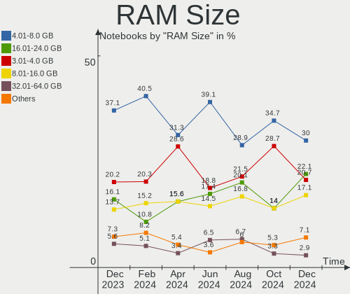
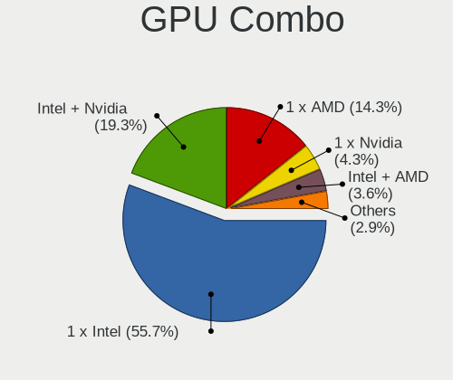
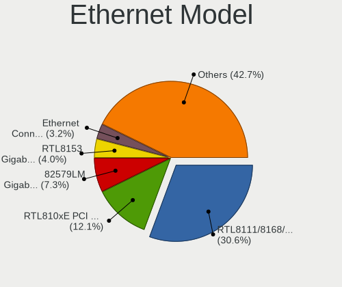
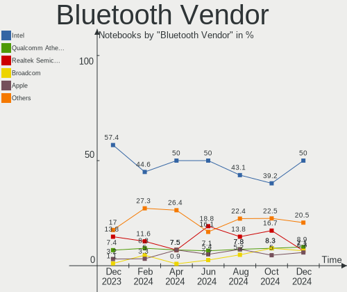

Zorin Hardware Trends (Notebooks)
---------------------------------

A project to identify most popular hardware characteristics and track their change
over time based on data collected by Linux users at https://Linux-Hardware.org.

Anyone can contribute to this report by the [hw-probe](https://github.com/linuxhw/hw-probe) tool:

    sudo -E hw-probe -all -upload

Full-feature report is available here: https://linux-hardware.org/?view=trends&formfactor=notebook

Period: Jul, 2021.

Contents
--------

* [ System ](#system)
  - [ OS                       ](#os)
  - [ OS Family                ](#os-family)
  - [ Kernel                   ](#kernel)
  - [ Kernel Family            ](#kernel-family)
  - [ Kernel Major Ver.        ](#kernel-major-ver)
  - [ Arch                     ](#arch)
  - [ DE                       ](#de)
  - [ Display Server           ](#display-server)
  - [ Display Manager          ](#display-manager)
  - [ OS Lang                  ](#os-lang)
  - [ Boot Mode                ](#boot-mode)
  - [ Filesystem               ](#filesystem)
  - [ Part. scheme             ](#part-scheme)
  - [ Dual Boot with Linux/BSD ](#dual-boot-with-linuxbsd)
  - [ Dual Boot (Win)          ](#dual-boot-win)

* [ Board ](#board)
  - [ Vendor                   ](#vendor)
  - [ Model                    ](#model)
  - [ Model Family             ](#model-family)
  - [ MFG Year                 ](#mfg-year)
  - [ Form Factor              ](#form-factor)
  - [ Secure Boot              ](#secure-boot)
  - [ Coreboot                 ](#coreboot)
  - [ RAM Size                 ](#ram-size)
  - [ RAM Used                 ](#ram-used)
  - [ Total Drives             ](#total-drives)
  - [ Has CD-ROM               ](#has-cd-rom)
  - [ Has Ethernet             ](#has-ethernet)
  - [ Has WiFi                 ](#has-wifi)
  - [ Has Bluetooth            ](#has-bluetooth)

* [ Location ](#location)
  - [ Country                  ](#country)
  - [ City                     ](#city)

* [ Drives ](#drives)
  - [ Drive Vendor             ](#drive-vendor)
  - [ Drive Model              ](#drive-model)
  - [ HDD Vendor               ](#hdd-vendor)
  - [ SSD Vendor               ](#ssd-vendor)
  - [ Drive Kind               ](#drive-kind)
  - [ Drive Connector          ](#drive-connector)
  - [ Drive Size               ](#drive-size)
  - [ Space Total              ](#space-total)
  - [ Space Used               ](#space-used)
  - [ Malfunc. Drives          ](#malfunc-drives)
  - [ Malfunc. Drive Vendor    ](#malfunc-drive-vendor)
  - [ Malfunc. HDD Vendor      ](#malfunc-hdd-vendor)
  - [ Malfunc. Drive Kind      ](#malfunc-drive-kind)
  - [ Failed Drives            ](#failed-drives)
  - [ Failed Drive Vendor      ](#failed-drive-vendor)
  - [ Drive Status             ](#drive-status)

* [ Storage controller ](#storage-controller)
  - [ Storage Vendor           ](#storage-vendor)
  - [ Storage Model            ](#storage-model)
  - [ Storage Kind             ](#storage-kind)

* [ Processor ](#processor)
  - [ CPU Vendor               ](#cpu-vendor)
  - [ CPU Model                ](#cpu-model)
  - [ CPU Model Family         ](#cpu-model-family)
  - [ CPU Cores                ](#cpu-cores)
  - [ CPU Sockets              ](#cpu-sockets)
  - [ CPU Threads              ](#cpu-threads)
  - [ CPU Op-Modes             ](#cpu-op-modes)
  - [ CPU Microcode            ](#cpu-microcode)
  - [ CPU Microarch            ](#cpu-microarch)

* [ Graphics ](#graphics)
  - [ GPU Vendor               ](#gpu-vendor)
  - [ GPU Model                ](#gpu-model)
  - [ GPU Combo                ](#gpu-combo)
  - [ GPU Driver               ](#gpu-driver)
  - [ GPU Memory               ](#gpu-memory)

* [ Monitor ](#monitor)
  - [ Monitor Vendor           ](#monitor-vendor)
  - [ Monitor Model            ](#monitor-model)
  - [ Monitor Resolution       ](#monitor-resolution)
  - [ Monitor Diagonal         ](#monitor-diagonal)
  - [ Monitor Width            ](#monitor-width)
  - [ Aspect Ratio             ](#aspect-ratio)
  - [ Monitor Area             ](#monitor-area)
  - [ Pixel Density            ](#pixel-density)
  - [ Multiple Monitors        ](#multiple-monitors)

* [ Network ](#network)
  - [ Net Controller Vendor    ](#net-controller-vendor)
  - [ Net Controller Model     ](#net-controller-model)
  - [ Wireless Vendor          ](#wireless-vendor)
  - [ Wireless Model           ](#wireless-model)
  - [ Ethernet Vendor          ](#ethernet-vendor)
  - [ Ethernet Model           ](#ethernet-model)
  - [ Net Controller Kind      ](#net-controller-kind)
  - [ Used Controller          ](#used-controller)
  - [ NICs                     ](#nics)
  - [ IPv6                     ](#ipv6)

* [ Bluetooth ](#bluetooth)
  - [ Bluetooth Vendor         ](#bluetooth-vendor)
  - [ Bluetooth Model          ](#bluetooth-model)

* [ Sound ](#sound)
  - [ Sound Vendor             ](#sound-vendor)
  - [ Sound Model              ](#sound-model)

* [ Memory ](#memory)
  - [ Memory Vendor            ](#memory-vendor)
  - [ Memory Model             ](#memory-model)
  - [ Memory Kind              ](#memory-kind)
  - [ Memory Form Factor       ](#memory-form-factor)
  - [ Memory Size              ](#memory-size)
  - [ Memory Speed             ](#memory-speed)

* [ Printers & scanners ](#printers-&-scanners)
  - [ Printer Vendor           ](#printer-vendor)
  - [ Printer Model            ](#printer-model)
  - [ Scanner Vendor           ](#scanner-vendor)
  - [ Scanner Model            ](#scanner-model)

* [ Camera ](#camera)
  - [ Camera Vendor            ](#camera-vendor)
  - [ Camera Model             ](#camera-model)

* [ Security ](#security)
  - [ Fingerprint Vendor       ](#fingerprint-vendor)
  - [ Fingerprint Model        ](#fingerprint-model)
  - [ Chipcard Vendor          ](#chipcard-vendor)
  - [ Chipcard Model           ](#chipcard-model)

* [ Unsupported ](#unsupported)
  - [ Unsupported Devices      ](#unsupported-devices)
  - [ Unsupported Device Types ](#unsupported-device-types)

System
------

OS
--

Installed operating systems

| Name     | Notebooks | Percent |
|----------|-----------|---------|
| Zorin 15 | 20        | 86.96%  |
| Zorin 16 | 3         | 13.04%  |

OS Family
---------

OS without a version

| Name  | Notebooks | Percent |
|-------|-----------|---------|
| Zorin | 23        | 100%    |

Kernel
------

Version of the Linux kernel

| Version          | Notebooks | Percent |
|------------------|-----------|---------|
| 5.4.0-77-generic | 11        | 47.83%  |
| 5.4.0-80-generic | 6         | 26.09%  |
| 5.8.0-59-generic | 3         | 13.04%  |
| 5.4.0-47-generic | 2         | 8.7%    |
| 5.4.0-45-generic | 1         | 4.35%   |

Kernel Family
-------------

Linux kernel without a distro release

| Version | Notebooks | Percent |
|---------|-----------|---------|
| 5.4.0   | 20        | 86.96%  |
| 5.8.0   | 3         | 13.04%  |

Kernel Major Ver.
-----------------

Linux kernel major version

| Version | Notebooks | Percent |
|---------|-----------|---------|
| 5.4     | 20        | 86.96%  |
| 5.8     | 3         | 13.04%  |

Arch
----

OS architecture (x86_64, i586, etc.)

| Name   | Notebooks | Percent |
|--------|-----------|---------|
| x86_64 | 20        | 86.96%  |
| i686   | 3         | 13.04%  |

DE
--

Desktop Environment

| Name  | Notebooks | Percent |
|-------|-----------|---------|
| GNOME | 18        | 78.26%  |
| XFCE  | 5         | 21.74%  |

Display Server
--------------

X11 or Wayland

| Name | Notebooks | Percent |
|------|-----------|---------|
| X11  | 23        | 100%    |

Display Manager
---------------

SDDM, LightDM, etc.

| Name    | Notebooks | Percent |
|---------|-----------|---------|
| Unknown | 23        | 100%    |

OS Lang
-------

Language

| Lang  | Notebooks | Percent |
|-------|-----------|---------|
| en_US | 9         | 39.13%  |
| en_IN | 3         | 13.04%  |
| en_GB | 2         | 8.7%    |
| tr_TR | 1         | 4.35%   |
| ru_UA | 1         | 4.35%   |
| ru_RU | 1         | 4.35%   |
| pt_PT | 1         | 4.35%   |
| pl_PL | 1         | 4.35%   |
| es_MX | 1         | 4.35%   |
| es_CL | 1         | 4.35%   |
| en_PH | 1         | 4.35%   |
| C     | 1         | 4.35%   |

Boot Mode
---------

EFI or BIOS

| Mode | Notebooks | Percent |
|------|-----------|---------|
| BIOS | 13        | 56.52%  |
| EFI  | 10        | 43.48%  |

Filesystem
----------

Type of filesystem

| Type    | Notebooks | Percent |
|---------|-----------|---------|
| Ext4    | 20        | 86.96%  |
| Overlay | 2         | 8.7%    |
| Unknown | 1         | 4.35%   |

Part. scheme
------------

Scheme of partitioning

| Type    | Notebooks | Percent |
|---------|-----------|---------|
| Unknown | 23        | 100%    |

Dual Boot with Linux/BSD
------------------------

Hosting more than one Linux/BSD

| Dual boot | Notebooks | Percent |
|-----------|-----------|---------|
| No        | 22        | 95.65%  |
| Yes       | 1         | 4.35%   |

Dual Boot (Win)
---------------

Hosting Linux and Windows

| Dual boot | Notebooks | Percent |
|-----------|-----------|---------|
| No        | 16        | 69.57%  |
| Yes       | 7         | 30.43%  |

Board
-----

Vendor
------

Motherboard manufacturer

| Name                | Notebooks | Percent |
|---------------------|-----------|---------|
| Hewlett-Packard     | 5         | 21.74%  |
| Dell                | 5         | 21.74%  |
| Sony                | 3         | 13.04%  |
| Acer                | 3         | 13.04%  |
| Samsung Electronics | 2         | 8.7%    |
| Lenovo              | 2         | 8.7%    |
| Gateway             | 1         | 4.35%   |
| ASUSTek Computer    | 1         | 4.35%   |
| Unknown             | 1         | 4.35%   |

Model
-----

Motherboard model

| Name                                                                                     | Notebooks | Percent |
|------------------------------------------------------------------------------------------|-----------|---------|
| Sony VPCSB25FB                                                                           | 1         | 4.35%   |
| Sony VPCEH16EA                                                                           | 1         | 4.35%   |
| Sony SVE14A2V1EW                                                                         | 1         | 4.35%   |
| Samsung N145P/N250P/N260P                                                                | 1         | 4.35%   |
| Samsung 355V4C/355V4X/355V5C/355V5X/356V4C/356V4X/356V5C/356V5X/3445VC/3445VX/3545VC/354 | 1         | 4.35%   |
| Lenovo Y70-70 Touch 80DU                                                                 | 1         | 4.35%   |
| Lenovo IdeaPad 330-15AST 81D6                                                            | 1         | 4.35%   |
| HP Notebook                                                                              | 1         | 4.35%   |
| HP EliteBook 820 G2                                                                      | 1         | 4.35%   |
| HP Compaq CQ58                                                                           | 1         | 4.35%   |
| HP 255 G7 Notebook PC                                                                    | 1         | 4.35%   |
| HP 250 G7 Notebook PC                                                                    | 1         | 4.35%   |
| Gateway MX8711                                                                           | 1         | 4.35%   |
| Dell XPS L501X                                                                           | 1         | 4.35%   |
| Dell Latitude 5480                                                                       | 1         | 4.35%   |
| Dell Inspiron N5010                                                                      | 1         | 4.35%   |
| Dell Inspiron 3521                                                                       | 1         | 4.35%   |
| Dell G3 3579                                                                             | 1         | 4.35%   |
| ASUS G50V                                                                                | 1         | 4.35%   |
| Acer Extensa 5220                                                                        | 1         | 4.35%   |
| Acer Aspire E5-551G                                                                      | 1         | 4.35%   |
| Acer Aspire A515-45                                                                      | 1         | 4.35%   |
| Unknown                                                                                  | 1         | 4.35%   |

Model Family
------------

Motherboard model prefix

| Name             | Notebooks | Percent |
|------------------|-----------|---------|
| Dell Inspiron    | 2         | 8.7%    |
| Acer Aspire      | 2         | 8.7%    |
| Sony VPCSB25FB   | 1         | 4.35%   |
| Sony VPCEH16EA   | 1         | 4.35%   |
| Sony SVE14A2V1EW | 1         | 4.35%   |
| Samsung N145P    | 1         | 4.35%   |
| Samsung 355V4C   | 1         | 4.35%   |
| Lenovo Y70-70    | 1         | 4.35%   |
| Lenovo IdeaPad   | 1         | 4.35%   |
| HP Notebook      | 1         | 4.35%   |
| HP EliteBook     | 1         | 4.35%   |
| HP Compaq        | 1         | 4.35%   |
| HP 255           | 1         | 4.35%   |
| HP 250           | 1         | 4.35%   |
| Gateway MX8711   | 1         | 4.35%   |
| Dell XPS         | 1         | 4.35%   |
| Dell Latitude    | 1         | 4.35%   |
| Dell G3          | 1         | 4.35%   |
| ASUS G50V        | 1         | 4.35%   |
| Acer Extensa     | 1         | 4.35%   |
| Unknown          | 1         | 4.35%   |

MFG Year
--------

Motherboard manufacture year

| Year | Notebooks | Percent |
|------|-----------|---------|
| 2012 | 4         | 17.39%  |
| 2021 | 3         | 13.04%  |
| 2017 | 3         | 13.04%  |
| 2015 | 3         | 13.04%  |
| 2011 | 2         | 8.7%    |
| 2010 | 2         | 8.7%    |
| 2020 | 1         | 4.35%   |
| 2019 | 1         | 4.35%   |
| 2013 | 1         | 4.35%   |
| 2009 | 1         | 4.35%   |
| 2008 | 1         | 4.35%   |
| 2006 | 1         | 4.35%   |

Form Factor
-----------

Physical design of the computer

| Name     | Notebooks | Percent |
|----------|-----------|---------|
| Notebook | 23        | 100%    |

Secure Boot
-----------

Enabled or disabled

| State    | Notebooks | Percent |
|----------|-----------|---------|
| Disabled | 20        | 86.96%  |
| Enabled  | 3         | 13.04%  |

Coreboot
--------

Have coreboot on board

| Used | Notebooks | Percent |
|------|-----------|---------|
| No   | 23        | 100%    |

RAM Size
--------

Total RAM memory

| Size in GB | Notebooks | Percent |
|------------|-----------|---------|
| 3.01-4.0   | 7         | 30.43%  |
| 4.01-8.0   | 5         | 21.74%  |
| 1.01-2.0   | 4         | 17.39%  |
| 8.01-16.0  | 3         | 13.04%  |
| 16.01-24.0 | 2         | 8.7%    |
| 2.01-3.0   | 1         | 4.35%   |
| 0.51-1.0   | 1         | 4.35%   |

RAM Used
--------

Used RAM memory

| Used GB  | Notebooks | Percent |
|----------|-----------|---------|
| 2.01-3.0 | 11        | 47.83%  |
| 1.01-2.0 | 9         | 39.13%  |
| 0.51-1.0 | 2         | 8.7%    |
| 3.01-4.0 | 1         | 4.35%   |

Total Drives
------------

Number of drives on board

| Drives | Notebooks | Percent |
|--------|-----------|---------|
| 1      | 21        | 91.3%   |
| 2      | 2         | 8.7%    |

Has CD-ROM
----------

Has CD-ROM on board

| Presented | Notebooks | Percent |
|-----------|-----------|---------|
| Yes       | 14        | 60.87%  |
| No        | 9         | 39.13%  |

Has Ethernet
------------

Has Ethernet on board

| Presented | Notebooks | Percent |
|-----------|-----------|---------|
| Yes       | 22        | 95.65%  |
| No        | 1         | 4.35%   |

Has WiFi
--------

Has WiFi module

| Presented | Notebooks | Percent |
|-----------|-----------|---------|
| Yes       | 23        | 100%    |

Has Bluetooth
-------------

Has Bluetooth module

| Presented | Notebooks | Percent |
|-----------|-----------|---------|
| Yes       | 18        | 78.26%  |
| No        | 5         | 21.74%  |

Location
--------

Country
-------

Geographic location (country)

| Country      | Notebooks | Percent |
|--------------|-----------|---------|
| USA          | 5         | 21.74%  |
| India        | 3         | 13.04%  |
| UK           | 2         | 8.7%    |
| Indonesia    | 2         | 8.7%    |
| Ukraine      | 1         | 4.35%   |
| Switzerland  | 1         | 4.35%   |
| South Africa | 1         | 4.35%   |
| Russia       | 1         | 4.35%   |
| Portugal     | 1         | 4.35%   |
| Poland       | 1         | 4.35%   |
| Philippines  | 1         | 4.35%   |
| Norway       | 1         | 4.35%   |
| Mexico       | 1         | 4.35%   |
| Chile        | 1         | 4.35%   |
| Brazil       | 1         | 4.35%   |

City
----

Geographic location (city)

| City          | Notebooks | Percent |
|---------------|-----------|---------|
| Malang        | 2         | 8.7%    |
| Zillah        | 1         | 4.35%   |
| Whitefield    | 1         | 4.35%   |
| West Monroe   | 1         | 4.35%   |
| Warsaw        | 1         | 4.35%   |
| Vi?±a del Mar | 1         | 4.35%   |
| Trivandrum    | 1         | 4.35%   |
| São Luís    | 1         | 4.35%   |
| Stavropol     | 1         | 4.35%   |
| Quezon City   | 1         | 4.35%   |
| Penafiel      | 1         | 4.35%   |
| Oslo          | 1         | 4.35%   |
| New Delhi     | 1         | 4.35%   |
| Mexico City   | 1         | 4.35%   |
| Maryville     | 1         | 4.35%   |
| Kyiv          | 1         | 4.35%   |
| Johannesburg  | 1         | 4.35%   |
| Geneva        | 1         | 4.35%   |
| Dudley        | 1         | 4.35%   |
| Dayton        | 1         | 4.35%   |
| Chesterfield  | 1         | 4.35%   |
| Bengaluru     | 1         | 4.35%   |

Drives
------

Drive Vendor
------------

Hard drive vendors

| Vendor              | Notebooks | Drives | Percent |
|---------------------|-----------|--------|---------|
| Toshiba             | 6         | 6      | 25%     |
| Seagate             | 5         | 5      | 20.83%  |
| Samsung Electronics | 4         | 4      | 16.67%  |
| WDC                 | 2         | 2      | 8.33%   |
| SanDisk             | 2         | 2      | 8.33%   |
| Unknown             | 1         | 2      | 4.17%   |
| Micron Technology   | 1         | 1      | 4.17%   |
| Kingston            | 1         | 1      | 4.17%   |
| Hitachi             | 1         | 1      | 4.17%   |
| Fujitsu             | 1         | 1      | 4.17%   |

Drive Model
-----------

Hard drive models

| Model                                   | Notebooks | Percent |
|-----------------------------------------|-----------|---------|
| Toshiba MQ01ABF050 500GB                | 2         | 8%      |
| WDC WD10JPVX-22JC3T0 1TB                | 1         | 4%      |
| WDC WD1000BEVS-22LAT0 100GB             | 1         | 4%      |
| Unknown MMC Card  32GB                  | 1         | 4%      |
| Unknown MMC Card  128GB                 | 1         | 4%      |
| Toshiba Q300. 240GB SSD                 | 1         | 4%      |
| Toshiba MQ01ABD100 1TB                  | 1         | 4%      |
| Toshiba MQ01ABD050 500GB                | 1         | 4%      |
| Toshiba KSG60ZMV256G M.2 2280 256GB SSD | 1         | 4%      |
| Seagate ST9320325AS 320GB               | 1         | 4%      |
| Seagate ST9250410AS 250GB               | 1         | 4%      |
| Seagate ST500LT012-9WS142 500GB         | 1         | 4%      |
| Seagate ST500LM012 HN-M500MBB 500GB     | 1         | 4%      |
| Seagate ST1000LM035-1RK172 1TB          | 1         | 4%      |
| SanDisk SD9SN8W-128G-1006 128GB SSD     | 1         | 4%      |
| SanDisk SD7SB6S-256G-1006 256GB SSD     | 1         | 4%      |
| Samsung SSD 860 EVO 250GB               | 1         | 4%      |
| Samsung NVMe SSD Drive 500GB            | 1         | 4%      |
| Samsung HM640JJ 640GB                   | 1         | 4%      |
| Samsung HM250HI 250GB                   | 1         | 4%      |
| Micron NVMe SSD Drive 512GB             | 1         | 4%      |
| Kingston SA400S37240G 240GB SSD         | 1         | 4%      |
| Hitachi HTS547575A9E384 752GB           | 1         | 4%      |
| Fujitsu MHZ2320BH G2 320GB              | 1         | 4%      |

HDD Vendor
----------

Hard disk drive vendors

| Vendor              | Notebooks | Drives | Percent |
|---------------------|-----------|--------|---------|
| Seagate             | 5         | 5      | 33.33%  |
| Toshiba             | 4         | 4      | 26.67%  |
| WDC                 | 2         | 2      | 13.33%  |
| Samsung Electronics | 2         | 2      | 13.33%  |
| Hitachi             | 1         | 1      | 6.67%   |
| Fujitsu             | 1         | 1      | 6.67%   |

SSD Vendor
----------

Solid state drive vendors

| Vendor              | Notebooks | Drives | Percent |
|---------------------|-----------|--------|---------|
| Toshiba             | 2         | 2      | 33.33%  |
| SanDisk             | 2         | 2      | 33.33%  |
| Samsung Electronics | 1         | 1      | 16.67%  |
| Kingston            | 1         | 1      | 16.67%  |

Drive Kind
----------

HDD or SSD

| Kind | Notebooks | Drives | Percent |
|------|-----------|--------|---------|
| HDD  | 15        | 15     | 62.5%   |
| SSD  | 6         | 6      | 25%     |
| NVMe | 2         | 2      | 8.33%   |
| MMC  | 1         | 2      | 4.17%   |

Drive Connector
---------------

SATA, SAS, NVMe, etc.

| Type | Notebooks | Drives | Percent |
|------|-----------|--------|---------|
| SATA | 20        | 21     | 86.96%  |
| NVMe | 2         | 2      | 8.7%    |
| MMC  | 1         | 2      | 4.35%   |

Drive Size
----------

Size of hard drive

| Size in TB | Notebooks | Drives | Percent |
|------------|-----------|--------|---------|
| 0.01-0.5   | 16        | 16     | 76.19%  |
| 0.51-1.0   | 5         | 5      | 23.81%  |

Space Total
-----------

Amount of disk space available on the file system

| Size in GB | Notebooks | Percent |
|------------|-----------|---------|
| 101-250    | 8         | 34.78%  |
| 251-500    | 4         | 17.39%  |
| 51-100     | 4         | 17.39%  |
| 501-1000   | 3         | 13.04%  |
| 1-20       | 2         | 8.7%    |
| 21-50      | 1         | 4.35%   |
| 1001-2000  | 1         | 4.35%   |

Space Used
----------

Amount of used disk space

| Used GB  | Notebooks | Percent |
|----------|-----------|---------|
| 1-20     | 14        | 60.87%  |
| 21-50    | 5         | 21.74%  |
| 251-500  | 1         | 4.35%   |
| 101-250  | 1         | 4.35%   |
| 501-1000 | 1         | 4.35%   |
| 51-100   | 1         | 4.35%   |

Malfunc. Drives
---------------

Drive models with a malfunction

Zero info for selected period =(

Malfunc. Drive Vendor
---------------------

Vendors of faulty drives

Zero info for selected period =(

Malfunc. HDD Vendor
-------------------

Vendors of faulty HDD drives

Zero info for selected period =(

Malfunc. Drive Kind
-------------------

Kinds of faulty drives

Zero info for selected period =(

Failed Drives
-------------

Failed drive models

Zero info for selected period =(

Failed Drive Vendor
-------------------

Failed drive vendors

Zero info for selected period =(

Drive Status
------------

Number of failed and malfunc. drives

| Status   | Notebooks | Drives | Percent |
|----------|-----------|--------|---------|
| Detected | 23        | 25     | 100%    |

Storage controller
------------------

Storage Vendor
--------------

Storage controller vendors

| Vendor              | Notebooks | Percent |
|---------------------|-----------|---------|
| Intel               | 17        | 70.83%  |
| AMD                 | 5         | 20.83%  |
| Samsung Electronics | 1         | 4.17%   |
| Micron Technology   | 1         | 4.17%   |

Storage Model
-------------

Storage controller models

| Model                                                                          | Notebooks | Percent |
|--------------------------------------------------------------------------------|-----------|---------|
| AMD FCH SATA Controller [AHCI mode]                                            | 5         | 19.23%  |
| Intel 7 Series Chipset Family 6-port SATA Controller [AHCI mode]               | 3         | 11.54%  |
| Intel Sunrise Point-LP SATA Controller [AHCI mode]                             | 2         | 7.69%   |
| Intel 82801 Mobile SATA Controller [RAID mode]                                 | 2         | 7.69%   |
| Intel 6 Series/C200 Series Chipset Family 6 port Mobile SATA AHCI Controller   | 2         | 7.69%   |
| Intel 5 Series/3400 Series Chipset 6 port SATA AHCI Controller                 | 2         | 7.69%   |
| Samsung NVMe SSD Controller SM981/PM981/PM983                                  | 1         | 3.85%   |
| Micron Non-Volatile memory controller                                          | 1         | 3.85%   |
| Intel Wildcat Point-LP SATA Controller [AHCI Mode]                             | 1         | 3.85%   |
| Intel NM10/ICH7 Family SATA Controller [AHCI mode]                             | 1         | 3.85%   |
| Intel 82801IBM/IEM (ICH9M/ICH9M-E) 4 port SATA Controller [AHCI mode]          | 1         | 3.85%   |
| Intel 82801HM/HEM (ICH8M/ICH8M-E) SATA Controller [IDE mode]                   | 1         | 3.85%   |
| Intel 82801HM/HEM (ICH8M/ICH8M-E) IDE Controller                               | 1         | 3.85%   |
| Intel 82801GBM/GHM (ICH7-M Family) SATA Controller [AHCI mode]                 | 1         | 3.85%   |
| Intel 82801G (ICH7 Family) IDE Controller                                      | 1         | 3.85%   |
| Intel 8 Series/C220 Series Chipset Family 6-port SATA Controller 1 [AHCI mode] | 1         | 3.85%   |

Storage Kind
------------

Kind of storage controller (IDE, SATA, NVMe, SAS, ...)

| Kind | Notebooks | Percent |
|------|-----------|---------|
| SATA | 19        | 76%     |
| RAID | 2         | 8%      |
| NVMe | 2         | 8%      |
| IDE  | 2         | 8%      |

Processor
---------

CPU Vendor
----------

Processor vendors

| Vendor | Notebooks | Percent |
|--------|-----------|---------|
| Intel  | 18        | 78.26%  |
| AMD    | 5         | 21.74%  |

CPU Model
---------

Processor models

| Model                                         | Notebooks | Percent |
|-----------------------------------------------|-----------|---------|
| Intel Genuine CPU T2250 @ 1.73GHz             | 1         | 4.35%   |
| Intel Core i7-4720HQ CPU @ 2.60GHz            | 1         | 4.35%   |
| Intel Core i7 CPU Q 740 @ 1.73GHz             | 1         | 4.35%   |
| Intel Core i5-8300H CPU @ 2.30GHz             | 1         | 4.35%   |
| Intel Core i5-7200U CPU @ 2.50GHz             | 1         | 4.35%   |
| Intel Core i5-5300U CPU @ 2.30GHz             | 1         | 4.35%   |
| Intel Core i5-3210M CPU @ 2.50GHz             | 1         | 4.35%   |
| Intel Core i5-2410M CPU @ 2.30GHz             | 1         | 4.35%   |
| Intel Core i3-7020U CPU @ 2.30GHz             | 1         | 4.35%   |
| Intel Core i3-6006U CPU @ 2.00GHz             | 1         | 4.35%   |
| Intel Core i3-3217U CPU @ 1.80GHz             | 1         | 4.35%   |
| Intel Core i3-2310M CPU @ 2.10GHz             | 1         | 4.35%   |
| Intel Core i3 CPU M 350 @ 2.27GHz             | 1         | 4.35%   |
| Intel Core 2 Duo CPU T9400 @ 2.53GHz          | 1         | 4.35%   |
| Intel Celeron CPU B830 @ 1.80GHz              | 1         | 4.35%   |
| Intel Celeron CPU 550 @ 2.00GHz               | 1         | 4.35%   |
| Intel Atom x5-Z8350 CPU @ 1.44GHz             | 1         | 4.35%   |
| Intel Atom CPU N450 @ 1.66GHz                 | 1         | 4.35%   |
| AMD Ryzen 5 5500U with Radeon Graphics        | 1         | 4.35%   |
| AMD FX-7500 Radeon R7, 10 Compute Cores 4C+6G | 1         | 4.35%   |
| AMD E2-9000 RADEON R2, 4 COMPUTE CORES 2C+2G  | 1         | 4.35%   |
| AMD A6-4400M APU with Radeon HD Graphics      | 1         | 4.35%   |
| AMD A4-9125 RADEON R3, 4 COMPUTE CORES 2C+2G  | 1         | 4.35%   |

CPU Model Family
----------------

Processor model prefix

| Model            | Notebooks | Percent |
|------------------|-----------|---------|
| Intel Core i5    | 5         | 21.74%  |
| Intel Core i3    | 5         | 21.74%  |
| Intel Core i7    | 2         | 8.7%    |
| Intel Celeron    | 2         | 8.7%    |
| Intel Atom       | 2         | 8.7%    |
| Intel Genuine    | 1         | 4.35%   |
| Intel Core 2 Duo | 1         | 4.35%   |
| AMD Ryzen 5      | 1         | 4.35%   |
| AMD FX           | 1         | 4.35%   |
| AMD E2           | 1         | 4.35%   |
| AMD A6           | 1         | 4.35%   |
| AMD A4           | 1         | 4.35%   |

CPU Cores
---------

Number of processor cores

| Number | Notebooks | Percent |
|--------|-----------|---------|
| 2      | 15        | 65.22%  |
| 4      | 4         | 17.39%  |
| 1      | 3         | 13.04%  |
| 6      | 1         | 4.35%   |

CPU Sockets
-----------

Number of sockets

| Number | Notebooks | Percent |
|--------|-----------|---------|
| 1      | 23        | 100%    |

CPU Threads
-----------

Threads per core (Hyper-Threading)

| Number | Notebooks | Percent |
|--------|-----------|---------|
| 2      | 16        | 69.57%  |
| 1      | 7         | 30.43%  |

CPU Op-Modes
------------

CPU Operation Modes (32-bit, 64-bit)

| Op mode        | Notebooks | Percent |
|----------------|-----------|---------|
| 32-bit, 64-bit | 22        | 95.65%  |
| 32-bit         | 1         | 4.35%   |

CPU Microcode
-------------

Microcode number

| Number     | Notebooks | Percent |
|------------|-----------|---------|
| 0x206a7    | 3         | 13.04%  |
| 0x806e9    | 2         | 8.7%    |
| 0x306a9    | 2         | 8.7%    |
| 0x06006705 | 2         | 8.7%    |
| 0x906ea    | 1         | 4.35%   |
| 0x6e8      | 1         | 4.35%   |
| 0x406e3    | 1         | 4.35%   |
| 0x406c4    | 1         | 4.35%   |
| 0x306d4    | 1         | 4.35%   |
| 0x306c3    | 1         | 4.35%   |
| 0x20652    | 1         | 4.35%   |
| 0x106ca    | 1         | 4.35%   |
| 0x10676    | 1         | 4.35%   |
| 0x10661    | 1         | 4.35%   |
| 0x08608102 | 1         | 4.35%   |
| 0x06003106 | 1         | 4.35%   |
| 0x06001119 | 1         | 4.35%   |
| Unknown    | 1         | 4.35%   |

CPU Microarch
-------------

Microarchitecture

| Name        | Notebooks | Percent |
|-------------|-----------|---------|
| SandyBridge | 3         | 13.04%  |
| KabyLake    | 3         | 13.04%  |
| IvyBridge   | 2         | 8.7%    |
| Excavator   | 2         | 8.7%    |
| Westmere    | 1         | 4.35%   |
| Steamroller | 1         | 4.35%   |
| Skylake     | 1         | 4.35%   |
| Silvermont  | 1         | 4.35%   |
| Piledriver  | 1         | 4.35%   |
| Penryn      | 1         | 4.35%   |
| P6          | 1         | 4.35%   |
| Nehalem     | 1         | 4.35%   |
| Haswell     | 1         | 4.35%   |
| Core        | 1         | 4.35%   |
| Broadwell   | 1         | 4.35%   |
| Bonnell     | 1         | 4.35%   |
| Unknown     | 1         | 4.35%   |

Graphics
--------

GPU Vendor
----------

Vendors of graphics cards

| Vendor | Notebooks | Percent |
|--------|-----------|---------|
| Intel  | 15        | 60%     |
| Nvidia | 5         | 20%     |
| AMD    | 5         | 20%     |

GPU Model
---------

Graphics card models

| Model                                                                                    | Notebooks | Percent |
|------------------------------------------------------------------------------------------|-----------|---------|
| Intel HD Graphics 620                                                                    | 2         | 7.14%   |
| Intel 3rd Gen Core processor Graphics Controller                                         | 2         | 7.14%   |
| Intel 2nd Generation Core Processor Family Integrated Graphics Controller                | 2         | 7.14%   |
| AMD Stoney [Radeon R2/R3/R4/R5 Graphics]                                                 | 2         | 7.14%   |
| Nvidia GP107M [GeForce GTX 1050 Mobile]                                                  | 1         | 3.57%   |
| Nvidia GM107M [GeForce GTX 960M]                                                         | 1         | 3.57%   |
| Nvidia GF119M [GeForce 410M]                                                             | 1         | 3.57%   |
| Nvidia GF108M [GeForce GT 435M]                                                          | 1         | 3.57%   |
| Nvidia G96M [GeForce 9700M GT]                                                           | 1         | 3.57%   |
| Intel Skylake GT2 [HD Graphics 520]                                                      | 1         | 3.57%   |
| Intel Mobile GM965/GL960 Integrated Graphics Controller (secondary)                      | 1         | 3.57%   |
| Intel Mobile GM965/GL960 Integrated Graphics Controller (primary)                        | 1         | 3.57%   |
| Intel Mobile 945GM/GMS/GME, 943/940GML Express Integrated Graphics Controller            | 1         | 3.57%   |
| Intel Mobile 945GM/GMS, 943/940GML Express Integrated Graphics Controller                | 1         | 3.57%   |
| Intel HD Graphics 5500                                                                   | 1         | 3.57%   |
| Intel Core Processor Integrated Graphics Controller                                      | 1         | 3.57%   |
| Intel CoffeeLake-H GT2 [UHD Graphics 630]                                                | 1         | 3.57%   |
| Intel Atom/Celeron/Pentium Processor x5-E8000/J3xxx/N3xxx Integrated Graphics Controller | 1         | 3.57%   |
| Intel Atom Processor D4xx/D5xx/N4xx/N5xx Integrated Graphics Controller                  | 1         | 3.57%   |
| Intel 4th Gen Core Processor Integrated Graphics Controller                              | 1         | 3.57%   |
| AMD Trinity 2 [Radeon HD 7520G]                                                          | 1         | 3.57%   |
| AMD Opal XT [Radeon R7 M265/M365X/M465]                                                  | 1         | 3.57%   |
| AMD Lucienne                                                                             | 1         | 3.57%   |
| AMD Kaveri [Radeon R6/R7 Graphics]                                                       | 1         | 3.57%   |

GPU Combo
---------

Combinations of graphics cards

| Name           | Notebooks | Percent |
|----------------|-----------|---------|
| 1 x Intel      | 13        | 56.52%  |
| 1 x AMD        | 4         | 17.39%  |
| 1 x Nvidia     | 3         | 13.04%  |
| Intel + Nvidia | 2         | 8.7%    |
| 2 x AMD        | 1         | 4.35%   |

GPU Driver
----------

Free vs proprietary

| Driver      | Notebooks | Percent |
|-------------|-----------|---------|
| Free        | 20        | 86.96%  |
| Proprietary | 2         | 8.7%    |
| Unknown     | 1         | 4.35%   |

GPU Memory
----------

Total video memory

| Size in GB | Notebooks | Percent |
|------------|-----------|---------|
| Unknown    | 14        | 60.87%  |
| 0.01-0.5   | 5         | 21.74%  |
| 3.01-4.0   | 2         | 8.7%    |
| 1.01-2.0   | 1         | 4.35%   |
| 0.51-1.0   | 1         | 4.35%   |

Monitor
-------

Monitor Vendor
--------------

Monitor vendors

| Vendor                  | Notebooks | Percent |
|-------------------------|-----------|---------|
| AU Optronics            | 5         | 25%     |
| LG Display              | 4         | 20%     |
| Samsung Electronics     | 3         | 15%     |
| Chimei Innolux          | 3         | 15%     |
| BOE                     | 3         | 15%     |
| LGD                     | 1         | 5%      |
| Chi Mei Optoelectronics | 1         | 5%      |

Monitor Model
-------------

Monitor models

| Model                                                                    | Notebooks | Percent |
|--------------------------------------------------------------------------|-----------|---------|
| Samsung Electronics LCD Monitor SEC5441 1366x768 344x194mm 15.5-inch     | 1         | 5%      |
| Samsung Electronics LCD Monitor SEC3945 1280x800 331x207mm 15.4-inch     | 1         | 5%      |
| Samsung Electronics LCD Monitor SEC3847 1440x900 367x230mm 17.1-inch     | 1         | 5%      |
| LGD LCD Monitor 1366x768                                                 | 1         | 5%      |
| LG Display LCD Monitor LGD0469 1920x1080 382x215mm 17.3-inch             | 1         | 5%      |
| LG Display LCD Monitor LGD03DF 1366x768 344x194mm 15.5-inch              | 1         | 5%      |
| LG Display LCD Monitor LGD033F 1366x768 309x174mm 14.0-inch              | 1         | 5%      |
| LG Display LCD Monitor LGD02F2 1366x768 344x194mm 15.5-inch              | 1         | 5%      |
| Chimei Innolux LCD Monitor CMN15DB 1366x768 344x193mm 15.5-inch          | 1         | 5%      |
| Chimei Innolux LCD Monitor CMN15D5 1920x1080 340x190mm 15.3-inch         | 1         | 5%      |
| Chimei Innolux LCD Monitor CMN15C6 1366x768 340x190mm 15.3-inch          | 1         | 5%      |
| Chi Mei Optoelectronics LCD Monitor CMO1007 1024x600 222x125mm 10.0-inch | 1         | 5%      |
| BOE LCD Monitor BOE06E2 1920x1080 309x173mm 13.9-inch                    | 1         | 5%      |
| BOE LCD Monitor BOE06A5 1366x768 344x194mm 15.5-inch                     | 1         | 5%      |
| BOE LCD Monitor BOE05F5 1366x768 277x156mm 12.5-inch                     | 1         | 5%      |
| AU Optronics LCD Monitor AUO63ED 1920x1080 344x193mm 15.5-inch           | 1         | 5%      |
| AU Optronics LCD Monitor AUO40EC 1366x768 340x190mm 15.3-inch            | 1         | 5%      |
| AU Optronics LCD Monitor AUO1B7B 1680x1050 331x207mm 15.4-inch           | 1         | 5%      |
| AU Optronics LCD Monitor AUO193C 1366x768 309x173mm 13.9-inch            | 1         | 5%      |
| AU Optronics LCD Monitor 1366x768                                        | 1         | 5%      |

Monitor Resolution
------------------

Monitor screen resolution

| Resolution         | Notebooks | Percent |
|--------------------|-----------|---------|
| 1366x768 (WXGA)    | 12        | 60%     |
| 1920x1080 (FHD)    | 4         | 20%     |
| 1680x1050 (WSXGA+) | 1         | 5%      |
| 1440x900 (WXGA+)   | 1         | 5%      |
| 1280x800 (WXGA)    | 1         | 5%      |
| 1024x600           | 1         | 5%      |

Monitor Diagonal
----------------

Diagonal size in inches

| Inches  | Notebooks | Percent |
|---------|-----------|---------|
| 15      | 11        | 55%     |
| 17      | 2         | 10%     |
| 13      | 2         | 10%     |
| Unknown | 2         | 10%     |
| 14      | 1         | 5%      |
| 12      | 1         | 5%      |
| 10      | 1         | 5%      |

Monitor Width
-------------

Physical width

| Width in mm | Notebooks | Percent |
|-------------|-----------|---------|
| 301-350     | 13        | 65%     |
| 351-400     | 3         | 15%     |
| 201-300     | 2         | 10%     |
| Unknown     | 2         | 10%     |

Aspect Ratio
------------

Proportional relationship between the width and the height

| Ratio   | Notebooks | Percent |
|---------|-----------|---------|
| 16/9    | 15        | 75%     |
| 16/10   | 3         | 15%     |
| Unknown | 2         | 10%     |

Monitor Area
------------

Area in inch²

| Area in inch² | Notebooks | Percent |
|----------------|-----------|---------|
| 101-110        | 11        | 55%     |
| 81-90          | 3         | 15%     |
| Unknown        | 2         | 10%     |
| 61-70          | 1         | 5%      |
| 41-50          | 1         | 5%      |
| 131-140        | 1         | 5%      |
| 121-130        | 1         | 5%      |

Pixel Density
-------------

Pixels per inch

| Density | Notebooks | Percent |
|---------|-----------|---------|
| 101-120 | 9         | 45%     |
| 121-160 | 6         | 30%     |
| 51-100  | 3         | 15%     |
| Unknown | 2         | 10%     |

Multiple Monitors
-----------------

Total monitors connected

| Total | Notebooks | Percent |
|-------|-----------|---------|
| 1     | 21        | 91.3%   |
| 2     | 1         | 4.35%   |
| 0     | 1         | 4.35%   |

Network
-------

Net Controller Vendor
---------------------

Controller vendors

| Vendor                   | Notebooks | Percent |
|--------------------------|-----------|---------|
| Realtek Semiconductor    | 17        | 40.48%  |
| Intel                    | 8         | 19.05%  |
| Qualcomm Atheros         | 7         | 16.67%  |
| Broadcom                 | 5         | 11.9%   |
| Samsung Electronics      | 1         | 2.38%   |
| Ralink                   | 1         | 2.38%   |
| Motorola PCS             | 1         | 2.38%   |
| Marvell Technology Group | 1         | 2.38%   |
| Broadcom Limited         | 1         | 2.38%   |

Net Controller Model
--------------------

Controller models

| Model                                                                         | Notebooks | Percent |
|-------------------------------------------------------------------------------|-----------|---------|
| Realtek RTL8111/8168/8411 PCI Express Gigabit Ethernet Controller             | 12        | 25%     |
| Realtek RTL810xE PCI Express Fast Ethernet controller                         | 5         | 10.42%  |
| Realtek RTL8821CE 802.11ac PCIe Wireless Network Adapter                      | 3         | 6.25%   |
| Qualcomm Atheros AR9285 Wireless Network Adapter (PCI-Express)                | 2         | 4.17%   |
| Broadcom BCM43142 802.11b/g/n                                                 | 2         | 4.17%   |
| Samsung Galaxy series, misc. (tethering mode)                                 | 1         | 2.08%   |
| Realtek RTL8723BE PCIe Wireless Network Adapter                               | 1         | 2.08%   |
| Ralink RT3090 Wireless 802.11n 1T/1R PCIe                                     | 1         | 2.08%   |
| Qualcomm Atheros QCA9565 / AR9565 Wireless Network Adapter                    | 1         | 2.08%   |
| Qualcomm Atheros QCA6174 802.11ac Wireless Network Adapter                    | 1         | 2.08%   |
| Qualcomm Atheros AR9485 Wireless Network Adapter                              | 1         | 2.08%   |
| Qualcomm Atheros AR242x / AR542x Wireless Network Adapter (PCI-Express)       | 1         | 2.08%   |
| Qualcomm Atheros AR2413/AR2414 Wireless Network Adapter [AR5005G(S) 802.11bg] | 1         | 2.08%   |
| Motorola PCS moto g 5G plus                                                   | 1         | 2.08%   |
| Marvell Group 88E8040 PCI-E Fast Ethernet Controller                          | 1         | 2.08%   |
| Intel Wireless 8265 / 8275                                                    | 1         | 2.08%   |
| Intel Wireless 7265                                                           | 1         | 2.08%   |
| Intel Wireless 3165                                                           | 1         | 2.08%   |
| Intel WiFi Link 5100                                                          | 1         | 2.08%   |
| Intel PRO/100 VE Network Connection                                           | 1         | 2.08%   |
| Intel Ethernet Connection (4) I219-LM                                         | 1         | 2.08%   |
| Intel Ethernet Connection (3) I218-LM                                         | 1         | 2.08%   |
| Intel Centrino Wireless-N 2230                                                | 1         | 2.08%   |
| Intel Centrino Wireless-N 1000 [Condor Peak]                                  | 1         | 2.08%   |
| Intel Cannon Lake PCH CNVi WiFi                                               | 1         | 2.08%   |
| Broadcom NetLink BCM5787M Gigabit Ethernet PCI Express                        | 1         | 2.08%   |
| Broadcom Limited BCM4352 802.11ac Wireless Network Adapter                    | 1         | 2.08%   |
| Broadcom BCM4313 802.11bgn Wireless Network Adapter                           | 1         | 2.08%   |
| Broadcom BCM4311 802.11b/g WLAN                                               | 1         | 2.08%   |

Wireless Vendor
---------------

Wireless vendors

| Vendor                | Notebooks | Percent |
|-----------------------|-----------|---------|
| Qualcomm Atheros      | 7         | 29.17%  |
| Intel                 | 7         | 29.17%  |
| Realtek Semiconductor | 4         | 16.67%  |
| Broadcom              | 4         | 16.67%  |
| Ralink                | 1         | 4.17%   |
| Broadcom Limited      | 1         | 4.17%   |

Wireless Model
--------------

Wireless models

| Model                                                                         | Notebooks | Percent |
|-------------------------------------------------------------------------------|-----------|---------|
| Realtek RTL8821CE 802.11ac PCIe Wireless Network Adapter                      | 3         | 12.5%   |
| Qualcomm Atheros AR9285 Wireless Network Adapter (PCI-Express)                | 2         | 8.33%   |
| Broadcom BCM43142 802.11b/g/n                                                 | 2         | 8.33%   |
| Realtek RTL8723BE PCIe Wireless Network Adapter                               | 1         | 4.17%   |
| Ralink RT3090 Wireless 802.11n 1T/1R PCIe                                     | 1         | 4.17%   |
| Qualcomm Atheros QCA9565 / AR9565 Wireless Network Adapter                    | 1         | 4.17%   |
| Qualcomm Atheros QCA6174 802.11ac Wireless Network Adapter                    | 1         | 4.17%   |
| Qualcomm Atheros AR9485 Wireless Network Adapter                              | 1         | 4.17%   |
| Qualcomm Atheros AR242x / AR542x Wireless Network Adapter (PCI-Express)       | 1         | 4.17%   |
| Qualcomm Atheros AR2413/AR2414 Wireless Network Adapter [AR5005G(S) 802.11bg] | 1         | 4.17%   |
| Intel Wireless 8265 / 8275                                                    | 1         | 4.17%   |
| Intel Wireless 7265                                                           | 1         | 4.17%   |
| Intel Wireless 3165                                                           | 1         | 4.17%   |
| Intel WiFi Link 5100                                                          | 1         | 4.17%   |
| Intel Centrino Wireless-N 2230                                                | 1         | 4.17%   |
| Intel Centrino Wireless-N 1000 [Condor Peak]                                  | 1         | 4.17%   |
| Intel Cannon Lake PCH CNVi WiFi                                               | 1         | 4.17%   |
| Broadcom Limited BCM4352 802.11ac Wireless Network Adapter                    | 1         | 4.17%   |
| Broadcom BCM4313 802.11bgn Wireless Network Adapter                           | 1         | 4.17%   |
| Broadcom BCM4311 802.11b/g WLAN                                               | 1         | 4.17%   |

Ethernet Vendor
---------------

Ethernet vendors

| Vendor                   | Notebooks | Percent |
|--------------------------|-----------|---------|
| Realtek Semiconductor    | 17        | 70.83%  |
| Intel                    | 3         | 12.5%   |
| Samsung Electronics      | 1         | 4.17%   |
| Motorola PCS             | 1         | 4.17%   |
| Marvell Technology Group | 1         | 4.17%   |
| Broadcom                 | 1         | 4.17%   |

Ethernet Model
--------------

Ethernet models

| Model                                                             | Notebooks | Percent |
|-------------------------------------------------------------------|-----------|---------|
| Realtek RTL8111/8168/8411 PCI Express Gigabit Ethernet Controller | 12        | 50%     |
| Realtek RTL810xE PCI Express Fast Ethernet controller             | 5         | 20.83%  |
| Samsung Galaxy series, misc. (tethering mode)                     | 1         | 4.17%   |
| Motorola PCS moto g 5G plus                                       | 1         | 4.17%   |
| Marvell Group 88E8040 PCI-E Fast Ethernet Controller              | 1         | 4.17%   |
| Intel PRO/100 VE Network Connection                               | 1         | 4.17%   |
| Intel Ethernet Connection (4) I219-LM                             | 1         | 4.17%   |
| Intel Ethernet Connection (3) I218-LM                             | 1         | 4.17%   |
| Broadcom NetLink BCM5787M Gigabit Ethernet PCI Express            | 1         | 4.17%   |

Net Controller Kind
-------------------

Ethernet, WiFi or modem

| Kind     | Notebooks | Percent |
|----------|-----------|---------|
| WiFi     | 23        | 51.11%  |
| Ethernet | 22        | 48.89%  |

Used Controller
---------------

Currently used network controller

| Kind     | Notebooks | Percent |
|----------|-----------|---------|
| WiFi     | 16        | 64%     |
| Ethernet | 9         | 36%     |

NICs
----

Total network controllers on board

| Total | Notebooks | Percent |
|-------|-----------|---------|
| 2     | 21        | 91.3%   |
| 3     | 1         | 4.35%   |
| 1     | 1         | 4.35%   |

IPv6
----

IPv6 vs IPv4

| Used | Notebooks | Percent |
|------|-----------|---------|
| No   | 19        | 82.61%  |
| Yes  | 4         | 17.39%  |

Bluetooth
---------

Bluetooth Vendor
----------------

Controller vendors

| Vendor                          | Notebooks | Percent |
|---------------------------------|-----------|---------|
| Intel                           | 5         | 26.32%  |
| Realtek Semiconductor           | 4         | 21.05%  |
| Qualcomm Atheros Communications | 2         | 10.53%  |
| Lite-On Technology              | 2         | 10.53%  |
| Foxconn / Hon Hai               | 2         | 10.53%  |
| Broadcom                        | 2         | 10.53%  |
| Cambridge Silicon Radio         | 1         | 5.26%   |
| ASUSTek Computer                | 1         | 5.26%   |

Bluetooth Model
---------------

Controller models

| Model                                                                               | Notebooks | Percent |
|-------------------------------------------------------------------------------------|-----------|---------|
| Intel Bluetooth wireless interface                                                  | 3         | 15.79%  |
| Realtek  Bluetooth 4.2 Adapter                                                      | 2         | 10.53%  |
| Realtek Bluetooth Radio                                                             | 2         | 10.53%  |
| Qualcomm Atheros AR9462 Bluetooth                                                   | 1         | 5.26%   |
| Qualcomm Atheros AR3011 Bluetooth                                                   | 1         | 5.26%   |
| Lite-On Bluetooth Device                                                            | 1         | 5.26%   |
| Lite-On BCM43142A0                                                                  | 1         | 5.26%   |
| Intel Centrino Bluetooth Wireless Transceiver                                       | 1         | 5.26%   |
| Intel Bluetooth 9460/9560 Jefferson Peak (JfP)                                      | 1         | 5.26%   |
| Foxconn / Hon Hai Foxconn T77H114 BCM2070 [Single-Chip Bluetooth 2.1 + EDR Adapter] | 1         | 5.26%   |
| Foxconn / Hon Hai BCM20702A0                                                        | 1         | 5.26%   |
| Cambridge Silicon Radio Bluetooth Dongle (HCI mode)                                 | 1         | 5.26%   |
| Broadcom BRCM2070 BT 2.1 + HS USB Module                                            | 1         | 5.26%   |
| Broadcom BCM43142 Bluetooth 4.0                                                     | 1         | 5.26%   |
| ASUS BT-253 Bluetooth Adapter                                                       | 1         | 5.26%   |

Sound
-----

Sound Vendor
------------

Sound card vendors

| Vendor | Notebooks | Percent |
|--------|-----------|---------|
| Intel  | 17        | 68%     |
| AMD    | 5         | 20%     |
| Nvidia | 3         | 12%     |

Sound Model
-----------

Sound card models

| Model                                                                      | Notebooks | Percent |
|----------------------------------------------------------------------------|-----------|---------|
| Intel Sunrise Point-LP HD Audio                                            | 3         | 9.38%   |
| Intel 7 Series/C216 Chipset Family High Definition Audio Controller        | 3         | 9.38%   |
| Intel NM10/ICH7 Family High Definition Audio Controller                    | 2         | 6.25%   |
| Intel 6 Series/C200 Series Chipset Family High Definition Audio Controller | 2         | 6.25%   |
| Intel 5 Series/3400 Series Chipset High Definition Audio                   | 2         | 6.25%   |
| AMD High Definition Audio Controller                                       | 2         | 6.25%   |
| AMD FCH Azalia Controller                                                  | 2         | 6.25%   |
| AMD Family 15h (Models 60h-6fh) Audio Controller                           | 2         | 6.25%   |
| Nvidia GP107GL High Definition Audio Controller                            | 1         | 3.13%   |
| Nvidia GF119 HDMI Audio Controller                                         | 1         | 3.13%   |
| Nvidia GF108 High Definition Audio Controller                              | 1         | 3.13%   |
| Intel Xeon E3-1200 v3/4th Gen Core Processor HD Audio Controller           | 1         | 3.13%   |
| Intel Wildcat Point-LP High Definition Audio Controller                    | 1         | 3.13%   |
| Intel Cannon Lake PCH cAVS                                                 | 1         | 3.13%   |
| Intel Broadwell-U Audio Controller                                         | 1         | 3.13%   |
| Intel 82801I (ICH9 Family) HD Audio Controller                             | 1         | 3.13%   |
| Intel 82801H (ICH8 Family) HD Audio Controller                             | 1         | 3.13%   |
| Intel 8 Series/C220 Series Chipset High Definition Audio Controller        | 1         | 3.13%   |
| AMD Trinity HDMI Audio Controller                                          | 1         | 3.13%   |
| AMD Renoir Radeon High Definition Audio Controller                         | 1         | 3.13%   |
| AMD Kaveri HDMI/DP Audio Controller                                        | 1         | 3.13%   |
| AMD Family 17h (Models 10h-1fh) HD Audio Controller                        | 1         | 3.13%   |

Memory
------

Memory Vendor
-------------

Memory module vendors

| Vendor            | Notebooks | Percent |
|-------------------|-----------|---------|
| Micron Technology | 2         | 50%     |
| Unknown           | 1         | 25%     |
| Kingston          | 1         | 25%     |

Memory Model
------------

Memory module models

| Model                                                     | Notebooks | Percent |
|-----------------------------------------------------------|-----------|---------|
| Unknown SODIMM 1GB SODIMM DDR2 533MT/s                    | 1         | 25%     |
| Micron RAM CT51264BF160BJ.C8F 4GB SODIMM DDR3 1600MT/s    | 1         | 25%     |
| Micron RAM 16KTF51264HZ-1G6M1 4096MB SODIMM DDR3 1600MT/s | 1         | 25%     |
| Kingston RAM ACR16D3LS1KFG/4G 4GB SODIMM DDR3 1600MT/s    | 1         | 25%     |

Memory Kind
-----------

Memory module kinds

| Kind | Notebooks | Percent |
|------|-----------|---------|
| DDR3 | 2         | 66.67%  |
| DDR2 | 1         | 33.33%  |

Memory Form Factor
------------------

Physical design of the memory module

| Name   | Notebooks | Percent |
|--------|-----------|---------|
| SODIMM | 3         | 100%    |

Memory Size
-----------

Memory module size

| Size | Notebooks | Percent |
|------|-----------|---------|
| 4096 | 2         | 66.67%  |
| 1024 | 1         | 33.33%  |

Memory Speed
------------

Memory module speed

| Speed | Notebooks | Percent |
|-------|-----------|---------|
| 1600  | 2         | 66.67%  |
| 533   | 1         | 33.33%  |

Printers & scanners
-------------------

Printer Vendor
--------------

Printer device vendors

Zero info for selected period =(

Printer Model
-------------

Printer device models

Zero info for selected period =(

Scanner Vendor
--------------

Scanner device vendors

Zero info for selected period =(

Scanner Model
-------------

Scanner device models

Zero info for selected period =(

Camera
------

Camera Vendor
-------------

Camera device vendors

| Vendor                                 | Notebooks | Percent |
|----------------------------------------|-----------|---------|
| Chicony Electronics                    | 5         | 23.81%  |
| Sunplus Innovation Technology          | 2         | 9.52%   |
| Silicon Motion                         | 2         | 9.52%   |
| Microdia                               | 2         | 9.52%   |
| Syntek                                 | 1         | 4.76%   |
| Suyin                                  | 1         | 4.76%   |
| Sunplus Technology                     | 1         | 4.76%   |
| Quanta                                 | 1         | 4.76%   |
| Logitech                               | 1         | 4.76%   |
| IMC Networks                           | 1         | 4.76%   |
| Foxconn / Hon Hai                      | 1         | 4.76%   |
| Cheng Uei Precision Industry (Foxlink) | 1         | 4.76%   |
| Apple                                  | 1         | 4.76%   |
| Acer                                   | 1         | 4.76%   |

Camera Model
------------

Camera device models

| Model                                                   | Notebooks | Percent |
|---------------------------------------------------------|-----------|---------|
| Sunplus Integrated_Webcam_HD                            | 2         | 9.52%   |
| Syntek EasyCamera                                       | 1         | 4.76%   |
| Suyin USB 2.0 UVC 2.0M WebCam                           | 1         | 4.76%   |
| Sunplus HD Camera                                       | 1         | 4.76%   |
| Silicon Motion WebCam SCB-0355N                         | 1         | 4.76%   |
| Silicon Motion WebCam SC-03FFL11939N                    | 1         | 4.76%   |
| Quanta Laptop_Integrated_Webcam_2HDM                    | 1         | 4.76%   |
| Microdia Sony Visual Communication Camera               | 1         | 4.76%   |
| Microdia Dell Laptop Integrated Webcam HD               | 1         | 4.76%   |
| Logitech Webcam C270                                    | 1         | 4.76%   |
| IMC Networks HP TrueVision HD Camera                    | 1         | 4.76%   |
| Foxconn / Hon Hai USB2.0 Camera                         | 1         | 4.76%   |
| Chicony USB2.0 Camera                                   | 1         | 4.76%   |
| Chicony HP Webcam                                       | 1         | 4.76%   |
| Chicony HP TrueVision HD                                | 1         | 4.76%   |
| Chicony HD WebCam                                       | 1         | 4.76%   |
| Chicony HD User Facing                                  | 1         | 4.76%   |
| Cheng Uei Precision Industry (Foxlink) HP Truevision HD | 1         | 4.76%   |
| Apple iPhone 5/5C/5S/6/SE                               | 1         | 4.76%   |
| Acer Lenovo EasyCamera                                  | 1         | 4.76%   |

Security
--------

Fingerprint Vendor
------------------

Fingerprint sensor vendors

| Vendor           | Notebooks | Percent |
|------------------|-----------|---------|
| Validity Sensors | 1         | 50%     |
| AuthenTec        | 1         | 50%     |

Fingerprint Model
-----------------

Fingerprint sensor models

| Model                                      | Notebooks | Percent |
|--------------------------------------------|-----------|---------|
| Validity Sensors VFS495 Fingerprint Reader | 1         | 50%     |
| AuthenTec AES1660 Fingerprint Sensor       | 1         | 50%     |

Chipcard Vendor
---------------

Chipcard module vendors

| Vendor      | Notebooks | Percent |
|-------------|-----------|---------|
| Broadcom    | 1         | 50%     |
| Alcor Micro | 1         | 50%     |

Chipcard Model
--------------

Chipcard module models

| Model                               | Notebooks | Percent |
|-------------------------------------|-----------|---------|
| Broadcom 5880                       | 1         | 50%     |
| Alcor Micro AU9540 Smartcard Reader | 1         | 50%     |

Unsupported
-----------

Unsupported Devices
-------------------

Total unsupported devices on board

| Total | Notebooks | Percent |
|-------|-----------|---------|
| 0     | 18        | 78.26%  |
| 1     | 4         | 17.39%  |
| 2     | 1         | 4.35%   |

Unsupported Device Types
------------------------

Types of unsupported devices

| Type               | Notebooks | Percent |
|--------------------|-----------|---------|
| Fingerprint reader | 2         | 33.33%  |
| Chipcard           | 2         | 33.33%  |
| Net/wireless       | 1         | 16.67%  |
| Graphics card      | 1         | 16.67%  |

