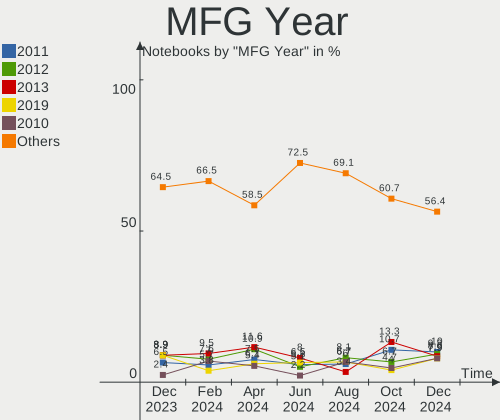
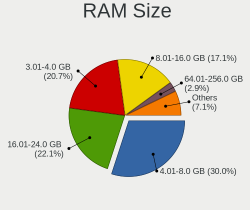
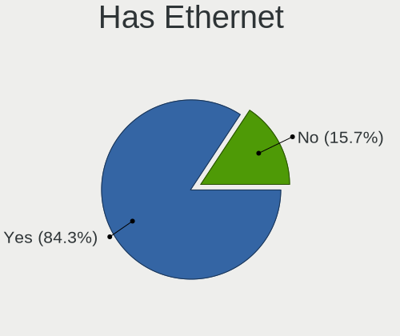
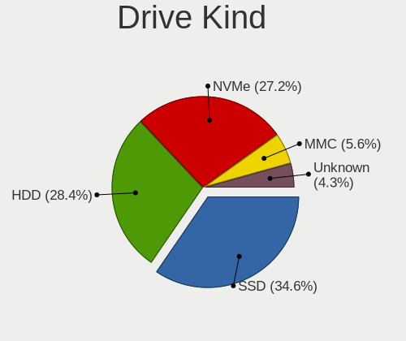
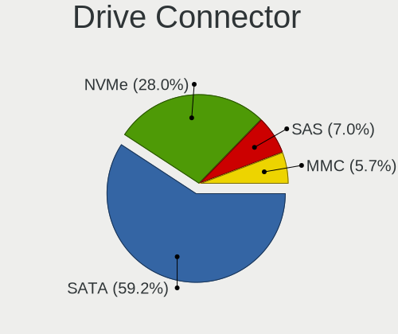
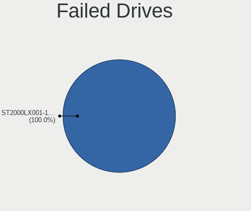
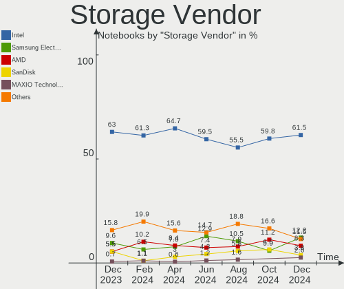
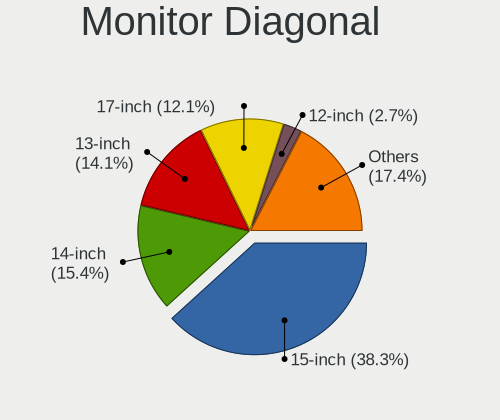
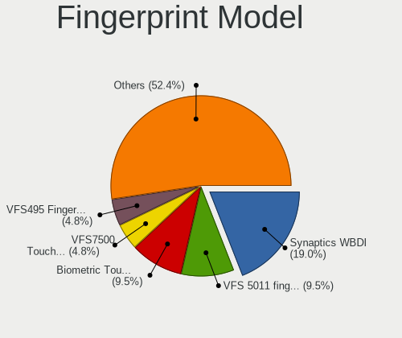

Zorin - Hardware Trends (Notebooks)
-----------------------------------

A project to identify most popular hardware characteristics and track their change
over time based on data collected by Linux users at https://Linux-Hardware.org.

Anyone can contribute to this report by the [hw-probe](https://github.com/linuxhw/hw-probe) tool:

    sudo -E hw-probe -all -upload

This report is for one last month. Overall report since the beginning of time: [TestCoverage](https://github.com/linuxhw/TestCoverage)

Period: Oct, 2022.

Contents
--------

* [ System ](#system)
  - [ OS                       ](#os)
  - [ OS Family                ](#os-family)
  - [ Kernel                   ](#kernel)
  - [ Kernel Family            ](#kernel-family)
  - [ Kernel Major Ver.        ](#kernel-major-ver)
  - [ Arch                     ](#arch)
  - [ DE                       ](#de)
  - [ Display Server           ](#display-server)
  - [ Display Manager          ](#display-manager)
  - [ OS Lang                  ](#os-lang)
  - [ Boot Mode                ](#boot-mode)
  - [ Filesystem               ](#filesystem)
  - [ Part. scheme             ](#part-scheme)
  - [ Dual Boot with Linux/BSD ](#dual-boot-with-linuxbsd)
  - [ Dual Boot (Win)          ](#dual-boot-win)

* [ Board ](#board)
  - [ Vendor                   ](#vendor)
  - [ Model                    ](#model)
  - [ Model Family             ](#model-family)
  - [ MFG Year                 ](#mfg-year)
  - [ Form Factor              ](#form-factor)
  - [ Secure Boot              ](#secure-boot)
  - [ Coreboot                 ](#coreboot)
  - [ RAM Size                 ](#ram-size)
  - [ RAM Used                 ](#ram-used)
  - [ Total Drives             ](#total-drives)
  - [ Has CD-ROM               ](#has-cd-rom)
  - [ Has Ethernet             ](#has-ethernet)
  - [ Has WiFi                 ](#has-wifi)
  - [ Has Bluetooth            ](#has-bluetooth)

* [ Location ](#location)
  - [ Country                  ](#country)
  - [ City                     ](#city)

* [ Drives ](#drives)
  - [ Drive Vendor             ](#drive-vendor)
  - [ Drive Model              ](#drive-model)
  - [ HDD Vendor               ](#hdd-vendor)
  - [ SSD Vendor               ](#ssd-vendor)
  - [ Drive Kind               ](#drive-kind)
  - [ Drive Connector          ](#drive-connector)
  - [ Drive Size               ](#drive-size)
  - [ Space Total              ](#space-total)
  - [ Space Used               ](#space-used)
  - [ Malfunc. Drives          ](#malfunc-drives)
  - [ Malfunc. Drive Vendor    ](#malfunc-drive-vendor)
  - [ Malfunc. HDD Vendor      ](#malfunc-hdd-vendor)
  - [ Malfunc. Drive Kind      ](#malfunc-drive-kind)
  - [ Failed Drives            ](#failed-drives)
  - [ Failed Drive Vendor      ](#failed-drive-vendor)
  - [ Drive Status             ](#drive-status)

* [ Storage controller ](#storage-controller)
  - [ Storage Vendor           ](#storage-vendor)
  - [ Storage Model            ](#storage-model)
  - [ Storage Kind             ](#storage-kind)

* [ Processor ](#processor)
  - [ CPU Vendor               ](#cpu-vendor)
  - [ CPU Model                ](#cpu-model)
  - [ CPU Model Family         ](#cpu-model-family)
  - [ CPU Cores                ](#cpu-cores)
  - [ CPU Sockets              ](#cpu-sockets)
  - [ CPU Threads              ](#cpu-threads)
  - [ CPU Op-Modes             ](#cpu-op-modes)
  - [ CPU Microcode            ](#cpu-microcode)
  - [ CPU Microarch            ](#cpu-microarch)

* [ Graphics ](#graphics)
  - [ GPU Vendor               ](#gpu-vendor)
  - [ GPU Model                ](#gpu-model)
  - [ GPU Combo                ](#gpu-combo)
  - [ GPU Driver               ](#gpu-driver)
  - [ GPU Memory               ](#gpu-memory)

* [ Monitor ](#monitor)
  - [ Monitor Vendor           ](#monitor-vendor)
  - [ Monitor Model            ](#monitor-model)
  - [ Monitor Resolution       ](#monitor-resolution)
  - [ Monitor Diagonal         ](#monitor-diagonal)
  - [ Monitor Width            ](#monitor-width)
  - [ Aspect Ratio             ](#aspect-ratio)
  - [ Monitor Area             ](#monitor-area)
  - [ Pixel Density            ](#pixel-density)
  - [ Multiple Monitors        ](#multiple-monitors)

* [ Network ](#network)
  - [ Net Controller Vendor    ](#net-controller-vendor)
  - [ Net Controller Model     ](#net-controller-model)
  - [ Wireless Vendor          ](#wireless-vendor)
  - [ Wireless Model           ](#wireless-model)
  - [ Ethernet Vendor          ](#ethernet-vendor)
  - [ Ethernet Model           ](#ethernet-model)
  - [ Net Controller Kind      ](#net-controller-kind)
  - [ Used Controller          ](#used-controller)
  - [ NICs                     ](#nics)
  - [ IPv6                     ](#ipv6)

* [ Bluetooth ](#bluetooth)
  - [ Bluetooth Vendor         ](#bluetooth-vendor)
  - [ Bluetooth Model          ](#bluetooth-model)

* [ Sound ](#sound)
  - [ Sound Vendor             ](#sound-vendor)
  - [ Sound Model              ](#sound-model)

* [ Memory ](#memory)
  - [ Memory Vendor            ](#memory-vendor)
  - [ Memory Model             ](#memory-model)
  - [ Memory Kind              ](#memory-kind)
  - [ Memory Form Factor       ](#memory-form-factor)
  - [ Memory Size              ](#memory-size)
  - [ Memory Speed             ](#memory-speed)

* [ Printers & scanners ](#printers--scanners)
  - [ Printer Vendor           ](#printer-vendor)
  - [ Printer Model            ](#printer-model)
  - [ Scanner Vendor           ](#scanner-vendor)
  - [ Scanner Model            ](#scanner-model)

* [ Camera ](#camera)
  - [ Camera Vendor            ](#camera-vendor)
  - [ Camera Model             ](#camera-model)

* [ Security ](#security)
  - [ Fingerprint Vendor       ](#fingerprint-vendor)
  - [ Fingerprint Model        ](#fingerprint-model)
  - [ Chipcard Vendor          ](#chipcard-vendor)
  - [ Chipcard Model           ](#chipcard-model)

* [ Unsupported ](#unsupported)
  - [ Unsupported Devices      ](#unsupported-devices)
  - [ Unsupported Device Types ](#unsupported-device-types)

System
------

OS
--

Installed operating systems

| Name     | Notebooks | Percent |
|----------|-----------|---------|
| Zorin 16 | 92        | 92%     |
| Zorin 15 | 8         | 8%      |

OS Family
---------

OS without a version

| Name  | Notebooks | Percent |
|-------|-----------|---------|
| Zorin | 100       | 100%    |

Kernel
------

Version of the Linux kernel

| Version                    | Notebooks | Percent |
|----------------------------|-----------|---------|
| 5.15.0-52-generic          | 37        | 37%     |
| 5.15.0-48-generic          | 27        | 27%     |
| 5.15.0-50-generic          | 11        | 11%     |
| 5.15.0-46-generic          | 5         | 5%      |
| 5.4.0-131-generic          | 4         | 4%      |
| 5.4.0-126-generic          | 3         | 3%      |
| 5.13.0-30-generic          | 3         | 3%      |
| 5.15.0-43-generic          | 2         | 2%      |
| 5.14.0-1052-oem            | 2         | 2%      |
| 6.0.0-060000-generic       | 1         | 1%      |
| 5.4.0-125-generic          | 1         | 1%      |
| 5.19.14-051914-generic     | 1         | 1%      |
| 5.19.12-051912-generic     | 1         | 1%      |
| 5.19.0-16.2-liquorix-amd64 | 1         | 1%      |
| 5.13.0-35-generic          | 1         | 1%      |

Kernel Family
-------------

Linux kernel without a distro release

| Version | Notebooks | Percent |
|---------|-----------|---------|
| 5.15.0  | 82        | 82%     |
| 5.4.0   | 8         | 8%      |
| 5.13.0  | 4         | 4%      |
| 5.14.0  | 2         | 2%      |
| 6.0.0   | 1         | 1%      |
| 5.19.14 | 1         | 1%      |
| 5.19.12 | 1         | 1%      |
| 5.19.0  | 1         | 1%      |

Kernel Major Ver.
-----------------

Linux kernel major version

| Version | Notebooks | Percent |
|---------|-----------|---------|
| 5.15    | 82        | 82%     |
| 5.4     | 8         | 8%      |
| 5.13    | 4         | 4%      |
| 5.19    | 3         | 3%      |
| 5.14    | 2         | 2%      |
| 6.0     | 1         | 1%      |

Arch
----

OS architecture (x86_64, i586, etc.)

| Name   | Notebooks | Percent |
|--------|-----------|---------|
| x86_64 | 94        | 94%     |
| i686   | 6         | 6%      |

DE
--

Desktop Environment

| Name  | Notebooks | Percent |
|-------|-----------|---------|
| GNOME | 77        | 77%     |
| XFCE  | 23        | 23%     |

Display Server
--------------

X11 or Wayland

| Name    | Notebooks | Percent |
|---------|-----------|---------|
| X11     | 98        | 98%     |
| Wayland | 2         | 2%      |

Display Manager
---------------

SDDM, LightDM, etc.

| Name    | Notebooks | Percent |
|---------|-----------|---------|
| Unknown | 70        | 70%     |
| GDM     | 12        | 12%     |
| LightDM | 9         | 9%      |
| GDM3    | 9         | 9%      |

OS Lang
-------

Language

| Lang  | Notebooks | Percent |
|-------|-----------|---------|
| en_US | 39        | 39%     |
| en_GB | 11        | 11%     |
| de_DE | 8         | 8%      |
| it_IT | 7         | 7%      |
| fr_FR | 5         | 5%      |
| es_ES | 4         | 4%      |
| en_CA | 3         | 3%      |
| en_AU | 3         | 3%      |
| tr_TR | 2         | 2%      |
| en_IN | 2         | 2%      |
| sv_SE | 1         | 1%      |
| sr_RS | 1         | 1%      |
| pt_PT | 1         | 1%      |
| pt_BR | 1         | 1%      |
| pl_PL | 1         | 1%      |
| nl_BE | 1         | 1%      |
| ja_JP | 1         | 1%      |
| hu_HU | 1         | 1%      |
| fi_FI | 1         | 1%      |
| es_MX | 1         | 1%      |
| es_CO | 1         | 1%      |
| en_ZA | 1         | 1%      |
| en_PH | 1         | 1%      |
| en_NZ | 1         | 1%      |
| en_IE | 1         | 1%      |
| el_GR | 1         | 1%      |

Boot Mode
---------

EFI or BIOS

| Mode | Notebooks | Percent |
|------|-----------|---------|
| BIOS | 50        | 50%     |
| EFI  | 50        | 50%     |

Filesystem
----------

Type of filesystem

| Type    | Notebooks | Percent |
|---------|-----------|---------|
| Ext4    | 95        | 95%     |
| Overlay | 3         | 3%      |
| Btrfs   | 2         | 2%      |

Part. scheme
------------

Scheme of partitioning

| Type    | Notebooks | Percent |
|---------|-----------|---------|
| Unknown | 76        | 76%     |
| GPT     | 20        | 20%     |
| MBR     | 4         | 4%      |

Dual Boot with Linux/BSD
------------------------

Hosting more than one Linux/BSD

| Dual boot | Notebooks | Percent |
|-----------|-----------|---------|
| No        | 95        | 95%     |
| Yes       | 5         | 5%      |

Dual Boot (Win)
---------------

Hosting Linux and Windows

| Dual boot | Notebooks | Percent |
|-----------|-----------|---------|
| No        | 88        | 88%     |
| Yes       | 12        | 12%     |

Board
-----

Vendor
------

Motherboard manufacturer

| Name                | Notebooks | Percent |
|---------------------|-----------|---------|
| Hewlett-Packard     | 21        | 21%     |
| Dell                | 19        | 19%     |
| Lenovo              | 14        | 14%     |
| Acer                | 8         | 8%      |
| ASUSTek Computer    | 5         | 5%      |
| Toshiba             | 4         | 4%      |
| MSI                 | 4         | 4%      |
| Packard Bell        | 3         | 3%      |
| Apple               | 3         | 3%      |
| HUAWEI              | 2         | 2%      |
| Google              | 2         | 2%      |
| Chuwi               | 2         | 2%      |
| TERRA               | 1         | 1%      |
| Semp Toshiba        | 1         | 1%      |
| Samsung Electronics | 1         | 1%      |
| Phoenix/SiS         | 1         | 1%      |
| Panasonic           | 1         | 1%      |
| Microtech           | 1         | 1%      |
| Hampoo              | 1         | 1%      |
| Gigabyte Technology | 1         | 1%      |
| Fujitsu             | 1         | 1%      |
| AXDIA International | 1         | 1%      |
| AMI                 | 1         | 1%      |
| ALURIN              | 1         | 1%      |
| Alienware           | 1         | 1%      |

Model
-----

Motherboard model

| Name                                | Notebooks | Percent |
|-------------------------------------|-----------|---------|
| Toshiba Satellite C660              | 2         | 2%      |
| HP Pavilion Notebook                | 2         | 2%      |
| Dell Latitude E6500                 | 2         | 2%      |
| Dell Inspiron 3521                  | 2         | 2%      |
| Toshiba Satellite L500              | 1         | 1%      |
| Toshiba Satellite C55-A             | 1         | 1%      |
| TERRA TERRAPC                       | 1         | 1%      |
| Semp Toshiba K201                   | 1         | 1%      |
| Samsung 305V4A/305V5A/3415VA        | 1         | 1%      |
| Phoenix/SiS M7x0S                   | 1         | 1%      |
| Panasonic CF-19-8                   | 1         | 1%      |
| Packard Bell EasyNote TM82          | 1         | 1%      |
| Packard Bell EasyNote TE69KB        | 1         | 1%      |
| Packard Bell EasyNote MH45          | 1         | 1%      |
| MSI GT70 2PE                        | 1         | 1%      |
| MSI GL72 6QD                        | 1         | 1%      |
| MSI GE62 7RE                        | 1         | 1%      |
| MSI Creator Z16 A11UET              | 1         | 1%      |
| Microtech CoreBook                  | 1         | 1%      |
| Lenovo Yoga S740-15IRH 81NX         | 1         | 1%      |
| Lenovo V570 1066EDG                 | 1         | 1%      |
| Lenovo ThinkPad Yoga 11e 20DAS02G00 | 1         | 1%      |
| Lenovo ThinkPad T520 4243PN7        | 1         | 1%      |
| Lenovo ThinkPad T480 20L6S82F0C     | 1         | 1%      |
| Lenovo ThinkPad T460 20FMS7DA00     | 1         | 1%      |
| Lenovo ThinkPad T420 4180DW1        | 1         | 1%      |
| Lenovo ThinkPad Edge 25453BG        | 1         | 1%      |
| Lenovo IdeaPad Slim 1-14AST-05 81VS | 1         | 1%      |
| Lenovo IdeaPad 3 17ABA7 82RQ        | 1         | 1%      |
| Lenovo IdeaPad 3 15ALC6 82KU        | 1         | 1%      |
| Lenovo IdeaPad 3 15ADA05 81W1       | 1         | 1%      |
| Lenovo G500 20236                   | 1         | 1%      |
| Lenovo G50-45 80MQ                  | 1         | 1%      |
| HUAWEI MACH-WX9                     | 1         | 1%      |
| HUAWEI KLVD-WXX9                    | 1         | 1%      |
| HP ZBook 17 G5                      | 1         | 1%      |
| HP Stream Notebook                  | 1         | 1%      |
| HP Stream Laptop 14-cb1xxx          | 1         | 1%      |
| HP ProBook 455 G6                   | 1         | 1%      |
| HP ProBook 450 G8 Notebook PC       | 1         | 1%      |

Model Family
------------

Motherboard model prefix

| Name                  | Notebooks | Percent |
|-----------------------|-----------|---------|
| Dell Inspiron         | 8         | 8%      |
| HP Pavilion           | 7         | 7%      |
| Lenovo ThinkPad       | 6         | 6%      |
| Dell Latitude         | 5         | 5%      |
| Acer Aspire           | 5         | 5%      |
| Toshiba Satellite     | 4         | 4%      |
| Lenovo IdeaPad        | 4         | 4%      |
| Dell Vostro           | 4         | 4%      |
| Packard Bell EasyNote | 3         | 3%      |
| HP Stream             | 2         | 2%      |
| HP ProBook            | 2         | 2%      |
| HP EliteBook          | 2         | 2%      |
| Dell Studio           | 2         | 2%      |
| Chuwi HeroBook        | 2         | 2%      |
| Apple MacBookPro8     | 2         | 2%      |
| Acer Extensa          | 2         | 2%      |
| TERRA TERRAPC         | 1         | 1%      |
| Semp Toshiba K201     | 1         | 1%      |
| Samsung 305V4A        | 1         | 1%      |
| Phoenix/SiS M7x0S     | 1         | 1%      |
| Panasonic CF-19-8     | 1         | 1%      |
| MSI GT70              | 1         | 1%      |
| MSI GL72              | 1         | 1%      |
| MSI GE62              | 1         | 1%      |
| MSI Creator           | 1         | 1%      |
| Microtech CoreBook    | 1         | 1%      |
| Lenovo Yoga           | 1         | 1%      |
| Lenovo V570           | 1         | 1%      |
| Lenovo G500           | 1         | 1%      |
| Lenovo G50-45         | 1         | 1%      |
| HUAWEI MACH-WX9       | 1         | 1%      |
| HUAWEI KLVD-WXX9      | 1         | 1%      |
| HP ZBook              | 1         | 1%      |
| HP Presario           | 1         | 1%      |
| HP OMEN               | 1         | 1%      |
| HP Notebook           | 1         | 1%      |
| HP Laptop             | 1         | 1%      |
| HP G62                | 1         | 1%      |
| HP ENVY               | 1         | 1%      |
| HP 2000               | 1         | 1%      |

MFG Year
--------

Motherboard manufacture year

| Year    | Notebooks | Percent |
|---------|-----------|---------|
| 2010    | 11        | 11%     |
| 2012    | 10        | 10%     |
| 2011    | 9         | 9%      |
| 2021    | 8         | 8%      |
| 2020    | 8         | 8%      |
| 2019    | 8         | 8%      |
| 2016    | 8         | 8%      |
| 2018    | 7         | 7%      |
| 2014    | 6         | 6%      |
| 2013    | 6         | 6%      |
| 2008    | 5         | 5%      |
| 2017    | 4         | 4%      |
| 2009    | 3         | 3%      |
| 2022    | 2         | 2%      |
| 2015    | 2         | 2%      |
| 2007    | 1         | 1%      |
| 2005    | 1         | 1%      |
| Unknown | 1         | 1%      |

Form Factor
-----------

Physical design of the computer

| Name     | Notebooks | Percent |
|----------|-----------|---------|
| Notebook | 100       | 100%    |

Secure Boot
-----------

Enabled or disabled

| State    | Notebooks | Percent |
|----------|-----------|---------|
| Disabled | 88        | 88%     |
| Enabled  | 12        | 12%     |

Coreboot
--------

Have coreboot on board

| Used | Notebooks | Percent |
|------|-----------|---------|
| No   | 98        | 98%     |
| Yes  | 2         | 2%      |

RAM Size
--------

Total RAM memory

| Size in GB  | Notebooks | Percent |
|-------------|-----------|---------|
| 4.01-8.0    | 33        | 33%     |
| 3.01-4.0    | 27        | 27%     |
| 16.01-24.0  | 14        | 14%     |
| 8.01-16.0   | 14        | 14%     |
| 1.01-2.0    | 7         | 7%      |
| 64.01-256.0 | 2         | 2%      |
| 32.01-64.0  | 1         | 1%      |
| 2.01-3.0    | 1         | 1%      |
| 0.51-1.0    | 1         | 1%      |

RAM Used
--------

Used RAM memory

| Used GB   | Notebooks | Percent |
|-----------|-----------|---------|
| 1.01-2.0  | 35        | 35%     |
| 2.01-3.0  | 33        | 33%     |
| 3.01-4.0  | 14        | 14%     |
| 0.51-1.0  | 8         | 8%      |
| 4.01-8.0  | 7         | 7%      |
| 8.01-16.0 | 3         | 3%      |

Total Drives
------------

Number of drives on board

| Drives | Notebooks | Percent |
|--------|-----------|---------|
| 1      | 66        | 66%     |
| 2      | 28        | 28%     |
| 3      | 4         | 4%      |
| 5      | 1         | 1%      |
| 0      | 1         | 1%      |

Has CD-ROM
----------

Has CD-ROM on board

| Presented | Notebooks | Percent |
|-----------|-----------|---------|
| No        | 55        | 55%     |
| Yes       | 45        | 45%     |

Has Ethernet
------------

Has Ethernet on board

| Presented | Notebooks | Percent |
|-----------|-----------|---------|
| Yes       | 82        | 82%     |
| No        | 18        | 18%     |

Has WiFi
--------

Has WiFi module

| Presented | Notebooks | Percent |
|-----------|-----------|---------|
| Yes       | 97        | 97%     |
| No        | 3         | 3%      |

Has Bluetooth
-------------

Has Bluetooth module

| Presented | Notebooks | Percent |
|-----------|-----------|---------|
| Yes       | 67        | 67%     |
| No        | 33        | 33%     |

Location
--------

Country
-------

Geographic location (country)

| Country      | Notebooks | Percent |
|--------------|-----------|---------|
| USA          | 19        | 19%     |
| Germany      | 9         | 9%      |
| UK           | 8         | 8%      |
| Italy        | 8         | 8%      |
| Spain        | 5         | 5%      |
| France       | 5         | 5%      |
| Canada       | 5         | 5%      |
| India        | 3         | 3%      |
| Egypt        | 3         | 3%      |
| Australia    | 3         | 3%      |
| Turkey       | 2         | 2%      |
| Poland       | 2         | 2%      |
| Mexico       | 2         | 2%      |
| Jordan       | 2         | 2%      |
| Greece       | 2         | 2%      |
| Finland      | 2         | 2%      |
| Switzerland  | 1         | 1%      |
| Sweden       | 1         | 1%      |
| South Africa | 1         | 1%      |
| Serbia       | 1         | 1%      |
| San Marino   | 1         | 1%      |
| Portugal     | 1         | 1%      |
| Pakistan     | 1         | 1%      |
| Norway       | 1         | 1%      |
| New Zealand  | 1         | 1%      |
| Japan        | 1         | 1%      |
| Ireland      | 1         | 1%      |
| Hungary      | 1         | 1%      |
| Estonia      | 1         | 1%      |
| Colombia     | 1         | 1%      |
| Bulgaria     | 1         | 1%      |
| Brazil       | 1         | 1%      |
| Belgium      | 1         | 1%      |
| Bangladesh   | 1         | 1%      |
| Austria      | 1         | 1%      |
| Argentina    | 1         | 1%      |

City
----

Geographic location (city)

| City              | Notebooks | Percent |
|-------------------|-----------|---------|
| Madrid            | 3         | 3%      |
| Munich            | 2         | 2%      |
| Mexico City       | 2         | 2%      |
| Krakow            | 2         | 2%      |
| Istanbul          | 2         | 2%      |
| Athens            | 2         | 2%      |
| Amman             | 2         | 2%      |
| Weston-super-Mare | 1         | 1%      |
| Weilheim          | 1         | 1%      |
| Watford           | 1         | 1%      |
| Victoria          | 1         | 1%      |
| Tullahoma         | 1         | 1%      |
| Tukh              | 1         | 1%      |
| Tucson            | 1         | 1%      |
| Trondheim         | 1         | 1%      |
| Tharston          | 1         | 1%      |
| Tallinn           | 1         | 1%      |
| Sohag             | 1         | 1%      |
| Smyrna            | 1         | 1%      |
| Simcoe            | 1         | 1%      |
| Silloth           | 1         | 1%      |
| Shinjuku          | 1         | 1%      |
| Salt Lake City    | 1         | 1%      |
| Saint-Denis       | 1         | 1%      |
| Rome              | 1         | 1%      |
| Rho               | 1         | 1%      |
| Redfern           | 1         | 1%      |
| Rankweil          | 1         | 1%      |
| Ramsgate          | 1         | 1%      |
| Quispamsis        | 1         | 1%      |
| Preston           | 1         | 1%      |
| Plovdiv           | 1         | 1%      |
| Penha Longa       | 1         | 1%      |
| Paris             | 1         | 1%      |
| Palermo           | 1         | 1%      |
| Okehampton        | 1         | 1%      |
| Oak Creek         | 1         | 1%      |
| Novi Sad          | 1         | 1%      |
| Novara            | 1         | 1%      |
| Norrköping       | 1         | 1%      |

Drives
------

Drive Vendor
------------

Hard drive vendors

| Vendor              | Notebooks | Drives | Percent |
|---------------------|-----------|--------|---------|
| Samsung Electronics | 21        | 24     | 17.5%   |
| Seagate             | 16        | 16     | 13.33%  |
| Unknown             | 14        | 18     | 11.67%  |
| Toshiba             | 14        | 14     | 11.67%  |
| WDC                 | 11        | 12     | 9.17%   |
| Sandisk             | 4         | 4      | 3.33%   |
| HGST                | 4         | 4      | 3.33%   |
| Crucial             | 4         | 4      | 3.33%   |
| Kingston            | 3         | 3      | 2.5%    |
| Intenso             | 3         | 3      | 2.5%    |
| Intel               | 3         | 4      | 2.5%    |
| Hitachi             | 3         | 3      | 2.5%    |
| Unknown             | 3         | 3      | 2.5%    |
| SK hynix            | 2         | 2      | 1.67%   |
| PNY                 | 2         | 2      | 1.67%   |
| Netac               | 2         | 2      | 1.67%   |
| Micron Technology   | 2         | 2      | 1.67%   |
| A-DATA Technology   | 2         | 2      | 1.67%   |
| Phison              | 1         | 1      | 0.83%   |
| Mass                | 1         | 1      | 0.83%   |
| Lenovo              | 1         | 1      | 0.83%   |
| KIOXIA              | 1         | 1      | 0.83%   |
| JMicron Technology  | 1         | 1      | 0.83%   |
| China               | 1         | 1      | 0.83%   |
| BAITITON            | 1         | 1      | 0.83%   |

Drive Model
-----------

Hard drive models

| Model                                               | Notebooks | Percent |
|-----------------------------------------------------|-----------|---------|
| Unknown MMC Card  32GB                              | 6         | 4.72%   |
| Toshiba MQ01ABF050 500GB                            | 4         | 3.15%   |
| Unknown MMC Card  64GB                              | 3         | 2.36%   |
| Unknown MMC Card  128GB                             | 3         | 2.36%   |
| Samsung SSD 870 EVO 1TB                             | 3         | 2.36%   |
| Samsung NVMe SSD Controller SM981/PM981/PM983 500GB | 3         | 2.36%   |
| Unknown                                             | 3         | 2.36%   |
| WDC WD5000LPVX-22V0TT0 500GB                        | 2         | 1.57%   |
| Unknown SD/MMC/MS PRO 1TB                           | 2         | 1.57%   |
| Toshiba MK1652GSX 160GB                             | 2         | 1.57%   |
| SK hynix BC711 HFM512GD3JX013N 512GB                | 2         | 1.57%   |
| Seagate ST500LT012-9WS142 500GB                     | 2         | 1.57%   |
| Seagate ST500LT012-1DG142 500GB                     | 2         | 1.57%   |
| Seagate ST320LT020-9YG142 320GB                     | 2         | 1.57%   |
| Seagate ST1000LM035-1RK172 1TB                      | 2         | 1.57%   |
| Samsung SSD 850 EVO 500GB                           | 2         | 1.57%   |
| Samsung MZALQ256HBJD-00BL2 256GB                    | 2         | 1.57%   |
| Samsung HM121HI 120GB                               | 2         | 1.57%   |
| PNY CS900 240GB SSD                                 | 2         | 1.57%   |
| HGST HTS541010A9E680 1TB                            | 2         | 1.57%   |
| WDC WDS200T2B0B 2TB SSD                             | 1         | 0.79%   |
| WDC WDS200T2B0A 2TB SSD                             | 1         | 0.79%   |
| WDC WDS120G2G0A-00JH30 120GB SSD                    | 1         | 0.79%   |
| WDC WD5000LPVX-75V0TT0 500GB                        | 1         | 0.79%   |
| WDC WD5000LPVT-24G33T1 500GB                        | 1         | 0.79%   |
| WDC WD5000LPCX-24VHAT0 500GB                        | 1         | 0.79%   |
| WDC WD5000LPCX-21VHAT0 500GB                        | 1         | 0.79%   |
| WDC WD2500BEVT-00A23T0 250GB                        | 1         | 0.79%   |
| WDC WD10JPVX-60JC3T0 1TB                            | 1         | 0.79%   |
| WDC WD10JPVX-22JC3T0 1TB                            | 1         | 0.79%   |
| Unknown MMC Card  1GB                               | 1         | 0.79%   |
| Unknown MMC Card  16GB                              | 1         | 0.79%   |
| Unknown EFAQK  512GB                                | 1         | 0.79%   |
| Toshiba THNSNK256GCS8 SATA 256GB SSD                | 1         | 0.79%   |
| Toshiba THNSNK128GVN8 128GB SSD                     | 1         | 0.79%   |
| Toshiba THNSNJ256GCST 256GB SSD                     | 1         | 0.79%   |
| Toshiba MQ04ABF100 1TB                              | 1         | 0.79%   |
| Toshiba MQ01ABD050V 500GB                           | 1         | 0.79%   |
| Toshiba MK4026GAX 40GB                              | 1         | 0.79%   |
| Toshiba MK3265GSX 320GB                             | 1         | 0.79%   |

HDD Vendor
----------

Hard disk drive vendors

| Vendor              | Notebooks | Drives | Percent |
|---------------------|-----------|--------|---------|
| Seagate             | 16        | 16     | 33.33%  |
| Toshiba             | 11        | 11     | 22.92%  |
| WDC                 | 9         | 9      | 18.75%  |
| HGST                | 4         | 4      | 8.33%   |
| Samsung Electronics | 3         | 3      | 6.25%   |
| Hitachi             | 3         | 3      | 6.25%   |
| Unknown             | 2         | 2      | 4.17%   |

SSD Vendor
----------

Solid state drive vendors

| Vendor              | Notebooks | Drives | Percent |
|---------------------|-----------|--------|---------|
| Samsung Electronics | 8         | 9      | 23.53%  |
| Toshiba             | 3         | 3      | 8.82%   |
| SanDisk             | 3         | 3      | 8.82%   |
| Kingston            | 3         | 3      | 8.82%   |
| Crucial             | 3         | 3      | 8.82%   |
| WDC                 | 2         | 3      | 5.88%   |
| PNY                 | 2         | 2      | 5.88%   |
| Netac               | 2         | 2      | 5.88%   |
| A-DATA Technology   | 2         | 2      | 5.88%   |
| Unknown             | 2         | 2      | 5.88%   |
| Intenso             | 1         | 1      | 2.94%   |
| Intel               | 1         | 1      | 2.94%   |
| China               | 1         | 1      | 2.94%   |
| BAITITON            | 1         | 1      | 2.94%   |

Drive Kind
----------

HDD or SSD

| Kind    | Notebooks | Drives | Percent |
|---------|-----------|--------|---------|
| HDD     | 46        | 48     | 39.32%  |
| SSD     | 33        | 36     | 28.21%  |
| NVMe    | 20        | 24     | 17.09%  |
| MMC     | 15        | 18     | 12.82%  |
| Unknown | 3         | 3      | 2.56%   |

Drive Connector
---------------

SATA, SAS, NVMe, etc.

| Type | Notebooks | Drives | Percent |
|------|-----------|--------|---------|
| SATA | 74        | 84     | 66.07%  |
| NVMe | 19        | 23     | 16.96%  |
| MMC  | 15        | 18     | 13.39%  |
| SAS  | 4         | 4      | 3.57%   |

Drive Size
----------

Size of hard drive

| Size in TB | Notebooks | Drives | Percent |
|------------|-----------|--------|---------|
| 0.01-0.5   | 55        | 58     | 68.75%  |
| 0.51-1.0   | 23        | 23     | 28.75%  |
| 1.01-2.0   | 2         | 3      | 2.5%    |

Space Total
-----------

Amount of disk space available on the file system

| Size in GB | Notebooks | Percent |
|------------|-----------|---------|
| 251-500    | 38        | 38%     |
| 101-250    | 33        | 33%     |
| 501-1000   | 12        | 12%     |
| 21-50      | 7         | 7%      |
| 51-100     | 6         | 6%      |
| 1001-2000  | 2         | 2%      |
| 2001-3000  | 1         | 1%      |
| 1-20       | 1         | 1%      |

Space Used
----------

Amount of used disk space

| Used GB   | Notebooks | Percent |
|-----------|-----------|---------|
| 21-50     | 36        | 36%     |
| 1-20      | 34        | 34%     |
| 51-100    | 13        | 13%     |
| 101-250   | 10        | 10%     |
| 251-500   | 3         | 3%      |
| 501-1000  | 3         | 3%      |
| 1001-2000 | 1         | 1%      |

Malfunc. Drives
---------------

Drive models with a malfunction

| Model                                  | Notebooks | Drives | Percent |
|----------------------------------------|-----------|--------|---------|
| Toshiba THNSNK256GCS8 SATA 256GB SSD   | 1         | 1      | 25%     |
| Seagate ST500LT012-9WS142 500GB        | 1         | 1      | 25%     |
| Kingston RBU-SNS8152S3256GG2 256GB SSD | 1         | 1      | 25%     |
| HGST HTS541010A9E680 1TB               | 1         | 1      | 25%     |

Malfunc. Drive Vendor
---------------------

Vendors of faulty drives

| Vendor   | Notebooks | Drives | Percent |
|----------|-----------|--------|---------|
| Toshiba  | 1         | 1      | 25%     |
| Seagate  | 1         | 1      | 25%     |
| Kingston | 1         | 1      | 25%     |
| HGST     | 1         | 1      | 25%     |

Malfunc. HDD Vendor
-------------------

Vendors of faulty HDD drives

| Vendor  | Notebooks | Drives | Percent |
|---------|-----------|--------|---------|
| Seagate | 1         | 1      | 50%     |
| HGST    | 1         | 1      | 50%     |

Malfunc. Drive Kind
-------------------

Kinds of faulty drives

| Kind | Notebooks | Drives | Percent |
|------|-----------|--------|---------|
| SSD  | 2         | 2      | 50%     |
| HDD  | 2         | 2      | 50%     |

Failed Drives
-------------

Failed drive models

| Model                          | Notebooks | Drives | Percent |
|--------------------------------|-----------|--------|---------|
| Seagate ST2000LX001-1RG174 2TB | 1         | 1      | 100%    |

Failed Drive Vendor
-------------------

Failed drive vendors

| Vendor  | Notebooks | Drives | Percent |
|---------|-----------|--------|---------|
| Seagate | 1         | 1      | 100%    |

Drive Status
------------

Number of failed and malfunc. drives

| Status   | Notebooks | Drives | Percent |
|----------|-----------|--------|---------|
| Detected | 86        | 108    | 83.5%   |
| Works    | 13        | 16     | 12.62%  |
| Malfunc  | 3         | 4      | 2.91%   |
| Failed   | 1         | 1      | 0.97%   |

Storage controller
------------------

Storage Vendor
--------------

Storage controller vendors

| Vendor                           | Notebooks | Percent |
|----------------------------------|-----------|---------|
| Intel                            | 65        | 61.32%  |
| AMD                              | 16        | 15.09%  |
| Samsung Electronics              | 11        | 10.38%  |
| SK hynix                         | 2         | 1.89%   |
| Micron Technology                | 2         | 1.89%   |
| VIA Technologies                 | 1         | 0.94%   |
| Silicon Integrated Systems [SiS] | 1         | 0.94%   |
| Silicon Image                    | 1         | 0.94%   |
| SanDisk                          | 1         | 0.94%   |
| Phison Electronics               | 1         | 0.94%   |
| Nvidia                           | 1         | 0.94%   |
| Micron/Crucial Technology        | 1         | 0.94%   |
| Marvell Technology Group         | 1         | 0.94%   |
| Lenovo                           | 1         | 0.94%   |
| KIOXIA                           | 1         | 0.94%   |

Storage Model
-------------

Storage controller models

| Model                                                                          | Notebooks | Percent |
|--------------------------------------------------------------------------------|-----------|---------|
| AMD FCH SATA Controller [AHCI mode]                                            | 13        | 11.4%   |
| Intel 82801 Mobile SATA Controller [RAID mode]                                 | 8         | 7.02%   |
| Intel 7 Series Chipset Family 6-port SATA Controller [AHCI mode]               | 8         | 7.02%   |
| Intel 6 Series/C200 Series Chipset Family 6 port Mobile SATA AHCI Controller   | 7         | 6.14%   |
| Intel 5 Series/3400 Series Chipset 4 port SATA AHCI Controller                 | 6         | 5.26%   |
| Samsung NVMe SSD Controller SM981/PM981/PM983                                  | 5         | 4.39%   |
| Samsung NVMe SSD Controller 980                                                | 5         | 4.39%   |
| Intel 82801IBM/IEM (ICH9M/ICH9M-E) 4 port SATA Controller [AHCI mode]          | 5         | 4.39%   |
| Intel Sunrise Point-LP SATA Controller [AHCI mode]                             | 4         | 3.51%   |
| Intel Celeron N3350/Pentium N4200/Atom E3900 Series SATA AHCI Controller       | 3         | 2.63%   |
| Intel 8 Series/C220 Series Chipset Family 6-port SATA Controller 1 [AHCI mode] | 3         | 2.63%   |
| Intel 8 Series SATA Controller 1 [AHCI mode]                                   | 3         | 2.63%   |
| SK hynix Gold P31 SSD                                                          | 2         | 1.75%   |
| Micron Non-Volatile memory controller                                          | 2         | 1.75%   |
| Intel Wildcat Point-LP SATA Controller [AHCI Mode]                             | 2         | 1.75%   |
| Intel HM170/QM170 Chipset SATA Controller [AHCI Mode]                          | 2         | 1.75%   |
| Intel Celeron/Pentium Silver Processor SATA Controller                         | 2         | 1.75%   |
| Intel Cannon Lake Mobile PCH SATA AHCI Controller                              | 2         | 1.75%   |
| Intel Atom Processor E3800 Series SATA AHCI Controller                         | 2         | 1.75%   |
| Intel 82801HM/HEM (ICH8M/ICH8M-E) SATA Controller [AHCI mode]                  | 2         | 1.75%   |
| Intel 82801HM/HEM (ICH8M/ICH8M-E) IDE Controller                               | 2         | 1.75%   |
| VIA VT82C586A/B/VT82C686/A/B/VT823x/A/C PIPC Bus Master IDE                    | 1         | 0.88%   |
| VIA VT8237A SATA 2-Port Controller                                             | 1         | 0.88%   |
| Silicon Integrated Systems [SiS] SATA Controller / IDE mode                    | 1         | 0.88%   |
| Silicon Integrated Systems [SiS] 5513 IDE Controller                           | 1         | 0.88%   |
| Silicon Image SiI 3512 [SATALink/SATARaid] Serial ATA Controller               | 1         | 0.88%   |
| SanDisk WD Blue SN550 NVMe SSD                                                 | 1         | 0.88%   |
| Samsung NVMe SSD Controller PM9A1/PM9A3/980PRO                                 | 1         | 0.88%   |
| Phison PS5013 E13 NVMe Controller                                              | 1         | 0.88%   |
| Nvidia MCP51 Serial ATA Controller                                             | 1         | 0.88%   |
| Nvidia MCP51 IDE                                                               | 1         | 0.88%   |
| Micron/Crucial P2 NVMe PCIe SSD                                                | 1         | 0.88%   |
| Marvell Group 88SS9183 PCIe SSD Controller                                     | 1         | 0.88%   |
| Lenovo Non-Volatile memory controller                                          | 1         | 0.88%   |
| KIOXIA NVMe SSD Controller BG4                                                 | 1         | 0.88%   |
| Intel Volume Management Device NVMe RAID Controller                            | 1         | 0.88%   |
| Intel Tiger Lake-LP SATA Controller                                            | 1         | 0.88%   |
| Intel SSD Pro 7600p/760p/E 6100p Series                                        | 1         | 0.88%   |
| Intel Non-Volatile memory controller                                           | 1         | 0.88%   |
| Intel NM10/ICH7 Family SATA Controller [IDE mode]                              | 1         | 0.88%   |

Storage Kind
------------

Kind of storage controller (IDE, SATA, NVMe, SAS, ...)

| Kind | Notebooks | Percent |
|------|-----------|---------|
| SATA | 69        | 64.49%  |
| NVMe | 20        | 18.69%  |
| RAID | 10        | 9.35%   |
| IDE  | 8         | 7.48%   |

Processor
---------

CPU Vendor
----------

Processor vendors

| Vendor | Notebooks | Percent |
|--------|-----------|---------|
| Intel  | 80        | 80%     |
| AMD    | 20        | 20%     |

CPU Model
---------

Processor models

| Model                                           | Notebooks | Percent |
|-------------------------------------------------|-----------|---------|
| Intel 11th Gen Core i5-1135G7 @ 2.40GHz         | 3         | 3%      |
| Intel Pentium Dual-Core CPU T4500 @ 2.30GHz     | 2         | 2%      |
| Intel Pentium Dual-Core CPU T4200 @ 2.00GHz     | 2         | 2%      |
| Intel Core i7-7500U CPU @ 2.70GHz               | 2         | 2%      |
| Intel Core i7-10750H CPU @ 2.60GHz              | 2         | 2%      |
| Intel Core i5-9300H CPU @ 2.40GHz               | 2         | 2%      |
| Intel Core i5-2520M CPU @ 2.50GHz               | 2         | 2%      |
| Intel Core i5-2430M CPU @ 2.40GHz               | 2         | 2%      |
| Intel Core i3 CPU M 380 @ 2.53GHz               | 2         | 2%      |
| Intel Celeron N4020 CPU @ 1.10GHz               | 2         | 2%      |
| Intel Celeron CPU N3450 @ 1.10GHz               | 2         | 2%      |
| AMD Ryzen 7 PRO 2700U w/ Radeon Vega Mobile Gfx | 2         | 2%      |
| Intel Xeon E-2186M CPU @ 2.90GHz                | 1         | 1%      |
| Intel Pentium Dual-Core CPU T4400 @ 2.20GHz     | 1         | 1%      |
| Intel Pentium Dual CPU T3400 @ 2.16GHz          | 1         | 1%      |
| Intel Pentium Dual CPU T3200 @ 2.00GHz          | 1         | 1%      |
| Intel Pentium CPU P6100 @ 2.00GHz               | 1         | 1%      |
| Intel Pentium CPU N4200 @ 1.10GHz               | 1         | 1%      |
| Intel Pentium CPU 2020M @ 2.40GHz               | 1         | 1%      |
| Intel Genuine CPU U7300 @ 1.30GHz               | 1         | 1%      |
| Intel Genuine CPU T1400 @ 1.73GHz               | 1         | 1%      |
| Intel Core i7-7700HQ CPU @ 2.80GHz              | 1         | 1%      |
| Intel Core i7-6700HQ CPU @ 2.60GHz              | 1         | 1%      |
| Intel Core i7-6500U CPU @ 2.50GHz               | 1         | 1%      |
| Intel Core i7-5500U CPU @ 2.40GHz               | 1         | 1%      |
| Intel Core i7-4810MQ CPU @ 2.80GHz              | 1         | 1%      |
| Intel Core i7-4800MQ CPU @ 2.70GHz              | 1         | 1%      |
| Intel Core i7-4710HQ CPU @ 2.50GHz              | 1         | 1%      |
| Intel Core i7-4500U CPU @ 1.80GHz               | 1         | 1%      |
| Intel Core i7-3615QM CPU @ 2.30GHz              | 1         | 1%      |
| Intel Core i7-2720QM CPU @ 2.20GHz              | 1         | 1%      |
| Intel Core i7 CPU Q 720 @ 1.60GHz               | 1         | 1%      |
| Intel Core i5-8300H CPU @ 2.30GHz               | 1         | 1%      |
| Intel Core i5-8265U CPU @ 1.60GHz               | 1         | 1%      |
| Intel Core i5-8250U CPU @ 1.60GHz               | 1         | 1%      |
| Intel Core i5-7300U CPU @ 2.60GHz               | 1         | 1%      |
| Intel Core i5-6300U CPU @ 2.40GHz               | 1         | 1%      |
| Intel Core i5-6200U CPU @ 2.30GHz               | 1         | 1%      |
| Intel Core i5-4200U CPU @ 1.60GHz               | 1         | 1%      |
| Intel Core i5-3610ME CPU @ 2.70GHz              | 1         | 1%      |

CPU Model Family
----------------

Processor model prefix

| Model                   | Notebooks | Percent |
|-------------------------|-----------|---------|
| Intel Core i5           | 21        | 21%     |
| Intel Core i7           | 15        | 15%     |
| Intel Core i3           | 11        | 11%     |
| Intel Celeron           | 9         | 9%      |
| Other                   | 6         | 6%      |
| Intel Pentium Dual-Core | 5         | 5%      |
| AMD A4                  | 4         | 4%      |
| Intel Pentium           | 3         | 3%      |
| Intel Atom              | 3         | 3%      |
| Intel Pentium Dual      | 2         | 2%      |
| Intel Genuine           | 2         | 2%      |
| Intel Core 2 Duo        | 2         | 2%      |
| AMD Ryzen 7 PRO         | 2         | 2%      |
| AMD Ryzen 5             | 2         | 2%      |
| AMD Ryzen 3             | 2         | 2%      |
| AMD A10                 | 2         | 2%      |
| Intel Xeon              | 1         | 1%      |
| Intel Celeron M         | 1         | 1%      |
| AMD V120                | 1         | 1%      |
| AMD Turion 64 X2 Mobile | 1         | 1%      |
| AMD Ryzen 7             | 1         | 1%      |
| AMD QC                  | 1         | 1%      |
| AMD E1                  | 1         | 1%      |
| AMD Athlon II Neo       | 1         | 1%      |
| AMD A8                  | 1         | 1%      |

CPU Cores
---------

Number of processor cores

| Number | Notebooks | Percent |
|--------|-----------|---------|
| 2      | 59        | 59%     |
| 4      | 32        | 32%     |
| 6      | 4         | 4%      |
| 1      | 3         | 3%      |
| 8      | 2         | 2%      |

CPU Sockets
-----------

Number of sockets

| Number | Notebooks | Percent |
|--------|-----------|---------|
| 1      | 100       | 100%    |

CPU Threads
-----------

Threads per core (Hyper-Threading)

| Number | Notebooks | Percent |
|--------|-----------|---------|
| 2      | 62        | 62%     |
| 1      | 38        | 38%     |

CPU Op-Modes
------------

CPU Operation Modes (32-bit, 64-bit)

| Op mode        | Notebooks | Percent |
|----------------|-----------|---------|
| 32-bit, 64-bit | 98        | 98%     |
| 32-bit         | 2         | 2%      |

CPU Microcode
-------------

Microcode number

| Number     | Notebooks | Percent |
|------------|-----------|---------|
| Unknown    | 16        | 16%     |
| 0x206a7    | 8         | 8%      |
| 0x306a9    | 7         | 7%      |
| 0x1067a    | 7         | 7%      |
| 0x20655    | 6         | 6%      |
| 0x906ea    | 4         | 4%      |
| 0x806c1    | 4         | 4%      |
| 0x806e9    | 3         | 3%      |
| 0x6fd      | 3         | 3%      |
| 0x506c9    | 3         | 3%      |
| 0x40651    | 3         | 3%      |
| 0x30678    | 3         | 3%      |
| 0xa0652    | 2         | 2%      |
| 0x706a8    | 2         | 2%      |
| 0x406e3    | 2         | 2%      |
| 0x406c4    | 2         | 2%      |
| 0x06006705 | 2         | 2%      |
| 0x906e9    | 1         | 1%      |
| 0x806ec    | 1         | 1%      |
| 0x806ea    | 1         | 1%      |
| 0x806d1    | 1         | 1%      |
| 0x706e5    | 1         | 1%      |
| 0x706a1    | 1         | 1%      |
| 0x6d8      | 1         | 1%      |
| 0x306d4    | 1         | 1%      |
| 0x306c3    | 1         | 1%      |
| 0x30661    | 1         | 1%      |
| 0x20652    | 1         | 1%      |
| 0x106e5    | 1         | 1%      |
| 0x0a50000c | 1         | 1%      |
| 0x08608103 | 1         | 1%      |
| 0x08600106 | 1         | 1%      |
| 0x08200103 | 1         | 1%      |
| 0x08108102 | 1         | 1%      |
| 0x08101016 | 1         | 1%      |
| 0x08008206 | 1         | 1%      |
| 0x0700010f | 1         | 1%      |
| 0x06001119 | 1         | 1%      |
| 0x03000027 | 1         | 1%      |
| 0x010000c8 | 1         | 1%      |

CPU Microarch
-------------

Microarchitecture

| Name          | Notebooks | Percent |
|---------------|-----------|---------|
| SandyBridge   | 10        | 10%     |
| KabyLake      | 10        | 10%     |
| Penryn        | 8         | 8%      |
| Westmere      | 7         | 7%      |
| IvyBridge     | 7         | 7%      |
| Silvermont    | 6         | 6%      |
| Haswell       | 6         | 6%      |
| TigerLake     | 4         | 4%      |
| Skylake       | 4         | 4%      |
| Excavator     | 4         | 4%      |
| Zen           | 3         | 3%      |
| Jaguar        | 3         | 3%      |
| Goldmont plus | 3         | 3%      |
| Goldmont      | 3         | 3%      |
| Core          | 3         | 3%      |
| Zen+          | 2         | 2%      |
| K10           | 2         | 2%      |
| Icelake       | 2         | 2%      |
| CometLake     | 2         | 2%      |
| Broadwell     | 2         | 2%      |
| Zen 3         | 1         | 1%      |
| Zen 2         | 1         | 1%      |
| Piledriver    | 1         | 1%      |
| P6            | 1         | 1%      |
| Nehalem       | 1         | 1%      |
| K8 Hammer     | 1         | 1%      |
| K10 Llano     | 1         | 1%      |
| Bonnell       | 1         | 1%      |
| Unknown       | 1         | 1%      |

Graphics
--------

GPU Vendor
----------

Vendors of graphics cards

| Vendor                           | Notebooks | Percent |
|----------------------------------|-----------|---------|
| Intel                            | 72        | 59.5%   |
| AMD                              | 26        | 21.49%  |
| Nvidia                           | 21        | 17.36%  |
| VIA Technologies                 | 1         | 0.83%   |
| Silicon Integrated Systems [SiS] | 1         | 0.83%   |

GPU Model
---------

Graphics card models

| Model                                                                                    | Notebooks | Percent |
|------------------------------------------------------------------------------------------|-----------|---------|
| Intel 2nd Generation Core Processor Family Integrated Graphics Controller                | 10        | 8.13%   |
| Intel 3rd Gen Core processor Graphics Controller                                         | 7         | 5.69%   |
| Intel Mobile 4 Series Chipset Integrated Graphics Controller                             | 6         | 4.88%   |
| Intel Core Processor Integrated Graphics Controller                                      | 6         | 4.88%   |
| Intel TigerLake-LP GT2 [Iris Xe Graphics]                                                | 4         | 3.25%   |
| Intel Atom Processor Z36xxx/Z37xxx Series Graphics & Display                             | 4         | 3.25%   |
| Intel Skylake GT2 [HD Graphics 520]                                                      | 3         | 2.44%   |
| Intel HD Graphics 620                                                                    | 3         | 2.44%   |
| Intel Haswell-ULT Integrated Graphics Controller                                         | 3         | 2.44%   |
| Intel GeminiLake [UHD Graphics 600]                                                      | 3         | 2.44%   |
| Intel CoffeeLake-H GT2 [UHD Graphics 630]                                                | 3         | 2.44%   |
| AMD Stoney [Radeon R2/R3/R4/R5 Graphics]                                                 | 3         | 2.44%   |
| AMD Park [Mobility Radeon HD 5430/5450/5470]                                             | 3         | 2.44%   |
| Intel HD Graphics 5500                                                                   | 2         | 1.63%   |
| Intel HD Graphics 500                                                                    | 2         | 1.63%   |
| Intel CometLake-H GT2 [UHD Graphics]                                                     | 2         | 1.63%   |
| Intel Atom/Celeron/Pentium Processor x5-E8000/J3xxx/N3xxx Integrated Graphics Controller | 2         | 1.63%   |
| Intel 4th Gen Core Processor Integrated Graphics Controller                              | 2         | 1.63%   |
| AMD Whistler [Radeon HD 6630M/6650M/6750M/7670M/7690M]                                   | 2         | 1.63%   |
| AMD RS880M [Mobility Radeon HD 4225/4250]                                                | 2         | 1.63%   |
| AMD Raven Ridge [Radeon Vega Series / Radeon Vega Mobile Series]                         | 2         | 1.63%   |
| AMD Picasso/Raven 2 [Radeon Vega Series / Radeon Vega Mobile Series]                     | 2         | 1.63%   |
| VIA Technologies CN896/VN896/P4M900 [Chrome 9 HC]                                        | 1         | 0.81%   |
| Silicon Integrated Systems [SiS] 771/671 PCIE VGA Display Adapter                        | 1         | 0.81%   |
| Nvidia TU117M [GeForce GTX 1650 Mobile / Max-Q]                                          | 1         | 0.81%   |
| Nvidia TU116M [GeForce GTX 1660 Ti Mobile]                                               | 1         | 0.81%   |
| Nvidia TU106M [GeForce RTX 2060 Max-Q]                                                   | 1         | 0.81%   |
| Nvidia GP108M [GeForce MX330]                                                            | 1         | 0.81%   |
| Nvidia GP108M [GeForce MX150]                                                            | 1         | 0.81%   |
| Nvidia GP107M [GeForce GTX 1050 Ti Mobile]                                               | 1         | 0.81%   |
| Nvidia GP107M [GeForce GTX 1050 Mobile]                                                  | 1         | 0.81%   |
| Nvidia GP107M [GeForce GTX 1050 3 GB Max-Q]                                              | 1         | 0.81%   |
| Nvidia GP104GLM [Quadro P4200 Mobile]                                                    | 1         | 0.81%   |
| Nvidia GM108M [GeForce 940M]                                                             | 1         | 0.81%   |
| Nvidia GM108M [GeForce 940MX]                                                            | 1         | 0.81%   |
| Nvidia GM107M [GeForce GTX 950M]                                                         | 1         | 0.81%   |
| Nvidia GM107M [GeForce GTX 860M]                                                         | 1         | 0.81%   |
| Nvidia GM107 [GeForce 940MX]                                                             | 1         | 0.81%   |
| Nvidia GK107M [GeForce GT 650M Mac Edition]                                              | 1         | 0.81%   |
| Nvidia GK104M [GeForce GTX 880M]                                                         | 1         | 0.81%   |

GPU Combo
---------

Combinations of graphics cards

| Name           | Notebooks | Percent |
|----------------|-----------|---------|
| 1 x Intel      | 51        | 51%     |
| 1 x AMD        | 21        | 21%     |
| Intel + Nvidia | 17        | 17%     |
| 1 x Nvidia     | 4         | 4%      |
| Intel + AMD    | 4         | 4%      |
| 2 x AMD        | 1         | 1%      |
| 1 x VIA        | 1         | 1%      |
| 1 x SiS        | 1         | 1%      |

GPU Driver
----------

Free vs proprietary

| Driver      | Notebooks | Percent |
|-------------|-----------|---------|
| Free        | 85        | 85%     |
| Proprietary | 12        | 12%     |
| Unknown     | 3         | 3%      |

GPU Memory
----------

Total video memory

| Size in GB | Notebooks | Percent |
|------------|-----------|---------|
| Unknown    | 72        | 72%     |
| 0.01-0.5   | 12        | 12%     |
| 1.01-2.0   | 6         | 6%      |
| 0.51-1.0   | 4         | 4%      |
| 7.01-8.0   | 2         | 2%      |
| 5.01-6.0   | 2         | 2%      |
| 3.01-4.0   | 1         | 1%      |
| 2.01-3.0   | 1         | 1%      |

Monitor
-------

Monitor Vendor
--------------

Monitor vendors

| Vendor                  | Notebooks | Percent |
|-------------------------|-----------|---------|
| LG Display              | 18        | 16.82%  |
| Chimei Innolux          | 18        | 16.82%  |
| AU Optronics            | 17        | 15.89%  |
| BOE                     | 14        | 13.08%  |
| Samsung Electronics     | 10        | 9.35%   |
| Chi Mei Optoelectronics | 5         | 4.67%   |
| Hewlett-Packard         | 4         | 3.74%   |
| Apple                   | 3         | 2.8%    |
| PANDA                   | 2         | 1.87%   |
| Ancor Communications    | 2         | 1.87%   |
| Vizio                   | 1         | 0.93%   |
| Toshiba                 | 1         | 0.93%   |
| Sony                    | 1         | 0.93%   |
| Sharp                   | 1         | 0.93%   |
| Philips                 | 1         | 0.93%   |
| LG Philips              | 1         | 0.93%   |
| Kogan                   | 1         | 0.93%   |
| JDI                     | 1         | 0.93%   |
| HannStar                | 1         | 0.93%   |
| EQV                     | 1         | 0.93%   |
| Dell                    | 1         | 0.93%   |
| CPT                     | 1         | 0.93%   |
| BenQ                    | 1         | 0.93%   |
| ASUSTek Computer        | 1         | 0.93%   |

Monitor Model
-------------

Monitor models

| Model                                                                    | Notebooks | Percent |
|--------------------------------------------------------------------------|-----------|---------|
| Samsung Electronics LCD Monitor SEC5441 1366x768 344x194mm 15.5-inch     | 3         | 2.78%   |
| Chimei Innolux LCD Monitor CMN15DC 1366x768 344x193mm 15.5-inch          | 2         | 1.85%   |
| Chimei Innolux LCD Monitor CMN14C3 1366x768 309x173mm 13.9-inch          | 2         | 1.85%   |
| Chi Mei Optoelectronics LCD Monitor CMO1592 1366x768 344x193mm 15.5-inch | 2         | 1.85%   |
| AU Optronics LCD Monitor AUO45EC 1366x768 344x193mm 15.5-inch            | 2         | 1.85%   |
| AU Optronics LCD Monitor AUO22EC 1366x768 344x193mm 15.5-inch            | 2         | 1.85%   |
| Apple LCD Monitor APP9CA3 1440x900 331x207mm 15.4-inch                   | 2         | 1.85%   |
| Vizio E370VL VIZ0070 1920x1080 820x461mm 37.0-inch                       | 1         | 0.93%   |
| Toshiba TV TSB0108 1920x540 698x393mm 31.5-inch                          | 1         | 0.93%   |
| Sony TV SNY3002 1920x1080 886x498mm 40.0-inch                            | 1         | 0.93%   |
| Sharp HDMI SHP108E 1360x768 820x460mm 37.0-inch                          | 1         | 0.93%   |
| Samsung Electronics LCD Monitor SEC3358 1280x800 331x207mm 15.4-inch     | 1         | 0.93%   |
| Samsung Electronics LCD Monitor SEC324A 1366x768 344x194mm 15.5-inch     | 1         | 0.93%   |
| Samsung Electronics LCD Monitor SDC5344 1920x1080 344x194mm 15.5-inch    | 1         | 0.93%   |
| Samsung Electronics LCD Monitor SDC4C48 1920x1080 410x230mm 18.5-inch    | 1         | 0.93%   |
| Samsung Electronics LCD Monitor SDC4752 1366x768 344x194mm 15.5-inch     | 1         | 0.93%   |
| Samsung Electronics LCD Monitor SDC4347 1366x768 344x193mm 15.5-inch     | 1         | 0.93%   |
| Samsung Electronics LCD Monitor SAM7016 3840x2160 950x540mm 43.0-inch    | 1         | 0.93%   |
| Samsung Electronics LCD Monitor SAM07BF 1920x1080 886x498mm 40.0-inch    | 1         | 0.93%   |
| Philips 220WS PHI0851 1680x1050 474x296mm 22.0-inch                      | 1         | 0.93%   |
| PANDA LCD Monitor NCP0063 1920x1080 344x194mm 15.5-inch                  | 1         | 0.93%   |
| PANDA LCD Monitor NCP004A 1920x1080 309x174mm 14.0-inch                  | 1         | 0.93%   |
| LG Philips LCD Monitor LPL3B01 1280x800 331x207mm 15.4-inch              | 1         | 0.93%   |
| LG Display LP156WH2-TLAA LGD0230 1366x768 344x194mm 15.5-inch            | 1         | 0.93%   |
| LG Display LCD Monitor LGD071E 1920x1080 344x194mm 15.5-inch             | 1         | 0.93%   |
| LG Display LCD Monitor LGD064C 1920x1080 344x194mm 15.5-inch             | 1         | 0.93%   |
| LG Display LCD Monitor LGD0615 1920x1080 382x215mm 17.3-inch             | 1         | 0.93%   |
| LG Display LCD Monitor LGD0611 1920x1080 382x215mm 17.3-inch             | 1         | 0.93%   |
| LG Display LCD Monitor LGD060F 1920x1080 309x174mm 14.0-inch             | 1         | 0.93%   |
| LG Display LCD Monitor LGD05CE 1920x1080 344x194mm 15.5-inch             | 1         | 0.93%   |
| LG Display LCD Monitor LGD0573 1920x1080 344x194mm 15.5-inch             | 1         | 0.93%   |
| LG Display LCD Monitor LGD046F 1920x1080 345x194mm 15.6-inch             | 1         | 0.93%   |
| LG Display LCD Monitor LGD0460 1366x768 344x194mm 15.5-inch              | 1         | 0.93%   |
| LG Display LCD Monitor LGD03DF 1366x768 344x194mm 15.5-inch              | 1         | 0.93%   |
| LG Display LCD Monitor LGD033B 1366x768 344x194mm 15.5-inch              | 1         | 0.93%   |
| LG Display LCD Monitor LGD02E3 1366x768 344x194mm 15.5-inch              | 1         | 0.93%   |
| LG Display LCD Monitor LGD02E2 1600x900 310x174mm 14.0-inch              | 1         | 0.93%   |
| LG Display LCD Monitor LGD02A6 1366x768 345x194mm 15.6-inch              | 1         | 0.93%   |
| LG Display LCD Monitor LGD0250 1366x768 345x194mm 15.6-inch              | 1         | 0.93%   |
| LG Display LCD Monitor LGD018F 1920x1200 331x207mm 15.4-inch             | 1         | 0.93%   |

Monitor Resolution
------------------

Monitor screen resolution

| Resolution         | Notebooks | Percent |
|--------------------|-----------|---------|
| 1366x768 (WXGA)    | 45        | 43.27%  |
| 1920x1080 (FHD)    | 35        | 33.65%  |
| 1280x800 (WXGA)    | 5         | 4.81%   |
| 1600x900 (HD+)     | 3         | 2.88%   |
| 1440x900 (WXGA+)   | 3         | 2.88%   |
| 3840x2160 (4K)     | 2         | 1.92%   |
| 1920x1200 (WUXGA)  | 2         | 1.92%   |
| 3000x2000          | 1         | 0.96%   |
| 2560x1600          | 1         | 0.96%   |
| 2160x1440          | 1         | 0.96%   |
| 1920x540           | 1         | 0.96%   |
| 1680x1050 (WSXGA+) | 1         | 0.96%   |
| 1600x1200          | 1         | 0.96%   |
| 1360x768           | 1         | 0.96%   |
| 1024x768 (XGA)     | 1         | 0.96%   |
| 1024x600           | 1         | 0.96%   |

Monitor Diagonal
----------------

Diagonal size in inches

| Inches | Notebooks | Percent |
|--------|-----------|---------|
| 15     | 56        | 51.85%  |
| 13     | 10        | 9.26%   |
| 17     | 8         | 7.41%   |
| 14     | 8         | 7.41%   |
| 11     | 5         | 4.63%   |
| 24     | 4         | 3.7%    |
| 40     | 2         | 1.85%   |
| 27     | 2         | 1.85%   |
| 21     | 2         | 1.85%   |
| 84     | 1         | 0.93%   |
| 72     | 1         | 0.93%   |
| 42     | 1         | 0.93%   |
| 37     | 1         | 0.93%   |
| 23     | 1         | 0.93%   |
| 22     | 1         | 0.93%   |
| 20     | 1         | 0.93%   |
| 19     | 1         | 0.93%   |
| 18     | 1         | 0.93%   |
| 16     | 1         | 0.93%   |
| 10     | 1         | 0.93%   |

Monitor Width
-------------

Physical width

| Width in mm | Notebooks | Percent |
|-------------|-----------|---------|
| 301-350     | 67        | 62.62%  |
| 351-400     | 11        | 10.28%  |
| 201-300     | 11        | 10.28%  |
| 401-500     | 6         | 5.61%   |
| 501-600     | 5         | 4.67%   |
| 801-900     | 3         | 2.8%    |
| 1501-2000   | 2         | 1.87%   |
| 601-700     | 1         | 0.93%   |
| 901-1000    | 1         | 0.93%   |

Aspect Ratio
------------

Proportional relationship between the width and the height

| Ratio | Notebooks | Percent |
|-------|-----------|---------|
| 16/9  | 81        | 83.51%  |
| 16/10 | 12        | 12.37%  |
| 4/3   | 2         | 2.06%   |
| 3/2   | 2         | 2.06%   |

Monitor Area
------------

Area in inch²

| Area in inch² | Notebooks | Percent |
|----------------|-----------|---------|
| 101-110        | 56        | 51.85%  |
| 81-90          | 15        | 13.89%  |
| 121-130        | 8         | 7.41%   |
| 201-250        | 6         | 5.56%   |
| 51-60          | 5         | 4.63%   |
| 501-1000       | 4         | 3.7%    |
| 151-200        | 3         | 2.78%   |
| More than 1000 | 2         | 1.85%   |
| 71-80          | 2         | 1.85%   |
| 301-350        | 2         | 1.85%   |
| 41-50          | 1         | 0.93%   |
| 251-300        | 1         | 0.93%   |
| 141-150        | 1         | 0.93%   |
| 111-120        | 1         | 0.93%   |
| 91-100         | 1         | 0.93%   |

Pixel Density
-------------

Pixels per inch

| Density       | Notebooks | Percent |
|---------------|-----------|---------|
| 101-120       | 41        | 39.42%  |
| 121-160       | 36        | 34.62%  |
| 51-100        | 22        | 21.15%  |
| 1-50          | 2         | 1.92%   |
| 161-240       | 2         | 1.92%   |
| More than 240 | 1         | 0.96%   |

Multiple Monitors
-----------------

Total monitors connected

| Total | Notebooks | Percent |
|-------|-----------|---------|
| 1     | 83        | 83%     |
| 2     | 14        | 14%     |
| 0     | 2         | 2%      |
| 3     | 1         | 1%      |

Network
-------

Net Controller Vendor
---------------------

Controller vendors

| Vendor                           | Notebooks | Percent |
|----------------------------------|-----------|---------|
| Realtek Semiconductor            | 56        | 33.14%  |
| Intel                            | 42        | 24.85%  |
| Qualcomm Atheros                 | 26        | 15.38%  |
| Broadcom                         | 19        | 11.24%  |
| Broadcom Limited                 | 6         | 3.55%   |
| Ralink                           | 3         | 1.78%   |
| ASUSTek Computer                 | 2         | 1.18%   |
| Xiaomi                           | 1         | 0.59%   |
| VIA Technologies                 | 1         | 0.59%   |
| Silicon Integrated Systems [SiS] | 1         | 0.59%   |
| Sierra Wireless                  | 1         | 0.59%   |
| Samsung Electronics              | 1         | 0.59%   |
| Qualcomm                         | 1         | 0.59%   |
| Nvidia                           | 1         | 0.59%   |
| NetGear                          | 1         | 0.59%   |
| MediaTek                         | 1         | 0.59%   |
| Marvell Technology Group         | 1         | 0.59%   |
| HMD Global                       | 1         | 0.59%   |
| FIBOCOM                          | 1         | 0.59%   |
| DisplayLink                      | 1         | 0.59%   |
| Attansic Technology              | 1         | 0.59%   |
| ASIX Electronics                 | 1         | 0.59%   |

Net Controller Model
--------------------

Controller models

| Model                                                             | Notebooks | Percent |
|-------------------------------------------------------------------|-----------|---------|
| Realtek RTL8111/8168/8411 PCI Express Gigabit Ethernet Controller | 24        | 12.24%  |
| Realtek RTL810xE PCI Express Fast Ethernet controller             | 15        | 7.65%   |
| Qualcomm Atheros QCA9565 / AR9565 Wireless Network Adapter        | 6         | 3.06%   |
| Intel Wireless 3165                                               | 5         | 2.55%   |
| Intel Wi-Fi 6 AX200                                               | 5         | 2.55%   |
| Realtek RTL8188CE 802.11b/g/n WiFi Adapter                        | 4         | 2.04%   |
| Qualcomm Atheros AR9485 Wireless Network Adapter                  | 4         | 2.04%   |
| Intel Wireless 8265 / 8275                                        | 4         | 2.04%   |
| Intel Wireless 7260                                               | 4         | 2.04%   |
| Intel 82579LM Gigabit Network Connection (Lewisville)             | 4         | 2.04%   |
| Broadcom BCM43142 802.11b/g/n                                     | 4         | 2.04%   |
| Broadcom BCM4313 802.11bgn Wireless Network Adapter               | 4         | 2.04%   |
| Realtek RTL8153 Gigabit Ethernet Adapter                          | 3         | 1.53%   |
| Realtek 802.11ac NIC                                              | 3         | 1.53%   |
| Qualcomm Atheros QCA9377 802.11ac Wireless Network Adapter        | 3         | 1.53%   |
| Qualcomm Atheros QCA8171 Gigabit Ethernet                         | 3         | 1.53%   |
| Intel Cannon Lake PCH CNVi WiFi                                   | 3         | 1.53%   |
| Broadcom NetXtreme BCM57765 Gigabit Ethernet PCIe                 | 3         | 1.53%   |
| Broadcom Limited BCM4312 802.11b/g LP-PHY                         | 3         | 1.53%   |
| Broadcom BCM4331 802.11a/b/g/n                                    | 3         | 1.53%   |
| Realtek RTL8822BE 802.11a/b/g/n/ac WiFi adapter                   | 2         | 1.02%   |
| Realtek RTL8188EE Wireless Network Adapter                        | 2         | 1.02%   |
| Realtek RTL8187B Wireless 802.11g 54Mbps Network Adapter          | 2         | 1.02%   |
| Qualcomm Atheros QCA6174 802.11ac Wireless Network Adapter        | 2         | 1.02%   |
| Qualcomm Atheros Killer E2500 Gigabit Ethernet Controller         | 2         | 1.02%   |
| Qualcomm Atheros Killer E220x Gigabit Ethernet Controller         | 2         | 1.02%   |
| Qualcomm Atheros AR9285 Wireless Network Adapter (PCI-Express)    | 2         | 1.02%   |
| Intel WiFi Link 5100                                              | 2         | 1.02%   |
| Intel Wi-Fi 6 AX201                                               | 2         | 1.02%   |
| Intel Centrino Advanced-N 6205 [Taylor Peak]                      | 2         | 1.02%   |
| Intel 82577LM Gigabit Network Connection                          | 2         | 1.02%   |
| Intel 82567LM Gigabit Network Connection                          | 2         | 1.02%   |
| Broadcom Limited NetLink BCM57780 Gigabit Ethernet PCIe           | 2         | 1.02%   |
| Broadcom BCM4311 802.11b/g WLAN                                   | 2         | 1.02%   |
| Xiaomi Mi/Redmi series (RNDIS + ADB)                              | 1         | 0.51%   |
| VIA VT6102/VT6103 [Rhine-II]                                      | 1         | 0.51%   |
| Silicon Integrated Systems [SiS] 191 Gigabit Ethernet Adapter     | 1         | 0.51%   |
| Sierra Wireless EM7305 Modem                                      | 1         | 0.51%   |
| Samsung Galaxy series, misc. (tethering mode)                     | 1         | 0.51%   |
| Realtek RTL88x2bu [AC1200 Techkey]                                | 1         | 0.51%   |

Wireless Vendor
---------------

Wireless vendors

| Vendor                | Notebooks | Percent |
|-----------------------|-----------|---------|
| Intel                 | 37        | 34.91%  |
| Realtek Semiconductor | 21        | 19.81%  |
| Qualcomm Atheros      | 19        | 17.92%  |
| Broadcom              | 17        | 16.04%  |
| Broadcom Limited      | 4         | 3.77%   |
| Ralink                | 3         | 2.83%   |
| Sierra Wireless       | 1         | 0.94%   |
| NetGear               | 1         | 0.94%   |
| MediaTek              | 1         | 0.94%   |
| FIBOCOM               | 1         | 0.94%   |
| ASUSTek Computer      | 1         | 0.94%   |

Wireless Model
--------------

Wireless models

| Model                                                          | Notebooks | Percent |
|----------------------------------------------------------------|-----------|---------|
| Qualcomm Atheros QCA9565 / AR9565 Wireless Network Adapter     | 6         | 5.5%    |
| Intel Wireless 3165                                            | 5         | 4.59%   |
| Intel Wi-Fi 6 AX200                                            | 5         | 4.59%   |
| Realtek RTL8188CE 802.11b/g/n WiFi Adapter                     | 4         | 3.67%   |
| Qualcomm Atheros AR9485 Wireless Network Adapter               | 4         | 3.67%   |
| Intel Wireless 8265 / 8275                                     | 4         | 3.67%   |
| Intel Wireless 7260                                            | 4         | 3.67%   |
| Broadcom BCM43142 802.11b/g/n                                  | 4         | 3.67%   |
| Broadcom BCM4313 802.11bgn Wireless Network Adapter            | 4         | 3.67%   |
| Realtek 802.11ac NIC                                           | 3         | 2.75%   |
| Qualcomm Atheros QCA9377 802.11ac Wireless Network Adapter     | 3         | 2.75%   |
| Intel Cannon Lake PCH CNVi WiFi                                | 3         | 2.75%   |
| Broadcom Limited BCM4312 802.11b/g LP-PHY                      | 3         | 2.75%   |
| Broadcom BCM4331 802.11a/b/g/n                                 | 3         | 2.75%   |
| Realtek RTL8822BE 802.11a/b/g/n/ac WiFi adapter                | 2         | 1.83%   |
| Realtek RTL8188EE Wireless Network Adapter                     | 2         | 1.83%   |
| Realtek RTL8187B Wireless 802.11g 54Mbps Network Adapter       | 2         | 1.83%   |
| Qualcomm Atheros QCA6174 802.11ac Wireless Network Adapter     | 2         | 1.83%   |
| Qualcomm Atheros AR9285 Wireless Network Adapter (PCI-Express) | 2         | 1.83%   |
| Intel WiFi Link 5100                                           | 2         | 1.83%   |
| Intel Wi-Fi 6 AX201                                            | 2         | 1.83%   |
| Intel Centrino Advanced-N 6205 [Taylor Peak]                   | 2         | 1.83%   |
| Broadcom BCM4311 802.11b/g WLAN                                | 2         | 1.83%   |
| Sierra Wireless EM7305 Modem                                   | 1         | 0.92%   |
| Realtek RTL88x2bu [AC1200 Techkey]                             | 1         | 0.92%   |
| Realtek RTL8822CE 802.11ac PCIe Wireless Network Adapter       | 1         | 0.92%   |
| Realtek RTL8821CE 802.11ac PCIe Wireless Network Adapter       | 1         | 0.92%   |
| Realtek RTL8812AU 802.11a/b/g/n/ac 2T2R DB WLAN Adapter        | 1         | 0.92%   |
| Realtek RTL8723BU 802.11b/g/n WLAN Adapter                     | 1         | 0.92%   |
| Realtek RTL8723BE PCIe Wireless Network Adapter                | 1         | 0.92%   |
| Realtek RTL8191SU 802.11n WLAN Adapter                         | 1         | 0.92%   |
| Realtek RTL8188EUS 802.11n Wireless Network Adapter            | 1         | 0.92%   |
| Realtek RTL8187B Wireless Adapter                              | 1         | 0.92%   |
| Realtek Realtek Network controller                             | 1         | 0.92%   |
| Realtek 802.11n WLAN Adapter                                   | 1         | 0.92%   |
| Ralink RT3290 Wireless 802.11n 1T/1R PCIe                      | 1         | 0.92%   |
| Ralink RT3090 Wireless 802.11n 1T/1R PCIe                      | 1         | 0.92%   |
| Ralink RT2790 Wireless 802.11n 1T/2R PCIe                      | 1         | 0.92%   |
| Qualcomm Atheros AR9462 Wireless Network Adapter               | 1         | 0.92%   |
| Qualcomm Atheros AR9287 Wireless Network Adapter (PCI-Express) | 1         | 0.92%   |

Ethernet Vendor
---------------

Ethernet vendors

| Vendor                           | Notebooks | Percent |
|----------------------------------|-----------|---------|
| Realtek Semiconductor            | 43        | 50%     |
| Intel                            | 14        | 16.28%  |
| Qualcomm Atheros                 | 10        | 11.63%  |
| Broadcom                         | 5         | 5.81%   |
| Broadcom Limited                 | 2         | 2.33%   |
| Xiaomi                           | 1         | 1.16%   |
| VIA Technologies                 | 1         | 1.16%   |
| Silicon Integrated Systems [SiS] | 1         | 1.16%   |
| Samsung Electronics              | 1         | 1.16%   |
| Qualcomm                         | 1         | 1.16%   |
| Nvidia                           | 1         | 1.16%   |
| Marvell Technology Group         | 1         | 1.16%   |
| HMD Global                       | 1         | 1.16%   |
| DisplayLink                      | 1         | 1.16%   |
| Attansic Technology              | 1         | 1.16%   |
| ASUSTek Computer                 | 1         | 1.16%   |
| ASIX Electronics                 | 1         | 1.16%   |

Ethernet Model
--------------

Ethernet models

| Model                                                                | Notebooks | Percent |
|----------------------------------------------------------------------|-----------|---------|
| Realtek RTL8111/8168/8411 PCI Express Gigabit Ethernet Controller    | 24        | 27.91%  |
| Realtek RTL810xE PCI Express Fast Ethernet controller                | 15        | 17.44%  |
| Intel 82579LM Gigabit Network Connection (Lewisville)                | 4         | 4.65%   |
| Realtek RTL8153 Gigabit Ethernet Adapter                             | 3         | 3.49%   |
| Qualcomm Atheros QCA8171 Gigabit Ethernet                            | 3         | 3.49%   |
| Broadcom NetXtreme BCM57765 Gigabit Ethernet PCIe                    | 3         | 3.49%   |
| Qualcomm Atheros Killer E2500 Gigabit Ethernet Controller            | 2         | 2.33%   |
| Qualcomm Atheros Killer E220x Gigabit Ethernet Controller            | 2         | 2.33%   |
| Intel 82577LM Gigabit Network Connection                             | 2         | 2.33%   |
| Intel 82567LM Gigabit Network Connection                             | 2         | 2.33%   |
| Broadcom Limited NetLink BCM57780 Gigabit Ethernet PCIe              | 2         | 2.33%   |
| Xiaomi Mi/Redmi series (RNDIS + ADB)                                 | 1         | 1.16%   |
| VIA VT6102/VT6103 [Rhine-II]                                         | 1         | 1.16%   |
| Silicon Integrated Systems [SiS] 191 Gigabit Ethernet Adapter        | 1         | 1.16%   |
| Samsung Galaxy series, misc. (tethering mode)                        | 1         | 1.16%   |
| Realtek RTL8152 Fast Ethernet Adapter                                | 1         | 1.16%   |
| Qualcomm SDM845-BERYLLIUM _SN:CD5379A7                               | 1         | 1.16%   |
| Qualcomm Atheros QCA8172 Fast Ethernet                               | 1         | 1.16%   |
| Qualcomm Atheros AR8162 Fast Ethernet                                | 1         | 1.16%   |
| Qualcomm Atheros AR8131 Gigabit Ethernet                             | 1         | 1.16%   |
| Nvidia MCP51 Ethernet Controller                                     | 1         | 1.16%   |
| Marvell Group 88E8040 PCI-E Fast Ethernet Controller                 | 1         | 1.16%   |
| Intel Ethernet Connection I219-LM                                    | 1         | 1.16%   |
| Intel Ethernet Connection (7) I219-LM                                | 1         | 1.16%   |
| Intel Ethernet Connection (6) I219-V                                 | 1         | 1.16%   |
| Intel Ethernet Connection (4) I219-LM                                | 1         | 1.16%   |
| Intel Ethernet Connection (13) I219-V                                | 1         | 1.16%   |
| Intel 82562ET/EZ/GT/GZ - PRO/100 VE (LOM) Ethernet Controller Mobile | 1         | 1.16%   |
| HMD Global Nokia6.2                                                  | 1         | 1.16%   |
| DisplayLink USB3.0 5K Graphic Docking                                | 1         | 1.16%   |
| Broadcom NetLink BCM5787M Gigabit Ethernet PCI Express               | 1         | 1.16%   |
| Broadcom NetLink BCM57780 Gigabit Ethernet PCIe                      | 1         | 1.16%   |
| Attansic AR8152 v2.0 Fast Ethernet                                   | 1         | 1.16%   |
| ASUS USB 10/100/1G/2.5G LAN                                          | 1         | 1.16%   |
| ASIX AX88179 Gigabit Ethernet                                        | 1         | 1.16%   |

Net Controller Kind
-------------------

Ethernet, WiFi or modem

| Kind     | Notebooks | Percent |
|----------|-----------|---------|
| WiFi     | 97        | 53.89%  |
| Ethernet | 82        | 45.56%  |
| Modem    | 1         | 0.56%   |

Used Controller
---------------

Currently used network controller

| Kind     | Notebooks | Percent |
|----------|-----------|---------|
| WiFi     | 86        | 81.13%  |
| Ethernet | 20        | 18.87%  |

NICs
----

Total network controllers on board

| Total | Notebooks | Percent |
|-------|-----------|---------|
| 2     | 69        | 69%     |
| 1     | 27        | 27%     |
| 0     | 3         | 3%      |
| 3     | 1         | 1%      |

IPv6
----

IPv6 vs IPv4

| Used | Notebooks | Percent |
|------|-----------|---------|
| No   | 71        | 71%     |
| Yes  | 29        | 29%     |

Bluetooth
---------

Bluetooth Vendor
----------------

Controller vendors

| Vendor                          | Notebooks | Percent |
|---------------------------------|-----------|---------|
| Intel                           | 31        | 44.93%  |
| Qualcomm Atheros Communications | 10        | 14.49%  |
| Realtek Semiconductor           | 6         | 8.7%    |
| Broadcom                        | 5         | 7.25%   |
| Lite-On Technology              | 4         | 5.8%    |
| Cambridge Silicon Radio         | 4         | 5.8%    |
| Apple                           | 3         | 4.35%   |
| IMC Networks                    | 2         | 2.9%    |
| Dell                            | 2         | 2.9%    |
| Ralink                          | 1         | 1.45%   |
| Foxconn / Hon Hai               | 1         | 1.45%   |

Bluetooth Model
---------------

Controller models

| Model                                               | Notebooks | Percent |
|-----------------------------------------------------|-----------|---------|
| Intel Bluetooth wireless interface                  | 15        | 21.74%  |
| Intel AX200 Bluetooth                               | 5         | 7.25%   |
| Realtek Bluetooth Radio                             | 4         | 5.8%    |
| Intel Bluetooth 9460/9560 Jefferson Peak (JfP)      | 4         | 5.8%    |
| Cambridge Silicon Radio Bluetooth Dongle (HCI mode) | 4         | 5.8%    |
| Qualcomm Atheros AR3012 Bluetooth 4.0               | 3         | 4.35%   |
| Intel AX201 Bluetooth                               | 3         | 4.35%   |
| Realtek  Bluetooth 4.2 Adapter                      | 2         | 2.9%    |
| Qualcomm Atheros  Bluetooth Device                  | 2         | 2.9%    |
| Qualcomm Atheros QCA61x4 Bluetooth 4.0              | 2         | 2.9%    |
| Lite-On Atheros AR3012 Bluetooth                    | 2         | 2.9%    |
| Broadcom BCM43142A0 Bluetooth 4.0                   | 2         | 2.9%    |
| Apple Bluetooth Host Controller                     | 2         | 2.9%    |
| Ralink RT3290 Bluetooth                             | 1         | 1.45%   |
| Qualcomm Atheros Bluetooth                          | 1         | 1.45%   |
| Qualcomm Atheros AR9462 Bluetooth                   | 1         | 1.45%   |
| Qualcomm Atheros AR3011 Bluetooth                   | 1         | 1.45%   |
| Lite-On Qualcomm Atheros QCA9377 Bluetooth          | 1         | 1.45%   |
| Lite-On Qualcomm Atheros Bluetooth                  | 1         | 1.45%   |
| Intel Wireless-AC 9260 Bluetooth Adapter            | 1         | 1.45%   |
| Intel Wireless-AC 3168 Bluetooth                    | 1         | 1.45%   |
| Intel Centrino Bluetooth Wireless Transceiver       | 1         | 1.45%   |
| Intel AX210 Bluetooth                               | 1         | 1.45%   |
| IMC Networks Wireless_Device                        | 1         | 1.45%   |
| IMC Networks Bluetooth Device                       | 1         | 1.45%   |
| Foxconn / Hon Hai Broadcom Bluetooth 2.1 Device     | 1         | 1.45%   |
| Dell Wireless 370 Bluetooth Mini-card               | 1         | 1.45%   |
| Dell DW375 Bluetooth Module                         | 1         | 1.45%   |
| Broadcom BCM43142 Bluetooth 4.0                     | 1         | 1.45%   |
| Broadcom BCM2070 Bluetooth 2.1 + EDR                | 1         | 1.45%   |
| Broadcom BCM2045B (BDC-2.1)                         | 1         | 1.45%   |
| Apple Bluetooth USB Host Controller                 | 1         | 1.45%   |

Sound
-----

Sound Vendor
------------

Sound card vendors

| Vendor                           | Notebooks | Percent |
|----------------------------------|-----------|---------|
| Intel                            | 76        | 66.09%  |
| AMD                              | 24        | 20.87%  |
| Nvidia                           | 11        | 9.57%   |
| VIA Technologies                 | 1         | 0.87%   |
| Silicon Integrated Systems [SiS] | 1         | 0.87%   |
| Lenovo                           | 1         | 0.87%   |
| CMX Systems                      | 1         | 0.87%   |

Sound Model
-----------

Sound card models

| Model                                                                      | Notebooks | Percent |
|----------------------------------------------------------------------------|-----------|---------|
| Intel 7 Series/C216 Chipset Family High Definition Audio Controller        | 10        | 7.19%   |
| Intel 5 Series/3400 Series Chipset High Definition Audio                   | 8         | 5.76%   |
| Intel Sunrise Point-LP HD Audio                                            | 7         | 5.04%   |
| Intel 82801I (ICH9 Family) HD Audio Controller                             | 7         | 5.04%   |
| Intel 6 Series/C200 Series Chipset Family High Definition Audio Controller | 7         | 5.04%   |
| AMD Family 17h/19h HD Audio Controller                                     | 7         | 5.04%   |
| AMD FCH Azalia Controller                                                  | 5         | 3.6%    |
| Intel Tiger Lake-LP Smart Sound Technology Audio Controller                | 4         | 2.88%   |
| Intel Cannon Lake PCH cAVS                                                 | 4         | 2.88%   |
| AMD Raven/Raven2/Fenghuang HDMI/DP Audio Controller                        | 4         | 2.88%   |
| AMD Kabini HDMI/DP Audio                                                   | 4         | 2.88%   |
| Intel Haswell-ULT HD Audio Controller                                      | 3         | 2.16%   |
| Intel Celeron/Pentium Silver Processor High Definition Audio               | 3         | 2.16%   |
| Intel Celeron N3350/Pentium N4200/Atom E3900 Series Audio Cluster          | 3         | 2.16%   |
| Intel Atom Processor Z36xxx/Z37xxx Series High Definition Audio Controller | 3         | 2.16%   |
| Intel 8 Series/C220 Series Chipset High Definition Audio Controller        | 3         | 2.16%   |
| Intel 8 Series HD Audio Controller                                         | 3         | 2.16%   |
| AMD Renoir Radeon High Definition Audio Controller                         | 3         | 2.16%   |
| AMD High Definition Audio Controller                                       | 3         | 2.16%   |
| AMD Family 15h (Models 60h-6fh) Audio Controller                           | 3         | 2.16%   |
| AMD Cedar HDMI Audio [Radeon HD 5400/6300/7300 Series]                     | 3         | 2.16%   |
| Nvidia GP107GL High Definition Audio Controller                            | 2         | 1.44%   |
| Intel Wildcat Point-LP High Definition Audio Controller                    | 2         | 1.44%   |
| Intel Comet Lake PCH cAVS                                                  | 2         | 1.44%   |
| Intel Broadwell-U Audio Controller                                         | 2         | 1.44%   |
| Intel 82801H (ICH8 Family) HD Audio Controller                             | 2         | 1.44%   |
| AMD SBx00 Azalia (Intel HDA)                                               | 2         | 1.44%   |
| AMD RS880 HDMI Audio [Radeon HD 4200 Series]                               | 2         | 1.44%   |
| VIA Technologies VX900/VT8xxx High Definition Audio Controller             | 1         | 0.72%   |
| Silicon Integrated Systems [SiS] Azalia Audio Controller                   | 1         | 0.72%   |
| Nvidia TU116 High Definition Audio Controller                              | 1         | 0.72%   |
| Nvidia TU106 High Definition Audio Controller                              | 1         | 0.72%   |
| Nvidia MCP51 High Definition Audio                                         | 1         | 0.72%   |
| Nvidia GP104 High Definition Audio Controller                              | 1         | 0.72%   |
| Nvidia GM107 High Definition Audio Controller [GeForce 940MX]              | 1         | 0.72%   |
| Nvidia GK107 HDMI Audio Controller                                         | 1         | 0.72%   |
| Nvidia GK104 HDMI Audio Controller                                         | 1         | 0.72%   |
| Nvidia GF108 High Definition Audio Controller                              | 1         | 0.72%   |
| Nvidia GA106 High Definition Audio Controller                              | 1         | 0.72%   |
| Lenovo ThinkPad Dock USB Audio                                             | 1         | 0.72%   |

Memory
------

Memory Vendor
-------------

Memory module vendors

| Vendor              | Notebooks | Percent |
|---------------------|-----------|---------|
| Samsung Electronics | 10        | 40%     |
| SK hynix            | 4         | 16%     |
| Micron Technology   | 3         | 12%     |
| Unknown (ABCD)      | 2         | 8%      |
| Kingston            | 2         | 8%      |
| Timetec             | 1         | 4%      |
| CSX                 | 1         | 4%      |
| A-DATA Technology   | 1         | 4%      |
| Unknown             | 1         | 4%      |

Memory Model
------------

Memory module models

| Model                                                            | Notebooks | Percent |
|------------------------------------------------------------------|-----------|---------|
| Unknown (ABCD) RAM 123456789012345678 8GB DIMM DDR4 2400MT/s     | 1         | 3.85%   |
| Unknown (ABCD) RAM 123456789012345678 2GB SODIMM LPDDR4 2400MT/s | 1         | 3.85%   |
| Timetec RAM Module 8192MB SODIMM DDR3 1600MT/s                   | 1         | 3.85%   |
| SK hynix RAM Module 8192MB SODIMM DDR4 2400MT/s                  | 1         | 3.85%   |
| SK hynix RAM Module 16384MB SODIMM DDR4 2667MT/s                 | 1         | 3.85%   |
| SK hynix RAM HMA81GS6CJR8N-VK 8GB SODIMM DDR4 2667MT/s           | 1         | 3.85%   |
| SK hynix RAM HMA81GS6AFR8N-UH 8GB SODIMM DDR4 2667MT/s           | 1         | 3.85%   |
| SK hynix RAM HMA41GS6AFR8N-TF 8192MB SODIMM DDR4 2667MT/s        | 1         | 3.85%   |
| Samsung RAM Module 8192MB SODIMM DDR4 2667MT/s                   | 1         | 3.85%   |
| Samsung RAM Module 16384MB SODIMM DDR4 2667MT/s                  | 1         | 3.85%   |
| Samsung RAM M471B5773DH0-CK0 2048MB SODIMM DDR3 1600MT/s         | 1         | 3.85%   |
| Samsung RAM M471B1G73QH0-YK0 8GB SODIMM DDR3 1600MT/s            | 1         | 3.85%   |
| Samsung RAM M471A5143SB1-CRC 4GB SODIMM DDR4 2400MT/s            | 1         | 3.85%   |
| Samsung RAM M471A1K43DB1-CWE 8GB SODIMM DDR4 3200MT/s            | 1         | 3.85%   |
| Samsung RAM M471A1K43DB1-CTD 8GB SODIMM DDR4 2667MT/s            | 1         | 3.85%   |
| Samsung RAM M471A1G44BB0-CWE 8192MB Row Of Chips DDR4 3200MT/s   | 1         | 3.85%   |
| Samsung RAM M471A1G44AB0-CWE 8GB SODIMM DDR4 3200MT/s            | 1         | 3.85%   |
| Samsung RAM M471A1G44AB0-CWE 8GB Row Of Chips DDR4 3200MT/s      | 1         | 3.85%   |
| Micron RAM MT52L512M32D2PF-09 4GB Row Of Chips LPDDR3 2133MT/s   | 1         | 3.85%   |
| Micron RAM 8ATF1G64HZ-2G3B1 8GB SODIMM DDR4 2400MT/s             | 1         | 3.85%   |
| Micron RAM 16KTF1G64HZ-1G6E1 8GB SODIMM DDR3 1600MT/s            | 1         | 3.85%   |
| Kingston RAM Module 8192MB SODIMM DDR3 1600MT/s                  | 1         | 3.85%   |
| Kingston RAM KHX2400C14S4/8G 8GB SODIMM DDR4 2400MT/s            | 1         | 3.85%   |
| CSX RAM V01L3S84GB52852816 4096MB SODIMM DDR3 1600MT/s           | 1         | 3.85%   |
| A-DATA RAM Module 8192MB SODIMM DDR3 1600MT/s                    | 1         | 3.85%   |
| Unknown                                                          | 1         | 3.85%   |

Memory Kind
-----------

Memory module kinds

| Kind   | Notebooks | Percent |
|--------|-----------|---------|
| DDR4   | 13        | 65%     |
| DDR3   | 4         | 20%     |
| LPDDR4 | 2         | 10%     |
| LPDDR3 | 1         | 5%      |

Memory Form Factor
------------------

Physical design of the memory module

| Name         | Notebooks | Percent |
|--------------|-----------|---------|
| SODIMM       | 16        | 80%     |
| Row Of Chips | 3         | 15%     |
| DIMM         | 1         | 5%      |

Memory Size
-----------

Memory module size

| Size  | Notebooks | Percent |
|-------|-----------|---------|
| 8192  | 15        | 65.22%  |
| 4096  | 4         | 17.39%  |
| 16384 | 3         | 13.04%  |
| 2048  | 1         | 4.35%   |

Memory Speed
------------

Memory module speed

| Speed | Notebooks | Percent |
|-------|-----------|---------|
| 2667  | 8         | 34.78%  |
| 2400  | 6         | 26.09%  |
| 3200  | 4         | 17.39%  |
| 1600  | 4         | 17.39%  |
| 2133  | 1         | 4.35%   |

Printers & scanners
-------------------

Printer Vendor
--------------

Printer device vendors

Zero info for selected period =(

Printer Model
-------------

Printer device models

Zero info for selected period =(

Scanner Vendor
--------------

Scanner device vendors

| Vendor | Notebooks | Percent |
|--------|-----------|---------|
| Canon  | 1         | 100%    |

Scanner Model
-------------

Scanner device models

| Model                   | Notebooks | Percent |
|-------------------------|-----------|---------|
| Canon CanoScan LiDE 200 | 1         | 100%    |

Camera
------

Camera Vendor
-------------

Camera device vendors

| Vendor                                 | Notebooks | Percent |
|----------------------------------------|-----------|---------|
| Chicony Electronics                    | 18        | 21.69%  |
| Microdia                               | 9         | 10.84%  |
| Acer                                   | 9         | 10.84%  |
| Suyin                                  | 6         | 7.23%   |
| Sunplus Innovation Technology          | 6         | 7.23%   |
| Realtek Semiconductor                  | 6         | 7.23%   |
| Quanta                                 | 5         | 6.02%   |
| IMC Networks                           | 4         | 4.82%   |
| icSpring                               | 3         | 3.61%   |
| Apple                                  | 3         | 3.61%   |
| Syntek                                 | 2         | 2.41%   |
| Cheng Uei Precision Industry (Foxlink) | 2         | 2.41%   |
| Alcor Micro                            | 2         | 2.41%   |
| Silicon Motion                         | 1         | 1.2%    |
| Ricoh                                  | 1         | 1.2%    |
| Luxvisions Innotech Limited            | 1         | 1.2%    |
| Lite-On Technology                     | 1         | 1.2%    |
| Huawei Technologies                    | 1         | 1.2%    |
| Google                                 | 1         | 1.2%    |
| ARC International                      | 1         | 1.2%    |
| ALi                                    | 1         | 1.2%    |

Camera Model
------------

Camera device models

| Model                                                       | Notebooks | Percent |
|-------------------------------------------------------------|-----------|---------|
| Chicony integrated camera                                   | 4         | 4.82%   |
| icSpring camera                                             | 3         | 3.61%   |
| Apple FaceTime HD Camera                                    | 3         | 3.61%   |
| Syntek Integrated Camera                                    | 2         | 2.41%   |
| Sunplus HD WebCam                                           | 2         | 2.41%   |
| Realtek HP Truevision HD                                    | 2         | 2.41%   |
| Quanta HP Wide Vision HD Camera                             | 2         | 2.41%   |
| Microdia Dell Laptop Integrated Webcam HD                   | 2         | 2.41%   |
| Chicony VGA WebCam                                          | 2         | 2.41%   |
| Chicony HP Wide Vision HD Camera                            | 2         | 2.41%   |
| Chicony HP Truevision HD                                    | 2         | 2.41%   |
| Chicony HP HD Camera                                        | 2         | 2.41%   |
| Acer Lenovo EasyCamera                                      | 2         | 2.41%   |
| Acer BisonCam, NB Pro                                       | 2         | 2.41%   |
| Suyin USB 2.0 Camera                                        | 1         | 1.2%    |
| Suyin Integrated_Webcam_HD                                  | 1         | 1.2%    |
| Suyin Integrated Webcam                                     | 1         | 1.2%    |
| Suyin HP TrueVision HD Integrated Webcam                    | 1         | 1.2%    |
| Suyin HD WebCam                                             | 1         | 1.2%    |
| Suyin 1.3M WebCam (notebook emachines E730, Acer sub-brand) | 1         | 1.2%    |
| Sunplus Integrated Webcam                                   | 1         | 1.2%    |
| Sunplus HP Truevision HD                                    | 1         | 1.2%    |
| Sunplus HP Truevision Full HD                               | 1         | 1.2%    |
| Sunplus EKACOM-K30                                          | 1         | 1.2%    |
| Silicon Motion WebCam SCB-1100N                             | 1         | 1.2%    |
| Ricoh HD Webcam                                             | 1         | 1.2%    |
| Realtek USB2.0 VGA UVC WebCam                               | 1         | 1.2%    |
| Realtek MTD camera                                          | 1         | 1.2%    |
| Realtek Lenovo EasyCamera                                   | 1         | 1.2%    |
| Realtek Integrated_Webcam_HD                                | 1         | 1.2%    |
| Quanta HP Webcam                                            | 1         | 1.2%    |
| Quanta HP HD Camera                                         | 1         | 1.2%    |
| Quanta HD Webcam                                            | 1         | 1.2%    |
| Microdia Webcam Vitade AF                                   | 1         | 1.2%    |
| Microdia Laptop_Integrated_Webcam_HD                        | 1         | 1.2%    |
| Microdia Laptop_Integrated_Webcam_FHD                       | 1         | 1.2%    |
| Microdia Laptop_Integrated_Webcam_E4HD                      | 1         | 1.2%    |
| Microdia Laptop_Integrated_Webcam_2M                        | 1         | 1.2%    |
| Microdia Integrated_Webcam_HD                               | 1         | 1.2%    |
| Microdia Integrated Webcam                                  | 1         | 1.2%    |

Security
--------

Fingerprint Vendor
------------------

Fingerprint sensor vendors

| Vendor                     | Notebooks | Percent |
|----------------------------|-----------|---------|
| Validity Sensors           | 3         | 33.33%  |
| Synaptics                  | 3         | 33.33%  |
| Upek                       | 1         | 11.11%  |
| Shenzhen Goodix Technology | 1         | 11.11%  |
| LighTuning Technology      | 1         | 11.11%  |

Fingerprint Model
-----------------

Fingerprint sensor models

| Model                                                                      | Notebooks | Percent |
|----------------------------------------------------------------------------|-----------|---------|
| Validity Sensors Synaptics VFS7552 Touch Fingerprint Sensor with PurePrint | 2         | 22.22%  |
| Synaptics  VFS7552 Touch Fingerprint Sensor with PurePrint                 | 2         | 22.22%  |
| Validity Sensors Fingerprint scanner                                       | 1         | 11.11%  |
| Upek Biometric Touchchip/Touchstrip Fingerprint Sensor                     | 1         | 11.11%  |
| Shenzhen Goodix  Fingerprint Device                                        | 1         | 11.11%  |
| LighTuning EgisTec_ES603                                                   | 1         | 11.11%  |
| Unknown                                                                    | 1         | 11.11%  |

Chipcard Vendor
---------------

Chipcard module vendors

| Vendor      | Notebooks | Percent |
|-------------|-----------|---------|
| Broadcom    | 4         | 80%     |
| Alcor Micro | 1         | 20%     |

Chipcard Model
--------------

Chipcard module models

| Model                                          | Notebooks | Percent |
|------------------------------------------------|-----------|---------|
| Broadcom BCM5880 Secure Applications Processor | 4         | 80%     |
| Alcor Micro AU9540 Smartcard Reader            | 1         | 20%     |

Unsupported
-----------

Unsupported Devices
-------------------

Total unsupported devices on board

| Total | Notebooks | Percent |
|-------|-----------|---------|
| 0     | 68        | 68%     |
| 1     | 28        | 28%     |
| 2     | 4         | 4%      |

Unsupported Device Types
------------------------

Types of unsupported devices

| Type                  | Notebooks | Percent |
|-----------------------|-----------|---------|
| Fingerprint reader    | 9         | 25.71%  |
| Net/wireless          | 6         | 17.14%  |
| Graphics card         | 6         | 17.14%  |
| Chipcard              | 5         | 14.29%  |
| Multimedia controller | 4         | 11.43%  |
| Storage/nvme          | 1         | 2.86%   |
| Modem                 | 1         | 2.86%   |
| Flash memory          | 1         | 2.86%   |
| Card reader           | 1         | 2.86%   |
| Bluetooth             | 1         | 2.86%   |

