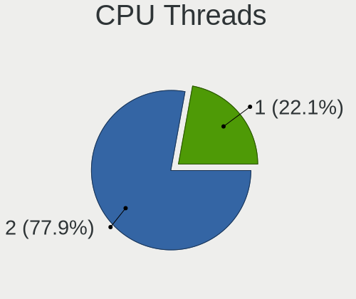

Zorin Hardware Trends (Notebook)
--------------------------------

A project to identify most popular hardware characteristics and track their change
over time based on data collected by Zorin users at https://Linux-Hardware.org.

Anyone can contribute to the study by uploading probes of their computers by
the [hw-probe](https://github.com/linuxhw/hw-probe) tool:

    sudo hw-probe -all -upload

Full-feature report is available here: https://linux-hardware.org/?view=trends&formfactor=notebook

Period: Mar, 2020.

Contents
--------

- [ OS                       ](#os)
- [ OS Family                ](#os-family)
- [ Kernel                   ](#kernel)
- [ Kernel Family            ](#kernel-family)
- [ Kernel Major Ver.        ](#kernel-major-ver)
- [ Arch                     ](#arch)
- [ DE                       ](#de)
- [ Display Server           ](#display-server)
- [ OS Lang                  ](#os-lang)
- [ Boot Mode                ](#boot-mode)
- [ Filesystem               ](#filesystem)
- [ Dual Boot with Linux     ](#dual-boot-with-linux)
- [ Dual Boot (Win)          ](#dual-boot-win)
- [ Country                  ](#country)
- [ City                     ](#city)
- [ Vendor                   ](#vendor)
- [ Model                    ](#model)
- [ Model Family             ](#model-family)
- [ MFG Year                 ](#mfg-year)
- [ Form Factor              ](#form-factor)
- [ Secure Boot              ](#secure-boot)
- [ Coreboot                 ](#coreboot)
- [ RAM Size                 ](#ram-size)
- [ RAM Used                 ](#ram-used)
- [ Drive Vendor             ](#drive-vendor)
- [ Drive Model              ](#drive-model)
- [ Drive Kind               ](#drive-kind)
- [ Drive Connector          ](#drive-connector)
- [ Drive Size               ](#drive-size)
- [ Space Total              ](#space-total)
- [ Space Used               ](#space-used)
- [ Malfunc. Drives          ](#malfunc-drives)
- [ Malfunc. Drive Vendor    ](#malfunc-drive-vendor)
- [ Malfunc. Drive Kind      ](#malfunc-drive-kind)
- [ Failed Drives            ](#failed-drives)
- [ Failed Drive Vendor      ](#failed-drive-vendor)
- [ Drive Status             ](#drive-status)
- [ Storage Vendor           ](#storage-vendor)
- [ Storage Model            ](#storage-model)
- [ Storage Kind             ](#storage-kind)
- [ CPU Vendor               ](#cpu-vendor)
- [ CPU Model                ](#cpu-model)
- [ CPU Model Family         ](#cpu-model-family)
- [ CPU Cores                ](#cpu-cores)
- [ CPU Sockets              ](#cpu-sockets)
- [ CPU Threads              ](#cpu-threads)
- [ CPU Op-Modes             ](#cpu-op-modes)
- [ CPU Microarch            ](#cpu-microarch)
- [ CPU Microcode            ](#cpu-microcode)
- [ GPU Vendor               ](#gpu-vendor)
- [ GPU Model                ](#gpu-model)
- [ GPU Combo                ](#gpu-combo)
- [ GPU Driver               ](#gpu-driver)
- [ GPU Memory               ](#gpu-memory)
- [ Monitor Vendor           ](#monitor-vendor)
- [ Monitor Model            ](#monitor-model)
- [ Monitor Resolution       ](#monitor-resolution)
- [ Monitor Diagonal         ](#monitor-diagonal)
- [ Monitor Width            ](#monitor-width)
- [ Aspect Ratio             ](#aspect-ratio)
- [ Monitor Area             ](#monitor-area)
- [ Pixel Density            ](#pixel-density)
- [ Multiple Monitors        ](#multiple-monitors)
- [ Net Controller Vendor    ](#net-controller-vendor)
- [ Net Controller Model     ](#net-controller-model)
- [ Net Controller Kind      ](#net-controller-kind)
- [ Used Controller          ](#used-controller)
- [ NICs                     ](#nics)
- [ Unsupported Devices      ](#unsupported-devices)
- [ Unsupported Device Types ](#unsupported-device-types)

OS
--

Installed operating systems

| Name     | Computers | Percent |
|----------|-----------|---------|
| Zorin 15 | 74        | 91.36%  |
| Zorin 12 | 7         | 8.64%   |

OS Family
---------

OS without a version

| Name  | Computers | Percent |
|-------|-----------|---------|
| Zorin | 81        | 100%    |

Kernel
------

Version of the Linux kernel

| Version                 | Computers | Percent |
|-------------------------|-----------|---------|
| 5.3.0-42-generic        | 35        | 43.21%  |
| 5.3.0-40-generic        | 31        | 38.27%  |
| 4.15.0-88-generic       | 3         | 3.7%    |
| 5.3.0-45-generic        | 2         | 2.47%   |
| 5.0.0-37-generic        | 2         | 2.47%   |
| 4.18.0-21-generic       | 2         | 2.47%   |
| 4.15.0-91-generic       | 2         | 2.47%   |
| 5.6.0-999-lowlatency    | 1         | 1.23%   |
| 5.6.0-050600rc7-generic | 1         | 1.23%   |
| 4.4.0-176-generic       | 1         | 1.23%   |
| 4.15.0-76-generic       | 1         | 1.23%   |

Kernel Family
-------------

Linux kernel without a distro release

| Version | Computers | Percent |
|---------|-----------|---------|
| 5.3.0   | 68        | 83.95%  |
| 4.15.0  | 6         | 7.41%   |
| 5.6.0   | 2         | 2.47%   |
| 5.0.0   | 2         | 2.47%   |
| 4.18.0  | 2         | 2.47%   |
| 4.4.0   | 1         | 1.23%   |

Kernel Major Ver.
-----------------

Linux kernel major version

| Version | Computers | Percent |
|---------|-----------|---------|
| 5.3     | 68        | 83.95%  |
| 4.15    | 6         | 7.41%   |
| 5.6     | 2         | 2.47%   |
| 5.0     | 2         | 2.47%   |
| 4.18    | 2         | 2.47%   |
| 4.4     | 1         | 1.23%   |

Arch
----

OS architecture (x86_64, i586, etc.)

| Name   | Computers | Percent |
|--------|-----------|---------|
| x86_64 | 72        | 88.89%  |
| i686   | 9         | 11.11%  |

DE
--

Desktop Environment

| Name  | Computers | Percent |
|-------|-----------|---------|
| GNOME | 54        | 66.67%  |
| XFCE  | 26        | 32.1%   |
| Unity | 1         | 1.23%   |

Display Server
--------------

X11 or Wayland

| Name    | Computers | Percent |
|---------|-----------|---------|
| X11     | 79        | 97.53%  |
| Wayland | 2         | 2.47%   |

OS Lang
-------

Language

| Lang  | Computers | Percent |
|-------|-----------|---------|
| en_US | 23        | 28.4%   |
| pt_BR | 7         | 8.64%   |
| pl_PL | 5         | 6.17%   |
| it_IT | 4         | 4.94%   |
| en_GB | 4         | 4.94%   |
| de_DE | 4         | 4.94%   |
| ru_RU | 3         | 3.7%    |
| pt_PT | 3         | 3.7%    |
| nl_NL | 3         | 3.7%    |
| en_CA | 3         | 3.7%    |
| en_AU | 3         | 3.7%    |
| fr_FR | 2         | 2.47%   |
| en_NZ | 2         | 2.47%   |
| en_IN | 2         | 2.47%   |
| sv_SE | 1         | 1.23%   |
| sl_SI | 1         | 1.23%   |
| ru_UA | 1         | 1.23%   |
| ja_JP | 1         | 1.23%   |
| es_PE | 1         | 1.23%   |
| es_MX | 1         | 1.23%   |
| es_AR | 1         | 1.23%   |
| el_GR | 1         | 1.23%   |
| de_CH | 1         | 1.23%   |
| de_AT | 1         | 1.23%   |
| da_DK | 1         | 1.23%   |
| cs_CZ | 1         | 1.23%   |
| C     | 1         | 1.23%   |

Boot Mode
---------

EFI or BIOS

| Mode | Computers | Percent |
|------|-----------|---------|
| BIOS | 49        | 60.49%  |
| EFI  | 32        | 39.51%  |

Filesystem
----------

Type of filesystem

| Type    | Computers | Percent |
|---------|-----------|---------|
| Ext4    | 78        | 96.3%   |
| Overlay | 2         | 2.47%   |
| Ext2    | 1         | 1.23%   |

Dual Boot with Linux
--------------------

Hosting more than one Linux

| Dual boot | Computers | Percent |
|-----------|-----------|---------|
| No        | 72        | 88.89%  |
| Yes       | 9         | 11.11%  |

Dual Boot (Win)
---------------

Hosting Linux and Windows

| Dual boot | Computers | Percent |
|-----------|-----------|---------|
| No        | 57        | 70.37%  |
| Yes       | 24        | 29.63%  |

Country
-------

Geographic location (country)

| Country            | Computers | Percent |
|--------------------|-----------|---------|
| USA                | 11        | 13.58%  |
| Brazil             | 7         | 8.64%   |
| Italy              | 5         | 6.17%   |
| Canada             | 5         | 6.17%   |
| UK                 | 4         | 4.94%   |
| Poland             | 4         | 4.94%   |
| Germany            | 4         | 4.94%   |
| Ukraine            | 3         | 3.7%    |
| Sweden             | 3         | 3.7%    |
| Netherlands        | 3         | 3.7%    |
| Australia          | 3         | 3.7%    |
| Russia             | 2         | 2.47%   |
| Portugal           | 2         | 2.47%   |
| Norway             | 2         | 2.47%   |
| New Zealand        | 2         | 2.47%   |
| India              | 2         | 2.47%   |
| Greece             | 2         | 2.47%   |
| Switzerland        | 1         | 1.23%   |
| Slovenia           | 1         | 1.23%   |
| Serbia             | 1         | 1.23%   |
| Romania            | 1         | 1.23%   |
| Peru               | 1         | 1.23%   |
| Pakistan           | 1         | 1.23%   |
| Mexico             | 1         | 1.23%   |
| Lebanon            | 1         | 1.23%   |
| Korea, Republic of | 1         | 1.23%   |
| Japan              | 1         | 1.23%   |
| France             | 1         | 1.23%   |
| Denmark            | 1         | 1.23%   |
| Czech Republic     | 1         | 1.23%   |
| Belgium            | 1         | 1.23%   |
| Austria            | 1         | 1.23%   |
| Argentina          | 1         | 1.23%   |
| Angola             | 1         | 1.23%   |

City
----

Geographic location (city)

| City                     | Computers | Percent |
|--------------------------|-----------|---------|
| Sydney                   | 2         | 2.47%   |
| New Delhi                | 2         | 2.47%   |
| Munich                   | 2         | 2.47%   |
| Lisbon                   | 2         | 2.47%   |
| Škofja Loka             | 1         | 1.23%   |
| Zurich                   | 1         | 1.23%   |
| Woerden                  | 1         | 1.23%   |
| Winona                   | 1         | 1.23%   |
| Vienna                   | 1         | 1.23%   |
| Venosa                   | 1         | 1.23%   |
| Tunkhannock              | 1         | 1.23%   |
| Trinec                   | 1         | 1.23%   |
| Taubate                  | 1         | 1.23%   |
| Taby                     | 1         | 1.23%   |
| São Paulo               | 1         | 1.23%   |
| Stuttgart                | 1         | 1.23%   |
| Stittsville              | 1         | 1.23%   |
| St. Albert               | 1         | 1.23%   |
| Skegness                 | 1         | 1.23%   |
| Santee                   | 1         | 1.23%   |
| Sandy                    | 1         | 1.23%   |
| San Martino Buon Albergo | 1         | 1.23%   |
| San Luis Potosí City    | 1         | 1.23%   |
| Rotterdam                | 1         | 1.23%   |
| Rochester                | 1         | 1.23%   |
| Rafaela                  | 1         | 1.23%   |
| Pyeongtaek-si            | 1         | 1.23%   |
| Perth                    | 1         | 1.23%   |
| Pereslavl'-Zalesskiy     | 1         | 1.23%   |
| Pelplin                  | 1         | 1.23%   |
| Ostrów Wielkopolski     | 1         | 1.23%   |
| Oslo                     | 1         | 1.23%   |
| Osby                     | 1         | 1.23%   |
| Okara                    | 1         | 1.23%   |
| Odesa                    | 1         | 1.23%   |
| North Bergen             | 1         | 1.23%   |
| Montreal                 | 1         | 1.23%   |
| Mongagua                 | 1         | 1.23%   |
| Manaus                   | 1         | 1.23%   |
| Lycksele                 | 1         | 1.23%   |
| Luanda                   | 1         | 1.23%   |
| Lima                     | 1         | 1.23%   |
| Levin                    | 1         | 1.23%   |
| Lede                     | 1         | 1.23%   |
| Larissa                  | 1         | 1.23%   |
| Lagoa Santa              | 1         | 1.23%   |
| La Verpilliere           | 1         | 1.23%   |
| Kyoto                    | 1         | 1.23%   |
| Kyiv                     | 1         | 1.23%   |
| Krasnoyarsk              | 1         | 1.23%   |
| Kennesaw                 | 1         | 1.23%   |
| Jersey City              | 1         | 1.23%   |
| Jastrzębie Zdrój       | 1         | 1.23%   |
| Jacksonville             | 1         | 1.23%   |
| Halden                   | 1         | 1.23%   |
| Greenwich                | 1         | 1.23%   |
| Genoa                    | 1         | 1.23%   |
| Edmonton                 | 1         | 1.23%   |
| Düsseldorf              | 1         | 1.23%   |
| Dunedin                  | 1         | 1.23%   |

Vendor
------

Motherboard manufacturer

| Name                | Computers | Percent |
|---------------------|-----------|---------|
| Hewlett-Packard     | 28        | 34.57%  |
| Lenovo              | 11        | 13.58%  |
| Dell                | 10        | 12.35%  |
| ASUSTek Computer    | 7         | 8.64%   |
| Toshiba             | 6         | 7.41%   |
| Samsung Electronics | 5         | 6.17%   |
| Acer                | 5         | 6.17%   |
| Sony                | 2         | 2.47%   |
| Panasonic           | 1         | 1.23%   |
| MSI                 | 1         | 1.23%   |
| LG Electronics      | 1         | 1.23%   |
| Google              | 1         | 1.23%   |
| eMachines           | 1         | 1.23%   |
| Dixonsxp            | 1         | 1.23%   |
| Apple               | 1         | 1.23%   |

Model
-----

Motherboard model

| Name                                     | Computers | Percent |
|------------------------------------------|-----------|---------|
| Toshiba Satellite C660                   | 3         | 3.7%    |
| Unknown                                  | 3         | 3.7%    |
| Dell Inspiron 1520                       | 2         | 2.47%   |
| Toshiba Toshiba                          | 1         | 1.23%   |
| Toshiba Satellite L455D                  | 1         | 1.23%   |
| Toshiba Satellite L305                   | 1         | 1.23%   |
| Sony VPCM13M1E                           | 1         | 1.23%   |
| Sony SVF15A17CLB                         | 1         | 1.23%   |
| Samsung Electronics R519/R719            | 1         | 1.23%   |
| Samsung Electronics N102                 | 1         | 1.23%   |
| Samsung Electronics 800G5M/800G5W        | 1         | 1.23%   |
| Samsung Electronics 340XAA/350XAA/550XAA | 1         | 1.23%   |
| Samsung Electronics 305V4A/305V5A/3415VA | 1         | 1.23%   |
| Panasonic CF-31ACJAXPM                   | 1         | 1.23%   |
| MSI GE62 6QF                             | 1         | 1.23%   |
| LG Electronics S460-L.BG24P1             | 1         | 1.23%   |
| Lenovo Yoga 300-11IBR 80M1               | 1         | 1.23%   |
| Lenovo Y70-70 Touch 80DU                 | 1         | 1.23%   |
| Lenovo ThinkPad T510 4349AW2             | 1         | 1.23%   |
| Lenovo ThinkPad T430s 23563RB            | 1         | 1.23%   |
| Lenovo ThinkPad S3-S440 20AY00BMMD       | 1         | 1.23%   |
| Lenovo ThinkPad R400 7440WWQ             | 1         | 1.23%   |
| Lenovo ThinkPad L412 058542G             | 1         | 1.23%   |
| Lenovo IdeaPad Z570 HuronRiver Platform  | 1         | 1.23%   |
| Lenovo IdeaPad Y570 20091                | 1         | 1.23%   |
| Lenovo G510 20238                        | 1         | 1.23%   |
| Lenovo Flex 2-15 20405                   | 1         | 1.23%   |
| HP ZBook 14u G4                          | 1         | 1.23%   |
| HP ProBook 6550b                         | 1         | 1.23%   |
| HP ProBook 645 G1                        | 1         | 1.23%   |
| HP ProBook 640 G4                        | 1         | 1.23%   |
| HP ProBook 4525s                         | 1         | 1.23%   |
| HP ProBook 4320s                         | 1         | 1.23%   |
| HP Presario C500 (RY510EA#ABZ)           | 1         | 1.23%   |
| HP Pavilion x2 Detachable                | 1         | 1.23%   |
| HP Pavilion tx1000                       | 1         | 1.23%   |
| HP Pavilion Notebook 15-bc5xxx           | 1         | 1.23%   |
| HP Pavilion Laptop 14-ce0xxx             | 1         | 1.23%   |
| HP Pavilion g6                           | 1         | 1.23%   |
| HP Pavilion dv9700                       | 1         | 1.23%   |
| HP Pavilion dv7                          | 1         | 1.23%   |
| HP Pavilion dv5                          | 1         | 1.23%   |
| HP Pavilion 15                           | 1         | 1.23%   |
| HP Pavilion 11 x360 PC                   | 1         | 1.23%   |
| HP Pavilion 10 TS                        | 1         | 1.23%   |
| HP OMEN by HP Laptop                     | 1         | 1.23%   |
| HP Notebook                              | 1         | 1.23%   |
| HP G62                                   | 1         | 1.23%   |
| HP G42                                   | 1         | 1.23%   |
| HP EliteBook 840 G2                      | 1         | 1.23%   |
| HP Compaq Presario CQ60                  | 1         | 1.23%   |
| HP Compaq 8510p                          | 1         | 1.23%   |
| HP Compaq 615                            | 1         | 1.23%   |
| Google Gnawty                            | 1         | 1.23%   |
| eMachines eME728                         | 1         | 1.23%   |
| Dell XPS 15 9560                         | 1         | 1.23%   |
| Dell Latitude XT2                        | 1         | 1.23%   |
| Dell Latitude E5440                      | 1         | 1.23%   |
| Dell Latitude E4300                      | 1         | 1.23%   |
| Dell Latitude 5590                       | 1         | 1.23%   |

Model Family
------------

Motherboard model prefix

| Name                         | Computers | Percent |
|------------------------------|-----------|---------|
| HP Pavilion                  | 11        | 13.58%  |
| Toshiba Satellite            | 5         | 6.17%   |
| Lenovo ThinkPad              | 5         | 6.17%   |
| HP ProBook                   | 5         | 6.17%   |
| Dell Inspiron                | 5         | 6.17%   |
| Dell Latitude                | 4         | 4.94%   |
| HP Compaq                    | 3         | 3.7%    |
| Acer Aspire                  | 3         | 3.7%    |
| Unknown                      | 3         | 3.7%    |
| Lenovo IdeaPad               | 2         | 2.47%   |
| Toshiba Toshiba              | 1         | 1.23%   |
| Sony VPCM13M1E               | 1         | 1.23%   |
| Sony SVF15A17CLB             | 1         | 1.23%   |
| Samsung Electronics R519     | 1         | 1.23%   |
| Samsung Electronics N102     | 1         | 1.23%   |
| Samsung Electronics 800G5M   | 1         | 1.23%   |
| Samsung Electronics 340XAA   | 1         | 1.23%   |
| Samsung Electronics 305V4A   | 1         | 1.23%   |
| Panasonic CF-31ACJAXPM       | 1         | 1.23%   |
| MSI GE62                     | 1         | 1.23%   |
| LG Electronics S460-L.BG24P1 | 1         | 1.23%   |
| Lenovo Yoga                  | 1         | 1.23%   |
| Lenovo Y70-70                | 1         | 1.23%   |
| Lenovo G510                  | 1         | 1.23%   |
| Lenovo Flex                  | 1         | 1.23%   |
| HP ZBook                     | 1         | 1.23%   |
| HP Presario                  | 1         | 1.23%   |
| HP OMEN                      | 1         | 1.23%   |
| HP Notebook                  | 1         | 1.23%   |
| HP G62                       | 1         | 1.23%   |
| HP G42                       | 1         | 1.23%   |
| HP EliteBook                 | 1         | 1.23%   |
| Google Gnawty                | 1         | 1.23%   |
| eMachines eME728             | 1         | 1.23%   |
| Dell XPS                     | 1         | 1.23%   |
| ASUS X553MA                  | 1         | 1.23%   |
| ASUS VivoBook                | 1         | 1.23%   |
| ASUS TAICHI21                | 1         | 1.23%   |
| ASUS Strix                   | 1         | 1.23%   |
| ASUS N750JK                  | 1         | 1.23%   |
| ASUS F3Sg                    | 1         | 1.23%   |
| ASUS 1101HAGG                | 1         | 1.23%   |
| Apple MacBookPro9            | 1         | 1.23%   |
| Acer Ferrari                 | 1         | 1.23%   |
| Acer Extensa                 | 1         | 1.23%   |

MFG Year
--------

Motherboard manufacture year

| Year | Computers | Percent |
|------|-----------|---------|
| 2019 | 14        | 17.28%  |
| 2008 | 10        | 12.35%  |
| 2014 | 8         | 9.88%   |
| 2018 | 7         | 8.64%   |
| 2009 | 7         | 8.64%   |
| 2013 | 6         | 7.41%   |
| 2011 | 6         | 7.41%   |
| 2010 | 6         | 7.41%   |
| 2012 | 5         | 6.17%   |
| 2015 | 4         | 4.94%   |
| 2017 | 3         | 3.7%    |
| 2006 | 3         | 3.7%    |
| 2016 | 1         | 1.23%   |
| 2005 | 1         | 1.23%   |

Form Factor
-----------

Physical design of the computer

| Name     | Computers | Percent |
|----------|-----------|---------|
| Notebook | 81        | 100%    |

Secure Boot
-----------

Enabled or disabled

| State    | Computers | Percent |
|----------|-----------|---------|
| Disabled | 75        | 92.59%  |
| Enabled  | 6         | 7.41%   |

Coreboot
--------

Have coreboot on board

| Used | Computers | Percent |
|------|-----------|---------|
| No   | 80        | 98.77%  |
| Yes  | 1         | 1.23%   |

RAM Size
--------

Total RAM memory

| Size in GB | Computers | Percent |
|------------|-----------|---------|
| 3.01-4.0   | 24        | 29.63%  |
| 4.01-8.0   | 19        | 23.46%  |
| 1.01-2.0   | 14        | 17.28%  |
| 8.01-16.0  | 9         | 11.11%  |
| 16.01-24.0 | 6         | 7.41%   |
| 2.01-3.0   | 4         | 4.94%   |
| 0.01-1.0   | 4         | 4.94%   |
| 24.01-32.0 | 1         | 1.23%   |

RAM Used
--------

Used RAM memory

| Used GB  | Computers | Percent |
|----------|-----------|---------|
| 1.01-2.0 | 41        | 50.62%  |
| 2.01-3.0 | 19        | 23.46%  |
| 0.01-1.0 | 13        | 16.05%  |
| 4.01-8.0 | 4         | 4.94%   |
| 3.01-4.0 | 4         | 4.94%   |

Drive Vendor
------------

Hard drive vendors

| Vendor              | Computers | Drives | Percent |
|---------------------|-----------|--------|---------|
| Seagate             | 16        | 16     | 17.78%  |
| Toshiba             | 13        | 13     | 14.44%  |
| WDC                 | 12        | 13     | 13.33%  |
| Hitachi             | 9         | 9      | 10%     |
| Unknown             | 7         | 8      | 7.78%   |
| Samsung Electronics | 6         | 6      | 6.67%   |
| HGST                | 6         | 6      | 6.67%   |
| SanDisk             | 3         | 3      | 3.33%   |
| Fujitsu             | 3         | 3      | 3.33%   |
| SK Hynix            | 2         | 2      | 2.22%   |
| Micron Technology   | 2         | 2      | 2.22%   |
| GOODRAM             | 2         | 2      | 2.22%   |
| Crucial             | 2         | 2      | 2.22%   |
| Transcend           | 1         | 1      | 1.11%   |
| Kingston            | 1         | 1      | 1.11%   |
| KingDian            | 1         | 1      | 1.11%   |
| Intel               | 1         | 1      | 1.11%   |
| ASMT                | 1         | 1      | 1.11%   |
| Artisan             | 1         | 1      | 1.11%   |
| A-DATA Technology   | 1         | 1      | 1.11%   |

Drive Model
-----------

Hard drive models

| Model                             | Computers | Percent |
|-----------------------------------|-----------|---------|
| ST9320423AS 320GB                 | 4         | 4.35%   |
| MQ01ABF050 500GB                  | 4         | 4.35%   |
| ST1000LX015-1U7172 1TB            | 2         | 2.17%   |
| ST1000LM035-1RK172 1TB            | 2         | 2.17%   |
| ST1000LM024 HN-M101MBB 1TB        | 2         | 2.17%   |
| MQ04ABF100 1TB                    | 2         | 2.17%   |
| MMC Card  32GB                    | 2         | 2.17%   |
| MMC Card  16GB                    | 2         | 2.17%   |
| MK2561GSYN 250GB                  | 2         | 2.17%   |
| HTS721010A9E630 1TB               | 2         | 2.17%   |
| WDS500G2B0B-00YS70 500GB SSD      | 1         | 1.09%   |
| WDS120G2G0A-00JH30 120GB SSD      | 1         | 1.09%   |
| WD800BEVS-22RST0 80GB             | 1         | 1.09%   |
| WD7500BPVT-35HXZT1 752GB          | 1         | 1.09%   |
| WD5000LPVT-60G33T0 500GB          | 1         | 1.09%   |
| WD3200BPVT-35ZEST0 320GB          | 1         | 1.09%   |
| WD3200BEVT-22ZCT0 320GB           | 1         | 1.09%   |
| WD2500BEVT-22A23T0 250GB          | 1         | 1.09%   |
| WD2500BEVS-60UST0 250GB           | 1         | 1.09%   |
| WD1200BEVS-22UST0 120GB           | 1         | 1.09%   |
| WD10S21X-24R1BT0-SSHD-8GB         | 1         | 1.09%   |
| WD10JPLX-00MBPT0 1TB              | 1         | 1.09%   |
| WD10JPCX-24UE4T0 1TB              | 1         | 1.09%   |
| TS256GSSD370 256GB                | 1         | 1.09%   |
| Tribute 1TB                       | 1         | 1.09%   |
| ST9250315AS 250GB                 | 1         | 1.09%   |
| ST9100823A 100GB                  | 1         | 1.09%   |
| ST500LT012-1DG142 500GB           | 1         | 1.09%   |
| ST500LM012 HN-M500MBB 500GB       | 1         | 1.09%   |
| ST320LT012-1DG14C 320GB           | 1         | 1.09%   |
| ST2000LM007-1R8174 2TB            | 1         | 1.09%   |
| SSDSA2BW160G3L 160GB              | 1         | 1.09%   |
| SSDPR-CL100-240-G2 240GB          | 1         | 1.09%   |
| SSD PM871b M.2 2280 256GB         | 1         | 1.09%   |
| SSD PM800 TM 64GB                 | 1         | 1.09%   |
| SSD PLUS 120GB                    | 1         | 1.09%   |
| SSD 860 EVO 250GB                 | 1         | 1.09%   |
| SSD 240GB                         | 1         | 1.09%   |
| SP550 240GB SSD                   | 1         | 1.09%   |
| SD8SNAT-128G-1006 128GB SSD       | 1         | 1.09%   |
| SD5SE2128G1002E 128GB SSD         | 1         | 1.09%   |
| SC311 SATA 128GB SSD              | 1         | 1.09%   |
| SA400S37120G 120GB SSD            | 1         | 1.09%   |
| S280 240GB                        | 1         | 1.09%   |
| MZ7TE256HMHP-000H1 256GB SSD      | 1         | 1.09%   |
| MTFDDAV256TBN-1AR15ABHA 256GB SSD | 1         | 1.09%   |
| MQ01ABD100H 1TB                   | 1         | 1.09%   |
| MQ01ABD032 320GB                  | 1         | 1.09%   |
| MMDOE56G5MXP-0VB 256GB SSD        | 1         | 1.09%   |
| MMC Card  7GB                     | 1         | 1.09%   |
| MMC Card  64GB                    | 1         | 1.09%   |
| MMC Card  1GB                     | 1         | 1.09%   |
| MMC Card  196GB                   | 1         | 1.09%   |
| MK3265GSX 320GB                   | 1         | 1.09%   |
| MK2555GSXN 250GB                  | 1         | 1.09%   |
| MK1652GSX 160GB                   | 1         | 1.09%   |
| MHZ2320BH G2 320GB                | 1         | 1.09%   |
| MHZ2250BH G2 250GB                | 1         | 1.09%   |
| MHV2060BH PL 64GB                 | 1         | 1.09%   |
| HTS727550A9E364 500GB             | 1         | 1.09%   |

Drive Kind
----------

HDD or SSD

| Kind    | Computers | Drives | Percent |
|---------|-----------|--------|---------|
| HDD     | 59        | 60     | 65.56%  |
| SSD     | 23        | 23     | 25.56%  |
| MMC     | 7         | 8      | 7.78%   |
| Unknown | 1         | 1      | 1.11%   |

Drive Connector
---------------

SATA, SAS, NVMe, etc.

| Type | Computers | Drives | Percent |
|------|-----------|--------|---------|
| SATA | 76        | 83     | 90.48%  |
| MMC  | 7         | 8      | 8.33%   |
| SAS  | 1         | 1      | 1.19%   |

Drive Size
----------

Size of hard drive

| Size in TB | Computers | Drives | Percent |
|------------|-----------|--------|---------|
| 0.01-0.5   | 66        | 73     | 77.65%  |
| 0.51-1.0   | 18        | 18     | 21.18%  |
| 1.01-2.0   | 1         | 1      | 1.18%   |

Space Total
-----------

Amount of disk space available on the file system

| Size in GB | Computers | Percent |
|------------|-----------|---------|
| 101-250    | 25        | 30.86%  |
| 251-500    | 22        | 27.16%  |
| 51-100     | 14        | 17.28%  |
| 501-1000   | 9         | 11.11%  |
| 21-50      | 6         | 7.41%   |
| 1001-2000  | 3         | 3.7%    |
| 1-20       | 2         | 2.47%   |

Space Used
----------

Amount of used disk space

| Used GB | Computers | Percent |
|---------|-----------|---------|
| 1-20    | 58        | 71.6%   |
| 21-50   | 14        | 17.28%  |
| 251-500 | 4         | 4.94%   |
| 101-250 | 3         | 3.7%    |
| 51-100  | 2         | 2.47%   |

Malfunc. Drives
---------------

Drive models with a malfunction

| Model                             | Computers | Drives | Percent |
|-----------------------------------|-----------|--------|---------|
| MTFDDAV256TBN-1AR15ABHA 256GB SSD | 1         | 1      | 100%    |

Malfunc. Drive Vendor
---------------------

Vendors of faulty drives

| Vendor            | Computers | Drives | Percent |
|-------------------|-----------|--------|---------|
| Micron Technology | 1         | 1      | 100%    |

Malfunc. Drive Kind
-------------------

Kinds of faulty drives

| Kind | Computers | Drives | Percent |
|------|-----------|--------|---------|
| SSD  | 1         | 1      | 100%    |

Failed Drives
-------------

Failed drive models

Zero info for selected period =(

Failed Drive Vendor
-------------------

Failed drive vendors

Zero info for selected period =(

Drive Status
------------

Number of failed and malfunc. drives

| Status   | Computers | Drives | Percent |
|----------|-----------|--------|---------|
| Detected | 77        | 89     | 96.25%  |
| Works    | 2         | 2      | 2.5%    |
| Malfunc  | 1         | 1      | 1.25%   |

Storage Vendor
--------------

Storage controller vendors

| Vendor                       | Computers | Percent |
|------------------------------|-----------|---------|
| Intel                        | 65        | 79.27%  |
| AMD                          | 11        | 13.41%  |
| Nvidia                       | 3         | 3.66%   |
| Toshiba America Info Systems | 1         | 1.22%   |
| Samsung Electronics          | 1         | 1.22%   |
| Kingston Technology Company  | 1         | 1.22%   |

Storage Model
-------------

Storage controller models

| Model                                                                      | Computers | Percent |
|----------------------------------------------------------------------------|-----------|---------|
| Sunrise Point-LP SATA Controller [AHCI mode]                               | 7         | 7.29%   |
| FCH SATA Controller [AHCI mode]                                            | 6         | 6.25%   |
| 82801HM/HEM (ICH8M/ICH8M-E) IDE Controller                                 | 6         | 6.25%   |
| 82801 Mobile SATA Controller [RAID mode]                                   | 6         | 6.25%   |
| 82801HM/HEM (ICH8M/ICH8M-E) SATA Controller [AHCI mode]                    | 5         | 5.21%   |
| 7 Series Chipset Family 6-port SATA Controller [AHCI mode]                 | 5         | 5.21%   |
| 6 Series/C200 Series Chipset Family 6 port Mobile SATA AHCI Controller     | 5         | 5.21%   |
| HM170/QM170 Chipset SATA Controller [AHCI Mode]                            | 4         | 4.17%   |
| 82801IBM/IEM (ICH9M/ICH9M-E) 4 port SATA Controller [AHCI mode]            | 4         | 4.17%   |
| 5 Series/3400 Series Chipset 6 port SATA AHCI Controller                   | 4         | 4.17%   |
| SB7x0/SB8x0/SB9x0 SATA Controller [AHCI mode]                              | 3         | 3.13%   |
| 8 Series SATA Controller 1 [AHCI mode]                                     | 3         | 3.13%   |
| Wildcat Point-LP SATA Controller [AHCI Mode]                               | 2         | 2.08%   |
| 82801G (ICH7 Family) IDE Controller                                        | 2         | 2.08%   |
| 82801FBM (ICH6M) SATA Controller                                           | 2         | 2.08%   |
| 8 Series/C220 Series Chipset Family 6-port SATA Controller 1 [AHCI mode]   | 2         | 2.08%   |
| 5 Series/3400 Series Chipset 4 port SATA AHCI Controller                   | 2         | 2.08%   |
| XG4 NVMe SSD Controller                                                    | 1         | 1.04%   |
| US15W/US15X/US15L/UL11L SCH [Poulsbo] IDE Controller                       | 1         | 1.04%   |
| SB7x0/SB8x0/SB9x0 SATA Controller [IDE mode]                               | 1         | 1.04%   |
| SB7x0/SB8x0/SB9x0 IDE Controller                                           | 1         | 1.04%   |
| SATA controller                                                            | 1         | 1.04%   |
| NVMe SSD Controller SM981/PM981/PM983                                      | 1         | 1.04%   |
| Non-Volatile memory controller                                             | 1         | 1.04%   |
| NM10/ICH7 Family SATA Controller [IDE mode]                                | 1         | 1.04%   |
| NM10/ICH7 Family SATA Controller [AHCI mode]                               | 1         | 1.04%   |
| Mobile PM965/GM965 PT IDER Controller                                      | 1         | 1.04%   |
| MCP78S [GeForce 8200] SATA Controller (non-AHCI mode)                      | 1         | 1.04%   |
| MCP78S [GeForce 8200] IDE                                                  | 1         | 1.04%   |
| MCP67 IDE Controller                                                       | 1         | 1.04%   |
| MCP67 AHCI Controller                                                      | 1         | 1.04%   |
| MCP51 Serial ATA Controller                                                | 1         | 1.04%   |
| MCP51 IDE                                                                  | 1         | 1.04%   |
| IXP SB4x0 IDE Controller                                                   | 1         | 1.04%   |
| Celeron N3350/Pentium N4200/Atom E3900 Series SATA AHCI Controller         | 1         | 1.04%   |
| Cannon Lake Mobile PCH SATA AHCI Controller                                | 1         | 1.04%   |
| Atom/Celeron/Pentium Processor x5-E8000/J3xxx/N3xxx Series SATA Controller | 1         | 1.04%   |
| Atom Processor E3800 Series SATA IDE Controller                            | 1         | 1.04%   |
| Atom Processor E3800 Series SATA AHCI Controller                           | 1         | 1.04%   |
| 82801IBM/IEM (ICH9M/ICH9M-E) 2 port SATA Controller [IDE mode]             | 1         | 1.04%   |
| 82801HM/HEM (ICH8M/ICH8M-E) SATA Controller [IDE mode]                     | 1         | 1.04%   |
| 82801GBM/GHM (ICH7-M Family) SATA Controller [IDE mode]                    | 1         | 1.04%   |
| 82801GBM/GHM (ICH7-M Family) SATA Controller [AHCI mode]                   | 1         | 1.04%   |
| 82801FB/FBM/FR/FW/FRW (ICH6 Family) IDE Controller                         | 1         | 1.04%   |
| 8 Series/C220 Series Chipset Family 2-port SATA Controller 2 [IDE mode]    | 1         | 1.04%   |

Storage Kind
------------

Kind of storage controller (IDE, SATA, NVMe, SAS, ...)

| Kind | Computers | Percent |
|------|-----------|---------|
| SATA | 60        | 67.42%  |
| IDE  | 20        | 22.47%  |
| RAID | 6         | 6.74%   |
| NVMe | 3         | 3.37%   |

CPU Vendor
----------

Processor vendors

| Vendor | Computers | Percent |
|--------|-----------|---------|
| Intel  | 67        | 82.72%  |
| AMD    | 14        | 17.28%  |

CPU Model
---------

Processor models

| Model                                       | Computers | Percent |
|---------------------------------------------|-----------|---------|
| Intel Core i7-7700HQ CPU @ 2.80GHz          | 3         | 3.7%    |
| Intel Core i5-8250U CPU @ 1.60GHz           | 2         | 2.47%   |
| Intel Core i5-7200U CPU @ 2.50GHz           | 2         | 2.47%   |
| Intel Core i5 CPU M 520 @ 2.40GHz           | 2         | 2.47%   |
| Intel Core i3-2310M CPU @ 2.10GHz           | 2         | 2.47%   |
| AMD Sempron SI-42                           | 2         | 2.47%   |
| Intel Pentium M processor 1.86GHz           | 1         | 1.23%   |
| Intel Pentium M processor 1.60GHz           | 1         | 1.23%   |
| Intel Pentium Dual-Core CPU T4500 @ 2.30GHz | 1         | 1.23%   |
| Intel Pentium Dual-Core CPU T4400 @ 2.20GHz | 1         | 1.23%   |
| Intel Pentium Dual-Core CPU T4300 @ 2.10GHz | 1         | 1.23%   |
| Intel Pentium Dual CPU T2310 @ 1.46GHz      | 1         | 1.23%   |
| Intel Pentium CPU N4200 @ 1.10GHz           | 1         | 1.23%   |
| Intel Pentium CPU N3700 @ 1.60GHz           | 1         | 1.23%   |
| Intel Pentium CPU N3520 @ 2.16GHz           | 1         | 1.23%   |
| Intel Pentium CPU B960 @ 2.20GHz            | 1         | 1.23%   |
| Intel Pentium CPU B950 @ 2.10GHz            | 1         | 1.23%   |
| Intel Genuine CPU T2050 @ 1.60GHz           | 1         | 1.23%   |
| Intel Core i7-8750H CPU @ 2.20GHz           | 1         | 1.23%   |
| Intel Core i7-8550U CPU @ 1.80GHz           | 1         | 1.23%   |
| Intel Core i7-7500U CPU @ 2.70GHz           | 1         | 1.23%   |
| Intel Core i7-6700HQ CPU @ 2.60GHz          | 1         | 1.23%   |
| Intel Core i7-5500U CPU @ 2.40GHz           | 1         | 1.23%   |
| Intel Core i7-4710HQ CPU @ 2.50GHz          | 1         | 1.23%   |
| Intel Core i7-4702MQ CPU @ 2.20GHz          | 1         | 1.23%   |
| Intel Core i7-4700HQ CPU @ 2.40GHz          | 1         | 1.23%   |
| Intel Core i7-4600U CPU @ 2.10GHz           | 1         | 1.23%   |
| Intel Core i7-3610QM CPU @ 2.30GHz          | 1         | 1.23%   |
| Intel Core i7-3537U CPU @ 2.00GHz           | 1         | 1.23%   |
| Intel Core i7 CPU M 620 @ 2.67GHz           | 1         | 1.23%   |
| Intel Core i5-9300H CPU @ 2.40GHz           | 1         | 1.23%   |
| Intel Core i5-8350U CPU @ 1.70GHz           | 1         | 1.23%   |
| Intel Core i5-5300U CPU @ 2.30GHz           | 1         | 1.23%   |
| Intel Core i5-4210U CPU @ 1.70GHz           | 1         | 1.23%   |
| Intel Core i5-4200U CPU @ 1.60GHz           | 1         | 1.23%   |
| Intel Core i5-3320M CPU @ 2.60GHz           | 1         | 1.23%   |
| Intel Core i5-3317U CPU @ 1.70GHz           | 1         | 1.23%   |
| Intel Core i5-3210M CPU @ 2.50GHz           | 1         | 1.23%   |
| Intel Core i5-2450M CPU @ 2.50GHz           | 1         | 1.23%   |
| Intel Core i5-2430M CPU @ 2.40GHz           | 1         | 1.23%   |
| Intel Core i5 CPU M 460 @ 2.53GHz           | 1         | 1.23%   |
| Intel Core i3-7020U CPU @ 2.30GHz           | 1         | 1.23%   |
| Intel Core i3-4030U CPU @ 1.90GHz           | 1         | 1.23%   |
| Intel Core i3 CPU M 380 @ 2.53GHz           | 1         | 1.23%   |
| Intel Core 2 Duo CPU U9400 @ 1.40GHz        | 1         | 1.23%   |
| Intel Core 2 Duo CPU T8300 @ 2.40GHz        | 1         | 1.23%   |
| Intel Core 2 Duo CPU T7500 @ 2.20GHz        | 1         | 1.23%   |
| Intel Core 2 Duo CPU T6670 @ 2.20GHz        | 1         | 1.23%   |
| Intel Core 2 Duo CPU T5800 @ 2.00GHz        | 1         | 1.23%   |
| Intel Core 2 Duo CPU T5750 @ 2.00GHz        | 1         | 1.23%   |
| Intel Core 2 Duo CPU T5450 @ 1.66GHz        | 1         | 1.23%   |
| Intel Core 2 Duo CPU P9600 @ 2.53GHz        | 1         | 1.23%   |
| Intel Core 2 CPU T5200 @ 1.60GHz            | 1         | 1.23%   |
| Intel Celeron N4000 CPU @ 1.10GHz           | 1         | 1.23%   |
| Intel Celeron CPU P4600 @ 2.00GHz           | 1         | 1.23%   |
| Intel Celeron CPU N2930 @ 1.83GHz           | 1         | 1.23%   |
| Intel Celeron CPU N2840 @ 2.16GHz           | 1         | 1.23%   |
| Intel Celeron CPU 540 @ 1.86GHz             | 1         | 1.23%   |
| Intel Atom x5-Z8300 CPU @ 1.44GHz           | 1         | 1.23%   |
| Intel Atom CPU Z520 @ 1.33GHz               | 1         | 1.23%   |

CPU Model Family
----------------

Processor model prefix

| Model                   | Computers | Percent |
|-------------------------|-----------|---------|
| Intel Core i5           | 17        | 20.99%  |
| Intel Core i7           | 15        | 18.52%  |
| Intel Core 2 Duo        | 8         | 9.88%   |
| Intel Pentium           | 5         | 6.17%   |
| Intel Core i3           | 5         | 6.17%   |
| Intel Celeron           | 5         | 6.17%   |
| Intel Atom              | 4         | 4.94%   |
| Intel Pentium Dual-Core | 3         | 3.7%    |
| Intel Pentium M         | 2         | 2.47%   |
| AMD Turion 64 X2 Mobile | 2         | 2.47%   |
| AMD Sempron             | 2         | 2.47%   |
| AMD A6                  | 2         | 2.47%   |
| AMD A4                  | 2         | 2.47%   |
| Intel Pentium Dual      | 1         | 1.23%   |
| Intel Genuine           | 1         | 1.23%   |
| Intel Core 2            | 1         | 1.23%   |
| AMD Turion II           | 1         | 1.23%   |
| AMD Turion 64 Mobile    | 1         | 1.23%   |
| AMD Ryzen 3             | 1         | 1.23%   |
| AMD Phenom II           | 1         | 1.23%   |
| AMD Athlon X2           | 1         | 1.23%   |
| AMD A8                  | 1         | 1.23%   |

CPU Cores
---------

Number of processor cores

| Number | Computers | Percent |
|--------|-----------|---------|
| 2      | 48        | 59.26%  |
| 4      | 20        | 24.69%  |
| 1      | 11        | 13.58%  |
| 6      | 1         | 1.23%   |
| 3      | 1         | 1.23%   |

CPU Sockets
-----------

Number of sockets

| Number | Computers | Percent |
|--------|-----------|---------|
| 1      | 81        | 100%    |

CPU Threads
-----------

Threads per core (Hyper-Threading)

| Number | Computers | Percent |
|--------|-----------|---------|
| 2      | 43        | 53.09%  |
| 1      | 38        | 46.91%  |

CPU Op-Modes
------------

CPU Operation Modes (32-bit, 64-bit)

| Op mode        | Computers | Percent |
|----------------|-----------|---------|
| 32-bit, 64-bit | 77        | 95.06%  |
| 32-bit         | 4         | 4.94%   |

CPU Microarch
-------------

Microarchitecture

| Name            | Computers | Percent |
|-----------------|-----------|---------|
| Core            | 14        | 17.28%  |
| Skylake         | 13        | 16.05%  |
| Haswell         | 7         | 8.64%   |
| Westmere        | 6         | 7.41%   |
| SandyBridge     | 6         | 7.41%   |
| Silvermont      | 5         | 6.17%   |
| IvyBridge       | 5         | 6.17%   |
| P6              | 3         | 3.7%    |
| K8 Hammer       | 3         | 3.7%    |
| K8 & K10 hybrid | 3         | 3.7%    |
| Bonnell         | 3         | 3.7%    |
| Piledriver      | 2         | 2.47%   |
| K10             | 2         | 2.47%   |
| Broadwell       | 2         | 2.47%   |
| Zen             | 1         | 1.23%   |
| Puma            | 1         | 1.23%   |
| KabyLake        | 1         | 1.23%   |
| K10 Llano       | 1         | 1.23%   |
| Jaguar          | 1         | 1.23%   |
| Goldmont plus   | 1         | 1.23%   |
| Goldmont        | 1         | 1.23%   |

CPU Microcode
-------------

Microcode number

| Number     | Computers | Percent |
|------------|-----------|---------|
| Unknown    | 9         | 11.11%  |
| 0x206a7    | 6         | 7.41%   |
| 0x1067a    | 6         | 7.41%   |
| 0x806ea    | 5         | 6.17%   |
| 0x306a9    | 5         | 6.17%   |
| 0x20655    | 4         | 4.94%   |
| 0x906e9    | 3         | 3.7%    |
| 0x6fd      | 3         | 3.7%    |
| 0x40651    | 3         | 3.7%    |
| 0x306c3    | 3         | 3.7%    |
| 0x02000057 | 3         | 3.7%    |
| 0x906ea    | 2         | 2.47%   |
| 0x806e9    | 2         | 2.47%   |
| 0x6d8      | 2         | 2.47%   |
| 0x306d4    | 2         | 2.47%   |
| 0x30678    | 2         | 2.47%   |
| 0x106ca    | 2         | 2.47%   |
| 0x010000c8 | 2         | 2.47%   |
| 0x706a1    | 1         | 1.23%   |
| 0x6fb      | 1         | 1.23%   |
| 0x6f6      | 1         | 1.23%   |
| 0x6e8      | 1         | 1.23%   |
| 0x506e3    | 1         | 1.23%   |
| 0x506c9    | 1         | 1.23%   |
| 0x406c3    | 1         | 1.23%   |
| 0x30673    | 1         | 1.23%   |
| 0x20652    | 1         | 1.23%   |
| 0x106c2    | 1         | 1.23%   |
| 0x10676    | 1         | 1.23%   |
| 0x10661    | 1         | 1.23%   |
| 0x0810100b | 1         | 1.23%   |
| 0x07030106 | 1         | 1.23%   |
| 0x0700010f | 1         | 1.23%   |
| 0x06001119 | 1         | 1.23%   |
| 0x03000027 | 1         | 1.23%   |

GPU Vendor
----------

Vendors of graphics cards

| Vendor | Computers | Percent |
|--------|-----------|---------|
| Intel  | 60        | 60.61%  |
| Nvidia | 21        | 21.21%  |
| AMD    | 18        | 18.18%  |

GPU Model
---------

Graphics card models

| Model                                                                              | Computers | Percent |
|------------------------------------------------------------------------------------|-----------|---------|
| Mobile 4 Series Chipset Integrated Graphics Controller                             | 6         | 5.61%   |
| Core Processor Integrated Graphics Controller                                      | 6         | 5.61%   |
| 3rd Gen Core processor Graphics Controller                                         | 5         | 4.67%   |
| 2nd Generation Core Processor Family Integrated Graphics Controller                | 5         | 4.67%   |
| UHD Graphics 620                                                                   | 4         | 3.74%   |
| HD Graphics 620                                                                    | 4         | 3.74%   |
| Haswell-ULT Integrated Graphics Controller                                         | 4         | 3.74%   |
| Mobile GM965/GL960 Integrated Graphics Controller (secondary)                      | 3         | 2.8%    |
| Mobile GM965/GL960 Integrated Graphics Controller (primary)                        | 3         | 2.8%    |
| HD Graphics 630                                                                    | 3         | 2.8%    |
| Atom Processor Z36xxx/Z37xxx Series Graphics & Display                             | 3         | 2.8%    |
| 4th Gen Core Processor Integrated Graphics Controller                              | 3         | 2.8%    |
| UHD Graphics 630 (Mobile)                                                          | 2         | 1.87%   |
| Sun XT [Radeon HD 8670A/8670M/8690M / R5 M330 / M430 / Radeon 520 Mobile]          | 2         | 1.87%   |
| RV410/M26 [Mobility Radeon X700]                                                   | 2         | 1.87%   |
| Park [Mobility Radeon HD 5430/5450/5470]                                           | 2         | 1.87%   |
| Mobile 945GM/GMS/GME, 943/940GML Express Integrated Graphics Controller            | 2         | 1.87%   |
| Mobile 945GM/GMS, 943/940GML Express Integrated Graphics Controller                | 2         | 1.87%   |
| HD Graphics 5500                                                                   | 2         | 1.87%   |
| GP107M [GeForce GTX 1050 Ti Mobile]                                                | 2         | 1.87%   |
| GP107M [GeForce GTX 1050 Mobile]                                                   | 2         | 1.87%   |
| Atom/Celeron/Pentium Processor x5-E8000/J3xxx/N3xxx Integrated Graphics Controller | 2         | 1.87%   |
| Atom Processor D4xx/D5xx/N4xx/N5xx Integrated Graphics Controller                  | 2         | 1.87%   |
| Whistler [Radeon HD 6630M/6650M/6750M/7670M/7690M]                                 | 1         | 0.93%   |
| US15W/US15X SCH [Poulsbo] Graphics Controller                                      | 1         | 0.93%   |
| UHD Graphics 605                                                                   | 1         | 0.93%   |
| Trinity 2 [Radeon HD 7420G]                                                        | 1         | 0.93%   |
| Topaz XT [Radeon R7 M260/M265 / M340/M360 / M440/M445 / 530/535 / 620/625 Mobile]  | 1         | 0.93%   |
| Thames [Radeon HD 7500M/7600M Series]                                              | 1         | 0.93%   |
| Sumo [Radeon HD 6620G]                                                             | 1         | 0.93%   |
| RV630/M76 [Mobility Radeon HD 2600]                                                | 1         | 0.93%   |
| RV370/M22 [Mobility Radeon X300]                                                   | 1         | 0.93%   |
| RS880M [Mobility Radeon HD 4225/4250]                                              | 1         | 0.93%   |
| RS780MC [Mobility Radeon HD 3100]                                                  | 1         | 0.93%   |
| RS780M [Mobility Radeon HD 3200]                                                   | 1         | 0.93%   |
| Richland [Radeon HD 8450G]                                                         | 1         | 0.93%   |
| Raven Ridge [Radeon Vega Series / Radeon Vega Mobile Series]                       | 1         | 0.93%   |
| Opal XT [Radeon R7 M265/M365X/M465]                                                | 1         | 0.93%   |
| Mullins [Radeon R4/R5 Graphics]                                                    | 1         | 0.93%   |
| Kabini [Radeon HD 8180]                                                            | 1         | 0.93%   |
| HD Graphics 530                                                                    | 1         | 0.93%   |
| GT218M [GeForce 315M]                                                              | 1         | 0.93%   |
| GP107M [GeForce GTX 1050 3 GB Max-Q]                                               | 1         | 0.93%   |
| GM204M [GeForce GTX 970M]                                                          | 1         | 0.93%   |
| GM108M [GeForce 940MX]                                                             | 1         | 0.93%   |
| GM108M [GeForce 840M]                                                              | 1         | 0.93%   |
| GM107M [GeForce GTX 860M]                                                          | 1         | 0.93%   |
| GM107M [GeForce GTX 850M]                                                          | 1         | 0.93%   |
| GK208M [GeForce GT 735M]                                                           | 1         | 0.93%   |
| GF119M [GeForce GT 520M]                                                           | 1         | 0.93%   |
| GF117M [GeForce 610M/710M/810M/820M / GT 620M/625M/630M/720M]                      | 1         | 0.93%   |
| GF108M [GeForce GT 555M]                                                           | 1         | 0.93%   |
| G98M [GeForce 9200M GS]                                                            | 1         | 0.93%   |
| G86M [GeForce 9300M G]                                                             | 1         | 0.93%   |
| G86M [GeForce 8600M GS]                                                            | 1         | 0.93%   |
| Celeron N3350/Pentium N4200/Atom E3900 Series Integrated Graphics Controller       | 1         | 0.93%   |
| C77 [GeForce 8200M G]                                                              | 1         | 0.93%   |
| C67 [GeForce 7150M / nForce 630M]                                                  | 1         | 0.93%   |
| C51 [GeForce Go 6150]                                                              | 1         | 0.93%   |

GPU Combo
---------

Combinations of graphics cards

| Name           | Computers | Percent |
|----------------|-----------|---------|
| 1 x Intel      | 42        | 51.85%  |
| Intel + Nvidia | 14        | 17.28%  |
| 1 x AMD        | 11        | 13.58%  |
| 1 x Nvidia     | 7         | 8.64%   |
| Intel + AMD    | 4         | 4.94%   |
| 2 x AMD        | 3         | 3.7%    |

GPU Driver
----------

Free vs proprietary

| Driver      | Computers | Percent |
|-------------|-----------|---------|
| Free        | 68        | 83.95%  |
| Proprietary | 10        | 12.35%  |
| Unknown     | 3         | 3.7%    |

GPU Memory
----------

Total video memory

| Size in GB | Computers | Percent |
|------------|-----------|---------|
| Unknown    | 44        | 54.32%  |
| 0.01-0.5   | 15        | 18.52%  |
| 1.01-2.0   | 10        | 12.35%  |
| 3.01-4.0   | 7         | 8.64%   |
| 0.51-1.0   | 4         | 4.94%   |
| 2.01-3.0   | 1         | 1.23%   |

Monitor Vendor
--------------

Monitor vendors

| Vendor                  | Computers | Percent |
|-------------------------|-----------|---------|
| Samsung Electronics     | 14        | 17.72%  |
| AU Optronics            | 14        | 17.72%  |
| LG Display              | 13        | 16.46%  |
| Chimei Innolux          | 11        | 13.92%  |
| LG Philips              | 5         | 6.33%   |
| Chi Mei Optoelectronics | 5         | 6.33%   |
| Lenovo                  | 4         | 5.06%   |
| BOE                     | 3         | 3.8%    |
| SAC                     | 2         | 2.53%   |
| Sharp                   | 1         | 1.27%   |
| PANDA                   | 1         | 1.27%   |
| KLF                     | 1         | 1.27%   |
| HannStar                | 1         | 1.27%   |
| Goldstar                | 1         | 1.27%   |
| CPT                     | 1         | 1.27%   |
| BenQ                    | 1         | 1.27%   |
| Apple                   | 1         | 1.27%   |

Monitor Model
-------------

Monitor models

| Model                                              | Computers | Percent |
|----------------------------------------------------|-----------|---------|
| LCD Monitor AUO38ED 1920x1080 340x190mm 15.3-inch  | 3         | 3.75%   |
| LED MONITOR SAC309A 1920x1080 443x249mm 20.0-inch  | 2         | 2.5%    |
| LCD Monitor SEC5541 1366x768 344x193mm 15.5-inch   | 2         | 2.5%    |
| SyncMaster SAM041F 2048x1152 510x287mm 23.0-inch   | 1         | 1.25%   |
| SyncMaster SAM027C 1680x1050 433x271mm 20.1-inch   | 1         | 1.25%   |
| LP156WH1-TLA1 LGD6301 1366x768 344x194mm 15.5-inch | 1         | 1.25%   |
| LP154WX4-TLC8 LPL0120 1280x800 331x207mm 15.4-inch | 1         | 1.25%   |
| LCD Monitor SHP1453 1920x1080 346x194mm 15.6-inch  | 1         | 1.25%   |
| LCD Monitor SEC5742 1366x768 309x174mm 14.0-inch   | 1         | 1.25%   |
| LCD Monitor SEC4351 1366x768 344x194mm 15.5-inch   | 1         | 1.25%   |
| LCD Monitor SEC4241 1280x800 261x163mm 12.1-inch   | 1         | 1.25%   |
| LCD Monitor SEC3633 1280x800 331x207mm 15.4-inch   | 1         | 1.25%   |
| LCD Monitor SEC3551 1366x768 344x194mm 15.5-inch   | 1         | 1.25%   |
| LCD Monitor SEC324C 1366x768 353x198mm 15.9-inch   | 1         | 1.25%   |
| LCD Monitor SEC324A 1366x768 344x194mm 15.5-inch   | 1         | 1.25%   |
| LCD Monitor SEC3245 1366x768 344x194mm 15.5-inch   | 1         | 1.25%   |
| LCD Monitor SDC4D42 1366x768 309x174mm 14.0-inch   | 1         | 1.25%   |
| LCD Monitor SDC4752 1366x768 340x190mm 15.3-inch   | 1         | 1.25%   |
| LCD Monitor SAM0663 1280x720                       | 1         | 1.25%   |
| LCD Monitor NCP000D 1920x1080 344x194mm 15.5-inch  | 1         | 1.25%   |
| LCD Monitor LPLC500 1280x800 331x207mm 15.4-inch   | 1         | 1.25%   |
| LCD Monitor LPLBC00 1280x800 331x207mm 15.4-inch   | 1         | 1.25%   |
| LCD Monitor LPL0A01 1440x900 367x230mm 17.1-inch   | 1         | 1.25%   |
| LCD Monitor LPL0601 1280x800 331x207mm 15.4-inch   | 1         | 1.25%   |
| LCD Monitor LGD0497 1366x768 256x144mm 11.6-inch   | 1         | 1.25%   |
| LCD Monitor LGD046F 1920x1080 344x194mm 15.5-inch  | 1         | 1.25%   |
| LCD Monitor LGD046A 1366x768 344x194mm 15.5-inch   | 1         | 1.25%   |
| LCD Monitor LGD0469 1920x1080 382x215mm 17.3-inch  | 1         | 1.25%   |
| LCD Monitor LGD0438 1366x768 340x190mm 15.3-inch   | 1         | 1.25%   |
| LCD Monitor LGD03F8 1366x768 345x194mm 15.6-inch   | 1         | 1.25%   |
| LCD Monitor LGD03D3 1600x900 309x174mm 14.0-inch   | 1         | 1.25%   |
| LCD Monitor LGD0384 1366x768 344x194mm 15.5-inch   | 1         | 1.25%   |
| LCD Monitor LGD033C 1366x768 309x174mm 14.0-inch   | 1         | 1.25%   |
| LCD Monitor LGD02DC 1366x768 344x194mm 15.5-inch   | 1         | 1.25%   |
| LCD Monitor LGD027A 1600x900 380x210mm 17.1-inch   | 1         | 1.25%   |
| LCD Monitor LGD01DA 1366x768 294x166mm 13.3-inch   | 1         | 1.25%   |
| LCD Monitor LEN40B1 1600x900 344x194mm 15.5-inch   | 1         | 1.25%   |
| LCD Monitor LEN40B0 1366x768 344x194mm 15.5-inch   | 1         | 1.25%   |
| LCD Monitor LEN40A0 1366x768 309x174mm 14.0-inch   | 1         | 1.25%   |
| LCD Monitor LEN4035 1280x800 304x190mm 14.1-inch   | 1         | 1.25%   |
| LCD Monitor HSD03E9 1024x600 220x129mm 10.0-inch   | 1         | 1.25%   |
| LCD Monitor CPT141F 1280x800 331x207mm 15.4-inch   | 1         | 1.25%   |
| LCD Monitor CMO1720 1920x1080 382x215mm 17.3-inch  | 1         | 1.25%   |
| LCD Monitor CMO1592 1366x768 344x193mm 15.5-inch   | 1         | 1.25%   |
| LCD Monitor CMO1526 1280x800 331x207mm 15.4-inch   | 1         | 1.25%   |
| LCD Monitor CMO1100 1366x768 256x144mm 11.6-inch   | 1         | 1.25%   |
| LCD Monitor CMO1032 1024x600 222x125mm 10.0-inch   | 1         | 1.25%   |
| LCD Monitor CMN1747 1920x1080 381x214mm 17.2-inch  | 1         | 1.25%   |
| LCD Monitor CMN1738 1920x1080 381x214mm 17.2-inch  | 1         | 1.25%   |
| LCD Monitor CMN15E0 1920x1080 344x193mm 15.5-inch  | 1         | 1.25%   |
| LCD Monitor CMN15DB 1366x768 344x193mm 15.5-inch   | 1         | 1.25%   |
| LCD Monitor CMN15BB 1920x1080 340x190mm 15.3-inch  | 1         | 1.25%   |
| LCD Monitor CMN15AB 1366x768 350x190mm 15.7-inch   | 1         | 1.25%   |
| LCD Monitor CMN14C9 1920x1080 309x173mm 13.9-inch  | 1         | 1.25%   |
| LCD Monitor CMN1495 1366x768 309x174mm 14.0-inch   | 1         | 1.25%   |
| LCD Monitor CMN1132 1366x768 260x140mm 11.6-inch   | 1         | 1.25%   |
| LCD Monitor CMN1127 1920x1080 256x144mm 11.6-inch  | 1         | 1.25%   |
| LCD Monitor CMN1118 1366x768 256x144mm 11.6-inch   | 1         | 1.25%   |
| LCD Monitor BOE0702 1366x768 344x194mm 15.5-inch   | 1         | 1.25%   |
| LCD Monitor BOE06A5 1366x768 344x194mm 15.5-inch   | 1         | 1.25%   |

Monitor Resolution
------------------

Monitor screen resolution

| Resolution         | Computers | Percent |
|--------------------|-----------|---------|
| 1366x768 (WXGA)    | 34        | 43.04%  |
| 1920x1080 (FHD)    | 20        | 25.32%  |
| 1280x800 (WXGA)    | 14        | 17.72%  |
| 1600x900 (HD+)     | 5         | 6.33%   |
| 1024x600           | 2         | 2.53%   |
| 2048x1152          | 1         | 1.27%   |
| 1680x1050 (WSXGA+) | 1         | 1.27%   |
| 1440x900 (WXGA+)   | 1         | 1.27%   |
| 1280x720 (HD)      | 1         | 1.27%   |

Monitor Diagonal
----------------

Diagonal size in inches

| Inches  | Computers | Percent |
|---------|-----------|---------|
| 15      | 39        | 48.75%  |
| 14      | 8         | 10%     |
| 13      | 7         | 8.75%   |
| 17      | 6         | 7.5%    |
| 11      | 5         | 6.25%   |
| 10      | 4         | 5%      |
| 20      | 3         | 3.75%   |
| 12      | 2         | 2.5%    |
| Unknown | 2         | 2.5%    |
| 44      | 1         | 1.25%   |
| 24      | 1         | 1.25%   |
| 23      | 1         | 1.25%   |
| 21      | 1         | 1.25%   |

Monitor Width
-------------

Physical width

| Width in mm | Computers | Percent |
|-------------|-----------|---------|
| 301-350     | 51        | 63.75%  |
| 201-300     | 14        | 17.5%   |
| 351-400     | 6         | 7.5%    |
| 401-500     | 4         | 5%      |
| 501-600     | 2         | 2.5%    |
| Unknown     | 2         | 2.5%    |
| 901-1000    | 1         | 1.25%   |

Aspect Ratio
------------

Proportional relationship between the width and the height

| Ratio   | Computers | Percent |
|---------|-----------|---------|
| 16/9    | 57        | 78.08%  |
| 16/10   | 15        | 20.55%  |
| Unknown | 1         | 1.37%   |

Monitor Area
------------

Area in inch²

| Area in inch² | Computers | Percent |
|----------------|-----------|---------|
| 101-110        | 38        | 47.5%   |
| 81-90          | 12        | 15%     |
| 51-60          | 5         | 6.25%   |
| 121-130        | 5         | 6.25%   |
| 41-50          | 4         | 5%      |
| 151-200        | 4         | 5%      |
| 71-80          | 3         | 3.75%   |
| 61-70          | 2         | 2.5%    |
| 201-250        | 2         | 2.5%    |
| Unknown        | 2         | 2.5%    |
| 131-140        | 1         | 1.25%   |
| 501-1000       | 1         | 1.25%   |
| 91-100         | 1         | 1.25%   |

Pixel Density
-------------

Pixels per inch

| Density | Computers | Percent |
|---------|-----------|---------|
| 101-120 | 36        | 47.37%  |
| 121-160 | 26        | 34.21%  |
| 51-100  | 10        | 13.16%  |
| Unknown | 2         | 2.63%   |
| 1-50    | 1         | 1.32%   |
| 161-240 | 1         | 1.32%   |

Multiple Monitors
-----------------

Total monitors connected

| Total | Computers | Percent |
|-------|-----------|---------|
| 1     | 67        | 82.72%  |
| 2     | 10        | 12.35%  |
| 0     | 4         | 4.94%   |

Net Controller Vendor
---------------------

Controller vendors

| Vendor                         | Computers | Percent |
|--------------------------------|-----------|---------|
| Intel                          | 12        | 57.14%  |
| Broadcom Inc. and subsidiaries | 3         | 14.29%  |
| Realtek Semiconductor          | 1         | 4.76%   |
| Nvidia                         | 1         | 4.76%   |
| MediaTek                       | 1         | 4.76%   |
| Huawei Technologies            | 1         | 4.76%   |
| Broadcom Limited               | 1         | 4.76%   |
| AMD                            | 1         | 4.76%   |

Net Controller Model
--------------------

Controller models

| Model                                                      | Computers | Percent |
|------------------------------------------------------------|-----------|---------|
| BCM4401-B0 100Base-TX                                      | 3         | 12%     |
| Centrino Advanced-N 6200                                   | 2         | 8%      |
| 82801FB/FBM/FR/FW/FRW (ICH6 Family) AC'97 Modem Controller | 2         | 8%      |
| 82577LM Gigabit Network Connection                         | 2         | 8%      |
| 82567LM Gigabit Network Connection                         | 2         | 8%      |
| Wireless 8265 / 8275                                       | 1         | 4%      |
| RTL8111/8168/8411 PCI Express Gigabit Ethernet Controller  | 1         | 4%      |
| Power Ice Evo                                              | 1         | 4%      |
| MCP51 Ethernet Controller                                  | 1         | 4%      |
| IXP SB400 AC'97 Modem Controller                           | 1         | 4%      |
| DLI-TL20                                                   | 1         | 4%      |
| Centrino Ultimate-N 6300                                   | 1         | 4%      |
| Centrino Advanced-N 6235                                   | 1         | 4%      |
| Centrino Advanced-N 6205 [Taylor Peak]                     | 1         | 4%      |
| BCM4331 802.11a/b/g/n                                      | 1         | 4%      |
| 82579LM Gigabit Network Connection (Lewisville)            | 1         | 4%      |
| 82577LC Gigabit Network Connection                         | 1         | 4%      |
| 82567LF Gigabit Network Connection                         | 1         | 4%      |
| 82566MM Gigabit Network Connection                         | 1         | 4%      |

Net Controller Kind
-------------------

Ethernet, WiFi or modem

| Kind     | Computers | Percent |
|----------|-----------|---------|
| Ethernet | 14        | 58.33%  |
| WiFi     | 7         | 29.17%  |
| Modem    | 3         | 12.5%   |

Used Controller
---------------

Currently used network controller

| Kind     | Computers | Percent |
|----------|-----------|---------|
| WiFi     | 5         | 62.5%   |
| Ethernet | 3         | 37.5%   |

NICs
----

Total network controllers on board

| Total | Computers | Percent |
|-------|-----------|---------|
| 2     | 74        | 91.36%  |
| 1     | 7         | 8.64%   |

Unsupported Devices
-------------------

Total unsupported devices on board

| Total | Computers | Percent |
|-------|-----------|---------|
| 0     | 49        | 60.49%  |
| 1     | 29        | 35.8%   |
| 2     | 3         | 3.7%    |

Unsupported Device Types
------------------------

Types of unsupported devices

| Type               | Computers | Percent |
|--------------------|-----------|---------|
| Fingerprint reader | 10        | 29.41%  |
| Net/wireless       | 8         | 23.53%  |
| Graphics card      | 7         | 20.59%  |
| Chipcard           | 4         | 11.76%  |
| Modem              | 2         | 5.88%   |
| Bluetooth          | 2         | 5.88%   |
| Sound              | 1         | 2.94%   |

