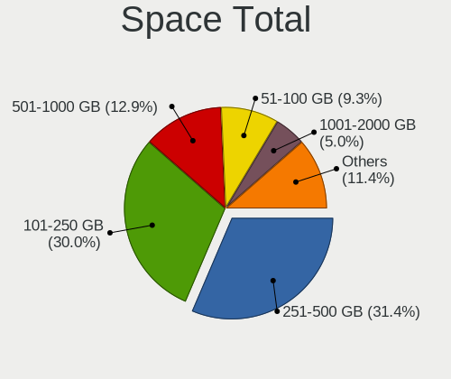
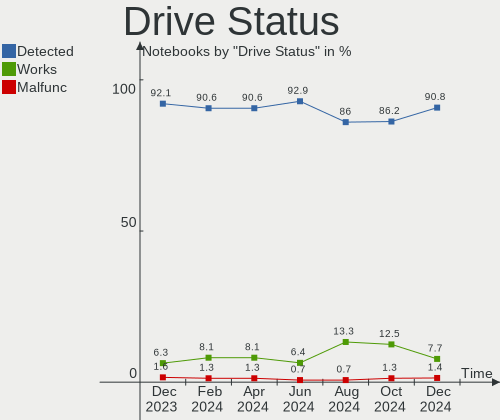
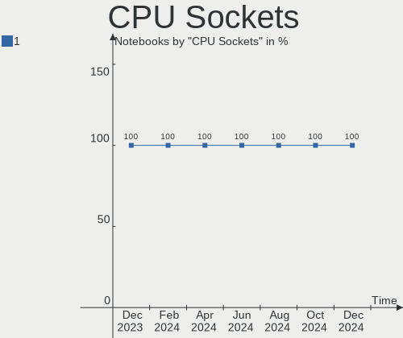
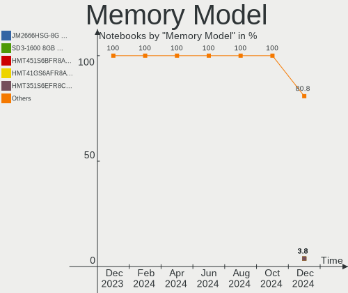

Zorin - Hardware Trends (Notebooks)
-----------------------------------

A project to identify most popular hardware characteristics and track their change
over time based on data collected by Linux users at https://Linux-Hardware.org.

Anyone can contribute to this report by the [hw-probe](https://github.com/linuxhw/hw-probe) tool:

    sudo -E hw-probe -all -upload

This report is for one last month. Overall report since the beginning of time: [TestCoverage](https://github.com/linuxhw/TestCoverage)

Period: Sep, 2022.

Contents
--------

* [ System ](#system)
  - [ OS                       ](#os)
  - [ OS Family                ](#os-family)
  - [ Kernel                   ](#kernel)
  - [ Kernel Family            ](#kernel-family)
  - [ Kernel Major Ver.        ](#kernel-major-ver)
  - [ Arch                     ](#arch)
  - [ DE                       ](#de)
  - [ Display Server           ](#display-server)
  - [ Display Manager          ](#display-manager)
  - [ OS Lang                  ](#os-lang)
  - [ Boot Mode                ](#boot-mode)
  - [ Filesystem               ](#filesystem)
  - [ Part. scheme             ](#part-scheme)
  - [ Dual Boot with Linux/BSD ](#dual-boot-with-linuxbsd)
  - [ Dual Boot (Win)          ](#dual-boot-win)

* [ Board ](#board)
  - [ Vendor                   ](#vendor)
  - [ Model                    ](#model)
  - [ Model Family             ](#model-family)
  - [ MFG Year                 ](#mfg-year)
  - [ Form Factor              ](#form-factor)
  - [ Secure Boot              ](#secure-boot)
  - [ Coreboot                 ](#coreboot)
  - [ RAM Size                 ](#ram-size)
  - [ RAM Used                 ](#ram-used)
  - [ Total Drives             ](#total-drives)
  - [ Has CD-ROM               ](#has-cd-rom)
  - [ Has Ethernet             ](#has-ethernet)
  - [ Has WiFi                 ](#has-wifi)
  - [ Has Bluetooth            ](#has-bluetooth)

* [ Location ](#location)
  - [ Country                  ](#country)
  - [ City                     ](#city)

* [ Drives ](#drives)
  - [ Drive Vendor             ](#drive-vendor)
  - [ Drive Model              ](#drive-model)
  - [ HDD Vendor               ](#hdd-vendor)
  - [ SSD Vendor               ](#ssd-vendor)
  - [ Drive Kind               ](#drive-kind)
  - [ Drive Connector          ](#drive-connector)
  - [ Drive Size               ](#drive-size)
  - [ Space Total              ](#space-total)
  - [ Space Used               ](#space-used)
  - [ Malfunc. Drives          ](#malfunc-drives)
  - [ Malfunc. Drive Vendor    ](#malfunc-drive-vendor)
  - [ Malfunc. HDD Vendor      ](#malfunc-hdd-vendor)
  - [ Malfunc. Drive Kind      ](#malfunc-drive-kind)
  - [ Failed Drives            ](#failed-drives)
  - [ Failed Drive Vendor      ](#failed-drive-vendor)
  - [ Drive Status             ](#drive-status)

* [ Storage controller ](#storage-controller)
  - [ Storage Vendor           ](#storage-vendor)
  - [ Storage Model            ](#storage-model)
  - [ Storage Kind             ](#storage-kind)

* [ Processor ](#processor)
  - [ CPU Vendor               ](#cpu-vendor)
  - [ CPU Model                ](#cpu-model)
  - [ CPU Model Family         ](#cpu-model-family)
  - [ CPU Cores                ](#cpu-cores)
  - [ CPU Sockets              ](#cpu-sockets)
  - [ CPU Threads              ](#cpu-threads)
  - [ CPU Op-Modes             ](#cpu-op-modes)
  - [ CPU Microcode            ](#cpu-microcode)
  - [ CPU Microarch            ](#cpu-microarch)

* [ Graphics ](#graphics)
  - [ GPU Vendor               ](#gpu-vendor)
  - [ GPU Model                ](#gpu-model)
  - [ GPU Combo                ](#gpu-combo)
  - [ GPU Driver               ](#gpu-driver)
  - [ GPU Memory               ](#gpu-memory)

* [ Monitor ](#monitor)
  - [ Monitor Vendor           ](#monitor-vendor)
  - [ Monitor Model            ](#monitor-model)
  - [ Monitor Resolution       ](#monitor-resolution)
  - [ Monitor Diagonal         ](#monitor-diagonal)
  - [ Monitor Width            ](#monitor-width)
  - [ Aspect Ratio             ](#aspect-ratio)
  - [ Monitor Area             ](#monitor-area)
  - [ Pixel Density            ](#pixel-density)
  - [ Multiple Monitors        ](#multiple-monitors)

* [ Network ](#network)
  - [ Net Controller Vendor    ](#net-controller-vendor)
  - [ Net Controller Model     ](#net-controller-model)
  - [ Wireless Vendor          ](#wireless-vendor)
  - [ Wireless Model           ](#wireless-model)
  - [ Ethernet Vendor          ](#ethernet-vendor)
  - [ Ethernet Model           ](#ethernet-model)
  - [ Net Controller Kind      ](#net-controller-kind)
  - [ Used Controller          ](#used-controller)
  - [ NICs                     ](#nics)
  - [ IPv6                     ](#ipv6)

* [ Bluetooth ](#bluetooth)
  - [ Bluetooth Vendor         ](#bluetooth-vendor)
  - [ Bluetooth Model          ](#bluetooth-model)

* [ Sound ](#sound)
  - [ Sound Vendor             ](#sound-vendor)
  - [ Sound Model              ](#sound-model)

* [ Memory ](#memory)
  - [ Memory Vendor            ](#memory-vendor)
  - [ Memory Model             ](#memory-model)
  - [ Memory Kind              ](#memory-kind)
  - [ Memory Form Factor       ](#memory-form-factor)
  - [ Memory Size              ](#memory-size)
  - [ Memory Speed             ](#memory-speed)

* [ Printers & scanners ](#printers--scanners)
  - [ Printer Vendor           ](#printer-vendor)
  - [ Printer Model            ](#printer-model)
  - [ Scanner Vendor           ](#scanner-vendor)
  - [ Scanner Model            ](#scanner-model)

* [ Camera ](#camera)
  - [ Camera Vendor            ](#camera-vendor)
  - [ Camera Model             ](#camera-model)

* [ Security ](#security)
  - [ Fingerprint Vendor       ](#fingerprint-vendor)
  - [ Fingerprint Model        ](#fingerprint-model)
  - [ Chipcard Vendor          ](#chipcard-vendor)
  - [ Chipcard Model           ](#chipcard-model)

* [ Unsupported ](#unsupported)
  - [ Unsupported Devices      ](#unsupported-devices)
  - [ Unsupported Device Types ](#unsupported-device-types)

System
------

OS
--

Installed operating systems

| Name     | Notebooks | Percent |
|----------|-----------|---------|
| Zorin 16 | 80        | 90.91%  |
| Zorin 15 | 8         | 9.09%   |

OS Family
---------

OS without a version

| Name  | Notebooks | Percent |
|-------|-----------|---------|
| Zorin | 88        | 100%    |

Kernel
------

Version of the Linux kernel

| Version                   | Notebooks | Percent |
|---------------------------|-----------|---------|
| 5.15.0-46-generic         | 48        | 54.55%  |
| 5.15.0-48-generic         | 23        | 26.14%  |
| 5.4.0-125-generic         | 4         | 4.55%   |
| 5.4.0-126-generic         | 2         | 2.27%   |
| 5.4.0-124-generic         | 1         | 1.14%   |
| 5.4.0-110-generic         | 1         | 1.14%   |
| 5.19.9-051909-generic     | 1         | 1.14%   |
| 5.19.1-051901-generic     | 1         | 1.14%   |
| 5.19.0-8.2-liquorix-amd64 | 1         | 1.14%   |
| 5.18.6-051806-generic     | 1         | 1.14%   |
| 5.14.0-1051-oem           | 1         | 1.14%   |
| 5.13.0-40-generic         | 1         | 1.14%   |
| 5.13.0-30-generic         | 1         | 1.14%   |
| 5.13.0-28-generic         | 1         | 1.14%   |
| 5.11.0-27-generic         | 1         | 1.14%   |

Kernel Family
-------------

Linux kernel without a distro release

| Version | Notebooks | Percent |
|---------|-----------|---------|
| 5.15.0  | 71        | 80.68%  |
| 5.4.0   | 8         | 9.09%   |
| 5.13.0  | 3         | 3.41%   |
| 5.19.9  | 1         | 1.14%   |
| 5.19.1  | 1         | 1.14%   |
| 5.19.0  | 1         | 1.14%   |
| 5.18.6  | 1         | 1.14%   |
| 5.14.0  | 1         | 1.14%   |
| 5.11.0  | 1         | 1.14%   |

Kernel Major Ver.
-----------------

Linux kernel major version

| Version | Notebooks | Percent |
|---------|-----------|---------|
| 5.15    | 71        | 80.68%  |
| 5.4     | 8         | 9.09%   |
| 5.19    | 3         | 3.41%   |
| 5.13    | 3         | 3.41%   |
| 5.18    | 1         | 1.14%   |
| 5.14    | 1         | 1.14%   |
| 5.11    | 1         | 1.14%   |

Arch
----

OS architecture (x86_64, i586, etc.)

| Name   | Notebooks | Percent |
|--------|-----------|---------|
| x86_64 | 83        | 94.32%  |
| i686   | 5         | 5.68%   |

DE
--

Desktop Environment

| Name  | Notebooks | Percent |
|-------|-----------|---------|
| GNOME | 73        | 82.95%  |
| XFCE  | 15        | 17.05%  |

Display Server
--------------

X11 or Wayland

| Name    | Notebooks | Percent |
|---------|-----------|---------|
| X11     | 86        | 97.73%  |
| Wayland | 2         | 2.27%   |

Display Manager
---------------

SDDM, LightDM, etc.

| Name    | Notebooks | Percent |
|---------|-----------|---------|
| Unknown | 63        | 71.59%  |
| GDM     | 10        | 11.36%  |
| GDM3    | 9         | 10.23%  |
| LightDM | 6         | 6.82%   |

OS Lang
-------

Language

| Lang  | Notebooks | Percent |
|-------|-----------|---------|
| en_US | 39        | 44.32%  |
| de_DE | 10        | 11.36%  |
| it_IT | 5         | 5.68%   |
| fr_FR | 5         | 5.68%   |
| en_GB | 5         | 5.68%   |
| pt_BR | 4         | 4.55%   |
| en_IN | 3         | 3.41%   |
| pl_PL | 2         | 2.27%   |
| es_ES | 2         | 2.27%   |
| en_CA | 2         | 2.27%   |
| tr_TR | 1         | 1.14%   |
| ru_UA | 1         | 1.14%   |
| nl_NL | 1         | 1.14%   |
| nl_BE | 1         | 1.14%   |
| ko_KR | 1         | 1.14%   |
| fr_BE | 1         | 1.14%   |
| es_VE | 1         | 1.14%   |
| es_UY | 1         | 1.14%   |
| en_NZ | 1         | 1.14%   |
| de_AT | 1         | 1.14%   |
| cs_CZ | 1         | 1.14%   |

Boot Mode
---------

EFI or BIOS

| Mode | Notebooks | Percent |
|------|-----------|---------|
| EFI  | 48        | 54.55%  |
| BIOS | 40        | 45.45%  |

Filesystem
----------

Type of filesystem

| Type | Notebooks | Percent |
|------|-----------|---------|
| Ext4 | 84        | 95.45%  |
| Zfs  | 3         | 3.41%   |
| Ext3 | 1         | 1.14%   |

Part. scheme
------------

Scheme of partitioning

| Type    | Notebooks | Percent |
|---------|-----------|---------|
| Unknown | 77        | 87.5%   |
| GPT     | 8         | 9.09%   |
| MBR     | 3         | 3.41%   |

Dual Boot with Linux/BSD
------------------------

Hosting more than one Linux/BSD

| Dual boot | Notebooks | Percent |
|-----------|-----------|---------|
| No        | 86        | 97.73%  |
| Yes       | 2         | 2.27%   |

Dual Boot (Win)
---------------

Hosting Linux and Windows

| Dual boot | Notebooks | Percent |
|-----------|-----------|---------|
| No        | 82        | 93.18%  |
| Yes       | 6         | 6.82%   |

Board
-----

Vendor
------

Motherboard manufacturer

| Name                | Notebooks | Percent |
|---------------------|-----------|---------|
| Hewlett-Packard     | 23        | 26.14%  |
| Dell                | 16        | 18.18%  |
| Lenovo              | 13        | 14.77%  |
| Acer                | 6         | 6.82%   |
| ASUSTek Computer    | 5         | 5.68%   |
| Toshiba             | 4         | 4.55%   |
| Samsung Electronics | 3         | 3.41%   |
| Apple               | 3         | 3.41%   |
| Notebook            | 2         | 2.27%   |
| UMAX                | 1         | 1.14%   |
| Positivo            | 1         | 1.14%   |
| Microtech           | 1         | 1.14%   |
| Medion              | 1         | 1.14%   |
| Itautec             | 1         | 1.14%   |
| Irbis               | 1         | 1.14%   |
| HUAWEI              | 1         | 1.14%   |
| Gigabyte Technology | 1         | 1.14%   |
| Ematic              | 1         | 1.14%   |
| Chuwi               | 1         | 1.14%   |
| AZW                 | 1         | 1.14%   |
| Alienware           | 1         | 1.14%   |
| Unknown             | 1         | 1.14%   |

Model
-----

Motherboard model

| Name                              | Notebooks | Percent |
|-----------------------------------|-----------|---------|
| HP Pavilion g7                    | 2         | 2.27%   |
| HP EliteBook 840 G6               | 2         | 2.27%   |
| UMAX VisionBook N14G Plus         | 1         | 1.14%   |
| Toshiba Satellite P200            | 1         | 1.14%   |
| Toshiba Satellite L855            | 1         | 1.14%   |
| Toshiba Satellite C855            | 1         | 1.14%   |
| Toshiba Satellite C55-C           | 1         | 1.14%   |
| Samsung 950XCJ/951XCJ/950XCR      | 1         | 1.14%   |
| Samsung 800G5M/800G5W             | 1         | 1.14%   |
| Samsung 600B4B/600B5B             | 1         | 1.14%   |
| Positivo C14CR01                  | 1         | 1.14%   |
| Notebook NJ50_70CU                | 1         | 1.14%   |
| Notebook NJ50GU                   | 1         | 1.14%   |
| Microtech CoreBook                | 1         | 1.14%   |
| Medion Akoya E1318T               | 1         | 1.14%   |
| Lenovo Yoga S740-15IRH 81NX       | 1         | 1.14%   |
| Lenovo ThinkPad Edge E530 3259CTO | 1         | 1.14%   |
| Lenovo ThinkPad E570 20H50047US   | 1         | 1.14%   |
| Lenovo ThinkPad 11e 20DAS09U00    | 1         | 1.14%   |
| Lenovo IdeaPadFlex 15D 20334      | 1         | 1.14%   |
| Lenovo IdeaPad S130-11IGM 81J1    | 1         | 1.14%   |
| Lenovo IdeaPad 5 14ALC05 82LM     | 1         | 1.14%   |
| Lenovo IdeaPad 3 15ADA6 82KR      | 1         | 1.14%   |
| Lenovo IdeaPad 130-15IKB 81H7     | 1         | 1.14%   |
| Lenovo IdeaPad 130-15AST 81H5     | 1         | 1.14%   |
| Lenovo IdeaPad 110-15ACL 80TJ     | 1         | 1.14%   |
| Lenovo G560 20042                 | 1         | 1.14%   |
| Lenovo G400s VILG1                | 1         | 1.14%   |
| Itautec Infoway                   | 1         | 1.14%   |
| Irbis NB61                        | 1         | 1.14%   |
| HUAWEI NBLK-WAX9X                 | 1         | 1.14%   |
| HP Stream Notebook PC 14          | 1         | 1.14%   |
| HP Stream Laptop 14-ax0XX         | 1         | 1.14%   |
| HP Pavilion Notebook              | 1         | 1.14%   |
| HP Pavilion Laptop 17-ar0xx       | 1         | 1.14%   |
| HP Pavilion Laptop 15-cw0xxx      | 1         | 1.14%   |
| HP Pavilion dv6700                | 1         | 1.14%   |
| HP Pavilion dv6500                | 1         | 1.14%   |
| HP Pavilion dv6000 (RP986EA#ABZ)  | 1         | 1.14%   |
| HP Laptop 17-bs0xx                | 1         | 1.14%   |

Model Family
------------

Motherboard model prefix

| Name               | Notebooks | Percent |
|--------------------|-----------|---------|
| HP Pavilion        | 8         | 9.09%   |
| Dell Latitude      | 8         | 9.09%   |
| Lenovo IdeaPad     | 6         | 6.82%   |
| Dell Inspiron      | 6         | 6.82%   |
| HP EliteBook       | 5         | 5.68%   |
| Acer Aspire        | 5         | 5.68%   |
| Toshiba Satellite  | 4         | 4.55%   |
| Lenovo ThinkPad    | 3         | 3.41%   |
| HP Stream          | 2         | 2.27%   |
| HP Laptop          | 2         | 2.27%   |
| UMAX VisionBook    | 1         | 1.14%   |
| Samsung 950XCJ     | 1         | 1.14%   |
| Samsung 800G5M     | 1         | 1.14%   |
| Samsung 600B4B     | 1         | 1.14%   |
| Positivo C14CR01   | 1         | 1.14%   |
| Notebook NJ50GU    | 1         | 1.14%   |
| Notebook NJ50      | 1         | 1.14%   |
| Microtech CoreBook | 1         | 1.14%   |
| Medion Akoya       | 1         | 1.14%   |
| Lenovo Yoga        | 1         | 1.14%   |
| Lenovo IdeaPadFlex | 1         | 1.14%   |
| Lenovo G560        | 1         | 1.14%   |
| Lenovo G400s       | 1         | 1.14%   |
| Itautec Infoway    | 1         | 1.14%   |
| Irbis NB61         | 1         | 1.14%   |
| HUAWEI NBLK-WAX9X  | 1         | 1.14%   |
| HP G62             | 1         | 1.14%   |
| HP ENVY            | 1         | 1.14%   |
| HP Compaq          | 1         | 1.14%   |
| HP 620             | 1         | 1.14%   |
| HP 250             | 1         | 1.14%   |
| HP 15              | 1         | 1.14%   |
| Gigabyte P64V7     | 1         | 1.14%   |
| Ematic EWT118      | 1         | 1.14%   |
| Dell XPS           | 1         | 1.14%   |
| Dell System        | 1         | 1.14%   |
| Chuwi HeroBook     | 1         | 1.14%   |
| AZW Z83-V          | 1         | 1.14%   |
| ASUS X201EP        | 1         | 1.14%   |
| ASUS UX331UA       | 1         | 1.14%   |

MFG Year
--------

Motherboard manufacture year

| Year | Notebooks | Percent |
|------|-----------|---------|
| 2021 | 8         | 9.09%   |
| 2019 | 8         | 9.09%   |
| 2018 | 8         | 9.09%   |
| 2015 | 8         | 9.09%   |
| 2012 | 8         | 9.09%   |
| 2013 | 7         | 7.95%   |
| 2011 | 6         | 6.82%   |
| 2020 | 5         | 5.68%   |
| 2017 | 5         | 5.68%   |
| 2010 | 5         | 5.68%   |
| 2014 | 4         | 4.55%   |
| 2007 | 4         | 4.55%   |
| 2016 | 3         | 3.41%   |
| 2009 | 3         | 3.41%   |
| 2008 | 2         | 2.27%   |
| 2006 | 2         | 2.27%   |
| 2005 | 2         | 2.27%   |

Form Factor
-----------

Physical design of the computer

| Name     | Notebooks | Percent |
|----------|-----------|---------|
| Notebook | 88        | 100%    |

Secure Boot
-----------

Enabled or disabled

| State    | Notebooks | Percent |
|----------|-----------|---------|
| Disabled | 72        | 81.82%  |
| Enabled  | 16        | 18.18%  |

Coreboot
--------

Have coreboot on board

| Used | Notebooks | Percent |
|------|-----------|---------|
| No   | 88        | 100%    |

RAM Size
--------

Total RAM memory

| Size in GB | Notebooks | Percent |
|------------|-----------|---------|
| 3.01-4.0   | 30        | 34.09%  |
| 4.01-8.0   | 26        | 29.55%  |
| 8.01-16.0  | 10        | 11.36%  |
| 16.01-24.0 | 9         | 10.23%  |
| 1.01-2.0   | 8         | 9.09%   |
| 2.01-3.0   | 3         | 3.41%   |
| 32.01-64.0 | 2         | 2.27%   |

RAM Used
--------

Used RAM memory

| Used GB   | Notebooks | Percent |
|-----------|-----------|---------|
| 1.01-2.0  | 32        | 36.36%  |
| 2.01-3.0  | 29        | 32.95%  |
| 4.01-8.0  | 12        | 13.64%  |
| 3.01-4.0  | 9         | 10.23%  |
| 0.51-1.0  | 4         | 4.55%   |
| 8.01-16.0 | 2         | 2.27%   |

Total Drives
------------

Number of drives on board

| Drives | Notebooks | Percent |
|--------|-----------|---------|
| 1      | 67        | 76.14%  |
| 2      | 19        | 21.59%  |
| 3      | 2         | 2.27%   |

Has CD-ROM
----------

Has CD-ROM on board

| Presented | Notebooks | Percent |
|-----------|-----------|---------|
| No        | 51        | 57.95%  |
| Yes       | 37        | 42.05%  |

Has Ethernet
------------

Has Ethernet on board

| Presented | Notebooks | Percent |
|-----------|-----------|---------|
| Yes       | 66        | 75%     |
| No        | 22        | 25%     |

Has WiFi
--------

Has WiFi module

| Presented | Notebooks | Percent |
|-----------|-----------|---------|
| Yes       | 84        | 95.45%  |
| No        | 4         | 4.55%   |

Has Bluetooth
-------------

Has Bluetooth module

| Presented | Notebooks | Percent |
|-----------|-----------|---------|
| Yes       | 55        | 62.5%   |
| No        | 33        | 37.5%   |

Location
--------

Country
-------

Geographic location (country)

| Country       | Notebooks | Percent |
|---------------|-----------|---------|
| USA           | 26        | 29.55%  |
| Germany       | 11        | 12.5%   |
| Italy         | 5         | 5.68%   |
| UK            | 4         | 4.55%   |
| Brazil        | 4         | 4.55%   |
| Netherlands   | 3         | 3.41%   |
| India         | 3         | 3.41%   |
| France        | 3         | 3.41%   |
| Canada        | 3         | 3.41%   |
| Spain         | 2         | 2.27%   |
| Russia        | 2         | 2.27%   |
| Poland        | 2         | 2.27%   |
| Czechia       | 2         | 2.27%   |
| Belgium       | 2         | 2.27%   |
| Yemen         | 1         | 1.14%   |
| Venezuela     | 1         | 1.14%   |
| Uruguay       | 1         | 1.14%   |
| Ukraine       | 1         | 1.14%   |
| Turkey        | 1         | 1.14%   |
| Tunisia       | 1         | 1.14%   |
| South Korea   | 1         | 1.14%   |
| Romania       | 1         | 1.14%   |
| Nigeria       | 1         | 1.14%   |
| New Zealand   | 1         | 1.14%   |
| Iraq          | 1         | 1.14%   |
| Iran          | 1         | 1.14%   |
| French Guiana | 1         | 1.14%   |
| China         | 1         | 1.14%   |
| Austria       | 1         | 1.14%   |
| Argentina     | 1         | 1.14%   |

City
----

Geographic location (city)

| City                 | Notebooks | Percent |
|----------------------|-----------|---------|
| Seattle              | 2         | 2.27%   |
| Sao Paulo            | 2         | 2.27%   |
| Munich               | 2         | 2.27%   |
| Krakow               | 2         | 2.27%   |
| Clausthal-Zellerfeld | 2         | 2.27%   |
| Zeist                | 1         | 1.14%   |
| Wiednitz             | 1         | 1.14%   |
| West Plains          | 1         | 1.14%   |
| Vienna               | 1         | 1.14%   |
| Valencia             | 1         | 1.14%   |
| Ufa                  | 1         | 1.14%   |
| Turin                | 1         | 1.14%   |
| Tring                | 1         | 1.14%   |
| Surbo                | 1         | 1.14%   |
| Springdale           | 1         | 1.14%   |
| Spring               | 1         | 1.14%   |
| Shanghai             | 1         | 1.14%   |
| Seville              | 1         | 1.14%   |
| Scarborough          | 1         | 1.14%   |
| Sanaa                | 1         | 1.14%   |
| Running Springs      | 1         | 1.14%   |
| Roseville            | 1         | 1.14%   |
| Rome                 | 1         | 1.14%   |
| Rho                  | 1         | 1.14%   |
| Prague               | 1         | 1.14%   |
| Piscataway           | 1         | 1.14%   |
| Montreal             | 1         | 1.14%   |
| Montevideo           | 1         | 1.14%   |
| Mohali               | 1         | 1.14%   |
| Minneapolis          | 1         | 1.14%   |
| Merthyr Tydfil       | 1         | 1.14%   |
| Marktredwitz         | 1         | 1.14%   |
| Malmedy              | 1         | 1.14%   |
| Madrid               | 1         | 1.14%   |
| Lytham St Annes      | 1         | 1.14%   |
| Louisville           | 1         | 1.14%   |
| Londrina             | 1         | 1.14%   |
| Little Rock          | 1         | 1.14%   |
| Lehigh Acres         | 1         | 1.14%   |
| Lee's Summit         | 1         | 1.14%   |

Drives
------

Drive Vendor
------------

Hard drive vendors

| Vendor              | Notebooks | Drives | Percent |
|---------------------|-----------|--------|---------|
| Toshiba             | 15        | 15     | 14.71%  |
| WDC                 | 14        | 14     | 13.73%  |
| Samsung Electronics | 11        | 13     | 10.78%  |
| Seagate             | 10        | 11     | 9.8%    |
| Unknown             | 7         | 10     | 6.86%   |
| SanDisk             | 7         | 7      | 6.86%   |
| Micron Technology   | 4         | 5      | 3.92%   |
| Crucial             | 4         | 4      | 3.92%   |
| Kingston            | 3         | 3      | 2.94%   |
| HGST                | 3         | 3      | 2.94%   |
| SPCC                | 2         | 2      | 1.96%   |
| LITEON              | 2         | 2      | 1.96%   |
| Intel               | 2         | 2      | 1.96%   |
| Hitachi             | 2         | 2      | 1.96%   |
| Unknown             | 2         | 2      | 1.96%   |
| Transcend           | 1         | 1      | 0.98%   |
| Team                | 1         | 1      | 0.98%   |
| SK hynix            | 1         | 1      | 0.98%   |
| PNY                 | 1         | 1      | 0.98%   |
| Patriot             | 1         | 1      | 0.98%   |
| OCZ                 | 1         | 1      | 0.98%   |
| Netac               | 1         | 1      | 0.98%   |
| Mushkin             | 1         | 1      | 0.98%   |
| Lexar               | 1         | 1      | 0.98%   |
| Intenso             | 1         | 1      | 0.98%   |
| GLOWAY              | 1         | 1      | 0.98%   |
| Fujitsu             | 1         | 1      | 0.98%   |
| BHT                 | 1         | 1      | 0.98%   |
| Apple               | 1         | 1      | 0.98%   |

Drive Model
-----------

Hard drive models

| Model                                | Notebooks | Percent |
|--------------------------------------|-----------|---------|
| Unknown MMC Card  64GB               | 3         | 2.78%   |
| Unknown MMC Card  32GB               | 3         | 2.78%   |
| Toshiba MQ01ABF050 500GB             | 3         | 2.78%   |
| Toshiba MQ01ABD100 1TB               | 2         | 1.85%   |
| Seagate ST500LT012-1DG142 500GB      | 2         | 1.85%   |
| Seagate Expansion 1TB                | 2         | 1.85%   |
| Samsung SSD 870 EVO 1TB              | 2         | 1.85%   |
| Micron NVMe SSD Drive 256GB          | 2         | 1.85%   |
| Kingston SA400S37480G 480GB SSD      | 2         | 1.85%   |
| Unknown                              | 2         | 1.85%   |
| WDC WDS500G2B0A-00SM50 500GB SSD     | 1         | 0.93%   |
| WDC WDS480G2G0A-00JH30 480GB SSD     | 1         | 0.93%   |
| WDC WDS100T2B0A-00SM50 1TB SSD       | 1         | 0.93%   |
| WDC WD5000LPVX-22V0TT0 500GB         | 1         | 0.93%   |
| WDC WD5000LPLX-00ZNTT0 500GB         | 1         | 0.93%   |
| WDC WD5000LPCX-75VHAT0 500GB         | 1         | 0.93%   |
| WDC WD5000BPKX-75HPJT0 500GB         | 1         | 0.93%   |
| WDC WD400VE-75HDT1 40GB              | 1         | 0.93%   |
| WDC WD2500BEVT-75A23T0 250GB         | 1         | 0.93%   |
| WDC WD2500BEVS-60UST0 250GB          | 1         | 0.93%   |
| WDC WD20SPZX-08UA7 2TB               | 1         | 0.93%   |
| WDC WD10JPCX-24UE4T0 1TB             | 1         | 0.93%   |
| WDC PC SN730 SDBPNTY-256G-1027 256GB | 1         | 0.93%   |
| WDC PC SN530 SDBPMPZ-256G-1101 256GB | 1         | 0.93%   |
| Unknown MMC Card  128GB              | 1         | 0.93%   |
| Unknown EC1S5  64GB                  | 1         | 0.93%   |
| Unknown 032G74  32GB                 | 1         | 0.93%   |
| Transcend TS512GMTS800 512GB SSD     | 1         | 0.93%   |
| Toshiba THNSNJ128GCSU 128GB SSD      | 1         | 0.93%   |
| Toshiba THNSNF128GMCS 128GB SSD      | 1         | 0.93%   |
| Toshiba NVMe SSD Drive 256GB         | 1         | 0.93%   |
| Toshiba MQ04ABF100 1TB               | 1         | 0.93%   |
| Toshiba MQ01ACF032 320GB             | 1         | 0.93%   |
| Toshiba MQ01ABD050 500GB             | 1         | 0.93%   |
| Toshiba MK5075GSX 500GB              | 1         | 0.93%   |
| Toshiba MK5065GSXF 500GB             | 1         | 0.93%   |
| Toshiba MK4026GAX 40GB               | 1         | 0.93%   |
| Toshiba MK1237GSX 120GB              | 1         | 0.93%   |
| Team T253X2512G 512GB SSD            | 1         | 0.93%   |
| SPCC Solid State Disk 512GB          | 1         | 0.93%   |

HDD Vendor
----------

Hard disk drive vendors

| Vendor              | Notebooks | Drives | Percent |
|---------------------|-----------|--------|---------|
| Toshiba             | 12        | 12     | 31.58%  |
| Seagate             | 10        | 11     | 26.32%  |
| WDC                 | 9         | 9      | 23.68%  |
| HGST                | 3         | 3      | 7.89%   |
| Hitachi             | 2         | 2      | 5.26%   |
| Samsung Electronics | 1         | 1      | 2.63%   |
| Fujitsu             | 1         | 1      | 2.63%   |

SSD Vendor
----------

Solid state drive vendors

| Vendor              | Notebooks | Drives | Percent |
|---------------------|-----------|--------|---------|
| Samsung Electronics | 7         | 8      | 17.5%   |
| Crucial             | 4         | 4      | 10%     |
| WDC                 | 3         | 3      | 7.5%    |
| SanDisk             | 3         | 3      | 7.5%    |
| Kingston            | 3         | 3      | 7.5%    |
| Toshiba             | 2         | 2      | 5%      |
| SPCC                | 2         | 2      | 5%      |
| LITEON              | 2         | 2      | 5%      |
| Transcend           | 1         | 1      | 2.5%    |
| Team                | 1         | 1      | 2.5%    |
| PNY                 | 1         | 1      | 2.5%    |
| Patriot             | 1         | 1      | 2.5%    |
| OCZ                 | 1         | 1      | 2.5%    |
| Netac               | 1         | 1      | 2.5%    |
| Mushkin             | 1         | 1      | 2.5%    |
| Micron Technology   | 1         | 1      | 2.5%    |
| Lexar               | 1         | 1      | 2.5%    |
| Intel               | 1         | 1      | 2.5%    |
| GLOWAY              | 1         | 1      | 2.5%    |
| BHT                 | 1         | 1      | 2.5%    |
| Apple               | 1         | 1      | 2.5%    |
| Unknown             | 1         | 1      | 2.5%    |

Drive Kind
----------

HDD or SSD

| Kind    | Notebooks | Drives | Percent |
|---------|-----------|--------|---------|
| SSD     | 37        | 41     | 37.37%  |
| HDD     | 37        | 39     | 37.37%  |
| NVMe    | 15        | 16     | 15.15%  |
| MMC     | 8         | 11     | 8.08%   |
| Unknown | 2         | 2      | 2.02%   |

Drive Connector
---------------

SATA, SAS, NVMe, etc.

| Type | Notebooks | Drives | Percent |
|------|-----------|--------|---------|
| SATA | 69        | 79     | 73.4%   |
| NVMe | 15        | 16     | 15.96%  |
| MMC  | 8         | 11     | 8.51%   |
| SAS  | 2         | 3      | 2.13%   |

Drive Size
----------

Size of hard drive

| Size in TB | Notebooks | Drives | Percent |
|------------|-----------|--------|---------|
| 0.01-0.5   | 54        | 59     | 72.97%  |
| 0.51-1.0   | 16        | 17     | 21.62%  |
| 1.01-2.0   | 4         | 4      | 5.41%   |

Space Total
-----------

Amount of disk space available on the file system

| Size in GB     | Notebooks | Percent |
|----------------|-----------|---------|
| 251-500        | 29        | 32.95%  |
| 101-250        | 27        | 30.68%  |
| 21-50          | 10        | 11.36%  |
| 501-1000       | 8         | 9.09%   |
| 51-100         | 6         | 6.82%   |
| 1001-2000      | 4         | 4.55%   |
| Unknown        | 3         | 3.41%   |
| More than 3000 | 1         | 1.14%   |

Space Used
----------

Amount of used disk space

| Used GB   | Notebooks | Percent |
|-----------|-----------|---------|
| 1-20      | 28        | 31.82%  |
| 21-50     | 25        | 28.41%  |
| 51-100    | 15        | 17.05%  |
| 101-250   | 10        | 11.36%  |
| 251-500   | 5         | 5.68%   |
| Unknown   | 3         | 3.41%   |
| 1001-2000 | 1         | 1.14%   |
| 501-1000  | 1         | 1.14%   |

Malfunc. Drives
---------------

Drive models with a malfunction

| Model                    | Notebooks | Drives | Percent |
|--------------------------|-----------|--------|---------|
| Toshiba MQ01ABF050 500GB | 1         | 1      | 100%    |

Malfunc. Drive Vendor
---------------------

Vendors of faulty drives

| Vendor  | Notebooks | Drives | Percent |
|---------|-----------|--------|---------|
| Toshiba | 1         | 1      | 100%    |

Malfunc. HDD Vendor
-------------------

Vendors of faulty HDD drives

| Vendor  | Notebooks | Drives | Percent |
|---------|-----------|--------|---------|
| Toshiba | 1         | 1      | 100%    |

Malfunc. Drive Kind
-------------------

Kinds of faulty drives

| Kind | Notebooks | Drives | Percent |
|------|-----------|--------|---------|
| HDD  | 1         | 1      | 100%    |

Failed Drives
-------------

Failed drive models

Zero info for selected period =(

Failed Drive Vendor
-------------------

Failed drive vendors

Zero info for selected period =(

Drive Status
------------

Number of failed and malfunc. drives

| Status   | Notebooks | Drives | Percent |
|----------|-----------|--------|---------|
| Detected | 79        | 98     | 89.77%  |
| Works    | 8         | 10     | 9.09%   |
| Malfunc  | 1         | 1      | 1.14%   |

Storage controller
------------------

Storage Vendor
--------------

Storage controller vendors

| Vendor                       | Notebooks | Percent |
|------------------------------|-----------|---------|
| Intel                        | 60        | 64.52%  |
| AMD                          | 14        | 15.05%  |
| SanDisk                      | 5         | 5.38%   |
| Samsung Electronics          | 5         | 5.38%   |
| Nvidia                       | 3         | 3.23%   |
| Micron Technology            | 3         | 3.23%   |
| Toshiba America Info Systems | 1         | 1.08%   |
| SK hynix                     | 1         | 1.08%   |
| Silicon Image                | 1         | 1.08%   |

Storage Model
-------------

Storage controller models

| Model                                                                            | Notebooks | Percent |
|----------------------------------------------------------------------------------|-----------|---------|
| AMD FCH SATA Controller [AHCI mode]                                              | 14        | 14%     |
| Intel Sunrise Point-LP SATA Controller [AHCI mode]                               | 6         | 6%      |
| Intel 7 Series Chipset Family 6-port SATA Controller [AHCI mode]                 | 6         | 6%      |
| Intel Celeron/Pentium Silver Processor SATA Controller                           | 5         | 5%      |
| Intel 82801 Mobile SATA Controller [RAID mode]                                   | 5         | 5%      |
| Intel 6 Series/C200 Series Chipset Family 6 port Mobile SATA AHCI Controller     | 5         | 5%      |
| Intel Wildcat Point-LP SATA Controller [AHCI Mode]                               | 4         | 4%      |
| Micron Non-Volatile memory controller                                            | 3         | 3%      |
| Intel Volume Management Device NVMe RAID Controller                              | 3         | 3%      |
| Intel Atom Processor E3800 Series SATA AHCI Controller                           | 3         | 3%      |
| Intel 82801IBM/IEM (ICH9M/ICH9M-E) 4 port SATA Controller [AHCI mode]            | 3         | 3%      |
| Intel 5 Series/3400 Series Chipset 4 port SATA AHCI Controller                   | 3         | 3%      |
| SanDisk WD Black SN750 / PC SN730 NVMe SSD                                       | 2         | 2%      |
| Samsung NVMe SSD Controller PM9A1/PM9A3/980PRO                                   | 2         | 2%      |
| Nvidia MCP67 AHCI Controller                                                     | 2         | 2%      |
| Intel HM170/QM170 Chipset SATA Controller [AHCI Mode]                            | 2         | 2%      |
| Intel 82801HM/HEM (ICH8M/ICH8M-E) IDE Controller                                 | 2         | 2%      |
| Intel 82801G (ICH7 Family) IDE Controller                                        | 2         | 2%      |
| Toshiba America Info Systems BG3 NVMe SSD Controller                             | 1         | 1%      |
| SK hynix BC501 NVMe Solid State Drive                                            | 1         | 1%      |
| Silicon Image SiI 3512 [SATALink/SATARaid] Serial ATA Controller                 | 1         | 1%      |
| SanDisk WD Blue SN550 NVMe SSD                                                   | 1         | 1%      |
| SanDisk WD Blue SN500 / PC SN520 NVMe SSD                                        | 1         | 1%      |
| SanDisk Non-Volatile memory controller                                           | 1         | 1%      |
| Samsung NVMe SSD Controller SM981/PM981/PM983                                    | 1         | 1%      |
| Samsung NVMe SSD Controller SM961/PM961/SM963                                    | 1         | 1%      |
| Samsung Electronics SATA controller                                              | 1         | 1%      |
| Nvidia MCP79 AHCI Controller                                                     | 1         | 1%      |
| Nvidia MCP67 IDE Controller                                                      | 1         | 1%      |
| Intel Tiger Lake-LP SATA Controller                                              | 1         | 1%      |
| Intel Non-Volatile memory controller                                             | 1         | 1%      |
| Intel NM10/ICH7 Family SATA Controller [AHCI mode]                               | 1         | 1%      |
| Intel Mobile 4 Series Chipset PT IDER Controller                                 | 1         | 1%      |
| Intel Comet Lake SATA AHCI Controller                                            | 1         | 1%      |
| Intel Celeron N3350/Pentium N4200/Atom E3900 Series SATA AHCI Controller         | 1         | 1%      |
| Intel Cannon Point-LP SATA Controller [AHCI Mode]                                | 1         | 1%      |
| Intel Atom/Celeron/Pentium Processor x5-E8000/J3xxx/N3xxx Series SATA Controller | 1         | 1%      |
| Intel 82801HM/HEM (ICH8M/ICH8M-E) SATA Controller [IDE mode]                     | 1         | 1%      |
| Intel 82801HM/HEM (ICH8M/ICH8M-E) SATA Controller [AHCI mode]                    | 1         | 1%      |
| Intel 82801GBM/GHM (ICH7-M Family) SATA Controller [AHCI mode]                   | 1         | 1%      |

Storage Kind
------------

Kind of storage controller (IDE, SATA, NVMe, SAS, ...)

| Kind | Notebooks | Percent |
|------|-----------|---------|
| SATA | 63        | 64.95%  |
| NVMe | 15        | 15.46%  |
| IDE  | 10        | 10.31%  |
| RAID | 9         | 9.28%   |

Processor
---------

CPU Vendor
----------

Processor vendors

| Vendor | Notebooks | Percent |
|--------|-----------|---------|
| Intel  | 70        | 79.55%  |
| AMD    | 18        | 20.45%  |

CPU Model
---------

Processor models

| Model                                         | Notebooks | Percent |
|-----------------------------------------------|-----------|---------|
| Intel Core i7-7500U CPU @ 2.70GHz             | 3         | 3.41%   |
| Intel Core i5-2430M CPU @ 2.40GHz             | 3         | 3.41%   |
| Intel Core i7-7700HQ CPU @ 2.80GHz            | 2         | 2.27%   |
| Intel Core i7-5600U CPU @ 2.60GHz             | 2         | 2.27%   |
| Intel Core i5-10210U CPU @ 1.60GHz            | 2         | 2.27%   |
| Intel Celeron N4000 CPU @ 1.10GHz             | 2         | 2.27%   |
| Intel Celeron CPU N3060 @ 1.60GHz             | 2         | 2.27%   |
| Intel Atom x5-Z8350 CPU @ 1.44GHz             | 2         | 2.27%   |
| AMD Ryzen 5 3500U with Radeon Vega Mobile Gfx | 2         | 2.27%   |
| AMD A8-7410 APU with AMD Radeon R5 Graphics   | 2         | 2.27%   |
| Intel Pentium Silver N5030 CPU @ 1.10GHz      | 1         | 1.14%   |
| Intel Pentium M processor 2.00GHz             | 1         | 1.14%   |
| Intel Pentium Dual-Core CPU T4500 @ 2.30GHz   | 1         | 1.14%   |
| Intel Pentium CPU N3540 @ 2.16GHz             | 1         | 1.14%   |
| Intel Genuine CPU T2250 @ 1.73GHz             | 1         | 1.14%   |
| Intel Core i7-8550U CPU @ 1.80GHz             | 1         | 1.14%   |
| Intel Core i7-6500U CPU @ 2.50GHz             | 1         | 1.14%   |
| Intel Core i7-4810MQ CPU @ 2.80GHz            | 1         | 1.14%   |
| Intel Core i7-4800MQ CPU @ 2.70GHz            | 1         | 1.14%   |
| Intel Core i7-4600U CPU @ 2.10GHz             | 1         | 1.14%   |
| Intel Core i7-3630QM CPU @ 2.40GHz            | 1         | 1.14%   |
| Intel Core i7-3540M CPU @ 3.00GHz             | 1         | 1.14%   |
| Intel Core i7-2760QM CPU @ 2.40GHz            | 1         | 1.14%   |
| Intel Core i5-9300H CPU @ 2.40GHz             | 1         | 1.14%   |
| Intel Core i5-8365U CPU @ 1.60GHz             | 1         | 1.14%   |
| Intel Core i5-8265U CPU @ 1.60GHz             | 1         | 1.14%   |
| Intel Core i5-6200U CPU @ 2.30GHz             | 1         | 1.14%   |
| Intel Core i5-5250U CPU @ 1.60GHz             | 1         | 1.14%   |
| Intel Core i5-5200U CPU @ 2.20GHz             | 1         | 1.14%   |
| Intel Core i5-3210M CPU @ 2.50GHz             | 1         | 1.14%   |
| Intel Core i5-2520M CPU @ 2.50GHz             | 1         | 1.14%   |
| Intel Core i5-10300H CPU @ 2.50GHz            | 1         | 1.14%   |
| Intel Core i5 CPU M 520 @ 2.40GHz             | 1         | 1.14%   |
| Intel Core i5 CPU M 450 @ 2.40GHz             | 1         | 1.14%   |
| Intel Core i3-6006U CPU @ 2.00GHz             | 1         | 1.14%   |
| Intel Core i3-5005U CPU @ 2.00GHz             | 1         | 1.14%   |
| Intel Core i3-3110M CPU @ 2.40GHz             | 1         | 1.14%   |
| Intel Core i3-2370M CPU @ 2.40GHz             | 1         | 1.14%   |
| Intel Core i3-2350M CPU @ 2.30GHz             | 1         | 1.14%   |
| Intel Core i3-2328M CPU @ 2.20GHz             | 1         | 1.14%   |

CPU Model Family
----------------

Processor model prefix

| Model                   | Notebooks | Percent |
|-------------------------|-----------|---------|
| Intel Core i5           | 16        | 18.18%  |
| Intel Core i7           | 15        | 17.05%  |
| Intel Celeron           | 11        | 12.5%   |
| Intel Core i3           | 8         | 9.09%   |
| Intel Core 2 Duo        | 6         | 6.82%   |
| AMD Ryzen 5             | 6         | 6.82%   |
| Other                   | 4         | 4.55%   |
| Intel Atom              | 4         | 4.55%   |
| AMD A8                  | 3         | 3.41%   |
| AMD A4                  | 3         | 3.41%   |
| AMD Turion 64 X2 Mobile | 2         | 2.27%   |
| AMD A6                  | 2         | 2.27%   |
| Intel Pentium Silver    | 1         | 1.14%   |
| Intel Pentium M         | 1         | 1.14%   |
| Intel Pentium Dual-Core | 1         | 1.14%   |
| Intel Pentium           | 1         | 1.14%   |
| Intel Genuine           | 1         | 1.14%   |
| Intel Core 2            | 1         | 1.14%   |
| Intel Celeron M         | 1         | 1.14%   |
| AMD A10                 | 1         | 1.14%   |

CPU Cores
---------

Number of processor cores

| Number | Notebooks | Percent |
|--------|-----------|---------|
| 2      | 53        | 60.23%  |
| 4      | 30        | 34.09%  |
| 1      | 3         | 3.41%   |
| 8      | 1         | 1.14%   |
| 6      | 1         | 1.14%   |

CPU Sockets
-----------

Number of sockets

| Number | Notebooks | Percent |
|--------|-----------|---------|
| 1      | 88        | 100%    |

CPU Threads
-----------

Threads per core (Hyper-Threading)

| Number | Notebooks | Percent |
|--------|-----------|---------|
| 2      | 51        | 57.95%  |
| 1      | 37        | 42.05%  |

CPU Op-Modes
------------

CPU Operation Modes (32-bit, 64-bit)

| Op mode        | Notebooks | Percent |
|----------------|-----------|---------|
| 32-bit, 64-bit | 85        | 96.59%  |
| 32-bit         | 3         | 3.41%   |

CPU Microcode
-------------

Microcode number

| Number     | Notebooks | Percent |
|------------|-----------|---------|
| 0x206a7    | 7         | 7.95%   |
| Unknown    | 7         | 7.95%   |
| 0x306d4    | 5         | 5.68%   |
| 0x806ec    | 4         | 4.55%   |
| 0x406c4    | 4         | 4.55%   |
| 0x306a9    | 4         | 4.55%   |
| 0x806e9    | 3         | 3.41%   |
| 0x706a1    | 3         | 3.41%   |
| 0x6fd      | 3         | 3.41%   |
| 0x406e3    | 3         | 3.41%   |
| 0x30678    | 3         | 3.41%   |
| 0x1067a    | 3         | 3.41%   |
| 0x07030105 | 3         | 3.41%   |
| 0x906e9    | 2         | 2.27%   |
| 0x806c1    | 2         | 2.27%   |
| 0x706a8    | 2         | 2.27%   |
| 0x6d8      | 2         | 2.27%   |
| 0x306c3    | 2         | 2.27%   |
| 0x20655    | 2         | 2.27%   |
| 0x20652    | 2         | 2.27%   |
| 0x08108109 | 2         | 2.27%   |
| 0x08108102 | 2         | 2.27%   |
| 0x0700010f | 2         | 2.27%   |
| 0x06006704 | 2         | 2.27%   |
| 0x906ea    | 1         | 1.14%   |
| 0x806ea    | 1         | 1.14%   |
| 0x806d1    | 1         | 1.14%   |
| 0x6f2      | 1         | 1.14%   |
| 0x506c9    | 1         | 1.14%   |
| 0x406c3    | 1         | 1.14%   |
| 0x40651    | 1         | 1.14%   |
| 0x106ca    | 1         | 1.14%   |
| 0x10676    | 1         | 1.14%   |
| 0x08608103 | 1         | 1.14%   |
| 0x0810100b | 1         | 1.14%   |
| 0x06006118 | 1         | 1.14%   |
| 0x06001119 | 1         | 1.14%   |
| 0x03000027 | 1         | 1.14%   |

CPU Microarch
-------------

Microarchitecture

| Name          | Notebooks | Percent |
|---------------|-----------|---------|
| KabyLake      | 11        | 12.5%   |
| Silvermont    | 9         | 10.23%  |
| SandyBridge   | 9         | 10.23%  |
| Goldmont plus | 5         | 5.68%   |
| Broadwell     | 5         | 5.68%   |
| Zen+          | 4         | 4.55%   |
| Westmere      | 4         | 4.55%   |
| Penryn        | 4         | 4.55%   |
| IvyBridge     | 4         | 4.55%   |
| Core          | 4         | 4.55%   |
| Skylake       | 3         | 3.41%   |
| Puma          | 3         | 3.41%   |
| P6            | 3         | 3.41%   |
| Haswell       | 3         | 3.41%   |
| Excavator     | 3         | 3.41%   |
| TigerLake     | 2         | 2.27%   |
| K8 Hammer     | 2         | 2.27%   |
| Jaguar        | 2         | 2.27%   |
| Zen           | 1         | 1.14%   |
| Piledriver    | 1         | 1.14%   |
| K10 Llano     | 1         | 1.14%   |
| Icelake       | 1         | 1.14%   |
| Goldmont      | 1         | 1.14%   |
| CometLake     | 1         | 1.14%   |
| Bonnell       | 1         | 1.14%   |
| Unknown       | 1         | 1.14%   |

Graphics
--------

GPU Vendor
----------

Vendors of graphics cards

| Vendor | Notebooks | Percent |
|--------|-----------|---------|
| Intel  | 62        | 60.19%  |
| AMD    | 24        | 23.3%   |
| Nvidia | 17        | 16.5%   |

GPU Model
---------

Graphics card models

| Model                                                                                    | Notebooks | Percent |
|------------------------------------------------------------------------------------------|-----------|---------|
| Intel 2nd Generation Core Processor Family Integrated Graphics Controller                | 9         | 8.57%   |
| Intel Atom/Celeron/Pentium Processor x5-E8000/J3xxx/N3xxx Integrated Graphics Controller | 5         | 4.76%   |
| Intel HD Graphics 5500                                                                   | 4         | 3.81%   |
| Intel GeminiLake [UHD Graphics 600]                                                      | 4         | 3.81%   |
| Intel Atom Processor Z36xxx/Z37xxx Series Graphics & Display                             | 4         | 3.81%   |
| Intel 3rd Gen Core processor Graphics Controller                                         | 4         | 3.81%   |
| AMD Picasso/Raven 2 [Radeon Vega Series / Radeon Vega Mobile Series]                     | 4         | 3.81%   |
| Intel Mobile 4 Series Chipset Integrated Graphics Controller                             | 3         | 2.86%   |
| Intel HD Graphics 620                                                                    | 3         | 2.86%   |
| Intel Core Processor Integrated Graphics Controller                                      | 3         | 2.86%   |
| Nvidia TU117M [GeForce GTX 1650 Mobile / Max-Q]                                          | 2         | 1.9%    |
| Nvidia C67 [GeForce 7150M / nForce 630M]                                                 | 2         | 1.9%    |
| Intel WhiskeyLake-U GT2 [UHD Graphics 620]                                               | 2         | 1.9%    |
| Intel Skylake GT2 [HD Graphics 520]                                                      | 2         | 1.9%    |
| Intel HD Graphics 630                                                                    | 2         | 1.9%    |
| Intel CometLake-U GT2 [UHD Graphics]                                                     | 2         | 1.9%    |
| AMD Stoney [Radeon R2/R3/R4/R5 Graphics]                                                 | 2         | 1.9%    |
| AMD Mullins [Radeon R4/R5 Graphics]                                                      | 2         | 1.9%    |
| Nvidia TU117M                                                                            | 1         | 0.95%   |
| Nvidia GT218M [ION 2]                                                                    | 1         | 0.95%   |
| Nvidia GP107M [GeForce GTX 1050 Mobile]                                                  | 1         | 0.95%   |
| Nvidia GP106M [GeForce GTX 1060 Mobile]                                                  | 1         | 0.95%   |
| Nvidia GM108M [GeForce 940MX]                                                            | 1         | 0.95%   |
| Nvidia GM107M [GeForce GTX 950M]                                                         | 1         | 0.95%   |
| Nvidia GK106M [GeForce GTX 770M]                                                         | 1         | 0.95%   |
| Nvidia GF108M [GeForce GT 540M]                                                          | 1         | 0.95%   |
| Nvidia GF108M [GeForce GT 525M]                                                          | 1         | 0.95%   |
| Nvidia GA107M [GeForce RTX 3050 Ti Mobile]                                               | 1         | 0.95%   |
| Nvidia G98M [GeForce G 105M]                                                             | 1         | 0.95%   |
| Nvidia G72M [GeForce Go 7400]                                                            | 1         | 0.95%   |
| Nvidia C79 [GeForce 9400M]                                                               | 1         | 0.95%   |
| Intel UHD Graphics 620                                                                   | 1         | 0.95%   |
| Intel TigerLake-LP GT2 [Iris Xe Graphics]                                                | 1         | 0.95%   |
| Intel TigerLake-H GT1 [UHD Graphics]                                                     | 1         | 0.95%   |
| Intel Tiger Lake UHD Graphics                                                            | 1         | 0.95%   |
| Intel Mobile GM965/GL960 Integrated Graphics Controller (secondary)                      | 1         | 0.95%   |
| Intel Mobile GM965/GL960 Integrated Graphics Controller (primary)                        | 1         | 0.95%   |
| Intel Mobile 945GM/GMS/GME, 943/940GML Express Integrated Graphics Controller            | 1         | 0.95%   |
| Intel Mobile 945GM/GMS, 943/940GML Express Integrated Graphics Controller                | 1         | 0.95%   |
| Intel Mobile 915GM/GMS/910GML Express Graphics Controller                                | 1         | 0.95%   |

GPU Combo
---------

Combinations of graphics cards

| Name           | Notebooks | Percent |
|----------------|-----------|---------|
| 1 x Intel      | 48        | 54.55%  |
| 1 x AMD        | 18        | 20.45%  |
| Intel + Nvidia | 9         | 10.23%  |
| 1 x Nvidia     | 7         | 7.95%   |
| Intel + AMD    | 5         | 5.68%   |
| AMD + Nvidia   | 1         | 1.14%   |

GPU Driver
----------

Free vs proprietary

| Driver      | Notebooks | Percent |
|-------------|-----------|---------|
| Free        | 78        | 88.64%  |
| Proprietary | 9         | 10.23%  |
| Unknown     | 1         | 1.14%   |

GPU Memory
----------

Total video memory

| Size in GB | Notebooks | Percent |
|------------|-----------|---------|
| Unknown    | 55        | 62.5%   |
| 0.01-0.5   | 18        | 20.45%  |
| 0.51-1.0   | 6         | 6.82%   |
| 1.01-2.0   | 5         | 5.68%   |
| 3.01-4.0   | 3         | 3.41%   |
| 2.01-3.0   | 1         | 1.14%   |

Monitor
-------

Monitor Vendor
--------------

Monitor vendors

| Vendor                  | Notebooks | Percent |
|-------------------------|-----------|---------|
| LG Display              | 17        | 18.48%  |
| BOE                     | 16        | 17.39%  |
| AU Optronics            | 15        | 16.3%   |
| Samsung Electronics     | 9         | 9.78%   |
| Chimei Innolux          | 8         | 8.7%    |
| Sharp                   | 3         | 3.26%   |
| PANDA                   | 3         | 3.26%   |
| Chi Mei Optoelectronics | 3         | 3.26%   |
| LG Philips              | 2         | 2.17%   |
| InfoVision              | 2         | 2.17%   |
| Goldstar                | 2         | 2.17%   |
| Dell                    | 2         | 2.17%   |
| Apple                   | 2         | 2.17%   |
| Toshiba                 | 1         | 1.09%   |
| Sony                    | 1         | 1.09%   |
| SDC                     | 1         | 1.09%   |
| Philips                 | 1         | 1.09%   |
| HannStar                | 1         | 1.09%   |
| CPT                     | 1         | 1.09%   |
| ASUSTek Computer        | 1         | 1.09%   |
| Acer                    | 1         | 1.09%   |

Monitor Model
-------------

Monitor models

| Model                                                                 | Notebooks | Percent |
|-----------------------------------------------------------------------|-----------|---------|
| BOE LCD Monitor BOE0675 1366x768 344x194mm 15.5-inch                  | 2         | 2.17%   |
| AU Optronics LCD Monitor AUO403D 1920x1080 309x174mm 14.0-inch        | 2         | 2.17%   |
| Toshiba LCD Monitor LCD2207 1280x800 287x180mm 13.3-inch              | 1         | 1.09%   |
| Sony TV SNYB800 1280x768 690x390mm 31.2-inch                          | 1         | 1.09%   |
| Sharp LQ133M1JW01 SHP141B 1920x1080 294x165mm 13.3-inch               | 1         | 1.09%   |
| Sharp LCD Monitor SHP14D1 1920x1200 336x210mm 15.6-inch               | 1         | 1.09%   |
| Sharp LC-32LE440U SHP3244 1366x768 698x392mm 31.5-inch                | 1         | 1.09%   |
| SDC LCD Monitor 1920x1080                                             | 1         | 1.09%   |
| Samsung Electronics T27C350 SAM0AC5 1920x1080 598x336mm 27.0-inch     | 1         | 1.09%   |
| Samsung Electronics LCD Monitor SEC5441 1366x768 353x198mm 15.9-inch  | 1         | 1.09%   |
| Samsung Electronics LCD Monitor SEC3454 1600x900 382x215mm 17.3-inch  | 1         | 1.09%   |
| Samsung Electronics LCD Monitor SEC3449 1366x768 309x174mm 14.0-inch  | 1         | 1.09%   |
| Samsung Electronics LCD Monitor SEC3345 1280x800 331x207mm 15.4-inch  | 1         | 1.09%   |
| Samsung Electronics LCD Monitor SEC3157 1280x800 303x190mm 14.1-inch  | 1         | 1.09%   |
| Samsung Electronics LCD Monitor SDC415A 3200x1800 293x165mm 13.2-inch | 1         | 1.09%   |
| Samsung Electronics LCD Monitor SDC4141 1366x768 344x194mm 15.5-inch  | 1         | 1.09%   |
| Samsung Electronics C27R50x SAM0F9D 1920x1080 598x336mm 27.0-inch     | 1         | 1.09%   |
| Philips PHL 243V7 PHLC155 1920x1080 527x296mm 23.8-inch               | 1         | 1.09%   |
| PANDA LCD Monitor NCP0063 1920x1080 344x194mm 15.5-inch               | 1         | 1.09%   |
| PANDA LCD Monitor NCP0056 1920x1080 309x174mm 14.0-inch               | 1         | 1.09%   |
| PANDA LCD Monitor NCP002D 1920x1080 344x194mm 15.5-inch               | 1         | 1.09%   |
| LG Philips LP154WX4-TLC8 LPL0120 1280x800 331x207mm 15.4-inch         | 1         | 1.09%   |
| LG Philips LCD Monitor LPLA002 1440x900 367x230mm 17.1-inch           | 1         | 1.09%   |
| LG Display LP156WH2-TLRA LGD026B 1366x768 344x194mm 15.5-inch         | 1         | 1.09%   |
| LG Display LCD Monitor LGD0621 1920x1080 382x215mm 17.3-inch          | 1         | 1.09%   |
| LG Display LCD Monitor LGD060F 1920x1080 309x174mm 14.0-inch          | 1         | 1.09%   |
| LG Display LCD Monitor LGD0590 1920x1080 344x194mm 15.5-inch          | 1         | 1.09%   |
| LG Display LCD Monitor LGD056D 1920x1080 382x215mm 17.3-inch          | 1         | 1.09%   |
| LG Display LCD Monitor LGD04FC 1366x768 344x194mm 15.5-inch           | 1         | 1.09%   |
| LG Display LCD Monitor LGD049A 2560x1440 310x174mm 14.0-inch          | 1         | 1.09%   |
| LG Display LCD Monitor LGD0484 1366x768 344x194mm 15.5-inch           | 1         | 1.09%   |
| LG Display LCD Monitor LGD0466 1366x768 309x174mm 14.0-inch           | 1         | 1.09%   |
| LG Display LCD Monitor LGD039F 1366x768 345x194mm 15.6-inch           | 1         | 1.09%   |
| LG Display LCD Monitor LGD0395 1366x768 344x194mm 15.5-inch           | 1         | 1.09%   |
| LG Display LCD Monitor LGD033A 1366x768 344x194mm 15.5-inch           | 1         | 1.09%   |
| LG Display LCD Monitor LGD02EB 1366x768 309x174mm 14.0-inch           | 1         | 1.09%   |
| LG Display LCD Monitor LGD02E1 1600x900 382x215mm 17.3-inch           | 1         | 1.09%   |
| LG Display LCD Monitor LGD02DC 1366x768 344x194mm 15.5-inch           | 1         | 1.09%   |
| LG Display LCD Monitor LGD02D9 1920x1080 344x194mm 15.5-inch          | 1         | 1.09%   |
| LG Display LCD Monitor LGD027A 1600x900 382x215mm 17.3-inch           | 1         | 1.09%   |

Monitor Resolution
------------------

Monitor screen resolution

| Resolution        | Notebooks | Percent |
|-------------------|-----------|---------|
| 1366x768 (WXGA)   | 38        | 43.68%  |
| 1920x1080 (FHD)   | 27        | 31.03%  |
| 1600x900 (HD+)    | 5         | 5.75%   |
| 1280x800 (WXGA)   | 5         | 5.75%   |
| 1440x900 (WXGA+)  | 3         | 3.45%   |
| 3840x2160 (4K)    | 2         | 2.3%    |
| 2560x1440 (QHD)   | 2         | 2.3%    |
| 3840x2400         | 1         | 1.15%   |
| 1920x1200 (WUXGA) | 1         | 1.15%   |
| 1280x768          | 1         | 1.15%   |
| 1280x1024 (SXGA)  | 1         | 1.15%   |
| 1024x768 (XGA)    | 1         | 1.15%   |

Monitor Diagonal
----------------

Diagonal size in inches

| Inches  | Notebooks | Percent |
|---------|-----------|---------|
| 15      | 40        | 44.44%  |
| 14      | 11        | 12.22%  |
| 17      | 10        | 11.11%  |
| 13      | 10        | 11.11%  |
| 11      | 5         | 5.56%   |
| 27      | 4         | 4.44%   |
| 12      | 3         | 3.33%   |
| 31      | 2         | 2.22%   |
| 25      | 1         | 1.11%   |
| 24      | 1         | 1.11%   |
| 23      | 1         | 1.11%   |
| 10      | 1         | 1.11%   |
| Unknown | 1         | 1.11%   |

Monitor Width
-------------

Physical width

| Width in mm | Notebooks | Percent |
|-------------|-----------|---------|
| 301-350     | 55        | 62.5%   |
| 201-300     | 15        | 17.05%  |
| 351-400     | 10        | 11.36%  |
| 501-600     | 5         | 5.68%   |
| 601-700     | 2         | 2.27%   |
| Unknown     | 1         | 1.14%   |

Aspect Ratio
------------

Proportional relationship between the width and the height

| Ratio   | Notebooks | Percent |
|---------|-----------|---------|
| 16/9    | 71        | 84.52%  |
| 16/10   | 10        | 11.9%   |
| 5/4     | 1         | 1.19%   |
| 4/3     | 1         | 1.19%   |
| Unknown | 1         | 1.19%   |

Monitor Area
------------

Area in inch

| Area in inch | Notebooks | Percent |
|----------------|-----------|---------|
| 101-110        | 40        | 44.44%  |
| 81-90          | 16        | 17.78%  |
| 121-130        | 7         | 7.78%   |
| 51-60          | 5         | 5.56%   |
| 71-80          | 4         | 4.44%   |
| 301-350        | 4         | 4.44%   |
| 61-70          | 3         | 3.33%   |
| 351-500        | 2         | 2.22%   |
| 201-250        | 2         | 2.22%   |
| 131-140        | 2         | 2.22%   |
| 41-50          | 1         | 1.11%   |
| 251-300        | 1         | 1.11%   |
| 141-150        | 1         | 1.11%   |
| 91-100         | 1         | 1.11%   |
| Unknown        | 1         | 1.11%   |

Pixel Density
-------------

Pixels per inch

| Density       | Notebooks | Percent |
|---------------|-----------|---------|
| 121-160       | 33        | 36.67%  |
| 101-120       | 33        | 36.67%  |
| 51-100        | 15        | 16.67%  |
| 161-240       | 4         | 4.44%   |
| More than 240 | 2         | 2.22%   |
| 1-50          | 2         | 2.22%   |
| Unknown       | 1         | 1.11%   |

Multiple Monitors
-----------------

Total monitors connected

| Total | Notebooks | Percent |
|-------|-----------|---------|
| 1     | 80        | 90.91%  |
| 2     | 6         | 6.82%   |
| 4     | 1         | 1.14%   |
| 0     | 1         | 1.14%   |

Network
-------

Net Controller Vendor
---------------------

Controller vendors

| Vendor                   | Notebooks | Percent |
|--------------------------|-----------|---------|
| Realtek Semiconductor    | 45        | 32.85%  |
| Intel                    | 35        | 25.55%  |
| Qualcomm Atheros         | 20        | 14.6%   |
| Broadcom                 | 15        | 10.95%  |
| Broadcom Limited         | 4         | 2.92%   |
| Nvidia                   | 3         | 2.19%   |
| TP-Link                  | 2         | 1.46%   |
| Samsung Electronics      | 2         | 1.46%   |
| Ralink Technology        | 1         | 0.73%   |
| Ralink                   | 1         | 0.73%   |
| Qualcomm                 | 1         | 0.73%   |
| MediaTek                 | 1         | 0.73%   |
| Marvell Technology Group | 1         | 0.73%   |
| JMicron Technology       | 1         | 0.73%   |
| Huawei Technologies      | 1         | 0.73%   |
| Hewlett-Packard          | 1         | 0.73%   |
| Edimax Technology        | 1         | 0.73%   |
| DisplayLink              | 1         | 0.73%   |
| D-Link System            | 1         | 0.73%   |

Net Controller Model
--------------------

Controller models

| Model                                                             | Notebooks | Percent |
|-------------------------------------------------------------------|-----------|---------|
| Realtek RTL810xE PCI Express Fast Ethernet controller             | 16        | 9.64%   |
| Realtek RTL8111/8168/8411 PCI Express Gigabit Ethernet Controller | 15        | 9.04%   |
| Intel Wi-Fi 6 AX200                                               | 5         | 3.01%   |
| Qualcomm Atheros QCA9565 / AR9565 Wireless Network Adapter        | 4         | 2.41%   |
| Qualcomm Atheros QCA9377 802.11ac Wireless Network Adapter        | 4         | 2.41%   |
| Qualcomm Atheros AR9485 Wireless Network Adapter                  | 4         | 2.41%   |
| Realtek RTL8822CE 802.11ac PCIe Wireless Network Adapter          | 3         | 1.81%   |
| Realtek RTL8821CE 802.11ac PCIe Wireless Network Adapter          | 3         | 1.81%   |
| Qualcomm Atheros AR8162 Fast Ethernet                             | 3         | 1.81%   |
| Intel Wireless 7265                                               | 3         | 1.81%   |
| Intel Wireless 7260                                               | 3         | 1.81%   |
| Intel Dual Band Wireless-AC 3168NGW [Stone Peak]                  | 3         | 1.81%   |
| Intel 82579LM Gigabit Network Connection (Lewisville)             | 3         | 1.81%   |
| Realtek RTL8723BU 802.11b/g/n WLAN Adapter                        | 2         | 1.2%    |
| Realtek RTL8723BE PCIe Wireless Network Adapter                   | 2         | 1.2%    |
| Realtek RTL8188CE 802.11b/g/n WiFi Adapter                        | 2         | 1.2%    |
| Realtek RTL8153 Gigabit Ethernet Adapter                          | 2         | 1.2%    |
| Qualcomm Atheros AR9285 Wireless Network Adapter (PCI-Express)    | 2         | 1.2%    |
| Nvidia MCP67 Ethernet                                             | 2         | 1.2%    |
| Intel Wireless 8265 / 8275                                        | 2         | 1.2%    |
| Intel PRO/Wireless 3945ABG [Golan] Network Connection             | 2         | 1.2%    |
| Intel Ethernet Connection (3) I218-LM                             | 2         | 1.2%    |
| Intel 82801FB/FBM/FR/FW/FRW (ICH6 Family) AC'97 Modem Controller  | 2         | 1.2%    |
| Broadcom BCM43225 802.11b/g/n                                     | 2         | 1.2%    |
| Broadcom BCM43142 802.11b/g/n                                     | 2         | 1.2%    |
| Broadcom BCM4311 802.11b/g WLAN                                   | 2         | 1.2%    |
| TP-Link TL-WN722N v2/v3 [Realtek RTL8188EUS]                      | 1         | 0.6%    |
| TP-Link 802.11ac WLAN Adapter                                     | 1         | 0.6%    |
| Samsung Kiera                                                     | 1         | 0.6%    |
| Samsung Galaxy series, misc. (tethering mode)                     | 1         | 0.6%    |
| Realtek RTL8822BE 802.11a/b/g/n/ac WiFi adapter                   | 1         | 0.6%    |
| Realtek RTL8821AE 802.11ac PCIe Wireless Network Adapter          | 1         | 0.6%    |
| Realtek RTL8723DE Wireless Network Adapter                        | 1         | 0.6%    |
| Realtek RTL8723AE PCIe Wireless Network Adapter                   | 1         | 0.6%    |
| Realtek RTL8191SEvA Wireless LAN Controller                       | 1         | 0.6%    |
| Realtek RTL8188FTV 802.11b/g/n 1T1R 2.4G WLAN Adapter             | 1         | 0.6%    |
| Realtek RTL8188EUS 802.11n Wireless Network Adapter               | 1         | 0.6%    |
| Realtek RTL8188EE Wireless Network Adapter                        | 1         | 0.6%    |
| Realtek RTL8188CUS 802.11n WLAN Adapter                           | 1         | 0.6%    |
| Realtek RTL-8100/8101L/8139 PCI Fast Ethernet Adapter             | 1         | 0.6%    |

Wireless Vendor
---------------

Wireless vendors

| Vendor                | Notebooks | Percent |
|-----------------------|-----------|---------|
| Intel                 | 31        | 34.07%  |
| Realtek Semiconductor | 22        | 24.18%  |
| Broadcom              | 15        | 16.48%  |
| Qualcomm Atheros      | 14        | 15.38%  |
| TP-Link               | 2         | 2.2%    |
| Broadcom Limited      | 2         | 2.2%    |
| Ralink Technology     | 1         | 1.1%    |
| Ralink                | 1         | 1.1%    |
| MediaTek              | 1         | 1.1%    |
| Edimax Technology     | 1         | 1.1%    |
| D-Link System         | 1         | 1.1%    |

Wireless Model
--------------

Wireless models

| Model                                                          | Notebooks | Percent |
|----------------------------------------------------------------|-----------|---------|
| Intel Wi-Fi 6 AX200                                            | 5         | 5.43%   |
| Qualcomm Atheros QCA9565 / AR9565 Wireless Network Adapter     | 4         | 4.35%   |
| Qualcomm Atheros QCA9377 802.11ac Wireless Network Adapter     | 4         | 4.35%   |
| Qualcomm Atheros AR9485 Wireless Network Adapter               | 4         | 4.35%   |
| Realtek RTL8822CE 802.11ac PCIe Wireless Network Adapter       | 3         | 3.26%   |
| Realtek RTL8821CE 802.11ac PCIe Wireless Network Adapter       | 3         | 3.26%   |
| Intel Wireless 7265                                            | 3         | 3.26%   |
| Intel Wireless 7260                                            | 3         | 3.26%   |
| Intel Dual Band Wireless-AC 3168NGW [Stone Peak]               | 3         | 3.26%   |
| Realtek RTL8723BU 802.11b/g/n WLAN Adapter                     | 2         | 2.17%   |
| Realtek RTL8723BE PCIe Wireless Network Adapter                | 2         | 2.17%   |
| Realtek RTL8188CE 802.11b/g/n WiFi Adapter                     | 2         | 2.17%   |
| Qualcomm Atheros AR9285 Wireless Network Adapter (PCI-Express) | 2         | 2.17%   |
| Intel Wireless 8265 / 8275                                     | 2         | 2.17%   |
| Intel PRO/Wireless 3945ABG [Golan] Network Connection          | 2         | 2.17%   |
| Broadcom BCM43225 802.11b/g/n                                  | 2         | 2.17%   |
| Broadcom BCM43142 802.11b/g/n                                  | 2         | 2.17%   |
| Broadcom BCM4311 802.11b/g WLAN                                | 2         | 2.17%   |
| TP-Link TL-WN722N v2/v3 [Realtek RTL8188EUS]                   | 1         | 1.09%   |
| TP-Link 802.11ac WLAN Adapter                                  | 1         | 1.09%   |
| Realtek RTL8822BE 802.11a/b/g/n/ac WiFi adapter                | 1         | 1.09%   |
| Realtek RTL8821AE 802.11ac PCIe Wireless Network Adapter       | 1         | 1.09%   |
| Realtek RTL8723DE Wireless Network Adapter                     | 1         | 1.09%   |
| Realtek RTL8723AE PCIe Wireless Network Adapter                | 1         | 1.09%   |
| Realtek RTL8191SEvA Wireless LAN Controller                    | 1         | 1.09%   |
| Realtek RTL8188FTV 802.11b/g/n 1T1R 2.4G WLAN Adapter          | 1         | 1.09%   |
| Realtek RTL8188EUS 802.11n Wireless Network Adapter            | 1         | 1.09%   |
| Realtek RTL8188EE Wireless Network Adapter                     | 1         | 1.09%   |
| Realtek RTL8188CUS 802.11n WLAN Adapter                        | 1         | 1.09%   |
| Realtek 802.11n WLAN Adapter                                   | 1         | 1.09%   |
| Realtek 802.11ac NIC                                           | 1         | 1.09%   |
| Ralink MT7601U Wireless Adapter                                | 1         | 1.09%   |
| Ralink RT3090 Wireless 802.11n 1T/1R PCIe                      | 1         | 1.09%   |
| MediaTek MT7921 802.11ax PCI Express Wireless Network Adapter  | 1         | 1.09%   |
| Intel Wireless 8260                                            | 1         | 1.09%   |
| Intel Wireless 3165                                            | 1         | 1.09%   |
| Intel Wireless 3160                                            | 1         | 1.09%   |
| Intel Ultimate N WiFi Link 5300                                | 1         | 1.09%   |
| Intel Tiger Lake PCH CNVi WiFi                                 | 1         | 1.09%   |
| Intel PRO/Wireless 5100 AGN [Shiloh] Network Connection        | 1         | 1.09%   |

Ethernet Vendor
---------------

Ethernet vendors

| Vendor                   | Notebooks | Percent |
|--------------------------|-----------|---------|
| Realtek Semiconductor    | 33        | 47.14%  |
| Intel                    | 14        | 20%     |
| Qualcomm Atheros         | 8         | 11.43%  |
| Nvidia                   | 3         | 4.29%   |
| Broadcom                 | 3         | 4.29%   |
| Samsung Electronics      | 2         | 2.86%   |
| Broadcom Limited         | 2         | 2.86%   |
| Qualcomm                 | 1         | 1.43%   |
| Marvell Technology Group | 1         | 1.43%   |
| JMicron Technology       | 1         | 1.43%   |
| Hewlett-Packard          | 1         | 1.43%   |
| DisplayLink              | 1         | 1.43%   |

Ethernet Model
--------------

Ethernet models

| Model                                                                | Notebooks | Percent |
|----------------------------------------------------------------------|-----------|---------|
| Realtek RTL810xE PCI Express Fast Ethernet controller                | 16        | 22.54%  |
| Realtek RTL8111/8168/8411 PCI Express Gigabit Ethernet Controller    | 15        | 21.13%  |
| Qualcomm Atheros AR8162 Fast Ethernet                                | 3         | 4.23%   |
| Intel 82579LM Gigabit Network Connection (Lewisville)                | 3         | 4.23%   |
| Realtek RTL8153 Gigabit Ethernet Adapter                             | 2         | 2.82%   |
| Nvidia MCP67 Ethernet                                                | 2         | 2.82%   |
| Intel Ethernet Connection (3) I218-LM                                | 2         | 2.82%   |
| Samsung Kiera                                                        | 1         | 1.41%   |
| Samsung Galaxy series, misc. (tethering mode)                        | 1         | 1.41%   |
| Realtek RTL-8100/8101L/8139 PCI Fast Ethernet Adapter                | 1         | 1.41%   |
| Qualcomm MDM9207-MTP _SN:F0565CAE                                    | 1         | 1.41%   |
| Qualcomm Atheros Killer E220x Gigabit Ethernet Controller            | 1         | 1.41%   |
| Qualcomm Atheros AR8161 Gigabit Ethernet                             | 1         | 1.41%   |
| Qualcomm Atheros AR8151 v1.0 Gigabit Ethernet                        | 1         | 1.41%   |
| Qualcomm Atheros AR8132 Fast Ethernet                                | 1         | 1.41%   |
| Qualcomm Atheros AR8131 Gigabit Ethernet                             | 1         | 1.41%   |
| Nvidia MCP79 Ethernet                                                | 1         | 1.41%   |
| Marvell Group 88E8042 PCI-E Fast Ethernet Controller                 | 1         | 1.41%   |
| JMicron JMC250 PCI Express Gigabit Ethernet Controller               | 1         | 1.41%   |
| Intel Ethernet Connection I218-LM                                    | 1         | 1.41%   |
| Intel Ethernet Connection I217-LM                                    | 1         | 1.41%   |
| Intel Ethernet Connection (6) I219-V                                 | 1         | 1.41%   |
| Intel Ethernet Connection (6) I219-LM                                | 1         | 1.41%   |
| Intel Ethernet Connection (10) I219-V                                | 1         | 1.41%   |
| Intel 82577LM Gigabit Network Connection                             | 1         | 1.41%   |
| Intel 82573L Gigabit Ethernet Controller                             | 1         | 1.41%   |
| Intel 82567LM Gigabit Network Connection                             | 1         | 1.41%   |
| Intel 82562ET/EZ/GT/GZ - PRO/100 VE (LOM) Ethernet Controller Mobile | 1         | 1.41%   |
| HP lt4211 Gobi 4G Module                                             | 1         | 1.41%   |
| DisplayLink USB3.0 5K Graphic Docking                                | 1         | 1.41%   |
| Broadcom NetXtreme BCM57765 Gigabit Ethernet PCIe                    | 1         | 1.41%   |
| Broadcom NetXtreme BCM5755M Gigabit Ethernet PCI Express             | 1         | 1.41%   |
| Broadcom NetLink BCM57785 Gigabit Ethernet PCIe                      | 1         | 1.41%   |
| Broadcom Limited NetXtreme BCM5761 Gigabit Ethernet PCIe             | 1         | 1.41%   |
| Broadcom Limited NetXtreme BCM5751 Gigabit Ethernet PCI Express      | 1         | 1.41%   |

Net Controller Kind
-------------------

Ethernet, WiFi or modem

| Kind     | Notebooks | Percent |
|----------|-----------|---------|
| WiFi     | 84        | 54.9%   |
| Ethernet | 66        | 43.14%  |
| Modem    | 3         | 1.96%   |

Used Controller
---------------

Currently used network controller

| Kind     | Notebooks | Percent |
|----------|-----------|---------|
| WiFi     | 75        | 80.65%  |
| Ethernet | 18        | 19.35%  |

NICs
----

Total network controllers on board

| Total | Notebooks | Percent |
|-------|-----------|---------|
| 2     | 61        | 69.32%  |
| 1     | 22        | 25%     |
| 0     | 5         | 5.68%   |

IPv6
----

IPv6 vs IPv4

| Used | Notebooks | Percent |
|------|-----------|---------|
| No   | 57        | 64.77%  |
| Yes  | 31        | 35.23%  |

Bluetooth
---------

Bluetooth Vendor
----------------

Controller vendors

| Vendor                          | Notebooks | Percent |
|---------------------------------|-----------|---------|
| Intel                           | 23        | 41.82%  |
| Realtek Semiconductor           | 8         | 14.55%  |
| Qualcomm Atheros Communications | 6         | 10.91%  |
| IMC Networks                    | 4         | 7.27%   |
| Apple                           | 3         | 5.45%   |
| Dell                            | 2         | 3.64%   |
| Cambridge Silicon Radio         | 2         | 3.64%   |
| Broadcom                        | 2         | 3.64%   |
| ASUSTek Computer                | 2         | 3.64%   |
| Toshiba                         | 1         | 1.82%   |
| Realtek                         | 1         | 1.82%   |
| Lite-On Technology              | 1         | 1.82%   |

Bluetooth Model
---------------

Controller models

| Model                                               | Notebooks | Percent |
|-----------------------------------------------------|-----------|---------|
| Intel Bluetooth wireless interface                  | 10        | 18.18%  |
| Realtek Bluetooth Radio                             | 6         | 10.91%  |
| Qualcomm Atheros  Bluetooth Device                  | 5         | 9.09%   |
| Intel AX200 Bluetooth                               | 5         | 9.09%   |
| Intel Wireless-AC 3168 Bluetooth                    | 3         | 5.45%   |
| Realtek  Bluetooth 4.2 Adapter                      | 2         | 3.64%   |
| Intel Bluetooth 9460/9560 Jefferson Peak (JfP)      | 2         | 3.64%   |
| Intel AX201 Bluetooth                               | 2         | 3.64%   |
| IMC Networks Bluetooth Radio                        | 2         | 3.64%   |
| Cambridge Silicon Radio Bluetooth Dongle (HCI mode) | 2         | 3.64%   |
| Apple Bluetooth Host Controller                     | 2         | 3.64%   |
| Toshiba BCM43142A0                                  | 1         | 1.82%   |
| Realtek Bluetooth Radio                             | 1         | 1.82%   |
| Qualcomm Atheros AR3012 Bluetooth 4.0               | 1         | 1.82%   |
| Lite-On Atheros AR3012 Bluetooth                    | 1         | 1.82%   |
| Intel Centrino Advanced-N 6230 Bluetooth adapter    | 1         | 1.82%   |
| IMC Networks Wireless_Device                        | 1         | 1.82%   |
| IMC Networks BCM20702A0                             | 1         | 1.82%   |
| Dell Wireless 365 Bluetooth                         | 1         | 1.82%   |
| Dell DW375 Bluetooth Module                         | 1         | 1.82%   |
| Broadcom BCM43142A0 Bluetooth 4.0                   | 1         | 1.82%   |
| Broadcom BCM20702A0                                 | 1         | 1.82%   |
| ASUS BT-270 Bluetooth Adapter                       | 1         | 1.82%   |
| ASUS BT-183 Bluetooth 2.0+EDR adapter               | 1         | 1.82%   |
| Apple Bluetooth USB Host Controller                 | 1         | 1.82%   |

Sound
-----

Sound Vendor
------------

Sound card vendors

| Vendor              | Notebooks | Percent |
|---------------------|-----------|---------|
| Intel               | 66        | 66%     |
| AMD                 | 20        | 20%     |
| Nvidia              | 9         | 9%      |
| Texas Instruments   | 1         | 1%      |
| Sony                | 1         | 1%      |
| JMTek               | 1         | 1%      |
| Conexant Systems    | 1         | 1%      |
| C-Media Electronics | 1         | 1%      |

Sound Model
-----------

Sound card models

| Model                                                                                             | Notebooks | Percent |
|---------------------------------------------------------------------------------------------------|-----------|---------|
| Intel Sunrise Point-LP HD Audio                                                                   | 7         | 5.74%   |
| Intel 7 Series/C216 Chipset Family High Definition Audio Controller                               | 7         | 5.74%   |
| AMD FCH Azalia Controller                                                                         | 7         | 5.74%   |
| Intel 6 Series/C200 Series Chipset Family High Definition Audio Controller                        | 6         | 4.92%   |
| AMD Kabini HDMI/DP Audio                                                                          | 6         | 4.92%   |
| AMD Family 17h/19h HD Audio Controller                                                            | 6         | 4.92%   |
| Intel Wildcat Point-LP High Definition Audio Controller                                           | 5         | 4.1%    |
| Intel Celeron/Pentium Silver Processor High Definition Audio                                      | 5         | 4.1%    |
| Intel Broadwell-U Audio Controller                                                                | 5         | 4.1%    |
| Intel 82801I (ICH9 Family) HD Audio Controller                                                    | 4         | 3.28%   |
| Intel 5 Series/3400 Series Chipset High Definition Audio                                          | 4         | 3.28%   |
| AMD Raven/Raven2/Fenghuang HDMI/DP Audio Controller                                               | 4         | 3.28%   |
| Intel NM10/ICH7 Family High Definition Audio Controller                                           | 3         | 2.46%   |
| Intel Atom/Celeron/Pentium Processor x5-E8000/J3xxx/N3xxx Series High Definition Audio Controller | 3         | 2.46%   |
| Intel Atom Processor Z36xxx/Z37xxx Series High Definition Audio Controller                        | 3         | 2.46%   |
| AMD Family 15h (Models 60h-6fh) Audio Controller                                                  | 3         | 2.46%   |
| Nvidia TU107 GeForce GTX 1650 High Definition Audio Controller                                    | 2         | 1.64%   |
| Nvidia GF108 High Definition Audio Controller                                                     | 2         | 1.64%   |
| Intel Tiger Lake-LP Smart Sound Technology Audio Controller                                       | 2         | 1.64%   |
| Intel Comet Lake PCH-LP cAVS                                                                      | 2         | 1.64%   |
| Intel CM238 HD Audio Controller                                                                   | 2         | 1.64%   |
| Intel Cannon Point-LP High Definition Audio Controller                                            | 2         | 1.64%   |
| Intel 82801H (ICH8 Family) HD Audio Controller                                                    | 2         | 1.64%   |
| Intel 82801FB/FBM/FR/FW/FRW (ICH6 Family) AC'97 Audio Controller                                  | 2         | 1.64%   |
| Intel 8 Series/C220 Series Chipset High Definition Audio Controller                               | 2         | 1.64%   |
| AMD High Definition Audio Controller                                                              | 2         | 1.64%   |
| Texas Instruments PCM2902 Audio Codec                                                             | 1         | 0.82%   |
| Sony DualShock 4 [CUH-ZCT2x]                                                                      | 1         | 0.82%   |
| Nvidia MCP79 High Definition Audio                                                                | 1         | 0.82%   |
| Nvidia MCP67 High Definition Audio                                                                | 1         | 0.82%   |
| Nvidia High Definition Audio Controller                                                           | 1         | 0.82%   |
| Nvidia GP106 High Definition Audio Controller                                                     | 1         | 0.82%   |
| Nvidia GK106 HDMI Audio Controller                                                                | 1         | 0.82%   |
| JMTek USB PnP Audio Device(EEPROM)                                                                | 1         | 0.82%   |
| Intel Xeon E3-1200 v3/4th Gen Core Processor HD Audio Controller                                  | 1         | 0.82%   |
| Intel Tiger Lake-H HD Audio Controller                                                            | 1         | 0.82%   |
| Intel Haswell-ULT HD Audio Controller                                                             | 1         | 0.82%   |
| Intel Comet Lake PCH cAVS                                                                         | 1         | 0.82%   |
| Intel Celeron N3350/Pentium N4200/Atom E3900 Series Audio Cluster                                 | 1         | 0.82%   |
| Intel Cannon Lake PCH cAVS                                                                        | 1         | 0.82%   |

Memory
------

Memory Vendor
-------------

Memory module vendors

| Vendor              | Notebooks | Percent |
|---------------------|-----------|---------|
| Samsung Electronics | 9         | 47.37%  |
| SK hynix            | 2         | 10.53%  |
| A-DATA Technology   | 2         | 10.53%  |
| Unknown             | 1         | 5.26%   |
| Micron Technology   | 1         | 5.26%   |
| Kingston            | 1         | 5.26%   |
| Kingmax             | 1         | 5.26%   |
| Crucial             | 1         | 5.26%   |
| Unknown             | 1         | 5.26%   |

Memory Model
------------

Memory module models

| Model                                                       | Notebooks | Percent |
|-------------------------------------------------------------|-----------|---------|
| Unknown RAM Module 4GB SODIMM DDR3 1333MT/s                 | 1         | 5%      |
| SK hynix RAM Module 2048MB DIMM DDR3 1066MT/s               | 1         | 5%      |
| SK hynix RAM HMT125S6BFR8C-H9 2048MB SODIMM DDR3 1333MT/s   | 1         | 5%      |
| Samsung RAM Module 8GB SODIMM DDR4 2400MT/s                 | 1         | 5%      |
| Samsung RAM Module 2GB SODIMM DDR 667MT/s                   | 1         | 5%      |
| Samsung RAM M471B5773DH0-CH9 2GB SODIMM DDR3 1600MT/s       | 1         | 5%      |
| Samsung RAM M471B5273DH0-CH9 4GB SODIMM DDR3 1334MT/s       | 1         | 5%      |
| Samsung RAM M471B1G73QH0-YK0 8192MB SODIMM DDR3 1600MT/s    | 1         | 5%      |
| Samsung RAM M471B1G73EB0-YK0 8GB SODIMM DDR3 1600MT/s       | 1         | 5%      |
| Samsung RAM M471A5244CB0-CTD 4GB SODIMM DDR4 3266MT/s       | 1         | 5%      |
| Samsung RAM M471A5244CB0-CTD 4GB Row Of Chips DDR4 2667MT/s | 1         | 5%      |
| Samsung RAM M471A1K43DB1-CWE 8192MB SODIMM DDR4 3200MT/s    | 1         | 5%      |
| Samsung RAM M471A1G44AB0-CTD 8192MB DDR4 2667MT/s           | 1         | 5%      |
| Micron RAM 4ATF1G64HZ-3G2E1 8GB Row Of Chips DDR4 3200MT/s  | 1         | 5%      |
| Kingston RAM 9905469-137.A00LF 4GB SODIMM DDR3 1333MT/s     | 1         | 5%      |
| Kingmax RAM FSFF65F-C8ML9 4096MB SODIMM DDR3 1333MT/s       | 1         | 5%      |
| Crucial RAM CT8G4SFRA266.C8FJ 8192MB DDR4 2667MT/s          | 1         | 5%      |
| A-DATA RAM AO1P24HC4R1-BQZS 4096MB SODIMM DDR4 2133MT/s     | 1         | 5%      |
| A-DATA RAM AM1U16BC4P2-B19H 4GB SODIMM DDR3 1600MT/s        | 1         | 5%      |
| Unknown                                                     | 1         | 5%      |

Memory Kind
-----------

Memory module kinds

| Kind | Notebooks | Percent |
|------|-----------|---------|
| DDR4 | 7         | 50%     |
| DDR3 | 6         | 42.86%  |
| DDR  | 1         | 7.14%   |

Memory Form Factor
------------------

Physical design of the memory module

| Name         | Notebooks | Percent |
|--------------|-----------|---------|
| SODIMM       | 10        | 71.43%  |
| Row Of Chips | 2         | 14.29%  |
| DIMM         | 1         | 7.14%   |
| Unknown      | 1         | 7.14%   |

Memory Size
-----------

Memory module size

| Size | Notebooks | Percent |
|------|-----------|---------|
| 8192 | 6         | 40%     |
| 4096 | 6         | 40%     |
| 2048 | 3         | 20%     |

Memory Speed
------------

Memory module speed

| Speed | Notebooks | Percent |
|-------|-----------|---------|
| 2667  | 4         | 22.22%  |
| 1600  | 3         | 16.67%  |
| 1333  | 3         | 16.67%  |
| 3200  | 2         | 11.11%  |
| 3266  | 1         | 5.56%   |
| 2400  | 1         | 5.56%   |
| 2133  | 1         | 5.56%   |
| 1334  | 1         | 5.56%   |
| 1066  | 1         | 5.56%   |
| 667   | 1         | 5.56%   |

Printers & scanners
-------------------

Printer Vendor
--------------

Printer device vendors

Zero info for selected period =(

Printer Model
-------------

Printer device models

Zero info for selected period =(

Scanner Vendor
--------------

Scanner device vendors

Zero info for selected period =(

Scanner Model
-------------

Scanner device models

Zero info for selected period =(

Camera
------

Camera Vendor
-------------

Camera device vendors

| Vendor                                 | Notebooks | Percent |
|----------------------------------------|-----------|---------|
| Chicony Electronics                    | 19        | 25.33%  |
| Microdia                               | 8         | 10.67%  |
| Realtek Semiconductor                  | 6         | 8%      |
| IMC Networks                           | 6         | 8%      |
| Sunplus Innovation Technology          | 5         | 6.67%   |
| Acer                                   | 5         | 6.67%   |
| Quanta                                 | 4         | 5.33%   |
| Cheng Uei Precision Industry (Foxlink) | 4         | 5.33%   |
| Suyin                                  | 2         | 2.67%   |
| Silicon Motion                         | 2         | 2.67%   |
| Ricoh                                  | 2         | 2.67%   |
| Importek                               | 2         | 2.67%   |
| icSpring                               | 2         | 2.67%   |
| Apple                                  | 2         | 2.67%   |
| Unknown                                | 1         | 1.33%   |
| Sonix Technology                       | 1         | 1.33%   |
| Primax Electronics                     | 1         | 1.33%   |
| Lite-On Technology                     | 1         | 1.33%   |
| GEMBIRD                                | 1         | 1.33%   |
| Alcor Micro                            | 1         | 1.33%   |

Camera Model
------------

Camera device models

| Model                                                       | Notebooks | Percent |
|-------------------------------------------------------------|-----------|---------|
| Chicony Integrated Camera                                   | 5         | 6.67%   |
| Microdia Integrated_Webcam_HD                               | 3         | 4%      |
| Realtek USB2.0 camera                                       | 2         | 2.67%   |
| Quanta HP TrueVision HD Camera                              | 2         | 2.67%   |
| Microdia Integrated Webcam                                  | 2         | 2.67%   |
| IMC Networks EasyCamera                                     | 2         | 2.67%   |
| icSpring camera                                             | 2         | 2.67%   |
| Chicony USB 2.0 Camera                                      | 2         | 2.67%   |
| Chicony HP TrueVision HD Camera                             | 2         | 2.67%   |
| Chicony HP Truevision HD                                    | 2         | 2.67%   |
| Cheng Uei Precision Industry (Foxlink) HP Webcam            | 2         | 2.67%   |
| Acer BisonCam,NB Pro                                        | 2         | 2.67%   |
| Unknown 720p HD Camera                                      | 1         | 1.33%   |
| Suyin Integrated_Webcam_HD                                  | 1         | 1.33%   |
| Suyin 1.3M WebCam (notebook emachines E730, Acer sub-brand) | 1         | 1.33%   |
| Sunplus SPCA2085 PC Camera                                  | 1         | 1.33%   |
| Sunplus Laptop_Integrated_Webcam_HD                         | 1         | 1.33%   |
| Sunplus Laptop_Integrated_Webcam_FHD                        | 1         | 1.33%   |
| Sunplus HD WebCam                                           | 1         | 1.33%   |
| Sunplus 1.3M HD WebCam                                      | 1         | 1.33%   |
| Sonix USB2.0 HD UVC WebCam                                  | 1         | 1.33%   |
| Silicon Motion WebCam SC-13HDN10939N                        | 1         | 1.33%   |
| Silicon Motion Web Camera                                   | 1         | 1.33%   |
| Ricoh Webcam 1000                                           | 1         | 1.33%   |
| Ricoh HD Webcam                                             | 1         | 1.33%   |
| Realtek Lenovo EasyCamera                                   | 1         | 1.33%   |
| Realtek Integrated_Webcam_HD                                | 1         | 1.33%   |
| Realtek Asus laptop camera                                  | 1         | 1.33%   |
| Realtek Acer 640 x 480 laptop camera                        | 1         | 1.33%   |
| Quanta HP Wide Vision HD Camera                             | 1         | 1.33%   |
| Quanta HP HD Camera                                         | 1         | 1.33%   |
| Primax Villem                                               | 1         | 1.33%   |
| Microdia Sonix USB 2.0 Camera                               | 1         | 1.33%   |
| Microdia Laptop_Integrated_Webcam_HD                        | 1         | 1.33%   |
| Microdia Laptop_Integrated_Webcam_FHD                       | 1         | 1.33%   |
| Lite-On HP HD Camera                                        | 1         | 1.33%   |
| Importek TOSHIBA Web Camera - HD                            | 1         | 1.33%   |
| Importek TOSHIBA Web Camera                                 | 1         | 1.33%   |
| IMC Networks UVC VGA Webcam                                 | 1         | 1.33%   |
| IMC Networks USB2.0 VGA UVC WebCam                          | 1         | 1.33%   |

Security
--------

Fingerprint Vendor
------------------

Fingerprint sensor vendors

| Vendor                     | Notebooks | Percent |
|----------------------------|-----------|---------|
| Validity Sensors           | 3         | 33.33%  |
| Synaptics                  | 3         | 33.33%  |
| Shenzhen Goodix Technology | 2         | 22.22%  |
| Samsung Electronics        | 1         | 11.11%  |

Fingerprint Model
-----------------

Fingerprint sensor models

| Model                                                      | Notebooks | Percent |
|------------------------------------------------------------|-----------|---------|
| Synaptics  VFS7552 Touch Fingerprint Sensor with PurePrint | 2         | 22.22%  |
| Shenzhen Goodix  Fingerprint Device                        | 2         | 22.22%  |
| Validity Sensors VFS5011 Fingerprint Reader                | 1         | 11.11%  |
| Validity Sensors VFS495 Fingerprint Reader                 | 1         | 11.11%  |
| Validity Sensors Swipe Fingerprint Sensor                  | 1         | 11.11%  |
| Samsung Fingerprint Sensor Device - 730B                   | 1         | 11.11%  |
| Unknown                                                    | 1         | 11.11%  |

Chipcard Vendor
---------------

Chipcard module vendors

| Vendor      | Notebooks | Percent |
|-------------|-----------|---------|
| Broadcom    | 4         | 66.67%  |
| O2 Micro    | 1         | 16.67%  |
| Alcor Micro | 1         | 16.67%  |

Chipcard Model
--------------

Chipcard module models

| Model                                                                        | Notebooks | Percent |
|------------------------------------------------------------------------------|-----------|---------|
| Broadcom BCM5880 Secure Applications Processor                               | 3         | 50%     |
| O2 Micro OZ776 CCID Smartcard Reader                                         | 1         | 16.67%  |
| Broadcom BCM5880 Secure Applications Processor with fingerprint swipe sensor | 1         | 16.67%  |
| Alcor Micro AU9540 Smartcard Reader                                          | 1         | 16.67%  |

Unsupported
-----------

Unsupported Devices
-------------------

Total unsupported devices on board

| Total | Notebooks | Percent |
|-------|-----------|---------|
| 0     | 60        | 68.18%  |
| 1     | 23        | 26.14%  |
| 2     | 5         | 5.68%   |

Unsupported Device Types
------------------------

Types of unsupported devices

| Type                     | Notebooks | Percent |
|--------------------------|-----------|---------|
| Fingerprint reader       | 9         | 27.27%  |
| Chipcard                 | 6         | 18.18%  |
| Net/wireless             | 4         | 12.12%  |
| Graphics card            | 4         | 12.12%  |
| Storage                  | 2         | 6.06%   |
| Multimedia controller    | 2         | 6.06%   |
| Modem                    | 2         | 6.06%   |
| Communication controller | 2         | 6.06%   |
| Camera                   | 2         | 6.06%   |

