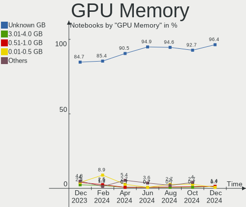
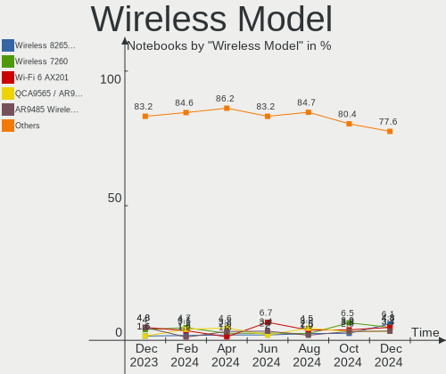

Zorin - Hardware Trends (Notebooks)
-----------------------------------

A project to identify most popular hardware characteristics and track their change
over time based on data collected by Linux users at https://Linux-Hardware.org.

Anyone can contribute to this report by the [hw-probe](https://github.com/linuxhw/hw-probe) tool:

    sudo -E hw-probe -all -upload

This report is for one last month. Overall report since the beginning of time: [TestDays](https://github.com/linuxhw/TestDays)

Period: Apr, 2024.

Contents
--------

* [ System ](#system)
  - [ OS                       ](#os)
  - [ OS Family                ](#os-family)
  - [ Kernel                   ](#kernel)
  - [ Kernel Family            ](#kernel-family)
  - [ Kernel Major Ver.        ](#kernel-major-ver)
  - [ Arch                     ](#arch)
  - [ DE                       ](#de)
  - [ Display Server           ](#display-server)
  - [ Display Manager          ](#display-manager)
  - [ OS Lang                  ](#os-lang)
  - [ Boot Mode                ](#boot-mode)
  - [ Filesystem               ](#filesystem)
  - [ Part. scheme             ](#part-scheme)
  - [ Dual Boot with Linux/BSD ](#dual-boot-with-linuxbsd)
  - [ Dual Boot (Win)          ](#dual-boot-win)

* [ Board ](#board)
  - [ Vendor                   ](#vendor)
  - [ Model                    ](#model)
  - [ Model Family             ](#model-family)
  - [ MFG Year                 ](#mfg-year)
  - [ Form Factor              ](#form-factor)
  - [ Secure Boot              ](#secure-boot)
  - [ Coreboot                 ](#coreboot)
  - [ RAM Size                 ](#ram-size)
  - [ RAM Used                 ](#ram-used)
  - [ Total Drives             ](#total-drives)
  - [ Has CD-ROM               ](#has-cd-rom)
  - [ Has Ethernet             ](#has-ethernet)
  - [ Has WiFi                 ](#has-wifi)
  - [ Has Bluetooth            ](#has-bluetooth)

* [ Location ](#location)
  - [ Country                  ](#country)
  - [ City                     ](#city)

* [ Drives ](#drives)
  - [ Drive Vendor             ](#drive-vendor)
  - [ Drive Model              ](#drive-model)
  - [ HDD Vendor               ](#hdd-vendor)
  - [ SSD Vendor               ](#ssd-vendor)
  - [ Drive Kind               ](#drive-kind)
  - [ Drive Connector          ](#drive-connector)
  - [ Drive Size               ](#drive-size)
  - [ Space Total              ](#space-total)
  - [ Space Used               ](#space-used)
  - [ Malfunc. Drives          ](#malfunc-drives)
  - [ Malfunc. Drive Vendor    ](#malfunc-drive-vendor)
  - [ Malfunc. HDD Vendor      ](#malfunc-hdd-vendor)
  - [ Malfunc. Drive Kind      ](#malfunc-drive-kind)
  - [ Failed Drives            ](#failed-drives)
  - [ Failed Drive Vendor      ](#failed-drive-vendor)
  - [ Drive Status             ](#drive-status)

* [ Storage controller ](#storage-controller)
  - [ Storage Vendor           ](#storage-vendor)
  - [ Storage Model            ](#storage-model)
  - [ Storage Kind             ](#storage-kind)

* [ Processor ](#processor)
  - [ CPU Vendor               ](#cpu-vendor)
  - [ CPU Model                ](#cpu-model)
  - [ CPU Model Family         ](#cpu-model-family)
  - [ CPU Cores                ](#cpu-cores)
  - [ CPU Sockets              ](#cpu-sockets)
  - [ CPU Threads              ](#cpu-threads)
  - [ CPU Op-Modes             ](#cpu-op-modes)
  - [ CPU Microcode            ](#cpu-microcode)
  - [ CPU Microarch            ](#cpu-microarch)

* [ Graphics ](#graphics)
  - [ GPU Vendor               ](#gpu-vendor)
  - [ GPU Model                ](#gpu-model)
  - [ GPU Combo                ](#gpu-combo)
  - [ GPU Driver               ](#gpu-driver)
  - [ GPU Memory               ](#gpu-memory)

* [ Monitor ](#monitor)
  - [ Monitor Vendor           ](#monitor-vendor)
  - [ Monitor Model            ](#monitor-model)
  - [ Monitor Resolution       ](#monitor-resolution)
  - [ Monitor Diagonal         ](#monitor-diagonal)
  - [ Monitor Width            ](#monitor-width)
  - [ Aspect Ratio             ](#aspect-ratio)
  - [ Monitor Area             ](#monitor-area)
  - [ Pixel Density            ](#pixel-density)
  - [ Multiple Monitors        ](#multiple-monitors)

* [ Network ](#network)
  - [ Net Controller Vendor    ](#net-controller-vendor)
  - [ Net Controller Model     ](#net-controller-model)
  - [ Wireless Vendor          ](#wireless-vendor)
  - [ Wireless Model           ](#wireless-model)
  - [ Ethernet Vendor          ](#ethernet-vendor)
  - [ Ethernet Model           ](#ethernet-model)
  - [ Net Controller Kind      ](#net-controller-kind)
  - [ Used Controller          ](#used-controller)
  - [ NICs                     ](#nics)
  - [ IPv6                     ](#ipv6)

* [ Bluetooth ](#bluetooth)
  - [ Bluetooth Vendor         ](#bluetooth-vendor)
  - [ Bluetooth Model          ](#bluetooth-model)

* [ Sound ](#sound)
  - [ Sound Vendor             ](#sound-vendor)
  - [ Sound Model              ](#sound-model)

* [ Memory ](#memory)
  - [ Memory Vendor            ](#memory-vendor)
  - [ Memory Model             ](#memory-model)
  - [ Memory Kind              ](#memory-kind)
  - [ Memory Form Factor       ](#memory-form-factor)
  - [ Memory Size              ](#memory-size)
  - [ Memory Speed             ](#memory-speed)

* [ Printers & scanners ](#printers--scanners)
  - [ Printer Vendor           ](#printer-vendor)
  - [ Printer Model            ](#printer-model)
  - [ Scanner Vendor           ](#scanner-vendor)
  - [ Scanner Model            ](#scanner-model)

* [ Camera ](#camera)
  - [ Camera Vendor            ](#camera-vendor)
  - [ Camera Model             ](#camera-model)

* [ Security ](#security)
  - [ Fingerprint Vendor       ](#fingerprint-vendor)
  - [ Fingerprint Model        ](#fingerprint-model)
  - [ Chipcard Vendor          ](#chipcard-vendor)
  - [ Chipcard Model           ](#chipcard-model)

* [ Unsupported ](#unsupported)
  - [ Unsupported Devices      ](#unsupported-devices)
  - [ Unsupported Device Types ](#unsupported-device-types)

System
------

OS
--

Installed operating systems

| Name     | Notebooks | Percent |
|----------|-----------|---------|
| Zorin 17 | 125       | 85.03%  |
| Zorin 16 | 21        | 14.29%  |
| Zorin 15 | 1         | 0.68%   |

OS Family
---------

OS without a version

| Name  | Notebooks | Percent |
|-------|-----------|---------|
| Zorin | 147       | 100%    |

Kernel
------

Version of the Linux kernel

| Version                | Notebooks | Percent |
|------------------------|-----------|---------|
| 6.5.0-27-generic       | 43        | 29.25%  |
| 6.5.0-28-generic       | 40        | 27.21%  |
| 6.5.0-26-generic       | 32        | 21.77%  |
| 5.15.0-102-generic     | 6         | 4.08%   |
| 5.15.0-101-generic     | 6         | 4.08%   |
| 5.15.0-105-generic     | 4         | 2.72%   |
| 6.5.0-21-generic       | 3         | 2.04%   |
| 6.2.0-39-generic       | 2         | 1.36%   |
| 5.15.0-78-generic      | 2         | 1.36%   |
| 6.8.7-2-liquorix-amd64 | 1         | 0.68%   |
| 6.8.7-060807-generic   | 1         | 0.68%   |
| 6.5.0-25-generic       | 1         | 0.68%   |
| 6.5.0-15-generic       | 1         | 0.68%   |
| 6.2.0-37-generic       | 1         | 0.68%   |
| 5.4.0-150-generic      | 1         | 0.68%   |
| 5.15.0-71-generic      | 1         | 0.68%   |
| 5.15.0-67-generic      | 1         | 0.68%   |
| 5.13.0-30-generic      | 1         | 0.68%   |

Kernel Family
-------------

Linux kernel without a distro release

| Version | Notebooks | Percent |
|---------|-----------|---------|
| 6.5.0   | 120       | 81.63%  |
| 5.15.0  | 20        | 13.61%  |
| 6.2.0   | 3         | 2.04%   |
| 6.8.7   | 2         | 1.36%   |
| 5.4.0   | 1         | 0.68%   |
| 5.13.0  | 1         | 0.68%   |

Kernel Major Ver.
-----------------

Linux kernel major version

| Version | Notebooks | Percent |
|---------|-----------|---------|
| 6.5     | 120       | 81.63%  |
| 5.15    | 20        | 13.61%  |
| 6.2     | 3         | 2.04%   |
| 6.8     | 2         | 1.36%   |
| 5.4     | 1         | 0.68%   |
| 5.13    | 1         | 0.68%   |

Arch
----

OS architecture (x86_64, i586, etc.)

| Name   | Notebooks | Percent |
|--------|-----------|---------|
| x86_64 | 146       | 99.32%  |
| i686   | 1         | 0.68%   |

DE
--

Desktop Environment

| Name  | Notebooks | Percent |
|-------|-----------|---------|
| GNOME | 135       | 91.84%  |
| XFCE  | 12        | 8.16%   |

Display Server
--------------

X11 or Wayland

| Name    | Notebooks | Percent |
|---------|-----------|---------|
| Wayland | 100       | 68.03%  |
| X11     | 46        | 31.29%  |
| Tty     | 1         | 0.68%   |

Display Manager
---------------

SDDM, LightDM, etc.

| Name    | Notebooks | Percent |
|---------|-----------|---------|
| Unknown | 121       | 82.31%  |
| GDM3    | 22        | 14.97%  |
| LightDM | 4         | 2.72%   |

OS Lang
-------

Language

| Lang  | Notebooks | Percent |
|-------|-----------|---------|
| en_US | 52        | 35.37%  |
| de_DE | 20        | 13.61%  |
| it_IT | 12        | 8.16%   |
| fr_FR | 11        | 7.48%   |
| pt_BR | 10        | 6.8%    |
| es_ES | 5         | 3.4%    |
| es_MX | 4         | 2.72%   |
| en_CA | 3         | 2.04%   |
| en_AU | 3         | 2.04%   |
| pl_PL | 2         | 1.36%   |
| nl_NL | 2         | 1.36%   |
| ja_JP | 2         | 1.36%   |
| es_EC | 2         | 1.36%   |
| en_ZA | 2         | 1.36%   |
| en_IN | 2         | 1.36%   |
| en_GB | 2         | 1.36%   |
| tr_TR | 1         | 0.68%   |
| ru_RU | 1         | 0.68%   |
| ro_RO | 1         | 0.68%   |
| hr_HR | 1         | 0.68%   |
| fr_CA | 1         | 0.68%   |
| fi_FI | 1         | 0.68%   |
| es_SV | 1         | 0.68%   |
| es_DO | 1         | 0.68%   |
| es_CO | 1         | 0.68%   |
| es_CL | 1         | 0.68%   |
| en_PH | 1         | 0.68%   |
| en_IE | 1         | 0.68%   |
| de_CH | 1         | 0.68%   |

Boot Mode
---------

EFI or BIOS

| Mode | Notebooks | Percent |
|------|-----------|---------|
| BIOS | 124       | 84.35%  |
| EFI  | 23        | 15.65%  |

Filesystem
----------

Type of filesystem

| Type    | Notebooks | Percent |
|---------|-----------|---------|
| Ext4    | 125       | 85.03%  |
| Tmpfs   | 12        | 8.16%   |
| Zfs     | 9         | 6.12%   |
| Overlay | 1         | 0.68%   |

Part. scheme
------------

Scheme of partitioning

| Type    | Notebooks | Percent |
|---------|-----------|---------|
| Unknown | 122       | 82.99%  |
| GPT     | 21        | 14.29%  |
| MBR     | 4         | 2.72%   |

Dual Boot with Linux/BSD
------------------------

Hosting more than one Linux/BSD

| Dual boot | Notebooks | Percent |
|-----------|-----------|---------|
| No        | 140       | 95.24%  |
| Yes       | 7         | 4.76%   |

Dual Boot (Win)
---------------

Hosting Linux and Windows

| Dual boot | Notebooks | Percent |
|-----------|-----------|---------|
| No        | 141       | 95.92%  |
| Yes       | 6         | 4.08%   |

Board
-----

Vendor
------

Motherboard manufacturer

| Name                   | Notebooks | Percent |
|------------------------|-----------|---------|
| Hewlett-Packard        | 28        | 19.05%  |
| Dell                   | 25        | 17.01%  |
| Lenovo                 | 20        | 13.61%  |
| ASUSTek Computer       | 14        | 9.52%   |
| Acer                   | 12        | 8.16%   |
| Apple                  | 8         | 5.44%   |
| MSI                    | 5         | 3.4%    |
| Samsung Electronics    | 4         | 2.72%   |
| Packard Bell           | 4         | 2.72%   |
| Toshiba                | 3         | 2.04%   |
| HUAWEI                 | 3         | 2.04%   |
| Unknown                | 3         | 2.04%   |
| Teclast                | 2         | 1.36%   |
| Positivo               | 2         | 1.36%   |
| TODOS INDUSTRIAL       | 1         | 0.68%   |
| Tactus                 | 1         | 0.68%   |
| Sony                   | 1         | 0.68%   |
| Razer                  | 1         | 0.68%   |
| Panasonic              | 1         | 0.68%   |
| NEC Computers          | 1         | 0.68%   |
| Medion                 | 1         | 0.68%   |
| Mediacom               | 1         | 0.68%   |
| Google                 | 1         | 0.68%   |
| Gigabyte Technology    | 1         | 0.68%   |
| BANGHO                 | 1         | 0.68%   |
| Avell High Performance | 1         | 0.68%   |
| Alienware              | 1         | 0.68%   |
| ACCENT                 | 1         | 0.68%   |

Model
-----

Motherboard model

| Name                                           | Notebooks | Percent |
|------------------------------------------------|-----------|---------|
| Apple MacBookPro9,2                            | 6         | 4.08%   |
| Unknown                                        | 3         | 2.04%   |
| HP Pavilion dv6                                | 2         | 1.36%   |
| HP Notebook                                    | 2         | 1.36%   |
| Dell Latitude E5520                            | 2         | 1.36%   |
| Toshiba TECRA Z40-C                            | 1         | 0.68%   |
| Toshiba Satellite S55t-A                       | 1         | 0.68%   |
| Toshiba NB520                                  | 1         | 0.68%   |
| TODOS INDUSTRIAL Aprix_2022_V1                 | 1         | 0.68%   |
| Teclast F6 Plus                                | 1         | 0.68%   |
| Teclast F15                                    | 1         | 0.68%   |
| Tactus GeoBook 140                             | 1         | 0.68%   |
| Sony VPCS131FM                                 | 1         | 0.68%   |
| Samsung R530/R730                              | 1         | 0.68%   |
| Samsung R519/R719                              | 1         | 0.68%   |
| Samsung 750XED                                 | 1         | 0.68%   |
| Samsung 300E5EV/300E4EV/270E5EV/270E4EV/2470EV | 1         | 0.68%   |
| Razer Blade 14 - RZ09-0370                     | 1         | 0.68%   |
| Positivo J14KR11                               | 1         | 0.68%   |
| Positivo C14CR01                               | 1         | 0.68%   |
| Panasonic CF-31WFL72LM                         | 1         | 0.68%   |
| Packard Bell EasyNote TM86                     | 1         | 0.68%   |
| Packard Bell EasyNote TE69KB                   | 1         | 0.68%   |
| Packard Bell EasyNote LS11HR                   | 1         | 0.68%   |
| Packard Bell EasyNote LJ61                     | 1         | 0.68%   |
| NEC Computers PC-LS350SSW                      | 1         | 0.68%   |
| MSI Sword 15 A12VE                             | 1         | 0.68%   |
| MSI PR600                                      | 1         | 0.68%   |
| MSI Katana 15 B13VGK                           | 1         | 0.68%   |
| MSI GT70 2PE                                   | 1         | 0.68%   |
| MSI CX600                                      | 1         | 0.68%   |
| Medion E5218                                   | 1         | 0.68%   |
| Mediacom SmartBook Pro i5                      | 1         | 0.68%   |
| Lenovo U310                                    | 1         | 0.68%   |
| Lenovo ThinkPad X395 20NMS1KY02                | 1         | 0.68%   |
| Lenovo ThinkPad T570 20H90002RI                | 1         | 0.68%   |
| Lenovo ThinkPad T520 4243F53                   | 1         | 0.68%   |
| Lenovo ThinkPad T460s 20F9003GUS               | 1         | 0.68%   |
| Lenovo ThinkPad T440p 20AN006GUS               | 1         | 0.68%   |
| Lenovo ThinkPad L470 W10DG 20JVS0DL00          | 1         | 0.68%   |

Model Family
------------

Motherboard model prefix

| Name                      | Notebooks | Percent |
|---------------------------|-----------|---------|
| Dell Latitude             | 11        | 7.48%   |
| Acer Aspire               | 9         | 6.12%   |
| Lenovo ThinkPad           | 8         | 5.44%   |
| HP ProBook                | 8         | 5.44%   |
| Dell Inspiron             | 7         | 4.76%   |
| Apple MacBookPro9         | 6         | 4.08%   |
| HP Pavilion               | 5         | 3.4%    |
| Packard Bell EasyNote     | 4         | 2.72%   |
| Lenovo IdeaPad            | 3         | 2.04%   |
| HP EliteBook              | 3         | 2.04%   |
| ASUS VivoBook             | 3         | 2.04%   |
| Unknown                   | 3         | 2.04%   |
| HP Notebook               | 2         | 1.36%   |
| HP Laptop                 | 2         | 1.36%   |
| HP ENVY                   | 2         | 1.36%   |
| HP 15                     | 2         | 1.36%   |
| Dell XPS                  | 2         | 1.36%   |
| Dell System               | 2         | 1.36%   |
| ASUS ASUS                 | 2         | 1.36%   |
| Acer Swift                | 2         | 1.36%   |
| Toshiba TECRA             | 1         | 0.68%   |
| Toshiba Satellite         | 1         | 0.68%   |
| Toshiba NB520             | 1         | 0.68%   |
| TODOS INDUSTRIAL Aprix    | 1         | 0.68%   |
| Teclast F6                | 1         | 0.68%   |
| Teclast F15               | 1         | 0.68%   |
| Tactus GeoBook            | 1         | 0.68%   |
| Sony VPCS131FM            | 1         | 0.68%   |
| Samsung R530              | 1         | 0.68%   |
| Samsung R519              | 1         | 0.68%   |
| Samsung 750XED            | 1         | 0.68%   |
| Samsung 300E5EV           | 1         | 0.68%   |
| Razer Blade               | 1         | 0.68%   |
| Positivo J14KR11          | 1         | 0.68%   |
| Positivo C14CR01          | 1         | 0.68%   |
| Panasonic CF-31WFL72LM    | 1         | 0.68%   |
| NEC Computers PC-LS350SSW | 1         | 0.68%   |
| MSI Sword                 | 1         | 0.68%   |
| MSI PR600                 | 1         | 0.68%   |
| MSI Katana                | 1         | 0.68%   |

MFG Year
--------

Motherboard manufacture year

| Year | Notebooks | Percent |
|------|-----------|---------|
| 2013 | 17        | 11.56%  |
| 2012 | 16        | 10.88%  |
| 2015 | 13        | 8.84%   |
| 2023 | 12        | 8.16%   |
| 2011 | 11        | 7.48%   |
| 2019 | 9         | 6.12%   |
| 2010 | 8         | 5.44%   |
| 2009 | 8         | 5.44%   |
| 2022 | 7         | 4.76%   |
| 2020 | 7         | 4.76%   |
| 2018 | 7         | 4.76%   |
| 2017 | 7         | 4.76%   |
| 2014 | 6         | 4.08%   |
| 2007 | 6         | 4.08%   |
| 2021 | 5         | 3.4%    |
| 2008 | 4         | 2.72%   |
| 2016 | 3         | 2.04%   |
| 2024 | 1         | 0.68%   |

Form Factor
-----------

Physical design of the computer

| Name     | Notebooks | Percent |
|----------|-----------|---------|
| Notebook | 147       | 100%    |

Secure Boot
-----------

Enabled or disabled

| State    | Notebooks | Percent |
|----------|-----------|---------|
| Disabled | 146       | 99.32%  |
| Enabled  | 1         | 0.68%   |

Coreboot
--------

Have coreboot on board

| Used | Notebooks | Percent |
|------|-----------|---------|
| No   | 146       | 99.32%  |
| Yes  | 1         | 0.68%   |

RAM Size
--------

Total RAM memory

| Size in GB  | Notebooks | Percent |
|-------------|-----------|---------|
| 4.01-8.0    | 46        | 31.29%  |
| 3.01-4.0    | 42        | 28.57%  |
| 16.01-24.0  | 23        | 15.65%  |
| 8.01-16.0   | 23        | 15.65%  |
| 32.01-64.0  | 5         | 3.4%    |
| 1.01-2.0    | 4         | 2.72%   |
| 64.01-256.0 | 2         | 1.36%   |
| 24.01-32.0  | 1         | 0.68%   |
| 2.01-3.0    | 1         | 0.68%   |

RAM Used
--------

Used RAM memory

| Used GB   | Notebooks | Percent |
|-----------|-----------|---------|
| 1.01-2.0  | 56        | 38.1%   |
| 2.01-3.0  | 51        | 34.69%  |
| 4.01-8.0  | 20        | 13.61%  |
| 3.01-4.0  | 17        | 11.56%  |
| 0.51-1.0  | 2         | 1.36%   |
| 8.01-16.0 | 1         | 0.68%   |

Total Drives
------------

Number of drives on board

| Drives | Notebooks | Percent |
|--------|-----------|---------|
| 1      | 115       | 78.23%  |
| 2      | 28        | 19.05%  |
| 3      | 4         | 2.72%   |

Has CD-ROM
----------

Has CD-ROM on board

| Presented | Notebooks | Percent |
|-----------|-----------|---------|
| No        | 76        | 51.7%   |
| Yes       | 71        | 48.3%   |

Has Ethernet
------------

Has Ethernet on board

| Presented | Notebooks | Percent |
|-----------|-----------|---------|
| Yes       | 125       | 85.03%  |
| No        | 22        | 14.97%  |

Has WiFi
--------

Has WiFi module

| Presented | Notebooks | Percent |
|-----------|-----------|---------|
| Yes       | 144       | 97.96%  |
| No        | 3         | 2.04%   |

Has Bluetooth
-------------

Has Bluetooth module

| Presented | Notebooks | Percent |
|-----------|-----------|---------|
| Yes       | 106       | 72.11%  |
| No        | 41        | 27.89%  |

Location
--------

Country
-------

Geographic location (country)

| Country            | Notebooks | Percent |
|--------------------|-----------|---------|
| USA                | 22        | 14.97%  |
| Germany            | 20        | 13.61%  |
| Brazil             | 15        | 10.2%   |
| Italy              | 13        | 8.84%   |
| Mexico             | 6         | 4.08%   |
| France             | 6         | 4.08%   |
| Canada             | 6         | 4.08%   |
| Spain              | 5         | 3.4%    |
| Netherlands        | 5         | 3.4%    |
| Switzerland        | 4         | 2.72%   |
| Australia          | 3         | 2.04%   |
| South Africa       | 2         | 1.36%   |
| Romania            | 2         | 1.36%   |
| Poland             | 2         | 1.36%   |
| Japan              | 2         | 1.36%   |
| India              | 2         | 1.36%   |
| Egypt              | 2         | 1.36%   |
| Ecuador            | 2         | 1.36%   |
| UK                 | 1         | 0.68%   |
| Turkey             | 1         | 0.68%   |
| The Netherlands    | 1         | 0.68%   |
| Serbia             | 1         | 0.68%   |
| Russia             | 1         | 0.68%   |
| Puerto Rico        | 1         | 0.68%   |
| Philippines        | 1         | 0.68%   |
| Norway             | 1         | 0.68%   |
| North Macedonia    | 1         | 0.68%   |
| Nepal              | 1         | 0.68%   |
| Morocco            | 1         | 0.68%   |
| Martinique         | 1         | 0.68%   |
| Ireland            | 1         | 0.68%   |
| Iran               | 1         | 0.68%   |
| Indonesia          | 1         | 0.68%   |
| Finland            | 1         | 0.68%   |
| El Salvador        | 1         | 0.68%   |
| Dominican Republic | 1         | 0.68%   |
| Denmark            | 1         | 0.68%   |
| Czechia            | 1         | 0.68%   |
| Croatia            | 1         | 0.68%   |
| Costa Rica         | 1         | 0.68%   |

City
----

Geographic location (city)

| City              | Notebooks | Percent |
|-------------------|-----------|---------|
| Sao Paulo         | 3         | 2.04%   |
| Rio de Janeiro    | 3         | 2.04%   |
| Hamburg           | 3         | 2.04%   |
| Valladolid        | 2         | 1.36%   |
| Turin             | 2         | 1.36%   |
| Sydney            | 2         | 1.36%   |
| Stuttgart         | 2         | 1.36%   |
| Mexico City       | 2         | 1.36%   |
| Cairo             | 2         | 1.36%   |
| Buffalo           | 2         | 1.36%   |
| Berlin            | 2         | 1.36%   |
| Amsterdam         | 2         | 1.36%   |
| Zurich            | 1         | 0.68%   |
| Zephyrhills       | 1         | 0.68%   |
| Zeitz             | 1         | 0.68%   |
| Zeist             | 1         | 0.68%   |
| Zaragoza          | 1         | 0.68%   |
| Zagreb            | 1         | 0.68%   |
| Winterthur        | 1         | 0.68%   |
| Wilsdruff         | 1         | 0.68%   |
| Westchester       | 1         | 0.68%   |
| West Chester      | 1         | 0.68%   |
| Vercelli          | 1         | 0.68%   |
| Tyumen            | 1         | 0.68%   |
| Tuxtla Gutiérrez | 1         | 0.68%   |
| Trento            | 1         | 0.68%   |
| Toms River        | 1         | 0.68%   |
| Tokyo             | 1         | 0.68%   |
| The Hague         | 1         | 0.68%   |
| Taranto           | 1         | 0.68%   |
| Stevenage         | 1         | 0.68%   |
| St. John's        | 1         | 0.68%   |
| St. Cloud         | 1         | 0.68%   |
| Spring Hill       | 1         | 0.68%   |
| Skopje            | 1         | 0.68%   |
| Sierra de Yeguas  | 1         | 0.68%   |
| Setagaya          | 1         | 0.68%   |
| Seattle           | 1         | 0.68%   |
| Schoelcher        | 1         | 0.68%   |
| Sarasota          | 1         | 0.68%   |

Drives
------

Drive Vendor
------------

Hard drive vendors

| Vendor                      | Notebooks | Drives | Percent |
|-----------------------------|-----------|--------|---------|
| Samsung Electronics         | 31        | 31     | 17.22%  |
| WDC                         | 22        | 22     | 12.22%  |
| Seagate                     | 18        | 18     | 10%     |
| Toshiba                     | 17        | 17     | 9.44%   |
| Kingston                    | 12        | 12     | 6.67%   |
| Unknown                     | 8         | 8      | 4.44%   |
| SanDisk                     | 7         | 7      | 3.89%   |
| SK hynix                    | 6         | 6      | 3.33%   |
| HGST                        | 5         | 5      | 2.78%   |
| A-DATA Technology           | 4         | 4      | 2.22%   |
| Silicon Motion              | 3         | 3      | 1.67%   |
| Micron Technology           | 3         | 3      | 1.67%   |
| Intel                       | 3         | 3      | 1.67%   |
| Crucial                     | 3         | 3      | 1.67%   |
| Apple                       | 3         | 3      | 1.67%   |
| Unknown                     | 3         | 3      | 1.67%   |
| Teclast                     | 2         | 2      | 1.11%   |
| Micron/Crucial Technology   | 2         | 2      | 1.11%   |
| LITEON                      | 2         | 2      | 1.11%   |
| KIOXIA                      | 2         | 2      | 1.11%   |
| Hitachi                     | 2         | 2      | 1.11%   |
| ZXIC MMC                    | 1         | 1      | 0.56%   |
| ValueTech                   | 1         | 1      | 0.56%   |
| TSA                         | 1         | 1      | 0.56%   |
| tecmiyo                     | 1         | 1      | 0.56%   |
| SSSTC                       | 1         | 1      | 0.56%   |
| Realtek Semiconductor       | 1         | 1      | 0.56%   |
| Phison Electronics          | 1         | 1      | 0.56%   |
| Patriot                     | 1         | 1      | 0.56%   |
| OCZ                         | 1         | 1      | 0.56%   |
| Netac                       | 1         | 1      | 0.56%   |
| LaCie                       | 1         | 1      | 0.56%   |
| Kingston Technology Company | 1         | 1      | 0.56%   |
| KingFast                    | 1         | 1      | 0.56%   |
| Intenso                     | 1         | 1      | 0.56%   |
| Inateck                     | 1         | 1      | 0.56%   |
| GOODRAM                     | 1         | 1      | 0.56%   |
| Fujitsu                     | 1         | 1      | 0.56%   |
| FORESEE                     | 1         | 1      | 0.56%   |
| Fanxiang                    | 1         | 1      | 0.56%   |

Drive Model
-----------

Hard drive models

| Model                                             | Notebooks | Percent |
|---------------------------------------------------|-----------|---------|
| Unknown MMC Card  64GB                            | 4         | 2.22%   |
| Samsung SSD 850 EVO 250GB                         | 4         | 2.22%   |
| Kingston SA400S37480G 480GB SSD                   | 4         | 2.22%   |
| Toshiba MQ01ABF050 500GB                          | 3         | 1.67%   |
| Samsung NVMe SSD Controller SM981/PM981/PM983 1TB | 3         | 1.67%   |
| Kingston SA400S37240G 240GB SSD                   | 3         | 1.67%   |
| Unknown                                           | 3         | 1.67%   |
| WDC WD5000LPVX-22V0TT0 500GB                      | 2         | 1.11%   |
| WDC WD5000LPLX-08ZNTT0 500GB                      | 2         | 1.11%   |
| WDC WD3200BEVT-22ZCT0 320GB                       | 2         | 1.11%   |
| WDC WD10SPZX-08Z10 1TB                            | 2         | 1.11%   |
| WDC WD Blue SA510 2.5 500GB SSD                   | 2         | 1.11%   |
| Unknown MMC Card  16GB                            | 2         | 1.11%   |
| Toshiba MQ01ABD100 1TB                            | 2         | 1.11%   |
| Silicon Motion PCIe-8 SSD 512GB                   | 2         | 1.11%   |
| Seagate ST500LT012-1DG142 500GB                   | 2         | 1.11%   |
| Seagate ST500LM012 HN-M500MBB 500GB               | 2         | 1.11%   |
| Seagate ST1000LM024 HN-M101MBB 1TB                | 2         | 1.11%   |
| Sandisk WD Black SN750 / PC SN730 NVMe SSD 512GB  | 2         | 1.11%   |
| Samsung SSD 860 EVO 500GB                         | 2         | 1.11%   |
| Samsung SSD 840 Series 250GB                      | 2         | 1.11%   |
| Micron/Crucial P2 NVMe PCIe SSD 4TB               | 2         | 1.11%   |
| Micron 2400_MTFDKBA512QFM 512GB                   | 2         | 1.11%   |
| HGST HTS721010A9E630 1TB                          | 2         | 1.11%   |
| ZXIC MMC Storage 2.31 128GB                       | 1         | 0.56%   |
| WDC WDS500G3X0C-00SJG0 500GB                      | 1         | 0.56%   |
| WDC WDS500G2B0B-00YS70 500GB SSD                  | 1         | 0.56%   |
| WDC WDS250G2B0A-00SM50 250GB SSD                  | 1         | 0.56%   |
| WDC WDS240G2G0A-00JH30 240GB SSD                  | 1         | 0.56%   |
| WDC WDS100T2B0A-00SM50 1TB SSD                    | 1         | 0.56%   |
| WDC WD5000LPVX-75V0TT0 500GB                      | 1         | 0.56%   |
| WDC WD5000LPVT-08G33T1 500GB                      | 1         | 0.56%   |
| WDC WD5000BEVT-75A0RT0 500GB                      | 1         | 0.56%   |
| WDC WD2500BEKT-75PVMT1 250GB                      | 1         | 0.56%   |
| WDC WD10SPZX-80Z10T2 1TB                          | 1         | 0.56%   |
| WDC WD10SPZX-21Z10T0 1TB                          | 1         | 0.56%   |
| WDC WD Green 2.5 480GB SSD                        | 1         | 0.56%   |
| ValueTech 256GB                                   | 1         | 0.56%   |
| Unknown SD/MMC/MS PRO 128GB                       | 1         | 0.56%   |
| Unknown MMC Card  2TB                             | 1         | 0.56%   |

HDD Vendor
----------

Hard disk drive vendors

| Vendor              | Notebooks | Drives | Percent |
|---------------------|-----------|--------|---------|
| Seagate             | 18        | 18     | 30%     |
| Toshiba             | 15        | 15     | 25%     |
| WDC                 | 14        | 14     | 23.33%  |
| HGST                | 5         | 5      | 8.33%   |
| Hitachi             | 2         | 2      | 3.33%   |
| Apple               | 2         | 2      | 3.33%   |
| Unknown             | 1         | 1      | 1.67%   |
| Samsung Electronics | 1         | 1      | 1.67%   |
| LaCie               | 1         | 1      | 1.67%   |
| Fujitsu             | 1         | 1      | 1.67%   |

SSD Vendor
----------

Solid state drive vendors

| Vendor              | Notebooks | Drives | Percent |
|---------------------|-----------|--------|---------|
| Samsung Electronics | 18        | 18     | 29.51%  |
| Kingston            | 10        | 10     | 16.39%  |
| WDC                 | 7         | 7      | 11.48%  |
| A-DATA Technology   | 4         | 4      | 6.56%   |
| Crucial             | 3         | 3      | 4.92%   |
| Teclast             | 2         | 2      | 3.28%   |
| SanDisk             | 2         | 2      | 3.28%   |
| LITEON              | 2         | 2      | 3.28%   |
| TSA                 | 1         | 1      | 1.64%   |
| tecmiyo             | 1         | 1      | 1.64%   |
| SSSTC               | 1         | 1      | 1.64%   |
| Patriot             | 1         | 1      | 1.64%   |
| OCZ                 | 1         | 1      | 1.64%   |
| Netac               | 1         | 1      | 1.64%   |
| Micron Technology   | 1         | 1      | 1.64%   |
| Intel               | 1         | 1      | 1.64%   |
| GOODRAM             | 1         | 1      | 1.64%   |
| FORESEE             | 1         | 1      | 1.64%   |
| China               | 1         | 1      | 1.64%   |
| Apple               | 1         | 1      | 1.64%   |
| Unknown             | 1         | 1      | 1.64%   |

Drive Kind
----------

HDD or SSD

| Kind    | Notebooks | Drives | Percent |
|---------|-----------|--------|---------|
| SSD     | 60        | 61     | 35.29%  |
| HDD     | 57        | 60     | 33.53%  |
| NVMe    | 39        | 45     | 22.94%  |
| MMC     | 8         | 8      | 4.71%   |
| Unknown | 6         | 6      | 3.53%   |

Drive Connector
---------------

SATA, SAS, NVMe, etc.

| Type | Notebooks | Drives | Percent |
|------|-----------|--------|---------|
| SATA | 110       | 124    | 69.18%  |
| NVMe | 38        | 44     | 23.9%   |
| MMC  | 8         | 8      | 5.03%   |
| SAS  | 3         | 4      | 1.89%   |

Drive Size
----------

Size of hard drive

| Size in TB | Notebooks | Drives | Percent |
|------------|-----------|--------|---------|
| 0.01-0.5   | 90        | 97     | 78.95%  |
| 0.51-1.0   | 22        | 22     | 19.3%   |
| 1.01-2.0   | 2         | 2      | 1.75%   |

Space Total
-----------

Amount of disk space available on the file system

| Size in GB     | Notebooks | Percent |
|----------------|-----------|---------|
| 101-250        | 58        | 39.46%  |
| 251-500        | 46        | 31.29%  |
| 501-1000       | 19        | 12.93%  |
| 51-100         | 11        | 7.48%   |
| 1-20           | 4         | 2.72%   |
| Unknown        | 4         | 2.72%   |
| 1001-2000      | 2         | 1.36%   |
| More than 3000 | 1         | 0.68%   |
| 21-50          | 1         | 0.68%   |
| 2001-3000      | 1         | 0.68%   |

Space Used
----------

Amount of used disk space

| Used GB  | Notebooks | Percent |
|----------|-----------|---------|
| 21-50    | 60        | 40.82%  |
| 1-20     | 48        | 32.65%  |
| 101-250  | 15        | 10.2%   |
| 51-100   | 15        | 10.2%   |
| Unknown  | 4         | 2.72%   |
| 501-1000 | 3         | 2.04%   |
| 251-500  | 2         | 1.36%   |

Malfunc. Drives
---------------

Drive models with a malfunction

| Model                    | Notebooks | Drives | Percent |
|--------------------------|-----------|--------|---------|
| Toshiba MQ01ABF050 500GB | 1         | 1      | 50%     |
| Toshiba MK2565GSX 250GB  | 1         | 1      | 50%     |

Malfunc. Drive Vendor
---------------------

Vendors of faulty drives

| Vendor  | Notebooks | Drives | Percent |
|---------|-----------|--------|---------|
| Toshiba | 2         | 2      | 100%    |

Malfunc. HDD Vendor
-------------------

Vendors of faulty HDD drives

| Vendor  | Notebooks | Drives | Percent |
|---------|-----------|--------|---------|
| Toshiba | 2         | 2      | 100%    |

Malfunc. Drive Kind
-------------------

Kinds of faulty drives

| Kind | Notebooks | Drives | Percent |
|------|-----------|--------|---------|
| HDD  | 2         | 2      | 100%    |

Failed Drives
-------------

Failed drive models

Zero info for selected period =(

Failed Drive Vendor
-------------------

Failed drive vendors

Zero info for selected period =(

Drive Status
------------

Number of failed and malfunc. drives

| Status   | Notebooks | Drives | Percent |
|----------|-----------|--------|---------|
| Detected | 135       | 164    | 90.6%   |
| Works    | 12        | 14     | 8.05%   |
| Malfunc  | 2         | 2      | 1.34%   |

Storage controller
------------------

Storage Vendor
--------------

Storage controller vendors

| Vendor                           | Notebooks | Percent |
|----------------------------------|-----------|---------|
| Intel                            | 108       | 64.67%  |
| AMD                              | 14        | 8.38%   |
| Samsung Electronics              | 13        | 7.78%   |
| SK hynix                         | 6         | 3.59%   |
| SanDisk                          | 5         | 2.99%   |
| Silicon Motion                   | 3         | 1.8%    |
| Kingston Technology Company      | 3         | 1.8%    |
| Toshiba America Info Systems     | 2         | 1.2%    |
| Micron/Crucial Technology        | 2         | 1.2%    |
| Micron Technology                | 2         | 1.2%    |
| KIOXIA                           | 2         | 1.2%    |
| Silicon Integrated Systems [SiS] | 1         | 0.6%    |
| Realtek Semiconductor            | 1         | 0.6%    |
| Phison Electronics               | 1         | 0.6%    |
| Nvidia                           | 1         | 0.6%    |
| MAXIO Technology (Hangzhou)      | 1         | 0.6%    |
| Lite-On Technology               | 1         | 0.6%    |
| ADATA Technology                 | 1         | 0.6%    |

Storage Model
-------------

Storage controller models

| Model                                                                          | Notebooks | Percent |
|--------------------------------------------------------------------------------|-----------|---------|
| Intel 7 Series Chipset Family 6-port SATA Controller [AHCI mode]               | 21        | 12%     |
| Intel 6 Series/C200 Series Chipset Family 6 port Mobile SATA AHCI Controller   | 13        | 7.43%   |
| AMD FCH SATA Controller [AHCI mode]                                            | 12        | 6.86%   |
| Intel Sunrise Point-LP SATA Controller [AHCI mode]                             | 11        | 6.29%   |
| Intel 82801IBM/IEM (ICH9M/ICH9M-E) 4 port SATA Controller [AHCI mode]          | 7         | 4%      |
| Intel 8 Series/C220 Series Chipset Family 6-port SATA Controller 1 [AHCI mode] | 6         | 3.43%   |
| Intel Celeron/Pentium Silver Processor SATA Controller                         | 5         | 2.86%   |
| Intel 82801 Mobile SATA Controller [RAID mode]                                 | 5         | 2.86%   |
| Intel 5 Series/3400 Series Chipset 4 port SATA AHCI Controller                 | 5         | 2.86%   |
| Samsung NVMe SSD Controller 980 (DRAM-less)                                    | 4         | 2.29%   |
| Samsung NVMe SSD Controller SM981/PM981/PM983                                  | 3         | 1.71%   |
| Intel Wildcat Point-LP SATA Controller [AHCI Mode]                             | 3         | 1.71%   |
| Intel Volume Management Device NVMe RAID Controller Intel Corporation          | 3         | 1.71%   |
| Intel HM170/QM170 Chipset SATA Controller [AHCI Mode]                          | 3         | 1.71%   |
| Intel Atom Processor E3800 Series SATA AHCI Controller                         | 3         | 1.71%   |
| Intel 8 Series SATA Controller 1 [AHCI mode]                                   | 3         | 1.71%   |
| Intel 5 Series/3400 Series Chipset 6 port SATA AHCI Controller                 | 3         | 1.71%   |
| Silicon Motion Non-Volatile memory controller                                  | 2         | 1.14%   |
| SanDisk WD Black SN770 / PC SN740 256GB / PC SN560 (DRAM-less) NVMe SSD        | 2         | 1.14%   |
| SanDisk Extreme Pro / WD Black SN750 / PC SN730 / Red SN700 NVMe SSD           | 2         | 1.14%   |
| Samsung NVMe SSD Controller S4LV008[Pascal]                                    | 2         | 1.14%   |
| Samsung NVMe SSD Controller PM9A1/PM9A3/980PRO                                 | 2         | 1.14%   |
| Micron/Crucial P2 [Nick P2] / P3 / P3 Plus NVMe PCIe SSD (DRAM-less)           | 2         | 1.14%   |
| Micron 2400 NVMe SSD (DRAM-less)                                               | 2         | 1.14%   |
| Intel Volume Management Device NVMe RAID Controller                            | 2         | 1.14%   |
| Intel Cannon Point-LP SATA Controller [AHCI Mode]                              | 2         | 1.14%   |
| Intel 82801HM/HEM (ICH8M/ICH8M-E) SATA Controller [AHCI mode]                  | 2         | 1.14%   |
| Intel 82801HM/HEM (ICH8M/ICH8M-E) IDE Controller                               | 2         | 1.14%   |
| Intel 400 Series Chipset Family SATA AHCI Controller                           | 2         | 1.14%   |
| Toshiba America Info Systems XG6 NVMe SSD Controller                           | 1         | 0.57%   |
| Toshiba America Info Systems BG3 x2 NVMe SSD Controller (DRAM-less)            | 1         | 0.57%   |
| SK hynix Platinum P41/PC801 NVMe Solid State Drive                             | 1         | 0.57%   |
| SK hynix PC601 NVMe Solid State Drive                                          | 1         | 0.57%   |
| SK hynix PC300 NVMe Solid State Drive 512GB                                    | 1         | 0.57%   |
| SK hynix Gold P31/BC711/PC711 NVMe Solid State Drive                           | 1         | 0.57%   |
| SK hynix BC901 NVMe Solid State Drive (DRAM-less)                              | 1         | 0.57%   |
| SK hynix BC501 NVMe Solid State Drive                                          | 1         | 0.57%   |
| Silicon Motion SM2263EN/SM2263XT (DRAM-less) NVMe SSD Controllers              | 1         | 0.57%   |
| Silicon Integrated Systems [SiS] SATA Controller / IDE mode                    | 1         | 0.57%   |
| Silicon Integrated Systems [SiS] 5513 IDE Controller                           | 1         | 0.57%   |

Storage Kind
------------

Kind of storage controller (IDE, SATA, NVMe, SAS, ...)

| Kind | Notebooks | Percent |
|------|-----------|---------|
| SATA | 110       | 66.27%  |
| NVMe | 38        | 22.89%  |
| RAID | 10        | 6.02%   |
| IDE  | 8         | 4.82%   |

Processor
---------

CPU Vendor
----------

Processor vendors

| Vendor | Notebooks | Percent |
|--------|-----------|---------|
| Intel  | 125       | 85.03%  |
| AMD    | 22        | 14.97%  |

CPU Model
---------

Processor models

| Model                                       | Notebooks | Percent |
|---------------------------------------------|-----------|---------|
| Intel Core i5-3210M CPU @ 2.50GHz           | 6         | 4.08%   |
| Intel Core i7-6700HQ CPU @ 2.60GHz          | 4         | 2.72%   |
| Intel Core i5-2520M CPU @ 2.50GHz           | 3         | 2.04%   |
| Intel Core i3-3217U CPU @ 1.80GHz           | 3         | 2.04%   |
| Intel 13th Gen Core i7-13700H               | 3         | 2.04%   |
| Intel Pentium Dual-Core CPU T4500 @ 2.30GHz | 2         | 1.36%   |
| Intel Pentium Dual-Core CPU T4200 @ 2.00GHz | 2         | 1.36%   |
| Intel Core i7-4810MQ CPU @ 2.80GHz          | 2         | 1.36%   |
| Intel Core i7-2670QM CPU @ 2.20GHz          | 2         | 1.36%   |
| Intel Core i5-8250U CPU @ 1.60GHz           | 2         | 1.36%   |
| Intel Core i5-6300U CPU @ 2.40GHz           | 2         | 1.36%   |
| Intel Core i5-6200U CPU @ 2.30GHz           | 2         | 1.36%   |
| Intel Core i5-4300M CPU @ 2.60GHz           | 2         | 1.36%   |
| Intel Core i5-3340M CPU @ 2.70GHz           | 2         | 1.36%   |
| Intel Core i5-2540M CPU @ 2.60GHz           | 2         | 1.36%   |
| Intel Core i5 CPU M 460 @ 2.53GHz           | 2         | 1.36%   |
| Intel Core i3 CPU M 330 @ 2.13GHz           | 2         | 1.36%   |
| Intel Core 2 CPU T7200 @ 2.00GHz            | 2         | 1.36%   |
| Intel Celeron N4100 CPU @ 1.10GHz           | 2         | 1.36%   |
| Intel Celeron N4020 CPU @ 1.10GHz           | 2         | 1.36%   |
| Intel 13th Gen Core i9-13980HX              | 2         | 1.36%   |
| Intel 12th Gen Core i7-12700H               | 2         | 1.36%   |
| Intel Pentium Dual-Core CPU T4400 @ 2.20GHz | 1         | 0.68%   |
| Intel Pentium Dual-Core CPU T4300 @ 2.10GHz | 1         | 0.68%   |
| Intel Pentium Dual CPU T2390 @ 1.86GHz      | 1         | 0.68%   |
| Intel Pentium CPU N3540 @ 2.16GHz           | 1         | 0.68%   |
| Intel Pentium CPU N3520 @ 2.16GHz           | 1         | 0.68%   |
| Intel Pentium CPU J4205 @ 1.50GHz           | 1         | 0.68%   |
| Intel Pentium CPU B950 @ 2.10GHz            | 1         | 0.68%   |
| Intel Pentium CPU 5405U @ 2.30GHz           | 1         | 0.68%   |
| Intel Pentium CPU 4405U @ 2.10GHz           | 1         | 0.68%   |
| Intel Pentium CPU 2020M @ 2.40GHz           | 1         | 0.68%   |
| Intel Core i7-8665U CPU @ 1.90GHz           | 1         | 0.68%   |
| Intel Core i7-8565U CPU @ 1.80GHz           | 1         | 0.68%   |
| Intel Core i7-8550U CPU @ 1.80GHz           | 1         | 0.68%   |
| Intel Core i7-7500U CPU @ 2.70GHz           | 1         | 0.68%   |
| Intel Core i7-6600U CPU @ 2.60GHz           | 1         | 0.68%   |
| Intel Core i7-5500U CPU @ 2.40GHz           | 1         | 0.68%   |
| Intel Core i7-4800MQ CPU @ 2.70GHz          | 1         | 0.68%   |
| Intel Core i7-4700MQ CPU @ 2.40GHz          | 1         | 0.68%   |

CPU Model Family
----------------

Processor model prefix

| Model                   | Notebooks | Percent |
|-------------------------|-----------|---------|
| Intel Core i5           | 40        | 27.21%  |
| Intel Core i7           | 21        | 14.29%  |
| Intel Core i3           | 19        | 12.93%  |
| Other                   | 16        | 10.88%  |
| Intel Celeron           | 9         | 6.12%   |
| Intel Pentium           | 7         | 4.76%   |
| Intel Pentium Dual-Core | 6         | 4.08%   |
| Intel Core 2 Duo        | 4         | 2.72%   |
| AMD Ryzen 5             | 3         | 2.04%   |
| AMD Ryzen 3             | 3         | 2.04%   |
| Intel Core 2            | 2         | 1.36%   |
| Intel Atom              | 2         | 1.36%   |
| AMD E1                  | 2         | 1.36%   |
| Intel Pentium Dual      | 1         | 0.68%   |
| AMD Turion 64 X2 Mobile | 1         | 0.68%   |
| AMD Ryzen 9             | 1         | 0.68%   |
| AMD Ryzen 7 PRO         | 1         | 0.68%   |
| AMD Ryzen 7             | 1         | 0.68%   |
| AMD Ryzen 5 PRO         | 1         | 0.68%   |
| AMD E2                  | 1         | 0.68%   |
| AMD E                   | 1         | 0.68%   |
| AMD Athlon X2           | 1         | 0.68%   |
| AMD Athlon 64 X2        | 1         | 0.68%   |
| AMD Athlon              | 1         | 0.68%   |
| AMD A8                  | 1         | 0.68%   |
| AMD A10                 | 1         | 0.68%   |

CPU Cores
---------

Number of processor cores

| Number | Notebooks | Percent |
|--------|-----------|---------|
| 2      | 90        | 61.22%  |
| 4      | 38        | 25.85%  |
| 14     | 5         | 3.4%    |
| 6      | 5         | 3.4%    |
| 10     | 3         | 2.04%   |
| 8      | 3         | 2.04%   |
| 24     | 2         | 1.36%   |
| 12     | 1         | 0.68%   |

CPU Sockets
-----------

Number of sockets

| Number | Notebooks | Percent |
|--------|-----------|---------|
| 1      | 147       | 100%    |

CPU Threads
-----------

Threads per core (Hyper-Threading)

| Number | Notebooks | Percent |
|--------|-----------|---------|
| 2      | 107       | 72.79%  |
| 1      | 40        | 27.21%  |

CPU Op-Modes
------------

CPU Operation Modes (32-bit, 64-bit)

| Op mode        | Notebooks | Percent |
|----------------|-----------|---------|
| 32-bit, 64-bit | 146       | 99.32%  |
| 32-bit         | 1         | 0.68%   |

CPU Microcode
-------------

Microcode number

| Number     | Notebooks | Percent |
|------------|-----------|---------|
| Unknown    | 123       | 83.67%  |
| 0x206a7    | 4         | 2.72%   |
| 0x506e3    | 2         | 1.36%   |
| 0x406e3    | 2         | 1.36%   |
| 0x306d4    | 2         | 1.36%   |
| 0x306c3    | 2         | 1.36%   |
| 0x306a9    | 2         | 1.36%   |
| 0xb06a3    | 1         | 0.68%   |
| 0x6f6      | 1         | 0.68%   |
| 0x406c3    | 1         | 0.68%   |
| 0x30661    | 1         | 0.68%   |
| 0x1067a    | 1         | 0.68%   |
| 0x0a50000d | 1         | 0.68%   |
| 0x0a50000c | 1         | 0.68%   |
| 0x08a00008 | 1         | 0.68%   |
| 0x08108102 | 1         | 0.68%   |
| 0x05000119 | 1         | 0.68%   |

CPU Microarch
-------------

Microarchitecture

| Name             | Notebooks | Percent |
|------------------|-----------|---------|
| IvyBridge        | 19        | 12.93%  |
| SandyBridge      | 15        | 10.2%   |
| Unknown          | 14        | 9.52%   |
| KabyLake         | 13        | 8.84%   |
| Haswell          | 12        | 8.16%   |
| Skylake          | 11        | 7.48%   |
| Penryn           | 9         | 6.12%   |
| Westmere         | 7         | 4.76%   |
| Silvermont       | 5         | 3.4%    |
| Goldmont plus    | 5         | 3.4%    |
| Zen 3            | 4         | 2.72%   |
| Core             | 4         | 2.72%   |
| Broadwell        | 4         | 2.72%   |
| Zen+             | 3         | 2.04%   |
| Zen              | 2         | 1.36%   |
| TigerLake        | 2         | 1.36%   |
| Puma             | 2         | 1.36%   |
| K8 Hammer        | 2         | 1.36%   |
| Jaguar           | 2         | 1.36%   |
| CometLake        | 2         | 1.36%   |
| Zen 2            | 1         | 0.68%   |
| Tremont          | 1         | 0.68%   |
| Piledriver       | 1         | 0.68%   |
| Nehalem          | 1         | 0.68%   |
| K8 & K10 hybrid  | 1         | 0.68%   |
| Goldmont         | 1         | 0.68%   |
| Excavator        | 1         | 0.68%   |
| Bonnell          | 1         | 0.68%   |
| Bobcat           | 1         | 0.68%   |
| Alderlake Hybrid | 1         | 0.68%   |

Graphics
--------

GPU Vendor
----------

Vendors of graphics cards

| Vendor | Notebooks | Percent |
|--------|-----------|---------|
| Intel  | 113       | 63.48%  |
| AMD    | 37        | 20.79%  |
| Nvidia | 28        | 15.73%  |

GPU Model
---------

Graphics card models

| Model                                                                                    | Notebooks | Percent |
|------------------------------------------------------------------------------------------|-----------|---------|
| Intel 3rd Gen Core processor Graphics Controller                                         | 19        | 10.44%  |
| Intel 2nd Generation Core Processor Family Integrated Graphics Controller                | 14        | 7.69%   |
| Intel 4th Gen Core Processor Integrated Graphics Controller                              | 7         | 3.85%   |
| Intel Skylake GT2 [HD Graphics 520]                                                      | 6         | 3.3%    |
| Intel Mobile 4 Series Chipset Integrated Graphics Controller                             | 6         | 3.3%    |
| Intel UHD Graphics 620                                                                   | 5         | 2.75%   |
| Intel GeminiLake [UHD Graphics 600]                                                      | 5         | 2.75%   |
| Intel Raptor Lake-P [Iris Xe Graphics]                                                   | 4         | 2.2%    |
| Intel Haswell-ULT Integrated Graphics Controller                                         | 4         | 2.2%    |
| AMD Picasso/Raven 2 [Radeon Vega Series / Radeon Vega Mobile Series]                     | 4         | 2.2%    |
| Intel WhiskeyLake-U GT2 [UHD Graphics 620]                                               | 3         | 1.65%   |
| Intel HD Graphics 620                                                                    | 3         | 1.65%   |
| Intel HD Graphics 5500                                                                   | 3         | 1.65%   |
| Intel HD Graphics 530                                                                    | 3         | 1.65%   |
| Intel Core Processor Integrated Graphics Controller                                      | 3         | 1.65%   |
| Intel Atom Processor Z36xxx/Z37xxx Series Graphics & Display                             | 3         | 1.65%   |
| Intel Alder Lake-P GT2 [Iris Xe Graphics]                                                | 3         | 1.65%   |
| AMD Topaz XT [Radeon R7 M260/M265 / M340/M360 / M440/M445 / 530/535 / 620/625 Mobile]    | 3         | 1.65%   |
| Nvidia GT216M [GeForce GT 320M]                                                          | 2         | 1.1%    |
| Nvidia GF117M [GeForce 610M/710M/810M/820M / GT 620M/625M/630M/720M]                     | 2         | 1.1%    |
| Nvidia AD107M [GeForce RTX 4060 Max-Q / Mobile]                                          | 2         | 1.1%    |
| Nvidia AD107M [GeForce RTX 4050 Max-Q / Mobile]                                          | 2         | 1.1%    |
| Nvidia AD106M [GeForce RTX 4070 Max-Q / Mobile]                                          | 2         | 1.1%    |
| Intel TigerLake-LP GT2 [Iris Xe Graphics]                                                | 2         | 1.1%    |
| Intel Raptor Lake-S UHD Graphics                                                         | 2         | 1.1%    |
| Intel Mobile GM965/GL960 Integrated Graphics Controller (secondary)                      | 2         | 1.1%    |
| Intel Mobile GM965/GL960 Integrated Graphics Controller (primary)                        | 2         | 1.1%    |
| Intel Mobile 945GM/GMS/GME, 943/940GML Express Integrated Graphics Controller            | 2         | 1.1%    |
| Intel Mobile 945GM/GMS, 943/940GML Express Integrated Graphics Controller                | 2         | 1.1%    |
| Intel Atom/Celeron/Pentium Processor x5-E8000/J3xxx/N3xxx Integrated Graphics Controller | 2         | 1.1%    |
| AMD Seymour [Radeon HD 6400M/7400M Series]                                               | 2         | 1.1%    |
| AMD Madison [Mobility Radeon HD 5650/5750 / 6530M/6550M]                                 | 2         | 1.1%    |
| AMD Kabini [Radeon HD 8240 / R3 Series]                                                  | 2         | 1.1%    |
| AMD Cezanne [Radeon Vega Series / Radeon Vega Mobile Series]                             | 2         | 1.1%    |
| AMD Barcelo                                                                              | 2         | 1.1%    |
| Nvidia TU117M [GeForce GTX 1650 Mobile / Max-Q]                                          | 1         | 0.55%   |
| Nvidia TU106M [GeForce RTX 2060 Mobile]                                                  | 1         | 0.55%   |
| Nvidia GP107M [GeForce GTX 1050 3 GB Max-Q]                                              | 1         | 0.55%   |
| Nvidia GP107GLM [Quadro P620]                                                            | 1         | 0.55%   |
| Nvidia GM204M [GeForce GTX 980M]                                                         | 1         | 0.55%   |

GPU Combo
---------

Combinations of graphics cards

| Name           | Notebooks | Percent |
|----------------|-----------|---------|
| 1 x Intel      | 84        | 57.14%  |
| 1 x AMD        | 25        | 17.01%  |
| Intel + Nvidia | 17        | 11.56%  |
| Intel + AMD    | 10        | 6.8%    |
| 1 x Nvidia     | 9         | 6.12%   |
| AMD + Nvidia   | 2         | 1.36%   |

GPU Driver
----------

Free vs proprietary

| Driver      | Notebooks | Percent |
|-------------|-----------|---------|
| Free        | 125       | 85.03%  |
| Proprietary | 19        | 12.93%  |
| Unknown     | 3         | 2.04%   |

GPU Memory
----------

Total video memory

| Size in GB | Notebooks | Percent |
|------------|-----------|---------|
| Unknown    | 133       | 90.48%  |
| 1.01-2.0   | 5         | 3.4%    |
| 0.01-0.5   | 4         | 2.72%   |
| 7.01-8.0   | 3         | 2.04%   |
| 3.01-4.0   | 1         | 0.68%   |
| 0.51-1.0   | 1         | 0.68%   |

Monitor
-------

Monitor Vendor
--------------

Monitor vendors

| Vendor                  | Notebooks | Percent |
|-------------------------|-----------|---------|
| AU Optronics            | 37        | 24.83%  |
| LG Display              | 22        | 14.77%  |
| Chimei Innolux          | 21        | 14.09%  |
| BOE                     | 18        | 12.08%  |
| Samsung Electronics     | 16        | 10.74%  |
| Chi Mei Optoelectronics | 7         | 4.7%    |
| Apple                   | 7         | 4.7%    |
| Acer                    | 3         | 2.01%   |
| PANDA                   | 2         | 1.34%   |
| Goldstar                | 2         | 1.34%   |
| TMX                     | 1         | 0.67%   |
| Sharp                   | 1         | 0.67%   |
| Quanta Display          | 1         | 0.67%   |
| Lenovo                  | 1         | 0.67%   |
| KDC                     | 1         | 0.67%   |
| KDB                     | 1         | 0.67%   |
| InfoVision              | 1         | 0.67%   |
| HKC                     | 1         | 0.67%   |
| Hitachi                 | 1         | 0.67%   |
| HannStar                | 1         | 0.67%   |
| Elo Touch               | 1         | 0.67%   |
| Dell                    | 1         | 0.67%   |
| CSO                     | 1         | 0.67%   |
| CPT                     | 1         | 0.67%   |

Monitor Model
-------------

Monitor models

| Model                                                                    | Notebooks | Percent |
|--------------------------------------------------------------------------|-----------|---------|
| Samsung Electronics LCD Monitor SEC5441 1366x768 344x194mm 15.5-inch     | 3         | 2.01%   |
| AU Optronics LCD Monitor AUO2E3C 1366x768 309x173mm 13.9-inch            | 3         | 2.01%   |
| Samsung Electronics LCD Monitor SEC3245 1366x768 344x194mm 15.5-inch     | 2         | 1.34%   |
| LG Display LCD Monitor LGD02EB 1366x768 309x174mm 14.0-inch              | 2         | 1.34%   |
| Chi Mei Optoelectronics LCD Monitor CMO1721 1600x900 382x215mm 17.3-inch | 2         | 1.34%   |
| BOE LCD Monitor BOE0697 1366x768 309x173mm 13.9-inch                     | 2         | 1.34%   |
| AU Optronics LCD Monitor AUO8174 1280x800 331x207mm 15.4-inch            | 2         | 1.34%   |
| AU Optronics LCD Monitor AUO723C 1366x768 309x173mm 13.9-inch            | 2         | 1.34%   |
| AU Optronics LCD Monitor AUO38ED 1920x1080 344x193mm 15.5-inch           | 2         | 1.34%   |
| AU Optronics LCD Monitor AUO1B3C 1366x768 309x173mm 13.9-inch            | 2         | 1.34%   |
| AU Optronics LCD Monitor AUO10EC 1366x768 344x193mm 15.5-inch            | 2         | 1.34%   |
| Apple LCD Monitor APP9CC5 1280x800 286x179mm 13.3-inch                   | 2         | 1.34%   |
| Apple Color LCD APP9CC7 1280x800 286x179mm 13.3-inch                     | 2         | 1.34%   |
| TMX TL140BDXP01-0 TMX1400 2560x1440 310x174mm 14.0-inch                  | 1         | 0.67%   |
| Sharp LCD Monitor SHP143E 3840x2160 346x194mm 15.6-inch                  | 1         | 0.67%   |
| Samsung Electronics SMB2330 SAM0642 1920x1080 510x287mm 23.0-inch        | 1         | 0.67%   |
| Samsung Electronics LCD Monitor SEC3942 1366x768 309x174mm 14.0-inch     | 1         | 0.67%   |
| Samsung Electronics LCD Monitor SEC3651 1366x768 344x194mm 15.5-inch     | 1         | 0.67%   |
| Samsung Electronics LCD Monitor SEC364E 1024x600 223x125mm 10.1-inch     | 1         | 0.67%   |
| Samsung Electronics LCD Monitor SEC3358 1280x800 331x207mm 15.4-inch     | 1         | 0.67%   |
| Samsung Electronics LCD Monitor SEC3345 1280x800 331x207mm 15.4-inch     | 1         | 0.67%   |
| Samsung Electronics LCD Monitor SEC3052 1024x600 223x125mm 10.1-inch     | 1         | 0.67%   |
| Samsung Electronics LCD Monitor SDC418C 2880x1800 312x195mm 14.5-inch    | 1         | 0.67%   |
| Samsung Electronics LCD Monitor SDC4178 3200x2000 344x215mm 16.0-inch    | 1         | 0.67%   |
| Samsung Electronics LCD Monitor SDC4147 1366x768 344x194mm 15.5-inch     | 1         | 0.67%   |
| Samsung Electronics C27F390 SAM0D32 1920x1080 598x336mm 27.0-inch        | 1         | 0.67%   |
| Quanta Display LCD Monitor QDS002E 1280x800 261x163mm 12.1-inch          | 1         | 0.67%   |
| PANDA LCD Monitor NCP003D 1920x1080 344x194mm 15.5-inch                  | 1         | 0.67%   |
| PANDA LCD Monitor NCP0004 1920x1080 294x165mm 13.3-inch                  | 1         | 0.67%   |
| LG Display LCD Monitor LGD05FF 1920x1080 344x194mm 15.5-inch             | 1         | 0.67%   |
| LG Display LCD Monitor LGD0541 1920x1080 344x194mm 15.5-inch             | 1         | 0.67%   |
| LG Display LCD Monitor LGD0519 1920x1080 344x194mm 15.5-inch             | 1         | 0.67%   |
| LG Display LCD Monitor LGD0513 1920x1080 382x215mm 17.3-inch             | 1         | 0.67%   |
| LG Display LCD Monitor LGD04FF 1920x1080 309x174mm 14.0-inch             | 1         | 0.67%   |
| LG Display LCD Monitor LGD04F2 1366x768 309x174mm 14.0-inch              | 1         | 0.67%   |
| LG Display LCD Monitor LGD046F 1920x1080 340x190mm 15.3-inch             | 1         | 0.67%   |
| LG Display LCD Monitor LGD0469 1920x1080 382x215mm 17.3-inch             | 1         | 0.67%   |
| LG Display LCD Monitor LGD0456 1366x768 344x194mm 15.5-inch              | 1         | 0.67%   |
| LG Display LCD Monitor LGD0430 1366x768 345x194mm 15.6-inch              | 1         | 0.67%   |
| LG Display LCD Monitor LGD03F8 1366x768 345x194mm 15.6-inch              | 1         | 0.67%   |

Monitor Resolution
------------------

Monitor screen resolution

| Resolution         | Notebooks | Percent |
|--------------------|-----------|---------|
| 1366x768 (WXGA)    | 63        | 42.57%  |
| 1920x1080 (FHD)    | 48        | 32.43%  |
| 1280x800 (WXGA)    | 12        | 8.11%   |
| 1600x900 (HD+)     | 10        | 6.76%   |
| 2560x1440 (QHD)    | 3         | 2.03%   |
| 3840x2160 (4K)     | 2         | 1.35%   |
| 1680x1050 (WSXGA+) | 2         | 1.35%   |
| 1440x900 (WXGA+)   | 2         | 1.35%   |
| 3200x2000          | 1         | 0.68%   |
| 2880x1800          | 1         | 0.68%   |
| 2560x1600          | 1         | 0.68%   |
| 2560x1080          | 1         | 0.68%   |
| 2160x1440          | 1         | 0.68%   |
| 1024x600           | 1         | 0.68%   |

Monitor Diagonal
----------------

Diagonal size in inches

| Inches | Notebooks | Percent |
|--------|-----------|---------|
| 15     | 70        | 46.98%  |
| 13     | 30        | 20.13%  |
| 14     | 19        | 12.75%  |
| 17     | 11        | 7.38%   |
| 11     | 3         | 2.01%   |
| 24     | 2         | 1.34%   |
| 23     | 2         | 1.34%   |
| 18     | 2         | 1.34%   |
| 16     | 2         | 1.34%   |
| 12     | 2         | 1.34%   |
| 40     | 1         | 0.67%   |
| 34     | 1         | 0.67%   |
| 31     | 1         | 0.67%   |
| 27     | 1         | 0.67%   |
| 22     | 1         | 0.67%   |
| 10     | 1         | 0.67%   |

Monitor Width
-------------

Physical width

| Width in mm | Notebooks | Percent |
|-------------|-----------|---------|
| 301-350     | 106       | 71.14%  |
| 201-300     | 17        | 11.41%  |
| 351-400     | 15        | 10.07%  |
| 501-600     | 4         | 2.68%   |
| 401-500     | 4         | 2.68%   |
| 801-900     | 1         | 0.67%   |
| 701-800     | 1         | 0.67%   |
| 601-700     | 1         | 0.67%   |

Aspect Ratio
------------

Proportional relationship between the width and the height

| Ratio | Notebooks | Percent |
|-------|-----------|---------|
| 16/9  | 122       | 85.31%  |
| 16/10 | 18        | 12.59%  |
| 3/2   | 2         | 1.4%    |
| 21/9  | 1         | 0.7%    |

Monitor Area
------------

Area in inch²

| Area in inch² | Notebooks | Percent |
|----------------|-----------|---------|
| 101-110        | 70        | 46.98%  |
| 81-90          | 43        | 28.86%  |
| 121-130        | 11        | 7.38%   |
| 71-80          | 5         | 3.36%   |
| 201-250        | 5         | 3.36%   |
| 51-60          | 3         | 2.01%   |
| 61-70          | 2         | 1.34%   |
| 351-500        | 2         | 1.34%   |
| 91-100         | 2         | 1.34%   |
| 41-50          | 1         | 0.67%   |
| 301-350        | 1         | 0.67%   |
| 151-200        | 1         | 0.67%   |
| 141-150        | 1         | 0.67%   |
| 111-120        | 1         | 0.67%   |
| 501-1000       | 1         | 0.67%   |

Pixel Density
-------------

Pixels per inch

| Density       | Notebooks | Percent |
|---------------|-----------|---------|
| 101-120       | 68        | 45.95%  |
| 121-160       | 47        | 31.76%  |
| 51-100        | 24        | 16.22%  |
| 161-240       | 8         | 5.41%   |
| More than 240 | 1         | 0.68%   |

Multiple Monitors
-----------------

Total monitors connected

| Total | Notebooks | Percent |
|-------|-----------|---------|
| 1     | 131       | 89.12%  |
| 2     | 10        | 6.8%    |
| 0     | 6         | 4.08%   |

Network
-------

Net Controller Vendor
---------------------

Controller vendors

| Vendor                           | Notebooks | Percent |
|----------------------------------|-----------|---------|
| Realtek Semiconductor            | 77        | 31.82%  |
| Intel                            | 73        | 30.17%  |
| Qualcomm Atheros                 | 41        | 16.94%  |
| Broadcom                         | 21        | 8.68%   |
| Broadcom Limited                 | 7         | 2.89%   |
| Samsung Electronics              | 3         | 1.24%   |
| MediaTek                         | 3         | 1.24%   |
| TP-Link                          | 2         | 0.83%   |
| Marvell Technology Group         | 2         | 0.83%   |
| JMicron Technology               | 2         | 0.83%   |
| Hewlett-Packard                  | 2         | 0.83%   |
| Xiaomi                           | 1         | 0.41%   |
| TRENDnet                         | 1         | 0.41%   |
| Silicon Integrated Systems [SiS] | 1         | 0.41%   |
| Ralink Technology                | 1         | 0.41%   |
| Ralink                           | 1         | 0.41%   |
| Nvidia                           | 1         | 0.41%   |
| Lenovo                           | 1         | 0.41%   |
| Google                           | 1         | 0.41%   |
| ASIX Electronics                 | 1         | 0.41%   |

Net Controller Model
--------------------

Controller models

| Model                                                                   | Notebooks | Percent |
|-------------------------------------------------------------------------|-----------|---------|
| Realtek RTL8111/8168/8211/8411 PCI Express Gigabit Ethernet Controller  | 37        | 12.8%   |
| Realtek RTL810xE PCI Express Fast Ethernet controller                   | 20        | 6.92%   |
| Qualcomm Atheros QCA9565 / AR9565 Wireless Network Adapter              | 7         | 2.42%   |
| Qualcomm Atheros AR9285 Wireless Network Adapter (PCI-Express)          | 7         | 2.42%   |
| Intel Wireless 8260                                                     | 7         | 2.42%   |
| Broadcom NetXtreme BCM57765 Gigabit Ethernet PCIe                       | 7         | 2.42%   |
| Broadcom BCM4331 802.11a/b/g/n                                          | 7         | 2.42%   |
| Intel Wireless 3165                                                     | 6         | 2.08%   |
| Intel Alder Lake-P PCH CNVi WiFi                                        | 6         | 2.08%   |
| Realtek RTL8153 Gigabit Ethernet Adapter                                | 5         | 1.73%   |
| Qualcomm Atheros QCA9377 802.11ac Wireless Network Adapter              | 5         | 1.73%   |
| Qualcomm Atheros AR9485 Wireless Network Adapter                        | 5         | 1.73%   |
| Intel Wireless 7265                                                     | 5         | 1.73%   |
| Intel 82579LM Gigabit Network Connection (Lewisville)                   | 5         | 1.73%   |
| Realtek RTL8188EE Wireless Network Adapter                              | 4         | 1.38%   |
| Intel Wireless 7260                                                     | 4         | 1.38%   |
| Intel Raptor Lake PCH CNVi WiFi                                         | 4         | 1.38%   |
| Samsung Galaxy series, misc. (tethering mode)                           | 3         | 1.04%   |
| Realtek RTL8822CE 802.11ac PCIe Wireless Network Adapter                | 3         | 1.04%   |
| Realtek RTL8821CE 802.11ac PCIe Wireless Network Adapter                | 3         | 1.04%   |
| Realtek 802.11ac NIC                                                    | 3         | 1.04%   |
| Qualcomm Atheros AR928X Wireless Network Adapter (PCI-Express)          | 3         | 1.04%   |
| Qualcomm Atheros AR8162 Fast Ethernet                                   | 3         | 1.04%   |
| Intel Wireless 8265 / 8275                                              | 3         | 1.04%   |
| Intel Ethernet Connection I219-LM                                       | 3         | 1.04%   |
| Intel Ethernet Connection I217-LM                                       | 3         | 1.04%   |
| Intel Centrino Advanced-N 6235                                          | 3         | 1.04%   |
| Realtek RTL8188CE 802.11b/g/n WiFi Adapter                              | 2         | 0.69%   |
| Qualcomm Atheros QCA8171 Gigabit Ethernet                               | 2         | 0.69%   |
| Qualcomm Atheros QCA6174 802.11ac Wireless Network Adapter              | 2         | 0.69%   |
| Qualcomm Atheros AR9462 Wireless Network Adapter                        | 2         | 0.69%   |
| Qualcomm Atheros AR9287 Wireless Network Adapter (PCI-Express)          | 2         | 0.69%   |
| Qualcomm Atheros AR8151 v2.0 Gigabit Ethernet                           | 2         | 0.69%   |
| Qualcomm Atheros AR242x / AR542x Wireless Network Adapter (PCI-Express) | 2         | 0.69%   |
| MediaTek MT7922 802.11ax PCI Express Wireless Network Adapter           | 2         | 0.69%   |
| JMicron JMC250 PCI Express Gigabit Ethernet Controller                  | 2         | 0.69%   |
| Intel Wi-Fi 6 AX201                                                     | 2         | 0.69%   |
| Intel Wi-Fi 5(802.11ac) Wireless-AC 9x6x [Thunder Peak]                 | 2         | 0.69%   |
| Intel PRO/Wireless 3945ABG [Golan] Network Connection                   | 2         | 0.69%   |
| Intel Ethernet Connection I219-V                                        | 2         | 0.69%   |

Wireless Vendor
---------------

Wireless vendors

| Vendor                | Notebooks | Percent |
|-----------------------|-----------|---------|
| Intel                 | 68        | 44.44%  |
| Qualcomm Atheros      | 34        | 22.22%  |
| Realtek Semiconductor | 23        | 15.03%  |
| Broadcom              | 16        | 10.46%  |
| Broadcom Limited      | 4         | 2.61%   |
| MediaTek              | 3         | 1.96%   |
| TP-Link               | 2         | 1.31%   |
| TRENDnet              | 1         | 0.65%   |
| Ralink Technology     | 1         | 0.65%   |
| Ralink                | 1         | 0.65%   |

Wireless Model
--------------

Wireless models

| Model                                                                   | Notebooks | Percent |
|-------------------------------------------------------------------------|-----------|---------|
| Qualcomm Atheros QCA9565 / AR9565 Wireless Network Adapter              | 7         | 4.52%   |
| Qualcomm Atheros AR9285 Wireless Network Adapter (PCI-Express)          | 7         | 4.52%   |
| Intel Wireless 8260                                                     | 7         | 4.52%   |
| Broadcom BCM4331 802.11a/b/g/n                                          | 7         | 4.52%   |
| Intel Wireless 3165                                                     | 6         | 3.87%   |
| Intel Alder Lake-P PCH CNVi WiFi                                        | 6         | 3.87%   |
| Qualcomm Atheros QCA9377 802.11ac Wireless Network Adapter              | 5         | 3.23%   |
| Qualcomm Atheros AR9485 Wireless Network Adapter                        | 5         | 3.23%   |
| Intel Wireless 7265                                                     | 5         | 3.23%   |
| Realtek RTL8188EE Wireless Network Adapter                              | 4         | 2.58%   |
| Intel Wireless 7260                                                     | 4         | 2.58%   |
| Intel Raptor Lake PCH CNVi WiFi                                         | 4         | 2.58%   |
| Realtek RTL8822CE 802.11ac PCIe Wireless Network Adapter                | 3         | 1.94%   |
| Realtek RTL8821CE 802.11ac PCIe Wireless Network Adapter                | 3         | 1.94%   |
| Realtek 802.11ac NIC                                                    | 3         | 1.94%   |
| Qualcomm Atheros AR928X Wireless Network Adapter (PCI-Express)          | 3         | 1.94%   |
| Intel Wireless 8265 / 8275                                              | 3         | 1.94%   |
| Intel Centrino Advanced-N 6235                                          | 3         | 1.94%   |
| Realtek RTL8188CE 802.11b/g/n WiFi Adapter                              | 2         | 1.29%   |
| Qualcomm Atheros QCA6174 802.11ac Wireless Network Adapter              | 2         | 1.29%   |
| Qualcomm Atheros AR9462 Wireless Network Adapter                        | 2         | 1.29%   |
| Qualcomm Atheros AR9287 Wireless Network Adapter (PCI-Express)          | 2         | 1.29%   |
| Qualcomm Atheros AR242x / AR542x Wireless Network Adapter (PCI-Express) | 2         | 1.29%   |
| MediaTek MT7922 802.11ax PCI Express Wireless Network Adapter           | 2         | 1.29%   |
| Intel Wi-Fi 6 AX201                                                     | 2         | 1.29%   |
| Intel Wi-Fi 5(802.11ac) Wireless-AC 9x6x [Thunder Peak]                 | 2         | 1.29%   |
| Intel PRO/Wireless 3945ABG [Golan] Network Connection                   | 2         | 1.29%   |
| Intel Comet Lake PCH CNVi WiFi                                          | 2         | 1.29%   |
| Intel Centrino Wireless-N 2230                                          | 2         | 1.29%   |
| Intel Centrino Wireless-N 1030 [Rainbow Peak]                           | 2         | 1.29%   |
| Intel Centrino Wireless-N 1000 [Condor Peak]                            | 2         | 1.29%   |
| Intel Cannon Point-LP CNVi [Wireless-AC]                                | 2         | 1.29%   |
| Broadcom BCM4313 802.11bgn Wireless Network Adapter                     | 2         | 1.29%   |
| Broadcom BCM4312 802.11b/g LP-PHY                                       | 2         | 1.29%   |
| TRENDnet 802.11ac NIC                                                   | 1         | 0.65%   |
| TP-Link TL-WN823N v2/v3 [Realtek RTL8192EU]                             | 1         | 0.65%   |
| TP-Link Archer T3U [Realtek RTL8812BU]                                  | 1         | 0.65%   |
| Realtek RTL8852BE PCIe 802.11ax Wireless Network Controller [1T1R]      | 1         | 0.65%   |
| Realtek RTL8852BE PCIe 802.11ax Wireless Network Controller             | 1         | 0.65%   |
| Realtek RTL8822BE 802.11a/b/g/n/ac WiFi adapter                         | 1         | 0.65%   |

Ethernet Vendor
---------------

Ethernet vendors

| Vendor                           | Notebooks | Percent |
|----------------------------------|-----------|---------|
| Realtek Semiconductor            | 63        | 48.09%  |
| Intel                            | 25        | 19.08%  |
| Broadcom                         | 14        | 10.69%  |
| Qualcomm Atheros                 | 11        | 8.4%    |
| Broadcom Limited                 | 4         | 3.05%   |
| Samsung Electronics              | 3         | 2.29%   |
| Marvell Technology Group         | 2         | 1.53%   |
| JMicron Technology               | 2         | 1.53%   |
| Xiaomi                           | 1         | 0.76%   |
| Silicon Integrated Systems [SiS] | 1         | 0.76%   |
| Nvidia                           | 1         | 0.76%   |
| Lenovo                           | 1         | 0.76%   |
| Hewlett-Packard                  | 1         | 0.76%   |
| Google                           | 1         | 0.76%   |
| ASIX Electronics                 | 1         | 0.76%   |

Ethernet Model
--------------

Ethernet models

| Model                                                                  | Notebooks | Percent |
|------------------------------------------------------------------------|-----------|---------|
| Realtek RTL8111/8168/8211/8411 PCI Express Gigabit Ethernet Controller | 37        | 27.82%  |
| Realtek RTL810xE PCI Express Fast Ethernet controller                  | 20        | 15.04%  |
| Broadcom NetXtreme BCM57765 Gigabit Ethernet PCIe                      | 7         | 5.26%   |
| Realtek RTL8153 Gigabit Ethernet Adapter                               | 5         | 3.76%   |
| Intel 82579LM Gigabit Network Connection (Lewisville)                  | 5         | 3.76%   |
| Samsung Galaxy series, misc. (tethering mode)                          | 3         | 2.26%   |
| Qualcomm Atheros AR8162 Fast Ethernet                                  | 3         | 2.26%   |
| Intel Ethernet Connection I219-LM                                      | 3         | 2.26%   |
| Intel Ethernet Connection I217-LM                                      | 3         | 2.26%   |
| Qualcomm Atheros QCA8171 Gigabit Ethernet                              | 2         | 1.5%    |
| Qualcomm Atheros AR8151 v2.0 Gigabit Ethernet                          | 2         | 1.5%    |
| JMicron JMC250 PCI Express Gigabit Ethernet Controller                 | 2         | 1.5%    |
| Intel Ethernet Connection I219-V                                       | 2         | 1.5%    |
| Intel Ethernet Connection (4) I219-V                                   | 2         | 1.5%    |
| Broadcom NetXtreme BCM5761 Gigabit Ethernet PCIe                       | 2         | 1.5%    |
| Broadcom Limited BCM4401-B0 100Base-TX                                 | 2         | 1.5%    |
| Xiaomi Mi/Redmi series (RNDIS)                                         | 1         | 0.75%   |
| Silicon Integrated Systems [SiS] 191 Gigabit Ethernet Adapter          | 1         | 0.75%   |
| Realtek RTL8152 Fast Ethernet Adapter                                  | 1         | 0.75%   |
| Realtek PCIe GbE Family Controller                                     | 1         | 0.75%   |
| Realtek Killer E3000 2.5GbE Controller                                 | 1         | 0.75%   |
| Qualcomm Atheros Killer E220x Gigabit Ethernet Controller              | 1         | 0.75%   |
| Qualcomm Atheros AR8152 v2.0 Fast Ethernet                             | 1         | 0.75%   |
| Qualcomm Atheros AR8151 v1.0 Gigabit Ethernet                          | 1         | 0.75%   |
| Qualcomm Atheros AR8131 Gigabit Ethernet                               | 1         | 0.75%   |
| Nvidia MCP51 Ethernet Controller                                       | 1         | 0.75%   |
| Marvell Group 88E8072 PCI-E Gigabit Ethernet Controller                | 1         | 0.75%   |
| Marvell Group 88E8040 PCI-E Fast Ethernet Controller                   | 1         | 0.75%   |
| Lenovo Tab M10 5G                                                      | 1         | 0.75%   |
| Intel WiMAX Connection 2400m                                           | 1         | 0.75%   |
| Intel PRO/100 VE Network Connection                                    | 1         | 0.75%   |
| Intel Ethernet Connection I218-LM                                      | 1         | 0.75%   |
| Intel Ethernet Connection I217-V                                       | 1         | 0.75%   |
| Intel Ethernet Connection (6) I219-LM                                  | 1         | 0.75%   |
| Intel Ethernet Connection (4) I219-LM                                  | 1         | 0.75%   |
| Intel Ethernet Connection (3) I218-LM                                  | 1         | 0.75%   |
| Intel Ethernet Connection (11) I219-LM                                 | 1         | 0.75%   |
| Intel 82579V Gigabit Network Connection                                | 1         | 0.75%   |
| Intel 82567LM Gigabit Network Connection                               | 1         | 0.75%   |
| HP lt4120 Snapdragon X5 LTE                                            | 1         | 0.75%   |

Net Controller Kind
-------------------

Ethernet, WiFi or modem

| Kind     | Notebooks | Percent |
|----------|-----------|---------|
| WiFi     | 144       | 53.33%  |
| Ethernet | 125       | 46.3%   |
| Modem    | 1         | 0.37%   |

Used Controller
---------------

Currently used network controller

| Kind     | Notebooks | Percent |
|----------|-----------|---------|
| WiFi     | 128       | 83.12%  |
| Ethernet | 26        | 16.88%  |

NICs
----

Total network controllers on board

| Total | Notebooks | Percent |
|-------|-----------|---------|
| 2     | 113       | 76.87%  |
| 1     | 31        | 21.09%  |
| 0     | 2         | 1.36%   |
| 4     | 1         | 0.68%   |

IPv6
----

IPv6 vs IPv4

| Used | Notebooks | Percent |
|------|-----------|---------|
| No   | 96        | 65.31%  |
| Yes  | 51        | 34.69%  |

Bluetooth
---------

Bluetooth Vendor
----------------

Controller vendors

| Vendor                          | Notebooks | Percent |
|---------------------------------|-----------|---------|
| Intel                           | 53        | 50%     |
| Realtek Semiconductor           | 8         | 7.55%   |
| Qualcomm Atheros Communications | 8         | 7.55%   |
| Apple                           | 8         | 7.55%   |
| Lite-On Technology              | 6         | 5.66%   |
| Foxconn / Hon Hai               | 6         | 5.66%   |
| IMC Networks                    | 4         | 3.77%   |
| Dell                            | 4         | 3.77%   |
| Hewlett-Packard                 | 2         | 1.89%   |
| Cambridge Silicon Radio         | 2         | 1.89%   |
| Ralink                          | 1         | 0.94%   |
| Foxconn International           | 1         | 0.94%   |
| Broadcom                        | 1         | 0.94%   |
| ASUSTek Computer                | 1         | 0.94%   |
| Actions                         | 1         | 0.94%   |

Bluetooth Model
---------------

Controller models

| Model                                                                               | Notebooks | Percent |
|-------------------------------------------------------------------------------------|-----------|---------|
| Intel Bluetooth wireless interface                                                  | 16        | 15.09%  |
| Intel Bluetooth Device                                                              | 10        | 9.43%   |
| Intel AX201 Bluetooth                                                               | 10        | 9.43%   |
| Realtek Bluetooth Radio                                                             | 6         | 5.66%   |
| Intel AX211 Bluetooth                                                               | 6         | 5.66%   |
| Apple Bluetooth USB Host Controller                                                 | 5         | 4.72%   |
| Intel Centrino Bluetooth Wireless Transceiver                                       | 4         | 3.77%   |
| Qualcomm Atheros AR3012 Bluetooth 4.0                                               | 3         | 2.83%   |
| Apple Bluetooth Host Controller                                                     | 3         | 2.83%   |
| Qualcomm Atheros  Bluetooth Device                                                  | 2         | 1.89%   |
| Lite-On Bluetooth Device                                                            | 2         | 1.89%   |
| Lite-On Atheros AR3012 Bluetooth                                                    | 2         | 1.89%   |
| Intel Centrino Advanced-N 6230 Bluetooth adapter                                    | 2         | 1.89%   |
| Intel Bluetooth 9460/9560 Jefferson Peak (JfP)                                      | 2         | 1.89%   |
| IMC Networks Bluetooth Radio                                                        | 2         | 1.89%   |
| IMC Networks Bluetooth Device                                                       | 2         | 1.89%   |
| HP Broadcom 2070 Bluetooth Combo                                                    | 2         | 1.89%   |
| Foxconn / Hon Hai Wireless_Device                                                   | 2         | 1.89%   |
| Foxconn / Hon Hai Bluetooth Device                                                  | 2         | 1.89%   |
| Dell DW375 Bluetooth Module                                                         | 2         | 1.89%   |
| Cambridge Silicon Radio Bluetooth Dongle (HCI mode)                                 | 2         | 1.89%   |
| Realtek  Bluetooth 4.2 Adapter                                                      | 1         | 0.94%   |
| Realtek 802.11ac WLAN Adapter                                                       | 1         | 0.94%   |
| Ralink RT3290 Bluetooth                                                             | 1         | 0.94%   |
| Qualcomm Atheros QCA61x4 Bluetooth 4.0                                              | 1         | 0.94%   |
| Qualcomm Atheros AR3012 Bluetooth                                                   | 1         | 0.94%   |
| Qualcomm Atheros AR3011 Bluetooth                                                   | 1         | 0.94%   |
| Lite-On Qualcomm Atheros QCA9377 Bluetooth                                          | 1         | 0.94%   |
| Lite-On Atheros Bluetooth                                                           | 1         | 0.94%   |
| Intel Wireless-AC 9260 Bluetooth Adapter                                            | 1         | 0.94%   |
| Intel AX210 Bluetooth                                                               | 1         | 0.94%   |
| Intel AX200 Bluetooth                                                               | 1         | 0.94%   |
| Foxconn International BCM43142A0 Bluetooth module                                   | 1         | 0.94%   |
| Foxconn / Hon Hai Foxconn T77H114 BCM2070 [Single-Chip Bluetooth 2.1 + EDR Adapter] | 1         | 0.94%   |
| Foxconn / Hon Hai Broadcom BCM20702 Bluetooth                                       | 1         | 0.94%   |
| Dell Wireless 365 Bluetooth                                                         | 1         | 0.94%   |
| Dell Wireless 355 Bluetooth                                                         | 1         | 0.94%   |
| Broadcom BCM2045B (BDC-2.1)                                                         | 1         | 0.94%   |
| ASUS BT-253 Bluetooth Adapter                                                       | 1         | 0.94%   |
| Actions general adapter                                                             | 1         | 0.94%   |

Sound
-----

Sound Vendor
------------

Sound card vendors

| Vendor                           | Notebooks | Percent |
|----------------------------------|-----------|---------|
| Intel                            | 123       | 69.1%   |
| AMD                              | 29        | 16.29%  |
| Nvidia                           | 21        | 11.8%   |
| Logitech                         | 2         | 1.12%   |
| Silicon Integrated Systems [SiS] | 1         | 0.56%   |
| FiiO Electronics Technology      | 1         | 0.56%   |
| Cambridge Silicon Radio          | 1         | 0.56%   |

Sound Model
-----------

Sound card models

| Model                                                                             | Notebooks | Percent |
|-----------------------------------------------------------------------------------|-----------|---------|
| Intel 7 Series/C216 Chipset Family High Definition Audio Controller               | 21        | 10%     |
| Intel Sunrise Point-LP HD Audio                                                   | 15        | 7.14%   |
| Intel 6 Series/C200 Series Chipset Family High Definition Audio Controller        | 13        | 6.19%   |
| AMD Family 17h/19h HD Audio Controller                                            | 11        | 5.24%   |
| Intel 82801I (ICH9 Family) HD Audio Controller                                    | 8         | 3.81%   |
| Intel 8 Series/C220 Series Chipset High Definition Audio Controller               | 8         | 3.81%   |
| Intel 5 Series/3400 Series Chipset High Definition Audio                          | 8         | 3.81%   |
| Nvidia Audio device                                                               | 6         | 2.86%   |
| Intel Xeon E3-1200 v3/4th Gen Core Processor HD Audio Controller                  | 6         | 2.86%   |
| Intel Alder Lake PCH-P High Definition Audio Controller                           | 6         | 2.86%   |
| AMD FCH Azalia Controller                                                         | 6         | 2.86%   |
| Intel Celeron/Pentium Silver Processor High Definition Audio                      | 5         | 2.38%   |
| AMD Renoir Radeon High Definition Audio Controller                                | 5         | 2.38%   |
| AMD Raven/Raven2/Fenghuang HDMI/DP Audio Controller                               | 5         | 2.38%   |
| Intel Wildcat Point-LP High Definition Audio Controller                           | 4         | 1.9%    |
| Intel Raptor Lake-P/U/H cAVS                                                      | 4         | 1.9%    |
| Intel Haswell-ULT HD Audio Controller                                             | 4         | 1.9%    |
| Intel Cannon Point-LP High Definition Audio Controller                            | 4         | 1.9%    |
| Intel Broadwell-U Audio Controller                                                | 4         | 1.9%    |
| Intel 8 Series HD Audio Controller                                                | 4         | 1.9%    |
| Intel 100 Series/C230 Series Chipset Family HD Audio Controller                   | 4         | 1.9%    |
| AMD Kabini HDMI/DP Audio                                                          | 4         | 1.9%    |
| Intel NM10/ICH7 Family High Definition Audio Controller                           | 3         | 1.43%   |
| Intel Atom Processor Z36xxx/Z37xxx Series High Definition Audio Controller        | 3         | 1.43%   |
| Nvidia GT216 HDMI Audio Controller                                                | 2         | 0.95%   |
| Nvidia GF108 High Definition Audio Controller                                     | 2         | 0.95%   |
| Nvidia GA104 High Definition Audio Controller                                     | 2         | 0.95%   |
| Intel Tiger Lake-LP Smart Sound Technology Audio Controller                       | 2         | 0.95%   |
| Intel Raptor Lake High Definition Audio Controller                                | 2         | 0.95%   |
| Intel Comet Lake PCH cAVS                                                         | 2         | 0.95%   |
| Intel 82801H (ICH8 Family) HD Audio Controller                                    | 2         | 0.95%   |
| AMD SBx00 Azalia (Intel HDA)                                                      | 2         | 0.95%   |
| AMD RV710/730 HDMI Audio [Radeon HD 4000 series]                                  | 2         | 0.95%   |
| AMD Redwood HDMI Audio [Radeon HD 5000 Series]                                    | 2         | 0.95%   |
| AMD Caicos HDMI Audio [Radeon HD 6450 / 7450/8450/8490 OEM / R5 230/235/235X OEM] | 2         | 0.95%   |
| Silicon Integrated Systems [SiS] Azalia Audio Controller                          | 1         | 0.48%   |
| Nvidia TU107 GeForce GTX 1650 High Definition Audio Controller                    | 1         | 0.48%   |
| Nvidia TU106 High Definition Audio Controller                                     | 1         | 0.48%   |
| Nvidia MCP51 High Definition Audio                                                | 1         | 0.48%   |
| Nvidia GP107GL High Definition Audio Controller                                   | 1         | 0.48%   |

Memory
------

Memory Vendor
-------------

Memory module vendors

| Vendor              | Notebooks | Percent |
|---------------------|-----------|---------|
| Samsung Electronics | 9         | 40.91%  |
| SK hynix            | 7         | 31.82%  |
| Kingston            | 3         | 13.64%  |
| Unknown             | 1         | 4.55%   |
| Micron Technology   | 1         | 4.55%   |
| Unknown             | 1         | 4.55%   |

Memory Model
------------

Memory module models

| Model                                                        | Notebooks | Percent |
|--------------------------------------------------------------|-----------|---------|
| Unknown RAM Module 4GB SODIMM DDR3                           | 1         | 4.17%   |
| Unknown RAM Module 1GB SODIMM DDR3                           | 1         | 4.17%   |
| SK hynix RAM HMT451S6AFR8A-PB 4096MB SODIMM DDR3 1600MT/s    | 1         | 4.17%   |
| SK hynix RAM HMT351S6EFR8A-PB 4GB SODIMM DDR3 1600MT/s       | 1         | 4.17%   |
| SK hynix RAM HMCG78MEBSA095N 16GB SODIMM DDR5 4800MT/s       | 1         | 4.17%   |
| SK hynix RAM HMA851S6CJR6N-XN 4GB Row Of Chips DDR4 3200MT/s | 1         | 4.17%   |
| SK hynix RAM HMA451S6AFR8N-TF 4GB SODIMM DDR4 2133MT/s       | 1         | 4.17%   |
| SK hynix RAM HMA41GS6AFR8N-TF 8GB SODIMM DDR4 2667MT/s       | 1         | 4.17%   |
| SK hynix RAM H9HCNNNCPMMLXR-NEE 8GB SODIMM LPDDR4 4266MT/s   | 1         | 4.17%   |
| Samsung RAM Module 8GB SODIMM DDR4 2400MT/s                  | 1         | 4.17%   |
| Samsung RAM Module 8GB SODIMM DDR3 1333MT/s                  | 1         | 4.17%   |
| Samsung RAM Module 4GB Row Of Chips LPDDR4 2933MT/s          | 1         | 4.17%   |
| Samsung RAM Module 2GB SODIMM DDR3 1333MT/s                  | 1         | 4.17%   |
| Samsung RAM M471B5173EB0-YK0 4GB SODIMM DDR3 1600MT/s        | 1         | 4.17%   |
| Samsung RAM M471A5244CB0-CTD 4GB SODIMM DDR4 3266MT/s        | 1         | 4.17%   |
| Samsung RAM M471A1K43DB1-CTD 8GB SODIMM DDR4 2667MT/s        | 1         | 4.17%   |
| Samsung RAM M471A1K43BB0-CPB 8GB SODIMM DDR4 2133MT/s        | 1         | 4.17%   |
| Samsung RAM K4U6E3S4AB-MGCL 1GB Row Of Chips LPDDR4 4267MT/s | 1         | 4.17%   |
| Samsung RAM K3LKBKB0BM-MGCP 4GB LPDDR5 5500MT/s              | 1         | 4.17%   |
| Micron RAM 16KTF1G64HZ-1G6E1 8GB SODIMM DDR3 1600MT/s        | 1         | 4.17%   |
| Kingston RAM KNWMX1-ETB 4GB SODIMM DDR3 1600MT/s             | 1         | 4.17%   |
| Kingston RAM HP16D3LS1KFG/4G 4GB SODIMM DDR3 1600MT/s        | 1         | 4.17%   |
| Kingston RAM 9905700-122.A00G 16GB SODIMM DDR4 3200MT/s      | 1         | 4.17%   |
| Unknown                                                      | 1         | 4.17%   |

Memory Kind
-----------

Memory module kinds

| Kind   | Notebooks | Percent |
|--------|-----------|---------|
| DDR3   | 7         | 36.84%  |
| DDR4   | 6         | 31.58%  |
| LPDDR4 | 3         | 15.79%  |
| SDRAM  | 1         | 5.26%   |
| LPDDR5 | 1         | 5.26%   |
| DDR5   | 1         | 5.26%   |

Memory Form Factor
------------------

Physical design of the memory module

| Name         | Notebooks | Percent |
|--------------|-----------|---------|
| SODIMM       | 15        | 78.95%  |
| Row Of Chips | 3         | 15.79%  |
| Unknown      | 1         | 5.26%   |

Memory Size
-----------

Memory module size

| Size  | Notebooks | Percent |
|-------|-----------|---------|
| 4096  | 11        | 47.83%  |
| 8192  | 7         | 30.43%  |
| 16384 | 2         | 8.7%    |
| 2048  | 2         | 8.7%    |
| 1024  | 1         | 4.35%   |

Memory Speed
------------

Memory module speed

| Speed   | Notebooks | Percent |
|---------|-----------|---------|
| 1600    | 5         | 25%     |
| 3200    | 2         | 10%     |
| 2667    | 2         | 10%     |
| Unknown | 2         | 10%     |
| 5500    | 1         | 5%      |
| 4800    | 1         | 5%      |
| 4267    | 1         | 5%      |
| 4266    | 1         | 5%      |
| 3266    | 1         | 5%      |
| 2933    | 1         | 5%      |
| 2400    | 1         | 5%      |
| 2133    | 1         | 5%      |
| 1333    | 1         | 5%      |

Printers & scanners
-------------------

Printer Vendor
--------------

Printer device vendors

Zero info for selected period =(

Printer Model
-------------

Printer device models

Zero info for selected period =(

Scanner Vendor
--------------

Scanner device vendors

Zero info for selected period =(

Scanner Model
-------------

Scanner device models

Zero info for selected period =(

Camera
------

Camera Vendor
-------------

Camera device vendors

| Vendor                                 | Notebooks | Percent |
|----------------------------------------|-----------|---------|
| Chicony Electronics                    | 22        | 16.54%  |
| Microdia                               | 14        | 10.53%  |
| Sunplus Innovation Technology          | 9         | 6.77%   |
| Cheng Uei Precision Industry (Foxlink) | 9         | 6.77%   |
| Bison Electronics                      | 9         | 6.77%   |
| Suyin                                  | 8         | 6.02%   |
| Quanta                                 | 8         | 6.02%   |
| Realtek Semiconductor                  | 7         | 5.26%   |
| IMC Networks                           | 7         | 5.26%   |
| Apple                                  | 7         | 5.26%   |
| Alcor Micro                            | 5         | 3.76%   |
| Sonix Technology                       | 4         | 3.01%   |
| Lite-On Technology                     | 4         | 3.01%   |
| Acer                                   | 4         | 3.01%   |
| Syntek                                 | 2         | 1.5%    |
| SunplusIT                              | 2         | 1.5%    |
| Silicon Motion                         | 2         | 1.5%    |
| TXD                                    | 1         | 0.75%   |
| Ricoh                                  | 1         | 0.75%   |
| OmniVision Technologies                | 1         | 0.75%   |
| Luxvisions Innotech Limited            | 1         | 0.75%   |
| Importek                               | 1         | 0.75%   |
| icSpring                               | 1         | 0.75%   |
| Genesys Logic                          | 1         | 0.75%   |
| Generalplus Technology                 | 1         | 0.75%   |
| Elecom                                 | 1         | 0.75%   |
| DigiTech                               | 1         | 0.75%   |

Camera Model
------------

Camera device models

| Model                                                       | Notebooks | Percent |
|-------------------------------------------------------------|-----------|---------|
| Apple FaceTime HD Camera                                    | 6         | 4.51%   |
| Chicony Integrated Camera                                   | 4         | 3.01%   |
| Sunplus Integrated_Webcam_HD                                | 3         | 2.26%   |
| Sonix USB2.0 HD UVC WebCam                                  | 3         | 2.26%   |
| Microdia Integrated_Webcam_HD                               | 3         | 2.26%   |
| Lite-On HP HD Camera                                        | 3         | 2.26%   |
| Chicony Lenovo EasyCamera                                   | 3         | 2.26%   |
| Alcor Micro USB 2.0 PC cam                                  | 3         | 2.26%   |
| Suyin 1.3M WebCam (notebook emachines E730, Acer sub-brand) | 2         | 1.5%    |
| Sunplus Laptop_Integrated_Webcam_FHD                        | 2         | 1.5%    |
| Realtek Integrated_Webcam_HD                                | 2         | 1.5%    |
| Quanta HP Wide Vision HD Camera                             | 2         | 1.5%    |
| Microdia Sonix USB 2.0 Camera                               | 2         | 1.5%    |
| IMC Networks USB2.0 HD UVC WebCam                           | 2         | 1.5%    |
| IMC Networks Integrated Camera                              | 2         | 1.5%    |
| Chicony HD WebCam                                           | 2         | 1.5%    |
| Bison Integrated Camera                                     | 2         | 1.5%    |
| Bison HD Webcam                                             | 2         | 1.5%    |
| Bison BisonCam, NB Pro                                      | 2         | 1.5%    |
| TXD HD Camera                                               | 1         | 0.75%   |
| Syntek Sonix USB 2.0 Camera                                 | 1         | 0.75%   |
| Syntek Integrated Camera                                    | 1         | 0.75%   |
| Suyin Lenovo EasyCamera                                     | 1         | 0.75%   |
| Suyin HP Webcam-101                                         | 1         | 0.75%   |
| Suyin HP Webcam                                             | 1         | 0.75%   |
| Suyin HP Truevision HD                                      | 1         | 0.75%   |
| Suyin Acer/HP Integrated Webcam [CN0314]                    | 1         | 0.75%   |
| Suyin 1.3M HD WebCam                                        | 1         | 0.75%   |
| SunplusIT USB 2.0 Camera                                    | 1         | 0.75%   |
| SunplusIT 720p HD Camera                                    | 1         | 0.75%   |
| Sunplus HesTongCamera                                       | 1         | 0.75%   |
| Sunplus HD WebCam                                           | 1         | 0.75%   |
| Sunplus HD Camera                                           | 1         | 0.75%   |
| Sunplus Dell E5570 integrated webcam                        | 1         | 0.75%   |
| Sonix USB2.0 FHD UVC WebCam                                 | 1         | 0.75%   |
| Silicon Motion WebCam SC-10HDD12636N                        | 1         | 0.75%   |
| Silicon Motion Lenovo EasyCamera                            | 1         | 0.75%   |
| Ricoh Sony Visual Communication Camera                      | 1         | 0.75%   |
| Realtek USB2.0 VGA UVC WebCam                               | 1         | 0.75%   |
| Realtek USB Camera                                          | 1         | 0.75%   |

Security
--------

Fingerprint Vendor
------------------

Fingerprint sensor vendors

| Vendor                     | Notebooks | Percent |
|----------------------------|-----------|---------|
| Validity Sensors           | 12        | 63.16%  |
| Shenzhen Goodix Technology | 2         | 10.53%  |
| AuthenTec                  | 2         | 10.53%  |
| Synaptics                  | 1         | 5.26%   |
| LighTuning Technology      | 1         | 5.26%   |
| FocalTech                  | 1         | 5.26%   |

Fingerprint Model
-----------------

Fingerprint sensor models

| Model                                             | Notebooks | Percent |
|---------------------------------------------------|-----------|---------|
| Validity Sensors VFS5011 Fingerprint Reader       | 3         | 15.79%  |
| Validity Sensors VFS495 Fingerprint Reader        | 3         | 15.79%  |
| Validity Sensors Fingerprint scanner              | 2         | 10.53%  |
| Shenzhen Goodix  Fingerprint Device               | 2         | 10.53%  |
| Validity Sensors VFS7500 Touch Fingerprint Sensor | 1         | 5.26%   |
| Validity Sensors VFS491                           | 1         | 5.26%   |
| Validity Sensors VFS471 Fingerprint Reader        | 1         | 5.26%   |
| Validity Sensors Synaptics WBDI                   | 1         | 5.26%   |
| Synaptics Metallica MOH Touch Fingerprint Reader  | 1         | 5.26%   |
| LighTuning Fingerprint Reader                     | 1         | 5.26%   |
| FocalTech Fingerprint Device                      | 1         | 5.26%   |
| AuthenTec AES2810                                 | 1         | 5.26%   |
| AuthenTec AES1600                                 | 1         | 5.26%   |

Chipcard Vendor
---------------

Chipcard module vendors

| Vendor   | Notebooks | Percent |
|----------|-----------|---------|
| Broadcom | 5         | 83.33%  |
| Lenovo   | 1         | 16.67%  |

Chipcard Model
--------------

Chipcard module models

| Model                                                                        | Notebooks | Percent |
|------------------------------------------------------------------------------|-----------|---------|
| Broadcom BCM5880 Secure Applications Processor with fingerprint swipe sensor | 2         | 33.33%  |
| Broadcom 58200                                                               | 2         | 33.33%  |
| Lenovo Integrated Smart Card Reader                                          | 1         | 16.67%  |
| Broadcom 5880                                                                | 1         | 16.67%  |

Unsupported
-----------

Unsupported Devices
-------------------

Total unsupported devices on board

| Total | Notebooks | Percent |
|-------|-----------|---------|
| 0     | 100       | 68.03%  |
| 1     | 42        | 28.57%  |
| 2     | 5         | 3.4%    |

Unsupported Device Types
------------------------

Types of unsupported devices

| Type                  | Notebooks | Percent |
|-----------------------|-----------|---------|
| Fingerprint reader    | 18        | 34.62%  |
| Graphics card         | 10        | 19.23%  |
| Net/wireless          | 7         | 13.46%  |
| Storage               | 6         | 11.54%  |
| Chipcard              | 5         | 9.62%   |
| Multimedia controller | 4         | 7.69%   |
| Camera                | 1         | 1.92%   |
| Bluetooth             | 1         | 1.92%   |

