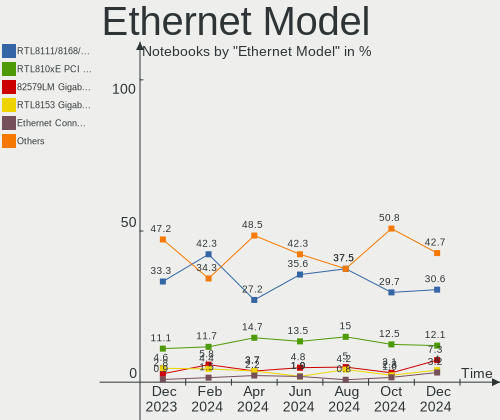
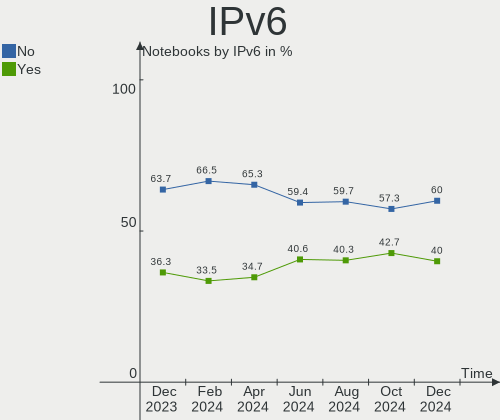

Zorin Hardware Trends (Notebooks)
---------------------------------

A project to identify most popular hardware characteristics and track their change
over time based on data collected by Zorin users at https://Linux-Hardware.org.

Anyone can contribute to this report by the [hw-probe](https://github.com/linuxhw/hw-probe) tool:

    sudo -E hw-probe -all -upload

Full-feature report is available here: https://linux-hardware.org/?view=trends&formfactor=notebook

Period: Sep, 2021.

Contents
--------

* [ System ](#system)
  - [ OS                       ](#os)
  - [ OS Family                ](#os-family)
  - [ Kernel                   ](#kernel)
  - [ Kernel Family            ](#kernel-family)
  - [ Kernel Major Ver.        ](#kernel-major-ver)
  - [ Arch                     ](#arch)
  - [ DE                       ](#de)
  - [ Display Server           ](#display-server)
  - [ Display Manager          ](#display-manager)
  - [ OS Lang                  ](#os-lang)
  - [ Boot Mode                ](#boot-mode)
  - [ Filesystem               ](#filesystem)
  - [ Part. scheme             ](#part-scheme)
  - [ Dual Boot with Linux/BSD ](#dual-boot-with-linuxbsd)
  - [ Dual Boot (Win)          ](#dual-boot-win)

* [ Board ](#board)
  - [ Vendor                   ](#vendor)
  - [ Model                    ](#model)
  - [ Model Family             ](#model-family)
  - [ MFG Year                 ](#mfg-year)
  - [ Form Factor              ](#form-factor)
  - [ Secure Boot              ](#secure-boot)
  - [ Coreboot                 ](#coreboot)
  - [ RAM Size                 ](#ram-size)
  - [ RAM Used                 ](#ram-used)
  - [ Total Drives             ](#total-drives)
  - [ Has CD-ROM               ](#has-cd-rom)
  - [ Has Ethernet             ](#has-ethernet)
  - [ Has WiFi                 ](#has-wifi)
  - [ Has Bluetooth            ](#has-bluetooth)

* [ Location ](#location)
  - [ Country                  ](#country)
  - [ City                     ](#city)

* [ Drives ](#drives)
  - [ Drive Vendor             ](#drive-vendor)
  - [ Drive Model              ](#drive-model)
  - [ HDD Vendor               ](#hdd-vendor)
  - [ SSD Vendor               ](#ssd-vendor)
  - [ Drive Kind               ](#drive-kind)
  - [ Drive Connector          ](#drive-connector)
  - [ Drive Size               ](#drive-size)
  - [ Space Total              ](#space-total)
  - [ Space Used               ](#space-used)
  - [ Malfunc. Drives          ](#malfunc-drives)
  - [ Malfunc. Drive Vendor    ](#malfunc-drive-vendor)
  - [ Malfunc. HDD Vendor      ](#malfunc-hdd-vendor)
  - [ Malfunc. Drive Kind      ](#malfunc-drive-kind)
  - [ Failed Drives            ](#failed-drives)
  - [ Failed Drive Vendor      ](#failed-drive-vendor)
  - [ Drive Status             ](#drive-status)

* [ Storage controller ](#storage-controller)
  - [ Storage Vendor           ](#storage-vendor)
  - [ Storage Model            ](#storage-model)
  - [ Storage Kind             ](#storage-kind)

* [ Processor ](#processor)
  - [ CPU Vendor               ](#cpu-vendor)
  - [ CPU Model                ](#cpu-model)
  - [ CPU Model Family         ](#cpu-model-family)
  - [ CPU Cores                ](#cpu-cores)
  - [ CPU Sockets              ](#cpu-sockets)
  - [ CPU Threads              ](#cpu-threads)
  - [ CPU Op-Modes             ](#cpu-op-modes)
  - [ CPU Microcode            ](#cpu-microcode)
  - [ CPU Microarch            ](#cpu-microarch)

* [ Graphics ](#graphics)
  - [ GPU Vendor               ](#gpu-vendor)
  - [ GPU Model                ](#gpu-model)
  - [ GPU Combo                ](#gpu-combo)
  - [ GPU Driver               ](#gpu-driver)
  - [ GPU Memory               ](#gpu-memory)

* [ Monitor ](#monitor)
  - [ Monitor Vendor           ](#monitor-vendor)
  - [ Monitor Model            ](#monitor-model)
  - [ Monitor Resolution       ](#monitor-resolution)
  - [ Monitor Diagonal         ](#monitor-diagonal)
  - [ Monitor Width            ](#monitor-width)
  - [ Aspect Ratio             ](#aspect-ratio)
  - [ Monitor Area             ](#monitor-area)
  - [ Pixel Density            ](#pixel-density)
  - [ Multiple Monitors        ](#multiple-monitors)

* [ Network ](#network)
  - [ Net Controller Vendor    ](#net-controller-vendor)
  - [ Net Controller Model     ](#net-controller-model)
  - [ Wireless Vendor          ](#wireless-vendor)
  - [ Wireless Model           ](#wireless-model)
  - [ Ethernet Vendor          ](#ethernet-vendor)
  - [ Ethernet Model           ](#ethernet-model)
  - [ Net Controller Kind      ](#net-controller-kind)
  - [ Used Controller          ](#used-controller)
  - [ NICs                     ](#nics)
  - [ IPv6                     ](#ipv6)

* [ Bluetooth ](#bluetooth)
  - [ Bluetooth Vendor         ](#bluetooth-vendor)
  - [ Bluetooth Model          ](#bluetooth-model)

* [ Sound ](#sound)
  - [ Sound Vendor             ](#sound-vendor)
  - [ Sound Model              ](#sound-model)

* [ Memory ](#memory)
  - [ Memory Vendor            ](#memory-vendor)
  - [ Memory Model             ](#memory-model)
  - [ Memory Kind              ](#memory-kind)
  - [ Memory Form Factor       ](#memory-form-factor)
  - [ Memory Size              ](#memory-size)
  - [ Memory Speed             ](#memory-speed)

* [ Printers & scanners ](#printers--scanners)
  - [ Printer Vendor           ](#printer-vendor)
  - [ Printer Model            ](#printer-model)
  - [ Scanner Vendor           ](#scanner-vendor)
  - [ Scanner Model            ](#scanner-model)

* [ Camera ](#camera)
  - [ Camera Vendor            ](#camera-vendor)
  - [ Camera Model             ](#camera-model)

* [ Security ](#security)
  - [ Fingerprint Vendor       ](#fingerprint-vendor)
  - [ Fingerprint Model        ](#fingerprint-model)
  - [ Chipcard Vendor          ](#chipcard-vendor)
  - [ Chipcard Model           ](#chipcard-model)

* [ Unsupported ](#unsupported)
  - [ Unsupported Devices      ](#unsupported-devices)
  - [ Unsupported Device Types ](#unsupported-device-types)

System
------

OS
--

Installed operating systems

| Name     | Notebooks | Percent |
|----------|-----------|---------|
| Zorin 16 | 121       | 82.31%  |
| Zorin 15 | 26        | 17.69%  |

OS Family
---------

OS without a version

| Name  | Notebooks | Percent |
|-------|-----------|---------|
| Zorin | 147       | 100%    |

Kernel
------

Version of the Linux kernel

| Version           | Notebooks | Percent |
|-------------------|-----------|---------|
| 5.11.0-34-generic | 55        | 37.41%  |
| 5.11.0-27-generic | 42        | 28.57%  |
| 5.11.0-36-generic | 20        | 13.61%  |
| 5.4.0-81-generic  | 9         | 6.12%   |
| 5.4.0-84-generic  | 6         | 4.08%   |
| 5.4.0-86-generic  | 3         | 2.04%   |
| 5.11.0-37-generic | 3         | 2.04%   |
| 5.4.0-87-generic  | 2         | 1.36%   |
| 5.4.0-80-generic  | 1         | 0.68%   |
| 5.4.0-73-generic  | 1         | 0.68%   |
| 5.4.0-72-generic  | 1         | 0.68%   |
| 5.4.0-47-generic  | 1         | 0.68%   |
| 5.4.0-45-generic  | 1         | 0.68%   |
| 5.3.0-51-generic  | 1         | 0.68%   |
| 5.13.18-xanmod1   | 1         | 0.68%   |

Kernel Family
-------------

Linux kernel without a distro release

| Version | Notebooks | Percent |
|---------|-----------|---------|
| 5.11.0  | 120       | 81.63%  |
| 5.4.0   | 25        | 17.01%  |
| 5.3.0   | 1         | 0.68%   |
| 5.13.18 | 1         | 0.68%   |

Kernel Major Ver.
-----------------

Linux kernel major version

| Version | Notebooks | Percent |
|---------|-----------|---------|
| 5.11    | 120       | 81.63%  |
| 5.4     | 25        | 17.01%  |
| 5.3     | 1         | 0.68%   |
| 5.13    | 1         | 0.68%   |

Arch
----

OS architecture (x86_64, i586, etc.)

| Name   | Notebooks | Percent |
|--------|-----------|---------|
| x86_64 | 136       | 92.52%  |
| i686   | 11        | 7.48%   |

DE
--

Desktop Environment

| Name    | Notebooks | Percent |
|---------|-----------|---------|
| GNOME   | 126       | 85.71%  |
| XFCE    | 19        | 12.93%  |
| Unknown | 2         | 1.36%   |

Display Server
--------------

X11 or Wayland

| Name    | Notebooks | Percent |
|---------|-----------|---------|
| X11     | 143       | 97.28%  |
| Wayland | 3         | 2.04%   |
| Unknown | 1         | 0.68%   |

Display Manager
---------------

SDDM, LightDM, etc.

| Name    | Notebooks | Percent |
|---------|-----------|---------|
| Unknown | 125       | 85.03%  |
| GDM     | 11        | 7.48%   |
| LightDM | 6         | 4.08%   |
| GDM3    | 5         | 3.4%    |

OS Lang
-------

Language

| Lang  | Notebooks | Percent |
|-------|-----------|---------|
| en_US | 55        | 37.41%  |
| en_GB | 16        | 10.88%  |
| pt_BR | 12        | 8.16%   |
| de_DE | 9         | 6.12%   |
| en_IN | 7         | 4.76%   |
| en_CA | 6         | 4.08%   |
| pt_PT | 4         | 2.72%   |
| it_IT | 4         | 2.72%   |
| fr_FR | 4         | 2.72%   |
| cs_CZ | 4         | 2.72%   |
| es_MX | 3         | 2.04%   |
| es_ES | 3         | 2.04%   |
| en_ZA | 3         | 2.04%   |
| en_AU | 3         | 2.04%   |
| es_CL | 2         | 1.36%   |
| en_NZ | 2         | 1.36%   |
| el_GR | 2         | 1.36%   |
| sv_SE | 1         | 0.68%   |
| sk_SK | 1         | 0.68%   |
| ru_RU | 1         | 0.68%   |
| nl_BE | 1         | 0.68%   |
| fr_BE | 1         | 0.68%   |
| fi_FI | 1         | 0.68%   |
| de_CH | 1         | 0.68%   |
| de_AT | 1         | 0.68%   |

Boot Mode
---------

EFI or BIOS

| Mode | Notebooks | Percent |
|------|-----------|---------|
| EFI  | 82        | 55.78%  |
| BIOS | 65        | 44.22%  |

Filesystem
----------

Type of filesystem

| Type  | Notebooks | Percent |
|-------|-----------|---------|
| Ext4  | 141       | 95.92%  |
| Zfs   | 3         | 2.04%   |
| Btrfs | 2         | 1.36%   |
| Ext2  | 1         | 0.68%   |

Part. scheme
------------

Scheme of partitioning

| Type    | Notebooks | Percent |
|---------|-----------|---------|
| Unknown | 134       | 91.16%  |
| GPT     | 11        | 7.48%   |
| MBR     | 2         | 1.36%   |

Dual Boot with Linux/BSD
------------------------

Hosting more than one Linux/BSD

| Dual boot | Notebooks | Percent |
|-----------|-----------|---------|
| No        | 147       | 100%    |

Dual Boot (Win)
---------------

Hosting Linux and Windows

| Dual boot | Notebooks | Percent |
|-----------|-----------|---------|
| No        | 133       | 90.48%  |
| Yes       | 14        | 9.52%   |

Board
-----

Vendor
------

Motherboard manufacturer

| Name                | Notebooks | Percent |
|---------------------|-----------|---------|
| Hewlett-Packard     | 32        | 21.77%  |
| Dell                | 21        | 14.29%  |
| Lenovo              | 20        | 13.61%  |
| Acer                | 20        | 13.61%  |
| ASUSTek Computer    | 16        | 10.88%  |
| Toshiba             | 10        | 6.8%    |
| MSI                 | 4         | 2.72%   |
| Apple               | 4         | 2.72%   |
| Sony                | 3         | 2.04%   |
| Unknown             | 2         | 1.36%   |
| UNOWHY              | 1         | 0.68%   |
| TianBei             | 1         | 0.68%   |
| Samsung Electronics | 1         | 0.68%   |
| Positivo            | 1         | 0.68%   |
| Philco              | 1         | 0.68%   |
| Pendo Industries    | 1         | 0.68%   |
| LG Electronics      | 1         | 0.68%   |
| KOGAN               | 1         | 0.68%   |
| Jumper              | 1         | 0.68%   |
| GPD                 | 1         | 0.68%   |
| Google              | 1         | 0.68%   |
| Fujitsu Siemens     | 1         | 0.68%   |
| Fujitsu             | 1         | 0.68%   |
| Dynabook            | 1         | 0.68%   |
| Digibras            | 1         | 0.68%   |

Model
-----

Motherboard model

| Name                                   | Notebooks | Percent |
|----------------------------------------|-----------|---------|
| Unknown                                | 3         | 2.04%   |
| HP Notebook                            | 2         | 1.36%   |
| Dell Latitude E6430                    | 2         | 1.36%   |
| Dell Inspiron 15 7000 Gaming           | 2         | 1.36%   |
| Acer Aspire V3-571G                    | 2         | 1.36%   |
| UNOWHY Y13G011S4EI                     | 1         | 0.68%   |
| Toshiba Satellite Pro L450D            | 1         | 0.68%   |
| Toshiba Satellite PRO C850-1H8         | 1         | 0.68%   |
| Toshiba Satellite L755                 | 1         | 0.68%   |
| Toshiba Satellite C870-1C2             | 1         | 0.68%   |
| Toshiba Satellite C850D-11C            | 1         | 0.68%   |
| Toshiba Satellite C850-1CP             | 1         | 0.68%   |
| Toshiba Satellite C75D-B               | 1         | 0.68%   |
| Toshiba Satellite C50-B                | 1         | 0.68%   |
| Toshiba PORTEGE Z30-A                  | 1         | 0.68%   |
| Toshiba PORTEGE R700                   | 1         | 0.68%   |
| TianBei TB-H7                          | 1         | 0.68%   |
| Sony VPCS135FX                         | 1         | 0.68%   |
| Sony VPCF215FX                         | 1         | 0.68%   |
| Sony VGN-SR5                           | 1         | 0.68%   |
| Samsung 550P5C/550P7C                  | 1         | 0.68%   |
| Positivo Mobile                        | 1         | 0.68%   |
| Philco 14F                             | 1         | 0.68%   |
| Pendo PNDFWXUFD11BLK6                  | 1         | 0.68%   |
| MSI Modern 15 A11M                     | 1         | 0.68%   |
| MSI GS75 Stealth 10SF                  | 1         | 0.68%   |
| MSI GL62 7RDX                          | 1         | 0.68%   |
| MSI GE75 Raider 8RF                    | 1         | 0.68%   |
| LG C400-G.BC22P1                       | 1         | 0.68%   |
| Lenovo ThinkPad W520 4284AW3           | 1         | 0.68%   |
| Lenovo ThinkPad T61 765818U            | 1         | 0.68%   |
| Lenovo ThinkPad T520 42435GG           | 1         | 0.68%   |
| Lenovo ThinkPad T520 4242W19           | 1         | 0.68%   |
| Lenovo ThinkPad T470s W10DG 20JTS0280G | 1         | 0.68%   |
| Lenovo ThinkPad T460 20FMS7DA00        | 1         | 0.68%   |
| Lenovo ThinkPad T440s 20ARS10700       | 1         | 0.68%   |
| Lenovo ThinkPad P50 20EN001EUS         | 1         | 0.68%   |
| Lenovo ThinkPad P14s Gen 1 20Y1CTO1WW  | 1         | 0.68%   |
| Lenovo ThinkPad Edge E531 688528U      | 1         | 0.68%   |
| Lenovo ThinkPad E15 Gen 2 20TD000HZA   | 1         | 0.68%   |
| Lenovo ThinkPad E14 20RAS1Q800         | 1         | 0.68%   |
| Lenovo IdeaPad S340-14API 81NB         | 1         | 0.68%   |
| Lenovo IdeaPad 310 Touch-15IKB 80TW    | 1         | 0.68%   |
| Lenovo IdeaPad 3 15IIL05 81WE          | 1         | 0.68%   |
| Lenovo IdeaPad 120S-14IAP 81A5         | 1         | 0.68%   |
| Lenovo G580                            | 1         | 0.68%   |
| Lenovo G505s 20255                     | 1         | 0.68%   |
| Lenovo G50-80 80E5                     | 1         | 0.68%   |
| Lenovo B50-30 20382                    | 1         | 0.68%   |
| KOGAN KAL11C250SB                      | 1         | 0.68%   |
| Jumper EZpad                           | 1         | 0.68%   |
| HP Victus by HP Laptop 16-e0xxx        | 1         | 0.68%   |
| HP ProBook 6460b                       | 1         | 0.68%   |
| HP ProBook 6450b                       | 1         | 0.68%   |
| HP ProBook 4540s                       | 1         | 0.68%   |
| HP Presario V6000 (GM018UA#ABC)        | 1         | 0.68%   |
| HP Pavilion Notebook                   | 1         | 0.68%   |
| HP Pavilion Laptop 15z-cw100           | 1         | 0.68%   |
| HP Pavilion Laptop 15-cs0xxx           | 1         | 0.68%   |
| HP Pavilion Laptop 15-cc1xx            | 1         | 0.68%   |

Model Family
------------

Motherboard model prefix

| Name                  | Notebooks | Percent |
|-----------------------|-----------|---------|
| Acer Aspire           | 17        | 11.56%  |
| Lenovo ThinkPad       | 12        | 8.16%   |
| Dell Latitude         | 10        | 6.8%    |
| Toshiba Satellite     | 8         | 5.44%   |
| HP Pavilion           | 8         | 5.44%   |
| HP EliteBook          | 7         | 4.76%   |
| ASUS VivoBook         | 5         | 3.4%    |
| Lenovo IdeaPad        | 4         | 2.72%   |
| Dell Inspiron         | 4         | 2.72%   |
| HP ProBook            | 3         | 2.04%   |
| HP ENVY               | 3         | 2.04%   |
| HP 255                | 3         | 2.04%   |
| Dell XPS              | 3         | 2.04%   |
| Unknown               | 3         | 2.04%   |
| Toshiba PORTEGE       | 2         | 1.36%   |
| HP Notebook           | 2         | 1.36%   |
| Dell Vostro           | 2         | 1.36%   |
| Dell Precision        | 2         | 1.36%   |
| ASUS ZenBook          | 2         | 1.36%   |
| UNOWHY Y13G011S4EI    | 1         | 0.68%   |
| TianBei TB-H7         | 1         | 0.68%   |
| Sony VPCS135FX        | 1         | 0.68%   |
| Sony VPCF215FX        | 1         | 0.68%   |
| Sony VGN-SR5          | 1         | 0.68%   |
| Samsung 550P5C        | 1         | 0.68%   |
| Positivo Mobile       | 1         | 0.68%   |
| Philco 14F            | 1         | 0.68%   |
| Pendo PNDFWXUFD11BLK6 | 1         | 0.68%   |
| MSI Modern            | 1         | 0.68%   |
| MSI GS75              | 1         | 0.68%   |
| MSI GL62              | 1         | 0.68%   |
| MSI GE75              | 1         | 0.68%   |
| LG C400-G.BC22P1      | 1         | 0.68%   |
| Lenovo G580           | 1         | 0.68%   |
| Lenovo G505s          | 1         | 0.68%   |
| Lenovo G50-80         | 1         | 0.68%   |
| Lenovo B50-30         | 1         | 0.68%   |
| KOGAN KAL11C250SB     | 1         | 0.68%   |
| Jumper EZpad          | 1         | 0.68%   |
| HP Victus             | 1         | 0.68%   |
| HP Presario           | 1         | 0.68%   |
| HP OMEN               | 1         | 0.68%   |
| HP Laptop             | 1         | 0.68%   |
| HP 245                | 1         | 0.68%   |
| GPD MicroPC           | 1         | 0.68%   |
| Google Kindred        | 1         | 0.68%   |
| Fujitsu Siemens AMILO | 1         | 0.68%   |
| Fujitsu LIFEBOOK      | 1         | 0.68%   |
| Dynabook dynabook     | 1         | 0.68%   |
| Digibras NH4CU53      | 1         | 0.68%   |
| ASUS X405UA           | 1         | 0.68%   |
| ASUS UX430UAR         | 1         | 0.68%   |
| ASUS U31F             | 1         | 0.68%   |
| ASUS ROG              | 1         | 0.68%   |
| ASUS N55SF            | 1         | 0.68%   |
| ASUS GR8              | 1         | 0.68%   |
| ASUS F5SL             | 1         | 0.68%   |
| ASUS E403NA           | 1         | 0.68%   |
| ASUS ASUS             | 1         | 0.68%   |
| Apple MacBookPro9     | 1         | 0.68%   |

MFG Year
--------

Motherboard manufacture year

| Year | Notebooks | Percent |
|------|-----------|---------|
| 2021 | 24        | 16.33%  |
| 2020 | 22        | 14.97%  |
| 2019 | 15        | 10.2%   |
| 2011 | 15        | 10.2%   |
| 2018 | 11        | 7.48%   |
| 2014 | 10        | 6.8%    |
| 2013 | 9         | 6.12%   |
| 2012 | 7         | 4.76%   |
| 2009 | 7         | 4.76%   |
| 2017 | 5         | 3.4%    |
| 2016 | 4         | 2.72%   |
| 2010 | 4         | 2.72%   |
| 2008 | 4         | 2.72%   |
| 2005 | 4         | 2.72%   |
| 2015 | 2         | 1.36%   |
| 2007 | 2         | 1.36%   |
| 2006 | 2         | 1.36%   |

Form Factor
-----------

Physical design of the computer

| Name     | Notebooks | Percent |
|----------|-----------|---------|
| Notebook | 147       | 100%    |

Secure Boot
-----------

Enabled or disabled

| State    | Notebooks | Percent |
|----------|-----------|---------|
| Disabled | 126       | 85.71%  |
| Enabled  | 21        | 14.29%  |

Coreboot
--------

Have coreboot on board

| Used | Notebooks | Percent |
|------|-----------|---------|
| No   | 146       | 99.32%  |
| Yes  | 1         | 0.68%   |

RAM Size
--------

Total RAM memory

| Size in GB | Notebooks | Percent |
|------------|-----------|---------|
| 4.01-8.0   | 52        | 35.37%  |
| 3.01-4.0   | 42        | 28.57%  |
| 8.01-16.0  | 26        | 17.69%  |
| 16.01-24.0 | 8         | 5.44%   |
| 1.01-2.0   | 8         | 5.44%   |
| 32.01-64.0 | 7         | 4.76%   |
| 2.01-3.0   | 2         | 1.36%   |
| 0.51-1.0   | 2         | 1.36%   |

RAM Used
--------

Used RAM memory

| Used GB    | Notebooks | Percent |
|------------|-----------|---------|
| 1.01-2.0   | 58        | 39.46%  |
| 2.01-3.0   | 42        | 28.57%  |
| 3.01-4.0   | 25        | 17.01%  |
| 0.51-1.0   | 10        | 6.8%    |
| 4.01-8.0   | 9         | 6.12%   |
| 24.01-32.0 | 1         | 0.68%   |
| 8.01-16.0  | 1         | 0.68%   |
| 0.01-0.5   | 1         | 0.68%   |

Total Drives
------------

Number of drives on board

| Drives | Notebooks | Percent |
|--------|-----------|---------|
| 1      | 114       | 77.55%  |
| 2      | 29        | 19.73%  |
| 3      | 4         | 2.72%   |

Has CD-ROM
----------

Has CD-ROM on board

| Presented | Notebooks | Percent |
|-----------|-----------|---------|
| No        | 86        | 58.5%   |
| Yes       | 61        | 41.5%   |

Has Ethernet
------------

Has Ethernet on board

| Presented | Notebooks | Percent |
|-----------|-----------|---------|
| Yes       | 125       | 85.03%  |
| No        | 22        | 14.97%  |

Has WiFi
--------

Has WiFi module

| Presented | Notebooks | Percent |
|-----------|-----------|---------|
| Yes       | 145       | 98.64%  |
| No        | 2         | 1.36%   |

Has Bluetooth
-------------

Has Bluetooth module

| Presented | Notebooks | Percent |
|-----------|-----------|---------|
| Yes       | 105       | 71.43%  |
| No        | 42        | 28.57%  |

Location
--------

Country
-------

Geographic location (country)

| Country      | Notebooks | Percent |
|--------------|-----------|---------|
| USA          | 28        | 19.05%  |
| Brazil       | 14        | 9.52%   |
| UK           | 13        | 8.84%   |
| Germany      | 10        | 6.8%    |
| India        | 7         | 4.76%   |
| Canada       | 7         | 4.76%   |
| South Africa | 5         | 3.4%    |
| Italy        | 5         | 3.4%    |
| France       | 5         | 3.4%    |
| Mexico       | 4         | 2.72%   |
| Greece       | 4         | 2.72%   |
| Czechia      | 4         | 2.72%   |
| Sweden       | 3         | 2.04%   |
| Spain        | 3         | 2.04%   |
| Portugal     | 3         | 2.04%   |
| Belgium      | 3         | 2.04%   |
| Australia    | 3         | 2.04%   |
| Switzerland  | 2         | 1.36%   |
| New Zealand  | 2         | 1.36%   |
| Morocco      | 2         | 1.36%   |
| Chile        | 2         | 1.36%   |
| Austria      | 2         | 1.36%   |
| Turkey       | 1         | 0.68%   |
| Thailand     | 1         | 0.68%   |
| Tanzania     | 1         | 0.68%   |
| Slovakia     | 1         | 0.68%   |
| Russia       | 1         | 0.68%   |
| Romania      | 1         | 0.68%   |
| Philippines  | 1         | 0.68%   |
| Norway       | 1         | 0.68%   |
| Netherlands  | 1         | 0.68%   |
| Nepal        | 1         | 0.68%   |
| Israel       | 1         | 0.68%   |
| Indonesia    | 1         | 0.68%   |
| Hungary      | 1         | 0.68%   |
| Finland      | 1         | 0.68%   |
| Belarus      | 1         | 0.68%   |
| Angola       | 1         | 0.68%   |

City
----

Geographic location (city)

| City            | Notebooks | Percent |
|-----------------|-----------|---------|
| Stockholm       | 2         | 1.36%   |
| Paris           | 2         | 1.36%   |
| Montreal        | 2         | 1.36%   |
| Maca?©          | 2         | 1.36%   |
| London          | 2         | 1.36%   |
| Glasgow         | 2         | 1.36%   |
| Aberdeen        | 2         | 1.36%   |
| Zurich          | 1         | 0.68%   |
| Zionsville      | 1         | 0.68%   |
| Zaventem        | 1         | 0.68%   |
| Zacatecas City  | 1         | 0.68%   |
| Winnipeg        | 1         | 0.68%   |
| Wilderness Rim  | 1         | 0.68%   |
| Wigan           | 1         | 0.68%   |
| West Jordan     | 1         | 0.68%   |
| Vincennes       | 1         | 0.68%   |
| Vienna          | 1         | 0.68%   |
| Veracruz        | 1         | 0.68%   |
| Vancouver       | 1         | 0.68%   |
| Twinsburg       | 1         | 0.68%   |
| Tangier         | 1         | 0.68%   |
| Taboao da Serra | 1         | 0.68%   |
| Sydney          | 1         | 0.68%   |
| Stuttgart       | 1         | 0.68%   |
| St Albans       | 1         | 0.68%   |
| Sigless         | 1         | 0.68%   |
| S??o Paulo      | 1         | 0.68%   |
| S??o Lu?­s      | 1         | 0.68%   |
| San Diego       | 1         | 0.68%   |
| Salina          | 1         | 0.68%   |
| Salerno         | 1         | 0.68%   |
| Saint Matthews  | 1         | 0.68%   |
| Rome            | 1         | 0.68%   |
| Rochester       | 1         | 0.68%   |
| Ro????ava       | 1         | 0.68%   |
| Rio de Janeiro  | 1         | 0.68%   |
| Rijen           | 1         | 0.68%   |
| Richmond Hill   | 1         | 0.68%   |
| Reus            | 1         | 0.68%   |
| Rataje          | 1         | 0.68%   |
| Pretoria        | 1         | 0.68%   |
| Premnitz        | 1         | 0.68%   |
| Prague          | 1         | 0.68%   |
| Pontinha        | 1         | 0.68%   |
| Pittsburgh      | 1         | 0.68%   |
| Pite??          | 1         | 0.68%   |
| Pilsen          | 1         | 0.68%   |
| Philadelphia    | 1         | 0.68%   |
| Peterborough    | 1         | 0.68%   |
| P??trai         | 1         | 0.68%   |
| Paranaque City  | 1         | 0.68%   |
| Palminopolis    | 1         | 0.68%   |
| Oslo            | 1         | 0.68%   |
| Nottingham      | 1         | 0.68%   |
| Noblesville     | 1         | 0.68%   |
| New Haven       | 1         | 0.68%   |
| Naumburg        | 1         | 0.68%   |
| Most            | 1         | 0.68%   |
| Moscow          | 1         | 0.68%   |
| Morrisville     | 1         | 0.68%   |

Drives
------

Drive Vendor
------------

Hard drive vendors

| Vendor              | Notebooks | Drives | Percent |
|---------------------|-----------|--------|---------|
| Samsung Electronics | 25        | 29     | 14.97%  |
| Seagate             | 22        | 22     | 13.17%  |
| WDC                 | 17        | 17     | 10.18%  |
| Toshiba             | 13        | 13     | 7.78%   |
| Unknown             | 9         | 11     | 5.39%   |
| SK Hynix            | 9         | 11     | 5.39%   |
| SanDisk             | 8         | 8      | 4.79%   |
| Crucial             | 8         | 8      | 4.79%   |
| Hitachi             | 7         | 7      | 4.19%   |
| HGST                | 6         | 6      | 3.59%   |
| Micron Technology   | 5         | 5      | 2.99%   |
| Kingston            | 4         | 4      | 2.4%    |
| SPCC                | 3         | 3      | 1.8%    |
| Intenso             | 3         | 3      | 1.8%    |
| A-DATA Technology   | 3         | 3      | 1.8%    |
| PNY                 | 2         | 2      | 1.2%    |
| Patriot             | 2         | 2      | 1.2%    |
| Lite-On             | 2         | 2      | 1.2%    |
| Intel               | 2         | 2      | 1.2%    |
| Fujitsu             | 2         | 2      | 1.2%    |
| Apple               | 2         | 3      | 1.2%    |
| Verbatim            | 1         | 1      | 0.6%    |
| Vaseky              | 1         | 1      | 0.6%    |
| Transcend           | 1         | 1      | 0.6%    |
| Team                | 1         | 1      | 0.6%    |
| SABRENT             | 1         | 1      | 0.6%    |
| LITEONIT            | 1         | 1      | 0.6%    |
| Leven               | 1         | 1      | 0.6%    |
| KIOXIA              | 1         | 1      | 0.6%    |
| JMicron             | 1         | 2      | 0.6%    |
| IBM/Hitachi         | 1         | 1      | 0.6%    |
| China               | 1         | 1      | 0.6%    |
| BIWIN               | 1         | 1      | 0.6%    |
| Unknown             | 1         | 1      | 0.6%    |

Drive Model
-----------

Hard drive models

| Model                                       | Notebooks | Percent |
|---------------------------------------------|-----------|---------|
| Unknown MMC Card  64GB                      | 6         | 3.45%   |
| Toshiba MQ01ABF050 500GB                    | 3         | 1.72%   |
| SK Hynix NVMe SSD Drive 256GB               | 3         | 1.72%   |
| Seagate ST1000LM035-1RK172 1TB              | 3         | 1.72%   |
| Seagate ST1000LM024 HN-M101MBB 1TB          | 3         | 1.72%   |
| Samsung NVMe SSD Drive 512GB                | 3         | 1.72%   |
| Samsung NVMe SSD Drive 256GB                | 3         | 1.72%   |
| Crucial CT240BX500SSD1 240GB                | 3         | 1.72%   |
| Unknown MMC Card  32GB                      | 2         | 1.15%   |
| Toshiba MQ04ABF100 1TB                      | 2         | 1.15%   |
| Sandisk NVMe SSD Drive 512GB                | 2         | 1.15%   |
| Samsung SSD 860 EVO 500GB                   | 2         | 1.15%   |
| Samsung SSD 850 EVO 500GB                   | 2         | 1.15%   |
| Samsung NVMe SSD Drive 500GB                | 2         | 1.15%   |
| Micron NVMe SSD Drive 512GB                 | 2         | 1.15%   |
| Intenso SSD Sata III 120GB                  | 2         | 1.15%   |
| Hitachi HTS547575A9E384 752GB               | 2         | 1.15%   |
| Hitachi HTS545032B9A300 320GB               | 2         | 1.15%   |
| HGST HTS721010A9E630 1TB                    | 2         | 1.15%   |
| HGST HTS545050A7E380 500GB                  | 2         | 1.15%   |
| WDC WDS240G2G0B-00EPW0 240GB SSD            | 1         | 0.57%   |
| WDC WDS240G2G0A-00JH30 240GB SSD            | 1         | 0.57%   |
| WDC WDS100T2G0A-00JH30 1TB SSD              | 1         | 0.57%   |
| WDC WD800BEVE-00UYT0 80GB                   | 1         | 0.57%   |
| WDC WD7500BPKX-00HPJT0 752GB                | 1         | 0.57%   |
| WDC WD6400BEVT-22A0RT0 640GB                | 1         | 0.57%   |
| WDC WD5000LPCX-60VHAT0 500GB                | 1         | 0.57%   |
| WDC WD3200BVVT-63A26Y0 320GB                | 1         | 0.57%   |
| WDC WD3200BPVT-24JJ5T0 320GB                | 1         | 0.57%   |
| WDC WD2500BEVT-22A23T0 250GB                | 1         | 0.57%   |
| WDC WD1600BEVS-60RST0 160GB                 | 1         | 0.57%   |
| WDC WD1200UE-22KVT0 120GB                   | 1         | 0.57%   |
| WDC WD1200BEVE-00UYT0 120GB                 | 1         | 0.57%   |
| WDC WD10JPVX-60JC3T0 1TB                    | 1         | 0.57%   |
| WDC WD10JPVX-22JC3T0 1TB                    | 1         | 0.57%   |
| WDC PC SN520 SDAPNUW-512G-1006 512GB        | 1         | 0.57%   |
| WDC PC SN520 NVMe 256GB                     | 1         | 0.57%   |
| Verbatim Vi550 S3 SSD 512GB                 | 1         | 0.57%   |
| Vaseky V820/256G 256GB                      | 1         | 0.57%   |
| Unknown MMC64G  64GB                        | 1         | 0.57%   |
| Unknown MMC Card  128GB                     | 1         | 0.57%   |
| Transcend TS512GMTS430S 512GB SSD           | 1         | 0.57%   |
| Toshiba THNSNJ256GMCT 256GB SSD             | 1         | 0.57%   |
| Toshiba NVMe SSD Drive 1024GB               | 1         | 0.57%   |
| Toshiba MQ01ABD100 1TB                      | 1         | 0.57%   |
| Toshiba MK8025GAS 80GB                      | 1         | 0.57%   |
| Toshiba MK5075GSX 500GB                     | 1         | 0.57%   |
| Toshiba MK5056GSY 500GB                     | 1         | 0.57%   |
| Toshiba MK3261GSYN 320GB                    | 1         | 0.57%   |
| Toshiba KSG60ZMV256G M.2 2280 256GB SSD     | 1         | 0.57%   |
| Team T253X1120G 120GB SSD                   | 1         | 0.57%   |
| SPCC SPCCSolidStateDisk 256GB SSD           | 1         | 0.57%   |
| SPCC Solid State Disk 256GB                 | 1         | 0.57%   |
| SPCC Solid State Disk 1TB                   | 1         | 0.57%   |
| SK Hynix SC313 HFS256G39TNF-N3A0A 256GB SSD | 1         | 0.57%   |
| SK Hynix SC311 SATA 256GB SSD               | 1         | 0.57%   |
| SK Hynix SC308 SATA 256GB SSD               | 1         | 0.57%   |
| SK Hynix NVMe SSD Drive 512GB               | 1         | 0.57%   |
| SK Hynix NVMe SSD Drive 128GB               | 1         | 0.57%   |
| SK Hynix HFS256G39TND-N210A 256GB SSD       | 1         | 0.57%   |

HDD Vendor
----------

Hard disk drive vendors

| Vendor      | Notebooks | Drives | Percent |
|-------------|-----------|--------|---------|
| Seagate     | 21        | 21     | 35%     |
| WDC         | 12        | 12     | 20%     |
| Toshiba     | 10        | 10     | 16.67%  |
| Hitachi     | 7         | 7      | 11.67%  |
| HGST        | 6         | 6      | 10%     |
| Fujitsu     | 2         | 2      | 3.33%   |
| IBM/Hitachi | 1         | 1      | 1.67%   |
| Apple       | 1         | 1      | 1.67%   |

SSD Vendor
----------

Solid state drive vendors

| Vendor              | Notebooks | Drives | Percent |
|---------------------|-----------|--------|---------|
| Samsung Electronics | 14        | 14     | 22.95%  |
| Crucial             | 8         | 8      | 13.11%  |
| SK Hynix            | 4         | 4      | 6.56%   |
| Kingston            | 4         | 4      | 6.56%   |
| WDC                 | 3         | 3      | 4.92%   |
| SPCC                | 3         | 3      | 4.92%   |
| SanDisk             | 3         | 3      | 4.92%   |
| Micron Technology   | 3         | 3      | 4.92%   |
| Intenso             | 3         | 3      | 4.92%   |
| Toshiba             | 2         | 2      | 3.28%   |
| PNY                 | 2         | 2      | 3.28%   |
| Patriot             | 2         | 2      | 3.28%   |
| A-DATA Technology   | 2         | 2      | 3.28%   |
| Verbatim            | 1         | 1      | 1.64%   |
| Transcend           | 1         | 1      | 1.64%   |
| Team                | 1         | 1      | 1.64%   |
| SABRENT             | 1         | 1      | 1.64%   |
| LITEONIT            | 1         | 1      | 1.64%   |
| Leven               | 1         | 1      | 1.64%   |
| China               | 1         | 1      | 1.64%   |
| BIWIN               | 1         | 1      | 1.64%   |

Drive Kind
----------

HDD or SSD

| Kind    | Notebooks | Drives | Percent |
|---------|-----------|--------|---------|
| HDD     | 60        | 60     | 36.59%  |
| SSD     | 59        | 61     | 35.98%  |
| NVMe    | 33        | 42     | 20.12%  |
| MMC     | 9         | 11     | 5.49%   |
| Unknown | 3         | 3      | 1.83%   |

Drive Connector
---------------

SATA, SAS, NVMe, etc.

| Type | Notebooks | Drives | Percent |
|------|-----------|--------|---------|
| SATA | 113       | 121    | 71.52%  |
| NVMe | 32        | 40     | 20.25%  |
| MMC  | 9         | 11     | 5.7%    |
| SAS  | 4         | 5      | 2.53%   |

Drive Size
----------

Size of hard drive

| Size in TB | Notebooks | Drives | Percent |
|------------|-----------|--------|---------|
| 0.01-0.5   | 85        | 87     | 72.03%  |
| 0.51-1.0   | 30        | 31     | 25.42%  |
| 1.01-2.0   | 3         | 3      | 2.54%   |

Space Total
-----------

Amount of disk space available on the file system

| Size in GB     | Notebooks | Percent |
|----------------|-----------|---------|
| 101-250        | 55        | 37.41%  |
| 251-500        | 40        | 27.21%  |
| 501-1000       | 19        | 12.93%  |
| 51-100         | 19        | 12.93%  |
| 21-50          | 4         | 2.72%   |
| 1001-2000      | 4         | 2.72%   |
| 2001-3000      | 2         | 1.36%   |
| 1-20           | 2         | 1.36%   |
| More than 3000 | 1         | 0.68%   |
| Unknown        | 1         | 0.68%   |

Space Used
----------

Amount of used disk space

| Used GB  | Notebooks | Percent |
|----------|-----------|---------|
| 1-20     | 75        | 51.02%  |
| 21-50    | 36        | 24.49%  |
| 101-250  | 15        | 10.2%   |
| 51-100   | 13        | 8.84%   |
| 251-500  | 4         | 2.72%   |
| 501-1000 | 3         | 2.04%   |
| Unknown  | 1         | 0.68%   |

Malfunc. Drives
---------------

Drive models with a malfunction

| Model                      | Notebooks | Drives | Percent |
|----------------------------|-----------|--------|---------|
| WDC WD10JPVX-22JC3T0 1TB   | 1         | 1      | 50%     |
| Seagate ST9200420ASG 200GB | 1         | 1      | 50%     |

Malfunc. Drive Vendor
---------------------

Vendors of faulty drives

| Vendor  | Notebooks | Drives | Percent |
|---------|-----------|--------|---------|
| WDC     | 1         | 1      | 50%     |
| Seagate | 1         | 1      | 50%     |

Malfunc. HDD Vendor
-------------------

Vendors of faulty HDD drives

| Vendor  | Notebooks | Drives | Percent |
|---------|-----------|--------|---------|
| WDC     | 1         | 1      | 50%     |
| Seagate | 1         | 1      | 50%     |

Malfunc. Drive Kind
-------------------

Kinds of faulty drives

| Kind | Notebooks | Drives | Percent |
|------|-----------|--------|---------|
| HDD  | 2         | 2      | 100%    |

Failed Drives
-------------

Failed drive models

Zero info for selected period =(

Failed Drive Vendor
-------------------

Failed drive vendors

Zero info for selected period =(

Drive Status
------------

Number of failed and malfunc. drives

| Status   | Notebooks | Drives | Percent |
|----------|-----------|--------|---------|
| Detected | 133       | 157    | 88.67%  |
| Works    | 15        | 18     | 10%     |
| Malfunc  | 2         | 2      | 1.33%   |

Storage controller
------------------

Storage Vendor
--------------

Storage controller vendors

| Vendor                           | Notebooks | Percent |
|----------------------------------|-----------|---------|
| Intel                            | 108       | 65.85%  |
| AMD                              | 19        | 11.59%  |
| Samsung Electronics              | 14        | 8.54%   |
| Sandisk                          | 6         | 3.66%   |
| SK Hynix                         | 5         | 3.05%   |
| Silicon Integrated Systems [SiS] | 3         | 1.83%   |
| Micron Technology                | 2         | 1.22%   |
| Lite-On Technology               | 2         | 1.22%   |
| Toshiba America Info Systems     | 1         | 0.61%   |
| Nvidia                           | 1         | 0.61%   |
| KIOXIA                           | 1         | 0.61%   |
| Apple                            | 1         | 0.61%   |
| ADATA Technology                 | 1         | 0.61%   |

Storage Model
-------------

Storage controller models

| Model                                                                                  | Notebooks | Percent |
|----------------------------------------------------------------------------------------|-----------|---------|
| AMD FCH SATA Controller [AHCI mode]                                                    | 15        | 8.43%   |
| Intel Sunrise Point-LP SATA Controller [AHCI mode]                                     | 14        | 7.87%   |
| Intel 7 Series Chipset Family 6-port SATA Controller [AHCI mode]                       | 14        | 7.87%   |
| Intel 6 Series/C200 Series Chipset Family 6 port Mobile SATA AHCI Controller           | 12        | 6.74%   |
| Intel 82801 Mobile SATA Controller [RAID mode]                                         | 10        | 5.62%   |
| Samsung NVMe SSD Controller SM981/PM981/PM983                                          | 7         | 3.93%   |
| Intel Celeron N3350/Pentium N4200/Atom E3900 Series SATA AHCI Controller               | 5         | 2.81%   |
| Intel 82801HM/HEM (ICH8M/ICH8M-E) IDE Controller                                       | 5         | 2.81%   |
| Intel 8 Series SATA Controller 1 [AHCI mode]                                           | 5         | 2.81%   |
| Intel 5 Series/3400 Series Chipset 4 port SATA AHCI Controller                         | 5         | 2.81%   |
| SK Hynix BC501 NVMe Solid State Drive                                                  | 4         | 2.25%   |
| Samsung NVMe SSD Controller 980                                                        | 4         | 2.25%   |
| Silicon Integrated Systems [SiS] 5513 IDE Controller                                   | 3         | 1.69%   |
| Sandisk WD Blue SN500 / PC SN520 NVMe SSD                                              | 3         | 1.69%   |
| Intel HM170/QM170 Chipset SATA Controller [AHCI Mode]                                  | 3         | 1.69%   |
| Intel Atom Processor E3800 Series SATA AHCI Controller                                 | 3         | 1.69%   |
| Intel 82801IBM/IEM (ICH9M/ICH9M-E) 4 port SATA Controller [AHCI mode]                  | 3         | 1.69%   |
| Intel 82801HM/HEM (ICH8M/ICH8M-E) SATA Controller [AHCI mode]                          | 3         | 1.69%   |
| Silicon Integrated Systems [SiS] SATA Controller / IDE mode                            | 2         | 1.12%   |
| Samsung NVMe SSD Controller SM951/PM951                                                | 2         | 1.12%   |
| Micron Non-Volatile memory controller                                                  | 2         | 1.12%   |
| Lite-On Non-Volatile memory controller                                                 | 2         | 1.12%   |
| Intel Wildcat Point-LP SATA Controller [AHCI Mode]                                     | 2         | 1.12%   |
| Intel SSD 660P Series                                                                  | 2         | 1.12%   |
| Intel SATA Controller [RAID mode]                                                      | 2         | 1.12%   |
| Intel Ice Lake-LP SATA Controller [AHCI mode]                                          | 2         | 1.12%   |
| Intel Comet Lake SATA AHCI Controller                                                  | 2         | 1.12%   |
| Intel Celeron/Pentium Silver Processor SATA Controller                                 | 2         | 1.12%   |
| Intel Cannon Point-LP SATA Controller [AHCI Mode]                                      | 2         | 1.12%   |
| Intel 82801HM/HEM (ICH8M/ICH8M-E) SATA Controller [IDE mode]                           | 2         | 1.12%   |
| Intel 82801FBM (ICH6M) SATA Controller                                                 | 2         | 1.12%   |
| Intel 82801FB/FBM/FR/FW/FRW (ICH6 Family) IDE Controller                               | 2         | 1.12%   |
| Intel 5 Series/3400 Series Chipset 6 port SATA AHCI Controller                         | 2         | 1.12%   |
| AMD SB7x0/SB8x0/SB9x0 SATA Controller [AHCI mode]                                      | 2         | 1.12%   |
| Toshiba America Info Systems NVMe Controller                                           | 1         | 0.56%   |
| SK Hynix BC511                                                                         | 1         | 0.56%   |
| Sandisk WD Black SN750 / PC SN730 NVMe SSD                                             | 1         | 0.56%   |
| Sandisk PC SN520 NVMe SSD                                                              | 1         | 0.56%   |
| Sandisk Non-Volatile memory controller                                                 | 1         | 0.56%   |
| Samsung NVMe SSD Controller SM961/PM961/SM963                                          | 1         | 0.56%   |
| Nvidia MCP79 AHCI Controller                                                           | 1         | 0.56%   |
| KIOXIA Non-Volatile memory controller                                                  | 1         | 0.56%   |
| Intel Volume Management Device NVMe RAID Controller                                    | 1         | 0.56%   |
| Intel US15W/US15X/US15L/UL11L SCH [Poulsbo] IDE Controller                             | 1         | 0.56%   |
| Intel Q170/Q150/B150/H170/H110/Z170/CM236 Chipset SATA Controller [AHCI Mode]          | 1         | 0.56%   |
| Intel NM10/ICH7 Family SATA Controller [AHCI mode]                                     | 1         | 0.56%   |
| Intel Mobile 4 Series Chipset PT IDER Controller                                       | 1         | 0.56%   |
| Intel Cannon Lake Mobile PCH SATA AHCI Controller                                      | 1         | 0.56%   |
| Intel 82801IBM/IEM (ICH9M/ICH9M-E) 2 port SATA Controller [IDE mode]                   | 1         | 0.56%   |
| Intel 82801GBM/GHM (ICH7-M Family) SATA Controller [IDE mode]                          | 1         | 0.56%   |
| Intel 82801GBM/GHM (ICH7-M Family) SATA Controller [AHCI mode]                         | 1         | 0.56%   |
| Intel 82801G (ICH7 Family) IDE Controller                                              | 1         | 0.56%   |
| Intel 8 Series/C220 Series Chipset Family 6-port SATA Controller 1 [AHCI mode]         | 1         | 0.56%   |
| Intel 6 Series/C200 Series Chipset Family Mobile SATA Controller (IDE mode, ports 4-5) | 1         | 0.56%   |
| Intel 6 Series/C200 Series Chipset Family Mobile SATA Controller (IDE mode, ports 0-3) | 1         | 0.56%   |
| Intel 400 Series Chipset Family SATA AHCI Controller                                   | 1         | 0.56%   |
| Apple S3X NVMe Controller                                                              | 1         | 0.56%   |
| AMD SB7x0/SB8x0/SB9x0 IDE Controller                                                   | 1         | 0.56%   |
| AMD IXP SB4x0 IDE Controller                                                           | 1         | 0.56%   |
| AMD FCH SATA Controller [IDE mode]                                                     | 1         | 0.56%   |

Storage Kind
------------

Kind of storage controller (IDE, SATA, NVMe, SAS, ...)

| Kind | Notebooks | Percent |
|------|-----------|---------|
| SATA | 105       | 62.13%  |
| NVMe | 32        | 18.93%  |
| IDE  | 19        | 11.24%  |
| RAID | 13        | 7.69%   |

Processor
---------

CPU Vendor
----------

Processor vendors

| Vendor | Notebooks | Percent |
|--------|-----------|---------|
| Intel  | 122       | 82.99%  |
| AMD    | 25        | 17.01%  |

CPU Model
---------

Processor models

| Model                                         | Notebooks | Percent |
|-----------------------------------------------|-----------|---------|
| Intel Core i7-8550U CPU @ 1.80GHz             | 4         | 2.72%   |
| Intel Core i5-8250U CPU @ 1.60GHz             | 4         | 2.72%   |
| Intel Core i5-3210M CPU @ 2.50GHz             | 4         | 2.72%   |
| Intel Core i7-2630QM CPU @ 2.00GHz            | 3         | 2.04%   |
| Intel Core i5-7200U CPU @ 2.50GHz             | 3         | 2.04%   |
| Intel 11th Gen Core i7-1165G7 @ 2.80GHz       | 3         | 2.04%   |
| Intel Pentium CPU N4200 @ 1.10GHz             | 2         | 1.36%   |
| Intel Core i7-7700HQ CPU @ 2.80GHz            | 2         | 1.36%   |
| Intel Core i7-6820HQ CPU @ 2.70GHz            | 2         | 1.36%   |
| Intel Core i7-3632QM CPU @ 2.20GHz            | 2         | 1.36%   |
| Intel Core i5-7300HQ CPU @ 2.50GHz            | 2         | 1.36%   |
| Intel Core i5-6300U CPU @ 2.40GHz             | 2         | 1.36%   |
| Intel Core i5-4310U CPU @ 2.00GHz             | 2         | 1.36%   |
| Intel Core i5-2520M CPU @ 2.50GHz             | 2         | 1.36%   |
| Intel Core i5-2410M CPU @ 2.30GHz             | 2         | 1.36%   |
| Intel Core i5 CPU M 520 @ 2.40GHz             | 2         | 1.36%   |
| Intel Core i5 CPU M 480 @ 2.67GHz             | 2         | 1.36%   |
| Intel Core i3-1005G1 CPU @ 1.20GHz            | 2         | 1.36%   |
| Intel Core 2 Duo CPU T7500 @ 2.20GHz          | 2         | 1.36%   |
| Intel Core 2 Duo CPU P8400 @ 2.26GHz          | 2         | 1.36%   |
| Intel Celeron N4120 CPU @ 1.10GHz             | 2         | 1.36%   |
| Intel Celeron CPU N3350 @ 1.10GHz             | 2         | 1.36%   |
| Intel Celeron CPU N2840 @ 2.16GHz             | 2         | 1.36%   |
| AMD Ryzen 5 3500U with Radeon Vega Mobile Gfx | 2         | 1.36%   |
| AMD Ryzen 3 3200U with Radeon Vega Mobile Gfx | 2         | 1.36%   |
| AMD A6-6310 APU with AMD Radeon R4 Graphics   | 2         | 1.36%   |
| Intel Pentium Silver N6000 @ 1.10GHz          | 1         | 0.68%   |
| Intel Pentium M processor 1.86GHz             | 1         | 0.68%   |
| Intel Pentium M processor 1.60GHz             | 1         | 0.68%   |
| Intel Pentium CPU P6200 @ 2.13GHz             | 1         | 0.68%   |
| Intel Pentium CPU P6100 @ 2.00GHz             | 1         | 0.68%   |
| Intel Pentium CPU B970 @ 2.30GHz              | 1         | 0.68%   |
| Intel Pentium CPU 3825U @ 1.90GHz             | 1         | 0.68%   |
| Intel Genuine CPU T2050 @ 1.60GHz             | 1         | 0.68%   |
| Intel Core i7-9750H CPU @ 2.60GHz             | 1         | 0.68%   |
| Intel Core i7-8750H CPU @ 2.20GHz             | 1         | 0.68%   |
| Intel Core i7-8565U CPU @ 1.80GHz             | 1         | 0.68%   |
| Intel Core i7-6600U CPU @ 2.60GHz             | 1         | 0.68%   |
| Intel Core i7-6560U CPU @ 2.20GHz             | 1         | 0.68%   |
| Intel Core i7-4700MQ CPU @ 2.40GHz            | 1         | 0.68%   |
| Intel Core i7-4600U CPU @ 2.10GHz             | 1         | 0.68%   |
| Intel Core i7-4510U CPU @ 2.00GHz             | 1         | 0.68%   |
| Intel Core i7-3740QM CPU @ 2.70GHz            | 1         | 0.68%   |
| Intel Core i7-3687U CPU @ 2.10GHz             | 1         | 0.68%   |
| Intel Core i7-2670QM CPU @ 2.20GHz            | 1         | 0.68%   |
| Intel Core i7-10750H CPU @ 2.60GHz            | 1         | 0.68%   |
| Intel Core i7-10510U CPU @ 1.80GHz            | 1         | 0.68%   |
| Intel Core i5-9300H CPU @ 2.40GHz             | 1         | 0.68%   |
| Intel Core i5-8265U CPU @ 1.60GHz             | 1         | 0.68%   |
| Intel Core i5-7440HQ CPU @ 2.80GHz            | 1         | 0.68%   |
| Intel Core i5-7360U CPU @ 2.30GHz             | 1         | 0.68%   |
| Intel Core i5-6200U CPU @ 2.30GHz             | 1         | 0.68%   |
| Intel Core i5-5200U CPU @ 2.20GHz             | 1         | 0.68%   |
| Intel Core i5-4210U CPU @ 1.70GHz             | 1         | 0.68%   |
| Intel Core i5-3320M CPU @ 2.60GHz             | 1         | 0.68%   |
| Intel Core i5-3317U CPU @ 1.70GHz             | 1         | 0.68%   |
| Intel Core i5-3230M CPU @ 2.60GHz             | 1         | 0.68%   |
| Intel Core i5-2540M CPU @ 2.60GHz             | 1         | 0.68%   |
| Intel Core i5-2467M CPU @ 1.60GHz             | 1         | 0.68%   |
| Intel Core i5-2430M CPU @ 2.40GHz             | 1         | 0.68%   |

CPU Model Family
----------------

Processor model prefix

| Model                                | Notebooks | Percent |
|--------------------------------------|-----------|---------|
| Intel Core i5                        | 42        | 28.57%  |
| Intel Core i7                        | 26        | 17.69%  |
| Intel Core 2 Duo                     | 12        | 8.16%   |
| Intel Celeron                        | 12        | 8.16%   |
| Intel Core i3                        | 11        | 7.48%   |
| Intel Pentium                        | 6         | 4.08%   |
| AMD A6                               | 5         | 3.4%    |
| Other                                | 4         | 2.72%   |
| Intel Atom                           | 4         | 2.72%   |
| AMD Ryzen 5                          | 4         | 2.72%   |
| Intel Pentium M                      | 2         | 1.36%   |
| Intel Celeron M                      | 2         | 1.36%   |
| AMD Ryzen 7                          | 2         | 1.36%   |
| AMD Ryzen 3                          | 2         | 1.36%   |
| AMD E1                               | 2         | 1.36%   |
| Intel Pentium Silver                 | 1         | 0.68%   |
| Intel Genuine                        | 1         | 0.68%   |
| AMD Turion X2 Ultra Dual-Core Mobile | 1         | 0.68%   |
| AMD Turion 64 Mobile                 | 1         | 0.68%   |
| AMD Ryzen 7 PRO                      | 1         | 0.68%   |
| AMD Mobile Sempron                   | 1         | 0.68%   |
| AMD C-50                             | 1         | 0.68%   |
| AMD Athlon                           | 1         | 0.68%   |
| AMD A8                               | 1         | 0.68%   |
| AMD A4                               | 1         | 0.68%   |
| AMD A10                              | 1         | 0.68%   |

CPU Cores
---------

Number of processor cores

| Number | Notebooks | Percent |
|--------|-----------|---------|
| 2      | 80        | 54.42%  |
| 4      | 52        | 35.37%  |
| 1      | 8         | 5.44%   |
| 6      | 4         | 2.72%   |
| 8      | 3         | 2.04%   |

CPU Sockets
-----------

Number of sockets

| Number | Notebooks | Percent |
|--------|-----------|---------|
| 1      | 147       | 100%    |

CPU Threads
-----------

Threads per core (Hyper-Threading)

| Number | Notebooks | Percent |
|--------|-----------|---------|
| 2      | 93        | 63.27%  |
| 1      | 54        | 36.73%  |

CPU Op-Modes
------------

CPU Operation Modes (32-bit, 64-bit)

| Op mode        | Notebooks | Percent |
|----------------|-----------|---------|
| 32-bit, 64-bit | 141       | 95.92%  |
| 32-bit         | 6         | 4.08%   |

CPU Microcode
-------------

Microcode number

| Number     | Notebooks | Percent |
|------------|-----------|---------|
| 0x206a7    | 18        | 12.24%  |
| 0x306a9    | 13        | 8.84%   |
| Unknown    | 12        | 8.16%   |
| 0x806ea    | 9         | 6.12%   |
| 0x406e3    | 6         | 4.08%   |
| 0x1067a    | 6         | 4.08%   |
| 0x506c9    | 5         | 3.4%    |
| 0x30678    | 4         | 2.72%   |
| 0x20655    | 4         | 2.72%   |
| 0x08108102 | 4         | 2.72%   |
| 0x906ea    | 3         | 2.04%   |
| 0x906e9    | 3         | 2.04%   |
| 0x806ec    | 3         | 2.04%   |
| 0x806e9    | 3         | 2.04%   |
| 0x806c1    | 3         | 2.04%   |
| 0x706e5    | 3         | 2.04%   |
| 0x6d8      | 3         | 2.04%   |
| 0x40651    | 3         | 2.04%   |
| 0xa0652    | 2         | 1.36%   |
| 0x806eb    | 2         | 1.36%   |
| 0x706a8    | 2         | 1.36%   |
| 0x6fb      | 2         | 1.36%   |
| 0x506e3    | 2         | 1.36%   |
| 0x406c4    | 2         | 1.36%   |
| 0x306d4    | 2         | 1.36%   |
| 0x20652    | 2         | 1.36%   |
| 0x08600106 | 2         | 1.36%   |
| 0x07030106 | 2         | 1.36%   |
| 0x07030105 | 2         | 1.36%   |
| 0x906c0    | 1         | 0.68%   |
| 0x6fd      | 1         | 0.68%   |
| 0x6fa      | 1         | 0.68%   |
| 0x6f6      | 1         | 0.68%   |
| 0x6e8      | 1         | 0.68%   |
| 0x306c3    | 1         | 0.68%   |
| 0x106ca    | 1         | 0.68%   |
| 0x106c2    | 1         | 0.68%   |
| 0x10676    | 1         | 0.68%   |
| 0x08600104 | 1         | 0.68%   |
| 0x08108109 | 1         | 0.68%   |
| 0x07030104 | 1         | 0.68%   |
| 0x07000110 | 1         | 0.68%   |
| 0x0700010f | 1         | 0.68%   |
| 0x06006704 | 1         | 0.68%   |
| 0x06001119 | 1         | 0.68%   |
| 0x05000119 | 1         | 0.68%   |
| 0x05000029 | 1         | 0.68%   |
| 0x03000027 | 1         | 0.68%   |
| 0x02000057 | 1         | 0.68%   |

CPU Microarch
-------------

Microarchitecture

| Name            | Notebooks | Percent |
|-----------------|-----------|---------|
| KabyLake        | 27        | 18.37%  |
| SandyBridge     | 18        | 12.24%  |
| IvyBridge       | 13        | 8.84%   |
| Skylake         | 8         | 5.44%   |
| Penryn          | 8         | 5.44%   |
| Westmere        | 7         | 4.76%   |
| Zen+            | 6         | 4.08%   |
| Silvermont      | 6         | 4.08%   |
| Haswell         | 6         | 4.08%   |
| Puma            | 5         | 3.4%    |
| Goldmont        | 5         | 3.4%    |
| Core            | 5         | 3.4%    |
| P6              | 4         | 2.72%   |
| Zen 2           | 3         | 2.04%   |
| TigerLake       | 3         | 2.04%   |
| IceLake         | 3         | 2.04%   |
| K8 Hammer       | 2         | 1.36%   |
| Jaguar          | 2         | 1.36%   |
| Goldmont plus   | 2         | 1.36%   |
| CometLake       | 2         | 1.36%   |
| Broadwell       | 2         | 1.36%   |
| Bonnell         | 2         | 1.36%   |
| Bobcat          | 2         | 1.36%   |
| Zen 3           | 1         | 0.68%   |
| Tremont         | 1         | 0.68%   |
| Piledriver      | 1         | 0.68%   |
| K8 & K10 hybrid | 1         | 0.68%   |
| K10 Llano       | 1         | 0.68%   |
| Excavator       | 1         | 0.68%   |

Graphics
--------

GPU Vendor
----------

Vendors of graphics cards

| Vendor                           | Notebooks | Percent |
|----------------------------------|-----------|---------|
| Intel                            | 108       | 62.79%  |
| Nvidia                           | 31        | 18.02%  |
| AMD                              | 31        | 18.02%  |
| Silicon Integrated Systems [SiS] | 2         | 1.16%   |

GPU Model
---------

Graphics card models

| Model                                                                                      | Notebooks | Percent |
|--------------------------------------------------------------------------------------------|-----------|---------|
| Intel 2nd Generation Core Processor Family Integrated Graphics Controller                  | 14        | 7.82%   |
| Intel 3rd Gen Core processor Graphics Controller                                           | 13        | 7.26%   |
| Intel UHD Graphics 620                                                                     | 9         | 5.03%   |
| Intel Core Processor Integrated Graphics Controller                                        | 7         | 3.91%   |
| AMD Picasso                                                                                | 6         | 3.35%   |
| Intel Skylake GT2 [HD Graphics 520]                                                        | 5         | 2.79%   |
| Intel HD Graphics 630                                                                      | 5         | 2.79%   |
| Intel Haswell-ULT Integrated Graphics Controller                                           | 5         | 2.79%   |
| Intel Mobile GM965/GL960 Integrated Graphics Controller (secondary)                        | 4         | 2.23%   |
| Intel Mobile GM965/GL960 Integrated Graphics Controller (primary)                          | 4         | 2.23%   |
| Intel Atom Processor Z36xxx/Z37xxx Series Graphics & Display                               | 4         | 2.23%   |
| AMD Mullins [Radeon R4/R5 Graphics]                                                        | 4         | 2.23%   |
| Nvidia GP107M [GeForce GTX 1050 Mobile]                                                    | 3         | 1.68%   |
| Intel WhiskeyLake-U GT2 [UHD Graphics 620]                                                 | 3         | 1.68%   |
| Intel TigerLake-LP GT2 [Iris Xe Graphics]                                                  | 3         | 1.68%   |
| Intel Iris Plus Graphics G1 (Ice Lake)                                                     | 3         | 1.68%   |
| Intel HD Graphics 620                                                                      | 3         | 1.68%   |
| Intel HD Graphics 500                                                                      | 3         | 1.68%   |
| AMD Renoir                                                                                 | 3         | 1.68%   |
| Nvidia TU116M [GeForce GTX 1660 Ti Mobile]                                                 | 2         | 1.12%   |
| Nvidia GP108M [GeForce MX150]                                                              | 2         | 1.12%   |
| Nvidia GP107M [GeForce GTX 1050 Ti Mobile]                                                 | 2         | 1.12%   |
| Nvidia GF119M [Quadro NVS 4200M]                                                           | 2         | 1.12%   |
| Nvidia GF117M [GeForce 610M/710M/810M/820M / GT 620M/625M/630M/720M]                       | 2         | 1.12%   |
| Intel Mobile 915GM/GMS/910GML Express Graphics Controller                                  | 2         | 1.12%   |
| Intel Mobile 4 Series Chipset Integrated Graphics Controller                               | 2         | 1.12%   |
| Intel HD Graphics 530                                                                      | 2         | 1.12%   |
| Intel GeminiLake [UHD Graphics 600]                                                        | 2         | 1.12%   |
| Intel CometLake-U GT2 [UHD Graphics]                                                       | 2         | 1.12%   |
| Intel CoffeeLake-H GT2 [UHD Graphics 630]                                                  | 2         | 1.12%   |
| Intel Celeron N3350/Pentium N4200/Atom E3900 Series Integrated Graphics Controller         | 2         | 1.12%   |
| Intel Atom/Celeron/Pentium Processor x5-E8000/J3xxx/N3xxx Integrated Graphics Controller   | 2         | 1.12%   |
| Silicon Integrated Systems [SiS] 771/671 PCIE VGA Display Adapter                          | 1         | 0.56%   |
| Silicon Integrated Systems [SiS] 661/741/760 PCI/AGP or 662/761Gx PCIE VGA Display Adapter | 1         | 0.56%   |
| Nvidia TU117M [GeForce GTX 1650 Mobile / Max-Q]                                            | 1         | 0.56%   |
| Nvidia TU117M                                                                              | 1         | 0.56%   |
| Nvidia TU106M [GeForce RTX 2070 Mobile / Max-Q Refresh]                                    | 1         | 0.56%   |
| Nvidia GP107M [GeForce GTX 1050 3 GB Max-Q]                                                | 1         | 0.56%   |
| Nvidia GM108M [GeForce 940MX]                                                              | 1         | 0.56%   |
| Nvidia GM107M [GeForce GTX 860M]                                                           | 1         | 0.56%   |
| Nvidia GM107GLM [Quadro M620 Mobile]                                                       | 1         | 0.56%   |
| Nvidia GM107GLM [Quadro M2000M]                                                            | 1         | 0.56%   |
| Nvidia GF116M [GeForce GT 555M/635M]                                                       | 1         | 0.56%   |
| Nvidia GF108M [GeForce GT 620M/630M/635M/640M LE]                                          | 1         | 0.56%   |
| Nvidia GF108M [GeForce GT 540M]                                                            | 1         | 0.56%   |
| Nvidia GF108M [GeForce GT 525M]                                                            | 1         | 0.56%   |
| Nvidia GF108GLM [NVS 5200M]                                                                | 1         | 0.56%   |
| Nvidia GF106GLM [Quadro 2000M]                                                             | 1         | 0.56%   |
| Nvidia GA107M [GeForce RTX 3050 Ti Mobile]                                                 | 1         | 0.56%   |
| Nvidia G84M [GeForce 8600M GT]                                                             | 1         | 0.56%   |
| Nvidia G72M [Quadro NVS 110M/GeForce Go 7300]                                              | 1         | 0.56%   |
| Nvidia C79 [GeForce 9400M G]                                                               | 1         | 0.56%   |
| Intel US15W/US15X SCH [Poulsbo] Graphics Controller                                        | 1         | 0.56%   |
| Intel Mobile 945GM/GMS/GME, 943/940GML Express Integrated Graphics Controller              | 1         | 0.56%   |
| Intel Mobile 945GM/GMS, 943/940GML Express Integrated Graphics Controller                  | 1         | 0.56%   |
| Intel Kaby Lake-U GT1 Integrated Graphics Controller                                       | 1         | 0.56%   |
| Intel JasperLake [UHD Graphics]                                                            | 1         | 0.56%   |
| Intel Iris Plus Graphics 640                                                               | 1         | 0.56%   |
| Intel Iris Graphics 540                                                                    | 1         | 0.56%   |
| Intel HD Graphics 5500                                                                     | 1         | 0.56%   |

GPU Combo
---------

Combinations of graphics cards

| Name           | Notebooks | Percent |
|----------------|-----------|---------|
| 1 x Intel      | 87        | 59.18%  |
| 1 x AMD        | 24        | 16.33%  |
| Intel + Nvidia | 20        | 13.61%  |
| 1 x Nvidia     | 7         | 4.76%   |
| AMD + Nvidia   | 4         | 2.72%   |
| 2 x AMD        | 2         | 1.36%   |
| 1 x SiS        | 2         | 1.36%   |
| Intel + AMD    | 1         | 0.68%   |

GPU Driver
----------

Free vs proprietary

| Driver      | Notebooks | Percent |
|-------------|-----------|---------|
| Free        | 130       | 88.44%  |
| Proprietary | 13        | 8.84%   |
| Unknown     | 4         | 2.72%   |

GPU Memory
----------

Total video memory

| Size in GB | Notebooks | Percent |
|------------|-----------|---------|
| Unknown    | 99        | 67.35%  |
| 0.01-0.5   | 14        | 9.52%   |
| 0.51-1.0   | 13        | 8.84%   |
| 1.01-2.0   | 12        | 8.16%   |
| 3.01-4.0   | 6         | 4.08%   |
| 5.01-6.0   | 2         | 1.36%   |
| 7.01-8.0   | 1         | 0.68%   |

Monitor
-------

Monitor Vendor
--------------

Monitor vendors

| Vendor                  | Notebooks | Percent |
|-------------------------|-----------|---------|
| AU Optronics            | 32        | 21.48%  |
| Chimei Innolux          | 23        | 15.44%  |
| BOE                     | 22        | 14.77%  |
| LG Display              | 21        | 14.09%  |
| Samsung Electronics     | 14        | 9.4%    |
| Lenovo                  | 5         | 3.36%   |
| Chi Mei Optoelectronics | 5         | 3.36%   |
| Sharp                   | 4         | 2.68%   |
| Apple                   | 4         | 2.68%   |
| PANDA                   | 3         | 2.01%   |
| Goldstar                | 3         | 2.01%   |
| LG Philips              | 2         | 1.34%   |
| CPT                     | 2         | 1.34%   |
| Sceptre Tech            | 1         | 0.67%   |
| LGD                     | 1         | 0.67%   |
| InnoLux Display         | 1         | 0.67%   |
| Iiyama                  | 1         | 0.67%   |
| Hewlett-Packard         | 1         | 0.67%   |
| HannStar                | 1         | 0.67%   |
| Dell                    | 1         | 0.67%   |
| BenQ                    | 1         | 0.67%   |
| AOC                     | 1         | 0.67%   |

Monitor Model
-------------

Monitor models

| Model                                                                   | Notebooks | Percent |
|-------------------------------------------------------------------------|-----------|---------|
| LG Display LCD Monitor LGD033A 1366x768 340x190mm 15.3-inch             | 2         | 1.33%   |
| LG Display LCD Monitor LGD02E9 1366x768 309x174mm 14.0-inch             | 2         | 1.33%   |
| Lenovo LCD Monitor LEN40B2 1920x1080 344x193mm 15.5-inch                | 2         | 1.33%   |
| Chimei Innolux LCD Monitor CMN15F5 1920x1080 344x193mm 15.5-inch        | 2         | 1.33%   |
| Chimei Innolux LCD Monitor CMN15BF 1366x768 344x193mm 15.5-inch         | 2         | 1.33%   |
| Chimei Innolux LCD Monitor CMN14D4 1920x1080 309x173mm 13.9-inch        | 2         | 1.33%   |
| BOE LCD Monitor BOE0687 1920x1080 344x193mm 15.5-inch                   | 2         | 1.33%   |
| AU Optronics LCD Monitor AUO26EC 1366x768 344x193mm 15.5-inch           | 2         | 1.33%   |
| AU Optronics LCD Monitor AUO193C 1366x768 309x173mm 13.9-inch           | 2         | 1.33%   |
| Apple Color LCD APP9C5B 1280x800 290x180mm 13.4-inch                    | 2         | 1.33%   |
| Sharp LCD Monitor SHP14D1 1920x1200 336x210mm 15.6-inch                 | 1         | 0.67%   |
| Sharp LCD Monitor SHP144A 3200x1800 294x165mm 13.3-inch                 | 1         | 0.67%   |
| Sharp LCD Monitor SHP143B 3840x2160 350x190mm 15.7-inch                 | 1         | 0.67%   |
| Sharp HDMI SHP101E 1920x1080 820x460mm 37.0-inch                        | 1         | 0.67%   |
| Sceptre Tech E248W-1920 SPT099D 1920x1080 443x249mm 20.0-inch           | 1         | 0.67%   |
| Samsung Electronics T22B300 SAM092D 1920x1080 477x268mm 21.5-inch       | 1         | 0.67%   |
| Samsung Electronics S24D300 SAM0B45 1920x1080 521x293mm 23.5-inch       | 1         | 0.67%   |
| Samsung Electronics LCD Monitor SEC544B 1600x900 382x214mm 17.2-inch    | 1         | 0.67%   |
| Samsung Electronics LCD Monitor SEC4C42 1280x800 303x190mm 14.1-inch    | 1         | 0.67%   |
| Samsung Electronics LCD Monitor SEC3642 1366x768 344x194mm 15.5-inch    | 1         | 0.67%   |
| Samsung Electronics LCD Monitor SEC325A 1366x768 344x194mm 15.5-inch    | 1         | 0.67%   |
| Samsung Electronics LCD Monitor SEC324A 1366x768 344x194mm 15.5-inch    | 1         | 0.67%   |
| Samsung Electronics LCD Monitor SEC314C 1920x1080 344x194mm 15.5-inch   | 1         | 0.67%   |
| Samsung Electronics LCD Monitor SDC4E51 1366x768 340x190mm 15.3-inch    | 1         | 0.67%   |
| Samsung Electronics LCD Monitor SDC484E 1600x900 309x174mm 14.0-inch    | 1         | 0.67%   |
| Samsung Electronics LCD Monitor SDC4651 1366x768 344x194mm 15.5-inch    | 1         | 0.67%   |
| Samsung Electronics LCD Monitor SDC3352 1366x768 344x194mm 15.5-inch    | 1         | 0.67%   |
| Samsung Electronics LCD Monitor SAM7017 3840x2160 1872x1053mm 84.6-inch | 1         | 0.67%   |
| Samsung Electronics LCD Monitor SAM094E 1920x1080 1020x570mm 46.0-inch  | 1         | 0.67%   |
| Samsung Electronics LCD Monitor SAM04FB 1920x1080                       | 1         | 0.67%   |
| PANDA LCD Monitor NCP0050 1920x1080 309x174mm 14.0-inch                 | 1         | 0.67%   |
| PANDA LCD Monitor NCP0036 1920x1080 344x194mm 15.5-inch                 | 1         | 0.67%   |
| PANDA LC116LF3L03 NCP000A 1920x1080 256x144mm 11.6-inch                 | 1         | 0.67%   |
| LGD LCD Monitor 3840x1080                                               | 1         | 0.67%   |
| LG Philips LCD Monitor LPL2388 1440x900 367x230mm 17.1-inch             | 1         | 0.67%   |
| LG Philips LCD Monitor LPL00E5 1440x900 304x190mm 14.1-inch             | 1         | 0.67%   |
| LG Display LCD Monitor LGD6616 1366x768 277x156mm 12.5-inch             | 1         | 0.67%   |
| LG Display LCD Monitor LGD05FA 1920x1080 309x174mm 14.0-inch            | 1         | 0.67%   |
| LG Display LCD Monitor LGD059A 1920x1080 344x194mm 15.5-inch            | 1         | 0.67%   |
| LG Display LCD Monitor LGD0597 1920x1080 294x165mm 13.3-inch            | 1         | 0.67%   |
| LG Display LCD Monitor LGD0546 1920x1080 344x194mm 15.5-inch            | 1         | 0.67%   |
| LG Display LCD Monitor LGD0540 1920x1080 344x194mm 15.5-inch            | 1         | 0.67%   |
| LG Display LCD Monitor LGD053F 1920x1080 344x194mm 15.5-inch            | 1         | 0.67%   |
| LG Display LCD Monitor LGD049B 1920x1080 340x190mm 15.3-inch            | 1         | 0.67%   |
| LG Display LCD Monitor LGD0493 1366x768 344x194mm 15.5-inch             | 1         | 0.67%   |
| LG Display LCD Monitor LGD039F 1366x768 345x194mm 15.6-inch             | 1         | 0.67%   |
| LG Display LCD Monitor LGD033E 1366x768 309x174mm 14.0-inch             | 1         | 0.67%   |
| LG Display LCD Monitor LGD033B 1366x768 344x194mm 15.5-inch             | 1         | 0.67%   |
| LG Display LCD Monitor LGD02F2 1366x768 344x194mm 15.5-inch             | 1         | 0.67%   |
| LG Display LCD Monitor LGD02E3 1366x768 344x194mm 15.5-inch             | 1         | 0.67%   |
| LG Display LCD Monitor LGD02DC 1366x768 344x194mm 15.5-inch             | 1         | 0.67%   |
| LG Display LCD Monitor LGD0293 1366x768 321x181mm 14.5-inch             | 1         | 0.67%   |
| LG Display LCD Monitor LGD028D 1366x768 310x174mm 14.0-inch             | 1         | 0.67%   |
| Lenovo LCD Monitor LEN40BA 1920x1080 344x194mm 15.5-inch                | 1         | 0.67%   |
| Lenovo LCD Monitor LEN40B1 1600x900 344x194mm 15.5-inch                 | 1         | 0.67%   |
| Lenovo LCD Monitor LEN4031 1280x800 303x190mm 14.1-inch                 | 1         | 0.67%   |
| InnoLux Display LCD Monitor INL0016 1366x768 309x174mm 14.0-inch        | 1         | 0.67%   |
| Iiyama PL2475HD IVM6108 1920x1080 521x293mm 23.5-inch                   | 1         | 0.67%   |
| Hewlett-Packard LCD Monitor w2207                                       | 1         | 0.67%   |
| HannStar HT231 HSD5173 1920x1080 509x286mm 23.0-inch                    | 1         | 0.67%   |

Monitor Resolution
------------------

Monitor screen resolution

| Resolution        | Notebooks | Percent |
|-------------------|-----------|---------|
| 1366x768 (WXGA)   | 59        | 40.14%  |
| 1920x1080 (FHD)   | 52        | 35.37%  |
| 1280x800 (WXGA)   | 9         | 6.12%   |
| 1600x900 (HD+)    | 7         | 4.76%   |
| 3840x2160 (4K)    | 3         | 2.04%   |
| 1440x900 (WXGA+)  | 3         | 2.04%   |
| 1024x600          | 2         | 1.36%   |
| Unknown           | 2         | 1.36%   |
| 3840x1080         | 1         | 0.68%   |
| 3600x1080         | 1         | 0.68%   |
| 3200x1800 (QHD+)  | 1         | 0.68%   |
| 2880x1800         | 1         | 0.68%   |
| 2560x1440 (QHD)   | 1         | 0.68%   |
| 2560x1080         | 1         | 0.68%   |
| 2256x1504         | 1         | 0.68%   |
| 1920x515          | 1         | 0.68%   |
| 1920x1200 (WUXGA) | 1         | 0.68%   |
| 1024x768 (XGA)    | 1         | 0.68%   |

Monitor Diagonal
----------------

Diagonal size in inches

| Inches  | Notebooks | Percent |
|---------|-----------|---------|
| 15      | 64        | 43.24%  |
| 13      | 33        | 22.3%   |
| 14      | 17        | 11.49%  |
| 17      | 8         | 5.41%   |
| Unknown | 5         | 3.38%   |
| 11      | 4         | 2.7%    |
| 23      | 3         | 2.03%   |
| 24      | 2         | 1.35%   |
| 21      | 2         | 1.35%   |
| 10      | 2         | 1.35%   |
| 84      | 1         | 0.68%   |
| 46      | 1         | 0.68%   |
| 37      | 1         | 0.68%   |
| 34      | 1         | 0.68%   |
| 27      | 1         | 0.68%   |
| 25      | 1         | 0.68%   |
| 16      | 1         | 0.68%   |
| 12      | 1         | 0.68%   |

Monitor Width
-------------

Physical width

| Width in mm | Notebooks | Percent |
|-------------|-----------|---------|
| 301-350     | 99        | 66.89%  |
| 201-300     | 21        | 14.19%  |
| 351-400     | 10        | 6.76%   |
| 501-600     | 7         | 4.73%   |
| Unknown     | 5         | 3.38%   |
| 401-500     | 2         | 1.35%   |
| 801-900     | 1         | 0.68%   |
| 701-800     | 1         | 0.68%   |
| 1501-2000   | 1         | 0.68%   |
| 1001-1500   | 1         | 0.68%   |

Aspect Ratio
------------

Proportional relationship between the width and the height

| Ratio   | Notebooks | Percent |
|---------|-----------|---------|
| 16/9    | 117       | 84.78%  |
| 16/10   | 14        | 10.14%  |
| Unknown | 3         | 2.17%   |
| 4/3     | 1         | 0.72%   |
| 3/2     | 1         | 0.72%   |
| 3.73    | 1         | 0.72%   |
| 21/9    | 1         | 0.72%   |

Monitor Area
------------

Area in inch²

| Area in inch² | Notebooks | Percent |
|----------------|-----------|---------|
| 101-110        | 65        | 43.92%  |
| 81-90          | 41        | 27.7%   |
| 71-80          | 9         | 6.08%   |
| 201-250        | 6         | 4.05%   |
| 121-130        | 6         | 4.05%   |
| Unknown        | 5         | 3.38%   |
| 51-60          | 4         | 2.7%    |
| 41-50          | 2         | 1.35%   |
| 131-140        | 2         | 1.35%   |
| 501-1000       | 2         | 1.35%   |
| More than 1000 | 1         | 0.68%   |
| 61-70          | 1         | 0.68%   |
| 351-500        | 1         | 0.68%   |
| 301-350        | 1         | 0.68%   |
| 251-300        | 1         | 0.68%   |
| 151-200        | 1         | 0.68%   |

Pixel Density
-------------

Pixels per inch

| Density       | Notebooks | Percent |
|---------------|-----------|---------|
| 101-120       | 69        | 47.26%  |
| 121-160       | 45        | 30.82%  |
| 51-100        | 16        | 10.96%  |
| 161-240       | 7         | 4.79%   |
| Unknown       | 5         | 3.42%   |
| More than 240 | 3         | 2.05%   |
| 1-50          | 1         | 0.68%   |

Multiple Monitors
-----------------

Total monitors connected

| Total | Notebooks | Percent |
|-------|-----------|---------|
| 1     | 131       | 89.12%  |
| 2     | 13        | 8.84%   |
| 0     | 2         | 1.36%   |
| 3     | 1         | 0.68%   |

Network
-------

Net Controller Vendor
---------------------

Controller vendors

| Vendor                           | Notebooks | Percent |
|----------------------------------|-----------|---------|
| Intel                            | 77        | 31.95%  |
| Realtek Semiconductor            | 71        | 29.46%  |
| Qualcomm Atheros                 | 34        | 14.11%  |
| Broadcom                         | 22        | 9.13%   |
| Broadcom Limited                 | 7         | 2.9%    |
| Silicon Integrated Systems [SiS] | 3         | 1.24%   |
| Xiaomi                           | 2         | 0.83%   |
| Ralink Technology                | 2         | 0.83%   |
| Ralink                           | 2         | 0.83%   |
| Qualcomm Atheros Communications  | 2         | 0.83%   |
| Marvell Technology Group         | 2         | 0.83%   |
| Huawei Technologies              | 2         | 0.83%   |
| DisplayLink                      | 2         | 0.83%   |
| Dell                             | 2         | 0.83%   |
| ZyXEL Communications             | 1         | 0.41%   |
| Sierra Wireless                  | 1         | 0.41%   |
| Qualcomm                         | 1         | 0.41%   |
| OPPO                             | 1         | 0.41%   |
| Nvidia                           | 1         | 0.41%   |
| NetGear                          | 1         | 0.41%   |
| JMicron Technology               | 1         | 0.41%   |
| D-Link                           | 1         | 0.41%   |
| Belkin Components                | 1         | 0.41%   |
| ASIX Electronics                 | 1         | 0.41%   |
| AMD                              | 1         | 0.41%   |

Net Controller Model
--------------------

Controller models

| Model                                                                       | Notebooks | Percent |
|-----------------------------------------------------------------------------|-----------|---------|
| Realtek RTL8111/8168/8411 PCI Express Gigabit Ethernet Controller           | 43        | 14.53%  |
| Realtek RTL810xE PCI Express Fast Ethernet controller                       | 13        | 4.39%   |
| Intel 82579LM Gigabit Network Connection (Lewisville)                       | 9         | 3.04%   |
| Qualcomm Atheros QCA9377 802.11ac Wireless Network Adapter                  | 8         | 2.7%    |
| Realtek RTL8821CE 802.11ac PCIe Wireless Network Adapter                    | 6         | 2.03%   |
| Qualcomm Atheros QCA9565 / AR9565 Wireless Network Adapter                  | 6         | 2.03%   |
| Intel Wireless 8260                                                         | 6         | 2.03%   |
| Qualcomm Atheros AR9285 Wireless Network Adapter (PCI-Express)              | 5         | 1.69%   |
| Intel Wireless 8265 / 8275                                                  | 5         | 1.69%   |
| Intel Wireless 3165                                                         | 5         | 1.69%   |
| Intel Centrino Advanced-N 6205 [Taylor Peak]                                | 5         | 1.69%   |
| Realtek RTL8188CE 802.11b/g/n WiFi Adapter                                  | 4         | 1.35%   |
| Realtek RTL8153 Gigabit Ethernet Adapter                                    | 4         | 1.35%   |
| Qualcomm Atheros AR9462 Wireless Network Adapter                            | 4         | 1.35%   |
| Intel Wireless 7260                                                         | 4         | 1.35%   |
| Intel Wi-Fi 6 AX200                                                         | 4         | 1.35%   |
| Broadcom NetLink BCM57785 Gigabit Ethernet PCIe                             | 4         | 1.35%   |
| Qualcomm Atheros AR8151 v2.0 Gigabit Ethernet                               | 3         | 1.01%   |
| Intel Wireless 7265                                                         | 3         | 1.01%   |
| Intel WiFi Link 5100                                                        | 3         | 1.01%   |
| Intel Ethernet Connection I219-LM                                           | 3         | 1.01%   |
| Intel Ethernet Connection I218-LM                                           | 3         | 1.01%   |
| Intel Centrino Advanced-N 6235                                              | 3         | 1.01%   |
| Intel Centrino Advanced-N 6200                                              | 3         | 1.01%   |
| Intel Cannon Lake PCH CNVi WiFi                                             | 3         | 1.01%   |
| Intel 82801FB/FBM/FR/FW/FRW (ICH6 Family) AC'97 Modem Controller            | 3         | 1.01%   |
| Broadcom BCM43142 802.11b/g/n                                               | 3         | 1.01%   |
| Broadcom BCM4313 802.11bgn Wireless Network Adapter                         | 3         | 1.01%   |
| Silicon Integrated Systems [SiS] 191 Gigabit Ethernet Adapter               | 2         | 0.68%   |
| Realtek RTL8822BE 802.11a/b/g/n/ac WiFi adapter                             | 2         | 0.68%   |
| Realtek RTL8723BE PCIe Wireless Network Adapter                             | 2         | 0.68%   |
| Realtek RTL8188EE Wireless Network Adapter                                  | 2         | 0.68%   |
| Qualcomm Atheros QCA8171 Gigabit Ethernet                                   | 2         | 0.68%   |
| Qualcomm Atheros AR9271 802.11n                                             | 2         | 0.68%   |
| Qualcomm Atheros AR9485 Wireless Network Adapter                            | 2         | 0.68%   |
| Qualcomm Atheros AR9287 Wireless Network Adapter (PCI-Express)              | 2         | 0.68%   |
| Intel Wireless 3160                                                         | 2         | 0.68%   |
| Intel Wi-Fi 6 AX201                                                         | 2         | 0.68%   |
| Intel PRO/Wireless 4965 AG or AGN [Kedron] Network Connection               | 2         | 0.68%   |
| Intel Ethernet Connection I219-V                                            | 2         | 0.68%   |
| Intel Ethernet Connection I218-V                                            | 2         | 0.68%   |
| Intel Ethernet Connection (4) I219-V                                        | 2         | 0.68%   |
| Intel Ethernet Connection (2) I219-LM                                       | 2         | 0.68%   |
| Intel Dual Band Wireless-AC 3168NGW [Stone Peak]                            | 2         | 0.68%   |
| Intel Comet Lake PCH-LP CNVi WiFi                                           | 2         | 0.68%   |
| Intel Comet Lake PCH CNVi WiFi                                              | 2         | 0.68%   |
| Intel Centrino Wireless-N 2230                                              | 2         | 0.68%   |
| Intel Centrino Ultimate-N 6300                                              | 2         | 0.68%   |
| Broadcom Limited BCM4318 [AirForce One 54g] 802.11g Wireless LAN Controller | 2         | 0.68%   |
| Broadcom BCM4350 802.11ac Wireless Network Adapter                          | 2         | 0.68%   |
| ZyXEL NWD-270N Wireless N-lite USB Adapter                                  | 1         | 0.34%   |
| Xiaomi Mi/Redmi series (RNDIS)                                              | 1         | 0.34%   |
| Xiaomi Mi/Redmi series (RNDIS + ADB)                                        | 1         | 0.34%   |
| Silicon Integrated Systems [SiS] SiS900 PCI Fast Ethernet                   | 1         | 0.34%   |
| Silicon Integrated Systems [SiS] AC'97 Modem Controller                     | 1         | 0.34%   |
| Sierra Wireless EM7455 Qualcomm Snapdragon X7 LTE-A                         | 1         | 0.34%   |
| Realtek RTL8852AE 802.11ax PCIe Wireless Network Adapter                    | 1         | 0.34%   |
| Realtek RTL8822CE 802.11ac PCIe Wireless Network Adapter                    | 1         | 0.34%   |
| Realtek RTL8812AU 802.11a/b/g/n/ac 2T2R DB WLAN Adapter                     | 1         | 0.34%   |
| Realtek RTL8811AU 802.11a/b/g/n/ac WLAN Adapter                             | 1         | 0.34%   |

Wireless Vendor
---------------

Wireless vendors

| Vendor                          | Notebooks | Percent |
|---------------------------------|-----------|---------|
| Intel                           | 71        | 45.51%  |
| Qualcomm Atheros                | 28        | 17.95%  |
| Realtek Semiconductor           | 27        | 17.31%  |
| Broadcom                        | 12        | 7.69%   |
| Broadcom Limited                | 6         | 3.85%   |
| Ralink Technology               | 2         | 1.28%   |
| Ralink                          | 2         | 1.28%   |
| Qualcomm Atheros Communications | 2         | 1.28%   |
| ZyXEL Communications            | 1         | 0.64%   |
| Sierra Wireless                 | 1         | 0.64%   |
| NetGear                         | 1         | 0.64%   |
| Dell                            | 1         | 0.64%   |
| D-Link                          | 1         | 0.64%   |
| Belkin Components               | 1         | 0.64%   |

Wireless Model
--------------

Wireless models

| Model                                                                       | Notebooks | Percent |
|-----------------------------------------------------------------------------|-----------|---------|
| Qualcomm Atheros QCA9377 802.11ac Wireless Network Adapter                  | 8         | 5.1%    |
| Realtek RTL8821CE 802.11ac PCIe Wireless Network Adapter                    | 6         | 3.82%   |
| Qualcomm Atheros QCA9565 / AR9565 Wireless Network Adapter                  | 6         | 3.82%   |
| Intel Wireless 8260                                                         | 6         | 3.82%   |
| Qualcomm Atheros AR9285 Wireless Network Adapter (PCI-Express)              | 5         | 3.18%   |
| Intel Wireless 8265 / 8275                                                  | 5         | 3.18%   |
| Intel Wireless 3165                                                         | 5         | 3.18%   |
| Intel Centrino Advanced-N 6205 [Taylor Peak]                                | 5         | 3.18%   |
| Realtek RTL8188CE 802.11b/g/n WiFi Adapter                                  | 4         | 2.55%   |
| Qualcomm Atheros AR9462 Wireless Network Adapter                            | 4         | 2.55%   |
| Intel Wireless 7260                                                         | 4         | 2.55%   |
| Intel Wi-Fi 6 AX200                                                         | 4         | 2.55%   |
| Intel Wireless 7265                                                         | 3         | 1.91%   |
| Intel WiFi Link 5100                                                        | 3         | 1.91%   |
| Intel Centrino Advanced-N 6235                                              | 3         | 1.91%   |
| Intel Centrino Advanced-N 6200                                              | 3         | 1.91%   |
| Intel Cannon Lake PCH CNVi WiFi                                             | 3         | 1.91%   |
| Broadcom BCM43142 802.11b/g/n                                               | 3         | 1.91%   |
| Broadcom BCM4313 802.11bgn Wireless Network Adapter                         | 3         | 1.91%   |
| Realtek RTL8822BE 802.11a/b/g/n/ac WiFi adapter                             | 2         | 1.27%   |
| Realtek RTL8723BE PCIe Wireless Network Adapter                             | 2         | 1.27%   |
| Realtek RTL8188EE Wireless Network Adapter                                  | 2         | 1.27%   |
| Qualcomm Atheros AR9271 802.11n                                             | 2         | 1.27%   |
| Qualcomm Atheros AR9485 Wireless Network Adapter                            | 2         | 1.27%   |
| Qualcomm Atheros AR9287 Wireless Network Adapter (PCI-Express)              | 2         | 1.27%   |
| Intel Wireless 3160                                                         | 2         | 1.27%   |
| Intel Wi-Fi 6 AX201                                                         | 2         | 1.27%   |
| Intel PRO/Wireless 4965 AG or AGN [Kedron] Network Connection               | 2         | 1.27%   |
| Intel Dual Band Wireless-AC 3168NGW [Stone Peak]                            | 2         | 1.27%   |
| Intel Comet Lake PCH-LP CNVi WiFi                                           | 2         | 1.27%   |
| Intel Comet Lake PCH CNVi WiFi                                              | 2         | 1.27%   |
| Intel Centrino Wireless-N 2230                                              | 2         | 1.27%   |
| Intel Centrino Ultimate-N 6300                                              | 2         | 1.27%   |
| Broadcom Limited BCM4318 [AirForce One 54g] 802.11g Wireless LAN Controller | 2         | 1.27%   |
| Broadcom BCM4350 802.11ac Wireless Network Adapter                          | 2         | 1.27%   |
| ZyXEL NWD-270N Wireless N-lite USB Adapter                                  | 1         | 0.64%   |
| Sierra Wireless EM7455 Qualcomm Snapdragon X7 LTE-A                         | 1         | 0.64%   |
| Realtek RTL8852AE 802.11ax PCIe Wireless Network Adapter                    | 1         | 0.64%   |
| Realtek RTL8822CE 802.11ac PCIe Wireless Network Adapter                    | 1         | 0.64%   |
| Realtek RTL8812AU 802.11a/b/g/n/ac 2T2R DB WLAN Adapter                     | 1         | 0.64%   |
| Realtek RTL8811AU 802.11a/b/g/n/ac WLAN Adapter                             | 1         | 0.64%   |
| Realtek RTL8723BU 802.11b/g/n WLAN Adapter                                  | 1         | 0.64%   |
| Realtek RTL8723AE PCIe Wireless Network Adapter                             | 1         | 0.64%   |
| Realtek RTL8192EU 802.11b/g/n WLAN Adapter                                  | 1         | 0.64%   |
| Realtek RTL8191SU 802.11n WLAN Adapter                                      | 1         | 0.64%   |
| Realtek RTL8191SEvB Wireless LAN Controller                                 | 1         | 0.64%   |
| Realtek RTL8188FTV 802.11b/g/n 1T1R 2.4G WLAN Adapter                       | 1         | 0.64%   |
| Realtek RTL8188EUS 802.11n Wireless Network Adapter                         | 1         | 0.64%   |
| Realtek 802.11ac NIC                                                        | 1         | 0.64%   |
| Ralink RT5372 Wireless Adapter                                              | 1         | 0.64%   |
| Ralink MT7601U Wireless Adapter                                             | 1         | 0.64%   |
| Ralink RT5390 Wireless 802.11n 1T/1R PCIe                                   | 1         | 0.64%   |
| Ralink RT3290 Wireless 802.11n 1T/1R PCIe                                   | 1         | 0.64%   |
| Qualcomm Atheros QCA6174 802.11ac Wireless Network Adapter                  | 1         | 0.64%   |
| NetGear WNA3100(v1) Wireless-N 300 [Broadcom BCM43231]                      | 1         | 0.64%   |
| Intel Wi-Fi 6 AX201 160MHz                                                  | 1         | 0.64%   |
| Intel Ultimate N WiFi Link 5300                                             | 1         | 0.64%   |
| Intel PRO/Wireless 5100 AGN [Shiloh] Network Connection                     | 1         | 0.64%   |
| Intel PRO/Wireless 3945ABG [Golan] Network Connection                       | 1         | 0.64%   |
| Intel PRO/Wireless 2915ABG [Calexico2] Network Connection                   | 1         | 0.64%   |

Ethernet Vendor
---------------

Ethernet vendors

| Vendor                           | Notebooks | Percent |
|----------------------------------|-----------|---------|
| Realtek Semiconductor            | 62        | 46.62%  |
| Intel                            | 31        | 23.31%  |
| Broadcom                         | 12        | 9.02%   |
| Qualcomm Atheros                 | 10        | 7.52%   |
| Silicon Integrated Systems [SiS] | 3         | 2.26%   |
| Xiaomi                           | 2         | 1.5%    |
| Marvell Technology Group         | 2         | 1.5%    |
| Huawei Technologies              | 2         | 1.5%    |
| DisplayLink                      | 2         | 1.5%    |
| Broadcom Limited                 | 2         | 1.5%    |
| Qualcomm                         | 1         | 0.75%   |
| OPPO                             | 1         | 0.75%   |
| Nvidia                           | 1         | 0.75%   |
| JMicron Technology               | 1         | 0.75%   |
| ASIX Electronics                 | 1         | 0.75%   |

Ethernet Model
--------------

Ethernet models

| Model                                                             | Notebooks | Percent |
|-------------------------------------------------------------------|-----------|---------|
| Realtek RTL8111/8168/8411 PCI Express Gigabit Ethernet Controller | 43        | 32.33%  |
| Realtek RTL810xE PCI Express Fast Ethernet controller             | 13        | 9.77%   |
| Intel 82579LM Gigabit Network Connection (Lewisville)             | 9         | 6.77%   |
| Realtek RTL8153 Gigabit Ethernet Adapter                          | 4         | 3.01%   |
| Broadcom NetLink BCM57785 Gigabit Ethernet PCIe                   | 4         | 3.01%   |
| Qualcomm Atheros AR8151 v2.0 Gigabit Ethernet                     | 3         | 2.26%   |
| Intel Ethernet Connection I219-LM                                 | 3         | 2.26%   |
| Intel Ethernet Connection I218-LM                                 | 3         | 2.26%   |
| Silicon Integrated Systems [SiS] 191 Gigabit Ethernet Adapter     | 2         | 1.5%    |
| Qualcomm Atheros QCA8171 Gigabit Ethernet                         | 2         | 1.5%    |
| Intel Ethernet Connection I219-V                                  | 2         | 1.5%    |
| Intel Ethernet Connection I218-V                                  | 2         | 1.5%    |
| Intel Ethernet Connection (4) I219-V                              | 2         | 1.5%    |
| Intel Ethernet Connection (2) I219-LM                             | 2         | 1.5%    |
| Xiaomi Mi/Redmi series (RNDIS)                                    | 1         | 0.75%   |
| Xiaomi Mi/Redmi series (RNDIS + ADB)                              | 1         | 0.75%   |
| Silicon Integrated Systems [SiS] SiS900 PCI Fast Ethernet         | 1         | 0.75%   |
| Realtek RTL8169 PCI Gigabit Ethernet Controller                   | 1         | 0.75%   |
| Realtek RTL-8100/8101L/8139 PCI Fast Ethernet Adapter             | 1         | 0.75%   |
| Qualcomm SM8250-APOLLO _SN:B760817D                               | 1         | 0.75%   |
| Qualcomm Atheros QCA8172 Fast Ethernet                            | 1         | 0.75%   |
| Qualcomm Atheros Killer E2500 Gigabit Ethernet Controller         | 1         | 0.75%   |
| Qualcomm Atheros AR8162 Fast Ethernet                             | 1         | 0.75%   |
| Qualcomm Atheros AR8152 v1.1 Fast Ethernet                        | 1         | 0.75%   |
| Qualcomm Atheros AR8131 Gigabit Ethernet                          | 1         | 0.75%   |
| OPPO SDM665-IDP _SN:6A6C23F9                                      | 1         | 0.75%   |
| Nvidia MCP79 Ethernet                                             | 1         | 0.75%   |
| Marvell Group 88E8058 PCI-E Gigabit Ethernet Controller           | 1         | 0.75%   |
| Marvell Group 88E8040 PCI-E Fast Ethernet Controller              | 1         | 0.75%   |
| JMicron JMC250 PCI Express Gigabit Ethernet Controller            | 1         | 0.75%   |
| Intel PRO/100 VE Network Connection                               | 1         | 0.75%   |
| Intel Ethernet controller                                         | 1         | 0.75%   |
| Intel Ethernet Connection (5) I219-LM                             | 1         | 0.75%   |
| Intel 82579V Gigabit Network Connection                           | 1         | 0.75%   |
| Intel 82577LM Gigabit Network Connection                          | 1         | 0.75%   |
| Intel 82577LC Gigabit Network Connection                          | 1         | 0.75%   |
| Intel 82567LM Gigabit Network Connection                          | 1         | 0.75%   |
| Intel 82566MM Gigabit Network Connection                          | 1         | 0.75%   |
| Huawei E353/E3131                                                 | 1         | 0.75%   |
| Huawei ANE-LX1                                                    | 1         | 0.75%   |
| DisplayLink StarTech.com Universal Dock                           | 1         | 0.75%   |
| DisplayLink dynadock U3.0                                         | 1         | 0.75%   |
| Broadcom NetXtreme BCM57765 Gigabit Ethernet PCIe                 | 1         | 0.75%   |
| Broadcom NetXtreme BCM5761e Gigabit Ethernet PCIe                 | 1         | 0.75%   |
| Broadcom NetXtreme BCM5761 Gigabit Ethernet PCIe                  | 1         | 0.75%   |
| Broadcom NetXtreme BCM5755M Gigabit Ethernet PCI Express          | 1         | 0.75%   |
| Broadcom NetLink BCM5787M Gigabit Ethernet PCI Express            | 1         | 0.75%   |
| Broadcom NetLink BCM5784M Gigabit Ethernet PCIe                   | 1         | 0.75%   |
| Broadcom NetLink BCM57780 Gigabit Ethernet PCIe                   | 1         | 0.75%   |
| Broadcom Limited NetLink BCM5906M Fast Ethernet PCI Express       | 1         | 0.75%   |
| Broadcom Limited BCM4401-B0 100Base-TX                            | 1         | 0.75%   |
| Broadcom BCM4401 100Base-T                                        | 1         | 0.75%   |
| ASIX AX88179 Gigabit Ethernet                                     | 1         | 0.75%   |

Net Controller Kind
-------------------

Ethernet, WiFi or modem

| Kind     | Notebooks | Percent |
|----------|-----------|---------|
| WiFi     | 145       | 52.54%  |
| Ethernet | 125       | 45.29%  |
| Modem    | 6         | 2.17%   |

Used Controller
---------------

Currently used network controller

| Kind     | Notebooks | Percent |
|----------|-----------|---------|
| WiFi     | 138       | 59.74%  |
| Ethernet | 93        | 40.26%  |

NICs
----

Total network controllers on board

| Total | Notebooks | Percent |
|-------|-----------|---------|
| 2     | 114       | 77.55%  |
| 1     | 29        | 19.73%  |
| 0     | 3         | 2.04%   |
| 3     | 1         | 0.68%   |

IPv6
----

IPv6 vs IPv4

| Used | Notebooks | Percent |
|------|-----------|---------|
| No   | 102       | 69.39%  |
| Yes  | 45        | 30.61%  |

Bluetooth
---------

Bluetooth Vendor
----------------

Controller vendors

| Vendor                          | Notebooks | Percent |
|---------------------------------|-----------|---------|
| Intel                           | 49        | 45.79%  |
| Realtek Semiconductor           | 10        | 9.35%   |
| Qualcomm Atheros Communications | 10        | 9.35%   |
| Foxconn / Hon Hai               | 7         | 6.54%   |
| Lite-On Technology              | 5         | 4.67%   |
| Dell                            | 5         | 4.67%   |
| Broadcom                        | 5         | 4.67%   |
| Toshiba                         | 4         | 3.74%   |
| IMC Networks                    | 4         | 3.74%   |
| Apple                           | 3         | 2.8%    |
| Cambridge Silicon Radio         | 2         | 1.87%   |
| Ralink                          | 1         | 0.93%   |
| Hewlett-Packard                 | 1         | 0.93%   |
| Alps Electric                   | 1         | 0.93%   |

Bluetooth Model
---------------

Controller models

| Model                                                                               | Notebooks | Percent |
|-------------------------------------------------------------------------------------|-----------|---------|
| Intel Bluetooth wireless interface                                                  | 17        | 15.89%  |
| Intel Bluetooth Device                                                              | 11        | 10.28%  |
| Realtek Bluetooth Radio                                                             | 7         | 6.54%   |
| Intel AX201 Bluetooth                                                               | 7         | 6.54%   |
| Qualcomm Atheros  Bluetooth Device                                                  | 6         | 5.61%   |
| Intel Centrino Bluetooth Wireless Transceiver                                       | 5         | 4.67%   |
| Intel Bluetooth 9460/9560 Jefferson Peak (JfP)                                      | 4         | 3.74%   |
| Intel AX200 Bluetooth                                                               | 4         | 3.74%   |
| Realtek  Bluetooth 4.2 Adapter                                                      | 3         | 2.8%    |
| Foxconn / Hon Hai Bluetooth Device                                                  | 3         | 2.8%    |
| Dell BCM20702A0                                                                     | 3         | 2.8%    |
| Qualcomm Atheros AR3012 Bluetooth 4.0                                               | 2         | 1.87%   |
| Qualcomm Atheros AR3011 Bluetooth                                                   | 2         | 1.87%   |
| Lite-On Qualcomm Atheros QCA9377 Bluetooth                                          | 2         | 1.87%   |
| Lite-On Atheros AR3012 Bluetooth                                                    | 2         | 1.87%   |
| IMC Networks Bluetooth Radio                                                        | 2         | 1.87%   |
| IMC Networks Bluetooth Device                                                       | 2         | 1.87%   |
| Foxconn / Hon Hai Foxconn T77H114 BCM2070 [Single-Chip Bluetooth 2.1 + EDR Adapter] | 2         | 1.87%   |
| Cambridge Silicon Radio Bluetooth Dongle (HCI mode)                                 | 2         | 1.87%   |
| Broadcom BCM43142A0 Bluetooth 4.0                                                   | 2         | 1.87%   |
| Toshiba RT Bluetooth Radio                                                          | 1         | 0.93%   |
| Toshiba BRCM Bluetooth Controller BCM2070                                           | 1         | 0.93%   |
| Toshiba Bluetooth Device                                                            | 1         | 0.93%   |
| Toshiba BCM43142A0                                                                  | 1         | 0.93%   |
| Ralink RT3290 Bluetooth                                                             | 1         | 0.93%   |
| Lite-On Bluetooth Device                                                            | 1         | 0.93%   |
| Intel Centrino Advanced-N 6230 Bluetooth adapter                                    | 1         | 0.93%   |
| HP Broadcom 2070 Bluetooth Combo                                                    | 1         | 0.93%   |
| Foxconn / Hon Hai Acer Module                                                       | 1         | 0.93%   |
| Foxconn / Hon Hai Acer Bluetooth module                                             | 1         | 0.93%   |
| Dell Wireless 360 Bluetooth                                                         | 1         | 0.93%   |
| Dell Wireless 350 Bluetooth                                                         | 1         | 0.93%   |
| Broadcom BCM2045B (BDC-2.1)                                                         | 1         | 0.93%   |
| Broadcom BCM2045B (BDC-2) [Bluetooth Controller]                                    | 1         | 0.93%   |
| Broadcom BCM2045A0                                                                  | 1         | 0.93%   |
| Apple Built-in Bluetooth 2.0+EDR HCI                                                | 1         | 0.93%   |
| Apple Bluetooth USB Host Controller                                                 | 1         | 0.93%   |
| Apple Bluetooth HCI                                                                 | 1         | 0.93%   |
| Alps Electric BCM2046 Bluetooth Device                                              | 1         | 0.93%   |

Sound
-----

Sound Vendor
------------

Sound card vendors

| Vendor                           | Notebooks | Percent |
|----------------------------------|-----------|---------|
| Intel                            | 118       | 70.24%  |
| AMD                              | 28        | 16.67%  |
| Nvidia                           | 19        | 11.31%  |
| Silicon Integrated Systems [SiS] | 3         | 1.79%   |

Sound Model
-----------

Sound card models

| Model                                                                                             | Notebooks | Percent |
|---------------------------------------------------------------------------------------------------|-----------|---------|
| Intel Sunrise Point-LP HD Audio                                                                   | 20        | 10.15%  |
| Intel 7 Series/C216 Chipset Family High Definition Audio Controller                               | 18        | 9.14%   |
| Intel 6 Series/C200 Series Chipset Family High Definition Audio Controller                        | 13        | 6.6%    |
| AMD FCH Azalia Controller                                                                         | 10        | 5.08%   |
| AMD Family 17h (Models 10h-1fh) HD Audio Controller                                               | 10        | 5.08%   |
| Intel 5 Series/3400 Series Chipset High Definition Audio                                          | 7         | 3.55%   |
| AMD Kabini HDMI/DP Audio                                                                          | 7         | 3.55%   |
| Intel Haswell-ULT HD Audio Controller                                                             | 5         | 2.54%   |
| Intel CM238 HD Audio Controller                                                                   | 5         | 2.54%   |
| Intel Celeron N3350/Pentium N4200/Atom E3900 Series Audio Cluster                                 | 5         | 2.54%   |
| Intel 82801H (ICH8 Family) HD Audio Controller                                                    | 5         | 2.54%   |
| Intel 8 Series HD Audio Controller                                                                | 5         | 2.54%   |
| AMD Raven/Raven2/Fenghuang HDMI/DP Audio Controller                                               | 5         | 2.54%   |
| Nvidia GP107GL High Definition Audio Controller                                                   | 4         | 2.03%   |
| Nvidia GF108 High Definition Audio Controller                                                     | 4         | 2.03%   |
| Intel 82801I (ICH9 Family) HD Audio Controller                                                    | 4         | 2.03%   |
| Intel Tiger Lake-LP Smart Sound Technology Audio Controller                                       | 3         | 1.52%   |
| Intel NM10/ICH7 Family High Definition Audio Controller                                           | 3         | 1.52%   |
| Intel Ice Lake-LP Smart Sound Technology Audio Controller                                         | 3         | 1.52%   |
| Intel Cannon Point-LP High Definition Audio Controller                                            | 3         | 1.52%   |
| Intel Cannon Lake PCH cAVS                                                                        | 3         | 1.52%   |
| Intel Atom Processor Z36xxx/Z37xxx Series High Definition Audio Controller                        | 3         | 1.52%   |
| Intel 82801FB/FBM/FR/FW/FRW (ICH6 Family) AC'97 Audio Controller                                  | 3         | 1.52%   |
| AMD Renoir Radeon High Definition Audio Controller                                                | 3         | 1.52%   |
| Silicon Integrated Systems [SiS] Azalia Audio Controller                                          | 2         | 1.02%   |
| Nvidia TU116 High Definition Audio Controller                                                     | 2         | 1.02%   |
| Nvidia GF119 HDMI Audio Controller                                                                | 2         | 1.02%   |
| Intel Wildcat Point-LP High Definition Audio Controller                                           | 2         | 1.02%   |
| Intel Comet Lake PCH-LP cAVS                                                                      | 2         | 1.02%   |
| Intel Comet Lake PCH cAVS                                                                         | 2         | 1.02%   |
| Intel Celeron/Pentium Silver Processor High Definition Audio                                      | 2         | 1.02%   |
| Intel Broadwell-U Audio Controller                                                                | 2         | 1.02%   |
| Intel 100 Series/C230 Series Chipset Family HD Audio Controller                                   | 2         | 1.02%   |
| AMD Wrestler HDMI Audio                                                                           | 2         | 1.02%   |
| AMD SBx00 Azalia (Intel HDA)                                                                      | 2         | 1.02%   |
| AMD RV710/730 HDMI Audio [Radeon HD 4000 series]                                                  | 2         | 1.02%   |
| Silicon Integrated Systems [SiS] SiS7012 AC'97 Sound Controller                                   | 1         | 0.51%   |
| Nvidia TU107 GeForce GTX 1650 High Definition Audio Controller                                    | 1         | 0.51%   |
| Nvidia TU106 High Definition Audio Controller                                                     | 1         | 0.51%   |
| Nvidia MCP79 High Definition Audio                                                                | 1         | 0.51%   |
| Nvidia GM107 High Definition Audio Controller [GeForce 940MX]                                     | 1         | 0.51%   |
| Nvidia GF116 High Definition Audio Controller                                                     | 1         | 0.51%   |
| Nvidia GF106 High Definition Audio Controller                                                     | 1         | 0.51%   |
| Nvidia Audio device                                                                               | 1         | 0.51%   |
| Intel Xeon E3-1200 v3/4th Gen Core Processor HD Audio Controller                                  | 1         | 0.51%   |
| Intel US15W/US15X/US15L/UL11L SCH [Poulsbo] HD Audio Controller                                   | 1         | 0.51%   |
| Intel Jasper Lake HD Graphics SGPC                                                                | 1         | 0.51%   |
| Intel Atom/Celeron/Pentium Processor x5-E8000/J3xxx/N3xxx Series High Definition Audio Controller | 1         | 0.51%   |
| Intel Atom Processor Z36xxx/Z37xxx Series LPE Audio Controller                                    | 1         | 0.51%   |
| Intel 8 Series/C220 Series Chipset High Definition Audio Controller                               | 1         | 0.51%   |
| AMD Turks HDMI Audio [Radeon HD 6500/6600 / 6700M Series]                                         | 1         | 0.51%   |
| AMD Trinity HDMI Audio Controller                                                                 | 1         | 0.51%   |
| AMD RS780 HDMI Audio [Radeon 3000/3100 / HD 3200/3300]                                            | 1         | 0.51%   |
| AMD IXP SB400 AC'97 Audio Controller                                                              | 1         | 0.51%   |
| AMD High Definition Audio Controller                                                              | 1         | 0.51%   |
| AMD Family 15h (Models 60h-6fh) Audio Controller                                                  | 1         | 0.51%   |
| AMD Caicos HDMI Audio [Radeon HD 6450 / 7450/8450/8490 OEM / R5 230/235/235X OEM]                 | 1         | 0.51%   |
| AMD BeaverCreek HDMI Audio [Radeon HD 6500D and 6400G-6600G series]                               | 1         | 0.51%   |

Memory
------

Memory Vendor
-------------

Memory module vendors

| Vendor              | Notebooks | Percent |
|---------------------|-----------|---------|
| Samsung Electronics | 9         | 28.13%  |
| SK Hynix            | 8         | 25%     |
| Micron Technology   | 4         | 12.5%   |
| Unknown             | 3         | 9.38%   |
| A-DATA Technology   | 3         | 9.38%   |
| Unknown (ABCD)      | 1         | 3.13%   |
| Strontium           | 1         | 3.13%   |
| Smart               | 1         | 3.13%   |
| Nanya Technology    | 1         | 3.13%   |
| Kingston            | 1         | 3.13%   |

Memory Model
------------

Memory module models

| Model                                                            | Notebooks | Percent |
|------------------------------------------------------------------|-----------|---------|
| SK Hynix RAM HMA81GS6AFR8N-UH 8192MB SODIMM DDR4 2667MT/s        | 2         | 5.56%   |
| Samsung RAM M471A5244CB0-CTD 4096MB SODIMM DDR4 3266MT/s         | 2         | 5.56%   |
| Micron RAM 8ATF1G64HZ-3G2J1 8GB SODIMM DDR4 3200MT/s             | 2         | 5.56%   |
| Unknown SODIMM 2048MB SODIMM DDR2 667MT/s                        | 1         | 2.78%   |
| Unknown RAM Module 4096MB SODIMM DDR4 2667MT/s                   | 1         | 2.78%   |
| Unknown RAM Module 2048MB SODIMM SDRAM                           | 1         | 2.78%   |
| Unknown RAM Module 1024MB SODIMM SDRAM                           | 1         | 2.78%   |
| Unknown (ABCD) RAM 123456789012345678 3GB SODIMM LPDDR4 2400MT/s | 1         | 2.78%   |
| Strontium RAM SRT4G86S1-P9H 4GB SODIMM DDR3 1600MT/s             | 1         | 2.78%   |
| Smart RAM SH564128FH8NZPHSCR 4GB DIMM DDR3 1333MT/s              | 1         | 2.78%   |
| SK Hynix RAM HMT451S6MFR8C-PB 4GB SODIMM DDR3 1600MT/s           | 1         | 2.78%   |
| SK Hynix RAM HMT351S6EFR8C-PB 4096MB SODIMM DDR3 1600MT/s        | 1         | 2.78%   |
| SK Hynix RAM HMT351S6CFR8C-PB 4096MB SODIMM DDR3 1600MT/s        | 1         | 2.78%   |
| SK Hynix RAM HMT112S6BFR6C-G7 1024MB SODIMM DDR3 1067MT/s        | 1         | 2.78%   |
| SK Hynix RAM HMA851S6AFR6N-UH 4GB SODIMM DDR4 2667MT/s           | 1         | 2.78%   |
| SK Hynix RAM HMA81GS6DJR8N-XN 8192MB SODIMM DDR4 3200MT/s        | 1         | 2.78%   |
| SK Hynix RAM H9CCNNNCLGALAR-NVD 8GB Row Of Chips LPDDR3 2133MT/s | 1         | 2.78%   |
| Samsung RAM Module 8192MB SODIMM DDR4 2133MT/s                   | 1         | 2.78%   |
| Samsung RAM M471B5773DH0-CH9 2048MB SODIMM DDR3 1600MT/s         | 1         | 2.78%   |
| Samsung RAM M471B5773CHS-CK0 2GB SODIMM DDR3 1600MT/s            | 1         | 2.78%   |
| Samsung RAM M471B5673EH1-CF8 2048MB SODIMM DDR3 4199MT/s         | 1         | 2.78%   |
| Samsung RAM M471B5273DH0-CH9 4096MB SODIMM DDR3 1334MT/s         | 1         | 2.78%   |
| Samsung RAM M471B2873FHS-CH9 1GB SODIMM DDR3 1334MT/s            | 1         | 2.78%   |
| Samsung RAM M471A5244BB0-CRC 4096MB SODIMM DDR4 2667MT/s         | 1         | 2.78%   |
| Samsung RAM M471A1K43DB1-CWE 8192MB SODIMM DDR4 3200MT/s         | 1         | 2.78%   |
| Samsung RAM M471A1K43CB1-CTD 8192MB SODIMM DDR4 2667MT/s         | 1         | 2.78%   |
| Nanya RAM NT1GT64U8HB0BN-3C 1024MB SODIMM DDR 667MT/s            | 1         | 2.78%   |
| Micron RAM Module 2GB SODIMM DDR2 800MT/s                        | 1         | 2.78%   |
| Micron RAM 4ATF51264HZ-3G2J1 4GB SODIMM DDR4 3200MT/s            | 1         | 2.78%   |
| Kingston RAM ACR16D3LS1KFG/4G 4096MB SODIMM DDR3 1600MT/s        | 1         | 2.78%   |
| A-DATA RAM Module 8192MB SODIMM DDR4 2667MT/s                    | 1         | 2.78%   |
| A-DATA RAM DOVF1B163BE 2048MB SODIMM DDR 800MT/s                 | 1         | 2.78%   |
| A-DATA RAM AM1P24HC4U1-BBGS 4096MB SODIMM DDR4 2400MT/s          | 1         | 2.78%   |

Memory Kind
-----------

Memory module kinds

| Kind   | Notebooks | Percent |
|--------|-----------|---------|
| DDR4   | 13        | 48.15%  |
| DDR3   | 6         | 22.22%  |
| DDR2   | 3         | 11.11%  |
| SDRAM  | 2         | 7.41%   |
| LPDDR4 | 2         | 7.41%   |
| LPDDR3 | 1         | 3.7%    |

Memory Form Factor
------------------

Physical design of the memory module

| Name         | Notebooks | Percent |
|--------------|-----------|---------|
| SODIMM       | 23        | 92%     |
| Row Of Chips | 1         | 4%      |
| DIMM         | 1         | 4%      |

Memory Size
-----------

Memory module size

| Size | Notebooks | Percent |
|------|-----------|---------|
| 4096 | 13        | 39.39%  |
| 8192 | 10        | 30.3%   |
| 2048 | 7         | 21.21%  |
| 1024 | 3         | 9.09%   |

Memory Speed
------------

Memory module speed

| Speed   | Notebooks | Percent |
|---------|-----------|---------|
| 2667    | 5         | 16.67%  |
| 1600    | 5         | 16.67%  |
| 3200    | 4         | 13.33%  |
| 3266    | 2         | 6.67%   |
| 2400    | 2         | 6.67%   |
| 2133    | 2         | 6.67%   |
| 1334    | 2         | 6.67%   |
| 800     | 2         | 6.67%   |
| 667     | 2         | 6.67%   |
| 4199    | 1         | 3.33%   |
| 1333    | 1         | 3.33%   |
| 1067    | 1         | 3.33%   |
| Unknown | 1         | 3.33%   |

Printers & scanners
-------------------

Printer Vendor
--------------

Printer device vendors

Zero info for selected period =(

Printer Model
-------------

Printer device models

Zero info for selected period =(

Scanner Vendor
--------------

Scanner device vendors

Zero info for selected period =(

Scanner Model
-------------

Scanner device models

Zero info for selected period =(

Camera
------

Camera Vendor
-------------

Camera device vendors

| Vendor                                 | Notebooks | Percent |
|----------------------------------------|-----------|---------|
| Chicony Electronics                    | 27        | 23.48%  |
| Realtek Semiconductor                  | 12        | 10.43%  |
| IMC Networks                           | 11        | 9.57%   |
| Sunplus Innovation Technology          | 9         | 7.83%   |
| Quanta                                 | 8         | 6.96%   |
| Microdia                               | 6         | 5.22%   |
| Lite-On Technology                     | 6         | 5.22%   |
| Cheng Uei Precision Industry (Foxlink) | 6         | 5.22%   |
| Acer                                   | 6         | 5.22%   |
| Suyin                                  | 5         | 4.35%   |
| Syntek                                 | 3         | 2.61%   |
| Ricoh                                  | 2         | 1.74%   |
| Primax Electronics                     | 2         | 1.74%   |
| Apple                                  | 2         | 1.74%   |
| YGTek                                  | 1         | 0.87%   |
| Sunplus Technology                     | 1         | 0.87%   |
| Silicon Motion                         | 1         | 0.87%   |
| OmniVision Technologies                | 1         | 0.87%   |
| KYE Systems (Mouse Systems)            | 1         | 0.87%   |
| Importek                               | 1         | 0.87%   |
| Genesys Logic                          | 1         | 0.87%   |
| GEMBIRD                                | 1         | 0.87%   |
| DJKCVA1BIDQ8CL                         | 1         | 0.87%   |
| ALi                                    | 1         | 0.87%   |

Camera Model
------------

Camera device models

| Model                                               | Notebooks | Percent |
|-----------------------------------------------------|-----------|---------|
| IMC Networks USB2.0 HD UVC WebCam                   | 5         | 4.35%   |
| Chicony TOSHIBA Web Camera - HD                     | 5         | 4.35%   |
| IMC Networks USB2.0 VGA UVC WebCam                  | 4         | 3.48%   |
| Chicony Integrated Camera                           | 4         | 3.48%   |
| Realtek USB Camera                                  | 3         | 2.61%   |
| Realtek Integrated Webcam                           | 3         | 2.61%   |
| Quanta HP Wide Vision HD Camera                     | 3         | 2.61%   |
| Microdia Integrated Webcam                          | 3         | 2.61%   |
| Chicony HD WebCam                                   | 3         | 2.61%   |
| Syntek Integrated Camera                            | 2         | 1.74%   |
| Realtek Integrated_Webcam_HD                        | 2         | 1.74%   |
| Quanta VGA WebCam                                   | 2         | 1.74%   |
| Quanta HP TrueVision HD Camera                      | 2         | 1.74%   |
| Chicony VGA Webcam                                  | 2         | 1.74%   |
| Chicony HP Truevision HD                            | 2         | 1.74%   |
| Chicony EasyCamera                                  | 2         | 1.74%   |
| Cheng Uei Precision Industry (Foxlink) HP Webcam    | 2         | 1.74%   |
| Acer Integrated Camera                              | 2         | 1.74%   |
| YGTek webcam                                        | 1         | 0.87%   |
| Syntek Sonix 1.3MPixel USB 2.0 Camera               | 1         | 0.87%   |
| Suyin WebCam                                        | 1         | 0.87%   |
| Suyin Integrated Webcam                             | 1         | 0.87%   |
| Suyin HP Truevision HD                              | 1         | 0.87%   |
| Suyin Acer/HP Integrated Webcam [CN0314]            | 1         | 0.87%   |
| Suyin 1.3M HD WebCam                                | 1         | 0.87%   |
| Sunplus 1.3M HD WebCam                              | 1         | 0.87%   |
| Sunplus Laptop_Integrated_Webcam_HD                 | 1         | 0.87%   |
| Sunplus Laptop_Integrated_Webcam_FHD                | 1         | 0.87%   |
| Sunplus Laptop_Integrated_Webcam_1.3M               | 1         | 0.87%   |
| Sunplus Integrated_Webcam_HD                        | 1         | 0.87%   |
| Sunplus Integrated Webcam                           | 1         | 0.87%   |
| Sunplus HP Wide Vision HD                           | 1         | 0.87%   |
| Sunplus HP HD Webcam [Fixed]                        | 1         | 0.87%   |
| Sunplus HD Webcam                                   | 1         | 0.87%   |
| Sunplus ASUS USB2.0 Webcam                          | 1         | 0.87%   |
| Silicon Motion WebCam SC-13HDL11939N                | 1         | 0.87%   |
| Ricoh Visual Communication Camera VGP-VCC9 [R5U870] | 1         | 0.87%   |
| Ricoh USB2.0 Camera                                 | 1         | 0.87%   |
| Realtek LG Webcam                                   | 1         | 0.87%   |
| Realtek Lenovo EasyCamera                           | 1         | 0.87%   |
| Realtek HD WebCam                                   | 1         | 0.87%   |
| Realtek 2SF001                                      | 1         | 0.87%   |
| Quanta HD User Facing                               | 1         | 0.87%   |
| Primax Villem                                       | 1         | 0.87%   |
| Primax HP HD Webcam [Fixed]                         | 1         | 0.87%   |
| OmniVision OV2640 Webcam                            | 1         | 0.87%   |
| Microdia Webcam Vitade AF                           | 1         | 0.87%   |
| Microdia Integrated_Webcam_HD                       | 1         | 0.87%   |
| Microdia Integrated Webcam HD                       | 1         | 0.87%   |
| Lite-On TOSHIBA Web Camera - HD                     | 1         | 0.87%   |
| Lite-On Integrated Camera                           | 1         | 0.87%   |
| Lite-On HP Wide Vision HD Camera                    | 1         | 0.87%   |
| Lite-On HP Wide Vision FHD Camera                   | 1         | 0.87%   |
| Lite-On HP HD Webcam                                | 1         | 0.87%   |
| Lite-On HP HD Camera                                | 1         | 0.87%   |
| KYE Systems (Mouse Systems) AUKEY PC-LM1E Camera    | 1         | 0.87%   |
| Importek HP Webcam                                  | 1         | 0.87%   |
| IMC Networks USB2.0 HD IR UVC WebCam                | 1         | 0.87%   |
| IMC Networks Integrated Camera                      | 1         | 0.87%   |
| Genesys Logic Camera                                | 1         | 0.87%   |

Security
--------

Fingerprint Vendor
------------------

Fingerprint sensor vendors

| Vendor                     | Notebooks | Percent |
|----------------------------|-----------|---------|
| Validity Sensors           | 15        | 50%     |
| Upek                       | 6         | 20%     |
| AuthenTec                  | 3         | 10%     |
| STMicroelectronics         | 2         | 6.67%   |
| Synaptics                  | 1         | 3.33%   |
| Shenzhen Goodix Technology | 1         | 3.33%   |
| Focal-systems.Corp         | 1         | 3.33%   |
| Elan Microelectronics      | 1         | 3.33%   |

Fingerprint Model
-----------------

Fingerprint sensor models

| Model                                                                      | Notebooks | Percent |
|----------------------------------------------------------------------------|-----------|---------|
| Upek Biometric Touchchip/Touchstrip Fingerprint Sensor                     | 5         | 16.67%  |
| Validity Sensors VFS5011 Fingerprint Reader                                | 2         | 6.67%   |
| Validity Sensors VFS495 Fingerprint Reader                                 | 2         | 6.67%   |
| Validity Sensors VFS471 Fingerprint Reader                                 | 2         | 6.67%   |
| Validity Sensors Synaptics VFS7552 Touch Fingerprint Sensor with PurePrint | 2         | 6.67%   |
| STMicroelectronics Fingerprint Reader                                      | 2         | 6.67%   |
| Validity Sensors VFS7500 Touch Fingerprint Sensor                          | 1         | 3.33%   |
| Validity Sensors VFS491                                                    | 1         | 3.33%   |
| Validity Sensors VFS Fingerprint sensor                                    | 1         | 3.33%   |
| Validity Sensors VFS 5011 fingerprint sensor                               | 1         | 3.33%   |
| Validity Sensors Synaptics WBDI                                            | 1         | 3.33%   |
| Validity Sensors Swipe Fingerprint Sensor                                  | 1         | 3.33%   |
| Validity Sensors Fingerprint scanner                                       | 1         | 3.33%   |
| Upek TCS5B Fingerprint sensor                                              | 1         | 3.33%   |
| Synaptics Prometheus MIS Touch Fingerprint Reader                          | 1         | 3.33%   |
| Shenzhen Goodix FingerPrint                                                | 1         | 3.33%   |
| Focal-systems.Corp FT9201Fingerprint.                                      | 1         | 3.33%   |
| Elan ELAN:Fingerprint                                                      | 1         | 3.33%   |
| AuthenTec Fingerprint Sensor                                               | 1         | 3.33%   |
| AuthenTec AES2810                                                          | 1         | 3.33%   |
| AuthenTec AES1600                                                          | 1         | 3.33%   |

Chipcard Vendor
---------------

Chipcard module vendors

| Vendor      | Notebooks | Percent |
|-------------|-----------|---------|
| Broadcom    | 6         | 46.15%  |
| Alcor Micro | 3         | 23.08%  |
| O2 Micro    | 2         | 15.38%  |
| Lenovo      | 2         | 15.38%  |

Chipcard Model
--------------

Chipcard module models

| Model                                                                        | Notebooks | Percent |
|------------------------------------------------------------------------------|-----------|---------|
| Broadcom BCM5880 Secure Applications Processor with fingerprint swipe sensor | 3         | 23.08%  |
| Alcor Micro AU9540 Smartcard Reader                                          | 3         | 23.08%  |
| O2 Micro OZ776 CCID Smartcard Reader                                         | 2         | 15.38%  |
| Lenovo Integrated Smart Card Reader                                          | 2         | 15.38%  |
| Broadcom BCM5880 Secure Applications Processor                               | 2         | 15.38%  |
| Broadcom 5880                                                                | 1         | 7.69%   |

Unsupported
-----------

Unsupported Devices
-------------------

Total unsupported devices on board

| Total | Notebooks | Percent |
|-------|-----------|---------|
| 0     | 85        | 57.82%  |
| 1     | 48        | 32.65%  |
| 2     | 13        | 8.84%   |
| 3     | 1         | 0.68%   |

Unsupported Device Types
------------------------

Types of unsupported devices

| Type                  | Notebooks | Percent |
|-----------------------|-----------|---------|
| Fingerprint reader    | 30        | 38.96%  |
| Graphics card         | 14        | 18.18%  |
| Net/wireless          | 11        | 14.29%  |
| Chipcard              | 11        | 14.29%  |
| Modem                 | 4         | 5.19%   |
| Multimedia controller | 3         | 3.9%    |
| Storage               | 2         | 2.6%    |
| Sound                 | 1         | 1.3%    |
| Bluetooth             | 1         | 1.3%    |

