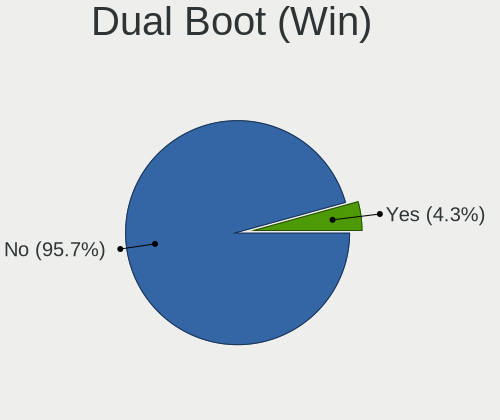
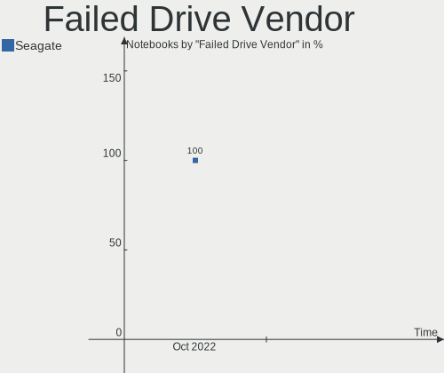
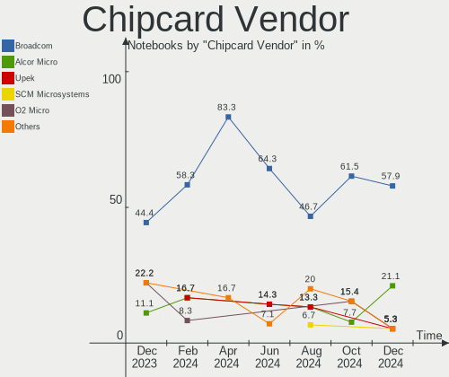

Zorin Hardware Trends (Notebooks)
---------------------------------

A project to identify most popular hardware characteristics and track their change
over time based on data collected by Zorin users at https://Linux-Hardware.org.

Anyone can contribute to this report by the [hw-probe](https://github.com/linuxhw/hw-probe) tool:

    sudo -E hw-probe -all -upload

Full-feature report is available here: https://linux-hardware.org/?view=trends&formfactor=notebook

Period: Aug, 2021.

Contents
--------

* [ System ](#system)
  - [ OS                       ](#os)
  - [ OS Family                ](#os-family)
  - [ Kernel                   ](#kernel)
  - [ Kernel Family            ](#kernel-family)
  - [ Kernel Major Ver.        ](#kernel-major-ver)
  - [ Arch                     ](#arch)
  - [ DE                       ](#de)
  - [ Display Server           ](#display-server)
  - [ Display Manager          ](#display-manager)
  - [ OS Lang                  ](#os-lang)
  - [ Boot Mode                ](#boot-mode)
  - [ Filesystem               ](#filesystem)
  - [ Part. scheme             ](#part-scheme)
  - [ Dual Boot with Linux/BSD ](#dual-boot-with-linuxbsd)
  - [ Dual Boot (Win)          ](#dual-boot-win)

* [ Board ](#board)
  - [ Vendor                   ](#vendor)
  - [ Model                    ](#model)
  - [ Model Family             ](#model-family)
  - [ MFG Year                 ](#mfg-year)
  - [ Form Factor              ](#form-factor)
  - [ Secure Boot              ](#secure-boot)
  - [ Coreboot                 ](#coreboot)
  - [ RAM Size                 ](#ram-size)
  - [ RAM Used                 ](#ram-used)
  - [ Total Drives             ](#total-drives)
  - [ Has CD-ROM               ](#has-cd-rom)
  - [ Has Ethernet             ](#has-ethernet)
  - [ Has WiFi                 ](#has-wifi)
  - [ Has Bluetooth            ](#has-bluetooth)

* [ Location ](#location)
  - [ Country                  ](#country)
  - [ City                     ](#city)

* [ Drives ](#drives)
  - [ Drive Vendor             ](#drive-vendor)
  - [ Drive Model              ](#drive-model)
  - [ HDD Vendor               ](#hdd-vendor)
  - [ SSD Vendor               ](#ssd-vendor)
  - [ Drive Kind               ](#drive-kind)
  - [ Drive Connector          ](#drive-connector)
  - [ Drive Size               ](#drive-size)
  - [ Space Total              ](#space-total)
  - [ Space Used               ](#space-used)
  - [ Malfunc. Drives          ](#malfunc-drives)
  - [ Malfunc. Drive Vendor    ](#malfunc-drive-vendor)
  - [ Malfunc. HDD Vendor      ](#malfunc-hdd-vendor)
  - [ Malfunc. Drive Kind      ](#malfunc-drive-kind)
  - [ Failed Drives            ](#failed-drives)
  - [ Failed Drive Vendor      ](#failed-drive-vendor)
  - [ Drive Status             ](#drive-status)

* [ Storage controller ](#storage-controller)
  - [ Storage Vendor           ](#storage-vendor)
  - [ Storage Model            ](#storage-model)
  - [ Storage Kind             ](#storage-kind)

* [ Processor ](#processor)
  - [ CPU Vendor               ](#cpu-vendor)
  - [ CPU Model                ](#cpu-model)
  - [ CPU Model Family         ](#cpu-model-family)
  - [ CPU Cores                ](#cpu-cores)
  - [ CPU Sockets              ](#cpu-sockets)
  - [ CPU Threads              ](#cpu-threads)
  - [ CPU Op-Modes             ](#cpu-op-modes)
  - [ CPU Microcode            ](#cpu-microcode)
  - [ CPU Microarch            ](#cpu-microarch)

* [ Graphics ](#graphics)
  - [ GPU Vendor               ](#gpu-vendor)
  - [ GPU Model                ](#gpu-model)
  - [ GPU Combo                ](#gpu-combo)
  - [ GPU Driver               ](#gpu-driver)
  - [ GPU Memory               ](#gpu-memory)

* [ Monitor ](#monitor)
  - [ Monitor Vendor           ](#monitor-vendor)
  - [ Monitor Model            ](#monitor-model)
  - [ Monitor Resolution       ](#monitor-resolution)
  - [ Monitor Diagonal         ](#monitor-diagonal)
  - [ Monitor Width            ](#monitor-width)
  - [ Aspect Ratio             ](#aspect-ratio)
  - [ Monitor Area             ](#monitor-area)
  - [ Pixel Density            ](#pixel-density)
  - [ Multiple Monitors        ](#multiple-monitors)

* [ Network ](#network)
  - [ Net Controller Vendor    ](#net-controller-vendor)
  - [ Net Controller Model     ](#net-controller-model)
  - [ Wireless Vendor          ](#wireless-vendor)
  - [ Wireless Model           ](#wireless-model)
  - [ Ethernet Vendor          ](#ethernet-vendor)
  - [ Ethernet Model           ](#ethernet-model)
  - [ Net Controller Kind      ](#net-controller-kind)
  - [ Used Controller          ](#used-controller)
  - [ NICs                     ](#nics)
  - [ IPv6                     ](#ipv6)

* [ Bluetooth ](#bluetooth)
  - [ Bluetooth Vendor         ](#bluetooth-vendor)
  - [ Bluetooth Model          ](#bluetooth-model)

* [ Sound ](#sound)
  - [ Sound Vendor             ](#sound-vendor)
  - [ Sound Model              ](#sound-model)

* [ Memory ](#memory)
  - [ Memory Vendor            ](#memory-vendor)
  - [ Memory Model             ](#memory-model)
  - [ Memory Kind              ](#memory-kind)
  - [ Memory Form Factor       ](#memory-form-factor)
  - [ Memory Size              ](#memory-size)
  - [ Memory Speed             ](#memory-speed)

* [ Printers & scanners ](#printers--scanners)
  - [ Printer Vendor           ](#printer-vendor)
  - [ Printer Model            ](#printer-model)
  - [ Scanner Vendor           ](#scanner-vendor)
  - [ Scanner Model            ](#scanner-model)

* [ Camera ](#camera)
  - [ Camera Vendor            ](#camera-vendor)
  - [ Camera Model             ](#camera-model)

* [ Security ](#security)
  - [ Fingerprint Vendor       ](#fingerprint-vendor)
  - [ Fingerprint Model        ](#fingerprint-model)
  - [ Chipcard Vendor          ](#chipcard-vendor)
  - [ Chipcard Model           ](#chipcard-model)

* [ Unsupported ](#unsupported)
  - [ Unsupported Devices      ](#unsupported-devices)
  - [ Unsupported Device Types ](#unsupported-device-types)

System
------

OS
--

Installed operating systems

| Name     | Notebooks | Percent |
|----------|-----------|---------|
| Zorin 16 | 55        | 59.14%  |
| Zorin 15 | 38        | 40.86%  |

OS Family
---------

OS without a version

| Name  | Notebooks | Percent |
|-------|-----------|---------|
| Zorin | 93        | 100%    |

Kernel
------

Version of the Linux kernel

| Version           | Notebooks | Percent |
|-------------------|-----------|---------|
| 5.11.0-27-generic | 46        | 49.46%  |
| 5.4.0-80-generic  | 20        | 21.51%  |
| 5.4.0-81-generic  | 10        | 10.75%  |
| 5.11.0-25-generic | 7         | 7.53%   |
| 5.4.0-45-generic  | 3         | 3.23%   |
| 5.4.0-47-generic  | 2         | 2.15%   |
| 5.8.0-63-generic  | 1         | 1.08%   |
| 5.4.0-64-generic  | 1         | 1.08%   |
| 5.4.0-58-generic  | 1         | 1.08%   |
| 5.10.0-1044-oem   | 1         | 1.08%   |
| 4.18.0-21-generic | 1         | 1.08%   |

Kernel Family
-------------

Linux kernel without a distro release

| Version | Notebooks | Percent |
|---------|-----------|---------|
| 5.11.0  | 53        | 56.99%  |
| 5.4.0   | 37        | 39.78%  |
| 5.8.0   | 1         | 1.08%   |
| 5.10.0  | 1         | 1.08%   |
| 4.18.0  | 1         | 1.08%   |

Kernel Major Ver.
-----------------

Linux kernel major version

| Version | Notebooks | Percent |
|---------|-----------|---------|
| 5.11    | 53        | 56.99%  |
| 5.4     | 37        | 39.78%  |
| 5.8     | 1         | 1.08%   |
| 5.10    | 1         | 1.08%   |
| 4.18    | 1         | 1.08%   |

Arch
----

OS architecture (x86_64, i586, etc.)

| Name   | Notebooks | Percent |
|--------|-----------|---------|
| x86_64 | 83        | 89.25%  |
| i686   | 10        | 10.75%  |

DE
--

Desktop Environment

| Name    | Notebooks | Percent |
|---------|-----------|---------|
| GNOME   | 68        | 73.12%  |
| XFCE    | 22        | 23.66%  |
| Unknown | 3         | 3.23%   |

Display Server
--------------

X11 or Wayland

| Name | Notebooks | Percent |
|------|-----------|---------|
| X11  | 93        | 100%    |

Display Manager
---------------

SDDM, LightDM, etc.

| Name    | Notebooks | Percent |
|---------|-----------|---------|
| Unknown | 82        | 88.17%  |
| GDM     | 10        | 10.75%  |
| TDM     | 1         | 1.08%   |

OS Lang
-------

Language

| Lang  | Notebooks | Percent |
|-------|-----------|---------|
| en_US | 24        | 25.81%  |
| pt_BR | 19        | 20.43%  |
| en_GB | 8         | 8.6%    |
| de_DE | 8         | 8.6%    |
| es_ES | 6         | 6.45%   |
| en_CA | 4         | 4.3%    |
| pl_PL | 3         | 3.23%   |
| es_MX | 3         | 3.23%   |
| en_IN | 2         | 2.15%   |
| C     | 2         | 2.15%   |
| sv_SE | 1         | 1.08%   |
| sk_SK | 1         | 1.08%   |
| ru_RU | 1         | 1.08%   |
| ja_JP | 1         | 1.08%   |
| it_IT | 1         | 1.08%   |
| hu_HU | 1         | 1.08%   |
| es_UY | 1         | 1.08%   |
| es_PE | 1         | 1.08%   |
| es_CO | 1         | 1.08%   |
| es_CL | 1         | 1.08%   |
| en_ZA | 1         | 1.08%   |
| en_NZ | 1         | 1.08%   |
| en_AU | 1         | 1.08%   |
| bg_BG | 1         | 1.08%   |

Boot Mode
---------

EFI or BIOS

| Mode | Notebooks | Percent |
|------|-----------|---------|
| BIOS | 47        | 50.54%  |
| EFI  | 46        | 49.46%  |

Filesystem
----------

Type of filesystem

| Type    | Notebooks | Percent |
|---------|-----------|---------|
| Ext4    | 88        | 94.62%  |
| Overlay | 4         | 4.3%    |
| Zfs     | 1         | 1.08%   |

Part. scheme
------------

Scheme of partitioning

| Type    | Notebooks | Percent |
|---------|-----------|---------|
| Unknown | 82        | 88.17%  |
| GPT     | 10        | 10.75%  |
| MBR     | 1         | 1.08%   |

Dual Boot with Linux/BSD
------------------------

Hosting more than one Linux/BSD

| Dual boot | Notebooks | Percent |
|-----------|-----------|---------|
| No        | 89        | 95.7%   |
| Yes       | 4         | 4.3%    |

Dual Boot (Win)
---------------

Hosting Linux and Windows

| Dual boot | Notebooks | Percent |
|-----------|-----------|---------|
| No        | 82        | 88.17%  |
| Yes       | 11        | 11.83%  |

Board
-----

Vendor
------

Motherboard manufacturer

| Name                | Notebooks | Percent |
|---------------------|-----------|---------|
| Lenovo              | 16        | 17.2%   |
| Hewlett-Packard     | 15        | 16.13%  |
| Acer                | 13        | 13.98%  |
| Dell                | 12        | 12.9%   |
| ASUSTek Computer    | 12        | 12.9%   |
| LG Electronics      | 4         | 4.3%    |
| Apple               | 4         | 4.3%    |
| Samsung Electronics | 3         | 3.23%   |
| Positivo            | 3         | 3.23%   |
| Toshiba             | 2         | 2.15%   |
| TianBei             | 1         | 1.08%   |
| Sony                | 1         | 1.08%   |
| Sole                | 1         | 1.08%   |
| Panasonic           | 1         | 1.08%   |
| Packard Bell        | 1         | 1.08%   |
| Itautec             | 1         | 1.08%   |
| Insyde              | 1         | 1.08%   |
| Fujitsu             | 1         | 1.08%   |
| Unknown             | 1         | 1.08%   |

Model
-----

Motherboard model

| Name                             | Notebooks | Percent |
|----------------------------------|-----------|---------|
| Dell Inspiron 5566               | 2         | 2.15%   |
| Toshiba Satellite S75Dt-A        | 1         | 1.08%   |
| Toshiba Satellite L505D          | 1         | 1.08%   |
| TianBei TB-H7                    | 1         | 1.08%   |
| Sony VGN-SR5                     | 1         | 1.08%   |
| Sole M672+968                    | 1         | 1.08%   |
| Samsung RV419                    | 1         | 1.08%   |
| Samsung N150                     | 1         | 1.08%   |
| Samsung 340XAA/350XAA/550XAA     | 1         | 1.08%   |
| Positivo Q232A                   | 1         | 1.08%   |
| Positivo Mobile                  | 1         | 1.08%   |
| Positivo CHT14B                  | 1         | 1.08%   |
| Panasonic CF-31JEGAX1M           | 1         | 1.08%   |
| Packard Bell DOT S               | 1         | 1.08%   |
| LG S460-G.BG31P1                 | 1         | 1.08%   |
| LG R580-G.BP21P1                 | 1         | 1.08%   |
| LG A410-K.BE47P1                 | 1         | 1.08%   |
| LG 17U70N-R.AAS7U1               | 1         | 1.08%   |
| Lenovo Z50-70 20354              | 1         | 1.08%   |
| Lenovo Yoga 3 Pro-1370 80HE      | 1         | 1.08%   |
| Lenovo ThinkPad X131e 3371AL2    | 1         | 1.08%   |
| Lenovo ThinkPad T61 6468AE2      | 1         | 1.08%   |
| Lenovo ThinkPad T61 6465CTO      | 1         | 1.08%   |
| Lenovo ThinkPad T520 4242W4F     | 1         | 1.08%   |
| Lenovo ThinkPad T440p 20AWS1CH00 | 1         | 1.08%   |
| Lenovo ThinkPad SL510 28752NG    | 1         | 1.08%   |
| Lenovo ThinkPad R61e 7650ELU     | 1         | 1.08%   |
| Lenovo IdeaPad Z510 20287        | 1         | 1.08%   |
| Lenovo IdeaPad S540-14API 81NH   | 1         | 1.08%   |
| Lenovo IdeaPad 5 15ALC05 82LN    | 1         | 1.08%   |
| Lenovo IdeaPad 3 14ADA05 81W0    | 1         | 1.08%   |
| Lenovo G50-70 20351              | 1         | 1.08%   |
| Lenovo G50-30 80G0               | 1         | 1.08%   |
| Lenovo B50-70 80EU               | 1         | 1.08%   |
| Itautec Infoway                  | 1         | 1.08%   |
| Insyde i101c                     | 1         | 1.08%   |
| HP ProBook 450 G2                | 1         | 1.08%   |
| HP ProBook 4430s                 | 1         | 1.08%   |
| HP ProBook 430 G6                | 1         | 1.08%   |
| HP Pavilion g7                   | 1         | 1.08%   |
| HP Pavilion dv6700               | 1         | 1.08%   |
| HP Pavilion 17                   | 1         | 1.08%   |
| HP Pavilion 15                   | 1         | 1.08%   |
| HP Notebook                      | 1         | 1.08%   |
| HP Mini 110-3100                 | 1         | 1.08%   |
| HP ENVY Sleekbook 4 PC           | 1         | 1.08%   |
| HP ENVY 14                       | 1         | 1.08%   |
| HP EliteBook 840 G1              | 1         | 1.08%   |
| HP Compaq Presario CQ61          | 1         | 1.08%   |
| HP Compaq 2510p                  | 1         | 1.08%   |
| HP 530                           | 1         | 1.08%   |
| Fujitsu LIFEBOOK AH532           | 1         | 1.08%   |
| Dell XPS 15 9560                 | 1         | 1.08%   |
| Dell XPS 13 9310                 | 1         | 1.08%   |
| Dell Precision M4800             | 1         | 1.08%   |
| Dell Latitude E5500              | 1         | 1.08%   |
| Dell Inspiron N5040              | 1         | 1.08%   |
| Dell Inspiron 7537               | 1         | 1.08%   |
| Dell Inspiron 7520               | 1         | 1.08%   |
| Dell Inspiron 6000               | 1         | 1.08%   |

Model Family
------------

Motherboard model prefix

| Name                   | Notebooks | Percent |
|------------------------|-----------|---------|
| Acer Aspire            | 9         | 9.68%   |
| Dell Inspiron          | 8         | 8.6%    |
| Lenovo ThinkPad        | 7         | 7.53%   |
| Lenovo IdeaPad         | 4         | 4.3%    |
| HP Pavilion            | 4         | 4.3%    |
| HP ProBook             | 3         | 3.23%   |
| Toshiba Satellite      | 2         | 2.15%   |
| HP ENVY                | 2         | 2.15%   |
| HP Compaq              | 2         | 2.15%   |
| Dell XPS               | 2         | 2.15%   |
| Apple MacBookPro11     | 2         | 2.15%   |
| TianBei TB-H7          | 1         | 1.08%   |
| Sony VGN-SR5           | 1         | 1.08%   |
| Sole M672+968          | 1         | 1.08%   |
| Samsung RV419          | 1         | 1.08%   |
| Samsung N150           | 1         | 1.08%   |
| Samsung 340XAA         | 1         | 1.08%   |
| Positivo Q232A         | 1         | 1.08%   |
| Positivo Mobile        | 1         | 1.08%   |
| Positivo CHT14B        | 1         | 1.08%   |
| Panasonic CF-31JEGAX1M | 1         | 1.08%   |
| Packard Bell DOT       | 1         | 1.08%   |
| LG S460-G.BG31P1       | 1         | 1.08%   |
| LG R580-G.BP21P1       | 1         | 1.08%   |
| LG A410-K.BE47P1       | 1         | 1.08%   |
| LG 17U70N-R.AAS7U1     | 1         | 1.08%   |
| Lenovo Z50-70          | 1         | 1.08%   |
| Lenovo Yoga            | 1         | 1.08%   |
| Lenovo G50-70          | 1         | 1.08%   |
| Lenovo G50-30          | 1         | 1.08%   |
| Lenovo B50-70          | 1         | 1.08%   |
| Itautec Infoway        | 1         | 1.08%   |
| Insyde i101c           | 1         | 1.08%   |
| HP Notebook            | 1         | 1.08%   |
| HP Mini                | 1         | 1.08%   |
| HP EliteBook           | 1         | 1.08%   |
| HP 530                 | 1         | 1.08%   |
| Fujitsu LIFEBOOK       | 1         | 1.08%   |
| Dell Precision         | 1         | 1.08%   |
| Dell Latitude          | 1         | 1.08%   |
| ASUS ZenBook           | 1         | 1.08%   |
| ASUS X55U              | 1         | 1.08%   |
| ASUS X550LD            | 1         | 1.08%   |
| ASUS X51R              | 1         | 1.08%   |
| ASUS X441SA            | 1         | 1.08%   |
| ASUS X405UA            | 1         | 1.08%   |
| ASUS UX430UAR          | 1         | 1.08%   |
| ASUS K73SV             | 1         | 1.08%   |
| ASUS K56CA             | 1         | 1.08%   |
| ASUS GR8               | 1         | 1.08%   |
| ASUS ASUS              | 1         | 1.08%   |
| ASUS 1001PX            | 1         | 1.08%   |
| Apple MacBookPro7      | 1         | 1.08%   |
| Apple MacBook4         | 1         | 1.08%   |
| Acer Swift             | 1         | 1.08%   |
| Acer Nitro             | 1         | 1.08%   |
| Acer Extensa           | 1         | 1.08%   |
| Acer AO722             | 1         | 1.08%   |
| Unknown                | 1         | 1.08%   |

MFG Year
--------

Motherboard manufacture year

| Year | Notebooks | Percent |
|------|-----------|---------|
| 2021 | 11        | 11.83%  |
| 2014 | 9         | 9.68%   |
| 2011 | 9         | 9.68%   |
| 2018 | 8         | 8.6%    |
| 2010 | 7         | 7.53%   |
| 2008 | 7         | 7.53%   |
| 2020 | 6         | 6.45%   |
| 2017 | 6         | 6.45%   |
| 2013 | 6         | 6.45%   |
| 2009 | 6         | 6.45%   |
| 2019 | 5         | 5.38%   |
| 2012 | 5         | 5.38%   |
| 2015 | 3         | 3.23%   |
| 2007 | 2         | 2.15%   |
| 2016 | 1         | 1.08%   |
| 2006 | 1         | 1.08%   |
| 2005 | 1         | 1.08%   |

Form Factor
-----------

Physical design of the computer

| Name     | Notebooks | Percent |
|----------|-----------|---------|
| Notebook | 93        | 100%    |

Secure Boot
-----------

Enabled or disabled

| State    | Notebooks | Percent |
|----------|-----------|---------|
| Disabled | 82        | 88.17%  |
| Enabled  | 11        | 11.83%  |

Coreboot
--------

Have coreboot on board

| Used | Notebooks | Percent |
|------|-----------|---------|
| No   | 93        | 100%    |

RAM Size
--------

Total RAM memory

| Size in GB | Notebooks | Percent |
|------------|-----------|---------|
| 3.01-4.0   | 31        | 33.33%  |
| 4.01-8.0   | 25        | 26.88%  |
| 8.01-16.0  | 10        | 10.75%  |
| 1.01-2.0   | 9         | 9.68%   |
| 16.01-24.0 | 8         | 8.6%    |
| 2.01-3.0   | 5         | 5.38%   |
| 32.01-64.0 | 3         | 3.23%   |
| 0.51-1.0   | 2         | 2.15%   |

RAM Used
--------

Used RAM memory

| Used GB  | Notebooks | Percent |
|----------|-----------|---------|
| 1.01-2.0 | 46        | 49.46%  |
| 2.01-3.0 | 21        | 22.58%  |
| 0.51-1.0 | 13        | 13.98%  |
| 3.01-4.0 | 8         | 8.6%    |
| 4.01-8.0 | 5         | 5.38%   |

Total Drives
------------

Number of drives on board

| Drives | Notebooks | Percent |
|--------|-----------|---------|
| 1      | 75        | 80.65%  |
| 2      | 15        | 16.13%  |
| 3      | 2         | 2.15%   |
| 4      | 1         | 1.08%   |

Has CD-ROM
----------

Has CD-ROM on board

| Presented | Notebooks | Percent |
|-----------|-----------|---------|
| Yes       | 51        | 54.84%  |
| No        | 42        | 45.16%  |

Has Ethernet
------------

Has Ethernet on board

| Presented | Notebooks | Percent |
|-----------|-----------|---------|
| Yes       | 84        | 90.32%  |
| No        | 9         | 9.68%   |

Has WiFi
--------

Has WiFi module

| Presented | Notebooks | Percent |
|-----------|-----------|---------|
| Yes       | 90        | 96.77%  |
| No        | 3         | 3.23%   |

Has Bluetooth
-------------

Has Bluetooth module

| Presented | Notebooks | Percent |
|-----------|-----------|---------|
| Yes       | 59        | 63.44%  |
| No        | 34        | 36.56%  |

Location
--------

Country
-------

Geographic location (country)

| Country      | Notebooks | Percent |
|--------------|-----------|---------|
| Brazil       | 22        | 23.66%  |
| Germany      | 12        | 12.9%   |
| USA          | 10        | 10.75%  |
| UK           | 7         | 7.53%   |
| Spain        | 6         | 6.45%   |
| Poland       | 3         | 3.23%   |
| Mexico       | 3         | 3.23%   |
| India        | 3         | 3.23%   |
| France       | 3         | 3.23%   |
| Canada       | 3         | 3.23%   |
| Vietnam      | 2         | 2.15%   |
| Sweden       | 2         | 2.15%   |
| Colombia     | 2         | 2.15%   |
| Uruguay      | 1         | 1.08%   |
| South Africa | 1         | 1.08%   |
| Slovakia     | 1         | 1.08%   |
| New Zealand  | 1         | 1.08%   |
| Netherlands  | 1         | 1.08%   |
| Kenya        | 1         | 1.08%   |
| Japan        | 1         | 1.08%   |
| Italy        | 1         | 1.08%   |
| Israel       | 1         | 1.08%   |
| Hungary      | 1         | 1.08%   |
| Hong Kong    | 1         | 1.08%   |
| Egypt        | 1         | 1.08%   |
| Chile        | 1         | 1.08%   |
| Bulgaria     | 1         | 1.08%   |
| Australia    | 1         | 1.08%   |

City
----

Geographic location (city)

| City                     | Notebooks | Percent |
|--------------------------|-----------|---------|
| Madrid                   | 3         | 3.23%   |
| S??o Lu?­s               | 2         | 2.15%   |
| Recife                   | 2         | 2.15%   |
| Nottingham               | 2         | 2.15%   |
| Macei??                  | 2         | 2.15%   |
| Berlin                   | 2         | 2.15%   |
| Zabrze                   | 1         | 1.08%   |
| Yokohama                 | 1         | 1.08%   |
| West Monroe              | 1         | 1.08%   |
| Vlaardingen              | 1         | 1.08%   |
| Vila Velha               | 1         | 1.08%   |
| Veracruz                 | 1         | 1.08%   |
| Vancouver                | 1         | 1.08%   |
| Upplands Vasby           | 1         | 1.08%   |
| Trnava                   | 1         | 1.08%   |
| The Bronx                | 1         | 1.08%   |
| Taquaritinga             | 1         | 1.08%   |
| Taboao da Serra          | 1         | 1.08%   |
| Stockholm                | 1         | 1.08%   |
| Spremberg                | 1         | 1.08%   |
| Seville                  | 1         | 1.08%   |
| S??o Jo??o del Rei       | 1         | 1.08%   |
| Santana de Parnaiba      | 1         | 1.08%   |
| Santa Cruz do Rio Pardo  | 1         | 1.08%   |
| Sant Carles de la Rapita | 1         | 1.08%   |
| Sainte-Marie             | 1         | 1.08%   |
| Rome                     | 1         | 1.08%   |
| Rio de Janeiro           | 1         | 1.08%   |
| Red Deer                 | 1         | 1.08%   |
| R??sselsheim am Main     | 1         | 1.08%   |
| Picos                    | 1         | 1.08%   |
| Osasco                   | 1         | 1.08%   |
| Noblesville              | 1         | 1.08%   |
| New York                 | 1         | 1.08%   |
| Naumburg                 | 1         | 1.08%   |
| Nairobi                  | 1         | 1.08%   |
| Mumbai                   | 1         | 1.08%   |
| Morro do Chapeu          | 1         | 1.08%   |
| Montreal                 | 1         | 1.08%   |
| Montevideo               | 1         | 1.08%   |
| Montana                  | 1         | 1.08%   |
| Mexico City              | 1         | 1.08%   |
| Manchester               | 1         | 1.08%   |
| Loveland                 | 1         | 1.08%   |
| Lorient                  | 1         | 1.08%   |
| London                   | 1         | 1.08%   |
| Lodz                     | 1         | 1.08%   |
| Lathen                   | 1         | 1.08%   |
| Landshut                 | 1         | 1.08%   |
| Krakow                   | 1         | 1.08%   |
| Knoxville                | 1         | 1.08%   |
| Kingston                 | 1         | 1.08%   |
| Kfar Saba                | 1         | 1.08%   |
| Kelkheim (Taunus)        | 1         | 1.08%   |
| Johannesburg             | 1         | 1.08%   |
| Imperatriz               | 1         | 1.08%   |
| Ho Chi Minh City         | 1         | 1.08%   |
| Hartheim                 | 1         | 1.08%   |
| Hanoi                    | 1         | 1.08%   |
| Hamm (Sieg)              | 1         | 1.08%   |

Drives
------

Drive Vendor
------------

Hard drive vendors

| Vendor              | Notebooks | Drives | Percent |
|---------------------|-----------|--------|---------|
| Seagate             | 24        | 24     | 22.64%  |
| WDC                 | 12        | 12     | 11.32%  |
| Samsung Electronics | 12        | 13     | 11.32%  |
| Toshiba             | 9         | 9      | 8.49%   |
| Sandisk             | 7         | 7      | 6.6%    |
| Kingston            | 6         | 6      | 5.66%   |
| Unknown             | 5         | 5      | 4.72%   |
| HGST                | 4         | 4      | 3.77%   |
| Hitachi             | 3         | 3      | 2.83%   |
| Fujitsu             | 3         | 3      | 2.83%   |
| Crucial             | 3         | 4      | 2.83%   |
| SK Hynix            | 2         | 2      | 1.89%   |
| LITEONIT            | 2         | 3      | 1.89%   |
| Apple               | 2         | 2      | 1.89%   |
| Vaseky              | 1         | 1      | 0.94%   |
| SPCC                | 1         | 1      | 0.94%   |
| PNY                 | 1         | 1      | 0.94%   |
| OCZ                 | 1         | 1      | 0.94%   |
| Micron Technology   | 1         | 1      | 0.94%   |
| KingSpec            | 1         | 1      | 0.94%   |
| Intenso             | 1         | 1      | 0.94%   |
| IBM/Hitachi         | 1         | 1      | 0.94%   |
| faspeed             | 1         | 1      | 0.94%   |
| China               | 1         | 1      | 0.94%   |
| BUFFALO             | 1         | 1      | 0.94%   |
| A-DATA Technology   | 1         | 1      | 0.94%   |

Drive Model
-----------

Hard drive models

| Model                                 | Notebooks | Percent |
|---------------------------------------|-----------|---------|
| Seagate ST9500325AS 500GB             | 4         | 3.7%    |
| Seagate ST1000LM024 HN-M101MBB 1TB    | 4         | 3.7%    |
| Seagate ST500LM012 HN-M500MBB 500GB   | 3         | 2.78%   |
| Unknown MMC Card  32GB                | 2         | 1.85%   |
| Toshiba MQ02ABD100H 1TB               | 2         | 1.85%   |
| Toshiba MQ01ABF050 500GB              | 2         | 1.85%   |
| Seagate ST1000LM035-1RK172 1TB        | 2         | 1.85%   |
| SanDisk SSD PLUS 480GB                | 2         | 1.85%   |
| Sandisk NVMe SSD Drive 256GB          | 2         | 1.85%   |
| Samsung HM160HI 160GB                 | 2         | 1.85%   |
| Kingston SA400S37240G 240GB SSD       | 2         | 1.85%   |
| HGST HTS725050A7E630 500GB            | 2         | 1.85%   |
| WDC WDS250G1B0A-00H9H0 250GB SSD      | 1         | 0.93%   |
| WDC WDS240G2G0A-00JH30 240GB SSD      | 1         | 0.93%   |
| WDC WD800BEVS-08RST2 80GB             | 1         | 0.93%   |
| WDC WD5000LPVT-22G33T0 500GB          | 1         | 0.93%   |
| WDC WD5000BPVT-22HXZT3 500GB          | 1         | 0.93%   |
| WDC WD3200BEVT-00A23T0 320GB          | 1         | 0.93%   |
| WDC WD3200BEKT-60V5T1 320GB           | 1         | 0.93%   |
| WDC WD2500BEVT-80A23T0 250GB          | 1         | 0.93%   |
| WDC WD2500BEVT-22A23T0 250GB          | 1         | 0.93%   |
| WDC WD2500BEVT-08A23T1 250GB          | 1         | 0.93%   |
| WDC WD2500BEKT-75PVMT0 250GB          | 1         | 0.93%   |
| WDC WD10SPZX-21Z10T0 1TB              | 1         | 0.93%   |
| Vaseky V820/256G 256GB                | 1         | 0.93%   |
| Unknown SD/MMC/MS PRO 128GB           | 1         | 0.93%   |
| Unknown NCard  32GB                   | 1         | 0.93%   |
| Unknown MMC Card  7GB                 | 1         | 0.93%   |
| Toshiba MQ04ABF100 1TB                | 1         | 0.93%   |
| Toshiba MK3265GSX 320GB               | 1         | 0.93%   |
| Toshiba MK1011GAH 100GB               | 1         | 0.93%   |
| Toshiba KXG50ZNV1T02 NVMe 1024GB      | 1         | 0.93%   |
| Toshiba KBG40ZMT128G MEMORY 128GB     | 1         | 0.93%   |
| SPCC SPCCSolidStateDisk 256GB SSD     | 1         | 0.93%   |
| SK Hynix NVMe SSD Drive 512GB         | 1         | 0.93%   |
| SK Hynix HFS256G39TND-N210A 256GB SSD | 1         | 0.93%   |
| Seagate USB 500GB                     | 1         | 0.93%   |
| Seagate ST9750423AS 752GB             | 1         | 0.93%   |
| Seagate ST9320325AS 320GB             | 1         | 0.93%   |
| Seagate ST9250827AS 250GB             | 1         | 0.93%   |
| Seagate ST9250410AS 250GB             | 1         | 0.93%   |
| Seagate ST500LT012-9WS142 500GB       | 1         | 0.93%   |
| Seagate ST500LT012-1DG142 500GB       | 1         | 0.93%   |
| Seagate ST320LM001 HN-M320MBB 320GB   | 1         | 0.93%   |
| Seagate ST2000LM007-1R8174 2TB        | 1         | 0.93%   |
| Seagate ST1000LM014-SSHD-8GB          | 1         | 0.93%   |
| Seagate ST1000LM014-1EJ1 1TB          | 1         | 0.93%   |
| SanDisk SSD PLUS 1000GB               | 1         | 0.93%   |
| SanDisk SSD i100 24GB                 | 1         | 0.93%   |
| Sandisk NVMe SSD Drive 128GB          | 1         | 0.93%   |
| Samsung SSD SM841N mSATA 256GB SED    | 1         | 0.93%   |
| Samsung SSD PM830 2.5 7mm 128GB       | 1         | 0.93%   |
| Samsung SSD 860 PRO 256GB             | 1         | 0.93%   |
| Samsung SSD 860 EVO 250GB             | 1         | 0.93%   |
| Samsung SSD 860 EVO 1TB               | 1         | 0.93%   |
| Samsung SSD 850 EVO 250GB             | 1         | 0.93%   |
| Samsung SSD 840 EVO 250GB             | 1         | 0.93%   |
| Samsung NVMe SSD Drive 512GB          | 1         | 0.93%   |
| Samsung NVMe SSD Drive 2TB            | 1         | 0.93%   |
| Samsung MZALQ512HBLU-00BL2 512GB      | 1         | 0.93%   |

HDD Vendor
----------

Hard disk drive vendors

| Vendor              | Notebooks | Drives | Percent |
|---------------------|-----------|--------|---------|
| Seagate             | 23        | 23     | 42.59%  |
| WDC                 | 10        | 10     | 18.52%  |
| Toshiba             | 7         | 7      | 12.96%  |
| HGST                | 4         | 4      | 7.41%   |
| Samsung Electronics | 3         | 3      | 5.56%   |
| Hitachi             | 3         | 3      | 5.56%   |
| Fujitsu             | 3         | 3      | 5.56%   |
| IBM/Hitachi         | 1         | 1      | 1.85%   |

SSD Vendor
----------

Solid state drive vendors

| Vendor              | Notebooks | Drives | Percent |
|---------------------|-----------|--------|---------|
| Samsung Electronics | 6         | 7      | 18.18%  |
| Kingston            | 5         | 5      | 15.15%  |
| SanDisk             | 4         | 4      | 12.12%  |
| Crucial             | 3         | 4      | 9.09%   |
| WDC                 | 2         | 2      | 6.06%   |
| LITEONIT            | 2         | 3      | 6.06%   |
| Apple               | 2         | 2      | 6.06%   |
| SPCC                | 1         | 1      | 3.03%   |
| SK Hynix            | 1         | 1      | 3.03%   |
| PNY                 | 1         | 1      | 3.03%   |
| OCZ                 | 1         | 1      | 3.03%   |
| Micron Technology   | 1         | 1      | 3.03%   |
| KingSpec            | 1         | 1      | 3.03%   |
| Intenso             | 1         | 1      | 3.03%   |
| China               | 1         | 1      | 3.03%   |
| BUFFALO             | 1         | 1      | 3.03%   |

Drive Kind
----------

HDD or SSD

| Kind    | Notebooks | Drives | Percent |
|---------|-----------|--------|---------|
| HDD     | 54        | 54     | 52.94%  |
| SSD     | 29        | 36     | 28.43%  |
| NVMe    | 11        | 11     | 10.78%  |
| MMC     | 4         | 4      | 3.92%   |
| Unknown | 4         | 4      | 3.92%   |

Drive Connector
---------------

SATA, SAS, NVMe, etc.

| Type | Notebooks | Drives | Percent |
|------|-----------|--------|---------|
| SATA | 81        | 90     | 81%     |
| NVMe | 11        | 11     | 11%     |
| SAS  | 4         | 4      | 4%      |
| MMC  | 4         | 4      | 4%      |

Drive Size
----------

Size of hard drive

| Size in TB | Notebooks | Drives | Percent |
|------------|-----------|--------|---------|
| 0.01-0.5   | 63        | 69     | 76.83%  |
| 0.51-1.0   | 18        | 20     | 21.95%  |
| 1.01-2.0   | 1         | 1      | 1.22%   |

Space Total
-----------

Amount of disk space available on the file system

| Size in GB | Notebooks | Percent |
|------------|-----------|---------|
| 101-250    | 34        | 36.56%  |
| 251-500    | 22        | 23.66%  |
| 501-1000   | 13        | 13.98%  |
| 51-100     | 12        | 12.9%   |
| 21-50      | 6         | 6.45%   |
| 1-20       | 3         | 3.23%   |
| 1001-2000  | 2         | 2.15%   |
| Unknown    | 1         | 1.08%   |

Space Used
----------

Amount of used disk space

| Used GB  | Notebooks | Percent |
|----------|-----------|---------|
| 1-20     | 64        | 68.82%  |
| 21-50    | 18        | 19.35%  |
| 101-250  | 5         | 5.38%   |
| 251-500  | 3         | 3.23%   |
| 501-1000 | 1         | 1.08%   |
| 51-100   | 1         | 1.08%   |
| Unknown  | 1         | 1.08%   |

Malfunc. Drives
---------------

Drive models with a malfunction

| Model                      | Notebooks | Drives | Percent |
|----------------------------|-----------|--------|---------|
| Toshiba MQ02ABD100H 1TB    | 2         | 2      | 66.67%  |
| HGST HTS725050A7E630 500GB | 1         | 1      | 33.33%  |

Malfunc. Drive Vendor
---------------------

Vendors of faulty drives

| Vendor  | Notebooks | Drives | Percent |
|---------|-----------|--------|---------|
| Toshiba | 2         | 2      | 66.67%  |
| HGST    | 1         | 1      | 33.33%  |

Malfunc. HDD Vendor
-------------------

Vendors of faulty HDD drives

| Vendor  | Notebooks | Drives | Percent |
|---------|-----------|--------|---------|
| Toshiba | 2         | 2      | 66.67%  |
| HGST    | 1         | 1      | 33.33%  |

Malfunc. Drive Kind
-------------------

Kinds of faulty drives

| Kind | Notebooks | Drives | Percent |
|------|-----------|--------|---------|
| HDD  | 3         | 3      | 100%    |

Failed Drives
-------------

Failed drive models

| Model                 | Notebooks | Drives | Percent |
|-----------------------|-----------|--------|---------|
| SanDisk SSD i100 24GB | 1         | 1      | 100%    |

Failed Drive Vendor
-------------------

Failed drive vendors

| Vendor  | Notebooks | Drives | Percent |
|---------|-----------|--------|---------|
| SanDisk | 1         | 1      | 100%    |

Drive Status
------------

Number of failed and malfunc. drives

| Status   | Notebooks | Drives | Percent |
|----------|-----------|--------|---------|
| Detected | 83        | 97     | 88.3%   |
| Works    | 7         | 8      | 7.45%   |
| Malfunc  | 3         | 3      | 3.19%   |
| Failed   | 1         | 1      | 1.06%   |

Storage controller
------------------

Storage Vendor
--------------

Storage controller vendors

| Vendor                           | Notebooks | Percent |
|----------------------------------|-----------|---------|
| Intel                            | 65        | 67.01%  |
| AMD                              | 15        | 15.46%  |
| Samsung Electronics              | 5         | 5.15%   |
| Silicon Integrated Systems [SiS] | 3         | 3.09%   |
| Sandisk                          | 3         | 3.09%   |
| Toshiba America Info Systems     | 1         | 1.03%   |
| SK Hynix                         | 1         | 1.03%   |
| Nvidia                           | 1         | 1.03%   |
| KIOXIA                           | 1         | 1.03%   |
| Kingston Technology Company      | 1         | 1.03%   |
| ADATA Technology                 | 1         | 1.03%   |

Storage Model
-------------

Storage controller models

| Model                                                                            | Notebooks | Percent |
|----------------------------------------------------------------------------------|-----------|---------|
| AMD FCH SATA Controller [AHCI mode]                                              | 10        | 9.01%   |
| Intel 8 Series SATA Controller 1 [AHCI mode]                                     | 8         | 7.21%   |
| Intel Sunrise Point-LP SATA Controller [AHCI mode]                               | 7         | 6.31%   |
| Intel 82801HM/HEM (ICH8M/ICH8M-E) IDE Controller                                 | 7         | 6.31%   |
| Intel 82801IBM/IEM (ICH9M/ICH9M-E) 4 port SATA Controller [AHCI mode]            | 6         | 5.41%   |
| Intel 7 Series Chipset Family 6-port SATA Controller [AHCI mode]                 | 6         | 5.41%   |
| Intel 82801HM/HEM (ICH8M/ICH8M-E) SATA Controller [AHCI mode]                    | 5         | 4.5%    |
| Intel 6 Series/C200 Series Chipset Family 6 port Mobile SATA AHCI Controller     | 5         | 4.5%    |
| Intel NM10/ICH7 Family SATA Controller [AHCI mode]                               | 4         | 3.6%    |
| Silicon Integrated Systems [SiS] SATA Controller / IDE mode                      | 3         | 2.7%    |
| Silicon Integrated Systems [SiS] 5513 IDE Controller                             | 3         | 2.7%    |
| Intel Wildcat Point-LP SATA Controller [AHCI Mode]                               | 3         | 2.7%    |
| AMD SB7x0/SB8x0/SB9x0 SATA Controller [AHCI mode]                                | 3         | 2.7%    |
| Sandisk WD Blue SN500 / PC SN520 NVMe SSD                                        | 2         | 1.8%    |
| Intel Atom Processor E3800 Series SATA AHCI Controller                           | 2         | 1.8%    |
| Intel 82801HM/HEM (ICH8M/ICH8M-E) SATA Controller [IDE mode]                     | 2         | 1.8%    |
| Intel 82801 Mobile SATA Controller [RAID mode]                                   | 2         | 1.8%    |
| Intel 8 Series/C220 Series Chipset Family 6-port SATA Controller 1 [AHCI mode]   | 2         | 1.8%    |
| Intel 5 Series/3400 Series Chipset 6 port SATA AHCI Controller                   | 2         | 1.8%    |
| Toshiba America Info Systems Toshiba America Info Non-Volatile memory controller | 1         | 0.9%    |
| SK Hynix BC511                                                                   | 1         | 0.9%    |
| Sandisk PC SN520 NVMe SSD                                                        | 1         | 0.9%    |
| Samsung NVMe SSD Controller SM981/PM981/PM983                                    | 1         | 0.9%    |
| Samsung NVMe SSD Controller PM9A1/PM9A3/980PRO                                   | 1         | 0.9%    |
| Samsung NVMe Controller                                                          | 1         | 0.9%    |
| Samsung Electronics SATA controller                                              | 1         | 0.9%    |
| Samsung Apple PCIe SSD                                                           | 1         | 0.9%    |
| Nvidia MCP89 SATA Controller (AHCI mode)                                         | 1         | 0.9%    |
| KIOXIA Non-Volatile memory controller                                            | 1         | 0.9%    |
| Kingston Company U-SNS8154P3 NVMe SSD                                            | 1         | 0.9%    |
| Intel Volume Management Device NVMe RAID Controller                              | 1         | 0.9%    |
| Intel Mobile PM965/GM965 PT IDER Controller                                      | 1         | 0.9%    |
| Intel HM170/QM170 Chipset SATA Controller [AHCI Mode]                            | 1         | 0.9%    |
| Intel Cannon Point-LP SATA Controller [AHCI Mode]                                | 1         | 0.9%    |
| Intel Atom/Celeron/Pentium Processor x5-E8000/J3xxx/N3xxx Series SATA Controller | 1         | 0.9%    |
| Intel 82801IBM/IEM (ICH9M/ICH9M-E) 2 port SATA Controller [IDE mode]             | 1         | 0.9%    |
| Intel 82801GBM/GHM (ICH7-M Family) SATA Controller [AHCI mode]                   | 1         | 0.9%    |
| Intel 82801G (ICH7 Family) IDE Controller                                        | 1         | 0.9%    |
| Intel 82801FBM (ICH6M) SATA Controller                                           | 1         | 0.9%    |
| Intel 8 Series/C220 Series Chipset Family 2-port SATA Controller 2 [IDE mode]    | 1         | 0.9%    |
| Intel 8 Series Chipset Family 4-port SATA Controller 1 [IDE mode] - Mobile       | 1         | 0.9%    |
| Intel 5 Series/3400 Series Chipset 4 port SATA AHCI Controller                   | 1         | 0.9%    |
| Intel 400 Series Chipset Family SATA AHCI Controller                             | 1         | 0.9%    |
| AMD SB600 Non-Raid-5 SATA                                                        | 1         | 0.9%    |
| AMD SB600 IDE                                                                    | 1         | 0.9%    |
| AMD IXP SB4x0 IDE Controller                                                     | 1         | 0.9%    |
| AMD FCH IDE Controller                                                           | 1         | 0.9%    |
| ADATA XPG SX8200 Pro PCIe Gen3x4 M.2 2280 Solid State Drive                      | 1         | 0.9%    |

Storage Kind
------------

Kind of storage controller (IDE, SATA, NVMe, SAS, ...)

| Kind | Notebooks | Percent |
|------|-----------|---------|
| SATA | 73        | 69.52%  |
| IDE  | 18        | 17.14%  |
| NVMe | 11        | 10.48%  |
| RAID | 3         | 2.86%   |

Processor
---------

CPU Vendor
----------

Processor vendors

| Vendor | Notebooks | Percent |
|--------|-----------|---------|
| Intel  | 78        | 83.87%  |
| AMD    | 15        | 16.13%  |

CPU Model
---------

Processor models

| Model                                         | Notebooks | Percent |
|-----------------------------------------------|-----------|---------|
| Intel Core i5-7200U CPU @ 2.50GHz             | 4         | 4.3%    |
| Intel Pentium Dual-Core CPU T4500 @ 2.30GHz   | 2         | 2.15%   |
| Intel Core i7-4500U CPU @ 1.80GHz             | 2         | 2.15%   |
| Intel Core i5-8250U CPU @ 1.60GHz             | 2         | 2.15%   |
| Intel Core i5-5200U CPU @ 2.20GHz             | 2         | 2.15%   |
| Intel Core i3-3217U CPU @ 1.80GHz             | 2         | 2.15%   |
| Intel Core i3-3110M CPU @ 2.40GHz             | 2         | 2.15%   |
| Intel Core 2 Duo CPU T5750 @ 2.00GHz          | 2         | 2.15%   |
| Intel Atom CPU N450 @ 1.66GHz                 | 2         | 2.15%   |
| AMD Ryzen 5 3500U with Radeon Vega Mobile Gfx | 2         | 2.15%   |
| AMD C-60 APU with Radeon HD Graphics          | 2         | 2.15%   |
| Intel Processor 5Y70 CPU @ 1.10GHz            | 1         | 1.08%   |
| Intel Pentium Silver N6000 @ 1.10GHz          | 1         | 1.08%   |
| Intel Pentium M processor 1.86GHz             | 1         | 1.08%   |
| Intel Pentium Dual-Core CPU T4400 @ 2.20GHz   | 1         | 1.08%   |
| Intel Pentium Dual-Core CPU T4200 @ 2.00GHz   | 1         | 1.08%   |
| Intel Pentium Dual CPU T2390 @ 1.86GHz        | 1         | 1.08%   |
| Intel Pentium CPU P6200 @ 2.13GHz             | 1         | 1.08%   |
| Intel Pentium CPU 3550M @ 2.30GHz             | 1         | 1.08%   |
| Intel Genuine CPU T2130 @ 1.86GHz             | 1         | 1.08%   |
| Intel Core i7-8565U CPU @ 1.80GHz             | 1         | 1.08%   |
| Intel Core i7-7700HQ CPU @ 2.80GHz            | 1         | 1.08%   |
| Intel Core i7-4940MX CPU @ 3.10GHz            | 1         | 1.08%   |
| Intel Core i7-4870HQ CPU @ 2.50GHz            | 1         | 1.08%   |
| Intel Core i7-4600M CPU @ 2.90GHz             | 1         | 1.08%   |
| Intel Core i7-4510U CPU @ 2.00GHz             | 1         | 1.08%   |
| Intel Core i7-3632QM CPU @ 2.20GHz            | 1         | 1.08%   |
| Intel Core i7 CPU Q 720 @ 1.60GHz             | 1         | 1.08%   |
| Intel Core i5-8265U CPU @ 1.60GHz             | 1         | 1.08%   |
| Intel Core i5-4310U CPU @ 2.00GHz             | 1         | 1.08%   |
| Intel Core i5-4258U CPU @ 2.40GHz             | 1         | 1.08%   |
| Intel Core i5-4210U CPU @ 1.70GHz             | 1         | 1.08%   |
| Intel Core i5-4200U CPU @ 1.60GHz             | 1         | 1.08%   |
| Intel Core i5-3337U CPU @ 1.80GHz             | 1         | 1.08%   |
| Intel Core i5-3317U CPU @ 1.70GHz             | 1         | 1.08%   |
| Intel Core i5-3210M CPU @ 2.50GHz             | 1         | 1.08%   |
| Intel Core i5-2540M CPU @ 2.60GHz             | 1         | 1.08%   |
| Intel Core i5-2520M CPU @ 2.50GHz             | 1         | 1.08%   |
| Intel Core i5-2410M CPU @ 2.30GHz             | 1         | 1.08%   |
| Intel Core i5-10300H CPU @ 2.50GHz            | 1         | 1.08%   |
| Intel Core i5-10210U CPU @ 1.60GHz            | 1         | 1.08%   |
| Intel Core i5 CPU M 480 @ 2.67GHz             | 1         | 1.08%   |
| Intel Core i3-6100U CPU @ 2.30GHz             | 1         | 1.08%   |
| Intel Core i3-4030U CPU @ 1.90GHz             | 1         | 1.08%   |
| Intel Core i3-4005U CPU @ 1.70GHz             | 1         | 1.08%   |
| Intel Core i3-2370M CPU @ 2.40GHz             | 1         | 1.08%   |
| Intel Core 2 Extreme CPU X9000 @ 2.80GHz      | 1         | 1.08%   |
| Intel Core 2 Duo CPU U7600 @ 1.20GHz          | 1         | 1.08%   |
| Intel Core 2 Duo CPU T8300 @ 2.40GHz          | 1         | 1.08%   |
| Intel Core 2 Duo CPU T7300 @ 2.00GHz          | 1         | 1.08%   |
| Intel Core 2 Duo CPU T7250 @ 2.00GHz          | 1         | 1.08%   |
| Intel Core 2 Duo CPU T7100 @ 1.80GHz          | 1         | 1.08%   |
| Intel Core 2 Duo CPU T6500 @ 2.10GHz          | 1         | 1.08%   |
| Intel Core 2 Duo CPU T5450 @ 1.66GHz          | 1         | 1.08%   |
| Intel Core 2 Duo CPU P8800 @ 2.66GHz          | 1         | 1.08%   |
| Intel Core 2 Duo CPU P8600 @ 2.40GHz          | 1         | 1.08%   |
| Intel Celeron M CPU 520 @ 1.60GHz             | 1         | 1.08%   |
| Intel Celeron Dual-Core CPU T3100 @ 1.90GHz   | 1         | 1.08%   |
| Intel Celeron CPU N3060 @ 1.60GHz             | 1         | 1.08%   |
| Intel Celeron CPU N2840 @ 2.16GHz             | 1         | 1.08%   |

CPU Model Family
----------------

Processor model prefix

| Model                   | Notebooks | Percent |
|-------------------------|-----------|---------|
| Intel Core i5           | 22        | 23.66%  |
| Intel Core 2 Duo        | 11        | 11.83%  |
| Intel Core i7           | 10        | 10.75%  |
| Intel Core i3           | 8         | 8.6%    |
| Intel Atom              | 7         | 7.53%   |
| Intel Celeron           | 5         | 5.38%   |
| Intel Pentium Dual-Core | 4         | 4.3%    |
| AMD Ryzen 5             | 3         | 3.23%   |
| Other                   | 2         | 2.15%   |
| Intel Pentium           | 2         | 2.15%   |
| AMD E                   | 2         | 2.15%   |
| AMD C-60                | 2         | 2.15%   |
| AMD A10                 | 2         | 2.15%   |
| Intel Pentium Silver    | 1         | 1.08%   |
| Intel Pentium M         | 1         | 1.08%   |
| Intel Pentium Dual      | 1         | 1.08%   |
| Intel Genuine           | 1         | 1.08%   |
| Intel Core 2 Extreme    | 1         | 1.08%   |
| Intel Celeron M         | 1         | 1.08%   |
| Intel Celeron Dual-Core | 1         | 1.08%   |
| AMD Turion II Dual-Core | 1         | 1.08%   |
| AMD Turion 64 Mobile    | 1         | 1.08%   |
| AMD Ryzen 7             | 1         | 1.08%   |
| AMD E2                  | 1         | 1.08%   |
| AMD Athlon              | 1         | 1.08%   |
| AMD A4                  | 1         | 1.08%   |

CPU Cores
---------

Number of processor cores

| Number | Notebooks | Percent |
|--------|-----------|---------|
| 2      | 64        | 68.82%  |
| 4      | 20        | 21.51%  |
| 1      | 7         | 7.53%   |
| 8      | 1         | 1.08%   |
| 6      | 1         | 1.08%   |

CPU Sockets
-----------

Number of sockets

| Number | Notebooks | Percent |
|--------|-----------|---------|
| 1      | 93        | 100%    |

CPU Threads
-----------

Threads per core (Hyper-Threading)

| Number | Notebooks | Percent |
|--------|-----------|---------|
| 2      | 53        | 56.99%  |
| 1      | 40        | 43.01%  |

CPU Op-Modes
------------

CPU Operation Modes (32-bit, 64-bit)

| Op mode        | Notebooks | Percent |
|----------------|-----------|---------|
| 32-bit, 64-bit | 91        | 97.85%  |
| 32-bit         | 2         | 2.15%   |

CPU Microcode
-------------

Microcode number

| Number     | Notebooks | Percent |
|------------|-----------|---------|
| 0x40651    | 9         | 9.68%   |
| 0x306a9    | 8         | 8.6%    |
| Unknown    | 8         | 8.6%    |
| 0x6fd      | 7         | 7.53%   |
| 0x1067a    | 7         | 7.53%   |
| 0x206a7    | 5         | 5.38%   |
| 0x05000119 | 4         | 4.3%    |
| 0x306d4    | 3         | 3.23%   |
| 0x306c3    | 3         | 3.23%   |
| 0x106ca    | 3         | 3.23%   |
| 0x08108109 | 3         | 3.23%   |
| 0x806ec    | 2         | 2.15%   |
| 0x806ea    | 2         | 2.15%   |
| 0x806e9    | 2         | 2.15%   |
| 0x30678    | 2         | 2.15%   |
| 0x20655    | 2         | 2.15%   |
| 0x10676    | 2         | 2.15%   |
| 0x10661    | 2         | 2.15%   |
| 0x06001119 | 2         | 2.15%   |
| 0xa0652    | 1         | 1.08%   |
| 0x906e9    | 1         | 1.08%   |
| 0x906c0    | 1         | 1.08%   |
| 0x806eb    | 1         | 1.08%   |
| 0x806c1    | 1         | 1.08%   |
| 0x6fb      | 1         | 1.08%   |
| 0x6ec      | 1         | 1.08%   |
| 0x6d8      | 1         | 1.08%   |
| 0x406e3    | 1         | 1.08%   |
| 0x406c4    | 1         | 1.08%   |
| 0x40661    | 1         | 1.08%   |
| 0x30661    | 1         | 1.08%   |
| 0x106e5    | 1         | 1.08%   |
| 0x08608102 | 1         | 1.08%   |
| 0x08600104 | 1         | 1.08%   |
| 0x07030106 | 1         | 1.08%   |
| 0x0700010f | 1         | 1.08%   |

CPU Microarch
-------------

Microarchitecture

| Name        | Notebooks | Percent |
|-------------|-----------|---------|
| Haswell     | 13        | 13.98%  |
| Penryn      | 10        | 10.75%  |
| KabyLake    | 10        | 10.75%  |
| Core        | 10        | 10.75%  |
| IvyBridge   | 8         | 8.6%    |
| Silvermont  | 6         | 6.45%   |
| SandyBridge | 5         | 5.38%   |
| Bonnell     | 4         | 4.3%    |
| Bobcat      | 4         | 4.3%    |
| Zen+        | 3         | 3.23%   |
| Broadwell   | 3         | 3.23%   |
| Westmere    | 2         | 2.15%   |
| Piledriver  | 2         | 2.15%   |
| P6          | 2         | 2.15%   |
| Zen 2       | 1         | 1.08%   |
| Tremont     | 1         | 1.08%   |
| TigerLake   | 1         | 1.08%   |
| Skylake     | 1         | 1.08%   |
| Puma        | 1         | 1.08%   |
| Nehalem     | 1         | 1.08%   |
| K8 Hammer   | 1         | 1.08%   |
| K10         | 1         | 1.08%   |
| Jaguar      | 1         | 1.08%   |
| CometLake   | 1         | 1.08%   |
| Unknown     | 1         | 1.08%   |

Graphics
--------

GPU Vendor
----------

Vendors of graphics cards

| Vendor                           | Notebooks | Percent |
|----------------------------------|-----------|---------|
| Intel                            | 66        | 62.26%  |
| AMD                              | 21        | 19.81%  |
| Nvidia                           | 16        | 15.09%  |
| Silicon Integrated Systems [SiS] | 3         | 2.83%   |

GPU Model
---------

Graphics card models

| Model                                                                                    | Notebooks | Percent |
|------------------------------------------------------------------------------------------|-----------|---------|
| Intel Haswell-ULT Integrated Graphics Controller                                         | 9         | 7.83%   |
| Intel 3rd Gen Core processor Graphics Controller                                         | 8         | 6.96%   |
| Intel Mobile GM965/GL960 Integrated Graphics Controller (secondary)                      | 7         | 6.09%   |
| Intel Mobile GM965/GL960 Integrated Graphics Controller (primary)                        | 7         | 6.09%   |
| Intel Mobile 4 Series Chipset Integrated Graphics Controller                             | 6         | 5.22%   |
| Intel 2nd Generation Core Processor Family Integrated Graphics Controller                | 5         | 4.35%   |
| Intel HD Graphics 620                                                                    | 4         | 3.48%   |
| Silicon Integrated Systems [SiS] 771/671 PCIE VGA Display Adapter                        | 3         | 2.61%   |
| Intel Atom/Celeron/Pentium Processor x5-E8000/J3xxx/N3xxx Integrated Graphics Controller | 3         | 2.61%   |
| Intel Atom Processor Z36xxx/Z37xxx Series Graphics & Display                             | 3         | 2.61%   |
| Intel Atom Processor D4xx/D5xx/N4xx/N5xx Integrated Graphics Controller                  | 3         | 2.61%   |
| AMD Picasso                                                                              | 3         | 2.61%   |
| Intel WhiskeyLake-U GT2 [UHD Graphics 620]                                               | 2         | 1.74%   |
| Intel UHD Graphics 620                                                                   | 2         | 1.74%   |
| Intel HD Graphics 5500                                                                   | 2         | 1.74%   |
| AMD Wrestler [Radeon HD 6290]                                                            | 2         | 1.74%   |
| Nvidia TU117M [GeForce GTX 1650 Ti Mobile]                                               | 1         | 0.87%   |
| Nvidia TU117M [GeForce GTX 1650 Mobile / Max-Q]                                          | 1         | 0.87%   |
| Nvidia TU117M                                                                            | 1         | 0.87%   |
| Nvidia MCP89 [GeForce 320M]                                                              | 1         | 0.87%   |
| Nvidia GT218M [GeForce 310M]                                                             | 1         | 0.87%   |
| Nvidia GT216M [GeForce GT 240M]                                                          | 1         | 0.87%   |
| Nvidia GP108M [GeForce MX150]                                                            | 1         | 0.87%   |
| Nvidia GP107M [GeForce GTX 1050 Mobile]                                                  | 1         | 0.87%   |
| Nvidia GM108M [GeForce MX110]                                                            | 1         | 0.87%   |
| Nvidia GM108M [GeForce 840M]                                                             | 1         | 0.87%   |
| Nvidia GM107M [GeForce GTX 860M]                                                         | 1         | 0.87%   |
| Nvidia GK208M [GeForce GT 740M]                                                          | 1         | 0.87%   |
| Nvidia GK107M [GeForce GT 750M]                                                          | 1         | 0.87%   |
| Nvidia GK107GLM [Quadro K1100M]                                                          | 1         | 0.87%   |
| Nvidia GF108M [GeForce GT 540M]                                                          | 1         | 0.87%   |
| Nvidia G84M [GeForce 9500M GS]                                                           | 1         | 0.87%   |
| Intel TigerLake-LP GT2 [Iris Xe Graphics]                                                | 1         | 0.87%   |
| Intel Skylake GT2 [HD Graphics 520]                                                      | 1         | 0.87%   |
| Intel Mobile 945GSE Express Integrated Graphics Controller                               | 1         | 0.87%   |
| Intel Mobile 945GM/GMS/GME, 943/940GML Express Integrated Graphics Controller            | 1         | 0.87%   |
| Intel JasperLake [UHD Graphics]                                                          | 1         | 0.87%   |
| Intel HD Graphics 630                                                                    | 1         | 0.87%   |
| Intel HD Graphics 5300                                                                   | 1         | 0.87%   |
| Intel Haswell Integrated Graphics Controller                                             | 1         | 0.87%   |
| Intel Core Processor Integrated Graphics Controller                                      | 1         | 0.87%   |
| Intel CometLake-U GT2 [UHD Graphics]                                                     | 1         | 0.87%   |
| Intel CometLake-H GT2 [UHD Graphics]                                                     | 1         | 0.87%   |
| Intel Atom Processor D2xxx/N2xxx Integrated Graphics Controller                          | 1         | 0.87%   |
| Intel 4th Gen Core Processor Integrated Graphics Controller                              | 1         | 0.87%   |
| AMD Wrestler [Radeon HD 6320]                                                            | 1         | 0.87%   |
| AMD Wrestler [Radeon HD 6310]                                                            | 1         | 0.87%   |
| AMD Venus XT [Radeon HD 8870M / R9 M270X/M370X]                                          | 1         | 0.87%   |
| AMD Topaz XT [Radeon R7 M260/M265 / M340/M360 / M440/M445 / 530/535 / 620/625 Mobile]    | 1         | 0.87%   |
| AMD Sun LE [Radeon HD 8550M / R5 M230]                                                   | 1         | 0.87%   |
| AMD RV710/M92 [Mobility Radeon HD 4530/4570/545v]                                        | 1         | 0.87%   |
| AMD RV515/M52 [Mobility Radeon X1300]                                                    | 1         | 0.87%   |
| AMD RV370/M22 [Mobility Radeon X300]                                                     | 1         | 0.87%   |
| AMD RS880M [Mobility Radeon HD 4225/4250]                                                | 1         | 0.87%   |
| AMD Richland [Radeon HD 8650G]                                                           | 1         | 0.87%   |
| AMD Richland [Radeon HD 8610G]                                                           | 1         | 0.87%   |
| AMD Renoir                                                                               | 1         | 0.87%   |
| AMD RC410M [Mobility Radeon Xpress 200M]                                                 | 1         | 0.87%   |
| AMD Mullins [Radeon R3 Graphics]                                                         | 1         | 0.87%   |
| AMD Lucienne                                                                             | 1         | 0.87%   |

GPU Combo
---------

Combinations of graphics cards

| Name           | Notebooks | Percent |
|----------------|-----------|---------|
| 1 x Intel      | 54        | 58.06%  |
| 1 x AMD        | 17        | 18.28%  |
| Intel + Nvidia | 10        | 10.75%  |
| 1 x Nvidia     | 5         | 5.38%   |
| 1 x SiS        | 3         | 3.23%   |
| Intel + AMD    | 2         | 2.15%   |
| 2 x AMD        | 1         | 1.08%   |
| AMD + Nvidia   | 1         | 1.08%   |

GPU Driver
----------

Free vs proprietary

| Driver      | Notebooks | Percent |
|-------------|-----------|---------|
| Free        | 79        | 84.95%  |
| Proprietary | 11        | 11.83%  |
| Unknown     | 3         | 3.23%   |

GPU Memory
----------

Total video memory

| Size in GB | Notebooks | Percent |
|------------|-----------|---------|
| Unknown    | 61        | 65.59%  |
| 0.01-0.5   | 15        | 16.13%  |
| 1.01-2.0   | 10        | 10.75%  |
| 0.51-1.0   | 4         | 4.3%    |
| 3.01-4.0   | 3         | 3.23%   |

Monitor
-------

Monitor Vendor
--------------

Monitor vendors

| Vendor                  | Notebooks | Percent |
|-------------------------|-----------|---------|
| LG Display              | 14        | 15.91%  |
| Chimei Innolux          | 13        | 14.77%  |
| AU Optronics            | 13        | 14.77%  |
| Samsung Electronics     | 11        | 12.5%   |
| Chi Mei Optoelectronics | 6         | 6.82%   |
| BOE                     | 6         | 6.82%   |
| LG Philips              | 5         | 5.68%   |
| Lenovo                  | 4         | 4.55%   |
| Apple                   | 4         | 4.55%   |
| Sharp                   | 2         | 2.27%   |
| Vizio                   | 1         | 1.14%   |
| Seiko/Epson             | 1         | 1.14%   |
| PANDA                   | 1         | 1.14%   |
| LGD                     | 1         | 1.14%   |
| Hewlett-Packard         | 1         | 1.14%   |
| HannStar                | 1         | 1.14%   |
| Dell                    | 1         | 1.14%   |
| CPT                     | 1         | 1.14%   |
| AOC                     | 1         | 1.14%   |
| Acer                    | 1         | 1.14%   |

Monitor Model
-------------

Monitor models

| Model                                                                     | Notebooks | Percent |
|---------------------------------------------------------------------------|-----------|---------|
| Chimei Innolux LCD Monitor CMN15C6 1366x768 340x190mm 15.3-inch           | 3         | 3.37%   |
| LG Display LCD Monitor LGD02E9 1366x768 309x174mm 14.0-inch               | 2         | 2.25%   |
| Lenovo LCD Monitor LEN4050 1280x800 331x207mm 15.4-inch                   | 2         | 2.25%   |
| AU Optronics LCD Monitor AUO20EC 1366x768 344x193mm 15.5-inch             | 2         | 2.25%   |
| AU Optronics LCD Monitor AUO139E 1600x900 382x214mm 17.2-inch             | 2         | 2.25%   |
| Vizio E43u-D2 VIZ1018 3840x2160 953x543mm 43.2-inch                       | 1         | 1.12%   |
| Sharp LCD Monitor SHP14FA 3840x2400 288x180mm 13.4-inch                   | 1         | 1.12%   |
| Sharp LCD Monitor SHP1476 3840x2160 346x194mm 15.6-inch                   | 1         | 1.12%   |
| Seiko/Epson LCD Monitor 1680x945                                          | 1         | 1.12%   |
| Samsung Electronics LCD Monitor SEC504B 1600x900 382x215mm 17.3-inch      | 1         | 1.12%   |
| Samsung Electronics LCD Monitor SEC4449 1366x768 309x174mm 14.0-inch      | 1         | 1.12%   |
| Samsung Electronics LCD Monitor SEC3959 1366x768 344x194mm 15.5-inch      | 1         | 1.12%   |
| Samsung Electronics LCD Monitor SEC3945 1280x800 331x207mm 15.4-inch      | 1         | 1.12%   |
| Samsung Electronics LCD Monitor SEC3642 1366x768 344x194mm 15.5-inch      | 1         | 1.12%   |
| Samsung Electronics LCD Monitor SEC3143 1366x768 256x144mm 11.6-inch      | 1         | 1.12%   |
| Samsung Electronics LCD Monitor SDC4C48 1920x1080 409x230mm 18.5-inch     | 1         | 1.12%   |
| Samsung Electronics LCD Monitor SDC4852 3840x2160 340x190mm 15.3-inch     | 1         | 1.12%   |
| Samsung Electronics LCD Monitor SDC484E 1600x900 309x174mm 14.0-inch      | 1         | 1.12%   |
| Samsung Electronics LCD Monitor SDC434A 3200x1800 293x165mm 13.2-inch     | 1         | 1.12%   |
| Samsung Electronics LCD Monitor SDC3654 1600x900 382x215mm 17.3-inch      | 1         | 1.12%   |
| PANDA LCD Monitor NCP004D 1920x1080 344x194mm 15.5-inch                   | 1         | 1.12%   |
| LGD LCD Monitor 3840x1200                                                 | 1         | 1.12%   |
| LG Philips LP154WX4-TLCB LPL3101 1280x800 331x207mm 15.4-inch             | 1         | 1.12%   |
| LG Philips LCD Monitor LPLE300 1280x800 331x207mm 15.4-inch               | 1         | 1.12%   |
| LG Philips LCD Monitor LPLDB00 1280x800 331x207mm 15.4-inch               | 1         | 1.12%   |
| LG Philips LCD Monitor LPLBC00 1280x800 331x207mm 15.4-inch               | 1         | 1.12%   |
| LG Philips LCD Monitor LPL0201 1280x800 331x207mm 15.4-inch               | 1         | 1.12%   |
| LG Display LCD Monitor LGDD801 1366x768 344x194mm 15.5-inch               | 1         | 1.12%   |
| LG Display LCD Monitor LGD05F8 2560x1600 366x229mm 17.0-inch              | 1         | 1.12%   |
| LG Display LCD Monitor LGD05EC 1920x1080 309x174mm 14.0-inch              | 1         | 1.12%   |
| LG Display LCD Monitor LGD0468 1366x768 340x190mm 15.3-inch               | 1         | 1.12%   |
| LG Display LCD Monitor LGD0465 1366x768 344x194mm 15.5-inch               | 1         | 1.12%   |
| LG Display LCD Monitor LGD0456 1366x768 344x194mm 15.5-inch               | 1         | 1.12%   |
| LG Display LCD Monitor LGD03DF 1366x768 344x194mm 15.5-inch               | 1         | 1.12%   |
| LG Display LCD Monitor LGD033C 1366x768 309x174mm 14.0-inch               | 1         | 1.12%   |
| LG Display LCD Monitor LGD033A 1366x768 340x190mm 15.3-inch               | 1         | 1.12%   |
| LG Display LCD Monitor LGD02DC 1366x768 344x194mm 15.5-inch               | 1         | 1.12%   |
| LG Display LCD Monitor LGD02D1 1600x900 382x215mm 17.3-inch               | 1         | 1.12%   |
| LG Display LCD Monitor LGD01FF 1024x576 224x126mm 10.1-inch               | 1         | 1.12%   |
| Lenovo LCD Monitor LEN40B1 1600x900 344x194mm 15.5-inch                   | 1         | 1.12%   |
| Lenovo LCD Monitor LEN40B0 1366x768 344x194mm 15.5-inch                   | 1         | 1.12%   |
| Hewlett-Packard LCD Monitor E241i                                         | 1         | 1.12%   |
| HannStar LCD Monitor HSD03E9 1024x600 220x129mm 10.0-inch                 | 1         | 1.12%   |
| Dell U2414H DELA0B2 1920x1080 530x300mm 24.0-inch                         | 1         | 1.12%   |
| CPT LCD Monitor CPT003C 1366x768 309x174mm 14.0-inch                      | 1         | 1.12%   |
| Chimei Innolux LCD Monitor CMN15C4 1920x1080 344x193mm 15.5-inch          | 1         | 1.12%   |
| Chimei Innolux LCD Monitor CMN15BF 1366x768 344x193mm 15.5-inch           | 1         | 1.12%   |
| Chimei Innolux LCD Monitor CMN15BE 1366x768 340x190mm 15.3-inch           | 1         | 1.12%   |
| Chimei Innolux LCD Monitor CMN15BD 1366x768 344x194mm 15.5-inch           | 1         | 1.12%   |
| Chimei Innolux LCD Monitor CMN1521 1920x1080 344x193mm 15.5-inch          | 1         | 1.12%   |
| Chimei Innolux LCD Monitor CMN14D6 1366x768 309x173mm 13.9-inch           | 1         | 1.12%   |
| Chimei Innolux LCD Monitor CMN14D4 1920x1080 309x173mm 13.9-inch          | 1         | 1.12%   |
| Chimei Innolux LCD Monitor CMN14B1 1920x1080 308x173mm 13.9-inch          | 1         | 1.12%   |
| Chimei Innolux LCD Monitor CMN14A1 1366x768 309x174mm 14.0-inch           | 1         | 1.12%   |
| Chimei Innolux LCD Monitor CMN139E 1920x1080 293x165mm 13.2-inch          | 1         | 1.12%   |
| Chi Mei Optoelectronics LCD Monitor CMO1807 1920x1080 408x230mm 18.4-inch | 1         | 1.12%   |
| Chi Mei Optoelectronics LCD Monitor CMO15A4 1366x768 344x194mm 15.5-inch  | 1         | 1.12%   |
| Chi Mei Optoelectronics LCD Monitor CMO1590 1366x768 344x194mm 15.5-inch  | 1         | 1.12%   |
| Chi Mei Optoelectronics LCD Monitor CMO1221 1280x800 261x163mm 12.1-inch  | 1         | 1.12%   |
| Chi Mei Optoelectronics LCD Monitor CMO1018 1024x600 222x125mm 10.0-inch  | 1         | 1.12%   |

Monitor Resolution
------------------

Monitor screen resolution

| Resolution       | Notebooks | Percent |
|------------------|-----------|---------|
| 1366x768 (WXGA)  | 37        | 42.05%  |
| 1920x1080 (FHD)  | 17        | 19.32%  |
| 1280x800 (WXGA)  | 11        | 12.5%   |
| 1600x900 (HD+)   | 7         | 7.95%   |
| 3840x2160 (4K)   | 3         | 3.41%   |
| 1024x600         | 3         | 3.41%   |
| 2560x1600        | 2         | 2.27%   |
| 3840x2400        | 1         | 1.14%   |
| 3840x1200        | 1         | 1.14%   |
| 3200x1800 (QHD+) | 1         | 1.14%   |
| 2880x1800        | 1         | 1.14%   |
| 2560x1440 (QHD)  | 1         | 1.14%   |
| 1680x945         | 1         | 1.14%   |
| 1024x576         | 1         | 1.14%   |
| Unknown          | 1         | 1.14%   |

Monitor Diagonal
----------------

Diagonal size in inches

| Inches  | Notebooks | Percent |
|---------|-----------|---------|
| 15      | 41        | 47.13%  |
| 13      | 16        | 18.39%  |
| 14      | 10        | 11.49%  |
| 17      | 6         | 6.9%    |
| 10      | 4         | 4.6%    |
| 18      | 2         | 2.3%    |
| Unknown | 2         | 2.3%    |
| 74      | 1         | 1.15%   |
| 27      | 1         | 1.15%   |
| 25      | 1         | 1.15%   |
| 24      | 1         | 1.15%   |
| 12      | 1         | 1.15%   |
| 11      | 1         | 1.15%   |

Monitor Width
-------------

Physical width

| Width in mm | Notebooks | Percent |
|-------------|-----------|---------|
| 301-350     | 60        | 68.97%  |
| 201-300     | 13        | 14.94%  |
| 351-400     | 6         | 6.9%    |
| 501-600     | 3         | 3.45%   |
| 401-500     | 2         | 2.3%    |
| Unknown     | 2         | 2.3%    |
| 1501-2000   | 1         | 1.15%   |

Aspect Ratio
------------

Proportional relationship between the width and the height

| Ratio   | Notebooks | Percent |
|---------|-----------|---------|
| 16/9    | 68        | 80%     |
| 16/10   | 15        | 17.65%  |
| Unknown | 2         | 2.35%   |

Monitor Area
------------

Area in inch²

| Area in inch² | Notebooks | Percent |
|----------------|-----------|---------|
| 101-110        | 41        | 46.59%  |
| 81-90          | 21        | 23.86%  |
| 121-130        | 6         | 6.82%   |
| 71-80          | 5         | 5.68%   |
| 41-50          | 4         | 4.55%   |
| 141-150        | 2         | 2.27%   |
| Unknown        | 2         | 2.27%   |
| More than 1000 | 1         | 1.14%   |
| 61-70          | 1         | 1.14%   |
| 51-60          | 1         | 1.14%   |
| 301-350        | 1         | 1.14%   |
| 251-300        | 1         | 1.14%   |
| 201-250        | 1         | 1.14%   |
| 91-100         | 1         | 1.14%   |

Pixel Density
-------------

Pixels per inch

| Density       | Notebooks | Percent |
|---------------|-----------|---------|
| 101-120       | 51        | 58.62%  |
| 121-160       | 15        | 17.24%  |
| 51-100        | 12        | 13.79%  |
| 161-240       | 4         | 4.6%    |
| More than 240 | 3         | 3.45%   |
| Unknown       | 2         | 2.3%    |

Multiple Monitors
-----------------

Total monitors connected

| Total | Notebooks | Percent |
|-------|-----------|---------|
| 1     | 85        | 91.4%   |
| 2     | 5         | 5.38%   |
| 0     | 3         | 3.23%   |

Network
-------

Net Controller Vendor
---------------------

Controller vendors

| Vendor                           | Notebooks | Percent |
|----------------------------------|-----------|---------|
| Realtek Semiconductor            | 54        | 35.29%  |
| Intel                            | 33        | 21.57%  |
| Qualcomm Atheros                 | 28        | 18.3%   |
| Broadcom                         | 14        | 9.15%   |
| Broadcom Limited                 | 6         | 3.92%   |
| Silicon Integrated Systems [SiS] | 3         | 1.96%   |
| Marvell Technology Group         | 3         | 1.96%   |
| Samsung Electronics              | 2         | 1.31%   |
| Ralink                           | 2         | 1.31%   |
| T & A Mobile Phones              | 1         | 0.65%   |
| Qualcomm                         | 1         | 0.65%   |
| OnePlus Technology (Shenzhen)    | 1         | 0.65%   |
| MediaTek                         | 1         | 0.65%   |
| ICS Advent                       | 1         | 0.65%   |
| D-Link System                    | 1         | 0.65%   |
| D-Link                           | 1         | 0.65%   |
| ASIX Electronics                 | 1         | 0.65%   |

Net Controller Model
--------------------

Controller models

| Model                                                                         | Notebooks | Percent |
|-------------------------------------------------------------------------------|-----------|---------|
| Realtek RTL8111/8168/8411 PCI Express Gigabit Ethernet Controller             | 24        | 13.33%  |
| Realtek RTL810xE PCI Express Fast Ethernet controller                         | 19        | 10.56%  |
| Qualcomm Atheros QCA9565 / AR9565 Wireless Network Adapter                    | 5         | 2.78%   |
| Qualcomm Atheros AR9485 Wireless Network Adapter                              | 5         | 2.78%   |
| Qualcomm Atheros AR9285 Wireless Network Adapter (PCI-Express)                | 5         | 2.78%   |
| Intel Wireless 7260                                                           | 5         | 2.78%   |
| Intel PRO/Wireless 4965 AG or AGN [Kedron] Network Connection                 | 5         | 2.78%   |
| Realtek RTL8723BE PCIe Wireless Network Adapter                               | 4         | 2.22%   |
| Silicon Integrated Systems [SiS] 191 Gigabit Ethernet Adapter                 | 3         | 1.67%   |
| Qualcomm Atheros QCA9377 802.11ac Wireless Network Adapter                    | 3         | 1.67%   |
| Qualcomm Atheros AR242x / AR542x Wireless Network Adapter (PCI-Express)       | 3         | 1.67%   |
| Intel WiFi Link 5100                                                          | 3         | 1.67%   |
| Intel 82566MM Gigabit Network Connection                                      | 3         | 1.67%   |
| Broadcom BCM43142 802.11b/g/n                                                 | 3         | 1.67%   |
| Samsung GT-I9070 (network tethering, USB debugging enabled)                   | 2         | 1.11%   |
| Realtek RTL8821CE 802.11ac PCIe Wireless Network Adapter                      | 2         | 1.11%   |
| Realtek RTL8191SEvB Wireless LAN Controller                                   | 2         | 1.11%   |
| Realtek RTL8188CE 802.11b/g/n WiFi Adapter                                    | 2         | 1.11%   |
| Realtek RTL-8100/8101L/8139 PCI Fast Ethernet Adapter                         | 2         | 1.11%   |
| Qualcomm Atheros QCA6174 802.11ac Wireless Network Adapter                    | 2         | 1.11%   |
| Qualcomm Atheros AR8161 Gigabit Ethernet                                      | 2         | 1.11%   |
| Qualcomm Atheros AR8132 Fast Ethernet                                         | 2         | 1.11%   |
| Marvell Group 88E8040 PCI-E Fast Ethernet Controller                          | 2         | 1.11%   |
| Intel Wireless 8265 / 8275                                                    | 2         | 1.11%   |
| Intel Wireless 3160                                                           | 2         | 1.11%   |
| Intel Ethernet Connection I217-LM                                             | 2         | 1.11%   |
| Intel Centrino Wireless-N 2230                                                | 2         | 1.11%   |
| Intel Centrino Advanced-N 6205 [Taylor Peak]                                  | 2         | 1.11%   |
| Intel 82579LM Gigabit Network Connection (Lewisville)                         | 2         | 1.11%   |
| Broadcom NetLink BCM5787M Gigabit Ethernet PCI Express                        | 2         | 1.11%   |
| Broadcom BCM4313 802.11bgn Wireless Network Adapter                           | 2         | 1.11%   |
| Broadcom BCM4312 802.11b/g LP-PHY                                             | 2         | 1.11%   |
| T & A Mobile Phones TCL T790S                                                 | 1         | 0.56%   |
| Realtek RTL88x2bu [AC1200 Techkey]                                            | 1         | 0.56%   |
| Realtek RTL8852AE 802.11ax PCIe Wireless Network Adapter                      | 1         | 0.56%   |
| Realtek RTL8822CE 802.11ac PCIe Wireless Network Adapter                      | 1         | 0.56%   |
| Realtek RTL8822BE 802.11a/b/g/n/ac WiFi adapter                               | 1         | 0.56%   |
| Realtek RTL8811AU 802.11a/b/g/n/ac WLAN Adapter                               | 1         | 0.56%   |
| Realtek RTL8723AE PCIe Wireless Network Adapter                               | 1         | 0.56%   |
| Realtek RTL8192EU 802.11b/g/n WLAN Adapter                                    | 1         | 0.56%   |
| Realtek RTL8188EE Wireless Network Adapter                                    | 1         | 0.56%   |
| Realtek RTL8187B Wireless 802.11g 54Mbps Network Adapter                      | 1         | 0.56%   |
| Realtek RTL8153 Gigabit Ethernet Adapter                                      | 1         | 0.56%   |
| Realtek Killer E2600 Gigabit Ethernet Controller                              | 1         | 0.56%   |
| Ralink RT3290 Wireless 802.11n 1T/1R PCIe                                     | 1         | 0.56%   |
| Ralink RT2790 Wireless 802.11n 1T/2R PCIe                                     | 1         | 0.56%   |
| Qualcomm QCA6390 Wireless Network Adapter [AX500-DBS (2x2)]                   | 1         | 0.56%   |
| Qualcomm Atheros QCA8171 Gigabit Ethernet                                     | 1         | 0.56%   |
| Qualcomm Atheros AR8152 v2.0 Fast Ethernet                                    | 1         | 0.56%   |
| Qualcomm Atheros AR8151 v2.0 Gigabit Ethernet                                 | 1         | 0.56%   |
| Qualcomm Atheros AR8121/AR8113/AR8114 Gigabit or Fast Ethernet                | 1         | 0.56%   |
| Qualcomm Atheros AR2413/AR2414 Wireless Network Adapter [AR5005G(S) 802.11bg] | 1         | 0.56%   |
| OnePlus (Shenzhen) IN2011                                                     | 1         | 0.56%   |
| MediaTek Armor X5                                                             | 1         | 0.56%   |
| Marvell Group 88E8058 PCI-E Gigabit Ethernet Controller                       | 1         | 0.56%   |
| Intel Wi-Fi 6 AX201 160MHz                                                    | 1         | 0.56%   |
| Intel PRO/Wireless 3945ABG [Golan] Network Connection                         | 1         | 0.56%   |
| Intel PRO/Wireless 2915ABG [Calexico2] Network Connection                     | 1         | 0.56%   |
| Intel Ethernet Connection I218-V                                              | 1         | 0.56%   |
| Intel Ethernet Connection I218-LM                                             | 1         | 0.56%   |

Wireless Vendor
---------------

Wireless vendors

| Vendor                | Notebooks | Percent |
|-----------------------|-----------|---------|
| Intel                 | 31        | 33.33%  |
| Qualcomm Atheros      | 24        | 25.81%  |
| Realtek Semiconductor | 18        | 19.35%  |
| Broadcom              | 11        | 11.83%  |
| Broadcom Limited      | 4         | 4.3%    |
| Ralink                | 2         | 2.15%   |
| Qualcomm              | 1         | 1.08%   |
| D-Link System         | 1         | 1.08%   |
| D-Link                | 1         | 1.08%   |

Wireless Model
--------------

Wireless models

| Model                                                                         | Notebooks | Percent |
|-------------------------------------------------------------------------------|-----------|---------|
| Qualcomm Atheros QCA9565 / AR9565 Wireless Network Adapter                    | 5         | 5.32%   |
| Qualcomm Atheros AR9485 Wireless Network Adapter                              | 5         | 5.32%   |
| Qualcomm Atheros AR9285 Wireless Network Adapter (PCI-Express)                | 5         | 5.32%   |
| Intel Wireless 7260                                                           | 5         | 5.32%   |
| Intel PRO/Wireless 4965 AG or AGN [Kedron] Network Connection                 | 5         | 5.32%   |
| Realtek RTL8723BE PCIe Wireless Network Adapter                               | 4         | 4.26%   |
| Qualcomm Atheros QCA9377 802.11ac Wireless Network Adapter                    | 3         | 3.19%   |
| Qualcomm Atheros AR242x / AR542x Wireless Network Adapter (PCI-Express)       | 3         | 3.19%   |
| Intel WiFi Link 5100                                                          | 3         | 3.19%   |
| Broadcom BCM43142 802.11b/g/n                                                 | 3         | 3.19%   |
| Realtek RTL8821CE 802.11ac PCIe Wireless Network Adapter                      | 2         | 2.13%   |
| Realtek RTL8191SEvB Wireless LAN Controller                                   | 2         | 2.13%   |
| Realtek RTL8188CE 802.11b/g/n WiFi Adapter                                    | 2         | 2.13%   |
| Qualcomm Atheros QCA6174 802.11ac Wireless Network Adapter                    | 2         | 2.13%   |
| Intel Wireless 8265 / 8275                                                    | 2         | 2.13%   |
| Intel Wireless 3160                                                           | 2         | 2.13%   |
| Intel Centrino Wireless-N 2230                                                | 2         | 2.13%   |
| Intel Centrino Advanced-N 6205 [Taylor Peak]                                  | 2         | 2.13%   |
| Broadcom BCM4313 802.11bgn Wireless Network Adapter                           | 2         | 2.13%   |
| Broadcom BCM4312 802.11b/g LP-PHY                                             | 2         | 2.13%   |
| Realtek RTL88x2bu [AC1200 Techkey]                                            | 1         | 1.06%   |
| Realtek RTL8852AE 802.11ax PCIe Wireless Network Adapter                      | 1         | 1.06%   |
| Realtek RTL8822CE 802.11ac PCIe Wireless Network Adapter                      | 1         | 1.06%   |
| Realtek RTL8822BE 802.11a/b/g/n/ac WiFi adapter                               | 1         | 1.06%   |
| Realtek RTL8811AU 802.11a/b/g/n/ac WLAN Adapter                               | 1         | 1.06%   |
| Realtek RTL8723AE PCIe Wireless Network Adapter                               | 1         | 1.06%   |
| Realtek RTL8192EU 802.11b/g/n WLAN Adapter                                    | 1         | 1.06%   |
| Realtek RTL8188EE Wireless Network Adapter                                    | 1         | 1.06%   |
| Realtek RTL8187B Wireless 802.11g 54Mbps Network Adapter                      | 1         | 1.06%   |
| Ralink RT3290 Wireless 802.11n 1T/1R PCIe                                     | 1         | 1.06%   |
| Ralink RT2790 Wireless 802.11n 1T/2R PCIe                                     | 1         | 1.06%   |
| Qualcomm QCA6390 Wireless Network Adapter [AX500-DBS (2x2)]                   | 1         | 1.06%   |
| Qualcomm Atheros AR2413/AR2414 Wireless Network Adapter [AR5005G(S) 802.11bg] | 1         | 1.06%   |
| Intel Wi-Fi 6 AX201 160MHz                                                    | 1         | 1.06%   |
| Intel PRO/Wireless 3945ABG [Golan] Network Connection                         | 1         | 1.06%   |
| Intel PRO/Wireless 2915ABG [Calexico2] Network Connection                     | 1         | 1.06%   |
| Intel Comet Lake PCH-LP CNVi WiFi                                             | 1         | 1.06%   |
| Intel Comet Lake PCH CNVi WiFi                                                | 1         | 1.06%   |
| Intel Centrino Wireless-N 130                                                 | 1         | 1.06%   |
| Intel Centrino Wireless-N 105                                                 | 1         | 1.06%   |
| Intel Centrino Wireless-N 1000 [Condor Peak]                                  | 1         | 1.06%   |
| Intel Centrino Ultimate-N 6300                                                | 1         | 1.06%   |
| Intel Cannon Point-LP CNVi [Wireless-AC]                                      | 1         | 1.06%   |
| D-Link System DWA-140 RangeBooster N Adapter(rev.B1) [Ralink RT2870]          | 1         | 1.06%   |
| D-Link 11ac Adapter                                                           | 1         | 1.06%   |
| Broadcom Limited BCM4360 802.11ac Wireless Network Adapter                    | 1         | 1.06%   |
| Broadcom Limited BCM4352 802.11ac Wireless Network Adapter                    | 1         | 1.06%   |
| Broadcom Limited BCM4313 802.11bgn Wireless Network Adapter                   | 1         | 1.06%   |
| Broadcom Limited BCM4312 802.11b/g LP-PHY                                     | 1         | 1.06%   |
| Broadcom BCM43602 802.11ac Wireless LAN SoC                                   | 1         | 1.06%   |
| Broadcom BCM43225 802.11b/g/n                                                 | 1         | 1.06%   |
| Broadcom BCM4322 802.11a/b/g/n Wireless LAN Controller                        | 1         | 1.06%   |
| Broadcom BCM4321 802.11a/b/g/n                                                | 1         | 1.06%   |

Ethernet Vendor
---------------

Ethernet vendors

| Vendor                           | Notebooks | Percent |
|----------------------------------|-----------|---------|
| Realtek Semiconductor            | 47        | 55.95%  |
| Intel                            | 10        | 11.9%   |
| Qualcomm Atheros                 | 8         | 9.52%   |
| Broadcom                         | 4         | 4.76%   |
| Silicon Integrated Systems [SiS] | 3         | 3.57%   |
| Marvell Technology Group         | 3         | 3.57%   |
| Broadcom Limited                 | 3         | 3.57%   |
| Samsung Electronics              | 2         | 2.38%   |
| OnePlus Technology (Shenzhen)    | 1         | 1.19%   |
| MediaTek                         | 1         | 1.19%   |
| ICS Advent                       | 1         | 1.19%   |
| ASIX Electronics                 | 1         | 1.19%   |

Ethernet Model
--------------

Ethernet models

| Model                                                                | Notebooks | Percent |
|----------------------------------------------------------------------|-----------|---------|
| Realtek RTL8111/8168/8411 PCI Express Gigabit Ethernet Controller    | 24        | 28.57%  |
| Realtek RTL810xE PCI Express Fast Ethernet controller                | 19        | 22.62%  |
| Silicon Integrated Systems [SiS] 191 Gigabit Ethernet Adapter        | 3         | 3.57%   |
| Intel 82566MM Gigabit Network Connection                             | 3         | 3.57%   |
| Samsung GT-I9070 (network tethering, USB debugging enabled)          | 2         | 2.38%   |
| Realtek RTL-8100/8101L/8139 PCI Fast Ethernet Adapter                | 2         | 2.38%   |
| Qualcomm Atheros AR8161 Gigabit Ethernet                             | 2         | 2.38%   |
| Qualcomm Atheros AR8132 Fast Ethernet                                | 2         | 2.38%   |
| Marvell Group 88E8040 PCI-E Fast Ethernet Controller                 | 2         | 2.38%   |
| Intel Ethernet Connection I217-LM                                    | 2         | 2.38%   |
| Intel 82579LM Gigabit Network Connection (Lewisville)                | 2         | 2.38%   |
| Broadcom NetLink BCM5787M Gigabit Ethernet PCI Express               | 2         | 2.38%   |
| Realtek RTL8153 Gigabit Ethernet Adapter                             | 1         | 1.19%   |
| Realtek Killer E2600 Gigabit Ethernet Controller                     | 1         | 1.19%   |
| Qualcomm Atheros QCA8171 Gigabit Ethernet                            | 1         | 1.19%   |
| Qualcomm Atheros AR8152 v2.0 Fast Ethernet                           | 1         | 1.19%   |
| Qualcomm Atheros AR8151 v2.0 Gigabit Ethernet                        | 1         | 1.19%   |
| Qualcomm Atheros AR8121/AR8113/AR8114 Gigabit or Fast Ethernet       | 1         | 1.19%   |
| OnePlus (Shenzhen) IN2011                                            | 1         | 1.19%   |
| MediaTek Armor X5                                                    | 1         | 1.19%   |
| Marvell Group 88E8058 PCI-E Gigabit Ethernet Controller              | 1         | 1.19%   |
| Intel Ethernet Connection I218-V                                     | 1         | 1.19%   |
| Intel Ethernet Connection I218-LM                                    | 1         | 1.19%   |
| Intel 82562ET/EZ/GT/GZ - PRO/100 VE (LOM) Ethernet Controller Mobile | 1         | 1.19%   |
| ICS Advent 10/100M LAN                                               | 1         | 1.19%   |
| Broadcom NetXtreme BCM5764M Gigabit Ethernet PCIe                    | 1         | 1.19%   |
| Broadcom NetLink BCM57785 Gigabit Ethernet PCIe                      | 1         | 1.19%   |
| Broadcom Limited NetXtreme BCM5756ME Gigabit Ethernet PCI Express    | 1         | 1.19%   |
| Broadcom Limited NetLink BCM5784M Gigabit Ethernet PCIe              | 1         | 1.19%   |
| Broadcom Limited BCM4401-B0 100Base-TX                               | 1         | 1.19%   |
| ASIX AX88179 Gigabit Ethernet                                        | 1         | 1.19%   |

Net Controller Kind
-------------------

Ethernet, WiFi or modem

| Kind     | Notebooks | Percent |
|----------|-----------|---------|
| WiFi     | 90        | 51.14%  |
| Ethernet | 84        | 47.73%  |
| Modem    | 1         | 0.57%   |
| Unknown  | 1         | 0.57%   |

Used Controller
---------------

Currently used network controller

| Kind     | Notebooks | Percent |
|----------|-----------|---------|
| WiFi     | 82        | 61.19%  |
| Ethernet | 51        | 38.06%  |
| Unknown  | 1         | 0.75%   |

NICs
----

Total network controllers on board

| Total | Notebooks | Percent |
|-------|-----------|---------|
| 2     | 75        | 80.65%  |
| 1     | 15        | 16.13%  |
| 0     | 3         | 3.23%   |

IPv6
----

IPv6 vs IPv4

| Used | Notebooks | Percent |
|------|-----------|---------|
| No   | 64        | 68.82%  |
| Yes  | 29        | 31.18%  |

Bluetooth
---------

Bluetooth Vendor
----------------

Controller vendors

| Vendor                          | Notebooks | Percent |
|---------------------------------|-----------|---------|
| Intel                           | 16        | 27.12%  |
| Broadcom                        | 9         | 15.25%  |
| Realtek Semiconductor           | 8         | 13.56%  |
| Qualcomm Atheros Communications | 7         | 11.86%  |
| Lite-On Technology              | 4         | 6.78%   |
| IMC Networks                    | 3         | 5.08%   |
| Apple                           | 3         | 5.08%   |
| Foxconn International           | 2         | 3.39%   |
| Foxconn / Hon Hai               | 2         | 3.39%   |
| Alps Electric                   | 2         | 3.39%   |
| Ralink                          | 1         | 1.69%   |
| Qcom                            | 1         | 1.69%   |
| Dell                            | 1         | 1.69%   |

Bluetooth Model
---------------

Controller models

| Model                                             | Notebooks | Percent |
|---------------------------------------------------|-----------|---------|
| Intel Bluetooth wireless interface                | 9         | 15.25%  |
| Realtek Bluetooth Radio                           | 6         | 10.17%  |
| Qualcomm Atheros  Bluetooth Device                | 3         | 5.08%   |
| Intel Bluetooth Device                            | 3         | 5.08%   |
| Lite-On Qualcomm Atheros QCA9377 Bluetooth        | 2         | 3.39%   |
| Lite-On Atheros AR3012 Bluetooth                  | 2         | 3.39%   |
| Intel Centrino Bluetooth Wireless Transceiver     | 2         | 3.39%   |
| Foxconn International BCM43142A0 Bluetooth module | 2         | 3.39%   |
| Broadcom BCM2070 Bluetooth 2.1 + EDR              | 2         | 3.39%   |
| Broadcom BCM2045B (BDC-2.1)                       | 2         | 3.39%   |
| Apple Bluetooth Host Controller                   | 2         | 3.39%   |
| Realtek RTL8723B Bluetooth                        | 1         | 1.69%   |
| Realtek  Bluetooth 4.2 Adapter                    | 1         | 1.69%   |
| Ralink RT3290 Bluetooth                           | 1         | 1.69%   |
| Qualcomm Atheros QCA61x4 Bluetooth 4.0            | 1         | 1.69%   |
| Qualcomm Atheros Bluetooth USB Host Controller    | 1         | 1.69%   |
| Qualcomm Atheros AR3012 Bluetooth 4.0             | 1         | 1.69%   |
| Qualcomm Atheros AR3011 Bluetooth                 | 1         | 1.69%   |
| Qcom Broadcom Bluetooth USB                       | 1         | 1.69%   |
| Intel Centrino Advanced-N 6230 Bluetooth adapter  | 1         | 1.69%   |
| Intel Bluetooth 9460/9560 Jefferson Peak (JfP)    | 1         | 1.69%   |
| IMC Networks Bluetooth Radio                      | 1         | 1.69%   |
| IMC Networks Bluetooth                            | 1         | 1.69%   |
| IMC Networks Atheros AR3012 Bluetooth 4.0 Adapter | 1         | 1.69%   |
| Foxconn / Hon Hai BCM20702A0                      | 1         | 1.69%   |
| Foxconn / Hon Hai Acer Bluetooth module           | 1         | 1.69%   |
| Dell Wireless 350 Bluetooth                       | 1         | 1.69%   |
| Broadcom Bluetooth 2.1 Device                     | 1         | 1.69%   |
| Broadcom Bluetooth                                | 1         | 1.69%   |
| Broadcom BCM43142 Bluetooth 4.0                   | 1         | 1.69%   |
| Broadcom BCM2045B (BDC-2) [Bluetooth Controller]  | 1         | 1.69%   |
| Broadcom BCM2045 Bluetooth                        | 1         | 1.69%   |
| Apple Bluetooth HCI                               | 1         | 1.69%   |
| Alps Electric UGTZ4 Bluetooth                     | 1         | 1.69%   |
| Alps Electric BCM2046 Bluetooth Device            | 1         | 1.69%   |

Sound
-----

Sound Vendor
------------

Sound card vendors

| Vendor                           | Notebooks | Percent |
|----------------------------------|-----------|---------|
| Intel                            | 70        | 71.43%  |
| AMD                              | 18        | 18.37%  |
| Nvidia                           | 7         | 7.14%   |
| Silicon Integrated Systems [SiS] | 3         | 3.06%   |

Sound Model
-----------

Sound card models

| Model                                                                                             | Notebooks | Percent |
|---------------------------------------------------------------------------------------------------|-----------|---------|
| Intel Haswell-ULT HD Audio Controller                                                             | 9         | 7.2%    |
| Intel 8 Series HD Audio Controller                                                                | 9         | 7.2%    |
| Intel 82801H (ICH8 Family) HD Audio Controller                                                    | 8         | 6.4%    |
| Intel 7 Series/C216 Chipset Family High Definition Audio Controller                               | 8         | 6.4%    |
| Intel Sunrise Point-LP HD Audio                                                                   | 7         | 5.6%    |
| Intel 82801I (ICH9 Family) HD Audio Controller                                                    | 7         | 5.6%    |
| AMD FCH Azalia Controller                                                                         | 6         | 4.8%    |
| Intel NM10/ICH7 Family High Definition Audio Controller                                           | 5         | 4%      |
| Intel 6 Series/C200 Series Chipset Family High Definition Audio Controller                        | 5         | 4%      |
| AMD Family 17h (Models 10h-1fh) HD Audio Controller                                               | 5         | 4%      |
| Intel 8 Series/C220 Series Chipset High Definition Audio Controller                               | 4         | 3.2%    |
| AMD Wrestler HDMI Audio                                                                           | 4         | 3.2%    |
| AMD SBx00 Azalia (Intel HDA)                                                                      | 4         | 3.2%    |
| Silicon Integrated Systems [SiS] Azalia Audio Controller                                          | 3         | 2.4%    |
| Intel Wildcat Point-LP High Definition Audio Controller                                           | 3         | 2.4%    |
| Intel Broadwell-U Audio Controller                                                                | 3         | 2.4%    |
| Intel 5 Series/3400 Series Chipset High Definition Audio                                          | 3         | 2.4%    |
| AMD Raven/Raven2/Fenghuang HDMI/DP Audio Controller                                               | 3         | 2.4%    |
| Nvidia TU107 GeForce GTX 1650 High Definition Audio Controller                                    | 2         | 1.6%    |
| Intel Xeon E3-1200 v3/4th Gen Core Processor HD Audio Controller                                  | 2         | 1.6%    |
| Intel Cannon Point-LP High Definition Audio Controller                                            | 2         | 1.6%    |
| Intel Atom Processor Z36xxx/Z37xxx Series High Definition Audio Controller                        | 2         | 1.6%    |
| AMD Trinity HDMI Audio Controller                                                                 | 2         | 1.6%    |
| AMD Renoir Radeon High Definition Audio Controller                                                | 2         | 1.6%    |
| AMD Kabini HDMI/DP Audio                                                                          | 2         | 1.6%    |
| Nvidia MCP89 High Definition Audio                                                                | 1         | 0.8%    |
| Nvidia High Definition Audio Controller                                                           | 1         | 0.8%    |
| Nvidia GT216 HDMI Audio Controller                                                                | 1         | 0.8%    |
| Nvidia GK107 HDMI Audio Controller                                                                | 1         | 0.8%    |
| Nvidia GF108 High Definition Audio Controller                                                     | 1         | 0.8%    |
| Intel Tiger Lake-LP Smart Sound Technology Audio Controller                                       | 1         | 0.8%    |
| Intel Jasper Lake HD Graphics SGPC                                                                | 1         | 0.8%    |
| Intel Comet Lake PCH-LP cAVS                                                                      | 1         | 0.8%    |
| Intel Comet Lake PCH cAVS                                                                         | 1         | 0.8%    |
| Intel CM238 HD Audio Controller                                                                   | 1         | 0.8%    |
| Intel Atom/Celeron/Pentium Processor x5-E8000/J3xxx/N3xxx Series High Definition Audio Controller | 1         | 0.8%    |
| Intel 82801FB/FBM/FR/FW/FRW (ICH6 Family) AC'97 Audio Controller                                  | 1         | 0.8%    |
| AMD RV710/730 HDMI Audio [Radeon HD 4000 series]                                                  | 1         | 0.8%    |
| AMD Oland/Hainan/Cape Verde/Pitcairn HDMI Audio [Radeon HD 7000 Series]                           | 1         | 0.8%    |
| AMD IXP SB4x0 High Definition Audio Controller                                                    | 1         | 0.8%    |

Memory
------

Memory Vendor
-------------

Memory module vendors

| Vendor              | Notebooks | Percent |
|---------------------|-----------|---------|
| Unknown             | 5         | 23.81%  |
| Samsung Electronics | 5         | 23.81%  |
| SK Hynix            | 2         | 9.52%   |
| Kingston            | 2         | 9.52%   |
| A-DATA Technology   | 2         | 9.52%   |
| Ramaxel Technology  | 1         | 4.76%   |
| Micron Technology   | 1         | 4.76%   |
| HBS                 | 1         | 4.76%   |
| Elpida              | 1         | 4.76%   |
| Crucial             | 1         | 4.76%   |

Memory Model
------------

Memory module models

| Model                                                          | Notebooks | Percent |
|----------------------------------------------------------------|-----------|---------|
| A-DATA RAM AE4S240038G17-BHYA 8192MB SODIMM DDR4 2400MT/s      | 2         | 8.33%   |
| Unknown SODIMM 4GB SODIMM DDR2 667MT/s                         | 1         | 4.17%   |
| Unknown SODIMM 2GB SODIMM DDR2 533MT/s                         | 1         | 4.17%   |
| Unknown RAM Module 2GB SODIMM DDR2 667MT/s                     | 1         | 4.17%   |
| Unknown RAM Module 2048MB SODIMM DDR3 1333MT/s                 | 1         | 4.17%   |
| Unknown RAM Module 2048MB SODIMM DDR2 667MT/s                  | 1         | 4.17%   |
| SK Hynix RAM HMT351S6CFR8C-PB 4GB SODIMM DDR3 1600MT/s         | 1         | 4.17%   |
| SK Hynix RAM HMA451S6AFR8N-TF 4GB SODIMM DDR4 2133MT/s         | 1         | 4.17%   |
| Samsung RAM M471B5773EB0-CK0 2048MB SODIMM DDR3 1600MT/s       | 1         | 4.17%   |
| Samsung RAM M471B5273EB0-CK0 4GB SODIMM DDR3 4199MT/s          | 1         | 4.17%   |
| Samsung RAM M471B5273CH0-CK0 4GB SODIMM DDR3 1600MT/s          | 1         | 4.17%   |
| Samsung RAM M471B5173EB0-YK0 4096MB SODIMM DDR3 1600MT/s       | 1         | 4.17%   |
| Samsung RAM M471B1G73DB0-YK0 8GB SODIMM DDR3 1600MT/s          | 1         | 4.17%   |
| Samsung RAM M471A5244CB0-CWE 4096MB Row Of Chips DDR4 3200MT/s | 1         | 4.17%   |
| Samsung RAM M471A5244CB0-CTD 4096MB SODIMM DDR4 2667MT/s       | 1         | 4.17%   |
| Ramaxel RAM Module 8GB SODIMM DDR4 2667MT/s                    | 1         | 4.17%   |
| Micron RAM 4ATF1G64HZ-3G2E1 8GB Row Of Chips DDR4 3200MT/s     | 1         | 4.17%   |
| Kingston RAM K821PJ-MID 16384MB SODIMM DDR4 2400MT/s           | 1         | 4.17%   |
| Kingston RAM 99U5428-040.A01LF 4096MB SODIMM DDR3 1334MT/s     | 1         | 4.17%   |
| HBS RAM HB2SU002GEM8HMB08 2GB SODIMM DDR2 800MT/s              | 1         | 4.17%   |
| HBS RAM HB2SU001GEM8HMB08 1GB SODIMM DDR2 800MT/s              | 1         | 4.17%   |
| Elpida RAM EBJ20UF8BCS0-DJ-F 2GB SODIMM DDR3 1334MT/s          | 1         | 4.17%   |
| Crucial RAM CT8G4SFRA266.C8FJ 8GB SODIMM DDR4 2667MT/s         | 1         | 4.17%   |

Memory Kind
-----------

Memory module kinds

| Kind  | Notebooks | Percent |
|-------|-----------|---------|
| DDR4  | 7         | 35%     |
| DDR3  | 7         | 35%     |
| DDR2  | 5         | 25%     |
| SDRAM | 1         | 5%      |

Memory Form Factor
------------------

Physical design of the memory module

| Name         | Notebooks | Percent |
|--------------|-----------|---------|
| SODIMM       | 18        | 90%     |
| Row Of Chips | 2         | 10%     |

Memory Size
-----------

Memory module size

| Size  | Notebooks | Percent |
|-------|-----------|---------|
| 4096  | 8         | 36.36%  |
| 2048  | 7         | 31.82%  |
| 8192  | 5         | 22.73%  |
| 16384 | 1         | 4.55%   |
| 1024  | 1         | 4.55%   |

Memory Speed
------------

Memory module speed

| Speed | Notebooks | Percent |
|-------|-----------|---------|
| 1600  | 5         | 23.81%  |
| 2400  | 3         | 14.29%  |
| 667   | 3         | 14.29%  |
| 3200  | 2         | 9.52%   |
| 2667  | 2         | 9.52%   |
| 4199  | 1         | 4.76%   |
| 2133  | 1         | 4.76%   |
| 1334  | 1         | 4.76%   |
| 1333  | 1         | 4.76%   |
| 800   | 1         | 4.76%   |
| 533   | 1         | 4.76%   |

Printers & scanners
-------------------

Printer Vendor
--------------

Printer device vendors

| Vendor             | Notebooks | Percent |
|--------------------|-----------|---------|
| Brother Industries | 1         | 100%    |

Printer Model
-------------

Printer device models

| Model                      | Notebooks | Percent |
|----------------------------|-----------|---------|
| Brother MFC-L2730DW series | 1         | 100%    |

Scanner Vendor
--------------

Scanner device vendors

Zero info for selected period =(

Scanner Model
-------------

Scanner device models

Zero info for selected period =(

Camera
------

Camera Vendor
-------------

Camera device vendors

| Vendor                                 | Notebooks | Percent |
|----------------------------------------|-----------|---------|
| Chicony Electronics                    | 12        | 17.14%  |
| Microdia                               | 9         | 12.86%  |
| Realtek Semiconductor                  | 7         | 10%     |
| IMC Networks                           | 7         | 10%     |
| Acer                                   | 6         | 8.57%   |
| Alcor Micro                            | 5         | 7.14%   |
| Suyin                                  | 4         | 5.71%   |
| Sunplus Innovation Technology          | 3         | 4.29%   |
| Syntek                                 | 2         | 2.86%   |
| Silicon Motion                         | 2         | 2.86%   |
| Quanta                                 | 2         | 2.86%   |
| Lite-On Technology                     | 2         | 2.86%   |
| Cheng Uei Precision Industry (Foxlink) | 2         | 2.86%   |
| Z-Star Microelectronics                | 1         | 1.43%   |
| Samsung Electronics                    | 1         | 1.43%   |
| Ricoh                                  | 1         | 1.43%   |
| Lenovo                                 | 1         | 1.43%   |
| Generalplus Technology                 | 1         | 1.43%   |
| Apple                                  | 1         | 1.43%   |
| ALi                                    | 1         | 1.43%   |

Camera Model
------------

Camera device models

| Model                                                                    | Notebooks | Percent |
|--------------------------------------------------------------------------|-----------|---------|
| Acer Lenovo EasyCamera                                                   | 3         | 4.29%   |
| Suyin Acer/HP Integrated Webcam [CN0314]                                 | 2         | 2.86%   |
| Realtek Integrated_Webcam_HD                                             | 2         | 2.86%   |
| Quanta HD User Facing                                                    | 2         | 2.86%   |
| Microdia Sonix USB 2.0 Camera                                            | 2         | 2.86%   |
| Microdia Integrated_Webcam_HD                                            | 2         | 2.86%   |
| IMC Networks USB2.0 HD UVC WebCam                                        | 2         | 2.86%   |
| Chicony HP TrueVision HD                                                 | 2         | 2.86%   |
| Alcor Micro USB 2.0 PC cam                                               | 2         | 2.86%   |
| Z-Star Webcam                                                            | 1         | 1.43%   |
| Syntek USB Camera Device                                                 | 1         | 1.43%   |
| Syntek Integrated Camera                                                 | 1         | 1.43%   |
| Suyin HP Truevision HD                                                   | 1         | 1.43%   |
| Suyin HD Video WebCam                                                    | 1         | 1.43%   |
| Sunplus Integrated Webcam                                                | 1         | 1.43%   |
| Sunplus HD WebCam                                                        | 1         | 1.43%   |
| Sunplus Asus Webcam                                                      | 1         | 1.43%   |
| Silicon Motion WebCam SC-0311139N                                        | 1         | 1.43%   |
| Silicon Motion Web Camera                                                | 1         | 1.43%   |
| Samsung Galaxy series, misc. (MTP mode)                                  | 1         | 1.43%   |
| Ricoh Visual Communication Camera VGP-VCC9 [R5U870]                      | 1         | 1.43%   |
| Realtek USB2.0 VGA UVC WebCam                                            | 1         | 1.43%   |
| Realtek USB Camera                                                       | 1         | 1.43%   |
| Realtek Lenovo EasyCamera                                                | 1         | 1.43%   |
| Realtek Integrated Webcam                                                | 1         | 1.43%   |
| Realtek HD WebCam                                                        | 1         | 1.43%   |
| Microdia Webcam Vitade AF                                                | 1         | 1.43%   |
| Microdia Lenovo EasyCamera                                               | 1         | 1.43%   |
| Microdia Integrated Webcam                                               | 1         | 1.43%   |
| Microdia Integrated HD Webcam                                            | 1         | 1.43%   |
| Microdia Dell Laptop Integrated Webcam HD                                | 1         | 1.43%   |
| Lite-On HP HD Webcam                                                     | 1         | 1.43%   |
| Lite-On HP HD Camera                                                     | 1         | 1.43%   |
| Lenovo Integrated Webcam                                                 | 1         | 1.43%   |
| IMC Networks UVC VGA Webcam                                              | 1         | 1.43%   |
| IMC Networks USB2.0 VGA UVC WebCam                                       | 1         | 1.43%   |
| IMC Networks USB2.0 HD IR UVC WebCam                                     | 1         | 1.43%   |
| IMC Networks USB Camera                                                  | 1         | 1.43%   |
| IMC Networks Integrated Camera                                           | 1         | 1.43%   |
| Generalplus GENERAL WEBCAM                                               | 1         | 1.43%   |
| Chicony WebCam                                                           | 1         | 1.43%   |
| Chicony VGA Webcam                                                       | 1         | 1.43%   |
| Chicony USB2.0 UVC WebCam                                                | 1         | 1.43%   |
| Chicony TOSHIBA Web Camera - HD                                          | 1         | 1.43%   |
| Chicony LG HD WebCam                                                     | 1         | 1.43%   |
| Chicony Integrated HP HD Webcam                                          | 1         | 1.43%   |
| Chicony Integrated Camera                                                | 1         | 1.43%   |
| Chicony HD WebCam (Acer)                                                 | 1         | 1.43%   |
| Chicony HD WebCam                                                        | 1         | 1.43%   |
| Chicony FJ Camera                                                        | 1         | 1.43%   |
| Cheng Uei Precision Industry (Foxlink) Webcam                            | 1         | 1.43%   |
| Cheng Uei Precision Industry (Foxlink) HP EliteBook integrated HD Webcam | 1         | 1.43%   |
| Apple Built-in iSight                                                    | 1         | 1.43%   |
| ALi Gateway Webcam                                                       | 1         | 1.43%   |
| Alcor Micro HP Webcam-101                                                | 1         | 1.43%   |
| Alcor Micro HP Webcam                                                    | 1         | 1.43%   |
| Alcor Micro Asus Integrated Webcam                                       | 1         | 1.43%   |
| Acer SunplusIT INC. Integrated Camera                                    | 1         | 1.43%   |
| Acer Lenovo EasyCamera integrated webcam                                 | 1         | 1.43%   |
| Acer Integrated Camera                                                   | 1         | 1.43%   |

Security
--------

Fingerprint Vendor
------------------

Fingerprint sensor vendors

| Vendor                     | Notebooks | Percent |
|----------------------------|-----------|---------|
| Validity Sensors           | 8         | 50%     |
| Shenzhen Goodix Technology | 3         | 18.75%  |
| Upek                       | 1         | 6.25%   |
| LighTuning Technology      | 1         | 6.25%   |
| Focal-systems.Corp         | 1         | 6.25%   |
| Elan Microelectronics      | 1         | 6.25%   |
| AuthenTec                  | 1         | 6.25%   |

Fingerprint Model
-----------------

Fingerprint sensor models

| Model                                                                      | Notebooks | Percent |
|----------------------------------------------------------------------------|-----------|---------|
| Validity Sensors VFS495 Fingerprint Reader                                 | 2         | 12.5%   |
| Validity Sensors VFS7552 Touch Fingerprint Sensor                          | 1         | 6.25%   |
| Validity Sensors VFS471 Fingerprint Reader                                 | 1         | 6.25%   |
| Validity Sensors VFS101 Fingerprint Reader                                 | 1         | 6.25%   |
| Validity Sensors VFS 5011 fingerprint sensor                               | 1         | 6.25%   |
| Validity Sensors Synaptics VFS7552 Touch Fingerprint Sensor with PurePrint | 1         | 6.25%   |
| Validity Sensors Swipe Fingerprint Sensor                                  | 1         | 6.25%   |
| Upek Biometric Touchchip/Touchstrip Fingerprint Sensor                     | 1         | 6.25%   |
| Shenzhen Goodix  FingerPrint Device                                        | 1         | 6.25%   |
| Shenzhen Goodix Fingerprint Reader                                         | 1         | 6.25%   |
| Shenzhen Goodix FingerPrint                                                | 1         | 6.25%   |
| LighTuning Fingerprint Reader                                              | 1         | 6.25%   |
| Focal-systems.Corp FT9201Fingerprint.                                      | 1         | 6.25%   |
| Elan ELAN:Fingerprint                                                      | 1         | 6.25%   |
| AuthenTec AES2501 Fingerprint Sensor                                       | 1         | 6.25%   |

Chipcard Vendor
---------------

Chipcard module vendors

| Vendor      | Notebooks | Percent |
|-------------|-----------|---------|
| Broadcom    | 1         | 50%     |
| Alcor Micro | 1         | 50%     |

Chipcard Model
--------------

Chipcard module models

| Model                                                                        | Notebooks | Percent |
|------------------------------------------------------------------------------|-----------|---------|
| Broadcom BCM5880 Secure Applications Processor with fingerprint touch sensor | 1         | 50%     |
| Alcor Micro AU9540 Smartcard Reader                                          | 1         | 50%     |

Unsupported
-----------

Unsupported Devices
-------------------

Total unsupported devices on board

| Total | Notebooks | Percent |
|-------|-----------|---------|
| 0     | 63        | 67.74%  |
| 1     | 24        | 25.81%  |
| 2     | 6         | 6.45%   |

Unsupported Device Types
------------------------

Types of unsupported devices

| Type                  | Notebooks | Percent |
|-----------------------|-----------|---------|
| Fingerprint reader    | 16        | 44.44%  |
| Graphics card         | 7         | 19.44%  |
| Net/wireless          | 4         | 11.11%  |
| Multimedia controller | 2         | 5.56%   |
| Chipcard              | 2         | 5.56%   |
| Net/ethernet          | 1         | 2.78%   |
| Modem                 | 1         | 2.78%   |
| Flash memory          | 1         | 2.78%   |
| Dvb card              | 1         | 2.78%   |
| Bluetooth             | 1         | 2.78%   |

