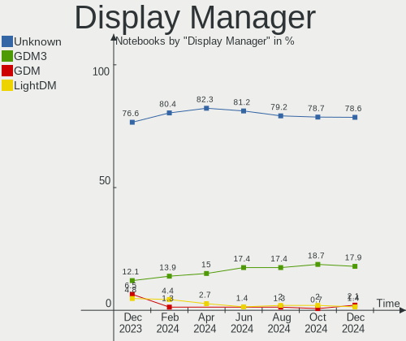
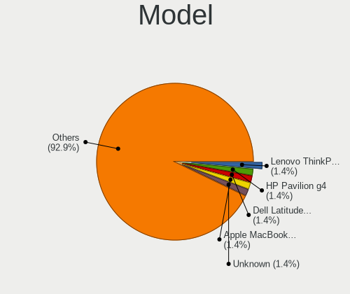
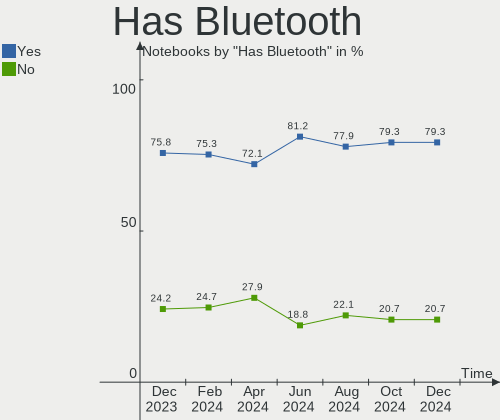
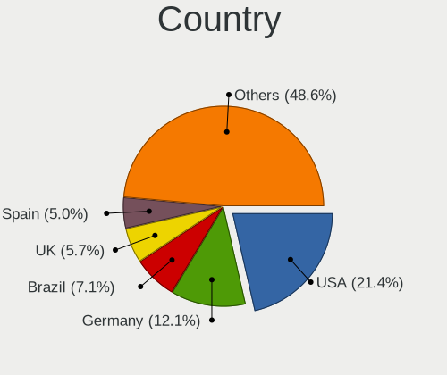
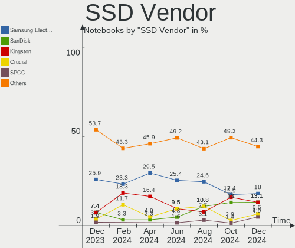
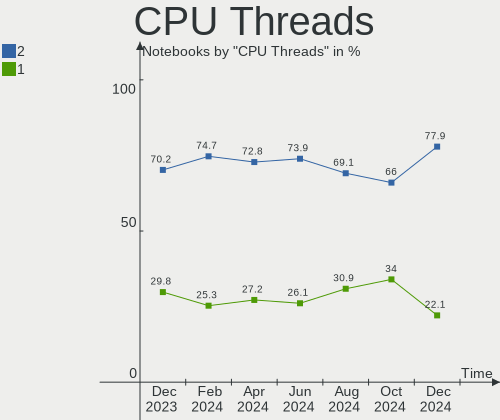
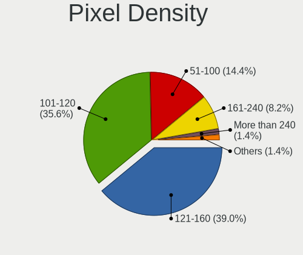
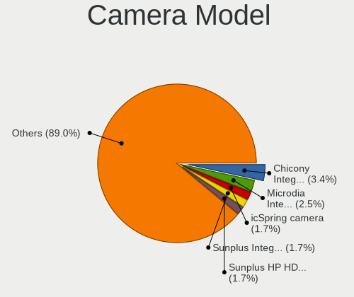

Zorin - Hardware Trends (Notebooks)
-----------------------------------

A project to identify most popular hardware characteristics and track their change
over time based on data collected by Linux users at https://Linux-Hardware.org.

Anyone can contribute to this report by the [hw-probe](https://github.com/linuxhw/hw-probe) tool:

    sudo -E hw-probe -all -upload

This report is for one last month. Overall report since the beginning of time: [TestDays](https://github.com/linuxhw/TestDays)

Period: Dec, 2023.

Contents
--------

* [ System ](#system)
  - [ OS                       ](#os)
  - [ OS Family                ](#os-family)
  - [ Kernel                   ](#kernel)
  - [ Kernel Family            ](#kernel-family)
  - [ Kernel Major Ver.        ](#kernel-major-ver)
  - [ Arch                     ](#arch)
  - [ DE                       ](#de)
  - [ Display Server           ](#display-server)
  - [ Display Manager          ](#display-manager)
  - [ OS Lang                  ](#os-lang)
  - [ Boot Mode                ](#boot-mode)
  - [ Filesystem               ](#filesystem)
  - [ Part. scheme             ](#part-scheme)
  - [ Dual Boot with Linux/BSD ](#dual-boot-with-linuxbsd)
  - [ Dual Boot (Win)          ](#dual-boot-win)

* [ Board ](#board)
  - [ Vendor                   ](#vendor)
  - [ Model                    ](#model)
  - [ Model Family             ](#model-family)
  - [ MFG Year                 ](#mfg-year)
  - [ Form Factor              ](#form-factor)
  - [ Secure Boot              ](#secure-boot)
  - [ Coreboot                 ](#coreboot)
  - [ RAM Size                 ](#ram-size)
  - [ RAM Used                 ](#ram-used)
  - [ Total Drives             ](#total-drives)
  - [ Has CD-ROM               ](#has-cd-rom)
  - [ Has Ethernet             ](#has-ethernet)
  - [ Has WiFi                 ](#has-wifi)
  - [ Has Bluetooth            ](#has-bluetooth)

* [ Location ](#location)
  - [ Country                  ](#country)
  - [ City                     ](#city)

* [ Drives ](#drives)
  - [ Drive Vendor             ](#drive-vendor)
  - [ Drive Model              ](#drive-model)
  - [ HDD Vendor               ](#hdd-vendor)
  - [ SSD Vendor               ](#ssd-vendor)
  - [ Drive Kind               ](#drive-kind)
  - [ Drive Connector          ](#drive-connector)
  - [ Drive Size               ](#drive-size)
  - [ Space Total              ](#space-total)
  - [ Space Used               ](#space-used)
  - [ Malfunc. Drives          ](#malfunc-drives)
  - [ Malfunc. Drive Vendor    ](#malfunc-drive-vendor)
  - [ Malfunc. HDD Vendor      ](#malfunc-hdd-vendor)
  - [ Malfunc. Drive Kind      ](#malfunc-drive-kind)
  - [ Failed Drives            ](#failed-drives)
  - [ Failed Drive Vendor      ](#failed-drive-vendor)
  - [ Drive Status             ](#drive-status)

* [ Storage controller ](#storage-controller)
  - [ Storage Vendor           ](#storage-vendor)
  - [ Storage Model            ](#storage-model)
  - [ Storage Kind             ](#storage-kind)

* [ Processor ](#processor)
  - [ CPU Vendor               ](#cpu-vendor)
  - [ CPU Model                ](#cpu-model)
  - [ CPU Model Family         ](#cpu-model-family)
  - [ CPU Cores                ](#cpu-cores)
  - [ CPU Sockets              ](#cpu-sockets)
  - [ CPU Threads              ](#cpu-threads)
  - [ CPU Op-Modes             ](#cpu-op-modes)
  - [ CPU Microcode            ](#cpu-microcode)
  - [ CPU Microarch            ](#cpu-microarch)

* [ Graphics ](#graphics)
  - [ GPU Vendor               ](#gpu-vendor)
  - [ GPU Model                ](#gpu-model)
  - [ GPU Combo                ](#gpu-combo)
  - [ GPU Driver               ](#gpu-driver)
  - [ GPU Memory               ](#gpu-memory)

* [ Monitor ](#monitor)
  - [ Monitor Vendor           ](#monitor-vendor)
  - [ Monitor Model            ](#monitor-model)
  - [ Monitor Resolution       ](#monitor-resolution)
  - [ Monitor Diagonal         ](#monitor-diagonal)
  - [ Monitor Width            ](#monitor-width)
  - [ Aspect Ratio             ](#aspect-ratio)
  - [ Monitor Area             ](#monitor-area)
  - [ Pixel Density            ](#pixel-density)
  - [ Multiple Monitors        ](#multiple-monitors)

* [ Network ](#network)
  - [ Net Controller Vendor    ](#net-controller-vendor)
  - [ Net Controller Model     ](#net-controller-model)
  - [ Wireless Vendor          ](#wireless-vendor)
  - [ Wireless Model           ](#wireless-model)
  - [ Ethernet Vendor          ](#ethernet-vendor)
  - [ Ethernet Model           ](#ethernet-model)
  - [ Net Controller Kind      ](#net-controller-kind)
  - [ Used Controller          ](#used-controller)
  - [ NICs                     ](#nics)
  - [ IPv6                     ](#ipv6)

* [ Bluetooth ](#bluetooth)
  - [ Bluetooth Vendor         ](#bluetooth-vendor)
  - [ Bluetooth Model          ](#bluetooth-model)

* [ Sound ](#sound)
  - [ Sound Vendor             ](#sound-vendor)
  - [ Sound Model              ](#sound-model)

* [ Memory ](#memory)
  - [ Memory Vendor            ](#memory-vendor)
  - [ Memory Model             ](#memory-model)
  - [ Memory Kind              ](#memory-kind)
  - [ Memory Form Factor       ](#memory-form-factor)
  - [ Memory Size              ](#memory-size)
  - [ Memory Speed             ](#memory-speed)

* [ Printers & scanners ](#printers--scanners)
  - [ Printer Vendor           ](#printer-vendor)
  - [ Printer Model            ](#printer-model)
  - [ Scanner Vendor           ](#scanner-vendor)
  - [ Scanner Model            ](#scanner-model)

* [ Camera ](#camera)
  - [ Camera Vendor            ](#camera-vendor)
  - [ Camera Model             ](#camera-model)

* [ Security ](#security)
  - [ Fingerprint Vendor       ](#fingerprint-vendor)
  - [ Fingerprint Model        ](#fingerprint-model)
  - [ Chipcard Vendor          ](#chipcard-vendor)
  - [ Chipcard Model           ](#chipcard-model)

* [ Unsupported ](#unsupported)
  - [ Unsupported Devices      ](#unsupported-devices)
  - [ Unsupported Device Types ](#unsupported-device-types)

System
------

OS
--

Installed operating systems

| Name     | Notebooks | Percent |
|----------|-----------|---------|
| Zorin 16 | 80        | 64.52%  |
| Zorin 17 | 40        | 32.26%  |
| Zorin 15 | 4         | 3.23%   |

OS Family
---------

OS without a version

| Name  | Notebooks | Percent |
|-------|-----------|---------|
| Zorin | 124       | 100%    |

Kernel
------

Version of the Linux kernel

| Version                 | Notebooks | Percent |
|-------------------------|-----------|---------|
| 5.15.0-91-generic       | 47        | 37.9%   |
| 6.2.0-39-generic        | 37        | 29.84%  |
| 5.15.0-89-generic       | 18        | 14.52%  |
| 5.4.0-150-generic       | 4         | 3.23%   |
| 5.15.0-88-generic       | 4         | 3.23%   |
| 6.2.0-37-generic        | 3         | 2.42%   |
| 5.15.0-78-generic       | 2         | 1.61%   |
| 5.15.0-73-generic       | 2         | 1.61%   |
| 6.6.7-060607-generic    | 1         | 0.81%   |
| 6.3.13-1-liquorix-amd64 | 1         | 0.81%   |
| 5.15.0-87-generic       | 1         | 0.81%   |
| 5.15.0-82-generic       | 1         | 0.81%   |
| 5.15.0-71-generic       | 1         | 0.81%   |
| 5.13.0-48-generic       | 1         | 0.81%   |
| 5.11.0-41-generic       | 1         | 0.81%   |

Kernel Family
-------------

Linux kernel without a distro release

| Version | Notebooks | Percent |
|---------|-----------|---------|
| 5.15.0  | 76        | 61.29%  |
| 6.2.0   | 40        | 32.26%  |
| 5.4.0   | 4         | 3.23%   |
| 6.6.7   | 1         | 0.81%   |
| 6.3.13  | 1         | 0.81%   |
| 5.13.0  | 1         | 0.81%   |
| 5.11.0  | 1         | 0.81%   |

Kernel Major Ver.
-----------------

Linux kernel major version

| Version | Notebooks | Percent |
|---------|-----------|---------|
| 5.15    | 76        | 61.29%  |
| 6.2     | 40        | 32.26%  |
| 5.4     | 4         | 3.23%   |
| 6.6     | 1         | 0.81%   |
| 6.3     | 1         | 0.81%   |
| 5.13    | 1         | 0.81%   |
| 5.11    | 1         | 0.81%   |

Arch
----

OS architecture (x86_64, i586, etc.)

| Name   | Notebooks | Percent |
|--------|-----------|---------|
| x86_64 | 122       | 98.39%  |
| i686   | 2         | 1.61%   |

DE
--

Desktop Environment

| Name    | Notebooks | Percent |
|---------|-----------|---------|
| GNOME   | 109       | 87.9%   |
| XFCE    | 14        | 11.29%  |
| Unknown | 1         | 0.81%   |

Display Server
--------------

X11 or Wayland

| Name    | Notebooks | Percent |
|---------|-----------|---------|
| X11     | 86        | 69.35%  |
| Wayland | 37        | 29.84%  |
| Unknown | 1         | 0.81%   |

Display Manager
---------------

SDDM, LightDM, etc.

| Name    | Notebooks | Percent |
|---------|-----------|---------|
| Unknown | 99        | 79.84%  |
| GDM3    | 14        | 11.29%  |
| GDM     | 6         | 4.84%   |
| LightDM | 5         | 4.03%   |

OS Lang
-------

Language

| Lang  | Notebooks | Percent |
|-------|-----------|---------|
| en_US | 37        | 29.84%  |
| de_DE | 18        | 14.52%  |
| en_GB | 9         | 7.26%   |
| pl_PL | 5         | 4.03%   |
| it_IT | 5         | 4.03%   |
| es_ES | 5         | 4.03%   |
| fr_FR | 4         | 3.23%   |
| es_MX | 4         | 3.23%   |
| en_IN | 4         | 3.23%   |
| nl_NL | 3         | 2.42%   |
| bg_BG | 3         | 2.42%   |
| ru_RU | 2         | 1.61%   |
| pt_PT | 2         | 1.61%   |
| hu_HU | 2         | 1.61%   |
| en_ZA | 2         | 1.61%   |
| da_DK | 2         | 1.61%   |
| sv_SE | 1         | 0.81%   |
| ro_RO | 1         | 0.81%   |
| nl_BE | 1         | 0.81%   |
| et_EE | 1         | 0.81%   |
| es_US | 1         | 0.81%   |
| es_PE | 1         | 0.81%   |
| es_DO | 1         | 0.81%   |
| es_CO | 1         | 0.81%   |
| es_CL | 1         | 0.81%   |
| es_AR | 1         | 0.81%   |
| en_SG | 1         | 0.81%   |
| en_NZ | 1         | 0.81%   |
| en_IL | 1         | 0.81%   |
| en_IE | 1         | 0.81%   |
| de_CH | 1         | 0.81%   |
| de_AT | 1         | 0.81%   |
| cs_CZ | 1         | 0.81%   |

Boot Mode
---------

EFI or BIOS

| Mode | Notebooks | Percent |
|------|-----------|---------|
| BIOS | 64        | 51.61%  |
| EFI  | 60        | 48.39%  |

Filesystem
----------

Type of filesystem

| Type    | Notebooks | Percent |
|---------|-----------|---------|
| Ext4    | 101       | 81.45%  |
| Tmpfs   | 14        | 11.29%  |
| Zfs     | 6         | 4.84%   |
| Btrfs   | 2         | 1.61%   |
| Overlay | 1         | 0.81%   |

Part. scheme
------------

Scheme of partitioning

| Type    | Notebooks | Percent |
|---------|-----------|---------|
| Unknown | 101       | 81.45%  |
| GPT     | 18        | 14.52%  |
| MBR     | 5         | 4.03%   |

Dual Boot with Linux/BSD
------------------------

Hosting more than one Linux/BSD

| Dual boot | Notebooks | Percent |
|-----------|-----------|---------|
| No        | 122       | 98.39%  |
| Yes       | 2         | 1.61%   |

Dual Boot (Win)
---------------

Hosting Linux and Windows

| Dual boot | Notebooks | Percent |
|-----------|-----------|---------|
| No        | 115       | 92.74%  |
| Yes       | 9         | 7.26%   |

Board
-----

Vendor
------

Motherboard manufacturer

| Name             | Notebooks | Percent |
|------------------|-----------|---------|
| Hewlett-Packard  | 32        | 25.81%  |
| Lenovo           | 19        | 15.32%  |
| Dell             | 18        | 14.52%  |
| ASUSTek Computer | 13        | 10.48%  |
| Acer             | 8         | 6.45%   |
| Toshiba          | 4         | 3.23%   |
| Sony             | 4         | 3.23%   |
| Medion           | 4         | 3.23%   |
| Apple            | 4         | 3.23%   |
| Fujitsu          | 3         | 2.42%   |
| Packard Bell     | 2         | 1.61%   |
| Unknown          | 2         | 1.61%   |
| VTEX             | 1         | 0.81%   |
| UNOWHY           | 1         | 0.81%   |
| TUXEDO           | 1         | 0.81%   |
| Teclast          | 1         | 0.81%   |
| Juana Manso      | 1         | 0.81%   |
| Irbis            | 1         | 0.81%   |
| Hampoo           | 1         | 0.81%   |
| Google           | 1         | 0.81%   |
| Gateway          | 1         | 0.81%   |
| Framework        | 1         | 0.81%   |
| DERE             | 1         | 0.81%   |

Model
-----

Motherboard model

| Name                                        | Notebooks | Percent |
|---------------------------------------------|-----------|---------|
| Unknown                                     | 4         | 3.23%   |
| HP Notebook                                 | 3         | 2.42%   |
| Lenovo IdeaPad 1 15ALC7 82R4                | 2         | 1.61%   |
| HP Pavilion dv7                             | 2         | 1.61%   |
| HP 15                                       | 2         | 1.61%   |
| VTEX NOTEBOOK                               | 1         | 0.81%   |
| UNOWHY Y13G012S4EI                          | 1         | 0.81%   |
| TUXEDO InfinityBook Pro Gen8 (MK2)          | 1         | 0.81%   |
| Toshiba Satellite Pro R50-C                 | 1         | 0.81%   |
| Toshiba Satellite Pro C50-A-1E2             | 1         | 0.81%   |
| Toshiba Satellite C850                      | 1         | 0.81%   |
| Toshiba QOSMIO X770                         | 1         | 0.81%   |
| Teclast F6 Plus                             | 1         | 0.81%   |
| Sony VPCF215FX                              | 1         | 0.81%   |
| Sony VGN-FW455J                             | 1         | 0.81%   |
| Sony VGN-CS21Z_Q                            | 1         | 0.81%   |
| Sony VGN-CR21S_W                            | 1         | 0.81%   |
| Packard Bell EasyNote TN36                  | 1         | 0.81%   |
| Packard Bell EasyNote TE11BZ                | 1         | 0.81%   |
| Medion X682X                                | 1         | 0.81%   |
| Medion P7624                                | 1         | 0.81%   |
| Medion E6246 MD63200                        | 1         | 0.81%   |
| Medion E4251 MD61435                        | 1         | 0.81%   |
| Lenovo Y50-70 20378                         | 1         | 0.81%   |
| Lenovo V14-IIL 82C4                         | 1         | 0.81%   |
| Lenovo V110-15ISK 80TL                      | 1         | 0.81%   |
| Lenovo ThinkPad X270 W10DG 20K5S3HG00       | 1         | 0.81%   |
| Lenovo ThinkPad X240 20AMS0VU00             | 1         | 0.81%   |
| Lenovo ThinkPad X131e 33691K7               | 1         | 0.81%   |
| Lenovo ThinkPad X1 Extreme 20MF000XGE       | 1         | 0.81%   |
| Lenovo ThinkPad X1 Carbon Gen 10 21CBCTO1WW | 1         | 0.81%   |
| Lenovo ThinkPad T440s 20ARS06C00            | 1         | 0.81%   |
| Lenovo ThinkPad T440p 20AWS08S01            | 1         | 0.81%   |
| Lenovo ThinkPad P52 20MAS25B1X              | 1         | 0.81%   |
| Lenovo ThinkPad E480 20KN003XUS             | 1         | 0.81%   |
| Lenovo ThinkBook 14 G2 ITL 20VD             | 1         | 0.81%   |
| Lenovo IdeaPad 3 15IAU7 82RK                | 1         | 0.81%   |
| Lenovo IdeaPad 3 15ADA05 81W1               | 1         | 0.81%   |
| Lenovo G570 20079                           | 1         | 0.81%   |
| Juana Manso SF20GM7                         | 1         | 0.81%   |

Model Family
------------

Motherboard model prefix

| Name                  | Notebooks | Percent |
|-----------------------|-----------|---------|
| Lenovo ThinkPad       | 9         | 7.26%   |
| Dell Latitude         | 8         | 6.45%   |
| HP Pavilion           | 6         | 4.84%   |
| Dell Inspiron         | 5         | 4.03%   |
| Lenovo IdeaPad        | 4         | 3.23%   |
| HP ProBook            | 4         | 3.23%   |
| Unknown               | 4         | 3.23%   |
| Toshiba Satellite     | 3         | 2.42%   |
| HP Notebook           | 3         | 2.42%   |
| HP Laptop             | 3         | 2.42%   |
| HP EliteBook          | 3         | 2.42%   |
| Fujitsu LIFEBOOK      | 3         | 2.42%   |
| Acer Aspire           | 3         | 2.42%   |
| Packard Bell EasyNote | 2         | 1.61%   |
| HP Victus             | 2         | 1.61%   |
| HP Compaq             | 2         | 1.61%   |
| HP 255                | 2         | 1.61%   |
| HP 15                 | 2         | 1.61%   |
| Dell XPS              | 2         | 1.61%   |
| Dell Vostro           | 2         | 1.61%   |
| ASUS VivoBook         | 2         | 1.61%   |
| ASUS ROG              | 2         | 1.61%   |
| Acer Swift            | 2         | 1.61%   |
| Acer Nitro            | 2         | 1.61%   |
| VTEX NOTEBOOK         | 1         | 0.81%   |
| UNOWHY Y13G012S4EI    | 1         | 0.81%   |
| TUXEDO InfinityBook   | 1         | 0.81%   |
| Toshiba QOSMIO        | 1         | 0.81%   |
| Teclast F6            | 1         | 0.81%   |
| Sony VPCF215FX        | 1         | 0.81%   |
| Sony VGN-FW455J       | 1         | 0.81%   |
| Sony VGN-CS21Z        | 1         | 0.81%   |
| Sony VGN-CR21S        | 1         | 0.81%   |
| Medion X682X          | 1         | 0.81%   |
| Medion P7624          | 1         | 0.81%   |
| Medion E6246          | 1         | 0.81%   |
| Medion E4251          | 1         | 0.81%   |
| Lenovo Y50-70         | 1         | 0.81%   |
| Lenovo V14-IIL        | 1         | 0.81%   |
| Lenovo V110-15ISK     | 1         | 0.81%   |

MFG Year
--------

Motherboard manufacture year

| Year | Notebooks | Percent |
|------|-----------|---------|
| 2019 | 11        | 8.87%   |
| 2013 | 11        | 8.87%   |
| 2022 | 10        | 8.06%   |
| 2020 | 10        | 8.06%   |
| 2012 | 10        | 8.06%   |
| 2015 | 9         | 7.26%   |
| 2017 | 8         | 6.45%   |
| 2016 | 8         | 6.45%   |
| 2011 | 8         | 6.45%   |
| 2023 | 7         | 5.65%   |
| 2021 | 7         | 5.65%   |
| 2014 | 6         | 4.84%   |
| 2018 | 5         | 4.03%   |
| 2008 | 5         | 4.03%   |
| 2010 | 3         | 2.42%   |
| 2007 | 3         | 2.42%   |
| 2009 | 2         | 1.61%   |
| 2006 | 1         | 0.81%   |

Form Factor
-----------

Physical design of the computer

| Name     | Notebooks | Percent |
|----------|-----------|---------|
| Notebook | 124       | 100%    |

Secure Boot
-----------

Enabled or disabled

| State    | Notebooks | Percent |
|----------|-----------|---------|
| Disabled | 104       | 83.87%  |
| Enabled  | 20        | 16.13%  |

Coreboot
--------

Have coreboot on board

| Used | Notebooks | Percent |
|------|-----------|---------|
| No   | 123       | 99.19%  |
| Yes  | 1         | 0.81%   |

RAM Size
--------

Total RAM memory

| Size in GB  | Notebooks | Percent |
|-------------|-----------|---------|
| 4.01-8.0    | 46        | 37.1%   |
| 3.01-4.0    | 25        | 20.16%  |
| 16.01-24.0  | 20        | 16.13%  |
| 8.01-16.0   | 17        | 13.71%  |
| 32.01-64.0  | 7         | 5.65%   |
| 1.01-2.0    | 4         | 3.23%   |
| 0.51-1.0    | 2         | 1.61%   |
| 24.01-32.0  | 1         | 0.81%   |
| 2.01-3.0    | 1         | 0.81%   |
| 64.01-256.0 | 1         | 0.81%   |

RAM Used
--------

Used RAM memory

| Used GB    | Notebooks | Percent |
|------------|-----------|---------|
| 2.01-3.0   | 49        | 39.52%  |
| 1.01-2.0   | 31        | 25%     |
| 3.01-4.0   | 21        | 16.94%  |
| 4.01-8.0   | 17        | 13.71%  |
| 8.01-16.0  | 3         | 2.42%   |
| 0.51-1.0   | 2         | 1.61%   |
| 16.01-24.0 | 1         | 0.81%   |

Total Drives
------------

Number of drives on board

| Drives | Notebooks | Percent |
|--------|-----------|---------|
| 1      | 87        | 70.16%  |
| 2      | 30        | 24.19%  |
| 3      | 5         | 4.03%   |
| 4      | 2         | 1.61%   |

Has CD-ROM
----------

Has CD-ROM on board

| Presented | Notebooks | Percent |
|-----------|-----------|---------|
| No        | 83        | 66.94%  |
| Yes       | 41        | 33.06%  |

Has Ethernet
------------

Has Ethernet on board

| Presented | Notebooks | Percent |
|-----------|-----------|---------|
| Yes       | 99        | 79.84%  |
| No        | 25        | 20.16%  |

Has WiFi
--------

Has WiFi module

| Presented | Notebooks | Percent |
|-----------|-----------|---------|
| Yes       | 121       | 97.58%  |
| No        | 3         | 2.42%   |

Has Bluetooth
-------------

Has Bluetooth module

| Presented | Notebooks | Percent |
|-----------|-----------|---------|
| Yes       | 94        | 75.81%  |
| No        | 30        | 24.19%  |

Location
--------

Country
-------

Geographic location (country)

| Country            | Notebooks | Percent |
|--------------------|-----------|---------|
| Germany            | 19        | 15.32%  |
| USA                | 17        | 13.71%  |
| UK                 | 8         | 6.45%   |
| Spain              | 6         | 4.84%   |
| Italy              | 6         | 4.84%   |
| Poland             | 5         | 4.03%   |
| Mexico             | 5         | 4.03%   |
| India              | 4         | 3.23%   |
| France             | 4         | 3.23%   |
| Netherlands        | 3         | 2.42%   |
| Finland            | 3         | 2.42%   |
| Denmark            | 3         | 2.42%   |
| The Netherlands    | 2         | 1.61%   |
| Sweden             | 2         | 1.61%   |
| South Africa       | 2         | 1.61%   |
| Russia             | 2         | 1.61%   |
| Portugal           | 2         | 1.61%   |
| Israel             | 2         | 1.61%   |
| Colombia           | 2         | 1.61%   |
| Bulgaria           | 2         | 1.61%   |
| Thailand           | 1         | 0.81%   |
| Switzerland        | 1         | 0.81%   |
| Singapore          | 1         | 0.81%   |
| Romania            | 1         | 0.81%   |
| Peru               | 1         | 0.81%   |
| New Zealand        | 1         | 0.81%   |
| Malaysia           | 1         | 0.81%   |
| Ireland            | 1         | 0.81%   |
| Iran               | 1         | 0.81%   |
| Hungary            | 1         | 0.81%   |
| Greece             | 1         | 0.81%   |
| Ghana              | 1         | 0.81%   |
| Estonia            | 1         | 0.81%   |
| Ecuador            | 1         | 0.81%   |
| Dominican Republic | 1         | 0.81%   |
| Czechia            | 1         | 0.81%   |
| Croatia            | 1         | 0.81%   |
| Chile              | 1         | 0.81%   |
| Brazil             | 1         | 0.81%   |
| Belgium            | 1         | 0.81%   |

City
----

Geographic location (city)

| City               | Notebooks | Percent |
|--------------------|-----------|---------|
| Milan              | 3         | 2.42%   |
| Warsaw             | 2         | 1.61%   |
| Tel Aviv           | 2         | 1.61%   |
| New York           | 2         | 1.61%   |
| Helsinki           | 2         | 1.61%   |
| Berlin             | 2         | 1.61%   |
| Zweidlen-Dorf      | 1         | 0.81%   |
| Wilrijk            | 1         | 0.81%   |
| Verona             | 1         | 0.81%   |
| Varna              | 1         | 0.81%   |
| Toledo             | 1         | 0.81%   |
| Timișoara         | 1         | 0.81%   |
| The Hague          | 1         | 0.81%   |
| The Bronx          | 1         | 0.81%   |
| Tarnowskie Gory    | 1         | 0.81%   |
| Stourbridge        | 1         | 0.81%   |
| Stockholm          | 1         | 0.81%   |
| Sollentuna         | 1         | 0.81%   |
| Singapore          | 1         | 0.81%   |
| Šibenik           | 1         | 0.81%   |
| Sheridan           | 1         | 0.81%   |
| Selbitz            | 1         | 0.81%   |
| Seattle            | 1         | 0.81%   |
| Santo Domingo Este | 1         | 0.81%   |
| Santiago           | 1         | 0.81%   |
| Santa Pola         | 1         | 0.81%   |
| Sandy              | 1         | 0.81%   |
| Sale               | 1         | 0.81%   |
| Roussillon         | 1         | 0.81%   |
| Rottweil           | 1         | 0.81%   |
| Roding             | 1         | 0.81%   |
| Rio Rancho         | 1         | 0.81%   |
| Rakvere            | 1         | 0.81%   |
| Quito              | 1         | 0.81%   |
| Puebla City        | 1         | 0.81%   |
| Porto Alegre       | 1         | 0.81%   |
| Porto              | 1         | 0.81%   |
| Peterborough       | 1         | 0.81%   |
| Périgueux         | 1         | 0.81%   |
| Pereira            | 1         | 0.81%   |

Drives
------

Drive Vendor
------------

Hard drive vendors

| Vendor                      | Notebooks | Drives | Percent |
|-----------------------------|-----------|--------|---------|
| Samsung Electronics         | 28        | 31     | 17.61%  |
| Unknown                     | 18        | 20     | 11.32%  |
| WDC                         | 15        | 16     | 9.43%   |
| Seagate                     | 12        | 13     | 7.55%   |
| Sandisk                     | 10        | 12     | 6.29%   |
| Toshiba                     | 9         | 9      | 5.66%   |
| SK hynix                    | 6         | 6      | 3.77%   |
| Micron Technology           | 5         | 5      | 3.14%   |
| Kingston                    | 5         | 5      | 3.14%   |
| Hitachi                     | 5         | 5      | 3.14%   |
| China                       | 4         | 4      | 2.52%   |
| Kingston Technology Company | 3         | 3      | 1.89%   |
| Phison                      | 2         | 2      | 1.26%   |
| KIOXIA                      | 2         | 2      | 1.26%   |
| Intel                       | 2         | 2      | 1.26%   |
| HGST                        | 2         | 2      | 1.26%   |
| Fanxiang                    | 2         | 2      | 1.26%   |
| Crucial                     | 2         | 2      | 1.26%   |
| Apple                       | 2         | 3      | 1.26%   |
| Unknown                     | 2         | 2      | 1.26%   |
| USB                         | 1         | 1      | 0.63%   |
| TEXTORM                     | 1         | 1      | 0.63%   |
| Teutons                     | 1         | 1      | 0.63%   |
| Teclast                     | 1         | 1      | 0.63%   |
| Team                        | 1         | 1      | 0.63%   |
| SPCC                        | 1         | 1      | 0.63%   |
| SD                          | 1         | 1      | 0.63%   |
| SCUDA                       | 1         | 1      | 0.63%   |
| Realtek Semiconductor       | 1         | 1      | 0.63%   |
| QSSDS25240G                 | 1         | 1      | 0.63%   |
| PNY                         | 1         | 1      | 0.63%   |
| OCZ                         | 1         | 1      | 0.63%   |
| Micron/Crucial Technology   | 1         | 1      | 0.63%   |
| MAXIO Technology (Hangzhou) | 1         | 1      | 0.63%   |
| LITEONIT                    | 1         | 1      | 0.63%   |
| JMicron Technology          | 1         | 1      | 0.63%   |
| Hewlett-Packard             | 1         | 1      | 0.63%   |
| GLOWAY                      | 1         | 1      | 0.63%   |
| Fujitsu                     | 1         | 1      | 0.63%   |
| External                    | 1         | 1      | 0.63%   |

Drive Model
-----------

Hard drive models

| Model                                               | Notebooks | Percent |
|-----------------------------------------------------|-----------|---------|
| Unknown MMC Card  64GB                              | 5         | 2.98%   |
| Unknown MMC Card  32GB                              | 5         | 2.98%   |
| Unknown MMC Card  128GB                             | 4         | 2.38%   |
| Seagate ST1000LM035-1RK172 1TB                      | 3         | 1.79%   |
| WDC WDS120G2G0A-00JH30 120GB SSD                    | 2         | 1.19%   |
| Toshiba MQ01ABD050 500GB                            | 2         | 1.19%   |
| Seagate ST9500325AS 500GB                           | 2         | 1.19%   |
| Sandisk WD Black SN850 1024GB                       | 2         | 1.19%   |
| SanDisk SD8SN8U-256G-1006 256GB SSD                 | 2         | 1.19%   |
| Samsung SSD 850 EVO 500GB                           | 2         | 1.19%   |
| Samsung NVMe SSD Controller SM981/PM981/PM983 512GB | 2         | 1.19%   |
| Samsung MZVLQ256HAJD-000H1 256GB                    | 2         | 1.19%   |
| Kingston SA400S37240G 240GB SSD                     | 2         | 1.19%   |
| Unknown                                             | 2         | 1.19%   |
| WDC WDS500G2B0A-00SM50 500GB SSD                    | 1         | 0.6%    |
| WDC WDS100T2B0A-00SM50 1TB SSD                      | 1         | 0.6%    |
| WDC WD7500BPVT-24HXZT3 752GB                        | 1         | 0.6%    |
| WDC WD5000LPVX-22V0TT0 500GB                        | 1         | 0.6%    |
| WDC WD5000LPVX-08V0TT2 500GB                        | 1         | 0.6%    |
| WDC WD40 EFRX-68WT0N0 4TB                           | 1         | 0.6%    |
| WDC WD3200BPVT-22JJ5T0 320GB                        | 1         | 0.6%    |
| WDC WD2500BEKT-60A25T1 250GB                        | 1         | 0.6%    |
| WDC WD10SPZX-60Z10T0 1TB                            | 1         | 0.6%    |
| WDC WD10SPZX-24Z10 1TB                              | 1         | 0.6%    |
| WDC WD10JPVX-60JC3T1 1TB                            | 1         | 0.6%    |
| WDC WD10JPVX-22JC3T0 1TB                            | 1         | 0.6%    |
| WDC PC SN530 SDBPMPZ-256G-1101 256GB                | 1         | 0.6%    |
| WDC PC SN520 SDAPNUW-512G-1006 512GB                | 1         | 0.6%    |
| USB Disk 240GB                                      | 1         | 0.6%    |
| Unknown SD/MMC/MS PRO 512GB                         | 1         | 0.6%    |
| Unknown SABRENT SABRENT 500GB                       | 1         | 0.6%    |
| Unknown NCard  32GB                                 | 1         | 0.6%    |
| Unknown MMC Card  4GB                               | 1         | 0.6%    |
| Unknown MMC Card  2TB                               | 1         | 0.6%    |
| Unknown MMC Card  256GB                             | 1         | 0.6%    |
| Toshiba MQ01ACF032 320GB                            | 1         | 0.6%    |
| Toshiba MQ01ABF050 500GB                            | 1         | 0.6%    |
| Toshiba MK8009GAH 80GB                              | 1         | 0.6%    |
| Toshiba MK7559GSXF 752GB                            | 1         | 0.6%    |
| Toshiba MK3254GSY 320GB                             | 1         | 0.6%    |

HDD Vendor
----------

Hard disk drive vendors

| Vendor              | Notebooks | Drives | Percent |
|---------------------|-----------|--------|---------|
| Seagate             | 12        | 13     | 29.27%  |
| WDC                 | 10        | 10     | 24.39%  |
| Toshiba             | 8         | 8      | 19.51%  |
| Hitachi             | 5         | 5      | 12.2%   |
| HGST                | 2         | 2      | 4.88%   |
| Unknown             | 1         | 1      | 2.44%   |
| Samsung Electronics | 1         | 1      | 2.44%   |
| Fujitsu             | 1         | 1      | 2.44%   |
| External            | 1         | 1      | 2.44%   |

SSD Vendor
----------

Solid state drive vendors

| Vendor              | Notebooks | Drives | Percent |
|---------------------|-----------|--------|---------|
| Samsung Electronics | 15        | 16     | 27.27%  |
| WDC                 | 4         | 4      | 7.27%   |
| SanDisk             | 4         | 5      | 7.27%   |
| Kingston            | 4         | 4      | 7.27%   |
| China               | 4         | 4      | 7.27%   |
| Phison              | 2         | 2      | 3.64%   |
| Crucial             | 2         | 2      | 3.64%   |
| TEXTORM             | 1         | 1      | 1.82%   |
| Teutons             | 1         | 1      | 1.82%   |
| Teclast             | 1         | 1      | 1.82%   |
| Team                | 1         | 1      | 1.82%   |
| SPCC                | 1         | 1      | 1.82%   |
| SD                  | 1         | 1      | 1.82%   |
| SCUDA               | 1         | 1      | 1.82%   |
| QSSDS25240G         | 1         | 1      | 1.82%   |
| PNY                 | 1         | 1      | 1.82%   |
| OCZ                 | 1         | 1      | 1.82%   |
| LITEONIT            | 1         | 1      | 1.82%   |
| JMicron Technology  | 1         | 1      | 1.82%   |
| Intel               | 1         | 1      | 1.82%   |
| Hewlett-Packard     | 1         | 1      | 1.82%   |
| GLOWAY              | 1         | 1      | 1.82%   |
| Fanxiang            | 1         | 1      | 1.82%   |
| ASMT                | 1         | 1      | 1.82%   |
| ASMedia             | 1         | 1      | 1.82%   |
| Apple               | 1         | 1      | 1.82%   |
| A-DATA Technology   | 1         | 1      | 1.82%   |

Drive Kind
----------

HDD or SSD

| Kind    | Notebooks | Drives | Percent |
|---------|-----------|--------|---------|
| SSD     | 50        | 57     | 33.11%  |
| NVMe    | 40        | 47     | 26.49%  |
| HDD     | 40        | 42     | 26.49%  |
| MMC     | 17        | 19     | 11.26%  |
| Unknown | 4         | 4      | 2.65%   |

Drive Connector
---------------

SATA, SAS, NVMe, etc.

| Type | Notebooks | Drives | Percent |
|------|-----------|--------|---------|
| SATA | 81        | 90     | 54.73%  |
| NVMe | 40        | 47     | 27.03%  |
| MMC  | 17        | 19     | 11.49%  |
| SAS  | 10        | 13     | 6.76%   |

Drive Size
----------

Size of hard drive

| Size in TB | Notebooks | Drives | Percent |
|------------|-----------|--------|---------|
| 0.01-0.5   | 59        | 63     | 63.44%  |
| 0.51-1.0   | 25        | 26     | 26.88%  |
| 1.01-2.0   | 8         | 9      | 8.6%    |
| 3.01-4.0   | 1         | 1      | 1.08%   |

Space Total
-----------

Amount of disk space available on the file system

| Size in GB     | Notebooks | Percent |
|----------------|-----------|---------|
| 101-250        | 41        | 33.06%  |
| 251-500        | 31        | 25%     |
| 501-1000       | 19        | 15.32%  |
| 51-100         | 10        | 8.06%   |
| 21-50          | 6         | 4.84%   |
| 1001-2000      | 6         | 4.84%   |
| Unknown        | 5         | 4.03%   |
| 1-20           | 3         | 2.42%   |
| More than 3000 | 2         | 1.61%   |
| 2001-3000      | 1         | 0.81%   |

Space Used
----------

Amount of used disk space

| Used GB        | Notebooks | Percent |
|----------------|-----------|---------|
| 1-20           | 42        | 33.87%  |
| 21-50          | 31        | 25%     |
| 51-100         | 22        | 17.74%  |
| 101-250        | 13        | 10.48%  |
| Unknown        | 5         | 4.03%   |
| 251-500        | 4         | 3.23%   |
| 501-1000       | 4         | 3.23%   |
| 1001-2000      | 2         | 1.61%   |
| More than 3000 | 1         | 0.81%   |

Malfunc. Drives
---------------

Drive models with a malfunction

| Model                           | Notebooks | Drives | Percent |
|---------------------------------|-----------|--------|---------|
| Seagate ST500LM000-1EJ162 500GB | 1         | 1      | 50%     |
| SanDisk SSD PLUS 480GB          | 1         | 1      | 50%     |

Malfunc. Drive Vendor
---------------------

Vendors of faulty drives

| Vendor  | Notebooks | Drives | Percent |
|---------|-----------|--------|---------|
| Seagate | 1         | 1      | 50%     |
| SanDisk | 1         | 1      | 50%     |

Malfunc. HDD Vendor
-------------------

Vendors of faulty HDD drives

| Vendor  | Notebooks | Drives | Percent |
|---------|-----------|--------|---------|
| Seagate | 1         | 1      | 100%    |

Malfunc. Drive Kind
-------------------

Kinds of faulty drives

| Kind | Notebooks | Drives | Percent |
|------|-----------|--------|---------|
| SSD  | 1         | 1      | 50%     |
| HDD  | 1         | 1      | 50%     |

Failed Drives
-------------

Failed drive models

Zero info for selected period =(

Failed Drive Vendor
-------------------

Failed drive vendors

Zero info for selected period =(

Drive Status
------------

Number of failed and malfunc. drives

| Status   | Notebooks | Drives | Percent |
|----------|-----------|--------|---------|
| Detected | 117       | 156    | 92.13%  |
| Works    | 8         | 11     | 6.3%    |
| Malfunc  | 2         | 2      | 1.57%   |

Storage controller
------------------

Storage Vendor
--------------

Storage controller vendors

| Vendor                       | Notebooks | Percent |
|------------------------------|-----------|---------|
| Intel                        | 92        | 63.01%  |
| Samsung Electronics          | 14        | 9.59%   |
| SanDisk                      | 8         | 5.48%   |
| AMD                          | 8         | 5.48%   |
| SK hynix                     | 6         | 4.11%   |
| Micron Technology            | 5         | 3.42%   |
| Kingston Technology Company  | 4         | 2.74%   |
| KIOXIA                       | 2         | 1.37%   |
| VIA Technologies             | 1         | 0.68%   |
| Toshiba America Info Systems | 1         | 0.68%   |
| Realtek Semiconductor        | 1         | 0.68%   |
| Nvidia                       | 1         | 0.68%   |
| Micron/Crucial Technology    | 1         | 0.68%   |
| MAXIO Technology (Hangzhou)  | 1         | 0.68%   |
| Apple                        | 1         | 0.68%   |

Storage Model
-------------

Storage controller models

| Model                                                                          | Notebooks | Percent |
|--------------------------------------------------------------------------------|-----------|---------|
| Intel Sunrise Point-LP SATA Controller [AHCI mode]                             | 13        | 8.44%   |
| Intel 7 Series Chipset Family 6-port SATA Controller [AHCI mode]               | 12        | 7.79%   |
| Intel Celeron/Pentium Silver Processor SATA Controller                         | 9         | 5.84%   |
| Intel Volume Management Device NVMe RAID Controller                            | 7         | 4.55%   |
| AMD FCH SATA Controller [AHCI mode]                                            | 7         | 4.55%   |
| Intel 6 Series/C200 Series Chipset Family 6 port Mobile SATA AHCI Controller   | 6         | 3.9%    |
| Intel 82801IBM/IEM (ICH9M/ICH9M-E) 4 port SATA Controller [AHCI mode]          | 5         | 3.25%   |
| Intel 82801 Mobile SATA Controller [RAID mode]                                 | 5         | 3.25%   |
| Samsung NVMe SSD Controller SM981/PM981/PM983                                  | 4         | 2.6%    |
| Samsung NVMe SSD Controller 980 (DRAM-less)                                    | 4         | 2.6%    |
| Intel 8 Series/C220 Series Chipset Family 6-port SATA Controller 1 [AHCI mode] | 4         | 2.6%    |
| Intel 8 Series SATA Controller 1 [AHCI mode]                                   | 4         | 2.6%    |
| SK hynix Gold P31/BC711/PC711 NVMe Solid State Drive                           | 3         | 1.95%   |
| Intel Wildcat Point-LP SATA Controller [AHCI Mode]                             | 3         | 1.95%   |
| Intel Tiger Lake-LP SATA Controller                                            | 3         | 1.95%   |
| Intel HM170/QM170 Chipset SATA Controller [AHCI Mode]                          | 3         | 1.95%   |
| Intel Celeron N3350/Pentium N4200/Atom E3900 Series SATA AHCI Controller       | 3         | 1.95%   |
| SanDisk WD PC SN810 / Black SN850 NVMe SSD                                     | 2         | 1.3%    |
| SanDisk WD Blue SN500 / PC SN520 x2 M.2 2280 NVMe SSD                          | 2         | 1.3%    |
| Samsung NVMe SSD Controller PM9B1 (DRAM-less)                                  | 2         | 1.3%    |
| Micron 2450 NVMe SSD [HendrixV] (DRAM-less)                                    | 2         | 1.3%    |
| Kingston Company KC3000/FURY Renegade NVMe SSD E18                             | 2         | 1.3%    |
| Intel Cannon Lake Mobile PCH SATA AHCI Controller                              | 2         | 1.3%    |
| Intel Atom Processor E3800 Series SATA AHCI Controller                         | 2         | 1.3%    |
| Intel Alder Lake-P SATA AHCI Controller                                        | 2         | 1.3%    |
| VIA VT82C586A/B/VT82C686/A/B/VT823x/A/C PIPC Bus Master IDE                    | 1         | 0.65%   |
| Toshiba America Info Systems XG5 NVMe SSD Controller                           | 1         | 0.65%   |
| SK hynix Platinum P41/PC801 NVMe Solid State Drive                             | 1         | 0.65%   |
| SK hynix BC511 NVMe SSD                                                        | 1         | 0.65%   |
| SK hynix BC501 NVMe Solid State Drive                                          | 1         | 0.65%   |
| SanDisk WD Green SN350 240GB (DRAM-less) / SN560E NVMe SSD                     | 1         | 0.65%   |
| SanDisk WD Black SN770 / PC SN740 256GB / PC SN560 (DRAM-less) NVMe SSD        | 1         | 0.65%   |
| SanDisk Ultra 3D / WD Blue SN570 NVMe SSD (DRAM-less)                          | 1         | 0.65%   |
| SanDisk Ultra 3D / WD Blue SN550 NVMe SSD                                      | 1         | 0.65%   |
| SanDisk PC SN530 NVMe SSD (DRAM-less)                                          | 1         | 0.65%   |
| Samsung S4LN058A01[SSUBX] AHCI SSD Controller (Apple slot)                     | 1         | 0.65%   |
| Samsung NVMe SSD Controller SM961/PM961/SM963                                  | 1         | 0.65%   |
| Samsung NVMe SSD Controller S4LV008[Pascal]                                    | 1         | 0.65%   |
| Samsung NVMe SSD Controller PM9A1/PM9A3/980PRO                                 | 1         | 0.65%   |
| Realtek RTS5762 NVMe SSD Controller                                            | 1         | 0.65%   |

Storage Kind
------------

Kind of storage controller (IDE, SATA, NVMe, SAS, ...)

| Kind | Notebooks | Percent |
|------|-----------|---------|
| SATA | 88        | 59.86%  |
| NVMe | 40        | 27.21%  |
| RAID | 13        | 8.84%   |
| IDE  | 6         | 4.08%   |

Processor
---------

CPU Vendor
----------

Processor vendors

| Vendor | Notebooks | Percent |
|--------|-----------|---------|
| Intel  | 109       | 87.9%   |
| AMD    | 15        | 12.1%   |

CPU Model
---------

Processor models

| Model                                    | Notebooks | Percent |
|------------------------------------------|-----------|---------|
| Intel 11th Gen Core i7-1165G7 @ 2.80GHz  | 5         | 4.03%   |
| Intel Core i7-6700HQ CPU @ 2.60GHz       | 4         | 3.23%   |
| Intel Core i3-6006U CPU @ 2.00GHz        | 3         | 2.42%   |
| Intel Celeron N4020 CPU @ 1.10GHz        | 3         | 2.42%   |
| Intel Celeron CPU N3350 @ 1.10GHz        | 3         | 2.42%   |
| Intel Core i7-2630QM CPU @ 2.00GHz       | 2         | 1.61%   |
| Intel Core i5-6300U CPU @ 2.40GHz        | 2         | 1.61%   |
| Intel Core i5-6200U CPU @ 2.30GHz        | 2         | 1.61%   |
| Intel Core i5-4300M CPU @ 2.60GHz        | 2         | 1.61%   |
| Intel Core i5-3437U CPU @ 1.90GHz        | 2         | 1.61%   |
| Intel Core i5-3230M CPU @ 2.60GHz        | 2         | 1.61%   |
| Intel Core i3-4005U CPU @ 1.70GHz        | 2         | 1.61%   |
| Intel Core i3-3110M CPU @ 2.40GHz        | 2         | 1.61%   |
| Intel Celeron N4120 CPU @ 1.10GHz        | 2         | 1.61%   |
| Intel Celeron N4100 CPU @ 1.10GHz        | 2         | 1.61%   |
| Intel Celeron N4000 CPU @ 1.10GHz        | 2         | 1.61%   |
| Intel 11th Gen Core i5-1135G7 @ 2.40GHz  | 2         | 1.61%   |
| AMD Ryzen 5 5500U with Radeon Graphics   | 2         | 1.61%   |
| Intel Pentium Silver N5000 CPU @ 1.10GHz | 1         | 0.81%   |
| Intel Pentium Dual CPU T3400 @ 2.16GHz   | 1         | 0.81%   |
| Intel Pentium CPU N3540 @ 2.16GHz        | 1         | 0.81%   |
| Intel Pentium CPU 4415U @ 2.30GHz        | 1         | 0.81%   |
| Intel N95                                | 1         | 0.81%   |
| Intel Core i7-8850H CPU @ 2.60GHz        | 1         | 0.81%   |
| Intel Core i7-8750H CPU @ 2.20GHz        | 1         | 0.81%   |
| Intel Core i7-8565U CPU @ 1.80GHz        | 1         | 0.81%   |
| Intel Core i7-8550U CPU @ 1.80GHz        | 1         | 0.81%   |
| Intel Core i7-6500U CPU @ 2.50GHz        | 1         | 0.81%   |
| Intel Core i7-5500U CPU @ 2.40GHz        | 1         | 0.81%   |
| Intel Core i7-4710HQ CPU @ 2.50GHz       | 1         | 0.81%   |
| Intel Core i7-4610M CPU @ 3.00GHz        | 1         | 0.81%   |
| Intel Core i7-4600U CPU @ 2.10GHz        | 1         | 0.81%   |
| Intel Core i7-3630QM CPU @ 2.40GHz       | 1         | 0.81%   |
| Intel Core i7-3610QM CPU @ 2.30GHz       | 1         | 0.81%   |
| Intel Core i7-3540M CPU @ 3.00GHz        | 1         | 0.81%   |
| Intel Core i7-2720QM CPU @ 2.20GHz       | 1         | 0.81%   |
| Intel Core i7-2670QM CPU @ 2.20GHz       | 1         | 0.81%   |
| Intel Core i7 CPU Q 720 @ 1.60GHz        | 1         | 0.81%   |
| Intel Core i5-9300H CPU @ 2.40GHz        | 1         | 0.81%   |
| Intel Core i5-8365U CPU @ 1.60GHz        | 1         | 0.81%   |

CPU Model Family
----------------

Processor model prefix

| Model                | Notebooks | Percent |
|----------------------|-----------|---------|
| Intel Core i5        | 26        | 20.97%  |
| Intel Core i7        | 21        | 16.94%  |
| Other                | 17        | 13.71%  |
| Intel Celeron        | 16        | 12.9%   |
| Intel Core i3        | 15        | 12.1%   |
| Intel Core 2 Duo     | 7         | 5.65%   |
| AMD Ryzen 5          | 5         | 4.03%   |
| Intel Atom           | 3         | 2.42%   |
| Intel Pentium        | 2         | 1.61%   |
| AMD Ryzen 9          | 2         | 1.61%   |
| Intel Pentium Silver | 1         | 0.81%   |
| Intel Pentium Dual   | 1         | 0.81%   |
| Intel Celeron M      | 1         | 0.81%   |
| AMD Turion II        | 1         | 0.81%   |
| AMD Ryzen 7          | 1         | 0.81%   |
| AMD Ryzen 5 PRO      | 1         | 0.81%   |
| AMD Ryzen 3          | 1         | 0.81%   |
| AMD E1               | 1         | 0.81%   |
| AMD A6               | 1         | 0.81%   |
| AMD A4               | 1         | 0.81%   |

CPU Cores
---------

Number of processor cores

| Number | Notebooks | Percent |
|--------|-----------|---------|
| 2      | 67        | 54.03%  |
| 4      | 40        | 32.26%  |
| 6      | 7         | 5.65%   |
| 12     | 3         | 2.42%   |
| 14     | 2         | 1.61%   |
| 10     | 2         | 1.61%   |
| 8      | 2         | 1.61%   |
| 1      | 1         | 0.81%   |

CPU Sockets
-----------

Number of sockets

| Number | Notebooks | Percent |
|--------|-----------|---------|
| 1      | 124       | 100%    |

CPU Threads
-----------

Threads per core (Hyper-Threading)

| Number | Notebooks | Percent |
|--------|-----------|---------|
| 2      | 87        | 70.16%  |
| 1      | 37        | 29.84%  |

CPU Op-Modes
------------

CPU Operation Modes (32-bit, 64-bit)

| Op mode        | Notebooks | Percent |
|----------------|-----------|---------|
| 32-bit, 64-bit | 123       | 99.19%  |
| 32-bit         | 1         | 0.81%   |

CPU Microcode
-------------

Microcode number

| Number     | Notebooks | Percent |
|------------|-----------|---------|
| Unknown    | 43        | 34.68%  |
| 0x306a9    | 8         | 6.45%   |
| 0x406e3    | 7         | 5.65%   |
| 0x206a7    | 6         | 4.84%   |
| 0x806c1    | 5         | 4.03%   |
| 0x806ec    | 3         | 2.42%   |
| 0x806e9    | 3         | 2.42%   |
| 0x706a1    | 3         | 2.42%   |
| 0x6fd      | 3         | 2.42%   |
| 0x40651    | 3         | 2.42%   |
| 0x30678    | 3         | 2.42%   |
| 0x906ea    | 2         | 1.61%   |
| 0x906a3    | 2         | 1.61%   |
| 0x706e5    | 2         | 1.61%   |
| 0x706a8    | 2         | 1.61%   |
| 0x506e3    | 2         | 1.61%   |
| 0x306c3    | 2         | 1.61%   |
| 0x1067a    | 2         | 1.61%   |
| 0x0a50000d | 2         | 1.61%   |
| 0xb06a2    | 1         | 0.81%   |
| 0xa0652    | 1         | 0.81%   |
| 0x906a4    | 1         | 0.81%   |
| 0x806ea    | 1         | 0.81%   |
| 0x806d1    | 1         | 0.81%   |
| 0x806c2    | 1         | 0.81%   |
| 0x6d8      | 1         | 0.81%   |
| 0x506c9    | 1         | 0.81%   |
| 0x406c3    | 1         | 0.81%   |
| 0x306d4    | 1         | 0.81%   |
| 0x30673    | 1         | 0.81%   |
| 0x20655    | 1         | 0.81%   |
| 0x106e5    | 1         | 0.81%   |
| 0x106ca    | 1         | 0.81%   |
| 0x0a601203 | 1         | 0.81%   |
| 0x08608103 | 1         | 0.81%   |
| 0x08200103 | 1         | 0.81%   |
| 0x06006705 | 1         | 0.81%   |
| 0x05000119 | 1         | 0.81%   |
| 0x03000027 | 1         | 0.81%   |
| 0x010000c8 | 1         | 0.81%   |

CPU Microarch
-------------

Microarchitecture

| Name             | Notebooks | Percent |
|------------------|-----------|---------|
| KabyLake         | 14        | 11.29%  |
| Skylake          | 12        | 9.68%   |
| IvyBridge        | 11        | 8.87%   |
| Goldmont plus    | 11        | 8.87%   |
| SandyBridge      | 10        | 8.06%   |
| Unknown          | 9         | 7.26%   |
| TigerLake        | 8         | 6.45%   |
| Haswell          | 8         | 6.45%   |
| Silvermont       | 5         | 4.03%   |
| Penryn           | 4         | 3.23%   |
| Core             | 4         | 3.23%   |
| Broadwell        | 4         | 3.23%   |
| Zen+             | 3         | 2.42%   |
| Zen 3            | 3         | 2.42%   |
| Goldmont         | 3         | 2.42%   |
| Alderlake Hybrid | 3         | 2.42%   |
| IceLake          | 2         | 1.61%   |
| Zen              | 1         | 0.81%   |
| Westmere         | 1         | 0.81%   |
| P6               | 1         | 0.81%   |
| Nehalem          | 1         | 0.81%   |
| K10 Llano        | 1         | 0.81%   |
| K10              | 1         | 0.81%   |
| Excavator        | 1         | 0.81%   |
| CometLake        | 1         | 0.81%   |
| Bonnell          | 1         | 0.81%   |
| Bobcat           | 1         | 0.81%   |

Graphics
--------

GPU Vendor
----------

Vendors of graphics cards

| Vendor           | Notebooks | Percent |
|------------------|-----------|---------|
| Intel            | 100       | 65.36%  |
| Nvidia           | 29        | 18.95%  |
| AMD              | 23        | 15.03%  |
| VIA Technologies | 1         | 0.65%   |

GPU Model
---------

Graphics card models

| Model                                                                         | Notebooks | Percent |
|-------------------------------------------------------------------------------|-----------|---------|
| Intel 3rd Gen Core processor Graphics Controller                              | 11        | 7.01%   |
| Intel GeminiLake [UHD Graphics 600]                                           | 10        | 6.37%   |
| Intel TigerLake-LP GT2 [Iris Xe Graphics]                                     | 8         | 5.1%    |
| Intel 2nd Generation Core Processor Family Integrated Graphics Controller     | 8         | 5.1%    |
| Intel Skylake GT2 [HD Graphics 520]                                           | 7         | 4.46%   |
| Intel HD Graphics 530                                                         | 4         | 2.55%   |
| Intel Haswell-ULT Integrated Graphics Controller                              | 4         | 2.55%   |
| Intel Atom Processor Z36xxx/Z37xxx Series Graphics & Display                  | 4         | 2.55%   |
| Intel 4th Gen Core Processor Integrated Graphics Controller                   | 4         | 2.55%   |
| AMD Picasso/Raven 2 [Radeon Vega Series / Radeon Vega Mobile Series]          | 4         | 2.55%   |
| Intel WhiskeyLake-U GT2 [UHD Graphics 620]                                    | 3         | 1.91%   |
| Intel HD Graphics 620                                                         | 3         | 1.91%   |
| Intel HD Graphics 5500                                                        | 3         | 1.91%   |
| Intel HD Graphics 500                                                         | 3         | 1.91%   |
| Nvidia TU117M [GeForce MX450]                                                 | 2         | 1.27%   |
| Nvidia GM107M [GeForce GTX 960M]                                              | 2         | 1.27%   |
| Nvidia GF117M [GeForce 610M/710M/810M/820M / GT 620M/625M/630M/720M]          | 2         | 1.27%   |
| Intel UHD Graphics 620                                                        | 2         | 1.27%   |
| Intel Mobile GM965/GL960 Integrated Graphics Controller (secondary)           | 2         | 1.27%   |
| Intel Mobile GM965/GL960 Integrated Graphics Controller (primary)             | 2         | 1.27%   |
| Intel Mobile 4 Series Chipset Integrated Graphics Controller                  | 2         | 1.27%   |
| Intel Iris Plus Graphics G1 (Ice Lake)                                        | 2         | 1.27%   |
| Intel CoffeeLake-H GT2 [UHD Graphics 630]                                     | 2         | 1.27%   |
| Intel Alder Lake-P GT2 [Iris Xe Graphics]                                     | 2         | 1.27%   |
| AMD Whistler [Radeon HD 6630M/6650M/6750M/7670M/7690M]                        | 2         | 1.27%   |
| AMD Sun XT [Radeon HD 8670A/8670M/8690M / R5 M330 / M430 / Radeon 520 Mobile] | 2         | 1.27%   |
| AMD Lucienne                                                                  | 2         | 1.27%   |
| AMD Barcelo                                                                   | 2         | 1.27%   |
| VIA Technologies CN700/P4M800 Pro/P4M800 CE/VN800 Graphics [S3 UniChrome Pro] | 1         | 0.64%   |
| Nvidia TU117M [GeForce GTX 1650 Mobile / Max-Q]                               | 1         | 0.64%   |
| Nvidia MCP89 [GeForce 320M]                                                   | 1         | 0.64%   |
| Nvidia GP107M [GeForce MX350]                                                 | 1         | 0.64%   |
| Nvidia GP107M [GeForce GTX 1050 Ti Mobile]                                    | 1         | 0.64%   |
| Nvidia GP107M [GeForce GTX 1050 3 GB Max-Q]                                   | 1         | 0.64%   |
| Nvidia GP107GLM [Quadro P1000 Mobile]                                         | 1         | 0.64%   |
| Nvidia GN20-P0-R-K2 [GeForce RTX 3050 6GB Laptop GPU]                         | 1         | 0.64%   |
| Nvidia GM206M [GeForce GTX 965M]                                              | 1         | 0.64%   |
| Nvidia GM108M [GeForce 940M]                                                  | 1         | 0.64%   |
| Nvidia GM107M [GeForce GTX 950M]                                              | 1         | 0.64%   |
| Nvidia GM107M [GeForce GTX 860M]                                              | 1         | 0.64%   |

GPU Combo
---------

Combinations of graphics cards

| Name           | Notebooks | Percent |
|----------------|-----------|---------|
| 1 x Intel      | 72        | 58.06%  |
| Intel + Nvidia | 22        | 17.74%  |
| 1 x AMD        | 14        | 11.29%  |
| 1 x Nvidia     | 5         | 4.03%   |
| Intel + AMD    | 5         | 4.03%   |
| 2 x AMD        | 2         | 1.61%   |
| AMD + Nvidia   | 2         | 1.61%   |
| Other          | 1         | 0.81%   |
| 1 x VIA        | 1         | 0.81%   |

GPU Driver
----------

Free vs proprietary

| Driver      | Notebooks | Percent |
|-------------|-----------|---------|
| Free        | 106       | 85.48%  |
| Proprietary | 17        | 13.71%  |
| Unknown     | 1         | 0.81%   |

GPU Memory
----------

Total video memory

| Size in GB | Notebooks | Percent |
|------------|-----------|---------|
| Unknown    | 105       | 84.68%  |
| 1.01-2.0   | 5         | 4.03%   |
| 0.51-1.0   | 5         | 4.03%   |
| 0.01-0.5   | 5         | 4.03%   |
| 3.01-4.0   | 3         | 2.42%   |
| 7.01-8.0   | 1         | 0.81%   |

Monitor
-------

Monitor Vendor
--------------

Monitor vendors

| Vendor                  | Notebooks | Percent |
|-------------------------|-----------|---------|
| AU Optronics            | 31        | 23.85%  |
| BOE                     | 23        | 17.69%  |
| LG Display              | 16        | 12.31%  |
| Chimei Innolux          | 16        | 12.31%  |
| Samsung Electronics     | 11        | 8.46%   |
| Sharp                   | 5         | 3.85%   |
| Apple                   | 4         | 3.08%   |
| Goldstar                | 3         | 2.31%   |
| Chi Mei Optoelectronics | 3         | 2.31%   |
| Lenovo                  | 2         | 1.54%   |
| InfoVision              | 2         | 1.54%   |
| UGD                     | 1         | 0.77%   |
| TopView                 | 1         | 0.77%   |
| STA                     | 1         | 0.77%   |
| SLD                     | 1         | 0.77%   |
| Philips                 | 1         | 0.77%   |
| PANDA                   | 1         | 0.77%   |
| LG Philips              | 1         | 0.77%   |
| KDB                     | 1         | 0.77%   |
| JDZ                     | 1         | 0.77%   |
| GJX                     | 1         | 0.77%   |
| Eizo                    | 1         | 0.77%   |
| Dell                    | 1         | 0.77%   |
| CSO                     | 1         | 0.77%   |
| Ancor Communications    | 1         | 0.77%   |

Monitor Model
-------------

Monitor models

| Model                                                                 | Notebooks | Percent |
|-----------------------------------------------------------------------|-----------|---------|
| Chimei Innolux LCD Monitor CMN15E6 1366x768 344x193mm 15.5-inch       | 2         | 1.54%   |
| Chimei Innolux LCD Monitor CMN14FF 1920x1080 309x173mm 13.9-inch      | 2         | 1.54%   |
| Chimei Innolux LCD Monitor CMN14D4 1920x1080 309x173mm 13.9-inch      | 2         | 1.54%   |
| BOE LCD Monitor BOE0675 1366x768 344x194mm 15.5-inch                  | 2         | 1.54%   |
| AU Optronics LCD Monitor AUO38ED 1920x1080 344x193mm 15.5-inch        | 2         | 1.54%   |
| AU Optronics LCD Monitor AUO36ED 1920x1080 344x193mm 15.5-inch        | 2         | 1.54%   |
| AU Optronics LCD Monitor AUO2992 1920x1080 344x193mm 15.5-inch        | 2         | 1.54%   |
| AU Optronics LCD Monitor AUO193C 1366x768 309x173mm 13.9-inch         | 2         | 1.54%   |
| AU Optronics LCD Monitor AUO139E 1600x900 382x214mm 17.2-inch         | 2         | 1.54%   |
| UGD Artist22R Pro UGD2202 1920x1080 476x268mm 21.5-inch               | 1         | 0.77%   |
| TopView Digital TOP0001 1920x1080                                     | 1         | 0.77%   |
| STA LCD Monitor STA0001 1366x768 256x144mm 11.6-inch                  | 1         | 0.77%   |
| SLD LCD Monitor SLD003C 1366x768 309x173mm 13.9-inch                  | 1         | 0.77%   |
| Sharp LQ133M1JW01 SHP141B 1920x1080 294x165mm 13.3-inch               | 1         | 0.77%   |
| Sharp LCD Monitor SHP14AB 1920x1080 294x165mm 13.3-inch               | 1         | 0.77%   |
| Sharp LCD Monitor SHP1453 1920x1080 346x194mm 15.6-inch               | 1         | 0.77%   |
| Sharp LCD Monitor SHP1449 1920x1080 294x165mm 13.3-inch               | 1         | 0.77%   |
| Sharp LCD Monitor SHP140B 1920x1080 239x134mm 10.8-inch               | 1         | 0.77%   |
| Samsung Electronics SyncMaster SAM0225 1440x900 410x257mm 19.1-inch   | 1         | 0.77%   |
| Samsung Electronics SMXL2370HD SAM0729 1920x1080 510x287mm 23.0-inch  | 1         | 0.77%   |
| Samsung Electronics S24D300 SAM0B43 1920x1080 531x299mm 24.0-inch     | 1         | 0.77%   |
| Samsung Electronics LCD Monitor SEC4541 1280x800 261x163mm 12.1-inch  | 1         | 0.77%   |
| Samsung Electronics LCD Monitor SEC334B 1440x900 367x230mm 17.1-inch  | 1         | 0.77%   |
| Samsung Electronics LCD Monitor SEC3150 1366x768 344x193mm 15.5-inch  | 1         | 0.77%   |
| Samsung Electronics LCD Monitor SEC314C 1920x1080 344x194mm 15.5-inch | 1         | 0.77%   |
| Samsung Electronics LCD Monitor SDC4E51 1366x768 344x194mm 15.5-inch  | 1         | 0.77%   |
| Samsung Electronics LCD Monitor SDC484E 1600x900 309x174mm 14.0-inch  | 1         | 0.77%   |
| Samsung Electronics LCD Monitor SDC4447 1366x768 344x193mm 15.5-inch  | 1         | 0.77%   |
| Samsung Electronics LCD Monitor SAM01FF 1360x768 885x498mm 40.0-inch  | 1         | 0.77%   |
| Philips PHL 241V8 PHLC212 1920x1080 527x296mm 23.8-inch               | 1         | 0.77%   |
| PANDA LCD Monitor NCP0004 1920x1080 294x165mm 13.3-inch               | 1         | 0.77%   |
| LG Philips LP154WX4-TLAB LPL3D01 1280x800 331x207mm 15.4-inch         | 1         | 0.77%   |
| LG Display LCD Monitor LGD071E 1920x1080 344x194mm 15.5-inch          | 1         | 0.77%   |
| LG Display LCD Monitor LGD06E8 1920x1080 344x194mm 15.5-inch          | 1         | 0.77%   |
| LG Display LCD Monitor LGD0671 1920x1080 382x215mm 17.3-inch          | 1         | 0.77%   |
| LG Display LCD Monitor LGD0613 1920x1080 309x174mm 14.0-inch          | 1         | 0.77%   |
| LG Display LCD Monitor LGD05E5 1920x1080 344x194mm 15.5-inch          | 1         | 0.77%   |
| LG Display LCD Monitor LGD0532 1920x1080 344x194mm 15.5-inch          | 1         | 0.77%   |
| LG Display LCD Monitor LGD052D 1920x1080 294x165mm 13.3-inch          | 1         | 0.77%   |
| LG Display LCD Monitor LGD04B3 1920x1080 345x194mm 15.6-inch          | 1         | 0.77%   |

Monitor Resolution
------------------

Monitor screen resolution

| Resolution        | Notebooks | Percent |
|-------------------|-----------|---------|
| 1920x1080 (FHD)   | 58        | 44.96%  |
| 1366x768 (WXGA)   | 45        | 34.88%  |
| 1600x900 (HD+)    | 7         | 5.43%   |
| 2560x1440 (QHD)   | 3         | 2.33%   |
| 1440x900 (WXGA+)  | 3         | 2.33%   |
| 3840x2160 (4K)    | 2         | 1.55%   |
| 1280x800 (WXGA)   | 2         | 1.55%   |
| 3840x2400         | 1         | 0.78%   |
| 3072x1920         | 1         | 0.78%   |
| 2880x1800         | 1         | 0.78%   |
| 2560x1080         | 1         | 0.78%   |
| 2256x1504         | 1         | 0.78%   |
| 1920x515          | 1         | 0.78%   |
| 1920x1200 (WUXGA) | 1         | 0.78%   |
| 1360x768          | 1         | 0.78%   |
| 1024x600          | 1         | 0.78%   |

Monitor Diagonal
----------------

Diagonal size in inches

| Inches  | Notebooks | Percent |
|---------|-----------|---------|
| 15      | 51        | 39.23%  |
| 13      | 25        | 19.23%  |
| 14      | 14        | 10.77%  |
| 17      | 11        | 8.46%   |
| 11      | 6         | 4.62%   |
| 24      | 4         | 3.08%   |
| 16      | 3         | 2.31%   |
| 12      | 3         | 2.31%   |
| 23      | 2         | 1.54%   |
| 21      | 2         | 1.54%   |
| 10      | 2         | 1.54%   |
| Unknown | 2         | 1.54%   |
| 54      | 1         | 0.77%   |
| 40      | 1         | 0.77%   |
| 34      | 1         | 0.77%   |
| 19      | 1         | 0.77%   |
| 18      | 1         | 0.77%   |

Monitor Width
-------------

Physical width

| Width in mm | Notebooks | Percent |
|-------------|-----------|---------|
| 301-350     | 77        | 59.23%  |
| 201-300     | 24        | 18.46%  |
| 351-400     | 14        | 10.77%  |
| 501-600     | 6         | 4.62%   |
| 401-500     | 4         | 3.08%   |
| Unknown     | 2         | 1.54%   |
| 801-900     | 1         | 0.77%   |
| 701-800     | 1         | 0.77%   |
| 1001-1500   | 1         | 0.77%   |

Aspect Ratio
------------

Proportional relationship between the width and the height

| Ratio | Notebooks | Percent |
|-------|-----------|---------|
| 16/9  | 108       | 90%     |
| 16/10 | 9         | 7.5%    |
| 3/2   | 1         | 0.83%   |
| 3.73  | 1         | 0.83%   |
| 21/9  | 1         | 0.83%   |

Monitor Area
------------

Area in inch²

| Area in inch² | Notebooks | Percent |
|----------------|-----------|---------|
| 101-110        | 52        | 40%     |
| 81-90          | 29        | 22.31%  |
| 71-80          | 10        | 7.69%   |
| 121-130        | 10        | 7.69%   |
| 201-250        | 7         | 5.38%   |
| 51-60          | 6         | 4.62%   |
| 61-70          | 3         | 2.31%   |
| 41-50          | 2         | 1.54%   |
| 151-200        | 2         | 1.54%   |
| 131-140        | 2         | 1.54%   |
| Unknown        | 2         | 1.54%   |
| More than 1000 | 1         | 0.77%   |
| 351-500        | 1         | 0.77%   |
| 141-150        | 1         | 0.77%   |
| 111-120        | 1         | 0.77%   |
| 501-1000       | 1         | 0.77%   |

Pixel Density
-------------

Pixels per inch

| Density       | Notebooks | Percent |
|---------------|-----------|---------|
| 121-160       | 55        | 42.64%  |
| 101-120       | 40        | 31.01%  |
| 51-100        | 16        | 12.4%   |
| 161-240       | 12        | 9.3%    |
| More than 240 | 3         | 2.33%   |
| Unknown       | 2         | 1.55%   |
| 1-50          | 1         | 0.78%   |

Multiple Monitors
-----------------

Total monitors connected

| Total | Notebooks | Percent |
|-------|-----------|---------|
| 1     | 104       | 83.87%  |
| 2     | 16        | 12.9%   |
| 0     | 4         | 3.23%   |

Network
-------

Net Controller Vendor
---------------------

Controller vendors

| Vendor                            | Notebooks | Percent |
|-----------------------------------|-----------|---------|
| Intel                             | 68        | 34.87%  |
| Realtek Semiconductor             | 65        | 33.33%  |
| Qualcomm Atheros                  | 27        | 13.85%  |
| Broadcom                          | 7         | 3.59%   |
| MediaTek                          | 5         | 2.56%   |
| TP-Link                           | 3         | 1.54%   |
| Broadcom Limited                  | 3         | 1.54%   |
| Marvell Technology Group          | 2         | 1.03%   |
| DisplayLink                       | 2         | 1.03%   |
| vivo                              | 1         | 0.51%   |
| VIA Technologies                  | 1         | 0.51%   |
| Sierra Wireless                   | 1         | 0.51%   |
| Samsung Electronics               | 1         | 0.51%   |
| Ralink                            | 1         | 0.51%   |
| Qualcomm                          | 1         | 0.51%   |
| OPPO Electronics                  | 1         | 0.51%   |
| Motorola PCS                      | 1         | 0.51%   |
| Linksys                           | 1         | 0.51%   |
| Huawei Technologies               | 1         | 0.51%   |
| Ericsson Business Mobile Networks | 1         | 0.51%   |
| D-Link                            | 1         | 0.51%   |
| ASIX Electronics                  | 1         | 0.51%   |

Net Controller Model
--------------------

Controller models

| Model                                                             | Notebooks | Percent |
|-------------------------------------------------------------------|-----------|---------|
| Realtek RTL8111/8168/8411 PCI Express Gigabit Ethernet Controller | 36        | 15.32%  |
| Realtek RTL810xE PCI Express Fast Ethernet controller             | 12        | 5.11%   |
| Intel Gemini Lake PCH CNVi WiFi                                   | 7         | 2.98%   |
| Qualcomm Atheros AR9485 Wireless Network Adapter                  | 6         | 2.55%   |
| Intel Wi-Fi 6 AX201                                               | 6         | 2.55%   |
| Realtek RTL8153 Gigabit Ethernet Adapter                          | 5         | 2.13%   |
| Intel Wireless 7265                                               | 5         | 2.13%   |
| Intel Wireless 7260                                               | 5         | 2.13%   |
| Intel Wireless 3165                                               | 5         | 2.13%   |
| Realtek RTL8852BE PCIe 802.11ax Wireless Network Controller       | 4         | 1.7%    |
| Qualcomm Atheros AR8151 v2.0 Gigabit Ethernet                     | 4         | 1.7%    |
| Intel Wireless 8260                                               | 4         | 1.7%    |
| Qualcomm Atheros QCA6174 802.11ac Wireless Network Adapter        | 3         | 1.28%   |
| Qualcomm Atheros AR9285 Wireless Network Adapter (PCI-Express)    | 3         | 1.28%   |
| Intel WiFi Link 5100                                              | 3         | 1.28%   |
| Intel Wi-Fi 6 AX210/AX211/AX411 160MHz                            | 3         | 1.28%   |
| Intel Ethernet Connection I219-V                                  | 3         | 1.28%   |
| Intel Cannon Point-LP CNVi [Wireless-AC]                          | 3         | 1.28%   |
| Intel Cannon Lake PCH CNVi WiFi                                   | 3         | 1.28%   |
| Intel 82579LM Gigabit Network Connection (Lewisville)             | 3         | 1.28%   |
| Realtek RTL8822CE 802.11ac PCIe Wireless Network Adapter          | 2         | 0.85%   |
| Realtek RTL8821CE 802.11ac PCIe Wireless Network Adapter          | 2         | 0.85%   |
| Realtek RTL8723DE Wireless Network Adapter                        | 2         | 0.85%   |
| Realtek RTL8723BE PCIe Wireless Network Adapter                   | 2         | 0.85%   |
| Realtek RTL8152 Fast Ethernet Adapter                             | 2         | 0.85%   |
| Qualcomm Atheros QCA9565 / AR9565 Wireless Network Adapter        | 2         | 0.85%   |
| Qualcomm Atheros QCA9377 802.11ac Wireless Network Adapter        | 2         | 0.85%   |
| Qualcomm Atheros AR9287 Wireless Network Adapter (PCI-Express)    | 2         | 0.85%   |
| MediaTek MT7922 802.11ax PCI Express Wireless Network Adapter     | 2         | 0.85%   |
| MediaTek MT7921 802.11ax PCI Express Wireless Network Adapter     | 2         | 0.85%   |
| Intel Wireless 8265 / 8275                                        | 2         | 0.85%   |
| Intel Raptor Lake PCH CNVi WiFi                                   | 2         | 0.85%   |
| Intel PRO/Wireless 5100 AGN [Shiloh] Network Connection           | 2         | 0.85%   |
| Intel Ethernet Connection I219-LM                                 | 2         | 0.85%   |
| Intel Ethernet Connection I218-LM                                 | 2         | 0.85%   |
| Intel Ethernet Connection I217-V                                  | 2         | 0.85%   |
| Intel Ethernet Connection (6) I219-V                              | 2         | 0.85%   |
| Intel Alder Lake-P PCH CNVi WiFi                                  | 2         | 0.85%   |
| vivo iQOO Neo7 竞速版                                 | 1         | 0.43%   |
| VIA VT6102/VT6103 [Rhine-II]                                      | 1         | 0.43%   |

Wireless Vendor
---------------

Wireless vendors

| Vendor                            | Notebooks | Percent |
|-----------------------------------|-----------|---------|
| Intel                             | 68        | 53.97%  |
| Qualcomm Atheros                  | 20        | 15.87%  |
| Realtek Semiconductor             | 19        | 15.08%  |
| Broadcom                          | 6         | 4.76%   |
| MediaTek                          | 4         | 3.17%   |
| TP-Link                           | 3         | 2.38%   |
| Broadcom Limited                  | 2         | 1.59%   |
| Sierra Wireless                   | 1         | 0.79%   |
| Ralink                            | 1         | 0.79%   |
| Ericsson Business Mobile Networks | 1         | 0.79%   |
| D-Link                            | 1         | 0.79%   |

Wireless Model
--------------

Wireless models

| Model                                                          | Notebooks | Percent |
|----------------------------------------------------------------|-----------|---------|
| Intel Gemini Lake PCH CNVi WiFi                                | 7         | 5.56%   |
| Qualcomm Atheros AR9485 Wireless Network Adapter               | 6         | 4.76%   |
| Intel Wi-Fi 6 AX201                                            | 6         | 4.76%   |
| Intel Wireless 7265                                            | 5         | 3.97%   |
| Intel Wireless 7260                                            | 5         | 3.97%   |
| Intel Wireless 3165                                            | 5         | 3.97%   |
| Realtek RTL8852BE PCIe 802.11ax Wireless Network Controller    | 4         | 3.17%   |
| Intel Wireless 8260                                            | 4         | 3.17%   |
| Qualcomm Atheros QCA6174 802.11ac Wireless Network Adapter     | 3         | 2.38%   |
| Qualcomm Atheros AR9285 Wireless Network Adapter (PCI-Express) | 3         | 2.38%   |
| Intel WiFi Link 5100                                           | 3         | 2.38%   |
| Intel Wi-Fi 6 AX210/AX211/AX411 160MHz                         | 3         | 2.38%   |
| Intel Cannon Point-LP CNVi [Wireless-AC]                       | 3         | 2.38%   |
| Intel Cannon Lake PCH CNVi WiFi                                | 3         | 2.38%   |
| Realtek RTL8822CE 802.11ac PCIe Wireless Network Adapter       | 2         | 1.59%   |
| Realtek RTL8821CE 802.11ac PCIe Wireless Network Adapter       | 2         | 1.59%   |
| Realtek RTL8723DE Wireless Network Adapter                     | 2         | 1.59%   |
| Realtek RTL8723BE PCIe Wireless Network Adapter                | 2         | 1.59%   |
| Qualcomm Atheros QCA9565 / AR9565 Wireless Network Adapter     | 2         | 1.59%   |
| Qualcomm Atheros QCA9377 802.11ac Wireless Network Adapter     | 2         | 1.59%   |
| Qualcomm Atheros AR9287 Wireless Network Adapter (PCI-Express) | 2         | 1.59%   |
| MediaTek MT7922 802.11ax PCI Express Wireless Network Adapter  | 2         | 1.59%   |
| MediaTek MT7921 802.11ax PCI Express Wireless Network Adapter  | 2         | 1.59%   |
| Intel Wireless 8265 / 8275                                     | 2         | 1.59%   |
| Intel Raptor Lake PCH CNVi WiFi                                | 2         | 1.59%   |
| Intel PRO/Wireless 5100 AGN [Shiloh] Network Connection        | 2         | 1.59%   |
| Intel Alder Lake-P PCH CNVi WiFi                               | 2         | 1.59%   |
| TP-Link TL-WN823N v2/v3 [Realtek RTL8192EU]                    | 1         | 0.79%   |
| TP-Link TL-WN822N Version 4 RTL8192EU                          | 1         | 0.79%   |
| TP-Link 802.11ac NIC                                           | 1         | 0.79%   |
| Sierra Wireless EM7305 Modem                                   | 1         | 0.79%   |
| Realtek RTL8822BE 802.11a/b/g/n/ac WiFi adapter                | 1         | 0.79%   |
| Realtek RTL8821AE 802.11ac PCIe Wireless Network Adapter       | 1         | 0.79%   |
| Realtek RTL8723AE PCIe Wireless Network Adapter                | 1         | 0.79%   |
| Realtek RTL8188EE Wireless Network Adapter                     | 1         | 0.79%   |
| Realtek RTL8188CE 802.11b/g/n WiFi Adapter                     | 1         | 0.79%   |
| Realtek Realtek WLAN controller                                | 1         | 0.79%   |
| Realtek 802.11n WLAN Adapter                                   | 1         | 0.79%   |
| Ralink RT5390 Wireless 802.11n 1T/1R PCIe                      | 1         | 0.79%   |
| Qualcomm Atheros AR9462 Wireless Network Adapter               | 1         | 0.79%   |

Ethernet Vendor
---------------

Ethernet vendors

| Vendor                   | Notebooks | Percent |
|--------------------------|-----------|---------|
| Realtek Semiconductor    | 57        | 53.77%  |
| Intel                    | 22        | 20.75%  |
| Qualcomm Atheros         | 10        | 9.43%   |
| Broadcom                 | 3         | 2.83%   |
| Marvell Technology Group | 2         | 1.89%   |
| DisplayLink              | 2         | 1.89%   |
| VIA Technologies         | 1         | 0.94%   |
| Samsung Electronics      | 1         | 0.94%   |
| Qualcomm                 | 1         | 0.94%   |
| OPPO Electronics         | 1         | 0.94%   |
| Motorola PCS             | 1         | 0.94%   |
| MediaTek                 | 1         | 0.94%   |
| Linksys                  | 1         | 0.94%   |
| Huawei Technologies      | 1         | 0.94%   |
| Broadcom Limited         | 1         | 0.94%   |
| ASIX Electronics         | 1         | 0.94%   |

Ethernet Model
--------------

Ethernet models

| Model                                                             | Notebooks | Percent |
|-------------------------------------------------------------------|-----------|---------|
| Realtek RTL8111/8168/8411 PCI Express Gigabit Ethernet Controller | 36        | 33.64%  |
| Realtek RTL810xE PCI Express Fast Ethernet controller             | 12        | 11.21%  |
| Realtek RTL8153 Gigabit Ethernet Adapter                          | 5         | 4.67%   |
| Qualcomm Atheros AR8151 v2.0 Gigabit Ethernet                     | 4         | 3.74%   |
| Intel Ethernet Connection I219-V                                  | 3         | 2.8%    |
| Intel 82579LM Gigabit Network Connection (Lewisville)             | 3         | 2.8%    |
| Realtek RTL8152 Fast Ethernet Adapter                             | 2         | 1.87%   |
| Intel Ethernet Connection I219-LM                                 | 2         | 1.87%   |
| Intel Ethernet Connection I218-LM                                 | 2         | 1.87%   |
| Intel Ethernet Connection I217-V                                  | 2         | 1.87%   |
| Intel Ethernet Connection (6) I219-V                              | 2         | 1.87%   |
| VIA VT6102/VT6103 [Rhine-II]                                      | 1         | 0.93%   |
| Samsung Galaxy series, misc. (tethering mode)                     | 1         | 0.93%   |
| Realtek USB 10/100/1G/2.5G LAN                                    | 1         | 0.93%   |
| Realtek RTL8125 2.5GbE Controller                                 | 1         | 0.93%   |
| Realtek Killer E2600 Gigabit Ethernet Controller                  | 1         | 0.93%   |
| Qualcomm MDM9207-MTP _SN:E28CB43E                                 | 1         | 0.93%   |
| Qualcomm Atheros QCA8171 Gigabit Ethernet                         | 1         | 0.93%   |
| Qualcomm Atheros Killer E220x Gigabit Ethernet Controller         | 1         | 0.93%   |
| Qualcomm Atheros AR8162 Fast Ethernet                             | 1         | 0.93%   |
| Qualcomm Atheros AR8161 Gigabit Ethernet                          | 1         | 0.93%   |
| Qualcomm Atheros AR8152 v2.0 Fast Ethernet                        | 1         | 0.93%   |
| Qualcomm Atheros AR8151 v1.0 Gigabit Ethernet                     | 1         | 0.93%   |
| OPPO SM8350-IDP _SN:27BAACC8                                      | 1         | 0.93%   |
| Motorola PCS motorola edge 40                                     | 1         | 0.93%   |
| MediaTek M40Air_EEA                                               | 1         | 0.93%   |
| Marvell Group 88E8055 PCI-E Gigabit Ethernet Controller           | 1         | 0.93%   |
| Marvell Group 88E8040 PCI-E Fast Ethernet Controller              | 1         | 0.93%   |
| Linksys Gigabit Ethernet Adapter                                  | 1         | 0.93%   |
| Intel Ethernet Connection I217-LM                                 | 1         | 0.93%   |
| Intel Ethernet Connection (7) I219-V                              | 1         | 0.93%   |
| Intel Ethernet Connection (7) I219-LM                             | 1         | 0.93%   |
| Intel Ethernet Connection (6) I219-LM                             | 1         | 0.93%   |
| Intel Ethernet Connection (3) I218-LM                             | 1         | 0.93%   |
| Intel Ethernet Connection (23) I219-LM                            | 1         | 0.93%   |
| Intel 82577LM Gigabit Network Connection                          | 1         | 0.93%   |
| Intel 82566MM Gigabit Network Connection                          | 1         | 0.93%   |
| Huawei E353/E3131                                                 | 1         | 0.93%   |
| DisplayLink Targus USB3 DV2K Dock                                 | 1         | 0.93%   |
| DisplayLink dynadock U3.0                                         | 1         | 0.93%   |

Net Controller Kind
-------------------

Ethernet, WiFi or modem

| Kind     | Notebooks | Percent |
|----------|-----------|---------|
| WiFi     | 121       | 54.5%   |
| Ethernet | 99        | 44.59%  |
| Modem    | 1         | 0.45%   |
| Unknown  | 1         | 0.45%   |

Used Controller
---------------

Currently used network controller

| Kind     | Notebooks | Percent |
|----------|-----------|---------|
| WiFi     | 101       | 80.16%  |
| Ethernet | 25        | 19.84%  |

NICs
----

Total network controllers on board

| Total | Notebooks | Percent |
|-------|-----------|---------|
| 2     | 87        | 70.16%  |
| 1     | 34        | 27.42%  |
| 0     | 3         | 2.42%   |

IPv6
----

IPv6 vs IPv4

| Used | Notebooks | Percent |
|------|-----------|---------|
| No   | 80        | 64.52%  |
| Yes  | 44        | 35.48%  |

Bluetooth
---------

Bluetooth Vendor
----------------

Controller vendors

| Vendor                          | Notebooks | Percent |
|---------------------------------|-----------|---------|
| Intel                           | 54        | 57.45%  |
| Realtek Semiconductor           | 13        | 13.83%  |
| Qualcomm Atheros Communications | 7         | 7.45%   |
| IMC Networks                    | 5         | 5.32%   |
| Foxconn / Hon Hai               | 4         | 4.26%   |
| Apple                           | 3         | 3.19%   |
| Toshiba                         | 2         | 2.13%   |
| Lite-On Technology              | 1         | 1.06%   |
| Hewlett-Packard                 | 1         | 1.06%   |
| Dell                            | 1         | 1.06%   |
| Broadcom                        | 1         | 1.06%   |
| Askey Computer                  | 1         | 1.06%   |
| Alps Electric                   | 1         | 1.06%   |

Bluetooth Model
---------------

Controller models

| Model                                                                               | Notebooks | Percent |
|-------------------------------------------------------------------------------------|-----------|---------|
| Intel Bluetooth wireless interface                                                  | 21        | 22.34%  |
| Intel Bluetooth 9460/9560 Jefferson Peak (JfP)                                      | 14        | 14.89%  |
| Realtek Bluetooth Radio                                                             | 10        | 10.64%  |
| Intel Bluetooth Device                                                              | 10        | 10.64%  |
| Realtek  Bluetooth 4.2 Adapter                                                      | 3         | 3.19%   |
| Intel AX210 Bluetooth                                                               | 3         | 3.19%   |
| IMC Networks Wireless_Device                                                        | 3         | 3.19%   |
| Qualcomm Atheros  Bluetooth Device                                                  | 2         | 2.13%   |
| Qualcomm Atheros QCA61x4 Bluetooth 4.0                                              | 2         | 2.13%   |
| Intel Centrino Bluetooth Wireless Transceiver                                       | 2         | 2.13%   |
| IMC Networks Bluetooth Device                                                       | 2         | 2.13%   |
| Apple Bluetooth Host Controller                                                     | 2         | 2.13%   |
| Toshiba RT Bluetooth Radio                                                          | 1         | 1.06%   |
| Toshiba Atheros AR3012 Bluetooth                                                    | 1         | 1.06%   |
| Qualcomm Atheros Bluetooth USB Host Controller                                      | 1         | 1.06%   |
| Qualcomm Atheros Bluetooth                                                          | 1         | 1.06%   |
| Qualcomm Atheros AR3011 Bluetooth                                                   | 1         | 1.06%   |
| Lite-On Atheros AR3012 Bluetooth                                                    | 1         | 1.06%   |
| Intel Wireless-AC 9260 Bluetooth Adapter                                            | 1         | 1.06%   |
| Intel Wireless-AC 3168 Bluetooth                                                    | 1         | 1.06%   |
| Intel Centrino Advanced-N 6230 Bluetooth adapter                                    | 1         | 1.06%   |
| Intel AX200 Bluetooth                                                               | 1         | 1.06%   |
| HP Bluetooth 2.0 Interface [Broadcom BCM2045]                                       | 1         | 1.06%   |
| Foxconn / Hon Hai Wireless_Device                                                   | 1         | 1.06%   |
| Foxconn / Hon Hai Foxconn T77H114 BCM2070 [Single-Chip Bluetooth 2.1 + EDR Adapter] | 1         | 1.06%   |
| Foxconn / Hon Hai Broadcom Bluetooth 2.1 Device                                     | 1         | 1.06%   |
| Foxconn / Hon Hai Bluetooth USB Host Controller                                     | 1         | 1.06%   |
| Dell BCM20702A0 Bluetooth Module                                                    | 1         | 1.06%   |
| Broadcom BCM43142A0 Bluetooth 4.0                                                   | 1         | 1.06%   |
| Askey Bluetooth Device                                                              | 1         | 1.06%   |
| Apple Bluetooth USB Host Controller                                                 | 1         | 1.06%   |
| Alps Electric Bluetooth Controller (ALPS/UGPZ6)                                     | 1         | 1.06%   |

Sound
-----

Sound Vendor
------------

Sound card vendors

| Vendor              | Notebooks | Percent |
|---------------------|-----------|---------|
| Intel               | 105       | 71.43%  |
| AMD                 | 19        | 12.93%  |
| Nvidia              | 16        | 10.88%  |
| VIA Technologies    | 1         | 0.68%   |
| SteelSeries ApS     | 1         | 0.68%   |
| Huawei Technologies | 1         | 0.68%   |
| Hewlett-Packard     | 1         | 0.68%   |
| Creative Technology | 1         | 0.68%   |
| C-Media Electronics | 1         | 0.68%   |
| ASUSTek Computer    | 1         | 0.68%   |

Sound Model
-----------

Sound card models

| Model                                                                      | Notebooks | Percent |
|----------------------------------------------------------------------------|-----------|---------|
| Intel Sunrise Point-LP HD Audio                                            | 15        | 8.67%   |
| Intel 7 Series/C216 Chipset Family High Definition Audio Controller        | 14        | 8.09%   |
| Intel Celeron/Pentium Silver Processor High Definition Audio               | 11        | 6.36%   |
| AMD Family 17h/19h HD Audio Controller                                     | 11        | 6.36%   |
| Intel Tiger Lake-LP Smart Sound Technology Audio Controller                | 8         | 4.62%   |
| Intel 6 Series/C200 Series Chipset Family High Definition Audio Controller | 7         | 4.05%   |
| Intel 82801I (ICH9 Family) HD Audio Controller                             | 5         | 2.89%   |
| AMD Renoir Radeon High Definition Audio Controller                         | 5         | 2.89%   |
| Nvidia Audio device                                                        | 4         | 2.31%   |
| Intel Xeon E3-1200 v3/4th Gen Core Processor HD Audio Controller           | 4         | 2.31%   |
| Intel Wildcat Point-LP High Definition Audio Controller                    | 4         | 2.31%   |
| Intel Haswell-ULT HD Audio Controller                                      | 4         | 2.31%   |
| Intel Broadwell-U Audio Controller                                         | 4         | 2.31%   |
| Intel Alder Lake PCH-P High Definition Audio Controller                    | 4         | 2.31%   |
| Intel 8 Series/C220 Series Chipset High Definition Audio Controller        | 4         | 2.31%   |
| Intel 8 Series HD Audio Controller                                         | 4         | 2.31%   |
| Intel 100 Series/C230 Series Chipset Family HD Audio Controller            | 4         | 2.31%   |
| AMD Raven/Raven2/Fenghuang HDMI/DP Audio Controller                        | 4         | 2.31%   |
| Nvidia GP107GL High Definition Audio Controller                            | 3         | 1.73%   |
| Nvidia GF108 High Definition Audio Controller                              | 3         | 1.73%   |
| Intel Celeron N3350/Pentium N4200/Atom E3900 Series Audio Cluster          | 3         | 1.73%   |
| Intel Cannon Point-LP High Definition Audio Controller                     | 3         | 1.73%   |
| Intel Cannon Lake PCH cAVS                                                 | 3         | 1.73%   |
| Intel Raptor Lake-P/U/H cAVS                                               | 2         | 1.16%   |
| Intel Ice Lake-LP Smart Sound Technology Audio Controller                  | 2         | 1.16%   |
| Intel Atom Processor Z36xxx/Z37xxx Series High Definition Audio Controller | 2         | 1.16%   |
| Intel 82801H (ICH8 Family) HD Audio Controller                             | 2         | 1.16%   |
| Intel 5 Series/3400 Series Chipset High Definition Audio                   | 2         | 1.16%   |
| AMD FCH Azalia Controller                                                  | 2         | 1.16%   |
| VIA Technologies VT8233/A/8235/8237 AC97 Audio Controller                  | 1         | 0.58%   |
| SteelSeries ApS Arctis Pro Wireless                                        | 1         | 0.58%   |
| Nvidia TU107 GeForce GTX 1650 High Definition Audio Controller             | 1         | 0.58%   |
| Nvidia MCP89 High Definition Audio                                         | 1         | 0.58%   |
| Nvidia GM206 High Definition Audio Controller                              | 1         | 0.58%   |
| Nvidia GF116 High Definition Audio Controller                              | 1         | 0.58%   |
| Nvidia GA106 High Definition Audio Controller                              | 1         | 0.58%   |
| Nvidia GA104 High Definition Audio Controller                              | 1         | 0.58%   |
| Intel Tiger Lake-H HD Audio Controller                                     | 1         | 0.58%   |
| Intel NM10/ICH7 Family High Definition Audio Controller                    | 1         | 0.58%   |
| Intel Comet Lake PCH-LP cAVS                                               | 1         | 0.58%   |

Memory
------

Memory Vendor
-------------

Memory module vendors

| Vendor              | Notebooks | Percent |
|---------------------|-----------|---------|
| Samsung Electronics | 5         | 25%     |
| Micron Technology   | 4         | 20%     |
| Kingston            | 4         | 20%     |
| Unknown             | 2         | 10%     |
| SK hynix            | 2         | 10%     |
| Transcend           | 1         | 5%      |
| Teikon              | 1         | 5%      |
| G.Skill             | 1         | 5%      |

Memory Model
------------

Memory module models

| Model                                                          | Notebooks | Percent |
|----------------------------------------------------------------|-----------|---------|
| Samsung RAM M471B1G73DB0-YK0 8GB SODIMM DDR3 1600MT/s          | 2         | 9.52%   |
| Micron RAM 8KTF51264HZ-1G6E1 4096MB SODIMM DDR3 1600MT/s       | 2         | 9.52%   |
| Unknown RAM Module 2048MB DIMM DDR3 1333MT/s                   | 1         | 4.76%   |
| Unknown RAM Module 1024MB SODIMM DDR2                          | 1         | 4.76%   |
| Transcend RAM JM3200HSB-8G 8192MB SODIMM DDR4 3200MT/s         | 1         | 4.76%   |
| Teikon RAM TMT451S6BFR8A-PBSC 4GB SODIMM DDR3 1600MT/s         | 1         | 4.76%   |
| SK hynix RAM HMA82GS6CJR8N-VK 16GB SODIMM DDR4 2667MT/s        | 1         | 4.76%   |
| SK hynix RAM HCNNNCPMBLHR-NEE 2GB Row Of Chips LPDDR4 4267MT/s | 1         | 4.76%   |
| Samsung RAM Module 16384MB SODIMM DDR4 3200MT/s                | 1         | 4.76%   |
| Samsung RAM M471B1G73EB0-YK0 8192MB SODIMM DDR3 1600MT/s       | 1         | 4.76%   |
| Samsung RAM M471A1K43EB1-CWE 8GB SODIMM DDR4 3200MT/s          | 1         | 4.76%   |
| Samsung RAM M471A1G44AB0-CWE 8GB Row Of Chips DDR4 3200MT/s    | 1         | 4.76%   |
| Micron RAM 53E2G32D4NQ-046 4096MB Row Of Chips LPDDR4 4267MT/s | 1         | 4.76%   |
| Micron RAM 16KTF1G64HZ-1G6E1 8GB SODIMM DDR3 1600MT/s          | 1         | 4.76%   |
| Kingston RAM KHX1600C9S3/8G 8192MB SODIMM DDR3 1600MT/s        | 1         | 4.76%   |
| Kingston RAM HP594908-HR1-ELD 2048MB SODIMM DDR3 1333MT/s      | 1         | 4.76%   |
| Kingston RAM 9905744-005.A00G 16384MB SODIMM DDR4 2400MT/s     | 1         | 4.76%   |
| Kingston RAM 9905428-131.A00LF 4GB SODIMM DDR3 1067MT/s        | 1         | 4.76%   |
| G.Skill RAM F4-3200C22-16GRS 16GB SODIMM DDR4 3200MT/s         | 1         | 4.76%   |

Memory Kind
-----------

Memory module kinds

| Kind   | Notebooks | Percent |
|--------|-----------|---------|
| DDR3   | 8         | 47.06%  |
| DDR4   | 6         | 35.29%  |
| LPDDR4 | 2         | 11.76%  |
| DDR2   | 1         | 5.88%   |

Memory Form Factor
------------------

Physical design of the memory module

| Name         | Notebooks | Percent |
|--------------|-----------|---------|
| SODIMM       | 14        | 77.78%  |
| Row Of Chips | 3         | 16.67%  |
| DIMM         | 1         | 5.56%   |

Memory Size
-----------

Memory module size

| Size  | Notebooks | Percent |
|-------|-----------|---------|
| 8192  | 7         | 38.89%  |
| 16384 | 4         | 22.22%  |
| 4096  | 4         | 22.22%  |
| 2048  | 2         | 11.11%  |
| 1024  | 1         | 5.56%   |

Memory Speed
------------

Memory module speed

| Speed   | Notebooks | Percent |
|---------|-----------|---------|
| 1600    | 7         | 36.84%  |
| 3200    | 4         | 21.05%  |
| 4267    | 2         | 10.53%  |
| 1333    | 2         | 10.53%  |
| 2667    | 1         | 5.26%   |
| 2400    | 1         | 5.26%   |
| 1067    | 1         | 5.26%   |
| Unknown | 1         | 5.26%   |

Printers & scanners
-------------------

Printer Vendor
--------------

Printer device vendors

| Vendor             | Notebooks | Percent |
|--------------------|-----------|---------|
| Hewlett-Packard    | 1         | 50%     |
| Brother Industries | 1         | 50%     |

Printer Model
-------------

Printer device models

| Model               | Notebooks | Percent |
|---------------------|-----------|---------|
| HP LaserJet 1020    | 1         | 50%     |
| Brother MFC-J5730DW | 1         | 50%     |

Scanner Vendor
--------------

Scanner device vendors

Zero info for selected period =(

Scanner Model
-------------

Scanner device models

Zero info for selected period =(

Camera
------

Camera Vendor
-------------

Camera device vendors

| Vendor                                 | Notebooks | Percent |
|----------------------------------------|-----------|---------|
| Chicony Electronics                    | 23        | 19.33%  |
| Realtek Semiconductor                  | 13        | 10.92%  |
| Microdia                               | 12        | 10.08%  |
| IMC Networks                           | 8         | 6.72%   |
| Lite-On Technology                     | 7         | 5.88%   |
| Bison Electronics                      | 7         | 5.88%   |
| Quanta                                 | 6         | 5.04%   |
| Sunplus Innovation Technology          | 5         | 4.2%    |
| Syntek                                 | 4         | 3.36%   |
| Suyin                                  | 4         | 3.36%   |
| Ricoh                                  | 4         | 3.36%   |
| Cheng Uei Precision Industry (Foxlink) | 4         | 3.36%   |
| Silicon Motion                         | 3         | 2.52%   |
| Alcor Micro                            | 3         | 2.52%   |
| Acer                                   | 3         | 2.52%   |
| SunplusIT                              | 2         | 1.68%   |
| icSpring                               | 2         | 1.68%   |
| Apple                                  | 2         | 1.68%   |
| Sonix Technology                       | 1         | 0.84%   |
| Microsoft                              | 1         | 0.84%   |
| Luxvisions Innotech Limited            | 1         | 0.84%   |
| Logitech                               | 1         | 0.84%   |
| Importek                               | 1         | 0.84%   |
| Elecom                                 | 1         | 0.84%   |
| DQYGF0A9IHU4ID                         | 1         | 0.84%   |

Camera Model
------------

Camera device models

| Model                                                          | Notebooks | Percent |
|----------------------------------------------------------------|-----------|---------|
| Microdia Integrated_Webcam_HD                                  | 5         | 4.2%    |
| Realtek USB Camera                                             | 4         | 3.36%   |
| Realtek Integrated_Webcam_HD                                   | 3         | 2.52%   |
| Quanta HD User Facing                                          | 3         | 2.52%   |
| Lite-On HP HD Camera                                           | 3         | 2.52%   |
| IMC Networks USB2.0 HD UVC WebCam                              | 3         | 2.52%   |
| IMC Networks Integrated Camera                                 | 3         | 2.52%   |
| Chicony Integrated Camera                                      | 3         | 2.52%   |
| Chicony HP Webcam                                              | 3         | 2.52%   |
| Syntek Integrated Camera                                       | 2         | 1.68%   |
| Sunplus Integrated_Webcam_HD                                   | 2         | 1.68%   |
| Realtek HP Truevision HD                                       | 2         | 1.68%   |
| Quanta HP Wide Vision HD Camera                                | 2         | 1.68%   |
| Microdia Dell Integrated HD Webcam                             | 2         | 1.68%   |
| IMC Networks USB2.0 VGA UVC WebCam                             | 2         | 1.68%   |
| icSpring camera                                                | 2         | 1.68%   |
| Chicony HP HD Camera                                           | 2         | 1.68%   |
| Chicony FJ Camera                                              | 2         | 1.68%   |
| Cheng Uei Precision Industry (Foxlink) HP TrueVision HD Camera | 2         | 1.68%   |
| Bison SunplusIT INC. Integrated Camera                         | 2         | 1.68%   |
| Bison Integrated Camera                                        | 2         | 1.68%   |
| Alcor Micro Asus Integrated Webcam                             | 2         | 1.68%   |
| Syntek HP Webcam                                               | 1         | 0.84%   |
| Syntek EasyCamera                                              | 1         | 0.84%   |
| Suyin WebCam                                                   | 1         | 0.84%   |
| Suyin HP TrueVision HD Integrated Webcam                       | 1         | 0.84%   |
| Suyin HP Truevision HD                                         | 1         | 0.84%   |
| Suyin 1.3M WebCam (notebook emachines E730, Acer sub-brand)    | 1         | 0.84%   |
| SunplusIT USB 2M Camera                                        | 1         | 0.84%   |
| SunplusIT FHD Webcam                                           | 1         | 0.84%   |
| Sunplus Integrated Webcam                                      | 1         | 0.84%   |
| Sunplus HP Wide Vision HD                                      | 1         | 0.84%   |
| Sunplus HD WebCam                                              | 1         | 0.84%   |
| Sonix USB2.0 HD UVC WebCam                                     | 1         | 0.84%   |
| Silicon Motion USB 2.0 PC Cam                                  | 1         | 0.84%   |
| Silicon Motion HP Webcam                                       | 1         | 0.84%   |
| Silicon Motion 300k Pixel Camera                               | 1         | 0.84%   |
| Ricoh Visual Communication Camera VGP-VCC6 [R5U870]            | 1         | 0.84%   |
| Ricoh USB2.0 Camera                                            | 1         | 0.84%   |
| Ricoh Sony Visual Communication Camera Integrated Webcam       | 1         | 0.84%   |

Security
--------

Fingerprint Vendor
------------------

Fingerprint sensor vendors

| Vendor                | Notebooks | Percent |
|-----------------------|-----------|---------|
| Validity Sensors      | 6         | 40%     |
| Synaptics             | 6         | 40%     |
| AuthenTec             | 2         | 13.33%  |
| LighTuning Technology | 1         | 6.67%   |

Fingerprint Model
-----------------

Fingerprint sensor models

| Model                                            | Notebooks | Percent |
|--------------------------------------------------|-----------|---------|
| Synaptics Fingerprint reader [HP G6]             | 3         | 20%     |
| Validity Sensors VFS495 Fingerprint Reader       | 2         | 13.33%  |
| Validity Sensors Fingerprint scanner             | 2         | 13.33%  |
| Synaptics Metallica MIS Touch Fingerprint Reader | 2         | 13.33%  |
| Validity Sensors VFS5011 Fingerprint Reader      | 1         | 6.67%   |
| Validity Sensors Swipe Fingerprint Sensor        | 1         | 6.67%   |
| Synaptics Metallica MOH Touch Fingerprint Reader | 1         | 6.67%   |
| LighTuning Fingerprint Reader                    | 1         | 6.67%   |
| AuthenTec AES2550 Fingerprint Sensor             | 1         | 6.67%   |
| AuthenTec AES2501 Fingerprint Sensor             | 1         | 6.67%   |

Chipcard Vendor
---------------

Chipcard module vendors

| Vendor                            | Notebooks | Percent |
|-----------------------------------|-----------|---------|
| Broadcom                          | 4         | 44.44%  |
| O2 Micro                          | 2         | 22.22%  |
| VASCO Data Security International | 1         | 11.11%  |
| Gemalto (was Gemplus)             | 1         | 11.11%  |
| Alcor Micro                       | 1         | 11.11%  |

Chipcard Model
--------------

Chipcard module models

| Model                                             | Notebooks | Percent |
|---------------------------------------------------|-----------|---------|
| O2 Micro OZ776 CCID Smartcard Reader              | 2         | 22.22%  |
| Broadcom 5880                                     | 2         | 22.22%  |
| VASCO Data Security International DIGIPASS 870    | 1         | 11.11%  |
| Gemalto (was Gemplus) GemPC Twin SmartCard Reader | 1         | 11.11%  |
| Broadcom BCM5880 Secure Applications Processor    | 1         | 11.11%  |
| Broadcom 58200                                    | 1         | 11.11%  |
| Alcor Micro AU9540 Smartcard Reader               | 1         | 11.11%  |

Unsupported
-----------

Unsupported Devices
-------------------

Total unsupported devices on board

| Total | Notebooks | Percent |
|-------|-----------|---------|
| 0     | 86        | 69.35%  |
| 1     | 30        | 24.19%  |
| 2     | 7         | 5.65%   |
| 3     | 1         | 0.81%   |

Unsupported Device Types
------------------------

Types of unsupported devices

| Type                     | Notebooks | Percent |
|--------------------------|-----------|---------|
| Fingerprint reader       | 15        | 31.91%  |
| Chipcard                 | 8         | 17.02%  |
| Net/wireless             | 7         | 14.89%  |
| Graphics card            | 7         | 14.89%  |
| Multimedia controller    | 6         | 12.77%  |
| Storage                  | 2         | 4.26%   |
| Communication controller | 1         | 2.13%   |
| Camera                   | 1         | 2.13%   |

