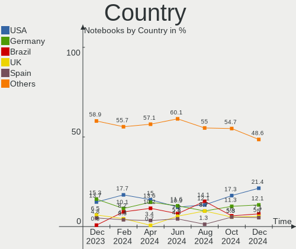
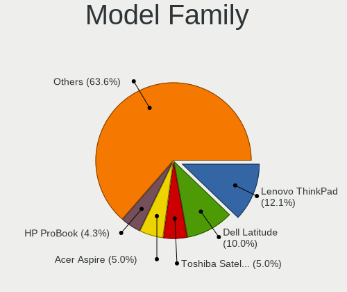
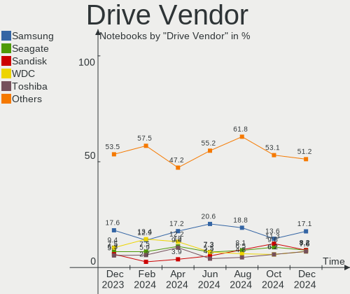
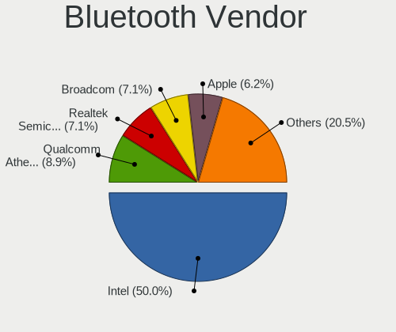

Zorin Hardware Trends (Notebook)
--------------------------------

A project to identify most popular hardware characteristics and track their change
over time based on data collected by Zorin users at https://Linux-Hardware.org.

Anyone can contribute to the study by uploading probes of their computers by
the [hw-probe](https://github.com/linuxhw/hw-probe) tool:

    sudo -E hw-probe -all -upload

Full-feature report is available here: https://linux-hardware.org/?view=trends&formfactor=notebook

Period: May, 2020.

Contents
--------

- [ OS                       ](#os)
- [ OS Family                ](#os-family)
- [ Kernel                   ](#kernel)
- [ Kernel Family            ](#kernel-family)
- [ Kernel Major Ver.        ](#kernel-major-ver)
- [ Arch                     ](#arch)
- [ DE                       ](#de)
- [ Display Server           ](#display-server)
- [ Display Manager          ](#display-manager)
- [ OS Lang                  ](#os-lang)
- [ Boot Mode                ](#boot-mode)
- [ Filesystem               ](#filesystem)
- [ Part. scheme             ](#part-scheme)
- [ Dual Boot with Linux/BSD ](#dual-boot-with-linux/bsd)
- [ Dual Boot (Win)          ](#dual-boot-win)
- [ Country                  ](#country)
- [ City                     ](#city)
- [ Vendor                   ](#vendor)
- [ Model                    ](#model)
- [ Model Family             ](#model-family)
- [ MFG Year                 ](#mfg-year)
- [ Form Factor              ](#form-factor)
- [ Secure Boot              ](#secure-boot)
- [ Coreboot                 ](#coreboot)
- [ RAM Size                 ](#ram-size)
- [ RAM Used                 ](#ram-used)
- [ Drive Vendor             ](#drive-vendor)
- [ Drive Model              ](#drive-model)
- [ Drive Kind               ](#drive-kind)
- [ Drive Connector          ](#drive-connector)
- [ Drive Size               ](#drive-size)
- [ Space Total              ](#space-total)
- [ Space Used               ](#space-used)
- [ Malfunc. Drives          ](#malfunc-drives)
- [ Malfunc. Drive Vendor    ](#malfunc-drive-vendor)
- [ Malfunc. HDD Vendor      ](#malfunc-hdd-vendor)
- [ Malfunc. Drive Kind      ](#malfunc-drive-kind)
- [ Failed Drives            ](#failed-drives)
- [ Failed Drive Vendor      ](#failed-drive-vendor)
- [ Drive Status             ](#drive-status)
- [ Storage Vendor           ](#storage-vendor)
- [ Storage Model            ](#storage-model)
- [ Storage Kind             ](#storage-kind)
- [ CPU Vendor               ](#cpu-vendor)
- [ CPU Model                ](#cpu-model)
- [ CPU Model Family         ](#cpu-model-family)
- [ CPU Cores                ](#cpu-cores)
- [ CPU Sockets              ](#cpu-sockets)
- [ CPU Threads              ](#cpu-threads)
- [ CPU Op-Modes             ](#cpu-op-modes)
- [ CPU Microcode            ](#cpu-microcode)
- [ CPU Microarch            ](#cpu-microarch)
- [ GPU Vendor               ](#gpu-vendor)
- [ GPU Model                ](#gpu-model)
- [ GPU Combo                ](#gpu-combo)
- [ GPU Driver               ](#gpu-driver)
- [ GPU Memory               ](#gpu-memory)
- [ Monitor Vendor           ](#monitor-vendor)
- [ Monitor Model            ](#monitor-model)
- [ Monitor Resolution       ](#monitor-resolution)
- [ Monitor Diagonal         ](#monitor-diagonal)
- [ Monitor Width            ](#monitor-width)
- [ Aspect Ratio             ](#aspect-ratio)
- [ Monitor Area             ](#monitor-area)
- [ Pixel Density            ](#pixel-density)
- [ Multiple Monitors        ](#multiple-monitors)
- [ Net Controller Vendor    ](#net-controller-vendor)
- [ Net Controller Model     ](#net-controller-model)
- [ Wireless Vendor          ](#wireless-vendor)
- [ Wireless Model           ](#wireless-model)
- [ Ethernet Vendor          ](#ethernet-vendor)
- [ Ethernet Model           ](#ethernet-model)
- [ Net Controller Kind      ](#net-controller-kind)
- [ Used Controller          ](#used-controller)
- [ NICs                     ](#nics)
- [ Bluetooth Vendor         ](#bluetooth-vendor)
- [ Bluetooth Model          ](#bluetooth-model)
- [ Unsupported Devices      ](#unsupported-devices)
- [ Unsupported Device Types ](#unsupported-device-types)

OS
--

Installed operating systems

| Name     | Computers | Percent |
|----------|-----------|---------|
| Zorin 15 | 73        | 97.33%  |
| Zorin 12 | 2         | 2.67%   |

OS Family
---------

OS without a version

| Name  | Computers | Percent |
|-------|-----------|---------|
| Zorin | 75        | 100%    |

Kernel
------

Version of the Linux kernel

| Version            | Computers | Percent |
|--------------------|-----------|---------|
| 5.3.0-51-generic   | 43        | 57.33%  |
| 5.3.0-53-generic   | 22        | 29.33%  |
| 5.3.0-40-generic   | 5         | 6.67%   |
| 5.3.0-46-generic   | 2         | 2.67%   |
| 4.18.0-21-generic  | 1         | 1.33%   |
| 4.15.0-99-generic  | 1         | 1.33%   |
| 4.15.0-101-generic | 1         | 1.33%   |

Kernel Family
-------------

Linux kernel without a distro release

| Version | Computers | Percent |
|---------|-----------|---------|
| 5.3.0   | 72        | 96%     |
| 4.15.0  | 2         | 2.67%   |
| 4.18.0  | 1         | 1.33%   |

Kernel Major Ver.
-----------------

Linux kernel major version

| Version | Computers | Percent |
|---------|-----------|---------|
| 5.3     | 72        | 96%     |
| 4.15    | 2         | 2.67%   |
| 4.18    | 1         | 1.33%   |

Arch
----

OS architecture (x86_64, i586, etc.)

| Name   | Computers | Percent |
|--------|-----------|---------|
| x86_64 | 62        | 82.67%  |
| i686   | 13        | 17.33%  |

DE
--

Desktop Environment

| Name    | Computers | Percent |
|---------|-----------|---------|
| GNOME   | 48        | 64%     |
| XFCE    | 26        | 34.67%  |
| Unknown | 1         | 1.33%   |

Display Server
--------------

X11 or Wayland

| Name | Computers | Percent |
|------|-----------|---------|
| X11  | 75        | 100%    |

Display Manager
---------------

SDDM, LightDM, etc.

| Name    | Computers | Percent |
|---------|-----------|---------|
| Unknown | 74        | 98.67%  |
| LightDM | 1         | 1.33%   |

OS Lang
-------

Language

| Lang  | Computers | Percent |
|-------|-----------|---------|
| en_US | 25        | 33.33%  |
| it_IT | 7         | 9.33%   |
| ru_RU | 3         | 4%      |
| pt_BR | 3         | 4%      |
| pl_PL | 3         | 4%      |
| es_ES | 3         | 4%      |
| es_AR | 3         | 4%      |
| en_IN | 3         | 4%      |
| en_CA | 3         | 4%      |
| de_DE | 3         | 4%      |
| nl_BE | 2         | 2.67%   |
| en_ZA | 2         | 2.67%   |
| ro_RO | 1         | 1.33%   |
| pt_PT | 1         | 1.33%   |
| hu_HU | 1         | 1.33%   |
| fr_FR | 1         | 1.33%   |
| es_PA | 1         | 1.33%   |
| es_MX | 1         | 1.33%   |
| es_CO | 1         | 1.33%   |
| es_CL | 1         | 1.33%   |
| en_IL | 1         | 1.33%   |
| en_IE | 1         | 1.33%   |
| en_GB | 1         | 1.33%   |
| el_GR | 1         | 1.33%   |
| de_CH | 1         | 1.33%   |
| de_BE | 1         | 1.33%   |
| bg_BG | 1         | 1.33%   |

Boot Mode
---------

EFI or BIOS

| Mode | Computers | Percent |
|------|-----------|---------|
| BIOS | 49        | 65.33%  |
| EFI  | 26        | 34.67%  |

Filesystem
----------

Type of filesystem

| Type | Computers | Percent |
|------|-----------|---------|
| Ext4 | 75        | 100%    |

Part. scheme
------------

Scheme of partitioning

| Type    | Computers | Percent |
|---------|-----------|---------|
| Unknown | 75        | 100%    |

Dual Boot with Linux/BSD
------------------------

Hosting more than one Linux/BSD

| Dual boot | Computers | Percent |
|-----------|-----------|---------|
| No        | 71        | 94.67%  |
| Yes       | 4         | 5.33%   |

Dual Boot (Win)
---------------

Hosting Linux and Windows

| Dual boot | Computers | Percent |
|-----------|-----------|---------|
| No        | 57        | 76%     |
| Yes       | 18        | 24%     |

Country
-------

Geographic location (country)

| Country      | Computers | Percent |
|--------------|-----------|---------|
| USA          | 11        | 14.67%  |
| Italy        | 6         | 8%      |
| Germany      | 6         | 8%      |
| Romania      | 4         | 5.33%   |
| Spain        | 3         | 4%      |
| Russia       | 3         | 4%      |
| Poland       | 3         | 4%      |
| India        | 3         | 4%      |
| Canada       | 3         | 4%      |
| Brazil       | 3         | 4%      |
| Belgium      | 3         | 4%      |
| Argentina    | 3         | 4%      |
| Switzerland  | 2         | 2.67%   |
| Sweden       | 2         | 2.67%   |
| South Africa | 2         | 2.67%   |
| Bulgaria     | 2         | 2.67%   |
| UK           | 1         | 1.33%   |
| UAE          | 1         | 1.33%   |
| Suriname     | 1         | 1.33%   |
| Sri Lanka    | 1         | 1.33%   |
| Serbia       | 1         | 1.33%   |
| Portugal     | 1         | 1.33%   |
| Panama       | 1         | 1.33%   |
| Netherlands  | 1         | 1.33%   |
| Mexico       | 1         | 1.33%   |
| Kazakhstan   | 1         | 1.33%   |
| Israel       | 1         | 1.33%   |
| Ireland      | 1         | 1.33%   |
| Greece       | 1         | 1.33%   |
| France       | 1         | 1.33%   |
| Colombia     | 1         | 1.33%   |
| Chile        | 1         | 1.33%   |

City
----

Geographic location (city)

| City                | Computers | Percent |
|---------------------|-----------|---------|
| Sofia               | 2         | 2.67%   |
| Rome                | 2         | 2.67%   |
| Mahwah              | 2         | 2.67%   |
| Zurich              | 1         | 1.33%   |
| Wrocław            | 1         | 1.33%   |
| Westport            | 1         | 1.33%   |
| Vlahita             | 1         | 1.33%   |
| Vancouver           | 1         | 1.33%   |
| Tulcea              | 1         | 1.33%   |
| Toronto             | 1         | 1.33%   |
| Teramo              | 1         | 1.33%   |
| Telford             | 1         | 1.33%   |
| Tel Aviv            | 1         | 1.33%   |
| Sunne               | 1         | 1.33%   |
| Slatina             | 1         | 1.33%   |
| Sintra              | 1         | 1.33%   |
| Saratov             | 1         | 1.33%   |
| Santiago de Cali    | 1         | 1.33%   |
| Santiago            | 1         | 1.33%   |
| San Pedro Mixtepec  | 1         | 1.33%   |
| Sabac               | 1         | 1.33%   |
| Riverside           | 1         | 1.33%   |
| Pretoria            | 1         | 1.33%   |
| Perugia             | 1         | 1.33%   |
| Pavlodar            | 1         | 1.33%   |
| Paramaribo          | 1         | 1.33%   |
| Oosterbeek          | 1         | 1.33%   |
| Obernai             | 1         | 1.33%   |
| New Brighton        | 1         | 1.33%   |
| Naples              | 1         | 1.33%   |
| Moscow              | 1         | 1.33%   |
| Morada Nova         | 1         | 1.33%   |
| Milan               | 1         | 1.33%   |
| McKinney            | 1         | 1.33%   |
| Mamming             | 1         | 1.33%   |
| Maldegem            | 1         | 1.33%   |
| Mableton            | 1         | 1.33%   |
| La Chorrera         | 1         | 1.33%   |
| Katerini            | 1         | 1.33%   |
| Johannesburg        | 1         | 1.33%   |
| Ivanovo             | 1         | 1.33%   |
| Ingeniero Maschwitz | 1         | 1.33%   |
| Hechingen           | 1         | 1.33%   |
| Godoy Cruz          | 1         | 1.33%   |
| Geel                | 1         | 1.33%   |
| Gdańsk             | 1         | 1.33%   |
| Friedland           | 1         | 1.33%   |
| Eupen               | 1         | 1.33%   |
| Edmonton            | 1         | 1.33%   |
| Ebnat-Kappel        | 1         | 1.33%   |
| Düsseldorf         | 1         | 1.33%   |
| Dubuque             | 1         | 1.33%   |
| Dubai               | 1         | 1.33%   |
| Czekanka            | 1         | 1.33%   |
| Cuyahoga Falls      | 1         | 1.33%   |
| Concord             | 1         | 1.33%   |
| Colombo             | 1         | 1.33%   |
| Charleston          | 1         | 1.33%   |
| Chandigarh          | 1         | 1.33%   |
| Camaçari           | 1         | 1.33%   |

Vendor
------

Motherboard manufacturer

| Name                | Computers | Percent |
|---------------------|-----------|---------|
| Hewlett-Packard     | 20        | 26.67%  |
| Dell                | 13        | 17.33%  |
| ASUSTek Computer    | 11        | 14.67%  |
| Acer                | 10        | 13.33%  |
| Lenovo              | 6         | 8%      |
| Fujitsu             | 3         | 4%      |
| Samsung Electronics | 2         | 2.67%   |
| Durabook            | 2         | 2.67%   |
| Sony                | 1         | 1.33%   |
| Positivo            | 1         | 1.33%   |
| Notebook            | 1         | 1.33%   |
| MSI                 | 1         | 1.33%   |
| Medion              | 1         | 1.33%   |
| Insyde              | 1         | 1.33%   |
| Fujitsu Siemens     | 1         | 1.33%   |
| Advantec            | 1         | 1.33%   |

Model
-----

Motherboard model

| Name                                  | Computers | Percent |
|---------------------------------------|-----------|---------|
| HP Pavilion dv7                       | 2         | 2.67%   |
| HP 635                                | 2         | 2.67%   |
| HP 15                                 | 2         | 2.67%   |
| Durabook S15H                         | 2         | 2.67%   |
| Sony VGN-AW11Z_B                      | 1         | 1.33%   |
| Samsung Electronics R425D/R525D       | 1         | 1.33%   |
| Samsung Electronics N150P/N210P/N220P | 1         | 1.33%   |
| Positivo S14CT01                      | 1         | 1.33%   |
| Notebook P570WM                       | 1         | 1.33%   |
| MSI GL63 8RD                          | 1         | 1.33%   |
| Medion ERAZER X7853 MD60604           | 1         | 1.33%   |
| Lenovo V145-15AST 81MT                | 1         | 1.33%   |
| Lenovo ThinkPad X240 20AMS72T00       | 1         | 1.33%   |
| Lenovo ThinkPad X140e 20BMS00E00      | 1         | 1.33%   |
| Lenovo ThinkPad E585 20KV0010US       | 1         | 1.33%   |
| Lenovo Lenovo                         | 1         | 1.33%   |
| Lenovo IdeaPad 120S-14IAP 81A5        | 1         | 1.33%   |
| Insyde TW36                           | 1         | 1.33%   |
| HP ZBook 17 G5                        | 1         | 1.33%   |
| HP Stream Laptop 14-ax0XX             | 1         | 1.33%   |
| HP ProBook 450 G2                     | 1         | 1.33%   |
| HP Presario V5000 (EX096PA#ACJ)       | 1         | 1.33%   |
| HP Pavilion dv6000 (RP986EA#ABZ)      | 1         | 1.33%   |
| HP Pavilion dv6                       | 1         | 1.33%   |
| HP Pavilion (EC436AV#ABA)             | 1         | 1.33%   |
| HP Notebook                           | 1         | 1.33%   |
| HP Laptop 15-rb0xx                    | 1         | 1.33%   |
| HP Laptop 15-dw0xxx                   | 1         | 1.33%   |
| HP EliteBook Folio 9480m              | 1         | 1.33%   |
| HP EliteBook 840 G1                   | 1         | 1.33%   |
| HP EliteBook 6930p                    | 1         | 1.33%   |
| HP Compaq 6735s                       | 1         | 1.33%   |
| Fujitsu Siemens ESPRIMO Mobile V6555  | 1         | 1.33%   |
| Fujitsu LIFEBOOK S752                 | 1         | 1.33%   |
| Fujitsu LIFEBOOK S710                 | 1         | 1.33%   |
| Fujitsu LIFEBOOK AH531/GFO            | 1         | 1.33%   |
| Dell Vostro 3550                      | 1         | 1.33%   |
| Dell Studio 1737                      | 1         | 1.33%   |
| Dell Precision M4800                  | 1         | 1.33%   |
| Dell Latitude XT2                     | 1         | 1.33%   |
| Dell Latitude E6400                   | 1         | 1.33%   |
| Dell Latitude E6330                   | 1         | 1.33%   |
| Dell Latitude E5570                   | 1         | 1.33%   |
| Dell Inspiron N4050                   | 1         | 1.33%   |
| Dell Inspiron 7548                    | 1         | 1.33%   |
| Dell Inspiron 5480                    | 1         | 1.33%   |
| Dell Inspiron 1440                    | 1         | 1.33%   |
| Dell Inspiron 1420                    | 1         | 1.33%   |
| Dell Inspiron 14-3452                 | 1         | 1.33%   |
| ASUS Z450LA                           | 1         | 1.33%   |
| ASUS X750JA                           | 1         | 1.33%   |
| ASUS X302LA                           | 1         | 1.33%   |
| ASUS UX331UA                          | 1         | 1.33%   |
| ASUS UL20A                            | 1         | 1.33%   |
| ASUS T100TA                           | 1         | 1.33%   |
| ASUS P552SA                           | 1         | 1.33%   |
| ASUS P4_L3S                           | 1         | 1.33%   |
| ASUS K84L                             | 1         | 1.33%   |
| ASUS K50AB                            | 1         | 1.33%   |
| ASUS 1005P                            | 1         | 1.33%   |

Model Family
------------

Motherboard model prefix

| Name                      | Computers | Percent |
|---------------------------|-----------|---------|
| Dell Inspiron             | 6         | 8%      |
| Acer Aspire               | 6         | 8%      |
| HP Pavilion               | 5         | 6.67%   |
| Dell Latitude             | 4         | 5.33%   |
| Lenovo ThinkPad           | 3         | 4%      |
| HP EliteBook              | 3         | 4%      |
| Fujitsu LIFEBOOK          | 3         | 4%      |
| HP Laptop                 | 2         | 2.67%   |
| HP 635                    | 2         | 2.67%   |
| HP 15                     | 2         | 2.67%   |
| Durabook S15H             | 2         | 2.67%   |
| Sony VGN-AW11Z            | 1         | 1.33%   |
| Samsung Electronics R425D | 1         | 1.33%   |
| Samsung Electronics N150P | 1         | 1.33%   |
| Positivo S14CT01          | 1         | 1.33%   |
| Notebook P570WM           | 1         | 1.33%   |
| MSI GL63                  | 1         | 1.33%   |
| Medion ERAZER             | 1         | 1.33%   |
| Lenovo V145-15AST         | 1         | 1.33%   |
| Lenovo Lenovo             | 1         | 1.33%   |
| Lenovo IdeaPad            | 1         | 1.33%   |
| Insyde TW36               | 1         | 1.33%   |
| HP ZBook                  | 1         | 1.33%   |
| HP Stream                 | 1         | 1.33%   |
| HP ProBook                | 1         | 1.33%   |
| HP Presario               | 1         | 1.33%   |
| HP Notebook               | 1         | 1.33%   |
| HP Compaq                 | 1         | 1.33%   |
| Fujitsu Siemens ESPRIMO   | 1         | 1.33%   |
| Dell Vostro               | 1         | 1.33%   |
| Dell Studio               | 1         | 1.33%   |
| Dell Precision            | 1         | 1.33%   |
| ASUS Z450LA               | 1         | 1.33%   |
| ASUS X750JA               | 1         | 1.33%   |
| ASUS X302LA               | 1         | 1.33%   |
| ASUS UX331UA              | 1         | 1.33%   |
| ASUS UL20A                | 1         | 1.33%   |
| ASUS T100TA               | 1         | 1.33%   |
| ASUS P552SA               | 1         | 1.33%   |
| ASUS P4                   | 1         | 1.33%   |
| ASUS K84L                 | 1         | 1.33%   |
| ASUS K50AB                | 1         | 1.33%   |
| ASUS 1005P                | 1         | 1.33%   |
| Advantec CX23200W         | 1         | 1.33%   |
| Acer V5-131               | 1         | 1.33%   |
| Acer AOD270               | 1         | 1.33%   |
| Acer AOD255               | 1         | 1.33%   |
| Acer AO722                | 1         | 1.33%   |

MFG Year
--------

Motherboard manufacture year

| Year | Computers | Percent |
|------|-----------|---------|
| 2011 | 10        | 13.33%  |
| 2015 | 9         | 12%     |
| 2009 | 9         | 12%     |
| 2019 | 7         | 9.33%   |
| 2018 | 6         | 8%      |
| 2016 | 6         | 8%      |
| 2014 | 5         | 6.67%   |
| 2010 | 5         | 6.67%   |
| 2013 | 4         | 5.33%   |
| 2012 | 4         | 5.33%   |
| 2020 | 2         | 2.67%   |
| 2017 | 2         | 2.67%   |
| 2007 | 2         | 2.67%   |
| 2006 | 2         | 2.67%   |
| 2005 | 1         | 1.33%   |
| 2003 | 1         | 1.33%   |

Form Factor
-----------

Physical design of the computer

| Name     | Computers | Percent |
|----------|-----------|---------|
| Notebook | 75        | 100%    |

Secure Boot
-----------

Enabled or disabled

| State    | Computers | Percent |
|----------|-----------|---------|
| Disabled | 70        | 93.33%  |
| Enabled  | 5         | 6.67%   |

Coreboot
--------

Have coreboot on board

| Used | Computers | Percent |
|------|-----------|---------|
| No   | 75        | 100%    |

RAM Size
--------

Total RAM memory

| Size in GB  | Computers | Percent |
|-------------|-----------|---------|
| 3.01-4.0    | 23        | 30.67%  |
| 1.01-2.0    | 15        | 20%     |
| 4.01-8.0    | 13        | 17.33%  |
| 0.01-1.0    | 8         | 10.67%  |
| 16.01-24.0  | 6         | 8%      |
| 8.01-16.0   | 6         | 8%      |
| 32.01-64.0  | 3         | 4%      |
| 64.01-256.0 | 1         | 1.33%   |

RAM Used
--------

Used RAM memory

| Used GB   | Computers | Percent |
|-----------|-----------|---------|
| 1.01-2.0  | 38        | 50.67%  |
| 0.01-1.0  | 13        | 17.33%  |
| 2.01-3.0  | 12        | 16%     |
| 3.01-4.0  | 7         | 9.33%   |
| 4.01-8.0  | 4         | 5.33%   |
| 8.01-16.0 | 1         | 1.33%   |

Drive Vendor
------------

Hard drive vendors

| Vendor              | Computers | Drives | Percent |
|---------------------|-----------|--------|---------|
| WDC                 | 19        | 19     | 20.88%  |
| Unknown             | 14        | 17     | 15.38%  |
| Seagate             | 14        | 16     | 15.38%  |
| Hitachi             | 8         | 8      | 8.79%   |
| Toshiba             | 6         | 6      | 6.59%   |
| Samsung Electronics | 6         | 6      | 6.59%   |
| Kingston            | 4         | 4      | 4.4%    |
| Crucial             | 4         | 4      | 4.4%    |
| SanDisk             | 3         | 3      | 3.3%    |
| PLEXTOR             | 2         | 2      | 2.2%    |
| Intel               | 2         | 2      | 2.2%    |
| HGST                | 2         | 2      | 2.2%    |
| Team                | 1         | 1      | 1.1%    |
| SK Hynix            | 1         | 1      | 1.1%    |
| OCZ                 | 1         | 1      | 1.1%    |
| HL-DT-ST            | 1         | 1      | 1.1%    |
| FC-1307             | 1         | 1      | 1.1%    |
| EMTEC               | 1         | 1      | 1.1%    |
| A-DATA Technology   | 1         | 1      | 1.1%    |

Drive Model
-----------

Hard drive models

| Model                        | Computers | Percent |
|------------------------------|-----------|---------|
| MMC Card  32GB               | 9         | 9.57%   |
| HTS545016B9A300 160GB        | 3         | 3.19%   |
| WD3200BPVT-22JJ5T0 320GB     | 2         | 2.13%   |
| WD10JPVX-22JC3T0 1TB         | 2         | 2.13%   |
| ST9160314AS 160GB            | 2         | 2.13%   |
| PX-512M6S 512GB SSD          | 2         | 2.13%   |
| X150 240GB                   | 1         | 1.06%   |
| WD800BEVS-22RST0 80GB        | 1         | 1.06%   |
| WD6400BPVT-22HXZT3 640GB     | 1         | 1.06%   |
| WD5000LPVX-22V0TT0 500GB     | 1         | 1.06%   |
| WD5000LPCX-75VHAT0 500GB     | 1         | 1.06%   |
| WD5000LPCX-60VHAT1 500GB     | 1         | 1.06%   |
| WD5000LPCX-60VHAT0 500GB     | 1         | 1.06%   |
| WD5000BPVT-22HXZT3 500GB     | 1         | 1.06%   |
| WD5000BEVT-22A0RT0 500GB     | 1         | 1.06%   |
| WD3200BEVT-75A23T0 320GB     | 1         | 1.06%   |
| WD3200BEVE-00A0HT0 320GB     | 1         | 1.06%   |
| WD2500BEKT-60A25T1 250GB     | 1         | 1.06%   |
| WD1600BEVT-22A23T0 160GB     | 1         | 1.06%   |
| WD10SPZX-75Z10T2 1TB         | 1         | 1.06%   |
| WD10SPCX-75KHST0 1TB         | 1         | 1.06%   |
| WD10JPVX-60JC3T0 1TB         | 1         | 1.06%   |
| VERTEX3 120GB SSD            | 1         | 1.06%   |
| USD00  32GB                  | 1         | 1.06%   |
| T253X2128G 128GB SSD         | 1         | 1.06%   |
| SV100S2128G 128GB SSD        | 1         | 1.06%   |
| SUV400S37120G 120GB SSD      | 1         | 1.06%   |
| SU810NS38 SATA 128 GB SSD    | 1         | 1.06%   |
| ST95005620AS 500GB           | 1         | 1.06%   |
| ST9500325AS 500GB            | 1         | 1.06%   |
| ST500LT012-9WS142 500GB      | 1         | 1.06%   |
| ST500LT012-1DG142 500GB      | 1         | 1.06%   |
| ST500LM030-2E717D 500GB      | 1         | 1.06%   |
| ST500LM021-1KJ152 500GB      | 1         | 1.06%   |
| ST500LM000-1EJ162 500GB      | 1         | 1.06%   |
| ST320LT020-9YG142 320GB      | 1         | 1.06%   |
| ST1500LM006 HN-M151RAD 1TB   | 1         | 1.06%   |
| ST1000LM049-2GH172 1TB       | 1         | 1.06%   |
| ST1000LM024 HN-M101MBB 1TB   | 1         | 1.06%   |
| SSDSC2BW180A3L 180GB         | 1         | 1.06%   |
| SSDSC2BF180A4H 180GB         | 1         | 1.06%   |
| SSD PM800 TM 64GB            | 1         | 1.06%   |
| SSD 860 PRO 1TB              | 1         | 1.06%   |
| SSD 860 EVO 1TB              | 1         | 1.06%   |
| SSD 850 EVO 120GB            | 1         | 1.06%   |
| SSD 840 PRO Series 128GB     | 1         | 1.06%   |
| SDSSDP128G 128GB             | 1         | 1.06%   |
| SDSSDA120G 120GB             | 1         | 1.06%   |
| SD8SN8U512G1002 512GB SSD    | 1         | 1.06%   |
| SD to CF Adapter V1.4        | 1         | 1.06%   |
| SC308 SATA 256GB SSD         | 1         | 1.06%   |
| SA400S37480G 480GB SSD       | 1         | 1.06%   |
| RBU-SMSM151S324GD 24GB SSD   | 1         | 1.06%   |
| MZ7LN128HAHQ-000L2 128GB SSD | 1         | 1.06%   |
| MQ01ACF050 500GB             | 1         | 1.06%   |
| MQ01ABD100 1TB               | 1         | 1.06%   |
| MMC Card  64GB               | 1         | 1.06%   |
| MMC Card  4GB                | 1         | 1.06%   |
| MMC Card  2GB                | 1         | 1.06%   |
| MMC Card  16GB               | 1         | 1.06%   |

Drive Kind
----------

HDD or SSD

| Kind    | Computers | Drives | Percent |
|---------|-----------|--------|---------|
| HDD     | 49        | 50     | 55.06%  |
| SSD     | 22        | 25     | 24.72%  |
| MMC     | 14        | 17     | 15.73%  |
| Unknown | 4         | 4      | 4.49%   |

Drive Connector
---------------

SATA, SAS, NVMe, etc.

| Type | Computers | Drives | Percent |
|------|-----------|--------|---------|
| SATA | 68        | 74     | 80.95%  |
| MMC  | 14        | 17     | 16.67%  |
| SAS  | 2         | 5      | 2.38%   |

Drive Size
----------

Size of hard drive

| Size in TB | Computers | Drives | Percent |
|------------|-----------|--------|---------|
| 0.01-0.5   | 65        | 75     | 77.38%  |
| 0.51-1.0   | 17        | 17     | 20.24%  |
| 1.01-2.0   | 2         | 4      | 2.38%   |

Space Total
-----------

Amount of disk space available on the file system

| Size in GB     | Computers | Percent |
|----------------|-----------|---------|
| 251-500        | 25        | 33.33%  |
| 101-250        | 24        | 32%     |
| 51-100         | 8         | 10.67%  |
| 21-50          | 7         | 9.33%   |
| 501-1000       | 5         | 6.67%   |
| 1-20           | 3         | 4%      |
| 1001-2000      | 2         | 2.67%   |
| More than 3000 | 1         | 1.33%   |

Space Used
----------

Amount of used disk space

| Used GB        | Computers | Percent |
|----------------|-----------|---------|
| 1-20           | 41        | 54.67%  |
| 21-50          | 14        | 18.67%  |
| 51-100         | 11        | 14.67%  |
| 101-250        | 5         | 6.67%   |
| 251-500        | 2         | 2.67%   |
| More than 3000 | 1         | 1.33%   |
| 1001-2000      | 1         | 1.33%   |

Malfunc. Drives
---------------

Drive models with a malfunction

| Model             | Computers | Drives | Percent |
|-------------------|-----------|--------|---------|
| ST9160314AS 160GB | 1         | 1      | 100%    |

Malfunc. Drive Vendor
---------------------

Vendors of faulty drives

| Vendor  | Computers | Drives | Percent |
|---------|-----------|--------|---------|
| Seagate | 1         | 1      | 100%    |

Malfunc. HDD Vendor
-------------------

Vendors of faulty HDD drives

| Vendor  | Computers | Drives | Percent |
|---------|-----------|--------|---------|
| Seagate | 1         | 1      | 100%    |

Malfunc. Drive Kind
-------------------

Kinds of faulty drives

| Kind | Computers | Drives | Percent |
|------|-----------|--------|---------|
| HDD  | 1         | 1      | 100%    |

Failed Drives
-------------

Failed drive models

Zero info for selected period =(

Failed Drive Vendor
-------------------

Failed drive vendors

Zero info for selected period =(

Drive Status
------------

Number of failed and malfunc. drives

| Status   | Computers | Drives | Percent |
|----------|-----------|--------|---------|
| Detected | 72        | 93     | 96%     |
| Works    | 2         | 2      | 2.67%   |
| Malfunc  | 1         | 1      | 1.33%   |

Storage Vendor
--------------

Storage controller vendors

| Vendor                      | Computers | Percent |
|-----------------------------|-----------|---------|
| Intel                       | 57        | 77.03%  |
| AMD                         | 12        | 16.22%  |
| Samsung Electronics         | 2         | 2.7%    |
| Nvidia                      | 1         | 1.35%   |
| Kingston Technology Company | 1         | 1.35%   |
| JMicron Technology          | 1         | 1.35%   |

Storage Model
-------------

Storage controller models

| Model                                                                            | Computers | Percent |
|----------------------------------------------------------------------------------|-----------|---------|
| 82801 Mobile SATA Controller [RAID mode]                                         | 7         | 8.43%   |
| SB7x0/SB8x0/SB9x0 SATA Controller [AHCI mode]                                    | 6         | 7.23%   |
| 6 Series/C200 Series Chipset Family 6 port Mobile SATA AHCI Controller           | 6         | 7.23%   |
| FCH SATA Controller [AHCI mode]                                                  | 5         | 6.02%   |
| 82801IBM/IEM (ICH9M/ICH9M-E) 4 port SATA Controller [AHCI mode]                  | 5         | 6.02%   |
| 8 Series SATA Controller 1 [AHCI mode]                                           | 4         | 4.82%   |
| Atom/Celeron/Pentium Processor x5-E8000/J3xxx/N3xxx Series SATA Controller       | 3         | 3.61%   |
| 82801GBM/GHM (ICH7-M Family) SATA Controller [AHCI mode]                         | 3         | 3.61%   |
| 82801G (ICH7 Family) IDE Controller                                              | 3         | 3.61%   |
| 8 Series/C220 Series Chipset Family 6-port SATA Controller 1 [AHCI mode]         | 3         | 3.61%   |
| 7 Series Chipset Family 6-port SATA Controller [AHCI mode]                       | 3         | 3.61%   |
| Wildcat Point-LP SATA Controller [AHCI Mode]                                     | 2         | 2.41%   |
| Sunrise Point-LP SATA Controller [AHCI mode]                                     | 2         | 2.41%   |
| NM10/ICH7 Family SATA Controller [IDE mode]                                      | 2         | 2.41%   |
| NM10/ICH7 Family SATA Controller [AHCI mode]                                     | 2         | 2.41%   |
| Cannon Lake Mobile PCH SATA AHCI Controller                                      | 2         | 2.41%   |
| Atom Processor E3800 Series SATA AHCI Controller                                 | 2         | 2.41%   |
| 82801HM/HEM (ICH8M/ICH8M-E) SATA Controller [IDE mode]                           | 2         | 2.41%   |
| 82801HM/HEM (ICH8M/ICH8M-E) IDE Controller                                       | 2         | 2.41%   |
| SSD Pro 7600p/760p/E 6100p Series                                                | 1         | 1.2%    |
| SSD 660P Series                                                                  | 1         | 1.2%    |
| NVMe SSD Controller SM981/PM981/PM983                                            | 1         | 1.2%    |
| NVMe SSD Controller SM961/PM961                                                  | 1         | 1.2%    |
| Non-Volatile memory controller                                                   | 1         | 1.2%    |
| Mobile 4 Series Chipset PT IDER Controller                                       | 1         | 1.2%    |
| MCP79 SATA Controller                                                            | 1         | 1.2%    |
| JMB368 IDE controller                                                            | 1         | 1.2%    |
| IXP SB4x0 IDE Controller                                                         | 1         | 1.2%    |
| HM170/QM170 Chipset SATA Controller [AHCI Mode]                                  | 1         | 1.2%    |
| Celeron N3350/Pentium N4200/Atom E3900 Series SATA AHCI Controller               | 1         | 1.2%    |
| C600/X79 series chipset 6-Port SATA AHCI Controller                              | 1         | 1.2%    |
| 82801IBM/IEM (ICH9M/ICH9M-E) 2 port SATA Controller [IDE mode]                   | 1         | 1.2%    |
| 82801GBM/GHM (ICH7-M Family) SATA Controller [IDE mode]                          | 1         | 1.2%    |
| 82801CAM IDE U100 Controller                                                     | 1         | 1.2%    |
| 6 Series/C200 Series Chipset Family Mobile SATA Controller (IDE mode, ports 4-5) | 1         | 1.2%    |
| 6 Series/C200 Series Chipset Family Mobile SATA Controller (IDE mode, ports 0-3) | 1         | 1.2%    |
| 5 Series/3400 Series Chipset 6 port SATA AHCI Controller                         | 1         | 1.2%    |
| 5 Series/3400 Series Chipset 4 port SATA AHCI Controller                         | 1         | 1.2%    |

Storage Kind
------------

Kind of storage controller (IDE, SATA, NVMe, SAS, ...)

| Kind | Computers | Percent |
|------|-----------|---------|
| SATA | 53        | 68.83%  |
| IDE  | 13        | 16.88%  |
| RAID | 7         | 9.09%   |
| NVMe | 4         | 5.19%   |

CPU Vendor
----------

Processor vendors

| Vendor | Computers | Percent |
|--------|-----------|---------|
| Intel  | 63        | 84%     |
| AMD    | 12        | 16%     |

CPU Model
---------

Processor models

| Model                                         | Computers | Percent |
|-----------------------------------------------|-----------|---------|
| Intel Atom CPU N450 @ 1.66GHz                 | 3         | 4%      |
| Intel Core i7-8565U CPU @ 1.80GHz             | 2         | 2.67%   |
| Intel Core i7-4600M CPU @ 2.90GHz             | 2         | 2.67%   |
| Intel Core i5-4310U CPU @ 2.00GHz             | 2         | 2.67%   |
| Intel Core i5-2410M CPU @ 2.30GHz             | 2         | 2.67%   |
| Intel Core i3-4005U CPU @ 1.70GHz             | 2         | 2.67%   |
| Intel Core 2 Duo CPU T6400 @ 2.00GHz          | 2         | 2.67%   |
| Intel Core 2 Duo CPU P8700 @ 2.53GHz          | 2         | 2.67%   |
| Intel Celeron CPU N3060 @ 1.60GHz             | 2         | 2.67%   |
| Intel Celeron CPU N3050 @ 1.60GHz             | 2         | 2.67%   |
| Intel Atom CPU N270 @ 1.60GHz                 | 2         | 2.67%   |
| AMD E-450 APU with Radeon HD Graphics         | 2         | 2.67%   |
| Intel Xeon E-2186M CPU @ 2.90GHz              | 1         | 1.33%   |
| Intel Pentium Dual-Core CPU T4200 @ 2.00GHz   | 1         | 1.33%   |
| Intel Pentium CPU N3540 @ 2.16GHz             | 1         | 1.33%   |
| Intel Pentium 4 CPU 1.80GHz                   | 1         | 1.33%   |
| Intel Genuine CPU U2300 @ 1.20GHz             | 1         | 1.33%   |
| Intel Genuine CPU T2250 @ 1.73GHz             | 1         | 1.33%   |
| Intel Core i7-8750H CPU @ 2.20GHz             | 1         | 1.33%   |
| Intel Core i7-8550U CPU @ 1.80GHz             | 1         | 1.33%   |
| Intel Core i7-7700HQ CPU @ 2.80GHz            | 1         | 1.33%   |
| Intel Core i7-6600U CPU @ 2.60GHz             | 1         | 1.33%   |
| Intel Core i7-5500U CPU @ 2.40GHz             | 1         | 1.33%   |
| Intel Core i7-4940MX CPU @ 3.10GHz            | 1         | 1.33%   |
| Intel Core i7-4820K CPU @ 3.70GHz             | 1         | 1.33%   |
| Intel Core i7-4700HQ CPU @ 2.40GHz            | 1         | 1.33%   |
| Intel Core i7-2670QM CPU @ 2.20GHz            | 1         | 1.33%   |
| Intel Core i7-2620M CPU @ 2.70GHz             | 1         | 1.33%   |
| Intel Core i7 CPU Q 740 @ 1.73GHz             | 1         | 1.33%   |
| Intel Core i5-4300U CPU @ 1.90GHz             | 1         | 1.33%   |
| Intel Core i5-3340M CPU @ 2.70GHz             | 1         | 1.33%   |
| Intel Core i5-3210M CPU @ 2.50GHz             | 1         | 1.33%   |
| Intel Core i5-2430M CPU @ 2.40GHz             | 1         | 1.33%   |
| Intel Core i3-7020U CPU @ 2.30GHz             | 1         | 1.33%   |
| Intel Core i3-5010U CPU @ 2.10GHz             | 1         | 1.33%   |
| Intel Core i3-2370M CPU @ 2.40GHz             | 1         | 1.33%   |
| Intel Core i3-2330M CPU @ 2.20GHz             | 1         | 1.33%   |
| Intel Core i3 CPU M 370 @ 2.40GHz             | 1         | 1.33%   |
| Intel Core 2 Duo CPU U9400 @ 1.40GHz          | 1         | 1.33%   |
| Intel Core 2 Duo CPU T9400 @ 2.53GHz          | 1         | 1.33%   |
| Intel Core 2 Duo CPU T5250 @ 1.50GHz          | 1         | 1.33%   |
| Intel Celeron M CPU 410 @ 1.46GHz             | 1         | 1.33%   |
| Intel Celeron CPU N3350 @ 1.10GHz             | 1         | 1.33%   |
| Intel Celeron CPU N2810 @ 2.00GHz             | 1         | 1.33%   |
| Intel Celeron CPU 900 @ 2.20GHz               | 1         | 1.33%   |
| Intel Celeron CPU 530 @ 1.73GHz               | 1         | 1.33%   |
| Intel Celeron CPU 1007U @ 1.50GHz             | 1         | 1.33%   |
| Intel Atom x5-Z8350 CPU @ 1.44GHz             | 1         | 1.33%   |
| Intel Atom x5-Z8300 CPU @ 1.44GHz             | 1         | 1.33%   |
| Intel Atom CPU Z3740 @ 1.33GHz                | 1         | 1.33%   |
| Intel Atom CPU Z3735G @ 1.33GHz               | 1         | 1.33%   |
| Intel Atom CPU N2600 @ 1.60GHz                | 1         | 1.33%   |
| AMD Turion 64 Mobile Technology ML-37         | 1         | 1.33%   |
| AMD Sempron SI-40                             | 1         | 1.33%   |
| AMD Ryzen 3 2200U with Radeon Vega Mobile Gfx | 1         | 1.33%   |
| AMD Phenom II N970 Quad-Core Processor        | 1         | 1.33%   |
| AMD E1-2500 APU with Radeon HD Graphics       | 1         | 1.33%   |
| AMD C-60 APU with Radeon HD Graphics          | 1         | 1.33%   |
| AMD Athlon X2 Dual-Core QL-65                 | 1         | 1.33%   |
| AMD A9-9425 RADEON R5, 5 COMPUTE CORES 2C+3G  | 1         | 1.33%   |

CPU Model Family
----------------

Processor model prefix

| Model                   | Computers | Percent |
|-------------------------|-----------|---------|
| Intel Core i7           | 15        | 20%     |
| Intel Atom              | 10        | 13.33%  |
| Intel Celeron           | 9         | 12%     |
| Intel Core i5           | 8         | 10.67%  |
| Intel Core i3           | 7         | 9.33%   |
| Intel Core 2 Duo        | 7         | 9.33%   |
| Intel Genuine           | 2         | 2.67%   |
| AMD E                   | 2         | 2.67%   |
| Other                   | 1         | 1.33%   |
| Intel Xeon              | 1         | 1.33%   |
| Intel Pentium Dual-Core | 1         | 1.33%   |
| Intel Pentium 4         | 1         | 1.33%   |
| Intel Pentium           | 1         | 1.33%   |
| Intel Celeron M         | 1         | 1.33%   |
| AMD Turion 64 Mobile    | 1         | 1.33%   |
| AMD Sempron             | 1         | 1.33%   |
| AMD Ryzen 3             | 1         | 1.33%   |
| AMD Phenom II           | 1         | 1.33%   |
| AMD E1                  | 1         | 1.33%   |
| AMD C-60                | 1         | 1.33%   |
| AMD Athlon X2           | 1         | 1.33%   |
| AMD A8                  | 1         | 1.33%   |
| AMD A4                  | 1         | 1.33%   |

CPU Cores
---------

Number of processor cores

| Number | Computers | Percent |
|--------|-----------|---------|
| 2      | 46        | 61.33%  |
| 4      | 16        | 21.33%  |
| 1      | 11        | 14.67%  |
| 6      | 2         | 2.67%   |

CPU Sockets
-----------

Number of sockets

| Number | Computers | Percent |
|--------|-----------|---------|
| 1      | 75        | 100%    |

CPU Threads
-----------

Threads per core (Hyper-Threading)

| Number | Computers | Percent |
|--------|-----------|---------|
| 2      | 38        | 50.67%  |
| 1      | 37        | 49.33%  |

CPU Op-Modes
------------

CPU Operation Modes (32-bit, 64-bit)

| Op mode        | Computers | Percent |
|----------------|-----------|---------|
| 32-bit, 64-bit | 70        | 93.33%  |
| 32-bit         | 5         | 6.67%   |

CPU Microcode
-------------

Microcode number

| Number     | Computers | Percent |
|------------|-----------|---------|
| 0x1067a    | 7         | 9.33%   |
| Unknown    | 7         | 9.33%   |
| 0x206a7    | 6         | 8%      |
| 0x40651    | 5         | 6.67%   |
| 0x406c4    | 3         | 4%      |
| 0x406c3    | 3         | 4%      |
| 0x306c3    | 3         | 4%      |
| 0x106ca    | 3         | 4%      |
| 0x906ea    | 2         | 2.67%   |
| 0x806ec    | 2         | 2.67%   |
| 0x6e8      | 2         | 2.67%   |
| 0x306d4    | 2         | 2.67%   |
| 0x306a9    | 2         | 2.67%   |
| 0x30673    | 2         | 2.67%   |
| 0x106c2    | 2         | 2.67%   |
| 0x06006705 | 2         | 2.67%   |
| 0x05000119 | 2         | 2.67%   |
| 0x02000032 | 2         | 2.67%   |
| 0xf24      | 1         | 1.33%   |
| 0x906e9    | 1         | 1.33%   |
| 0x806ea    | 1         | 1.33%   |
| 0x806e9    | 1         | 1.33%   |
| 0x6fd      | 1         | 1.33%   |
| 0x506c9    | 1         | 1.33%   |
| 0x406e3    | 1         | 1.33%   |
| 0x306e4    | 1         | 1.33%   |
| 0x30678    | 1         | 1.33%   |
| 0x30661    | 1         | 1.33%   |
| 0x20655    | 1         | 1.33%   |
| 0x106e5    | 1         | 1.33%   |
| 0x10676    | 1         | 1.33%   |
| 0x10661    | 1         | 1.33%   |
| 0x0810100b | 1         | 1.33%   |
| 0x07030104 | 1         | 1.33%   |
| 0x07000110 | 1         | 1.33%   |
| 0x010000c8 | 1         | 1.33%   |

CPU Microarch
-------------

Microarchitecture

| Name            | Computers | Percent |
|-----------------|-----------|---------|
| Silvermont      | 10        | 13.33%  |
| Haswell         | 9         | 12%     |
| Core            | 9         | 12%     |
| Skylake         | 8         | 10.67%  |
| SandyBridge     | 7         | 9.33%   |
| Bonnell         | 6         | 8%      |
| IvyBridge       | 4         | 5.33%   |
| Bobcat          | 3         | 4%      |
| Penryn          | 2         | 2.67%   |
| P6              | 2         | 2.67%   |
| K8 & K10 hybrid | 2         | 2.67%   |
| Excavator       | 2         | 2.67%   |
| Broadwell       | 2         | 2.67%   |
| Zen             | 1         | 1.33%   |
| Westmere        | 1         | 1.33%   |
| Puma            | 1         | 1.33%   |
| NetBurst        | 1         | 1.33%   |
| Nehalem         | 1         | 1.33%   |
| K8 Hammer       | 1         | 1.33%   |
| K10             | 1         | 1.33%   |
| Jaguar          | 1         | 1.33%   |
| Goldmont        | 1         | 1.33%   |

GPU Vendor
----------

Vendors of graphics cards

| Vendor | Computers | Percent |
|--------|-----------|---------|
| Intel  | 53        | 63.1%   |
| AMD    | 20        | 23.81%  |
| Nvidia | 11        | 13.1%   |

GPU Model
---------

Graphics card models

| Model                                                                              | Computers | Percent |
|------------------------------------------------------------------------------------|-----------|---------|
| 2nd Generation Core Processor Family Integrated Graphics Controller                | 7         | 7.61%   |
| Atom/Celeron/Pentium Processor x5-E8000/J3xxx/N3xxx Integrated Graphics Controller | 6         | 6.52%   |
| Mobile 4 Series Chipset Integrated Graphics Controller                             | 5         | 5.43%   |
| Haswell-ULT Integrated Graphics Controller                                         | 5         | 5.43%   |
| Atom Processor Z36xxx/Z37xxx Series Graphics & Display                             | 4         | 4.35%   |
| 4th Gen Core Processor Integrated Graphics Controller                              | 4         | 4.35%   |
| Seymour [Radeon HD 6400M/7400M Series]                                             | 3         | 3.26%   |
| Mobile 945GM/GMS/GME, 943/940GML Express Integrated Graphics Controller            | 3         | 3.26%   |
| Atom Processor D4xx/D5xx/N4xx/N5xx Integrated Graphics Controller                  | 3         | 3.26%   |
| 3rd Gen Core processor Graphics Controller                                         | 3         | 3.26%   |
| Wrestler [Radeon HD 6320]                                                          | 2         | 2.17%   |
| UHD Graphics 620 (Whiskey Lake)                                                    | 2         | 2.17%   |
| Stoney [Radeon R2/R3/R4/R5 Graphics]                                               | 2         | 2.17%   |
| RS780M [Mobility Radeon HD 3200]                                                   | 2         | 2.17%   |
| Mobile GM965/GL960 Integrated Graphics Controller (secondary)                      | 2         | 2.17%   |
| Mobile GM965/GL960 Integrated Graphics Controller (primary)                        | 2         | 2.17%   |
| Mobile 945GSE Express Integrated Graphics Controller                               | 2         | 2.17%   |
| HD Graphics 5500                                                                   | 2         | 2.17%   |
| Wrestler [Radeon HD 6290]                                                          | 1         | 1.09%   |
| Whistler [Radeon HD 6730M/6770M/7690M XT]                                          | 1         | 1.09%   |
| Whistler [Radeon HD 6630M/6650M/6750M/7670M/7690M]                                 | 1         | 1.09%   |
| UHD Graphics 630 (Mobile)                                                          | 1         | 1.09%   |
| UHD Graphics 620                                                                   | 1         | 1.09%   |
| Topaz XT [Radeon R7 M260/M265 / M340/M360 / M440/M445 / 530/535 / 620/625 Mobile]  | 1         | 1.09%   |
| Sun LE [Radeon HD 8550M / R5 M230]                                                 | 1         | 1.09%   |
| Skylake GT2 [HD Graphics 520]                                                      | 1         | 1.09%   |
| RV710/M92 [Mobility Radeon HD 4530/4570/545v]                                      | 1         | 1.09%   |
| RV635/M86 [Mobility Radeon HD 3650]                                                | 1         | 1.09%   |
| RS880M [Mobility Radeon HD 4225/4250]                                              | 1         | 1.09%   |
| RS480M [Mobility Radeon Xpress 200]                                                | 1         | 1.09%   |
| Raven Ridge [Radeon Vega Series / Radeon Vega Mobile Series]                       | 1         | 1.09%   |
| Opal XT [Radeon R7 M265/M365X/M465]                                                | 1         | 1.09%   |
| Mullins [Radeon R4/R5 Graphics]                                                    | 1         | 1.09%   |
| Mobile 945GM/GMS, 943/940GML Express Integrated Graphics Controller                | 1         | 1.09%   |
| MCP79 [GeForce 8200M G]                                                            | 1         | 1.09%   |
| Kaby Lake-U GT2f Integrated Graphics Controller                                    | 1         | 1.09%   |
| Kabini [Radeon HD 8240 / R3 Series]                                                | 1         | 1.09%   |
| HD Graphics 500                                                                    | 1         | 1.09%   |
| GP108M [GeForce MX150]                                                             | 1         | 1.09%   |
| GP107M [GeForce GTX 1050 Ti Mobile]                                                | 1         | 1.09%   |
| GP104GLM [Quadro P4200 Mobile]                                                     | 1         | 1.09%   |
| GP104BM [GeForce GTX 1070 Mobile]                                                  | 1         | 1.09%   |
| GK106GLM [Quadro K2100M]                                                           | 1         | 1.09%   |
| GF108M [GeForce GT 540M]                                                           | 1         | 1.09%   |
| GF108M [GeForce GT 525M]                                                           | 1         | 1.09%   |
| G98M [GeForce 9200M GS]                                                            | 1         | 1.09%   |
| G96CM [GeForce 9600M GT]                                                           | 1         | 1.09%   |
| G72M [GeForce Go 7400]                                                             | 1         | 1.09%   |
| Core Processor Integrated Graphics Controller                                      | 1         | 1.09%   |
| Broadway PRO [Mobility Radeon HD 5850]                                             | 1         | 1.09%   |
| Atom Processor D2xxx/N2xxx Integrated Graphics Controller                          | 1         | 1.09%   |

GPU Combo
---------

Combinations of graphics cards

| Name           | Computers | Percent |
|----------------|-----------|---------|
| 1 x Intel      | 42        | 56%     |
| 1 x AMD        | 13        | 17.33%  |
| 1 x Nvidia     | 6         | 8%      |
| Intel + AMD    | 6         | 8%      |
| Intel + Nvidia | 5         | 6.67%   |
| 2 x AMD        | 3         | 4%      |

GPU Driver
----------

Free vs proprietary

| Driver      | Computers | Percent |
|-------------|-----------|---------|
| Free        | 67        | 89.33%  |
| Proprietary | 6         | 8%      |
| Unknown     | 2         | 2.67%   |

GPU Memory
----------

Total video memory

| Size in GB | Computers | Percent |
|------------|-----------|---------|
| Unknown    | 48        | 64%     |
| 0.01-0.5   | 15        | 20%     |
| 1.01-2.0   | 5         | 6.67%   |
| 3.01-4.0   | 3         | 4%      |
| 0.51-1.0   | 3         | 4%      |
| 7.01-8.0   | 1         | 1.33%   |

Monitor Vendor
--------------

Monitor vendors

| Vendor                  | Computers | Percent |
|-------------------------|-----------|---------|
| AU Optronics            | 19        | 24.05%  |
| LG Display              | 14        | 17.72%  |
| Samsung Electronics     | 13        | 16.46%  |
| Chimei Innolux          | 10        | 12.66%  |
| Chi Mei Optoelectronics | 6         | 7.59%   |
| InfoVision              | 2         | 2.53%   |
| HannStar                | 2         | 2.53%   |
| ___                     | 1         | 1.27%   |
| Unknown                 | 1         | 1.27%   |
| STD                     | 1         | 1.27%   |
| Sony                    | 1         | 1.27%   |
| Sharp                   | 1         | 1.27%   |
| Seiko/Epson             | 1         | 1.27%   |
| Nvidia                  | 1         | 1.27%   |
| LG Philips              | 1         | 1.27%   |
| InnoLux Display         | 1         | 1.27%   |
| Goldstar                | 1         | 1.27%   |
| Eizo                    | 1         | 1.27%   |
| CPT                     | 1         | 1.27%   |
| BOE                     | 1         | 1.27%   |

Monitor Model
-------------

Monitor models

| Model                                                                             | Computers | Percent |
|-----------------------------------------------------------------------------------|-----------|---------|
| LCD Monitor SEC5441 1366x768 344x194mm 15.5-inch                                  | 3         | 3.8%    |
| LCD Monitor LGD02DC 1366x768 344x194mm 15.5-inch                                  | 2         | 2.53%   |
| LCD Monitor AUO20EC 1366x768 344x193mm 15.5-inch                                  | 2         | 2.53%   |
| LCD Monitor AUO10ED 1920x1080 344x193mm 15.5-inch                                 | 2         | 2.53%   |
| TV SNY1601 1280x768 1200x900mm 59.1-inch                                          | 1         | 1.27%   |
| SyncMaster SAM058A 1920x1080 531x298mm 24.0-inch                                  | 1         | 1.27%   |
| S24D300 SAM0B44 1920x1080 521x293mm 23.5-inch                                     | 1         | 1.27%   |
| Monitor ranges (GTF): 48-62Hz V, 14-68kHz H, max dotclock 150MHz ___9000 1440x900 | 1         | 1.27%   |
| M2762D GSM576F 1920x1080 598x336mm 27.0-inch                                      | 1         | 1.27%   |
| LQ133M1JW01 SHP141B 1920x1080 294x165mm 13.3-inch                                 | 1         | 1.27%   |
| LP154WX4-TLAB LPL3D01 1280x800 331x207mm 15.4-inch                                | 1         | 1.27%   |
| LCDTV16 9000 1360x768 1600x900mm 72.3-inch                                        | 1         | 1.27%   |
| LCD Monitor STD0001 1920x1080                                                     | 1         | 1.27%   |
| LCD Monitor SEC4C42 1280x800 303x190mm 14.1-inch                                  | 1         | 1.27%   |
| LCD Monitor SEC4351 1366x768 344x194mm 15.5-inch                                  | 1         | 1.27%   |
| LCD Monitor SEC344C 1366x768 353x198mm 15.9-inch                                  | 1         | 1.27%   |
| LCD Monitor SEC3345 1280x800 331x207mm 15.4-inch                                  | 1         | 1.27%   |
| LCD Monitor SEC325A 1366x768 344x194mm 15.5-inch                                  | 1         | 1.27%   |
| LCD Monitor SEC314F 1600x900 382x215mm 17.3-inch                                  | 1         | 1.27%   |
| LCD Monitor SEC3030 1024x600 223x125mm 10.1-inch                                  | 1         | 1.27%   |
| LCD Monitor SAM0508 1920x1080 886x498mm 40.0-inch                                 | 1         | 1.27%   |
| LCD Monitor LGD0503 1366x768 340x190mm 15.3-inch                                  | 1         | 1.27%   |
| LCD Monitor LGD04AF 1366x768 344x194mm 15.5-inch                                  | 1         | 1.27%   |
| LCD Monitor LGD047C 1366x768 310x174mm 14.0-inch                                  | 1         | 1.27%   |
| LCD Monitor LGD046F 1920x1080 344x194mm 15.5-inch                                 | 1         | 1.27%   |
| LCD Monitor LGD0465 1366x768 344x194mm 15.5-inch                                  | 1         | 1.27%   |
| LCD Monitor LGD043D 1366x768 344x194mm 15.5-inch                                  | 1         | 1.27%   |
| LCD Monitor LGD0437 1920x1080 276x156mm 12.5-inch                                 | 1         | 1.27%   |
| LCD Monitor LGD034C 1366x768 293x165mm 13.2-inch                                  | 1         | 1.27%   |
| LCD Monitor LGD033E 1366x768 309x174mm 14.0-inch                                  | 1         | 1.27%   |
| LCD Monitor LGD02F8 1366x768 309x174mm 14.0-inch                                  | 1         | 1.27%   |
| LCD Monitor LGD01B5 1366x768 310x174mm 14.0-inch                                  | 1         | 1.27%   |
| LCD Monitor LGD01B3 1920x1200 367x230mm 17.1-inch                                 | 1         | 1.27%   |
| LCD Monitor IVO0533 1366x768 293x164mm 13.2-inch                                  | 1         | 1.27%   |
| LCD Monitor IVO0489 1366x768 260x140mm 11.6-inch                                  | 1         | 1.27%   |
| LCD Monitor INL0014 1366x768 309x174mm 14.0-inch                                  | 1         | 1.27%   |
| LCD Monitor HSD03E9 1024x600 220x129mm 10.0-inch                                  | 1         | 1.27%   |
| LCD Monitor Default Flat Panel 1920x1080                                          | 1         | 1.27%   |
| LCD Monitor CPT04C4 1024x600 222x130mm 10.1-inch                                  | 1         | 1.27%   |
| LCD Monitor CMO1807 1920x1080 408x230mm 18.4-inch                                 | 1         | 1.27%   |
| LCD Monitor CMO1719 1600x900 382x215mm 17.3-inch                                  | 1         | 1.27%   |
| LCD Monitor CMO1711 1600x900 382x215mm 17.3-inch                                  | 1         | 1.27%   |
| LCD Monitor CMO15A3 1366x768 344x193mm 15.5-inch                                  | 1         | 1.27%   |
| LCD Monitor CMO1018 1024x600 222x125mm 10.0-inch                                  | 1         | 1.27%   |
| LCD Monitor CMO1007 1024x600 222x125mm 10.0-inch                                  | 1         | 1.27%   |
| LCD Monitor CMNAE0D 1600x900 388x219mm 17.5-inch                                  | 1         | 1.27%   |
| LCD Monitor CMN15E6 1366x768 344x193mm 15.5-inch                                  | 1         | 1.27%   |
| LCD Monitor CMN15D6 1920x1080 344x193mm 15.5-inch                                 | 1         | 1.27%   |
| LCD Monitor CMN15D5 1920x1080 340x190mm 15.3-inch                                 | 1         | 1.27%   |
| LCD Monitor CMN15C9 1366x768 344x193mm 15.5-inch                                  | 1         | 1.27%   |
| LCD Monitor CMN15AB 1366x768 350x190mm 15.7-inch                                  | 1         | 1.27%   |
| LCD Monitor CMN14D4 1920x1080 309x173mm 13.9-inch                                 | 1         | 1.27%   |
| LCD Monitor CMN14C3 1366x768 309x173mm 13.9-inch                                  | 1         | 1.27%   |
| LCD Monitor CMN14A3 1600x900 309x174mm 14.0-inch                                  | 1         | 1.27%   |
| LCD Monitor CMN1487 1366x768 310x170mm 13.9-inch                                  | 1         | 1.27%   |
| LCD Monitor BOE06A5 1366x768 344x194mm 15.5-inch                                  | 1         | 1.27%   |
| LCD Monitor AUO8174 1280x800 331x207mm 15.4-inch                                  | 1         | 1.27%   |
| LCD Monitor AUO71EC 1366x768 340x190mm 15.3-inch                                  | 1         | 1.27%   |
| LCD Monitor AUO61D2 1024x600 220x130mm 10.1-inch                                  | 1         | 1.27%   |
| LCD Monitor AUO492D 1920x1080 293x165mm 13.2-inch                                 | 1         | 1.27%   |

Monitor Resolution
------------------

Monitor screen resolution

| Resolution        | Computers | Percent |
|-------------------|-----------|---------|
| 1366x768 (WXGA)   | 36        | 46.15%  |
| 1920x1080 (FHD)   | 19        | 24.36%  |
| 1280x800 (WXGA)   | 7         | 8.97%   |
| 1024x600          | 6         | 7.69%   |
| 1600x900 (HD+)    | 5         | 6.41%   |
| 1280x768          | 2         | 2.56%   |
| 1920x1200 (WUXGA) | 1         | 1.28%   |
| 1360x768          | 1         | 1.28%   |
| 1280x1024 (SXGA)  | 1         | 1.28%   |

Monitor Diagonal
----------------

Diagonal size in inches

| Inches  | Computers | Percent |
|---------|-----------|---------|
| 15      | 30        | 37.97%  |
| 13      | 10        | 12.66%  |
| 14      | 8         | 10.13%  |
| 17      | 7         | 8.86%   |
| 10      | 6         | 7.59%   |
| Unknown | 5         | 6.33%   |
| 12      | 3         | 3.8%    |
| 11      | 3         | 3.8%    |
| 72      | 1         | 1.27%   |
| 59      | 1         | 1.27%   |
| 40      | 1         | 1.27%   |
| 27      | 1         | 1.27%   |
| 24      | 1         | 1.27%   |
| 23      | 1         | 1.27%   |
| 18      | 1         | 1.27%   |

Monitor Width
-------------

Physical width

| Width in mm | Computers | Percent |
|-------------|-----------|---------|
| 301-350     | 44        | 55.7%   |
| 201-300     | 16        | 20.25%  |
| 351-400     | 7         | 8.86%   |
| Unknown     | 5         | 6.33%   |
| 501-600     | 3         | 3.8%    |
| 801-900     | 1         | 1.27%   |
| 401-500     | 1         | 1.27%   |
| 1501-2000   | 1         | 1.27%   |
| 1001-1500   | 1         | 1.27%   |

Aspect Ratio
------------

Proportional relationship between the width and the height

| Ratio   | Computers | Percent |
|---------|-----------|---------|
| 16/9    | 61        | 83.56%  |
| 16/10   | 7         | 9.59%   |
| Unknown | 3         | 4.11%   |
| 5/4     | 1         | 1.37%   |
| 4/3     | 1         | 1.37%   |

Monitor Area
------------

Area in inch²

| Area in inch² | Computers | Percent |
|----------------|-----------|---------|
| 101-110        | 30        | 37.97%  |
| 81-90          | 14        | 17.72%  |
| 41-50          | 6         | 7.59%   |
| Unknown        | 5         | 6.33%   |
| 71-80          | 4         | 5.06%   |
| 121-130        | 4         | 5.06%   |
| 61-70          | 3         | 3.8%    |
| 51-60          | 3         | 3.8%    |
| More than 1000 | 2         | 2.53%   |
| 201-250        | 2         | 2.53%   |
| 141-150        | 2         | 2.53%   |
| 131-140        | 2         | 2.53%   |
| 301-350        | 1         | 1.27%   |
| 501-1000       | 1         | 1.27%   |

Pixel Density
-------------

Pixels per inch

| Density | Computers | Percent |
|---------|-----------|---------|
| 101-120 | 44        | 55.7%   |
| 121-160 | 15        | 18.99%  |
| 51-100  | 10        | 12.66%  |
| Unknown | 5         | 6.33%   |
| 161-240 | 3         | 3.8%    |
| 1-50    | 2         | 2.53%   |

Multiple Monitors
-----------------

Total monitors connected

| Total | Computers | Percent |
|-------|-----------|---------|
| 1     | 66        | 88%     |
| 2     | 7         | 9.33%   |
| 3     | 1         | 1.33%   |
| 0     | 1         | 1.33%   |

Net Controller Vendor
---------------------

Controller vendors

| Vendor                         | Computers | Percent |
|--------------------------------|-----------|---------|
| Realtek Semiconductor          | 33        | 27.97%  |
| Intel                          | 31        | 26.27%  |
| Qualcomm Atheros               | 24        | 20.34%  |
| Broadcom Inc. and subsidiaries | 13        | 11.02%  |
| Broadcom Limited               | 4         | 3.39%   |
| Marvell Technology Group       | 3         | 2.54%   |
| Dell                           | 2         | 1.69%   |
| Xiaomi                         | 1         | 0.85%   |
| Sierra Wireless                | 1         | 0.85%   |
| Ralink                         | 1         | 0.85%   |
| Nvidia                         | 1         | 0.85%   |
| Broadcom                       | 1         | 0.85%   |
| Belkin Components              | 1         | 0.85%   |
| ASUSTek Computer               | 1         | 0.85%   |
| AMD                            | 1         | 0.85%   |

Net Controller Model
--------------------

Controller models

| Model                                                      | Computers | Percent |
|------------------------------------------------------------|-----------|---------|
| RTL8111/8168/8411 PCI Express Gigabit Ethernet Controller  | 19        | 13.29%  |
| RTL810xE PCI Express Fast Ethernet controller              | 10        | 6.99%   |
| AR9285 Wireless Network Adapter (PCI-Express)              | 9         | 6.29%   |
| BCM4313 802.11bgn Wireless Network Adapter                 | 5         | 3.5%    |
| BCM4312 802.11b/g LP-PHY                                   | 5         | 3.5%    |
| RTL8723BE PCIe Wireless Network Adapter                    | 4         | 2.8%    |
| Wireless 7260                                              | 3         | 2.1%    |
| PRO/Wireless 3945ABG [Golan] Network Connection            | 3         | 2.1%    |
| NetLink BCM5906M Fast Ethernet PCI Express                 | 3         | 2.1%    |
| Ethernet Connection I218-LM                                | 3         | 2.1%    |
| Ethernet Connection I217-LM                                | 3         | 2.1%    |
| AR9287 Wireless Network Adapter (PCI-Express)              | 3         | 2.1%    |
| AR8132 Fast Ethernet                                       | 3         | 2.1%    |
| 82567LM Gigabit Network Connection                         | 3         | 2.1%    |
| Wireless-AC 9560 [Jefferson Peak]                          | 2         | 1.4%    |
| Wireless 8265 / 8275                                       | 2         | 1.4%    |
| Wireless 3160                                              | 2         | 1.4%    |
| WiFi Link 5100                                             | 2         | 1.4%    |
| RTL8821CE 802.11ac PCIe Wireless Network Adapter           | 2         | 1.4%    |
| RTL-8100/8101L/8139 PCI Fast Ethernet Adapter              | 2         | 1.4%    |
| QCA9377 802.11ac Wireless Network Adapter                  | 2         | 1.4%    |
| PRO/Wireless 5100 AGN [Shiloh] Network Connection          | 2         | 1.4%    |
| NetLink BCM57785 Gigabit Ethernet PCIe                     | 2         | 1.4%    |
| Centrino Wireless-N 1030 [Rainbow Peak]                    | 2         | 1.4%    |
| Centrino Ultimate-N 6300                                   | 2         | 1.4%    |
| AR9485 Wireless Network Adapter                            | 2         | 1.4%    |
| AR9462 Wireless Network Adapter                            | 2         | 1.4%    |
| AR242x / AR542x Wireless Network Adapter (PCI-Express)     | 2         | 1.4%    |
| 82579V Gigabit Network Connection                          | 2         | 1.4%    |
| Wireless 8260                                              | 1         | 0.7%    |
| Wireless 7265                                              | 1         | 0.7%    |
| RTL8822BE 802.11a/b/g/n/ac WiFi adapter                    | 1         | 0.7%    |
| RTL8821AE 802.11ac PCIe Wireless Network Adapter           | 1         | 0.7%    |
| RTL8812AU 802.11a/b/g/n/ac 2T2R DB WLAN Adapter            | 1         | 0.7%    |
| RTL8723DE Wireless Network Adapter                         | 1         | 0.7%    |
| RTL8192EU 802.11b/g/n WLAN Adapter                         | 1         | 0.7%    |
| RT3290 Wireless 802.11n 1T/1R PCIe                         | 1         | 0.7%    |
| QCA9565 / AR9565 Wireless Network Adapter                  | 1         | 0.7%    |
| QCA8171 Gigabit Ethernet                                   | 1         | 0.7%    |
| PRO/100 VE Network Connection                              | 1         | 0.7%    |
| NetLink BCM5784M Gigabit Ethernet PCIe                     | 1         | 0.7%    |
| Mi/Redmi series (RNDIS)                                    | 1         | 0.7%    |
| MCP79 Ethernet                                             | 1         | 0.7%    |
| MC7700                                                     | 1         | 0.7%    |
| IXP SB400 AC'97 Modem Controller                           | 1         | 0.7%    |
| F5D7050 Wireless G Adapter v3000 [Ralink RT2571W]          | 1         | 0.7%    |
| F3607gw v2 Mobile Broadband Module                         | 1         | 0.7%    |
| Ethernet Connection I219-LM                                | 1         | 0.7%    |
| Ethernet Connection (7) I219-LM                            | 1         | 0.7%    |
| DW5560                                                     | 1         | 0.7%    |
| Centrino Wireless-N 2200                                   | 1         | 0.7%    |
| Centrino Wireless-N + WiMAX 6150                           | 1         | 0.7%    |
| Cannon Point-LP CNVi [Wireless-AC]                         | 1         | 0.7%    |
| BCM43228 802.11a/b/g/n                                     | 1         | 0.7%    |
| BCM4318 [AirForce One 54g] 802.11g Wireless LAN Controller | 1         | 0.7%    |
| BCM4311 802.11b/g WLAN                                     | 1         | 0.7%    |
| AR8152 v2.0 Fast Ethernet                                  | 1         | 0.7%    |
| AR8152 v1.1 Fast Ethernet                                  | 1         | 0.7%    |
| AR8151 v1.0 Gigabit Ethernet                               | 1         | 0.7%    |
| AC51 802.11a/b/g/n/ac Wireless Adapter [Mediatek MT7610U]  | 1         | 0.7%    |

Wireless Vendor
---------------

Wireless vendors

| Vendor                         | Computers | Percent |
|--------------------------------|-----------|---------|
| Intel                          | 25        | 33.78%  |
| Qualcomm Atheros               | 21        | 28.38%  |
| Realtek Semiconductor          | 11        | 14.86%  |
| Broadcom Inc. and subsidiaries | 9         | 12.16%  |
| Broadcom Limited               | 4         | 5.41%   |
| Sierra Wireless                | 1         | 1.35%   |
| Ralink                         | 1         | 1.35%   |
| Belkin Components              | 1         | 1.35%   |
| ASUSTek Computer               | 1         | 1.35%   |

Wireless Model
--------------

Wireless models

| Model                                                      | Computers | Percent |
|------------------------------------------------------------|-----------|---------|
| AR9285 Wireless Network Adapter (PCI-Express)              | 9         | 12.16%  |
| BCM4313 802.11bgn Wireless Network Adapter                 | 5         | 6.76%   |
| BCM4312 802.11b/g LP-PHY                                   | 5         | 6.76%   |
| RTL8723BE PCIe Wireless Network Adapter                    | 4         | 5.41%   |
| Wireless 7260                                              | 3         | 4.05%   |
| PRO/Wireless 3945ABG [Golan] Network Connection            | 3         | 4.05%   |
| AR9287 Wireless Network Adapter (PCI-Express)              | 3         | 4.05%   |
| Wireless-AC 9560 [Jefferson Peak]                          | 2         | 2.7%    |
| Wireless 8265 / 8275                                       | 2         | 2.7%    |
| Wireless 3160                                              | 2         | 2.7%    |
| WiFi Link 5100                                             | 2         | 2.7%    |
| RTL8821CE 802.11ac PCIe Wireless Network Adapter           | 2         | 2.7%    |
| QCA9377 802.11ac Wireless Network Adapter                  | 2         | 2.7%    |
| PRO/Wireless 5100 AGN [Shiloh] Network Connection          | 2         | 2.7%    |
| Centrino Wireless-N 1030 [Rainbow Peak]                    | 2         | 2.7%    |
| Centrino Ultimate-N 6300                                   | 2         | 2.7%    |
| AR9485 Wireless Network Adapter                            | 2         | 2.7%    |
| AR9462 Wireless Network Adapter                            | 2         | 2.7%    |
| AR242x / AR542x Wireless Network Adapter (PCI-Express)     | 2         | 2.7%    |
| Wireless 8260                                              | 1         | 1.35%   |
| Wireless 7265                                              | 1         | 1.35%   |
| RTL8822BE 802.11a/b/g/n/ac WiFi adapter                    | 1         | 1.35%   |
| RTL8821AE 802.11ac PCIe Wireless Network Adapter           | 1         | 1.35%   |
| RTL8812AU 802.11a/b/g/n/ac 2T2R DB WLAN Adapter            | 1         | 1.35%   |
| RTL8723DE Wireless Network Adapter                         | 1         | 1.35%   |
| RTL8192EU 802.11b/g/n WLAN Adapter                         | 1         | 1.35%   |
| RT3290 Wireless 802.11n 1T/1R PCIe                         | 1         | 1.35%   |
| QCA9565 / AR9565 Wireless Network Adapter                  | 1         | 1.35%   |
| MC7700                                                     | 1         | 1.35%   |
| F5D7050 Wireless G Adapter v3000 [Ralink RT2571W]          | 1         | 1.35%   |
| Centrino Wireless-N 2200                                   | 1         | 1.35%   |
| Centrino Wireless-N + WiMAX 6150                           | 1         | 1.35%   |
| Cannon Point-LP CNVi [Wireless-AC]                         | 1         | 1.35%   |
| BCM43228 802.11a/b/g/n                                     | 1         | 1.35%   |
| BCM4318 [AirForce One 54g] 802.11g Wireless LAN Controller | 1         | 1.35%   |
| BCM4311 802.11b/g WLAN                                     | 1         | 1.35%   |
| AC51 802.11a/b/g/n/ac Wireless Adapter [Mediatek MT7610U]  | 1         | 1.35%   |

Ethernet Vendor
---------------

Ethernet vendors

| Vendor                         | Computers | Percent |
|--------------------------------|-----------|---------|
| Realtek Semiconductor          | 31        | 46.97%  |
| Intel                          | 17        | 25.76%  |
| Qualcomm Atheros               | 7         | 10.61%  |
| Broadcom Inc. and subsidiaries | 5         | 7.58%   |
| Marvell Technology Group       | 3         | 4.55%   |
| Xiaomi                         | 1         | 1.52%   |
| Nvidia                         | 1         | 1.52%   |
| Broadcom                       | 1         | 1.52%   |

Ethernet Model
--------------

Ethernet models

| Model                                                     | Computers | Percent |
|-----------------------------------------------------------|-----------|---------|
| RTL8111/8168/8411 PCI Express Gigabit Ethernet Controller | 19        | 28.79%  |
| RTL810xE PCI Express Fast Ethernet controller             | 10        | 15.15%  |
| NetLink BCM5906M Fast Ethernet PCI Express                | 3         | 4.55%   |
| Ethernet Connection I218-LM                               | 3         | 4.55%   |
| Ethernet Connection I217-LM                               | 3         | 4.55%   |
| AR8132 Fast Ethernet                                      | 3         | 4.55%   |
| 82567LM Gigabit Network Connection                        | 3         | 4.55%   |
| RTL-8100/8101L/8139 PCI Fast Ethernet Adapter             | 2         | 3.03%   |
| NetLink BCM57785 Gigabit Ethernet PCIe                    | 2         | 3.03%   |
| 82579V Gigabit Network Connection                         | 2         | 3.03%   |
| QCA8171 Gigabit Ethernet                                  | 1         | 1.52%   |
| PRO/100 VE Network Connection                             | 1         | 1.52%   |
| NetLink BCM5784M Gigabit Ethernet PCIe                    | 1         | 1.52%   |
| Mi/Redmi series (RNDIS)                                   | 1         | 1.52%   |
| MCP79 Ethernet                                            | 1         | 1.52%   |
| Ethernet Connection I219-LM                               | 1         | 1.52%   |
| Ethernet Connection (7) I219-LM                           | 1         | 1.52%   |
| AR8152 v2.0 Fast Ethernet                                 | 1         | 1.52%   |
| AR8152 v1.1 Fast Ethernet                                 | 1         | 1.52%   |
| AR8151 v1.0 Gigabit Ethernet                              | 1         | 1.52%   |
| 88E8055 PCI-E Gigabit Ethernet Controller                 | 1         | 1.52%   |
| 88E8042 PCI-E Fast Ethernet Controller                    | 1         | 1.52%   |
| 88E8040 PCI-E Fast Ethernet Controller                    | 1         | 1.52%   |
| 82579LM Gigabit Network Connection (Lewisville)           | 1         | 1.52%   |
| 82577LM Gigabit Network Connection                        | 1         | 1.52%   |
| 82573L Gigabit Ethernet Controller                        | 1         | 1.52%   |

Net Controller Kind
-------------------

Ethernet, WiFi or modem

| Kind     | Computers | Percent |
|----------|-----------|---------|
| WiFi     | 70        | 50.72%  |
| Ethernet | 65        | 47.1%   |
| Modem    | 3         | 2.17%   |

Used Controller
---------------

Currently used network controller

| Kind     | Computers | Percent |
|----------|-----------|---------|
| WiFi     | 61        | 82.43%  |
| Ethernet | 13        | 17.57%  |

NICs
----

Total network controllers on board

| Total | Computers | Percent |
|-------|-----------|---------|
| 2     | 63        | 84%     |
| 1     | 8         | 10.67%  |
| 0     | 4         | 5.33%   |

Bluetooth Vendor
----------------

Controller vendors

| Vendor                          | Computers | Percent |
|---------------------------------|-----------|---------|
| Intel                           | 14        | 35.9%   |
| Realtek Semiconductor           | 6         | 15.38%  |
| Broadcom                        | 4         | 10.26%  |
| Qualcomm Atheros Communications | 3         | 7.69%   |
| Foxconn / Hon Hai               | 2         | 5.13%   |
| Dell                            | 2         | 5.13%   |
| Realtek                         | 1         | 2.56%   |
| Ralink                          | 1         | 2.56%   |
| Lite-On Technology              | 1         | 2.56%   |
| Hewlett-Packard                 | 1         | 2.56%   |
| Dynex                           | 1         | 2.56%   |
| ASUSTek Computer                | 1         | 2.56%   |
| Askey Computer                  | 1         | 2.56%   |
| Alps Electric                   | 1         | 2.56%   |

Bluetooth Model
---------------

Controller models

| Model                                      | Computers | Percent |
|--------------------------------------------|-----------|---------|
| Bluetooth Device                           | 17        | 43.59%  |
| Bluetooth Radio                            | 6         | 15.38%  |
| BCM20702A0                                 | 3         | 7.69%   |
| Qualcomm Atheros Bluetooth Device          | 2         | 5.13%   |
| BCM2046 Bluetooth Device                   | 2         | 5.13%   |
| Wireless 370 Bluetooth Mini-card           | 1         | 2.56%   |
| RT3290 Bluetooth                           | 1         | 2.56%   |
| BT-253 Bluetooth Adapter                   | 1         | 2.56%   |
| Bluetooth USB Host Controller              | 1         | 2.56%   |
| Bluetooth 2.0 Interface [Broadcom BCM2045] | 1         | 2.56%   |
| BCM2070 Bluetooth Device                   | 1         | 2.56%   |
| BCM2070 Bluetooth 2.1 + EDR                | 1         | 2.56%   |
| AR3011 Bluetooth                           | 1         | 2.56%   |
| 802.11n WLAN Adapter                       | 1         | 2.56%   |

Unsupported Devices
-------------------

Total unsupported devices on board

| Total | Computers | Percent |
|-------|-----------|---------|
| 0     | 51        | 68%     |
| 1     | 23        | 30.67%  |
| 2     | 1         | 1.33%   |

Unsupported Device Types
------------------------

Types of unsupported devices

| Type               | Computers | Percent |
|--------------------|-----------|---------|
| Fingerprint reader | 10        | 40%     |
| Chipcard           | 7         | 28%     |
| Graphics card      | 5         | 20%     |
| Storage            | 2         | 8%      |
| Bluetooth          | 1         | 4%      |

