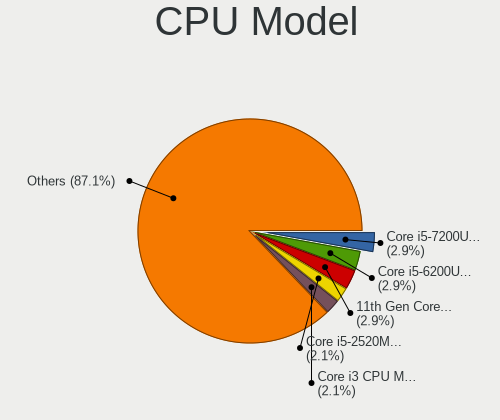
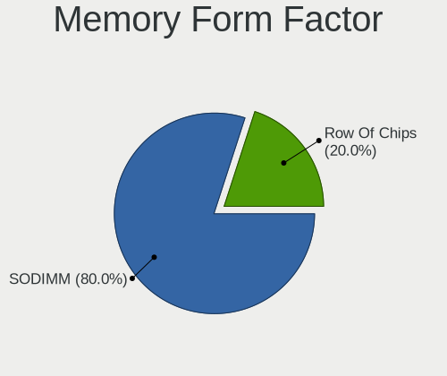
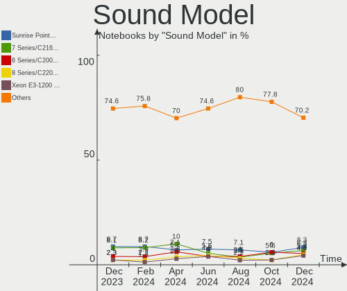

Zorin Hardware Trends (Notebook)
--------------------------------

A project to identify most popular hardware characteristics and track their change
over time based on data collected by Zorin users at https://Linux-Hardware.org.

Anyone can contribute to the study by uploading probes of their computers by
the [hw-probe](https://github.com/linuxhw/hw-probe) tool:

    sudo -E hw-probe -all -upload

Full-feature report is available here: https://linux-hardware.org/?view=trends&formfactor=notebook

Period: Dec, 2020.

Contents
--------

- [ OS                       ](#os)
- [ OS Family                ](#os-family)
- [ Kernel                   ](#kernel)
- [ Kernel Family            ](#kernel-family)
- [ Kernel Major Ver.        ](#kernel-major-ver)
- [ Arch                     ](#arch)
- [ DE                       ](#de)
- [ Display Server           ](#display-server)
- [ Display Manager          ](#display-manager)
- [ OS Lang                  ](#os-lang)
- [ Boot Mode                ](#boot-mode)
- [ Filesystem               ](#filesystem)
- [ Part. scheme             ](#part-scheme)
- [ Dual Boot with Linux/BSD ](#dual-boot-with-linux/bsd)
- [ Dual Boot (Win)          ](#dual-boot-win)
- [ Country                  ](#country)
- [ City                     ](#city)
- [ Vendor                   ](#vendor)
- [ Model                    ](#model)
- [ Model Family             ](#model-family)
- [ MFG Year                 ](#mfg-year)
- [ Form Factor              ](#form-factor)
- [ Secure Boot              ](#secure-boot)
- [ Coreboot                 ](#coreboot)
- [ RAM Size                 ](#ram-size)
- [ RAM Used                 ](#ram-used)
- [ Has CD-ROM               ](#has-cd-rom)
- [ Total Drives             ](#total-drives)
- [ Has Ethernet             ](#has-ethernet)
- [ Drive Vendor             ](#drive-vendor)
- [ Drive Model              ](#drive-model)
- [ HDD Vendor               ](#hdd-vendor)
- [ SSD Vendor               ](#ssd-vendor)
- [ Drive Kind               ](#drive-kind)
- [ Drive Connector          ](#drive-connector)
- [ Drive Size               ](#drive-size)
- [ Space Total              ](#space-total)
- [ Space Used               ](#space-used)
- [ Malfunc. Drives          ](#malfunc-drives)
- [ Malfunc. Drive Vendor    ](#malfunc-drive-vendor)
- [ Malfunc. HDD Vendor      ](#malfunc-hdd-vendor)
- [ Malfunc. Drive Kind      ](#malfunc-drive-kind)
- [ Failed Drives            ](#failed-drives)
- [ Failed Drive Vendor      ](#failed-drive-vendor)
- [ Drive Status             ](#drive-status)
- [ Storage Vendor           ](#storage-vendor)
- [ Storage Model            ](#storage-model)
- [ Storage Kind             ](#storage-kind)
- [ CPU Vendor               ](#cpu-vendor)
- [ CPU Model                ](#cpu-model)
- [ CPU Model Family         ](#cpu-model-family)
- [ CPU Cores                ](#cpu-cores)
- [ CPU Sockets              ](#cpu-sockets)
- [ CPU Threads              ](#cpu-threads)
- [ CPU Op-Modes             ](#cpu-op-modes)
- [ CPU Microcode            ](#cpu-microcode)
- [ CPU Microarch            ](#cpu-microarch)
- [ GPU Vendor               ](#gpu-vendor)
- [ GPU Model                ](#gpu-model)
- [ GPU Combo                ](#gpu-combo)
- [ GPU Driver               ](#gpu-driver)
- [ GPU Memory               ](#gpu-memory)
- [ Monitor Vendor           ](#monitor-vendor)
- [ Monitor Model            ](#monitor-model)
- [ Monitor Resolution       ](#monitor-resolution)
- [ Monitor Diagonal         ](#monitor-diagonal)
- [ Monitor Width            ](#monitor-width)
- [ Aspect Ratio             ](#aspect-ratio)
- [ Monitor Area             ](#monitor-area)
- [ Pixel Density            ](#pixel-density)
- [ Multiple Monitors        ](#multiple-monitors)
- [ Net Controller Vendor    ](#net-controller-vendor)
- [ Net Controller Model     ](#net-controller-model)
- [ Wireless Vendor          ](#wireless-vendor)
- [ Wireless Model           ](#wireless-model)
- [ Ethernet Vendor          ](#ethernet-vendor)
- [ Ethernet Model           ](#ethernet-model)
- [ Net Controller Kind      ](#net-controller-kind)
- [ Used Controller          ](#used-controller)
- [ NICs                     ](#nics)
- [ Memory Vendor            ](#memory-vendor)
- [ Memory Model             ](#memory-model)
- [ Memory Kind              ](#memory-kind)
- [ Memory Form Factor       ](#memory-form-factor)
- [ Memory Size              ](#memory-size)
- [ Memory Speed             ](#memory-speed)
- [ Sound Vendor             ](#sound-vendor)
- [ Sound Model              ](#sound-model)
- [ Camera Vendor            ](#camera-vendor)
- [ Camera Model             ](#camera-model)
- [ Fingerprint Vendor       ](#fingerprint-vendor)
- [ Fingerprint Model        ](#fingerprint-model)
- [ Chipcard Vendor          ](#chipcard-vendor)
- [ Chipcard Model           ](#chipcard-model)
- [ Printer Vendor           ](#printer-vendor)
- [ Printer Model            ](#printer-model)
- [ Scanner Vendor           ](#scanner-vendor)
- [ Scanner Model            ](#scanner-model)
- [ Bluetooth Vendor         ](#bluetooth-vendor)
- [ Bluetooth Model          ](#bluetooth-model)
- [ Unsupported Devices      ](#unsupported-devices)
- [ Unsupported Device Types ](#unsupported-device-types)

OS
--

Installed operating systems

| Name     | Notebooks | Percent |
|----------|-----------|---------|
| Zorin 15 | 43        | 89.58%  |
| Zorin 12 | 5         | 10.42%  |

OS Family
---------

OS without a version

| Name  | Notebooks | Percent |
|-------|-----------|---------|
| Zorin | 48        | 100%    |

Kernel
------

Version of the Linux kernel

| Version               | Notebooks | Percent |
|-----------------------|-----------|---------|
| 5.4.0-58-generic      | 22        | 45.83%  |
| 5.4.0-56-generic      | 10        | 20.83%  |
| 5.4.0-54-generic      | 2         | 4.17%   |
| 5.4.0-52-generic      | 2         | 4.17%   |
| 5.4.0-45-generic      | 2         | 4.17%   |
| 4.15.0-126-generic    | 2         | 4.17%   |
| 5.9.12-050912-generic | 1         | 2.08%   |
| 5.4.0-52-lowlatency   | 1         | 2.08%   |
| 5.4.0-48-generic      | 1         | 2.08%   |
| 5.4.0-47-generic      | 1         | 2.08%   |
| 5.0.0-36-generic      | 1         | 2.08%   |
| 4.15.0-91-generic     | 1         | 2.08%   |
| 4.15.0-128-generic    | 1         | 2.08%   |
| 4.15.0-123-generic    | 1         | 2.08%   |

Kernel Family
-------------

Linux kernel without a distro release

| Version | Notebooks | Percent |
|---------|-----------|---------|
| 5.4.0   | 41        | 85.42%  |
| 4.15.0  | 5         | 10.42%  |
| 5.9.12  | 1         | 2.08%   |
| 5.0.0   | 1         | 2.08%   |

Kernel Major Ver.
-----------------

Linux kernel major version

| Version | Notebooks | Percent |
|---------|-----------|---------|
| 5.4     | 41        | 85.42%  |
| 4.15    | 5         | 10.42%  |
| 5.9     | 1         | 2.08%   |
| 5.0     | 1         | 2.08%   |

Arch
----

OS architecture (x86_64, i586, etc.)

| Name   | Notebooks | Percent |
|--------|-----------|---------|
| x86_64 | 39        | 81.25%  |
| i686   | 9         | 18.75%  |

DE
--

Desktop Environment

| Name  | Notebooks | Percent |
|-------|-----------|---------|
| GNOME | 31        | 64.58%  |
| XFCE  | 17        | 35.42%  |

Display Server
--------------

X11 or Wayland

| Name    | Notebooks | Percent |
|---------|-----------|---------|
| X11     | 45        | 93.75%  |
| Wayland | 3         | 6.25%   |

Display Manager
---------------

SDDM, LightDM, etc.

| Name    | Notebooks | Percent |
|---------|-----------|---------|
| Unknown | 48        | 100%    |

OS Lang
-------

Language

| Lang  | Notebooks | Percent |
|-------|-----------|---------|
| en_US | 20        | 41.67%  |
| it_IT | 5         | 10.42%  |
| de_DE | 4         | 8.33%   |
| pt_PT | 2         | 4.17%   |
| nl_NL | 2         | 4.17%   |
| ja_JP | 2         | 4.17%   |
| en_GB | 2         | 4.17%   |
| cs_CZ | 2         | 4.17%   |
| ru_RU | 1         | 2.08%   |
| pt_BR | 1         | 2.08%   |
| pl_PL | 1         | 2.08%   |
| id_ID | 1         | 2.08%   |
| fr_FR | 1         | 2.08%   |
| es_UY | 1         | 2.08%   |
| es_ES | 1         | 2.08%   |
| es_AR | 1         | 2.08%   |
| en_IN | 1         | 2.08%   |

Boot Mode
---------

EFI or BIOS

| Mode | Notebooks | Percent |
|------|-----------|---------|
| BIOS | 36        | 75%     |
| EFI  | 12        | 25%     |

Filesystem
----------

Type of filesystem

| Type    | Notebooks | Percent |
|---------|-----------|---------|
| Ext4    | 47        | 97.92%  |
| Overlay | 1         | 2.08%   |

Part. scheme
------------

Scheme of partitioning

| Type    | Notebooks | Percent |
|---------|-----------|---------|
| Unknown | 48        | 100%    |

Dual Boot with Linux/BSD
------------------------

Hosting more than one Linux/BSD

| Dual boot | Notebooks | Percent |
|-----------|-----------|---------|
| No        | 44        | 91.67%  |
| Yes       | 4         | 8.33%   |

Dual Boot (Win)
---------------

Hosting Linux and Windows

| Dual boot | Notebooks | Percent |
|-----------|-----------|---------|
| No        | 33        | 68.75%  |
| Yes       | 15        | 31.25%  |

Country
-------

Geographic location (country)

| Country        | Notebooks | Percent |
|----------------|-----------|---------|
| Germany        | 7         | 14.58%  |
| USA            | 6         | 12.5%   |
| Italy          | 5         | 10.42%  |
| Portugal       | 3         | 6.25%   |
| UK             | 2         | 4.17%   |
| Poland         | 2         | 4.17%   |
| Netherlands    | 2         | 4.17%   |
| Japan          | 2         | 4.17%   |
| Greece         | 2         | 4.17%   |
| Czech Republic | 2         | 4.17%   |
| Uruguay        | 1         | 2.08%   |
| Switzerland    | 1         | 2.08%   |
| Sweden         | 1         | 2.08%   |
| Spain          | 1         | 2.08%   |
| Russia         | 1         | 2.08%   |
| Mexico         | 1         | 2.08%   |
| Kenya          | 1         | 2.08%   |
| Indonesia      | 1         | 2.08%   |
| India          | 1         | 2.08%   |
| France         | 1         | 2.08%   |
| Finland        | 1         | 2.08%   |
| Canada         | 1         | 2.08%   |
| Bulgaria       | 1         | 2.08%   |
| Brazil         | 1         | 2.08%   |
| Argentina      | 1         | 2.08%   |

City
----

Geographic location (city)

| City               | Notebooks | Percent |
|--------------------|-----------|---------|
| Rome               | 2         | 4.17%   |
| Athens             | 2         | 4.17%   |
| Yokohama           | 1         | 2.08%   |
| Wuppertal          | 1         | 2.08%   |
| Warsaw             | 1         | 2.08%   |
| Vicenza            | 1         | 2.08%   |
| Vernonia           | 1         | 2.08%   |
| Veliko Tarnovo     | 1         | 2.08%   |
| Umeå              | 1         | 2.08%   |
| Tucson             | 1         | 2.08%   |
| São Paulo         | 1         | 2.08%   |
| Szczecin           | 1         | 2.08%   |
| Surabaya           | 1         | 2.08%   |
| Southampton        | 1         | 2.08%   |
| San Francisco      | 1         | 2.08%   |
| Samora Correia     | 1         | 2.08%   |
| Salt Spring Island | 1         | 2.08%   |
| Sacramento         | 1         | 2.08%   |
| Revnice            | 1         | 2.08%   |
| Podolsk            | 1         | 2.08%   |
| Ostseebad Binz     | 1         | 2.08%   |
| Nueva Helvecia     | 1         | 2.08%   |
| Naumburg           | 1         | 2.08%   |
| Naples             | 1         | 2.08%   |
| Nairobi            | 1         | 2.08%   |
| Mexico City        | 1         | 2.08%   |
| Mannheim           | 1         | 2.08%   |
| Ludhiana           | 1         | 2.08%   |
| Hoorn              | 1         | 2.08%   |
| Helsinki           | 1         | 2.08%   |
| Guia               | 1         | 2.08%   |
| Grenoble           | 1         | 2.08%   |
| Gernsbach          | 1         | 2.08%   |
| Frankfurt am Main  | 1         | 2.08%   |
| Florence           | 1         | 2.08%   |
| Farnham            | 1         | 2.08%   |
| Espejo             | 1         | 2.08%   |
| Dresden            | 1         | 2.08%   |
| Dallas             | 1         | 2.08%   |
| Buenos Aires       | 1         | 2.08%   |
| Brno               | 1         | 2.08%   |
| Bassersdorf        | 1         | 2.08%   |
| Avon               | 1         | 2.08%   |
| Asago-shi          | 1         | 2.08%   |
| Arnhem             | 1         | 2.08%   |
| Almada             | 1         | 2.08%   |

Vendor
------

Motherboard manufacturer

| Name             | Notebooks | Percent |
|------------------|-----------|---------|
| Hewlett-Packard  | 16        | 33.33%  |
| Dell             | 7         | 14.58%  |
| Lenovo           | 5         | 10.42%  |
| Acer             | 5         | 10.42%  |
| Toshiba          | 3         | 6.25%   |
| NEC Computers    | 2         | 4.17%   |
| Insyde           | 2         | 4.17%   |
| ASUSTek Computer | 2         | 4.17%   |
| Phoenix/SiS      | 1         | 2.08%   |
| Panasonic        | 1         | 2.08%   |
| Medion           | 1         | 2.08%   |
| Fujitsu          | 1         | 2.08%   |
| Ematic           | 1         | 2.08%   |
| BGH              | 1         | 2.08%   |

Model
-----

Motherboard model

| Name                             | Notebooks | Percent |
|----------------------------------|-----------|---------|
| Toshiba Satellite L40            | 1         | 2.08%   |
| Toshiba PORTEGE M800             | 1         | 2.08%   |
| Toshiba NB500                    | 1         | 2.08%   |
| Phoenix/SiS M720SR               | 1         | 2.08%   |
| Panasonic CF-31JEGAX1M           | 1         | 2.08%   |
| NEC Computers PC-VY25AACZ9       | 1         | 2.08%   |
| NEC Computers PC-VY16AWZE4       | 1         | 2.08%   |
| Medion P7612                     | 1         | 2.08%   |
| Lenovo ThinkPad T460 20FMS7DA00  | 1         | 2.08%   |
| Lenovo ThinkPad T440p 20AWS37D00 | 1         | 2.08%   |
| Lenovo S20-30 Touch 20434        | 1         | 2.08%   |
| Lenovo G780 20138                | 1         | 2.08%   |
| Lenovo G700 20251                | 1         | 2.08%   |
| Insyde CherryTrail               | 1         | 2.08%   |
| Insyde CAVION BASE 8 MS          | 1         | 2.08%   |
| HP ZBook 17 G5                   | 1         | 2.08%   |
| HP Stream Notebook PC 14         | 1         | 2.08%   |
| HP Stream Laptop 11-y0XX         | 1         | 2.08%   |
| HP ProBook 6560b                 | 1         | 2.08%   |
| HP ProBook 450 G3                | 1         | 2.08%   |
| HP Pavilion Laptop 14-ce3xxx     | 1         | 2.08%   |
| HP Pavilion g7                   | 1         | 2.08%   |
| HP Pavilion dv9700               | 1         | 2.08%   |
| HP Mini 110-3100                 | 1         | 2.08%   |
| HP Mini 110-1000                 | 1         | 2.08%   |
| HP Laptop 15s-eq0xxx             | 1         | 2.08%   |
| HP Laptop 15-bw0xx               | 1         | 2.08%   |
| HP EliteBook 2560p               | 1         | 2.08%   |
| HP Compaq Presario CQ61          | 1         | 2.08%   |
| HP 550                           | 1         | 2.08%   |
| HP 255 G5                        | 1         | 2.08%   |
| Fujitsu CELSIUS H710             | 1         | 2.08%   |
| Ematic EWT127                    | 1         | 2.08%   |
| Dell Precision 3520              | 1         | 2.08%   |
| Dell Latitude E6540              | 1         | 2.08%   |
| Dell Inspiron M5040              | 1         | 2.08%   |
| Dell Inspiron 7737               | 1         | 2.08%   |
| Dell Inspiron 6000               | 1         | 2.08%   |
| Dell Inspiron 5490               | 1         | 2.08%   |
| Dell Inspiron 3737               | 1         | 2.08%   |
| BGH C46G                         | 1         | 2.08%   |
| ASUS X405UA                      | 1         | 2.08%   |
| ASUS G74Sx                       | 1         | 2.08%   |
| Acer V5-131                      | 1         | 2.08%   |
| Acer Aspire ES1-111              | 1         | 2.08%   |
| Acer Aspire E1-570G              | 1         | 2.08%   |
| Acer Aspire 5738                 | 1         | 2.08%   |
| Acer Aspire 5715Z                | 1         | 2.08%   |

Model Family
------------

Motherboard model prefix

| Name                       | Notebooks | Percent |
|----------------------------|-----------|---------|
| Dell Inspiron              | 5         | 10.42%  |
| Acer Aspire                | 4         | 8.33%   |
| HP Pavilion                | 3         | 6.25%   |
| Lenovo ThinkPad            | 2         | 4.17%   |
| HP Stream                  | 2         | 4.17%   |
| HP ProBook                 | 2         | 4.17%   |
| HP Mini                    | 2         | 4.17%   |
| HP Laptop                  | 2         | 4.17%   |
| Toshiba Satellite          | 1         | 2.08%   |
| Toshiba PORTEGE            | 1         | 2.08%   |
| Toshiba NB500              | 1         | 2.08%   |
| Phoenix/SiS M720SR         | 1         | 2.08%   |
| Panasonic CF-31JEGAX1M     | 1         | 2.08%   |
| NEC Computers PC-VY25AACZ9 | 1         | 2.08%   |
| NEC Computers PC-VY16AWZE4 | 1         | 2.08%   |
| Medion P7612               | 1         | 2.08%   |
| Lenovo S20-30              | 1         | 2.08%   |
| Lenovo G780                | 1         | 2.08%   |
| Lenovo G700                | 1         | 2.08%   |
| Insyde CherryTrail         | 1         | 2.08%   |
| Insyde CAVION              | 1         | 2.08%   |
| HP ZBook                   | 1         | 2.08%   |
| HP EliteBook               | 1         | 2.08%   |
| HP Compaq                  | 1         | 2.08%   |
| HP 550                     | 1         | 2.08%   |
| HP 255                     | 1         | 2.08%   |
| Fujitsu CELSIUS            | 1         | 2.08%   |
| Ematic EWT127              | 1         | 2.08%   |
| Dell Precision             | 1         | 2.08%   |
| Dell Latitude              | 1         | 2.08%   |
| BGH C46G                   | 1         | 2.08%   |
| ASUS X405UA                | 1         | 2.08%   |
| ASUS G74Sx                 | 1         | 2.08%   |
| Acer V5-131                | 1         | 2.08%   |

MFG Year
--------

Motherboard manufacture year

| Year | Notebooks | Percent |
|------|-----------|---------|
| 2020 | 5         | 10.42%  |
| 2019 | 5         | 10.42%  |
| 2011 | 5         | 10.42%  |
| 2010 | 5         | 10.42%  |
| 2016 | 4         | 8.33%   |
| 2014 | 4         | 8.33%   |
| 2013 | 4         | 8.33%   |
| 2008 | 4         | 8.33%   |
| 2018 | 3         | 6.25%   |
| 2009 | 3         | 6.25%   |
| 2012 | 2         | 4.17%   |
| 2017 | 1         | 2.08%   |
| 2015 | 1         | 2.08%   |
| 2007 | 1         | 2.08%   |
| 2005 | 1         | 2.08%   |

Form Factor
-----------

Physical design of the computer

| Name     | Notebooks | Percent |
|----------|-----------|---------|
| Notebook | 48        | 100%    |

Secure Boot
-----------

Enabled or disabled

| State    | Notebooks | Percent |
|----------|-----------|---------|
| Disabled | 46        | 95.83%  |
| Enabled  | 2         | 4.17%   |

Coreboot
--------

Have coreboot on board

| Used | Notebooks | Percent |
|------|-----------|---------|
| No   | 48        | 100%    |

RAM Size
--------

Total RAM memory

| Size in GB  | Notebooks | Percent |
|-------------|-----------|---------|
| 3.01-4.0    | 13        | 27.08%  |
| 1.01-2.0    | 11        | 22.92%  |
| 4.01-8.0    | 9         | 18.75%  |
| 8.01-16.0   | 7         | 14.58%  |
| 0.51-1.0    | 3         | 6.25%   |
| 2.01-3.0    | 2         | 4.17%   |
| 16.01-24.0  | 2         | 4.17%   |
| 64.01-256.0 | 1         | 2.08%   |

RAM Used
--------

Used RAM memory

| Used GB   | Notebooks | Percent |
|-----------|-----------|---------|
| 1.01-2.0  | 23        | 47.92%  |
| 2.01-3.0  | 7         | 14.58%  |
| 0.51-1.0  | 6         | 12.5%   |
| 4.01-8.0  | 5         | 10.42%  |
| 3.01-4.0  | 5         | 10.42%  |
| 8.01-16.0 | 1         | 2.08%   |
| 0.01-0.5  | 1         | 2.08%   |

Has CD-ROM
----------

Has CD-ROM on board

| Presented | Notebooks | Percent |
|-----------|-----------|---------|
| No        | 26        | 54.17%  |
| Yes       | 22        | 45.83%  |

Total Drives
------------

Number of drives on board

| Drives | Notebooks | Percent |
|--------|-----------|---------|
| 1      | 38        | 79.17%  |
| 2      | 7         | 14.58%  |
| 3      | 2         | 4.17%   |
| 4      | 1         | 2.08%   |

Has Ethernet
------------

Has Ethernet on board

| Presented | Notebooks | Percent |
|-----------|-----------|---------|
| Yes       | 42        | 87.5%   |
| No        | 6         | 12.5%   |

Drive Vendor
------------

Hard drive vendors

| Vendor                    | Notebooks | Drives | Percent |
|---------------------------|-----------|--------|---------|
| Seagate                   | 9         | 10     | 16.07%  |
| Toshiba                   | 7         | 7      | 12.5%   |
| WDC                       | 6         | 6      | 10.71%  |
| Unknown                   | 6         | 7      | 10.71%  |
| Samsung Electronics       | 6         | 8      | 10.71%  |
| SanDisk                   | 5         | 5      | 8.93%   |
| Hitachi                   | 5         | 5      | 8.93%   |
| Kingston                  | 2         | 2      | 3.57%   |
| Intel                     | 2         | 2      | 3.57%   |
| Transcend                 | 1         | 1      | 1.79%   |
| TO Exter                  | 1         | 1      | 1.79%   |
| TCSUNBOW                  | 1         | 1      | 1.79%   |
| SPCC                      | 1         | 1      | 1.79%   |
| SK Hynix                  | 1         | 1      | 1.79%   |
| Micron/Crucial Technology | 1         | 1      | 1.79%   |
| KIOXIA                    | 1         | 1      | 1.79%   |
| BHT                       | 1         | 1      | 1.79%   |

Drive Model
-----------

Hard drive models

| Model                               | Notebooks | Percent |
|-------------------------------------|-----------|---------|
| Unknown MMC Card  32GB              | 3         | 5.26%   |
| Toshiba MK1652GSX 160GB             | 2         | 3.51%   |
| WDC WD800BEVS-22VAT0 80GB           | 1         | 1.75%   |
| WDC WD7500BPVX-22JC3T0 752GB        | 1         | 1.75%   |
| WDC WD5000LPVX-08V0TT5 500GB        | 1         | 1.75%   |
| WDC WD1600BEVT-22A23T0 160GB        | 1         | 1.75%   |
| WDC WD10JPVX-60JC3T1 1TB            | 1         | 1.75%   |
| WDC WD10JPVX-60JC3T0 1TB            | 1         | 1.75%   |
| Unknown SD/MMC/MS PRO 128GB         | 1         | 1.75%   |
| Unknown MMC Card  2GB               | 1         | 1.75%   |
| Unknown MMC Card  16GB              | 1         | 1.75%   |
| Transcend TS64GSSD420K 64GB         | 1         | 1.75%   |
| Toshiba THNSNJ512GCSU 512GB SSD     | 1         | 1.75%   |
| Toshiba MQ01ACF032 320GB            | 1         | 1.75%   |
| Toshiba MQ01ABF050 500GB            | 1         | 1.75%   |
| Toshiba MK8037GSX 40 40GB           | 1         | 1.75%   |
| Toshiba MK4058GSX 400GB             | 1         | 1.75%   |
| TO Exter nal USB 3.0 752GB          | 1         | 1.75%   |
| TCSUNBOW X3 60GB                    | 1         | 1.75%   |
| SPCC Solid State Disk 128GB         | 1         | 1.75%   |
| SK Hynix SC210 2.5 7MM 256GB SSD    | 1         | 1.75%   |
| Seagate ST9640320AS 640GB           | 1         | 1.75%   |
| Seagate ST9500423AS 500GB           | 1         | 1.75%   |
| Seagate ST9500325AS 500GB           | 1         | 1.75%   |
| Seagate ST9250827AS 250GB           | 1         | 1.75%   |
| Seagate ST500VT000-1DK142 500GB     | 1         | 1.75%   |
| Seagate ST500LM000-SSHD-8GB         | 1         | 1.75%   |
| Seagate ST500LM000-1EJ162 500GB     | 1         | 1.75%   |
| Seagate ST320LT020-9YG142 320GB     | 1         | 1.75%   |
| Seagate ST1000LM024 HN-M101MBB 1TB  | 1         | 1.75%   |
| SanDisk SDSSDHP256G 256GB           | 1         | 1.75%   |
| SanDisk SDSSDHII480G 480GB          | 1         | 1.75%   |
| SanDisk SD8SN8U-128G-1006 128GB SSD | 1         | 1.75%   |
| SanDisk SD6SF1M128G1022 128GB SSD   | 1         | 1.75%   |
| Sandisk NVMe SSD Drive 512GB        | 1         | 1.75%   |
| Samsung SSD PM810 2.5 7mm 128GB     | 1         | 1.75%   |
| Samsung SSD 870 QVO 1TB             | 1         | 1.75%   |
| Samsung SSD 860 EVO 500GB           | 1         | 1.75%   |
| Samsung SSD 860 EVO 1TB             | 1         | 1.75%   |
| Samsung NVMe SSD Drive 512GB        | 1         | 1.75%   |
| Samsung HM641JI 640GB               | 1         | 1.75%   |
| Samsung HM160HI 160GB               | 1         | 1.75%   |
| Micron/Crucial NVMe SSD Drive 1TB   | 1         | 1.75%   |
| KIOXIA KBG40ZNV256G 256GB           | 1         | 1.75%   |
| Kingston SV300S37A240G 240GB SSD    | 1         | 1.75%   |
| Kingston SA400S37240G 240GB SSD     | 1         | 1.75%   |
| Intel SSDSC2KG240G8 240GB           | 1         | 1.75%   |
| Intel NVMe SSD Drive 256GB          | 1         | 1.75%   |
| Hitachi HTS725025A9A364 250GB       | 1         | 1.75%   |
| Hitachi HTS723232A7A364 320GB       | 1         | 1.75%   |
| Hitachi HTS721060G9AT00 64GB        | 1         | 1.75%   |
| Hitachi HTS543232A7A384 320GB       | 1         | 1.75%   |
| Hitachi HTS542525K9SA00 250GB       | 1         | 1.75%   |
| BHT WR202A1032G 670215F5 32GB       | 1         | 1.75%   |

HDD Vendor
----------

Hard disk drive vendors

| Vendor              | Notebooks | Drives | Percent |
|---------------------|-----------|--------|---------|
| Seagate             | 9         | 10     | 31.03%  |
| WDC                 | 6         | 6      | 20.69%  |
| Toshiba             | 6         | 6      | 20.69%  |
| Hitachi             | 5         | 5      | 17.24%  |
| Samsung Electronics | 2         | 2      | 6.9%    |
| TO Exter            | 1         | 1      | 3.45%   |

SSD Vendor
----------

Solid state drive vendors

| Vendor              | Notebooks | Drives | Percent |
|---------------------|-----------|--------|---------|
| SanDisk             | 4         | 4      | 25%     |
| Samsung Electronics | 4         | 4      | 25%     |
| Kingston            | 2         | 2      | 12.5%   |
| Transcend           | 1         | 1      | 6.25%   |
| Toshiba             | 1         | 1      | 6.25%   |
| TCSUNBOW            | 1         | 1      | 6.25%   |
| SPCC                | 1         | 1      | 6.25%   |
| SK Hynix            | 1         | 1      | 6.25%   |
| Intel               | 1         | 1      | 6.25%   |

Drive Kind
----------

HDD or SSD

| Kind    | Notebooks | Drives | Percent |
|---------|-----------|--------|---------|
| HDD     | 28        | 30     | 52.83%  |
| SSD     | 14        | 16     | 26.42%  |
| MMC     | 5         | 6      | 9.43%   |
| NVMe    | 4         | 6      | 7.55%   |
| Unknown | 2         | 2      | 3.77%   |

Drive Connector
---------------

SATA, SAS, NVMe, etc.

| Type | Notebooks | Drives | Percent |
|------|-----------|--------|---------|
| SATA | 41        | 46     | 80.39%  |
| MMC  | 5         | 6      | 9.8%    |
| NVMe | 4         | 6      | 7.84%   |
| SAS  | 1         | 2      | 1.96%   |

Drive Size
----------

Size of hard drive

| Size in TB | Notebooks | Drives | Percent |
|------------|-----------|--------|---------|
| 0.01-0.5   | 32        | 36     | 78.05%  |
| 0.51-1.0   | 9         | 10     | 21.95%  |

Space Total
-----------

Amount of disk space available on the file system

| Size in GB | Notebooks | Percent |
|------------|-----------|---------|
| 251-500    | 14        | 29.17%  |
| 101-250    | 14        | 29.17%  |
| 51-100     | 8         | 16.67%  |
| 21-50      | 5         | 10.42%  |
| 1001-2000  | 3         | 6.25%   |
| 501-1000   | 3         | 6.25%   |
| 1-20       | 1         | 2.08%   |

Space Used
----------

Amount of used disk space

| Used GB   | Notebooks | Percent |
|-----------|-----------|---------|
| 1-20      | 20        | 41.67%  |
| 21-50     | 11        | 22.92%  |
| 101-250   | 7         | 14.58%  |
| 51-100    | 7         | 14.58%  |
| 251-500   | 1         | 2.08%   |
| 1001-2000 | 1         | 2.08%   |
| 501-1000  | 1         | 2.08%   |

Malfunc. Drives
---------------

Drive models with a malfunction

Zero info for selected period =(

Malfunc. Drive Vendor
---------------------

Vendors of faulty drives

Zero info for selected period =(

Malfunc. HDD Vendor
-------------------

Vendors of faulty HDD drives

Zero info for selected period =(

Malfunc. Drive Kind
-------------------

Kinds of faulty drives

Zero info for selected period =(

Failed Drives
-------------

Failed drive models

Zero info for selected period =(

Failed Drive Vendor
-------------------

Failed drive vendors

Zero info for selected period =(

Drive Status
------------

Number of failed and malfunc. drives

| Status   | Notebooks | Drives | Percent |
|----------|-----------|--------|---------|
| Detected | 47        | 59     | 97.92%  |
| Works    | 1         | 1      | 2.08%   |

Storage Vendor
--------------

Storage controller vendors

| Vendor                           | Notebooks | Percent |
|----------------------------------|-----------|---------|
| Intel                            | 37        | 78.72%  |
| AMD                              | 5         | 10.64%  |
| Silicon Integrated Systems [SiS] | 1         | 2.13%   |
| Sandisk                          | 1         | 2.13%   |
| Samsung Electronics              | 1         | 2.13%   |
| Micron/Crucial Technology        | 1         | 2.13%   |
| KIOXIA                           | 1         | 2.13%   |

Storage Model
-------------

Storage controller models

| Model                                                                          | Notebooks | Percent |
|--------------------------------------------------------------------------------|-----------|---------|
| Intel 6 Series/C200 Series Chipset Family 6 port Mobile SATA AHCI Controller   | 6         | 10.91%  |
| Intel 82801IBM/IEM (ICH9M/ICH9M-E) 4 port SATA Controller [AHCI mode]          | 5         | 9.09%   |
| Intel 82801HM/HEM (ICH8M/ICH8M-E) SATA Controller [AHCI mode]                  | 4         | 7.27%   |
| Intel 82801HM/HEM (ICH8M/ICH8M-E) IDE Controller                               | 4         | 7.27%   |
| Intel 7 Series Chipset Family 6-port SATA Controller [AHCI mode]               | 4         | 7.27%   |
| Intel Sunrise Point-LP SATA Controller [AHCI mode]                             | 3         | 5.45%   |
| AMD FCH SATA Controller [AHCI mode]                                            | 3         | 5.45%   |
| Intel NM10/ICH7 Family SATA Controller [AHCI mode]                             | 2         | 3.64%   |
| Intel Atom Processor E3800 Series SATA AHCI Controller                         | 2         | 3.64%   |
| Intel 82801 Mobile SATA Controller [RAID mode]                                 | 2         | 3.64%   |
| Intel 8 Series/C220 Series Chipset Family 6-port SATA Controller 1 [AHCI mode] | 2         | 3.64%   |
| Silicon Integrated Systems [SiS] SATA Controller / IDE mode                    | 1         | 1.82%   |
| Silicon Integrated Systems [SiS] 5513 IDE Controller                           | 1         | 1.82%   |
| Sandisk WD Black SN750 / PC SN730 NVMe SSD                                     | 1         | 1.82%   |
| Samsung NVMe SSD Controller SM981/PM981/PM983                                  | 1         | 1.82%   |
| Micron/Crucial P1 NVMe PCIe SSD                                                | 1         | 1.82%   |
| KIOXIA Non-Volatile memory controller                                          | 1         | 1.82%   |
| Intel SSD Pro 7600p/760p/E 6100p Series                                        | 1         | 1.82%   |
| Intel SATA Controller [RAID mode]                                              | 1         | 1.82%   |
| Intel Comet Lake SATA AHCI Controller                                          | 1         | 1.82%   |
| Intel Cannon Lake Mobile PCH SATA AHCI Controller                              | 1         | 1.82%   |
| Intel 82801GBM/GHM (ICH7-M Family) SATA Controller [IDE mode]                  | 1         | 1.82%   |
| Intel 82801FBM (ICH6M) SATA Controller                                         | 1         | 1.82%   |
| Intel 8 Series SATA Controller 1 [AHCI mode]                                   | 1         | 1.82%   |
| Intel 5 Series/3400 Series Chipset 4 port SATA AHCI Controller                 | 1         | 1.82%   |
| AMD SB7x0/SB8x0/SB9x0 SATA Controller [AHCI mode]                              | 1         | 1.82%   |
| AMD IXP SB4x0 Serial ATA Controller                                            | 1         | 1.82%   |
| AMD IXP SB4x0 IDE Controller                                                   | 1         | 1.82%   |
| AMD IXP SB400 Serial ATA Controller                                            | 1         | 1.82%   |

Storage Kind
------------

Kind of storage controller (IDE, SATA, NVMe, SAS, ...)

| Kind | Notebooks | Percent |
|------|-----------|---------|
| SATA | 36        | 70.59%  |
| IDE  | 8         | 15.69%  |
| NVMe | 4         | 7.84%   |
| RAID | 3         | 5.88%   |

CPU Vendor
----------

Processor vendors

| Vendor | Notebooks | Percent |
|--------|-----------|---------|
| Intel  | 43        | 89.58%  |
| AMD    | 5         | 10.42%  |

CPU Model
---------

Processor models

| Model                                           | Notebooks | Percent |
|-------------------------------------------------|-----------|---------|
| Intel Atom CPU N455 @ 1.66GHz                   | 2         | 4.17%   |
| Intel Xeon E-2186M CPU @ 2.90GHz                | 1         | 2.08%   |
| Intel Pentium M processor 1.50GHz               | 1         | 2.08%   |
| Intel Pentium Dual CPU T3400 @ 2.16GHz          | 1         | 2.08%   |
| Intel Pentium Dual CPU T2330 @ 1.60GHz          | 1         | 2.08%   |
| Intel Core i7-7700HQ CPU @ 2.80GHz              | 1         | 2.08%   |
| Intel Core i7-4810MQ CPU @ 2.80GHz              | 1         | 2.08%   |
| Intel Core i7-4710MQ CPU @ 2.50GHz              | 1         | 2.08%   |
| Intel Core i7-4500U CPU @ 1.80GHz               | 1         | 2.08%   |
| Intel Core i7-2820QM CPU @ 2.30GHz              | 1         | 2.08%   |
| Intel Core i7-2630QM CPU @ 2.00GHz              | 1         | 2.08%   |
| Intel Core i5-7200U CPU @ 2.50GHz               | 1         | 2.08%   |
| Intel Core i5-6300U CPU @ 2.40GHz               | 1         | 2.08%   |
| Intel Core i5-6200U CPU @ 2.30GHz               | 1         | 2.08%   |
| Intel Core i5-4200U CPU @ 1.60GHz               | 1         | 2.08%   |
| Intel Core i5-3230M CPU @ 2.60GHz               | 1         | 2.08%   |
| Intel Core i5-2540M CPU @ 2.60GHz               | 1         | 2.08%   |
| Intel Core i5-2520M CPU @ 2.50GHz               | 1         | 2.08%   |
| Intel Core i5-10210U CPU @ 1.60GHz              | 1         | 2.08%   |
| Intel Core i3-3217U CPU @ 1.80GHz               | 1         | 2.08%   |
| Intel Core i3-3110M CPU @ 2.40GHz               | 1         | 2.08%   |
| Intel Core i3-2310M CPU @ 2.10GHz               | 1         | 2.08%   |
| Intel Core i3-1005G1 CPU @ 1.20GHz              | 1         | 2.08%   |
| Intel Core i3 CPU M 350 @ 2.27GHz               | 1         | 2.08%   |
| Intel Core 2 Duo CPU T9550 @ 2.66GHz            | 1         | 2.08%   |
| Intel Core 2 Duo CPU T7500 @ 2.20GHz            | 1         | 2.08%   |
| Intel Core 2 Duo CPU T6500 @ 2.10GHz            | 1         | 2.08%   |
| Intel Core 2 Duo CPU T6400 @ 2.00GHz            | 1         | 2.08%   |
| Intel Core 2 Duo CPU P8700 @ 2.53GHz            | 1         | 2.08%   |
| Intel Core 2 Duo CPU P7450 @ 2.13GHz            | 1         | 2.08%   |
| Intel Core 2 CPU T5500 @ 1.66GHz                | 1         | 2.08%   |
| Intel Celeron Dual-Core CPU T3000 @ 1.80GHz     | 1         | 2.08%   |
| Intel Celeron CPU N3060 @ 1.60GHz               | 1         | 2.08%   |
| Intel Celeron CPU N2840 @ 2.16GHz               | 1         | 2.08%   |
| Intel Celeron CPU N2830 @ 2.16GHz               | 1         | 2.08%   |
| Intel Celeron CPU B830 @ 1.80GHz                | 1         | 2.08%   |
| Intel Celeron CPU 550 @ 2.00GHz                 | 1         | 2.08%   |
| Intel Celeron CPU 1007U @ 1.50GHz               | 1         | 2.08%   |
| Intel Atom x5-Z8350 CPU @ 1.44GHz               | 1         | 2.08%   |
| Intel Atom x5-Z8300 CPU @ 1.44GHz               | 1         | 2.08%   |
| Intel Atom CPU Z3735G @ 1.33GHz                 | 1         | 2.08%   |
| Intel Atom CPU N270 @ 1.60GHz                   | 1         | 2.08%   |
| AMD Ryzen 7 3700U with Radeon Vega Mobile Gfx   | 1         | 2.08%   |
| AMD E2-7110 APU with AMD Radeon R2 Graphics     | 1         | 2.08%   |
| AMD C-60 APU with Radeon HD Graphics            | 1         | 2.08%   |
| AMD A9-9420 RADEON R5, 5 COMPUTE CORES 2C+3G    | 1         | 2.08%   |
| AMD A4 Micro-6400T APU + AMD Radeon R3 Graphics | 1         | 2.08%   |

CPU Model Family
----------------

Processor model prefix

| Model                   | Notebooks | Percent |
|-------------------------|-----------|---------|
| Intel Core i5           | 8         | 16.67%  |
| Intel Core i7           | 6         | 12.5%   |
| Intel Core 2 Duo        | 6         | 12.5%   |
| Intel Celeron           | 6         | 12.5%   |
| Intel Atom              | 6         | 12.5%   |
| Intel Core i3           | 5         | 10.42%  |
| Intel Pentium Dual      | 2         | 4.17%   |
| Other                   | 1         | 2.08%   |
| Intel Xeon              | 1         | 2.08%   |
| Intel Pentium M         | 1         | 2.08%   |
| Intel Core 2            | 1         | 2.08%   |
| Intel Celeron Dual-Core | 1         | 2.08%   |
| AMD Ryzen 7             | 1         | 2.08%   |
| AMD E2                  | 1         | 2.08%   |
| AMD C-60                | 1         | 2.08%   |
| AMD A4                  | 1         | 2.08%   |

CPU Cores
---------

Number of processor cores

| Number | Notebooks | Percent |
|--------|-----------|---------|
| 2      | 30        | 62.5%   |
| 4      | 12        | 25%     |
| 1      | 5         | 10.42%  |
| 6      | 1         | 2.08%   |

CPU Sockets
-----------

Number of sockets

| Number | Notebooks | Percent |
|--------|-----------|---------|
| 1      | 48        | 100%    |

CPU Threads
-----------

Threads per core (Hyper-Threading)

| Number | Notebooks | Percent |
|--------|-----------|---------|
| 2      | 24        | 50%     |
| 1      | 24        | 50%     |

CPU Op-Modes
------------

CPU Operation Modes (32-bit, 64-bit)

| Op mode        | Notebooks | Percent |
|----------------|-----------|---------|
| 32-bit, 64-bit | 46        | 95.83%  |
| 32-bit         | 2         | 4.17%   |

CPU Microcode
-------------

Microcode number

| Number     | Notebooks | Percent |
|------------|-----------|---------|
| Unknown    | 7         | 14.58%  |
| 0x206a7    | 6         | 12.5%   |
| 0x306a9    | 4         | 8.33%   |
| 0x1067a    | 4         | 8.33%   |
| 0x6fd      | 2         | 4.17%   |
| 0x406e3    | 2         | 4.17%   |
| 0x406c4    | 2         | 4.17%   |
| 0x40651    | 2         | 4.17%   |
| 0x306c3    | 2         | 4.17%   |
| 0x106ca    | 2         | 4.17%   |
| 0x906e9    | 1         | 2.08%   |
| 0x806ec    | 1         | 2.08%   |
| 0x806e9    | 1         | 2.08%   |
| 0x706e5    | 1         | 2.08%   |
| 0x6fb      | 1         | 2.08%   |
| 0x6d8      | 1         | 2.08%   |
| 0x406c3    | 1         | 2.08%   |
| 0x30678    | 1         | 2.08%   |
| 0x20655    | 1         | 2.08%   |
| 0x106c2    | 1         | 2.08%   |
| 0x10676    | 1         | 2.08%   |
| 0x10661    | 1         | 2.08%   |
| 0x08108109 | 1         | 2.08%   |
| 0x07030105 | 1         | 2.08%   |
| 0x06006705 | 1         | 2.08%   |

CPU Microarch
-------------

Microarchitecture

| Name        | Notebooks | Percent |
|-------------|-----------|---------|
| Silvermont  | 6         | 12.5%   |
| SandyBridge | 6         | 12.5%   |
| Penryn      | 6         | 12.5%   |
| Core        | 5         | 10.42%  |
| KabyLake    | 4         | 8.33%   |
| IvyBridge   | 4         | 8.33%   |
| Haswell     | 4         | 8.33%   |
| Bonnell     | 3         | 6.25%   |
| Skylake     | 2         | 4.17%   |
| Puma        | 2         | 4.17%   |
| Zen+        | 1         | 2.08%   |
| Westmere    | 1         | 2.08%   |
| P6          | 1         | 2.08%   |
| IceLake     | 1         | 2.08%   |
| Excavator   | 1         | 2.08%   |
| Bobcat      | 1         | 2.08%   |

GPU Vendor
----------

Vendors of graphics cards

| Vendor                           | Notebooks | Percent |
|----------------------------------|-----------|---------|
| Intel                            | 34        | 62.96%  |
| AMD                              | 10        | 18.52%  |
| Nvidia                           | 9         | 16.67%  |
| Silicon Integrated Systems [SiS] | 1         | 1.85%   |

GPU Model
---------

Graphics card models

| Model                                                                                    | Notebooks | Percent |
|------------------------------------------------------------------------------------------|-----------|---------|
| Intel 3rd Gen Core processor Graphics Controller                                         | 4         | 7.02%   |
| Intel Mobile 4 Series Chipset Integrated Graphics Controller                             | 3         | 5.26%   |
| Intel Atom/Celeron/Pentium Processor x5-E8000/J3xxx/N3xxx Integrated Graphics Controller | 3         | 5.26%   |
| Intel Atom Processor Z36xxx/Z37xxx Series Graphics & Display                             | 3         | 5.26%   |
| Intel 2nd Generation Core Processor Family Integrated Graphics Controller                | 3         | 5.26%   |
| Intel Skylake GT2 [HD Graphics 520]                                                      | 2         | 3.51%   |
| Intel Mobile GM965/GL960 Integrated Graphics Controller (secondary)                      | 2         | 3.51%   |
| Intel Mobile GM965/GL960 Integrated Graphics Controller (primary)                        | 2         | 3.51%   |
| Intel Haswell-ULT Integrated Graphics Controller                                         | 2         | 3.51%   |
| Intel Atom Processor D4xx/D5xx/N4xx/N5xx Integrated Graphics Controller                  | 2         | 3.51%   |
| Intel 4th Gen Core Processor Integrated Graphics Controller                              | 2         | 3.51%   |
| Silicon Integrated Systems [SiS] 771/671 PCIE VGA Display Adapter                        | 1         | 1.75%   |
| Nvidia GT218M [GeForce G210M]                                                            | 1         | 1.75%   |
| Nvidia GP104GLM [Quadro P4200 Mobile]                                                    | 1         | 1.75%   |
| Nvidia GM107GLM [Quadro M620 Mobile]                                                     | 1         | 1.75%   |
| Nvidia GK208M [GeForce GT 730M]                                                          | 1         | 1.75%   |
| Nvidia GF117M [GeForce 610M/710M/810M/820M / GT 620M/625M/630M/720M]                     | 1         | 1.75%   |
| Nvidia GF116M [GeForce GT 560M]                                                          | 1         | 1.75%   |
| Nvidia GF108M [GeForce GT 635M]                                                          | 1         | 1.75%   |
| Nvidia GF108GLM [Quadro 1000M]                                                           | 1         | 1.75%   |
| Nvidia G86M [GeForce 8600M GS]                                                           | 1         | 1.75%   |
| Intel UHD Graphics                                                                       | 1         | 1.75%   |
| Intel Mobile GME965/GLE960 Integrated Graphics Controller                                | 1         | 1.75%   |
| Intel Mobile 945GSE Express Integrated Graphics Controller                               | 1         | 1.75%   |
| Intel Mobile 945GM/GMS/GME, 943/940GML Express Integrated Graphics Controller            | 1         | 1.75%   |
| Intel Mobile 915GM/GMS/910GML Express Graphics Controller                                | 1         | 1.75%   |
| Intel Iris Plus Graphics G1 (Ice Lake)                                                   | 1         | 1.75%   |
| Intel HD Graphics 630                                                                    | 1         | 1.75%   |
| Intel HD Graphics 620                                                                    | 1         | 1.75%   |
| Intel Core Processor Integrated Graphics Controller                                      | 1         | 1.75%   |
| AMD Wrestler [Radeon HD 6290]                                                            | 1         | 1.75%   |
| AMD Venus XT [Radeon HD 8870M / R9 M270X/M370X]                                          | 1         | 1.75%   |
| AMD Stoney [Radeon R2/R3/R4/R5 Graphics]                                                 | 1         | 1.75%   |
| AMD Seymour [Radeon HD 6400M/7400M Series]                                               | 1         | 1.75%   |
| AMD RS600M [Radeon Xpress 1250]                                                          | 1         | 1.75%   |
| AMD Picasso                                                                              | 1         | 1.75%   |
| AMD Mullins [Radeon R3E Graphics]                                                        | 1         | 1.75%   |
| AMD Mullins [Radeon R3 Graphics]                                                         | 1         | 1.75%   |
| AMD Mars XTX [Radeon HD 8790M]                                                           | 1         | 1.75%   |
| AMD Madison [Mobility Radeon HD 5650/5750 / 6530M/6550M]                                 | 1         | 1.75%   |

GPU Combo
---------

Combinations of graphics cards

| Name           | Notebooks | Percent |
|----------------|-----------|---------|
| 1 x Intel      | 28        | 58.33%  |
| 1 x AMD        | 8         | 16.67%  |
| 1 x Nvidia     | 5         | 10.42%  |
| Intel + Nvidia | 4         | 8.33%   |
| Intel + AMD    | 2         | 4.17%   |
| 1 x SiS        | 1         | 2.08%   |

GPU Driver
----------

Free vs proprietary

| Driver      | Notebooks | Percent |
|-------------|-----------|---------|
| Free        | 44        | 91.67%  |
| Proprietary | 3         | 6.25%   |
| Unknown     | 1         | 2.08%   |

GPU Memory
----------

Total video memory

| Size in GB | Notebooks | Percent |
|------------|-----------|---------|
| Unknown    | 33        | 68.75%  |
| 1.01-2.0   | 7         | 14.58%  |
| 0.01-0.5   | 4         | 8.33%   |
| 0.51-1.0   | 2         | 4.17%   |
| 7.01-8.0   | 1         | 2.08%   |
| 3.01-4.0   | 1         | 2.08%   |

Monitor Vendor
--------------

Monitor vendors

| Vendor                  | Notebooks | Percent |
|-------------------------|-----------|---------|
| AU Optronics            | 12        | 25.53%  |
| Samsung Electronics     | 8         | 17.02%  |
| LG Display              | 5         | 10.64%  |
| Chimei Innolux          | 5         | 10.64%  |
| BOE                     | 3         | 6.38%   |
| LG Philips              | 2         | 4.26%   |
| InfoVision              | 2         | 4.26%   |
| Chi Mei Optoelectronics | 2         | 4.26%   |
| Unknown                 | 1         | 2.13%   |
| Nvidia                  | 1         | 2.13%   |
| MStar                   | 1         | 2.13%   |
| Hewlett-Packard         | 1         | 2.13%   |
| Goldstar                | 1         | 2.13%   |
| Eizo                    | 1         | 2.13%   |
| Apple                   | 1         | 2.13%   |
| AOC                     | 1         | 2.13%   |

Monitor Model
-------------

Monitor models

| Model                                                                    | Notebooks | Percent |
|--------------------------------------------------------------------------|-----------|---------|
| Samsung Electronics LCD Monitor SEC4256 1600x900 382x215mm 17.3-inch     | 2         | 4.26%   |
| AU Optronics LCD Monitor AUO235C 1366x768 260x140mm 11.6-inch            | 2         | 4.26%   |
| Unknown 1780 07E7 1280x1024 337x270mm 17.0-inch                          | 1         | 2.13%   |
| Samsung Electronics LCD Monitor SEC544B 1600x900 382x214mm 17.2-inch     | 1         | 2.13%   |
| Samsung Electronics LCD Monitor SEC5441 1366x768 344x194mm 15.5-inch     | 1         | 2.13%   |
| Samsung Electronics LCD Monitor SEC4E45 1280x800 331x207mm 15.4-inch     | 1         | 2.13%   |
| Samsung Electronics LCD Monitor SEC364E 1024x600 223x125mm 10.1-inch     | 1         | 2.13%   |
| Samsung Electronics LCD Monitor SEC3155 1920x1200 367x230mm 17.1-inch    | 1         | 2.13%   |
| Samsung Electronics LCD Monitor SDC4C48 1920x1080 409x230mm 18.5-inch    | 1         | 2.13%   |
| Nvidia LCD Monitor Default Flat Panel 1600x900                           | 1         | 2.13%   |
| MStar TV_MONITOR MST0030 1440x900 1150x650mm 52.0-inch                   | 1         | 2.13%   |
| LG Philips LCD Monitor LPL0A01 1440x900 367x230mm 17.1-inch              | 1         | 2.13%   |
| LG Philips LCD Monitor LPL0124 1024x768 304x228mm 15.0-inch              | 1         | 2.13%   |
| LG Display LCD Monitor LGD0546 1920x1080 344x194mm 15.5-inch             | 1         | 2.13%   |
| LG Display LCD Monitor LGD0466 1366x768 309x174mm 14.0-inch              | 1         | 2.13%   |
| LG Display LCD Monitor LGD0465 1366x768 344x194mm 15.5-inch              | 1         | 2.13%   |
| LG Display LCD Monitor LGD01DD 1600x900 382x215mm 17.3-inch              | 1         | 2.13%   |
| LG Display LCD Monitor LGD0171 1366x768 344x194mm 15.5-inch              | 1         | 2.13%   |
| InfoVision LCD Monitor IVO0489 1366x768 260x140mm 11.6-inch              | 1         | 2.13%   |
| InfoVision LCD Monitor IVO03F4 1920x1200 263x164mm 12.2-inch             | 1         | 2.13%   |
| Hewlett-Packard E243 HPN3469 1920x1080 527x296mm 23.8-inch               | 1         | 2.13%   |
| Goldstar HDR 4K GSM7707 3840x2160 600x340mm 27.2-inch                    | 1         | 2.13%   |
| Eizo L557 ENC1690 1280x1024 337x270mm 17.0-inch                          | 1         | 2.13%   |
| Chimei Innolux LCD Monitor CMN1728 1600x900 382x215mm 17.3-inch          | 1         | 2.13%   |
| Chimei Innolux LCD Monitor CMN15BF 1366x768 344x193mm 15.5-inch          | 1         | 2.13%   |
| Chimei Innolux LCD Monitor CMN14D6 1366x768 309x173mm 13.9-inch          | 1         | 2.13%   |
| Chimei Innolux LCD Monitor CMN14D4 1920x1080 309x173mm 13.9-inch         | 1         | 2.13%   |
| Chimei Innolux LCD Monitor CMN1126 1920x1080 256x144mm 11.6-inch         | 1         | 2.13%   |
| Chi Mei Optoelectronics LCD Monitor CMO1719 1600x900 382x215mm 17.3-inch | 1         | 2.13%   |
| Chi Mei Optoelectronics LCD Monitor CMO1007 1024x600 222x125mm 10.0-inch | 1         | 2.13%   |
| BOE LCD Monitor BOE07DC 1920x1080 309x174mm 14.0-inch                    | 1         | 2.13%   |
| BOE LCD Monitor BOE06A5 1366x768 344x194mm 15.5-inch                     | 1         | 2.13%   |
| BOE LCD Monitor BOE06A4 1366x768 344x194mm 15.5-inch                     | 1         | 2.13%   |
| AU Optronics LCD Monitor AUO8174 1280x800 331x207mm 15.4-inch            | 1         | 2.13%   |
| AU Optronics LCD Monitor AUO61ED 1920x1080 340x190mm 15.3-inch           | 1         | 2.13%   |
| AU Optronics LCD Monitor AUO405C 1366x768 256x144mm 11.6-inch            | 1         | 2.13%   |
| AU Optronics LCD Monitor AUO2574 1280x800 331x207mm 15.4-inch            | 1         | 2.13%   |
| AU Optronics LCD Monitor AUO243D 1920x1080 309x173mm 13.9-inch           | 1         | 2.13%   |
| AU Optronics LCD Monitor AUO206C 1366x768 277x156mm 12.5-inch            | 1         | 2.13%   |
| AU Optronics LCD Monitor AUO123D 1920x1080 309x173mm 13.9-inch           | 1         | 2.13%   |
| AU Optronics LCD Monitor AUO10EC 1366x768 340x190mm 15.3-inch            | 1         | 2.13%   |
| AU Optronics LCD Monitor AUO109E 1600x900 382x214mm 17.2-inch            | 1         | 2.13%   |
| AU Optronics LCD Monitor 1920x1080                                       | 1         | 2.13%   |
| Apple LCD Monitor APP9C5F 1280x800 286x179mm 13.3-inch                   | 1         | 2.13%   |
| AOC 27G2G4 AOC2702 1920x1080 598x336mm 27.0-inch                         | 1         | 2.13%   |

Monitor Resolution
------------------

Monitor screen resolution

| Resolution        | Notebooks | Percent |
|-------------------|-----------|---------|
| 1366x768 (WXGA)   | 14        | 29.79%  |
| 1920x1080 (FHD)   | 10        | 21.28%  |
| 1600x900 (HD+)    | 8         | 17.02%  |
| 1280x800 (WXGA)   | 4         | 8.51%   |
| 3840x2160 (4K)    | 2         | 4.26%   |
| 1920x1200 (WUXGA) | 2         | 4.26%   |
| 1280x1024 (SXGA)  | 2         | 4.26%   |
| 1024x600          | 2         | 4.26%   |
| 2560x1440 (QHD)   | 1         | 2.13%   |
| 1440x900 (WXGA+)  | 1         | 2.13%   |
| 1024x768 (XGA)    | 1         | 2.13%   |

Monitor Diagonal
----------------

Diagonal size in inches

| Inches  | Notebooks | Percent |
|---------|-----------|---------|
| 15      | 14        | 29.79%  |
| 17      | 11        | 23.4%   |
| 11      | 5         | 10.64%  |
| 13      | 4         | 8.51%   |
| 14      | 3         | 6.38%   |
| 27      | 2         | 4.26%   |
| 10      | 2         | 4.26%   |
| Unknown | 2         | 4.26%   |
| 52      | 1         | 2.13%   |
| 24      | 1         | 2.13%   |
| 18      | 1         | 2.13%   |
| 12      | 1         | 2.13%   |

Monitor Width
-------------

Physical width

| Width in mm | Notebooks | Percent |
|-------------|-----------|---------|
| 301-350     | 21        | 44.68%  |
| 351-400     | 10        | 21.28%  |
| 201-300     | 9         | 19.15%  |
| 501-600     | 3         | 6.38%   |
| Unknown     | 2         | 4.26%   |
| 401-500     | 1         | 2.13%   |
| 1001-1500   | 1         | 2.13%   |

Aspect Ratio
------------

Proportional relationship between the width and the height

| Ratio   | Notebooks | Percent |
|---------|-----------|---------|
| 16/9    | 34        | 75.56%  |
| 16/10   | 6         | 13.33%  |
| 5/4     | 2         | 4.44%   |
| Unknown | 2         | 4.44%   |
| 4/3     | 1         | 2.22%   |

Monitor Area
------------

Area in inch²

| Area in inch² | Notebooks | Percent |
|----------------|-----------|---------|
| 101-110        | 14        | 29.79%  |
| 81-90          | 7         | 14.89%  |
| 51-60          | 5         | 10.64%  |
| 121-130        | 5         | 10.64%  |
| 131-140        | 4         | 8.51%   |
| 141-150        | 3         | 6.38%   |
| 41-50          | 2         | 4.26%   |
| 301-350        | 2         | 4.26%   |
| Unknown        | 2         | 4.26%   |
| More than 1000 | 1         | 2.13%   |
| 61-70          | 1         | 2.13%   |
| 201-250        | 1         | 2.13%   |

Pixel Density
-------------

Pixels per inch

| Density | Notebooks | Percent |
|---------|-----------|---------|
| 101-120 | 20        | 43.48%  |
| 121-160 | 12        | 26.09%  |
| 51-100  | 9         | 19.57%  |
| 161-240 | 2         | 4.35%   |
| Unknown | 2         | 4.35%   |
| 1-50    | 1         | 2.17%   |

Multiple Monitors
-----------------

Total monitors connected

| Total | Notebooks | Percent |
|-------|-----------|---------|
| 1     | 43        | 89.58%  |
| 2     | 4         | 8.33%   |
| 0     | 1         | 2.08%   |

Net Controller Vendor
---------------------

Controller vendors

| Vendor                           | Notebooks | Percent |
|----------------------------------|-----------|---------|
| Realtek Semiconductor            | 21        | 27.27%  |
| Intel                            | 21        | 27.27%  |
| Broadcom Inc. and subsidiaries   | 14        | 18.18%  |
| Qualcomm Atheros                 | 13        | 16.88%  |
| Marvell Technology Group         | 2         | 2.6%    |
| TP-Link                          | 1         | 1.3%    |
| Silicon Integrated Systems [SiS] | 1         | 1.3%    |
| Sierra Wireless                  | 1         | 1.3%    |
| Motorola PCS                     | 1         | 1.3%    |
| Hewlett-Packard                  | 1         | 1.3%    |
| Broadcom Limited                 | 1         | 1.3%    |

Net Controller Model
--------------------

Controller models

| Model                                                                        | Notebooks | Percent |
|------------------------------------------------------------------------------|-----------|---------|
| Realtek RTL8111/8168/8411 PCI Express Gigabit Ethernet Controller            | 9         | 9.78%   |
| Realtek RTL810xE PCI Express Fast Ethernet controller                        | 8         | 8.7%    |
| Qualcomm Atheros QCA9565 / AR9565 Wireless Network Adapter                   | 3         | 3.26%   |
| Qualcomm Atheros AR9285 Wireless Network Adapter (PCI-Express)               | 3         | 3.26%   |
| Intel Wireless 7260                                                          | 3         | 3.26%   |
| Intel Centrino Advanced-N 6205 [Taylor Peak]                                 | 3         | 3.26%   |
| Intel 82579LM Gigabit Network Connection (Lewisville)                        | 3         | 3.26%   |
| Broadcom Inc. and subsidiaries BCM43142 802.11b/g/n                          | 3         | 3.26%   |
| Broadcom Inc. and subsidiaries BCM4313 802.11bgn Wireless Network Adapter    | 3         | 3.26%   |
| Qualcomm Atheros AR9485 Wireless Network Adapter                             | 2         | 2.17%   |
| Qualcomm Atheros AR242x / AR542x Wireless Network Adapter (PCI-Express)      | 2         | 2.17%   |
| Intel Wireless 8265 / 8275                                                   | 2         | 2.17%   |
| Intel Wireless 3165                                                          | 2         | 2.17%   |
| Intel Ethernet Connection I217-LM                                            | 2         | 2.17%   |
| Broadcom Inc. and subsidiaries NetLink BCM5784M Gigabit Ethernet PCIe        | 2         | 2.17%   |
| Broadcom Inc. and subsidiaries BCM4312 802.11b/g LP-PHY                      | 2         | 2.17%   |
| TP-Link TL-WN722N v2/v3 [Realtek RTL8188EUS]                                 | 1         | 1.09%   |
| Silicon Integrated Systems [SiS] 191 Gigabit Ethernet Adapter                | 1         | 1.09%   |
| Sierra Wireless MC8305                                                       | 1         | 1.09%   |
| Realtek RTL8821CE 802.11ac PCIe Wireless Network Adapter                     | 1         | 1.09%   |
| Realtek RTL8723DE Wireless Network Adapter                                   | 1         | 1.09%   |
| Realtek RTL8191SEvB Wireless LAN Controller                                  | 1         | 1.09%   |
| Realtek RTL8188CE 802.11b/g/n WiFi Adapter                                   | 1         | 1.09%   |
| Realtek RTL8187B Wireless Adapter                                            | 1         | 1.09%   |
| Realtek RTL8187B Wireless 802.11g 54Mbps Network Adapter                     | 1         | 1.09%   |
| Realtek RTL8153 Gigabit Ethernet Adapter                                     | 1         | 1.09%   |
| Realtek RTL-8100/8101L/8139 PCI Fast Ethernet Adapter                        | 1         | 1.09%   |
| Qualcomm Atheros QCA8172 Fast Ethernet                                       | 1         | 1.09%   |
| Qualcomm Atheros AR928X Wireless Network Adapter (PCI-Express)               | 1         | 1.09%   |
| Qualcomm Atheros AR8162 Fast Ethernet                                        | 1         | 1.09%   |
| Qualcomm Atheros AR8132 Fast Ethernet                                        | 1         | 1.09%   |
| Motorola PCS moto g(8) power                                                 | 1         | 1.09%   |
| Marvell Group 88E8057 PCI-E Gigabit Ethernet Controller                      | 1         | 1.09%   |
| Marvell Group 88E8040T PCI-E Fast Ethernet Controller                        | 1         | 1.09%   |
| Intel Wireless-AC 9560 [Jefferson Peak]                                      | 1         | 1.09%   |
| Intel Wireless 8260                                                          | 1         | 1.09%   |
| Intel Wireless 7265                                                          | 1         | 1.09%   |
| Intel WiFi Link 5100                                                         | 1         | 1.09%   |
| Intel PRO/Wireless 3945ABG [Golan] Network Connection                        | 1         | 1.09%   |
| Intel PRO/Wireless 2200BG [Calexico2] Network Connection                     | 1         | 1.09%   |
| Intel Killer Wi-Fi 6 AX1650i 160MHz Wireless Network Adapter (201NGW)        | 1         | 1.09%   |
| Intel Ethernet Connection I219-LM                                            | 1         | 1.09%   |
| Intel Ethernet Connection (7) I219-LM                                        | 1         | 1.09%   |
| Intel Ethernet Connection (5) I219-LM                                        | 1         | 1.09%   |
| Intel Comet Lake PCH-LP CNVi WiFi                                            | 1         | 1.09%   |
| Intel Centrino Wireless-N 6150                                               | 1         | 1.09%   |
| Intel Centrino Wireless-N + WiMAX 6150                                       | 1         | 1.09%   |
| Intel 82801FB/FBM/FR/FW/FRW (ICH6 Family) AC'97 Modem Controller             | 1         | 1.09%   |
| Intel 82579V Gigabit Network Connection                                      | 1         | 1.09%   |
| Intel 82562GT 10/100 Network Connection                                      | 1         | 1.09%   |
| HP hs2340 HSPA+ mobile broadband                                             | 1         | 1.09%   |
| Broadcom Limited BCM4401-B0 100Base-TX                                       | 1         | 1.09%   |
| Broadcom Inc. and subsidiaries NetXtreme BCM57786 Gigabit Ethernet PCIe      | 1         | 1.09%   |
| Broadcom Inc. and subsidiaries NetLink BCM5906M Fast Ethernet PCI Express    | 1         | 1.09%   |
| Broadcom Inc. and subsidiaries NetLink BCM5787M Gigabit Ethernet PCI Express | 1         | 1.09%   |
| Broadcom Inc. and subsidiaries NetLink BCM57785 Gigabit Ethernet PCIe        | 1         | 1.09%   |

Wireless Vendor
---------------

Wireless vendors

| Vendor                         | Notebooks | Percent |
|--------------------------------|-----------|---------|
| Intel                          | 19        | 41.3%   |
| Qualcomm Atheros               | 11        | 23.91%  |
| Broadcom Inc. and subsidiaries | 8         | 17.39%  |
| Realtek Semiconductor          | 6         | 13.04%  |
| TP-Link                        | 1         | 2.17%   |
| Sierra Wireless                | 1         | 2.17%   |

Wireless Model
--------------

Wireless models

| Model                                                                     | Notebooks | Percent |
|---------------------------------------------------------------------------|-----------|---------|
| Qualcomm Atheros QCA9565 / AR9565 Wireless Network Adapter                | 3         | 6.38%   |
| Qualcomm Atheros AR9285 Wireless Network Adapter (PCI-Express)            | 3         | 6.38%   |
| Intel Wireless 7260                                                       | 3         | 6.38%   |
| Intel Centrino Advanced-N 6205 [Taylor Peak]                              | 3         | 6.38%   |
| Broadcom Inc. and subsidiaries BCM43142 802.11b/g/n                       | 3         | 6.38%   |
| Broadcom Inc. and subsidiaries BCM4313 802.11bgn Wireless Network Adapter | 3         | 6.38%   |
| Qualcomm Atheros AR9485 Wireless Network Adapter                          | 2         | 4.26%   |
| Qualcomm Atheros AR242x / AR542x Wireless Network Adapter (PCI-Express)   | 2         | 4.26%   |
| Intel Wireless 8265 / 8275                                                | 2         | 4.26%   |
| Intel Wireless 3165                                                       | 2         | 4.26%   |
| Broadcom Inc. and subsidiaries BCM4312 802.11b/g LP-PHY                   | 2         | 4.26%   |
| TP-Link TL-WN722N v2/v3 [Realtek RTL8188EUS]                              | 1         | 2.13%   |
| Sierra Wireless MC8305                                                    | 1         | 2.13%   |
| Realtek RTL8821CE 802.11ac PCIe Wireless Network Adapter                  | 1         | 2.13%   |
| Realtek RTL8723DE Wireless Network Adapter                                | 1         | 2.13%   |
| Realtek RTL8191SEvB Wireless LAN Controller                               | 1         | 2.13%   |
| Realtek RTL8188CE 802.11b/g/n WiFi Adapter                                | 1         | 2.13%   |
| Realtek RTL8187B Wireless Adapter                                         | 1         | 2.13%   |
| Realtek RTL8187B Wireless 802.11g 54Mbps Network Adapter                  | 1         | 2.13%   |
| Qualcomm Atheros AR928X Wireless Network Adapter (PCI-Express)            | 1         | 2.13%   |
| Intel Wireless-AC 9560 [Jefferson Peak]                                   | 1         | 2.13%   |
| Intel Wireless 8260                                                       | 1         | 2.13%   |
| Intel Wireless 7265                                                       | 1         | 2.13%   |
| Intel WiFi Link 5100                                                      | 1         | 2.13%   |
| Intel PRO/Wireless 3945ABG [Golan] Network Connection                     | 1         | 2.13%   |
| Intel PRO/Wireless 2200BG [Calexico2] Network Connection                  | 1         | 2.13%   |
| Intel Killer Wi-Fi 6 AX1650i 160MHz Wireless Network Adapter (201NGW)     | 1         | 2.13%   |
| Intel Comet Lake PCH-LP CNVi WiFi                                         | 1         | 2.13%   |
| Intel Centrino Wireless-N 6150                                            | 1         | 2.13%   |
| Intel Centrino Wireless-N + WiMAX 6150                                    | 1         | 2.13%   |

Ethernet Vendor
---------------

Ethernet vendors

| Vendor                           | Notebooks | Percent |
|----------------------------------|-----------|---------|
| Realtek Semiconductor            | 19        | 44.19%  |
| Intel                            | 10        | 23.26%  |
| Broadcom Inc. and subsidiaries   | 6         | 13.95%  |
| Qualcomm Atheros                 | 3         | 6.98%   |
| Marvell Technology Group         | 2         | 4.65%   |
| Silicon Integrated Systems [SiS] | 1         | 2.33%   |
| Motorola PCS                     | 1         | 2.33%   |
| Broadcom Limited                 | 1         | 2.33%   |

Ethernet Model
--------------

Ethernet models

| Model                                                                        | Notebooks | Percent |
|------------------------------------------------------------------------------|-----------|---------|
| Realtek RTL8111/8168/8411 PCI Express Gigabit Ethernet Controller            | 9         | 20.93%  |
| Realtek RTL810xE PCI Express Fast Ethernet controller                        | 8         | 18.6%   |
| Intel 82579LM Gigabit Network Connection (Lewisville)                        | 3         | 6.98%   |
| Intel Ethernet Connection I217-LM                                            | 2         | 4.65%   |
| Broadcom Inc. and subsidiaries NetLink BCM5784M Gigabit Ethernet PCIe        | 2         | 4.65%   |
| Silicon Integrated Systems [SiS] 191 Gigabit Ethernet Adapter                | 1         | 2.33%   |
| Realtek RTL8153 Gigabit Ethernet Adapter                                     | 1         | 2.33%   |
| Realtek RTL-8100/8101L/8139 PCI Fast Ethernet Adapter                        | 1         | 2.33%   |
| Qualcomm Atheros QCA8172 Fast Ethernet                                       | 1         | 2.33%   |
| Qualcomm Atheros AR8162 Fast Ethernet                                        | 1         | 2.33%   |
| Qualcomm Atheros AR8132 Fast Ethernet                                        | 1         | 2.33%   |
| Motorola PCS moto g(8) power                                                 | 1         | 2.33%   |
| Marvell Group 88E8057 PCI-E Gigabit Ethernet Controller                      | 1         | 2.33%   |
| Marvell Group 88E8040T PCI-E Fast Ethernet Controller                        | 1         | 2.33%   |
| Intel Ethernet Connection I219-LM                                            | 1         | 2.33%   |
| Intel Ethernet Connection (7) I219-LM                                        | 1         | 2.33%   |
| Intel Ethernet Connection (5) I219-LM                                        | 1         | 2.33%   |
| Intel 82579V Gigabit Network Connection                                      | 1         | 2.33%   |
| Intel 82562GT 10/100 Network Connection                                      | 1         | 2.33%   |
| Broadcom Limited BCM4401-B0 100Base-TX                                       | 1         | 2.33%   |
| Broadcom Inc. and subsidiaries NetXtreme BCM57786 Gigabit Ethernet PCIe      | 1         | 2.33%   |
| Broadcom Inc. and subsidiaries NetLink BCM5906M Fast Ethernet PCI Express    | 1         | 2.33%   |
| Broadcom Inc. and subsidiaries NetLink BCM5787M Gigabit Ethernet PCI Express | 1         | 2.33%   |
| Broadcom Inc. and subsidiaries NetLink BCM57785 Gigabit Ethernet PCIe        | 1         | 2.33%   |

Net Controller Kind
-------------------

Ethernet, WiFi or modem

| Kind     | Notebooks | Percent |
|----------|-----------|---------|
| WiFi     | 45        | 50.56%  |
| Ethernet | 42        | 47.19%  |
| Modem    | 2         | 2.25%   |

Used Controller
---------------

Currently used network controller

| Kind     | Notebooks | Percent |
|----------|-----------|---------|
| WiFi     | 40        | 78.43%  |
| Ethernet | 11        | 21.57%  |

NICs
----

Total network controllers on board

| Total | Notebooks | Percent |
|-------|-----------|---------|
| 2     | 38        | 79.17%  |
| 1     | 7         | 14.58%  |
| 0     | 3         | 6.25%   |

Memory Vendor
-------------

Memory module vendors

| Vendor              | Notebooks | Percent |
|---------------------|-----------|---------|
| SK Hynix            | 4         | 44.44%  |
| Samsung Electronics | 3         | 33.33%  |
| Micron Technology   | 1         | 11.11%  |
| Kingston            | 1         | 11.11%  |

Memory Model
------------

Memory module models

| Model                                                   | Notebooks | Percent |
|---------------------------------------------------------|-----------|---------|
| SK Hynix RAM Module 4GB SODIMM DDR4 2133MT/s            | 1         | 11.11%  |
| SK Hynix RAM Module 2GB SODIMM DDR3 1066MT/s            | 1         | 11.11%  |
| SK Hynix RAM HMA82GS6AFR8N-UH 16GB SODIMM DDR4 2400MT/s | 1         | 11.11%  |
| SK Hynix RAM H5TC4G63AFR-PBA 2GB SODIMM DDR3 1600MT/s   | 1         | 11.11%  |
| Samsung RAM Module 4GB SODIMM DDR4 2133MT/s             | 1         | 11.11%  |
| Samsung RAM M471B5173DB0-YK0 4GB SODIMM DDR3 1600MT/s   | 1         | 11.11%  |
| Samsung RAM M471B1G73EB0-YK0 8GB SODIMM DDR3 1600MT/s   | 1         | 11.11%  |
| Micron RAM 8KTF51264HZ-1G6E1 4GB SODIMM DDR3 1600MT/s   | 1         | 11.11%  |
| Kingston RAM HP26D4S9S8HJ-8 8GB SODIMM DDR4 2667MT/s    | 1         | 11.11%  |

Memory Kind
-----------

Memory module kinds

| Kind | Notebooks | Percent |
|------|-----------|---------|
| DDR3 | 4         | 57.14%  |
| DDR4 | 3         | 42.86%  |

Memory Form Factor
------------------

Physical design of the memory module

| Name   | Notebooks | Percent |
|--------|-----------|---------|
| SODIMM | 7         | 100%    |

Memory Size
-----------

Memory module size

| Size  | Notebooks | Percent |
|-------|-----------|---------|
| 8192  | 2         | 28.57%  |
| 4096  | 2         | 28.57%  |
| 2048  | 2         | 28.57%  |
| 16384 | 1         | 14.29%  |

Memory Speed
------------

Memory module speed

| Speed | Notebooks | Percent |
|-------|-----------|---------|
| 1600  | 3         | 42.86%  |
| 2667  | 1         | 14.29%  |
| 2400  | 1         | 14.29%  |
| 2133  | 1         | 14.29%  |
| 1066  | 1         | 14.29%  |

Sound Vendor
------------

Sound card vendors

| Vendor                           | Notebooks | Percent |
|----------------------------------|-----------|---------|
| Intel                            | 39        | 70.91%  |
| AMD                              | 8         | 14.55%  |
| Nvidia                           | 6         | 10.91%  |
| Silicon Integrated Systems [SiS] | 1         | 1.82%   |
| C-Media Electronics              | 1         | 1.82%   |

Sound Model
-----------

Sound card models

| Model                                                                                             | Notebooks | Percent |
|---------------------------------------------------------------------------------------------------|-----------|---------|
| Intel 6 Series/C200 Series Chipset Family High Definition Audio Controller                        | 6         | 9.38%   |
| Intel 82801I (ICH9 Family) HD Audio Controller                                                    | 5         | 7.81%   |
| Intel 82801H (ICH8 Family) HD Audio Controller                                                    | 4         | 6.25%   |
| Intel 7 Series/C216 Chipset Family High Definition Audio Controller                               | 4         | 6.25%   |
| Intel Sunrise Point-LP HD Audio                                                                   | 3         | 4.69%   |
| Intel NM10/ICH7 Family High Definition Audio Controller                                           | 3         | 4.69%   |
| Nvidia GF108 High Definition Audio Controller                                                     | 2         | 3.13%   |
| Intel Xeon E3-1200 v3/4th Gen Core Processor HD Audio Controller                                  | 2         | 3.13%   |
| Intel Haswell-ULT HD Audio Controller                                                             | 2         | 3.13%   |
| Intel Atom Processor Z36xxx/Z37xxx Series High Definition Audio Controller                        | 2         | 3.13%   |
| Intel 8 Series/C220 Series Chipset High Definition Audio Controller                               | 2         | 3.13%   |
| Intel 8 Series HD Audio Controller                                                                | 2         | 3.13%   |
| AMD Kabini HDMI/DP Audio                                                                          | 2         | 3.13%   |
| AMD FCH Azalia Controller                                                                         | 2         | 3.13%   |
| Silicon Integrated Systems [SiS] Azalia Audio Controller                                          | 1         | 1.56%   |
| Nvidia High Definition Audio Controller                                                           | 1         | 1.56%   |
| Nvidia GP104 High Definition Audio Controller                                                     | 1         | 1.56%   |
| Nvidia GK208 HDMI/DP Audio Controller                                                             | 1         | 1.56%   |
| Nvidia GF116 High Definition Audio Controller                                                     | 1         | 1.56%   |
| Intel Ice Lake-LP Smart Sound Technology Audio Controller                                         | 1         | 1.56%   |
| Intel Comet Lake PCH-LP cAVS                                                                      | 1         | 1.56%   |
| Intel CM238 HD Audio Controller                                                                   | 1         | 1.56%   |
| Intel Cannon Lake PCH cAVS                                                                        | 1         | 1.56%   |
| Intel Atom/Celeron/Pentium Processor x5-E8000/J3xxx/N3xxx Series Low Power Engine Audio           | 1         | 1.56%   |
| Intel Atom/Celeron/Pentium Processor x5-E8000/J3xxx/N3xxx Series High Definition Audio Controller | 1         | 1.56%   |
| Intel 82801FB/FBM/FR/FW/FRW (ICH6 Family) AC'97 Audio Controller                                  | 1         | 1.56%   |
| Intel 5 Series/3400 Series Chipset High Definition Audio                                          | 1         | 1.56%   |
| C-Media Electronics CM106 Like Sound Device                                                       | 1         | 1.56%   |
| AMD Wrestler HDMI Audio                                                                           | 1         | 1.56%   |
| AMD SBx00 Azalia (Intel HDA)                                                                      | 1         | 1.56%   |
| AMD Redwood HDMI Audio [Radeon HD 5000 Series]                                                    | 1         | 1.56%   |
| AMD Raven/Raven2/Fenghuang HDMI/DP Audio Controller                                               | 1         | 1.56%   |
| AMD IXP SB4x0 High Definition Audio Controller                                                    | 1         | 1.56%   |
| AMD High Definition Audio Controller                                                              | 1         | 1.56%   |
| AMD Family 17h (Models 10h-1fh) HD Audio Controller                                               | 1         | 1.56%   |
| AMD Family 15h (Models 60h-6fh) Audio Controller                                                  | 1         | 1.56%   |
| AMD Caicos HDMI Audio [Radeon HD 6450 / 7450/8450/8490 OEM / R5 230/235/235X OEM]                 | 1         | 1.56%   |

Camera Vendor
-------------

Camera device vendors

| Vendor                                 | Notebooks | Percent |
|----------------------------------------|-----------|---------|
| Chicony Electronics                    | 11        | 34.38%  |
| Microdia                               | 5         | 15.63%  |
| Acer                                   | 3         | 9.38%   |
| Suyin                                  | 2         | 6.25%   |
| Sunplus Innovation Technology          | 2         | 6.25%   |
| Realtek Semiconductor                  | 2         | 6.25%   |
| Cheng Uei Precision Industry (Foxlink) | 2         | 6.25%   |
| Silicon Motion                         | 1         | 3.13%   |
| Quanta                                 | 1         | 3.13%   |
| Lite-On Technology                     | 1         | 3.13%   |
| IMC Networks                           | 1         | 3.13%   |
| GEMBIRD                                | 1         | 3.13%   |

Camera Model
------------

Camera device models

| Model                                                | Notebooks | Percent |
|------------------------------------------------------|-----------|---------|
| Chicony HP Webcam                                    | 2         | 6.25%   |
| Chicony HP Truevision HD camera                      | 2         | 6.25%   |
| Chicony HD WebCam                                    | 2         | 6.25%   |
| Acer Lenovo Integrated Webcam                        | 2         | 6.25%   |
| Suyin HP Webcam                                      | 1         | 3.13%   |
| Suyin Acer CrystalEye Webcam                         | 1         | 3.13%   |
| Sunplus HD WebCam                                    | 1         | 3.13%   |
| Sunplus ASUS Webcam                                  | 1         | 3.13%   |
| Silicon Motion HP Webcam-101                         | 1         | 3.13%   |
| Realtek Integrated_Webcam_HD                         | 1         | 3.13%   |
| Realtek Integrated Webcam HD                         | 1         | 3.13%   |
| Quanta HP TrueVision HD Camera                       | 1         | 3.13%   |
| Microdia Sonix USB 2.0 Camera                        | 1         | 3.13%   |
| Microdia Laptop_Integrated_Webcam_0.3M               | 1         | 3.13%   |
| Microdia Integrated Webcam                           | 1         | 3.13%   |
| Microdia Integrated HD Webcam                        | 1         | 3.13%   |
| Microdia HP Webcam                                   | 1         | 3.13%   |
| Lite-On Integrated Camera                            | 1         | 3.13%   |
| IMC Networks USB2.0 VGA UVC WebCam                   | 1         | 3.13%   |
| GEMBIRD Generic UVC 1.00 camera [AppoTech AX2311]    | 1         | 3.13%   |
| Chicony USB 2.0 Camera                               | 1         | 3.13%   |
| Chicony Integrated HP HD Webcam                      | 1         | 3.13%   |
| Chicony Integrated Camera                            | 1         | 3.13%   |
| Chicony HP Wide Vision FHD Camera                    | 1         | 3.13%   |
| Chicony CNF9055 Toshiba Webcam                       | 1         | 3.13%   |
| Cheng Uei Precision Industry (Foxlink) HP Webcam-101 | 1         | 3.13%   |
| Cheng Uei Precision Industry (Foxlink) HP HD Camera  | 1         | 3.13%   |
| Acer Lenovo EasyCamera                               | 1         | 3.13%   |

Fingerprint Vendor
------------------

Fingerprint sensor vendors

| Vendor           | Notebooks | Percent |
|------------------|-----------|---------|
| Validity Sensors | 3         | 60%     |
| AuthenTec        | 2         | 40%     |

Fingerprint Model
-----------------

Fingerprint sensor models

| Model                                                                      | Notebooks | Percent |
|----------------------------------------------------------------------------|-----------|---------|
| Validity Sensors VFS 5011 fingerprint sensor                               | 2         | 40%     |
| Validity Sensors Synaptics VFS7552 Touch Fingerprint Sensor with PurePrint | 1         | 20%     |
| AuthenTec AES2501 Fingerprint Sensor                                       | 1         | 20%     |
| AuthenTec AES1600                                                          | 1         | 20%     |

Chipcard Vendor
---------------

Chipcard module vendors

| Vendor      | Notebooks | Percent |
|-------------|-----------|---------|
| O2 Micro    | 1         | 50%     |
| Alcor Micro | 1         | 50%     |

Chipcard Model
--------------

Chipcard module models

| Model                                | Notebooks | Percent |
|--------------------------------------|-----------|---------|
| O2 Micro OZ776 CCID Smartcard Reader | 1         | 50%     |
| Alcor Micro AU9540 Smartcard Reader  | 1         | 50%     |

Printer Vendor
--------------

Printer device vendors

Zero info for selected period =(

Printer Model
-------------

Printer device models

Zero info for selected period =(

Scanner Vendor
--------------

Scanner device vendors

Zero info for selected period =(

Scanner Model
-------------

Scanner device models

Zero info for selected period =(

Bluetooth Vendor
----------------

Controller vendors

| Vendor                          | Notebooks | Percent |
|---------------------------------|-----------|---------|
| Intel                           | 10        | 40%     |
| Realtek Semiconductor           | 2         | 8%      |
| Qualcomm Atheros Communications | 2         | 8%      |
| Lite-On Technology              | 2         | 8%      |
| Foxconn International           | 2         | 8%      |
| Broadcom                        | 2         | 8%      |
| Toshiba                         | 1         | 4%      |
| Hewlett-Packard                 | 1         | 4%      |
| Cambridge Silicon Radio         | 1         | 4%      |
| Askey Computer                  | 1         | 4%      |
| Alps Electric                   | 1         | 4%      |

Bluetooth Model
---------------

Controller models

| Model                                               | Notebooks | Percent |
|-----------------------------------------------------|-----------|---------|
| Intel Bluetooth wireless interface                  | 5         | 20%     |
| Intel Bluetooth Device                              | 3         | 12%     |
| Realtek  Bluetooth 4.2 Adapter                      | 2         | 8%      |
| Lite-On Atheros AR3012 Bluetooth                    | 2         | 8%      |
| Intel Bluetooth 9460/9560 Jefferson Peak (JfP)      | 2         | 8%      |
| Foxconn International BCM43142A0 Bluetooth module   | 2         | 8%      |
| Toshiba Integrated Bluetooth (Taiyo Yuden)          | 1         | 4%      |
| Qualcomm Atheros AR9462 Bluetooth                   | 1         | 4%      |
| Qualcomm Atheros AR3012 Bluetooth 4.0               | 1         | 4%      |
| HP Bluetooth 2.0 Interface [Broadcom BCM2045]       | 1         | 4%      |
| Cambridge Silicon Radio Bluetooth Dongle (HCI mode) | 1         | 4%      |
| Broadcom BCM43142A0 Bluetooth 4.0                   | 1         | 4%      |
| Broadcom BCM2070 Bluetooth 2.1 + EDR                | 1         | 4%      |
| Askey Bluetooth Device                              | 1         | 4%      |
| Alps Electric UGTZ4 Bluetooth                       | 1         | 4%      |

Unsupported Devices
-------------------

Total unsupported devices on board

| Total | Notebooks | Percent |
|-------|-----------|---------|
| 0     | 36        | 75%     |
| 1     | 9         | 18.75%  |
| 2     | 3         | 6.25%   |

Unsupported Device Types
------------------------

Types of unsupported devices

| Type               | Notebooks | Percent |
|--------------------|-----------|---------|
| Fingerprint reader | 5         | 35.71%  |
| Graphics card      | 3         | 21.43%  |
| Chipcard           | 2         | 14.29%  |
| Storage            | 1         | 7.14%   |
| Sound              | 1         | 7.14%   |
| Modem              | 1         | 7.14%   |
| Flash memory       | 1         | 7.14%   |

