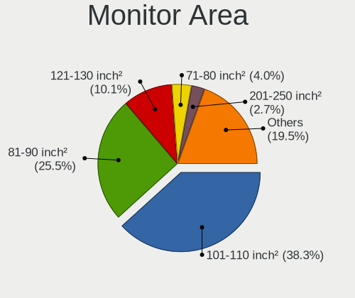

Zorin - Hardware Trends (Notebooks)
-----------------------------------

A project to identify most popular hardware characteristics and track their change
over time based on data collected by Linux users at https://Linux-Hardware.org.

Anyone can contribute to this report by the [hw-probe](https://github.com/linuxhw/hw-probe) tool:

    sudo -E hw-probe -all -upload

This report is for one last month. Overall report since the beginning of time: [TestDays](https://github.com/linuxhw/TestDays)

Period: Feb, 2023.

Contents
--------

* [ System ](#system)
  - [ OS                       ](#os)
  - [ OS Family                ](#os-family)
  - [ Kernel                   ](#kernel)
  - [ Kernel Family            ](#kernel-family)
  - [ Kernel Major Ver.        ](#kernel-major-ver)
  - [ Arch                     ](#arch)
  - [ DE                       ](#de)
  - [ Display Server           ](#display-server)
  - [ Display Manager          ](#display-manager)
  - [ OS Lang                  ](#os-lang)
  - [ Boot Mode                ](#boot-mode)
  - [ Filesystem               ](#filesystem)
  - [ Part. scheme             ](#part-scheme)
  - [ Dual Boot with Linux/BSD ](#dual-boot-with-linuxbsd)
  - [ Dual Boot (Win)          ](#dual-boot-win)

* [ Board ](#board)
  - [ Vendor                   ](#vendor)
  - [ Model                    ](#model)
  - [ Model Family             ](#model-family)
  - [ MFG Year                 ](#mfg-year)
  - [ Form Factor              ](#form-factor)
  - [ Secure Boot              ](#secure-boot)
  - [ Coreboot                 ](#coreboot)
  - [ RAM Size                 ](#ram-size)
  - [ RAM Used                 ](#ram-used)
  - [ Total Drives             ](#total-drives)
  - [ Has CD-ROM               ](#has-cd-rom)
  - [ Has Ethernet             ](#has-ethernet)
  - [ Has WiFi                 ](#has-wifi)
  - [ Has Bluetooth            ](#has-bluetooth)

* [ Location ](#location)
  - [ Country                  ](#country)
  - [ City                     ](#city)

* [ Drives ](#drives)
  - [ Drive Vendor             ](#drive-vendor)
  - [ Drive Model              ](#drive-model)
  - [ HDD Vendor               ](#hdd-vendor)
  - [ SSD Vendor               ](#ssd-vendor)
  - [ Drive Kind               ](#drive-kind)
  - [ Drive Connector          ](#drive-connector)
  - [ Drive Size               ](#drive-size)
  - [ Space Total              ](#space-total)
  - [ Space Used               ](#space-used)
  - [ Malfunc. Drives          ](#malfunc-drives)
  - [ Malfunc. Drive Vendor    ](#malfunc-drive-vendor)
  - [ Malfunc. HDD Vendor      ](#malfunc-hdd-vendor)
  - [ Malfunc. Drive Kind      ](#malfunc-drive-kind)
  - [ Failed Drives            ](#failed-drives)
  - [ Failed Drive Vendor      ](#failed-drive-vendor)
  - [ Drive Status             ](#drive-status)

* [ Storage controller ](#storage-controller)
  - [ Storage Vendor           ](#storage-vendor)
  - [ Storage Model            ](#storage-model)
  - [ Storage Kind             ](#storage-kind)

* [ Processor ](#processor)
  - [ CPU Vendor               ](#cpu-vendor)
  - [ CPU Model                ](#cpu-model)
  - [ CPU Model Family         ](#cpu-model-family)
  - [ CPU Cores                ](#cpu-cores)
  - [ CPU Sockets              ](#cpu-sockets)
  - [ CPU Threads              ](#cpu-threads)
  - [ CPU Op-Modes             ](#cpu-op-modes)
  - [ CPU Microcode            ](#cpu-microcode)
  - [ CPU Microarch            ](#cpu-microarch)

* [ Graphics ](#graphics)
  - [ GPU Vendor               ](#gpu-vendor)
  - [ GPU Model                ](#gpu-model)
  - [ GPU Combo                ](#gpu-combo)
  - [ GPU Driver               ](#gpu-driver)
  - [ GPU Memory               ](#gpu-memory)

* [ Monitor ](#monitor)
  - [ Monitor Vendor           ](#monitor-vendor)
  - [ Monitor Model            ](#monitor-model)
  - [ Monitor Resolution       ](#monitor-resolution)
  - [ Monitor Diagonal         ](#monitor-diagonal)
  - [ Monitor Width            ](#monitor-width)
  - [ Aspect Ratio             ](#aspect-ratio)
  - [ Monitor Area             ](#monitor-area)
  - [ Pixel Density            ](#pixel-density)
  - [ Multiple Monitors        ](#multiple-monitors)

* [ Network ](#network)
  - [ Net Controller Vendor    ](#net-controller-vendor)
  - [ Net Controller Model     ](#net-controller-model)
  - [ Wireless Vendor          ](#wireless-vendor)
  - [ Wireless Model           ](#wireless-model)
  - [ Ethernet Vendor          ](#ethernet-vendor)
  - [ Ethernet Model           ](#ethernet-model)
  - [ Net Controller Kind      ](#net-controller-kind)
  - [ Used Controller          ](#used-controller)
  - [ NICs                     ](#nics)
  - [ IPv6                     ](#ipv6)

* [ Bluetooth ](#bluetooth)
  - [ Bluetooth Vendor         ](#bluetooth-vendor)
  - [ Bluetooth Model          ](#bluetooth-model)

* [ Sound ](#sound)
  - [ Sound Vendor             ](#sound-vendor)
  - [ Sound Model              ](#sound-model)

* [ Memory ](#memory)
  - [ Memory Vendor            ](#memory-vendor)
  - [ Memory Model             ](#memory-model)
  - [ Memory Kind              ](#memory-kind)
  - [ Memory Form Factor       ](#memory-form-factor)
  - [ Memory Size              ](#memory-size)
  - [ Memory Speed             ](#memory-speed)

* [ Printers & scanners ](#printers--scanners)
  - [ Printer Vendor           ](#printer-vendor)
  - [ Printer Model            ](#printer-model)
  - [ Scanner Vendor           ](#scanner-vendor)
  - [ Scanner Model            ](#scanner-model)

* [ Camera ](#camera)
  - [ Camera Vendor            ](#camera-vendor)
  - [ Camera Model             ](#camera-model)

* [ Security ](#security)
  - [ Fingerprint Vendor       ](#fingerprint-vendor)
  - [ Fingerprint Model        ](#fingerprint-model)
  - [ Chipcard Vendor          ](#chipcard-vendor)
  - [ Chipcard Model           ](#chipcard-model)

* [ Unsupported ](#unsupported)
  - [ Unsupported Devices      ](#unsupported-devices)
  - [ Unsupported Device Types ](#unsupported-device-types)

System
------

OS
--

Installed operating systems

| Name     | Notebooks | Percent |
|----------|-----------|---------|
| Zorin 16 | 96        | 93.2%   |
| Zorin 15 | 7         | 6.8%    |

OS Family
---------

OS without a version

| Name  | Notebooks | Percent |
|-------|-----------|---------|
| Zorin | 103       | 100%    |

Kernel
------

Version of the Linux kernel

| Version           | Notebooks | Percent |
|-------------------|-----------|---------|
| 5.15.0-60-generic | 45        | 43.69%  |
| 5.15.0-58-generic | 30        | 29.13%  |
| 5.15.0-56-generic | 10        | 9.71%   |
| 5.4.0-139-generic | 5         | 4.85%   |
| 5.4.0-137-generic | 2         | 1.94%   |
| 5.11.0-38-generic | 2         | 1.94%   |
| 5.15.0-67-generic | 1         | 0.97%   |
| 5.15.0-57-generic | 1         | 0.97%   |
| 5.15.0-50-generic | 1         | 0.97%   |
| 5.14.0-1057-oem   | 1         | 0.97%   |
| 5.14.0-1056-oem   | 1         | 0.97%   |
| 5.13.0-51-generic | 1         | 0.97%   |
| 5.13.0-48-generic | 1         | 0.97%   |
| 5.13.0-30-generic | 1         | 0.97%   |
| 5.13.0-28-generic | 1         | 0.97%   |

Kernel Family
-------------

Linux kernel without a distro release

| Version | Notebooks | Percent |
|---------|-----------|---------|
| 5.15.0  | 88        | 85.44%  |
| 5.4.0   | 7         | 6.8%    |
| 5.13.0  | 4         | 3.88%   |
| 5.14.0  | 2         | 1.94%   |
| 5.11.0  | 2         | 1.94%   |

Kernel Major Ver.
-----------------

Linux kernel major version

| Version | Notebooks | Percent |
|---------|-----------|---------|
| 5.15    | 88        | 85.44%  |
| 5.4     | 7         | 6.8%    |
| 5.13    | 4         | 3.88%   |
| 5.14    | 2         | 1.94%   |
| 5.11    | 2         | 1.94%   |

Arch
----

OS architecture (x86_64, i586, etc.)

| Name   | Notebooks | Percent |
|--------|-----------|---------|
| x86_64 | 101       | 98.06%  |
| i686   | 2         | 1.94%   |

DE
--

Desktop Environment

| Name       | Notebooks | Percent |
|------------|-----------|---------|
| GNOME      | 81        | 78.64%  |
| XFCE       | 21        | 20.39%  |
| X-Cinnamon | 1         | 0.97%   |

Display Server
--------------

X11 or Wayland

| Name    | Notebooks | Percent |
|---------|-----------|---------|
| X11     | 100       | 97.09%  |
| Wayland | 3         | 2.91%   |

Display Manager
---------------

SDDM, LightDM, etc.

| Name    | Notebooks | Percent |
|---------|-----------|---------|
| Unknown | 71        | 68.93%  |
| GDM3    | 12        | 11.65%  |
| LightDM | 11        | 10.68%  |
| GDM     | 9         | 8.74%   |

OS Lang
-------

Language

| Lang  | Notebooks | Percent |
|-------|-----------|---------|
| en_US | 36        | 34.95%  |
| de_DE | 10        | 9.71%   |
| pt_BR | 7         | 6.8%    |
| de_CH | 6         | 5.83%   |
| it_IT | 5         | 4.85%   |
| en_GB | 5         | 4.85%   |
| fr_FR | 4         | 3.88%   |
| en_IN | 4         | 3.88%   |
| en_CA | 4         | 3.88%   |
| es_ES | 3         | 2.91%   |
| pt_PT | 2         | 1.94%   |
| pl_PL | 2         | 1.94%   |
| de_AT | 2         | 1.94%   |
| cs_CZ | 2         | 1.94%   |
| tr_TR | 1         | 0.97%   |
| sr_RS | 1         | 0.97%   |
| sl_SI | 1         | 0.97%   |
| ru_RU | 1         | 0.97%   |
| ro_RO | 1         | 0.97%   |
| nl_BE | 1         | 0.97%   |
| hu_HU | 1         | 0.97%   |
| es_UY | 1         | 0.97%   |
| es_CU | 1         | 0.97%   |
| en_ZA | 1         | 0.97%   |
| en_NZ | 1         | 0.97%   |

Boot Mode
---------

EFI or BIOS

| Mode | Notebooks | Percent |
|------|-----------|---------|
| EFI  | 58        | 56.31%  |
| BIOS | 45        | 43.69%  |

Filesystem
----------

Type of filesystem

| Type    | Notebooks | Percent |
|---------|-----------|---------|
| Ext4    | 101       | 98.06%  |
| Overlay | 2         | 1.94%   |

Part. scheme
------------

Scheme of partitioning

| Type    | Notebooks | Percent |
|---------|-----------|---------|
| Unknown | 72        | 69.9%   |
| GPT     | 20        | 19.42%  |
| MBR     | 11        | 10.68%  |

Dual Boot with Linux/BSD
------------------------

Hosting more than one Linux/BSD

| Dual boot | Notebooks | Percent |
|-----------|-----------|---------|
| No        | 100       | 97.09%  |
| Yes       | 3         | 2.91%   |

Dual Boot (Win)
---------------

Hosting Linux and Windows

| Dual boot | Notebooks | Percent |
|-----------|-----------|---------|
| No        | 93        | 90.29%  |
| Yes       | 10        | 9.71%   |

Board
-----

Vendor
------

Motherboard manufacturer

| Name                | Notebooks | Percent |
|---------------------|-----------|---------|
| Lenovo              | 22        | 21.36%  |
| Hewlett-Packard     | 18        | 17.48%  |
| Dell                | 17        | 16.5%   |
| Acer                | 11        | 10.68%  |
| ASUSTek Computer    | 8         | 7.77%   |
| Toshiba             | 3         | 2.91%   |
| Multilaser          | 3         | 2.91%   |
| Apple               | 3         | 2.91%   |
| Sony                | 2         | 1.94%   |
| Samsung Electronics | 2         | 1.94%   |
| MSI                 | 2         | 1.94%   |
| TWC                 | 1         | 0.97%   |
| Teclast             | 1         | 0.97%   |
| Positivo            | 1         | 0.97%   |
| Packard Bell        | 1         | 0.97%   |
| Medion              | 1         | 0.97%   |
| Intel               | 1         | 0.97%   |
| IBM                 | 1         | 0.97%   |
| HUAWEI              | 1         | 0.97%   |
| HONOR               | 1         | 0.97%   |
| Google              | 1         | 0.97%   |
| Digibras            | 1         | 0.97%   |
| DERE                | 1         | 0.97%   |

Model
-----

Motherboard model

| Name                                       | Notebooks | Percent |
|--------------------------------------------|-----------|---------|
| Unknown                                    | 3         | 2.91%   |
| Lenovo IdeaPad 3 15ITL05 81X8              | 2         | 1.94%   |
| HP 620                                     | 2         | 1.94%   |
| Toshiba Satellite L50D-B                   | 1         | 0.97%   |
| Toshiba Satellite L50-B                    | 1         | 0.97%   |
| Toshiba PORTEGE Z30-A                      | 1         | 0.97%   |
| Teclast F7                                 | 1         | 0.97%   |
| Sony VPCEG36FX                             | 1         | 0.97%   |
| Sony VGN-Z31XN_B                           | 1         | 0.97%   |
| Samsung 700T1C                             | 1         | 0.97%   |
| Samsung 300E4A/300E5A/300E7A/3430EA/3530EA | 1         | 0.97%   |
| Positivo Smash2                            | 1         | 0.97%   |
| Packard Bell EasyNote TS11HR               | 1         | 0.97%   |
| Multilaser UB23X LINUX                     | 1         | 0.97%   |
| Multilaser MLSH1H LINUX                    | 1         | 0.97%   |
| Multilaser DS133                           | 1         | 0.97%   |
| MSI Raider GE66 12UHS                      | 1         | 0.97%   |
| MSI GF63 Thin 11UC                         | 1         | 0.97%   |
| Medion E7220                               | 1         | 0.97%   |
| Lenovo Yoga 500-14ACL 80NA                 | 1         | 0.97%   |
| Lenovo V570 1066EDG                        | 1         | 0.97%   |
| Lenovo V14-IIL 82C4                        | 1         | 0.97%   |
| Lenovo ThinkPad X260 20F600A2MZ            | 1         | 0.97%   |
| Lenovo ThinkPad X1 Carbon 2nd 20A7CTO000   | 1         | 0.97%   |
| Lenovo ThinkPad T570 20H90002MZ            | 1         | 0.97%   |
| Lenovo ThinkPad T560 20FJS24T00            | 1         | 0.97%   |
| Lenovo ThinkPad T550 20CK003LMZ            | 1         | 0.97%   |
| Lenovo ThinkPad T460 20FN003LMZ            | 1         | 0.97%   |
| Lenovo ThinkPad T420 4236KU9               | 1         | 0.97%   |
| Lenovo ThinkPad R400 7439W2F               | 1         | 0.97%   |
| Lenovo ThinkPad P15s Gen 2i 20W6004XGE     | 1         | 0.97%   |
| Lenovo ThinkPad L480 20LS001AMX            | 1         | 0.97%   |
| Lenovo ThinkPad Edge E430 627155U          | 1         | 0.97%   |
| Lenovo IdeaPad U330p 20267                 | 1         | 0.97%   |
| Lenovo IdeaPad 530S-14ARR 81H1             | 1         | 0.97%   |
| Lenovo IdeaPad 3 15ADA05 81W1              | 1         | 0.97%   |
| Lenovo IdeaPad 3 15ABA7 82RN               | 1         | 0.97%   |
| Lenovo G500 20236                          | 1         | 0.97%   |
| Lenovo 14w 81MQ00AVCL                      | 1         | 0.97%   |
| IBM ThinkPad T40p 2373CG6                  | 1         | 0.97%   |

Model Family
------------

Motherboard model prefix

| Name                  | Notebooks | Percent |
|-----------------------|-----------|---------|
| Lenovo ThinkPad       | 11        | 10.68%  |
| Dell Latitude         | 8         | 7.77%   |
| Lenovo IdeaPad        | 6         | 5.83%   |
| Dell Inspiron         | 6         | 5.83%   |
| Acer Aspire           | 5         | 4.85%   |
| HP Pavilion           | 4         | 3.88%   |
| HP Laptop             | 4         | 3.88%   |
| HP ENVY               | 3         | 2.91%   |
| Unknown               | 3         | 2.91%   |
| Toshiba Satellite     | 2         | 1.94%   |
| HP Compaq             | 2         | 1.94%   |
| HP 620                | 2         | 1.94%   |
| Dell Vostro           | 2         | 1.94%   |
| ASUS ROG              | 2         | 1.94%   |
| Acer TravelMate       | 2         | 1.94%   |
| Toshiba PORTEGE       | 1         | 0.97%   |
| Teclast F7            | 1         | 0.97%   |
| Sony VPCEG36FX        | 1         | 0.97%   |
| Sony VGN-Z31XN        | 1         | 0.97%   |
| Samsung 700T1C        | 1         | 0.97%   |
| Samsung 300E4A        | 1         | 0.97%   |
| Positivo Smash2       | 1         | 0.97%   |
| Packard Bell EasyNote | 1         | 0.97%   |
| Multilaser UB23X      | 1         | 0.97%   |
| Multilaser MLSH1H     | 1         | 0.97%   |
| Multilaser DS133      | 1         | 0.97%   |
| MSI Raider            | 1         | 0.97%   |
| MSI GF63              | 1         | 0.97%   |
| Medion E7220          | 1         | 0.97%   |
| Lenovo Yoga           | 1         | 0.97%   |
| Lenovo V570           | 1         | 0.97%   |
| Lenovo V14-IIL        | 1         | 0.97%   |
| Lenovo G500           | 1         | 0.97%   |
| Lenovo 14w            | 1         | 0.97%   |
| IBM ThinkPad          | 1         | 0.97%   |
| HUAWEI KLVL-WXXW      | 1         | 0.97%   |
| HONOR HLYL-WXX9       | 1         | 0.97%   |
| HP ProBook            | 1         | 0.97%   |
| HP Notebook           | 1         | 0.97%   |
| Google Robo           | 1         | 0.97%   |

MFG Year
--------

Motherboard manufacture year

| Year | Notebooks | Percent |
|------|-----------|---------|
| 2021 | 13        | 12.62%  |
| 2011 | 11        | 10.68%  |
| 2017 | 7         | 6.8%    |
| 2013 | 7         | 6.8%    |
| 2012 | 7         | 6.8%    |
| 2020 | 6         | 5.83%   |
| 2018 | 6         | 5.83%   |
| 2015 | 6         | 5.83%   |
| 2014 | 6         | 5.83%   |
| 2009 | 6         | 5.83%   |
| 2022 | 5         | 4.85%   |
| 2019 | 5         | 4.85%   |
| 2007 | 5         | 4.85%   |
| 2016 | 4         | 3.88%   |
| 2010 | 4         | 3.88%   |
| 2008 | 4         | 3.88%   |
| 2023 | 1         | 0.97%   |

Form Factor
-----------

Physical design of the computer

| Name     | Notebooks | Percent |
|----------|-----------|---------|
| Notebook | 103       | 100%    |

Secure Boot
-----------

Enabled or disabled

| State    | Notebooks | Percent |
|----------|-----------|---------|
| Disabled | 93        | 90.29%  |
| Enabled  | 10        | 9.71%   |

Coreboot
--------

Have coreboot on board

| Used | Notebooks | Percent |
|------|-----------|---------|
| No   | 102       | 99.03%  |
| Yes  | 1         | 0.97%   |

RAM Size
--------

Total RAM memory

| Size in GB | Notebooks | Percent |
|------------|-----------|---------|
| 4.01-8.0   | 40        | 38.83%  |
| 3.01-4.0   | 25        | 24.27%  |
| 8.01-16.0  | 11        | 10.68%  |
| 16.01-24.0 | 10        | 9.71%   |
| 1.01-2.0   | 6         | 5.83%   |
| 32.01-64.0 | 4         | 3.88%   |
| 2.01-3.0   | 4         | 3.88%   |
| 24.01-32.0 | 2         | 1.94%   |
| 0.51-1.0   | 1         | 0.97%   |

RAM Used
--------

Used RAM memory

| Used GB   | Notebooks | Percent |
|-----------|-----------|---------|
| 1.01-2.0  | 39        | 37.86%  |
| 2.01-3.0  | 35        | 33.98%  |
| 3.01-4.0  | 13        | 12.62%  |
| 4.01-8.0  | 10        | 9.71%   |
| 0.51-1.0  | 5         | 4.85%   |
| 8.01-16.0 | 1         | 0.97%   |

Total Drives
------------

Number of drives on board

| Drives | Notebooks | Percent |
|--------|-----------|---------|
| 1      | 76        | 73.79%  |
| 2      | 27        | 26.21%  |

Has CD-ROM
----------

Has CD-ROM on board

| Presented | Notebooks | Percent |
|-----------|-----------|---------|
| No        | 64        | 62.14%  |
| Yes       | 39        | 37.86%  |

Has Ethernet
------------

Has Ethernet on board

| Presented | Notebooks | Percent |
|-----------|-----------|---------|
| Yes       | 78        | 75.73%  |
| No        | 25        | 24.27%  |

Has WiFi
--------

Has WiFi module

| Presented | Notebooks | Percent |
|-----------|-----------|---------|
| Yes       | 97        | 94.17%  |
| No        | 6         | 5.83%   |

Has Bluetooth
-------------

Has Bluetooth module

| Presented | Notebooks | Percent |
|-----------|-----------|---------|
| Yes       | 65        | 63.11%  |
| No        | 38        | 36.89%  |

Location
--------

Country
-------

Geographic location (country)

| Country      | Notebooks | Percent |
|--------------|-----------|---------|
| USA          | 21        | 20.39%  |
| Germany      | 11        | 10.68%  |
| Brazil       | 10        | 9.71%   |
| Canada       | 7         | 6.8%    |
| Switzerland  | 6         | 5.83%   |
| UK           | 5         | 4.85%   |
| Spain        | 4         | 3.88%   |
| Italy        | 4         | 3.88%   |
| India        | 4         | 3.88%   |
| Czechia      | 3         | 2.91%   |
| Serbia       | 2         | 1.94%   |
| Portugal     | 2         | 1.94%   |
| Poland       | 2         | 1.94%   |
| France       | 2         | 1.94%   |
| Belgium      | 2         | 1.94%   |
| Austria      | 2         | 1.94%   |
| Uruguay      | 1         | 0.97%   |
| Turkey       | 1         | 0.97%   |
| South Africa | 1         | 0.97%   |
| Slovenia     | 1         | 0.97%   |
| Senegal      | 1         | 0.97%   |
| Saint Lucia  | 1         | 0.97%   |
| Russia       | 1         | 0.97%   |
| Romania      | 1         | 0.97%   |
| Norway       | 1         | 0.97%   |
| New Zealand  | 1         | 0.97%   |
| Netherlands  | 1         | 0.97%   |
| Morocco      | 1         | 0.97%   |
| Israel       | 1         | 0.97%   |
| Egypt        | 1         | 0.97%   |
| Cuba         | 1         | 0.97%   |
| Argentina    | 1         | 0.97%   |

City
----

Geographic location (city)

| City                 | Notebooks | Percent |
|----------------------|-----------|---------|
| Diepoldsau           | 6         | 5.83%   |
| Wylie                | 2         | 1.94%   |
| Montreal             | 2         | 1.94%   |
| Kolkata              | 2         | 1.94%   |
| Bradford             | 2         | 1.94%   |
| Berlin               | 2         | 1.94%   |
| Wuppertal            | 1         | 0.97%   |
| Wroclaw              | 1         | 0.97%   |
| Windsor              | 1         | 0.97%   |
| Turnisce             | 1         | 0.97%   |
| Tulsa                | 1         | 0.97%   |
| Trondheim            | 1         | 0.97%   |
| Toronto              | 1         | 0.97%   |
| Toledo               | 1         | 0.97%   |
| Tamworth             | 1         | 0.97%   |
| Sunderland           | 1         | 0.97%   |
| Sherbrooke           | 1         | 0.97%   |
| Selbitz              | 1         | 0.97%   |
| Sao Paulo            | 1         | 0.97%   |
| Sao José dos Campos | 1         | 0.97%   |
| Santo André         | 1         | 0.97%   |
| Santa Clara          | 1         | 0.97%   |
| Rohnert Park         | 1         | 0.97%   |
| Puerto Iguazú       | 1         | 0.97%   |
| Pueblo               | 1         | 0.97%   |
| Prague               | 1         | 0.97%   |
| Potchefstroom        | 1         | 0.97%   |
| Porto                | 1         | 0.97%   |
| Ponta Grossa         | 1         | 0.97%   |
| Perm                 | 1         | 0.97%   |
| Paris                | 1         | 0.97%   |
| Ostrava              | 1         | 0.97%   |
| Oshawa               | 1         | 0.97%   |
| Oroville             | 1         | 0.97%   |
| Olathe               | 1         | 0.97%   |
| Nijmegen             | 1         | 0.97%   |
| Newport              | 1         | 0.97%   |
| Nelson               | 1         | 0.97%   |
| Münster             | 1         | 0.97%   |
| Mollet del Vallès   | 1         | 0.97%   |

Drives
------

Drive Vendor
------------

Hard drive vendors

| Vendor              | Notebooks | Drives | Percent |
|---------------------|-----------|--------|---------|
| Samsung Electronics | 16        | 16     | 12.9%   |
| WDC                 | 15        | 15     | 12.1%   |
| Unknown             | 15        | 17     | 12.1%   |
| Toshiba             | 10        | 10     | 8.06%   |
| Sandisk             | 10        | 10     | 8.06%   |
| Seagate             | 9         | 9      | 7.26%   |
| Intel               | 8         | 9      | 6.45%   |
| Hitachi             | 5         | 5      | 4.03%   |
| Kingston            | 4         | 4      | 3.23%   |
| Patriot             | 3         | 3      | 2.42%   |
| China               | 3         | 3      | 2.42%   |
| SK hynix            | 2         | 2      | 1.61%   |
| Micron Technology   | 2         | 2      | 1.61%   |
| LITEONIT            | 2         | 2      | 1.61%   |
| KIOXIA              | 2         | 2      | 1.61%   |
| HGST                | 2         | 2      | 1.61%   |
| Crucial             | 2         | 2      | 1.61%   |
| A-DATA Technology   | 2         | 2      | 1.61%   |
| Transcend           | 1         | 1      | 0.81%   |
| Teclast             | 1         | 1      | 0.81%   |
| SPCC                | 1         | 1      | 0.81%   |
| ShanDianZhe         | 1         | 1      | 0.81%   |
| Seagate Technology  | 1         | 1      | 0.81%   |
| Phison Electronics  | 1         | 1      | 0.81%   |
| KingSpec            | 1         | 1      | 0.81%   |
| GOODRAM             | 1         | 1      | 0.81%   |
| Fanxiang            | 1         | 1      | 0.81%   |
| Apple               | 1         | 1      | 0.81%   |
| Apacer              | 1         | 1      | 0.81%   |
| ADATA Technology    | 1         | 1      | 0.81%   |

Drive Model
-----------

Hard drive models

| Model                                                | Notebooks | Percent |
|------------------------------------------------------|-----------|---------|
| Unknown MMC Card  32GB                               | 4         | 3.15%   |
| Unknown MMC Card  16GB                               | 3         | 2.36%   |
| Toshiba MQ04ABF100 1TB                               | 3         | 2.36%   |
| WDC WDS500G2B0A-00SM50 500GB SSD                     | 2         | 1.57%   |
| Unknown MMC Card  64GB                               | 2         | 1.57%   |
| Toshiba MQ01ABD050 500GB                             | 2         | 1.57%   |
| Toshiba MQ01ABD032 320GB                             | 2         | 1.57%   |
| Seagate ST9500325AS 500GB                            | 2         | 1.57%   |
| Sandisk WD Black SN750 / PC SN730 NVMe SSD 512GB     | 2         | 1.57%   |
| Samsung NVMe SSD Controller PM9A1/PM9A3/980PRO 960GB | 2         | 1.57%   |
| Hitachi HTS547550A9E384 500GB                        | 2         | 1.57%   |
| China SATA SSD 120GB                                 | 2         | 1.57%   |
| WDC WDS240G2G0A-00JH30 240GB SSD                     | 1         | 0.79%   |
| WDC WD7500BPVX-22JC3T0 752GB                         | 1         | 0.79%   |
| WDC WD5000LPVT-60G33T0 500GB                         | 1         | 0.79%   |
| WDC WD5000LPCX-60VHAT0 500GB                         | 1         | 0.79%   |
| WDC WD5000LPCX-24C6HT0 500GB                         | 1         | 0.79%   |
| WDC WD5000BPVT-22HXZT3 500GB                         | 1         | 0.79%   |
| WDC WD5000BEVT-22ZAT0 500GB                          | 1         | 0.79%   |
| WDC WD3200BPVT-75JJ5T0 320GB                         | 1         | 0.79%   |
| WDC WD3200BPVT-22ZEST0 320GB                         | 1         | 0.79%   |
| WDC WD2500BEVT-22A23T0 250GB                         | 1         | 0.79%   |
| WDC WD1600BEVT-22ZCT0 160GB                          | 1         | 0.79%   |
| WDC WD10SPZX-00Z10T0 1TB                             | 1         | 0.79%   |
| WDC PC SN730 SDBQNTY-256G-1001 256GB                 | 1         | 0.79%   |
| Unknown SN128  128GB                                 | 1         | 0.79%   |
| Unknown SD16G  32GB                                  | 1         | 0.79%   |
| Unknown MMC32G  32GB                                 | 1         | 0.79%   |
| Unknown MMC Card  7GB                                | 1         | 0.79%   |
| Unknown MMC Card  512GB                              | 1         | 0.79%   |
| Unknown MMC Card  256GB                              | 1         | 0.79%   |
| Unknown MMC Card  128GB                              | 1         | 0.79%   |
| Unknown DA4064  64GB                                 | 1         | 0.79%   |
| Transcend TS128GMSA230S 128GB SSD                    | 1         | 0.79%   |
| Toshiba MQ01ABF050 500GB                             | 1         | 0.79%   |
| Toshiba MK3256GSYF 320GB                             | 1         | 0.79%   |
| Toshiba MK3252GSX 320GB                              | 1         | 0.79%   |
| Teclast 128GB NS550-2242 SSD                         | 1         | 0.79%   |
| SPCC Solid State Disk 256GB                          | 1         | 0.79%   |
| SK hynix SKHynix_HFS001TDE9X081N 1TB                 | 1         | 0.79%   |

HDD Vendor
----------

Hard disk drive vendors

| Vendor              | Notebooks | Drives | Percent |
|---------------------|-----------|--------|---------|
| WDC                 | 11        | 11     | 28.95%  |
| Toshiba             | 10        | 10     | 26.32%  |
| Seagate             | 9         | 9      | 23.68%  |
| Hitachi             | 5         | 5      | 13.16%  |
| HGST                | 2         | 2      | 5.26%   |
| Samsung Electronics | 1         | 1      | 2.63%   |

SSD Vendor
----------

Solid state drive vendors

| Vendor              | Notebooks | Drives | Percent |
|---------------------|-----------|--------|---------|
| Samsung Electronics | 8         | 8      | 18.6%   |
| SanDisk             | 5         | 5      | 11.63%  |
| Kingston            | 4         | 4      | 9.3%    |
| WDC                 | 3         | 3      | 6.98%   |
| Patriot             | 3         | 3      | 6.98%   |
| Intel               | 3         | 3      | 6.98%   |
| China               | 3         | 3      | 6.98%   |
| LITEONIT            | 2         | 2      | 4.65%   |
| Crucial             | 2         | 2      | 4.65%   |
| A-DATA Technology   | 2         | 2      | 4.65%   |
| Transcend           | 1         | 1      | 2.33%   |
| Teclast             | 1         | 1      | 2.33%   |
| SPCC                | 1         | 1      | 2.33%   |
| SK hynix            | 1         | 1      | 2.33%   |
| KingSpec            | 1         | 1      | 2.33%   |
| GOODRAM             | 1         | 1      | 2.33%   |
| Apple               | 1         | 1      | 2.33%   |
| Apacer              | 1         | 1      | 2.33%   |

Drive Kind
----------

HDD or SSD

| Kind    | Notebooks | Drives | Percent |
|---------|-----------|--------|---------|
| SSD     | 43        | 43     | 34.96%  |
| HDD     | 38        | 38     | 30.89%  |
| NVMe    | 25        | 27     | 20.33%  |
| MMC     | 15        | 17     | 12.2%   |
| Unknown | 2         | 2      | 1.63%   |

Drive Connector
---------------

SATA, SAS, NVMe, etc.

| Type | Notebooks | Drives | Percent |
|------|-----------|--------|---------|
| SATA | 74        | 82     | 64.35%  |
| NVMe | 25        | 27     | 21.74%  |
| MMC  | 15        | 17     | 13.04%  |
| SAS  | 1         | 1      | 0.87%   |

Drive Size
----------

Size of hard drive

| Size in TB | Notebooks | Drives | Percent |
|------------|-----------|--------|---------|
| 0.01-0.5   | 64        | 68     | 83.12%  |
| 0.51-1.0   | 11        | 11     | 14.29%  |
| 1.01-2.0   | 2         | 2      | 2.6%    |

Space Total
-----------

Amount of disk space available on the file system

| Size in GB     | Notebooks | Percent |
|----------------|-----------|---------|
| 101-250        | 45        | 43.69%  |
| 251-500        | 26        | 25.24%  |
| 501-1000       | 8         | 7.77%   |
| 51-100         | 8         | 7.77%   |
| 21-50          | 6         | 5.83%   |
| 2001-3000      | 3         | 2.91%   |
| 1001-2000      | 3         | 2.91%   |
| 1-20           | 3         | 2.91%   |
| More than 3000 | 1         | 0.97%   |

Space Used
----------

Amount of used disk space

| Used GB        | Notebooks | Percent |
|----------------|-----------|---------|
| 1-20           | 51        | 49.51%  |
| 21-50          | 22        | 21.36%  |
| 51-100         | 12        | 11.65%  |
| 101-250        | 10        | 9.71%   |
| 251-500        | 3         | 2.91%   |
| 1001-2000      | 2         | 1.94%   |
| 501-1000       | 2         | 1.94%   |
| More than 3000 | 1         | 0.97%   |

Malfunc. Drives
---------------

Drive models with a malfunction

| Model                             | Notebooks | Drives | Percent |
|-----------------------------------|-----------|--------|---------|
| Teclast 128GB NS550-2242 SSD      | 1         | 1      | 20%     |
| Seagate ST9160411ASG 160GB        | 1         | 1      | 20%     |
| Seagate ST1000LM048-2E7172 1TB    | 1         | 1      | 20%     |
| Samsung Electronics HM160JI 160GB | 1         | 1      | 20%     |
| Hitachi HTS543280L9SA00 80GB      | 1         | 1      | 20%     |

Malfunc. Drive Vendor
---------------------

Vendors of faulty drives

| Vendor              | Notebooks | Drives | Percent |
|---------------------|-----------|--------|---------|
| Seagate             | 2         | 2      | 40%     |
| Teclast             | 1         | 1      | 20%     |
| Samsung Electronics | 1         | 1      | 20%     |
| Hitachi             | 1         | 1      | 20%     |

Malfunc. HDD Vendor
-------------------

Vendors of faulty HDD drives

| Vendor              | Notebooks | Drives | Percent |
|---------------------|-----------|--------|---------|
| Seagate             | 2         | 2      | 50%     |
| Samsung Electronics | 1         | 1      | 25%     |
| Hitachi             | 1         | 1      | 25%     |

Malfunc. Drive Kind
-------------------

Kinds of faulty drives

| Kind | Notebooks | Drives | Percent |
|------|-----------|--------|---------|
| HDD  | 4         | 4      | 80%     |
| SSD  | 1         | 1      | 20%     |

Failed Drives
-------------

Failed drive models

Zero info for selected period =(

Failed Drive Vendor
-------------------

Failed drive vendors

Zero info for selected period =(

Drive Status
------------

Number of failed and malfunc. drives

| Status   | Notebooks | Drives | Percent |
|----------|-----------|--------|---------|
| Detected | 91        | 110    | 85.05%  |
| Works    | 11        | 12     | 10.28%  |
| Malfunc  | 5         | 5      | 4.67%   |

Storage controller
------------------

Storage Vendor
--------------

Storage controller vendors

| Vendor              | Notebooks | Percent |
|---------------------|-----------|---------|
| Intel               | 77        | 71.96%  |
| Samsung Electronics | 8         | 7.48%   |
| AMD                 | 7         | 6.54%   |
| SanDisk             | 5         | 4.67%   |
| Nvidia              | 2         | 1.87%   |
| Micron Technology   | 2         | 1.87%   |
| KIOXIA              | 2         | 1.87%   |
| SK hynix            | 1         | 0.93%   |
| Seagate Technology  | 1         | 0.93%   |
| Phison Electronics  | 1         | 0.93%   |
| ADATA Technology    | 1         | 0.93%   |

Storage Model
-------------

Storage controller models

| Model                                                                         | Notebooks | Percent |
|-------------------------------------------------------------------------------|-----------|---------|
| Intel Sunrise Point-LP SATA Controller [AHCI mode]                            | 11        | 9.4%    |
| Intel 6 Series/C200 Series Chipset Family 6 port Mobile SATA AHCI Controller  | 11        | 9.4%    |
| Intel 82801IBM/IEM (ICH9M/ICH9M-E) 4 port SATA Controller [AHCI mode]         | 7         | 5.98%   |
| Intel 7 Series Chipset Family 6-port SATA Controller [AHCI mode]              | 7         | 5.98%   |
| AMD FCH SATA Controller [AHCI mode]                                           | 7         | 5.98%   |
| Intel Volume Management Device NVMe RAID Controller                           | 6         | 5.13%   |
| Intel 82801 Mobile SATA Controller [RAID mode]                                | 6         | 5.13%   |
| Intel 8 Series SATA Controller 1 [AHCI mode]                                  | 6         | 5.13%   |
| Samsung NVMe SSD Controller 980                                               | 3         | 2.56%   |
| Intel Non-Volatile memory controller                                          | 3         | 2.56%   |
| Intel Celeron/Pentium Silver Processor SATA Controller                        | 3         | 2.56%   |
| Intel 82801HM/HEM (ICH8M/ICH8M-E) IDE Controller                              | 3         | 2.56%   |
| SanDisk WD Black SN750 / PC SN730 NVMe SSD                                    | 2         | 1.71%   |
| Samsung NVMe SSD Controller PM9A1/PM9A3/980PRO                                | 2         | 1.71%   |
| Micron Non-Volatile memory controller                                         | 2         | 1.71%   |
| KIOXIA NVMe SSD Controller BG4                                                | 2         | 1.71%   |
| Intel Tiger Lake-LP SATA Controller                                           | 2         | 1.71%   |
| Intel Celeron N3350/Pentium N4200/Atom E3900 Series SATA AHCI Controller      | 2         | 1.71%   |
| Intel 82801IBM/IEM (ICH9M/ICH9M-E) 2 port SATA Controller [IDE mode]          | 2         | 1.71%   |
| Intel 82801HM/HEM (ICH8M/ICH8M-E) SATA Controller [AHCI mode]                 | 2         | 1.71%   |
| Intel 5 Series/3400 Series Chipset 6 port SATA AHCI Controller                | 2         | 1.71%   |
| SK hynix Gold P31/PC711 NVMe Solid State Drive                                | 1         | 0.85%   |
| Seagate FireCuda 510 SSD                                                      | 1         | 0.85%   |
| SanDisk WD Blue SN570 NVMe SSD                                                | 1         | 0.85%   |
| SanDisk PC SN520 NVMe SSD                                                     | 1         | 0.85%   |
| SanDisk Non-Volatile memory controller                                        | 1         | 0.85%   |
| Samsung NVMe SSD Controller SM981/PM981/PM983                                 | 1         | 0.85%   |
| Samsung NVMe SSD Controller SM961/PM961/SM963                                 | 1         | 0.85%   |
| Samsung Electronics SATA controller                                           | 1         | 0.85%   |
| Phison PS5013 E13 NVMe Controller                                             | 1         | 0.85%   |
| Nvidia MCP79 AHCI Controller                                                  | 1         | 0.85%   |
| Nvidia MCP67 IDE Controller                                                   | 1         | 0.85%   |
| Nvidia MCP67 AHCI Controller                                                  | 1         | 0.85%   |
| Intel Wildcat Point-LP SATA Controller [AHCI Mode]                            | 1         | 0.85%   |
| Intel SSD 660P Series                                                         | 1         | 0.85%   |
| Intel Q170/Q150/B150/H170/H110/Z170/CM236 Chipset SATA Controller [AHCI Mode] | 1         | 0.85%   |
| Intel NVMe Optane Memory Series                                               | 1         | 0.85%   |
| Intel Jasper Lake SATA AHCI Controller                                        | 1         | 0.85%   |
| Intel Ice Lake-LP SATA Controller [AHCI mode]                                 | 1         | 0.85%   |
| Intel HM170/QM170 Chipset SATA Controller [AHCI Mode]                         | 1         | 0.85%   |

Storage Kind
------------

Kind of storage controller (IDE, SATA, NVMe, SAS, ...)

| Kind | Notebooks | Percent |
|------|-----------|---------|
| SATA | 70        | 60.87%  |
| NVMe | 25        | 21.74%  |
| RAID | 12        | 10.43%  |
| IDE  | 8         | 6.96%   |

Processor
---------

CPU Vendor
----------

Processor vendors

| Vendor | Notebooks | Percent |
|--------|-----------|---------|
| Intel  | 90        | 87.38%  |
| AMD    | 13        | 12.62%  |

CPU Model
---------

Processor models

| Model                                       | Notebooks | Percent |
|---------------------------------------------|-----------|---------|
| Intel Core i5-6200U CPU @ 2.30GHz           | 4         | 3.88%   |
| Intel Core i5-8250U CPU @ 1.60GHz           | 3         | 2.91%   |
| Intel 11th Gen Core i3-1115G4 @ 3.00GHz     | 3         | 2.91%   |
| Intel Core i7-4600U CPU @ 2.10GHz           | 2         | 1.94%   |
| Intel Core i5-4200U CPU @ 1.60GHz           | 2         | 1.94%   |
| Intel Core i5-2430M CPU @ 2.40GHz           | 2         | 1.94%   |
| Intel Core i5-2410M CPU @ 2.30GHz           | 2         | 1.94%   |
| Intel Core i3-7020U CPU @ 2.30GHz           | 2         | 1.94%   |
| Intel Core i3-2330M CPU @ 2.20GHz           | 2         | 1.94%   |
| Intel Celeron N4020 CPU @ 1.10GHz           | 2         | 1.94%   |
| Intel Atom x5-Z8350 CPU @ 1.44GHz           | 2         | 1.94%   |
| Intel Atom CPU Z3735F @ 1.33GHz             | 2         | 1.94%   |
| Intel 11th Gen Core i7-1165G7 @ 2.80GHz     | 2         | 1.94%   |
| Intel 11th Gen Core i5-1135G7 @ 2.40GHz     | 2         | 1.94%   |
| Intel Pentium Silver N5000 CPU @ 1.10GHz    | 1         | 0.97%   |
| Intel Pentium M processor 1500MHz           | 1         | 0.97%   |
| Intel Pentium Dual-Core CPU T4300 @ 2.10GHz | 1         | 0.97%   |
| Intel Genuine CPU 575 @ 2.00GHz             | 1         | 0.97%   |
| Intel Core i7-8550U CPU @ 1.80GHz           | 1         | 0.97%   |
| Intel Core i7-7700HQ CPU @ 2.80GHz          | 1         | 0.97%   |
| Intel Core i7-6500U CPU @ 2.50GHz           | 1         | 0.97%   |
| Intel Core i7-4710HQ CPU @ 2.50GHz          | 1         | 0.97%   |
| Intel Core i7-4500U CPU @ 1.80GHz           | 1         | 0.97%   |
| Intel Core i7-3520M CPU @ 2.90GHz           | 1         | 0.97%   |
| Intel Core i7-2670QM CPU @ 2.20GHz          | 1         | 0.97%   |
| Intel Core i7-2640M CPU @ 2.80GHz           | 1         | 0.97%   |
| Intel Core i7-2630QM CPU @ 2.00GHz          | 1         | 0.97%   |
| Intel Core i5-8350U CPU @ 1.70GHz           | 1         | 0.97%   |
| Intel Core i5-8265U CPU @ 1.60GHz           | 1         | 0.97%   |
| Intel Core i5-7440HQ CPU @ 2.80GHz          | 1         | 0.97%   |
| Intel Core i5-7200U CPU @ 2.50GHz           | 1         | 0.97%   |
| Intel Core i5-6300U CPU @ 2.40GHz           | 1         | 0.97%   |
| Intel Core i5-5257U CPU @ 2.70GHz           | 1         | 0.97%   |
| Intel Core i5-5200U CPU @ 2.20GHz           | 1         | 0.97%   |
| Intel Core i5-4310U CPU @ 2.00GHz           | 1         | 0.97%   |
| Intel Core i5-4300M CPU @ 2.60GHz           | 1         | 0.97%   |
| Intel Core i5-4210U CPU @ 1.70GHz           | 1         | 0.97%   |
| Intel Core i5-3337U CPU @ 1.80GHz           | 1         | 0.97%   |
| Intel Core i5-3317U CPU @ 1.70GHz           | 1         | 0.97%   |
| Intel Core i5-3230M CPU @ 2.60GHz           | 1         | 0.97%   |

CPU Model Family
----------------

Processor model prefix

| Model                   | Notebooks | Percent |
|-------------------------|-----------|---------|
| Intel Core i5           | 29        | 28.16%  |
| Intel Core i7           | 11        | 10.68%  |
| Intel Core i3           | 11        | 10.68%  |
| Intel Core 2 Duo        | 11        | 10.68%  |
| Other                   | 10        | 9.71%   |
| Intel Celeron           | 6         | 5.83%   |
| Intel Atom              | 6         | 5.83%   |
| AMD Ryzen 7             | 3         | 2.91%   |
| AMD Ryzen 5             | 3         | 2.91%   |
| AMD A4                  | 2         | 1.94%   |
| Intel Pentium Silver    | 1         | 0.97%   |
| Intel Pentium M         | 1         | 0.97%   |
| Intel Pentium Dual-Core | 1         | 0.97%   |
| Intel Genuine           | 1         | 0.97%   |
| Intel Core 2            | 1         | 0.97%   |
| Intel Celeron Dual-Core | 1         | 0.97%   |
| AMD Turion 64 X2 Mobile | 1         | 0.97%   |
| AMD Ryzen 9             | 1         | 0.97%   |
| AMD Athlon              | 1         | 0.97%   |
| AMD A8                  | 1         | 0.97%   |
| AMD A6                  | 1         | 0.97%   |

CPU Cores
---------

Number of processor cores

| Number | Notebooks | Percent |
|--------|-----------|---------|
| 2      | 62        | 60.19%  |
| 4      | 29        | 28.16%  |
| 8      | 4         | 3.88%   |
| 6      | 3         | 2.91%   |
| 1      | 3         | 2.91%   |
| 14     | 2         | 1.94%   |

CPU Sockets
-----------

Number of sockets

| Number | Notebooks | Percent |
|--------|-----------|---------|
| 1      | 103       | 100%    |

CPU Threads
-----------

Threads per core (Hyper-Threading)

| Number | Notebooks | Percent |
|--------|-----------|---------|
| 2      | 69        | 66.99%  |
| 1      | 34        | 33.01%  |

CPU Op-Modes
------------

CPU Operation Modes (32-bit, 64-bit)

| Op mode        | Notebooks | Percent |
|----------------|-----------|---------|
| 32-bit, 64-bit | 102       | 99.03%  |
| 32-bit         | 1         | 0.97%   |

CPU Microcode
-------------

Microcode number

| Number     | Notebooks | Percent |
|------------|-----------|---------|
| 0x206a7    | 14        | 13.59%  |
| 0x1067a    | 9         | 8.74%   |
| 0x806c1    | 7         | 6.8%    |
| 0x40651    | 7         | 6.8%    |
| 0x406e3    | 6         | 5.83%   |
| 0x806ea    | 5         | 4.85%   |
| 0x306a9    | 5         | 4.85%   |
| Unknown    | 5         | 4.85%   |
| 0x506c9    | 3         | 2.91%   |
| 0x906e9    | 2         | 1.94%   |
| 0x806e9    | 2         | 1.94%   |
| 0x706e5    | 2         | 1.94%   |
| 0x706a8    | 2         | 1.94%   |
| 0x6fd      | 2         | 1.94%   |
| 0x406c4    | 2         | 1.94%   |
| 0x406c3    | 2         | 1.94%   |
| 0x306d4    | 2         | 1.94%   |
| 0x306c3    | 2         | 1.94%   |
| 0x30678    | 2         | 1.94%   |
| 0x0a50000c | 2         | 1.94%   |
| 0x906c0    | 1         | 0.97%   |
| 0x906a3    | 1         | 0.97%   |
| 0x806ec    | 1         | 0.97%   |
| 0x806d1    | 1         | 0.97%   |
| 0x706a1    | 1         | 0.97%   |
| 0x6fb      | 1         | 0.97%   |
| 0x6fa      | 1         | 0.97%   |
| 0x6f6      | 1         | 0.97%   |
| 0x695      | 1         | 0.97%   |
| 0x20655    | 1         | 0.97%   |
| 0x10676    | 1         | 0.97%   |
| 0x0a50000d | 1         | 0.97%   |
| 0x0a404102 | 1         | 0.97%   |
| 0x08608102 | 1         | 0.97%   |
| 0x08600104 | 1         | 0.97%   |
| 0x0810100b | 1         | 0.97%   |
| 0x07030105 | 1         | 0.97%   |
| 0x07030104 | 1         | 0.97%   |
| 0x06006705 | 1         | 0.97%   |
| 0x0600111f | 1         | 0.97%   |

CPU Microarch
-------------

Microarchitecture

| Name             | Notebooks | Percent |
|------------------|-----------|---------|
| SandyBridge      | 14        | 13.59%  |
| KabyLake         | 11        | 10.68%  |
| Penryn           | 10        | 9.71%   |
| Haswell          | 9         | 8.74%   |
| TigerLake        | 7         | 6.8%    |
| Skylake          | 6         | 5.83%   |
| Silvermont       | 6         | 5.83%   |
| IvyBridge        | 5         | 4.85%   |
| Core             | 5         | 4.85%   |
| Zen 3            | 3         | 2.91%   |
| IceLake          | 3         | 2.91%   |
| Goldmont plus    | 3         | 2.91%   |
| Goldmont         | 3         | 2.91%   |
| Unknown          | 3         | 2.91%   |
| Westmere         | 2         | 1.94%   |
| Puma             | 2         | 1.94%   |
| Broadwell        | 2         | 1.94%   |
| Zen+             | 1         | 0.97%   |
| Zen 2            | 1         | 0.97%   |
| Zen              | 1         | 0.97%   |
| Tremont          | 1         | 0.97%   |
| Piledriver       | 1         | 0.97%   |
| P6               | 1         | 0.97%   |
| K8 Hammer        | 1         | 0.97%   |
| Excavator        | 1         | 0.97%   |
| Alderlake Hybrid | 1         | 0.97%   |

Graphics
--------

GPU Vendor
----------

Vendors of graphics cards

| Vendor | Notebooks | Percent |
|--------|-----------|---------|
| Intel  | 87        | 70.16%  |
| Nvidia | 19        | 15.32%  |
| AMD    | 18        | 14.52%  |

GPU Model
---------

Graphics card models

| Model                                                                                    | Notebooks | Percent |
|------------------------------------------------------------------------------------------|-----------|---------|
| Intel 2nd Generation Core Processor Family Integrated Graphics Controller                | 14        | 10.69%  |
| Intel Mobile 4 Series Chipset Integrated Graphics Controller                             | 9         | 6.87%   |
| Intel Haswell-ULT Integrated Graphics Controller                                         | 7         | 5.34%   |
| Intel Skylake GT2 [HD Graphics 520]                                                      | 6         | 4.58%   |
| Intel UHD Graphics 620                                                                   | 5         | 3.82%   |
| Intel 3rd Gen Core processor Graphics Controller                                         | 5         | 3.82%   |
| Intel TigerLake-LP GT2 [Iris Xe Graphics]                                                | 4         | 3.05%   |
| Intel Atom/Celeron/Pentium Processor x5-E8000/J3xxx/N3xxx Integrated Graphics Controller | 4         | 3.05%   |
| Intel Tiger Lake-LP GT2 [UHD Graphics G4]                                                | 3         | 2.29%   |
| Intel Mobile GM965/GL960 Integrated Graphics Controller (secondary)                      | 3         | 2.29%   |
| Intel Mobile GM965/GL960 Integrated Graphics Controller (primary)                        | 3         | 2.29%   |
| Intel HD Graphics 620                                                                    | 3         | 2.29%   |
| Intel HD Graphics 500                                                                    | 3         | 2.29%   |
| Nvidia GP108M [GeForce MX150]                                                            | 2         | 1.53%   |
| Nvidia GF117M [GeForce 610M/710M/810M/820M / GT 620M/625M/630M/720M]                     | 2         | 1.53%   |
| Nvidia GF108M [GeForce GT 540M]                                                          | 2         | 1.53%   |
| Intel Iris Plus Graphics G1 (Ice Lake)                                                   | 2         | 1.53%   |
| Intel HD Graphics 630                                                                    | 2         | 1.53%   |
| Intel GeminiLake [UHD Graphics 600]                                                      | 2         | 1.53%   |
| Intel Core Processor Integrated Graphics Controller                                      | 2         | 1.53%   |
| Intel Atom Processor Z36xxx/Z37xxx Series Graphics & Display                             | 2         | 1.53%   |
| Intel Alder Lake-P Integrated Graphics Controller                                        | 2         | 1.53%   |
| Intel 4th Gen Core Processor Integrated Graphics Controller                              | 2         | 1.53%   |
| AMD Sun XT [Radeon HD 8670A/8670M/8690M / R5 M330 / M430 / Radeon 520 Mobile]            | 2         | 1.53%   |
| AMD Seymour [Radeon HD 6400M/7400M Series]                                               | 2         | 1.53%   |
| AMD Barcelo                                                                              | 2         | 1.53%   |
| Nvidia TU117GLM [Quadro T500 Mobile]                                                     | 1         | 0.76%   |
| Nvidia GP106M [GeForce GTX 1060 Mobile]                                                  | 1         | 0.76%   |
| Nvidia GM108M [GeForce MX130]                                                            | 1         | 0.76%   |
| Nvidia GM108M [GeForce 940M]                                                             | 1         | 0.76%   |
| Nvidia GK107M [GeForce GT 650M]                                                          | 1         | 0.76%   |
| Nvidia GF108M [GeForce GT 525M]                                                          | 1         | 0.76%   |
| Nvidia GA107M [GeForce RTX 3050 Mobile]                                                  | 1         | 0.76%   |
| Nvidia GA106M [GeForce RTX 3060 Mobile / Max-Q]                                          | 1         | 0.76%   |
| Nvidia GA103M [GeForce RTX 3080 Ti Mobile]                                               | 1         | 0.76%   |
| Nvidia G98M [GeForce G 105M]                                                             | 1         | 0.76%   |
| Nvidia G98M [GeForce 9300M GS]                                                           | 1         | 0.76%   |
| Nvidia G96CM [GeForce 9600M GT]                                                          | 1         | 0.76%   |
| Nvidia C79 [GeForce 9400M]                                                               | 1         | 0.76%   |
| Nvidia C67 [GeForce 7150M / nForce 630M]                                                 | 1         | 0.76%   |

GPU Combo
---------

Combinations of graphics cards

| Name           | Notebooks | Percent |
|----------------|-----------|---------|
| 1 x Intel      | 66        | 64.08%  |
| Intel + Nvidia | 15        | 14.56%  |
| 1 x AMD        | 10        | 9.71%   |
| Intel + AMD    | 5         | 4.85%   |
| 2 x AMD        | 2         | 1.94%   |
| 1 x Nvidia     | 2         | 1.94%   |
| Other          | 1         | 0.97%   |
| 2 x Nvidia     | 1         | 0.97%   |
| AMD + Nvidia   | 1         | 0.97%   |

GPU Driver
----------

Free vs proprietary

| Driver      | Notebooks | Percent |
|-------------|-----------|---------|
| Free        | 94        | 91.26%  |
| Proprietary | 8         | 7.77%   |
| Unknown     | 1         | 0.97%   |

GPU Memory
----------

Total video memory

| Size in GB | Notebooks | Percent |
|------------|-----------|---------|
| Unknown    | 76        | 73.79%  |
| 0.01-0.5   | 10        | 9.71%   |
| 1.01-2.0   | 7         | 6.8%    |
| 0.51-1.0   | 6         | 5.83%   |
| 3.01-4.0   | 2         | 1.94%   |
| 7.01-8.0   | 1         | 0.97%   |
| 5.01-6.0   | 1         | 0.97%   |

Monitor
-------

Monitor Vendor
--------------

Monitor vendors

| Vendor                  | Notebooks | Percent |
|-------------------------|-----------|---------|
| AU Optronics            | 25        | 24.75%  |
| LG Display              | 20        | 19.8%   |
| BOE                     | 14        | 13.86%  |
| Chimei Innolux          | 13        | 12.87%  |
| Samsung Electronics     | 7         | 6.93%   |
| Chi Mei Optoelectronics | 4         | 3.96%   |
| LG Philips              | 3         | 2.97%   |
| Apple                   | 3         | 2.97%   |
| TMX                     | 2         | 1.98%   |
| SLD                     | 2         | 1.98%   |
| Vizio                   | 1         | 0.99%   |
| ViewSonic               | 1         | 0.99%   |
| Sharp                   | 1         | 0.99%   |
| Philips                 | 1         | 0.99%   |
| PANDA                   | 1         | 0.99%   |
| Lenovo                  | 1         | 0.99%   |
| Goldstar                | 1         | 0.99%   |
| BenQ                    | 1         | 0.99%   |

Monitor Model
-------------

Monitor models

| Model                                                                 | Notebooks | Percent |
|-----------------------------------------------------------------------|-----------|---------|
| SLD LCD Monitor SLD003C 1366x768 309x173mm 13.9-inch                  | 2         | 1.96%   |
| BOE LCD Monitor BOE0816 1366x768 344x193mm 15.5-inch                  | 2         | 1.96%   |
| AU Optronics LCD Monitor AUO20EC 1366x768 344x193mm 15.5-inch         | 2         | 1.96%   |
| Vizio VA26LHDTV10T VIZ0035 1920x1080 640x360mm 28.9-inch              | 1         | 0.98%   |
| ViewSonic VX3276-UHD VSC5138 2048x1152 700x390mm 31.5-inch            | 1         | 0.98%   |
| TMX TL140VDXP10 TMX1485 1920x1200 301x188mm 14.0-inch                 | 1         | 0.98%   |
| TMX TL140BDXP01-0 TMX1400 2560x1440 310x174mm 14.0-inch               | 1         | 0.98%   |
| Sharp LCD Monitor SHP141B 1920x1080 294x165mm 13.3-inch               | 1         | 0.98%   |
| Samsung Electronics SMT27A550 SAM07B8 1920x1080 598x336mm 27.0-inch   | 1         | 0.98%   |
| Samsung Electronics LCD Monitor SEC4249 1366x768 309x174mm 14.0-inch  | 1         | 0.98%   |
| Samsung Electronics LCD Monitor SEC3649 1366x768 309x174mm 14.0-inch  | 1         | 0.98%   |
| Samsung Electronics LCD Monitor SEC3157 1280x800 303x190mm 14.1-inch  | 1         | 0.98%   |
| Samsung Electronics LCD Monitor SEC304C 1366x768 353x198mm 15.9-inch  | 1         | 0.98%   |
| Samsung Electronics LCD Monitor SDC4752 1366x768 344x194mm 15.5-inch  | 1         | 0.98%   |
| Samsung Electronics LCD Monitor SDC4158 1920x1080 294x165mm 13.3-inch | 1         | 0.98%   |
| Samsung Electronics LCD Monitor SAM0C39 1920x1080 885x498mm 40.0-inch | 1         | 0.98%   |
| Philips PHL 278E1 PHLC217 3840x2160 597x336mm 27.0-inch               | 1         | 0.98%   |
| PANDA LM156LF1L03 NCP001C 1920x1080 344x194mm 15.5-inch               | 1         | 0.98%   |
| LG Philips LP154WX4-TLAB LPL3D01 1280x800 331x207mm 15.4-inch         | 1         | 0.98%   |
| LG Philips LCD Monitor LPLA104 1440x900 367x230mm 17.1-inch           | 1         | 0.98%   |
| LG Philips LCD Monitor LPL1101 1280x800 304x190mm 14.1-inch           | 1         | 0.98%   |
| LG Display LP156WH2-TLRA LGD026B 1366x768 344x194mm 15.5-inch         | 1         | 0.98%   |
| LG Display LCD Monitor LGD0701 1920x1200 345x215mm 16.0-inch          | 1         | 0.98%   |
| LG Display LCD Monitor LGD0541 1920x1080 344x194mm 15.5-inch          | 1         | 0.98%   |
| LG Display LCD Monitor LGD0521 1920x1080 309x174mm 14.0-inch          | 1         | 0.98%   |
| LG Display LCD Monitor LGD045C 1366x768 345x194mm 15.6-inch           | 1         | 0.98%   |
| LG Display LCD Monitor LGD0419 2560x1440 310x174mm 14.0-inch          | 1         | 0.98%   |
| LG Display LCD Monitor LGD03FB 1920x1080 382x215mm 17.3-inch          | 1         | 0.98%   |
| LG Display LCD Monitor LGD03DF 1366x768 344x194mm 15.5-inch           | 1         | 0.98%   |
| LG Display LCD Monitor LGD03D3 1600x900 309x174mm 14.0-inch           | 1         | 0.98%   |
| LG Display LCD Monitor LGD0395 1366x768 344x194mm 15.5-inch           | 1         | 0.98%   |
| LG Display LCD Monitor LGD0385 1366x768 309x174mm 14.0-inch           | 1         | 0.98%   |
| LG Display LCD Monitor LGD033E 1366x768 309x174mm 14.0-inch           | 1         | 0.98%   |
| LG Display LCD Monitor LGD02E3 1366x768 344x194mm 15.5-inch           | 1         | 0.98%   |
| LG Display LCD Monitor LGD02DC 1366x768 344x194mm 15.5-inch           | 1         | 0.98%   |
| LG Display LCD Monitor LGD02AC 1366x768 344x194mm 15.5-inch           | 1         | 0.98%   |
| LG Display LCD Monitor LGD0266 1366x768 344x194mm 15.5-inch           | 1         | 0.98%   |
| LG Display LCD Monitor LGD0259 1920x1080 345x194mm 15.6-inch          | 1         | 0.98%   |
| LG Display LCD Monitor LGD0250 1366x768 345x194mm 15.6-inch           | 1         | 0.98%   |
| LG Display LCD Monitor LGD01F5 1280x800 304x190mm 14.1-inch           | 1         | 0.98%   |

Monitor Resolution
------------------

Monitor screen resolution

| Resolution        | Notebooks | Percent |
|-------------------|-----------|---------|
| 1366x768 (WXGA)   | 42        | 42%     |
| 1920x1080 (FHD)   | 33        | 33%     |
| 1280x800 (WXGA)   | 7         | 7%      |
| 1600x900 (HD+)    | 4         | 4%      |
| 1440x900 (WXGA+)  | 4         | 4%      |
| 3840x2160 (4K)    | 2         | 2%      |
| 2560x1440 (QHD)   | 2         | 2%      |
| 1920x1200 (WUXGA) | 2         | 2%      |
| 2560x1600         | 1         | 1%      |
| 2560x1080         | 1         | 1%      |
| 2240x1400         | 1         | 1%      |
| 2160x1440         | 1         | 1%      |

Monitor Diagonal
----------------

Diagonal size in inches

| Inches | Notebooks | Percent |
|--------|-----------|---------|
| 15     | 43        | 42.16%  |
| 14     | 20        | 19.61%  |
| 13     | 20        | 19.61%  |
| 17     | 6         | 5.88%   |
| 11     | 3         | 2.94%   |
| 27     | 2         | 1.96%   |
| 16     | 2         | 1.96%   |
| 47     | 1         | 0.98%   |
| 36     | 1         | 0.98%   |
| 34     | 1         | 0.98%   |
| 31     | 1         | 0.98%   |
| 24     | 1         | 0.98%   |
| 12     | 1         | 0.98%   |

Monitor Width
-------------

Physical width

| Width in mm | Notebooks | Percent |
|-------------|-----------|---------|
| 301-350     | 74        | 72.55%  |
| 201-300     | 13        | 12.75%  |
| 351-400     | 8         | 7.84%   |
| 501-600     | 3         | 2.94%   |
| 701-800     | 2         | 1.96%   |
| 601-700     | 1         | 0.98%   |
| 1001-1500   | 1         | 0.98%   |

Aspect Ratio
------------

Proportional relationship between the width and the height

| Ratio | Notebooks | Percent |
|-------|-----------|---------|
| 16/9  | 79        | 81.44%  |
| 16/10 | 15        | 15.46%  |
| 3/2   | 2         | 2.06%   |
| 21/9  | 1         | 1.03%   |

Monitor Area
------------

Area in inch²

| Area in inch² | Notebooks | Percent |
|----------------|-----------|---------|
| 101-110        | 44        | 43.14%  |
| 81-90          | 34        | 33.33%  |
| 71-80          | 6         | 5.88%   |
| 121-130        | 4         | 3.92%   |
| 51-60          | 3         | 2.94%   |
| 351-500        | 2         | 1.96%   |
| 301-350        | 2         | 1.96%   |
| 131-140        | 2         | 1.96%   |
| 501-1000       | 2         | 1.96%   |
| 61-70          | 1         | 0.98%   |
| 201-250        | 1         | 0.98%   |
| 111-120        | 1         | 0.98%   |

Pixel Density
-------------

Pixels per inch

| Density       | Notebooks | Percent |
|---------------|-----------|---------|
| 101-120       | 46        | 45.1%   |
| 121-160       | 30        | 29.41%  |
| 161-240       | 12        | 11.76%  |
| 51-100        | 11        | 10.78%  |
| 1-50          | 2         | 1.96%   |
| More than 240 | 1         | 0.98%   |

Multiple Monitors
-----------------

Total monitors connected

| Total | Notebooks | Percent |
|-------|-----------|---------|
| 1     | 93        | 90.29%  |
| 2     | 9         | 8.74%   |
| 0     | 1         | 0.97%   |

Network
-------

Net Controller Vendor
---------------------

Controller vendors

| Vendor                   | Notebooks | Percent |
|--------------------------|-----------|---------|
| Intel                    | 51        | 32.9%   |
| Realtek Semiconductor    | 44        | 28.39%  |
| Qualcomm Atheros         | 22        | 14.19%  |
| Broadcom                 | 16        | 10.32%  |
| MediaTek                 | 3         | 1.94%   |
| Broadcom Limited         | 3         | 1.94%   |
| Ralink                   | 2         | 1.29%   |
| Nvidia                   | 2         | 1.29%   |
| Huawei Technologies      | 2         | 1.29%   |
| ASIX Electronics         | 2         | 1.29%   |
| Xiaomi                   | 1         | 0.65%   |
| TP-Link                  | 1         | 0.65%   |
| Sierra Wireless          | 1         | 0.65%   |
| Qualcomm                 | 1         | 0.65%   |
| OPPO                     | 1         | 0.65%   |
| Marvell Technology Group | 1         | 0.65%   |
| LG Electronics           | 1         | 0.65%   |
| Dell                     | 1         | 0.65%   |

Net Controller Model
--------------------

Controller models

| Model                                                             | Notebooks | Percent |
|-------------------------------------------------------------------|-----------|---------|
| Realtek RTL8111/8168/8411 PCI Express Gigabit Ethernet Controller | 22        | 11.96%  |
| Realtek RTL810xE PCI Express Fast Ethernet controller             | 8         | 4.35%   |
| Intel Wireless 7260                                               | 7         | 3.8%    |
| Intel Wi-Fi 6 AX201                                               | 6         | 3.26%   |
| Qualcomm Atheros QCA9377 802.11ac Wireless Network Adapter        | 5         | 2.72%   |
| Intel Wireless 7265                                               | 5         | 2.72%   |
| Realtek RTL8821CE 802.11ac PCIe Wireless Network Adapter          | 4         | 2.17%   |
| Intel Wireless 8265 / 8275                                        | 4         | 2.17%   |
| Broadcom NetLink BCM57785 Gigabit Ethernet PCIe                   | 4         | 2.17%   |
| Realtek RTL8822CE 802.11ac PCIe Wireless Network Adapter          | 3         | 1.63%   |
| Qualcomm Atheros AR9285 Wireless Network Adapter (PCI-Express)    | 3         | 1.63%   |
| Intel Wireless 3165                                               | 3         | 1.63%   |
| Intel WiFi Link 5100                                              | 3         | 1.63%   |
| Intel Ethernet Connection I219-V                                  | 3         | 1.63%   |
| Intel Ethernet Connection I218-LM                                 | 3         | 1.63%   |
| Realtek RTL8191SEvA Wireless LAN Controller                       | 2         | 1.09%   |
| Realtek RTL8153 Gigabit Ethernet Adapter                          | 2         | 1.09%   |
| Realtek RTL8152 Fast Ethernet Adapter                             | 2         | 1.09%   |
| Realtek 802.11n WLAN Adapter                                      | 2         | 1.09%   |
| Qualcomm Atheros QCA6174 802.11ac Wireless Network Adapter        | 2         | 1.09%   |
| Qualcomm Atheros AR9485 Wireless Network Adapter                  | 2         | 1.09%   |
| Qualcomm Atheros AR8151 v2.0 Gigabit Ethernet                     | 2         | 1.09%   |
| MediaTek MT7921 802.11ax PCI Express Wireless Network Adapter     | 2         | 1.09%   |
| Intel Wireless 8260                                               | 2         | 1.09%   |
| Intel PRO/Wireless 5100 AGN [Shiloh] Network Connection           | 2         | 1.09%   |
| Intel Ethernet Connection (4) I219-V                              | 2         | 1.09%   |
| Intel Ethernet Connection (4) I219-LM                             | 2         | 1.09%   |
| Intel Centrino Wireless-N 2230                                    | 2         | 1.09%   |
| Intel Centrino Wireless-N 1030 [Rainbow Peak]                     | 2         | 1.09%   |
| Intel Centrino Advanced-N 6205 [Taylor Peak]                      | 2         | 1.09%   |
| Intel Alder Lake-P PCH CNVi WiFi                                  | 2         | 1.09%   |
| Intel 82567LM Gigabit Network Connection                          | 2         | 1.09%   |
| Broadcom Limited NetLink BCM5787M Gigabit Ethernet PCI Express    | 2         | 1.09%   |
| Broadcom BCM4311 802.11b/g WLAN                                   | 2         | 1.09%   |
| Xiaomi Mi/Redmi series (RNDIS + ADB)                              | 1         | 0.54%   |
| TP-Link AC600 wireless Realtek RTL8811AU [Archer T2U Nano]        | 1         | 0.54%   |
| Sierra Wireless EM7305                                            | 1         | 0.54%   |
| Realtek RTL8814AU 802.11a/b/g/n/ac Wireless Adapter               | 1         | 0.54%   |
| Realtek RTL8723DE Wireless Network Adapter                        | 1         | 0.54%   |
| Realtek RTL8723BE PCIe Wireless Network Adapter                   | 1         | 0.54%   |

Wireless Vendor
---------------

Wireless vendors

| Vendor                | Notebooks | Percent |
|-----------------------|-----------|---------|
| Intel                 | 49        | 49.49%  |
| Qualcomm Atheros      | 17        | 17.17%  |
| Realtek Semiconductor | 16        | 16.16%  |
| Broadcom              | 9         | 9.09%   |
| MediaTek              | 3         | 3.03%   |
| Ralink                | 2         | 2.02%   |
| TP-Link               | 1         | 1.01%   |
| Sierra Wireless       | 1         | 1.01%   |
| Broadcom Limited      | 1         | 1.01%   |

Wireless Model
--------------

Wireless models

| Model                                                                                 | Notebooks | Percent |
|---------------------------------------------------------------------------------------|-----------|---------|
| Intel Wireless 7260                                                                   | 7         | 7%      |
| Intel Wi-Fi 6 AX201                                                                   | 6         | 6%      |
| Qualcomm Atheros QCA9377 802.11ac Wireless Network Adapter                            | 5         | 5%      |
| Intel Wireless 7265                                                                   | 5         | 5%      |
| Realtek RTL8821CE 802.11ac PCIe Wireless Network Adapter                              | 4         | 4%      |
| Intel Wireless 8265 / 8275                                                            | 4         | 4%      |
| Realtek RTL8822CE 802.11ac PCIe Wireless Network Adapter                              | 3         | 3%      |
| Qualcomm Atheros AR9285 Wireless Network Adapter (PCI-Express)                        | 3         | 3%      |
| Intel Wireless 3165                                                                   | 3         | 3%      |
| Intel WiFi Link 5100                                                                  | 3         | 3%      |
| Realtek RTL8191SEvA Wireless LAN Controller                                           | 2         | 2%      |
| Realtek 802.11n WLAN Adapter                                                          | 2         | 2%      |
| Qualcomm Atheros QCA6174 802.11ac Wireless Network Adapter                            | 2         | 2%      |
| Qualcomm Atheros AR9485 Wireless Network Adapter                                      | 2         | 2%      |
| MediaTek MT7921 802.11ax PCI Express Wireless Network Adapter                         | 2         | 2%      |
| Intel Wireless 8260                                                                   | 2         | 2%      |
| Intel PRO/Wireless 5100 AGN [Shiloh] Network Connection                               | 2         | 2%      |
| Intel Centrino Wireless-N 2230                                                        | 2         | 2%      |
| Intel Centrino Wireless-N 1030 [Rainbow Peak]                                         | 2         | 2%      |
| Intel Centrino Advanced-N 6205 [Taylor Peak]                                          | 2         | 2%      |
| Intel Alder Lake-P PCH CNVi WiFi                                                      | 2         | 2%      |
| Broadcom BCM4311 802.11b/g WLAN                                                       | 2         | 2%      |
| TP-Link AC600 wireless Realtek RTL8811AU [Archer T2U Nano]                            | 1         | 1%      |
| Sierra Wireless EM7305                                                                | 1         | 1%      |
| Realtek RTL8814AU 802.11a/b/g/n/ac Wireless Adapter                                   | 1         | 1%      |
| Realtek RTL8723DE Wireless Network Adapter                                            | 1         | 1%      |
| Realtek RTL8723BE PCIe Wireless Network Adapter                                       | 1         | 1%      |
| Realtek RTL8723AE PCIe Wireless Network Adapter                                       | 1         | 1%      |
| Realtek RTL8188CE 802.11b/g/n WiFi Adapter                                            | 1         | 1%      |
| Realtek Realtek Network controller                                                    | 1         | 1%      |
| Ralink RT5390 Wireless 802.11n 1T/1R PCIe                                             | 1         | 1%      |
| Ralink RT3290 Wireless 802.11n 1T/1R PCIe                                             | 1         | 1%      |
| Qualcomm Atheros AR9462 Wireless Network Adapter                                      | 1         | 1%      |
| Qualcomm Atheros AR928X Wireless Network Adapter (PCI-Express)                        | 1         | 1%      |
| Qualcomm Atheros AR9287 Wireless Network Adapter (PCI-Express)                        | 1         | 1%      |
| Qualcomm Atheros AR5418 Wireless Network Adapter [AR5008E 802.11(a)bgn] (PCI-Express) | 1         | 1%      |
| Qualcomm Atheros AR5212 802.11abg NIC                                                 | 1         | 1%      |
| MediaTek MT7922 802.11ax PCI Express Wireless Network Adapter                         | 1         | 1%      |
| Intel Wireless 3160                                                                   | 1         | 1%      |
| Intel Wi-Fi 6 AX200                                                                   | 1         | 1%      |

Ethernet Vendor
---------------

Ethernet vendors

| Vendor                   | Notebooks | Percent |
|--------------------------|-----------|---------|
| Realtek Semiconductor    | 35        | 42.68%  |
| Intel                    | 20        | 24.39%  |
| Broadcom                 | 8         | 9.76%   |
| Qualcomm Atheros         | 6         | 7.32%   |
| Nvidia                   | 2         | 2.44%   |
| Huawei Technologies      | 2         | 2.44%   |
| Broadcom Limited         | 2         | 2.44%   |
| ASIX Electronics         | 2         | 2.44%   |
| Xiaomi                   | 1         | 1.22%   |
| Qualcomm                 | 1         | 1.22%   |
| OPPO                     | 1         | 1.22%   |
| Marvell Technology Group | 1         | 1.22%   |
| LG Electronics           | 1         | 1.22%   |

Ethernet Model
--------------

Ethernet models

| Model                                                             | Notebooks | Percent |
|-------------------------------------------------------------------|-----------|---------|
| Realtek RTL8111/8168/8411 PCI Express Gigabit Ethernet Controller | 22        | 26.83%  |
| Realtek RTL810xE PCI Express Fast Ethernet controller             | 8         | 9.76%   |
| Broadcom NetLink BCM57785 Gigabit Ethernet PCIe                   | 4         | 4.88%   |
| Intel Ethernet Connection I219-V                                  | 3         | 3.66%   |
| Intel Ethernet Connection I218-LM                                 | 3         | 3.66%   |
| Realtek RTL8153 Gigabit Ethernet Adapter                          | 2         | 2.44%   |
| Realtek RTL8152 Fast Ethernet Adapter                             | 2         | 2.44%   |
| Qualcomm Atheros AR8151 v2.0 Gigabit Ethernet                     | 2         | 2.44%   |
| Intel Ethernet Connection (4) I219-V                              | 2         | 2.44%   |
| Intel Ethernet Connection (4) I219-LM                             | 2         | 2.44%   |
| Intel 82567LM Gigabit Network Connection                          | 2         | 2.44%   |
| Broadcom Limited NetLink BCM5787M Gigabit Ethernet PCI Express    | 2         | 2.44%   |
| Xiaomi Mi/Redmi series (RNDIS + ADB)                              | 1         | 1.22%   |
| Realtek Killer E3000 2.5GbE Controller                            | 1         | 1.22%   |
| Qualcomm Redmi Note 7                                             | 1         | 1.22%   |
| Qualcomm Atheros QCA8172 Fast Ethernet                            | 1         | 1.22%   |
| Qualcomm Atheros QCA8171 Gigabit Ethernet                         | 1         | 1.22%   |
| Qualcomm Atheros AR8161 Gigabit Ethernet                          | 1         | 1.22%   |
| Qualcomm Atheros AR8121/AR8113/AR8114 Gigabit or Fast Ethernet    | 1         | 1.22%   |
| OPPO CPH1923                                                      | 1         | 1.22%   |
| Nvidia MCP79 Ethernet                                             | 1         | 1.22%   |
| Nvidia MCP67 Ethernet                                             | 1         | 1.22%   |
| Marvell Group 88E8053 PCI-E Gigabit Ethernet Controller           | 1         | 1.22%   |
| LG LM-X420xxx/G2 Android Phone (USB tethering mode)               | 1         | 1.22%   |
| Intel WiMAX Connection 2400m                                      | 1         | 1.22%   |
| Intel Ethernet Connection I217-LM                                 | 1         | 1.22%   |
| Intel Ethernet Connection (5) I219-LM                             | 1         | 1.22%   |
| Intel Ethernet Connection (3) I218-V                              | 1         | 1.22%   |
| Intel Ethernet Connection (13) I219-V                             | 1         | 1.22%   |
| Intel 82579LM Gigabit Network Connection (Lewisville)             | 1         | 1.22%   |
| Intel 82567LF Gigabit Network Connection                          | 1         | 1.22%   |
| Intel 82540EP Gigabit Ethernet Controller (Mobile)                | 1         | 1.22%   |
| Huawei MLA-L11                                                    | 1         | 1.22%   |
| Huawei E353/E3131                                                 | 1         | 1.22%   |
| Broadcom NetXtreme BCM5764M Gigabit Ethernet PCIe                 | 1         | 1.22%   |
| Broadcom NetXtreme BCM5755M Gigabit Ethernet PCI Express          | 1         | 1.22%   |
| Broadcom NetLink BCM5787M Gigabit Ethernet PCI Express            | 1         | 1.22%   |
| Broadcom NetLink BCM5784M Gigabit Ethernet PCIe                   | 1         | 1.22%   |
| ASIX AX88772B                                                     | 1         | 1.22%   |
| ASIX AX88179 Gigabit Ethernet                                     | 1         | 1.22%   |

Net Controller Kind
-------------------

Ethernet, WiFi or modem

| Kind     | Notebooks | Percent |
|----------|-----------|---------|
| WiFi     | 97        | 55.11%  |
| Ethernet | 77        | 43.75%  |
| Modem    | 2         | 1.14%   |

Used Controller
---------------

Currently used network controller

| Kind     | Notebooks | Percent |
|----------|-----------|---------|
| WiFi     | 83        | 83%     |
| Ethernet | 17        | 17%     |

NICs
----

Total network controllers on board

| Total | Notebooks | Percent |
|-------|-----------|---------|
| 2     | 67        | 65.05%  |
| 1     | 29        | 28.16%  |
| 0     | 7         | 6.8%    |

IPv6
----

IPv6 vs IPv4

| Used | Notebooks | Percent |
|------|-----------|---------|
| No   | 78        | 75.73%  |
| Yes  | 25        | 24.27%  |

Bluetooth
---------

Bluetooth Vendor
----------------

Controller vendors

| Vendor                          | Notebooks | Percent |
|---------------------------------|-----------|---------|
| Intel                           | 32        | 49.23%  |
| Realtek Semiconductor           | 6         | 9.23%   |
| Qualcomm Atheros Communications | 5         | 7.69%   |
| IMC Networks                    | 4         | 6.15%   |
| Foxconn / Hon Hai               | 4         | 6.15%   |
| Hewlett-Packard                 | 3         | 4.62%   |
| Realtek                         | 2         | 3.08%   |
| Lite-On Technology              | 2         | 3.08%   |
| Apple                           | 2         | 3.08%   |
| Toshiba                         | 1         | 1.54%   |
| Ralink                          | 1         | 1.54%   |
| Dell                            | 1         | 1.54%   |
| Broadcom                        | 1         | 1.54%   |
| Alps Electric                   | 1         | 1.54%   |

Bluetooth Model
---------------

Controller models

| Model                                            | Notebooks | Percent |
|--------------------------------------------------|-----------|---------|
| Intel Bluetooth wireless interface               | 18        | 27.69%  |
| Intel AX201 Bluetooth                            | 7         | 10.77%  |
| Realtek Bluetooth Radio                          | 4         | 6.15%   |
| Intel Centrino Bluetooth Wireless Transceiver    | 3         | 4.62%   |
| Realtek  Bluetooth 4.2 Adapter                   | 2         | 3.08%   |
| Realtek 802.11ac WLAN Adapter                    | 2         | 3.08%   |
| Qualcomm Atheros QCA61x4 Bluetooth 4.0           | 2         | 3.08%   |
| Lite-On Qualcomm Atheros QCA9377 Bluetooth       | 2         | 3.08%   |
| Intel Centrino Advanced-N 6230 Bluetooth adapter | 2         | 3.08%   |
| Intel Bluetooth Device                           | 2         | 3.08%   |
| HP Bluetooth 2.0 Interface [Broadcom BCM2045]    | 2         | 3.08%   |
| Foxconn / Hon Hai Wireless_Device                | 2         | 3.08%   |
| Apple Bluetooth Host Controller                  | 2         | 3.08%   |
| Toshiba BCM43142A0                               | 1         | 1.54%   |
| Ralink RT3290 Bluetooth                          | 1         | 1.54%   |
| Qualcomm Atheros  Bluetooth Device               | 1         | 1.54%   |
| Qualcomm Atheros AR3012 Bluetooth 4.0            | 1         | 1.54%   |
| Qualcomm Atheros AR3011 Bluetooth                | 1         | 1.54%   |
| IMC Networks Wireless_Device                     | 1         | 1.54%   |
| IMC Networks Bluetooth Radio                     | 1         | 1.54%   |
| IMC Networks Bluetooth Device                    | 1         | 1.54%   |
| IMC Networks Bluetooth                           | 1         | 1.54%   |
| HP Broadcom 2070 Bluetooth Combo                 | 1         | 1.54%   |
| Foxconn / Hon Hai Bluetooth Device               | 1         | 1.54%   |
| Foxconn / Hon Hai BCM2045A0                      | 1         | 1.54%   |
| Dell Wireless 360 Bluetooth                      | 1         | 1.54%   |
| Broadcom BCM2070 Bluetooth 2.1 + EDR             | 1         | 1.54%   |
| Alps Electric BCM2046 Bluetooth Device           | 1         | 1.54%   |

Sound
-----

Sound Vendor
------------

Sound card vendors

| Vendor                 | Notebooks | Percent |
|------------------------|-----------|---------|
| Intel                  | 83        | 77.57%  |
| AMD                    | 12        | 11.21%  |
| Nvidia                 | 8         | 7.48%   |
| Plantronics            | 1         | 0.93%   |
| Lenovo                 | 1         | 0.93%   |
| Kingston Technology    | 1         | 0.93%   |
| Generalplus Technology | 1         | 0.93%   |

Sound Model
-----------

Sound card models

| Model                                                                      | Notebooks | Percent |
|----------------------------------------------------------------------------|-----------|---------|
| Intel Sunrise Point-LP HD Audio                                            | 14        | 10.77%  |
| Intel 6 Series/C200 Series Chipset Family High Definition Audio Controller | 11        | 8.46%   |
| Intel 82801I (ICH9 Family) HD Audio Controller                             | 10        | 7.69%   |
| Intel 7 Series/C216 Chipset Family High Definition Audio Controller        | 8         | 6.15%   |
| Intel Tiger Lake-LP Smart Sound Technology Audio Controller                | 7         | 5.38%   |
| Intel Haswell-ULT HD Audio Controller                                      | 7         | 5.38%   |
| Intel 8 Series HD Audio Controller                                         | 7         | 5.38%   |
| AMD Family 17h/19h HD Audio Controller                                     | 7         | 5.38%   |
| AMD Renoir Radeon High Definition Audio Controller                         | 5         | 3.85%   |
| Nvidia GF108 High Definition Audio Controller                              | 3         | 2.31%   |
| Intel Celeron/Pentium Silver Processor High Definition Audio               | 3         | 2.31%   |
| Intel Celeron N3350/Pentium N4200/Atom E3900 Series Audio Cluster          | 3         | 2.31%   |
| Intel 82801H (ICH8 Family) HD Audio Controller                             | 3         | 2.31%   |
| AMD FCH Azalia Controller                                                  | 3         | 2.31%   |
| Intel Xeon E3-1200 v3/4th Gen Core Processor HD Audio Controller           | 2         | 1.54%   |
| Intel Wildcat Point-LP High Definition Audio Controller                    | 2         | 1.54%   |
| Intel Ice Lake-LP Smart Sound Technology Audio Controller                  | 2         | 1.54%   |
| Intel CM238 HD Audio Controller                                            | 2         | 1.54%   |
| Intel Broadwell-U Audio Controller                                         | 2         | 1.54%   |
| Intel Alder Lake PCH-P High Definition Audio Controller                    | 2         | 1.54%   |
| Intel 8 Series/C220 Series Chipset High Definition Audio Controller        | 2         | 1.54%   |
| Intel 5 Series/3400 Series Chipset High Definition Audio                   | 2         | 1.54%   |
| AMD Raven/Raven2/Fenghuang HDMI/DP Audio Controller                        | 2         | 1.54%   |
| AMD Kabini HDMI/DP Audio                                                   | 2         | 1.54%   |
| Plantronics GameCom 818                                                    | 1         | 0.77%   |
| Nvidia MCP79 High Definition Audio                                         | 1         | 0.77%   |
| Nvidia MCP67 High Definition Audio                                         | 1         | 0.77%   |
| Nvidia GP106 High Definition Audio Controller                              | 1         | 0.77%   |
| Nvidia GA106 High Definition Audio Controller                              | 1         | 0.77%   |
| Nvidia Audio device                                                        | 1         | 0.77%   |
| Lenovo ThinkPad Thunderbolt 4 Dock USB Audio                               | 1         | 0.77%   |
| Kingston Technology HyperX QuadCast                                        | 1         | 0.77%   |
| Intel Tiger Lake-H HD Audio Controller                                     | 1         | 0.77%   |
| Intel NM10/ICH7 Family High Definition Audio Controller                    | 1         | 0.77%   |
| Intel Jasper Lake HD Audio                                                 | 1         | 0.77%   |
| Intel Cannon Point-LP High Definition Audio Controller                     | 1         | 0.77%   |
| Intel 82801DB/DBL/DBM (ICH4/ICH4-L/ICH4-M) AC'97 Audio Controller          | 1         | 0.77%   |
| Generalplus Technology USB Audio Device                                    | 1         | 0.77%   |
| AMD Trinity HDMI Audio Controller                                          | 1         | 0.77%   |
| AMD Rembrandt Radeon High Definition Audio Controller                      | 1         | 0.77%   |

Memory
------

Memory Vendor
-------------

Memory module vendors

| Vendor                 | Notebooks | Percent |
|------------------------|-----------|---------|
| Samsung Electronics    | 4         | 17.39%  |
| SK hynix               | 3         | 13.04%  |
| Elpida                 | 3         | 13.04%  |
| Unknown                | 2         | 8.7%    |
| Smart                  | 2         | 8.7%    |
| Micron Technology      | 2         | 8.7%    |
| Unknown (ABCD)         | 1         | 4.35%   |
| Unknown (000080B30080) | 1         | 4.35%   |
| Ramaxel Technology     | 1         | 4.35%   |
| ProMos/Mosel Vitelic   | 1         | 4.35%   |
| Kingston               | 1         | 4.35%   |
| fef5                   | 1         | 4.35%   |
| Corsair                | 1         | 4.35%   |

Memory Model
------------

Memory module models

| Model                                                                  | Notebooks | Percent |
|------------------------------------------------------------------------|-----------|---------|
| Unknown RAM Module 2048MB SODIMM DDR3 1333MT/s                         | 1         | 4.17%   |
| Unknown RAM Module 1024MB SODIMM DDR2 667MT/s                          | 1         | 4.17%   |
| Unknown (ABCD) RAM 123456789012345678 2GB SODIMM LPDDR4 2400MT/s       | 1         | 4.17%   |
| Unknown (000080B30080) RAM DDR4 NB 8G 2666 8192MB SODIMM DDR4 2667MT/s | 1         | 4.17%   |
| Smart RAM SH564568FH8NZPHSCR 2GB SODIMM DDR3 1333MT/s                  | 1         | 4.17%   |
| Smart RAM SH564128FH8NZPHSCR 4GB SODIMM DDR3 1333MT/s                  | 1         | 4.17%   |
| Smart RAM SH564128FH8NZPHSCG 4096MB SODIMM DDR3 1334MT/s               | 1         | 4.17%   |
| SK hynix RAM HMT451S6AFR8A-PB 4GB SODIMM DDR3 1600MT/s                 | 1         | 4.17%   |
| SK hynix RAM HMP125S6EFR8C-S6 2048MB SODIMM DDR 800MT/s                | 1         | 4.17%   |
| SK hynix RAM HMAB2GS6AMR6N-XN 16GB SODIMM DDR4 3200MT/s                | 1         | 4.17%   |
| Samsung RAM Module 1024MB DIMM DDR2 667MT/s                            | 1         | 4.17%   |
| Samsung RAM M471A5244CB0-CTD 4GB SODIMM DDR4 3266MT/s                  | 1         | 4.17%   |
| Samsung RAM M471A1G44BB0-CWE 8GB Row Of Chips DDR4 3200MT/s            | 1         | 4.17%   |
| Samsung RAM M425R2GA3BB0-CQKOD 16384MB SODIMM 4800MT/s                 | 1         | 4.17%   |
| Ramaxel RAM RMSA3260NA78HAF-2400 8192MB SODIMM DDR4 2400MT/s           | 1         | 4.17%   |
| ProMos/Mosel Vitelic RAM V916765G24QCFW-F5 1024MB SODIMM DDR2 667MT/s  | 1         | 4.17%   |
| Micron RAM MT53B256M32D1NP 1024MB 2400MT/s                             | 1         | 4.17%   |
| Micron RAM 8ATF1G64HZ-3G2R1 8GB SODIMM DDR4 3200MT/s                   | 1         | 4.17%   |
| Kingston RAM Module 2048MB SODIMM DDR2 667MT/s                         | 1         | 4.17%   |
| fef5 RAM MT53B256M32D1NP 1024MB 2400MT/s                               | 1         | 4.17%   |
| Elpida RAM Module 4096MB SODIMM DDR3 1867MT/s                          | 1         | 4.17%   |
| Elpida RAM Module 2048MB DIMM DDR2 667MT/s                             | 1         | 4.17%   |
| Elpida RAM EBJ40UG8EFU0-GN-F 4GB SODIMM DDR3 1600MT/s                  | 1         | 4.17%   |
| Corsair RAM CMSX16GX4M1A2666C18 16GB SODIMM DDR4 2667MT/s              | 1         | 4.17%   |

Memory Kind
-----------

Memory module kinds

| Kind    | Notebooks | Percent |
|---------|-----------|---------|
| DDR4    | 7         | 35%     |
| DDR3    | 5         | 25%     |
| DDR2    | 4         | 20%     |
| LPDDR4  | 2         | 10%     |
| DDR5    | 1         | 5%      |
| Unknown | 1         | 5%      |

Memory Form Factor
------------------

Physical design of the memory module

| Name         | Notebooks | Percent |
|--------------|-----------|---------|
| SODIMM       | 16        | 84.21%  |
| Row Of Chips | 1         | 5.26%   |
| DIMM         | 1         | 5.26%   |
| Unknown      | 1         | 5.26%   |

Memory Size
-----------

Memory module size

| Size  | Notebooks | Percent |
|-------|-----------|---------|
| 8192  | 5         | 22.73%  |
| 4096  | 5         | 22.73%  |
| 2048  | 5         | 22.73%  |
| 1024  | 4         | 18.18%  |
| 16384 | 3         | 13.64%  |

Memory Speed
------------

Memory module speed

| Speed | Notebooks | Percent |
|-------|-----------|---------|
| 3200  | 3         | 15.79%  |
| 2400  | 3         | 15.79%  |
| 667   | 3         | 15.79%  |
| 2667  | 2         | 10.53%  |
| 1334  | 2         | 10.53%  |
| 4800  | 1         | 5.26%   |
| 3266  | 1         | 5.26%   |
| 1867  | 1         | 5.26%   |
| 1600  | 1         | 5.26%   |
| 1333  | 1         | 5.26%   |
| 800   | 1         | 5.26%   |

Printers & scanners
-------------------

Printer Vendor
--------------

Printer device vendors

| Vendor      | Notebooks | Percent |
|-------------|-----------|---------|
| Seiko Epson | 1         | 50%     |
| Canon       | 1         | 50%     |

Printer Model
-------------

Printer device models

| Model                      | Notebooks | Percent |
|----------------------------|-----------|---------|
| Seiko Epson ET-2810 Series | 1         | 50%     |
| Canon PIXMA MX490 Series   | 1         | 50%     |

Scanner Vendor
--------------

Scanner device vendors

Zero info for selected period =(

Scanner Model
-------------

Scanner device models

Zero info for selected period =(

Camera
------

Camera Vendor
-------------

Camera device vendors

| Vendor                                 | Notebooks | Percent |
|----------------------------------------|-----------|---------|
| Chicony Electronics                    | 18        | 21.43%  |
| Microdia                               | 9         | 10.71%  |
| Quanta                                 | 7         | 8.33%   |
| Acer                                   | 7         | 8.33%   |
| Suyin                                  | 6         | 7.14%   |
| Cheng Uei Precision Industry (Foxlink) | 6         | 7.14%   |
| Sunplus Innovation Technology          | 5         | 5.95%   |
| Realtek Semiconductor                  | 5         | 5.95%   |
| IMC Networks                           | 5         | 5.95%   |
| Y Media                                | 2         | 2.38%   |
| Silicon Motion                         | 2         | 2.38%   |
| Lite-On Technology                     | 2         | 2.38%   |
| Alcor Micro                            | 2         | 2.38%   |
| Ricoh                                  | 1         | 1.19%   |
| Primax Electronics                     | 1         | 1.19%   |
| Luxvisions Innotech Limited            | 1         | 1.19%   |
| Logitech                               | 1         | 1.19%   |
| Intel                                  | 1         | 1.19%   |
| icSpring                               | 1         | 1.19%   |
| HD USB Camera                          | 1         | 1.19%   |
| Apple                                  | 1         | 1.19%   |

Camera Model
------------

Camera device models

| Model                                               | Notebooks | Percent |
|-----------------------------------------------------|-----------|---------|
| Chicony Integrated Camera                           | 6         | 7.06%   |
| Acer Integrated Camera                              | 4         | 4.71%   |
| IMC Networks Integrated Camera                      | 3         | 3.53%   |
| Y Media USB Camera                                  | 2         | 2.35%   |
| Suyin 1.3M HD WebCam                                | 2         | 2.35%   |
| Realtek Lenovo EasyCamera                           | 2         | 2.35%   |
| Quanta HD Webcam                                    | 2         | 2.35%   |
| Microdia Integrated_Webcam_HD                       | 2         | 2.35%   |
| Microdia Integrated_Webcam_FHD                      | 2         | 2.35%   |
| Lite-On Integrated Camera                           | 2         | 2.35%   |
| Chicony HD WebCam                                   | 2         | 2.35%   |
| Cheng Uei Precision Industry (Foxlink) Webcam       | 2         | 2.35%   |
| Suyin USB 2.0 Camera                                | 1         | 1.18%   |
| Suyin HP Webcam                                     | 1         | 1.18%   |
| Suyin HP TrueVision HD Integrated Webcam            | 1         | 1.18%   |
| Suyin Acer/HP Integrated Webcam [CN0314]            | 1         | 1.18%   |
| Sunplus Laptop_Integrated_Webcam_HD                 | 1         | 1.18%   |
| Sunplus Integrated_Webcam_HD                        | 1         | 1.18%   |
| Sunplus HP TrueVision HD Camera                     | 1         | 1.18%   |
| Sunplus HP Truevision HD                            | 1         | 1.18%   |
| Sunplus HD WebCam                                   | 1         | 1.18%   |
| Silicon Motion WebCam SCB-1100N                     | 1         | 1.18%   |
| Silicon Motion WebCam SC-50AFL11C54N                | 1         | 1.18%   |
| Silicon Motion WebCam SC-20HDM12347N                | 1         | 1.18%   |
| Ricoh Sony Vaio Integrated Webcam                   | 1         | 1.18%   |
| Realtek Integrated Webcam HD                        | 1         | 1.18%   |
| Realtek Integrated Webcam                           | 1         | 1.18%   |
| Realtek HP Truevision HD                            | 1         | 1.18%   |
| Quanta WEBCAM                                       | 1         | 1.18%   |
| Quanta VGA WebCam                                   | 1         | 1.18%   |
| Quanta HP Wide Vision HD Camera                     | 1         | 1.18%   |
| Quanta HP TrueVision HD Camera                      | 1         | 1.18%   |
| Quanta HD Camera                                    | 1         | 1.18%   |
| Primax Villem                                       | 1         | 1.18%   |
| Microdia Sonix Integrated Webcam                    | 1         | 1.18%   |
| Microdia Laptop_Integrated_Webcam_HD                | 1         | 1.18%   |
| Microdia HP Integrated Webcam                       | 1         | 1.18%   |
| Microdia Dell Laptop Integrated Webcam HD           | 1         | 1.18%   |
| Microdia 1.3 MPixel Integrated Webcam               | 1         | 1.18%   |
| Luxvisions Innotech Limited HP TrueVision HD Camera | 1         | 1.18%   |

Security
--------

Fingerprint Vendor
------------------

Fingerprint sensor vendors

| Vendor                     | Notebooks | Percent |
|----------------------------|-----------|---------|
| Validity Sensors           | 4         | 30.77%  |
| Synaptics                  | 2         | 15.38%  |
| Shenzhen Goodix Technology | 2         | 15.38%  |
| Upek                       | 1         | 7.69%   |
| STMicroelectronics         | 1         | 7.69%   |
| LighTuning Technology      | 1         | 7.69%   |
| Elan Microelectronics      | 1         | 7.69%   |
| AuthenTec                  | 1         | 7.69%   |

Fingerprint Model
-----------------

Fingerprint sensor models

| Model                                                  | Notebooks | Percent |
|--------------------------------------------------------|-----------|---------|
| Validity Sensors VFS495 Fingerprint Reader             | 1         | 7.69%   |
| Validity Sensors VFS491                                | 1         | 7.69%   |
| Validity Sensors VFS 5011 fingerprint sensor           | 1         | 7.69%   |
| Validity Sensors Fingerprint scanner                   | 1         | 7.69%   |
| Upek Biometric Touchchip/Touchstrip Fingerprint Sensor | 1         | 7.69%   |
| Synaptics Prometheus MIS Touch Fingerprint Reader      | 1         | 7.69%   |
| Synaptics Metallica MIS Touch Fingerprint Reader       | 1         | 7.69%   |
| STMicroelectronics Fingerprint Reader                  | 1         | 7.69%   |
| Shenzhen Goodix  Fingerprint Device                    | 1         | 7.69%   |
| Shenzhen Goodix Fingerprint Reader                     | 1         | 7.69%   |
| LighTuning ES603 Swipe Fingerprint Sensor              | 1         | 7.69%   |
| Elan ELAN:ARM-M4                                       | 1         | 7.69%   |
| AuthenTec AES2501 Fingerprint Sensor                   | 1         | 7.69%   |

Chipcard Vendor
---------------

Chipcard module vendors

| Vendor      | Notebooks | Percent |
|-------------|-----------|---------|
| O2 Micro    | 2         | 33.33%  |
| Broadcom    | 2         | 33.33%  |
| Alcor Micro | 2         | 33.33%  |

Chipcard Model
--------------

Chipcard module models

| Model                                          | Notebooks | Percent |
|------------------------------------------------|-----------|---------|
| O2 Micro OZ776 CCID Smartcard Reader           | 2         | 33.33%  |
| Alcor Micro AU9540 Smartcard Reader            | 2         | 33.33%  |
| Broadcom BCM5880 Secure Applications Processor | 1         | 16.67%  |
| Broadcom 5880                                  | 1         | 16.67%  |

Unsupported
-----------

Unsupported Devices
-------------------

Total unsupported devices on board

| Total | Notebooks | Percent |
|-------|-----------|---------|
| 0     | 72        | 69.9%   |
| 1     | 21        | 20.39%  |
| 2     | 9         | 8.74%   |
| 3     | 1         | 0.97%   |

Unsupported Device Types
------------------------

Types of unsupported devices

| Type                  | Notebooks | Percent |
|-----------------------|-----------|---------|
| Fingerprint reader    | 13        | 31.71%  |
| Net/wireless          | 7         | 17.07%  |
| Multimedia controller | 6         | 14.63%  |
| Chipcard              | 6         | 14.63%  |
| Graphics card         | 4         | 9.76%   |
| Storage               | 2         | 4.88%   |
| Sound                 | 1         | 2.44%   |
| Modem                 | 1         | 2.44%   |
| Bluetooth             | 1         | 2.44%   |

