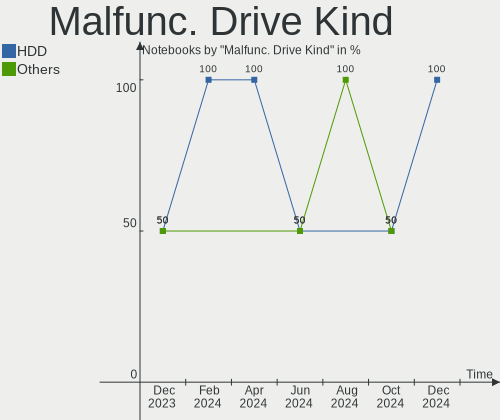
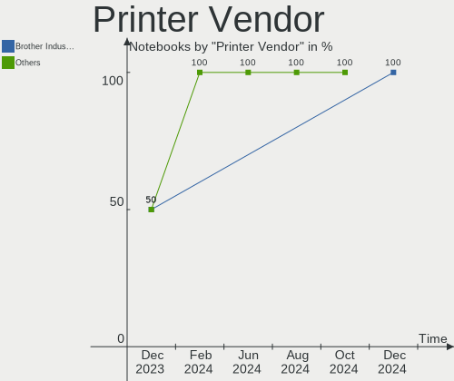

Zorin Hardware Trends (Notebooks)
---------------------------------

A project to identify most popular hardware characteristics and track their change
over time based on data collected by Zorin users at https://Linux-Hardware.org.

Anyone can contribute to this report by the [hw-probe](https://github.com/linuxhw/hw-probe) tool:

    sudo -E hw-probe -all -upload

Full-feature report is available here: https://linux-hardware.org/?view=trends

Period: Feb, 2022.

Contents
--------

* [ System ](#system)
  - [ OS                       ](#os)
  - [ OS Family                ](#os-family)
  - [ Kernel                   ](#kernel)
  - [ Kernel Family            ](#kernel-family)
  - [ Kernel Major Ver.        ](#kernel-major-ver)
  - [ Arch                     ](#arch)
  - [ DE                       ](#de)
  - [ Display Server           ](#display-server)
  - [ Display Manager          ](#display-manager)
  - [ OS Lang                  ](#os-lang)
  - [ Boot Mode                ](#boot-mode)
  - [ Filesystem               ](#filesystem)
  - [ Part. scheme             ](#part-scheme)
  - [ Dual Boot with Linux/BSD ](#dual-boot-with-linuxbsd)
  - [ Dual Boot (Win)          ](#dual-boot-win)

* [ Board ](#board)
  - [ Vendor                   ](#vendor)
  - [ Model                    ](#model)
  - [ Model Family             ](#model-family)
  - [ MFG Year                 ](#mfg-year)
  - [ Form Factor              ](#form-factor)
  - [ Secure Boot              ](#secure-boot)
  - [ Coreboot                 ](#coreboot)
  - [ RAM Size                 ](#ram-size)
  - [ RAM Used                 ](#ram-used)
  - [ Total Drives             ](#total-drives)
  - [ Has CD-ROM               ](#has-cd-rom)
  - [ Has Ethernet             ](#has-ethernet)
  - [ Has WiFi                 ](#has-wifi)
  - [ Has Bluetooth            ](#has-bluetooth)

* [ Location ](#location)
  - [ Country                  ](#country)
  - [ City                     ](#city)

* [ Drives ](#drives)
  - [ Drive Vendor             ](#drive-vendor)
  - [ Drive Model              ](#drive-model)
  - [ HDD Vendor               ](#hdd-vendor)
  - [ SSD Vendor               ](#ssd-vendor)
  - [ Drive Kind               ](#drive-kind)
  - [ Drive Connector          ](#drive-connector)
  - [ Drive Size               ](#drive-size)
  - [ Space Total              ](#space-total)
  - [ Space Used               ](#space-used)
  - [ Malfunc. Drives          ](#malfunc-drives)
  - [ Malfunc. Drive Vendor    ](#malfunc-drive-vendor)
  - [ Malfunc. HDD Vendor      ](#malfunc-hdd-vendor)
  - [ Malfunc. Drive Kind      ](#malfunc-drive-kind)
  - [ Failed Drives            ](#failed-drives)
  - [ Failed Drive Vendor      ](#failed-drive-vendor)
  - [ Drive Status             ](#drive-status)

* [ Storage controller ](#storage-controller)
  - [ Storage Vendor           ](#storage-vendor)
  - [ Storage Model            ](#storage-model)
  - [ Storage Kind             ](#storage-kind)

* [ Processor ](#processor)
  - [ CPU Vendor               ](#cpu-vendor)
  - [ CPU Model                ](#cpu-model)
  - [ CPU Model Family         ](#cpu-model-family)
  - [ CPU Cores                ](#cpu-cores)
  - [ CPU Sockets              ](#cpu-sockets)
  - [ CPU Threads              ](#cpu-threads)
  - [ CPU Op-Modes             ](#cpu-op-modes)
  - [ CPU Microcode            ](#cpu-microcode)
  - [ CPU Microarch            ](#cpu-microarch)

* [ Graphics ](#graphics)
  - [ GPU Vendor               ](#gpu-vendor)
  - [ GPU Model                ](#gpu-model)
  - [ GPU Combo                ](#gpu-combo)
  - [ GPU Driver               ](#gpu-driver)
  - [ GPU Memory               ](#gpu-memory)

* [ Monitor ](#monitor)
  - [ Monitor Vendor           ](#monitor-vendor)
  - [ Monitor Model            ](#monitor-model)
  - [ Monitor Resolution       ](#monitor-resolution)
  - [ Monitor Diagonal         ](#monitor-diagonal)
  - [ Monitor Width            ](#monitor-width)
  - [ Aspect Ratio             ](#aspect-ratio)
  - [ Monitor Area             ](#monitor-area)
  - [ Pixel Density            ](#pixel-density)
  - [ Multiple Monitors        ](#multiple-monitors)

* [ Network ](#network)
  - [ Net Controller Vendor    ](#net-controller-vendor)
  - [ Net Controller Model     ](#net-controller-model)
  - [ Wireless Vendor          ](#wireless-vendor)
  - [ Wireless Model           ](#wireless-model)
  - [ Ethernet Vendor          ](#ethernet-vendor)
  - [ Ethernet Model           ](#ethernet-model)
  - [ Net Controller Kind      ](#net-controller-kind)
  - [ Used Controller          ](#used-controller)
  - [ NICs                     ](#nics)
  - [ IPv6                     ](#ipv6)

* [ Bluetooth ](#bluetooth)
  - [ Bluetooth Vendor         ](#bluetooth-vendor)
  - [ Bluetooth Model          ](#bluetooth-model)

* [ Sound ](#sound)
  - [ Sound Vendor             ](#sound-vendor)
  - [ Sound Model              ](#sound-model)

* [ Memory ](#memory)
  - [ Memory Vendor            ](#memory-vendor)
  - [ Memory Model             ](#memory-model)
  - [ Memory Kind              ](#memory-kind)
  - [ Memory Form Factor       ](#memory-form-factor)
  - [ Memory Size              ](#memory-size)
  - [ Memory Speed             ](#memory-speed)

* [ Printers & scanners ](#printers--scanners)
  - [ Printer Vendor           ](#printer-vendor)
  - [ Printer Model            ](#printer-model)
  - [ Scanner Vendor           ](#scanner-vendor)
  - [ Scanner Model            ](#scanner-model)

* [ Camera ](#camera)
  - [ Camera Vendor            ](#camera-vendor)
  - [ Camera Model             ](#camera-model)

* [ Security ](#security)
  - [ Fingerprint Vendor       ](#fingerprint-vendor)
  - [ Fingerprint Model        ](#fingerprint-model)
  - [ Chipcard Vendor          ](#chipcard-vendor)
  - [ Chipcard Model           ](#chipcard-model)

* [ Unsupported ](#unsupported)
  - [ Unsupported Devices      ](#unsupported-devices)
  - [ Unsupported Device Types ](#unsupported-device-types)

System
------

OS
--

Installed operating systems

| Name     | Notebooks | Percent |
|----------|-----------|---------|
| Zorin 16 | 77        | 81.91%  |
| Zorin 15 | 17        | 18.09%  |

OS Family
---------

OS without a version

| Name  | Notebooks | Percent |
|-------|-----------|---------|
| Zorin | 94        | 100%    |

Kernel
------

Version of the Linux kernel

| Version           | Notebooks | Percent |
|-------------------|-----------|---------|
| 5.13.0-28-generic | 36        | 38.3%   |
| 5.13.0-30-generic | 20        | 21.28%  |
| 5.11.0-38-generic | 8         | 8.51%   |
| 5.4.0-99-generic  | 7         | 7.45%   |
| 5.13.0-27-generic | 7         | 7.45%   |
| 5.4.0-100-generic | 4         | 4.26%   |
| 5.4.0-97-generic  | 3         | 3.19%   |
| 5.11.0-41-generic | 3         | 3.19%   |
| 5.4.0-96-generic  | 1         | 1.06%   |
| 5.4.0-94-generic  | 1         | 1.06%   |
| 5.4.0-45-generic  | 1         | 1.06%   |
| 5.15.24-xanmod1   | 1         | 1.06%   |
| 5.11.0-44-generic | 1         | 1.06%   |
| 5.11.0-43-generic | 1         | 1.06%   |

Kernel Family
-------------

Linux kernel without a distro release

| Version | Notebooks | Percent |
|---------|-----------|---------|
| 5.13.0  | 63        | 67.02%  |
| 5.4.0   | 17        | 18.09%  |
| 5.11.0  | 13        | 13.83%  |
| 5.15.24 | 1         | 1.06%   |

Kernel Major Ver.
-----------------

Linux kernel major version

| Version | Notebooks | Percent |
|---------|-----------|---------|
| 5.13    | 63        | 67.02%  |
| 5.4     | 17        | 18.09%  |
| 5.11    | 13        | 13.83%  |
| 5.15    | 1         | 1.06%   |

Arch
----

OS architecture (x86_64, i586, etc.)

| Name   | Notebooks | Percent |
|--------|-----------|---------|
| x86_64 | 85        | 90.43%  |
| i686   | 9         | 9.57%   |

DE
--

Desktop Environment

| Name    | Notebooks | Percent |
|---------|-----------|---------|
| GNOME   | 74        | 78.72%  |
| XFCE    | 19        | 20.21%  |
| Unknown | 1         | 1.06%   |

Display Server
--------------

X11 or Wayland

| Name    | Notebooks | Percent |
|---------|-----------|---------|
| X11     | 91        | 96.81%  |
| Wayland | 3         | 3.19%   |

Display Manager
---------------

SDDM, LightDM, etc.

| Name    | Notebooks | Percent |
|---------|-----------|---------|
| Unknown | 62        | 65.96%  |
| LightDM | 12        | 12.77%  |
| GDM3    | 12        | 12.77%  |
| GDM     | 8         | 8.51%   |

OS Lang
-------

Language

| Lang  | Notebooks | Percent |
|-------|-----------|---------|
| en_US | 41        | 43.62%  |
| pt_BR | 10        | 10.64%  |
| en_GB | 10        | 10.64%  |
| de_DE | 5         | 5.32%   |
| fr_FR | 4         | 4.26%   |
| en_AU | 4         | 4.26%   |
| pl_PL | 3         | 3.19%   |
| it_IT | 3         | 3.19%   |
| es_ES | 2         | 2.13%   |
| sl_SI | 1         | 1.06%   |
| ru_RU | 1         | 1.06%   |
| nl_NL | 1         | 1.06%   |
| hr_HR | 1         | 1.06%   |
| fr_BE | 1         | 1.06%   |
| es_CO | 1         | 1.06%   |
| es_BO | 1         | 1.06%   |
| en_IN | 1         | 1.06%   |
| en_IL | 1         | 1.06%   |
| de_AT | 1         | 1.06%   |
| bg_BG | 1         | 1.06%   |
| ar_EG | 1         | 1.06%   |

Boot Mode
---------

EFI or BIOS

| Mode | Notebooks | Percent |
|------|-----------|---------|
| BIOS | 48        | 51.06%  |
| EFI  | 46        | 48.94%  |

Filesystem
----------

Type of filesystem

| Type | Notebooks | Percent |
|------|-----------|---------|
| Ext4 | 93        | 98.94%  |
| Zfs  | 1         | 1.06%   |

Part. scheme
------------

Scheme of partitioning

| Type    | Notebooks | Percent |
|---------|-----------|---------|
| Unknown | 85        | 90.43%  |
| GPT     | 6         | 6.38%   |
| MBR     | 3         | 3.19%   |

Dual Boot with Linux/BSD
------------------------

Hosting more than one Linux/BSD

| Dual boot | Notebooks | Percent |
|-----------|-----------|---------|
| No        | 93        | 98.94%  |
| Yes       | 1         | 1.06%   |

Dual Boot (Win)
---------------

Hosting Linux and Windows

| Dual boot | Notebooks | Percent |
|-----------|-----------|---------|
| No        | 87        | 92.55%  |
| Yes       | 7         | 7.45%   |

Board
-----

Vendor
------

Motherboard manufacturer

| Name                | Notebooks | Percent |
|---------------------|-----------|---------|
| Hewlett-Packard     | 23        | 24.47%  |
| Lenovo              | 19        | 20.21%  |
| Dell                | 15        | 15.96%  |
| ASUSTek Computer    | 7         | 7.45%   |
| Toshiba             | 5         | 5.32%   |
| Acer                | 5         | 5.32%   |
| Samsung Electronics | 3         | 3.19%   |
| Sony                | 2         | 2.13%   |
| Packard Bell        | 2         | 2.13%   |
| Fujitsu             | 2         | 2.13%   |
| Novatech            | 1         | 1.06%   |
| Multilaser          | 1         | 1.06%   |
| HUAWEI              | 1         | 1.06%   |
| Google              | 1         | 1.06%   |
| Gigabyte Technology | 1         | 1.06%   |
| GEO                 | 1         | 1.06%   |
| e-shop.gr           | 1         | 1.06%   |
| BenQ                | 1         | 1.06%   |
| ATI                 | 1         | 1.06%   |
| Apple               | 1         | 1.06%   |
| Unknown             | 1         | 1.06%   |

Model
-----

Motherboard model

| Name                                       | Notebooks | Percent |
|--------------------------------------------|-----------|---------|
| Unknown                                    | 2         | 2.13%   |
| Toshiba Satellite S55t-C                   | 1         | 1.06%   |
| Toshiba Satellite Pro C660                 | 1         | 1.06%   |
| Toshiba Satellite C55-B                    | 1         | 1.06%   |
| Toshiba Satellite C50-A283                 | 1         | 1.06%   |
| Toshiba QOSMIO X70-A                       | 1         | 1.06%   |
| Sony VPCEH3L1E                             | 1         | 1.06%   |
| Sony VGN-Z575FN                            | 1         | 1.06%   |
| Samsung 600B4B/600B5B                      | 1         | 1.06%   |
| Samsung 340XAA/350XAA/550XAA               | 1         | 1.06%   |
| Samsung 300E4A/300E5A/300E7A/3430EA/3530EA | 1         | 1.06%   |
| Packard Bell EasyNote TK85                 | 1         | 1.06%   |
| Packard Bell DOT S                         | 1         | 1.06%   |
| Novatech 15.6 nSpire Laptop                | 1         | 1.06%   |
| Multilaser DS133                           | 1         | 1.06%   |
| Lenovo Yoga 2 Pro 20266                    | 1         | 1.06%   |
| Lenovo ThinkPad X1 Extreme 2nd 20QVCTO1WW  | 1         | 1.06%   |
| Lenovo ThinkPad T61 7658CTO                | 1         | 1.06%   |
| Lenovo ThinkPad T61 6458CTO                | 1         | 1.06%   |
| Lenovo ThinkPad T470 W10DG 20JNA03U0A      | 1         | 1.06%   |
| Lenovo ThinkPad T440 20B7008ABR            | 1         | 1.06%   |
| Lenovo ThinkPad T420 4236KU9               | 1         | 1.06%   |
| Lenovo ThinkPad T420 4178A47               | 1         | 1.06%   |
| Lenovo ThinkPad Edge E540 20C60043SC       | 1         | 1.06%   |
| Lenovo ThinkPad Edge E530 32599JJ          | 1         | 1.06%   |
| Lenovo ThinkBook 15 G2 ITL 20VE            | 1         | 1.06%   |
| Lenovo IdeaPad S145-15API 81V7             | 1         | 1.06%   |
| Lenovo IdeaPad S130-11IGM 81J1             | 1         | 1.06%   |
| Lenovo IdeaPad L340-15IRH Gaming 81LK      | 1         | 1.06%   |
| Lenovo IdeaPad 110-14IBR 80UJ              | 1         | 1.06%   |
| Lenovo IdeaPad 100S-11IBY 80R2             | 1         | 1.06%   |
| Lenovo G710 20252                          | 1         | 1.06%   |
| Lenovo G40-80 80JE                         | 1         | 1.06%   |
| Lenovo Flex 2-15 20405                     | 1         | 1.06%   |
| HUAWEI NBLK-WAX9X                          | 1         | 1.06%   |
| HP Stream Laptop 11-ak0xxx                 | 1         | 1.06%   |
| HP Stream Laptop 11-ah0XX                  | 1         | 1.06%   |
| HP ProBook 4525s                           | 1         | 1.06%   |
| HP ProBook 450 G5                          | 1         | 1.06%   |
| HP ProBook 445 G7                          | 1         | 1.06%   |
| HP ProBook 4310s                           | 1         | 1.06%   |
| HP Pavilion Laptop 15z-eh000               | 1         | 1.06%   |
| HP Pavilion Laptop 15-cs3xxx               | 1         | 1.06%   |
| HP Pavilion g6                             | 1         | 1.06%   |
| HP Pavilion dv6500                         | 1         | 1.06%   |
| HP OMEN Notebook                           | 1         | 1.06%   |
| HP OMEN by Laptop 15-ce0xx                 | 1         | 1.06%   |
| HP Notebook                                | 1         | 1.06%   |
| HP EliteBook 840 G6                        | 1         | 1.06%   |
| HP Compaq 6910p (GR670ET#UUZ)              | 1         | 1.06%   |
| HP Compaq 6530b (NA755ES#ABF)              | 1         | 1.06%   |
| HP 635                                     | 1         | 1.06%   |
| HP 630                                     | 1         | 1.06%   |
| HP 550                                     | 1         | 1.06%   |
| HP 255 G5                                  | 1         | 1.06%   |
| HP 255 G2                                  | 1         | 1.06%   |
| HP 2140                                    | 1         | 1.06%   |
| Google Akemi                               | 1         | 1.06%   |
| Gigabyte P64V7                             | 1         | 1.06%   |
| GEO GeoBook 120                            | 1         | 1.06%   |

Model Family
------------

Motherboard model prefix

| Name                  | Notebooks | Percent |
|-----------------------|-----------|---------|
| Lenovo ThinkPad       | 9         | 9.57%   |
| Dell Inspiron         | 6         | 6.38%   |
| Lenovo IdeaPad        | 5         | 5.32%   |
| Toshiba Satellite     | 4         | 4.26%   |
| HP ProBook            | 4         | 4.26%   |
| HP Pavilion           | 4         | 4.26%   |
| Dell Latitude         | 3         | 3.19%   |
| HP Stream             | 2         | 2.13%   |
| HP OMEN               | 2         | 2.13%   |
| HP Compaq             | 2         | 2.13%   |
| HP 255                | 2         | 2.13%   |
| Dell Vostro           | 2         | 2.13%   |
| ASUS ZenBook          | 2         | 2.13%   |
| Unknown               | 2         | 2.13%   |
| Toshiba QOSMIO        | 1         | 1.06%   |
| Sony VPCEH3L1E        | 1         | 1.06%   |
| Sony VGN-Z575FN       | 1         | 1.06%   |
| Samsung 600B4B        | 1         | 1.06%   |
| Samsung 340XAA        | 1         | 1.06%   |
| Samsung 300E4A        | 1         | 1.06%   |
| Packard Bell EasyNote | 1         | 1.06%   |
| Packard Bell DOT      | 1         | 1.06%   |
| Novatech 15.6         | 1         | 1.06%   |
| Multilaser DS133      | 1         | 1.06%   |
| Lenovo Yoga           | 1         | 1.06%   |
| Lenovo ThinkBook      | 1         | 1.06%   |
| Lenovo G710           | 1         | 1.06%   |
| Lenovo G40-80         | 1         | 1.06%   |
| Lenovo Flex           | 1         | 1.06%   |
| HUAWEI NBLK-WAX9X     | 1         | 1.06%   |
| HP Notebook           | 1         | 1.06%   |
| HP EliteBook          | 1         | 1.06%   |
| HP 635                | 1         | 1.06%   |
| HP 630                | 1         | 1.06%   |
| HP 550                | 1         | 1.06%   |
| HP 2140               | 1         | 1.06%   |
| Google Akemi          | 1         | 1.06%   |
| Gigabyte P64V7        | 1         | 1.06%   |
| GEO GeoBook           | 1         | 1.06%   |
| Fujitsu LIFEBOOK      | 1         | 1.06%   |
| Fujitsu FARQ0200GZ    | 1         | 1.06%   |
| e-shop.gr V113        | 1         | 1.06%   |
| Dell XPS              | 1         | 1.06%   |
| Dell Studio           | 1         | 1.06%   |
| Dell Precision        | 1         | 1.06%   |
| Dell G5               | 1         | 1.06%   |
| BenQ Joybook          | 1         | 1.06%   |
| ATI BONEFISH          | 1         | 1.06%   |
| ASUS X555LAB          | 1         | 1.06%   |
| ASUS X405UA           | 1         | 1.06%   |
| ASUS T101HA           | 1         | 1.06%   |
| ASUS S500CA           | 1         | 1.06%   |
| ASUS ROG              | 1         | 1.06%   |
| Apple MacBookPro11    | 1         | 1.06%   |
| Acer V5-171           | 1         | 1.06%   |
| Acer Swift            | 1         | 1.06%   |
| Acer Predator         | 1         | 1.06%   |
| Acer E1-510           | 1         | 1.06%   |
| Acer Aspire           | 1         | 1.06%   |

MFG Year
--------

Motherboard manufacture year

| Year | Notebooks | Percent |
|------|-----------|---------|
| 2019 | 9         | 9.57%   |
| 2013 | 9         | 9.57%   |
| 2018 | 8         | 8.51%   |
| 2011 | 8         | 8.51%   |
| 2012 | 7         | 7.45%   |
| 2008 | 7         | 7.45%   |
| 2021 | 6         | 6.38%   |
| 2017 | 6         | 6.38%   |
| 2014 | 6         | 6.38%   |
| 2007 | 6         | 6.38%   |
| 2020 | 5         | 5.32%   |
| 2015 | 4         | 4.26%   |
| 2010 | 4         | 4.26%   |
| 2009 | 4         | 4.26%   |
| 2016 | 3         | 3.19%   |
| 2006 | 2         | 2.13%   |

Form Factor
-----------

Physical design of the computer

| Name     | Notebooks | Percent |
|----------|-----------|---------|
| Notebook | 94        | 100%    |

Secure Boot
-----------

Enabled or disabled

| State    | Notebooks | Percent |
|----------|-----------|---------|
| Disabled | 85        | 90.43%  |
| Enabled  | 9         | 9.57%   |

Coreboot
--------

Have coreboot on board

| Used | Notebooks | Percent |
|------|-----------|---------|
| No   | 93        | 98.94%  |
| Yes  | 1         | 1.06%   |

RAM Size
--------

Total RAM memory

| Size in GB | Notebooks | Percent |
|------------|-----------|---------|
| 3.01-4.0   | 31        | 32.98%  |
| 4.01-8.0   | 23        | 24.47%  |
| 1.01-2.0   | 14        | 14.89%  |
| 8.01-16.0  | 11        | 11.7%   |
| 32.01-64.0 | 8         | 8.51%   |
| 16.01-24.0 | 5         | 5.32%   |
| 2.01-3.0   | 1         | 1.06%   |
| 0.51-1.0   | 1         | 1.06%   |

RAM Used
--------

Used RAM memory

| Used GB   | Notebooks | Percent |
|-----------|-----------|---------|
| 1.01-2.0  | 37        | 39.36%  |
| 2.01-3.0  | 31        | 32.98%  |
| 0.51-1.0  | 10        | 10.64%  |
| 3.01-4.0  | 8         | 8.51%   |
| 4.01-8.0  | 7         | 7.45%   |
| 8.01-16.0 | 1         | 1.06%   |

Total Drives
------------

Number of drives on board

| Drives | Notebooks | Percent |
|--------|-----------|---------|
| 1      | 71        | 75.53%  |
| 2      | 20        | 21.28%  |
| 3      | 3         | 3.19%   |

Has CD-ROM
----------

Has CD-ROM on board

| Presented | Notebooks | Percent |
|-----------|-----------|---------|
| No        | 49        | 52.13%  |
| Yes       | 45        | 47.87%  |

Has Ethernet
------------

Has Ethernet on board

| Presented | Notebooks | Percent |
|-----------|-----------|---------|
| Yes       | 78        | 82.98%  |
| No        | 16        | 17.02%  |

Has WiFi
--------

Has WiFi module

| Presented | Notebooks | Percent |
|-----------|-----------|---------|
| Yes       | 90        | 95.74%  |
| No        | 4         | 4.26%   |

Has Bluetooth
-------------

Has Bluetooth module

| Presented | Notebooks | Percent |
|-----------|-----------|---------|
| Yes       | 66        | 70.21%  |
| No        | 28        | 29.79%  |

Location
--------

Country
-------

Geographic location (country)

| Country                | Notebooks | Percent |
|------------------------|-----------|---------|
| USA                    | 25        | 26.6%   |
| Brazil                 | 10        | 10.64%  |
| UK                     | 7         | 7.45%   |
| Germany                | 7         | 7.45%   |
| Australia              | 4         | 4.26%   |
| Russia                 | 3         | 3.19%   |
| Poland                 | 3         | 3.19%   |
| Italy                  | 3         | 3.19%   |
| France                 | 3         | 3.19%   |
| Belgium                | 3         | 3.19%   |
| Spain                  | 2         | 2.13%   |
| Slovenia               | 2         | 2.13%   |
| Netherlands            | 2         | 2.13%   |
| Greece                 | 2         | 2.13%   |
| Austria                | 2         | 2.13%   |
| Turkey                 | 1         | 1.06%   |
| Sweden                 | 1         | 1.06%   |
| South Africa           | 1         | 1.06%   |
| Serbia                 | 1         | 1.06%   |
| Philippines            | 1         | 1.06%   |
| Mexico                 | 1         | 1.06%   |
| Kenya                  | 1         | 1.06%   |
| Israel                 | 1         | 1.06%   |
| Ireland                | 1         | 1.06%   |
| India                  | 1         | 1.06%   |
| Croatia                | 1         | 1.06%   |
| Colombia               | 1         | 1.06%   |
| Bulgaria               | 1         | 1.06%   |
| Bosnia and Herzegovina | 1         | 1.06%   |
| Bolivia                | 1         | 1.06%   |
| Algeria                | 1         | 1.06%   |

City
----

Geographic location (city)

| City                      | Notebooks | Percent |
|---------------------------|-----------|---------|
| Athens                    | 3         | 3.19%   |
| Sydney                    | 2         | 2.13%   |
| São Paulo              | 2         | 2.13%   |
| Ripon                     | 2         | 2.13%   |
| La Louvière            | 2         | 2.13%   |
| Hamburg                   | 2         | 2.13%   |
| Warsaw                    | 1         | 1.06%   |
| Volta Redonda             | 1         | 1.06%   |
| Visoko                    | 1         | 1.06%   |
| Villepinte                | 1         | 1.06%   |
| Tucano                    | 1         | 1.06%   |
| Tring                     | 1         | 1.06%   |
| The Hague                 | 1         | 1.06%   |
| Tepic                     | 1         | 1.06%   |
| Syracuse                  | 1         | 1.06%   |
| Seattle                   | 1         | 1.06%   |
| Schloss Holte-Stukenbrock | 1         | 1.06%   |
| Sarajevo                  | 1         | 1.06%   |
| San Jose                  | 1         | 1.06%   |
| Salzburg                  | 1         | 1.06%   |
| Sabadell                  | 1         | 1.06%   |
| Richmond                  | 1         | 1.06%   |
| Rennes                    | 1         | 1.06%   |
| Ravenna                   | 1         | 1.06%   |
| Poznan                    | 1         | 1.06%   |
| Porto Alegre              | 1         | 1.06%   |
| Paris                     | 1         | 1.06%   |
| Paranaque City            | 1         | 1.06%   |
| Padova                    | 1         | 1.06%   |
| Ofakim                    | 1         | 1.06%   |
| O'Fallon                  | 1         | 1.06%   |
| Nykvarn                   | 1         | 1.06%   |
| Novska                    | 1         | 1.06%   |
| Natal                     | 1         | 1.06%   |
| Nairobi                   | 1         | 1.06%   |
| Naberezhnyye Chelny       | 1         | 1.06%   |
| Muriaé                 | 1         | 1.06%   |
| Moscow                    | 1         | 1.06%   |
| Minneapolis               | 1         | 1.06%   |
| Milford                   | 1         | 1.06%   |
| Midrand                   | 1         | 1.06%   |
| Melbourne                 | 1         | 1.06%   |
| Manchester                | 1         | 1.06%   |
| Madison Heights           | 1         | 1.06%   |
| Leesburg                  | 1         | 1.06%   |
| La Grande                 | 1         | 1.06%   |
| Kent                      | 1         | 1.06%   |
| Kansas City               | 1         | 1.06%   |
| Jettenbach                | 1         | 1.06%   |
| Jerez de la Frontera      | 1         | 1.06%   |
| Izmir                     | 1         | 1.06%   |
| Ilhéus                 | 1         | 1.06%   |
| Highland                  | 1         | 1.06%   |
| Heusden                   | 1         | 1.06%   |
| Harrisonville             | 1         | 1.06%   |
| Glasgow                   | 1         | 1.06%   |
| Ferraz de Vasconcelos     | 1         | 1.06%   |
| Fargo                     | 1         | 1.06%   |
| Este                      | 1         | 1.06%   |
| Edinboro                  | 1         | 1.06%   |

Drives
------

Drive Vendor
------------

Hard drive vendors

| Vendor              | Notebooks | Drives | Percent |
|---------------------|-----------|--------|---------|
| WDC                 | 18        | 18     | 16.67%  |
| Seagate             | 13        | 15     | 12.04%  |
| Unknown             | 12        | 14     | 11.11%  |
| Toshiba             | 12        | 14     | 11.11%  |
| Samsung Electronics | 8         | 8      | 7.41%   |
| Hitachi             | 6         | 6      | 5.56%   |
| SK Hynix            | 4         | 4      | 3.7%    |
| SanDisk             | 4         | 4      | 3.7%    |
| Kingston            | 3         | 3      | 2.78%   |
| Intel               | 3         | 4      | 2.78%   |
| Crucial             | 3         | 3      | 2.78%   |
| China               | 3         | 3      | 2.78%   |
| Transcend           | 2         | 2      | 1.85%   |
| SPCC                | 2         | 2      | 1.85%   |
| Lite-On             | 2         | 2      | 1.85%   |
| Fujitsu             | 2         | 2      | 1.85%   |
| TO Exter            | 1         | 1      | 0.93%   |
| PNY                 | 1         | 1      | 0.93%   |
| Phison              | 1         | 1      | 0.93%   |
| Patriot             | 1         | 1      | 0.93%   |
| Micron Technology   | 1         | 1      | 0.93%   |
| Lexar               | 1         | 1      | 0.93%   |
| HGST                | 1         | 1      | 0.93%   |
| GOODRAM             | 1         | 1      | 0.93%   |
| DragonDiamond       | 1         | 1      | 0.93%   |
| Apple               | 1         | 1      | 0.93%   |
| A-DATA Technology   | 1         | 1      | 0.93%   |

Drive Model
-----------

Hard drive models

| Model                                | Notebooks | Percent |
|--------------------------------------|-----------|---------|
| Unknown MMC Card  32GB               | 5         | 4.39%   |
| Unknown MMC Card  64GB               | 4         | 3.51%   |
| Toshiba MQ01ABD100 1TB               | 3         | 2.63%   |
| WDC WD10SPZX-24Z10 1TB               | 2         | 1.75%   |
| Unknown SD/MMC/MS PRO 64GB           | 2         | 1.75%   |
| Unknown MMC Card  4GB                | 2         | 1.75%   |
| Lite-On NVMe SSD Drive 128GB         | 2         | 1.75%   |
| Intel NVMe SSD Drive 512GB           | 2         | 1.75%   |
| Hitachi HTS725032A9A364 320GB        | 2         | 1.75%   |
| WDC WD800BEVS-75RST0 80GB            | 1         | 0.88%   |
| WDC WD5000LPVX-22V0TT0 500GB         | 1         | 0.88%   |
| WDC WD5000LPVX-08V0TT5 500GB         | 1         | 0.88%   |
| WDC WD5000LPCX-24VHAT0 500GB         | 1         | 0.88%   |
| WDC WD5000BPVT-08HXZT3 500GB         | 1         | 0.88%   |
| WDC WD5000BEKT-60KA9T0 500GB         | 1         | 0.88%   |
| WDC WD3200BPVT-00ZEST0 320GB         | 1         | 0.88%   |
| WDC WD2500BJKT-75F4T0 250GB          | 1         | 0.88%   |
| WDC WD1600BEVS-60RST0 160GB          | 1         | 0.88%   |
| WDC WD1200BEVS-75UST0 120GB          | 1         | 0.88%   |
| WDC WD10SPZX-35Z10T0 1TB             | 1         | 0.88%   |
| WDC WD10JPVX-80JC3T0 1TB             | 1         | 0.88%   |
| WDC WD10JPVX-60JC3T0 1TB             | 1         | 0.88%   |
| WDC WD10JPVT-00A1YT0 1TB             | 1         | 0.88%   |
| WDC PC SN730 SDBPNTY-256G-1027 256GB | 1         | 0.88%   |
| WDC PC SN520 SDAPNUW-128G-1014 128GB | 1         | 0.88%   |
| Unknown MMC Card  256GB              | 1         | 0.88%   |
| Transcend TS512GMTS800 512GB SSD     | 1         | 0.88%   |
| Transcend TS32GMTS800 32GB SSD       | 1         | 0.88%   |
| Toshiba THNSNH256GMCT 256GB SSD      | 1         | 0.88%   |
| Toshiba THNSNF256GMCS 256GB SSD      | 1         | 0.88%   |
| Toshiba MQ04ABF100 1TB               | 1         | 0.88%   |
| Toshiba MQ01ACF032 320GB             | 1         | 0.88%   |
| Toshiba MQ01ABF050 500GB             | 1         | 0.88%   |
| Toshiba MK7559GSXP 752GB             | 1         | 0.88%   |
| Toshiba MK5075GSX 500GB              | 1         | 0.88%   |
| Toshiba MK3252GSX 320GB              | 1         | 0.88%   |
| Toshiba MK2555GSX 250GB              | 1         | 0.88%   |
| Toshiba MK1655GSX 160GB              | 1         | 0.88%   |
| TO Exter nal USB 3.0 2TB             | 1         | 0.88%   |
| SPCC SPCCSolidStateDisk 256GB SSD    | 1         | 0.88%   |
| SPCC M.2 PCIe SSD 1TB                | 1         | 0.88%   |
| SK Hynix SC311 SATA 512GB SSD        | 1         | 0.88%   |
| SK Hynix NVMe SSD Drive 256GB        | 1         | 0.88%   |
| SK Hynix NVMe SSD Drive 1024GB       | 1         | 0.88%   |
| SK Hynix BC511 NVMe 512GB            | 1         | 0.88%   |
| Seagate ST9500420AS 500GB            | 1         | 0.88%   |
| Seagate ST9500325AS 500GB            | 1         | 0.88%   |
| Seagate ST9160314AS 160GB            | 1         | 0.88%   |
| Seagate ST9120822AS 120GB            | 1         | 0.88%   |
| Seagate ST9120817AS 120GB            | 1         | 0.88%   |
| Seagate ST750LM022 HN-M750MBB 752GB  | 1         | 0.88%   |
| Seagate ST500LM021-1KJ152 500GB      | 1         | 0.88%   |
| Seagate ST500LM000-SSHD-8GB          | 1         | 0.88%   |
| Seagate ST2000LM007-1R8174 2TB       | 1         | 0.88%   |
| Seagate ST1000LM049-2GH172 1TB       | 1         | 0.88%   |
| Seagate ST1000LM035-1RK172 1TB       | 1         | 0.88%   |
| Seagate ST1000LM024 HN-M101MBB 1TB   | 1         | 0.88%   |
| Seagate ST1000LM014-1EJ164 1TB       | 1         | 0.88%   |
| Seagate Expansion+ 2TB               | 1         | 0.88%   |
| Seagate Backup+ Hub BK 8TB           | 1         | 0.88%   |

HDD Vendor
----------

Hard disk drive vendors

| Vendor  | Notebooks | Drives | Percent |
|---------|-----------|--------|---------|
| WDC     | 16        | 16     | 31.37%  |
| Seagate | 13        | 15     | 25.49%  |
| Toshiba | 11        | 12     | 21.57%  |
| Hitachi | 6         | 6      | 11.76%  |
| Unknown | 2         | 2      | 3.92%   |
| Fujitsu | 2         | 2      | 3.92%   |
| HGST    | 1         | 1      | 1.96%   |

SSD Vendor
----------

Solid state drive vendors

| Vendor              | Notebooks | Drives | Percent |
|---------------------|-----------|--------|---------|
| Samsung Electronics | 3         | 3      | 11.11%  |
| Crucial             | 3         | 3      | 11.11%  |
| China               | 3         | 3      | 11.11%  |
| Transcend           | 2         | 2      | 7.41%   |
| Toshiba             | 2         | 2      | 7.41%   |
| SanDisk             | 2         | 2      | 7.41%   |
| Kingston            | 2         | 2      | 7.41%   |
| TO Exter            | 1         | 1      | 3.7%    |
| SPCC                | 1         | 1      | 3.7%    |
| SK Hynix            | 1         | 1      | 3.7%    |
| PNY                 | 1         | 1      | 3.7%    |
| Patriot             | 1         | 1      | 3.7%    |
| Micron Technology   | 1         | 1      | 3.7%    |
| Lexar               | 1         | 1      | 3.7%    |
| GOODRAM             | 1         | 1      | 3.7%    |
| Apple               | 1         | 1      | 3.7%    |
| A-DATA Technology   | 1         | 1      | 3.7%    |

Drive Kind
----------

HDD or SSD

| Kind    | Notebooks | Drives | Percent |
|---------|-----------|--------|---------|
| HDD     | 50        | 54     | 46.73%  |
| SSD     | 26        | 27     | 24.3%   |
| NVMe    | 18        | 20     | 16.82%  |
| MMC     | 12        | 13     | 11.21%  |
| Unknown | 1         | 1      | 0.93%   |

Drive Connector
---------------

SATA, SAS, NVMe, etc.

| Type | Notebooks | Drives | Percent |
|------|-----------|--------|---------|
| SATA | 71        | 77     | 68.27%  |
| NVMe | 18        | 20     | 17.31%  |
| MMC  | 12        | 13     | 11.54%  |
| SAS  | 3         | 5      | 2.88%   |

Drive Size
----------

Size of hard drive

| Size in TB | Notebooks | Drives | Percent |
|------------|-----------|--------|---------|
| 0.01-0.5   | 52        | 55     | 67.53%  |
| 0.51-1.0   | 21        | 22     | 27.27%  |
| 1.01-2.0   | 3         | 3      | 3.9%    |
| 4.01-10.0  | 1         | 1      | 1.3%    |

Space Total
-----------

Amount of disk space available on the file system

| Size in GB     | Notebooks | Percent |
|----------------|-----------|---------|
| 101-250        | 32        | 34.04%  |
| 251-500        | 24        | 25.53%  |
| 501-1000       | 14        | 14.89%  |
| 51-100         | 13        | 13.83%  |
| 21-50          | 6         | 6.38%   |
| 1001-2000      | 3         | 3.19%   |
| More than 3000 | 1         | 1.06%   |
| Unknown        | 1         | 1.06%   |

Space Used
----------

Amount of used disk space

| Used GB  | Notebooks | Percent |
|----------|-----------|---------|
| 1-20     | 41        | 43.62%  |
| 21-50    | 27        | 28.72%  |
| 101-250  | 11        | 11.7%   |
| 51-100   | 8         | 8.51%   |
| 251-500  | 3         | 3.19%   |
| 501-1000 | 3         | 3.19%   |
| Unknown  | 1         | 1.06%   |

Malfunc. Drives
---------------

Drive models with a malfunction

| Model                         | Notebooks | Drives | Percent |
|-------------------------------|-----------|--------|---------|
| Hitachi HTS725032A9A364 320GB | 1         | 1      | 100%    |

Malfunc. Drive Vendor
---------------------

Vendors of faulty drives

| Vendor  | Notebooks | Drives | Percent |
|---------|-----------|--------|---------|
| Hitachi | 1         | 1      | 100%    |

Malfunc. HDD Vendor
-------------------

Vendors of faulty HDD drives

| Vendor  | Notebooks | Drives | Percent |
|---------|-----------|--------|---------|
| Hitachi | 1         | 1      | 100%    |

Malfunc. Drive Kind
-------------------

Kinds of faulty drives

| Kind | Notebooks | Drives | Percent |
|------|-----------|--------|---------|
| HDD  | 1         | 1      | 100%    |

Failed Drives
-------------

Failed drive models

Zero info for selected period =(

Failed Drive Vendor
-------------------

Failed drive vendors

Zero info for selected period =(

Drive Status
------------

Number of failed and malfunc. drives

| Status   | Notebooks | Drives | Percent |
|----------|-----------|--------|---------|
| Detected | 85        | 104    | 90.43%  |
| Works    | 8         | 10     | 8.51%   |
| Malfunc  | 1         | 1      | 1.06%   |

Storage controller
------------------

Storage Vendor
--------------

Storage controller vendors

| Vendor                      | Notebooks | Percent |
|-----------------------------|-----------|---------|
| Intel                       | 72        | 72.73%  |
| AMD                         | 8         | 8.08%   |
| Samsung Electronics         | 6         | 6.06%   |
| SK Hynix                    | 3         | 3.03%   |
| Sandisk                     | 3         | 3.03%   |
| Lite-On Technology          | 2         | 2.02%   |
| Silicon Motion              | 1         | 1.01%   |
| Phison Electronics          | 1         | 1.01%   |
| Marvell Technology Group    | 1         | 1.01%   |
| Kingston Technology Company | 1         | 1.01%   |
| JMicron Technology          | 1         | 1.01%   |

Storage Model
-------------

Storage controller models

| Model                                                                                  | Notebooks | Percent |
|----------------------------------------------------------------------------------------|-----------|---------|
| Intel 82801HM/HEM (ICH8M/ICH8M-E) SATA Controller [AHCI mode]                          | 8         | 7.14%   |
| Intel 82801HM/HEM (ICH8M/ICH8M-E) IDE Controller                                       | 8         | 7.14%   |
| Intel 82801IBM/IEM (ICH9M/ICH9M-E) 4 port SATA Controller [AHCI mode]                  | 6         | 5.36%   |
| Intel 7 Series Chipset Family 6-port SATA Controller [AHCI mode]                       | 6         | 5.36%   |
| Intel 8 Series/C220 Series Chipset Family 6-port SATA Controller 1 [AHCI mode]         | 5         | 4.46%   |
| Intel 6 Series/C200 Series Chipset Family 6 port Mobile SATA AHCI Controller           | 5         | 4.46%   |
| AMD FCH SATA Controller [AHCI mode]                                                    | 5         | 4.46%   |
| Intel Wildcat Point-LP SATA Controller [AHCI Mode]                                     | 4         | 3.57%   |
| Intel Sunrise Point-LP SATA Controller [AHCI mode]                                     | 4         | 3.57%   |
| Intel HM170/QM170 Chipset SATA Controller [AHCI Mode]                                  | 4         | 3.57%   |
| Intel 8 Series SATA Controller 1 [AHCI mode]                                           | 4         | 3.57%   |
| Intel Volume Management Device NVMe RAID Controller                                    | 3         | 2.68%   |
| Sandisk WD Blue SN500 / PC SN520 NVMe SSD                                              | 2         | 1.79%   |
| Samsung NVMe SSD Controller SM981/PM981/PM983                                          | 2         | 1.79%   |
| Samsung NVMe SSD Controller PM9A1/PM9A3/980PRO                                         | 2         | 1.79%   |
| Lite-On Non-Volatile memory controller                                                 | 2         | 1.79%   |
| Intel Celeron/Pentium Silver Processor SATA Controller                                 | 2         | 1.79%   |
| Intel Cannon Lake Mobile PCH SATA AHCI Controller                                      | 2         | 1.79%   |
| Intel Atom Processor E3800 Series SATA AHCI Controller                                 | 2         | 1.79%   |
| Intel 82801GBM/GHM (ICH7-M Family) SATA Controller [IDE mode]                          | 2         | 1.79%   |
| Intel 82801 Mobile SATA Controller [RAID mode]                                         | 2         | 1.79%   |
| Intel 5 Series/3400 Series Chipset 4 port SATA AHCI Controller                         | 2         | 1.79%   |
| AMD SB7x0/SB8x0/SB9x0 SATA Controller [AHCI mode]                                      | 2         | 1.79%   |
| SK Hynix Gold P31 SSD                                                                  | 1         | 0.89%   |
| SK Hynix BC511                                                                         | 1         | 0.89%   |
| SK Hynix BC501 NVMe Solid State Drive                                                  | 1         | 0.89%   |
| Silicon Motion SM2263EN/SM2263XT SSD Controller                                        | 1         | 0.89%   |
| Sandisk WD Black SN750 / PC SN730 NVMe SSD                                             | 1         | 0.89%   |
| Samsung NVMe SSD Controller 980                                                        | 1         | 0.89%   |
| Samsung Apple PCIe SSD                                                                 | 1         | 0.89%   |
| Phison E12 NVMe Controller                                                             | 1         | 0.89%   |
| Marvell Group 88SS9183 PCIe SSD Controller                                             | 1         | 0.89%   |
| Kingston Company SNVS2000G [NV1 NVMe PCIe SSD 2TB]                                     | 1         | 0.89%   |
| JMicron JMB363 SATA/IDE Controller                                                     | 1         | 0.89%   |
| Intel US15W/US15X/US15L/UL11L SCH [Poulsbo] IDE Controller                             | 1         | 0.89%   |
| Intel Tiger Lake-LP SATA Controller [AHCI mode]                                        | 1         | 0.89%   |
| Intel SSD 660P Series                                                                  | 1         | 0.89%   |
| Intel SSD 600P Series                                                                  | 1         | 0.89%   |
| Intel Non-Volatile memory controller                                                   | 1         | 0.89%   |
| Intel NM10/ICH7 Family SATA Controller [AHCI mode]                                     | 1         | 0.89%   |
| Intel Mobile PM965/GM965 PT IDER Controller                                            | 1         | 0.89%   |
| Intel Celeron N3350/Pentium N4200/Atom E3900 Series SATA AHCI Controller               | 1         | 0.89%   |
| Intel Cannon Point-LP SATA Controller [AHCI Mode]                                      | 1         | 0.89%   |
| Intel Atom/Celeron/Pentium Processor x5-E8000/J3xxx/N3xxx Series SATA Controller       | 1         | 0.89%   |
| Intel 82801IBM/IEM (ICH9M/ICH9M-E) 2 port SATA Controller [IDE mode]                   | 1         | 0.89%   |
| Intel 82801G (ICH7 Family) IDE Controller                                              | 1         | 0.89%   |
| Intel 6 Series/C200 Series Chipset Family Mobile SATA Controller (IDE mode, ports 4-5) | 1         | 0.89%   |
| Intel 6 Series/C200 Series Chipset Family Mobile SATA Controller (IDE mode, ports 0-3) | 1         | 0.89%   |
| Intel 5 Series/3400 Series Chipset 6 port SATA AHCI Controller                         | 1         | 0.89%   |
| AMD IXP SB4x0 Serial ATA Controller                                                    | 1         | 0.89%   |
| AMD IXP SB4x0 IDE Controller                                                           | 1         | 0.89%   |

Storage Kind
------------

Kind of storage controller (IDE, SATA, NVMe, SAS, ...)

| Kind | Notebooks | Percent |
|------|-----------|---------|
| SATA | 68        | 64.15%  |
| NVMe | 18        | 16.98%  |
| IDE  | 15        | 14.15%  |
| RAID | 5         | 4.72%   |

Processor
---------

CPU Vendor
----------

Processor vendors

| Vendor | Notebooks | Percent |
|--------|-----------|---------|
| Intel  | 84        | 89.36%  |
| AMD    | 10        | 10.64%  |

CPU Model
---------

Processor models

| Model                                         | Notebooks | Percent |
|-----------------------------------------------|-----------|---------|
| Intel Core 2 Duo CPU T7500 @ 2.20GHz          | 4         | 4.26%   |
| Intel Core i7-9750H CPU @ 2.60GHz             | 3         | 3.19%   |
| Intel Core i7-7700HQ CPU @ 2.80GHz            | 3         | 3.19%   |
| Intel Core i5-2450M CPU @ 2.50GHz             | 3         | 3.19%   |
| Intel Core i7-4720HQ CPU @ 2.60GHz            | 2         | 2.13%   |
| Intel Core i5-3210M CPU @ 2.50GHz             | 2         | 2.13%   |
| Intel Core i5-2520M CPU @ 2.50GHz             | 2         | 2.13%   |
| Intel Core i3-5005U CPU @ 2.00GHz             | 2         | 2.13%   |
| Intel Core i3 CPU M 370 @ 2.40GHz             | 2         | 2.13%   |
| Intel Core 2 Duo CPU P8400 @ 2.26GHz          | 2         | 2.13%   |
| Intel Celeron N4020 CPU @ 1.10GHz             | 2         | 2.13%   |
| Intel Celeron N4000 CPU @ 1.10GHz             | 2         | 2.13%   |
| Intel Atom x5-Z8350 CPU @ 1.44GHz             | 2         | 2.13%   |
| AMD Ryzen 7 4700U with Radeon Graphics        | 2         | 2.13%   |
| AMD Ryzen 5 3500U with Radeon Vega Mobile Gfx | 2         | 2.13%   |
| Intel Pentium Silver N6000 @ 1.10GHz          | 1         | 1.06%   |
| Intel Pentium Dual-Core CPU T4400 @ 2.20GHz   | 1         | 1.06%   |
| Intel Pentium CPU N3540 @ 2.16GHz             | 1         | 1.06%   |
| Intel Pentium CPU B960 @ 2.20GHz              | 1         | 1.06%   |
| Intel Genuine CPU T2050 @ 1.60GHz             | 1         | 1.06%   |
| Intel Core m5-6Y57 CPU @ 1.10GHz              | 1         | 1.06%   |
| Intel Core i7-6700HQ CPU @ 2.60GHz            | 1         | 1.06%   |
| Intel Core i7-5500U CPU @ 2.40GHz             | 1         | 1.06%   |
| Intel Core i7-4810MQ CPU @ 2.80GHz            | 1         | 1.06%   |
| Intel Core i7-4700MQ CPU @ 2.40GHz            | 1         | 1.06%   |
| Intel Core i7-4500U CPU @ 1.80GHz             | 1         | 1.06%   |
| Intel Core i5-8365U CPU @ 1.60GHz             | 1         | 1.06%   |
| Intel Core i5-8265U CPU @ 1.60GHz             | 1         | 1.06%   |
| Intel Core i5-8250U CPU @ 1.60GHz             | 1         | 1.06%   |
| Intel Core i5-7200U CPU @ 2.50GHz             | 1         | 1.06%   |
| Intel Core i5-6200U CPU @ 2.30GHz             | 1         | 1.06%   |
| Intel Core i5-5200U CPU @ 2.20GHz             | 1         | 1.06%   |
| Intel Core i5-4300U CPU @ 1.90GHz             | 1         | 1.06%   |
| Intel Core i5-4278U CPU @ 2.60GHz             | 1         | 1.06%   |
| Intel Core i5-4210U CPU @ 1.70GHz             | 1         | 1.06%   |
| Intel Core i5-4210M CPU @ 2.60GHz             | 1         | 1.06%   |
| Intel Core i5-4200M CPU @ 2.50GHz             | 1         | 1.06%   |
| Intel Core i5-1035G1 CPU @ 1.00GHz            | 1         | 1.06%   |
| Intel Core i3-7020U CPU @ 2.30GHz             | 1         | 1.06%   |
| Intel Core i3-4030U CPU @ 1.90GHz             | 1         | 1.06%   |
| Intel Core i3-3217U CPU @ 1.80GHz             | 1         | 1.06%   |
| Intel Core i3-2377M CPU @ 1.50GHz             | 1         | 1.06%   |
| Intel Core i3-2330M CPU @ 2.20GHz             | 1         | 1.06%   |
| Intel Core i3-10110U CPU @ 2.10GHz            | 1         | 1.06%   |
| Intel Core i3 CPU M 380 @ 2.53GHz             | 1         | 1.06%   |
| Intel Core 2 Duo CPU T9300 @ 2.50GHz          | 1         | 1.06%   |
| Intel Core 2 Duo CPU T8300 @ 2.40GHz          | 1         | 1.06%   |
| Intel Core 2 Duo CPU T7250 @ 2.00GHz          | 1         | 1.06%   |
| Intel Core 2 Duo CPU T6570 @ 2.10GHz          | 1         | 1.06%   |
| Intel Core 2 Duo CPU T6400 @ 2.00GHz          | 1         | 1.06%   |
| Intel Core 2 Duo CPU T5270 @ 1.40GHz          | 1         | 1.06%   |
| Intel Core 2 Duo CPU P8600 @ 2.40GHz          | 1         | 1.06%   |
| Intel Core 2 CPU T7200 @ 2.00GHz              | 1         | 1.06%   |
| Intel Celeron M CPU 530 @ 1.73GHz             | 1         | 1.06%   |
| Intel Celeron CPU N3060 @ 1.60GHz             | 1         | 1.06%   |
| Intel Celeron CPU N2820 @ 2.13GHz             | 1         | 1.06%   |
| Intel Celeron CPU J3455 @ 1.50GHz             | 1         | 1.06%   |
| Intel Celeron CPU 550 @ 2.00GHz               | 1         | 1.06%   |
| Intel Celeron CPU 1005M @ 1.90GHz             | 1         | 1.06%   |
| Intel Atom x5-Z8300 CPU @ 1.44GHz             | 1         | 1.06%   |

CPU Model Family
----------------

Processor model prefix

| Model                   | Notebooks | Percent |
|-------------------------|-----------|---------|
| Intel Core i5           | 19        | 20.21%  |
| Intel Core i7           | 13        | 13.83%  |
| Intel Core 2 Duo        | 13        | 13.83%  |
| Intel Core i3           | 11        | 11.7%   |
| Intel Celeron           | 9         | 9.57%   |
| Intel Atom              | 8         | 8.51%   |
| Other                   | 3         | 3.19%   |
| Intel Pentium           | 2         | 2.13%   |
| AMD Ryzen 7             | 2         | 2.13%   |
| AMD Ryzen 5             | 2         | 2.13%   |
| Intel Pentium Silver    | 1         | 1.06%   |
| Intel Pentium Dual-Core | 1         | 1.06%   |
| Intel Genuine           | 1         | 1.06%   |
| Intel Core m5           | 1         | 1.06%   |
| Intel Core 2            | 1         | 1.06%   |
| Intel Celeron M         | 1         | 1.06%   |
| AMD Turion II           | 1         | 1.06%   |
| AMD Ryzen 9             | 1         | 1.06%   |
| AMD E2                  | 1         | 1.06%   |
| AMD E1                  | 1         | 1.06%   |
| AMD E                   | 1         | 1.06%   |
| AMD A6                  | 1         | 1.06%   |

CPU Cores
---------

Number of processor cores

| Number | Notebooks | Percent |
|--------|-----------|---------|
| 2      | 57        | 60.64%  |
| 4      | 26        | 27.66%  |
| 8      | 4         | 4.26%   |
| 1      | 4         | 4.26%   |
| 6      | 3         | 3.19%   |

CPU Sockets
-----------

Number of sockets

| Number | Notebooks | Percent |
|--------|-----------|---------|
| 1      | 94        | 100%    |

CPU Threads
-----------

Threads per core (Hyper-Threading)

| Number | Notebooks | Percent |
|--------|-----------|---------|
| 2      | 51        | 54.26%  |
| 1      | 43        | 45.74%  |

CPU Op-Modes
------------

CPU Operation Modes (32-bit, 64-bit)

| Op mode        | Notebooks | Percent |
|----------------|-----------|---------|
| 32-bit, 64-bit | 91        | 96.81%  |
| 32-bit         | 3         | 3.19%   |

CPU Microcode
-------------

Microcode number

| Number     | Notebooks | Percent |
|------------|-----------|---------|
| 0x206a7    | 8         | 8.51%   |
| Unknown    | 7         | 7.45%   |
| 0x306c3    | 6         | 6.38%   |
| 0x40651    | 5         | 5.32%   |
| 0x6fb      | 4         | 4.26%   |
| 0x306d4    | 4         | 4.26%   |
| 0x306a9    | 4         | 4.26%   |
| 0x1067a    | 4         | 4.26%   |
| 0x10676    | 4         | 4.26%   |
| 0x906e9    | 3         | 3.19%   |
| 0x406c4    | 3         | 3.19%   |
| 0x20655    | 3         | 3.19%   |
| 0x806ec    | 2         | 2.13%   |
| 0x806e9    | 2         | 2.13%   |
| 0x706a8    | 2         | 2.13%   |
| 0x706a1    | 2         | 2.13%   |
| 0x6fd      | 2         | 2.13%   |
| 0x406e3    | 2         | 2.13%   |
| 0x30678    | 2         | 2.13%   |
| 0x106c2    | 2         | 2.13%   |
| 0x10661    | 2         | 2.13%   |
| 0x08600106 | 2         | 2.13%   |
| 0x906ea    | 1         | 1.06%   |
| 0x906c0    | 1         | 1.06%   |
| 0x806ea    | 1         | 1.06%   |
| 0x806d1    | 1         | 1.06%   |
| 0x806c1    | 1         | 1.06%   |
| 0x6f6      | 1         | 1.06%   |
| 0x6e8      | 1         | 1.06%   |
| 0x506e3    | 1         | 1.06%   |
| 0x506c9    | 1         | 1.06%   |
| 0x406c3    | 1         | 1.06%   |
| 0x30673    | 1         | 1.06%   |
| 0x30661    | 1         | 1.06%   |
| 0x0a50000b | 1         | 1.06%   |
| 0x08108109 | 1         | 1.06%   |
| 0x08108102 | 1         | 1.06%   |
| 0x07030106 | 1         | 1.06%   |
| 0x07030105 | 1         | 1.06%   |
| 0x0700010f | 1         | 1.06%   |
| 0x010000c8 | 1         | 1.06%   |

CPU Microarch
-------------

Microarchitecture

| Name          | Notebooks | Percent |
|---------------|-----------|---------|
| KabyLake      | 12        | 12.77%  |
| Haswell       | 11        | 11.7%   |
| Core          | 9         | 9.57%   |
| Silvermont    | 8         | 8.51%   |
| SandyBridge   | 8         | 8.51%   |
| Penryn        | 8         | 8.51%   |
| IvyBridge     | 4         | 4.26%   |
| Goldmont plus | 4         | 4.26%   |
| Broadwell     | 4         | 4.26%   |
| Westmere      | 3         | 3.19%   |
| Skylake       | 3         | 3.19%   |
| Bonnell       | 3         | 3.19%   |
| Zen+          | 2         | 2.13%   |
| Zen 2         | 2         | 2.13%   |
| TigerLake     | 2         | 2.13%   |
| Puma          | 2         | 2.13%   |
| Icelake       | 2         | 2.13%   |
| Zen 3         | 1         | 1.06%   |
| Tremont       | 1         | 1.06%   |
| P6            | 1         | 1.06%   |
| K10           | 1         | 1.06%   |
| Jaguar        | 1         | 1.06%   |
| Goldmont      | 1         | 1.06%   |
| Bobcat        | 1         | 1.06%   |

Graphics
--------

GPU Vendor
----------

Vendors of graphics cards

| Vendor | Notebooks | Percent |
|--------|-----------|---------|
| Intel  | 78        | 67.83%  |
| Nvidia | 22        | 19.13%  |
| AMD    | 15        | 13.04%  |

GPU Model
---------

Graphics card models

| Model                                                                                    | Notebooks | Percent |
|------------------------------------------------------------------------------------------|-----------|---------|
| Intel Mobile 4 Series Chipset Integrated Graphics Controller                             | 7         | 5.79%   |
| Intel 2nd Generation Core Processor Family Integrated Graphics Controller                | 7         | 5.79%   |
| Intel 4th Gen Core Processor Integrated Graphics Controller                              | 6         | 4.96%   |
| Intel Haswell-ULT Integrated Graphics Controller                                         | 5         | 4.13%   |
| Intel Mobile GM965/GL960 Integrated Graphics Controller (secondary)                      | 4         | 3.31%   |
| Intel Mobile GM965/GL960 Integrated Graphics Controller (primary)                        | 4         | 3.31%   |
| Intel HD Graphics 5500                                                                   | 4         | 3.31%   |
| Intel GeminiLake [UHD Graphics 600]                                                      | 4         | 3.31%   |
| Intel Atom/Celeron/Pentium Processor x5-E8000/J3xxx/N3xxx Integrated Graphics Controller | 4         | 3.31%   |
| Intel Atom Processor Z36xxx/Z37xxx Series Graphics & Display                             | 4         | 3.31%   |
| Intel 3rd Gen Core processor Graphics Controller                                         | 4         | 3.31%   |
| Intel HD Graphics 630                                                                    | 3         | 2.48%   |
| Intel Core Processor Integrated Graphics Controller                                      | 3         | 2.48%   |
| Intel CoffeeLake-H GT2 [UHD Graphics 630]                                                | 3         | 2.48%   |
| Nvidia TU117M [GeForce GTX 1650 Mobile / Max-Q]                                          | 2         | 1.65%   |
| Intel WhiskeyLake-U GT2 [UHD Graphics 620]                                               | 2         | 1.65%   |
| Intel TigerLake-LP GT2 [Iris Xe Graphics]                                                | 2         | 1.65%   |
| Intel Mobile 945GM/GMS/GME, 943/940GML Express Integrated Graphics Controller            | 2         | 1.65%   |
| Intel HD Graphics 620                                                                    | 2         | 1.65%   |
| AMD Renoir                                                                               | 2         | 1.65%   |
| AMD Picasso/Raven 2 [Radeon Vega Series / Radeon Vega Mobile Series]                     | 2         | 1.65%   |
| Nvidia TU117M [GeForce MX450]                                                            | 1         | 0.83%   |
| Nvidia TU106M [GeForce RTX 2060 Mobile]                                                  | 1         | 0.83%   |
| Nvidia GP108BM [GeForce MX250]                                                           | 1         | 0.83%   |
| Nvidia GP107M [GeForce GTX 1050 Ti Mobile]                                               | 1         | 0.83%   |
| Nvidia GP107M [GeForce GTX 1050 Mobile]                                                  | 1         | 0.83%   |
| Nvidia GP106M [GeForce GTX 1060 Mobile]                                                  | 1         | 0.83%   |
| Nvidia GM204M [GeForce GTX 970M]                                                         | 1         | 0.83%   |
| Nvidia GM107M [GeForce GTX 960M]                                                         | 1         | 0.83%   |
| Nvidia GK107M [GeForce GT 650M]                                                          | 1         | 0.83%   |
| Nvidia GK106M [GeForce GTX 770M]                                                         | 1         | 0.83%   |
| Nvidia GK106GLM [Quadro K2100M]                                                          | 1         | 0.83%   |
| Nvidia GF119M [GeForce GT 520MX]                                                         | 1         | 0.83%   |
| Nvidia GF119M [GeForce 410M]                                                             | 1         | 0.83%   |
| Nvidia GF117M [GeForce 610M/710M/810M/820M / GT 620M/625M/630M/720M]                     | 1         | 0.83%   |
| Nvidia GA107M [GeForce RTX 3050 Ti Mobile]                                               | 1         | 0.83%   |
| Nvidia GA104M [GeForce RTX 3070 Mobile / Max-Q]                                          | 1         | 0.83%   |
| Nvidia G98M [GeForce 9300M GS]                                                           | 1         | 0.83%   |
| Nvidia G86M [Quadro NVS 140M]                                                            | 1         | 0.83%   |
| Nvidia G86M [GeForce 8400M GS]                                                           | 1         | 0.83%   |
| Nvidia G84M [GeForce 8600M GT]                                                           | 1         | 0.83%   |
| Intel US15W/US15X SCH [Poulsbo] Graphics Controller                                      | 1         | 0.83%   |
| Intel UHD Graphics 620                                                                   | 1         | 0.83%   |
| Intel TigerLake-H GT1 [UHD Graphics]                                                     | 1         | 0.83%   |
| Intel Skylake GT2 [HD Graphics 520]                                                      | 1         | 0.83%   |
| Intel Mobile GME965/GLE960 Integrated Graphics Controller                                | 1         | 0.83%   |
| Intel Mobile 945GSE Express Integrated Graphics Controller                               | 1         | 0.83%   |
| Intel Mobile 945GM/GMS, 943/940GML Express Integrated Graphics Controller                | 1         | 0.83%   |
| Intel JasperLake [UHD Graphics]                                                          | 1         | 0.83%   |
| Intel Iris Plus Graphics G1 (Ice Lake)                                                   | 1         | 0.83%   |
| Intel HD Graphics 530                                                                    | 1         | 0.83%   |
| Intel HD Graphics 515                                                                    | 1         | 0.83%   |
| Intel HD Graphics 500                                                                    | 1         | 0.83%   |
| Intel CometLake-U GT2 [UHD Graphics]                                                     | 1         | 0.83%   |
| Intel Atom Processor D2xxx/N2xxx Integrated Graphics Controller                          | 1         | 0.83%   |
| AMD Wrestler [Radeon HD 6320]                                                            | 1         | 0.83%   |
| AMD Topaz XT [Radeon R7 M260/M265 / M340/M360 / M440/M445 / 530/535 / 620/625 Mobile]    | 1         | 0.83%   |
| AMD Sun LE [Radeon HD 8550M / R5 M230]                                                   | 1         | 0.83%   |
| AMD Seymour [Radeon HD 6400M/7400M Series]                                               | 1         | 0.83%   |
| AMD RV515/M52 [Mobility Radeon X1300]                                                    | 1         | 0.83%   |

GPU Combo
---------

Combinations of graphics cards

| Name           | Notebooks | Percent |
|----------------|-----------|---------|
| 1 x Intel      | 58        | 61.7%   |
| Intel + Nvidia | 17        | 18.09%  |
| 1 x AMD        | 11        | 11.7%   |
| 1 x Nvidia     | 4         | 4.26%   |
| Intel + AMD    | 3         | 3.19%   |
| AMD + Nvidia   | 1         | 1.06%   |

GPU Driver
----------

Free vs proprietary

| Driver      | Notebooks | Percent |
|-------------|-----------|---------|
| Free        | 79        | 84.04%  |
| Proprietary | 15        | 15.96%  |

GPU Memory
----------

Total video memory

| Size in GB | Notebooks | Percent |
|------------|-----------|---------|
| Unknown    | 62        | 65.96%  |
| 0.01-0.5   | 9         | 9.57%   |
| 1.01-2.0   | 7         | 7.45%   |
| 0.51-1.0   | 6         | 6.38%   |
| 3.01-4.0   | 5         | 5.32%   |
| 5.01-6.0   | 3         | 3.19%   |
| 7.01-8.0   | 1         | 1.06%   |
| 2.01-3.0   | 1         | 1.06%   |

Monitor
-------

Monitor Vendor
--------------

Monitor vendors

| Vendor                  | Notebooks | Percent |
|-------------------------|-----------|---------|
| Samsung Electronics     | 23        | 22.55%  |
| AU Optronics            | 22        | 21.57%  |
| LG Display              | 16        | 15.69%  |
| Chimei Innolux          | 10        | 9.8%    |
| BOE                     | 8         | 7.84%   |
| Dell                    | 3         | 2.94%   |
| Chi Mei Optoelectronics | 3         | 2.94%   |
| Sharp                   | 2         | 1.96%   |
| Quanta Display          | 2         | 1.96%   |
| Goldstar                | 2         | 1.96%   |
| Vizio                   | 1         | 0.98%   |
| Toshiba                 | 1         | 0.98%   |
| Philips                 | 1         | 0.98%   |
| Panasonic               | 1         | 0.98%   |
| Lenovo                  | 1         | 0.98%   |
| KDC                     | 1         | 0.98%   |
| InfoVision              | 1         | 0.98%   |
| IBM                     | 1         | 0.98%   |
| HSI                     | 1         | 0.98%   |
| HRG                     | 1         | 0.98%   |
| Apple                   | 1         | 0.98%   |

Monitor Model
-------------

Monitor models

| Model                                                                 | Notebooks | Percent |
|-----------------------------------------------------------------------|-----------|---------|
| Samsung Electronics LCD Monitor SEC3358 1280x800 331x207mm 15.4-inch  | 2         | 1.94%   |
| LG Display LCD Monitor LGD02DC 1366x768 344x194mm 15.5-inch           | 2         | 1.94%   |
| Vizio E321VL VIZ0083 1920x1080 700x400mm 31.7-inch                    | 1         | 0.97%   |
| Toshiba ScreenXpert TSB8888 1080x2160                                 | 1         | 0.97%   |
| Sharp LQ156M1JW25 SHP152C 1920x1080 344x194mm 15.5-inch               | 1         | 0.97%   |
| Sharp LCD Monitor SHP14D1 1920x1200 336x210mm 15.6-inch               | 1         | 0.97%   |
| Samsung Electronics U28E590 SAM0C4C 3840x2160 608x345mm 27.5-inch     | 1         | 0.97%   |
| Samsung Electronics SyncMaster SAM02B6 1920x1200 518x324mm 24.1-inch  | 1         | 0.97%   |
| Samsung Electronics LCD Monitor SEC5641 1366x768 344x193mm 15.5-inch  | 1         | 0.97%   |
| Samsung Electronics LCD Monitor SEC5541 1366x768 344x193mm 15.5-inch  | 1         | 0.97%   |
| Samsung Electronics LCD Monitor SEC5441 1366x768 344x194mm 15.5-inch  | 1         | 0.97%   |
| Samsung Electronics LCD Monitor SEC4E45 1280x800 331x207mm 15.4-inch  | 1         | 0.97%   |
| Samsung Electronics LCD Monitor SEC4C42 1280x800 303x190mm 14.1-inch  | 1         | 0.97%   |
| Samsung Electronics LCD Monitor SEC4542 1366x768 309x174mm 14.0-inch  | 1         | 0.97%   |
| Samsung Electronics LCD Monitor SEC4351 1366x768 344x194mm 15.5-inch  | 1         | 0.97%   |
| Samsung Electronics LCD Monitor SEC4256 1600x900 382x215mm 17.3-inch  | 1         | 0.97%   |
| Samsung Electronics LCD Monitor SEC3551 1366x768 344x194mm 15.5-inch  | 1         | 0.97%   |
| Samsung Electronics LCD Monitor SEC3449 1366x768 309x174mm 14.0-inch  | 1         | 0.97%   |
| Samsung Electronics LCD Monitor SEC324A 1366x768 344x194mm 15.5-inch  | 1         | 0.97%   |
| Samsung Electronics LCD Monitor SEC3152 1366x768 344x194mm 15.5-inch  | 1         | 0.97%   |
| Samsung Electronics LCD Monitor SEC304C 1366x768 353x198mm 15.9-inch  | 1         | 0.97%   |
| Samsung Electronics LCD Monitor SEC3046 1366x768 344x193mm 15.5-inch  | 1         | 0.97%   |
| Samsung Electronics LCD Monitor SDC5344 1920x1080 344x194mm 15.5-inch | 1         | 0.97%   |
| Samsung Electronics LCD Monitor SDC4C48 1920x1080 293x165mm 13.2-inch | 1         | 0.97%   |
| Samsung Electronics LCD Monitor SDC424A 3200x1800 293x165mm 13.2-inch | 1         | 0.97%   |
| Samsung Electronics LCD Monitor SDC4146 1366x768 344x194mm 15.5-inch  | 1         | 0.97%   |
| Samsung Electronics LCD Monitor SDC314D 1366x768 309x174mm 14.0-inch  | 1         | 0.97%   |
| Quanta Display LCD Monitor QDS004C 1280x800 331x207mm 15.4-inch       | 1         | 0.97%   |
| Quanta Display LCD Monitor QDS0027 1280x800 331x207mm 15.4-inch       | 1         | 0.97%   |
| Philips PHL 243V7 PHLC155 1920x1080 527x296mm 23.8-inch               | 1         | 0.97%   |
| Panasonic VVX10T025J00 MEI96A2 2560x1600 223x125mm 10.1-inch          | 1         | 0.97%   |
| LG Display LCD Monitor LGD7001 1366x768 344x194mm 15.5-inch           | 1         | 0.97%   |
| LG Display LCD Monitor LGD06B8 1920x1080 344x194mm 15.5-inch          | 1         | 0.97%   |
| LG Display LCD Monitor LGD062F 1920x1080 344x194mm 15.5-inch          | 1         | 0.97%   |
| LG Display LCD Monitor LGD060F 1920x1080 309x174mm 14.0-inch          | 1         | 0.97%   |
| LG Display LCD Monitor LGD05F2 1920x1080 344x194mm 15.5-inch          | 1         | 0.97%   |
| LG Display LCD Monitor LGD05D5 1920x1080 344x194mm 15.5-inch          | 1         | 0.97%   |
| LG Display LCD Monitor LGD058C 1920x1080 344x194mm 15.5-inch          | 1         | 0.97%   |
| LG Display LCD Monitor LGD04E1 1366x768 344x194mm 15.5-inch           | 1         | 0.97%   |
| LG Display LCD Monitor LGD049A 2560x1440 310x174mm 14.0-inch          | 1         | 0.97%   |
| LG Display LCD Monitor LGD0470 1920x1080 345x194mm 15.6-inch          | 1         | 0.97%   |
| LG Display LCD Monitor LGD0469 1920x1080 382x215mm 17.3-inch          | 1         | 0.97%   |
| LG Display LCD Monitor LGD0455 1366x768 310x174mm 14.0-inch           | 1         | 0.97%   |
| LG Display LCD Monitor LGD0438 1366x768 344x194mm 15.5-inch           | 1         | 0.97%   |
| LG Display LCD Monitor LGD033A 1366x768 344x194mm 15.5-inch           | 1         | 0.97%   |
| Lenovo LCD Monitor LEN4033 1440x900 303x190mm 14.1-inch               | 1         | 0.97%   |
| KDC LCD Monitor KDC05F1 1366x768 344x193mm 15.5-inch                  | 1         | 0.97%   |
| InfoVision LCD Monitor IVO0536 1920x1080 294x165mm 13.3-inch          | 1         | 0.97%   |
| IBM LCD Monitor IBM2887 1680x1050 331x207mm 15.4-inch                 | 1         | 0.97%   |
| IBM LCD Monitor 1680x1050                                             | 1         | 0.97%   |
| HSI LED-TV HSI0001 1920x1200 708x398mm 32.0-inch                      | 1         | 0.97%   |
| HRG A632N HRG321C 1360x768 697x392mm 31.5-inch                        | 1         | 0.97%   |
| Goldstar LG HDR 4K GSM7706 3840x2160 600x340mm 27.2-inch              | 1         | 0.97%   |
| Goldstar E2342 GSM58C3 1920x1080 510x290mm 23.1-inch                  | 1         | 0.97%   |
| Dell U2518D DEL413C 2560x1440 550x310mm 24.9-inch                     | 1         | 0.97%   |
| Dell U2412M DELA07A 1920x1200 518x324mm 24.1-inch                     | 1         | 0.97%   |
| Dell SE2422H DEL424A 1920x1080 527x296mm 23.8-inch                    | 1         | 0.97%   |
| Chimei Innolux LCD Monitor CMN15E7 1920x1080 344x193mm 15.5-inch      | 1         | 0.97%   |
| Chimei Innolux LCD Monitor CMN15C5 1366x768 344x193mm 15.5-inch       | 1         | 0.97%   |
| Chimei Innolux LCD Monitor CMN150C 1920x1080 344x193mm 15.5-inch      | 1         | 0.97%   |

Monitor Resolution
------------------

Monitor screen resolution

| Resolution         | Notebooks | Percent |
|--------------------|-----------|---------|
| 1366x768 (WXGA)    | 44        | 44%     |
| 1920x1080 (FHD)    | 27        | 27%     |
| 1280x800 (WXGA)    | 9         | 9%      |
| 3840x2160 (4K)     | 4         | 4%      |
| 1920x1200 (WUXGA)  | 3         | 3%      |
| 2560x1440 (QHD)    | 2         | 2%      |
| 1600x900 (HD+)     | 2         | 2%      |
| 3200x1800 (QHD+)   | 1         | 1%      |
| 2560x1600          | 1         | 1%      |
| 1920x515           | 1         | 1%      |
| 1680x1050 (WSXGA+) | 1         | 1%      |
| 1440x900 (WXGA+)   | 1         | 1%      |
| 1360x768           | 1         | 1%      |
| 1280x1024 (SXGA)   | 1         | 1%      |
| 1024x600           | 1         | 1%      |
| 1024x576           | 1         | 1%      |

Monitor Diagonal
----------------

Diagonal size in inches

| Inches  | Notebooks | Percent |
|---------|-----------|---------|
| 15      | 53        | 51.46%  |
| 14      | 11        | 10.68%  |
| 13      | 11        | 10.68%  |
| 17      | 6         | 5.83%   |
| 11      | 5         | 4.85%   |
| 24      | 3         | 2.91%   |
| 31      | 2         | 1.94%   |
| 27      | 2         | 1.94%   |
| 23      | 2         | 1.94%   |
| 10      | 2         | 1.94%   |
| Unknown | 2         | 1.94%   |
| 34      | 1         | 0.97%   |
| 26      | 1         | 0.97%   |
| 25      | 1         | 0.97%   |
| 18      | 1         | 0.97%   |

Monitor Width
-------------

Physical width

| Width in mm | Notebooks | Percent |
|-------------|-----------|---------|
| 301-350     | 68        | 67.33%  |
| 201-300     | 12        | 11.88%  |
| 351-400     | 8         | 7.92%   |
| 501-600     | 6         | 5.94%   |
| 601-700     | 3         | 2.97%   |
| Unknown     | 2         | 1.98%   |
| 701-800     | 1         | 0.99%   |
| 401-500     | 1         | 0.99%   |

Aspect Ratio
------------

Proportional relationship between the width and the height

| Ratio   | Notebooks | Percent |
|---------|-----------|---------|
| 16/9    | 76        | 79.17%  |
| 16/10   | 16        | 16.67%  |
| 4/3     | 1         | 1.04%   |
| 3.73    | 1         | 1.04%   |
| 21/9    | 1         | 1.04%   |
| Unknown | 1         | 1.04%   |

Monitor Area
------------

Area in inch²

| Area in inch² | Notebooks | Percent |
|----------------|-----------|---------|
| 101-110        | 53        | 51.46%  |
| 81-90          | 17        | 16.5%   |
| 121-130        | 6         | 5.83%   |
| 71-80          | 5         | 4.85%   |
| 51-60          | 5         | 4.85%   |
| 351-500        | 3         | 2.91%   |
| 301-350        | 3         | 2.91%   |
| 251-300        | 3         | 2.91%   |
| 201-250        | 3         | 2.91%   |
| 41-50          | 2         | 1.94%   |
| Unknown        | 2         | 1.94%   |
| 141-150        | 1         | 0.97%   |

Pixel Density
-------------

Pixels per inch

| Density       | Notebooks | Percent |
|---------------|-----------|---------|
| 101-120       | 43        | 42.16%  |
| 121-160       | 29        | 28.43%  |
| 51-100        | 19        | 18.63%  |
| 161-240       | 5         | 4.9%    |
| More than 240 | 2         | 1.96%   |
| 1-50          | 2         | 1.96%   |
| Unknown       | 2         | 1.96%   |

Multiple Monitors
-----------------

Total monitors connected

| Total | Notebooks | Percent |
|-------|-----------|---------|
| 1     | 82        | 87.23%  |
| 2     | 11        | 11.7%   |
| 4     | 1         | 1.06%   |

Network
-------

Net Controller Vendor
---------------------

Controller vendors

| Vendor                   | Notebooks | Percent |
|--------------------------|-----------|---------|
| Realtek Semiconductor    | 46        | 30.46%  |
| Intel                    | 43        | 28.48%  |
| Qualcomm Atheros         | 22        | 14.57%  |
| Broadcom                 | 14        | 9.27%   |
| Broadcom Limited         | 7         | 4.64%   |
| Samsung Electronics      | 4         | 2.65%   |
| Marvell Technology Group | 4         | 2.65%   |
| ASIX Electronics         | 3         | 1.99%   |
| TP-Link                  | 1         | 0.66%   |
| Sierra Wireless          | 1         | 0.66%   |
| Ralink                   | 1         | 0.66%   |
| JMicron Technology       | 1         | 0.66%   |
| IMC Networks             | 1         | 0.66%   |
| Edimax Technology        | 1         | 0.66%   |
| DJI Technology           | 1         | 0.66%   |
| DisplayLink              | 1         | 0.66%   |

Net Controller Model
--------------------

Controller models

| Model                                                             | Notebooks | Percent |
|-------------------------------------------------------------------|-----------|---------|
| Realtek RTL8111/8168/8411 PCI Express Gigabit Ethernet Controller | 25        | 14.29%  |
| Realtek RTL810xE PCI Express Fast Ethernet controller             | 13        | 7.43%   |
| Qualcomm Atheros QCA9565 / AR9565 Wireless Network Adapter        | 9         | 5.14%   |
| Intel Wireless 7260                                               | 6         | 3.43%   |
| Qualcomm Atheros QCA9377 802.11ac Wireless Network Adapter        | 5         | 2.86%   |
| Intel Wi-Fi 6 AX200                                               | 5         | 2.86%   |
| Broadcom BCM4312 802.11b/g LP-PHY                                 | 5         | 2.86%   |
| Intel PRO/Wireless 3945ABG [Golan] Network Connection             | 4         | 2.29%   |
| Broadcom BCM4313 802.11bgn Wireless Network Adapter               | 4         | 2.29%   |
| Realtek RTL8821CE 802.11ac PCIe Wireless Network Adapter          | 3         | 1.71%   |
| Qualcomm Atheros AR9485 Wireless Network Adapter                  | 3         | 1.71%   |
| Qualcomm Atheros AR9285 Wireless Network Adapter (PCI-Express)    | 3         | 1.71%   |
| Intel Wireless 8260                                               | 3         | 1.71%   |
| Intel Wireless 7265                                               | 3         | 1.71%   |
| Intel PRO/Wireless 4965 AG or AGN [Kedron] Network Connection     | 3         | 1.71%   |
| Intel 82579LM Gigabit Network Connection (Lewisville)             | 3         | 1.71%   |
| Intel 82566MM Gigabit Network Connection                          | 3         | 1.71%   |
| Samsung Galaxy series, misc. (tethering mode)                     | 2         | 1.14%   |
| Realtek RTL8822CE 802.11ac PCIe Wireless Network Adapter          | 2         | 1.14%   |
| Realtek RTL8188CE 802.11b/g/n WiFi Adapter                        | 2         | 1.14%   |
| Realtek RTL-8100/8101L/8139 PCI Fast Ethernet Adapter             | 2         | 1.14%   |
| Qualcomm Atheros QCA8172 Fast Ethernet                            | 2         | 1.14%   |
| Qualcomm Atheros AR8161 Gigabit Ethernet                          | 2         | 1.14%   |
| Marvell Group 88E8072 PCI-E Gigabit Ethernet Controller           | 2         | 1.14%   |
| Marvell Group 88E8040 PCI-E Fast Ethernet Controller              | 2         | 1.14%   |
| Intel Wireless 8265 / 8275                                        | 2         | 1.14%   |
| Intel WiFi Link 5100                                              | 2         | 1.14%   |
| Intel Centrino Advanced-N 6205 [Taylor Peak]                      | 2         | 1.14%   |
| Broadcom Limited BCM4401-B0 100Base-TX                            | 2         | 1.14%   |
| Broadcom Limited BCM4312 802.11b/g LP-PHY                         | 2         | 1.14%   |
| ASIX AX88179 Gigabit Ethernet                                     | 2         | 1.14%   |
| TP-Link TL WN823N RTL8192EU                                       | 1         | 0.57%   |
| Sierra Wireless EM7455 Qualcomm Snapdragon™ X7 LTE-A       | 1         | 0.57%   |
| Samsung Kiera                                                     | 1         | 0.57%   |
| Samsung GT-I9070 (network tethering, USB debugging enabled)       | 1         | 0.57%   |
| Realtek RTL88x2bu [AC1200 Techkey]                                | 1         | 0.57%   |
| Realtek RTL8822BE 802.11a/b/g/n/ac WiFi adapter                   | 1         | 0.57%   |
| Realtek RTL8723BE PCIe Wireless Network Adapter                   | 1         | 0.57%   |
| Realtek RTL8192EU 802.11b/g/n WLAN Adapter                        | 1         | 0.57%   |
| Realtek RTL8153 Gigabit Ethernet Adapter                          | 1         | 0.57%   |
| Realtek Killer E2500 Gigabit Ethernet Controller                  | 1         | 0.57%   |
| Ralink RT5390 Wireless 802.11n 1T/1R PCIe                         | 1         | 0.57%   |
| Qualcomm Atheros QCA6174 802.11ac Wireless Network Adapter        | 1         | 0.57%   |
| Qualcomm Atheros Killer E2400 Gigabit Ethernet Controller         | 1         | 0.57%   |
| JMicron JMC260 PCI Express Fast Ethernet Controller               | 1         | 0.57%   |
| Intel Wireless 3165                                               | 1         | 0.57%   |
| Intel Wi-Fi 6 AX201 160MHz                                        | 1         | 0.57%   |
| Intel Wi-Fi 6 AX201                                               | 1         | 0.57%   |
| Intel Tiger Lake PCH CNVi WiFi                                    | 1         | 0.57%   |
| Intel PRO/Wireless 5100 AGN [Shiloh] Network Connection           | 1         | 0.57%   |
| Intel Ice Lake-LP PCH CNVi WiFi                                   | 1         | 0.57%   |
| Intel Ethernet Connection I219-V                                  | 1         | 0.57%   |
| Intel Ethernet Connection I218-LM                                 | 1         | 0.57%   |
| Intel Ethernet Connection I217-LM                                 | 1         | 0.57%   |
| Intel Ethernet Connection (7) I219-V                              | 1         | 0.57%   |
| Intel Ethernet Connection (6) I219-LM                             | 1         | 0.57%   |
| Intel Comet Lake PCH-LP CNVi WiFi                                 | 1         | 0.57%   |
| Intel Centrino Wireless-N 2230                                    | 1         | 0.57%   |
| Intel Centrino Wireless-N 130                                     | 1         | 0.57%   |
| Intel Centrino Advanced-N 6230 [Rainbow Peak]                     | 1         | 0.57%   |

Wireless Vendor
---------------

Wireless vendors

| Vendor                | Notebooks | Percent |
|-----------------------|-----------|---------|
| Intel                 | 42        | 45.16%  |
| Qualcomm Atheros      | 21        | 22.58%  |
| Realtek Semiconductor | 11        | 11.83%  |
| Broadcom              | 10        | 10.75%  |
| Broadcom Limited      | 4         | 4.3%    |
| TP-Link               | 1         | 1.08%   |
| Sierra Wireless       | 1         | 1.08%   |
| Ralink                | 1         | 1.08%   |
| IMC Networks          | 1         | 1.08%   |
| Edimax Technology     | 1         | 1.08%   |

Wireless Model
--------------

Wireless models

| Model                                                                       | Notebooks | Percent |
|-----------------------------------------------------------------------------|-----------|---------|
| Qualcomm Atheros QCA9565 / AR9565 Wireless Network Adapter                  | 9         | 9.68%   |
| Intel Wireless 7260                                                         | 6         | 6.45%   |
| Qualcomm Atheros QCA9377 802.11ac Wireless Network Adapter                  | 5         | 5.38%   |
| Intel Wi-Fi 6 AX200                                                         | 5         | 5.38%   |
| Broadcom BCM4312 802.11b/g LP-PHY                                           | 5         | 5.38%   |
| Intel PRO/Wireless 3945ABG [Golan] Network Connection                       | 4         | 4.3%    |
| Broadcom BCM4313 802.11bgn Wireless Network Adapter                         | 4         | 4.3%    |
| Realtek RTL8821CE 802.11ac PCIe Wireless Network Adapter                    | 3         | 3.23%   |
| Qualcomm Atheros AR9485 Wireless Network Adapter                            | 3         | 3.23%   |
| Qualcomm Atheros AR9285 Wireless Network Adapter (PCI-Express)              | 3         | 3.23%   |
| Intel Wireless 8260                                                         | 3         | 3.23%   |
| Intel Wireless 7265                                                         | 3         | 3.23%   |
| Intel PRO/Wireless 4965 AG or AGN [Kedron] Network Connection               | 3         | 3.23%   |
| Realtek RTL8822CE 802.11ac PCIe Wireless Network Adapter                    | 2         | 2.15%   |
| Realtek RTL8188CE 802.11b/g/n WiFi Adapter                                  | 2         | 2.15%   |
| Intel Wireless 8265 / 8275                                                  | 2         | 2.15%   |
| Intel WiFi Link 5100                                                        | 2         | 2.15%   |
| Intel Centrino Advanced-N 6205 [Taylor Peak]                                | 2         | 2.15%   |
| Broadcom Limited BCM4312 802.11b/g LP-PHY                                   | 2         | 2.15%   |
| TP-Link TL WN823N RTL8192EU                                                 | 1         | 1.08%   |
| Sierra Wireless EM7455 Qualcomm Snapdragon™ X7 LTE-A                 | 1         | 1.08%   |
| Realtek RTL88x2bu [AC1200 Techkey]                                          | 1         | 1.08%   |
| Realtek RTL8822BE 802.11a/b/g/n/ac WiFi adapter                             | 1         | 1.08%   |
| Realtek RTL8723BE PCIe Wireless Network Adapter                             | 1         | 1.08%   |
| Realtek RTL8192EU 802.11b/g/n WLAN Adapter                                  | 1         | 1.08%   |
| Ralink RT5390 Wireless 802.11n 1T/1R PCIe                                   | 1         | 1.08%   |
| Qualcomm Atheros QCA6174 802.11ac Wireless Network Adapter                  | 1         | 1.08%   |
| Intel Wireless 3165                                                         | 1         | 1.08%   |
| Intel Wi-Fi 6 AX201 160MHz                                                  | 1         | 1.08%   |
| Intel Wi-Fi 6 AX201                                                         | 1         | 1.08%   |
| Intel Tiger Lake PCH CNVi WiFi                                              | 1         | 1.08%   |
| Intel PRO/Wireless 5100 AGN [Shiloh] Network Connection                     | 1         | 1.08%   |
| Intel Ice Lake-LP PCH CNVi WiFi                                             | 1         | 1.08%   |
| Intel Comet Lake PCH-LP CNVi WiFi                                           | 1         | 1.08%   |
| Intel Centrino Wireless-N 2230                                              | 1         | 1.08%   |
| Intel Centrino Wireless-N 130                                               | 1         | 1.08%   |
| Intel Centrino Advanced-N 6230 [Rainbow Peak]                               | 1         | 1.08%   |
| Intel Cannon Point-LP CNVi [Wireless-AC]                                    | 1         | 1.08%   |
| Intel Cannon Lake PCH CNVi WiFi                                             | 1         | 1.08%   |
| IMC Networks 802.11 n/g/b Wireless LAN USB Mini-Card                        | 1         | 1.08%   |
| Edimax EW-7811Un 802.11n Wireless Adapter [Realtek RTL8188CUS]              | 1         | 1.08%   |
| Broadcom Limited BCM4360 802.11ac Wireless Network Adapter                  | 1         | 1.08%   |
| Broadcom Limited BCM4318 [AirForce One 54g] 802.11g Wireless LAN Controller | 1         | 1.08%   |
| Broadcom BCM43142 802.11b/g/n                                               | 1         | 1.08%   |

Ethernet Vendor
---------------

Ethernet vendors

| Vendor                   | Notebooks | Percent |
|--------------------------|-----------|---------|
| Realtek Semiconductor    | 41        | 51.9%   |
| Intel                    | 13        | 16.46%  |
| Qualcomm Atheros         | 5         | 6.33%   |
| Marvell Technology Group | 4         | 5.06%   |
| Broadcom Limited         | 4         | 5.06%   |
| Broadcom                 | 4         | 5.06%   |
| Samsung Electronics      | 3         | 3.8%    |
| ASIX Electronics         | 3         | 3.8%    |
| JMicron Technology       | 1         | 1.27%   |
| DisplayLink              | 1         | 1.27%   |

Ethernet Model
--------------

Ethernet models

| Model                                                             | Notebooks | Percent |
|-------------------------------------------------------------------|-----------|---------|
| Realtek RTL8111/8168/8411 PCI Express Gigabit Ethernet Controller | 25        | 31.25%  |
| Realtek RTL810xE PCI Express Fast Ethernet controller             | 13        | 16.25%  |
| Intel 82579LM Gigabit Network Connection (Lewisville)             | 3         | 3.75%   |
| Intel 82566MM Gigabit Network Connection                          | 3         | 3.75%   |
| Samsung Galaxy series, misc. (tethering mode)                     | 2         | 2.5%    |
| Realtek RTL-8100/8101L/8139 PCI Fast Ethernet Adapter             | 2         | 2.5%    |
| Qualcomm Atheros QCA8172 Fast Ethernet                            | 2         | 2.5%    |
| Qualcomm Atheros AR8161 Gigabit Ethernet                          | 2         | 2.5%    |
| Marvell Group 88E8072 PCI-E Gigabit Ethernet Controller           | 2         | 2.5%    |
| Marvell Group 88E8040 PCI-E Fast Ethernet Controller              | 2         | 2.5%    |
| Broadcom Limited BCM4401-B0 100Base-TX                            | 2         | 2.5%    |
| ASIX AX88179 Gigabit Ethernet                                     | 2         | 2.5%    |
| Samsung GT-I9070 (network tethering, USB debugging enabled)       | 1         | 1.25%   |
| Realtek RTL8153 Gigabit Ethernet Adapter                          | 1         | 1.25%   |
| Realtek Killer E2500 Gigabit Ethernet Controller                  | 1         | 1.25%   |
| Qualcomm Atheros Killer E2400 Gigabit Ethernet Controller         | 1         | 1.25%   |
| JMicron JMC260 PCI Express Fast Ethernet Controller               | 1         | 1.25%   |
| Intel Ethernet Connection I219-V                                  | 1         | 1.25%   |
| Intel Ethernet Connection I218-LM                                 | 1         | 1.25%   |
| Intel Ethernet Connection I217-LM                                 | 1         | 1.25%   |
| Intel Ethernet Connection (7) I219-V                              | 1         | 1.25%   |
| Intel Ethernet Connection (6) I219-LM                             | 1         | 1.25%   |
| Intel 82567LM Gigabit Network Connection                          | 1         | 1.25%   |
| Intel 82562GT 10/100 Network Connection                           | 1         | 1.25%   |
| DisplayLink USB-C Dual-4K Dock                                    | 1         | 1.25%   |
| Broadcom NetXtreme BCM5761e Gigabit Ethernet PCIe                 | 1         | 1.25%   |
| Broadcom NetLink BCM57785 Gigabit Ethernet PCIe                   | 1         | 1.25%   |
| Broadcom NetLink BCM57780 Gigabit Ethernet PCIe                   | 1         | 1.25%   |
| Broadcom Limited NetLink BCM5787M Gigabit Ethernet PCI Express    | 1         | 1.25%   |
| Broadcom Limited NetLink BCM5784M Gigabit Ethernet PCIe           | 1         | 1.25%   |
| Broadcom BCM4401-B0 100Base-TX                                    | 1         | 1.25%   |
| ASIX AX88772B                                                     | 1         | 1.25%   |

Net Controller Kind
-------------------

Ethernet, WiFi or modem

| Kind     | Notebooks | Percent |
|----------|-----------|---------|
| WiFi     | 90        | 53.25%  |
| Ethernet | 77        | 45.56%  |
| Modem    | 2         | 1.18%   |

Used Controller
---------------

Currently used network controller

| Kind     | Notebooks | Percent |
|----------|-----------|---------|
| WiFi     | 83        | 53.55%  |
| Ethernet | 71        | 45.81%  |
| Modem    | 1         | 0.65%   |

NICs
----

Total network controllers on board

| Total | Notebooks | Percent |
|-------|-----------|---------|
| 2     | 71        | 75.53%  |
| 1     | 17        | 18.09%  |
| 0     | 6         | 6.38%   |

IPv6
----

IPv6 vs IPv4

| Used | Notebooks | Percent |
|------|-----------|---------|
| No   | 67        | 71.28%  |
| Yes  | 27        | 28.72%  |

Bluetooth
---------

Bluetooth Vendor
----------------

Controller vendors

| Vendor                          | Notebooks | Percent |
|---------------------------------|-----------|---------|
| Intel                           | 23        | 34.85%  |
| Qualcomm Atheros Communications | 10        | 15.15%  |
| Realtek Semiconductor           | 8         | 12.12%  |
| Broadcom                        | 5         | 7.58%   |
| Hewlett-Packard                 | 4         | 6.06%   |
| Qualcomm Atheros                | 3         | 4.55%   |
| IMC Networks                    | 3         | 4.55%   |
| Toshiba                         | 2         | 3.03%   |
| Dell                            | 2         | 3.03%   |
| Cambridge Silicon Radio         | 2         | 3.03%   |
| Realtek                         | 1         | 1.52%   |
| Foxconn / Hon Hai               | 1         | 1.52%   |
| Apple                           | 1         | 1.52%   |
| Alps Electric                   | 1         | 1.52%   |

Bluetooth Model
---------------

Controller models

| Model                                               | Notebooks | Percent |
|-----------------------------------------------------|-----------|---------|
| Realtek Bluetooth Radio                             | 6         | 9.09%   |
| Qualcomm Atheros  Bluetooth Device                  | 6         | 9.09%   |
| Intel Bluetooth wireless interface                  | 6         | 9.09%   |
| Intel Bluetooth Device                              | 6         | 9.09%   |
| Intel AX201 Bluetooth                               | 5         | 7.58%   |
| Intel AX200 Bluetooth                               | 5         | 7.58%   |
| Qualcomm Atheros AR3011 Bluetooth                   | 3         | 4.55%   |
| Qualcomm Atheros AR3012 Bluetooth 4.0               | 3         | 4.55%   |
| HP Bluetooth 2.0 Interface [Broadcom BCM2045]       | 3         | 4.55%   |
| Toshiba Bluetooth Device                            | 2         | 3.03%   |
| Realtek  Bluetooth 4.2 Adapter                      | 2         | 3.03%   |
| IMC Networks Bluetooth Device                       | 2         | 3.03%   |
| Cambridge Silicon Radio Bluetooth Dongle (HCI mode) | 2         | 3.03%   |
| Broadcom BCM2045B (BDC-2.1)                         | 2         | 3.03%   |
| Realtek Bluetooth Radio                             | 1         | 1.52%   |
| Qualcomm Atheros Bluetooth (AR3011)                 | 1         | 1.52%   |
| Intel Centrino Bluetooth Wireless Transceiver       | 1         | 1.52%   |
| IMC Networks Internal Bluetooth                     | 1         | 1.52%   |
| HP Broadcom 2070 Bluetooth Combo                    | 1         | 1.52%   |
| Foxconn / Hon Hai Bluetooth Device                  | 1         | 1.52%   |
| Dell Wireless 370 Bluetooth Mini-card               | 1         | 1.52%   |
| Dell Wireless 365 Bluetooth                         | 1         | 1.52%   |
| Broadcom BCM43142 Bluetooth 4.0                     | 1         | 1.52%   |
| Broadcom BCM2070 Bluetooth 2.1 + EDR                | 1         | 1.52%   |
| Broadcom BCM2045B (BDC-2) [Bluetooth Controller]    | 1         | 1.52%   |
| Apple Bluetooth Host Controller                     | 1         | 1.52%   |
| Alps Electric BCM2046 Bluetooth Device              | 1         | 1.52%   |

Sound
-----

Sound Vendor
------------

Sound card vendors

| Vendor                | Notebooks | Percent |
|-----------------------|-----------|---------|
| Intel                 | 78        | 75.73%  |
| Nvidia                | 11        | 10.68%  |
| AMD                   | 11        | 10.68%  |
| SteelSeries ApS       | 1         | 0.97%   |
| Realtek Semiconductor | 1         | 0.97%   |
| Conexant Systems      | 1         | 0.97%   |

Sound Model
-----------

Sound card models

| Model                                                                                             | Notebooks | Percent |
|---------------------------------------------------------------------------------------------------|-----------|---------|
| Intel 82801H (ICH8 Family) HD Audio Controller                                                    | 8         | 6.25%   |
| Intel 82801I (ICH9 Family) HD Audio Controller                                                    | 7         | 5.47%   |
| Intel Xeon E3-1200 v3/4th Gen Core Processor HD Audio Controller                                  | 6         | 4.69%   |
| Intel 8 Series/C220 Series Chipset High Definition Audio Controller                               | 6         | 4.69%   |
| Intel 7 Series/C216 Chipset Family High Definition Audio Controller                               | 6         | 4.69%   |
| Intel 6 Series/C200 Series Chipset Family High Definition Audio Controller                        | 6         | 4.69%   |
| Intel Sunrise Point-LP HD Audio                                                                   | 5         | 3.91%   |
| Intel Haswell-ULT HD Audio Controller                                                             | 5         | 3.91%   |
| Intel 8 Series HD Audio Controller                                                                | 5         | 3.91%   |
| AMD Family 17h/19h HD Audio Controller                                                            | 5         | 3.91%   |
| Intel Wildcat Point-LP High Definition Audio Controller                                           | 4         | 3.13%   |
| Intel NM10/ICH7 Family High Definition Audio Controller                                           | 4         | 3.13%   |
| Intel Celeron/Pentium Silver Processor High Definition Audio                                      | 4         | 3.13%   |
| Intel Broadwell-U Audio Controller                                                                | 4         | 3.13%   |
| Intel CM238 HD Audio Controller                                                                   | 3         | 2.34%   |
| Intel Cannon Lake PCH cAVS                                                                        | 3         | 2.34%   |
| Intel 5 Series/3400 Series Chipset High Definition Audio                                          | 3         | 2.34%   |
| AMD Renoir Radeon High Definition Audio Controller                                                | 3         | 2.34%   |
| AMD Kabini HDMI/DP Audio                                                                          | 3         | 2.34%   |
| AMD FCH Azalia Controller                                                                         | 3         | 2.34%   |
| Nvidia TU107 GeForce GTX 1650 High Definition Audio Controller                                    | 2         | 1.56%   |
| Nvidia GP107GL High Definition Audio Controller                                                   | 2         | 1.56%   |
| Nvidia GK106 HDMI Audio Controller                                                                | 2         | 1.56%   |
| Intel Tiger Lake-LP Smart Sound Technology Audio Controller                                       | 2         | 1.56%   |
| Intel Cannon Point-LP High Definition Audio Controller                                            | 2         | 1.56%   |
| Intel Atom Processor Z36xxx/Z37xxx Series High Definition Audio Controller                        | 2         | 1.56%   |
| AMD SBx00 Azalia (Intel HDA)                                                                      | 2         | 1.56%   |
| AMD Raven/Raven2/Fenghuang HDMI/DP Audio Controller                                               | 2         | 1.56%   |
| SteelSeries ApS SteelSeries Arctis Pro                                                            | 1         | 0.78%   |
| Realtek Semiconductor USB Audio                                                                   | 1         | 0.78%   |
| Nvidia TU106 High Definition Audio Controller                                                     | 1         | 0.78%   |
| Nvidia GP106 High Definition Audio Controller                                                     | 1         | 0.78%   |
| Nvidia GM204 High Definition Audio Controller                                                     | 1         | 0.78%   |
| Nvidia GF119 HDMI Audio Controller                                                                | 1         | 0.78%   |
| Nvidia GA104 High Definition Audio Controller                                                     | 1         | 0.78%   |
| Intel US15W/US15X/US15L/UL11L SCH [Poulsbo] HD Audio Controller                                   | 1         | 0.78%   |
| Intel Tiger Lake-H HD Audio Controller                                                            | 1         | 0.78%   |
| Intel Jasper Lake HD Audio                                                                        | 1         | 0.78%   |
| Intel Ice Lake-LP Smart Sound Technology Audio Controller                                         | 1         | 0.78%   |
| Intel Comet Lake PCH-LP cAVS                                                                      | 1         | 0.78%   |
| Intel Celeron N3350/Pentium N4200/Atom E3900 Series Audio Cluster                                 | 1         | 0.78%   |
| Intel Atom/Celeron/Pentium Processor x5-E8000/J3xxx/N3xxx Series High Definition Audio Controller | 1         | 0.78%   |
| Intel 100 Series/C230 Series Chipset Family HD Audio Controller                                   | 1         | 0.78%   |
| Conexant Systems USB Audio                                                                        | 1         | 0.78%   |
| AMD Wrestler HDMI Audio                                                                           | 1         | 0.78%   |
| AMD RS880 HDMI Audio [Radeon HD 4200 Series]                                                      | 1         | 0.78%   |
| AMD IXP SB4x0 High Definition Audio Controller                                                    | 1         | 0.78%   |

Memory
------

Memory Vendor
-------------

Memory module vendors

| Vendor              | Notebooks | Percent |
|---------------------|-----------|---------|
| Samsung Electronics | 7         | 36.84%  |
| Unknown             | 3         | 15.79%  |
| SK Hynix            | 2         | 10.53%  |
| Kingston            | 2         | 10.53%  |
| Unknown (ABCD)      | 1         | 5.26%   |
| Qimonda             | 1         | 5.26%   |
| Patriot             | 1         | 5.26%   |
| Micron Technology   | 1         | 5.26%   |
| Crucial             | 1         | 5.26%   |

Memory Model
------------

Memory module models

| Model                                                            | Notebooks | Percent |
|------------------------------------------------------------------|-----------|---------|
| Unknown RAM Module 512MB SODIMM DDR2                             | 1         | 5.26%   |
| Unknown RAM Module 2GB SODIMM DDR3 1066MT/s                      | 1         | 5.26%   |
| Unknown RAM Module 2GB SODIMM DDR2                               | 1         | 5.26%   |
| Unknown (ABCD) RAM 123456789012345678 2GB SODIMM LPDDR4 2400MT/s | 1         | 5.26%   |
| SK Hynix RAM HYMP112S64CP6-Y5 1024MB SODIMM DDR 667MT/s          | 1         | 5.26%   |
| SK Hynix RAM H9CCNNNCPTMLBR-NTE 4096MB SODIMM LPDDR3 1600MT/s    | 1         | 5.26%   |
| Samsung RAM U6E3S4AA-MGCR 4096MB Row Of Chips LPDDR4 4267MT/s    | 1         | 5.26%   |
| Samsung RAM M471B5673EH1-CH9 2GB SODIMM DDR3 1334MT/s            | 1         | 5.26%   |
| Samsung RAM M471A5244CB0-CTD 4GB Row Of Chips DDR4 2667MT/s      | 1         | 5.26%   |
| Samsung RAM M471A1K43CB1-CRC 8192MB SODIMM DDR4 2667MT/s         | 1         | 5.26%   |
| Samsung RAM M4 70T2953CZ3-CD5 1GB SODIMM DDR2 533MT/s            | 1         | 5.26%   |
| Samsung RAM M4 70T2864QZ3-CF7 1024MB SODIMM DDR 2048MT/s         | 1         | 5.26%   |
| Samsung RAM K4A4G165WE-BCRC 2048MB Row Of Chips DDR4 2400MT/s    | 1         | 5.26%   |
| Qimonda RAM 64T128021EDL3SB2 1GB SODIMM DDR2 667MT/s             | 1         | 5.26%   |
| Patriot RAM 2400 C15 Series 16GB SODIMM DDR4 2667MT/s            | 1         | 5.26%   |
| Micron RAM 8JSF25664HZ-1G4D1 2GB SODIMM DDR3 1334MT/s            | 1         | 5.26%   |
| Kingston RAM Module 2GB SODIMM DDR2 975MT/s                      | 1         | 5.26%   |
| Kingston RAM KHX2666C15S4/16G 16384MB SODIMM DDR4 2667MT/s       | 1         | 5.26%   |
| Crucial RAM BL8G32C16S4B.M8FE 8192MB SODIMM DDR4 2667MT/s        | 1         | 5.26%   |

Memory Kind
-----------

Memory module kinds

| Kind   | Notebooks | Percent |
|--------|-----------|---------|
| DDR4   | 6         | 35.29%  |
| DDR2   | 5         | 29.41%  |
| LPDDR4 | 2         | 11.76%  |
| DDR3   | 2         | 11.76%  |
| SDRAM  | 1         | 5.88%   |
| LPDDR3 | 1         | 5.88%   |

Memory Form Factor
------------------

Physical design of the memory module

| Name         | Notebooks | Percent |
|--------------|-----------|---------|
| SODIMM       | 13        | 81.25%  |
| Row Of Chips | 3         | 18.75%  |

Memory Size
-----------

Memory module size

| Size  | Notebooks | Percent |
|-------|-----------|---------|
| 2048  | 5         | 31.25%  |
| 4096  | 4         | 25%     |
| 8192  | 2         | 12.5%   |
| 1024  | 2         | 12.5%   |
| 32768 | 1         | 6.25%   |
| 16384 | 1         | 6.25%   |
| 512   | 1         | 6.25%   |

Memory Speed
------------

Memory module speed

| Speed   | Notebooks | Percent |
|---------|-----------|---------|
| 2667    | 5         | 27.78%  |
| 2400    | 2         | 11.11%  |
| 667     | 2         | 11.11%  |
| Unknown | 2         | 11.11%  |
| 4267    | 1         | 5.56%   |
| 2048    | 1         | 5.56%   |
| 1600    | 1         | 5.56%   |
| 1334    | 1         | 5.56%   |
| 1066    | 1         | 5.56%   |
| 975     | 1         | 5.56%   |
| 533     | 1         | 5.56%   |

Printers & scanners
-------------------

Printer Vendor
--------------

Printer device vendors

| Vendor          | Notebooks | Percent |
|-----------------|-----------|---------|
| Hewlett-Packard | 2         | 100%    |

Printer Model
-------------

Printer device models

| Model                  | Notebooks | Percent |
|------------------------|-----------|---------|
| HP LaserJet 1000       | 1         | 50%     |
| HP DeskJet 1110 series | 1         | 50%     |

Scanner Vendor
--------------

Scanner device vendors

Zero info for selected period =(

Scanner Model
-------------

Scanner device models

Zero info for selected period =(

Camera
------

Camera Vendor
-------------

Camera device vendors

| Vendor                                 | Notebooks | Percent |
|----------------------------------------|-----------|---------|
| Chicony Electronics                    | 17        | 22.37%  |
| Cheng Uei Precision Industry (Foxlink) | 7         | 9.21%   |
| Acer                                   | 7         | 9.21%   |
| Microdia                               | 6         | 7.89%   |
| IMC Networks                           | 5         | 6.58%   |
| Suyin                                  | 4         | 5.26%   |
| Sunplus Innovation Technology          | 4         | 5.26%   |
| Realtek Semiconductor                  | 4         | 5.26%   |
| Silicon Motion                         | 3         | 3.95%   |
| Samsung Electronics                    | 2         | 2.63%   |
| Quanta                                 | 2         | 2.63%   |
| Primax Electronics                     | 2         | 2.63%   |
| Lite-On Technology                     | 2         | 2.63%   |
| Syntek                                 | 1         | 1.32%   |
| SunplusIT                              | 1         | 1.32%   |
| Ricoh                                  | 1         | 1.32%   |
| Microsoft                              | 1         | 1.32%   |
| Luxvisions Innotech Limited            | 1         | 1.32%   |
| icSpring                               | 1         | 1.32%   |
| GenesysLogic Technology                | 1         | 1.32%   |
| Genesys Logic                          | 1         | 1.32%   |
| DJKANA1BIF866I                         | 1         | 1.32%   |
| ARC International                      | 1         | 1.32%   |
| Apple                                  | 1         | 1.32%   |

Camera Model
------------

Camera device models

| Model                                                                      | Notebooks | Percent |
|----------------------------------------------------------------------------|-----------|---------|
| Chicony Integrated Camera                                                  | 5         | 6.58%   |
| Microdia Integrated_Webcam_HD                                              | 3         | 3.95%   |
| Chicony TOSHIBA Web Camera - HD                                            | 3         | 3.95%   |
| Samsung Galaxy A5 (MTP)                                                    | 2         | 2.63%   |
| Chicony HP Webcam                                                          | 2         | 2.63%   |
| Cheng Uei Precision Industry (Foxlink) HP Wide Vision HD Camera            | 2         | 2.63%   |
| Cheng Uei Precision Industry (Foxlink) HP Webcam-101                       | 2         | 2.63%   |
| Acer Integrated Camera                                                     | 2         | 2.63%   |
| Syntek Integrated Camera                                                   | 1         | 1.32%   |
| Suyin Sony Visual Communication Camera                                     | 1         | 1.32%   |
| Suyin HP Webcam                                                            | 1         | 1.32%   |
| Suyin HD WebCam                                                            | 1         | 1.32%   |
| Suyin 1.3M WebCam (notebook emachines E730, Acer sub-brand)                | 1         | 1.32%   |
| SunplusIT MTD camera                                                       | 1         | 1.32%   |
| Sunplus Lenovo EasyCamera                                                  | 1         | 1.32%   |
| Sunplus Integrated_Webcam_HD                                               | 1         | 1.32%   |
| Sunplus HP Truevision Full HD                                              | 1         | 1.32%   |
| Sunplus HD WebCam                                                          | 1         | 1.32%   |
| Silicon Motion WebCam SC-13HDN10939N                                       | 1         | 1.32%   |
| Silicon Motion WebCam SC-0311139N                                          | 1         | 1.32%   |
| Silicon Motion Web Camera                                                  | 1         | 1.32%   |
| Ricoh Integrated Camera                                                    | 1         | 1.32%   |
| Realtek USB Camera                                                         | 1         | 1.32%   |
| Realtek Integrated Camera                                                  | 1         | 1.32%   |
| Realtek HP Truevision HD integrated webcam                                 | 1         | 1.32%   |
| Realtek HD Webcam - Realtek                                                | 1         | 1.32%   |
| Quanta HP HD Camera                                                        | 1         | 1.32%   |
| Quanta HD User Facing                                                      | 1         | 1.32%   |
| Primax webcam                                                              | 1         | 1.32%   |
| Primax Villem                                                              | 1         | 1.32%   |
| Microsoft LifeCam HD-3000                                                  | 1         | 1.32%   |
| Microdia Sonix USB 2.0 Camera                                              | 1         | 1.32%   |
| Microdia Sonix 1.3 MP Laptop Integrated Webcam                             | 1         | 1.32%   |
| Microdia Integrated Webcam                                                 | 1         | 1.32%   |
| Luxvisions Innotech Limited HP HD Camera                                   | 1         | 1.32%   |
| Lite-On Integrated Camera                                                  | 1         | 1.32%   |
| Lite-On HP HD Camera                                                       | 1         | 1.32%   |
| IMC Networks USB2.0 VGA UVC WebCam                                         | 1         | 1.32%   |
| IMC Networks USB2.0 UVC HD Webcam                                          | 1         | 1.32%   |
| IMC Networks USB2.0 HD UVC WebCam                                          | 1         | 1.32%   |
| IMC Networks ov9734_azurewave_camera                                       | 1         | 1.32%   |
| IMC Networks Lenovo EasyCamera                                             | 1         | 1.32%   |
| icSpring camera                                                            | 1         | 1.32%   |
| GenesysLogic USB2.0 UVC PC Camera                                          | 1         | 1.32%   |
| Genesys Logic Camera                                                       | 1         | 1.32%   |
| DJKANA1BIF866I HP Wide Vision HD Camera                                    | 1         | 1.32%   |
| Chicony WebCam                                                             | 1         | 1.32%   |
| Chicony Lenovo EasyCamera                                                  | 1         | 1.32%   |
| Chicony HP TrueVision HD                                                   | 1         | 1.32%   |
| Chicony HD WebCam                                                          | 1         | 1.32%   |
| Chicony EasyCamera                                                         | 1         | 1.32%   |
| Chicony CNF9055 Toshiba Webcam                                             | 1         | 1.32%   |
| Chicony CNF8031                                                            | 1         | 1.32%   |
| Cheng Uei Precision Industry (Foxlink) USB2.0 UVC 1.3M Webcam              | 1         | 1.32%   |
| Cheng Uei Precision Industry (Foxlink) HP Wide Vision HD Integrated Webcam | 1         | 1.32%   |
| Cheng Uei Precision Industry (Foxlink) HP Truevision HD                    | 1         | 1.32%   |
| ARC International Camera                                                   | 1         | 1.32%   |
| Apple iPhone 5/5C/5S/6/SE                                                  | 1         | 1.32%   |
| Acer Lenovo Integrated Webcam                                              | 1         | 1.32%   |
| Acer Lenovo EasyCamera                                                     | 1         | 1.32%   |

Security
--------

Fingerprint Vendor
------------------

Fingerprint sensor vendors

| Vendor                     | Notebooks | Percent |
|----------------------------|-----------|---------|
| AuthenTec                  | 4         | 30.77%  |
| Validity Sensors           | 2         | 15.38%  |
| Upek                       | 2         | 15.38%  |
| Synaptics                  | 2         | 15.38%  |
| STMicroelectronics         | 2         | 15.38%  |
| Shenzhen Goodix Technology | 1         | 7.69%   |

Fingerprint Model
-----------------

Fingerprint sensor models

| Model                                                      | Notebooks | Percent |
|------------------------------------------------------------|-----------|---------|
| Upek Biometric Touchchip/Touchstrip Fingerprint Sensor     | 2         | 15.38%  |
| STMicroelectronics Fingerprint Reader                      | 2         | 15.38%  |
| AuthenTec AES2810                                          | 2         | 15.38%  |
| AuthenTec AES2501 Fingerprint Sensor                       | 2         | 15.38%  |
| Validity Sensors VFS495 Fingerprint Reader                 | 1         | 7.69%   |
| Validity Sensors VFS 5011 fingerprint sensor               | 1         | 7.69%   |
| Synaptics  VFS7552 Touch Fingerprint Sensor with PurePrint | 1         | 7.69%   |
| Synaptics Prometheus MIS Touch Fingerprint Reader          | 1         | 7.69%   |
| Shenzhen Goodix  Fingerprint Device                        | 1         | 7.69%   |

Chipcard Vendor
---------------

Chipcard module vendors

| Vendor      | Notebooks | Percent |
|-------------|-----------|---------|
| Broadcom    | 2         | 50%     |
| Lenovo      | 1         | 25%     |
| Alcor Micro | 1         | 25%     |

Chipcard Model
--------------

Chipcard module models

| Model                                          | Notebooks | Percent |
|------------------------------------------------|-----------|---------|
| Lenovo Integrated Smart Card Reader            | 1         | 25%     |
| Broadcom BCM5880 Secure Applications Processor | 1         | 25%     |
| Broadcom 5880                                  | 1         | 25%     |
| Alcor Micro AU9540 Smartcard Reader            | 1         | 25%     |

Unsupported
-----------

Unsupported Devices
-------------------

Total unsupported devices on board

| Total | Notebooks | Percent |
|-------|-----------|---------|
| 0     | 69        | 73.4%   |
| 1     | 22        | 23.4%   |
| 2     | 3         | 3.19%   |

Unsupported Device Types
------------------------

Types of unsupported devices

| Type                  | Notebooks | Percent |
|-----------------------|-----------|---------|
| Fingerprint reader    | 13        | 46.43%  |
| Multimedia controller | 5         | 17.86%  |
| Chipcard              | 4         | 14.29%  |
| Net/wireless          | 2         | 7.14%   |
| Graphics card         | 2         | 7.14%   |
| Card reader           | 1         | 3.57%   |
| Camera                | 1         | 3.57%   |

