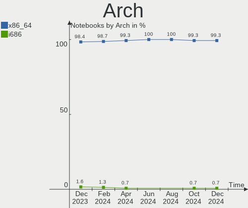
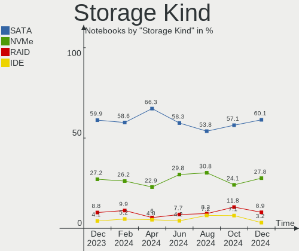
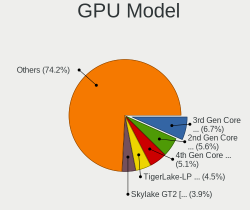
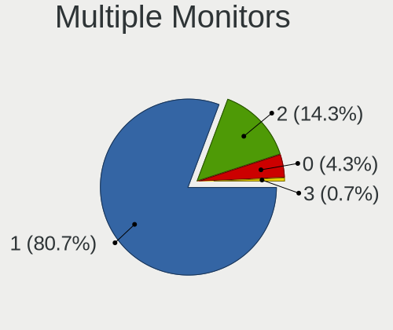

Zorin - Hardware Trends (Notebooks)
-----------------------------------

A project to identify most popular hardware characteristics and track their change
over time based on data collected by Linux users at https://Linux-Hardware.org.

Anyone can contribute to this report by the [hw-probe](https://github.com/linuxhw/hw-probe) tool:

    sudo -E hw-probe -all -upload

This report is for one last month. Overall report since the beginning of time: [TestCoverage](https://github.com/linuxhw/TestCoverage)

Period: Aug, 2022.

Contents
--------

* [ System ](#system)
  - [ OS                       ](#os)
  - [ OS Family                ](#os-family)
  - [ Kernel                   ](#kernel)
  - [ Kernel Family            ](#kernel-family)
  - [ Kernel Major Ver.        ](#kernel-major-ver)
  - [ Arch                     ](#arch)
  - [ DE                       ](#de)
  - [ Display Server           ](#display-server)
  - [ Display Manager          ](#display-manager)
  - [ OS Lang                  ](#os-lang)
  - [ Boot Mode                ](#boot-mode)
  - [ Filesystem               ](#filesystem)
  - [ Part. scheme             ](#part-scheme)
  - [ Dual Boot with Linux/BSD ](#dual-boot-with-linuxbsd)
  - [ Dual Boot (Win)          ](#dual-boot-win)

* [ Board ](#board)
  - [ Vendor                   ](#vendor)
  - [ Model                    ](#model)
  - [ Model Family             ](#model-family)
  - [ MFG Year                 ](#mfg-year)
  - [ Form Factor              ](#form-factor)
  - [ Secure Boot              ](#secure-boot)
  - [ Coreboot                 ](#coreboot)
  - [ RAM Size                 ](#ram-size)
  - [ RAM Used                 ](#ram-used)
  - [ Total Drives             ](#total-drives)
  - [ Has CD-ROM               ](#has-cd-rom)
  - [ Has Ethernet             ](#has-ethernet)
  - [ Has WiFi                 ](#has-wifi)
  - [ Has Bluetooth            ](#has-bluetooth)

* [ Location ](#location)
  - [ Country                  ](#country)
  - [ City                     ](#city)

* [ Drives ](#drives)
  - [ Drive Vendor             ](#drive-vendor)
  - [ Drive Model              ](#drive-model)
  - [ HDD Vendor               ](#hdd-vendor)
  - [ SSD Vendor               ](#ssd-vendor)
  - [ Drive Kind               ](#drive-kind)
  - [ Drive Connector          ](#drive-connector)
  - [ Drive Size               ](#drive-size)
  - [ Space Total              ](#space-total)
  - [ Space Used               ](#space-used)
  - [ Malfunc. Drives          ](#malfunc-drives)
  - [ Malfunc. Drive Vendor    ](#malfunc-drive-vendor)
  - [ Malfunc. HDD Vendor      ](#malfunc-hdd-vendor)
  - [ Malfunc. Drive Kind      ](#malfunc-drive-kind)
  - [ Failed Drives            ](#failed-drives)
  - [ Failed Drive Vendor      ](#failed-drive-vendor)
  - [ Drive Status             ](#drive-status)

* [ Storage controller ](#storage-controller)
  - [ Storage Vendor           ](#storage-vendor)
  - [ Storage Model            ](#storage-model)
  - [ Storage Kind             ](#storage-kind)

* [ Processor ](#processor)
  - [ CPU Vendor               ](#cpu-vendor)
  - [ CPU Model                ](#cpu-model)
  - [ CPU Model Family         ](#cpu-model-family)
  - [ CPU Cores                ](#cpu-cores)
  - [ CPU Sockets              ](#cpu-sockets)
  - [ CPU Threads              ](#cpu-threads)
  - [ CPU Op-Modes             ](#cpu-op-modes)
  - [ CPU Microcode            ](#cpu-microcode)
  - [ CPU Microarch            ](#cpu-microarch)

* [ Graphics ](#graphics)
  - [ GPU Vendor               ](#gpu-vendor)
  - [ GPU Model                ](#gpu-model)
  - [ GPU Combo                ](#gpu-combo)
  - [ GPU Driver               ](#gpu-driver)
  - [ GPU Memory               ](#gpu-memory)

* [ Monitor ](#monitor)
  - [ Monitor Vendor           ](#monitor-vendor)
  - [ Monitor Model            ](#monitor-model)
  - [ Monitor Resolution       ](#monitor-resolution)
  - [ Monitor Diagonal         ](#monitor-diagonal)
  - [ Monitor Width            ](#monitor-width)
  - [ Aspect Ratio             ](#aspect-ratio)
  - [ Monitor Area             ](#monitor-area)
  - [ Pixel Density            ](#pixel-density)
  - [ Multiple Monitors        ](#multiple-monitors)

* [ Network ](#network)
  - [ Net Controller Vendor    ](#net-controller-vendor)
  - [ Net Controller Model     ](#net-controller-model)
  - [ Wireless Vendor          ](#wireless-vendor)
  - [ Wireless Model           ](#wireless-model)
  - [ Ethernet Vendor          ](#ethernet-vendor)
  - [ Ethernet Model           ](#ethernet-model)
  - [ Net Controller Kind      ](#net-controller-kind)
  - [ Used Controller          ](#used-controller)
  - [ NICs                     ](#nics)
  - [ IPv6                     ](#ipv6)

* [ Bluetooth ](#bluetooth)
  - [ Bluetooth Vendor         ](#bluetooth-vendor)
  - [ Bluetooth Model          ](#bluetooth-model)

* [ Sound ](#sound)
  - [ Sound Vendor             ](#sound-vendor)
  - [ Sound Model              ](#sound-model)

* [ Memory ](#memory)
  - [ Memory Vendor            ](#memory-vendor)
  - [ Memory Model             ](#memory-model)
  - [ Memory Kind              ](#memory-kind)
  - [ Memory Form Factor       ](#memory-form-factor)
  - [ Memory Size              ](#memory-size)
  - [ Memory Speed             ](#memory-speed)

* [ Printers & scanners ](#printers--scanners)
  - [ Printer Vendor           ](#printer-vendor)
  - [ Printer Model            ](#printer-model)
  - [ Scanner Vendor           ](#scanner-vendor)
  - [ Scanner Model            ](#scanner-model)

* [ Camera ](#camera)
  - [ Camera Vendor            ](#camera-vendor)
  - [ Camera Model             ](#camera-model)

* [ Security ](#security)
  - [ Fingerprint Vendor       ](#fingerprint-vendor)
  - [ Fingerprint Model        ](#fingerprint-model)
  - [ Chipcard Vendor          ](#chipcard-vendor)
  - [ Chipcard Model           ](#chipcard-model)

* [ Unsupported ](#unsupported)
  - [ Unsupported Devices      ](#unsupported-devices)
  - [ Unsupported Device Types ](#unsupported-device-types)

System
------

OS
--

Installed operating systems

| Name     | Notebooks | Percent |
|----------|-----------|---------|
| Zorin 16 | 75        | 87.21%  |
| Zorin 15 | 10        | 11.63%  |
| Zorin 12 | 1         | 1.16%   |

OS Family
---------

OS without a version

| Name  | Notebooks | Percent |
|-------|-----------|---------|
| Zorin | 86        | 100%    |

Kernel
------

Version of the Linux kernel

| Version                 | Notebooks | Percent |
|-------------------------|-----------|---------|
| 5.15.0-46-generic       | 41        | 47.67%  |
| 5.15.0-43-generic       | 18        | 20.93%  |
| 5.15.0-41-generic       | 6         | 6.98%   |
| 5.4.0-124-generic       | 5         | 5.81%   |
| 5.13.0-30-generic       | 5         | 5.81%   |
| 5.4.0-122-generic       | 3         | 3.49%   |
| 5.4.180-0504180-generic | 1         | 1.16%   |
| 5.4.0-110-generic       | 1         | 1.16%   |
| 5.4.0-104-generic       | 1         | 1.16%   |
| 5.18.15-xanmod1         | 1         | 1.16%   |
| 5.14.0-1050-oem         | 1         | 1.16%   |
| 5.13.0-51-generic       | 1         | 1.16%   |
| 5.13.0-39-generic       | 1         | 1.16%   |
| 4.15.0-142-generic      | 1         | 1.16%   |

Kernel Family
-------------

Linux kernel without a distro release

| Version | Notebooks | Percent |
|---------|-----------|---------|
| 5.15.0  | 65        | 75.58%  |
| 5.4.0   | 10        | 11.63%  |
| 5.13.0  | 7         | 8.14%   |
| 5.4.180 | 1         | 1.16%   |
| 5.18.15 | 1         | 1.16%   |
| 5.14.0  | 1         | 1.16%   |
| 4.15.0  | 1         | 1.16%   |

Kernel Major Ver.
-----------------

Linux kernel major version

| Version | Notebooks | Percent |
|---------|-----------|---------|
| 5.15    | 65        | 75.58%  |
| 5.4     | 11        | 12.79%  |
| 5.13    | 7         | 8.14%   |
| 5.18    | 1         | 1.16%   |
| 5.14    | 1         | 1.16%   |
| 4.15    | 1         | 1.16%   |

Arch
----

OS architecture (x86_64, i586, etc.)

| Name   | Notebooks | Percent |
|--------|-----------|---------|
| x86_64 | 81        | 94.19%  |
| i686   | 5         | 5.81%   |

DE
--

Desktop Environment

| Name    | Notebooks | Percent |
|---------|-----------|---------|
| GNOME   | 65        | 75.58%  |
| XFCE    | 18        | 20.93%  |
| Unknown | 3         | 3.49%   |

Display Server
--------------

X11 or Wayland

| Name    | Notebooks | Percent |
|---------|-----------|---------|
| X11     | 81        | 94.19%  |
| Wayland | 4         | 4.65%   |
| Unknown | 1         | 1.16%   |

Display Manager
---------------

SDDM, LightDM, etc.

| Name    | Notebooks | Percent |
|---------|-----------|---------|
| Unknown | 52        | 60.47%  |
| GDM     | 13        | 15.12%  |
| LightDM | 11        | 12.79%  |
| GDM3    | 10        | 11.63%  |

OS Lang
-------

Language

| Lang  | Notebooks | Percent |
|-------|-----------|---------|
| en_US | 30        | 34.88%  |
| en_GB | 9         | 10.47%  |
| de_DE | 8         | 9.3%    |
| pt_BR | 6         | 6.98%   |
| es_AR | 4         | 4.65%   |
| en_AU | 4         | 4.65%   |
| es_ES | 3         | 3.49%   |
| en_CA | 3         | 3.49%   |
| sr_RS | 2         | 2.33%   |
| nl_NL | 2         | 2.33%   |
| fi_FI | 2         | 2.33%   |
| de_AT | 2         | 2.33%   |
| ru_RU | 1         | 1.16%   |
| nl_BE | 1         | 1.16%   |
| id_ID | 1         | 1.16%   |
| fr_FR | 1         | 1.16%   |
| fr_CA | 1         | 1.16%   |
| fr_BE | 1         | 1.16%   |
| es_US | 1         | 1.16%   |
| es_MX | 1         | 1.16%   |
| es_CR | 1         | 1.16%   |
| en_IN | 1         | 1.16%   |
| en_IE | 1         | 1.16%   |

Boot Mode
---------

EFI or BIOS

| Mode | Notebooks | Percent |
|------|-----------|---------|
| EFI  | 53        | 61.63%  |
| BIOS | 33        | 38.37%  |

Filesystem
----------

Type of filesystem

| Type | Notebooks | Percent |
|------|-----------|---------|
| Ext4 | 85        | 98.84%  |
| Zfs  | 1         | 1.16%   |

Part. scheme
------------

Scheme of partitioning

| Type    | Notebooks | Percent |
|---------|-----------|---------|
| Unknown | 71        | 82.56%  |
| GPT     | 12        | 13.95%  |
| MBR     | 3         | 3.49%   |

Dual Boot with Linux/BSD
------------------------

Hosting more than one Linux/BSD

| Dual boot | Notebooks | Percent |
|-----------|-----------|---------|
| No        | 83        | 96.51%  |
| Yes       | 3         | 3.49%   |

Dual Boot (Win)
---------------

Hosting Linux and Windows

| Dual boot | Notebooks | Percent |
|-----------|-----------|---------|
| No        | 74        | 86.05%  |
| Yes       | 12        | 13.95%  |

Board
-----

Vendor
------

Motherboard manufacturer

| Name                | Notebooks | Percent |
|---------------------|-----------|---------|
| Hewlett-Packard     | 18        | 20.93%  |
| Dell                | 14        | 16.28%  |
| Lenovo              | 11        | 12.79%  |
| ASUSTek Computer    | 11        | 12.79%  |
| Toshiba             | 5         | 5.81%   |
| MSI                 | 3         | 3.49%   |
| Apple               | 3         | 3.49%   |
| Acer                | 3         | 3.49%   |
| Samsung Electronics | 2         | 2.33%   |
| Google              | 2         | 2.33%   |
| Alienware           | 2         | 2.33%   |
| Positivo            | 1         | 1.16%   |
| Packard Bell        | 1         | 1.16%   |
| Notebook            | 1         | 1.16%   |
| Medion              | 1         | 1.16%   |
| Intel               | 1         | 1.16%   |
| HUAWEI              | 1         | 1.16%   |
| GPU Company         | 1         | 1.16%   |
| Fujitsu Siemens     | 1         | 1.16%   |
| Framework           | 1         | 1.16%   |
| Ematic              | 1         | 1.16%   |
| AMI                 | 1         | 1.16%   |
| Unknown             | 1         | 1.16%   |

Model
-----

Motherboard model

| Name                                 | Notebooks | Percent |
|--------------------------------------|-----------|---------|
| Unknown                              | 2         | 2.33%   |
| Toshiba Satellite Pro L670           | 1         | 1.16%   |
| Toshiba Satellite P205               | 1         | 1.16%   |
| Toshiba Satellite P200               | 1         | 1.16%   |
| Toshiba Satellite L855               | 1         | 1.16%   |
| Toshiba Satellite L655               | 1         | 1.16%   |
| Samsung 600B4B/600B5B                | 1         | 1.16%   |
| Samsung 300E5M/300E5L                | 1         | 1.16%   |
| Positivo C14CU51                     | 1         | 1.16%   |
| Packard Bell EasyNote TE69KB         | 1         | 1.16%   |
| Notebook NJ50GU                      | 1         | 1.16%   |
| MSI Vector GP76 12UH                 | 1         | 1.16%   |
| MSI Creator Z16 Hiroshi F A11UE      | 1         | 1.16%   |
| MSI CR620                            | 1         | 1.16%   |
| Medion E7419 MD60990                 | 1         | 1.16%   |
| Lenovo Yoga S740-15IRH 81NX          | 1         | 1.16%   |
| Lenovo ThinkPad T500 2055A38         | 1         | 1.16%   |
| Lenovo ThinkPad T420 4236VTQ         | 1         | 1.16%   |
| Lenovo ThinkPad L440 20ASA1V8BP      | 1         | 1.16%   |
| Lenovo IdeaPadFlex 15D 20334         | 1         | 1.16%   |
| Lenovo IdeaPad Z580                  | 1         | 1.16%   |
| Lenovo IdeaPad S145-14IIL 81W6       | 1         | 1.16%   |
| Lenovo IdeaPad S130-11IGM 81J1       | 1         | 1.16%   |
| Lenovo IdeaPad Gaming 3 15ARH05 82EY | 1         | 1.16%   |
| Lenovo IdeaPad 110-14IBR 80UJ        | 1         | 1.16%   |
| Lenovo G505s 20255                   | 1         | 1.16%   |
| Intel powered classmate PC           | 1         | 1.16%   |
| HUAWEI KLVD-WXX9                     | 1         | 1.16%   |
| HP Stream Notebook PC 13             | 1         | 1.16%   |
| HP ProBook 6470b                     | 1         | 1.16%   |
| HP Pro x2 612 G1 Tablet              | 1         | 1.16%   |
| HP Pavilion Notebook                 | 1         | 1.16%   |
| HP Pavilion Laptop 14-ec0xxx         | 1         | 1.16%   |
| HP Pavilion Gaming Laptop 15-dk0xxx  | 1         | 1.16%   |
| HP Pavilion dv9700                   | 1         | 1.16%   |
| HP Pavilion Aero Laptop 13-be0xxx    | 1         | 1.16%   |
| HP Pavilion 15                       | 1         | 1.16%   |
| HP Notebook                          | 1         | 1.16%   |
| HP Laptop 17-cn0xxx                  | 1         | 1.16%   |
| HP Laptop 15-dy1xxx                  | 1         | 1.16%   |
| HP Laptop 15-bs0xx                   | 1         | 1.16%   |
| HP Laptop 14-dq4xxx                  | 1         | 1.16%   |
| HP EW7-I7D22875GR1                   | 1         | 1.16%   |
| HP EliteBook 6930p                   | 1         | 1.16%   |
| HP 250 G7 Notebook PC                | 1         | 1.16%   |
| HP 14                                | 1         | 1.16%   |
| GPU Company GWTN156-11               | 1         | 1.16%   |
| Google Kasumi                        | 1         | 1.16%   |
| Google Butterfly                     | 1         | 1.16%   |
| Fujitsu Siemens AMILO Li1705         | 1         | 1.16%   |
| Framework Laptop                     | 1         | 1.16%   |
| Ematic EWT118                        | 1         | 1.16%   |
| Dell XPS 15 9570                     | 1         | 1.16%   |
| Dell XPS 15 9510                     | 1         | 1.16%   |
| Dell Latitude E7240                  | 1         | 1.16%   |
| Dell Latitude E6420                  | 1         | 1.16%   |
| Dell Latitude E5440                  | 1         | 1.16%   |
| Dell Latitude D630                   | 1         | 1.16%   |
| Dell Inspiron N5010                  | 1         | 1.16%   |
| Dell Inspiron M5030                  | 1         | 1.16%   |

Model Family
------------

Motherboard model prefix

| Name                   | Notebooks | Percent |
|------------------------|-----------|---------|
| Dell Inspiron          | 7         | 8.14%   |
| HP Pavilion            | 6         | 6.98%   |
| Toshiba Satellite      | 5         | 5.81%   |
| Lenovo IdeaPad         | 5         | 5.81%   |
| HP Laptop              | 4         | 4.65%   |
| Dell Latitude          | 4         | 4.65%   |
| ASUS VivoBook          | 4         | 4.65%   |
| Lenovo ThinkPad        | 3         | 3.49%   |
| Dell XPS               | 2         | 2.33%   |
| Alienware 15           | 2         | 2.33%   |
| Acer Aspire            | 2         | 2.33%   |
| Unknown                | 2         | 2.33%   |
| Samsung 600B4B         | 1         | 1.16%   |
| Samsung 300E5M         | 1         | 1.16%   |
| Positivo C14CU51       | 1         | 1.16%   |
| Packard Bell EasyNote  | 1         | 1.16%   |
| Notebook NJ50GU        | 1         | 1.16%   |
| MSI Vector             | 1         | 1.16%   |
| MSI Creator            | 1         | 1.16%   |
| MSI CR620              | 1         | 1.16%   |
| Medion E7419           | 1         | 1.16%   |
| Lenovo Yoga            | 1         | 1.16%   |
| Lenovo IdeaPadFlex     | 1         | 1.16%   |
| Lenovo G505s           | 1         | 1.16%   |
| Intel powered          | 1         | 1.16%   |
| HUAWEI KLVD-WXX9       | 1         | 1.16%   |
| HP Stream              | 1         | 1.16%   |
| HP ProBook             | 1         | 1.16%   |
| HP Pro                 | 1         | 1.16%   |
| HP Notebook            | 1         | 1.16%   |
| HP EW7-I7D22875GR1     | 1         | 1.16%   |
| HP EliteBook           | 1         | 1.16%   |
| HP 250                 | 1         | 1.16%   |
| HP 14                  | 1         | 1.16%   |
| GPU Company GWTN156-11 | 1         | 1.16%   |
| Google Kasumi          | 1         | 1.16%   |
| Google Butterfly       | 1         | 1.16%   |
| Fujitsu Siemens AMILO  | 1         | 1.16%   |
| Framework Laptop       | 1         | 1.16%   |
| Ematic EWT118          | 1         | 1.16%   |
| Dell G15               | 1         | 1.16%   |
| ASUS ZenBook           | 1         | 1.16%   |
| ASUS X756UQ            | 1         | 1.16%   |
| ASUS X555LAB           | 1         | 1.16%   |
| ASUS X550JK            | 1         | 1.16%   |
| ASUS X542BA            | 1         | 1.16%   |
| ASUS ROG               | 1         | 1.16%   |
| ASUS K54C              | 1         | 1.16%   |
| Apple MacBookPro5      | 1         | 1.16%   |
| Apple MacBookAir7      | 1         | 1.16%   |
| Apple MacBook5         | 1         | 1.16%   |
| Acer Peppy             | 1         | 1.16%   |

MFG Year
--------

Motherboard manufacture year

| Year | Notebooks | Percent |
|------|-----------|---------|
| 2021 | 14        | 16.28%  |
| 2013 | 8         | 9.3%    |
| 2019 | 7         | 8.14%   |
| 2018 | 6         | 6.98%   |
| 2017 | 6         | 6.98%   |
| 2014 | 6         | 6.98%   |
| 2011 | 5         | 5.81%   |
| 2010 | 5         | 5.81%   |
| 2007 | 5         | 5.81%   |
| 2020 | 4         | 4.65%   |
| 2016 | 4         | 4.65%   |
| 2012 | 4         | 4.65%   |
| 2022 | 3         | 3.49%   |
| 2015 | 3         | 3.49%   |
| 2008 | 3         | 3.49%   |
| 2009 | 2         | 2.33%   |
| 2006 | 1         | 1.16%   |

Form Factor
-----------

Physical design of the computer

| Name     | Notebooks | Percent |
|----------|-----------|---------|
| Notebook | 86        | 100%    |

Secure Boot
-----------

Enabled or disabled

| State    | Notebooks | Percent |
|----------|-----------|---------|
| Disabled | 71        | 82.56%  |
| Enabled  | 15        | 17.44%  |

Coreboot
--------

Have coreboot on board

| Used | Notebooks | Percent |
|------|-----------|---------|
| No   | 83        | 96.51%  |
| Yes  | 3         | 3.49%   |

RAM Size
--------

Total RAM memory

| Size in GB | Notebooks | Percent |
|------------|-----------|---------|
| 4.01-8.0   | 28        | 32.56%  |
| 3.01-4.0   | 22        | 25.58%  |
| 8.01-16.0  | 15        | 17.44%  |
| 16.01-24.0 | 8         | 9.3%    |
| 32.01-64.0 | 5         | 5.81%   |
| 1.01-2.0   | 3         | 3.49%   |
| 2.01-3.0   | 2         | 2.33%   |
| 0.51-1.0   | 2         | 2.33%   |
| 24.01-32.0 | 1         | 1.16%   |

RAM Used
--------

Used RAM memory

| Used GB   | Notebooks | Percent |
|-----------|-----------|---------|
| 1.01-2.0  | 33        | 38.37%  |
| 2.01-3.0  | 30        | 34.88%  |
| 3.01-4.0  | 9         | 10.47%  |
| 4.01-8.0  | 8         | 9.3%    |
| 8.01-16.0 | 3         | 3.49%   |
| 0.51-1.0  | 2         | 2.33%   |
| 0.01-0.5  | 1         | 1.16%   |

Total Drives
------------

Number of drives on board

| Drives | Notebooks | Percent |
|--------|-----------|---------|
| 1      | 72        | 83.72%  |
| 2      | 13        | 15.12%  |
| 8      | 1         | 1.16%   |

Has CD-ROM
----------

Has CD-ROM on board

| Presented | Notebooks | Percent |
|-----------|-----------|---------|
| No        | 46        | 53.49%  |
| Yes       | 40        | 46.51%  |

Has Ethernet
------------

Has Ethernet on board

| Presented | Notebooks | Percent |
|-----------|-----------|---------|
| Yes       | 61        | 70.93%  |
| No        | 25        | 29.07%  |

Has WiFi
--------

Has WiFi module

| Presented | Notebooks | Percent |
|-----------|-----------|---------|
| Yes       | 85        | 98.84%  |
| No        | 1         | 1.16%   |

Has Bluetooth
-------------

Has Bluetooth module

| Presented | Notebooks | Percent |
|-----------|-----------|---------|
| Yes       | 61        | 70.93%  |
| No        | 25        | 29.07%  |

Location
--------

Country
-------

Geographic location (country)

| Country     | Notebooks | Percent |
|-------------|-----------|---------|
| USA         | 17        | 19.77%  |
| UK          | 10        | 11.63%  |
| Germany     | 7         | 8.14%   |
| Brazil      | 6         | 6.98%   |
| Spain       | 5         | 5.81%   |
| Netherlands | 4         | 4.65%   |
| Canada      | 4         | 4.65%   |
| Australia   | 4         | 4.65%   |
| Argentina   | 4         | 4.65%   |
| Austria     | 3         | 3.49%   |
| Serbia      | 2         | 2.33%   |
| Russia      | 2         | 2.33%   |
| France      | 2         | 2.33%   |
| Finland     | 2         | 2.33%   |
| Belgium     | 2         | 2.33%   |
| Venezuela   | 1         | 1.16%   |
| Switzerland | 1         | 1.16%   |
| Norway      | 1         | 1.16%   |
| Nigeria     | 1         | 1.16%   |
| Mexico      | 1         | 1.16%   |
| Malaysia    | 1         | 1.16%   |
| Ireland     | 1         | 1.16%   |
| Indonesia   | 1         | 1.16%   |
| India       | 1         | 1.16%   |
| El Salvador | 1         | 1.16%   |
| Czechia     | 1         | 1.16%   |
| Costa Rica  | 1         | 1.16%   |

City
----

Geographic location (city)

| City                  | Notebooks | Percent |
|-----------------------|-----------|---------|
| Madrid                | 3         | 3.49%   |
| Sydney                | 2         | 2.33%   |
| Zeist                 | 1         | 1.16%   |
| Worcester             | 1         | 1.16%   |
| Willoughby            | 1         | 1.16%   |
| Wiednitz              | 1         | 1.16%   |
| Watford               | 1         | 1.16%   |
| Vienna                | 1         | 1.16%   |
| Vieiras               | 1         | 1.16%   |
| Victoria              | 1         | 1.16%   |
| Tring                 | 1         | 1.16%   |
| Toronto               | 1         | 1.16%   |
| Tampere               | 1         | 1.16%   |
| Stevenage             | 1         | 1.16%   |
| Springdale            | 1         | 1.16%   |
| Sheffield             | 1         | 1.16%   |
| Scranton              | 1         | 1.16%   |
| Sao Paulo             | 1         | 1.16%   |
| San Salvador          | 1         | 1.16%   |
| Saarbrücken          | 1         | 1.16%   |
| Ronnenberg            | 1         | 1.16%   |
| Red Oak               | 1         | 1.16%   |
| Porto Alegre          | 1         | 1.16%   |
| Philadelphia          | 1         | 1.16%   |
| Oslo                  | 1         | 1.16%   |
| Novi Sad              | 1         | 1.16%   |
| Nieuwpoort            | 1         | 1.16%   |
| New York              | 1         | 1.16%   |
| New Delhi             | 1         | 1.16%   |
| Neuhofen an der Krems | 1         | 1.16%   |
| Nashville             | 1         | 1.16%   |
| Moscow                | 1         | 1.16%   |
| Mendoza               | 1         | 1.16%   |
| Melbourne             | 1         | 1.16%   |
| Marktredwitz          | 1         | 1.16%   |
| Malargüe             | 1         | 1.16%   |
| Limeira               | 1         | 1.16%   |
| Leicester             | 1         | 1.16%   |
| Las Vegas             | 1         | 1.16%   |
| Lake Orion            | 1         | 1.16%   |
| Lagos                 | 1         | 1.16%   |
| Kuopio                | 1         | 1.16%   |
| Kuala Lumpur          | 1         | 1.16%   |
| Klagenfurt            | 1         | 1.16%   |
| Kaliningrad           | 1         | 1.16%   |
| Kaiserslautern        | 1         | 1.16%   |
| Jose C. Paz           | 1         | 1.16%   |
| Joliette              | 1         | 1.16%   |
| Hettange-Grande       | 1         | 1.16%   |
| Hartland              | 1         | 1.16%   |
| Gorredijk             | 1         | 1.16%   |
| Glasgow               | 1         | 1.16%   |
| Gipf-Oberfrick        | 1         | 1.16%   |
| Gavere                | 1         | 1.16%   |
| Fortaleza             | 1         | 1.16%   |
| Ennigerloh            | 1         | 1.16%   |
| El Paso               | 1         | 1.16%   |
| El Cajon              | 1         | 1.16%   |
| Edgewood              | 1         | 1.16%   |
| Dunoon                | 1         | 1.16%   |

Drives
------

Drive Vendor
------------

Hard drive vendors

| Vendor                      | Notebooks | Drives | Percent |
|-----------------------------|-----------|--------|---------|
| Samsung Electronics         | 10        | 13     | 10.53%  |
| Seagate                     | 9         | 12     | 9.47%   |
| WDC                         | 8         | 8      | 8.42%   |
| Toshiba                     | 8         | 8      | 8.42%   |
| SanDisk                     | 7         | 7      | 7.37%   |
| Kingston                    | 7         | 7      | 7.37%   |
| Unknown                     | 6         | 6      | 6.32%   |
| Micron Technology           | 5         | 5      | 5.26%   |
| LITEON                      | 3         | 3      | 3.16%   |
| Intel                       | 3         | 4      | 3.16%   |
| HGST                        | 3         | 3      | 3.16%   |
| Crucial                     | 3         | 3      | 3.16%   |
| SK hynix                    | 2         | 2      | 2.11%   |
| PNY                         | 2         | 2      | 2.11%   |
| KIOXIA                      | 2         | 2      | 2.11%   |
| Intenso                     | 2         | 2      | 2.11%   |
| Hitachi                     | 2         | 2      | 2.11%   |
| A-DATA Technology           | 2         | 2      | 2.11%   |
| Yangtze Memory Technologies | 1         | 1      | 1.05%   |
| USB3.0                      | 1         | 1      | 1.05%   |
| T-CREATE                    | 1         | 1      | 1.05%   |
| SSK                         | 1         | 1      | 1.05%   |
| SPCC                        | 1         | 1      | 1.05%   |
| JMicron Technology          | 1         | 1      | 1.05%   |
| HS-SSD-C100                 | 1         | 1      | 1.05%   |
| China                       | 1         | 1      | 1.05%   |
| ASMT                        | 1         | 1      | 1.05%   |
| Apple                       | 1         | 1      | 1.05%   |
| Unknown                     | 1         | 1      | 1.05%   |

Drive Model
-----------

Hard drive models

| Model                                   | Notebooks | Percent |
|-----------------------------------------|-----------|---------|
| Seagate ST1000LM035-1RK172 1TB          | 3         | 2.94%   |
| Kingston SA400S37480G 480GB SSD         | 3         | 2.94%   |
| Unknown MMC Card  64GB                  | 2         | 1.96%   |
| Toshiba KBG30ZMS128G 128GB NVMe SSD     | 2         | 1.96%   |
| SanDisk NVMe SSD Drive 256GB            | 2         | 1.96%   |
| Samsung SSD 850 EVO 500GB               | 2         | 1.96%   |
| Intel SSDPEKNU512GZH 512GB              | 2         | 1.96%   |
| Yangtze Memory NVMe SSD Drive 512GB     | 1         | 0.98%   |
| WDC WDS500G2B0A-00SM50 500GB SSD        | 1         | 0.98%   |
| WDC WD5000LPVX-22V0TT0 500GB            | 1         | 0.98%   |
| WDC WD5000LPCX-75VHAT0 500GB            | 1         | 0.98%   |
| WDC WD5000LPCX-35VHAT0 500GB            | 1         | 0.98%   |
| WDC WD5000LPCX-24VHAT0 500GB            | 1         | 0.98%   |
| WDC WD5000BPVT-75HXZT1 500GB            | 1         | 0.98%   |
| WDC WD2500BEVS-60UST0 250GB             | 1         | 0.98%   |
| WDC WD1200UE-22KVT0 120GB               | 1         | 0.98%   |
| USB3.0 Super Speed 128GB                | 1         | 0.98%   |
| Unknown SLD64G  64GB                    | 1         | 0.98%   |
| Unknown MMC Card  32GB                  | 1         | 0.98%   |
| Unknown MMC Card  128GB                 | 1         | 0.98%   |
| Unknown DA4064  64GB                    | 1         | 0.98%   |
| Toshiba TR200 240GB SSD                 | 1         | 0.98%   |
| Toshiba NVMe SSD Drive 1024GB           | 1         | 0.98%   |
| Toshiba MQ01ABD100 1TB                  | 1         | 0.98%   |
| Toshiba MQ01ABD032 320GB                | 1         | 0.98%   |
| Toshiba MK5055GSXF 500GB                | 1         | 0.98%   |
| Toshiba MK1237GSX 120GB                 | 1         | 0.98%   |
| T-CREATE T253TA001T 1024GB              | 1         | 0.98%   |
| SSK Disk 256GB                          | 1         | 0.98%   |
| SPCC Solid State Disk 120GB             | 1         | 0.98%   |
| SK hynix NVMe SSD Drive 512GB           | 1         | 0.98%   |
| SK hynix BC711 HFM512GD3JX013N 512GB    | 1         | 0.98%   |
| Seagate ST950042 3AS 500GB              | 1         | 0.98%   |
| Seagate ST750LM022 HN-M750MBB 752GB     | 1         | 0.98%   |
| Seagate ST500LT012-1DG142 500GB         | 1         | 0.98%   |
| Seagate ST500LM012 HN-M500MBB 500GB     | 1         | 0.98%   |
| Seagate ST2000LM007-1R8174 2TB          | 1         | 0.98%   |
| Seagate ST1000LX015-1U7172 1TB          | 1         | 0.98%   |
| Seagate ST1000LM 035-1RK172 1TB         | 1         | 0.98%   |
| Seagate ST1000LM 024 HN-M101M 1TB       | 1         | 0.98%   |
| Seagate BUP BK 5TB                      | 1         | 0.98%   |
| SanDisk SSD PLUS 480GB                  | 1         | 0.98%   |
| SanDisk SSD PLUS 240GB                  | 1         | 0.98%   |
| SanDisk SDSSDH3 250G                    | 1         | 0.98%   |
| SanDisk NVMe SSD Drive 1024GB           | 1         | 0.98%   |
| SanDisk DF4032  32GB                    | 1         | 0.98%   |
| Samsung SSD 970 PRO 512GB               | 1         | 0.98%   |
| Samsung SSD 970 EVO Plus 1TB            | 1         | 0.98%   |
| Samsung SSD 870 EVO 1TB                 | 1         | 0.98%   |
| Samsung SSD 850 PRO 1TB                 | 1         | 0.98%   |
| Samsung SM963 2.5" NVMe PCIe SSD 128GB  | 1         | 0.98%   |
| Samsung SM963 2.5" NVMe PCIe SSD 1024GB | 1         | 0.98%   |
| Samsung NVMe SSD Drive 512GB            | 1         | 0.98%   |
| Samsung NVMe SSD Drive 500GB            | 1         | 0.98%   |
| Samsung NVMe SSD Drive 1TB              | 1         | 0.98%   |
| Samsung HM641JI 640GB                   | 1         | 0.98%   |
| Samsung HM121HI 120GB                   | 1         | 0.98%   |
| PNY CS900 480GB SSD                     | 1         | 0.98%   |
| PNY 500GB SATA SSD                      | 1         | 0.98%   |
| Micron NVMe SSD Drive 1024GB            | 1         | 0.98%   |

HDD Vendor
----------

Hard disk drive vendors

| Vendor              | Notebooks | Drives | Percent |
|---------------------|-----------|--------|---------|
| Seagate             | 9         | 12     | 31.03%  |
| WDC                 | 7         | 7      | 24.14%  |
| Toshiba             | 4         | 4      | 13.79%  |
| HGST                | 3         | 3      | 10.34%  |
| Samsung Electronics | 2         | 2      | 6.9%    |
| Hitachi             | 2         | 2      | 6.9%    |
| USB3.0              | 1         | 1      | 3.45%   |
| ASMT                | 1         | 1      | 3.45%   |

SSD Vendor
----------

Solid state drive vendors

| Vendor              | Notebooks | Drives | Percent |
|---------------------|-----------|--------|---------|
| Kingston            | 5         | 5      | 15.15%  |
| SanDisk             | 3         | 3      | 9.09%   |
| Samsung Electronics | 3         | 4      | 9.09%   |
| LITEON              | 3         | 3      | 9.09%   |
| Crucial             | 3         | 3      | 9.09%   |
| PNY                 | 2         | 2      | 6.06%   |
| Micron Technology   | 2         | 2      | 6.06%   |
| Intenso             | 2         | 2      | 6.06%   |
| A-DATA Technology   | 2         | 2      | 6.06%   |
| WDC                 | 1         | 1      | 3.03%   |
| Toshiba             | 1         | 1      | 3.03%   |
| T-CREATE            | 1         | 1      | 3.03%   |
| SPCC                | 1         | 1      | 3.03%   |
| Intel               | 1         | 1      | 3.03%   |
| HS-SSD-C100         | 1         | 1      | 3.03%   |
| China               | 1         | 1      | 3.03%   |
| Apple               | 1         | 1      | 3.03%   |

Drive Kind
----------

HDD or SSD

| Kind    | Notebooks | Drives | Percent |
|---------|-----------|--------|---------|
| SSD     | 33        | 34     | 35.48%  |
| HDD     | 27        | 32     | 29.03%  |
| NVMe    | 23        | 26     | 24.73%  |
| MMC     | 8         | 8      | 8.6%    |
| Unknown | 2         | 2      | 2.15%   |

Drive Connector
---------------

SATA, SAS, NVMe, etc.

| Type | Notebooks | Drives | Percent |
|------|-----------|--------|---------|
| SATA | 56        | 59     | 61.54%  |
| NVMe | 23        | 26     | 25.27%  |
| MMC  | 8         | 8      | 8.79%   |
| SAS  | 4         | 9      | 4.4%    |

Drive Size
----------

Size of hard drive

| Size in TB | Notebooks | Drives | Percent |
|------------|-----------|--------|---------|
| 0.01-0.5   | 43        | 46     | 69.35%  |
| 0.51-1.0   | 14        | 15     | 22.58%  |
| 1.01-2.0   | 4         | 4      | 6.45%   |
| 4.01-10.0  | 1         | 1      | 1.61%   |

Space Total
-----------

Amount of disk space available on the file system

| Size in GB     | Notebooks | Percent |
|----------------|-----------|---------|
| 101-250        | 32        | 37.21%  |
| 251-500        | 19        | 22.09%  |
| 501-1000       | 11        | 12.79%  |
| 51-100         | 10        | 11.63%  |
| 21-50          | 5         | 5.81%   |
| 1001-2000      | 5         | 5.81%   |
| 1-20           | 2         | 2.33%   |
| More than 3000 | 1         | 1.16%   |
| Unknown        | 1         | 1.16%   |

Space Used
----------

Amount of used disk space

| Used GB        | Notebooks | Percent |
|----------------|-----------|---------|
| 1-20           | 33        | 38.37%  |
| 21-50          | 27        | 31.4%   |
| 101-250        | 11        | 12.79%  |
| 51-100         | 10        | 11.63%  |
| 251-500        | 2         | 2.33%   |
| More than 3000 | 1         | 1.16%   |
| 501-1000       | 1         | 1.16%   |
| Unknown        | 1         | 1.16%   |

Malfunc. Drives
---------------

Drive models with a malfunction

| Model                                | Notebooks | Drives | Percent |
|--------------------------------------|-----------|--------|---------|
| SK hynix BC711 HFM512GD3JX013N 512GB | 1         | 1      | 100%    |

Malfunc. Drive Vendor
---------------------

Vendors of faulty drives

| Vendor   | Notebooks | Drives | Percent |
|----------|-----------|--------|---------|
| SK hynix | 1         | 1      | 100%    |

Malfunc. HDD Vendor
-------------------

Vendors of faulty HDD drives

Zero info for selected period =(

Malfunc. Drive Kind
-------------------

Kinds of faulty drives

| Kind | Notebooks | Drives | Percent |
|------|-----------|--------|---------|
| NVMe | 1         | 1      | 100%    |

Failed Drives
-------------

Failed drive models

Zero info for selected period =(

Failed Drive Vendor
-------------------

Failed drive vendors

Zero info for selected period =(

Drive Status
------------

Number of failed and malfunc. drives

| Status   | Notebooks | Drives | Percent |
|----------|-----------|--------|---------|
| Detected | 74        | 89     | 86.05%  |
| Works    | 11        | 12     | 12.79%  |
| Malfunc  | 1         | 1      | 1.16%   |

Storage controller
------------------

Storage Vendor
--------------

Storage controller vendors

| Vendor                       | Notebooks | Percent |
|------------------------------|-----------|---------|
| Intel                        | 59        | 59.6%   |
| AMD                          | 10        | 10.1%   |
| Samsung Electronics          | 8         | 8.08%   |
| Micron Technology            | 4         | 4.04%   |
| Toshiba America Info Systems | 3         | 3.03%   |
| SanDisk                      | 3         | 3.03%   |
| Nvidia                       | 3         | 3.03%   |
| SK hynix                     | 2         | 2.02%   |
| KIOXIA                       | 2         | 2.02%   |
| Kingston Technology Company  | 2         | 2.02%   |
| Yangtze Memory Technologies  | 1         | 1.01%   |
| VIA Technologies             | 1         | 1.01%   |
| ASMedia Technology           | 1         | 1.01%   |

Storage Model
-------------

Storage controller models

| Model                                                                            | Notebooks | Percent |
|----------------------------------------------------------------------------------|-----------|---------|
| AMD FCH SATA Controller [AHCI mode]                                              | 9         | 8.33%   |
| Intel Volume Management Device NVMe RAID Controller                              | 6         | 5.56%   |
| Intel Sunrise Point-LP SATA Controller [AHCI mode]                               | 6         | 5.56%   |
| Samsung NVMe SSD Controller SM981/PM981/PM983                                    | 5         | 4.63%   |
| Intel 82801 Mobile SATA Controller [RAID mode]                                   | 5         | 4.63%   |
| Intel 7 Series Chipset Family 6-port SATA Controller [AHCI mode]                 | 5         | 4.63%   |
| Intel 6 Series/C200 Series Chipset Family 6 port Mobile SATA AHCI Controller     | 5         | 4.63%   |
| Micron Non-Volatile memory controller                                            | 4         | 3.7%    |
| Intel 8 Series SATA Controller 1 [AHCI mode]                                     | 4         | 3.7%    |
| Intel Tiger Lake-LP SATA Controller                                              | 3         | 2.78%   |
| Intel Celeron/Pentium Silver Processor SATA Controller                           | 3         | 2.78%   |
| Intel 82801HM/HEM (ICH8M/ICH8M-E) IDE Controller                                 | 3         | 2.78%   |
| Intel 5 Series/3400 Series Chipset 4 port SATA AHCI Controller                   | 3         | 2.78%   |
| Toshiba America Info Systems BG3 NVMe SSD Controller                             | 2         | 1.85%   |
| Nvidia MCP79 AHCI Controller                                                     | 2         | 1.85%   |
| KIOXIA NVMe SSD Controller BG4                                                   | 2         | 1.85%   |
| Kingston Company Company Non-Volatile memory controller                          | 2         | 1.85%   |
| Intel Wildcat Point-LP SATA Controller [AHCI Mode]                               | 2         | 1.85%   |
| Intel Non-Volatile memory controller                                             | 2         | 1.85%   |
| Intel Cannon Lake Mobile PCH SATA AHCI Controller                                | 2         | 1.85%   |
| Intel Atom/Celeron/Pentium Processor x5-E8000/J3xxx/N3xxx Series SATA Controller | 2         | 1.85%   |
| Intel 82801HM/HEM (ICH8M/ICH8M-E) SATA Controller [AHCI mode]                    | 2         | 1.85%   |
| Intel 82801GBM/GHM (ICH7-M Family) SATA Controller [IDE mode]                    | 2         | 1.85%   |
| Intel 8 Series/C220 Series Chipset Family 6-port SATA Controller 1 [AHCI mode]   | 2         | 1.85%   |
| Yangtze Memory Non-Volatile memory controller                                    | 1         | 0.93%   |
| VIA VT82C586A/B/VT82C686/A/B/VT823x/A/C PIPC Bus Master IDE                      | 1         | 0.93%   |
| VIA VT8237A SATA 2-Port Controller                                               | 1         | 0.93%   |
| Toshiba America Info Systems XG6 NVMe SSD Controller                             | 1         | 0.93%   |
| SK hynix Gold P31 SSD                                                            | 1         | 0.93%   |
| SK hynix BC511                                                                   | 1         | 0.93%   |
| SanDisk WD Blue SN550 NVMe SSD                                                   | 1         | 0.93%   |
| SanDisk WD Blue SN500 / PC SN520 NVMe SSD                                        | 1         | 0.93%   |
| SanDisk WD Black SN750 / PC SN730 NVMe SSD                                       | 1         | 0.93%   |
| Samsung NVMe SSD Controller PM9A1/PM9A3/980PRO                                   | 1         | 0.93%   |
| Samsung NVMe SSD Controller 980                                                  | 1         | 0.93%   |
| Samsung Electronics SATA controller                                              | 1         | 0.93%   |
| Nvidia MCP67 AHCI Controller                                                     | 1         | 0.93%   |
| Intel SATA Controller [RAID mode]                                                | 1         | 0.93%   |
| Intel NM10/ICH7 Family SATA Controller [AHCI mode]                               | 1         | 0.93%   |
| Intel Ice Lake-LP SATA Controller [AHCI mode]                                    | 1         | 0.93%   |
| Intel Celeron N3350/Pentium N4200/Atom E3900 Series SATA AHCI Controller         | 1         | 0.93%   |
| Intel 82801IBM/IEM (ICH9M/ICH9M-E) 4 port SATA Controller [AHCI mode]            | 1         | 0.93%   |
| Intel 82801IBM/IEM (ICH9M/ICH9M-E) 2 port SATA Controller [IDE mode]             | 1         | 0.93%   |
| Intel 82801HM/HEM (ICH8M/ICH8M-E) SATA Controller [IDE mode]                     | 1         | 0.93%   |
| Intel 7 Series Chipset Family 4-port SATA Controller [IDE mode]                  | 1         | 0.93%   |
| Intel 7 Series Chipset Family 2-port SATA Controller [IDE mode]                  | 1         | 0.93%   |
| Intel 5 Series/3400 Series Chipset 6 port SATA AHCI Controller                   | 1         | 0.93%   |
| ASMedia ASM1062 Serial ATA Controller                                            | 1         | 0.93%   |
| AMD SB7x0/SB8x0/SB9x0 SATA Controller [AHCI mode]                                | 1         | 0.93%   |

Storage Kind
------------

Kind of storage controller (IDE, SATA, NVMe, SAS, ...)

| Kind | Notebooks | Percent |
|------|-----------|---------|
| SATA | 57        | 55.88%  |
| NVMe | 24        | 23.53%  |
| RAID | 12        | 11.76%  |
| IDE  | 9         | 8.82%   |

Processor
---------

CPU Vendor
----------

Processor vendors

| Vendor | Notebooks | Percent |
|--------|-----------|---------|
| Intel  | 71        | 82.56%  |
| AMD    | 15        | 17.44%  |

CPU Model
---------

Processor models

| Model                                       | Notebooks | Percent |
|---------------------------------------------|-----------|---------|
| Intel Pentium Silver N5030 CPU @ 1.10GHz    | 2         | 2.33%   |
| Intel Core i7-8750H CPU @ 2.20GHz           | 2         | 2.33%   |
| Intel Core i5-9300H CPU @ 2.40GHz           | 2         | 2.33%   |
| Intel Core i5-7200U CPU @ 2.50GHz           | 2         | 2.33%   |
| Intel Core i5-3230M CPU @ 2.60GHz           | 2         | 2.33%   |
| Intel Core i5-2520M CPU @ 2.50GHz           | 2         | 2.33%   |
| Intel Core i3-1005G1 CPU @ 1.20GHz          | 2         | 2.33%   |
| Intel Celeron CPU N3050 @ 1.60GHz           | 2         | 2.33%   |
| Intel 11th Gen Core i7-11800H @ 2.30GHz     | 2         | 2.33%   |
| Intel 11th Gen Core i7-1165G7 @ 2.80GHz     | 2         | 2.33%   |
| Intel 11th Gen Core i5-1135G7 @ 2.40GHz     | 2         | 2.33%   |
| AMD Ryzen 5 5500U with Radeon Graphics      | 2         | 2.33%   |
| Intel Pentium Gold 7505 @ 2.00GHz           | 1         | 1.16%   |
| Intel Pentium Dual-Core CPU T4200 @ 2.00GHz | 1         | 1.16%   |
| Intel Pentium CPU P6100 @ 2.00GHz           | 1         | 1.16%   |
| Intel Pentium CPU 4405U @ 2.10GHz           | 1         | 1.16%   |
| Intel Genuine CPU T2050 @ 1.60GHz           | 1         | 1.16%   |
| Intel Core M-5Y10c CPU @ 0.80GHz            | 1         | 1.16%   |
| Intel Core i7-8550U CPU @ 1.80GHz           | 1         | 1.16%   |
| Intel Core i7-6700HQ CPU @ 2.60GHz          | 1         | 1.16%   |
| Intel Core i7-6500U CPU @ 2.50GHz           | 1         | 1.16%   |
| Intel Core i7-5500U CPU @ 2.40GHz           | 1         | 1.16%   |
| Intel Core i7-4710HQ CPU @ 2.50GHz          | 1         | 1.16%   |
| Intel Core i7-4600U CPU @ 2.10GHz           | 1         | 1.16%   |
| Intel Core i7-3630QM CPU @ 2.40GHz          | 1         | 1.16%   |
| Intel Core i7-2640M CPU @ 2.80GHz           | 1         | 1.16%   |
| Intel Core i7-2630QM CPU @ 2.00GHz          | 1         | 1.16%   |
| Intel Core i7-1065G7 CPU @ 1.30GHz          | 1         | 1.16%   |
| Intel Core i5-5350U CPU @ 1.80GHz           | 1         | 1.16%   |
| Intel Core i5-4310U CPU @ 2.00GHz           | 1         | 1.16%   |
| Intel Core i5-4302Y CPU @ 1.60GHz           | 1         | 1.16%   |
| Intel Core i5-4210U CPU @ 1.70GHz           | 1         | 1.16%   |
| Intel Core i5-3320M CPU @ 2.60GHz           | 1         | 1.16%   |
| Intel Core i5-10500H CPU @ 2.50GHz          | 1         | 1.16%   |
| Intel Core i5 CPU M 560 @ 2.67GHz           | 1         | 1.16%   |
| Intel Core i5 CPU M 450 @ 2.40GHz           | 1         | 1.16%   |
| Intel Core i3-4005U CPU @ 1.70GHz           | 1         | 1.16%   |
| Intel Core i3-4000M CPU @ 2.40GHz           | 1         | 1.16%   |
| Intel Core i3-2370M CPU @ 2.40GHz           | 1         | 1.16%   |
| Intel Core i3 CPU M 380 @ 2.53GHz           | 1         | 1.16%   |
| Intel Core Duo CPU T2350 @ 1.86GHz          | 1         | 1.16%   |
| Intel Core 2 Duo CPU T9600 @ 2.80GHz        | 1         | 1.16%   |
| Intel Core 2 Duo CPU T7100 @ 1.80GHz        | 1         | 1.16%   |
| Intel Core 2 Duo CPU T5450 @ 1.66GHz        | 1         | 1.16%   |
| Intel Core 2 Duo CPU P8700 @ 2.53GHz        | 1         | 1.16%   |
| Intel Core 2 Duo CPU P8600 @ 2.40GHz        | 1         | 1.16%   |
| Intel Core 2 Duo CPU P7550 @ 2.26GHz        | 1         | 1.16%   |
| Intel Celeron N4000 CPU @ 1.10GHz           | 1         | 1.16%   |
| Intel Celeron M CPU 430 @ 1.73GHz           | 1         | 1.16%   |
| Intel Celeron CPU N3350 @ 1.10GHz           | 1         | 1.16%   |
| Intel Celeron CPU N3060 @ 1.60GHz           | 1         | 1.16%   |
| Intel Celeron CPU 847 @ 1.10GHz             | 1         | 1.16%   |
| Intel Celeron CPU 3865U @ 1.80GHz           | 1         | 1.16%   |
| Intel Celeron CPU 1007U @ 1.50GHz           | 1         | 1.16%   |
| Intel Celeron 2955U @ 1.40GHz               | 1         | 1.16%   |
| Intel Atom x7-Z8750 CPU @ 1.60GHz           | 1         | 1.16%   |
| Intel Atom x5-Z8350 CPU @ 1.44GHz           | 1         | 1.16%   |
| Intel Atom CPU N455 @ 1.66GHz               | 1         | 1.16%   |
| Intel 12th Gen Core i7-12700H               | 1         | 1.16%   |
| Intel 11th Gen Core i5-1155G7 @ 2.50GHz     | 1         | 1.16%   |

CPU Model Family
----------------

Processor model prefix

| Model                   | Notebooks | Percent |
|-------------------------|-----------|---------|
| Intel Core i5           | 16        | 18.6%   |
| Intel Core i7           | 12        | 13.95%  |
| Other                   | 11        | 12.79%  |
| Intel Celeron           | 9         | 10.47%  |
| Intel Core i3           | 6         | 6.98%   |
| Intel Core 2 Duo        | 6         | 6.98%   |
| Intel Atom              | 3         | 3.49%   |
| Intel Pentium Silver    | 2         | 2.33%   |
| Intel Pentium           | 2         | 2.33%   |
| AMD Ryzen 7             | 2         | 2.33%   |
| AMD Ryzen 5             | 2         | 2.33%   |
| AMD A4                  | 2         | 2.33%   |
| Intel Pentium Gold      | 1         | 1.16%   |
| Intel Pentium Dual-Core | 1         | 1.16%   |
| Intel Genuine           | 1         | 1.16%   |
| Intel Core M            | 1         | 1.16%   |
| Intel Core Duo          | 1         | 1.16%   |
| Intel Celeron M         | 1         | 1.16%   |
| AMD Turion 64 X2 Mobile | 1         | 1.16%   |
| AMD Ryzen 9             | 1         | 1.16%   |
| AMD E1                  | 1         | 1.16%   |
| AMD Athlon II           | 1         | 1.16%   |
| AMD A8                  | 1         | 1.16%   |
| AMD A6                  | 1         | 1.16%   |
| AMD A10                 | 1         | 1.16%   |

CPU Cores
---------

Number of processor cores

| Number | Notebooks | Percent |
|--------|-----------|---------|
| 2      | 55        | 63.95%  |
| 4      | 18        | 20.93%  |
| 8      | 5         | 5.81%   |
| 6      | 5         | 5.81%   |
| 1      | 2         | 2.33%   |
| 14     | 1         | 1.16%   |

CPU Sockets
-----------

Number of sockets

| Number | Notebooks | Percent |
|--------|-----------|---------|
| 1      | 86        | 100%    |

CPU Threads
-----------

Threads per core (Hyper-Threading)

| Number | Notebooks | Percent |
|--------|-----------|---------|
| 2      | 53        | 61.63%  |
| 1      | 33        | 38.37%  |

CPU Op-Modes
------------

CPU Operation Modes (32-bit, 64-bit)

| Op mode        | Notebooks | Percent |
|----------------|-----------|---------|
| 32-bit, 64-bit | 83        | 96.51%  |
| 32-bit         | 3         | 3.49%   |

CPU Microcode
-------------

Microcode number

| Number     | Notebooks | Percent |
|------------|-----------|---------|
| 0x40651    | 6         | 6.98%   |
| 0x206a7    | 6         | 6.98%   |
| 0x806c1    | 5         | 5.81%   |
| 0x306a9    | 5         | 5.81%   |
| 0x20655    | 4         | 4.65%   |
| 0x1067a    | 4         | 4.65%   |
| 0x906ea    | 3         | 3.49%   |
| 0x806e9    | 3         | 3.49%   |
| 0x706e5    | 3         | 3.49%   |
| 0x406c4    | 3         | 3.49%   |
| 0x306d4    | 3         | 3.49%   |
| 0x06006705 | 3         | 3.49%   |
| Unknown    | 3         | 3.49%   |
| 0x806d1    | 2         | 2.33%   |
| 0x706a8    | 2         | 2.33%   |
| 0x6fd      | 2         | 2.33%   |
| 0x6e8      | 2         | 2.33%   |
| 0x406e3    | 2         | 2.33%   |
| 0x406c3    | 2         | 2.33%   |
| 0x306c3    | 2         | 2.33%   |
| 0x08608103 | 2         | 2.33%   |
| 0x08600104 | 2         | 2.33%   |
| 0x0700010f | 2         | 2.33%   |
| 0x06001119 | 2         | 2.33%   |
| 0xa0652    | 1         | 1.16%   |
| 0x906a3    | 1         | 1.16%   |
| 0x806ea    | 1         | 1.16%   |
| 0x806c2    | 1         | 1.16%   |
| 0x706a1    | 1         | 1.16%   |
| 0x6ec      | 1         | 1.16%   |
| 0x506e3    | 1         | 1.16%   |
| 0x506c9    | 1         | 1.16%   |
| 0x106ca    | 1         | 1.16%   |
| 0x10676    | 1         | 1.16%   |
| 0x0a50000c | 1         | 1.16%   |
| 0x06006704 | 1         | 1.16%   |
| 0x010000c8 | 1         | 1.16%   |

CPU Microarch
-------------

Microarchitecture

| Name             | Notebooks | Percent |
|------------------|-----------|---------|
| KabyLake         | 8         | 9.3%    |
| Haswell          | 8         | 9.3%    |
| TigerLake        | 7         | 8.14%   |
| SandyBridge      | 6         | 6.98%   |
| Silvermont       | 5         | 5.81%   |
| Penryn           | 5         | 5.81%   |
| IvyBridge        | 5         | 5.81%   |
| IceLake          | 5         | 5.81%   |
| Westmere         | 4         | 4.65%   |
| Excavator        | 4         | 4.65%   |
| Skylake          | 3         | 3.49%   |
| P6               | 3         | 3.49%   |
| Goldmont plus    | 3         | 3.49%   |
| Broadwell        | 3         | 3.49%   |
| Zen 2            | 2         | 2.33%   |
| Piledriver       | 2         | 2.33%   |
| Jaguar           | 2         | 2.33%   |
| Core             | 2         | 2.33%   |
| Unknown          | 2         | 2.33%   |
| Zen 3            | 1         | 1.16%   |
| K8 Hammer        | 1         | 1.16%   |
| K10              | 1         | 1.16%   |
| Goldmont         | 1         | 1.16%   |
| CometLake        | 1         | 1.16%   |
| Bonnell          | 1         | 1.16%   |
| Alderlake Hybrid | 1         | 1.16%   |

Graphics
--------

GPU Vendor
----------

Vendors of graphics cards

| Vendor           | Notebooks | Percent |
|------------------|-----------|---------|
| Intel            | 64        | 62.75%  |
| Nvidia           | 19        | 18.63%  |
| AMD              | 18        | 17.65%  |
| VIA Technologies | 1         | 0.98%   |

GPU Model
---------

Graphics card models

| Model                                                                                    | Notebooks | Percent |
|------------------------------------------------------------------------------------------|-----------|---------|
| Intel 2nd Generation Core Processor Family Integrated Graphics Controller                | 6         | 5.71%   |
| Intel TigerLake-LP GT2 [Iris Xe Graphics]                                                | 5         | 4.76%   |
| Intel Haswell-ULT Integrated Graphics Controller                                         | 5         | 4.76%   |
| Intel Atom/Celeron/Pentium Processor x5-E8000/J3xxx/N3xxx Integrated Graphics Controller | 5         | 4.76%   |
| Intel 3rd Gen Core processor Graphics Controller                                         | 5         | 4.76%   |
| Intel CoffeeLake-H GT2 [UHD Graphics 630]                                                | 4         | 3.81%   |
| AMD Stoney [Radeon R2/R3/R4/R5 Graphics]                                                 | 4         | 3.81%   |
| Nvidia TU117M [GeForce GTX 1650 Mobile / Max-Q]                                          | 3         | 2.86%   |
| Intel Mobile GM965/GL960 Integrated Graphics Controller (secondary)                      | 3         | 2.86%   |
| Intel Mobile GM965/GL960 Integrated Graphics Controller (primary)                        | 3         | 2.86%   |
| Intel Core Processor Integrated Graphics Controller                                      | 3         | 2.86%   |
| Nvidia C79 [GeForce 9400M]                                                               | 2         | 1.9%    |
| Intel TigerLake-H GT1 [UHD Graphics]                                                     | 2         | 1.9%    |
| Intel Tiger Lake UHD Graphics                                                            | 2         | 1.9%    |
| Intel Iris Plus Graphics G1 (Ice Lake)                                                   | 2         | 1.9%    |
| Intel HD Graphics 620                                                                    | 2         | 1.9%    |
| Intel GeminiLake [UHD Graphics 605]                                                      | 2         | 1.9%    |
| Intel 4th Gen Core Processor Integrated Graphics Controller                              | 2         | 1.9%    |
| AMD Renoir                                                                               | 2         | 1.9%    |
| AMD Lucienne                                                                             | 2         | 1.9%    |
| VIA Technologies CN896/VN896/P4M900 [Chrome 9 HC]                                        | 1         | 0.95%   |
| Nvidia TU117M [GeForce MX450]                                                            | 1         | 0.95%   |
| Nvidia TU117M [GeForce GTX 1650 Ti Mobile]                                               | 1         | 0.95%   |
| Nvidia TU106M [GeForce RTX 2060 Max-Q]                                                   | 1         | 0.95%   |
| Nvidia GP107M [GeForce GTX 1050 Ti Mobile]                                               | 1         | 0.95%   |
| Nvidia GP106M [GeForce GTX 1060 Mobile]                                                  | 1         | 0.95%   |
| Nvidia GP104M [GeForce GTX 1070 Mobile]                                                  | 1         | 0.95%   |
| Nvidia GM107M [GeForce GTX 850M]                                                         | 1         | 0.95%   |
| Nvidia GM107 [GeForce 940MX]                                                             | 1         | 0.95%   |
| Nvidia GA107M [GeForce RTX 3050 Ti Mobile]                                               | 1         | 0.95%   |
| Nvidia GA106M [GeForce RTX 3060 Mobile / Max-Q]                                          | 1         | 0.95%   |
| Nvidia GA104M [GeForce RTX 3080 Mobile / Max-Q 8GB/16GB]                                 | 1         | 0.95%   |
| Nvidia G73M [GeForce Go 7600]                                                            | 1         | 0.95%   |
| Nvidia G72M [Quadro NVS 110M/GeForce Go 7300]                                            | 1         | 0.95%   |
| Nvidia C67 [GeForce 7150M / nForce 630M]                                                 | 1         | 0.95%   |
| Intel UHD Graphics 620                                                                   | 1         | 0.95%   |
| Intel Skylake GT2 [HD Graphics 520]                                                      | 1         | 0.95%   |
| Intel Mobile 4 Series Chipset Integrated Graphics Controller                             | 1         | 0.95%   |
| Intel Kaby Lake-U GT1 Integrated Graphics Controller                                     | 1         | 0.95%   |
| Intel Iris Plus Graphics G7                                                              | 1         | 0.95%   |
| Intel HD Graphics 6000                                                                   | 1         | 0.95%   |
| Intel HD Graphics 5500                                                                   | 1         | 0.95%   |
| Intel HD Graphics 5300                                                                   | 1         | 0.95%   |
| Intel HD Graphics 530                                                                    | 1         | 0.95%   |
| Intel HD Graphics 510                                                                    | 1         | 0.95%   |
| Intel HD Graphics 500                                                                    | 1         | 0.95%   |
| Intel Haswell-ULT High Definition Audio Controller [HD Graphics]                         | 1         | 0.95%   |
| Intel GeminiLake [UHD Graphics 600]                                                      | 1         | 0.95%   |
| Intel CometLake-H GT2 [UHD Graphics]                                                     | 1         | 0.95%   |
| Intel Atom Processor D4xx/D5xx/N4xx/N5xx Integrated Graphics Controller                  | 1         | 0.95%   |
| Intel Alder Lake-P Integrated Graphics Controller                                        | 1         | 0.95%   |
| AMD Whistler [Radeon HD 6730M/6770M/7690M XT]                                            | 1         | 0.95%   |
| AMD Topaz XT [Radeon R7 M260/M265 / M340/M360 / M440/M445 / 530/535 / 620/625 Mobile]    | 1         | 0.95%   |
| AMD RV635/M86 [Mobility Radeon HD 3650]                                                  | 1         | 0.95%   |
| AMD RS880M [Mobility Radeon HD 4225/4250]                                                | 1         | 0.95%   |
| AMD Richland [Radeon HD 8650G]                                                           | 1         | 0.95%   |
| AMD Richland [Radeon HD 8510G]                                                           | 1         | 0.95%   |
| AMD Madison [Mobility Radeon HD 5650/5750 / 6530M/6550M]                                 | 1         | 0.95%   |
| AMD Kabini [Radeon HD 8400 / R3 Series]                                                  | 1         | 0.95%   |
| AMD Kabini [Radeon HD 8240 / R3 Series]                                                  | 1         | 0.95%   |

GPU Combo
---------

Combinations of graphics cards

| Name           | Notebooks | Percent |
|----------------|-----------|---------|
| 1 x Intel      | 51        | 59.3%   |
| 1 x AMD        | 13        | 15.12%  |
| Intel + Nvidia | 10        | 11.63%  |
| 1 x Nvidia     | 6         | 6.98%   |
| AMD + Nvidia   | 3         | 3.49%   |
| Intel + AMD    | 2         | 2.33%   |
| 1 x VIA        | 1         | 1.16%   |

GPU Driver
----------

Free vs proprietary

| Driver      | Notebooks | Percent |
|-------------|-----------|---------|
| Free        | 71        | 82.56%  |
| Proprietary | 14        | 16.28%  |
| Unknown     | 1         | 1.16%   |

GPU Memory
----------

Total video memory

| Size in GB | Notebooks | Percent |
|------------|-----------|---------|
| Unknown    | 60        | 69.77%  |
| 0.01-0.5   | 16        | 18.6%   |
| 3.01-4.0   | 5         | 5.81%   |
| 0.51-1.0   | 3         | 3.49%   |
| 7.01-8.0   | 1         | 1.16%   |
| 1.01-2.0   | 1         | 1.16%   |

Monitor
-------

Monitor Vendor
--------------

Monitor vendors

| Vendor                  | Notebooks | Percent |
|-------------------------|-----------|---------|
| Chimei Innolux          | 16        | 17.2%   |
| AU Optronics            | 16        | 17.2%   |
| LG Display              | 13        | 13.98%  |
| BOE                     | 12        | 12.9%   |
| Samsung Electronics     | 9         | 9.68%   |
| Dell                    | 4         | 4.3%    |
| Sharp                   | 3         | 3.23%   |
| LG Philips              | 3         | 3.23%   |
| Apple                   | 3         | 3.23%   |
| Philips                 | 2         | 2.15%   |
| PANDA                   | 2         | 2.15%   |
| Lenovo                  | 2         | 2.15%   |
| Goldstar                | 2         | 2.15%   |
| TLW                     | 1         | 1.08%   |
| LGD                     | 1         | 1.08%   |
| KDI                     | 1         | 1.08%   |
| Chi Mei Optoelectronics | 1         | 1.08%   |
| ASUSTek Computer        | 1         | 1.08%   |
| Acer                    | 1         | 1.08%   |

Monitor Model
-------------

Monitor models

| Model                                                                | Notebooks | Percent |
|----------------------------------------------------------------------|-----------|---------|
| Chimei Innolux LCD Monitor CMN15E7 1920x1080 344x193mm 15.5-inch     | 2         | 2.13%   |
| AU Optronics LCD Monitor AUO10EC 1366x768 344x193mm 15.5-inch        | 2         | 2.13%   |
| TLW MATRIX TLWF01D 1920x1080 510x287mm 23.0-inch                     | 1         | 1.06%   |
| Sharp LQ173M1JW08 SHP1544 1920x1080 382x215mm 17.3-inch              | 1         | 1.06%   |
| Sharp LCD Monitor SHP14D1 1920x1200 336x210mm 15.6-inch              | 1         | 1.06%   |
| Sharp LCD Monitor SHP148D 3840x2160 344x194mm 15.5-inch              | 1         | 1.06%   |
| Samsung Electronics LCD Monitor SEC5441 1366x768 344x194mm 15.5-inch | 1         | 1.06%   |
| Samsung Electronics LCD Monitor SEC3847 1440x900 367x230mm 17.1-inch | 1         | 1.06%   |
| Samsung Electronics LCD Monitor SEC3651 1366x768 344x194mm 15.5-inch | 1         | 1.06%   |
| Samsung Electronics LCD Monitor SEC3449 1366x768 309x174mm 14.0-inch | 1         | 1.06%   |
| Samsung Electronics LCD Monitor SEC3358 1280x800 331x207mm 15.4-inch | 1         | 1.06%   |
| Samsung Electronics LCD Monitor SEC3157 1280x800 303x190mm 14.1-inch | 1         | 1.06%   |
| Samsung Electronics LCD Monitor SEC3030 1024x600 223x125mm 10.1-inch | 1         | 1.06%   |
| Samsung Electronics LCD Monitor SDC4651 1366x768 344x194mm 15.5-inch | 1         | 1.06%   |
| Samsung Electronics LCD Monitor SDC3654 1600x900 382x215mm 17.3-inch | 1         | 1.06%   |
| Samsung Electronics LCD Monitor SAM0679 1360x768 410x256mm 19.0-inch | 1         | 1.06%   |
| Philips PHL 243V7 PHLC155 1920x1080 527x296mm 23.8-inch              | 1         | 1.06%   |
| Philips FTV PHL01EA 1920x1080 1440x810mm 65.0-inch                   | 1         | 1.06%   |
| PANDA LM156LF1L03 NCP001C 1920x1080 344x194mm 15.5-inch              | 1         | 1.06%   |
| PANDA LCD Monitor NCP0035 1920x1080 309x174mm 14.0-inch              | 1         | 1.06%   |
| LGD LCD Monitor 1920x1080                                            | 1         | 1.06%   |
| LG Philips LCD Monitor LPLA104 1440x900 367x230mm 17.1-inch          | 1         | 1.06%   |
| LG Philips LCD Monitor LPLA002 1440x900 367x230mm 17.1-inch          | 1         | 1.06%   |
| LG Philips LCD Monitor LPL2388 1440x900 367x230mm 17.1-inch          | 1         | 1.06%   |
| LG Display LP156WH2-TLAA LGD0230 1366x768 344x194mm 15.5-inch        | 1         | 1.06%   |
| LG Display LCD Monitor LGD40A0 1366x768 310x174mm 14.0-inch          | 1         | 1.06%   |
| LG Display LCD Monitor LGD06F0 1920x1080 309x174mm 14.0-inch         | 1         | 1.06%   |
| LG Display LCD Monitor LGD049B 1920x1080 344x194mm 15.5-inch         | 1         | 1.06%   |
| LG Display LCD Monitor LGD0484 1366x768 344x194mm 15.5-inch          | 1         | 1.06%   |
| LG Display LCD Monitor LGD045E 1366x768 310x174mm 14.0-inch          | 1         | 1.06%   |
| LG Display LCD Monitor LGD045C 1366x768 345x194mm 15.6-inch          | 1         | 1.06%   |
| LG Display LCD Monitor LGD0456 1366x768 344x194mm 15.5-inch          | 1         | 1.06%   |
| LG Display LCD Monitor LGD0445 1366x768 276x155mm 12.5-inch          | 1         | 1.06%   |
| LG Display LCD Monitor LGD0437 1920x1080 276x156mm 12.5-inch         | 1         | 1.06%   |
| LG Display LCD Monitor LGD033A 1366x768 344x194mm 15.5-inch          | 1         | 1.06%   |
| LG Display LCD Monitor LGD02DF 1600x900 310x174mm 14.0-inch          | 1         | 1.06%   |
| LG Display LCD Monitor LGD02DC 1366x768 344x194mm 15.5-inch          | 1         | 1.06%   |
| Lenovo LCD Monitor LEN4053 1680x1050 331x207mm 15.4-inch             | 1         | 1.06%   |
| Lenovo D22-20 LEN66AD 1920x1080 477x268mm 21.5-inch                  | 1         | 1.06%   |
| KDI SC-32HS703N KDI3553 1680x1050 640x384mm 29.4-inch                | 1         | 1.06%   |
| Goldstar HDR WQHD GSM772E 3440x1440 800x335mm 34.1-inch              | 1         | 1.06%   |
| Goldstar HDR 4K GSM7706 3840x2160 600x340mm 27.2-inch                | 1         | 1.06%   |
| Dell U2518D DEL413C 2560x1440 550x310mm 24.9-inch                    | 1         | 1.06%   |
| Dell U2419H DEL415D 1920x1080 527x296mm 23.8-inch                    | 1         | 1.06%   |
| Dell S2721HS DEL41FA 1920x1080 598x336mm 27.0-inch                   | 1         | 1.06%   |
| Dell E198WFP DELF005 1440x900 408x255mm 18.9-inch                    | 1         | 1.06%   |
| Chimei Innolux LCD Monitor CMN176F 1920x1080 381x214mm 17.2-inch     | 1         | 1.06%   |
| Chimei Innolux LCD Monitor CMN1738 1920x1080 381x214mm 17.2-inch     | 1         | 1.06%   |
| Chimei Innolux LCD Monitor CMN1734 1600x900 382x214mm 17.2-inch      | 1         | 1.06%   |
| Chimei Innolux LCD Monitor CMN15F5 1920x1080 344x193mm 15.5-inch     | 1         | 1.06%   |
| Chimei Innolux LCD Monitor CMN15DB 1366x768 344x193mm 15.5-inch      | 1         | 1.06%   |
| Chimei Innolux LCD Monitor CMN15BF 1366x768 344x193mm 15.5-inch      | 1         | 1.06%   |
| Chimei Innolux LCD Monitor CMN14D6 1366x768 309x173mm 13.9-inch      | 1         | 1.06%   |
| Chimei Innolux LCD Monitor CMN14D5 1920x1080 309x173mm 13.9-inch     | 1         | 1.06%   |
| Chimei Innolux LCD Monitor CMN14C4 1366x768 309x173mm 13.9-inch      | 1         | 1.06%   |
| Chimei Innolux LCD Monitor CMN1475 1366x768 309x174mm 14.0-inch      | 1         | 1.06%   |
| Chimei Innolux LCD Monitor CMN1471 1366x768 309x174mm 14.0-inch      | 1         | 1.06%   |
| Chimei Innolux LCD Monitor CMN1470 1366x768 309x174mm 14.0-inch      | 1         | 1.06%   |
| Chimei Innolux LCD Monitor CMN1427 1920x1080 309x173mm 13.9-inch     | 1         | 1.06%   |
| Chimei Innolux LCD Monitor CMN1132 1366x768 256x144mm 11.6-inch      | 1         | 1.06%   |

Monitor Resolution
------------------

Monitor screen resolution

| Resolution         | Notebooks | Percent |
|--------------------|-----------|---------|
| 1366x768 (WXGA)    | 35        | 39.33%  |
| 1920x1080 (FHD)    | 26        | 29.21%  |
| 1440x900 (WXGA+)   | 8         | 8.99%   |
| 1600x900 (HD+)     | 4         | 4.49%   |
| 3840x2160 (4K)     | 3         | 3.37%   |
| 2560x1440 (QHD)    | 3         | 3.37%   |
| 1280x800 (WXGA)    | 3         | 3.37%   |
| 1920x1200 (WUXGA)  | 2         | 2.25%   |
| 1360x768           | 2         | 2.25%   |
| 2256x1504          | 1         | 1.12%   |
| 2160x1440          | 1         | 1.12%   |
| 1680x1050 (WSXGA+) | 1         | 1.12%   |

Monitor Diagonal
----------------

Diagonal size in inches

| Inches  | Notebooks | Percent |
|---------|-----------|---------|
| 15      | 38        | 40.86%  |
| 14      | 13        | 13.98%  |
| 17      | 11        | 11.83%  |
| 13      | 11        | 11.83%  |
| 12      | 3         | 3.23%   |
| 11      | 3         | 3.23%   |
| 27      | 2         | 2.15%   |
| 24      | 2         | 2.15%   |
| 19      | 2         | 2.15%   |
| 65      | 1         | 1.08%   |
| 34      | 1         | 1.08%   |
| 31      | 1         | 1.08%   |
| 29      | 1         | 1.08%   |
| 25      | 1         | 1.08%   |
| 23      | 1         | 1.08%   |
| 21      | 1         | 1.08%   |
| Unknown | 1         | 1.08%   |

Monitor Width
-------------

Physical width

| Width in mm | Notebooks | Percent |
|-------------|-----------|---------|
| 301-350     | 54        | 59.34%  |
| 201-300     | 13        | 14.29%  |
| 351-400     | 12        | 13.19%  |
| 501-600     | 4         | 4.4%    |
| 401-500     | 3         | 3.3%    |
| 601-700     | 2         | 2.2%    |
| 701-800     | 1         | 1.1%    |
| 1001-1500   | 1         | 1.1%    |
| Unknown     | 1         | 1.1%    |

Aspect Ratio
------------

Proportional relationship between the width and the height

| Ratio   | Notebooks | Percent |
|---------|-----------|---------|
| 16/9    | 66        | 78.57%  |
| 16/10   | 14        | 16.67%  |
| 3/2     | 2         | 2.38%   |
| 21/9    | 1         | 1.19%   |
| Unknown | 1         | 1.19%   |

Monitor Area
------------

Area in inch²

| Area in inch² | Notebooks | Percent |
|----------------|-----------|---------|
| 101-110        | 38        | 40.86%  |
| 81-90          | 21        | 22.58%  |
| 121-130        | 7         | 7.53%   |
| 131-140        | 4         | 4.3%    |
| 71-80          | 3         | 3.23%   |
| 61-70          | 3         | 3.23%   |
| 51-60          | 3         | 3.23%   |
| 351-500        | 3         | 3.23%   |
| 201-250        | 3         | 3.23%   |
| 151-200        | 3         | 3.23%   |
| 301-350        | 2         | 2.15%   |
| More than 1000 | 1         | 1.08%   |
| 251-300        | 1         | 1.08%   |
| Unknown        | 1         | 1.08%   |

Pixel Density
-------------

Pixels per inch

| Density       | Notebooks | Percent |
|---------------|-----------|---------|
| 101-120       | 36        | 40%     |
| 121-160       | 33        | 36.67%  |
| 51-100        | 12        | 13.33%  |
| 161-240       | 6         | 6.67%   |
| More than 240 | 1         | 1.11%   |
| 1-50          | 1         | 1.11%   |
| Unknown       | 1         | 1.11%   |

Multiple Monitors
-----------------

Total monitors connected

| Total | Notebooks | Percent |
|-------|-----------|---------|
| 1     | 74        | 86.05%  |
| 2     | 8         | 9.3%    |
| 0     | 2         | 2.33%   |
| 4     | 1         | 1.16%   |
| 3     | 1         | 1.16%   |

Network
-------

Net Controller Vendor
---------------------

Controller vendors

| Vendor                            | Notebooks | Percent |
|-----------------------------------|-----------|---------|
| Realtek Semiconductor             | 44        | 33.08%  |
| Intel                             | 29        | 21.8%   |
| Qualcomm Atheros                  | 27        | 20.3%   |
| Broadcom                          | 11        | 8.27%   |
| Samsung Electronics               | 3         | 2.26%   |
| Ralink                            | 3         | 2.26%   |
| Nvidia                            | 3         | 2.26%   |
| Broadcom Limited                  | 3         | 2.26%   |
| DisplayLink                       | 2         | 1.5%    |
| VIA Technologies                  | 1         | 0.75%   |
| TP-Link                           | 1         | 0.75%   |
| Ralink Technology                 | 1         | 0.75%   |
| Qualcomm Atheros Communications   | 1         | 0.75%   |
| MediaTek                          | 1         | 0.75%   |
| Marvell Technology Group          | 1         | 0.75%   |
| Ericsson Business Mobile Networks | 1         | 0.75%   |
| Dell                              | 1         | 0.75%   |

Net Controller Model
--------------------

Controller models

| Model                                                                         | Notebooks | Percent |
|-------------------------------------------------------------------------------|-----------|---------|
| Realtek RTL810xE PCI Express Fast Ethernet controller                         | 17        | 11.11%  |
| Realtek RTL8111/8168/8411 PCI Express Gigabit Ethernet Controller             | 14        | 9.15%   |
| Qualcomm Atheros QCA9377 802.11ac Wireless Network Adapter                    | 7         | 4.58%   |
| Qualcomm Atheros QCA9565 / AR9565 Wireless Network Adapter                    | 6         | 3.92%   |
| Intel Wireless 7260                                                           | 4         | 2.61%   |
| Realtek RTL8821CE 802.11ac PCIe Wireless Network Adapter                      | 3         | 1.96%   |
| Qualcomm Atheros QCA6174 802.11ac Wireless Network Adapter                    | 3         | 1.96%   |
| Intel Ethernet Connection I218-LM                                             | 3         | 1.96%   |
| Intel 82579LM Gigabit Network Connection (Lewisville)                         | 3         | 1.96%   |
| Broadcom BCM4313 802.11bgn Wireless Network Adapter                           | 3         | 1.96%   |
| Samsung GT-I9070 (network tethering, USB debugging enabled)                   | 2         | 1.31%   |
| Realtek RTL8723BE PCIe Wireless Network Adapter                               | 2         | 1.31%   |
| Realtek RTL8188EE Wireless Network Adapter                                    | 2         | 1.31%   |
| Realtek Realtek Network controller                                            | 2         | 1.31%   |
| Qualcomm Atheros AR9462 Wireless Network Adapter                              | 2         | 1.31%   |
| Nvidia MCP79 Ethernet                                                         | 2         | 1.31%   |
| Intel Wireless 3165                                                           | 2         | 1.31%   |
| Intel Wi-Fi 6 AX201                                                           | 2         | 1.31%   |
| Intel Wi-Fi 6 AX200                                                           | 2         | 1.31%   |
| Intel PRO/Wireless 3945ABG [Golan] Network Connection                         | 2         | 1.31%   |
| Intel Centrino Ultimate-N 6300                                                | 2         | 1.31%   |
| Intel 82567LM Gigabit Network Connection                                      | 2         | 1.31%   |
| Broadcom BCM4322 802.11a/b/g/n Wireless LAN Controller                        | 2         | 1.31%   |
| Broadcom BCM43142 802.11b/g/n                                                 | 2         | 1.31%   |
| VIA VT6102/VT6103 [Rhine-II]                                                  | 1         | 0.65%   |
| TP-Link UE300 10/100/1000 LAN (ethernet mode) [Realtek RTL8153]               | 1         | 0.65%   |
| Samsung Kiera                                                                 | 1         | 0.65%   |
| Realtek RTL88x2bu [AC1200 Techkey]                                            | 1         | 0.65%   |
| Realtek RTL8852AE 802.11ax PCIe Wireless Network Adapter                      | 1         | 0.65%   |
| Realtek RTL8822CE 802.11ac PCIe Wireless Network Adapter                      | 1         | 0.65%   |
| Realtek RTL8822BE 802.11a/b/g/n/ac WiFi adapter                               | 1         | 0.65%   |
| Realtek RTL8723DE Wireless Network Adapter                                    | 1         | 0.65%   |
| Realtek RTL8723BU 802.11b/g/n WLAN Adapter                                    | 1         | 0.65%   |
| Realtek RTL8723AE PCIe Wireless Network Adapter                               | 1         | 0.65%   |
| Realtek RTL8192CU 802.11n WLAN Adapter                                        | 1         | 0.65%   |
| Realtek RTL8191SEvB Wireless LAN Controller                                   | 1         | 0.65%   |
| Realtek RTL8153 Gigabit Ethernet Adapter                                      | 1         | 0.65%   |
| Realtek RTL8125 2.5GbE Controller                                             | 1         | 0.65%   |
| Realtek 802.11n WLAN Adapter                                                  | 1         | 0.65%   |
| Realtek 802.11ac NIC                                                          | 1         | 0.65%   |
| Ralink RT3572 Wireless Adapter                                                | 1         | 0.65%   |
| Ralink RT5390 Wireless 802.11n 1T/1R PCIe                                     | 1         | 0.65%   |
| Ralink RT3290 Wireless 802.11n 1T/1R PCIe                                     | 1         | 0.65%   |
| Ralink RT3090 Wireless 802.11n 1T/1R PCIe                                     | 1         | 0.65%   |
| Qualcomm Atheros QCA8172 Fast Ethernet                                        | 1         | 0.65%   |
| Qualcomm Atheros QCA8171 Gigabit Ethernet                                     | 1         | 0.65%   |
| Qualcomm Atheros Killer E2500 Gigabit Ethernet Controller                     | 1         | 0.65%   |
| Qualcomm Atheros Killer E2400 Gigabit Ethernet Controller                     | 1         | 0.65%   |
| Qualcomm Atheros AR9271 802.11n                                               | 1         | 0.65%   |
| Qualcomm Atheros AR9485 Wireless Network Adapter                              | 1         | 0.65%   |
| Qualcomm Atheros AR9285 Wireless Network Adapter (PCI-Express)                | 1         | 0.65%   |
| Qualcomm Atheros AR8161 Gigabit Ethernet                                      | 1         | 0.65%   |
| Qualcomm Atheros AR8152 v2.0 Fast Ethernet                                    | 1         | 0.65%   |
| Qualcomm Atheros AR8152 v1.1 Fast Ethernet                                    | 1         | 0.65%   |
| Qualcomm Atheros AR8151 v2.0 Gigabit Ethernet                                 | 1         | 0.65%   |
| Qualcomm Atheros AR242x / AR542x Wireless Network Adapter (PCI-Express)       | 1         | 0.65%   |
| Qualcomm Atheros AR2413/AR2414 Wireless Network Adapter [AR5005G(S) 802.11bg] | 1         | 0.65%   |
| Nvidia MCP67 Ethernet                                                         | 1         | 0.65%   |
| MediaTek MT7921 802.11ax PCI Express Wireless Network Adapter                 | 1         | 0.65%   |
| Marvell Group 88E8040 PCI-E Fast Ethernet Controller                          | 1         | 0.65%   |

Wireless Vendor
---------------

Wireless vendors

| Vendor                          | Notebooks | Percent |
|---------------------------------|-----------|---------|
| Intel                           | 27        | 30%     |
| Qualcomm Atheros                | 22        | 24.44%  |
| Realtek Semiconductor           | 20        | 22.22%  |
| Broadcom                        | 11        | 12.22%  |
| Ralink                          | 3         | 3.33%   |
| Broadcom Limited                | 3         | 3.33%   |
| Ralink Technology               | 1         | 1.11%   |
| Qualcomm Atheros Communications | 1         | 1.11%   |
| MediaTek                        | 1         | 1.11%   |
| Dell                            | 1         | 1.11%   |

Wireless Model
--------------

Wireless models

| Model                                                                         | Notebooks | Percent |
|-------------------------------------------------------------------------------|-----------|---------|
| Qualcomm Atheros QCA9377 802.11ac Wireless Network Adapter                    | 7         | 7.78%   |
| Qualcomm Atheros QCA9565 / AR9565 Wireless Network Adapter                    | 6         | 6.67%   |
| Intel Wireless 7260                                                           | 4         | 4.44%   |
| Realtek RTL8821CE 802.11ac PCIe Wireless Network Adapter                      | 3         | 3.33%   |
| Qualcomm Atheros QCA6174 802.11ac Wireless Network Adapter                    | 3         | 3.33%   |
| Broadcom BCM4313 802.11bgn Wireless Network Adapter                           | 3         | 3.33%   |
| Realtek RTL8723BE PCIe Wireless Network Adapter                               | 2         | 2.22%   |
| Realtek RTL8188EE Wireless Network Adapter                                    | 2         | 2.22%   |
| Realtek Realtek Network controller                                            | 2         | 2.22%   |
| Qualcomm Atheros AR9462 Wireless Network Adapter                              | 2         | 2.22%   |
| Intel Wireless 3165                                                           | 2         | 2.22%   |
| Intel Wi-Fi 6 AX201                                                           | 2         | 2.22%   |
| Intel Wi-Fi 6 AX200                                                           | 2         | 2.22%   |
| Intel PRO/Wireless 3945ABG [Golan] Network Connection                         | 2         | 2.22%   |
| Intel Centrino Ultimate-N 6300                                                | 2         | 2.22%   |
| Broadcom BCM4322 802.11a/b/g/n Wireless LAN Controller                        | 2         | 2.22%   |
| Broadcom BCM43142 802.11b/g/n                                                 | 2         | 2.22%   |
| Realtek RTL88x2bu [AC1200 Techkey]                                            | 1         | 1.11%   |
| Realtek RTL8852AE 802.11ax PCIe Wireless Network Adapter                      | 1         | 1.11%   |
| Realtek RTL8822CE 802.11ac PCIe Wireless Network Adapter                      | 1         | 1.11%   |
| Realtek RTL8822BE 802.11a/b/g/n/ac WiFi adapter                               | 1         | 1.11%   |
| Realtek RTL8723DE Wireless Network Adapter                                    | 1         | 1.11%   |
| Realtek RTL8723BU 802.11b/g/n WLAN Adapter                                    | 1         | 1.11%   |
| Realtek RTL8723AE PCIe Wireless Network Adapter                               | 1         | 1.11%   |
| Realtek RTL8192CU 802.11n WLAN Adapter                                        | 1         | 1.11%   |
| Realtek RTL8191SEvB Wireless LAN Controller                                   | 1         | 1.11%   |
| Realtek 802.11n WLAN Adapter                                                  | 1         | 1.11%   |
| Realtek 802.11ac NIC                                                          | 1         | 1.11%   |
| Ralink RT3572 Wireless Adapter                                                | 1         | 1.11%   |
| Ralink RT5390 Wireless 802.11n 1T/1R PCIe                                     | 1         | 1.11%   |
| Ralink RT3290 Wireless 802.11n 1T/1R PCIe                                     | 1         | 1.11%   |
| Ralink RT3090 Wireless 802.11n 1T/1R PCIe                                     | 1         | 1.11%   |
| Qualcomm Atheros AR9271 802.11n                                               | 1         | 1.11%   |
| Qualcomm Atheros AR9485 Wireless Network Adapter                              | 1         | 1.11%   |
| Qualcomm Atheros AR9285 Wireless Network Adapter (PCI-Express)                | 1         | 1.11%   |
| Qualcomm Atheros AR242x / AR542x Wireless Network Adapter (PCI-Express)       | 1         | 1.11%   |
| Qualcomm Atheros AR2413/AR2414 Wireless Network Adapter [AR5005G(S) 802.11bg] | 1         | 1.11%   |
| MediaTek MT7921 802.11ax PCI Express Wireless Network Adapter                 | 1         | 1.11%   |
| Intel Wireless-AC 9260                                                        | 1         | 1.11%   |
| Intel Wireless 7265                                                           | 1         | 1.11%   |
| Intel Wi-Fi 6 AX210/AX211/AX411 160MHz                                        | 1         | 1.11%   |
| Intel Tiger Lake PCH CNVi WiFi                                                | 1         | 1.11%   |
| Intel PRO/Wireless 5100 AGN [Shiloh] Network Connection                       | 1         | 1.11%   |
| Intel PRO/Wireless 4965 AG or AGN [Kedron] Network Connection                 | 1         | 1.11%   |
| Intel Ice Lake-LP PCH CNVi WiFi                                               | 1         | 1.11%   |
| Intel Gemini Lake PCH CNVi WiFi                                               | 1         | 1.11%   |
| Intel Comet Lake PCH CNVi WiFi                                                | 1         | 1.11%   |
| Intel Centrino Wireless-N 1030 [Rainbow Peak]                                 | 1         | 1.11%   |
| Intel Centrino Advanced-N 6230 [Rainbow Peak]                                 | 1         | 1.11%   |
| Intel Cannon Lake PCH CNVi WiFi                                               | 1         | 1.11%   |
| Intel Alder Lake-P PCH CNVi WiFi                                              | 1         | 1.11%   |
| Dell Hub of E-Port Replicator                                                 | 1         | 1.11%   |
| Broadcom Limited BCM4360 802.11ac Wireless Network Adapter                    | 1         | 1.11%   |
| Broadcom Limited BCM43225 802.11b/g/n                                         | 1         | 1.11%   |
| Broadcom Limited BCM4313 802.11bgn Wireless Network Adapter                   | 1         | 1.11%   |
| Broadcom BCM4356 802.11ac Wireless Network Adapter                            | 1         | 1.11%   |
| Broadcom BCM43228 802.11a/b/g/n                                               | 1         | 1.11%   |
| Broadcom BCM4312 802.11b/g LP-PHY                                             | 1         | 1.11%   |
| Broadcom BCM4311 802.11b/g WLAN                                               | 1         | 1.11%   |

Ethernet Vendor
---------------

Ethernet vendors

| Vendor                   | Notebooks | Percent |
|--------------------------|-----------|---------|
| Realtek Semiconductor    | 33        | 53.23%  |
| Intel                    | 10        | 16.13%  |
| Qualcomm Atheros         | 8         | 12.9%   |
| Samsung Electronics      | 3         | 4.84%   |
| Nvidia                   | 3         | 4.84%   |
| DisplayLink              | 2         | 3.23%   |
| VIA Technologies         | 1         | 1.61%   |
| TP-Link                  | 1         | 1.61%   |
| Marvell Technology Group | 1         | 1.61%   |

Ethernet Model
--------------

Ethernet models

| Model                                                             | Notebooks | Percent |
|-------------------------------------------------------------------|-----------|---------|
| Realtek RTL810xE PCI Express Fast Ethernet controller             | 17        | 27.42%  |
| Realtek RTL8111/8168/8411 PCI Express Gigabit Ethernet Controller | 14        | 22.58%  |
| Intel Ethernet Connection I218-LM                                 | 3         | 4.84%   |
| Intel 82579LM Gigabit Network Connection (Lewisville)             | 3         | 4.84%   |
| Samsung GT-I9070 (network tethering, USB debugging enabled)       | 2         | 3.23%   |
| Nvidia MCP79 Ethernet                                             | 2         | 3.23%   |
| Intel 82567LM Gigabit Network Connection                          | 2         | 3.23%   |
| VIA VT6102/VT6103 [Rhine-II]                                      | 1         | 1.61%   |
| TP-Link UE300 10/100/1000 LAN (ethernet mode) [Realtek RTL8153]   | 1         | 1.61%   |
| Samsung Kiera                                                     | 1         | 1.61%   |
| Realtek RTL8153 Gigabit Ethernet Adapter                          | 1         | 1.61%   |
| Realtek RTL8125 2.5GbE Controller                                 | 1         | 1.61%   |
| Qualcomm Atheros QCA8172 Fast Ethernet                            | 1         | 1.61%   |
| Qualcomm Atheros QCA8171 Gigabit Ethernet                         | 1         | 1.61%   |
| Qualcomm Atheros Killer E2500 Gigabit Ethernet Controller         | 1         | 1.61%   |
| Qualcomm Atheros Killer E2400 Gigabit Ethernet Controller         | 1         | 1.61%   |
| Qualcomm Atheros AR8161 Gigabit Ethernet                          | 1         | 1.61%   |
| Qualcomm Atheros AR8152 v2.0 Fast Ethernet                        | 1         | 1.61%   |
| Qualcomm Atheros AR8152 v1.1 Fast Ethernet                        | 1         | 1.61%   |
| Qualcomm Atheros AR8151 v2.0 Gigabit Ethernet                     | 1         | 1.61%   |
| Nvidia MCP67 Ethernet                                             | 1         | 1.61%   |
| Marvell Group 88E8040 PCI-E Fast Ethernet Controller              | 1         | 1.61%   |
| Intel Ethernet Connection I217-LM                                 | 1         | 1.61%   |
| Intel 82579V Gigabit Network Connection                           | 1         | 1.61%   |
| DisplayLink USB3.0 Dual Video Dock                                | 1         | 1.61%   |
| DisplayLink USB-C Dual-4K Dock                                    | 1         | 1.61%   |

Net Controller Kind
-------------------

Ethernet, WiFi or modem

| Kind     | Notebooks | Percent |
|----------|-----------|---------|
| WiFi     | 85        | 57.82%  |
| Ethernet | 61        | 41.5%   |
| Modem    | 1         | 0.68%   |

Used Controller
---------------

Currently used network controller

| Kind     | Notebooks | Percent |
|----------|-----------|---------|
| WiFi     | 76        | 81.72%  |
| Ethernet | 17        | 18.28%  |

NICs
----

Total network controllers on board

| Total | Notebooks | Percent |
|-------|-----------|---------|
| 2     | 54        | 62.79%  |
| 1     | 29        | 33.72%  |
| 0     | 3         | 3.49%   |

IPv6
----

IPv6 vs IPv4

| Used | Notebooks | Percent |
|------|-----------|---------|
| No   | 58        | 67.44%  |
| Yes  | 28        | 32.56%  |

Bluetooth
---------

Bluetooth Vendor
----------------

Controller vendors

| Vendor                          | Notebooks | Percent |
|---------------------------------|-----------|---------|
| Intel                           | 19        | 31.15%  |
| Realtek Semiconductor           | 11        | 18.03%  |
| Qualcomm Atheros Communications | 8         | 13.11%  |
| IMC Networks                    | 8         | 13.11%  |
| Broadcom                        | 3         | 4.92%   |
| Apple                           | 3         | 4.92%   |
| Lite-On Technology              | 2         | 3.28%   |
| Foxconn / Hon Hai               | 2         | 3.28%   |
| Cambridge Silicon Radio         | 2         | 3.28%   |
| Toshiba                         | 1         | 1.64%   |
| Ralink                          | 1         | 1.64%   |
| Dell                            | 1         | 1.64%   |

Bluetooth Model
---------------

Controller models

| Model                                               | Notebooks | Percent |
|-----------------------------------------------------|-----------|---------|
| Realtek Bluetooth Radio                             | 8         | 13.11%  |
| IMC Networks Bluetooth Device                       | 7         | 11.48%  |
| Qualcomm Atheros  Bluetooth Device                  | 6         | 9.84%   |
| Intel Bluetooth wireless interface                  | 6         | 9.84%   |
| Intel AX201 Bluetooth                               | 4         | 6.56%   |
| Realtek  Bluetooth 4.2 Adapter                      | 3         | 4.92%   |
| Intel Bluetooth 9460/9560 Jefferson Peak (JfP)      | 3         | 4.92%   |
| Intel AX200 Bluetooth                               | 2         | 3.28%   |
| Cambridge Silicon Radio Bluetooth Dongle (HCI mode) | 2         | 3.28%   |
| Apple Bluetooth Host Controller                     | 2         | 3.28%   |
| Toshiba RT Bluetooth Radio                          | 1         | 1.64%   |
| Ralink RT3290 Bluetooth                             | 1         | 1.64%   |
| Qualcomm Atheros QCA61x4 Bluetooth 4.0              | 1         | 1.64%   |
| Qualcomm Atheros AR3012 Bluetooth 4.0               | 1         | 1.64%   |
| Lite-On Bluetooth Device                            | 1         | 1.64%   |
| Lite-On Atheros AR3012 Bluetooth                    | 1         | 1.64%   |
| Intel Wireless-AC 9260 Bluetooth Adapter            | 1         | 1.64%   |
| Intel Centrino Advanced-N 6230 Bluetooth adapter    | 1         | 1.64%   |
| Intel Bluetooth Device                              | 1         | 1.64%   |
| Intel AX210 Bluetooth                               | 1         | 1.64%   |
| IMC Networks Wireless_Device                        | 1         | 1.64%   |
| Foxconn / Hon Hai Broadcom BCM20702 Bluetooth       | 1         | 1.64%   |
| Foxconn / Hon Hai Bluetooth Device                  | 1         | 1.64%   |
| Dell Wireless 360 Bluetooth                         | 1         | 1.64%   |
| Broadcom BCM43142A0 Bluetooth 4.0                   | 1         | 1.64%   |
| Broadcom BCM43142 Bluetooth 4.0                     | 1         | 1.64%   |
| Broadcom BCM2045B (BDC-2.1) [Bluetooth Controller]  | 1         | 1.64%   |
| Apple Bluetooth USB Host Controller                 | 1         | 1.64%   |

Sound
-----

Sound Vendor
------------

Sound card vendors

| Vendor              | Notebooks | Percent |
|---------------------|-----------|---------|
| Intel               | 65        | 67.01%  |
| AMD                 | 15        | 15.46%  |
| Nvidia              | 12        | 12.37%  |
| VIA Technologies    | 1         | 1.03%   |
| Tenx Technology     | 1         | 1.03%   |
| SteelSeries ApS     | 1         | 1.03%   |
| Roland              | 1         | 1.03%   |
| C-Media Electronics | 1         | 1.03%   |

Sound Model
-----------

Sound card models

| Model                                                                                             | Notebooks | Percent |
|---------------------------------------------------------------------------------------------------|-----------|---------|
| Intel Tiger Lake-LP Smart Sound Technology Audio Controller                                       | 7         | 5.88%   |
| Intel Sunrise Point-LP HD Audio                                                                   | 6         | 5.04%   |
| Intel Haswell-ULT HD Audio Controller                                                             | 6         | 5.04%   |
| Intel 8 Series HD Audio Controller                                                                | 6         | 5.04%   |
| Intel 7 Series/C216 Chipset Family High Definition Audio Controller                               | 6         | 5.04%   |
| Intel 6 Series/C200 Series Chipset Family High Definition Audio Controller                        | 5         | 4.2%    |
| AMD Family 17h/19h HD Audio Controller                                                            | 5         | 4.2%    |
| Intel Cannon Lake PCH cAVS                                                                        | 4         | 3.36%   |
| Intel 5 Series/3400 Series Chipset High Definition Audio                                          | 4         | 3.36%   |
| AMD Renoir Radeon High Definition Audio Controller                                                | 4         | 3.36%   |
| AMD High Definition Audio Controller                                                              | 4         | 3.36%   |
| AMD FCH Azalia Controller                                                                         | 4         | 3.36%   |
| Nvidia TU107 GeForce GTX 1650 High Definition Audio Controller                                    | 3         | 2.52%   |
| Intel Wildcat Point-LP High Definition Audio Controller                                           | 3         | 2.52%   |
| Intel NM10/ICH7 Family High Definition Audio Controller                                           | 3         | 2.52%   |
| Intel Ice Lake-LP Smart Sound Technology Audio Controller                                         | 3         | 2.52%   |
| Intel Celeron/Pentium Silver Processor High Definition Audio                                      | 3         | 2.52%   |
| Intel Broadwell-U Audio Controller                                                                | 3         | 2.52%   |
| Intel Atom/Celeron/Pentium Processor x5-E8000/J3xxx/N3xxx Series High Definition Audio Controller | 3         | 2.52%   |
| Intel 82801H (ICH8 Family) HD Audio Controller                                                    | 3         | 2.52%   |
| AMD Family 15h (Models 60h-6fh) Audio Controller                                                  | 3         | 2.52%   |
| Nvidia MCP79 High Definition Audio                                                                | 2         | 1.68%   |
| Intel Xeon E3-1200 v3/4th Gen Core Processor HD Audio Controller                                  | 2         | 1.68%   |
| Intel Tiger Lake-H HD Audio Controller                                                            | 2         | 1.68%   |
| Intel 82801I (ICH9 Family) HD Audio Controller                                                    | 2         | 1.68%   |
| Intel 8 Series/C220 Series Chipset High Definition Audio Controller                               | 2         | 1.68%   |
| AMD Trinity HDMI Audio Controller                                                                 | 2         | 1.68%   |
| AMD Kabini HDMI/DP Audio                                                                          | 2         | 1.68%   |
| VIA Technologies VX900/VT8xxx High Definition Audio Controller                                    | 1         | 0.84%   |
| Tenx Technology USB AUDIO                                                                         | 1         | 0.84%   |
| SteelSeries ApS Arctis 7P+                                                                        | 1         | 0.84%   |
| Roland QUAD-CAPTURE                                                                               | 1         | 0.84%   |
| Nvidia TU106 High Definition Audio Controller                                                     | 1         | 0.84%   |
| Nvidia MCP67 High Definition Audio                                                                | 1         | 0.84%   |
| Nvidia GP106 High Definition Audio Controller                                                     | 1         | 0.84%   |
| Nvidia GP104 High Definition Audio Controller                                                     | 1         | 0.84%   |
| Nvidia GM107 High Definition Audio Controller [GeForce 940MX]                                     | 1         | 0.84%   |
| Nvidia GA106 High Definition Audio Controller                                                     | 1         | 0.84%   |
| Nvidia GA104 High Definition Audio Controller                                                     | 1         | 0.84%   |
| Intel Comet Lake PCH cAVS                                                                         | 1         | 0.84%   |
| Intel Celeron N3350/Pentium N4200/Atom E3900 Series Audio Cluster                                 | 1         | 0.84%   |
| Intel 100 Series/C230 Series Chipset Family HD Audio Controller                                   | 1         | 0.84%   |
| C-Media Electronics USB Advanced Audio Device                                                     | 1         | 0.84%   |
| AMD SBx00 Azalia (Intel HDA)                                                                      | 1         | 0.84%   |
| AMD Redwood HDMI Audio [Radeon HD 5000 Series]                                                    | 1         | 0.84%   |

Memory
------

Memory Vendor
-------------

Memory module vendors

| Vendor              | Notebooks | Percent |
|---------------------|-----------|---------|
| SK hynix            | 5         | 19.23%  |
| Samsung Electronics | 5         | 19.23%  |
| Kingston            | 5         | 19.23%  |
| Micron Technology   | 4         | 15.38%  |
| Crucial             | 2         | 7.69%   |
| Unknown (ABCD)      | 1         | 3.85%   |
| Unknown             | 1         | 3.85%   |
| Qimonda             | 1         | 3.85%   |
| G.Skill             | 1         | 3.85%   |
| A-DATA Technology   | 1         | 3.85%   |

Memory Model
------------

Memory module models

| Model                                                               | Notebooks | Percent |
|---------------------------------------------------------------------|-----------|---------|
| Unknown RAM Module 512MB SODIMM DDR2 533MT/s                        | 1         | 3.85%   |
| Unknown (ABCD) RAM 123456789012345678 2048MB SODIMM LPDDR4 2400MT/s | 1         | 3.85%   |
| SK hynix RAM Module 4GB SODIMM DDR3 1066MT/s                        | 1         | 3.85%   |
| SK hynix RAM HMT351S6EFR8A-PB 4GB SODIMM DDR3 1600MT/s              | 1         | 3.85%   |
| SK hynix RAM HMAA1GS6CJR6N-XN 8GB SODIMM DDR4 3200MT/s              | 1         | 3.85%   |
| SK hynix RAM HMA81GS6AFR8N-UH 8GB SODIMM DDR4 2667MT/s              | 1         | 3.85%   |
| SK hynix RAM H9HCNNNBKMMLXR-NEE 4096MB SODIMM LPDDR4 4266MT/s       | 1         | 3.85%   |
| Samsung RAM M471B5173DB0-YK0 4096MB SODIMM DDR3 1600MT/s            | 1         | 3.85%   |
| Samsung RAM M471A5244CB0-CWE 4GB SODIMM DDR4 3200MT/s               | 1         | 3.85%   |
| Samsung RAM M471A5244CB0-CRC 4GB SODIMM DDR4 2667MT/s               | 1         | 3.85%   |
| Samsung RAM M471A1K43CB1-CRC 8GB SODIMM DDR4 2667MT/s               | 1         | 3.85%   |
| Samsung RAM M471A1G44AB0-CWE 8GB SODIMM DDR4 3200MT/s               | 1         | 3.85%   |
| Qimonda RAM 64T128021EDL3SB2 1GB SODIMM DDR 667MT/s                 | 1         | 3.85%   |
| Micron RAM Mt41K512M8rH-125:E 4096MB SODIMM DDR3 1600MT/s           | 1         | 3.85%   |
| Micron RAM MT40A512M16LY-075:E 4GB SODIMM DDR4 3200MT/s             | 1         | 3.85%   |
| Micron RAM 4ATF51264HZ-3G2R1 4GB SODIMM DDR4 3200MT/s               | 1         | 3.85%   |
| Micron RAM 4ATF1G64HZ-3G2E1 8GB SODIMM DDR4 3200MT/s                | 1         | 3.85%   |
| Kingston RAM KHX2933C17S4/16G 16384MB SODIMM DDR4 2933MT/s          | 1         | 3.85%   |
| Kingston RAM HX424S14IB2/8 8GB SODIMM DDR4 2133MT/s                 | 1         | 3.85%   |
| Kingston RAM HP16D3LS1KFG/8G 8GB SODIMM DDR3 1600MT/s               | 1         | 3.85%   |
| Kingston RAM 99U5428-040.A01LF 4GB SODIMM DDR3 1334MT/s             | 1         | 3.85%   |
| Kingston RAM 99U5295-011.A00LF 2GB SODIMM DDR 667MT/s               | 1         | 3.85%   |
| G.Skill RAM F4-2666C19-32GRS 32GB SODIMM DDR4 2667MT/s              | 1         | 3.85%   |
| Crucial RAM CT51264BF160B.C16F 4GB SODIMM DDR3 1600MT/s             | 1         | 3.85%   |
| Crucial RAM CT16G4SFD832A.M16FRS 16GB SODIMM DDR4 3200MT/s          | 1         | 3.85%   |
| A-DATA RAM AO1P24HC8T1-BSFS 8GB SODIMM DDR4 2400MT/s                | 1         | 3.85%   |

Memory Kind
-----------

Memory module kinds

| Kind   | Notebooks | Percent |
|--------|-----------|---------|
| DDR4   | 12        | 57.14%  |
| DDR3   | 5         | 23.81%  |
| LPDDR4 | 2         | 9.52%   |
| DDR2   | 2         | 9.52%   |

Memory Form Factor
------------------

Physical design of the memory module

| Name   | Notebooks | Percent |
|--------|-----------|---------|
| SODIMM | 21        | 100%    |

Memory Size
-----------

Memory module size

| Size  | Notebooks | Percent |
|-------|-----------|---------|
| 4096  | 11        | 44%     |
| 8192  | 8         | 32%     |
| 16384 | 2         | 8%      |
| 32768 | 1         | 4%      |
| 2048  | 1         | 4%      |
| 1024  | 1         | 4%      |
| 512   | 1         | 4%      |

Memory Speed
------------

Memory module speed

| Speed | Notebooks | Percent |
|-------|-----------|---------|
| 3200  | 7         | 30.43%  |
| 2667  | 4         | 17.39%  |
| 1600  | 3         | 13.04%  |
| 2400  | 2         | 8.7%    |
| 4266  | 1         | 4.35%   |
| 2933  | 1         | 4.35%   |
| 2133  | 1         | 4.35%   |
| 1334  | 1         | 4.35%   |
| 1066  | 1         | 4.35%   |
| 667   | 1         | 4.35%   |
| 533   | 1         | 4.35%   |

Printers & scanners
-------------------

Printer Vendor
--------------

Printer device vendors

| Vendor                | Notebooks | Percent |
|-----------------------|-----------|---------|
| Zebra                 | 1         | 33.33%  |
| Seiko Epson           | 1         | 33.33%  |
| Lexmark International | 1         | 33.33%  |

Printer Model
-------------

Printer device models

| Model                             | Notebooks | Percent |
|-----------------------------------|-----------|---------|
| Zebra ZP 450 Printer              | 1         | 33.33%  |
| Seiko Epson Printer               | 1         | 33.33%  |
| Lexmark International 2400 series | 1         | 33.33%  |

Scanner Vendor
--------------

Scanner device vendors

Zero info for selected period =(

Scanner Model
-------------

Scanner device models

Zero info for selected period =(

Camera
------

Camera Vendor
-------------

Camera device vendors

| Vendor                                 | Notebooks | Percent |
|----------------------------------------|-----------|---------|
| Chicony Electronics                    | 16        | 21.33%  |
| Microdia                               | 9         | 12%     |
| Acer                                   | 8         | 10.67%  |
| Realtek Semiconductor                  | 7         | 9.33%   |
| IMC Networks                           | 6         | 8%      |
| Sunplus Innovation Technology          | 5         | 6.67%   |
| Cheng Uei Precision Industry (Foxlink) | 5         | 6.67%   |
| Quanta                                 | 4         | 5.33%   |
| Suyin                                  | 2         | 2.67%   |
| Silicon Motion                         | 2         | 2.67%   |
| Apple                                  | 2         | 2.67%   |
| SunplusIT                              | 1         | 1.33%   |
| SHENZHEN EMEET TECHNOLOGY              | 1         | 1.33%   |
| Ricoh                                  | 1         | 1.33%   |
| Luxvisions Innotech Limited            | 1         | 1.33%   |
| Logitech                               | 1         | 1.33%   |
| Lite-On Technology                     | 1         | 1.33%   |
| Lenovo                                 | 1         | 1.33%   |
| Importek                               | 1         | 1.33%   |
| GEMBIRD                                | 1         | 1.33%   |

Camera Model
------------

Camera device models

| Model                                                                 | Notebooks | Percent |
|-----------------------------------------------------------------------|-----------|---------|
| Microdia Integrated_Webcam_HD                                         | 4         | 5.26%   |
| IMC Networks USB2.0 VGA UVC WebCam                                    | 4         | 5.26%   |
| Chicony USB 2.0 Camera                                                | 3         | 3.95%   |
| Chicony Integrated Camera                                             | 3         | 3.95%   |
| Sunplus HD WebCam                                                     | 2         | 2.63%   |
| Microdia Integrated Webcam                                            | 2         | 2.63%   |
| Chicony HP Truevision HD                                              | 2         | 2.63%   |
| Chicony CNF9055 Toshiba Webcam                                        | 2         | 2.63%   |
| Cheng Uei Precision Industry (Foxlink) HP Webcam                      | 2         | 2.63%   |
| Apple Built-in iSight                                                 | 2         | 2.63%   |
| Acer Integrated Camera                                                | 2         | 2.63%   |
| Suyin Integrated_Webcam_HD                                            | 1         | 1.32%   |
| Suyin HP Truevision HD                                                | 1         | 1.32%   |
| SunplusIT MTD camera                                                  | 1         | 1.32%   |
| Sunplus Lenovo EasyCamera                                             | 1         | 1.32%   |
| Sunplus Laptop Integrated WebCam HD                                   | 1         | 1.32%   |
| Sunplus Integrated_Webcam_HD                                          | 1         | 1.32%   |
| Silicon Motion WebCam SC-13HDN10939N                                  | 1         | 1.32%   |
| Silicon Motion Web Camera                                             | 1         | 1.32%   |
| SHENZHEN EMEET TECHNOLOGY HD Webcam eMeet C960                        | 1         | 1.32%   |
| Ricoh Laptop_Integrated_Webcam_FHD                                    | 1         | 1.32%   |
| Realtek USB2.0 VGA UVC WebCam                                         | 1         | 1.32%   |
| Realtek USB Camera                                                    | 1         | 1.32%   |
| Realtek Laptop Camera                                                 | 1         | 1.32%   |
| Realtek Integrated Webcam HD                                          | 1         | 1.32%   |
| Realtek Integrated Webcam                                             | 1         | 1.32%   |
| Realtek HP Truevision HD                                              | 1         | 1.32%   |
| Realtek Built-In Video Camera                                         | 1         | 1.32%   |
| Quanta USB2.0 HD UVC WebCam                                           | 1         | 1.32%   |
| Quanta HP Wide Vision HD Camera                                       | 1         | 1.32%   |
| Quanta HP TrueVision HD Camera                                        | 1         | 1.32%   |
| Quanta HD Camera                                                      | 1         | 1.32%   |
| Microdia Laptop_Integrated_Webcam_7645BB9590586C77DC683CD9114697FF.3M | 1         | 1.32%   |
| Microdia Integrated_Webcam_FHD                                        | 1         | 1.32%   |
| Microdia 1.3 MPixel Integrated Webcam                                 | 1         | 1.32%   |
| Luxvisions Innotech Limited HP TrueVision HD Camera                   | 1         | 1.32%   |
| Logitech C922 Pro Stream Webcam                                       | 1         | 1.32%   |
| Lite-On HP Wide Vision HD Camera                                      | 1         | 1.32%   |
| Lenovo UVC Camera                                                     | 1         | 1.32%   |
| Importek TOSHIBA Web Camera - HD                                      | 1         | 1.32%   |
| IMC Networks UVC VGA Webcam                                           | 1         | 1.32%   |
| IMC Networks USB2.0 HD UVC WebCam                                     | 1         | 1.32%   |
| GEMBIRD Generic UVC 1.00 camera [AppoTech AX2311]                     | 1         | 1.32%   |
| Chicony USB2.0 VGA UVC WebCam                                         | 1         | 1.32%   |
| Chicony Lenovo EasyCamera                                             | 1         | 1.32%   |
| Chicony HP Truevision HD camera                                       | 1         | 1.32%   |
| Chicony HP Full HD Camera                                             | 1         | 1.32%   |
| Chicony HP 5MP Camera                                                 | 1         | 1.32%   |
| Chicony HD WebCam                                                     | 1         | 1.32%   |
| Chicony EasyCamera                                                    | 1         | 1.32%   |
| Cheng Uei Precision Industry (Foxlink) HP Wide Vision HD Camera       | 1         | 1.32%   |
| Cheng Uei Precision Industry (Foxlink) HP Truevision HD               | 1         | 1.32%   |
| Cheng Uei Precision Industry (Foxlink) HP True Vision HD Camera       | 1         | 1.32%   |
| Acer Lenovo Integrated Webcam                                         | 1         | 1.32%   |
| Acer HP TrueVision HD                                                 | 1         | 1.32%   |
| Acer HD Webcam                                                        | 1         | 1.32%   |
| Acer HD Camera                                                        | 1         | 1.32%   |
| Acer EasyCamera                                                       | 1         | 1.32%   |
| Acer BisonCam,NB Pro                                                  | 1         | 1.32%   |

Security
--------

Fingerprint Vendor
------------------

Fingerprint sensor vendors

| Vendor                     | Notebooks | Percent |
|----------------------------|-----------|---------|
| Validity Sensors           | 2         | 20%     |
| Elan Microelectronics      | 2         | 20%     |
| AuthenTec                  | 2         | 20%     |
| Upek                       | 1         | 10%     |
| Synaptics                  | 1         | 10%     |
| STMicroelectronics         | 1         | 10%     |
| Shenzhen Goodix Technology | 1         | 10%     |

Fingerprint Model
-----------------

Fingerprint sensor models

| Model                                                  | Notebooks | Percent |
|--------------------------------------------------------|-----------|---------|
| Elan ELAN:ARM-M4                                       | 2         | 20%     |
| AuthenTec AES2810                                      | 2         | 20%     |
| Validity Sensors VFS495 Fingerprint Reader             | 1         | 10%     |
| Validity Sensors Fingerprint scanner                   | 1         | 10%     |
| Upek Biometric Touchchip/Touchstrip Fingerprint Sensor | 1         | 10%     |
| STMicroelectronics Fingerprint Reader                  | 1         | 10%     |
| Shenzhen Goodix  Fingerprint Device                    | 1         | 10%     |
| Unknown                                                | 1         | 10%     |

Chipcard Vendor
---------------

Chipcard module vendors

| Vendor                | Notebooks | Percent |
|-----------------------|-----------|---------|
| Broadcom              | 2         | 33.33%  |
| Realtek Semiconductor | 1         | 16.67%  |
| O2 Micro              | 1         | 16.67%  |
| Lenovo                | 1         | 16.67%  |
| Alcor Micro           | 1         | 16.67%  |

Chipcard Model
--------------

Chipcard module models

| Model                                                                        | Notebooks | Percent |
|------------------------------------------------------------------------------|-----------|---------|
| Realtek Semiconductor Smart Card Reader Interface                            | 1         | 16.67%  |
| O2 Micro OZ776 CCID Smartcard Reader                                         | 1         | 16.67%  |
| Lenovo Integrated Smart Card Reader                                          | 1         | 16.67%  |
| Broadcom BCM5880 Secure Applications Processor with fingerprint swipe sensor | 1         | 16.67%  |
| Broadcom BCM5880 Secure Applications Processor                               | 1         | 16.67%  |
| Alcor Micro AU9540 Smartcard Reader                                          | 1         | 16.67%  |

Unsupported
-----------

Unsupported Devices
-------------------

Total unsupported devices on board

| Total | Notebooks | Percent |
|-------|-----------|---------|
| 0     | 64        | 74.42%  |
| 1     | 16        | 18.6%   |
| 2     | 5         | 5.81%   |
| 3     | 1         | 1.16%   |

Unsupported Device Types
------------------------

Types of unsupported devices

| Type                  | Notebooks | Percent |
|-----------------------|-----------|---------|
| Fingerprint reader    | 10        | 35.71%  |
| Chipcard              | 6         | 21.43%  |
| Multimedia controller | 3         | 10.71%  |
| Graphics card         | 3         | 10.71%  |
| Net/wireless          | 2         | 7.14%   |
| Storage/nvme          | 1         | 3.57%   |
| Storage               | 1         | 3.57%   |
| Modem                 | 1         | 3.57%   |
| Bluetooth             | 1         | 3.57%   |

