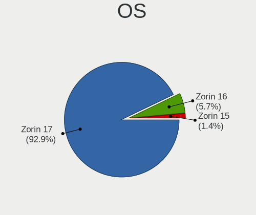
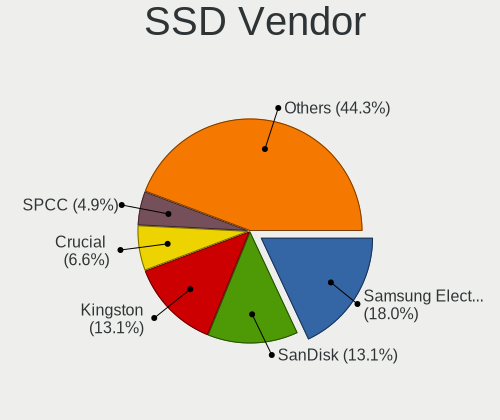
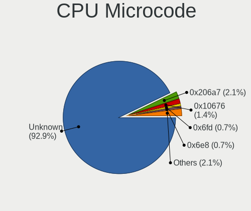
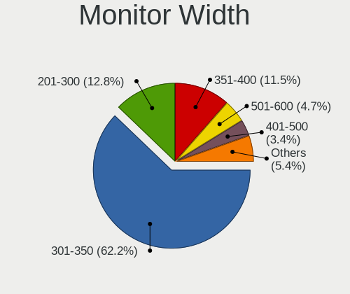
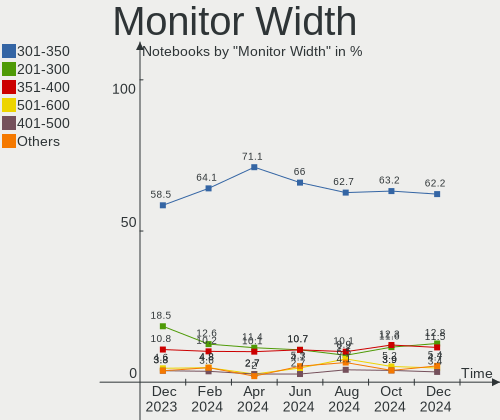
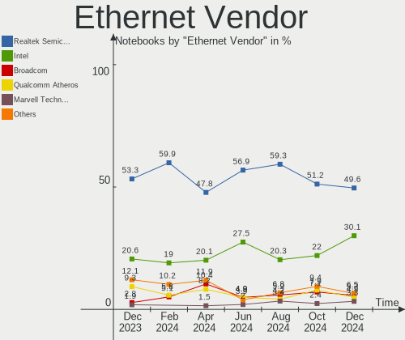
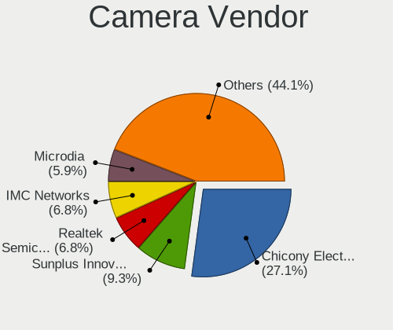
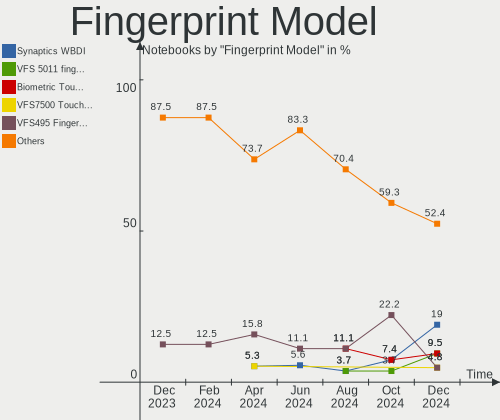

Zorin - Hardware Trends (Notebooks)
-----------------------------------

A project to identify most popular hardware characteristics and track their change
over time based on data collected by Linux users at https://Linux-Hardware.org.

Anyone can contribute to this report by the [hw-probe](https://github.com/linuxhw/hw-probe) tool:

    sudo -E hw-probe -all -upload

This report is for one last month. Overall report since the beginning of time: [TestCoverage](https://github.com/linuxhw/TestCoverage)

Period: Jan, 2023.

Contents
--------

* [ System ](#system)
  - [ OS                       ](#os)
  - [ OS Family                ](#os-family)
  - [ Kernel                   ](#kernel)
  - [ Kernel Family            ](#kernel-family)
  - [ Kernel Major Ver.        ](#kernel-major-ver)
  - [ Arch                     ](#arch)
  - [ DE                       ](#de)
  - [ Display Server           ](#display-server)
  - [ Display Manager          ](#display-manager)
  - [ OS Lang                  ](#os-lang)
  - [ Boot Mode                ](#boot-mode)
  - [ Filesystem               ](#filesystem)
  - [ Part. scheme             ](#part-scheme)
  - [ Dual Boot with Linux/BSD ](#dual-boot-with-linuxbsd)
  - [ Dual Boot (Win)          ](#dual-boot-win)

* [ Board ](#board)
  - [ Vendor                   ](#vendor)
  - [ Model                    ](#model)
  - [ Model Family             ](#model-family)
  - [ MFG Year                 ](#mfg-year)
  - [ Form Factor              ](#form-factor)
  - [ Secure Boot              ](#secure-boot)
  - [ Coreboot                 ](#coreboot)
  - [ RAM Size                 ](#ram-size)
  - [ RAM Used                 ](#ram-used)
  - [ Total Drives             ](#total-drives)
  - [ Has CD-ROM               ](#has-cd-rom)
  - [ Has Ethernet             ](#has-ethernet)
  - [ Has WiFi                 ](#has-wifi)
  - [ Has Bluetooth            ](#has-bluetooth)

* [ Location ](#location)
  - [ Country                  ](#country)
  - [ City                     ](#city)

* [ Drives ](#drives)
  - [ Drive Vendor             ](#drive-vendor)
  - [ Drive Model              ](#drive-model)
  - [ HDD Vendor               ](#hdd-vendor)
  - [ SSD Vendor               ](#ssd-vendor)
  - [ Drive Kind               ](#drive-kind)
  - [ Drive Connector          ](#drive-connector)
  - [ Drive Size               ](#drive-size)
  - [ Space Total              ](#space-total)
  - [ Space Used               ](#space-used)
  - [ Malfunc. Drives          ](#malfunc-drives)
  - [ Malfunc. Drive Vendor    ](#malfunc-drive-vendor)
  - [ Malfunc. HDD Vendor      ](#malfunc-hdd-vendor)
  - [ Malfunc. Drive Kind      ](#malfunc-drive-kind)
  - [ Failed Drives            ](#failed-drives)
  - [ Failed Drive Vendor      ](#failed-drive-vendor)
  - [ Drive Status             ](#drive-status)

* [ Storage controller ](#storage-controller)
  - [ Storage Vendor           ](#storage-vendor)
  - [ Storage Model            ](#storage-model)
  - [ Storage Kind             ](#storage-kind)

* [ Processor ](#processor)
  - [ CPU Vendor               ](#cpu-vendor)
  - [ CPU Model                ](#cpu-model)
  - [ CPU Model Family         ](#cpu-model-family)
  - [ CPU Cores                ](#cpu-cores)
  - [ CPU Sockets              ](#cpu-sockets)
  - [ CPU Threads              ](#cpu-threads)
  - [ CPU Op-Modes             ](#cpu-op-modes)
  - [ CPU Microcode            ](#cpu-microcode)
  - [ CPU Microarch            ](#cpu-microarch)

* [ Graphics ](#graphics)
  - [ GPU Vendor               ](#gpu-vendor)
  - [ GPU Model                ](#gpu-model)
  - [ GPU Combo                ](#gpu-combo)
  - [ GPU Driver               ](#gpu-driver)
  - [ GPU Memory               ](#gpu-memory)

* [ Monitor ](#monitor)
  - [ Monitor Vendor           ](#monitor-vendor)
  - [ Monitor Model            ](#monitor-model)
  - [ Monitor Resolution       ](#monitor-resolution)
  - [ Monitor Diagonal         ](#monitor-diagonal)
  - [ Monitor Width            ](#monitor-width)
  - [ Aspect Ratio             ](#aspect-ratio)
  - [ Monitor Area             ](#monitor-area)
  - [ Pixel Density            ](#pixel-density)
  - [ Multiple Monitors        ](#multiple-monitors)

* [ Network ](#network)
  - [ Net Controller Vendor    ](#net-controller-vendor)
  - [ Net Controller Model     ](#net-controller-model)
  - [ Wireless Vendor          ](#wireless-vendor)
  - [ Wireless Model           ](#wireless-model)
  - [ Ethernet Vendor          ](#ethernet-vendor)
  - [ Ethernet Model           ](#ethernet-model)
  - [ Net Controller Kind      ](#net-controller-kind)
  - [ Used Controller          ](#used-controller)
  - [ NICs                     ](#nics)
  - [ IPv6                     ](#ipv6)

* [ Bluetooth ](#bluetooth)
  - [ Bluetooth Vendor         ](#bluetooth-vendor)
  - [ Bluetooth Model          ](#bluetooth-model)

* [ Sound ](#sound)
  - [ Sound Vendor             ](#sound-vendor)
  - [ Sound Model              ](#sound-model)

* [ Memory ](#memory)
  - [ Memory Vendor            ](#memory-vendor)
  - [ Memory Model             ](#memory-model)
  - [ Memory Kind              ](#memory-kind)
  - [ Memory Form Factor       ](#memory-form-factor)
  - [ Memory Size              ](#memory-size)
  - [ Memory Speed             ](#memory-speed)

* [ Printers & scanners ](#printers--scanners)
  - [ Printer Vendor           ](#printer-vendor)
  - [ Printer Model            ](#printer-model)
  - [ Scanner Vendor           ](#scanner-vendor)
  - [ Scanner Model            ](#scanner-model)

* [ Camera ](#camera)
  - [ Camera Vendor            ](#camera-vendor)
  - [ Camera Model             ](#camera-model)

* [ Security ](#security)
  - [ Fingerprint Vendor       ](#fingerprint-vendor)
  - [ Fingerprint Model        ](#fingerprint-model)
  - [ Chipcard Vendor          ](#chipcard-vendor)
  - [ Chipcard Model           ](#chipcard-model)

* [ Unsupported ](#unsupported)
  - [ Unsupported Devices      ](#unsupported-devices)
  - [ Unsupported Device Types ](#unsupported-device-types)

System
------

OS
--

Installed operating systems

| Name     | Notebooks | Percent |
|----------|-----------|---------|
| Zorin 16 | 110       | 94.02%  |
| Zorin 15 | 7         | 5.98%   |

OS Family
---------

OS without a version

| Name  | Notebooks | Percent |
|-------|-----------|---------|
| Zorin | 117       | 100%    |

Kernel
------

Version of the Linux kernel

| Version           | Notebooks | Percent |
|-------------------|-----------|---------|
| 5.15.0-58-generic | 58        | 49.57%  |
| 5.15.0-56-generic | 31        | 26.5%   |
| 5.15.0-57-generic | 16        | 13.68%  |
| 5.4.0-136-generic | 3         | 2.56%   |
| 5.4.0-137-generic | 2         | 1.71%   |
| 5.4.0-45-generic  | 1         | 0.85%   |
| 5.4.0-135-generic | 1         | 0.85%   |
| 5.15.0-53-generic | 1         | 0.85%   |
| 5.15.0-43-generic | 1         | 0.85%   |
| 5.15.0-41-generic | 1         | 0.85%   |
| 5.13.0-27-generic | 1         | 0.85%   |
| 5.11.0-38-generic | 1         | 0.85%   |

Kernel Family
-------------

Linux kernel without a distro release

| Version | Notebooks | Percent |
|---------|-----------|---------|
| 5.15.0  | 108       | 92.31%  |
| 5.4.0   | 7         | 5.98%   |
| 5.13.0  | 1         | 0.85%   |
| 5.11.0  | 1         | 0.85%   |

Kernel Major Ver.
-----------------

Linux kernel major version

| Version | Notebooks | Percent |
|---------|-----------|---------|
| 5.15    | 108       | 92.31%  |
| 5.4     | 7         | 5.98%   |
| 5.13    | 1         | 0.85%   |
| 5.11    | 1         | 0.85%   |

Arch
----

OS architecture (x86_64, i586, etc.)

| Name   | Notebooks | Percent |
|--------|-----------|---------|
| x86_64 | 113       | 96.58%  |
| i686   | 4         | 3.42%   |

DE
--

Desktop Environment

| Name    | Notebooks | Percent |
|---------|-----------|---------|
| GNOME   | 85        | 72.65%  |
| XFCE    | 31        | 26.5%   |
| Unknown | 1         | 0.85%   |

Display Server
--------------

X11 or Wayland

| Name    | Notebooks | Percent |
|---------|-----------|---------|
| X11     | 115       | 98.29%  |
| Wayland | 2         | 1.71%   |

Display Manager
---------------

SDDM, LightDM, etc.

| Name    | Notebooks | Percent |
|---------|-----------|---------|
| Unknown | 79        | 67.52%  |
| GDM3    | 16        | 13.68%  |
| LightDM | 14        | 11.97%  |
| GDM     | 8         | 6.84%   |

OS Lang
-------

Language

| Lang        | Notebooks | Percent |
|-------------|-----------|---------|
| en_US       | 42        | 35.9%   |
| de_DE       | 12        | 10.26%  |
| fr_FR       | 8         | 6.84%   |
| en_CA       | 6         | 5.13%   |
| pt_BR       | 4         | 3.42%   |
| pl_PL       | 4         | 3.42%   |
| it_IT       | 4         | 3.42%   |
| en_AU       | 4         | 3.42%   |
| en_IN       | 3         | 2.56%   |
| en_GB       | 3         | 2.56%   |
| ja_JP       | 2         | 1.71%   |
| es_MX       | 2         | 1.71%   |
| es_ES       | 2         | 1.71%   |
| en_ZA       | 2         | 1.71%   |
| en_NZ       | 2         | 1.71%   |
| de_AT       | 2         | 1.71%   |
| sv_SE       | 1         | 0.85%   |
| sr_RS@latin | 1         | 0.85%   |
| pt_PT       | 1         | 0.85%   |
| nl_NL       | 1         | 0.85%   |
| nl_BE       | 1         | 0.85%   |
| hu_HU       | 1         | 0.85%   |
| hr_HR       | 1         | 0.85%   |
| fi_FI       | 1         | 0.85%   |
| es_DO       | 1         | 0.85%   |
| es_CR       | 1         | 0.85%   |
| es_CL       | 1         | 0.85%   |
| de_CH       | 1         | 0.85%   |
| cs_CZ       | 1         | 0.85%   |
| C           | 1         | 0.85%   |
| ar_EG       | 1         | 0.85%   |

Boot Mode
---------

EFI or BIOS

| Mode | Notebooks | Percent |
|------|-----------|---------|
| EFI  | 64        | 54.7%   |
| BIOS | 53        | 45.3%   |

Filesystem
----------

Type of filesystem

| Type    | Notebooks | Percent |
|---------|-----------|---------|
| Ext4    | 111       | 94.87%  |
| Zfs     | 3         | 2.56%   |
| Overlay | 2         | 1.71%   |
| Btrfs   | 1         | 0.85%   |

Part. scheme
------------

Scheme of partitioning

| Type    | Notebooks | Percent |
|---------|-----------|---------|
| Unknown | 82        | 70.09%  |
| GPT     | 26        | 22.22%  |
| MBR     | 9         | 7.69%   |

Dual Boot with Linux/BSD
------------------------

Hosting more than one Linux/BSD

| Dual boot | Notebooks | Percent |
|-----------|-----------|---------|
| No        | 111       | 94.87%  |
| Yes       | 6         | 5.13%   |

Dual Boot (Win)
---------------

Hosting Linux and Windows

| Dual boot | Notebooks | Percent |
|-----------|-----------|---------|
| No        | 108       | 92.31%  |
| Yes       | 9         | 7.69%   |

Board
-----

Vendor
------

Motherboard manufacturer

| Name                        | Notebooks | Percent |
|-----------------------------|-----------|---------|
| Hewlett-Packard             | 28        | 23.93%  |
| Lenovo                      | 26        | 22.22%  |
| Dell                        | 17        | 14.53%  |
| ASUSTek Computer            | 11        | 9.4%    |
| Acer                        | 9         | 7.69%   |
| Sony                        | 4         | 3.42%   |
| Toshiba                     | 3         | 2.56%   |
| Apple                       | 3         | 2.56%   |
| Packard Bell                | 2         | 1.71%   |
| Google                      | 2         | 1.71%   |
| Wortmann AG                 | 1         | 0.85%   |
| Timi                        | 1         | 0.85%   |
| Samsung Electronics         | 1         | 0.85%   |
| Multilaser                  | 1         | 0.85%   |
| MSI                         | 1         | 0.85%   |
| Kiano                       | 1         | 0.85%   |
| Itautec                     | 1         | 0.85%   |
| I-Life Digital Technologies | 1         | 0.85%   |
| HUAWEI                      | 1         | 0.85%   |
| Fujitsu                     | 1         | 0.85%   |
| Chuwi                       | 1         | 0.85%   |
| Alienware                   | 1         | 0.85%   |

Model
-----

Motherboard model

| Name                                  | Notebooks | Percent |
|---------------------------------------|-----------|---------|
| Lenovo Z51-70 80K6                    | 2         | 1.71%   |
| HP Pavilion dv6                       | 2         | 1.71%   |
| HP Notebook                           | 2         | 1.71%   |
| Wortmann AG Mobile 1524               | 1         | 0.85%   |
| Toshiba Satellite C50D-B              | 1         | 0.85%   |
| Toshiba Satellite C50-B               | 1         | 0.85%   |
| Toshiba QOSMIO X770                   | 1         | 0.85%   |
| Timi Mi Notebook Pro                  | 1         | 0.85%   |
| Sony VPCEB3L1E                        | 1         | 0.85%   |
| Sony VGN-SR16GN_B                     | 1         | 0.85%   |
| Sony SVE1513U1ESI                     | 1         | 0.85%   |
| Sony SVE1513C5E                       | 1         | 0.85%   |
| Samsung R520/R522/R620                | 1         | 0.85%   |
| Packard Bell EasyNote TM82            | 1         | 0.85%   |
| Packard Bell EasyNote TE69KB          | 1         | 0.85%   |
| Multilaser PC024                      | 1         | 0.85%   |
| MSI CR62 6M                           | 1         | 0.85%   |
| Lenovo V14-IIL 82C4                   | 1         | 0.85%   |
| Lenovo V110-15IAP 80TG                | 1         | 0.85%   |
| Lenovo ThinkPad T470 20HES0PF00       | 1         | 0.85%   |
| Lenovo ThinkPad T460s 20FAS1F200      | 1         | 0.85%   |
| Lenovo ThinkPad S1 Yoga 20CD0038MZ    | 1         | 0.85%   |
| Lenovo ThinkPad S1 Yoga 12 20DL0079US | 1         | 0.85%   |
| Lenovo ThinkPad R61 8918DEG           | 1         | 0.85%   |
| Lenovo IdeaPadFlex 15D 20334          | 1         | 0.85%   |
| Lenovo IdeaPad Y560                   | 1         | 0.85%   |
| Lenovo IdeaPad Gaming 3 15ARH05 82EY  | 1         | 0.85%   |
| Lenovo IdeaPad 5 15ITL05 82FG         | 1         | 0.85%   |
| Lenovo IdeaPad 330-15AST 81D6         | 1         | 0.85%   |
| Lenovo IdeaPad 310-15ABR 80ST         | 1         | 0.85%   |
| Lenovo IdeaPad 3 17IML05 81WC         | 1         | 0.85%   |
| Lenovo IdeaPad 3 17ABA7 82RQ          | 1         | 0.85%   |
| Lenovo IdeaPad 3 15ADA05 81W1         | 1         | 0.85%   |
| Lenovo IdeaPad 130-15AST 81H5         | 1         | 0.85%   |
| Lenovo IdeaPad 100S-11IBY 80R2        | 1         | 0.85%   |
| Lenovo IdeaPad 100-15IBY 80MJ         | 1         | 0.85%   |
| Lenovo IdeaPad 1 15ADA7 82R1          | 1         | 0.85%   |
| Lenovo G560 20042                     | 1         | 0.85%   |
| Lenovo G560 0679                      | 1         | 0.85%   |
| Lenovo E51-80 80QB                    | 1         | 0.85%   |

Model Family
------------

Motherboard model prefix

| Name                  | Notebooks | Percent |
|-----------------------|-----------|---------|
| Lenovo IdeaPad        | 12        | 10.26%  |
| Acer Aspire           | 8         | 6.84%   |
| HP Pavilion           | 7         | 5.98%   |
| HP EliteBook          | 6         | 5.13%   |
| Dell Latitude         | 6         | 5.13%   |
| Dell Inspiron         | 6         | 5.13%   |
| Lenovo ThinkPad       | 5         | 4.27%   |
| HP ProBook            | 3         | 2.56%   |
| HP Laptop             | 3         | 2.56%   |
| Dell Precision        | 3         | 2.56%   |
| Toshiba Satellite     | 2         | 1.71%   |
| Packard Bell EasyNote | 2         | 1.71%   |
| Lenovo Z51-70         | 2         | 1.71%   |
| Lenovo G560           | 2         | 1.71%   |
| HP Notebook           | 2         | 1.71%   |
| Dell Vostro           | 2         | 1.71%   |
| Wortmann AG Mobile    | 1         | 0.85%   |
| Toshiba QOSMIO        | 1         | 0.85%   |
| Timi Mi               | 1         | 0.85%   |
| Sony VPCEB3L1E        | 1         | 0.85%   |
| Sony VGN-SR16GN       | 1         | 0.85%   |
| Sony SVE1513U1ESI     | 1         | 0.85%   |
| Sony SVE1513C5E       | 1         | 0.85%   |
| Samsung R520          | 1         | 0.85%   |
| Multilaser PC024      | 1         | 0.85%   |
| MSI CR62              | 1         | 0.85%   |
| Lenovo V14-IIL        | 1         | 0.85%   |
| Lenovo V110-15IAP     | 1         | 0.85%   |
| Lenovo IdeaPadFlex    | 1         | 0.85%   |
| Lenovo E51-80         | 1         | 0.85%   |
| Lenovo B51-80         | 1         | 0.85%   |
| Kiano Elegance        | 1         | 0.85%   |
| Itautec Infoway       | 1         | 0.85%   |
| I-Life Digital ZED    | 1         | 0.85%   |
| HUAWEI NBLB-WAX9N     | 1         | 0.85%   |
| HP ZBook              | 1         | 0.85%   |
| HP Victus             | 1         | 0.85%   |
| HP Stream             | 1         | 0.85%   |
| HP Presario           | 1         | 0.85%   |
| HP Compaq             | 1         | 0.85%   |

MFG Year
--------

Motherboard manufacture year

| Year | Notebooks | Percent |
|------|-----------|---------|
| 2015 | 11        | 9.4%    |
| 2016 | 9         | 7.69%   |
| 2013 | 9         | 7.69%   |
| 2010 | 9         | 7.69%   |
| 2018 | 8         | 6.84%   |
| 2022 | 7         | 5.98%   |
| 2021 | 7         | 5.98%   |
| 2020 | 7         | 5.98%   |
| 2014 | 7         | 5.98%   |
| 2012 | 7         | 5.98%   |
| 2011 | 7         | 5.98%   |
| 2019 | 6         | 5.13%   |
| 2017 | 6         | 5.13%   |
| 2008 | 6         | 5.13%   |
| 2009 | 5         | 4.27%   |
| 2007 | 5         | 4.27%   |
| 2005 | 1         | 0.85%   |

Form Factor
-----------

Physical design of the computer

| Name     | Notebooks | Percent |
|----------|-----------|---------|
| Notebook | 117       | 100%    |

Secure Boot
-----------

Enabled or disabled

| State    | Notebooks | Percent |
|----------|-----------|---------|
| Disabled | 103       | 88.03%  |
| Enabled  | 14        | 11.97%  |

Coreboot
--------

Have coreboot on board

| Used | Notebooks | Percent |
|------|-----------|---------|
| No   | 115       | 98.29%  |
| Yes  | 2         | 1.71%   |

RAM Size
--------

Total RAM memory

| Size in GB | Notebooks | Percent |
|------------|-----------|---------|
| 4.01-8.0   | 38        | 32.48%  |
| 3.01-4.0   | 29        | 24.79%  |
| 16.01-24.0 | 18        | 15.38%  |
| 8.01-16.0  | 15        | 12.82%  |
| 1.01-2.0   | 10        | 8.55%   |
| 2.01-3.0   | 4         | 3.42%   |
| 32.01-64.0 | 3         | 2.56%   |

RAM Used
--------

Used RAM memory

| Used GB   | Notebooks | Percent |
|-----------|-----------|---------|
| 1.01-2.0  | 51        | 43.59%  |
| 2.01-3.0  | 39        | 33.33%  |
| 3.01-4.0  | 12        | 10.26%  |
| 4.01-8.0  | 9         | 7.69%   |
| 0.51-1.0  | 4         | 3.42%   |
| 8.01-16.0 | 2         | 1.71%   |

Total Drives
------------

Number of drives on board

| Drives | Notebooks | Percent |
|--------|-----------|---------|
| 1      | 93        | 79.49%  |
| 2      | 22        | 18.8%   |
| 3      | 2         | 1.71%   |

Has CD-ROM
----------

Has CD-ROM on board

| Presented | Notebooks | Percent |
|-----------|-----------|---------|
| Yes       | 59        | 50.43%  |
| No        | 58        | 49.57%  |

Has Ethernet
------------

Has Ethernet on board

| Presented | Notebooks | Percent |
|-----------|-----------|---------|
| Yes       | 91        | 77.78%  |
| No        | 26        | 22.22%  |

Has WiFi
--------

Has WiFi module

| Presented | Notebooks | Percent |
|-----------|-----------|---------|
| Yes       | 112       | 95.73%  |
| No        | 5         | 4.27%   |

Has Bluetooth
-------------

Has Bluetooth module

| Presented | Notebooks | Percent |
|-----------|-----------|---------|
| Yes       | 80        | 68.38%  |
| No        | 37        | 31.62%  |

Location
--------

Country
-------

Geographic location (country)

| Country            | Notebooks | Percent |
|--------------------|-----------|---------|
| USA                | 28        | 23.93%  |
| Germany            | 12        | 10.26%  |
| France             | 7         | 5.98%   |
| Canada             | 6         | 5.13%   |
| UK                 | 4         | 3.42%   |
| Poland             | 4         | 3.42%   |
| Italy              | 4         | 3.42%   |
| Portugal           | 3         | 2.56%   |
| Netherlands        | 3         | 2.56%   |
| India              | 3         | 2.56%   |
| Brazil             | 3         | 2.56%   |
| Australia          | 3         | 2.56%   |
| Spain              | 2         | 1.71%   |
| South Africa       | 2         | 1.71%   |
| Serbia             | 2         | 1.71%   |
| New Zealand        | 2         | 1.71%   |
| Mexico             | 2         | 1.71%   |
| Japan              | 2         | 1.71%   |
| Hungary            | 2         | 1.71%   |
| Austria            | 2         | 1.71%   |
| Algeria            | 2         | 1.71%   |
| Yemen              | 1         | 0.85%   |
| Tunisia            | 1         | 0.85%   |
| Switzerland        | 1         | 0.85%   |
| Sweden             | 1         | 0.85%   |
| South Korea        | 1         | 0.85%   |
| Saudi Arabia       | 1         | 0.85%   |
| Philippines        | 1         | 0.85%   |
| Norway             | 1         | 0.85%   |
| Mali               | 1         | 0.85%   |
| Israel             | 1         | 0.85%   |
| Indonesia          | 1         | 0.85%   |
| Finland            | 1         | 0.85%   |
| Egypt              | 1         | 0.85%   |
| Dominican Republic | 1         | 0.85%   |
| Czechia            | 1         | 0.85%   |
| Croatia            | 1         | 0.85%   |
| Costa Rica         | 1         | 0.85%   |
| Chile              | 1         | 0.85%   |
| Belgium            | 1         | 0.85%   |

City
----

Geographic location (city)

| City               | Notebooks | Percent |
|--------------------|-----------|---------|
| Vienna             | 2         | 1.71%   |
| Melbourne          | 2         | 1.71%   |
| Calgary            | 2         | 1.71%   |
| Belgrade           | 2         | 1.71%   |
| Zulawki            | 1         | 0.85%   |
| Wingham            | 1         | 0.85%   |
| Willoughby         | 1         | 0.85%   |
| West Monroe        | 1         | 0.85%   |
| Wernigerode        | 1         | 0.85%   |
| Wendeburg          | 1         | 0.85%   |
| Vila Verde         | 1         | 0.85%   |
| Vaxjo              | 1         | 0.85%   |
| Valencia           | 1         | 0.85%   |
| Tunis              | 1         | 0.85%   |
| Toronto            | 1         | 0.85%   |
| Tokyo              | 1         | 0.85%   |
| The Bronx          | 1         | 0.85%   |
| Tencin             | 1         | 0.85%   |
| Tel Aviv           | 1         | 0.85%   |
| Tampere            | 1         | 0.85%   |
| Sydney             | 1         | 0.85%   |
| Stavanger          | 1         | 0.85%   |
| St Louis           | 1         | 0.85%   |
| Spring             | 1         | 0.85%   |
| Seongnam-si        | 1         | 0.85%   |
| Seattle            | 1         | 0.85%   |
| Santo Domingo Este | 1         | 0.85%   |
| Sanaa              | 1         | 0.85%   |
| San José          | 1         | 0.85%   |
| Saint-Pol-sur-Mer  | 1         | 0.85%   |
| Saint-Affrique     | 1         | 0.85%   |
| Saint Ives         | 1         | 0.85%   |
| Rudolstadt         | 1         | 0.85%   |
| Roelofarendsveen   | 1         | 0.85%   |
| Riyadh             | 1         | 0.85%   |
| Rivas-Vaciamadrid  | 1         | 0.85%   |
| Radeburg           | 1         | 0.85%   |
| Racine             | 1         | 0.85%   |
| Puebla City        | 1         | 0.85%   |
| Praia Grande       | 1         | 0.85%   |

Drives
------

Drive Vendor
------------

Hard drive vendors

| Vendor                      | Notebooks | Drives | Percent |
|-----------------------------|-----------|--------|---------|
| Seagate                     | 17        | 18     | 12.41%  |
| Samsung Electronics         | 17        | 17     | 12.41%  |
| WDC                         | 15        | 15     | 10.95%  |
| Unknown                     | 13        | 17     | 9.49%   |
| Crucial                     | 10        | 10     | 7.3%    |
| Toshiba                     | 9         | 9      | 6.57%   |
| SanDisk                     | 9         | 9      | 6.57%   |
| Intel                       | 6         | 6      | 4.38%   |
| Kingston                    | 5         | 5      | 3.65%   |
| Hitachi                     | 5         | 5      | 3.65%   |
| HGST                        | 5         | 5      | 3.65%   |
| SK hynix                    | 3         | 3      | 2.19%   |
| KIOXIA                      | 3         | 3      | 2.19%   |
| Silicon Motion              | 2         | 2      | 1.46%   |
| Micron Technology           | 2         | 2      | 1.46%   |
| Kingston Technology Company | 2         | 2      | 1.46%   |
| Fujitsu                     | 2         | 2      | 1.46%   |
| SSD 2TB                     | 1         | 1      | 0.73%   |
| SPCC                        | 1         | 1      | 0.73%   |
| Plextor                     | 1         | 1      | 0.73%   |
| LITEONIT                    | 1         | 1      | 0.73%   |
| Intenso                     | 1         | 1      | 0.73%   |
| Hewlett-Packard             | 1         | 1      | 0.73%   |
| GOODRAM                     | 1         | 1      | 0.73%   |
| Fanxiang                    | 1         | 1      | 0.73%   |
| China                       | 1         | 1      | 0.73%   |
| Apple                       | 1         | 1      | 0.73%   |
| A-DATA Technology           | 1         | 1      | 0.73%   |
| Unknown                     | 1         | 1      | 0.73%   |

Drive Model
-----------

Hard drive models

| Model                                 | Notebooks | Percent |
|---------------------------------------|-----------|---------|
| Unknown MMC Card  32GB                | 7         | 4.96%   |
| Unknown MMC Card  64GB                | 3         | 2.13%   |
| Seagate ST500LT012-1DG142 500GB       | 3         | 2.13%   |
| HGST HTS541010A9E680 1TB              | 3         | 2.13%   |
| Crucial CT500MX500SSD1 500GB          | 3         | 2.13%   |
| Unknown MMC Card  16GB                | 2         | 1.42%   |
| Unknown MMC Card  128GB               | 2         | 1.42%   |
| Toshiba MQ04ABF100 1TB                | 2         | 1.42%   |
| Toshiba MQ01ABD100 1TB                | 2         | 1.42%   |
| Toshiba BG3 NVMe SSD Controller 256GB | 2         | 1.42%   |
| Seagate ST500LM012 HN-M500MBB 500GB   | 2         | 1.42%   |
| Seagate ST1000LM035-1RK172 1TB        | 2         | 1.42%   |
| Kingston SA400S37240G 240GB SSD       | 2         | 1.42%   |
| Intel SSD 660P Series 512GB           | 2         | 1.42%   |
| Hitachi HTS547575A9E384 752GB         | 2         | 1.42%   |
| WDC WDS500G2B0A-00SM50 500GB SSD      | 1         | 0.71%   |
| WDC WDS200T2B0A-00SM50 2TB SSD        | 1         | 0.71%   |
| WDC WD7500BPVX-22JC3T0 752GB          | 1         | 0.71%   |
| WDC WD7500BPVT-55HXZT4 752GB          | 1         | 0.71%   |
| WDC WD5000LPVX-60V0TT0 500GB          | 1         | 0.71%   |
| WDC WD5000LPVX-22V0TT0 500GB          | 1         | 0.71%   |
| WDC WD5000LPLX-75ZNTT0 500GB          | 1         | 0.71%   |
| WDC WD5000LPCX-75VHAT0 500GB          | 1         | 0.71%   |
| WDC WD5000BPVT-24HXZT3 500GB          | 1         | 0.71%   |
| WDC WD5000BEVT-24A0RT0 500GB          | 1         | 0.71%   |
| WDC WD3200BPVT-80JJ5T0 320GB          | 1         | 0.71%   |
| WDC WD3200BPVT-24ZEST0 320GB          | 1         | 0.71%   |
| WDC WD3200BPVT-00HXZT1 320GB          | 1         | 0.71%   |
| WDC WD3200BEVT-60ZCT1 320GB           | 1         | 0.71%   |
| WDC WD10JPCX-24UE4T0 1TB              | 1         | 0.71%   |
| Unknown SD/MMC/MS PRO 2GB             | 1         | 0.71%   |
| Unknown MMC Card  67GB                | 1         | 0.71%   |
| Unknown MMC Card  272GB               | 1         | 0.71%   |
| Toshiba XG6 NVMe SSD Controller 512GB | 1         | 0.71%   |
| Toshiba MQ01ACF050 500GB              | 1         | 0.71%   |
| Toshiba MK3261GSYN 320GB              | 1         | 0.71%   |
| SSD 2TB Disk 2TB                      | 1         | 0.71%   |
| SPCC Solid State Disk 1024GB          | 1         | 0.71%   |
| SK hynix HFM512GD3JX013N 512GB        | 1         | 0.71%   |
| SK hynix HFM256GD3JX016N 256GB        | 1         | 0.71%   |

HDD Vendor
----------

Hard disk drive vendors

| Vendor              | Notebooks | Drives | Percent |
|---------------------|-----------|--------|---------|
| Seagate             | 17        | 18     | 32.69%  |
| WDC                 | 13        | 13     | 25%     |
| Toshiba             | 6         | 6      | 11.54%  |
| Hitachi             | 5         | 5      | 9.62%   |
| HGST                | 5         | 5      | 9.62%   |
| Samsung Electronics | 3         | 3      | 5.77%   |
| Fujitsu             | 2         | 2      | 3.85%   |
| Unknown             | 1         | 1      | 1.92%   |

SSD Vendor
----------

Solid state drive vendors

| Vendor              | Notebooks | Drives | Percent |
|---------------------|-----------|--------|---------|
| Crucial             | 10        | 10     | 23.26%  |
| Samsung Electronics | 9         | 9      | 20.93%  |
| SanDisk             | 7         | 7      | 16.28%  |
| Kingston            | 5         | 5      | 11.63%  |
| WDC                 | 2         | 2      | 4.65%   |
| Intel               | 2         | 2      | 4.65%   |
| SPCC                | 1         | 1      | 2.33%   |
| Plextor             | 1         | 1      | 2.33%   |
| Micron Technology   | 1         | 1      | 2.33%   |
| LITEONIT            | 1         | 1      | 2.33%   |
| Hewlett-Packard     | 1         | 1      | 2.33%   |
| GOODRAM             | 1         | 1      | 2.33%   |
| China               | 1         | 1      | 2.33%   |
| A-DATA Technology   | 1         | 1      | 2.33%   |

Drive Kind
----------

HDD or SSD

| Kind    | Notebooks | Drives | Percent |
|---------|-----------|--------|---------|
| HDD     | 51        | 53     | 37.78%  |
| SSD     | 42        | 43     | 31.11%  |
| NVMe    | 25        | 26     | 18.52%  |
| MMC     | 14        | 17     | 10.37%  |
| Unknown | 3         | 3      | 2.22%   |

Drive Connector
---------------

SATA, SAS, NVMe, etc.

| Type | Notebooks | Drives | Percent |
|------|-----------|--------|---------|
| SATA | 90        | 95     | 67.67%  |
| NVMe | 25        | 26     | 18.8%   |
| MMC  | 14        | 17     | 10.53%  |
| SAS  | 4         | 4      | 3.01%   |

Drive Size
----------

Size of hard drive

| Size in TB | Notebooks | Drives | Percent |
|------------|-----------|--------|---------|
| 0.01-0.5   | 65        | 69     | 70.65%  |
| 0.51-1.0   | 22        | 22     | 23.91%  |
| 1.01-2.0   | 4         | 4      | 4.35%   |
| 4.01-10.0  | 1         | 1      | 1.09%   |

Space Total
-----------

Amount of disk space available on the file system

| Size in GB     | Notebooks | Percent |
|----------------|-----------|---------|
| 251-500        | 36        | 30.77%  |
| 101-250        | 35        | 29.91%  |
| 501-1000       | 16        | 13.68%  |
| 51-100         | 12        | 10.26%  |
| 21-50          | 8         | 6.84%   |
| 1001-2000      | 5         | 4.27%   |
| 2001-3000      | 2         | 1.71%   |
| More than 3000 | 1         | 0.85%   |
| 1-20           | 1         | 0.85%   |
| Unknown        | 1         | 0.85%   |

Space Used
----------

Amount of used disk space

| Used GB   | Notebooks | Percent |
|-----------|-----------|---------|
| 1-20      | 42        | 35.9%   |
| 21-50     | 32        | 27.35%  |
| 51-100    | 20        | 17.09%  |
| 101-250   | 14        | 11.97%  |
| 251-500   | 4         | 3.42%   |
| 1001-2000 | 2         | 1.71%   |
| 501-1000  | 2         | 1.71%   |
| Unknown   | 1         | 0.85%   |

Malfunc. Drives
---------------

Drive models with a malfunction

| Model                           | Notebooks | Drives | Percent |
|---------------------------------|-----------|--------|---------|
| WDC WD5000BEVT-24A0RT0 500GB    | 1         | 1      | 20%     |
| Seagate ST9320310AS 320GB       | 1         | 1      | 20%     |
| Kingston SA400S37120G 120GB SSD | 1         | 1      | 20%     |
| Hitachi HTS547575A9E384 752GB   | 1         | 1      | 20%     |
| HGST HTS541010A7E630 1TB        | 1         | 1      | 20%     |

Malfunc. Drive Vendor
---------------------

Vendors of faulty drives

| Vendor   | Notebooks | Drives | Percent |
|----------|-----------|--------|---------|
| WDC      | 1         | 1      | 20%     |
| Seagate  | 1         | 1      | 20%     |
| Kingston | 1         | 1      | 20%     |
| Hitachi  | 1         | 1      | 20%     |
| HGST     | 1         | 1      | 20%     |

Malfunc. HDD Vendor
-------------------

Vendors of faulty HDD drives

| Vendor  | Notebooks | Drives | Percent |
|---------|-----------|--------|---------|
| WDC     | 1         | 1      | 25%     |
| Seagate | 1         | 1      | 25%     |
| Hitachi | 1         | 1      | 25%     |
| HGST    | 1         | 1      | 25%     |

Malfunc. Drive Kind
-------------------

Kinds of faulty drives

| Kind | Notebooks | Drives | Percent |
|------|-----------|--------|---------|
| HDD  | 4         | 4      | 80%     |
| SSD  | 1         | 1      | 20%     |

Failed Drives
-------------

Failed drive models

Zero info for selected period =(

Failed Drive Vendor
-------------------

Failed drive vendors

Zero info for selected period =(

Drive Status
------------

Number of failed and malfunc. drives

| Status   | Notebooks | Drives | Percent |
|----------|-----------|--------|---------|
| Detected | 105       | 128    | 88.24%  |
| Works    | 9         | 9      | 7.56%   |
| Malfunc  | 5         | 5      | 4.2%    |

Storage controller
------------------

Storage Vendor
--------------

Storage controller vendors

| Vendor                           | Notebooks | Percent |
|----------------------------------|-----------|---------|
| Intel                            | 82        | 65.08%  |
| AMD                              | 19        | 15.08%  |
| Samsung Electronics              | 5         | 3.97%   |
| Toshiba America Info Systems     | 3         | 2.38%   |
| SK hynix                         | 3         | 2.38%   |
| KIOXIA                           | 3         | 2.38%   |
| Silicon Motion                   | 2         | 1.59%   |
| SanDisk                          | 2         | 1.59%   |
| Nvidia                           | 2         | 1.59%   |
| Kingston Technology Company      | 2         | 1.59%   |
| Silicon Integrated Systems [SiS] | 1         | 0.79%   |
| Micron Technology                | 1         | 0.79%   |
| Apple                            | 1         | 0.79%   |

Storage Model
-------------

Storage controller models

| Model                                                                          | Notebooks | Percent |
|--------------------------------------------------------------------------------|-----------|---------|
| AMD FCH SATA Controller [AHCI mode]                                            | 16        | 11.68%  |
| Intel Sunrise Point-LP SATA Controller [AHCI mode]                             | 12        | 8.76%   |
| Intel 7 Series Chipset Family 6-port SATA Controller [AHCI mode]               | 8         | 5.84%   |
| Intel Wildcat Point-LP SATA Controller [AHCI Mode]                             | 6         | 4.38%   |
| Intel 82801 Mobile SATA Controller [RAID mode]                                 | 6         | 4.38%   |
| Intel 6 Series/C200 Series Chipset Family 6 port Mobile SATA AHCI Controller   | 6         | 4.38%   |
| Intel 82801IBM/IEM (ICH9M/ICH9M-E) 4 port SATA Controller [AHCI mode]          | 5         | 3.65%   |
| Intel 5 Series/3400 Series Chipset 4 port SATA AHCI Controller                 | 5         | 3.65%   |
| Intel Volume Management Device NVMe RAID Controller                            | 4         | 2.92%   |
| SK hynix Gold P31/PC711 NVMe Solid State Drive                                 | 3         | 2.19%   |
| Samsung NVMe SSD Controller 980                                                | 3         | 2.19%   |
| KIOXIA NVMe SSD Controller BG4                                                 | 3         | 2.19%   |
| Intel Celeron N3350/Pentium N4200/Atom E3900 Series SATA AHCI Controller       | 3         | 2.19%   |
| Intel Atom Processor E3800 Series SATA AHCI Controller                         | 3         | 2.19%   |
| Intel 82801HM/HEM (ICH8M/ICH8M-E) SATA Controller [AHCI mode]                  | 3         | 2.19%   |
| Intel 82801HM/HEM (ICH8M/ICH8M-E) IDE Controller                               | 3         | 2.19%   |
| Intel 8 Series/C220 Series Chipset Family 6-port SATA Controller 1 [AHCI mode] | 3         | 2.19%   |
| AMD SB7x0/SB8x0/SB9x0 SATA Controller [AHCI mode]                              | 3         | 2.19%   |
| Toshiba America Info Systems BG3 NVMe SSD Controller                           | 2         | 1.46%   |
| Intel Tiger Lake-LP SATA Controller                                            | 2         | 1.46%   |
| Intel Jasper Lake SATA AHCI Controller                                         | 2         | 1.46%   |
| Intel Comet Lake SATA AHCI Controller                                          | 2         | 1.46%   |
| Intel 82801GBM/GHM (ICH7-M Family) SATA Controller [AHCI mode]                 | 2         | 1.46%   |
| Intel 82801G (ICH7 Family) IDE Controller                                      | 2         | 1.46%   |
| Intel 5 Series/3400 Series Chipset 6 port SATA AHCI Controller                 | 2         | 1.46%   |
| Toshiba America Info Systems XG6 NVMe SSD Controller                           | 1         | 0.73%   |
| Silicon Motion SM2263EN/SM2263XT SSD Controller                                | 1         | 0.73%   |
| Silicon Motion SM2262/SM2262EN SSD Controller                                  | 1         | 0.73%   |
| Silicon Integrated Systems [SiS] 5513 IDE Controller                           | 1         | 0.73%   |
| SanDisk WD Black SN750 / PC SN730 NVMe SSD                                     | 1         | 0.73%   |
| SanDisk Non-Volatile memory controller                                         | 1         | 0.73%   |
| Samsung NVMe SSD Controller SM981/PM981/PM983                                  | 1         | 0.73%   |
| Samsung NVMe SSD Controller PM9B1                                              | 1         | 0.73%   |
| Nvidia MCP79 AHCI Controller                                                   | 1         | 0.73%   |
| Nvidia MCP51 Serial ATA Controller                                             | 1         | 0.73%   |
| Nvidia MCP51 IDE                                                               | 1         | 0.73%   |
| Micron Non-Volatile memory controller                                          | 1         | 0.73%   |
| Kingston Company U-SNS8154P3 NVMe SSD                                          | 1         | 0.73%   |
| Kingston Company OM3PDP3 NVMe SSD                                              | 1         | 0.73%   |
| Intel SSD 660P Series                                                          | 1         | 0.73%   |

Storage Kind
------------

Kind of storage controller (IDE, SATA, NVMe, SAS, ...)

| Kind | Notebooks | Percent |
|------|-----------|---------|
| SATA | 91        | 67.41%  |
| NVMe | 24        | 17.78%  |
| RAID | 10        | 7.41%   |
| IDE  | 10        | 7.41%   |

Processor
---------

CPU Vendor
----------

Processor vendors

| Vendor | Notebooks | Percent |
|--------|-----------|---------|
| Intel  | 93        | 79.49%  |
| AMD    | 24        | 20.51%  |

CPU Model
---------

Processor models

| Model                                        | Notebooks | Percent |
|----------------------------------------------|-----------|---------|
| Intel Core i7-6500U CPU @ 2.50GHz            | 4         | 3.42%   |
| Intel Core i7-2670QM CPU @ 2.20GHz           | 3         | 2.56%   |
| Intel Core i5-3230M CPU @ 2.60GHz            | 3         | 2.56%   |
| Intel Celeron CPU N3350 @ 1.10GHz            | 3         | 2.56%   |
| Intel Celeron CPU N2840 @ 2.16GHz            | 3         | 2.56%   |
| Intel Core i7-3632QM CPU @ 2.20GHz           | 2         | 1.71%   |
| Intel Core i5-6300U CPU @ 2.40GHz            | 2         | 1.71%   |
| Intel Core i5-6200U CPU @ 2.30GHz            | 2         | 1.71%   |
| Intel Core i5-5200U CPU @ 2.20GHz            | 2         | 1.71%   |
| Intel Core i5-2540M CPU @ 2.60GHz            | 2         | 1.71%   |
| Intel Core i3-10110U CPU @ 2.10GHz           | 2         | 1.71%   |
| Intel Core i3 CPU M 370 @ 2.40GHz            | 2         | 1.71%   |
| Intel Atom CPU Z3735F @ 1.33GHz              | 2         | 1.71%   |
| Intel 11th Gen Core i5-1135G7 @ 2.40GHz      | 2         | 1.71%   |
| AMD Athlon II P360 Dual-Core Processor       | 2         | 1.71%   |
| AMD A9-9425 RADEON R5, 5 COMPUTE CORES 2C+3G | 2         | 1.71%   |
| AMD A6-5200 APU with Radeon HD Graphics      | 2         | 1.71%   |
| Intel Pentium Silver N6000 @ 1.10GHz         | 1         | 0.85%   |
| Intel Pentium Dual-Core CPU T4500 @ 2.30GHz  | 1         | 0.85%   |
| Intel Pentium Dual-Core CPU T4300 @ 2.10GHz  | 1         | 0.85%   |
| Intel Pentium Dual CPU T3200 @ 2.00GHz       | 1         | 0.85%   |
| Intel Pentium Dual CPU T2330 @ 1.60GHz       | 1         | 0.85%   |
| Intel Pentium CPU P6200 @ 2.13GHz            | 1         | 0.85%   |
| Intel Pentium CPU P6100 @ 2.00GHz            | 1         | 0.85%   |
| Intel Genuine CPU T2080 @ 1.73GHz            | 1         | 0.85%   |
| Intel Core M-5Y31 CPU @ 0.90GHz              | 1         | 0.85%   |
| Intel Core M-5Y10c CPU @ 0.80GHz             | 1         | 0.85%   |
| Intel Core i7-8850H CPU @ 2.60GHz            | 1         | 0.85%   |
| Intel Core i7-8565U CPU @ 1.80GHz            | 1         | 0.85%   |
| Intel Core i7-8550U CPU @ 1.80GHz            | 1         | 0.85%   |
| Intel Core i7-6820HQ CPU @ 2.70GHz           | 1         | 0.85%   |
| Intel Core i7-5500U CPU @ 2.40GHz            | 1         | 0.85%   |
| Intel Core i7-4800MQ CPU @ 2.70GHz           | 1         | 0.85%   |
| Intel Core i7-4702MQ CPU @ 2.20GHz           | 1         | 0.85%   |
| Intel Core i7-4700HQ CPU @ 2.40GHz           | 1         | 0.85%   |
| Intel Core i7-4600U CPU @ 2.10GHz            | 1         | 0.85%   |
| Intel Core i7-4600M CPU @ 2.90GHz            | 1         | 0.85%   |
| Intel Core i7-4500U CPU @ 1.80GHz            | 1         | 0.85%   |
| Intel Core i7-3610QM CPU @ 2.30GHz           | 1         | 0.85%   |
| Intel Core i7-2617M CPU @ 1.50GHz            | 1         | 0.85%   |

CPU Model Family
----------------

Processor model prefix

| Model                   | Notebooks | Percent |
|-------------------------|-----------|---------|
| Intel Core i5           | 23        | 19.66%  |
| Intel Core i7           | 22        | 18.8%   |
| Intel Core i3           | 10        | 8.55%   |
| Intel Celeron           | 10        | 8.55%   |
| Other                   | 8         | 6.84%   |
| Intel Core 2 Duo        | 6         | 5.13%   |
| Intel Atom              | 4         | 3.42%   |
| AMD Ryzen 7             | 4         | 3.42%   |
| Intel Pentium Dual-Core | 2         | 1.71%   |
| Intel Pentium Dual      | 2         | 1.71%   |
| Intel Pentium           | 2         | 1.71%   |
| Intel Core M            | 2         | 1.71%   |
| AMD Ryzen 5             | 2         | 1.71%   |
| AMD Athlon II           | 2         | 1.71%   |
| AMD Athlon              | 2         | 1.71%   |
| AMD A6                  | 2         | 1.71%   |
| AMD A10                 | 2         | 1.71%   |
| Intel Pentium Silver    | 1         | 0.85%   |
| Intel Genuine           | 1         | 0.85%   |
| Intel Core 2            | 1         | 0.85%   |
| Intel Celeron M         | 1         | 0.85%   |
| AMD V120                | 1         | 0.85%   |
| AMD Turion 64 X2 Mobile | 1         | 0.85%   |
| AMD Ryzen 5 PRO         | 1         | 0.85%   |
| AMD Mobile Sempron      | 1         | 0.85%   |
| AMD E2                  | 1         | 0.85%   |
| AMD E1                  | 1         | 0.85%   |
| AMD A8                  | 1         | 0.85%   |
| AMD A12                 | 1         | 0.85%   |

CPU Cores
---------

Number of processor cores

| Number | Notebooks | Percent |
|--------|-----------|---------|
| 2      | 78        | 66.67%  |
| 4      | 28        | 23.93%  |
| 8      | 4         | 3.42%   |
| 6      | 3         | 2.56%   |
| 1      | 3         | 2.56%   |
| 10     | 1         | 0.85%   |

CPU Sockets
-----------

Number of sockets

| Number | Notebooks | Percent |
|--------|-----------|---------|
| 1      | 117       | 100%    |

CPU Threads
-----------

Threads per core (Hyper-Threading)

| Number | Notebooks | Percent |
|--------|-----------|---------|
| 2      | 73        | 62.39%  |
| 1      | 44        | 37.61%  |

CPU Op-Modes
------------

CPU Operation Modes (32-bit, 64-bit)

| Op mode        | Notebooks | Percent |
|----------------|-----------|---------|
| 32-bit, 64-bit | 115       | 98.29%  |
| 32-bit         | 2         | 1.71%   |

CPU Microcode
-------------

Microcode number

| Number     | Notebooks | Percent |
|------------|-----------|---------|
| 0x406e3    | 8         | 6.84%   |
| 0x306d4    | 8         | 6.84%   |
| 0x306a9    | 8         | 6.84%   |
| 0x30678    | 7         | 5.98%   |
| 0x206a7    | 7         | 5.98%   |
| 0x20655    | 6         | 5.13%   |
| 0x1067a    | 6         | 5.13%   |
| Unknown    | 6         | 5.13%   |
| 0x806c1    | 4         | 3.42%   |
| 0x306c3    | 4         | 3.42%   |
| 0x0a50000c | 4         | 3.42%   |
| 0x806ea    | 3         | 2.56%   |
| 0x506c9    | 3         | 2.56%   |
| 0x40651    | 3         | 2.56%   |
| 0x06006705 | 3         | 2.56%   |
| 0x010000c8 | 3         | 2.56%   |
| 0x906c0    | 2         | 1.71%   |
| 0x806ec    | 2         | 1.71%   |
| 0x806e9    | 2         | 1.71%   |
| 0x6fd      | 2         | 1.71%   |
| 0x506e3    | 2         | 1.71%   |
| 0x20652    | 2         | 1.71%   |
| 0x906ea    | 1         | 0.85%   |
| 0x906a4    | 1         | 0.85%   |
| 0x806eb    | 1         | 0.85%   |
| 0x806c2    | 1         | 0.85%   |
| 0x706e5    | 1         | 0.85%   |
| 0x706a8    | 1         | 0.85%   |
| 0x706a1    | 1         | 0.85%   |
| 0x6f6      | 1         | 0.85%   |
| 0x6ec      | 1         | 0.85%   |
| 0x406c4    | 1         | 0.85%   |
| 0x10676    | 1         | 0.85%   |
| 0x10661    | 1         | 0.85%   |
| 0x0a50000d | 1         | 0.85%   |
| 0x08600104 | 1         | 0.85%   |
| 0x08108109 | 1         | 0.85%   |
| 0x08101016 | 1         | 0.85%   |
| 0x07030105 | 1         | 0.85%   |
| 0x07000110 | 1         | 0.85%   |

CPU Microarch
-------------

Microarchitecture

| Name             | Notebooks | Percent |
|------------------|-----------|---------|
| Skylake          | 10        | 8.55%   |
| KabyLake         | 10        | 8.55%   |
| Westmere         | 8         | 6.84%   |
| Silvermont       | 8         | 6.84%   |
| Penryn           | 8         | 6.84%   |
| IvyBridge        | 8         | 6.84%   |
| Broadwell        | 8         | 6.84%   |
| SandyBridge      | 7         | 5.98%   |
| Haswell          | 7         | 5.98%   |
| Zen 3            | 5         | 4.27%   |
| TigerLake        | 5         | 4.27%   |
| Excavator        | 5         | 4.27%   |
| Core             | 4         | 3.42%   |
| K10              | 3         | 2.56%   |
| Jaguar           | 3         | 2.56%   |
| Goldmont         | 3         | 2.56%   |
| Zen+             | 2         | 1.71%   |
| Tremont          | 2         | 1.71%   |
| K8 Hammer        | 2         | 1.71%   |
| Goldmont plus    | 2         | 1.71%   |
| Zen 2            | 1         | 0.85%   |
| Zen              | 1         | 0.85%   |
| Puma             | 1         | 0.85%   |
| Piledriver       | 1         | 0.85%   |
| P6               | 1         | 0.85%   |
| IceLake          | 1         | 0.85%   |
| Alderlake Hybrid | 1         | 0.85%   |

Graphics
--------

GPU Vendor
----------

Vendors of graphics cards

| Vendor                           | Notebooks | Percent |
|----------------------------------|-----------|---------|
| Intel                            | 76        | 53.52%  |
| AMD                              | 39        | 27.46%  |
| Nvidia                           | 26        | 18.31%  |
| Silicon Integrated Systems [SiS] | 1         | 0.7%    |

GPU Model
---------

Graphics card models

| Model                                                                                      | Notebooks | Percent |
|--------------------------------------------------------------------------------------------|-----------|---------|
| Intel Skylake GT2 [HD Graphics 520]                                                        | 8         | 5.44%   |
| Intel Atom Processor Z36xxx/Z37xxx Series Graphics & Display                               | 7         | 4.76%   |
| Intel 3rd Gen Core processor Graphics Controller                                           | 6         | 4.08%   |
| Intel HD Graphics 5500                                                                     | 5         | 3.4%    |
| Intel 2nd Generation Core Processor Family Integrated Graphics Controller                  | 5         | 3.4%    |
| Intel TigerLake-LP GT2 [Iris Xe Graphics]                                                  | 4         | 2.72%   |
| Intel HD Graphics 620                                                                      | 4         | 2.72%   |
| Intel Core Processor Integrated Graphics Controller                                        | 4         | 2.72%   |
| Intel HD Graphics 500                                                                      | 3         | 2.04%   |
| Intel Haswell-ULT Integrated Graphics Controller                                           | 3         | 2.04%   |
| Intel 4th Gen Core Processor Integrated Graphics Controller                                | 3         | 2.04%   |
| AMD Thames [Radeon HD 7550M/7570M/7650M]                                                   | 3         | 2.04%   |
| AMD Sun XT [Radeon HD 8670A/8670M/8690M / R5 M330 / M430 / Radeon 520 Mobile]              | 3         | 2.04%   |
| AMD Stoney [Radeon R2/R3/R4/R5 Graphics]                                                   | 3         | 2.04%   |
| AMD RS880M [Mobility Radeon HD 4225/4250]                                                  | 3         | 2.04%   |
| AMD Cezanne [Radeon Vega Series / Radeon Vega Mobile Series]                               | 3         | 2.04%   |
| Nvidia GF117M [GeForce 610M/710M/810M/820M / GT 620M/625M/630M/720M]                       | 2         | 1.36%   |
| Nvidia GF116M [GeForce GT 560M]                                                            | 2         | 1.36%   |
| Nvidia GF108M [GeForce GT 540M]                                                            | 2         | 1.36%   |
| Intel UHD Graphics 620                                                                     | 2         | 1.36%   |
| Intel Mobile GM965/GL960 Integrated Graphics Controller (secondary)                        | 2         | 1.36%   |
| Intel Mobile GM965/GL960 Integrated Graphics Controller (primary)                          | 2         | 1.36%   |
| Intel Mobile 945GM/GMS/GME, 943/940GML Express Integrated Graphics Controller              | 2         | 1.36%   |
| Intel Mobile 945GM/GMS, 943/940GML Express Integrated Graphics Controller                  | 2         | 1.36%   |
| Intel Mobile 4 Series Chipset Integrated Graphics Controller                               | 2         | 1.36%   |
| Intel JasperLake [UHD Graphics]                                                            | 2         | 1.36%   |
| Intel HD Graphics 5300                                                                     | 2         | 1.36%   |
| Intel GeminiLake [UHD Graphics 600]                                                        | 2         | 1.36%   |
| Intel CometLake-U GT2 [UHD Graphics]                                                       | 2         | 1.36%   |
| AMD Wani [Radeon R5/R6/R7 Graphics]                                                        | 2         | 1.36%   |
| AMD Topaz XT [Radeon R7 M260/M265 / M340/M360 / M440/M445 / 530/535 / 620/625 Mobile]      | 2         | 1.36%   |
| AMD Picasso/Raven 2 [Radeon Vega Series / Radeon Vega Mobile Series]                       | 2         | 1.36%   |
| AMD Kabini [Radeon HD 8400 / R3 Series]                                                    | 2         | 1.36%   |
| AMD Barcelo                                                                                | 2         | 1.36%   |
| Silicon Integrated Systems [SiS] 661/741/760 PCI/AGP or 662/761Gx PCIE VGA Display Adapter | 1         | 0.68%   |
| Nvidia TU117M [GeForce MX450]                                                              | 1         | 0.68%   |
| Nvidia TU117M [GeForce GTX 1650 Ti Mobile]                                                 | 1         | 0.68%   |
| Nvidia TU117M                                                                              | 1         | 0.68%   |
| Nvidia GT218M [GeForce 310M]                                                               | 1         | 0.68%   |
| Nvidia GT216M [GeForce GT 230M]                                                            | 1         | 0.68%   |

GPU Combo
---------

Combinations of graphics cards

| Name           | Notebooks | Percent |
|----------------|-----------|---------|
| 1 x Intel      | 53        | 45.3%   |
| 1 x AMD        | 25        | 21.37%  |
| Intel + Nvidia | 12        | 10.26%  |
| 1 x Nvidia     | 11        | 9.4%    |
| Intel + AMD    | 10        | 8.55%   |
| AMD + Nvidia   | 3         | 2.56%   |
| Other          | 1         | 0.85%   |
| 2 x AMD        | 1         | 0.85%   |
| 1 x SiS        | 1         | 0.85%   |

GPU Driver
----------

Free vs proprietary

| Driver      | Notebooks | Percent |
|-------------|-----------|---------|
| Free        | 106       | 90.6%   |
| Proprietary | 10        | 8.55%   |
| Unknown     | 1         | 0.85%   |

GPU Memory
----------

Total video memory

| Size in GB | Notebooks | Percent |
|------------|-----------|---------|
| Unknown    | 63        | 53.85%  |
| 0.01-0.5   | 24        | 20.51%  |
| 1.01-2.0   | 14        | 11.97%  |
| 0.51-1.0   | 9         | 7.69%   |
| 3.01-4.0   | 5         | 4.27%   |
| 2.01-3.0   | 2         | 1.71%   |

Monitor
-------

Monitor Vendor
--------------

Monitor vendors

| Vendor                  | Notebooks | Percent |
|-------------------------|-----------|---------|
| Chimei Innolux          | 25        | 21.01%  |
| AU Optronics            | 23        | 19.33%  |
| BOE                     | 15        | 12.61%  |
| LG Display              | 14        | 11.76%  |
| Samsung Electronics     | 11        | 9.24%   |
| Chi Mei Optoelectronics | 8         | 6.72%   |
| Sharp                   | 3         | 2.52%   |
| InfoVision              | 3         | 2.52%   |
| Apple                   | 3         | 2.52%   |
| Lenovo                  | 2         | 1.68%   |
| Dell                    | 2         | 1.68%   |
| Sony                    | 1         | 0.84%   |
| PANDA                   | 1         | 0.84%   |
| Panasonic               | 1         | 0.84%   |
| LG Philips              | 1         | 0.84%   |
| InnoLux Display         | 1         | 0.84%   |
| IBM                     | 1         | 0.84%   |
| HGC                     | 1         | 0.84%   |
| Hewlett-Packard         | 1         | 0.84%   |
| Goldstar                | 1         | 0.84%   |
| Unknown                 | 1         | 0.84%   |

Monitor Model
-------------

Monitor models

| Model                                                                 | Notebooks | Percent |
|-----------------------------------------------------------------------|-----------|---------|
| Chimei Innolux LCD Monitor CMN15F5 1920x1080 344x193mm 15.5-inch      | 3         | 2.52%   |
| Samsung Electronics LCD Monitor SEC5441 1366x768 344x194mm 15.5-inch  | 2         | 1.68%   |
| LG Display LCD Monitor LGD0437 1920x1080 276x156mm 12.5-inch          | 2         | 1.68%   |
| Chimei Innolux LCD Monitor CMN15DB 1366x768 344x193mm 15.5-inch       | 2         | 1.68%   |
| Chimei Innolux LCD Monitor CMN15CA 1366x768 344x193mm 15.5-inch       | 2         | 1.68%   |
| Chimei Innolux LCD Monitor CMN14D4 1920x1080 309x173mm 13.9-inch      | 2         | 1.68%   |
| AU Optronics LCD Monitor AUO46EC 1366x768 344x193mm 15.5-inch         | 2         | 1.68%   |
| AU Optronics LCD Monitor AUO2D3C 1366x768 309x173mm 13.9-inch         | 2         | 1.68%   |
| Sony Nvidia Defaul t Flat Panel SNY05FA 1366x768 309x174mm 14.0-inch  | 1         | 0.84%   |
| Sharp LCD Monitor SHP149A 1920x1080 344x194mm 15.5-inch               | 1         | 0.84%   |
| Sharp LCD Monitor SHP1445 3840x2160 346x194mm 15.6-inch               | 1         | 0.84%   |
| Sharp LCD Monitor SHP13C2 1920x1200 366x229mm 17.0-inch               | 1         | 0.84%   |
| Samsung Electronics S24F350 SAM0D20 1920x1080 521x293mm 23.5-inch     | 1         | 0.84%   |
| Samsung Electronics LCD Monitor SEC4251 1366x768 344x194mm 15.5-inch  | 1         | 0.84%   |
| Samsung Electronics LCD Monitor SEC3345 1280x800 331x207mm 15.4-inch  | 1         | 0.84%   |
| Samsung Electronics LCD Monitor SDC4A52 1366x768 344x194mm 15.5-inch  | 1         | 0.84%   |
| Samsung Electronics LCD Monitor SDC4158 1920x1080 294x165mm 13.3-inch | 1         | 0.84%   |
| Samsung Electronics LCD Monitor SDC4146 1366x768 344x194mm 15.5-inch  | 1         | 0.84%   |
| Samsung Electronics LCD Monitor SAM07B9 1920x1080 886x498mm 40.0-inch | 1         | 0.84%   |
| Samsung Electronics CF791 SAM0DC3 3440x1440 797x333mm 34.0-inch       | 1         | 0.84%   |
| Samsung Electronics 173HT02-T01 SEC5044 1920x1080 382x215mm 17.3-inch | 1         | 0.84%   |
| PANDA LCD Monitor NCP0058 1920x1080 344x194mm 15.5-inch               | 1         | 0.84%   |
| Panasonic LCD Monitor MEI4100 1920x1200 216x135mm 10.0-inch           | 1         | 0.84%   |
| LG Philips LCD Monitor LPLE800 1280x800 304x190mm 14.1-inch           | 1         | 0.84%   |
| LG Display LP156WH2-TLQ1 LGD021B 1366x768 344x194mm 15.5-inch         | 1         | 0.84%   |
| LG Display LCD Monitor LGD06E8 1920x1080 344x194mm 15.5-inch          | 1         | 0.84%   |
| LG Display LCD Monitor LGD04DA 1920x1080 344x194mm 15.5-inch          | 1         | 0.84%   |
| LG Display LCD Monitor LGD04AF 1366x768 344x194mm 15.5-inch           | 1         | 0.84%   |
| LG Display LCD Monitor LGD0493 1366x768 344x194mm 15.5-inch           | 1         | 0.84%   |
| LG Display LCD Monitor LGD0406 1920x1080 309x175mm 14.0-inch          | 1         | 0.84%   |
| LG Display LCD Monitor LGD0393 1600x900 382x215mm 17.3-inch           | 1         | 0.84%   |
| LG Display LCD Monitor LGD038E 1366x768 344x194mm 15.5-inch           | 1         | 0.84%   |
| LG Display LCD Monitor LGD0288 1600x900 382x215mm 17.3-inch           | 1         | 0.84%   |
| LG Display LCD Monitor LGD0250 1366x768 345x194mm 15.6-inch           | 1         | 0.84%   |
| LG Display LCD Monitor LGD024B 1366x768 344x194mm 15.5-inch           | 1         | 0.84%   |
| LG Display LCD Monitor LGD01E8 1366x768 344x194mm 15.5-inch           | 1         | 0.84%   |
| Lenovo T24i-10 LEN61A6 1920x1080 527x296mm 23.8-inch                  | 1         | 0.84%   |
| Lenovo LCD Monitor LEN40B0 1366x768 344x194mm 15.5-inch               | 1         | 0.84%   |
| InnoLux Display LCD Monitor INL0006 1366x768 344x194mm 15.5-inch      | 1         | 0.84%   |
| InfoVision LCD Monitor IVO057F 1920x1080 309x174mm 14.0-inch          | 1         | 0.84%   |

Monitor Resolution
------------------

Monitor screen resolution

| Resolution         | Notebooks | Percent |
|--------------------|-----------|---------|
| 1366x768 (WXGA)    | 47        | 40.17%  |
| 1920x1080 (FHD)    | 40        | 34.19%  |
| 1600x900 (HD+)     | 10        | 8.55%   |
| 1280x800 (WXGA)    | 5         | 4.27%   |
| 1920x1200 (WUXGA)  | 3         | 2.56%   |
| 2560x1600          | 2         | 1.71%   |
| 1680x1050 (WSXGA+) | 2         | 1.71%   |
| 3840x2160 (4K)     | 1         | 0.85%   |
| 3440x1440          | 1         | 0.85%   |
| 2560x1440 (QHD)    | 1         | 0.85%   |
| 2304x1440          | 1         | 0.85%   |
| 2288x1287          | 1         | 0.85%   |
| 2160x1440          | 1         | 0.85%   |
| 1440x900 (WXGA+)   | 1         | 0.85%   |
| 1280x1024 (SXGA)   | 1         | 0.85%   |

Monitor Diagonal
----------------

Diagonal size in inches

| Inches  | Notebooks | Percent |
|---------|-----------|---------|
| 15      | 52        | 43.7%   |
| 17      | 18        | 15.13%  |
| 14      | 15        | 12.61%  |
| 13      | 11        | 9.24%   |
| 12      | 8         | 6.72%   |
| 16      | 2         | 1.68%   |
| 11      | 2         | 1.68%   |
| Unknown | 2         | 1.68%   |
| 40      | 1         | 0.84%   |
| 34      | 1         | 0.84%   |
| 27      | 1         | 0.84%   |
| 24      | 1         | 0.84%   |
| 23      | 1         | 0.84%   |
| 22      | 1         | 0.84%   |
| 19      | 1         | 0.84%   |
| 18      | 1         | 0.84%   |
| 10      | 1         | 0.84%   |

Monitor Width
-------------

Physical width

| Width in mm | Notebooks | Percent |
|-------------|-----------|---------|
| 301-350     | 72        | 61.02%  |
| 351-400     | 21        | 17.8%   |
| 201-300     | 15        | 12.71%  |
| 501-600     | 3         | 2.54%   |
| 401-500     | 3         | 2.54%   |
| Unknown     | 2         | 1.69%   |
| 801-900     | 1         | 0.85%   |
| 701-800     | 1         | 0.85%   |

Aspect Ratio
------------

Proportional relationship between the width and the height

| Ratio   | Notebooks | Percent |
|---------|-----------|---------|
| 16/9    | 96        | 83.48%  |
| 16/10   | 14        | 12.17%  |
| Unknown | 2         | 1.74%   |
| 5/4     | 1         | 0.87%   |
| 3/2     | 1         | 0.87%   |
| 21/9    | 1         | 0.87%   |

Monitor Area
------------

Area in inch²

| Area in inch² | Notebooks | Percent |
|----------------|-----------|---------|
| 101-110        | 52        | 43.7%   |
| 81-90          | 24        | 20.17%  |
| 121-130        | 15        | 12.61%  |
| 61-70          | 8         | 6.72%   |
| 201-250        | 3         | 2.52%   |
| 71-80          | 2         | 1.68%   |
| 51-60          | 2         | 1.68%   |
| 141-150        | 2         | 1.68%   |
| 131-140        | 2         | 1.68%   |
| Unknown        | 2         | 1.68%   |
| 351-500        | 1         | 0.84%   |
| 41-50          | 1         | 0.84%   |
| 301-350        | 1         | 0.84%   |
| 151-200        | 1         | 0.84%   |
| 111-120        | 1         | 0.84%   |
| 501-1000       | 1         | 0.84%   |
| 91-100         | 1         | 0.84%   |

Pixel Density
-------------

Pixels per inch

| Density       | Notebooks | Percent |
|---------------|-----------|---------|
| 101-120       | 52        | 44.44%  |
| 121-160       | 40        | 34.19%  |
| 51-100        | 13        | 11.11%  |
| 161-240       | 9         | 7.69%   |
| Unknown       | 2         | 1.71%   |
| More than 240 | 1         | 0.85%   |

Multiple Monitors
-----------------

Total monitors connected

| Total | Notebooks | Percent |
|-------|-----------|---------|
| 1     | 104       | 88.89%  |
| 2     | 11        | 9.4%    |
| 3     | 1         | 0.85%   |
| 0     | 1         | 0.85%   |

Network
-------

Net Controller Vendor
---------------------

Controller vendors

| Vendor                           | Notebooks | Percent |
|----------------------------------|-----------|---------|
| Realtek Semiconductor            | 59        | 31.89%  |
| Intel                            | 50        | 27.03%  |
| Qualcomm Atheros                 | 32        | 17.3%   |
| Broadcom                         | 17        | 9.19%   |
| Marvell Technology Group         | 5         | 2.7%    |
| Broadcom Limited                 | 5         | 2.7%    |
| Hewlett-Packard                  | 3         | 1.62%   |
| Nvidia                           | 2         | 1.08%   |
| NetGear                          | 2         | 1.08%   |
| TP-Link                          | 1         | 0.54%   |
| Silicon Integrated Systems [SiS] | 1         | 0.54%   |
| Samsung Electronics              | 1         | 0.54%   |
| Ralink Technology                | 1         | 0.54%   |
| OPPO Electronics                 | 1         | 0.54%   |
| JMicron Technology               | 1         | 0.54%   |
| Huawei Technologies              | 1         | 0.54%   |
| Google                           | 1         | 0.54%   |
| Dell                             | 1         | 0.54%   |
| Belkin Components                | 1         | 0.54%   |

Net Controller Model
--------------------

Controller models

| Model                                                             | Notebooks | Percent |
|-------------------------------------------------------------------|-----------|---------|
| Realtek RTL8111/8168/8411 PCI Express Gigabit Ethernet Controller | 29        | 13.12%  |
| Realtek RTL810xE PCI Express Fast Ethernet controller             | 18        | 8.14%   |
| Qualcomm Atheros QCA9377 802.11ac Wireless Network Adapter        | 8         | 3.62%   |
| Qualcomm Atheros AR9285 Wireless Network Adapter (PCI-Express)    | 6         | 2.71%   |
| Qualcomm Atheros QCA9565 / AR9565 Wireless Network Adapter        | 5         | 2.26%   |
| Qualcomm Atheros AR9485 Wireless Network Adapter                  | 5         | 2.26%   |
| Intel Wireless 8265 / 8275                                        | 5         | 2.26%   |
| Intel Wireless 7260                                               | 5         | 2.26%   |
| Intel Wireless 8260                                               | 4         | 1.81%   |
| Intel Wireless 3165                                               | 4         | 1.81%   |
| Intel Wi-Fi 6 AX201                                               | 4         | 1.81%   |
| Intel 82579LM Gigabit Network Connection (Lewisville)             | 4         | 1.81%   |
| Broadcom BCM4313 802.11bgn Wireless Network Adapter               | 4         | 1.81%   |
| Broadcom BCM4311 802.11b/g WLAN                                   | 4         | 1.81%   |
| Realtek RTL8188EE Wireless Network Adapter                        | 3         | 1.36%   |
| Realtek RTL8153 Gigabit Ethernet Adapter                          | 3         | 1.36%   |
| Qualcomm Atheros QCA8171 Gigabit Ethernet                         | 3         | 1.36%   |
| Intel Wireless 3160                                               | 3         | 1.36%   |
| Intel Centrino Wireless-N 1000 [Condor Peak]                      | 3         | 1.36%   |
| Intel Centrino Advanced-N 6205 [Taylor Peak]                      | 3         | 1.36%   |
| Broadcom Limited NetLink BCM57780 Gigabit Ethernet PCIe           | 3         | 1.36%   |
| Realtek RTL8852AE 802.11ax PCIe Wireless Network Adapter          | 2         | 0.9%    |
| Realtek RTL8822CE 802.11ac PCIe Wireless Network Adapter          | 2         | 0.9%    |
| Realtek RTL8723BE PCIe Wireless Network Adapter                   | 2         | 0.9%    |
| Realtek Realtek Network controller                                | 2         | 0.9%    |
| Qualcomm Atheros QCA6174 802.11ac Wireless Network Adapter        | 2         | 0.9%    |
| Marvell Group 88E8040 PCI-E Fast Ethernet Controller              | 2         | 0.9%    |
| Intel Wireless 7265                                               | 2         | 0.9%    |
| Intel Ethernet Connection I219-LM                                 | 2         | 0.9%    |
| Intel Ethernet Connection I217-LM                                 | 2         | 0.9%    |
| Intel Comet Lake PCH-LP CNVi WiFi                                 | 2         | 0.9%    |
| Intel Centrino Wireless-N 2230                                    | 2         | 0.9%    |
| Intel Centrino Advanced-N 6200                                    | 2         | 0.9%    |
| Broadcom NetLink BCM5787M Gigabit Ethernet PCI Express            | 2         | 0.9%    |
| Broadcom BCM4322 802.11a/b/g/n Wireless LAN Controller            | 2         | 0.9%    |
| TP-Link TL-WN722N v2/v3 [Realtek RTL8188EUS]                      | 1         | 0.45%   |
| Silicon Integrated Systems [SiS] AC'97 Modem Controller           | 1         | 0.45%   |
| Samsung GT-I9070 (network tethering, USB debugging enabled)       | 1         | 0.45%   |
| Realtek RTL88x2bu [AC1200 Techkey]                                | 1         | 0.45%   |
| Realtek RTL8822BE 802.11a/b/g/n/ac WiFi adapter                   | 1         | 0.45%   |

Wireless Vendor
---------------

Wireless vendors

| Vendor                | Notebooks | Percent |
|-----------------------|-----------|---------|
| Intel                 | 49        | 40.5%   |
| Qualcomm Atheros      | 29        | 23.97%  |
| Realtek Semiconductor | 20        | 16.53%  |
| Broadcom              | 15        | 12.4%   |
| NetGear               | 2         | 1.65%   |
| Broadcom Limited      | 2         | 1.65%   |
| TP-Link               | 1         | 0.83%   |
| Ralink Technology     | 1         | 0.83%   |
| Dell                  | 1         | 0.83%   |
| Belkin Components     | 1         | 0.83%   |

Wireless Model
--------------

Wireless models

| Model                                                                   | Notebooks | Percent |
|-------------------------------------------------------------------------|-----------|---------|
| Qualcomm Atheros QCA9377 802.11ac Wireless Network Adapter              | 8         | 6.45%   |
| Qualcomm Atheros AR9285 Wireless Network Adapter (PCI-Express)          | 6         | 4.84%   |
| Qualcomm Atheros QCA9565 / AR9565 Wireless Network Adapter              | 5         | 4.03%   |
| Qualcomm Atheros AR9485 Wireless Network Adapter                        | 5         | 4.03%   |
| Intel Wireless 8265 / 8275                                              | 5         | 4.03%   |
| Intel Wireless 7260                                                     | 5         | 4.03%   |
| Intel Wireless 8260                                                     | 4         | 3.23%   |
| Intel Wireless 3165                                                     | 4         | 3.23%   |
| Intel Wi-Fi 6 AX201                                                     | 4         | 3.23%   |
| Broadcom BCM4313 802.11bgn Wireless Network Adapter                     | 4         | 3.23%   |
| Broadcom BCM4311 802.11b/g WLAN                                         | 4         | 3.23%   |
| Realtek RTL8188EE Wireless Network Adapter                              | 3         | 2.42%   |
| Intel Wireless 3160                                                     | 3         | 2.42%   |
| Intel Centrino Wireless-N 1000 [Condor Peak]                            | 3         | 2.42%   |
| Intel Centrino Advanced-N 6205 [Taylor Peak]                            | 3         | 2.42%   |
| Realtek RTL8852AE 802.11ax PCIe Wireless Network Adapter                | 2         | 1.61%   |
| Realtek RTL8822CE 802.11ac PCIe Wireless Network Adapter                | 2         | 1.61%   |
| Realtek RTL8723BE PCIe Wireless Network Adapter                         | 2         | 1.61%   |
| Realtek Realtek Network controller                                      | 2         | 1.61%   |
| Qualcomm Atheros QCA6174 802.11ac Wireless Network Adapter              | 2         | 1.61%   |
| Intel Wireless 7265                                                     | 2         | 1.61%   |
| Intel Comet Lake PCH-LP CNVi WiFi                                       | 2         | 1.61%   |
| Intel Centrino Wireless-N 2230                                          | 2         | 1.61%   |
| Intel Centrino Advanced-N 6200                                          | 2         | 1.61%   |
| Broadcom BCM4322 802.11a/b/g/n Wireless LAN Controller                  | 2         | 1.61%   |
| TP-Link TL-WN722N v2/v3 [Realtek RTL8188EUS]                            | 1         | 0.81%   |
| Realtek RTL88x2bu [AC1200 Techkey]                                      | 1         | 0.81%   |
| Realtek RTL8822BE 802.11a/b/g/n/ac WiFi adapter                         | 1         | 0.81%   |
| Realtek RTL8821CE 802.11ac PCIe Wireless Network Adapter                | 1         | 0.81%   |
| Realtek RTL8821AE 802.11ac PCIe Wireless Network Adapter                | 1         | 0.81%   |
| Realtek RTL8814AU 802.11a/b/g/n/ac Wireless Adapter                     | 1         | 0.81%   |
| Realtek RTL8723DE Wireless Network Adapter                              | 1         | 0.81%   |
| Realtek RTL8723BU 802.11b/g/n WLAN Adapter                              | 1         | 0.81%   |
| Realtek RTL8191SEvB Wireless LAN Controller                             | 1         | 0.81%   |
| Realtek RTL8188EUS 802.11n Wireless Network Adapter                     | 1         | 0.81%   |
| Realtek 802.11n WLAN Adapter                                            | 1         | 0.81%   |
| Ralink MT7601U Wireless Adapter                                         | 1         | 0.81%   |
| Qualcomm Atheros AR9462 Wireless Network Adapter                        | 1         | 0.81%   |
| Qualcomm Atheros AR93xx Wireless Network Adapter                        | 1         | 0.81%   |
| Qualcomm Atheros AR242x / AR542x Wireless Network Adapter (PCI-Express) | 1         | 0.81%   |

Ethernet Vendor
---------------

Ethernet vendors

| Vendor                   | Notebooks | Percent |
|--------------------------|-----------|---------|
| Realtek Semiconductor    | 51        | 55.43%  |
| Intel                    | 16        | 17.39%  |
| Qualcomm Atheros         | 6         | 6.52%   |
| Marvell Technology Group | 5         | 5.43%   |
| Broadcom                 | 4         | 4.35%   |
| Broadcom Limited         | 3         | 3.26%   |
| Nvidia                   | 2         | 2.17%   |
| Samsung Electronics      | 1         | 1.09%   |
| OPPO Electronics         | 1         | 1.09%   |
| JMicron Technology       | 1         | 1.09%   |
| Huawei Technologies      | 1         | 1.09%   |
| Google                   | 1         | 1.09%   |

Ethernet Model
--------------

Ethernet models

| Model                                                                          | Notebooks | Percent |
|--------------------------------------------------------------------------------|-----------|---------|
| Realtek RTL8111/8168/8411 PCI Express Gigabit Ethernet Controller              | 29        | 31.18%  |
| Realtek RTL810xE PCI Express Fast Ethernet controller                          | 18        | 19.35%  |
| Intel 82579LM Gigabit Network Connection (Lewisville)                          | 4         | 4.3%    |
| Realtek RTL8153 Gigabit Ethernet Adapter                                       | 3         | 3.23%   |
| Qualcomm Atheros QCA8171 Gigabit Ethernet                                      | 3         | 3.23%   |
| Broadcom Limited NetLink BCM57780 Gigabit Ethernet PCIe                        | 3         | 3.23%   |
| Marvell Group 88E8040 PCI-E Fast Ethernet Controller                           | 2         | 2.15%   |
| Intel Ethernet Connection I219-LM                                              | 2         | 2.15%   |
| Intel Ethernet Connection I217-LM                                              | 2         | 2.15%   |
| Broadcom NetLink BCM5787M Gigabit Ethernet PCI Express                         | 2         | 2.15%   |
| Samsung GT-I9070 (network tethering, USB debugging enabled)                    | 1         | 1.08%   |
| Realtek RTL-8100/8101L/8139 PCI Fast Ethernet Adapter                          | 1         | 1.08%   |
| Qualcomm Atheros AR8151 v2.0 Gigabit Ethernet                                  | 1         | 1.08%   |
| Qualcomm Atheros AR8131 Gigabit Ethernet                                       | 1         | 1.08%   |
| Qualcomm Atheros AR8121/AR8113/AR8114 Gigabit or Fast Ethernet                 | 1         | 1.08%   |
| OPPO SDM710-MTP _SN:2396E2D4                                                   | 1         | 1.08%   |
| Nvidia MCP79 Ethernet                                                          | 1         | 1.08%   |
| Nvidia MCP51 Ethernet Controller                                               | 1         | 1.08%   |
| Marvell Group Yukon Optima 88E8059 [PCIe Gigabit Ethernet Controller with AVB] | 1         | 1.08%   |
| Marvell Group 88E8072 PCI-E Gigabit Ethernet Controller                        | 1         | 1.08%   |
| Marvell Group 88E8057 PCI-E Gigabit Ethernet Controller                        | 1         | 1.08%   |
| JMicron JMC260 PCI Express Fast Ethernet Controller                            | 1         | 1.08%   |
| Intel WiMAX Connection 2400m                                                   | 1         | 1.08%   |
| Intel PRO/100 VE Network Connection                                            | 1         | 1.08%   |
| Intel Ethernet Connection I219-V                                               | 1         | 1.08%   |
| Intel Ethernet Connection I218-LM                                              | 1         | 1.08%   |
| Intel Ethernet Connection (4) I219-V                                           | 1         | 1.08%   |
| Intel Ethernet Connection (4) I219-LM                                          | 1         | 1.08%   |
| Intel Ethernet Connection (2) I219-LM                                          | 1         | 1.08%   |
| Intel 82577LM Gigabit Network Connection                                       | 1         | 1.08%   |
| Intel 82566MC Gigabit Network Connection                                       | 1         | 1.08%   |
| Huawei E353/E3131                                                              | 1         | 1.08%   |
| Google Nexus/Pixel Device (tether)                                             | 1         | 1.08%   |
| Broadcom NetXtreme BCM5761 Gigabit Ethernet PCIe                               | 1         | 1.08%   |
| Broadcom NetXtreme BCM5752 Gigabit Ethernet PCI Express                        | 1         | 1.08%   |

Net Controller Kind
-------------------

Ethernet, WiFi or modem

| Kind     | Notebooks | Percent |
|----------|-----------|---------|
| WiFi     | 112       | 54.11%  |
| Ethernet | 91        | 43.96%  |
| Modem    | 4         | 1.93%   |

Used Controller
---------------

Currently used network controller

| Kind     | Notebooks | Percent |
|----------|-----------|---------|
| WiFi     | 97        | 85.09%  |
| Ethernet | 17        | 14.91%  |

NICs
----

Total network controllers on board

| Total | Notebooks | Percent |
|-------|-----------|---------|
| 2     | 84        | 71.79%  |
| 1     | 26        | 22.22%  |
| 0     | 6         | 5.13%   |
| 3     | 1         | 0.85%   |

IPv6
----

IPv6 vs IPv4

| Used | Notebooks | Percent |
|------|-----------|---------|
| No   | 74        | 63.25%  |
| Yes  | 43        | 36.75%  |

Bluetooth
---------

Bluetooth Vendor
----------------

Controller vendors

| Vendor                          | Notebooks | Percent |
|---------------------------------|-----------|---------|
| Intel                           | 34        | 42.5%   |
| Realtek Semiconductor           | 12        | 15%     |
| Qualcomm Atheros Communications | 12        | 15%     |
| Lite-On Technology              | 4         | 5%      |
| Foxconn / Hon Hai               | 4         | 5%      |
| Broadcom                        | 3         | 3.75%   |
| Toshiba                         | 2         | 2.5%    |
| Dell                            | 2         | 2.5%    |
| Cambridge Silicon Radio         | 2         | 2.5%    |
| Apple                           | 2         | 2.5%    |
| IMC Networks                    | 1         | 1.25%   |
| Hewlett-Packard                 | 1         | 1.25%   |
| Alps Electric                   | 1         | 1.25%   |

Bluetooth Model
---------------

Controller models

| Model                                               | Notebooks | Percent |
|-----------------------------------------------------|-----------|---------|
| Intel Bluetooth wireless interface                  | 23        | 28.75%  |
| Realtek Bluetooth Radio                             | 9         | 11.25%  |
| Qualcomm Atheros  Bluetooth Device                  | 6         | 7.5%    |
| Intel Bluetooth 9460/9560 Jefferson Peak (JfP)      | 5         | 6.25%   |
| Lite-On Bluetooth Device                            | 3         | 3.75%   |
| Intel Bluetooth Device                              | 3         | 3.75%   |
| Toshiba Bluetooth Device                            | 2         | 2.5%    |
| Realtek  Bluetooth 4.2 Adapter                      | 2         | 2.5%    |
| Qualcomm Atheros QCA61x4 Bluetooth 4.0              | 2         | 2.5%    |
| Qualcomm Atheros AR3011 Bluetooth                   | 2         | 2.5%    |
| Intel Centrino Bluetooth Wireless Transceiver       | 2         | 2.5%    |
| Foxconn / Hon Hai Bluetooth USB Host Controller     | 2         | 2.5%    |
| Dell DW375 Bluetooth Module                         | 2         | 2.5%    |
| Cambridge Silicon Radio Bluetooth Dongle (HCI mode) | 2         | 2.5%    |
| Apple Bluetooth Host Controller                     | 2         | 2.5%    |
| Realtek RTL8821A Bluetooth                          | 1         | 1.25%   |
| Qualcomm Atheros Bluetooth                          | 1         | 1.25%   |
| Qualcomm Atheros AR3012 Bluetooth 4.0               | 1         | 1.25%   |
| Lite-On Atheros AR3012 Bluetooth                    | 1         | 1.25%   |
| Intel AX210 Bluetooth                               | 1         | 1.25%   |
| IMC Networks BCM20702A0                             | 1         | 1.25%   |
| HP Bluetooth 2.0 Interface [Broadcom BCM2045]       | 1         | 1.25%   |
| Foxconn / Hon Hai Broadcom Bluetooth 2.1 Device     | 1         | 1.25%   |
| Foxconn / Hon Hai Bluetooth Device                  | 1         | 1.25%   |
| Broadcom BCM43142A0 Bluetooth 4.0                   | 1         | 1.25%   |
| Broadcom BCM2070 Bluetooth 2.1 + EDR                | 1         | 1.25%   |
| Broadcom BCM2045B (BDC-2) [Bluetooth Controller]    | 1         | 1.25%   |
| Alps Electric BCM2046 Bluetooth Device              | 1         | 1.25%   |

Sound
-----

Sound Vendor
------------

Sound card vendors

| Vendor                           | Notebooks | Percent |
|----------------------------------|-----------|---------|
| Intel                            | 88        | 63.31%  |
| AMD                              | 27        | 19.42%  |
| Nvidia                           | 17        | 12.23%  |
| JMTek                            | 2         | 1.44%   |
| Tenx Technology                  | 1         | 0.72%   |
| Silicon Integrated Systems [SiS] | 1         | 0.72%   |
| SAVITECH                         | 1         | 0.72%   |
| Logitech                         | 1         | 0.72%   |
| Dell                             | 1         | 0.72%   |

Sound Model
-----------

Sound card models

| Model                                                                      | Notebooks | Percent |
|----------------------------------------------------------------------------|-----------|---------|
| Intel Sunrise Point-LP HD Audio                                            | 14        | 8.05%   |
| AMD Family 17h/19h HD Audio Controller                                     | 9         | 5.17%   |
| Intel Wildcat Point-LP High Definition Audio Controller                    | 8         | 4.6%    |
| Intel Broadwell-U Audio Controller                                         | 8         | 4.6%    |
| Intel 7 Series/C216 Chipset Family High Definition Audio Controller        | 8         | 4.6%    |
| Intel 5 Series/3400 Series Chipset High Definition Audio                   | 8         | 4.6%    |
| Intel 6 Series/C200 Series Chipset Family High Definition Audio Controller | 7         | 4.02%   |
| Intel 82801I (ICH9 Family) HD Audio Controller                             | 6         | 3.45%   |
| AMD Kabini HDMI/DP Audio                                                   | 6         | 3.45%   |
| Intel Tiger Lake-LP Smart Sound Technology Audio Controller                | 5         | 2.87%   |
| AMD FCH Azalia Controller                                                  | 5         | 2.87%   |
| AMD Family 15h (Models 60h-6fh) Audio Controller                           | 5         | 2.87%   |
| Intel Atom Processor Z36xxx/Z37xxx Series High Definition Audio Controller | 4         | 2.3%    |
| Intel 8 Series/C220 Series Chipset High Definition Audio Controller        | 4         | 2.3%    |
| AMD Renoir Radeon High Definition Audio Controller                         | 4         | 2.3%    |
| Nvidia GF108 High Definition Audio Controller                              | 3         | 1.72%   |
| Intel Xeon E3-1200 v3/4th Gen Core Processor HD Audio Controller           | 3         | 1.72%   |
| Intel NM10/ICH7 Family High Definition Audio Controller                    | 3         | 1.72%   |
| Intel Haswell-ULT HD Audio Controller                                      | 3         | 1.72%   |
| Intel Celeron N3350/Pentium N4200/Atom E3900 Series Audio Cluster          | 3         | 1.72%   |
| Intel 82801H (ICH8 Family) HD Audio Controller                             | 3         | 1.72%   |
| Intel 8 Series HD Audio Controller                                         | 3         | 1.72%   |
| AMD SBx00 Azalia (Intel HDA)                                               | 3         | 1.72%   |
| AMD Raven/Raven2/Fenghuang HDMI/DP Audio Controller                        | 3         | 1.72%   |
| AMD High Definition Audio Controller                                       | 3         | 1.72%   |
| Nvidia TU107 GeForce GTX 1650 High Definition Audio Controller             | 2         | 1.15%   |
| Nvidia GF116 High Definition Audio Controller                              | 2         | 1.15%   |
| Intel Jasper Lake HD Audio                                                 | 2         | 1.15%   |
| Intel Comet Lake PCH-LP cAVS                                               | 2         | 1.15%   |
| Intel Celeron/Pentium Silver Processor High Definition Audio               | 2         | 1.15%   |
| Intel 100 Series/C230 Series Chipset Family HD Audio Controller            | 2         | 1.15%   |
| AMD Turks HDMI Audio [Radeon HD 6500/6600 / 6700M Series]                  | 2         | 1.15%   |
| AMD RS880 HDMI Audio [Radeon HD 4200 Series]                               | 2         | 1.15%   |
| AMD Redwood HDMI Audio [Radeon HD 5000 Series]                             | 2         | 1.15%   |
| Tenx Technology USB AUDIO                                                  | 1         | 0.57%   |
| Silicon Integrated Systems [SiS] SiS7012 AC'97 Sound Controller            | 1         | 0.57%   |
| SAVITECH SA9023 audio controller                                           | 1         | 0.57%   |
| Nvidia stereo controller                                                   | 1         | 0.57%   |
| Nvidia MCP79 High Definition Audio                                         | 1         | 0.57%   |
| Nvidia MCP51 High Definition Audio                                         | 1         | 0.57%   |

Memory
------

Memory Vendor
-------------

Memory module vendors

| Vendor              | Notebooks | Percent |
|---------------------|-----------|---------|
| Samsung Electronics | 11        | 32.35%  |
| SK hynix            | 6         | 17.65%  |
| Unknown             | 3         | 8.82%   |
| Ramaxel Technology  | 3         | 8.82%   |
| Kingston            | 3         | 8.82%   |
| Micron Technology   | 2         | 5.88%   |
| Smart               | 1         | 2.94%   |
| SHARETRONIC         | 1         | 2.94%   |
| Kllisre             | 1         | 2.94%   |
| ff                  | 1         | 2.94%   |
| Elpida              | 1         | 2.94%   |
| 4ea5                | 1         | 2.94%   |

Memory Model
------------

Memory module models

| Model                                                          | Notebooks | Percent |
|----------------------------------------------------------------|-----------|---------|
| Samsung RAM M471B5273CH0-CH9 4GB SODIMM DDR3 1334MT/s          | 2         | 5.41%   |
| Samsung RAM M471B1G73EB0-YK0 8GB SODIMM DDR3 1600MT/s          | 2         | 5.41%   |
| Samsung RAM M471A1G44BB0-CWE 8192MB Row Of Chips DDR4 3200MT/s | 2         | 5.41%   |
| Unknown RAM Module 4096MB SODIMM LPDDR3 1600MT/s               | 1         | 2.7%    |
| Unknown RAM Module 4096MB SODIMM DDR3                          | 1         | 2.7%    |
| Unknown RAM Module 2GB SODIMM DDR3 1066MT/s                    | 1         | 2.7%    |
| Unknown RAM Module 2048MB SODIMM DDR3                          | 1         | 2.7%    |
| Smart RAM SH564568FJ8NZRNSDR 2GB SODIMM DDR3 1600MT/s          | 1         | 2.7%    |
| SK hynix RAM Module 8192MB SODIMM DDR4 2133MT/s                | 1         | 2.7%    |
| SK hynix RAM HMT851S6AMR6R-PB 4096MB SODIMM DDR3 1600MT/s      | 1         | 2.7%    |
| SK hynix RAM HMT451S6BFR8A-PB 4GB SODIMM DDR3 1600MT/s         | 1         | 2.7%    |
| SK hynix RAM HMT425S6AFR6A-PB 2GB SODIMM DDR3 3200MT/s         | 1         | 2.7%    |
| SK hynix RAM HMA82GS6JJR8N-VK 16GB SODIMM DDR4 2667MT/s        | 1         | 2.7%    |
| SK hynix RAM HMA41GS6AFR8N-TF 8GB SODIMM DDR4 2667MT/s         | 1         | 2.7%    |
| SK hynix RAM H9HCNNN8KUMLHR-NME 1024MB LPDDR4 2400MT/s         | 1         | 2.7%    |
| SHARETRONIC RAM Module 8192MB SODIMM DDR3 800MT/s              | 1         | 2.7%    |
| Samsung RAM M471B5674QH0-YK0 2GB SODIMM DDR3 1600MT/s          | 1         | 2.7%    |
| Samsung RAM M471B5673FH0-CH9 2GB SODIMM DDR3 1334MT/s          | 1         | 2.7%    |
| Samsung RAM M471B5173QH0-YK0 4GB SODIMM DDR3 1600MT/s          | 1         | 2.7%    |
| Samsung RAM M471B5173EB0-YK0 4GB SODIMM DDR3 1600MT/s          | 1         | 2.7%    |
| Samsung RAM M471B5173DB0-YK0 4GB SODIMM DDR3 1600MT/s          | 1         | 2.7%    |
| Samsung RAM M471A1K43BB1-CRC 8GB SODIMM DDR4 2667MT/s          | 1         | 2.7%    |
| Ramaxel RAM RMT1970ED48E8F1066 2048MB SODIMM DDR3 1067MT/s     | 1         | 2.7%    |
| Ramaxel RAM RMSA3260ME78HAF-2666 8192MB SODIMM DDR4 2667MT/s   | 1         | 2.7%    |
| Ramaxel RAM Module 8192MB SODIMM DDR4 2400MT/s                 | 1         | 2.7%    |
| Micron RAM 8KTF51264HZ-1G6E1 4GB SODIMM DDR3 1600MT/s          | 1         | 2.7%    |
| Micron RAM 8JSF25664HZ-1G4D1 2GB SODIMM DDR3 1334MT/s          | 1         | 2.7%    |
| Kllisre RAM KRE-D3S1600M/8G 8GB SODIMM DDR3 1600MT/s           | 1         | 2.7%    |
| Kingston RAM Module 8192MB SODIMM DDR4 2400MT/s                | 1         | 2.7%    |
| Kingston RAM ACR16D3LS1NBG/4G 4GB SODIMM DDR3 1600MT/s         | 1         | 2.7%    |
| Kingston RAM ACR16D3LS1KBGR/8G 8GB SODIMM DDR3 1600MT/s        | 1         | 2.7%    |
| ff RAM H9HCNNN8KUMLHR-NME 1024MB LPDDR4 2400MT/s               | 1         | 2.7%    |
| Elpida RAM Module 4096MB Chip DDR3 1600MT/s                    | 1         | 2.7%    |
| 4ea5 RAM H9HCNNN8KUMLHR-NME 1024MB LPDDR4 2400MT/s             | 1         | 2.7%    |

Memory Kind
-----------

Memory module kinds

| Kind   | Notebooks | Percent |
|--------|-----------|---------|
| DDR3   | 16        | 64%     |
| DDR4   | 7         | 28%     |
| LPDDR4 | 1         | 4%      |
| LPDDR3 | 1         | 4%      |

Memory Form Factor
------------------

Physical design of the memory module

| Name         | Notebooks | Percent |
|--------------|-----------|---------|
| SODIMM       | 21        | 84%     |
| Row Of Chips | 2         | 8%      |
| Chip         | 1         | 4%      |
| Unknown      | 1         | 4%      |

Memory Size
-----------

Memory module size

| Size  | Notebooks | Percent |
|-------|-----------|---------|
| 8192  | 11        | 34.38%  |
| 4096  | 10        | 31.25%  |
| 2048  | 8         | 25%     |
| 16384 | 2         | 6.25%   |
| 1024  | 1         | 3.13%   |

Memory Speed
------------

Memory module speed

| Speed   | Notebooks | Percent |
|---------|-----------|---------|
| 1600    | 11        | 42.31%  |
| 3200    | 3         | 11.54%  |
| 2667    | 3         | 11.54%  |
| 2400    | 2         | 7.69%   |
| 1334    | 2         | 7.69%   |
| 2133    | 1         | 3.85%   |
| 1067    | 1         | 3.85%   |
| 1066    | 1         | 3.85%   |
| 800     | 1         | 3.85%   |
| Unknown | 1         | 3.85%   |

Printers & scanners
-------------------

Printer Vendor
--------------

Printer device vendors

Zero info for selected period =(

Printer Model
-------------

Printer device models

Zero info for selected period =(

Scanner Vendor
--------------

Scanner device vendors

Zero info for selected period =(

Scanner Model
-------------

Scanner device models

Zero info for selected period =(

Camera
------

Camera Vendor
-------------

Camera device vendors

| Vendor                                 | Notebooks | Percent |
|----------------------------------------|-----------|---------|
| Chicony Electronics                    | 23        | 21.5%   |
| Acer                                   | 11        | 10.28%  |
| Microdia                               | 10        | 9.35%   |
| IMC Networks                           | 9         | 8.41%   |
| Sunplus Innovation Technology          | 8         | 7.48%   |
| Realtek Semiconductor                  | 8         | 7.48%   |
| Quanta                                 | 6         | 5.61%   |
| Syntek                                 | 5         | 4.67%   |
| Suyin                                  | 5         | 4.67%   |
| Cheng Uei Precision Industry (Foxlink) | 4         | 3.74%   |
| Lite-On Technology                     | 3         | 2.8%    |
| Ricoh                                  | 2         | 1.87%   |
| Luxvisions Innotech Limited            | 2         | 1.87%   |
| Alcor Micro                            | 2         | 1.87%   |
| Z-Star Microelectronics                | 1         | 0.93%   |
| Xiaomi                                 | 1         | 0.93%   |
| vivo                                   | 1         | 0.93%   |
| OmniVision Technologies                | 1         | 0.93%   |
| Intel                                  | 1         | 0.93%   |
| GEMBIRD                                | 1         | 0.93%   |
| Dell                                   | 1         | 0.93%   |
| Camera                                 | 1         | 0.93%   |
| Apple                                  | 1         | 0.93%   |

Camera Model
------------

Camera device models

| Model                                                       | Notebooks | Percent |
|-------------------------------------------------------------|-----------|---------|
| Chicony Integrated Camera                                   | 5         | 4.67%   |
| Acer Lenovo EasyCamera                                      | 5         | 4.67%   |
| Syntek Lenovo EasyCamera                                    | 2         | 1.87%   |
| Syntek Integrated Camera                                    | 2         | 1.87%   |
| Sunplus Integrated Webcam                                   | 2         | 1.87%   |
| Sunplus HD WebCam                                           | 2         | 1.87%   |
| Realtek USB Camera                                          | 2         | 1.87%   |
| Microdia Laptop_Integrated_Webcam_2M                        | 2         | 1.87%   |
| Microdia Integrated_Webcam_HD                               | 2         | 1.87%   |
| Microdia Integrated Webcam                                  | 2         | 1.87%   |
| Luxvisions Innotech Limited HP TrueVision HD Camera         | 2         | 1.87%   |
| IMC Networks USB2.0 HD UVC WebCam                           | 2         | 1.87%   |
| IMC Networks EasyCamera                                     | 2         | 1.87%   |
| Chicony Lenovo EasyCamera                                   | 2         | 1.87%   |
| Chicony HP Truevision HD camera                             | 2         | 1.87%   |
| Chicony HP Truevision HD                                    | 2         | 1.87%   |
| Chicony HP HD Webcam [Fixed]                                | 2         | 1.87%   |
| Acer USB2.0 Camera                                          | 2         | 1.87%   |
| Z-Star Namuga 1.3M Webcam                                   | 1         | 0.93%   |
| Xiaomi Mi 10 Lite 5G                                        | 1         | 0.93%   |
| vivo V2142                                                  | 1         | 0.93%   |
| Syntek EasyCamera                                           | 1         | 0.93%   |
| Suyin Lenovo EasyCamera Integrated Webcam                   | 1         | 0.93%   |
| Suyin HP Webcam                                             | 1         | 0.93%   |
| Suyin HP TrueVision HD Integrated Webcam                    | 1         | 0.93%   |
| Suyin HP Integrated Webcam                                  | 1         | 0.93%   |
| Suyin 1.3M WebCam (notebook emachines E730, Acer sub-brand) | 1         | 0.93%   |
| Sunplus XiaoMi USB 2.0 Webcam                               | 1         | 0.93%   |
| Sunplus Laptop_Integrated_Webcam_HD                         | 1         | 0.93%   |
| Sunplus Laptop_Integrated_Webcam_FHD                        | 1         | 0.93%   |
| Sunplus HP HD Webcam [Fixed]                                | 1         | 0.93%   |
| Ricoh Visual Communication Camera VGP-VCC9 [R5U870]         | 1         | 0.93%   |
| Ricoh HD Webcam                                             | 1         | 0.93%   |
| Realtek USB2.0 HD UVC WebCam                                | 1         | 0.93%   |
| Realtek Integrated_Webcam_HD                                | 1         | 0.93%   |
| Realtek Integrated Webcam                                   | 1         | 0.93%   |
| Realtek Integrated Camera                                   | 1         | 0.93%   |
| Realtek HP "Truevision HD" laptop camera                    | 1         | 0.93%   |
| Realtek EasyCamera                                          | 1         | 0.93%   |
| Quanta VGA WebCam                                           | 1         | 0.93%   |

Security
--------

Fingerprint Vendor
------------------

Fingerprint sensor vendors

| Vendor                     | Notebooks | Percent |
|----------------------------|-----------|---------|
| Validity Sensors           | 11        | 78.57%  |
| Upek                       | 2         | 14.29%  |
| Shenzhen Goodix Technology | 1         | 7.14%   |

Fingerprint Model
-----------------

Fingerprint sensor models

| Model                                                                      | Notebooks | Percent |
|----------------------------------------------------------------------------|-----------|---------|
| Validity Sensors VFS491                                                    | 3         | 21.43%  |
| Validity Sensors VFS495 Fingerprint Reader                                 | 2         | 14.29%  |
| Upek Biometric Touchchip/Touchstrip Fingerprint Sensor                     | 2         | 14.29%  |
| Validity Sensors VFS7500 Touch Fingerprint Sensor                          | 1         | 7.14%   |
| Validity Sensors VFS5011 Fingerprint Reader                                | 1         | 7.14%   |
| Validity Sensors VFS471 Fingerprint Reader                                 | 1         | 7.14%   |
| Validity Sensors Synaptics WBDI                                            | 1         | 7.14%   |
| Validity Sensors Synaptics VFS7552 Touch Fingerprint Sensor with PurePrint | 1         | 7.14%   |
| Validity Sensors Fingerprint scanner                                       | 1         | 7.14%   |
| Shenzhen Goodix  FingerPrint Device                                        | 1         | 7.14%   |

Chipcard Vendor
---------------

Chipcard module vendors

| Vendor      | Notebooks | Percent |
|-------------|-----------|---------|
| Broadcom    | 4         | 57.14%  |
| O2 Micro    | 2         | 28.57%  |
| Alcor Micro | 1         | 14.29%  |

Chipcard Model
--------------

Chipcard module models

| Model                                                                        | Notebooks | Percent |
|------------------------------------------------------------------------------|-----------|---------|
| Broadcom BCM5880 Secure Applications Processor                               | 2         | 28.57%  |
| O2 Micro Oz776 SmartCard Reader                                              | 1         | 14.29%  |
| O2 Micro OZ776 CCID Smartcard Reader                                         | 1         | 14.29%  |
| Broadcom BCM5880 Secure Applications Processor with fingerprint swipe sensor | 1         | 14.29%  |
| Broadcom 5880                                                                | 1         | 14.29%  |
| Alcor Micro AU9540 Smartcard Reader                                          | 1         | 14.29%  |

Unsupported
-----------

Unsupported Devices
-------------------

Total unsupported devices on board

| Total | Notebooks | Percent |
|-------|-----------|---------|
| 0     | 81        | 69.23%  |
| 1     | 30        | 25.64%  |
| 2     | 6         | 5.13%   |

Unsupported Device Types
------------------------

Types of unsupported devices

| Type                  | Notebooks | Percent |
|-----------------------|-----------|---------|
| Fingerprint reader    | 13        | 30.95%  |
| Multimedia controller | 7         | 16.67%  |
| Chipcard              | 7         | 16.67%  |
| Net/wireless          | 4         | 9.52%   |
| Storage               | 3         | 7.14%   |
| Graphics card         | 3         | 7.14%   |
| Modem                 | 2         | 4.76%   |
| Camera                | 2         | 4.76%   |
| Bluetooth             | 1         | 2.38%   |

