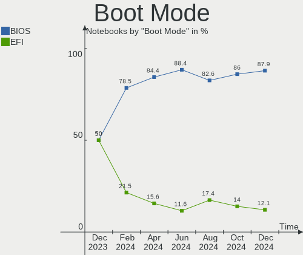
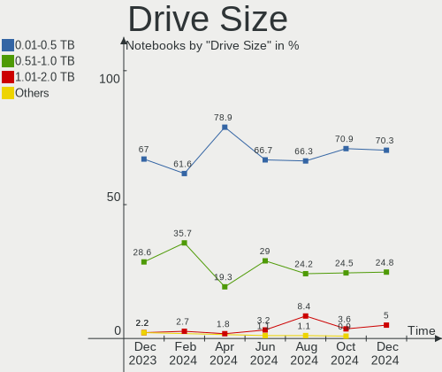
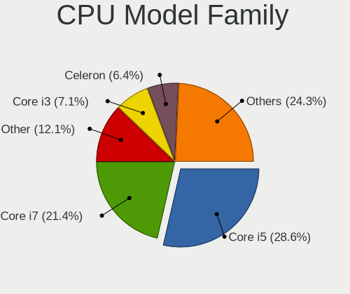
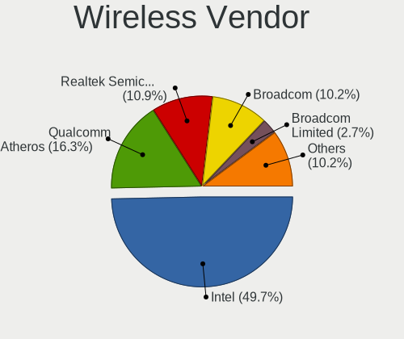
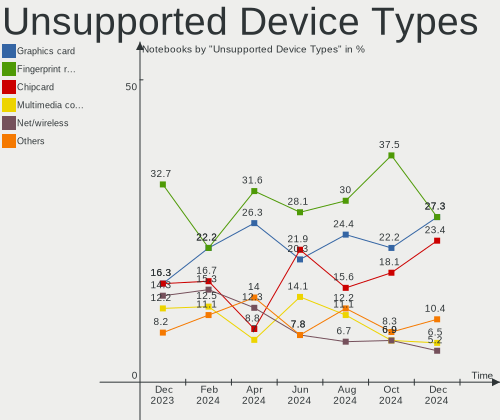

Zorin Hardware Trends (Notebooks)
---------------------------------

A project to identify most popular hardware characteristics and track their change
over time based on data collected by Zorin users at https://Linux-Hardware.org.

Anyone can contribute to this report by the [hw-probe](https://github.com/linuxhw/hw-probe) tool:

    sudo -E hw-probe -all -upload

Full-feature report is available here: https://linux-hardware.org/?view=trends&formfactor=notebook

Period: Oct, 2021.

Contents
--------

* [ System ](#system)
  - [ OS                       ](#os)
  - [ OS Family                ](#os-family)
  - [ Kernel                   ](#kernel)
  - [ Kernel Family            ](#kernel-family)
  - [ Kernel Major Ver.        ](#kernel-major-ver)
  - [ Arch                     ](#arch)
  - [ DE                       ](#de)
  - [ Display Server           ](#display-server)
  - [ Display Manager          ](#display-manager)
  - [ OS Lang                  ](#os-lang)
  - [ Boot Mode                ](#boot-mode)
  - [ Filesystem               ](#filesystem)
  - [ Part. scheme             ](#part-scheme)
  - [ Dual Boot with Linux/BSD ](#dual-boot-with-linuxbsd)
  - [ Dual Boot (Win)          ](#dual-boot-win)

* [ Board ](#board)
  - [ Vendor                   ](#vendor)
  - [ Model                    ](#model)
  - [ Model Family             ](#model-family)
  - [ MFG Year                 ](#mfg-year)
  - [ Form Factor              ](#form-factor)
  - [ Secure Boot              ](#secure-boot)
  - [ Coreboot                 ](#coreboot)
  - [ RAM Size                 ](#ram-size)
  - [ RAM Used                 ](#ram-used)
  - [ Total Drives             ](#total-drives)
  - [ Has CD-ROM               ](#has-cd-rom)
  - [ Has Ethernet             ](#has-ethernet)
  - [ Has WiFi                 ](#has-wifi)
  - [ Has Bluetooth            ](#has-bluetooth)

* [ Location ](#location)
  - [ Country                  ](#country)
  - [ City                     ](#city)

* [ Drives ](#drives)
  - [ Drive Vendor             ](#drive-vendor)
  - [ Drive Model              ](#drive-model)
  - [ HDD Vendor               ](#hdd-vendor)
  - [ SSD Vendor               ](#ssd-vendor)
  - [ Drive Kind               ](#drive-kind)
  - [ Drive Connector          ](#drive-connector)
  - [ Drive Size               ](#drive-size)
  - [ Space Total              ](#space-total)
  - [ Space Used               ](#space-used)
  - [ Malfunc. Drives          ](#malfunc-drives)
  - [ Malfunc. Drive Vendor    ](#malfunc-drive-vendor)
  - [ Malfunc. HDD Vendor      ](#malfunc-hdd-vendor)
  - [ Malfunc. Drive Kind      ](#malfunc-drive-kind)
  - [ Failed Drives            ](#failed-drives)
  - [ Failed Drive Vendor      ](#failed-drive-vendor)
  - [ Drive Status             ](#drive-status)

* [ Storage controller ](#storage-controller)
  - [ Storage Vendor           ](#storage-vendor)
  - [ Storage Model            ](#storage-model)
  - [ Storage Kind             ](#storage-kind)

* [ Processor ](#processor)
  - [ CPU Vendor               ](#cpu-vendor)
  - [ CPU Model                ](#cpu-model)
  - [ CPU Model Family         ](#cpu-model-family)
  - [ CPU Cores                ](#cpu-cores)
  - [ CPU Sockets              ](#cpu-sockets)
  - [ CPU Threads              ](#cpu-threads)
  - [ CPU Op-Modes             ](#cpu-op-modes)
  - [ CPU Microcode            ](#cpu-microcode)
  - [ CPU Microarch            ](#cpu-microarch)

* [ Graphics ](#graphics)
  - [ GPU Vendor               ](#gpu-vendor)
  - [ GPU Model                ](#gpu-model)
  - [ GPU Combo                ](#gpu-combo)
  - [ GPU Driver               ](#gpu-driver)
  - [ GPU Memory               ](#gpu-memory)

* [ Monitor ](#monitor)
  - [ Monitor Vendor           ](#monitor-vendor)
  - [ Monitor Model            ](#monitor-model)
  - [ Monitor Resolution       ](#monitor-resolution)
  - [ Monitor Diagonal         ](#monitor-diagonal)
  - [ Monitor Width            ](#monitor-width)
  - [ Aspect Ratio             ](#aspect-ratio)
  - [ Monitor Area             ](#monitor-area)
  - [ Pixel Density            ](#pixel-density)
  - [ Multiple Monitors        ](#multiple-monitors)

* [ Network ](#network)
  - [ Net Controller Vendor    ](#net-controller-vendor)
  - [ Net Controller Model     ](#net-controller-model)
  - [ Wireless Vendor          ](#wireless-vendor)
  - [ Wireless Model           ](#wireless-model)
  - [ Ethernet Vendor          ](#ethernet-vendor)
  - [ Ethernet Model           ](#ethernet-model)
  - [ Net Controller Kind      ](#net-controller-kind)
  - [ Used Controller          ](#used-controller)
  - [ NICs                     ](#nics)
  - [ IPv6                     ](#ipv6)

* [ Bluetooth ](#bluetooth)
  - [ Bluetooth Vendor         ](#bluetooth-vendor)
  - [ Bluetooth Model          ](#bluetooth-model)

* [ Sound ](#sound)
  - [ Sound Vendor             ](#sound-vendor)
  - [ Sound Model              ](#sound-model)

* [ Memory ](#memory)
  - [ Memory Vendor            ](#memory-vendor)
  - [ Memory Model             ](#memory-model)
  - [ Memory Kind              ](#memory-kind)
  - [ Memory Form Factor       ](#memory-form-factor)
  - [ Memory Size              ](#memory-size)
  - [ Memory Speed             ](#memory-speed)

* [ Printers & scanners ](#printers--scanners)
  - [ Printer Vendor           ](#printer-vendor)
  - [ Printer Model            ](#printer-model)
  - [ Scanner Vendor           ](#scanner-vendor)
  - [ Scanner Model            ](#scanner-model)

* [ Camera ](#camera)
  - [ Camera Vendor            ](#camera-vendor)
  - [ Camera Model             ](#camera-model)

* [ Security ](#security)
  - [ Fingerprint Vendor       ](#fingerprint-vendor)
  - [ Fingerprint Model        ](#fingerprint-model)
  - [ Chipcard Vendor          ](#chipcard-vendor)
  - [ Chipcard Model           ](#chipcard-model)

* [ Unsupported ](#unsupported)
  - [ Unsupported Devices      ](#unsupported-devices)
  - [ Unsupported Device Types ](#unsupported-device-types)

System
------

OS
--

Installed operating systems

| Name     | Notebooks | Percent |
|----------|-----------|---------|
| Zorin 16 | 115       | 85.82%  |
| Zorin 15 | 19        | 14.18%  |

OS Family
---------

OS without a version

| Name  | Notebooks | Percent |
|-------|-----------|---------|
| Zorin | 134       | 100%    |

Kernel
------

Version of the Linux kernel

| Version           | Notebooks | Percent |
|-------------------|-----------|---------|
| 5.11.0-37-generic | 68        | 50.75%  |
| 5.11.0-38-generic | 36        | 26.87%  |
| 5.4.0-87-generic  | 13        | 9.7%    |
| 5.11.0-27-generic | 6         | 4.48%   |
| 5.4.0-89-generic  | 5         | 3.73%   |
| 5.11.0-36-generic | 2         | 1.49%   |
| 5.11.0-34-generic | 2         | 1.49%   |
| 5.4.0-81-generic  | 1         | 0.75%   |
| 5.11.0-25-generic | 1         | 0.75%   |

Kernel Family
-------------

Linux kernel without a distro release

| Version | Notebooks | Percent |
|---------|-----------|---------|
| 5.11.0  | 115       | 85.82%  |
| 5.4.0   | 19        | 14.18%  |

Kernel Major Ver.
-----------------

Linux kernel major version

| Version | Notebooks | Percent |
|---------|-----------|---------|
| 5.11    | 115       | 85.82%  |
| 5.4     | 19        | 14.18%  |

Arch
----

OS architecture (x86_64, i586, etc.)

| Name   | Notebooks | Percent |
|--------|-----------|---------|
| x86_64 | 127       | 94.78%  |
| i686   | 7         | 5.22%   |

DE
--

Desktop Environment

| Name    | Notebooks | Percent |
|---------|-----------|---------|
| GNOME   | 118       | 88.06%  |
| XFCE    | 14        | 10.45%  |
| Unknown | 2         | 1.49%   |

Display Server
--------------

X11 or Wayland

| Name    | Notebooks | Percent |
|---------|-----------|---------|
| X11     | 131       | 97.76%  |
| Unknown | 2         | 1.49%   |
| Wayland | 1         | 0.75%   |

Display Manager
---------------

SDDM, LightDM, etc.

| Name    | Notebooks | Percent |
|---------|-----------|---------|
| Unknown | 101       | 75.37%  |
| LightDM | 13        | 9.7%    |
| GDM3    | 13        | 9.7%    |
| GDM     | 7         | 5.22%   |

OS Lang
-------

Language

| Lang  | Notebooks | Percent |
|-------|-----------|---------|
| en_US | 57        | 42.54%  |
| de_DE | 14        | 10.45%  |
| en_GB | 12        | 8.96%   |
| es_ES | 6         | 4.48%   |
| pt_BR | 5         | 3.73%   |
| fr_FR | 5         | 3.73%   |
| ru_RU | 4         | 2.99%   |
| en_IN | 4         | 2.99%   |
| en_CA | 4         | 2.99%   |
| nl_NL | 3         | 2.24%   |
| it_IT | 3         | 2.24%   |
| sv_SE | 2         | 1.49%   |
| es_MX | 2         | 1.49%   |
| es_CL | 2         | 1.49%   |
| en_AU | 2         | 1.49%   |
| pt_PT | 1         | 0.75%   |
| es_AR | 1         | 0.75%   |
| en_ZA | 1         | 0.75%   |
| en_SG | 1         | 0.75%   |
| en_NZ | 1         | 0.75%   |
| de_AT | 1         | 0.75%   |
| cs_CZ | 1         | 0.75%   |
| C     | 1         | 0.75%   |
| bg_BG | 1         | 0.75%   |

Boot Mode
---------

EFI or BIOS

| Mode | Notebooks | Percent |
|------|-----------|---------|
| EFI  | 86        | 64.18%  |
| BIOS | 48        | 35.82%  |

Filesystem
----------

Type of filesystem

| Type    | Notebooks | Percent |
|---------|-----------|---------|
| Ext4    | 126       | 94.03%  |
| Zfs     | 3         | 2.24%   |
| Overlay | 2         | 1.49%   |
| Btrfs   | 2         | 1.49%   |
| Xfs     | 1         | 0.75%   |

Part. scheme
------------

Scheme of partitioning

| Type    | Notebooks | Percent |
|---------|-----------|---------|
| Unknown | 126       | 94.03%  |
| GPT     | 8         | 5.97%   |

Dual Boot with Linux/BSD
------------------------

Hosting more than one Linux/BSD

| Dual boot | Notebooks | Percent |
|-----------|-----------|---------|
| No        | 130       | 97.01%  |
| Yes       | 4         | 2.99%   |

Dual Boot (Win)
---------------

Hosting Linux and Windows

| Dual boot | Notebooks | Percent |
|-----------|-----------|---------|
| No        | 119       | 88.81%  |
| Yes       | 15        | 11.19%  |

Board
-----

Vendor
------

Motherboard manufacturer

| Name                           | Notebooks | Percent |
|--------------------------------|-----------|---------|
| Hewlett-Packard                | 30        | 22.39%  |
| Dell                           | 25        | 18.66%  |
| Lenovo                         | 23        | 17.16%  |
| Acer                           | 14        | 10.45%  |
| ASUSTek Computer               | 10        | 7.46%   |
| Toshiba                        | 8         | 5.97%   |
| Unknown                        | 5         | 3.73%   |
| Samsung Electronics            | 2         | 1.49%   |
| Notebook                       | 2         | 1.49%   |
| MSI                            | 2         | 1.49%   |
| Fujitsu                        | 2         | 1.49%   |
| Apple                          | 2         | 1.49%   |
| Thomson                        | 1         | 0.75%   |
| Star Labs                      | 1         | 0.75%   |
| Sony                           | 1         | 0.75%   |
| Schenker                       | 1         | 0.75%   |
| MECER                          | 1         | 0.75%   |
| Matsushita Electric Industrial | 1         | 0.75%   |
| Google                         | 1         | 0.75%   |
| Giani Limited                  | 1         | 0.75%   |
| American Megatrends            | 1         | 0.75%   |

Model
-----

Motherboard model

| Name                                                  | Notebooks | Percent |
|-------------------------------------------------------|-----------|---------|
| Unknown                                               | 6         | 4.48%   |
| HP Notebook                                           | 2         | 1.49%   |
| Dell Latitude E7470                                   | 2         | 1.49%   |
| Dell Latitude E6420                                   | 2         | 1.49%   |
| Dell Inspiron N5010                                   | 2         | 1.49%   |
| Dell Inspiron 3542                                    | 2         | 1.49%   |
| Toshiba Satellite U400                                | 1         | 0.75%   |
| Toshiba Satellite Pro T110                            | 1         | 0.75%   |
| Toshiba Satellite Pro C660                            | 1         | 0.75%   |
| Toshiba Satellite L755                                | 1         | 0.75%   |
| Toshiba Satellite L455D                               | 1         | 0.75%   |
| Toshiba Satellite C870-1C2                            | 1         | 0.75%   |
| Toshiba Satellite C70-B                               | 1         | 0.75%   |
| Toshiba PORTEGE Z20t-C                                | 1         | 0.75%   |
| Thomson N17C512                                       | 1         | 0.75%   |
| Star Labs LabTop                                      | 1         | 0.75%   |
| Sony VPCEA20FB                                        | 1         | 0.75%   |
| Schenker VIA 15 Pro                                   | 1         | 0.75%   |
| Samsung 700Z3C/700Z5C                                 | 1         | 0.75%   |
| Samsung 300E5EV/300E4EV/270E5EV/270E4EV/2470EV/2470EE | 1         | 0.75%   |
| Notebook X170SM                                       | 1         | 0.75%   |
| Notebook W94_95_97SU2,SUY,-C,-T                       | 1         | 0.75%   |
| MSI Modern 14 B10MW                                   | 1         | 0.75%   |
| MSI GE66 Raider 10UH                                  | 1         | 0.75%   |
| MECER Z140C+Home                                      | 1         | 0.75%   |
| Matsushita Electric Industrial CF-19CHB23BE           | 1         | 0.75%   |
| Lenovo Z50-75 80EC                                    | 1         | 0.75%   |
| Lenovo Yoga 3 Pro-1370 80HE                           | 1         | 0.75%   |
| Lenovo Y520-15IKBM 80YY                               | 1         | 0.75%   |
| Lenovo ThinkPad X220 Tablet 4298Y19                   | 1         | 0.75%   |
| Lenovo ThinkPad X220 Tablet 4298WBT                   | 1         | 0.75%   |
| Lenovo ThinkPad X220 4286CTO                          | 1         | 0.75%   |
| Lenovo ThinkPad T520 4242W4F                          | 1         | 0.75%   |
| Lenovo ThinkPad T470s W10DG 20JTS0280G                | 1         | 0.75%   |
| Lenovo ThinkPad T460s 20FAS3F300                      | 1         | 0.75%   |
| Lenovo ThinkPad L470 20J5A00FLM                       | 1         | 0.75%   |
| Lenovo ThinkBook 15-IIL 20SM                          | 1         | 0.75%   |
| Lenovo Legion Y920-17IKB Laptop 80YW                  | 1         | 0.75%   |
| Lenovo Legion 5 Pro 16ACH6H 82JQ                      | 1         | 0.75%   |
| Lenovo IdeaPad Z580                                   | 1         | 0.75%   |
| Lenovo IdeaPad S340-14API 81NB                        | 1         | 0.75%   |
| Lenovo IdeaPad S145-15IWL 81S9                        | 1         | 0.75%   |
| Lenovo IdeaPad S145-15API 81V7                        | 1         | 0.75%   |
| Lenovo IdeaPad FLEX-14API 81SS                        | 1         | 0.75%   |
| Lenovo IdeaPad 320-15AST 80XV                         | 1         | 0.75%   |
| Lenovo IdeaPad 3 15IIL05 81WE                         | 1         | 0.75%   |
| Lenovo G570 4334                                      | 1         | 0.75%   |
| Lenovo G50-70 20351                                   | 1         | 0.75%   |
| Lenovo Flex 2-14 20404                                | 1         | 0.75%   |
| HP x2 210                                             | 1         | 0.75%   |
| HP Stream Notebook PC 11                              | 1         | 0.75%   |
| HP Stream Laptop 14-ax0XX                             | 1         | 0.75%   |
| HP ProBook 6550b                                      | 1         | 0.75%   |
| HP ProBook 445 G7                                     | 1         | 0.75%   |
| HP ProBook 430 G1                                     | 1         | 0.75%   |
| HP Presario CQ42                                      | 1         | 0.75%   |
| HP Pavilion Notebook                                  | 1         | 0.75%   |
| HP Pavilion Laptop 15z-cw100                          | 1         | 0.75%   |
| HP Pavilion Laptop 15-cs3xxx                          | 1         | 0.75%   |
| HP Pavilion Laptop 14-dv0xxx                          | 1         | 0.75%   |

Model Family
------------

Motherboard model prefix

| Name                                        | Notebooks | Percent |
|---------------------------------------------|-----------|---------|
| Dell Latitude                               | 14        | 10.45%  |
| Dell Inspiron                               | 10        | 7.46%   |
| Acer Aspire                                 | 10        | 7.46%   |
| Toshiba Satellite                           | 7         | 5.22%   |
| Lenovo ThinkPad                             | 7         | 5.22%   |
| Lenovo IdeaPad                              | 7         | 5.22%   |
| Unknown                                     | 6         | 4.48%   |
| HP Pavilion                                 | 5         | 3.73%   |
| HP Laptop                                   | 5         | 3.73%   |
| HP ProBook                                  | 3         | 2.24%   |
| HP EliteBook                                | 3         | 2.24%   |
| HP 255                                      | 3         | 2.24%   |
| Lenovo Legion                               | 2         | 1.49%   |
| HP Stream                                   | 2         | 1.49%   |
| HP Notebook                                 | 2         | 1.49%   |
| HP ENVY                                     | 2         | 1.49%   |
| Fujitsu LIFEBOOK                            | 2         | 1.49%   |
| Acer TravelMate                             | 2         | 1.49%   |
| Toshiba PORTEGE                             | 1         | 0.75%   |
| Thomson N17C512                             | 1         | 0.75%   |
| Star Labs LabTop                            | 1         | 0.75%   |
| Sony VPCEA20FB                              | 1         | 0.75%   |
| Schenker VIA                                | 1         | 0.75%   |
| Samsung 700Z3C                              | 1         | 0.75%   |
| Samsung 300E5EV                             | 1         | 0.75%   |
| Notebook X170SM                             | 1         | 0.75%   |
| Notebook W94                                | 1         | 0.75%   |
| MSI Modern                                  | 1         | 0.75%   |
| MSI GE66                                    | 1         | 0.75%   |
| MECER Z140C+Home                            | 1         | 0.75%   |
| Matsushita Electric Industrial CF-19CHB23BE | 1         | 0.75%   |
| Lenovo Z50-75                               | 1         | 0.75%   |
| Lenovo Yoga                                 | 1         | 0.75%   |
| Lenovo Y520-15IKBM                          | 1         | 0.75%   |
| Lenovo ThinkBook                            | 1         | 0.75%   |
| Lenovo G570                                 | 1         | 0.75%   |
| Lenovo G50-70                               | 1         | 0.75%   |
| Lenovo Flex                                 | 1         | 0.75%   |
| HP x2                                       | 1         | 0.75%   |
| HP Presario                                 | 1         | 0.75%   |
| HP Compaq                                   | 1         | 0.75%   |
| HP 15                                       | 1         | 0.75%   |
| Google Kindred                              | 1         | 0.75%   |
| Giani Limited ENY1158M                      | 1         | 0.75%   |
| Dell System                                 | 1         | 0.75%   |
| ASUS X750JB                                 | 1         | 0.75%   |
| ASUS X555YA                                 | 1         | 0.75%   |
| ASUS X550LB                                 | 1         | 0.75%   |
| ASUS X501A1                                 | 1         | 0.75%   |
| ASUS VivoBook                               | 1         | 0.75%   |
| ASUS ROG                                    | 1         | 0.75%   |
| ASUS N71Jv                                  | 1         | 0.75%   |
| ASUS N61Jv                                  | 1         | 0.75%   |
| ASUS N61Ja                                  | 1         | 0.75%   |
| ASUS GL702VI                                | 1         | 0.75%   |
| Apple MacBookPro8                           | 1         | 0.75%   |
| Apple MacBookPro11                          | 1         | 0.75%   |
| American Megatrends 255                     | 1         | 0.75%   |
| Acer Swift                                  | 1         | 0.75%   |
| Acer Nitro                                  | 1         | 0.75%   |

MFG Year
--------

Motherboard manufacture year

| Year | Notebooks | Percent |
|------|-----------|---------|
| 2021 | 26        | 19.4%   |
| 2018 | 16        | 11.94%  |
| 2020 | 14        | 10.45%  |
| 2015 | 11        | 8.21%   |
| 2012 | 10        | 7.46%   |
| 2010 | 10        | 7.46%   |
| 2019 | 7         | 5.22%   |
| 2017 | 7         | 5.22%   |
| 2014 | 7         | 5.22%   |
| 2016 | 6         | 4.48%   |
| 2013 | 6         | 4.48%   |
| 2011 | 5         | 3.73%   |
| 2009 | 4         | 2.99%   |
| 2008 | 2         | 1.49%   |
| 2005 | 2         | 1.49%   |
| 2007 | 1         | 0.75%   |

Form Factor
-----------

Physical design of the computer

| Name     | Notebooks | Percent |
|----------|-----------|---------|
| Notebook | 134       | 100%    |

Secure Boot
-----------

Enabled or disabled

| State    | Notebooks | Percent |
|----------|-----------|---------|
| Disabled | 110       | 82.09%  |
| Enabled  | 24        | 17.91%  |

Coreboot
--------

Have coreboot on board

| Used | Notebooks | Percent |
|------|-----------|---------|
| No   | 132       | 98.51%  |
| Yes  | 2         | 1.49%   |

RAM Size
--------

Total RAM memory

| Size in GB  | Notebooks | Percent |
|-------------|-----------|---------|
| 4.01-8.0    | 55        | 41.04%  |
| 3.01-4.0    | 31        | 23.13%  |
| 8.01-16.0   | 16        | 11.94%  |
| 16.01-24.0  | 14        | 10.45%  |
| 1.01-2.0    | 7         | 5.22%   |
| 2.01-3.0    | 4         | 2.99%   |
| 32.01-64.0  | 3         | 2.24%   |
| 64.01-256.0 | 2         | 1.49%   |
| 24.01-32.0  | 1         | 0.75%   |
| 0.51-1.0    | 1         | 0.75%   |

RAM Used
--------

Used RAM memory

| Used GB  | Notebooks | Percent |
|----------|-----------|---------|
| 1.01-2.0 | 64        | 47.76%  |
| 2.01-3.0 | 36        | 26.87%  |
| 3.01-4.0 | 14        | 10.45%  |
| 4.01-8.0 | 13        | 9.7%    |
| 0.51-1.0 | 7         | 5.22%   |

Total Drives
------------

Number of drives on board

| Drives | Notebooks | Percent |
|--------|-----------|---------|
| 1      | 101       | 75.37%  |
| 2      | 29        | 21.64%  |
| 3      | 3         | 2.24%   |
| 4      | 1         | 0.75%   |

Has CD-ROM
----------

Has CD-ROM on board

| Presented | Notebooks | Percent |
|-----------|-----------|---------|
| No        | 69        | 51.49%  |
| Yes       | 65        | 48.51%  |

Has Ethernet
------------

Has Ethernet on board

| Presented | Notebooks | Percent |
|-----------|-----------|---------|
| Yes       | 115       | 85.82%  |
| No        | 19        | 14.18%  |

Has WiFi
--------

Has WiFi module

| Presented | Notebooks | Percent |
|-----------|-----------|---------|
| Yes       | 129       | 96.27%  |
| No        | 5         | 3.73%   |

Has Bluetooth
-------------

Has Bluetooth module

| Presented | Notebooks | Percent |
|-----------|-----------|---------|
| Yes       | 101       | 75.37%  |
| No        | 33        | 24.63%  |

Location
--------

Country
-------

Geographic location (country)

| Country      | Notebooks | Percent |
|--------------|-----------|---------|
| USA          | 36        | 26.87%  |
| Germany      | 20        | 14.93%  |
| UK           | 10        | 7.46%   |
| Spain        | 6         | 4.48%   |
| Netherlands  | 6         | 4.48%   |
| Brazil       | 6         | 4.48%   |
| France       | 5         | 3.73%   |
| India        | 4         | 2.99%   |
| Canada       | 4         | 2.99%   |
| Italy        | 3         | 2.24%   |
| Sweden       | 2         | 1.49%   |
| South Africa | 2         | 1.49%   |
| Russia       | 2         | 1.49%   |
| Mexico       | 2         | 1.49%   |
| Japan        | 2         | 1.49%   |
| Chile        | 2         | 1.49%   |
| Austria      | 2         | 1.49%   |
| Australia    | 2         | 1.49%   |
| Argentina    | 2         | 1.49%   |
| Venezuela    | 1         | 0.75%   |
| Singapore    | 1         | 0.75%   |
| Qatar        | 1         | 0.75%   |
| Philippines  | 1         | 0.75%   |
| Nigeria      | 1         | 0.75%   |
| New Zealand  | 1         | 0.75%   |
| Morocco      | 1         | 0.75%   |
| Malaysia     | 1         | 0.75%   |
| Jersey       | 1         | 0.75%   |
| Ireland      | 1         | 0.75%   |
| Ghana        | 1         | 0.75%   |
| Egypt        | 1         | 0.75%   |
| Czechia      | 1         | 0.75%   |
| Bulgaria     | 1         | 0.75%   |
| Belgium      | 1         | 0.75%   |
| Bangladesh   | 1         | 0.75%   |

City
----

Geographic location (city)

| City               | Notebooks | Percent |
|--------------------|-----------|---------|
| Vienna             | 2         | 1.49%   |
| Santiago           | 2         | 1.49%   |
| Munich             | 2         | 1.49%   |
| Kaiserslautern     | 2         | 1.49%   |
| Johannesburg       | 2         | 1.49%   |
| Independence       | 2         | 1.49%   |
| Chicago            | 2         | 1.49%   |
| Bengaluru          | 2         | 1.49%   |
| Barcelona          | 2         | 1.49%   |
| Zwolle             | 1         | 0.75%   |
| Winston-Salem      | 1         | 0.75%   |
| Weymouth           | 1         | 0.75%   |
| Washington         | 1         | 0.75%   |
| Vogtsburg          | 1         | 0.75%   |
| Varna              | 1         | 0.75%   |
| Tunnel Hill        | 1         | 0.75%   |
| Triunfo            | 1         | 0.75%   |
| Toulouse           | 1         | 0.75%   |
| Tokyo              | 1         | 0.75%   |
| Teltow             | 1         | 0.75%   |
| Tatu?­             | 1         | 0.75%   |
| Sydney             | 1         | 0.75%   |
| South Charleston   | 1         | 0.75%   |
| Shelbyville        | 1         | 0.75%   |
| Seattle            | 1         | 0.75%   |
| San Jose           | 1         | 0.75%   |
| San Francisco      | 1         | 0.75%   |
| Saint Helier       | 1         | 0.75%   |
| Roundup            | 1         | 0.75%   |
| Roquefort-les-Pins | 1         | 0.75%   |
| Rome               | 1         | 0.75%   |
| Rochester          | 1         | 0.75%   |
| Ripon              | 1         | 0.75%   |
| Rio Branco         | 1         | 0.75%   |
| Ribeirao Pires     | 1         | 0.75%   |
| Rhyl               | 1         | 0.75%   |
| Reutlingen         | 1         | 0.75%   |
| Rennes             | 1         | 0.75%   |
| Red Deer           | 1         | 0.75%   |
| Rangpur City       | 1         | 0.75%   |
| Rabat              | 1         | 0.75%   |
| Quedlinburg        | 1         | 0.75%   |
| Porto Alegre       | 1         | 0.75%   |
| Placentia          | 1         | 0.75%   |
| Pilsen             | 1         | 0.75%   |
| Perth              | 1         | 0.75%   |
| Paranaque City     | 1         | 0.75%   |
| Orange Park        | 1         | 0.75%   |
| Ocala              | 1         | 0.75%   |
| Obernburg am Main  | 1         | 0.75%   |
| Nordhorn           | 1         | 0.75%   |
| New Orleans        | 1         | 0.75%   |
| Naumburg           | 1         | 0.75%   |
| Moscow             | 1         | 0.75%   |
| Morrow             | 1         | 0.75%   |
| Morelia            | 1         | 0.75%   |
| Mislata            | 1         | 0.75%   |
| Minato-ku          | 1         | 0.75%   |
| Milan              | 1         | 0.75%   |
| Metepec            | 1         | 0.75%   |

Drives
------

Drive Vendor
------------

Hard drive vendors

| Vendor              | Notebooks | Drives | Percent |
|---------------------|-----------|--------|---------|
| Samsung Electronics | 30        | 34     | 19.48%  |
| Seagate             | 16        | 18     | 10.39%  |
| WDC                 | 15        | 15     | 9.74%   |
| Unknown             | 13        | 16     | 8.44%   |
| Toshiba             | 11        | 11     | 7.14%   |
| SanDisk             | 11        | 11     | 7.14%   |
| Hitachi             | 8         | 8      | 5.19%   |
| Kingston            | 7         | 8      | 4.55%   |
| Crucial             | 7         | 7      | 4.55%   |
| HGST                | 5         | 5      | 3.25%   |
| SK Hynix            | 4         | 5      | 2.6%    |
| Micron Technology   | 3         | 3      | 1.95%   |
| Intel               | 3         | 4      | 1.95%   |
| LITEONIT            | 2         | 2      | 1.3%    |
| KIOXIA              | 2         | 2      | 1.3%    |
| Intenso             | 2         | 2      | 1.3%    |
| A-DATA Technology   | 2         | 3      | 1.3%    |
| Transcend           | 1         | 1      | 0.65%   |
| Star                | 1         | 1      | 0.65%   |
| SPCC                | 1         | 1      | 0.65%   |
| SABRENT             | 1         | 1      | 0.65%   |
| PNY                 | 1         | 1      | 0.65%   |
| Netac               | 1         | 1      | 0.65%   |
| Lite-On             | 1         | 1      | 0.65%   |
| JMicron             | 1         | 1      | 0.65%   |
| GOODRAM             | 1         | 1      | 0.65%   |
| E535N               | 1         | 1      | 0.65%   |
| China               | 1         | 1      | 0.65%   |
| Apple               | 1         | 1      | 0.65%   |
| Unknown             | 1         | 1      | 0.65%   |

Drive Model
-----------

Hard drive models

| Model                                   | Notebooks | Percent |
|-----------------------------------------|-----------|---------|
| Unknown MMC Card  32GB                  | 9         | 5.52%   |
| Unknown MMC Card  64GB                  | 3         | 1.84%   |
| Toshiba MK2552GSX 250GB                 | 3         | 1.84%   |
| Seagate ST1000LM024 HN-M101MBB 1TB      | 3         | 1.84%   |
| Samsung SSD 850 EVO 500GB               | 3         | 1.84%   |
| Samsung PM963 2.5" NVMe PCIe SSD 512GB  | 3         | 1.84%   |
| HGST HTS541010B7E610 1TB                | 3         | 1.84%   |
| WDC WD10SPZX-24Z10 1TB                  | 2         | 1.23%   |
| Toshiba MQ01ABF050 500GB                | 2         | 1.23%   |
| Toshiba MK2555GSX 250GB                 | 2         | 1.23%   |
| Seagate ST500LT012-1DG142 500GB         | 2         | 1.23%   |
| Seagate ST2000LM007-1R8174 2TB          | 2         | 1.23%   |
| Seagate ST1000LM035-1RK172 1TB          | 2         | 1.23%   |
| SanDisk SSD PLUS 240GB                  | 2         | 1.23%   |
| Samsung SSD 870 QVO 1TB                 | 2         | 1.23%   |
| Samsung SSD 860 EVO 250GB               | 2         | 1.23%   |
| Samsung SSD 860 EVO 1TB                 | 2         | 1.23%   |
| Samsung NVMe SSD Drive 500GB            | 2         | 1.23%   |
| Samsung NVMe SSD Drive 256GB            | 2         | 1.23%   |
| Kingston SA400S37480G 480GB SSD         | 2         | 1.23%   |
| Kingston SA400S37240G 240GB SSD         | 2         | 1.23%   |
| Hitachi HTS547575A9E384 752GB           | 2         | 1.23%   |
| Crucial CT500MX500SSD1 500GB            | 2         | 1.23%   |
| A-DATA SU800 512GB SSD                  | 2         | 1.23%   |
| WDC WDS500G2B0B-00YS70 500GB SSD        | 1         | 0.61%   |
| WDC WDS500G2B0A 500GB SSD               | 1         | 0.61%   |
| WDC WDS240G2G0A-00JH30 240GB SSD        | 1         | 0.61%   |
| WDC WD5000LPVX-22V0TT0 500GB            | 1         | 0.61%   |
| WDC WD5000LPLX-60ZNTT1 500GB            | 1         | 0.61%   |
| WDC WD3200BEVT-75A23T0 320GB            | 1         | 0.61%   |
| WDC WD1600BEVT-35VW9T0 160GB            | 1         | 0.61%   |
| WDC WD10SPZX-24Z10T0 1TB                | 1         | 0.61%   |
| WDC WD10JPVX-60JC3T1 1TB                | 1         | 0.61%   |
| WDC WD10JPVX-22JC3T0 1TB                | 1         | 0.61%   |
| WDC WD10JPCX-24UE4T0 1TB                | 1         | 0.61%   |
| WDC PC SN520 SDAPNUW-512G-1006 512GB    | 1         | 0.61%   |
| WDC PC SN520 SDAPNUW-256G-1002 256GB    | 1         | 0.61%   |
| Unknown SD/MMC/MS PRO 128GB             | 1         | 0.61%   |
| Unknown MMC Card  59MB                  | 1         | 0.61%   |
| Unknown MMC Card  128GB                 | 1         | 0.61%   |
| Transcend TS128GSSD25S-M 128GB          | 1         | 0.61%   |
| Toshiba MQ04ABF100 1TB                  | 1         | 0.61%   |
| Toshiba MQ01ABD100 1TB                  | 1         | 0.61%   |
| Toshiba MQ01ABD050V 500GB               | 1         | 0.61%   |
| Toshiba MK6034GSX 64GB                  | 1         | 0.61%   |
| Star Drive SATA SSD 240GB               | 1         | 0.61%   |
| SPCC Solid State Disk 256GB             | 1         | 0.61%   |
| SK Hynix SC401 SATA 512GB SSD           | 1         | 0.61%   |
| SK Hynix NVMe SSD Drive 256GB           | 1         | 0.61%   |
| SK Hynix NVMe SSD Drive 128GB           | 1         | 0.61%   |
| SK Hynix HFS256G39TND-N210A 256GB SSD   | 1         | 0.61%   |
| SK Hynix BC511 HFM256GDJTNI-82A0A 256GB | 1         | 0.61%   |
| Seagate ST9320421AS 320GB               | 1         | 0.61%   |
| Seagate ST9320325AS 320GB               | 1         | 0.61%   |
| Seagate ST750LM022 HN-M750MBB 752GB     | 1         | 0.61%   |
| Seagate ST500LT012-9WS142 500GB         | 1         | 0.61%   |
| Seagate ST320LT007-9ZV142 320GB         | 1         | 0.61%   |
| Seagate ST2000LM003 HN-M201RAD 2TB      | 1         | 0.61%   |
| Seagate ST1000LX015-1U7172 1TB          | 1         | 0.61%   |
| Seagate ST10000N M0478-2H7100 10TB      | 1         | 0.61%   |

HDD Vendor
----------

Hard disk drive vendors

| Vendor              | Notebooks | Drives | Percent |
|---------------------|-----------|--------|---------|
| Seagate             | 16        | 17     | 29.63%  |
| Toshiba             | 11        | 11     | 20.37%  |
| WDC                 | 10        | 10     | 18.52%  |
| Hitachi             | 8         | 8      | 14.81%  |
| HGST                | 5         | 5      | 9.26%   |
| Unknown             | 1         | 1      | 1.85%   |
| Samsung Electronics | 1         | 1      | 1.85%   |
| SABRENT             | 1         | 1      | 1.85%   |
| Intenso             | 1         | 1      | 1.85%   |

SSD Vendor
----------

Solid state drive vendors

| Vendor              | Notebooks | Drives | Percent |
|---------------------|-----------|--------|---------|
| Samsung Electronics | 20        | 20     | 32.79%  |
| SanDisk             | 7         | 7      | 11.48%  |
| Kingston            | 7         | 8      | 11.48%  |
| Crucial             | 7         | 7      | 11.48%  |
| WDC                 | 3         | 3      | 4.92%   |
| SK Hynix            | 2         | 2      | 3.28%   |
| LITEONIT            | 2         | 2      | 3.28%   |
| A-DATA Technology   | 2         | 3      | 3.28%   |
| Transcend           | 1         | 1      | 1.64%   |
| Star                | 1         | 1      | 1.64%   |
| SPCC                | 1         | 1      | 1.64%   |
| PNY                 | 1         | 1      | 1.64%   |
| Netac               | 1         | 1      | 1.64%   |
| Micron Technology   | 1         | 1      | 1.64%   |
| Intenso             | 1         | 1      | 1.64%   |
| Intel               | 1         | 1      | 1.64%   |
| GOODRAM             | 1         | 1      | 1.64%   |
| China               | 1         | 1      | 1.64%   |
| Apple               | 1         | 1      | 1.64%   |

Drive Kind
----------

HDD or SSD

| Kind    | Notebooks | Drives | Percent |
|---------|-----------|--------|---------|
| SSD     | 61        | 63     | 39.61%  |
| HDD     | 52        | 55     | 33.77%  |
| NVMe    | 25        | 30     | 16.23%  |
| MMC     | 12        | 15     | 7.79%   |
| Unknown | 4         | 4      | 2.6%    |

Drive Connector
---------------

SATA, SAS, NVMe, etc.

| Type | Notebooks | Drives | Percent |
|------|-----------|--------|---------|
| SATA | 108       | 116    | 72%     |
| NVMe | 25        | 30     | 16.67%  |
| MMC  | 12        | 15     | 8%      |
| SAS  | 5         | 6      | 3.33%   |

Drive Size
----------

Size of hard drive

| Size in TB | Notebooks | Drives | Percent |
|------------|-----------|--------|---------|
| 0.01-0.5   | 75        | 78     | 66.37%  |
| 0.51-1.0   | 32        | 34     | 28.32%  |
| 1.01-2.0   | 4         | 4      | 3.54%   |
| 3.01-4.0   | 1         | 1      | 0.88%   |
| 4.01-10.0  | 1         | 1      | 0.88%   |

Space Total
-----------

Amount of disk space available on the file system

| Size in GB     | Notebooks | Percent |
|----------------|-----------|---------|
| 101-250        | 50        | 37.31%  |
| 251-500        | 35        | 26.12%  |
| 51-100         | 18        | 13.43%  |
| 501-1000       | 16        | 11.94%  |
| 21-50          | 8         | 5.97%   |
| Unknown        | 3         | 2.24%   |
| More than 3000 | 1         | 0.75%   |
| 2001-3000      | 1         | 0.75%   |
| 1001-2000      | 1         | 0.75%   |
| 1-20           | 1         | 0.75%   |

Space Used
----------

Amount of used disk space

| Used GB        | Notebooks | Percent |
|----------------|-----------|---------|
| 1-20           | 55        | 41.04%  |
| 21-50          | 40        | 29.85%  |
| 101-250        | 16        | 11.94%  |
| 51-100         | 15        | 11.19%  |
| 251-500        | 3         | 2.24%   |
| Unknown        | 3         | 2.24%   |
| More than 3000 | 1         | 0.75%   |
| 501-1000       | 1         | 0.75%   |

Malfunc. Drives
---------------

Drive models with a malfunction

Zero info for selected period =(

Malfunc. Drive Vendor
---------------------

Vendors of faulty drives

Zero info for selected period =(

Malfunc. HDD Vendor
-------------------

Vendors of faulty HDD drives

Zero info for selected period =(

Malfunc. Drive Kind
-------------------

Kinds of faulty drives

Zero info for selected period =(

Failed Drives
-------------

Failed drive models

Zero info for selected period =(

Failed Drive Vendor
-------------------

Failed drive vendors

Zero info for selected period =(

Drive Status
------------

Number of failed and malfunc. drives

| Status   | Notebooks | Drives | Percent |
|----------|-----------|--------|---------|
| Detected | 127       | 158    | 94.07%  |
| Works    | 8         | 9      | 5.93%   |

Storage controller
------------------

Storage Vendor
--------------

Storage controller vendors

| Vendor              | Notebooks | Percent |
|---------------------|-----------|---------|
| Intel               | 95        | 67.38%  |
| AMD                 | 21        | 14.89%  |
| Samsung Electronics | 11        | 7.8%    |
| Sandisk             | 6         | 4.26%   |
| SK Hynix            | 2         | 1.42%   |
| Micron Technology   | 2         | 1.42%   |
| KIOXIA              | 2         | 1.42%   |
| Nvidia              | 1         | 0.71%   |
| Lite-On Technology  | 1         | 0.71%   |

Storage Model
-------------

Storage controller models

| Model                                                                            | Notebooks | Percent |
|----------------------------------------------------------------------------------|-----------|---------|
| AMD FCH SATA Controller [AHCI mode]                                              | 19        | 12.5%   |
| Intel 8 Series SATA Controller 1 [AHCI mode]                                     | 13        | 8.55%   |
| Intel 6 Series/C200 Series Chipset Family 6 port Mobile SATA AHCI Controller     | 12        | 7.89%   |
| Intel 7 Series Chipset Family 6-port SATA Controller [AHCI mode]                 | 10        | 6.58%   |
| Intel 82801 Mobile SATA Controller [RAID mode]                                   | 9         | 5.92%   |
| Intel Sunrise Point-LP SATA Controller [AHCI mode]                               | 8         | 5.26%   |
| Intel 5 Series/3400 Series Chipset 4 port SATA AHCI Controller                   | 5         | 3.29%   |
| Samsung NVMe SSD Controller SM981/PM981/PM983                                    | 4         | 2.63%   |
| Samsung NVMe SSD Controller SM961/PM961/SM963                                    | 4         | 2.63%   |
| Intel Wildcat Point-LP SATA Controller [AHCI Mode]                               | 4         | 2.63%   |
| Intel 82801IBM/IEM (ICH9M/ICH9M-E) 4 port SATA Controller [AHCI mode]            | 4         | 2.63%   |
| Intel 5 Series/3400 Series Chipset 6 port SATA AHCI Controller                   | 4         | 2.63%   |
| Sandisk WD Blue SN550 NVMe SSD                                                   | 3         | 1.97%   |
| Intel Ice Lake-LP SATA Controller [AHCI mode]                                    | 3         | 1.97%   |
| Intel HM170/QM170 Chipset SATA Controller [AHCI Mode]                            | 3         | 1.97%   |
| Intel Comet Lake SATA AHCI Controller                                            | 3         | 1.97%   |
| Intel 82801HM/HEM (ICH8M/ICH8M-E) SATA Controller [AHCI mode]                    | 3         | 1.97%   |
| Intel 82801HM/HEM (ICH8M/ICH8M-E) IDE Controller                                 | 3         | 1.97%   |
| Sandisk WD Blue SN500 / PC SN520 NVMe SSD                                        | 2         | 1.32%   |
| Samsung NVMe SSD Controller 980                                                  | 2         | 1.32%   |
| Micron Non-Volatile memory controller                                            | 2         | 1.32%   |
| KIOXIA Non-Volatile memory controller                                            | 2         | 1.32%   |
| Intel Volume Management Device NVMe RAID Controller                              | 2         | 1.32%   |
| AMD SB7x0/SB8x0/SB9x0 SATA Controller [AHCI mode]                                | 2         | 1.32%   |
| SK Hynix BC511                                                                   | 1         | 0.66%   |
| SK Hynix BC501 NVMe Solid State Drive                                            | 1         | 0.66%   |
| Sandisk WD Black SN750 / PC SN730 NVMe SSD                                       | 1         | 0.66%   |
| Samsung Apple PCIe SSD                                                           | 1         | 0.66%   |
| Nvidia MCP79 AHCI Controller                                                     | 1         | 0.66%   |
| Lite-On Non-Volatile memory controller                                           | 1         | 0.66%   |
| Intel SSD 600P Series                                                            | 1         | 0.66%   |
| Intel SATA Controller [RAID mode]                                                | 1         | 0.66%   |
| Intel Q170/Q150/B150/H170/H110/Z170/CM236 Chipset SATA Controller [AHCI Mode]    | 1         | 0.66%   |
| Intel Non-Volatile memory controller                                             | 1         | 0.66%   |
| Intel Mobile PM965/GM965 PT IDER Controller                                      | 1         | 0.66%   |
| Intel Celeron/Pentium Silver Processor SATA Controller                           | 1         | 0.66%   |
| Intel Celeron N3350/Pentium N4200/Atom E3900 Series SATA AHCI Controller         | 1         | 0.66%   |
| Intel Cannon Point-LP SATA Controller [AHCI Mode]                                | 1         | 0.66%   |
| Intel Cannon Lake Mobile PCH SATA AHCI Controller                                | 1         | 0.66%   |
| Intel Atom/Celeron/Pentium Processor x5-E8000/J3xxx/N3xxx Series SATA Controller | 1         | 0.66%   |
| Intel 82801GBM/GHM (ICH7-M Family) SATA Controller [AHCI mode]                   | 1         | 0.66%   |
| Intel 82801G (ICH7 Family) IDE Controller                                        | 1         | 0.66%   |
| Intel 82801FBM (ICH6M) SATA Controller                                           | 1         | 0.66%   |
| Intel 82801FB/FBM/FR/FW/FRW (ICH6 Family) IDE Controller                         | 1         | 0.66%   |
| Intel 8 Series/C220 Series Chipset Family 2-port SATA Controller 2 [IDE mode]    | 1         | 0.66%   |
| Intel 8 Series Chipset Family 4-port SATA Controller 1 [IDE mode] - Mobile       | 1         | 0.66%   |
| Intel 7 Series Chipset Family 4-port SATA Controller [IDE mode]                  | 1         | 0.66%   |
| Intel 7 Series Chipset Family 2-port SATA Controller [IDE mode]                  | 1         | 0.66%   |
| AMD SB7x0/SB8x0/SB9x0 IDE Controller                                             | 1         | 0.66%   |
| AMD FCH IDE Controller                                                           | 1         | 0.66%   |

Storage Kind
------------

Kind of storage controller (IDE, SATA, NVMe, SAS, ...)

| Kind | Notebooks | Percent |
|------|-----------|---------|
| SATA | 102       | 68.46%  |
| NVMe | 25        | 16.78%  |
| RAID | 12        | 8.05%   |
| IDE  | 10        | 6.71%   |

Processor
---------

CPU Vendor
----------

Processor vendors

| Vendor | Notebooks | Percent |
|--------|-----------|---------|
| Intel  | 109       | 81.34%  |
| AMD    | 25        | 18.66%  |

CPU Model
---------

Processor models

| Model                                         | Notebooks | Percent |
|-----------------------------------------------|-----------|---------|
| Intel Core i7-2640M CPU @ 2.80GHz             | 3         | 2.24%   |
| Intel Core i5-2520M CPU @ 2.50GHz             | 3         | 2.24%   |
| Intel Core i5 CPU M 430 @ 2.27GHz             | 3         | 2.24%   |
| Intel Core i3-4005U CPU @ 1.70GHz             | 3         | 2.24%   |
| Intel Atom x5-Z8350 CPU @ 1.44GHz             | 3         | 2.24%   |
| AMD Ryzen 5 3500U with Radeon Vega Mobile Gfx | 3         | 2.24%   |
| Intel Core i7-7700HQ CPU @ 2.80GHz            | 2         | 1.49%   |
| Intel Core i7-6600U CPU @ 2.60GHz             | 2         | 1.49%   |
| Intel Core i7-5500U CPU @ 2.40GHz             | 2         | 1.49%   |
| Intel Core i5-7200U CPU @ 2.50GHz             | 2         | 1.49%   |
| Intel Core i5-6300U CPU @ 2.40GHz             | 2         | 1.49%   |
| Intel Core i5-4200U CPU @ 1.60GHz             | 2         | 1.49%   |
| Intel Core i5-3337U CPU @ 1.80GHz             | 2         | 1.49%   |
| Intel Core i5-3210M CPU @ 2.50GHz             | 2         | 1.49%   |
| Intel Core i5-2540M CPU @ 2.60GHz             | 2         | 1.49%   |
| Intel Core i5-1035G1 CPU @ 1.00GHz            | 2         | 1.49%   |
| Intel Core i5-10210U CPU @ 1.60GHz            | 2         | 1.49%   |
| Intel Core i5 CPU M 460 @ 2.53GHz             | 2         | 1.49%   |
| Intel Core i3-2370M CPU @ 2.40GHz             | 2         | 1.49%   |
| Intel Core i3-1005G1 CPU @ 1.20GHz            | 2         | 1.49%   |
| Intel Core i3 CPU M 350 @ 2.27GHz             | 2         | 1.49%   |
| Intel Core 2 Duo CPU T7500 @ 2.20GHz          | 2         | 1.49%   |
| Intel Core 2 Duo CPU P8400 @ 2.26GHz          | 2         | 1.49%   |
| Intel Celeron CPU N3060 @ 1.60GHz             | 2         | 1.49%   |
| AMD A6-9225 RADEON R4, 5 COMPUTE CORES 2C+3G  | 2         | 1.49%   |
| AMD A6-6310 APU with AMD Radeon R4 Graphics   | 2         | 1.49%   |
| Intel Pentium M processor 2.00GHz             | 1         | 0.75%   |
| Intel Pentium M processor 1.86GHz             | 1         | 0.75%   |
| Intel Pentium CPU N3710 @ 1.60GHz             | 1         | 0.75%   |
| Intel Pentium CPU B960 @ 2.20GHz              | 1         | 0.75%   |
| Intel Pentium CPU 3825U @ 1.90GHz             | 1         | 0.75%   |
| Intel Core m5-6Y57 CPU @ 1.10GHz              | 1         | 0.75%   |
| Intel Core M-5Y71 CPU @ 1.20GHz               | 1         | 0.75%   |
| Intel Core i9-10900K CPU @ 3.70GHz            | 1         | 0.75%   |
| Intel Core i7-9750H CPU @ 2.60GHz             | 1         | 0.75%   |
| Intel Core i7-8650U CPU @ 1.90GHz             | 1         | 0.75%   |
| Intel Core i7-8550U CPU @ 1.80GHz             | 1         | 0.75%   |
| Intel Core i7-7820HK CPU @ 2.90GHz            | 1         | 0.75%   |
| Intel Core i7-6820HQ CPU @ 2.70GHz            | 1         | 0.75%   |
| Intel Core i7-4750HQ CPU @ 2.00GHz            | 1         | 0.75%   |
| Intel Core i7-4700HQ CPU @ 2.40GHz            | 1         | 0.75%   |
| Intel Core i7-4600U CPU @ 2.10GHz             | 1         | 0.75%   |
| Intel Core i7-4510U CPU @ 2.00GHz             | 1         | 0.75%   |
| Intel Core i7-4500U CPU @ 1.80GHz             | 1         | 0.75%   |
| Intel Core i7-3740QM CPU @ 2.70GHz            | 1         | 0.75%   |
| Intel Core i7-3635QM CPU @ 2.40GHz            | 1         | 0.75%   |
| Intel Core i7-3630QM CPU @ 2.40GHz            | 1         | 0.75%   |
| Intel Core i7-2620M CPU @ 2.70GHz             | 1         | 0.75%   |
| Intel Core i7-10870H CPU @ 2.20GHz            | 1         | 0.75%   |
| Intel Core i7-1065G7 CPU @ 1.30GHz            | 1         | 0.75%   |
| Intel Core i5-8265U CPU @ 1.60GHz             | 1         | 0.75%   |
| Intel Core i5-8250U CPU @ 1.60GHz             | 1         | 0.75%   |
| Intel Core i5-7300HQ CPU @ 2.50GHz            | 1         | 0.75%   |
| Intel Core i5-6200U CPU @ 2.30GHz             | 1         | 0.75%   |
| Intel Core i5-4300U CPU @ 1.90GHz             | 1         | 0.75%   |
| Intel Core i5-4210U CPU @ 1.70GHz             | 1         | 0.75%   |
| Intel Core i5-3230M CPU @ 2.60GHz             | 1         | 0.75%   |
| Intel Core i5-2435M CPU @ 2.40GHz             | 1         | 0.75%   |
| Intel Core i5-2410M CPU @ 2.30GHz             | 1         | 0.75%   |
| Intel Core i5 CPU M 520 @ 2.40GHz             | 1         | 0.75%   |

CPU Model Family
----------------

Processor model prefix

| Model            | Notebooks | Percent |
|------------------|-----------|---------|
| Intel Core i5    | 35        | 26.12%  |
| Intel Core i7    | 25        | 18.66%  |
| Intel Core i3    | 17        | 12.69%  |
| Intel Celeron    | 9         | 6.72%   |
| Intel Core 2 Duo | 7         | 5.22%   |
| AMD A6           | 7         | 5.22%   |
| Intel Atom       | 5         | 3.73%   |
| AMD Ryzen 7      | 5         | 3.73%   |
| AMD Ryzen 5      | 5         | 3.73%   |
| Intel Pentium    | 3         | 2.24%   |
| Other            | 2         | 1.49%   |
| Intel Pentium M  | 2         | 1.49%   |
| AMD A8           | 2         | 1.49%   |
| AMD A10          | 2         | 1.49%   |
| Intel Core m5    | 1         | 0.75%   |
| Intel Core M     | 1         | 0.75%   |
| Intel Core i9    | 1         | 0.75%   |
| Intel Core Duo   | 1         | 0.75%   |
| AMD Sempron      | 1         | 0.75%   |
| AMD FX           | 1         | 0.75%   |
| AMD E2           | 1         | 0.75%   |
| AMD Athlon II    | 1         | 0.75%   |

CPU Cores
---------

Number of processor cores

| Number | Notebooks | Percent |
|--------|-----------|---------|
| 2      | 83        | 61.94%  |
| 4      | 37        | 27.61%  |
| 8      | 5         | 3.73%   |
| 1      | 5         | 3.73%   |
| 6      | 3         | 2.24%   |
| 10     | 1         | 0.75%   |

CPU Sockets
-----------

Number of sockets

| Number | Notebooks | Percent |
|--------|-----------|---------|
| 1      | 134       | 100%    |

CPU Threads
-----------

Threads per core (Hyper-Threading)

| Number | Notebooks | Percent |
|--------|-----------|---------|
| 2      | 94        | 70.15%  |
| 1      | 40        | 29.85%  |

CPU Op-Modes
------------

CPU Operation Modes (32-bit, 64-bit)

| Op mode        | Notebooks | Percent |
|----------------|-----------|---------|
| 32-bit, 64-bit | 131       | 97.76%  |
| 32-bit         | 3         | 2.24%   |

CPU Microcode
-------------

Microcode number

| Number     | Notebooks | Percent |
|------------|-----------|---------|
| 0x206a7    | 17        | 12.69%  |
| 0x40651    | 13        | 9.7%    |
| 0x306a9    | 7         | 5.22%   |
| 0x406e3    | 6         | 4.48%   |
| 0x406c4    | 6         | 4.48%   |
| 0x20655    | 6         | 4.48%   |
| 0x706e5    | 5         | 3.73%   |
| 0x07030105 | 5         | 3.73%   |
| 0x906e9    | 4         | 2.99%   |
| 0x806ec    | 4         | 2.99%   |
| 0x806ea    | 4         | 2.99%   |
| 0x306d4    | 4         | 2.99%   |
| 0x20652    | 4         | 2.99%   |
| 0x1067a    | 4         | 2.99%   |
| Unknown    | 4         | 2.99%   |
| 0x08108102 | 3         | 2.24%   |
| 0x06006705 | 3         | 2.24%   |
| 0x806e9    | 2         | 1.49%   |
| 0x6fb      | 2         | 1.49%   |
| 0x6d8      | 2         | 1.49%   |
| 0x30678    | 2         | 1.49%   |
| 0x08608103 | 2         | 1.49%   |
| 0x08600103 | 2         | 1.49%   |
| 0x0600611a | 2         | 1.49%   |
| 0xa0655    | 1         | 0.75%   |
| 0xa0652    | 1         | 0.75%   |
| 0x906ea    | 1         | 0.75%   |
| 0x806c1    | 1         | 0.75%   |
| 0x706a8    | 1         | 0.75%   |
| 0x6fd      | 1         | 0.75%   |
| 0x6ec      | 1         | 0.75%   |
| 0x506e3    | 1         | 0.75%   |
| 0x506c9    | 1         | 0.75%   |
| 0x406c3    | 1         | 0.75%   |
| 0x40661    | 1         | 0.75%   |
| 0x306c3    | 1         | 0.75%   |
| 0x10676    | 1         | 0.75%   |
| 0x10661    | 1         | 0.75%   |
| 0x0a50000c | 1         | 0.75%   |
| 0x08108109 | 1         | 0.75%   |
| 0x06006704 | 1         | 0.75%   |
| 0x06003106 | 1         | 0.75%   |
| 0x03000027 | 1         | 0.75%   |
| 0x02000057 | 1         | 0.75%   |
| 0x010000c8 | 1         | 0.75%   |

CPU Microarch
-------------

Microarchitecture

| Name            | Notebooks | Percent |
|-----------------|-----------|---------|
| SandyBridge     | 18        | 13.43%  |
| KabyLake        | 15        | 11.19%  |
| Haswell         | 15        | 11.19%  |
| Westmere        | 10        | 7.46%   |
| Silvermont      | 9         | 6.72%   |
| IvyBridge       | 8         | 5.97%   |
| Skylake         | 7         | 5.22%   |
| Excavator       | 6         | 4.48%   |
| Puma            | 5         | 3.73%   |
| Penryn          | 5         | 3.73%   |
| IceLake         | 5         | 3.73%   |
| Zen+            | 4         | 2.99%   |
| Core            | 4         | 2.99%   |
| Broadwell       | 4         | 2.99%   |
| Zen 2           | 3         | 2.24%   |
| P6              | 3         | 2.24%   |
| TigerLake       | 2         | 1.49%   |
| CometLake       | 2         | 1.49%   |
| Unknown         | 2         | 1.49%   |
| Zen 3           | 1         | 0.75%   |
| Steamroller     | 1         | 0.75%   |
| K8 & K10 hybrid | 1         | 0.75%   |
| K10 Llano       | 1         | 0.75%   |
| K10             | 1         | 0.75%   |
| Goldmont plus   | 1         | 0.75%   |
| Goldmont        | 1         | 0.75%   |

Graphics
--------

GPU Vendor
----------

Vendors of graphics cards

| Vendor | Notebooks | Percent |
|--------|-----------|---------|
| Intel  | 100       | 64.52%  |
| AMD    | 29        | 18.71%  |
| Nvidia | 26        | 16.77%  |

GPU Model
---------

Graphics card models

| Model                                                                                    | Notebooks | Percent |
|------------------------------------------------------------------------------------------|-----------|---------|
| Intel 2nd Generation Core Processor Family Integrated Graphics Controller                | 16        | 9.94%   |
| Intel Haswell-ULT Integrated Graphics Controller                                         | 13        | 8.07%   |
| Intel Core Processor Integrated Graphics Controller                                      | 9         | 5.59%   |
| Intel 3rd Gen Core processor Graphics Controller                                         | 8         | 4.97%   |
| Intel Atom/Celeron/Pentium Processor x5-E8000/J3xxx/N3xxx Integrated Graphics Controller | 7         | 4.35%   |
| Intel Skylake GT2 [HD Graphics 520]                                                      | 5         | 3.11%   |
| Intel Mobile 4 Series Chipset Integrated Graphics Controller                             | 5         | 3.11%   |
| AMD Mullins [Radeon R4/R5 Graphics]                                                      | 5         | 3.11%   |
| Intel Iris Plus Graphics G1 (Ice Lake)                                                   | 4         | 2.48%   |
| AMD Stoney [Radeon R2/R3/R4/R5 Graphics]                                                 | 4         | 2.48%   |
| AMD Picasso                                                                              | 4         | 2.48%   |
| Intel UHD Graphics 620                                                                   | 3         | 1.86%   |
| Intel HD Graphics 620                                                                    | 3         | 1.86%   |
| Intel CometLake-U GT2 [UHD Graphics]                                                     | 3         | 1.86%   |
| AMD Renoir                                                                               | 3         | 1.86%   |
| Nvidia GT216M [GeForce GT 325M]                                                          | 2         | 1.24%   |
| Nvidia GK208M [GeForce GT 740M]                                                          | 2         | 1.24%   |
| Nvidia GF119M [NVS 4200M]                                                                | 2         | 1.24%   |
| Nvidia GF108M [GeForce GT 525M]                                                          | 2         | 1.24%   |
| Intel Mobile GM965/GL960 Integrated Graphics Controller (secondary)                      | 2         | 1.24%   |
| Intel Mobile GM965/GL960 Integrated Graphics Controller (primary)                        | 2         | 1.24%   |
| Intel HD Graphics 630                                                                    | 2         | 1.24%   |
| Intel HD Graphics 5500                                                                   | 2         | 1.24%   |
| Intel Atom Processor Z36xxx/Z37xxx Series Graphics & Display                             | 2         | 1.24%   |
| AMD Wani [Radeon R5/R6/R7 Graphics]                                                      | 2         | 1.24%   |
| AMD Topaz XT [Radeon R7 M260/M265 / M340/M360 / M440/M445 / 530/535 / 620/625 Mobile]    | 2         | 1.24%   |
| AMD Sun XT [Radeon HD 8670A/8670M/8690M / R5 M330 / M430 / Radeon 520 Mobile]            | 2         | 1.24%   |
| AMD Sun LE [Radeon HD 8550M / R5 M230]                                                   | 2         | 1.24%   |
| AMD Lucienne                                                                             | 2         | 1.24%   |
| Nvidia TU117M [GeForce GTX 1650 Mobile / Max-Q]                                          | 1         | 0.62%   |
| Nvidia TU117M                                                                            | 1         | 0.62%   |
| Nvidia TU106BM [GeForce RTX 2060 Mobile]                                                 | 1         | 0.62%   |
| Nvidia NV43M [GeForce Go 6600]                                                           | 1         | 0.62%   |
| Nvidia GP108M [GeForce MX150]                                                            | 1         | 0.62%   |
| Nvidia GP107M [GeForce GTX 1050 Mobile]                                                  | 1         | 0.62%   |
| Nvidia GP106M [GeForce GTX 1060 Mobile]                                                  | 1         | 0.62%   |
| Nvidia GP104BM [GeForce GTX 1080 Mobile]                                                 | 1         | 0.62%   |
| Nvidia GP104BM [GeForce GTX 1070 Mobile]                                                 | 1         | 0.62%   |
| Nvidia GM108M [GeForce 940M]                                                             | 1         | 0.62%   |
| Nvidia GM108M [GeForce 940MX]                                                            | 1         | 0.62%   |
| Nvidia GM107M [GeForce GTX 950M]                                                         | 1         | 0.62%   |
| Nvidia GK107M [GeForce GT 640M]                                                          | 1         | 0.62%   |
| Nvidia GF108GLM [NVS 5200M]                                                              | 1         | 0.62%   |
| Nvidia GA106M [GeForce RTX 3060 Mobile / Max-Q]                                          | 1         | 0.62%   |
| Nvidia GA104M [GeForce RTX 3080 Mobile / Max-Q 8GB/16GB]                                 | 1         | 0.62%   |
| Nvidia G84GLM [Quadro NVS 320M]                                                          | 1         | 0.62%   |
| Nvidia C79 [GeForce 9400M G]                                                             | 1         | 0.62%   |
| Intel WhiskeyLake-U GT2 [UHD Graphics 620]                                               | 1         | 0.62%   |
| Intel TigerLake-LP GT2 [Iris Xe Graphics]                                                | 1         | 0.62%   |
| Intel Tiger Lake UHD Graphics                                                            | 1         | 0.62%   |
| Intel Mobile 945GM/GMS/GME, 943/940GML Express Integrated Graphics Controller            | 1         | 0.62%   |
| Intel Mobile 945GM/GMS, 943/940GML Express Integrated Graphics Controller                | 1         | 0.62%   |
| Intel Mobile 915GM/GMS/910GML Express Graphics Controller                                | 1         | 0.62%   |
| Intel Iris Plus Graphics G7                                                              | 1         | 0.62%   |
| Intel HD Graphics 5300                                                                   | 1         | 0.62%   |
| Intel HD Graphics 530                                                                    | 1         | 0.62%   |
| Intel HD Graphics 515                                                                    | 1         | 0.62%   |
| Intel HD Graphics 500                                                                    | 1         | 0.62%   |
| Intel HD Graphics                                                                        | 1         | 0.62%   |
| Intel GeminiLake [UHD Graphics 600]                                                      | 1         | 0.62%   |

GPU Combo
---------

Combinations of graphics cards

| Name           | Notebooks | Percent |
|----------------|-----------|---------|
| 1 x Intel      | 80        | 59.7%   |
| 1 x AMD        | 21        | 15.67%  |
| Intel + Nvidia | 16        | 11.94%  |
| 1 x Nvidia     | 9         | 6.72%   |
| Intel + AMD    | 4         | 2.99%   |
| 2 x AMD        | 3         | 2.24%   |
| AMD + Nvidia   | 1         | 0.75%   |

GPU Driver
----------

Free vs proprietary

| Driver      | Notebooks | Percent |
|-------------|-----------|---------|
| Free        | 119       | 88.81%  |
| Proprietary | 13        | 9.7%    |
| Unknown     | 2         | 1.49%   |

GPU Memory
----------

Total video memory

| Size in GB | Notebooks | Percent |
|------------|-----------|---------|
| Unknown    | 92        | 68.66%  |
| 0.01-0.5   | 14        | 10.45%  |
| 0.51-1.0   | 11        | 8.21%   |
| 1.01-2.0   | 10        | 7.46%   |
| 7.01-8.0   | 2         | 1.49%   |
| 5.01-6.0   | 2         | 1.49%   |
| 3.01-4.0   | 1         | 0.75%   |
| 2.01-3.0   | 1         | 0.75%   |
| 8.01-16.0  | 1         | 0.75%   |

Monitor
-------

Monitor Vendor
--------------

Monitor vendors

| Vendor                  | Notebooks | Percent |
|-------------------------|-----------|---------|
| AU Optronics            | 33        | 23.08%  |
| Samsung Electronics     | 28        | 19.58%  |
| LG Display              | 18        | 12.59%  |
| BOE                     | 17        | 11.89%  |
| Chimei Innolux          | 16        | 11.19%  |
| PANDA                   | 3         | 2.1%    |
| Vizio                   | 2         | 1.4%    |
| LGD                     | 2         | 1.4%    |
| HannStar                | 2         | 1.4%    |
| Goldstar                | 2         | 1.4%    |
| Dell                    | 2         | 1.4%    |
| Chi Mei Optoelectronics | 2         | 1.4%    |
| Apple                   | 2         | 1.4%    |
| Acer                    | 2         | 1.4%    |
| Unknown                 | 1         | 0.7%    |
| Sharp                   | 1         | 0.7%    |
| Sceptre Tech            | 1         | 0.7%    |
| Quanta Display          | 1         | 0.7%    |
| Philips                 | 1         | 0.7%    |
| MStar                   | 1         | 0.7%    |
| Lenovo                  | 1         | 0.7%    |
| Iiyama                  | 1         | 0.7%    |
| Gateway                 | 1         | 0.7%    |
| BenQ                    | 1         | 0.7%    |
| AOC                     | 1         | 0.7%    |
| Unknown                 | 1         | 0.7%    |

Monitor Model
-------------

Monitor models

| Model                                                                  | Notebooks | Percent |
|------------------------------------------------------------------------|-----------|---------|
| Samsung Electronics LCD Monitor SEC5441 1366x768 344x194mm 15.5-inch   | 5         | 3.47%   |
| Samsung Electronics LCD Monitor SDC5441 1366x768 340x190mm 15.3-inch   | 3         | 2.08%   |
| LG Display LCD Monitor LGD02D8 1366x768 277x156mm 12.5-inch            | 3         | 2.08%   |
| Chimei Innolux LCD Monitor CMN14D4 1920x1080 309x173mm 13.9-inch       | 3         | 2.08%   |
| AU Optronics LCD Monitor AUO38ED 1920x1080 340x190mm 15.3-inch         | 3         | 2.08%   |
| BOE LCD Monitor BOE06A4 1366x768 344x194mm 15.5-inch                   | 2         | 1.39%   |
| BOE LCD Monitor BOE0653 1920x1080 309x173mm 13.9-inch                  | 2         | 1.39%   |
| AU Optronics LCD Monitor AUO109D 1920x1080 381x214mm 17.2-inch         | 2         | 1.39%   |
| Vizio M422i-B1 VIZ1006 1920x1080 930x523mm 42.0-inch                   | 1         | 0.69%   |
| Vizio D32f-F1 VIZ1027 1920x1080 698x392mm 31.5-inch                    | 1         | 0.69%   |
| Unknown LCD Monitor CSO 2560x1600                                      | 1         | 0.69%   |
| Sharp LQ156M1JW01 SHP14C3 1920x1080 344x194mm 15.5-inch                | 1         | 0.69%   |
| Sceptre Tech E248W-1920 SPT099D 1920x1080 443x249mm 20.0-inch          | 1         | 0.69%   |
| Samsung Electronics SMS27A650 SAM082D 1920x1080 598x336mm 27.0-inch    | 1         | 0.69%   |
| Samsung Electronics LF27T450F SAM7097 1920x1080 600x340mm 27.2-inch    | 1         | 0.69%   |
| Samsung Electronics LCD Monitor SEC5541 1366x768 344x193mm 15.5-inch   | 1         | 0.69%   |
| Samsung Electronics LCD Monitor SEC544B 1600x900 382x214mm 17.2-inch   | 1         | 0.69%   |
| Samsung Electronics LCD Monitor SEC5442 1440x900 367x230mm 17.1-inch   | 1         | 0.69%   |
| Samsung Electronics LCD Monitor SEC504B 1600x900 382x215mm 17.3-inch   | 1         | 0.69%   |
| Samsung Electronics LCD Monitor SEC4251 1366x768 344x194mm 15.5-inch   | 1         | 0.69%   |
| Samsung Electronics LCD Monitor SEC3959 1366x768 344x194mm 15.5-inch   | 1         | 0.69%   |
| Samsung Electronics LCD Monitor SEC3741 1280x800 331x207mm 15.4-inch   | 1         | 0.69%   |
| Samsung Electronics LCD Monitor SEC3642 1366x768 344x194mm 15.5-inch   | 1         | 0.69%   |
| Samsung Electronics LCD Monitor SEC314F 1600x900 382x215mm 17.3-inch   | 1         | 0.69%   |
| Samsung Electronics LCD Monitor SEC314B 1680x945 409x230mm 18.5-inch   | 1         | 0.69%   |
| Samsung Electronics LCD Monitor SDC4E51 1366x768 340x190mm 15.3-inch   | 1         | 0.69%   |
| Samsung Electronics LCD Monitor SDC4852 3840x2160 340x190mm 15.3-inch  | 1         | 0.69%   |
| Samsung Electronics LCD Monitor SDC484E 1600x900 309x174mm 14.0-inch   | 1         | 0.69%   |
| Samsung Electronics LCD Monitor SDC434A 3200x1800 293x165mm 13.2-inch  | 1         | 0.69%   |
| Samsung Electronics LCD Monitor SDC4250 1920x1080 276x156mm 12.5-inch  | 1         | 0.69%   |
| Samsung Electronics LCD Monitor SDC3854 1920x1080 382x215mm 17.3-inch  | 1         | 0.69%   |
| Samsung Electronics LCD Monitor SAM0A7A 1920x1080 1060x626mm 48.5-inch | 1         | 0.69%   |
| Samsung Electronics LCD Monitor LC32G7xT                               | 1         | 0.69%   |
| Quanta Display LCD Monitor QDS002C 1280x800 304x190mm 14.1-inch        | 1         | 0.69%   |
| Philips LCD Monitor 278G4 4480x1600                                    | 1         | 0.69%   |
| PANDA LM156LF1L03 NCP001C 1920x1080 344x194mm 15.5-inch                | 1         | 0.69%   |
| PANDA LCD Monitor NCP003F 1920x1080 344x194mm 15.5-inch                | 1         | 0.69%   |
| PANDA LC133LF1L02 NCP0019 1920x1080 294x165mm 13.3-inch                | 1         | 0.69%   |
| MStar TV_MONITOR MST0030 1440x900 1150x650mm 52.0-inch                 | 1         | 0.69%   |
| LGD LCD Monitor 2560x1440                                              | 1         | 0.69%   |
| LGD LCD Monitor 1920x1080                                              | 1         | 0.69%   |
| LG Display LP156WH2-TLAA LGD0230 1366x768 344x194mm 15.5-inch          | 1         | 0.69%   |
| LG Display LP116WH1-TLA1 LGD021C 1366x768 256x144mm 11.6-inch          | 1         | 0.69%   |
| LG Display LCD Monitor LGD060F 1920x1080 309x174mm 14.0-inch           | 1         | 0.69%   |
| LG Display LCD Monitor LGD0563 1920x1080 344x194mm 15.5-inch           | 1         | 0.69%   |
| LG Display LCD Monitor LGD04FF 1920x1080 309x174mm 14.0-inch           | 1         | 0.69%   |
| LG Display LCD Monitor LGD049B 1920x1080 340x190mm 15.3-inch           | 1         | 0.69%   |
| LG Display LCD Monitor LGD0456 1366x768 344x194mm 15.5-inch            | 1         | 0.69%   |
| LG Display LCD Monitor LGD03AB 1366x768 344x194mm 15.5-inch            | 1         | 0.69%   |
| LG Display LCD Monitor LGD0365 1600x900 382x215mm 17.3-inch            | 1         | 0.69%   |
| LG Display LCD Monitor LGD0306 1600x900 310x174mm 14.0-inch            | 1         | 0.69%   |
| LG Display LCD Monitor LGD02DF 1600x900 310x174mm 14.0-inch            | 1         | 0.69%   |
| LG Display LCD Monitor LGD02DC 1366x768 344x194mm 15.5-inch            | 1         | 0.69%   |
| LG Display LCD Monitor LGD0266 1366x768 344x194mm 15.5-inch            | 1         | 0.69%   |
| LG Display LCD Monitor LGD0212 1366x768 309x174mm 14.0-inch            | 1         | 0.69%   |
| LG Display LCD Monitor LGD01DD 1600x900 382x215mm 17.3-inch            | 1         | 0.69%   |
| Lenovo LCD Monitor LEN40B1 1600x900 344x194mm 15.5-inch                | 1         | 0.69%   |
| Iiyama PL2760Q IVM663E 2560x1440 597x336mm 27.0-inch                   | 1         | 0.69%   |
| HannStar iW171A HSD2397 1440x900 410x256mm 19.0-inch                   | 1         | 0.69%   |
| HannStar HSD160PHW1 HSD0640 1366x768 353x199mm 16.0-inch               | 1         | 0.69%   |

Monitor Resolution
------------------

Monitor screen resolution

| Resolution         | Notebooks | Percent |
|--------------------|-----------|---------|
| 1366x768 (WXGA)    | 56        | 39.72%  |
| 1920x1080 (FHD)    | 47        | 33.33%  |
| 1600x900 (HD+)     | 15        | 10.64%  |
| 1280x800 (WXGA)    | 5         | 3.55%   |
| 3840x2160 (4K)     | 4         | 2.84%   |
| 1440x900 (WXGA+)   | 3         | 2.13%   |
| 2560x1440 (QHD)    | 2         | 1.42%   |
| 2256x1504          | 2         | 1.42%   |
| 4480x1600          | 1         | 0.71%   |
| 3200x1800 (QHD+)   | 1         | 0.71%   |
| 2880x1800          | 1         | 0.71%   |
| 2560x1600          | 1         | 0.71%   |
| 1680x945           | 1         | 0.71%   |
| 1680x1050 (WSXGA+) | 1         | 0.71%   |
| Unknown            | 1         | 0.71%   |

Monitor Diagonal
----------------

Diagonal size in inches

| Inches  | Notebooks | Percent |
|---------|-----------|---------|
| 15      | 60        | 42.55%  |
| 13      | 19        | 13.48%  |
| 17      | 15        | 10.64%  |
| 14      | 14        | 9.93%   |
| 27      | 6         | 4.26%   |
| 12      | 4         | 2.84%   |
| 11      | 4         | 2.84%   |
| 24      | 3         | 2.13%   |
| Unknown | 3         | 2.13%   |
| 21      | 2         | 1.42%   |
| 20      | 2         | 1.42%   |
| 18      | 2         | 1.42%   |
| 64      | 1         | 0.71%   |
| 52      | 1         | 0.71%   |
| 49      | 1         | 0.71%   |
| 48      | 1         | 0.71%   |
| 19      | 1         | 0.71%   |
| 16      | 1         | 0.71%   |
| 10      | 1         | 0.71%   |

Monitor Width
-------------

Physical width

| Width in mm | Notebooks | Percent |
|-------------|-----------|---------|
| 301-350     | 81        | 57.45%  |
| 351-400     | 21        | 14.89%  |
| 201-300     | 16        | 11.35%  |
| 501-600     | 7         | 4.96%   |
| 401-500     | 7         | 4.96%   |
| 1001-1500   | 4         | 2.84%   |
| Unknown     | 3         | 2.13%   |
| 601-700     | 2         | 1.42%   |

Aspect Ratio
------------

Proportional relationship between the width and the height

| Ratio   | Notebooks | Percent |
|---------|-----------|---------|
| 16/9    | 112       | 87.5%   |
| 16/10   | 11        | 8.59%   |
| Unknown | 3         | 2.34%   |
| 3/2     | 2         | 1.56%   |

Monitor Area
------------

Area in inch²

| Area in inch² | Notebooks | Percent |
|----------------|-----------|---------|
| 101-110        | 61        | 43.26%  |
| 81-90          | 29        | 20.57%  |
| 121-130        | 13        | 9.22%   |
| 301-350        | 6         | 4.26%   |
| 151-200        | 5         | 3.55%   |
| More than 1000 | 4         | 2.84%   |
| 71-80          | 4         | 2.84%   |
| 61-70          | 4         | 2.84%   |
| 51-60          | 4         | 2.84%   |
| 201-250        | 4         | 2.84%   |
| Unknown        | 3         | 2.13%   |
| 131-140        | 2         | 1.42%   |
| 41-50          | 1         | 0.71%   |
| 141-150        | 1         | 0.71%   |

Pixel Density
-------------

Pixels per inch

| Density       | Notebooks | Percent |
|---------------|-----------|---------|
| 101-120       | 58        | 42.03%  |
| 121-160       | 47        | 34.06%  |
| 51-100        | 19        | 13.77%  |
| 161-240       | 6         | 4.35%   |
| 1-50          | 4         | 2.9%    |
| Unknown       | 3         | 2.17%   |
| More than 240 | 1         | 0.72%   |

Multiple Monitors
-----------------

Total monitors connected

| Total | Notebooks | Percent |
|-------|-----------|---------|
| 1     | 115       | 85.82%  |
| 2     | 16        | 11.94%  |
| 0     | 3         | 2.24%   |

Network
-------

Net Controller Vendor
---------------------

Controller vendors

| Vendor                            | Notebooks | Percent |
|-----------------------------------|-----------|---------|
| Realtek Semiconductor             | 78        | 36.28%  |
| Intel                             | 63        | 29.3%   |
| Qualcomm Atheros                  | 31        | 14.42%  |
| Broadcom                          | 14        | 6.51%   |
| Broadcom Limited                  | 7         | 3.26%   |
| Dell                              | 3         | 1.4%    |
| ASIX Electronics                  | 3         | 1.4%    |
| Ralink                            | 2         | 0.93%   |
| Marvell Technology Group          | 2         | 0.93%   |
| T & A Mobile Phones               | 1         | 0.47%   |
| Sierra Wireless                   | 1         | 0.47%   |
| Novatel Wireless                  | 1         | 0.47%   |
| Motorola PCS                      | 1         | 0.47%   |
| Motorola BCS                      | 1         | 0.47%   |
| MEDIATEK                          | 1         | 0.47%   |
| Lite-On Technology                | 1         | 0.47%   |
| Linksys                           | 1         | 0.47%   |
| Huawei Technologies               | 1         | 0.47%   |
| Exar                              | 1         | 0.47%   |
| Ericsson Business Mobile Networks | 1         | 0.47%   |
| DisplayLink                       | 1         | 0.47%   |

Net Controller Model
--------------------

Controller models

| Model                                                             | Notebooks | Percent |
|-------------------------------------------------------------------|-----------|---------|
| Realtek RTL8111/8168/8411 PCI Express Gigabit Ethernet Controller | 41        | 15.59%  |
| Realtek RTL810xE PCI Express Fast Ethernet controller             | 19        | 7.22%   |
| Qualcomm Atheros QCA9565 / AR9565 Wireless Network Adapter        | 12        | 4.56%   |
| Intel 82579LM Gigabit Network Connection (Lewisville)             | 9         | 3.42%   |
| Qualcomm Atheros AR9285 Wireless Network Adapter (PCI-Express)    | 7         | 2.66%   |
| Intel Wireless 8260                                               | 6         | 2.28%   |
| Realtek RTL8153 Gigabit Ethernet Adapter                          | 5         | 1.9%    |
| Intel Ethernet Connection I219-LM                                 | 5         | 1.9%    |
| Intel Wireless 8265 / 8275                                        | 4         | 1.52%   |
| Intel Wireless 7265                                               | 4         | 1.52%   |
| Intel Wireless 7260                                               | 4         | 1.52%   |
| Intel Wireless 3165                                               | 4         | 1.52%   |
| Intel Centrino Advanced-N 6205 [Taylor Peak]                      | 4         | 1.52%   |
| Realtek RTL8822BE 802.11a/b/g/n/ac WiFi adapter                   | 3         | 1.14%   |
| Realtek RTL8821CE 802.11ac PCIe Wireless Network Adapter          | 3         | 1.14%   |
| Realtek RTL8723DE Wireless Network Adapter                        | 3         | 1.14%   |
| Realtek RTL8723BE PCIe Wireless Network Adapter                   | 3         | 1.14%   |
| Realtek RTL8152 Fast Ethernet Adapter                             | 3         | 1.14%   |
| Qualcomm Atheros AR9485 Wireless Network Adapter                  | 3         | 1.14%   |
| Qualcomm Atheros AR8131 Gigabit Ethernet                          | 3         | 1.14%   |
| Intel WiFi Link 5100                                              | 3         | 1.14%   |
| Intel Ice Lake-LP PCH CNVi WiFi                                   | 3         | 1.14%   |
| Intel Comet Lake PCH-LP CNVi WiFi                                 | 3         | 1.14%   |
| Intel Centrino Wireless-N 2230                                    | 3         | 1.14%   |
| Broadcom BCM4313 802.11bgn Wireless Network Adapter               | 3         | 1.14%   |
| ASIX AX88179 Gigabit Ethernet                                     | 3         | 1.14%   |
| Realtek RTL8852AE 802.11ax PCIe Wireless Network Adapter          | 2         | 0.76%   |
| Realtek RTL8822CE 802.11ac PCIe Wireless Network Adapter          | 2         | 0.76%   |
| Realtek RTL8188CE 802.11b/g/n WiFi Adapter                        | 2         | 0.76%   |
| Qualcomm Atheros QCA9377 802.11ac Wireless Network Adapter        | 2         | 0.76%   |
| Qualcomm Atheros AR8151 v2.0 Gigabit Ethernet                     | 2         | 0.76%   |
| Intel Wi-Fi 6 AX201                                               | 2         | 0.76%   |
| Intel Wi-Fi 6 AX200                                               | 2         | 0.76%   |
| Intel Ethernet Connection I218-LM                                 | 2         | 0.76%   |
| Intel Centrino Ultimate-N 6300                                    | 2         | 0.76%   |
| Intel Centrino Advanced-N 6200                                    | 2         | 0.76%   |
| Intel 82577LM Gigabit Network Connection                          | 2         | 0.76%   |
| Dell DW5550                                                       | 2         | 0.76%   |
| Broadcom Limited BCM4352 802.11ac Wireless Network Adapter        | 2         | 0.76%   |
| Broadcom BCM43228 802.11a/b/g/n                                   | 2         | 0.76%   |
| Broadcom BCM43142 802.11b/g/n                                     | 2         | 0.76%   |
| T & A Mobile Phones Alcatel_5002R                                 | 1         | 0.38%   |
| Sierra Wireless EM7455                                            | 1         | 0.38%   |
| Realtek RTL8821AE 802.11ac PCIe Wireless Network Adapter          | 1         | 0.38%   |
| Realtek RTL8723AE PCIe Wireless Network Adapter                   | 1         | 0.38%   |
| Realtek RTL8192EU 802.11b/g/n WLAN Adapter                        | 1         | 0.38%   |
| Realtek RTL8191SEvB Wireless LAN Controller                       | 1         | 0.38%   |
| Realtek RTL8188EE Wireless Network Adapter                        | 1         | 0.38%   |
| Realtek RTL8187SE Wireless LAN Controller                         | 1         | 0.38%   |
| Realtek RTL8169 PCI Gigabit Ethernet Controller                   | 1         | 0.38%   |
| Realtek RTL-8100/8101L/8139 PCI Fast Ethernet Adapter             | 1         | 0.38%   |
| Realtek Killer E3000 2.5GbE Controller                            | 1         | 0.38%   |
| Realtek Killer E2600 Gigabit Ethernet Controller                  | 1         | 0.38%   |
| Realtek 802.11ac NIC                                              | 1         | 0.38%   |
| Ralink RT5390 Wireless 802.11n 1T/1R PCIe                         | 1         | 0.38%   |
| Ralink RT3290 Wireless 802.11n 1T/1R PCIe                         | 1         | 0.38%   |
| Qualcomm Atheros QCA6174 802.11ac Wireless Network Adapter        | 1         | 0.38%   |
| Qualcomm Atheros QCA6164 802.11ac Wireless Network Adapter        | 1         | 0.38%   |
| Qualcomm Atheros Killer E2500 Gigabit Ethernet Controller         | 1         | 0.38%   |
| Qualcomm Atheros AR9462 Wireless Network Adapter                  | 1         | 0.38%   |

Wireless Vendor
---------------

Wireless vendors

| Vendor                | Notebooks | Percent |
|-----------------------|-----------|---------|
| Intel                 | 57        | 42.86%  |
| Qualcomm Atheros      | 29        | 21.8%   |
| Realtek Semiconductor | 25        | 18.8%   |
| Broadcom              | 10        | 7.52%   |
| Broadcom Limited      | 5         | 3.76%   |
| Ralink                | 2         | 1.5%    |
| Sierra Wireless       | 1         | 0.75%   |
| MEDIATEK              | 1         | 0.75%   |
| Lite-On Technology    | 1         | 0.75%   |
| Linksys               | 1         | 0.75%   |
| Dell                  | 1         | 0.75%   |

Wireless Model
--------------

Wireless models

| Model                                                                   | Notebooks | Percent |
|-------------------------------------------------------------------------|-----------|---------|
| Qualcomm Atheros QCA9565 / AR9565 Wireless Network Adapter              | 12        | 8.96%   |
| Qualcomm Atheros AR9285 Wireless Network Adapter (PCI-Express)          | 7         | 5.22%   |
| Intel Wireless 8260                                                     | 6         | 4.48%   |
| Intel Wireless 8265 / 8275                                              | 4         | 2.99%   |
| Intel Wireless 7265                                                     | 4         | 2.99%   |
| Intel Wireless 7260                                                     | 4         | 2.99%   |
| Intel Wireless 3165                                                     | 4         | 2.99%   |
| Intel Centrino Advanced-N 6205 [Taylor Peak]                            | 4         | 2.99%   |
| Realtek RTL8822BE 802.11a/b/g/n/ac WiFi adapter                         | 3         | 2.24%   |
| Realtek RTL8821CE 802.11ac PCIe Wireless Network Adapter                | 3         | 2.24%   |
| Realtek RTL8723DE Wireless Network Adapter                              | 3         | 2.24%   |
| Realtek RTL8723BE PCIe Wireless Network Adapter                         | 3         | 2.24%   |
| Qualcomm Atheros AR9485 Wireless Network Adapter                        | 3         | 2.24%   |
| Intel WiFi Link 5100                                                    | 3         | 2.24%   |
| Intel Ice Lake-LP PCH CNVi WiFi                                         | 3         | 2.24%   |
| Intel Comet Lake PCH-LP CNVi WiFi                                       | 3         | 2.24%   |
| Intel Centrino Wireless-N 2230                                          | 3         | 2.24%   |
| Broadcom BCM4313 802.11bgn Wireless Network Adapter                     | 3         | 2.24%   |
| Realtek RTL8852AE 802.11ax PCIe Wireless Network Adapter                | 2         | 1.49%   |
| Realtek RTL8822CE 802.11ac PCIe Wireless Network Adapter                | 2         | 1.49%   |
| Realtek RTL8188CE 802.11b/g/n WiFi Adapter                              | 2         | 1.49%   |
| Qualcomm Atheros QCA9377 802.11ac Wireless Network Adapter              | 2         | 1.49%   |
| Intel Wi-Fi 6 AX201                                                     | 2         | 1.49%   |
| Intel Wi-Fi 6 AX200                                                     | 2         | 1.49%   |
| Intel Centrino Ultimate-N 6300                                          | 2         | 1.49%   |
| Intel Centrino Advanced-N 6200                                          | 2         | 1.49%   |
| Broadcom Limited BCM4352 802.11ac Wireless Network Adapter              | 2         | 1.49%   |
| Broadcom BCM43228 802.11a/b/g/n                                         | 2         | 1.49%   |
| Broadcom BCM43142 802.11b/g/n                                           | 2         | 1.49%   |
| Sierra Wireless EM7455                                                  | 1         | 0.75%   |
| Realtek RTL8821AE 802.11ac PCIe Wireless Network Adapter                | 1         | 0.75%   |
| Realtek RTL8723AE PCIe Wireless Network Adapter                         | 1         | 0.75%   |
| Realtek RTL8192EU 802.11b/g/n WLAN Adapter                              | 1         | 0.75%   |
| Realtek RTL8191SEvB Wireless LAN Controller                             | 1         | 0.75%   |
| Realtek RTL8188EE Wireless Network Adapter                              | 1         | 0.75%   |
| Realtek RTL8187SE Wireless LAN Controller                               | 1         | 0.75%   |
| Realtek 802.11ac NIC                                                    | 1         | 0.75%   |
| Ralink RT5390 Wireless 802.11n 1T/1R PCIe                               | 1         | 0.75%   |
| Ralink RT3290 Wireless 802.11n 1T/1R PCIe                               | 1         | 0.75%   |
| Qualcomm Atheros QCA6174 802.11ac Wireless Network Adapter              | 1         | 0.75%   |
| Qualcomm Atheros QCA6164 802.11ac Wireless Network Adapter              | 1         | 0.75%   |
| Qualcomm Atheros AR9462 Wireless Network Adapter                        | 1         | 0.75%   |
| Qualcomm Atheros AR928X Wireless Network Adapter (PCI-Express)          | 1         | 0.75%   |
| Qualcomm Atheros AR242x / AR542x Wireless Network Adapter (PCI-Express) | 1         | 0.75%   |
| MEDIATEK MT7630e 802.11bgn Wireless Network Adapter                     | 1         | 0.75%   |
| Lite-On BCM4318 [AirForce One 54g] 802.11g WLAN Controller              | 1         | 0.75%   |
| Linksys WUSB6100M 802.11a/b/g/n/ac Wireless Adapter                     | 1         | 0.75%   |
| Intel Wireless Gigabit 17265                                            | 1         | 0.75%   |
| Intel Wi-Fi 6 AX210/AX211/AX411 160MHz                                  | 1         | 0.75%   |
| Intel PRO/Wireless 4965 AG or AGN [Kedron] Network Connection           | 1         | 0.75%   |
| Intel PRO/Wireless 3945ABG [Golan] Network Connection                   | 1         | 0.75%   |
| Intel PRO/Wireless 2915ABG [Calexico2] Network Connection               | 1         | 0.75%   |
| Intel Dual Band Wireless-AC 3168NGW [Stone Peak]                        | 1         | 0.75%   |
| Intel Dual Band Wireless-AC 3165 Plus Bluetooth                         | 1         | 0.75%   |
| Intel Comet Lake PCH CNVi WiFi                                          | 1         | 0.75%   |
| Intel Centrino Advanced-N 6235                                          | 1         | 0.75%   |
| Intel Centrino Advanced-N 6230 [Rainbow Peak]                           | 1         | 0.75%   |
| Intel Centrino Advanced-N + WiMAX 6250 [Kilmer Peak]                    | 1         | 0.75%   |
| Intel Cannon Lake PCH CNVi WiFi                                         | 1         | 0.75%   |
| Dell Hub of E-Port Replicator                                           | 1         | 0.75%   |

Ethernet Vendor
---------------

Ethernet vendors

| Vendor                   | Notebooks | Percent |
|--------------------------|-----------|---------|
| Realtek Semiconductor    | 70        | 57.85%  |
| Intel                    | 25        | 20.66%  |
| Qualcomm Atheros         | 8         | 6.61%   |
| Broadcom                 | 6         | 4.96%   |
| ASIX Electronics         | 3         | 2.48%   |
| Marvell Technology Group | 2         | 1.65%   |
| Broadcom Limited         | 2         | 1.65%   |
| Novatel Wireless         | 1         | 0.83%   |
| Motorola PCS             | 1         | 0.83%   |
| Motorola BCS             | 1         | 0.83%   |
| Huawei Technologies      | 1         | 0.83%   |
| DisplayLink              | 1         | 0.83%   |

Ethernet Model
--------------

Ethernet models

| Model                                                                          | Notebooks | Percent |
|--------------------------------------------------------------------------------|-----------|---------|
| Realtek RTL8111/8168/8411 PCI Express Gigabit Ethernet Controller              | 41        | 33.33%  |
| Realtek RTL810xE PCI Express Fast Ethernet controller                          | 19        | 15.45%  |
| Intel 82579LM Gigabit Network Connection (Lewisville)                          | 9         | 7.32%   |
| Realtek RTL8153 Gigabit Ethernet Adapter                                       | 5         | 4.07%   |
| Intel Ethernet Connection I219-LM                                              | 5         | 4.07%   |
| Realtek RTL8152 Fast Ethernet Adapter                                          | 3         | 2.44%   |
| Qualcomm Atheros AR8131 Gigabit Ethernet                                       | 3         | 2.44%   |
| ASIX AX88179 Gigabit Ethernet                                                  | 3         | 2.44%   |
| Qualcomm Atheros AR8151 v2.0 Gigabit Ethernet                                  | 2         | 1.63%   |
| Intel Ethernet Connection I218-LM                                              | 2         | 1.63%   |
| Intel 82577LM Gigabit Network Connection                                       | 2         | 1.63%   |
| Realtek RTL8169 PCI Gigabit Ethernet Controller                                | 1         | 0.81%   |
| Realtek RTL-8100/8101L/8139 PCI Fast Ethernet Adapter                          | 1         | 0.81%   |
| Realtek Killer E3000 2.5GbE Controller                                         | 1         | 0.81%   |
| Realtek Killer E2600 Gigabit Ethernet Controller                               | 1         | 0.81%   |
| Qualcomm Atheros Killer E2500 Gigabit Ethernet Controller                      | 1         | 0.81%   |
| Qualcomm Atheros AR8152 v2.0 Fast Ethernet                                     | 1         | 0.81%   |
| Qualcomm Atheros AR8132 Fast Ethernet                                          | 1         | 0.81%   |
| Novatel Wireless MiFi 7730L                                                    | 1         | 0.81%   |
| Motorola PCS moto g(7)                                                         | 1         | 0.81%   |
| Motorola BCS SurfBoard SB5101 Cable Modem                                      | 1         | 0.81%   |
| Marvell Group Yukon Optima 88E8059 [PCIe Gigabit Ethernet Controller with AVB] | 1         | 0.81%   |
| Marvell Group 88E8040T PCI-E Fast Ethernet Controller                          | 1         | 0.81%   |
| Intel WiMAX Connection 2400m                                                   | 1         | 0.81%   |
| Intel Ethernet controller                                                      | 1         | 0.81%   |
| Intel Ethernet Connection (4) I219-V                                           | 1         | 0.81%   |
| Intel Ethernet Connection (2) I219-LM                                          | 1         | 0.81%   |
| Intel 82577LC Gigabit Network Connection                                       | 1         | 0.81%   |
| Intel 82567LM Gigabit Network Connection                                       | 1         | 0.81%   |
| Intel 82566MM Gigabit Network Connection                                       | 1         | 0.81%   |
| Huawei E353/E3131                                                              | 1         | 0.81%   |
| DisplayLink Dell 4-in-1 Adapter                                                | 1         | 0.81%   |
| Broadcom NetXtreme BCM57786 Gigabit Ethernet PCIe                              | 1         | 0.81%   |
| Broadcom NetXtreme BCM57765 Gigabit Ethernet PCIe                              | 1         | 0.81%   |
| Broadcom NetXtreme BCM5761 Gigabit Ethernet PCIe                               | 1         | 0.81%   |
| Broadcom NetXtreme BCM5755M Gigabit Ethernet PCI Express                       | 1         | 0.81%   |
| Broadcom NetLink BCM5906M Fast Ethernet PCI Express                            | 1         | 0.81%   |
| Broadcom Limited NetXtreme BCM5764M Gigabit Ethernet PCIe                      | 1         | 0.81%   |
| Broadcom Limited NetXtreme BCM5761e Gigabit Ethernet PCIe                      | 1         | 0.81%   |
| Broadcom BCM4401-B0 100Base-TX                                                 | 1         | 0.81%   |

Net Controller Kind
-------------------

Ethernet, WiFi or modem

| Kind     | Notebooks | Percent |
|----------|-----------|---------|
| WiFi     | 129       | 51.6%   |
| Ethernet | 115       | 46%     |
| Modem    | 5         | 2%      |
| Unknown  | 1         | 0.4%    |

Used Controller
---------------

Currently used network controller

| Kind     | Notebooks | Percent |
|----------|-----------|---------|
| WiFi     | 120       | 56.07%  |
| Ethernet | 94        | 43.93%  |

NICs
----

Total network controllers on board

| Total | Notebooks | Percent |
|-------|-----------|---------|
| 2     | 103       | 76.87%  |
| 1     | 23        | 17.16%  |
| 0     | 6         | 4.48%   |
| 3     | 2         | 1.49%   |

IPv6
----

IPv6 vs IPv4

| Used | Notebooks | Percent |
|------|-----------|---------|
| No   | 89        | 66.42%  |
| Yes  | 45        | 33.58%  |

Bluetooth
---------

Bluetooth Vendor
----------------

Controller vendors

| Vendor                          | Notebooks | Percent |
|---------------------------------|-----------|---------|
| Intel                           | 37        | 35.92%  |
| Realtek Semiconductor           | 17        | 16.5%   |
| Qualcomm Atheros Communications | 13        | 12.62%  |
| Broadcom                        | 7         | 6.8%    |
| Lite-On Technology              | 5         | 4.85%   |
| Dell                            | 4         | 3.88%   |
| Toshiba                         | 3         | 2.91%   |
| Hewlett-Packard                 | 3         | 2.91%   |
| Cambridge Silicon Radio         | 3         | 2.91%   |
| Foxconn / Hon Hai               | 2         | 1.94%   |
| Apple                           | 2         | 1.94%   |
| Taiyo Yuden                     | 1         | 0.97%   |
| Ralink                          | 1         | 0.97%   |
| MediaTek                        | 1         | 0.97%   |
| Integrated System Solution      | 1         | 0.97%   |
| IMC Networks                    | 1         | 0.97%   |
| ASUSTek Computer                | 1         | 0.97%   |
| Askey Computer                  | 1         | 0.97%   |

Bluetooth Model
---------------

Controller models

| Model                                                                               | Notebooks | Percent |
|-------------------------------------------------------------------------------------|-----------|---------|
| Intel Bluetooth wireless interface                                                  | 12        | 11.65%  |
| Intel Bluetooth Device                                                              | 12        | 11.65%  |
| Realtek Bluetooth Radio                                                             | 9         | 8.74%   |
| Realtek  Bluetooth 4.2 Adapter                                                      | 5         | 4.85%   |
| Intel Bluetooth 9460/9560 Jefferson Peak (JfP)                                      | 5         | 4.85%   |
| Intel AX201 Bluetooth                                                               | 5         | 4.85%   |
| Lite-On Atheros AR3012 Bluetooth                                                    | 4         | 3.88%   |
| Broadcom BCM2045B (BDC-2.1)                                                         | 4         | 3.88%   |
| Qualcomm Atheros  Bluetooth Device                                                  | 3         | 2.91%   |
| Qualcomm Atheros AR9462 Bluetooth                                                   | 3         | 2.91%   |
| Cambridge Silicon Radio Bluetooth Dongle (HCI mode)                                 | 3         | 2.91%   |
| Qualcomm Atheros QCA61x4 Bluetooth 4.0                                              | 2         | 1.94%   |
| Qualcomm Atheros AR3012 Bluetooth 4.0                                               | 2         | 1.94%   |
| Intel AX200 Bluetooth                                                               | 2         | 1.94%   |
| HP Broadcom 2070 Bluetooth Combo                                                    | 2         | 1.94%   |
| Dell BCM20702A0 Bluetooth Module                                                    | 2         | 1.94%   |
| Broadcom BCM43142A0 Bluetooth 4.0                                                   | 2         | 1.94%   |
| Apple Bluetooth Host Controller                                                     | 2         | 1.94%   |
| Toshiba RT Bluetooth Radio                                                          | 1         | 0.97%   |
| Toshiba Integrated Bluetooth (Taiyo Yuden)                                          | 1         | 0.97%   |
| Toshiba Askey for                                                                   | 1         | 0.97%   |
| Taiyo Yuden Bluetooth Device(BC04-External)                                         | 1         | 0.97%   |
| Realtek RTL8822BE Bluetooth 4.2 Adapter                                             | 1         | 0.97%   |
| Realtek RTL8821A Bluetooth                                                          | 1         | 0.97%   |
| Realtek RTL8723B Bluetooth                                                          | 1         | 0.97%   |
| Ralink RT3290 Bluetooth                                                             | 1         | 0.97%   |
| Qualcomm Atheros Bluetooth USB Host Controller                                      | 1         | 0.97%   |
| Qualcomm Atheros AR3012 Bluetooth                                                   | 1         | 0.97%   |
| Qualcomm Atheros AR3011 Bluetooth                                                   | 1         | 0.97%   |
| MediaTek MT7630e Bluetooth Adapter                                                  | 1         | 0.97%   |
| Lite-On Bluetooth Device                                                            | 1         | 0.97%   |
| Intel AX210 Bluetooth                                                               | 1         | 0.97%   |
| Integrated System Solution KY-BT100 Bluetooth Adapter                               | 1         | 0.97%   |
| IMC Networks Bluetooth Device                                                       | 1         | 0.97%   |
| HP Bluetooth 2.0 Interface [Broadcom BCM2045]                                       | 1         | 0.97%   |
| Foxconn / Hon Hai Foxconn T77H114 BCM2070 [Single-Chip Bluetooth 2.1 + EDR Adapter] | 1         | 0.97%   |
| Foxconn / Hon Hai BCM20702A0                                                        | 1         | 0.97%   |
| Dell Wireless 365 Bluetooth                                                         | 1         | 0.97%   |
| Dell DW375 Bluetooth Module                                                         | 1         | 0.97%   |
| Broadcom BCM20702A0                                                                 | 1         | 0.97%   |
| ASUS Broadcom BCM20702A0 Bluetooth                                                  | 1         | 0.97%   |
| Askey Bluetooth Device                                                              | 1         | 0.97%   |

Sound
-----

Sound Vendor
------------

Sound card vendors

| Vendor                    | Notebooks | Percent |
|---------------------------|-----------|---------|
| Intel                     | 104       | 66.67%  |
| AMD                       | 26        | 16.67%  |
| Nvidia                    | 18        | 11.54%  |
| Tenx Technology           | 1         | 0.64%   |
| SteelSeries ApS           | 1         | 0.64%   |
| Sennheiser Communications | 1         | 0.64%   |
| Realtek Semiconductor     | 1         | 0.64%   |
| Razer USA                 | 1         | 0.64%   |
| Creative Technology       | 1         | 0.64%   |
| Corsair                   | 1         | 0.64%   |
| C-Media Electronics       | 1         | 0.64%   |

Sound Model
-----------

Sound card models

| Model                                                                                             | Notebooks | Percent |
|---------------------------------------------------------------------------------------------------|-----------|---------|
| Intel Haswell-ULT HD Audio Controller                                                             | 13        | 6.6%    |
| Intel 8 Series HD Audio Controller                                                                | 13        | 6.6%    |
| Intel 7 Series/C216 Chipset Family High Definition Audio Controller                               | 13        | 6.6%    |
| Intel 6 Series/C200 Series Chipset Family High Definition Audio Controller                        | 13        | 6.6%    |
| Intel Sunrise Point-LP HD Audio                                                                   | 12        | 6.09%   |
| Intel 5 Series/3400 Series Chipset High Definition Audio                                          | 10        | 5.08%   |
| AMD Family 17h (Models 10h-1fh) HD Audio Controller                                               | 10        | 5.08%   |
| AMD Kabini HDMI/DP Audio                                                                          | 7         | 3.55%   |
| AMD FCH Azalia Controller                                                                         | 7         | 3.55%   |
| AMD Family 15h (Models 60h-6fh) Audio Controller                                                  | 6         | 3.05%   |
| Intel Ice Lake-LP Smart Sound Technology Audio Controller                                         | 5         | 2.54%   |
| Intel 82801I (ICH9 Family) HD Audio Controller                                                    | 5         | 2.54%   |
| Intel Wildcat Point-LP High Definition Audio Controller                                           | 4         | 2.03%   |
| Intel CM238 HD Audio Controller                                                                   | 4         | 2.03%   |
| Intel Broadwell-U Audio Controller                                                                | 4         | 2.03%   |
| AMD Renoir Radeon High Definition Audio Controller                                                | 4         | 2.03%   |
| AMD Raven/Raven2/Fenghuang HDMI/DP Audio Controller                                               | 4         | 2.03%   |
| AMD High Definition Audio Controller                                                              | 4         | 2.03%   |
| Nvidia GF108 High Definition Audio Controller                                                     | 3         | 1.52%   |
| Intel Comet Lake PCH-LP cAVS                                                                      | 3         | 1.52%   |
| Intel Atom/Celeron/Pentium Processor x5-E8000/J3xxx/N3xxx Series High Definition Audio Controller | 3         | 1.52%   |
| Intel 82801H (ICH8 Family) HD Audio Controller                                                    | 3         | 1.52%   |
| Nvidia TU107 GeForce GTX 1650 High Definition Audio Controller                                    | 2         | 1.02%   |
| Nvidia GT216 HDMI Audio Controller                                                                | 2         | 1.02%   |
| Nvidia GP104 High Definition Audio Controller                                                     | 2         | 1.02%   |
| Nvidia GF119 HDMI Audio Controller                                                                | 2         | 1.02%   |
| Intel Tiger Lake-LP Smart Sound Technology Audio Controller                                       | 2         | 1.02%   |
| Intel Comet Lake PCH cAVS                                                                         | 2         | 1.02%   |
| Intel 8 Series/C220 Series Chipset High Definition Audio Controller                               | 2         | 1.02%   |
| AMD SBx00 Azalia (Intel HDA)                                                                      | 2         | 1.02%   |
| Tenx Technology USB AUDIO                                                                         | 1         | 0.51%   |
| SteelSeries ApS SteelSeries GameDAC                                                               | 1         | 0.51%   |
| Sennheiser Communications EPOS GSA 70                                                             | 1         | 0.51%   |
| Realtek Semiconductor TX-384Khz Hifi Type-C Audio                                                 | 1         | 0.51%   |
| Razer USA Nari Ultimate                                                                           | 1         | 0.51%   |
| Nvidia TU106 High Definition Audio Controller                                                     | 1         | 0.51%   |
| Nvidia MCP79 High Definition Audio                                                                | 1         | 0.51%   |
| Nvidia GP107GL High Definition Audio Controller                                                   | 1         | 0.51%   |
| Nvidia GP106 High Definition Audio Controller                                                     | 1         | 0.51%   |
| Nvidia GM107 High Definition Audio Controller [GeForce 940MX]                                     | 1         | 0.51%   |
| Nvidia GA104 High Definition Audio Controller                                                     | 1         | 0.51%   |
| Nvidia Audio device                                                                               | 1         | 0.51%   |
| Intel Xeon E3-1200 v3/4th Gen Core Processor HD Audio Controller                                  | 1         | 0.51%   |
| Intel NM10/ICH7 Family High Definition Audio Controller                                           | 1         | 0.51%   |
| Intel Crystal Well HD Audio Controller                                                            | 1         | 0.51%   |
| Intel Celeron/Pentium Silver Processor High Definition Audio                                      | 1         | 0.51%   |
| Intel Celeron N3350/Pentium N4200/Atom E3900 Series Audio Cluster                                 | 1         | 0.51%   |
| Intel Cannon Point-LP High Definition Audio Controller                                            | 1         | 0.51%   |
| Intel Cannon Lake PCH cAVS                                                                        | 1         | 0.51%   |
| Intel Atom/Celeron/Pentium Processor x5-E8000/J3xxx/N3xxx Series Low Power Engine Audio           | 1         | 0.51%   |
| Intel Atom Processor Z36xxx/Z37xxx Series High Definition Audio Controller                        | 1         | 0.51%   |
| Intel 82801FB/FBM/FR/FW/FRW (ICH6 Family) High Definition Audio Controller                        | 1         | 0.51%   |
| Intel 82801FB/FBM/FR/FW/FRW (ICH6 Family) AC'97 Audio Controller                                  | 1         | 0.51%   |
| Intel 100 Series/C230 Series Chipset Family HD Audio Controller                                   | 1         | 0.51%   |
| Creative Technology Sound BlasterX Katana                                                         | 1         | 0.51%   |
| Corsair HS70 Pro Wireless Gaming Headset                                                          | 1         | 0.51%   |
| C-Media Electronics Audio Adapter                                                                 | 1         | 0.51%   |
| AMD RS880 HDMI Audio [Radeon HD 4200 Series]                                                      | 1         | 0.51%   |
| AMD Redwood HDMI Audio [Radeon HD 5000 Series]                                                    | 1         | 0.51%   |
| AMD Kaveri HDMI/DP Audio Controller                                                               | 1         | 0.51%   |

Memory
------

Memory Vendor
-------------

Memory module vendors

| Vendor              | Notebooks | Percent |
|---------------------|-----------|---------|
| Samsung Electronics | 6         | 27.27%  |
| SK Hynix            | 5         | 22.73%  |
| Micron Technology   | 5         | 22.73%  |
| Unknown             | 2         | 9.09%   |
| Toshiba             | 1         | 4.55%   |
| Smart               | 1         | 4.55%   |
| Ramaxel Technology  | 1         | 4.55%   |
| Kingston            | 1         | 4.55%   |

Memory Model
------------

Memory module models

| Model                                                             | Notebooks | Percent |
|-------------------------------------------------------------------|-----------|---------|
| Unknown RAM Module 4096MB Chip DDR4 2133MT/s                      | 1         | 4.17%   |
| Unknown RAM ICF 2GB SODIMM DDR2                                   | 1         | 4.17%   |
| Toshiba RAM 8HTF12864HDY-800G1 2048MB SODIMM 1066MT/s             | 1         | 4.17%   |
| Toshiba RAM 64T128020EDL2.5C2 2048MB SODIMM 1066MT/s              | 1         | 4.17%   |
| Smart RAM SH564568FJ8NZRNSDR 2GB SODIMM DDR3 1600MT/s             | 1         | 4.17%   |
| Smart RAM SH564128FJ8NWRNSQR 4GB SODIMM DDR3 1600MT/s             | 1         | 4.17%   |
| SK Hynix RAM HMT351S6EFR8A-PB 4096MB SODIMM DDR3 1600MT/s         | 1         | 4.17%   |
| SK Hynix RAM HMT351S6CFR8C-H9 4GB SODIMM DDR3 1333MT/s            | 1         | 4.17%   |
| SK Hynix RAM HMA82GS6JJR8N-VK 16GB SODIMM DDR4 2667MT/s           | 1         | 4.17%   |
| SK Hynix RAM HMA81GS6AFR8N-UH 8GB SODIMM DDR4 2667MT/s            | 1         | 4.17%   |
| SK Hynix RAM HCNNNCPMBLHR-NEE 8192MB Row Of Chips LPDDR4 4267MT/s | 1         | 4.17%   |
| Samsung RAM Module 4096MB SODIMM LPDDR3 1600MT/s                  | 1         | 4.17%   |
| Samsung RAM M471A5143EB0-CPB 4096MB SODIMM DDR4 2133MT/s          | 1         | 4.17%   |
| Samsung RAM M471A1K43CB1-CTD 8GB SODIMM DDR4 2667MT/s             | 1         | 4.17%   |
| Samsung RAM M471A1K43CB1-CRC 8GB SODIMM DDR4 2667MT/s             | 1         | 4.17%   |
| Samsung RAM M471A1K43BB1-CRC 8GB SODIMM DDR4 2667MT/s             | 1         | 4.17%   |
| Samsung RAM M4 70T5663EH3-CF7 2048MB SODIMM DDR2 667MT/s          | 1         | 4.17%   |
| Ramaxel RAM RMSA3270MB86H9F2400 4096MB SODIMM DDR4 2400MT/s       | 1         | 4.17%   |
| Micron RAM Module 16GB SODIMM DDR4 3200MT/s                       | 1         | 4.17%   |
| Micron RAM 4ATF51264HZ-2G6E1 4096MB SODIMM DDR4 2667MT/s          | 1         | 4.17%   |
| Micron RAM 4ATF1G64HZ-3G2E1 8GB SODIMM DDR4 3200MT/s              | 1         | 4.17%   |
| Micron RAM 16KTF51264HZ-1G4M1 4096MB SODIMM DDR3 1333MT/s         | 1         | 4.17%   |
| Micron RAM 16JSF51264HZ-1G4D1 4096MB SODIMM 1334MT/s              | 1         | 4.17%   |
| Kingston RAM 99U5428-052.A00G 8GB SODIMM DDR3 1333MT/s            | 1         | 4.17%   |

Memory Kind
-----------

Memory module kinds

| Kind   | Notebooks | Percent |
|--------|-----------|---------|
| DDR4   | 9         | 45%     |
| DDR3   | 6         | 30%     |
| DDR2   | 2         | 10%     |
| SDRAM  | 1         | 5%      |
| LPDDR4 | 1         | 5%      |
| LPDDR3 | 1         | 5%      |

Memory Form Factor
------------------

Physical design of the memory module

| Name         | Notebooks | Percent |
|--------------|-----------|---------|
| SODIMM       | 18        | 90%     |
| Row Of Chips | 1         | 5%      |
| Chip         | 1         | 5%      |

Memory Size
-----------

Memory module size

| Size  | Notebooks | Percent |
|-------|-----------|---------|
| 4096  | 10        | 47.62%  |
| 8192  | 7         | 33.33%  |
| 16384 | 2         | 9.52%   |
| 2048  | 2         | 9.52%   |

Memory Speed
------------

Memory module speed

| Speed   | Notebooks | Percent |
|---------|-----------|---------|
| 2667    | 6         | 28.57%  |
| 1600    | 3         | 14.29%  |
| 1333    | 3         | 14.29%  |
| 3200    | 2         | 9.52%   |
| 4267    | 1         | 4.76%   |
| 2400    | 1         | 4.76%   |
| 2133    | 1         | 4.76%   |
| 2048    | 1         | 4.76%   |
| 1334    | 1         | 4.76%   |
| 1066    | 1         | 4.76%   |
| Unknown | 1         | 4.76%   |

Printers & scanners
-------------------

Printer Vendor
--------------

Printer device vendors

| Vendor      | Notebooks | Percent |
|-------------|-----------|---------|
| Seiko Epson | 1         | 100%    |

Printer Model
-------------

Printer device models

| Model                    | Notebooks | Percent |
|--------------------------|-----------|---------|
| Seiko Epson L3110 Series | 1         | 100%    |

Scanner Vendor
--------------

Scanner device vendors

Zero info for selected period =(

Scanner Model
-------------

Scanner device models

Zero info for selected period =(

Camera
------

Camera Vendor
-------------

Camera device vendors

| Vendor                                 | Notebooks | Percent |
|----------------------------------------|-----------|---------|
| Chicony Electronics                    | 32        | 28.83%  |
| Realtek Semiconductor                  | 13        | 11.71%  |
| Suyin                                  | 8         | 7.21%   |
| Sunplus Innovation Technology          | 7         | 6.31%   |
| Microdia                               | 7         | 6.31%   |
| IMC Networks                           | 6         | 5.41%   |
| Syntek                                 | 5         | 4.5%    |
| Acer                                   | 5         | 4.5%    |
| Quanta                                 | 4         | 3.6%    |
| Cheng Uei Precision Industry (Foxlink) | 4         | 3.6%    |
| Lite-On Technology                     | 3         | 2.7%    |
| Silicon Motion                         | 2         | 1.8%    |
| Ricoh                                  | 2         | 1.8%    |
| Luxvisions Innotech Limited            | 2         | 1.8%    |
| Apple                                  | 2         | 1.8%    |
| Y Media                                | 1         | 0.9%    |
| Sunplus Technology                     | 1         | 0.9%    |
| Samsung Electronics                    | 1         | 0.9%    |
| Logitech                               | 1         | 0.9%    |
| LG Electronics                         | 1         | 0.9%    |
| icSpring                               | 1         | 0.9%    |
| Huawei Technologies                    | 1         | 0.9%    |
| DJKANA1RSF34LM                         | 1         | 0.9%    |
| Alcor Micro                            | 1         | 0.9%    |

Camera Model
------------

Camera device models

| Model                                                 | Notebooks | Percent |
|-------------------------------------------------------|-----------|---------|
| Syntek Lenovo EasyCamera                              | 3         | 2.7%    |
| Suyin Laptop_Integrated_Webcam_HD                     | 3         | 2.7%    |
| IMC Networks 2M Integrated Webcam                     | 3         | 2.7%    |
| Chicony USB 2.0 Camera                                | 3         | 2.7%    |
| Chicony Lenovo Integrated Camera (0.3MP)              | 3         | 2.7%    |
| Chicony HD Webcam                                     | 3         | 2.7%    |
| Chicony HD User Facing                                | 3         | 2.7%    |
| Syntek Integrated Camera                              | 2         | 1.8%    |
| Suyin Acer/HP Integrated Webcam [CN0314]              | 2         | 1.8%    |
| Sunplus Integrated_Webcam_HD                          | 2         | 1.8%    |
| Ricoh Laptop_Integrated_Webcam_FHD                    | 2         | 1.8%    |
| Realtek USB2.0 HD UVC WebCam                          | 2         | 1.8%    |
| Realtek Integrated_Webcam_HD                          | 2         | 1.8%    |
| Realtek Integrated Webcam HD                          | 2         | 1.8%    |
| Microdia Integrated_Webcam_HD                         | 2         | 1.8%    |
| Lite-On HP Webcam                                     | 2         | 1.8%    |
| IMC Networks Integrated Camera                        | 2         | 1.8%    |
| Chicony VGA Webcam                                    | 2         | 1.8%    |
| Chicony USB2.0 VGA UVC WebCam                         | 2         | 1.8%    |
| Chicony TOSHIBA Web Camera - HD                       | 2         | 1.8%    |
| Chicony Integrated Camera                             | 2         | 1.8%    |
| Chicony HP TrueVision HD                              | 2         | 1.8%    |
| Acer Integrated Camera                                | 2         | 1.8%    |
| Y Media USB Camera                                    | 1         | 0.9%    |
| Suyin USB 2.0 Camera                                  | 1         | 0.9%    |
| Suyin HP Webcam-101                                   | 1         | 0.9%    |
| Suyin HP Truevision HD                                | 1         | 0.9%    |
| Sunplus General Image Devic                           | 1         | 0.9%    |
| Sunplus MTD Camera                                    | 1         | 0.9%    |
| Sunplus Lenovo EasyCamera                             | 1         | 0.9%    |
| Sunplus Laptop Integrated Webcam HD                   | 1         | 0.9%    |
| Sunplus HP TrueVision HD Camera                       | 1         | 0.9%    |
| Sunplus Dell Integrated Webcam                        | 1         | 0.9%    |
| Silicon Motion WebCam SC-13HDL12131N                  | 1         | 0.9%    |
| Silicon Motion USB 2.0 PC Cam                         | 1         | 0.9%    |
| Samsung Galaxy A5 (MTP)                               | 1         | 0.9%    |
| Realtek USB Camera                                    | 1         | 0.9%    |
| Realtek Lenovo EasyCamera                             | 1         | 0.9%    |
| Realtek Integrated Camera                             | 1         | 0.9%    |
| Realtek HP Truevision HD                              | 1         | 0.9%    |
| Realtek HD Webcam - Realtek                           | 1         | 0.9%    |
| Realtek Asus laptop camera                            | 1         | 0.9%    |
| Realtek 2SF022                                        | 1         | 0.9%    |
| Quanta VGA WebCam                                     | 1         | 0.9%    |
| Quanta HP Wide Vision HD Camera                       | 1         | 0.9%    |
| Quanta HP TrueVision HD Camera                        | 1         | 0.9%    |
| Quanta HD WebCam                                      | 1         | 0.9%    |
| Microdia Webcam SC-10HDD12636P                        | 1         | 0.9%    |
| Microdia Laptop_Integrated_Webcam_2HDM                | 1         | 0.9%    |
| Microdia Laptop_Integrated_Webcam_0.3M                | 1         | 0.9%    |
| Microdia HP Webcam                                    | 1         | 0.9%    |
| Microdia 1.3 MPixel Integrated Webcam                 | 1         | 0.9%    |
| Luxvisions Innotech Limited HP TrueVision HD Camera   | 1         | 0.9%    |
| Luxvisions Innotech Limited HP HD Camera              | 1         | 0.9%    |
| Logitech Webcam C270                                  | 1         | 0.9%    |
| Lite-On Integrated Camera                             | 1         | 0.9%    |
| LG LM-X420xxx/G2/G3 Android Phone (MTP/download mode) | 1         | 0.9%    |
| IMC Networks USB Camera                               | 1         | 0.9%    |
| icSpring camera                                       | 1         | 0.9%    |
| Huawei UVC Camera                                     | 1         | 0.9%    |

Security
--------

Fingerprint Vendor
------------------

Fingerprint sensor vendors

| Vendor                     | Notebooks | Percent |
|----------------------------|-----------|---------|
| Validity Sensors           | 6         | 54.55%  |
| Upek                       | 2         | 18.18%  |
| Synaptics                  | 1         | 9.09%   |
| Shenzhen Goodix Technology | 1         | 9.09%   |
| AuthenTec                  | 1         | 9.09%   |

Fingerprint Model
-----------------

Fingerprint sensor models

| Model                                                  | Notebooks | Percent |
|--------------------------------------------------------|-----------|---------|
| Validity Sensors VFS495 Fingerprint Reader             | 2         | 18.18%  |
| Validity Sensors Fingerprint scanner                   | 2         | 18.18%  |
| Upek Biometric Touchchip/Touchstrip Fingerprint Sensor | 2         | 18.18%  |
| Validity Sensors VFS5011 Fingerprint Reader            | 1         | 9.09%   |
| Validity Sensors Synaptics WBDI                        | 1         | 9.09%   |
| Shenzhen Goodix Fingerprint Reader                     | 1         | 9.09%   |
| AuthenTec AES2501 Fingerprint Sensor                   | 1         | 9.09%   |
| Unknown                                                | 1         | 9.09%   |

Chipcard Vendor
---------------

Chipcard module vendors

| Vendor           | Notebooks | Percent |
|------------------|-----------|---------|
| Broadcom         | 10        | 76.92%  |
| Yubico.com       | 1         | 7.69%   |
| SCM Microsystems | 1         | 7.69%   |
| O2 Micro         | 1         | 7.69%   |

Chipcard Model
--------------

Chipcard module models

| Model                                                                        | Notebooks | Percent |
|------------------------------------------------------------------------------|-----------|---------|
| Broadcom BCM5880 Secure Applications Processor with fingerprint swipe sensor | 4         | 30.77%  |
| Broadcom BCM5880 Secure Applications Processor                               | 3         | 23.08%  |
| Broadcom 5880                                                                | 3         | 23.08%  |
| Yubico.com Yubikey 4/5 U2F+CCID                                              | 1         | 7.69%   |
| SCM Microsystems SCR3340 - ExpressCard54 Smart Card Reader                   | 1         | 7.69%   |
| O2 Micro OZ776 CCID Smartcard Reader                                         | 1         | 7.69%   |

Unsupported
-----------

Unsupported Devices
-------------------

Total unsupported devices on board

| Total | Notebooks | Percent |
|-------|-----------|---------|
| 0     | 90        | 67.16%  |
| 1     | 33        | 24.63%  |
| 2     | 10        | 7.46%   |
| 3     | 1         | 0.75%   |

Unsupported Device Types
------------------------

Types of unsupported devices

| Type                  | Notebooks | Percent |
|-----------------------|-----------|---------|
| Chipcard              | 12        | 21.82%  |
| Fingerprint reader    | 11        | 20%     |
| Multimedia controller | 9         | 16.36%  |
| Graphics card         | 8         | 14.55%  |
| Net/wireless          | 6         | 10.91%  |
| Storage               | 4         | 7.27%   |
| Bluetooth             | 3         | 5.45%   |
| Sound                 | 1         | 1.82%   |
| Modem                 | 1         | 1.82%   |

