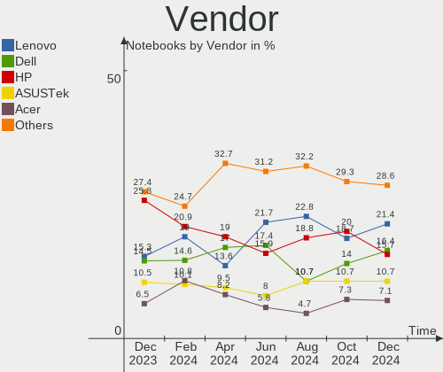

Zorin Hardware Trends (Notebook)
--------------------------------

A project to identify most popular hardware characteristics and track their change
over time based on data collected by Zorin users at https://Linux-Hardware.org.

Anyone can contribute to the study by uploading probes of their computers by
the [hw-probe](https://github.com/linuxhw/hw-probe) tool:

    sudo hw-probe -all -upload

Full-feature report is available here: https://linux-hardware.org/?view=trends&formfactor=notebook

Period: Jan, 2020.

Contents
--------

- [ OS                       ](#os)
- [ OS Family                ](#os-family)
- [ Kernel                   ](#kernel)
- [ Kernel Family            ](#kernel-family)
- [ Kernel Major Ver.        ](#kernel-major-ver)
- [ Arch                     ](#arch)
- [ DE                       ](#de)
- [ Display Server           ](#display-server)
- [ OS Lang                  ](#os-lang)
- [ Boot Mode                ](#boot-mode)
- [ Filesystem               ](#filesystem)
- [ Dual Boot with Linux     ](#dual-boot-with-linux)
- [ Dual Boot (Win)          ](#dual-boot-win)
- [ Country                  ](#country)
- [ City                     ](#city)
- [ Vendor                   ](#vendor)
- [ Model                    ](#model)
- [ Model Family             ](#model-family)
- [ MFG Year                 ](#mfg-year)
- [ Form Factor              ](#form-factor)
- [ Secure Boot              ](#secure-boot)
- [ Coreboot                 ](#coreboot)
- [ RAM Size                 ](#ram-size)
- [ RAM Used                 ](#ram-used)
- [ Drive Vendor             ](#drive-vendor)
- [ Drive Model              ](#drive-model)
- [ Drive Kind               ](#drive-kind)
- [ Drive Connector          ](#drive-connector)
- [ Drive Size               ](#drive-size)
- [ Space Total              ](#space-total)
- [ Space Used               ](#space-used)
- [ Malfunc. Drives          ](#malfunc-drives)
- [ Malfunc. Drive Vendor    ](#malfunc-drive-vendor)
- [ Malfunc. Drive Kind      ](#malfunc-drive-kind)
- [ Failed Drives            ](#failed-drives)
- [ Failed Drive Vendor      ](#failed-drive-vendor)
- [ Drive Status             ](#drive-status)
- [ Storage Vendor           ](#storage-vendor)
- [ Storage Model            ](#storage-model)
- [ Storage Kind             ](#storage-kind)
- [ CPU Vendor               ](#cpu-vendor)
- [ CPU Model                ](#cpu-model)
- [ CPU Model Family         ](#cpu-model-family)
- [ CPU Cores                ](#cpu-cores)
- [ CPU Sockets              ](#cpu-sockets)
- [ CPU Threads              ](#cpu-threads)
- [ CPU Op-Modes             ](#cpu-op-modes)
- [ CPU Microarch            ](#cpu-microarch)
- [ CPU Microcode            ](#cpu-microcode)
- [ GPU Vendor               ](#gpu-vendor)
- [ GPU Model                ](#gpu-model)
- [ GPU Combo                ](#gpu-combo)
- [ GPU Driver               ](#gpu-driver)
- [ GPU Memory               ](#gpu-memory)
- [ Monitor Vendor           ](#monitor-vendor)
- [ Monitor Model            ](#monitor-model)
- [ Monitor Resolution       ](#monitor-resolution)
- [ Monitor Diagonal         ](#monitor-diagonal)
- [ Monitor Width            ](#monitor-width)
- [ Aspect Ratio             ](#aspect-ratio)
- [ Monitor Area             ](#monitor-area)
- [ Pixel Density            ](#pixel-density)
- [ Multiple Monitors        ](#multiple-monitors)
- [ Net Controller Vendor    ](#net-controller-vendor)
- [ Net Controller Model     ](#net-controller-model)
- [ Net Controller Kind      ](#net-controller-kind)
- [ Used Controller          ](#used-controller)
- [ NICs                     ](#nics)
- [ Unsupported Devices      ](#unsupported-devices)
- [ Unsupported Device Types ](#unsupported-device-types)

OS
--

Installed operating systems

| Name     | Computers | Percent |
|----------|-----------|---------|
| Zorin 15 | 23        | 82.14%  |
| Zorin 12 | 5         | 17.86%  |

OS Family
---------

OS without a version

| Name  | Computers | Percent |
|-------|-----------|---------|
| Zorin | 28        | 100%    |

Kernel
------

Version of the Linux kernel

| Version           | Computers | Percent |
|-------------------|-----------|---------|
| 5.0.0-37-generic  | 13        | 46.43%  |
| 5.3.0-26-generic  | 6         | 21.43%  |
| 5.3.0-28-generic  | 3         | 10.71%  |
| 4.15.0-74-generic | 3         | 10.71%  |
| 5.0.0-29-generic  | 1         | 3.57%   |
| 4.15.0-76-generic | 1         | 3.57%   |
| 4.15.0-72-generic | 1         | 3.57%   |

Kernel Family
-------------

Linux kernel without a distro release

| Version | Computers | Percent |
|---------|-----------|---------|
| 5.0.0   | 14        | 50%     |
| 5.3.0   | 9         | 32.14%  |
| 4.15.0  | 5         | 17.86%  |

Kernel Major Ver.
-----------------

Linux kernel major version

| Version | Computers | Percent |
|---------|-----------|---------|
| 5.0     | 14        | 50%     |
| 5.3     | 9         | 32.14%  |
| 4.15    | 5         | 17.86%  |

Arch
----

OS architecture (x86_64, i586, etc.)

| Name   | Computers | Percent |
|--------|-----------|---------|
| x86_64 | 22        | 78.57%  |
| i686   | 6         | 21.43%  |

DE
--

Desktop Environment

| Name       | Computers | Percent |
|------------|-----------|---------|
| GNOME      | 17        | 60.71%  |
| XFCE       | 9         | 32.14%  |
| X-Cinnamon | 1         | 3.57%   |
| Unknown    | 1         | 3.57%   |

Display Server
--------------

X11 or Wayland

| Name    | Computers | Percent |
|---------|-----------|---------|
| X11     | 27        | 96.43%  |
| Unknown | 1         | 3.57%   |

OS Lang
-------

Language

| Lang  | Computers | Percent |
|-------|-----------|---------|
| en_US | 10        | 35.71%  |
| en_GB | 3         | 10.71%  |
| tr_TR | 1         | 3.57%   |
| sk_SK | 1         | 3.57%   |
| ro_RO | 1         | 3.57%   |
| pt_PT | 1         | 3.57%   |
| pt_BR | 1         | 3.57%   |
| nl_NL | 1         | 3.57%   |
| it_IT | 1         | 3.57%   |
| id_ID | 1         | 3.57%   |
| fr_CA | 1         | 3.57%   |
| es_MX | 1         | 3.57%   |
| es_ES | 1         | 3.57%   |
| es_CL | 1         | 3.57%   |
| en_IN | 1         | 3.57%   |
| en_CA | 1         | 3.57%   |
| de_DE | 1         | 3.57%   |

Boot Mode
---------

EFI or BIOS

| Mode | Computers | Percent |
|------|-----------|---------|
| BIOS | 20        | 71.43%  |
| EFI  | 8         | 28.57%  |

Filesystem
----------

Type of filesystem

| Type | Computers | Percent |
|------|-----------|---------|
| Ext4 | 27        | 96.43%  |
| Ext2 | 1         | 3.57%   |

Dual Boot with Linux
--------------------

Hosting more than one Linux

| Dual boot | Computers | Percent |
|-----------|-----------|---------|
| No        | 26        | 92.86%  |
| Yes       | 2         | 7.14%   |

Dual Boot (Win)
---------------

Hosting Linux and Windows

| Dual boot | Computers | Percent |
|-----------|-----------|---------|
| No        | 20        | 71.43%  |
| Yes       | 8         | 28.57%  |

Country
-------

Geographic location (country)

| Country     | Computers | Percent |
|-------------|-----------|---------|
| USA         | 5         | 17.86%  |
| UK          | 3         | 10.71%  |
| Italy       | 2         | 7.14%   |
| Indonesia   | 2         | 7.14%   |
| Germany     | 2         | 7.14%   |
| Canada      | 2         | 7.14%   |
| Brazil      | 2         | 7.14%   |
| Turkey      | 1         | 3.57%   |
| Spain       | 1         | 3.57%   |
| Romania     | 1         | 3.57%   |
| Portugal    | 1         | 3.57%   |
| Netherlands | 1         | 3.57%   |
| Mexico      | 1         | 3.57%   |
| India       | 1         | 3.57%   |
| Hungary     | 1         | 3.57%   |
| Chile       | 1         | 3.57%   |
| Belgium     | 1         | 3.57%   |

City
----

Geographic location (city)

| City                    | Computers | Percent |
|-------------------------|-----------|---------|
| London                  | 2         | 7.14%   |
| Jakarta                 | 2         | 7.14%   |
| Stendal                 | 1         | 3.57%   |
| Sherbrooke              | 1         | 3.57%   |
| Sarasota                | 1         | 3.57%   |
| Santo Angel             | 1         | 3.57%   |
| San Antonio             | 1         | 3.57%   |
| Rho                     | 1         | 3.57%   |
| Queluz                  | 1         | 3.57%   |
| Pennsburg               | 1         | 3.57%   |
| León                   | 1         | 3.57%   |
| Las Vegas               | 1         | 3.57%   |
| Kolkata                 | 1         | 3.57%   |
| Kitchener               | 1         | 3.57%   |
| Heves                   | 1         | 3.57%   |
| Falkensee               | 1         | 3.57%   |
| De Meern                | 1         | 3.57%   |
| Codlea                  | 1         | 3.57%   |
| Canterbury              | 1         | 3.57%   |
| Cachoeiro de Itapemirim | 1         | 3.57%   |
| Belo Horizonte          | 1         | 3.57%   |
| Arica                   | 1         | 3.57%   |
| Ankara                  | 1         | 3.57%   |
| Acworth                 | 1         | 3.57%   |
| Abano Terme             | 1         | 3.57%   |
| Aalst                   | 1         | 3.57%   |

Vendor
------

Motherboard manufacturer

| Name                | Computers | Percent |
|---------------------|-----------|---------|
| Hewlett-Packard     | 8         | 28.57%  |
| Lenovo              | 5         | 17.86%  |
| Acer                | 5         | 17.86%  |
| Packard Bell        | 3         | 10.71%  |
| Toshiba             | 2         | 7.14%   |
| Samsung Electronics | 1         | 3.57%   |
| Dixonsxp            | 1         | 3.57%   |
| Dell                | 1         | 3.57%   |
| ASUSTek Computer    | 1         | 3.57%   |
| Unknown             | 1         | 3.57%   |

Model
-----

Motherboard model

| Name                            | Computers | Percent |
|---------------------------------|-----------|---------|
| Unknown                         | 2         | 7.14%   |
| Toshiba Satellite L55-B         | 1         | 3.57%   |
| Toshiba Satellite A215          | 1         | 3.57%   |
| Samsung Electronics R710        | 1         | 3.57%   |
| Packard Bell EasyNote TJ65      | 1         | 3.57%   |
| Packard Bell EasyNote MH36      | 1         | 3.57%   |
| Packard Bell EasyNote MH35      | 1         | 3.57%   |
| Lenovo V155-15API 81V5          | 1         | 3.57%   |
| Lenovo IdeaPad Z400 Touch VIWZ1 | 1         | 3.57%   |
| Lenovo IdeaPad N581 7505        | 1         | 3.57%   |
| Lenovo IdeaPad 330-15IKB 81DE   | 1         | 3.57%   |
| Lenovo IdeaPad 100-14IBY 80MH   | 1         | 3.57%   |
| HP Split 13 x2 Detachable PC    | 1         | 3.57%   |
| HP ProBook 450 G1               | 1         | 3.57%   |
| HP Presario C500 (RU924PA#UUF)  | 1         | 3.57%   |
| HP Pavilion dv7                 | 1         | 3.57%   |
| HP Pavilion dv6700              | 1         | 3.57%   |
| HP Laptop 15-da0xxx             | 1         | 3.57%   |
| HP Laptop 15-bw0xx              | 1         | 3.57%   |
| HP Compaq Presario CQ50         | 1         | 3.57%   |
| Dell Vostro 1500                | 1         | 3.57%   |
| ASUS X405UA                     | 1         | 3.57%   |
| Acer Aspire 5750                | 1         | 3.57%   |
| Acer Aspire 5735                | 1         | 3.57%   |
| Acer Aspire 5336                | 1         | 3.57%   |
| Acer Aspire 4752                | 1         | 3.57%   |
| Acer AOA150                     | 1         | 3.57%   |

Model Family
------------

Motherboard model prefix

| Name                     | Computers | Percent |
|--------------------------|-----------|---------|
| Lenovo IdeaPad           | 4         | 14.29%  |
| Acer Aspire              | 4         | 14.29%  |
| Packard Bell EasyNote    | 3         | 10.71%  |
| Toshiba Satellite        | 2         | 7.14%   |
| HP Pavilion              | 2         | 7.14%   |
| HP Laptop                | 2         | 7.14%   |
| Unknown                  | 2         | 7.14%   |
| Samsung Electronics R710 | 1         | 3.57%   |
| Lenovo V155-15API        | 1         | 3.57%   |
| HP Split                 | 1         | 3.57%   |
| HP ProBook               | 1         | 3.57%   |
| HP Presario              | 1         | 3.57%   |
| HP Compaq                | 1         | 3.57%   |
| Dell Vostro              | 1         | 3.57%   |
| ASUS X405UA              | 1         | 3.57%   |
| Acer AOA150              | 1         | 3.57%   |

MFG Year
--------

Motherboard manufacture year

| Year | Computers | Percent |
|------|-----------|---------|
| 2008 | 7         | 25%     |
| 2019 | 4         | 14.29%  |
| 2017 | 3         | 10.71%  |
| 2012 | 3         | 10.71%  |
| 2011 | 2         | 7.14%   |
| 2009 | 2         | 7.14%   |
| 2007 | 2         | 7.14%   |
| 2018 | 1         | 3.57%   |
| 2015 | 1         | 3.57%   |
| 2014 | 1         | 3.57%   |
| 2013 | 1         | 3.57%   |
| 2006 | 1         | 3.57%   |

Form Factor
-----------

Physical design of the computer

| Name     | Computers | Percent |
|----------|-----------|---------|
| Notebook | 28        | 100%    |

Secure Boot
-----------

Enabled or disabled

| State    | Computers | Percent |
|----------|-----------|---------|
| Disabled | 26        | 92.86%  |
| Enabled  | 2         | 7.14%   |

Coreboot
--------

Have coreboot on board

| Used | Computers | Percent |
|------|-----------|---------|
| No   | 28        | 100%    |

RAM Size
--------

Total RAM memory

| Size in GB | Computers | Percent |
|------------|-----------|---------|
| 3.01-4.0   | 10        | 35.71%  |
| 4.01-8.0   | 8         | 28.57%  |
| 2.01-3.0   | 5         | 17.86%  |
| 8.01-16.0  | 3         | 10.71%  |
| 1.01-2.0   | 1         | 3.57%   |
| 0.01-1.0   | 1         | 3.57%   |

RAM Used
--------

Used RAM memory

| Used GB  | Computers | Percent |
|----------|-----------|---------|
| 1.01-2.0 | 10        | 35.71%  |
| 0.01-1.0 | 8         | 28.57%  |
| 2.01-3.0 | 7         | 25%     |
| 3.01-4.0 | 2         | 7.14%   |
| 4.01-8.0 | 1         | 3.57%   |

Drive Vendor
------------

Hard drive vendors

| Vendor              | Computers | Drives | Percent |
|---------------------|-----------|--------|---------|
| WDC                 | 12        | 12     | 38.71%  |
| Toshiba             | 6         | 6      | 19.35%  |
| Seagate             | 3         | 3      | 9.68%   |
| Hitachi             | 3         | 3      | 9.68%   |
| Unknown             | 2         | 2      | 6.45%   |
| Samsung Electronics | 2         | 2      | 6.45%   |
| Kingston            | 1         | 1      | 3.23%   |
| Intel               | 1         | 1      | 3.23%   |
| Hewlett-Packard     | 1         | 1      | 3.23%   |

Drive Model
-----------

Hard drive models

| Model                        | Computers | Percent |
|------------------------------|-----------|---------|
| WD10JPVT-24A1YT0 1TB         | 2         | 6.45%   |
| WDS240G2G0A-00JH30 240GB SSD | 1         | 3.23%   |
| WD5000M21K-60JU6T0 500GB     | 1         | 3.23%   |
| WD5000LPCX-24VHAT0 500GB     | 1         | 3.23%   |
| WD5000BPVT-80HXZT3 500GB     | 1         | 3.23%   |
| WD5000BPVT-22HXZT3 500GB     | 1         | 3.23%   |
| WD3200BEVT-22ZCT0 320GB      | 1         | 3.23%   |
| WD1600BEVT-22ZCT0 160GB      | 1         | 3.23%   |
| WD1600BEVS-08VAT2 160GB      | 1         | 3.23%   |
| WD10JPVX-60JC3T1 1TB         | 1         | 3.23%   |
| WD10JPVX-22JC3T0 1TB         | 1         | 3.23%   |
| ST98823AS 80GB               | 1         | 3.23%   |
| ST9500325AS 500GB            | 1         | 3.23%   |
| ST9250315AS 250GB            | 1         | 3.23%   |
| SSDSC2BW120H6 120GB          | 1         | 3.23%   |
| SSD 860 EVO 250GB            | 1         | 3.23%   |
| SA400S37120G 120GB SSD       | 1         | 3.23%   |
| MQ04ABF100 1TB               | 1         | 3.23%   |
| MQ01ABF050 500GB             | 1         | 3.23%   |
| MQ01ABD100 1TB               | 1         | 3.23%   |
| MQ01ABD075 752GB             | 1         | 3.23%   |
| MMC Card  64GB               | 1         | 3.23%   |
| MK2555GSX 250GB              | 1         | 3.23%   |
| MK2035GSS 200GB              | 1         | 3.23%   |
| HTS547575A9E384 752GB        | 1         | 3.23%   |
| HTS545032A7E380 320GB        | 1         | 3.23%   |
| HTS542516K9SA00 160GB        | 1         | 3.23%   |
| CGND3R  64GB                 | 1         | 3.23%   |
| BD E DS6E2LH 1GB             | 1         | 3.23%   |
| 470 Series SSD 64GB          | 1         | 3.23%   |

Drive Kind
----------

HDD or SSD

| Kind    | Computers | Drives | Percent |
|---------|-----------|--------|---------|
| HDD     | 22        | 23     | 73.33%  |
| SSD     | 5         | 5      | 16.67%  |
| MMC     | 2         | 2      | 6.67%   |
| Unknown | 1         | 1      | 3.33%   |

Drive Connector
---------------

SATA, SAS, NVMe, etc.

| Type | Computers | Drives | Percent |
|------|-----------|--------|---------|
| SATA | 26        | 28     | 89.66%  |
| MMC  | 2         | 2      | 6.9%    |
| SAS  | 1         | 1      | 3.45%   |

Drive Size
----------

Size of hard drive

| Size in TB | Computers | Drives | Percent |
|------------|-----------|--------|---------|
| 0.01-0.5   | 21        | 23     | 75%     |
| 0.51-1.0   | 7         | 8      | 25%     |

Space Total
-----------

Amount of disk space available on the file system

| Size in GB | Computers | Percent |
|------------|-----------|---------|
| 101-250    | 11        | 39.29%  |
| 251-500    | 8         | 28.57%  |
| 501-1000   | 5         | 17.86%  |
| 51-100     | 2         | 7.14%   |
| 21-50      | 1         | 3.57%   |
| 1001-2000  | 1         | 3.57%   |

Space Used
----------

Amount of used disk space

| Used GB | Computers | Percent |
|---------|-----------|---------|
| 1-20    | 17        | 60.71%  |
| 21-50   | 6         | 21.43%  |
| 51-100  | 3         | 10.71%  |
| 251-500 | 2         | 7.14%   |

Malfunc. Drives
---------------

Drive models with a malfunction

Zero info for selected period =(

Malfunc. Drive Vendor
---------------------

Vendors of faulty drives

Zero info for selected period =(

Malfunc. Drive Kind
-------------------

Kinds of faulty drives

Zero info for selected period =(

Failed Drives
-------------

Failed drive models

Zero info for selected period =(

Failed Drive Vendor
-------------------

Failed drive vendors

Zero info for selected period =(

Drive Status
------------

Number of failed and malfunc. drives

| Status   | Computers | Drives | Percent |
|----------|-----------|--------|---------|
| Detected | 27        | 31     | 100%    |

Storage Vendor
--------------

Storage controller vendors

| Vendor                           | Computers | Percent |
|----------------------------------|-----------|---------|
| Intel                            | 20        | 71.43%  |
| AMD                              | 4         | 14.29%  |
| Nvidia                           | 2         | 7.14%   |
| Silicon Integrated Systems [SiS] | 1         | 3.57%   |
| Sandisk                          | 1         | 3.57%   |

Storage Model
-------------

Storage controller models

| Model                                                                    | Computers | Percent |
|--------------------------------------------------------------------------|-----------|---------|
| 82801IBM/IEM (ICH9M/ICH9M-E) 4 port SATA Controller [AHCI mode]          | 4         | 11.43%  |
| FCH SATA Controller [AHCI mode]                                          | 3         | 8.57%   |
| Sunrise Point-LP SATA Controller [AHCI mode]                             | 2         | 5.71%   |
| 82801GBM/GHM (ICH7-M Family) SATA Controller [IDE mode]                  | 2         | 5.71%   |
| 8 Series SATA Controller 1 [AHCI mode]                                   | 2         | 5.71%   |
| 7 Series Chipset Family 6-port SATA Controller [AHCI mode]               | 2         | 5.71%   |
| 6 Series/C200 Series Chipset Family 6 port Mobile SATA AHCI Controller   | 2         | 5.71%   |
| SB600 Non-Raid-5 SATA                                                    | 1         | 2.86%   |
| SB600 IDE                                                                | 1         | 2.86%   |
| SATA Controller / IDE mode                                               | 1         | 2.86%   |
| Non-Volatile memory controller                                           | 1         | 2.86%   |
| MCP78S [GeForce 8200] SATA Controller (non-AHCI mode)                    | 1         | 2.86%   |
| MCP78S [GeForce 8200] IDE                                                | 1         | 2.86%   |
| MCP67 IDE Controller                                                     | 1         | 2.86%   |
| MCP67 AHCI Controller                                                    | 1         | 2.86%   |
| FCH IDE Controller                                                       | 1         | 2.86%   |
| Atom Processor E3800 Series SATA AHCI Controller                         | 1         | 2.86%   |
| 82801IBM/IEM (ICH9M/ICH9M-E) 2 port SATA Controller [IDE mode]           | 1         | 2.86%   |
| 82801HM/HEM (ICH8M/ICH8M-E) SATA Controller [AHCI mode]                  | 1         | 2.86%   |
| 82801HM/HEM (ICH8M/ICH8M-E) IDE Controller                               | 1         | 2.86%   |
| 82801GBM/GHM (ICH7-M Family) SATA Controller [AHCI mode]                 | 1         | 2.86%   |
| 82801G (ICH7 Family) IDE Controller                                      | 1         | 2.86%   |
| 82801 Mobile SATA Controller [RAID mode]                                 | 1         | 2.86%   |
| 8 Series/C220 Series Chipset Family 6-port SATA Controller 1 [AHCI mode] | 1         | 2.86%   |
| 5513 IDE Controller                                                      | 1         | 2.86%   |

Storage Kind
------------

Kind of storage controller (IDE, SATA, NVMe, SAS, ...)

| Kind | Computers | Percent |
|------|-----------|---------|
| SATA | 20        | 62.5%   |
| IDE  | 10        | 31.25%  |
| RAID | 1         | 3.13%   |
| NVMe | 1         | 3.13%   |

CPU Vendor
----------

Processor vendors

| Vendor | Computers | Percent |
|--------|-----------|---------|
| Intel  | 22        | 78.57%  |
| AMD    | 6         | 21.43%  |

CPU Model
---------

Processor models

| Model                                         | Computers | Percent |
|-----------------------------------------------|-----------|---------|
| Intel Pentium Dual CPU T3400 @ 2.16GHz        | 2         | 7.14%   |
| Intel Atom CPU N270 @ 1.60GHz                 | 2         | 7.14%   |
| AMD Athlon 64 X2 Dual-Core Processor TK-57    | 2         | 7.14%   |
| Intel Pentium Dual CPU T2330 @ 1.60GHz        | 1         | 3.57%   |
| Intel Pentium CPU B960 @ 2.20GHz              | 1         | 3.57%   |
| Intel Pentium CPU B950 @ 2.10GHz              | 1         | 3.57%   |
| Intel Genuine CPU T2060 @ 1.60GHz             | 1         | 3.57%   |
| Intel Core i7-4600M CPU @ 2.90GHz             | 1         | 3.57%   |
| Intel Core i7-3612QM CPU @ 2.10GHz            | 1         | 3.57%   |
| Intel Core i5-7200U CPU @ 2.50GHz             | 1         | 3.57%   |
| Intel Core i5-4210U CPU @ 1.70GHz             | 1         | 3.57%   |
| Intel Core i3-8130U CPU @ 2.20GHz             | 1         | 3.57%   |
| Intel Core i3-7100U CPU @ 2.40GHz             | 1         | 3.57%   |
| Intel Core i3-4012Y CPU @ 1.50GHz             | 1         | 3.57%   |
| Intel Core i3-2330M CPU @ 2.20GHz             | 1         | 3.57%   |
| Intel Core 2 Duo CPU T7300 @ 2.00GHz          | 1         | 3.57%   |
| Intel Core 2 Duo CPU T6600 @ 2.20GHz          | 1         | 3.57%   |
| Intel Core 2 Duo CPU T6400 @ 2.00GHz          | 1         | 3.57%   |
| Intel Celeron CPU N2940 @ 1.83GHz             | 1         | 3.57%   |
| Intel Celeron CPU 900 @ 2.20GHz               | 1         | 3.57%   |
| Intel Atom x7-Z8750 CPU @ 1.60GHz             | 1         | 3.57%   |
| AMD Turion Dual-Core RM-70                    | 1         | 3.57%   |
| AMD Ryzen 5 3500U with Radeon Vega Mobile Gfx | 1         | 3.57%   |
| AMD A6-9220 RADEON R4, 5 COMPUTE CORES 2C+3G  | 1         | 3.57%   |
| AMD A6-3400M APU with Radeon HD Graphics      | 1         | 3.57%   |

CPU Model Family
----------------

Processor model prefix

| Model                | Computers | Percent |
|----------------------|-----------|---------|
| Intel Core i3        | 4         | 14.29%  |
| Intel Pentium Dual   | 3         | 10.71%  |
| Intel Core 2 Duo     | 3         | 10.71%  |
| Intel Atom           | 3         | 10.71%  |
| Intel Pentium        | 2         | 7.14%   |
| Intel Core i7        | 2         | 7.14%   |
| Intel Core i5        | 2         | 7.14%   |
| Intel Celeron        | 2         | 7.14%   |
| AMD Athlon 64 X2     | 2         | 7.14%   |
| AMD A6               | 2         | 7.14%   |
| Intel Genuine        | 1         | 3.57%   |
| AMD Turion Dual-Core | 1         | 3.57%   |
| AMD Ryzen 5          | 1         | 3.57%   |

CPU Cores
---------

Number of processor cores

| Number | Computers | Percent |
|--------|-----------|---------|
| 2      | 20        | 71.43%  |
| 4      | 5         | 17.86%  |
| 1      | 3         | 10.71%  |

CPU Sockets
-----------

Number of sockets

| Number | Computers | Percent |
|--------|-----------|---------|
| 1      | 28        | 100%    |

CPU Threads
-----------

Threads per core (Hyper-Threading)

| Number | Computers | Percent |
|--------|-----------|---------|
| 1      | 17        | 60.71%  |
| 2      | 11        | 39.29%  |

CPU Op-Modes
------------

CPU Operation Modes (32-bit, 64-bit)

| Op mode        | Computers | Percent |
|----------------|-----------|---------|
| 32-bit, 64-bit | 25        | 89.29%  |
| 32-bit         | 3         | 10.71%  |

CPU Microarch
-------------

Microarchitecture

| Name            | Computers | Percent |
|-----------------|-----------|---------|
| Core            | 7         | 25%     |
| SandyBridge     | 3         | 10.71%  |
| Haswell         | 3         | 10.71%  |
| Skylake         | 2         | 7.14%   |
| Silvermont      | 2         | 7.14%   |
| K8 Hammer       | 2         | 7.14%   |
| Bonnell         | 2         | 7.14%   |
| Zen+            | 1         | 3.57%   |
| P6              | 1         | 3.57%   |
| KabyLake        | 1         | 3.57%   |
| K8 & K10 hybrid | 1         | 3.57%   |
| K10 Llano       | 1         | 3.57%   |
| IvyBridge       | 1         | 3.57%   |
| Excavator       | 1         | 3.57%   |

CPU Microcode
-------------

Microcode number

| Number     | Computers | Percent |
|------------|-----------|---------|
| Unknown    | 4         | 14.29%  |
| 0x206a7    | 3         | 10.71%  |
| 0x1067a    | 3         | 10.71%  |
| 0x6fd      | 2         | 7.14%   |
| 0x40651    | 2         | 7.14%   |
| 0x106c2    | 2         | 7.14%   |
| 0x806ea    | 1         | 3.57%   |
| 0x806e9    | 1         | 3.57%   |
| 0x6fa      | 1         | 3.57%   |
| 0x6ec      | 1         | 3.57%   |
| 0x406c4    | 1         | 3.57%   |
| 0x306c3    | 1         | 3.57%   |
| 0x306a9    | 1         | 3.57%   |
| 0x30678    | 1         | 3.57%   |
| 0x08108102 | 1         | 3.57%   |
| 0x06006704 | 1         | 3.57%   |
| 0x03000027 | 1         | 3.57%   |
| 0x02000032 | 1         | 3.57%   |

GPU Vendor
----------

Vendors of graphics cards

| Vendor                           | Computers | Percent |
|----------------------------------|-----------|---------|
| Intel                            | 18        | 62.07%  |
| Nvidia                           | 6         | 20.69%  |
| AMD                              | 4         | 13.79%  |
| Silicon Integrated Systems [SiS] | 1         | 3.45%   |

GPU Model
---------

Graphics card models

| Model                                                                              | Computers | Percent |
|------------------------------------------------------------------------------------|-----------|---------|
| Mobile 945GM/GMS/GME, 943/940GML Express Integrated Graphics Controller            | 3         | 9.38%   |
| Mobile 4 Series Chipset Integrated Graphics Controller                             | 3         | 9.38%   |
| 2nd Generation Core Processor Family Integrated Graphics Controller                | 3         | 9.38%   |
| Mobile 945GSE Express Integrated Graphics Controller                               | 2         | 6.25%   |
| HD Graphics 620                                                                    | 2         | 6.25%   |
| UHD Graphics 620                                                                   | 1         | 3.13%   |
| Sumo [Radeon HD 6520G]                                                             | 1         | 3.13%   |
| Stoney [Radeon R2/R3/R4/R5 Graphics]                                               | 1         | 3.13%   |
| RS690M [Radeon Xpress 1200/1250/1270]                                              | 1         | 3.13%   |
| Picasso                                                                            | 1         | 3.13%   |
| Mobile 945GM/GMS, 943/940GML Express Integrated Graphics Controller                | 1         | 3.13%   |
| Haswell-ULT Integrated Graphics Controller                                         | 1         | 3.13%   |
| Haswell-ULT High Definition Audio Controller [HD Graphics]                         | 1         | 3.13%   |
| GT216M [GeForce GT 240M]                                                           | 1         | 3.13%   |
| GF108M [GeForce GT 635M]                                                           | 1         | 3.13%   |
| G98M [GeForce 9300M GS]                                                            | 1         | 3.13%   |
| G84M [GeForce 8600M GT]                                                            | 1         | 3.13%   |
| C77 [GeForce 8200M G]                                                              | 1         | 3.13%   |
| C67 [GeForce 7150M / nForce 630M]                                                  | 1         | 3.13%   |
| Atom/Celeron/Pentium Processor x5-E8000/J3xxx/N3xxx Integrated Graphics Controller | 1         | 3.13%   |
| Atom Processor Z36xxx/Z37xxx Series Graphics & Display                             | 1         | 3.13%   |
| 771/671 PCIE VGA Display Adapter                                                   | 1         | 3.13%   |
| 4th Gen Core Processor Integrated Graphics Controller                              | 1         | 3.13%   |
| 3rd Gen Core processor Graphics Controller                                         | 1         | 3.13%   |

GPU Combo
---------

Combinations of graphics cards

| Name           | Computers | Percent |
|----------------|-----------|---------|
| 1 x Intel      | 17        | 60.71%  |
| 1 x Nvidia     | 5         | 17.86%  |
| 1 x AMD        | 4         | 14.29%  |
| 1 x SiS        | 1         | 3.57%   |
| Intel + Nvidia | 1         | 3.57%   |

GPU Driver
----------

Free vs proprietary

| Driver      | Computers | Percent |
|-------------|-----------|---------|
| Free        | 23        | 82.14%  |
| Unknown     | 3         | 10.71%  |
| Proprietary | 2         | 7.14%   |

GPU Memory
----------

Total video memory

| Size in GB | Computers | Percent |
|------------|-----------|---------|
| Unknown    | 18        | 64.29%  |
| 0.01-0.5   | 7         | 25%     |
| 3.01-4.0   | 1         | 3.57%   |
| 1.01-2.0   | 1         | 3.57%   |
| 0.51-1.0   | 1         | 3.57%   |

Monitor Vendor
--------------

Monitor vendors

| Vendor                  | Computers | Percent |
|-------------------------|-----------|---------|
| LG Display              | 6         | 24%     |
| Samsung Electronics     | 4         | 16%     |
| AU Optronics            | 3         | 12%     |
| Chi Mei Optoelectronics | 2         | 8%      |
| BOE                     | 2         | 8%      |
| Toshiba                 | 1         | 4%      |
| Quanta Display          | 1         | 4%      |
| LPL                     | 1         | 4%      |
| LGD                     | 1         | 4%      |
| LG Philips              | 1         | 4%      |
| InfoVision              | 1         | 4%      |
| Goldstar                | 1         | 4%      |
| Chimei Innolux          | 1         | 4%      |

Monitor Model
-------------

Monitor models

| Model                                             | Computers | Percent |
|---------------------------------------------------|-----------|---------|
| TV TSB2017 3840x2160                              | 1         | 4%      |
| M237WA GSM5726 1920x1080 509x286mm 23.0-inch      | 1         | 4%      |
| LCD Monitor SEC4E45 1280x800 331x207mm 15.4-inch  | 1         | 4%      |
| LCD Monitor SEC3633 1280x800 331x207mm 15.4-inch  | 1         | 4%      |
| LCD Monitor SDC4652 1366x768 344x194mm 15.5-inch  | 1         | 4%      |
| LCD Monitor SDC4146 1366x768 344x194mm 15.5-inch  | 1         | 4%      |
| LCD Monitor QDS0027 1280x800 331x207mm 15.4-inch  | 1         | 4%      |
| LCD Monitor LPL3B01 1280x800 330x210mm 15.4-inch  | 1         | 4%      |
| LCD Monitor LP156WH2-TLE1 1366x768                | 1         | 4%      |
| LCD Monitor LGD040B 1366x768 293x165mm 13.2-inch  | 1         | 4%      |
| LCD Monitor LGD033F 1366x768 309x174mm 14.0-inch  | 1         | 4%      |
| LCD Monitor LGD033A 1366x768 340x190mm 15.3-inch  | 1         | 4%      |
| LCD Monitor LGD02F8 1366x768 309x174mm 14.0-inch  | 1         | 4%      |
| LCD Monitor LGD02DC 1366x768 344x194mm 15.5-inch  | 1         | 4%      |
| LCD Monitor LGD0250 1366x768 345x194mm 15.6-inch  | 1         | 4%      |
| LCD Monitor IVO057C 1366x768 310x170mm 13.9-inch  | 1         | 4%      |
| LCD Monitor CMO1719 1600x900 382x215mm 17.3-inch  | 1         | 4%      |
| LCD Monitor CMO0209 1024x600 195x113mm 8.9-inch   | 1         | 4%      |
| LCD Monitor CMN14D6 1366x768 309x173mm 13.9-inch  | 1         | 4%      |
| LCD Monitor BOE06F0 1366x768 344x194mm 15.5-inch  | 1         | 4%      |
| LCD Monitor BOE06A5 1366x768 344x194mm 15.5-inch  | 1         | 4%      |
| LCD Monitor AUO71EC 1366x768 340x190mm 15.3-inch  | 1         | 4%      |
| LCD Monitor AUO61ED 1920x1080 340x190mm 15.3-inch | 1         | 4%      |
| LCD Monitor AUO10EC 1366x768 340x190mm 15.3-inch  | 1         | 4%      |
| LCD Monitor 1680x1050                             | 1         | 4%      |

Monitor Resolution
------------------

Monitor screen resolution

| Resolution         | Computers | Percent |
|--------------------|-----------|---------|
| 1366x768 (WXGA)    | 15        | 60%     |
| 1280x800 (WXGA)    | 4         | 16%     |
| 1920x1080 (FHD)    | 2         | 8%      |
| 3840x2160 (4K)     | 1         | 4%      |
| 1680x1050 (WSXGA+) | 1         | 4%      |
| 1600x900 (HD+)     | 1         | 4%      |
| 1024x600           | 1         | 4%      |

Monitor Diagonal
----------------

Diagonal size in inches

| Inches  | Computers | Percent |
|---------|-----------|---------|
| 15      | 14        | 56%     |
| 14      | 3         | 12%     |
| 13      | 2         | 8%      |
| Unknown | 2         | 8%      |
| 72      | 1         | 4%      |
| 23      | 1         | 4%      |
| 17      | 1         | 4%      |
| 8       | 1         | 4%      |

Monitor Width
-------------

Physical width

| Width in mm | Computers | Percent |
|-------------|-----------|---------|
| 301-350     | 18        | 72%     |
| Unknown     | 2         | 8%      |
| 501-600     | 1         | 4%      |
| 351-400     | 1         | 4%      |
| 201-300     | 1         | 4%      |
| 1501-2000   | 1         | 4%      |
| 101-200     | 1         | 4%      |

Aspect Ratio
------------

Proportional relationship between the width and the height

| Ratio   | Computers | Percent |
|---------|-----------|---------|
| 16/9    | 17        | 73.91%  |
| 16/10   | 4         | 17.39%  |
| Unknown | 2         | 8.7%    |

Monitor Area
------------

Area in inch²

| Area in inch² | Computers | Percent |
|----------------|-----------|---------|
| 101-110        | 14        | 56%     |
| 81-90          | 4         | 16%     |
| Unknown        | 2         | 8%      |
| More than 1000 | 1         | 4%      |
| 71-80          | 1         | 4%      |
| 1-40           | 1         | 4%      |
| 201-250        | 1         | 4%      |
| 121-130        | 1         | 4%      |

Pixel Density
-------------

Pixels per inch

| Density | Computers | Percent |
|---------|-----------|---------|
| 101-120 | 15        | 60%     |
| 51-100  | 6         | 24%     |
| 121-160 | 2         | 8%      |
| Unknown | 2         | 8%      |

Multiple Monitors
-----------------

Total monitors connected

| Total | Computers | Percent |
|-------|-----------|---------|
| 1     | 22        | 78.57%  |
| 2     | 3         | 10.71%  |
| 0     | 3         | 10.71%  |

Net Controller Vendor
---------------------

Controller vendors

| Vendor                | Computers | Percent |
|-----------------------|-----------|---------|
| Realtek Semiconductor | 1         | 25%     |
| MediaTek              | 1         | 25%     |
| Broadcom Limited      | 1         | 25%     |
| ASIX Electronics      | 1         | 25%     |

Net Controller Model
--------------------

Controller models

| Model                              | Computers | Percent |
|------------------------------------|-----------|---------|
| RTL8723DE Wireless Network Adapter | 1         | 25%     |
| CPH1717                            | 1         | 25%     |
| BCM4401-B0 100Base-TX              | 1         | 25%     |
| AX88772                            | 1         | 25%     |

Net Controller Kind
-------------------

Ethernet, WiFi or modem

| Kind     | Computers | Percent |
|----------|-----------|---------|
| Ethernet | 3         | 75%     |
| WiFi     | 1         | 25%     |

Used Controller
---------------

Currently used network controller

| Kind     | Computers | Percent |
|----------|-----------|---------|
| Ethernet | 2         | 100%    |

NICs
----

Total network controllers on board

| Total | Computers | Percent |
|-------|-----------|---------|
| 2     | 23        | 82.14%  |
| 1     | 5         | 17.86%  |

Unsupported Devices
-------------------

Total unsupported devices on board

| Total | Computers | Percent |
|-------|-----------|---------|
| 0     | 19        | 67.86%  |
| 1     | 7         | 25%     |
| 2     | 2         | 7.14%   |

Unsupported Device Types
------------------------

Types of unsupported devices

| Type               | Computers | Percent |
|--------------------|-----------|---------|
| Net/wireless       | 4         | 40%     |
| Graphics card      | 4         | 40%     |
| Network            | 1         | 10%     |
| Fingerprint reader | 1         | 10%     |

