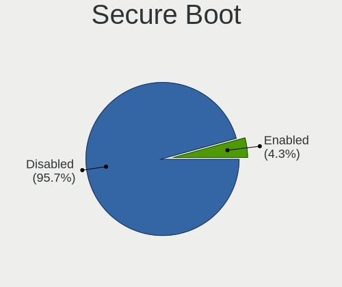
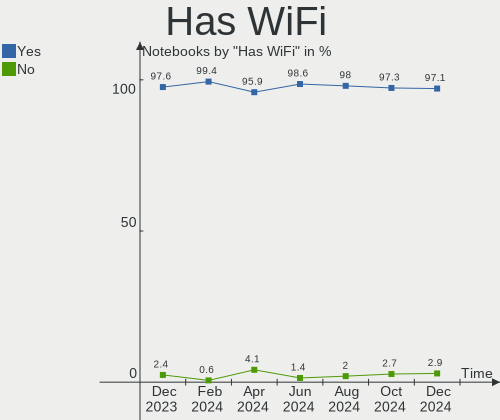
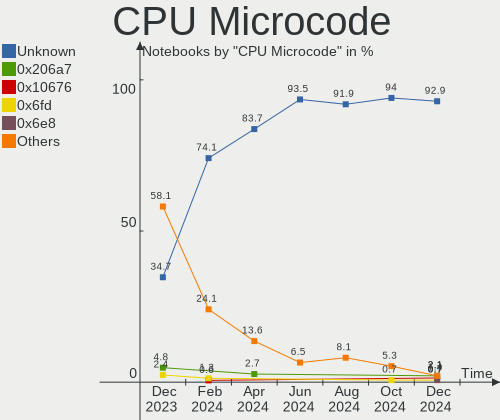
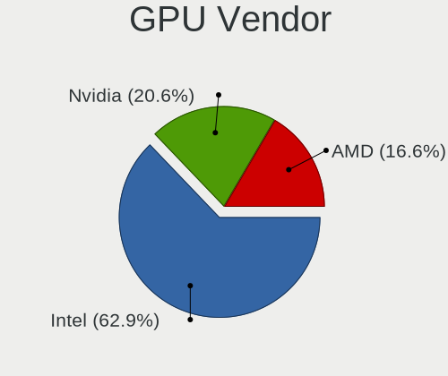
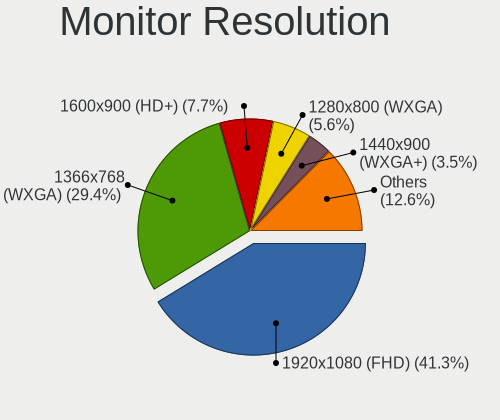
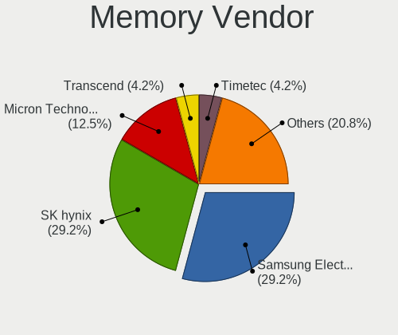

Zorin - Hardware Trends (Notebooks)
-----------------------------------

A project to identify most popular hardware characteristics and track their change
over time based on data collected by Linux users at https://Linux-Hardware.org.

Anyone can contribute to this report by the [hw-probe](https://github.com/linuxhw/hw-probe) tool:

    sudo -E hw-probe -all -upload

This report is for one last month. Overall report since the beginning of time: [TestCoverage](https://github.com/linuxhw/TestCoverage)

Period: May, 2022.

Contents
--------

* [ System ](#system)
  - [ OS                       ](#os)
  - [ OS Family                ](#os-family)
  - [ Kernel                   ](#kernel)
  - [ Kernel Family            ](#kernel-family)
  - [ Kernel Major Ver.        ](#kernel-major-ver)
  - [ Arch                     ](#arch)
  - [ DE                       ](#de)
  - [ Display Server           ](#display-server)
  - [ Display Manager          ](#display-manager)
  - [ OS Lang                  ](#os-lang)
  - [ Boot Mode                ](#boot-mode)
  - [ Filesystem               ](#filesystem)
  - [ Part. scheme             ](#part-scheme)
  - [ Dual Boot with Linux/BSD ](#dual-boot-with-linuxbsd)
  - [ Dual Boot (Win)          ](#dual-boot-win)

* [ Board ](#board)
  - [ Vendor                   ](#vendor)
  - [ Model                    ](#model)
  - [ Model Family             ](#model-family)
  - [ MFG Year                 ](#mfg-year)
  - [ Form Factor              ](#form-factor)
  - [ Secure Boot              ](#secure-boot)
  - [ Coreboot                 ](#coreboot)
  - [ RAM Size                 ](#ram-size)
  - [ RAM Used                 ](#ram-used)
  - [ Total Drives             ](#total-drives)
  - [ Has CD-ROM               ](#has-cd-rom)
  - [ Has Ethernet             ](#has-ethernet)
  - [ Has WiFi                 ](#has-wifi)
  - [ Has Bluetooth            ](#has-bluetooth)

* [ Location ](#location)
  - [ Country                  ](#country)
  - [ City                     ](#city)

* [ Drives ](#drives)
  - [ Drive Vendor             ](#drive-vendor)
  - [ Drive Model              ](#drive-model)
  - [ HDD Vendor               ](#hdd-vendor)
  - [ SSD Vendor               ](#ssd-vendor)
  - [ Drive Kind               ](#drive-kind)
  - [ Drive Connector          ](#drive-connector)
  - [ Drive Size               ](#drive-size)
  - [ Space Total              ](#space-total)
  - [ Space Used               ](#space-used)
  - [ Malfunc. Drives          ](#malfunc-drives)
  - [ Malfunc. Drive Vendor    ](#malfunc-drive-vendor)
  - [ Malfunc. HDD Vendor      ](#malfunc-hdd-vendor)
  - [ Malfunc. Drive Kind      ](#malfunc-drive-kind)
  - [ Failed Drives            ](#failed-drives)
  - [ Failed Drive Vendor      ](#failed-drive-vendor)
  - [ Drive Status             ](#drive-status)

* [ Storage controller ](#storage-controller)
  - [ Storage Vendor           ](#storage-vendor)
  - [ Storage Model            ](#storage-model)
  - [ Storage Kind             ](#storage-kind)

* [ Processor ](#processor)
  - [ CPU Vendor               ](#cpu-vendor)
  - [ CPU Model                ](#cpu-model)
  - [ CPU Model Family         ](#cpu-model-family)
  - [ CPU Cores                ](#cpu-cores)
  - [ CPU Sockets              ](#cpu-sockets)
  - [ CPU Threads              ](#cpu-threads)
  - [ CPU Op-Modes             ](#cpu-op-modes)
  - [ CPU Microcode            ](#cpu-microcode)
  - [ CPU Microarch            ](#cpu-microarch)

* [ Graphics ](#graphics)
  - [ GPU Vendor               ](#gpu-vendor)
  - [ GPU Model                ](#gpu-model)
  - [ GPU Combo                ](#gpu-combo)
  - [ GPU Driver               ](#gpu-driver)
  - [ GPU Memory               ](#gpu-memory)

* [ Monitor ](#monitor)
  - [ Monitor Vendor           ](#monitor-vendor)
  - [ Monitor Model            ](#monitor-model)
  - [ Monitor Resolution       ](#monitor-resolution)
  - [ Monitor Diagonal         ](#monitor-diagonal)
  - [ Monitor Width            ](#monitor-width)
  - [ Aspect Ratio             ](#aspect-ratio)
  - [ Monitor Area             ](#monitor-area)
  - [ Pixel Density            ](#pixel-density)
  - [ Multiple Monitors        ](#multiple-monitors)

* [ Network ](#network)
  - [ Net Controller Vendor    ](#net-controller-vendor)
  - [ Net Controller Model     ](#net-controller-model)
  - [ Wireless Vendor          ](#wireless-vendor)
  - [ Wireless Model           ](#wireless-model)
  - [ Ethernet Vendor          ](#ethernet-vendor)
  - [ Ethernet Model           ](#ethernet-model)
  - [ Net Controller Kind      ](#net-controller-kind)
  - [ Used Controller          ](#used-controller)
  - [ NICs                     ](#nics)
  - [ IPv6                     ](#ipv6)

* [ Bluetooth ](#bluetooth)
  - [ Bluetooth Vendor         ](#bluetooth-vendor)
  - [ Bluetooth Model          ](#bluetooth-model)

* [ Sound ](#sound)
  - [ Sound Vendor             ](#sound-vendor)
  - [ Sound Model              ](#sound-model)

* [ Memory ](#memory)
  - [ Memory Vendor            ](#memory-vendor)
  - [ Memory Model             ](#memory-model)
  - [ Memory Kind              ](#memory-kind)
  - [ Memory Form Factor       ](#memory-form-factor)
  - [ Memory Size              ](#memory-size)
  - [ Memory Speed             ](#memory-speed)

* [ Printers & scanners ](#printers--scanners)
  - [ Printer Vendor           ](#printer-vendor)
  - [ Printer Model            ](#printer-model)
  - [ Scanner Vendor           ](#scanner-vendor)
  - [ Scanner Model            ](#scanner-model)

* [ Camera ](#camera)
  - [ Camera Vendor            ](#camera-vendor)
  - [ Camera Model             ](#camera-model)

* [ Security ](#security)
  - [ Fingerprint Vendor       ](#fingerprint-vendor)
  - [ Fingerprint Model        ](#fingerprint-model)
  - [ Chipcard Vendor          ](#chipcard-vendor)
  - [ Chipcard Model           ](#chipcard-model)

* [ Unsupported ](#unsupported)
  - [ Unsupported Devices      ](#unsupported-devices)
  - [ Unsupported Device Types ](#unsupported-device-types)

System
------

OS
--

Installed operating systems

| Name     | Notebooks | Percent |
|----------|-----------|---------|
| Zorin 16 | 87        | 97.75%  |
| Zorin 15 | 2         | 2.25%   |

OS Family
---------

OS without a version

| Name  | Notebooks | Percent |
|-------|-----------|---------|
| Zorin | 89        | 100%    |

Kernel
------

Version of the Linux kernel

| Version           | Notebooks | Percent |
|-------------------|-----------|---------|
| 5.13.0-44-generic | 26        | 29.21%  |
| 5.13.0-40-generic | 26        | 29.21%  |
| 5.13.0-41-generic | 24        | 26.97%  |
| 5.13.0-30-generic | 5         | 5.62%   |
| 5.4.0-109-generic | 1         | 1.12%   |
| 5.4.0-105-generic | 1         | 1.12%   |
| 5.14.0-1038-oem   | 1         | 1.12%   |
| 5.13.0-39-generic | 1         | 1.12%   |
| 5.13.0-28-generic | 1         | 1.12%   |
| 5.11.0-41-generic | 1         | 1.12%   |
| 5.11.0-40-generic | 1         | 1.12%   |
| 5.11.0-38-generic | 1         | 1.12%   |

Kernel Family
-------------

Linux kernel without a distro release

| Version | Notebooks | Percent |
|---------|-----------|---------|
| 5.13.0  | 83        | 93.26%  |
| 5.11.0  | 3         | 3.37%   |
| 5.4.0   | 2         | 2.25%   |
| 5.14.0  | 1         | 1.12%   |

Kernel Major Ver.
-----------------

Linux kernel major version

| Version | Notebooks | Percent |
|---------|-----------|---------|
| 5.13    | 83        | 93.26%  |
| 5.11    | 3         | 3.37%   |
| 5.4     | 2         | 2.25%   |
| 5.14    | 1         | 1.12%   |

Arch
----

OS architecture (x86_64, i586, etc.)

| Name   | Notebooks | Percent |
|--------|-----------|---------|
| x86_64 | 88        | 98.88%  |
| i686   | 1         | 1.12%   |

DE
--

Desktop Environment

| Name       | Notebooks | Percent |
|------------|-----------|---------|
| GNOME      | 66        | 74.16%  |
| XFCE       | 19        | 21.35%  |
| X-Cinnamon | 2         | 2.25%   |
| KDE5       | 1         | 1.12%   |
| Cinnamon   | 1         | 1.12%   |

Display Server
--------------

X11 or Wayland

| Name    | Notebooks | Percent |
|---------|-----------|---------|
| X11     | 87        | 97.75%  |
| Wayland | 2         | 2.25%   |

Display Manager
---------------

SDDM, LightDM, etc.

| Name    | Notebooks | Percent |
|---------|-----------|---------|
| Unknown | 63        | 70.79%  |
| GDM     | 10        | 11.24%  |
| GDM3    | 9         | 10.11%  |
| LightDM | 7         | 7.87%   |

OS Lang
-------

Language

| Lang  | Notebooks | Percent |
|-------|-----------|---------|
| en_US | 33        | 37.08%  |
| pt_BR | 6         | 6.74%   |
| de_DE | 6         | 6.74%   |
| es_MX | 5         | 5.62%   |
| pl_PL | 4         | 4.49%   |
| en_GB | 4         | 4.49%   |
| fr_FR | 3         | 3.37%   |
| es_ES | 3         | 3.37%   |
| en_ZA | 3         | 3.37%   |
| en_IN | 3         | 3.37%   |
| ru_RU | 2         | 2.25%   |
| nl_BE | 2         | 2.25%   |
| it_IT | 2         | 2.25%   |
| es_CO | 2         | 2.25%   |
| en_AU | 2         | 2.25%   |
| cs_CZ | 2         | 2.25%   |
| tr_TR | 1         | 1.12%   |
| sv_SE | 1         | 1.12%   |
| pt_PT | 1         | 1.12%   |
| lt_LT | 1         | 1.12%   |
| es_PE | 1         | 1.12%   |
| en_PH | 1         | 1.12%   |
| en_IE | 1         | 1.12%   |

Boot Mode
---------

EFI or BIOS

| Mode | Notebooks | Percent |
|------|-----------|---------|
| EFI  | 46        | 51.69%  |
| BIOS | 43        | 48.31%  |

Filesystem
----------

Type of filesystem

| Type    | Notebooks | Percent |
|---------|-----------|---------|
| Ext4    | 82        | 92.13%  |
| Zfs     | 2         | 2.25%   |
| Overlay | 2         | 2.25%   |
| Btrfs   | 2         | 2.25%   |
| Xfs     | 1         | 1.12%   |

Part. scheme
------------

Scheme of partitioning

| Type    | Notebooks | Percent |
|---------|-----------|---------|
| Unknown | 72        | 80.9%   |
| GPT     | 10        | 11.24%  |
| MBR     | 7         | 7.87%   |

Dual Boot with Linux/BSD
------------------------

Hosting more than one Linux/BSD

| Dual boot | Notebooks | Percent |
|-----------|-----------|---------|
| No        | 88        | 98.88%  |
| Yes       | 1         | 1.12%   |

Dual Boot (Win)
---------------

Hosting Linux and Windows

| Dual boot | Notebooks | Percent |
|-----------|-----------|---------|
| No        | 80        | 89.89%  |
| Yes       | 9         | 10.11%  |

Board
-----

Vendor
------

Motherboard manufacturer

| Name             | Notebooks | Percent |
|------------------|-----------|---------|
| Hewlett-Packard  | 24        | 26.97%  |
| ASUSTek Computer | 17        | 19.1%   |
| Lenovo           | 14        | 15.73%  |
| Dell             | 10        | 11.24%  |
| Acer             | 7         | 7.87%   |
| Toshiba          | 5         | 5.62%   |
| Thomson          | 1         | 1.12%   |
| Sony             | 1         | 1.12%   |
| Positivo         | 1         | 1.12%   |
| Medion           | 1         | 1.12%   |
| HUAWEI           | 1         | 1.12%   |
| GPU Company      | 1         | 1.12%   |
| Google           | 1         | 1.12%   |
| Gateway          | 1         | 1.12%   |
| Chuwi            | 1         | 1.12%   |
| Apple            | 1         | 1.12%   |
| Alienware        | 1         | 1.12%   |
| Unknown          | 1         | 1.12%   |

Model
-----

Motherboard model

| Name                            | Notebooks | Percent |
|---------------------------------|-----------|---------|
| Toshiba Satellite C55-C         | 2         | 2.25%   |
| Toshiba TECRA A50-E             | 1         | 1.12%   |
| Toshiba Satellite L75D-A        | 1         | 1.12%   |
| Toshiba Satellite L10W-C        | 1         | 1.12%   |
| Thomson NEO14SBK                | 1         | 1.12%   |
| Sony VGN-FW51MF_H               | 1         | 1.12%   |
| Positivo CHT14B                 | 1         | 1.12%   |
| Medion Akoya S6214T             | 1         | 1.12%   |
| Lenovo Yoga 2 13 20344          | 1         | 1.12%   |
| Lenovo ThinkPad X301 277418G    | 1         | 1.12%   |
| Lenovo ThinkPad X230 2324FV6    | 1         | 1.12%   |
| Lenovo ThinkPad T61 7661V72     | 1         | 1.12%   |
| Lenovo ThinkPad T420 4236MBU    | 1         | 1.12%   |
| Lenovo ThinkPad P50 20EQS28400  | 1         | 1.12%   |
| Lenovo ThinkPad L560 20F1001YGE | 1         | 1.12%   |
| Lenovo ThinkBook 14-IIL 20SL    | 1         | 1.12%   |
| Lenovo IdeaPad Z580             | 1         | 1.12%   |
| Lenovo IdeaPad 5 15ARE05 81YQ   | 1         | 1.12%   |
| Lenovo IdeaPad 110-14IBR 80UJ   | 1         | 1.12%   |
| Lenovo IdeaPad 100-15IBY 80MJ   | 1         | 1.12%   |
| Lenovo G500 20236               | 1         | 1.12%   |
| Lenovo G50-30 80G0              | 1         | 1.12%   |
| HUAWEI NBLK-WAX9X               | 1         | 1.12%   |
| HP ZHAN 66 Pro A 14 G3          | 1         | 1.12%   |
| HP ZBook 15 G2                  | 1         | 1.12%   |
| HP ProBook 450 G1               | 1         | 1.12%   |
| HP Pavilion Notebook            | 1         | 1.12%   |
| HP Pavilion Laptop 15-eg0xxx    | 1         | 1.12%   |
| HP Pavilion g4                  | 1         | 1.12%   |
| HP Pavilion dv7                 | 1         | 1.12%   |
| HP Pavilion dv6                 | 1         | 1.12%   |
| HP Pavilion 17                  | 1         | 1.12%   |
| HP OMEN Laptop 15-en0xxx        | 1         | 1.12%   |
| HP OMEN by Laptop               | 1         | 1.12%   |
| HP Notebook                     | 1         | 1.12%   |
| HP Laptop 15s-du2xxx            | 1         | 1.12%   |
| HP Laptop 15-db0xxx             | 1         | 1.12%   |
| HP Laptop 15-bs1xx              | 1         | 1.12%   |
| HP Laptop 14-dq0xxx             | 1         | 1.12%   |
| HP EW7-I7D22875GR1              | 1         | 1.12%   |
| HP EliteBook Folio 1040 G3      | 1         | 1.12%   |
| HP EliteBook 8760w              | 1         | 1.12%   |
| HP EliteBook 8460p              | 1         | 1.12%   |
| HP EliteBook 2570p              | 1         | 1.12%   |
| HP Compaq 6730s                 | 1         | 1.12%   |
| HP Compaq 6530b (WA484LA#ABM)   | 1         | 1.12%   |
| HP Compaq 6510b (KE135EA#AKD)   | 1         | 1.12%   |
| GPU Company GWTC116-2           | 1         | 1.12%   |
| Google Candy                    | 1         | 1.12%   |
| Gateway NV55C                   | 1         | 1.12%   |
| Dell Vostro 3500                | 1         | 1.12%   |
| Dell Venue 8 Pro 5830           | 1         | 1.12%   |
| Dell Latitude E6540             | 1         | 1.12%   |
| Dell Latitude E6510             | 1         | 1.12%   |
| Dell Latitude D630              | 1         | 1.12%   |
| Dell Latitude D520              | 1         | 1.12%   |
| Dell Latitude 3410              | 1         | 1.12%   |
| Dell Inspiron 5770              | 1         | 1.12%   |
| Dell Inspiron 5423              | 1         | 1.12%   |
| Dell Inspiron 3541              | 1         | 1.12%   |

Model Family
------------

Motherboard model prefix

| Name                  | Notebooks | Percent |
|-----------------------|-----------|---------|
| Lenovo ThinkPad       | 6         | 6.74%   |
| HP Pavilion           | 6         | 6.74%   |
| Acer Aspire           | 6         | 6.74%   |
| Dell Latitude         | 5         | 5.62%   |
| Toshiba Satellite     | 4         | 4.49%   |
| Lenovo IdeaPad        | 4         | 4.49%   |
| HP Laptop             | 4         | 4.49%   |
| HP EliteBook          | 4         | 4.49%   |
| HP Compaq             | 3         | 3.37%   |
| Dell Inspiron         | 3         | 3.37%   |
| HP OMEN               | 2         | 2.25%   |
| ASUS VivoBook         | 2         | 2.25%   |
| ASUS ROG              | 2         | 2.25%   |
| Toshiba TECRA         | 1         | 1.12%   |
| Thomson NEO14SBK      | 1         | 1.12%   |
| Sony VGN-FW51MF       | 1         | 1.12%   |
| Positivo CHT14B       | 1         | 1.12%   |
| Medion Akoya          | 1         | 1.12%   |
| Lenovo Yoga           | 1         | 1.12%   |
| Lenovo ThinkBook      | 1         | 1.12%   |
| Lenovo G500           | 1         | 1.12%   |
| Lenovo G50-30         | 1         | 1.12%   |
| HUAWEI NBLK-WAX9X     | 1         | 1.12%   |
| HP ZHAN               | 1         | 1.12%   |
| HP ZBook              | 1         | 1.12%   |
| HP ProBook            | 1         | 1.12%   |
| HP Notebook           | 1         | 1.12%   |
| HP EW7-I7D22875GR1    | 1         | 1.12%   |
| GPU Company GWTC116-2 | 1         | 1.12%   |
| Google Candy          | 1         | 1.12%   |
| Gateway NV55C         | 1         | 1.12%   |
| Dell Vostro           | 1         | 1.12%   |
| Dell Venue            | 1         | 1.12%   |
| Chuwi GemiBook        | 1         | 1.12%   |
| ASUS ZenBook          | 1         | 1.12%   |
| ASUS X756UQ           | 1         | 1.12%   |
| ASUS X550CL           | 1         | 1.12%   |
| ASUS X450LD           | 1         | 1.12%   |
| ASUS X201EP           | 1         | 1.12%   |
| ASUS X200CA           | 1         | 1.12%   |
| ASUS U43F             | 1         | 1.12%   |
| ASUS N80Vb            | 1         | 1.12%   |
| ASUS K43U             | 1         | 1.12%   |
| ASUS GL552VW          | 1         | 1.12%   |
| ASUS G74Sx            | 1         | 1.12%   |
| ASUS E200HA           | 1         | 1.12%   |
| ASUS ASUS             | 1         | 1.12%   |
| Apple MacBookPro8     | 1         | 1.12%   |
| Alienware 17          | 1         | 1.12%   |
| Acer TravelMate       | 1         | 1.12%   |
| Unknown               | 1         | 1.12%   |

MFG Year
--------

Motherboard manufacture year

| Year | Notebooks | Percent |
|------|-----------|---------|
| 2015 | 10        | 11.24%  |
| 2013 | 9         | 10.11%  |
| 2011 | 9         | 10.11%  |
| 2021 | 8         | 8.99%   |
| 2012 | 7         | 7.87%   |
| 2020 | 6         | 6.74%   |
| 2019 | 6         | 6.74%   |
| 2014 | 6         | 6.74%   |
| 2016 | 5         | 5.62%   |
| 2010 | 5         | 5.62%   |
| 2017 | 4         | 4.49%   |
| 2008 | 4         | 4.49%   |
| 2009 | 3         | 3.37%   |
| 2007 | 3         | 3.37%   |
| 2018 | 2         | 2.25%   |
| 2022 | 1         | 1.12%   |
| 2006 | 1         | 1.12%   |

Form Factor
-----------

Physical design of the computer

| Name     | Notebooks | Percent |
|----------|-----------|---------|
| Notebook | 89        | 100%    |

Secure Boot
-----------

Enabled or disabled

| State    | Notebooks | Percent |
|----------|-----------|---------|
| Disabled | 79        | 88.76%  |
| Enabled  | 10        | 11.24%  |

Coreboot
--------

Have coreboot on board

| Used | Notebooks | Percent |
|------|-----------|---------|
| No   | 88        | 98.88%  |
| Yes  | 1         | 1.12%   |

RAM Size
--------

Total RAM memory

| Size in GB | Notebooks | Percent |
|------------|-----------|---------|
| 3.01-4.0   | 28        | 31.46%  |
| 4.01-8.0   | 23        | 25.84%  |
| 16.01-24.0 | 14        | 15.73%  |
| 8.01-16.0  | 12        | 13.48%  |
| 1.01-2.0   | 8         | 8.99%   |
| 32.01-64.0 | 4         | 4.49%   |

RAM Used
--------

Used RAM memory

| Used GB   | Notebooks | Percent |
|-----------|-----------|---------|
| 1.01-2.0  | 35        | 39.33%  |
| 2.01-3.0  | 34        | 38.2%   |
| 3.01-4.0  | 9         | 10.11%  |
| 4.01-8.0  | 7         | 7.87%   |
| 8.01-16.0 | 2         | 2.25%   |
| 0.51-1.0  | 2         | 2.25%   |

Total Drives
------------

Number of drives on board

| Drives | Notebooks | Percent |
|--------|-----------|---------|
| 1      | 64        | 71.91%  |
| 2      | 18        | 20.22%  |
| 3      | 3         | 3.37%   |
| 0      | 3         | 3.37%   |
| 4      | 1         | 1.12%   |

Has CD-ROM
----------

Has CD-ROM on board

| Presented | Notebooks | Percent |
|-----------|-----------|---------|
| No        | 51        | 57.3%   |
| Yes       | 38        | 42.7%   |

Has Ethernet
------------

Has Ethernet on board

| Presented | Notebooks | Percent |
|-----------|-----------|---------|
| Yes       | 73        | 82.02%  |
| No        | 16        | 17.98%  |

Has WiFi
--------

Has WiFi module

| Presented | Notebooks | Percent |
|-----------|-----------|---------|
| Yes       | 86        | 96.63%  |
| No        | 3         | 3.37%   |

Has Bluetooth
-------------

Has Bluetooth module

| Presented | Notebooks | Percent |
|-----------|-----------|---------|
| Yes       | 63        | 70.79%  |
| No        | 26        | 29.21%  |

Location
--------

Country
-------

Geographic location (country)

| Country                | Notebooks | Percent |
|------------------------|-----------|---------|
| USA                    | 17        | 19.1%   |
| Germany                | 7         | 7.87%   |
| Brazil                 | 7         | 7.87%   |
| Mexico                 | 5         | 5.62%   |
| UK                     | 4         | 4.49%   |
| Poland                 | 4         | 4.49%   |
| South Africa           | 3         | 3.37%   |
| Slovenia               | 3         | 3.37%   |
| India                  | 3         | 3.37%   |
| France                 | 3         | 3.37%   |
| Canada                 | 3         | 3.37%   |
| Spain                  | 2         | 2.25%   |
| Russia                 | 2         | 2.25%   |
| Portugal               | 2         | 2.25%   |
| Czechia                | 2         | 2.25%   |
| Colombia               | 2         | 2.25%   |
| Belgium                | 2         | 2.25%   |
| Australia              | 2         | 2.25%   |
| Turkey                 | 1         | 1.12%   |
| Sweden                 | 1         | 1.12%   |
| Sri Lanka              | 1         | 1.12%   |
| Saudi Arabia           | 1         | 1.12%   |
| Philippines            | 1         | 1.12%   |
| Peru                   | 1         | 1.12%   |
| Pakistan               | 1         | 1.12%   |
| Lithuania              | 1         | 1.12%   |
| Kenya                  | 1         | 1.12%   |
| Japan                  | 1         | 1.12%   |
| Italy                  | 1         | 1.12%   |
| Ireland                | 1         | 1.12%   |
| Indonesia              | 1         | 1.12%   |
| Greece                 | 1         | 1.12%   |
| Estonia                | 1         | 1.12%   |
| Bosnia and Herzegovina | 1         | 1.12%   |

City
----

Geographic location (city)

| City                  | Notebooks | Percent |
|-----------------------|-----------|---------|
| Potchefstroom         | 2         | 2.25%   |
| Glasgow               | 2         | 2.25%   |
| Bogotá               | 2         | 2.25%   |
| Acapulco de Juárez   | 2         | 2.25%   |
| Wołomin              | 1         | 1.12%   |
| Wattala               | 1         | 1.12%   |
| Vrhnika               | 1         | 1.12%   |
| Vohrenbach            | 1         | 1.12%   |
| Vitória da Conquista | 1         | 1.12%   |
| Veroia                | 1         | 1.12%   |
| Union Dale            | 1         | 1.12%   |
| Tuzla                 | 1         | 1.12%   |
| Trujillo              | 1         | 1.12%   |
| Toronto               | 1         | 1.12%   |
| Teplice               | 1         | 1.12%   |
| Tangerang             | 1         | 1.12%   |
| Tallinn               | 1         | 1.12%   |
| Sydney                | 1         | 1.12%   |
| Świnoujście         | 1         | 1.12%   |
| Stuttgart             | 1         | 1.12%   |
| Stockholm             | 1         | 1.12%   |
| Seville               | 1         | 1.12%   |
| Serra da Raiz         | 1         | 1.12%   |
| Schenectady           | 1         | 1.12%   |
| Sao Paulo             | 1         | 1.12%   |
| Salt Lake City        | 1         | 1.12%   |
| Riyadh                | 1         | 1.12%   |
| Rio de Janeiro        | 1         | 1.12%   |
| Richmond              | 1         | 1.12%   |
| Phoenix               | 1         | 1.12%   |
| Philadelphia          | 1         | 1.12%   |
| Pflugerville          | 1         | 1.12%   |
| Palm Harbor           | 1         | 1.12%   |
| Palakkad              | 1         | 1.12%   |
| Osaka                 | 1         | 1.12%   |
| Noyabrsk              | 1         | 1.12%   |
| Nohfelden             | 1         | 1.12%   |
| Nieuwpoort            | 1         | 1.12%   |
| Niedersohren          | 1         | 1.12%   |
| Nairobi               | 1         | 1.12%   |
| Muta                  | 1         | 1.12%   |
| Murska Sobota         | 1         | 1.12%   |
| Muriaé               | 1         | 1.12%   |
| Munich                | 1         | 1.12%   |
| Multan                | 1         | 1.12%   |
| Montreal              | 1         | 1.12%   |
| Monterrey             | 1         | 1.12%   |
| Monroeville           | 1         | 1.12%   |
| Mentana               | 1         | 1.12%   |
| Melbourne             | 1         | 1.12%   |
| Madrid                | 1         | 1.12%   |
| Londrina              | 1         | 1.12%   |
| La Esperanza          | 1         | 1.12%   |
| Kelowna               | 1         | 1.12%   |
| Kaunas                | 1         | 1.12%   |
| Katowice              | 1         | 1.12%   |
| Jaipur                | 1         | 1.12%   |
| Istra                 | 1         | 1.12%   |
| Great Falls           | 1         | 1.12%   |
| Grand Prairie         | 1         | 1.12%   |

Drives
------

Drive Vendor
------------

Hard drive vendors

| Vendor              | Notebooks | Drives | Percent |
|---------------------|-----------|--------|---------|
| Seagate             | 18        | 18     | 16.51%  |
| Unknown             | 12        | 13     | 11.01%  |
| Toshiba             | 12        | 12     | 11.01%  |
| WDC                 | 11        | 12     | 10.09%  |
| Samsung Electronics | 10        | 11     | 9.17%   |
| Crucial             | 7         | 7      | 6.42%   |
| SanDisk             | 6         | 6      | 5.5%    |
| Kingston            | 6         | 6      | 5.5%    |
| HGST                | 5         | 5      | 4.59%   |
| Intel               | 4         | 4      | 3.67%   |
| SK Hynix            | 3         | 3      | 2.75%   |
| LITEON              | 2         | 2      | 1.83%   |
| China               | 2         | 2      | 1.83%   |
| SABRENT             | 1         | 1      | 0.92%   |
| PNY                 | 1         | 1      | 0.92%   |
| Phison              | 1         | 1      | 0.92%   |
| Patriot             | 1         | 1      | 0.92%   |
| Netac               | 1         | 1      | 0.92%   |
| LITEONIT            | 1         | 1      | 0.92%   |
| KIOXIA              | 1         | 1      | 0.92%   |
| Intenso             | 1         | 1      | 0.92%   |
| HS-SSD-E100         | 1         | 1      | 0.92%   |
| GOODRAM             | 1         | 1      | 0.92%   |
| A-DATA Technology   | 1         | 1      | 0.92%   |

Drive Model
-----------

Hard drive models

| Model                               | Notebooks | Percent |
|-------------------------------------|-----------|---------|
| Unknown MMC Card  64GB              | 5         | 4.46%   |
| Unknown MMC Card  32GB              | 3         | 2.68%   |
| Unknown MMC Card  16GB              | 3         | 2.68%   |
| Toshiba MQ01ABD100 1TB              | 3         | 2.68%   |
| HGST HTS721010A9E630 1TB            | 3         | 2.68%   |
| Toshiba MK1646GSX 160GB             | 2         | 1.79%   |
| Toshiba HDWL110 1TB                 | 2         | 1.79%   |
| Seagate ST320LT012-9WS14C 320GB     | 2         | 1.79%   |
| Seagate ST1000LM035-1RK172 1TB      | 2         | 1.79%   |
| Seagate ST1000LM024 HN-M101MBB 1TB  | 2         | 1.79%   |
| Seagate Expansion 4TB               | 2         | 1.79%   |
| Samsung SSD 860 EVO 500GB           | 2         | 1.79%   |
| Kingston SA400S37120G 120GB SSD     | 2         | 1.79%   |
| Crucial CT500MX500SSD1 500GB        | 2         | 1.79%   |
| WDC WDS100T2B0B-00YS70 1TB SSD      | 1         | 0.89%   |
| WDC WDS100T1B0A-00H9H0 1TB SSD      | 1         | 0.89%   |
| WDC WD5000LPVX-75V0TT0 500GB        | 1         | 0.89%   |
| WDC WD5000LPVT-75G33T0 500GB        | 1         | 0.89%   |
| WDC WD5000LPLX-75ZNTT0 500GB        | 1         | 0.89%   |
| WDC WD5000LPCX-24VHAT0 500GB        | 1         | 0.89%   |
| WDC WD5000LPCX-22VHAT0 500GB        | 1         | 0.89%   |
| WDC WD40 EFRX-68WT0N0 4TB           | 1         | 0.89%   |
| WDC WD3200BEVT-75ZCT2 320GB         | 1         | 0.89%   |
| WDC WD2500LPVX-22V0TT0 250GB        | 1         | 0.89%   |
| WDC WD1600BEVS-60RST0 160GB         | 1         | 0.89%   |
| WDC WD1200BEVS-75UST0 120GB         | 1         | 0.89%   |
| Unknown MMC Card  4GB               | 1         | 0.89%   |
| Unknown BGND3R  32GB                | 1         | 0.89%   |
| Toshiba MQ04ABF100 1TB              | 1         | 0.89%   |
| Toshiba MQ01ABF050 500GB            | 1         | 0.89%   |
| Toshiba MQ01ABD075 752GB            | 1         | 0.89%   |
| Toshiba MK6476GSX 640GB             | 1         | 0.89%   |
| Toshiba KBG30ZMS128G 128GB NVMe SSD | 1         | 0.89%   |
| SK Hynix NVMe SSD Drive 512GB       | 1         | 0.89%   |
| SK Hynix NVMe SSD Drive 128GB       | 1         | 0.89%   |
| SK Hynix NVMe SSD Drive 1024GB      | 1         | 0.89%   |
| Seagate ST9750420AS 752GB           | 1         | 0.89%   |
| Seagate ST9500325AS 500GB           | 1         | 0.89%   |
| Seagate ST9320325AS 320GB           | 1         | 0.89%   |
| Seagate ST9250410AS 250GB           | 1         | 0.89%   |
| Seagate ST750LM022 HN-M750MBB 752GB | 1         | 0.89%   |
| Seagate ST500LM000-1EJ162 500GB     | 1         | 0.89%   |
| Seagate ST320LT007-9ZV142 320GB     | 1         | 0.89%   |
| Seagate ST2000LM007-1R8174 2TB      | 1         | 0.89%   |
| Seagate ST1000LX015-1U7172 1TB      | 1         | 0.89%   |
| Seagate BUP Slim RD 2TB             | 1         | 0.89%   |
| SanDisk X400 M.2 2280 256GB SSD     | 1         | 0.89%   |
| SanDisk SDSSDA120G 120GB            | 1         | 0.89%   |
| SanDisk SD8SNAT-128G-1006 128GB SSD | 1         | 0.89%   |
| SanDisk SD7TN3Q-256G-1006 256GB SSD | 1         | 0.89%   |
| Sandisk NVMe SSD Drive 512GB        | 1         | 0.89%   |
| Sandisk NVMe SSD Drive 256GB        | 1         | 0.89%   |
| Samsung SSD 870 EVO 1TB             | 1         | 0.89%   |
| Samsung SSD 860 EVO mSATA 1TB       | 1         | 0.89%   |
| Samsung SSD 850 EVO 500GB           | 1         | 0.89%   |
| Samsung SSD 750 EVO 250GB           | 1         | 0.89%   |
| Samsung MZVLQ512HALU-000H1 512GB    | 1         | 0.89%   |
| Samsung MZVLB512HBJQ-000L2 512GB    | 1         | 0.89%   |
| Samsung MZMPC032HBCD-000D1 32GB SSD | 1         | 0.89%   |
| Samsung MZALQ512HALU-000L2 512GB    | 1         | 0.89%   |

HDD Vendor
----------

Hard disk drive vendors

| Vendor  | Notebooks | Drives | Percent |
|---------|-----------|--------|---------|
| Seagate | 18        | 18     | 40%     |
| Toshiba | 11        | 11     | 24.44%  |
| WDC     | 10        | 10     | 22.22%  |
| HGST    | 5         | 5      | 11.11%  |
| SABRENT | 1         | 1      | 2.22%   |

SSD Vendor
----------

Solid state drive vendors

| Vendor              | Notebooks | Drives | Percent |
|---------------------|-----------|--------|---------|
| Samsung Electronics | 7         | 8      | 18.92%  |
| Crucial             | 6         | 6      | 16.22%  |
| SanDisk             | 4         | 4      | 10.81%  |
| Kingston            | 4         | 4      | 10.81%  |
| Intel               | 3         | 3      | 8.11%   |
| WDC                 | 2         | 2      | 5.41%   |
| LITEON              | 2         | 2      | 5.41%   |
| China               | 2         | 2      | 5.41%   |
| PNY                 | 1         | 1      | 2.7%    |
| Patriot             | 1         | 1      | 2.7%    |
| Netac               | 1         | 1      | 2.7%    |
| LITEONIT            | 1         | 1      | 2.7%    |
| HS-SSD-E100         | 1         | 1      | 2.7%    |
| GOODRAM             | 1         | 1      | 2.7%    |
| A-DATA Technology   | 1         | 1      | 2.7%    |

Drive Kind
----------

HDD or SSD

| Kind    | Notebooks | Drives | Percent |
|---------|-----------|--------|---------|
| HDD     | 43        | 45     | 40.95%  |
| SSD     | 34        | 38     | 32.38%  |
| NVMe    | 15        | 15     | 14.29%  |
| MMC     | 12        | 13     | 11.43%  |
| Unknown | 1         | 1      | 0.95%   |

Drive Connector
---------------

SATA, SAS, NVMe, etc.

| Type | Notebooks | Drives | Percent |
|------|-----------|--------|---------|
| SATA | 67        | 79     | 67.68%  |
| NVMe | 15        | 15     | 15.15%  |
| MMC  | 12        | 13     | 12.12%  |
| SAS  | 5         | 5      | 5.05%   |

Drive Size
----------

Size of hard drive

| Size in TB | Notebooks | Drives | Percent |
|------------|-----------|--------|---------|
| 0.01-0.5   | 47        | 50     | 60.26%  |
| 0.51-1.0   | 26        | 28     | 33.33%  |
| 3.01-4.0   | 3         | 3      | 3.85%   |
| 1.01-2.0   | 2         | 2      | 2.56%   |

Space Total
-----------

Amount of disk space available on the file system

| Size in GB     | Notebooks | Percent |
|----------------|-----------|---------|
| 101-250        | 22        | 24.72%  |
| 501-1000       | 21        | 23.6%   |
| 251-500        | 18        | 20.22%  |
| 51-100         | 11        | 12.36%  |
| 21-50          | 8         | 8.99%   |
| 1-20           | 3         | 3.37%   |
| 1001-2000      | 2         | 2.25%   |
| Unknown        | 2         | 2.25%   |
| More than 3000 | 1         | 1.12%   |
| 2001-3000      | 1         | 1.12%   |

Space Used
----------

Amount of used disk space

| Used GB   | Notebooks | Percent |
|-----------|-----------|---------|
| 1-20      | 34        | 38.2%   |
| 21-50     | 28        | 31.46%  |
| 101-250   | 9         | 10.11%  |
| 51-100    | 8         | 8.99%   |
| 251-500   | 5         | 5.62%   |
| 501-1000  | 2         | 2.25%   |
| Unknown   | 2         | 2.25%   |
| 2001-3000 | 1         | 1.12%   |

Malfunc. Drives
---------------

Drive models with a malfunction

| Model                                         | Notebooks | Drives | Percent |
|-----------------------------------------------|-----------|--------|---------|
| WDC WD5000LPVX-75V0TT0 500GB                  | 1         | 1      | 33.33%  |
| Toshiba MQ01ABD100 1TB                        | 1         | 1      | 33.33%  |
| Samsung Electronics MMCRE64G8MPP-0VA 64GB SSD | 1         | 1      | 33.33%  |

Malfunc. Drive Vendor
---------------------

Vendors of faulty drives

| Vendor              | Notebooks | Drives | Percent |
|---------------------|-----------|--------|---------|
| WDC                 | 1         | 1      | 33.33%  |
| Toshiba             | 1         | 1      | 33.33%  |
| Samsung Electronics | 1         | 1      | 33.33%  |

Malfunc. HDD Vendor
-------------------

Vendors of faulty HDD drives

| Vendor  | Notebooks | Drives | Percent |
|---------|-----------|--------|---------|
| WDC     | 1         | 1      | 50%     |
| Toshiba | 1         | 1      | 50%     |

Malfunc. Drive Kind
-------------------

Kinds of faulty drives

| Kind | Notebooks | Drives | Percent |
|------|-----------|--------|---------|
| HDD  | 2         | 2      | 66.67%  |
| SSD  | 1         | 1      | 33.33%  |

Failed Drives
-------------

Failed drive models

Zero info for selected period =(

Failed Drive Vendor
-------------------

Failed drive vendors

Zero info for selected period =(

Drive Status
------------

Number of failed and malfunc. drives

| Status   | Notebooks | Drives | Percent |
|----------|-----------|--------|---------|
| Detected | 71        | 93     | 80.68%  |
| Works    | 14        | 16     | 15.91%  |
| Malfunc  | 3         | 3      | 3.41%   |

Storage controller
------------------

Storage Vendor
--------------

Storage controller vendors

| Vendor                       | Notebooks | Percent |
|------------------------------|-----------|---------|
| Intel                        | 66        | 70.97%  |
| AMD                          | 12        | 12.9%   |
| Samsung Electronics          | 4         | 4.3%    |
| SK Hynix                     | 3         | 3.23%   |
| Sandisk                      | 2         | 2.15%   |
| Kingston Technology Company  | 2         | 2.15%   |
| Toshiba America Info Systems | 1         | 1.08%   |
| Phison Electronics           | 1         | 1.08%   |
| Micron/Crucial Technology    | 1         | 1.08%   |
| KIOXIA                       | 1         | 1.08%   |

Storage Model
-------------

Storage controller models

| Model                                                                            | Notebooks | Percent |
|----------------------------------------------------------------------------------|-----------|---------|
| AMD FCH SATA Controller [AHCI mode]                                              | 10        | 10%     |
| Intel 7 Series Chipset Family 6-port SATA Controller [AHCI mode]                 | 9         | 9%      |
| Intel 6 Series/C200 Series Chipset Family 6 port Mobile SATA AHCI Controller     | 7         | 7%      |
| Intel Sunrise Point-LP SATA Controller [AHCI mode]                               | 6         | 6%      |
| Intel 82801 Mobile SATA Controller [RAID mode]                                   | 6         | 6%      |
| Intel 82801IBM/IEM (ICH9M/ICH9M-E) 4 port SATA Controller [AHCI mode]            | 5         | 5%      |
| Intel 82801HM/HEM (ICH8M/ICH8M-E) IDE Controller                                 | 4         | 4%      |
| Intel 8 Series SATA Controller 1 [AHCI mode]                                     | 4         | 4%      |
| Intel Atom Processor E3800 Series SATA AHCI Controller                           | 3         | 3%      |
| Intel 82801HM/HEM (ICH8M/ICH8M-E) SATA Controller [AHCI mode]                    | 3         | 3%      |
| Intel 8 Series/C220 Series Chipset Family 6-port SATA Controller 1 [AHCI mode]   | 3         | 3%      |
| Intel 5 Series/3400 Series Chipset 4 port SATA AHCI Controller                   | 3         | 3%      |
| SK Hynix Gold P31 SSD                                                            | 2         | 2%      |
| Samsung NVMe SSD Controller SM981/PM981/PM983                                    | 2         | 2%      |
| Samsung NVMe SSD Controller 980                                                  | 2         | 2%      |
| Intel Wildcat Point-LP SATA Controller [AHCI Mode]                               | 2         | 2%      |
| Intel Volume Management Device NVMe RAID Controller                              | 2         | 2%      |
| Intel HM170/QM170 Chipset SATA Controller [AHCI Mode]                            | 2         | 2%      |
| Toshiba America Info Systems BG3 NVMe SSD Controller                             | 1         | 1%      |
| SK Hynix BC501 NVMe Solid State Drive                                            | 1         | 1%      |
| Sandisk WD Blue SN500 / PC SN520 NVMe SSD                                        | 1         | 1%      |
| Sandisk WD Black SN750 / PC SN730 NVMe SSD                                       | 1         | 1%      |
| Phison PS5013 E13 NVMe Controller                                                | 1         | 1%      |
| Micron/Crucial NVMe Controller                                                   | 1         | 1%      |
| KIOXIA Non-Volatile memory controller                                            | 1         | 1%      |
| Kingston Company U-SNS8154P3 NVMe SSD                                            | 1         | 1%      |
| Kingston Company Company Non-Volatile memory controller                          | 1         | 1%      |
| Intel SSD 660P Series                                                            | 1         | 1%      |
| Intel Q170/Q150/B150/H170/H110/Z170/CM236 Chipset SATA Controller [AHCI Mode]    | 1         | 1%      |
| Intel Jasper Lake SATA AHCI Controller                                           | 1         | 1%      |
| Intel Ice Lake-LP SATA Controller [AHCI mode]                                    | 1         | 1%      |
| Intel Comet Lake SATA AHCI Controller                                            | 1         | 1%      |
| Intel Celeron/Pentium Silver Processor SATA Controller                           | 1         | 1%      |
| Intel Cannon Lake Mobile PCH SATA AHCI Controller                                | 1         | 1%      |
| Intel Atom/Celeron/Pentium Processor x5-E8000/J3xxx/N3xxx Series SATA Controller | 1         | 1%      |
| Intel Atom Processor E3800 Series SATA IDE Controller                            | 1         | 1%      |
| Intel 82801HM/HEM (ICH8M/ICH8M-E) SATA Controller [IDE mode]                     | 1         | 1%      |
| Intel 82801GBM/GHM (ICH7-M Family) SATA Controller [IDE mode]                    | 1         | 1%      |
| Intel 5 Series/3400 Series Chipset 6 port SATA AHCI Controller                   | 1         | 1%      |
| AMD SB7x0/SB8x0/SB9x0 SATA Controller [AHCI mode]                                | 1         | 1%      |
| AMD SB7x0/SB8x0/SB9x0 IDE Controller                                             | 1         | 1%      |
| AMD FCH SATA Controller [IDE mode]                                               | 1         | 1%      |
| AMD FCH IDE Controller                                                           | 1         | 1%      |

Storage Kind
------------

Kind of storage controller (IDE, SATA, NVMe, SAS, ...)

| Kind | Notebooks | Percent |
|------|-----------|---------|
| SATA | 67        | 67.68%  |
| NVMe | 16        | 16.16%  |
| RAID | 8         | 8.08%   |
| IDE  | 8         | 8.08%   |

Processor
---------

CPU Vendor
----------

Processor vendors

| Vendor | Notebooks | Percent |
|--------|-----------|---------|
| Intel  | 74        | 83.15%  |
| AMD    | 15        | 16.85%  |

CPU Model
---------

Processor models

| Model                                   | Notebooks | Percent |
|-----------------------------------------|-----------|---------|
| Intel Celeron CPU N2840 @ 2.16GHz       | 3         | 3.37%   |
| Intel Core i7-8550U CPU @ 1.80GHz       | 2         | 2.25%   |
| Intel Core i7-6500U CPU @ 2.50GHz       | 2         | 2.25%   |
| Intel Core i7-4810MQ CPU @ 2.80GHz      | 2         | 2.25%   |
| Intel Core i5-4200U CPU @ 1.60GHz       | 2         | 2.25%   |
| Intel Core i5-3230M CPU @ 2.60GHz       | 2         | 2.25%   |
| Intel Core i5-2540M CPU @ 2.60GHz       | 2         | 2.25%   |
| Intel Core i3-4005U CPU @ 1.70GHz       | 2         | 2.25%   |
| Intel Core 2 Duo CPU T8300 @ 2.40GHz    | 2         | 2.25%   |
| Intel Core 2 Duo CPU T7500 @ 2.20GHz    | 2         | 2.25%   |
| Intel Core 2 Duo CPU P8700 @ 2.53GHz    | 2         | 2.25%   |
| Intel Celeron N4020 CPU @ 1.10GHz       | 2         | 2.25%   |
| Intel Atom x5-Z8350 CPU @ 1.44GHz       | 2         | 2.25%   |
| AMD Ryzen 7 4800H with Radeon Graphics  | 2         | 2.25%   |
| AMD A4-5000 APU with Radeon HD Graphics | 2         | 2.25%   |
| Intel Pentium CPU N3540 @ 2.16GHz       | 1         | 1.12%   |
| Intel Pentium CPU B940 @ 2.00GHz        | 1         | 1.12%   |
| Intel Pentium CPU 2117U @ 1.80GHz       | 1         | 1.12%   |
| Intel Core i7-9750H CPU @ 2.60GHz       | 1         | 1.12%   |
| Intel Core i7-6820HQ CPU @ 2.70GHz      | 1         | 1.12%   |
| Intel Core i7-6700HQ CPU @ 2.60GHz      | 1         | 1.12%   |
| Intel Core i7-4910MQ CPU @ 2.90GHz      | 1         | 1.12%   |
| Intel Core i7-3610QM CPU @ 2.30GHz      | 1         | 1.12%   |
| Intel Core i7-3520M CPU @ 2.90GHz       | 1         | 1.12%   |
| Intel Core i7-2820QM CPU @ 2.30GHz      | 1         | 1.12%   |
| Intel Core i7-2670QM CPU @ 2.20GHz      | 1         | 1.12%   |
| Intel Core i7-2630QM CPU @ 2.00GHz      | 1         | 1.12%   |
| Intel Core i5-8265U CPU @ 1.60GHz       | 1         | 1.12%   |
| Intel Core i5-7300HQ CPU @ 2.50GHz      | 1         | 1.12%   |
| Intel Core i5-7200U CPU @ 2.50GHz       | 1         | 1.12%   |
| Intel Core i5-6200U CPU @ 2.30GHz       | 1         | 1.12%   |
| Intel Core i5-3320M CPU @ 2.60GHz       | 1         | 1.12%   |
| Intel Core i5-3317U CPU @ 1.70GHz       | 1         | 1.12%   |
| Intel Core i5-3210M CPU @ 2.50GHz       | 1         | 1.12%   |
| Intel Core i5-2435M CPU @ 2.40GHz       | 1         | 1.12%   |
| Intel Core i5-1035G4 CPU @ 1.10GHz      | 1         | 1.12%   |
| Intel Core i5 CPU M 540 @ 2.53GHz       | 1         | 1.12%   |
| Intel Core i5 CPU M 520 @ 2.40GHz       | 1         | 1.12%   |
| Intel Core i5 CPU M 450 @ 2.40GHz       | 1         | 1.12%   |
| Intel Core i5 CPU M 430 @ 2.27GHz       | 1         | 1.12%   |
| Intel Core i3-5010U CPU @ 2.10GHz       | 1         | 1.12%   |
| Intel Core i3-5005U CPU @ 2.00GHz       | 1         | 1.12%   |
| Intel Core i3-4000M CPU @ 2.40GHz       | 1         | 1.12%   |
| Intel Core i3-3110M CPU @ 2.40GHz       | 1         | 1.12%   |
| Intel Core i3-10110U CPU @ 2.10GHz      | 1         | 1.12%   |
| Intel Core i3-1005G1 CPU @ 1.20GHz      | 1         | 1.12%   |
| Intel Core i3 CPU M 380 @ 2.53GHz       | 1         | 1.12%   |
| Intel Core 2 Duo CPU U9400 @ 1.40GHz    | 1         | 1.12%   |
| Intel Core 2 Duo CPU T5670 @ 1.80GHz    | 1         | 1.12%   |
| Intel Core 2 CPU T5500 @ 1.66GHz        | 1         | 1.12%   |
| Intel Celeron N5100 @ 1.10GHz           | 1         | 1.12%   |
| Intel Celeron CPU N3060 @ 1.60GHz       | 1         | 1.12%   |
| Intel Celeron CPU N3050 @ 1.60GHz       | 1         | 1.12%   |
| Intel Celeron CPU N2830 @ 2.16GHz       | 1         | 1.12%   |
| Intel Celeron CPU 847 @ 1.10GHz         | 1         | 1.12%   |
| Intel Celeron CPU 550 @ 2.00GHz         | 1         | 1.12%   |
| Intel Celeron CPU 1007U @ 1.50GHz       | 1         | 1.12%   |
| Intel Atom x5-Z8300 CPU @ 1.44GHz       | 1         | 1.12%   |
| Intel Atom CPU Z3740D @ 1.33GHz         | 1         | 1.12%   |
| Intel 11th Gen Core i7-11800H @ 2.30GHz | 1         | 1.12%   |

CPU Model Family
----------------

Processor model prefix

| Model            | Notebooks | Percent |
|------------------|-----------|---------|
| Intel Core i5    | 19        | 21.35%  |
| Intel Core i7    | 15        | 16.85%  |
| Intel Celeron    | 12        | 13.48%  |
| Intel Core i3    | 9         | 10.11%  |
| Intel Core 2 Duo | 8         | 8.99%   |
| Intel Atom       | 4         | 4.49%   |
| AMD Ryzen 7      | 4         | 4.49%   |
| Other            | 3         | 3.37%   |
| Intel Pentium    | 3         | 3.37%   |
| AMD A6           | 3         | 3.37%   |
| AMD A4           | 3         | 3.37%   |
| AMD Ryzen 5      | 2         | 2.25%   |
| Intel Core 2     | 1         | 1.12%   |
| AMD E            | 1         | 1.12%   |
| AMD Athlon       | 1         | 1.12%   |
| AMD A8           | 1         | 1.12%   |

CPU Cores
---------

Number of processor cores

| Number | Notebooks | Percent |
|--------|-----------|---------|
| 2      | 52        | 58.43%  |
| 4      | 29        | 32.58%  |
| 8      | 5         | 5.62%   |
| 6      | 2         | 2.25%   |
| 1      | 1         | 1.12%   |

CPU Sockets
-----------

Number of sockets

| Number | Notebooks | Percent |
|--------|-----------|---------|
| 1      | 89        | 100%    |

CPU Threads
-----------

Threads per core (Hyper-Threading)

| Number | Notebooks | Percent |
|--------|-----------|---------|
| 2      | 50        | 56.18%  |
| 1      | 39        | 43.82%  |

CPU Op-Modes
------------

CPU Operation Modes (32-bit, 64-bit)

| Op mode        | Notebooks | Percent |
|----------------|-----------|---------|
| 32-bit, 64-bit | 89        | 100%    |

CPU Microcode
-------------

Microcode number

| Number     | Notebooks | Percent |
|------------|-----------|---------|
| 0x306a9    | 9         | 10.11%  |
| 0x206a7    | 8         | 8.99%   |
| Unknown    | 6         | 6.74%   |
| 0x30678    | 5         | 5.62%   |
| 0x306c3    | 4         | 4.49%   |
| 0x406c4    | 3         | 3.37%   |
| 0x40651    | 3         | 3.37%   |
| 0x20655    | 3         | 3.37%   |
| 0x10676    | 3         | 3.37%   |
| 0x07030105 | 3         | 3.37%   |
| 0x806ec    | 2         | 2.25%   |
| 0x806ea    | 2         | 2.25%   |
| 0x706e5    | 2         | 2.25%   |
| 0x706a8    | 2         | 2.25%   |
| 0x6fb      | 2         | 2.25%   |
| 0x506e3    | 2         | 2.25%   |
| 0x406e3    | 2         | 2.25%   |
| 0x406c3    | 2         | 2.25%   |
| 0x306d4    | 2         | 2.25%   |
| 0x20652    | 2         | 2.25%   |
| 0x1067a    | 2         | 2.25%   |
| 0x08600106 | 2         | 2.25%   |
| 0x08108109 | 2         | 2.25%   |
| 0x0700010f | 2         | 2.25%   |
| 0x906ea    | 1         | 1.12%   |
| 0x906e9    | 1         | 1.12%   |
| 0x906c0    | 1         | 1.12%   |
| 0x806e9    | 1         | 1.12%   |
| 0x806d1    | 1         | 1.12%   |
| 0x806c1    | 1         | 1.12%   |
| 0x6fd      | 1         | 1.12%   |
| 0x6f2      | 1         | 1.12%   |
| 0x30673    | 1         | 1.12%   |
| 0x10661    | 1         | 1.12%   |
| 0x0a50000c | 1         | 1.12%   |
| 0x08600103 | 1         | 1.12%   |
| 0x06006705 | 1         | 1.12%   |
| 0x05000119 | 1         | 1.12%   |

CPU Microarch
-------------

Microarchitecture

| Name          | Notebooks | Percent |
|---------------|-----------|---------|
| Silvermont    | 11        | 12.36%  |
| IvyBridge     | 10        | 11.24%  |
| SandyBridge   | 8         | 8.99%   |
| Haswell       | 8         | 8.99%   |
| KabyLake      | 7         | 7.87%   |
| Westmere      | 5         | 5.62%   |
| Skylake       | 5         | 5.62%   |
| Penryn        | 5         | 5.62%   |
| Core          | 5         | 5.62%   |
| Zen 2         | 4         | 4.49%   |
| Puma          | 3         | 3.37%   |
| IceLake       | 3         | 3.37%   |
| Zen+          | 2         | 2.25%   |
| TigerLake     | 2         | 2.25%   |
| Jaguar        | 2         | 2.25%   |
| Goldmont plus | 2         | 2.25%   |
| Broadwell     | 2         | 2.25%   |
| Zen 3         | 1         | 1.12%   |
| Tremont       | 1         | 1.12%   |
| K10 Llano     | 1         | 1.12%   |
| Excavator     | 1         | 1.12%   |
| Bobcat        | 1         | 1.12%   |

Graphics
--------

GPU Vendor
----------

Vendors of graphics cards

| Vendor | Notebooks | Percent |
|--------|-----------|---------|
| Intel  | 68        | 62.39%  |
| AMD    | 22        | 20.18%  |
| Nvidia | 19        | 17.43%  |

GPU Model
---------

Graphics card models

| Model                                                                                    | Notebooks | Percent |
|------------------------------------------------------------------------------------------|-----------|---------|
| Intel 3rd Gen Core processor Graphics Controller                                         | 10        | 8.62%   |
| Intel Atom Processor Z36xxx/Z37xxx Series Graphics & Display                             | 6         | 5.17%   |
| Intel 2nd Generation Core Processor Family Integrated Graphics Controller                | 6         | 5.17%   |
| Intel Core Processor Integrated Graphics Controller                                      | 5         | 4.31%   |
| Intel Atom/Celeron/Pentium Processor x5-E8000/J3xxx/N3xxx Integrated Graphics Controller | 5         | 4.31%   |
| Intel Mobile GM965/GL960 Integrated Graphics Controller (secondary)                      | 4         | 3.45%   |
| Intel Mobile GM965/GL960 Integrated Graphics Controller (primary)                        | 4         | 3.45%   |
| Intel Haswell-ULT Integrated Graphics Controller                                         | 4         | 3.45%   |
| AMD Renoir                                                                               | 4         | 3.45%   |
| Intel Skylake GT2 [HD Graphics 520]                                                      | 3         | 2.59%   |
| Intel Mobile 4 Series Chipset Integrated Graphics Controller                             | 3         | 2.59%   |
| Nvidia GF117M [GeForce 610M/710M/810M/820M / GT 620M/625M/630M/720M]                     | 2         | 1.72%   |
| Nvidia GA106M [GeForce RTX 3060 Mobile / Max-Q]                                          | 2         | 1.72%   |
| Intel UHD Graphics 620                                                                   | 2         | 1.72%   |
| Intel HD Graphics 5500                                                                   | 2         | 1.72%   |
| Intel HD Graphics 530                                                                    | 2         | 1.72%   |
| Intel GeminiLake [UHD Graphics 600]                                                      | 2         | 1.72%   |
| Intel 4th Gen Core Processor Integrated Graphics Controller                              | 2         | 1.72%   |
| AMD Topaz XT [Radeon R7 M260/M265 / M340/M360 / M440/M445 / 530/535 / 620/625 Mobile]    | 2         | 1.72%   |
| AMD Picasso/Raven 2 [Radeon Vega Series / Radeon Vega Mobile Series]                     | 2         | 1.72%   |
| AMD Mullins [Radeon R4/R5 Graphics]                                                      | 2         | 1.72%   |
| AMD Kabini [Radeon HD 8330]                                                              | 2         | 1.72%   |
| Nvidia TU117M [GeForce MX450]                                                            | 1         | 0.86%   |
| Nvidia TU117M [GeForce GTX 1650 Ti Mobile]                                               | 1         | 0.86%   |
| Nvidia TU117M [GeForce GTX 1650 Mobile / Max-Q]                                          | 1         | 0.86%   |
| Nvidia GT218M [GeForce 310M]                                                             | 1         | 0.86%   |
| Nvidia GP108M [GeForce MX230]                                                            | 1         | 0.86%   |
| Nvidia GP107M [GeForce GTX 1050 Mobile]                                                  | 1         | 0.86%   |
| Nvidia GM204M [GeForce GTX 980M]                                                         | 1         | 0.86%   |
| Nvidia GM107M [GeForce GTX 960M]                                                         | 1         | 0.86%   |
| Nvidia GM107GLM [Quadro M2000M]                                                          | 1         | 0.86%   |
| Nvidia GM107 [GeForce 940MX]                                                             | 1         | 0.86%   |
| Nvidia GK107GLM [Quadro K1100M]                                                          | 1         | 0.86%   |
| Nvidia GF116M [GeForce GT 560M]                                                          | 1         | 0.86%   |
| Nvidia GF108M [GeForce GT 620M/630M/635M/640M LE]                                        | 1         | 0.86%   |
| Nvidia GF104GLM [Quadro 3000M]                                                           | 1         | 0.86%   |
| Nvidia G98M [GeForce 9300M GS]                                                           | 1         | 0.86%   |
| Intel WhiskeyLake-U GT2 [UHD Graphics 620]                                               | 1         | 0.86%   |
| Intel TigerLake-LP GT2 [Iris Xe Graphics]                                                | 1         | 0.86%   |
| Intel TigerLake-H GT1 [UHD Graphics]                                                     | 1         | 0.86%   |
| Intel Tiger Lake Iris Xe Graphics                                                        | 1         | 0.86%   |
| Intel Mobile 945GM/GMS/GME, 943/940GML Express Integrated Graphics Controller            | 1         | 0.86%   |
| Intel Mobile 945GM/GMS, 943/940GML Express Integrated Graphics Controller                | 1         | 0.86%   |
| Intel JasperLake [UHD Graphics]                                                          | 1         | 0.86%   |
| Intel Iris Plus Graphics G4 (Ice Lake)                                                   | 1         | 0.86%   |
| Intel Iris Plus Graphics G1 (Ice Lake)                                                   | 1         | 0.86%   |
| Intel HD Graphics 630                                                                    | 1         | 0.86%   |
| Intel HD Graphics 620                                                                    | 1         | 0.86%   |
| Intel CometLake-U GT2 [UHD Graphics]                                                     | 1         | 0.86%   |
| Intel CoffeeLake-H GT2 [UHD Graphics 630]                                                | 1         | 0.86%   |
| AMD Wrestler [Radeon HD 6320]                                                            | 1         | 0.86%   |
| AMD Whistler [Radeon HD 6730M/6770M/7690M XT]                                            | 1         | 0.86%   |
| AMD Whistler [Radeon HD 6630M/6650M/6750M/7670M/7690M]                                   | 1         | 0.86%   |
| AMD Thames [Radeon HD 7550M/7570M/7650M]                                                 | 1         | 0.86%   |
| AMD Sun PRO [Radeon HD 8570A/8570M]                                                      | 1         | 0.86%   |
| AMD Sumo [Radeon HD 6520G]                                                               | 1         | 0.86%   |
| AMD Stoney [Radeon R2/R3/R4/R5 Graphics]                                                 | 1         | 0.86%   |
| AMD RV730/M96 [Mobility Radeon HD 4650/5165]                                             | 1         | 0.86%   |
| AMD Mullins [Radeon R3 Graphics]                                                         | 1         | 0.86%   |
| AMD Mars XTX [Radeon HD 8790M]                                                           | 1         | 0.86%   |

GPU Combo
---------

Combinations of graphics cards

| Name           | Notebooks | Percent |
|----------------|-----------|---------|
| 1 x Intel      | 50        | 56.18%  |
| Intel + Nvidia | 12        | 13.48%  |
| 1 x AMD        | 12        | 13.48%  |
| Intel + AMD    | 6         | 6.74%   |
| 1 x Nvidia     | 5         | 5.62%   |
| 2 x AMD        | 2         | 2.25%   |
| AMD + Nvidia   | 2         | 2.25%   |

GPU Driver
----------

Free vs proprietary

| Driver      | Notebooks | Percent |
|-------------|-----------|---------|
| Free        | 77        | 86.52%  |
| Proprietary | 9         | 10.11%  |
| Unknown     | 3         | 3.37%   |

GPU Memory
----------

Total video memory

| Size in GB | Notebooks | Percent |
|------------|-----------|---------|
| Unknown    | 61        | 68.54%  |
| 1.01-2.0   | 9         | 10.11%  |
| 0.51-1.0   | 7         | 7.87%   |
| 0.01-0.5   | 7         | 7.87%   |
| 3.01-4.0   | 3         | 3.37%   |
| 7.01-8.0   | 1         | 1.12%   |
| 5.01-6.0   | 1         | 1.12%   |

Monitor
-------

Monitor Vendor
--------------

Monitor vendors

| Vendor                  | Notebooks | Percent |
|-------------------------|-----------|---------|
| LG Display              | 20        | 20.62%  |
| Chimei Innolux          | 19        | 19.59%  |
| AU Optronics            | 13        | 13.4%   |
| Samsung Electronics     | 11        | 11.34%  |
| BOE                     | 10        | 10.31%  |
| Goldstar                | 5         | 5.15%   |
| Lenovo                  | 3         | 3.09%   |
| Dell                    | 3         | 3.09%   |
| Chi Mei Optoelectronics | 3         | 3.09%   |
| Eizo                    | 2         | 2.06%   |
| Vizio                   | 1         | 1.03%   |
| Unknown (XXX)           | 1         | 1.03%   |
| STD                     | 1         | 1.03%   |
| Sony                    | 1         | 1.03%   |
| Sharp                   | 1         | 1.03%   |
| Hewlett-Packard         | 1         | 1.03%   |
| CPT                     | 1         | 1.03%   |
| Apple                   | 1         | 1.03%   |

Monitor Model
-------------

Monitor models

| Model                                                                 | Notebooks | Percent |
|-----------------------------------------------------------------------|-----------|---------|
| LG Display LCD Monitor LGD046F 1920x1080 344x194mm 15.5-inch          | 2         | 2.06%   |
| LG Display LCD Monitor LGD0456 1366x768 344x194mm 15.5-inch           | 2         | 2.06%   |
| Chimei Innolux LCD Monitor CMN15F5 1920x1080 344x193mm 15.5-inch      | 2         | 2.06%   |
| Chimei Innolux LCD Monitor CMN15E6 1366x768 344x193mm 15.5-inch       | 2         | 2.06%   |
| Chimei Innolux LCD Monitor CMN15DC 1366x768 340x190mm 15.3-inch       | 2         | 2.06%   |
| Chimei Innolux LCD Monitor CMN1130 1366x768 256x144mm 11.6-inch       | 2         | 2.06%   |
| Vizio XVT553SV VIZ0063 1920x1080 1210x680mm 54.6-inch                 | 1         | 1.03%   |
| Unknown (XXX) LEDTV XXX0001 1366x768 575x323mm 26.0-inch              | 1         | 1.03%   |
| STD HDMI TV STD00C7 1680x1050 698x392mm 31.5-inch                     | 1         | 1.03%   |
| Sony BW8 MS_9001 2560x1600                                            | 1         | 1.03%   |
| Sharp LQ156M1JW26 SHP1532 1920x1080 344x194mm 15.5-inch               | 1         | 1.03%   |
| Samsung Electronics LCD Monitor SEC544B 1600x900 310x174mm 14.0-inch  | 1         | 1.03%   |
| Samsung Electronics LCD Monitor SEC5044 1920x1080 382x215mm 17.3-inch | 1         | 1.03%   |
| Samsung Electronics LCD Monitor SEC4C42 1280x800 303x190mm 14.1-inch  | 1         | 1.03%   |
| Samsung Electronics LCD Monitor SEC4545 1280x800 331x207mm 15.4-inch  | 1         | 1.03%   |
| Samsung Electronics LCD Monitor SEC4149 1366x768 292x174mm 13.4-inch  | 1         | 1.03%   |
| Samsung Electronics LCD Monitor SEC3849 1366x768 309x174mm 14.0-inch  | 1         | 1.03%   |
| Samsung Electronics LCD Monitor SEC3454 1600x900 382x215mm 17.3-inch  | 1         | 1.03%   |
| Samsung Electronics LCD Monitor SEC3047 1366x768 277x156mm 12.5-inch  | 1         | 1.03%   |
| Samsung Electronics LCD Monitor SDC5441 1366x768 344x193mm 15.5-inch  | 1         | 1.03%   |
| Samsung Electronics LCD Monitor SDC4158 1920x1080 294x165mm 13.3-inch | 1         | 1.03%   |
| Samsung Electronics LCD Monitor SDC3654 1600x900 382x215mm 17.3-inch  | 1         | 1.03%   |
| LG Display LCD Monitor LGD062E 1920x1080 344x194mm 15.5-inch          | 1         | 1.03%   |
| LG Display LCD Monitor LGD0619 1920x1080 309x174mm 14.0-inch          | 1         | 1.03%   |
| LG Display LCD Monitor LGD060F 1920x1080 309x174mm 14.0-inch          | 1         | 1.03%   |
| LG Display LCD Monitor LGD05FE 1920x1080 344x194mm 15.5-inch          | 1         | 1.03%   |
| LG Display LCD Monitor LGD054F 1920x1080 344x194mm 15.5-inch          | 1         | 1.03%   |
| LG Display LCD Monitor LGD0468 1366x768 344x194mm 15.5-inch           | 1         | 1.03%   |
| LG Display LCD Monitor LGD044F 1920x1080 345x194mm 15.6-inch          | 1         | 1.03%   |
| LG Display LCD Monitor LGD0391 1600x900 382x215mm 17.3-inch           | 1         | 1.03%   |
| LG Display LCD Monitor LGD033A 1366x768 344x194mm 15.5-inch           | 1         | 1.03%   |
| LG Display LCD Monitor LGD02EE 1366x768 309x174mm 14.0-inch           | 1         | 1.03%   |
| LG Display LCD Monitor LGD02E9 1366x768 309x174mm 14.0-inch           | 1         | 1.03%   |
| LG Display LCD Monitor LGD02E2 1600x900 310x174mm 14.0-inch           | 1         | 1.03%   |
| LG Display LCD Monitor LGD02DC 1366x768 344x194mm 15.5-inch           | 1         | 1.03%   |
| LG Display LCD Monitor LGD028A 1366x768 344x194mm 15.5-inch           | 1         | 1.03%   |
| LG Display LCD Monitor LGD0259 1920x1080 345x194mm 15.6-inch          | 1         | 1.03%   |
| LG Display LCD Monitor LGD024B 1366x768 344x194mm 15.5-inch           | 1         | 1.03%   |
| Lenovo LCD Monitor LEN40B0 1366x768 345x194mm 15.6-inch               | 1         | 1.03%   |
| Lenovo LCD Monitor LEN4074 1440x900 287x180mm 13.3-inch               | 1         | 1.03%   |
| Lenovo LCD Monitor LEN4033 1440x900 303x190mm 14.1-inch               | 1         | 1.03%   |
| Hewlett-Packard V19e HPN3703 1366x768 410x230mm 18.5-inch             | 1         | 1.03%   |
| Goldstar W2234 GSM56B8 1680x1050 474x296mm 22.0-inch                  | 1         | 1.03%   |
| Goldstar W1943 GSM4BAD 1360x768 406x229mm 18.4-inch                   | 1         | 1.03%   |
| Goldstar ULTRAWIDE GSM5AE2 3440x1440 800x335mm 34.1-inch              | 1         | 1.03%   |
| Goldstar ULTRAWIDE GSM59F1 2560x1080 673x284mm 28.8-inch              | 1         | 1.03%   |
| Goldstar FULL HD GSM5B55 1920x1080 480x270mm 21.7-inch                | 1         | 1.03%   |
| Eizo EV2450 ENC2530 1920x1080 528x297mm 23.9-inch                     | 1         | 1.03%   |
| Eizo EV2335W ENC2293 1920x1080 510x287mm 23.0-inch                    | 1         | 1.03%   |
| Dell U2719D DEL415A 2560x1440 597x336mm 27.0-inch                     | 1         | 1.03%   |
| Dell P2210 DEL404C 1680x1050 474x296mm 22.0-inch                      | 1         | 1.03%   |
| Dell 2208WFP DEL403C 1680x1050 473x296mm 22.0-inch                    | 1         | 1.03%   |
| CPT LCD Monitor CPT17A9 1366x768 309x173mm 13.9-inch                  | 1         | 1.03%   |
| Chimei Innolux P140ZKA-BZ1 CMN8C03 2160x1440 296x197mm 14.0-inch      | 1         | 1.03%   |
| Chimei Innolux LCD Monitor CMN1738 1920x1080 381x214mm 17.2-inch      | 1         | 1.03%   |
| Chimei Innolux LCD Monitor CMN1734 1600x900 382x214mm 17.2-inch       | 1         | 1.03%   |
| Chimei Innolux LCD Monitor CMN15DB 1366x768 344x193mm 15.5-inch       | 1         | 1.03%   |
| Chimei Innolux LCD Monitor CMN15BA 1920x1080 344x194mm 15.5-inch      | 1         | 1.03%   |
| Chimei Innolux LCD Monitor CMN15B7 1366x768 344x193mm 15.5-inch       | 1         | 1.03%   |
| Chimei Innolux LCD Monitor CMN15AB 1366x768 344x193mm 15.5-inch       | 1         | 1.03%   |

Monitor Resolution
------------------

Monitor screen resolution

| Resolution         | Notebooks | Percent |
|--------------------|-----------|---------|
| 1366x768 (WXGA)    | 39        | 41.94%  |
| 1920x1080 (FHD)    | 28        | 30.11%  |
| 1600x900 (HD+)     | 7         | 7.53%   |
| 1280x800 (WXGA)    | 6         | 6.45%   |
| 1680x1050 (WSXGA+) | 3         | 3.23%   |
| 2560x1440 (QHD)    | 2         | 2.15%   |
| 1440x900 (WXGA+)   | 2         | 2.15%   |
| 3840x2160 (4K)     | 1         | 1.08%   |
| 3440x1440          | 1         | 1.08%   |
| 2560x1600          | 1         | 1.08%   |
| 2560x1080          | 1         | 1.08%   |
| 2160x1440          | 1         | 1.08%   |
| 1360x768           | 1         | 1.08%   |

Monitor Diagonal
----------------

Diagonal size in inches

| Inches  | Notebooks | Percent |
|---------|-----------|---------|
| 15      | 37        | 38.14%  |
| 14      | 14        | 14.43%  |
| 17      | 11        | 11.34%  |
| 13      | 11        | 11.34%  |
| 11      | 7         | 7.22%   |
| 22      | 3         | 3.09%   |
| 34      | 2         | 2.06%   |
| 18      | 2         | 2.06%   |
| 54      | 1         | 1.03%   |
| 31      | 1         | 1.03%   |
| 27      | 1         | 1.03%   |
| 26      | 1         | 1.03%   |
| 24      | 1         | 1.03%   |
| 23      | 1         | 1.03%   |
| 21      | 1         | 1.03%   |
| 12      | 1         | 1.03%   |
| 8       | 1         | 1.03%   |
| Unknown | 1         | 1.03%   |

Monitor Width
-------------

Physical width

| Width in mm | Notebooks | Percent |
|-------------|-----------|---------|
| 301-350     | 56        | 57.73%  |
| 201-300     | 14        | 14.43%  |
| 351-400     | 11        | 11.34%  |
| 401-500     | 6         | 6.19%   |
| 501-600     | 4         | 4.12%   |
| 701-800     | 2         | 2.06%   |
| 601-700     | 1         | 1.03%   |
| 101-200     | 1         | 1.03%   |
| 1001-1500   | 1         | 1.03%   |
| Unknown     | 1         | 1.03%   |

Aspect Ratio
------------

Proportional relationship between the width and the height

| Ratio   | Notebooks | Percent |
|---------|-----------|---------|
| 16/9    | 73        | 82.95%  |
| 16/10   | 10        | 11.36%  |
| 21/9    | 2         | 2.27%   |
| 3/2     | 1         | 1.14%   |
| 0.62    | 1         | 1.14%   |
| Unknown | 1         | 1.14%   |

Monitor Area
------------

Area in inch²

| Area in inch² | Notebooks | Percent |
|----------------|-----------|---------|
| 101-110        | 37        | 38.14%  |
| 81-90          | 21        | 21.65%  |
| 121-130        | 11        | 11.34%  |
| 51-60          | 7         | 7.22%   |
| 201-250        | 6         | 6.19%   |
| 71-80          | 4         | 4.12%   |
| 351-500        | 3         | 3.09%   |
| 141-150        | 2         | 2.06%   |
| More than 1000 | 1         | 1.03%   |
| 61-70          | 1         | 1.03%   |
| 1-40           | 1         | 1.03%   |
| 301-350        | 1         | 1.03%   |
| 251-300        | 1         | 1.03%   |
| Unknown        | 1         | 1.03%   |

Pixel Density
-------------

Pixels per inch

| Density       | Notebooks | Percent |
|---------------|-----------|---------|
| 101-120       | 41        | 42.71%  |
| 121-160       | 35        | 36.46%  |
| 51-100        | 13        | 13.54%  |
| 161-240       | 4         | 4.17%   |
| More than 240 | 1         | 1.04%   |
| 1-50          | 1         | 1.04%   |
| Unknown       | 1         | 1.04%   |

Multiple Monitors
-----------------

Total monitors connected

| Total | Notebooks | Percent |
|-------|-----------|---------|
| 1     | 73        | 82.02%  |
| 2     | 14        | 15.73%  |
| 0     | 2         | 2.25%   |

Network
-------

Net Controller Vendor
---------------------

Controller vendors

| Vendor                   | Notebooks | Percent |
|--------------------------|-----------|---------|
| Realtek Semiconductor    | 43        | 31.85%  |
| Intel                    | 41        | 30.37%  |
| Qualcomm Atheros         | 21        | 15.56%  |
| Broadcom                 | 15        | 11.11%  |
| Broadcom Limited         | 4         | 2.96%   |
| MEDIATEK                 | 2         | 1.48%   |
| Marvell Technology Group | 2         | 1.48%   |
| TP-Link                  | 1         | 0.74%   |
| Sierra Wireless          | 1         | 0.74%   |
| Ralink Technology        | 1         | 0.74%   |
| Ralink                   | 1         | 0.74%   |
| Linksys                  | 1         | 0.74%   |
| Hewlett-Packard          | 1         | 0.74%   |
| Edimax Technology        | 1         | 0.74%   |

Net Controller Model
--------------------

Controller models

| Model                                                                   | Notebooks | Percent |
|-------------------------------------------------------------------------|-----------|---------|
| Realtek RTL8111/8168/8411 PCI Express Gigabit Ethernet Controller       | 25        | 14.88%  |
| Realtek RTL810xE PCI Express Fast Ethernet controller                   | 11        | 6.55%   |
| Qualcomm Atheros QCA9565 / AR9565 Wireless Network Adapter              | 5         | 2.98%   |
| Qualcomm Atheros AR9485 Wireless Network Adapter                        | 5         | 2.98%   |
| Intel Centrino Advanced-N 6205 [Taylor Peak]                            | 5         | 2.98%   |
| Intel 82579LM Gigabit Network Connection (Lewisville)                   | 5         | 2.98%   |
| Realtek RTL8723BE PCIe Wireless Network Adapter                         | 4         | 2.38%   |
| Intel Wireless 8260                                                     | 4         | 2.38%   |
| Intel Wireless 7260                                                     | 4         | 2.38%   |
| Broadcom BCM43142 802.11b/g/n                                           | 4         | 2.38%   |
| Broadcom BCM4313 802.11bgn Wireless Network Adapter                     | 4         | 2.38%   |
| Qualcomm Atheros QCA9377 802.11ac Wireless Network Adapter              | 3         | 1.79%   |
| Qualcomm Atheros AR8162 Fast Ethernet                                   | 3         | 1.79%   |
| Intel Wireless 8265 / 8275                                              | 3         | 1.79%   |
| Intel Wi-Fi 6 AX200                                                     | 3         | 1.79%   |
| Intel PRO/Wireless 5100 AGN [Shiloh] Network Connection                 | 3         | 1.79%   |
| Realtek RTL8822CE 802.11ac PCIe Wireless Network Adapter                | 2         | 1.19%   |
| Realtek RTL8723DE Wireless Network Adapter                              | 2         | 1.19%   |
| Realtek RTL8188EUS 802.11n Wireless Network Adapter                     | 2         | 1.19%   |
| Realtek RTL8153 Gigabit Ethernet Adapter                                | 2         | 1.19%   |
| Qualcomm Atheros QCA8172 Fast Ethernet                                  | 2         | 1.19%   |
| Qualcomm Atheros AR9285 Wireless Network Adapter (PCI-Express)          | 2         | 1.19%   |
| MEDIATEK MT7921 802.11ax PCI Express Wireless Network Adapter           | 2         | 1.19%   |
| Intel Wireless 3165                                                     | 2         | 1.19%   |
| Intel Wi-Fi 6 AX201                                                     | 2         | 1.19%   |
| Intel PRO/Wireless 3945ABG [Golan] Network Connection                   | 2         | 1.19%   |
| Intel Ethernet Connection I219-V                                        | 2         | 1.19%   |
| Intel Ethernet Connection I217-LM                                       | 2         | 1.19%   |
| Broadcom NetLink BCM57785 Gigabit Ethernet PCIe                         | 2         | 1.19%   |
| Broadcom Limited NetLink BCM5787M Gigabit Ethernet PCI Express          | 2         | 1.19%   |
| TP-Link USB 10/100/1000 LAN                                             | 1         | 0.6%    |
| Sierra Wireless EM7455                                                  | 1         | 0.6%    |
| Realtek RTL88x2bu [AC1200 Techkey]                                      | 1         | 0.6%    |
| Realtek RTL8821CE 802.11ac PCIe Wireless Network Adapter                | 1         | 0.6%    |
| Realtek RTL8723BU 802.11b/g/n WLAN Adapter                              | 1         | 0.6%    |
| Realtek RTL8188FTV 802.11b/g/n 1T1R 2.4G WLAN Adapter                   | 1         | 0.6%    |
| Realtek RTL8188EE Wireless Network Adapter                              | 1         | 0.6%    |
| Realtek 802.11n WLAN Adapter                                            | 1         | 0.6%    |
| Ralink RT2870/RT3070 Wireless Adapter                                   | 1         | 0.6%    |
| Ralink RT3290 Wireless 802.11n 1T/1R PCIe                               | 1         | 0.6%    |
| Qualcomm Atheros QCA8171 Gigabit Ethernet                               | 1         | 0.6%    |
| Qualcomm Atheros Killer E220x Gigabit Ethernet Controller               | 1         | 0.6%    |
| Qualcomm Atheros AR8131 Gigabit Ethernet                                | 1         | 0.6%    |
| Qualcomm Atheros AR242x / AR542x Wireless Network Adapter (PCI-Express) | 1         | 0.6%    |
| Marvell Group 88E8055 PCI-E Gigabit Ethernet Controller                 | 1         | 0.6%    |
| Marvell Group 88E8042 PCI-E Fast Ethernet Controller                    | 1         | 0.6%    |
| Linksys WUSB6100M 802.11a/b/g/n/ac Wireless Adapter                     | 1         | 0.6%    |
| Intel Wireless 7265                                                     | 1         | 0.6%    |
| Intel Wireless 3160                                                     | 1         | 0.6%    |
| Intel WiFi Link 5100                                                    | 1         | 0.6%    |
| Intel PRO/Wireless 4965 AG or AGN [Kedron] Network Connection           | 1         | 0.6%    |
| Intel Ice Lake-LP PCH CNVi WiFi                                         | 1         | 0.6%    |
| Intel Ethernet Connection (4) I219-V                                    | 1         | 0.6%    |
| Intel Ethernet Connection (2) I219-LM                                   | 1         | 0.6%    |
| Intel Comet Lake PCH-LP CNVi WiFi                                       | 1         | 0.6%    |
| Intel Centrino Wireless-N 2230                                          | 1         | 0.6%    |
| Intel Centrino Wireless-N 1030 [Rainbow Peak]                           | 1         | 0.6%    |
| Intel Centrino Wireless-N 1000 [Condor Peak]                            | 1         | 0.6%    |
| Intel Centrino Advanced-N 6235                                          | 1         | 0.6%    |
| Intel Centrino Advanced-N 6200                                          | 1         | 0.6%    |

Wireless Vendor
---------------

Wireless vendors

| Vendor                | Notebooks | Percent |
|-----------------------|-----------|---------|
| Intel                 | 41        | 44.09%  |
| Qualcomm Atheros      | 16        | 17.2%   |
| Realtek Semiconductor | 15        | 16.13%  |
| Broadcom              | 13        | 13.98%  |
| MEDIATEK              | 2         | 2.15%   |
| Sierra Wireless       | 1         | 1.08%   |
| Ralink Technology     | 1         | 1.08%   |
| Ralink                | 1         | 1.08%   |
| Linksys               | 1         | 1.08%   |
| Edimax Technology     | 1         | 1.08%   |
| Broadcom Limited      | 1         | 1.08%   |

Wireless Model
--------------

Wireless models

| Model                                                                   | Notebooks | Percent |
|-------------------------------------------------------------------------|-----------|---------|
| Qualcomm Atheros QCA9565 / AR9565 Wireless Network Adapter              | 5         | 5.32%   |
| Qualcomm Atheros AR9485 Wireless Network Adapter                        | 5         | 5.32%   |
| Intel Centrino Advanced-N 6205 [Taylor Peak]                            | 5         | 5.32%   |
| Realtek RTL8723BE PCIe Wireless Network Adapter                         | 4         | 4.26%   |
| Intel Wireless 8260                                                     | 4         | 4.26%   |
| Intel Wireless 7260                                                     | 4         | 4.26%   |
| Broadcom BCM43142 802.11b/g/n                                           | 4         | 4.26%   |
| Broadcom BCM4313 802.11bgn Wireless Network Adapter                     | 4         | 4.26%   |
| Qualcomm Atheros QCA9377 802.11ac Wireless Network Adapter              | 3         | 3.19%   |
| Intel Wireless 8265 / 8275                                              | 3         | 3.19%   |
| Intel Wi-Fi 6 AX200                                                     | 3         | 3.19%   |
| Intel PRO/Wireless 5100 AGN [Shiloh] Network Connection                 | 3         | 3.19%   |
| Realtek RTL8822CE 802.11ac PCIe Wireless Network Adapter                | 2         | 2.13%   |
| Realtek RTL8723DE Wireless Network Adapter                              | 2         | 2.13%   |
| Realtek RTL8188EUS 802.11n Wireless Network Adapter                     | 2         | 2.13%   |
| Qualcomm Atheros AR9285 Wireless Network Adapter (PCI-Express)          | 2         | 2.13%   |
| MEDIATEK MT7921 802.11ax PCI Express Wireless Network Adapter           | 2         | 2.13%   |
| Intel Wireless 3165                                                     | 2         | 2.13%   |
| Intel Wi-Fi 6 AX201                                                     | 2         | 2.13%   |
| Intel PRO/Wireless 3945ABG [Golan] Network Connection                   | 2         | 2.13%   |
| Sierra Wireless EM7455                                                  | 1         | 1.06%   |
| Realtek RTL88x2bu [AC1200 Techkey]                                      | 1         | 1.06%   |
| Realtek RTL8821CE 802.11ac PCIe Wireless Network Adapter                | 1         | 1.06%   |
| Realtek RTL8723BU 802.11b/g/n WLAN Adapter                              | 1         | 1.06%   |
| Realtek RTL8188FTV 802.11b/g/n 1T1R 2.4G WLAN Adapter                   | 1         | 1.06%   |
| Realtek RTL8188EE Wireless Network Adapter                              | 1         | 1.06%   |
| Realtek 802.11n WLAN Adapter                                            | 1         | 1.06%   |
| Ralink RT2870/RT3070 Wireless Adapter                                   | 1         | 1.06%   |
| Ralink RT3290 Wireless 802.11n 1T/1R PCIe                               | 1         | 1.06%   |
| Qualcomm Atheros AR242x / AR542x Wireless Network Adapter (PCI-Express) | 1         | 1.06%   |
| Linksys WUSB6100M 802.11a/b/g/n/ac Wireless Adapter                     | 1         | 1.06%   |
| Intel Wireless 7265                                                     | 1         | 1.06%   |
| Intel Wireless 3160                                                     | 1         | 1.06%   |
| Intel WiFi Link 5100                                                    | 1         | 1.06%   |
| Intel PRO/Wireless 4965 AG or AGN [Kedron] Network Connection           | 1         | 1.06%   |
| Intel Ice Lake-LP PCH CNVi WiFi                                         | 1         | 1.06%   |
| Intel Comet Lake PCH-LP CNVi WiFi                                       | 1         | 1.06%   |
| Intel Centrino Wireless-N 2230                                          | 1         | 1.06%   |
| Intel Centrino Wireless-N 1030 [Rainbow Peak]                           | 1         | 1.06%   |
| Intel Centrino Wireless-N 1000 [Condor Peak]                            | 1         | 1.06%   |
| Intel Centrino Advanced-N 6235                                          | 1         | 1.06%   |
| Intel Centrino Advanced-N 6200                                          | 1         | 1.06%   |
| Intel Cannon Point-LP CNVi [Wireless-AC]                                | 1         | 1.06%   |
| Intel Cannon Lake PCH CNVi WiFi                                         | 1         | 1.06%   |
| Edimax EW-7822ULC 802.11ac Wireless Adapter [Realtek RTL8812AU]         | 1         | 1.06%   |
| Broadcom Limited BCM4313 802.11bgn Wireless Network Adapter             | 1         | 1.06%   |
| Broadcom BCM4352 802.11ac Wireless Network Adapter                      | 1         | 1.06%   |
| Broadcom BCM4331 802.11a/b/g/n                                          | 1         | 1.06%   |
| Broadcom BCM43228 802.11a/b/g/n                                         | 1         | 1.06%   |
| Broadcom BCM43225 802.11b/g/n                                           | 1         | 1.06%   |
| Broadcom BCM4312 802.11b/g LP-PHY                                       | 1         | 1.06%   |

Ethernet Vendor
---------------

Ethernet vendors

| Vendor                   | Notebooks | Percent |
|--------------------------|-----------|---------|
| Realtek Semiconductor    | 38        | 51.35%  |
| Intel                    | 14        | 18.92%  |
| Qualcomm Atheros         | 8         | 10.81%  |
| Broadcom                 | 7         | 9.46%   |
| Broadcom Limited         | 3         | 4.05%   |
| Marvell Technology Group | 2         | 2.7%    |
| TP-Link                  | 1         | 1.35%   |
| Hewlett-Packard          | 1         | 1.35%   |

Ethernet Model
--------------

Ethernet models

| Model                                                             | Notebooks | Percent |
|-------------------------------------------------------------------|-----------|---------|
| Realtek RTL8111/8168/8411 PCI Express Gigabit Ethernet Controller | 25        | 33.78%  |
| Realtek RTL810xE PCI Express Fast Ethernet controller             | 11        | 14.86%  |
| Intel 82579LM Gigabit Network Connection (Lewisville)             | 5         | 6.76%   |
| Qualcomm Atheros AR8162 Fast Ethernet                             | 3         | 4.05%   |
| Realtek RTL8153 Gigabit Ethernet Adapter                          | 2         | 2.7%    |
| Qualcomm Atheros QCA8172 Fast Ethernet                            | 2         | 2.7%    |
| Intel Ethernet Connection I219-V                                  | 2         | 2.7%    |
| Intel Ethernet Connection I217-LM                                 | 2         | 2.7%    |
| Broadcom NetLink BCM57785 Gigabit Ethernet PCIe                   | 2         | 2.7%    |
| Broadcom Limited NetLink BCM5787M Gigabit Ethernet PCI Express    | 2         | 2.7%    |
| TP-Link USB 10/100/1000 LAN                                       | 1         | 1.35%   |
| Qualcomm Atheros QCA8171 Gigabit Ethernet                         | 1         | 1.35%   |
| Qualcomm Atheros Killer E220x Gigabit Ethernet Controller         | 1         | 1.35%   |
| Qualcomm Atheros AR8131 Gigabit Ethernet                          | 1         | 1.35%   |
| Marvell Group 88E8055 PCI-E Gigabit Ethernet Controller           | 1         | 1.35%   |
| Marvell Group 88E8042 PCI-E Fast Ethernet Controller              | 1         | 1.35%   |
| Intel Ethernet Connection (4) I219-V                              | 1         | 1.35%   |
| Intel Ethernet Connection (2) I219-LM                             | 1         | 1.35%   |
| Intel 82577LM Gigabit Network Connection                          | 1         | 1.35%   |
| Intel 82567LM Gigabit Network Connection                          | 1         | 1.35%   |
| Intel 82566MM Gigabit Network Connection                          | 1         | 1.35%   |
| HP lt4120 Snapdragon X5 LTE                                       | 1         | 1.35%   |
| Broadcom NetXtreme BCM57765 Gigabit Ethernet PCIe                 | 1         | 1.35%   |
| Broadcom NetXtreme BCM5755M Gigabit Ethernet PCI Express          | 1         | 1.35%   |
| Broadcom NetLink BCM5787M Gigabit Ethernet PCI Express            | 1         | 1.35%   |
| Broadcom NetLink BCM57780 Gigabit Ethernet PCIe                   | 1         | 1.35%   |
| Broadcom Limited NetLink BCM57780 Gigabit Ethernet PCIe           | 1         | 1.35%   |
| Broadcom BCM4401-B0 100Base-TX                                    | 1         | 1.35%   |

Net Controller Kind
-------------------

Ethernet, WiFi or modem

| Kind     | Notebooks | Percent |
|----------|-----------|---------|
| WiFi     | 86        | 54.09%  |
| Ethernet | 73        | 45.91%  |

Used Controller
---------------

Currently used network controller

| Kind     | Notebooks | Percent |
|----------|-----------|---------|
| WiFi     | 70        | 76.09%  |
| Ethernet | 22        | 23.91%  |

NICs
----

Total network controllers on board

| Total | Notebooks | Percent |
|-------|-----------|---------|
| 2     | 69        | 77.53%  |
| 1     | 16        | 17.98%  |
| 0     | 4         | 4.49%   |

IPv6
----

IPv6 vs IPv4

| Used | Notebooks | Percent |
|------|-----------|---------|
| No   | 69        | 77.53%  |
| Yes  | 20        | 22.47%  |

Bluetooth
---------

Bluetooth Vendor
----------------

Controller vendors

| Vendor                          | Notebooks | Percent |
|---------------------------------|-----------|---------|
| Intel                           | 26        | 41.27%  |
| Realtek Semiconductor           | 6         | 9.52%   |
| IMC Networks                    | 6         | 9.52%   |
| Qualcomm Atheros Communications | 5         | 7.94%   |
| Broadcom                        | 5         | 7.94%   |
| Lite-On Technology              | 3         | 4.76%   |
| Hewlett-Packard                 | 3         | 4.76%   |
| Foxconn / Hon Hai               | 2         | 3.17%   |
| Dell                            | 2         | 3.17%   |
| Realtek                         | 1         | 1.59%   |
| Ralink                          | 1         | 1.59%   |
| Chicony Electronics             | 1         | 1.59%   |
| Cambridge Silicon Radio         | 1         | 1.59%   |
| Apple                           | 1         | 1.59%   |

Bluetooth Model
---------------

Controller models

| Model                                               | Notebooks | Percent |
|-----------------------------------------------------|-----------|---------|
| Intel Bluetooth wireless interface                  | 15        | 23.81%  |
| Realtek  Bluetooth 4.2 Adapter                      | 3         | 4.76%   |
| Intel AX201 Bluetooth                               | 3         | 4.76%   |
| Intel AX200 Bluetooth                               | 3         | 4.76%   |
| Qualcomm Atheros  Bluetooth Device                  | 2         | 3.17%   |
| Intel Centrino Bluetooth Wireless Transceiver       | 2         | 3.17%   |
| Intel Bluetooth 9460/9560 Jefferson Peak (JfP)      | 2         | 3.17%   |
| IMC Networks Wireless_Device                        | 2         | 3.17%   |
| IMC Networks Bluetooth Device                       | 2         | 3.17%   |
| HP Bluetooth 2.0 Interface [Broadcom BCM2045]       | 2         | 3.17%   |
| Broadcom BCM43142A0 Bluetooth 4.0                   | 2         | 3.17%   |
| Broadcom BCM2070 Bluetooth 2.1 + EDR                | 2         | 3.17%   |
| Realtek RTL8723B Bluetooth                          | 1         | 1.59%   |
| Realtek Bluetooth Radio                             | 1         | 1.59%   |
| Realtek 802.11ac WLAN Adapter                       | 1         | 1.59%   |
| Realtek Bluetooth Radio                             | 1         | 1.59%   |
| Ralink RT3290 Bluetooth                             | 1         | 1.59%   |
| Qualcomm Atheros Bluetooth USB Host Controller      | 1         | 1.59%   |
| Qualcomm Atheros AR3012 Bluetooth                   | 1         | 1.59%   |
| Qualcomm Atheros AR3011 Bluetooth                   | 1         | 1.59%   |
| Lite-On Qualcomm Atheros QCA9377 Bluetooth          | 1         | 1.59%   |
| Lite-On Atheros Bluetooth                           | 1         | 1.59%   |
| Lite-On Atheros AR3012 Bluetooth                    | 1         | 1.59%   |
| Intel Centrino Advanced-N 6230 Bluetooth adapter    | 1         | 1.59%   |
| IMC Networks BCM20702A0                             | 1         | 1.59%   |
| IMC Networks Atheros AR3012 Bluetooth 4.0 Adapter   | 1         | 1.59%   |
| HP Broadcom 2070 Bluetooth Combo                    | 1         | 1.59%   |
| Foxconn / Hon Hai Broadcom BCM20702 Bluetooth       | 1         | 1.59%   |
| Foxconn / Hon Hai BCM20702A0                        | 1         | 1.59%   |
| Dell Wireless 365 Bluetooth                         | 1         | 1.59%   |
| Dell DW375 Bluetooth Module                         | 1         | 1.59%   |
| Chicony Bluetooth Radio                             | 1         | 1.59%   |
| Cambridge Silicon Radio Bluetooth Dongle (HCI mode) | 1         | 1.59%   |
| Broadcom BCM20702 Bluetooth 4.0 [ThinkPad]          | 1         | 1.59%   |
| Apple Bluetooth Host Controller                     | 1         | 1.59%   |

Sound
-----

Sound Vendor
------------

Sound card vendors

| Vendor                     | Notebooks | Percent |
|----------------------------|-----------|---------|
| Intel                      | 70        | 70%     |
| AMD                        | 16        | 16%     |
| Nvidia                     | 13        | 13%     |
| PreSonus Audio Electronics | 1         | 1%      |

Sound Model
-----------

Sound card models

| Model                                                                                             | Notebooks | Percent |
|---------------------------------------------------------------------------------------------------|-----------|---------|
| Intel 7 Series/C216 Chipset Family High Definition Audio Controller                               | 11        | 9.02%   |
| Intel 6 Series/C200 Series Chipset Family High Definition Audio Controller                        | 7         | 5.74%   |
| AMD Family 17h/19h HD Audio Controller                                                            | 7         | 5.74%   |
| Intel Sunrise Point-LP HD Audio                                                                   | 6         | 4.92%   |
| AMD FCH Azalia Controller                                                                         | 6         | 4.92%   |
| Intel Atom Processor Z36xxx/Z37xxx Series High Definition Audio Controller                        | 5         | 4.1%    |
| Intel 82801I (ICH9 Family) HD Audio Controller                                                    | 5         | 4.1%    |
| Intel 5 Series/3400 Series Chipset High Definition Audio                                          | 5         | 4.1%    |
| AMD Kabini HDMI/DP Audio                                                                          | 5         | 4.1%    |
| Intel Haswell-ULT HD Audio Controller                                                             | 4         | 3.28%   |
| Intel 82801H (ICH8 Family) HD Audio Controller                                                    | 4         | 3.28%   |
| Intel 8 Series/C220 Series Chipset High Definition Audio Controller                               | 4         | 3.28%   |
| Intel 8 Series HD Audio Controller                                                                | 4         | 3.28%   |
| AMD Renoir Radeon High Definition Audio Controller                                                | 4         | 3.28%   |
| Nvidia TU107 GeForce GTX 1650 High Definition Audio Controller                                    | 2         | 1.64%   |
| Nvidia GM107 High Definition Audio Controller [GeForce 940MX]                                     | 2         | 1.64%   |
| Nvidia Audio device                                                                               | 2         | 1.64%   |
| Intel Xeon E3-1200 v3/4th Gen Core Processor HD Audio Controller                                  | 2         | 1.64%   |
| Intel Wildcat Point-LP High Definition Audio Controller                                           | 2         | 1.64%   |
| Intel Tiger Lake-LP Smart Sound Technology Audio Controller                                       | 2         | 1.64%   |
| Intel Ice Lake-LP Smart Sound Technology Audio Controller                                         | 2         | 1.64%   |
| Intel Celeron/Pentium Silver Processor High Definition Audio                                      | 2         | 1.64%   |
| Intel Broadwell-U Audio Controller                                                                | 2         | 1.64%   |
| Intel Atom/Celeron/Pentium Processor x5-E8000/J3xxx/N3xxx Series High Definition Audio Controller | 2         | 1.64%   |
| Intel 100 Series/C230 Series Chipset Family HD Audio Controller                                   | 2         | 1.64%   |
| AMD Raven/Raven2/Fenghuang HDMI/DP Audio Controller                                               | 2         | 1.64%   |
| PreSonus Audio Electronics AudioBox USB 96                                                        | 1         | 0.82%   |
| Nvidia High Definition Audio Controller                                                           | 1         | 0.82%   |
| Nvidia GP107GL High Definition Audio Controller                                                   | 1         | 0.82%   |
| Nvidia GM204 High Definition Audio Controller                                                     | 1         | 0.82%   |
| Nvidia GK107 HDMI Audio Controller                                                                | 1         | 0.82%   |
| Nvidia GF116 High Definition Audio Controller                                                     | 1         | 0.82%   |
| Nvidia GF108 High Definition Audio Controller                                                     | 1         | 0.82%   |
| Nvidia GF104 High Definition Audio Controller                                                     | 1         | 0.82%   |
| Intel Tiger Lake-H HD Audio Controller                                                            | 1         | 0.82%   |
| Intel NM10/ICH7 Family High Definition Audio Controller                                           | 1         | 0.82%   |
| Intel Jasper Lake HD Audio                                                                        | 1         | 0.82%   |
| Intel Comet Lake PCH-LP cAVS                                                                      | 1         | 0.82%   |
| Intel CM238 HD Audio Controller                                                                   | 1         | 0.82%   |
| Intel Cannon Point-LP High Definition Audio Controller                                            | 1         | 0.82%   |
| Intel Cannon Lake PCH cAVS                                                                        | 1         | 0.82%   |
| AMD Wrestler HDMI Audio                                                                           | 1         | 0.82%   |
| AMD SBx00 Azalia (Intel HDA)                                                                      | 1         | 0.82%   |
| AMD RV710/730 HDMI Audio [Radeon HD 4000 series]                                                  | 1         | 0.82%   |
| AMD High Definition Audio Controller                                                              | 1         | 0.82%   |
| AMD Family 15h (Models 60h-6fh) Audio Controller                                                  | 1         | 0.82%   |
| AMD BeaverCreek HDMI Audio [Radeon HD 6500D and 6400G-6600G series]                               | 1         | 0.82%   |

Memory
------

Memory Vendor
-------------

Memory module vendors

| Vendor              | Notebooks | Percent |
|---------------------|-----------|---------|
| Samsung Electronics | 8         | 38.1%   |
| SK Hynix            | 5         | 23.81%  |
| Micron Technology   | 2         | 9.52%   |
| Unknown             | 1         | 4.76%   |
| Nanya Technology    | 1         | 4.76%   |
| Kingston            | 1         | 4.76%   |
| ELPIDA              | 1         | 4.76%   |
| Crucial             | 1         | 4.76%   |
| A-DATA Technology   | 1         | 4.76%   |

Memory Model
------------

Memory module models

| Model                                                         | Notebooks | Percent |
|---------------------------------------------------------------|-----------|---------|
| SK Hynix RAM HMT41GS6AFR8A-PB 8GB SODIMM DDR3 1600MT/s        | 2         | 9.09%   |
| Unknown RAM Module 2048MB SODIMM DDR3 1600MT/s                | 1         | 4.55%   |
| SK Hynix RAM HMT451S6BFR8A-PB 4GB SODIMM DDR3 1600MT/s        | 1         | 4.55%   |
| SK Hynix RAM HMT325S6CFR8C-PB 2048MB SODIMM DDR3 1600MT/s     | 1         | 4.55%   |
| SK Hynix RAM HMA851S6CJR6N-VK 4GB Row Of Chips DDR4 2667MT/s  | 1         | 4.55%   |
| Samsung RAM Module 4096MB SODIMM DDR4 3200MT/s                | 1         | 4.55%   |
| Samsung RAM Module 4096MB SODIMM DDR3 1600MT/s                | 1         | 4.55%   |
| Samsung RAM Module 2048MB Row Of Chips LPDDR4 4267MT/s        | 1         | 4.55%   |
| Samsung RAM M471B5273DH0-CK0 4096MB SODIMM DDR3 1600MT/s      | 1         | 4.55%   |
| Samsung RAM M471B5273DH0-CH9 4GB SODIMM DDR3 1334MT/s         | 1         | 4.55%   |
| Samsung RAM M471B5173QH0-YK0 4GB SODIMM DDR3 1600MT/s         | 1         | 4.55%   |
| Samsung RAM M471A2K43CB1-CTD 16GB SODIMM DDR4 2667MT/s        | 1         | 4.55%   |
| Samsung RAM M471A1G44AB0-CWE 8GB Row Of Chips DDR4 3200MT/s   | 1         | 4.55%   |
| Nanya RAM NT2GC64B88B0NS-CG 2GB SODIMM DDR3 1334MT/s          | 1         | 4.55%   |
| Micron RAM 4ATF1G64HZ-3G2E2 8GB SODIMM DDR4 3200MT/s          | 1         | 4.55%   |
| Micron RAM 16JSF25664HY-1G1D1 2048MB SODIMM DDR3 1066MT/s     | 1         | 4.55%   |
| Kingston RAM 9905700-011.A00G 8192MB SODIMM DDR4 2400MT/s     | 1         | 4.55%   |
| ELPIDA RAM EBJ21UE8BDS0-DJ-F 2048MB SODIMM DDR3 1334MT/s      | 1         | 4.55%   |
| Crucial RAM CT16G4SFD824A.M16FRS 16384MB SODIMM DDR4 2400MT/s | 1         | 4.55%   |
| Crucial RAM CT16G4SFD824A.C16FN 16384MB SODIMM DDR4 2400MT/s  | 1         | 4.55%   |
| A-DATA RAM Module 16GB SODIMM DDR4 3200MT/s                   | 1         | 4.55%   |

Memory Kind
-----------

Memory module kinds

| Kind   | Notebooks | Percent |
|--------|-----------|---------|
| DDR3   | 10        | 55.56%  |
| DDR4   | 7         | 38.89%  |
| LPDDR4 | 1         | 5.56%   |

Memory Form Factor
------------------

Physical design of the memory module

| Name         | Notebooks | Percent |
|--------------|-----------|---------|
| SODIMM       | 15        | 83.33%  |
| Row Of Chips | 3         | 16.67%  |

Memory Size
-----------

Memory module size

| Size  | Notebooks | Percent |
|-------|-----------|---------|
| 8192  | 6         | 30%     |
| 4096  | 6         | 30%     |
| 2048  | 5         | 25%     |
| 16384 | 3         | 15%     |

Memory Speed
------------

Memory module speed

| Speed | Notebooks | Percent |
|-------|-----------|---------|
| 1600  | 7         | 35%     |
| 3200  | 4         | 20%     |
| 1334  | 3         | 15%     |
| 2667  | 2         | 10%     |
| 2400  | 2         | 10%     |
| 4267  | 1         | 5%      |
| 1066  | 1         | 5%      |

Printers & scanners
-------------------

Printer Vendor
--------------

Printer device vendors

Zero info for selected period =(

Printer Model
-------------

Printer device models

Zero info for selected period =(

Scanner Vendor
--------------

Scanner device vendors

Zero info for selected period =(

Scanner Model
-------------

Scanner device models

Zero info for selected period =(

Camera
------

Camera Vendor
-------------

Camera device vendors

| Vendor                                 | Notebooks | Percent |
|----------------------------------------|-----------|---------|
| Chicony Electronics                    | 23        | 30.26%  |
| Sunplus Innovation Technology          | 7         | 9.21%   |
| Realtek Semiconductor                  | 7         | 9.21%   |
| Microdia                               | 7         | 9.21%   |
| IMC Networks                           | 6         | 7.89%   |
| Luxvisions Innotech Limited            | 3         | 3.95%   |
| Cheng Uei Precision Industry (Foxlink) | 3         | 3.95%   |
| Suyin                                  | 2         | 2.63%   |
| Ricoh                                  | 2         | 2.63%   |
| Lite-On Technology                     | 2         | 2.63%   |
| Apple                                  | 2         | 2.63%   |
| Syntek                                 | 1         | 1.32%   |
| SunplusIT                              | 1         | 1.32%   |
| Sonix Technology                       | 1         | 1.32%   |
| Quanta                                 | 1         | 1.32%   |
| Primax Electronics                     | 1         | 1.32%   |
| Pixart Imaging                         | 1         | 1.32%   |
| Logitech                               | 1         | 1.32%   |
| Lenovo                                 | 1         | 1.32%   |
| Generalplus Technology                 | 1         | 1.32%   |
| GEMBIRD                                | 1         | 1.32%   |
| ALi                                    | 1         | 1.32%   |
| Acer                                   | 1         | 1.32%   |

Camera Model
------------

Camera device models

| Model                                                | Notebooks | Percent |
|------------------------------------------------------|-----------|---------|
| Chicony integrated camera                            | 5         | 6.58%   |
| Sunplus HD WebCam                                    | 3         | 3.95%   |
| Chicony USB2.0 HD UVC WebCam                         | 3         | 3.95%   |
| Chicony TOSHIBA Web Camera - HD                      | 3         | 3.95%   |
| Chicony HP Truevision HD                             | 3         | 3.95%   |
| Luxvisions Innotech Limited HP Wide Vision HD Camera | 2         | 2.63%   |
| IMC Networks USB2.0 HD UVC WebCam                    | 2         | 2.63%   |
| Cheng Uei Precision Industry (Foxlink) HP Webcam     | 2         | 2.63%   |
| Syntek Lenovo EasyCamera                             | 1         | 1.32%   |
| Suyin HP Truevision HD                               | 1         | 1.32%   |
| Suyin Acer CrystalEye Webcam                         | 1         | 1.32%   |
| SunplusIT USB Camera                                 | 1         | 1.32%   |
| Sunplus Lenovo EasyCamera                            | 1         | 1.32%   |
| Sunplus Integrated_Webcam_HD                         | 1         | 1.32%   |
| Sunplus HP Wide Vision HD                            | 1         | 1.32%   |
| Sunplus HP HD Webcam [Fixed]                         | 1         | 1.32%   |
| Sonix USB2.0 HD UVC WebCam                           | 1         | 1.32%   |
| Ricoh Sony Vaio Integrated Webcam                    | 1         | 1.32%   |
| Ricoh HD Webcam                                      | 1         | 1.32%   |
| Realtek USB2.0 VGA UVC WebCam                        | 1         | 1.32%   |
| Realtek USB2.0 HD UVC WebCam                         | 1         | 1.32%   |
| Realtek Integrated_Webcam_HD                         | 1         | 1.32%   |
| Realtek Integrated Webcam                            | 1         | 1.32%   |
| Realtek HP Truevision HD                             | 1         | 1.32%   |
| Realtek HD WebCam                                    | 1         | 1.32%   |
| Realtek Asus laptop camera                           | 1         | 1.32%   |
| Quanta HP TrueVision HD Camera                       | 1         | 1.32%   |
| Primax webcam                                        | 1         | 1.32%   |
| Pixart Imaging VGA Webcam                            | 1         | 1.32%   |
| Microdia Webcam Vitade AF                            | 1         | 1.32%   |
| Microdia Lenovo EasyCamera                           | 1         | 1.32%   |
| Microdia Laptop_Integrated_Webcam_HD                 | 1         | 1.32%   |
| Microdia Laptop_Integrated_Webcam_FHD                | 1         | 1.32%   |
| Microdia Laptop_Integrated_Webcam_2M                 | 1         | 1.32%   |
| Microdia Integrated_Webcam_HD                        | 1         | 1.32%   |
| Microdia Integrated Webcam                           | 1         | 1.32%   |
| Luxvisions Innotech Limited HP TrueVision HD Camera  | 1         | 1.32%   |
| Logitech Webcam C930e                                | 1         | 1.32%   |
| Lite-On Integrated Camera                            | 1         | 1.32%   |
| Lite-On HP HD Camera                                 | 1         | 1.32%   |
| Lenovo UVC Camera                                    | 1         | 1.32%   |
| IMC Networks USB2.0 VGA UVC WebCam                   | 1         | 1.32%   |
| IMC Networks USB 2.0 Camera                          | 1         | 1.32%   |
| IMC Networks ov9734_azurewave_camera                 | 1         | 1.32%   |
| IMC Networks Integrated Webcam                       | 1         | 1.32%   |
| Generalplus CAMERA - UVC                             | 1         | 1.32%   |
| GEMBIRD Generic UVC 1.00 camera [AppoTech AX2311]    | 1         | 1.32%   |
| Chicony USB2.0 VGA UVC WebCam                        | 1         | 1.32%   |
| Chicony Lenovo EasyCamera                            | 1         | 1.32%   |
| Chicony HP HD Webcam [Fixed]                         | 1         | 1.32%   |
| Chicony HP HD Webcam                                 | 1         | 1.32%   |
| Chicony EasyCamera                                   | 1         | 1.32%   |
| Chicony CNFA078                                      | 1         | 1.32%   |
| Chicony CKF7063 Webcam (HP)                          | 1         | 1.32%   |
| Chicony CKF7037 HP webcam                            | 1         | 1.32%   |
| Chicony 1.3M HD WebCam                               | 1         | 1.32%   |
| Cheng Uei Precision Industry (Foxlink) HP HD Camera  | 1         | 1.32%   |
| Apple iPhone 5/5C/5S/6/SE                            | 1         | 1.32%   |
| Apple FaceTime HD Camera                             | 1         | 1.32%   |
| ALi Gateway Webcam                                   | 1         | 1.32%   |

Security
--------

Fingerprint Vendor
------------------

Fingerprint sensor vendors

| Vendor                     | Notebooks | Percent |
|----------------------------|-----------|---------|
| Validity Sensors           | 8         | 57.14%  |
| Shenzhen Goodix Technology | 3         | 21.43%  |
| AuthenTec                  | 2         | 14.29%  |
| Upek                       | 1         | 7.14%   |

Fingerprint Model
-----------------

Fingerprint sensor models

| Model                                                  | Notebooks | Percent |
|--------------------------------------------------------|-----------|---------|
| Validity Sensors Fingerprint scanner                   | 3         | 21.43%  |
| Shenzhen Goodix  FingerPrint Device                    | 3         | 21.43%  |
| AuthenTec AES2810                                      | 2         | 14.29%  |
| Validity Sensors VFS7500 Touch Fingerprint Sensor      | 1         | 7.14%   |
| Validity Sensors VFS495 Fingerprint Reader             | 1         | 7.14%   |
| Validity Sensors VFS471 Fingerprint Reader             | 1         | 7.14%   |
| Validity Sensors VFS300 Fingerprint Reader             | 1         | 7.14%   |
| Validity Sensors VFS 5011 fingerprint sensor           | 1         | 7.14%   |
| Upek Biometric Touchchip/Touchstrip Fingerprint Sensor | 1         | 7.14%   |

Chipcard Vendor
---------------

Chipcard module vendors

| Vendor                            | Notebooks | Percent |
|-----------------------------------|-----------|---------|
| VASCO Data Security International | 1         | 20%     |
| OmniKey                           | 1         | 20%     |
| O2 Micro                          | 1         | 20%     |
| Broadcom                          | 1         | 20%     |
| Alcor Micro                       | 1         | 20%     |

Chipcard Model
--------------

Chipcard module models

| Model                                          | Notebooks | Percent |
|------------------------------------------------|-----------|---------|
| VASCO Data Security International DIGIPASS 870 | 1         | 20%     |
| OmniKey CardMan 3021 / 3121                    | 1         | 20%     |
| O2 Micro OZ776 CCID Smartcard Reader           | 1         | 20%     |
| Broadcom BCM5880 Secure Applications Processor | 1         | 20%     |
| Alcor Micro AU9540 Smartcard Reader            | 1         | 20%     |

Unsupported
-----------

Unsupported Devices
-------------------

Total unsupported devices on board

| Total | Notebooks | Percent |
|-------|-----------|---------|
| 0     | 61        | 68.54%  |
| 1     | 25        | 28.09%  |
| 2     | 2         | 2.25%   |
| 3     | 1         | 1.12%   |

Unsupported Device Types
------------------------

Types of unsupported devices

| Type                  | Notebooks | Percent |
|-----------------------|-----------|---------|
| Fingerprint reader    | 14        | 45.16%  |
| Graphics card         | 6         | 19.35%  |
| Net/wireless          | 5         | 16.13%  |
| Chipcard              | 3         | 9.68%   |
| Multimedia controller | 2         | 6.45%   |
| Bluetooth             | 1         | 3.23%   |

