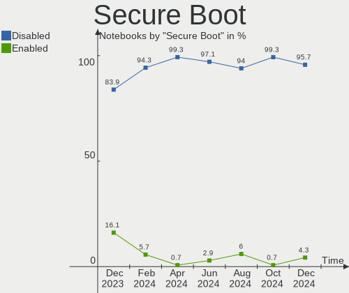
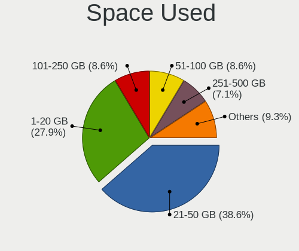

Zorin - Hardware Trends (Notebooks)
-----------------------------------

A project to identify most popular hardware characteristics and track their change
over time based on data collected by Linux users at https://Linux-Hardware.org.

Anyone can contribute to this report by the [hw-probe](https://github.com/linuxhw/hw-probe) tool:

    sudo -E hw-probe -all -upload

This report is for one last month. Overall report since the beginning of time: [TestCoverage](https://github.com/linuxhw/TestCoverage)

Period: Dec, 2022.

Contents
--------

* [ System ](#system)
  - [ OS                       ](#os)
  - [ OS Family                ](#os-family)
  - [ Kernel                   ](#kernel)
  - [ Kernel Family            ](#kernel-family)
  - [ Kernel Major Ver.        ](#kernel-major-ver)
  - [ Arch                     ](#arch)
  - [ DE                       ](#de)
  - [ Display Server           ](#display-server)
  - [ Display Manager          ](#display-manager)
  - [ OS Lang                  ](#os-lang)
  - [ Boot Mode                ](#boot-mode)
  - [ Filesystem               ](#filesystem)
  - [ Part. scheme             ](#part-scheme)
  - [ Dual Boot with Linux/BSD ](#dual-boot-with-linuxbsd)
  - [ Dual Boot (Win)          ](#dual-boot-win)

* [ Board ](#board)
  - [ Vendor                   ](#vendor)
  - [ Model                    ](#model)
  - [ Model Family             ](#model-family)
  - [ MFG Year                 ](#mfg-year)
  - [ Form Factor              ](#form-factor)
  - [ Secure Boot              ](#secure-boot)
  - [ Coreboot                 ](#coreboot)
  - [ RAM Size                 ](#ram-size)
  - [ RAM Used                 ](#ram-used)
  - [ Total Drives             ](#total-drives)
  - [ Has CD-ROM               ](#has-cd-rom)
  - [ Has Ethernet             ](#has-ethernet)
  - [ Has WiFi                 ](#has-wifi)
  - [ Has Bluetooth            ](#has-bluetooth)

* [ Location ](#location)
  - [ Country                  ](#country)
  - [ City                     ](#city)

* [ Drives ](#drives)
  - [ Drive Vendor             ](#drive-vendor)
  - [ Drive Model              ](#drive-model)
  - [ HDD Vendor               ](#hdd-vendor)
  - [ SSD Vendor               ](#ssd-vendor)
  - [ Drive Kind               ](#drive-kind)
  - [ Drive Connector          ](#drive-connector)
  - [ Drive Size               ](#drive-size)
  - [ Space Total              ](#space-total)
  - [ Space Used               ](#space-used)
  - [ Malfunc. Drives          ](#malfunc-drives)
  - [ Malfunc. Drive Vendor    ](#malfunc-drive-vendor)
  - [ Malfunc. HDD Vendor      ](#malfunc-hdd-vendor)
  - [ Malfunc. Drive Kind      ](#malfunc-drive-kind)
  - [ Failed Drives            ](#failed-drives)
  - [ Failed Drive Vendor      ](#failed-drive-vendor)
  - [ Drive Status             ](#drive-status)

* [ Storage controller ](#storage-controller)
  - [ Storage Vendor           ](#storage-vendor)
  - [ Storage Model            ](#storage-model)
  - [ Storage Kind             ](#storage-kind)

* [ Processor ](#processor)
  - [ CPU Vendor               ](#cpu-vendor)
  - [ CPU Model                ](#cpu-model)
  - [ CPU Model Family         ](#cpu-model-family)
  - [ CPU Cores                ](#cpu-cores)
  - [ CPU Sockets              ](#cpu-sockets)
  - [ CPU Threads              ](#cpu-threads)
  - [ CPU Op-Modes             ](#cpu-op-modes)
  - [ CPU Microcode            ](#cpu-microcode)
  - [ CPU Microarch            ](#cpu-microarch)

* [ Graphics ](#graphics)
  - [ GPU Vendor               ](#gpu-vendor)
  - [ GPU Model                ](#gpu-model)
  - [ GPU Combo                ](#gpu-combo)
  - [ GPU Driver               ](#gpu-driver)
  - [ GPU Memory               ](#gpu-memory)

* [ Monitor ](#monitor)
  - [ Monitor Vendor           ](#monitor-vendor)
  - [ Monitor Model            ](#monitor-model)
  - [ Monitor Resolution       ](#monitor-resolution)
  - [ Monitor Diagonal         ](#monitor-diagonal)
  - [ Monitor Width            ](#monitor-width)
  - [ Aspect Ratio             ](#aspect-ratio)
  - [ Monitor Area             ](#monitor-area)
  - [ Pixel Density            ](#pixel-density)
  - [ Multiple Monitors        ](#multiple-monitors)

* [ Network ](#network)
  - [ Net Controller Vendor    ](#net-controller-vendor)
  - [ Net Controller Model     ](#net-controller-model)
  - [ Wireless Vendor          ](#wireless-vendor)
  - [ Wireless Model           ](#wireless-model)
  - [ Ethernet Vendor          ](#ethernet-vendor)
  - [ Ethernet Model           ](#ethernet-model)
  - [ Net Controller Kind      ](#net-controller-kind)
  - [ Used Controller          ](#used-controller)
  - [ NICs                     ](#nics)
  - [ IPv6                     ](#ipv6)

* [ Bluetooth ](#bluetooth)
  - [ Bluetooth Vendor         ](#bluetooth-vendor)
  - [ Bluetooth Model          ](#bluetooth-model)

* [ Sound ](#sound)
  - [ Sound Vendor             ](#sound-vendor)
  - [ Sound Model              ](#sound-model)

* [ Memory ](#memory)
  - [ Memory Vendor            ](#memory-vendor)
  - [ Memory Model             ](#memory-model)
  - [ Memory Kind              ](#memory-kind)
  - [ Memory Form Factor       ](#memory-form-factor)
  - [ Memory Size              ](#memory-size)
  - [ Memory Speed             ](#memory-speed)

* [ Printers & scanners ](#printers--scanners)
  - [ Printer Vendor           ](#printer-vendor)
  - [ Printer Model            ](#printer-model)
  - [ Scanner Vendor           ](#scanner-vendor)
  - [ Scanner Model            ](#scanner-model)

* [ Camera ](#camera)
  - [ Camera Vendor            ](#camera-vendor)
  - [ Camera Model             ](#camera-model)

* [ Security ](#security)
  - [ Fingerprint Vendor       ](#fingerprint-vendor)
  - [ Fingerprint Model        ](#fingerprint-model)
  - [ Chipcard Vendor          ](#chipcard-vendor)
  - [ Chipcard Model           ](#chipcard-model)

* [ Unsupported ](#unsupported)
  - [ Unsupported Devices      ](#unsupported-devices)
  - [ Unsupported Device Types ](#unsupported-device-types)

System
------

OS
--

Installed operating systems

| Name     | Notebooks | Percent |
|----------|-----------|---------|
| Zorin 16 | 88        | 94.62%  |
| Zorin 15 | 4         | 4.3%    |
| Zorin 12 | 1         | 1.08%   |

OS Family
---------

OS without a version

| Name  | Notebooks | Percent |
|-------|-----------|---------|
| Zorin | 93        | 100%    |

Kernel
------

Version of the Linux kernel

| Version            | Notebooks | Percent |
|--------------------|-----------|---------|
| 5.15.0-56-generic  | 73        | 78.49%  |
| 5.15.0-53-generic  | 7         | 7.53%   |
| 5.15.0-52-generic  | 5         | 5.38%   |
| 5.4.0-135-generic  | 3         | 3.23%   |
| 5.4.0-42-generic   | 1         | 1.08%   |
| 5.15.0-48-generic  | 1         | 1.08%   |
| 5.13.0-48-generic  | 1         | 1.08%   |
| 5.13.0-30-generic  | 1         | 1.08%   |
| 4.15.0-142-generic | 1         | 1.08%   |

Kernel Family
-------------

Linux kernel without a distro release

| Version | Notebooks | Percent |
|---------|-----------|---------|
| 5.15.0  | 86        | 92.47%  |
| 5.4.0   | 4         | 4.3%    |
| 5.13.0  | 2         | 2.15%   |
| 4.15.0  | 1         | 1.08%   |

Kernel Major Ver.
-----------------

Linux kernel major version

| Version | Notebooks | Percent |
|---------|-----------|---------|
| 5.15    | 86        | 92.47%  |
| 5.4     | 4         | 4.3%    |
| 5.13    | 2         | 2.15%   |
| 4.15    | 1         | 1.08%   |

Arch
----

OS architecture (x86_64, i586, etc.)

| Name   | Notebooks | Percent |
|--------|-----------|---------|
| x86_64 | 92        | 98.92%  |
| i686   | 1         | 1.08%   |

DE
--

Desktop Environment

| Name    | Notebooks | Percent |
|---------|-----------|---------|
| GNOME   | 74        | 79.57%  |
| XFCE    | 15        | 16.13%  |
| Unknown | 2         | 2.15%   |
| LXDE    | 1         | 1.08%   |
| Budgie  | 1         | 1.08%   |

Display Server
--------------

X11 or Wayland

| Name    | Notebooks | Percent |
|---------|-----------|---------|
| X11     | 88        | 94.62%  |
| Wayland | 4         | 4.3%    |
| Unknown | 1         | 1.08%   |

Display Manager
---------------

SDDM, LightDM, etc.

| Name    | Notebooks | Percent |
|---------|-----------|---------|
| Unknown | 68        | 73.12%  |
| GDM     | 12        | 12.9%   |
| GDM3    | 8         | 8.6%    |
| LightDM | 4         | 4.3%    |
| LXDM    | 1         | 1.08%   |

OS Lang
-------

Language

| Lang  | Notebooks | Percent |
|-------|-----------|---------|
| en_US | 34        | 36.56%  |
| de_DE | 14        | 15.05%  |
| pt_BR | 5         | 5.38%   |
| it_IT | 5         | 5.38%   |
| en_GB | 5         | 5.38%   |
| es_ES | 4         | 4.3%    |
| pl_PL | 3         | 3.23%   |
| fr_FR | 3         | 3.23%   |
| en_CA | 3         | 3.23%   |
| en_AU | 3         | 3.23%   |
| nl_BE | 2         | 2.15%   |
| en_NG | 2         | 2.15%   |
| en_IN | 2         | 2.15%   |
| sv_SE | 1         | 1.08%   |
| ru_RU | 1         | 1.08%   |
| pt_PT | 1         | 1.08%   |
| ja_JP | 1         | 1.08%   |
| hu_HU | 1         | 1.08%   |
| es_MX | 1         | 1.08%   |
| en_NZ | 1         | 1.08%   |
| ca_ES | 1         | 1.08%   |

Boot Mode
---------

EFI or BIOS

| Mode | Notebooks | Percent |
|------|-----------|---------|
| EFI  | 57        | 61.29%  |
| BIOS | 36        | 38.71%  |

Filesystem
----------

Type of filesystem

| Type    | Notebooks | Percent |
|---------|-----------|---------|
| Ext4    | 88        | 94.62%  |
| Overlay | 3         | 3.23%   |
| Zfs     | 2         | 2.15%   |

Part. scheme
------------

Scheme of partitioning

| Type    | Notebooks | Percent |
|---------|-----------|---------|
| Unknown | 68        | 73.12%  |
| GPT     | 19        | 20.43%  |
| MBR     | 6         | 6.45%   |

Dual Boot with Linux/BSD
------------------------

Hosting more than one Linux/BSD

| Dual boot | Notebooks | Percent |
|-----------|-----------|---------|
| No        | 91        | 97.85%  |
| Yes       | 2         | 2.15%   |

Dual Boot (Win)
---------------

Hosting Linux and Windows

| Dual boot | Notebooks | Percent |
|-----------|-----------|---------|
| No        | 86        | 92.47%  |
| Yes       | 7         | 7.53%   |

Board
-----

Vendor
------

Motherboard manufacturer

| Name                | Notebooks | Percent |
|---------------------|-----------|---------|
| Lenovo              | 21        | 22.58%  |
| Hewlett-Packard     | 17        | 18.28%  |
| Dell                | 14        | 15.05%  |
| ASUSTek Computer    | 9         | 9.68%   |
| Toshiba             | 5         | 5.38%   |
| Sony                | 4         | 4.3%    |
| MSI                 | 4         | 4.3%    |
| Apple               | 3         | 3.23%   |
| Samsung Electronics | 2         | 2.15%   |
| Packard Bell        | 2         | 2.15%   |
| GPU Company         | 2         | 2.15%   |
| Acer                | 2         | 2.15%   |
| Machcreator         | 1         | 1.08%   |
| Jumper              | 1         | 1.08%   |
| HUAWEI              | 1         | 1.08%   |
| GPD                 | 1         | 1.08%   |
| Google              | 1         | 1.08%   |
| Fusion5             | 1         | 1.08%   |
| Chuwi               | 1         | 1.08%   |
| Alienware           | 1         | 1.08%   |

Model
-----

Motherboard model

| Name                                       | Notebooks | Percent |
|--------------------------------------------|-----------|---------|
| Lenovo IdeaPad 3 15ITL6 82H8               | 2         | 2.15%   |
| GPU Company GWTC116-2                      | 2         | 2.15%   |
| Dell Latitude E6540                        | 2         | 2.15%   |
| Toshiba Satellite P500                     | 1         | 1.08%   |
| Toshiba Satellite L855                     | 1         | 1.08%   |
| Toshiba Satellite L500                     | 1         | 1.08%   |
| Toshiba Satellite C870-1C2                 | 1         | 1.08%   |
| Toshiba Satellite C50-B                    | 1         | 1.08%   |
| Sony VPCEB2M1E                             | 1         | 1.08%   |
| Sony VPCEB1M1E                             | 1         | 1.08%   |
| Sony VJZ13A                                | 1         | 1.08%   |
| Sony VGN-NR32M_S                           | 1         | 1.08%   |
| Samsung 305E4A/305E5A/305E7A               | 1         | 1.08%   |
| Samsung 300V3A/300V4A/300V5A/200A4B/200A5B | 1         | 1.08%   |
| Packard Bell EasyNote TK85                 | 1         | 1.08%   |
| Packard Bell EasyNote TE11BZ               | 1         | 1.08%   |
| MSI MS-1035                                | 1         | 1.08%   |
| MSI GS73VR 7RF                             | 1         | 1.08%   |
| MSI GP75 Leopard 10SEK                     | 1         | 1.08%   |
| MSI GF63 Thin 10SC                         | 1         | 1.08%   |
| Machcreator 14                             | 1         | 1.08%   |
| Lenovo Yoga 300-11IBR 80M1                 | 1         | 1.08%   |
| Lenovo Yoga 2 13 20344                     | 1         | 1.08%   |
| Lenovo V130-15IGM 81HL                     | 1         | 1.08%   |
| Lenovo ThinkPad X131e 33672K5              | 1         | 1.08%   |
| Lenovo ThinkPad W541 20EF0011IX            | 1         | 1.08%   |
| Lenovo ThinkPad T470 20HES0PF00            | 1         | 1.08%   |
| Lenovo ThinkPad T460 20FMS2AN00            | 1         | 1.08%   |
| Lenovo ThinkPad T420 4236GY3               | 1         | 1.08%   |
| Lenovo ThinkPad P52 20MAS25B1X             | 1         | 1.08%   |
| Lenovo ThinkPad Edge E530c 33663VG         | 1         | 1.08%   |
| Lenovo ThinkPad E590 20NB001AMX            | 1         | 1.08%   |
| Lenovo IdeaPadFlex 15D 20334               | 1         | 1.08%   |
| Lenovo IdeaPad Gaming 3 15ARH05 82EY       | 1         | 1.08%   |
| Lenovo IdeaPad 5 15ALC05 82LN              | 1         | 1.08%   |
| Lenovo IdeaPad 320-15IKB 80YH              | 1         | 1.08%   |
| Lenovo IdeaPad 3 17ABA7 82RQ               | 1         | 1.08%   |
| Lenovo IdeaPad 3 15ALC6 82KU               | 1         | 1.08%   |
| Lenovo G500 20236                          | 1         | 1.08%   |
| Lenovo G50-30 80G0                         | 1         | 1.08%   |

Model Family
------------

Motherboard model prefix

| Name                  | Notebooks | Percent |
|-----------------------|-----------|---------|
| Lenovo ThinkPad       | 8         | 8.6%    |
| Lenovo IdeaPad        | 7         | 7.53%   |
| Dell Latitude         | 7         | 7.53%   |
| Toshiba Satellite     | 5         | 5.38%   |
| HP Pavilion           | 5         | 5.38%   |
| Dell Inspiron         | 4         | 4.3%    |
| HP Laptop             | 3         | 3.23%   |
| ASUS VivoBook         | 3         | 3.23%   |
| Packard Bell EasyNote | 2         | 2.15%   |
| Lenovo Yoga           | 2         | 2.15%   |
| HP EliteBook          | 2         | 2.15%   |
| HP Compaq             | 2         | 2.15%   |
| GPU Company GWTC116-2 | 2         | 2.15%   |
| Dell Studio           | 2         | 2.15%   |
| Acer Aspire           | 2         | 2.15%   |
| Sony VPCEB2M1E        | 1         | 1.08%   |
| Sony VPCEB1M1E        | 1         | 1.08%   |
| Sony VJZ13A           | 1         | 1.08%   |
| Sony VGN-NR32M        | 1         | 1.08%   |
| Samsung 305E4A        | 1         | 1.08%   |
| Samsung 300V3A        | 1         | 1.08%   |
| MSI MS-1035           | 1         | 1.08%   |
| MSI GS73VR            | 1         | 1.08%   |
| MSI GP75              | 1         | 1.08%   |
| MSI GF63              | 1         | 1.08%   |
| Machcreator 14        | 1         | 1.08%   |
| Lenovo V130-15IGM     | 1         | 1.08%   |
| Lenovo IdeaPadFlex    | 1         | 1.08%   |
| Lenovo G500           | 1         | 1.08%   |
| Lenovo G50-30         | 1         | 1.08%   |
| Jumper EZbook         | 1         | 1.08%   |
| HUAWEI BOHB-WAX9      | 1         | 1.08%   |
| HP Victus             | 1         | 1.08%   |
| HP Stream             | 1         | 1.08%   |
| HP ProBook            | 1         | 1.08%   |
| HP 250                | 1         | 1.08%   |
| HP 15                 | 1         | 1.08%   |
| GPD G1619-04          | 1         | 1.08%   |
| Google Blorb          | 1         | 1.08%   |
| Fusion5 C60Bv2-128GB  | 1         | 1.08%   |

MFG Year
--------

Motherboard manufacture year

| Year | Notebooks | Percent |
|------|-----------|---------|
| 2021 | 15        | 16.13%  |
| 2013 | 10        | 10.75%  |
| 2018 | 9         | 9.68%   |
| 2012 | 9         | 9.68%   |
| 2011 | 7         | 7.53%   |
| 2015 | 6         | 6.45%   |
| 2010 | 6         | 6.45%   |
| 2008 | 6         | 6.45%   |
| 2022 | 4         | 4.3%    |
| 2019 | 4         | 4.3%    |
| 2017 | 4         | 4.3%    |
| 2014 | 4         | 4.3%    |
| 2016 | 3         | 3.23%   |
| 2009 | 3         | 3.23%   |
| 2020 | 2         | 2.15%   |
| 2005 | 1         | 1.08%   |

Form Factor
-----------

Physical design of the computer

| Name     | Notebooks | Percent |
|----------|-----------|---------|
| Notebook | 93        | 100%    |

Secure Boot
-----------

Enabled or disabled

| State    | Notebooks | Percent |
|----------|-----------|---------|
| Disabled | 80        | 86.02%  |
| Enabled  | 13        | 13.98%  |

Coreboot
--------

Have coreboot on board

| Used | Notebooks | Percent |
|------|-----------|---------|
| No   | 92        | 98.92%  |
| Yes  | 1         | 1.08%   |

RAM Size
--------

Total RAM memory

| Size in GB | Notebooks | Percent |
|------------|-----------|---------|
| 3.01-4.0   | 33        | 35.48%  |
| 4.01-8.0   | 26        | 27.96%  |
| 16.01-24.0 | 13        | 13.98%  |
| 8.01-16.0  | 9         | 9.68%   |
| 1.01-2.0   | 5         | 5.38%   |
| 32.01-64.0 | 4         | 4.3%    |
| 2.01-3.0   | 2         | 2.15%   |
| 24.01-32.0 | 1         | 1.08%   |

RAM Used
--------

Used RAM memory

| Used GB   | Notebooks | Percent |
|-----------|-----------|---------|
| 1.01-2.0  | 44        | 47.31%  |
| 2.01-3.0  | 22        | 23.66%  |
| 3.01-4.0  | 11        | 11.83%  |
| 4.01-8.0  | 9         | 9.68%   |
| 0.51-1.0  | 4         | 4.3%    |
| 8.01-16.0 | 3         | 3.23%   |

Total Drives
------------

Number of drives on board

| Drives | Notebooks | Percent |
|--------|-----------|---------|
| 1      | 73        | 78.49%  |
| 2      | 19        | 20.43%  |
| 3      | 1         | 1.08%   |

Has CD-ROM
----------

Has CD-ROM on board

| Presented | Notebooks | Percent |
|-----------|-----------|---------|
| No        | 52        | 55.91%  |
| Yes       | 41        | 44.09%  |

Has Ethernet
------------

Has Ethernet on board

| Presented | Notebooks | Percent |
|-----------|-----------|---------|
| Yes       | 72        | 77.42%  |
| No        | 21        | 22.58%  |

Has WiFi
--------

Has WiFi module

| Presented | Notebooks | Percent |
|-----------|-----------|---------|
| Yes       | 92        | 98.92%  |
| No        | 1         | 1.08%   |

Has Bluetooth
-------------

Has Bluetooth module

| Presented | Notebooks | Percent |
|-----------|-----------|---------|
| Yes       | 65        | 69.89%  |
| No        | 28        | 30.11%  |

Location
--------

Country
-------

Geographic location (country)

| Country            | Notebooks | Percent |
|--------------------|-----------|---------|
| USA                | 20        | 21.51%  |
| Germany            | 15        | 16.13%  |
| UK                 | 6         | 6.45%   |
| Spain              | 6         | 6.45%   |
| Brazil             | 6         | 6.45%   |
| Italy              | 4         | 4.3%    |
| France             | 4         | 4.3%    |
| Canada             | 4         | 4.3%    |
| Nigeria            | 2         | 2.15%   |
| Netherlands        | 2         | 2.15%   |
| Mexico             | 2         | 2.15%   |
| Indonesia          | 2         | 2.15%   |
| India              | 2         | 2.15%   |
| Belgium            | 2         | 2.15%   |
| Australia          | 2         | 2.15%   |
| Vietnam            | 1         | 1.08%   |
| Sweden             | 1         | 1.08%   |
| Slovakia           | 1         | 1.08%   |
| Russia             | 1         | 1.08%   |
| Portugal           | 1         | 1.08%   |
| Poland             | 1         | 1.08%   |
| Philippines        | 1         | 1.08%   |
| New Zealand        | 1         | 1.08%   |
| Japan              | 1         | 1.08%   |
| Hungary            | 1         | 1.08%   |
| Greece             | 1         | 1.08%   |
| Finland            | 1         | 1.08%   |
| Egypt              | 1         | 1.08%   |
| Dominican Republic | 1         | 1.08%   |

City
----

Geographic location (city)

| City           | Notebooks | Percent |
|----------------|-----------|---------|
| Toronto        | 2         | 2.15%   |
| Manitowoc      | 2         | 2.15%   |
| Berlin         | 2         | 2.15%   |
| Wrexham        | 1         | 1.08%   |
| Woldegk        | 1         | 1.08%   |
| Wismar         | 1         | 1.08%   |
| Wesley Chapel  | 1         | 1.08%   |
| Wernigerode    | 1         | 1.08%   |
| Valladolid     | 1         | 1.08%   |
| Tsuchihashi    | 1         | 1.08%   |
| Topoľčany    | 1         | 1.08%   |
| Sydney         | 1         | 1.08%   |
| Susegana       | 1         | 1.08%   |
| Springdale     | 1         | 1.08%   |
| Severinia      | 1         | 1.08%   |
| Santo Domingo  | 1         | 1.08%   |
| Rio de Janeiro | 1         | 1.08%   |
| Puebla City    | 1         | 1.08%   |
| Porto Seguro   | 1         | 1.08%   |
| Portland       | 1         | 1.08%   |
| Pittsburgh     | 1         | 1.08%   |
| Phoenix        | 1         | 1.08%   |
| Paris          | 1         | 1.08%   |
| Okeechobee     | 1         | 1.08%   |
| Nyiregyhaza    | 1         | 1.08%   |
| Newmarket      | 1         | 1.08%   |
| New Orleans    | 1         | 1.08%   |
| Neu-Ulm        | 1         | 1.08%   |
| Moscow         | 1         | 1.08%   |
| Montesano      | 1         | 1.08%   |
| Mol            | 1         | 1.08%   |
| Milan          | 1         | 1.08%   |
| Martinengo     | 1         | 1.08%   |
| Marktredwitz   | 1         | 1.08%   |
| Markham        | 1         | 1.08%   |
| Madrid         | 1         | 1.08%   |
| Lublin         | 1         | 1.08%   |
| Lorena         | 1         | 1.08%   |
| London         | 1         | 1.08%   |
| Lisbon         | 1         | 1.08%   |

Drives
------

Drive Vendor
------------

Hard drive vendors

| Vendor                      | Notebooks | Drives | Percent |
|-----------------------------|-----------|--------|---------|
| Samsung Electronics         | 17        | 19     | 15.32%  |
| WDC                         | 14        | 15     | 12.61%  |
| Unknown                     | 11        | 12     | 9.91%   |
| SanDisk                     | 8         | 9      | 7.21%   |
| Seagate                     | 7         | 7      | 6.31%   |
| Toshiba                     | 6         | 6      | 5.41%   |
| Kingston                    | 5         | 5      | 4.5%    |
| Intel                       | 5         | 7      | 4.5%    |
| Hitachi                     | 4         | 4      | 3.6%    |
| HGST                        | 4         | 4      | 3.6%    |
| Netac                       | 3         | 3      | 2.7%    |
| Crucial                     | 3         | 3      | 2.7%    |
| Union Memory                | 2         | 2      | 1.8%    |
| Micron Technology           | 2         | 2      | 1.8%    |
| KIOXIA                      | 2         | 2      | 1.8%    |
| China                       | 2         | 2      | 1.8%    |
| ZOTAC                       | 1         | 1      | 0.9%    |
| UMIS                        | 1         | 1      | 0.9%    |
| SSSTC                       | 1         | 1      | 0.9%    |
| SK hynix                    | 1         | 1      | 0.9%    |
| SAM                         | 1         | 1      | 0.9%    |
| Phison                      | 1         | 1      | 0.9%    |
| Micron/Crucial Technology   | 1         | 1      | 0.9%    |
| LITEONIT                    | 1         | 1      | 0.9%    |
| Lite-On Technology          | 1         | 1      | 0.9%    |
| Kingston Technology Company | 1         | 1      | 0.9%    |
| JMicron Technology          | 1         | 1      | 0.9%    |
| Fujitsu                     | 1         | 1      | 0.9%    |
| BIWIN                       | 1         | 1      | 0.9%    |
| Apple                       | 1         | 1      | 0.9%    |
| ADATA Technology            | 1         | 1      | 0.9%    |
| A-DATA Technology           | 1         | 1      | 0.9%    |

Drive Model
-----------

Hard drive models

| Model                                               | Notebooks | Percent |
|-----------------------------------------------------|-----------|---------|
| Seagate ST500LT012-1DG142 500GB                     | 4         | 3.39%   |
| Unknown MMC Card  32GB                              | 3         | 2.54%   |
| Samsung SSD 870 EVO 1TB                             | 3         | 2.54%   |
| Kingston SA400S37480G 480GB SSD                     | 3         | 2.54%   |
| WDC WD5000LPCX-24VHAT0 500GB                        | 2         | 1.69%   |
| Unknown MMC Card  64GB                              | 2         | 1.69%   |
| SanDisk SSD PLUS 1000GB                             | 2         | 1.69%   |
| Samsung SSD 870 QVO 1TB                             | 2         | 1.69%   |
| Samsung NVMe SSD Controller SM981/PM981/PM983 500GB | 2         | 1.69%   |
| Intel HBRPEKNX0202AO 32GB                           | 2         | 1.69%   |
| Intel HBRPEKNX0202A 512GB                           | 2         | 1.69%   |
| ZOTAC ZTSSD-A3C-128G                                | 1         | 0.85%   |
| WDC WD7500BPVX-22JC3T0 752GB                        | 1         | 0.85%   |
| WDC WD6400BEVT-22A0RT0 640GB                        | 1         | 0.85%   |
| WDC WD5000LPVX-75V0TT0 500GB                        | 1         | 0.85%   |
| WDC WD5000LPVX-60V0TT0 500GB                        | 1         | 0.85%   |
| WDC WD5000LPCX-60VHAT1 500GB                        | 1         | 0.85%   |
| WDC WD5000LPCX-24C6HT0 500GB                        | 1         | 0.85%   |
| WDC WD5000BEVT-26A0RT0 500GB                        | 1         | 0.85%   |
| WDC WD5000BEKT-75KA9T0 500GB                        | 1         | 0.85%   |
| WDC WD3200BPVT-22JJ5T0 320GB                        | 1         | 0.85%   |
| WDC WD20NPVT-00Z2TT0 2TB                            | 1         | 0.85%   |
| WDC WD10SPZX-22Z10T1 1TB                            | 1         | 0.85%   |
| WDC WD10JPVX-75JC3T0 1TB                            | 1         | 0.85%   |
| WDC WD10JPVT-80A1YT0 1TB                            | 1         | 0.85%   |
| Unknown SD/MMC/MS PRO 64GB                          | 1         | 0.85%   |
| Unknown MMC Card  4GB                               | 1         | 0.85%   |
| Unknown MMC Card  256GB                             | 1         | 0.85%   |
| Unknown MMC Card  16GB                              | 1         | 0.85%   |
| Unknown MMC Card  128GB                             | 1         | 0.85%   |
| Unknown Biwin  64GB                                 | 1         | 0.85%   |
| Unknown APPSD  8GB                                  | 1         | 0.85%   |
| Union Memory UMIS RPJTJ512MEE1OWX 512GB             | 1         | 0.85%   |
| Union Memory UMIS RPJTJ256MEE1OWX 256GB             | 1         | 0.85%   |
| UMIS RPJTJ256MEE1OWX 256GB                          | 1         | 0.85%   |
| Toshiba MQ01ABF050 500GB                            | 1         | 0.85%   |
| Toshiba MQ01ABD050 500GB                            | 1         | 0.85%   |
| Toshiba MK7575GSX 752GB                             | 1         | 0.85%   |
| Toshiba MK2546GSX 200 200GB                         | 1         | 0.85%   |
| Toshiba KXG50ZNV512G NVMe 512GB                     | 1         | 0.85%   |

HDD Vendor
----------

Hard disk drive vendors

| Vendor              | Notebooks | Drives | Percent |
|---------------------|-----------|--------|---------|
| WDC                 | 14        | 15     | 37.84%  |
| Seagate             | 7         | 7      | 18.92%  |
| Toshiba             | 4         | 4      | 10.81%  |
| Hitachi             | 4         | 4      | 10.81%  |
| HGST                | 4         | 4      | 10.81%  |
| Unknown             | 1         | 1      | 2.7%    |
| Samsung Electronics | 1         | 1      | 2.7%    |
| JMicron Technology  | 1         | 1      | 2.7%    |
| Fujitsu             | 1         | 1      | 2.7%    |

SSD Vendor
----------

Solid state drive vendors

| Vendor              | Notebooks | Drives | Percent |
|---------------------|-----------|--------|---------|
| Samsung Electronics | 12        | 13     | 30%     |
| SanDisk             | 5         | 6      | 12.5%   |
| Kingston            | 5         | 5      | 12.5%   |
| Netac               | 3         | 3      | 7.5%    |
| Crucial             | 3         | 3      | 7.5%    |
| Micron Technology   | 2         | 2      | 5%      |
| Intel               | 2         | 2      | 5%      |
| China               | 2         | 2      | 5%      |
| ZOTAC               | 1         | 1      | 2.5%    |
| SAM                 | 1         | 1      | 2.5%    |
| Phison              | 1         | 1      | 2.5%    |
| LITEONIT            | 1         | 1      | 2.5%    |
| Apple               | 1         | 1      | 2.5%    |
| A-DATA Technology   | 1         | 1      | 2.5%    |

Drive Kind
----------

HDD or SSD

| Kind | Notebooks | Drives | Percent |
|------|-----------|--------|---------|
| SSD  | 38        | 42     | 34.86%  |
| HDD  | 36        | 38     | 33.03%  |
| NVMe | 24        | 27     | 22.02%  |
| MMC  | 11        | 11     | 10.09%  |

Drive Connector
---------------

SATA, SAS, NVMe, etc.

| Type | Notebooks | Drives | Percent |
|------|-----------|--------|---------|
| SATA | 68        | 75     | 63.55%  |
| NVMe | 24        | 27     | 22.43%  |
| MMC  | 11        | 11     | 10.28%  |
| SAS  | 4         | 5      | 3.74%   |

Drive Size
----------

Size of hard drive

| Size in TB | Notebooks | Drives | Percent |
|------------|-----------|--------|---------|
| 0.01-0.5   | 57        | 60     | 75%     |
| 0.51-1.0   | 17        | 17     | 22.37%  |
| 1.01-2.0   | 2         | 3      | 2.63%   |

Space Total
-----------

Amount of disk space available on the file system

| Size in GB | Notebooks | Percent |
|------------|-----------|---------|
| 101-250    | 34        | 36.56%  |
| 251-500    | 30        | 32.26%  |
| 501-1000   | 12        | 12.9%   |
| 21-50      | 8         | 8.6%    |
| 51-100     | 7         | 7.53%   |
| 2001-3000  | 1         | 1.08%   |
| 1001-2000  | 1         | 1.08%   |

Space Used
----------

Amount of used disk space

| Used GB  | Notebooks | Percent |
|----------|-----------|---------|
| 1-20     | 32        | 34.41%  |
| 21-50    | 29        | 31.18%  |
| 51-100   | 15        | 16.13%  |
| 101-250  | 12        | 12.9%   |
| 251-500  | 4         | 4.3%    |
| 501-1000 | 1         | 1.08%   |

Malfunc. Drives
---------------

Drive models with a malfunction

| Model                                            | Notebooks | Drives | Percent |
|--------------------------------------------------|-----------|--------|---------|
| Seagate ST500LT012-1DG142 500GB                  | 1         | 1      | 25%     |
| Samsung Electronics MZHPV256HDGL-00000 256GB SSD | 1         | 1      | 25%     |
| Hitachi HTS542516K9SA00 160GB                    | 1         | 1      | 25%     |
| HGST HTS545050A7E380 500GB                       | 1         | 1      | 25%     |

Malfunc. Drive Vendor
---------------------

Vendors of faulty drives

| Vendor              | Notebooks | Drives | Percent |
|---------------------|-----------|--------|---------|
| Seagate             | 1         | 1      | 25%     |
| Samsung Electronics | 1         | 1      | 25%     |
| Hitachi             | 1         | 1      | 25%     |
| HGST                | 1         | 1      | 25%     |

Malfunc. HDD Vendor
-------------------

Vendors of faulty HDD drives

| Vendor  | Notebooks | Drives | Percent |
|---------|-----------|--------|---------|
| Seagate | 1         | 1      | 33.33%  |
| Hitachi | 1         | 1      | 33.33%  |
| HGST    | 1         | 1      | 33.33%  |

Malfunc. Drive Kind
-------------------

Kinds of faulty drives

| Kind | Notebooks | Drives | Percent |
|------|-----------|--------|---------|
| HDD  | 3         | 3      | 75%     |
| SSD  | 1         | 1      | 25%     |

Failed Drives
-------------

Failed drive models

Zero info for selected period =(

Failed Drive Vendor
-------------------

Failed drive vendors

Zero info for selected period =(

Drive Status
------------

Number of failed and malfunc. drives

| Status   | Notebooks | Drives | Percent |
|----------|-----------|--------|---------|
| Detected | 80        | 101    | 84.21%  |
| Works    | 11        | 13     | 11.58%  |
| Malfunc  | 4         | 4      | 4.21%   |

Storage controller
------------------

Storage Vendor
--------------

Storage controller vendors

| Vendor                         | Notebooks | Percent |
|--------------------------------|-----------|---------|
| Intel                          | 69        | 65.71%  |
| AMD                            | 13        | 12.38%  |
| Samsung Electronics            | 6         | 5.71%   |
| Union Memory (Shenzhen)        | 3         | 2.86%   |
| SanDisk                        | 3         | 2.86%   |
| Toshiba America Info Systems   | 2         | 1.9%    |
| KIOXIA                         | 2         | 1.9%    |
| Solid State Storage Technology | 1         | 0.95%   |
| SK hynix                       | 1         | 0.95%   |
| Micron/Crucial Technology      | 1         | 0.95%   |
| Lite-On Technology             | 1         | 0.95%   |
| Kingston Technology Company    | 1         | 0.95%   |
| Biwin Storage Technology       | 1         | 0.95%   |
| ADATA Technology               | 1         | 0.95%   |

Storage Model
-------------

Storage controller models

| Model                                                                            | Notebooks | Percent |
|----------------------------------------------------------------------------------|-----------|---------|
| AMD FCH SATA Controller [AHCI mode]                                              | 13        | 11.4%   |
| Intel 7 Series Chipset Family 6-port SATA Controller [AHCI mode]                 | 10        | 8.77%   |
| Intel 82801 Mobile SATA Controller [RAID mode]                                   | 7         | 6.14%   |
| Intel Sunrise Point-LP SATA Controller [AHCI mode]                               | 5         | 4.39%   |
| Intel 6 Series/C200 Series Chipset Family 6 port Mobile SATA AHCI Controller     | 5         | 4.39%   |
| Intel 5 Series/3400 Series Chipset 4 port SATA AHCI Controller                   | 5         | 4.39%   |
| Intel Celeron/Pentium Silver Processor SATA Controller                           | 4         | 3.51%   |
| Intel 8 Series/C220 Series Chipset Family 6-port SATA Controller 1 [AHCI mode]   | 4         | 3.51%   |
| Union Memory (Shenzhen) Non-Volatile memory controller                           | 3         | 2.63%   |
| Intel Atom Processor E3800 Series SATA AHCI Controller                           | 3         | 2.63%   |
| Intel 82801IBM/IEM (ICH9M/ICH9M-E) 4 port SATA Controller [AHCI mode]            | 3         | 2.63%   |
| Intel 82801HM/HEM (ICH8M/ICH8M-E) IDE Controller                                 | 3         | 2.63%   |
| Samsung NVMe SSD Controller SM981/PM981/PM983                                    | 2         | 1.75%   |
| Samsung NVMe SSD Controller 980                                                  | 2         | 1.75%   |
| KIOXIA NVMe SSD Controller BG4                                                   | 2         | 1.75%   |
| Intel Volume Management Device NVMe RAID Controller                              | 2         | 1.75%   |
| Intel Tiger Lake-LP SATA Controller                                              | 2         | 1.75%   |
| Intel Non-Volatile memory controller                                             | 2         | 1.75%   |
| Intel Celeron N3350/Pentium N4200/Atom E3900 Series SATA AHCI Controller         | 2         | 1.75%   |
| Intel Atom/Celeron/Pentium Processor x5-E8000/J3xxx/N3xxx Series SATA Controller | 2         | 1.75%   |
| Intel 82801HM/HEM (ICH8M/ICH8M-E) SATA Controller [AHCI mode]                    | 2         | 1.75%   |
| Intel 8 Series SATA Controller 1 [AHCI mode]                                     | 2         | 1.75%   |
| Intel 400 Series Chipset Family SATA AHCI Controller                             | 2         | 1.75%   |
| Toshiba America Info Systems XG5 NVMe SSD Controller                             | 1         | 0.88%   |
| Toshiba America Info Systems BG3 NVMe SSD Controller                             | 1         | 0.88%   |
| Solid State Storage Non-Volatile memory controller                               | 1         | 0.88%   |
| SK hynix BC501 NVMe Solid State Drive                                            | 1         | 0.88%   |
| SanDisk WD Black SN750 / PC SN730 NVMe SSD                                       | 1         | 0.88%   |
| SanDisk WD Black 2018/SN750 / PC SN720 NVMe SSD                                  | 1         | 0.88%   |
| SanDisk Non-Volatile memory controller                                           | 1         | 0.88%   |
| Samsung NVMe SSD Controller SM961/PM961/SM963                                    | 1         | 0.88%   |
| Samsung Electronics SATA controller                                              | 1         | 0.88%   |
| Micron/Crucial P1 NVMe PCIe SSD                                                  | 1         | 0.88%   |
| Lite-On NVMe Controller                                                          | 1         | 0.88%   |
| Kingston Company OM3PDP3 NVMe SSD                                                | 1         | 0.88%   |
| Intel Wildcat Point-LP SATA Controller [AHCI Mode]                               | 1         | 0.88%   |
| Intel SSD 660P Series                                                            | 1         | 0.88%   |
| Intel HM170/QM170 Chipset SATA Controller [AHCI Mode]                            | 1         | 0.88%   |
| Intel Comet Lake SATA AHCI Controller                                            | 1         | 0.88%   |
| Intel Comet Lake PCH-LP SATA RAID Premium Controller                             | 1         | 0.88%   |

Storage Kind
------------

Kind of storage controller (IDE, SATA, NVMe, SAS, ...)

| Kind | Notebooks | Percent |
|------|-----------|---------|
| SATA | 71        | 63.96%  |
| NVMe | 24        | 21.62%  |
| RAID | 10        | 9.01%   |
| IDE  | 6         | 5.41%   |

Processor
---------

CPU Vendor
----------

Processor vendors

| Vendor | Notebooks | Percent |
|--------|-----------|---------|
| Intel  | 77        | 82.8%   |
| AMD    | 16        | 17.2%   |

CPU Model
---------

Processor models

| Model                                    | Notebooks | Percent |
|------------------------------------------|-----------|---------|
| Intel Celeron N4020 CPU @ 1.10GHz        | 3         | 3.23%   |
| Intel Core i7-4800MQ CPU @ 2.70GHz       | 2         | 2.15%   |
| Intel Core i7-3630QM CPU @ 2.40GHz       | 2         | 2.15%   |
| Intel Core i5-3230M CPU @ 2.60GHz        | 2         | 2.15%   |
| Intel Core i5-2410M CPU @ 2.30GHz        | 2         | 2.15%   |
| Intel Celeron N4000 CPU @ 1.10GHz        | 2         | 2.15%   |
| Intel Celeron CPU N3050 @ 1.60GHz        | 2         | 2.15%   |
| Intel 11th Gen Core i5-1135G7 @ 2.40GHz  | 2         | 2.15%   |
| AMD Ryzen 5 5500U with Radeon Graphics   | 2         | 2.15%   |
| AMD A4-3305M APU with Radeon HD Graphics | 2         | 2.15%   |
| Intel Pentium Silver N5000 CPU @ 1.10GHz | 1         | 1.08%   |
| Intel Pentium M processor 1.73GHz        | 1         | 1.08%   |
| Intel Pentium Dual CPU T2370 @ 1.73GHz   | 1         | 1.08%   |
| Intel Pentium CPU P6100 @ 2.00GHz        | 1         | 1.08%   |
| Intel Pentium CPU N3540 @ 2.16GHz        | 1         | 1.08%   |
| Intel Core i7-8850H CPU @ 2.60GHz        | 1         | 1.08%   |
| Intel Core i7-8750H CPU @ 2.20GHz        | 1         | 1.08%   |
| Intel Core i7-8650U CPU @ 1.90GHz        | 1         | 1.08%   |
| Intel Core i7-8565U CPU @ 1.80GHz        | 1         | 1.08%   |
| Intel Core i7-8550U CPU @ 1.80GHz        | 1         | 1.08%   |
| Intel Core i7-7700HQ CPU @ 2.80GHz       | 1         | 1.08%   |
| Intel Core i7-7500U CPU @ 2.70GHz        | 1         | 1.08%   |
| Intel Core i7-4810MQ CPU @ 2.80GHz       | 1         | 1.08%   |
| Intel Core i7-4710MQ CPU @ 2.50GHz       | 1         | 1.08%   |
| Intel Core i7-4510U CPU @ 2.00GHz        | 1         | 1.08%   |
| Intel Core i7-10750H CPU @ 2.60GHz       | 1         | 1.08%   |
| Intel Core i7-1065G7 CPU @ 1.30GHz       | 1         | 1.08%   |
| Intel Core i7-10510U CPU @ 1.80GHz       | 1         | 1.08%   |
| Intel Core i7 CPU Q 720 @ 1.60GHz        | 1         | 1.08%   |
| Intel Core i5-8350U CPU @ 1.70GHz        | 1         | 1.08%   |
| Intel Core i5-8265U CPU @ 1.60GHz        | 1         | 1.08%   |
| Intel Core i5-8250U CPU @ 1.60GHz        | 1         | 1.08%   |
| Intel Core i5-7300U CPU @ 2.60GHz        | 1         | 1.08%   |
| Intel Core i5-7200U CPU @ 2.50GHz        | 1         | 1.08%   |
| Intel Core i5-6200U CPU @ 2.30GHz        | 1         | 1.08%   |
| Intel Core i5-5257U CPU @ 2.70GHz        | 1         | 1.08%   |
| Intel Core i5-5200U CPU @ 2.20GHz        | 1         | 1.08%   |
| Intel Core i5-4310U CPU @ 2.00GHz        | 1         | 1.08%   |
| Intel Core i5-4300M CPU @ 2.60GHz        | 1         | 1.08%   |
| Intel Core i5-4200U CPU @ 1.60GHz        | 1         | 1.08%   |

CPU Model Family
----------------

Processor model prefix

| Model                | Notebooks | Percent |
|----------------------|-----------|---------|
| Intel Core i5        | 26        | 27.96%  |
| Intel Core i7        | 18        | 19.35%  |
| Intel Celeron        | 13        | 13.98%  |
| Intel Core i3        | 7         | 7.53%   |
| Intel Core 2 Duo     | 4         | 4.3%    |
| AMD Ryzen 7          | 4         | 4.3%    |
| Other                | 3         | 3.23%   |
| AMD A4               | 3         | 3.23%   |
| Intel Pentium        | 2         | 2.15%   |
| AMD Ryzen 5          | 2         | 2.15%   |
| AMD E1               | 2         | 2.15%   |
| AMD A6               | 2         | 2.15%   |
| Intel Pentium Silver | 1         | 1.08%   |
| Intel Pentium M      | 1         | 1.08%   |
| Intel Pentium Dual   | 1         | 1.08%   |
| Intel Atom           | 1         | 1.08%   |
| AMD Ryzen 3          | 1         | 1.08%   |
| AMD E2               | 1         | 1.08%   |
| AMD C-70             | 1         | 1.08%   |

CPU Cores
---------

Number of processor cores

| Number | Notebooks | Percent |
|--------|-----------|---------|
| 2      | 52        | 55.91%  |
| 4      | 28        | 30.11%  |
| 6      | 6         | 6.45%   |
| 8      | 4         | 4.3%    |
| 1      | 3         | 3.23%   |

CPU Sockets
-----------

Number of sockets

| Number | Notebooks | Percent |
|--------|-----------|---------|
| 1      | 93        | 100%    |

CPU Threads
-----------

Threads per core (Hyper-Threading)

| Number | Notebooks | Percent |
|--------|-----------|---------|
| 2      | 61        | 65.59%  |
| 1      | 32        | 34.41%  |

CPU Op-Modes
------------

CPU Operation Modes (32-bit, 64-bit)

| Op mode        | Notebooks | Percent |
|----------------|-----------|---------|
| 32-bit, 64-bit | 92        | 98.92%  |
| 32-bit         | 1         | 1.08%   |

CPU Microcode
-------------

Microcode number

| Number     | Notebooks | Percent |
|------------|-----------|---------|
| 0x306a9    | 8         | 8.6%    |
| 0x206a7    | 8         | 8.6%    |
| 0x306c3    | 5         | 5.38%   |
| 0x806ea    | 4         | 4.3%    |
| 0x30678    | 4         | 4.3%    |
| 0x806e9    | 3         | 3.23%   |
| 0x706a8    | 3         | 3.23%   |
| 0x40651    | 3         | 3.23%   |
| 0x20655    | 3         | 3.23%   |
| 0x20652    | 3         | 3.23%   |
| 0xa0652    | 2         | 2.15%   |
| 0x906ea    | 2         | 2.15%   |
| 0x806ec    | 2         | 2.15%   |
| 0x806eb    | 2         | 2.15%   |
| 0x806c1    | 2         | 2.15%   |
| 0x706e5    | 2         | 2.15%   |
| 0x706a1    | 2         | 2.15%   |
| 0x6fd      | 2         | 2.15%   |
| 0x406e3    | 2         | 2.15%   |
| 0x406c3    | 2         | 2.15%   |
| 0x306d4    | 2         | 2.15%   |
| 0x1067a    | 2         | 2.15%   |
| 0x0a50000c | 2         | 2.15%   |
| 0x08608103 | 2         | 2.15%   |
| 0x05000119 | 2         | 2.15%   |
| 0x03000027 | 2         | 2.15%   |
| Unknown    | 2         | 2.15%   |
| 0x906e9    | 1         | 1.08%   |
| 0x806c2    | 1         | 1.08%   |
| 0x6fa      | 1         | 1.08%   |
| 0x6d8      | 1         | 1.08%   |
| 0x506ca    | 1         | 1.08%   |
| 0x506c9    | 1         | 1.08%   |
| 0x106e5    | 1         | 1.08%   |
| 0x10676    | 1         | 1.08%   |
| 0x0a404102 | 1         | 1.08%   |
| 0x08608102 | 1         | 1.08%   |
| 0x08600104 | 1         | 1.08%   |
| 0x07030106 | 1         | 1.08%   |
| 0x0700010f | 1         | 1.08%   |

CPU Microarch
-------------

Microarchitecture

| Name          | Notebooks | Percent |
|---------------|-----------|---------|
| KabyLake      | 14        | 15.05%  |
| SandyBridge   | 8         | 8.6%    |
| IvyBridge     | 8         | 8.6%    |
| Haswell       | 8         | 8.6%    |
| Westmere      | 6         | 6.45%   |
| Silvermont    | 6         | 6.45%   |
| Goldmont plus | 6         | 6.45%   |
| Unknown       | 4         | 4.3%    |
| TigerLake     | 3         | 3.23%   |
| Penryn        | 3         | 3.23%   |
| K10 Llano     | 3         | 3.23%   |
| Core          | 3         | 3.23%   |
| Zen 3         | 2         | 2.15%   |
| Skylake       | 2         | 2.15%   |
| IceLake       | 2         | 2.15%   |
| Goldmont      | 2         | 2.15%   |
| CometLake     | 2         | 2.15%   |
| Broadwell     | 2         | 2.15%   |
| Bobcat        | 2         | 2.15%   |
| Zen 2         | 1         | 1.08%   |
| Puma          | 1         | 1.08%   |
| Piledriver    | 1         | 1.08%   |
| P6            | 1         | 1.08%   |
| Nehalem       | 1         | 1.08%   |
| Jaguar        | 1         | 1.08%   |
| Excavator     | 1         | 1.08%   |

Graphics
--------

GPU Vendor
----------

Vendors of graphics cards

| Vendor | Notebooks | Percent |
|--------|-----------|---------|
| Intel  | 68        | 61.26%  |
| AMD    | 27        | 24.32%  |
| Nvidia | 16        | 14.41%  |

GPU Model
---------

Graphics card models

| Model                                                                                    | Notebooks | Percent |
|------------------------------------------------------------------------------------------|-----------|---------|
| Intel 2nd Generation Core Processor Family Integrated Graphics Controller                | 8         | 7.08%   |
| Intel 3rd Gen Core processor Graphics Controller                                         | 7         | 6.19%   |
| Intel GeminiLake [UHD Graphics 600]                                                      | 5         | 4.42%   |
| Intel UHD Graphics 620                                                                   | 4         | 3.54%   |
| Intel Atom Processor Z36xxx/Z37xxx Series Graphics & Display                             | 4         | 3.54%   |
| Intel 4th Gen Core Processor Integrated Graphics Controller                              | 4         | 3.54%   |
| Intel TigerLake-LP GT2 [Iris Xe Graphics]                                                | 3         | 2.65%   |
| Intel Mobile 4 Series Chipset Integrated Graphics Controller                             | 3         | 2.65%   |
| Intel HD Graphics 620                                                                    | 3         | 2.65%   |
| Intel Haswell-ULT Integrated Graphics Controller                                         | 3         | 2.65%   |
| AMD Lucienne                                                                             | 3         | 2.65%   |
| Nvidia GP106M [GeForce GTX 1060 Mobile]                                                  | 2         | 1.77%   |
| Intel WhiskeyLake-U GT2 [UHD Graphics 620]                                               | 2         | 1.77%   |
| Intel Mobile GM965/GL960 Integrated Graphics Controller (secondary)                      | 2         | 1.77%   |
| Intel Mobile GM965/GL960 Integrated Graphics Controller (primary)                        | 2         | 1.77%   |
| Intel HD Graphics 500                                                                    | 2         | 1.77%   |
| Intel Core Processor Integrated Graphics Controller                                      | 2         | 1.77%   |
| Intel CometLake-U GT2 [UHD Graphics]                                                     | 2         | 1.77%   |
| Intel CometLake-H GT2 [UHD Graphics]                                                     | 2         | 1.77%   |
| Intel CoffeeLake-H GT2 [UHD Graphics 630]                                                | 2         | 1.77%   |
| Intel Atom/Celeron/Pentium Processor x5-E8000/J3xxx/N3xxx Integrated Graphics Controller | 2         | 1.77%   |
| AMD SuperSumo [Radeon HD 6480G]                                                          | 2         | 1.77%   |
| AMD Park [Mobility Radeon HD 5430/5450/5470]                                             | 2         | 1.77%   |
| AMD Mars XTX [Radeon HD 8790M]                                                           | 2         | 1.77%   |
| Nvidia TU117M [GeForce GTX 1650 Ti Mobile]                                               | 1         | 0.88%   |
| Nvidia TU117M [GeForce GTX 1650 Mobile / Max-Q]                                          | 1         | 0.88%   |
| Nvidia TU106M [GeForce RTX 2060 Mobile]                                                  | 1         | 0.88%   |
| Nvidia NV43M [GeForce Go 6600]                                                           | 1         | 0.88%   |
| Nvidia GT216M [GeForce GT 330M]                                                          | 1         | 0.88%   |
| Nvidia GP107GLM [Quadro P1000 Mobile]                                                    | 1         | 0.88%   |
| Nvidia GK208BM [GeForce 920M]                                                            | 1         | 0.88%   |
| Nvidia GK107M [GeForce GT 640M]                                                          | 1         | 0.88%   |
| Nvidia GK107GLM [Quadro K1100M]                                                          | 1         | 0.88%   |
| Nvidia GK104M [GeForce GTX 670MX]                                                        | 1         | 0.88%   |
| Nvidia GF119M [Quadro NVS 4200M]                                                         | 1         | 0.88%   |
| Nvidia GF119M [GeForce 610M]                                                             | 1         | 0.88%   |
| Nvidia GF108M [GeForce GT 420M]                                                          | 1         | 0.88%   |
| Nvidia GA107M [GeForce RTX 3050 Ti Mobile]                                               | 1         | 0.88%   |
| Intel Skylake GT2 [HD Graphics 520]                                                      | 1         | 0.88%   |
| Intel Iris Plus Graphics G7                                                              | 1         | 0.88%   |

GPU Combo
---------

Combinations of graphics cards

| Name           | Notebooks | Percent |
|----------------|-----------|---------|
| 1 x Intel      | 51        | 54.84%  |
| 1 x AMD        | 20        | 21.51%  |
| Intel + Nvidia | 11        | 11.83%  |
| Intel + AMD    | 5         | 5.38%   |
| 1 x Nvidia     | 3         | 3.23%   |
| AMD + Nvidia   | 2         | 2.15%   |
| Other          | 1         | 1.08%   |

GPU Driver
----------

Free vs proprietary

| Driver      | Notebooks | Percent |
|-------------|-----------|---------|
| Free        | 82        | 88.17%  |
| Proprietary | 10        | 10.75%  |
| Unknown     | 1         | 1.08%   |

GPU Memory
----------

Total video memory

| Size in GB | Notebooks | Percent |
|------------|-----------|---------|
| Unknown    | 61        | 65.59%  |
| 0.01-0.5   | 13        | 13.98%  |
| 1.01-2.0   | 7         | 7.53%   |
| 0.51-1.0   | 7         | 7.53%   |
| 2.01-3.0   | 3         | 3.23%   |
| 3.01-4.0   | 2         | 2.15%   |

Monitor
-------

Monitor Vendor
--------------

Monitor vendors

| Vendor                  | Notebooks | Percent |
|-------------------------|-----------|---------|
| AU Optronics            | 26        | 25.49%  |
| BOE                     | 18        | 17.65%  |
| Chimei Innolux          | 17        | 16.67%  |
| Samsung Electronics     | 14        | 13.73%  |
| LG Display              | 6         | 5.88%   |
| Chi Mei Optoelectronics | 3         | 2.94%   |
| Apple                   | 3         | 2.94%   |
| Sony                    | 2         | 1.96%   |
| LG Philips              | 2         | 1.96%   |
| Dell                    | 2         | 1.96%   |
| Ancor Communications    | 2         | 1.96%   |
| PANDA                   | 1         | 0.98%   |
| Panasonic               | 1         | 0.98%   |
| NCS                     | 1         | 0.98%   |
| JDI                     | 1         | 0.98%   |
| Hewlett-Packard         | 1         | 0.98%   |
| Goldstar                | 1         | 0.98%   |
| AOC                     | 1         | 0.98%   |

Monitor Model
-------------

Monitor models

| Model                                                                 | Notebooks | Percent |
|-----------------------------------------------------------------------|-----------|---------|
| Sony NvidiaDefault SNY05FA 1366x768 290x170mm 13.2-inch               | 2         | 1.96%   |
| Chimei Innolux LCD Monitor CMN15DB 1366x768 344x193mm 15.5-inch       | 2         | 1.96%   |
| Chimei Innolux LCD Monitor CMN151E 1920x1080 344x193mm 15.5-inch      | 2         | 1.96%   |
| AU Optronics LCD Monitor AUO405C 1366x768 256x144mm 11.6-inch         | 2         | 1.96%   |
| AU Optronics LCD Monitor AUO2D3C 1366x768 309x173mm 13.9-inch         | 2         | 1.96%   |
| AU Optronics LCD Monitor AUO21ED 1920x1080 344x193mm 15.5-inch        | 2         | 1.96%   |
| Samsung Electronics T24D391 SAM0B73 1920x1080 521x293mm 23.5-inch     | 1         | 0.98%   |
| Samsung Electronics SMT22A300 SAM087B 1920x1080 477x268mm 21.5-inch   | 1         | 0.98%   |
| Samsung Electronics LCD Monitor SEC5541 1366x768 344x193mm 15.5-inch  | 1         | 0.98%   |
| Samsung Electronics LCD Monitor SEC5448 1920x1080 353x198mm 15.9-inch | 1         | 0.98%   |
| Samsung Electronics LCD Monitor SEC5442 1440x900 331x207mm 15.4-inch  | 1         | 0.98%   |
| Samsung Electronics LCD Monitor SEC5441 1366x768 344x194mm 15.5-inch  | 1         | 0.98%   |
| Samsung Electronics LCD Monitor SEC4147 1680x1050 365x228mm 16.9-inch | 1         | 0.98%   |
| Samsung Electronics LCD Monitor SEC364D 1600x900 382x214mm 17.2-inch  | 1         | 0.98%   |
| Samsung Electronics LCD Monitor SEC3245 1366x768 344x194mm 15.5-inch  | 1         | 0.98%   |
| Samsung Electronics LCD Monitor SDC4C48 1920x1080 239x134mm 10.8-inch | 1         | 0.98%   |
| Samsung Electronics LCD Monitor SDC4852 1366x768 340x190mm 15.3-inch  | 1         | 0.98%   |
| Samsung Electronics LCD Monitor SDC4752 1366x768 344x194mm 15.5-inch  | 1         | 0.98%   |
| Samsung Electronics LCD Monitor SDC4347 1366x768 344x193mm 15.5-inch  | 1         | 0.98%   |
| Samsung Electronics LCD Monitor SAM7048 1366x768 522x293mm 23.6-inch  | 1         | 0.98%   |
| PANDA LCD Monitor NCP0035 1920x1080 309x174mm 14.0-inch               | 1         | 0.98%   |
| Panasonic LCD Monitor MEI96A2 2880x1620 344x193mm 15.5-inch           | 1         | 0.98%   |
| NCS LCD Monitor NCS2275 1920x1080 300x230mm 14.9-inch                 | 1         | 0.98%   |
| LG Philips LP154WX4-TLAB LPL3D01 1280x800 331x207mm 15.4-inch         | 1         | 0.98%   |
| LG Philips LCD Monitor LPL8D00 1280x800 304x190mm 14.1-inch           | 1         | 0.98%   |
| LG Display LCD Monitor LGD056D 1920x1080 382x215mm 17.3-inch          | 1         | 0.98%   |
| LG Display LCD Monitor LGD04BA 1600x900 382x215mm 17.3-inch           | 1         | 0.98%   |
| LG Display LCD Monitor LGD042D 1920x1080 294x165mm 13.3-inch          | 1         | 0.98%   |
| LG Display LCD Monitor LGD03DF 1366x768 344x194mm 15.5-inch           | 1         | 0.98%   |
| LG Display LCD Monitor LGD033A 1366x768 344x194mm 15.5-inch           | 1         | 0.98%   |
| LG Display LCD Monitor LGD024D 1366x768 294x166mm 13.3-inch           | 1         | 0.98%   |
| JDI GPD1001H JDI0031 2560x1600 890x500mm 40.2-inch                    | 1         | 0.98%   |
| Hewlett-Packard f1703 HWP2594 1280x1024 338x270mm 17.0-inch           | 1         | 0.98%   |
| Goldstar ULTRAWIDE GSM59F1 2560x1080 798x334mm 34.1-inch              | 1         | 0.98%   |
| Dell U2417H DEL40E8 1920x1080 527x296mm 23.8-inch                     | 1         | 0.98%   |
| Dell P2210 DEL404C 1680x1050 474x296mm 22.0-inch                      | 1         | 0.98%   |
| Chimei Innolux LCD Monitor CMN176E 1920x1080 381x214mm 17.2-inch      | 1         | 0.98%   |
| Chimei Innolux LCD Monitor CMN1747 1920x1080 381x214mm 17.2-inch      | 1         | 0.98%   |
| Chimei Innolux LCD Monitor CMN1728 1600x900 382x215mm 17.3-inch       | 1         | 0.98%   |
| Chimei Innolux LCD Monitor CMN1609 1920x1080 355x199mm 16.0-inch      | 1         | 0.98%   |

Monitor Resolution
------------------

Monitor screen resolution

| Resolution         | Notebooks | Percent |
|--------------------|-----------|---------|
| 1366x768 (WXGA)    | 41        | 40.59%  |
| 1920x1080 (FHD)    | 32        | 31.68%  |
| 1600x900 (HD+)     | 8         | 7.92%   |
| 3840x2160 (4K)     | 4         | 3.96%   |
| 1280x800 (WXGA)    | 4         | 3.96%   |
| 1440x900 (WXGA+)   | 3         | 2.97%   |
| 2560x1600          | 2         | 1.98%   |
| 1680x1050 (WSXGA+) | 2         | 1.98%   |
| 3840x1080          | 1         | 0.99%   |
| 2880x1920          | 1         | 0.99%   |
| 2560x1080          | 1         | 0.99%   |
| 1280x1024 (SXGA)   | 1         | 0.99%   |
| Unknown            | 1         | 0.99%   |

Monitor Diagonal
----------------

Diagonal size in inches

| Inches  | Notebooks | Percent |
|---------|-----------|---------|
| 15      | 43        | 43%     |
| 13      | 16        | 16%     |
| 17      | 12        | 12%     |
| 11      | 7         | 7%      |
| 14      | 4         | 4%      |
| 16      | 3         | 3%      |
| 24      | 2         | 2%      |
| 23      | 2         | 2%      |
| 18      | 2         | 2%      |
| 12      | 2         | 2%      |
| 40      | 1         | 1%      |
| 34      | 1         | 1%      |
| 27      | 1         | 1%      |
| 22      | 1         | 1%      |
| 21      | 1         | 1%      |
| 19      | 1         | 1%      |
| Unknown | 1         | 1%      |

Monitor Width
-------------

Physical width

| Width in mm | Notebooks | Percent |
|-------------|-----------|---------|
| 301-350     | 56        | 56.57%  |
| 201-300     | 16        | 16.16%  |
| 351-400     | 14        | 14.14%  |
| 501-600     | 5         | 5.05%   |
| 401-500     | 5         | 5.05%   |
| 801-900     | 1         | 1.01%   |
| 701-800     | 1         | 1.01%   |
| Unknown     | 1         | 1.01%   |

Aspect Ratio
------------

Proportional relationship between the width and the height

| Ratio   | Notebooks | Percent |
|---------|-----------|---------|
| 16/9    | 82        | 85.42%  |
| 16/10   | 10        | 10.42%  |
| 5/4     | 1         | 1.04%   |
| 4/3     | 1         | 1.04%   |
| 21/9    | 1         | 1.04%   |
| Unknown | 1         | 1.04%   |

Monitor Area
------------

Area in inch²

| Area in inch² | Notebooks | Percent |
|----------------|-----------|---------|
| 101-110        | 42        | 42.42%  |
| 81-90          | 14        | 14.14%  |
| 121-130        | 9         | 9.09%   |
| 51-60          | 7         | 7.07%   |
| 201-250        | 6         | 6.06%   |
| 71-80          | 5         | 5.05%   |
| 141-150        | 3         | 3.03%   |
| 131-140        | 3         | 3.03%   |
| 61-70          | 2         | 2.02%   |
| 91-100         | 2         | 2.02%   |
| 351-500        | 1         | 1.01%   |
| 301-350        | 1         | 1.01%   |
| 151-200        | 1         | 1.01%   |
| 111-120        | 1         | 1.01%   |
| 501-1000       | 1         | 1.01%   |
| Unknown        | 1         | 1.01%   |

Pixel Density
-------------

Pixels per inch

| Density       | Notebooks | Percent |
|---------------|-----------|---------|
| 101-120       | 42        | 42.86%  |
| 121-160       | 35        | 35.71%  |
| 51-100        | 14        | 14.29%  |
| 161-240       | 4         | 4.08%   |
| More than 240 | 2         | 2.04%   |
| Unknown       | 1         | 1.02%   |

Multiple Monitors
-----------------

Total monitors connected

| Total | Notebooks | Percent |
|-------|-----------|---------|
| 1     | 82        | 88.17%  |
| 2     | 9         | 9.68%   |
| 3     | 1         | 1.08%   |
| 0     | 1         | 1.08%   |

Network
-------

Net Controller Vendor
---------------------

Controller vendors

| Vendor                   | Notebooks | Percent |
|--------------------------|-----------|---------|
| Realtek Semiconductor    | 47        | 31.76%  |
| Intel                    | 41        | 27.7%   |
| Qualcomm Atheros         | 29        | 19.59%  |
| Broadcom                 | 10        | 6.76%   |
| Broadcom Limited         | 5         | 3.38%   |
| Marvell Technology Group | 4         | 2.7%    |
| TP-Link                  | 3         | 2.03%   |
| Samsung Electronics      | 2         | 1.35%   |
| Ralink Technology        | 1         | 0.68%   |
| Ralink                   | 1         | 0.68%   |
| Qualcomm                 | 1         | 0.68%   |
| MediaTek                 | 1         | 0.68%   |
| Hewlett-Packard          | 1         | 0.68%   |
| GoPro                    | 1         | 0.68%   |
| Google                   | 1         | 0.68%   |

Net Controller Model
--------------------

Controller models

| Model                                                                          | Notebooks | Percent |
|--------------------------------------------------------------------------------|-----------|---------|
| Realtek RTL8111/8168/8411 PCI Express Gigabit Ethernet Controller              | 22        | 12.43%  |
| Realtek RTL810xE PCI Express Fast Ethernet controller                          | 12        | 6.78%   |
| Qualcomm Atheros QCA9565 / AR9565 Wireless Network Adapter                     | 7         | 3.95%   |
| Intel Wireless 7260                                                            | 5         | 2.82%   |
| Qualcomm Atheros QCA6174 802.11ac Wireless Network Adapter                     | 4         | 2.26%   |
| Qualcomm Atheros AR9485 Wireless Network Adapter                               | 4         | 2.26%   |
| Qualcomm Atheros AR9285 Wireless Network Adapter (PCI-Express)                 | 4         | 2.26%   |
| Intel Wireless 8265 / 8275                                                     | 4         | 2.26%   |
| Intel Ethernet Connection I217-LM                                              | 4         | 2.26%   |
| Realtek RTL8822CE 802.11ac PCIe Wireless Network Adapter                       | 3         | 1.69%   |
| Realtek 802.11n WLAN Adapter                                                   | 3         | 1.69%   |
| Qualcomm Atheros AR8151 v2.0 Gigabit Ethernet                                  | 3         | 1.69%   |
| Intel Ethernet Connection (4) I219-LM                                          | 3         | 1.69%   |
| Intel Centrino Ultimate-N 6300                                                 | 3         | 1.69%   |
| TP-Link TL-WN722N v2/v3 [Realtek RTL8188EUS]                                   | 2         | 1.13%   |
| Realtek RTL8822BE 802.11a/b/g/n/ac WiFi adapter                                | 2         | 1.13%   |
| Realtek RTL8723AE PCIe Wireless Network Adapter                                | 2         | 1.13%   |
| Realtek RTL8191SEvB Wireless LAN Controller                                    | 2         | 1.13%   |
| Realtek RTL8188EUS 802.11n Wireless Network Adapter                            | 2         | 1.13%   |
| Qualcomm Atheros QCA9377 802.11ac Wireless Network Adapter                     | 2         | 1.13%   |
| Qualcomm Atheros AR8161 Gigabit Ethernet                                       | 2         | 1.13%   |
| Marvell Group Yukon Optima 88E8059 [PCIe Gigabit Ethernet Controller with AVB] | 2         | 1.13%   |
| Intel Wireless 7265                                                            | 2         | 1.13%   |
| Intel Wi-Fi 6 AX201                                                            | 2         | 1.13%   |
| Intel Comet Lake PCH-LP CNVi WiFi                                              | 2         | 1.13%   |
| Intel Comet Lake PCH CNVi WiFi                                                 | 2         | 1.13%   |
| Intel Centrino Advanced-N 6235                                                 | 2         | 1.13%   |
| Intel 82579LM Gigabit Network Connection (Lewisville)                          | 2         | 1.13%   |
| Broadcom Limited BCM4312 802.11b/g LP-PHY                                      | 2         | 1.13%   |
| Broadcom BCM4313 802.11bgn Wireless Network Adapter                            | 2         | 1.13%   |
| TP-Link TL-WN823N v2/v3 [Realtek RTL8192EU]                                    | 1         | 0.56%   |
| Samsung GT-I9070 (network tethering, USB debugging enabled)                    | 1         | 0.56%   |
| Samsung Galaxy series, misc. (tethering mode)                                  | 1         | 0.56%   |
| Realtek RTL8852AE 802.11ax PCIe Wireless Network Adapter                       | 1         | 0.56%   |
| Realtek RTL8821CE 802.11ac PCIe Wireless Network Adapter                       | 1         | 0.56%   |
| Realtek RTL8723DE Wireless Network Adapter                                     | 1         | 0.56%   |
| Realtek RTL8188GU 802.11n WLAN Adapter (After Modeswitch)                      | 1         | 0.56%   |
| Realtek RTL8188EE Wireless Network Adapter                                     | 1         | 0.56%   |
| Realtek RTL8169 PCI Gigabit Ethernet Controller                                | 1         | 0.56%   |
| Realtek RTL8153 Gigabit Ethernet Adapter                                       | 1         | 0.56%   |

Wireless Vendor
---------------

Wireless vendors

| Vendor                | Notebooks | Percent |
|-----------------------|-----------|---------|
| Intel                 | 40        | 41.24%  |
| Qualcomm Atheros      | 23        | 23.71%  |
| Realtek Semiconductor | 19        | 19.59%  |
| Broadcom              | 7         | 7.22%   |
| TP-Link               | 3         | 3.09%   |
| Broadcom Limited      | 3         | 3.09%   |
| Ralink Technology     | 1         | 1.03%   |
| Ralink                | 1         | 1.03%   |

Wireless Model
--------------

Wireless models

| Model                                                                   | Notebooks | Percent |
|-------------------------------------------------------------------------|-----------|---------|
| Qualcomm Atheros QCA9565 / AR9565 Wireless Network Adapter              | 7         | 7.07%   |
| Intel Wireless 7260                                                     | 5         | 5.05%   |
| Qualcomm Atheros QCA6174 802.11ac Wireless Network Adapter              | 4         | 4.04%   |
| Qualcomm Atheros AR9485 Wireless Network Adapter                        | 4         | 4.04%   |
| Qualcomm Atheros AR9285 Wireless Network Adapter (PCI-Express)          | 4         | 4.04%   |
| Intel Wireless 8265 / 8275                                              | 4         | 4.04%   |
| Realtek RTL8822CE 802.11ac PCIe Wireless Network Adapter                | 3         | 3.03%   |
| Realtek 802.11n WLAN Adapter                                            | 3         | 3.03%   |
| Intel Centrino Ultimate-N 6300                                          | 3         | 3.03%   |
| TP-Link TL-WN722N v2/v3 [Realtek RTL8188EUS]                            | 2         | 2.02%   |
| Realtek RTL8822BE 802.11a/b/g/n/ac WiFi adapter                         | 2         | 2.02%   |
| Realtek RTL8723AE PCIe Wireless Network Adapter                         | 2         | 2.02%   |
| Realtek RTL8191SEvB Wireless LAN Controller                             | 2         | 2.02%   |
| Realtek RTL8188EUS 802.11n Wireless Network Adapter                     | 2         | 2.02%   |
| Qualcomm Atheros QCA9377 802.11ac Wireless Network Adapter              | 2         | 2.02%   |
| Intel Wireless 7265                                                     | 2         | 2.02%   |
| Intel Wi-Fi 6 AX201                                                     | 2         | 2.02%   |
| Intel Comet Lake PCH-LP CNVi WiFi                                       | 2         | 2.02%   |
| Intel Comet Lake PCH CNVi WiFi                                          | 2         | 2.02%   |
| Intel Centrino Advanced-N 6235                                          | 2         | 2.02%   |
| Broadcom Limited BCM4312 802.11b/g LP-PHY                               | 2         | 2.02%   |
| Broadcom BCM4313 802.11bgn Wireless Network Adapter                     | 2         | 2.02%   |
| TP-Link TL-WN823N v2/v3 [Realtek RTL8192EU]                             | 1         | 1.01%   |
| Realtek RTL8852AE 802.11ax PCIe Wireless Network Adapter                | 1         | 1.01%   |
| Realtek RTL8821CE 802.11ac PCIe Wireless Network Adapter                | 1         | 1.01%   |
| Realtek RTL8723DE Wireless Network Adapter                              | 1         | 1.01%   |
| Realtek RTL8188GU 802.11n WLAN Adapter (After Modeswitch)               | 1         | 1.01%   |
| Realtek RTL8188EE Wireless Network Adapter                              | 1         | 1.01%   |
| Realtek Realtek Network controller                                      | 1         | 1.01%   |
| Realtek 802.11ac NIC                                                    | 1         | 1.01%   |
| Ralink MT7601U Wireless Adapter                                         | 1         | 1.01%   |
| Ralink RT3290 Wireless 802.11n 1T/1R PCIe                               | 1         | 1.01%   |
| Qualcomm Atheros AR9287 Wireless Network Adapter (PCI-Express)          | 1         | 1.01%   |
| Qualcomm Atheros AR242x / AR542x Wireless Network Adapter (PCI-Express) | 1         | 1.01%   |
| Intel Wireless-AC 9260                                                  | 1         | 1.01%   |
| Intel Wireless 8260                                                     | 1         | 1.01%   |
| Intel Wireless 3160                                                     | 1         | 1.01%   |
| Intel Wi-Fi 6 AX210/AX211/AX411 160MHz                                  | 1         | 1.01%   |
| Intel Ultimate N WiFi Link 5300                                         | 1         | 1.01%   |
| Intel PRO/Wireless 5100 AGN [Shiloh] Network Connection                 | 1         | 1.01%   |

Ethernet Vendor
---------------

Ethernet vendors

| Vendor                   | Notebooks | Percent |
|--------------------------|-----------|---------|
| Realtek Semiconductor    | 36        | 47.37%  |
| Intel                    | 15        | 19.74%  |
| Qualcomm Atheros         | 9         | 11.84%  |
| Marvell Technology Group | 4         | 5.26%   |
| Broadcom                 | 4         | 5.26%   |
| Samsung Electronics      | 2         | 2.63%   |
| Broadcom Limited         | 2         | 2.63%   |
| Qualcomm                 | 1         | 1.32%   |
| MediaTek                 | 1         | 1.32%   |
| GoPro                    | 1         | 1.32%   |
| Google                   | 1         | 1.32%   |

Ethernet Model
--------------

Ethernet models

| Model                                                                          | Notebooks | Percent |
|--------------------------------------------------------------------------------|-----------|---------|
| Realtek RTL8111/8168/8411 PCI Express Gigabit Ethernet Controller              | 22        | 28.95%  |
| Realtek RTL810xE PCI Express Fast Ethernet controller                          | 12        | 15.79%  |
| Intel Ethernet Connection I217-LM                                              | 4         | 5.26%   |
| Qualcomm Atheros AR8151 v2.0 Gigabit Ethernet                                  | 3         | 3.95%   |
| Intel Ethernet Connection (4) I219-LM                                          | 3         | 3.95%   |
| Qualcomm Atheros AR8161 Gigabit Ethernet                                       | 2         | 2.63%   |
| Marvell Group Yukon Optima 88E8059 [PCIe Gigabit Ethernet Controller with AVB] | 2         | 2.63%   |
| Intel 82579LM Gigabit Network Connection (Lewisville)                          | 2         | 2.63%   |
| Samsung GT-I9070 (network tethering, USB debugging enabled)                    | 1         | 1.32%   |
| Samsung Galaxy series, misc. (tethering mode)                                  | 1         | 1.32%   |
| Realtek RTL8169 PCI Gigabit Ethernet Controller                                | 1         | 1.32%   |
| Realtek RTL8153 Gigabit Ethernet Adapter                                       | 1         | 1.32%   |
| Qualcomm MegaFon M150-4                                                        | 1         | 1.32%   |
| Qualcomm Atheros QCA8172 Fast Ethernet                                         | 1         | 1.32%   |
| Qualcomm Atheros Killer E2500 Gigabit Ethernet Controller                      | 1         | 1.32%   |
| Qualcomm Atheros Killer E220x Gigabit Ethernet Controller                      | 1         | 1.32%   |
| Qualcomm Atheros AR8131 Gigabit Ethernet                                       | 1         | 1.32%   |
| MediaTek Infinix NOTE 11                                                       | 1         | 1.32%   |
| Marvell Group 88E8058 PCI-E Gigabit Ethernet Controller                        | 1         | 1.32%   |
| Marvell Group 88E8039 PCI-E Fast Ethernet Controller                           | 1         | 1.32%   |
| Intel Ethernet Connection I219-V                                               | 1         | 1.32%   |
| Intel Ethernet Connection I218-LM                                              | 1         | 1.32%   |
| Intel Ethernet Connection (7) I219-LM                                          | 1         | 1.32%   |
| Intel Ethernet Connection (4) I219-V                                           | 1         | 1.32%   |
| Intel 82577LM Gigabit Network Connection                                       | 1         | 1.32%   |
| Intel 82566MM Gigabit Network Connection                                       | 1         | 1.32%   |
| GoPro HERO9                                                                    | 1         | 1.32%   |
| Google Pixel 6a                                                                | 1         | 1.32%   |
| Broadcom NetXtreme BCM57765 Gigabit Ethernet PCIe                              | 1         | 1.32%   |
| Broadcom NetXtreme BCM5761e Gigabit Ethernet PCIe                              | 1         | 1.32%   |
| Broadcom NetLink BCM5784M Gigabit Ethernet PCIe                                | 1         | 1.32%   |
| Broadcom NetLink BCM57780 Gigabit Ethernet PCIe                                | 1         | 1.32%   |
| Broadcom Limited NetLink BCM5787M Gigabit Ethernet PCI Express                 | 1         | 1.32%   |
| Broadcom Limited NetLink BCM57780 Gigabit Ethernet PCIe                        | 1         | 1.32%   |

Net Controller Kind
-------------------

Ethernet, WiFi or modem

| Kind     | Notebooks | Percent |
|----------|-----------|---------|
| WiFi     | 92        | 55.42%  |
| Ethernet | 72        | 43.37%  |
| Modem    | 2         | 1.2%    |

Used Controller
---------------

Currently used network controller

| Kind     | Notebooks | Percent |
|----------|-----------|---------|
| WiFi     | 79        | 82.29%  |
| Ethernet | 17        | 17.71%  |

NICs
----

Total network controllers on board

| Total | Notebooks | Percent |
|-------|-----------|---------|
| 2     | 68        | 73.12%  |
| 1     | 20        | 21.51%  |
| 0     | 5         | 5.38%   |

IPv6
----

IPv6 vs IPv4

| Used | Notebooks | Percent |
|------|-----------|---------|
| No   | 58        | 62.37%  |
| Yes  | 35        | 37.63%  |

Bluetooth
---------

Bluetooth Vendor
----------------

Controller vendors

| Vendor                          | Notebooks | Percent |
|---------------------------------|-----------|---------|
| Intel                           | 27        | 41.54%  |
| Qualcomm Atheros Communications | 11        | 16.92%  |
| Realtek Semiconductor           | 8         | 12.31%  |
| IMC Networks                    | 5         | 7.69%   |
| Toshiba                         | 3         | 4.62%   |
| Apple                           | 3         | 4.62%   |
| Dell                            | 2         | 3.08%   |
| Broadcom                        | 2         | 3.08%   |
| Ralink                          | 1         | 1.54%   |
| Hewlett-Packard                 | 1         | 1.54%   |
| Foxconn / Hon Hai               | 1         | 1.54%   |
| Cambridge Silicon Radio         | 1         | 1.54%   |

Bluetooth Model
---------------

Controller models

| Model                                               | Notebooks | Percent |
|-----------------------------------------------------|-----------|---------|
| Intel Bluetooth wireless interface                  | 11        | 16.92%  |
| Realtek Bluetooth Radio                             | 5         | 7.69%   |
| Intel Bluetooth 9460/9560 Jefferson Peak (JfP)      | 5         | 7.69%   |
| Qualcomm Atheros  Bluetooth Device                  | 4         | 6.15%   |
| Intel AX201 Bluetooth                               | 4         | 6.15%   |
| Realtek  Bluetooth 4.2 Adapter                      | 3         | 4.62%   |
| Qualcomm Atheros QCA61x4 Bluetooth 4.0              | 3         | 4.62%   |
| Intel Centrino Bluetooth Wireless Transceiver       | 3         | 4.62%   |
| Qualcomm Atheros AR3012 Bluetooth 4.0               | 2         | 3.08%   |
| IMC Networks Bluetooth Device                       | 2         | 3.08%   |
| Toshiba RT Bluetooth Radio                          | 1         | 1.54%   |
| Toshiba Integrated Bluetooth HCI                    | 1         | 1.54%   |
| Toshiba Bluetooth Device                            | 1         | 1.54%   |
| Ralink RT3290 Bluetooth                             | 1         | 1.54%   |
| Qualcomm Atheros Bluetooth                          | 1         | 1.54%   |
| Qualcomm Atheros AR3011 Bluetooth                   | 1         | 1.54%   |
| Intel Wireless-AC 9260 Bluetooth Adapter            | 1         | 1.54%   |
| Intel Wireless-AC 3168 Bluetooth                    | 1         | 1.54%   |
| Intel Centrino Advanced-N 6230 Bluetooth adapter    | 1         | 1.54%   |
| Intel AX210 Bluetooth                               | 1         | 1.54%   |
| IMC Networks Bluetooth USB Host Controller          | 1         | 1.54%   |
| IMC Networks Bluetooth Radio                        | 1         | 1.54%   |
| IMC Networks BCM20702A0                             | 1         | 1.54%   |
| HP Bluetooth 2.0 Interface [Broadcom BCM2045]       | 1         | 1.54%   |
| Foxconn / Hon Hai Bluetooth Device                  | 1         | 1.54%   |
| Dell Wireless 370 Bluetooth Mini-card               | 1         | 1.54%   |
| Dell DW375 Bluetooth Module                         | 1         | 1.54%   |
| Cambridge Silicon Radio Bluetooth Dongle (HCI mode) | 1         | 1.54%   |
| Broadcom BCM20702A0                                 | 1         | 1.54%   |
| Broadcom BCM2070 Bluetooth 2.1 + EDR                | 1         | 1.54%   |
| Apple Built-in Bluetooth 2.0+EDR HCI                | 1         | 1.54%   |
| Apple Bluetooth Host Controller                     | 1         | 1.54%   |
| Apple Bluetooth HCI                                 | 1         | 1.54%   |

Sound
-----

Sound Vendor
------------

Sound card vendors

| Vendor           | Notebooks | Percent |
|------------------|-----------|---------|
| Intel            | 76        | 67.86%  |
| AMD              | 22        | 19.64%  |
| Nvidia           | 12        | 10.71%  |
| Logitech         | 1         | 0.89%   |
| ASUSTek Computer | 1         | 0.89%   |

Sound Model
-----------

Sound card models

| Model                                                                                             | Notebooks | Percent |
|---------------------------------------------------------------------------------------------------|-----------|---------|
| Intel 7 Series/C216 Chipset Family High Definition Audio Controller                               | 11        | 8.09%   |
| Intel Sunrise Point-LP HD Audio                                                                   | 9         | 6.62%   |
| AMD FCH Azalia Controller                                                                         | 8         | 5.88%   |
| Intel 5 Series/3400 Series Chipset High Definition Audio                                          | 7         | 5.15%   |
| AMD Family 17h/19h HD Audio Controller                                                            | 7         | 5.15%   |
| Intel Celeron/Pentium Silver Processor High Definition Audio                                      | 6         | 4.41%   |
| Intel 8 Series/C220 Series Chipset High Definition Audio Controller                               | 5         | 3.68%   |
| Intel 6 Series/C200 Series Chipset Family High Definition Audio Controller                        | 5         | 3.68%   |
| AMD Renoir Radeon High Definition Audio Controller                                                | 5         | 3.68%   |
| Intel Xeon E3-1200 v3/4th Gen Core Processor HD Audio Controller                                  | 4         | 2.94%   |
| Intel Tiger Lake-LP Smart Sound Technology Audio Controller                                       | 3         | 2.21%   |
| Intel Haswell-ULT HD Audio Controller                                                             | 3         | 2.21%   |
| Intel Atom Processor Z36xxx/Z37xxx Series High Definition Audio Controller                        | 3         | 2.21%   |
| Intel 82801I (ICH9 Family) HD Audio Controller                                                    | 3         | 2.21%   |
| Intel 82801H (ICH8 Family) HD Audio Controller                                                    | 3         | 2.21%   |
| Intel 8 Series HD Audio Controller                                                                | 3         | 2.21%   |
| AMD BeaverCreek HDMI Audio [Radeon HD 6500D and 6400G-6600G series]                               | 3         | 2.21%   |
| Nvidia GP106 High Definition Audio Controller                                                     | 2         | 1.47%   |
| Intel Wildcat Point-LP High Definition Audio Controller                                           | 2         | 1.47%   |
| Intel Ice Lake-LP Smart Sound Technology Audio Controller                                         | 2         | 1.47%   |
| Intel Comet Lake PCH-LP cAVS                                                                      | 2         | 1.47%   |
| Intel Comet Lake PCH cAVS                                                                         | 2         | 1.47%   |
| Intel Celeron N3350/Pentium N4200/Atom E3900 Series Audio Cluster                                 | 2         | 1.47%   |
| Intel Cannon Point-LP High Definition Audio Controller                                            | 2         | 1.47%   |
| Intel Cannon Lake PCH cAVS                                                                        | 2         | 1.47%   |
| Intel Broadwell-U Audio Controller                                                                | 2         | 1.47%   |
| Intel Atom/Celeron/Pentium Processor x5-E8000/J3xxx/N3xxx Series High Definition Audio Controller | 2         | 1.47%   |
| AMD Wrestler HDMI Audio                                                                           | 2         | 1.47%   |
| AMD Rembrandt Radeon High Definition Audio Controller                                             | 2         | 1.47%   |
| AMD Kabini HDMI/DP Audio                                                                          | 2         | 1.47%   |
| AMD Cedar HDMI Audio [Radeon HD 5400/6300/7300 Series]                                            | 2         | 1.47%   |
| Nvidia TU107 GeForce GTX 1650 High Definition Audio Controller                                    | 1         | 0.74%   |
| Nvidia TU106 High Definition Audio Controller                                                     | 1         | 0.74%   |
| Nvidia GT216 HDMI Audio Controller                                                                | 1         | 0.74%   |
| Nvidia GP107GL High Definition Audio Controller                                                   | 1         | 0.74%   |
| Nvidia GK208 HDMI/DP Audio Controller                                                             | 1         | 0.74%   |
| Nvidia GK107 HDMI Audio Controller                                                                | 1         | 0.74%   |
| Nvidia GK104 HDMI Audio Controller                                                                | 1         | 0.74%   |
| Nvidia GF119 HDMI Audio Controller                                                                | 1         | 0.74%   |
| Nvidia GF108 High Definition Audio Controller                                                     | 1         | 0.74%   |

Memory
------

Memory Vendor
-------------

Memory module vendors

| Vendor              | Notebooks | Percent |
|---------------------|-----------|---------|
| SK hynix            | 7         | 28%     |
| Samsung Electronics | 6         | 24%     |
| Unknown (ABCD)      | 2         | 8%      |
| Unknown             | 2         | 8%      |
| Micron Technology   | 2         | 8%      |
| Crucial             | 2         | 8%      |
| Teikon              | 1         | 4%      |
| ff                  | 1         | 4%      |
| A-DATA Technology   | 1         | 4%      |
| 4ea5                | 1         | 4%      |

Memory Model
------------

Memory module models

| Model                                                            | Notebooks | Percent |
|------------------------------------------------------------------|-----------|---------|
| Unknown (ABCD) RAM 123456789012345678 2GB SODIMM LPDDR4 2400MT/s | 2         | 7.69%   |
| Unknown RAM Module 8192MB SODIMM LPDDR3 1600MT/s                 | 1         | 3.85%   |
| Unknown RAM Module 2GB SODIMM DDR3                               | 1         | 3.85%   |
| Teikon RAM TMA851S6AFR6N-UHSC 4GB SODIMM DDR4 2400MT/s           | 1         | 3.85%   |
| SK hynix RAM HMT451S6AFR8C-PB 4GB SODIMM DDR3 1600MT/s           | 1         | 3.85%   |
| SK hynix RAM HMT351S6CFR8C-PB 4GB SODIMM DDR3 1600MT/s           | 1         | 3.85%   |
| SK hynix RAM HMA851S6DJR6N-XN 4GB Row Of Chips DDR4 3200MT/s     | 1         | 3.85%   |
| SK hynix RAM H9JCNNNFA5MLYR-N6E 8192MB DIMM 6400MT/s             | 1         | 3.85%   |
| SK hynix RAM H9HCNNN8KUMLHR-NME 1GB LPDDR4 2400MT/s              | 1         | 3.85%   |
| SK hynix RAM H9CCNNNCLGALAR-NVD 8GB Row Of Chips LPDDR3 2133MT/s | 1         | 3.85%   |
| SK hynix RAM 484D543335315336 4096MB SODIMM DDR3 1600MT/s        | 1         | 3.85%   |
| Samsung RAM M471B5273DH0-CH9 4096MB SODIMM DDR3 1334MT/s         | 1         | 3.85%   |
| Samsung RAM M471B5173QH0-YK0 4GB SODIMM DDR3 1600MT/s            | 1         | 3.85%   |
| Samsung RAM M471B5173EB0-YK0 4GB SODIMM DDR3 1600MT/s            | 1         | 3.85%   |
| Samsung RAM M471B1G73QH0-YK0 8192MB SODIMM DDR3 1600MT/s         | 1         | 3.85%   |
| Samsung RAM M471A5244CB0-CWE 4GB SODIMM DDR4 3200MT/s            | 1         | 3.85%   |
| Samsung RAM M471A1G44AB0-CWE 8GB SODIMM DDR4 3200MT/s            | 1         | 3.85%   |
| Samsung RAM K4U6E3S4AA-MGCL 4096MB Row Of Chips LPDDR4 4267MT/s  | 1         | 3.85%   |
| Micron RAM 8KTF51264HZ-1G6E1 4GB SODIMM DDR3 1600MT/s            | 1         | 3.85%   |
| Micron RAM 4ATF1G64HZ-3G2E1 8GB Row Of Chips DDR4 3200MT/s       | 1         | 3.85%   |
| ff RAM H9HCNNN8KUMLHR-NME 1GB LPDDR4 2400MT/s                    | 1         | 3.85%   |
| Crucial RAM Module 2048MB SODIMM DDR2 667MT/s                    | 1         | 3.85%   |
| Crucial RAM CT102464BF160B.C16 8GB SODIMM DDR3 1600MT/s          | 1         | 3.85%   |
| A-DATA RAM AM1P32NC8T1-BFKS 8192MB SODIMM DDR4 3200MT/s          | 1         | 3.85%   |
| 4ea5 RAM H9HCNNN8KUMLHR-NME 1GB LPDDR4 2400MT/s                  | 1         | 3.85%   |

Memory Kind
-----------

Memory module kinds

| Kind   | Notebooks | Percent |
|--------|-----------|---------|
| DDR3   | 8         | 40%     |
| LPDDR4 | 4         | 20%     |
| DDR4   | 4         | 20%     |
| LPDDR3 | 2         | 10%     |
| LPDDR5 | 1         | 5%      |
| DDR2   | 1         | 5%      |

Memory Form Factor
------------------

Physical design of the memory module

| Name         | Notebooks | Percent |
|--------------|-----------|---------|
| SODIMM       | 16        | 72.73%  |
| Row Of Chips | 4         | 18.18%  |
| DIMM         | 1         | 4.55%   |
| Unknown      | 1         | 4.55%   |

Memory Size
-----------

Memory module size

| Size | Notebooks | Percent |
|------|-----------|---------|
| 8192 | 9         | 42.86%  |
| 4096 | 9         | 42.86%  |
| 2048 | 2         | 9.52%   |
| 1024 | 1         | 4.76%   |

Memory Speed
------------

Memory module speed

| Speed   | Notebooks | Percent |
|---------|-----------|---------|
| 1600    | 7         | 33.33%  |
| 2400    | 4         | 19.05%  |
| 3200    | 3         | 14.29%  |
| 6400    | 1         | 4.76%   |
| 4267    | 1         | 4.76%   |
| 2667    | 1         | 4.76%   |
| 2133    | 1         | 4.76%   |
| 1334    | 1         | 4.76%   |
| 667     | 1         | 4.76%   |
| Unknown | 1         | 4.76%   |

Printers & scanners
-------------------

Printer Vendor
--------------

Printer device vendors

Zero info for selected period =(

Printer Model
-------------

Printer device models

Zero info for selected period =(

Scanner Vendor
--------------

Scanner device vendors

Zero info for selected period =(

Scanner Model
-------------

Scanner device models

Zero info for selected period =(

Camera
------

Camera Vendor
-------------

Camera device vendors

| Vendor                                 | Notebooks | Percent |
|----------------------------------------|-----------|---------|
| Microdia                               | 13        | 16.05%  |
| Chicony Electronics                    | 12        | 14.81%  |
| IMC Networks                           | 10        | 12.35%  |
| Realtek Semiconductor                  | 7         | 8.64%   |
| Suyin                                  | 5         | 6.17%   |
| Acer                                   | 5         | 6.17%   |
| Syntek                                 | 4         | 4.94%   |
| Cheng Uei Precision Industry (Foxlink) | 4         | 4.94%   |
| Quanta                                 | 3         | 3.7%    |
| Apple                                  | 3         | 3.7%    |
| SunplusIT                              | 2         | 2.47%   |
| Sunplus Innovation Technology          | 2         | 2.47%   |
| Silicon Motion                         | 2         | 2.47%   |
| YGTek                                  | 1         | 1.23%   |
| USB Camera                             | 1         | 1.23%   |
| Tripath Technology                     | 1         | 1.23%   |
| Sonix Technology                       | 1         | 1.23%   |
| Primax Electronics                     | 1         | 1.23%   |
| Nebraska Furniture Mart                | 1         | 1.23%   |
| Lite-On Technology                     | 1         | 1.23%   |
| Importek                               | 1         | 1.23%   |
| Alcor Micro                            | 1         | 1.23%   |

Camera Model
------------

Camera device models

| Model                                                       | Notebooks | Percent |
|-------------------------------------------------------------|-----------|---------|
| Syntek Integrated Camera                                    | 4         | 4.94%   |
| IMC Networks Integrated Camera                              | 4         | 4.94%   |
| Realtek Lenovo EasyCamera                                   | 3         | 3.7%    |
| Microdia Integrated Webcam                                  | 3         | 3.7%    |
| Suyin HP TrueVision HD Integrated Webcam                    | 2         | 2.47%   |
| SunplusIT MTD camera                                        | 2         | 2.47%   |
| Realtek Integrated_Webcam_HD                                | 2         | 2.47%   |
| Quanta HP TrueVision HD Camera                              | 2         | 2.47%   |
| Microdia Integrated_Webcam_HD                               | 2         | 2.47%   |
| IMC Networks USB2.0 HD UVC WebCam                           | 2         | 2.47%   |
| Cheng Uei Precision Industry (Foxlink) HP Truevision HD     | 2         | 2.47%   |
| Acer Integrated Camera                                      | 2         | 2.47%   |
| YGTek webcam                                                | 1         | 1.23%   |
| USB Camera USB Camera                                       | 1         | 1.23%   |
| Tripath PC Camera                                           | 1         | 1.23%   |
| Suyin USB 2.0 Camera                                        | 1         | 1.23%   |
| Suyin HD WebCam                                             | 1         | 1.23%   |
| Suyin 1.3M WebCam (notebook emachines E730, Acer sub-brand) | 1         | 1.23%   |
| Sunplus HD WebCam                                           | 1         | 1.23%   |
| Sunplus ASUS Webcam                                         | 1         | 1.23%   |
| Sonix USB2.0 HD UVC WebCam                                  | 1         | 1.23%   |
| Silicon Motion WebCam SCB-1100N                             | 1         | 1.23%   |
| Silicon Motion WebCam SC-0311139N                           | 1         | 1.23%   |
| Realtek USB Camera                                          | 1         | 1.23%   |
| Realtek Rear Camera                                         | 1         | 1.23%   |
| Quanta HD User Facing                                       | 1         | 1.23%   |
| Primax Dell Laptop Integrated Webcam 2Mpix                  | 1         | 1.23%   |
| Nebraska Furniture Mart USB 2.0 PC cam                      | 1         | 1.23%   |
| Microdia Webcam Vitade AF                                   | 1         | 1.23%   |
| Microdia Webcam                                             | 1         | 1.23%   |
| Microdia USB 2.0 Camera                                     | 1         | 1.23%   |
| Microdia Laptop_Integrated_Webcam_FHD                       | 1         | 1.23%   |
| Microdia Laptop_Integrated_Webcam_2M                        | 1         | 1.23%   |
| Microdia Integrated Webcam HD                               | 1         | 1.23%   |
| Microdia Integrated HD Webcam                               | 1         | 1.23%   |
| Microdia HP Webcam                                          | 1         | 1.23%   |
| Lite-On HP HD Webcam                                        | 1         | 1.23%   |
| Importek TOSHIBA Web Camera - HD                            | 1         | 1.23%   |
| IMC Networks USB2.0 UVC HD Webcam                           | 1         | 1.23%   |
| IMC Networks TOSHIBA Web Camera - HD                        | 1         | 1.23%   |

Security
--------

Fingerprint Vendor
------------------

Fingerprint sensor vendors

| Vendor           | Notebooks | Percent |
|------------------|-----------|---------|
| Validity Sensors | 6         | 60%     |
| Synaptics        | 2         | 20%     |
| AuthenTec        | 2         | 20%     |

Fingerprint Model
-----------------

Fingerprint sensor models

| Model                                                                      | Notebooks | Percent |
|----------------------------------------------------------------------------|-----------|---------|
| Validity Sensors VFS 5011 fingerprint sensor                               | 2         | 20%     |
| Validity Sensors VFS495 Fingerprint Reader                                 | 1         | 10%     |
| Validity Sensors Synaptics WBDI                                            | 1         | 10%     |
| Validity Sensors Synaptics VFS7552 Touch Fingerprint Sensor with PurePrint | 1         | 10%     |
| Validity Sensors Fingerprint scanner                                       | 1         | 10%     |
| Synaptics Metallica MOH Touch Fingerprint Reader                           | 1         | 10%     |
| Synaptics Metallica MIS Touch Fingerprint Reader                           | 1         | 10%     |
| AuthenTec AES2810                                                          | 1         | 10%     |
| AuthenTec AES2501 Fingerprint Sensor                                       | 1         | 10%     |

Chipcard Vendor
---------------

Chipcard module vendors

| Vendor      | Notebooks | Percent |
|-------------|-----------|---------|
| Broadcom    | 2         | 50%     |
| Lenovo      | 1         | 25%     |
| Alcor Micro | 1         | 25%     |

Chipcard Model
--------------

Chipcard module models

| Model                                                                        | Notebooks | Percent |
|------------------------------------------------------------------------------|-----------|---------|
| Lenovo Integrated Smart Card Reader                                          | 1         | 25%     |
| Broadcom BCM5880 Secure Applications Processor with fingerprint swipe sensor | 1         | 25%     |
| Broadcom BCM5880 Secure Applications Processor                               | 1         | 25%     |
| Alcor Micro AU9540 Smartcard Reader                                          | 1         | 25%     |

Unsupported
-----------

Unsupported Devices
-------------------

Total unsupported devices on board

| Total | Notebooks | Percent |
|-------|-----------|---------|
| 0     | 71        | 76.34%  |
| 1     | 19        | 20.43%  |
| 2     | 3         | 3.23%   |

Unsupported Device Types
------------------------

Types of unsupported devices

| Type                  | Notebooks | Percent |
|-----------------------|-----------|---------|
| Fingerprint reader    | 10        | 43.48%  |
| Chipcard              | 4         | 17.39%  |
| Multimedia controller | 3         | 13.04%  |
| Graphics card         | 2         | 8.7%    |
| Storage               | 1         | 4.35%   |
| Net/wireless          | 1         | 4.35%   |
| Modem                 | 1         | 4.35%   |
| Bluetooth             | 1         | 4.35%   |

