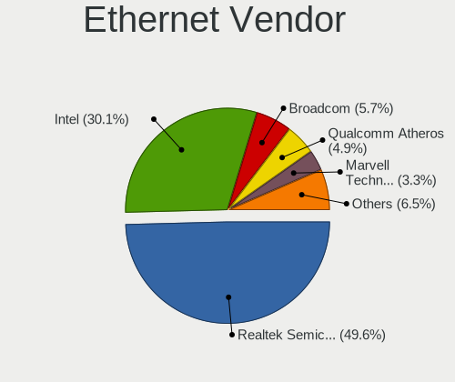
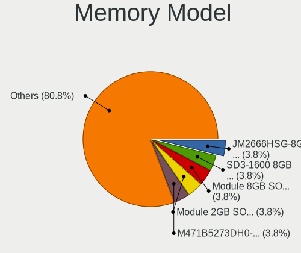

Zorin - Hardware Trends (Notebooks)
-----------------------------------

A project to identify most popular hardware characteristics and track their change
over time based on data collected by Linux users at https://Linux-Hardware.org.

Anyone can contribute to this report by the [hw-probe](https://github.com/linuxhw/hw-probe) tool:

    sudo -E hw-probe -all -upload

This report is for one last month. Overall report since the beginning of time: [TestDays](https://github.com/linuxhw/TestDays)

Period: Dec, 2024.

Contents
--------

* [ System ](#system)
  - [ OS                       ](#os)
  - [ OS Family                ](#os-family)
  - [ Kernel                   ](#kernel)
  - [ Kernel Family            ](#kernel-family)
  - [ Kernel Major Ver.        ](#kernel-major-ver)
  - [ Arch                     ](#arch)
  - [ DE                       ](#de)
  - [ Display Server           ](#display-server)
  - [ Display Manager          ](#display-manager)
  - [ OS Lang                  ](#os-lang)
  - [ Boot Mode                ](#boot-mode)
  - [ Filesystem               ](#filesystem)
  - [ Part. scheme             ](#part-scheme)
  - [ Dual Boot with Linux/BSD ](#dual-boot-with-linuxbsd)
  - [ Dual Boot (Win)          ](#dual-boot-win)

* [ Board ](#board)
  - [ Vendor                   ](#vendor)
  - [ Model                    ](#model)
  - [ Model Family             ](#model-family)
  - [ MFG Year                 ](#mfg-year)
  - [ Form Factor              ](#form-factor)
  - [ Secure Boot              ](#secure-boot)
  - [ Coreboot                 ](#coreboot)
  - [ RAM Size                 ](#ram-size)
  - [ RAM Used                 ](#ram-used)
  - [ Total Drives             ](#total-drives)
  - [ Has CD-ROM               ](#has-cd-rom)
  - [ Has Ethernet             ](#has-ethernet)
  - [ Has WiFi                 ](#has-wifi)
  - [ Has Bluetooth            ](#has-bluetooth)

* [ Location ](#location)
  - [ Country                  ](#country)
  - [ City                     ](#city)

* [ Drives ](#drives)
  - [ Drive Vendor             ](#drive-vendor)
  - [ Drive Model              ](#drive-model)
  - [ HDD Vendor               ](#hdd-vendor)
  - [ SSD Vendor               ](#ssd-vendor)
  - [ Drive Kind               ](#drive-kind)
  - [ Drive Connector          ](#drive-connector)
  - [ Drive Size               ](#drive-size)
  - [ Space Total              ](#space-total)
  - [ Space Used               ](#space-used)
  - [ Malfunc. Drives          ](#malfunc-drives)
  - [ Malfunc. Drive Vendor    ](#malfunc-drive-vendor)
  - [ Malfunc. HDD Vendor      ](#malfunc-hdd-vendor)
  - [ Malfunc. Drive Kind      ](#malfunc-drive-kind)
  - [ Failed Drives            ](#failed-drives)
  - [ Failed Drive Vendor      ](#failed-drive-vendor)
  - [ Drive Status             ](#drive-status)

* [ Storage controller ](#storage-controller)
  - [ Storage Vendor           ](#storage-vendor)
  - [ Storage Model            ](#storage-model)
  - [ Storage Kind             ](#storage-kind)

* [ Processor ](#processor)
  - [ CPU Vendor               ](#cpu-vendor)
  - [ CPU Model                ](#cpu-model)
  - [ CPU Model Family         ](#cpu-model-family)
  - [ CPU Cores                ](#cpu-cores)
  - [ CPU Sockets              ](#cpu-sockets)
  - [ CPU Threads              ](#cpu-threads)
  - [ CPU Op-Modes             ](#cpu-op-modes)
  - [ CPU Microcode            ](#cpu-microcode)
  - [ CPU Microarch            ](#cpu-microarch)

* [ Graphics ](#graphics)
  - [ GPU Vendor               ](#gpu-vendor)
  - [ GPU Model                ](#gpu-model)
  - [ GPU Combo                ](#gpu-combo)
  - [ GPU Driver               ](#gpu-driver)
  - [ GPU Memory               ](#gpu-memory)

* [ Monitor ](#monitor)
  - [ Monitor Vendor           ](#monitor-vendor)
  - [ Monitor Model            ](#monitor-model)
  - [ Monitor Resolution       ](#monitor-resolution)
  - [ Monitor Diagonal         ](#monitor-diagonal)
  - [ Monitor Width            ](#monitor-width)
  - [ Aspect Ratio             ](#aspect-ratio)
  - [ Monitor Area             ](#monitor-area)
  - [ Pixel Density            ](#pixel-density)
  - [ Multiple Monitors        ](#multiple-monitors)

* [ Network ](#network)
  - [ Net Controller Vendor    ](#net-controller-vendor)
  - [ Net Controller Model     ](#net-controller-model)
  - [ Wireless Vendor          ](#wireless-vendor)
  - [ Wireless Model           ](#wireless-model)
  - [ Ethernet Vendor          ](#ethernet-vendor)
  - [ Ethernet Model           ](#ethernet-model)
  - [ Net Controller Kind      ](#net-controller-kind)
  - [ Used Controller          ](#used-controller)
  - [ NICs                     ](#nics)
  - [ IPv6                     ](#ipv6)

* [ Bluetooth ](#bluetooth)
  - [ Bluetooth Vendor         ](#bluetooth-vendor)
  - [ Bluetooth Model          ](#bluetooth-model)

* [ Sound ](#sound)
  - [ Sound Vendor             ](#sound-vendor)
  - [ Sound Model              ](#sound-model)

* [ Memory ](#memory)
  - [ Memory Vendor            ](#memory-vendor)
  - [ Memory Model             ](#memory-model)
  - [ Memory Kind              ](#memory-kind)
  - [ Memory Form Factor       ](#memory-form-factor)
  - [ Memory Size              ](#memory-size)
  - [ Memory Speed             ](#memory-speed)

* [ Printers & scanners ](#printers--scanners)
  - [ Printer Vendor           ](#printer-vendor)
  - [ Printer Model            ](#printer-model)
  - [ Scanner Vendor           ](#scanner-vendor)
  - [ Scanner Model            ](#scanner-model)

* [ Camera ](#camera)
  - [ Camera Vendor            ](#camera-vendor)
  - [ Camera Model             ](#camera-model)

* [ Security ](#security)
  - [ Fingerprint Vendor       ](#fingerprint-vendor)
  - [ Fingerprint Model        ](#fingerprint-model)
  - [ Chipcard Vendor          ](#chipcard-vendor)
  - [ Chipcard Model           ](#chipcard-model)

* [ Unsupported ](#unsupported)
  - [ Unsupported Devices      ](#unsupported-devices)
  - [ Unsupported Device Types ](#unsupported-device-types)

System
------

OS
--

Installed operating systems

| Name     | Notebooks | Percent |
|----------|-----------|---------|
| Zorin 17 | 130       | 92.86%  |
| Zorin 16 | 8         | 5.71%   |
| Zorin 15 | 2         | 1.43%   |

OS Family
---------

OS without a version

| Name  | Notebooks | Percent |
|-------|-----------|---------|
| Zorin | 140       | 100%    |

Kernel
------

Version of the Linux kernel

| Version                 | Notebooks | Percent |
|-------------------------|-----------|---------|
| 6.8.0-49-generic        | 76        | 54.29%  |
| 6.8.0-50-generic        | 38        | 27.14%  |
| 6.8.0-40-generic        | 6         | 4.29%   |
| 6.8.0-48-generic        | 3         | 2.14%   |
| 5.4.0-150-generic       | 2         | 1.43%   |
| 5.15.0-127-generic      | 2         | 1.43%   |
| 5.15.0-126-generic      | 2         | 1.43%   |
| 6.8.12-060812-generic   | 1         | 0.71%   |
| 6.8.0-47-generic        | 1         | 0.71%   |
| 6.5.0-41-generic        | 1         | 0.71%   |
| 6.5.0-27-generic        | 1         | 0.71%   |
| 6.5.0-17-generic        | 1         | 0.71%   |
| 6.12.5-1-liquorix-amd64 | 1         | 0.71%   |
| 6.12.2-3-liquorix-amd64 | 1         | 0.71%   |
| 5.15.0-78-generic       | 1         | 0.71%   |
| 5.15.0-125-generic      | 1         | 0.71%   |
| 5.15.0-122-generic      | 1         | 0.71%   |
| 5.15.0-113-generic      | 1         | 0.71%   |

Kernel Family
-------------

Linux kernel without a distro release

| Version | Notebooks | Percent |
|---------|-----------|---------|
| 6.8.0   | 124       | 88.57%  |
| 5.15.0  | 8         | 5.71%   |
| 6.5.0   | 3         | 2.14%   |
| 5.4.0   | 2         | 1.43%   |
| 6.8.12  | 1         | 0.71%   |
| 6.12.5  | 1         | 0.71%   |
| 6.12.2  | 1         | 0.71%   |

Kernel Major Ver.
-----------------

Linux kernel major version

| Version | Notebooks | Percent |
|---------|-----------|---------|
| 6.8     | 125       | 89.29%  |
| 5.15    | 8         | 5.71%   |
| 6.5     | 3         | 2.14%   |
| 6.12    | 2         | 1.43%   |
| 5.4     | 2         | 1.43%   |

Arch
----

OS architecture (x86_64, i586, etc.)

| Name   | Notebooks | Percent |
|--------|-----------|---------|
| x86_64 | 139       | 99.29%  |
| i686   | 1         | 0.71%   |

DE
--

Desktop Environment

| Name       | Notebooks | Percent |
|------------|-----------|---------|
| GNOME      | 129       | 92.14%  |
| XFCE       | 10        | 7.14%   |
| X-Cinnamon | 1         | 0.71%   |

Display Server
--------------

X11 or Wayland

| Name    | Notebooks | Percent |
|---------|-----------|---------|
| Wayland | 113       | 80.71%  |
| X11     | 26        | 18.57%  |
| Unknown | 1         | 0.71%   |

Display Manager
---------------

SDDM, LightDM, etc.

| Name    | Notebooks | Percent |
|---------|-----------|---------|
| Unknown | 110       | 78.57%  |
| GDM3    | 25        | 17.86%  |
| GDM     | 3         | 2.14%   |
| LightDM | 2         | 1.43%   |

OS Lang
-------

Language

| Lang  | Notebooks | Percent |
|-------|-----------|---------|
| en_US | 61        | 43.57%  |
| de_DE | 17        | 12.14%  |
| en_GB | 10        | 7.14%   |
| pt_BR | 9         | 6.43%   |
| es_ES | 6         | 4.29%   |
| nl_NL | 4         | 2.86%   |
| en_AU | 4         | 2.86%   |
| it_IT | 3         | 2.14%   |
| fr_FR | 3         | 2.14%   |
| en_CA | 3         | 2.14%   |
| nl_BE | 2         | 1.43%   |
| en_ZA | 2         | 1.43%   |
| zh_TW | 1         | 0.71%   |
| sv_SE | 1         | 0.71%   |
| sl_SI | 1         | 0.71%   |
| pl_PL | 1         | 0.71%   |
| nb_NO | 1         | 0.71%   |
| ja_JP | 1         | 0.71%   |
| it_CH | 1         | 0.71%   |
| fi_FI | 1         | 0.71%   |
| es_PE | 1         | 0.71%   |
| es_MX | 1         | 0.71%   |
| es_EC | 1         | 0.71%   |
| es_CO | 1         | 0.71%   |
| es_BO | 1         | 0.71%   |
| en_IN | 1         | 0.71%   |
| de_AT | 1         | 0.71%   |
| C     | 1         | 0.71%   |

Boot Mode
---------

EFI or BIOS

| Mode | Notebooks | Percent |
|------|-----------|---------|
| BIOS | 123       | 87.86%  |
| EFI  | 17        | 12.14%  |

Filesystem
----------

Type of filesystem

| Type    | Notebooks | Percent |
|---------|-----------|---------|
| Ext4    | 118       | 84.29%  |
| Tmpfs   | 15        | 10.71%  |
| Zfs     | 4         | 2.86%   |
| Overlay | 2         | 1.43%   |
| Btrfs   | 1         | 0.71%   |

Part. scheme
------------

Scheme of partitioning

| Type    | Notebooks | Percent |
|---------|-----------|---------|
| Unknown | 111       | 79.29%  |
| GPT     | 27        | 19.29%  |
| MBR     | 2         | 1.43%   |

Dual Boot with Linux/BSD
------------------------

Hosting more than one Linux/BSD

| Dual boot | Notebooks | Percent |
|-----------|-----------|---------|
| No        | 137       | 97.86%  |
| Yes       | 3         | 2.14%   |

Dual Boot (Win)
---------------

Hosting Linux and Windows

| Dual boot | Notebooks | Percent |
|-----------|-----------|---------|
| No        | 134       | 95.71%  |
| Yes       | 6         | 4.29%   |

Board
-----

Vendor
------

Motherboard manufacturer

| Name                 | Notebooks | Percent |
|----------------------|-----------|---------|
| Lenovo               | 30        | 21.43%  |
| Dell                 | 23        | 16.43%  |
| Hewlett-Packard      | 22        | 15.71%  |
| ASUSTek Computer     | 15        | 10.71%  |
| Acer                 | 10        | 7.14%   |
| Toshiba              | 7         | 5%      |
| Apple                | 7         | 5%      |
| Fujitsu              | 4         | 2.86%   |
| MSI                  | 3         | 2.14%   |
| Samsung Electronics  | 2         | 1.43%   |
| Unknown              | 2         | 1.43%   |
| Timi                 | 1         | 0.71%   |
| Teclast              | 1         | 0.71%   |
| Proline              | 1         | 0.71%   |
| PC Specialist        | 1         | 0.71%   |
| Panasonic            | 1         | 0.71%   |
| Notebook             | 1         | 0.71%   |
| Medion               | 1         | 0.71%   |
| Intel Client Systems | 1         | 0.71%   |
| Intel                | 1         | 0.71%   |
| HUAWEI               | 1         | 0.71%   |
| GPD                  | 1         | 0.71%   |
| Google               | 1         | 0.71%   |
| Gateway              | 1         | 0.71%   |
| Fujitsu Siemens      | 1         | 0.71%   |
| Framework            | 1         | 0.71%   |

Model
-----

Motherboard model

| Name                                   | Notebooks | Percent |
|----------------------------------------|-----------|---------|
| Lenovo ThinkPad T570 20H90002RI        | 2         | 1.43%   |
| HP Pavilion g4                         | 2         | 1.43%   |
| Dell Latitude E4300                    | 2         | 1.43%   |
| Apple MacBookAir6,2                    | 2         | 1.43%   |
| Unknown                                | 2         | 1.43%   |
| Toshiba Satellite P55-A                | 1         | 0.71%   |
| Toshiba Satellite P300                 | 1         | 0.71%   |
| Toshiba Satellite M840                 | 1         | 0.71%   |
| Toshiba Satellite C75D-B               | 1         | 0.71%   |
| Toshiba Satellite C660D                | 1         | 0.71%   |
| Toshiba Satellite C50-A                | 1         | 0.71%   |
| Toshiba Satellite A110                 | 1         | 0.71%   |
| Timi Mi NoteBook Ultra                 | 1         | 0.71%   |
| Teclast F6 Plus                        | 1         | 0.71%   |
| Samsung R530/R730/P530                 | 1         | 0.71%   |
| Samsung 700G7A                         | 1         | 0.71%   |
| Proline V14664P                        | 1         | 0.71%   |
| PC Specialist Recoil VIII 17           | 1         | 0.71%   |
| Panasonic CF-31WFL52CM                 | 1         | 0.71%   |
| Notebook W35xSTQ_370ST                 | 1         | 0.71%   |
| MSI Prestige 16 A13UCX                 | 1         | 0.71%   |
| MSI GT72 2QD                           | 1         | 0.71%   |
| MSI GF63 Thin 10SCXR                   | 1         | 0.71%   |
| Medion ERAZER X7853 MD60603            | 1         | 0.71%   |
| Lenovo Yoga Pro 9 16IRP8 83BY          | 1         | 0.71%   |
| Lenovo Y50-70 20378                    | 1         | 0.71%   |
| Lenovo V15 G2 ITL 82ME                 | 1         | 0.71%   |
| Lenovo ThinkPad X220 Tablet 4299Y42    | 1         | 0.71%   |
| Lenovo ThinkPad W541 20EF0011IX        | 1         | 0.71%   |
| Lenovo ThinkPad T590 20N5S56P00        | 1         | 0.71%   |
| Lenovo ThinkPad T520 42424UU           | 1         | 0.71%   |
| Lenovo ThinkPad T500 2241WKY           | 1         | 0.71%   |
| Lenovo ThinkPad T470 20HD000MUK        | 1         | 0.71%   |
| Lenovo ThinkPad T460s 20F90042GE       | 1         | 0.71%   |
| Lenovo ThinkPad T460 20FN004CMN        | 1         | 0.71%   |
| Lenovo ThinkPad T430s 23539WU          | 1         | 0.71%   |
| Lenovo ThinkPad T430 2342CTO           | 1         | 0.71%   |
| Lenovo ThinkPad T420 418062U           | 1         | 0.71%   |
| Lenovo ThinkPad T14s Gen 2i 20WNS41Q00 | 1         | 0.71%   |
| Lenovo ThinkPad T14 Gen 1 20S1SFFP00   | 1         | 0.71%   |

Model Family
------------

Motherboard model prefix

| Name                          | Notebooks | Percent |
|-------------------------------|-----------|---------|
| Lenovo ThinkPad               | 17        | 12.14%  |
| Dell Latitude                 | 14        | 10%     |
| Toshiba Satellite             | 7         | 5%      |
| Acer Aspire                   | 7         | 5%      |
| HP ProBook                    | 6         | 4.29%   |
| Dell Inspiron                 | 6         | 4.29%   |
| Lenovo IdeaPad                | 5         | 3.57%   |
| HP Pavilion                   | 5         | 3.57%   |
| HP Laptop                     | 5         | 3.57%   |
| ASUS ASUS                     | 4         | 2.86%   |
| HP ENVY                       | 3         | 2.14%   |
| Fujitsu LIFEBOOK              | 3         | 2.14%   |
| Dell Vostro                   | 2         | 1.43%   |
| ASUS VivoBook                 | 2         | 1.43%   |
| Apple MacBookAir6             | 2         | 1.43%   |
| Acer Nitro                    | 2         | 1.43%   |
| Unknown                       | 2         | 1.43%   |
| Timi Mi                       | 1         | 0.71%   |
| Teclast F6                    | 1         | 0.71%   |
| Samsung R530                  | 1         | 0.71%   |
| Samsung 700G7A                | 1         | 0.71%   |
| Proline V14664P               | 1         | 0.71%   |
| PC Specialist Recoil          | 1         | 0.71%   |
| Panasonic CF-31WFL52CM        | 1         | 0.71%   |
| Notebook W35xSTQ              | 1         | 0.71%   |
| MSI Prestige                  | 1         | 0.71%   |
| MSI GT72                      | 1         | 0.71%   |
| MSI GF63                      | 1         | 0.71%   |
| Medion ERAZER                 | 1         | 0.71%   |
| Lenovo Yoga                   | 1         | 0.71%   |
| Lenovo Y50-70                 | 1         | 0.71%   |
| Lenovo V15                    | 1         | 0.71%   |
| Lenovo S10-3                  | 1         | 0.71%   |
| Lenovo Legion                 | 1         | 0.71%   |
| Lenovo G585                   | 1         | 0.71%   |
| Lenovo G50-30                 | 1         | 0.71%   |
| Lenovo 100e                   | 1         | 0.71%   |
| Intel HM87                    | 1         | 0.71%   |
| Intel Client Systems LAPBC710 | 1         | 0.71%   |
| HUAWEI HN-WX9X                | 1         | 0.71%   |

MFG Year
--------

Motherboard manufacture year

| Year | Notebooks | Percent |
|------|-----------|---------|
| 2011 | 14        | 10%     |
| 2012 | 13        | 9.29%   |
| 2013 | 12        | 8.57%   |
| 2019 | 11        | 7.86%   |
| 2010 | 11        | 7.86%   |
| 2014 | 10        | 7.14%   |
| 2017 | 9         | 6.43%   |
| 2015 | 9         | 6.43%   |
| 2021 | 8         | 5.71%   |
| 2020 | 8         | 5.71%   |
| 2024 | 6         | 4.29%   |
| 2023 | 6         | 4.29%   |
| 2018 | 6         | 4.29%   |
| 2022 | 5         | 3.57%   |
| 2016 | 4         | 2.86%   |
| 2008 | 4         | 2.86%   |
| 2009 | 2         | 1.43%   |
| 2007 | 1         | 0.71%   |
| 2006 | 1         | 0.71%   |

Form Factor
-----------

Physical design of the computer

| Name     | Notebooks | Percent |
|----------|-----------|---------|
| Notebook | 140       | 100%    |

Secure Boot
-----------

Enabled or disabled

| State    | Notebooks | Percent |
|----------|-----------|---------|
| Disabled | 134       | 95.71%  |
| Enabled  | 6         | 4.29%   |

Coreboot
--------

Have coreboot on board

| Used | Notebooks | Percent |
|------|-----------|---------|
| No   | 139       | 99.29%  |
| Yes  | 1         | 0.71%   |

RAM Size
--------

Total RAM memory

| Size in GB  | Notebooks | Percent |
|-------------|-----------|---------|
| 4.01-8.0    | 42        | 30%     |
| 16.01-24.0  | 31        | 22.14%  |
| 3.01-4.0    | 29        | 20.71%  |
| 8.01-16.0   | 24        | 17.14%  |
| 32.01-64.0  | 4         | 2.86%   |
| 64.01-256.0 | 4         | 2.86%   |
| 24.01-32.0  | 2         | 1.43%   |
| 2.01-3.0    | 2         | 1.43%   |
| 1.01-2.0    | 2         | 1.43%   |

RAM Used
--------

Used RAM memory

| Used GB   | Notebooks | Percent |
|-----------|-----------|---------|
| 2.01-3.0  | 53        | 37.86%  |
| 1.01-2.0  | 40        | 28.57%  |
| 4.01-8.0  | 22        | 15.71%  |
| 3.01-4.0  | 17        | 12.14%  |
| 8.01-16.0 | 5         | 3.57%   |
| 0.51-1.0  | 3         | 2.14%   |

Total Drives
------------

Number of drives on board

| Drives | Notebooks | Percent |
|--------|-----------|---------|
| 1      | 107       | 76.43%  |
| 2      | 27        | 19.29%  |
| 3      | 5         | 3.57%   |
| 4      | 1         | 0.71%   |

Has CD-ROM
----------

Has CD-ROM on board

| Presented | Notebooks | Percent |
|-----------|-----------|---------|
| No        | 82        | 58.57%  |
| Yes       | 58        | 41.43%  |

Has Ethernet
------------

Has Ethernet on board

| Presented | Notebooks | Percent |
|-----------|-----------|---------|
| Yes       | 118       | 84.29%  |
| No        | 22        | 15.71%  |

Has WiFi
--------

Has WiFi module

| Presented | Notebooks | Percent |
|-----------|-----------|---------|
| Yes       | 136       | 97.14%  |
| No        | 4         | 2.86%   |

Has Bluetooth
-------------

Has Bluetooth module

| Presented | Notebooks | Percent |
|-----------|-----------|---------|
| Yes       | 111       | 79.29%  |
| No        | 29        | 20.71%  |

Location
--------

Country
-------

Geographic location (country)

| Country      | Notebooks | Percent |
|--------------|-----------|---------|
| USA          | 30        | 21.43%  |
| Germany      | 17        | 12.14%  |
| Brazil       | 10        | 7.14%   |
| UK           | 8         | 5.71%   |
| Spain        | 7         | 5%      |
| Netherlands  | 6         | 4.29%   |
| Canada       | 5         | 3.57%   |
| Australia    | 4         | 2.86%   |
| Sweden       | 3         | 2.14%   |
| Romania      | 3         | 2.14%   |
| Mexico       | 3         | 2.14%   |
| Italy        | 3         | 2.14%   |
| France       | 3         | 2.14%   |
| Finland      | 3         | 2.14%   |
| Belgium      | 3         | 2.14%   |
| Turkey       | 2         | 1.43%   |
| Switzerland  | 2         | 1.43%   |
| South Africa | 2         | 1.43%   |
| Norway       | 2         | 1.43%   |
| Kenya        | 2         | 1.43%   |
| Jordan       | 2         | 1.43%   |
| Austria      | 2         | 1.43%   |
| Thailand     | 1         | 0.71%   |
| Taiwan       | 1         | 0.71%   |
| Syria        | 1         | 0.71%   |
| Slovenia     | 1         | 0.71%   |
| Saudi Arabia | 1         | 0.71%   |
| Russia       | 1         | 0.71%   |
| Poland       | 1         | 0.71%   |
| Peru         | 1         | 0.71%   |
| Morocco      | 1         | 0.71%   |
| Japan        | 1         | 0.71%   |
| Indonesia    | 1         | 0.71%   |
| India        | 1         | 0.71%   |
| Greece       | 1         | 0.71%   |
| Ethiopia     | 1         | 0.71%   |
| Ecuador      | 1         | 0.71%   |
| Colombia     | 1         | 0.71%   |
| Bolivia      | 1         | 0.71%   |
| Argentina    | 1         | 0.71%   |

City
----

Geographic location (city)

| City            | Notebooks | Percent |
|-----------------|-----------|---------|
| Sao Paulo       | 5         | 3.57%   |
| Melbourne       | 3         | 2.14%   |
| Valencia        | 2         | 1.43%   |
| Stockholm       | 2         | 1.43%   |
| Nairobi         | 2         | 1.43%   |
| Milan           | 2         | 1.43%   |
| Mexico City     | 2         | 1.43%   |
| Houston         | 2         | 1.43%   |
| Helsinki        | 2         | 1.43%   |
| Birmingham      | 2         | 1.43%   |
| Bielefeld       | 2         | 1.43%   |
| Amman           | 2         | 1.43%   |
| Whitby          | 1         | 0.71%   |
| West Malling    | 1         | 0.71%   |
| Watford         | 1         | 0.71%   |
| Watertown       | 1         | 0.71%   |
| Vitry-en-Artois | 1         | 0.71%   |
| Vigo            | 1         | 0.71%   |
| Veenendaal      | 1         | 0.71%   |
| Vänersborg     | 1         | 0.71%   |
| Tyler           | 1         | 0.71%   |
| Toms River      | 1         | 0.71%   |
| Thornton        | 1         | 0.71%   |
| Thessaloniki    | 1         | 0.71%   |
| Takashima       | 1         | 0.71%   |
| Taipei          | 1         | 0.71%   |
| Tacoma          | 1         | 0.71%   |
| Sydney          | 1         | 0.71%   |
| Stockerau       | 1         | 0.71%   |
| Steyr           | 1         | 0.71%   |
| Stassfurt       | 1         | 0.71%   |
| Simoes Filho    | 1         | 0.71%   |
| Sherwood Park   | 1         | 0.71%   |
| Sheffield       | 1         | 0.71%   |
| Santos          | 1         | 0.71%   |
| Santa Monica    | 1         | 0.71%   |
| Rotterdam       | 1         | 0.71%   |
| Rome            | 1         | 0.71%   |
| Riyadh          | 1         | 0.71%   |
| Ripley          | 1         | 0.71%   |

Drives
------

Drive Vendor
------------

Hard drive vendors

| Vendor                      | Notebooks | Drives  | Percent |
|-----------------------------|-----------|---------|---------|
| Samsung Electronics         | 29        | 30      | 17.06%  |
| Seagate                     | 14        | 14      | 8.24%   |
| Sandisk                     | 14        | 15      | 8.24%   |
| WDC                         | 13        | 13      | 7.65%   |
| Toshiba                     | 13        | 14      | 7.65%   |
| Unknown                     | 9         | 10      | 5.29%   |
| Kingston                    | 9         | 9       | 5.29%   |
| HGST                        | 6         | 6       | 3.53%   |
| Intel                       | 4         | 4       | 2.35%   |
| Crucial                     | 4         | 4       | 2.35%   |
| SPCC                        | 3         | 3       | 1.76%   |
| PNY                         | 3         | 3       | 1.76%   |
| Micron Technology           | 3         | 3       | 1.76%   |
| MAXIO Technology (Hangzhou) | 3         | 3       | 1.76%   |
| Kingston Technology Company | 3         | 3       | 1.76%   |
| Hitachi                     | 3         | 3       | 1.76%   |
| Apple                       | 3         | 3       | 1.76%   |
| A-DATA Technology           | 3         | 3       | 1.76%   |
| SK hynix                    | 2         | 2       | 1.18%   |
| KIOXIA                      | 2         | 2       | 1.18%   |
| JMicron Technology          | 2         | 2       | 1.18%   |
| Gigabyte Technology         | 2         | 2       | 1.18%   |
| Fanxiang                    | 2         | 2       | 1.18%   |
| Unknown                     | 2         | 2       | 1.18%   |
| Verbatim                    | 1         | 1       | 0.59%   |
| Transcend                   | 1         | 1       | 0.59%   |
| Timetec                     | 1         | 1       | 0.59%   |
| Teclast                     | 1         | 1       | 0.59%   |
| T-FORCE                     | 1         | 1       | 0.59%   |
| Pioneer                     | 1         | Unknown | 0.59%   |
| Phison Electronics          | 1         | 1       | 0.59%   |
| Phison                      | 1         | 1       | 0.59%   |
| MSI                         | 1         | 1       | 0.59%   |
| Micron/Crucial Technology   | 1         | 1       | 0.59%   |
| Lexar                       | 1         | 1       | 0.59%   |
| KUU                         | 1         | 1       | 0.59%   |
| KingSpec                    | 1         | 1       | 0.59%   |
| Intenso                     | 1         | 1       | 0.59%   |
| Fujitsu                     | 1         | 1       | 0.59%   |
| China                       | 1         | 1       | 0.59%   |

Drive Model
-----------

Hard drive models

| Model                                               | Notebooks | Percent |
|-----------------------------------------------------|-----------|---------|
| Unknown MMC Card  64GB                              | 5         | 2.89%   |
| Samsung SSD 980 500GB                               | 3         | 1.73%   |
| Samsung NVMe SSD Controller SM961/PM961/SM963 256GB | 3         | 1.73%   |
| Kingston SA400S37240G 240GB SSD                     | 3         | 1.73%   |
| HGST HTS721010A9E630 1TB                            | 3         | 1.73%   |
| Unknown MMC Card  128GB                             | 2         | 1.16%   |
| Toshiba MQ01ABF050 500GB                            | 2         | 1.16%   |
| Toshiba MQ01ABD050 500GB                            | 2         | 1.16%   |
| Seagate ST9500420AS 500GB                           | 2         | 1.16%   |
| Seagate ST500LT012-1DG142 500GB                     | 2         | 1.16%   |
| Sandisk WD Blue SN550 NVMe SSD 256GB                | 2         | 1.16%   |
| Samsung NVMe SSD Controller SM981/PM981/PM983 512GB | 2         | 1.16%   |
| MAXIO (Hangzhou) NVMe SSD Controller MAP1202 512GB  | 2         | 1.16%   |
| Kingston Company OM3PDP3 NVMe SSD 512GB             | 2         | 1.16%   |
| Kingston SA400S37960G 960GB SSD                     | 2         | 1.16%   |
| Hitachi HTS547575A9E384 752GB                       | 2         | 1.16%   |
| Gigabyte GP-GSTFS31240GNTD 240GB                    | 2         | 1.16%   |
| Unknown                                             | 2         | 1.16%   |
| WDC WDS250G2B0A-00SM50 250GB SSD                    | 1         | 0.58%   |
| WDC WDS100T2B0B-00YS70 1TB SSD                      | 1         | 0.58%   |
| WDC WD800BEVS-26RST0 80GB                           | 1         | 0.58%   |
| WDC WD7500BPVT-80HXZT1 752GB                        | 1         | 0.58%   |
| WDC WD7500BPVT-22HXZT1 752GB                        | 1         | 0.58%   |
| WDC WD5000LPLX-60ZNTT1 500GB                        | 1         | 0.58%   |
| WDC WD5000BPVT-60HXZT1 500GB                        | 1         | 0.58%   |
| WDC WD3200BPVT-75JJ5T0 320GB                        | 1         | 0.58%   |
| WDC WD3200BPVT-22ZEST0 320GB                        | 1         | 0.58%   |
| WDC WD3200BEVT-22ZCT0 320GB                         | 1         | 0.58%   |
| WDC WD2500BEVT-75A23T0 250GB                        | 1         | 0.58%   |
| WDC WD2500BEKT-75PVMT0 250GB                        | 1         | 0.58%   |
| WDC WD10SPZX-22Z10T1 1TB                            | 1         | 0.58%   |
| Verbatim Vi550 S3 SSD 512GB                         | 1         | 0.58%   |
| Unknown SD04G  4GB                                  | 1         | 0.58%   |
| Unknown MMC Card  4GB                               | 1         | 0.58%   |
| Unknown HBG4a2  32GB                                | 1         | 0.58%   |
| Transcend TS120GSSD220S 120GB                       | 1         | 0.58%   |
| Toshiba THNSNJ128G8NU 128GB SSD                     | 1         | 0.58%   |
| Toshiba MQ04ABF100 1TB                              | 1         | 0.58%   |
| Toshiba MQ01ACF050 500GB                            | 1         | 0.58%   |
| Toshiba MQ01ABD100M 1TB                             | 1         | 0.58%   |

HDD Vendor
----------

Hard disk drive vendors

| Vendor              | Notebooks | Drives | Percent |
|---------------------|-----------|--------|---------|
| Seagate             | 14        | 14     | 29.17%  |
| WDC                 | 11        | 11     | 22.92%  |
| Toshiba             | 11        | 11     | 22.92%  |
| HGST                | 6         | 6      | 12.5%   |
| Hitachi             | 3         | 3      | 6.25%   |
| Samsung Electronics | 1         | 1      | 2.08%   |
| JMicron Technology  | 1         | 1      | 2.08%   |
| Fujitsu             | 1         | 1      | 2.08%   |

SSD Vendor
----------

Solid state drive vendors

| Vendor              | Notebooks | Drives | Percent |
|---------------------|-----------|--------|---------|
| Samsung Electronics | 11        | 11     | 18.03%  |
| SanDisk             | 8         | 8      | 13.11%  |
| Kingston            | 8         | 8      | 13.11%  |
| Crucial             | 4         | 4      | 6.56%   |
| SPCC                | 3         | 3      | 4.92%   |
| PNY                 | 3         | 3      | 4.92%   |
| Apple               | 3         | 3      | 4.92%   |
| WDC                 | 2         | 2      | 3.28%   |
| Intel               | 2         | 2      | 3.28%   |
| Gigabyte Technology | 2         | 2      | 3.28%   |
| A-DATA Technology   | 2         | 2      | 3.28%   |
| Unknown             | 2         | 2      | 3.28%   |
| Verbatim            | 1         | 1      | 1.64%   |
| Transcend           | 1         | 1      | 1.64%   |
| Toshiba             | 1         | 2      | 1.64%   |
| Teclast             | 1         | 1      | 1.64%   |
| Phison              | 1         | 1      | 1.64%   |
| MSI                 | 1         | 1      | 1.64%   |
| Micron Technology   | 1         | 1      | 1.64%   |
| Lexar               | 1         | 1      | 1.64%   |
| KingSpec            | 1         | 1      | 1.64%   |
| Intenso             | 1         | 1      | 1.64%   |
| China               | 1         | 1      | 1.64%   |

Drive Kind
----------

HDD or SSD

| Kind    | Notebooks | Drives | Percent |
|---------|-----------|--------|---------|
| SSD     | 56        | 62     | 34.57%  |
| HDD     | 46        | 48     | 28.4%   |
| NVMe    | 44        | 47     | 27.16%  |
| MMC     | 9         | 10     | 5.56%   |
| Unknown | 7         | 6      | 4.32%   |

Drive Connector
---------------

SATA, SAS, NVMe, etc.

| Type | Notebooks | Drives | Percent |
|------|-----------|--------|---------|
| SATA | 93        | 106    | 59.24%  |
| NVMe | 44        | 47     | 28.03%  |
| SAS  | 11        | 10     | 7.01%   |
| MMC  | 9         | 10     | 5.73%   |

Drive Size
----------

Size of hard drive

| Size in TB | Notebooks | Drives | Percent |
|------------|-----------|--------|---------|
| 0.01-0.5   | 71        | 76     | 70.3%   |
| 0.51-1.0   | 25        | 29     | 24.75%  |
| 1.01-2.0   | 5         | 5      | 4.95%   |

Space Total
-----------

Amount of disk space available on the file system

| Size in GB     | Notebooks | Percent |
|----------------|-----------|---------|
| 251-500        | 44        | 31.43%  |
| 101-250        | 42        | 30%     |
| 501-1000       | 18        | 12.86%  |
| 51-100         | 13        | 9.29%   |
| 1001-2000      | 7         | 5%      |
| 21-50          | 5         | 3.57%   |
| Unknown        | 5         | 3.57%   |
| More than 3000 | 3         | 2.14%   |
| 2001-3000      | 2         | 1.43%   |
| 1-20           | 1         | 0.71%   |

Space Used
----------

Amount of used disk space

| Used GB        | Notebooks | Percent |
|----------------|-----------|---------|
| 21-50          | 54        | 38.57%  |
| 1-20           | 39        | 27.86%  |
| 101-250        | 12        | 8.57%   |
| 51-100         | 12        | 8.57%   |
| 251-500        | 10        | 7.14%   |
| 501-1000       | 6         | 4.29%   |
| Unknown        | 5         | 3.57%   |
| More than 3000 | 1         | 0.71%   |
| 1001-2000      | 1         | 0.71%   |

Malfunc. Drives
---------------

Drive models with a malfunction

| Model                           | Notebooks | Drives | Percent |
|---------------------------------|-----------|--------|---------|
| Seagate ST9500325AS 500GB       | 1         | 1      | 50%     |
| Seagate ST500LM000-1EJ162 500GB | 1         | 1      | 50%     |

Malfunc. Drive Vendor
---------------------

Vendors of faulty drives

| Vendor  | Notebooks | Drives | Percent |
|---------|-----------|--------|---------|
| Seagate | 2         | 2      | 100%    |

Malfunc. HDD Vendor
-------------------

Vendors of faulty HDD drives

| Vendor  | Notebooks | Drives | Percent |
|---------|-----------|--------|---------|
| Seagate | 2         | 2      | 100%    |

Malfunc. Drive Kind
-------------------

Kinds of faulty drives

| Kind | Notebooks | Drives | Percent |
|------|-----------|--------|---------|
| HDD  | 2         | 2      | 100%    |

Failed Drives
-------------

Failed drive models

Zero info for selected period =(

Failed Drive Vendor
-------------------

Failed drive vendors

Zero info for selected period =(

Drive Status
------------

Number of failed and malfunc. drives

| Status   | Notebooks | Drives | Percent |
|----------|-----------|--------|---------|
| Detected | 129       | 158    | 90.85%  |
| Works    | 11        | 13     | 7.75%   |
| Malfunc  | 2         | 2      | 1.41%   |

Storage controller
------------------

Storage Vendor
--------------

Storage controller vendors

| Vendor                       | Notebooks | Percent |
|------------------------------|-----------|---------|
| Intel                        | 96        | 61.54%  |
| Samsung Electronics          | 19        | 12.18%  |
| AMD                          | 13        | 8.33%   |
| SanDisk                      | 6         | 3.85%   |
| MAXIO Technology (Hangzhou)  | 4         | 2.56%   |
| Kingston Technology Company  | 4         | 2.56%   |
| SK hynix                     | 2         | 1.28%   |
| Micron Technology            | 2         | 1.28%   |
| Marvell Technology Group     | 2         | 1.28%   |
| KIOXIA                       | 2         | 1.28%   |
| ADATA Technology             | 2         | 1.28%   |
| Toshiba America Info Systems | 1         | 0.64%   |
| Phison Electronics           | 1         | 0.64%   |
| Nvidia                       | 1         | 0.64%   |
| Micron/Crucial Technology    | 1         | 0.64%   |

Storage Model
-------------

Storage controller models

| Model                                                                          | Notebooks | Percent |
|--------------------------------------------------------------------------------|-----------|---------|
| Intel 7 Series Chipset Family 6-port SATA Controller [AHCI mode]               | 12        | 7.41%   |
| AMD FCH SATA Controller [AHCI mode]                                            | 11        | 6.79%   |
| Intel 6 Series/C200 Series Chipset Family 6 port Mobile SATA AHCI Controller   | 10        | 6.17%   |
| Intel Sunrise Point-LP SATA Controller [AHCI mode]                             | 9         | 5.56%   |
| Intel 82801 Mobile SATA Controller [RAID mode]                                 | 9         | 5.56%   |
| Intel 8 Series/C220 Series Chipset Family 6-port SATA Controller 1 [AHCI mode] | 9         | 5.56%   |
| Samsung NVMe SSD Controller 980 (DRAM-less)                                    | 6         | 3.7%    |
| Intel 82801IBM/IEM (ICH9M/ICH9M-E) 4 port SATA Controller [AHCI mode]          | 5         | 3.09%   |
| Intel 5 Series/3400 Series Chipset 4 port SATA AHCI Controller                 | 5         | 3.09%   |
| Intel Celeron/Pentium Silver Processor SATA Controller                         | 4         | 2.47%   |
| Intel Cannon Lake Mobile PCH SATA AHCI Controller                              | 4         | 2.47%   |
| Samsung NVMe SSD Controller SM961/PM961/SM963                                  | 3         | 1.85%   |
| Intel Volume Management Device NVMe RAID Controller                            | 3         | 1.85%   |
| Intel Tiger Lake-LP SATA Controller                                            | 3         | 1.85%   |
| Intel 400 Series Chipset Family SATA AHCI Controller                           | 3         | 1.85%   |
| SanDisk WD Black SN770 / PC SN740 256GB / PC SN560 (DRAM-less) NVMe SSD        | 2         | 1.23%   |
| SanDisk Ultra 3D / WD PC SN530, IX SN530, Blue SN550 NVMe SSD (DRAM-less)      | 2         | 1.23%   |
| Samsung NVMe SSD Controller SM981/PM981/PM983                                  | 2         | 1.23%   |
| Samsung NVMe SSD Controller PM9C1a (DRAM-less)                                 | 2         | 1.23%   |
| Samsung NVMe SSD Controller PM9B1 (DRAM-less)                                  | 2         | 1.23%   |
| Samsung NVMe SSD Controller PM9A1/PM9A3/980PRO                                 | 2         | 1.23%   |
| MAXIO (Hangzhou) NVMe SSD Controller MAP1602 (DRAM-less)                       | 2         | 1.23%   |
| MAXIO (Hangzhou) NVMe SSD Controller MAP1202 (DRAM-less)                       | 2         | 1.23%   |
| Marvell Group 88SS9183 PCIe SSD Controller                                     | 2         | 1.23%   |
| Kingston Company OM3PDP3 NVMe SSD                                              | 2         | 1.23%   |
| Intel Wildcat Point-LP SATA Controller [AHCI Mode]                             | 2         | 1.23%   |
| Intel HM170/QM170 Chipset SATA Controller [AHCI Mode]                          | 2         | 1.23%   |
| Intel 8 Series SATA Controller 1 [AHCI mode]                                   | 2         | 1.23%   |
| Intel 5 Series/3400 Series Chipset 6 port SATA AHCI Controller                 | 2         | 1.23%   |
| AMD SB7x0/SB8x0/SB9x0 SATA Controller [AHCI mode]                              | 2         | 1.23%   |
| Toshiba America Info Systems BG3 x2 NVMe SSD Controller (DRAM-less)            | 1         | 0.62%   |
| SK hynix Platinum P41/PC801 NVMe Solid State Drive                             | 1         | 0.62%   |
| SK hynix PC601 NVMe Solid State Drive                                          | 1         | 0.62%   |
| SanDisk WD Blue SN500 / PC SN520 x2 M.2 2280 NVMe SSD                          | 1         | 0.62%   |
| SanDisk Extreme Pro / WD Black SN750 / PC SN730 / Red SN700 NVMe SSD           | 1         | 0.62%   |
| SanDisk Extreme Pro / WD Black 2018/SN750/PC SN720 NVMe SSD                    | 1         | 0.62%   |
| Samsung S4LN058A01[SSUBX] AHCI SSD Controller (Apple slot)                     | 1         | 0.62%   |
| Samsung NVMe SSD Controller S4LV008[Pascal]                                    | 1         | 0.62%   |
| Phison E18 PCIe4 NVMe Controller                                               | 1         | 0.62%   |
| Nvidia MCP89 SATA Controller (AHCI mode)                                       | 1         | 0.62%   |

Storage Kind
------------

Kind of storage controller (IDE, SATA, NVMe, SAS, ...)

| Kind | Notebooks | Percent |
|------|-----------|---------|
| SATA | 95        | 60.13%  |
| NVMe | 44        | 27.85%  |
| RAID | 14        | 8.86%   |
| IDE  | 5         | 3.16%   |

Processor
---------

CPU Vendor
----------

Processor vendors

| Vendor | Notebooks | Percent |
|--------|-----------|---------|
| Intel  | 121       | 86.43%  |
| AMD    | 19        | 13.57%  |

CPU Model
---------

Processor models

| Model                                           | Notebooks | Percent |
|-------------------------------------------------|-----------|---------|
| Intel Core i5-7200U CPU @ 2.50GHz               | 4         | 2.86%   |
| Intel Core i5-6200U CPU @ 2.30GHz               | 4         | 2.86%   |
| Intel 11th Gen Core i5-1135G7 @ 2.40GHz         | 4         | 2.86%   |
| Intel Core i5-2520M CPU @ 2.50GHz               | 3         | 2.14%   |
| Intel Core i3 CPU M 370 @ 2.40GHz               | 3         | 2.14%   |
| Intel Core i7-6500U CPU @ 2.50GHz               | 2         | 1.43%   |
| Intel Core i7-3720QM CPU @ 2.60GHz              | 2         | 1.43%   |
| Intel Core i7-3612QM CPU @ 2.10GHz              | 2         | 1.43%   |
| Intel Core i7-2630QM CPU @ 2.00GHz              | 2         | 1.43%   |
| Intel Core i7-10750H CPU @ 2.60GHz              | 2         | 1.43%   |
| Intel Core i5-4300M CPU @ 2.60GHz               | 2         | 1.43%   |
| Intel Core i5-4260U CPU @ 1.40GHz               | 2         | 1.43%   |
| Intel Core i5-3230M CPU @ 2.60GHz               | 2         | 1.43%   |
| Intel Core i3-3110M CPU @ 2.40GHz               | 2         | 1.43%   |
| Intel Core 2 Duo CPU P8400 @ 2.26GHz            | 2         | 1.43%   |
| Intel 12th Gen Core i7-12700H                   | 2         | 1.43%   |
| AMD A8-6410 APU with AMD Radeon R5 Graphics     | 2         | 1.43%   |
| AMD A12-9720P RADEON R7, 12 COMPUTE CORES 4C+8G | 2         | 1.43%   |
| Intel Pentium Silver N5030 CPU @ 1.10GHz        | 1         | 0.71%   |
| Intel Pentium Dual-Core CPU T4500 @ 2.30GHz     | 1         | 0.71%   |
| Intel Pentium CPU P6200 @ 2.13GHz               | 1         | 0.71%   |
| Intel Pentium CPU N3710 @ 1.60GHz               | 1         | 0.71%   |
| Intel Pentium CPU 4417U @ 2.30GHz               | 1         | 0.71%   |
| Intel N100                                      | 1         | 0.71%   |
| Intel Genuine CPU T1350 @ 1.86GHz               | 1         | 0.71%   |
| Intel Core m3-6Y30 CPU @ 0.90GHz                | 1         | 0.71%   |
| Intel Core i9-14900HX                           | 1         | 0.71%   |
| Intel Core i7-9750H CPU @ 2.60GHz               | 1         | 0.71%   |
| Intel Core i7-8750H CPU @ 2.20GHz               | 1         | 0.71%   |
| Intel Core i7-8650U CPU @ 1.90GHz               | 1         | 0.71%   |
| Intel Core i7-8565U CPU @ 1.80GHz               | 1         | 0.71%   |
| Intel Core i7-7700HQ CPU @ 2.80GHz              | 1         | 0.71%   |
| Intel Core i7-6700HQ CPU @ 2.60GHz              | 1         | 0.71%   |
| Intel Core i7-4930MX CPU @ 3.00GHz              | 1         | 0.71%   |
| Intel Core i7-4720HQ CPU @ 2.60GHz              | 1         | 0.71%   |
| Intel Core i7-4710MQ CPU @ 2.50GHz              | 1         | 0.71%   |
| Intel Core i7-4710HQ CPU @ 2.50GHz              | 1         | 0.71%   |
| Intel Core i7-4702MQ CPU @ 2.20GHz              | 1         | 0.71%   |
| Intel Core i7-4700HQ CPU @ 2.40GHz              | 1         | 0.71%   |
| Intel Core i7-4600U CPU @ 2.10GHz               | 1         | 0.71%   |

CPU Model Family
----------------

Processor model prefix

| Model                   | Notebooks | Percent |
|-------------------------|-----------|---------|
| Intel Core i5           | 40        | 28.57%  |
| Intel Core i7           | 30        | 21.43%  |
| Other                   | 17        | 12.14%  |
| Intel Core i3           | 10        | 7.14%   |
| Intel Celeron           | 9         | 6.43%   |
| Intel Core 2 Duo        | 7         | 5%      |
| Intel Pentium           | 3         | 2.14%   |
| AMD Ryzen 7             | 3         | 2.14%   |
| AMD A8                  | 3         | 2.14%   |
| AMD Ryzen 9             | 2         | 1.43%   |
| AMD Ryzen 5             | 2         | 1.43%   |
| AMD E                   | 2         | 1.43%   |
| AMD A12                 | 2         | 1.43%   |
| Intel Pentium Silver    | 1         | 0.71%   |
| Intel Pentium Dual-Core | 1         | 0.71%   |
| Intel Genuine           | 1         | 0.71%   |
| Intel Core m3           | 1         | 0.71%   |
| Intel Core i9           | 1         | 0.71%   |
| Intel Atom              | 1         | 0.71%   |
| AMD Ryzen 3             | 1         | 0.71%   |
| AMD Athlon II           | 1         | 0.71%   |
| AMD A6                  | 1         | 0.71%   |
| AMD A4                  | 1         | 0.71%   |

CPU Cores
---------

Number of processor cores

| Number | Notebooks | Percent |
|--------|-----------|---------|
| 2      | 72        | 51.43%  |
| 4      | 48        | 34.29%  |
| 14     | 6         | 4.29%   |
| 6      | 5         | 3.57%   |
| 8      | 4         | 2.86%   |
| 1      | 3         | 2.14%   |
| 24     | 1         | 0.71%   |
| 10     | 1         | 0.71%   |

CPU Sockets
-----------

Number of sockets

| Number | Notebooks | Percent |
|--------|-----------|---------|
| 1      | 140       | 100%    |

CPU Threads
-----------

Threads per core (Hyper-Threading)

| Number | Notebooks | Percent |
|--------|-----------|---------|
| 2      | 109       | 77.86%  |
| 1      | 31        | 22.14%  |

CPU Op-Modes
------------

CPU Operation Modes (32-bit, 64-bit)

| Op mode        | Notebooks | Percent |
|----------------|-----------|---------|
| 32-bit, 64-bit | 139       | 99.29%  |
| 32-bit         | 1         | 0.71%   |

CPU Microcode
-------------

Microcode number

| Number     | Notebooks | Percent |
|------------|-----------|---------|
| Unknown    | 130       | 92.86%  |
| 0x206a7    | 3         | 2.14%   |
| 0x10676    | 2         | 1.43%   |
| 0x6fd      | 1         | 0.71%   |
| 0x6e8      | 1         | 0.71%   |
| 0x306c3    | 1         | 0.71%   |
| 0x07030105 | 1         | 0.71%   |
| 0x05000029 | 1         | 0.71%   |

CPU Microarch
-------------

Microarchitecture

| Name             | Notebooks | Percent |
|------------------|-----------|---------|
| KabyLake         | 19        | 13.57%  |
| Haswell          | 16        | 11.43%  |
| IvyBridge        | 13        | 9.29%   |
| SandyBridge      | 12        | 8.57%   |
| Skylake          | 9         | 6.43%   |
| Unknown          | 9         | 6.43%   |
| Westmere         | 8         | 5.71%   |
| TigerLake        | 8         | 5.71%   |
| Penryn           | 8         | 5.71%   |
| Goldmont plus    | 4         | 2.86%   |
| Silvermont       | 3         | 2.14%   |
| Excavator        | 3         | 2.14%   |
| CometLake        | 3         | 2.14%   |
| Broadwell        | 3         | 2.14%   |
| Alderlake Hybrid | 3         | 2.14%   |
| Zen 3            | 2         | 1.43%   |
| Zen              | 2         | 1.43%   |
| Puma             | 2         | 1.43%   |
| Bobcat           | 2         | 1.43%   |
| Zen+             | 1         | 0.71%   |
| Zen 2            | 1         | 0.71%   |
| Piledriver       | 1         | 0.71%   |
| P6               | 1         | 0.71%   |
| Nehalem          | 1         | 0.71%   |
| K10 Llano        | 1         | 0.71%   |
| K10              | 1         | 0.71%   |
| IceLake          | 1         | 0.71%   |
| Goldmont         | 1         | 0.71%   |
| Core             | 1         | 0.71%   |
| Bonnell          | 1         | 0.71%   |

Graphics
--------

GPU Vendor
----------

Vendors of graphics cards

| Vendor | Notebooks | Percent |
|--------|-----------|---------|
| Intel  | 110       | 62.86%  |
| Nvidia | 36        | 20.57%  |
| AMD    | 29        | 16.57%  |

GPU Model
---------

Graphics card models

| Model                                                                                    | Notebooks | Percent |
|------------------------------------------------------------------------------------------|-----------|---------|
| Intel 3rd Gen Core processor Graphics Controller                                         | 12        | 6.74%   |
| Intel 2nd Generation Core Processor Family Integrated Graphics Controller                | 10        | 5.62%   |
| Intel 4th Gen Core Processor Integrated Graphics Controller                              | 9         | 5.06%   |
| Intel TigerLake-LP GT2 [Iris Xe Graphics]                                                | 8         | 4.49%   |
| Intel Skylake GT2 [HD Graphics 520]                                                      | 7         | 3.93%   |
| Intel Mobile 4 Series Chipset Integrated Graphics Controller                             | 6         | 3.37%   |
| Intel Haswell-ULT Integrated Graphics Controller                                         | 6         | 3.37%   |
| Intel HD Graphics 620                                                                    | 5         | 2.81%   |
| Intel Core Processor Integrated Graphics Controller                                      | 5         | 2.81%   |
| Intel Raptor Lake-P [Iris Xe Graphics]                                                   | 4         | 2.25%   |
| Nvidia TU117M [GeForce GTX 1650 Mobile / Max-Q]                                          | 3         | 1.69%   |
| Nvidia GP107M [GeForce GTX 1050 Mobile]                                                  | 3         | 1.69%   |
| Intel WhiskeyLake-U GT2 [UHD Graphics 620]                                               | 3         | 1.69%   |
| Intel UHD Graphics 620                                                                   | 3         | 1.69%   |
| Intel GeminiLake [UHD Graphics 600]                                                      | 3         | 1.69%   |
| Intel CometLake-H GT2 [UHD Graphics]                                                     | 3         | 1.69%   |
| Intel CoffeeLake-H GT2 [UHD Graphics 630]                                                | 3         | 1.69%   |
| Nvidia TU116M [GeForce GTX 1660 Ti Mobile]                                               | 2         | 1.12%   |
| Nvidia GA107 [GeForce RTX 2050]                                                          | 2         | 1.12%   |
| Intel HD Graphics 630                                                                    | 2         | 1.12%   |
| Intel HD Graphics 5500                                                                   | 2         | 1.12%   |
| Intel Atom/Celeron/Pentium Processor x5-E8000/J3xxx/N3xxx Integrated Graphics Controller | 2         | 1.12%   |
| Intel Alder Lake-P GT2 [Iris Xe Graphics]                                                | 2         | 1.12%   |
| AMD Wrestler [Radeon HD 6310]                                                            | 2         | 1.12%   |
| AMD Wani [Radeon R5/R6/R7 Graphics]                                                      | 2         | 1.12%   |
| AMD Seymour [Radeon HD 6400M/7400M Series]                                               | 2         | 1.12%   |
| AMD Picasso/Raven 2 [Radeon Vega Series / Radeon Vega Mobile Series]                     | 2         | 1.12%   |
| AMD Phoenix3                                                                             | 2         | 1.12%   |
| AMD Mullins [Radeon R4/R5 Graphics]                                                      | 2         | 1.12%   |
| AMD Barcelo                                                                              | 2         | 1.12%   |
| Nvidia TU106M [GeForce RTX 2060 Mobile]                                                  | 1         | 0.56%   |
| Nvidia MCP89 [GeForce 320M]                                                              | 1         | 0.56%   |
| Nvidia GT218M [GeForce 310M]                                                             | 1         | 0.56%   |
| Nvidia GT216M [GeForce GT 330M]                                                          | 1         | 0.56%   |
| Nvidia GT215M [GeForce GTS 250M]                                                         | 1         | 0.56%   |
| Nvidia GP107M [GeForce MX350]                                                            | 1         | 0.56%   |
| Nvidia GP104BM [GeForce GTX 1070 Mobile]                                                 | 1         | 0.56%   |
| Nvidia GM204M [GeForce GTX 960 OEM / 970M]                                               | 1         | 0.56%   |
| Nvidia GM108M [GeForce 940M]                                                             | 1         | 0.56%   |
| Nvidia GM108M [GeForce 940MX]                                                            | 1         | 0.56%   |

GPU Combo
---------

Combinations of graphics cards

| Name           | Notebooks | Percent |
|----------------|-----------|---------|
| 1 x Intel      | 78        | 55.71%  |
| Intel + Nvidia | 27        | 19.29%  |
| 1 x AMD        | 20        | 14.29%  |
| 1 x Nvidia     | 6         | 4.29%   |
| Intel + AMD    | 5         | 3.57%   |
| AMD + Nvidia   | 3         | 2.14%   |
| 2 x AMD        | 1         | 0.71%   |

GPU Driver
----------

Free vs proprietary

| Driver      | Notebooks | Percent |
|-------------|-----------|---------|
| Free        | 115       | 82.14%  |
| Proprietary | 17        | 12.14%  |
| Unknown     | 8         | 5.71%   |

GPU Memory
----------

Total video memory

| Size in GB | Notebooks | Percent |
|------------|-----------|---------|
| Unknown    | 135       | 96.43%  |
| 3.01-4.0   | 2         | 1.43%   |
| 0.51-1.0   | 2         | 1.43%   |
| 0.01-0.5   | 1         | 0.71%   |

Monitor
-------

Monitor Vendor
--------------

Monitor vendors

| Vendor                  | Notebooks | Percent |
|-------------------------|-----------|---------|
| AU Optronics            | 29        | 19.33%  |
| LG Display              | 28        | 18.67%  |
| Chimei Innolux          | 19        | 12.67%  |
| BOE                     | 14        | 9.33%   |
| Samsung Electronics     | 11        | 7.33%   |
| Apple                   | 7         | 4.67%   |
| Chi Mei Optoelectronics | 6         | 4%      |
| Lenovo                  | 5         | 3.33%   |
| Sharp                   | 4         | 2.67%   |
| PANDA                   | 4         | 2.67%   |
| Goldstar                | 3         | 2%      |
| Acer                    | 3         | 2%      |
| Vizio                   | 2         | 1.33%   |
| LG Philips              | 2         | 1.33%   |
| Hewlett-Packard         | 2         | 1.33%   |
| Dell                    | 2         | 1.33%   |
| ZTR                     | 1         | 0.67%   |
| Toshiba                 | 1         | 0.67%   |
| TMX                     | 1         | 0.67%   |
| S2-Tek                  | 1         | 0.67%   |
| MSI                     | 1         | 0.67%   |
| GPD                     | 1         | 0.67%   |
| CTV                     | 1         | 0.67%   |
| CS_                     | 1         | 0.67%   |
| BenQ                    | 1         | 0.67%   |

Monitor Model
-------------

Monitor models

| Model                                                                  | Notebooks | Percent |
|------------------------------------------------------------------------|-----------|---------|
| PANDA LCD Monitor NCP004D 1920x1080 344x194mm 15.5-inch                | 2         | 1.33%   |
| LG Display LCD Monitor LGD045E 1366x768 309x174mm 14.0-inch            | 2         | 1.33%   |
| LG Display LCD Monitor LGD02E9 1366x768 309x174mm 14.0-inch            | 2         | 1.33%   |
| LG Display LCD Monitor LGD02DC 1366x768 344x194mm 15.5-inch            | 2         | 1.33%   |
| Chimei Innolux LCD Monitor CMN15DC 1366x768 344x193mm 15.5-inch        | 2         | 1.33%   |
| Chimei Innolux LCD Monitor CMN14B1 1920x1080 308x173mm 13.9-inch       | 2         | 1.33%   |
| AU Optronics LCD Monitor AUO479D 1920x1080 382x215mm 17.3-inch         | 2         | 1.33%   |
| AU Optronics LCD Monitor AUO38ED 1920x1080 344x193mm 15.5-inch         | 2         | 1.33%   |
| AU Optronics LCD Monitor AUO313E 1600x900 309x174mm 14.0-inch          | 2         | 1.33%   |
| AU Optronics LCD Monitor AUO21ED 1920x1080 344x193mm 15.5-inch         | 2         | 1.33%   |
| AU Optronics LCD Monitor AUO119D 1920x1080 381x214mm 17.2-inch         | 2         | 1.33%   |
| Apple Color LCD APP9CF0 1440x900 290x180mm 13.4-inch                   | 2         | 1.33%   |
| ZTR LCD Monitor ZTR03E9 1920x1080 345x194mm 15.6-inch                  | 1         | 0.67%   |
| Vizio D48-D0 VIZ1004 1920x1080 1070x610mm 48.5-inch                    | 1         | 0.67%   |
| Vizio D43f-J04 VIZ1044 1920x1080 527x296mm 23.8-inch                   | 1         | 0.67%   |
| Toshiba LCD Monitor LCD2207 1280x800 287x180mm 13.3-inch               | 1         | 0.67%   |
| TMX TL156VDXP01 TMX1560 1920x1080 344x194mm 15.5-inch                  | 1         | 0.67%   |
| Sharp LQ123P1JX31 SHP1471 2400x1600 259x173mm 12.3-inch                | 1         | 0.67%   |
| Sharp LCD Monitor SHP1542 1920x1080 309x174mm 14.0-inch                | 1         | 0.67%   |
| Sharp LCD Monitor SHP1447 1920x1080 294x165mm 13.3-inch                | 1         | 0.67%   |
| Sharp LC-42LB150U SHP4233 1920x1080 853x480mm 38.5-inch                | 1         | 0.67%   |
| Samsung Electronics LS27C33xG SAM7437 1920x1080 598x336mm 27.0-inch    | 1         | 0.67%   |
| Samsung Electronics LCD Monitor SECD033 1920x1080 380x220mm 17.3-inch  | 1         | 0.67%   |
| Samsung Electronics LCD Monitor SEC544B 1600x900 382x215mm 17.3-inch   | 1         | 0.67%   |
| Samsung Electronics LCD Monitor SEC5448 1920x1080 344x194mm 15.5-inch  | 1         | 0.67%   |
| Samsung Electronics LCD Monitor SEC4345 1366x768 309x174mm 14.0-inch   | 1         | 0.67%   |
| Samsung Electronics LCD Monitor SEC3847 1440x900 367x230mm 17.1-inch   | 1         | 0.67%   |
| Samsung Electronics LCD Monitor SEC3354 1600x900 382x215mm 17.3-inch   | 1         | 0.67%   |
| Samsung Electronics LCD Monitor SDC4852 1366x768 344x194mm 15.5-inch   | 1         | 0.67%   |
| Samsung Electronics LCD Monitor SDC3654 1600x900 382x215mm 17.3-inch   | 1         | 0.67%   |
| Samsung Electronics LCD Monitor SDC324C 1920x1080 344x194mm 15.5-inch  | 1         | 0.67%   |
| Samsung Electronics ATNA40CU05-0 SDC419C 2880x1800 302x189mm 14.0-inch | 1         | 0.67%   |
| S2-Tek TV STK531A 1920x1080 930x530mm 42.1-inch                        | 1         | 0.67%   |
| PANDA LCD Monitor NCP0056 1920x1080 309x174mm 14.0-inch                | 1         | 0.67%   |
| PANDA LCD Monitor NCP0004 1920x1080 294x165mm 13.3-inch                | 1         | 0.67%   |
| MSI MD241PW MSI30A5 1920x1080 527x296mm 23.8-inch                      | 1         | 0.67%   |
| LG Philips LP154WX4-TLC8 LPL0120 1280x800 331x207mm 15.4-inch          | 1         | 0.67%   |
| LG Philips LCD Monitor LPL0301 1280x800 331x207mm 15.4-inch            | 1         | 0.67%   |
| LG Display LCD Monitor LGD4601 1280x800 286x179mm 13.3-inch            | 1         | 0.67%   |
| LG Display LCD Monitor LGD063F 1920x1080 382x215mm 17.3-inch           | 1         | 0.67%   |

Monitor Resolution
------------------

Monitor screen resolution

| Resolution       | Notebooks | Percent |
|------------------|-----------|---------|
| 1920x1080 (FHD)  | 59        | 41.26%  |
| 1366x768 (WXGA)  | 42        | 29.37%  |
| 1600x900 (HD+)   | 11        | 7.69%   |
| 1280x800 (WXGA)  | 8         | 5.59%   |
| 1440x900 (WXGA+) | 5         | 3.5%    |
| 2560x1600        | 4         | 2.8%    |
| 2560x1440 (QHD)  | 3         | 2.1%    |
| 3840x2160 (4K)   | 2         | 1.4%    |
| 3200x2000        | 2         | 1.4%    |
| 2880x1800        | 1         | 0.7%    |
| 2560x1080        | 1         | 0.7%    |
| 2400x1600        | 1         | 0.7%    |
| 2256x1504        | 1         | 0.7%    |
| 2160x1440        | 1         | 0.7%    |
| 1280x1024 (SXGA) | 1         | 0.7%    |
| 1024x600         | 1         | 0.7%    |

Monitor Diagonal
----------------

Diagonal size in inches

| Inches  | Notebooks | Percent |
|---------|-----------|---------|
| 15      | 57        | 38.26%  |
| 14      | 23        | 15.44%  |
| 13      | 21        | 14.09%  |
| 17      | 18        | 12.08%  |
| 12      | 4         | 2.68%   |
| 27      | 3         | 2.01%   |
| 18      | 3         | 2.01%   |
| 16      | 3         | 2.01%   |
| 23      | 2         | 1.34%   |
| 21      | 2         | 1.34%   |
| 11      | 2         | 1.34%   |
| 54      | 1         | 0.67%   |
| 42      | 1         | 0.67%   |
| 40      | 1         | 0.67%   |
| 38      | 1         | 0.67%   |
| 34      | 1         | 0.67%   |
| 32      | 1         | 0.67%   |
| 31      | 1         | 0.67%   |
| 25      | 1         | 0.67%   |
| 24      | 1         | 0.67%   |
| 10      | 1         | 0.67%   |
| Unknown | 1         | 0.67%   |

Monitor Width
-------------

Physical width

| Width in mm | Notebooks | Percent |
|-------------|-----------|---------|
| 301-350     | 92        | 62.16%  |
| 201-300     | 19        | 12.84%  |
| 351-400     | 17        | 11.49%  |
| 501-600     | 7         | 4.73%   |
| 401-500     | 5         | 3.38%   |
| 801-900     | 2         | 1.35%   |
| 701-800     | 2         | 1.35%   |
| 601-700     | 1         | 0.68%   |
| 1001-1500   | 1         | 0.68%   |
| 901-1000    | 1         | 0.68%   |
| Unknown     | 1         | 0.68%   |

Aspect Ratio
------------

Proportional relationship between the width and the height

| Ratio | Notebooks | Percent |
|-------|-----------|---------|
| 16/9  | 111       | 80.43%  |
| 16/10 | 22        | 15.94%  |
| 3/2   | 3         | 2.17%   |
| 5/4   | 1         | 0.72%   |
| 21/9  | 1         | 0.72%   |

Monitor Area
------------

Area in inch²

| Area in inch² | Notebooks | Percent |
|----------------|-----------|---------|
| 101-110        | 57        | 38.26%  |
| 81-90          | 38        | 25.5%   |
| 121-130        | 15        | 10.07%  |
| 71-80          | 6         | 4.03%   |
| 61-70          | 4         | 2.68%   |
| 201-250        | 4         | 2.68%   |
| 141-150        | 4         | 2.68%   |
| 351-500        | 3         | 2.01%   |
| 301-350        | 3         | 2.01%   |
| 111-120        | 3         | 2.01%   |
| 501-1000       | 3         | 2.01%   |
| 51-60          | 2         | 1.34%   |
| 251-300        | 2         | 1.34%   |
| 131-140        | 2         | 1.34%   |
| More than 1000 | 1         | 0.67%   |
| 41-50          | 1         | 0.67%   |
| Unknown        | 1         | 0.67%   |

Pixel Density
-------------

Pixels per inch

| Density       | Notebooks | Percent |
|---------------|-----------|---------|
| 121-160       | 57        | 39.04%  |
| 101-120       | 52        | 35.62%  |
| 51-100        | 21        | 14.38%  |
| 161-240       | 12        | 8.22%   |
| More than 240 | 2         | 1.37%   |
| 1-50          | 1         | 0.68%   |
| Unknown       | 1         | 0.68%   |

Multiple Monitors
-----------------

Total monitors connected

| Total | Notebooks | Percent |
|-------|-----------|---------|
| 1     | 113       | 80.71%  |
| 2     | 20        | 14.29%  |
| 0     | 6         | 4.29%   |
| 3     | 1         | 0.71%   |

Network
-------

Net Controller Vendor
---------------------

Controller vendors

| Vendor                          | Notebooks | Percent |
|---------------------------------|-----------|---------|
| Intel                           | 78        | 35.45%  |
| Realtek Semiconductor           | 66        | 30%     |
| Qualcomm Atheros                | 27        | 12.27%  |
| Broadcom                        | 18        | 8.18%   |
| Broadcom Limited                | 7         | 3.18%   |
| Marvell Technology Group        | 4         | 1.82%   |
| Ralink Technology               | 3         | 1.36%   |
| MediaTek                        | 3         | 1.36%   |
| Sierra Wireless                 | 2         | 0.91%   |
| Samsung Electronics             | 2         | 0.91%   |
| Ralink                          | 2         | 0.91%   |
| Xiaomi                          | 1         | 0.45%   |
| VIA Technologies                | 1         | 0.45%   |
| U-Blox                          | 1         | 0.45%   |
| Qualcomm Atheros Communications | 1         | 0.45%   |
| Microsoft                       | 1         | 0.45%   |
| Hewlett-Packard                 | 1         | 0.45%   |
| Dell                            | 1         | 0.45%   |
| D-Link System                   | 1         | 0.45%   |

Net Controller Model
--------------------

Controller models

| Model                                                                  | Notebooks | Percent |
|------------------------------------------------------------------------|-----------|---------|
| Realtek RTL8111/8168/8211/8411 PCI Express Gigabit Ethernet Controller | 38        | 13.97%  |
| Realtek RTL810xE PCI Express Fast Ethernet controller                  | 15        | 5.51%   |
| Intel Wireless 8265 / 8275                                             | 9         | 3.31%   |
| Intel 82579LM Gigabit Network Connection (Lewisville)                  | 9         | 3.31%   |
| Intel Wireless 7260                                                    | 7         | 2.57%   |
| Intel Wi-Fi 6 AX201                                                    | 7         | 2.57%   |
| Realtek RTL8153 Gigabit Ethernet Adapter                               | 5         | 1.84%   |
| Qualcomm Atheros QCA9565 / AR9565 Wireless Network Adapter             | 5         | 1.84%   |
| Qualcomm Atheros AR9485 Wireless Network Adapter                       | 5         | 1.84%   |
| Qualcomm Atheros AR9285 Wireless Network Adapter (PCI-Express)         | 5         | 1.84%   |
| Intel Wireless 8260                                                    | 5         | 1.84%   |
| Intel Centrino Advanced-N 6205 [Taylor Peak]                           | 5         | 1.84%   |
| Broadcom BCM4313 802.11bgn Wireless Network Adapter                    | 5         | 1.84%   |
| Intel WiFi Link 5100                                                   | 4         | 1.47%   |
| Intel Ethernet Connection I217-LM                                      | 4         | 1.47%   |
| Intel Ethernet Connection (4) I219-LM                                  | 4         | 1.47%   |
| Realtek RTL8822CE 802.11ac PCIe Wireless Network Adapter               | 3         | 1.1%    |
| Realtek RTL8821CE 802.11ac PCIe Wireless Network Adapter               | 3         | 1.1%    |
| Realtek RTL8188EE Wireless Network Adapter                             | 3         | 1.1%    |
| Ralink MT7601U Wireless Adapter                                        | 3         | 1.1%    |
| Qualcomm Atheros QCA9377 802.11ac Wireless Network Adapter             | 3         | 1.1%    |
| Qualcomm Atheros AR9287 Wireless Network Adapter (PCI-Express)         | 3         | 1.1%    |
| Intel Raptor Lake PCH CNVi WiFi                                        | 3         | 1.1%    |
| Intel Centrino Wireless-N 2230                                         | 3         | 1.1%    |
| Intel Cannon Point-LP CNVi [Wireless-AC]                               | 3         | 1.1%    |
| Intel Cannon Lake PCH CNVi WiFi                                        | 3         | 1.1%    |
| Intel 82567LM Gigabit Network Connection                               | 3         | 1.1%    |
| Broadcom NetLink BCM57785 Gigabit Ethernet PCIe                        | 3         | 1.1%    |
| Broadcom BCM43142 802.11b/g/n                                          | 3         | 1.1%    |
| Samsung Galaxy series, misc. (tethering mode)                          | 2         | 0.74%   |
| Realtek RTL8852BE PCIe 802.11ax Wireless Network Controller            | 2         | 0.74%   |
| Realtek RTL8188CE 802.11b/g/n WiFi Adapter                             | 2         | 0.74%   |
| Qualcomm Atheros QCA6174 802.11ac Wireless Network Adapter             | 2         | 0.74%   |
| Qualcomm Atheros AR8151 v2.0 Gigabit Ethernet                          | 2         | 0.74%   |
| Intel Wireless 3165                                                    | 2         | 0.74%   |
| Intel Wi-Fi 6E(802.11ax) AX210/AX1675* 2x2 [Typhoon Peak]              | 2         | 0.74%   |
| Intel Ethernet Connection I219-V                                       | 2         | 0.74%   |
| Intel Ethernet Connection I219-LM                                      | 2         | 0.74%   |
| Intel Ethernet Connection I218-LM                                      | 2         | 0.74%   |
| Intel Ethernet Connection (4) I219-V                                   | 2         | 0.74%   |

Wireless Vendor
---------------

Wireless vendors

| Vendor                          | Notebooks | Percent |
|---------------------------------|-----------|---------|
| Intel                           | 73        | 49.66%  |
| Qualcomm Atheros                | 24        | 16.33%  |
| Realtek Semiconductor           | 16        | 10.88%  |
| Broadcom                        | 15        | 10.2%   |
| Broadcom Limited                | 4         | 2.72%   |
| Ralink Technology               | 3         | 2.04%   |
| MediaTek                        | 3         | 2.04%   |
| Sierra Wireless                 | 2         | 1.36%   |
| Ralink                          | 2         | 1.36%   |
| Qualcomm Atheros Communications | 1         | 0.68%   |
| Microsoft                       | 1         | 0.68%   |
| Hewlett-Packard                 | 1         | 0.68%   |
| Dell                            | 1         | 0.68%   |
| D-Link System                   | 1         | 0.68%   |

Wireless Model
--------------

Wireless models

| Model                                                                | Notebooks | Percent |
|----------------------------------------------------------------------|-----------|---------|
| Intel Wireless 8265 / 8275                                           | 9         | 6.12%   |
| Intel Wireless 7260                                                  | 7         | 4.76%   |
| Intel Wi-Fi 6 AX201                                                  | 7         | 4.76%   |
| Qualcomm Atheros QCA9565 / AR9565 Wireless Network Adapter           | 5         | 3.4%    |
| Qualcomm Atheros AR9485 Wireless Network Adapter                     | 5         | 3.4%    |
| Qualcomm Atheros AR9285 Wireless Network Adapter (PCI-Express)       | 5         | 3.4%    |
| Intel Wireless 8260                                                  | 5         | 3.4%    |
| Intel Centrino Advanced-N 6205 [Taylor Peak]                         | 5         | 3.4%    |
| Broadcom BCM4313 802.11bgn Wireless Network Adapter                  | 5         | 3.4%    |
| Intel WiFi Link 5100                                                 | 4         | 2.72%   |
| Realtek RTL8822CE 802.11ac PCIe Wireless Network Adapter             | 3         | 2.04%   |
| Realtek RTL8821CE 802.11ac PCIe Wireless Network Adapter             | 3         | 2.04%   |
| Realtek RTL8188EE Wireless Network Adapter                           | 3         | 2.04%   |
| Ralink MT7601U Wireless Adapter                                      | 3         | 2.04%   |
| Qualcomm Atheros QCA9377 802.11ac Wireless Network Adapter           | 3         | 2.04%   |
| Qualcomm Atheros AR9287 Wireless Network Adapter (PCI-Express)       | 3         | 2.04%   |
| Intel Raptor Lake PCH CNVi WiFi                                      | 3         | 2.04%   |
| Intel Centrino Wireless-N 2230                                       | 3         | 2.04%   |
| Intel Cannon Point-LP CNVi [Wireless-AC]                             | 3         | 2.04%   |
| Intel Cannon Lake PCH CNVi WiFi                                      | 3         | 2.04%   |
| Broadcom BCM43142 802.11b/g/n                                        | 3         | 2.04%   |
| Realtek RTL8188CE 802.11b/g/n WiFi Adapter                           | 2         | 1.36%   |
| Qualcomm Atheros QCA6174 802.11ac Wireless Network Adapter           | 2         | 1.36%   |
| Intel Wireless 3165                                                  | 2         | 1.36%   |
| Intel Wi-Fi 6E(802.11ax) AX210/AX1675* 2x2 [Typhoon Peak]            | 2         | 1.36%   |
| Intel Comet Lake PCH CNVi WiFi                                       | 2         | 1.36%   |
| Intel Centrino Advanced-N 6235                                       | 2         | 1.36%   |
| Intel Alder Lake-P PCH CNVi WiFi                                     | 2         | 1.36%   |
| Broadcom Limited BCM4360 802.11ac Dual Band Wireless Network Adapter | 2         | 1.36%   |
| Broadcom BCM4331 802.11a/b/g/n                                       | 2         | 1.36%   |
| Broadcom BCM43224 802.11a/b/g/n                                      | 2         | 1.36%   |
| Sierra Wireless EM7455                                               | 1         | 0.68%   |
| Sierra Wireless EM7305 Modem                                         | 1         | 0.68%   |
| Realtek RTL8852BE PCIe 802.11ax Wireless Network Controller          | 1         | 0.68%   |
| Realtek RTL8723DE Wireless Network Adapter                           | 1         | 0.68%   |
| Realtek RTL8723BE PCIe Wireless Network Adapter                      | 1         | 0.68%   |
| Realtek RTL8192EU 802.11b/g/n WLAN Adapter                           | 1         | 0.68%   |
| Realtek 802.11n WLAN Adapter                                         | 1         | 0.68%   |
| Ralink RT5390R 802.11bgn PCIe Wireless Network Adapter               | 1         | 0.68%   |
| Ralink RT3290 Wireless 802.11n 1T/1R PCIe                            | 1         | 0.68%   |

Ethernet Vendor
---------------

Ethernet vendors

| Vendor                   | Notebooks | Percent |
|--------------------------|-----------|---------|
| Realtek Semiconductor    | 61        | 49.59%  |
| Intel                    | 37        | 30.08%  |
| Broadcom                 | 7         | 5.69%   |
| Qualcomm Atheros         | 6         | 4.88%   |
| Marvell Technology Group | 4         | 3.25%   |
| Broadcom Limited         | 4         | 3.25%   |
| Samsung Electronics      | 2         | 1.63%   |
| Xiaomi                   | 1         | 0.81%   |
| VIA Technologies         | 1         | 0.81%   |

Ethernet Model
--------------

Ethernet models

| Model                                                                          | Notebooks | Percent |
|--------------------------------------------------------------------------------|-----------|---------|
| Realtek RTL8111/8168/8211/8411 PCI Express Gigabit Ethernet Controller         | 38        | 30.65%  |
| Realtek RTL810xE PCI Express Fast Ethernet controller                          | 15        | 12.1%   |
| Intel 82579LM Gigabit Network Connection (Lewisville)                          | 9         | 7.26%   |
| Realtek RTL8153 Gigabit Ethernet Adapter                                       | 5         | 4.03%   |
| Intel Ethernet Connection I217-LM                                              | 4         | 3.23%   |
| Intel Ethernet Connection (4) I219-LM                                          | 4         | 3.23%   |
| Intel 82567LM Gigabit Network Connection                                       | 3         | 2.42%   |
| Broadcom NetLink BCM57785 Gigabit Ethernet PCIe                                | 3         | 2.42%   |
| Samsung Galaxy series, misc. (tethering mode)                                  | 2         | 1.61%   |
| Qualcomm Atheros AR8151 v2.0 Gigabit Ethernet                                  | 2         | 1.61%   |
| Intel Ethernet Connection I219-V                                               | 2         | 1.61%   |
| Intel Ethernet Connection I219-LM                                              | 2         | 1.61%   |
| Intel Ethernet Connection I218-LM                                              | 2         | 1.61%   |
| Intel Ethernet Connection (4) I219-V                                           | 2         | 1.61%   |
| Intel Ethernet Connection (13) I219-V                                          | 2         | 1.61%   |
| Broadcom NetXtreme BCM57765 Gigabit Ethernet PCIe                              | 2         | 1.61%   |
| Broadcom NetXtreme BCM5764M Gigabit Ethernet PCIe                              | 2         | 1.61%   |
| Broadcom Limited NetLink BCM57780 Gigabit Ethernet PCIe                        | 2         | 1.61%   |
| Xiaomi Mi/Redmi series (RNDIS)                                                 | 1         | 0.81%   |
| VIA VT6120/VT6121/VT6122/VT6130 Gigabit Ethernet Adapter                       | 1         | 0.81%   |
| Realtek RTL8852BE PCIe 802.11ax Wireless Network Controller [1T1R]             | 1         | 0.81%   |
| Realtek RTL8852BE PCIe 802.11ax Wireless Network Controller                    | 1         | 0.81%   |
| Realtek RTL8125 2.5GbE Controller                                              | 1         | 0.81%   |
| Realtek Killer E2600 GbE Controller                                            | 1         | 0.81%   |
| Qualcomm Atheros QCA8171 Gigabit Ethernet                                      | 1         | 0.81%   |
| Qualcomm Atheros Killer E220x Gigabit Ethernet Controller                      | 1         | 0.81%   |
| Qualcomm Atheros AR8162 Fast Ethernet                                          | 1         | 0.81%   |
| Qualcomm Atheros AR8151 v1.0 Gigabit Ethernet                                  | 1         | 0.81%   |
| Marvell Group Yukon Optima 88E8059 [PCIe Gigabit Ethernet Controller with AVB] | 1         | 0.81%   |
| Marvell Group 88E8055 PCI-E Gigabit Ethernet Controller                        | 1         | 0.81%   |
| Marvell Group 88E8040T PCI-E Fast Ethernet Controller                          | 1         | 0.81%   |
| Marvell Group 88E8040 PCI-E Fast Ethernet Controller                           | 1         | 0.81%   |
| Intel Ethernet Connection I217-V                                               | 1         | 0.81%   |
| Intel Ethernet Connection (6) I219-LM                                          | 1         | 0.81%   |
| Intel Ethernet Connection (5) I219-LM                                          | 1         | 0.81%   |
| Intel Ethernet Connection (13) I219-LM                                         | 1         | 0.81%   |
| Intel Ethernet Connection (10) I219-V                                          | 1         | 0.81%   |
| Intel CNVi: Wi-Fi                                                              | 1         | 0.81%   |
| Intel 82577LM Gigabit Network Connection                                       | 1         | 0.81%   |
| Broadcom Limited NetLink BCM5784M Gigabit Ethernet PCIe                        | 1         | 0.81%   |

Net Controller Kind
-------------------

Ethernet, WiFi or modem

| Kind     | Notebooks | Percent |
|----------|-----------|---------|
| WiFi     | 136       | 53.33%  |
| Ethernet | 118       | 46.27%  |
| Modem    | 1         | 0.39%   |

Used Controller
---------------

Currently used network controller

| Kind     | Notebooks | Percent |
|----------|-----------|---------|
| WiFi     | 122       | 80.79%  |
| Ethernet | 29        | 19.21%  |

NICs
----

Total network controllers on board

| Total | Notebooks | Percent |
|-------|-----------|---------|
| 2     | 110       | 78.57%  |
| 1     | 28        | 20%     |
| 3     | 1         | 0.71%   |
| 0     | 1         | 0.71%   |

IPv6
----

IPv6 vs IPv4

| Used | Notebooks | Percent |
|------|-----------|---------|
| No   | 84        | 60%     |
| Yes  | 56        | 40%     |

Bluetooth
---------

Bluetooth Vendor
----------------

Controller vendors

| Vendor                          | Notebooks | Percent |
|---------------------------------|-----------|---------|
| Intel                           | 56        | 50%     |
| Qualcomm Atheros Communications | 10        | 8.93%   |
| Realtek Semiconductor           | 8         | 7.14%   |
| Broadcom                        | 8         | 7.14%   |
| Apple                           | 7         | 6.25%   |
| Toshiba                         | 3         | 2.68%   |
| IMC Networks                    | 3         | 2.68%   |
| Foxconn / Hon Hai               | 3         | 2.68%   |
| Dell                            | 3         | 2.68%   |
| Lite-On Technology              | 2         | 1.79%   |
| Cambridge Silicon Radio         | 2         | 1.79%   |
| TP-Link                         | 1         | 0.89%   |
| Taiyo Yuden                     | 1         | 0.89%   |
| Realtek                         | 1         | 0.89%   |
| Ralink                          | 1         | 0.89%   |
| MediaTek                        | 1         | 0.89%   |
| Hewlett-Packard                 | 1         | 0.89%   |
| Unknown                         | 1         | 0.89%   |

Bluetooth Model
---------------

Controller models

| Model                                               | Notebooks | Percent |
|-----------------------------------------------------|-----------|---------|
| Intel Bluetooth wireless interface                  | 24        | 21.43%  |
| Intel AX201 Bluetooth                               | 14        | 12.5%   |
| Intel Bluetooth 9460/9560 Jefferson Peak (JfP)      | 7         | 6.25%   |
| Qualcomm Atheros  Bluetooth Device                  | 4         | 3.57%   |
| Apple Bluetooth Host Controller                     | 4         | 3.57%   |
| Realtek  Bluetooth 4.2 Adapter                      | 3         | 2.68%   |
| Realtek Bluetooth Radio                             | 3         | 2.68%   |
| Qualcomm Atheros AR3012 Bluetooth 4.0               | 3         | 2.68%   |
| Intel Centrino Bluetooth Wireless Transceiver       | 3         | 2.68%   |
| Intel AX211 Bluetooth                               | 3         | 2.68%   |
| Apple Bluetooth USB Host Controller                 | 3         | 2.68%   |
| Qualcomm Atheros AR3011 Bluetooth                   | 2         | 1.79%   |
| Intel AX210 Bluetooth                               | 2         | 1.79%   |
| IMC Networks Bluetooth Radio                        | 2         | 1.79%   |
| Dell DW375 Bluetooth Module                         | 2         | 1.79%   |
| Cambridge Silicon Radio Bluetooth Dongle (HCI mode) | 2         | 1.79%   |
| Broadcom BCM43142 Bluetooth 4.0                     | 2         | 1.79%   |
| Broadcom BCM20702 Bluetooth 4.0 [ThinkPad]          | 2         | 1.79%   |
| Broadcom BCM2070 Bluetooth 2.1 + EDR                | 2         | 1.79%   |
| TP-Link TP-Link Bluetooth USB Adapter               | 1         | 0.89%   |
| Toshiba Integrated Bluetooth HCI                    | 1         | 0.89%   |
| Toshiba Bluetooth USB Host Controller               | 1         | 0.89%   |
| Toshiba BCM43142A0                                  | 1         | 0.89%   |
| Taiyo Yuden Bluetooth Device (V2.1+EDR)             | 1         | 0.89%   |
| Realtek RTL8723B Bluetooth                          | 1         | 0.89%   |
| Realtek 802.11ac WLAN Adapter                       | 1         | 0.89%   |
| Realtek Bluetooth Radio                             | 1         | 0.89%   |
| Ralink RT3290 Bluetooth                             | 1         | 0.89%   |
| Qualcomm Atheros QCA61x4 Bluetooth 4.0              | 1         | 0.89%   |
| MediaTek Wireless_Device                            | 1         | 0.89%   |
| Lite-On Bluetooth Device                            | 1         | 0.89%   |
| Lite-On Atheros AR3012 Bluetooth                    | 1         | 0.89%   |
| Intel Wireless-AC 3168 Bluetooth                    | 1         | 0.89%   |
| Intel Centrino Advanced-N 6230 Bluetooth adapter    | 1         | 0.89%   |
| Intel AX200 Bluetooth                               | 1         | 0.89%   |
| IMC Networks Wireless_Device                        | 1         | 0.89%   |
| HP Broadcom 2070 Bluetooth Combo                    | 1         | 0.89%   |
| Foxconn / Hon Hai Wireless_Device                   | 1         | 0.89%   |
| Foxconn / Hon Hai Broadcom Bluetooth 2.1 Device     | 1         | 0.89%   |
| Foxconn / Hon Hai Acer Module                       | 1         | 0.89%   |

Sound
-----

Sound Vendor
------------

Sound card vendors

| Vendor          | Notebooks | Percent |
|-----------------|-----------|---------|
| Intel           | 120       | 70.18%  |
| AMD             | 25        | 14.62%  |
| Nvidia          | 23        | 13.45%  |
| IK Multimedia   | 1         | 0.58%   |
| Hewlett-Packard | 1         | 0.58%   |
| GN Netcom       | 1         | 0.58%   |

Sound Model
-----------

Sound card models

| Model                                                                                             | Notebooks | Percent |
|---------------------------------------------------------------------------------------------------|-----------|---------|
| Intel Sunrise Point-LP HD Audio                                                                   | 17        | 8.29%   |
| Intel 7 Series/C216 Chipset Family High Definition Audio Controller                               | 14        | 6.83%   |
| Intel 6 Series/C200 Series Chipset Family High Definition Audio Controller                        | 11        | 5.37%   |
| Intel 8 Series/C220 Series Chipset High Definition Audio Controller                               | 10        | 4.88%   |
| Intel Xeon E3-1200 v3/4th Gen Core Processor HD Audio Controller                                  | 9         | 4.39%   |
| Intel 5 Series/3400 Series Chipset High Definition Audio                                          | 9         | 4.39%   |
| AMD Family 17h/19h/1ah HD Audio Controller                                                        | 9         | 4.39%   |
| Intel Tiger Lake-LP Smart Sound Technology Audio Controller                                       | 8         | 3.9%    |
| Intel 82801I (ICH9 Family) HD Audio Controller                                                    | 7         | 3.41%   |
| Intel Haswell-ULT HD Audio Controller                                                             | 6         | 2.93%   |
| Intel 8 Series HD Audio Controller                                                                | 6         | 2.93%   |
| AMD FCH Azalia Controller                                                                         | 5         | 2.44%   |
| Intel Celeron/Pentium Silver Processor High Definition Audio                                      | 4         | 1.95%   |
| Intel Cannon Lake PCH cAVS                                                                        | 4         | 1.95%   |
| AMD Kabini HDMI/DP Audio                                                                          | 4         | 1.95%   |
| Nvidia GF108 High Definition Audio Controller                                                     | 3         | 1.46%   |
| Nvidia GA107 High Definition Audio Controller                                                     | 3         | 1.46%   |
| Intel Wildcat Point-LP High Definition Audio Controller                                           | 3         | 1.46%   |
| Intel Raptor Lake-P/U/H cAVS                                                                      | 3         | 1.46%   |
| Intel Comet Lake PCH cAVS                                                                         | 3         | 1.46%   |
| Intel Cannon Point-LP High Definition Audio Controller                                            | 3         | 1.46%   |
| Intel Broadwell-U Audio Controller                                                                | 3         | 1.46%   |
| Intel Alder Lake PCH-P High Definition Audio Controller                                           | 3         | 1.46%   |
| AMD Renoir Radeon High Definition Audio Controller                                                | 3         | 1.46%   |
| AMD Raven/Raven2/Fenghuang HDMI/DP Audio Controller                                               | 3         | 1.46%   |
| AMD Family 15h (Models 60h-6fh) Audio Controller                                                  | 3         | 1.46%   |
| Nvidia TU116 High Definition Audio Controller                                                     | 2         | 0.98%   |
| Nvidia TU107 GeForce GTX 1650 High Definition Audio Controller                                    | 2         | 0.98%   |
| Nvidia High Definition Audio Controller                                                           | 2         | 0.98%   |
| Nvidia GK107 HDMI Audio Controller                                                                | 2         | 0.98%   |
| Intel NM10/ICH7 Family High Definition Audio Controller                                           | 2         | 0.98%   |
| Intel CM238 HD Audio Controller                                                                   | 2         | 0.98%   |
| Intel Atom/Celeron/Pentium Processor x5-E8000/J3xxx/N3xxx Series High Definition Audio Controller | 2         | 0.98%   |
| AMD SBx00 Azalia (Intel HDA)                                                                      | 2         | 0.98%   |
| AMD Rembrandt Radeon High Definition Audio Controller                                             | 2         | 0.98%   |
| Nvidia TU106 High Definition Audio Controller                                                     | 1         | 0.49%   |
| Nvidia MCP89 High Definition Audio                                                                | 1         | 0.49%   |
| Nvidia GT216 HDMI Audio Controller                                                                | 1         | 0.49%   |
| Nvidia GP104 High Definition Audio Controller                                                     | 1         | 0.49%   |
| Nvidia GM204 High Definition Audio Controller                                                     | 1         | 0.49%   |

Memory
------

Memory Vendor
-------------

Memory module vendors

| Vendor              | Notebooks | Percent |
|---------------------|-----------|---------|
| SK hynix            | 7         | 29.17%  |
| Samsung Electronics | 7         | 29.17%  |
| Micron Technology   | 3         | 12.5%   |
| Transcend           | 1         | 4.17%   |
| Timetec             | 1         | 4.17%   |
| Patriot             | 1         | 4.17%   |
| Nanya Technology    | 1         | 4.17%   |
| Kingston            | 1         | 4.17%   |
| Elpida              | 1         | 4.17%   |
| Crucial             | 1         | 4.17%   |

Memory Model
------------

Memory module models

| Model                                                         | Notebooks | Percent |
|---------------------------------------------------------------|-----------|---------|
| Transcend RAM JM2666HSG-8G 8GB SODIMM DDR4 2667MT/s           | 1         | 3.85%   |
| Timetec RAM SD3-1600 8GB SODIMM DDR3 1600MT/s                 | 1         | 3.85%   |
| SK hynix RAM HMT451S6BFR8A-PB 4096MB SODIMM DDR3 1600MT/s     | 1         | 3.85%   |
| SK hynix RAM HMT41GS6AFR8A-PB 8GB SODIMM DDR3 1600MT/s        | 1         | 3.85%   |
| SK hynix RAM HMT351S6EFR8C-PB 4GB SODIMM DDR3 1600MT/s        | 1         | 3.85%   |
| SK hynix RAM HMT351S6EFR8A-PB 4GB SODIMM DDR3 1600MT/s        | 1         | 3.85%   |
| SK hynix RAM HMAG68EXNSA051N 8GB SODIMM DDR4 3200MT/s         | 1         | 3.85%   |
| SK hynix RAM HMA81GS6DJR8N-VK 8GB SODIMM DDR4 2667MT/s        | 1         | 3.85%   |
| SK hynix RAM HMA81GS6AFR8N-UH 8GB SODIMM DDR4 2667MT/s        | 1         | 3.85%   |
| SK hynix RAM H58G78BK7BX114 8GB Row Of Chips LPDDR5 7467MT/s  | 1         | 3.85%   |
| Samsung RAM Module 8GB SODIMM DDR4 2400MT/s                   | 1         | 3.85%   |
| Samsung RAM Module 2GB SODIMM DDR3 1600MT/s                   | 1         | 3.85%   |
| Samsung RAM M471B5273DH0-CH9 4GB SODIMM DDR3 1334MT/s         | 1         | 3.85%   |
| Samsung RAM M471A1K43EB1-CWE 8GB SODIMM DDR4 3200MT/s         | 1         | 3.85%   |
| Samsung RAM M471A1K43BB1-CRC 8GB SODIMM DDR4 2667MT/s         | 1         | 3.85%   |
| Samsung RAM M471A1G44AB0-CWE 8GB Row Of Chips DDR4 3200MT/s   | 1         | 3.85%   |
| Samsung RAM Atermiter H0-CF8 4GB SODIMM DDR 1066MT/s          | 1         | 3.85%   |
| Patriot RAM PSD34G13332S 4096MB SODIMM DDR3 1334MT/s          | 1         | 3.85%   |
| Nanya RAM NT2GC64B88B0NS-CG 2GB SODIMM DDR3 1334MT/s          | 1         | 3.85%   |
| Micron RAM MT53E1G32D2NP-046 2GB Row Of Chips LPDDR4 4267MT/s | 1         | 3.85%   |
| Micron RAM 53E1G32D4NQ-046 2GB Row Of Chips LPDDR4 4267MT/s   | 1         | 3.85%   |
| Micron RAM 4KTF51264HZ-1G6A1A 4GB SODIMM DDR3 1600MT/s        | 1         | 3.85%   |
| Kingston RAM ACR26D4S9S8HJ-8 8GB SODIMM DDR4 2667MT/s         | 1         | 3.85%   |
| Kingston RAM ACR26D4S9S1KA-4 4GB SODIMM DDR4 2667MT/s         | 1         | 3.85%   |
| Elpida RAM EBJ40UG8BBU0-GN-F 4GB SODIMM DDR3 1600MT/s         | 1         | 3.85%   |
| Crucial RAM CT102464BF160B.C16 8GB SODIMM DDR3 1600MT/s       | 1         | 3.85%   |

Memory Kind
-----------

Memory module kinds

| Kind   | Notebooks | Percent |
|--------|-----------|---------|
| DDR4   | 8         | 40%     |
| DDR3   | 8         | 40%     |
| LPDDR4 | 2         | 10%     |
| LPDDR5 | 1         | 5%      |
| DDR    | 1         | 5%      |

Memory Form Factor
------------------

Physical design of the memory module

| Name         | Notebooks | Percent |
|--------------|-----------|---------|
| SODIMM       | 16        | 80%     |
| Row Of Chips | 4         | 20%     |

Memory Size
-----------

Memory module size

| Size  | Notebooks | Percent |
|-------|-----------|---------|
| 8192  | 13        | 54.17%  |
| 4096  | 7         | 29.17%  |
| 2048  | 3         | 12.5%   |
| 16384 | 1         | 4.17%   |

Memory Speed
------------

Memory module speed

| Speed | Notebooks | Percent |
|-------|-----------|---------|
| 1600  | 8         | 34.78%  |
| 2667  | 4         | 17.39%  |
| 3200  | 3         | 13.04%  |
| 1334  | 3         | 13.04%  |
| 4267  | 2         | 8.7%    |
| 7467  | 1         | 4.35%   |
| 2400  | 1         | 4.35%   |
| 1066  | 1         | 4.35%   |

Printers & scanners
-------------------

Printer Vendor
--------------

Printer device vendors

| Vendor             | Notebooks | Percent |
|--------------------|-----------|---------|
| Brother Industries | 1         | 100%    |

Printer Model
-------------

Printer device models

| Model            | Notebooks | Percent |
|------------------|-----------|---------|
| Brother MFC-J200 | 1         | 100%    |

Scanner Vendor
--------------

Scanner device vendors

| Vendor | Notebooks | Percent |
|--------|-----------|---------|
| Canon  | 1         | 100%    |

Scanner Model
-------------

Scanner device models

| Model                              | Notebooks | Percent |
|------------------------------------|-----------|---------|
| Canon CanoScan N670U/N676U/LiDE 20 | 1         | 100%    |

Camera
------

Camera Vendor
-------------

Camera device vendors

| Vendor                                 | Notebooks | Percent |
|----------------------------------------|-----------|---------|
| Chicony Electronics                    | 32        | 27.12%  |
| Sunplus Innovation Technology          | 11        | 9.32%   |
| Realtek Semiconductor                  | 8         | 6.78%   |
| IMC Networks                           | 8         | 6.78%   |
| Microdia                               | 7         | 5.93%   |
| Bison Electronics                      | 6         | 5.08%   |
| Quanta                                 | 5         | 4.24%   |
| Suyin                                  | 4         | 3.39%   |
| Apple                                  | 4         | 3.39%   |
| Cheng Uei Precision Industry (Foxlink) | 3         | 2.54%   |
| Acer                                   | 3         | 2.54%   |
| Syntek                                 | 2         | 1.69%   |
| Sonix Technology                       | 2         | 1.69%   |
| Silicon Motion                         | 2         | 1.69%   |
| Shine-optics                           | 2         | 1.69%   |
| Luxvisions Innotech Limited            | 2         | 1.69%   |
| Logitech                               | 2         | 1.69%   |
| Lite-On Technology                     | 2         | 1.69%   |
| icSpring                               | 2         | 1.69%   |
| DigiTech                               | 2         | 1.69%   |
| Sunplus Technology                     | 1         | 0.85%   |
| Shinetech                              | 1         | 0.85%   |
| Primax Electronics                     | 1         | 0.85%   |
| OmniVision Technologies                | 1         | 0.85%   |
| Lenovo                                 | 1         | 0.85%   |
| Importek                               | 1         | 0.85%   |
| Elecom                                 | 1         | 0.85%   |
| ALi                                    | 1         | 0.85%   |
| Alcor Micro                            | 1         | 0.85%   |

Camera Model
------------

Camera device models

| Model                                                       | Notebooks | Percent |
|-------------------------------------------------------------|-----------|---------|
| Chicony Integrated Camera                                   | 4         | 3.39%   |
| Microdia Integrated Webcam                                  | 3         | 2.54%   |
| Sunplus Integrated_Webcam_HD                                | 2         | 1.69%   |
| Sunplus HP HD Webcam [Fixed]                                | 2         | 1.69%   |
| Sunplus HD WebCam                                           | 2         | 1.69%   |
| Sunplus DICOTA 4K                                           | 2         | 1.69%   |
| Sonix USB2.0 HD UVC WebCam                                  | 2         | 1.69%   |
| Shine-optics USB2.0 HD UVC WebCam                           | 2         | 1.69%   |
| Realtek Integrated_Webcam_HD                                | 2         | 1.69%   |
| Realtek Integrated Webcam                                   | 2         | 1.69%   |
| Microdia Laptop_Integrated_Webcam_0.3M                      | 2         | 1.69%   |
| IMC Networks USB2.0 HD UVC WebCam                           | 2         | 1.69%   |
| icSpring camera                                             | 2         | 1.69%   |
| Chicony USB 2.0 Camera                                      | 2         | 1.69%   |
| Chicony TOSHIBA Web Camera - HD                             | 2         | 1.69%   |
| Chicony thinkpad t430s camera                               | 2         | 1.69%   |
| Chicony Lenovo Integrated Camera (0.3MP)                    | 2         | 1.69%   |
| Chicony HP Truevision HD                                    | 2         | 1.69%   |
| Chicony HP Integrated Webcam                                | 2         | 1.69%   |
| Chicony FJ Camera                                           | 2         | 1.69%   |
| Bison Integrated Camera                                     | 2         | 1.69%   |
| Apple FaceTime HD Camera                                    | 2         | 1.69%   |
| Apple Built-in iSight                                       | 2         | 1.69%   |
| Syntek Integrated Camera                                    | 1         | 0.85%   |
| Syntek EasyCamera                                           | 1         | 0.85%   |
| Suyin USB 2.0 Webcam Device                                 | 1         | 0.85%   |
| Suyin Laptop_Integrated_Webcam_HD                           | 1         | 0.85%   |
| Suyin HD Video WebCam                                       | 1         | 0.85%   |
| Suyin 1.3M WebCam (notebook emachines E730, Acer sub-brand) | 1         | 0.85%   |
| Sunplus 1.3M HD WebCam                                      | 1         | 0.85%   |
| Sunplus XiaoMi USB 2.0 Webcam                               | 1         | 0.85%   |
| Sunplus Integrated_Webcam_FHD                               | 1         | 0.85%   |
| Sunplus Dell E5570 integrated webcam                        | 1         | 0.85%   |
| Silicon Motion Lenovo EasyCamera                            | 1         | 0.85%   |
| Silicon Motion 720p HD Camera                               | 1         | 0.85%   |
| Shinetech USB2.0 FHD UVC WebCam                             | 1         | 0.85%   |
| Realtek USB2.0 VGA UVC WebCam                               | 1         | 0.85%   |
| Realtek USB Camera                                          | 1         | 0.85%   |
| Realtek Integrated Webcam HD                                | 1         | 0.85%   |
| Realtek HD WebCam                                           | 1         | 0.85%   |

Security
--------

Fingerprint Vendor
------------------

Fingerprint sensor vendors

| Vendor                     | Notebooks | Percent |
|----------------------------|-----------|---------|
| Validity Sensors           | 11        | 52.38%  |
| Upek                       | 3         | 14.29%  |
| Synaptics                  | 2         | 9.52%   |
| Shenzhen Goodix Technology | 1         | 4.76%   |
| LighTuning Technology      | 1         | 4.76%   |
| Focal-systems.Corp         | 1         | 4.76%   |
| Elan Microelectronics      | 1         | 4.76%   |
| AuthenTec                  | 1         | 4.76%   |

Fingerprint Model
-----------------

Fingerprint sensor models

| Model                                                  | Notebooks | Percent |
|--------------------------------------------------------|-----------|---------|
| Validity Sensors Synaptics WBDI                        | 4         | 19.05%  |
| Validity Sensors VFS 5011 fingerprint sensor           | 2         | 9.52%   |
| Upek Biometric Touchchip/Touchstrip Fingerprint Sensor | 2         | 9.52%   |
| Validity Sensors VFS7500 Touch Fingerprint Sensor      | 1         | 4.76%   |
| Validity Sensors VFS495 Fingerprint Reader             | 1         | 4.76%   |
| Validity Sensors VFS471 Fingerprint Reader             | 1         | 4.76%   |
| Validity Sensors Swipe Fingerprint Sensor              | 1         | 4.76%   |
| Validity Sensors Fingerprint scanner                   | 1         | 4.76%   |
| Upek TCS5B Fingerprint sensor                          | 1         | 4.76%   |
| Synaptics UWP WBDI Device                              | 1         | 4.76%   |
| Synaptics Fingerprint reader [HP G6]                   | 1         | 4.76%   |
| Shenzhen Goodix Fingerprint Reader                     | 1         | 4.76%   |
| LighTuning Fingerprint Reader                          | 1         | 4.76%   |
| Focal-systems.Corp FT9201Fingerprint.̚              | 1         | 4.76%   |
| Elan ELAN:ARM-M4                                       | 1         | 4.76%   |
| AuthenTec AES2501 Fingerprint Sensor                   | 1         | 4.76%   |

Chipcard Vendor
---------------

Chipcard module vendors

| Vendor              | Notebooks | Percent |
|---------------------|-----------|---------|
| Broadcom            | 11        | 57.89%  |
| Alcor Micro         | 4         | 21.05%  |
| Upek                | 1         | 5.26%   |
| SCM Microsystems    | 1         | 5.26%   |
| O2 Micro            | 1         | 5.26%   |
| Chicony Electronics | 1         | 5.26%   |

Chipcard Model
--------------

Chipcard module models

| Model                                                                        | Notebooks | Percent |
|------------------------------------------------------------------------------|-----------|---------|
| Broadcom BCM5880 Secure Applications Processor                               | 5         | 26.32%  |
| Alcor Micro AU9540 Smartcard Reader                                          | 4         | 21.05%  |
| Broadcom 5880                                                                | 3         | 15.79%  |
| Broadcom BCM5880 Secure Applications Processor with fingerprint swipe sensor | 2         | 10.53%  |
| Upek TouchChip Fingerprint Coprocessor (WBF advanced mode)                   | 1         | 5.26%   |
| SCM Microsystems SCR35xx Smart Card Reader                                   | 1         | 5.26%   |
| O2 Micro OZ776 CCID Smartcard Reader                                         | 1         | 5.26%   |
| Chicony Electronics HP Skylab USB Smartcard Keyboard                         | 1         | 5.26%   |
| Broadcom 58200                                                               | 1         | 5.26%   |

Unsupported
-----------

Unsupported Devices
-------------------

Total unsupported devices on board

| Total | Notebooks | Percent |
|-------|-----------|---------|
| 0     | 77        | 55%     |
| 1     | 49        | 35%     |
| 2     | 13        | 9.29%   |
| 3     | 1         | 0.71%   |

Unsupported Device Types
------------------------

Types of unsupported devices

| Type                  | Notebooks | Percent |
|-----------------------|-----------|---------|
| Graphics card         | 21        | 27.27%  |
| Fingerprint reader    | 21        | 27.27%  |
| Chipcard              | 18        | 23.38%  |
| Multimedia controller | 5         | 6.49%   |
| Net/wireless          | 4         | 5.19%   |
| Storage               | 3         | 3.9%    |
| Camera                | 2         | 2.6%    |
| Sound                 | 1         | 1.3%    |
| Flash memory          | 1         | 1.3%    |
| Bluetooth             | 1         | 1.3%    |

