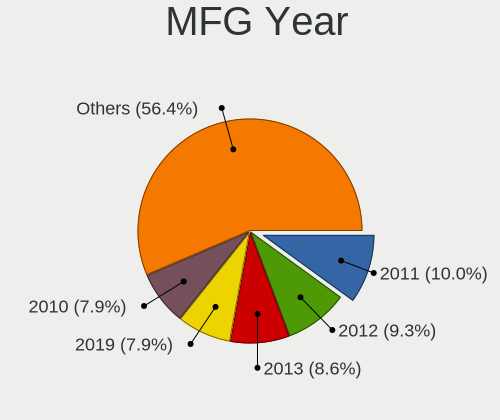
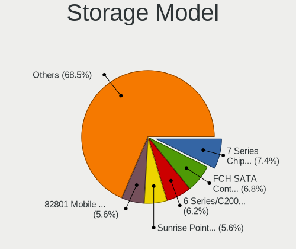
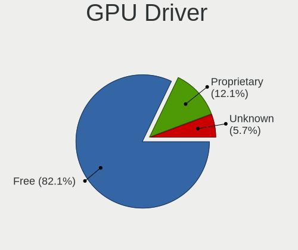

Zorin Hardware Trends (Notebook)
--------------------------------

A project to identify most popular hardware characteristics and track their change
over time based on data collected by Zorin users at https://Linux-Hardware.org.

Anyone can contribute to the study by uploading probes of their computers by
the [hw-probe](https://github.com/linuxhw/hw-probe) tool:

    sudo -E hw-probe -all -upload

Full-feature report is available here: https://linux-hardware.org/?view=trends&formfactor=notebook

Period: Apr, 2021.

Contents
--------

- [ OS                       ](#os)
- [ OS Family                ](#os-family)
- [ Kernel                   ](#kernel)
- [ Kernel Family            ](#kernel-family)
- [ Kernel Major Ver.        ](#kernel-major-ver)
- [ Arch                     ](#arch)
- [ DE                       ](#de)
- [ Display Server           ](#display-server)
- [ Display Manager          ](#display-manager)
- [ OS Lang                  ](#os-lang)
- [ Boot Mode                ](#boot-mode)
- [ Filesystem               ](#filesystem)
- [ Part. scheme             ](#part-scheme)
- [ Dual Boot with Linux/BSD ](#dual-boot-with-linux/bsd)
- [ Dual Boot (Win)          ](#dual-boot-win)
- [ Country                  ](#country)
- [ City                     ](#city)
- [ Vendor                   ](#vendor)
- [ Model                    ](#model)
- [ Model Family             ](#model-family)
- [ MFG Year                 ](#mfg-year)
- [ Form Factor              ](#form-factor)
- [ Secure Boot              ](#secure-boot)
- [ Coreboot                 ](#coreboot)
- [ RAM Size                 ](#ram-size)
- [ RAM Used                 ](#ram-used)
- [ Has CD-ROM               ](#has-cd-rom)
- [ Total Drives             ](#total-drives)
- [ Has Ethernet             ](#has-ethernet)
- [ Has WiFi                 ](#has-wifi)
- [ Has Bluetooth            ](#has-bluetooth)
- [ Drive Vendor             ](#drive-vendor)
- [ Drive Model              ](#drive-model)
- [ HDD Vendor               ](#hdd-vendor)
- [ SSD Vendor               ](#ssd-vendor)
- [ Drive Kind               ](#drive-kind)
- [ Drive Connector          ](#drive-connector)
- [ Drive Size               ](#drive-size)
- [ Space Total              ](#space-total)
- [ Space Used               ](#space-used)
- [ Malfunc. Drives          ](#malfunc-drives)
- [ Malfunc. Drive Vendor    ](#malfunc-drive-vendor)
- [ Malfunc. HDD Vendor      ](#malfunc-hdd-vendor)
- [ Malfunc. Drive Kind      ](#malfunc-drive-kind)
- [ Failed Drives            ](#failed-drives)
- [ Failed Drive Vendor      ](#failed-drive-vendor)
- [ Drive Status             ](#drive-status)
- [ Storage Vendor           ](#storage-vendor)
- [ Storage Model            ](#storage-model)
- [ Storage Kind             ](#storage-kind)
- [ CPU Vendor               ](#cpu-vendor)
- [ CPU Model                ](#cpu-model)
- [ CPU Model Family         ](#cpu-model-family)
- [ CPU Cores                ](#cpu-cores)
- [ CPU Sockets              ](#cpu-sockets)
- [ CPU Threads              ](#cpu-threads)
- [ CPU Op-Modes             ](#cpu-op-modes)
- [ CPU Microcode            ](#cpu-microcode)
- [ CPU Microarch            ](#cpu-microarch)
- [ GPU Vendor               ](#gpu-vendor)
- [ GPU Model                ](#gpu-model)
- [ GPU Combo                ](#gpu-combo)
- [ GPU Driver               ](#gpu-driver)
- [ GPU Memory               ](#gpu-memory)
- [ Monitor Vendor           ](#monitor-vendor)
- [ Monitor Model            ](#monitor-model)
- [ Monitor Resolution       ](#monitor-resolution)
- [ Monitor Diagonal         ](#monitor-diagonal)
- [ Monitor Width            ](#monitor-width)
- [ Aspect Ratio             ](#aspect-ratio)
- [ Monitor Area             ](#monitor-area)
- [ Pixel Density            ](#pixel-density)
- [ Multiple Monitors        ](#multiple-monitors)
- [ Net Controller Vendor    ](#net-controller-vendor)
- [ Net Controller Model     ](#net-controller-model)
- [ Wireless Vendor          ](#wireless-vendor)
- [ Wireless Model           ](#wireless-model)
- [ Ethernet Vendor          ](#ethernet-vendor)
- [ Ethernet Model           ](#ethernet-model)
- [ Net Controller Kind      ](#net-controller-kind)
- [ Used Controller          ](#used-controller)
- [ NICs                     ](#nics)
- [ IPv6                     ](#ipv6)
- [ Memory Vendor            ](#memory-vendor)
- [ Memory Model             ](#memory-model)
- [ Memory Kind              ](#memory-kind)
- [ Memory Form Factor       ](#memory-form-factor)
- [ Memory Size              ](#memory-size)
- [ Memory Speed             ](#memory-speed)
- [ Sound Vendor             ](#sound-vendor)
- [ Sound Model              ](#sound-model)
- [ Camera Vendor            ](#camera-vendor)
- [ Camera Model             ](#camera-model)
- [ Fingerprint Vendor       ](#fingerprint-vendor)
- [ Fingerprint Model        ](#fingerprint-model)
- [ Chipcard Vendor          ](#chipcard-vendor)
- [ Chipcard Model           ](#chipcard-model)
- [ Printer Vendor           ](#printer-vendor)
- [ Printer Model            ](#printer-model)
- [ Scanner Vendor           ](#scanner-vendor)
- [ Scanner Model            ](#scanner-model)
- [ Bluetooth Vendor         ](#bluetooth-vendor)
- [ Bluetooth Model          ](#bluetooth-model)
- [ Unsupported Devices      ](#unsupported-devices)
- [ Unsupported Device Types ](#unsupported-device-types)

OS
--

Installed operating systems

| Name     | Notebooks | Percent |
|----------|-----------|---------|
| Zorin 15 | 31        | 88.57%  |
| Zorin 16 | 2         | 5.71%   |
| Zorin 12 | 2         | 5.71%   |

OS Family
---------

OS without a version

| Name  | Notebooks | Percent |
|-------|-----------|---------|
| Zorin | 35        | 100%    |

Kernel
------

Version of the Linux kernel

| Version           | Notebooks | Percent |
|-------------------|-----------|---------|
| 5.4.0-70-generic  | 11        | 31.43%  |
| 5.4.0-72-generic  | 10        | 28.57%  |
| 5.8.0-50-generic  | 2         | 5.71%   |
| 5.4.0-71-generic  | 2         | 5.71%   |
| 5.4.0-47-generic  | 2         | 5.71%   |
| 5.4.0-45-generic  | 2         | 5.71%   |
| 5.4.0-67-generic  | 1         | 2.86%   |
| 5.4.0-66-generic  | 1         | 2.86%   |
| 5.4.0-65-generic  | 1         | 2.86%   |
| 5.0.0-37-generic  | 1         | 2.86%   |
| 4.4.0-210-generic | 1         | 2.86%   |
| 4.15.0-62-generic | 1         | 2.86%   |

Kernel Family
-------------

Linux kernel without a distro release

| Version | Notebooks | Percent |
|---------|-----------|---------|
| 5.4.0   | 30        | 85.71%  |
| 5.8.0   | 2         | 5.71%   |
| 5.0.0   | 1         | 2.86%   |
| 4.4.0   | 1         | 2.86%   |
| 4.15.0  | 1         | 2.86%   |

Kernel Major Ver.
-----------------

Linux kernel major version

| Version | Notebooks | Percent |
|---------|-----------|---------|
| 5.4     | 30        | 85.71%  |
| 5.8     | 2         | 5.71%   |
| 5.0     | 1         | 2.86%   |
| 4.4     | 1         | 2.86%   |
| 4.15    | 1         | 2.86%   |

Arch
----

OS architecture (x86_64, i586, etc.)

| Name   | Notebooks | Percent |
|--------|-----------|---------|
| x86_64 | 25        | 71.43%  |
| i686   | 10        | 28.57%  |

DE
--

Desktop Environment

| Name    | Notebooks | Percent |
|---------|-----------|---------|
| GNOME   | 17        | 48.57%  |
| XFCE    | 16        | 45.71%  |
| Unknown | 2         | 5.71%   |

Display Server
--------------

X11 or Wayland

| Name    | Notebooks | Percent |
|---------|-----------|---------|
| X11     | 34        | 97.14%  |
| Unknown | 1         | 2.86%   |

Display Manager
---------------

SDDM, LightDM, etc.

| Name    | Notebooks | Percent |
|---------|-----------|---------|
| Unknown | 34        | 97.14%  |
| TDM     | 1         | 2.86%   |

OS Lang
-------

Language

| Lang  | Notebooks | Percent |
|-------|-----------|---------|
| en_US | 15        | 42.86%  |
| pt_BR | 5         | 14.29%  |
| de_DE | 3         | 8.57%   |
| pl_PL | 2         | 5.71%   |
| C     | 2         | 5.71%   |
| sv_SE | 1         | 2.86%   |
| nl_NL | 1         | 2.86%   |
| ja_JP | 1         | 2.86%   |
| es_ES | 1         | 2.86%   |
| es_CL | 1         | 2.86%   |
| en_IN | 1         | 2.86%   |
| cs_CZ | 1         | 2.86%   |
| bg_BG | 1         | 2.86%   |

Boot Mode
---------

EFI or BIOS

| Mode | Notebooks | Percent |
|------|-----------|---------|
| BIOS | 25        | 71.43%  |
| EFI  | 10        | 28.57%  |

Filesystem
----------

Type of filesystem

| Type    | Notebooks | Percent |
|---------|-----------|---------|
| Ext4    | 32        | 91.43%  |
| Overlay | 2         | 5.71%   |
| Btrfs   | 1         | 2.86%   |

Part. scheme
------------

Scheme of partitioning

| Type    | Notebooks | Percent |
|---------|-----------|---------|
| Unknown | 34        | 97.14%  |
| MBR     | 1         | 2.86%   |

Dual Boot with Linux/BSD
------------------------

Hosting more than one Linux/BSD

| Dual boot | Notebooks | Percent |
|-----------|-----------|---------|
| No        | 34        | 97.14%  |
| Yes       | 1         | 2.86%   |

Dual Boot (Win)
---------------

Hosting Linux and Windows

| Dual boot | Notebooks | Percent |
|-----------|-----------|---------|
| No        | 27        | 77.14%  |
| Yes       | 8         | 22.86%  |

Country
-------

Geographic location (country)

| Country     | Notebooks | Percent |
|-------------|-----------|---------|
| USA         | 7         | 20%     |
| Brazil      | 6         | 17.14%  |
| Poland      | 2         | 5.71%   |
| Japan       | 2         | 5.71%   |
| Germany     | 2         | 5.71%   |
| Canada      | 2         | 5.71%   |
| Bulgaria    | 2         | 5.71%   |
| Sweden      | 1         | 2.86%   |
| Romania     | 1         | 2.86%   |
| Pakistan    | 1         | 2.86%   |
| Netherlands | 1         | 2.86%   |
| Mexico      | 1         | 2.86%   |
| Kenya       | 1         | 2.86%   |
| India       | 1         | 2.86%   |
| Ecuador     | 1         | 2.86%   |
| Czechia     | 1         | 2.86%   |
| Colombia    | 1         | 2.86%   |
| Chile       | 1         | 2.86%   |
| Austria     | 1         | 2.86%   |

City
----

Geographic location (city)

| City                                    | Notebooks | Percent |
|-----------------------------------------|-----------|---------|
| České Budějovice                     | 1         | 2.86%   |
| Yabu                                    | 1         | 2.86%   |
| Vienna                                  | 1         | 2.86%   |
| Union de Credito Agricola de Hermosillo | 1         | 2.86%   |
| Torre de Pedra                          | 1         | 2.86%   |
| Springfield                             | 1         | 2.86%   |
| Sofia                                   | 1         | 2.86%   |
| Sao Gabriel                             | 1         | 2.86%   |
| Saitama                                 | 1         | 2.86%   |
| Sabinopolis                             | 1         | 2.86%   |
| Ravadinovo                              | 1         | 2.86%   |
| Port Montt                              | 1         | 2.86%   |
| Pineville                               | 1         | 2.86%   |
| Ormond Beach                            | 1         | 2.86%   |
| Nowy Targ                               | 1         | 2.86%   |
| Nairobi                                 | 1         | 2.86%   |
| Maple Ridge                             | 1         | 2.86%   |
| Makow Podhalanski                       | 1         | 2.86%   |
| London                                  | 1         | 2.86%   |
| Landskrona                              | 1         | 2.86%   |
| Karachi                                 | 1         | 2.86%   |
| Jupiter                                 | 1         | 2.86%   |
| Indaiatuba                              | 1         | 2.86%   |
| Haren                                   | 1         | 2.86%   |
| Hamburg                                 | 1         | 2.86%   |
| Guayaquil                               | 1         | 2.86%   |
| Fortaleza                               | 1         | 2.86%   |
| Drensteinfurt                           | 1         | 2.86%   |
| Denver                                  | 1         | 2.86%   |
| Delhi                                   | 1         | 2.86%   |
| Dallas                                  | 1         | 2.86%   |
| Cúcuta                                 | 1         | 2.86%   |
| Charlotte                               | 1         | 2.86%   |
| Brejinho                                | 1         | 2.86%   |
| Arad                                    | 1         | 2.86%   |

Vendor
------

Motherboard manufacturer

| Name                | Notebooks | Percent |
|---------------------|-----------|---------|
| Lenovo              | 5         | 14.29%  |
| Hewlett-Packard     | 5         | 14.29%  |
| Toshiba             | 4         | 11.43%  |
| Dell                | 4         | 11.43%  |
| Acer                | 3         | 8.57%   |
| Positivo            | 2         | 5.71%   |
| ASUSTek Computer    | 2         | 5.71%   |
| Sony                | 1         | 2.86%   |
| Semp Toshiba        | 1         | 2.86%   |
| Samsung Electronics | 1         | 2.86%   |
| Panasonic           | 1         | 2.86%   |
| Packard Bell        | 1         | 2.86%   |
| NEC Computers       | 1         | 2.86%   |
| Itautec             | 1         | 2.86%   |
| Gigabyte Technology | 1         | 2.86%   |
| Fujitsu             | 1         | 2.86%   |
| Compaq              | 1         | 2.86%   |

Model
-----

Motherboard model

| Name                                  | Notebooks | Percent |
|---------------------------------------|-----------|---------|
| Toshiba Satellite P200                | 1         | 2.86%   |
| Toshiba Satellite C55-A               | 1         | 2.86%   |
| Toshiba QOSMIO X300                   | 1         | 2.86%   |
| Toshiba dynabook R731/E               | 1         | 2.86%   |
| Sony VGN-N350FE                       | 1         | 2.86%   |
| Semp Toshiba IS 1422                  | 1         | 2.86%   |
| Samsung 550XCJ/550XCR                 | 1         | 2.86%   |
| Positivo S14CT01                      | 1         | 2.86%   |
| Positivo MOBILE                       | 1         | 2.86%   |
| Panasonic CF-53SALZYLM                | 1         | 2.86%   |
| Packard Bell EasyNote_BU45            | 1         | 2.86%   |
| NEC Computers PC-VY25AACZ9            | 1         | 2.86%   |
| Lenovo ThinkPad X131e 3372A14         | 1         | 2.86%   |
| Lenovo ThinkPad W540 20BHS1MX00       | 1         | 2.86%   |
| Lenovo IdeaPad Y570 0862              | 1         | 2.86%   |
| Lenovo IdeaPad Slim 1-14AST-05 81VS   | 1         | 2.86%   |
| Lenovo IdeaPad 100-15IBD 80QQ         | 1         | 2.86%   |
| Itautec Infoway                       | 1         | 2.86%   |
| HP Stream Notebook PC 11              | 1         | 2.86%   |
| HP Pavilion dv5                       | 1         | 2.86%   |
| HP EliteBook Folio 9480m              | 1         | 2.86%   |
| HP EliteBook 850 G5                   | 1         | 2.86%   |
| HP 15                                 | 1         | 2.86%   |
| Gigabyte AERO 15-SA                   | 1         | 2.86%   |
| Fujitsu LIFEBOOK U772                 | 1         | 2.86%   |
| Dell Latitude D630                    | 1         | 2.86%   |
| Dell Latitude D620                    | 1         | 2.86%   |
| Dell Latitude D520                    | 1         | 2.86%   |
| Dell Inspiron 5759                    | 1         | 2.86%   |
| Compaq Presario CQ-17                 | 1         | 2.86%   |
| ASUS ZenBook UX331FA_UX331FA          | 1         | 2.86%   |
| ASUS ROG Zephyrus M15 GU502LV_GU502LV | 1         | 2.86%   |
| Acer Aspire E5-523                    | 1         | 2.86%   |
| Acer Aspire 5333                      | 1         | 2.86%   |
| Unknown                               | 1         | 2.86%   |

Model Family
------------

Motherboard model prefix

| Name                       | Notebooks | Percent |
|----------------------------|-----------|---------|
| Lenovo IdeaPad             | 3         | 8.57%   |
| Dell Latitude              | 3         | 8.57%   |
| Toshiba Satellite          | 2         | 5.71%   |
| Lenovo ThinkPad            | 2         | 5.71%   |
| HP EliteBook               | 2         | 5.71%   |
| Acer Aspire                | 2         | 5.71%   |
| Toshiba QOSMIO             | 1         | 2.86%   |
| Toshiba dynabook           | 1         | 2.86%   |
| Sony VGN-N350FE            | 1         | 2.86%   |
| Semp Toshiba IS            | 1         | 2.86%   |
| Samsung 550XCJ             | 1         | 2.86%   |
| Positivo S14CT01           | 1         | 2.86%   |
| Positivo MOBILE            | 1         | 2.86%   |
| Panasonic CF-53SALZYLM     | 1         | 2.86%   |
| Packard Bell EasyNote      | 1         | 2.86%   |
| NEC Computers PC-VY25AACZ9 | 1         | 2.86%   |
| Itautec Infoway            | 1         | 2.86%   |
| HP Stream                  | 1         | 2.86%   |
| HP Pavilion                | 1         | 2.86%   |
| HP 15                      | 1         | 2.86%   |
| Gigabyte AERO              | 1         | 2.86%   |
| Fujitsu LIFEBOOK           | 1         | 2.86%   |
| Dell Inspiron              | 1         | 2.86%   |
| Compaq Presario            | 1         | 2.86%   |
| ASUS ZenBook               | 1         | 2.86%   |
| ASUS ROG                   | 1         | 2.86%   |
| Unknown                    | 1         | 2.86%   |

MFG Year
--------

Motherboard manufacture year

| Year | Notebooks | Percent |
|------|-----------|---------|
| 2020 | 5         | 14.29%  |
| 2010 | 4         | 11.43%  |
| 2007 | 4         | 11.43%  |
| 2019 | 3         | 8.57%   |
| 2012 | 3         | 8.57%   |
| 2017 | 2         | 5.71%   |
| 2016 | 2         | 5.71%   |
| 2014 | 2         | 5.71%   |
| 2013 | 2         | 5.71%   |
| 2011 | 2         | 5.71%   |
| 2008 | 2         | 5.71%   |
| 2018 | 1         | 2.86%   |
| 2015 | 1         | 2.86%   |
| 2009 | 1         | 2.86%   |
| 2006 | 1         | 2.86%   |

Form Factor
-----------

Physical design of the computer

| Name     | Notebooks | Percent |
|----------|-----------|---------|
| Notebook | 35        | 100%    |

Secure Boot
-----------

Enabled or disabled

| State    | Notebooks | Percent |
|----------|-----------|---------|
| Disabled | 34        | 97.14%  |
| Enabled  | 1         | 2.86%   |

Coreboot
--------

Have coreboot on board

| Used | Notebooks | Percent |
|------|-----------|---------|
| No   | 35        | 100%    |

RAM Size
--------

Total RAM memory

| Size in GB | Notebooks | Percent |
|------------|-----------|---------|
| 4.01-8.0   | 10        | 28.57%  |
| 3.01-4.0   | 10        | 28.57%  |
| 1.01-2.0   | 8         | 22.86%  |
| 8.01-16.0  | 3         | 8.57%   |
| 16.01-24.0 | 2         | 5.71%   |
| 32.01-64.0 | 1         | 2.86%   |
| 0.51-1.0   | 1         | 2.86%   |

RAM Used
--------

Used RAM memory

| Used GB  | Notebooks | Percent |
|----------|-----------|---------|
| 1.01-2.0 | 15        | 42.86%  |
| 2.01-3.0 | 6         | 17.14%  |
| 0.51-1.0 | 6         | 17.14%  |
| 3.01-4.0 | 5         | 14.29%  |
| 4.01-8.0 | 3         | 8.57%   |

Has CD-ROM
----------

Has CD-ROM on board

| Presented | Notebooks | Percent |
|-----------|-----------|---------|
| Yes       | 19        | 54.29%  |
| No        | 16        | 45.71%  |

Total Drives
------------

Number of drives on board

| Drives | Notebooks | Percent |
|--------|-----------|---------|
| 1      | 28        | 80%     |
| 2      | 5         | 14.29%  |
| 3      | 2         | 5.71%   |

Has Ethernet
------------

Has Ethernet on board

| Presented | Notebooks | Percent |
|-----------|-----------|---------|
| Yes       | 29        | 82.86%  |
| No        | 6         | 17.14%  |

Has WiFi
--------

Has WiFi module

| Presented | Notebooks | Percent |
|-----------|-----------|---------|
| Yes       | 33        | 94.29%  |
| No        | 2         | 5.71%   |

Has Bluetooth
-------------

Has Bluetooth module

| Presented | Notebooks | Percent |
|-----------|-----------|---------|
| Yes       | 19        | 54.29%  |
| No        | 16        | 45.71%  |

Drive Vendor
------------

Hard drive vendors

| Vendor              | Notebooks | Drives | Percent |
|---------------------|-----------|--------|---------|
| WDC                 | 7         | 7      | 16.28%  |
| Samsung Electronics | 6         | 6      | 13.95%  |
| Unknown             | 5         | 5      | 11.63%  |
| Seagate             | 3         | 3      | 6.98%   |
| HGST                | 3         | 3      | 6.98%   |
| Toshiba             | 2         | 2      | 4.65%   |
| Kingston            | 2         | 2      | 4.65%   |
| A-DATA Technology   | 2         | 2      | 4.65%   |
| Transcend           | 1         | 1      | 2.33%   |
| SPCC                | 1         | 1      | 2.33%   |
| Sandisk             | 1         | 1      | 2.33%   |
| PNY USB             | 1         | 1      | 2.33%   |
| PNY                 | 1         | 1      | 2.33%   |
| Phison              | 1         | 1      | 2.33%   |
| Micron Technology   | 1         | 1      | 2.33%   |
| JMicron             | 1         | 1      | 2.33%   |
| Intel               | 1         | 1      | 2.33%   |
| Hitachi             | 1         | 1      | 2.33%   |
| Crucial             | 1         | 1      | 2.33%   |
| China               | 1         | 1      | 2.33%   |
| ADplus              | 1         | 1      | 2.33%   |

Drive Model
-----------

Hard drive models

| Model                                | Notebooks | Percent |
|--------------------------------------|-----------|---------|
| Unknown MMC Card  32GB               | 2         | 4.65%   |
| Unknown MMC Card  128GB              | 2         | 4.65%   |
| Samsung SSD 840 EVO 250GB            | 2         | 4.65%   |
| HGST HTS725050A7E630 500GB           | 2         | 4.65%   |
| WDC WDS240G2G0A-00JH30 240GB SSD     | 1         | 2.33%   |
| WDC WD7500BPKT-22PK4T0 752GB         | 1         | 2.33%   |
| WDC WD6400BPVT-22HXZT3 640GB         | 1         | 2.33%   |
| WDC WD5000BEVT-60A0RT0 500GB         | 1         | 2.33%   |
| WDC WD3200BUCT-63TWBY0 320GB         | 1         | 2.33%   |
| WDC WD3200BPVT-00JJ5T0 320GB         | 1         | 2.33%   |
| WDC WD10SPZX-35Z10T0 1TB             | 1         | 2.33%   |
| Unknown MMC Card  64GB               | 1         | 2.33%   |
| Transcend TS64GSSD420K 64GB          | 1         | 2.33%   |
| Toshiba MK2035GSS 200GB              | 1         | 2.33%   |
| Toshiba MK1246GSX 120GB              | 1         | 2.33%   |
| SPCC Solid State Disk 256GB          | 1         | 2.33%   |
| Seagate ST9320325AS 320GB            | 1         | 2.33%   |
| Seagate ST500LT012-1DG142 500GB      | 1         | 2.33%   |
| Seagate Expansion 4TB                | 1         | 2.33%   |
| Sandisk NVMe SSD Drive 1024GB        | 1         | 2.33%   |
| Samsung NVMe SSD Drive 512GB         | 1         | 2.33%   |
| Samsung MZ7TD256HAFV-000L9 256GB SSD | 1         | 2.33%   |
| Samsung HM321HI 320GB                | 1         | 2.33%   |
| Samsung HM160HI 160GB                | 1         | 2.33%   |
| PNY USB 3.0 to SATA 250GB SSD        | 1         | 2.33%   |
| PNY CS900 500GB SSD                  | 1         | 2.33%   |
| Phison NVMe SSD Drive 1024GB         | 1         | 2.33%   |
| Micron C400-MTFDDAK256MAM 256GB SSD  | 1         | 2.33%   |
| Kingston SA400S37480G 480GB SSD      | 1         | 2.33%   |
| Kingston SA400S37120G 120GB SSD      | 1         | 2.33%   |
| JMicron Generic 240GB                | 1         | 2.33%   |
| Intel NVMe SSD Drive 512GB           | 1         | 2.33%   |
| Hitachi HTS545032B9A300 320GB        | 1         | 2.33%   |
| HGST HTS545050A7E680 500GB           | 1         | 2.33%   |
| Crucial CT500BX100SSD1 500GB         | 1         | 2.33%   |
| China SSD 120G                       | 1         | 2.33%   |
| ADplus SuperVer 2TB                  | 1         | 2.33%   |
| A-DATA SX900 256GB SSD               | 1         | 2.33%   |
| A-DATA SU650 120GB SSD               | 1         | 2.33%   |

HDD Vendor
----------

Hard disk drive vendors

| Vendor              | Notebooks | Drives | Percent |
|---------------------|-----------|--------|---------|
| WDC                 | 6         | 6      | 35.29%  |
| Seagate             | 3         | 3      | 17.65%  |
| HGST                | 3         | 3      | 17.65%  |
| Toshiba             | 2         | 2      | 11.76%  |
| Samsung Electronics | 2         | 2      | 11.76%  |
| Hitachi             | 1         | 1      | 5.88%   |

SSD Vendor
----------

Solid state drive vendors

| Vendor              | Notebooks | Drives | Percent |
|---------------------|-----------|--------|---------|
| Samsung Electronics | 3         | 3      | 18.75%  |
| Kingston            | 2         | 2      | 12.5%   |
| A-DATA Technology   | 2         | 2      | 12.5%   |
| WDC                 | 1         | 1      | 6.25%   |
| Transcend           | 1         | 1      | 6.25%   |
| SPCC                | 1         | 1      | 6.25%   |
| PNY USB             | 1         | 1      | 6.25%   |
| PNY                 | 1         | 1      | 6.25%   |
| Micron Technology   | 1         | 1      | 6.25%   |
| JMicron             | 1         | 1      | 6.25%   |
| Crucial             | 1         | 1      | 6.25%   |
| China               | 1         | 1      | 6.25%   |

Drive Kind
----------

HDD or SSD

| Kind    | Notebooks | Drives | Percent |
|---------|-----------|--------|---------|
| HDD     | 16        | 17     | 40%     |
| SSD     | 14        | 16     | 35%     |
| MMC     | 5         | 5      | 12.5%   |
| NVMe    | 4         | 4      | 10%     |
| Unknown | 1         | 1      | 2.5%    |

Drive Connector
---------------

SATA, SAS, NVMe, etc.

| Type | Notebooks | Drives | Percent |
|------|-----------|--------|---------|
| SATA | 28        | 30     | 70%     |
| MMC  | 5         | 5      | 12.5%   |
| NVMe | 4         | 4      | 10%     |
| SAS  | 3         | 4      | 7.5%    |

Drive Size
----------

Size of hard drive

| Size in TB | Notebooks | Drives | Percent |
|------------|-----------|--------|---------|
| 0.01-0.5   | 25        | 29     | 86.21%  |
| 0.51-1.0   | 3         | 3      | 10.34%  |
| 3.01-4.0   | 1         | 1      | 3.45%   |

Space Total
-----------

Amount of disk space available on the file system

| Size in GB | Notebooks | Percent |
|------------|-----------|---------|
| 101-250    | 13        | 37.14%  |
| 251-500    | 11        | 31.43%  |
| 501-1000   | 4         | 11.43%  |
| 21-50      | 2         | 5.71%   |
| 2001-3000  | 2         | 5.71%   |
| 51-100     | 2         | 5.71%   |
| 1-20       | 1         | 2.86%   |

Space Used
----------

Amount of used disk space

| Used GB   | Notebooks | Percent |
|-----------|-----------|---------|
| 1-20      | 15        | 42.86%  |
| 21-50     | 7         | 20%     |
| 51-100    | 6         | 17.14%  |
| 101-250   | 4         | 11.43%  |
| 251-500   | 1         | 2.86%   |
| 1001-2000 | 1         | 2.86%   |
| 501-1000  | 1         | 2.86%   |

Malfunc. Drives
---------------

Drive models with a malfunction

| Model                     | Notebooks | Drives | Percent |
|---------------------------|-----------|--------|---------|
| Seagate ST9320325AS 320GB | 1         | 1      | 100%    |

Malfunc. Drive Vendor
---------------------

Vendors of faulty drives

| Vendor  | Notebooks | Drives | Percent |
|---------|-----------|--------|---------|
| Seagate | 1         | 1      | 100%    |

Malfunc. HDD Vendor
-------------------

Vendors of faulty HDD drives

| Vendor  | Notebooks | Drives | Percent |
|---------|-----------|--------|---------|
| Seagate | 1         | 1      | 100%    |

Malfunc. Drive Kind
-------------------

Kinds of faulty drives

| Kind | Notebooks | Drives | Percent |
|------|-----------|--------|---------|
| HDD  | 1         | 1      | 100%    |

Failed Drives
-------------

Failed drive models

Zero info for selected period =(

Failed Drive Vendor
-------------------

Failed drive vendors

Zero info for selected period =(

Drive Status
------------

Number of failed and malfunc. drives

| Status   | Notebooks | Drives | Percent |
|----------|-----------|--------|---------|
| Detected | 33        | 41     | 94.29%  |
| Malfunc  | 1         | 1      | 2.86%   |
| Works    | 1         | 1      | 2.86%   |

Storage Vendor
--------------

Storage controller vendors

| Vendor              | Notebooks | Percent |
|---------------------|-----------|---------|
| Intel               | 24        | 72.73%  |
| AMD                 | 5         | 15.15%  |
| VIA Technologies    | 1         | 3.03%   |
| Sandisk             | 1         | 3.03%   |
| Samsung Electronics | 1         | 3.03%   |
| Phison Electronics  | 1         | 3.03%   |

Storage Model
-------------

Storage controller models

| Model                                                                          | Notebooks | Percent |
|--------------------------------------------------------------------------------|-----------|---------|
| Intel 82801GBM/GHM (ICH7-M Family) SATA Controller [IDE mode]                  | 5         | 13.51%  |
| Intel 82801IBM/IEM (ICH9M/ICH9M-E) 4 port SATA Controller [AHCI mode]          | 4         | 10.81%  |
| AMD FCH SATA Controller [AHCI mode]                                            | 4         | 10.81%  |
| Intel 7 Series Chipset Family 6-port SATA Controller [AHCI mode]               | 2         | 5.41%   |
| Intel 6 Series/C200 Series Chipset Family 6 port Mobile SATA AHCI Controller   | 2         | 5.41%   |
| Intel 5 Series/3400 Series Chipset 4 port SATA AHCI Controller                 | 2         | 5.41%   |
| VIA VT82C586A/B/VT82C686/A/B/VT823x/A/C PIPC Bus Master IDE                    | 1         | 2.7%    |
| VIA VT8237A SATA 2-Port Controller                                             | 1         | 2.7%    |
| Sandisk WD Blue SN550 NVMe SSD                                                 | 1         | 2.7%    |
| Samsung NVMe SSD Controller SM951/PM951                                        | 1         | 2.7%    |
| Phison E12 NVMe Controller                                                     | 1         | 2.7%    |
| Intel Wildcat Point-LP SATA Controller [AHCI Mode]                             | 1         | 2.7%    |
| Intel Sunrise Point-LP SATA Controller [AHCI mode]                             | 1         | 2.7%    |
| Intel SSD 660P Series                                                          | 1         | 2.7%    |
| Intel Comet Lake SATA AHCI Controller                                          | 1         | 2.7%    |
| Intel Celeron N3350/Pentium N4200/Atom E3900 Series SATA AHCI Controller       | 1         | 2.7%    |
| Intel 82801HM/HEM (ICH8M/ICH8M-E) SATA Controller [IDE mode]                   | 1         | 2.7%    |
| Intel 82801HM/HEM (ICH8M/ICH8M-E) IDE Controller                               | 1         | 2.7%    |
| Intel 82801G (ICH7 Family) IDE Controller                                      | 1         | 2.7%    |
| Intel 8 Series/C220 Series Chipset Family 6-port SATA Controller 1 [AHCI mode] | 1         | 2.7%    |
| Intel 8 Series SATA Controller 1 [AHCI mode]                                   | 1         | 2.7%    |
| Intel 7 Series Chipset Family 4-port SATA Controller [IDE mode]                | 1         | 2.7%    |
| Intel 7 Series Chipset Family 2-port SATA Controller [IDE mode]                | 1         | 2.7%    |
| AMD FCH SATA Controller [IDE mode]                                             | 1         | 2.7%    |

Storage Kind
------------

Kind of storage controller (IDE, SATA, NVMe, SAS, ...)

| Kind | Notebooks | Percent |
|------|-----------|---------|
| SATA | 21        | 63.64%  |
| IDE  | 8         | 24.24%  |
| NVMe | 4         | 12.12%  |

CPU Vendor
----------

Processor vendors

| Vendor | Notebooks | Percent |
|--------|-----------|---------|
| Intel  | 30        | 85.71%  |
| AMD    | 5         | 14.29%  |

CPU Model
---------

Processor models

| Model                                         | Notebooks | Percent |
|-----------------------------------------------|-----------|---------|
| Intel Core 2 Duo CPU P8700 @ 2.53GHz          | 2         | 5.71%   |
| Intel Pentium Dual-Core CPU T4500 @ 2.30GHz   | 1         | 2.86%   |
| Intel Pentium CPU P6000 @ 1.87GHz             | 1         | 2.86%   |
| Intel Pentium CPU 2020M @ 2.40GHz             | 1         | 2.86%   |
| Intel Genuine CPU T2400 @ 1.83GHz             | 1         | 2.86%   |
| Intel Genuine CPU T2130 @ 1.86GHz             | 1         | 2.86%   |
| Intel Core i7-9750H CPU @ 2.60GHz             | 1         | 2.86%   |
| Intel Core i7-4700MQ CPU @ 2.40GHz            | 1         | 2.86%   |
| Intel Core i7-3667U CPU @ 2.00GHz             | 1         | 2.86%   |
| Intel Core i7-2670QM CPU @ 2.20GHz            | 1         | 2.86%   |
| Intel Core i7-10750H CPU @ 2.60GHz            | 1         | 2.86%   |
| Intel Core i5-8265U CPU @ 1.60GHz             | 1         | 2.86%   |
| Intel Core i5-7300U CPU @ 2.60GHz             | 1         | 2.86%   |
| Intel Core i5-5200U CPU @ 2.20GHz             | 1         | 2.86%   |
| Intel Core i5-4310U CPU @ 2.00GHz             | 1         | 2.86%   |
| Intel Core i5-3340M CPU @ 2.70GHz             | 1         | 2.86%   |
| Intel Core i5-2450M CPU @ 2.50GHz             | 1         | 2.86%   |
| Intel Core i3-6100U CPU @ 2.30GHz             | 1         | 2.86%   |
| Intel Core i3-10110U CPU @ 2.10GHz            | 1         | 2.86%   |
| Intel Core Duo CPU T2350 @ 1.86GHz            | 1         | 2.86%   |
| Intel Core 2 Duo CPU T7250 @ 2.00GHz          | 1         | 2.86%   |
| Intel Core 2 Duo CPU P8600 @ 2.40GHz          | 1         | 2.86%   |
| Intel Core 2 CPU T5600 @ 1.83GHz              | 1         | 2.86%   |
| Intel Core 2 CPU T5500 @ 1.66GHz              | 1         | 2.86%   |
| Intel Celeron M CPU 530 @ 1.73GHz             | 1         | 2.86%   |
| Intel Celeron CPU P4600 @ 2.00GHz             | 1         | 2.86%   |
| Intel Celeron CPU N3350 @ 1.10GHz             | 1         | 2.86%   |
| Intel Celeron CPU N2840 @ 2.16GHz             | 1         | 2.86%   |
| Intel Atom x5-Z8300 CPU @ 1.44GHz             | 1         | 2.86%   |
| AMD E2-9010 RADEON R2, 4 COMPUTE CORES 2C+2G  | 1         | 2.86%   |
| AMD E2-1800 APU with Radeon HD Graphics       | 1         | 2.86%   |
| AMD E1-2100 APU with Radeon HD Graphics       | 1         | 2.86%   |
| AMD E1-1200 APU with Radeon HD Graphics       | 1         | 2.86%   |
| AMD A6-9220e RADEON R4, 5 COMPUTE CORES 2C+3G | 1         | 2.86%   |

CPU Model Family
----------------

Processor model prefix

| Model                   | Notebooks | Percent |
|-------------------------|-----------|---------|
| Intel Core i5           | 6         | 17.14%  |
| Intel Core i7           | 5         | 14.29%  |
| Intel Core 2 Duo        | 4         | 11.43%  |
| Intel Celeron           | 3         | 8.57%   |
| Intel Pentium           | 2         | 5.71%   |
| Intel Genuine           | 2         | 5.71%   |
| Intel Core i3           | 2         | 5.71%   |
| Intel Core 2            | 2         | 5.71%   |
| AMD E2                  | 2         | 5.71%   |
| AMD E1                  | 2         | 5.71%   |
| Intel Pentium Dual-Core | 1         | 2.86%   |
| Intel Core Duo          | 1         | 2.86%   |
| Intel Celeron M         | 1         | 2.86%   |
| Intel Atom              | 1         | 2.86%   |
| AMD A6                  | 1         | 2.86%   |

CPU Cores
---------

Number of processor cores

| Number | Notebooks | Percent |
|--------|-----------|---------|
| 2      | 28        | 80%     |
| 4      | 4         | 11.43%  |
| 6      | 2         | 5.71%   |
| 1      | 1         | 2.86%   |

CPU Sockets
-----------

Number of sockets

| Number | Notebooks | Percent |
|--------|-----------|---------|
| 1      | 35        | 100%    |

CPU Threads
-----------

Threads per core (Hyper-Threading)

| Number | Notebooks | Percent |
|--------|-----------|---------|
| 1      | 22        | 62.86%  |
| 2      | 13        | 37.14%  |

CPU Op-Modes
------------

CPU Operation Modes (32-bit, 64-bit)

| Op mode        | Notebooks | Percent |
|----------------|-----------|---------|
| 32-bit, 64-bit | 32        | 91.43%  |
| 32-bit         | 3         | 8.57%   |

CPU Microcode
-------------

Microcode number

| Number     | Notebooks | Percent |
|------------|-----------|---------|
| Unknown    | 6         | 17.14%  |
| 0x1067a    | 3         | 8.57%   |
| 0x6f2      | 2         | 5.71%   |
| 0x206a7    | 2         | 5.71%   |
| 0x05000119 | 2         | 5.71%   |
| 0xa0660    | 1         | 2.86%   |
| 0xa0652    | 1         | 2.86%   |
| 0x906ea    | 1         | 2.86%   |
| 0x806eb    | 1         | 2.86%   |
| 0x806e9    | 1         | 2.86%   |
| 0x6fd      | 1         | 2.86%   |
| 0x6f6      | 1         | 2.86%   |
| 0x6ec      | 1         | 2.86%   |
| 0x6e8      | 1         | 2.86%   |
| 0x506c9    | 1         | 2.86%   |
| 0x406e3    | 1         | 2.86%   |
| 0x406c3    | 1         | 2.86%   |
| 0x306d4    | 1         | 2.86%   |
| 0x306c3    | 1         | 2.86%   |
| 0x306a9    | 1         | 2.86%   |
| 0x30678    | 1         | 2.86%   |
| 0x20655    | 1         | 2.86%   |
| 0x10676    | 1         | 2.86%   |
| 0x0700010f | 1         | 2.86%   |
| 0x06006705 | 1         | 2.86%   |

CPU Microarch
-------------

Microarchitecture

| Name        | Notebooks | Percent |
|-------------|-----------|---------|
| Penryn      | 4         | 11.43%  |
| Core        | 4         | 11.43%  |
| P6          | 3         | 8.57%   |
| KabyLake    | 3         | 8.57%   |
| IvyBridge   | 3         | 8.57%   |
| Westmere    | 2         | 5.71%   |
| Silvermont  | 2         | 5.71%   |
| SandyBridge | 2         | 5.71%   |
| Haswell     | 2         | 5.71%   |
| Excavator   | 2         | 5.71%   |
| CometLake   | 2         | 5.71%   |
| Bobcat      | 2         | 5.71%   |
| Skylake     | 1         | 2.86%   |
| Jaguar      | 1         | 2.86%   |
| Goldmont    | 1         | 2.86%   |
| Broadwell   | 1         | 2.86%   |

GPU Vendor
----------

Vendors of graphics cards

| Vendor           | Notebooks | Percent |
|------------------|-----------|---------|
| Intel            | 26        | 65%     |
| Nvidia           | 8         | 20%     |
| AMD              | 5         | 12.5%   |
| VIA Technologies | 1         | 2.5%    |

GPU Model
---------

Graphics card models

| Model                                                                                    | Notebooks | Percent |
|------------------------------------------------------------------------------------------|-----------|---------|
| Intel Mobile 945GM/GMS/GME, 943/940GML Express Integrated Graphics Controller            | 5         | 11.11%  |
| Intel Mobile 945GM/GMS, 943/940GML Express Integrated Graphics Controller                | 5         | 11.11%  |
| Intel 3rd Gen Core processor Graphics Controller                                         | 3         | 6.67%   |
| Intel Mobile 4 Series Chipset Integrated Graphics Controller                             | 2         | 4.44%   |
| Intel Core Processor Integrated Graphics Controller                                      | 2         | 4.44%   |
| Intel 2nd Generation Core Processor Family Integrated Graphics Controller                | 2         | 4.44%   |
| AMD Stoney [Radeon R2/R3/R4/R5 Graphics]                                                 | 2         | 4.44%   |
| VIA Technologies CN896/VN896/P4M900 [Chrome 9 HC]                                        | 1         | 2.22%   |
| Nvidia TU116M [GeForce GTX 1660 Ti Mobile]                                               | 1         | 2.22%   |
| Nvidia TU106M [GeForce RTX 2060 Mobile]                                                  | 1         | 2.22%   |
| Nvidia GK208BM [GeForce 920M]                                                            | 1         | 2.22%   |
| Nvidia GK107GLM [Quadro K1100M]                                                          | 1         | 2.22%   |
| Nvidia GF108M [GeForce GT 555M]                                                          | 1         | 2.22%   |
| Nvidia G96CM [GeForce 9600M GT]                                                          | 1         | 2.22%   |
| Nvidia G94M [GeForce 9700M GTS]                                                          | 1         | 2.22%   |
| Nvidia G86M [Quadro NVS 135M]                                                            | 1         | 2.22%   |
| Intel WhiskeyLake-U GT2 [UHD Graphics 620]                                               | 1         | 2.22%   |
| Intel Skylake GT2 [HD Graphics 520]                                                      | 1         | 2.22%   |
| Intel HD Graphics 620                                                                    | 1         | 2.22%   |
| Intel HD Graphics 5500                                                                   | 1         | 2.22%   |
| Intel HD Graphics 500                                                                    | 1         | 2.22%   |
| Intel Haswell-ULT Integrated Graphics Controller                                         | 1         | 2.22%   |
| Intel CometLake-H GT2 [UHD Graphics]                                                     | 1         | 2.22%   |
| Intel Comet Lake UHD Graphics                                                            | 1         | 2.22%   |
| Intel CoffeeLake-H GT2 [UHD Graphics 630]                                                | 1         | 2.22%   |
| Intel Atom/Celeron/Pentium Processor x5-E8000/J3xxx/N3xxx Integrated Graphics Controller | 1         | 2.22%   |
| Intel Atom Processor Z36xxx/Z37xxx Series Graphics & Display                             | 1         | 2.22%   |
| Intel 4th Gen Core Processor Integrated Graphics Controller                              | 1         | 2.22%   |
| AMD Wrestler [Radeon HD 7340]                                                            | 1         | 2.22%   |
| AMD Wrestler [Radeon HD 7310]                                                            | 1         | 2.22%   |
| AMD Kabini [Radeon HD 8210]                                                              | 1         | 2.22%   |

GPU Combo
---------

Combinations of graphics cards

| Name           | Notebooks | Percent |
|----------------|-----------|---------|
| 1 x Intel      | 21        | 60%     |
| Intel + Nvidia | 5         | 14.29%  |
| 1 x AMD        | 5         | 14.29%  |
| 1 x Nvidia     | 3         | 8.57%   |
| 1 x VIA        | 1         | 2.86%   |

GPU Driver
----------

Free vs proprietary

| Driver      | Notebooks | Percent |
|-------------|-----------|---------|
| Free        | 30        | 85.71%  |
| Proprietary | 4         | 11.43%  |
| Unknown     | 1         | 2.86%   |

GPU Memory
----------

Total video memory

| Size in GB | Notebooks | Percent |
|------------|-----------|---------|
| Unknown    | 26        | 74.29%  |
| 0.01-0.5   | 7         | 20%     |
| 5.01-6.0   | 1         | 2.86%   |
| 1.01-2.0   | 1         | 2.86%   |

Monitor Vendor
--------------

Monitor vendors

| Vendor                  | Notebooks | Percent |
|-------------------------|-----------|---------|
| AU Optronics            | 8         | 24.24%  |
| BOE                     | 6         | 18.18%  |
| LG Display              | 5         | 15.15%  |
| Samsung Electronics     | 4         | 12.12%  |
| LG Philips              | 2         | 6.06%   |
| Chimei Innolux          | 2         | 6.06%   |
| ViewSonic               | 1         | 3.03%   |
| Toshiba                 | 1         | 3.03%   |
| LPL                     | 1         | 3.03%   |
| InfoVision              | 1         | 3.03%   |
| Hewlett-Packard         | 1         | 3.03%   |
| Chi Mei Optoelectronics | 1         | 3.03%   |

Monitor Model
-------------

Monitor models

| Model                                                                    | Notebooks | Percent |
|--------------------------------------------------------------------------|-----------|---------|
| ViewSonic VX2753 SERIES VSC7228 1920x1080 597x336mm 27.0-inch            | 1         | 3.03%   |
| Toshiba LCD Monitor LCD58EB 1280x800 261x163mm 12.1-inch                 | 1         | 3.03%   |
| Samsung Electronics LCD Monitor SEC4650 1400x1050 304x228mm 15.0-inch    | 1         | 3.03%   |
| Samsung Electronics LCD Monitor SEC3847 1440x900 367x230mm 17.1-inch     | 1         | 3.03%   |
| Samsung Electronics LCD Monitor SDC4347 1366x768 340x190mm 15.3-inch     | 1         | 3.03%   |
| Samsung Electronics Color LCD SDCA029 2160x1440 252x168mm 11.9-inch      | 1         | 3.03%   |
| LPL LCD Monitor 1440x900                                                 | 1         | 3.03%   |
| LG Philips LCD Monitor LPLA101 1440x900 367x230mm 17.1-inch              | 1         | 3.03%   |
| LG Philips LCD Monitor LPL00E0 1440x900 304x190mm 14.1-inch              | 1         | 3.03%   |
| LG Display LP154WX4-TLCC LGD0242 1280x800 331x207mm 15.4-inch            | 1         | 3.03%   |
| LG Display LCD Monitor LGD0385 1366x768 309x174mm 14.0-inch              | 1         | 3.03%   |
| LG Display LCD Monitor LGD036B 1366x768 309x174mm 14.0-inch              | 1         | 3.03%   |
| LG Display LCD Monitor LGD02E9 1366x768 309x174mm 14.0-inch              | 1         | 3.03%   |
| LG Display LCD Monitor LGD0171 1366x768 344x194mm 15.5-inch              | 1         | 3.03%   |
| InfoVision LCD Monitor IVO0489 1366x768 260x140mm 11.6-inch              | 1         | 3.03%   |
| Hewlett-Packard Z24n HWP320E 1920x1080 518x324mm 24.1-inch               | 1         | 3.03%   |
| Chimei Innolux LCD Monitor CMN1734 1600x900 382x214mm 17.2-inch          | 1         | 3.03%   |
| Chimei Innolux LCD Monitor CMN14A4 1366x768 309x174mm 14.0-inch          | 1         | 3.03%   |
| Chi Mei Optoelectronics LCD Monitor CMO1680 1366x768 344x193mm 15.5-inch | 1         | 3.03%   |
| BOE LCD Monitor BOE0812 1920x1080 344x194mm 15.5-inch                    | 1         | 3.03%   |
| BOE LCD Monitor BOE075A 1366x768 309x173mm 13.9-inch                     | 1         | 3.03%   |
| BOE LCD Monitor BOE0696 1366x768 309x173mm 13.9-inch                     | 1         | 3.03%   |
| BOE LCD Monitor BOE061C 1366x768 256x144mm 11.6-inch                     | 1         | 3.03%   |
| BOE LCD Monitor BOE0615 1366x768 309x173mm 13.9-inch                     | 1         | 3.03%   |
| BOE LCD Monitor BOE05F0 1366x768 309x173mm 13.9-inch                     | 1         | 3.03%   |
| AU Optronics LCD Monitor AUO492D 1920x1080 293x165mm 13.2-inch           | 1         | 3.03%   |
| AU Optronics LCD Monitor AUO45EC 1366x768 340x190mm 15.3-inch            | 1         | 3.03%   |
| AU Optronics LCD Monitor AUO3B44 1280x800 304x190mm 14.1-inch            | 1         | 3.03%   |
| AU Optronics LCD Monitor AUO34ED 1920x1080 340x190mm 15.3-inch           | 1         | 3.03%   |
| AU Optronics LCD Monitor AUO31EB 3840x2160 344x193mm 15.5-inch           | 1         | 3.03%   |
| AU Optronics LCD Monitor AUO23ED 1920x1080 344x193mm 15.5-inch           | 1         | 3.03%   |
| AU Optronics LCD Monitor AUO22EC 1366x768 344x193mm 15.5-inch            | 1         | 3.03%   |
| AU Optronics LCD Monitor AUO183C 1366x768 309x173mm 13.9-inch            | 1         | 3.03%   |

Monitor Resolution
------------------

Monitor screen resolution

| Resolution       | Notebooks | Percent |
|------------------|-----------|---------|
| 1366x768 (WXGA)  | 16        | 51.61%  |
| 1920x1080 (FHD)  | 5         | 16.13%  |
| 1440x900 (WXGA+) | 3         | 9.68%   |
| 1280x800 (WXGA)  | 3         | 9.68%   |
| 3840x2160 (4K)   | 2         | 6.45%   |
| 1600x900 (HD+)   | 1         | 3.23%   |
| 1400x1050        | 1         | 3.23%   |

Monitor Diagonal
----------------

Diagonal size in inches

| Inches  | Notebooks | Percent |
|---------|-----------|---------|
| 15      | 12        | 36.36%  |
| 14      | 6         | 18.18%  |
| 13      | 6         | 18.18%  |
| 17      | 3         | 9.09%   |
| 11      | 2         | 6.06%   |
| 27      | 1         | 3.03%   |
| 24      | 1         | 3.03%   |
| 12      | 1         | 3.03%   |
| Unknown | 1         | 3.03%   |

Monitor Width
-------------

Physical width

| Width in mm | Notebooks | Percent |
|-------------|-----------|---------|
| 301-350     | 23        | 69.7%   |
| 201-300     | 4         | 12.12%  |
| 351-400     | 3         | 9.09%   |
| 501-600     | 2         | 6.06%   |
| Unknown     | 1         | 3.03%   |

Aspect Ratio
------------

Proportional relationship between the width and the height

| Ratio   | Notebooks | Percent |
|---------|-----------|---------|
| 16/9    | 24        | 72.73%  |
| 16/10   | 7         | 21.21%  |
| 4/3     | 1         | 3.03%   |
| Unknown | 1         | 3.03%   |

Monitor Area
------------

Area in inch²

| Area in inch² | Notebooks | Percent |
|----------------|-----------|---------|
| 101-110        | 12        | 36.36%  |
| 81-90          | 11        | 33.33%  |
| 51-60          | 2         | 6.06%   |
| 131-140        | 2         | 6.06%   |
| 71-80          | 1         | 3.03%   |
| 61-70          | 1         | 3.03%   |
| 301-350        | 1         | 3.03%   |
| 251-300        | 1         | 3.03%   |
| 121-130        | 1         | 3.03%   |
| Unknown        | 1         | 3.03%   |

Pixel Density
-------------

Pixels per inch

| Density       | Notebooks | Percent |
|---------------|-----------|---------|
| 101-120       | 16        | 48.48%  |
| 121-160       | 7         | 21.21%  |
| 51-100        | 6         | 18.18%  |
| More than 240 | 2         | 6.06%   |
| 161-240       | 1         | 3.03%   |
| Unknown       | 1         | 3.03%   |

Multiple Monitors
-----------------

Total monitors connected

| Total | Notebooks | Percent |
|-------|-----------|---------|
| 1     | 31        | 88.57%  |
| 2     | 2         | 5.71%   |
| 0     | 2         | 5.71%   |

Net Controller Vendor
---------------------

Controller vendors

| Vendor                   | Notebooks | Percent |
|--------------------------|-----------|---------|
| Realtek Semiconductor    | 19        | 32.2%   |
| Intel                    | 18        | 30.51%  |
| Qualcomm Atheros         | 8         | 13.56%  |
| Broadcom                 | 5         | 8.47%   |
| Ralink Technology        | 2         | 3.39%   |
| Broadcom Limited         | 2         | 3.39%   |
| VIA Technologies         | 1         | 1.69%   |
| TP-Link                  | 1         | 1.69%   |
| Sierra Wireless          | 1         | 1.69%   |
| Marvell Technology Group | 1         | 1.69%   |
| JMicron Technology       | 1         | 1.69%   |

Net Controller Model
--------------------

Controller models

| Model                                                                         | Notebooks | Percent |
|-------------------------------------------------------------------------------|-----------|---------|
| Realtek RTL8111/8168/8411 PCI Express Gigabit Ethernet Controller             | 7         | 10.45%  |
| Realtek RTL810xE PCI Express Fast Ethernet controller                         | 5         | 7.46%   |
| Intel PRO/Wireless 3945ABG [Golan] Network Connection                         | 3         | 4.48%   |
| Realtek RTL8188EE Wireless Network Adapter                                    | 2         | 2.99%   |
| Qualcomm Atheros AR9485 Wireless Network Adapter                              | 2         | 2.99%   |
| Intel Wireless 8265 / 8275                                                    | 2         | 2.99%   |
| Intel Wireless 7260                                                           | 2         | 2.99%   |
| Intel Wireless 3160                                                           | 2         | 2.99%   |
| Intel 82579LM Gigabit Network Connection (Lewisville)                         | 2         | 2.99%   |
| VIA VT6102/VT6103 [Rhine-II]                                                  | 1         | 1.49%   |
| TP-Link TL-WN821N v5/v6 [RTL8192EU]                                           | 1         | 1.49%   |
| Sierra Wireless MC7700                                                        | 1         | 1.49%   |
| Realtek RTL8822CE 802.11ac PCIe Wireless Network Adapter                      | 1         | 1.49%   |
| Realtek RTL8723BE PCIe Wireless Network Adapter                               | 1         | 1.49%   |
| Realtek RTL8191SEvA Wireless LAN Controller                                   | 1         | 1.49%   |
| Realtek RTL8188EUS 802.11n Wireless Network Adapter                           | 1         | 1.49%   |
| Realtek RTL8188CE 802.11b/g/n WiFi Adapter                                    | 1         | 1.49%   |
| Realtek RTL8153 Gigabit Ethernet Adapter                                      | 1         | 1.49%   |
| Realtek Killer E2600 Gigabit Ethernet Controller                              | 1         | 1.49%   |
| Ralink RT2870/RT3070 Wireless Adapter                                         | 1         | 1.49%   |
| Ralink MT7601U Wireless Adapter                                               | 1         | 1.49%   |
| Qualcomm Atheros QCA9377 802.11ac Wireless Network Adapter                    | 1         | 1.49%   |
| Qualcomm Atheros AR93xx Wireless Network Adapter                              | 1         | 1.49%   |
| Qualcomm Atheros AR9285 Wireless Network Adapter (PCI-Express)                | 1         | 1.49%   |
| Qualcomm Atheros AR8162 Fast Ethernet                                         | 1         | 1.49%   |
| Qualcomm Atheros AR8151 v2.0 Gigabit Ethernet                                 | 1         | 1.49%   |
| Qualcomm Atheros AR242x / AR542x Wireless Network Adapter (PCI-Express)       | 1         | 1.49%   |
| Qualcomm Atheros AR2413/AR2414 Wireless Network Adapter [AR5005G(S) 802.11bg] | 1         | 1.49%   |
| Marvell Group 88E8036 PCI-E Fast Ethernet Controller                          | 1         | 1.49%   |
| JMicron JMC260 PCI Express Fast Ethernet Controller                           | 1         | 1.49%   |
| Intel WiFi Link 5100                                                          | 1         | 1.49%   |
| Intel Wi-Fi 6 AX200                                                           | 1         | 1.49%   |
| Intel PRO/Wireless 4965 AG or AGN [Kedron] Network Connection                 | 1         | 1.49%   |
| Intel Ethernet Connection I218-LM                                             | 1         | 1.49%   |
| Intel Ethernet Connection I217-LM                                             | 1         | 1.49%   |
| Intel Ethernet Connection (4) I219-LM                                         | 1         | 1.49%   |
| Intel Comet Lake PCH-LP CNVi WiFi                                             | 1         | 1.49%   |
| Intel Comet Lake PCH CNVi WiFi                                                | 1         | 1.49%   |
| Intel Centrino Wireless-N 1000 [Condor Peak]                                  | 1         | 1.49%   |
| Intel Centrino Advanced-N 6235                                                | 1         | 1.49%   |
| Intel Centrino Advanced-N 6205 [Taylor Peak]                                  | 1         | 1.49%   |
| Intel 82579V Gigabit Network Connection                                       | 1         | 1.49%   |
| Broadcom NetXtreme BCM5755M Gigabit Ethernet PCI Express                      | 1         | 1.49%   |
| Broadcom NetLink BCM5784M Gigabit Ethernet PCIe                               | 1         | 1.49%   |
| Broadcom NetLink BCM57780 Gigabit Ethernet PCIe                               | 1         | 1.49%   |
| Broadcom Limited NetLink BCM57781 Gigabit Ethernet PCIe                       | 1         | 1.49%   |
| Broadcom Limited BCM43228 802.11a/b/g/n                                       | 1         | 1.49%   |
| Broadcom BCM4401-B0 100Base-TX                                                | 1         | 1.49%   |
| Broadcom BCM4312 802.11b/g LP-PHY                                             | 1         | 1.49%   |

Wireless Vendor
---------------

Wireless vendors

| Vendor                | Notebooks | Percent |
|-----------------------|-----------|---------|
| Intel                 | 17        | 45.95%  |
| Realtek Semiconductor | 7         | 18.92%  |
| Qualcomm Atheros      | 7         | 18.92%  |
| Ralink Technology     | 2         | 5.41%   |
| TP-Link               | 1         | 2.7%    |
| Sierra Wireless       | 1         | 2.7%    |
| Broadcom Limited      | 1         | 2.7%    |
| Broadcom              | 1         | 2.7%    |

Wireless Model
--------------

Wireless models

| Model                                                                         | Notebooks | Percent |
|-------------------------------------------------------------------------------|-----------|---------|
| Intel PRO/Wireless 3945ABG [Golan] Network Connection                         | 3         | 8.11%   |
| Realtek RTL8188EE Wireless Network Adapter                                    | 2         | 5.41%   |
| Qualcomm Atheros AR9485 Wireless Network Adapter                              | 2         | 5.41%   |
| Intel Wireless 8265 / 8275                                                    | 2         | 5.41%   |
| Intel Wireless 7260                                                           | 2         | 5.41%   |
| Intel Wireless 3160                                                           | 2         | 5.41%   |
| TP-Link TL-WN821N v5/v6 [RTL8192EU]                                           | 1         | 2.7%    |
| Sierra Wireless MC7700                                                        | 1         | 2.7%    |
| Realtek RTL8822CE 802.11ac PCIe Wireless Network Adapter                      | 1         | 2.7%    |
| Realtek RTL8723BE PCIe Wireless Network Adapter                               | 1         | 2.7%    |
| Realtek RTL8191SEvA Wireless LAN Controller                                   | 1         | 2.7%    |
| Realtek RTL8188EUS 802.11n Wireless Network Adapter                           | 1         | 2.7%    |
| Realtek RTL8188CE 802.11b/g/n WiFi Adapter                                    | 1         | 2.7%    |
| Ralink RT2870/RT3070 Wireless Adapter                                         | 1         | 2.7%    |
| Ralink MT7601U Wireless Adapter                                               | 1         | 2.7%    |
| Qualcomm Atheros QCA9377 802.11ac Wireless Network Adapter                    | 1         | 2.7%    |
| Qualcomm Atheros AR93xx Wireless Network Adapter                              | 1         | 2.7%    |
| Qualcomm Atheros AR9285 Wireless Network Adapter (PCI-Express)                | 1         | 2.7%    |
| Qualcomm Atheros AR242x / AR542x Wireless Network Adapter (PCI-Express)       | 1         | 2.7%    |
| Qualcomm Atheros AR2413/AR2414 Wireless Network Adapter [AR5005G(S) 802.11bg] | 1         | 2.7%    |
| Intel WiFi Link 5100                                                          | 1         | 2.7%    |
| Intel Wi-Fi 6 AX200                                                           | 1         | 2.7%    |
| Intel PRO/Wireless 4965 AG or AGN [Kedron] Network Connection                 | 1         | 2.7%    |
| Intel Comet Lake PCH-LP CNVi WiFi                                             | 1         | 2.7%    |
| Intel Comet Lake PCH CNVi WiFi                                                | 1         | 2.7%    |
| Intel Centrino Wireless-N 1000 [Condor Peak]                                  | 1         | 2.7%    |
| Intel Centrino Advanced-N 6235                                                | 1         | 2.7%    |
| Intel Centrino Advanced-N 6205 [Taylor Peak]                                  | 1         | 2.7%    |
| Broadcom Limited BCM43228 802.11a/b/g/n                                       | 1         | 2.7%    |
| Broadcom BCM4312 802.11b/g LP-PHY                                             | 1         | 2.7%    |

Ethernet Vendor
---------------

Ethernet vendors

| Vendor                   | Notebooks | Percent |
|--------------------------|-----------|---------|
| Realtek Semiconductor    | 14        | 46.67%  |
| Intel                    | 6         | 20%     |
| Broadcom                 | 4         | 13.33%  |
| Qualcomm Atheros         | 2         | 6.67%   |
| VIA Technologies         | 1         | 3.33%   |
| Marvell Technology Group | 1         | 3.33%   |
| JMicron Technology       | 1         | 3.33%   |
| Broadcom Limited         | 1         | 3.33%   |

Ethernet Model
--------------

Ethernet models

| Model                                                             | Notebooks | Percent |
|-------------------------------------------------------------------|-----------|---------|
| Realtek RTL8111/8168/8411 PCI Express Gigabit Ethernet Controller | 7         | 23.33%  |
| Realtek RTL810xE PCI Express Fast Ethernet controller             | 5         | 16.67%  |
| Intel 82579LM Gigabit Network Connection (Lewisville)             | 2         | 6.67%   |
| VIA VT6102/VT6103 [Rhine-II]                                      | 1         | 3.33%   |
| Realtek RTL8153 Gigabit Ethernet Adapter                          | 1         | 3.33%   |
| Realtek Killer E2600 Gigabit Ethernet Controller                  | 1         | 3.33%   |
| Qualcomm Atheros AR8162 Fast Ethernet                             | 1         | 3.33%   |
| Qualcomm Atheros AR8151 v2.0 Gigabit Ethernet                     | 1         | 3.33%   |
| Marvell Group 88E8036 PCI-E Fast Ethernet Controller              | 1         | 3.33%   |
| JMicron JMC260 PCI Express Fast Ethernet Controller               | 1         | 3.33%   |
| Intel Ethernet Connection I218-LM                                 | 1         | 3.33%   |
| Intel Ethernet Connection I217-LM                                 | 1         | 3.33%   |
| Intel Ethernet Connection (4) I219-LM                             | 1         | 3.33%   |
| Intel 82579V Gigabit Network Connection                           | 1         | 3.33%   |
| Broadcom NetXtreme BCM5755M Gigabit Ethernet PCI Express          | 1         | 3.33%   |
| Broadcom NetLink BCM5784M Gigabit Ethernet PCIe                   | 1         | 3.33%   |
| Broadcom NetLink BCM57780 Gigabit Ethernet PCIe                   | 1         | 3.33%   |
| Broadcom Limited NetLink BCM57781 Gigabit Ethernet PCIe           | 1         | 3.33%   |
| Broadcom BCM4401-B0 100Base-TX                                    | 1         | 3.33%   |

Net Controller Kind
-------------------

Ethernet, WiFi or modem

| Kind     | Notebooks | Percent |
|----------|-----------|---------|
| WiFi     | 33        | 53.23%  |
| Ethernet | 29        | 46.77%  |

Used Controller
---------------

Currently used network controller

| Kind     | Notebooks | Percent |
|----------|-----------|---------|
| WiFi     | 28        | 65.12%  |
| Ethernet | 15        | 34.88%  |

NICs
----

Total network controllers on board

| Total | Notebooks | Percent |
|-------|-----------|---------|
| 2     | 28        | 80%     |
| 1     | 5         | 14.29%  |
| 0     | 2         | 5.71%   |

IPv6
----

IPv6 vs IPv4

| Used | Notebooks | Percent |
|------|-----------|---------|
| No   | 26        | 74.29%  |
| Yes  | 9         | 25.71%  |

Memory Vendor
-------------

Memory module vendors

| Vendor            | Notebooks | Percent |
|-------------------|-----------|---------|
| SK Hynix          | 3         | 37.5%   |
| Unknown           | 2         | 25%     |
| Micron Technology | 2         | 25%     |
| Nanya Technology  | 1         | 12.5%   |

Memory Model
------------

Memory module models

| Model                                                          | Notebooks | Percent |
|----------------------------------------------------------------|-----------|---------|
| Unknown RAM Module 512MB SODIMM DDR                            | 1         | 11.11%  |
| Unknown RAM Module 2GB SODIMM DDR                              | 1         | 11.11%  |
| Unknown RAM AS2G833-13GH905 2048MB SODIMM DDR2                 | 1         | 11.11%  |
| SK Hynix RAM HYMP125S64CP8-Y5 2048MB SODIMM DDR2 667MT/s       | 1         | 11.11%  |
| SK Hynix RAM HMT451S6DFR8A-PB 4GB SODIMM DDR3 1600MT/s         | 1         | 11.11%  |
| SK Hynix RAM HMT451S6DFR8A-PB 4096MB SODIMM DDR3 1600MT/s      | 1         | 11.11%  |
| Nanya RAM NT1GT64UH8D0FN-AD 1GB SODIMM DDR 800MT/s             | 1         | 11.11%  |
| Micron RAM MT52L512M32D2PF-09 4GB Row Of Chips LPDDR3 2133MT/s | 1         | 11.11%  |
| Micron RAM 8KTF51264HZ-1G6E1 4GB SODIMM DDR3 1600MT/s          | 1         | 11.11%  |

Memory Kind
-----------

Memory module kinds

| Kind   | Notebooks | Percent |
|--------|-----------|---------|
| DDR3   | 2         | 33.33%  |
| DDR2   | 2         | 33.33%  |
| LPDDR3 | 1         | 16.67%  |
| DDR    | 1         | 16.67%  |

Memory Form Factor
------------------

Physical design of the memory module

| Name         | Notebooks | Percent |
|--------------|-----------|---------|
| SODIMM       | 5         | 83.33%  |
| Row Of Chips | 1         | 16.67%  |

Memory Size
-----------

Memory module size

| Size | Notebooks | Percent |
|------|-----------|---------|
| 4096 | 3         | 37.5%   |
| 2048 | 3         | 37.5%   |
| 1024 | 1         | 12.5%   |
| 512  | 1         | 12.5%   |

Memory Speed
------------

Memory module speed

| Speed   | Notebooks | Percent |
|---------|-----------|---------|
| 1600    | 2         | 28.57%  |
| Unknown | 2         | 28.57%  |
| 2133    | 1         | 14.29%  |
| 800     | 1         | 14.29%  |
| 667     | 1         | 14.29%  |

Sound Vendor
------------

Sound card vendors

| Vendor           | Notebooks | Percent |
|------------------|-----------|---------|
| Intel            | 28        | 68.29%  |
| Nvidia           | 5         | 12.2%   |
| AMD              | 5         | 12.2%   |
| ZOOM             | 1         | 2.44%   |
| VIA Technologies | 1         | 2.44%   |
| Hewlett-Packard  | 1         | 2.44%   |

Sound Model
-----------

Sound card models

| Model                                                                      | Notebooks | Percent |
|----------------------------------------------------------------------------|-----------|---------|
| Intel NM10/ICH7 Family High Definition Audio Controller                    | 5         | 10.2%   |
| Intel 82801I (ICH9 Family) HD Audio Controller                             | 4         | 8.16%   |
| Intel 7 Series/C216 Chipset Family High Definition Audio Controller        | 3         | 6.12%   |
| AMD FCH Azalia Controller                                                  | 3         | 6.12%   |
| Intel Sunrise Point-LP HD Audio                                            | 2         | 4.08%   |
| Intel 6 Series/C200 Series Chipset Family High Definition Audio Controller | 2         | 4.08%   |
| Intel 5 Series/3400 Series Chipset High Definition Audio                   | 2         | 4.08%   |
| AMD Wrestler HDMI Audio                                                    | 2         | 4.08%   |
| AMD High Definition Audio Controller                                       | 2         | 4.08%   |
| AMD Family 15h (Models 60h-6fh) Audio Controller                           | 2         | 4.08%   |
| ZOOM U-44                                                                  | 1         | 2.04%   |
| VIA Technologies VX900/VT8xxx High Definition Audio Controller             | 1         | 2.04%   |
| Nvidia TU116 High Definition Audio Controller                              | 1         | 2.04%   |
| Nvidia TU106 High Definition Audio Controller                              | 1         | 2.04%   |
| Nvidia GK208 HDMI/DP Audio Controller                                      | 1         | 2.04%   |
| Nvidia GK107 HDMI Audio Controller                                         | 1         | 2.04%   |
| Nvidia GF108 High Definition Audio Controller                              | 1         | 2.04%   |
| Intel Xeon E3-1200 v3/4th Gen Core Processor HD Audio Controller           | 1         | 2.04%   |
| Intel Wildcat Point-LP High Definition Audio Controller                    | 1         | 2.04%   |
| Intel Haswell-ULT HD Audio Controller                                      | 1         | 2.04%   |
| Intel Comet Lake PCH-LP cAVS                                               | 1         | 2.04%   |
| Intel Comet Lake PCH cAVS                                                  | 1         | 2.04%   |
| Intel Celeron N3350/Pentium N4200/Atom E3900 Series Audio Cluster          | 1         | 2.04%   |
| Intel Cannon Point-LP High Definition Audio Controller                     | 1         | 2.04%   |
| Intel Cannon Lake PCH cAVS                                                 | 1         | 2.04%   |
| Intel Broadwell-U Audio Controller                                         | 1         | 2.04%   |
| Intel Atom Processor Z36xxx/Z37xxx Series High Definition Audio Controller | 1         | 2.04%   |
| Intel 82801H (ICH8 Family) HD Audio Controller                             | 1         | 2.04%   |
| Intel 8 Series/C220 Series Chipset High Definition Audio Controller        | 1         | 2.04%   |
| Intel 8 Series HD Audio Controller                                         | 1         | 2.04%   |
| Hewlett-Packard USB Audio                                                  | 1         | 2.04%   |
| AMD Kabini HDMI/DP Audio                                                   | 1         | 2.04%   |

Camera Vendor
-------------

Camera device vendors

| Vendor                        | Notebooks | Percent |
|-------------------------------|-----------|---------|
| Chicony Electronics           | 6         | 23.08%  |
| Acer                          | 4         | 15.38%  |
| IMC Networks                  | 3         | 11.54%  |
| Suyin                         | 2         | 7.69%   |
| Realtek Semiconductor         | 2         | 7.69%   |
| Microdia                      | 2         | 7.69%   |
| Syntek                        | 1         | 3.85%   |
| Sunplus Innovation Technology | 1         | 3.85%   |
| Silicon Motion                | 1         | 3.85%   |
| Samsung Electronics           | 1         | 3.85%   |
| Lite-On Technology            | 1         | 3.85%   |
| Importek                      | 1         | 3.85%   |
| ALi                           | 1         | 3.85%   |

Camera Model
------------

Camera device models

| Model                                                     | Notebooks | Percent |
|-----------------------------------------------------------|-----------|---------|
| Suyin HP Truevision HD                                    | 2         | 7.69%   |
| Chicony Integrated Camera                                 | 2         | 7.69%   |
| Syntek Web Cam - Packard Bell BU45, PB Easynote MX66-208W | 1         | 3.85%   |
| Sunplus HD WebCam                                         | 1         | 3.85%   |
| Silicon Motion Web Camera                                 | 1         | 3.85%   |
| Samsung Galaxy A5 (MTP)                                   | 1         | 3.85%   |
| Realtek HD WebCam                                         | 1         | 3.85%   |
| Realtek FJ Camera                                         | 1         | 3.85%   |
| Microdia Integrated Webcam HD                             | 1         | 3.85%   |
| Microdia HP Integrated Webcam                             | 1         | 3.85%   |
| Lite-On HP HD Webcam                                      | 1         | 3.85%   |
| Importek TOSHIBA Web Camera - HD                          | 1         | 3.85%   |
| IMC Networks USB2.0 VGA UVC WebCam                        | 1         | 3.85%   |
| IMC Networks USB2.0 HD UVC WebCam                         | 1         | 3.85%   |
| IMC Networks Lenovo EasyCamera                            | 1         | 3.85%   |
| Chicony VGA WebCam                                        | 1         | 3.85%   |
| Chicony USB 2.0 Camera                                    | 1         | 3.85%   |
| Chicony HP HD Camera                                      | 1         | 3.85%   |
| Chicony EasyCamera                                        | 1         | 3.85%   |
| ALi WebCam                                                | 1         | 3.85%   |
| Acer VGA WebCam                                           | 1         | 3.85%   |
| Acer USB Camera                                           | 1         | 3.85%   |
| Acer Lenovo EasyCamera                                    | 1         | 3.85%   |
| Acer HP Webcam                                            | 1         | 3.85%   |

Fingerprint Vendor
------------------

Fingerprint sensor vendors

| Vendor           | Notebooks | Percent |
|------------------|-----------|---------|
| Validity Sensors | 3         | 60%     |
| AuthenTec        | 2         | 40%     |

Fingerprint Model
-----------------

Fingerprint sensor models

| Model                                        | Notebooks | Percent |
|----------------------------------------------|-----------|---------|
| Validity Sensors VFS491                      | 1         | 20%     |
| Validity Sensors VFS101 Fingerprint Reader   | 1         | 20%     |
| Validity Sensors VFS 5011 fingerprint sensor | 1         | 20%     |
| AuthenTec Fingerprint Sensor                 | 1         | 20%     |
| AuthenTec AES1600                            | 1         | 20%     |

Chipcard Vendor
---------------

Chipcard module vendors

| Vendor      | Notebooks | Percent |
|-------------|-----------|---------|
| O2 Micro    | 2         | 50%     |
| Alcor Micro | 2         | 50%     |

Chipcard Model
--------------

Chipcard module models

| Model                                | Notebooks | Percent |
|--------------------------------------|-----------|---------|
| Alcor Micro AU9540 Smartcard Reader  | 2         | 50%     |
| O2 Micro Oz776 SmartCard Reader      | 1         | 25%     |
| O2 Micro OZ776 CCID Smartcard Reader | 1         | 25%     |

Printer Vendor
--------------

Printer device vendors

| Vendor          | Notebooks | Percent |
|-----------------|-----------|---------|
| Seiko Epson     | 1         | 50%     |
| Hewlett-Packard | 1         | 50%     |

Printer Model
-------------

Printer device models

| Model                     | Notebooks | Percent |
|---------------------------|-----------|---------|
| Seiko Epson PX-105 Series | 1         | 50%     |
| HP DeskJet 1110 series    | 1         | 50%     |

Scanner Vendor
--------------

Scanner device vendors

Zero info for selected period =(

Scanner Model
-------------

Scanner device models

Zero info for selected period =(

Bluetooth Vendor
----------------

Controller vendors

| Vendor                | Notebooks | Percent |
|-----------------------|-----------|---------|
| Intel                 | 10        | 52.63%  |
| Realtek Semiconductor | 2         | 10.53%  |
| Broadcom              | 2         | 10.53%  |
| Lite-On Technology    | 1         | 5.26%   |
| Hewlett-Packard       | 1         | 5.26%   |
| Foxconn / Hon Hai     | 1         | 5.26%   |
| Dell                  | 1         | 5.26%   |
| ASUSTek Computer      | 1         | 5.26%   |

Bluetooth Model
---------------

Controller models

| Model                                          | Notebooks | Percent |
|------------------------------------------------|-----------|---------|
| Intel Bluetooth Device                         | 9         | 47.37%  |
| Realtek Bluetooth Radio                        | 2         | 10.53%  |
| Lite-On Qualcomm Atheros QCA9377 Bluetooth     | 1         | 5.26%   |
| Intel Bluetooth 9460/9560 Jefferson Peak (JfP) | 1         | 5.26%   |
| HP Bluetooth 2.0 Interface [Broadcom BCM2045]  | 1         | 5.26%   |
| Foxconn / Hon Hai BCM20702A0                   | 1         | 5.26%   |
| Dell Wireless 350 Bluetooth                    | 1         | 5.26%   |
| Broadcom BCM20702A0                            | 1         | 5.26%   |
| Broadcom BCM2045 Bluetooth                     | 1         | 5.26%   |
| ASUS BT-183 Bluetooth 2.0+EDR adapter          | 1         | 5.26%   |

Unsupported Devices
-------------------

Total unsupported devices on board

| Total | Notebooks | Percent |
|-------|-----------|---------|
| 0     | 24        | 68.57%  |
| 1     | 9         | 25.71%  |
| 3     | 1         | 2.86%   |
| 2     | 1         | 2.86%   |

Unsupported Device Types
------------------------

Types of unsupported devices

| Type               | Notebooks | Percent |
|--------------------|-----------|---------|
| Fingerprint reader | 5         | 35.71%  |
| Graphics card      | 4         | 28.57%  |
| Chipcard           | 4         | 28.57%  |
| Camera             | 1         | 7.14%   |

