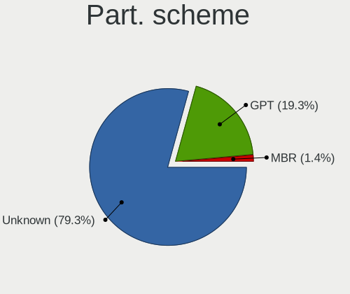
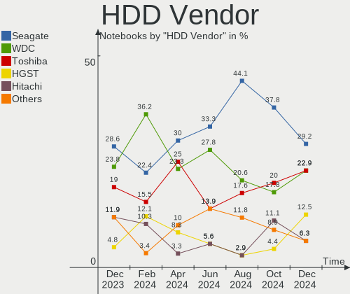
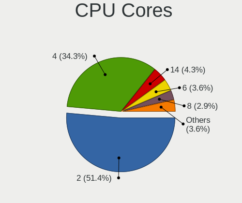
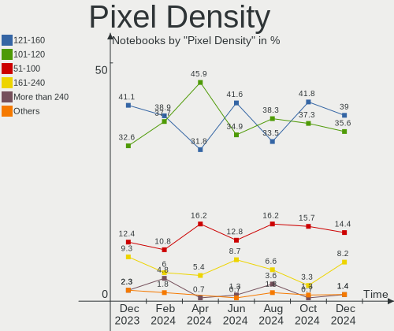
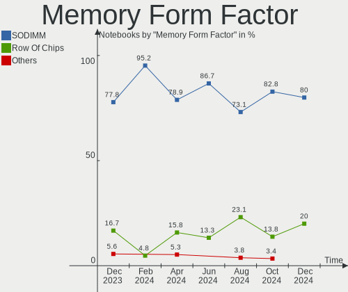
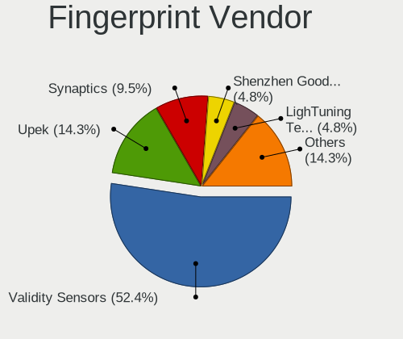

Zorin Hardware Trends (Notebooks)
---------------------------------

A project to identify most popular hardware characteristics and track their change
over time based on data collected by Zorin users at https://Linux-Hardware.org.

Anyone can contribute to this report by the [hw-probe](https://github.com/linuxhw/hw-probe) tool:

    sudo -E hw-probe -all -upload

Full-feature report is available here: https://linux-hardware.org/?view=trends

Period: Jan, 2022.

Contents
--------

* [ System ](#system)
  - [ OS                       ](#os)
  - [ OS Family                ](#os-family)
  - [ Kernel                   ](#kernel)
  - [ Kernel Family            ](#kernel-family)
  - [ Kernel Major Ver.        ](#kernel-major-ver)
  - [ Arch                     ](#arch)
  - [ DE                       ](#de)
  - [ Display Server           ](#display-server)
  - [ Display Manager          ](#display-manager)
  - [ OS Lang                  ](#os-lang)
  - [ Boot Mode                ](#boot-mode)
  - [ Filesystem               ](#filesystem)
  - [ Part. scheme             ](#part-scheme)
  - [ Dual Boot with Linux/BSD ](#dual-boot-with-linuxbsd)
  - [ Dual Boot (Win)          ](#dual-boot-win)

* [ Board ](#board)
  - [ Vendor                   ](#vendor)
  - [ Model                    ](#model)
  - [ Model Family             ](#model-family)
  - [ MFG Year                 ](#mfg-year)
  - [ Form Factor              ](#form-factor)
  - [ Secure Boot              ](#secure-boot)
  - [ Coreboot                 ](#coreboot)
  - [ RAM Size                 ](#ram-size)
  - [ RAM Used                 ](#ram-used)
  - [ Total Drives             ](#total-drives)
  - [ Has CD-ROM               ](#has-cd-rom)
  - [ Has Ethernet             ](#has-ethernet)
  - [ Has WiFi                 ](#has-wifi)
  - [ Has Bluetooth            ](#has-bluetooth)

* [ Location ](#location)
  - [ Country                  ](#country)
  - [ City                     ](#city)

* [ Drives ](#drives)
  - [ Drive Vendor             ](#drive-vendor)
  - [ Drive Model              ](#drive-model)
  - [ HDD Vendor               ](#hdd-vendor)
  - [ SSD Vendor               ](#ssd-vendor)
  - [ Drive Kind               ](#drive-kind)
  - [ Drive Connector          ](#drive-connector)
  - [ Drive Size               ](#drive-size)
  - [ Space Total              ](#space-total)
  - [ Space Used               ](#space-used)
  - [ Malfunc. Drives          ](#malfunc-drives)
  - [ Malfunc. Drive Vendor    ](#malfunc-drive-vendor)
  - [ Malfunc. HDD Vendor      ](#malfunc-hdd-vendor)
  - [ Malfunc. Drive Kind      ](#malfunc-drive-kind)
  - [ Failed Drives            ](#failed-drives)
  - [ Failed Drive Vendor      ](#failed-drive-vendor)
  - [ Drive Status             ](#drive-status)

* [ Storage controller ](#storage-controller)
  - [ Storage Vendor           ](#storage-vendor)
  - [ Storage Model            ](#storage-model)
  - [ Storage Kind             ](#storage-kind)

* [ Processor ](#processor)
  - [ CPU Vendor               ](#cpu-vendor)
  - [ CPU Model                ](#cpu-model)
  - [ CPU Model Family         ](#cpu-model-family)
  - [ CPU Cores                ](#cpu-cores)
  - [ CPU Sockets              ](#cpu-sockets)
  - [ CPU Threads              ](#cpu-threads)
  - [ CPU Op-Modes             ](#cpu-op-modes)
  - [ CPU Microcode            ](#cpu-microcode)
  - [ CPU Microarch            ](#cpu-microarch)

* [ Graphics ](#graphics)
  - [ GPU Vendor               ](#gpu-vendor)
  - [ GPU Model                ](#gpu-model)
  - [ GPU Combo                ](#gpu-combo)
  - [ GPU Driver               ](#gpu-driver)
  - [ GPU Memory               ](#gpu-memory)

* [ Monitor ](#monitor)
  - [ Monitor Vendor           ](#monitor-vendor)
  - [ Monitor Model            ](#monitor-model)
  - [ Monitor Resolution       ](#monitor-resolution)
  - [ Monitor Diagonal         ](#monitor-diagonal)
  - [ Monitor Width            ](#monitor-width)
  - [ Aspect Ratio             ](#aspect-ratio)
  - [ Monitor Area             ](#monitor-area)
  - [ Pixel Density            ](#pixel-density)
  - [ Multiple Monitors        ](#multiple-monitors)

* [ Network ](#network)
  - [ Net Controller Vendor    ](#net-controller-vendor)
  - [ Net Controller Model     ](#net-controller-model)
  - [ Wireless Vendor          ](#wireless-vendor)
  - [ Wireless Model           ](#wireless-model)
  - [ Ethernet Vendor          ](#ethernet-vendor)
  - [ Ethernet Model           ](#ethernet-model)
  - [ Net Controller Kind      ](#net-controller-kind)
  - [ Used Controller          ](#used-controller)
  - [ NICs                     ](#nics)
  - [ IPv6                     ](#ipv6)

* [ Bluetooth ](#bluetooth)
  - [ Bluetooth Vendor         ](#bluetooth-vendor)
  - [ Bluetooth Model          ](#bluetooth-model)

* [ Sound ](#sound)
  - [ Sound Vendor             ](#sound-vendor)
  - [ Sound Model              ](#sound-model)

* [ Memory ](#memory)
  - [ Memory Vendor            ](#memory-vendor)
  - [ Memory Model             ](#memory-model)
  - [ Memory Kind              ](#memory-kind)
  - [ Memory Form Factor       ](#memory-form-factor)
  - [ Memory Size              ](#memory-size)
  - [ Memory Speed             ](#memory-speed)

* [ Printers & scanners ](#printers--scanners)
  - [ Printer Vendor           ](#printer-vendor)
  - [ Printer Model            ](#printer-model)
  - [ Scanner Vendor           ](#scanner-vendor)
  - [ Scanner Model            ](#scanner-model)

* [ Camera ](#camera)
  - [ Camera Vendor            ](#camera-vendor)
  - [ Camera Model             ](#camera-model)

* [ Security ](#security)
  - [ Fingerprint Vendor       ](#fingerprint-vendor)
  - [ Fingerprint Model        ](#fingerprint-model)
  - [ Chipcard Vendor          ](#chipcard-vendor)
  - [ Chipcard Model           ](#chipcard-model)

* [ Unsupported ](#unsupported)
  - [ Unsupported Devices      ](#unsupported-devices)
  - [ Unsupported Device Types ](#unsupported-device-types)

System
------

OS
--

Installed operating systems

| Name     | Notebooks | Percent |
|----------|-----------|---------|
| Zorin 16 | 96        | 90.57%  |
| Zorin 15 | 10        | 9.43%   |

OS Family
---------

OS without a version

| Name  | Notebooks | Percent |
|-------|-----------|---------|
| Zorin | 106       | 100%    |

Kernel
------

Version of the Linux kernel

| Version                     | Notebooks | Percent |
|-----------------------------|-----------|---------|
| 5.11.0-46-generic           | 25        | 23.58%  |
| 5.13.0-27-generic           | 20        | 18.87%  |
| 5.11.0-43-generic           | 19        | 17.92%  |
| 5.11.0-44-generic           | 17        | 16.04%  |
| 5.11.0-41-generic           | 6         | 5.66%   |
| 5.11.0-38-generic           | 4         | 3.77%   |
| 5.4.0-94-generic            | 3         | 2.83%   |
| 5.4.0-91-generic            | 3         | 2.83%   |
| 5.4.0-92-generic            | 2         | 1.89%   |
| 5.11.0-27-generic           | 2         | 1.89%   |
| 5.8.0-49-generic            | 1         | 0.94%   |
| 5.4.0-96-generic            | 1         | 0.94%   |
| 5.4.0-87-generic            | 1         | 0.94%   |
| 5.16.0-051600rc8-lowlatency | 1         | 0.94%   |
| 5.13.0-25-generic           | 1         | 0.94%   |

Kernel Family
-------------

Linux kernel without a distro release

| Version | Notebooks | Percent |
|---------|-----------|---------|
| 5.11.0  | 73        | 68.87%  |
| 5.13.0  | 21        | 19.81%  |
| 5.4.0   | 10        | 9.43%   |
| 5.8.0   | 1         | 0.94%   |
| 5.16.0  | 1         | 0.94%   |

Kernel Major Ver.
-----------------

Linux kernel major version

| Version | Notebooks | Percent |
|---------|-----------|---------|
| 5.11    | 73        | 68.87%  |
| 5.13    | 21        | 19.81%  |
| 5.4     | 10        | 9.43%   |
| 5.8     | 1         | 0.94%   |
| 5.16    | 1         | 0.94%   |

Arch
----

OS architecture (x86_64, i586, etc.)

| Name   | Notebooks | Percent |
|--------|-----------|---------|
| x86_64 | 102       | 96.23%  |
| i686   | 4         | 3.77%   |

DE
--

Desktop Environment

| Name       | Notebooks | Percent |
|------------|-----------|---------|
| GNOME      | 84        | 79.25%  |
| XFCE       | 19        | 17.92%  |
| Unknown    | 2         | 1.89%   |
| X-Cinnamon | 1         | 0.94%   |

Display Server
--------------

X11 or Wayland

| Name    | Notebooks | Percent |
|---------|-----------|---------|
| X11     | 105       | 99.06%  |
| Wayland | 1         | 0.94%   |

Display Manager
---------------

SDDM, LightDM, etc.

| Name    | Notebooks | Percent |
|---------|-----------|---------|
| Unknown | 75        | 70.75%  |
| GDM3    | 18        | 16.98%  |
| LightDM | 8         | 7.55%   |
| GDM     | 5         | 4.72%   |

OS Lang
-------

Language

| Lang  | Notebooks | Percent |
|-------|-----------|---------|
| en_US | 41        | 38.68%  |
| de_DE | 15        | 14.15%  |
| es_ES | 6         | 5.66%   |
| en_GB | 6         | 5.66%   |
| fr_FR | 4         | 3.77%   |
| en_IN | 4         | 3.77%   |
| pt_BR | 3         | 2.83%   |
| pl_PL | 3         | 2.83%   |
| it_IT | 3         | 2.83%   |
| cs_CZ | 3         | 2.83%   |
| ru_RU | 2         | 1.89%   |
| nl_NL | 2         | 1.89%   |
| nl_BE | 2         | 1.89%   |
| es_MX | 2         | 1.89%   |
| en_ZA | 2         | 1.89%   |
| de_AT | 2         | 1.89%   |
| ro_RO | 1         | 0.94%   |
| pt_PT | 1         | 0.94%   |
| ja_JP | 1         | 0.94%   |
| es_CL | 1         | 0.94%   |
| en_AU | 1         | 0.94%   |
| ar_EG | 1         | 0.94%   |

Boot Mode
---------

EFI or BIOS

| Mode | Notebooks | Percent |
|------|-----------|---------|
| BIOS | 54        | 50.94%  |
| EFI  | 52        | 49.06%  |

Filesystem
----------

Type of filesystem

| Type    | Notebooks | Percent |
|---------|-----------|---------|
| Ext4    | 102       | 96.23%  |
| Overlay | 2         | 1.89%   |
| Btrfs   | 2         | 1.89%   |

Part. scheme
------------

Scheme of partitioning

| Type    | Notebooks | Percent |
|---------|-----------|---------|
| Unknown | 101       | 95.28%  |
| GPT     | 5         | 4.72%   |

Dual Boot with Linux/BSD
------------------------

Hosting more than one Linux/BSD

| Dual boot | Notebooks | Percent |
|-----------|-----------|---------|
| No        | 101       | 95.28%  |
| Yes       | 5         | 4.72%   |

Dual Boot (Win)
---------------

Hosting Linux and Windows

| Dual boot | Notebooks | Percent |
|-----------|-----------|---------|
| No        | 95        | 89.62%  |
| Yes       | 11        | 10.38%  |

Board
-----

Vendor
------

Motherboard manufacturer

| Name                | Notebooks | Percent |
|---------------------|-----------|---------|
| Lenovo              | 19        | 17.92%  |
| Hewlett-Packard     | 18        | 16.98%  |
| ASUSTek Computer    | 18        | 16.98%  |
| Dell                | 14        | 13.21%  |
| Acer                | 11        | 10.38%  |
| Toshiba             | 6         | 5.66%   |
| Samsung Electronics | 2         | 1.89%   |
| Jumper              | 2         | 1.89%   |
| Apple               | 2         | 1.89%   |
| WinSome             | 1         | 0.94%   |
| TWC                 | 1         | 0.94%   |
| Sony                | 1         | 0.94%   |
| Razer               | 1         | 0.94%   |
| Packard Bell        | 1         | 0.94%   |
| NEC Computers       | 1         | 0.94%   |
| Multilaser          | 1         | 0.94%   |
| MSI                 | 1         | 0.94%   |
| Mediacom            | 1         | 0.94%   |
| HUAWEI              | 1         | 0.94%   |
| Google              | 1         | 0.94%   |
| eMachines           | 1         | 0.94%   |
| Clevo               | 1         | 0.94%   |
| Unknown             | 1         | 0.94%   |

Model
-----

Motherboard model

| Name                                  | Notebooks | Percent |
|---------------------------------------|-----------|---------|
| Jumper EZbook                         | 2         | 1.89%   |
| HP Pavilion dv7                       | 2         | 1.89%   |
| Unknown                               | 2         | 1.89%   |
| WinSome A14C                          | 1         | 0.94%   |
| Toshiba TECRA A9                      | 1         | 0.94%   |
| Toshiba Satellite Pro C660            | 1         | 0.94%   |
| Toshiba Satellite M505                | 1         | 0.94%   |
| Toshiba Satellite C870-1C2            | 1         | 0.94%   |
| Toshiba Satellite C660                | 1         | 0.94%   |
| Toshiba Satellite A200                | 1         | 0.94%   |
| Sony SVF15213CBW                      | 1         | 0.94%   |
| Samsung R59P/R60P/R61P                | 1         | 0.94%   |
| Samsung 340XAA/350XAA/550XAA          | 1         | 0.94%   |
| Razer Blade Stealth                   | 1         | 0.94%   |
| Packard Bell EasyNote MZ35            | 1         | 0.94%   |
| NEC Computers PC-LL550RG              | 1         | 0.94%   |
| Multilaser UB32X                      | 1         | 0.94%   |
| MSI GE75 Raider 8SF                   | 1         | 0.94%   |
| Mediacom GTZS                         | 1         | 0.94%   |
| Lenovo V14-IIL 82C4                   | 1         | 0.94%   |
| Lenovo ThinkPad X61 7673C44           | 1         | 0.94%   |
| Lenovo ThinkPad X270 W10DG 20K5S1S704 | 1         | 0.94%   |
| Lenovo ThinkPad X250 20CLS03Y00       | 1         | 0.94%   |
| Lenovo ThinkPad X230 2325WR3          | 1         | 0.94%   |
| Lenovo ThinkPad X1 1294BL5            | 1         | 0.94%   |
| Lenovo ThinkPad T540p 20BFS56300      | 1         | 0.94%   |
| Lenovo ThinkPad T490 20N3S6US00       | 1         | 0.94%   |
| Lenovo ThinkPad T460s 20FAS09Y04      | 1         | 0.94%   |
| Lenovo ThinkPad T410s 292494G         | 1         | 0.94%   |
| Lenovo ThinkPad Edge E530c 33663VG    | 1         | 0.94%   |
| Lenovo ThinkPad E15 Gen 2 20TD003TRT  | 1         | 0.94%   |
| Lenovo ThinkBook 14 G2 ITL 20VD       | 1         | 0.94%   |
| Lenovo IdeaPad Yoga 13 20175          | 1         | 0.94%   |
| Lenovo IdeaPad S540-15IWL GTX 81SW    | 1         | 0.94%   |
| Lenovo IdeaPad 330-17ICH 81FL         | 1         | 0.94%   |
| Lenovo G780 20138                     | 1         | 0.94%   |
| Lenovo G500 20236                     | 1         | 0.94%   |
| Lenovo G50-70 20351                   | 1         | 0.94%   |
| HUAWEI NBLK-WAX9X                     | 1         | 0.94%   |
| HP ProBook 6450b                      | 1         | 0.94%   |
| HP ProBook 640 G1                     | 1         | 0.94%   |
| HP ProBook 4510s                      | 1         | 0.94%   |
| HP ProBook 445 G7                     | 1         | 0.94%   |
| HP Pavilion g6                        | 1         | 0.94%   |
| HP Pavilion 15                        | 1         | 0.94%   |
| HP OMEN by Laptop 15-dc1xxx           | 1         | 0.94%   |
| HP Notebook                           | 1         | 0.94%   |
| HP Laptop 15s-du2xxx                  | 1         | 0.94%   |
| HP Laptop 15s-dr0xxx                  | 1         | 0.94%   |
| HP Laptop 15-dy2xxx                   | 1         | 0.94%   |
| HP Laptop 14q-cs0xxx                  | 1         | 0.94%   |
| HP EliteBook 820 G3                   | 1         | 0.94%   |
| HP Compaq 8510p                       | 1         | 0.94%   |
| HP 250 G4                             | 1         | 0.94%   |
| HP 15                                 | 1         | 0.94%   |
| Google Ultima                         | 1         | 0.94%   |
| eMachines G625                        | 1         | 0.94%   |
| Dell XPS 15 9510                      | 1         | 0.94%   |
| Dell Vostro 1500                      | 1         | 0.94%   |
| Dell Latitude E7440                   | 1         | 0.94%   |

Model Family
------------

Motherboard model prefix

| Name                     | Notebooks | Percent |
|--------------------------|-----------|---------|
| Lenovo ThinkPad          | 11        | 10.38%  |
| Acer Aspire              | 8         | 7.55%   |
| Dell Latitude            | 6         | 5.66%   |
| Dell Inspiron            | 6         | 5.66%   |
| Toshiba Satellite        | 5         | 4.72%   |
| HP ProBook               | 4         | 3.77%   |
| HP Pavilion              | 4         | 3.77%   |
| HP Laptop                | 4         | 3.77%   |
| Lenovo IdeaPad           | 3         | 2.83%   |
| Jumper EZbook            | 2         | 1.89%   |
| ASUS VivoBook            | 2         | 1.89%   |
| Unknown                  | 2         | 1.89%   |
| WinSome A14C             | 1         | 0.94%   |
| Toshiba TECRA            | 1         | 0.94%   |
| Sony SVF15213CBW         | 1         | 0.94%   |
| Samsung R59P             | 1         | 0.94%   |
| Samsung 340XAA           | 1         | 0.94%   |
| Razer Blade              | 1         | 0.94%   |
| Packard Bell EasyNote    | 1         | 0.94%   |
| NEC Computers PC-LL550RG | 1         | 0.94%   |
| Multilaser UB32X         | 1         | 0.94%   |
| MSI GE75                 | 1         | 0.94%   |
| Mediacom GTZS            | 1         | 0.94%   |
| Lenovo V14-IIL           | 1         | 0.94%   |
| Lenovo ThinkBook         | 1         | 0.94%   |
| Lenovo G780              | 1         | 0.94%   |
| Lenovo G500              | 1         | 0.94%   |
| Lenovo G50-70            | 1         | 0.94%   |
| HUAWEI NBLK-WAX9X        | 1         | 0.94%   |
| HP OMEN                  | 1         | 0.94%   |
| HP Notebook              | 1         | 0.94%   |
| HP EliteBook             | 1         | 0.94%   |
| HP Compaq                | 1         | 0.94%   |
| HP 250                   | 1         | 0.94%   |
| HP 15                    | 1         | 0.94%   |
| Google Ultima            | 1         | 0.94%   |
| eMachines G625           | 1         | 0.94%   |
| Dell XPS                 | 1         | 0.94%   |
| Dell Vostro              | 1         | 0.94%   |
| Clevo W24                | 1         | 0.94%   |
| ASUS X555QG              | 1         | 0.94%   |
| ASUS X553MA              | 1         | 0.94%   |
| ASUS X550CC              | 1         | 0.94%   |
| ASUS X542BP              | 1         | 0.94%   |
| ASUS X542BA              | 1         | 0.94%   |
| ASUS X540YA              | 1         | 0.94%   |
| ASUS TUF                 | 1         | 0.94%   |
| ASUS TAICHI21            | 1         | 0.94%   |
| ASUS T100TAS             | 1         | 0.94%   |
| ASUS ROG                 | 1         | 0.94%   |
| ASUS K93SV               | 1         | 0.94%   |
| ASUS K54C                | 1         | 0.94%   |
| ASUS K52JT               | 1         | 0.94%   |
| ASUS GL552VW             | 1         | 0.94%   |
| ASUS E200HA              | 1         | 0.94%   |
| ASUS ASUS                | 1         | 0.94%   |
| Apple MacBookPro8        | 1         | 0.94%   |
| Apple MacBookPro6        | 1         | 0.94%   |
| Acer Predator            | 1         | 0.94%   |
| Acer NC-E1-572-54208G    | 1         | 0.94%   |

MFG Year
--------

Motherboard manufacture year

| Year | Notebooks | Percent |
|------|-----------|---------|
| 2013 | 10        | 9.43%   |
| 2010 | 10        | 9.43%   |
| 2021 | 9         | 8.49%   |
| 2019 | 9         | 8.49%   |
| 2020 | 8         | 7.55%   |
| 2016 | 8         | 7.55%   |
| 2012 | 8         | 7.55%   |
| 2011 | 8         | 7.55%   |
| 2017 | 7         | 6.6%    |
| 2007 | 6         | 5.66%   |
| 2014 | 5         | 4.72%   |
| 2008 | 5         | 4.72%   |
| 2018 | 4         | 3.77%   |
| 2015 | 4         | 3.77%   |
| 2009 | 4         | 3.77%   |
| 2006 | 1         | 0.94%   |

Form Factor
-----------

Physical design of the computer

| Name     | Notebooks | Percent |
|----------|-----------|---------|
| Notebook | 106       | 100%    |

Secure Boot
-----------

Enabled or disabled

| State    | Notebooks | Percent |
|----------|-----------|---------|
| Disabled | 92        | 86.79%  |
| Enabled  | 14        | 13.21%  |

Coreboot
--------

Have coreboot on board

| Used | Notebooks | Percent |
|------|-----------|---------|
| No   | 105       | 99.06%  |
| Yes  | 1         | 0.94%   |

RAM Size
--------

Total RAM memory

| Size in GB | Notebooks | Percent |
|------------|-----------|---------|
| 4.01-8.0   | 40        | 37.74%  |
| 3.01-4.0   | 32        | 30.19%  |
| 16.01-24.0 | 14        | 13.21%  |
| 8.01-16.0  | 9         | 8.49%   |
| 1.01-2.0   | 5         | 4.72%   |
| 32.01-64.0 | 3         | 2.83%   |
| 2.01-3.0   | 3         | 2.83%   |

RAM Used
--------

Used RAM memory

| Used GB  | Notebooks | Percent |
|----------|-----------|---------|
| 1.01-2.0 | 46        | 43.4%   |
| 2.01-3.0 | 38        | 35.85%  |
| 3.01-4.0 | 10        | 9.43%   |
| 4.01-8.0 | 9         | 8.49%   |
| 0.51-1.0 | 3         | 2.83%   |

Total Drives
------------

Number of drives on board

| Drives | Notebooks | Percent |
|--------|-----------|---------|
| 1      | 80        | 75.47%  |
| 2      | 21        | 19.81%  |
| 3      | 3         | 2.83%   |
| 4      | 1         | 0.94%   |
| 0      | 1         | 0.94%   |

Has CD-ROM
----------

Has CD-ROM on board

| Presented | Notebooks | Percent |
|-----------|-----------|---------|
| Yes       | 60        | 56.6%   |
| No        | 46        | 43.4%   |

Has Ethernet
------------

Has Ethernet on board

| Presented | Notebooks | Percent |
|-----------|-----------|---------|
| Yes       | 89        | 83.96%  |
| No        | 17        | 16.04%  |

Has WiFi
--------

Has WiFi module

| Presented | Notebooks | Percent |
|-----------|-----------|---------|
| Yes       | 105       | 99.06%  |
| No        | 1         | 0.94%   |

Has Bluetooth
-------------

Has Bluetooth module

| Presented | Notebooks | Percent |
|-----------|-----------|---------|
| Yes       | 77        | 72.64%  |
| No        | 29        | 27.36%  |

Location
--------

Country
-------

Geographic location (country)

| Country      | Notebooks | Percent |
|--------------|-----------|---------|
| USA          | 20        | 18.87%  |
| Germany      | 13        | 12.26%  |
| Spain        | 9         | 8.49%   |
| India        | 5         | 4.72%   |
| Netherlands  | 4         | 3.77%   |
| Brazil       | 4         | 3.77%   |
| Austria      | 4         | 3.77%   |
| South Africa | 3         | 2.83%   |
| Italy        | 3         | 2.83%   |
| France       | 3         | 2.83%   |
| Czechia      | 3         | 2.83%   |
| Belgium      | 3         | 2.83%   |
| UK           | 2         | 1.89%   |
| Sweden       | 2         | 1.89%   |
| Saudi Arabia | 2         | 1.89%   |
| Russia       | 2         | 1.89%   |
| Poland       | 2         | 1.89%   |
| Mexico       | 2         | 1.89%   |
| Finland      | 2         | 1.89%   |
| Bulgaria     | 2         | 1.89%   |
| Australia    | 2         | 1.89%   |
| Ukraine      | 1         | 0.94%   |
| Turkey       | 1         | 0.94%   |
| Serbia       | 1         | 0.94%   |
| Romania      | 1         | 0.94%   |
| Portugal     | 1         | 0.94%   |
| Pakistan     | 1         | 0.94%   |
| Norway       | 1         | 0.94%   |
| Morocco      | 1         | 0.94%   |
| Moldova      | 1         | 0.94%   |
| Lithuania    | 1         | 0.94%   |
| Japan        | 1         | 0.94%   |
| Israel       | 1         | 0.94%   |
| Greece       | 1         | 0.94%   |
| Chile        | 1         | 0.94%   |

City
----

Geographic location (city)

| City                | Notebooks | Percent |
|---------------------|-----------|---------|
| Vienna              | 4         | 3.77%   |
| Valencia            | 2         | 1.89%   |
| Seattle             | 2         | 1.89%   |
| Helsinki            | 2         | 1.89%   |
| Chicago             | 2         | 1.89%   |
| Zaio                | 1         | 0.94%   |
| Yeles               | 1         | 0.94%   |
| Weinolsheim         | 1         | 0.94%   |
| Waterford           | 1         | 0.94%   |
| Waregem             | 1         | 0.94%   |
| Vilnius             | 1         | 0.94%   |
| Vilamar             | 1         | 0.94%   |
| Vi?±a del Mar       | 1         | 0.94%   |
| Velikiye Luki       | 1         | 0.94%   |
| Ulft                | 1         | 0.94%   |
| Trinec              | 1         | 0.94%   |
| Torun               | 1         | 0.94%   |
| Tiraspol            | 1         | 0.94%   |
| The Hague           | 1         | 0.94%   |
| Thame               | 1         | 0.94%   |
| Tel Aviv            | 1         | 0.94%   |
| T??bor              | 1         | 0.94%   |
| Tafalla             | 1         | 0.94%   |
| Stuttgart           | 1         | 0.94%   |
| Stockholm           | 1         | 0.94%   |
| Soweto              | 1         | 0.94%   |
| Sofia               | 1         | 0.94%   |
| Smyrna              | 1         | 0.94%   |
| Skorzewo            | 1         | 0.94%   |
| Shibata             | 1         | 0.94%   |
| Schramberg          | 1         | 0.94%   |
| S?¶lvesborg         | 1         | 0.94%   |
| Saint-Cannat        | 1         | 0.94%   |
| Rousse              | 1         | 0.94%   |
| Roseville           | 1         | 0.94%   |
| Rome                | 1         | 0.94%   |
| Rois                | 1         | 0.94%   |
| Riyadh              | 1         | 0.94%   |
| Riesweiler          | 1         | 0.94%   |
| Rennes              | 1         | 0.94%   |
| Reggiolo            | 1         | 0.94%   |
| Recife              | 1         | 0.94%   |
| Puettlingen         | 1         | 0.94%   |
| Povoletto           | 1         | 0.94%   |
| Perth               | 1         | 0.94%   |
| Olomouc             | 1         | 0.94%   |
| Nuremberg           | 1         | 0.94%   |
| New York            | 1         | 0.94%   |
| Nesttun             | 1         | 0.94%   |
| Neath               | 1         | 0.94%   |
| Nagpur              | 1         | 0.94%   |
| Naberezhnyye Chelny | 1         | 0.94%   |
| Mountain View       | 1         | 0.94%   |
| Morrow              | 1         | 0.94%   |
| Melun               | 1         | 0.94%   |
| Melbourne           | 1         | 0.94%   |
| Media               | 1         | 0.94%   |
| Logro?±o            | 1         | 0.94%   |
| Lexington           | 1         | 0.94%   |
| La Calamine         | 1         | 0.94%   |

Drives
------

Drive Vendor
------------

Hard drive vendors

| Vendor              | Notebooks | Drives | Percent |
|---------------------|-----------|--------|---------|
| Samsung Electronics | 20        | 21     | 16%     |
| WDC                 | 17        | 18     | 13.6%   |
| Seagate             | 17        | 17     | 13.6%   |
| Toshiba             | 14        | 14     | 11.2%   |
| SanDisk             | 14        | 14     | 11.2%   |
| Unknown             | 10        | 10     | 8%      |
| Kingston            | 6         | 6      | 4.8%    |
| Crucial             | 5         | 5      | 4%      |
| Micron Technology   | 3         | 3      | 2.4%    |
| HGST                | 3         | 3      | 2.4%    |
| Intel               | 2         | 2      | 1.6%    |
| Hitachi             | 2         | 2      | 1.6%    |
| Fujitsu             | 2         | 2      | 1.6%    |
| TO Exter            | 1         | 1      | 0.8%    |
| Space ke            | 1         | 1      | 0.8%    |
| SK Hynix            | 1         | 1      | 0.8%    |
| PNY                 | 1         | 1      | 0.8%    |
| Patriot             | 1         | 1      | 0.8%    |
| LS                  | 1         | 1      | 0.8%    |
| LITEON              | 1         | 1      | 0.8%    |
| China               | 1         | 1      | 0.8%    |
| Apacer              | 1         | 1      | 0.8%    |
| A-DATA Technology   | 1         | 1      | 0.8%    |

Drive Model
-----------

Hard drive models

| Model                                | Notebooks | Percent |
|--------------------------------------|-----------|---------|
| Sandisk NVMe SSD Drive 256GB         | 6         | 4.72%   |
| Toshiba MQ04ABF100 1TB               | 4         | 3.15%   |
| Unknown MMC Card  32GB               | 3         | 2.36%   |
| Unknown MMC Card  128GB              | 3         | 2.36%   |
| Toshiba MQ01ABD100 1TB               | 3         | 2.36%   |
| Unknown MMC Card  64GB               | 2         | 1.57%   |
| Seagate ST1000LM035-1RK172 1TB       | 2         | 1.57%   |
| Seagate ST1000LM024 HN-M101MBB 1TB   | 2         | 1.57%   |
| Sandisk NVMe SSD Drive 512GB         | 2         | 1.57%   |
| Samsung SSD 850 EVO 500GB            | 2         | 1.57%   |
| Samsung NVMe SSD Drive 256GB         | 2         | 1.57%   |
| Samsung MZNLN256HCHP-00000 256GB SSD | 2         | 1.57%   |
| Kingston SA400S37480G 480GB SSD      | 2         | 1.57%   |
| Kingston SA400S37240G 240GB SSD      | 2         | 1.57%   |
| HGST HTS721010A9E630 1TB             | 2         | 1.57%   |
| WDC WDS500G2B0A-00SM50 500GB SSD     | 1         | 0.79%   |
| WDC WDS240G2G0A-00JH30 240GB SSD     | 1         | 0.79%   |
| WDC WDS120G1G0B-00RC30 120GB SSD     | 1         | 0.79%   |
| WDC WDS100T2B0B-00YS70 1TB SSD       | 1         | 0.79%   |
| WDC WD5000LPVX-80V0TT0 500GB         | 1         | 0.79%   |
| WDC WD5000LPVX-22V0TT0 500GB         | 1         | 0.79%   |
| WDC WD5000LPVT-22G33T0 500GB         | 1         | 0.79%   |
| WDC WD5000LPCX-24C6HT0 500GB         | 1         | 0.79%   |
| WDC WD5000BPVT-75HXZT1 500GB         | 1         | 0.79%   |
| WDC WD5000BPKX-75HPJT0 500GB         | 1         | 0.79%   |
| WDC WD40 EFRX-68WT0N0 4TB            | 1         | 0.79%   |
| WDC WD3200BPVT-22JJ5T0 320GB         | 1         | 0.79%   |
| WDC WD2500BPVT-26JJ5T0 250GB         | 1         | 0.79%   |
| WDC WD10TPVT-65HT5T0 1TB             | 1         | 0.79%   |
| WDC WD10SPZX-80Z10T2 1TB             | 1         | 0.79%   |
| WDC WD10SPZX-60Z10T0 1TB             | 1         | 0.79%   |
| WDC WD10SPZX-35Z10T0 1TB             | 1         | 0.79%   |
| WDC WD10JPVX-22JC3T0 1TB             | 1         | 0.79%   |
| Unknown MMC Card  256GB              | 1         | 0.79%   |
| Unknown MMC Card  16GB               | 1         | 0.79%   |
| Toshiba THNSNJ256GMCU 256GB SSD      | 1         | 0.79%   |
| Toshiba THNSFJ256GDNU A 256GB SSD    | 1         | 0.79%   |
| Toshiba MK5059GSXP 500GB             | 1         | 0.79%   |
| Toshiba MK2561GSYN 250GB             | 1         | 0.79%   |
| Toshiba MK2555GSX 250GB              | 1         | 0.79%   |
| Toshiba MK1655GSX 160GB              | 1         | 0.79%   |
| Toshiba HDWL110 1TB                  | 1         | 0.79%   |
| TO Exter nal USB 3.0 256GB           | 1         | 0.79%   |
| Space ke USB 3.1 Storage 500GB       | 1         | 0.79%   |
| SK Hynix NVMe SSD Drive 1024GB       | 1         | 0.79%   |
| Seagate ST980813AS 80GB              | 1         | 0.79%   |
| Seagate ST9500325AS 500GB            | 1         | 0.79%   |
| Seagate ST9320325ASG 320GB           | 1         | 0.79%   |
| Seagate ST9320325AS 320GB            | 1         | 0.79%   |
| Seagate ST9320320AS 320GB            | 1         | 0.79%   |
| Seagate ST9160412ASG 160GB           | 1         | 0.79%   |
| Seagate ST9120822AS 120GB            | 1         | 0.79%   |
| Seagate ST750LM022 HN-M750MBB 752GB  | 1         | 0.79%   |
| Seagate ST320LM000 HM321HI 320GB     | 1         | 0.79%   |
| Seagate ST2000LM015-2E8174 2TB       | 1         | 0.79%   |
| Seagate ST2000LM007-1R8174 2TB       | 1         | 0.79%   |
| Seagate ST1000LX015-1U7172-SSHD 1TB  | 1         | 0.79%   |
| Seagate ST1000LM049-2GH172 1TB       | 1         | 0.79%   |
| SanDisk SSD PLUS 120GB               | 1         | 0.79%   |
| SanDisk SDW64G  64GB                 | 1         | 0.79%   |

HDD Vendor
----------

Hard disk drive vendors

| Vendor   | Notebooks | Drives | Percent |
|----------|-----------|--------|---------|
| Seagate  | 17        | 17     | 33.33%  |
| WDC      | 14        | 14     | 27.45%  |
| Toshiba  | 12        | 12     | 23.53%  |
| HGST     | 3         | 3      | 5.88%   |
| Hitachi  | 2         | 2      | 3.92%   |
| Fujitsu  | 2         | 2      | 3.92%   |
| TO Exter | 1         | 1      | 1.96%   |

SSD Vendor
----------

Solid state drive vendors

| Vendor              | Notebooks | Drives | Percent |
|---------------------|-----------|--------|---------|
| Samsung Electronics | 13        | 14     | 30.23%  |
| Kingston            | 6         | 6      | 13.95%  |
| Crucial             | 5         | 5      | 11.63%  |
| WDC                 | 4         | 4      | 9.3%    |
| SanDisk             | 4         | 4      | 9.3%    |
| Toshiba             | 2         | 2      | 4.65%   |
| Micron Technology   | 2         | 2      | 4.65%   |
| PNY                 | 1         | 1      | 2.33%   |
| Patriot             | 1         | 1      | 2.33%   |
| LITEON              | 1         | 1      | 2.33%   |
| Intel               | 1         | 1      | 2.33%   |
| China               | 1         | 1      | 2.33%   |
| Apacer              | 1         | 1      | 2.33%   |
| A-DATA Technology   | 1         | 1      | 2.33%   |

Drive Kind
----------

HDD or SSD

| Kind    | Notebooks | Drives | Percent |
|---------|-----------|--------|---------|
| HDD     | 50        | 51     | 40.98%  |
| SSD     | 42        | 44     | 34.43%  |
| NVMe    | 16        | 18     | 13.11%  |
| MMC     | 12        | 12     | 9.84%   |
| Unknown | 2         | 2      | 1.64%   |

Drive Connector
---------------

SATA, SAS, NVMe, etc.

| Type | Notebooks | Drives | Percent |
|------|-----------|--------|---------|
| SATA | 87        | 94     | 73.73%  |
| NVMe | 16        | 18     | 13.56%  |
| MMC  | 12        | 12     | 10.17%  |
| SAS  | 3         | 3      | 2.54%   |

Drive Size
----------

Size of hard drive

| Size in TB | Notebooks | Drives | Percent |
|------------|-----------|--------|---------|
| 0.01-0.5   | 62        | 65     | 68.13%  |
| 0.51-1.0   | 26        | 27     | 28.57%  |
| 1.01-2.0   | 2         | 2      | 2.2%    |
| 3.01-4.0   | 1         | 1      | 1.1%    |

Space Total
-----------

Amount of disk space available on the file system

| Size in GB     | Notebooks | Percent |
|----------------|-----------|---------|
| 101-250        | 37        | 34.91%  |
| 251-500        | 24        | 22.64%  |
| 501-1000       | 21        | 19.81%  |
| 51-100         | 9         | 8.49%   |
| 21-50          | 7         | 6.6%    |
| 1-20           | 4         | 3.77%   |
| 1001-2000      | 2         | 1.89%   |
| More than 3000 | 1         | 0.94%   |
| 2001-3000      | 1         | 0.94%   |

Space Used
----------

Amount of used disk space

| Used GB   | Notebooks | Percent |
|-----------|-----------|---------|
| 1-20      | 46        | 43.4%   |
| 21-50     | 33        | 31.13%  |
| 51-100    | 11        | 10.38%  |
| 101-250   | 10        | 9.43%   |
| 251-500   | 4         | 3.77%   |
| 2001-3000 | 1         | 0.94%   |
| 501-1000  | 1         | 0.94%   |

Malfunc. Drives
---------------

Drive models with a malfunction

Zero info for selected period =(

Malfunc. Drive Vendor
---------------------

Vendors of faulty drives

Zero info for selected period =(

Malfunc. HDD Vendor
-------------------

Vendors of faulty HDD drives

Zero info for selected period =(

Malfunc. Drive Kind
-------------------

Kinds of faulty drives

Zero info for selected period =(

Failed Drives
-------------

Failed drive models

Zero info for selected period =(

Failed Drive Vendor
-------------------

Failed drive vendors

Zero info for selected period =(

Drive Status
------------

Number of failed and malfunc. drives

| Status   | Notebooks | Drives | Percent |
|----------|-----------|--------|---------|
| Detected | 101       | 120    | 94.39%  |
| Works    | 6         | 7      | 5.61%   |

Storage controller
------------------

Storage Vendor
--------------

Storage controller vendors

| Vendor              | Notebooks | Percent |
|---------------------|-----------|---------|
| Intel               | 84        | 71.79%  |
| AMD                 | 14        | 11.97%  |
| Sandisk             | 8         | 6.84%   |
| Samsung Electronics | 7         | 5.98%   |
| ASMedia Technology  | 2         | 1.71%   |
| SK Hynix            | 1         | 0.85%   |
| Micron Technology   | 1         | 0.85%   |

Storage Model
-------------

Storage controller models

| Model                                                                                  | Notebooks | Percent |
|----------------------------------------------------------------------------------------|-----------|---------|
| Intel 7 Series Chipset Family 6-port SATA Controller [AHCI mode]                       | 14        | 10.45%  |
| Intel Sunrise Point-LP SATA Controller [AHCI mode]                                     | 9         | 6.72%   |
| Intel 82801 Mobile SATA Controller [RAID mode]                                         | 8         | 5.97%   |
| AMD FCH SATA Controller [AHCI mode]                                                    | 8         | 5.97%   |
| Intel Celeron N3350/Pentium N4200/Atom E3900 Series SATA AHCI Controller               | 5         | 3.73%   |
| Intel 82801IBM/IEM (ICH9M/ICH9M-E) 4 port SATA Controller [AHCI mode]                  | 5         | 3.73%   |
| Intel 82801HM/HEM (ICH8M/ICH8M-E) IDE Controller                                       | 5         | 3.73%   |
| Intel 5 Series/3400 Series Chipset 4 port SATA AHCI Controller                         | 5         | 3.73%   |
| Sandisk WD Blue SN500 / PC SN520 NVMe SSD                                              | 4         | 2.99%   |
| Intel Volume Management Device NVMe RAID Controller                                    | 4         | 2.99%   |
| Intel 82801HM/HEM (ICH8M/ICH8M-E) SATA Controller [AHCI mode]                          | 4         | 2.99%   |
| Intel 6 Series/C200 Series Chipset Family 6 port Mobile SATA AHCI Controller           | 4         | 2.99%   |
| Samsung NVMe SSD Controller 980                                                        | 3         | 2.24%   |
| Intel Atom/Celeron/Pentium Processor x5-E8000/J3xxx/N3xxx Series SATA Controller       | 3         | 2.24%   |
| Sandisk WD Black SN750 / PC SN730 NVMe SSD                                             | 2         | 1.49%   |
| Samsung NVMe SSD Controller SM981/PM981/PM983                                          | 2         | 1.49%   |
| Intel Tiger Lake-LP SATA Controller [AHCI mode]                                        | 2         | 1.49%   |
| Intel HM170/QM170 Chipset SATA Controller [AHCI Mode]                                  | 2         | 1.49%   |
| Intel Cannon Point-LP SATA Controller [AHCI Mode]                                      | 2         | 1.49%   |
| Intel Cannon Lake Mobile PCH SATA AHCI Controller                                      | 2         | 1.49%   |
| Intel 8 Series/C220 Series Chipset Family 6-port SATA Controller 1 [AHCI mode]         | 2         | 1.49%   |
| Intel 8 Series SATA Controller 1 [AHCI mode]                                           | 2         | 1.49%   |
| Intel 6 Series/C200 Series Chipset Family Mobile SATA Controller (IDE mode, ports 4-5) | 2         | 1.49%   |
| Intel 6 Series/C200 Series Chipset Family Mobile SATA Controller (IDE mode, ports 0-3) | 2         | 1.49%   |
| Intel 5 Series/3400 Series Chipset 6 port SATA AHCI Controller                         | 2         | 1.49%   |
| ASMedia ASM1062 Serial ATA Controller                                                  | 2         | 1.49%   |
| AMD SB7x0/SB8x0/SB9x0 SATA Controller [IDE mode]                                       | 2         | 1.49%   |
| AMD SB7x0/SB8x0/SB9x0 SATA Controller [AHCI mode]                                      | 2         | 1.49%   |
| AMD SB600 Non-Raid-5 SATA                                                              | 2         | 1.49%   |
| AMD SB600 IDE                                                                          | 2         | 1.49%   |
| AMD FCH IDE Controller                                                                 | 2         | 1.49%   |
| SK Hynix Gold P31 SSD                                                                  | 1         | 0.75%   |
| Sandisk WD Blue SN550 NVMe SSD                                                         | 1         | 0.75%   |
| Sandisk WD Black 2018/SN750 / PC SN720 NVMe SSD                                        | 1         | 0.75%   |
| Samsung NVMe SSD Controller SM961/PM961/SM963                                          | 1         | 0.75%   |
| Samsung NVMe SSD Controller PM9A1/PM9A3/980PRO                                         | 1         | 0.75%   |
| Micron Non-Volatile memory controller                                                  | 1         | 0.75%   |
| Intel Wildcat Point-LP SATA Controller [AHCI Mode]                                     | 1         | 0.75%   |
| Intel SSD 660P Series                                                                  | 1         | 0.75%   |
| Intel NM10/ICH7 Family SATA Controller [AHCI mode]                                     | 1         | 0.75%   |
| Intel Mobile PM965/GM965 PT IDER Controller                                            | 1         | 0.75%   |
| Intel Ice Lake-LP SATA Controller [AHCI mode]                                          | 1         | 0.75%   |
| Intel Comet Lake PCH-LP SATA RAID Premium Controller                                   | 1         | 0.75%   |
| Intel Celeron/Pentium Silver Processor SATA Controller                                 | 1         | 0.75%   |
| Intel Atom Processor E3800 Series SATA IDE Controller                                  | 1         | 0.75%   |
| Intel Atom Processor E3800 Series SATA AHCI Controller                                 | 1         | 0.75%   |
| Intel 82801IBM/IEM (ICH9M/ICH9M-E) 2 port SATA Controller [IDE mode]                   | 1         | 0.75%   |
| Intel 82801HM/HEM (ICH8M/ICH8M-E) SATA Controller [IDE mode]                           | 1         | 0.75%   |
| AMD SB7x0/SB8x0/SB9x0 IDE Controller                                                   | 1         | 0.75%   |
| AMD IXP SB4x0 IDE Controller                                                           | 1         | 0.75%   |

Storage Kind
------------

Kind of storage controller (IDE, SATA, NVMe, SAS, ...)

| Kind | Notebooks | Percent |
|------|-----------|---------|
| SATA | 81        | 64.8%   |
| NVMe | 16        | 12.8%   |
| IDE  | 15        | 12%     |
| RAID | 13        | 10.4%   |

Processor
---------

CPU Vendor
----------

Processor vendors

| Vendor | Notebooks | Percent |
|--------|-----------|---------|
| Intel  | 92        | 86.79%  |
| AMD    | 14        | 13.21%  |

CPU Model
---------

Processor models

| Model                                        | Notebooks | Percent |
|----------------------------------------------|-----------|---------|
| Intel Core i5-6300U CPU @ 2.40GHz            | 3         | 2.83%   |
| Intel Core i3-7020U CPU @ 2.30GHz            | 3         | 2.83%   |
| Intel Celeron CPU N3450 @ 1.10GHz            | 3         | 2.83%   |
| Intel 11th Gen Core i5-1135G7 @ 2.40GHz      | 3         | 2.83%   |
| Intel Core i7-8750H CPU @ 2.20GHz            | 2         | 1.89%   |
| Intel Core i7-6700HQ CPU @ 2.60GHz           | 2         | 1.89%   |
| Intel Core i7-2670QM CPU @ 2.20GHz           | 2         | 1.89%   |
| Intel Core i7 CPU Q 740 @ 1.73GHz            | 2         | 1.89%   |
| Intel Core i5-8265U CPU @ 1.60GHz            | 2         | 1.89%   |
| Intel Core i5-2520M CPU @ 2.50GHz            | 2         | 1.89%   |
| Intel Core i3-3110M CPU @ 2.40GHz            | 2         | 1.89%   |
| Intel Core i3-1005G1 CPU @ 1.20GHz           | 2         | 1.89%   |
| Intel Celeron CPU N3150 @ 1.60GHz            | 2         | 1.89%   |
| AMD A9-9420 RADEON R5, 5 COMPUTE CORES 2C+3G | 2         | 1.89%   |
| Intel Pentium Silver N5030 CPU @ 1.10GHz     | 1         | 0.94%   |
| Intel Pentium Dual CPU T3200 @ 2.00GHz       | 1         | 0.94%   |
| Intel Pentium Dual CPU T2390 @ 1.86GHz       | 1         | 0.94%   |
| Intel Pentium CPU P6000 @ 1.87GHz            | 1         | 0.94%   |
| Intel Pentium CPU N3520 @ 2.16GHz            | 1         | 0.94%   |
| Intel Pentium CPU J3710 @ 1.60GHz            | 1         | 0.94%   |
| Intel Pentium CPU B950 @ 2.10GHz             | 1         | 0.94%   |
| Intel Core i7-9750H CPU @ 2.60GHz            | 1         | 0.94%   |
| Intel Core i7-8565U CPU @ 1.80GHz            | 1         | 0.94%   |
| Intel Core i7-8550U CPU @ 1.80GHz            | 1         | 0.94%   |
| Intel Core i7-7500U CPU @ 2.70GHz            | 1         | 0.94%   |
| Intel Core i7-6600U CPU @ 2.60GHz            | 1         | 0.94%   |
| Intel Core i7-6500U CPU @ 2.50GHz            | 1         | 0.94%   |
| Intel Core i7-5600U CPU @ 2.60GHz            | 1         | 0.94%   |
| Intel Core i7-4810MQ CPU @ 2.80GHz           | 1         | 0.94%   |
| Intel Core i7-4600U CPU @ 2.10GHz            | 1         | 0.94%   |
| Intel Core i7-4500U CPU @ 1.80GHz            | 1         | 0.94%   |
| Intel Core i7-3632QM CPU @ 2.20GHz           | 1         | 0.94%   |
| Intel Core i7-3517U CPU @ 1.90GHz            | 1         | 0.94%   |
| Intel Core i7 CPU Q 720 @ 1.60GHz            | 1         | 0.94%   |
| Intel Core i7 CPU M 620 @ 2.67GHz            | 1         | 0.94%   |
| Intel Core i5-8365U CPU @ 1.60GHz            | 1         | 0.94%   |
| Intel Core i5-4310M CPU @ 2.70GHz            | 1         | 0.94%   |
| Intel Core i5-4200U CPU @ 1.60GHz            | 1         | 0.94%   |
| Intel Core i5-3337U CPU @ 1.80GHz            | 1         | 0.94%   |
| Intel Core i5-3320M CPU @ 2.60GHz            | 1         | 0.94%   |
| Intel Core i5-3317U CPU @ 1.70GHz            | 1         | 0.94%   |
| Intel Core i5-3230M CPU @ 2.60GHz            | 1         | 0.94%   |
| Intel Core i5-3210M CPU @ 2.50GHz            | 1         | 0.94%   |
| Intel Core i5-2540M CPU @ 2.60GHz            | 1         | 0.94%   |
| Intel Core i5-2430M CPU @ 2.40GHz            | 1         | 0.94%   |
| Intel Core i5-2415M CPU @ 2.30GHz            | 1         | 0.94%   |
| Intel Core i5 CPU M 540 @ 2.53GHz            | 1         | 0.94%   |
| Intel Core i5 CPU M 520 @ 2.40GHz            | 1         | 0.94%   |
| Intel Core i5 CPU M 460 @ 2.53GHz            | 1         | 0.94%   |
| Intel Core i3-7100U CPU @ 2.40GHz            | 1         | 0.94%   |
| Intel Core i3-6100U CPU @ 2.30GHz            | 1         | 0.94%   |
| Intel Core i3-3227U CPU @ 1.90GHz            | 1         | 0.94%   |
| Intel Core i3-2370M CPU @ 2.40GHz            | 1         | 0.94%   |
| Intel Core i3-2365M CPU @ 1.40GHz            | 1         | 0.94%   |
| Intel Core i3-2348M CPU @ 2.30GHz            | 1         | 0.94%   |
| Intel Core i3-10110U CPU @ 2.10GHz           | 1         | 0.94%   |
| Intel Core 2 Duo CPU T8300 @ 2.40GHz         | 1         | 0.94%   |
| Intel Core 2 Duo CPU T7500 @ 2.20GHz         | 1         | 0.94%   |
| Intel Core 2 Duo CPU T7300 @ 2.00GHz         | 1         | 0.94%   |
| Intel Core 2 Duo CPU T6600 @ 2.20GHz         | 1         | 0.94%   |

CPU Model Family
----------------

Processor model prefix

| Model                   | Notebooks | Percent |
|-------------------------|-----------|---------|
| Intel Core i7           | 22        | 20.75%  |
| Intel Core i5           | 21        | 19.81%  |
| Intel Core i3           | 14        | 13.21%  |
| Intel Celeron           | 10        | 9.43%   |
| Intel Core 2 Duo        | 9         | 8.49%   |
| Other                   | 6         | 5.66%   |
| Intel Pentium           | 4         | 3.77%   |
| Intel Atom              | 3         | 2.83%   |
| Intel Pentium Dual      | 2         | 1.89%   |
| AMD Ryzen 5             | 2         | 1.89%   |
| AMD A10                 | 2         | 1.89%   |
| Intel Pentium Silver    | 1         | 0.94%   |
| Intel Celeron M         | 1         | 0.94%   |
| Intel Celeron Dual-Core | 1         | 0.94%   |
| AMD Ryzen 9             | 1         | 0.94%   |
| AMD Ryzen 7             | 1         | 0.94%   |
| AMD Phenom II           | 1         | 0.94%   |
| AMD E1                  | 1         | 0.94%   |
| AMD Athlon X2           | 1         | 0.94%   |
| AMD Athlon II           | 1         | 0.94%   |
| AMD Athlon 64 X2        | 1         | 0.94%   |
| AMD A6                  | 1         | 0.94%   |

CPU Cores
---------

Number of processor cores

| Number | Notebooks | Percent |
|--------|-----------|---------|
| 2      | 66        | 62.26%  |
| 4      | 32        | 30.19%  |
| 8      | 3         | 2.83%   |
| 6      | 3         | 2.83%   |
| 3      | 1         | 0.94%   |
| 1      | 1         | 0.94%   |

CPU Sockets
-----------

Number of sockets

| Number | Notebooks | Percent |
|--------|-----------|---------|
| 1      | 106       | 100%    |

CPU Threads
-----------

Threads per core (Hyper-Threading)

| Number | Notebooks | Percent |
|--------|-----------|---------|
| 2      | 65        | 61.32%  |
| 1      | 41        | 38.68%  |

CPU Op-Modes
------------

CPU Operation Modes (32-bit, 64-bit)

| Op mode        | Notebooks | Percent |
|----------------|-----------|---------|
| 32-bit, 64-bit | 105       | 99.06%  |
| 32-bit         | 1         | 0.94%   |

CPU Microcode
-------------

Microcode number

| Number     | Notebooks | Percent |
|------------|-----------|---------|
| 0x206a7    | 10        | 9.43%   |
| 0x306a9    | 8         | 7.55%   |
| Unknown    | 7         | 6.6%    |
| 0x6fd      | 6         | 5.66%   |
| 0x806ec    | 5         | 4.72%   |
| 0x806e9    | 5         | 4.72%   |
| 0x406e3    | 5         | 4.72%   |
| 0x806c1    | 4         | 3.77%   |
| 0x506c9    | 4         | 3.77%   |
| 0x20655    | 4         | 3.77%   |
| 0x406c3    | 3         | 2.83%   |
| 0x40651    | 3         | 2.83%   |
| 0x106e5    | 3         | 2.83%   |
| 0x1067a    | 3         | 2.83%   |
| 0x706e5    | 2         | 1.89%   |
| 0x6fb      | 2         | 1.89%   |
| 0x506e3    | 2         | 1.89%   |
| 0x406c4    | 2         | 1.89%   |
| 0x306c3    | 2         | 1.89%   |
| 0x30678    | 2         | 1.89%   |
| 0x010000c8 | 2         | 1.89%   |
| 0x906ea    | 1         | 0.94%   |
| 0x806ea    | 1         | 0.94%   |
| 0x806d1    | 1         | 0.94%   |
| 0x706a8    | 1         | 0.94%   |
| 0x6e8      | 1         | 0.94%   |
| 0x506ca    | 1         | 0.94%   |
| 0x306d4    | 1         | 0.94%   |
| 0x30673    | 1         | 0.94%   |
| 0x30661    | 1         | 0.94%   |
| 0x20652    | 1         | 0.94%   |
| 0x10676    | 1         | 0.94%   |
| 0x0a50000b | 1         | 0.94%   |
| 0x08600106 | 1         | 0.94%   |
| 0x08108109 | 1         | 0.94%   |
| 0x08108102 | 1         | 0.94%   |
| 0x07030105 | 1         | 0.94%   |
| 0x06006705 | 1         | 0.94%   |
| 0x06006704 | 1         | 0.94%   |
| 0x0600611a | 1         | 0.94%   |
| 0x0600111f | 1         | 0.94%   |
| 0x03000027 | 1         | 0.94%   |
| 0x02000032 | 1         | 0.94%   |

CPU Microarch
-------------

Microarchitecture

| Name            | Notebooks | Percent |
|-----------------|-----------|---------|
| KabyLake        | 14        | 13.21%  |
| SandyBridge     | 11        | 10.38%  |
| IvyBridge       | 10        | 9.43%   |
| Skylake         | 8         | 7.55%   |
| Silvermont      | 8         | 7.55%   |
| Core            | 8         | 7.55%   |
| Westmere        | 5         | 4.72%   |
| Haswell         | 5         | 4.72%   |
| Goldmont        | 5         | 4.72%   |
| TigerLake       | 4         | 3.77%   |
| Penryn          | 4         | 3.77%   |
| Nehalem         | 3         | 2.83%   |
| Icelake         | 3         | 2.83%   |
| Excavator       | 3         | 2.83%   |
| Zen+            | 2         | 1.89%   |
| K10             | 2         | 1.89%   |
| Zen 3           | 1         | 0.94%   |
| Zen 2           | 1         | 0.94%   |
| Puma            | 1         | 0.94%   |
| Piledriver      | 1         | 0.94%   |
| P6              | 1         | 0.94%   |
| K8 Hammer       | 1         | 0.94%   |
| K8 & K10 hybrid | 1         | 0.94%   |
| K10 Llano       | 1         | 0.94%   |
| Goldmont plus   | 1         | 0.94%   |
| Broadwell       | 1         | 0.94%   |
| Bonnell         | 1         | 0.94%   |

Graphics
--------

GPU Vendor
----------

Vendors of graphics cards

| Vendor | Notebooks | Percent |
|--------|-----------|---------|
| Intel  | 82        | 64.06%  |
| AMD    | 25        | 19.53%  |
| Nvidia | 21        | 16.41%  |

GPU Model
---------

Graphics card models

| Model                                                                                    | Notebooks | Percent |
|------------------------------------------------------------------------------------------|-----------|---------|
| Intel 2nd Generation Core Processor Family Integrated Graphics Controller                | 11        | 8.21%   |
| Intel 3rd Gen Core processor Graphics Controller                                         | 10        | 7.46%   |
| Intel Skylake GT2 [HD Graphics 520]                                                      | 6         | 4.48%   |
| Intel Mobile 4 Series Chipset Integrated Graphics Controller                             | 5         | 3.73%   |
| Intel HD Graphics 500                                                                    | 5         | 3.73%   |
| Intel Atom/Celeron/Pentium Processor x5-E8000/J3xxx/N3xxx Integrated Graphics Controller | 5         | 3.73%   |
| Intel WhiskeyLake-U GT2 [UHD Graphics 620]                                               | 4         | 2.99%   |
| Intel HD Graphics 620                                                                    | 4         | 2.99%   |
| Intel Core Processor Integrated Graphics Controller                                      | 4         | 2.99%   |
| Nvidia GF117M [GeForce 610M/710M/810M/820M / GT 620M/625M/630M/720M]                     | 3         | 2.24%   |
| Intel TigerLake-LP GT2 [Iris Xe Graphics]                                                | 3         | 2.24%   |
| Intel Mobile GM965/GL960 Integrated Graphics Controller (secondary)                      | 3         | 2.24%   |
| Intel Mobile GM965/GL960 Integrated Graphics Controller (primary)                        | 3         | 2.24%   |
| Intel Haswell-ULT Integrated Graphics Controller                                         | 3         | 2.24%   |
| Intel Atom Processor Z36xxx/Z37xxx Series Graphics & Display                             | 3         | 2.24%   |
| AMD Topaz XT [Radeon R7 M260/M265 / M340/M360 / M440/M445 / 530/535 / 620/625 Mobile]    | 3         | 2.24%   |
| Nvidia TU117M [GeForce GTX 1650 Mobile / Max-Q]                                          | 2         | 1.49%   |
| Nvidia GT218M [NVS 3100M]                                                                | 2         | 1.49%   |
| Intel Iris Plus Graphics G1 (Ice Lake)                                                   | 2         | 1.49%   |
| Intel HD Graphics 530                                                                    | 2         | 1.49%   |
| Intel CoffeeLake-H GT2 [UHD Graphics 630]                                                | 2         | 1.49%   |
| Intel 4th Gen Core Processor Integrated Graphics Controller                              | 2         | 1.49%   |
| AMD Stoney [Radeon R2/R3/R4/R5 Graphics]                                                 | 2         | 1.49%   |
| AMD RV610/M72-S [Mobility Radeon HD 2400]                                                | 2         | 1.49%   |
| AMD RS880M [Mobility Radeon HD 4225/4250]                                                | 2         | 1.49%   |
| AMD Picasso/Raven 2 [Radeon Vega Series / Radeon Vega Mobile Series]                     | 2         | 1.49%   |
| Nvidia TU116M [GeForce GTX 1660 Ti Mobile]                                               | 1         | 0.75%   |
| Nvidia TU106M [GeForce RTX 2070 Mobile]                                                  | 1         | 0.75%   |
| Nvidia GT216M [GeForce GT 330M]                                                          | 1         | 0.75%   |
| Nvidia GP107M [GeForce GTX 1050 Mobile]                                                  | 1         | 0.75%   |
| Nvidia GM204M [GeForce GTX 970M]                                                         | 1         | 0.75%   |
| Nvidia GM108M [GeForce MX130]                                                            | 1         | 0.75%   |
| Nvidia GM107M [GeForce GTX 960M]                                                         | 1         | 0.75%   |
| Nvidia GM107 [GeForce 940MX]                                                             | 1         | 0.75%   |
| Nvidia GK107M [GeForce GT 650M]                                                          | 1         | 0.75%   |
| Nvidia GF108M [GeForce GT 635M]                                                          | 1         | 0.75%   |
| Nvidia GF108M [GeForce GT 540M]                                                          | 1         | 0.75%   |
| Nvidia GA107M [GeForce RTX 3050 Ti Mobile]                                               | 1         | 0.75%   |
| Nvidia GA104M [GeForce RTX 3070 Mobile / Max-Q]                                          | 1         | 0.75%   |
| Nvidia G96CM [GeForce 9600M GT]                                                          | 1         | 0.75%   |
| Intel UHD Graphics 620                                                                   | 1         | 0.75%   |
| Intel TigerLake-H GT1 [UHD Graphics]                                                     | 1         | 0.75%   |
| Intel Tiger Lake UHD Graphics                                                            | 1         | 0.75%   |
| Intel Kaby Lake-U GT2f HD 620 Graphics Controller                                        | 1         | 0.75%   |
| Intel HD Graphics 5500                                                                   | 1         | 0.75%   |
| Intel GeminiLake [UHD Graphics 605]                                                      | 1         | 0.75%   |
| Intel CometLake-U GT2 [UHD Graphics]                                                     | 1         | 0.75%   |
| Intel Atom Processor D2xxx/N2xxx Integrated Graphics Controller                          | 1         | 0.75%   |
| AMD Wani [Radeon R5/R6/R7 Graphics]                                                      | 1         | 0.75%   |
| AMD Thames [Radeon HD 7500M/7600M Series]                                                | 1         | 0.75%   |
| AMD Sun XT [Radeon HD 8670A/8670M/8690M / R5 M330 / M430 / Radeon 520 Mobile]            | 1         | 0.75%   |
| AMD Sun PRO [Radeon HD 8570A/8570M]                                                      | 1         | 0.75%   |
| AMD Sun LE [Radeon HD 8550M / R5 M230]                                                   | 1         | 0.75%   |
| AMD Sumo [Radeon HD 6520G]                                                               | 1         | 0.75%   |
| AMD RV630/M76 [Mobility Radeon HD 2600]                                                  | 1         | 0.75%   |
| AMD RS780M [Mobility Radeon HD 3200]                                                     | 1         | 0.75%   |
| AMD RS690M [Radeon Xpress 1200/1250/1270]                                                | 1         | 0.75%   |
| AMD Robson CE [Radeon HD 6370M/7370M]                                                    | 1         | 0.75%   |
| AMD Richland [Radeon HD 8610G]                                                           | 1         | 0.75%   |
| AMD Renoir                                                                               | 1         | 0.75%   |

GPU Combo
---------

Combinations of graphics cards

| Name           | Notebooks | Percent |
|----------------|-----------|---------|
| 1 x Intel      | 62        | 58.49%  |
| Intel + Nvidia | 15        | 14.15%  |
| 1 x AMD        | 15        | 14.15%  |
| Intel + AMD    | 5         | 4.72%   |
| 1 x Nvidia     | 4         | 3.77%   |
| 2 x AMD        | 3         | 2.83%   |
| AMD + Nvidia   | 2         | 1.89%   |

GPU Driver
----------

Free vs proprietary

| Driver      | Notebooks | Percent |
|-------------|-----------|---------|
| Free        | 96        | 90.57%  |
| Proprietary | 10        | 9.43%   |

GPU Memory
----------

Total video memory

| Size in GB | Notebooks | Percent |
|------------|-----------|---------|
| Unknown    | 67        | 63.21%  |
| 0.01-0.5   | 17        | 16.04%  |
| 1.01-2.0   | 8         | 7.55%   |
| 0.51-1.0   | 7         | 6.6%    |
| 3.01-4.0   | 4         | 3.77%   |
| 5.01-6.0   | 2         | 1.89%   |
| 7.01-8.0   | 1         | 0.94%   |

Monitor
-------

Monitor Vendor
--------------

Monitor vendors

| Vendor                  | Notebooks | Percent |
|-------------------------|-----------|---------|
| AU Optronics            | 23        | 21.1%   |
| Chimei Innolux          | 22        | 20.18%  |
| LG Display              | 16        | 14.68%  |
| Samsung Electronics     | 10        | 9.17%   |
| BOE                     | 10        | 9.17%   |
| Dell                    | 4         | 3.67%   |
| Sharp                   | 3         | 2.75%   |
| LG Philips              | 3         | 2.75%   |
| Lenovo                  | 3         | 2.75%   |
| PANDA                   | 2         | 1.83%   |
| Chi Mei Optoelectronics | 2         | 1.83%   |
| Apple                   | 2         | 1.83%   |
| VIE                     | 1         | 0.92%   |
| Sony                    | 1         | 0.92%   |
| SLD                     | 1         | 0.92%   |
| Sceptre Tech            | 1         | 0.92%   |
| Quanta Display          | 1         | 0.92%   |
| Goldstar                | 1         | 0.92%   |
| Eizo                    | 1         | 0.92%   |
| BOE Technology Group    | 1         | 0.92%   |
| BenQ                    | 1         | 0.92%   |

Monitor Model
-------------

Monitor models

| Model                                                                | Notebooks | Percent |
|----------------------------------------------------------------------|-----------|---------|
| AU Optronics LCD Monitor AUO109E 1600x900 382x214mm 17.2-inch        | 3         | 2.75%   |
| LG Display LCD Monitor LGD033A 1366x768 344x194mm 15.5-inch          | 2         | 1.83%   |
| Chimei Innolux LCD Monitor CMN1738 1920x1080 381x214mm 17.2-inch     | 2         | 1.83%   |
| Chimei Innolux LCD Monitor CMN1728 1600x900 382x215mm 17.3-inch      | 2         | 1.83%   |
| Chimei Innolux LCD Monitor CMN15DB 1366x768 344x193mm 15.5-inch      | 2         | 1.83%   |
| Chimei Innolux LCD Monitor CMN15BE 1366x768 344x193mm 15.5-inch      | 2         | 1.83%   |
| AU Optronics LCD Monitor AUO26EC 1366x768 344x193mm 15.5-inch        | 2         | 1.83%   |
| AU Optronics LCD Monitor AUO21EC 1366x768 344x193mm 15.5-inch        | 2         | 1.83%   |
| AU Optronics LCD Monitor AUO139E 1600x900 382x214mm 17.2-inch        | 2         | 1.83%   |
| VIE A/G2056 VIE2000 1600x900 443x249mm 20.0-inch                     | 1         | 0.92%   |
| Sony TV SNYAC03 1360x768                                             | 1         | 0.92%   |
| SLD LCD Monitor SLD003C 1366x768 309x173mm 13.9-inch                 | 1         | 0.92%   |
| Sharp LQ156M1JW25 SHP152C 1920x1080 344x194mm 15.5-inch              | 1         | 0.92%   |
| Sharp LCD Monitor SHP14D1 1920x1200 336x210mm 15.6-inch              | 1         | 0.92%   |
| Sharp LCD Monitor SHP14B8 1920x1080 294x165mm 13.3-inch              | 1         | 0.92%   |
| Sceptre Tech Sceptre E24 SPT099D 1920x1080 521x293mm 23.5-inch       | 1         | 0.92%   |
| Samsung Electronics S22B350 SAM08D4 1920x1080 477x268mm 21.5-inch    | 1         | 0.92%   |
| Samsung Electronics LCD Monitor SEC5541 1366x768 344x193mm 15.5-inch | 1         | 0.92%   |
| Samsung Electronics LCD Monitor SEC544B 1600x900 344x194mm 15.5-inch | 1         | 0.92%   |
| Samsung Electronics LCD Monitor SEC5441 1366x768 344x194mm 15.5-inch | 1         | 0.92%   |
| Samsung Electronics LCD Monitor SEC3441 1366x768 309x174mm 14.0-inch | 1         | 0.92%   |
| Samsung Electronics LCD Monitor SEC3358 1280x800 331x207mm 15.4-inch | 1         | 0.92%   |
| Samsung Electronics LCD Monitor SEC334A 1366x768 344x194mm 15.5-inch | 1         | 0.92%   |
| Samsung Electronics LCD Monitor SEC3245 1366x768 344x194mm 15.5-inch | 1         | 0.92%   |
| Samsung Electronics LCD Monitor SEC304C 1366x768 353x198mm 15.9-inch | 1         | 0.92%   |
| Samsung Electronics LCD Monitor SDC4951 1366x768 344x194mm 15.5-inch | 1         | 0.92%   |
| Quanta Display LCD Monitor QDS004B 1280x800 331x207mm 15.4-inch      | 1         | 0.92%   |
| PANDA LM133LF1L01 NCP13FB 1920x1080 294x165mm 13.3-inch              | 1         | 0.92%   |
| PANDA LCD Monitor NCP0036 1920x1080 340x190mm 15.3-inch              | 1         | 0.92%   |
| LG Philips LP154WX4-TLC8 LPL0120 1280x800 331x207mm 15.4-inch        | 1         | 0.92%   |
| LG Philips LCD Monitor LPL2E01 1280x800 331x207mm 15.4-inch          | 1         | 0.92%   |
| LG Philips LCD Monitor LPL1C01 1280x800 331x207mm 15.4-inch          | 1         | 0.92%   |
| LG Display LP156WH2-TLR1 LGD0221 1366x768 344x194mm 15.5-inch        | 1         | 0.92%   |
| LG Display LCD Monitor LGD6616 1366x768 277x156mm 12.5-inch          | 1         | 0.92%   |
| LG Display LCD Monitor LGD060F 1920x1080 309x174mm 14.0-inch         | 1         | 0.92%   |
| LG Display LCD Monitor LGD050B 1920x1080 309x174mm 14.0-inch         | 1         | 0.92%   |
| LG Display LCD Monitor LGD046F 1920x1080 340x190mm 15.3-inch         | 1         | 0.92%   |
| LG Display LCD Monitor LGD0469 1920x1080 382x215mm 17.3-inch         | 1         | 0.92%   |
| LG Display LCD Monitor LGD044B 1366x768 344x194mm 15.5-inch          | 1         | 0.92%   |
| LG Display LCD Monitor LGD0437 1920x1080 276x156mm 12.5-inch         | 1         | 0.92%   |
| LG Display LCD Monitor LGD0360 1600x900 294x166mm 13.3-inch          | 1         | 0.92%   |
| LG Display LCD Monitor LGD0315 1366x768 293x165mm 13.2-inch          | 1         | 0.92%   |
| LG Display LCD Monitor LGD02EB 1366x768 309x174mm 14.0-inch          | 1         | 0.92%   |
| LG Display LCD Monitor LGD02DC 1366x768 344x194mm 15.5-inch          | 1         | 0.92%   |
| LG Display LCD Monitor LGD02B3 1366x768 310x174mm 14.0-inch          | 1         | 0.92%   |
| LG Display LCD Monitor LGD0250 1366x768 345x194mm 15.6-inch          | 1         | 0.92%   |
| Lenovo LEN T23i-20 LEN61F6 1920x1080 509x286mm 23.0-inch             | 1         | 0.92%   |
| Lenovo LCD Monitor LEN4036 1440x900 303x190mm 14.1-inch              | 1         | 0.92%   |
| Lenovo LCD Monitor LEN4000 1024x768 246x184mm 12.1-inch              | 1         | 0.92%   |
| Goldstar LG FULL HD GSM5B55 1920x1080 480x270mm 21.7-inch            | 1         | 0.92%   |
| Eizo EV2450 ENC2530 1920x1080 528x297mm 23.9-inch                    | 1         | 0.92%   |
| Dell U2518D DEL413C 2560x1440 550x310mm 24.9-inch                    | 1         | 0.92%   |
| Dell S2409W DELA037 1920x1080 531x298mm 24.0-inch                    | 1         | 0.92%   |
| Dell P2419H DELD0DA 1920x1080 530x300mm 24.0-inch                    | 1         | 0.92%   |
| Dell 1909W DELA03D 1440x900 408x255mm 18.9-inch                      | 1         | 0.92%   |
| Chimei Innolux LCD Monitor CMN1745 1600x900 382x214mm 17.2-inch      | 1         | 0.92%   |
| Chimei Innolux LCD Monitor CMN15F5 1920x1080 344x193mm 15.5-inch     | 1         | 0.92%   |
| Chimei Innolux LCD Monitor CMN15DC 1366x768 344x193mm 15.5-inch      | 1         | 0.92%   |
| Chimei Innolux LCD Monitor CMN15CA 1366x768 344x193mm 15.5-inch      | 1         | 0.92%   |
| Chimei Innolux LCD Monitor CMN15C9 1366x768 344x193mm 15.5-inch      | 1         | 0.92%   |

Monitor Resolution
------------------

Monitor screen resolution

| Resolution         | Notebooks | Percent |
|--------------------|-----------|---------|
| 1366x768 (WXGA)    | 44        | 41.9%   |
| 1920x1080 (FHD)    | 34        | 32.38%  |
| 1600x900 (HD+)     | 12        | 11.43%  |
| 1280x800 (WXGA)    | 6         | 5.71%   |
| 1440x900 (WXGA+)   | 2         | 1.9%    |
| 5760x1080          | 1         | 0.95%   |
| 3840x2160 (4K)     | 1         | 0.95%   |
| 2560x1440 (QHD)    | 1         | 0.95%   |
| 1920x1200 (WUXGA)  | 1         | 0.95%   |
| 1680x1050 (WSXGA+) | 1         | 0.95%   |
| 1360x768           | 1         | 0.95%   |
| Unknown            | 1         | 0.95%   |

Monitor Diagonal
----------------

Diagonal size in inches

| Inches  | Notebooks | Percent |
|---------|-----------|---------|
| 15      | 49        | 45.37%  |
| 17      | 14        | 12.96%  |
| 13      | 14        | 12.96%  |
| 14      | 9         | 8.33%   |
| 12      | 5         | 4.63%   |
| 24      | 4         | 3.7%    |
| 11      | 3         | 2.78%   |
| 23      | 2         | 1.85%   |
| 21      | 2         | 1.85%   |
| 72      | 1         | 0.93%   |
| 25      | 1         | 0.93%   |
| 20      | 1         | 0.93%   |
| 19      | 1         | 0.93%   |
| 18      | 1         | 0.93%   |
| Unknown | 1         | 0.93%   |

Monitor Width
-------------

Physical width

| Width in mm | Notebooks | Percent |
|-------------|-----------|---------|
| 301-350     | 64        | 59.26%  |
| 351-400     | 16        | 14.81%  |
| 201-300     | 14        | 12.96%  |
| 501-600     | 7         | 6.48%   |
| 401-500     | 5         | 4.63%   |
| 1501-2000   | 1         | 0.93%   |
| Unknown     | 1         | 0.93%   |

Aspect Ratio
------------

Proportional relationship between the width and the height

| Ratio   | Notebooks | Percent |
|---------|-----------|---------|
| 16/9    | 89        | 89%     |
| 16/10   | 10        | 10%     |
| Unknown | 1         | 1%      |

Monitor Area
------------

Area in inch²

| Area in inch² | Notebooks | Percent |
|----------------|-----------|---------|
| 101-110        | 49        | 45.37%  |
| 81-90          | 17        | 15.74%  |
| 121-130        | 12        | 11.11%  |
| 201-250        | 8         | 7.41%   |
| 71-80          | 6         | 5.56%   |
| 61-70          | 5         | 4.63%   |
| 51-60          | 3         | 2.78%   |
| 151-200        | 2         | 1.85%   |
| 131-140        | 2         | 1.85%   |
| More than 1000 | 1         | 0.93%   |
| 251-300        | 1         | 0.93%   |
| 141-150        | 1         | 0.93%   |
| Unknown        | 1         | 0.93%   |

Pixel Density
-------------

Pixels per inch

| Density | Notebooks | Percent |
|---------|-----------|---------|
| 101-120 | 50        | 46.3%   |
| 121-160 | 32        | 29.63%  |
| 51-100  | 18        | 16.67%  |
| 161-240 | 6         | 5.56%   |
| 1-50    | 1         | 0.93%   |
| Unknown | 1         | 0.93%   |

Multiple Monitors
-----------------

Total monitors connected

| Total | Notebooks | Percent |
|-------|-----------|---------|
| 1     | 93        | 87.74%  |
| 2     | 13        | 12.26%  |

Network
-------

Net Controller Vendor
---------------------

Controller vendors

| Vendor                            | Notebooks | Percent |
|-----------------------------------|-----------|---------|
| Realtek Semiconductor             | 53        | 30.81%  |
| Intel                             | 42        | 24.42%  |
| Qualcomm Atheros                  | 32        | 18.6%   |
| Broadcom                          | 13        | 7.56%   |
| Broadcom Limited                  | 8         | 4.65%   |
| Ralink                            | 3         | 1.74%   |
| Marvell Technology Group          | 3         | 1.74%   |
| Dell                              | 3         | 1.74%   |
| Xiaomi                            | 2         | 1.16%   |
| Sierra Wireless                   | 2         | 1.16%   |
| JMicron Technology                | 2         | 1.16%   |
| TP-Link                           | 1         | 0.58%   |
| Toshiba                           | 1         | 0.58%   |
| Samsung Electronics               | 1         | 0.58%   |
| Ralink Technology                 | 1         | 0.58%   |
| Lenovo                            | 1         | 0.58%   |
| Hewlett-Packard                   | 1         | 0.58%   |
| Ericsson Business Mobile Networks | 1         | 0.58%   |
| DisplayLink                       | 1         | 0.58%   |
| ASIX Electronics                  | 1         | 0.58%   |

Net Controller Model
--------------------

Controller models

| Model                                                                   | Notebooks | Percent |
|-------------------------------------------------------------------------|-----------|---------|
| Realtek RTL8111/8168/8411 PCI Express Gigabit Ethernet Controller       | 26        | 12.38%  |
| Realtek RTL810xE PCI Express Fast Ethernet controller                   | 14        | 6.67%   |
| Qualcomm Atheros QCA9565 / AR9565 Wireless Network Adapter              | 9         | 4.29%   |
| Realtek RTL8821CE 802.11ac PCIe Wireless Network Adapter                | 5         | 2.38%   |
| Intel Wireless 8260                                                     | 5         | 2.38%   |
| Intel Wireless 3165                                                     | 5         | 2.38%   |
| Realtek RTL8822CE 802.11ac PCIe Wireless Network Adapter                | 4         | 1.9%    |
| Qualcomm Atheros QCA9377 802.11ac Wireless Network Adapter              | 4         | 1.9%    |
| Qualcomm Atheros AR9285 Wireless Network Adapter (PCI-Express)          | 4         | 1.9%    |
| Intel Ethernet Connection I219-LM                                       | 4         | 1.9%    |
| Intel 82579LM Gigabit Network Connection (Lewisville)                   | 4         | 1.9%    |
| Realtek RTL8188CE 802.11b/g/n WiFi Adapter                              | 3         | 1.43%   |
| Intel Wireless 7260                                                     | 3         | 1.43%   |
| Intel Wi-Fi 6 AX201                                                     | 3         | 1.43%   |
| Intel Centrino Advanced-N 6205 [Taylor Peak]                            | 3         | 1.43%   |
| Intel Cannon Point-LP CNVi [Wireless-AC]                                | 3         | 1.43%   |
| Intel 82577LM Gigabit Network Connection                                | 3         | 1.43%   |
| Broadcom Limited BCM4312 802.11b/g LP-PHY                               | 3         | 1.43%   |
| Xiaomi Mi/Redmi series (RNDIS)                                          | 2         | 0.95%   |
| Sierra Wireless EM7345 4G LTE                                           | 2         | 0.95%   |
| Realtek RTL88x2bu [AC1200 Techkey]                                      | 2         | 0.95%   |
| Realtek RTL8723BE PCIe Wireless Network Adapter                         | 2         | 0.95%   |
| Realtek RTL8723AE PCIe Wireless Network Adapter                         | 2         | 0.95%   |
| Realtek 802.11ac NIC                                                    | 2         | 0.95%   |
| Ralink RT5390 Wireless 802.11n 1T/1R PCIe                               | 2         | 0.95%   |
| Qualcomm Atheros QCA6174 802.11ac Wireless Network Adapter              | 2         | 0.95%   |
| Qualcomm Atheros AR242x / AR542x Wireless Network Adapter (PCI-Express) | 2         | 0.95%   |
| Intel Wireless 7265                                                     | 2         | 0.95%   |
| Intel WiFi Link 5100                                                    | 2         | 0.95%   |
| Intel Wi-Fi 6 AX200                                                     | 2         | 0.95%   |
| Intel PRO/Wireless 4965 AG or AGN [Kedron] Network Connection           | 2         | 0.95%   |
| Intel Ethernet Connection I217-LM                                       | 2         | 0.95%   |
| Intel Centrino Ultimate-N 6300                                          | 2         | 0.95%   |
| Intel Cannon Lake PCH CNVi WiFi                                         | 2         | 0.95%   |
| Intel 82566MM Gigabit Network Connection                                | 2         | 0.95%   |
| Dell DW5550                                                             | 2         | 0.95%   |
| Broadcom BCM43228 802.11a/b/g/n                                         | 2         | 0.95%   |
| Broadcom BCM43224 802.11a/b/g/n                                         | 2         | 0.95%   |
| Broadcom BCM43142 802.11b/g/n                                           | 2         | 0.95%   |
| Broadcom BCM4312 802.11b/g LP-PHY                                       | 2         | 0.95%   |
| TP-Link UE300 10/100/1000 LAN (ethernet mode) [Realtek RTL8153]         | 1         | 0.48%   |
| Toshiba Mobile Broadband                                                | 1         | 0.48%   |
| Samsung Galaxy series, misc. (tethering mode)                           | 1         | 0.48%   |
| Realtek RTL8723DE Wireless Network Adapter                              | 1         | 0.48%   |
| Realtek RTL8723BU 802.11b/g/n WLAN Adapter                              | 1         | 0.48%   |
| Realtek RTL8723AU 802.11n WLAN Adapter                                  | 1         | 0.48%   |
| Realtek RTL8153 Gigabit Ethernet Adapter                                | 1         | 0.48%   |
| Realtek RTL8152 Fast Ethernet Adapter                                   | 1         | 0.48%   |
| Realtek RTL-8100/8101L/8139 PCI Fast Ethernet Adapter                   | 1         | 0.48%   |
| Realtek 802.11n WLAN Adapter                                            | 1         | 0.48%   |
| Ralink MT7601U Wireless Adapter                                         | 1         | 0.48%   |
| Ralink RT2561/RT61 rev B 802.11g                                        | 1         | 0.48%   |
| Qualcomm Atheros QCA8172 Fast Ethernet                                  | 1         | 0.48%   |
| Qualcomm Atheros Killer E2500 Gigabit Ethernet Controller               | 1         | 0.48%   |
| Qualcomm Atheros Killer E2400 Gigabit Ethernet Controller               | 1         | 0.48%   |
| Qualcomm Atheros AR9485 Wireless Network Adapter                        | 1         | 0.48%   |
| Qualcomm Atheros AR9462 Wireless Network Adapter                        | 1         | 0.48%   |
| Qualcomm Atheros AR928X Wireless Network Adapter (PCI-Express)          | 1         | 0.48%   |
| Qualcomm Atheros AR9287 Wireless Network Adapter (PCI-Express)          | 1         | 0.48%   |
| Qualcomm Atheros AR8162 Fast Ethernet                                   | 1         | 0.48%   |

Wireless Vendor
---------------

Wireless vendors

| Vendor                | Notebooks | Percent |
|-----------------------|-----------|---------|
| Intel                 | 41        | 36.61%  |
| Qualcomm Atheros      | 25        | 22.32%  |
| Realtek Semiconductor | 23        | 20.54%  |
| Broadcom              | 10        | 8.93%   |
| Broadcom Limited      | 5         | 4.46%   |
| Ralink                | 3         | 2.68%   |
| Sierra Wireless       | 2         | 1.79%   |
| Ralink Technology     | 1         | 0.89%   |
| Hewlett-Packard       | 1         | 0.89%   |
| Dell                  | 1         | 0.89%   |

Wireless Model
--------------

Wireless models

| Model                                                                   | Notebooks | Percent |
|-------------------------------------------------------------------------|-----------|---------|
| Qualcomm Atheros QCA9565 / AR9565 Wireless Network Adapter              | 9         | 7.96%   |
| Realtek RTL8821CE 802.11ac PCIe Wireless Network Adapter                | 5         | 4.42%   |
| Intel Wireless 8260                                                     | 5         | 4.42%   |
| Intel Wireless 3165                                                     | 5         | 4.42%   |
| Realtek RTL8822CE 802.11ac PCIe Wireless Network Adapter                | 4         | 3.54%   |
| Qualcomm Atheros QCA9377 802.11ac Wireless Network Adapter              | 4         | 3.54%   |
| Qualcomm Atheros AR9285 Wireless Network Adapter (PCI-Express)          | 4         | 3.54%   |
| Realtek RTL8188CE 802.11b/g/n WiFi Adapter                              | 3         | 2.65%   |
| Intel Wireless 7260                                                     | 3         | 2.65%   |
| Intel Wi-Fi 6 AX201                                                     | 3         | 2.65%   |
| Intel Centrino Advanced-N 6205 [Taylor Peak]                            | 3         | 2.65%   |
| Intel Cannon Point-LP CNVi [Wireless-AC]                                | 3         | 2.65%   |
| Broadcom Limited BCM4312 802.11b/g LP-PHY                               | 3         | 2.65%   |
| Sierra Wireless EM7345 4G LTE                                           | 2         | 1.77%   |
| Realtek RTL88x2bu [AC1200 Techkey]                                      | 2         | 1.77%   |
| Realtek RTL8723BE PCIe Wireless Network Adapter                         | 2         | 1.77%   |
| Realtek RTL8723AE PCIe Wireless Network Adapter                         | 2         | 1.77%   |
| Realtek 802.11ac NIC                                                    | 2         | 1.77%   |
| Ralink RT5390 Wireless 802.11n 1T/1R PCIe                               | 2         | 1.77%   |
| Qualcomm Atheros QCA6174 802.11ac Wireless Network Adapter              | 2         | 1.77%   |
| Qualcomm Atheros AR242x / AR542x Wireless Network Adapter (PCI-Express) | 2         | 1.77%   |
| Intel Wireless 7265                                                     | 2         | 1.77%   |
| Intel WiFi Link 5100                                                    | 2         | 1.77%   |
| Intel Wi-Fi 6 AX200                                                     | 2         | 1.77%   |
| Intel PRO/Wireless 4965 AG or AGN [Kedron] Network Connection           | 2         | 1.77%   |
| Intel Centrino Ultimate-N 6300                                          | 2         | 1.77%   |
| Intel Cannon Lake PCH CNVi WiFi                                         | 2         | 1.77%   |
| Broadcom BCM43228 802.11a/b/g/n                                         | 2         | 1.77%   |
| Broadcom BCM43224 802.11a/b/g/n                                         | 2         | 1.77%   |
| Broadcom BCM43142 802.11b/g/n                                           | 2         | 1.77%   |
| Broadcom BCM4312 802.11b/g LP-PHY                                       | 2         | 1.77%   |
| Realtek RTL8723DE Wireless Network Adapter                              | 1         | 0.88%   |
| Realtek RTL8723BU 802.11b/g/n WLAN Adapter                              | 1         | 0.88%   |
| Realtek RTL8723AU 802.11n WLAN Adapter                                  | 1         | 0.88%   |
| Realtek 802.11n WLAN Adapter                                            | 1         | 0.88%   |
| Ralink MT7601U Wireless Adapter                                         | 1         | 0.88%   |
| Ralink RT2561/RT61 rev B 802.11g                                        | 1         | 0.88%   |
| Qualcomm Atheros AR9485 Wireless Network Adapter                        | 1         | 0.88%   |
| Qualcomm Atheros AR9462 Wireless Network Adapter                        | 1         | 0.88%   |
| Qualcomm Atheros AR928X Wireless Network Adapter (PCI-Express)          | 1         | 0.88%   |
| Qualcomm Atheros AR9287 Wireless Network Adapter (PCI-Express)          | 1         | 0.88%   |
| Intel Wireless 8265 / 8275                                              | 1         | 0.88%   |
| Intel Tiger Lake PCH CNVi WiFi                                          | 1         | 0.88%   |
| Intel PRO/Wireless 3945ABG [Golan] Network Connection                   | 1         | 0.88%   |
| Intel Centrino Wireless-N 2230                                          | 1         | 0.88%   |
| Intel Centrino Wireless-N 135                                           | 1         | 0.88%   |
| Intel Centrino Advanced-N 6235                                          | 1         | 0.88%   |
| Intel Centrino Advanced-N 6200                                          | 1         | 0.88%   |
| HP lt4112 Gobi 4G Module Network Device                                 | 1         | 0.88%   |
| Dell Hub of E-Port Replicator                                           | 1         | 0.88%   |
| Broadcom Limited BCM4322 802.11a/b/g/n Wireless LAN Controller          | 1         | 0.88%   |
| Broadcom Limited BCM4313 802.11bgn Wireless Network Adapter             | 1         | 0.88%   |
| Broadcom BCM4331 802.11a/b/g/n                                          | 1         | 0.88%   |
| Broadcom BCM4313 802.11bgn Wireless Network Adapter                     | 1         | 0.88%   |

Ethernet Vendor
---------------

Ethernet vendors

| Vendor                   | Notebooks | Percent |
|--------------------------|-----------|---------|
| Realtek Semiconductor    | 42        | 45.65%  |
| Intel                    | 20        | 21.74%  |
| Qualcomm Atheros         | 9         | 9.78%   |
| Broadcom                 | 6         | 6.52%   |
| Marvell Technology Group | 3         | 3.26%   |
| Broadcom Limited         | 3         | 3.26%   |
| Xiaomi                   | 2         | 2.17%   |
| JMicron Technology       | 2         | 2.17%   |
| TP-Link                  | 1         | 1.09%   |
| Samsung Electronics      | 1         | 1.09%   |
| Lenovo                   | 1         | 1.09%   |
| DisplayLink              | 1         | 1.09%   |
| ASIX Electronics         | 1         | 1.09%   |

Ethernet Model
--------------

Ethernet models

| Model                                                             | Notebooks | Percent |
|-------------------------------------------------------------------|-----------|---------|
| Realtek RTL8111/8168/8411 PCI Express Gigabit Ethernet Controller | 26        | 27.96%  |
| Realtek RTL810xE PCI Express Fast Ethernet controller             | 14        | 15.05%  |
| Intel Ethernet Connection I219-LM                                 | 4         | 4.3%    |
| Intel 82579LM Gigabit Network Connection (Lewisville)             | 4         | 4.3%    |
| Intel 82577LM Gigabit Network Connection                          | 3         | 3.23%   |
| Xiaomi Mi/Redmi series (RNDIS)                                    | 2         | 2.15%   |
| Intel Ethernet Connection I217-LM                                 | 2         | 2.15%   |
| Intel 82566MM Gigabit Network Connection                          | 2         | 2.15%   |
| TP-Link UE300 10/100/1000 LAN (ethernet mode) [Realtek RTL8153]   | 1         | 1.08%   |
| Samsung Galaxy series, misc. (tethering mode)                     | 1         | 1.08%   |
| Realtek RTL8153 Gigabit Ethernet Adapter                          | 1         | 1.08%   |
| Realtek RTL8152 Fast Ethernet Adapter                             | 1         | 1.08%   |
| Realtek RTL-8100/8101L/8139 PCI Fast Ethernet Adapter             | 1         | 1.08%   |
| Qualcomm Atheros QCA8172 Fast Ethernet                            | 1         | 1.08%   |
| Qualcomm Atheros Killer E2500 Gigabit Ethernet Controller         | 1         | 1.08%   |
| Qualcomm Atheros Killer E2400 Gigabit Ethernet Controller         | 1         | 1.08%   |
| Qualcomm Atheros AR8162 Fast Ethernet                             | 1         | 1.08%   |
| Qualcomm Atheros AR8161 Gigabit Ethernet                          | 1         | 1.08%   |
| Qualcomm Atheros AR8152 v2.0 Fast Ethernet                        | 1         | 1.08%   |
| Qualcomm Atheros AR8151 v2.0 Gigabit Ethernet                     | 1         | 1.08%   |
| Qualcomm Atheros AR8132 Fast Ethernet                             | 1         | 1.08%   |
| Qualcomm Atheros AR8121/AR8113/AR8114 Gigabit or Fast Ethernet    | 1         | 1.08%   |
| Marvell Group 88E8072 PCI-E Gigabit Ethernet Controller           | 1         | 1.08%   |
| Marvell Group 88E8040 PCI-E Fast Ethernet Controller              | 1         | 1.08%   |
| Marvell Group 88E8039 PCI-E Fast Ethernet Controller              | 1         | 1.08%   |
| Lenovo ThinkPad TBT 3 Dock                                        | 1         | 1.08%   |
| JMicron JMC260 PCI Express Fast Ethernet Controller               | 1         | 1.08%   |
| JMicron JMC250 PCI Express Gigabit Ethernet Controller            | 1         | 1.08%   |
| Intel Ethernet Connection I218-LM                                 | 1         | 1.08%   |
| Intel Ethernet Connection (6) I219-LM                             | 1         | 1.08%   |
| Intel Ethernet Connection (3) I218-LM                             | 1         | 1.08%   |
| Intel Ethernet Connection (13) I219-V                             | 1         | 1.08%   |
| Intel 82566MC Gigabit Network Connection                          | 1         | 1.08%   |
| DisplayLink USB3.0 5K Graphic Docking                             | 1         | 1.08%   |
| Broadcom NetXtreme BCM57786 Gigabit Ethernet PCIe                 | 1         | 1.08%   |
| Broadcom NetXtreme BCM57765 Gigabit Ethernet PCIe                 | 1         | 1.08%   |
| Broadcom NetXtreme BCM5764M Gigabit Ethernet PCIe                 | 1         | 1.08%   |
| Broadcom NetLink BCM5784M Gigabit Ethernet PCIe                   | 1         | 1.08%   |
| Broadcom NetLink BCM57785 Gigabit Ethernet PCIe                   | 1         | 1.08%   |
| Broadcom NetLink BCM57780 Gigabit Ethernet PCIe                   | 1         | 1.08%   |
| Broadcom Limited NetXtreme BCM5761 Gigabit Ethernet PCIe          | 1         | 1.08%   |
| Broadcom Limited NetLink BCM57780 Gigabit Ethernet PCIe           | 1         | 1.08%   |
| Broadcom Limited BCM4401-B0 100Base-TX                            | 1         | 1.08%   |
| ASIX AX88179 Gigabit Ethernet                                     | 1         | 1.08%   |

Net Controller Kind
-------------------

Ethernet, WiFi or modem

| Kind     | Notebooks | Percent |
|----------|-----------|---------|
| WiFi     | 105       | 53.03%  |
| Ethernet | 89        | 44.95%  |
| Modem    | 4         | 2.02%   |

Used Controller
---------------

Currently used network controller

| Kind     | Notebooks | Percent |
|----------|-----------|---------|
| WiFi     | 103       | 55.08%  |
| Ethernet | 83        | 44.39%  |
| Modem    | 1         | 0.53%   |

NICs
----

Total network controllers on board

| Total | Notebooks | Percent |
|-------|-----------|---------|
| 2     | 84        | 79.25%  |
| 1     | 17        | 16.04%  |
| 0     | 5         | 4.72%   |

IPv6
----

IPv6 vs IPv4

| Used | Notebooks | Percent |
|------|-----------|---------|
| No   | 86        | 81.13%  |
| Yes  | 20        | 18.87%  |

Bluetooth
---------

Bluetooth Vendor
----------------

Controller vendors

| Vendor                          | Notebooks | Percent |
|---------------------------------|-----------|---------|
| Intel                           | 28        | 36.36%  |
| Realtek Semiconductor           | 8         | 10.39%  |
| Lite-On Technology              | 8         | 10.39%  |
| Qualcomm Atheros Communications | 7         | 9.09%   |
| Broadcom                        | 6         | 7.79%   |
| IMC Networks                    | 5         | 6.49%   |
| Foxconn / Hon Hai               | 4         | 5.19%   |
| Toshiba                         | 2         | 2.6%    |
| Hewlett-Packard                 | 2         | 2.6%    |
| Dell                            | 2         | 2.6%    |
| Apple                           | 2         | 2.6%    |
| TP-Link                         | 1         | 1.3%    |
| Realtek                         | 1         | 1.3%    |
| Cambridge Silicon Radio         | 1         | 1.3%    |

Bluetooth Model
---------------

Controller models

| Model                                               | Notebooks | Percent |
|-----------------------------------------------------|-----------|---------|
| Intel Bluetooth Device                              | 15        | 19.48%  |
| Realtek Bluetooth Radio                             | 5         | 6.49%   |
| Intel Bluetooth wireless interface                  | 5         | 6.49%   |
| Intel Bluetooth 9460/9560 Jefferson Peak (JfP)      | 5         | 6.49%   |
| Qualcomm Atheros  Bluetooth Device                  | 3         | 3.9%    |
| Lite-On Atheros AR3012 Bluetooth                    | 3         | 3.9%    |
| Intel Centrino Bluetooth Wireless Transceiver       | 3         | 3.9%    |
| IMC Networks Bluetooth Device                       | 3         | 3.9%    |
| Realtek  Bluetooth 4.2 Adapter                      | 2         | 2.6%    |
| Qualcomm Atheros AR3011 Bluetooth                   | 2         | 2.6%    |
| Lite-On Qualcomm Atheros QCA9377 Bluetooth          | 2         | 2.6%    |
| Lite-On Bluetooth Device                            | 2         | 2.6%    |
| HP Broadcom 2070 Bluetooth Combo                    | 2         | 2.6%    |
| Broadcom BCM2045B (BDC-2.1)                         | 2         | 2.6%    |
| Apple Bluetooth Host Controller                     | 2         | 2.6%    |
| TP-Link UB500 Adapter                               | 1         | 1.3%    |
| Toshiba RT Bluetooth Radio                          | 1         | 1.3%    |
| Toshiba Integrated Bluetooth HCI                    | 1         | 1.3%    |
| Realtek CSR BS8510                                  | 1         | 1.3%    |
| Realtek Bluetooth Radio                             | 1         | 1.3%    |
| Qualcomm Atheros QCA61x4 Bluetooth 4.0              | 1         | 1.3%    |
| Qualcomm Atheros AR3012 Bluetooth 4.0               | 1         | 1.3%    |
| Lite-On Bluetooth Radio                             | 1         | 1.3%    |
| IMC Networks Bluetooth Radio                        | 1         | 1.3%    |
| IMC Networks Bluetooth                              | 1         | 1.3%    |
| Foxconn / Hon Hai Broadcom BCM20702 Bluetooth       | 1         | 1.3%    |
| Foxconn / Hon Hai Bluetooth Device                  | 1         | 1.3%    |
| Foxconn / Hon Hai BCM43142A0                        | 1         | 1.3%    |
| Foxconn / Hon Hai BCM20702A0                        | 1         | 1.3%    |
| Dell Wireless 365 Bluetooth                         | 1         | 1.3%    |
| Dell DW375 Bluetooth Module                         | 1         | 1.3%    |
| Cambridge Silicon Radio Bluetooth Dongle (HCI mode) | 1         | 1.3%    |
| Broadcom BCM43142A0 Bluetooth 4.0                   | 1         | 1.3%    |
| Broadcom BCM20702A0 Bluetooth 4.0                   | 1         | 1.3%    |
| Broadcom BCM20702 Bluetooth 4.0 [ThinkPad]          | 1         | 1.3%    |
| Broadcom BCM2045B (BDC-2) [Bluetooth Controller]    | 1         | 1.3%    |

Sound
-----

Sound Vendor
------------

Sound card vendors

| Vendor                 | Notebooks | Percent |
|------------------------|-----------|---------|
| Intel                  | 88        | 69.84%  |
| AMD                    | 20        | 15.87%  |
| Nvidia                 | 12        | 9.52%   |
| Syntek                 | 1         | 0.79%   |
| SteelSeries ApS        | 1         | 0.79%   |
| Realtek Semiconductor  | 1         | 0.79%   |
| Lenovo                 | 1         | 0.79%   |
| GN Netcom              | 1         | 0.79%   |
| Generalplus Technology | 1         | 0.79%   |

Sound Model
-----------

Sound card models

| Model                                                                                             | Notebooks | Percent |
|---------------------------------------------------------------------------------------------------|-----------|---------|
| Intel 7 Series/C216 Chipset Family High Definition Audio Controller                               | 14        | 9.79%   |
| Intel Sunrise Point-LP HD Audio                                                                   | 12        | 8.39%   |
| Intel 5 Series/3400 Series Chipset High Definition Audio                                          | 8         | 5.59%   |
| Intel 6 Series/C200 Series Chipset Family High Definition Audio Controller                        | 7         | 4.9%    |
| Intel 82801I (ICH9 Family) HD Audio Controller                                                    | 6         | 4.2%    |
| Intel Celeron N3350/Pentium N4200/Atom E3900 Series Audio Cluster                                 | 5         | 3.5%    |
| Intel 82801H (ICH8 Family) HD Audio Controller                                                    | 5         | 3.5%    |
| AMD SBx00 Azalia (Intel HDA)                                                                      | 5         | 3.5%    |
| Intel Tiger Lake-LP Smart Sound Technology Audio Controller                                       | 4         | 2.8%    |
| Intel Cannon Point-LP High Definition Audio Controller                                            | 4         | 2.8%    |
| Intel Atom/Celeron/Pentium Processor x5-E8000/J3xxx/N3xxx Series High Definition Audio Controller | 4         | 2.8%    |
| AMD Family 17h (Models 10h-1fh) HD Audio Controller                                               | 4         | 2.8%    |
| Intel Haswell-ULT HD Audio Controller                                                             | 3         | 2.1%    |
| Intel Cannon Lake PCH cAVS                                                                        | 3         | 2.1%    |
| Intel 8 Series HD Audio Controller                                                                | 3         | 2.1%    |
| AMD FCH Azalia Controller                                                                         | 3         | 2.1%    |
| AMD Family 15h (Models 60h-6fh) Audio Controller                                                  | 3         | 2.1%    |
| Nvidia TU107 GeForce GTX 1650 High Definition Audio Controller                                    | 2         | 1.4%    |
| Nvidia High Definition Audio Controller                                                           | 2         | 1.4%    |
| Nvidia GF108 High Definition Audio Controller                                                     | 2         | 1.4%    |
| Intel Xeon E3-1200 v3/4th Gen Core Processor HD Audio Controller                                  | 2         | 1.4%    |
| Intel Ice Lake-LP Smart Sound Technology Audio Controller                                         | 2         | 1.4%    |
| Intel Atom Processor Z36xxx/Z37xxx Series High Definition Audio Controller                        | 2         | 1.4%    |
| Intel 8 Series/C220 Series Chipset High Definition Audio Controller                               | 2         | 1.4%    |
| Intel 100 Series/C230 Series Chipset Family HD Audio Controller                                   | 2         | 1.4%    |
| AMD Renoir Radeon High Definition Audio Controller                                                | 2         | 1.4%    |
| AMD Kabini HDMI/DP Audio                                                                          | 2         | 1.4%    |
| AMD High Definition Audio Controller                                                              | 2         | 1.4%    |
| Syntek STK1160 Video Capture Device                                                               | 1         | 0.7%    |
| SteelSeries ApS SteelSeries Arctis Pro                                                            | 1         | 0.7%    |
| Realtek Semiconductor USB Audio                                                                   | 1         | 0.7%    |
| Nvidia TU116 High Definition Audio Controller                                                     | 1         | 0.7%    |
| Nvidia TU106 High Definition Audio Controller                                                     | 1         | 0.7%    |
| Nvidia GT216 HDMI Audio Controller                                                                | 1         | 0.7%    |
| Nvidia GM204 High Definition Audio Controller                                                     | 1         | 0.7%    |
| Nvidia GM107 High Definition Audio Controller [GeForce 940MX]                                     | 1         | 0.7%    |
| Nvidia GA104 High Definition Audio Controller                                                     | 1         | 0.7%    |
| Lenovo ThinkPad Thunderbolt 3 Dock USB Audio                                                      | 1         | 0.7%    |
| Intel Wildcat Point-LP High Definition Audio Controller                                           | 1         | 0.7%    |
| Intel Tiger Lake-H HD Audio Controller                                                            | 1         | 0.7%    |
| Intel NM10/ICH7 Family High Definition Audio Controller                                           | 1         | 0.7%    |
| Intel Comet Lake PCH-LP cAVS                                                                      | 1         | 0.7%    |
| Intel Celeron/Pentium Silver Processor High Definition Audio                                      | 1         | 0.7%    |
| Intel Broadwell-U Audio Controller                                                                | 1         | 0.7%    |
| GN Netcom Jabra Link 370                                                                          | 1         | 0.7%    |
| Generalplus Technology Usb Audio Device                                                           | 1         | 0.7%    |
| AMD Trinity HDMI Audio Controller                                                                 | 1         | 0.7%    |
| AMD RV630 HDMI Audio [Radeon HD 2600 PRO/XT / HD 3610]                                            | 1         | 0.7%    |
| AMD RV610 HDMI Audio [Radeon HD 2350 PRO / 2400 PRO/XT / HD 3410]                                 | 1         | 0.7%    |
| AMD RS880 HDMI Audio [Radeon HD 4200 Series]                                                      | 1         | 0.7%    |
| AMD RS780 HDMI Audio [Radeon 3000/3100 / HD 3200/3300]                                            | 1         | 0.7%    |
| AMD Redwood HDMI Audio [Radeon HD 5000 Series]                                                    | 1         | 0.7%    |
| AMD Raven/Raven2/Fenghuang HDMI/DP Audio Controller                                               | 1         | 0.7%    |
| AMD IXP SB4x0 High Definition Audio Controller                                                    | 1         | 0.7%    |
| AMD Cedar HDMI Audio [Radeon HD 5400/6300/7300 Series]                                            | 1         | 0.7%    |
| AMD BeaverCreek HDMI Audio [Radeon HD 6500D and 6400G-6600G series]                               | 1         | 0.7%    |

Memory
------

Memory Vendor
-------------

Memory module vendors

| Vendor              | Notebooks | Percent |
|---------------------|-----------|---------|
| Unknown (ABCD)      | 2         | 16.67%  |
| Unknown             | 2         | 16.67%  |
| SK Hynix            | 2         | 16.67%  |
| Samsung Electronics | 2         | 16.67%  |
| Kingston            | 2         | 16.67%  |
| Nanya Technology    | 1         | 8.33%   |
| Crucial             | 1         | 8.33%   |

Memory Model
------------

Memory module models

| Model                                                            | Notebooks | Percent |
|------------------------------------------------------------------|-----------|---------|
| Unknown RAM Module 4GB SODIMM DDR3                               | 1         | 7.69%   |
| Unknown RAM Module 2GB SODIMM DDR2                               | 1         | 7.69%   |
| Unknown (ABCD) RAM 123456789012345678 4GB SODIMM LPDDR3 2400MT/s | 1         | 7.69%   |
| Unknown (ABCD) RAM 123456789012345678 4GB DIMM LPDDR4 2400MT/s   | 1         | 7.69%   |
| SK Hynix RAM HYMP125S64CP8-S6 2GB SODIMM DDR 975MT/s             | 1         | 7.69%   |
| SK Hynix RAM HYMP112S64CP6-S6 1GB SODIMM DDR 975MT/s             | 1         | 7.69%   |
| SK Hynix RAM HMA81GS6JJR8N-VK 8GB SODIMM DDR4 2667MT/s           | 1         | 7.69%   |
| Samsung RAM M471A5244CB0-CTD 4GB SODIMM DDR4 3266MT/s            | 1         | 7.69%   |
| Samsung RAM M471A1K43EB1-CWE 8192MB SODIMM DDR4 3200MT/s         | 1         | 7.69%   |
| Nanya RAM NT4GC64C88B0NS-DI 4096MB SODIMM DDR3 1600MT/s          | 1         | 7.69%   |
| Kingston RAM HP536727-H41-ELD 4096MB SODIMM DDR3 1600MT/s        | 1         | 7.69%   |
| Kingston RAM ACR16D3LS1KFG/4G 4096MB SODIMM DDR3 1600MT/s        | 1         | 7.69%   |
| Crucial RAM CT16G4SFD824A.C16FDD 16GB SODIMM DDR4 2400MT/s       | 1         | 7.69%   |

Memory Kind
-----------

Memory module kinds

| Kind   | Notebooks | Percent |
|--------|-----------|---------|
| DDR4   | 3         | 30%     |
| DDR3   | 3         | 30%     |
| LPDDR4 | 2         | 20%     |
| DDR2   | 2         | 20%     |

Memory Form Factor
------------------

Physical design of the memory module

| Name   | Notebooks | Percent |
|--------|-----------|---------|
| SODIMM | 9         | 90%     |
| DIMM   | 1         | 10%     |

Memory Size
-----------

Memory module size

| Size  | Notebooks | Percent |
|-------|-----------|---------|
| 4096  | 5         | 41.67%  |
| 16384 | 2         | 16.67%  |
| 8192  | 2         | 16.67%  |
| 2048  | 2         | 16.67%  |
| 1024  | 1         | 8.33%   |

Memory Speed
------------

Memory module speed

| Speed   | Notebooks | Percent |
|---------|-----------|---------|
| 2400    | 3         | 27.27%  |
| 1600    | 2         | 18.18%  |
| Unknown | 2         | 18.18%  |
| 3266    | 1         | 9.09%   |
| 3200    | 1         | 9.09%   |
| 2667    | 1         | 9.09%   |
| 975     | 1         | 9.09%   |

Printers & scanners
-------------------

Printer Vendor
--------------

Printer device vendors

| Vendor          | Notebooks | Percent |
|-----------------|-----------|---------|
| Hewlett-Packard | 1         | 100%    |

Printer Model
-------------

Printer device models

| Model                  | Notebooks | Percent |
|------------------------|-----------|---------|
| HP DeskJet 1110 series | 1         | 100%    |

Scanner Vendor
--------------

Scanner device vendors

| Vendor      | Notebooks | Percent |
|-------------|-----------|---------|
| Seiko Epson | 1         | 100%    |

Scanner Model
-------------

Scanner device models

| Model                                       | Notebooks | Percent |
|---------------------------------------------|-----------|---------|
| Seiko Epson GT-X750 [Perfection 4490 Photo] | 1         | 100%    |

Camera
------

Camera Vendor
-------------

Camera device vendors

| Vendor                                 | Notebooks | Percent |
|----------------------------------------|-----------|---------|
| Chicony Electronics                    | 24        | 26.37%  |
| IMC Networks                           | 13        | 14.29%  |
| Realtek Semiconductor                  | 10        | 10.99%  |
| Alcor Micro                            | 5         | 5.49%   |
| Acer                                   | 5         | 5.49%   |
| Suyin                                  | 4         | 4.4%    |
| Microdia                               | 4         | 4.4%    |
| Cheng Uei Precision Industry (Foxlink) | 4         | 4.4%    |
| Syntek                                 | 3         | 3.3%    |
| Sunplus Innovation Technology          | 3         | 3.3%    |
| Quanta                                 | 3         | 3.3%    |
| Apple                                  | 2         | 2.2%    |
| Z-Star Microelectronics                | 1         | 1.1%    |
| Silicon Motion                         | 1         | 1.1%    |
| Samsung Electronics                    | 1         | 1.1%    |
| Ricoh                                  | 1         | 1.1%    |
| Panasonic (Matsushita)                 | 1         | 1.1%    |
| Microsoft                              | 1         | 1.1%    |
| Luxvisions Innotech Limited            | 1         | 1.1%    |
| Lenovo                                 | 1         | 1.1%    |
| GEMBIRD                                | 1         | 1.1%    |
| Denron                                 | 1         | 1.1%    |
| ALi                                    | 1         | 1.1%    |

Camera Model
------------

Camera device models

| Model                                             | Notebooks | Percent |
|---------------------------------------------------|-----------|---------|
| IMC Networks USB2.0 VGA UVC WebCam                | 3         | 3.3%    |
| IMC Networks USB2.0 HD UVC WebCam                 | 3         | 3.3%    |
| Chicony Integrated Camera                         | 3         | 3.3%    |
| Alcor Micro USB 2.0 Web Camera                    | 3         | 3.3%    |
| Acer Integrated Camera                            | 3         | 3.3%    |
| Syntek Integrated Camera                          | 2         | 2.2%    |
| Realtek Lenovo EasyCamera                         | 2         | 2.2%    |
| Realtek Integrated Webcam                         | 2         | 2.2%    |
| IMC Networks Integrated Camera                    | 2         | 2.2%    |
| IMC Networks HP TrueVision HD Camera              | 2         | 2.2%    |
| Chicony USB2.0 VGA UVC WebCam                     | 2         | 2.2%    |
| Chicony USB2.0 HD UVC WebCam                      | 2         | 2.2%    |
| Chicony Integrated Camera [ThinkPad]              | 2         | 2.2%    |
| Chicony HD WebCam                                 | 2         | 2.2%    |
| Chicony CNF9055 Toshiba Webcam                    | 2         | 2.2%    |
| Z-Star Vega USB 2.0 Camera                        | 1         | 1.1%    |
| Syntek EasyCamera                                 | 1         | 1.1%    |
| Suyin USB 2.0 Camera                              | 1         | 1.1%    |
| Suyin HP TrueVision HD                            | 1         | 1.1%    |
| Suyin HD WebCam                                   | 1         | 1.1%    |
| Suyin Acer/HP Integrated Webcam [CN0314]          | 1         | 1.1%    |
| Sunplus Laptop_Integrated_Webcam_HD               | 1         | 1.1%    |
| Sunplus Integrated_Webcam_HD                      | 1         | 1.1%    |
| Sunplus HD WebCam                                 | 1         | 1.1%    |
| Silicon Motion Web Camera                         | 1         | 1.1%    |
| Samsung Galaxy A5 (MTP)                           | 1         | 1.1%    |
| Ricoh Integrated_Webcam_1.3M                      | 1         | 1.1%    |
| Realtek USB2.0 VGA UVC WebCam                     | 1         | 1.1%    |
| Realtek USB Camera                                | 1         | 1.1%    |
| Realtek Integrated Webcam HD                      | 1         | 1.1%    |
| Realtek HP Truevision HD integrated webcam        | 1         | 1.1%    |
| Realtek HD Webcam - Realtek                       | 1         | 1.1%    |
| Realtek Front Camera                              | 1         | 1.1%    |
| Quanta VGA WebCam                                 | 1         | 1.1%    |
| Quanta HP Webcam                                  | 1         | 1.1%    |
| Quanta HP TrueVision HD Camera                    | 1         | 1.1%    |
| Panasonic (Matsushita) TY-CC20W                   | 1         | 1.1%    |
| Microsoft LifeCam HD-3000                         | 1         | 1.1%    |
| Microdia Laptop_Integrated_Webcam_0.3M            | 1         | 1.1%    |
| Microdia Integrated_Webcam_HD                     | 1         | 1.1%    |
| Microdia Integrated_Webcam_1.3M                   | 1         | 1.1%    |
| Microdia Integrated Webcam                        | 1         | 1.1%    |
| Luxvisions Innotech Limited HP HD Camera          | 1         | 1.1%    |
| Lenovo Integrated Webcam [R5U877]                 | 1         | 1.1%    |
| IMC Networks USB2.0 UVC HD Webcam                 | 1         | 1.1%    |
| IMC Networks ov9734_azurewave_camera              | 1         | 1.1%    |
| IMC Networks Integrated Webcam                    | 1         | 1.1%    |
| GEMBIRD Generic UVC 1.00 camera [AppoTech AX2311] | 1         | 1.1%    |
| Denron 2M Front Camera                            | 1         | 1.1%    |
| Chicony VGA Webcam                                | 1         | 1.1%    |
| Chicony USB2.0 UVC WebCam                         | 1         | 1.1%    |
| Chicony USB Camera                                | 1         | 1.1%    |
| Chicony USB 2.0 Camera                            | 1         | 1.1%    |
| Chicony TOSHIBA Web Camera - HD                   | 1         | 1.1%    |
| Chicony Lenovo EasyCamera                         | 1         | 1.1%    |
| Chicony HP Webcam                                 | 1         | 1.1%    |
| Chicony HP Truevision HD camera                   | 1         | 1.1%    |
| Chicony HP HD Camera                              | 1         | 1.1%    |
| Chicony HD WebCam (Acer)                          | 1         | 1.1%    |
| Chicony 1.3M Webcam                               | 1         | 1.1%    |

Security
--------

Fingerprint Vendor
------------------

Fingerprint sensor vendors

| Vendor                     | Notebooks | Percent |
|----------------------------|-----------|---------|
| Validity Sensors           | 5         | 33.33%  |
| Shenzhen Goodix Technology | 3         | 20%     |
| Upek                       | 2         | 13.33%  |
| Synaptics                  | 2         | 13.33%  |
| STMicroelectronics         | 2         | 13.33%  |
| AuthenTec                  | 1         | 6.67%   |

Fingerprint Model
-----------------

Fingerprint sensor models

| Model                                                  | Notebooks | Percent |
|--------------------------------------------------------|-----------|---------|
| Shenzhen Goodix  FingerPrint Device                    | 3         | 20%     |
| Upek Biometric Touchchip/Touchstrip Fingerprint Sensor | 2         | 13.33%  |
| STMicroelectronics Fingerprint Reader                  | 2         | 13.33%  |
| Validity Sensors VFS495 Fingerprint Reader             | 1         | 6.67%   |
| Validity Sensors VFS451 Fingerprint Reader             | 1         | 6.67%   |
| Validity Sensors VFS 5011 fingerprint sensor           | 1         | 6.67%   |
| Validity Sensors Synaptics WBDI                        | 1         | 6.67%   |
| Validity Sensors Fingerprint scanner                   | 1         | 6.67%   |
| Synaptics Prometheus MIS Touch Fingerprint Reader      | 1         | 6.67%   |
| AuthenTec AES2501 Fingerprint Sensor                   | 1         | 6.67%   |
| Unknown                                                | 1         | 6.67%   |

Chipcard Vendor
---------------

Chipcard module vendors

| Vendor                            | Notebooks | Percent |
|-----------------------------------|-----------|---------|
| Broadcom                          | 4         | 36.36%  |
| Alcor Micro                       | 2         | 18.18%  |
| VASCO Data Security International | 1         | 9.09%   |
| Upek                              | 1         | 9.09%   |
| SCM Microsystems                  | 1         | 9.09%   |
| OmniKey                           | 1         | 9.09%   |
| O2 Micro                          | 1         | 9.09%   |

Chipcard Model
--------------

Chipcard module models

| Model                                                                        | Notebooks | Percent |
|------------------------------------------------------------------------------|-----------|---------|
| Broadcom BCM5880 Secure Applications Processor                               | 2         | 18.18%  |
| Alcor Micro AU9540 Smartcard Reader                                          | 2         | 18.18%  |
| VASCO Data Security International DIGIPASS 870                               | 1         | 9.09%   |
| Upek TouchChip Fingerprint Coprocessor (WBF advanced mode)                   | 1         | 9.09%   |
| SCM Microsystems SCR3340 - ExpressCard54 Smart Card Reader                   | 1         | 9.09%   |
| OmniKey CardMan 3021 / 3121                                                  | 1         | 9.09%   |
| O2 Micro OZ776 CCID Smartcard Reader                                         | 1         | 9.09%   |
| Broadcom BCM5880 Secure Applications Processor with fingerprint swipe sensor | 1         | 9.09%   |
| Broadcom 5880                                                                | 1         | 9.09%   |

Unsupported
-----------

Unsupported Devices
-------------------

Total unsupported devices on board

| Total | Notebooks | Percent |
|-------|-----------|---------|
| 0     | 74        | 69.81%  |
| 1     | 24        | 22.64%  |
| 2     | 8         | 7.55%   |

Unsupported Device Types
------------------------

Types of unsupported devices

| Type                  | Notebooks | Percent |
|-----------------------|-----------|---------|
| Fingerprint reader    | 15        | 38.46%  |
| Chipcard              | 9         | 23.08%  |
| Graphics card         | 4         | 10.26%  |
| Storage               | 3         | 7.69%   |
| Net/wireless          | 3         | 7.69%   |
| Multimedia controller | 3         | 7.69%   |
| Storage/ide           | 1         | 2.56%   |
| Network               | 1         | 2.56%   |

