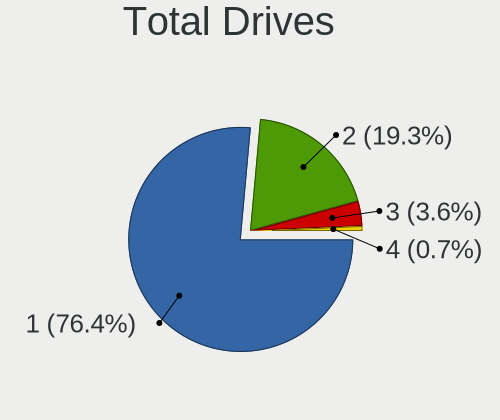
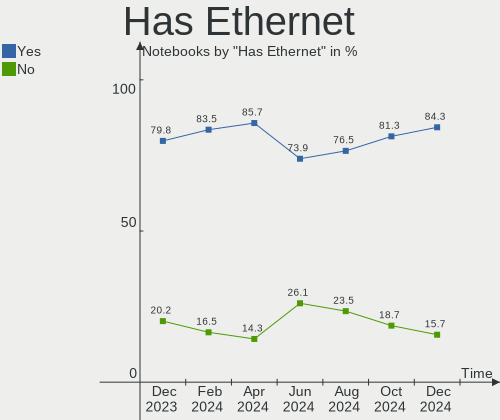
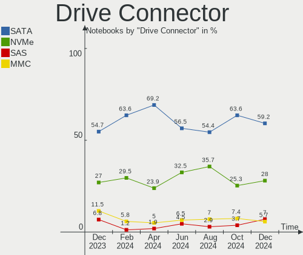
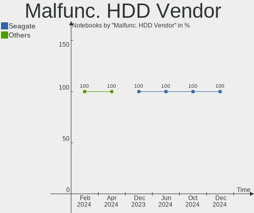
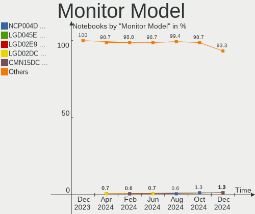
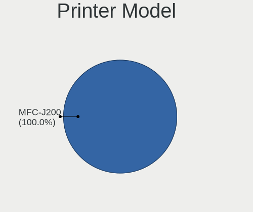
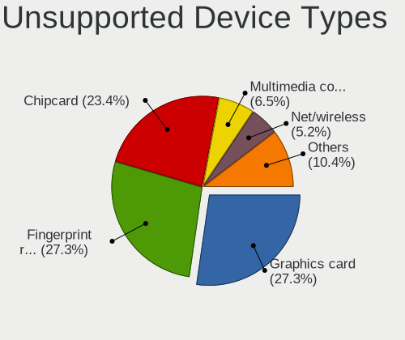

Zorin - Hardware Trends (Notebooks)
-----------------------------------

A project to identify most popular hardware characteristics and track their change
over time based on data collected by Linux users at https://Linux-Hardware.org.

Anyone can contribute to this report by the [hw-probe](https://github.com/linuxhw/hw-probe) tool:

    sudo -E hw-probe -all -upload

This report is for one last month. Overall report since the beginning of time: [TestDays](https://github.com/linuxhw/TestDays)

Period: Jan, 2024.

Contents
--------

* [ System ](#system)
  - [ OS                       ](#os)
  - [ OS Family                ](#os-family)
  - [ Kernel                   ](#kernel)
  - [ Kernel Family            ](#kernel-family)
  - [ Kernel Major Ver.        ](#kernel-major-ver)
  - [ Arch                     ](#arch)
  - [ DE                       ](#de)
  - [ Display Server           ](#display-server)
  - [ Display Manager          ](#display-manager)
  - [ OS Lang                  ](#os-lang)
  - [ Boot Mode                ](#boot-mode)
  - [ Filesystem               ](#filesystem)
  - [ Part. scheme             ](#part-scheme)
  - [ Dual Boot with Linux/BSD ](#dual-boot-with-linuxbsd)
  - [ Dual Boot (Win)          ](#dual-boot-win)

* [ Board ](#board)
  - [ Vendor                   ](#vendor)
  - [ Model                    ](#model)
  - [ Model Family             ](#model-family)
  - [ MFG Year                 ](#mfg-year)
  - [ Form Factor              ](#form-factor)
  - [ Secure Boot              ](#secure-boot)
  - [ Coreboot                 ](#coreboot)
  - [ RAM Size                 ](#ram-size)
  - [ RAM Used                 ](#ram-used)
  - [ Total Drives             ](#total-drives)
  - [ Has CD-ROM               ](#has-cd-rom)
  - [ Has Ethernet             ](#has-ethernet)
  - [ Has WiFi                 ](#has-wifi)
  - [ Has Bluetooth            ](#has-bluetooth)

* [ Location ](#location)
  - [ Country                  ](#country)
  - [ City                     ](#city)

* [ Drives ](#drives)
  - [ Drive Vendor             ](#drive-vendor)
  - [ Drive Model              ](#drive-model)
  - [ HDD Vendor               ](#hdd-vendor)
  - [ SSD Vendor               ](#ssd-vendor)
  - [ Drive Kind               ](#drive-kind)
  - [ Drive Connector          ](#drive-connector)
  - [ Drive Size               ](#drive-size)
  - [ Space Total              ](#space-total)
  - [ Space Used               ](#space-used)
  - [ Malfunc. Drives          ](#malfunc-drives)
  - [ Malfunc. Drive Vendor    ](#malfunc-drive-vendor)
  - [ Malfunc. HDD Vendor      ](#malfunc-hdd-vendor)
  - [ Malfunc. Drive Kind      ](#malfunc-drive-kind)
  - [ Failed Drives            ](#failed-drives)
  - [ Failed Drive Vendor      ](#failed-drive-vendor)
  - [ Drive Status             ](#drive-status)

* [ Storage controller ](#storage-controller)
  - [ Storage Vendor           ](#storage-vendor)
  - [ Storage Model            ](#storage-model)
  - [ Storage Kind             ](#storage-kind)

* [ Processor ](#processor)
  - [ CPU Vendor               ](#cpu-vendor)
  - [ CPU Model                ](#cpu-model)
  - [ CPU Model Family         ](#cpu-model-family)
  - [ CPU Cores                ](#cpu-cores)
  - [ CPU Sockets              ](#cpu-sockets)
  - [ CPU Threads              ](#cpu-threads)
  - [ CPU Op-Modes             ](#cpu-op-modes)
  - [ CPU Microcode            ](#cpu-microcode)
  - [ CPU Microarch            ](#cpu-microarch)

* [ Graphics ](#graphics)
  - [ GPU Vendor               ](#gpu-vendor)
  - [ GPU Model                ](#gpu-model)
  - [ GPU Combo                ](#gpu-combo)
  - [ GPU Driver               ](#gpu-driver)
  - [ GPU Memory               ](#gpu-memory)

* [ Monitor ](#monitor)
  - [ Monitor Vendor           ](#monitor-vendor)
  - [ Monitor Model            ](#monitor-model)
  - [ Monitor Resolution       ](#monitor-resolution)
  - [ Monitor Diagonal         ](#monitor-diagonal)
  - [ Monitor Width            ](#monitor-width)
  - [ Aspect Ratio             ](#aspect-ratio)
  - [ Monitor Area             ](#monitor-area)
  - [ Pixel Density            ](#pixel-density)
  - [ Multiple Monitors        ](#multiple-monitors)

* [ Network ](#network)
  - [ Net Controller Vendor    ](#net-controller-vendor)
  - [ Net Controller Model     ](#net-controller-model)
  - [ Wireless Vendor          ](#wireless-vendor)
  - [ Wireless Model           ](#wireless-model)
  - [ Ethernet Vendor          ](#ethernet-vendor)
  - [ Ethernet Model           ](#ethernet-model)
  - [ Net Controller Kind      ](#net-controller-kind)
  - [ Used Controller          ](#used-controller)
  - [ NICs                     ](#nics)
  - [ IPv6                     ](#ipv6)

* [ Bluetooth ](#bluetooth)
  - [ Bluetooth Vendor         ](#bluetooth-vendor)
  - [ Bluetooth Model          ](#bluetooth-model)

* [ Sound ](#sound)
  - [ Sound Vendor             ](#sound-vendor)
  - [ Sound Model              ](#sound-model)

* [ Memory ](#memory)
  - [ Memory Vendor            ](#memory-vendor)
  - [ Memory Model             ](#memory-model)
  - [ Memory Kind              ](#memory-kind)
  - [ Memory Form Factor       ](#memory-form-factor)
  - [ Memory Size              ](#memory-size)
  - [ Memory Speed             ](#memory-speed)

* [ Printers & scanners ](#printers--scanners)
  - [ Printer Vendor           ](#printer-vendor)
  - [ Printer Model            ](#printer-model)
  - [ Scanner Vendor           ](#scanner-vendor)
  - [ Scanner Model            ](#scanner-model)

* [ Camera ](#camera)
  - [ Camera Vendor            ](#camera-vendor)
  - [ Camera Model             ](#camera-model)

* [ Security ](#security)
  - [ Fingerprint Vendor       ](#fingerprint-vendor)
  - [ Fingerprint Model        ](#fingerprint-model)
  - [ Chipcard Vendor          ](#chipcard-vendor)
  - [ Chipcard Model           ](#chipcard-model)

* [ Unsupported ](#unsupported)
  - [ Unsupported Devices      ](#unsupported-devices)
  - [ Unsupported Device Types ](#unsupported-device-types)

System
------

OS
--

Installed operating systems

| Name     | Notebooks | Percent |
|----------|-----------|---------|
| Zorin 17 | 106       | 63.86%  |
| Zorin 16 | 57        | 34.34%  |
| Zorin 15 | 3         | 1.81%   |

OS Family
---------

OS without a version

| Name  | Notebooks | Percent |
|-------|-----------|---------|
| Zorin | 166       | 100%    |

Kernel
------

Version of the Linux kernel

| Version               | Notebooks | Percent |
|-----------------------|-----------|---------|
| 6.2.0-39-generic      | 45        | 27.11%  |
| 6.5.0-14-generic      | 43        | 25.9%   |
| 5.15.0-91-generic     | 38        | 22.89%  |
| 6.5.0-15-generic      | 17        | 10.24%  |
| 5.15.0-92-generic     | 6         | 3.61%   |
| 5.15.0-89-generic     | 4         | 2.41%   |
| 5.15.0-78-generic     | 3         | 1.81%   |
| 5.4.0-150-generic     | 2         | 1.2%    |
| 6.6.13-060613-generic | 1         | 0.6%    |
| 5.8.0-49-generic      | 1         | 0.6%    |
| 5.4.0-45-generic      | 1         | 0.6%    |
| 5.15.0-86-generic     | 1         | 0.6%    |
| 5.15.0-84-generic     | 1         | 0.6%    |
| 5.15.0-76-generic     | 1         | 0.6%    |
| 5.15.0-71-generic     | 1         | 0.6%    |
| 5.15.0-56-generic     | 1         | 0.6%    |

Kernel Family
-------------

Linux kernel without a distro release

| Version | Notebooks | Percent |
|---------|-----------|---------|
| 6.5.0   | 60        | 36.14%  |
| 5.15.0  | 56        | 33.73%  |
| 6.2.0   | 45        | 27.11%  |
| 5.4.0   | 3         | 1.81%   |
| 6.6.13  | 1         | 0.6%    |
| 5.8.0   | 1         | 0.6%    |

Kernel Major Ver.
-----------------

Linux kernel major version

| Version | Notebooks | Percent |
|---------|-----------|---------|
| 6.5     | 60        | 36.14%  |
| 5.15    | 56        | 33.73%  |
| 6.2     | 45        | 27.11%  |
| 5.4     | 3         | 1.81%   |
| 6.6     | 1         | 0.6%    |
| 5.8     | 1         | 0.6%    |

Arch
----

OS architecture (x86_64, i586, etc.)

| Name   | Notebooks | Percent |
|--------|-----------|---------|
| x86_64 | 164       | 98.8%   |
| i686   | 2         | 1.2%    |

DE
--

Desktop Environment

| Name   | Notebooks | Percent |
|--------|-----------|---------|
| GNOME  | 143       | 86.14%  |
| XFCE   | 19        | 11.45%  |
| KDE5   | 3         | 1.81%   |
| Budgie | 1         | 0.6%    |

Display Server
--------------

X11 or Wayland

| Name    | Notebooks | Percent |
|---------|-----------|---------|
| Wayland | 85        | 51.2%   |
| X11     | 80        | 48.19%  |
| Unknown | 1         | 0.6%    |

Display Manager
---------------

SDDM, LightDM, etc.

| Name    | Notebooks | Percent |
|---------|-----------|---------|
| Unknown | 139       | 83.73%  |
| GDM3    | 21        | 12.65%  |
| LightDM | 3         | 1.81%   |
| GDM     | 3         | 1.81%   |

OS Lang
-------

Language

| Lang  | Notebooks | Percent |
|-------|-----------|---------|
| en_US | 65        | 39.16%  |
| de_DE | 17        | 10.24%  |
| en_GB | 11        | 6.63%   |
| pt_BR | 8         | 4.82%   |
| fr_FR | 8         | 4.82%   |
| it_IT | 6         | 3.61%   |
| es_ES | 6         | 3.61%   |
| es_MX | 5         | 3.01%   |
| en_IN | 5         | 3.01%   |
| pt_PT | 4         | 2.41%   |
| pl_PL | 4         | 2.41%   |
| hu_HU | 4         | 2.41%   |
| en_CA | 3         | 1.81%   |
| de_AT | 3         | 1.81%   |
| nl_NL | 2         | 1.2%    |
| es_AR | 2         | 1.2%    |
| en_ZA | 2         | 1.2%    |
| cs_CZ | 2         | 1.2%    |
| sv_SE | 1         | 0.6%    |
| ru_RU | 1         | 0.6%    |
| ro_RO | 1         | 0.6%    |
| nl_BE | 1         | 0.6%    |
| es_VE | 1         | 0.6%    |
| es_UY | 1         | 0.6%    |
| en_AU | 1         | 0.6%    |
| C     | 1         | 0.6%    |
| ar_SA | 1         | 0.6%    |

Boot Mode
---------

EFI or BIOS

| Mode | Notebooks | Percent |
|------|-----------|---------|
| BIOS | 126       | 75.9%   |
| EFI  | 40        | 24.1%   |

Filesystem
----------

Type of filesystem

| Type    | Notebooks | Percent |
|---------|-----------|---------|
| Ext4    | 148       | 89.16%  |
| Tmpfs   | 14        | 8.43%   |
| Zfs     | 2         | 1.2%    |
| Overlay | 1         | 0.6%    |
| Ext3    | 1         | 0.6%    |

Part. scheme
------------

Scheme of partitioning

| Type    | Notebooks | Percent |
|---------|-----------|---------|
| Unknown | 140       | 84.34%  |
| GPT     | 22        | 13.25%  |
| MBR     | 4         | 2.41%   |

Dual Boot with Linux/BSD
------------------------

Hosting more than one Linux/BSD

| Dual boot | Notebooks | Percent |
|-----------|-----------|---------|
| No        | 164       | 98.8%   |
| Yes       | 2         | 1.2%    |

Dual Boot (Win)
---------------

Hosting Linux and Windows

| Dual boot | Notebooks | Percent |
|-----------|-----------|---------|
| No        | 158       | 95.18%  |
| Yes       | 8         | 4.82%   |

Board
-----

Vendor
------

Motherboard manufacturer

| Name                | Notebooks | Percent |
|---------------------|-----------|---------|
| Hewlett-Packard     | 33        | 19.88%  |
| Lenovo              | 29        | 17.47%  |
| Dell                | 20        | 12.05%  |
| ASUSTek Computer    | 20        | 12.05%  |
| Acer                | 17        | 10.24%  |
| Toshiba             | 12        | 7.23%   |
| Apple               | 8         | 4.82%   |
| Sony                | 5         | 3.01%   |
| Samsung Electronics | 3         | 1.81%   |
| HUAWEI              | 3         | 1.81%   |
| Fujitsu             | 3         | 1.81%   |
| Medion              | 2         | 1.2%    |
| SGIN                | 1         | 0.6%    |
| Semp Toshiba        | 1         | 0.6%    |
| MSI                 | 1         | 0.6%    |
| iQual               | 1         | 0.6%    |
| Intel               | 1         | 0.6%    |
| HONOR               | 1         | 0.6%    |
| GPD                 | 1         | 0.6%    |
| Google              | 1         | 0.6%    |
| Compal              | 1         | 0.6%    |
| Chuwi               | 1         | 0.6%    |
| Alienware           | 1         | 0.6%    |

Model
-----

Motherboard model

| Name                                 | Notebooks | Percent |
|--------------------------------------|-----------|---------|
| HP Notebook                          | 2         | 1.2%    |
| Dell Latitude E5470                  | 2         | 1.2%    |
| Dell Inspiron 1545                   | 2         | 1.2%    |
| Apple MacBookPro5,5                  | 2         | 1.2%    |
| Apple MacBookPro14,1                 | 2         | 1.2%    |
| Toshiba Satellite R630               | 1         | 0.6%    |
| Toshiba Satellite P200               | 1         | 0.6%    |
| Toshiba Satellite L845               | 1         | 0.6%    |
| Toshiba Satellite L750               | 1         | 0.6%    |
| Toshiba Satellite L640               | 1         | 0.6%    |
| Toshiba Satellite L55-C              | 1         | 0.6%    |
| Toshiba Satellite C850-B820          | 1         | 0.6%    |
| Toshiba Satellite C850               | 1         | 0.6%    |
| Toshiba Satellite C55D-B             | 1         | 0.6%    |
| Toshiba Satellite A665               | 1         | 0.6%    |
| Toshiba Satellite A350               | 1         | 0.6%    |
| Toshiba NB550D                       | 1         | 0.6%    |
| Sony VPCEB3B4E                       | 1         | 0.6%    |
| Sony VPCEB2JFX                       | 1         | 0.6%    |
| Sony VJF153                          | 1         | 0.6%    |
| Sony VGN-NW11S_S                     | 1         | 0.6%    |
| Sony VGN-NS11Z_S                     | 1         | 0.6%    |
| SGIN M15                             | 1         | 0.6%    |
| Semp Toshiba STI NI 1401             | 1         | 0.6%    |
| Samsung 700Z3C/700Z5C                | 1         | 0.6%    |
| Samsung 550XBE/350XBE                | 1         | 0.6%    |
| Samsung 450R4E/450R5E/450R4V/450R5V  | 1         | 0.6%    |
| MSI N6105                            | 1         | 0.6%    |
| Medion P651x series                  | 1         | 0.6%    |
| Medion E4251 MD61435                 | 1         | 0.6%    |
| Lenovo Y50-70 20378                  | 1         | 0.6%    |
| Lenovo V330-15IKB 81AX               | 1         | 0.6%    |
| Lenovo V15-ADA 82C7                  | 1         | 0.6%    |
| Lenovo ThinkPad X240 20AL0097US      | 1         | 0.6%    |
| Lenovo ThinkPad X201 4492W36         | 1         | 0.6%    |
| Lenovo ThinkPad X13 Gen 1 20T3S5F800 | 1         | 0.6%    |
| Lenovo ThinkPad W550s 20E2000PMN     | 1         | 0.6%    |
| Lenovo ThinkPad W520 42844ZG         | 1         | 0.6%    |
| Lenovo ThinkPad T520 4243F53         | 1         | 0.6%    |
| Lenovo ThinkPad T480 20L6S3L400      | 1         | 0.6%    |

Model Family
------------

Motherboard model prefix

| Name               | Notebooks | Percent |
|--------------------|-----------|---------|
| Lenovo ThinkPad    | 14        | 8.43%   |
| Acer Aspire        | 12        | 7.23%   |
| Toshiba Satellite  | 11        | 6.63%   |
| Dell Inspiron      | 10        | 6.02%   |
| Lenovo IdeaPad     | 9         | 5.42%   |
| Dell Latitude      | 9         | 5.42%   |
| HP Pavilion        | 6         | 3.61%   |
| HP ZBook           | 5         | 3.01%   |
| HP Laptop          | 5         | 3.01%   |
| HP EliteBook       | 5         | 3.01%   |
| ASUS Zenbook       | 3         | 1.81%   |
| Lenovo Legion      | 2         | 1.2%    |
| HP ProBook         | 2         | 1.2%    |
| HP Notebook        | 2         | 1.2%    |
| Fujitsu LIFEBOOK   | 2         | 1.2%    |
| ASUS VivoBook      | 2         | 1.2%    |
| ASUS ROG           | 2         | 1.2%    |
| Apple MacBookPro5  | 2         | 1.2%    |
| Apple MacBookPro14 | 2         | 1.2%    |
| Apple MacBookPro10 | 2         | 1.2%    |
| Acer Swift         | 2         | 1.2%    |
| Toshiba NB550D     | 1         | 0.6%    |
| Sony VPCEB3B4E     | 1         | 0.6%    |
| Sony VPCEB2JFX     | 1         | 0.6%    |
| Sony VJF153        | 1         | 0.6%    |
| Sony VGN-NW11S     | 1         | 0.6%    |
| Sony VGN-NS11Z     | 1         | 0.6%    |
| SGIN M15           | 1         | 0.6%    |
| Semp Toshiba STI   | 1         | 0.6%    |
| Samsung 700Z3C     | 1         | 0.6%    |
| Samsung 550XBE     | 1         | 0.6%    |
| Samsung 450R4E     | 1         | 0.6%    |
| MSI N6105          | 1         | 0.6%    |
| Medion P651x       | 1         | 0.6%    |
| Medion E4251       | 1         | 0.6%    |
| Lenovo Y50-70      | 1         | 0.6%    |
| Lenovo V330-15IKB  | 1         | 0.6%    |
| Lenovo V15-ADA     | 1         | 0.6%    |
| Lenovo ThinkBook   | 1         | 0.6%    |
| iQual NQ4X         | 1         | 0.6%    |

MFG Year
--------

Motherboard manufacture year

| Year | Notebooks | Percent |
|------|-----------|---------|
| 2013 | 15        | 9.04%   |
| 2012 | 15        | 9.04%   |
| 2010 | 13        | 7.83%   |
| 2020 | 11        | 6.63%   |
| 2016 | 11        | 6.63%   |
| 2015 | 11        | 6.63%   |
| 2011 | 11        | 6.63%   |
| 2022 | 10        | 6.02%   |
| 2017 | 10        | 6.02%   |
| 2019 | 9         | 5.42%   |
| 2009 | 9         | 5.42%   |
| 2021 | 8         | 4.82%   |
| 2018 | 8         | 4.82%   |
| 2008 | 8         | 4.82%   |
| 2014 | 7         | 4.22%   |
| 2023 | 6         | 3.61%   |
| 2007 | 3         | 1.81%   |
| 2006 | 1         | 0.6%    |

Form Factor
-----------

Physical design of the computer

| Name     | Notebooks | Percent |
|----------|-----------|---------|
| Notebook | 166       | 100%    |

Secure Boot
-----------

Enabled or disabled

| State    | Notebooks | Percent |
|----------|-----------|---------|
| Disabled | 155       | 93.37%  |
| Enabled  | 11        | 6.63%   |

Coreboot
--------

Have coreboot on board

| Used | Notebooks | Percent |
|------|-----------|---------|
| No   | 165       | 99.4%   |
| Yes  | 1         | 0.6%    |

RAM Size
--------

Total RAM memory

| Size in GB | Notebooks | Percent |
|------------|-----------|---------|
| 4.01-8.0   | 68        | 40.96%  |
| 3.01-4.0   | 37        | 22.29%  |
| 16.01-24.0 | 24        | 14.46%  |
| 8.01-16.0  | 24        | 14.46%  |
| 1.01-2.0   | 6         | 3.61%   |
| 32.01-64.0 | 4         | 2.41%   |
| 24.01-32.0 | 3         | 1.81%   |

RAM Used
--------

Used RAM memory

| Used GB   | Notebooks | Percent |
|-----------|-----------|---------|
| 2.01-3.0  | 76        | 45.78%  |
| 1.01-2.0  | 38        | 22.89%  |
| 4.01-8.0  | 23        | 13.86%  |
| 3.01-4.0  | 21        | 12.65%  |
| 0.51-1.0  | 6         | 3.61%   |
| 8.01-16.0 | 2         | 1.2%    |

Total Drives
------------

Number of drives on board

| Drives | Notebooks | Percent |
|--------|-----------|---------|
| 1      | 126       | 75.9%   |
| 2      | 37        | 22.29%  |
| 3      | 3         | 1.81%   |

Has CD-ROM
----------

Has CD-ROM on board

| Presented | Notebooks | Percent |
|-----------|-----------|---------|
| No        | 96        | 57.83%  |
| Yes       | 70        | 42.17%  |

Has Ethernet
------------

Has Ethernet on board

| Presented | Notebooks | Percent |
|-----------|-----------|---------|
| Yes       | 138       | 83.13%  |
| No        | 28        | 16.87%  |

Has WiFi
--------

Has WiFi module

| Presented | Notebooks | Percent |
|-----------|-----------|---------|
| Yes       | 166       | 100%    |

Has Bluetooth
-------------

Has Bluetooth module

| Presented | Notebooks | Percent |
|-----------|-----------|---------|
| Yes       | 128       | 77.11%  |
| No        | 38        | 22.89%  |

Location
--------

Country
-------

Geographic location (country)

| Country      | Notebooks | Percent |
|--------------|-----------|---------|
| USA          | 28        | 16.87%  |
| Germany      | 22        | 13.25%  |
| UK           | 10        | 6.02%   |
| France       | 8         | 4.82%   |
| Brazil       | 8         | 4.82%   |
| Italy        | 7         | 4.22%   |
| Spain        | 6         | 3.61%   |
| Mexico       | 6         | 3.61%   |
| Austria      | 6         | 3.61%   |
| Netherlands  | 5         | 3.01%   |
| India        | 5         | 3.01%   |
| Belgium      | 5         | 3.01%   |
| Portugal     | 4         | 2.41%   |
| Canada       | 4         | 2.41%   |
| Sweden       | 3         | 1.81%   |
| Poland       | 3         | 1.81%   |
| Indonesia    | 3         | 1.81%   |
| Hungary      | 3         | 1.81%   |
| South Africa | 2         | 1.2%    |
| Saudi Arabia | 2         | 1.2%    |
| Russia       | 2         | 1.2%    |
| Romania      | 2         | 1.2%    |
| Czechia      | 2         | 1.2%    |
| Argentina    | 2         | 1.2%    |
| Venezuela    | 1         | 0.6%    |
| Uruguay      | 1         | 0.6%    |
| Thailand     | 1         | 0.6%    |
| Switzerland  | 1         | 0.6%    |
| Qatar        | 1         | 0.6%    |
| Morocco      | 1         | 0.6%    |
| Mauritius    | 1         | 0.6%    |
| Malaysia     | 1         | 0.6%    |
| Latvia       | 1         | 0.6%    |
| Kosovo       | 1         | 0.6%    |
| Jamaica      | 1         | 0.6%    |
| Ireland      | 1         | 0.6%    |
| Ghana        | 1         | 0.6%    |
| Finland      | 1         | 0.6%    |
| Egypt        | 1         | 0.6%    |
| Denmark      | 1         | 0.6%    |

City
----

Geographic location (city)

| City                   | Notebooks | Percent |
|------------------------|-----------|---------|
| Vienna                 | 4         | 2.41%   |
| Marshfield             | 2         | 1.2%    |
| Madrid                 | 2         | 1.2%    |
| Louisville             | 2         | 1.2%    |
| Lisbon                 | 2         | 1.2%    |
| Glasgow                | 2         | 1.2%    |
| Ciudad Obregón        | 2         | 1.2%    |
| Brussels               | 2         | 1.2%    |
| Zurich                 | 1         | 0.6%    |
| Wunstorf               | 1         | 0.6%    |
| Woerden                | 1         | 0.6%    |
| Whitinsville           | 1         | 0.6%    |
| Weilburg               | 1         | 0.6%    |
| Vremde                 | 1         | 0.6%    |
| Valladolid             | 1         | 0.6%    |
| Turin                  | 1         | 0.6%    |
| Turek                  | 1         | 0.6%    |
| Toronto                | 1         | 0.6%    |
| Thornton               | 1         | 0.6%    |
| Texcoco                | 1         | 0.6%    |
| Szczecin               | 1         | 0.6%    |
| Sydney                 | 1         | 0.6%    |
| Stockport              | 1         | 0.6%    |
| Southwark              | 1         | 0.6%    |
| Solingen               | 1         | 0.6%    |
| Shawnee                | 1         | 0.6%    |
| Selm                   | 1         | 0.6%    |
| Seabrook               | 1         | 0.6%    |
| Sarajevo               | 1         | 0.6%    |
| Sao Joao del Rei       | 1         | 0.6%    |
| San Marcos             | 1         | 0.6%    |
| Samarinda              | 1         | 0.6%    |
| Salvador               | 1         | 0.6%    |
| Saint-Leger-les-Vignes | 1         | 0.6%    |
| Saffron Walden         | 1         | 0.6%    |
| Saarlouis              | 1         | 0.6%    |
| Ruelle-sur-Touvre      | 1         | 0.6%    |
| Romans-sur-Isère      | 1         | 0.6%    |
| Roding                 | 1         | 0.6%    |
| Riverside              | 1         | 0.6%    |

Drives
------

Drive Vendor
------------

Hard drive vendors

| Vendor                      | Notebooks | Drives | Percent |
|-----------------------------|-----------|--------|---------|
| Samsung Electronics         | 33        | 34     | 16.67%  |
| WDC                         | 21        | 21     | 10.61%  |
| Seagate                     | 19        | 20     | 9.6%    |
| Toshiba                     | 13        | 13     | 6.57%   |
| SanDisk                     | 13        | 13     | 6.57%   |
| Kingston                    | 11        | 11     | 5.56%   |
| Unknown                     | 10        | 10     | 5.05%   |
| SK hynix                    | 8         | 8      | 4.04%   |
| Hitachi                     | 6         | 6      | 3.03%   |
| HGST                        | 6         | 6      | 3.03%   |
| Crucial                     | 5         | 5      | 2.53%   |
| Intenso                     | 4         | 4      | 2.02%   |
| China                       | 4         | 4      | 2.02%   |
| Apple                       | 4         | 6      | 2.02%   |
| Micron Technology           | 3         | 3      | 1.52%   |
| Netac                       | 2         | 2      | 1.01%   |
| LITEONIT                    | 2         | 2      | 1.01%   |
| Kingston Technology Company | 2         | 2      | 1.01%   |
| Intel                       | 2         | 2      | 1.01%   |
| Gigabyte Technology         | 2         | 2      | 1.01%   |
| Fanxiang                    | 2         | 2      | 1.01%   |
| Team                        | 1         | 1      | 0.51%   |
| T-FORCE                     | 1         | 1      | 0.51%   |
| Silicon Motion              | 1         | 1      | 0.51%   |
| SC550                       | 1         | 1      | 0.51%   |
| S3+                         | 1         | 1      | 0.51%   |
| RX7                         | 1         | 1      | 0.51%   |
| Phison                      | 1         | 1      | 0.51%   |
| OWC                         | 1         | 1      | 0.51%   |
| NT-512                      | 1         | 1      | 0.51%   |
| Min Yi U                    | 1         | 1      | 0.51%   |
| Micron/Crucial Technology   | 1         | 1      | 0.51%   |
| MAXIO Technology (Hangzhou) | 1         | 1      | 0.51%   |
| Lexar                       | 1         | 1      | 0.51%   |
| LaCie                       | 1         | 1      | 0.51%   |
| KIOXIA                      | 1         | 1      | 0.51%   |
| KingSpec                    | 1         | 1      | 0.51%   |
| JMicron Technology          | 1         | 1      | 0.51%   |
| JASTER                      | 1         | 1      | 0.51%   |
| External                    | 1         | 1      | 0.51%   |

Drive Model
-----------

Hard drive models

| Model                                             | Notebooks | Percent |
|---------------------------------------------------|-----------|---------|
| Kingston SA400S37240G 240GB SSD                   | 6         | 3%      |
| Unknown MMC Card  64GB                            | 5         | 2.5%    |
| Seagate ST1000LM035-1RK172 1TB                    | 4         | 2%      |
| Samsung NVMe SSD Controller SM981/PM981/PM983 1TB | 4         | 2%      |
| Toshiba MQ01ABD100 1TB                            | 3         | 1.5%    |
| WDC WDS500G2B0A-00SM50 500GB SSD                  | 2         | 1%      |
| Unknown MMC Card  32GB                            | 2         | 1%      |
| Toshiba MQ01ABF050 500GB                          | 2         | 1%      |
| Seagate ST9500325AS 500GB                         | 2         | 1%      |
| Samsung SSD 860 EVO 500GB                         | 2         | 1%      |
| Samsung SSD 860 EVO 250GB                         | 2         | 1%      |
| Kingston Company OM3PDP3 NVMe SSD 256GB           | 2         | 1%      |
| HGST HTS545050A7E680 500GB                        | 2         | 1%      |
| Apple S3X NVMe Controller 256GB                   | 2         | 1%      |
| WDC WDS500G2B0A 500GB SSD                         | 1         | 0.5%    |
| WDC WDBNCE5000PNC 500GB SSD                       | 1         | 0.5%    |
| WDC WD5000LPVX-75V0TT0 500GB                      | 1         | 0.5%    |
| WDC WD40 EFRX-68WT0N0 4TB                         | 1         | 0.5%    |
| WDC WD3200BPVT-00HXZT1 320GB                      | 1         | 0.5%    |
| WDC WD3200BEVT-75ZCT2 320GB                       | 1         | 0.5%    |
| WDC WD3200BEKT-60V5T1 320GB                       | 1         | 0.5%    |
| WDC WD2500BEVT-75A23T0 250GB                      | 1         | 0.5%    |
| WDC WD1600BEVT-22ZCT0 160GB                       | 1         | 0.5%    |
| WDC WD1200UE-22KVT0 120GB                         | 1         | 0.5%    |
| WDC WD10SPZX-35Z10T0 1TB                          | 1         | 0.5%    |
| WDC WD10SPZX-08Z10 1TB                            | 1         | 0.5%    |
| WDC WD10JPVX-75JC3T0 1TB                          | 1         | 0.5%    |
| WDC WD10JPVX-22JC3T0 1TB                          | 1         | 0.5%    |
| WDC WD10JPVX-00JC3T0 1TB                          | 1         | 0.5%    |
| WDC WD Green 2.5 240GB SSD                        | 1         | 0.5%    |
| WDC WD Blue SA510 2.5 250GB                       | 1         | 0.5%    |
| WDC PC SN730 SDBPNTY-512G-1101 512GB              | 1         | 0.5%    |
| WDC PC SN730 SDBPNTY-256G-1036 256GB              | 1         | 0.5%    |
| Unknown NVMe SSD Drive 512GB                      | 1         | 0.5%    |
| Unknown MMC Card  256GB                           | 1         | 0.5%    |
| Unknown MMC Card  128GB                           | 1         | 0.5%    |
| Toshiba THNS064GE4BBDC 64GB SSD                   | 1         | 0.5%    |
| Toshiba MQ04ABF100 1TB                            | 1         | 0.5%    |
| Toshiba MQ01ACF050 500GB                          | 1         | 0.5%    |
| Toshiba MQ01ABD075 752GB                          | 1         | 0.5%    |

HDD Vendor
----------

Hard disk drive vendors

| Vendor              | Notebooks | Drives | Percent |
|---------------------|-----------|--------|---------|
| Seagate             | 18        | 19     | 30.51%  |
| WDC                 | 13        | 13     | 22.03%  |
| Toshiba             | 12        | 12     | 20.34%  |
| Hitachi             | 6         | 6      | 10.17%  |
| HGST                | 6         | 6      | 10.17%  |
| Samsung Electronics | 2         | 2      | 3.39%   |
| JMicron Technology  | 1         | 1      | 1.69%   |
| External            | 1         | 1      | 1.69%   |

SSD Vendor
----------

Solid state drive vendors

| Vendor              | Notebooks | Drives | Percent |
|---------------------|-----------|--------|---------|
| Samsung Electronics | 18        | 18     | 25%     |
| Kingston            | 9         | 9      | 12.5%   |
| WDC                 | 6         | 6      | 8.33%   |
| SanDisk             | 6         | 6      | 8.33%   |
| Crucial             | 5         | 5      | 6.94%   |
| China               | 4         | 4      | 5.56%   |
| SK hynix            | 2         | 2      | 2.78%   |
| LITEONIT            | 2         | 2      | 2.78%   |
| Intenso             | 2         | 2      | 2.78%   |
| Gigabyte Technology | 2         | 2      | 2.78%   |
| Apple               | 2         | 2      | 2.78%   |
| Toshiba             | 1         | 1      | 1.39%   |
| Team                | 1         | 1      | 1.39%   |
| S3+                 | 1         | 1      | 1.39%   |
| Phison              | 1         | 1      | 1.39%   |
| OWC                 | 1         | 1      | 1.39%   |
| NT-512              | 1         | 1      | 1.39%   |
| Min Yi U            | 1         | 1      | 1.39%   |
| Micron Technology   | 1         | 1      | 1.39%   |
| Lexar               | 1         | 1      | 1.39%   |
| KingSpec            | 1         | 1      | 1.39%   |
| Intel               | 1         | 1      | 1.39%   |
| Emtec               | 1         | 1      | 1.39%   |
| Aarvex              | 1         | 1      | 1.39%   |
| A-DATA Technology   | 1         | 1      | 1.39%   |

Drive Kind
----------

HDD or SSD

| Kind    | Notebooks | Drives | Percent |
|---------|-----------|--------|---------|
| SSD     | 70        | 72     | 37.04%  |
| HDD     | 59        | 60     | 31.22%  |
| NVMe    | 39        | 49     | 20.63%  |
| Unknown | 12        | 12     | 6.35%   |
| MMC     | 9         | 9      | 4.76%   |

Drive Connector
---------------

SATA, SAS, NVMe, etc.

| Type | Notebooks | Drives | Percent |
|------|-----------|--------|---------|
| SATA | 126       | 135    | 68.85%  |
| NVMe | 39        | 49     | 21.31%  |
| SAS  | 9         | 9      | 4.92%   |
| MMC  | 9         | 9      | 4.92%   |

Drive Size
----------

Size of hard drive

| Size in TB | Notebooks | Drives | Percent |
|------------|-----------|--------|---------|
| 0.01-0.5   | 92        | 95     | 71.32%  |
| 0.51-1.0   | 33        | 33     | 25.58%  |
| 1.01-2.0   | 3         | 3      | 2.33%   |
| 3.01-4.0   | 1         | 1      | 0.78%   |

Space Total
-----------

Amount of disk space available on the file system

| Size in GB | Notebooks | Percent |
|------------|-----------|---------|
| 101-250    | 55        | 33.13%  |
| 251-500    | 45        | 27.11%  |
| 501-1000   | 29        | 17.47%  |
| 51-100     | 18        | 10.84%  |
| 1001-2000  | 7         | 4.22%   |
| 21-50      | 6         | 3.61%   |
| 2001-3000  | 2         | 1.2%    |
| 1-20       | 2         | 1.2%    |
| Unknown    | 2         | 1.2%    |

Space Used
----------

Amount of used disk space

| Used GB   | Notebooks | Percent |
|-----------|-----------|---------|
| 21-50     | 59        | 35.54%  |
| 1-20      | 51        | 30.72%  |
| 51-100    | 20        | 12.05%  |
| 101-250   | 18        | 10.84%  |
| 251-500   | 9         | 5.42%   |
| 501-1000  | 6         | 3.61%   |
| Unknown   | 2         | 1.2%    |
| 1001-2000 | 1         | 0.6%    |

Malfunc. Drives
---------------

Drive models with a malfunction

| Model                         | Notebooks | Drives | Percent |
|-------------------------------|-----------|--------|---------|
| Hitachi HTS723232L9A360 320GB | 1         | 1      | 50%     |
| Hitachi HTS541616J9SA00 160GB | 1         | 1      | 50%     |

Malfunc. Drive Vendor
---------------------

Vendors of faulty drives

| Vendor  | Notebooks | Drives | Percent |
|---------|-----------|--------|---------|
| Hitachi | 2         | 2      | 100%    |

Malfunc. HDD Vendor
-------------------

Vendors of faulty HDD drives

| Vendor  | Notebooks | Drives | Percent |
|---------|-----------|--------|---------|
| Hitachi | 2         | 2      | 100%    |

Malfunc. Drive Kind
-------------------

Kinds of faulty drives

| Kind | Notebooks | Drives | Percent |
|------|-----------|--------|---------|
| HDD  | 2         | 2      | 100%    |

Failed Drives
-------------

Failed drive models

Zero info for selected period =(

Failed Drive Vendor
-------------------

Failed drive vendors

Zero info for selected period =(

Drive Status
------------

Number of failed and malfunc. drives

| Status   | Notebooks | Drives | Percent |
|----------|-----------|--------|---------|
| Detected | 155       | 186    | 92.26%  |
| Works    | 11        | 14     | 6.55%   |
| Malfunc  | 2         | 2      | 1.19%   |

Storage controller
------------------

Storage Vendor
--------------

Storage controller vendors

| Vendor                      | Notebooks | Percent |
|-----------------------------|-----------|---------|
| Intel                       | 119       | 63.98%  |
| AMD                         | 19        | 10.22%  |
| Samsung Electronics         | 14        | 7.53%   |
| SanDisk                     | 9         | 4.84%   |
| SK hynix                    | 6         | 3.23%   |
| Nvidia                      | 3         | 1.61%   |
| Kingston Technology Company | 3         | 1.61%   |
| Silicon Motion              | 2         | 1.08%   |
| Netac Technology            | 2         | 1.08%   |
| Micron Technology           | 2         | 1.08%   |
| Apple                       | 2         | 1.08%   |
| Micron/Crucial Technology   | 1         | 0.54%   |
| MAXIO Technology (Hangzhou) | 1         | 0.54%   |
| KIOXIA                      | 1         | 0.54%   |
| ADATA Technology            | 1         | 0.54%   |
| Unknown                     | 1         | 0.54%   |

Storage Model
-------------

Storage controller models

| Model                                                                          | Notebooks | Percent |
|--------------------------------------------------------------------------------|-----------|---------|
| Intel 7 Series Chipset Family 6-port SATA Controller [AHCI mode]               | 17        | 8.76%   |
| Intel Sunrise Point-LP SATA Controller [AHCI mode]                             | 15        | 7.73%   |
| AMD FCH SATA Controller [AHCI mode]                                            | 15        | 7.73%   |
| Intel 82801IBM/IEM (ICH9M/ICH9M-E) 4 port SATA Controller [AHCI mode]          | 10        | 5.15%   |
| Intel 82801 Mobile SATA Controller [RAID mode]                                 | 10        | 5.15%   |
| Intel 6 Series/C200 Series Chipset Family 6 port Mobile SATA AHCI Controller   | 10        | 5.15%   |
| Intel 5 Series/3400 Series Chipset 4 port SATA AHCI Controller                 | 8         | 4.12%   |
| Samsung NVMe SSD Controller SM981/PM981/PM983                                  | 7         | 3.61%   |
| Intel Wildcat Point-LP SATA Controller [AHCI Mode]                             | 5         | 2.58%   |
| Intel 8 Series/C220 Series Chipset Family 6-port SATA Controller 1 [AHCI mode] | 5         | 2.58%   |
| Intel 8 Series SATA Controller 1 [AHCI mode]                                   | 5         | 2.58%   |
| Intel Celeron/Pentium Silver Processor SATA Controller                         | 4         | 2.06%   |
| AMD SB7x0/SB8x0/SB9x0 SATA Controller [AHCI mode]                              | 4         | 2.06%   |
| SanDisk WD Black SN770 / PC SN740 256GB / PC SN560 (DRAM-less) NVMe SSD        | 3         | 1.55%   |
| SanDisk Extreme Pro / WD Black SN750 / PC SN730 / Red SN700 NVMe SSD           | 3         | 1.55%   |
| Intel Volume Management Device NVMe RAID Controller                            | 3         | 1.55%   |
| Intel Comet Lake SATA AHCI Controller                                          | 3         | 1.55%   |
| Intel Cannon Point-LP SATA Controller [AHCI Mode]                              | 3         | 1.55%   |
| Intel Atom Processor E3800 Series SATA AHCI Controller                         | 3         | 1.55%   |
| Intel 82801GBM/GHM (ICH7-M Family) SATA Controller [IDE mode]                  | 3         | 1.55%   |
| AMD SB7x0/SB8x0/SB9x0 IDE Controller                                           | 3         | 1.55%   |
| SK hynix Platinum P41/PC801 NVMe Solid State Drive                             | 2         | 1.03%   |
| SK hynix Gold P31/BC711/PC711 NVMe Solid State Drive                           | 2         | 1.03%   |
| Samsung NVMe SSD Controller S4LV008[Pascal]                                    | 2         | 1.03%   |
| Samsung NVMe SSD Controller PM9A1/PM9A3/980PRO                                 | 2         | 1.03%   |
| Nvidia MCP79 AHCI Controller                                                   | 2         | 1.03%   |
| Netac PCIe 3 NVMe SSD (DRAM-less)                                              | 2         | 1.03%   |
| Kingston Company OM3PDP3 NVMe SSD                                              | 2         | 1.03%   |
| Intel Tiger Lake-LP SATA Controller                                            | 2         | 1.03%   |
| Intel Celeron N3350/Pentium N4200/Atom E3900 Series SATA AHCI Controller       | 2         | 1.03%   |
| Intel 82801IBM/IEM (ICH9M/ICH9M-E) 2 port SATA Controller [IDE mode]           | 2         | 1.03%   |
| Intel 5 Series/3400 Series Chipset 6 port SATA AHCI Controller                 | 2         | 1.03%   |
| Apple S3X NVMe Controller                                                      | 2         | 1.03%   |
| SK hynix BC511 NVMe SSD                                                        | 1         | 0.52%   |
| SK hynix BC501 NVMe Solid State Drive                                          | 1         | 0.52%   |
| Silicon Motion SM2263EN/SM2263XT (DRAM-less) NVMe SSD Controllers              | 1         | 0.52%   |
| Silicon Motion Non-Volatile memory controller                                  | 1         | 0.52%   |
| SanDisk WD Green SN350 240GB (DRAM-less) / SN560E NVMe SSD                     | 1         | 0.52%   |
| SanDisk Ultra 3D / WD Blue SN570 NVMe SSD (DRAM-less)                          | 1         | 0.52%   |
| SanDisk Ultra 3D / WD Blue SN550 NVMe SSD                                      | 1         | 0.52%   |

Storage Kind
------------

Kind of storage controller (IDE, SATA, NVMe, SAS, ...)

| Kind | Notebooks | Percent |
|------|-----------|---------|
| SATA | 123       | 66.13%  |
| NVMe | 39        | 20.97%  |
| RAID | 14        | 7.53%   |
| IDE  | 10        | 5.38%   |

Processor
---------

CPU Vendor
----------

Processor vendors

| Vendor | Notebooks | Percent |
|--------|-----------|---------|
| Intel  | 134       | 80.72%  |
| AMD    | 32        | 19.28%  |

CPU Model
---------

Processor models

| Model                                         | Notebooks | Percent |
|-----------------------------------------------|-----------|---------|
| Intel Core i5-2520M CPU @ 2.50GHz             | 4         | 2.41%   |
| Intel Core i3-6006U CPU @ 2.00GHz             | 4         | 2.41%   |
| Intel Core i5-8265U CPU @ 1.60GHz             | 3         | 1.81%   |
| Intel Core i5-7200U CPU @ 2.50GHz             | 3         | 1.81%   |
| Intel Core i5-6300U CPU @ 2.40GHz             | 3         | 1.81%   |
| Intel Core i5-6200U CPU @ 2.30GHz             | 3         | 1.81%   |
| Intel Core i5-3320M CPU @ 2.60GHz             | 3         | 1.81%   |
| Intel Core i5-3210M CPU @ 2.50GHz             | 3         | 1.81%   |
| Intel Core i5 CPU M 460 @ 2.53GHz             | 3         | 1.81%   |
| Intel Core i3-10110U CPU @ 2.10GHz            | 3         | 1.81%   |
| Intel Core i7-5500U CPU @ 2.40GHz             | 2         | 1.2%    |
| Intel Core i7-4500U CPU @ 1.80GHz             | 2         | 1.2%    |
| Intel Core i7-3630QM CPU @ 2.40GHz            | 2         | 1.2%    |
| Intel Core i7-2760QM CPU @ 2.40GHz            | 2         | 1.2%    |
| Intel Core i5-8350U CPU @ 1.70GHz             | 2         | 1.2%    |
| Intel Core i5-7360U CPU @ 2.30GHz             | 2         | 1.2%    |
| Intel Core i5-5300U CPU @ 2.30GHz             | 2         | 1.2%    |
| Intel Core i5-5200U CPU @ 2.20GHz             | 2         | 1.2%    |
| Intel Core i5-3437U CPU @ 1.90GHz             | 2         | 1.2%    |
| Intel Core i5-3230M CPU @ 2.60GHz             | 2         | 1.2%    |
| Intel Core i5 CPU M 520 @ 2.40GHz             | 2         | 1.2%    |
| Intel Core i3-6100U CPU @ 2.30GHz             | 2         | 1.2%    |
| Intel Core i3 CPU M 350 @ 2.27GHz             | 2         | 1.2%    |
| Intel Core 2 Duo CPU P8700 @ 2.53GHz          | 2         | 1.2%    |
| Intel Core 2 Duo CPU P7550 @ 2.26GHz          | 2         | 1.2%    |
| Intel Celeron N4000 CPU @ 1.10GHz             | 2         | 1.2%    |
| Intel Celeron CPU 900 @ 2.20GHz               | 2         | 1.2%    |
| Intel 12th Gen Core i5-1235U                  | 2         | 1.2%    |
| Intel 11th Gen Core i3-1115G4 @ 3.00GHz       | 2         | 1.2%    |
| AMD Ryzen 7 5800H with Radeon Graphics        | 2         | 1.2%    |
| AMD Ryzen 5 5600H with Radeon Graphics        | 2         | 1.2%    |
| AMD Ryzen 5 5500U with Radeon Graphics        | 2         | 1.2%    |
| AMD Ryzen 5 3500U with Radeon Vega Mobile Gfx | 2         | 1.2%    |
| AMD E2-9000e RADEON R2, 4 COMPUTE CORES 2C+2G | 2         | 1.2%    |
| AMD A8-6410 APU with AMD Radeon R5 Graphics   | 2         | 1.2%    |
| Intel Pentium Dual-Core CPU T4400 @ 2.20GHz   | 1         | 0.6%    |
| Intel Pentium Dual-Core CPU T4200 @ 2.00GHz   | 1         | 0.6%    |
| Intel Pentium Dual CPU T3400 @ 2.16GHz        | 1         | 0.6%    |
| Intel Pentium CPU P6100 @ 2.00GHz             | 1         | 0.6%    |
| Intel Pentium CPU N3540 @ 2.16GHz             | 1         | 0.6%    |

CPU Model Family
----------------

Processor model prefix

| Model                                | Notebooks | Percent |
|--------------------------------------|-----------|---------|
| Intel Core i5                        | 48        | 28.92%  |
| Intel Core i7                        | 27        | 16.27%  |
| Intel Core i3                        | 17        | 10.24%  |
| Intel Celeron                        | 13        | 7.83%   |
| Other                                | 10        | 6.02%   |
| Intel Core 2 Duo                     | 9         | 5.42%   |
| AMD Ryzen 5                          | 8         | 4.82%   |
| AMD Ryzen 7                          | 6         | 3.61%   |
| AMD A8                               | 4         | 2.41%   |
| Intel Pentium                        | 3         | 1.81%   |
| Intel Pentium Dual-Core              | 2         | 1.2%    |
| Intel Genuine                        | 2         | 1.2%    |
| AMD Ryzen 9                          | 2         | 1.2%    |
| AMD E2                               | 2         | 1.2%    |
| AMD Athlon II                        | 2         | 1.2%    |
| AMD A12                              | 2         | 1.2%    |
| Intel Pentium Dual                   | 1         | 0.6%    |
| Intel Core m5                        | 1         | 0.6%    |
| Intel Core 2                         | 1         | 0.6%    |
| Intel Celeron M                      | 1         | 0.6%    |
| AMD Turion X2 Ultra Dual-Core Mobile | 1         | 0.6%    |
| AMD Turion X2 Dual-Core Mobile       | 1         | 0.6%    |
| AMD Ryzen 3                          | 1         | 0.6%    |
| AMD C-60                             | 1         | 0.6%    |
| AMD A6                               | 1         | 0.6%    |

CPU Cores
---------

Number of processor cores

| Number | Notebooks | Percent |
|--------|-----------|---------|
| 2      | 105       | 63.25%  |
| 4      | 37        | 22.29%  |
| 6      | 8         | 4.82%   |
| 8      | 6         | 3.61%   |
| 1      | 4         | 2.41%   |
| 10     | 3         | 1.81%   |
| 12     | 2         | 1.2%    |
| 14     | 1         | 0.6%    |

CPU Sockets
-----------

Number of sockets

| Number | Notebooks | Percent |
|--------|-----------|---------|
| 1      | 166       | 100%    |

CPU Threads
-----------

Threads per core (Hyper-Threading)

| Number | Notebooks | Percent |
|--------|-----------|---------|
| 2      | 122       | 73.49%  |
| 1      | 44        | 26.51%  |

CPU Op-Modes
------------

CPU Operation Modes (32-bit, 64-bit)

| Op mode        | Notebooks | Percent |
|----------------|-----------|---------|
| 32-bit, 64-bit | 164       | 98.8%   |
| 32-bit         | 2         | 1.2%    |

CPU Microcode
-------------

Microcode number

| Number     | Notebooks | Percent |
|------------|-----------|---------|
| Unknown    | 106       | 63.86%  |
| 0x306a9    | 9         | 5.42%   |
| 0x206a7    | 5         | 3.01%   |
| 0x406e3    | 3         | 1.81%   |
| 0x20655    | 3         | 1.81%   |
| 0x1067a    | 3         | 1.81%   |
| 0x806ec    | 2         | 1.2%    |
| 0x806e9    | 2         | 1.2%    |
| 0x806c1    | 2         | 1.2%    |
| 0x6fd      | 2         | 1.2%    |
| 0x506c9    | 2         | 1.2%    |
| 0x40651    | 2         | 1.2%    |
| 0x0a601203 | 2         | 1.2%    |
| 0x906ea    | 1         | 0.6%    |
| 0x906e9    | 1         | 0.6%    |
| 0x906a3    | 1         | 0.6%    |
| 0x806eb    | 1         | 0.6%    |
| 0x706a1    | 1         | 0.6%    |
| 0x6f6      | 1         | 0.6%    |
| 0x6ec      | 1         | 0.6%    |
| 0x6e8      | 1         | 0.6%    |
| 0x406c4    | 1         | 0.6%    |
| 0x306c3    | 1         | 0.6%    |
| 0x30678    | 1         | 0.6%    |
| 0x20652    | 1         | 0.6%    |
| 0x0a50000d | 1         | 0.6%    |
| 0x0a50000c | 1         | 0.6%    |
| 0x08a00008 | 1         | 0.6%    |
| 0x08608103 | 1         | 0.6%    |
| 0x08600106 | 1         | 0.6%    |
| 0x08108109 | 1         | 0.6%    |
| 0x07030105 | 1         | 0.6%    |
| 0x06006704 | 1         | 0.6%    |
| 0x0600611a | 1         | 0.6%    |
| 0x06003106 | 1         | 0.6%    |
| 0x06001119 | 1         | 0.6%    |

CPU Microarch
-------------

Microarchitecture

| Name             | Notebooks | Percent |
|------------------|-----------|---------|
| KabyLake         | 21        | 12.65%  |
| IvyBridge        | 18        | 10.84%  |
| Skylake          | 14        | 8.43%   |
| SandyBridge      | 13        | 7.83%   |
| Penryn           | 12        | 7.23%   |
| Haswell          | 11        | 6.63%   |
| Westmere         | 10        | 6.02%   |
| Unknown          | 9         | 5.42%   |
| Broadwell        | 7         | 4.22%   |
| Zen 3            | 6         | 3.61%   |
| Goldmont plus    | 5         | 3.01%   |
| Excavator        | 5         | 3.01%   |
| TigerLake        | 4         | 2.41%   |
| Silvermont       | 4         | 2.41%   |
| Core             | 4         | 2.41%   |
| Zen+             | 3         | 1.81%   |
| Zen 2            | 2         | 1.2%    |
| Puma             | 2         | 1.2%    |
| Piledriver       | 2         | 1.2%    |
| P6               | 2         | 1.2%    |
| K8 & K10 hybrid  | 2         | 1.2%    |
| K10              | 2         | 1.2%    |
| Goldmont         | 2         | 1.2%    |
| CometLake        | 2         | 1.2%    |
| Alderlake Hybrid | 2         | 1.2%    |
| Steamroller      | 1         | 0.6%    |
| Bobcat           | 1         | 0.6%    |

Graphics
--------

GPU Vendor
----------

Vendors of graphics cards

| Vendor | Notebooks | Percent |
|--------|-----------|---------|
| Intel  | 120       | 58.54%  |
| AMD    | 43        | 20.98%  |
| Nvidia | 42        | 20.49%  |

GPU Model
---------

Graphics card models

| Model                                                                                 | Notebooks | Percent |
|---------------------------------------------------------------------------------------|-----------|---------|
| Intel 3rd Gen Core processor Graphics Controller                                      | 17        | 7.98%   |
| Intel Skylake GT2 [HD Graphics 520]                                                   | 12        | 5.63%   |
| Intel 2nd Generation Core Processor Family Integrated Graphics Controller             | 11        | 5.16%   |
| Intel Core Processor Integrated Graphics Controller                                   | 9         | 4.23%   |
| Intel Mobile 4 Series Chipset Integrated Graphics Controller                          | 6         | 2.82%   |
| Intel HD Graphics 5500                                                                | 6         | 2.82%   |
| Intel 4th Gen Core Processor Integrated Graphics Controller                           | 6         | 2.82%   |
| Intel HD Graphics 620                                                                 | 5         | 2.35%   |
| Intel Haswell-ULT Integrated Graphics Controller                                      | 5         | 2.35%   |
| Intel GeminiLake [UHD Graphics 600]                                                   | 5         | 2.35%   |
| AMD Cezanne [Radeon Vega Series / Radeon Vega Mobile Series]                          | 5         | 2.35%   |
| Intel WhiskeyLake-U GT2 [UHD Graphics 620]                                            | 4         | 1.88%   |
| Intel CometLake-U GT2 [UHD Graphics]                                                  | 4         | 1.88%   |
| Nvidia GF117M [GeForce 610M/710M/810M/820M / GT 620M/625M/630M/720M]                  | 3         | 1.41%   |
| Nvidia GA106M [GeForce RTX 3060 Mobile / Max-Q]                                       | 3         | 1.41%   |
| Intel UHD Graphics 620                                                                | 3         | 1.41%   |
| Intel Atom Processor Z36xxx/Z37xxx Series Graphics & Display                          | 3         | 1.41%   |
| AMD Topaz XT [Radeon R7 M260/M265 / M340/M360 / M440/M445 / 530/535 / 620/625 Mobile] | 3         | 1.41%   |
| AMD Stoney [Radeon R2/R3/R4/R5 Graphics]                                              | 3         | 1.41%   |
| AMD RV710/M92 [Mobility Radeon HD 4530/4570/5145/530v/540v/545v]                      | 3         | 1.41%   |
| AMD Picasso/Raven 2 [Radeon Vega Series / Radeon Vega Mobile Series]                  | 3         | 1.41%   |
| AMD Park [Mobility Radeon HD 5430/5450/5470]                                          | 3         | 1.41%   |
| Nvidia GT218M [GeForce G210M]                                                         | 2         | 0.94%   |
| Nvidia GK107M [GeForce GT 750M]                                                       | 2         | 0.94%   |
| Nvidia GK107M [GeForce GT 640M]                                                       | 2         | 0.94%   |
| Nvidia C79 [GeForce 9400M]                                                            | 2         | 0.94%   |
| Nvidia AD106M [GeForce RTX 4070 Max-Q / Mobile]                                       | 2         | 0.94%   |
| Intel TigerLake-LP GT2 [Iris Xe Graphics]                                             | 2         | 0.94%   |
| Intel Tiger Lake-LP GT2 [UHD Graphics G4]                                             | 2         | 0.94%   |
| Intel Mobile 945GM/GMS/GME, 943/940GML Express Integrated Graphics Controller         | 2         | 0.94%   |
| Intel Mobile 945GM/GMS, 943/940GML Express Integrated Graphics Controller             | 2         | 0.94%   |
| Intel Iris Plus Graphics 640                                                          | 2         | 0.94%   |
| Intel HD Graphics 500                                                                 | 2         | 0.94%   |
| Intel CometLake-H GT2 [UHD Graphics]                                                  | 2         | 0.94%   |
| Intel Alder Lake-UP3 GT2 [Iris Xe Graphics]                                           | 2         | 0.94%   |
| AMD Wani [Radeon R5/R6/R7 Graphics]                                                   | 2         | 0.94%   |
| AMD RS880M [Mobility Radeon HD 4225/4250]                                             | 2         | 0.94%   |
| AMD Renoir [Radeon RX Vega 6 (Ryzen 4000/5000 Mobile Series)]                         | 2         | 0.94%   |
| AMD Raphael                                                                           | 2         | 0.94%   |
| AMD Mullins [Radeon R4/R5 Graphics]                                                   | 2         | 0.94%   |

GPU Combo
---------

Combinations of graphics cards

| Name           | Notebooks | Percent |
|----------------|-----------|---------|
| 1 x Intel      | 88        | 53.01%  |
| 1 x AMD        | 27        | 16.27%  |
| Intel + Nvidia | 26        | 15.66%  |
| 1 x Nvidia     | 8         | 4.82%   |
| AMD + Nvidia   | 7         | 4.22%   |
| Intel + AMD    | 5         | 3.01%   |
| 2 x AMD        | 4         | 2.41%   |
| 2 x Nvidia     | 1         | 0.6%    |

GPU Driver
----------

Free vs proprietary

| Driver      | Notebooks | Percent |
|-------------|-----------|---------|
| Free        | 145       | 87.35%  |
| Proprietary | 19        | 11.45%  |
| Unknown     | 2         | 1.2%    |

GPU Memory
----------

Total video memory

| Size in GB | Notebooks | Percent |
|------------|-----------|---------|
| Unknown    | 138       | 83.13%  |
| 0.01-0.5   | 14        | 8.43%   |
| 1.01-2.0   | 6         | 3.61%   |
| 0.51-1.0   | 5         | 3.01%   |
| 3.01-4.0   | 2         | 1.2%    |
| 7.01-8.0   | 1         | 0.6%    |

Monitor
-------

Monitor Vendor
--------------

Monitor vendors

| Vendor                  | Notebooks | Percent |
|-------------------------|-----------|---------|
| AU Optronics            | 34        | 19.88%  |
| LG Display              | 28        | 16.37%  |
| Samsung Electronics     | 27        | 15.79%  |
| BOE                     | 26        | 15.2%   |
| Chimei Innolux          | 19        | 11.11%  |
| Apple                   | 9         | 5.26%   |
| Lenovo                  | 3         | 1.75%   |
| InfoVision              | 3         | 1.75%   |
| PANDA                   | 2         | 1.17%   |
| Hewlett-Packard         | 2         | 1.17%   |
| Dell                    | 2         | 1.17%   |
| Chi Mei Optoelectronics | 2         | 1.17%   |
| ViewSonic               | 1         | 0.58%   |
| TMX                     | 1         | 0.58%   |
| Sharp                   | 1         | 0.58%   |
| Panasonic               | 1         | 0.58%   |
| Medion                  | 1         | 0.58%   |
| Goldstar                | 1         | 0.58%   |
| Eizo                    | 1         | 0.58%   |
| CSO                     | 1         | 0.58%   |
| CPT                     | 1         | 0.58%   |
| CHO                     | 1         | 0.58%   |
| BenQ                    | 1         | 0.58%   |
| ASUSTek Computer        | 1         | 0.58%   |
| Ancor Communications    | 1         | 0.58%   |
| Acer                    | 1         | 0.58%   |

Monitor Model
-------------

Monitor models

| Model                                                                  | Notebooks | Percent |
|------------------------------------------------------------------------|-----------|---------|
| Samsung Electronics LCD Monitor SEC5441 1366x768 344x194mm 15.5-inch   | 3         | 1.75%   |
| LG Display LCD Monitor LGD039F 1366x768 345x194mm 15.6-inch            | 2         | 1.17%   |
| LG Display LCD Monitor LGD0362 1600x900 309x174mm 14.0-inch            | 2         | 1.17%   |
| Chimei Innolux LCD Monitor CMN15F5 1920x1080 344x193mm 15.5-inch       | 2         | 1.17%   |
| Chimei Innolux LCD Monitor CMN15D5 1920x1080 344x193mm 15.5-inch       | 2         | 1.17%   |
| BOE LCD Monitor BOE0872 1920x1080 344x194mm 15.5-inch                  | 2         | 1.17%   |
| BOE LCD Monitor BOE06A4 1366x768 344x194mm 15.5-inch                   | 2         | 1.17%   |
| AU Optronics LCD Monitor AUO70EC 1366x768 344x193mm 15.5-inch          | 2         | 1.17%   |
| AU Optronics LCD Monitor AUO36ED 1920x1080 344x193mm 15.5-inch         | 2         | 1.17%   |
| AU Optronics LCD Monitor AUO32EC 1366x768 344x193mm 15.5-inch          | 2         | 1.17%   |
| AU Optronics LCD Monitor AUO305C 1366x768 256x144mm 11.6-inch          | 2         | 1.17%   |
| AU Optronics LCD Monitor AUO235C 1366x768 256x144mm 11.6-inch          | 2         | 1.17%   |
| Apple Color LCD APPA037 2880x1800 286x179mm 13.3-inch                  | 2         | 1.17%   |
| Apple Color LCD APP9C9E 1280x800 286x179mm 13.3-inch                   | 2         | 1.17%   |
| ViewSonic VA702-3SERIES VSCB51D 1280x1024 338x270mm 17.0-inch          | 1         | 0.58%   |
| TMX TL142GDXP02-0 TMX1420 2520x1680 300x200mm 14.2-inch                | 1         | 0.58%   |
| Sharp LQ133M1JW01 SHP141B 1920x1080 294x165mm 13.3-inch                | 1         | 0.58%   |
| Samsung Electronics LCD Monitor SEC5541 1366x768 344x193mm 15.5-inch   | 1         | 0.58%   |
| Samsung Electronics LCD Monitor SEC5042 1280x800 303x190mm 14.1-inch   | 1         | 0.58%   |
| Samsung Electronics LCD Monitor SEC4145 1366x768 309x174mm 14.0-inch   | 1         | 0.58%   |
| Samsung Electronics LCD Monitor SEC4141 1366x768 344x193mm 15.5-inch   | 1         | 0.58%   |
| Samsung Electronics LCD Monitor SEC3847 1440x900 367x230mm 17.1-inch   | 1         | 0.58%   |
| Samsung Electronics LCD Monitor SEC3842 1366x768 309x174mm 14.0-inch   | 1         | 0.58%   |
| Samsung Electronics LCD Monitor SEC3741 1366x768 309x174mm 14.0-inch   | 1         | 0.58%   |
| Samsung Electronics LCD Monitor SEC3642 1366x768 344x194mm 15.5-inch   | 1         | 0.58%   |
| Samsung Electronics LCD Monitor SEC3641 1366x768 353x198mm 15.9-inch   | 1         | 0.58%   |
| Samsung Electronics LCD Monitor SEC3551 1366x768 344x194mm 15.5-inch   | 1         | 0.58%   |
| Samsung Electronics LCD Monitor SEC3150 1366x768 344x193mm 15.5-inch   | 1         | 0.58%   |
| Samsung Electronics LCD Monitor SEC314C 1920x1080 344x194mm 15.5-inch  | 1         | 0.58%   |
| Samsung Electronics LCD Monitor SEC314B 1600x900 344x194mm 15.5-inch   | 1         | 0.58%   |
| Samsung Electronics LCD Monitor SEC3052 1366x768 344x194mm 15.5-inch   | 1         | 0.58%   |
| Samsung Electronics LCD Monitor SEC304C 1366x768 309x174mm 14.0-inch   | 1         | 0.58%   |
| Samsung Electronics LCD Monitor SEC3041 1366x768 353x198mm 15.9-inch   | 1         | 0.58%   |
| Samsung Electronics LCD Monitor SDC5441 1366x768 344x194mm 15.5-inch   | 1         | 0.58%   |
| Samsung Electronics LCD Monitor SDC484E 1600x900 309x174mm 14.0-inch   | 1         | 0.58%   |
| Samsung Electronics LCD Monitor SDC4171 2880x1800 302x189mm 14.0-inch  | 1         | 0.58%   |
| Samsung Electronics LCD Monitor SDC4154 2880x1800 302x189mm 14.0-inch  | 1         | 0.58%   |
| Samsung Electronics LCD Monitor SDC4146 1366x768 344x194mm 15.5-inch   | 1         | 0.58%   |
| Samsung Electronics LCD Monitor SDC3654 1600x900 382x215mm 17.3-inch   | 1         | 0.58%   |
| Samsung Electronics LCD Monitor SAM71B4 3840x2160 1210x680mm 54.6-inch | 1         | 0.58%   |

Monitor Resolution
------------------

Monitor screen resolution

| Resolution         | Notebooks | Percent |
|--------------------|-----------|---------|
| 1366x768 (WXGA)    | 64        | 38.1%   |
| 1920x1080 (FHD)    | 58        | 34.52%  |
| 1600x900 (HD+)     | 9         | 5.36%   |
| 1280x800 (WXGA)    | 6         | 3.57%   |
| 2880x1800          | 5         | 2.98%   |
| 1440x900 (WXGA+)   | 5         | 2.98%   |
| 2560x1600          | 4         | 2.38%   |
| 2560x1440 (QHD)    | 4         | 2.38%   |
| 3840x2160 (4K)     | 3         | 1.79%   |
| 1920x1200 (WUXGA)  | 3         | 1.79%   |
| 2560x1080          | 1         | 0.6%    |
| 2520x1680          | 1         | 0.6%    |
| 1920x1280          | 1         | 0.6%    |
| 1680x945           | 1         | 0.6%    |
| 1680x1050 (WSXGA+) | 1         | 0.6%    |
| 1280x1024 (SXGA)   | 1         | 0.6%    |
| 1024x600           | 1         | 0.6%    |

Monitor Diagonal
----------------

Diagonal size in inches

| Inches | Notebooks | Percent |
|--------|-----------|---------|
| 15     | 78        | 45.61%  |
| 13     | 24        | 14.04%  |
| 14     | 23        | 13.45%  |
| 17     | 13        | 7.6%    |
| 16     | 7         | 4.09%   |
| 11     | 5         | 2.92%   |
| 24     | 4         | 2.34%   |
| 12     | 4         | 2.34%   |
| 27     | 3         | 1.75%   |
| 23     | 3         | 1.75%   |
| 84     | 1         | 0.58%   |
| 63     | 1         | 0.58%   |
| 48     | 1         | 0.58%   |
| 34     | 1         | 0.58%   |
| 21     | 1         | 0.58%   |
| 18     | 1         | 0.58%   |
| 10     | 1         | 0.58%   |

Monitor Width
-------------

Physical width

| Width in mm | Notebooks | Percent |
|-------------|-----------|---------|
| 301-350     | 112       | 65.88%  |
| 351-400     | 21        | 12.35%  |
| 201-300     | 21        | 12.35%  |
| 501-600     | 10        | 5.88%   |
| 401-500     | 2         | 1.18%   |
| 1001-1500   | 2         | 1.18%   |
| 701-800     | 1         | 0.59%   |
| 1501-2000   | 1         | 0.59%   |

Aspect Ratio
------------

Proportional relationship between the width and the height

| Ratio | Notebooks | Percent |
|-------|-----------|---------|
| 16/9  | 132       | 83.02%  |
| 16/10 | 22        | 13.84%  |
| 3/2   | 3         | 1.89%   |
| 5/4   | 1         | 0.63%   |
| 21/9  | 1         | 0.63%   |

Monitor Area
------------

Area in inch²

| Area in inch² | Notebooks | Percent |
|----------------|-----------|---------|
| 101-110        | 80        | 46.78%  |
| 81-90          | 38        | 22.22%  |
| 121-130        | 10        | 5.85%   |
| 71-80          | 8         | 4.68%   |
| 201-250        | 7         | 4.09%   |
| 51-60          | 5         | 2.92%   |
| 61-70          | 4         | 2.34%   |
| 111-120        | 4         | 2.34%   |
| More than 1000 | 3         | 1.75%   |
| 301-350        | 3         | 1.75%   |
| 131-140        | 3         | 1.75%   |
| 141-150        | 2         | 1.17%   |
| 351-500        | 1         | 0.58%   |
| 41-50          | 1         | 0.58%   |
| 251-300        | 1         | 0.58%   |
| 91-100         | 1         | 0.58%   |

Pixel Density
-------------

Pixels per inch

| Density       | Notebooks | Percent |
|---------------|-----------|---------|
| 121-160       | 61        | 36.09%  |
| 101-120       | 59        | 34.91%  |
| 51-100        | 30        | 17.75%  |
| 161-240       | 13        | 7.69%   |
| More than 240 | 5         | 2.96%   |
| 1-50          | 1         | 0.59%   |

Multiple Monitors
-----------------

Total monitors connected

| Total | Notebooks | Percent |
|-------|-----------|---------|
| 1     | 144       | 86.75%  |
| 2     | 17        | 10.24%  |
| 0     | 5         | 3.01%   |

Network
-------

Net Controller Vendor
---------------------

Controller vendors

| Vendor                   | Notebooks | Percent |
|--------------------------|-----------|---------|
| Intel                    | 84        | 31.11%  |
| Realtek Semiconductor    | 81        | 30%     |
| Qualcomm Atheros         | 39        | 14.44%  |
| Broadcom                 | 22        | 8.15%   |
| Broadcom Limited         | 8         | 2.96%   |
| MediaTek                 | 7         | 2.59%   |
| Marvell Technology Group | 7         | 2.59%   |
| TP-Link                  | 3         | 1.11%   |
| Sierra Wireless          | 3         | 1.11%   |
| Samsung Electronics      | 3         | 1.11%   |
| Ralink                   | 3         | 1.11%   |
| Nvidia                   | 2         | 0.74%   |
| Hewlett-Packard          | 2         | 0.74%   |
| DisplayLink              | 2         | 0.74%   |
| Microsoft                | 1         | 0.37%   |
| JMicron Technology       | 1         | 0.37%   |
| Edimax Technology        | 1         | 0.37%   |
| ASIX Electronics         | 1         | 0.37%   |

Net Controller Model
--------------------

Controller models

| Model                                                                  | Notebooks | Percent |
|------------------------------------------------------------------------|-----------|---------|
| Realtek RTL8111/8168/8211/8411 PCI Express Gigabit Ethernet Controller | 40        | 12.23%  |
| Realtek RTL810xE PCI Express Fast Ethernet controller                  | 22        | 6.73%   |
| Qualcomm Atheros AR9285 Wireless Network Adapter (PCI-Express)         | 9         | 2.75%   |
| Qualcomm Atheros QCA9565 / AR9565 Wireless Network Adapter             | 8         | 2.45%   |
| Qualcomm Atheros QCA9377 802.11ac Wireless Network Adapter             | 8         | 2.45%   |
| Intel Wireless 7265                                                    | 8         | 2.45%   |
| Intel Wireless 7260                                                    | 8         | 2.45%   |
| Intel 82579LM Gigabit Network Connection (Lewisville)                  | 8         | 2.45%   |
| Qualcomm Atheros AR9485 Wireless Network Adapter                       | 6         | 1.83%   |
| Intel Wireless 8265 / 8275                                             | 6         | 1.83%   |
| Intel Wireless 8260                                                    | 6         | 1.83%   |
| Intel Centrino Advanced-N 6205 [Taylor Peak]                           | 5         | 1.53%   |
| MediaTek MT7921 802.11ax PCI Express Wireless Network Adapter          | 4         | 1.22%   |
| Intel Wireless 3165                                                    | 4         | 1.22%   |
| Intel WiFi Link 5100                                                   | 4         | 1.22%   |
| Intel Ethernet Connection I219-LM                                      | 4         | 1.22%   |
| Intel Centrino Advanced-N 6200                                         | 4         | 1.22%   |
| Broadcom BCM4313 802.11bgn Wireless Network Adapter                    | 4         | 1.22%   |
| Realtek RTL8822CE 802.11ac PCIe Wireless Network Adapter               | 3         | 0.92%   |
| Realtek RTL8723BE PCIe Wireless Network Adapter                        | 3         | 0.92%   |
| Qualcomm Atheros AR8121/AR8113/AR8114 Gigabit or Fast Ethernet         | 3         | 0.92%   |
| Marvell Group 88E8040 PCI-E Fast Ethernet Controller                   | 3         | 0.92%   |
| Intel Wi-Fi 6 AX201                                                    | 3         | 0.92%   |
| Intel Wi-Fi 6 AX200                                                    | 3         | 0.92%   |
| Intel Ethernet Connection I218-LM                                      | 3         | 0.92%   |
| Intel Ethernet Connection (4) I219-LM                                  | 3         | 0.92%   |
| Intel Ethernet Connection (3) I218-LM                                  | 3         | 0.92%   |
| Intel Dual Band Wireless-AC 3165 Plus Bluetooth                        | 3         | 0.92%   |
| Intel Comet Lake PCH-LP CNVi WiFi                                      | 3         | 0.92%   |
| Intel Cannon Point-LP CNVi [Wireless-AC]                               | 3         | 0.92%   |
| Intel Alder Lake-P PCH CNVi WiFi                                       | 3         | 0.92%   |
| Broadcom NetXtreme BCM57786 Gigabit Ethernet PCIe                      | 3         | 0.92%   |
| Samsung GT-I9070 (network tethering, USB debugging enabled)            | 2         | 0.61%   |
| Realtek RTL8852AE 802.11ax PCIe Wireless Network Adapter               | 2         | 0.61%   |
| Realtek RTL8821CE 802.11ac PCIe Wireless Network Adapter               | 2         | 0.61%   |
| Realtek RTL8723DE Wireless Network Adapter                             | 2         | 0.61%   |
| Realtek RTL8723AE PCIe Wireless Network Adapter                        | 2         | 0.61%   |
| Realtek RTL8192EU 802.11b/g/n WLAN Adapter                             | 2         | 0.61%   |
| Realtek RTL8191SEvA Wireless LAN Controller                            | 2         | 0.61%   |
| Realtek RTL8188EE Wireless Network Adapter                             | 2         | 0.61%   |

Wireless Vendor
---------------

Wireless vendors

| Vendor                | Notebooks | Percent |
|-----------------------|-----------|---------|
| Intel                 | 79        | 43.41%  |
| Qualcomm Atheros      | 36        | 19.78%  |
| Realtek Semiconductor | 28        | 15.38%  |
| Broadcom              | 17        | 9.34%   |
| MediaTek              | 6         | 3.3%    |
| Broadcom Limited      | 4         | 2.2%    |
| TP-Link               | 3         | 1.65%   |
| Sierra Wireless       | 3         | 1.65%   |
| Ralink                | 3         | 1.65%   |
| Microsoft             | 1         | 0.55%   |
| Hewlett-Packard       | 1         | 0.55%   |
| Edimax Technology     | 1         | 0.55%   |

Wireless Model
--------------

Wireless models

| Model                                                          | Notebooks | Percent |
|----------------------------------------------------------------|-----------|---------|
| Qualcomm Atheros AR9285 Wireless Network Adapter (PCI-Express) | 9         | 4.89%   |
| Qualcomm Atheros QCA9565 / AR9565 Wireless Network Adapter     | 8         | 4.35%   |
| Qualcomm Atheros QCA9377 802.11ac Wireless Network Adapter     | 8         | 4.35%   |
| Intel Wireless 7265                                            | 8         | 4.35%   |
| Intel Wireless 7260                                            | 8         | 4.35%   |
| Qualcomm Atheros AR9485 Wireless Network Adapter               | 6         | 3.26%   |
| Intel Wireless 8265 / 8275                                     | 6         | 3.26%   |
| Intel Wireless 8260                                            | 6         | 3.26%   |
| Intel Centrino Advanced-N 6205 [Taylor Peak]                   | 5         | 2.72%   |
| MediaTek MT7921 802.11ax PCI Express Wireless Network Adapter  | 4         | 2.17%   |
| Intel Wireless 3165                                            | 4         | 2.17%   |
| Intel WiFi Link 5100                                           | 4         | 2.17%   |
| Intel Centrino Advanced-N 6200                                 | 4         | 2.17%   |
| Broadcom BCM4313 802.11bgn Wireless Network Adapter            | 4         | 2.17%   |
| Realtek RTL8822CE 802.11ac PCIe Wireless Network Adapter       | 3         | 1.63%   |
| Realtek RTL8723BE PCIe Wireless Network Adapter                | 3         | 1.63%   |
| Intel Wi-Fi 6 AX201                                            | 3         | 1.63%   |
| Intel Wi-Fi 6 AX200                                            | 3         | 1.63%   |
| Intel Dual Band Wireless-AC 3165 Plus Bluetooth                | 3         | 1.63%   |
| Intel Comet Lake PCH-LP CNVi WiFi                              | 3         | 1.63%   |
| Intel Cannon Point-LP CNVi [Wireless-AC]                       | 3         | 1.63%   |
| Intel Alder Lake-P PCH CNVi WiFi                               | 3         | 1.63%   |
| Realtek RTL8852AE 802.11ax PCIe Wireless Network Adapter       | 2         | 1.09%   |
| Realtek RTL8821CE 802.11ac PCIe Wireless Network Adapter       | 2         | 1.09%   |
| Realtek RTL8723DE Wireless Network Adapter                     | 2         | 1.09%   |
| Realtek RTL8723AE PCIe Wireless Network Adapter                | 2         | 1.09%   |
| Realtek RTL8192EU 802.11b/g/n WLAN Adapter                     | 2         | 1.09%   |
| Realtek RTL8191SEvA Wireless LAN Controller                    | 2         | 1.09%   |
| Realtek RTL8188EE Wireless Network Adapter                     | 2         | 1.09%   |
| Qualcomm Atheros AR928X Wireless Network Adapter (PCI-Express) | 2         | 1.09%   |
| Intel Wireless 3160                                            | 2         | 1.09%   |
| Intel Wi-Fi 6E(802.11ax) AX210/AX1675* 2x2 [Typhoon Peak]      | 2         | 1.09%   |
| Intel Centrino Ultimate-N 6300                                 | 2         | 1.09%   |
| Intel Centrino Advanced-N 6235                                 | 2         | 1.09%   |
| Broadcom Limited BCM4312 802.11b/g LP-PHY                      | 2         | 1.09%   |
| Broadcom BCM4350 802.11ac Wireless Network Adapter             | 2         | 1.09%   |
| Broadcom BCM4331 802.11a/b/g/n                                 | 2         | 1.09%   |
| Broadcom BCM43228 802.11a/b/g/n                                | 2         | 1.09%   |
| Broadcom BCM4322 802.11a/b/g/n Wireless LAN Controller         | 2         | 1.09%   |
| Broadcom BCM4312 802.11b/g LP-PHY                              | 2         | 1.09%   |

Ethernet Vendor
---------------

Ethernet vendors

| Vendor                   | Notebooks | Percent |
|--------------------------|-----------|---------|
| Realtek Semiconductor    | 67        | 46.85%  |
| Intel                    | 34        | 23.78%  |
| Qualcomm Atheros         | 12        | 8.39%   |
| Broadcom                 | 8         | 5.59%   |
| Marvell Technology Group | 7         | 4.9%    |
| Broadcom Limited         | 4         | 2.8%    |
| Samsung Electronics      | 3         | 2.1%    |
| Nvidia                   | 2         | 1.4%    |
| DisplayLink              | 2         | 1.4%    |
| MediaTek                 | 1         | 0.7%    |
| JMicron Technology       | 1         | 0.7%    |
| Hewlett-Packard          | 1         | 0.7%    |
| ASIX Electronics         | 1         | 0.7%    |

Ethernet Model
--------------

Ethernet models

| Model                                                                          | Notebooks | Percent |
|--------------------------------------------------------------------------------|-----------|---------|
| Realtek RTL8111/8168/8211/8411 PCI Express Gigabit Ethernet Controller         | 40        | 27.97%  |
| Realtek RTL810xE PCI Express Fast Ethernet controller                          | 22        | 15.38%  |
| Intel 82579LM Gigabit Network Connection (Lewisville)                          | 8         | 5.59%   |
| Intel Ethernet Connection I219-LM                                              | 4         | 2.8%    |
| Qualcomm Atheros AR8121/AR8113/AR8114 Gigabit or Fast Ethernet                 | 3         | 2.1%    |
| Marvell Group 88E8040 PCI-E Fast Ethernet Controller                           | 3         | 2.1%    |
| Intel Ethernet Connection I218-LM                                              | 3         | 2.1%    |
| Intel Ethernet Connection (4) I219-LM                                          | 3         | 2.1%    |
| Intel Ethernet Connection (3) I218-LM                                          | 3         | 2.1%    |
| Broadcom NetXtreme BCM57786 Gigabit Ethernet PCIe                              | 3         | 2.1%    |
| Samsung GT-I9070 (network tethering, USB debugging enabled)                    | 2         | 1.4%    |
| Realtek RTL8153 Gigabit Ethernet Adapter                                       | 2         | 1.4%    |
| Realtek Killer E2600 GbE Controller                                            | 2         | 1.4%    |
| Qualcomm Atheros AR8152 v2.0 Fast Ethernet                                     | 2         | 1.4%    |
| Qualcomm Atheros AR8151 v2.0 Gigabit Ethernet                                  | 2         | 1.4%    |
| Nvidia MCP79 Ethernet                                                          | 2         | 1.4%    |
| Marvell Group Yukon Optima 88E8059 [PCIe Gigabit Ethernet Controller with AVB] | 2         | 1.4%    |
| Intel 82577LM Gigabit Network Connection                                       | 2         | 1.4%    |
| Broadcom NetLink BCM5784M Gigabit Ethernet PCIe                                | 2         | 1.4%    |
| Broadcom Limited NetLink BCM57780 Gigabit Ethernet PCIe                        | 2         | 1.4%    |
| Samsung Galaxy series, misc. (tethering mode)                                  | 1         | 0.7%    |
| Realtek RTL8152 Fast Ethernet Adapter                                          | 1         | 0.7%    |
| Qualcomm Atheros QCA8172 Fast Ethernet                                         | 1         | 0.7%    |
| Qualcomm Atheros Killer E220x Gigabit Ethernet Controller                      | 1         | 0.7%    |
| Qualcomm Atheros AR8162 Fast Ethernet                                          | 1         | 0.7%    |
| Qualcomm Atheros AR8152 v1.1 Fast Ethernet                                     | 1         | 0.7%    |
| Qualcomm Atheros AR8131 Gigabit Ethernet                                       | 1         | 0.7%    |
| MediaTek File-CD Gadget                                                        | 1         | 0.7%    |
| Marvell Group 88E8057 PCI-E Gigabit Ethernet Controller                        | 1         | 0.7%    |
| Marvell Group 88E8055 PCI-E Gigabit Ethernet Controller                        | 1         | 0.7%    |
| JMicron JMC250 PCI Express Gigabit Ethernet Controller                         | 1         | 0.7%    |
| Intel Ethernet Connection I219-V                                               | 1         | 0.7%    |
| Intel Ethernet Connection I217-LM                                              | 1         | 0.7%    |
| Intel Ethernet Connection (6) I219-V                                           | 1         | 0.7%    |
| Intel Ethernet Connection (4) I219-V                                           | 1         | 0.7%    |
| Intel Ethernet Connection (3) I218-V                                           | 1         | 0.7%    |
| Intel Ethernet Connection (2) I219-LM                                          | 1         | 0.7%    |
| Intel Ethernet Connection (16) I219-LM                                         | 1         | 0.7%    |
| Intel Ethernet Connection (10) I219-LM                                         | 1         | 0.7%    |
| Intel 82579V Gigabit Network Connection                                        | 1         | 0.7%    |

Net Controller Kind
-------------------

Ethernet, WiFi or modem

| Kind     | Notebooks | Percent |
|----------|-----------|---------|
| WiFi     | 166       | 54.61%  |
| Ethernet | 138       | 45.39%  |

Used Controller
---------------

Currently used network controller

| Kind     | Notebooks | Percent |
|----------|-----------|---------|
| WiFi     | 142       | 85.54%  |
| Ethernet | 24        | 14.46%  |

NICs
----

Total network controllers on board

| Total | Notebooks | Percent |
|-------|-----------|---------|
| 2     | 131       | 78.92%  |
| 1     | 34        | 20.48%  |
| 4     | 1         | 0.6%    |

IPv6
----

IPv6 vs IPv4

| Used | Notebooks | Percent |
|------|-----------|---------|
| No   | 99        | 59.64%  |
| Yes  | 67        | 40.36%  |

Bluetooth
---------

Bluetooth Vendor
----------------

Controller vendors

| Vendor                          | Notebooks | Percent |
|---------------------------------|-----------|---------|
| Intel                           | 56        | 43.41%  |
| Realtek Semiconductor           | 14        | 10.85%  |
| Qualcomm Atheros Communications | 12        | 9.3%    |
| Toshiba                         | 8         | 6.2%    |
| IMC Networks                    | 7         | 5.43%   |
| Foxconn / Hon Hai               | 6         | 4.65%   |
| Apple                           | 6         | 4.65%   |
| Lite-On Technology              | 4         | 3.1%    |
| Dell                            | 4         | 3.1%    |
| Broadcom                        | 4         | 3.1%    |
| Hewlett-Packard                 | 3         | 2.33%   |
| Cambridge Silicon Radio         | 2         | 1.55%   |
| ASUSTek Computer                | 2         | 1.55%   |
| Realtek                         | 1         | 0.78%   |

Bluetooth Model
---------------

Controller models

| Model                                                                               | Notebooks | Percent |
|-------------------------------------------------------------------------------------|-----------|---------|
| Intel Bluetooth wireless interface                                                  | 34        | 26.36%  |
| Realtek Bluetooth Radio                                                             | 10        | 7.75%   |
| Qualcomm Atheros  Bluetooth Device                                                  | 8         | 6.2%    |
| Intel Bluetooth 9460/9560 Jefferson Peak (JfP)                                      | 7         | 5.43%   |
| Intel AX201 Bluetooth                                                               | 5         | 3.88%   |
| Intel Bluetooth Device                                                              | 4         | 3.1%    |
| Apple Bluetooth Host Controller                                                     | 4         | 3.1%    |
| Realtek  Bluetooth 4.2 Adapter                                                      | 3         | 2.33%   |
| Intel AX200 Bluetooth                                                               | 3         | 2.33%   |
| IMC Networks Wireless_Device                                                        | 3         | 2.33%   |
| Toshiba Bluetooth Device                                                            | 2         | 1.55%   |
| Toshiba Askey Bluetooth Module                                                      | 2         | 1.55%   |
| Qualcomm Atheros AR3011 Bluetooth                                                   | 2         | 1.55%   |
| Lite-On Wireless_Device                                                             | 2         | 1.55%   |
| Lite-On Atheros AR3012 Bluetooth                                                    | 2         | 1.55%   |
| Intel Centrino Bluetooth Wireless Transceiver                                       | 2         | 1.55%   |
| IMC Networks Bluetooth Device                                                       | 2         | 1.55%   |
| HP Broadcom 2070 Bluetooth Combo                                                    | 2         | 1.55%   |
| Foxconn / Hon Hai Bluetooth Device                                                  | 2         | 1.55%   |
| Dell Wireless 365 Bluetooth                                                         | 2         | 1.55%   |
| Cambridge Silicon Radio Bluetooth Dongle (HCI mode)                                 | 2         | 1.55%   |
| Broadcom BCM2045B (BDC-2.1)                                                         | 2         | 1.55%   |
| Apple Bluetooth USB Host Controller                                                 | 2         | 1.55%   |
| Toshiba RT Bluetooth Radio                                                          | 1         | 0.78%   |
| Toshiba Integrated Bluetooth (Taiyo Yuden)                                          | 1         | 0.78%   |
| Toshiba Bluetooth USB Host Controller                                               | 1         | 0.78%   |
| Toshiba BCM43142A0                                                                  | 1         | 0.78%   |
| Realtek RTL8723B Bluetooth                                                          | 1         | 0.78%   |
| Realtek Bluetooth Radio                                                             | 1         | 0.78%   |
| Qualcomm Atheros AR3012 Bluetooth 4.0                                               | 1         | 0.78%   |
| Qualcomm Atheros AR3012 Bluetooth                                                   | 1         | 0.78%   |
| Intel AX210 Bluetooth                                                               | 1         | 0.78%   |
| IMC Networks BCM20702A0                                                             | 1         | 0.78%   |
| IMC Networks Atheros AR3012 Bluetooth 4.0 Adapter                                   | 1         | 0.78%   |
| HP Bluetooth 2.0 Interface [Broadcom BCM2045]                                       | 1         | 0.78%   |
| Foxconn / Hon Hai Wireless_Device                                                   | 1         | 0.78%   |
| Foxconn / Hon Hai Foxconn T77H114 BCM2070 [Single-Chip Bluetooth 2.1 + EDR Adapter] | 1         | 0.78%   |
| Foxconn / Hon Hai Broadcom Bluetooth 2.1 Device                                     | 1         | 0.78%   |
| Foxconn / Hon Hai BCM20702A0                                                        | 1         | 0.78%   |
| Dell Wireless 355 Bluetooth                                                         | 1         | 0.78%   |

Sound
-----

Sound Vendor
------------

Sound card vendors

| Vendor              | Notebooks | Percent |
|---------------------|-----------|---------|
| Intel               | 132       | 66.67%  |
| AMD                 | 36        | 18.18%  |
| Nvidia              | 25        | 12.63%  |
| Texas Instruments   | 1         | 0.51%   |
| Sony                | 1         | 0.51%   |
| JMTek               | 1         | 0.51%   |
| C-Media Electronics | 1         | 0.51%   |
| Apple               | 1         | 0.51%   |

Sound Model
-----------

Sound card models

| Model                                                                      | Notebooks | Percent |
|----------------------------------------------------------------------------|-----------|---------|
| Intel Sunrise Point-LP HD Audio                                            | 23        | 9.58%   |
| Intel 7 Series/C216 Chipset Family High Definition Audio Controller        | 21        | 8.75%   |
| AMD Family 17h/19h HD Audio Controller                                     | 15        | 6.25%   |
| Intel 82801I (ICH9 Family) HD Audio Controller                             | 12        | 5%      |
| Intel 6 Series/C200 Series Chipset Family High Definition Audio Controller | 10        | 4.17%   |
| Intel 5 Series/3400 Series Chipset High Definition Audio                   | 10        | 4.17%   |
| Intel Wildcat Point-LP High Definition Audio Controller                    | 7         | 2.92%   |
| Intel Broadwell-U Audio Controller                                         | 7         | 2.92%   |
| AMD Renoir Radeon High Definition Audio Controller                         | 7         | 2.92%   |
| Intel 8 Series/C220 Series Chipset High Definition Audio Controller        | 6         | 2.5%    |
| Intel Xeon E3-1200 v3/4th Gen Core Processor HD Audio Controller           | 5         | 2.08%   |
| Intel Haswell-ULT HD Audio Controller                                      | 5         | 2.08%   |
| Intel Celeron/Pentium Silver Processor High Definition Audio               | 5         | 2.08%   |
| Intel Cannon Point-LP High Definition Audio Controller                     | 5         | 2.08%   |
| Intel 8 Series HD Audio Controller                                         | 5         | 2.08%   |
| AMD FCH Azalia Controller                                                  | 5         | 2.08%   |
| AMD Family 15h (Models 60h-6fh) Audio Controller                           | 5         | 2.08%   |
| Intel Tiger Lake-LP Smart Sound Technology Audio Controller                | 4         | 1.67%   |
| Intel Comet Lake PCH-LP cAVS                                               | 4         | 1.67%   |
| Intel Alder Lake PCH-P High Definition Audio Controller                    | 4         | 1.67%   |
| AMD SBx00 Azalia (Intel HDA)                                               | 4         | 1.67%   |
| AMD Kabini HDMI/DP Audio                                                   | 4         | 1.67%   |
| Nvidia GP107GL High Definition Audio Controller                            | 3         | 1.25%   |
| Nvidia GA106 High Definition Audio Controller                              | 3         | 1.25%   |
| Nvidia Audio device                                                        | 3         | 1.25%   |
| Intel NM10/ICH7 Family High Definition Audio Controller                    | 3         | 1.25%   |
| Intel Atom Processor Z36xxx/Z37xxx Series High Definition Audio Controller | 3         | 1.25%   |
| AMD RV710/730 HDMI Audio [Radeon HD 4000 series]                           | 3         | 1.25%   |
| AMD Raven/Raven2/Fenghuang HDMI/DP Audio Controller                        | 3         | 1.25%   |
| AMD High Definition Audio Controller                                       | 3         | 1.25%   |
| Nvidia MCP79 High Definition Audio                                         | 2         | 0.83%   |
| Nvidia High Definition Audio Controller                                    | 2         | 0.83%   |
| Nvidia GK106 HDMI Audio Controller                                         | 2         | 0.83%   |
| Intel Comet Lake PCH cAVS                                                  | 2         | 0.83%   |
| Intel Celeron N3350/Pentium N4200/Atom E3900 Series Audio Cluster          | 2         | 0.83%   |
| AMD Trinity HDMI Audio Controller                                          | 2         | 0.83%   |
| AMD RS880 HDMI Audio [Radeon HD 4200 Series]                               | 2         | 0.83%   |
| AMD Rembrandt Radeon High Definition Audio Controller                      | 2         | 0.83%   |
| Texas Instruments PCM2902 Audio Codec                                      | 1         | 0.42%   |
| Sony INZONE H9 / INZONE H7                                                 | 1         | 0.42%   |

Memory
------

Memory Vendor
-------------

Memory module vendors

| Vendor              | Notebooks | Percent |
|---------------------|-----------|---------|
| Samsung Electronics | 6         | 25%     |
| Unknown             | 5         | 20.83%  |
| Micron Technology   | 4         | 16.67%  |
| Kingston            | 2         | 8.33%   |
| Unknown (ABCD)      | 1         | 4.17%   |
| Smart Brazil        | 1         | 4.17%   |
| SK hynix            | 1         | 4.17%   |
| Ramaxel Technology  | 1         | 4.17%   |
| G.Skill             | 1         | 4.17%   |
| Elpida              | 1         | 4.17%   |
| Crucial             | 1         | 4.17%   |

Memory Model
------------

Memory module models

| Model                                                               | Notebooks | Percent |
|---------------------------------------------------------------------|-----------|---------|
| Micron RAM 4ATF1G64HZ-3G2E1 8GB Row Of Chips DDR4 3200MT/s          | 3         | 12%     |
| Unknown RAM Module 4GB SODIMM DDR3                                  | 1         | 4%      |
| Unknown RAM Module 4GB SODIMM DDR2                                  | 1         | 4%      |
| Unknown RAM Module 4096MB Chip DDR4 2133MT/s                        | 1         | 4%      |
| Unknown RAM Module 2GB SODIMM DDR2 800MT/s                          | 1         | 4%      |
| Unknown RAM Module 1024MB SODIMM DDR                                | 1         | 4%      |
| Unknown (ABCD) RAM 123456789012345678 2048MB SODIMM LPDDR4 2400MT/s | 1         | 4%      |
| Smart Brazil RAM SMS4TDC3C0K0446SCG 4GB SODIMM DDR4 2667MT/s        | 1         | 4%      |
| SK hynix RAM H5AN8G6NCJR-VKC 4096MB SODIMM DDR4 2667MT/s            | 1         | 4%      |
| Samsung RAM Module 16384MB SODIMM DDR4 2667MT/s                     | 1         | 4%      |
| Samsung RAM M471A2K43CB1-CRC 16GB SODIMM DDR4 2667MT/s              | 1         | 4%      |
| Samsung RAM M471A1K44BM0-CRC 8GB SODIMM DDR4 2400MT/s               | 1         | 4%      |
| Samsung RAM M471A1G44AB0-CWE 8GB SODIMM DDR4 3200MT/s               | 1         | 4%      |
| Samsung RAM M425R2GA3BB0-CWMOD 16GB SODIMM DDR5 5600MT/s            | 1         | 4%      |
| Samsung RAM K3LKBKB0BM-MGCP 4GB Row Of Chips LPDDR5 6400MT/s        | 1         | 4%      |
| Ramaxel RAM RMSA3320MR78HAF-3200 8GB SODIMM DDR4 3200MT/s           | 1         | 4%      |
| Micron RAM 4ATF1G64HZ-3G2F1 8GB SODIMM DDR4 3200MT/s                | 1         | 4%      |
| Kingston RAM TSB1600D3S1ELD/4GE 4096MB SODIMM DDR3 1600MT/s         | 1         | 4%      |
| Kingston RAM HP26D4S9S8MD-8 8GB SODIMM DDR4 2667MT/s                | 1         | 4%      |
| Kingston RAM HP16D3LS1KBG/4G 4GB SODIMM DDR3 1600MT/s               | 1         | 4%      |
| G.Skill RAM F4-2400C16-8GRS 8GB SODIMM DDR4 2400MT/s                | 1         | 4%      |
| Elpida RAM EBE11UE6ACUA-8G-E 1GB SODIMM DDR 800MT/s                 | 1         | 4%      |
| Crucial RAM CT16G4SFD824A.M16FE 16384MB SODIMM DDR4 2400MT/s        | 1         | 4%      |

Memory Kind
-----------

Memory module kinds

| Kind   | Notebooks | Percent |
|--------|-----------|---------|
| DDR4   | 11        | 55%     |
| DDR2   | 3         | 15%     |
| DDR3   | 2         | 10%     |
| LPDDR5 | 1         | 5%      |
| LPDDR4 | 1         | 5%      |
| DDR5   | 1         | 5%      |
| DDR    | 1         | 5%      |

Memory Form Factor
------------------

Physical design of the memory module

| Name         | Notebooks | Percent |
|--------------|-----------|---------|
| SODIMM       | 18        | 78.26%  |
| Row Of Chips | 4         | 17.39%  |
| Chip         | 1         | 4.35%   |

Memory Size
-----------

Memory module size

| Size  | Notebooks | Percent |
|-------|-----------|---------|
| 8192  | 8         | 38.1%   |
| 4096  | 6         | 28.57%  |
| 16384 | 3         | 14.29%  |
| 1024  | 2         | 9.52%   |
| 32768 | 1         | 4.76%   |
| 2048  | 1         | 4.76%   |

Memory Speed
------------

Memory module speed

| Speed   | Notebooks | Percent |
|---------|-----------|---------|
| 2667    | 5         | 23.81%  |
| 3200    | 4         | 19.05%  |
| 2400    | 3         | 14.29%  |
| Unknown | 3         | 14.29%  |
| 800     | 2         | 9.52%   |
| 6400    | 1         | 4.76%   |
| 5600    | 1         | 4.76%   |
| 2133    | 1         | 4.76%   |
| 1600    | 1         | 4.76%   |

Printers & scanners
-------------------

Printer Vendor
--------------

Printer device vendors

| Vendor      | Notebooks | Percent |
|-------------|-----------|---------|
| Dymo-CoStar | 1         | 100%    |

Printer Model
-------------

Printer device models

| Model                       | Notebooks | Percent |
|-----------------------------|-----------|---------|
| Dymo-CoStar LabelWriter 450 | 1         | 100%    |

Scanner Vendor
--------------

Scanner device vendors

Zero info for selected period =(

Scanner Model
-------------

Scanner device models

Zero info for selected period =(

Camera
------

Camera Vendor
-------------

Camera device vendors

| Vendor                                 | Notebooks | Percent |
|----------------------------------------|-----------|---------|
| Chicony Electronics                    | 34        | 23.29%  |
| Realtek Semiconductor                  | 15        | 10.27%  |
| Microdia                               | 14        | 9.59%   |
| IMC Networks                           | 14        | 9.59%   |
| Quanta                                 | 9         | 6.16%   |
| Suyin                                  | 8         | 5.48%   |
| Bison Electronics                      | 8         | 5.48%   |
| Sunplus Innovation Technology          | 7         | 4.79%   |
| Lite-On Technology                     | 7         | 4.79%   |
| Cheng Uei Precision Industry (Foxlink) | 7         | 4.79%   |
| Apple                                  | 6         | 4.11%   |
| Luxvisions Innotech Limited            | 3         | 2.05%   |
| Syntek                                 | 2         | 1.37%   |
| Silicon Motion                         | 2         | 1.37%   |
| Alcor Micro                            | 2         | 1.37%   |
| Y Media                                | 1         | 0.68%   |
| Sonix Technology                       | 1         | 0.68%   |
| ShineTech                              | 1         | 0.68%   |
| Ricoh                                  | 1         | 0.68%   |
| OmniVision Technologies                | 1         | 0.68%   |
| Lenovo                                 | 1         | 0.68%   |
| Importek                               | 1         | 0.68%   |
| 8SSC21K12273V1SR33X2817                | 1         | 0.68%   |

Camera Model
------------

Camera device models

| Model                                                   | Notebooks | Percent |
|---------------------------------------------------------|-----------|---------|
| Chicony Integrated Camera                               | 5         | 3.42%   |
| Quanta HD User Facing                                   | 4         | 2.74%   |
| IMC Networks USB2.0 HD UVC WebCam                       | 4         | 2.74%   |
| Realtek USB Camera                                      | 3         | 2.05%   |
| Realtek Integrated_Webcam_HD                            | 3         | 2.05%   |
| Microdia Integrated_Webcam_HD                           | 3         | 2.05%   |
| Lite-On TOSHIBA Web Camera - HD                         | 3         | 2.05%   |
| IMC Networks Integrated Camera                          | 3         | 2.05%   |
| Chicony USB 2.0 Camera                                  | 3         | 2.05%   |
| Bison Integrated Camera                                 | 3         | 2.05%   |
| Suyin HD WebCam                                         | 2         | 1.37%   |
| Suyin Acer/HP Integrated Webcam [CN0314]                | 2         | 1.37%   |
| Sunplus Integrated_Webcam_HD                            | 2         | 1.37%   |
| Sunplus Asus Webcam                                     | 2         | 1.37%   |
| Realtek Integrated Webcam HD                            | 2         | 1.37%   |
| Lite-On Integrated Camera                               | 2         | 1.37%   |
| Lite-On HP HD Camera                                    | 2         | 1.37%   |
| IMC Networks HD Camera                                  | 2         | 1.37%   |
| Chicony HP Webcam                                       | 2         | 1.37%   |
| Chicony HP Truevision HD                                | 2         | 1.37%   |
| Chicony HP HD Camera                                    | 2         | 1.37%   |
| Chicony HD WebCam                                       | 2         | 1.37%   |
| Chicony FJ Camera                                       | 2         | 1.37%   |
| Chicony CNF9055 Toshiba Webcam                          | 2         | 1.37%   |
| Chicony 2.0M UVC Webcam / CNF7129                       | 2         | 1.37%   |
| Cheng Uei Precision Industry (Foxlink) HP TrueVision HD | 2         | 1.37%   |
| Bison Lenovo EasyCamera                                 | 2         | 1.37%   |
| Apple FaceTime HD Camera (Built-in)                     | 2         | 1.37%   |
| Apple Built-in iSight                                   | 2         | 1.37%   |
| Y Media USB Camera                                      | 1         | 0.68%   |
| Syntek Integrated Camera                                | 1         | 0.68%   |
| Syntek EasyCamera                                       | 1         | 0.68%   |
| Suyin USB 2.0 Camera                                    | 1         | 0.68%   |
| Suyin Lenovo EasyCamera Integrated Webcam               | 1         | 0.68%   |
| Suyin HP Webcam-101                                     | 1         | 0.68%   |
| Suyin HP Truevision HD                                  | 1         | 0.68%   |
| Sunplus Laptop Integrated Webcam HD                     | 1         | 0.68%   |
| Sunplus Hy-FHD(9807)-Camera                             | 1         | 0.68%   |
| Sunplus HP Universal Camera                             | 1         | 0.68%   |
| Sonix USB2.0 FHD UVC WebCam                             | 1         | 0.68%   |

Security
--------

Fingerprint Vendor
------------------

Fingerprint sensor vendors

| Vendor                             | Notebooks | Percent |
|------------------------------------|-----------|---------|
| Validity Sensors                   | 12        | 50%     |
| Synaptics                          | 4         | 16.67%  |
| Shenzhen Goodix Technology         | 3         | 12.5%   |
| Upek                               | 2         | 8.33%   |
| Realtek USB2.0 Finger Print Bridge | 1         | 4.17%   |
| Elan Microelectronics              | 1         | 4.17%   |
| AuthenTec                          | 1         | 4.17%   |

Fingerprint Model
-----------------

Fingerprint sensor models

| Model                                                                      | Notebooks | Percent |
|----------------------------------------------------------------------------|-----------|---------|
| Validity Sensors VFS495 Fingerprint Reader                                 | 4         | 16.67%  |
| Shenzhen Goodix  Fingerprint Device                                        | 3         | 12.5%   |
| Validity Sensors VFS 5011 fingerprint sensor                               | 2         | 8.33%   |
| Upek Biometric Touchchip/Touchstrip Fingerprint Sensor                     | 2         | 8.33%   |
| Validity Sensors VFS5011 Fingerprint Reader                                | 1         | 4.17%   |
| Validity Sensors VFS471 Fingerprint Reader                                 | 1         | 4.17%   |
| Validity Sensors VFS451 Fingerprint Reader                                 | 1         | 4.17%   |
| Validity Sensors Synaptics WBDI                                            | 1         | 4.17%   |
| Validity Sensors Synaptics VFS7552 Touch Fingerprint Sensor with PurePrint | 1         | 4.17%   |
| Validity Sensors Fingerprint scanner                                       | 1         | 4.17%   |
| Synaptics  WBDI                                                            | 1         | 4.17%   |
| Synaptics Prometheus MIS Touch Fingerprint Reader                          | 1         | 4.17%   |
| Synaptics Metallica MIS Touch Fingerprint Reader                           | 1         | 4.17%   |
| Synaptics Fingerprint reader [HP G6]                                       | 1         | 4.17%   |
| Realtek USB2.0 Finger Print Bridge FocalTech Fingerprint Device            | 1         | 4.17%   |
| Elan ELAN:Fingerprint                                                      | 1         | 4.17%   |
| AuthenTec Fingerprint Sensor                                               | 1         | 4.17%   |

Chipcard Vendor
---------------

Chipcard module vendors

| Vendor                            | Notebooks | Percent |
|-----------------------------------|-----------|---------|
| Broadcom                          | 4         | 40%     |
| Alcor Micro                       | 2         | 20%     |
| VASCO Data Security International | 1         | 10%     |
| Upek                              | 1         | 10%     |
| SCM Microsystems                  | 1         | 10%     |
| Lenovo                            | 1         | 10%     |

Chipcard Model
--------------

Chipcard module models

| Model                                                                        | Notebooks | Percent |
|------------------------------------------------------------------------------|-----------|---------|
| Broadcom 5880                                                                | 3         | 30%     |
| Alcor Micro AU9540 Smartcard Reader                                          | 2         | 20%     |
| VASCO Data Security International DIGIPASS 870                               | 1         | 10%     |
| Upek TouchChip Fingerprint Coprocessor (WBF advanced mode)                   | 1         | 10%     |
| SCM Microsystems SCR3340 - ExpressCard54 Smart Card Reader                   | 1         | 10%     |
| Lenovo Integrated Smart Card Reader                                          | 1         | 10%     |
| Broadcom BCM5880 Secure Applications Processor with fingerprint swipe sensor | 1         | 10%     |

Unsupported
-----------

Unsupported Devices
-------------------

Total unsupported devices on board

| Total | Notebooks | Percent |
|-------|-----------|---------|
| 0     | 108       | 65.06%  |
| 1     | 48        | 28.92%  |
| 2     | 8         | 4.82%   |
| 3     | 2         | 1.2%    |

Unsupported Device Types
------------------------

Types of unsupported devices

| Type                  | Notebooks | Percent |
|-----------------------|-----------|---------|
| Fingerprint reader    | 24        | 34.78%  |
| Graphics card         | 14        | 20.29%  |
| Multimedia controller | 9         | 13.04%  |
| Net/wireless          | 8         | 11.59%  |
| Chipcard              | 8         | 11.59%  |
| Storage               | 2         | 2.9%    |
| Net/ethernet          | 2         | 2.9%    |
| Camera                | 1         | 1.45%   |
| Bluetooth             | 1         | 1.45%   |

