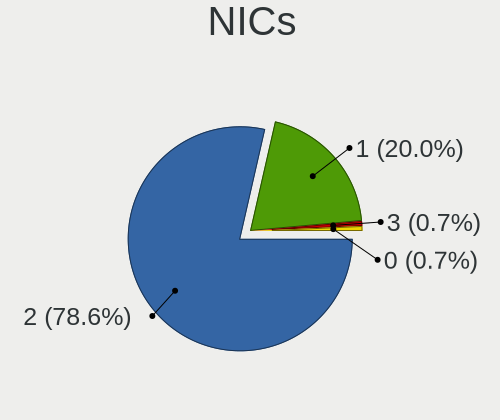
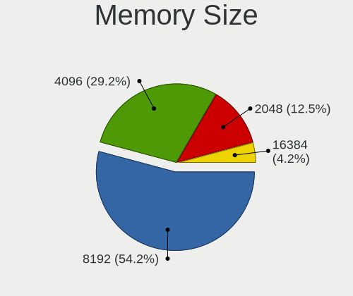

Zorin Hardware Trends (Notebook)
--------------------------------

A project to identify most popular hardware characteristics and track their change
over time based on data collected by Zorin users at https://Linux-Hardware.org.

Anyone can contribute to the study by uploading probes of their computers by
the [hw-probe](https://github.com/linuxhw/hw-probe) tool:

    sudo -E hw-probe -all -upload

Full-feature report is available here: https://linux-hardware.org/?view=trends&formfactor=notebook

Period: Sep, 2020.

Contents
--------

- [ OS                       ](#os)
- [ OS Family                ](#os-family)
- [ Kernel                   ](#kernel)
- [ Kernel Family            ](#kernel-family)
- [ Kernel Major Ver.        ](#kernel-major-ver)
- [ Arch                     ](#arch)
- [ DE                       ](#de)
- [ Display Server           ](#display-server)
- [ Display Manager          ](#display-manager)
- [ OS Lang                  ](#os-lang)
- [ Boot Mode                ](#boot-mode)
- [ Filesystem               ](#filesystem)
- [ Part. scheme             ](#part-scheme)
- [ Dual Boot with Linux/BSD ](#dual-boot-with-linux/bsd)
- [ Dual Boot (Win)          ](#dual-boot-win)
- [ Country                  ](#country)
- [ City                     ](#city)
- [ Vendor                   ](#vendor)
- [ Model                    ](#model)
- [ Model Family             ](#model-family)
- [ MFG Year                 ](#mfg-year)
- [ Form Factor              ](#form-factor)
- [ Secure Boot              ](#secure-boot)
- [ Coreboot                 ](#coreboot)
- [ RAM Size                 ](#ram-size)
- [ RAM Used                 ](#ram-used)
- [ Has CD-ROM               ](#has-cd-rom)
- [ Total Drives             ](#total-drives)
- [ Has Ethernet             ](#has-ethernet)
- [ Drive Vendor             ](#drive-vendor)
- [ HDD Vendor               ](#hdd-vendor)
- [ SSD Vendor               ](#ssd-vendor)
- [ Drive Model              ](#drive-model)
- [ Drive Kind               ](#drive-kind)
- [ Drive Connector          ](#drive-connector)
- [ Drive Size               ](#drive-size)
- [ Space Total              ](#space-total)
- [ Space Used               ](#space-used)
- [ Malfunc. Drives          ](#malfunc-drives)
- [ Malfunc. Drive Vendor    ](#malfunc-drive-vendor)
- [ Malfunc. HDD Vendor      ](#malfunc-hdd-vendor)
- [ Malfunc. Drive Kind      ](#malfunc-drive-kind)
- [ Failed Drives            ](#failed-drives)
- [ Failed Drive Vendor      ](#failed-drive-vendor)
- [ Drive Status             ](#drive-status)
- [ Storage Vendor           ](#storage-vendor)
- [ Storage Model            ](#storage-model)
- [ Storage Kind             ](#storage-kind)
- [ CPU Vendor               ](#cpu-vendor)
- [ CPU Model                ](#cpu-model)
- [ CPU Model Family         ](#cpu-model-family)
- [ CPU Cores                ](#cpu-cores)
- [ CPU Sockets              ](#cpu-sockets)
- [ CPU Threads              ](#cpu-threads)
- [ CPU Op-Modes             ](#cpu-op-modes)
- [ CPU Microcode            ](#cpu-microcode)
- [ CPU Microarch            ](#cpu-microarch)
- [ GPU Vendor               ](#gpu-vendor)
- [ GPU Model                ](#gpu-model)
- [ GPU Combo                ](#gpu-combo)
- [ GPU Driver               ](#gpu-driver)
- [ GPU Memory               ](#gpu-memory)
- [ Monitor Vendor           ](#monitor-vendor)
- [ Monitor Model            ](#monitor-model)
- [ Monitor Resolution       ](#monitor-resolution)
- [ Monitor Diagonal         ](#monitor-diagonal)
- [ Monitor Width            ](#monitor-width)
- [ Aspect Ratio             ](#aspect-ratio)
- [ Monitor Area             ](#monitor-area)
- [ Pixel Density            ](#pixel-density)
- [ Multiple Monitors        ](#multiple-monitors)
- [ Net Controller Vendor    ](#net-controller-vendor)
- [ Net Controller Model     ](#net-controller-model)
- [ Wireless Vendor          ](#wireless-vendor)
- [ Wireless Model           ](#wireless-model)
- [ Ethernet Vendor          ](#ethernet-vendor)
- [ Ethernet Model           ](#ethernet-model)
- [ Net Controller Kind      ](#net-controller-kind)
- [ Used Controller          ](#used-controller)
- [ NICs                     ](#nics)
- [ Memory Vendor            ](#memory-vendor)
- [ Memory Model             ](#memory-model)
- [ Memory Kind              ](#memory-kind)
- [ Memory Form Factor       ](#memory-form-factor)
- [ Memory Size              ](#memory-size)
- [ Memory Speed             ](#memory-speed)
- [ Sound Vendor             ](#sound-vendor)
- [ Sound Model              ](#sound-model)
- [ Camera Vendor            ](#camera-vendor)
- [ Camera Model             ](#camera-model)
- [ Fingerprint Vendor       ](#fingerprint-vendor)
- [ Fingerprint Model        ](#fingerprint-model)
- [ Chipcard Vendor          ](#chipcard-vendor)
- [ Chipcard Model           ](#chipcard-model)
- [ Printer Vendor           ](#printer-vendor)
- [ Printer Model            ](#printer-model)
- [ Scanner Vendor           ](#scanner-vendor)
- [ Scanner Model            ](#scanner-model)
- [ Bluetooth Vendor         ](#bluetooth-vendor)
- [ Bluetooth Model          ](#bluetooth-model)
- [ Unsupported Devices      ](#unsupported-devices)
- [ Unsupported Device Types ](#unsupported-device-types)

OS
--

Installed operating systems

| Name     | Notebooks | Percent |
|----------|-----------|---------|
| Zorin 15 | 48        | 96%     |
| Zorin 12 | 2         | 4%      |

OS Family
---------

OS without a version

| Name  | Notebooks | Percent |
|-------|-----------|---------|
| Zorin | 50        | 100%    |

Kernel
------

Version of the Linux kernel

| Version            | Notebooks | Percent |
|--------------------|-----------|---------|
| 5.4.0-47-generic   | 18        | 36%     |
| 5.4.0-48-generic   | 12        | 24%     |
| 5.4.0-45-generic   | 10        | 20%     |
| 5.4.0-42-generic   | 7         | 14%     |
| 5.3.0-51-generic   | 1         | 2%      |
| 4.15.0-118-generic | 1         | 2%      |
| 4.15.0-117-generic | 1         | 2%      |

Kernel Family
-------------

Linux kernel without a distro release

| Version | Notebooks | Percent |
|---------|-----------|---------|
| 5.4.0   | 47        | 94%     |
| 4.15.0  | 2         | 4%      |
| 5.3.0   | 1         | 2%      |

Kernel Major Ver.
-----------------

Linux kernel major version

| Version | Notebooks | Percent |
|---------|-----------|---------|
| 5.4     | 47        | 94%     |
| 4.15    | 2         | 4%      |
| 5.3     | 1         | 2%      |

Arch
----

OS architecture (x86_64, i586, etc.)

| Name   | Notebooks | Percent |
|--------|-----------|---------|
| x86_64 | 41        | 82%     |
| i686   | 9         | 18%     |

DE
--

Desktop Environment

| Name    | Notebooks | Percent |
|---------|-----------|---------|
| GNOME   | 26        | 52%     |
| XFCE    | 23        | 46%     |
| Unknown | 1         | 2%      |

Display Server
--------------

X11 or Wayland

| Name | Notebooks | Percent |
|------|-----------|---------|
| X11  | 50        | 100%    |

Display Manager
---------------

SDDM, LightDM, etc.

| Name    | Notebooks | Percent |
|---------|-----------|---------|
| Unknown | 49        | 98%     |
| TDM     | 1         | 2%      |

OS Lang
-------

Language

| Lang  | Notebooks | Percent |
|-------|-----------|---------|
| en_US | 19        | 38%     |
| en_IN | 4         | 8%      |
| pt_BR | 3         | 6%      |
| nl_NL | 3         | 6%      |
| en_GB | 3         | 6%      |
| pt_PT | 2         | 4%      |
| pl_PL | 2         | 4%      |
| en_AU | 2         | 4%      |
| de_DE | 2         | 4%      |
| it_IT | 1         | 2%      |
| hu_HU | 1         | 2%      |
| fr_FR | 1         | 2%      |
| es_VE | 1         | 2%      |
| es_EC | 1         | 2%      |
| es_CL | 1         | 2%      |
| en_CA | 1         | 2%      |
| de_AT | 1         | 2%      |
| da_DK | 1         | 2%      |
| C     | 1         | 2%      |

Boot Mode
---------

EFI or BIOS

| Mode | Notebooks | Percent |
|------|-----------|---------|
| BIOS | 35        | 70%     |
| EFI  | 15        | 30%     |

Filesystem
----------

Type of filesystem

| Type    | Notebooks | Percent |
|---------|-----------|---------|
| Ext4    | 47        | 94%     |
| Overlay | 2         | 4%      |
| Unknown | 1         | 2%      |

Part. scheme
------------

Scheme of partitioning

| Type    | Notebooks | Percent |
|---------|-----------|---------|
| Unknown | 49        | 98%     |
| MBR     | 1         | 2%      |

Dual Boot with Linux/BSD
------------------------

Hosting more than one Linux/BSD

| Dual boot | Notebooks | Percent |
|-----------|-----------|---------|
| No        | 46        | 92%     |
| Yes       | 4         | 8%      |

Dual Boot (Win)
---------------

Hosting Linux and Windows

| Dual boot | Notebooks | Percent |
|-----------|-----------|---------|
| No        | 40        | 80%     |
| Yes       | 10        | 20%     |

Country
-------

Geographic location (country)

| Country     | Notebooks | Percent |
|-------------|-----------|---------|
| USA         | 13        | 26%     |
| UK          | 4         | 8%      |
| India       | 4         | 8%      |
| Brazil      | 3         | 6%      |
| Portugal    | 2         | 4%      |
| Poland      | 2         | 4%      |
| Netherlands | 2         | 4%      |
| Germany     | 2         | 4%      |
| France      | 2         | 4%      |
| Denmark     | 2         | 4%      |
| Australia   | 2         | 4%      |
| Venezuela   | 1         | 2%      |
| UAE         | 1         | 2%      |
| Sweden      | 1         | 2%      |
| Sri Lanka   | 1         | 2%      |
| Romania     | 1         | 2%      |
| Luxembourg  | 1         | 2%      |
| Indonesia   | 1         | 2%      |
| Hungary     | 1         | 2%      |
| Ecuador     | 1         | 2%      |
| Chile       | 1         | 2%      |
| Canada      | 1         | 2%      |
| Austria     | 1         | 2%      |

City
----

Geographic location (city)

| City              | Notebooks | Percent |
|-------------------|-----------|---------|
| Paris             | 2         | 4%      |
| Düsseldorf       | 2         | 4%      |
| Łódź           | 1         | 2%      |
| Zaniemysl         | 1         | 2%      |
| West Bloomfield   | 1         | 2%      |
| Watford           | 1         | 2%      |
| Vienna            | 1         | 2%      |
| Vestal            | 1         | 2%      |
| Vadodara          | 1         | 2%      |
| Teresina          | 1         | 2%      |
| Szentgotthard     | 1         | 2%      |
| Sydney            | 1         | 2%      |
| Stockholm         | 1         | 2%      |
| Steenwijk         | 1         | 2%      |
| Sikeston          | 1         | 2%      |
| Santiago          | 1         | 2%      |
| Samora Correia    | 1         | 2%      |
| Rockledge         | 1         | 2%      |
| Rio Maior         | 1         | 2%      |
| Redwood City      | 1         | 2%      |
| Quito             | 1         | 2%      |
| Portland          | 1         | 2%      |
| Ploieşti         | 1         | 2%      |
| Phoenix           | 1         | 2%      |
| New York          | 1         | 2%      |
| Neath             | 1         | 2%      |
| Moore             | 1         | 2%      |
| Miami             | 1         | 2%      |
| Lubbock           | 1         | 2%      |
| Lowestoft         | 1         | 2%      |
| London            | 1         | 2%      |
| Kobenhavn S       | 1         | 2%      |
| Kobenhavn N       | 1         | 2%      |
| Kelaniya          | 1         | 2%      |
| Jakarta           | 1         | 2%      |
| Jaipur            | 1         | 2%      |
| Edmonton          | 1         | 2%      |
| Dudelange         | 1         | 2%      |
| Dubai             | 1         | 2%      |
| Dombivali         | 1         | 2%      |
| Colorado do Oeste | 1         | 2%      |
| Carmel            | 1         | 2%      |
| Canberra          | 1         | 2%      |
| Belo Horizonte    | 1         | 2%      |
| Auburn            | 1         | 2%      |
| Amsterdam         | 1         | 2%      |
| Alto de Los Godos | 1         | 2%      |
| Aligarh           | 1         | 2%      |

Vendor
------

Motherboard manufacturer

| Name                | Notebooks | Percent |
|---------------------|-----------|---------|
| Hewlett-Packard     | 12        | 24%     |
| Acer                | 8         | 16%     |
| Dell                | 7         | 14%     |
| ASUSTek Computer    | 5         | 10%     |
| Lenovo              | 4         | 8%      |
| Toshiba             | 3         | 6%      |
| Apple               | 3         | 6%      |
| Unknown             | 2         | 4%      |
| Sony                | 1         | 2%      |
| Semp Toshiba        | 1         | 2%      |
| Samsung Electronics | 1         | 2%      |
| Packard Bell        | 1         | 2%      |
| Fujitsu Siemens     | 1         | 2%      |
| AMI                 | 1         | 2%      |

Model
-----

Motherboard model

| Name                                                          | Notebooks | Percent |
|---------------------------------------------------------------|-----------|---------|
| HP 530                                                        | 2         | 4%      |
| Unknown                                                       | 2         | 4%      |
| Toshiba Satellite L855D                                       | 1         | 2%      |
| Toshiba Satellite C660                                        | 1         | 2%      |
| Toshiba Satellite C650D                                       | 1         | 2%      |
| Sony VGN-SZ4VWN_X                                             | 1         | 2%      |
| Semp Toshiba NA 1402                                          | 1         | 2%      |
| Samsung Electronics RV420/RV520/RV720/E3530/S3530/E3420/E3520 | 1         | 2%      |
| Packard Bell EasyNote ENTF71BM                                | 1         | 2%      |
| Lenovo ThinkPad X230 23252EG                                  | 1         | 2%      |
| Lenovo ThinkPad T520 4239CTO                                  | 1         | 2%      |
| Lenovo IdeaPad 320S-13IKB 81AK                                | 1         | 2%      |
| Lenovo 3000 N200 0769B6G                                      | 1         | 2%      |
| HP ZBook 17 G2                                                | 1         | 2%      |
| HP ProBook 4540s                                              | 1         | 2%      |
| HP Presario CQ57                                              | 1         | 2%      |
| HP Pavilion dv5                                               | 1         | 2%      |
| HP Mini 210-1100                                              | 1         | 2%      |
| HP Laptop 15-bw0xx                                            | 1         | 2%      |
| HP ENVY Notebook                                              | 1         | 2%      |
| HP EliteBook 840 G6                                           | 1         | 2%      |
| HP EliteBook 840 G4                                           | 1         | 2%      |
| HP Compaq Presario C700                                       | 1         | 2%      |
| Fujitsu Siemens AMILO Li3710                                  | 1         | 2%      |
| Dell Vostro 3700                                              | 1         | 2%      |
| Dell Latitude D630                                            | 1         | 2%      |
| Dell Inspiron N4010                                           | 1         | 2%      |
| Dell Inspiron 5577                                            | 1         | 2%      |
| Dell Inspiron 5537                                            | 1         | 2%      |
| Dell Inspiron 3542                                            | 1         | 2%      |
| Dell Inspiron 1110                                            | 1         | 2%      |
| ASUS W7J                                                      | 1         | 2%      |
| ASUS N750JK                                                   | 1         | 2%      |
| ASUS K54C                                                     | 1         | 2%      |
| ASUS K52F                                                     | 1         | 2%      |
| ASUS G74Sx                                                    | 1         | 2%      |
| Apple MacBookPro8,1                                           | 1         | 2%      |
| Apple MacBook5,2                                              | 1         | 2%      |
| Apple MacBook1,1                                              | 1         | 2%      |
| AMI Cherry Trail CR                                           | 1         | 2%      |
| Acer Swift SF314-42                                           | 1         | 2%      |
| Acer Extensa 5620                                             | 1         | 2%      |
| Acer Aspire one                                               | 1         | 2%      |
| Acer Aspire A315-21                                           | 1         | 2%      |
| Acer Aspire 7520                                              | 1         | 2%      |
| Acer Aspire 6930G                                             | 1         | 2%      |
| Acer AOD270                                                   | 1         | 2%      |
| Acer AO722                                                    | 1         | 2%      |

Model Family
------------

Motherboard model prefix

| Name                      | Notebooks | Percent |
|---------------------------|-----------|---------|
| Dell Inspiron             | 5         | 10%     |
| Acer Aspire               | 4         | 8%      |
| Toshiba Satellite         | 3         | 6%      |
| Lenovo ThinkPad           | 2         | 4%      |
| HP EliteBook              | 2         | 4%      |
| HP 530                    | 2         | 4%      |
| Unknown                   | 2         | 4%      |
| Sony VGN-SZ4VWN           | 1         | 2%      |
| Semp Toshiba NA           | 1         | 2%      |
| Samsung Electronics RV420 | 1         | 2%      |
| Packard Bell EasyNote     | 1         | 2%      |
| Lenovo IdeaPad            | 1         | 2%      |
| Lenovo 3000               | 1         | 2%      |
| HP ZBook                  | 1         | 2%      |
| HP ProBook                | 1         | 2%      |
| HP Presario               | 1         | 2%      |
| HP Pavilion               | 1         | 2%      |
| HP Mini                   | 1         | 2%      |
| HP Laptop                 | 1         | 2%      |
| HP ENVY                   | 1         | 2%      |
| HP Compaq                 | 1         | 2%      |
| Fujitsu Siemens AMILO     | 1         | 2%      |
| Dell Vostro               | 1         | 2%      |
| Dell Latitude             | 1         | 2%      |
| ASUS W7J                  | 1         | 2%      |
| ASUS N750JK               | 1         | 2%      |
| ASUS K54C                 | 1         | 2%      |
| ASUS K52F                 | 1         | 2%      |
| ASUS G74Sx                | 1         | 2%      |
| Apple MacBookPro8         | 1         | 2%      |
| Apple MacBook5            | 1         | 2%      |
| Apple MacBook1            | 1         | 2%      |
| AMI Cherry                | 1         | 2%      |
| Acer Swift                | 1         | 2%      |
| Acer Extensa              | 1         | 2%      |
| Acer AOD270               | 1         | 2%      |
| Acer AO722                | 1         | 2%      |

MFG Year
--------

Motherboard manufacture year

| Year | Notebooks | Percent |
|------|-----------|---------|
| 2008 | 8         | 16%     |
| 2011 | 7         | 14%     |
| 2012 | 6         | 12%     |
| 2018 | 5         | 10%     |
| 2020 | 4         | 8%      |
| 2019 | 4         | 8%      |
| 2014 | 3         | 6%      |
| 2010 | 3         | 6%      |
| 2007 | 3         | 6%      |
| 2015 | 2         | 4%      |
| 2009 | 2         | 4%      |
| 2006 | 2         | 4%      |
| 2016 | 1         | 2%      |

Form Factor
-----------

Physical design of the computer

| Name     | Notebooks | Percent |
|----------|-----------|---------|
| Notebook | 50        | 100%    |

Secure Boot
-----------

Enabled or disabled

| State    | Notebooks | Percent |
|----------|-----------|---------|
| Disabled | 46        | 92%     |
| Enabled  | 4         | 8%      |

Coreboot
--------

Have coreboot on board

| Used | Notebooks | Percent |
|------|-----------|---------|
| No   | 50        | 100%    |

RAM Size
--------

Total RAM memory

| Size in GB | Notebooks | Percent |
|------------|-----------|---------|
| 3.01-4.0   | 14        | 28%     |
| 1.01-2.0   | 13        | 26%     |
| 8.01-16.0  | 7         | 14%     |
| 2.01-3.0   | 6         | 12%     |
| 4.01-8.0   | 5         | 10%     |
| 16.01-24.0 | 4         | 8%      |
| 0.01-1.0   | 1         | 2%      |

RAM Used
--------

Used RAM memory

| Used GB  | Notebooks | Percent |
|----------|-----------|---------|
| 1.01-2.0 | 22        | 44%     |
| 0.01-1.0 | 13        | 26%     |
| 2.01-3.0 | 10        | 20%     |
| 3.01-4.0 | 4         | 8%      |
| 4.01-8.0 | 1         | 2%      |

Has CD-ROM
----------

Has CD-ROM on board

| Presented | Notebooks | Percent |
|-----------|-----------|---------|
| Yes       | 31        | 62%     |
| No        | 19        | 38%     |

Total Drives
------------

Number of drives on board

| Drives | Notebooks | Percent |
|--------|-----------|---------|
| 1      | 38        | 76%     |
| 2      | 11        | 22%     |
| 4      | 1         | 2%      |

Has Ethernet
------------

Has Ethernet on board

| Presented | Notebooks | Percent |
|-----------|-----------|---------|
| Yes       | 49        | 98%     |
| No        | 1         | 2%      |

Drive Vendor
------------

Hard drive vendors

| Vendor              | Notebooks | Drives | Percent |
|---------------------|-----------|--------|---------|
| Seagate             | 12        | 13     | 22.64%  |
| WDC                 | 10        | 10     | 18.87%  |
| Toshiba             | 5         | 5      | 9.43%   |
| Samsung Electronics | 5         | 5      | 9.43%   |
| Hitachi             | 5         | 6      | 9.43%   |
| PNY                 | 2         | 2      | 3.77%   |
| Intel               | 2         | 2      | 3.77%   |
| HGST                | 2         | 2      | 3.77%   |
| Fujitsu             | 2         | 2      | 3.77%   |
| Unknown             | 1         | 1      | 1.89%   |
| Team                | 1         | 1      | 1.89%   |
| SK Hynix            | 1         | 1      | 1.89%   |
| SanDisk             | 1         | 1      | 1.89%   |
| Phison              | 1         | 1      | 1.89%   |
| Kingston            | 1         | 1      | 1.89%   |
| HUAWEI              | 1         | 1      | 1.89%   |
| Apple               | 1         | 1      | 1.89%   |

HDD Vendor
----------

Hard disk drive vendors

| Vendor              | Notebooks | Drives | Percent |
|---------------------|-----------|--------|---------|
| Seagate             | 11        | 12     | 34.38%  |
| WDC                 | 7         | 7      | 21.88%  |
| Hitachi             | 5         | 6      | 15.63%  |
| Toshiba             | 4         | 4      | 12.5%   |
| HGST                | 2         | 2      | 6.25%   |
| Fujitsu             | 2         | 2      | 6.25%   |
| Samsung Electronics | 1         | 1      | 3.13%   |

SSD Vendor
----------

Solid state drive vendors

| Vendor              | Notebooks | Drives | Percent |
|---------------------|-----------|--------|---------|
| WDC                 | 3         | 3      | 21.43%  |
| PNY                 | 2         | 2      | 14.29%  |
| Intel               | 2         | 2      | 14.29%  |
| Toshiba             | 1         | 1      | 7.14%   |
| Team                | 1         | 1      | 7.14%   |
| Seagate             | 1         | 1      | 7.14%   |
| SanDisk             | 1         | 1      | 7.14%   |
| Samsung Electronics | 1         | 1      | 7.14%   |
| Kingston            | 1         | 1      | 7.14%   |
| Apple               | 1         | 1      | 7.14%   |

Drive Model
-----------

Hard drive models

| Model                           | Notebooks | Percent |
|---------------------------------|-----------|---------|
| NVMe SSD Drive 512GB            | 3         | 5.66%   |
| WDS120G2G0A-00JH30 120GB SSD    | 2         | 3.77%   |
| ST9320325AS 320GB               | 2         | 3.77%   |
| ST9160821AS 160GB               | 2         | 3.77%   |
| SSDSC2BW180A3L 180GB            | 2         | 3.77%   |
| WDS240G2G0A-00JH30 240GB SSD    | 1         | 1.89%   |
| WD5000BPVT-22HXZT3 500GB        | 1         | 1.89%   |
| WD3200BPVT-22JJ5T0 320GB        | 1         | 1.89%   |
| WD3200BEVT-22ZCT0 320GB         | 1         | 1.89%   |
| WD2500BEVT-08A23T1 250GB        | 1         | 1.89%   |
| WD2500BEVS-22UST0 250GB         | 1         | 1.89%   |
| WD1600BEVT-22ZCT0 160GB         | 1         | 1.89%   |
| WD10JPVX-75JC3T0 1TB            | 1         | 1.89%   |
| VX500 256GB SSD                 | 1         | 1.89%   |
| TF CARD Storage 2GB             | 1         | 1.89%   |
| T253X2256G 256GB SSD            | 1         | 1.89%   |
| ST980811AS 80GB                 | 1         | 1.89%   |
| ST9500423AS 500GB               | 1         | 1.89%   |
| ST9320423AS 320GB               | 1         | 1.89%   |
| ST9250315AS 250GB               | 1         | 1.89%   |
| ST9160827AS 160GB               | 1         | 1.89%   |
| ST500LT012-1DG142 500GB         | 1         | 1.89%   |
| ST500LM012 HN-M500MBB 500GB     | 1         | 1.89%   |
| SSD2SC240G1CS2754D117-488 240GB | 1         | 1.89%   |
| SSD TS256C 256GB                | 1         | 1.89%   |
| SSD 830 Series 128GB            | 1         | 1.89%   |
| SD7SN6S-512G-1006 512GB SSD     | 1         | 1.89%   |
| SA400S37240G 240GB SSD          | 1         | 1.89%   |
| NVMe SSD Drive 256GB            | 1         | 1.89%   |
| NVMe SSD Drive 250GB            | 1         | 1.89%   |
| MQ01ABD032 320GB                | 1         | 1.89%   |
| MMC Card  32GB                  | 1         | 1.89%   |
| MK8037GSX 80GB                  | 1         | 1.89%   |
| MK3275GSX 320GB                 | 1         | 1.89%   |
| MK3259GSXP 320GB                | 1         | 1.89%   |
| MJA2500BH G2 500GB              | 1         | 1.89%   |
| MHW2120BH 120GB                 | 1         | 1.89%   |
| HTS725050A7E630 500GB           | 1         | 1.89%   |
| HTS725025A9A364 250GB           | 1         | 1.89%   |
| HTS721010A9E630 1TB             | 1         | 1.89%   |
| HTS545050B9A300 500GB           | 1         | 1.89%   |
| HTS543232L9A300 320GB           | 1         | 1.89%   |
| HTS542580K9SA00 80GB            | 1         | 1.89%   |
| HTS541612J9SA00 120GB           | 1         | 1.89%   |
| HN-M500MBB 500GB                | 1         | 1.89%   |
| Expansion SSD 500GB             | 1         | 1.89%   |
| CS900 240GB SSD                 | 1         | 1.89%   |

Drive Kind
----------

HDD or SSD

| Kind    | Notebooks | Drives | Percent |
|---------|-----------|--------|---------|
| HDD     | 31        | 34     | 59.62%  |
| SSD     | 14        | 14     | 26.92%  |
| NVMe    | 5         | 5      | 9.62%   |
| MMC     | 1         | 1      | 1.92%   |
| Unknown | 1         | 1      | 1.92%   |

Drive Connector
---------------

SATA, SAS, NVMe, etc.

| Type | Notebooks | Drives | Percent |
|------|-----------|--------|---------|
| SATA | 43        | 47     | 84.31%  |
| NVMe | 5         | 5      | 9.8%    |
| SAS  | 2         | 2      | 3.92%   |
| MMC  | 1         | 1      | 1.96%   |

Drive Size
----------

Size of hard drive

| Size in TB | Notebooks | Drives | Percent |
|------------|-----------|--------|---------|
| 0.01-0.5   | 45        | 49     | 88.24%  |
| 0.51-1.0   | 6         | 6      | 11.76%  |

Space Total
-----------

Amount of disk space available on the file system

| Size in GB | Notebooks | Percent |
|------------|-----------|---------|
| 101-250    | 25        | 50%     |
| 251-500    | 13        | 26%     |
| 501-1000   | 3         | 6%      |
| 51-100     | 3         | 6%      |
| 21-50      | 2         | 4%      |
| 1-20       | 2         | 4%      |
| 1001-2000  | 1         | 2%      |
| Unknown    | 1         | 2%      |

Space Used
----------

Amount of used disk space

| Used GB  | Notebooks | Percent |
|----------|-----------|---------|
| 1-20     | 32        | 64%     |
| 21-50    | 7         | 14%     |
| 101-250  | 5         | 10%     |
| 251-500  | 2         | 4%      |
| 51-100   | 2         | 4%      |
| 501-1000 | 1         | 2%      |
| Unknown  | 1         | 2%      |

Malfunc. Drives
---------------

Drive models with a malfunction

| Model                 | Notebooks | Drives | Percent |
|-----------------------|-----------|--------|---------|
| HTS545050B9A300 500GB | 1         | 1      | 100%    |

Malfunc. Drive Vendor
---------------------

Vendors of faulty drives

| Vendor  | Notebooks | Drives | Percent |
|---------|-----------|--------|---------|
| Hitachi | 1         | 1      | 100%    |

Malfunc. HDD Vendor
-------------------

Vendors of faulty HDD drives

| Vendor  | Notebooks | Drives | Percent |
|---------|-----------|--------|---------|
| Hitachi | 1         | 1      | 100%    |

Malfunc. Drive Kind
-------------------

Kinds of faulty drives

| Kind | Notebooks | Drives | Percent |
|------|-----------|--------|---------|
| HDD  | 1         | 1      | 100%    |

Failed Drives
-------------

Failed drive models

Zero info for selected period =(

Failed Drive Vendor
-------------------

Failed drive vendors

Zero info for selected period =(

Drive Status
------------

Number of failed and malfunc. drives

| Status   | Notebooks | Drives | Percent |
|----------|-----------|--------|---------|
| Detected | 48        | 54     | 97.96%  |
| Malfunc  | 1         | 1      | 2.04%   |

Storage Vendor
--------------

Storage controller vendors

| Vendor              | Notebooks | Percent |
|---------------------|-----------|---------|
| Intel               | 38        | 71.7%   |
| AMD                 | 8         | 15.09%  |
| Samsung Electronics | 3         | 5.66%   |
| Nvidia              | 2         | 3.77%   |
| SK Hynix            | 1         | 1.89%   |
| Phison Electronics  | 1         | 1.89%   |

Storage Model
-------------

Storage controller models

| Model                                                                            | Notebooks | Percent |
|----------------------------------------------------------------------------------|-----------|---------|
| FCH SATA Controller [AHCI mode]                                                  | 6         | 9.68%   |
| 6 Series/C200 Series Chipset Family 6 port Mobile SATA AHCI Controller           | 5         | 8.06%   |
| 82801IBM/IEM (ICH9M/ICH9M-E) 4 port SATA Controller [AHCI mode]                  | 4         | 6.45%   |
| 82801HM/HEM (ICH8M/ICH8M-E) IDE Controller                                       | 4         | 6.45%   |
| 82801GBM/GHM (ICH7-M Family) SATA Controller [IDE mode]                          | 4         | 6.45%   |
| 82801G (ICH7 Family) IDE Controller                                              | 4         | 6.45%   |
| NM10/ICH7 Family SATA Controller [AHCI mode]                                     | 3         | 4.84%   |
| 82801HM/HEM (ICH8M/ICH8M-E) SATA Controller [AHCI mode]                          | 3         | 4.84%   |
| Sunrise Point-LP SATA Controller [AHCI mode]                                     | 2         | 3.23%   |
| SB7x0/SB8x0/SB9x0 SATA Controller [AHCI mode]                                    | 2         | 3.23%   |
| NVMe SSD Controller SM981/PM981/PM983                                            | 2         | 3.23%   |
| HM170/QM170 Chipset SATA Controller [AHCI Mode]                                  | 2         | 3.23%   |
| 82801GBM/GHM (ICH7-M Family) SATA Controller [AHCI mode]                         | 2         | 3.23%   |
| 8 Series/C220 Series Chipset Family 6-port SATA Controller 1 [AHCI mode]         | 2         | 3.23%   |
| 8 Series SATA Controller 1 [AHCI mode]                                           | 2         | 3.23%   |
| 7 Series Chipset Family 6-port SATA Controller [AHCI mode]                       | 2         | 3.23%   |
| 5 Series/3400 Series Chipset 6 port SATA AHCI Controller                         | 2         | 3.23%   |
| NVMe SSD Controller SM961/PM961                                                  | 1         | 1.61%   |
| Non-Volatile memory controller                                                   | 1         | 1.61%   |
| MCP79 AHCI Controller                                                            | 1         | 1.61%   |
| MCP67 AHCI Controller                                                            | 1         | 1.61%   |
| E12 NVMe Controller                                                              | 1         | 1.61%   |
| Atom Processor E3800 Series SATA AHCI Controller                                 | 1         | 1.61%   |
| 82801IBM/IEM (ICH9M/ICH9M-E) 2 port SATA Controller [IDE mode]                   | 1         | 1.61%   |
| 82801HM/HEM (ICH8M/ICH8M-E) SATA Controller [IDE mode]                           | 1         | 1.61%   |
| 6 Series/C200 Series Chipset Family Mobile SATA Controller (IDE mode, ports 4-5) | 1         | 1.61%   |
| 6 Series/C200 Series Chipset Family Mobile SATA Controller (IDE mode, ports 0-3) | 1         | 1.61%   |
| 5 Series/3400 Series Chipset 4 port SATA AHCI Controller                         | 1         | 1.61%   |

Storage Kind
------------

Kind of storage controller (IDE, SATA, NVMe, SAS, ...)

| Kind | Notebooks | Percent |
|------|-----------|---------|
| SATA | 40        | 70.18%  |
| IDE  | 12        | 21.05%  |
| NVMe | 5         | 8.77%   |

CPU Vendor
----------

Processor vendors

| Vendor | Notebooks | Percent |
|--------|-----------|---------|
| Intel  | 41        | 82%     |
| AMD    | 9         | 18%     |

CPU Model
---------

Processor models

| Model                                           | Notebooks | Percent |
|-------------------------------------------------|-----------|---------|
| Intel Atom CPU N455 @ 1.66GHz                   | 2         | 4%      |
| AMD C-50 Processor                              | 2         | 4%      |
| Intel Pentium Dual-Core CPU T4500 @ 2.30GHz     | 1         | 2%      |
| Intel Pentium Dual CPU T2310 @ 1.46GHz          | 1         | 2%      |
| Intel Pentium CPU T4300 @ 2.10GHz               | 1         | 2%      |
| Intel Pentium CPU B940 @ 2.00GHz                | 1         | 2%      |
| Intel Genuine CPU U4100 @ 1.30GHz               | 1         | 2%      |
| Intel Genuine CPU T2500 @ 2.00GHz               | 1         | 2%      |
| Intel Genuine CPU T1600 @ 1.66GHz               | 1         | 2%      |
| Intel Genuine CPU T1350 @ 1.86GHz               | 1         | 2%      |
| Intel Core i7-8565U CPU @ 1.80GHz               | 1         | 2%      |
| Intel Core i7-7700HQ CPU @ 2.80GHz              | 1         | 2%      |
| Intel Core i7-6700HQ CPU @ 2.60GHz              | 1         | 2%      |
| Intel Core i7-4800MQ CPU @ 2.70GHz              | 1         | 2%      |
| Intel Core i7-4700HQ CPU @ 2.40GHz              | 1         | 2%      |
| Intel Core i7-3520M CPU @ 2.90GHz               | 1         | 2%      |
| Intel Core i7-2630QM CPU @ 2.00GHz              | 1         | 2%      |
| Intel Core i5-8250U CPU @ 1.60GHz               | 1         | 2%      |
| Intel Core i5-7200U CPU @ 2.50GHz               | 1         | 2%      |
| Intel Core i5-4210U CPU @ 1.70GHz               | 1         | 2%      |
| Intel Core i5-4200U CPU @ 1.60GHz               | 1         | 2%      |
| Intel Core i5-2520M CPU @ 2.50GHz               | 1         | 2%      |
| Intel Core i5-2430M CPU @ 2.40GHz               | 1         | 2%      |
| Intel Core i5-2415M CPU @ 2.30GHz               | 1         | 2%      |
| Intel Core i5 CPU M 460 @ 2.53GHz               | 1         | 2%      |
| Intel Core i3-2310M CPU @ 2.10GHz               | 1         | 2%      |
| Intel Core i3 CPU M 370 @ 2.40GHz               | 1         | 2%      |
| Intel Core i3 CPU M 350 @ 2.27GHz               | 1         | 2%      |
| Intel Core Duo CPU T2500 @ 2.00GHz              | 1         | 2%      |
| Intel Core 2 Duo CPU T9300 @ 2.50GHz            | 1         | 2%      |
| Intel Core 2 Duo CPU T7250 @ 2.00GHz            | 1         | 2%      |
| Intel Core 2 Duo CPU T5450 @ 1.66GHz            | 1         | 2%      |
| Intel Core 2 Duo CPU P7450 @ 2.13GHz            | 1         | 2%      |
| Intel Core 2 Duo CPU P7350 @ 2.00GHz            | 1         | 2%      |
| Intel Core 2 CPU T7400 @ 2.16GHz                | 1         | 2%      |
| Intel Core 2 CPU T7200 @ 2.00GHz                | 1         | 2%      |
| Intel Celeron CPU N2830 @ 2.16GHz               | 1         | 2%      |
| Intel Celeron CPU B820 @ 1.70GHz                | 1         | 2%      |
| Intel Atom x5-Z8300 CPU @ 1.44GHz               | 1         | 2%      |
| Intel Atom CPU N280 @ 1.66GHz                   | 1         | 2%      |
| Intel Atom CPU N2600 @ 1.60GHz                  | 1         | 2%      |
| AMD Ryzen 7 4700U with Radeon Graphics          | 1         | 2%      |
| AMD E1-2100 APU with Radeon HD Graphics         | 1         | 2%      |
| AMD Athlon 64 X2 Dual-Core Processor TK-55      | 1         | 2%      |
| AMD A8-4500M APU with Radeon HD Graphics        | 1         | 2%      |
| AMD A6-9220 RADEON R4, 5 COMPUTE CORES 2C+3G    | 1         | 2%      |
| AMD A6-5350M APU with Radeon HD Graphics        | 1         | 2%      |
| AMD A10-9620P RADEON R5, 10 COMPUTE CORES 4C+6G | 1         | 2%      |

CPU Model Family
----------------

Processor model prefix

| Model                   | Notebooks | Percent |
|-------------------------|-----------|---------|
| Intel Core i5           | 8         | 16%     |
| Intel Core i7           | 7         | 14%     |
| Intel Core 2 Duo        | 5         | 10%     |
| Intel Atom              | 5         | 10%     |
| Intel Genuine           | 4         | 8%      |
| Intel Core i3           | 3         | 6%      |
| Intel Pentium           | 2         | 4%      |
| Intel Core 2            | 2         | 4%      |
| Intel Celeron           | 2         | 4%      |
| AMD C-50                | 2         | 4%      |
| AMD A6                  | 2         | 4%      |
| Intel Pentium Dual-Core | 1         | 2%      |
| Intel Pentium Dual      | 1         | 2%      |
| Intel Core Duo          | 1         | 2%      |
| AMD Ryzen 7             | 1         | 2%      |
| AMD E1                  | 1         | 2%      |
| AMD Athlon 64 X2        | 1         | 2%      |
| AMD A8                  | 1         | 2%      |
| AMD A10                 | 1         | 2%      |

CPU Cores
---------

Number of processor cores

| Number | Notebooks | Percent |
|--------|-----------|---------|
| 2      | 36        | 72%     |
| 4      | 8         | 16%     |
| 1      | 5         | 10%     |
| 8      | 1         | 2%      |

CPU Sockets
-----------

Number of sockets

| Number | Notebooks | Percent |
|--------|-----------|---------|
| 1      | 50        | 100%    |

CPU Threads
-----------

Threads per core (Hyper-Threading)

| Number | Notebooks | Percent |
|--------|-----------|---------|
| 2      | 25        | 50%     |
| 1      | 25        | 50%     |

CPU Op-Modes
------------

CPU Operation Modes (32-bit, 64-bit)

| Op mode        | Notebooks | Percent |
|----------------|-----------|---------|
| 32-bit, 64-bit | 45        | 90%     |
| 32-bit         | 4         | 8%      |
| Unknown        | 1         | 2%      |

CPU Microcode
-------------

Microcode number

| Number     | Notebooks | Percent |
|------------|-----------|---------|
| 0x206a7    | 7         | 14%     |
| 0x6fd      | 4         | 8%      |
| 0x1067a    | 3         | 6%      |
| Unknown    | 3         | 6%      |
| 0x6f6      | 2         | 4%      |
| 0x6e8      | 2         | 4%      |
| 0x40651    | 2         | 4%      |
| 0x306c3    | 2         | 4%      |
| 0x106ca    | 2         | 4%      |
| 0x10676    | 2         | 4%      |
| 0x05000029 | 2         | 4%      |
| 0x906e9    | 1         | 2%      |
| 0x806ec    | 1         | 2%      |
| 0x806ea    | 1         | 2%      |
| 0x806e9    | 1         | 2%      |
| 0x6ec      | 1         | 2%      |
| 0x506e3    | 1         | 2%      |
| 0x406c3    | 1         | 2%      |
| 0x306a9    | 1         | 2%      |
| 0x30678    | 1         | 2%      |
| 0x30661    | 1         | 2%      |
| 0x20655    | 1         | 2%      |
| 0x20652    | 1         | 2%      |
| 0x106c2    | 1         | 2%      |
| 0x08600102 | 1         | 2%      |
| 0x0700010f | 1         | 2%      |
| 0x06006705 | 1         | 2%      |
| 0x0600611a | 1         | 2%      |
| 0x0600111f | 1         | 2%      |
| 0x06001119 | 1         | 2%      |

CPU Microarch
-------------

Microarchitecture

| Name        | Notebooks | Percent |
|-------------|-----------|---------|
| Core        | 12        | 24%     |
| SandyBridge | 7         | 14%     |
| Skylake     | 5         | 10%     |
| Haswell     | 4         | 8%      |
| Bonnell     | 4         | 8%      |
| Westmere    | 3         | 6%      |
| P6          | 3         | 6%      |
| Silvermont  | 2         | 4%      |
| Piledriver  | 2         | 4%      |
| Excavator   | 2         | 4%      |
| Bobcat      | 2         | 4%      |
| Zen 2       | 1         | 2%      |
| K8 Hammer   | 1         | 2%      |
| Jaguar      | 1         | 2%      |
| IvyBridge   | 1         | 2%      |

GPU Vendor
----------

Vendors of graphics cards

| Vendor | Notebooks | Percent |
|--------|-----------|---------|
| Intel  | 34        | 60.71%  |
| Nvidia | 12        | 21.43%  |
| AMD    | 10        | 17.86%  |

GPU Model
---------

Graphics card models

| Model                                                                              | Notebooks | Percent |
|------------------------------------------------------------------------------------|-----------|---------|
| 2nd Generation Core Processor Family Integrated Graphics Controller                | 6         | 9.23%   |
| Mobile 945GM/GMS/GME, 943/940GML Express Integrated Graphics Controller            | 5         | 7.69%   |
| Mobile GM965/GL960 Integrated Graphics Controller (secondary)                      | 3         | 4.62%   |
| Mobile GM965/GL960 Integrated Graphics Controller (primary)                        | 3         | 4.62%   |
| Mobile 945GSE Express Integrated Graphics Controller                               | 3         | 4.62%   |
| Mobile 4 Series Chipset Integrated Graphics Controller                             | 3         | 4.62%   |
| Core Processor Integrated Graphics Controller                                      | 3         | 4.62%   |
| Wrestler [Radeon HD 6250]                                                          | 2         | 3.08%   |
| Mobile 945GM/GMS, 943/940GML Express Integrated Graphics Controller                | 2         | 3.08%   |
| Haswell-ULT Integrated Graphics Controller                                         | 2         | 3.08%   |
| Atom Processor D4xx/D5xx/N4xx/N5xx Integrated Graphics Controller                  | 2         | 3.08%   |
| Wani [Radeon R5/R6/R7 Graphics]                                                    | 1         | 1.54%   |
| UHD Graphics 620 (Whiskey Lake)                                                    | 1         | 1.54%   |
| UHD Graphics 620                                                                   | 1         | 1.54%   |
| Trinity [Radeon HD 7640G]                                                          | 1         | 1.54%   |
| Topaz XT [Radeon R7 M260/M265 / M340/M360 / M440/M445 / 530/535 / 620/625 Mobile]  | 1         | 1.54%   |
| Thames [Radeon HD 7550M/7570M/7650M]                                               | 1         | 1.54%   |
| Sun XT [Radeon HD 8670A/8670M/8690M / R5 M330 / M430 / Radeon 520 Mobile]          | 1         | 1.54%   |
| Stoney [Radeon R2/R3/R4/R5 Graphics]                                               | 1         | 1.54%   |
| Richland [Radeon HD 8450G]                                                         | 1         | 1.54%   |
| Renoir                                                                             | 1         | 1.54%   |
| Kabini [Radeon HD 8210]                                                            | 1         | 1.54%   |
| HD Graphics 630                                                                    | 1         | 1.54%   |
| HD Graphics 620                                                                    | 1         | 1.54%   |
| HD Graphics 530                                                                    | 1         | 1.54%   |
| GP107M [GeForce GTX 1050 Mobile]                                                   | 1         | 1.54%   |
| GM107M [GeForce GTX 950M]                                                          | 1         | 1.54%   |
| GM107M [GeForce GTX 850M]                                                          | 1         | 1.54%   |
| GK106GLM [Quadro K2100M]                                                           | 1         | 1.54%   |
| GF117M [GeForce 610M/710M/810M/820M / GT 620M/625M/630M/720M]                      | 1         | 1.54%   |
| GF116M [GeForce GT 560M]                                                           | 1         | 1.54%   |
| G98M [GeForce 9200M GS]                                                            | 1         | 1.54%   |
| G96CM [GeForce 9600M GT]                                                           | 1         | 1.54%   |
| G72M [Quadro NVS 110M/GeForce Go 7300]                                             | 1         | 1.54%   |
| G72M [GeForce Go 7400]                                                             | 1         | 1.54%   |
| C79 [GeForce 9400M G]                                                              | 1         | 1.54%   |
| C67 [GeForce 7000M / nForce 610M]                                                  | 1         | 1.54%   |
| Atom/Celeron/Pentium Processor x5-E8000/J3xxx/N3xxx Integrated Graphics Controller | 1         | 1.54%   |
| Atom Processor Z36xxx/Z37xxx Series Graphics & Display                             | 1         | 1.54%   |
| Atom Processor D2xxx/N2xxx Integrated Graphics Controller                          | 1         | 1.54%   |
| 4th Gen Core Processor Integrated Graphics Controller                              | 1         | 1.54%   |
| 3rd Gen Core processor Graphics Controller                                         | 1         | 1.54%   |

GPU Combo
---------

Combinations of graphics cards

| Name           | Notebooks | Percent |
|----------------|-----------|---------|
| 1 x Intel      | 28        | 56%     |
| 1 x Nvidia     | 8         | 16%     |
| 1 x AMD        | 6         | 12%     |
| Intel + Nvidia | 4         | 8%      |
| Intel + AMD    | 2         | 4%      |
| Other          | 1         | 2%      |
| 2 x AMD        | 1         | 2%      |

GPU Driver
----------

Free vs proprietary

| Driver      | Notebooks | Percent |
|-------------|-----------|---------|
| Free        | 40        | 80%     |
| Proprietary | 6         | 12%     |
| Unknown     | 4         | 8%      |

GPU Memory
----------

Total video memory

| Size in GB | Notebooks | Percent |
|------------|-----------|---------|
| Unknown    | 32        | 64%     |
| 0.01-0.5   | 9         | 18%     |
| 1.01-2.0   | 6         | 12%     |
| 0.51-1.0   | 2         | 4%      |
| 3.01-4.0   | 1         | 2%      |

Monitor Vendor
--------------

Monitor vendors

| Vendor                  | Notebooks | Percent |
|-------------------------|-----------|---------|
| LG Display              | 9         | 18%     |
| AU Optronics            | 9         | 18%     |
| Samsung Electronics     | 7         | 14%     |
| Apple                   | 4         | 8%      |
| LG Philips              | 3         | 6%      |
| Chimei Innolux          | 3         | 6%      |
| Chi Mei Optoelectronics | 3         | 6%      |
| BOE                     | 3         | 6%      |
| Philips                 | 2         | 4%      |
| InfoVision              | 2         | 4%      |
| Seiko/Epson             | 1         | 2%      |
| Lenovo                  | 1         | 2%      |
| InnoLux Display         | 1         | 2%      |
| Iiyama                  | 1         | 2%      |
| Dell                    | 1         | 2%      |

Monitor Model
-------------

Monitor models

| Model                                              | Notebooks | Percent |
|----------------------------------------------------|-----------|---------|
| U2419H DEL415D 1920x1080 527x296mm 23.8-inch       | 1         | 2%      |
| PL2282H IVM5632 1920x1080 476x268mm 21.5-inch      | 1         | 2%      |
| M140NWR2 R1 IVO057A 1366x768 309x174mm 14.0-inch   | 1         | 2%      |
| LP156WH1-TLA1 LGD6301 1366x768 344x194mm 15.5-inch | 1         | 2%      |
| LP116WH1-TLA1 LGD021C 1366x768 256x144mm 11.6-inch | 1         | 2%      |
| LCD Monitor SEC5541 1366x768 344x193mm 15.5-inch   | 1         | 2%      |
| LCD Monitor SEC4D45 1280x800 331x207mm 15.4-inch   | 1         | 2%      |
| LCD Monitor SEC4945 1280x800 330x210mm 15.4-inch   | 1         | 2%      |
| LCD Monitor SEC4251 1366x768 344x194mm 15.5-inch   | 1         | 2%      |
| LCD Monitor SEC3633 1280x800 331x207mm 15.4-inch   | 1         | 2%      |
| LCD Monitor SEC324A 1366x768 344x194mm 15.5-inch   | 1         | 2%      |
| LCD Monitor SEC3150 1366x768 344x193mm 15.5-inch   | 1         | 2%      |
| LCD Monitor PHL4650 1280x768 530x398mm 26.1-inch   | 1         | 2%      |
| LCD Monitor LPLDB00 1280x800 331x207mm 15.4-inch   | 1         | 2%      |
| LCD Monitor LPLA002 1440x900 367x230mm 17.1-inch   | 1         | 2%      |
| LCD Monitor LPL00E5 1440x900 304x190mm 14.1-inch   | 1         | 2%      |
| LCD Monitor LGD033A 1366x768 340x190mm 15.3-inch   | 1         | 2%      |
| LCD Monitor LGD02D8 1366x768 277x156mm 12.5-inch   | 1         | 2%      |
| LCD Monitor LGD02A7 1366x768 310x170mm 13.9-inch   | 1         | 2%      |
| LCD Monitor LGD02A6 1366x768 345x194mm 15.6-inch   | 1         | 2%      |
| LCD Monitor LGD0289 1600x900 382x215mm 17.3-inch   | 1         | 2%      |
| LCD Monitor LGD021E 1366x768 256x144mm 11.6-inch   | 1         | 2%      |
| LCD Monitor LGD01DD 1600x900 382x215mm 17.3-inch   | 1         | 2%      |
| LCD Monitor LEN40B1 1600x900 344x194mm 15.5-inch   | 1         | 2%      |
| LCD Monitor IVO8C69 1920x1080 309x174mm 14.0-inch  | 1         | 2%      |
| LCD Monitor CMO1720 1920x1080 382x215mm 17.3-inch  | 1         | 2%      |
| LCD Monitor CMO1592 1366x768 344x193mm 15.5-inch   | 1         | 2%      |
| LCD Monitor CMO1526 1280x800 331x207mm 15.4-inch   | 1         | 2%      |
| LCD Monitor CMN15E6 1366x768 344x193mm 15.5-inch   | 1         | 2%      |
| LCD Monitor CMN15B6 1366x768 340x190mm 15.3-inch   | 1         | 2%      |
| LCD Monitor CMN1495 1366x768 309x174mm 14.0-inch   | 1         | 2%      |
| LCD Monitor BOE06FA 1920x1080 294x165mm 13.3-inch  | 1         | 2%      |
| LCD Monitor BOE06A4 1366x768 344x194mm 15.5-inch   | 1         | 2%      |
| LCD Monitor BOE05EA 1366x768 309x173mm 13.9-inch   | 1         | 2%      |
| LCD Monitor AUO61D2 1024x600 220x130mm 10.1-inch   | 1         | 2%      |
| LCD Monitor AUO40EC 1366x768 340x190mm 15.3-inch   | 1         | 2%      |
| LCD Monitor AUO38ED 1920x1080 340x190mm 15.3-inch  | 1         | 2%      |
| LCD Monitor AUO30D2 1024x600 223x125mm 10.1-inch   | 1         | 2%      |
| LCD Monitor AUO23EC 1366x768 344x193mm 15.5-inch   | 1         | 2%      |
| LCD Monitor AUO2052 1024x600 256x144mm 11.6-inch   | 1         | 2%      |
| LCD Monitor AUO123D 1920x1080 309x173mm 13.9-inch  | 1         | 2%      |
| LCD Monitor AUO109D 1920x1080 381x214mm 17.2-inch  | 1         | 2%      |
| LCD Monitor APP9CCB 1280x800 286x179mm 13.3-inch   | 1         | 2%      |
| LCD Monitor APP9C5F 1280x800 286x179mm 13.3-inch   | 1         | 2%      |
| LCD Monitor 1920x1080                              | 1         | 2%      |
| LCD Monitor 1366x768                               | 1         | 2%      |
| LCD Monitor 1280x800                               | 1         | 2%      |
| Color LCD APP9C5C 1280x800 286x179mm 13.3-inch     | 1         | 2%      |
| BT101IW03 V.0 INL0011 1024x600 222x125mm 10.0-inch | 1         | 2%      |
| 192E PHLC04D 1280x1024 410x230mm 18.5-inch         | 1         | 2%      |

Monitor Resolution
------------------

Monitor screen resolution

| Resolution       | Notebooks | Percent |
|------------------|-----------|---------|
| 1366x768 (WXGA)  | 21        | 43.75%  |
| 1280x800 (WXGA)  | 9         | 18.75%  |
| 1920x1080 (FHD)  | 8         | 16.67%  |
| 1024x600         | 4         | 8.33%   |
| 1600x900 (HD+)   | 3         | 6.25%   |
| 1440x900 (WXGA+) | 2         | 4.17%   |
| 1280x768         | 1         | 2.08%   |

Monitor Diagonal
----------------

Diagonal size in inches

| Inches  | Notebooks | Percent |
|---------|-----------|---------|
| 15      | 20        | 40%     |
| 13      | 7         | 14%     |
| 17      | 5         | 10%     |
| 14      | 4         | 8%      |
| 11      | 3         | 6%      |
| 10      | 3         | 6%      |
| Unknown | 3         | 6%      |
| 26      | 1         | 2%      |
| 23      | 1         | 2%      |
| 21      | 1         | 2%      |
| 18      | 1         | 2%      |
| 12      | 1         | 2%      |

Monitor Width
-------------

Physical width

| Width in mm | Notebooks | Percent |
|-------------|-----------|---------|
| 301-350     | 27        | 54%     |
| 201-300     | 11        | 22%     |
| 351-400     | 5         | 10%     |
| Unknown     | 3         | 6%      |
| 501-600     | 2         | 4%      |
| 401-500     | 2         | 4%      |

Aspect Ratio
------------

Proportional relationship between the width and the height

| Ratio   | Notebooks | Percent |
|---------|-----------|---------|
| 16/9    | 33        | 70.21%  |
| 16/10   | 10        | 21.28%  |
| Unknown | 3         | 6.38%   |
| 4/3     | 1         | 2.13%   |

Monitor Area
------------

Area in inch²

| Area in inch² | Notebooks | Percent |
|----------------|-----------|---------|
| 101-110        | 20        | 40%     |
| 81-90          | 7         | 14%     |
| 71-80          | 4         | 8%      |
| 121-130        | 4         | 8%      |
| 51-60          | 3         | 6%      |
| 41-50          | 3         | 6%      |
| Unknown        | 3         | 6%      |
| 61-70          | 1         | 2%      |
| 301-350        | 1         | 2%      |
| 201-250        | 1         | 2%      |
| 151-200        | 1         | 2%      |
| 141-150        | 1         | 2%      |
| 131-140        | 1         | 2%      |

Pixel Density
-------------

Pixels per inch

| Density | Notebooks | Percent |
|---------|-----------|---------|
| 101-120 | 28        | 56%     |
| 121-160 | 9         | 18%     |
| 51-100  | 9         | 18%     |
| Unknown | 3         | 6%      |
| 161-240 | 1         | 2%      |

Multiple Monitors
-----------------

Total monitors connected

| Total | Notebooks | Percent |
|-------|-----------|---------|
| 1     | 43        | 86%     |
| 2     | 4         | 8%      |
| 0     | 3         | 6%      |

Net Controller Vendor
---------------------

Controller vendors

| Vendor                            | Notebooks | Percent |
|-----------------------------------|-----------|---------|
| Realtek Semiconductor             | 26        | 28.26%  |
| Qualcomm Atheros                  | 19        | 20.65%  |
| Intel                             | 17        | 18.48%  |
| Broadcom Inc. and subsidiaries    | 10        | 10.87%  |
| Broadcom Limited                  | 3         | 3.26%   |
| Xiaomi                            | 2         | 2.17%   |
| Nvidia                            | 2         | 2.17%   |
| Marvell Technology Group          | 2         | 2.17%   |
| JMicron Technology                | 2         | 2.17%   |
| Huawei Technologies               | 2         | 2.17%   |
| TP-Link                           | 1         | 1.09%   |
| Ralink Technology                 | 1         | 1.09%   |
| Ralink                            | 1         | 1.09%   |
| OPPO                              | 1         | 1.09%   |
| Ericsson Business Mobile Networks | 1         | 1.09%   |
| Davicom Semiconductor             | 1         | 1.09%   |
| ASUSTek Computer                  | 1         | 1.09%   |

Net Controller Model
--------------------

Controller models

| Model                                                          | Notebooks | Percent |
|----------------------------------------------------------------|-----------|---------|
| RTL8111/8168/8411 PCI Express Gigabit Ethernet Controller      | 14        | 12.84%  |
| RTL810xE PCI Express Fast Ethernet controller                  | 7         | 6.42%   |
| PRO/Wireless 3945ABG [Golan] Network Connection                | 5         | 4.59%   |
| BCM4313 802.11bgn Wireless Network Adapter                     | 4         | 3.67%   |
| RTL8188CE 802.11b/g/n WiFi Adapter                             | 3         | 2.75%   |
| QCA9565 / AR9565 Wireless Network Adapter                      | 3         | 2.75%   |
| AR9485 Wireless Network Adapter                                | 3         | 2.75%   |
| Wi-Fi 6 AX200                                                  | 2         | 1.83%   |
| QCA9377 802.11ac Wireless Network Adapter                      | 2         | 1.83%   |
| Mi/Redmi series (RNDIS)                                        | 2         | 1.83%   |
| AR9285 Wireless Network Adapter (PCI-Express)                  | 2         | 1.83%   |
| AR8152 v1.1 Fast Ethernet                                      | 2         | 1.83%   |
| AR8121/AR8113/AR8114 Gigabit or Fast Ethernet                  | 2         | 1.83%   |
| AR242x / AR542x Wireless Network Adapter (PCI-Express)         | 2         | 1.83%   |
| 82579LM Gigabit Network Connection (Lewisville)                | 2         | 1.83%   |
| 82562ET/EZ/GT/GZ - PRO/100 VE (LOM) Ethernet Controller Mobile | 2         | 1.83%   |
| Wireless 8265 / 8275                                           | 1         | 0.92%   |
| Wireless 7265                                                  | 1         | 0.92%   |
| Wireless 7260                                                  | 1         | 0.92%   |
| Wireless 3165                                                  | 1         | 0.92%   |
| WiMAX/WiFi Link 5150                                           | 1         | 0.92%   |
| WiMAX Connection 2400m                                         | 1         | 0.92%   |
| WiFi Link 5100                                                 | 1         | 0.92%   |
| TL WN823N RTL8192EU                                            | 1         | 0.92%   |
| SDM450-MTP _SN:B089C325                                        | 1         | 0.92%   |
| RTL8821AE 802.11ac PCIe Wireless Network Adapter               | 1         | 0.92%   |
| RTL8723DE Wireless Network Adapter                             | 1         | 0.92%   |
| RTL8191SEvB Wireless LAN Controller                            | 1         | 0.92%   |
| RTL8187B Wireless 802.11g 54Mbps Network Adapter               | 1         | 0.92%   |
| RTL8153 Gigabit Ethernet Adapter                               | 1         | 0.92%   |
| RTL-8100/8101L/8139 PCI Fast Ethernet Adapter                  | 1         | 0.92%   |
| RT5390 Wireless 802.11n 1T/1R PCIe                             | 1         | 0.92%   |
| RT5372 Wireless Adapter                                        | 1         | 0.92%   |
| PRO/Wireless 5100 AGN [Shiloh] Network Connection              | 1         | 0.92%   |
| NetXtreme BCM57765 Gigabit Ethernet PCIe                       | 1         | 0.92%   |
| NetXtreme BCM5755M Gigabit Ethernet PCI Express                | 1         | 0.92%   |
| NetLink BCM5906M Fast Ethernet PCI Express                     | 1         | 0.92%   |
| NetLink BCM5787M Gigabit Ethernet PCI Express                  | 1         | 0.92%   |
| N10 Nano 802.11n Network Adapter [Realtek RTL8192CU]           | 1         | 0.92%   |
| Modem/Networkcard                                              | 1         | 0.92%   |
| MCP79 Ethernet                                                 | 1         | 0.92%   |
| MCP67 Ethernet                                                 | 1         | 0.92%   |
| JMC260 PCI Express Fast Ethernet Controller                    | 1         | 0.92%   |
| JMC250 PCI Express Gigabit Ethernet Controller                 | 1         | 0.92%   |
| H5321 gw Mobile Broadband Driver                               | 1         | 0.92%   |
| FIG-LX1                                                        | 1         | 0.92%   |
| Ethernet Connection I217-LM                                    | 1         | 0.92%   |
| Ethernet Connection (6) I219-V                                 | 1         | 0.92%   |
| Ethernet Connection (4) I219-V                                 | 1         | 0.92%   |
| DM9621A USB To FastEther                                       | 1         | 0.92%   |
| Centrino Wireless-N 6150                                       | 1         | 0.92%   |
| Centrino Wireless-N + WiMAX 6150                               | 1         | 0.92%   |
| Centrino Ultimate-N 6300                                       | 1         | 0.92%   |
| Centrino Advanced-N 6205 [Taylor Peak]                         | 1         | 0.92%   |
| BCM4331 802.11a/b/g/n                                          | 1         | 0.92%   |
| BCM43228 802.11a/b/g/n                                         | 1         | 0.92%   |
| BCM43225 802.11b/g/n                                           | 1         | 0.92%   |
| BCM4322 802.11a/b/g/n Wireless LAN Controller                  | 1         | 0.92%   |
| BCM4312 802.11b/g LP-PHY                                       | 1         | 0.92%   |
| BCM4311 802.11b/g WLAN                                         | 1         | 0.92%   |

Wireless Vendor
---------------

Wireless vendors

| Vendor                         | Notebooks | Percent |
|--------------------------------|-----------|---------|
| Intel                          | 17        | 32.69%  |
| Qualcomm Atheros               | 12        | 23.08%  |
| Broadcom Inc. and subsidiaries | 9         | 17.31%  |
| Realtek Semiconductor          | 8         | 15.38%  |
| Broadcom Limited               | 2         | 3.85%   |
| TP-Link                        | 1         | 1.92%   |
| Ralink Technology              | 1         | 1.92%   |
| Ralink                         | 1         | 1.92%   |
| ASUSTek Computer               | 1         | 1.92%   |

Wireless Model
--------------

Wireless models

| Model                                                  | Notebooks | Percent |
|--------------------------------------------------------|-----------|---------|
| PRO/Wireless 3945ABG [Golan] Network Connection        | 5         | 9.43%   |
| BCM4313 802.11bgn Wireless Network Adapter             | 4         | 7.55%   |
| RTL8188CE 802.11b/g/n WiFi Adapter                     | 3         | 5.66%   |
| QCA9565 / AR9565 Wireless Network Adapter              | 3         | 5.66%   |
| AR9485 Wireless Network Adapter                        | 3         | 5.66%   |
| Wi-Fi 6 AX200                                          | 2         | 3.77%   |
| QCA9377 802.11ac Wireless Network Adapter              | 2         | 3.77%   |
| AR9285 Wireless Network Adapter (PCI-Express)          | 2         | 3.77%   |
| AR242x / AR542x Wireless Network Adapter (PCI-Express) | 2         | 3.77%   |
| Wireless 8265 / 8275                                   | 1         | 1.89%   |
| Wireless 7265                                          | 1         | 1.89%   |
| Wireless 7260                                          | 1         | 1.89%   |
| Wireless 3165                                          | 1         | 1.89%   |
| WiMAX/WiFi Link 5150                                   | 1         | 1.89%   |
| WiFi Link 5100                                         | 1         | 1.89%   |
| TL WN823N RTL8192EU                                    | 1         | 1.89%   |
| RTL8821AE 802.11ac PCIe Wireless Network Adapter       | 1         | 1.89%   |
| RTL8723DE Wireless Network Adapter                     | 1         | 1.89%   |
| RTL8191SEvB Wireless LAN Controller                    | 1         | 1.89%   |
| RTL8187B Wireless 802.11g 54Mbps Network Adapter       | 1         | 1.89%   |
| RT5390 Wireless 802.11n 1T/1R PCIe                     | 1         | 1.89%   |
| RT5372 Wireless Adapter                                | 1         | 1.89%   |
| PRO/Wireless 5100 AGN [Shiloh] Network Connection      | 1         | 1.89%   |
| N10 Nano 802.11n Network Adapter [Realtek RTL8192CU]   | 1         | 1.89%   |
| Centrino Wireless-N 6150                               | 1         | 1.89%   |
| Centrino Wireless-N + WiMAX 6150                       | 1         | 1.89%   |
| Centrino Ultimate-N 6300                               | 1         | 1.89%   |
| Centrino Advanced-N 6205 [Taylor Peak]                 | 1         | 1.89%   |
| BCM4331 802.11a/b/g/n                                  | 1         | 1.89%   |
| BCM43228 802.11a/b/g/n                                 | 1         | 1.89%   |
| BCM43225 802.11b/g/n                                   | 1         | 1.89%   |
| BCM4322 802.11a/b/g/n Wireless LAN Controller          | 1         | 1.89%   |
| BCM4312 802.11b/g LP-PHY                               | 1         | 1.89%   |
| BCM4311 802.11b/g WLAN                                 | 1         | 1.89%   |
| BCM4311 802.11a/b/g                                    | 1         | 1.89%   |
| 802.11n WLAN Adapter                                   | 1         | 1.89%   |

Ethernet Vendor
---------------

Ethernet vendors

| Vendor                         | Notebooks | Percent |
|--------------------------------|-----------|---------|
| Realtek Semiconductor          | 23        | 42.59%  |
| Qualcomm Atheros               | 8         | 14.81%  |
| Intel                          | 8         | 14.81%  |
| Broadcom Inc. and subsidiaries | 3         | 5.56%   |
| Xiaomi                         | 2         | 3.7%    |
| Nvidia                         | 2         | 3.7%    |
| Marvell Technology Group       | 2         | 3.7%    |
| JMicron Technology             | 2         | 3.7%    |
| OPPO                           | 1         | 1.85%   |
| Huawei Technologies            | 1         | 1.85%   |
| Davicom Semiconductor          | 1         | 1.85%   |
| Broadcom Limited               | 1         | 1.85%   |

Ethernet Model
--------------

Ethernet models

| Model                                                          | Notebooks | Percent |
|----------------------------------------------------------------|-----------|---------|
| RTL8111/8168/8411 PCI Express Gigabit Ethernet Controller      | 14        | 25.93%  |
| RTL810xE PCI Express Fast Ethernet controller                  | 7         | 12.96%  |
| Mi/Redmi series (RNDIS)                                        | 2         | 3.7%    |
| AR8152 v1.1 Fast Ethernet                                      | 2         | 3.7%    |
| AR8121/AR8113/AR8114 Gigabit or Fast Ethernet                  | 2         | 3.7%    |
| 82579LM Gigabit Network Connection (Lewisville)                | 2         | 3.7%    |
| 82562ET/EZ/GT/GZ - PRO/100 VE (LOM) Ethernet Controller Mobile | 2         | 3.7%    |
| WiMAX Connection 2400m                                         | 1         | 1.85%   |
| SDM450-MTP _SN:B089C325                                        | 1         | 1.85%   |
| RTL8153 Gigabit Ethernet Adapter                               | 1         | 1.85%   |
| RTL-8100/8101L/8139 PCI Fast Ethernet Adapter                  | 1         | 1.85%   |
| NetXtreme BCM57765 Gigabit Ethernet PCIe                       | 1         | 1.85%   |
| NetXtreme BCM5755M Gigabit Ethernet PCI Express                | 1         | 1.85%   |
| NetLink BCM5906M Fast Ethernet PCI Express                     | 1         | 1.85%   |
| NetLink BCM5787M Gigabit Ethernet PCI Express                  | 1         | 1.85%   |
| MCP79 Ethernet                                                 | 1         | 1.85%   |
| MCP67 Ethernet                                                 | 1         | 1.85%   |
| JMC260 PCI Express Fast Ethernet Controller                    | 1         | 1.85%   |
| JMC250 PCI Express Gigabit Ethernet Controller                 | 1         | 1.85%   |
| FIG-LX1                                                        | 1         | 1.85%   |
| Ethernet Connection I217-LM                                    | 1         | 1.85%   |
| Ethernet Connection (6) I219-V                                 | 1         | 1.85%   |
| Ethernet Connection (4) I219-V                                 | 1         | 1.85%   |
| DM9621A USB To FastEther                                       | 1         | 1.85%   |
| AR8162 Fast Ethernet                                           | 1         | 1.85%   |
| AR8152 v2.0 Fast Ethernet                                      | 1         | 1.85%   |
| AR8151 v2.0 Gigabit Ethernet                                   | 1         | 1.85%   |
| AR8132 Fast Ethernet                                           | 1         | 1.85%   |
| 88E8053 PCI-E Gigabit Ethernet Controller                      | 1         | 1.85%   |
| 88E8036 PCI-E Fast Ethernet Controller                         | 1         | 1.85%   |

Net Controller Kind
-------------------

Ethernet, WiFi or modem

| Kind     | Notebooks | Percent |
|----------|-----------|---------|
| WiFi     | 49        | 49%     |
| Ethernet | 49        | 49%     |
| Modem    | 2         | 2%      |

Used Controller
---------------

Currently used network controller

| Kind     | Notebooks | Percent |
|----------|-----------|---------|
| WiFi     | 38        | 71.7%   |
| Ethernet | 14        | 26.42%  |
| Modem    | 1         | 1.89%   |

NICs
----

Total network controllers on board

| Total | Notebooks | Percent |
|-------|-----------|---------|
| 2     | 45        | 90%     |
| 1     | 4         | 8%      |
| 0     | 1         | 2%      |

Memory Vendor
-------------

Memory module vendors

| Vendor              | Notebooks | Percent |
|---------------------|-----------|---------|
| SK Hynix            | 4         | 50%     |
| Samsung Electronics | 2         | 25%     |
| Unknown             | 1         | 12.5%   |
| Qimonda             | 1         | 12.5%   |

Memory Model
------------

Memory module models

| Model                                                               | Notebooks | Percent |
|---------------------------------------------------------------------|-----------|---------|
| RAM Module 8192MB SODIMM DDR4 2133MT/s                              | 1         | 10%     |
| RAM Module 512MB SODIMM DDR2 667MT/s                                | 1         | 10%     |
| RAM Module 4096MB DIMM DDR3 1066MT/s                                | 1         | 10%     |
| RAM Module 1024MB SODIMM DDR2 667MT/s                               | 1         | 10%     |
| RAM M471B5173QH0-YK0 4096MB SODIMM DDR3 1600MT/s                    | 1         | 10%     |
| RAM M471B1G73QH0-YK0 8192MB SODIMM DDR3 1600MT/s                    | 1         | 10%     |
| RAM HMT325S6BFR8C-H9 2048MB SODIMM DDR3 1333MT/s                    | 1         | 10%     |
| RAM H9HCNNNCPUMLHR-NME 4096MB LPDDR4 3733MT/s                       | 1         | 10%     |
| RAM 444444444444444444444444444444444444 2048MB SODIMM DDR2 800MT/s | 1         | 10%     |
| RAM 222222222222222222222222222222222222 2048MB SODIMM DDR2 800MT/s | 1         | 10%     |

Memory Kind
-----------

Memory module kinds

| Kind   | Notebooks | Percent |
|--------|-----------|---------|
| DDR3   | 3         | 42.86%  |
| DDR2   | 2         | 28.57%  |
| LPDDR4 | 1         | 14.29%  |
| DDR4   | 1         | 14.29%  |

Memory Form Factor
------------------

Physical design of the memory module

| Name    | Notebooks | Percent |
|---------|-----------|---------|
| SODIMM  | 5         | 71.43%  |
| DIMM    | 1         | 14.29%  |
| Unknown | 1         | 14.29%  |

Memory Size
-----------

Memory module size

| Size | Notebooks | Percent |
|------|-----------|---------|
| 4096 | 3         | 33.33%  |
| 8192 | 2         | 22.22%  |
| 2048 | 2         | 22.22%  |
| 1024 | 1         | 11.11%  |
| 512  | 1         | 11.11%  |

Memory Speed
------------

Memory module speed

| Speed | Notebooks | Percent |
|-------|-----------|---------|
| 1333  | 2         | 25%     |
| 3733  | 1         | 12.5%   |
| 2133  | 1         | 12.5%   |
| 1600  | 1         | 12.5%   |
| 1066  | 1         | 12.5%   |
| 800   | 1         | 12.5%   |
| 667   | 1         | 12.5%   |

Sound Vendor
------------

Sound card vendors

| Vendor | Notebooks | Percent |
|--------|-----------|---------|
| Intel  | 39        | 76.47%  |
| AMD    | 8         | 15.69%  |
| Nvidia | 4         | 7.84%   |

Sound Model
-----------

Sound card models

| Model                                                                | Notebooks | Percent |
|----------------------------------------------------------------------|-----------|---------|
| NM10/ICH7 Family High Definition Audio Controller                    | 9         | 14.75%  |
| 6 Series/C200 Series Chipset Family High Definition Audio Controller | 6         | 9.84%   |
| 82801I (ICH9 Family) HD Audio Controller                             | 5         | 8.2%    |
| 82801H (ICH8 Family) HD Audio Controller                             | 4         | 6.56%   |
| FCH Azalia Controller                                                | 3         | 4.92%   |
| 5 Series/3400 Series Chipset High Definition Audio                   | 3         | 4.92%   |
| Trinity HDMI Audio Controller                                        | 2         | 3.28%   |
| Sunrise Point-LP HD Audio                                            | 2         | 3.28%   |
| SBx00 Azalia (Intel HDA)                                             | 2         | 3.28%   |
| Kabini HDMI/DP Audio                                                 | 2         | 3.28%   |
| Haswell-ULT HD Audio Controller                                      | 2         | 3.28%   |
| Family 15h (Models 60h-6fh) Audio Controller                         | 2         | 3.28%   |
| 8 Series/C220 Series Chipset High Definition Audio Controller        | 2         | 3.28%   |
| 8 Series HD Audio Controller                                         | 2         | 3.28%   |
| 7 Series/C216 Chipset Family High Definition Audio Controller        | 2         | 3.28%   |
| Xeon E3-1200 v3/4th Gen Core Processor HD Audio Controller           | 1         | 1.64%   |
| Wrestler HDMI Audio                                                  | 1         | 1.64%   |
| Renoir Radeon High Definition Audio Controller                       | 1         | 1.64%   |
| MCP79 High Definition Audio                                          | 1         | 1.64%   |
| MCP67 High Definition Audio                                          | 1         | 1.64%   |
| High Definition Audio Controller                                     | 1         | 1.64%   |
| GK106 HDMI Audio Controller                                          | 1         | 1.64%   |
| GF116 High Definition Audio Controller                               | 1         | 1.64%   |
| Family 17h (Models 10h-1fh) HD Audio Controller                      | 1         | 1.64%   |
| CM238 HD Audio Controller                                            | 1         | 1.64%   |
| Cannon Point-LP High Definition Audio Controller                     | 1         | 1.64%   |
| Atom Processor Z36xxx/Z37xxx Series High Definition Audio Controller | 1         | 1.64%   |
| 100 Series/C230 Series Chipset Family HD Audio Controller            | 1         | 1.64%   |

Camera Vendor
-------------

Camera device vendors

| Vendor                        | Notebooks | Percent |
|-------------------------------|-----------|---------|
| Chicony Electronics           | 9         | 25.71%  |
| Microdia                      | 5         | 14.29%  |
| Sunplus Innovation Technology | 4         | 11.43%  |
| Suyin                         | 3         | 8.57%   |
| Quanta                        | 3         | 8.57%   |
| Importek                      | 2         | 5.71%   |
| IMC Networks                  | 2         | 5.71%   |
| Apple                         | 2         | 5.71%   |
| Silicon Motion                | 1         | 2.86%   |
| Ricoh                         | 1         | 2.86%   |
| Lite-On Technology            | 1         | 2.86%   |
| Intel                         | 1         | 2.86%   |
| ALi                           | 1         | 2.86%   |

Camera Model
------------

Camera device models

| Model                                         | Notebooks | Percent |
|-----------------------------------------------|-----------|---------|
| WebCam                                        | 2         | 5.71%   |
| VGA Webcam                                    | 2         | 5.71%   |
| Laptop_Integrated_Webcam_1.3M                 | 2         | 5.71%   |
| Integrated_Webcam_HD                          | 2         | 5.71%   |
| HP HD Camera                                  | 2         | 5.71%   |
| WebCam SCB-0385N                              | 1         | 2.86%   |
| Visual Communication Camera VGP-VCC5 [R5U870] | 1         | 2.86%   |
| UVC VGA Webcam                                | 1         | 2.86%   |
| TOSHIBA Web Camera - HD                       | 1         | 2.86%   |
| TOSHIBA Web Camera                            | 1         | 2.86%   |
| RealSense 3D Camera (Front F200)              | 1         | 2.86%   |
| Lenovo Integrated Camera (0.3MP)              | 1         | 2.86%   |
| Laptop_Integrated_Webcam_HD                   | 1         | 2.86%   |
| Laptop_Integrated_Webcam_2M                   | 1         | 2.86%   |
| Integrated Webcam                             | 1         | 2.86%   |
| Integrated Camera [ThinkPad]                  | 1         | 2.86%   |
| HP Webcam-50                                  | 1         | 2.86%   |
| HP Webcam-101                                 | 1         | 2.86%   |
| HP Webcam                                     | 1         | 2.86%   |
| HP TrueVision HD Camera                       | 1         | 2.86%   |
| HP HD Webcam [Fixed]                          | 1         | 2.86%   |
| HD WebCam (Asus N-series)                     | 1         | 2.86%   |
| HD User Facing                                | 1         | 2.86%   |
| FaceTime HD Camera                            | 1         | 2.86%   |
| EasyCamera                                    | 1         | 2.86%   |
| CNF9055 Toshiba Webcam                        | 1         | 2.86%   |
| Built-in iSight [Micron]                      | 1         | 2.86%   |
| ASUS Webcam                                   | 1         | 2.86%   |
| Acer/HP Integrated Webcam [CN0314]            | 1         | 2.86%   |
| Acer CrystalEye Webcam                        | 1         | 2.86%   |

Fingerprint Vendor
------------------

Fingerprint sensor vendors

| Vendor             | Notebooks | Percent |
|--------------------|-----------|---------|
| Validity Sensors   | 3         | 50%     |
| Synaptics          | 1         | 16.67%  |
| STMicroelectronics | 1         | 16.67%  |
| AuthenTec          | 1         | 16.67%  |

Fingerprint Model
-----------------

Fingerprint sensor models

| Model                                                     | Notebooks | Percent |
|-----------------------------------------------------------|-----------|---------|
| VFS495 Fingerprint Reader                                 | 1         | 16.67%  |
| VFS491                                                    | 1         | 16.67%  |
| Synaptics VFS7552 Touch Fingerprint Sensor with PurePrint | 1         | 16.67%  |
| Swipe Fingerprint Sensor                                  | 1         | 16.67%  |
| Fingerprint Reader                                        | 1         | 16.67%  |
| AES2501 Fingerprint Sensor                                | 1         | 16.67%  |

Chipcard Vendor
---------------

Chipcard module vendors

| Vendor   | Notebooks | Percent |
|----------|-----------|---------|
| Upek     | 1         | 33.33%  |
| O2 Micro | 1         | 33.33%  |
| Lenovo   | 1         | 33.33%  |

Chipcard Model
--------------

Chipcard module models

| Model                                                 | Notebooks | Percent |
|-------------------------------------------------------|-----------|---------|
| TouchChip Fingerprint Coprocessor (WBF advanced mode) | 1         | 33.33%  |
| OZ776 CCID Smartcard Reader                           | 1         | 33.33%  |
| Integrated Smart Card Reader                          | 1         | 33.33%  |

Printer Vendor
--------------

Printer device vendors

Zero info for selected period =(

Printer Model
-------------

Printer device models

Zero info for selected period =(

Scanner Vendor
--------------

Scanner device vendors

Zero info for selected period =(

Scanner Model
-------------

Scanner device models

Zero info for selected period =(

Bluetooth Vendor
----------------

Controller vendors

| Vendor                          | Notebooks | Percent |
|---------------------------------|-----------|---------|
| Intel                           | 6         | 23.08%  |
| Broadcom                        | 5         | 19.23%  |
| Qualcomm Atheros Communications | 3         | 11.54%  |
| Apple                           | 3         | 11.54%  |
| Lite-On Technology              | 2         | 7.69%   |
| Dell                            | 2         | 7.69%   |
| Toshiba                         | 1         | 3.85%   |
| Realtek Semiconductor           | 1         | 3.85%   |
| Realtek                         | 1         | 3.85%   |
| IMC Networks                    | 1         | 3.85%   |
| Alps Electric                   | 1         | 3.85%   |

Bluetooth Model
---------------

Controller models

| Model                             | Notebooks | Percent |
|-----------------------------------|-----------|---------|
| Bluetooth Device                  | 7         | 26.92%  |
| Qualcomm Atheros Bluetooth Device | 3         | 11.54%  |
| BCM2045 Bluetooth                 | 3         | 11.54%  |
| Wireless 365 Bluetooth            | 1         | 3.85%   |
| Wireless 360 Bluetooth            | 1         | 3.85%   |
| Built-in Bluetooth 2.0+EDR HCI    | 1         | 3.85%   |
| Bluetooth USB Host Controller     | 1         | 3.85%   |
| Bluetooth Radio                   | 1         | 3.85%   |
| Bluetooth Host Controller         | 1         | 3.85%   |
| Bluetooth HCI                     | 1         | 3.85%   |
| Bluetooth Controller (ALPS/UGPZ6) | 1         | 3.85%   |
| BCM20702 Bluetooth 4.0 [ThinkPad] | 1         | 3.85%   |
| BCM2045B (BDC-2.1)                | 1         | 3.85%   |
| Atheros AR3012 Bluetooth          | 1         | 3.85%   |
| Askey Bluetooth Module            | 1         | 3.85%   |
| 802.11n WLAN Adapter              | 1         | 3.85%   |

Unsupported Devices
-------------------

Total unsupported devices on board

| Total | Notebooks | Percent |
|-------|-----------|---------|
| 0     | 33        | 66%     |
| 1     | 14        | 28%     |
| 2     | 2         | 4%      |
| 7     | 1         | 2%      |

Unsupported Device Types
------------------------

Types of unsupported devices

| Type               | Notebooks | Percent |
|--------------------|-----------|---------|
| Net/wireless       | 6         | 25%     |
| Fingerprint reader | 6         | 25%     |
| Graphics card      | 5         | 20.83%  |
| Chipcard           | 3         | 12.5%   |
| Storage/ata        | 1         | 4.17%   |
| Sound              | 1         | 4.17%   |
| Net/ethernet       | 1         | 4.17%   |
| Card reader        | 1         | 4.17%   |

