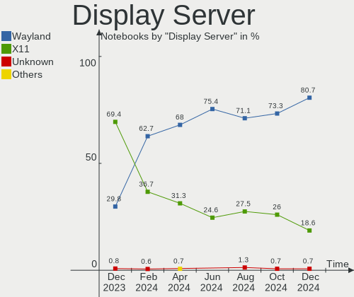
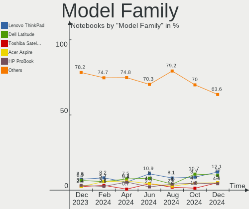
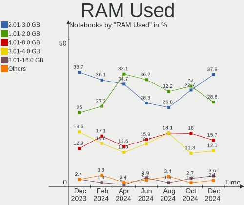
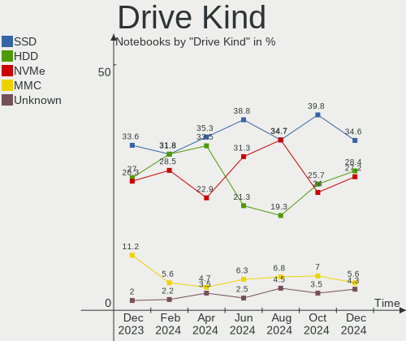
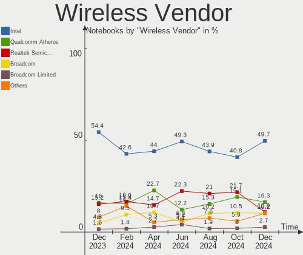
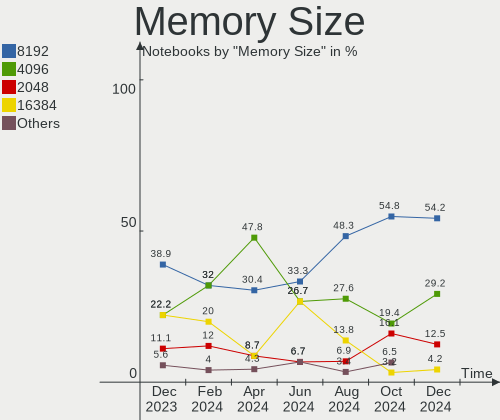
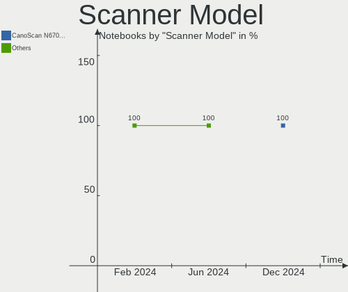

Zorin Hardware Trends (Notebooks)
---------------------------------

A project to identify most popular hardware characteristics and track their change
over time based on data collected by Zorin users at https://Linux-Hardware.org.

Anyone can contribute to this report by the [hw-probe](https://github.com/linuxhw/hw-probe) tool:

    sudo -E hw-probe -all -upload

Full-feature report is available here: https://linux-hardware.org/?view=trends

Period: Mar, 2022.

Contents
--------

* [ System ](#system)
  - [ OS                       ](#os)
  - [ OS Family                ](#os-family)
  - [ Kernel                   ](#kernel)
  - [ Kernel Family            ](#kernel-family)
  - [ Kernel Major Ver.        ](#kernel-major-ver)
  - [ Arch                     ](#arch)
  - [ DE                       ](#de)
  - [ Display Server           ](#display-server)
  - [ Display Manager          ](#display-manager)
  - [ OS Lang                  ](#os-lang)
  - [ Boot Mode                ](#boot-mode)
  - [ Filesystem               ](#filesystem)
  - [ Part. scheme             ](#part-scheme)
  - [ Dual Boot with Linux/BSD ](#dual-boot-with-linuxbsd)
  - [ Dual Boot (Win)          ](#dual-boot-win)

* [ Board ](#board)
  - [ Vendor                   ](#vendor)
  - [ Model                    ](#model)
  - [ Model Family             ](#model-family)
  - [ MFG Year                 ](#mfg-year)
  - [ Form Factor              ](#form-factor)
  - [ Secure Boot              ](#secure-boot)
  - [ Coreboot                 ](#coreboot)
  - [ RAM Size                 ](#ram-size)
  - [ RAM Used                 ](#ram-used)
  - [ Total Drives             ](#total-drives)
  - [ Has CD-ROM               ](#has-cd-rom)
  - [ Has Ethernet             ](#has-ethernet)
  - [ Has WiFi                 ](#has-wifi)
  - [ Has Bluetooth            ](#has-bluetooth)

* [ Location ](#location)
  - [ Country                  ](#country)
  - [ City                     ](#city)

* [ Drives ](#drives)
  - [ Drive Vendor             ](#drive-vendor)
  - [ Drive Model              ](#drive-model)
  - [ HDD Vendor               ](#hdd-vendor)
  - [ SSD Vendor               ](#ssd-vendor)
  - [ Drive Kind               ](#drive-kind)
  - [ Drive Connector          ](#drive-connector)
  - [ Drive Size               ](#drive-size)
  - [ Space Total              ](#space-total)
  - [ Space Used               ](#space-used)
  - [ Malfunc. Drives          ](#malfunc-drives)
  - [ Malfunc. Drive Vendor    ](#malfunc-drive-vendor)
  - [ Malfunc. HDD Vendor      ](#malfunc-hdd-vendor)
  - [ Malfunc. Drive Kind      ](#malfunc-drive-kind)
  - [ Failed Drives            ](#failed-drives)
  - [ Failed Drive Vendor      ](#failed-drive-vendor)
  - [ Drive Status             ](#drive-status)

* [ Storage controller ](#storage-controller)
  - [ Storage Vendor           ](#storage-vendor)
  - [ Storage Model            ](#storage-model)
  - [ Storage Kind             ](#storage-kind)

* [ Processor ](#processor)
  - [ CPU Vendor               ](#cpu-vendor)
  - [ CPU Model                ](#cpu-model)
  - [ CPU Model Family         ](#cpu-model-family)
  - [ CPU Cores                ](#cpu-cores)
  - [ CPU Sockets              ](#cpu-sockets)
  - [ CPU Threads              ](#cpu-threads)
  - [ CPU Op-Modes             ](#cpu-op-modes)
  - [ CPU Microcode            ](#cpu-microcode)
  - [ CPU Microarch            ](#cpu-microarch)

* [ Graphics ](#graphics)
  - [ GPU Vendor               ](#gpu-vendor)
  - [ GPU Model                ](#gpu-model)
  - [ GPU Combo                ](#gpu-combo)
  - [ GPU Driver               ](#gpu-driver)
  - [ GPU Memory               ](#gpu-memory)

* [ Monitor ](#monitor)
  - [ Monitor Vendor           ](#monitor-vendor)
  - [ Monitor Model            ](#monitor-model)
  - [ Monitor Resolution       ](#monitor-resolution)
  - [ Monitor Diagonal         ](#monitor-diagonal)
  - [ Monitor Width            ](#monitor-width)
  - [ Aspect Ratio             ](#aspect-ratio)
  - [ Monitor Area             ](#monitor-area)
  - [ Pixel Density            ](#pixel-density)
  - [ Multiple Monitors        ](#multiple-monitors)

* [ Network ](#network)
  - [ Net Controller Vendor    ](#net-controller-vendor)
  - [ Net Controller Model     ](#net-controller-model)
  - [ Wireless Vendor          ](#wireless-vendor)
  - [ Wireless Model           ](#wireless-model)
  - [ Ethernet Vendor          ](#ethernet-vendor)
  - [ Ethernet Model           ](#ethernet-model)
  - [ Net Controller Kind      ](#net-controller-kind)
  - [ Used Controller          ](#used-controller)
  - [ NICs                     ](#nics)
  - [ IPv6                     ](#ipv6)

* [ Bluetooth ](#bluetooth)
  - [ Bluetooth Vendor         ](#bluetooth-vendor)
  - [ Bluetooth Model          ](#bluetooth-model)

* [ Sound ](#sound)
  - [ Sound Vendor             ](#sound-vendor)
  - [ Sound Model              ](#sound-model)

* [ Memory ](#memory)
  - [ Memory Vendor            ](#memory-vendor)
  - [ Memory Model             ](#memory-model)
  - [ Memory Kind              ](#memory-kind)
  - [ Memory Form Factor       ](#memory-form-factor)
  - [ Memory Size              ](#memory-size)
  - [ Memory Speed             ](#memory-speed)

* [ Printers & scanners ](#printers--scanners)
  - [ Printer Vendor           ](#printer-vendor)
  - [ Printer Model            ](#printer-model)
  - [ Scanner Vendor           ](#scanner-vendor)
  - [ Scanner Model            ](#scanner-model)

* [ Camera ](#camera)
  - [ Camera Vendor            ](#camera-vendor)
  - [ Camera Model             ](#camera-model)

* [ Security ](#security)
  - [ Fingerprint Vendor       ](#fingerprint-vendor)
  - [ Fingerprint Model        ](#fingerprint-model)
  - [ Chipcard Vendor          ](#chipcard-vendor)
  - [ Chipcard Model           ](#chipcard-model)

* [ Unsupported ](#unsupported)
  - [ Unsupported Devices      ](#unsupported-devices)
  - [ Unsupported Device Types ](#unsupported-device-types)

System
------

OS
--

Installed operating systems

| Name     | Notebooks | Percent |
|----------|-----------|---------|
| Zorin 16 | 94        | 91.26%  |
| Zorin 15 | 8         | 7.77%   |
| Zorin 12 | 1         | 0.97%   |

OS Family
---------

OS without a version

| Name  | Notebooks | Percent |
|-------|-----------|---------|
| Zorin | 103       | 100%    |

Kernel
------

Version of the Linux kernel

| Version                | Notebooks | Percent |
|------------------------|-----------|---------|
| 5.13.0-35-generic      | 41        | 39.81%  |
| 5.13.0-30-generic      | 27        | 26.21%  |
| 5.13.0-37-generic      | 12        | 11.65%  |
| 5.13.0-39-generic      | 5         | 4.85%   |
| 5.4.0-105-generic      | 4         | 3.88%   |
| 5.13.0-27-generic      | 3         | 2.91%   |
| 5.11.0-38-generic      | 3         | 2.91%   |
| 5.4.0-100-generic      | 2         | 1.94%   |
| 5.13.0-28-generic      | 2         | 1.94%   |
| 5.4.0-99-generic       | 1         | 0.97%   |
| 5.4.0-104-generic      | 1         | 0.97%   |
| 5.16.12-051612-generic | 1         | 0.97%   |
| 4.15.0-123-generic     | 1         | 0.97%   |

Kernel Family
-------------

Linux kernel without a distro release

| Version | Notebooks | Percent |
|---------|-----------|---------|
| 5.13.0  | 90        | 87.38%  |
| 5.4.0   | 8         | 7.77%   |
| 5.11.0  | 3         | 2.91%   |
| 5.16.12 | 1         | 0.97%   |
| 4.15.0  | 1         | 0.97%   |

Kernel Major Ver.
-----------------

Linux kernel major version

| Version | Notebooks | Percent |
|---------|-----------|---------|
| 5.13    | 90        | 87.38%  |
| 5.4     | 8         | 7.77%   |
| 5.11    | 3         | 2.91%   |
| 5.16    | 1         | 0.97%   |
| 4.15    | 1         | 0.97%   |

Arch
----

OS architecture (x86_64, i586, etc.)

| Name   | Notebooks | Percent |
|--------|-----------|---------|
| x86_64 | 98        | 95.15%  |
| i686   | 5         | 4.85%   |

DE
--

Desktop Environment

| Name       | Notebooks | Percent |
|------------|-----------|---------|
| GNOME      | 79        | 76.7%   |
| XFCE       | 22        | 21.36%  |
| X-Cinnamon | 2         | 1.94%   |

Display Server
--------------

X11 or Wayland

| Name | Notebooks | Percent |
|------|-----------|---------|
| X11  | 103       | 100%    |

Display Manager
---------------

SDDM, LightDM, etc.

| Name    | Notebooks | Percent |
|---------|-----------|---------|
| Unknown | 73        | 70.87%  |
| GDM3    | 14        | 13.59%  |
| LightDM | 11        | 10.68%  |
| GDM     | 5         | 4.85%   |

OS Lang
-------

Language

| Lang  | Notebooks | Percent |
|-------|-----------|---------|
| en_US | 42        | 40.78%  |
| de_DE | 7         | 6.8%    |
| pt_BR | 6         | 5.83%   |
| fr_FR | 4         | 3.88%   |
| en_GB | 4         | 3.88%   |
| en_CA | 4         | 3.88%   |
| nl_NL | 3         | 2.91%   |
| it_IT | 3         | 2.91%   |
| es_ES | 3         | 2.91%   |
| tr_TR | 2         | 1.94%   |
| ru_RU | 2         | 1.94%   |
| pt_PT | 2         | 1.94%   |
| nl_BE | 2         | 1.94%   |
| es_MX | 2         | 1.94%   |
| es_AR | 2         | 1.94%   |
| en_ZA | 2         | 1.94%   |
| en_IN | 2         | 1.94%   |
| el_GR | 2         | 1.94%   |
| sv_SE | 1         | 0.97%   |
| pl_PL | 1         | 0.97%   |
| es_PE | 1         | 0.97%   |
| es_EC | 1         | 0.97%   |
| es_CO | 1         | 0.97%   |
| en_AU | 1         | 0.97%   |
| de_AT | 1         | 0.97%   |
| cs_CZ | 1         | 0.97%   |
| ar_EG | 1         | 0.97%   |

Boot Mode
---------

EFI or BIOS

| Mode | Notebooks | Percent |
|------|-----------|---------|
| EFI  | 54        | 52.43%  |
| BIOS | 49        | 47.57%  |

Filesystem
----------

Type of filesystem

| Type    | Notebooks | Percent |
|---------|-----------|---------|
| Ext4    | 97        | 94.17%  |
| Zfs     | 3         | 2.91%   |
| Btrfs   | 2         | 1.94%   |
| Overlay | 1         | 0.97%   |

Part. scheme
------------

Scheme of partitioning

| Type    | Notebooks | Percent |
|---------|-----------|---------|
| Unknown | 95        | 92.23%  |
| GPT     | 6         | 5.83%   |
| MBR     | 2         | 1.94%   |

Dual Boot with Linux/BSD
------------------------

Hosting more than one Linux/BSD

| Dual boot | Notebooks | Percent |
|-----------|-----------|---------|
| No        | 102       | 99.03%  |
| Yes       | 1         | 0.97%   |

Dual Boot (Win)
---------------

Hosting Linux and Windows

| Dual boot | Notebooks | Percent |
|-----------|-----------|---------|
| No        | 95        | 92.23%  |
| Yes       | 8         | 7.77%   |

Board
-----

Vendor
------

Motherboard manufacturer

| Name                | Notebooks | Percent |
|---------------------|-----------|---------|
| Hewlett-Packard     | 22        | 21.36%  |
| Lenovo              | 19        | 18.45%  |
| Dell                | 16        | 15.53%  |
| ASUSTek Computer    | 12        | 11.65%  |
| Acer                | 10        | 9.71%   |
| Toshiba             | 8         | 7.77%   |
| Insyde              | 2         | 1.94%   |
| Apple               | 2         | 1.94%   |
| Sony                | 1         | 0.97%   |
| Samsung Electronics | 1         | 0.97%   |
| Positivo            | 1         | 0.97%   |
| Panasonic           | 1         | 0.97%   |
| Packard Bell        | 1         | 0.97%   |
| Notebook            | 1         | 0.97%   |
| MSI                 | 1         | 0.97%   |
| Gigabyte Technology | 1         | 0.97%   |
| Gateway             | 1         | 0.97%   |
| Chuwi               | 1         | 0.97%   |
| BGH e-Nova          | 1         | 0.97%   |
| AXDIA International | 1         | 0.97%   |

Model
-----

Motherboard model

| Name                                       | Notebooks | Percent |
|--------------------------------------------|-----------|---------|
| HP ProBook 640 G1                          | 2         | 1.94%   |
| HP Notebook                                | 2         | 1.94%   |
| Unknown                                    | 2         | 1.94%   |
| Toshiba Satellite S55t-C                   | 1         | 0.97%   |
| Toshiba Satellite M505                     | 1         | 0.97%   |
| Toshiba Satellite L875                     | 1         | 0.97%   |
| Toshiba Satellite C855                     | 1         | 0.97%   |
| Toshiba Satellite C660                     | 1         | 0.97%   |
| Toshiba Satellite C55-C                    | 1         | 0.97%   |
| Toshiba Satellite C50D-A-14E               | 1         | 0.97%   |
| Toshiba Satellite A660                     | 1         | 0.97%   |
| Sony SVT13125CLS                           | 1         | 0.97%   |
| Samsung 300E4A/300E5A/300E7A/3430EA/3530EA | 1         | 0.97%   |
| Positivo C14CU51                           | 1         | 0.97%   |
| Panasonic CF-31ACJAXPM                     | 1         | 0.97%   |
| Packard Bell EasyNote LS11HR               | 1         | 0.97%   |
| Notebook NJ50_70CU                         | 1         | 0.97%   |
| MSI CR643                                  | 1         | 0.97%   |
| Lenovo V110-15IAP 80TG                     | 1         | 0.97%   |
| Lenovo ThinkPad X220 Tablet 42984TU        | 1         | 0.97%   |
| Lenovo ThinkPad T520 424067G               | 1         | 0.97%   |
| Lenovo ThinkPad SL500 274677G              | 1         | 0.97%   |
| Lenovo Legion 5 15ACH6H 82JU               | 1         | 0.97%   |
| Lenovo IdeaPad Z580                        | 1         | 0.97%   |
| Lenovo IdeaPad Y550 20017                  | 1         | 0.97%   |
| Lenovo IdeaPad Slim 1-14AST-05 81VS        | 1         | 0.97%   |
| Lenovo IdeaPad S145-15IIL 82DJ             | 1         | 0.97%   |
| Lenovo IdeaPad S145-15IIL 82C5             | 1         | 0.97%   |
| Lenovo IdeaPad S145-14IWL 81MU             | 1         | 0.97%   |
| Lenovo IdeaPad Flex-14API 81SS             | 1         | 0.97%   |
| Lenovo IdeaPad 5 Pro 16ACH6 82L5           | 1         | 0.97%   |
| Lenovo IdeaPad 5 15ARE05 81YQ              | 1         | 0.97%   |
| Lenovo IdeaPad 330-15IKB 81DE              | 1         | 0.97%   |
| Lenovo IdeaPad 330-14AST 81D5              | 1         | 0.97%   |
| Lenovo IdeaPad 320S-15IKB 81BQ             | 1         | 0.97%   |
| Lenovo HuronRiver Platform                 | 1         | 0.97%   |
| Lenovo G560 0679                           | 1         | 0.97%   |
| Insyde i101c                               | 1         | 0.97%   |
| Insyde GeminiLake                          | 1         | 0.97%   |
| HP Stream Laptop 14-cb1xxx                 | 1         | 0.97%   |
| HP ProBook 4720s                           | 1         | 0.97%   |
| HP ProBook 4530s                           | 1         | 0.97%   |
| HP ProBook 450 G2                          | 1         | 0.97%   |
| HP ProBook 445 G7                          | 1         | 0.97%   |
| HP Pavilion Notebook                       | 1         | 0.97%   |
| HP Pavilion Gaming Laptop 16-a0xxx         | 1         | 0.97%   |
| HP Pavilion g6                             | 1         | 0.97%   |
| HP Pavilion dv7                            | 1         | 0.97%   |
| HP Pavilion dv3                            | 1         | 0.97%   |
| HP Laptop 15-db0xxx                        | 1         | 0.97%   |
| HP Laptop 15-bw0xx                         | 1         | 0.97%   |
| HP Laptop 14-dq2xxx                        | 1         | 0.97%   |
| HP Laptop 14-ck0xxx                        | 1         | 0.97%   |
| HP ENVY dv7                                | 1         | 0.97%   |
| HP EliteBook 8540p                         | 1         | 0.97%   |
| HP Compaq 6730b (NN204ET#ABH)              | 1         | 0.97%   |
| HP 1000                                    | 1         | 0.97%   |
| Gigabyte P64V7                             | 1         | 0.97%   |
| Gateway NV59C                              | 1         | 0.97%   |
| Dell Vostro 3550                           | 1         | 0.97%   |

Model Family
------------

Motherboard model prefix

| Name                        | Notebooks | Percent |
|-----------------------------|-----------|---------|
| Lenovo IdeaPad              | 12        | 11.65%  |
| Toshiba Satellite           | 8         | 7.77%   |
| HP ProBook                  | 6         | 5.83%   |
| Dell Inspiron               | 6         | 5.83%   |
| HP Pavilion                 | 5         | 4.85%   |
| Acer Aspire                 | 5         | 4.85%   |
| HP Laptop                   | 4         | 3.88%   |
| Dell Latitude               | 4         | 3.88%   |
| Lenovo ThinkPad             | 3         | 2.91%   |
| Dell Vostro                 | 3         | 2.91%   |
| ASUS Vivobook               | 3         | 2.91%   |
| HP Notebook                 | 2         | 1.94%   |
| Dell Precision              | 2         | 1.94%   |
| ASUS ZenBook                | 2         | 1.94%   |
| Unknown                     | 2         | 1.94%   |
| Sony SVT13125CLS            | 1         | 0.97%   |
| Samsung 300E4A              | 1         | 0.97%   |
| Positivo C14CU51            | 1         | 0.97%   |
| Panasonic CF-31ACJAXPM      | 1         | 0.97%   |
| Packard Bell EasyNote       | 1         | 0.97%   |
| Notebook NJ50               | 1         | 0.97%   |
| MSI CR643                   | 1         | 0.97%   |
| Lenovo V110-15IAP           | 1         | 0.97%   |
| Lenovo Legion               | 1         | 0.97%   |
| Lenovo HuronRiver           | 1         | 0.97%   |
| Lenovo G560                 | 1         | 0.97%   |
| Insyde i101c                | 1         | 0.97%   |
| Insyde GeminiLake           | 1         | 0.97%   |
| HP Stream                   | 1         | 0.97%   |
| HP ENVY                     | 1         | 0.97%   |
| HP EliteBook                | 1         | 0.97%   |
| HP Compaq                   | 1         | 0.97%   |
| HP 1000                     | 1         | 0.97%   |
| Gigabyte P64V7              | 1         | 0.97%   |
| Gateway NV59C               | 1         | 0.97%   |
| Dell Venue                  | 1         | 0.97%   |
| Chuwi HeroBook              | 1         | 0.97%   |
| AXDIA International WINBOOK | 1         | 0.97%   |
| ASUS X550LC                 | 1         | 0.97%   |
| ASUS X405UA                 | 1         | 0.97%   |
| ASUS TUF                    | 1         | 0.97%   |
| ASUS T100TA                 | 1         | 0.97%   |
| ASUS K70IC                  | 1         | 0.97%   |
| ASUS GL552VW                | 1         | 0.97%   |
| ASUS G75VW                  | 1         | 0.97%   |
| Apple MacBookPro12          | 1         | 0.97%   |
| Apple MacBookPro10          | 1         | 0.97%   |
| Acer V5-171                 | 1         | 0.97%   |
| Acer TP-W700-53334G12       | 1         | 0.97%   |
| Acer Predator               | 1         | 0.97%   |
| Acer Nitro                  | 1         | 0.97%   |

MFG Year
--------

Motherboard manufacture year

| Year | Notebooks | Percent |
|------|-----------|---------|
| 2011 | 12        | 11.65%  |
| 2018 | 10        | 9.71%   |
| 2013 | 10        | 9.71%   |
| 2012 | 10        | 9.71%   |
| 2021 | 8         | 7.77%   |
| 2010 | 8         | 7.77%   |
| 2020 | 7         | 6.8%    |
| 2009 | 7         | 6.8%    |
| 2019 | 6         | 5.83%   |
| 2017 | 6         | 5.83%   |
| 2015 | 6         | 5.83%   |
| 2016 | 3         | 2.91%   |
| 2014 | 3         | 2.91%   |
| 2008 | 3         | 2.91%   |
| 2007 | 2         | 1.94%   |
| 2006 | 2         | 1.94%   |

Form Factor
-----------

Physical design of the computer

| Name     | Notebooks | Percent |
|----------|-----------|---------|
| Notebook | 103       | 100%    |

Secure Boot
-----------

Enabled or disabled

| State    | Notebooks | Percent |
|----------|-----------|---------|
| Disabled | 86        | 83.5%   |
| Enabled  | 17        | 16.5%   |

Coreboot
--------

Have coreboot on board

| Used | Notebooks | Percent |
|------|-----------|---------|
| No   | 103       | 100%    |

RAM Size
--------

Total RAM memory

| Size in GB | Notebooks | Percent |
|------------|-----------|---------|
| 4.01-8.0   | 39        | 37.86%  |
| 3.01-4.0   | 31        | 30.1%   |
| 8.01-16.0  | 13        | 12.62%  |
| 16.01-24.0 | 9         | 8.74%   |
| 1.01-2.0   | 8         | 7.77%   |
| 32.01-64.0 | 1         | 0.97%   |
| 2.01-3.0   | 1         | 0.97%   |
| 0.51-1.0   | 1         | 0.97%   |

RAM Used
--------

Used RAM memory

| Used GB  | Notebooks | Percent |
|----------|-----------|---------|
| 1.01-2.0 | 49        | 47.57%  |
| 2.01-3.0 | 31        | 30.1%   |
| 3.01-4.0 | 10        | 9.71%   |
| 4.01-8.0 | 8         | 7.77%   |
| 0.51-1.0 | 5         | 4.85%   |

Total Drives
------------

Number of drives on board

| Drives | Notebooks | Percent |
|--------|-----------|---------|
| 1      | 78        | 75.73%  |
| 2      | 18        | 17.48%  |
| 3      | 4         | 3.88%   |
| 4      | 2         | 1.94%   |
| 0      | 1         | 0.97%   |

Has CD-ROM
----------

Has CD-ROM on board

| Presented | Notebooks | Percent |
|-----------|-----------|---------|
| No        | 52        | 50.49%  |
| Yes       | 51        | 49.51%  |

Has Ethernet
------------

Has Ethernet on board

| Presented | Notebooks | Percent |
|-----------|-----------|---------|
| Yes       | 80        | 77.67%  |
| No        | 23        | 22.33%  |

Has WiFi
--------

Has WiFi module

| Presented | Notebooks | Percent |
|-----------|-----------|---------|
| Yes       | 97        | 94.17%  |
| No        | 6         | 5.83%   |

Has Bluetooth
-------------

Has Bluetooth module

| Presented | Notebooks | Percent |
|-----------|-----------|---------|
| Yes       | 67        | 65.05%  |
| No        | 36        | 34.95%  |

Location
--------

Country
-------

Geographic location (country)

| Country             | Notebooks | Percent |
|---------------------|-----------|---------|
| USA                 | 27        | 26.21%  |
| Brazil              | 8         | 7.77%   |
| Germany             | 6         | 5.83%   |
| Canada              | 6         | 5.83%   |
| UK                  | 4         | 3.88%   |
| Turkey              | 4         | 3.88%   |
| Mexico              | 4         | 3.88%   |
| France              | 4         | 3.88%   |
| Russia              | 3         | 2.91%   |
| Portugal            | 3         | 2.91%   |
| Netherlands         | 3         | 2.91%   |
| Italy               | 3         | 2.91%   |
| Spain               | 2         | 1.94%   |
| South Africa        | 2         | 1.94%   |
| Romania             | 2         | 1.94%   |
| India               | 2         | 1.94%   |
| Greece              | 2         | 1.94%   |
| Argentina           | 2         | 1.94%   |
| U.S. Virgin Islands | 1         | 0.97%   |
| Taiwan              | 1         | 0.97%   |
| Sweden              | 1         | 0.97%   |
| Slovenia            | 1         | 0.97%   |
| Saudi Arabia        | 1         | 0.97%   |
| Poland              | 1         | 0.97%   |
| Peru                | 1         | 0.97%   |
| Morocco             | 1         | 0.97%   |
| Lithuania           | 1         | 0.97%   |
| Ecuador             | 1         | 0.97%   |
| Czechia             | 1         | 0.97%   |
| Colombia            | 1         | 0.97%   |
| Bulgaria            | 1         | 0.97%   |
| Belgium             | 1         | 0.97%   |
| Austria             | 1         | 0.97%   |
| Australia           | 1         | 0.97%   |

City
----

Geographic location (city)

| City                 | Notebooks | Percent |
|----------------------|-----------|---------|
| Athens               | 4         | 3.88%   |
| New York             | 3         | 2.91%   |
| St Petersburg        | 2         | 1.94%   |
| Delft                | 2         | 1.94%   |
| Cancún              | 2         | 1.94%   |
| Birmingham           | 2         | 1.94%   |
| Yukon                | 1         | 0.97%   |
| Watertown            | 1         | 0.97%   |
| Vrhnika              | 1         | 0.97%   |
| Vilnius              | 1         | 0.97%   |
| Villeparisis         | 1         | 0.97%   |
| Vila Nova de Gaia    | 1         | 0.97%   |
| Vienna               | 1         | 0.97%   |
| Velikiye Luki        | 1         | 0.97%   |
| Undi                 | 1         | 0.97%   |
| Toronto              | 1         | 0.97%   |
| Tlaxcala City        | 1         | 0.97%   |
| Thousand Oaks        | 1         | 0.97%   |
| Taubate              | 1         | 0.97%   |
| Taipei               | 1         | 0.97%   |
| Suceava              | 1         | 0.97%   |
| Strasbourg           | 1         | 0.97%   |
| Stockholm            | 1         | 0.97%   |
| Sheffield            | 1         | 0.97%   |
| Schiedam             | 1         | 0.97%   |
| Santa Luzia          | 1         | 0.97%   |
| Sandton              | 1         | 0.97%   |
| Salé                | 1         | 0.97%   |
| Riyadh               | 1         | 0.97%   |
| Rio de Janeiro       | 1         | 0.97%   |
| Richmond             | 1         | 0.97%   |
| Reading              | 1         | 0.97%   |
| Quito                | 1         | 0.97%   |
| Queens               | 1         | 0.97%   |
| Poznan               | 1         | 0.97%   |
| Porto Velho          | 1         | 0.97%   |
| Porto Alegre         | 1         | 0.97%   |
| Plauen               | 1         | 0.97%   |
| Plantagenet          | 1         | 0.97%   |
| Patna                | 1         | 0.97%   |
| Parma                | 1         | 0.97%   |
| Pacoima              | 1         | 0.97%   |
| Ourense              | 1         | 0.97%   |
| Ottawa               | 1         | 0.97%   |
| Ochlocknee           | 1         | 0.97%   |
| Newport              | 1         | 0.97%   |
| Munich               | 1         | 0.97%   |
| Montaut-les-Creneaux | 1         | 0.97%   |
| Montana              | 1         | 0.97%   |
| Minneapolis          | 1         | 0.97%   |
| Merlo                | 1         | 0.97%   |
| Memphis              | 1         | 0.97%   |
| Melbourne            | 1         | 0.97%   |
| Marburg              | 1         | 0.97%   |
| Marble Falls         | 1         | 0.97%   |
| Madison Heights      | 1         | 0.97%   |
| Mackenbach           | 1         | 0.97%   |
| Lons-le-Saunier      | 1         | 0.97%   |
| Lima                 | 1         | 0.97%   |
| Leiria               | 1         | 0.97%   |

Drives
------

Drive Vendor
------------

Hard drive vendors

| Vendor                    | Notebooks | Drives | Percent |
|---------------------------|-----------|--------|---------|
| Seagate                   | 20        | 20     | 16.26%  |
| WDC                       | 17        | 18     | 13.82%  |
| Toshiba                   | 15        | 15     | 12.2%   |
| Samsung Electronics       | 13        | 14     | 10.57%  |
| Unknown                   | 10        | 11     | 8.13%   |
| Sandisk                   | 10        | 10     | 8.13%   |
| SK Hynix                  | 5         | 5      | 4.07%   |
| Kingston                  | 5         | 5      | 4.07%   |
| Hitachi                   | 5         | 5      | 4.07%   |
| HGST                      | 4         | 4      | 3.25%   |
| JMicron                   | 3         | 3      | 2.44%   |
| SPCC                      | 2         | 2      | 1.63%   |
| Intel                     | 2         | 3      | 1.63%   |
| Apple                     | 2         | 2      | 1.63%   |
| Transcend                 | 1         | 1      | 0.81%   |
| Patriot                   | 1         | 1      | 0.81%   |
| Netac                     | 1         | 1      | 0.81%   |
| Micron/Crucial Technology | 1         | 1      | 0.81%   |
| LITEONIT                  | 1         | 1      | 0.81%   |
| LITEON                    | 1         | 1      | 0.81%   |
| Intenso                   | 1         | 1      | 0.81%   |
| GOODRAM                   | 1         | 1      | 0.81%   |
| Crucial                   | 1         | 1      | 0.81%   |
| China                     | 1         | 1      | 0.81%   |

Drive Model
-----------

Hard drive models

| Model                                 | Notebooks | Percent |
|---------------------------------------|-----------|---------|
| Unknown MMC Card  64GB                | 5         | 3.97%   |
| Seagate ST1000LM035-1RK172 1TB        | 4         | 3.17%   |
| Seagate ST1000LM024 HN-M101MBB 1TB    | 3         | 2.38%   |
| WDC WD3200BPVT-24ZEST0 320GB          | 2         | 1.59%   |
| Unknown MMC Card  32GB                | 2         | 1.59%   |
| Toshiba MQ01ABF050 500GB              | 2         | 1.59%   |
| Toshiba MQ01ABD100 1TB                | 2         | 1.59%   |
| Seagate ST500LT012-1DG142 500GB       | 2         | 1.59%   |
| Seagate ST1000LX015-1U7172 1TB        | 2         | 1.59%   |
| Sandisk NVMe SSD Drive 256GB          | 2         | 1.59%   |
| JMicron Generic 2TB                   | 2         | 1.59%   |
| Intel NVMe SSD Drive 512GB            | 2         | 1.59%   |
| WDC WDS100T2B0B-00YS70 1TB SSD        | 1         | 0.79%   |
| WDC WD800BEVS-22RST0 80GB             | 1         | 0.79%   |
| WDC WD7500BPKX-80HPJT0 752GB          | 1         | 0.79%   |
| WDC WD6400BPVT-60HXZT1 640GB          | 1         | 0.79%   |
| WDC WD5000LPVX-22V0TT0 500GB          | 1         | 0.79%   |
| WDC WD5000LPCX-22VHAT1 500GB          | 1         | 0.79%   |
| WDC WD40 EFRX-68WT0N0 4TB             | 1         | 0.79%   |
| WDC WD3200BPVT-22JJ5T0 320GB          | 1         | 0.79%   |
| WDC WD3200BEVT-75A23T0 320GB          | 1         | 0.79%   |
| WDC WD3200BEVT-22ZCT0 320GB           | 1         | 0.79%   |
| WDC WD2500BEKT-60A25T1 250GB          | 1         | 0.79%   |
| WDC WD20SPZX-08UA7 2TB                | 1         | 0.79%   |
| WDC WD1600BEVT-00A1TT0 160GB          | 1         | 0.79%   |
| WDC WD10SPZX-24Z10 1TB                | 1         | 0.79%   |
| WDC WD10SPCX-24HWST1 1TB              | 1         | 0.79%   |
| WDC WD10JPVX-60JC3T0 1TB              | 1         | 0.79%   |
| Unknown SS08G  8GB                    | 1         | 0.79%   |
| Unknown SD/MMC/MS PRO 32GB            | 1         | 0.79%   |
| Unknown MMC Card  196GB               | 1         | 0.79%   |
| Unknown MMC Card  16GB                | 1         | 0.79%   |
| Transcend TS512GMTS800 512GB SSD      | 1         | 0.79%   |
| Toshiba THNSNJ256GCST 256GB SSD       | 1         | 0.79%   |
| Toshiba THNSNH128GMCT 128GB SSD       | 1         | 0.79%   |
| Toshiba NVMe SSD Drive 256GB          | 1         | 0.79%   |
| Toshiba MQ04ABF100 1TB                | 1         | 0.79%   |
| Toshiba MQ01ACF032 320GB              | 1         | 0.79%   |
| Toshiba MK6475GSX 640GB               | 1         | 0.79%   |
| Toshiba MK5056GSY 500GB               | 1         | 0.79%   |
| Toshiba MK2555GSX 250GB               | 1         | 0.79%   |
| Toshiba MK1665GSX H 160GB             | 1         | 0.79%   |
| Toshiba MK1655GSX 160GB               | 1         | 0.79%   |
| Toshiba A100 240GB SSD                | 1         | 0.79%   |
| SPCC SPCCSolidStateDisk 256GB SSD     | 1         | 0.79%   |
| SPCC Solid State Disk 240GB           | 1         | 0.79%   |
| SK Hynix NVMe SSD Drive 256GB         | 1         | 0.79%   |
| SK Hynix HFS512G3BTND-N210A 512GB SSD | 1         | 0.79%   |
| SK Hynix HFS128G3BTND-N210A 128GB SSD | 1         | 0.79%   |
| SK Hynix HFM512GD3JX013N 512GB        | 1         | 0.79%   |
| SK Hynix HCG8e  64GB                  | 1         | 0.79%   |
| Seagate ST9750420AS 752GB             | 1         | 0.79%   |
| Seagate ST9500420AS 500GB             | 1         | 0.79%   |
| Seagate ST9500325AS 500GB             | 1         | 0.79%   |
| Seagate ST9160827AS 160GB             | 1         | 0.79%   |
| Seagate ST500LM021-1KJ152 500GB       | 1         | 0.79%   |
| Seagate ST500LM000-1EJ162 500GB       | 1         | 0.79%   |
| Seagate ST2000LM007-1R8174 2TB        | 1         | 0.79%   |
| Seagate ST1000LM049-2GH172 1TB        | 1         | 0.79%   |
| Seagate Expansion SW 6TB              | 1         | 0.79%   |

HDD Vendor
----------

Hard disk drive vendors

| Vendor  | Notebooks | Drives | Percent |
|---------|-----------|--------|---------|
| Seagate | 20        | 20     | 33.9%   |
| WDC     | 17        | 17     | 28.81%  |
| Toshiba | 11        | 11     | 18.64%  |
| Hitachi | 5         | 5      | 8.47%   |
| HGST    | 4         | 4      | 6.78%   |
| Unknown | 1         | 1      | 1.69%   |
| JMicron | 1         | 1      | 1.69%   |

SSD Vendor
----------

Solid state drive vendors

| Vendor              | Notebooks | Drives | Percent |
|---------------------|-----------|--------|---------|
| Samsung Electronics | 8         | 9      | 20.51%  |
| SanDisk             | 5         | 5      | 12.82%  |
| Kingston            | 5         | 5      | 12.82%  |
| Toshiba             | 3         | 3      | 7.69%   |
| SPCC                | 2         | 2      | 5.13%   |
| SK Hynix            | 2         | 2      | 5.13%   |
| JMicron             | 2         | 2      | 5.13%   |
| Apple               | 2         | 2      | 5.13%   |
| WDC                 | 1         | 1      | 2.56%   |
| Transcend           | 1         | 1      | 2.56%   |
| Patriot             | 1         | 1      | 2.56%   |
| Netac               | 1         | 1      | 2.56%   |
| LITEONIT            | 1         | 1      | 2.56%   |
| LITEON              | 1         | 1      | 2.56%   |
| Intenso             | 1         | 1      | 2.56%   |
| GOODRAM             | 1         | 1      | 2.56%   |
| Crucial             | 1         | 1      | 2.56%   |
| China               | 1         | 1      | 2.56%   |

Drive Kind
----------

HDD or SSD

| Kind | Notebooks | Drives | Percent |
|------|-----------|--------|---------|
| HDD  | 58        | 59     | 47.93%  |
| SSD  | 37        | 40     | 30.58%  |
| NVMe | 15        | 16     | 12.4%   |
| MMC  | 11        | 12     | 9.09%   |

Drive Connector
---------------

SATA, SAS, NVMe, etc.

| Type | Notebooks | Drives | Percent |
|------|-----------|--------|---------|
| SATA | 83        | 93     | 72.81%  |
| NVMe | 15        | 16     | 13.16%  |
| MMC  | 11        | 12     | 9.65%   |
| SAS  | 5         | 6      | 4.39%   |

Drive Size
----------

Size of hard drive

| Size in TB | Notebooks | Drives | Percent |
|------------|-----------|--------|---------|
| 0.01-0.5   | 58        | 65     | 65.17%  |
| 0.51-1.0   | 25        | 26     | 28.09%  |
| 1.01-2.0   | 3         | 4      | 3.37%   |
| 3.01-4.0   | 2         | 3      | 2.25%   |
| 4.01-10.0  | 1         | 1      | 1.12%   |

Space Total
-----------

Amount of disk space available on the file system

| Size in GB     | Notebooks | Percent |
|----------------|-----------|---------|
| 101-250        | 37        | 35.92%  |
| 251-500        | 24        | 23.3%   |
| 501-1000       | 18        | 17.48%  |
| 51-100         | 7         | 6.8%    |
| 21-50          | 5         | 4.85%   |
| More than 3000 | 4         | 3.88%   |
| 1-20           | 4         | 3.88%   |
| 1001-2000      | 2         | 1.94%   |
| Unknown        | 2         | 1.94%   |

Space Used
----------

Amount of used disk space

| Used GB        | Notebooks | Percent |
|----------------|-----------|---------|
| 1-20           | 44        | 42.72%  |
| 21-50          | 34        | 33.01%  |
| 101-250        | 8         | 7.77%   |
| 51-100         | 8         | 7.77%   |
| 251-500        | 3         | 2.91%   |
| 501-1000       | 2         | 1.94%   |
| Unknown        | 2         | 1.94%   |
| More than 3000 | 1         | 0.97%   |
| 2001-3000      | 1         | 0.97%   |

Malfunc. Drives
---------------

Drive models with a malfunction

Zero info for selected period =(

Malfunc. Drive Vendor
---------------------

Vendors of faulty drives

Zero info for selected period =(

Malfunc. HDD Vendor
-------------------

Vendors of faulty HDD drives

Zero info for selected period =(

Malfunc. Drive Kind
-------------------

Kinds of faulty drives

Zero info for selected period =(

Failed Drives
-------------

Failed drive models

Zero info for selected period =(

Failed Drive Vendor
-------------------

Failed drive vendors

Zero info for selected period =(

Drive Status
------------

Number of failed and malfunc. drives

| Status   | Notebooks | Drives | Percent |
|----------|-----------|--------|---------|
| Detected | 96        | 120    | 93.2%   |
| Works    | 7         | 7      | 6.8%    |

Storage controller
------------------

Storage Vendor
--------------

Storage controller vendors

| Vendor                           | Notebooks | Percent |
|----------------------------------|-----------|---------|
| Intel                            | 79        | 71.82%  |
| AMD                              | 14        | 12.73%  |
| Samsung Electronics              | 6         | 5.45%   |
| Sandisk                          | 4         | 3.64%   |
| SK Hynix                         | 2         | 1.82%   |
| Toshiba America Info Systems     | 1         | 0.91%   |
| Silicon Integrated Systems [SiS] | 1         | 0.91%   |
| Nvidia                           | 1         | 0.91%   |
| Micron/Crucial Technology        | 1         | 0.91%   |
| ASMedia Technology               | 1         | 0.91%   |

Storage Model
-------------

Storage controller models

| Model                                                                                  | Notebooks | Percent |
|----------------------------------------------------------------------------------------|-----------|---------|
| Intel 7 Series Chipset Family 6-port SATA Controller [AHCI mode]                       | 13        | 11.4%   |
| AMD FCH SATA Controller [AHCI mode]                                                    | 13        | 11.4%   |
| Intel 82801 Mobile SATA Controller [RAID mode]                                         | 10        | 8.77%   |
| Intel 6 Series/C200 Series Chipset Family 6 port Mobile SATA AHCI Controller           | 8         | 7.02%   |
| Intel Sunrise Point-LP SATA Controller [AHCI mode]                                     | 6         | 5.26%   |
| Intel HM170/QM170 Chipset SATA Controller [AHCI Mode]                                  | 4         | 3.51%   |
| Intel 82801IBM/IEM (ICH9M/ICH9M-E) 4 port SATA Controller [AHCI mode]                  | 4         | 3.51%   |
| Intel 5 Series/3400 Series Chipset 6 port SATA AHCI Controller                         | 4         | 3.51%   |
| Intel 5 Series/3400 Series Chipset 4 port SATA AHCI Controller                         | 4         | 3.51%   |
| Samsung NVMe SSD Controller 980                                                        | 3         | 2.63%   |
| Intel 82801GBM/GHM (ICH7-M Family) SATA Controller [IDE mode]                          | 3         | 2.63%   |
| Intel 8 Series/C220 Series Chipset Family 6-port SATA Controller 1 [AHCI mode]         | 3         | 2.63%   |
| Intel 8 Series SATA Controller 1 [AHCI mode]                                           | 3         | 2.63%   |
| Sandisk WD Blue SN550 NVMe SSD                                                         | 2         | 1.75%   |
| Samsung NVMe SSD Controller SM981/PM981/PM983                                          | 2         | 1.75%   |
| Intel Wildcat Point-LP SATA Controller [AHCI Mode]                                     | 2         | 1.75%   |
| Intel Non-Volatile memory controller                                                   | 2         | 1.75%   |
| Intel Ice Lake-LP SATA Controller [AHCI mode]                                          | 2         | 1.75%   |
| Intel Celeron/Pentium Silver Processor SATA Controller                                 | 2         | 1.75%   |
| Intel Celeron N3350/Pentium N4200/Atom E3900 Series SATA AHCI Controller               | 2         | 1.75%   |
| Intel 82801IBM/IEM (ICH9M/ICH9M-E) 2 port SATA Controller [IDE mode]                   | 2         | 1.75%   |
| Toshiba America Info Systems BG3 NVMe SSD Controller                                   | 1         | 0.88%   |
| SK Hynix Non-Volatile memory controller                                                | 1         | 0.88%   |
| SK Hynix Gold P31 SSD                                                                  | 1         | 0.88%   |
| Silicon Integrated Systems [SiS] SATA Controller / IDE mode                            | 1         | 0.88%   |
| Silicon Integrated Systems [SiS] 5513 IDE Controller                                   | 1         | 0.88%   |
| Sandisk WD Blue SN500 / PC SN520 NVMe SSD                                              | 1         | 0.88%   |
| Sandisk WD Black SN750 / PC SN730 NVMe SSD                                             | 1         | 0.88%   |
| Samsung Electronics SATA controller                                                    | 1         | 0.88%   |
| Nvidia MCP79 AHCI Controller                                                           | 1         | 0.88%   |
| Micron/Crucial P2 NVMe PCIe SSD                                                        | 1         | 0.88%   |
| Intel Volume Management Device NVMe RAID Controller                                    | 1         | 0.88%   |
| Intel Comet Lake SATA AHCI Controller                                                  | 1         | 0.88%   |
| Intel Cannon Point-LP SATA Controller [AHCI Mode]                                      | 1         | 0.88%   |
| Intel Cannon Lake Mobile PCH SATA AHCI Controller                                      | 1         | 0.88%   |
| Intel 82801HM/HEM (ICH8M/ICH8M-E) SATA Controller [IDE mode]                           | 1         | 0.88%   |
| Intel 82801HM/HEM (ICH8M/ICH8M-E) IDE Controller                                       | 1         | 0.88%   |
| Intel 6 Series/C200 Series Chipset Family Mobile SATA Controller (IDE mode, ports 4-5) | 1         | 0.88%   |
| Intel 6 Series/C200 Series Chipset Family Mobile SATA Controller (IDE mode, ports 0-3) | 1         | 0.88%   |
| ASMedia ASM1062 Serial ATA Controller                                                  | 1         | 0.88%   |
| AMD SB7x0/SB8x0/SB9x0 SATA Controller [AHCI mode]                                      | 1         | 0.88%   |

Storage Kind
------------

Kind of storage controller (IDE, SATA, NVMe, SAS, ...)

| Kind | Notebooks | Percent |
|------|-----------|---------|
| SATA | 76        | 69.09%  |
| NVMe | 15        | 13.64%  |
| RAID | 11        | 10%     |
| IDE  | 8         | 7.27%   |

Processor
---------

CPU Vendor
----------

Processor vendors

| Vendor | Notebooks | Percent |
|--------|-----------|---------|
| Intel  | 87        | 84.47%  |
| AMD    | 16        | 15.53%  |

CPU Model
---------

Processor models

| Model                                         | Notebooks | Percent |
|-----------------------------------------------|-----------|---------|
| Intel Core i5-7200U CPU @ 2.50GHz             | 3         | 2.91%   |
| Intel Core i5 CPU M 520 @ 2.40GHz             | 3         | 2.91%   |
| AMD Ryzen 7 5800H with Radeon Graphics        | 3         | 2.91%   |
| Intel Pentium CPU B940 @ 2.00GHz              | 2         | 1.94%   |
| Intel Core i7-8550U CPU @ 1.80GHz             | 2         | 1.94%   |
| Intel Core i7-6700HQ CPU @ 2.60GHz            | 2         | 1.94%   |
| Intel Core i7-3630QM CPU @ 2.40GHz            | 2         | 1.94%   |
| Intel Core i7-2640M CPU @ 2.80GHz             | 2         | 1.94%   |
| Intel Core i5-5200U CPU @ 2.20GHz             | 2         | 1.94%   |
| Intel Core i5-4300M CPU @ 2.60GHz             | 2         | 1.94%   |
| Intel Core i5-4200U CPU @ 1.60GHz             | 2         | 1.94%   |
| Intel Core i5-3230M CPU @ 2.60GHz             | 2         | 1.94%   |
| Intel Core i5-3210M CPU @ 2.50GHz             | 2         | 1.94%   |
| Intel Core i5-2450M CPU @ 2.50GHz             | 2         | 1.94%   |
| Intel Core i3-4030U CPU @ 1.90GHz             | 2         | 1.94%   |
| Intel Core i3-3120M CPU @ 2.50GHz             | 2         | 1.94%   |
| Intel Core i3-2350M CPU @ 2.30GHz             | 2         | 1.94%   |
| Intel Core i3-1005G1 CPU @ 1.20GHz            | 2         | 1.94%   |
| AMD Ryzen 5 3500U with Radeon Vega Mobile Gfx | 2         | 1.94%   |
| AMD A6-9225 RADEON R4, 5 COMPUTE CORES 2C+3G  | 2         | 1.94%   |
| Intel Pentium Dual-Core CPU T4400 @ 2.20GHz   | 1         | 0.97%   |
| Intel Pentium Dual-Core CPU T4200 @ 2.00GHz   | 1         | 0.97%   |
| Intel Pentium CPU P6200 @ 2.13GHz             | 1         | 0.97%   |
| Intel Pentium CPU 5405U @ 2.30GHz             | 1         | 0.97%   |
| Intel Genuine CPU T2060 @ 1.60GHz             | 1         | 0.97%   |
| Intel Genuine CPU T2050 @ 1.60GHz             | 1         | 0.97%   |
| Intel Core i7-7700HQ CPU @ 2.80GHz            | 1         | 0.97%   |
| Intel Core i7-4810MQ CPU @ 2.80GHz            | 1         | 0.97%   |
| Intel Core i7-4720HQ CPU @ 2.60GHz            | 1         | 0.97%   |
| Intel Core i7-3940XM CPU @ 3.00GHz            | 1         | 0.97%   |
| Intel Core i7-3720QM CPU @ 2.60GHz            | 1         | 0.97%   |
| Intel Core i7 CPU Q 740 @ 1.73GHz             | 1         | 0.97%   |
| Intel Core i7 CPU M 620 @ 2.67GHz             | 1         | 0.97%   |
| Intel Core i5-8300H CPU @ 2.30GHz             | 1         | 0.97%   |
| Intel Core i5-8265U CPU @ 1.60GHz             | 1         | 0.97%   |
| Intel Core i5-7300HQ CPU @ 2.50GHz            | 1         | 0.97%   |
| Intel Core i5-5257U CPU @ 2.70GHz             | 1         | 0.97%   |
| Intel Core i5-4210U CPU @ 1.70GHz             | 1         | 0.97%   |
| Intel Core i5-3337U CPU @ 1.80GHz             | 1         | 0.97%   |
| Intel Core i5-3317U CPU @ 1.70GHz             | 1         | 0.97%   |
| Intel Core i5-2410M CPU @ 2.30GHz             | 1         | 0.97%   |
| Intel Core i5-10300H CPU @ 2.50GHz            | 1         | 0.97%   |
| Intel Core i5-10210U CPU @ 1.60GHz            | 1         | 0.97%   |
| Intel Core i5 CPU M 430 @ 2.27GHz             | 1         | 0.97%   |
| Intel Core i3-8130U CPU @ 2.20GHz             | 1         | 0.97%   |
| Intel Core i3-7020U CPU @ 2.30GHz             | 1         | 0.97%   |
| Intel Core i3-6100U CPU @ 2.30GHz             | 1         | 0.97%   |
| Intel Core i3-3110M CPU @ 2.40GHz             | 1         | 0.97%   |
| Intel Core i3-2377M CPU @ 1.50GHz             | 1         | 0.97%   |
| Intel Core i3 CPU M 370 @ 2.40GHz             | 1         | 0.97%   |
| Intel Core 2 Duo CPU U9600 @ 1.60GHz          | 1         | 0.97%   |
| Intel Core 2 Duo CPU T7500 @ 2.20GHz          | 1         | 0.97%   |
| Intel Core 2 Duo CPU T6670 @ 2.20GHz          | 1         | 0.97%   |
| Intel Core 2 Duo CPU T6600 @ 2.20GHz          | 1         | 0.97%   |
| Intel Core 2 Duo CPU T6500 @ 2.10GHz          | 1         | 0.97%   |
| Intel Core 2 Duo CPU T5670 @ 1.80GHz          | 1         | 0.97%   |
| Intel Core 2 Duo CPU P8700 @ 2.53GHz          | 1         | 0.97%   |
| Intel Core 2 Duo CPU P8400 @ 2.26GHz          | 1         | 0.97%   |
| Intel Celeron N4020 CPU @ 1.10GHz             | 1         | 0.97%   |
| Intel Celeron N4000 CPU @ 1.10GHz             | 1         | 0.97%   |

CPU Model Family
----------------

Processor model prefix

| Model                   | Notebooks | Percent |
|-------------------------|-----------|---------|
| Intel Core i5           | 29        | 28.16%  |
| Intel Core i7           | 15        | 14.56%  |
| Intel Core i3           | 14        | 13.59%  |
| Intel Core 2 Duo        | 8         | 7.77%   |
| Intel Celeron           | 7         | 6.8%    |
| Intel Pentium           | 4         | 3.88%   |
| Intel Atom              | 4         | 3.88%   |
| AMD Ryzen 7             | 4         | 3.88%   |
| AMD Ryzen 5             | 4         | 3.88%   |
| AMD A6                  | 4         | 3.88%   |
| Intel Pentium Dual-Core | 2         | 1.94%   |
| Intel Genuine           | 2         | 1.94%   |
| Other                   | 1         | 0.97%   |
| Intel Celeron M         | 1         | 0.97%   |
| AMD Ryzen 3             | 1         | 0.97%   |
| AMD E1                  | 1         | 0.97%   |
| AMD Athlon II           | 1         | 0.97%   |
| AMD A10                 | 1         | 0.97%   |

CPU Cores
---------

Number of processor cores

| Number | Notebooks | Percent |
|--------|-----------|---------|
| 2      | 69        | 66.99%  |
| 4      | 27        | 26.21%  |
| 8      | 4         | 3.88%   |
| 6      | 2         | 1.94%   |
| 1      | 1         | 0.97%   |

CPU Sockets
-----------

Number of sockets

| Number | Notebooks | Percent |
|--------|-----------|---------|
| 1      | 103       | 100%    |

CPU Threads
-----------

Threads per core (Hyper-Threading)

| Number | Notebooks | Percent |
|--------|-----------|---------|
| 2      | 68        | 66.02%  |
| 1      | 35        | 33.98%  |

CPU Op-Modes
------------

CPU Operation Modes (32-bit, 64-bit)

| Op mode        | Notebooks | Percent |
|----------------|-----------|---------|
| 32-bit, 64-bit | 101       | 98.06%  |
| 32-bit         | 2         | 1.94%   |

CPU Microcode
-------------

Microcode number

| Number     | Notebooks | Percent |
|------------|-----------|---------|
| 0x306a9    | 14        | 13.59%  |
| 0x206a7    | 11        | 10.68%  |
| 0x1067a    | 8         | 7.77%   |
| Unknown    | 6         | 5.83%   |
| 0x20655    | 5         | 4.85%   |
| 0x40651    | 4         | 3.88%   |
| 0x806ea    | 3         | 2.91%   |
| 0x806e9    | 3         | 2.91%   |
| 0x306d4    | 3         | 2.91%   |
| 0x306c3    | 3         | 2.91%   |
| 0x0a50000c | 3         | 2.91%   |
| 0x906e9    | 2         | 1.94%   |
| 0x706e5    | 2         | 1.94%   |
| 0x706a8    | 2         | 1.94%   |
| 0x506e3    | 2         | 1.94%   |
| 0x506c9    | 2         | 1.94%   |
| 0x406c3    | 2         | 1.94%   |
| 0x20652    | 2         | 1.94%   |
| 0x08108109 | 2         | 1.94%   |
| 0x06006705 | 2         | 1.94%   |
| 0x06006704 | 2         | 1.94%   |
| 0xa0652    | 1         | 0.97%   |
| 0x906ea    | 1         | 0.97%   |
| 0x806ec    | 1         | 0.97%   |
| 0x806eb    | 1         | 0.97%   |
| 0x806c1    | 1         | 0.97%   |
| 0x706a1    | 1         | 0.97%   |
| 0x6fd      | 1         | 0.97%   |
| 0x6fb      | 1         | 0.97%   |
| 0x6f6      | 1         | 0.97%   |
| 0x6ec      | 1         | 0.97%   |
| 0x6e8      | 1         | 0.97%   |
| 0x30678    | 1         | 0.97%   |
| 0x30673    | 1         | 0.97%   |
| 0x106e5    | 1         | 0.97%   |
| 0x0a50000b | 1         | 0.97%   |
| 0x08608103 | 1         | 0.97%   |
| 0x08600106 | 1         | 0.97%   |
| 0x0700010f | 1         | 0.97%   |
| 0x0600611a | 1         | 0.97%   |
| 0x010000c8 | 1         | 0.97%   |

CPU Microarch
-------------

Microarchitecture

| Name          | Notebooks | Percent |
|---------------|-----------|---------|
| IvyBridge     | 14        | 13.59%  |
| KabyLake      | 13        | 12.62%  |
| SandyBridge   | 11        | 10.68%  |
| Haswell       | 9         | 8.74%   |
| Penryn        | 8         | 7.77%   |
| Westmere      | 7         | 6.8%    |
| Excavator     | 5         | 4.85%   |
| Zen 3         | 4         | 3.88%   |
| Silvermont    | 4         | 3.88%   |
| Skylake       | 3         | 2.91%   |
| Goldmont plus | 3         | 2.91%   |
| Core          | 3         | 2.91%   |
| Broadwell     | 3         | 2.91%   |
| Zen+          | 2         | 1.94%   |
| Zen 2         | 2         | 1.94%   |
| P6            | 2         | 1.94%   |
| IceLake       | 2         | 1.94%   |
| Goldmont      | 2         | 1.94%   |
| TigerLake     | 1         | 0.97%   |
| Nehalem       | 1         | 0.97%   |
| K10           | 1         | 0.97%   |
| Jaguar        | 1         | 0.97%   |
| CometLake     | 1         | 0.97%   |
| Unknown       | 1         | 0.97%   |

Graphics
--------

GPU Vendor
----------

Vendors of graphics cards

| Vendor                           | Notebooks | Percent |
|----------------------------------|-----------|---------|
| Intel                            | 76        | 62.3%   |
| AMD                              | 23        | 18.85%  |
| Nvidia                           | 22        | 18.03%  |
| Silicon Integrated Systems [SiS] | 1         | 0.82%   |

GPU Model
---------

Graphics card models

| Model                                                                                    | Notebooks | Percent |
|------------------------------------------------------------------------------------------|-----------|---------|
| Intel 3rd Gen Core processor Graphics Controller                                         | 12        | 9.6%    |
| Intel 2nd Generation Core Processor Family Integrated Graphics Controller                | 10        | 8%      |
| Intel Mobile 4 Series Chipset Integrated Graphics Controller                             | 6         | 4.8%    |
| Intel Haswell-ULT Integrated Graphics Controller                                         | 5         | 4%      |
| Intel HD Graphics 620                                                                    | 4         | 3.2%    |
| Intel Core Processor Integrated Graphics Controller                                      | 4         | 3.2%    |
| Intel 4th Gen Core Processor Integrated Graphics Controller                              | 4         | 3.2%    |
| AMD Stoney [Radeon R2/R3/R4/R5 Graphics]                                                 | 4         | 3.2%    |
| Intel UHD Graphics 620                                                                   | 3         | 2.4%    |
| Intel GeminiLake [UHD Graphics 600]                                                      | 3         | 2.4%    |
| AMD Cezanne                                                                              | 3         | 2.4%    |
| Nvidia GP107M [GeForce GTX 1050 Mobile]                                                  | 2         | 1.6%    |
| Intel Mobile 945GM/GMS/GME, 943/940GML Express Integrated Graphics Controller            | 2         | 1.6%    |
| Intel Mobile 945GM/GMS, 943/940GML Express Integrated Graphics Controller                | 2         | 1.6%    |
| Intel Iris Plus Graphics G1 (Ice Lake)                                                   | 2         | 1.6%    |
| Intel HD Graphics 630                                                                    | 2         | 1.6%    |
| Intel HD Graphics 5500                                                                   | 2         | 1.6%    |
| Intel HD Graphics 530                                                                    | 2         | 1.6%    |
| Intel HD Graphics 500                                                                    | 2         | 1.6%    |
| Intel Atom/Celeron/Pentium Processor x5-E8000/J3xxx/N3xxx Integrated Graphics Controller | 2         | 1.6%    |
| Intel Atom Processor Z36xxx/Z37xxx Series Graphics & Display                             | 2         | 1.6%    |
| AMD Seymour [Radeon HD 6400M/7400M Series]                                               | 2         | 1.6%    |
| AMD Renoir                                                                               | 2         | 1.6%    |
| AMD Picasso/Raven 2 [Radeon Vega Series / Radeon Vega Mobile Series]                     | 2         | 1.6%    |
| Silicon Integrated Systems [SiS] 771/671 PCIE VGA Display Adapter                        | 1         | 0.8%    |
| Nvidia TU116M [GeForce GTX 1660 Ti Mobile]                                               | 1         | 0.8%    |
| Nvidia GT218M [GeForce G210M]                                                            | 1         | 0.8%    |
| Nvidia GT218M [GeForce G 105M]                                                           | 1         | 0.8%    |
| Nvidia GT218M [GeForce 315M]                                                             | 1         | 0.8%    |
| Nvidia GT216M [NVS 5100M]                                                                | 1         | 0.8%    |
| Nvidia GT216M [GeForce GT 330M]                                                          | 1         | 0.8%    |
| Nvidia GP108M [GeForce MX150]                                                            | 1         | 0.8%    |
| Nvidia GP106M [GeForce GTX 1060 Mobile]                                                  | 1         | 0.8%    |
| Nvidia GM204M [GeForce GTX 970M]                                                         | 1         | 0.8%    |
| Nvidia GM108M [GeForce MX130]                                                            | 1         | 0.8%    |
| Nvidia GM107M [GeForce GTX 960M]                                                         | 1         | 0.8%    |
| Nvidia GK107M [GeForce GTX 660M]                                                         | 1         | 0.8%    |
| Nvidia GK107M [GeForce GT 650M Mac Edition]                                              | 1         | 0.8%    |
| Nvidia GK106GLM [Quadro K2100M]                                                          | 1         | 0.8%    |
| Nvidia GK104GLM [Quadro K4000M]                                                          | 1         | 0.8%    |
| Nvidia GF119M [GeForce GT 520MX]                                                         | 1         | 0.8%    |
| Nvidia GF117M [GeForce 610M/710M/810M/820M / GT 620M/625M/630M/720M]                     | 1         | 0.8%    |
| Nvidia GF108M [GeForce GT 620M/630M/635M/640M LE]                                        | 1         | 0.8%    |
| Nvidia GA106M [GeForce RTX 3060 Mobile / Max-Q]                                          | 1         | 0.8%    |
| Nvidia G96CM [GeForce 9600M GT]                                                          | 1         | 0.8%    |
| Intel WhiskeyLake-U GT2 [UHD Graphics 620]                                               | 1         | 0.8%    |
| Intel TigerLake-LP GT2 [Iris Xe Graphics]                                                | 1         | 0.8%    |
| Intel Skylake GT2 [HD Graphics 520]                                                      | 1         | 0.8%    |
| Intel Mobile GM965/GL960 Integrated Graphics Controller (secondary)                      | 1         | 0.8%    |
| Intel Mobile GM965/GL960 Integrated Graphics Controller (primary)                        | 1         | 0.8%    |
| Intel Iris Graphics 6100                                                                 | 1         | 0.8%    |
| Intel CometLake-U GT2 [UHD Graphics]                                                     | 1         | 0.8%    |
| Intel CometLake-H GT2 [UHD Graphics]                                                     | 1         | 0.8%    |
| Intel CoffeeLake-H GT2 [UHD Graphics 630]                                                | 1         | 0.8%    |
| Intel Coffee Lake UHD 610 Graphics Controller                                            | 1         | 0.8%    |
| AMD Whistler [Radeon HD 6630M/6650M/6750M/7670M/7690M]                                   | 1         | 0.8%    |
| AMD Wani [Radeon R5/R6/R7 Graphics]                                                      | 1         | 0.8%    |
| AMD Topaz XT [Radeon R7 M260/M265 / M340/M360 / M440/M445 / 530/535 / 620/625 Mobile]    | 1         | 0.8%    |
| AMD Sun XT [Radeon HD 8670A/8670M/8690M / R5 M330 / M430 / Radeon 520 Mobile]            | 1         | 0.8%    |
| AMD RV710/M92 [Mobility Radeon HD 4350/4550]                                             | 1         | 0.8%    |

GPU Combo
---------

Combinations of graphics cards

| Name           | Notebooks | Percent |
|----------------|-----------|---------|
| 1 x Intel      | 57        | 55.34%  |
| 1 x AMD        | 17        | 16.5%   |
| Intel + Nvidia | 13        | 12.62%  |
| 1 x Nvidia     | 9         | 8.74%   |
| Intel + AMD    | 6         | 5.83%   |
| 1 x SiS        | 1         | 0.97%   |

GPU Driver
----------

Free vs proprietary

| Driver      | Notebooks | Percent |
|-------------|-----------|---------|
| Free        | 87        | 84.47%  |
| Proprietary | 13        | 12.62%  |
| Unknown     | 3         | 2.91%   |

GPU Memory
----------

Total video memory

| Size in GB | Notebooks | Percent |
|------------|-----------|---------|
| Unknown    | 65        | 63.11%  |
| 0.01-0.5   | 13        | 12.62%  |
| 1.01-2.0   | 10        | 9.71%   |
| 0.51-1.0   | 8         | 7.77%   |
| 3.01-4.0   | 4         | 3.88%   |
| 5.01-6.0   | 3         | 2.91%   |

Monitor
-------

Monitor Vendor
--------------

Monitor vendors

| Vendor                  | Notebooks | Percent |
|-------------------------|-----------|---------|
| AU Optronics            | 23        | 21.5%   |
| LG Display              | 17        | 15.89%  |
| Samsung Electronics     | 16        | 14.95%  |
| Chimei Innolux          | 13        | 12.15%  |
| BOE                     | 10        | 9.35%   |
| LG Philips              | 3         | 2.8%    |
| Lenovo                  | 3         | 2.8%    |
| Chi Mei Optoelectronics | 3         | 2.8%    |
| Goldstar                | 2         | 1.87%   |
| Dell                    | 2         | 1.87%   |
| Apple                   | 2         | 1.87%   |
| Toshiba                 | 1         | 0.93%   |
| Sharp                   | 1         | 0.93%   |
| Sanyo                   | 1         | 0.93%   |
| MSI                     | 1         | 0.93%   |
| KTC                     | 1         | 0.93%   |
| KDC                     | 1         | 0.93%   |
| ITE                     | 1         | 0.93%   |
| HDE                     | 1         | 0.93%   |
| Eizo                    | 1         | 0.93%   |
| BOE Technology Group    | 1         | 0.93%   |
| BenQ                    | 1         | 0.93%   |
| ASUSTek Computer        | 1         | 0.93%   |
| AOC                     | 1         | 0.93%   |

Monitor Model
-------------

Monitor models

| Model                                                                 | Notebooks | Percent |
|-----------------------------------------------------------------------|-----------|---------|
| BOE LCD Monitor BOE0696 1366x768 309x173mm 13.9-inch                  | 2         | 1.82%   |
| AU Optronics LCD Monitor AUO22EC 1366x768 344x193mm 15.5-inch         | 2         | 1.82%   |
| AU Optronics LCD Monitor AUO20EC 1366x768 344x193mm 15.5-inch         | 2         | 1.82%   |
| AU Optronics LCD Monitor AUO109E 1600x900 380x210mm 17.1-inch         | 2         | 1.82%   |
| Toshiba LCD Monitor LCD2109 1280x800 261x163mm 12.1-inch              | 1         | 0.91%   |
| Sharp HDMI SHP0FD0 1280x720                                           | 1         | 0.91%   |
| Sanyo LCD SAN0B87 1360x768 570x320mm 25.7-inch                        | 1         | 0.91%   |
| Samsung Electronics T24B301 SAM098E 1920x1080 520x290mm 23.4-inch     | 1         | 0.91%   |
| Samsung Electronics S27R35A SAM7126 1920x1080 598x336mm 27.0-inch     | 1         | 0.91%   |
| Samsung Electronics S19A33x SAM7120 1366x768 410x230mm 18.5-inch      | 1         | 0.91%   |
| Samsung Electronics LCD Monitor SEC5541 1366x768 344x193mm 15.5-inch  | 1         | 0.91%   |
| Samsung Electronics LCD Monitor SEC5145 1280x800 331x207mm 15.4-inch  | 1         | 0.91%   |
| Samsung Electronics LCD Monitor SEC504B 1600x900 382x215mm 17.3-inch  | 1         | 0.91%   |
| Samsung Electronics LCD Monitor SEC3651 1366x768 344x194mm 15.5-inch  | 1         | 0.91%   |
| Samsung Electronics LCD Monitor SEC3641 1366x768 353x198mm 15.9-inch  | 1         | 0.91%   |
| Samsung Electronics LCD Monitor SEC3454 1600x900 382x215mm 17.3-inch  | 1         | 0.91%   |
| Samsung Electronics LCD Monitor SEC3441 1366x768 309x174mm 14.0-inch  | 1         | 0.91%   |
| Samsung Electronics LCD Monitor SEC324A 1366x768 344x194mm 15.5-inch  | 1         | 0.91%   |
| Samsung Electronics LCD Monitor SEC3150 1366x768 344x193mm 15.5-inch  | 1         | 0.91%   |
| Samsung Electronics LCD Monitor SDC5451 1366x768 344x194mm 15.5-inch  | 1         | 0.91%   |
| Samsung Electronics LCD Monitor SDC5441 1366x768 344x194mm 15.5-inch  | 1         | 0.91%   |
| Samsung Electronics LCD Monitor SDC4161 1920x1080 344x194mm 15.5-inch | 1         | 0.91%   |
| Samsung Electronics LCD Monitor SDC4141 1366x768 344x194mm 15.5-inch  | 1         | 0.91%   |
| Samsung Electronics LCD Monitor SAM0B7C 1920x1080 886x498mm 40.0-inch | 1         | 0.91%   |
| Samsung Electronics LC27T55 SAM701E 1920x1080 609x349mm 27.6-inch     | 1         | 0.91%   |
| MSI Optix MAG27C MSI1462 1920x1080 598x336mm 27.0-inch                | 1         | 0.91%   |
| LG Philips LCD Monitor LPLCA00 1280x800 331x207mm 15.4-inch           | 1         | 0.91%   |
| LG Philips LCD Monitor LPL0201 1280x800 331x207mm 15.4-inch           | 1         | 0.91%   |
| LG Philips LCD Monitor LPL0129 1280x800 304x190mm 14.1-inch           | 1         | 0.91%   |
| LG Display LP156WH2-TLAA LGD0230 1366x768 344x194mm 15.5-inch         | 1         | 0.91%   |
| LG Display LCD Monitor LGD0621 1920x1080 382x215mm 17.3-inch          | 1         | 0.91%   |
| LG Display LCD Monitor LGD0573 1920x1080 344x194mm 15.5-inch          | 1         | 0.91%   |
| LG Display LCD Monitor LGD049A 2560x1440 310x174mm 14.0-inch          | 1         | 0.91%   |
| LG Display LCD Monitor LGD0470 1920x1080 345x194mm 15.6-inch          | 1         | 0.91%   |
| LG Display LCD Monitor LGD046F 1920x1080 345x194mm 15.6-inch          | 1         | 0.91%   |
| LG Display LCD Monitor LGD0469 1920x1080 382x215mm 17.3-inch          | 1         | 0.91%   |
| LG Display LCD Monitor LGD045E 1366x768 309x174mm 14.0-inch           | 1         | 0.91%   |
| LG Display LCD Monitor LGD0385 1366x768 309x174mm 14.0-inch           | 1         | 0.91%   |
| LG Display LCD Monitor LGD0384 1366x768 344x194mm 15.5-inch           | 1         | 0.91%   |
| LG Display LCD Monitor LGD036C 1366x768 277x156mm 12.5-inch           | 1         | 0.91%   |
| LG Display LCD Monitor LGD0365 1600x900 382x215mm 17.3-inch           | 1         | 0.91%   |
| LG Display LCD Monitor LGD033A 1366x768 344x194mm 15.5-inch           | 1         | 0.91%   |
| LG Display LCD Monitor LGD02E3 1366x768 344x194mm 15.5-inch           | 1         | 0.91%   |
| LG Display LCD Monitor LGD02D8 1366x768 277x156mm 12.5-inch           | 1         | 0.91%   |
| LG Display LCD Monitor LGD0266 1366x768 344x194mm 15.5-inch           | 1         | 0.91%   |
| LG Display LCD Monitor LGD022C 1366x768 294x166mm 13.3-inch           | 1         | 0.91%   |
| Lenovo LCD Monitor LEN40B1 1600x900 345x194mm 15.6-inch               | 1         | 0.91%   |
| Lenovo LCD Monitor LEN40B0 1366x768 344x193mm 15.5-inch               | 1         | 0.91%   |
| Lenovo LCD Monitor LEN4050 1280x800 331x207mm 15.4-inch               | 1         | 0.91%   |
| KTC H-W2206S-D KTC2203 1680x1050 433x270mm 20.1-inch                  | 1         | 0.91%   |
| KDC LCD Monitor KDC0830 1920x1080 344x193mm 15.5-inch                 | 1         | 0.91%   |
| ITE DP2VGA  V168 ITE6512 1680x1050 600x340mm 27.2-inch                | 1         | 0.91%   |
| HDE HDTX HDE0680 1680x1050 708x398mm 32.0-inch                        | 1         | 0.91%   |
| Goldstar ULTRAWIDE GSM5AE2 3440x1440 800x335mm 34.1-inch              | 1         | 0.91%   |
| Goldstar ULTRAWIDE GSM59F1 2560x1080 673x284mm 28.8-inch              | 1         | 0.91%   |
| Eizo EV2450 ENC2530 1920x1080 528x297mm 23.9-inch                     | 1         | 0.91%   |
| Dell SE2422H DEL424A 1920x1080 527x296mm 23.8-inch                    | 1         | 0.91%   |
| Dell S2409W DELA038 1920x1080 531x298mm 24.0-inch                     | 1         | 0.91%   |
| Dell S2409W DELA037 1920x1080 531x298mm 24.0-inch                     | 1         | 0.91%   |
| Chimei Innolux LCD Monitor CMN1738 1920x1080 381x214mm 17.2-inch      | 1         | 0.91%   |

Monitor Resolution
------------------

Monitor screen resolution

| Resolution         | Notebooks | Percent |
|--------------------|-----------|---------|
| 1366x768 (WXGA)    | 48        | 48%     |
| 1920x1080 (FHD)    | 25        | 25%     |
| 1600x900 (HD+)     | 8         | 8%      |
| 1280x800 (WXGA)    | 7         | 7%      |
| 1360x768           | 3         | 3%      |
| 3440x1440          | 2         | 2%      |
| 2560x1600          | 2         | 2%      |
| 3840x2160 (4K)     | 1         | 1%      |
| 2880x1800          | 1         | 1%      |
| 2560x1440 (QHD)    | 1         | 1%      |
| 2560x1080          | 1         | 1%      |
| 1680x1050 (WSXGA+) | 1         | 1%      |

Monitor Diagonal
----------------

Diagonal size in inches

| Inches  | Notebooks | Percent |
|---------|-----------|---------|
| 15      | 48        | 44.44%  |
| 13      | 12        | 11.11%  |
| 17      | 10        | 9.26%   |
| 14      | 9         | 8.33%   |
| 24      | 4         | 3.7%    |
| Unknown | 4         | 3.7%    |
| 34      | 3         | 2.78%   |
| 27      | 3         | 2.78%   |
| 12      | 3         | 2.78%   |
| 11      | 3         | 2.78%   |
| 18      | 2         | 1.85%   |
| 16      | 2         | 1.85%   |
| 40      | 1         | 0.93%   |
| 32      | 1         | 0.93%   |
| 25      | 1         | 0.93%   |
| 23      | 1         | 0.93%   |
| 20      | 1         | 0.93%   |

Monitor Width
-------------

Physical width

| Width in mm | Notebooks | Percent |
|-------------|-----------|---------|
| 301-350     | 65        | 60.19%  |
| 351-400     | 12        | 11.11%  |
| 201-300     | 10        | 9.26%   |
| 501-600     | 8         | 7.41%   |
| 701-800     | 4         | 3.7%    |
| Unknown     | 4         | 3.7%    |
| 401-500     | 3         | 2.78%   |
| 801-900     | 1         | 0.93%   |
| 601-700     | 1         | 0.93%   |

Aspect Ratio
------------

Proportional relationship between the width and the height

| Ratio   | Notebooks | Percent |
|---------|-----------|---------|
| 16/9    | 81        | 83.51%  |
| 16/10   | 10        | 10.31%  |
| 21/9    | 3         | 3.09%   |
| Unknown | 3         | 3.09%   |

Monitor Area
------------

Area in inch²

| Area in inch² | Notebooks | Percent |
|----------------|-----------|---------|
| 101-110        | 49        | 45.37%  |
| 81-90          | 18        | 16.67%  |
| 121-130        | 10        | 9.26%   |
| 201-250        | 5         | 4.63%   |
| 351-500        | 4         | 3.7%    |
| Unknown        | 4         | 3.7%    |
| 71-80          | 3         | 2.78%   |
| 61-70          | 3         | 2.78%   |
| 51-60          | 3         | 2.78%   |
| 301-350        | 3         | 2.78%   |
| 141-150        | 2         | 1.85%   |
| 251-300        | 1         | 0.93%   |
| 151-200        | 1         | 0.93%   |
| 111-120        | 1         | 0.93%   |
| 501-1000       | 1         | 0.93%   |

Pixel Density
-------------

Pixels per inch

| Density       | Notebooks | Percent |
|---------------|-----------|---------|
| 101-120       | 50        | 47.62%  |
| 121-160       | 24        | 22.86%  |
| 51-100        | 20        | 19.05%  |
| 161-240       | 5         | 4.76%   |
| Unknown       | 4         | 3.81%   |
| More than 240 | 1         | 0.95%   |
| 1-50          | 1         | 0.95%   |

Multiple Monitors
-----------------

Total monitors connected

| Total | Notebooks | Percent |
|-------|-----------|---------|
| 1     | 85        | 82.52%  |
| 2     | 13        | 12.62%  |
| 0     | 3         | 2.91%   |
| 3     | 2         | 1.94%   |

Network
-------

Net Controller Vendor
---------------------

Controller vendors

| Vendor                           | Notebooks | Percent |
|----------------------------------|-----------|---------|
| Realtek Semiconductor            | 59        | 38.56%  |
| Intel                            | 36        | 23.53%  |
| Qualcomm Atheros                 | 25        | 16.34%  |
| Broadcom                         | 14        | 9.15%   |
| Broadcom Limited                 | 7         | 4.58%   |
| TP-Link                          | 2         | 1.31%   |
| Ralink                           | 2         | 1.31%   |
| MEDIATEK                         | 2         | 1.31%   |
| Toshiba                          | 1         | 0.65%   |
| Silicon Integrated Systems [SiS] | 1         | 0.65%   |
| OPPO Electronics                 | 1         | 0.65%   |
| Marvell Technology Group         | 1         | 0.65%   |
| Dell                             | 1         | 0.65%   |
| ASIX Electronics                 | 1         | 0.65%   |

Net Controller Model
--------------------

Controller models

| Model                                                                   | Notebooks | Percent |
|-------------------------------------------------------------------------|-----------|---------|
| Realtek RTL8111/8168/8411 PCI Express Gigabit Ethernet Controller       | 33        | 18.23%  |
| Realtek RTL810xE PCI Express Fast Ethernet controller                   | 12        | 6.63%   |
| Qualcomm Atheros AR9285 Wireless Network Adapter (PCI-Express)          | 8         | 4.42%   |
| Qualcomm Atheros AR9485 Wireless Network Adapter                        | 6         | 3.31%   |
| Realtek RTL8821CE 802.11ac PCIe Wireless Network Adapter                | 5         | 2.76%   |
| Intel Wireless 7260                                                     | 4         | 2.21%   |
| Intel Wireless 3165                                                     | 4         | 2.21%   |
| Intel 82579LM Gigabit Network Connection (Lewisville)                   | 4         | 2.21%   |
| Realtek RTL8822CE 802.11ac PCIe Wireless Network Adapter                | 3         | 1.66%   |
| Realtek RTL8723DE Wireless Network Adapter                              | 3         | 1.66%   |
| Realtek RTL8723BE PCIe Wireless Network Adapter                         | 3         | 1.66%   |
| Qualcomm Atheros QCA9565 / AR9565 Wireless Network Adapter              | 3         | 1.66%   |
| Qualcomm Atheros QCA9377 802.11ac Wireless Network Adapter              | 3         | 1.66%   |
| Intel Wireless 8260                                                     | 3         | 1.66%   |
| Intel WiFi Link 5100                                                    | 3         | 1.66%   |
| Intel Wi-Fi 6 AX200                                                     | 3         | 1.66%   |
| Intel PRO/Wireless 5100 AGN [Shiloh] Network Connection                 | 3         | 1.66%   |
| Intel Ethernet Connection I217-LM                                       | 3         | 1.66%   |
| Broadcom BCM4313 802.11bgn Wireless Network Adapter                     | 3         | 1.66%   |
| Qualcomm Atheros AR8151 v2.0 Gigabit Ethernet                           | 2         | 1.1%    |
| MEDIATEK MT7921 802.11ax PCI Express Wireless Network Adapter           | 2         | 1.1%    |
| Intel Wireless 8265 / 8275                                              | 2         | 1.1%    |
| Intel Wireless 7265                                                     | 2         | 1.1%    |
| Intel 82577LM Gigabit Network Connection                                | 2         | 1.1%    |
| Broadcom NetLink BCM57785 Gigabit Ethernet PCIe                         | 2         | 1.1%    |
| Broadcom BCM4401-B0 100Base-TX                                          | 2         | 1.1%    |
| Broadcom BCM43142 802.11b/g/n                                           | 2         | 1.1%    |
| TP-Link UE300 10/100/1000 LAN (ethernet mode) [Realtek RTL8153]         | 1         | 0.55%   |
| TP-Link 802.11n NIC                                                     | 1         | 0.55%   |
| Toshiba Mobile Broadband                                                | 1         | 0.55%   |
| Silicon Integrated Systems [SiS] 191 Gigabit Ethernet Adapter           | 1         | 0.55%   |
| Realtek RTL88x2bu [AC1200 Techkey]                                      | 1         | 0.55%   |
| Realtek RTL8852AE 802.11ax PCIe Wireless Network Adapter                | 1         | 0.55%   |
| Realtek RTL8822BE 802.11a/b/g/n/ac WiFi adapter                         | 1         | 0.55%   |
| Realtek RTL8821AE 802.11ac PCIe Wireless Network Adapter                | 1         | 0.55%   |
| Realtek RTL8723BU 802.11b/g/n WLAN Adapter                              | 1         | 0.55%   |
| Realtek RTL8191SEvB Wireless LAN Controller                             | 1         | 0.55%   |
| Realtek RTL8188EE Wireless Network Adapter                              | 1         | 0.55%   |
| Realtek RTL8188CE 802.11b/g/n WiFi Adapter                              | 1         | 0.55%   |
| Realtek RTL8187SE Wireless LAN Controller                               | 1         | 0.55%   |
| Realtek RTL8153 Gigabit Ethernet Adapter                                | 1         | 0.55%   |
| Realtek RTL8125 2.5GbE Controller                                       | 1         | 0.55%   |
| Ralink RT5390R 802.11bgn PCIe Wireless Network Adapter                  | 1         | 0.55%   |
| Ralink RT3090 Wireless 802.11n 1T/1R PCIe                               | 1         | 0.55%   |
| Qualcomm Atheros QCA8172 Fast Ethernet                                  | 1         | 0.55%   |
| Qualcomm Atheros QCA6174 802.11ac Wireless Network Adapter              | 1         | 0.55%   |
| Qualcomm Atheros Killer E2400 Gigabit Ethernet Controller               | 1         | 0.55%   |
| Qualcomm Atheros AR9462 Wireless Network Adapter                        | 1         | 0.55%   |
| Qualcomm Atheros AR9287 Wireless Network Adapter (PCI-Express)          | 1         | 0.55%   |
| Qualcomm Atheros AR8162 Fast Ethernet                                   | 1         | 0.55%   |
| Qualcomm Atheros AR8152 v2.0 Fast Ethernet                              | 1         | 0.55%   |
| Qualcomm Atheros AR242x / AR542x Wireless Network Adapter (PCI-Express) | 1         | 0.55%   |
| OPPO RMX2001                                                            | 1         | 0.55%   |
| Marvell Group 88E8038 PCI-E Fast Ethernet Controller                    | 1         | 0.55%   |
| Intel WiMAX Connection 2400m                                            | 1         | 0.55%   |
| Intel Ethernet Connection I218-LM                                       | 1         | 0.55%   |
| Intel Ethernet Connection (10) I219-V                                   | 1         | 0.55%   |
| Intel Dual Band Wireless-AC 3168NGW [Stone Peak]                        | 1         | 0.55%   |
| Intel Centrino Wireless-N 130                                           | 1         | 0.55%   |
| Intel Centrino Wireless-N 1000 [Condor Peak]                            | 1         | 0.55%   |

Wireless Vendor
---------------

Wireless vendors

| Vendor                | Notebooks | Percent |
|-----------------------|-----------|---------|
| Intel                 | 33        | 33.67%  |
| Qualcomm Atheros      | 24        | 24.49%  |
| Realtek Semiconductor | 23        | 23.47%  |
| Broadcom              | 8         | 8.16%   |
| Broadcom Limited      | 5         | 5.1%    |
| Ralink                | 2         | 2.04%   |
| MEDIATEK              | 2         | 2.04%   |
| TP-Link               | 1         | 1.02%   |

Wireless Model
--------------

Wireless models

| Model                                                                       | Notebooks | Percent |
|-----------------------------------------------------------------------------|-----------|---------|
| Qualcomm Atheros AR9285 Wireless Network Adapter (PCI-Express)              | 8         | 8.16%   |
| Qualcomm Atheros AR9485 Wireless Network Adapter                            | 6         | 6.12%   |
| Realtek RTL8821CE 802.11ac PCIe Wireless Network Adapter                    | 5         | 5.1%    |
| Intel Wireless 7260                                                         | 4         | 4.08%   |
| Intel Wireless 3165                                                         | 4         | 4.08%   |
| Realtek RTL8822CE 802.11ac PCIe Wireless Network Adapter                    | 3         | 3.06%   |
| Realtek RTL8723DE Wireless Network Adapter                                  | 3         | 3.06%   |
| Realtek RTL8723BE PCIe Wireless Network Adapter                             | 3         | 3.06%   |
| Qualcomm Atheros QCA9565 / AR9565 Wireless Network Adapter                  | 3         | 3.06%   |
| Qualcomm Atheros QCA9377 802.11ac Wireless Network Adapter                  | 3         | 3.06%   |
| Intel Wireless 8260                                                         | 3         | 3.06%   |
| Intel WiFi Link 5100                                                        | 3         | 3.06%   |
| Intel Wi-Fi 6 AX200                                                         | 3         | 3.06%   |
| Intel PRO/Wireless 5100 AGN [Shiloh] Network Connection                     | 3         | 3.06%   |
| Broadcom BCM4313 802.11bgn Wireless Network Adapter                         | 3         | 3.06%   |
| MEDIATEK MT7921 802.11ax PCI Express Wireless Network Adapter               | 2         | 2.04%   |
| Intel Wireless 8265 / 8275                                                  | 2         | 2.04%   |
| Intel Wireless 7265                                                         | 2         | 2.04%   |
| Broadcom BCM43142 802.11b/g/n                                               | 2         | 2.04%   |
| TP-Link 802.11n NIC                                                         | 1         | 1.02%   |
| Realtek RTL88x2bu [AC1200 Techkey]                                          | 1         | 1.02%   |
| Realtek RTL8852AE 802.11ax PCIe Wireless Network Adapter                    | 1         | 1.02%   |
| Realtek RTL8822BE 802.11a/b/g/n/ac WiFi adapter                             | 1         | 1.02%   |
| Realtek RTL8821AE 802.11ac PCIe Wireless Network Adapter                    | 1         | 1.02%   |
| Realtek RTL8723BU 802.11b/g/n WLAN Adapter                                  | 1         | 1.02%   |
| Realtek RTL8191SEvB Wireless LAN Controller                                 | 1         | 1.02%   |
| Realtek RTL8188EE Wireless Network Adapter                                  | 1         | 1.02%   |
| Realtek RTL8188CE 802.11b/g/n WiFi Adapter                                  | 1         | 1.02%   |
| Realtek RTL8187SE Wireless LAN Controller                                   | 1         | 1.02%   |
| Ralink RT5390R 802.11bgn PCIe Wireless Network Adapter                      | 1         | 1.02%   |
| Ralink RT3090 Wireless 802.11n 1T/1R PCIe                                   | 1         | 1.02%   |
| Qualcomm Atheros QCA6174 802.11ac Wireless Network Adapter                  | 1         | 1.02%   |
| Qualcomm Atheros AR9462 Wireless Network Adapter                            | 1         | 1.02%   |
| Qualcomm Atheros AR9287 Wireless Network Adapter (PCI-Express)              | 1         | 1.02%   |
| Qualcomm Atheros AR242x / AR542x Wireless Network Adapter (PCI-Express)     | 1         | 1.02%   |
| Intel Dual Band Wireless-AC 3168NGW [Stone Peak]                            | 1         | 1.02%   |
| Intel Centrino Wireless-N 130                                               | 1         | 1.02%   |
| Intel Centrino Wireless-N 1000 [Condor Peak]                                | 1         | 1.02%   |
| Intel Centrino Ultimate-N 6300                                              | 1         | 1.02%   |
| Intel Centrino Advanced-N 6205 [Taylor Peak]                                | 1         | 1.02%   |
| Intel Centrino Advanced-N 6200                                              | 1         | 1.02%   |
| Intel Centrino Advanced-N + WiMAX 6250 [Kilmer Peak]                        | 1         | 1.02%   |
| Intel Cannon Point-LP CNVi [Wireless-AC]                                    | 1         | 1.02%   |
| Intel Cannon Lake PCH CNVi WiFi                                             | 1         | 1.02%   |
| Broadcom Limited BCM4331 802.11a/b/g/n                                      | 1         | 1.02%   |
| Broadcom Limited BCM43225 802.11b/g/n                                       | 1         | 1.02%   |
| Broadcom Limited BCM4318 [AirForce One 54g] 802.11g Wireless LAN Controller | 1         | 1.02%   |
| Broadcom Limited BCM4313 802.11bgn Wireless Network Adapter                 | 1         | 1.02%   |
| Broadcom Limited BCM4312 802.11b/g LP-PHY                                   | 1         | 1.02%   |
| Broadcom BCM43602 802.11ac Wireless LAN SoC                                 | 1         | 1.02%   |
| Broadcom BCM43228 802.11a/b/g/n                                             | 1         | 1.02%   |
| Broadcom BCM4311 802.11b/g WLAN                                             | 1         | 1.02%   |

Ethernet Vendor
---------------

Ethernet vendors

| Vendor                           | Notebooks | Percent |
|----------------------------------|-----------|---------|
| Realtek Semiconductor            | 47        | 58.02%  |
| Intel                            | 13        | 16.05%  |
| Broadcom                         | 8         | 9.88%   |
| Qualcomm Atheros                 | 6         | 7.41%   |
| Broadcom Limited                 | 2         | 2.47%   |
| TP-Link                          | 1         | 1.23%   |
| Silicon Integrated Systems [SiS] | 1         | 1.23%   |
| OPPO Electronics                 | 1         | 1.23%   |
| Marvell Technology Group         | 1         | 1.23%   |
| ASIX Electronics                 | 1         | 1.23%   |

Ethernet Model
--------------

Ethernet models

| Model                                                             | Notebooks | Percent |
|-------------------------------------------------------------------|-----------|---------|
| Realtek RTL8111/8168/8411 PCI Express Gigabit Ethernet Controller | 33        | 40.74%  |
| Realtek RTL810xE PCI Express Fast Ethernet controller             | 12        | 14.81%  |
| Intel 82579LM Gigabit Network Connection (Lewisville)             | 4         | 4.94%   |
| Intel Ethernet Connection I217-LM                                 | 3         | 3.7%    |
| Qualcomm Atheros AR8151 v2.0 Gigabit Ethernet                     | 2         | 2.47%   |
| Intel 82577LM Gigabit Network Connection                          | 2         | 2.47%   |
| Broadcom NetLink BCM57785 Gigabit Ethernet PCIe                   | 2         | 2.47%   |
| Broadcom BCM4401-B0 100Base-TX                                    | 2         | 2.47%   |
| TP-Link UE300 10/100/1000 LAN (ethernet mode) [Realtek RTL8153]   | 1         | 1.23%   |
| Silicon Integrated Systems [SiS] 191 Gigabit Ethernet Adapter     | 1         | 1.23%   |
| Realtek RTL8153 Gigabit Ethernet Adapter                          | 1         | 1.23%   |
| Realtek RTL8125 2.5GbE Controller                                 | 1         | 1.23%   |
| Qualcomm Atheros QCA8172 Fast Ethernet                            | 1         | 1.23%   |
| Qualcomm Atheros Killer E2400 Gigabit Ethernet Controller         | 1         | 1.23%   |
| Qualcomm Atheros AR8162 Fast Ethernet                             | 1         | 1.23%   |
| Qualcomm Atheros AR8152 v2.0 Fast Ethernet                        | 1         | 1.23%   |
| OPPO RMX2001                                                      | 1         | 1.23%   |
| Marvell Group 88E8038 PCI-E Fast Ethernet Controller              | 1         | 1.23%   |
| Intel WiMAX Connection 2400m                                      | 1         | 1.23%   |
| Intel Ethernet Connection I218-LM                                 | 1         | 1.23%   |
| Intel Ethernet Connection (10) I219-V                             | 1         | 1.23%   |
| Intel 82567LM Gigabit Network Connection                          | 1         | 1.23%   |
| Broadcom NetXtreme BCM57786 Gigabit Ethernet PCIe                 | 1         | 1.23%   |
| Broadcom NetXtreme BCM5761e Gigabit Ethernet PCIe                 | 1         | 1.23%   |
| Broadcom NetLink BCM5784M Gigabit Ethernet PCIe                   | 1         | 1.23%   |
| Broadcom NetLink BCM57780 Gigabit Ethernet PCIe                   | 1         | 1.23%   |
| Broadcom Limited NetLink BCM5787M Gigabit Ethernet PCI Express    | 1         | 1.23%   |
| Broadcom Limited BCM4401-B0 100Base-TX                            | 1         | 1.23%   |
| ASIX AX88179 Gigabit Ethernet                                     | 1         | 1.23%   |

Net Controller Kind
-------------------

Ethernet, WiFi or modem

| Kind     | Notebooks | Percent |
|----------|-----------|---------|
| WiFi     | 97        | 54.19%  |
| Ethernet | 80        | 44.69%  |
| Modem    | 2         | 1.12%   |

Used Controller
---------------

Currently used network controller

| Kind     | Notebooks | Percent |
|----------|-----------|---------|
| WiFi     | 86        | 68.25%  |
| Ethernet | 40        | 31.75%  |

NICs
----

Total network controllers on board

| Total | Notebooks | Percent |
|-------|-----------|---------|
| 2     | 74        | 71.84%  |
| 1     | 24        | 23.3%   |
| 0     | 5         | 4.85%   |

IPv6
----

IPv6 vs IPv4

| Used | Notebooks | Percent |
|------|-----------|---------|
| No   | 67        | 65.05%  |
| Yes  | 36        | 34.95%  |

Bluetooth
---------

Bluetooth Vendor
----------------

Controller vendors

| Vendor                          | Notebooks | Percent |
|---------------------------------|-----------|---------|
| Intel                           | 21        | 31.34%  |
| Realtek Semiconductor           | 16        | 23.88%  |
| Qualcomm Atheros Communications | 8         | 11.94%  |
| IMC Networks                    | 4         | 5.97%   |
| Hewlett-Packard                 | 3         | 4.48%   |
| Foxconn / Hon Hai               | 3         | 4.48%   |
| Broadcom                        | 3         | 4.48%   |
| Toshiba                         | 2         | 2.99%   |
| Dell                            | 2         | 2.99%   |
| Apple                           | 2         | 2.99%   |
| Lite-On Technology              | 1         | 1.49%   |
| ASUSTek Computer                | 1         | 1.49%   |
| Unknown                         | 1         | 1.49%   |

Bluetooth Model
---------------

Controller models

| Model                                              | Notebooks | Percent |
|----------------------------------------------------|-----------|---------|
| Intel Bluetooth wireless interface                 | 14        | 20.9%   |
| Realtek Bluetooth Radio                            | 11        | 16.42%  |
| Realtek  Bluetooth 4.2 Adapter                     | 3         | 4.48%   |
| Qualcomm Atheros  Bluetooth Device                 | 3         | 4.48%   |
| Qualcomm Atheros AR3011 Bluetooth                  | 3         | 4.48%   |
| Intel AX200 Bluetooth                              | 3         | 4.48%   |
| Intel Bluetooth 9460/9560 Jefferson Peak (JfP)     | 2         | 2.99%   |
| IMC Networks Bluetooth Radio                       | 2         | 2.99%   |
| HP Broadcom 2070 Bluetooth Combo                   | 2         | 2.99%   |
| Apple Bluetooth Host Controller                    | 2         | 2.99%   |
| Toshiba Bluetooth USB Host Controller              | 1         | 1.49%   |
| Toshiba BCM43142A0                                 | 1         | 1.49%   |
| Realtek RTL8822BE Bluetooth 4.2 Adapter            | 1         | 1.49%   |
| Realtek RTL8821A Bluetooth                         | 1         | 1.49%   |
| Qualcomm Atheros QCA61x4 Bluetooth 4.0             | 1         | 1.49%   |
| Qualcomm Atheros AR3012 Bluetooth                  | 1         | 1.49%   |
| Lite-On Atheros AR3012 Bluetooth                   | 1         | 1.49%   |
| Intel Wireless-AC 3168 Bluetooth                   | 1         | 1.49%   |
| Intel Centrino Advanced-N 6230 Bluetooth adapter   | 1         | 1.49%   |
| IMC Networks Wireless_Device                       | 1         | 1.49%   |
| IMC Networks Atheros AR3012 Bluetooth 4.0 Adapter  | 1         | 1.49%   |
| HP Bluetooth 2.0 Interface [Broadcom BCM2045]      | 1         | 1.49%   |
| Foxconn / Hon Hai Wireless_Device                  | 1         | 1.49%   |
| Foxconn / Hon Hai Broadcom BCM20702 Bluetooth      | 1         | 1.49%   |
| Foxconn / Hon Hai BCM20702A0                       | 1         | 1.49%   |
| Dell Wireless 360 Bluetooth                        | 1         | 1.49%   |
| Dell BCM20702A0 Bluetooth Module                   | 1         | 1.49%   |
| Broadcom BCM43142 Bluetooth 4.0                    | 1         | 1.49%   |
| Broadcom BCM2045B (BDC-2.1) [Bluetooth Controller] | 1         | 1.49%   |
| Broadcom BCM2045B (BDC-2.1)                        | 1         | 1.49%   |
| ASUS Broadcom BCM20702A0 Bluetooth                 | 1         | 1.49%   |
| Unknown                                            | 1         | 1.49%   |

Sound
-----

Sound Vendor
------------

Sound card vendors

| Vendor                           | Notebooks | Percent |
|----------------------------------|-----------|---------|
| Intel                            | 82        | 69.49%  |
| AMD                              | 18        | 15.25%  |
| Nvidia                           | 16        | 13.56%  |
| Silicon Integrated Systems [SiS] | 1         | 0.85%   |
| Focusrite-Novation               | 1         | 0.85%   |

Sound Model
-----------

Sound card models

| Model                                                                      | Notebooks | Percent |
|----------------------------------------------------------------------------|-----------|---------|
| Intel 7 Series/C216 Chipset Family High Definition Audio Controller        | 15        | 10.34%  |
| Intel 6 Series/C200 Series Chipset Family High Definition Audio Controller | 10        | 6.9%    |
| AMD Family 17h/19h HD Audio Controller                                     | 9         | 6.21%   |
| Intel Sunrise Point-LP HD Audio                                            | 8         | 5.52%   |
| Intel 5 Series/3400 Series Chipset High Definition Audio                   | 8         | 5.52%   |
| Intel 82801I (ICH9 Family) HD Audio Controller                             | 7         | 4.83%   |
| AMD Renoir Radeon High Definition Audio Controller                         | 6         | 4.14%   |
| Intel Haswell-ULT HD Audio Controller                                      | 5         | 3.45%   |
| Intel 8 Series HD Audio Controller                                         | 5         | 3.45%   |
| AMD Family 15h (Models 60h-6fh) Audio Controller                           | 5         | 3.45%   |
| Intel Xeon E3-1200 v3/4th Gen Core Processor HD Audio Controller           | 4         | 2.76%   |
| Intel 8 Series/C220 Series Chipset High Definition Audio Controller        | 4         | 2.76%   |
| AMD High Definition Audio Controller                                       | 4         | 2.76%   |
| Nvidia High Definition Audio Controller                                    | 3         | 2.07%   |
| Intel Wildcat Point-LP High Definition Audio Controller                    | 3         | 2.07%   |
| Intel NM10/ICH7 Family High Definition Audio Controller                    | 3         | 2.07%   |
| Intel Celeron/Pentium Silver Processor High Definition Audio               | 3         | 2.07%   |
| Intel Broadwell-U Audio Controller                                         | 3         | 2.07%   |
| Nvidia GT216 HDMI Audio Controller                                         | 2         | 1.38%   |
| Nvidia GK107 HDMI Audio Controller                                         | 2         | 1.38%   |
| Intel Ice Lake-LP Smart Sound Technology Audio Controller                  | 2         | 1.38%   |
| Intel CM238 HD Audio Controller                                            | 2         | 1.38%   |
| Intel Celeron N3350/Pentium N4200/Atom E3900 Series Audio Cluster          | 2         | 1.38%   |
| Intel Cannon Point-LP High Definition Audio Controller                     | 2         | 1.38%   |
| Intel 100 Series/C230 Series Chipset Family HD Audio Controller            | 2         | 1.38%   |
| AMD Raven/Raven2/Fenghuang HDMI/DP Audio Controller                        | 2         | 1.38%   |
| AMD Kabini HDMI/DP Audio                                                   | 2         | 1.38%   |
| Silicon Integrated Systems [SiS] Azalia Audio Controller                   | 1         | 0.69%   |
| Nvidia TU116 High Definition Audio Controller                              | 1         | 0.69%   |
| Nvidia MCP79 High Definition Audio                                         | 1         | 0.69%   |
| Nvidia GP107GL High Definition Audio Controller                            | 1         | 0.69%   |
| Nvidia GP106 High Definition Audio Controller                              | 1         | 0.69%   |
| Nvidia GM204 High Definition Audio Controller                              | 1         | 0.69%   |
| Nvidia GK106 HDMI Audio Controller                                         | 1         | 0.69%   |
| Nvidia GK104 HDMI Audio Controller                                         | 1         | 0.69%   |
| Nvidia GF108 High Definition Audio Controller                              | 1         | 0.69%   |
| Nvidia Audio device                                                        | 1         | 0.69%   |
| Intel USB PnP Sound Device                                                 | 1         | 0.69%   |
| Intel Tiger Lake-LP Smart Sound Technology Audio Controller                | 1         | 0.69%   |
| Intel Comet Lake PCH-LP cAVS                                               | 1         | 0.69%   |
| Intel Comet Lake PCH cAVS                                                  | 1         | 0.69%   |
| Intel Cannon Lake PCH cAVS                                                 | 1         | 0.69%   |
| Intel Atom Processor Z36xxx/Z37xxx Series LPE Audio Controller             | 1         | 0.69%   |
| Intel 82801H (ICH8 Family) HD Audio Controller                             | 1         | 0.69%   |
| Focusrite-Novation LaunchKey Mini MK3                                      | 1         | 0.69%   |
| AMD SBx00 Azalia (Intel HDA)                                               | 1         | 0.69%   |
| AMD RV710/730 HDMI Audio [Radeon HD 4000 series]                           | 1         | 0.69%   |
| AMD FCH Azalia Controller                                                  | 1         | 0.69%   |
| AMD Cedar HDMI Audio [Radeon HD 5400/6300/7300 Series]                     | 1         | 0.69%   |

Memory
------

Memory Vendor
-------------

Memory module vendors

| Vendor              | Notebooks | Percent |
|---------------------|-----------|---------|
| Samsung Electronics | 3         | 25%     |
| Unknown (ABCD)      | 2         | 16.67%  |
| Unknown             | 2         | 16.67%  |
| Transcend           | 1         | 8.33%   |
| Smart               | 1         | 8.33%   |
| SK Hynix            | 1         | 8.33%   |
| Micron Technology   | 1         | 8.33%   |
| Kingston            | 1         | 8.33%   |

Memory Model
------------

Memory module models

| Model                                                               | Notebooks | Percent |
|---------------------------------------------------------------------|-----------|---------|
| Unknown (ABCD) RAM 123456789012345678 2048MB SODIMM LPDDR4 2400MT/s | 2         | 16.67%  |
| Samsung RAM M471A1G44AB0-CWE 8GB Row Of Chips DDR4 3200MT/s         | 2         | 16.67%  |
| Unknown RAM Module 2GB SODIMM DRAM                                  | 1         | 8.33%   |
| Unknown RAM Module 1024MB SODIMM DDR3 1066MT/s                      | 1         | 8.33%   |
| Transcend RAM JM1333KSN-4G 4096MB SODIMM DDR3 1334MT/s              | 1         | 8.33%   |
| Smart RAM SH564128FJ8NZRNSDG 4096MB SODIMM DDR3 1600MT/s            | 1         | 8.33%   |
| SK Hynix RAM HMT351S6CFR8C-H9 4096MB SODIMM DDR3 1333MT/s           | 1         | 8.33%   |
| Samsung RAM M471A1G44AB0-CWE 8GB SODIMM DDR4 3200MT/s               | 1         | 8.33%   |
| Micron RAM Module 2048MB SODIMM DDR3 1600MT/s                       | 1         | 8.33%   |
| Kingston RAM ASU16D3LS1KBG/4G 4096MB SODIMM DDR3 1600MT/s           | 1         | 8.33%   |

Memory Kind
-----------

Memory module kinds

| Kind   | Notebooks | Percent |
|--------|-----------|---------|
| DDR3   | 4         | 40%     |
| DDR4   | 3         | 30%     |
| LPDDR4 | 2         | 20%     |
| DRAM   | 1         | 10%     |

Memory Form Factor
------------------

Physical design of the memory module

| Name         | Notebooks | Percent |
|--------------|-----------|---------|
| SODIMM       | 8         | 80%     |
| Row Of Chips | 2         | 20%     |

Memory Size
-----------

Memory module size

| Size | Notebooks | Percent |
|------|-----------|---------|
| 4096 | 5         | 45.45%  |
| 8192 | 3         | 27.27%  |
| 2048 | 2         | 18.18%  |
| 1024 | 1         | 9.09%   |

Memory Speed
------------

Memory module speed

| Speed   | Notebooks | Percent |
|---------|-----------|---------|
| 3200    | 3         | 27.27%  |
| 2400    | 2         | 18.18%  |
| 1600    | 2         | 18.18%  |
| 1334    | 1         | 9.09%   |
| 1333    | 1         | 9.09%   |
| 1066    | 1         | 9.09%   |
| Unknown | 1         | 9.09%   |

Printers & scanners
-------------------

Printer Vendor
--------------

Printer device vendors

| Vendor              | Notebooks | Percent |
|---------------------|-----------|---------|
| Samsung Electronics | 1         | 100%    |

Printer Model
-------------

Printer device models

| Model                | Notebooks | Percent |
|----------------------|-----------|---------|
| Samsung M2020 Series | 1         | 100%    |

Scanner Vendor
--------------

Scanner device vendors

| Vendor      | Notebooks | Percent |
|-------------|-----------|---------|
| Seiko Epson | 1         | 100%    |

Scanner Model
-------------

Scanner device models

| Model                                       | Notebooks | Percent |
|---------------------------------------------|-----------|---------|
| Seiko Epson GT-X750 [Perfection 4490 Photo] | 1         | 100%    |

Camera
------

Camera Vendor
-------------

Camera device vendors

| Vendor                                 | Notebooks | Percent |
|----------------------------------------|-----------|---------|
| Chicony Electronics                    | 18        | 21.43%  |
| IMC Networks                           | 8         | 9.52%   |
| Suyin                                  | 7         | 8.33%   |
| Sunplus Innovation Technology          | 7         | 8.33%   |
| Realtek Semiconductor                  | 7         | 8.33%   |
| Quanta                                 | 7         | 8.33%   |
| Acer                                   | 6         | 7.14%   |
| Microdia                               | 5         | 5.95%   |
| Apple                                  | 4         | 4.76%   |
| Silicon Motion                         | 2         | 2.38%   |
| Primax Electronics                     | 2         | 2.38%   |
| USB Camera                             | 1         | 1.19%   |
| Syntek                                 | 1         | 1.19%   |
| Sunplus Technology                     | 1         | 1.19%   |
| Sonix Technology                       | 1         | 1.19%   |
| Ricoh                                  | 1         | 1.19%   |
| Luxvisions Innotech Limited            | 1         | 1.19%   |
| Lenovo                                 | 1         | 1.19%   |
| Importek                               | 1         | 1.19%   |
| Cheng Uei Precision Industry (Foxlink) | 1         | 1.19%   |
| ALi                                    | 1         | 1.19%   |
| Alcor Micro                            | 1         | 1.19%   |

Camera Model
------------

Camera device models

| Model                                               | Notebooks | Percent |
|-----------------------------------------------------|-----------|---------|
| Chicony Integrated Camera                           | 4         | 4.71%   |
| IMC Networks USB2.0 HD UVC WebCam                   | 3         | 3.53%   |
| Apple iPhone 5/5C/5S/6/SE                           | 3         | 3.53%   |
| Suyin HP TrueVision HD Integrated Webcam            | 2         | 2.35%   |
| Sunplus HD WebCam                                   | 2         | 2.35%   |
| Realtek HP Truevision HD                            | 2         | 2.35%   |
| Quanta HP Webcam                                    | 2         | 2.35%   |
| Quanta HP TrueVision HD Camera                      | 2         | 2.35%   |
| IMC Networks EasyCamera                             | 2         | 2.35%   |
| Chicony USB2.0 HD UVC WebCam                        | 2         | 2.35%   |
| Chicony HP HD Webcam                                | 2         | 2.35%   |
| Chicony CNF9055 Toshiba Webcam                      | 2         | 2.35%   |
| Acer EasyCamera                                     | 2         | 2.35%   |
| USB Camera USB Camera                               | 1         | 1.18%   |
| Syntek Integrated Camera                            | 1         | 1.18%   |
| Suyin UVC 1.3MPixel WebCam                          | 1         | 1.18%   |
| Suyin Integrated_Webcam_2M                          | 1         | 1.18%   |
| Suyin HP webcam [dv6-1190en]                        | 1         | 1.18%   |
| Suyin HD WebCam                                     | 1         | 1.18%   |
| Suyin Acer/Lenovo Webcam [CN0316]                   | 1         | 1.18%   |
| Sunplus 1.3M HD WebCam                              | 1         | 1.18%   |
| Sunplus Lenovo EasyCamera                           | 1         | 1.18%   |
| Sunplus Laptop_Integrated_Webcam_HD                 | 1         | 1.18%   |
| Sunplus Laptop_Integrated_Webcam_FHD                | 1         | 1.18%   |
| Sunplus Laptop Integrated WebCam HD                 | 1         | 1.18%   |
| Sunplus ASUS Webcam                                 | 1         | 1.18%   |
| Sonix USB2.0 HD UVC WebCam                          | 1         | 1.18%   |
| Silicon Motion WebCam SC-0311139N                   | 1         | 1.18%   |
| Silicon Motion Lenovo EasyCamera                    | 1         | 1.18%   |
| Ricoh USB2.0 Camera                                 | 1         | 1.18%   |
| Realtek Integrated Webcam HD                        | 1         | 1.18%   |
| Realtek Integrated Webcam                           | 1         | 1.18%   |
| Realtek HP Webcam                                   | 1         | 1.18%   |
| Realtek HD Webcam - Realtek                         | 1         | 1.18%   |
| Realtek Acer 640 x 480 laptop camera                | 1         | 1.18%   |
| Quanta USB2.0 VGA UVC WebCam                        | 1         | 1.18%   |
| Quanta HP HD Camera                                 | 1         | 1.18%   |
| Quanta HD Webcam                                    | 1         | 1.18%   |
| Primax Villem                                       | 1         | 1.18%   |
| Primax HP HD Webcam [Fixed]                         | 1         | 1.18%   |
| Microdia Laptop_Integrated_Webcam_HD                | 1         | 1.18%   |
| Microdia Integrated_Webcam_2M                       | 1         | 1.18%   |
| Microdia Integrated Webcam                          | 1         | 1.18%   |
| Microdia Integrated HD Webcam                       | 1         | 1.18%   |
| Microdia HP Integrated Webcam                       | 1         | 1.18%   |
| Luxvisions Innotech Limited HP TrueVision HD Camera | 1         | 1.18%   |
| Lenovo CNF7237&CNF7238                              | 1         | 1.18%   |
| Importek TOSHIBA Web Camera - HD                    | 1         | 1.18%   |
| IMC Networks USB2.0 VGA UVC WebCam                  | 1         | 1.18%   |
| IMC Networks USB2.0 HD IR UVC WebCam                | 1         | 1.18%   |
| IMC Networks Integrated Camera                      | 1         | 1.18%   |
| Chicony USB2.0 UVC WebCam                           | 1         | 1.18%   |
| Chicony TOSHIBA Web Camera - HD                     | 1         | 1.18%   |
| Chicony Lenovo Integrated Camera (0.3MP)            | 1         | 1.18%   |
| Chicony Lenovo EasyCamera                           | 1         | 1.18%   |
| Chicony HP TrueVision HD                            | 1         | 1.18%   |
| Chicony HD WebCam                                   | 1         | 1.18%   |
| Chicony EasyCamera                                  | 1         | 1.18%   |
| Chicony CKF7037 HP webcam                           | 1         | 1.18%   |
| Chicony 5M Cam                                      | 1         | 1.18%   |

Security
--------

Fingerprint Vendor
------------------

Fingerprint sensor vendors

| Vendor                     | Notebooks | Percent |
|----------------------------|-----------|---------|
| Validity Sensors           | 8         | 57.14%  |
| Upek                       | 2         | 14.29%  |
| Shenzhen Goodix Technology | 2         | 14.29%  |
| Elan Microelectronics      | 1         | 7.14%   |
| AuthenTec                  | 1         | 7.14%   |

Fingerprint Model
-----------------

Fingerprint sensor models

| Model                                                  | Notebooks | Percent |
|--------------------------------------------------------|-----------|---------|
| Validity Sensors VFS495 Fingerprint Reader             | 2         | 14.29%  |
| Validity Sensors VFS451 Fingerprint Reader             | 2         | 14.29%  |
| Upek Biometric Touchchip/Touchstrip Fingerprint Sensor | 2         | 14.29%  |
| Validity Sensors VFS5011 Fingerprint Reader            | 1         | 7.14%   |
| Validity Sensors VFS471 Fingerprint Reader             | 1         | 7.14%   |
| Validity Sensors VFS301 Fingerprint Reader             | 1         | 7.14%   |
| Validity Sensors Fingerprint scanner                   | 1         | 7.14%   |
| Shenzhen Goodix  FingerPrint Device                    | 1         | 7.14%   |
| Shenzhen Goodix Fingerprint Reader                     | 1         | 7.14%   |
| Elan ELAN:Fingerprint                                  | 1         | 7.14%   |
| AuthenTec AES2810                                      | 1         | 7.14%   |

Chipcard Vendor
---------------

Chipcard module vendors

| Vendor                            | Notebooks | Percent |
|-----------------------------------|-----------|---------|
| Broadcom                          | 3         | 60%     |
| VASCO Data Security International | 1         | 20%     |
| OmniKey                           | 1         | 20%     |

Chipcard Model
--------------

Chipcard module models

| Model                                                                        | Notebooks | Percent |
|------------------------------------------------------------------------------|-----------|---------|
| Broadcom BCM5880 Secure Applications Processor                               | 2         | 40%     |
| VASCO Data Security International DIGIPASS 870                               | 1         | 20%     |
| OmniKey CardMan 3021 / 3121                                                  | 1         | 20%     |
| Broadcom BCM5880 Secure Applications Processor with fingerprint swipe sensor | 1         | 20%     |

Unsupported
-----------

Unsupported Devices
-------------------

Total unsupported devices on board

| Total | Notebooks | Percent |
|-------|-----------|---------|
| 0     | 72        | 69.9%   |
| 1     | 28        | 27.18%  |
| 2     | 3         | 2.91%   |

Unsupported Device Types
------------------------

Types of unsupported devices

| Type                  | Notebooks | Percent |
|-----------------------|-----------|---------|
| Fingerprint reader    | 14        | 42.42%  |
| Graphics card         | 4         | 12.12%  |
| Net/wireless          | 3         | 9.09%   |
| Multimedia controller | 3         | 9.09%   |
| Chipcard              | 3         | 9.09%   |
| Unclassified device   | 1         | 3.03%   |
| Storage               | 1         | 3.03%   |
| Sound                 | 1         | 3.03%   |
| Network               | 1         | 3.03%   |
| Net/ethernet          | 1         | 3.03%   |
| Flash memory          | 1         | 3.03%   |

