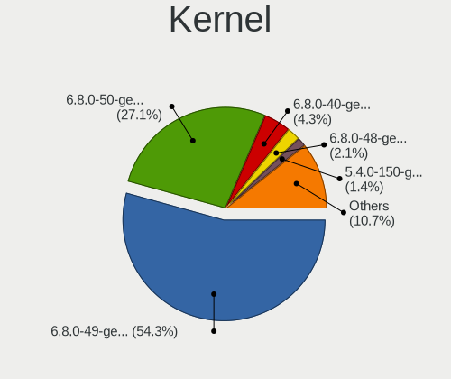
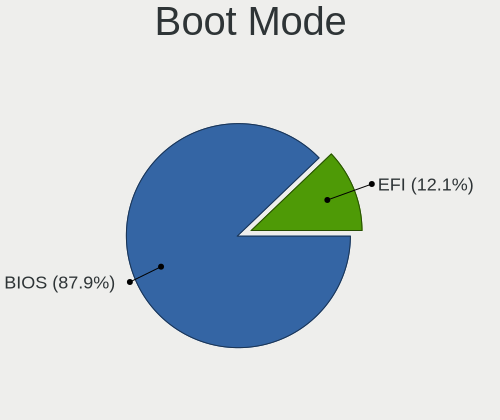
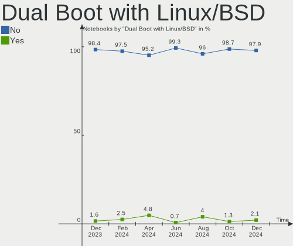
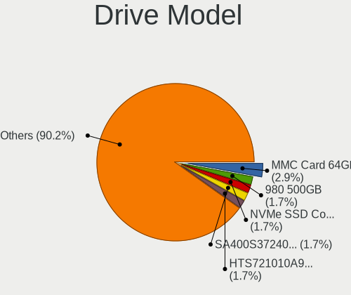
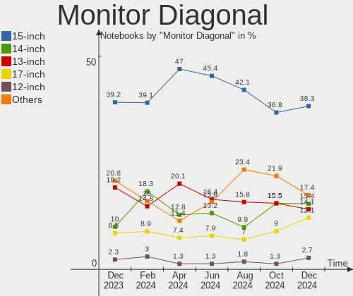
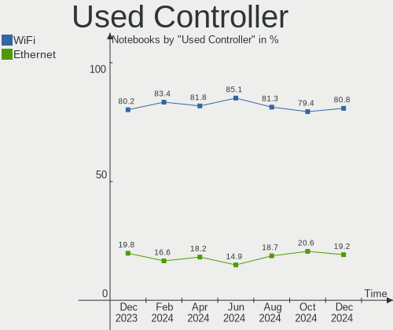
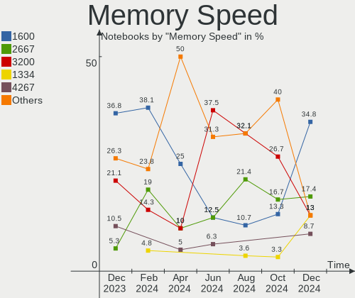
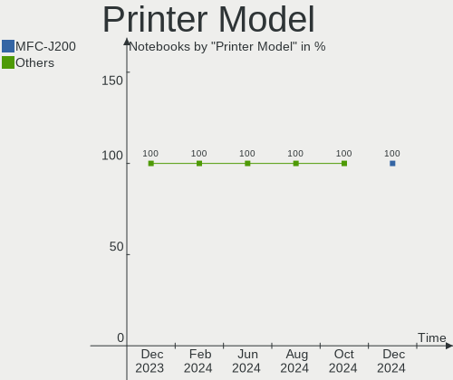

Zorin - Hardware Trends (Notebooks)
-----------------------------------

A project to identify most popular hardware characteristics and track their change
over time based on data collected by Linux users at https://Linux-Hardware.org.

Anyone can contribute to this report by the [hw-probe](https://github.com/linuxhw/hw-probe) tool:

    sudo -E hw-probe -all -upload

This report is for one last month. Overall report since the beginning of time: [TestCoverage](https://github.com/linuxhw/TestCoverage)

Period: Jul, 2022.

Contents
--------

* [ System ](#system)
  - [ OS                       ](#os)
  - [ OS Family                ](#os-family)
  - [ Kernel                   ](#kernel)
  - [ Kernel Family            ](#kernel-family)
  - [ Kernel Major Ver.        ](#kernel-major-ver)
  - [ Arch                     ](#arch)
  - [ DE                       ](#de)
  - [ Display Server           ](#display-server)
  - [ Display Manager          ](#display-manager)
  - [ OS Lang                  ](#os-lang)
  - [ Boot Mode                ](#boot-mode)
  - [ Filesystem               ](#filesystem)
  - [ Part. scheme             ](#part-scheme)
  - [ Dual Boot with Linux/BSD ](#dual-boot-with-linuxbsd)
  - [ Dual Boot (Win)          ](#dual-boot-win)

* [ Board ](#board)
  - [ Vendor                   ](#vendor)
  - [ Model                    ](#model)
  - [ Model Family             ](#model-family)
  - [ MFG Year                 ](#mfg-year)
  - [ Form Factor              ](#form-factor)
  - [ Secure Boot              ](#secure-boot)
  - [ Coreboot                 ](#coreboot)
  - [ RAM Size                 ](#ram-size)
  - [ RAM Used                 ](#ram-used)
  - [ Total Drives             ](#total-drives)
  - [ Has CD-ROM               ](#has-cd-rom)
  - [ Has Ethernet             ](#has-ethernet)
  - [ Has WiFi                 ](#has-wifi)
  - [ Has Bluetooth            ](#has-bluetooth)

* [ Location ](#location)
  - [ Country                  ](#country)
  - [ City                     ](#city)

* [ Drives ](#drives)
  - [ Drive Vendor             ](#drive-vendor)
  - [ Drive Model              ](#drive-model)
  - [ HDD Vendor               ](#hdd-vendor)
  - [ SSD Vendor               ](#ssd-vendor)
  - [ Drive Kind               ](#drive-kind)
  - [ Drive Connector          ](#drive-connector)
  - [ Drive Size               ](#drive-size)
  - [ Space Total              ](#space-total)
  - [ Space Used               ](#space-used)
  - [ Malfunc. Drives          ](#malfunc-drives)
  - [ Malfunc. Drive Vendor    ](#malfunc-drive-vendor)
  - [ Malfunc. HDD Vendor      ](#malfunc-hdd-vendor)
  - [ Malfunc. Drive Kind      ](#malfunc-drive-kind)
  - [ Failed Drives            ](#failed-drives)
  - [ Failed Drive Vendor      ](#failed-drive-vendor)
  - [ Drive Status             ](#drive-status)

* [ Storage controller ](#storage-controller)
  - [ Storage Vendor           ](#storage-vendor)
  - [ Storage Model            ](#storage-model)
  - [ Storage Kind             ](#storage-kind)

* [ Processor ](#processor)
  - [ CPU Vendor               ](#cpu-vendor)
  - [ CPU Model                ](#cpu-model)
  - [ CPU Model Family         ](#cpu-model-family)
  - [ CPU Cores                ](#cpu-cores)
  - [ CPU Sockets              ](#cpu-sockets)
  - [ CPU Threads              ](#cpu-threads)
  - [ CPU Op-Modes             ](#cpu-op-modes)
  - [ CPU Microcode            ](#cpu-microcode)
  - [ CPU Microarch            ](#cpu-microarch)

* [ Graphics ](#graphics)
  - [ GPU Vendor               ](#gpu-vendor)
  - [ GPU Model                ](#gpu-model)
  - [ GPU Combo                ](#gpu-combo)
  - [ GPU Driver               ](#gpu-driver)
  - [ GPU Memory               ](#gpu-memory)

* [ Monitor ](#monitor)
  - [ Monitor Vendor           ](#monitor-vendor)
  - [ Monitor Model            ](#monitor-model)
  - [ Monitor Resolution       ](#monitor-resolution)
  - [ Monitor Diagonal         ](#monitor-diagonal)
  - [ Monitor Width            ](#monitor-width)
  - [ Aspect Ratio             ](#aspect-ratio)
  - [ Monitor Area             ](#monitor-area)
  - [ Pixel Density            ](#pixel-density)
  - [ Multiple Monitors        ](#multiple-monitors)

* [ Network ](#network)
  - [ Net Controller Vendor    ](#net-controller-vendor)
  - [ Net Controller Model     ](#net-controller-model)
  - [ Wireless Vendor          ](#wireless-vendor)
  - [ Wireless Model           ](#wireless-model)
  - [ Ethernet Vendor          ](#ethernet-vendor)
  - [ Ethernet Model           ](#ethernet-model)
  - [ Net Controller Kind      ](#net-controller-kind)
  - [ Used Controller          ](#used-controller)
  - [ NICs                     ](#nics)
  - [ IPv6                     ](#ipv6)

* [ Bluetooth ](#bluetooth)
  - [ Bluetooth Vendor         ](#bluetooth-vendor)
  - [ Bluetooth Model          ](#bluetooth-model)

* [ Sound ](#sound)
  - [ Sound Vendor             ](#sound-vendor)
  - [ Sound Model              ](#sound-model)

* [ Memory ](#memory)
  - [ Memory Vendor            ](#memory-vendor)
  - [ Memory Model             ](#memory-model)
  - [ Memory Kind              ](#memory-kind)
  - [ Memory Form Factor       ](#memory-form-factor)
  - [ Memory Size              ](#memory-size)
  - [ Memory Speed             ](#memory-speed)

* [ Printers & scanners ](#printers--scanners)
  - [ Printer Vendor           ](#printer-vendor)
  - [ Printer Model            ](#printer-model)
  - [ Scanner Vendor           ](#scanner-vendor)
  - [ Scanner Model            ](#scanner-model)

* [ Camera ](#camera)
  - [ Camera Vendor            ](#camera-vendor)
  - [ Camera Model             ](#camera-model)

* [ Security ](#security)
  - [ Fingerprint Vendor       ](#fingerprint-vendor)
  - [ Fingerprint Model        ](#fingerprint-model)
  - [ Chipcard Vendor          ](#chipcard-vendor)
  - [ Chipcard Model           ](#chipcard-model)

* [ Unsupported ](#unsupported)
  - [ Unsupported Devices      ](#unsupported-devices)
  - [ Unsupported Device Types ](#unsupported-device-types)

System
------

OS
--

Installed operating systems

| Name     | Notebooks | Percent |
|----------|-----------|---------|
| Zorin 16 | 69        | 89.61%  |
| Zorin 15 | 8         | 10.39%  |

OS Family
---------

OS without a version

| Name  | Notebooks | Percent |
|-------|-----------|---------|
| Zorin | 77        | 100%    |

Kernel
------

Version of the Linux kernel

| Version           | Notebooks | Percent |
|-------------------|-----------|---------|
| 5.13.0-52-generic | 32        | 41.56%  |
| 5.15.0-41-generic | 25        | 32.47%  |
| 5.13.0-30-generic | 5         | 6.49%   |
| 5.4.0-122-generic | 4         | 5.19%   |
| 5.4.0-121-generic | 3         | 3.9%    |
| 5.13.0-51-generic | 3         | 3.9%    |
| 5.4.0-110-generic | 1         | 1.3%    |
| 5.15.49-xanmod1   | 1         | 1.3%    |
| 5.13.0-48-generic | 1         | 1.3%    |
| 5.13.0-40-generic | 1         | 1.3%    |
| 5.13.0-28-generic | 1         | 1.3%    |

Kernel Family
-------------

Linux kernel without a distro release

| Version | Notebooks | Percent |
|---------|-----------|---------|
| 5.13.0  | 43        | 55.84%  |
| 5.15.0  | 25        | 32.47%  |
| 5.4.0   | 8         | 10.39%  |
| 5.15.49 | 1         | 1.3%    |

Kernel Major Ver.
-----------------

Linux kernel major version

| Version | Notebooks | Percent |
|---------|-----------|---------|
| 5.13    | 43        | 55.84%  |
| 5.15    | 26        | 33.77%  |
| 5.4     | 8         | 10.39%  |

Arch
----

OS architecture (x86_64, i586, etc.)

| Name   | Notebooks | Percent |
|--------|-----------|---------|
| x86_64 | 73        | 94.81%  |
| i686   | 4         | 5.19%   |

DE
--

Desktop Environment

| Name  | Notebooks | Percent |
|-------|-----------|---------|
| GNOME | 63        | 81.82%  |
| XFCE  | 14        | 18.18%  |

Display Server
--------------

X11 or Wayland

| Name    | Notebooks | Percent |
|---------|-----------|---------|
| X11     | 72        | 93.51%  |
| Wayland | 5         | 6.49%   |

Display Manager
---------------

SDDM, LightDM, etc.

| Name    | Notebooks | Percent |
|---------|-----------|---------|
| Unknown | 51        | 66.23%  |
| GDM     | 11        | 14.29%  |
| LightDM | 9         | 11.69%  |
| GDM3    | 6         | 7.79%   |

OS Lang
-------

Language

| Lang  | Notebooks | Percent |
|-------|-----------|---------|
| en_US | 28        | 36.36%  |
| de_DE | 8         | 10.39%  |
| fr_FR | 7         | 9.09%   |
| en_GB | 6         | 7.79%   |
| pt_BR | 4         | 5.19%   |
| en_IN | 4         | 5.19%   |
| pl_PL | 3         | 3.9%    |
| pt_PT | 2         | 2.6%    |
| es_MX | 2         | 2.6%    |
| es_CL | 2         | 2.6%    |
| es_AR | 2         | 2.6%    |
| cs_CZ | 2         | 2.6%    |
| tr_TR | 1         | 1.3%    |
| it_IT | 1         | 1.3%    |
| es_VE | 1         | 1.3%    |
| es_CR | 1         | 1.3%    |
| en_NZ | 1         | 1.3%    |
| en_CA | 1         | 1.3%    |
| de_CH | 1         | 1.3%    |

Boot Mode
---------

EFI or BIOS

| Mode | Notebooks | Percent |
|------|-----------|---------|
| EFI  | 41        | 53.25%  |
| BIOS | 36        | 46.75%  |

Filesystem
----------

Type of filesystem

| Type    | Notebooks | Percent |
|---------|-----------|---------|
| Ext4    | 74        | 96.1%   |
| Zfs     | 1         | 1.3%    |
| Overlay | 1         | 1.3%    |
| Btrfs   | 1         | 1.3%    |

Part. scheme
------------

Scheme of partitioning

| Type    | Notebooks | Percent |
|---------|-----------|---------|
| Unknown | 63        | 81.82%  |
| GPT     | 9         | 11.69%  |
| MBR     | 5         | 6.49%   |

Dual Boot with Linux/BSD
------------------------

Hosting more than one Linux/BSD

| Dual boot | Notebooks | Percent |
|-----------|-----------|---------|
| No        | 74        | 96.1%   |
| Yes       | 3         | 3.9%    |

Dual Boot (Win)
---------------

Hosting Linux and Windows

| Dual boot | Notebooks | Percent |
|-----------|-----------|---------|
| No        | 68        | 88.31%  |
| Yes       | 9         | 11.69%  |

Board
-----

Vendor
------

Motherboard manufacturer

| Name                | Notebooks | Percent |
|---------------------|-----------|---------|
| Hewlett-Packard     | 20        | 25.97%  |
| Dell                | 13        | 16.88%  |
| Lenovo              | 10        | 12.99%  |
| ASUSTek Computer    | 8         | 10.39%  |
| Acer                | 5         | 6.49%   |
| Samsung Electronics | 4         | 5.19%   |
| Toshiba             | 2         | 2.6%    |
| Packard Bell        | 2         | 2.6%    |
| MSI                 | 2         | 2.6%    |
| Star Labs           | 1         | 1.3%    |
| Sony                | 1         | 1.3%    |
| Kogan               | 1         | 1.3%    |
| HUAWEI              | 1         | 1.3%    |
| Google              | 1         | 1.3%    |
| Fujitsu Siemens     | 1         | 1.3%    |
| eMachines           | 1         | 1.3%    |
| Deffad              | 1         | 1.3%    |
| Apple               | 1         | 1.3%    |
| AMI                 | 1         | 1.3%    |
| Alienware           | 1         | 1.3%    |

Model
-----

Motherboard model

| Name                                        | Notebooks | Percent |
|---------------------------------------------|-----------|---------|
| Unknown                                     | 4         | 5.19%   |
| Dell Inspiron 5520                          | 2         | 2.6%    |
| Toshiba TECRA S11                           | 1         | 1.3%    |
| Toshiba Satellite L655                      | 1         | 1.3%    |
| Star Labs StarBook                          | 1         | 1.3%    |
| Sony VGN-Z31XN_B                            | 1         | 1.3%    |
| Samsung RV411/RV511/E3511/S3511/RV711/E3411 | 1         | 1.3%    |
| Samsung 550XDA                              | 1         | 1.3%    |
| Samsung 500R5M/500R5W/501R5M                | 1         | 1.3%    |
| Samsung 300E4C/300E5C/300E7C                | 1         | 1.3%    |
| Packard Bell H17HV                          | 1         | 1.3%    |
| Packard Bell EasyNote TE69KB                | 1         | 1.3%    |
| MSI Creator 15 A10SET                       | 1         | 1.3%    |
| MSI CR620                                   | 1         | 1.3%    |
| Lenovo V14-ADA 82C6                         | 1         | 1.3%    |
| Lenovo ThinkPad T61 6457B5S                 | 1         | 1.3%    |
| Lenovo ThinkPad T500 2055A38                | 1         | 1.3%    |
| Lenovo ThinkPad T400 2768GB4                | 1         | 1.3%    |
| Lenovo ThinkPad E570 20H50047US             | 1         | 1.3%    |
| Lenovo S21e-20 80M4                         | 1         | 1.3%    |
| Lenovo IdeaPad C340-14API 81N6              | 1         | 1.3%    |
| Lenovo IdeaPad 3 15IIL05 81WE               | 1         | 1.3%    |
| Lenovo IdeaPad 1 14IGL05 81VU               | 1         | 1.3%    |
| Lenovo G40-45 80E1                          | 1         | 1.3%    |
| Kogan KALAP13S300VA                         | 1         | 1.3%    |
| HUAWEI HVY-WXX9                             | 1         | 1.3%    |
| HP Stream Notebook                          | 1         | 1.3%    |
| HP ProBook 6475b                            | 1         | 1.3%    |
| HP ProBook 640 G1                           | 1         | 1.3%    |
| HP ProBook 455 G1                           | 1         | 1.3%    |
| HP ProBook 4540s                            | 1         | 1.3%    |
| HP ProBook 440 G8 Notebook PC               | 1         | 1.3%    |
| HP Pavilion Laptop 15-eg0xxx                | 1         | 1.3%    |
| HP Pavilion Gaming Laptop 15-ec2xxx         | 1         | 1.3%    |
| HP Pavilion 15                              | 1         | 1.3%    |
| HP Mini 110-3100                            | 1         | 1.3%    |
| HP Laptop 15s-du2xxx                        | 1         | 1.3%    |
| HP Laptop 15-dw3xxx                         | 1         | 1.3%    |
| HP ENVY 17                                  | 1         | 1.3%    |
| HP EliteBook 745 G6                         | 1         | 1.3%    |
| HP Compaq nx6310 (EY589ES#AKB)              | 1         | 1.3%    |
| HP Compaq 6730s                             | 1         | 1.3%    |
| HP Compaq 420                               | 1         | 1.3%    |
| HP 550                                      | 1         | 1.3%    |
| Google Butterfly                            | 1         | 1.3%    |
| Fujitsu Siemens AMILO L Series              | 1         | 1.3%    |
| eMachines E720                              | 1         | 1.3%    |
| Dell Vostro 3559                            | 1         | 1.3%    |
| Dell System Inspiron N7110                  | 1         | 1.3%    |
| Dell MXG061                                 | 1         | 1.3%    |
| Dell Latitude E7450                         | 1         | 1.3%    |
| Dell Latitude 5400                          | 1         | 1.3%    |
| Dell Inspiron 7520                          | 1         | 1.3%    |
| Dell Inspiron 3542                          | 1         | 1.3%    |
| Dell Inspiron 3541                          | 1         | 1.3%    |
| Dell Inspiron 1545                          | 1         | 1.3%    |
| Dell Inspiron 1525                          | 1         | 1.3%    |
| Dell Inspiron 15-3567                       | 1         | 1.3%    |
| ASUS X751MA                                 | 1         | 1.3%    |
| ASUS X550CL                                 | 1         | 1.3%    |

Model Family
------------

Motherboard model prefix

| Name                  | Notebooks | Percent |
|-----------------------|-----------|---------|
| Dell Inspiron         | 8         | 10.39%  |
| HP ProBook            | 5         | 6.49%   |
| Lenovo ThinkPad       | 4         | 5.19%   |
| Acer Aspire           | 4         | 5.19%   |
| Unknown               | 4         | 5.19%   |
| Lenovo IdeaPad        | 3         | 3.9%    |
| HP Pavilion           | 3         | 3.9%    |
| HP Compaq             | 3         | 3.9%    |
| HP Laptop             | 2         | 2.6%    |
| Dell Latitude         | 2         | 2.6%    |
| ASUS VivoBook         | 2         | 2.6%    |
| Toshiba TECRA         | 1         | 1.3%    |
| Toshiba Satellite     | 1         | 1.3%    |
| Star Labs StarBook    | 1         | 1.3%    |
| Sony VGN-Z31XN        | 1         | 1.3%    |
| Samsung RV411         | 1         | 1.3%    |
| Samsung 550XDA        | 1         | 1.3%    |
| Samsung 500R5M        | 1         | 1.3%    |
| Samsung 300E4C        | 1         | 1.3%    |
| Packard Bell H17HV    | 1         | 1.3%    |
| Packard Bell EasyNote | 1         | 1.3%    |
| MSI Creator           | 1         | 1.3%    |
| MSI CR620             | 1         | 1.3%    |
| Lenovo V14-ADA        | 1         | 1.3%    |
| Lenovo S21e-20        | 1         | 1.3%    |
| Lenovo G40-45         | 1         | 1.3%    |
| Kogan KALAP13S300VA   | 1         | 1.3%    |
| HUAWEI HVY-WXX9       | 1         | 1.3%    |
| HP Stream             | 1         | 1.3%    |
| HP Mini               | 1         | 1.3%    |
| HP ENVY               | 1         | 1.3%    |
| HP EliteBook          | 1         | 1.3%    |
| HP 550                | 1         | 1.3%    |
| Google Butterfly      | 1         | 1.3%    |
| Fujitsu Siemens AMILO | 1         | 1.3%    |
| eMachines E720        | 1         | 1.3%    |
| Dell Vostro           | 1         | 1.3%    |
| Dell System           | 1         | 1.3%    |
| Dell MXG061           | 1         | 1.3%    |
| ASUS X751MA           | 1         | 1.3%    |
| ASUS X550CL           | 1         | 1.3%    |
| ASUS X540LJ           | 1         | 1.3%    |
| ASUS N61Jq            | 1         | 1.3%    |
| ASUS K70IC            | 1         | 1.3%    |
| ASUS ASUS             | 1         | 1.3%    |
| Apple MacBookPro12    | 1         | 1.3%    |
| Alienware x15         | 1         | 1.3%    |
| Acer NC-A315-41G-R88F | 1         | 1.3%    |

MFG Year
--------

Motherboard manufacture year

| Year | Notebooks | Percent |
|------|-----------|---------|
| 2020 | 10        | 12.99%  |
| 2008 | 8         | 10.39%  |
| 2010 | 7         | 9.09%   |
| 2021 | 6         | 7.79%   |
| 2013 | 6         | 7.79%   |
| 2012 | 6         | 7.79%   |
| 2014 | 5         | 6.49%   |
| 2011 | 5         | 6.49%   |
| 2019 | 4         | 5.19%   |
| 2016 | 4         | 5.19%   |
| 2017 | 3         | 3.9%    |
| 2015 | 3         | 3.9%    |
| 2022 | 2         | 2.6%    |
| 2018 | 2         | 2.6%    |
| 2009 | 2         | 2.6%    |
| 2006 | 2         | 2.6%    |
| 2007 | 1         | 1.3%    |
| 2005 | 1         | 1.3%    |

Form Factor
-----------

Physical design of the computer

| Name     | Notebooks | Percent |
|----------|-----------|---------|
| Notebook | 77        | 100%    |

Secure Boot
-----------

Enabled or disabled

| State    | Notebooks | Percent |
|----------|-----------|---------|
| Disabled | 64        | 83.12%  |
| Enabled  | 13        | 16.88%  |

Coreboot
--------

Have coreboot on board

| Used | Notebooks | Percent |
|------|-----------|---------|
| No   | 75        | 97.4%   |
| Yes  | 2         | 2.6%    |

RAM Size
--------

Total RAM memory

| Size in GB  | Notebooks | Percent |
|-------------|-----------|---------|
| 4.01-8.0    | 26        | 33.77%  |
| 3.01-4.0    | 21        | 27.27%  |
| 1.01-2.0    | 11        | 14.29%  |
| 8.01-16.0   | 7         | 9.09%   |
| 32.01-64.0  | 5         | 6.49%   |
| 16.01-24.0  | 4         | 5.19%   |
| 2.01-3.0    | 2         | 2.6%    |
| 64.01-256.0 | 1         | 1.3%    |

RAM Used
--------

Used RAM memory

| Used GB    | Notebooks | Percent |
|------------|-----------|---------|
| 1.01-2.0   | 37        | 48.05%  |
| 2.01-3.0   | 20        | 25.97%  |
| 3.01-4.0   | 14        | 18.18%  |
| 4.01-8.0   | 3         | 3.9%    |
| 0.51-1.0   | 2         | 2.6%    |
| 16.01-24.0 | 1         | 1.3%    |

Total Drives
------------

Number of drives on board

| Drives | Notebooks | Percent |
|--------|-----------|---------|
| 1      | 57        | 74.03%  |
| 2      | 16        | 20.78%  |
| 3      | 2         | 2.6%    |
| 4      | 1         | 1.3%    |
| 0      | 1         | 1.3%    |

Has CD-ROM
----------

Has CD-ROM on board

| Presented | Notebooks | Percent |
|-----------|-----------|---------|
| Yes       | 39        | 50.65%  |
| No        | 38        | 49.35%  |

Has Ethernet
------------

Has Ethernet on board

| Presented | Notebooks | Percent |
|-----------|-----------|---------|
| Yes       | 64        | 83.12%  |
| No        | 13        | 16.88%  |

Has WiFi
--------

Has WiFi module

| Presented | Notebooks | Percent |
|-----------|-----------|---------|
| Yes       | 74        | 96.1%   |
| No        | 3         | 3.9%    |

Has Bluetooth
-------------

Has Bluetooth module

| Presented | Notebooks | Percent |
|-----------|-----------|---------|
| Yes       | 53        | 68.83%  |
| No        | 24        | 31.17%  |

Location
--------

Country
-------

Geographic location (country)

| Country     | Notebooks | Percent |
|-------------|-----------|---------|
| USA         | 16        | 20.78%  |
| Germany     | 9         | 11.69%  |
| UK          | 6         | 7.79%   |
| France      | 6         | 7.79%   |
| Brazil      | 5         | 6.49%   |
| India       | 4         | 5.19%   |
| Poland      | 3         | 3.9%    |
| Romania     | 2         | 2.6%    |
| Portugal    | 2         | 2.6%    |
| Mexico      | 2         | 2.6%    |
| Kenya       | 2         | 2.6%    |
| Czechia     | 2         | 2.6%    |
| Chile       | 2         | 2.6%    |
| Argentina   | 2         | 2.6%    |
| Venezuela   | 1         | 1.3%    |
| Turkey      | 1         | 1.3%    |
| Switzerland | 1         | 1.3%    |
| Sweden      | 1         | 1.3%    |
| Sri Lanka   | 1         | 1.3%    |
| Spain       | 1         | 1.3%    |
| Norway      | 1         | 1.3%    |
| New Zealand | 1         | 1.3%    |
| Italy       | 1         | 1.3%    |
| Greece      | 1         | 1.3%    |
| Costa Rica  | 1         | 1.3%    |
| Canada      | 1         | 1.3%    |
| Belgium     | 1         | 1.3%    |
| Australia   | 1         | 1.3%    |

City
----

Geographic location (city)

| City                      | Notebooks | Percent |
|---------------------------|-----------|---------|
| Wuppertal                 | 2         | 2.6%    |
| Rio de Janeiro            | 2         | 2.6%    |
| Nairobi                   | 2         | 2.6%    |
| Delhi                     | 2         | 2.6%    |
| Chenove                   | 2         | 2.6%    |
| Bucharest                 | 2         | 2.6%    |
| Wylie                     | 1         | 1.3%    |
| Worthing                  | 1         | 1.3%    |
| Whaley Bridge             | 1         | 1.3%    |
| Wellington                | 1         | 1.3%    |
| Watford                   | 1         | 1.3%    |
| Victoria                  | 1         | 1.3%    |
| Union Dale                | 1         | 1.3%    |
| Trondheim                 | 1         | 1.3%    |
| Torrevieja                | 1         | 1.3%    |
| Sydney                    | 1         | 1.3%    |
| Świnoujście             | 1         | 1.3%    |
| Stockholm                 | 1         | 1.3%    |
| Skorcz                    | 1         | 1.3%    |
| Schwenksville             | 1         | 1.3%    |
| Schoftland                | 1         | 1.3%    |
| San José                 | 1         | 1.3%    |
| San Antonio               | 1         | 1.3%    |
| Saint-Hilaire-sur-Benaize | 1         | 1.3%    |
| Rosemead                  | 1         | 1.3%    |
| Queens                    | 1         | 1.3%    |
| Pudahuel                  | 1         | 1.3%    |
| Port Montt                | 1         | 1.3%    |
| Poitiers                  | 1         | 1.3%    |
| Niederkruchten            | 1         | 1.3%    |
| New York                  | 1         | 1.3%    |
| Monterrey                 | 1         | 1.3%    |
| Merlo                     | 1         | 1.3%    |
| Mechelen                  | 1         | 1.3%    |
| Lyon                      | 1         | 1.3%    |
| Lakeland                  | 1         | 1.3%    |
| Kalletal                  | 1         | 1.3%    |
| Jaú                      | 1         | 1.3%    |
| Jablonec nad Nisou        | 1         | 1.3%    |
| Ilioupoli                 | 1         | 1.3%    |
| Huixtla                   | 1         | 1.3%    |
| Holzappel                 | 1         | 1.3%    |
| Hanover                   | 1         | 1.3%    |
| Hamburg                   | 1         | 1.3%    |
| Funchal                   | 1         | 1.3%    |
| Düren                    | 1         | 1.3%    |
| Decines-Charpieu          | 1         | 1.3%    |
| Dartford                  | 1         | 1.3%    |
| Dagenham                  | 1         | 1.3%    |
| Częstochowa              | 1         | 1.3%    |
| Crofton                   | 1         | 1.3%    |
| Corona                    | 1         | 1.3%    |
| Columbus                  | 1         | 1.3%    |
| Coimbatore                | 1         | 1.3%    |
| Clarkston                 | 1         | 1.3%    |
| Cascais                   | 1         | 1.3%    |
| Caracas                   | 1         | 1.3%    |
| Bursa                     | 1         | 1.3%    |
| Buenos Aires              | 1         | 1.3%    |
| Brasília                 | 1         | 1.3%    |

Drives
------

Drive Vendor
------------

Hard drive vendors

| Vendor              | Notebooks | Drives | Percent |
|---------------------|-----------|--------|---------|
| Seagate             | 14        | 14     | 15.05%  |
| Unknown             | 10        | 13     | 10.75%  |
| WDC                 | 7         | 7      | 7.53%   |
| Toshiba             | 7         | 7      | 7.53%   |
| SanDisk             | 7         | 7      | 7.53%   |
| Samsung Electronics | 7         | 8      | 7.53%   |
| Kingston            | 6         | 6      | 6.45%   |
| Hitachi             | 5         | 5      | 5.38%   |
| Crucial             | 4         | 4      | 4.3%    |
| SK hynix            | 3         | 3      | 3.23%   |
| A-DATA Technology   | 3         | 3      | 3.23%   |
| Team                | 2         | 2      | 2.15%   |
| Intel               | 2         | 2      | 2.15%   |
| HGST                | 2         | 2      | 2.15%   |
| Transcend           | 1         | 1      | 1.08%   |
| Star Drive          | 1         | 1      | 1.08%   |
| SABRENT             | 1         | 1      | 1.08%   |
| S3+                 | 1         | 1      | 1.08%   |
| Phison              | 1         | 1      | 1.08%   |
| Micron Technology   | 1         | 2      | 1.08%   |
| LaCie               | 1         | 1      | 1.08%   |
| KIOXIA              | 1         | 1      | 1.08%   |
| HS-SSD-C100         | 1         | 1      | 1.08%   |
| Hewlett-Packard     | 1         | 1      | 1.08%   |
| GOODRAM             | 1         | 1      | 1.08%   |
| Gigabyte Technology | 1         | 1      | 1.08%   |
| Fujitsu             | 1         | 1      | 1.08%   |
| Unknown             | 1         | 1      | 1.08%   |

Drive Model
-----------

Hard drive models

| Model                                | Notebooks | Percent |
|--------------------------------------|-----------|---------|
| Unknown MMC Card  128GB              | 3         | 3.06%   |
| Hitachi HTS545032B9A300 320GB        | 3         | 3.06%   |
| Unknown SDW32G  32GB                 | 2         | 2.04%   |
| Unknown MMC Card  64GB               | 2         | 2.04%   |
| Toshiba MQ01ABF050 500GB             | 2         | 2.04%   |
| Seagate ST9640320AS 640GB            | 2         | 2.04%   |
| Seagate ST9250315AS 250GB            | 2         | 2.04%   |
| SanDisk SSD PLUS 480GB               | 2         | 2.04%   |
| Samsung SSD 860 EVO 500GB            | 2         | 2.04%   |
| Samsung NVMe SSD Drive 256GB         | 2         | 2.04%   |
| Kingston SV300S37A120G 120GB SSD     | 2         | 2.04%   |
| WDC WD5000LPVX-80V0TT0 500GB         | 1         | 1.02%   |
| WDC WD5000LPCX-22VHAT1 500GB         | 1         | 1.02%   |
| WDC WD5000BEVT-22ZAT0 500GB          | 1         | 1.02%   |
| WDC WD3200BEVT-75ZCT2 320GB          | 1         | 1.02%   |
| WDC WD2500BJKT-00F4T0 250GB          | 1         | 1.02%   |
| WDC WD10SPZX-21Z10T0 1TB             | 1         | 1.02%   |
| WDC PC SN730 SDBPNTY-512G-1027 512GB | 1         | 1.02%   |
| Unknown SLD32G  32GB                 | 1         | 1.02%   |
| Unknown SD64G  64GB                  | 1         | 1.02%   |
| Unknown SD/MMC/MS PRO 64GB           | 1         | 1.02%   |
| Unknown MMC Card  4GB                | 1         | 1.02%   |
| Unknown MMC Card  16GB               | 1         | 1.02%   |
| Unknown DA4064  64GB                 | 1         | 1.02%   |
| Transcend TS240GMTS420S 240GB SSD    | 1         | 1.02%   |
| Toshiba MQ04ABF100 1TB               | 1         | 1.02%   |
| Toshiba MK8032GSX 80GB               | 1         | 1.02%   |
| Toshiba MK3252GSX 320GB              | 1         | 1.02%   |
| Toshiba MK1665GSX 160GB              | 1         | 1.02%   |
| Toshiba HDWL120 2TB                  | 1         | 1.02%   |
| Team T253X6512G 512GB SSD            | 1         | 1.02%   |
| Team T2535T120G 120GB SSD            | 1         | 1.02%   |
| Star Drive PCIe SSD 1TB              | 1         | 1.02%   |
| SK hynix NVMe SSD Drive 512GB        | 1         | 1.02%   |
| SK hynix NVMe SSD Drive 256GB        | 1         | 1.02%   |
| SK hynix NVMe SSD Drive 1024GB       | 1         | 1.02%   |
| Seagate ST95005620AS 500GB           | 1         | 1.02%   |
| Seagate ST9320325AS 320GB            | 1         | 1.02%   |
| Seagate ST9160412AS 160GB            | 1         | 1.02%   |
| Seagate ST9100824AS 100GB            | 1         | 1.02%   |
| Seagate ST500LX012-1LM162-SSHD 500GB | 1         | 1.02%   |
| Seagate ST500LM021-1KJ152 500GB      | 1         | 1.02%   |
| Seagate ST500LM012 HN-M500MBB 500GB  | 1         | 1.02%   |
| Seagate ST320LT020-9YG142 320GB      | 1         | 1.02%   |
| Seagate ST1000LX015-1U7172 1TB       | 1         | 1.02%   |
| Seagate Expansion 1TB                | 1         | 1.02%   |
| SanDisk SDSSDA120G 120GB             | 1         | 1.02%   |
| SanDisk SD9SN8W128G1014 128GB SSD    | 1         | 1.02%   |
| SanDisk NVMe SSD Drive 256GB         | 1         | 1.02%   |
| SanDisk NVMe SSD Drive 1TB           | 1         | 1.02%   |
| SanDisk NVMe SSD Drive 1024GB        | 1         | 1.02%   |
| Samsung SSD 980 PRO 1TB              | 1         | 1.02%   |
| Samsung SSD 870 EVO 1TB              | 1         | 1.02%   |
| Samsung NVMe SSD Drive 512GB         | 1         | 1.02%   |
| Samsung HM121HI 120GB                | 1         | 1.02%   |
| SABRENT Disk 1TB                     | 1         | 1.02%   |
| S3+ S3SSDC256 256GB                  | 1         | 1.02%   |
| Phison NVMe SSD Drive 1024GB         | 1         | 1.02%   |
| Micron NVMe SSD Drive 512GB          | 1         | 1.02%   |
| Micron 2210_MTFDHBA512QFD 512GB      | 1         | 1.02%   |

HDD Vendor
----------

Hard disk drive vendors

| Vendor              | Notebooks | Drives | Percent |
|---------------------|-----------|--------|---------|
| Seagate             | 14        | 14     | 36.84%  |
| Toshiba             | 7         | 7      | 18.42%  |
| WDC                 | 6         | 6      | 15.79%  |
| Hitachi             | 5         | 5      | 13.16%  |
| HGST                | 2         | 2      | 5.26%   |
| Unknown             | 1         | 1      | 2.63%   |
| Samsung Electronics | 1         | 1      | 2.63%   |
| SABRENT             | 1         | 1      | 2.63%   |
| Fujitsu             | 1         | 1      | 2.63%   |

SSD Vendor
----------

Solid state drive vendors

| Vendor              | Notebooks | Drives | Percent |
|---------------------|-----------|--------|---------|
| SanDisk             | 4         | 4      | 15.38%  |
| Kingston            | 4         | 4      | 15.38%  |
| Samsung Electronics | 3         | 3      | 11.54%  |
| Crucial             | 3         | 3      | 11.54%  |
| A-DATA Technology   | 3         | 3      | 11.54%  |
| Team                | 2         | 2      | 7.69%   |
| Transcend           | 1         | 1      | 3.85%   |
| S3+                 | 1         | 1      | 3.85%   |
| Intel               | 1         | 1      | 3.85%   |
| HS-SSD-C100         | 1         | 1      | 3.85%   |
| Hewlett-Packard     | 1         | 1      | 3.85%   |
| GOODRAM             | 1         | 1      | 3.85%   |
| Gigabyte Technology | 1         | 1      | 3.85%   |

Drive Kind
----------

HDD or SSD

| Kind    | Notebooks | Drives | Percent |
|---------|-----------|--------|---------|
| HDD     | 37        | 38     | 40.66%  |
| SSD     | 25        | 26     | 27.47%  |
| NVMe    | 17        | 20     | 18.68%  |
| MMC     | 11        | 13     | 12.09%  |
| Unknown | 1         | 1      | 1.1%    |

Drive Connector
---------------

SATA, SAS, NVMe, etc.

| Type | Notebooks | Drives | Percent |
|------|-----------|--------|---------|
| SATA | 56        | 61     | 63.64%  |
| NVMe | 17        | 20     | 19.32%  |
| MMC  | 11        | 13     | 12.5%   |
| SAS  | 4         | 4      | 4.55%   |

Drive Size
----------

Size of hard drive

| Size in TB | Notebooks | Drives | Percent |
|------------|-----------|--------|---------|
| 0.01-0.5   | 50        | 52     | 80.65%  |
| 0.51-1.0   | 11        | 11     | 17.74%  |
| 1.01-2.0   | 1         | 1      | 1.61%   |

Space Total
-----------

Amount of disk space available on the file system

| Size in GB     | Notebooks | Percent |
|----------------|-----------|---------|
| 101-250        | 24        | 31.17%  |
| 251-500        | 21        | 27.27%  |
| 501-1000       | 10        | 12.99%  |
| 51-100         | 10        | 12.99%  |
| 1-20           | 5         | 6.49%   |
| More than 3000 | 2         | 2.6%    |
| 21-50          | 2         | 2.6%    |
| 1001-2000      | 2         | 2.6%    |
| 2001-3000      | 1         | 1.3%    |

Space Used
----------

Amount of used disk space

| Used GB        | Notebooks | Percent |
|----------------|-----------|---------|
| 1-20           | 44        | 57.14%  |
| 21-50          | 15        | 19.48%  |
| 51-100         | 7         | 9.09%   |
| 101-250        | 6         | 7.79%   |
| 251-500        | 4         | 5.19%   |
| More than 3000 | 1         | 1.3%    |

Malfunc. Drives
---------------

Drive models with a malfunction

| Model                          | Notebooks | Drives | Percent |
|--------------------------------|-----------|--------|---------|
| Seagate ST9250315AS 250GB      | 1         | 1      | 50%     |
| Seagate ST1000LX015-1U7172 1TB | 1         | 1      | 50%     |

Malfunc. Drive Vendor
---------------------

Vendors of faulty drives

| Vendor  | Notebooks | Drives | Percent |
|---------|-----------|--------|---------|
| Seagate | 2         | 2      | 100%    |

Malfunc. HDD Vendor
-------------------

Vendors of faulty HDD drives

| Vendor  | Notebooks | Drives | Percent |
|---------|-----------|--------|---------|
| Seagate | 2         | 2      | 100%    |

Malfunc. Drive Kind
-------------------

Kinds of faulty drives

| Kind | Notebooks | Drives | Percent |
|------|-----------|--------|---------|
| HDD  | 2         | 2      | 100%    |

Failed Drives
-------------

Failed drive models

Zero info for selected period =(

Failed Drive Vendor
-------------------

Failed drive vendors

Zero info for selected period =(

Drive Status
------------

Number of failed and malfunc. drives

| Status   | Notebooks | Drives | Percent |
|----------|-----------|--------|---------|
| Detected | 67        | 84     | 84.81%  |
| Works    | 10        | 12     | 12.66%  |
| Malfunc  | 2         | 2      | 2.53%   |

Storage controller
------------------

Storage Vendor
--------------

Storage controller vendors

| Vendor                       | Notebooks | Percent |
|------------------------------|-----------|---------|
| Intel                        | 54        | 63.53%  |
| AMD                          | 11        | 12.94%  |
| SanDisk                      | 4         | 4.71%   |
| Samsung Electronics          | 4         | 4.71%   |
| SK hynix                     | 3         | 3.53%   |
| Phison Electronics           | 2         | 2.35%   |
| Kingston Technology Company  | 2         | 2.35%   |
| VIA Technologies             | 1         | 1.18%   |
| Toshiba America Info Systems | 1         | 1.18%   |
| Nvidia                       | 1         | 1.18%   |
| Micron/Crucial Technology    | 1         | 1.18%   |
| Micron Technology            | 1         | 1.18%   |

Storage Model
-------------

Storage controller models

| Model                                                                                  | Notebooks | Percent |
|----------------------------------------------------------------------------------------|-----------|---------|
| AMD FCH SATA Controller [AHCI mode]                                                    | 11        | 11.83%  |
| Intel 7 Series Chipset Family 6-port SATA Controller [AHCI mode]                       | 7         | 7.53%   |
| Intel Sunrise Point-LP SATA Controller [AHCI mode]                                     | 6         | 6.45%   |
| Intel 82801IBM/IEM (ICH9M/ICH9M-E) 4 port SATA Controller [AHCI mode]                  | 6         | 6.45%   |
| Intel Volume Management Device NVMe RAID Controller                                    | 5         | 5.38%   |
| Intel 82801HM/HEM (ICH8M/ICH8M-E) SATA Controller [AHCI mode]                          | 3         | 3.23%   |
| Intel 82801HM/HEM (ICH8M/ICH8M-E) IDE Controller                                       | 3         | 3.23%   |
| Intel 5 Series/3400 Series Chipset 4 port SATA AHCI Controller                         | 3         | 3.23%   |
| SK hynix Gold P31 SSD                                                                  | 2         | 2.15%   |
| SanDisk WD Black SN750 / PC SN730 NVMe SSD                                             | 2         | 2.15%   |
| Samsung NVMe SSD Controller 980                                                        | 2         | 2.15%   |
| Intel Wildcat Point-LP SATA Controller [AHCI Mode]                                     | 2         | 2.15%   |
| Intel Tiger Lake-LP SATA Controller                                                    | 2         | 2.15%   |
| Intel 82801IBM/IEM (ICH9M/ICH9M-E) 2 port SATA Controller [IDE mode]                   | 2         | 2.15%   |
| Intel 82801GBM/GHM (ICH7-M Family) SATA Controller [AHCI mode]                         | 2         | 2.15%   |
| Intel 82801G (ICH7 Family) IDE Controller                                              | 2         | 2.15%   |
| Intel 8 Series/C220 Series Chipset Family 6-port SATA Controller 1 [AHCI mode]         | 2         | 2.15%   |
| Intel 8 Series SATA Controller 1 [AHCI mode]                                           | 2         | 2.15%   |
| Intel 6 Series/C200 Series Chipset Family 6 port Mobile SATA AHCI Controller           | 2         | 2.15%   |
| VIA VT82C586A/B/VT82C686/A/B/VT823x/A/C PIPC Bus Master IDE                            | 1         | 1.08%   |
| Toshiba America Info Systems XG6 NVMe SSD Controller                                   | 1         | 1.08%   |
| SK hynix BC511                                                                         | 1         | 1.08%   |
| SanDisk PC SN520 NVMe SSD                                                              | 1         | 1.08%   |
| SanDisk Non-Volatile memory controller                                                 | 1         | 1.08%   |
| Samsung NVMe SSD Controller SM961/PM961/SM963                                          | 1         | 1.08%   |
| Samsung NVMe SSD Controller PM9A1/PM9A3/980PRO                                         | 1         | 1.08%   |
| Phison PS5013 E13 NVMe Controller                                                      | 1         | 1.08%   |
| Phison E18 PCIe4 NVMe Controller                                                       | 1         | 1.08%   |
| Nvidia MCP79 AHCI Controller                                                           | 1         | 1.08%   |
| Micron/Crucial NVMe Controller                                                         | 1         | 1.08%   |
| Micron Non-Volatile memory controller                                                  | 1         | 1.08%   |
| Kingston Company Company Non-Volatile memory controller                                | 1         | 1.08%   |
| Kingston Company SNVS2000G [NV1 NVMe PCIe SSD 2TB]                                     | 1         | 1.08%   |
| Intel Non-Volatile memory controller                                                   | 1         | 1.08%   |
| Intel NM10/ICH7 Family SATA Controller [AHCI mode]                                     | 1         | 1.08%   |
| Intel Ice Lake-LP SATA Controller [AHCI mode]                                          | 1         | 1.08%   |
| Intel Celeron/Pentium Silver Processor SATA Controller                                 | 1         | 1.08%   |
| Intel Cannon Point-LP SATA Controller [AHCI Mode]                                      | 1         | 1.08%   |
| Intel Atom Processor E3800 Series SATA AHCI Controller                                 | 1         | 1.08%   |
| Intel 82801GBM/GHM (ICH7-M Family) SATA Controller [IDE mode]                          | 1         | 1.08%   |
| Intel 82801 Mobile SATA Controller [RAID mode]                                         | 1         | 1.08%   |
| Intel 6 Series/C200 Series Chipset Family Mobile SATA Controller (IDE mode, ports 4-5) | 1         | 1.08%   |
| Intel 6 Series/C200 Series Chipset Family Mobile SATA Controller (IDE mode, ports 0-3) | 1         | 1.08%   |
| Intel 5 Series/3400 Series Chipset 6 port SATA AHCI Controller                         | 1         | 1.08%   |
| Intel 5 Series/3400 Series Chipset 4 port SATA IDE Controller                          | 1         | 1.08%   |
| Intel 5 Series/3400 Series Chipset 2 port SATA IDE Controller                          | 1         | 1.08%   |

Storage Kind
------------

Kind of storage controller (IDE, SATA, NVMe, SAS, ...)

| Kind | Notebooks | Percent |
|------|-----------|---------|
| SATA | 55        | 61.8%   |
| NVMe | 17        | 19.1%   |
| IDE  | 11        | 12.36%  |
| RAID | 6         | 6.74%   |

Processor
---------

CPU Vendor
----------

Processor vendors

| Vendor | Notebooks | Percent |
|--------|-----------|---------|
| Intel  | 64        | 83.12%  |
| AMD    | 13        | 16.88%  |

CPU Model
---------

Processor models

| Model                                           | Notebooks | Percent |
|-------------------------------------------------|-----------|---------|
| Intel Core i5-3210M CPU @ 2.50GHz               | 3         | 3.9%    |
| Intel Pentium Dual-Core CPU T4200 @ 2.00GHz     | 2         | 2.6%    |
| Intel Core i7-7500U CPU @ 2.70GHz               | 2         | 2.6%    |
| Intel Core i5-7200U CPU @ 2.50GHz               | 2         | 2.6%    |
| Intel Core i3-1005G1 CPU @ 1.20GHz              | 2         | 2.6%    |
| Intel Celeron CPU N2840 @ 2.16GHz               | 2         | 2.6%    |
| Intel 11th Gen Core i7-1165G7 @ 2.80GHz         | 2         | 2.6%    |
| Intel Pentium Gold 7505 @ 2.00GHz               | 1         | 1.3%    |
| Intel Pentium Dual CPU T3400 @ 2.16GHz          | 1         | 1.3%    |
| Intel Pentium CPU P6200 @ 2.13GHz               | 1         | 1.3%    |
| Intel Pentium CPU N3540 @ 2.16GHz               | 1         | 1.3%    |
| Intel Pentium CPU 2117U @ 1.80GHz               | 1         | 1.3%    |
| Intel Core i7-5500U CPU @ 2.40GHz               | 1         | 1.3%    |
| Intel Core i7-4710HQ CPU @ 2.50GHz              | 1         | 1.3%    |
| Intel Core i7-10875H CPU @ 2.30GHz              | 1         | 1.3%    |
| Intel Core i7 CPU Q 720 @ 1.60GHz               | 1         | 1.3%    |
| Intel Core i5-8365U CPU @ 1.60GHz               | 1         | 1.3%    |
| Intel Core i5-6200U CPU @ 2.30GHz               | 1         | 1.3%    |
| Intel Core i5-5300U CPU @ 2.30GHz               | 1         | 1.3%    |
| Intel Core i5-5287U CPU @ 2.90GHz               | 1         | 1.3%    |
| Intel Core i5-4310M CPU @ 2.70GHz               | 1         | 1.3%    |
| Intel Core i5-3230M CPU @ 2.60GHz               | 1         | 1.3%    |
| Intel Core i5-2540M CPU @ 2.60GHz               | 1         | 1.3%    |
| Intel Core i5-2430M CPU @ 2.40GHz               | 1         | 1.3%    |
| Intel Core i5 CPU M 520 @ 2.40GHz               | 1         | 1.3%    |
| Intel Core i5 CPU M 450 @ 2.40GHz               | 1         | 1.3%    |
| Intel Core i3-7020U CPU @ 2.30GHz               | 1         | 1.3%    |
| Intel Core i3-4030U CPU @ 1.90GHz               | 1         | 1.3%    |
| Intel Core i3-4005U CPU @ 1.70GHz               | 1         | 1.3%    |
| Intel Core i3-3110M CPU @ 2.40GHz               | 1         | 1.3%    |
| Intel Core i3-2350M CPU @ 2.30GHz               | 1         | 1.3%    |
| Intel Core i3 CPU M 380 @ 2.53GHz               | 1         | 1.3%    |
| Intel Core 2 Duo CPU T9600 @ 2.80GHz            | 1         | 1.3%    |
| Intel Core 2 Duo CPU T9400 @ 2.53GHz            | 1         | 1.3%    |
| Intel Core 2 Duo CPU T8100 @ 2.10GHz            | 1         | 1.3%    |
| Intel Core 2 Duo CPU T6670 @ 2.20GHz            | 1         | 1.3%    |
| Intel Core 2 Duo CPU T6600 @ 2.20GHz            | 1         | 1.3%    |
| Intel Core 2 Duo CPU T6400 @ 2.00GHz            | 1         | 1.3%    |
| Intel Core 2 Duo CPU T5670 @ 1.80GHz            | 1         | 1.3%    |
| Intel Core 2 Duo CPU P9600 @ 2.66GHz            | 1         | 1.3%    |
| Intel Core 2 Duo CPU P7450 @ 2.13GHz            | 1         | 1.3%    |
| Intel Core 2 CPU T7600 @ 2.33GHz                | 1         | 1.3%    |
| Intel Core 2 CPU T5500 @ 1.66GHz                | 1         | 1.3%    |
| Intel Celeron N4100 CPU @ 1.10GHz               | 1         | 1.3%    |
| Intel Celeron N4020 CPU @ 1.10GHz               | 1         | 1.3%    |
| Intel Celeron M processor 1.40GHz               | 1         | 1.3%    |
| Intel Celeron M CPU 430 @ 1.73GHz               | 1         | 1.3%    |
| Intel Celeron CPU 847 @ 1.10GHz                 | 1         | 1.3%    |
| Intel Atom x7-Z8750 CPU @ 1.60GHz               | 1         | 1.3%    |
| Intel Atom x5-Z8350 CPU @ 1.44GHz               | 1         | 1.3%    |
| Intel Atom CPU N455 @ 1.66GHz                   | 1         | 1.3%    |
| Intel 11th Gen Core i9-11900H @ 2.50GHz         | 1         | 1.3%    |
| Intel 11th Gen Core i5-1135G7 @ 2.40GHz         | 1         | 1.3%    |
| Intel 11th Gen Core i5-11260H @ 2.60GHz         | 1         | 1.3%    |
| Intel 11th Gen Core i3-1125G4 @ 2.00GHz         | 1         | 1.3%    |
| Intel 11th Gen Core i3-1115G4 @ 3.00GHz         | 1         | 1.3%    |
| AMD Ryzen 9 5900HX with Radeon Graphics         | 1         | 1.3%    |
| AMD Ryzen 7 PRO 3700U w/ Radeon Vega Mobile Gfx | 1         | 1.3%    |
| AMD Ryzen 5 5600H with Radeon Graphics          | 1         | 1.3%    |
| AMD Ryzen 5 4600H with Radeon Graphics          | 1         | 1.3%    |

CPU Model Family
----------------

Processor model prefix

| Model                   | Notebooks | Percent |
|-------------------------|-----------|---------|
| Intel Core i5           | 15        | 19.48%  |
| Intel Core 2 Duo        | 9         | 11.69%  |
| Other                   | 8         | 10.39%  |
| Intel Core i3           | 8         | 10.39%  |
| Intel Core i7           | 6         | 7.79%   |
| Intel Celeron           | 5         | 6.49%   |
| Intel Pentium           | 3         | 3.9%    |
| Intel Atom              | 3         | 3.9%    |
| AMD Ryzen 5             | 3         | 3.9%    |
| Intel Pentium Dual-Core | 2         | 2.6%    |
| Intel Core 2            | 2         | 2.6%    |
| Intel Celeron M         | 2         | 2.6%    |
| AMD A6                  | 2         | 2.6%    |
| AMD A4                  | 2         | 2.6%    |
| Intel Pentium Gold      | 1         | 1.3%    |
| Intel Pentium Dual      | 1         | 1.3%    |
| AMD Ryzen 9             | 1         | 1.3%    |
| AMD Ryzen 7 PRO         | 1         | 1.3%    |
| AMD Ryzen 3             | 1         | 1.3%    |
| AMD E1                  | 1         | 1.3%    |
| AMD A8                  | 1         | 1.3%    |

CPU Cores
---------

Number of processor cores

| Number | Notebooks | Percent |
|--------|-----------|---------|
| 2      | 51        | 66.23%  |
| 4      | 16        | 20.78%  |
| 1      | 4         | 5.19%   |
| 8      | 3         | 3.9%    |
| 6      | 3         | 3.9%    |

CPU Sockets
-----------

Number of sockets

| Number | Notebooks | Percent |
|--------|-----------|---------|
| 1      | 77        | 100%    |

CPU Threads
-----------

Threads per core (Hyper-Threading)

| Number | Notebooks | Percent |
|--------|-----------|---------|
| 2      | 46        | 59.74%  |
| 1      | 31        | 40.26%  |

CPU Op-Modes
------------

CPU Operation Modes (32-bit, 64-bit)

| Op mode        | Notebooks | Percent |
|----------------|-----------|---------|
| 32-bit, 64-bit | 75        | 97.4%   |
| 32-bit         | 2         | 2.6%    |

CPU Microcode
-------------

Microcode number

| Number     | Notebooks | Percent |
|------------|-----------|---------|
| 0x1067a    | 8         | 10.39%  |
| 0x306a9    | 6         | 7.79%   |
| 0x806c1    | 5         | 6.49%   |
| 0x806e9    | 4         | 5.19%   |
| 0x206a7    | 4         | 5.19%   |
| 0x306d4    | 3         | 3.9%    |
| 0x30678    | 3         | 3.9%    |
| 0x20655    | 3         | 3.9%    |
| Unknown    | 3         | 3.9%    |
| 0x806d1    | 2         | 2.6%    |
| 0x706e5    | 2         | 2.6%    |
| 0x6fd      | 2         | 2.6%    |
| 0x406c4    | 2         | 2.6%    |
| 0x40651    | 2         | 2.6%    |
| 0x306c3    | 2         | 2.6%    |
| 0x10676    | 2         | 2.6%    |
| 0x08108109 | 2         | 2.6%    |
| 0x07030105 | 2         | 2.6%    |
| 0x06001119 | 2         | 2.6%    |
| 0xa0652    | 1         | 1.3%    |
| 0x806ec    | 1         | 1.3%    |
| 0x806ea    | 1         | 1.3%    |
| 0x706a8    | 1         | 1.3%    |
| 0x706a1    | 1         | 1.3%    |
| 0x6f6      | 1         | 1.3%    |
| 0x6f2      | 1         | 1.3%    |
| 0x6e8      | 1         | 1.3%    |
| 0x6d8      | 1         | 1.3%    |
| 0x406e3    | 1         | 1.3%    |
| 0x20652    | 1         | 1.3%    |
| 0x106ca    | 1         | 1.3%    |
| 0x0a50000c | 1         | 1.3%    |
| 0x08600106 | 1         | 1.3%    |
| 0x08200103 | 1         | 1.3%    |
| 0x08108102 | 1         | 1.3%    |
| 0x0700010f | 1         | 1.3%    |
| 0x03000027 | 1         | 1.3%    |

CPU Microarch
-------------

Microarchitecture

| Name          | Notebooks | Percent |
|---------------|-----------|---------|
| Penryn        | 10        | 12.99%  |
| TigerLake     | 6         | 7.79%   |
| KabyLake      | 6         | 7.79%   |
| IvyBridge     | 6         | 7.79%   |
| Silvermont    | 5         | 6.49%   |
| Westmere      | 4         | 5.19%   |
| SandyBridge   | 4         | 5.19%   |
| Icelake       | 4         | 5.19%   |
| Haswell       | 4         | 5.19%   |
| Core          | 4         | 5.19%   |
| Zen+          | 3         | 3.9%    |
| Broadwell     | 3         | 3.9%    |
| Zen 3         | 2         | 2.6%    |
| Puma          | 2         | 2.6%    |
| Piledriver    | 2         | 2.6%    |
| P6            | 2         | 2.6%    |
| Goldmont plus | 2         | 2.6%    |
| Zen 2         | 1         | 1.3%    |
| Zen           | 1         | 1.3%    |
| Skylake       | 1         | 1.3%    |
| Nehalem       | 1         | 1.3%    |
| K10 Llano     | 1         | 1.3%    |
| Jaguar        | 1         | 1.3%    |
| CometLake     | 1         | 1.3%    |
| Bonnell       | 1         | 1.3%    |

Graphics
--------

GPU Vendor
----------

Vendors of graphics cards

| Vendor           | Notebooks | Percent |
|------------------|-----------|---------|
| Intel            | 56        | 59.57%  |
| Nvidia           | 19        | 20.21%  |
| AMD              | 18        | 19.15%  |
| VIA Technologies | 1         | 1.06%   |

GPU Model
---------

Graphics card models

| Model                                                                                    | Notebooks | Percent |
|------------------------------------------------------------------------------------------|-----------|---------|
| Intel Mobile 4 Series Chipset Integrated Graphics Controller                             | 8         | 8.08%   |
| Intel 3rd Gen Core processor Graphics Controller                                         | 6         | 6.06%   |
| Intel HD Graphics 620                                                                    | 5         | 5.05%   |
| AMD Picasso/Raven 2 [Radeon Vega Series / Radeon Vega Mobile Series]                     | 4         | 4.04%   |
| Intel TigerLake-LP GT2 [Iris Xe Graphics]                                                | 3         | 3.03%   |
| Intel Tiger Lake UHD Graphics                                                            | 3         | 3.03%   |
| Intel Atom Processor Z36xxx/Z37xxx Series Graphics & Display                             | 3         | 3.03%   |
| Intel 2nd Generation Core Processor Family Integrated Graphics Controller                | 3         | 3.03%   |
| Nvidia GF117M [GeForce 610M/710M/810M/820M / GT 620M/625M/630M/720M]                     | 2         | 2.02%   |
| Nvidia GA107M [GeForce RTX 3050 Mobile]                                                  | 2         | 2.02%   |
| Intel TigerLake-H GT1 [UHD Graphics]                                                     | 2         | 2.02%   |
| Intel Mobile 945GM/GMS/GME, 943/940GML Express Integrated Graphics Controller            | 2         | 2.02%   |
| Intel Mobile 945GM/GMS, 943/940GML Express Integrated Graphics Controller                | 2         | 2.02%   |
| Intel Iris Plus Graphics G1 (Ice Lake)                                                   | 2         | 2.02%   |
| Intel HD Graphics 5500                                                                   | 2         | 2.02%   |
| Intel Haswell-ULT Integrated Graphics Controller                                         | 2         | 2.02%   |
| Intel GeminiLake [UHD Graphics 600]                                                      | 2         | 2.02%   |
| Intel Core Processor Integrated Graphics Controller                                      | 2         | 2.02%   |
| Intel Atom/Celeron/Pentium Processor x5-E8000/J3xxx/N3xxx Integrated Graphics Controller | 2         | 2.02%   |
| Intel 4th Gen Core Processor Integrated Graphics Controller                              | 2         | 2.02%   |
| AMD Seymour [Radeon HD 6400M/7400M Series]                                               | 2         | 2.02%   |
| AMD Cezanne                                                                              | 2         | 2.02%   |
| VIA Technologies CN400/PM800/PM880/PN800/PN880 [S3 UniChrome Pro]                        | 1         | 1.01%   |
| Nvidia TU106M [GeForce RTX 2060 Mobile]                                                  | 1         | 1.01%   |
| Nvidia GT218M [NVS 2100M]                                                                | 1         | 1.01%   |
| Nvidia GT218M [GeForce 315M]                                                             | 1         | 1.01%   |
| Nvidia GM108M [GeForce MX130]                                                            | 1         | 1.01%   |
| Nvidia GM108M [GeForce 940MX]                                                            | 1         | 1.01%   |
| Nvidia GM108M [GeForce 840M]                                                             | 1         | 1.01%   |
| Nvidia GM107M [GeForce GTX 950M]                                                         | 1         | 1.01%   |
| Nvidia GK208BM [GeForce 920M]                                                            | 1         | 1.01%   |
| Nvidia GF108M [GeForce GT 540M]                                                          | 1         | 1.01%   |
| Nvidia GF108M [GeForce GT 525M]                                                          | 1         | 1.01%   |
| Nvidia GA104M [GeForce RTX 3070 Mobile / Max-Q]                                          | 1         | 1.01%   |
| Nvidia G98M [GeForce 9300M GS]                                                           | 1         | 1.01%   |
| Nvidia G96CM [GeForce 9600M GT]                                                          | 1         | 1.01%   |
| Nvidia G86M [Quadro NVS 140M]                                                            | 1         | 1.01%   |
| Nvidia G71M [GeForce Go 7950 GTX]                                                        | 1         | 1.01%   |
| Intel WhiskeyLake-U GT2 [UHD Graphics 620]                                               | 1         | 1.01%   |
| Intel Skylake GT2 [HD Graphics 520]                                                      | 1         | 1.01%   |
| Intel Mobile GME965/GLE960 Integrated Graphics Controller                                | 1         | 1.01%   |
| Intel Mobile GM965/GL960 Integrated Graphics Controller (secondary)                      | 1         | 1.01%   |
| Intel Mobile GM965/GL960 Integrated Graphics Controller (primary)                        | 1         | 1.01%   |
| Intel Iris Graphics 6100                                                                 | 1         | 1.01%   |
| Intel CometLake-H GT2 [UHD Graphics]                                                     | 1         | 1.01%   |
| Intel Atom Processor D4xx/D5xx/N4xx/N5xx Integrated Graphics Controller                  | 1         | 1.01%   |
| AMD Trinity [Radeon HD 7640G]                                                            | 1         | 1.01%   |
| AMD Topaz XT [Radeon R7 M260/M265 / M340/M360 / M440/M445 / 530/535 / 620/625 Mobile]    | 1         | 1.01%   |
| AMD Thames [Radeon HD 7500M/7600M Series]                                                | 1         | 1.01%   |
| AMD Sumo [Radeon HD 6520G]                                                               | 1         | 1.01%   |
| AMD RV635/M86 [Mobility Radeon HD 3650]                                                  | 1         | 1.01%   |
| AMD Richland [Radeon HD 8350G]                                                           | 1         | 1.01%   |
| AMD Renoir                                                                               | 1         | 1.01%   |
| AMD Mullins [Radeon R4/R5 Graphics]                                                      | 1         | 1.01%   |
| AMD Mullins [Radeon R2 Graphics]                                                         | 1         | 1.01%   |
| AMD Madison [Mobility Radeon HD 5730 / 6570M]                                            | 1         | 1.01%   |
| AMD Kabini [Radeon HD 8330]                                                              | 1         | 1.01%   |
| AMD Chelsea LP [Radeon HD 7730M]                                                         | 1         | 1.01%   |

GPU Combo
---------

Combinations of graphics cards

| Name           | Notebooks | Percent |
|----------------|-----------|---------|
| 1 x Intel      | 40        | 51.95%  |
| Intel + Nvidia | 13        | 16.88%  |
| 1 x AMD        | 12        | 15.58%  |
| 1 x Nvidia     | 5         | 6.49%   |
| Intel + AMD    | 3         | 3.9%    |
| 2 x AMD        | 2         | 2.6%    |
| 1 x VIA        | 1         | 1.3%    |
| AMD + Nvidia   | 1         | 1.3%    |

GPU Driver
----------

Free vs proprietary

| Driver      | Notebooks | Percent |
|-------------|-----------|---------|
| Free        | 66        | 85.71%  |
| Proprietary | 8         | 10.39%  |
| Unknown     | 3         | 3.9%    |

GPU Memory
----------

Total video memory

| Size in GB | Notebooks | Percent |
|------------|-----------|---------|
| Unknown    | 55        | 71.43%  |
| 0.51-1.0   | 8         | 10.39%  |
| 0.01-0.5   | 7         | 9.09%   |
| 1.01-2.0   | 6         | 7.79%   |
| 3.01-4.0   | 1         | 1.3%    |

Monitor
-------

Monitor Vendor
--------------

Monitor vendors

| Vendor              | Notebooks | Percent |
|---------------------|-----------|---------|
| Chimei Innolux      | 16        | 20.25%  |
| AU Optronics        | 15        | 18.99%  |
| LG Display          | 12        | 15.19%  |
| Samsung Electronics | 9         | 11.39%  |
| BOE                 | 8         | 10.13%  |
| LG Philips          | 4         | 5.06%   |
| Lenovo              | 3         | 3.8%    |
| InfoVision          | 2         | 2.53%   |
| Dell                | 2         | 2.53%   |
| Vizio               | 1         | 1.27%   |
| Sharp               | 1         | 1.27%   |
| Philips             | 1         | 1.27%   |
| Hewlett-Packard     | 1         | 1.27%   |
| Goldstar            | 1         | 1.27%   |
| BenQ                | 1         | 1.27%   |
| ASUSTek Computer    | 1         | 1.27%   |
| Apple               | 1         | 1.27%   |

Monitor Model
-------------

Monitor models

| Model                                                                 | Notebooks | Percent |
|-----------------------------------------------------------------------|-----------|---------|
| Chimei Innolux LCD Monitor CMN15F5 1920x1080 344x193mm 15.5-inch      | 2         | 2.53%   |
| AU Optronics LCD Monitor AUO20EC 1366x768 344x193mm 15.5-inch         | 2         | 2.53%   |
| Vizio D24f-G1 VIZ1027 1920x1080 527x296mm 23.8-inch                   | 1         | 1.27%   |
| Sharp LCD Monitor SHP13C1 1920x1200 366x229mm 17.0-inch               | 1         | 1.27%   |
| Samsung Electronics S23B350 SAM08D5 1920x1080 510x287mm 23.0-inch     | 1         | 1.27%   |
| Samsung Electronics LCD Monitor SEC5441 1366x768 344x194mm 15.5-inch  | 1         | 1.27%   |
| Samsung Electronics LCD Monitor SEC3651 1366x768 344x194mm 15.5-inch  | 1         | 1.27%   |
| Samsung Electronics LCD Monitor SEC3358 1280x800 331x207mm 15.4-inch  | 1         | 1.27%   |
| Samsung Electronics LCD Monitor SDC5441 1366x768 344x193mm 15.5-inch  | 1         | 1.27%   |
| Samsung Electronics LCD Monitor SDC4C48 1920x1080 309x174mm 14.0-inch | 1         | 1.27%   |
| Samsung Electronics LCD Monitor SDC4951 1366x768 344x194mm 15.5-inch  | 1         | 1.27%   |
| Samsung Electronics LCD Monitor SDC4752 1366x768 344x194mm 15.5-inch  | 1         | 1.27%   |
| Samsung Electronics LCD Monitor SDC4161 1920x1080 344x194mm 15.5-inch | 1         | 1.27%   |
| Philips 19S PHL0878 1280x1024 376x301mm 19.0-inch                     | 1         | 1.27%   |
| LG Philips LP154WX4-TLCB LPL3101 1280x800 331x207mm 15.4-inch         | 1         | 1.27%   |
| LG Philips LP154WX4-TLAB LPL3D01 1280x800 331x207mm 15.4-inch         | 1         | 1.27%   |
| LG Philips LCD Monitor LPL1151 1024x768 304x228mm 15.0-inch           | 1         | 1.27%   |
| LG Philips LCD Monitor LPL0132 1280x800 304x190mm 14.1-inch           | 1         | 1.27%   |
| LG Display LCD Monitor LGD7001 1366x768 340x190mm 15.3-inch           | 1         | 1.27%   |
| LG Display LCD Monitor LGD0590 1920x1080 344x194mm 15.5-inch          | 1         | 1.27%   |
| LG Display LCD Monitor LGD0563 1920x1080 344x194mm 15.5-inch          | 1         | 1.27%   |
| LG Display LCD Monitor LGD04AF 1366x768 344x194mm 15.5-inch           | 1         | 1.27%   |
| LG Display LCD Monitor LGD045E 1366x768 309x174mm 14.0-inch           | 1         | 1.27%   |
| LG Display LCD Monitor LGD0456 1366x768 344x194mm 15.5-inch           | 1         | 1.27%   |
| LG Display LCD Monitor LGD03FB 1920x1080 382x215mm 17.3-inch          | 1         | 1.27%   |
| LG Display LCD Monitor LGD03D9 1366x768 345x194mm 15.6-inch           | 1         | 1.27%   |
| LG Display LCD Monitor LGD0395 1366x768 344x194mm 15.5-inch           | 1         | 1.27%   |
| LG Display LCD Monitor LGD02E1 1600x900 382x215mm 17.3-inch           | 1         | 1.27%   |
| LG Display LCD Monitor LGD02DC 1366x768 344x194mm 15.5-inch           | 1         | 1.27%   |
| LG Display LCD Monitor LGD02B2 1366x768 310x174mm 14.0-inch           | 1         | 1.27%   |
| Lenovo LCD Monitor LEN4053 1680x1050 331x207mm 15.4-inch              | 1         | 1.27%   |
| Lenovo LCD Monitor LEN4050 1280x800 331x207mm 15.4-inch               | 1         | 1.27%   |
| Lenovo LCD Monitor LEN4033 1440x900 303x190mm 14.1-inch               | 1         | 1.27%   |
| InfoVision LCD Monitor IVO8C69 1920x1080 309x174mm 14.0-inch          | 1         | 1.27%   |
| InfoVision LCD Monitor IVO03F4 1024x600 223x125mm 10.1-inch           | 1         | 1.27%   |
| Hewlett-Packard V19e HPN3703 1366x768 410x230mm 18.5-inch             | 1         | 1.27%   |
| Goldstar IPS FULLHD GSM5AB8 1920x1080 480x270mm 21.7-inch             | 1         | 1.27%   |
| Dell U2719DC DEL419C 2560x1440 597x336mm 27.0-inch                    | 1         | 1.27%   |
| Dell P2210 DEL404C 1680x1050 474x296mm 22.0-inch                      | 1         | 1.27%   |
| Chimei Innolux LCD Monitor CMN1728 1600x900 382x215mm 17.3-inch       | 1         | 1.27%   |
| Chimei Innolux LCD Monitor CMN1604 1920x1080 355x199mm 16.0-inch      | 1         | 1.27%   |
| Chimei Innolux LCD Monitor CMN15E6 1366x768 344x193mm 15.5-inch       | 1         | 1.27%   |
| Chimei Innolux LCD Monitor CMN15DC 1366x768 344x193mm 15.5-inch       | 1         | 1.27%   |
| Chimei Innolux LCD Monitor CMN15DB 1366x768 344x193mm 15.5-inch       | 1         | 1.27%   |
| Chimei Innolux LCD Monitor CMN15D5 1920x1080 344x193mm 15.5-inch      | 1         | 1.27%   |
| Chimei Innolux LCD Monitor CMN15CA 1366x768 344x193mm 15.5-inch       | 1         | 1.27%   |
| Chimei Innolux LCD Monitor CMN15AB 1366x768 344x193mm 15.5-inch       | 1         | 1.27%   |
| Chimei Innolux LCD Monitor CMN14F2 1920x1080 309x173mm 13.9-inch      | 1         | 1.27%   |
| Chimei Innolux LCD Monitor CMN14E7 1920x1080 309x173mm 13.9-inch      | 1         | 1.27%   |
| Chimei Innolux LCD Monitor CMN14D5 1920x1080 309x173mm 13.9-inch      | 1         | 1.27%   |
| Chimei Innolux LCD Monitor CMN1475 1366x768 309x174mm 14.0-inch       | 1         | 1.27%   |
| Chimei Innolux LCD Monitor CMN1469 1366x768 309x174mm 14.0-inch       | 1         | 1.27%   |
| Chimei Innolux LCD Monitor CMN1132 1366x768 256x144mm 11.6-inch       | 1         | 1.27%   |
| BOE LCD Monitor BOE09CA 1920x1080 344x194mm 15.5-inch                 | 1         | 1.27%   |
| BOE LCD Monitor BOE0947 1920x1080 344x194mm 15.5-inch                 | 1         | 1.27%   |
| BOE LCD Monitor BOE08F2 1920x1080 310x174mm 14.0-inch                 | 1         | 1.27%   |
| BOE LCD Monitor BOE0812 1920x1080 344x194mm 15.5-inch                 | 1         | 1.27%   |
| BOE LCD Monitor BOE07D3 1920x1080 309x174mm 14.0-inch                 | 1         | 1.27%   |
| BOE LCD Monitor BOE075A 1366x768 309x173mm 13.9-inch                  | 1         | 1.27%   |
| BOE LCD Monitor BOE06B9 1920x1080 344x194mm 15.5-inch                 | 1         | 1.27%   |

Monitor Resolution
------------------

Monitor screen resolution

| Resolution         | Notebooks | Percent |
|--------------------|-----------|---------|
| 1366x768 (WXGA)    | 30        | 39.47%  |
| 1920x1080 (FHD)    | 25        | 32.89%  |
| 1280x800 (WXGA)    | 6         | 7.89%   |
| 1600x900 (HD+)     | 4         | 5.26%   |
| 2560x1440 (QHD)    | 2         | 2.63%   |
| 1920x1200 (WUXGA)  | 2         | 2.63%   |
| 1680x1050 (WSXGA+) | 2         | 2.63%   |
| 1440x900 (WXGA+)   | 2         | 2.63%   |
| 2560x1600          | 1         | 1.32%   |
| 1280x1024 (SXGA)   | 1         | 1.32%   |
| 1024x768 (XGA)     | 1         | 1.32%   |

Monitor Diagonal
----------------

Diagonal size in inches

| Inches | Notebooks | Percent |
|--------|-----------|---------|
| 15     | 41        | 51.9%   |
| 14     | 11        | 13.92%  |
| 17     | 7         | 8.86%   |
| 13     | 7         | 8.86%   |
| 11     | 3         | 3.8%    |
| 18     | 2         | 2.53%   |
| 49     | 1         | 1.27%   |
| 32     | 1         | 1.27%   |
| 27     | 1         | 1.27%   |
| 23     | 1         | 1.27%   |
| 22     | 1         | 1.27%   |
| 21     | 1         | 1.27%   |
| 19     | 1         | 1.27%   |
| 16     | 1         | 1.27%   |

Monitor Width
-------------

Physical width

| Width in mm | Notebooks | Percent |
|-------------|-----------|---------|
| 301-350     | 57        | 72.15%  |
| 351-400     | 10        | 12.66%  |
| 401-500     | 4         | 5.06%   |
| 201-300     | 4         | 5.06%   |
| 501-600     | 2         | 2.53%   |
| 701-800     | 1         | 1.27%   |
| 1001-1500   | 1         | 1.27%   |

Aspect Ratio
------------

Proportional relationship between the width and the height

| Ratio | Notebooks | Percent |
|-------|-----------|---------|
| 16/9  | 58        | 80.56%  |
| 16/10 | 12        | 16.67%  |
| 5/4   | 1         | 1.39%   |
| 4/3   | 1         | 1.39%   |

Monitor Area
------------

Area in inch²

| Area in inch² | Notebooks | Percent |
|----------------|-----------|---------|
| 101-110        | 42        | 53.16%  |
| 81-90          | 18        | 22.78%  |
| 121-130        | 5         | 6.33%   |
| 51-60          | 3         | 3.8%    |
| 201-250        | 3         | 3.8%    |
| 141-150        | 2         | 2.53%   |
| 131-140        | 2         | 2.53%   |
| More than 1000 | 1         | 1.27%   |
| 351-500        | 1         | 1.27%   |
| 301-350        | 1         | 1.27%   |
| 151-200        | 1         | 1.27%   |

Pixel Density
-------------

Pixels per inch

| Density | Notebooks | Percent |
|---------|-----------|---------|
| 101-120 | 31        | 40.79%  |
| 121-160 | 29        | 38.16%  |
| 51-100  | 14        | 18.42%  |
| 1-50    | 1         | 1.32%   |
| 161-240 | 1         | 1.32%   |

Multiple Monitors
-----------------

Total monitors connected

| Total | Notebooks | Percent |
|-------|-----------|---------|
| 1     | 66        | 85.71%  |
| 2     | 9         | 11.69%  |
| 0     | 2         | 2.6%    |

Network
-------

Net Controller Vendor
---------------------

Controller vendors

| Vendor                          | Notebooks | Percent |
|---------------------------------|-----------|---------|
| Realtek Semiconductor           | 44        | 33.85%  |
| Intel                           | 29        | 22.31%  |
| Qualcomm Atheros                | 22        | 16.92%  |
| Broadcom                        | 16        | 12.31%  |
| Ralink                          | 3         | 2.31%   |
| Marvell Technology Group        | 3         | 2.31%   |
| Broadcom Limited                | 3         | 2.31%   |
| MediaTek                        | 2         | 1.54%   |
| DisplayLink                     | 2         | 1.54%   |
| VIA Technologies                | 1         | 0.77%   |
| TP-Link                         | 1         | 0.77%   |
| Shenzhen Goodix Technology      | 1         | 0.77%   |
| Samsung Electronics             | 1         | 0.77%   |
| Qualcomm Atheros Communications | 1         | 0.77%   |
| OPPO Electronics                | 1         | 0.77%   |

Net Controller Model
--------------------

Controller models

| Model                                                                   | Notebooks | Percent |
|-------------------------------------------------------------------------|-----------|---------|
| Realtek RTL8111/8168/8411 PCI Express Gigabit Ethernet Controller       | 24        | 16.33%  |
| Realtek RTL810xE PCI Express Fast Ethernet controller                   | 13        | 8.84%   |
| Qualcomm Atheros QCA9565 / AR9565 Wireless Network Adapter              | 5         | 3.4%    |
| Qualcomm Atheros QCA9377 802.11ac Wireless Network Adapter              | 5         | 3.4%    |
| Qualcomm Atheros AR9485 Wireless Network Adapter                        | 4         | 2.72%   |
| Broadcom BCM43142 802.11b/g/n                                           | 4         | 2.72%   |
| Intel Wi-Fi 6 AX201                                                     | 3         | 2.04%   |
| Intel 82567LM Gigabit Network Connection                                | 3         | 2.04%   |
| Realtek RTL8821CE 802.11ac PCIe Wireless Network Adapter                | 2         | 1.36%   |
| Qualcomm Atheros AR9285 Wireless Network Adapter (PCI-Express)          | 2         | 1.36%   |
| MediaTek MT7921 802.11ax PCI Express Wireless Network Adapter           | 2         | 1.36%   |
| Marvell Group 88E8040 PCI-E Fast Ethernet Controller                    | 2         | 1.36%   |
| Intel Wireless 8265 / 8275                                              | 2         | 1.36%   |
| Intel WiFi Link 5100                                                    | 2         | 1.36%   |
| Intel Gemini Lake PCH CNVi WiFi                                         | 2         | 1.36%   |
| Intel Centrino Advanced-N 6205 [Taylor Peak]                            | 2         | 1.36%   |
| Broadcom BCM4313 802.11bgn Wireless Network Adapter                     | 2         | 1.36%   |
| Broadcom BCM4312 802.11b/g LP-PHY                                       | 2         | 1.36%   |
| Broadcom BCM4311 802.11b/g WLAN                                         | 2         | 1.36%   |
| VIA VT6102/VT6103 [Rhine-II]                                            | 1         | 0.68%   |
| VIA AC'97 Modem Controller                                              | 1         | 0.68%   |
| TP-Link AC600 wireless Realtek RTL8811AU [Archer T2U Nano]              | 1         | 0.68%   |
| Shenzhen Goodix Unknow device                                           | 1         | 0.68%   |
| Samsung Galaxy series, misc. (tethering mode)                           | 1         | 0.68%   |
| Realtek USB 10/100/1G/2.5G LAN                                          | 1         | 0.68%   |
| Realtek RTL88x2bu [AC1200 Techkey]                                      | 1         | 0.68%   |
| Realtek RTL8852AE 802.11ax PCIe Wireless Network Adapter                | 1         | 0.68%   |
| Realtek RTL8822CE 802.11ac PCIe Wireless Network Adapter                | 1         | 0.68%   |
| Realtek RTL8723BE PCIe Wireless Network Adapter                         | 1         | 0.68%   |
| Realtek RTL8188EE Wireless Network Adapter                              | 1         | 0.68%   |
| Realtek RTL8188CE 802.11b/g/n WiFi Adapter                              | 1         | 0.68%   |
| Realtek RTL8153 Gigabit Ethernet Adapter                                | 1         | 0.68%   |
| Realtek Realtek Ethernet controller                                     | 1         | 0.68%   |
| Ralink WLAN controller                                                  | 1         | 0.68%   |
| Ralink RT3090 Wireless 802.11n 1T/1R PCIe                               | 1         | 0.68%   |
| Ralink RT2500 Wireless 802.11bg                                         | 1         | 0.68%   |
| Qualcomm Atheros QCA8171 Gigabit Ethernet                               | 1         | 0.68%   |
| Qualcomm Atheros QCA6174 802.11ac Wireless Network Adapter              | 1         | 0.68%   |
| Qualcomm Atheros QCA6164 802.11ac Wireless Network Adapter              | 1         | 0.68%   |
| Qualcomm Atheros AR9271 802.11n                                         | 1         | 0.68%   |
| Qualcomm Atheros AR9462 Wireless Network Adapter                        | 1         | 0.68%   |
| Qualcomm Atheros AR9287 Wireless Network Adapter (PCI-Express)          | 1         | 0.68%   |
| Qualcomm Atheros AR8152 v1.1 Fast Ethernet                              | 1         | 0.68%   |
| Qualcomm Atheros AR8131 Gigabit Ethernet                                | 1         | 0.68%   |
| Qualcomm Atheros AR242x / AR542x Wireless Network Adapter (PCI-Express) | 1         | 0.68%   |
| OPPO SDM720G-IDP _SN:B922E265                                           | 1         | 0.68%   |
| Marvell Group 88E8042 PCI-E Fast Ethernet Controller                    | 1         | 0.68%   |
| Intel Wireless-AC 9260                                                  | 1         | 0.68%   |
| Intel Wireless 7265                                                     | 1         | 0.68%   |
| Intel Wireless 7260                                                     | 1         | 0.68%   |
| Intel Wireless 3160                                                     | 1         | 0.68%   |
| Intel Wi-Fi 6 AX210/AX211/AX411 160MHz                                  | 1         | 0.68%   |
| Intel Wi-Fi 6 AX200                                                     | 1         | 0.68%   |
| Intel PRO/Wireless 5100 AGN [Shiloh] Network Connection                 | 1         | 0.68%   |
| Intel PRO/Wireless 4965 AG or AGN [Kedron] Network Connection           | 1         | 0.68%   |
| Intel PRO/Wireless 3945ABG [Golan] Network Connection                   | 1         | 0.68%   |
| Intel Ice Lake-LP PCH CNVi WiFi                                         | 1         | 0.68%   |
| Intel Ethernet Controller I225-V                                        | 1         | 0.68%   |
| Intel Ethernet Connection I217-V                                        | 1         | 0.68%   |
| Intel Ethernet Connection (6) I219-LM                                   | 1         | 0.68%   |

Wireless Vendor
---------------

Wireless vendors

| Vendor                          | Notebooks | Percent |
|---------------------------------|-----------|---------|
| Intel                           | 26        | 33.77%  |
| Qualcomm Atheros                | 21        | 27.27%  |
| Broadcom                        | 14        | 18.18%  |
| Realtek Semiconductor           | 8         | 10.39%  |
| Ralink                          | 3         | 3.9%    |
| MediaTek                        | 2         | 2.6%    |
| TP-Link                         | 1         | 1.3%    |
| Qualcomm Atheros Communications | 1         | 1.3%    |
| Broadcom Limited                | 1         | 1.3%    |

Wireless Model
--------------

Wireless models

| Model                                                                   | Notebooks | Percent |
|-------------------------------------------------------------------------|-----------|---------|
| Qualcomm Atheros QCA9565 / AR9565 Wireless Network Adapter              | 5         | 6.49%   |
| Qualcomm Atheros QCA9377 802.11ac Wireless Network Adapter              | 5         | 6.49%   |
| Qualcomm Atheros AR9485 Wireless Network Adapter                        | 4         | 5.19%   |
| Broadcom BCM43142 802.11b/g/n                                           | 4         | 5.19%   |
| Intel Wi-Fi 6 AX201                                                     | 3         | 3.9%    |
| Realtek RTL8821CE 802.11ac PCIe Wireless Network Adapter                | 2         | 2.6%    |
| Qualcomm Atheros AR9285 Wireless Network Adapter (PCI-Express)          | 2         | 2.6%    |
| MediaTek MT7921 802.11ax PCI Express Wireless Network Adapter           | 2         | 2.6%    |
| Intel Wireless 8265 / 8275                                              | 2         | 2.6%    |
| Intel WiFi Link 5100                                                    | 2         | 2.6%    |
| Intel Gemini Lake PCH CNVi WiFi                                         | 2         | 2.6%    |
| Intel Centrino Advanced-N 6205 [Taylor Peak]                            | 2         | 2.6%    |
| Broadcom BCM4313 802.11bgn Wireless Network Adapter                     | 2         | 2.6%    |
| Broadcom BCM4312 802.11b/g LP-PHY                                       | 2         | 2.6%    |
| Broadcom BCM4311 802.11b/g WLAN                                         | 2         | 2.6%    |
| TP-Link AC600 wireless Realtek RTL8811AU [Archer T2U Nano]              | 1         | 1.3%    |
| Realtek RTL88x2bu [AC1200 Techkey]                                      | 1         | 1.3%    |
| Realtek RTL8852AE 802.11ax PCIe Wireless Network Adapter                | 1         | 1.3%    |
| Realtek RTL8822CE 802.11ac PCIe Wireless Network Adapter                | 1         | 1.3%    |
| Realtek RTL8723BE PCIe Wireless Network Adapter                         | 1         | 1.3%    |
| Realtek RTL8188EE Wireless Network Adapter                              | 1         | 1.3%    |
| Realtek RTL8188CE 802.11b/g/n WiFi Adapter                              | 1         | 1.3%    |
| Ralink WLAN controller                                                  | 1         | 1.3%    |
| Ralink RT3090 Wireless 802.11n 1T/1R PCIe                               | 1         | 1.3%    |
| Ralink RT2500 Wireless 802.11bg                                         | 1         | 1.3%    |
| Qualcomm Atheros QCA6174 802.11ac Wireless Network Adapter              | 1         | 1.3%    |
| Qualcomm Atheros QCA6164 802.11ac Wireless Network Adapter              | 1         | 1.3%    |
| Qualcomm Atheros AR9271 802.11n                                         | 1         | 1.3%    |
| Qualcomm Atheros AR9462 Wireless Network Adapter                        | 1         | 1.3%    |
| Qualcomm Atheros AR9287 Wireless Network Adapter (PCI-Express)          | 1         | 1.3%    |
| Qualcomm Atheros AR242x / AR542x Wireless Network Adapter (PCI-Express) | 1         | 1.3%    |
| Intel Wireless-AC 9260                                                  | 1         | 1.3%    |
| Intel Wireless 7265                                                     | 1         | 1.3%    |
| Intel Wireless 7260                                                     | 1         | 1.3%    |
| Intel Wireless 3160                                                     | 1         | 1.3%    |
| Intel Wi-Fi 6 AX210/AX211/AX411 160MHz                                  | 1         | 1.3%    |
| Intel Wi-Fi 6 AX200                                                     | 1         | 1.3%    |
| Intel PRO/Wireless 5100 AGN [Shiloh] Network Connection                 | 1         | 1.3%    |
| Intel PRO/Wireless 4965 AG or AGN [Kedron] Network Connection           | 1         | 1.3%    |
| Intel PRO/Wireless 3945ABG [Golan] Network Connection                   | 1         | 1.3%    |
| Intel Ice Lake-LP PCH CNVi WiFi                                         | 1         | 1.3%    |
| Intel Comet Lake PCH CNVi WiFi                                          | 1         | 1.3%    |
| Intel Centrino Wireless-N 1030 [Rainbow Peak]                           | 1         | 1.3%    |
| Intel Centrino Advanced-N 6230 [Rainbow Peak]                           | 1         | 1.3%    |
| Intel Centrino Advanced-N 6200                                          | 1         | 1.3%    |
| Intel Cannon Point-LP CNVi [Wireless-AC]                                | 1         | 1.3%    |
| Broadcom Limited BCM4312 802.11b/g LP-PHY                               | 1         | 1.3%    |
| Broadcom BCM43602 802.11ac Wireless LAN SoC                             | 1         | 1.3%    |
| Broadcom BCM4356 802.11ac Wireless Network Adapter                      | 1         | 1.3%    |
| Broadcom BCM43228 802.11a/b/g/n                                         | 1         | 1.3%    |
| Broadcom BCM4322 802.11a/b/g/n Wireless LAN Controller                  | 1         | 1.3%    |

Ethernet Vendor
---------------

Ethernet vendors

| Vendor                   | Notebooks | Percent |
|--------------------------|-----------|---------|
| Realtek Semiconductor    | 40        | 59.7%   |
| Intel                    | 11        | 16.42%  |
| Qualcomm Atheros         | 3         | 4.48%   |
| Marvell Technology Group | 3         | 4.48%   |
| Broadcom                 | 3         | 4.48%   |
| DisplayLink              | 2         | 2.99%   |
| Broadcom Limited         | 2         | 2.99%   |
| VIA Technologies         | 1         | 1.49%   |
| Samsung Electronics      | 1         | 1.49%   |
| OPPO Electronics         | 1         | 1.49%   |

Ethernet Model
--------------

Ethernet models

| Model                                                             | Notebooks | Percent |
|-------------------------------------------------------------------|-----------|---------|
| Realtek RTL8111/8168/8411 PCI Express Gigabit Ethernet Controller | 24        | 35.29%  |
| Realtek RTL810xE PCI Express Fast Ethernet controller             | 13        | 19.12%  |
| Intel 82567LM Gigabit Network Connection                          | 3         | 4.41%   |
| Marvell Group 88E8040 PCI-E Fast Ethernet Controller              | 2         | 2.94%   |
| VIA VT6102/VT6103 [Rhine-II]                                      | 1         | 1.47%   |
| Samsung Galaxy series, misc. (tethering mode)                     | 1         | 1.47%   |
| Realtek USB 10/100/1G/2.5G LAN                                    | 1         | 1.47%   |
| Realtek RTL8153 Gigabit Ethernet Adapter                          | 1         | 1.47%   |
| Realtek Realtek Ethernet controller                               | 1         | 1.47%   |
| Qualcomm Atheros QCA8171 Gigabit Ethernet                         | 1         | 1.47%   |
| Qualcomm Atheros AR8152 v1.1 Fast Ethernet                        | 1         | 1.47%   |
| Qualcomm Atheros AR8131 Gigabit Ethernet                          | 1         | 1.47%   |
| OPPO SDM720G-IDP _SN:B922E265                                     | 1         | 1.47%   |
| Marvell Group 88E8042 PCI-E Fast Ethernet Controller              | 1         | 1.47%   |
| Intel Ethernet Controller I225-V                                  | 1         | 1.47%   |
| Intel Ethernet Connection I217-V                                  | 1         | 1.47%   |
| Intel Ethernet Connection (6) I219-LM                             | 1         | 1.47%   |
| Intel Ethernet Connection (3) I218-LM                             | 1         | 1.47%   |
| Intel 82579LM Gigabit Network Connection (Lewisville)             | 1         | 1.47%   |
| Intel 82577LM Gigabit Network Connection                          | 1         | 1.47%   |
| Intel 82566MM Gigabit Network Connection                          | 1         | 1.47%   |
| Intel 82562GT 10/100 Network Connection                           | 1         | 1.47%   |
| DisplayLink USB-C Hybrid UHD Video Dock                           | 1         | 1.47%   |
| DisplayLink Plugable UD-3900                                      | 1         | 1.47%   |
| DisplayLink Dell Universal Dock D6000                             | 1         | 1.47%   |
| Broadcom NetXtreme BCM5753M Gigabit Ethernet PCI Express          | 1         | 1.47%   |
| Broadcom NetXtreme BCM5752 Gigabit Ethernet PCI Express           | 1         | 1.47%   |
| Broadcom NetLink BCM57785 Gigabit Ethernet PCIe                   | 1         | 1.47%   |
| Broadcom Limited NetLink BCM57785 Gigabit Ethernet PCIe           | 1         | 1.47%   |
| Broadcom Limited BCM4401-B0 100Base-TX                            | 1         | 1.47%   |

Net Controller Kind
-------------------

Ethernet, WiFi or modem

| Kind     | Notebooks | Percent |
|----------|-----------|---------|
| WiFi     | 74        | 53.24%  |
| Ethernet | 63        | 45.32%  |
| Modem    | 1         | 0.72%   |
| Unknown  | 1         | 0.72%   |

Used Controller
---------------

Currently used network controller

| Kind     | Notebooks | Percent |
|----------|-----------|---------|
| WiFi     | 60        | 75%     |
| Ethernet | 20        | 25%     |

NICs
----

Total network controllers on board

| Total | Notebooks | Percent |
|-------|-----------|---------|
| 2     | 59        | 76.62%  |
| 1     | 17        | 22.08%  |
| 0     | 1         | 1.3%    |

IPv6
----

IPv6 vs IPv4

| Used | Notebooks | Percent |
|------|-----------|---------|
| No   | 50        | 64.94%  |
| Yes  | 27        | 35.06%  |

Bluetooth
---------

Bluetooth Vendor
----------------

Controller vendors

| Vendor                          | Notebooks | Percent |
|---------------------------------|-----------|---------|
| Intel                           | 18        | 33.96%  |
| Qualcomm Atheros Communications | 9         | 16.98%  |
| Broadcom                        | 6         | 11.32%  |
| Realtek Semiconductor           | 5         | 9.43%   |
| Lite-On Technology              | 4         | 7.55%   |
| IMC Networks                    | 4         | 7.55%   |
| Hewlett-Packard                 | 4         | 7.55%   |
| Foxconn International           | 1         | 1.89%   |
| ASUSTek Computer                | 1         | 1.89%   |
| Apple                           | 1         | 1.89%   |

Bluetooth Model
---------------

Controller models

| Model                                              | Notebooks | Percent |
|----------------------------------------------------|-----------|---------|
| Qualcomm Atheros  Bluetooth Device                 | 6         | 11.32%  |
| Intel Bluetooth wireless interface                 | 5         | 9.43%   |
| Intel Bluetooth 9460/9560 Jefferson Peak (JfP)     | 5         | 9.43%   |
| Realtek Bluetooth Radio                            | 4         | 7.55%   |
| Lite-On Qualcomm Atheros QCA9377 Bluetooth         | 3         | 5.66%   |
| Intel Bluetooth Device                             | 3         | 5.66%   |
| Intel AX201 Bluetooth                              | 3         | 5.66%   |
| HP Bluetooth 2.0 Interface [Broadcom BCM2045]      | 3         | 5.66%   |
| Qualcomm Atheros AR9462 Bluetooth                  | 2         | 3.77%   |
| IMC Networks Wireless_Device                       | 2         | 3.77%   |
| Broadcom BCM43142 Bluetooth 4.0                    | 2         | 3.77%   |
| Realtek  Bluetooth 4.2 Adapter                     | 1         | 1.89%   |
| Qualcomm Atheros AR3012 Bluetooth 4.0              | 1         | 1.89%   |
| Lite-On Atheros AR3012 Bluetooth                   | 1         | 1.89%   |
| Intel AX210 Bluetooth                              | 1         | 1.89%   |
| Intel AX200 Bluetooth                              | 1         | 1.89%   |
| IMC Networks Bluetooth Device                      | 1         | 1.89%   |
| IMC Networks Atheros AR3012 Bluetooth 4.0 Adapter  | 1         | 1.89%   |
| HP Broadcom 2070 Bluetooth Combo                   | 1         | 1.89%   |
| Foxconn International BCM43142A0 Bluetooth module  | 1         | 1.89%   |
| Broadcom HP Portable SoftSailing                   | 1         | 1.89%   |
| Broadcom BCM43142A0 Bluetooth Device               | 1         | 1.89%   |
| Broadcom BCM2045B (BDC-2.1) [Bluetooth Controller] | 1         | 1.89%   |
| Broadcom BCM2045B (BDC-2) [Bluetooth Controller]   | 1         | 1.89%   |
| ASUS BT-270 Bluetooth Adapter                      | 1         | 1.89%   |
| Apple Bluetooth Host Controller                    | 1         | 1.89%   |

Sound
-----

Sound Vendor
------------

Sound card vendors

| Vendor                 | Notebooks | Percent |
|------------------------|-----------|---------|
| Intel                  | 61        | 68.54%  |
| AMD                    | 15        | 16.85%  |
| Nvidia                 | 10        | 11.24%  |
| VIA Technologies       | 1         | 1.12%   |
| Logitech               | 1         | 1.12%   |
| Generalplus Technology | 1         | 1.12%   |

Sound Model
-----------

Sound card models

| Model                                                                                   | Notebooks | Percent |
|-----------------------------------------------------------------------------------------|-----------|---------|
| Intel 82801I (ICH9 Family) HD Audio Controller                                          | 8         | 7.41%   |
| Intel 7 Series/C216 Chipset Family High Definition Audio Controller                     | 7         | 6.48%   |
| AMD Family 17h/19h HD Audio Controller                                                  | 7         | 6.48%   |
| Intel Tiger Lake-LP Smart Sound Technology Audio Controller                             | 6         | 5.56%   |
| Intel Sunrise Point-LP HD Audio                                                         | 6         | 5.56%   |
| AMD FCH Azalia Controller                                                               | 6         | 5.56%   |
| Intel 5 Series/3400 Series Chipset High Definition Audio                                | 5         | 4.63%   |
| Intel NM10/ICH7 Family High Definition Audio Controller                                 | 4         | 3.7%    |
| AMD Raven/Raven2/Fenghuang HDMI/DP Audio Controller                                     | 4         | 3.7%    |
| Intel Wildcat Point-LP High Definition Audio Controller                                 | 3         | 2.78%   |
| Intel Broadwell-U Audio Controller                                                      | 3         | 2.78%   |
| Intel Atom Processor Z36xxx/Z37xxx Series High Definition Audio Controller              | 3         | 2.78%   |
| Intel 82801H (ICH8 Family) HD Audio Controller                                          | 3         | 2.78%   |
| Intel 6 Series/C200 Series Chipset Family High Definition Audio Controller              | 3         | 2.78%   |
| AMD Kabini HDMI/DP Audio                                                                | 3         | 2.78%   |
| Nvidia High Definition Audio Controller                                                 | 2         | 1.85%   |
| Nvidia GF108 High Definition Audio Controller                                           | 2         | 1.85%   |
| Nvidia Audio device                                                                     | 2         | 1.85%   |
| Intel Xeon E3-1200 v3/4th Gen Core Processor HD Audio Controller                        | 2         | 1.85%   |
| Intel Tiger Lake-H HD Audio Controller                                                  | 2         | 1.85%   |
| Intel Ice Lake-LP Smart Sound Technology Audio Controller                               | 2         | 1.85%   |
| Intel Haswell-ULT HD Audio Controller                                                   | 2         | 1.85%   |
| Intel Celeron/Pentium Silver Processor High Definition Audio                            | 2         | 1.85%   |
| Intel 8 Series/C220 Series Chipset High Definition Audio Controller                     | 2         | 1.85%   |
| Intel 8 Series HD Audio Controller                                                      | 2         | 1.85%   |
| AMD Trinity HDMI Audio Controller                                                       | 2         | 1.85%   |
| AMD Renoir Radeon High Definition Audio Controller                                      | 2         | 1.85%   |
| VIA Technologies VT8233/A/8235/8237 AC97 Audio Controller                               | 1         | 0.93%   |
| Nvidia TU106 High Definition Audio Controller                                           | 1         | 0.93%   |
| Nvidia MCP79 High Definition Audio                                                      | 1         | 0.93%   |
| Nvidia GK208 HDMI/DP Audio Controller                                                   | 1         | 0.93%   |
| Nvidia GA104 High Definition Audio Controller                                           | 1         | 0.93%   |
| Logitech Headset H390                                                                   | 1         | 0.93%   |
| Intel Comet Lake PCH cAVS                                                               | 1         | 0.93%   |
| Intel Cannon Point-LP High Definition Audio Controller                                  | 1         | 0.93%   |
| Intel Atom/Celeron/Pentium Processor x5-E8000/J3xxx/N3xxx Series Low Power Engine Audio | 1         | 0.93%   |
| Generalplus Technology USB Audio Device                                                 | 1         | 0.93%   |
| AMD Redwood HDMI Audio [Radeon HD 5000 Series]                                          | 1         | 0.93%   |
| AMD Caicos HDMI Audio [Radeon HD 6450 / 7450/8450/8490 OEM / R5 230/235/235X OEM]       | 1         | 0.93%   |
| AMD BeaverCreek HDMI Audio [Radeon HD 6500D and 6400G-6600G series]                     | 1         | 0.93%   |

Memory
------

Memory Vendor
-------------

Memory module vendors

| Vendor              | Notebooks | Percent |
|---------------------|-----------|---------|
| SK hynix            | 5         | 23.81%  |
| Micron Technology   | 4         | 19.05%  |
| Samsung Electronics | 3         | 14.29%  |
| Kingston            | 2         | 9.52%   |
| Unknown (ABCD)      | 1         | 4.76%   |
| Qimonda             | 1         | 4.76%   |
| Nanya Technology    | 1         | 4.76%   |
| Kingmax             | 1         | 4.76%   |
| GSkill              | 1         | 4.76%   |
| Essencore           | 1         | 4.76%   |
| Crucial             | 1         | 4.76%   |

Memory Model
------------

Memory module models

| Model                                                            | Notebooks | Percent |
|------------------------------------------------------------------|-----------|---------|
| Samsung RAM M471A1G44AB0-CWE 8192MB SODIMM DDR4 3200MT/s         | 2         | 9.09%   |
| Unknown (ABCD) RAM 123456789012345678 4GB SODIMM LPDDR4 2400MT/s | 1         | 4.55%   |
| SK hynix RAM Module 16384MB SODIMM DDR4 3200MT/s                 | 1         | 4.55%   |
| SK hynix RAM HYMP512S64CP8-Y5 1GB SODIMM DDR2 667MT/s            | 1         | 4.55%   |
| SK hynix RAM HYMP125S64CP8-Y5 2048MB SODIMM DDR2 667MT/s         | 1         | 4.55%   |
| SK hynix RAM HYMP112S64CP6-S6 1GB SODIMM DDR2 975MT/s            | 1         | 4.55%   |
| SK hynix RAM HMT425S6CFR6A-PB 2GB SODIMM DDR3 1600MT/s           | 1         | 4.55%   |
| Samsung RAM M471B5273DH0-CH9 4GB SODIMM DDR3 1334MT/s            | 1         | 4.55%   |
| Qimonda RAM 64T128021HDL3SB 1GB SODIMM DDR 667MT/s               | 1         | 4.55%   |
| Nanya RAM NT512T64UH8A0FN-37 512MB SODIMM DDR2 533MT/s           | 1         | 4.55%   |
| Micron RAM MT41K256M16LY-107 2048MB Row Of Chips DDR3 1333MT/s   | 1         | 4.55%   |
| Micron RAM 8KTF51264HZ-1G6E1 4GB SODIMM DDR3 1600MT/s            | 1         | 4.55%   |
| Micron RAM 4ATF1G64HZ-3G2E1 8GB Row Of Chips DDR4 3200MT/s       | 1         | 4.55%   |
| Micron RAM 16HTF25664HY-667E1 2048MB SODIMM DDR 667MT/s          | 1         | 4.55%   |
| Kingston RAM Module 1024MB SODIMM DDR2 667MT/s                   | 1         | 4.55%   |
| Kingston RAM 99U5428-040.A01LF 4096MB SODIMM DDR3 1334MT/s       | 1         | 4.55%   |
| Kingmax RAM FSFF65F-C8ML9 4096MB SODIMM DDR3 1333MT/s            | 1         | 4.55%   |
| GSkill RAM F4-3200C22-32GRS 32GB SODIMM DDR4 3200MT/s            | 1         | 4.55%   |
| Essencore RAM KD48GS881-26N1900 8GB SODIMM DDR4 2667MT/s         | 1         | 4.55%   |
| Crucial RAM CT16G4SFD824A.M16FRS 16GB SODIMM DDR4 2400MT/s       | 1         | 4.55%   |
| Crucial RAM CT16G4SFD824A.C16FN 16384MB SODIMM DDR4 2400MT/s     | 1         | 4.55%   |

Memory Kind
-----------

Memory module kinds

| Kind   | Notebooks | Percent |
|--------|-----------|---------|
| DDR4   | 7         | 41.18%  |
| DDR3   | 5         | 29.41%  |
| DDR2   | 4         | 23.53%  |
| LPDDR4 | 1         | 5.88%   |

Memory Form Factor
------------------

Physical design of the memory module

| Name         | Notebooks | Percent |
|--------------|-----------|---------|
| SODIMM       | 15        | 88.24%  |
| Row Of Chips | 2         | 11.76%  |

Memory Size
-----------

Memory module size

| Size  | Notebooks | Percent |
|-------|-----------|---------|
| 8192  | 4         | 21.05%  |
| 4096  | 4         | 21.05%  |
| 2048  | 4         | 21.05%  |
| 1024  | 3         | 15.79%  |
| 16384 | 2         | 10.53%  |
| 32768 | 1         | 5.26%   |
| 512   | 1         | 5.26%   |

Memory Speed
------------

Memory module speed

| Speed | Notebooks | Percent |
|-------|-----------|---------|
| 3200  | 5         | 25%     |
| 667   | 4         | 20%     |
| 2400  | 2         | 10%     |
| 1600  | 2         | 10%     |
| 1334  | 2         | 10%     |
| 1333  | 2         | 10%     |
| 2667  | 1         | 5%      |
| 975   | 1         | 5%      |
| 533   | 1         | 5%      |

Printers & scanners
-------------------

Printer Vendor
--------------

Printer device vendors

| Vendor          | Notebooks | Percent |
|-----------------|-----------|---------|
| Hewlett-Packard | 1         | 100%    |

Printer Model
-------------

Printer device models

| Model                  | Notebooks | Percent |
|------------------------|-----------|---------|
| HP DeskJet 2300 series | 1         | 100%    |

Scanner Vendor
--------------

Scanner device vendors

| Vendor | Notebooks | Percent |
|--------|-----------|---------|
| Canon  | 1         | 100%    |

Scanner Model
-------------

Scanner device models

| Model                  | Notebooks | Percent |
|------------------------|-----------|---------|
| Canon CanoScan LIDE 25 | 1         | 100%    |

Camera
------

Camera Vendor
-------------

Camera device vendors

| Vendor                                 | Notebooks | Percent |
|----------------------------------------|-----------|---------|
| Chicony Electronics                    | 14        | 20.9%   |
| Realtek Semiconductor                  | 8         | 11.94%  |
| Microdia                               | 6         | 8.96%   |
| Suyin                                  | 4         | 5.97%   |
| Quanta                                 | 4         | 5.97%   |
| IMC Networks                           | 4         | 5.97%   |
| Cheng Uei Precision Industry (Foxlink) | 4         | 5.97%   |
| Sunplus Innovation Technology          | 3         | 4.48%   |
| Silicon Motion                         | 3         | 4.48%   |
| Acer                                   | 3         | 4.48%   |
| Syntek                                 | 2         | 2.99%   |
| Ricoh                                  | 2         | 2.99%   |
| Primax Electronics                     | 2         | 2.99%   |
| Lenovo                                 | 2         | 2.99%   |
| Sonix Technology                       | 1         | 1.49%   |
| Luxvisions Innotech Limited            | 1         | 1.49%   |
| Huawei Technologies                    | 1         | 1.49%   |
| GEMBIRD                                | 1         | 1.49%   |
| Apple                                  | 1         | 1.49%   |
| Alcor Micro                            | 1         | 1.49%   |

Camera Model
------------

Camera device models

| Model                                                   | Notebooks | Percent |
|---------------------------------------------------------|-----------|---------|
| Primax HP HD Webcam [Fixed]                             | 2         | 2.99%   |
| Microdia Integrated_Webcam_HD                           | 2         | 2.99%   |
| IMC Networks USB2.0 HD UVC WebCam                       | 2         | 2.99%   |
| Chicony Integrated Camera                               | 2         | 2.99%   |
| Chicony HP HD Webcam                                    | 2         | 2.99%   |
| Cheng Uei Precision Industry (Foxlink) Webcam           | 2         | 2.99%   |
| Syntek Integrated Camera                                | 1         | 1.49%   |
| Syntek HP Webcam                                        | 1         | 1.49%   |
| Suyin UVC 1.3MPixel WebCam                              | 1         | 1.49%   |
| Suyin HD WebCam                                         | 1         | 1.49%   |
| Suyin Acer/HP Integrated Webcam [CN0314]                | 1         | 1.49%   |
| Suyin 1.3M HD WebCam                                    | 1         | 1.49%   |
| Sunplus Laptop_Integrated_Webcam_HD                     | 1         | 1.49%   |
| Sunplus Laptop Integrated Webcam HD                     | 1         | 1.49%   |
| Sunplus Integrated_Webcam_HD                            | 1         | 1.49%   |
| Sonix USB2.0 HD UVC WebCam                              | 1         | 1.49%   |
| Silicon Motion WebCam SCB-0385N                         | 1         | 1.49%   |
| Silicon Motion WebCam SC-13HDL11939N                    | 1         | 1.49%   |
| Silicon Motion Web Camera                               | 1         | 1.49%   |
| Ricoh Sony Vaio Integrated Webcam                       | 1         | 1.49%   |
| Ricoh Integrated Webcam                                 | 1         | 1.49%   |
| Realtek USB Camera                                      | 1         | 1.49%   |
| Realtek MTD camera                                      | 1         | 1.49%   |
| Realtek Lenovo EasyCamera                               | 1         | 1.49%   |
| Realtek Integrated_Webcam_HD                            | 1         | 1.49%   |
| Realtek Integrated Webcam                               | 1         | 1.49%   |
| Realtek HP "Truevision HD" laptop camera                | 1         | 1.49%   |
| Realtek HD WebCam                                       | 1         | 1.49%   |
| Realtek EasyCamera                                      | 1         | 1.49%   |
| Quanta VGA WebCam                                       | 1         | 1.49%   |
| Quanta HP Wide Vision HD Camera                         | 1         | 1.49%   |
| Quanta HP TrueVision HD Camera                          | 1         | 1.49%   |
| Quanta HD Webcam                                        | 1         | 1.49%   |
| Microdia Laptop_Integrated_Webcam_HD                    | 1         | 1.49%   |
| Microdia Laptop_Integrated_Webcam_E4HD                  | 1         | 1.49%   |
| Microdia Integrated Webcam                              | 1         | 1.49%   |
| Microdia Amcrest AWC2198 USB Webcam                     | 1         | 1.49%   |
| Luxvisions Innotech Limited HP TrueVision HD Camera     | 1         | 1.49%   |
| Lenovo UVC Camera                                       | 1         | 1.49%   |
| Lenovo Integrated Webcam                                | 1         | 1.49%   |
| IMC Networks VGA camera                                 | 1         | 1.49%   |
| IMC Networks 2M Integrated Webcam                       | 1         | 1.49%   |
| Huawei HiCamera                                         | 1         | 1.49%   |
| GEMBIRD Generic UVC 1.00 camera [AppoTech AX2311]       | 1         | 1.49%   |
| Chicony USB2.0 VGA UVC WebCam                           | 1         | 1.49%   |
| Chicony USB2.0 UVC WebCam                               | 1         | 1.49%   |
| Chicony USB2.0 HD UVC WebCam                            | 1         | 1.49%   |
| Chicony Integrated HP HD Webcam                         | 1         | 1.49%   |
| Chicony HP TrueVision HD Camera                         | 1         | 1.49%   |
| Chicony HP Truevision HD                                | 1         | 1.49%   |
| Chicony HP HD Camera                                    | 1         | 1.49%   |
| Chicony CNF9055 Toshiba Webcam                          | 1         | 1.49%   |
| Chicony CKF7063 Webcam (HP)                             | 1         | 1.49%   |
| Chicony 1.3M UVC Webcam                                 | 1         | 1.49%   |
| Cheng Uei Precision Industry (Foxlink) HP Truevision HD | 1         | 1.49%   |
| Cheng Uei Precision Industry (Foxlink) HD Camera        | 1         | 1.49%   |
| Apple iPhone 5/5C/5S/6/SE                               | 1         | 1.49%   |
| Alcor Micro Acer Integrated Webcam                      | 1         | 1.49%   |
| Acer Lenovo EasyCamera                                  | 1         | 1.49%   |
| Acer Integrated Camera                                  | 1         | 1.49%   |

Security
--------

Fingerprint Vendor
------------------

Fingerprint sensor vendors

| Vendor                | Notebooks | Percent |
|-----------------------|-----------|---------|
| Validity Sensors      | 4         | 33.33%  |
| AuthenTec             | 4         | 33.33%  |
| Upek                  | 1         | 8.33%   |
| Synaptics             | 1         | 8.33%   |
| STMicroelectronics    | 1         | 8.33%   |
| Elan Microelectronics | 1         | 8.33%   |

Fingerprint Model
-----------------

Fingerprint sensor models

| Model                                                  | Notebooks | Percent |
|--------------------------------------------------------|-----------|---------|
| Validity Sensors VFS491                                | 2         | 16.67%  |
| AuthenTec AES2810                                      | 2         | 16.67%  |
| Validity Sensors VFS5011 Fingerprint Reader            | 1         | 8.33%   |
| Validity Sensors VFS495 Fingerprint Reader             | 1         | 8.33%   |
| Upek Biometric Touchchip/Touchstrip Fingerprint Sensor | 1         | 8.33%   |
| STMicroelectronics Fingerprint Reader                  | 1         | 8.33%   |
| Elan ELAN:ARM-M4                                       | 1         | 8.33%   |
| AuthenTec Fingerprint Sensor                           | 1         | 8.33%   |
| AuthenTec AES2501 Fingerprint Sensor                   | 1         | 8.33%   |
| Unknown                                                | 1         | 8.33%   |

Chipcard Vendor
---------------

Chipcard module vendors

| Vendor   | Notebooks | Percent |
|----------|-----------|---------|
| O2 Micro | 2         | 40%     |
| Broadcom | 2         | 40%     |
| Lenovo   | 1         | 20%     |

Chipcard Model
--------------

Chipcard module models

| Model                                          | Notebooks | Percent |
|------------------------------------------------|-----------|---------|
| O2 Micro Oz776 SmartCard Reader                | 1         | 20%     |
| O2 Micro OZ776 CCID Smartcard Reader           | 1         | 20%     |
| Lenovo Integrated Smart Card Reader            | 1         | 20%     |
| Broadcom BCM5880 Secure Applications Processor | 1         | 20%     |
| Broadcom 58200                                 | 1         | 20%     |

Unsupported
-----------

Unsupported Devices
-------------------

Total unsupported devices on board

| Total | Notebooks | Percent |
|-------|-----------|---------|
| 0     | 51        | 66.23%  |
| 1     | 18        | 23.38%  |
| 2     | 8         | 10.39%  |

Unsupported Device Types
------------------------

Types of unsupported devices

| Type                     | Notebooks | Percent |
|--------------------------|-----------|---------|
| Fingerprint reader       | 12        | 37.5%   |
| Graphics card            | 9         | 28.13%  |
| Chipcard                 | 5         | 15.63%  |
| Multimedia controller    | 2         | 6.25%   |
| Sound                    | 1         | 3.13%   |
| Network                  | 1         | 3.13%   |
| Net/wireless             | 1         | 3.13%   |
| Communication controller | 1         | 3.13%   |

