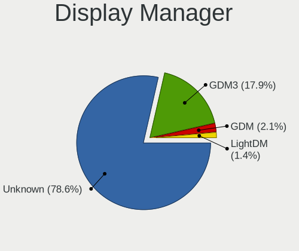
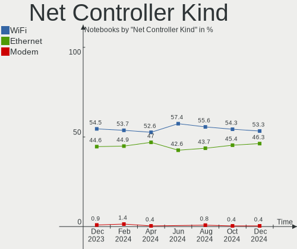
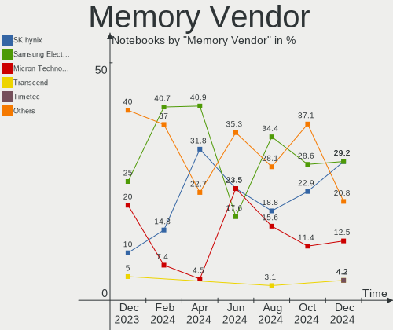

Zorin - Hardware Trends (Notebooks)
-----------------------------------

A project to identify most popular hardware characteristics and track their change
over time based on data collected by Linux users at https://Linux-Hardware.org.

Anyone can contribute to this report by the [hw-probe](https://github.com/linuxhw/hw-probe) tool:

    sudo -E hw-probe -all -upload

This report is for one last month. Overall report since the beginning of time: [TestDays](https://github.com/linuxhw/TestDays)

Period: Jul, 2023.

Contents
--------

* [ System ](#system)
  - [ OS                       ](#os)
  - [ OS Family                ](#os-family)
  - [ Kernel                   ](#kernel)
  - [ Kernel Family            ](#kernel-family)
  - [ Kernel Major Ver.        ](#kernel-major-ver)
  - [ Arch                     ](#arch)
  - [ DE                       ](#de)
  - [ Display Server           ](#display-server)
  - [ Display Manager          ](#display-manager)
  - [ OS Lang                  ](#os-lang)
  - [ Boot Mode                ](#boot-mode)
  - [ Filesystem               ](#filesystem)
  - [ Part. scheme             ](#part-scheme)
  - [ Dual Boot with Linux/BSD ](#dual-boot-with-linuxbsd)
  - [ Dual Boot (Win)          ](#dual-boot-win)

* [ Board ](#board)
  - [ Vendor                   ](#vendor)
  - [ Model                    ](#model)
  - [ Model Family             ](#model-family)
  - [ MFG Year                 ](#mfg-year)
  - [ Form Factor              ](#form-factor)
  - [ Secure Boot              ](#secure-boot)
  - [ Coreboot                 ](#coreboot)
  - [ RAM Size                 ](#ram-size)
  - [ RAM Used                 ](#ram-used)
  - [ Total Drives             ](#total-drives)
  - [ Has CD-ROM               ](#has-cd-rom)
  - [ Has Ethernet             ](#has-ethernet)
  - [ Has WiFi                 ](#has-wifi)
  - [ Has Bluetooth            ](#has-bluetooth)

* [ Location ](#location)
  - [ Country                  ](#country)
  - [ City                     ](#city)

* [ Drives ](#drives)
  - [ Drive Vendor             ](#drive-vendor)
  - [ Drive Model              ](#drive-model)
  - [ HDD Vendor               ](#hdd-vendor)
  - [ SSD Vendor               ](#ssd-vendor)
  - [ Drive Kind               ](#drive-kind)
  - [ Drive Connector          ](#drive-connector)
  - [ Drive Size               ](#drive-size)
  - [ Space Total              ](#space-total)
  - [ Space Used               ](#space-used)
  - [ Malfunc. Drives          ](#malfunc-drives)
  - [ Malfunc. Drive Vendor    ](#malfunc-drive-vendor)
  - [ Malfunc. HDD Vendor      ](#malfunc-hdd-vendor)
  - [ Malfunc. Drive Kind      ](#malfunc-drive-kind)
  - [ Failed Drives            ](#failed-drives)
  - [ Failed Drive Vendor      ](#failed-drive-vendor)
  - [ Drive Status             ](#drive-status)

* [ Storage controller ](#storage-controller)
  - [ Storage Vendor           ](#storage-vendor)
  - [ Storage Model            ](#storage-model)
  - [ Storage Kind             ](#storage-kind)

* [ Processor ](#processor)
  - [ CPU Vendor               ](#cpu-vendor)
  - [ CPU Model                ](#cpu-model)
  - [ CPU Model Family         ](#cpu-model-family)
  - [ CPU Cores                ](#cpu-cores)
  - [ CPU Sockets              ](#cpu-sockets)
  - [ CPU Threads              ](#cpu-threads)
  - [ CPU Op-Modes             ](#cpu-op-modes)
  - [ CPU Microcode            ](#cpu-microcode)
  - [ CPU Microarch            ](#cpu-microarch)

* [ Graphics ](#graphics)
  - [ GPU Vendor               ](#gpu-vendor)
  - [ GPU Model                ](#gpu-model)
  - [ GPU Combo                ](#gpu-combo)
  - [ GPU Driver               ](#gpu-driver)
  - [ GPU Memory               ](#gpu-memory)

* [ Monitor ](#monitor)
  - [ Monitor Vendor           ](#monitor-vendor)
  - [ Monitor Model            ](#monitor-model)
  - [ Monitor Resolution       ](#monitor-resolution)
  - [ Monitor Diagonal         ](#monitor-diagonal)
  - [ Monitor Width            ](#monitor-width)
  - [ Aspect Ratio             ](#aspect-ratio)
  - [ Monitor Area             ](#monitor-area)
  - [ Pixel Density            ](#pixel-density)
  - [ Multiple Monitors        ](#multiple-monitors)

* [ Network ](#network)
  - [ Net Controller Vendor    ](#net-controller-vendor)
  - [ Net Controller Model     ](#net-controller-model)
  - [ Wireless Vendor          ](#wireless-vendor)
  - [ Wireless Model           ](#wireless-model)
  - [ Ethernet Vendor          ](#ethernet-vendor)
  - [ Ethernet Model           ](#ethernet-model)
  - [ Net Controller Kind      ](#net-controller-kind)
  - [ Used Controller          ](#used-controller)
  - [ NICs                     ](#nics)
  - [ IPv6                     ](#ipv6)

* [ Bluetooth ](#bluetooth)
  - [ Bluetooth Vendor         ](#bluetooth-vendor)
  - [ Bluetooth Model          ](#bluetooth-model)

* [ Sound ](#sound)
  - [ Sound Vendor             ](#sound-vendor)
  - [ Sound Model              ](#sound-model)

* [ Memory ](#memory)
  - [ Memory Vendor            ](#memory-vendor)
  - [ Memory Model             ](#memory-model)
  - [ Memory Kind              ](#memory-kind)
  - [ Memory Form Factor       ](#memory-form-factor)
  - [ Memory Size              ](#memory-size)
  - [ Memory Speed             ](#memory-speed)

* [ Printers & scanners ](#printers--scanners)
  - [ Printer Vendor           ](#printer-vendor)
  - [ Printer Model            ](#printer-model)
  - [ Scanner Vendor           ](#scanner-vendor)
  - [ Scanner Model            ](#scanner-model)

* [ Camera ](#camera)
  - [ Camera Vendor            ](#camera-vendor)
  - [ Camera Model             ](#camera-model)

* [ Security ](#security)
  - [ Fingerprint Vendor       ](#fingerprint-vendor)
  - [ Fingerprint Model        ](#fingerprint-model)
  - [ Chipcard Vendor          ](#chipcard-vendor)
  - [ Chipcard Model           ](#chipcard-model)

* [ Unsupported ](#unsupported)
  - [ Unsupported Devices      ](#unsupported-devices)
  - [ Unsupported Device Types ](#unsupported-device-types)

System
------

OS
--

Installed operating systems

| Name     | Notebooks | Percent |
|----------|-----------|---------|
| Zorin 16 | 74        | 90.24%  |
| Zorin 15 | 8         | 9.76%   |

OS Family
---------

OS without a version

| Name  | Notebooks | Percent |
|-------|-----------|---------|
| Zorin | 82        | 100%    |

Kernel
------

Version of the Linux kernel

| Version           | Notebooks | Percent |
|-------------------|-----------|---------|
| 5.15.0-76-generic | 50        | 60.98%  |
| 5.15.0-78-generic | 13        | 15.85%  |
| 5.4.0-150-generic | 7         | 8.54%   |
| 5.15.0-73-generic | 3         | 3.66%   |
| 5.15.0-56-generic | 3         | 3.66%   |
| 5.4.0-45-generic  | 1         | 1.22%   |
| 5.15.0-75-generic | 1         | 1.22%   |
| 5.15.0-72-generic | 1         | 1.22%   |
| 5.15.0-71-generic | 1         | 1.22%   |
| 5.15.0-67-generic | 1         | 1.22%   |
| 5.15.0-60-generic | 1         | 1.22%   |

Kernel Family
-------------

Linux kernel without a distro release

| Version | Notebooks | Percent |
|---------|-----------|---------|
| 5.15.0  | 74        | 90.24%  |
| 5.4.0   | 8         | 9.76%   |

Kernel Major Ver.
-----------------

Linux kernel major version

| Version | Notebooks | Percent |
|---------|-----------|---------|
| 5.15    | 74        | 90.24%  |
| 5.4     | 8         | 9.76%   |

Arch
----

OS architecture (x86_64, i586, etc.)

| Name   | Notebooks | Percent |
|--------|-----------|---------|
| x86_64 | 78        | 95.12%  |
| i686   | 4         | 4.88%   |

DE
--

Desktop Environment

| Name    | Notebooks | Percent |
|---------|-----------|---------|
| GNOME   | 55        | 67.07%  |
| XFCE    | 24        | 29.27%  |
| KDE5    | 1         | 1.22%   |
| i3      | 1         | 1.22%   |
| Unknown | 1         | 1.22%   |

Display Server
--------------

X11 or Wayland

| Name    | Notebooks | Percent |
|---------|-----------|---------|
| X11     | 80        | 97.56%  |
| Wayland | 1         | 1.22%   |
| Unknown | 1         | 1.22%   |

Display Manager
---------------

SDDM, LightDM, etc.

| Name    | Notebooks | Percent |
|---------|-----------|---------|
| Unknown | 47        | 57.32%  |
| LightDM | 14        | 17.07%  |
| GDM3    | 11        | 13.41%  |
| GDM     | 10        | 12.2%   |

OS Lang
-------

Language

| Lang  | Notebooks | Percent |
|-------|-----------|---------|
| en_US | 30        | 36.59%  |
| pt_BR | 8         | 9.76%   |
| fr_FR | 6         | 7.32%   |
| en_GB | 6         | 7.32%   |
| it_IT | 5         | 6.1%    |
| es_ES | 5         | 6.1%    |
| sv_SE | 4         | 4.88%   |
| de_DE | 3         | 3.66%   |
| nl_BE | 2         | 2.44%   |
| es_AR | 2         | 2.44%   |
| ru_RU | 1         | 1.22%   |
| pt_PT | 1         | 1.22%   |
| pl_PL | 1         | 1.22%   |
| nl_NL | 1         | 1.22%   |
| hu_HU | 1         | 1.22%   |
| fr_BE | 1         | 1.22%   |
| es_VE | 1         | 1.22%   |
| es_CO | 1         | 1.22%   |
| en_IE | 1         | 1.22%   |
| en_AU | 1         | 1.22%   |
| cs_CZ | 1         | 1.22%   |

Boot Mode
---------

EFI or BIOS

| Mode | Notebooks | Percent |
|------|-----------|---------|
| EFI  | 46        | 56.1%   |
| BIOS | 36        | 43.9%   |

Filesystem
----------

Type of filesystem

| Type    | Notebooks | Percent |
|---------|-----------|---------|
| Ext4    | 59        | 71.95%  |
| Tmpfs   | 19        | 23.17%  |
| Zfs     | 2         | 2.44%   |
| Overlay | 1         | 1.22%   |
| Btrfs   | 1         | 1.22%   |

Part. scheme
------------

Scheme of partitioning

| Type    | Notebooks | Percent |
|---------|-----------|---------|
| Unknown | 51        | 62.2%   |
| GPT     | 22        | 26.83%  |
| MBR     | 9         | 10.98%  |

Dual Boot with Linux/BSD
------------------------

Hosting more than one Linux/BSD

| Dual boot | Notebooks | Percent |
|-----------|-----------|---------|
| No        | 79        | 96.34%  |
| Yes       | 3         | 3.66%   |

Dual Boot (Win)
---------------

Hosting Linux and Windows

| Dual boot | Notebooks | Percent |
|-----------|-----------|---------|
| No        | 71        | 86.59%  |
| Yes       | 11        | 13.41%  |

Board
-----

Vendor
------

Motherboard manufacturer

| Name                | Notebooks | Percent |
|---------------------|-----------|---------|
| Hewlett-Packard     | 24        | 29.27%  |
| Dell                | 14        | 17.07%  |
| Lenovo              | 8         | 9.76%   |
| Apple               | 7         | 8.54%   |
| ASUSTek Computer    | 6         | 7.32%   |
| Acer                | 4         | 4.88%   |
| Toshiba             | 3         | 3.66%   |
| Sony                | 2         | 2.44%   |
| MSI                 | 2         | 2.44%   |
| Samsung Electronics | 1         | 1.22%   |
| Positivo            | 1         | 1.22%   |
| OTVOC               | 1         | 1.22%   |
| Microtech           | 1         | 1.22%   |
| Medion              | 1         | 1.22%   |
| HUAWEI              | 1         | 1.22%   |
| Google              | 1         | 1.22%   |
| Digibras            | 1         | 1.22%   |
| Chuwi               | 1         | 1.22%   |
| AMI                 | 1         | 1.22%   |
| Alienware           | 1         | 1.22%   |
| Unknown             | 1         | 1.22%   |

Model
-----

Motherboard model

| Name                                       | Notebooks | Percent |
|--------------------------------------------|-----------|---------|
| HP Pavilion dv4                            | 2         | 2.44%   |
| HP 15                                      | 2         | 2.44%   |
| Apple MacBookPro9,2                        | 2         | 2.44%   |
| Acer Nitro AN515-44                        | 2         | 2.44%   |
| Toshiba Satellite L670                     | 1         | 1.22%   |
| Toshiba Satellite L50-B                    | 1         | 1.22%   |
| Toshiba QOSMIO X770                        | 1         | 1.22%   |
| Sony VPCF13Z1E                             | 1         | 1.22%   |
| Sony VPCEE23FX                             | 1         | 1.22%   |
| Samsung 300V3A/300V4A/300V5A/200A4B/200A5B | 1         | 1.22%   |
| Positivo Mobile                            | 1         | 1.22%   |
| OTVOC N1                                   | 1         | 1.22%   |
| MSI GS73VR 7RF                             | 1         | 1.22%   |
| MSI GE72MVR 7RG                            | 1         | 1.22%   |
| Microtech ebookPro                         | 1         | 1.22%   |
| Medion E15301                              | 1         | 1.22%   |
| Lenovo Yoga 3 Pro-1370 80HE                | 1         | 1.22%   |
| Lenovo ThinkPad Yoga 260 20FES3H800        | 1         | 1.22%   |
| Lenovo ThinkPad X220 4286CTO               | 1         | 1.22%   |
| Lenovo ThinkPad E15 20RD0011GE             | 1         | 1.22%   |
| Lenovo Legion Y7000P-1060 81LF             | 1         | 1.22%   |
| Lenovo IdeaPad Creator 5 15IMH05 82D4      | 1         | 1.22%   |
| Lenovo IdeaPad 330-14AST 81D5              | 1         | 1.22%   |
| Lenovo IdeaPad 1 15IGL7 82V7               | 1         | 1.22%   |
| HUAWEI RLEF-XX                             | 1         | 1.22%   |
| HP ZBook 15 G5                             | 1         | 1.22%   |
| HP ProBook 640 G1                          | 1         | 1.22%   |
| HP ProBook 450 G6                          | 1         | 1.22%   |
| HP Pavilion g7                             | 1         | 1.22%   |
| HP Pavilion g4                             | 1         | 1.22%   |
| HP Pavilion dv7                            | 1         | 1.22%   |
| HP Pavilion 15                             | 1         | 1.22%   |
| HP Notebook                                | 1         | 1.22%   |
| HP Laptop 15s-eq2xxx                       | 1         | 1.22%   |
| HP Laptop 15-dy1xxx                        | 1         | 1.22%   |
| HP ENVY m6                                 | 1         | 1.22%   |
| HP EliteBook 8560p                         | 1         | 1.22%   |
| HP EliteBook 840 G5                        | 1         | 1.22%   |
| HP EliteBook 820 G4                        | 1         | 1.22%   |
| HP EliteBook 2570p                         | 1         | 1.22%   |

Model Family
------------

Motherboard model prefix

| Name               | Notebooks | Percent |
|--------------------|-----------|---------|
| HP Pavilion        | 6         | 7.32%   |
| Dell Latitude      | 5         | 6.1%    |
| Dell Inspiron      | 5         | 6.1%    |
| HP EliteBook       | 4         | 4.88%   |
| HP Compaq          | 4         | 4.88%   |
| Lenovo ThinkPad    | 3         | 3.66%   |
| Lenovo IdeaPad     | 3         | 3.66%   |
| Toshiba Satellite  | 2         | 2.44%   |
| HP ProBook         | 2         | 2.44%   |
| HP Laptop          | 2         | 2.44%   |
| HP 15              | 2         | 2.44%   |
| Dell XPS           | 2         | 2.44%   |
| ASUS VivoBook      | 2         | 2.44%   |
| Apple MacBookPro9  | 2         | 2.44%   |
| Acer Nitro         | 2         | 2.44%   |
| Toshiba QOSMIO     | 1         | 1.22%   |
| Sony VPCF13Z1E     | 1         | 1.22%   |
| Sony VPCEE23FX     | 1         | 1.22%   |
| Samsung 300V3A     | 1         | 1.22%   |
| Positivo Mobile    | 1         | 1.22%   |
| OTVOC N1           | 1         | 1.22%   |
| MSI GS73VR         | 1         | 1.22%   |
| MSI GE72MVR        | 1         | 1.22%   |
| Microtech ebookPro | 1         | 1.22%   |
| Medion E15301      | 1         | 1.22%   |
| Lenovo Yoga        | 1         | 1.22%   |
| Lenovo Legion      | 1         | 1.22%   |
| HUAWEI RLEF-XX     | 1         | 1.22%   |
| HP ZBook           | 1         | 1.22%   |
| HP Notebook        | 1         | 1.22%   |
| HP ENVY            | 1         | 1.22%   |
| HP 530             | 1         | 1.22%   |
| Google Edgar       | 1         | 1.22%   |
| Digibras NH4CU03   | 1         | 1.22%   |
| Dell Vostro        | 1         | 1.22%   |
| Dell Precision     | 1         | 1.22%   |
| Chuwi GemiBook     | 1         | 1.22%   |
| ASUS ZenBook       | 1         | 1.22%   |
| ASUS K54C          | 1         | 1.22%   |
| ASUS K53U          | 1         | 1.22%   |

MFG Year
--------

Motherboard manufacture year

| Year    | Notebooks | Percent |
|---------|-----------|---------|
| 2018    | 9         | 10.98%  |
| 2012    | 9         | 10.98%  |
| 2011    | 9         | 10.98%  |
| 2008    | 9         | 10.98%  |
| 2013    | 8         | 9.76%   |
| 2020    | 7         | 8.54%   |
| 2022    | 4         | 4.88%   |
| 2015    | 4         | 4.88%   |
| 2019    | 3         | 3.66%   |
| 2017    | 3         | 3.66%   |
| 2016    | 3         | 3.66%   |
| 2014    | 3         | 3.66%   |
| 2010    | 3         | 3.66%   |
| 2007    | 3         | 3.66%   |
| 2021    | 2         | 2.44%   |
| 2023    | 1         | 1.22%   |
| 2009    | 1         | 1.22%   |
| Unknown | 1         | 1.22%   |

Form Factor
-----------

Physical design of the computer

| Name     | Notebooks | Percent |
|----------|-----------|---------|
| Notebook | 82        | 100%    |

Secure Boot
-----------

Enabled or disabled

| State    | Notebooks | Percent |
|----------|-----------|---------|
| Disabled | 68        | 82.93%  |
| Enabled  | 14        | 17.07%  |

Coreboot
--------

Have coreboot on board

| Used | Notebooks | Percent |
|------|-----------|---------|
| No   | 81        | 98.78%  |
| Yes  | 1         | 1.22%   |

RAM Size
--------

Total RAM memory

| Size in GB  | Notebooks | Percent |
|-------------|-----------|---------|
| 4.01-8.0    | 28        | 34.15%  |
| 3.01-4.0    | 20        | 24.39%  |
| 16.01-24.0  | 15        | 18.29%  |
| 8.01-16.0   | 11        | 13.41%  |
| 1.01-2.0    | 4         | 4.88%   |
| 32.01-64.0  | 3         | 3.66%   |
| 64.01-256.0 | 1         | 1.22%   |

RAM Used
--------

Used RAM memory

| Used GB  | Notebooks | Percent |
|----------|-----------|---------|
| 2.01-3.0 | 34        | 41.46%  |
| 1.01-2.0 | 31        | 37.8%   |
| 4.01-8.0 | 6         | 7.32%   |
| 3.01-4.0 | 6         | 7.32%   |
| 0.51-1.0 | 5         | 6.1%    |

Total Drives
------------

Number of drives on board

| Drives | Notebooks | Percent |
|--------|-----------|---------|
| 1      | 62        | 75.61%  |
| 2      | 17        | 20.73%  |
| 3      | 2         | 2.44%   |
| 5      | 1         | 1.22%   |

Has CD-ROM
----------

Has CD-ROM on board

| Presented | Notebooks | Percent |
|-----------|-----------|---------|
| No        | 45        | 54.88%  |
| Yes       | 37        | 45.12%  |

Has Ethernet
------------

Has Ethernet on board

| Presented | Notebooks | Percent |
|-----------|-----------|---------|
| Yes       | 63        | 76.83%  |
| No        | 19        | 23.17%  |

Has WiFi
--------

Has WiFi module

| Presented | Notebooks | Percent |
|-----------|-----------|---------|
| Yes       | 79        | 96.34%  |
| No        | 3         | 3.66%   |

Has Bluetooth
-------------

Has Bluetooth module

| Presented | Notebooks | Percent |
|-----------|-----------|---------|
| Yes       | 57        | 69.51%  |
| No        | 25        | 30.49%  |

Location
--------

Country
-------

Geographic location (country)

| Country     | Notebooks | Percent |
|-------------|-----------|---------|
| USA         | 19        | 23.17%  |
| Brazil      | 8         | 9.76%   |
| France      | 6         | 7.32%   |
| Spain       | 5         | 6.1%    |
| Italy       | 5         | 6.1%    |
| UK          | 4         | 4.88%   |
| Sweden      | 4         | 4.88%   |
| Netherlands | 3         | 3.66%   |
| Mexico      | 3         | 3.66%   |
| Germany     | 3         | 3.66%   |
| Belgium     | 3         | 3.66%   |
| Argentina   | 2         | 2.44%   |
| Venezuela   | 1         | 1.22%   |
| Russia      | 1         | 1.22%   |
| Portugal    | 1         | 1.22%   |
| Norway      | 1         | 1.22%   |
| Malaysia    | 1         | 1.22%   |
| Japan       | 1         | 1.22%   |
| Ireland     | 1         | 1.22%   |
| Iraq        | 1         | 1.22%   |
| Indonesia   | 1         | 1.22%   |
| Hungary     | 1         | 1.22%   |
| Guyana      | 1         | 1.22%   |
| Finland     | 1         | 1.22%   |
| Czechia     | 1         | 1.22%   |
| Colombia    | 1         | 1.22%   |
| Bangladesh  | 1         | 1.22%   |
| Austria     | 1         | 1.22%   |
| Australia   | 1         | 1.22%   |

City
----

Geographic location (city)

| City                    | Notebooks | Percent |
|-------------------------|-----------|---------|
| Lerum                   | 3         | 3.66%   |
| Sanford                 | 2         | 2.44%   |
| Puebla City             | 2         | 2.44%   |
| Los Angeles             | 2         | 2.44%   |
| Florianópolis          | 2         | 2.44%   |
| Zwijndrecht             | 1         | 1.22%   |
| Zaragoza                | 1         | 1.22%   |
| Yardley                 | 1         | 1.22%   |
| Valrico                 | 1         | 1.22%   |
| Valencia                | 1         | 1.22%   |
| Utrecht                 | 1         | 1.22%   |
| Ulm                     | 1         | 1.22%   |
| Tudela                  | 1         | 1.22%   |
| Třebíč               | 1         | 1.22%   |
| Tokyo                   | 1         | 1.22%   |
| Tallahassee             | 1         | 1.22%   |
| St Louis                | 1         | 1.22%   |
| Sao José dos Campos    | 1         | 1.22%   |
| Salerno                 | 1         | 1.22%   |
| Saint-Rémy-de-Provence | 1         | 1.22%   |
| Rio de Janeiro          | 1         | 1.22%   |
| Queluz                  | 1         | 1.22%   |
| Queige                  | 1         | 1.22%   |
| Portomaggiore           | 1         | 1.22%   |
| Porto Alegre            | 1         | 1.22%   |
| Portishead              | 1         | 1.22%   |
| Port Morris             | 1         | 1.22%   |
| Petaling Jaya           | 1         | 1.22%   |
| Peoria                  | 1         | 1.22%   |
| Oberursel               | 1         | 1.22%   |
| Newtownabbey            | 1         | 1.22%   |
| Moscow                  | 1         | 1.22%   |
| Monzon                  | 1         | 1.22%   |
| Montrouge               | 1         | 1.22%   |
| Mions                   | 1         | 1.22%   |
| Milano                  | 1         | 1.22%   |
| Miami                   | 1         | 1.22%   |
| Mexico City             | 1         | 1.22%   |
| Mendicino               | 1         | 1.22%   |
| Melbourne               | 1         | 1.22%   |

Drives
------

Drive Vendor
------------

Hard drive vendors

| Vendor                      | Notebooks | Drives | Percent |
|-----------------------------|-----------|--------|---------|
| WDC                         | 14        | 14     | 13.86%  |
| Seagate                     | 11        | 12     | 10.89%  |
| Samsung Electronics         | 10        | 10     | 9.9%    |
| Unknown                     | 9         | 10     | 8.91%   |
| Toshiba                     | 8         | 8      | 7.92%   |
| SK hynix                    | 6         | 6      | 5.94%   |
| China                       | 5         | 5      | 4.95%   |
| Apple                       | 5         | 5      | 4.95%   |
| HGST                        | 4         | 4      | 3.96%   |
| SanDisk                     | 3         | 3      | 2.97%   |
| Kingston                    | 3         | 4      | 2.97%   |
| SPCC                        | 2         | 2      | 1.98%   |
| Micron Technology           | 2         | 2      | 1.98%   |
| Intel                       | 2         | 2      | 1.98%   |
| Hitachi                     | 2         | 2      | 1.98%   |
| Crucial                     | 2         | 2      | 1.98%   |
| Wibtek                      | 1         | 1      | 0.99%   |
| UMIS                        | 1         | 1      | 0.99%   |
| Silicon Motion              | 1         | 1      | 0.99%   |
| PNY                         | 1         | 1      | 0.99%   |
| Plextor                     | 1         | 1      | 0.99%   |
| Phison                      | 1         | 1      | 0.99%   |
| Patriot                     | 1         | 1      | 0.99%   |
| Netac                       | 1         | 1      | 0.99%   |
| Microtech                   | 1         | 1      | 0.99%   |
| Micron/Crucial Technology   | 1         | 1      | 0.99%   |
| MAXIO Technology (Hangzhou) | 1         | 1      | 0.99%   |
| KIOXIA                      | 1         | 1      | 0.99%   |
| Intenso                     | 1         | 1      | 0.99%   |

Drive Model
-----------

Hard drive models

| Model                                               | Notebooks | Percent |
|-----------------------------------------------------|-----------|---------|
| Unknown MMC Card  32GB                              | 3         | 2.94%   |
| Toshiba MQ01ABD100 1TB                              | 2         | 1.96%   |
| Seagate ST9120822AS 120GB                           | 2         | 1.96%   |
| Seagate ST1000LM024 HN-M101MBB 1TB                  | 2         | 1.96%   |
| Samsung NVMe SSD Controller SM981/PM981/PM983 500GB | 2         | 1.96%   |
| Samsung HM160HI 160GB                               | 2         | 1.96%   |
| Kingston SA400S37240G 240GB SSD                     | 2         | 1.96%   |
| Wibtek W800S 512GB SSD                              | 1         | 0.98%   |
| WDC WDBNCE5000PNC 500GB SSD                         | 1         | 0.98%   |
| WDC WD5000LPVX-75V0TT0 500GB                        | 1         | 0.98%   |
| WDC WD3200BPVT-75ZEST0 320GB                        | 1         | 0.98%   |
| WDC WD3200BEKT-60F3T1 320GB                         | 1         | 0.98%   |
| WDC WD2500BEKT-60A25T1 250GB                        | 1         | 0.98%   |
| WDC WD1600BJKT-75F4T0 160GB                         | 1         | 0.98%   |
| WDC WD1600BEKT-75PVMT0 160GB                        | 1         | 0.98%   |
| WDC WD1200BEVS-60UST0 120GB                         | 1         | 0.98%   |
| WDC WD10SPZX-75Z10T1 1TB                            | 1         | 0.98%   |
| WDC WD10SPZX-21Z10T0 1TB                            | 1         | 0.98%   |
| WDC WD10SPCX-08HWST0 1TB                            | 1         | 0.98%   |
| WDC WD10JPVX-60JC3T0 1TB                            | 1         | 0.98%   |
| WDC PC SN530 SDBPNPZ-512G-1014 512GB                | 1         | 0.98%   |
| WDC PC SN520 SDAPMUW-512G-1001 512GB                | 1         | 0.98%   |
| Unknown NVMe SSD Drive 512GB                        | 1         | 0.98%   |
| Unknown MMC Card  64GB                              | 1         | 0.98%   |
| Unknown MMC Card  536GB                             | 1         | 0.98%   |
| Unknown MMC Card  394GB                             | 1         | 0.98%   |
| Unknown MMC Card  256GB                             | 1         | 0.98%   |
| Unknown MMC Card  128GB                             | 1         | 0.98%   |
| UMIS RPJTJ128MEE1MWX 128GB                          | 1         | 0.98%   |
| Toshiba THNSNJ128GCSU 128GB SSD                     | 1         | 0.98%   |
| Toshiba NVMe Controller 128GB                       | 1         | 0.98%   |
| Toshiba MQ01ABD100H 1TB                             | 1         | 0.98%   |
| Toshiba MK5065GSXN 500GB                            | 1         | 0.98%   |
| Toshiba MK3276GSX 320GB                             | 1         | 0.98%   |
| Toshiba KXG50ZNV512G NVMe 512GB                     | 1         | 0.98%   |
| SPCC Solid State Disk 512GB                         | 1         | 0.98%   |
| SPCC Solid State Disk 128GB                         | 1         | 0.98%   |
| SK hynix SKHynix_HFM512GDHTNI-87A0B 512GB           | 1         | 0.98%   |
| SK hynix SC308 SATA 512GB SSD                       | 1         | 0.98%   |
| SK hynix HFM128GD3JX016N 128GB                      | 1         | 0.98%   |

HDD Vendor
----------

Hard disk drive vendors

| Vendor              | Notebooks | Drives | Percent |
|---------------------|-----------|--------|---------|
| WDC                 | 11        | 11     | 31.43%  |
| Seagate             | 10        | 11     | 28.57%  |
| Toshiba             | 5         | 5      | 14.29%  |
| HGST                | 4         | 4      | 11.43%  |
| Samsung Electronics | 2         | 2      | 5.71%   |
| Hitachi             | 2         | 2      | 5.71%   |
| Apple               | 1         | 1      | 2.86%   |

SSD Vendor
----------

Solid state drive vendors

| Vendor              | Notebooks | Drives | Percent |
|---------------------|-----------|--------|---------|
| China               | 5         | 5      | 14.71%  |
| Samsung Electronics | 4         | 4      | 11.76%  |
| Apple               | 4         | 4      | 11.76%  |
| SanDisk             | 3         | 3      | 8.82%   |
| Kingston            | 3         | 3      | 8.82%   |
| SPCC                | 2         | 2      | 5.88%   |
| Crucial             | 2         | 2      | 5.88%   |
| Wibtek              | 1         | 1      | 2.94%   |
| WDC                 | 1         | 1      | 2.94%   |
| Toshiba             | 1         | 1      | 2.94%   |
| SK hynix            | 1         | 1      | 2.94%   |
| PNY                 | 1         | 1      | 2.94%   |
| Plextor             | 1         | 1      | 2.94%   |
| Phison              | 1         | 1      | 2.94%   |
| Patriot             | 1         | 1      | 2.94%   |
| Netac               | 1         | 1      | 2.94%   |
| Microtech           | 1         | 1      | 2.94%   |
| Intenso             | 1         | 1      | 2.94%   |

Drive Kind
----------

HDD or SSD

| Kind    | Notebooks | Drives | Percent |
|---------|-----------|--------|---------|
| HDD     | 35        | 36     | 35%     |
| SSD     | 33        | 34     | 33%     |
| NVMe    | 23        | 24     | 23%     |
| MMC     | 8         | 9      | 8%      |
| Unknown | 1         | 1      | 1%      |

Drive Connector
---------------

SATA, SAS, NVMe, etc.

| Type | Notebooks | Drives | Percent |
|------|-----------|--------|---------|
| SATA | 63        | 68     | 64.95%  |
| NVMe | 23        | 24     | 23.71%  |
| MMC  | 8         | 9      | 8.25%   |
| SAS  | 3         | 3      | 3.09%   |

Drive Size
----------

Size of hard drive

| Size in TB | Notebooks | Drives | Percent |
|------------|-----------|--------|---------|
| 0.01-0.5   | 43        | 47     | 66.15%  |
| 0.51-1.0   | 22        | 23     | 33.85%  |

Space Total
-----------

Amount of disk space available on the file system

| Size in GB | Notebooks | Percent |
|------------|-----------|---------|
| 101-250    | 37        | 45.12%  |
| 251-500    | 19        | 23.17%  |
| 501-1000   | 9         | 10.98%  |
| 1001-2000  | 7         | 8.54%   |
| 51-100     | 3         | 3.66%   |
| 21-50      | 2         | 2.44%   |
| 2001-3000  | 2         | 2.44%   |
| 1-20       | 2         | 2.44%   |
| Unknown    | 1         | 1.22%   |

Space Used
----------

Amount of used disk space

| Used GB   | Notebooks | Percent |
|-----------|-----------|---------|
| 21-50     | 33        | 40.24%  |
| 1-20      | 23        | 28.05%  |
| 101-250   | 9         | 10.98%  |
| 51-100    | 8         | 9.76%   |
| 251-500   | 3         | 3.66%   |
| 501-1000  | 3         | 3.66%   |
| 1001-2000 | 2         | 2.44%   |
| Unknown   | 1         | 1.22%   |

Malfunc. Drives
---------------

Drive models with a malfunction

| Model                           | Notebooks | Drives | Percent |
|---------------------------------|-----------|--------|---------|
| Seagate ST500LT012-1DG142 500GB | 1         | 1      | 50%     |
| HGST HTS545050A7E380 500GB      | 1         | 1      | 50%     |

Malfunc. Drive Vendor
---------------------

Vendors of faulty drives

| Vendor  | Notebooks | Drives | Percent |
|---------|-----------|--------|---------|
| Seagate | 1         | 1      | 50%     |
| HGST    | 1         | 1      | 50%     |

Malfunc. HDD Vendor
-------------------

Vendors of faulty HDD drives

| Vendor  | Notebooks | Drives | Percent |
|---------|-----------|--------|---------|
| Seagate | 1         | 1      | 50%     |
| HGST    | 1         | 1      | 50%     |

Malfunc. Drive Kind
-------------------

Kinds of faulty drives

| Kind | Notebooks | Drives | Percent |
|------|-----------|--------|---------|
| HDD  | 2         | 2      | 100%    |

Failed Drives
-------------

Failed drive models

Zero info for selected period =(

Failed Drive Vendor
-------------------

Failed drive vendors

Zero info for selected period =(

Drive Status
------------

Number of failed and malfunc. drives

| Status   | Notebooks | Drives | Percent |
|----------|-----------|--------|---------|
| Detected | 67        | 83     | 78.82%  |
| Works    | 16        | 19     | 18.82%  |
| Malfunc  | 2         | 2      | 2.35%   |

Storage controller
------------------

Storage Vendor
--------------

Storage controller vendors

| Vendor                           | Notebooks | Percent |
|----------------------------------|-----------|---------|
| Intel                            | 57        | 59.38%  |
| AMD                              | 12        | 12.5%   |
| Samsung Electronics              | 7         | 7.29%   |
| SK hynix                         | 5         | 5.21%   |
| Toshiba America Info Systems     | 2         | 2.08%   |
| SanDisk                          | 2         | 2.08%   |
| Micron Technology                | 2         | 2.08%   |
| Union Memory (Shenzhen)          | 1         | 1.04%   |
| Silicon Motion                   | 1         | 1.04%   |
| Silicon Integrated Systems [SiS] | 1         | 1.04%   |
| Nvidia                           | 1         | 1.04%   |
| Micron/Crucial Technology        | 1         | 1.04%   |
| MAXIO Technology (Hangzhou)      | 1         | 1.04%   |
| KIOXIA                           | 1         | 1.04%   |
| Kingston Technology Company      | 1         | 1.04%   |
| INNOGRIT                         | 1         | 1.04%   |

Storage Model
-------------

Storage controller models

| Model                                                                        | Notebooks | Percent |
|------------------------------------------------------------------------------|-----------|---------|
| Intel 7 Series Chipset Family 6-port SATA Controller [AHCI mode]             | 10        | 9.17%   |
| AMD FCH SATA Controller [AHCI mode]                                          | 9         | 8.26%   |
| Intel 6 Series/C200 Series Chipset Family 6 port Mobile SATA AHCI Controller | 5         | 4.59%   |
| Intel 82801HM/HEM (ICH8M/ICH8M-E) IDE Controller                             | 4         | 3.67%   |
| Intel 82801 Mobile SATA Controller [RAID mode]                               | 4         | 3.67%   |
| SK hynix Gold P31/BC711/PC711 NVMe Solid State Drive                         | 3         | 2.75%   |
| Intel Sunrise Point-LP SATA Controller [AHCI mode]                           | 3         | 2.75%   |
| Intel Celeron/Pentium Silver Processor SATA Controller                       | 3         | 2.75%   |
| Intel 82801HM/HEM (ICH8M/ICH8M-E) SATA Controller [AHCI mode]                | 3         | 2.75%   |
| Intel 8 Series SATA Controller 1 [AHCI mode]                                 | 3         | 2.75%   |
| AMD SB7x0/SB8x0/SB9x0 SATA Controller [AHCI mode]                            | 3         | 2.75%   |
| SK hynix BC511 NVMe SSD                                                      | 2         | 1.83%   |
| Samsung S4LN058A01[SSUBX] AHCI SSD Controller (Apple slot)                   | 2         | 1.83%   |
| Samsung NVMe SSD Controller SM981/PM981/PM983                                | 2         | 1.83%   |
| Intel Wildcat Point-LP SATA Controller [AHCI Mode]                           | 2         | 1.83%   |
| Intel Mobile PM965/GM965 PT IDER Controller                                  | 2         | 1.83%   |
| Intel HM170/QM170 Chipset SATA Controller [AHCI Mode]                        | 2         | 1.83%   |
| Intel Cannon Lake Mobile PCH SATA AHCI Controller                            | 2         | 1.83%   |
| Intel 82801IBM/IEM (ICH9M/ICH9M-E) 2 port SATA Controller [IDE mode]         | 2         | 1.83%   |
| Intel 5 Series/3400 Series Chipset 4 port SATA AHCI Controller               | 2         | 1.83%   |
| AMD SB7x0/SB8x0/SB9x0 IDE Controller                                         | 2         | 1.83%   |
| Union Memory (Shenzhen) AM620 PCIe 3.0 NVMe SSD 128GB                        | 1         | 0.92%   |
| Toshiba America Info Systems XG5 NVMe SSD Controller                         | 1         | 0.92%   |
| Toshiba America Info Systems XG3 NVMe SSD Controller                         | 1         | 0.92%   |
| Silicon Motion Non-Volatile memory controller                                | 1         | 0.92%   |
| Silicon Integrated Systems [SiS] SATA Controller / IDE mode                  | 1         | 0.92%   |
| Silicon Integrated Systems [SiS] 5513 IDE Controller                         | 1         | 0.92%   |
| SanDisk WD Blue SN550 NVMe SSD                                               | 1         | 0.92%   |
| SanDisk PC SN520 NVMe SSD                                                    | 1         | 0.92%   |
| Samsung S4LN053X01 AHCI SSD Controller(Apple slot)                           | 1         | 0.92%   |
| Samsung NVMe SSD Controller SM951/PM951                                      | 1         | 0.92%   |
| Samsung NVMe SSD Controller 980                                              | 1         | 0.92%   |
| Nvidia MCP78S [GeForce 8200] SATA Controller (non-AHCI mode)                 | 1         | 0.92%   |
| Nvidia MCP78S [GeForce 8200] IDE                                             | 1         | 0.92%   |
| Micron/Crucial P1 NVMe PCIe SSD[Frampton]                                    | 1         | 0.92%   |
| Micron 3400 NVMe SSD [Hendrix]                                               | 1         | 0.92%   |
| Micron 2200S NVMe SSD [Cassandra]                                            | 1         | 0.92%   |
| MAXIO (Hangzhou) NVMe SSD Controller MAP1202                                 | 1         | 0.92%   |
| KIOXIA NVMe SSD Controller BG4 (DRAM-less)                                   | 1         | 0.92%   |
| Kingston Company NV1 NVMe SSD                                                | 1         | 0.92%   |

Storage Kind
------------

Kind of storage controller (IDE, SATA, NVMe, SAS, ...)

| Kind | Notebooks | Percent |
|------|-----------|---------|
| SATA | 62        | 60.19%  |
| NVMe | 23        | 22.33%  |
| IDE  | 13        | 12.62%  |
| RAID | 5         | 4.85%   |

Processor
---------

CPU Vendor
----------

Processor vendors

| Vendor | Notebooks | Percent |
|--------|-----------|---------|
| Intel  | 67        | 81.71%  |
| AMD    | 15        | 18.29%  |

CPU Model
---------

Processor models

| Model                                       | Notebooks | Percent |
|---------------------------------------------|-----------|---------|
| Intel Core i7-7700HQ CPU @ 2.80GHz          | 2         | 2.44%   |
| Intel Core i7-4500U CPU @ 1.80GHz           | 2         | 2.44%   |
| Intel Core i5-6300U CPU @ 2.40GHz           | 2         | 2.44%   |
| Intel Core i5-3230M CPU @ 2.60GHz           | 2         | 2.44%   |
| Intel Core i5-3210M CPU @ 2.50GHz           | 2         | 2.44%   |
| Intel Core i5-2520M CPU @ 2.50GHz           | 2         | 2.44%   |
| Intel Core i3-2310M CPU @ 2.10GHz           | 2         | 2.44%   |
| Intel Atom x5-Z8350 CPU @ 1.44GHz           | 2         | 2.44%   |
| AMD Ryzen 7 4800H with Radeon Graphics      | 2         | 2.44%   |
| AMD A4-3305M APU with Radeon HD Graphics    | 2         | 2.44%   |
| Intel Pentium Silver N5000 CPU @ 1.10GHz    | 1         | 1.22%   |
| Intel Pentium Dual-Core CPU T4300 @ 2.10GHz | 1         | 1.22%   |
| Intel Pentium CPU N3710 @ 1.60GHz           | 1         | 1.22%   |
| Intel Core M-5Y71 CPU @ 1.20GHz             | 1         | 1.22%   |
| Intel Core i7-8850H CPU @ 2.60GHz           | 1         | 1.22%   |
| Intel Core i7-8750H CPU @ 2.20GHz           | 1         | 1.22%   |
| Intel Core i7-8550U CPU @ 1.80GHz           | 1         | 1.22%   |
| Intel Core i7-7600U CPU @ 2.80GHz           | 1         | 1.22%   |
| Intel Core i7-6500U CPU @ 2.50GHz           | 1         | 1.22%   |
| Intel Core i7-5557U CPU @ 3.10GHz           | 1         | 1.22%   |
| Intel Core i7-4750HQ CPU @ 2.00GHz          | 1         | 1.22%   |
| Intel Core i7-4510U CPU @ 2.00GHz           | 1         | 1.22%   |
| Intel Core i7-3740QM CPU @ 2.70GHz          | 1         | 1.22%   |
| Intel Core i7-2670QM CPU @ 2.20GHz          | 1         | 1.22%   |
| Intel Core i7-2617M CPU @ 1.50GHz           | 1         | 1.22%   |
| Intel Core i7-10510U CPU @ 1.80GHz          | 1         | 1.22%   |
| Intel Core i7 CPU Q 740 @ 1.73GHz           | 1         | 1.22%   |
| Intel Core i5-8350U CPU @ 1.70GHz           | 1         | 1.22%   |
| Intel Core i5-8265U CPU @ 1.60GHz           | 1         | 1.22%   |
| Intel Core i5-5250U CPU @ 1.60GHz           | 1         | 1.22%   |
| Intel Core i5-5200U CPU @ 2.20GHz           | 1         | 1.22%   |
| Intel Core i5-4310M CPU @ 2.70GHz           | 1         | 1.22%   |
| Intel Core i5-4300M CPU @ 2.60GHz           | 1         | 1.22%   |
| Intel Core i5-3427U CPU @ 1.80GHz           | 1         | 1.22%   |
| Intel Core i5-1035G1 CPU @ 1.00GHz          | 1         | 1.22%   |
| Intel Core i5-10300H CPU @ 2.50GHz          | 1         | 1.22%   |
| Intel Core i5 CPU M 480 @ 2.67GHz           | 1         | 1.22%   |
| Intel Core i3-3227U CPU @ 1.90GHz           | 1         | 1.22%   |
| Intel Core i3-3217U CPU @ 1.80GHz           | 1         | 1.22%   |
| Intel Core i3-2377M CPU @ 1.50GHz           | 1         | 1.22%   |

CPU Model Family
----------------

Processor model prefix

| Model                   | Notebooks | Percent |
|-------------------------|-----------|---------|
| Intel Core i5           | 18        | 21.95%  |
| Intel Core i7           | 17        | 20.73%  |
| Intel Celeron           | 8         | 9.76%   |
| Intel Core i3           | 7         | 8.54%   |
| Intel Core 2 Duo        | 7         | 8.54%   |
| Other                   | 4         | 4.88%   |
| AMD Ryzen 7             | 4         | 4.88%   |
| AMD A4                  | 3         | 3.66%   |
| Intel Atom              | 2         | 2.44%   |
| AMD Ryzen 5             | 2         | 2.44%   |
| Intel Pentium Silver    | 1         | 1.22%   |
| Intel Pentium Dual-Core | 1         | 1.22%   |
| Intel Pentium           | 1         | 1.22%   |
| Intel Core M            | 1         | 1.22%   |
| Intel Core Duo          | 1         | 1.22%   |
| AMD Turion II Dual-Core | 1         | 1.22%   |
| AMD Sempron             | 1         | 1.22%   |
| AMD E                   | 1         | 1.22%   |
| AMD Athlon II           | 1         | 1.22%   |
| AMD A8                  | 1         | 1.22%   |

CPU Cores
---------

Number of processor cores

| Number | Notebooks | Percent |
|--------|-----------|---------|
| 2      | 49        | 59.76%  |
| 4      | 23        | 28.05%  |
| 8      | 5         | 6.1%    |
| 6      | 3         | 3.66%   |
| 1      | 2         | 2.44%   |

CPU Sockets
-----------

Number of sockets

| Number | Notebooks | Percent |
|--------|-----------|---------|
| 1      | 82        | 100%    |

CPU Threads
-----------

Threads per core (Hyper-Threading)

| Number | Notebooks | Percent |
|--------|-----------|---------|
| 2      | 51        | 62.2%   |
| 1      | 31        | 37.8%   |

CPU Op-Modes
------------

CPU Operation Modes (32-bit, 64-bit)

| Op mode        | Notebooks | Percent |
|----------------|-----------|---------|
| 32-bit, 64-bit | 81        | 98.78%  |
| 32-bit         | 1         | 1.22%   |

CPU Microcode
-------------

Microcode number

| Number     | Notebooks | Percent |
|------------|-----------|---------|
| 0x306a9    | 8         | 9.76%   |
| 0x206a7    | 8         | 9.76%   |
| 0x406c4    | 4         | 4.88%   |
| 0x306d4    | 4         | 4.88%   |
| 0x6fd      | 3         | 3.66%   |
| 0x406e3    | 3         | 3.66%   |
| 0x40651    | 3         | 3.66%   |
| 0x10676    | 3         | 3.66%   |
| 0x03000027 | 3         | 3.66%   |
| 0x906ea    | 2         | 2.44%   |
| 0x906e9    | 2         | 2.44%   |
| 0x806ec    | 2         | 2.44%   |
| 0x806ea    | 2         | 2.44%   |
| 0x806c1    | 2         | 2.44%   |
| 0x706e5    | 2         | 2.44%   |
| 0x706a8    | 2         | 2.44%   |
| 0x306c3    | 2         | 2.44%   |
| 0x08600103 | 2         | 2.44%   |
| Unknown    | 2         | 2.44%   |
| 0xa0652    | 1         | 1.22%   |
| 0x906c0    | 1         | 1.22%   |
| 0x906a3    | 1         | 1.22%   |
| 0x806e9    | 1         | 1.22%   |
| 0x706a1    | 1         | 1.22%   |
| 0x6fb      | 1         | 1.22%   |
| 0x6ec      | 1         | 1.22%   |
| 0x40661    | 1         | 1.22%   |
| 0x30678    | 1         | 1.22%   |
| 0x20655    | 1         | 1.22%   |
| 0x20652    | 1         | 1.22%   |
| 0x106e5    | 1         | 1.22%   |
| 0x1067a    | 1         | 1.22%   |
| 0x10661    | 1         | 1.22%   |
| 0x0a50000d | 1         | 1.22%   |
| 0x0a404102 | 1         | 1.22%   |
| 0x08608104 | 1         | 1.22%   |
| 0x08108109 | 1         | 1.22%   |
| 0x07030104 | 1         | 1.22%   |
| 0x06006705 | 1         | 1.22%   |
| 0x05000029 | 1         | 1.22%   |

CPU Microarch
-------------

Microarchitecture

| Name             | Notebooks | Percent |
|------------------|-----------|---------|
| KabyLake         | 9         | 10.98%  |
| IvyBridge        | 9         | 10.98%  |
| SandyBridge      | 8         | 9.76%   |
| Haswell          | 6         | 7.32%   |
| Silvermont       | 5         | 6.1%    |
| Core             | 5         | 6.1%    |
| Penryn           | 4         | 4.88%   |
| Broadwell        | 4         | 4.88%   |
| Skylake          | 3         | 3.66%   |
| K10 Llano        | 3         | 3.66%   |
| Goldmont plus    | 3         | 3.66%   |
| Zen 2            | 2         | 2.44%   |
| Westmere         | 2         | 2.44%   |
| TigerLake        | 2         | 2.44%   |
| K10              | 2         | 2.44%   |
| IceLake          | 2         | 2.44%   |
| Unknown          | 2         | 2.44%   |
| Zen+             | 1         | 1.22%   |
| Zen 3            | 1         | 1.22%   |
| Tremont          | 1         | 1.22%   |
| Puma             | 1         | 1.22%   |
| P6               | 1         | 1.22%   |
| Nehalem          | 1         | 1.22%   |
| K8 & K10 hybrid  | 1         | 1.22%   |
| Excavator        | 1         | 1.22%   |
| CometLake        | 1         | 1.22%   |
| Bobcat           | 1         | 1.22%   |
| Alderlake Hybrid | 1         | 1.22%   |

Graphics
--------

GPU Vendor
----------

Vendors of graphics cards

| Vendor                           | Notebooks | Percent |
|----------------------------------|-----------|---------|
| Intel                            | 57        | 58.16%  |
| AMD                              | 21        | 21.43%  |
| Nvidia                           | 19        | 19.39%  |
| Silicon Integrated Systems [SiS] | 1         | 1.02%   |

GPU Model
---------

Graphics card models

| Model                                                                                    | Notebooks | Percent |
|------------------------------------------------------------------------------------------|-----------|---------|
| Intel 3rd Gen Core processor Graphics Controller                                         | 9         | 8.57%   |
| Intel 2nd Generation Core Processor Family Integrated Graphics Controller                | 6         | 5.71%   |
| Intel Atom/Celeron/Pentium Processor x5-E8000/J3xxx/N3xxx Integrated Graphics Controller | 4         | 3.81%   |
| Nvidia TU117M                                                                            | 3         | 2.86%   |
| Intel Skylake GT2 [HD Graphics 520]                                                      | 3         | 2.86%   |
| Intel Haswell-ULT Integrated Graphics Controller                                         | 3         | 2.86%   |
| Nvidia GP106M [GeForce GTX 1060 Mobile]                                                  | 2         | 1.9%    |
| Intel UHD Graphics 620                                                                   | 2         | 1.9%    |
| Intel TigerLake-LP GT2 [Iris Xe Graphics]                                                | 2         | 1.9%    |
| Intel Mobile GM965/GL960 Integrated Graphics Controller (secondary)                      | 2         | 1.9%    |
| Intel Mobile GM965/GL960 Integrated Graphics Controller (primary)                        | 2         | 1.9%    |
| Intel Mobile 4 Series Chipset Integrated Graphics Controller                             | 2         | 1.9%    |
| Intel Iris Plus Graphics G1 (Ice Lake)                                                   | 2         | 1.9%    |
| Intel HD Graphics 630                                                                    | 2         | 1.9%    |
| Intel GeminiLake [UHD Graphics 600]                                                      | 2         | 1.9%    |
| Intel 4th Gen Core Processor Integrated Graphics Controller                              | 2         | 1.9%    |
| AMD Topaz XT [Radeon R7 M260/M265 / M340/M360 / M440/M445 / 530/535 / 620/625 Mobile]    | 2         | 1.9%    |
| AMD SuperSumo [Radeon HD 6480G]                                                          | 2         | 1.9%    |
| AMD RS880M [Mobility Radeon HD 4225/4250]                                                | 2         | 1.9%    |
| AMD Renoir                                                                               | 2         | 1.9%    |
| Silicon Integrated Systems [SiS] 771/671 PCIE VGA Display Adapter                        | 1         | 0.95%   |
| Nvidia TU117M [GeForce MX450]                                                            | 1         | 0.95%   |
| Nvidia GP107GLM [Quadro P1000 Mobile]                                                    | 1         | 0.95%   |
| Nvidia GP104M [GeForce GTX 1070 Mobile]                                                  | 1         | 0.95%   |
| Nvidia GK208M [GeForce GT 740M]                                                          | 1         | 0.95%   |
| Nvidia GK107GLM [Quadro K1000M]                                                          | 1         | 0.95%   |
| Nvidia GF116M [GeForce GT 560M]                                                          | 1         | 0.95%   |
| Nvidia GF108M [GeForce GT 540M]                                                          | 1         | 0.95%   |
| Nvidia GF108M [GeForce GT 425M]                                                          | 1         | 0.95%   |
| Nvidia GA107M [GeForce RTX 3050 Ti Mobile]                                               | 1         | 0.95%   |
| Nvidia GA107M [GeForce RTX 3050 Mobile]                                                  | 1         | 0.95%   |
| Nvidia GA104 [GeForce RTX 3060]                                                          | 1         | 0.95%   |
| Nvidia G98M [Quadro NVS 160M]                                                            | 1         | 0.95%   |
| Nvidia G86M [GeForce 8400M GS]                                                           | 1         | 0.95%   |
| Nvidia G84M [GeForce 8600M GT]                                                           | 1         | 0.95%   |
| Nvidia C77 [GeForce 8200M G]                                                             | 1         | 0.95%   |
| Intel WhiskeyLake-U GT2 [UHD Graphics 620]                                               | 1         | 0.95%   |
| Intel Mobile 945GSE Express Integrated Graphics Controller                               | 1         | 0.95%   |
| Intel Mobile 945GM/GMS/GME, 943/940GML Express Integrated Graphics Controller            | 1         | 0.95%   |
| Intel JasperLake [UHD Graphics]                                                          | 1         | 0.95%   |

GPU Combo
---------

Combinations of graphics cards

| Name           | Notebooks | Percent |
|----------------|-----------|---------|
| 1 x Intel      | 45        | 54.88%  |
| 1 x AMD        | 10        | 12.2%   |
| Intel + Nvidia | 8         | 9.76%   |
| 1 x Nvidia     | 7         | 8.54%   |
| Intel + AMD    | 4         | 4.88%   |
| AMD + Nvidia   | 4         | 4.88%   |
| 2 x AMD        | 3         | 3.66%   |
| 1 x SiS        | 1         | 1.22%   |

GPU Driver
----------

Free vs proprietary

| Driver      | Notebooks | Percent |
|-------------|-----------|---------|
| Free        | 68        | 82.93%  |
| Proprietary | 13        | 15.85%  |
| Unknown     | 1         | 1.22%   |

GPU Memory
----------

Total video memory

| Size in GB | Notebooks | Percent |
|------------|-----------|---------|
| Unknown    | 53        | 64.63%  |
| 0.01-0.5   | 18        | 21.95%  |
| 1.01-2.0   | 6         | 7.32%   |
| 0.51-1.0   | 4         | 4.88%   |
| 3.01-4.0   | 1         | 1.22%   |

Monitor
-------

Monitor Vendor
--------------

Monitor vendors

| Vendor                  | Notebooks | Percent |
|-------------------------|-----------|---------|
| Chimei Innolux          | 17        | 18.48%  |
| AU Optronics            | 16        | 17.39%  |
| Samsung Electronics     | 13        | 14.13%  |
| BOE                     | 12        | 13.04%  |
| LG Display              | 7         | 7.61%   |
| Apple                   | 7         | 7.61%   |
| Chi Mei Optoelectronics | 4         | 4.35%   |
| LG Philips              | 2         | 2.17%   |
| Goldstar                | 2         | 2.17%   |
| Ancor Communications    | 2         | 2.17%   |
| Westinghouse            | 1         | 1.09%   |
| SNC                     | 1         | 1.09%   |
| Sharp                   | 1         | 1.09%   |
| Seiko/Epson             | 1         | 1.09%   |
| Philips                 | 1         | 1.09%   |
| MS_ Nvidia              | 1         | 1.09%   |
| Lenovo                  | 1         | 1.09%   |
| HKC                     | 1         | 1.09%   |
| BOE Technology Group    | 1         | 1.09%   |
| Unknown                 | 1         | 1.09%   |

Monitor Model
-------------

Monitor models

| Model                                                                  | Notebooks | Percent |
|------------------------------------------------------------------------|-----------|---------|
| Chimei Innolux LCD Monitor CMN1747 1920x1080 381x214mm 17.2-inch       | 2         | 2.17%   |
| Chimei Innolux LCD Monitor CMN15B6 1366x768 344x194mm 15.5-inch        | 2         | 2.17%   |
| AU Optronics LCD Monitor AUOAF90 1920x1080 344x193mm 15.5-inch         | 2         | 2.17%   |
| Westinghouse WD32HN1640 WET0316 1366x768 700x390mm 31.5-inch           | 1         | 1.09%   |
| SNC G24-001 SKP SNC2409 1920x1080 600x330mm 27.0-inch                  | 1         | 1.09%   |
| Sharp LCD Monitor SHP144A 3200x1800 294x165mm 13.3-inch                | 1         | 1.09%   |
| Seiko/Epson LCD Monitor 1280x800                                       | 1         | 1.09%   |
| Samsung Electronics T24B301 SAM098E 1920x1080 521x293mm 23.5-inch      | 1         | 1.09%   |
| Samsung Electronics LCD Monitor SEC5142 1280x800 303x190mm 14.1-inch   | 1         | 1.09%   |
| Samsung Electronics LCD Monitor SEC4E45 1280x800 331x207mm 15.4-inch   | 1         | 1.09%   |
| Samsung Electronics LCD Monitor SEC4542 1366x768 309x174mm 14.0-inch   | 1         | 1.09%   |
| Samsung Electronics LCD Monitor SEC4149 1366x768 292x174mm 13.4-inch   | 1         | 1.09%   |
| Samsung Electronics LCD Monitor SEC3358 1280x800 331x207mm 15.4-inch   | 1         | 1.09%   |
| Samsung Electronics LCD Monitor SEC3355 1366x768 293x165mm 13.2-inch   | 1         | 1.09%   |
| Samsung Electronics LCD Monitor SDC544B 1600x900 309x174mm 14.0-inch   | 1         | 1.09%   |
| Samsung Electronics LCD Monitor SDC5441 1366x768 309x174mm 14.0-inch   | 1         | 1.09%   |
| Samsung Electronics LCD Monitor SDC434A 3200x1800 293x165mm 13.2-inch  | 1         | 1.09%   |
| Samsung Electronics LCD Monitor SDC416E 2880x1620 344x194mm 15.5-inch  | 1         | 1.09%   |
| Samsung Electronics LCD Monitor SAM71A5 1920x1080 1210x680mm 54.6-inch | 1         | 1.09%   |
| Samsung Electronics 173HT02-T01 SEC5044 1920x1080 382x215mm 17.3-inch  | 1         | 1.09%   |
| Philips PHL 272S1 PHL094F 1920x1080 600x340mm 27.2-inch                | 1         | 1.09%   |
| MS_ Nvidia LCD Monitor Default Flat Panel 1920x1080                    | 1         | 1.09%   |
| LG Philips LCD Monitor LPL0132 1280x800 304x190mm 14.1-inch            | 1         | 1.09%   |
| LG Philips LCD Monitor LPL012B 1280x800 304x190mm 14.1-inch            | 1         | 1.09%   |
| LG Display LCD Monitor LGDD901 1366x768 344x194mm 15.5-inch            | 1         | 1.09%   |
| LG Display LCD Monitor LGD05CF 1920x1080 344x194mm 15.5-inch           | 1         | 1.09%   |
| LG Display LCD Monitor LGD04A3 1366x768 277x156mm 12.5-inch            | 1         | 1.09%   |
| LG Display LCD Monitor LGD045E 1366x768 310x174mm 14.0-inch            | 1         | 1.09%   |
| LG Display LCD Monitor LGD039F 1366x768 345x194mm 15.6-inch            | 1         | 1.09%   |
| LG Display LCD Monitor LGD02F1 1366x768 344x194mm 15.5-inch            | 1         | 1.09%   |
| LG Display LCD Monitor LGD01E8 1366x768 344x194mm 15.5-inch            | 1         | 1.09%   |
| Lenovo LEN T2424pA LEN60C8 1920x1080 527x296mm 23.8-inch               | 1         | 1.09%   |
| HKC LCD Monitor HKC3CFB 1920x1080 344x194mm 15.5-inch                  | 1         | 1.09%   |
| Goldstar ULTRAWIDE GSM76FA 2560x1080 531x298mm 24.0-inch               | 1         | 1.09%   |
| Goldstar ULTRAWIDE GSM59F1 2560x1080 673x284mm 28.8-inch               | 1         | 1.09%   |
| Chimei Innolux P140ZKA-BZ1 CMN8C02 2160x1440 296x197mm 14.0-inch       | 1         | 1.09%   |
| Chimei Innolux LCD Monitor CMN15E7 1920x1080 344x193mm 15.5-inch       | 1         | 1.09%   |
| Chimei Innolux LCD Monitor CMN15B1 1920x1080 344x194mm 15.5-inch       | 1         | 1.09%   |
| Chimei Innolux LCD Monitor CMN15AB 1366x768 344x194mm 15.5-inch        | 1         | 1.09%   |
| Chimei Innolux LCD Monitor CMN153C 1920x1080 344x193mm 15.5-inch       | 1         | 1.09%   |

Monitor Resolution
------------------

Monitor screen resolution

| Resolution        | Notebooks | Percent |
|-------------------|-----------|---------|
| 1366x768 (WXGA)   | 30        | 34.88%  |
| 1920x1080 (FHD)   | 26        | 30.23%  |
| 1280x800 (WXGA)   | 10        | 11.63%  |
| 1600x900 (HD+)    | 4         | 4.65%   |
| 1440x900 (WXGA+)  | 3         | 3.49%   |
| 3840x2160 (4K)    | 2         | 2.33%   |
| 3200x1800 (QHD+)  | 2         | 2.33%   |
| 2560x1080         | 2         | 2.33%   |
| 3440x1440         | 1         | 1.16%   |
| 2880x1800         | 1         | 1.16%   |
| 2880x1620         | 1         | 1.16%   |
| 2560x1600         | 1         | 1.16%   |
| 2160x1440         | 1         | 1.16%   |
| 1920x515          | 1         | 1.16%   |
| 1920x1200 (WUXGA) | 1         | 1.16%   |

Monitor Diagonal
----------------

Diagonal size in inches

| Inches  | Notebooks | Percent |
|---------|-----------|---------|
| 15      | 34        | 37.36%  |
| 13      | 17        | 18.68%  |
| 14      | 11        | 12.09%  |
| 17      | 6         | 6.59%   |
| 12      | 5         | 5.49%   |
| Unknown | 4         | 4.4%    |
| 27      | 3         | 3.3%    |
| 11      | 3         | 3.3%    |
| 54      | 2         | 2.2%    |
| 34      | 2         | 2.2%    |
| 23      | 2         | 2.2%    |
| 31      | 1         | 1.1%    |
| 16      | 1         | 1.1%    |

Monitor Width
-------------

Physical width

| Width in mm | Notebooks | Percent |
|-------------|-----------|---------|
| 301-350     | 52        | 57.14%  |
| 201-300     | 19        | 20.88%  |
| 351-400     | 6         | 6.59%   |
| 501-600     | 5         | 5.49%   |
| Unknown     | 4         | 4.4%    |
| 701-800     | 2         | 2.2%    |
| 1001-1500   | 2         | 2.2%    |
| 601-700     | 1         | 1.1%    |

Aspect Ratio
------------

Proportional relationship between the width and the height

| Ratio   | Notebooks | Percent |
|---------|-----------|---------|
| 16/9    | 60        | 71.43%  |
| 16/10   | 17        | 20.24%  |
| Unknown | 3         | 3.57%   |
| 21/9    | 2         | 2.38%   |
| 3/2     | 1         | 1.19%   |
| 3.73    | 1         | 1.19%   |

Monitor Area
------------

Area in inch²

| Area in inch² | Notebooks | Percent |
|----------------|-----------|---------|
| 101-110        | 33        | 36.26%  |
| 81-90          | 23        | 25.27%  |
| 71-80          | 5         | 5.49%   |
| 61-70          | 5         | 5.49%   |
| 121-130        | 5         | 5.49%   |
| Unknown        | 4         | 4.4%    |
| 51-60          | 3         | 3.3%    |
| 351-500        | 3         | 3.3%    |
| 301-350        | 3         | 3.3%    |
| More than 1000 | 2         | 2.2%    |
| 201-250        | 2         | 2.2%    |
| 131-140        | 1         | 1.1%    |
| 111-120        | 1         | 1.1%    |
| 91-100         | 1         | 1.1%    |

Pixel Density
-------------

Pixels per inch

| Density       | Notebooks | Percent |
|---------------|-----------|---------|
| 121-160       | 32        | 34.78%  |
| 101-120       | 32        | 34.78%  |
| 51-100        | 13        | 14.13%  |
| 161-240       | 5         | 5.43%   |
| Unknown       | 4         | 4.35%   |
| More than 240 | 3         | 3.26%   |
| 1-50          | 3         | 3.26%   |

Multiple Monitors
-----------------

Total monitors connected

| Total | Notebooks | Percent |
|-------|-----------|---------|
| 1     | 72        | 87.8%   |
| 2     | 8         | 9.76%   |
| 4     | 1         | 1.22%   |
| 0     | 1         | 1.22%   |

Network
-------

Net Controller Vendor
---------------------

Controller vendors

| Vendor                           | Notebooks | Percent |
|----------------------------------|-----------|---------|
| Realtek Semiconductor            | 35        | 27.78%  |
| Intel                            | 35        | 27.78%  |
| Qualcomm Atheros                 | 22        | 17.46%  |
| Broadcom                         | 11        | 8.73%   |
| MediaTek                         | 4         | 3.17%   |
| Broadcom Limited                 | 4         | 3.17%   |
| Ralink                           | 3         | 2.38%   |
| Marvell Technology Group         | 3         | 2.38%   |
| Dell                             | 2         | 1.59%   |
| Silicon Integrated Systems [SiS] | 1         | 0.79%   |
| Nvidia                           | 1         | 0.79%   |
| NetGear                          | 1         | 0.79%   |
| MPP Engineering                  | 1         | 0.79%   |
| Lenovo                           | 1         | 0.79%   |
| HTC (High Tech Computer)         | 1         | 0.79%   |
| DisplayLink                      | 1         | 0.79%   |

Net Controller Model
--------------------

Controller models

| Model                                                             | Notebooks | Percent |
|-------------------------------------------------------------------|-----------|---------|
| Realtek RTL8111/8168/8411 PCI Express Gigabit Ethernet Controller | 14        | 9.33%   |
| Realtek RTL810xE PCI Express Fast Ethernet controller             | 12        | 8%      |
| Qualcomm Atheros AR9485 Wireless Network Adapter                  | 5         | 3.33%   |
| Qualcomm Atheros AR9285 Wireless Network Adapter (PCI-Express)    | 5         | 3.33%   |
| Intel Wi-Fi 6 AX200                                               | 5         | 3.33%   |
| Intel 82579LM Gigabit Network Connection (Lewisville)             | 4         | 2.67%   |
| Qualcomm Atheros QCA6174 802.11ac Wireless Network Adapter        | 3         | 2%      |
| Qualcomm Atheros AR9462 Wireless Network Adapter                  | 3         | 2%      |
| Realtek RTL8821CE 802.11ac PCIe Wireless Network Adapter          | 2         | 1.33%   |
| Realtek RTL8153 Gigabit Ethernet Adapter                          | 2         | 1.33%   |
| Realtek Killer E2600 Gigabit Ethernet Controller                  | 2         | 1.33%   |
| Ralink RT5390 Wireless 802.11n 1T/1R PCIe                         | 2         | 1.33%   |
| Qualcomm Atheros QCA9565 / AR9565 Wireless Network Adapter        | 2         | 1.33%   |
| Qualcomm Atheros Killer E2500 Gigabit Ethernet Controller         | 2         | 1.33%   |
| Qualcomm Atheros AR8151 v2.0 Gigabit Ethernet                     | 2         | 1.33%   |
| Intel Wireless 8260                                               | 2         | 1.33%   |
| Intel Wireless 7265                                               | 2         | 1.33%   |
| Intel Wireless 3165                                               | 2         | 1.33%   |
| Intel PRO/Wireless 4965 AG or AGN [Kedron] Network Connection     | 2         | 1.33%   |
| Intel PRO/Wireless 3945ABG [Golan] Network Connection             | 2         | 1.33%   |
| Intel Ethernet Connection I219-LM                                 | 2         | 1.33%   |
| Intel Ethernet Connection (4) I219-LM                             | 2         | 1.33%   |
| Intel Centrino Advanced-N 6205 [Taylor Peak]                      | 2         | 1.33%   |
| Intel Cannon Lake PCH CNVi WiFi                                   | 2         | 1.33%   |
| Intel 82567LM Gigabit Network Connection                          | 2         | 1.33%   |
| Intel 82566MM Gigabit Network Connection                          | 2         | 1.33%   |
| Broadcom NetXtreme BCM57765 Gigabit Ethernet PCIe                 | 2         | 1.33%   |
| Broadcom NetLink BCM57785 Gigabit Ethernet PCIe                   | 2         | 1.33%   |
| Broadcom BCM4331 802.11a/b/g/n                                    | 2         | 1.33%   |
| Silicon Integrated Systems [SiS] 191 Gigabit Ethernet Adapter     | 1         | 0.67%   |
| Realtek RTL88x2bu [AC1200 Techkey]                                | 1         | 0.67%   |
| Realtek RTL8852BE PCIe 802.11ax Wireless Network Controller       | 1         | 0.67%   |
| Realtek RTL8822CE 802.11ac PCIe Wireless Network Adapter          | 1         | 0.67%   |
| Realtek RTL8822BE 802.11a/b/g/n/ac WiFi adapter                   | 1         | 0.67%   |
| Realtek RTL8723BE PCIe Wireless Network Adapter                   | 1         | 0.67%   |
| Realtek RTL8188EE Wireless Network Adapter                        | 1         | 0.67%   |
| Realtek RTL8188CE 802.11b/g/n WiFi Adapter                        | 1         | 0.67%   |
| Realtek RTL8187B Wireless 802.11g 54Mbps Network Adapter          | 1         | 0.67%   |
| Ralink RT3290 Wireless 802.11n 1T/1R PCIe                         | 1         | 0.67%   |
| Qualcomm Atheros AR93xx Wireless Network Adapter                  | 1         | 0.67%   |

Wireless Vendor
---------------

Wireless vendors

| Vendor                | Notebooks | Percent |
|-----------------------|-----------|---------|
| Intel                 | 32        | 39.51%  |
| Qualcomm Atheros      | 21        | 25.93%  |
| Realtek Semiconductor | 9         | 11.11%  |
| Broadcom              | 9         | 11.11%  |
| Ralink                | 3         | 3.7%    |
| Broadcom Limited      | 3         | 3.7%    |
| MediaTek              | 2         | 2.47%   |
| NetGear               | 1         | 1.23%   |
| Dell                  | 1         | 1.23%   |

Wireless Model
--------------

Wireless models

| Model                                                                     | Notebooks | Percent |
|---------------------------------------------------------------------------|-----------|---------|
| Qualcomm Atheros AR9485 Wireless Network Adapter                          | 5         | 6.1%    |
| Qualcomm Atheros AR9285 Wireless Network Adapter (PCI-Express)            | 5         | 6.1%    |
| Intel Wi-Fi 6 AX200                                                       | 5         | 6.1%    |
| Qualcomm Atheros QCA6174 802.11ac Wireless Network Adapter                | 3         | 3.66%   |
| Qualcomm Atheros AR9462 Wireless Network Adapter                          | 3         | 3.66%   |
| Realtek RTL8821CE 802.11ac PCIe Wireless Network Adapter                  | 2         | 2.44%   |
| Ralink RT5390 Wireless 802.11n 1T/1R PCIe                                 | 2         | 2.44%   |
| Qualcomm Atheros QCA9565 / AR9565 Wireless Network Adapter                | 2         | 2.44%   |
| Intel Wireless 8260                                                       | 2         | 2.44%   |
| Intel Wireless 7265                                                       | 2         | 2.44%   |
| Intel Wireless 3165                                                       | 2         | 2.44%   |
| Intel PRO/Wireless 4965 AG or AGN [Kedron] Network Connection             | 2         | 2.44%   |
| Intel PRO/Wireless 3945ABG [Golan] Network Connection                     | 2         | 2.44%   |
| Intel Centrino Advanced-N 6205 [Taylor Peak]                              | 2         | 2.44%   |
| Intel Cannon Lake PCH CNVi WiFi                                           | 2         | 2.44%   |
| Broadcom BCM4331 802.11a/b/g/n                                            | 2         | 2.44%   |
| Realtek RTL88x2bu [AC1200 Techkey]                                        | 1         | 1.22%   |
| Realtek RTL8852BE PCIe 802.11ax Wireless Network Controller               | 1         | 1.22%   |
| Realtek RTL8822CE 802.11ac PCIe Wireless Network Adapter                  | 1         | 1.22%   |
| Realtek RTL8822BE 802.11a/b/g/n/ac WiFi adapter                           | 1         | 1.22%   |
| Realtek RTL8723BE PCIe Wireless Network Adapter                           | 1         | 1.22%   |
| Realtek RTL8188EE Wireless Network Adapter                                | 1         | 1.22%   |
| Realtek RTL8188CE 802.11b/g/n WiFi Adapter                                | 1         | 1.22%   |
| Realtek RTL8187B Wireless 802.11g 54Mbps Network Adapter                  | 1         | 1.22%   |
| Ralink RT3290 Wireless 802.11n 1T/1R PCIe                                 | 1         | 1.22%   |
| Qualcomm Atheros AR93xx Wireless Network Adapter                          | 1         | 1.22%   |
| Qualcomm Atheros AR928X Wireless Network Adapter (PCI-Express)            | 1         | 1.22%   |
| Qualcomm Atheros AR242x / AR542x Wireless Network Adapter (PCI-Express)   | 1         | 1.22%   |
| NetGear Nighthawk A7000 802.11ac Wireless Adapter AC1900 [Realtek 8814AU] | 1         | 1.22%   |
| MediaTek MT7922 802.11ax PCI Express Wireless Network Adapter             | 1         | 1.22%   |
| MediaTek MT7921 802.11ax PCI Express Wireless Network Adapter             | 1         | 1.22%   |
| Intel Wireless 8265 / 8275                                                | 1         | 1.22%   |
| Intel Wireless 3160                                                       | 1         | 1.22%   |
| Intel WiFi Link 5100                                                      | 1         | 1.22%   |
| Intel Wi-Fi 6 AX210/AX211/AX411 160MHz                                    | 1         | 1.22%   |
| Intel Wi-Fi 6 AX201                                                       | 1         | 1.22%   |
| Intel PRO/Wireless 5100 AGN [Shiloh] Network Connection                   | 1         | 1.22%   |
| Intel Ice Lake-LP PCH CNVi WiFi                                           | 1         | 1.22%   |
| Intel Comet Lake PCH-LP CNVi WiFi                                         | 1         | 1.22%   |
| Intel Comet Lake PCH CNVi WiFi                                            | 1         | 1.22%   |

Ethernet Vendor
---------------

Ethernet vendors

| Vendor                           | Notebooks | Percent |
|----------------------------------|-----------|---------|
| Realtek Semiconductor            | 30        | 45.45%  |
| Intel                            | 16        | 24.24%  |
| Qualcomm Atheros                 | 5         | 7.58%   |
| Broadcom                         | 4         | 6.06%   |
| Marvell Technology Group         | 3         | 4.55%   |
| MediaTek                         | 2         | 3.03%   |
| Silicon Integrated Systems [SiS] | 1         | 1.52%   |
| Nvidia                           | 1         | 1.52%   |
| Lenovo                           | 1         | 1.52%   |
| HTC (High Tech Computer)         | 1         | 1.52%   |
| DisplayLink                      | 1         | 1.52%   |
| Broadcom Limited                 | 1         | 1.52%   |

Ethernet Model
--------------

Ethernet models

| Model                                                                | Notebooks | Percent |
|----------------------------------------------------------------------|-----------|---------|
| Realtek RTL8111/8168/8411 PCI Express Gigabit Ethernet Controller    | 14        | 21.21%  |
| Realtek RTL810xE PCI Express Fast Ethernet controller                | 12        | 18.18%  |
| Intel 82579LM Gigabit Network Connection (Lewisville)                | 4         | 6.06%   |
| Realtek RTL8153 Gigabit Ethernet Adapter                             | 2         | 3.03%   |
| Realtek Killer E2600 Gigabit Ethernet Controller                     | 2         | 3.03%   |
| Qualcomm Atheros Killer E2500 Gigabit Ethernet Controller            | 2         | 3.03%   |
| Qualcomm Atheros AR8151 v2.0 Gigabit Ethernet                        | 2         | 3.03%   |
| Intel Ethernet Connection I219-LM                                    | 2         | 3.03%   |
| Intel Ethernet Connection (4) I219-LM                                | 2         | 3.03%   |
| Intel 82567LM Gigabit Network Connection                             | 2         | 3.03%   |
| Intel 82566MM Gigabit Network Connection                             | 2         | 3.03%   |
| Broadcom NetXtreme BCM57765 Gigabit Ethernet PCIe                    | 2         | 3.03%   |
| Broadcom NetLink BCM57785 Gigabit Ethernet PCIe                      | 2         | 3.03%   |
| Silicon Integrated Systems [SiS] 191 Gigabit Ethernet Adapter        | 1         | 1.52%   |
| Qualcomm Atheros AR8121/AR8113/AR8114 Gigabit or Fast Ethernet       | 1         | 1.52%   |
| Nvidia MCP77 Ethernet                                                | 1         | 1.52%   |
| MediaTek Titan pocket                                                | 1         | 1.52%   |
| MediaTek 100026191                                                   | 1         | 1.52%   |
| Marvell Group 88E8072 PCI-E Gigabit Ethernet Controller              | 1         | 1.52%   |
| Marvell Group 88E8058 PCI-E Gigabit Ethernet Controller              | 1         | 1.52%   |
| Marvell Group 88E8057 PCI-E Gigabit Ethernet Controller              | 1         | 1.52%   |
| Lenovo USB-C Dock Ethernet                                           | 1         | 1.52%   |
| Intel Ethernet Connection I217-V                                     | 1         | 1.52%   |
| Intel Ethernet Connection I217-LM                                    | 1         | 1.52%   |
| Intel Ethernet Connection (7) I219-LM                                | 1         | 1.52%   |
| Intel 82562ET/EZ/GT/GZ - PRO/100 VE (LOM) Ethernet Controller Mobile | 1         | 1.52%   |
| HTC (High Tech Computer) MT65xx Android Phone                        | 1         | 1.52%   |
| DisplayLink USB3.0 Dual Video Dock                                   | 1         | 1.52%   |
| Broadcom Limited BCM4401-B0 100Base-TX                               | 1         | 1.52%   |

Net Controller Kind
-------------------

Ethernet, WiFi or modem

| Kind     | Notebooks | Percent |
|----------|-----------|---------|
| WiFi     | 79        | 54.86%  |
| Ethernet | 63        | 43.75%  |
| Modem    | 2         | 1.39%   |

Used Controller
---------------

Currently used network controller

| Kind     | Notebooks | Percent |
|----------|-----------|---------|
| WiFi     | 70        | 87.5%   |
| Ethernet | 10        | 12.5%   |

NICs
----

Total network controllers on board

| Total | Notebooks | Percent |
|-------|-----------|---------|
| 2     | 57        | 69.51%  |
| 1     | 23        | 28.05%  |
| 0     | 2         | 2.44%   |

IPv6
----

IPv6 vs IPv4

| Used | Notebooks | Percent |
|------|-----------|---------|
| No   | 54        | 65.85%  |
| Yes  | 28        | 34.15%  |

Bluetooth
---------

Bluetooth Vendor
----------------

Controller vendors

| Vendor                          | Notebooks | Percent |
|---------------------------------|-----------|---------|
| Intel                           | 22        | 38.6%   |
| Apple                           | 7         | 12.28%  |
| Realtek Semiconductor           | 6         | 10.53%  |
| Qualcomm Atheros Communications | 6         | 10.53%  |
| Foxconn / Hon Hai               | 5         | 8.77%   |
| Broadcom                        | 4         | 7.02%   |
| Hewlett-Packard                 | 3         | 5.26%   |
| Toshiba                         | 1         | 1.75%   |
| Ralink                          | 1         | 1.75%   |
| IMC Networks                    | 1         | 1.75%   |
| Dell                            | 1         | 1.75%   |

Bluetooth Model
---------------

Controller models

| Model                                                                               | Notebooks | Percent |
|-------------------------------------------------------------------------------------|-----------|---------|
| Intel Bluetooth wireless interface                                                  | 8         | 14.04%  |
| Intel AX200 Bluetooth                                                               | 5         | 8.77%   |
| Realtek Bluetooth Radio                                                             | 4         | 7.02%   |
| Intel Bluetooth 9460/9560 Jefferson Peak (JfP)                                      | 3         | 5.26%   |
| Intel AX201 Bluetooth                                                               | 3         | 5.26%   |
| HP Bluetooth 2.0 Interface [Broadcom BCM2045]                                       | 3         | 5.26%   |
| Apple Bluetooth USB Host Controller                                                 | 3         | 5.26%   |
| Realtek  Bluetooth 4.2 Adapter                                                      | 2         | 3.51%   |
| Qualcomm Atheros QCA61x4 Bluetooth 4.0                                              | 2         | 3.51%   |
| Qualcomm Atheros Bluetooth                                                          | 2         | 3.51%   |
| Qualcomm Atheros AR9462 Bluetooth                                                   | 2         | 3.51%   |
| Foxconn / Hon Hai Bluetooth Device                                                  | 2         | 3.51%   |
| Apple Bluetooth Host Controller                                                     | 2         | 3.51%   |
| Toshiba Askey Bluetooth Module                                                      | 1         | 1.75%   |
| Ralink RT3290 Bluetooth                                                             | 1         | 1.75%   |
| Intel Centrino Bluetooth Wireless Transceiver                                       | 1         | 1.75%   |
| Intel Centrino Advanced-N 6230 Bluetooth adapter                                    | 1         | 1.75%   |
| Intel AX210 Bluetooth                                                               | 1         | 1.75%   |
| IMC Networks Wireless_Device                                                        | 1         | 1.75%   |
| Foxconn / Hon Hai Wireless_Device                                                   | 1         | 1.75%   |
| Foxconn / Hon Hai Foxconn T77H114 BCM2070 [Single-Chip Bluetooth 2.1 + EDR Adapter] | 1         | 1.75%   |
| Foxconn / Hon Hai Broadcom BCM20702A1 Bluetooth                                     | 1         | 1.75%   |
| Dell DW375 Bluetooth Module                                                         | 1         | 1.75%   |
| Broadcom HP Portable SoftSailing                                                    | 1         | 1.75%   |
| Broadcom BCM43142 Bluetooth 4.0                                                     | 1         | 1.75%   |
| Broadcom BCM20702A0 Bluetooth 4.0                                                   | 1         | 1.75%   |
| Broadcom BCM2045A0                                                                  | 1         | 1.75%   |
| Apple Built-in Bluetooth 2.0+EDR HCI                                                | 1         | 1.75%   |
| Apple Bluetooth HCI                                                                 | 1         | 1.75%   |

Sound
-----

Sound Vendor
------------

Sound card vendors

| Vendor                           | Notebooks | Percent |
|----------------------------------|-----------|---------|
| Intel                            | 64        | 65.31%  |
| AMD                              | 16        | 16.33%  |
| Nvidia                           | 13        | 13.27%  |
| Silicon Integrated Systems [SiS] | 1         | 1.02%   |
| Realtek Semiconductor            | 1         | 1.02%   |
| PreSonus Audio Electronics       | 1         | 1.02%   |
| Lenovo                           | 1         | 1.02%   |
| BEHRINGER International          | 1         | 1.02%   |

Sound Model
-----------

Sound card models

| Model                                                                                             | Notebooks | Percent |
|---------------------------------------------------------------------------------------------------|-----------|---------|
| Intel 7 Series/C216 Chipset Family High Definition Audio Controller                               | 11        | 9.02%   |
| Intel Sunrise Point-LP HD Audio                                                                   | 6         | 4.92%   |
| Intel 6 Series/C200 Series Chipset Family High Definition Audio Controller                        | 6         | 4.92%   |
| AMD Family 17h/19h HD Audio Controller                                                            | 6         | 4.92%   |
| Intel Wildcat Point-LP High Definition Audio Controller                                           | 4         | 3.28%   |
| Intel Broadwell-U Audio Controller                                                                | 4         | 3.28%   |
| Intel 82801I (ICH9 Family) HD Audio Controller                                                    | 4         | 3.28%   |
| Intel 82801H (ICH8 Family) HD Audio Controller                                                    | 4         | 3.28%   |
| AMD FCH Azalia Controller                                                                         | 4         | 3.28%   |
| Nvidia TU107 GeForce GTX 1650 High Definition Audio Controller                                    | 3         | 2.46%   |
| Intel Haswell-ULT HD Audio Controller                                                             | 3         | 2.46%   |
| Intel Celeron/Pentium Silver Processor High Definition Audio                                      | 3         | 2.46%   |
| Intel 8 Series/C220 Series Chipset High Definition Audio Controller                               | 3         | 2.46%   |
| Intel 8 Series HD Audio Controller                                                                | 3         | 2.46%   |
| Intel 5 Series/3400 Series Chipset High Definition Audio                                          | 3         | 2.46%   |
| AMD SBx00 Azalia (Intel HDA)                                                                      | 3         | 2.46%   |
| AMD BeaverCreek HDMI Audio [Radeon HD 6500D and 6400G-6600G series]                               | 3         | 2.46%   |
| Nvidia GP106 High Definition Audio Controller                                                     | 2         | 1.64%   |
| Nvidia GF108 High Definition Audio Controller                                                     | 2         | 1.64%   |
| Intel Xeon E3-1200 v3/4th Gen Core Processor HD Audio Controller                                  | 2         | 1.64%   |
| Intel Tiger Lake-LP Smart Sound Technology Audio Controller                                       | 2         | 1.64%   |
| Intel Ice Lake-LP Smart Sound Technology Audio Controller                                         | 2         | 1.64%   |
| Intel CM238 HD Audio Controller                                                                   | 2         | 1.64%   |
| Intel Cannon Lake PCH cAVS                                                                        | 2         | 1.64%   |
| Intel Atom/Celeron/Pentium Processor x5-E8000/J3xxx/N3xxx Series High Definition Audio Controller | 2         | 1.64%   |
| AMD RS880 HDMI Audio [Radeon HD 4200 Series]                                                      | 2         | 1.64%   |
| AMD Renoir Radeon High Definition Audio Controller                                                | 2         | 1.64%   |
| Silicon Integrated Systems [SiS] Azalia Audio Controller                                          | 1         | 0.82%   |
| Realtek Semiconductor USB Audio                                                                   | 1         | 0.82%   |
| PreSonus Audio Electronics AudioBox USB 96                                                        | 1         | 0.82%   |
| Nvidia stereo controller                                                                          | 1         | 0.82%   |
| Nvidia MCP72XE/MCP72P/MCP78U/MCP78S High Definition Audio                                         | 1         | 0.82%   |
| Nvidia GP107GL High Definition Audio Controller                                                   | 1         | 0.82%   |
| Nvidia GP104 High Definition Audio Controller                                                     | 1         | 0.82%   |
| Nvidia GK107 HDMI Audio Controller                                                                | 1         | 0.82%   |
| Nvidia GF116 High Definition Audio Controller                                                     | 1         | 0.82%   |
| Nvidia GA104 High Definition Audio Controller                                                     | 1         | 0.82%   |
| Nvidia Audio device                                                                               | 1         | 0.82%   |
| Lenovo ThinkPad USB-C Dock Gen2 USB Audio                                                         | 1         | 0.82%   |
| Intel NM10/ICH7 Family High Definition Audio Controller                                           | 1         | 0.82%   |

Memory
------

Memory Vendor
-------------

Memory module vendors

| Vendor              | Notebooks | Percent |
|---------------------|-----------|---------|
| SK hynix            | 6         | 28.57%  |
| Micron Technology   | 5         | 23.81%  |
| Unknown             | 2         | 9.52%   |
| Timetec             | 1         | 4.76%   |
| Smart               | 1         | 4.76%   |
| Silicon Power       | 1         | 4.76%   |
| Samsung Electronics | 1         | 4.76%   |
| Ramaxel Technology  | 1         | 4.76%   |
| Elpida              | 1         | 4.76%   |
| Crucial             | 1         | 4.76%   |
| Unknown             | 1         | 4.76%   |

Memory Model
------------

Memory module models

| Model                                                       | Notebooks | Percent |
|-------------------------------------------------------------|-----------|---------|
| SK hynix RAM HMT351S6CFR8C-PB 4GB SODIMM DDR3 1600MT/s      | 2         | 9.52%   |
| Unknown RAM Module 4GB SODIMM DDR3                          | 1         | 4.76%   |
| Unknown RAM Module 2048MB Row Of Chips LPDDR4 4267MT/s      | 1         | 4.76%   |
| Timetec RAM S8G-1600 8GB SODIMM DDR3 1600MT/s               | 1         | 4.76%   |
| Smart RAM SMS4WEC8C1K0446FCG 8GB SODIMM DDR4 3200MT/s       | 1         | 4.76%   |
| SK hynix RAM Module 4096MB SODIMM DDR3 1600MT/s             | 1         | 4.76%   |
| SK hynix RAM Module 16GB SODIMM DDR4 2133MT/s               | 1         | 4.76%   |
| SK hynix RAM HYMP125S64CP8-S6 2GB SODIMM DDR2 800MT/s       | 1         | 4.76%   |
| SK hynix RAM HMA82GS6JJR8N-VK 16GB SODIMM DDR4 2667MT/s     | 1         | 4.76%   |
| Silicon Power RAM Module 8192MB SODIMM DDR4 2133MT/s        | 1         | 4.76%   |
| Samsung RAM M471A1G44BB0-CWE 8GB SODIMM DDR4 3200MT/s       | 1         | 4.76%   |
| Ramaxel RAM RMSA3320MJ78HAF-3200 8GB SODIMM DDR4 3200MT/s   | 1         | 4.76%   |
| Micron RAM MT62F1G32D4DR-031 WT 4GB SODIMM LPDDR5 6400MT/s  | 1         | 4.76%   |
| Micron RAM 53E2G32D4NQ-046 4GB Row Of Chips LPDDR4 4267MT/s | 1         | 4.76%   |
| Micron RAM 4ATF51264HZ-2G6E1 4GB SODIMM DDR4 2667MT/s       | 1         | 4.76%   |
| Micron RAM 4ATF1G64HZ-3G2F1 8GB SODIMM DDR4 3200MT/s        | 1         | 4.76%   |
| Micron RAM 16HTF25664HY-800G1 2048MB SODIMM DDR2 2048MT/s   | 1         | 4.76%   |
| Elpida RAM EBJ41UF8BCS0-DJ-F 4GB SODIMM DDR3 1334MT/s       | 1         | 4.76%   |
| Crucial RAM CT102464BF160B.C16 8GB SODIMM DDR3 1600MT/s     | 1         | 4.76%   |
| Unknown                                                     | 1         | 4.76%   |

Memory Kind
-----------

Memory module kinds

| Kind   | Notebooks | Percent |
|--------|-----------|---------|
| DDR4   | 8         | 40%     |
| DDR3   | 7         | 35%     |
| LPDDR4 | 2         | 10%     |
| SDRAM  | 1         | 5%      |
| LPDDR5 | 1         | 5%      |
| DDR2   | 1         | 5%      |

Memory Form Factor
------------------

Physical design of the memory module

| Name         | Notebooks | Percent |
|--------------|-----------|---------|
| SODIMM       | 18        | 90%     |
| Row Of Chips | 2         | 10%     |

Memory Size
-----------

Memory module size

| Size  | Notebooks | Percent |
|-------|-----------|---------|
| 8192  | 8         | 40%     |
| 4096  | 7         | 35%     |
| 2048  | 3         | 15%     |
| 16384 | 2         | 10%     |

Memory Speed
------------

Memory module speed

| Speed   | Notebooks | Percent |
|---------|-----------|---------|
| 1600    | 5         | 23.81%  |
| 3200    | 4         | 19.05%  |
| 4267    | 2         | 9.52%   |
| 2667    | 2         | 9.52%   |
| 2133    | 2         | 9.52%   |
| 6400    | 1         | 4.76%   |
| 2048    | 1         | 4.76%   |
| 1334    | 1         | 4.76%   |
| 800     | 1         | 4.76%   |
| 666     | 1         | 4.76%   |
| Unknown | 1         | 4.76%   |

Printers & scanners
-------------------

Printer Vendor
--------------

Printer device vendors

Zero info for selected period =(

Printer Model
-------------

Printer device models

Zero info for selected period =(

Scanner Vendor
--------------

Scanner device vendors

Zero info for selected period =(

Scanner Model
-------------

Scanner device models

Zero info for selected period =(

Camera
------

Camera Vendor
-------------

Camera device vendors

| Vendor                                 | Notebooks | Percent |
|----------------------------------------|-----------|---------|
| Chicony Electronics                    | 16        | 22.54%  |
| Microdia                               | 8         | 11.27%  |
| Cheng Uei Precision Industry (Foxlink) | 5         | 7.04%   |
| Realtek Semiconductor                  | 4         | 5.63%   |
| IMC Networks                           | 4         | 5.63%   |
| Apple                                  | 4         | 5.63%   |
| Sonix Technology                       | 3         | 4.23%   |
| Lite-On Technology                     | 3         | 4.23%   |
| Alcor Micro                            | 3         | 4.23%   |
| Syntek                                 | 2         | 2.82%   |
| Suyin                                  | 2         | 2.82%   |
| Sunplus Innovation Technology          | 2         | 2.82%   |
| Silicon Motion                         | 2         | 2.82%   |
| Quanta                                 | 2         | 2.82%   |
| Logitech                               | 2         | 2.82%   |
| Bison Electronics                      | 2         | 2.82%   |
| Y Media                                | 1         | 1.41%   |
| Samsung Electronics                    | 1         | 1.41%   |
| Primax Electronics                     | 1         | 1.41%   |
| OmniVision Technologies                | 1         | 1.41%   |
| Luxvisions Innotech Limited            | 1         | 1.41%   |
| icSpring                               | 1         | 1.41%   |
| Genesys Logic                          | 1         | 1.41%   |

Camera Model
------------

Camera device models

| Model                                                   | Notebooks | Percent |
|---------------------------------------------------------|-----------|---------|
| Lite-On HP HD Camera                                    | 3         | 4.23%   |
| Sonix USB2.0 FHD UVC WebCam                             | 2         | 2.82%   |
| Realtek Integrated_Webcam_HD                            | 2         | 2.82%   |
| Microdia Integrated_Webcam_HD                           | 2         | 2.82%   |
| Chicony Integrated Camera                               | 2         | 2.82%   |
| Chicony HD WebCam                                       | 2         | 2.82%   |
| Cheng Uei Precision Industry (Foxlink) HP Truevision HD | 2         | 2.82%   |
| Apple FaceTime HD Camera                                | 2         | 2.82%   |
| Alcor Micro USB 2.0 Camera                              | 2         | 2.82%   |
| Y Media USB Camera                                      | 1         | 1.41%   |
| Syntek USB Camera Device                                | 1         | 1.41%   |
| Syntek Integrated Camera                                | 1         | 1.41%   |
| Suyin Sony Visual Communication Camera                  | 1         | 1.41%   |
| Suyin HP Truevision HD                                  | 1         | 1.41%   |
| Sunplus Lenovo EasyCamera                               | 1         | 1.41%   |
| Sunplus Dell E5570 integrated webcam                    | 1         | 1.41%   |
| Sonix Integrated Webcam_FHD                             | 1         | 1.41%   |
| Silicon Motion WebCam SCB-1100N                         | 1         | 1.41%   |
| Silicon Motion HP Webcam                                | 1         | 1.41%   |
| Samsung Galaxy series, misc. (MTP mode)                 | 1         | 1.41%   |
| Realtek Integrated Webcam HD                            | 1         | 1.41%   |
| Realtek HD WebCam                                       | 1         | 1.41%   |
| Quanta HP HD Camera                                     | 1         | 1.41%   |
| Quanta HD User Facing                                   | 1         | 1.41%   |
| Primax HP HD Webcam [Fixed]                             | 1         | 1.41%   |
| OmniVision OV2640 Webcam                                | 1         | 1.41%   |
| Microdia Webcam Vitade AF                               | 1         | 1.41%   |
| Microdia Sonix Integrated Webcam                        | 1         | 1.41%   |
| Microdia Laptop_Integrated_Webcam_HD                    | 1         | 1.41%   |
| Microdia Laptop_Integrated_Webcam_E4HD                  | 1         | 1.41%   |
| Microdia Laptop_Integrated_Webcam_2M                    | 1         | 1.41%   |
| Microdia Dell Laptop Integrated Webcam HD               | 1         | 1.41%   |
| Luxvisions Innotech Limited HP TrueVision HD Camera     | 1         | 1.41%   |
| Logitech Webcam C270                                    | 1         | 1.41%   |
| Logitech BRIO Ultra HD Webcam                           | 1         | 1.41%   |
| IMC Networks UVC VGA Webcam                             | 1         | 1.41%   |
| IMC Networks USB2.0 HD UVC WebCam                       | 1         | 1.41%   |
| IMC Networks Integrated Camera                          | 1         | 1.41%   |
| IMC Networks HP TrueVision HD Camera                    | 1         | 1.41%   |
| icSpring camera                                         | 1         | 1.41%   |

Security
--------

Fingerprint Vendor
------------------

Fingerprint sensor vendors

| Vendor                             | Notebooks | Percent |
|------------------------------------|-----------|---------|
| Validity Sensors                   | 7         | 58.33%  |
| Realtek USB2.0 Finger Print Bridge | 2         | 16.67%  |
| AuthenTec                          | 2         | 16.67%  |
| Elan Microelectronics              | 1         | 8.33%   |

Fingerprint Model
-----------------

Fingerprint sensor models

| Model                                                                      | Notebooks | Percent |
|----------------------------------------------------------------------------|-----------|---------|
| Validity Sensors Fingerprint scanner                                       | 2         | 16.67%  |
| Realtek USB2.0 Finger Print Bridge FocalTech Fingerprint Device            | 2         | 16.67%  |
| AuthenTec AES2501 Fingerprint Sensor                                       | 2         | 16.67%  |
| Validity Sensors VFS7500 Touch Fingerprint Sensor                          | 1         | 8.33%   |
| Validity Sensors VFS495 Fingerprint Reader                                 | 1         | 8.33%   |
| Validity Sensors VFS491                                                    | 1         | 8.33%   |
| Validity Sensors VFS471 Fingerprint Reader                                 | 1         | 8.33%   |
| Validity Sensors Synaptics VFS7552 Touch Fingerprint Sensor with PurePrint | 1         | 8.33%   |
| Elan ELAN:ARM-M4                                                           | 1         | 8.33%   |

Chipcard Vendor
---------------

Chipcard module vendors

| Vendor      | Notebooks | Percent |
|-------------|-----------|---------|
| Broadcom    | 5         | 83.33%  |
| Alcor Micro | 1         | 16.67%  |

Chipcard Model
--------------

Chipcard module models

| Model                                                                        | Notebooks | Percent |
|------------------------------------------------------------------------------|-----------|---------|
| Broadcom BCM5880 Secure Applications Processor                               | 3         | 50%     |
| Broadcom BCM5880 Secure Applications Processor with fingerprint swipe sensor | 1         | 16.67%  |
| Broadcom 5880                                                                | 1         | 16.67%  |
| Alcor Micro AU9540 Smartcard Reader                                          | 1         | 16.67%  |

Unsupported
-----------

Unsupported Devices
-------------------

Total unsupported devices on board

| Total | Notebooks | Percent |
|-------|-----------|---------|
| 0     | 52        | 63.41%  |
| 1     | 27        | 32.93%  |
| 2     | 3         | 3.66%   |

Unsupported Device Types
------------------------

Types of unsupported devices

| Type                  | Notebooks | Percent |
|-----------------------|-----------|---------|
| Fingerprint reader    | 12        | 36.36%  |
| Chipcard              | 6         | 18.18%  |
| Multimedia controller | 5         | 15.15%  |
| Graphics card         | 5         | 15.15%  |
| Net/wireless          | 2         | 6.06%   |
| Dvb card              | 1         | 3.03%   |
| Card reader           | 1         | 3.03%   |
| Bluetooth             | 1         | 3.03%   |

