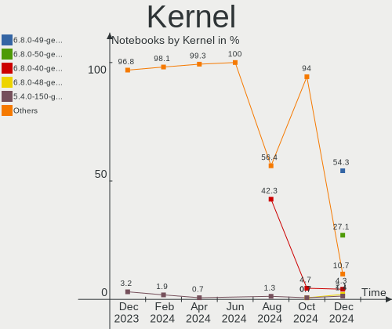
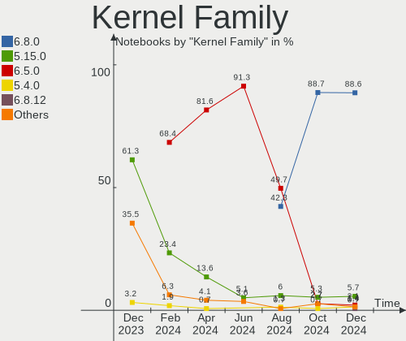
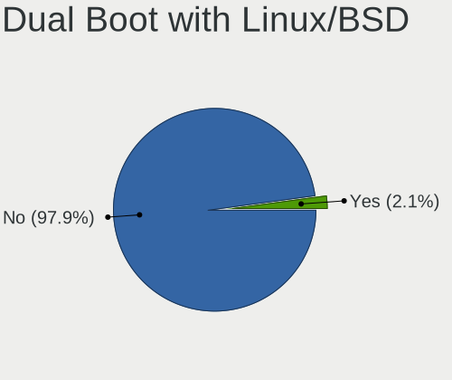
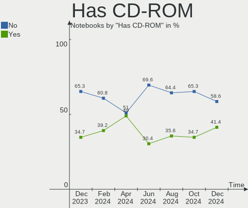
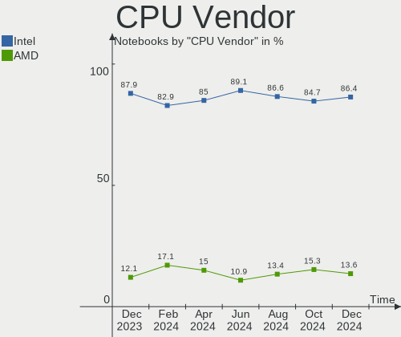
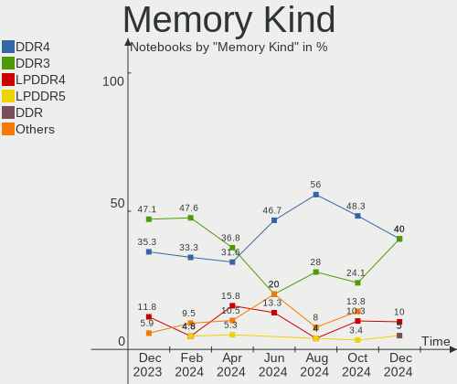

Zorin - Hardware Trends (Notebooks)
-----------------------------------

A project to identify most popular hardware characteristics and track their change
over time based on data collected by Linux users at https://Linux-Hardware.org.

Anyone can contribute to this report by the [hw-probe](https://github.com/linuxhw/hw-probe) tool:

    sudo -E hw-probe -all -upload

This report is for one last month. Overall report since the beginning of time: [TestCoverage](https://github.com/linuxhw/TestCoverage)

Period: Jun, 2022.

Contents
--------

* [ System ](#system)
  - [ OS                       ](#os)
  - [ OS Family                ](#os-family)
  - [ Kernel                   ](#kernel)
  - [ Kernel Family            ](#kernel-family)
  - [ Kernel Major Ver.        ](#kernel-major-ver)
  - [ Arch                     ](#arch)
  - [ DE                       ](#de)
  - [ Display Server           ](#display-server)
  - [ Display Manager          ](#display-manager)
  - [ OS Lang                  ](#os-lang)
  - [ Boot Mode                ](#boot-mode)
  - [ Filesystem               ](#filesystem)
  - [ Part. scheme             ](#part-scheme)
  - [ Dual Boot with Linux/BSD ](#dual-boot-with-linuxbsd)
  - [ Dual Boot (Win)          ](#dual-boot-win)

* [ Board ](#board)
  - [ Vendor                   ](#vendor)
  - [ Model                    ](#model)
  - [ Model Family             ](#model-family)
  - [ MFG Year                 ](#mfg-year)
  - [ Form Factor              ](#form-factor)
  - [ Secure Boot              ](#secure-boot)
  - [ Coreboot                 ](#coreboot)
  - [ RAM Size                 ](#ram-size)
  - [ RAM Used                 ](#ram-used)
  - [ Total Drives             ](#total-drives)
  - [ Has CD-ROM               ](#has-cd-rom)
  - [ Has Ethernet             ](#has-ethernet)
  - [ Has WiFi                 ](#has-wifi)
  - [ Has Bluetooth            ](#has-bluetooth)

* [ Location ](#location)
  - [ Country                  ](#country)
  - [ City                     ](#city)

* [ Drives ](#drives)
  - [ Drive Vendor             ](#drive-vendor)
  - [ Drive Model              ](#drive-model)
  - [ HDD Vendor               ](#hdd-vendor)
  - [ SSD Vendor               ](#ssd-vendor)
  - [ Drive Kind               ](#drive-kind)
  - [ Drive Connector          ](#drive-connector)
  - [ Drive Size               ](#drive-size)
  - [ Space Total              ](#space-total)
  - [ Space Used               ](#space-used)
  - [ Malfunc. Drives          ](#malfunc-drives)
  - [ Malfunc. Drive Vendor    ](#malfunc-drive-vendor)
  - [ Malfunc. HDD Vendor      ](#malfunc-hdd-vendor)
  - [ Malfunc. Drive Kind      ](#malfunc-drive-kind)
  - [ Failed Drives            ](#failed-drives)
  - [ Failed Drive Vendor      ](#failed-drive-vendor)
  - [ Drive Status             ](#drive-status)

* [ Storage controller ](#storage-controller)
  - [ Storage Vendor           ](#storage-vendor)
  - [ Storage Model            ](#storage-model)
  - [ Storage Kind             ](#storage-kind)

* [ Processor ](#processor)
  - [ CPU Vendor               ](#cpu-vendor)
  - [ CPU Model                ](#cpu-model)
  - [ CPU Model Family         ](#cpu-model-family)
  - [ CPU Cores                ](#cpu-cores)
  - [ CPU Sockets              ](#cpu-sockets)
  - [ CPU Threads              ](#cpu-threads)
  - [ CPU Op-Modes             ](#cpu-op-modes)
  - [ CPU Microcode            ](#cpu-microcode)
  - [ CPU Microarch            ](#cpu-microarch)

* [ Graphics ](#graphics)
  - [ GPU Vendor               ](#gpu-vendor)
  - [ GPU Model                ](#gpu-model)
  - [ GPU Combo                ](#gpu-combo)
  - [ GPU Driver               ](#gpu-driver)
  - [ GPU Memory               ](#gpu-memory)

* [ Monitor ](#monitor)
  - [ Monitor Vendor           ](#monitor-vendor)
  - [ Monitor Model            ](#monitor-model)
  - [ Monitor Resolution       ](#monitor-resolution)
  - [ Monitor Diagonal         ](#monitor-diagonal)
  - [ Monitor Width            ](#monitor-width)
  - [ Aspect Ratio             ](#aspect-ratio)
  - [ Monitor Area             ](#monitor-area)
  - [ Pixel Density            ](#pixel-density)
  - [ Multiple Monitors        ](#multiple-monitors)

* [ Network ](#network)
  - [ Net Controller Vendor    ](#net-controller-vendor)
  - [ Net Controller Model     ](#net-controller-model)
  - [ Wireless Vendor          ](#wireless-vendor)
  - [ Wireless Model           ](#wireless-model)
  - [ Ethernet Vendor          ](#ethernet-vendor)
  - [ Ethernet Model           ](#ethernet-model)
  - [ Net Controller Kind      ](#net-controller-kind)
  - [ Used Controller          ](#used-controller)
  - [ NICs                     ](#nics)
  - [ IPv6                     ](#ipv6)

* [ Bluetooth ](#bluetooth)
  - [ Bluetooth Vendor         ](#bluetooth-vendor)
  - [ Bluetooth Model          ](#bluetooth-model)

* [ Sound ](#sound)
  - [ Sound Vendor             ](#sound-vendor)
  - [ Sound Model              ](#sound-model)

* [ Memory ](#memory)
  - [ Memory Vendor            ](#memory-vendor)
  - [ Memory Model             ](#memory-model)
  - [ Memory Kind              ](#memory-kind)
  - [ Memory Form Factor       ](#memory-form-factor)
  - [ Memory Size              ](#memory-size)
  - [ Memory Speed             ](#memory-speed)

* [ Printers & scanners ](#printers--scanners)
  - [ Printer Vendor           ](#printer-vendor)
  - [ Printer Model            ](#printer-model)
  - [ Scanner Vendor           ](#scanner-vendor)
  - [ Scanner Model            ](#scanner-model)

* [ Camera ](#camera)
  - [ Camera Vendor            ](#camera-vendor)
  - [ Camera Model             ](#camera-model)

* [ Security ](#security)
  - [ Fingerprint Vendor       ](#fingerprint-vendor)
  - [ Fingerprint Model        ](#fingerprint-model)
  - [ Chipcard Vendor          ](#chipcard-vendor)
  - [ Chipcard Model           ](#chipcard-model)

* [ Unsupported ](#unsupported)
  - [ Unsupported Devices      ](#unsupported-devices)
  - [ Unsupported Device Types ](#unsupported-device-types)

System
------

OS
--

Installed operating systems

| Name     | Notebooks | Percent |
|----------|-----------|---------|
| Zorin 16 | 60        | 93.75%  |
| Zorin 15 | 4         | 6.25%   |

OS Family
---------

OS without a version

| Name  | Notebooks | Percent |
|-------|-----------|---------|
| Zorin | 64        | 100%    |

Kernel
------

Version of the Linux kernel

| Version           | Notebooks | Percent |
|-------------------|-----------|---------|
| 5.13.0-44-generic | 23        | 35.94%  |
| 5.13.0-51-generic | 15        | 23.44%  |
| 5.13.0-48-generic | 11        | 17.19%  |
| 5.4.0-120-generic | 4         | 6.25%   |
| 5.13.0-40-generic | 3         | 4.69%   |
| 5.13.0-39-generic | 3         | 4.69%   |
| 5.13.0-30-generic | 2         | 3.13%   |
| 5.13.0-41-generic | 1         | 1.56%   |
| 5.11.0-41-generic | 1         | 1.56%   |
| 5.11.0-38-generic | 1         | 1.56%   |

Kernel Family
-------------

Linux kernel without a distro release

| Version | Notebooks | Percent |
|---------|-----------|---------|
| 5.13.0  | 58        | 90.63%  |
| 5.4.0   | 4         | 6.25%   |
| 5.11.0  | 2         | 3.13%   |

Kernel Major Ver.
-----------------

Linux kernel major version

| Version | Notebooks | Percent |
|---------|-----------|---------|
| 5.13    | 58        | 90.63%  |
| 5.4     | 4         | 6.25%   |
| 5.11    | 2         | 3.13%   |

Arch
----

OS architecture (x86_64, i586, etc.)

| Name   | Notebooks | Percent |
|--------|-----------|---------|
| x86_64 | 63        | 98.44%  |
| i686   | 1         | 1.56%   |

DE
--

Desktop Environment

| Name    | Notebooks | Percent |
|---------|-----------|---------|
| GNOME   | 54        | 84.38%  |
| XFCE    | 9         | 14.06%  |
| Unknown | 1         | 1.56%   |

Display Server
--------------

X11 or Wayland

| Name    | Notebooks | Percent |
|---------|-----------|---------|
| X11     | 63        | 98.44%  |
| Wayland | 1         | 1.56%   |

Display Manager
---------------

SDDM, LightDM, etc.

| Name    | Notebooks | Percent |
|---------|-----------|---------|
| Unknown | 44        | 68.75%  |
| GDM3    | 9         | 14.06%  |
| GDM     | 7         | 10.94%  |
| LightDM | 4         | 6.25%   |

OS Lang
-------

Language

| Lang  | Notebooks | Percent |
|-------|-----------|---------|
| en_US | 20        | 31.25%  |
| de_DE | 9         | 14.06%  |
| pt_BR | 5         | 7.81%   |
| en_GB | 5         | 7.81%   |
| en_CA | 5         | 7.81%   |
| fr_FR | 4         | 6.25%   |
| pt_PT | 2         | 3.13%   |
| it_IT | 2         | 3.13%   |
| es_MX | 2         | 3.13%   |
| es_ES | 2         | 3.13%   |
| en_IN | 2         | 3.13%   |
| tr_TR | 1         | 1.56%   |
| fr_BE | 1         | 1.56%   |
| es_AR | 1         | 1.56%   |
| en_ZA | 1         | 1.56%   |
| en_NZ | 1         | 1.56%   |
| en_AU | 1         | 1.56%   |

Boot Mode
---------

EFI or BIOS

| Mode | Notebooks | Percent |
|------|-----------|---------|
| EFI  | 44        | 68.75%  |
| BIOS | 20        | 31.25%  |

Filesystem
----------

Type of filesystem

| Type    | Notebooks | Percent |
|---------|-----------|---------|
| Ext4    | 63        | 98.44%  |
| Overlay | 1         | 1.56%   |

Part. scheme
------------

Scheme of partitioning

| Type    | Notebooks | Percent |
|---------|-----------|---------|
| Unknown | 54        | 84.38%  |
| GPT     | 7         | 10.94%  |
| MBR     | 3         | 4.69%   |

Dual Boot with Linux/BSD
------------------------

Hosting more than one Linux/BSD

| Dual boot | Notebooks | Percent |
|-----------|-----------|---------|
| No        | 61        | 95.31%  |
| Yes       | 3         | 4.69%   |

Dual Boot (Win)
---------------

Hosting Linux and Windows

| Dual boot | Notebooks | Percent |
|-----------|-----------|---------|
| No        | 59        | 92.19%  |
| Yes       | 5         | 7.81%   |

Board
-----

Vendor
------

Motherboard manufacturer

| Name                    | Notebooks | Percent |
|-------------------------|-----------|---------|
| Dell                    | 15        | 23.44%  |
| Lenovo                  | 14        | 21.88%  |
| Hewlett-Packard         | 9         | 14.06%  |
| Acer                    | 4         | 6.25%   |
| Toshiba                 | 3         | 4.69%   |
| ASUSTek Computer        | 3         | 4.69%   |
| Samsung Electronics     | 2         | 3.13%   |
| Positivo                | 2         | 3.13%   |
| Fujitsu Siemens         | 2         | 3.13%   |
| TrekStor                | 1         | 1.56%   |
| Primux Tech             | 1         | 1.56%   |
| MSI                     | 1         | 1.56%   |
| Medion                  | 1         | 1.56%   |
| HUAWEI                  | 1         | 1.56%   |
| GPU Company             | 1         | 1.56%   |
| Google                  | 1         | 1.56%   |
| Global Distribution FZE | 1         | 1.56%   |
| Ematic                  | 1         | 1.56%   |
| Apple                   | 1         | 1.56%   |

Model
-----

Motherboard model

| Name                                                  | Notebooks | Percent |
|-------------------------------------------------------|-----------|---------|
| HP Pavilion Notebook                                  | 2         | 3.13%   |
| TrekStor Surfbook A13                                 | 1         | 1.56%   |
| Toshiba Satellite C870-1C2                            | 1         | 1.56%   |
| Toshiba Satellite A200                                | 1         | 1.56%   |
| Toshiba QOSMIO X770                                   | 1         | 1.56%   |
| Samsung 600B4B/600B5B                                 | 1         | 1.56%   |
| Samsung 300E5EV/300E4EV/270E5EV/270E4EV/2470EV/2470EE | 1         | 1.56%   |
| Primux Tech Primux_1402F_W10                          | 1         | 1.56%   |
| Positivo Q464C                                        | 1         | 1.56%   |
| Positivo C4500D                                       | 1         | 1.56%   |
| MSI CR620                                             | 1         | 1.56%   |
| Medion WIM2180                                        | 1         | 1.56%   |
| Lenovo Yoga710-14ISK 80TY                             | 1         | 1.56%   |
| Lenovo Yoga 3 Pro-1370 80HE                           | 1         | 1.56%   |
| Lenovo V14-IIL 82C4                                   | 1         | 1.56%   |
| Lenovo V14-ADA 82C6                                   | 1         | 1.56%   |
| Lenovo ThinkPad X220 Tablet 42984TU                   | 1         | 1.56%   |
| Lenovo ThinkPad T540p 20BF0038GE                      | 1         | 1.56%   |
| Lenovo ThinkPad T430s 23539MU                         | 1         | 1.56%   |
| Lenovo ThinkPad T420 4236J73                          | 1         | 1.56%   |
| Lenovo ThinkPad P50 20EQS28400                        | 1         | 1.56%   |
| Lenovo IdeaPad 3 14ALC6 82KT                          | 1         | 1.56%   |
| Lenovo IdeaPad 110-14IBR 80UJ                         | 1         | 1.56%   |
| Lenovo G780 2182                                      | 1         | 1.56%   |
| Lenovo G50-70 20351                                   | 1         | 1.56%   |
| Lenovo Flex 2-15 20405                                | 1         | 1.56%   |
| HUAWEI NBLK-WAX9X                                     | 1         | 1.56%   |
| HP ZBook Studio G7 Mobile Workstation                 | 1         | 1.56%   |
| HP ProBook 450 G3                                     | 1         | 1.56%   |
| HP Pavilion dv6                                       | 1         | 1.56%   |
| HP Pavilion 17                                        | 1         | 1.56%   |
| HP Laptop 15-db0xxx                                   | 1         | 1.56%   |
| HP Laptop 14-dq0xxx                                   | 1         | 1.56%   |
| HP EliteBook 840 G1                                   | 1         | 1.56%   |
| GPU Company GWTC116-2                                 | 1         | 1.56%   |
| Google Candy                                          | 1         | 1.56%   |
| Global Distribution FZE W11651                        | 1         | 1.56%   |
| Fujitsu Siemens ESPRIMO Mobile V6535                  | 1         | 1.56%   |
| Fujitsu Siemens ESPRIMO Mobile V5535                  | 1         | 1.56%   |
| Ematic EWT935DK                                       | 1         | 1.56%   |
| Dell XPS 15 9570                                      | 1         | 1.56%   |
| Dell XPS 15 9510                                      | 1         | 1.56%   |
| Dell XPS 13 9360                                      | 1         | 1.56%   |
| Dell XPS 12 9Q23                                      | 1         | 1.56%   |
| Dell Precision M4700                                  | 1         | 1.56%   |
| Dell Latitude E6540                                   | 1         | 1.56%   |
| Dell Latitude E6430                                   | 1         | 1.56%   |
| Dell Latitude E6400                                   | 1         | 1.56%   |
| Dell Inspiron N5010                                   | 1         | 1.56%   |
| Dell Inspiron 5537                                    | 1         | 1.56%   |
| Dell Inspiron 5520                                    | 1         | 1.56%   |
| Dell Inspiron 3531                                    | 1         | 1.56%   |
| Dell Inspiron 3521                                    | 1         | 1.56%   |
| Dell Inspiron 15-5578                                 | 1         | 1.56%   |
| Dell Inspiron 11-3168                                 | 1         | 1.56%   |
| ASUS ZenBook UX392FN_UX392FN                          | 1         | 1.56%   |
| ASUS X540LJ                                           | 1         | 1.56%   |
| ASUS ASUS TUF Gaming F15 FX506HCB_FX506HCB            | 1         | 1.56%   |
| Apple MacBook2,1                                      | 1         | 1.56%   |
| Acer Swift SF314-54                                   | 1         | 1.56%   |

Model Family
------------

Motherboard model prefix

| Name                           | Notebooks | Percent |
|--------------------------------|-----------|---------|
| Dell Inspiron                  | 7         | 10.94%  |
| Lenovo ThinkPad                | 5         | 7.81%   |
| HP Pavilion                    | 4         | 6.25%   |
| Dell XPS                       | 4         | 6.25%   |
| Dell Latitude                  | 3         | 4.69%   |
| Acer Aspire                    | 3         | 4.69%   |
| Toshiba Satellite              | 2         | 3.13%   |
| Lenovo IdeaPad                 | 2         | 3.13%   |
| HP Laptop                      | 2         | 3.13%   |
| Fujitsu Siemens ESPRIMO        | 2         | 3.13%   |
| TrekStor Surfbook              | 1         | 1.56%   |
| Toshiba QOSMIO                 | 1         | 1.56%   |
| Samsung 600B4B                 | 1         | 1.56%   |
| Samsung 300E5EV                | 1         | 1.56%   |
| Primux Tech Primux             | 1         | 1.56%   |
| Positivo Q464C                 | 1         | 1.56%   |
| Positivo C4500D                | 1         | 1.56%   |
| MSI CR620                      | 1         | 1.56%   |
| Medion WIM2180                 | 1         | 1.56%   |
| Lenovo Yoga710-14ISK           | 1         | 1.56%   |
| Lenovo Yoga                    | 1         | 1.56%   |
| Lenovo V14-IIL                 | 1         | 1.56%   |
| Lenovo V14-ADA                 | 1         | 1.56%   |
| Lenovo G780                    | 1         | 1.56%   |
| Lenovo G50-70                  | 1         | 1.56%   |
| Lenovo Flex                    | 1         | 1.56%   |
| HUAWEI NBLK-WAX9X              | 1         | 1.56%   |
| HP ZBook                       | 1         | 1.56%   |
| HP ProBook                     | 1         | 1.56%   |
| HP EliteBook                   | 1         | 1.56%   |
| GPU Company GWTC116-2          | 1         | 1.56%   |
| Google Candy                   | 1         | 1.56%   |
| Global Distribution FZE W11651 | 1         | 1.56%   |
| Ematic EWT935DK                | 1         | 1.56%   |
| Dell Precision                 | 1         | 1.56%   |
| ASUS ZenBook                   | 1         | 1.56%   |
| ASUS X540LJ                    | 1         | 1.56%   |
| ASUS ASUS                      | 1         | 1.56%   |
| Apple MacBook2                 | 1         | 1.56%   |
| Acer Swift                     | 1         | 1.56%   |

MFG Year
--------

Motherboard manufacture year

| Year | Notebooks | Percent |
|------|-----------|---------|
| 2012 | 8         | 12.5%   |
| 2013 | 7         | 10.94%  |
| 2020 | 6         | 9.38%   |
| 2019 | 5         | 7.81%   |
| 2015 | 5         | 7.81%   |
| 2021 | 4         | 6.25%   |
| 2018 | 4         | 6.25%   |
| 2017 | 4         | 6.25%   |
| 2014 | 4         | 6.25%   |
| 2008 | 4         | 6.25%   |
| 2016 | 3         | 4.69%   |
| 2011 | 3         | 4.69%   |
| 2010 | 3         | 4.69%   |
| 2007 | 3         | 4.69%   |
| 2022 | 1         | 1.56%   |

Form Factor
-----------

Physical design of the computer

| Name     | Notebooks | Percent |
|----------|-----------|---------|
| Notebook | 64        | 100%    |

Secure Boot
-----------

Enabled or disabled

| State    | Notebooks | Percent |
|----------|-----------|---------|
| Disabled | 52        | 81.25%  |
| Enabled  | 12        | 18.75%  |

Coreboot
--------

Have coreboot on board

| Used | Notebooks | Percent |
|------|-----------|---------|
| No   | 63        | 98.44%  |
| Yes  | 1         | 1.56%   |

RAM Size
--------

Total RAM memory

| Size in GB | Notebooks | Percent |
|------------|-----------|---------|
| 4.01-8.0   | 26        | 40.63%  |
| 3.01-4.0   | 18        | 28.13%  |
| 8.01-16.0  | 7         | 10.94%  |
| 16.01-24.0 | 5         | 7.81%   |
| 32.01-64.0 | 3         | 4.69%   |
| 1.01-2.0   | 3         | 4.69%   |
| 2.01-3.0   | 1         | 1.56%   |
| 0.51-1.0   | 1         | 1.56%   |

RAM Used
--------

Used RAM memory

| Used GB   | Notebooks | Percent |
|-----------|-----------|---------|
| 1.01-2.0  | 29        | 45.31%  |
| 2.01-3.0  | 17        | 26.56%  |
| 3.01-4.0  | 10        | 15.63%  |
| 4.01-8.0  | 5         | 7.81%   |
| 0.51-1.0  | 2         | 3.13%   |
| 8.01-16.0 | 1         | 1.56%   |

Total Drives
------------

Number of drives on board

| Drives | Notebooks | Percent |
|--------|-----------|---------|
| 1      | 47        | 73.44%  |
| 2      | 13        | 20.31%  |
| 3      | 4         | 6.25%   |

Has CD-ROM
----------

Has CD-ROM on board

| Presented | Notebooks | Percent |
|-----------|-----------|---------|
| No        | 36        | 56.25%  |
| Yes       | 28        | 43.75%  |

Has Ethernet
------------

Has Ethernet on board

| Presented | Notebooks | Percent |
|-----------|-----------|---------|
| Yes       | 40        | 62.5%   |
| No        | 24        | 37.5%   |

Has WiFi
--------

Has WiFi module

| Presented | Notebooks | Percent |
|-----------|-----------|---------|
| Yes       | 60        | 93.75%  |
| No        | 4         | 6.25%   |

Has Bluetooth
-------------

Has Bluetooth module

| Presented | Notebooks | Percent |
|-----------|-----------|---------|
| Yes       | 45        | 70.31%  |
| No        | 19        | 29.69%  |

Location
--------

Country
-------

Geographic location (country)

| Country             | Notebooks | Percent |
|---------------------|-----------|---------|
| USA                 | 13        | 20.31%  |
| Germany             | 9         | 14.06%  |
| Canada              | 5         | 7.81%   |
| Brazil              | 5         | 7.81%   |
| UK                  | 4         | 6.25%   |
| France              | 3         | 4.69%   |
| Switzerland         | 2         | 3.13%   |
| Spain               | 2         | 3.13%   |
| South Africa        | 2         | 3.13%   |
| Portugal            | 2         | 3.13%   |
| Netherlands         | 2         | 3.13%   |
| Mexico              | 2         | 3.13%   |
| Italy               | 2         | 3.13%   |
| India               | 2         | 3.13%   |
| U.S. Virgin Islands | 1         | 1.56%   |
| Turkey              | 1         | 1.56%   |
| Poland              | 1         | 1.56%   |
| Norway              | 1         | 1.56%   |
| New Zealand         | 1         | 1.56%   |
| Chile               | 1         | 1.56%   |
| Belgium             | 1         | 1.56%   |
| Australia           | 1         | 1.56%   |
| Argentina           | 1         | 1.56%   |

City
----

Geographic location (city)

| City                | Notebooks | Percent |
|---------------------|-----------|---------|
| Frankfurt am Main   | 2         | 3.13%   |
| Zurich              | 1         | 1.56%   |
| Washington          | 1         | 1.56%   |
| Warren              | 1         | 1.56%   |
| Vicosa do Ceara     | 1         | 1.56%   |
| Toronto             | 1         | 1.56%   |
| Subingen            | 1         | 1.56%   |
| St Helens           | 1         | 1.56%   |
| Solingen            | 1         | 1.56%   |
| Sherbrooke          | 1         | 1.56%   |
| Seattle             | 1         | 1.56%   |
| Schenectady         | 1         | 1.56%   |
| Sarpsborg           | 1         | 1.56%   |
| Rome                | 1         | 1.56%   |
| Reno                | 1         | 1.56%   |
| Puyallup            | 1         | 1.56%   |
| Providencia         | 1         | 1.56%   |
| Portland            | 1         | 1.56%   |
| Port Elizabeth      | 1         | 1.56%   |
| Phoenix             | 1         | 1.56%   |
| Oeversee            | 1         | 1.56%   |
| Ochten              | 1         | 1.56%   |
| Oceanside           | 1         | 1.56%   |
| New York            | 1         | 1.56%   |
| Muriaé             | 1         | 1.56%   |
| Mossoro             | 1         | 1.56%   |
| Montreal            | 1         | 1.56%   |
| Mönchengladbach    | 1         | 1.56%   |
| Magnesia ad Sipylum | 1         | 1.56%   |
| Lincoln             | 1         | 1.56%   |
| Leganés            | 1         | 1.56%   |
| La Louvière        | 1         | 1.56%   |
| Kurukshetra         | 1         | 1.56%   |
| Krakow              | 1         | 1.56%   |
| Kingston            | 1         | 1.56%   |
| Johannesburg        | 1         | 1.56%   |
| Ixtapaluca          | 1         | 1.56%   |
| Hilversum           | 1         | 1.56%   |
| Hanover             | 1         | 1.56%   |
| Hamburg             | 1         | 1.56%   |
| Guadalajara         | 1         | 1.56%   |
| Galliate            | 1         | 1.56%   |
| Funchal             | 1         | 1.56%   |
| Floirac             | 1         | 1.56%   |
| Fanzeres            | 1         | 1.56%   |
| Elkton              | 1         | 1.56%   |
| East Meadow         | 1         | 1.56%   |
| Düren              | 1         | 1.56%   |
| Duncan              | 1         | 1.56%   |
| Coimbatore          | 1         | 1.56%   |
| Ciudadela           | 1         | 1.56%   |
| Charlotte Amalie    | 1         | 1.56%   |
| Charlotte           | 1         | 1.56%   |
| Cabo Frio           | 1         | 1.56%   |
| Bocholt             | 1         | 1.56%   |
| Blackpool           | 1         | 1.56%   |
| Bilbao              | 1         | 1.56%   |
| Balwyn North        | 1         | 1.56%   |
| Avranches           | 1         | 1.56%   |
| Auckland            | 1         | 1.56%   |

Drives
------

Drive Vendor
------------

Hard drive vendors

| Vendor              | Notebooks | Drives | Percent |
|---------------------|-----------|--------|---------|
| Samsung Electronics | 12        | 14     | 15.38%  |
| Unknown             | 11        | 13     | 14.1%   |
| Seagate             | 8         | 10     | 10.26%  |
| WDC                 | 6         | 6      | 7.69%   |
| Toshiba             | 6         | 6      | 7.69%   |
| Kingston            | 5         | 5      | 6.41%   |
| SanDisk             | 4         | 4      | 5.13%   |
| Intel               | 4         | 4      | 5.13%   |
| Crucial             | 4         | 4      | 5.13%   |
| Team                | 2         | 2      | 2.56%   |
| SK hynix            | 2         | 2      | 2.56%   |
| OCZ                 | 2         | 2      | 2.56%   |
| China               | 2         | 2      | 2.56%   |
| S3+                 | 1         | 1      | 1.28%   |
| Netac               | 1         | 1      | 1.28%   |
| Mushkin             | 1         | 1      | 1.28%   |
| LITEON              | 1         | 1      | 1.28%   |
| Lexar               | 1         | 1      | 1.28%   |
| HS-SSD-C100         | 1         | 1      | 1.28%   |
| HGST                | 1         | 1      | 1.28%   |
| Fujitsu             | 1         | 1      | 1.28%   |
| ASMT                | 1         | 1      | 1.28%   |
| AS201               | 1         | 1      | 1.28%   |

Drive Model
-----------

Hard drive models

| Model                                 | Notebooks | Percent |
|---------------------------------------|-----------|---------|
| Seagate Expansion 1TB                 | 3         | 3.57%   |
| Samsung NVMe SSD Drive 1024GB         | 3         | 3.57%   |
| Unknown NCard  32GB                   | 2         | 2.38%   |
| Unknown MMC Card  64GB                | 2         | 2.38%   |
| Unknown MMC Card  32GB                | 2         | 2.38%   |
| Unknown MMC Card  16GB                | 2         | 2.38%   |
| Unknown MMC Card  128GB               | 2         | 2.38%   |
| Kingston SA400S37120G 120GB SSD       | 2         | 2.38%   |
| WDC WD5000LPCX-24VHAT0 500GB          | 1         | 1.19%   |
| WDC WD5000BPVT-00A1YT0 500GB          | 1         | 1.19%   |
| WDC WD5000BEVT-22A0RT0 500GB          | 1         | 1.19%   |
| WDC WD3200BEVT-22ZCT0 320GB           | 1         | 1.19%   |
| WDC WD1200BEVS-22UST0 120GB           | 1         | 1.19%   |
| WDC WD10JPVT-55A1YT0 1TB              | 1         | 1.19%   |
| Unknown SLD64G  64GB                  | 1         | 1.19%   |
| Unknown SA08G  8GB                    | 1         | 1.19%   |
| Unknown MMC Card  393GB               | 1         | 1.19%   |
| Toshiba THNSNF128GMCS 128GB SSD       | 1         | 1.19%   |
| Toshiba MQ01ACF050 500GB              | 1         | 1.19%   |
| Toshiba MQ01ACF032 320GB              | 1         | 1.19%   |
| Toshiba MQ01ABD100 1TB                | 1         | 1.19%   |
| Toshiba MK7559GSXP 752GB              | 1         | 1.19%   |
| Toshiba KBG30ZMS128G 128GB NVMe SSD   | 1         | 1.19%   |
| Team T253X6512G 512GB SSD             | 1         | 1.19%   |
| Team T2535T240G 240GB SSD             | 1         | 1.19%   |
| SK hynix HFS256G39MND-3310A 256GB SSD | 1         | 1.19%   |
| SK hynix HFS256G38MNB-2200A 256GB SSD | 1         | 1.19%   |
| Seagate ST500LT012-1DG142 500GB       | 1         | 1.19%   |
| Seagate ST500LM021-1KJ152 500GB       | 1         | 1.19%   |
| Seagate ST500LM000-SSHD-8GB           | 1         | 1.19%   |
| Seagate ST1000LM035-1RK172 1TB        | 1         | 1.19%   |
| Seagate ST1000LM014-1EJ164-SSHD 1TB   | 1         | 1.19%   |
| Seagate One Touch HDD 5TB             | 1         | 1.19%   |
| Seagate Backup+ Hub BK 8TB            | 1         | 1.19%   |
| SanDisk SD7TN3Q-256G-1006 256GB SSD   | 1         | 1.19%   |
| SanDisk NVMe SSD Drive 256GB          | 1         | 1.19%   |
| SanDisk NVMe SSD Drive 1TB            | 1         | 1.19%   |
| SanDisk NVMe SSD Drive 128GB          | 1         | 1.19%   |
| Samsung SSD PM830 mSATA 256GB         | 1         | 1.19%   |
| Samsung SSD 860 EVO 250GB             | 1         | 1.19%   |
| Samsung SSD 850 EVO 500GB             | 1         | 1.19%   |
| Samsung SSD 850 EVO 250GB             | 1         | 1.19%   |
| Samsung SSD 840 Series 500GB          | 1         | 1.19%   |
| Samsung SSD 750 EVO 250GB             | 1         | 1.19%   |
| Samsung NVMe SSD Drive 512GB          | 1         | 1.19%   |
| Samsung NVMe SSD Drive 2TB            | 1         | 1.19%   |
| Samsung MZVLB512HAJQ-00000 512GB      | 1         | 1.19%   |
| Samsung MZMPC256HBGJ-000H1 256GB SSD  | 1         | 1.19%   |
| Samsung MZ7PD256HCGM-000H7 256GB SSD  | 1         | 1.19%   |
| S3+ S3SSDC256 256GB                   | 1         | 1.19%   |
| OCZ VERTEX4 256GB SSD                 | 1         | 1.19%   |
| OCZ TRION150 240GB SSD                | 1         | 1.19%   |
| Netac SSD 1TB                         | 1         | 1.19%   |
| Mushkin MKNSSDTR480GB                 | 1         | 1.19%   |
| LITEON L8H-128V2G-HP 128GB SSD        | 1         | 1.19%   |
| Lexar 256GB SSD                       | 1         | 1.19%   |
| Kingston SV200S364G 64GB SSD          | 1         | 1.19%   |
| Kingston SUV400S37240G 240GB SSD      | 1         | 1.19%   |
| Kingston OM8PCP3512F-AA 512GB         | 1         | 1.19%   |
| Intel SSDSC2BF240A4H 240GB            | 1         | 1.19%   |

HDD Vendor
----------

Hard disk drive vendors

| Vendor  | Notebooks | Drives | Percent |
|---------|-----------|--------|---------|
| Seagate | 8         | 10     | 38.1%   |
| WDC     | 6         | 6      | 28.57%  |
| Toshiba | 4         | 4      | 19.05%  |
| HGST    | 1         | 1      | 4.76%   |
| Fujitsu | 1         | 1      | 4.76%   |
| ASMT    | 1         | 1      | 4.76%   |

SSD Vendor
----------

Solid state drive vendors

| Vendor              | Notebooks | Drives | Percent |
|---------------------|-----------|--------|---------|
| Samsung Electronics | 7         | 8      | 21.21%  |
| Kingston            | 4         | 4      | 12.12%  |
| Crucial             | 4         | 4      | 12.12%  |
| Team                | 2         | 2      | 6.06%   |
| SK hynix            | 2         | 2      | 6.06%   |
| OCZ                 | 2         | 2      | 6.06%   |
| China               | 2         | 2      | 6.06%   |
| Toshiba             | 1         | 1      | 3.03%   |
| SanDisk             | 1         | 1      | 3.03%   |
| S3+                 | 1         | 1      | 3.03%   |
| Netac               | 1         | 1      | 3.03%   |
| Mushkin             | 1         | 1      | 3.03%   |
| LITEON              | 1         | 1      | 3.03%   |
| Lexar               | 1         | 1      | 3.03%   |
| Intel               | 1         | 1      | 3.03%   |
| HS-SSD-C100         | 1         | 1      | 3.03%   |
| AS201               | 1         | 1      | 3.03%   |

Drive Kind
----------

HDD or SSD

| Kind | Notebooks | Drives | Percent |
|------|-----------|--------|---------|
| SSD  | 29        | 34     | 40.28%  |
| HDD  | 20        | 23     | 27.78%  |
| NVMe | 12        | 14     | 16.67%  |
| MMC  | 11        | 13     | 15.28%  |

Drive Connector
---------------

SATA, SAS, NVMe, etc.

| Type | Notebooks | Drives | Percent |
|------|-----------|--------|---------|
| SATA | 44        | 51     | 61.11%  |
| NVMe | 12        | 14     | 16.67%  |
| MMC  | 11        | 13     | 15.28%  |
| SAS  | 5         | 6      | 6.94%   |

Drive Size
----------

Size of hard drive

| Size in TB | Notebooks | Drives | Percent |
|------------|-----------|--------|---------|
| 0.01-0.5   | 37        | 44     | 74%     |
| 0.51-1.0   | 11        | 11     | 22%     |
| 4.01-10.0  | 2         | 2      | 4%      |

Space Total
-----------

Amount of disk space available on the file system

| Size in GB     | Notebooks | Percent |
|----------------|-----------|---------|
| 101-250        | 22        | 34.38%  |
| 251-500        | 12        | 18.75%  |
| 501-1000       | 12        | 18.75%  |
| 51-100         | 9         | 14.06%  |
| 21-50          | 4         | 6.25%   |
| More than 3000 | 2         | 3.13%   |
| 1001-2000      | 2         | 3.13%   |
| 1-20           | 1         | 1.56%   |

Space Used
----------

Amount of used disk space

| Used GB        | Notebooks | Percent |
|----------------|-----------|---------|
| 1-20           | 23        | 35.94%  |
| 21-50          | 18        | 28.13%  |
| 101-250        | 9         | 14.06%  |
| 51-100         | 8         | 12.5%   |
| 251-500        | 3         | 4.69%   |
| 501-1000       | 2         | 3.13%   |
| More than 3000 | 1         | 1.56%   |

Malfunc. Drives
---------------

Drive models with a malfunction

| Model                            | Notebooks | Drives | Percent |
|----------------------------------|-----------|--------|---------|
| WDC WD10JPVT-55A1YT0 1TB         | 1         | 1      | 50%     |
| Kingston SUV400S37240G 240GB SSD | 1         | 1      | 50%     |

Malfunc. Drive Vendor
---------------------

Vendors of faulty drives

| Vendor   | Notebooks | Drives | Percent |
|----------|-----------|--------|---------|
| WDC      | 1         | 1      | 50%     |
| Kingston | 1         | 1      | 50%     |

Malfunc. HDD Vendor
-------------------

Vendors of faulty HDD drives

| Vendor | Notebooks | Drives | Percent |
|--------|-----------|--------|---------|
| WDC    | 1         | 1      | 100%    |

Malfunc. Drive Kind
-------------------

Kinds of faulty drives

| Kind | Notebooks | Drives | Percent |
|------|-----------|--------|---------|
| SSD  | 1         | 1      | 50%     |
| HDD  | 1         | 1      | 50%     |

Failed Drives
-------------

Failed drive models

Zero info for selected period =(

Failed Drive Vendor
-------------------

Failed drive vendors

Zero info for selected period =(

Drive Status
------------

Number of failed and malfunc. drives

| Status   | Notebooks | Drives | Percent |
|----------|-----------|--------|---------|
| Detected | 56        | 75     | 86.15%  |
| Works    | 7         | 7      | 10.77%  |
| Malfunc  | 2         | 2      | 3.08%   |

Storage controller
------------------

Storage Vendor
--------------

Storage controller vendors

| Vendor                           | Notebooks | Percent |
|----------------------------------|-----------|---------|
| Intel                            | 47        | 72.31%  |
| AMD                              | 6         | 9.23%   |
| Samsung Electronics              | 5         | 7.69%   |
| SanDisk                          | 3         | 4.62%   |
| Toshiba America Info Systems     | 1         | 1.54%   |
| Silicon Integrated Systems [SiS] | 1         | 1.54%   |
| Silicon Image                    | 1         | 1.54%   |
| Kingston Technology Company      | 1         | 1.54%   |

Storage Model
-------------

Storage controller models

| Model                                                                            | Notebooks | Percent |
|----------------------------------------------------------------------------------|-----------|---------|
| Intel 7 Series Chipset Family 6-port SATA Controller [AHCI mode]                 | 9         | 12.86%  |
| AMD FCH SATA Controller [AHCI mode]                                              | 6         | 8.57%   |
| Intel Sunrise Point-LP SATA Controller [AHCI mode]                               | 5         | 7.14%   |
| Intel 8 Series SATA Controller 1 [AHCI mode]                                     | 5         | 7.14%   |
| Samsung NVMe SSD Controller SM981/PM981/PM983                                    | 4         | 5.71%   |
| Intel 82801 Mobile SATA Controller [RAID mode]                                   | 3         | 4.29%   |
| Intel 6 Series/C200 Series Chipset Family 6 port Mobile SATA AHCI Controller     | 3         | 4.29%   |
| Intel Non-Volatile memory controller                                             | 2         | 2.86%   |
| Intel Ice Lake-LP SATA Controller [AHCI mode]                                    | 2         | 2.86%   |
| Intel Celeron N3350/Pentium N4200/Atom E3900 Series SATA AHCI Controller         | 2         | 2.86%   |
| Intel 82801IBM/IEM (ICH9M/ICH9M-E) 4 port SATA Controller [AHCI mode]            | 2         | 2.86%   |
| Intel 82801HM/HEM (ICH8M/ICH8M-E) SATA Controller [AHCI mode]                    | 2         | 2.86%   |
| Intel 82801HM/HEM (ICH8M/ICH8M-E) IDE Controller                                 | 2         | 2.86%   |
| Intel 5 Series/3400 Series Chipset 4 port SATA AHCI Controller                   | 2         | 2.86%   |
| Toshiba America Info Systems XG4 NVMe SSD Controller                             | 1         | 1.43%   |
| Silicon Integrated Systems [SiS] SATA Controller / IDE mode                      | 1         | 1.43%   |
| Silicon Integrated Systems [SiS] 5513 IDE Controller                             | 1         | 1.43%   |
| Silicon Image SiI 3531 [SATALink/SATARaid] Serial ATA Controller                 | 1         | 1.43%   |
| SanDisk WD Blue SN500 / PC SN520 NVMe SSD                                        | 1         | 1.43%   |
| SanDisk PC SN520 NVMe SSD                                                        | 1         | 1.43%   |
| SanDisk Non-Volatile memory controller                                           | 1         | 1.43%   |
| Samsung NVMe SSD Controller PM9A1/PM9A3/980PRO                                   | 1         | 1.43%   |
| Kingston Company Company Non-Volatile memory controller                          | 1         | 1.43%   |
| Intel Wildcat Point-LP SATA Controller [AHCI Mode]                               | 1         | 1.43%   |
| Intel Volume Management Device NVMe RAID Controller                              | 1         | 1.43%   |
| Intel Q170/Q150/B150/H170/H110/Z170/CM236 Chipset SATA Controller [AHCI Mode]    | 1         | 1.43%   |
| Intel NVMe Optane Memory Series                                                  | 1         | 1.43%   |
| Intel Celeron/Pentium Silver Processor SATA Controller                           | 1         | 1.43%   |
| Intel Cannon Lake Mobile PCH SATA AHCI Controller                                | 1         | 1.43%   |
| Intel Atom/Celeron/Pentium Processor x5-E8000/J3xxx/N3xxx Series SATA Controller | 1         | 1.43%   |
| Intel Atom Processor E3800 Series SATA AHCI Controller                           | 1         | 1.43%   |
| Intel 82801GBM/GHM (ICH7-M Family) SATA Controller [AHCI mode]                   | 1         | 1.43%   |
| Intel 82801G (ICH7 Family) IDE Controller                                        | 1         | 1.43%   |
| Intel 8 Series/C220 Series Chipset Family 6-port SATA Controller 1 [AHCI mode]   | 1         | 1.43%   |
| Intel 5 Series/3400 Series Chipset 6 port SATA AHCI Controller                   | 1         | 1.43%   |

Storage Kind
------------

Kind of storage controller (IDE, SATA, NVMe, SAS, ...)

| Kind | Notebooks | Percent |
|------|-----------|---------|
| SATA | 47        | 69.12%  |
| NVMe | 12        | 17.65%  |
| RAID | 5         | 7.35%   |
| IDE  | 4         | 5.88%   |

Processor
---------

CPU Vendor
----------

Processor vendors

| Vendor | Notebooks | Percent |
|--------|-----------|---------|
| Intel  | 57        | 89.06%  |
| AMD    | 7         | 10.94%  |

CPU Model
---------

Processor models

| Model                                         | Notebooks | Percent |
|-----------------------------------------------|-----------|---------|
| Intel Core i5-6200U CPU @ 2.30GHz             | 2         | 3.13%   |
| Intel Core i5-3320M CPU @ 2.60GHz             | 2         | 3.13%   |
| Intel Core i3-4030U CPU @ 1.90GHz             | 2         | 3.13%   |
| Intel Celeron N4020 CPU @ 1.10GHz             | 2         | 3.13%   |
| Intel Celeron CPU N3060 @ 1.60GHz             | 2         | 3.13%   |
| Intel Atom x5-Z8350 CPU @ 1.44GHz             | 2         | 3.13%   |
| Intel Pentium Dual-Core CPU T4500 @ 2.30GHz   | 1         | 1.56%   |
| Intel Pentium Dual-Core CPU T4400 @ 2.20GHz   | 1         | 1.56%   |
| Intel Pentium CPU N4200 @ 1.10GHz             | 1         | 1.56%   |
| Intel Pentium CPU N3530 @ 2.16GHz             | 1         | 1.56%   |
| Intel Core M-5Y51 CPU @ 1.10GHz               | 1         | 1.56%   |
| Intel Core i9-10885H CPU @ 2.40GHz            | 1         | 1.56%   |
| Intel Core i7-8750H CPU @ 2.20GHz             | 1         | 1.56%   |
| Intel Core i7-8565U CPU @ 1.80GHz             | 1         | 1.56%   |
| Intel Core i7-6820HQ CPU @ 2.70GHz            | 1         | 1.56%   |
| Intel Core i7-6500U CPU @ 2.50GHz             | 1         | 1.56%   |
| Intel Core i7-4810MQ CPU @ 2.80GHz            | 1         | 1.56%   |
| Intel Core i7-4500U CPU @ 1.80GHz             | 1         | 1.56%   |
| Intel Core i7-3740QM CPU @ 2.70GHz            | 1         | 1.56%   |
| Intel Core i7-3720QM CPU @ 2.60GHz            | 1         | 1.56%   |
| Intel Core i7-3687U CPU @ 2.10GHz             | 1         | 1.56%   |
| Intel Core i7-2640M CPU @ 2.80GHz             | 1         | 1.56%   |
| Intel Core i7-2630QM CPU @ 2.00GHz            | 1         | 1.56%   |
| Intel Core i7-1065G7 CPU @ 1.30GHz            | 1         | 1.56%   |
| Intel Core i5-8250U CPU @ 1.60GHz             | 1         | 1.56%   |
| Intel Core i5-7200U CPU @ 2.50GHz             | 1         | 1.56%   |
| Intel Core i5-4300M CPU @ 2.60GHz             | 1         | 1.56%   |
| Intel Core i5-4200U CPU @ 1.60GHz             | 1         | 1.56%   |
| Intel Core i5-3337U CPU @ 1.80GHz             | 1         | 1.56%   |
| Intel Core i5-3210M CPU @ 2.50GHz             | 1         | 1.56%   |
| Intel Core i5-2520M CPU @ 2.50GHz             | 1         | 1.56%   |
| Intel Core i5-1035G1 CPU @ 1.00GHz            | 1         | 1.56%   |
| Intel Core i5 CPU M 450 @ 2.40GHz             | 1         | 1.56%   |
| Intel Core i3-7100U CPU @ 2.40GHz             | 1         | 1.56%   |
| Intel Core i3-4005U CPU @ 1.70GHz             | 1         | 1.56%   |
| Intel Core i3-2370M CPU @ 2.40GHz             | 1         | 1.56%   |
| Intel Core i3-2328M CPU @ 2.20GHz             | 1         | 1.56%   |
| Intel Core i3 CPU M 380 @ 2.53GHz             | 1         | 1.56%   |
| Intel Core i3 CPU M 350 @ 2.27GHz             | 1         | 1.56%   |
| Intel Core 2 Extreme CPU X7900 @ 2.80GHz      | 1         | 1.56%   |
| Intel Core 2 Duo CPU T7250 @ 2.00GHz          | 1         | 1.56%   |
| Intel Core 2 Duo CPU T5550 @ 1.83GHz          | 1         | 1.56%   |
| Intel Core 2 CPU T7400 @ 2.16GHz              | 1         | 1.56%   |
| Intel Celeron CPU N3350 @ 1.10GHz             | 1         | 1.56%   |
| Intel Celeron CPU N2840 @ 2.16GHz             | 1         | 1.56%   |
| Intel Celeron CPU 900 @ 2.20GHz               | 1         | 1.56%   |
| Intel Celeron CPU 1007U @ 1.50GHz             | 1         | 1.56%   |
| Intel Atom x5-Z8300 CPU @ 1.44GHz             | 1         | 1.56%   |
| Intel Atom CPU Z3735G @ 1.33GHz               | 1         | 1.56%   |
| Intel 11th Gen Core i7-11800H @ 2.30GHz       | 1         | 1.56%   |
| Intel 11th Gen Core i5-11260H @ 2.60GHz       | 1         | 1.56%   |
| AMD Ryzen 7 5700U with Radeon Graphics        | 1         | 1.56%   |
| AMD Ryzen 5 3500U with Radeon Vega Mobile Gfx | 1         | 1.56%   |
| AMD Ryzen 3 3200U with Radeon Vega Mobile Gfx | 1         | 1.56%   |
| AMD A9-9410 RADEON R5, 5 COMPUTE CORES 2C+3G  | 1         | 1.56%   |
| AMD A6-9225 RADEON R4, 5 COMPUTE CORES 2C+3G  | 1         | 1.56%   |
| AMD A10-5750M APU with Radeon HD Graphics     | 1         | 1.56%   |
| AMD 3020e with Radeon Graphics                | 1         | 1.56%   |

CPU Model Family
----------------

Processor model prefix

| Model                   | Notebooks | Percent |
|-------------------------|-----------|---------|
| Intel Core i5           | 13        | 20.31%  |
| Intel Core i7           | 12        | 18.75%  |
| Intel Core i3           | 8         | 12.5%   |
| Intel Celeron           | 8         | 12.5%   |
| Other                   | 4         | 6.25%   |
| Intel Atom              | 4         | 6.25%   |
| Intel Pentium Dual-Core | 2         | 3.13%   |
| Intel Pentium           | 2         | 3.13%   |
| Intel Core 2 Duo        | 2         | 3.13%   |
| Intel Core M            | 1         | 1.56%   |
| Intel Core i9           | 1         | 1.56%   |
| Intel Core 2 Extreme    | 1         | 1.56%   |
| Intel Core 2            | 1         | 1.56%   |
| AMD Ryzen 7             | 1         | 1.56%   |
| AMD Ryzen 5             | 1         | 1.56%   |
| AMD Ryzen 3             | 1         | 1.56%   |
| AMD A6                  | 1         | 1.56%   |
| AMD A10                 | 1         | 1.56%   |

CPU Cores
---------

Number of processor cores

| Number | Notebooks | Percent |
|--------|-----------|---------|
| 2      | 42        | 65.63%  |
| 4      | 16        | 25%     |
| 8      | 3         | 4.69%   |
| 6      | 2         | 3.13%   |
| 1      | 1         | 1.56%   |

CPU Sockets
-----------

Number of sockets

| Number | Notebooks | Percent |
|--------|-----------|---------|
| 1      | 64        | 100%    |

CPU Threads
-----------

Threads per core (Hyper-Threading)

| Number | Notebooks | Percent |
|--------|-----------|---------|
| 2      | 41        | 64.06%  |
| 1      | 23        | 35.94%  |

CPU Op-Modes
------------

CPU Operation Modes (32-bit, 64-bit)

| Op mode        | Notebooks | Percent |
|----------------|-----------|---------|
| 32-bit, 64-bit | 64        | 100%    |

CPU Microcode
-------------

Microcode number

| Number     | Notebooks | Percent |
|------------|-----------|---------|
| 0x306a9    | 8         | 12.5%   |
| 0x40651    | 5         | 7.81%   |
| 0x206a7    | 5         | 7.81%   |
| 0x406c4    | 4         | 6.25%   |
| 0x406e3    | 3         | 4.69%   |
| 0x30678    | 3         | 4.69%   |
| 0x1067a    | 3         | 4.69%   |
| 0x806e9    | 2         | 3.13%   |
| 0x806d1    | 2         | 3.13%   |
| 0x706e5    | 2         | 3.13%   |
| 0x706a8    | 2         | 3.13%   |
| 0x6fd      | 2         | 3.13%   |
| 0x506c9    | 2         | 3.13%   |
| 0x306c3    | 2         | 3.13%   |
| 0x20655    | 2         | 3.13%   |
| 0xa0652    | 1         | 1.56%   |
| 0x906ea    | 1         | 1.56%   |
| 0x806eb    | 1         | 1.56%   |
| 0x806ea    | 1         | 1.56%   |
| 0x6fa      | 1         | 1.56%   |
| 0x6f6      | 1         | 1.56%   |
| 0x506e3    | 1         | 1.56%   |
| 0x406c3    | 1         | 1.56%   |
| 0x306d4    | 1         | 1.56%   |
| 0x20652    | 1         | 1.56%   |
| 0x08608103 | 1         | 1.56%   |
| 0x08200103 | 1         | 1.56%   |
| 0x08108109 | 1         | 1.56%   |
| 0x08108102 | 1         | 1.56%   |
| 0x06006705 | 1         | 1.56%   |
| 0x06006704 | 1         | 1.56%   |
| Unknown    | 1         | 1.56%   |

CPU Microarch
-------------

Microarchitecture

| Name          | Notebooks | Percent |
|---------------|-----------|---------|
| Silvermont    | 8         | 12.5%   |
| IvyBridge     | 8         | 12.5%   |
| Haswell       | 7         | 10.94%  |
| SandyBridge   | 5         | 7.81%   |
| KabyLake      | 5         | 7.81%   |
| Skylake       | 4         | 6.25%   |
| Icelake       | 4         | 6.25%   |
| Core          | 4         | 6.25%   |
| Westmere      | 3         | 4.69%   |
| Penryn        | 3         | 4.69%   |
| Zen+          | 2         | 3.13%   |
| Goldmont plus | 2         | 3.13%   |
| Goldmont      | 2         | 3.13%   |
| Excavator     | 2         | 3.13%   |
| Zen           | 1         | 1.56%   |
| Piledriver    | 1         | 1.56%   |
| CometLake     | 1         | 1.56%   |
| Broadwell     | 1         | 1.56%   |
| Unknown       | 1         | 1.56%   |

Graphics
--------

GPU Vendor
----------

Vendors of graphics cards

| Vendor                           | Notebooks | Percent |
|----------------------------------|-----------|---------|
| Intel                            | 53        | 64.63%  |
| Nvidia                           | 14        | 17.07%  |
| AMD                              | 14        | 17.07%  |
| Silicon Integrated Systems [SiS] | 1         | 1.22%   |

GPU Model
---------

Graphics card models

| Model                                                                                    | Notebooks | Percent |
|------------------------------------------------------------------------------------------|-----------|---------|
| Intel 3rd Gen Core processor Graphics Controller                                         | 8         | 9.52%   |
| Intel Haswell-ULT Integrated Graphics Controller                                         | 5         | 5.95%   |
| Intel Atom/Celeron/Pentium Processor x5-E8000/J3xxx/N3xxx Integrated Graphics Controller | 5         | 5.95%   |
| Intel 2nd Generation Core Processor Family Integrated Graphics Controller                | 5         | 5.95%   |
| Intel Skylake GT2 [HD Graphics 520]                                                      | 3         | 3.57%   |
| Intel Mobile 4 Series Chipset Integrated Graphics Controller                             | 3         | 3.57%   |
| Intel Atom Processor Z36xxx/Z37xxx Series Graphics & Display                             | 3         | 3.57%   |
| AMD Picasso/Raven 2 [Radeon Vega Series / Radeon Vega Mobile Series]                     | 3         | 3.57%   |
| Intel TigerLake-H GT1 [UHD Graphics]                                                     | 2         | 2.38%   |
| Intel HD Graphics 620                                                                    | 2         | 2.38%   |
| Intel GeminiLake [UHD Graphics 600]                                                      | 2         | 2.38%   |
| Intel Core Processor Integrated Graphics Controller                                      | 2         | 2.38%   |
| Intel 4th Gen Core Processor Integrated Graphics Controller                              | 2         | 2.38%   |
| AMD Sun XT [Radeon HD 8670A/8670M/8690M / R5 M330 / M430 / Radeon 520 Mobile]            | 2         | 2.38%   |
| AMD Stoney [Radeon R2/R3/R4/R5 Graphics]                                                 | 2         | 2.38%   |
| Silicon Integrated Systems [SiS] 771/671 PCIE VGA Display Adapter                        | 1         | 1.19%   |
| Nvidia TU106GLM [Quadro RTX 3000 Mobile / Max-Q]                                         | 1         | 1.19%   |
| Nvidia GP108M [GeForce MX150]                                                            | 1         | 1.19%   |
| Nvidia GP107M [GeForce MX350]                                                            | 1         | 1.19%   |
| Nvidia GM108M [GeForce 940M]                                                             | 1         | 1.19%   |
| Nvidia GM108M [GeForce 940MX]                                                            | 1         | 1.19%   |
| Nvidia GM107GLM [Quadro M2000M]                                                          | 1         | 1.19%   |
| Nvidia GK208BM [GeForce 920M]                                                            | 1         | 1.19%   |
| Nvidia GK107GLM [Quadro K2000M]                                                          | 1         | 1.19%   |
| Nvidia GK107GLM [Quadro K1000M]                                                          | 1         | 1.19%   |
| Nvidia GF116M [GeForce GT 560M]                                                          | 1         | 1.19%   |
| Nvidia GF108GLM [NVS 5200M]                                                              | 1         | 1.19%   |
| Nvidia GA107M [GeForce RTX 3050 Ti Mobile]                                               | 1         | 1.19%   |
| Nvidia GA107M [GeForce RTX 3050 Mobile]                                                  | 1         | 1.19%   |
| Nvidia G86M [GeForce 9300M G]                                                            | 1         | 1.19%   |
| Intel WhiskeyLake-U GT2 [UHD Graphics 620]                                               | 1         | 1.19%   |
| Intel UHD Graphics 620                                                                   | 1         | 1.19%   |
| Intel Mobile 945GM/GMS/GME, 943/940GML Express Integrated Graphics Controller            | 1         | 1.19%   |
| Intel Mobile 945GM/GMS, 943/940GML Express Integrated Graphics Controller                | 1         | 1.19%   |
| Intel Iris Plus Graphics G7                                                              | 1         | 1.19%   |
| Intel Iris Plus Graphics G1 (Ice Lake)                                                   | 1         | 1.19%   |
| Intel HD Graphics 5300                                                                   | 1         | 1.19%   |
| Intel HD Graphics 530                                                                    | 1         | 1.19%   |
| Intel HD Graphics 500                                                                    | 1         | 1.19%   |
| Intel CometLake-H GT2 [UHD Graphics]                                                     | 1         | 1.19%   |
| Intel CoffeeLake-H GT2 [UHD Graphics 630]                                                | 1         | 1.19%   |
| Intel Celeron N3350/Pentium N4200/Atom E3900 Series Integrated Graphics Controller       | 1         | 1.19%   |
| AMD Thames [Radeon HD 7500M/7600M Series]                                                | 1         | 1.19%   |
| AMD RV630/M76 [Mobility Radeon HD 2600]                                                  | 1         | 1.19%   |
| AMD Robson CE [Radeon HD 6370M/7370M]                                                    | 1         | 1.19%   |
| AMD Richland [Radeon HD 8650G]                                                           | 1         | 1.19%   |
| AMD Park [Mobility Radeon HD 5430/5450/5470]                                             | 1         | 1.19%   |
| AMD Mars [Radeon HD 8730M]                                                               | 1         | 1.19%   |
| AMD Mars XTX [Radeon HD 8790M]                                                           | 1         | 1.19%   |
| AMD Lucienne                                                                             | 1         | 1.19%   |

GPU Combo
---------

Combinations of graphics cards

| Name           | Notebooks | Percent |
|----------------|-----------|---------|
| 1 x Intel      | 35        | 54.69%  |
| Intel + Nvidia | 13        | 20.31%  |
| 1 x AMD        | 8         | 12.5%   |
| Intel + AMD    | 5         | 7.81%   |
| 2 x AMD        | 1         | 1.56%   |
| 1 x SiS        | 1         | 1.56%   |
| 1 x Nvidia     | 1         | 1.56%   |

GPU Driver
----------

Free vs proprietary

| Driver      | Notebooks | Percent |
|-------------|-----------|---------|
| Free        | 52        | 81.25%  |
| Proprietary | 10        | 15.63%  |
| Unknown     | 2         | 3.13%   |

GPU Memory
----------

Total video memory

| Size in GB | Notebooks | Percent |
|------------|-----------|---------|
| Unknown    | 48        | 75%     |
| 0.01-0.5   | 6         | 9.38%   |
| 1.01-2.0   | 5         | 7.81%   |
| 0.51-1.0   | 3         | 4.69%   |
| 3.01-4.0   | 2         | 3.13%   |

Monitor
-------

Monitor Vendor
--------------

Monitor vendors

| Vendor                  | Notebooks | Percent |
|-------------------------|-----------|---------|
| Chimei Innolux          | 14        | 19.72%  |
| LG Display              | 13        | 18.31%  |
| Samsung Electronics     | 11        | 15.49%  |
| AU Optronics            | 7         | 9.86%   |
| BOE                     | 6         | 8.45%   |
| Sharp                   | 3         | 4.23%   |
| Goldstar                | 3         | 4.23%   |
| Philips                 | 2         | 2.82%   |
| TM@                     | 1         | 1.41%   |
| Tianma XM               | 1         | 1.41%   |
| Panasonic               | 1         | 1.41%   |
| ONB                     | 1         | 1.41%   |
| LG Philips              | 1         | 1.41%   |
| Lenovo                  | 1         | 1.41%   |
| InfoVision              | 1         | 1.41%   |
| HRG                     | 1         | 1.41%   |
| Eizo                    | 1         | 1.41%   |
| Chi Mei Optoelectronics | 1         | 1.41%   |
| Apple                   | 1         | 1.41%   |
| Acer                    | 1         | 1.41%   |

Monitor Model
-------------

Monitor models

| Model                                                                    | Notebooks | Percent |
|--------------------------------------------------------------------------|-----------|---------|
| Samsung Electronics LCD Monitor SEC3651 1366x768 344x194mm 15.5-inch     | 2         | 2.78%   |
| TM@ LCD Monitor TM@1390 1920x1080 310x170mm 13.9-inch                    | 1         | 1.39%   |
| Tianma XM LCD Monitor 1390 1920x1080 308x173mm 13.9-inch                 | 1         | 1.39%   |
| Sharp LCD Monitor SHP14D1 1920x1200 336x210mm 15.6-inch                  | 1         | 1.39%   |
| Sharp LCD Monitor SHP148D 3840x2160 344x194mm 15.5-inch                  | 1         | 1.39%   |
| Sharp LCD Monitor SHP1449 1920x1080 294x165mm 13.3-inch                  | 1         | 1.39%   |
| Samsung Electronics T27B551 SAM09A8 1920x1080 598x336mm 27.0-inch        | 1         | 1.39%   |
| Samsung Electronics SyncMaster SAM011E 1280x1024 338x270mm 17.0-inch     | 1         | 1.39%   |
| Samsung Electronics LCD Monitor SEC4845 1280x800 331x207mm 15.4-inch     | 1         | 1.39%   |
| Samsung Electronics LCD Monitor SEC4256 1600x900 382x215mm 17.3-inch     | 1         | 1.39%   |
| Samsung Electronics LCD Monitor SEC3645 1280x800 330x210mm 15.4-inch     | 1         | 1.39%   |
| Samsung Electronics LCD Monitor SEC3449 1366x768 309x174mm 14.0-inch     | 1         | 1.39%   |
| Samsung Electronics LCD Monitor SEC324C 1600x900 310x174mm 14.0-inch     | 1         | 1.39%   |
| Samsung Electronics LCD Monitor SDC4C51 1366x768 344x194mm 15.5-inch     | 1         | 1.39%   |
| Samsung Electronics LCD Monitor SDC4752 1366x768 344x194mm 15.5-inch     | 1         | 1.39%   |
| Samsung Electronics LCD Monitor SDC434A 3200x1800 293x165mm 13.2-inch    | 1         | 1.39%   |
| Philips PHL 243V7 PHLC155 1920x1080 527x296mm 23.8-inch                  | 1         | 1.39%   |
| Philips PHL 242B1 PHL0943 1920x1080 527x296mm 23.8-inch                  | 1         | 1.39%   |
| Panasonic TV MEIC329 1920x1080 698x392mm 31.5-inch                       | 1         | 1.39%   |
| ONB LCD Monitor ONB0026 1366x768                                         | 1         | 1.39%   |
| LG Philips LCD Monitor LPLE600 1280x800 331x207mm 15.4-inch              | 1         | 1.39%   |
| LG Display LCD Monitor LGD069D 3840x2160 344x194mm 15.5-inch             | 1         | 1.39%   |
| LG Display LCD Monitor LGD060F 1920x1080 309x174mm 14.0-inch             | 1         | 1.39%   |
| LG Display LCD Monitor LGD0599 1920x1080 309x174mm 14.0-inch             | 1         | 1.39%   |
| LG Display LCD Monitor LGD0563 1920x1080 344x194mm 15.5-inch             | 1         | 1.39%   |
| LG Display LCD Monitor LGD0535 1920x1080 344x194mm 15.5-inch             | 1         | 1.39%   |
| LG Display LCD Monitor LGD04F5 1920x1080 309x174mm 14.0-inch             | 1         | 1.39%   |
| LG Display LCD Monitor LGD046F 1920x1080 344x194mm 15.5-inch             | 1         | 1.39%   |
| LG Display LCD Monitor LGD0438 1366x768 344x194mm 15.5-inch              | 1         | 1.39%   |
| LG Display LCD Monitor LGD03BD 1920x1080 276x156mm 12.5-inch             | 1         | 1.39%   |
| LG Display LCD Monitor LGD03AB 1366x768 344x194mm 15.5-inch              | 1         | 1.39%   |
| LG Display LCD Monitor LGD0372 1600x900 382x215mm 17.3-inch              | 1         | 1.39%   |
| LG Display LCD Monitor LGD02D8 1366x768 277x156mm 12.5-inch              | 1         | 1.39%   |
| LG Display LCD Monitor LGD01F5 1280x800 304x190mm 14.1-inch              | 1         | 1.39%   |
| Lenovo LCD Monitor LEN40B1 1600x900 344x194mm 15.5-inch                  | 1         | 1.39%   |
| InfoVision LCD Monitor IVO057E 1366x768 309x174mm 14.0-inch              | 1         | 1.39%   |
| HRG A632N HRG321C 1360x768 697x392mm 31.5-inch                           | 1         | 1.39%   |
| Goldstar IPS FULLHD GSM5AB8 1920x1080 480x270mm 21.7-inch                | 1         | 1.39%   |
| Goldstar HDR 4K GSM7706 3840x2160 600x340mm 27.2-inch                    | 1         | 1.39%   |
| Goldstar 23MB35 GSM5A3E 1920x1080 510x290mm 23.1-inch                    | 1         | 1.39%   |
| Eizo EV2335W ENC2293 1920x1080 510x287mm 23.0-inch                       | 1         | 1.39%   |
| Chimei Innolux LCD Monitor CMN1728 1600x900 382x215mm 17.3-inch          | 1         | 1.39%   |
| Chimei Innolux LCD Monitor CMN15E7 1920x1080 344x193mm 15.5-inch         | 1         | 1.39%   |
| Chimei Innolux LCD Monitor CMN15E6 1366x768 344x193mm 15.5-inch          | 1         | 1.39%   |
| Chimei Innolux LCD Monitor CMN15DC 1366x768 340x190mm 15.3-inch          | 1         | 1.39%   |
| Chimei Innolux LCD Monitor CMN15CA 1366x768 344x193mm 15.5-inch          | 1         | 1.39%   |
| Chimei Innolux LCD Monitor CMN15C6 1366x768 344x193mm 15.5-inch          | 1         | 1.39%   |
| Chimei Innolux LCD Monitor CMN15B9 1920x1080 344x193mm 15.5-inch         | 1         | 1.39%   |
| Chimei Innolux LCD Monitor CMN15B6 1366x768 344x194mm 15.5-inch          | 1         | 1.39%   |
| Chimei Innolux LCD Monitor CMN15B1 1920x1080 344x194mm 15.5-inch         | 1         | 1.39%   |
| Chimei Innolux LCD Monitor CMN14E5 1920x1080 309x173mm 13.9-inch         | 1         | 1.39%   |
| Chimei Innolux LCD Monitor CMN14D4 1920x1080 309x173mm 13.9-inch         | 1         | 1.39%   |
| Chimei Innolux LCD Monitor CMN14C4 1366x768 309x173mm 13.9-inch          | 1         | 1.39%   |
| Chimei Innolux LCD Monitor CMN14A3 1600x900 309x174mm 14.0-inch          | 1         | 1.39%   |
| Chimei Innolux LCD Monitor CMN1132 1366x768 256x144mm 11.6-inch          | 1         | 1.39%   |
| Chi Mei Optoelectronics LCD Monitor CMO1469 1366x768 309x174mm 14.0-inch | 1         | 1.39%   |
| BOE LCD Monitor BOE09AE 1920x1080 309x174mm 14.0-inch                    | 1         | 1.39%   |
| BOE LCD Monitor BOE0913 1366x768 309x174mm 14.0-inch                     | 1         | 1.39%   |
| BOE LCD Monitor BOE08F2 1920x1080 310x174mm 14.0-inch                    | 1         | 1.39%   |
| BOE LCD Monitor BOE0786 1366x768 256x144mm 11.6-inch                     | 1         | 1.39%   |

Monitor Resolution
------------------

Monitor screen resolution

| Resolution        | Notebooks | Percent |
|-------------------|-----------|---------|
| 1366x768 (WXGA)   | 26        | 39.39%  |
| 1920x1080 (FHD)   | 21        | 31.82%  |
| 1600x900 (HD+)    | 7         | 10.61%  |
| 1280x800 (WXGA)   | 5         | 7.58%   |
| 3840x2160 (4K)    | 3         | 4.55%   |
| 3200x1800 (QHD+)  | 1         | 1.52%   |
| 1920x1200 (WUXGA) | 1         | 1.52%   |
| 1360x768          | 1         | 1.52%   |
| 1280x1024 (SXGA)  | 1         | 1.52%   |

Monitor Diagonal
----------------

Diagonal size in inches

| Inches  | Notebooks | Percent |
|---------|-----------|---------|
| 15      | 30        | 42.25%  |
| 14      | 11        | 15.49%  |
| 13      | 9         | 12.68%  |
| 17      | 5         | 7.04%   |
| 27      | 3         | 4.23%   |
| 23      | 3         | 4.23%   |
| 11      | 3         | 4.23%   |
| 31      | 2         | 2.82%   |
| 12      | 2         | 2.82%   |
| 24      | 1         | 1.41%   |
| 21      | 1         | 1.41%   |
| Unknown | 1         | 1.41%   |

Monitor Width
-------------

Physical width

| Width in mm | Notebooks | Percent |
|-------------|-----------|---------|
| 301-350     | 46        | 67.65%  |
| 201-300     | 8         | 11.76%  |
| 501-600     | 5         | 7.35%   |
| 351-400     | 5         | 7.35%   |
| 601-700     | 2         | 2.94%   |
| 401-500     | 1         | 1.47%   |
| Unknown     | 1         | 1.47%   |

Aspect Ratio
------------

Proportional relationship between the width and the height

| Ratio | Notebooks | Percent |
|-------|-----------|---------|
| 16/9  | 55        | 88.71%  |
| 16/10 | 6         | 9.68%   |
| 5/4   | 1         | 1.61%   |

Monitor Area
------------

Area in inch²

| Area in inch² | Notebooks | Percent |
|----------------|-----------|---------|
| 101-110        | 30        | 42.25%  |
| 81-90          | 18        | 25.35%  |
| 201-250        | 5         | 7.04%   |
| 51-60          | 3         | 4.23%   |
| 301-350        | 3         | 4.23%   |
| 121-130        | 3         | 4.23%   |
| 71-80          | 2         | 2.82%   |
| 61-70          | 2         | 2.82%   |
| 351-500        | 2         | 2.82%   |
| 141-150        | 1         | 1.41%   |
| 131-140        | 1         | 1.41%   |
| Unknown        | 1         | 1.41%   |

Pixel Density
-------------

Pixels per inch

| Density       | Notebooks | Percent |
|---------------|-----------|---------|
| 101-120       | 28        | 40.58%  |
| 121-160       | 22        | 31.88%  |
| 51-100        | 11        | 15.94%  |
| More than 240 | 3         | 4.35%   |
| 161-240       | 3         | 4.35%   |
| 1-50          | 1         | 1.45%   |
| Unknown       | 1         | 1.45%   |

Multiple Monitors
-----------------

Total monitors connected

| Total | Notebooks | Percent |
|-------|-----------|---------|
| 1     | 53        | 82.81%  |
| 2     | 8         | 12.5%   |
| 3     | 2         | 3.13%   |
| 0     | 1         | 1.56%   |

Network
-------

Net Controller Vendor
---------------------

Controller vendors

| Vendor                           | Notebooks | Percent |
|----------------------------------|-----------|---------|
| Realtek Semiconductor            | 30        | 30.93%  |
| Intel                            | 24        | 24.74%  |
| Qualcomm Atheros                 | 17        | 17.53%  |
| Broadcom                         | 9         | 9.28%   |
| Ralink                           | 4         | 4.12%   |
| Broadcom Limited                 | 3         | 3.09%   |
| TP-Link                          | 2         | 2.06%   |
| U-Blox                           | 1         | 1.03%   |
| Silicon Integrated Systems [SiS] | 1         | 1.03%   |
| Sierra Wireless                  | 1         | 1.03%   |
| Samsung Electronics              | 1         | 1.03%   |
| Ralink Technology                | 1         | 1.03%   |
| MediaTek                         | 1         | 1.03%   |
| Marvell Technology Group         | 1         | 1.03%   |
| ASIX Electronics                 | 1         | 1.03%   |

Net Controller Model
--------------------

Controller models

| Model                                                                                 | Notebooks | Percent |
|---------------------------------------------------------------------------------------|-----------|---------|
| Realtek RTL810xE PCI Express Fast Ethernet controller                                 | 14        | 12.73%  |
| Realtek RTL8111/8168/8411 PCI Express Gigabit Ethernet Controller                     | 9         | 8.18%   |
| Intel 82579LM Gigabit Network Connection (Lewisville)                                 | 6         | 5.45%   |
| Qualcomm Atheros QCA9565 / AR9565 Wireless Network Adapter                            | 5         | 4.55%   |
| Intel Wireless 7260                                                                   | 4         | 3.64%   |
| Intel Wireless 3165                                                                   | 4         | 3.64%   |
| Broadcom BCM4313 802.11bgn Wireless Network Adapter                                   | 4         | 3.64%   |
| Realtek RTL8822CE 802.11ac PCIe Wireless Network Adapter                              | 3         | 2.73%   |
| Qualcomm Atheros QCA9377 802.11ac Wireless Network Adapter                            | 3         | 2.73%   |
| Qualcomm Atheros AR9485 Wireless Network Adapter                                      | 3         | 2.73%   |
| Intel Centrino Advanced-N 6205 [Taylor Peak]                                          | 3         | 2.73%   |
| Ralink RT3290 Wireless 802.11n 1T/1R PCIe                                             | 2         | 1.82%   |
| Qualcomm Atheros QCA6174 802.11ac Wireless Network Adapter                            | 2         | 1.82%   |
| Intel Ethernet Connection I217-LM                                                     | 2         | 1.82%   |
| Broadcom BCM43142 802.11b/g/n                                                         | 2         | 1.82%   |
| U-Blox [u-blox 7]                                                                     | 1         | 0.91%   |
| TP-Link UE300 10/100/1000 LAN (ethernet mode) [Realtek RTL8153]                       | 1         | 0.91%   |
| TP-Link TL-WN722N v2/v3 [Realtek RTL8188EUS]                                          | 1         | 0.91%   |
| Silicon Integrated Systems [SiS] 191 Gigabit Ethernet Adapter                         | 1         | 0.91%   |
| Sierra Wireless EM7455                                                                | 1         | 0.91%   |
| Samsung Kiera                                                                         | 1         | 0.91%   |
| Realtek RTL8811AU 802.11a/b/g/n/ac WLAN Adapter                                       | 1         | 0.91%   |
| Realtek RTL8723DE Wireless Network Adapter                                            | 1         | 0.91%   |
| Realtek RTL8723BU 802.11b/g/n WLAN Adapter                                            | 1         | 0.91%   |
| Realtek RTL8723AE PCIe Wireless Network Adapter                                       | 1         | 0.91%   |
| Realtek RTL8188EUS 802.11n Wireless Network Adapter                                   | 1         | 0.91%   |
| Realtek RTL8153 Gigabit Ethernet Adapter                                              | 1         | 0.91%   |
| Realtek Realtek Ethernet controller                                                   | 1         | 0.91%   |
| Realtek 802.11n WLAN Adapter                                                          | 1         | 0.91%   |
| Ralink MT7601U Wireless Adapter                                                       | 1         | 0.91%   |
| Ralink RT3090 Wireless 802.11n 1T/1R PCIe                                             | 1         | 0.91%   |
| Ralink RT2790 Wireless 802.11n 1T/2R PCIe                                             | 1         | 0.91%   |
| Qualcomm Atheros AR9287 Wireless Network Adapter (PCI-Express)                        | 1         | 0.91%   |
| Qualcomm Atheros AR8162 Fast Ethernet                                                 | 1         | 0.91%   |
| Qualcomm Atheros AR5418 Wireless Network Adapter [AR5008E 802.11(a)bgn] (PCI-Express) | 1         | 0.91%   |
| Qualcomm Atheros AR242x / AR542x Wireless Network Adapter (PCI-Express)               | 1         | 0.91%   |
| MediaTek MT7921 802.11ax PCI Express Wireless Network Adapter                         | 1         | 0.91%   |
| Marvell Group 88E8053 PCI-E Gigabit Ethernet Controller                               | 1         | 0.91%   |
| Intel Wireless 8260                                                                   | 1         | 0.91%   |
| Intel Wireless 7265                                                                   | 1         | 0.91%   |
| Intel Wi-Fi 6 AX210/AX211/AX411 160MHz                                                | 1         | 0.91%   |
| Intel Tiger Lake PCH CNVi WiFi                                                        | 1         | 0.91%   |
| Intel PRO/Wireless 4965 AG or AGN [Kedron] Network Connection                         | 1         | 0.91%   |
| Intel Ice Lake-LP PCH CNVi WiFi                                                       | 1         | 0.91%   |
| Intel Ethernet Connection I218-LM                                                     | 1         | 0.91%   |
| Intel Ethernet Connection (2) I219-LM                                                 | 1         | 0.91%   |
| Intel Comet Lake PCH CNVi WiFi                                                        | 1         | 0.91%   |
| Intel Centrino Ultimate-N 6300                                                        | 1         | 0.91%   |
| Intel Centrino Advanced-N 6235                                                        | 1         | 0.91%   |
| Intel Centrino Advanced-N 6230 [Rainbow Peak]                                         | 1         | 0.91%   |
| Intel Cannon Point-LP CNVi [Wireless-AC]                                              | 1         | 0.91%   |
| Intel 82567LM Gigabit Network Connection                                              | 1         | 0.91%   |
| Broadcom Limited NetLink BCM57780 Gigabit Ethernet PCIe                               | 1         | 0.91%   |
| Broadcom Limited BCM4352 802.11ac Wireless Network Adapter                            | 1         | 0.91%   |
| Broadcom Limited BCM4312 802.11b/g LP-PHY                                             | 1         | 0.91%   |
| Broadcom BCM4352 802.11ac Wireless Network Adapter                                    | 1         | 0.91%   |
| Broadcom BCM4350 802.11ac Wireless Network Adapter                                    | 1         | 0.91%   |
| Broadcom BCM43225 802.11b/g/n                                                         | 1         | 0.91%   |
| ASIX AX88772                                                                          | 1         | 0.91%   |

Wireless Vendor
---------------

Wireless vendors

| Vendor                | Notebooks | Percent |
|-----------------------|-----------|---------|
| Intel                 | 22        | 33.85%  |
| Qualcomm Atheros      | 16        | 24.62%  |
| Broadcom              | 9         | 13.85%  |
| Realtek Semiconductor | 8         | 12.31%  |
| Ralink                | 4         | 6.15%   |
| Broadcom Limited      | 2         | 3.08%   |
| TP-Link               | 1         | 1.54%   |
| Sierra Wireless       | 1         | 1.54%   |
| Ralink Technology     | 1         | 1.54%   |
| MediaTek              | 1         | 1.54%   |

Wireless Model
--------------

Wireless models

| Model                                                                                 | Notebooks | Percent |
|---------------------------------------------------------------------------------------|-----------|---------|
| Qualcomm Atheros QCA9565 / AR9565 Wireless Network Adapter                            | 5         | 7.58%   |
| Intel Wireless 7260                                                                   | 4         | 6.06%   |
| Intel Wireless 3165                                                                   | 4         | 6.06%   |
| Broadcom BCM4313 802.11bgn Wireless Network Adapter                                   | 4         | 6.06%   |
| Realtek RTL8822CE 802.11ac PCIe Wireless Network Adapter                              | 3         | 4.55%   |
| Qualcomm Atheros QCA9377 802.11ac Wireless Network Adapter                            | 3         | 4.55%   |
| Qualcomm Atheros AR9485 Wireless Network Adapter                                      | 3         | 4.55%   |
| Intel Centrino Advanced-N 6205 [Taylor Peak]                                          | 3         | 4.55%   |
| Ralink RT3290 Wireless 802.11n 1T/1R PCIe                                             | 2         | 3.03%   |
| Qualcomm Atheros QCA6174 802.11ac Wireless Network Adapter                            | 2         | 3.03%   |
| Broadcom BCM43142 802.11b/g/n                                                         | 2         | 3.03%   |
| TP-Link TL-WN722N v2/v3 [Realtek RTL8188EUS]                                          | 1         | 1.52%   |
| Sierra Wireless EM7455                                                                | 1         | 1.52%   |
| Realtek RTL8811AU 802.11a/b/g/n/ac WLAN Adapter                                       | 1         | 1.52%   |
| Realtek RTL8723DE Wireless Network Adapter                                            | 1         | 1.52%   |
| Realtek RTL8723BU 802.11b/g/n WLAN Adapter                                            | 1         | 1.52%   |
| Realtek RTL8723AE PCIe Wireless Network Adapter                                       | 1         | 1.52%   |
| Realtek RTL8188EUS 802.11n Wireless Network Adapter                                   | 1         | 1.52%   |
| Realtek 802.11n WLAN Adapter                                                          | 1         | 1.52%   |
| Ralink MT7601U Wireless Adapter                                                       | 1         | 1.52%   |
| Ralink RT3090 Wireless 802.11n 1T/1R PCIe                                             | 1         | 1.52%   |
| Ralink RT2790 Wireless 802.11n 1T/2R PCIe                                             | 1         | 1.52%   |
| Qualcomm Atheros AR9287 Wireless Network Adapter (PCI-Express)                        | 1         | 1.52%   |
| Qualcomm Atheros AR5418 Wireless Network Adapter [AR5008E 802.11(a)bgn] (PCI-Express) | 1         | 1.52%   |
| Qualcomm Atheros AR242x / AR542x Wireless Network Adapter (PCI-Express)               | 1         | 1.52%   |
| MediaTek MT7921 802.11ax PCI Express Wireless Network Adapter                         | 1         | 1.52%   |
| Intel Wireless 8260                                                                   | 1         | 1.52%   |
| Intel Wireless 7265                                                                   | 1         | 1.52%   |
| Intel Wi-Fi 6 AX210/AX211/AX411 160MHz                                                | 1         | 1.52%   |
| Intel Tiger Lake PCH CNVi WiFi                                                        | 1         | 1.52%   |
| Intel PRO/Wireless 4965 AG or AGN [Kedron] Network Connection                         | 1         | 1.52%   |
| Intel Ice Lake-LP PCH CNVi WiFi                                                       | 1         | 1.52%   |
| Intel Comet Lake PCH CNVi WiFi                                                        | 1         | 1.52%   |
| Intel Centrino Ultimate-N 6300                                                        | 1         | 1.52%   |
| Intel Centrino Advanced-N 6235                                                        | 1         | 1.52%   |
| Intel Centrino Advanced-N 6230 [Rainbow Peak]                                         | 1         | 1.52%   |
| Intel Cannon Point-LP CNVi [Wireless-AC]                                              | 1         | 1.52%   |
| Broadcom Limited BCM4352 802.11ac Wireless Network Adapter                            | 1         | 1.52%   |
| Broadcom Limited BCM4312 802.11b/g LP-PHY                                             | 1         | 1.52%   |
| Broadcom BCM4352 802.11ac Wireless Network Adapter                                    | 1         | 1.52%   |
| Broadcom BCM4350 802.11ac Wireless Network Adapter                                    | 1         | 1.52%   |
| Broadcom BCM43225 802.11b/g/n                                                         | 1         | 1.52%   |

Ethernet Vendor
---------------

Ethernet vendors

| Vendor                           | Notebooks | Percent |
|----------------------------------|-----------|---------|
| Realtek Semiconductor            | 25        | 58.14%  |
| Intel                            | 11        | 25.58%  |
| TP-Link                          | 1         | 2.33%   |
| Silicon Integrated Systems [SiS] | 1         | 2.33%   |
| Samsung Electronics              | 1         | 2.33%   |
| Qualcomm Atheros                 | 1         | 2.33%   |
| Marvell Technology Group         | 1         | 2.33%   |
| Broadcom Limited                 | 1         | 2.33%   |
| ASIX Electronics                 | 1         | 2.33%   |

Ethernet Model
--------------

Ethernet models

| Model                                                             | Notebooks | Percent |
|-------------------------------------------------------------------|-----------|---------|
| Realtek RTL810xE PCI Express Fast Ethernet controller             | 14        | 32.56%  |
| Realtek RTL8111/8168/8411 PCI Express Gigabit Ethernet Controller | 9         | 20.93%  |
| Intel 82579LM Gigabit Network Connection (Lewisville)             | 6         | 13.95%  |
| Intel Ethernet Connection I217-LM                                 | 2         | 4.65%   |
| TP-Link UE300 10/100/1000 LAN (ethernet mode) [Realtek RTL8153]   | 1         | 2.33%   |
| Silicon Integrated Systems [SiS] 191 Gigabit Ethernet Adapter     | 1         | 2.33%   |
| Samsung Kiera                                                     | 1         | 2.33%   |
| Realtek RTL8153 Gigabit Ethernet Adapter                          | 1         | 2.33%   |
| Realtek Realtek Ethernet controller                               | 1         | 2.33%   |
| Qualcomm Atheros AR8162 Fast Ethernet                             | 1         | 2.33%   |
| Marvell Group 88E8053 PCI-E Gigabit Ethernet Controller           | 1         | 2.33%   |
| Intel Ethernet Connection I218-LM                                 | 1         | 2.33%   |
| Intel Ethernet Connection (2) I219-LM                             | 1         | 2.33%   |
| Intel 82567LM Gigabit Network Connection                          | 1         | 2.33%   |
| Broadcom Limited NetLink BCM57780 Gigabit Ethernet PCIe           | 1         | 2.33%   |
| ASIX AX88772                                                      | 1         | 2.33%   |

Net Controller Kind
-------------------

Ethernet, WiFi or modem

| Kind     | Notebooks | Percent |
|----------|-----------|---------|
| WiFi     | 60        | 59.41%  |
| Ethernet | 40        | 39.6%   |
| Modem    | 1         | 0.99%   |

Used Controller
---------------

Currently used network controller

| Kind     | Notebooks | Percent |
|----------|-----------|---------|
| WiFi     | 53        | 84.13%  |
| Ethernet | 10        | 15.87%  |

NICs
----

Total network controllers on board

| Total | Notebooks | Percent |
|-------|-----------|---------|
| 2     | 39        | 60.94%  |
| 1     | 19        | 29.69%  |
| 0     | 6         | 9.38%   |

IPv6
----

IPv6 vs IPv4

| Used | Notebooks | Percent |
|------|-----------|---------|
| No   | 43        | 67.19%  |
| Yes  | 21        | 32.81%  |

Bluetooth
---------

Bluetooth Vendor
----------------

Controller vendors

| Vendor                          | Notebooks | Percent |
|---------------------------------|-----------|---------|
| Intel                           | 15        | 31.91%  |
| Qualcomm Atheros Communications | 9         | 19.15%  |
| Broadcom                        | 6         | 12.77%  |
| Realtek Semiconductor           | 3         | 6.38%   |
| Ralink                          | 2         | 4.26%   |
| IMC Networks                    | 2         | 4.26%   |
| Dell                            | 2         | 4.26%   |
| Cambridge Silicon Radio         | 2         | 4.26%   |
| Toshiba                         | 1         | 2.13%   |
| Realtek                         | 1         | 2.13%   |
| Lite-On Technology              | 1         | 2.13%   |
| Foxconn / Hon Hai               | 1         | 2.13%   |
| ASUSTek Computer                | 1         | 2.13%   |
| Apple                           | 1         | 2.13%   |

Bluetooth Model
---------------

Controller models

| Model                                               | Notebooks | Percent |
|-----------------------------------------------------|-----------|---------|
| Intel Bluetooth wireless interface                  | 9         | 19.15%  |
| Qualcomm Atheros  Bluetooth Device                  | 4         | 8.51%   |
| Intel Bluetooth Device                              | 3         | 6.38%   |
| Realtek Bluetooth Radio                             | 2         | 4.26%   |
| Ralink RT3290 Bluetooth                             | 2         | 4.26%   |
| Qualcomm Atheros AR3012 Bluetooth 4.0               | 2         | 4.26%   |
| Cambridge Silicon Radio Bluetooth Dongle (HCI mode) | 2         | 4.26%   |
| Toshiba RT Bluetooth Radio                          | 1         | 2.13%   |
| Realtek  Bluetooth 4.2 Adapter                      | 1         | 2.13%   |
| Realtek Bluetooth Radio                             | 1         | 2.13%   |
| Qualcomm Atheros QCA61x4 Bluetooth 4.0              | 1         | 2.13%   |
| Qualcomm Atheros Bluetooth USB Host Controller      | 1         | 2.13%   |
| Qualcomm Atheros AR3012 Bluetooth                   | 1         | 2.13%   |
| Lite-On Qualcomm Atheros QCA9377 Bluetooth          | 1         | 2.13%   |
| Intel Centrino Bluetooth Wireless Transceiver       | 1         | 2.13%   |
| Intel Bluetooth 9460/9560 Jefferson Peak (JfP)      | 1         | 2.13%   |
| Intel AX210 Bluetooth                               | 1         | 2.13%   |
| IMC Networks Wireless_Device                        | 1         | 2.13%   |
| IMC Networks Bluetooth Device                       | 1         | 2.13%   |
| Foxconn / Hon Hai BCM20702A0                        | 1         | 2.13%   |
| Dell Wireless 370 Bluetooth Mini-card               | 1         | 2.13%   |
| Dell Wireless 365 Bluetooth                         | 1         | 2.13%   |
| Broadcom BCM43142A0 Bluetooth 4.0                   | 1         | 2.13%   |
| Broadcom BCM43142 Bluetooth 4.0                     | 1         | 2.13%   |
| Broadcom BCM20702 Bluetooth 4.0 [ThinkPad]          | 1         | 2.13%   |
| Broadcom BCM2070 Bluetooth Device                   | 1         | 2.13%   |
| Broadcom BCM2070 Bluetooth 2.1 + EDR                | 1         | 2.13%   |
| Broadcom BCM2045B (BDC-2.1)                         | 1         | 2.13%   |
| ASUS BCM20702A0                                     | 1         | 2.13%   |
| Apple Bluetooth HCI                                 | 1         | 2.13%   |

Sound
-----

Sound Vendor
------------

Sound card vendors

| Vendor                           | Notebooks | Percent |
|----------------------------------|-----------|---------|
| Intel                            | 53        | 72.6%   |
| AMD                              | 10        | 13.7%   |
| Nvidia                           | 8         | 10.96%  |
| Silicon Integrated Systems [SiS] | 1         | 1.37%   |
| Realtek Semiconductor            | 1         | 1.37%   |

Sound Model
-----------

Sound card models

| Model                                                                                             | Notebooks | Percent |
|---------------------------------------------------------------------------------------------------|-----------|---------|
| Intel 7 Series/C216 Chipset Family High Definition Audio Controller                               | 10        | 11.24%  |
| Intel Sunrise Point-LP HD Audio                                                                   | 6         | 6.74%   |
| Intel Haswell-ULT HD Audio Controller                                                             | 5         | 5.62%   |
| Intel 8 Series HD Audio Controller                                                                | 5         | 5.62%   |
| AMD Family 17h/19h HD Audio Controller                                                            | 4         | 4.49%   |
| Intel 82801I (ICH9 Family) HD Audio Controller                                                    | 3         | 3.37%   |
| Intel 6 Series/C200 Series Chipset Family High Definition Audio Controller                        | 3         | 3.37%   |
| Intel 5 Series/3400 Series Chipset High Definition Audio                                          | 3         | 3.37%   |
| AMD Raven/Raven2/Fenghuang HDMI/DP Audio Controller                                               | 3         | 3.37%   |
| Nvidia GK107 HDMI Audio Controller                                                                | 2         | 2.25%   |
| Intel Xeon E3-1200 v3/4th Gen Core Processor HD Audio Controller                                  | 2         | 2.25%   |
| Intel Tiger Lake-H HD Audio Controller                                                            | 2         | 2.25%   |
| Intel Ice Lake-LP Smart Sound Technology Audio Controller                                         | 2         | 2.25%   |
| Intel Celeron/Pentium Silver Processor High Definition Audio                                      | 2         | 2.25%   |
| Intel Celeron N3350/Pentium N4200/Atom E3900 Series Audio Cluster                                 | 2         | 2.25%   |
| Intel Atom/Celeron/Pentium Processor x5-E8000/J3xxx/N3xxx Series High Definition Audio Controller | 2         | 2.25%   |
| Intel Atom Processor Z36xxx/Z37xxx Series High Definition Audio Controller                        | 2         | 2.25%   |
| Intel 82801H (ICH8 Family) HD Audio Controller                                                    | 2         | 2.25%   |
| Intel 8 Series/C220 Series Chipset High Definition Audio Controller                               | 2         | 2.25%   |
| AMD High Definition Audio Controller                                                              | 2         | 2.25%   |
| AMD Family 15h (Models 60h-6fh) Audio Controller                                                  | 2         | 2.25%   |
| AMD Cedar HDMI Audio [Radeon HD 5400/6300/7300 Series]                                            | 2         | 2.25%   |
| Silicon Integrated Systems [SiS] Azalia Audio Controller                                          | 1         | 1.12%   |
| Realtek Semiconductor USB Audio                                                                   | 1         | 1.12%   |
| Realtek Semiconductor Realtek Audio USB                                                           | 1         | 1.12%   |
| Nvidia TU106 High Definition Audio Controller                                                     | 1         | 1.12%   |
| Nvidia GM107 High Definition Audio Controller [GeForce 940MX]                                     | 1         | 1.12%   |
| Nvidia GK208 HDMI/DP Audio Controller                                                             | 1         | 1.12%   |
| Nvidia GF116 High Definition Audio Controller                                                     | 1         | 1.12%   |
| Nvidia GF108 High Definition Audio Controller                                                     | 1         | 1.12%   |
| Nvidia Audio device                                                                               | 1         | 1.12%   |
| Intel Wildcat Point-LP High Definition Audio Controller                                           | 1         | 1.12%   |
| Intel NM10/ICH7 Family High Definition Audio Controller                                           | 1         | 1.12%   |
| Intel Comet Lake PCH cAVS                                                                         | 1         | 1.12%   |
| Intel Cannon Point-LP High Definition Audio Controller                                            | 1         | 1.12%   |
| Intel Cannon Lake PCH cAVS                                                                        | 1         | 1.12%   |
| Intel Broadwell-U Audio Controller                                                                | 1         | 1.12%   |
| Intel Atom/Celeron/Pentium Processor x5-E8000/J3xxx/N3xxx Series Low Power Engine Audio           | 1         | 1.12%   |
| Intel 100 Series/C230 Series Chipset Family HD Audio Controller                                   | 1         | 1.12%   |
| AMD Trinity HDMI Audio Controller                                                                 | 1         | 1.12%   |
| AMD RV630 HDMI Audio [Radeon HD 2600 PRO/XT / HD 3610]                                            | 1         | 1.12%   |
| AMD Renoir Radeon High Definition Audio Controller                                                | 1         | 1.12%   |
| AMD FCH Azalia Controller                                                                         | 1         | 1.12%   |

Memory
------

Memory Vendor
-------------

Memory module vendors

| Vendor              | Notebooks | Percent |
|---------------------|-----------|---------|
| SK hynix            | 7         | 41.18%  |
| Samsung Electronics | 4         | 23.53%  |
| Kingston            | 2         | 11.76%  |
| Unknown             | 1         | 5.88%   |
| Netlist             | 1         | 5.88%   |
| Micron Technology   | 1         | 5.88%   |
| Elpida              | 1         | 5.88%   |

Memory Model
------------

Memory module models

| Model                                                       | Notebooks | Percent |
|-------------------------------------------------------------|-----------|---------|
| Unknown RAM Module 1024MB SODIMM DDR3 1333MT/s              | 1         | 5.26%   |
| SK hynix RAM Module 4096MB SODIMM DDR3 1066MT/s             | 1         | 5.26%   |
| SK hynix RAM Module 2048MB DIMM DDR3 1600MT/s               | 1         | 5.26%   |
| SK hynix RAM HYMP125S64CP8-S6 2048MB SODIMM DDR2 975MT/s    | 1         | 5.26%   |
| SK hynix RAM HMT451S6AFR8A-PB 4GB SODIMM DDR3 1600MT/s      | 1         | 5.26%   |
| SK hynix RAM HMT41GS6BFR8A-PB 8192MB SODIMM DDR3 1600MT/s   | 1         | 5.26%   |
| SK hynix RAM HMT41GS6AFR8A-PB 8192MB SODIMM DDR3 1600MT/s   | 1         | 5.26%   |
| SK hynix RAM HMT351S6CFR8C-PB 4GB SODIMM DDR3 1600MT/s      | 1         | 5.26%   |
| SK hynix RAM HMT125S6BFR8C-H9 2048MB SODIMM DDR3 1333MT/s   | 1         | 5.26%   |
| Samsung RAM M471A5244CB0-CWE 4GB SODIMM DDR4 3200MT/s       | 1         | 5.26%   |
| Samsung RAM M471A5244CB0-CWE 4GB Row Of Chips DDR4 3200MT/s | 1         | 5.26%   |
| Samsung RAM M471A5244CB0-CTD 4GB Row Of Chips DDR4 2667MT/s | 1         | 5.26%   |
| Samsung RAM M471A1K43BB0-CPB 8192MB SODIMM DDR4 2133MT/s    | 1         | 5.26%   |
| Samsung RAM M4 70T5663QZ3-CE6 2GB SODIMM DDR2 667MT/s       | 1         | 5.26%   |
| Netlist RAM Module 2GB SODIMM DDR2 667MT/s                  | 1         | 5.26%   |
| Micron RAM 4ATF51264HZ-2G6E1 4GB SODIMM DDR4 2667MT/s       | 1         | 5.26%   |
| Kingston RAM ACR26D4S9S1KA-4 4096MB SODIMM DDR4 2667MT/s    | 1         | 5.26%   |
| Kingston RAM 99U5428-040.A01LF 4096MB SODIMM DDR3 1334MT/s  | 1         | 5.26%   |
| Elpida RAM EBJ21UE8BDS0-DJ-F 2048MB SODIMM DDR3 1334MT/s    | 1         | 5.26%   |

Memory Kind
-----------

Memory module kinds

| Kind | Notebooks | Percent |
|------|-----------|---------|
| DDR3 | 8         | 57.14%  |
| DDR4 | 4         | 28.57%  |
| DDR2 | 2         | 14.29%  |

Memory Form Factor
------------------

Physical design of the memory module

| Name         | Notebooks | Percent |
|--------------|-----------|---------|
| SODIMM       | 12        | 80%     |
| Row Of Chips | 2         | 13.33%  |
| DIMM         | 1         | 6.67%   |

Memory Size
-----------

Memory module size

| Size | Notebooks | Percent |
|------|-----------|---------|
| 4096 | 7         | 46.67%  |
| 2048 | 4         | 26.67%  |
| 8192 | 3         | 20%     |
| 1024 | 1         | 6.67%   |

Memory Speed
------------

Memory module speed

| Speed | Notebooks | Percent |
|-------|-----------|---------|
| 1600  | 4         | 25%     |
| 2667  | 2         | 12.5%   |
| 1334  | 2         | 12.5%   |
| 1333  | 2         | 12.5%   |
| 667   | 2         | 12.5%   |
| 3200  | 1         | 6.25%   |
| 2133  | 1         | 6.25%   |
| 1066  | 1         | 6.25%   |
| 975   | 1         | 6.25%   |

Printers & scanners
-------------------

Printer Vendor
--------------

Printer device vendors

| Vendor          | Notebooks | Percent |
|-----------------|-----------|---------|
| Hewlett-Packard | 1         | 100%    |

Printer Model
-------------

Printer device models

| Model                     | Notebooks | Percent |
|---------------------------|-----------|---------|
| HP ENVY Photo 6200 series | 1         | 100%    |

Scanner Vendor
--------------

Scanner device vendors

Zero info for selected period =(

Scanner Model
-------------

Scanner device models

Zero info for selected period =(

Camera
------

Camera Vendor
-------------

Camera device vendors

| Vendor                                 | Notebooks | Percent |
|----------------------------------------|-----------|---------|
| Chicony Electronics                    | 15        | 26.79%  |
| Microdia                               | 8         | 14.29%  |
| Realtek Semiconductor                  | 5         | 8.93%   |
| Acer                                   | 5         | 8.93%   |
| Cheng Uei Precision Industry (Foxlink) | 4         | 7.14%   |
| Sunplus Innovation Technology          | 3         | 5.36%   |
| Silicon Motion                         | 3         | 5.36%   |
| IMC Networks                           | 3         | 5.36%   |
| Syntek                                 | 2         | 3.57%   |
| Alcor Micro                            | 2         | 3.57%   |
| Suyin                                  | 1         | 1.79%   |
| Sonix Technology                       | 1         | 1.79%   |
| Quanta                                 | 1         | 1.79%   |
| Luxvisions Innotech Limited            | 1         | 1.79%   |
| Apple                                  | 1         | 1.79%   |
| ALi                                    | 1         | 1.79%   |

Camera Model
------------

Camera device models

| Model                                                                      | Notebooks | Percent |
|----------------------------------------------------------------------------|-----------|---------|
| Microdia Integrated_Webcam_HD                                              | 3         | 5.36%   |
| Syntek Integrated Camera                                                   | 2         | 3.57%   |
| Realtek USB Camera                                                         | 2         | 3.57%   |
| Microdia Dell Laptop Integrated Webcam HD                                  | 2         | 3.57%   |
| Chicony Integrated Camera                                                  | 2         | 3.57%   |
| Alcor Micro USB 2.0 Camera                                                 | 2         | 3.57%   |
| Acer Integrated Camera                                                     | 2         | 3.57%   |
| Suyin Laptop_Integrated_Webcam_HD                                          | 1         | 1.79%   |
| Sunplus MTD Camera                                                         | 1         | 1.79%   |
| Sunplus Laptop_Integrated_Webcam_1.3M                                      | 1         | 1.79%   |
| Sunplus HD User Facing                                                     | 1         | 1.79%   |
| Sonix USB2.0 HD UVC WebCam                                                 | 1         | 1.79%   |
| Silicon Motion WebCam SC-13HDN10939N                                       | 1         | 1.79%   |
| Silicon Motion WebCam SC-10HDD12636N                                       | 1         | 1.79%   |
| Silicon Motion 300k Pixel Camera                                           | 1         | 1.79%   |
| Realtek Integrated_Webcam_HD                                               | 1         | 1.79%   |
| Realtek Integrated Webcam                                                  | 1         | 1.79%   |
| Realtek EasyCamera                                                         | 1         | 1.79%   |
| Quanta HP HD Camera                                                        | 1         | 1.79%   |
| Microdia USB 2.0 Camera                                                    | 1         | 1.79%   |
| Microdia Integrated Webcam HD                                              | 1         | 1.79%   |
| Microdia 1.3 MPixel Integrated Webcam                                      | 1         | 1.79%   |
| Luxvisions Innotech Limited HP TrueVision HD Camera                        | 1         | 1.79%   |
| IMC Networks USB2.0 HD UVC WebCam                                          | 1         | 1.79%   |
| IMC Networks ov9734_azurewave_camera                                       | 1         | 1.79%   |
| IMC Networks Lenovo EasyCamera                                             | 1         | 1.79%   |
| Chicony VGA WebCam                                                         | 1         | 1.79%   |
| Chicony USB2.0 VGA UVC WebCam                                              | 1         | 1.79%   |
| Chicony USB2.0 FHD UVC WebCam                                              | 1         | 1.79%   |
| Chicony USB 2.0 Camera                                                     | 1         | 1.79%   |
| Chicony TOSHIBA Web Camera - HD                                            | 1         | 1.79%   |
| Chicony Lenovo Integrated Camera (0.3MP)                                   | 1         | 1.79%   |
| Chicony Lenovo EasyCamera                                                  | 1         | 1.79%   |
| Chicony HP Truevision HD camera                                            | 1         | 1.79%   |
| Chicony HP Truevision HD                                                   | 1         | 1.79%   |
| Chicony HP HD Webcam                                                       | 1         | 1.79%   |
| Chicony HD User Facing                                                     | 1         | 1.79%   |
| Chicony EasyCamera                                                         | 1         | 1.79%   |
| Chicony CNF7150                                                            | 1         | 1.79%   |
| Cheng Uei Precision Industry (Foxlink) Webcam (UVC)                        | 1         | 1.79%   |
| Cheng Uei Precision Industry (Foxlink) HP Wide Vision HD integrated webcam | 1         | 1.79%   |
| Cheng Uei Precision Industry (Foxlink) HP Webcam                           | 1         | 1.79%   |
| Cheng Uei Precision Industry (Foxlink) HP HD Camera                        | 1         | 1.79%   |
| Apple iPhone 5/5C/5S/6/SE                                                  | 1         | 1.79%   |
| ALi Gateway Webcam                                                         | 1         | 1.79%   |
| Acer ThinkPad Integrated Camera                                            | 1         | 1.79%   |
| Acer Lenovo EasyCamera integrated webcam                                   | 1         | 1.79%   |
| Acer Lenovo EasyCamera                                                     | 1         | 1.79%   |

Security
--------

Fingerprint Vendor
------------------

Fingerprint sensor vendors

| Vendor                     | Notebooks | Percent |
|----------------------------|-----------|---------|
| Validity Sensors           | 5         | 41.67%  |
| Elan Microelectronics      | 2         | 16.67%  |
| Upek                       | 1         | 8.33%   |
| Synaptics                  | 1         | 8.33%   |
| Shenzhen Goodix Technology | 1         | 8.33%   |
| LighTuning Technology      | 1         | 8.33%   |
| AuthenTec                  | 1         | 8.33%   |

Fingerprint Model
-----------------

Fingerprint sensor models

| Model                                                     | Notebooks | Percent |
|-----------------------------------------------------------|-----------|---------|
| Validity Sensors VFS495 Fingerprint Reader                | 2         | 16.67%  |
| Elan ELAN:Fingerprint                                     | 2         | 16.67%  |
| Validity Sensors VFS7500 Touch Fingerprint Sensor         | 1         | 8.33%   |
| Validity Sensors VFS301 Fingerprint Reader                | 1         | 8.33%   |
| Validity Sensors VFS 5011 fingerprint sensor              | 1         | 8.33%   |
| Upek Biometric Touchchip/Touchstrip Fingerprint Sensor    | 1         | 8.33%   |
| Synaptics  FS7604 Touch Fingerprint Sensor with PurePrint | 1         | 8.33%   |
| Shenzhen Goodix  Fingerprint Device                       | 1         | 8.33%   |
| LighTuning EgisTec Touch Fingerprint Sensor               | 1         | 8.33%   |
| AuthenTec AES1600                                         | 1         | 8.33%   |

Chipcard Vendor
---------------

Chipcard module vendors

| Vendor      | Notebooks | Percent |
|-------------|-----------|---------|
| Broadcom    | 3         | 50%     |
| Upek        | 2         | 33.33%  |
| Alcor Micro | 1         | 16.67%  |

Chipcard Model
--------------

Chipcard module models

| Model                                                                        | Notebooks | Percent |
|------------------------------------------------------------------------------|-----------|---------|
| Upek TouchChip Fingerprint Coprocessor (WBF advanced mode)                   | 2         | 33.33%  |
| Broadcom BCM5880 Secure Applications Processor with fingerprint touch sensor | 1         | 16.67%  |
| Broadcom BCM5880 Secure Applications Processor with fingerprint swipe sensor | 1         | 16.67%  |
| Broadcom BCM5880 Secure Applications Processor                               | 1         | 16.67%  |
| Alcor Micro AU9540 Smartcard Reader                                          | 1         | 16.67%  |

Unsupported
-----------

Unsupported Devices
-------------------

Total unsupported devices on board

| Total | Notebooks | Percent |
|-------|-----------|---------|
| 0     | 38        | 59.38%  |
| 1     | 24        | 37.5%   |
| 3     | 1         | 1.56%   |
| 2     | 1         | 1.56%   |

Unsupported Device Types
------------------------

Types of unsupported devices

| Type                  | Notebooks | Percent |
|-----------------------|-----------|---------|
| Fingerprint reader    | 10        | 34.48%  |
| Chipcard              | 6         | 20.69%  |
| Graphics card         | 5         | 17.24%  |
| Net/wireless          | 2         | 6.9%    |
| Bluetooth             | 2         | 6.9%    |
| Sound                 | 1         | 3.45%   |
| Net/ethernet          | 1         | 3.45%   |
| Multimedia controller | 1         | 3.45%   |
| Modem                 | 1         | 3.45%   |

